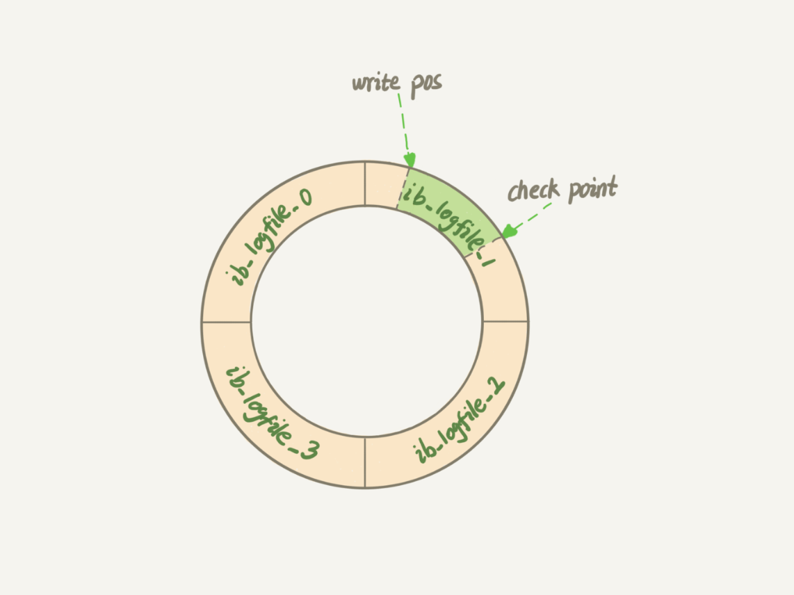
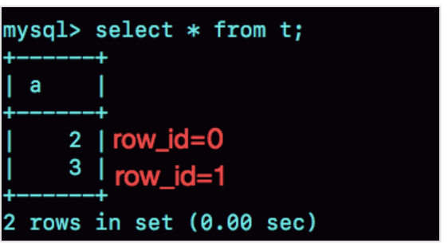
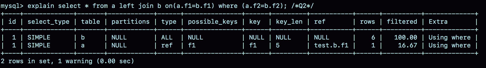
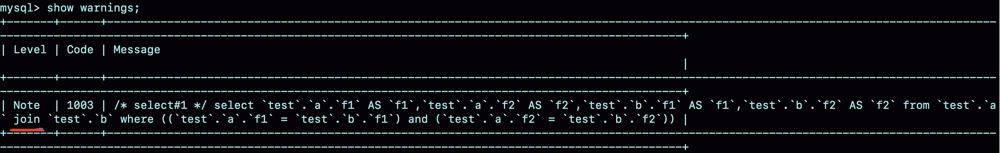

**2022-09-05**

# 01-开篇词 (1讲)

## 开篇词 | 这一次，让我们一起来搞懂MySQL

你好，我是林晓斌，网名“丁奇”，欢迎加入我的专栏，和我一起开始 MySQL 学习之旅。我曾先后在百度和阿里任职，从事 MySQL 数据库方面的工作，一步步地从一个数据库小白成为 MySQL 内核开发人员。回想起来，从我第一次带着疑问翻 MySQL 的源码查到答案至今，已经有十个年头了。在这个过程中，走了不少弯路，但同时也收获了很多的知识和思考，希望能在这个专栏里分享给你。

记得刚开始接触 MySQL，是我在百度贴吧做权限系统的时候。我们遇到了一个奇怪的问题，一个正常 10 毫秒就能完成的 SQL 查询请求偶尔要执行 100 多毫秒才结束。当时主管问我是什么原因，我其实也搞不清楚，就上网查答案，但怎么找都找不到，又脸皮薄不想说自己不知道，只好硬着头皮翻源码。后来遇到了越来越多的问题，也是类似的情景，所以我逐步养成了通过分析源码理解原理的习惯。

当时，我自己的感觉是，即使我只是一个开发工程师，只是 MySQL 的用户，在了解了一个个系统模块的原理后，再来使用它，感觉是完全不一样的。当在代码里写下一行数据库命令的时候，我就能想到它在数据库端将怎么执行，它的性能是怎么样的，怎样写能让我的应用程序访问数据库的性能最高。进一步，哪些数据处理让数据库系统来做性能会更好，哪些数据处理在缓存里做性能会更好，我心里也会更清楚。在建表和建索引的时候，我也会更有意识地为将来的查询优化做综合考虑，比如确定是否使用递增主键、主键的列怎样选择，等等。

但随后我又有了一个新的困惑，我觉得自己了解的 MySQL 知识点是零散的，没有形成网络。于是解决完一个问题后，很容易忘记。再碰到类似的问题，我又得再翻一次代码。

所幸在阿里工作的时候，我参与了阿里云关系型数据库服务内核的开发，并且负责开发开源分支 AliSQL，让我对 MySQL 内核和源码有了更深层次的研究和理解。在服务内部客户和公有云客户的过程中，我有机会面对和解决足够多的问题，再通过手册进行系统的学习，算是比较坎坷地将 MySQL 的知识网络补了起来。

所以，在回顾这个过程的时候，我的第一个感受是，如果一开始就有一些从理论到实战的系统性指导，那该多好啊，也许我可以学习得更快些。

在极客时间团队跟我联系策划这个专栏的时候，我还是持怀疑态度的。为什么呢？现在不比当年了，犹记得十余年前，你使用 MySQL 的过程中碰到问题的话，基本上都只能到代码里去找答案，因为那时网上的资料太少了。

而近十年来，MySQL 在中国广泛普及，技术分享文章可以说是浩如烟海。所以，现在要系统地介绍一遍 MySQL 的话，恐怕里面提及的大多数知识点，都可以在社区文章中找到。那么我们做这个专栏的意义在哪里，而它又凭什么可以收费呢？

直到收到极客时间团队的答复，我才开始对这个专栏“想做和可以做”的事情感觉清晰起来。数据库是一个综合系统，其背后是发展了几十年的数据库理论。同时，数据库系统也是一个应用系统，可能一个业务开发人员用了两三年 MySQL，还未必清楚那些自己一直在用的“最佳实践”为什么是最佳的。

于是，我希望这个专栏能够帮助这样的一些开发者：他们正在使用 MySQL，知道如何写出逻辑正确的 SQL 语句来实现业务目标，却不确定这个语句是不是最优的；他们听说了一些使用数据库的最佳实践，但是更想了解为什么这么做；他们使用的数据库偶尔会出问题，亟需了解如何更快速、更准确地定位问题，甚至自己解决问题……

在过去的七年里，我带过十几个应届毕业生，看着他们成长，要求他们原理先行，再实践验证。几年下来，他们的成长速度都很快，其中好几个毕业没两年就成为团队的骨干力量了。我也在社招的时候面试过很多有着不错的运维实践经验和能力的候选人，但都因为对数据库原理仅有一知半解的了解，而最终遗憾地没有通过面试。

因此，我希望这个专栏能够激发开发者对数据库原理的探索欲，从而更好地理解工作中遇到的问题，更能知道背后的为什么。所以**我会选那些平时使用数据库时高频出现的知识，如事务、索引、锁等内容构成专栏的主线**。这些主线上是一个个的知识点。每个点就是一个概念、一个机制或者一个原理说明。在每个说明之后，我会和你讨论一个实践相关的问题。

希望能以这样的方式，让你对 MySQL 的几条主线有一个整体的认识，并且了解基本概念。在之后的实践篇中，我会引用到这些主线的知识背景，并着力说明它们是怎样指导实践的。这样，**你可以从点到线，再到面，形成自己的 MySQL 知识网络。**

在这里，有一份目录，你也可以先了解下整个专栏的知识结构。


如前面说的，这几条主线上的每个知识点几乎都不是最新的，有些甚至十年前就这样，并没有改过。但我希望针对这些点的说明，可以让你在使用 MySQL 时心里更有底，知道怎么做选择，并且明白为什么。了解了原理，才能在实践中不断创新，提升个人的价值和工作输出。

# 02-基础篇 (8讲)

## 01 | 基础架构：一条SQL查询语句是如何执行的？

这是专栏的第一篇文章，我想来跟你聊聊 MySQL 的基础架构。我们经常说，看一个事儿千万不要直接陷入细节里，你应该先鸟瞰其全貌，这样能够帮助你从高维度理解问题。同样，对于 MySQL 的学习也是这样。平时我们使用数据库，看到的通常都是一个整体。比如，你有个最简单的表，表里只有一个 ID 字段，在执行下面这个查询语句时：

```sql
mysql> select * from T where ID=10；
```

我们看到的只是输入一条语句，返回一个结果，却不知道这条语句在 MySQL 内部的执行过程。

所以今天我想和你一起把 MySQL 拆解一下，看看里面都有哪些“零件”，希望借由这个拆解过程，让你对 MySQL 有更深入的理解。这样当我们碰到 MySQL 的一些异常或者问题时，就能够直戳本质，更为快速地定位并解决问题。

下面我给出的是 MySQL 的基本架构示意图，从中你可以清楚地看到 SQL 语句在 MySQL 的各个功能模块中的执行过程。


​																												MySQL 的逻辑架构图

大体来说，MySQL 可以分为 Server 层和存储引擎层两部分。

Server 层包括连接器、查询缓存、分析器、优化器、执行器等，涵盖 MySQL 的大多数核心服务功能，以及所有的内置函数（如日期、时间、数学和加密函数等），所有跨存储引擎的功能都在这一层实现，比如存储过程、触发器、视图等。

而<font color = red>存储引擎层负责数据的存储和提取</font>。其架构模式是插件式的，支持 InnoDB、MyISAM、Memory 等多个存储引擎。现在最常用的存储引擎是 InnoDB，它从 MySQL 5.5.5 版本开始成为了默认存储引擎。

也就是说，你执行 create table 建表的时候，如果不指定引擎类型，默认使用的就是 <font color = red>InnoDB</font>。不过，你也可以通过指定存储引擎的类型来选择别的引擎，比如在 create table 语句中使用 engine=memory, 来指定使用内存引擎创建表。不同存储引擎的表数据存取方式不同，支持的功能也不同，在后面的文章中，我们会讨论到引擎的选择。

从图中不难看出，不同的存储引擎共用一个**Server 层**，也就是从连接器到执行器的部分。你可以先对每个组件的名字有个印象，接下来我会结合开头提到的那条 SQL 语句，带你走一遍整个执行流程，依次看下每个组件的作用。

### 连接器

第一步，你会先连接到这个数据库上，这时候接待你的就是连接器。连接器负责跟客户端建立连接、获取权限、维持和管理连接。连接命令一般是这么写的：

```sql
mysql -h$ip -P$port -u$user -p
```

输完命令之后，你就需要在交互对话里面输入密码。虽然密码也可以直接跟在 -p 后面写在命令行中，但这样可能会导致你的密码泄露。如果你连的是生产服务器，强烈建议你不要这么做。

连接命令中的 mysql 是客户端工具，用来跟服务端建立连接。在完成经典的 TCP 握手后，连接器就要开始认证你的身份，这个时候用的就是你输入的用户名和密码。

- 如果用户名或密码不对，你就会收到一个"Access denied for user"的错误，然后客户端程序结束执行。
- 如果用户名密码认证通过，连接器会到权限表里面查出你拥有的权限。之后，这个连接里面的权限判断逻辑，都将依赖于此时读到的权限。

这就意味着，一个用户成功建立连接后，即使你用管理员账号对这个用户的权限做了修改，也不会影响已经存在连接的权限。修改完成后，只有再新建的连接才会使用新的权限设置。

连接完成后，如果你没有后续的动作，这个连接就处于空闲状态，你可以在 show processlist 命令中看到它。文本中这个图是 show processlist 的结果，其中的 Command 列显示为“Sleep”的这一行，就表示现在系统里面有一个空闲连接。


客户端如果太长时间没动静，连接器就会自动将它断开。这个时间是由参数 wait_timeout 控制的，默认值是 8 小时。

如果在连接被断开之后，客户端再次发送请求的话，就会收到一个错误提醒： Lost connection to MySQL server during query。这时候如果你要继续，就需要重连，然后再执行请求了。

数据库里面，<font color = blue>长连接</font>是指<font color = red>连接成功后，如果客户端持续有请求，则一直使用同一个连接</font>。<font color =blue>短连接</font>则是指<font color = red>每次执行完很少的几次查询就断开连接，下次查询再重新建立一个</font>。

建立连接的过程通常是比较复杂的，所以我建议你在使用中要尽量减少建立连接的动作，也就是尽量使用长连接。

但是全部使用长连接后，你可能会发现，有些时候 MySQL 占用内存涨得特别快，这是因为 MySQL 在执行过程中临时使用的内存是管理在连接对象里面的。这些资源会在连接断开的时候才释放。所以如果长连接累积下来，可能导致内存占用太大，被系统强行杀掉（OOM），从现象看就是 MySQL 异常重启了。

怎么解决这个问题呢？你可以考虑以下两种方案。

1. 定期断开长连接。使用一段时间，或者程序里面判断执行过一个占用内存的大查询后，断开连接，之后要查询再重连。
2. 如果你用的是 MySQL 5.7 或更新版本，可以在每次执行一个比较大的操作后，通过执行 mysql_reset_connection 来重新初始化连接资源。这个过程不需要重连和重新做权限验证，但是会将连接恢复到刚刚创建完时的状态。

### 查询缓存

连接建立完成后，你就可以执行 select 语句了。执行逻辑就会来到第二步：查询缓存。

MySQL 拿到一个查询请求后，会先到查询缓存看看，之前是不是执行过这条语句。之前执行过的语句及其结果可能会以 key-value 对的形式，被直接缓存在内存中。key 是查询的语句，value 是查询的结果。如果你的查询能够直接在这个缓存中找到 key，那么这个 value 就会被直接返回给客户端。

如果语句不在查询缓存中，就会继续后面的执行阶段。执行完成后，执行结果会被存入查询缓存中。你可以看到，如果查询命中缓存，MySQL 不需要执行后面的复杂操作，就可以直接返回结果，这个效率会很高。

**但是大多数情况下我会建议你不要使用查询缓存，为什么呢？因为查询缓存往往弊大于利。**

查询缓存的失效非常频繁，只要有对一个表的更新，这个表上所有的查询缓存都会被清空。因此很可能你费劲地把结果存起来，还没使用呢，就被一个更新全清空了。对于更新压力大的数据库来说，<font color = erwed>查询缓存的命中率会非常低</font>。除非你的业务就是有一张静态表，很长时间才会更新一次。比如，一个系统配置表，那这张表上的查询才适合使用查询缓存。

好在 MySQL 也提供了这种“按需使用”的方式。你可以将参数 query_cache_type 设置成 DEMAND，这样对于默认的 SQL 语句都不使用查询缓存。而对于你确定要使用查询缓存的语句，可以用 SQL_CACHE 显式指定，像下面这个语句一样：

```sql
mysql> select SQL_CACHE * from T where ID=10；
```

需要注意的是，MySQL 8.0 版本直接将查询缓存的整块功能删掉了，也就是说 8.0 开始彻底没有这个功能了。

### 分析器

如果没有命中查询缓存，就要开始真正执行语句了。首先，MySQL 需要知道你要做什么，因此需要对 SQL 语句做解析。

分析器先会做“词法分析”。你输入的是由多个字符串和空格组成的一条 SQL 语句，MySQL 需要识别出里面的字符串分别是什么，代表什么。

MySQL 从你输入的"select"这个关键字识别出来，这是一个查询语句。它也要把字符串“T”识别成“表名 T”，把字符串“ID”识别成“列 ID”。

做完了这些识别以后，就要做“语法分析”。根据词法分析的结果，语法分析器会根据语法规则，判断你输入的这个 SQL 语句是否满足 MySQL 语法。

如果你的语句不对，就会收到“You have an error in your SQL syntax”的错误提醒，比如下面这个语句 select 少打了开头的字母“s”。

```sql
mysql> elect * from t where ID=1;
 
ERROR 1064 (42000): You have an error in your SQL syntax; check the manual that corresponds to your MySQL server version for the right syntax to use near 'elect * from t where ID=1' at line 1
```

一般语法错误会提示第一个出现错误的位置，所以你要关注的是紧接“use near”的内容。

### 优化器

经过了分析器，MySQL 就知道你要做什么了。在开始执行之前，还要先经过优化器的处理。

优化器是在表里面有多个索引的时候，决定使用哪个索引；或者在一个语句有多表关联（join）的时候，决定各个表的连接顺序。比如你执行下面这样的语句，这个语句是执行两个表的 join：

```sql
mysql> select * from t1 join t2 using(ID)  where t1.c=10 and t2.d=20;
```

- 既可以先从表 t1 里面取出 c=10 的记录的 ID 值，再根据 ID 值关联到表 t2，再判断 t2 里面 d 的值是否等于 20。
- 也可以先从表 t2 里面取出 d=20 的记录的 ID 值，再根据 ID 值关联到 t1，再判断 t1 里面 c 的值是否等于 10。

这两种执行方法的逻辑结果是一样的，但是执行的效率会有不同，而优化器的作用就是决定选择使用哪一个方案。

优化器阶段完成后，这个语句的执行方案就确定下来了，然后进入执行器阶段。如果你还有一些疑问，比如优化器是怎么选择索引的，有没有可能选择错等等，没关系，我会在后面的文章中单独展开说明优化器的内容。

### 执行器

MySQL 通过分析器知道了你要做什么，通过优化器知道了该怎么做，于是就进入了执行器阶段，开始执行语句。

开始执行的时候，要先判断一下你对这个表 T 有没有执行查询的权限，如果没有，就会返回没有权限的错误，如下所示 (在工程实现上，如果命中查询缓存，会在查询缓存返回结果的时候，做权限验证。查询也会在优化器之前调用 precheck 验证权限)。

```sql
mysql> select * from T where ID=10;
 
ERROR 1142 (42000): SELECT command denied to user 'b'@'localhost' for table 'T'
```

如果有权限，就打开表继续执行。打开表的时候，执行器就会根据表的引擎定义，去使用这个引擎提供的接口。

比如我们这个例子中的表 T 中，ID 字段没有索引，那么执行器的执行流程是这样的：

1. 调用 InnoDB 引擎接口取这个表的第一行，判断 ID 值是不是 10，如果不是则跳过，如果是则将这行存在结果集中；
2. 调用引擎接口取“下一行”，重复相同的判断逻辑，直到取到这个表的最后一行。
3. 执行器将上述遍历过程中所有满足条件的行组成的记录集作为结果集返回给客户端。

至此，这个语句就执行完成了。

对于有索引的表，执行的逻辑也差不多。第一次调用的是“取满足条件的第一行”这个接口，之后循环取“满足条件的下一行”这个接口，这些接口都是引擎中已经定义好的。

你会在数据库的慢查询日志中看到一个 rows_examined 的字段，表示这个语句执行过程中扫描了多少行。这个值就是在执行器每次调用引擎获取数据行的时候累加的。

在有些场景下，执行器调用一次，在引擎内部则扫描了多行，因此**引擎扫描行数跟 rows_examined 并不是完全相同的。**我们后面会专门有一篇文章来讲存储引擎的内部机制，里面会有详细的说明。

### 小结

今天我给你介绍了 MySQL 的逻辑架构，希望你对一个 SQL 语句完整执行流程的各个阶段有了一个初步的印象。由于篇幅的限制，我只是用一个查询的例子将各个环节过了一遍。如果你还对每个环节的展开细节存有疑问，也不用担心，后续在实战章节中我还会再提到它们。

我给你留一个问题吧，如果表 T 中没有字段 k，而你执行了这个语句 select * from T where k=1, 那肯定是会报“不存在这个列”的错误： “Unknown column ‘k’ in ‘where clause’”。你觉得这个错误是在我们上面提到的哪个阶段报出来的呢？


## 02 | 日志系统：一条SQL更新语句是如何执行的？

前面我们系统了解了一个查询语句的执行流程，并介绍了执行过程中涉及的处理模块。相信你还记得，一条查询语句的执行过程一般是经过连接器、分析器、优化器、执行器等功能模块，最后到达存储引擎。

那么，一条更新语句的执行流程又是怎样的呢？

之前你可能经常听 DBA 同事说，MySQL 可以恢复到半个月内任意一秒的状态，惊叹的同时，你是不是心中也会不免会好奇，这是怎样做到的呢？

我们还是从一个表的一条更新语句说起，下面是这个表的创建语句，这个表有一个主键 ID 和一个整型字段 c：

```sql
mysql> create table T(ID int primary key, c int);
```

如果要将 ID=2 这一行的值加 1，SQL 语句就会这么写：

```sql
mysql> update T set c=c+1 where ID=2;
```

前面我有跟你介绍过 SQL 语句基本的执行链路，这里我再把那张图拿过来，你也可以先简单看看这个图回顾下。首先，可以确定的说，查询语句的那一套流程，更新语句也是同样会走一遍。


MySQL 的逻辑架构图

你执行语句前要先连接数据库，这是连接器的工作。

前面我们说过，在一个表上有更新的时候，跟这个表有关的查询缓存会失效，所以这条语句就会把表 T 上所有缓存结果都清空。这也就是我们一般不建议使用查询缓存的原因。

接下来，分析器会通过词法和语法解析知道这是一条更新语句。优化器决定要使用 ID 这个索引。然后，执行器负责具体执行，找到这一行，然后更新。

与查询流程不一样的是，更新流程还涉及两个重要的日志模块，它们正是我们今天要讨论的主角：redo log（重做日志）和 binlog（归档日志）。如果接触 MySQL，那这两个词肯定是绕不过的，我后面的内容里也会不断地和你强调。不过话说回来，redo log 和 binlog 在设计上有很多有意思的地方，这些设计思路也可以用到你自己的程序里。

### 重要的日志模块：redo log

不知道你还记不记得《孔乙己》这篇文章，酒店掌柜有一个粉板，专门用来记录客人的赊账记录。如果赊账的人不多，那么他可以把顾客名和账目写在板上。但如果赊账的人多了，粉板总会有记不下的时候，这个时候掌柜一定还有一个专门记录赊账的账本。

如果有人要赊账或者还账的话，掌柜一般有两种做法：

- 一种做法是直接把账本翻出来，把这次赊的账加上去或者扣除掉；
- 另一种做法是先在粉板上记下这次的账，等打烊以后再把账本翻出来核算。

在生意红火柜台很忙时，掌柜一定会选择后者，因为前者操作实在是太麻烦了。首先，你得找到这个人的赊账总额那条记录。你想想，密密麻麻几十页，掌柜要找到那个名字，可能还得带上老花镜慢慢找，找到之后再拿出算盘计算，最后再将结果写回到账本上。

这整个过程想想都麻烦。相比之下，还是先在粉板上记一下方便。你想想，如果掌柜没有粉板的帮助，每次记账都得翻账本，效率是不是低得让人难以忍受？

同样，在 MySQL 里也有这个问题，如果每一次的更新操作都需要写进磁盘，然后磁盘也要找到对应的那条记录，然后再更新，整个过程 IO 成本、查找成本都很高。为了解决这个问题，MySQL 的设计者就用了类似酒店掌柜粉板的思路来提升更新效率。

而粉板和账本配合的整个过程，其实就是 MySQL 里经常说到的 WAL 技术，WAL 的全称是 Write-Ahead Logging，它的关键点就是先写日志，再写磁盘，也就是先写粉板，等不忙的时候再写账本。

具体来说，当有一条记录需要更新的时候，InnoDB 引擎就会先把记录写到 redo log（粉板）里面，并更新内存，这个时候更新就算完成了。同时，InnoDB 引擎会在适当的时候，将这个操作记录更新到磁盘里面，而这个更新往往是在系统比较空闲的时候做，这就像打烊以后掌柜做的事。

如果今天赊账的不多，掌柜可以等打烊后再整理。但如果某天赊账的特别多，粉板写满了，又怎么办呢？这个时候掌柜只好放下手中的活儿，把粉板中的一部分赊账记录更新到账本中，然后把这些记录从粉板上擦掉，为记新账腾出空间。

与此类似，InnoDB 的 redo log 是固定大小的，比如可以配置为一组 4 个文件，每个文件的大小是 1GB，那么这块“粉板”总共就可以记录 4GB 的操作。从头开始写，写到末尾就又回到开头循环写，如下面这个图所示。



write pos 是当前记录的位置，一边写一边后移，写到第 3 号文件末尾后就回到 0 号文件开头。checkpoint 是当前要擦除的位置，也是往后推移并且循环的，擦除记录前要把记录更新到数据文件。

write pos 和 checkpoint 之间的是“粉板”上还空着的部分，可以用来记录新的操作。如果 write pos 追上 checkpoint，表示“粉板”满了，这时候不能再执行新的更新，得停下来先擦掉一些记录，把 checkpoint 推进一下。

有了 redo log，InnoDB 就可以保证即使数据库发生异常重启，之前提交的记录都不会丢失，这个能力称为**crash-safe**。

要理解 crash-safe 这个概念，可以想想我们前面赊账记录的例子。只要赊账记录记在了粉板上或写在了账本上，之后即使掌柜忘记了，比如突然停业几天，恢复生意后依然可以通过账本和粉板上的数据明确赊账账目。

### 重要的日志模块：binlog

前面我们讲过，MySQL 整体来看，其实就有两块：一块是 Server 层，它主要做的是 MySQL 功能层面的事情；还有一块是引擎层，负责存储相关的具体事宜。上面我们聊到的粉板 redo log 是 InnoDB 引擎特有的日志，而 Server 层也有自己的日志，称为 binlog（归档日志）。

我想你肯定会问，为什么会有两份日志呢？

因为最开始 MySQL 里并没有 InnoDB 引擎。MySQL 自带的引擎是 MyISAM，但是 MyISAM 没有 crash-safe 的能力，binlog 日志只能用于归档。而 InnoDB 是另一个公司以插件形式引入 MySQL 的，既然只依靠 binlog 是没有 crash-safe 能力的，所以 InnoDB 使用另外一套日志系统——也就是 redo log 来实现 crash-safe 能力。

这两种日志有以下三点不同。

1. redo log 是 InnoDB 引擎特有的；binlog 是 MySQL 的 Server 层实现的，所有引擎都可以使用。
2. redo log 是物理日志，记录的是“在某个数据页上做了什么修改”；binlog 是逻辑日志，记录的是这个语句的原始逻辑，比如“给 ID=2 这一行的 c 字段加 1 ”。
3. redo log 是循环写的，空间固定会用完；binlog 是可以追加写入的。“追加写”是指 binlog 文件写到一定大小后会切换到下一个，并不会覆盖以前的日志。

有了对这两个日志的概念性理解，我们再来看执行器和 InnoDB 引擎在执行这个简单的 update 语句时的内部流程。

1. 执行器先找引擎取 ID=2 这一行。ID 是主键，引擎直接用树搜索找到这一行。如果 ID=2 这一行所在的数据页本来就在内存中，就直接返回给执行器；否则，需要先从磁盘读入内存，然后再返回。
2. 执行器拿到引擎给的行数据，把这个值加上 1，比如原来是 N，现在就是 N+1，得到新的一行数据，再调用引擎接口写入这行新数据。
3. 引擎将这行新数据更新到内存中，同时将这个更新操作记录到 redo log 里面，此时 redo log 处于 prepare 状态。然后告知执行器执行完成了，随时可以提交事务。
4. 执行器生成这个操作的 binlog，并把 binlog 写入磁盘。
5. 执行器调用引擎的提交事务接口，引擎把刚刚写入的 redo log 改成提交（commit）状态，更新完成。

这里我给出这个 update 语句的执行流程图，图中浅色框表示是在 InnoDB 内部执行的，深色框表示是在执行器中执行的。


你可能注意到了，最后三步看上去有点“绕”，将 redo log 的写入拆成了两个步骤：prepare 和 commit，这就是"两阶段提交"。

### 两阶段提交

为什么必须有“两阶段提交”呢？这是为了让两份日志之间的逻辑一致。要说明这个问题，我们得从文章开头的那个问题说起：**怎样让数据库恢复到半个月内任意一秒的状态？**

前面我们说过了，binlog 会记录所有的逻辑操作，并且是采用“追加写”的形式。如果你的 DBA 承诺说半个月内可以恢复，那么备份系统中一定会保存最近半个月的所有 binlog，同时系统会定期做整库备份。这里的“定期”取决于系统的重要性，可以是一天一备，也可以是一周一备。

当需要恢复到指定的某一秒时，比如某天下午两点发现中午十二点有一次误删表，需要找回数据，那你可以这么做：

- 首先，找到最近的一次全量备份，如果你运气好，可能就是昨天晚上的一个备份，从这个备份恢复到临时库；
- 然后，从备份的时间点开始，将备份的 binlog 依次取出来，重放到中午误删表之前的那个时刻。

这样你的临时库就跟误删之前的线上库一样了，然后你可以把表数据从临时库取出来，按需要恢复到线上库去。

好了，说完了数据恢复过程，我们回来说说，为什么日志需要“两阶段提交”。这里不妨用反证法来进行解释。

由于 redo log 和 binlog 是两个独立的逻辑，如果不用两阶段提交，要么就是先写完 redo log 再写 binlog，或者采用反过来的顺序。我们看看这两种方式会有什么问题。

仍然用前面的 update 语句来做例子。假设当前 ID=2 的行，字段 c 的值是 0，再假设执行 update 语句过程中在写完第一个日志后，第二个日志还没有写完期间发生了 crash，会出现什么情况呢？

1. **先写 redo log 后写 binlog**。假设在 redo log 写完，binlog 还没有写完的时候，MySQL 进程异常重启。由于我们前面说过的，redo log 写完之后，系统即使崩溃，仍然能够把数据恢复回来，所以恢复后这一行 c 的值是 1。
   但是由于 binlog 没写完就 crash 了，这时候 binlog 里面就没有记录这个语句。因此，之后备份日志的时候，存起来的 binlog 里面就没有这条语句。
   然后你会发现，如果需要用这个 binlog 来恢复临时库的话，由于这个语句的 binlog 丢失，这个临时库就会少了这一次更新，恢复出来的这一行 c 的值就是 0，与原库的值不同。
2. **先写 binlog 后写 redo log**。如果在 binlog 写完之后 crash，由于 redo log 还没写，崩溃恢复以后这个事务无效，所以这一行 c 的值是 0。但是 binlog 里面已经记录了“把 c 从 0 改成 1”这个日志。所以，在之后用 binlog 来恢复的时候就多了一个事务出来，恢复出来的这一行 c 的值就是 1，与原库的值不同。

可以看到，如果不使用“两阶段提交”，那么数据库的状态就有可能和用它的日志恢复出来的库的状态不一致。

你可能会说，这个概率是不是很低，平时也没有什么动不动就需要恢复临时库的场景呀？

其实不是的，不只是误操作后需要用这个过程来恢复数据。当你需要扩容的时候，也就是需要再多搭建一些备库来增加系统的读能力的时候，现在常见的做法也是用全量备份加上应用 binlog 来实现的，这个“不一致”就会导致你的线上出现主从数据库不一致的情况。

简单说，redo log 和 binlog 都可以用于表示事务的提交状态，而两阶段提交就是让这两个状态保持逻辑上的一致。

### 小结

今天，我介绍了 MySQL 里面最重要的两个日志，即物理日志 redo log 和逻辑日志 binlog。

redo log 用于保证 crash-safe 能力。innodb_flush_log_at_trx_commit 这个参数设置成 1 的时候，表示每次事务的 redo log 都直接持久化到磁盘。这个参数我建议你设置成 1，这样可以保证 MySQL 异常重启之后数据不丢失。

sync_binlog 这个参数设置成 1 的时候，表示每次事务的 binlog 都持久化到磁盘。这个参数我也建议你设置成 1，这样可以保证 MySQL 异常重启之后 binlog 不丢失。

我还跟你介绍了与 MySQL 日志系统密切相关的“两阶段提交”。两阶段提交是跨系统维持数据逻辑一致性时常用的一个方案，即使你不做数据库内核开发，日常开发中也有可能会用到。

文章的最后，我给你留一个思考题吧。前面我说到定期全量备份的周期“取决于系统重要性，有的是一天一备，有的是一周一备”。那么在什么场景下，一天一备会比一周一备更有优势呢？或者说，它影响了这个数据库系统的哪个指标？

## 03 | 事务隔离：为什么你改了我还看不见？

提到事务，你肯定不陌生，和数据库打交道的时候，我们总是会用到事务。最经典的例子就是转账，你要给朋友小王转 100 块钱，而此时你的银行卡只有 100 块钱。

转账过程具体到程序里会有一系列的操作，比如查询余额、做加减法、更新余额等，这些操作必须保证是一体的，不然等程序查完之后，还没做减法之前，你这 100 块钱，完全可以借着这个时间差再查一次，然后再给另外一个朋友转账，如果银行这么整，不就乱了么？这时就要用到“事务”这个概念了。

简单来说，事务就是要保证一组数据库操作，要么全部成功，要么全部失败。在 MySQL 中，事务支持是在引擎层实现的。你现在知道，MySQL 是一个支持多引擎的系统，但并不是所有的引擎都支持事务。比如 MySQL 原生的 MyISAM 引擎就不支持事务，这也是 MyISAM 被 InnoDB 取代的重要原因之一。

今天的文章里，我将会以 InnoDB 为例，剖析 MySQL 在事务支持方面的特定实现，并基于原理给出相应的实践建议，希望这些案例能加深你对 MySQL 事务原理的理解。

### 隔离性与隔离级别

提到事务，你肯定会想到 ACID（Atomicity、Consistency、Isolation、Durability，即原子性、一致性、隔离性、持久性），今天我们就来说说其中 I，也就是“隔离性”。

当数据库上有多个事务同时执行的时候，就可能出现脏读（dirty read）、不可重复读（non-repeatable read）、幻读（phantom read）的问题，为了解决这些问题，就有了“隔离级别”的概念。

在谈隔离级别之前，你首先要知道，你隔离得越严实，效率就会越低。因此很多时候，我们都要在二者之间寻找一个平衡点。SQL 标准的事务隔离级别包括：读未提交（read uncommitted）、读提交（read committed）、可重复读（repeatable read）和串行化（serializable ）。下面我逐一为你解释：

- 读未提交是指，一个事务还没提交时，它做的变更就能被别的事务看到。
- 读提交是指，一个事务提交之后，它做的变更才会被其他事务看到。
- 可重复读是指，一个事务执行过程中看到的数据，总是跟这个事务在启动时看到的数据是一致的。当然在可重复读隔离级别下，未提交变更对其他事务也是不可见的。
- 串行化，顾名思义是对于同一行记录，“写”会加“写锁”，“读”会加“读锁”。当出现读写锁冲突的时候，后访问的事务必须等前一个事务执行完成，才能继续执行。

其中“读提交”和“可重复读”比较难理解，所以我用一个例子说明这几种隔离级别。假设数据表 T 中只有一列，其中一行的值为 1，下面是按照时间顺序执行两个事务的行为。

```sql
mysql> create table T(c int) engine=InnoDB;
insert into T(c) values(1);
```


我们来看看在不同的隔离级别下，事务 A 会有哪些不同的返回结果，也就是图里面 V1、V2、V3 的返回值分别是什么。

- 若隔离级别是“读未提交”， 则 V1 的值就是 2。这时候事务 B 虽然还没有提交，但是结果已经被 A 看到了。因此，V2、V3 也都是 2。
- 若隔离级别是“读提交”，则 V1 是 1，V2 的值是 2。事务 B 的更新在提交后才能被 A 看到。所以， V3 的值也是 2。
- 若隔离级别是“可重复读”，则 V1、V2 是 1，V3 是 2。之所以 V2 还是 1，遵循的就是这个要求：事务在执行期间看到的数据前后必须是一致的。
- 若隔离级别是“串行化”，则在事务 B 执行“将 1 改成 2”的时候，会被锁住。直到事务 A 提交后，事务 B 才可以继续执行。所以从 A 的角度看， V1、V2 值是 1，V3 的值是 2。

在实现上，数据库里面会创建一个视图，访问的时候以视图的逻辑结果为准。在“可重复读”隔离级别下，这个视图是在事务启动时创建的，整个事务存在期间都用这个视图。在“读提交”隔离级别下，这个视图是在每个 SQL 语句开始执行的时候创建的。这里需要注意的是，“读未提交”隔离级别下直接返回记录上的最新值，没有视图概念；而“串行化”隔离级别下直接用加锁的方式来避免并行访问。

我们可以看到在不同的隔离级别下，数据库行为是有所不同的。Oracle 数据库的默认隔离级别其实就是“读提交”，因此对于一些从 Oracle 迁移到 MySQL 的应用，为保证数据库隔离级别的一致，你一定要记得将 MySQL 的隔离级别设置为“读提交”。

配置的方式是，将启动参数 transaction-isolation 的值设置成 READ-COMMITTED。你可以用 show variables 来查看当前的值。

```sql
mysql> show variables like 'transaction_isolation';
 
+-----------------------+----------------+
 
| Variable_name | Value |
 
+-----------------------+----------------+
 
| transaction_isolation | READ-COMMITTED |
 
+-----------------------+----------------+
```

总结来说，存在即合理，哪个隔离级别都有它自己的使用场景，你要根据自己的业务情况来定。我想**你可能会问那什么时候需要“可重复读”的场景呢**？我们来看一个数据校对逻辑的案例。

假设你在管理一个个人银行账户表。一个表存了每个月月底的余额，一个表存了账单明细。这时候你要做数据校对，也就是判断上个月的余额和当前余额的差额，是否与本月的账单明细一致。你一定希望在校对过程中，即使有用户发生了一笔新的交易，也不影响你的校对结果。

这时候使用“可重复读”隔离级别就很方便。事务启动时的视图可以认为是静态的，不受其他事务更新的影响。

### 事务隔离的实现

理解了事务的隔离级别，我们再来看看事务隔离具体是怎么实现的。这里我们展开说明“可重复读”。

在 MySQL 中，实际上每条记录在更新的时候都会同时记录一条回滚操作。记录上的最新值，通过回滚操作，都可以得到前一个状态的值。

假设一个值从 1 被按顺序改成了 2、3、4，在回滚日志里面就会有类似下面的记录。


当前值是 4，但是在查询这条记录的时候，不同时刻启动的事务会有不同的 read-view。如图中看到的，在视图 A、B、C 里面，这一个记录的值分别是 1、2、4，同一条记录在系统中可以存在多个版本，就是数据库的多版本并发控制（MVCC）。对于 read-view A，要得到 1，就必须将当前值依次执行图中所有的回滚操作得到。

同时你会发现，即使现在有另外一个事务正在将 4 改成 5，这个事务跟 read-view A、B、C 对应的事务是不会冲突的。

你一定会问，回滚日志总不能一直保留吧，什么时候删除呢？答案是，在不需要的时候才删除。也就是说，系统会判断，当没有事务再需要用到这些回滚日志时，回滚日志会被删除。

什么时候才不需要了呢？就是当系统里没有比这个回滚日志更早的 read-view 的时候。

基于上面的说明，我们来讨论一下为什么建议你尽量不要使用长事务。

长事务意味着系统里面会存在很老的事务视图。由于这些事务随时可能访问数据库里面的任何数据，所以这个事务提交之前，数据库里面它可能用到的回滚记录都必须保留，这就会导致大量占用存储空间。

在 MySQL 5.5 及以前的版本，回滚日志是跟数据字典一起放在 ibdata 文件里的，即使长事务最终提交，回滚段被清理，文件也不会变小。我见过数据只有 20GB，而回滚段有 200GB 的库。最终只好为了清理回滚段，重建整个库。

除了对回滚段的影响，长事务还占用锁资源，也可能拖垮整个库，这个我们会在后面讲锁的时候展开。

### 事务的启动方式

如前面所述，长事务有这些潜在风险，我当然是建议你尽量避免。其实很多时候业务开发同学并不是有意使用长事务，通常是由于误用所致。MySQL 的事务启动方式有以下几种：

1. 显式启动事务语句， begin 或 start transaction。配套的提交语句是 commit，回滚语句是 rollback。
2. set autocommit=0，这个命令会将这个线程的自动提交关掉。意味着如果你只执行一个 select 语句，这个事务就启动了，而且并不会自动提交。这个事务持续存在直到你主动执行 commit 或 rollback 语句，或者断开连接。

有些客户端连接框架会默认连接成功后先执行一个 set autocommit=0 的命令。这就导致接下来的查询都在事务中，如果是长连接，就导致了意外的长事务。

因此，我会建议你总是使用 set autocommit=1, 通过显式语句的方式来启动事务。

但是有的开发同学会纠结“多一次交互”的问题。对于一个需要频繁使用事务的业务，第二种方式每个事务在开始时都不需要主动执行一次 “begin”，减少了语句的交互次数。如果你也有这个顾虑，我建议你使用 commit work and chain 语法。

在 autocommit 为 1 的情况下，用 begin 显式启动的事务，如果执行 commit 则提交事务。如果执行 commit work and chain，则是提交事务并自动启动下一个事务，这样也省去了再次执行 begin 语句的开销。同时带来的好处是从程序开发的角度明确地知道每个语句是否处于事务中。

你可以在 information_schema 库的 innodb_trx 这个表中查询长事务，比如下面这个语句，用于查找持续时间超过 60s 的事务。

```sql
select * from information_schema.innodb_trx where TIME_TO_SEC(timediff(now(),trx_started))>60
```

### 小结

这篇文章里面，我介绍了 MySQL 的事务隔离级别的现象和实现，根据实现原理分析了长事务存在的风险，以及如何用正确的方式避免长事务。希望我举的例子能够帮助你理解事务，并更好地使用 MySQL 的事务特性。

我给你留一个问题吧。你现在知道了系统里面应该避免长事务，如果你是业务开发负责人同时也是数据库负责人，你会有什么方案来避免出现或者处理这种情况呢？

你可以把你的思考和观点写在留言区里，我会在下一篇文章的末尾和你讨论这个问题。感谢你的收听，也欢迎你把这篇文章分享给更多的朋友一起阅读。

### 上期问题时间

在上期文章的最后，我给你留下的问题是一天一备跟一周一备的对比。

好处是“最长恢复时间”更短。

在一天一备的模式里，最坏情况下需要应用一天的 binlog。比如，你每天 0 点做一次全量备份，而要恢复出一个到昨天晚上 23 点的备份。

一周一备最坏情况就要应用一周的 binlog 了。

当然这个是有成本的，因为更频繁全量备份需要消耗更多存储空间，所以这个 RTO 是成本换来的，就需要你根据业务重要性来评估了。

## 04 | 深入浅出索引（上）

提到数据库索引，我想你并不陌生，在日常工作中会经常接触到。比如某一个 SQL 查询比较慢，分析完原因之后，你可能就会说“给某个字段加个索引吧”之类的解决方案。但到底什么是索引，索引又是如何工作的呢？今天就让我们一起来聊聊这个话题吧。

数据库索引的内容比较多，我分成了上下两篇文章。索引是数据库系统里面最重要的概念之一，所以我希望你能够耐心看完。在后面的实战文章中，我也会经常引用这两篇文章中提到的知识点，加深你对数据库索引的理解。

一句话简单来说，索引的出现其实就是为了提高数据查询的效率，就像书的目录一样。一本 500 页的书，如果你想快速找到其中的某一个知识点，在不借助目录的情况下，那我估计你可得找一会儿。同样，对于数据库的表而言，索引其实就是它的“目录”。

### 索引的常见模型

索引的出现是为了提高查询效率，但是实现索引的方式却有很多种，所以这里也就引入了索引模型的概念。可以用于提高读写效率的数据结构很多，这里我先给你介绍三种常见、也比较简单的数据结构，它们分别是哈希表、有序数组和搜索树。

下面我主要从使用的角度，为你简单分析一下这三种模型的区别。

哈希表是一种以键 - 值（key-value）存储数据的结构，我们只要输入待查找的值即 key，就可以找到其对应的值即 Value。哈希的思路很简单，把值放在数组里，用一个哈希函数把 key 换算成一个确定的位置，然后把 value 放在数组的这个位置。

不可避免地，多个 key 值经过哈希函数的换算，会出现同一个值的情况。处理这种情况的一种方法是，拉出一个链表。

假设，你现在维护着一个身份证信息和姓名的表，需要根据身份证号查找对应的名字，这时对应的哈希索引的示意图如下所示：


​																							图 1 哈希表示意图

图中，User2 和 User4 根据身份证号算出来的值都是 N，但没关系，后面还跟了一个链表。假设，这时候你要查 ID_card_n2 对应的名字是什么，处理步骤就是：首先，将 ID_card_n2 通过哈希函数算出 N；然后，按顺序遍历，找到 User2。

需要注意的是，图中四个 ID_card_n 的值并不是递增的，这样做的好处是增加新的 User 时速度会很快，只需要往后追加。但缺点是，因为不是有序的，所以哈希索引做区间查询的速度是很慢的。

你可以设想下，如果你现在要找身份证号在 [ID_card_X, ID_card_Y] 这个区间的所有用户，就必须全部扫描一遍了。

所以，**哈希表这种结构适用于只有等值查询的场景**，比如 Memcached 及其他一些 NoSQL 引擎。

而**有序数组在等值查询和范围查询场景中的性能就都非常优秀**。还是上面这个根据身份证号查名字的例子，如果我们使用有序数组来实现的话，示意图如下所示：


​																			图 2 有序数组示意图

这里我们假设身份证号没有重复，这个数组就是按照身份证号递增的顺序保存的。这时候如果你要查 ID_card_n2 对应的名字，用二分法就可以快速得到，这个时间复杂度是 O(log(N))。

同时很显然，这个索引结构支持范围查询。你要查身份证号在 [ID_card_X, ID_card_Y] 区间的 User，可以先用二分法找到 ID_card_X（如果不存在 ID_card_X，就找到大于 ID_card_X 的第一个 User），然后向右遍历，直到查到第一个大于 ID_card_Y 的身份证号，退出循环。

如果仅仅看查询效率，有序数组就是最好的数据结构了。但是，在需要更新数据的时候就麻烦了，你往中间插入一个记录就必须得挪动后面所有的记录，成本太高。

所以，**有序数组索引只适用于静态存储引擎**，比如你要保存的是 2017 年某个城市的所有人口信息，这类不会再修改的数据。

二叉搜索树也是课本里的经典数据结构了。还是上面根据身份证号查名字的例子，如果我们用二叉搜索树来实现的话，示意图如下所示：


图 3 二叉搜索树示意图

二叉搜索树的特点是：每个节点的左儿子小于父节点，父节点又小于右儿子。这样如果你要查 ID_card_n2 的话，按照图中的搜索顺序就是按照 UserA -> UserC -> UserF -> User2 这个路径得到。这个时间复杂度是 O(log(N))。

当然为了维持 O(log(N)) 的查询复杂度，你就需要保持这棵树是平衡二叉树。为了做这个保证，更新的时间复杂度也是 O(log(N))。

树可以有二叉，也可以有多叉。多叉树就是每个节点有多个儿子，儿子之间的大小保证从左到右递增。二叉树是搜索效率最高的，但是实际上大多数的数据库存储却并不使用二叉树。其原因是，索引不止存在内存中，还要写到磁盘上。

你可以想象一下一棵 100 万节点的平衡二叉树，树高 20。一次查询可能需要访问 20 个数据块。在机械硬盘时代，从磁盘随机读一个数据块需要 10 ms 左右的寻址时间。也就是说，对于一个 100 万行的表，如果使用二叉树来存储，单独访问一个行可能需要 20 个 10 ms 的时间，这个查询可真够慢的。

为了让一个查询尽量少地读磁盘，就必须让查询过程访问尽量少的数据块。那么，我们就不应该使用二叉树，而是要使用“N 叉”树。这里，“N 叉”树中的“N”取决于数据块的大小。

以 InnoDB 的一个整数字段索引为例，这个 N 差不多是 1200。这棵树高是 4 的时候，就可以存 1200 的 3 次方个值，这已经 17 亿了。考虑到树根的数据块总是在内存中的，一个 10 亿行的表上一个整数字段的索引，查找一个值最多只需要访问 3 次磁盘。其实，树的第二层也有很大概率在内存中，那么访问磁盘的平均次数就更少了。

N 叉树由于在读写上的性能优点，以及适配磁盘的访问模式，已经被广泛应用在数据库引擎中了。

不管是哈希还是有序数组，或者 N 叉树，它们都是不断迭代、不断优化的产物或者解决方案。数据库技术发展到今天，跳表、LSM 树等数据结构也被用于引擎设计中，这里我就不再一一展开了。

你心里要有个概念，数据库底层存储的核心就是基于这些数据模型的。每碰到一个新数据库，我们需要先关注它的数据模型，这样才能从理论上分析出这个数据库的适用场景。

截止到这里，我用了半篇文章的篇幅和你介绍了不同的数据结构，以及它们的适用场景，你可能会觉得有些枯燥。但是，我建议你还是要多花一些时间来理解这部分内容，毕竟这是数据库处理数据的核心概念之一，在分析问题的时候会经常用到。当你理解了索引的模型后，就会发现在分析问题的时候会有一个更清晰的视角，体会到引擎设计的精妙之处。

现在，我们一起进入相对偏实战的内容吧。

在 MySQL 中，索引是在存储引擎层实现的，所以并没有统一的索引标准，即不同存储引擎的索引的工作方式并不一样。而即使多个存储引擎支持同一种类型的索引，其底层的实现也可能不同。由于 InnoDB 存储引擎在 MySQL 数据库中使用最为广泛，所以下面我就以 InnoDB 为例，和你分析一下其中的索引模型。

### InnoDB 的索引模型

在 InnoDB 中，表都是根据主键顺序以索引的形式存放的，这种存储方式的表称为索引组织表。又因为前面我们提到的，InnoDB 使用了 B+ 树索引模型，所以数据都是存储在 B+ 树中的。

每一个索引在 InnoDB 里面对应一棵 B+ 树。

假设，我们有一个主键列为 ID 的表，表中有字段 k，并且在 k 上有索引。

这个表的建表语句是：

```sql
mysql> create table T(
id int primary key, 
k int not null, 
name varchar(16),
index (k))engine=InnoDB;
```

表中 R1~R5 的 (ID,k) 值分别为 (100,1)、(200,2)、(300,3)、(500,5) 和 (600,6)，两棵树的示例示意图如下。


图 4 InnoDB 的索引组织结构

从图中不难看出，根据叶子节点的内容，索引类型分为主键索引和非主键索引。

主键索引的叶子节点存的是整行数据。在 InnoDB 里，主键索引也被称为聚簇索引（clustered index）。

非主键索引的叶子节点内容是主键的值。在 InnoDB 里，非主键索引也被称为二级索引（secondary index）。

根据上面的索引结构说明，我们来讨论一个问题：**基于主键索引和普通索引的查询有什么区别？**

- 如果语句是 select * from T where ID=500，即主键查询方式，则只需要搜索 ID 这棵 B+ 树；
- 如果语句是 select * from T where k=5，即普通索引查询方式，则需要先搜索 k 索引树，得到 ID 的值为 500，再到 ID 索引树搜索一次。这个过程称为回表。

也就是说，基于非主键索引的查询需要多扫描一棵索引树。因此，我们在应用中应该尽量使用主键查询。

### 索引维护

B+ 树为了维护索引有序性，在插入新值的时候需要做必要的维护。以上面这个图为例，如果插入新的行 ID 值为 700，则只需要在 R5 的记录后面插入一个新记录。如果新插入的 ID 值为 400，就相对麻烦了，需要逻辑上挪动后面的数据，空出位置。

而更糟的情况是，如果 R5 所在的数据页已经满了，根据 B+ 树的算法，这时候需要申请一个新的数据页，然后挪动部分数据过去。这个过程称为页分裂。在这种情况下，性能自然会受影响。

除了性能外，页分裂操作还影响数据页的利用率。原本放在一个页的数据，现在分到两个页中，整体空间利用率降低大约 50%。

当然有分裂就有合并。当相邻两个页由于删除了数据，利用率很低之后，会将数据页做合并。合并的过程，可以认为是分裂过程的逆过程。

基于上面的索引维护过程说明，我们来讨论一个案例：

> 你可能在一些建表规范里面见到过类似的描述，要求建表语句里一定要有自增主键。当然事无绝对，我们来分析一下哪些场景下应该使用自增主键，而哪些场景下不应该。

自增主键是指自增列上定义的主键，在建表语句中一般是这么定义的： NOT NULL PRIMARY KEY AUTO_INCREMENT。

插入新记录的时候可以不指定 ID 的值，系统会获取当前 ID 最大值加 1 作为下一条记录的 ID 值。

也就是说，自增主键的插入数据模式，正符合了我们前面提到的递增插入的场景。每次插入一条新记录，都是追加操作，都不涉及到挪动其他记录，也不会触发叶子节点的分裂。

而有业务逻辑的字段做主键，则往往不容易保证有序插入，这样写数据成本相对较高。

除了考虑性能外，我们还可以从存储空间的角度来看。假设你的表中确实有一个唯一字段，比如字符串类型的身份证号，那应该用身份证号做主键，还是用自增字段做主键呢？

由于每个非主键索引的叶子节点上都是主键的值。如果用身份证号做主键，那么每个二级索引的叶子节点占用约 20 个字节，而如果用整型做主键，则只要 4 个字节，如果是长整型（bigint）则是 8 个字节。

**显然，主键长度越小，普通索引的叶子节点就越小，普通索引占用的空间也就越小。**

所以，从性能和存储空间方面考量，自增主键往往是更合理的选择。

有没有什么场景适合用业务字段直接做主键的呢？还是有的。比如，有些业务的场景需求是这样的：

1. 只有一个索引；
2. 该索引必须是唯一索引。

你一定看出来了，这就是典型的 KV 场景。

由于没有其他索引，所以也就不用考虑其他索引的叶子节点大小的问题。

这时候我们就要优先考虑上一段提到的“尽量使用主键查询”原则，直接将这个索引设置为主键，可以避免每次查询需要搜索两棵树。

### 小结

今天，我跟你分析了数据库引擎可用的数据结构，介绍了 InnoDB 采用的 B+ 树结构，以及为什么 InnoDB 要这么选择。B+ 树能够很好地配合磁盘的读写特性，减少单次查询的磁盘访问次数。

由于 InnoDB 是索引组织表，一般情况下我会建议你创建一个自增主键，这样非主键索引占用的空间最小。但事无绝对，我也跟你讨论了使用业务逻辑字段做主键的应用场景。

最后，我给你留下一个问题吧。对于上面例子中的 InnoDB 表 T，如果你要重建索引 k，你的两个 SQL 语句可以这么写：

```sql
alter table T drop index k;
alter table T add index(k);
```

如果你要重建主键索引，也可以这么写：

```sql
alter table T drop primary key;
alter table T add primary key(id);
```

我的问题是，对于上面这两个重建索引的作法，说出你的理解。如果有不合适的，为什么，更好的方法是什么？

你可以把你的思考和观点写在留言区里，我会在下一篇文章的末尾给出我的参考答案。感谢你的收听，也欢迎你把这篇文章分享给更多的朋友一起阅读。

### 上期问题时间

我在上一篇文章末尾给你留下的问题是：如何避免长事务对业务的影响？

这个问题，我们可以从应用开发端和数据库端来看。

**首先，从应用开发端来看：**

1. 确认是否使用了 set autocommit=0。这个确认工作可以在测试环境中开展，把 MySQL 的 general_log 开起来，然后随便跑一个业务逻辑，通过 general_log 的日志来确认。一般框架如果会设置这个值，也就会提供参数来控制行为，你的目标就是把它改成 1。
2. 确认是否有不必要的只读事务。有些框架会习惯不管什么语句先用 begin/commit 框起来。我见过有些是业务并没有这个需要，但是也把好几个 select 语句放到了事务中。这种只读事务可以去掉。
3. 业务连接数据库的时候，根据业务本身的预估，通过 SET MAX_EXECUTION_TIME 命令，来控制每个语句执行的最长时间，避免单个语句意外执行太长时间。（为什么会意外？在后续的文章中会提到这类案例）

**其次，从数据库端来看：**

1. 监控 information_schema.Innodb_trx 表，设置长事务阈值，超过就报警 / 或者 kill；
2. Percona 的 pt-kill 这个工具不错，推荐使用；
3. 在业务功能测试阶段要求输出所有的 general_log，分析日志行为提前发现问题；
4. 如果使用的是 MySQL 5.6 或者更新版本，把 innodb_undo_tablespaces 设置成 2（或更大的值）。如果真的出现大事务导致回滚段过大，这样设置后清理起来更方便。


## 05 | 深入浅出索引（下）

在下面这个表 T 中，如果我执行 select * from T where k between 3 and 5，需要执行几次树的搜索操作，会扫描多少行？

下面是这个表的初始化语句。

```sql
mysql> create table T (
ID int primary key,
k int NOT NULL DEFAULT 0, 
s varchar(16) NOT NULL DEFAULT '',
index k(k))
engine=InnoDB;
 
insert into T values(100,1, 'aa'),(200,2,'bb'),(300,3,'cc'),(500,5,'ee'),(600,6,'ff'),(700,7,'gg');
```


图 1 InnoDB 的索引组织结构

现在，我们一起来看看这条 SQL 查询语句的执行流程：

1. 在 k 索引树上找到 k=3 的记录，取得 ID = 300；
2. 再到 ID 索引树查到 ID=300 对应的 R3；
3. 在 k 索引树取下一个值 k=5，取得 ID=500；
4. 再回到 ID 索引树查到 ID=500 对应的 R4；
5. 在 k 索引树取下一个值 k=6，不满足条件，循环结束。

在这个过程中，**回到主键索引树搜索的过程，我们称为回表**。可以看到，这个查询过程读了 k 索引树的 3 条记录（步骤 1、3 和 5），回表了两次（步骤 2 和 4）。

在这个例子中，由于查询结果所需要的数据只在主键索引上有，所以不得不回表。那么，有没有可能经过索引优化，避免回表过程呢？

### 覆盖索引

如果执行的语句是 select ID from T where k between 3 and 5，这时只需要查 ID 的值，而 ID 的值已经在 k 索引树上了，因此可以直接提供查询结果，不需要回表。也就是说，在这个查询里面，索引 k 已经“覆盖了”我们的查询需求，我们称为覆盖索引。

**由于覆盖索引可以减少树的搜索次数，显著提升查询性能，所以使用覆盖索引是一个常用的性能优化手段。**

需要注意的是，在引擎内部使用覆盖索引在索引 k 上其实读了三个记录，R3~R5（对应的索引 k 上的记录项），但是对于 MySQL 的 Server 层来说，它就是找引擎拿到了两条记录，因此 MySQL 认为扫描行数是 2。

> 备注：关于如何查看扫描行数的问题，我将会在第 16 文章《如何正确地显示随机消息？》中，和你详细讨论。

基于上面覆盖索引的说明，我们来讨论一个问题：**在一个市民信息表上，是否有必要将身份证号和名字建立联合索引？**

假设这个市民表的定义是这样的：

```sql
CREATE TABLE `tuser` (
  `id` int(11) NOT NULL,
  `id_card` varchar(32) DEFAULT NULL,
  `name` varchar(32) DEFAULT NULL,
  `age` int(11) DEFAULT NULL,
  `ismale` tinyint(1) DEFAULT NULL,
  PRIMARY KEY (`id`),
  KEY `id_card` (`id_card`),
  KEY `name_age` (`name`,`age`)
) ENGINE=InnoDB
```

我们知道，身份证号是市民的唯一标识。也就是说，如果有根据身份证号查询市民信息的需求，我们只要在身份证号字段上建立索引就够了。而再建立一个（身份证号、姓名）的联合索引，是不是浪费空间？

如果现在有一个高频请求，要根据市民的身份证号查询他的姓名，这个联合索引就有意义了。它可以在这个高频请求上用到覆盖索引，不再需要回表查整行记录，减少语句的执行时间。

当然，索引字段的维护总是有代价的。因此，在建立冗余索引来支持覆盖索引时就需要权衡考虑了。这正是业务 DBA，或者称为业务数据架构师的工作。

### 最左前缀原则

看到这里你一定有一个疑问，如果为每一种查询都设计一个索引，索引是不是太多了。如果我现在要按照市民的身份证号去查他的家庭地址呢？虽然这个查询需求在业务中出现的概率不高，但总不能让它走全表扫描吧？反过来说，单独为一个不频繁的请求创建一个（身份证号，地址）的索引又感觉有点浪费。应该怎么做呢？

这里，我先和你说结论吧。**B+ 树这种索引结构，可以利用索引的“最左前缀”，来定位记录。**

为了直观地说明这个概念，我们用（name，age）这个联合索引来分析。


图 2 （name，age）索引示意图

可以看到，索引项是按照索引定义里面出现的字段顺序排序的。

当你的逻辑需求是查到所有名字是“张三”的人时，可以快速定位到 ID4，然后向后遍历得到所有需要的结果。

如果你要查的是所有名字第一个字是“张”的人，你的 SQL 语句的条件是"where name like ‘张 %’"。这时，你也能够用上这个索引，查找到第一个符合条件的记录是 ID3，然后向后遍历，直到不满足条件为止。

可以看到，不只是索引的全部定义，只要满足最左前缀，就可以利用索引来加速检索。这个最左前缀可以是联合索引的最左 N 个字段，也可以是字符串索引的最左 M 个字符。

基于上面对最左前缀索引的说明，我们来讨论一个问题：**在建立联合索引的时候，如何安排索引内的字段顺序。**

这里我们的评估标准是，索引的复用能力。因为可以支持最左前缀，所以当已经有了 (a,b) 这个联合索引后，一般就不需要单独在 a 上建立索引了。因此，**第一原则是，如果通过调整顺序，可以少维护一个索引，那么这个顺序往往就是需要优先考虑采用的。**

所以现在你知道了，这段开头的问题里，我们要为高频请求创建 (身份证号，姓名）这个联合索引，并用这个索引支持“根据身份证号查询地址”的需求。

那么，如果既有联合查询，又有基于 a、b 各自的查询呢？查询条件里面只有 b 的语句，是无法使用 (a,b) 这个联合索引的，这时候你不得不维护另外一个索引，也就是说你需要同时维护 (a,b)、(b) 这两个索引。

这时候，我们要**考虑的原则就是空间**了。比如上面这个市民表的情况，name 字段是比 age 字段大的 ，那我就建议你创建一个（name,age) 的联合索引和一个 (age) 的单字段索引。


## 06 | 全局锁和表锁

数据库锁设计的初衷是处理并发问题。

**根据加锁的范围，MySQL 里面的锁大致可以分成全局锁、表级锁和行锁三类**。

### 全局锁

全局锁就是对整个数据库实例加锁。MySQL 提供了一个加全局读锁的方法，命令是 Flush tables with read lock (FTWRL)。当你需要让整个库处于只读状态的时候，可以使用这个命令，之后其他线程的以下语句会被阻塞：数据更新语句（数据的增删改）、数据定义语句（包括建表、修改表结构等）和更新类事务的提交语句。

**全局锁的典型使用场景是，做全库逻辑备份。**

**备份两个问题:**

- 如果你在主库上备份，那么在备份期间都不能执行更新，业务基本上就得停摆；
- 如果你在从库上备份，那么备份期间从库不能执行主库同步过来的 binlog，会导致主从延迟。

**解决办法**：在可重复读隔离级别下开启一个事务。

官方自带的逻辑备份工具是 mysqldump。当 mysqldump 使用参数–single-transaction 的时候，导数据之前就会启动一个事务，来确保拿到一致性视图。而由于 MVCC 的支持，这个过程中数据是可以正常更新的。

你一定在疑惑，有了这个功能，为什么还需要 FTWRL 呢？**一致性读是好，但前提是引擎要支持这个隔离级别。**比如，对于 MyISAM 这种不支持事务的引擎，如果备份过程中有更新，总是只能取到最新的数据，那么就破坏了备份的一致性。这时，我们就需要使用 FTWRL 命令了。

所以，**single-transaction 方法只适用于所有的表使用事务引擎的库。**如果有的表使用了不支持事务的引擎，那么备份就只能通过 FTWRL 方法。这往往是 DBA 要求业务开发人员使用 InnoDB 替代 MyISAM 的原因之一。

**set global readonly=true**

**缺点**：

- 一是，在有些系统中，readonly 的值会被用来做其他逻辑，比如用来判断一个库是主库还是备库。因此，修改 global 变量的方式影响面更大，我不建议你使用。
- 二是，在异常处理机制上有差异。如果执行 FTWRL 命令之后由于客户端发生异常断开，那么 MySQL 会自动释放这个全局锁，整个库回到可以正常更新的状态。而将整个库设置为 readonly 之后，如果客户端发生异常，则数据库就会一直保持 readonly 状态，这样会导致整个库长时间处于不可写状态，风险较高。

### 表级锁

MySQL 里面表级别的锁有两种：一种是表锁，一种是元数据锁（meta data lock，MDL)。

**表锁的语法是 lock tables … read/write。**

举个例子, 如果在某个线程 A 中执行 lock tables t1 read, t2 write; 这个语句，则其他线程写 t1、读写 t2 的语句都会被阻塞。同时，线程 A 在执行 unlock tables 之前，也只能执行读 t1、读写 t2 的操作。连写 t1 都不允许，自然也不能访问其他表。

**另一类表级的锁是 MDL（metadata lock)。**MDL 不需要显式使用，在访问一个表的时候会被自动加上。MDL 的作用是，保证读写的正确性。

- 读锁之间不互斥，因此你可以有多个线程同时对一张表增删改查。
- 读写锁之间、写锁之间是互斥的，用来保证变更表结构操作的安全性。因此，如果有两个线程要同时给一个表加字段，其中一个要等另一个执行完才能开始执行。

**如何安全地给小表加字段？**

首先我们要解决长事务，事务不提交，就会一直占着 MDL 锁。在 MySQL 的 information_schema 库的 innodb_trx 表中，你可以查到当前执行中的事务。如果你要做 DDL 变更的表刚好有长事务在执行，要考虑先暂停 DDL，或者 kill 掉这个长事务。

但考虑一下这个场景。如果你要变更的表是一个热点表，虽然数据量不大，但是上面的请求很频繁，而你不得不加个字段，你该怎么做呢？

这时候 kill 可能未必管用，因为新的请求马上就来了。比较理想的机制是，在 alter table 语句里面设定等待时间，如果在这个指定的等待时间里面能够拿到 MDL 写锁最好，拿不到也不要阻塞后面的业务语句，先放弃。之后开发人员或者 DBA 再通过重试命令重复这个过程。

MariaDB 已经合并了 AliSQL 的这个功能，所以这两个开源分支目前都支持 DDL NOWAIT/WAIT n 这个语法。

```sql
ALTER TABLE tbl_name NOWAIT add column ...
ALTER TABLE tbl_name WAIT N add column ... 
```

## 07 | 行锁

行锁就是针对数据表中行记录的锁。这很好理解，比如事务 A 更新了一行，而这时候事务 B 也要更新同一行，则必须等事务 A 的操作完成后才能进行更新。

### 两阶段锁


**在 InnoDB 事务中，行锁是在需要的时候才加上的，但并不是不需要了就立刻释放，而是要等到事务结束时才释放。这个就是两阶段锁协议。**

### 死锁和死锁检测

当并发系统中不同线程出现循环资源依赖，涉及的线程都在等待别的线程释放资源时，就会导致这几个线程都进入无限等待的状态，称为死锁。这里我用数据库中的行锁举个例子。


- 一种策略是，直接进入等待，直到超时。这个超时时间可以通过参数 innodb_lock_wait_timeout 来设置。
- 另一种策略是，发起死锁检测，发现死锁后，主动回滚死锁链条中的某一个事务，让其他事务得以继续执行。将参数 innodb_deadlock_detect 设置为 on，表示开启这个逻辑。

**一种头痛医头的方法，就是如果你能确保这个业务一定不会出现死锁，可以临时把死锁检测关掉。**

**另一个思路是控制并发度。**对于相同行的更新，在进入引擎之前排队。这样在 InnoDB 内部就不会有大量的死锁检测工作了。


# 03-实践篇（34讲）

## 09 | 普通索引和唯一索引

从这两种索引对查询语句和更新语句的性能影响来进行分析。


​																			图 1 InnoDB 的索引组织结构


### 查询过程

假设，执行查询的语句是 select id from T where k=5。这个查询语句在索引树上查找的过程，先是通过 B+ 树从树根开始，按层搜索到叶子节点，也就是图中右下角的这个数据页，然后可以认为数据页内部通过二分法来定位记录。

- 对于普通索引来说，查找到满足条件的第一个记录 (5,500) 后，需要查找下一个记录，直到碰到第一个不满足 k=5 条件的记录。
- 对于唯一索引来说，由于索引定义了唯一性，查找到第一个满足条件的记录后，就会停止继续检索。


### 更新过程

为了说明普通索引和唯一索引对更新语句性能的影响这个问题，我需要先跟你介绍一下 change buffer。

当需要更新一个数据页时，如果数据页在内存中就直接更新，而如果这个数据页还没有在内存中的话，在不影响数据一致性的前提下，InooDB 会将这些更新操作缓存在 change buffer 中，这样就不需要从磁盘中读入这个数据页了。在下次查询需要访问这个数据页的时候，将数据页读入内存，然后执行 change buffer 中与这个页有关的操作。通过这种方式就能保证这个数据逻辑的正确性。

唯一索引的更新就不能使用 change buffer，实际上也只有普通索引可以使用。

对于写多读少的业务来说，页面在写完以后马上被访问到的概率比较小，此时 change buffer 的使用效果最好。这种业务模型常见的就是账单类、日志类的系统。


## 10 | MySQL为什么有时候会选错索引？

例子：

```sql
CREATE TABLE `t` (
  `id` int(11) NOT NULL,
  `a` int(11) DEFAULT NULL,
  `b` int(11) DEFAULT NULL,
  PRIMARY KEY (`id`),
  KEY `a` (`a`),
  KEY `b` (`b`)
) ENGINE=InnoDB；
```

```sql
delimiter ;;
create procedure idata()
begin
  declare i int;
  set i=1;
  while(i<=100000)do
    insert into t values(i, i, i);
    set i=i+1;
  end while;
end;;
delimiter ;
call idata();
```

```sql
mysql> select * from t where a between 10000 and 20000;
```


​													图 2 session A 和 session B 的执行流程

这里，session A 的操作你已经很熟悉了，它就是开启了一个事务。随后，session B 把数据都删除后，又调用了 idata 这个存储过程，插入了 10 万行数据。

这时候，session B 的查询语句 select * from t where a between 10000 and 20000 就不会再选择索引 a 了。我们可以通过慢查询日志（slow log）来查看一下具体的执行情况。

为了说明优化器选择的结果是否正确，我增加了一个对照，即：使用 force index(a) 来让优化器强制使用索引 a（这部分内容，我还会在这篇文章的后半部分中提到）。

下面的三条 SQL 语句，就是这个实验过程。

```sql
set long_query_time=0;
select * from t where a between 10000 and 20000; /*Q1*/
select * from t force index(a) where a between 10000 and 20000;/*Q2*/
```


### **扫描行数是怎么判断的？**

MySQL 在真正开始执行语句之前，并不能精确地知道满足这个条件的记录有多少条，而只能根据统计信息来估算记录数。

这个统计信息就是索引的“区分度”。显然，一个索引上不同的值越多，这个索引的区分度就越好。而一个索引上不同的值的个数，我们称之为“基数”（cardinality）。也就是说，这个基数越大，索引的区分度越好。

既然是统计信息不对，那就修正。**analyze table t** 命令，可以用来重新统计索引信息。


### 索引选择异常和处理

**一种方法是，像我们第一个例子一样，采用 force index 强行选择一个索引。**

**第二种方法就是，我们可以考虑修改语句，引导 MySQL 使用我们期望的索引。**

**第三种方法是，在有些场景下，我们可以新建一个更合适的索引，来提供给优化器做选择，或删掉误用的索引。**


## 11 | 怎么给字符串字段加索引？

```sql
mysql> create table SUser(
ID bigint unsigned primary key,
email varchar(64), 
... 
)engine=innodb; 
```

```sql
mysql> select f1, f2 from SUser where email='xxx';
```

```sql
mysql> alter table SUser add index index1(email);
或
mysql> alter table SUser add index index2(email(6));
```

**使用前缀索引，定义好长度，就可以做到既节省空间，又不用额外增加太多的查询成本。**

我们在建立索引时关注的是区分度，区分度越高越好。因为区分度越高，意味着重复的键值越少。因此，我们可以通过统计索引上有多少个不同的值来判断要使用多长的前缀。

### 前缀索引对覆盖索引的影响

使用前缀索引就用不上覆盖索引对查询性能的优化了，这也是你在选择是否使用前缀索引时需要考虑的一个因素。

前缀索引需要进行回表查询

### 其他方式

**第一种方式是使用倒序存储。**

**第二种方式是使用 hash 字段。**

## 12 | 为什么我的MySQL会“抖”一下？

### SQL 语句为什么变“慢”了

**当内存数据页跟磁盘数据页内容不一致的时候，我们称这个内存页为“脏页”。内存数据写入到磁盘后，内存和磁盘上的数据页的内容就一致了，称为“干净页”**。

MySQL 偶尔“抖”一下的那个瞬间，可能就是在刷脏页（flush）。

### InnoDB 刷脏页的控制策略

innodb_io_capacity

## 13 | 为什么表数据删掉一半，表文件大小不变？

### 参数 innodb_file_per_table

表数据既可以存在共享表空间里，也可以是单独的文件。这个行为是由参数 innodb_file_per_table 控制的：

1. 这个参数设置为 OFF 表示的是，表的数据放在系统共享表空间，也就是跟数据字典放在一起；
2. 这个参数设置为 ON 表示的是，每个 InnoDB 表数据存储在一个以 .ibd 为后缀的文件中。

从 MySQL 5.6.6 版本开始，它的默认值就是 ON 了。

### 数据删除流程

delete 命令其实只是把记录的位置，或者数据页标记为了“可复用”，但磁盘文件的大小是不会变的。也就是说，通过 delete 命令是不能回收表空间的。这些可以复用，而没有被使用的空间，看起来就像是“空洞”。

### 重建表

如果你现在有一个表 A，需要做空间收缩，为了把表中存在的空洞去掉，你可以怎么做呢？

你可以新建一个与表 A 结构相同的表 B，然后按照主键 ID 递增的顺序，把数据一行一行地从表 A 里读出来再插入到表 B 中。

由于表 B 是新建的表，所以表 A 主键索引上的空洞，在表 B 中就都不存在了。显然地，表 B 的主键索引更紧凑，数据页的利用率也更高。如果我们把表 B 作为临时表，数据从表 A 导入表 B 的操作完成后，用表 B 替换 A，从效果上看，就起到了收缩表 A 空间的作用。

```sql
alter table A engine=InnoDB 
```

**MySQL 5.6 版本开始引入的 Online DDL，对这个操作流程做了优化。**

我给你简单描述一下引入了 Online DDL 之后，重建表的流程：

1. 建立一个临时文件，扫描表 A 主键的所有数据页；
2. 用数据页中表 A 的记录生成 B+ 树，存储到临时文件中；
3. 生成临时文件的过程中，将所有对 A 的操作记录在一个日志文件（row log）中，对应的是图中 state2 的状态；
4. 临时文件生成后，将日志文件中的操作应用到临时文件，得到一个逻辑数据上与表 A 相同的数据文件，对应的就是图中 state3 的状态；
5. 用临时文件替换表 A 的数据文件。

## 14 | count(*)这么慢，我该怎么办？

### count(*) 的实现方式

- MyISAM 引擎把一个表的总行数存在了磁盘上，因此执行 count(*) 的时候会直接返回这个数，效率很高；
- 而 InnoDB 引擎就麻烦了，它执行 count(*) 的时候，需要把数据一行一行地从引擎里面读出来，然后累积计数。

**在保证逻辑正确的前提下，尽量减少扫描的数据量，是数据库系统设计的通用法则之一。**

### 用缓存系统保存计数

### 在数据库保存计数

### 不同的 count 用法

count() 是一个聚合函数，对于返回的结果集，一行行地判断，如果 count 函数的参数不是 NULL，累计值就加 1，否则不加。最后返回累计值。

**对于 count(主键 id) 来说**，InnoDB 引擎会遍历整张表，把每一行的 id 值都取出来，返回给 server 层。server 层拿到 id 后，判断是不可能为空的，就按行累加。

**对于 count(1) 来说**，InnoDB 引擎遍历整张表，但不取值。server 层对于返回的每一行，放一个数字“1”进去，判断是不可能为空的，按行累加。

单看这两个用法的差别的话，你能对比出来，count(1) 执行得要比 count(主键 id) 快。因为从引擎返回 id 会涉及到解析数据行，以及拷贝字段值的操作。

**对于 count(字段) 来说**：

1. 如果这个“字段”是定义为 not null 的话，一行行地从记录里面读出这个字段，判断不能为 null，按行累加；
2. 如果这个“字段”定义允许为 null，那么执行的时候，判断到有可能是 null，还要把值取出来再判断一下，不是 null 才累加。

**但是 count(\*) 是例外**，并不会把全部字段取出来，而是专门做了优化，不取值。count(*) 肯定不是 null，按行累加。


## 16 | “order by”是怎么工作的？

```sql
select city,name,age from t where city='杭州' order by name limit 1000  ;
```

### 全字段排序

通常情况下，这个语句执行流程如下所示 ：

1. 初始化 sort_buffer，确定放入 name、city、age 这三个字段；
2. 从索引 city 找到第一个满足 city='杭州’条件的主键 id，也就是图中的 ID_X；
3. 到主键 id 索引取出整行，取 name、city、age 三个字段的值，存入 sort_buffer 中；
4. 从索引 city 取下一个记录的主键 id；
5. 重复步骤 3、4 直到 city 的值不满足查询条件为止，对应的主键 id 也就是图中的 ID_Y；
6. 对 sort_buffer 中的数据按照字段 name 做快速排序；
7. 按照排序结果取前 1000 行返回给客户端。


### rowid 排序

1. 初始化 sort_buffer，确定放入两个字段，即 name 和 id；
2. 从索引 city 找到第一个满足 city='杭州’条件的主键 id，也就是图中的 ID_X；
3. 到主键 id 索引取出整行，取 name、id 这两个字段，存入 sort_buffer 中；
4. 从索引 city 取下一个记录的主键 id；
5. 重复步骤 3、4 直到不满足 city='杭州’条件为止，也就是图中的 ID_Y；
6. 对 sort_buffer 中的数据按照字段 name 进行排序；
7. 遍历排序结果，取前 1000 行，并按照 id 的值回到原表中取出 city、name 和 age 三个字段返回给客户端。

## 17 | 如何正确地显示随机消息？

英语学习 App 首页有一个随机显示单词的功能，也就是根据每个用户的级别有一个单词表，然后这个用户每次访问首页的时候，都会随机滚动显示三个单词。他们发现随着单词表变大，选单词这个逻辑变得越来越慢，甚至影响到了首页的打开速度。

```SQL
mysql> CREATE TABLE `words` (
  `id` int(11) NOT NULL AUTO_INCREMENT,
  `word` varchar(64) DEFAULT NULL,
  PRIMARY KEY (`id`)
) ENGINE=InnoDB;
 
delimiter ;;
create procedure idata()
begin
  declare i int;
  set i=0;
  while i<10000 do
    insert into words(word) values(concat(char(97+(i div 1000)), char(97+(i % 1000 div 100)), char(97+(i % 100 div 10)), char(97+(i % 10))));
    set i=i+1;
  end while;
end;;
delimiter ;
 
call idata();
```

### 内存临时表

```SQL
mysql> select word from words order by rand() limit 3;

```


Extra 字段显示 Using temporary，表示的是需要使用临时表；Using filesort，表示的是需要执行排序操作。

这也就是排序模式里面，rowid 名字的来历。实际上它表示的是：每个引擎用来唯一标识数据行的信息。

- 对于有主键的 InnoDB 表来说，这个 rowid 就是主键 ID；
- 对于没有主键的 InnoDB 表来说，这个 rowid 就是由系统生成的；
- MEMORY 引擎不是索引组织表。在这个例子里面，你可以认为它就是一个数组。因此，这个 rowid 其实就是数组的下标。

到这里，我来稍微小结一下：**order by rand() 使用了内存临时表，内存临时表排序的时候使用了 rowid 排序方法。**

### 磁盘临时表

### 随机排序方法

```SQL
mysql> select count(*) into @C from t;
set @Y1 = floor(@C * rand());
set @Y2 = floor(@C * rand());
set @Y3 = floor(@C * rand());
select * from t limit @Y1，1； // 在应用代码里面取 Y1、Y2、Y3 值，拼出 SQL 后执行
select * from t limit @Y2，1；
select * from t limit @Y3，1；
```

## 18 | 为什么这些SQL语句逻辑相同，性能却差异巨大？

### 案例一：条件字段函数操作

```sql
mysql> CREATE TABLE `tradelog` (
  `id` int(11) NOT NULL,
  `tradeid` varchar(32) DEFAULT NULL,
  `operator` int(11) DEFAULT NULL,
  `t_modified` datetime DEFAULT NULL,
  PRIMARY KEY (`id`),
  KEY `tradeid` (`tradeid`),
  KEY `t_modified` (`t_modified`)
) ENGINE=InnoDB DEFAULT CHARSET=utf8mb4;
```

```sql
mysql> select count(*) from tradelog where month(t_modified)=7;
```

如果对字段做了函数计算，就用不上索引了，这是 MySQL 的规定。

**对索引字段做函数操作，可能会破坏索引值的有序性，因此优化器就决定放弃走树搜索功能。**

```sql
mysql> select count(*) from tradelog where
    -> (t_modified >= '2016-7-1' and t_modified<'2016-8-1') or
    -> (t_modified >= '2017-7-1' and t_modified<'2017-8-1') or 
    -> (t_modified >= '2018-7-1' and t_modified<'2018-8-1');
```

### 案例二：隐式类型转换

```sql
mysql> select * from tradelog where tradeid=110717;
```

```sql
mysql> select * from tradelog where  CAST(tradid AS signed int) = 110717;
```

### 案例三：隐式字符编码转换

```sql
mysql> CREATE TABLE `trade_detail` (
  `id` int(11) NOT NULL,
  `tradeid` varchar(32) DEFAULT NULL,
  `trade_step` int(11) DEFAULT NULL, /* 操作步骤 */
  `step_info` varchar(32) DEFAULT NULL, /* 步骤信息 */
  PRIMARY KEY (`id`),
  KEY `tradeid` (`tradeid`)
) ENGINE=InnoDB DEFAULT CHARSET=utf8;
 
insert into tradelog values(1, 'aaaaaaaa', 1000, now());
insert into tradelog values(2, 'aaaaaaab', 1000, now());
insert into tradelog values(3, 'aaaaaaac', 1000, now());
 
insert into trade_detail values(1, 'aaaaaaaa', 1, 'add');
insert into trade_detail values(2, 'aaaaaaaa', 2, 'update');
insert into trade_detail values(3, 'aaaaaaaa', 3, 'commit');
insert into trade_detail values(4, 'aaaaaaab', 1, 'add');
insert into trade_detail values(5, 'aaaaaaab', 2, 'update');
insert into trade_detail values(6, 'aaaaaaab', 3, 'update again');
insert into trade_detail values(7, 'aaaaaaab', 4, 'commit');
insert into trade_detail values(8, 'aaaaaaac', 1, 'add');
insert into trade_detail values(9, 'aaaaaaac', 2, 'update');
insert into trade_detail values(10, 'aaaaaaac', 3, 'update again');
insert into trade_detail values(11, 'aaaaaaac', 4, 'commit');
```

```sql
mysql> select d.* from tradelog l, trade_detail d where d.tradeid=l.tradeid and l.id=2; /* 语句 Q1*/
```


```sql
alter table trade_detail modify tradeid varchar(32) CHARACTER SET utf8mb4 default null;
```


```sql
mysql> select d.* from tradelog l , trade_detail d where d.tradeid=CONVERT(l.tradeid USING utf8) and l.id=2; 

```

**对索引字段做函数操作，可能会破坏索引值的有序性，因此优化器就决定放弃走树搜索功能。**

## 19 | 为什么我只查一行的语句，也执行这么慢？

```sql
mysql> CREATE TABLE `t` (
  `id` int(11) NOT NULL,
  `c` int(11) DEFAULT NULL,
  PRIMARY KEY (`id`)
) ENGINE=InnoDB;
 
delimiter ;;
create procedure idata()
begin
  declare i int;
  set i=1;
  while(i<=100000)do
    insert into t values(i,i);
    set i=i+1;
  end while;
end;;
delimiter ;
 
call idata();
```

### 第一类：查询长时间不返回

```sql
mysql> select * from t where id=1;
```

```sh
show processlist
```

```sql
select * from information_schema.processlist where id=1;
```

```sql
mysql> select * from t where id=1 lock in share mode; 
```

```sql
mysql> select * from t sys.innodb_lock_waits where locked_table=`'test'.'t'`\G

```

### 第二类：查询慢

```sql
mysql> select * from t where c=50000 limit 1;
```

带 lock in share mode 的 SQL 语句，是当前读，因此会直接读到 1000001 这个结果，所以速度很快；而 select * from t where id=1 这个语句，是一致性读，因此需要从 1000001 开始，依次执行 undo log，执行了 100 万次以后，才将 1 这个结果返回。

## 20 | 幻读是什么，幻读有什么问题？

在上一篇文章最后，我给你留了一个关于加锁规则的问题。今天，我们就从这个问题说起吧。

为了便于说明问题，这一篇文章，我们就先使用一个小一点儿的表。建表和初始化语句如下（为了便于本期的例子说明，我把上篇文章中用到的表结构做了点儿修改）：

```sql
CREATE TABLE `t` (
  `id` int(11) NOT NULL,
  `c` int(11) DEFAULT NULL,
  `d` int(11) DEFAULT NULL,
  PRIMARY KEY (`id`),
  KEY `c` (`c`)
) ENGINE=InnoDB;
 
insert into t values(0,0,0),(5,5,5),
(10,10,10),(15,15,15),(20,20,20),(25,25,25);
```

这个表除了主键 id 外，还有一个索引 c，初始化语句在表中插入了 6 行数据。

上期我留给你的问题是，下面的语句序列，是怎么加锁的，加的锁又是什么时候释放的呢？

比较好理解的是，这个语句会命中 d=5 的这一行，对应的主键 id=5，因此在 select 语句执行完成后，id=5 这一行会加一个写锁，而且由于两阶段锁协议，这个写锁会在执行 commit 语句的时候释放。

由于字段 d 上没有索引，因此这条查询语句会做全表扫描。那么，其他被扫描到的，但是不满足条件的 5 行记录上，会不会被加锁呢？

我们知道，InnoDB 的默认事务隔离级别是可重复读，所以本文接下来没有特殊说明的部分，都是设定在可重复读隔离级别下。

### 幻读是什么？

现在，我们就来分析一下，如果只在 id=5 这一行加锁，而其他行的不加锁的话，会怎么样。

下面先来看一下这个场景（注意：这是我假设的一个场景）：


<center>图 1 假设只在 id=5 这一行加行锁</center>

可以看到，session A 里执行了三次查询，分别是 Q1、Q2 和 Q3。它们的 SQL 语句相同，都是 select * from t where d=5 for update。这个语句的意思你应该很清楚了，查所有 d=5 的行，而且使用的是当前读，并且加上写锁。现在，我们来看一下这三条 SQL 语句，分别会返回什么结果。

1. Q1 只返回 id=5 这一行；
2. 在 T2 时刻，session B 把 id=0 这一行的 d 值改成了 5，因此 T3 时刻 Q2 查出来的是 id=0 和 id=5 这两行；
3. 在 T4 时刻，session C 又插入一行（1,1,5），因此 T5 时刻 Q3 查出来的是 id=0、id=1 和 id=5 的这三行。

其中，Q3 读到 id=1 这一行的现象，被称为“幻读”。也就是说，<font color = blue>幻读</font>指的是<font color= red>一个事务在前后两次查询同一个范围的时候，后一次查询看到了前一次查询没有看到的行</font>。

这里，我需要对“幻读”做一个说明：

1. 在<font color= red>可重复读</font>隔离级别下，普通的查询是<font color= red>快照读</font>，是不会看到别的事务插入的数据的。因此，幻读在“当前读”下才会出现。
2. 上面 session B 的修改结果，被 session A 之后的 select 语句用“当前读”看到，不能称为幻读。<font color= red>幻读仅专指“新插入的行”</font>。

如果只从第 8 篇文章[《事务到底是隔离的还是不隔离的？》](https://time.geekbang.org/column/article/70562)我们学到的事务可见性规则来分析的话，上面这三条 SQL 语句的返回结果都没有问题。

因为这三个查询都是加了 for update，都是当前读。而当前读的规则，就是要<font color= red>能读到所有已经提交的记录的最新值</font>。并且，session B 和 sessionC 的两条语句，执行后就会提交，所以 Q2 和 Q3 就是应该看到这两个事务的操作效果，而且也看到了，这跟事务的可见性规则并不矛盾。

但是，这是不是真的没问题呢？

不，这里还真就有问题。

### 幻读有什么问题？

**首先是<font color =red>语义</font>上的。**session A 在 T1 时刻就声明了，“我要把所有 d=5 的行锁住，不准别的事务进行读写操作”。而实际上，这个<font color =red>语义被破坏了</font>。

如果现在这样看感觉还不明显的话，我再往 session B 和 session C 里面分别加一条 SQL 语句，你再看看会出现什么现象。


<center>图 2 假设只在 id=5 这一行加行锁 -- 语义被破坏</center>

session B 的第二条语句 update t set c=5 where id=0，语义是“我把 id=0、d=5 这一行的 c 值，改成了 5”。

由于在 T1 时刻，session A 还只是给 id=5 这一行加了行锁， 并没有给 id=0 这行加上锁。因此，session B 在 T2 时刻，是可以执行这两条 update 语句的。这样，就破坏了 session A 里 Q1 语句要锁住所有 d=5 的行的加锁声明。

session C 也是一样的道理，对 id=1 这一行的修改，也是破坏了 Q1 的加锁声明。

**其次，是<font color = red>数据一致性</font>的问题。**

我们知道，锁的设计是为了保证数据的一致性。而这个一致性，<font color = red>不止是数据库内部数据状态在此刻的一致性，还包含了数据和日志在逻辑上的一致性</font>。

为了说明这个问题，我给 session A 在 T1 时刻再加一个更新语句，即：update t set d=100 where d=5。


<center> 图 3 假设只在 id=5 这一行加行锁 -- 数据一致性问题 </center>

update 的加锁语义和 select …for update 是一致的，所以这时候加上这条 update 语句也很合理。session A 声明说“要给 d=5 的语句加上锁”，就是为了要更新数据，新加的这条 update 语句就是把它认为加上了锁的这一行的 d 值修改成了 100。

现在，我们来分析一下图 3 执行完成后，数据库里会是什么结果。

1. 经过 T1 时刻，id=5 这一行变成 (5,5,100)，当然这个结果最终是在 T6 时刻正式提交的 ;
2. 经过 T2 时刻，id=0 这一行变成 (0,5,5);
3. 经过 T4 时刻，表里面多了一行 (1,5,5);
4. 其他行跟这个执行序列无关，保持不变。

这样看，这些数据也没啥问题，但是我们再来看看这时候 binlog 里面的内容。

1. T2 时刻，session B 事务提交，写入了两条语句；
2. T4 时刻，session C 事务提交，写入了两条语句；
3. T6 时刻，session A 事务提交，写入了 update t set d=100 where d=5 这条语句。

我统一放到一起的话，就是这样的：

```sql
update t set d=5 where id=0; /*(0,0,5)*/
update t set c=5 where id=0; /*(0,5,5)*/
 
insert into t values(1,1,5); /*(1,1,5)*/
update t set c=5 where id=1; /*(1,5,5)*/
 
update t set d=100 where d=5;/* 所有 d=5 的行，d 改成 100*/
```

好，你应该看出问题了。这个语句序列，不论是拿到备库去执行，还是以后用 binlog 来克隆一个库，这三行的结果，都变成了 (0,5,100)、(1,5,100) 和 (5,5,100)。

也就是说，id=0 和 id=1 这两行，发生了数据不一致。这个问题很严重，是不行的。

到这里，我们再回顾一下，**这个数据不一致到底是怎么引入的？**

我们分析一下可以知道，这是我们假设“select * from t where d=5 for update 这条语句只给 d=5 这一行，也就是 id=5 的这一行加锁”导致的。

所以我们认为，上面的设定不合理，要改。

那怎么改呢？我们把扫描过程中碰到的行，也都加上写锁，再来看看执行效果。


<center>图 4 假设扫描到的行都被加上了行锁</center>

由于 session A 把所有的行都加了写锁，所以 session B 在执行第一个 update 语句的时候就被锁住了。需要等到 T6 时刻 session A 提交以后，session B 才能继续执行。

这样对于 id=0 这一行，在数据库里的最终结果还是 (0,5,5)。在 binlog 里面，执行序列是这样的：

```sql
insert into t values(1,1,5); /*(1,1,5)*/
update t set c=5 where id=1; /*(1,5,5)*/
 
update t set d=100 where d=5;/* 所有 d=5 的行，d 改成 100*/
 
update t set d=5 where id=0; /*(0,0,5)*/
update t set c=5 where id=0; /*(0,5,5)*/
```

可以看到，按照日志顺序执行，id=0 这一行的最终结果也是 (0,5,5)。所以，id=0 这一行的问题解决了。

但同时你也可以看到，id=1 这一行，在数据库里面的结果是 (1,5,5)，而根据 binlog 的执行结果是 (1,5,100)，也就是说幻读的问题还是没有解决。为什么我们已经这么“凶残”地，把所有的记录都上了锁，还是阻止不了 id=1 这一行的插入和更新呢？

原因很简单。在 T3 时刻，我们给所有行加锁的时候，id=1 这一行还不存在，不存在也就加不上锁。

**也就是说，即使把所有的<font color = red>记录都加上锁，还是阻止不了新插入的记录</font>，**这也是为什么“幻读”会被单独拿出来解决的原因。

到这里，其实我们刚说明完文章的标题 ：幻读的定义和幻读有什么问题。

接下来，我们再看看 InnoDB 怎么解决幻读的问题。

### 如何解决幻读？

现在你知道了，产生幻读的原因是，<font color = red>行锁只能锁住行，但是新插入记录这个动作，要更新的是记录之间的“间隙”</font>。因此，为了解决幻读问题，InnoDB 只好引入新的锁，也就是<font color = red>间隙锁 (Gap Lock)</font>。

顾名思义，间隙锁，锁的就是两个值之间的空隙。比如文章开头的表 t，初始化插入了 6 个记录，这就产生了 7 个间隙。


<center>图 5 表 t 主键索引上的行锁和间隙锁</center>

这样，当你执行 select * from t where d=5 for update 的时候，就不止是给数据库中已有的 6 个记录加上了行锁，还同时加了 7 个间隙锁。这样就确保了无法再插入新的记录。

也就是说这时候，在一行行扫描的过程中，不仅将给行加上了行锁，还给行两边的空隙，也加上了间隙锁。

现在你知道了，<font color = red>数据行是可以加上锁的实体，数据行之间的间隙，也是可以加上锁的实体</font>。但是间隙锁跟我们之前碰到过的锁都不太一样。

比如行锁，分成读锁和写锁。下图就是这两种类型行锁的冲突关系。


<center>图 6 两种行锁间的冲突关系</center>

也就是说，跟行锁有冲突关系的是“另外一个行锁”。

但是间隙锁不一样，**跟间隙锁存在冲突关系的，是“往这个间隙中插入一个记录”这个操作。**间隙锁之间都不存在冲突关系。

这句话不太好理解，我给你举个例子：


<center>图 7 间隙锁之间不互锁</center>

这里 session B 并不会被堵住。因为表 t 里并没有 c=7 这个记录，因此 session A 加的是间隙锁 (5,10)。而 session B 也是在这个间隙加的间隙锁。它们有共同的目标，即：保护这个间隙，不允许插入值。但，它们之间是不冲突的。

<font color = red>间隙锁和行锁合称 next-key lock</font>，每个 next-key lock 是前开后闭区间。也就是说，我们的表 t 初始化以后，如果用 select * from t for update 要把整个表所有记录锁起来，就形成了 7 个 next-key lock，分别是 (-∞,0]、(0,5]、(5,10]、(10,15]、(15,20]、(20, 25]、(25, +supremum]。

> 备注：这篇文章中，如果没有特别说明，我们把间隙锁记为开区间，把 next-key lock 记为前开后闭区间。

你可能会问说，这个 supremum 从哪儿来的呢？

这是因为 +∞是开区间。实现上，InnoDB 给每个索引加了一个不存在的最大值 supremum，这样才符合我们前面说的“都是前开后闭区间”。

**<font color = red>间隙锁和 next-key lock 的引入，帮我们解决了幻读的问题</font>，但同时也带来了一些“困扰”。**

在前面的文章中，就有同学提到了这个问题。我把他的问题转述一下，对应到我们这个例子的表来说，业务逻辑这样的：任意锁住一行，如果这一行不存在的话就插入，如果存在这一行就更新它的数据，代码如下：

```sql
begin;
select * from t where id=N for update;
 
/* 如果行不存在 */
insert into t values(N,N,N);
/* 如果行存在 */
update t set d=N set id=N;
 
commit;
```

可能你会说，这个不是 insert … on duplicate key update 就能解决吗？但其实在有多个唯一键的时候，这个方法是不能满足这位提问同学的需求的。至于为什么，我会在后面的文章中再展开说明。

现在，我们就只讨论这个逻辑。

这个同学碰到的现象是，这个逻辑一旦有并发，就会碰到<font color = red>死锁</font>。你一定也觉得奇怪，这个逻辑每次操作前用 for update 锁起来，已经是最严格的模式了，怎么还会有死锁呢？

这里，我用两个 session 来模拟并发，并假设 N=9。


<center>图 8 间隙锁导致的死锁</center>

你看到了，其实都不需要用到后面的 update 语句，就已经形成死锁了。我们按语句执行顺序来分析一下：

1. session A 执行 select … for update 语句，由于 id=9 这一行并不存在，因此会加上间隙锁 (5,10);
2. session B 执行 select … for update 语句，同样会加上间隙锁 (5,10)，间隙锁之间不会冲突，因此这个语句可以执行成功；
3. session B 试图插入一行 (9,9,9)，被 session A 的间隙锁挡住了，只好进入等待；
4. session A 试图插入一行 (9,9,9)，被 session B 的间隙锁挡住了。

至此，两个 session 进入互相等待状态，形成死锁。当然，InnoDB 的死锁检测马上就发现了这对死锁关系，让 session A 的 insert 语句报错返回了。

你现在知道了，**间隙锁的引入，可能会导致同样的语句<font color = red>锁住更大的范围</font>，这其实是影响了<font color = red>并发度</font>的**。其实，这还只是一个简单的例子，在下一篇文章中我们还会碰到更多、更复杂的例子。

你可能会说，为了解决幻读的问题，我们引入了这么一大串内容，有没有更简单一点的处理方法呢。

我在文章一开始就说过，如果没有特别说明，今天和你分析的问题都是在可重复读隔离级别下的，间隙锁是在可重复读隔离级别下才会生效的。所以，你如果把隔离级别设置为<font color = red>读提交</font>的话，就没有间隙锁了。但同时，你要解决可能出现的数据和日志不一致问题，需要把 <font color = red>binlog 格式设置为 row</font>。这，也是现在不少公司使用的配置组合。

前面文章的评论区有同学留言说，他们公司就使用的是读提交隔离级别加 binlog_format=row 的组合。他曾问他们公司的 DBA 说，你为什么要这么配置。DBA 直接答复说，因为大家都这么用呀。

所以，这个同学在评论区就问说，这个配置到底合不合理。

关于这个问题本身的答案是，如果读提交隔离级别够用，也就是说，业务不需要可重复读的保证，这样考虑到读提交下操作数据的锁范围更小（没有间隙锁），这个选择是合理的。

但其实我想说的是，<font color = red>配置是否合理，跟业务场景有关</font>，需要具体问题具体分析。

但是，如果 DBA 认为之所以这么用的原因是“大家都这么用”，那就有问题了，或者说，迟早会出问题。

比如说，大家都用读提交，可是逻辑备份的时候，mysqldump 为什么要把备份线程设置成可重复读呢？（这个我在前面的文章中已经解释过了，你可以再回顾下第 6 篇文章[《全局锁和表锁 ：给表加个字段怎么有这么多阻碍？》](https://time.geekbang.org/column/article/69862)的内容）

然后，在备份期间，备份线程用的是可重复读，而业务线程用的是读提交。同时存在两种事务隔离级别，会不会有问题？

进一步地，这两个不同的隔离级别现象有什么不一样的，关于我们的业务，“用读提交就够了”这个结论是怎么得到的？

如果业务开发和运维团队这些问题都没有弄清楚，那么“没问题”这个结论，本身就是有问题的。

### 小结

今天我们从上一篇文章的课后问题说起，提到了全表扫描的加锁方式。我们发现即使给所有的行都加上行锁，仍然无法解决幻读问题，因此引入了间隙锁的概念。

我碰到过很多对数据库有一定了解的业务开发人员，他们在设计数据表结构和业务 SQL 语句的时候，对行锁有很准确的认识，但却很少考虑到间隙锁。最后的结果，就是生产库上会经常出现由于间隙锁导致的死锁现象。

行锁确实比较直观，判断规则也相对简单，间隙锁的引入会影响系统的并发度，也增加了锁分析的复杂度，但也有章可循。下一篇文章，我就会为你讲解 InnoDB 的加锁规则，帮你理顺这其中的“章法”。

作为对下一篇文章的预习，我给你留下一个思考题。


<center>图 9 事务进入锁等待状态</center>

如果你之前没有了解过本篇文章的相关内容，一定觉得这三个语句简直是风马牛不相及。但实际上，这里 session B 和 session C 的 insert 语句都会进入锁等待状态。

你可以试着分析一下，出现这种情况的原因是什么？

这里需要说明的是，这其实是我在下一篇文章介绍加锁规则后才能回答的问题，是留给你作为预习的，其中 session C 被锁住这个分析是有点难度的。如果你没有分析出来，也不要气馁，我会在下一篇文章和你详细说明。

你也可以说说，你的线上 MySQL 配置的是什么隔离级别，为什么会这么配置？你有没有碰到什么场景，是必须使用可重复读隔离级别的呢？

你可以把你的碰到的场景和分析写在留言区里，我会在下一篇文章选取有趣的评论跟大家一起分享和分析。感谢你的收听，也欢迎你把这篇文章分享给更多的朋友一起阅读。

### 上期问题时间

我们在本文的开头回答了上期问题。有同学的回答中还说明了读提交隔离级别下，在语句执行完成后，是只有行锁的。而且语句执行完成后，InnoDB 就会把不满足条件的行行锁去掉。

当然了，c=5 这一行的行锁，还是会等到 commit 的时候才释放的。


## 21 | 为什么我只改一行的语句，锁这么多？

在上一篇文章中，我和你介绍了间隙锁和 next-key lock 的概念，但是并没有说明加锁规则。间隙锁的概念理解起来确实有点儿难，尤其在配合上行锁以后，很容易在判断是否会出现锁等待的问题上犯错。

所以今天，我们就先从这个<font color = red>加锁规则</font>开始吧。

首先说明一下，这些加锁规则我没在别的地方看到过有类似的总结，以前我自己判断的时候都是想着代码里面的实现来脑补的。这次为了总结成不看代码的同学也能理解的规则，是我又重新刷了代码临时总结出来的。所以，**这个规则有以下两条前提说明：**

1. MySQL 后面的版本可能会改变加锁策略，所以这个规则只限于截止到现在的最新版本，即 5.x 系列 <=5.7.24，8.0 系列 <=8.0.13。
2. 如果大家在验证中有发现 bad case 的话，请提出来，我会再补充进这篇文章，使得一起学习本专栏的所有同学都能受益。

因为间隙锁在可重复读隔离级别下才有效，所以本篇文章接下来的描述，若没有特殊说明，默认是可重复读隔离级别。

**我总结的加锁规则里面，包含了两个“原则”、两个“优化”和一个“bug”。**

1. <font color = blue>原则 1：加锁的基本单位是 next-key lock。希望你还记得，next-key lock 是前开后闭区间。</font>
2. <font color = blue>原则 2：查找过程中访问到的对象才会加锁。</font>
3. <font color = blue>优化 1：索引上的等值查询，给唯一索引加锁的时候，next-key lock 退化为行锁。</font>
4. <font color = blue>优化 2：索引上的等值查询，向右遍历时且最后一个值不满足等值条件的时候，next-key lock 退化为间隙锁。</font>
5. <font color = blue>一个 bug：唯一索引上的范围查询会访问到不满足条件的第一个值为止。</font>

我还是以上篇文章的表 t 为例，和你解释一下这些规则。表 t 的建表语句和初始化语句如下。

```sql
CREATE TABLE `t` (
  `id` int(11) NOT NULL,
  `c` int(11) DEFAULT NULL,
  `d` int(11) DEFAULT NULL,
  PRIMARY KEY (`id`),
  KEY `c` (`c`)
) ENGINE=InnoDB;
 
insert into t values(0,0,0),(5,5,5),
(10,10,10),(15,15,15),(20,20,20),(25,25,25);
```

接下来的例子基本都是配合着图片说明的，所以我建议你可以对照着文稿看，有些例子可能会“毁三观”，也建议你读完文章后亲手实践一下。

### 案例一：等值查询间隙锁

第一个例子是关于等值条件操作间隙：


<center>图 1 等值查询的间隙锁</center>

由于表 t 中没有 id=7 的记录，所以用我们上面提到的加锁规则判断一下的话：

1. 根据原则 1，加锁单位是 next-key lock，session A 加锁范围就是 (5,10]；
2. 同时根据优化 2，这是一个等值查询 (id=7)，而 id=10 不满足查询条件，next-key lock 退化成间隙锁，因此最终加锁的范围是 (5,10)。

所以，session B 要往这个间隙里面插入 id=8 的记录会被锁住，但是 session C 修改 id=10 这行是可以的。

### 案例二：非唯一索引等值锁

第二个例子是关于覆盖索引上的锁：


<center>图 2 只加在非唯一索引上的锁</center>

看到这个例子，你是不是有一种“该锁的不锁，不该锁的乱锁”的感觉？我们来分析一下吧。

这里 session A 要给索引 c 上 c=5 的这一行加上读锁。

1. 根据原则 1，加锁单位是 next-key lock，因此会给 (0,5] 加上 next-key lock。
2. 要注意 c 是普通索引，因此仅访问 c=5 这一条记录是不能马上停下来的，需要向右遍历，查到 c=10 才放弃。根据原则 2，访问到的都要加锁，因此要给 (5,10] 加 next-key lock。
3. 但是同时这个符合优化 2：等值判断，向右遍历，最后一个值不满足 c=5 这个等值条件，因此退化成间隙锁 (5,10)。
4. 根据原则 2 ，**只有访问到的对象才会加锁**，这个查询使用覆盖索引，并不需要访问主键索引，所以主键索引上没有加任何锁，这就是为什么 session B 的 update 语句可以执行完成。

但 session C 要插入一个 (7,7,7) 的记录，就会被 session A 的间隙锁 (5,10) 锁住。

需要注意，在这个例子中，lock in share mode 只锁覆盖索引，但是如果是 for update 就不一样了。 执行 for update 时，系统会认为你接下来要更新数据，因此会顺便给主键索引上满足条件的行加上行锁。

这个例子说明，锁是加在索引上的；同时，它给我们的指导是，如果你要用 lock in share mode 来给行加读锁避免数据被更新的话，就必须得绕过覆盖索引的优化，在查询字段中加入索引中不存在的字段。比如，将 session A 的查询语句改成 select d from t where c=5 lock in share mode。你可以自己验证一下效果。

### 案例三：主键索引范围锁

第三个例子是关于范围查询的。

举例之前，你可以先思考一下这个问题：对于我们这个表 t，下面这两条查询语句，加锁范围相同吗？

```sql
mysql> select * from t where id=10 for update;
mysql> select * from t where id>=10 and id<11 for update;
```

你可能会想，id 定义为 int 类型，这两个语句就是等价的吧？其实，它们并不完全等价。

在逻辑上，这两条查语句肯定是等价的，但是它们的加锁规则不太一样。现在，我们就让 session A 执行第二个查询语句，来看看加锁效果。


<center>图 3 主键索引上范围查询的锁</center>

现在我们就用前面提到的加锁规则，来分析一下 session A 会加什么锁呢？

1. 开始执行的时候，要找到第一个 id=10 的行，因此本该是 next-key lock(5,10]。 根据优化 1， 主键 id 上的等值条件，退化成行锁，只加了 id=10 这一行的行锁。
2. 范围查找就往后继续找，找到 id=15 这一行停下来，因此需要加 next-key lock(10,15]。

所以，session A 这时候锁的范围就是主键索引上，行锁 id=10 和 next-key lock(10,15]。这样，session B 和 session C 的结果你就能理解了。

这里你需要注意一点，首次 session A 定位查找 id=10 的行的时候，是当做等值查询来判断的，而向右扫描到 id=15 的时候，用的是范围查询判断。

### 案例四：非唯一索引范围锁

接下来，我们再看两个范围查询加锁的例子，你可以对照着案例三来看。

需要注意的是，与案例三不同的是，案例四中查询语句的 where 部分用的是字段 c。


<center>图 4 非唯一索引范围锁</center>

这次 session A 用字段 c 来判断，加锁规则跟案例三唯一的不同是：在第一次用 c=10 定位记录的时候，索引 c 上加了 (5,10] 这个 next-key lock 后，由于索引 c 是非唯一索引，没有优化规则，也就是说不会蜕变为行锁，因此最终 sesion A 加的锁是，索引 c 上的 (5,10] 和 (10,15] 这两个 next-key lock。

所以从结果上来看，sesson B 要插入（8,8,8) 的这个 insert 语句时就被堵住了。

这里需要扫描到 c=15 才停止扫描，是合理的，因为 InnoDB 要扫到 c=15，才知道不需要继续往后找了。

### 案例五：唯一索引范围锁 bug

前面的四个案例，我们已经用到了加锁规则中的两个原则和两个优化，接下来再看一个关于加锁规则中 bug 的案例。


<center>图 5 唯一索引范围锁的 bug</center>

session A 是一个范围查询，按照原则 1 的话，应该是索引 id 上只加 (10,15] 这个 next-key lock，并且因为 id 是唯一键，所以循环判断到 id=15 这一行就应该停止了。

但是实现上，InnoDB 会往前扫描到第一个不满足条件的行为止，也就是 id=20。而且由于这是个范围扫描，因此索引 id 上的 (15,20] 这个 next-key lock 也会被锁上。

所以你看到了，session B 要更新 id=20 这一行，是会被锁住的。同样地，session C 要插入 id=16 的一行，也会被锁住。

照理说，这里锁住 id=20 这一行的行为，其实是没有必要的。因为扫描到 id=15，就可以确定不用往后再找了。但实现上还是这么做了，因此我认为这是个 bug。

我也曾找社区的专家讨论过，官方 bug 系统上也有提到，但是并未被 verified。所以，认为这是 bug 这个事儿，也只能算我的一家之言，如果你有其他见解的话，也欢迎你提出来。

### 案例六：非唯一索引上存在"等值"的例子

接下来的例子，是为了更好地说明“间隙”这个概念。这里，我给表 t 插入一条新记录。

```sql
mysql> insert into t values(30,10,30);
```

新插入的这一行 c=10，也就是说现在表里有两个 c=10 的行。那么，这时候索引 c 上的间隙是什么状态了呢？你要知道，由于非唯一索引上包含主键的值，所以是不可能存在“相同”的两行的。


<center>图 6 非唯一索引等值的例子</center>

可以看到，虽然有两个 c=10，但是它们的主键值 id 是不同的（分别是 10 和 30），因此这两个 c=10 的记录之间，也是有间隙的。

图中我画出了索引 c 上的主键 id。为了跟间隙锁的开区间形式进行区别，我用 (c=10,id=30) 这样的形式，来表示索引上的一行。

现在，我们来看一下案例六。

这次我们用 delete 语句来验证。注意，delete 语句加锁的逻辑，其实跟 select ... for update 是类似的，也就是我在文章开始总结的两个“原则”、两个“优化”和一个“bug”。


<center>图 7 delete 示例</center>

这时，session A 在遍历的时候，先访问第一个 c=10 的记录。同样地，根据原则 1，这里加的是 (c=5,id=5) 到 (c=10,id=10) 这个 next-key lock。

然后，session A 向右查找，直到碰到 (c=15,id=15) 这一行，循环才结束。根据优化 2，这是一个等值查询，向右查找到了不满足条件的行，所以会退化成 (c=10,id=10) 到 (c=15,id=15) 的间隙锁。

也就是说，这个 delete 语句在索引 c 上的加锁范围，就是下图中蓝色区域覆盖的部分。


<center>图 8 delete 加锁效果示例</center>

这个蓝色区域左右两边都是虚线，表示开区间，即 (c=5,id=5) 和 (c=15,id=15) 这两行上都没有锁。

### 案例七：limit 语句加锁

例子 6 也有一个对照案例，场景如下所示：


<center>图 9 limit 语句加锁</center>

这个例子里，session A 的 delete 语句加了 limit 2。你知道表 t 里 c=10 的记录其实只有两条，因此加不加 limit 2，删除的效果都是一样的，但是加锁的效果却不同。可以看到，session B 的 insert 语句执行通过了，跟案例六的结果不同。

这是因为，案例七里的 delete 语句明确加了 limit 2 的限制，因此在遍历到 (c=10, id=30) 这一行之后，满足条件的语句已经有两条，循环就结束了。

因此，索引 c 上的加锁范围就变成了从（c=5,id=5) 到（c=10,id=30) 这个前开后闭区间，如下图所示：


<center>图 10 带 limit 2 的加锁效果</center>

可以看到，(c=10,id=30）之后的这个间隙并没有在加锁范围里，因此 insert 语句插入 c=12 是可以执行成功的。

这个例子对我们实践的指导意义就是，**在删除数据的时候尽量加 limit**。这样不仅可以控制删除数据的条数，让操作更安全，还可以减小加锁的范围。

### 案例八：一个死锁的例子

前面的例子中，我们在分析的时候，是按照 next-key lock 的逻辑来分析的，因为这样分析比较方便。最后我们再看一个案例，目的是说明：next-key lock 实际上是间隙锁和行锁加起来的结果。

你一定会疑惑，这个概念不是一开始就说了吗？不要着急，我们先来看下面这个例子：


<center>图 11 案例八的操作序列</center>

现在，我们按时间顺序来分析一下为什么是这样的结果。

1. session A 启动事务后执行查询语句加 lock in share mode，在索引 c 上加了 next-key lock(5,10] 和间隙锁 (10,15)；
2. session B 的 update 语句也要在索引 c 上加 next-key lock(5,10] ，进入锁等待；
3. 然后 session A 要再插入 (8,8,8) 这一行，被 session B 的间隙锁锁住。由于出现了死锁，InnoDB 让 session B 回滚。

你可能会问，session B 的 next-key lock 不是还没申请成功吗？

其实是这样的，session B 的“加 next-key lock(5,10] ”操作，实际上分成了两步，先是加 (5,10) 的间隙锁，加锁成功；然后加 c=10 的行锁，这时候才被锁住的。

也就是说，我们在分析加锁规则的时候可以用 next-key lock 来分析。但是要知道，具体执行的时候，是要分成间隙锁和行锁两段来执行的。

### 小结

这里我再次说明一下，我们上面的所有案例都是在<font color = red>可重复读隔离级别 (repeatable-read)</font> 下验证的。同时，可重复读隔离级别遵守两阶段锁协议，所有加锁的资源，都是在事务提交或者回滚的时候才释放的。

在最后的案例中，你可以清楚地知道 <font color = red>next-key lock 实际上是由间隙锁加行锁</font>实现的。如果切换到读提交隔离级别 (read-committed) 的话，就好理解了，过程中去掉间隙锁的部分，也就是只剩下行锁的部分。

其实读提交隔离级别在外键场景下还是有间隙锁，相对比较复杂，我们今天先不展开。

另外，在读提交隔离级别下还有一个优化，即：语句执行过程中加上的行锁，在语句执行完成后，就要把“不满足条件的行”上的行锁直接释放了，不需要等到事务提交。

也就是说，读提交隔离级别下，锁的范围更小，锁的时间更短，这也是不少业务都默认使用读提交隔离级别的原因。

不过，我希望你学过今天的课程以后，可以对 next-key lock 的概念有更清晰的认识，并且会用加锁规则去判断语句的加锁范围。

在业务需要使用可重复读隔离级别的时候，能够更细致地设计操作数据库的语句，解决幻读问题的同时，最大限度地提升系统并行处理事务的能力。

经过这篇文章的介绍，你再看一下上一篇文章最后的思考题，再来尝试分析一次。

我把题目重新描述和简化一下：还是我们在文章开头初始化的表 t，里面有 6 条记录，图 12 的语句序列中，为什么 session B 的 insert 操作，会被锁住呢？


## 22 | MySQL有哪些“饮鸩止渴”提高性能的方法？

不知道你在实际运维过程中有没有碰到这样的情景：业务高峰期，生产环境的 MySQL 压力太大，没法正常响应，需要短期内、临时性地提升一些性能。

我以前做业务护航的时候，就偶尔会碰上这种场景。用户的开发负责人说，不管你用什么方案，让业务先跑起来再说。

但，如果是无损方案的话，肯定不需要等到这个时候才上场。今天我们就来聊聊这些临时方案，并着重说一说它们可能存在的风险。

### 短连接风暴

正常的短连接模式就是连接到数据库后，执行很少的 SQL 语句就断开，下次需要的时候再重连。如果使用的是短连接，在业务高峰期的时候，就可能出现连接数突然暴涨的情况。

我在第 1 篇文章[《基础架构：一条 SQL 查询语句是如何执行的？》](https://time.geekbang.org/column/article/68319)中说过，MySQL 建立连接的过程，成本是很高的。除了正常的网络连接三次握手外，还需要做登录权限判断和获得这个连接的数据读写权限。

在数据库压力比较小的时候，这些额外的成本并不明显。

但是，短连接模型存在一个风险，就是一旦数据库处理得慢一些，连接数就会暴涨。max_connections 参数，用来控制一个 MySQL 实例同时存在的连接数的上限，超过这个值，系统就会拒绝接下来的连接请求，并报错提示“Too many connections”。对于被拒绝连接的请求来说，从业务角度看就是数据库不可用。

在机器负载比较高的时候，处理现有请求的时间变长，每个连接保持的时间也更长。这时，再有新建连接的话，就可能会超过 max_connections 的限制。

碰到这种情况时，一个比较自然的想法，就是调高 max_connections 的值。但这样做是有风险的。因为设计 max_connections 这个参数的目的是想保护 MySQL，如果我们把它改得太大，让更多的连接都可以进来，那么系统的负载可能会进一步加大，大量的资源耗费在权限验证等逻辑上，结果可能是适得其反，已经连接的线程拿不到 CPU 资源去执行业务的 SQL 请求。

那么这种情况下，你还有没有别的建议呢？我这里还有两种方法，但要注意，这些方法都是有损的。

**第一种方法：先处理掉那些占着连接但是不工作的线程。**

max_connections 的计算，不是看谁在 running，是只要连着就占用一个计数位置。对于那些不需要保持的连接，我们可以通过 kill connection 主动踢掉。这个行为跟事先设置 wait_timeout 的效果是一样的。设置 wait_timeout 参数表示的是，一个线程空闲 wait_timeout 这么多秒之后，就会被 MySQL 直接断开连接。

但是需要注意，在 show processlist 的结果里，踢掉显示为 sleep 的线程，可能是有损的。我们来看下面这个例子。


<center>图 1 sleep 线程的两种状态

在上面这个例子里，如果断开 session A 的连接，因为这时候 session A 还没有提交，所以 MySQL 只能按照回滚事务来处理；而断开 session B 的连接，就没什么大影响。所以，如果按照优先级来说，你应该优先断开像 session B 这样的事务外空闲的连接。

但是，怎么判断哪些是事务外空闲的呢？session C 在 T 时刻之后的 30 秒执行 show processlist，看到的结果是这样的。


<center>图 2 sleep 线程的两种状态，show processlist 结果

图中 id=4 和 id=5 的两个会话都是 Sleep 状态。而要看事务具体状态的话，你可以查 information_schema 库的 innodb_trx 表。


<center>图 3 从 information_schema.innodb_trx 查询事务状态

这个结果里，trx_mysql_thread_id=4，表示 id=4 的线程还处在事务中。

因此，如果是连接数过多，你可以优先断开事务外空闲太久的连接；如果这样还不够，再考虑断开事务内空闲太久的连接。

从服务端断开连接使用的是 kill connection + id 的命令， 一个客户端处于 sleep 状态时，它的连接被服务端主动断开后，这个客户端并不会马上知道。直到客户端在发起下一个请求的时候，才会收到这样的报错“ERROR 2013 (HY000): Lost connection to MySQL server during query”。

从数据库端主动断开连接可能是有损的，尤其是有的应用端收到这个错误后，不重新连接，而是直接用这个已经不能用的句柄重试查询。这会导致从应用端看上去，“MySQL 一直没恢复”。

你可能觉得这是一个冷笑话，但实际上我碰到过不下 10 次。

所以，如果你是一个支持业务的 DBA，不要假设所有的应用代码都会被正确地处理。即使只是一个断开连接的操作，也要确保通知到业务开发团队。

**第二种方法：减少连接过程的消耗。**

有的业务代码会在短时间内先大量申请数据库连接做备用，如果现在数据库确认是被连接行为打挂了，那么一种可能的做法，是让数据库跳过权限验证阶段。

跳过权限验证的方法是：重启数据库，并使用–skip-grant-tables 参数启动。这样，整个 MySQL 会跳过所有的权限验证阶段，包括连接过程和语句执行过程在内。

但是，这种方法特别符合我们标题里说的“饮鸩止渴”，风险极高，是我特别不建议使用的方案。尤其你的库外网可访问的话，就更不能这么做了。

在 MySQL 8.0 版本里，如果你启用–skip-grant-tables 参数，MySQL 会默认把 --skip-networking 参数打开，表示这时候数据库只能被本地的客户端连接。可见，MySQL 官方对 skip-grant-tables 这个参数的安全问题也很重视。

除了短连接数暴增可能会带来性能问题外，实际上，我们在线上碰到更多的是查询或者更新语句导致的性能问题。其中，查询问题比较典型的有两类，一类是由新出现的慢查询导致的，一类是由 QPS（每秒查询数）突增导致的。而关于更新语句导致的性能问题，我会在下一篇文章和你展开说明。

### 慢查询性能问题

在 MySQL 中，会引发性能问题的慢查询，大体有以下三种可能：

1. 索引没有设计好；
2. SQL 语句没写好；
3. MySQL 选错了索引。

接下来，我们就具体分析一下这三种可能，以及对应的解决方案。

**导致慢查询的第一种可能是，索引没有设计好。**

这种场景一般就是通过紧急创建索引来解决。MySQL 5.6 版本以后，创建索引都支持 Online DDL 了，对于那种高峰期数据库已经被这个语句打挂了的情况，最高效的做法就是直接执行 alter table 语句。

比较理想的是能够在备库先执行。假设你现在的服务是一主一备，主库 A、备库 B，这个方案的大致流程是这样的：

1. 在备库 B 上执行 set sql_log_bin=off，也就是不写 binlog，然后执行 alter table 语句加上索引；
2. 执行主备切换；
3. 这时候主库是 B，备库是 A。在 A 上执行 set sql_log_bin=off，然后执行 alter table 语句加上索引。

这是一个“古老”的 DDL 方案。平时在做变更的时候，你应该考虑类似 gh-ost 这样的方案，更加稳妥。但是在需要紧急处理时，上面这个方案的效率是最高的。

**导致慢查询的第二种可能是，语句没写好。**

比如，我们犯了在第 18 篇文章[《为什么这些 SQL 语句逻辑相同，性能却差异巨大？》](https://time.geekbang.org/column/article/74059)中提到的那些错误，导致语句没有使用上索引。

这时，我们可以通过改写 SQL 语句来处理。MySQL 5.7 提供了 query_rewrite 功能，可以把输入的一种语句改写成另外一种模式。

比如，语句被错误地写成了 select * from t where id + 1 = 10000，你可以通过下面的方式，增加一个语句改写规则。

```sql
mysql> insert into query_rewrite.rewrite_rules(pattern, replacement, pattern_database) values ("select * from t where id + 1 = ?", "select * from t where id = ? - 1", "db1");
 
call query_rewrite.flush_rewrite_rules();
```

这里，call query_rewrite.flush_rewrite_rules() 这个存储过程，是让插入的新规则生效，也就是我们说的“查询重写”。你可以用图 4 中的方法来确认改写规则是否生效。


<center>图 4 查询重写效果

**导致慢查询的第三种可能，就是碰上了我们在第 10 篇文章**[**《MySQL 为什么有时候会选错索引？》**](https://time.geekbang.org/column/article/71173)**中提到的情况，MySQL 选错了索引。**

这时候，应急方案就是给这个语句加上 force index。

同样地，使用查询重写功能，给原来的语句加上 force index，也可以解决这个问题。

上面我和你讨论的由慢查询导致性能问题的三种可能情况，实际上出现最多的是前两种，即：索引没设计好和语句没写好。而这两种情况，恰恰是完全可以避免的。比如，通过下面这个过程，我们就可以预先发现问题。

1. 上线前，在测试环境，把慢查询日志（slow log）打开，并且把 long_query_time 设置成 0，确保每个语句都会被记录入慢查询日志；
2. 在测试表里插入模拟线上的数据，做一遍回归测试；
3. 观察慢查询日志里每类语句的输出，特别留意 Rows_examined 字段是否与预期一致。（我们在前面文章中已经多次用到过 Rows_examined 方法了，相信你已经动手尝试过了。如果还有不明白的，欢迎给我留言，我们一起讨论）。

不要吝啬这段花在上线前的“额外”时间，因为这会帮你省下很多故障复盘的时间。

如果新增的 SQL 语句不多，手动跑一下就可以。而如果是新项目的话，或者是修改了原有项目的 表结构设计，全量回归测试都是必要的。这时候，你需要工具帮你检查所有的 SQL 语句的返回结果。比如，你可以使用开源工具 pt-query-digest(https://www.percona.com/doc/percona-toolkit/3.0/pt-query-digest.html)。

### QPS 突增问题

有时候由于业务突然出现高峰，或者应用程序 bug，导致某个语句的 QPS 突然暴涨，也可能导致 MySQL 压力过大，影响服务。

我之前碰到过一类情况，是由一个新功能的 bug 导致的。当然，最理想的情况是让业务把这个功能下掉，服务自然就会恢复。

而下掉一个功能，如果从数据库端处理的话，对应于不同的背景，有不同的方法可用。我这里再和你展开说明一下。

1. 一种是由全新业务的 bug 导致的。假设你的 DB 运维是比较规范的，也就是说白名单是一个个加的。这种情况下，如果你能够确定业务方会下掉这个功能，只是时间上没那么快，那么就可以从数据库端直接把白名单去掉。
2. 如果这个新功能使用的是单独的数据库用户，可以用管理员账号把这个用户删掉，然后断开现有连接。这样，这个新功能的连接不成功，由它引发的 QPS 就会变成 0。
3. 如果这个新增的功能跟主体功能是部署在一起的，那么我们只能通过处理语句来限制。这时，我们可以使用上面提到的查询重写功能，把压力最大的 SQL 语句直接重写成"select 1"返回。

当然，这个操作的风险很高，需要你特别细致。它可能存在两个副作用：

1. 如果别的功能里面也用到了这个 SQL 语句模板，会有误伤；
2. 很多业务并不是靠这一个语句就能完成逻辑的，所以如果单独把这一个语句以 select 1 的结果返回的话，可能会导致后面的业务逻辑一起失败。

所以，方案 3 是用于止血的，跟前面提到的去掉权限验证一样，应该是你所有选项里优先级最低的一个方案。

同时你会发现，其实方案 1 和 2 都要依赖于规范的运维体系：虚拟化、白名单机制、业务账号分离。由此可见，更多的准备，往往意味着更稳定的系统。

### 小结

今天这篇文章，我以业务高峰期的性能问题为背景，和你介绍了一些紧急处理的手段。

这些处理手段中，既包括了粗暴地拒绝连接和断开连接，也有通过重写语句来绕过一些坑的方法；既有临时的高危方案，也有未雨绸缪的、相对安全的预案。

在实际开发中，我们也要尽量避免一些低效的方法，比如避免大量地使用短连接。同时，如果你做业务开发的话，要知道，连接异常断开是常有的事，你的代码里要有正确地重连并重试的机制。

DBA 虽然可以通过语句重写来暂时处理问题，但是这本身是一个风险高的操作，做好 SQL 审计可以减少需要这类操作的机会。

其实，你可以看得出来，在这篇文章中我提到的解决方法主要集中在 server 层。在下一篇文章中，我会继续和你讨论一些跟 InnoDB 有关的处理方法。

最后，又到了我们的思考题时间了。

今天，我留给你的课后问题是，你是否碰到过，在业务高峰期需要临时救火的场景？你又是怎么处理的呢？

你可以把你的经历和经验写在留言区，我会在下一篇文章的末尾选取有趣的评论跟大家一起分享和分析。感谢你的收听，也欢迎你把这篇文章分享给更多的朋友一起阅读。

### 上期问题时间

前两期我给你留的问题是，下面这个图的执行序列中，为什么 session B 的 insert 语句会被堵住。


我们用上一篇的加锁规则来分析一下，看看 session A 的 select 语句加了哪些锁：

1. 由于是 order by c desc，第一个要定位的是索引 c 上“最右边的”c=20 的行，所以会加上间隙锁 (20,25) 和 next-key lock (15,20]。
2. 在索引 c 上向左遍历，要扫描到 c=10 才停下来，所以 next-key lock 会加到 (5,10]，这正是阻塞 session B 的 insert 语句的原因。
3. 在扫描过程中，c=20、c=15、c=10 这三行都存在值，由于是 select *，所以会在主键 id 上加三个行锁。

因此，session A 的 select 语句锁的范围就是：

1. 索引 c 上 (5, 25)；
2. 主键索引上 id=15、20 两个行锁。

这里，我再啰嗦下，你会发现我在文章中，每次加锁都会说明是加在“哪个索引上”的。因为，锁就是加在索引上的，这是 InnoDB 的一个基础设定，需要你在分析问题的时候要一直记得。

最后，我要为元旦期间还坚持学习的同学们，点个赞 ^_^


## 23 | MySQL是怎么保证数据不丢的？

今天这篇文章，我会继续和你介绍在业务高峰期临时提升性能的方法。从文章标题“MySQL 是怎么保证数据不丢的？”，你就可以看出来，今天我和你介绍的方法，跟数据的可靠性有关。

在专栏前面文章和答疑篇中，我都着重介绍了 WAL 机制（你可以再回顾下[第 2 篇](https://time.geekbang.org/column/article/68633)、[第 9 篇](https://time.geekbang.org/column/article/70848)、[第 12 篇](https://time.geekbang.org/column/article/71806)和[第 15 篇](https://time.geekbang.org/column/article/73161)文章中的相关内容），得到的结论是：只要 redo log 和 binlog 保证持久化到磁盘，就能确保 MySQL 异常重启后，数据可以恢复。

评论区有同学又继续追问，redo log 的写入流程是怎么样的，如何保证 redo log 真实地写入了磁盘。那么今天，我们就再一起看看 MySQL 写入 binlog 和 redo log 的流程。

### binlog 的写入机制

其实，binlog 的写入逻辑比较简单：事务执行过程中，先把日志写到 binlog cache，事务提交的时候，再把 binlog cache 写到 binlog 文件中。

一个事务的 binlog 是不能被拆开的，因此不论这个事务多大，也要确保一次性写入。这就涉及到了 binlog cache 的保存问题。

系统给 binlog cache 分配了一片内存，每个线程一个，参数 binlog_cache_size 用于控制单个线程内 binlog cache 所占内存的大小。如果超过了这个参数规定的大小，就要暂存到磁盘。

事务提交的时候，执行器把 binlog cache 里的完整事务写入到 binlog 中，并清空 binlog cache。状态如图 1 所示。


<center>图 1 binlog 写盘状态

可以看到，每个线程有自己 binlog cache，但是共用同一份 binlog 文件。

- 图中的 write，指的就是指把日志写入到文件系统的 page cache，并没有把数据持久化到磁盘，所以速度比较快。
- 图中的 fsync，才是将数据持久化到磁盘的操作。一般情况下，我们认为 fsync 才占磁盘的 IOPS。

write 和 fsync 的时机，是由参数 sync_binlog 控制的：

1. sync_binlog=0 的时候，表示每次提交事务都只 write，不 fsync；
2. sync_binlog=1 的时候，表示每次提交事务都会执行 fsync；
3. sync_binlog=N(N>1) 的时候，表示每次提交事务都 write，但累积 N 个事务后才 fsync。

因此，在出现 IO 瓶颈的场景里，将 sync_binlog 设置成一个比较大的值，可以提升性能。在实际的业务场景中，考虑到丢失日志量的可控性，一般不建议将这个参数设成 0，比较常见的是将其设置为 100~1000 中的某个数值。

但是，将 sync_binlog 设置为 N，对应的风险是：如果主机发生异常重启，会丢失最近 N 个事务的 binlog 日志。

### redo log 的写入机制

接下来，我们再说说 redo log 的写入机制。

在专栏的[第 15 篇答疑文章](https://time.geekbang.org/column/article/73161)中，我给你介绍了 redo log buffer。事务在执行过程中，生成的 redo log 是要先写到 redo log buffer 的。

然后就有同学问了，redo log buffer 里面的内容，是不是每次生成后都要直接持久化到磁盘呢？

答案是，不需要。

如果事务执行期间 MySQL 发生异常重启，那这部分日志就丢了。由于事务并没有提交，所以这时日志丢了也不会有损失。

那么，另外一个问题是，事务还没提交的时候，redo log buffer 中的部分日志有没有可能被持久化到磁盘呢？

答案是，确实会有。

这个问题，要从 redo log 可能存在的三种状态说起。这三种状态，对应的就是图 2 中的三个颜色块。


<center>图 2 MySQL redo log 存储状态

这三种状态分别是：

1. 存在 redo log buffer 中，物理上是在 MySQL 进程内存中，就是图中的红色部分；
2. 写到磁盘 (write)，但是没有持久化（fsync)，物理上是在文件系统的 page cache 里面，也就是图中的黄色部分；
3. 持久化到磁盘，对应的是 hard disk，也就是图中的绿色部分。

日志写到 redo log buffer 是很快的，wirte 到 page cache 也差不多，但是持久化到磁盘的速度就慢多了。

为了控制 redo log 的写入策略，InnoDB 提供了 innodb_flush_log_at_trx_commit 参数，它有三种可能取值：

1. 设置为 0 的时候，表示每次事务提交时都只是把 redo log 留在 redo log buffer 中 ;
2. 设置为 1 的时候，表示每次事务提交时都将 redo log 直接持久化到磁盘；
3. 设置为 2 的时候，表示每次事务提交时都只是把 redo log 写到 page cache。

InnoDB 有一个后台线程，每隔 1 秒，就会把 redo log buffer 中的日志，调用 write 写到文件系统的 page cache，然后调用 fsync 持久化到磁盘。

注意，事务执行中间过程的 redo log 也是直接写在 redo log buffer 中的，这些 redo log 也会被后台线程一起持久化到磁盘。也就是说，一个没有提交的事务的 redo log，也是可能已经持久化到磁盘的。

实际上，除了后台线程每秒一次的轮询操作外，还有两种场景会让一个没有提交的事务的 redo log 写入到磁盘中。

1. **一种是，redo log buffer 占用的空间即将达到 innodb_log_buffer_size 一半的时候，后台线程会主动写盘。**注意，由于这个事务并没有提交，所以这个写盘动作只是 write，而没有调用 fsync，也就是只留在了文件系统的 page cache。
2. **另一种是，并行的事务提交的时候，顺带将这个事务的 redo log buffer 持久化到磁盘。**假设一个事务 A 执行到一半，已经写了一些 redo log 到 buffer 中，这时候有另外一个线程的事务 B 提交，如果 innodb_flush_log_at_trx_commit 设置的是 1，那么按照这个参数的逻辑，事务 B 要把 redo log buffer 里的日志全部持久化到磁盘。这时候，就会带上事务 A 在 redo log buffer 里的日志一起持久化到磁盘。

这里需要说明的是，我们介绍两阶段提交的时候说过，时序上 redo log 先 prepare， 再写 binlog，最后再把 redo log commit。

如果把 innodb_flush_log_at_trx_commit 设置成 1，那么 redo log 在 prepare 阶段就要持久化一次，因为有一个崩溃恢复逻辑是要依赖于 prepare 的 redo log，再加上 binlog 来恢复的。（如果你印象有点儿模糊了，可以再回顾下[第 15 篇文章](https://time.geekbang.org/column/article/73161)中的相关内容）。

每秒一次后台轮询刷盘，再加上崩溃恢复这个逻辑，InnoDB 就认为 redo log 在 commit 的时候就不需要 fsync 了，只会 write 到文件系统的 page cache 中就够了。

通常我们说 MySQL 的“双 1”配置，指的就是 sync_binlog 和 innodb_flush_log_at_trx_commit 都设置成 1。也就是说，一个事务完整提交前，需要等待两次刷盘，一次是 redo log（prepare 阶段），一次是 binlog。

这时候，你可能有一个疑问，这意味着我从 MySQL 看到的 TPS 是每秒两万的话，每秒就会写四万次磁盘。但是，我用工具测试出来，磁盘能力也就两万左右，怎么能实现两万的 TPS？

解释这个问题，就要用到组提交（group commit）机制了。

这里，我需要先和你介绍日志逻辑序列号（log sequence number，LSN）的概念。LSN 是单调递增的，用来对应 redo log 的一个个写入点。每次写入长度为 length 的 redo log， LSN 的值就会加上 length。

LSN 也会写到 InnoDB 的数据页中，来确保数据页不会被多次执行重复的 redo log。关于 LSN 和 redo log、checkpoint 的关系，我会在后面的文章中详细展开。

如图 3 所示，是三个并发事务 (trx1, trx2, trx3) 在 prepare 阶段，都写完 redo log buffer，持久化到磁盘的过程，对应的 LSN 分别是 50、120 和 160。


<center>图 3 redo log 组提交

从图中可以看到，

1. trx1 是第一个到达的，会被选为这组的 leader；
2. 等 trx1 要开始写盘的时候，这个组里面已经有了三个事务，这时候 LSN 也变成了 160；
3. trx1 去写盘的时候，带的就是 LSN=160，因此等 trx1 返回时，所有 LSN 小于等于 160 的 redo log，都已经被持久化到磁盘；
4. 这时候 trx2 和 trx3 就可以直接返回了。

所以，一次组提交里面，组员越多，节约磁盘 IOPS 的效果越好。但如果只有单线程压测，那就只能老老实实地一个事务对应一次持久化操作了。

在并发更新场景下，第一个事务写完 redo log buffer 以后，接下来这个 fsync 越晚调用，组员可能越多，节约 IOPS 的效果就越好。

为了让一次 fsync 带的组员更多，MySQL 有一个很有趣的优化：拖时间。在介绍两阶段提交的时候，我曾经给你画了一个图，现在我把它截过来。


<center>图 4 两阶段提交

图中，我把“写 binlog”当成一个动作。但实际上，写 binlog 是分成两步的：

1. 先把 binlog 从 binlog cache 中写到磁盘上的 binlog 文件；
2. 调用 fsync 持久化。

MySQL 为了让组提交的效果更好，把 redo log 做 fsync 的时间拖到了步骤 1 之后。也就是说，上面的图变成了这样：


<center>图 5 两阶段提交细化

这么一来，binlog 也可以组提交了。在执行图 5 中第 4 步把 binlog fsync 到磁盘时，如果有多个事务的 binlog 已经写完了，也是一起持久化的，这样也可以减少 IOPS 的消耗。

不过通常情况下第 3 步执行得会很快，所以 binlog 的 write 和 fsync 间的间隔时间短，导致能集合到一起持久化的 binlog 比较少，因此 binlog 的组提交的效果通常不如 redo log 的效果那么好。

如果你想提升 binlog 组提交的效果，可以通过设置 binlog_group_commit_sync_delay 和 binlog_group_commit_sync_no_delay_count 来实现。

1. binlog_group_commit_sync_delay 参数，表示延迟多少微秒后才调用 fsync;
2. binlog_group_commit_sync_no_delay_count 参数，表示累积多少次以后才调用 fsync。

这两个条件是或的关系，也就是说只要有一个满足条件就会调用 fsync。

所以，当 binlog_group_commit_sync_delay 设置为 0 的时候，binlog_group_commit_sync_no_delay_count 也无效了。

之前有同学在评论区问到，WAL 机制是减少磁盘写，可是每次提交事务都要写 redo log 和 binlog，这磁盘读写次数也没变少呀？

现在你就能理解了，WAL 机制主要得益于两个方面：

1. redo log 和 binlog 都是顺序写，磁盘的顺序写比随机写速度要快；
2. 组提交机制，可以大幅度降低磁盘的 IOPS 消耗。

分析到这里，我们再来回答这个问题：**如果你的 MySQL 现在出现了性能瓶颈，而且瓶颈在 IO 上，可以通过哪些方法来提升性能呢？**

针对这个问题，可以考虑以下三种方法：

1. 设置 binlog_group_commit_sync_delay 和 binlog_group_commit_sync_no_delay_count 参数，减少 binlog 的写盘次数。这个方法是基于“额外的故意等待”来实现的，因此可能会增加语句的响应时间，但没有丢失数据的风险。
2. 将 sync_binlog 设置为大于 1 的值（比较常见是 100~1000）。这样做的风险是，主机掉电时会丢 binlog 日志。
3. 将 innodb_flush_log_at_trx_commit 设置为 2。这样做的风险是，主机掉电的时候会丢数据。

我不建议你把 innodb_flush_log_at_trx_commit 设置成 0。因为把这个参数设置成 0，表示 redo log 只保存在内存中，这样的话 MySQL 本身异常重启也会丢数据，风险太大。而 redo log 写到文件系统的 page cache 的速度也是很快的，所以将这个参数设置成 2 跟设置成 0 其实性能差不多，但这样做 MySQL 异常重启时就不会丢数据了，相比之下风险会更小。

### 小结

在专栏的[第 2 篇](https://time.geekbang.org/column/article/68633)和[第 15 篇](https://time.geekbang.org/column/article/73161)文章中，我和你分析了，如果 redo log 和 binlog 是完整的，MySQL 是如何保证 crash-safe 的。今天这篇文章，我着重和你介绍的是 MySQL 是“怎么保证 redo log 和 binlog 是完整的”。

希望这三篇文章串起来的内容，能够让你对 crash-safe 这个概念有更清晰的理解。

之前的第 15 篇答疑文章发布之后，有同学继续留言问到了一些跟日志相关的问题，这里为了方便你回顾、学习，我再集中回答一次这些问题。

**问题 1：**执行一个 update 语句以后，我再去执行 hexdump 命令直接查看 ibd 文件内容，为什么没有看到数据有改变呢？

回答：这可能是因为 WAL 机制的原因。update 语句执行完成后，InnoDB 只保证写完了 redo log、内存，可能还没来得及将数据写到磁盘。

**问题 2：**为什么 binlog cache 是每个线程自己维护的，而 redo log buffer 是全局共用的？

回答：MySQL 这么设计的主要原因是，binlog 是不能“被打断的”。一个事务的 binlog 必须连续写，因此要整个事务完成后，再一起写到文件里。

而 redo log 并没有这个要求，中间有生成的日志可以写到 redo log buffer 中。redo log buffer 中的内容还能“搭便车”，其他事务提交的时候可以被一起写到磁盘中。

**问题 3：**事务执行期间，还没到提交阶段，如果发生 crash 的话，redo log 肯定丢了，这会不会导致主备不一致呢？

回答：不会。因为这时候 binlog 也还在 binlog cache 里，没发给备库。crash 以后 redo log 和 binlog 都没有了，从业务角度看这个事务也没有提交，所以数据是一致的。

**问题 4：**如果 binlog 写完盘以后发生 crash，这时候还没给客户端答复就重启了。等客户端再重连进来，发现事务已经提交成功了，这是不是 bug？

回答：不是。

你可以设想一下更极端的情况，整个事务都提交成功了，redo log commit 完成了，备库也收到 binlog 并执行了。但是主库和客户端网络断开了，导致事务成功的包返回不回去，这时候客户端也会收到“网络断开”的异常。这种也只能算是事务成功的，不能认为是 bug。

实际上数据库的 crash-safe 保证的是：

1. 如果客户端收到事务成功的消息，事务就一定持久化了；
2. 如果客户端收到事务失败（比如主键冲突、回滚等）的消息，事务就一定失败了；
3. 如果客户端收到“执行异常”的消息，应用需要重连后通过查询当前状态来继续后续的逻辑。此时数据库只需要保证内部（数据和日志之间，主库和备库之间）一致就可以了。

最后，又到了课后问题时间。

今天我留给你的思考题是：你的生产库设置的是“双 1”吗？ 如果平时是的话，你有在什么场景下改成过“非双 1”吗？你的这个操作又是基于什么决定的？

另外，我们都知道这些设置可能有损，如果发生了异常，你的止损方案是什么？

你可以把你的理解或者经验写在留言区，我会在下一篇文章的末尾选取有趣的评论和你一起分享和分析。感谢你的收听，也欢迎你把这篇文章分享给更多的朋友一起阅读。

### 上期问题时间

我在上篇文章最后，想要你分享的是线上“救火”的经验。

@Long 同学，在留言中提到了几个很好的场景。

- 其中第 3 个问题，“如果一个数据库是被客户端的压力打满导致无法响应的，重启数据库是没用的。”，说明他很好地思考了。
  这个问题是因为重启之后，业务请求还会再发。而且由于是重启，buffer pool 被清空，可能会导致语句执行得更慢。
- 他提到的第 4 个问题也很典型。有时候一个表上会出现多个单字段索引（而且往往这是因为运维工程师对索引原理不够清晰做的设计），这样就可能出现优化器选择索引合并算法的现象。但实际上，索引合并算法的效率并不好。而通过将其中的一个索引改成联合索引的方法，是一个很好的应对方案。

还有其他几个同学提到的问题场景，也很好，很值得你一看。

> @Max 同学提到一个很好的例子：客户端程序的连接器，连接完成后会做一些诸如 show columns 的操作，在短连接模式下这个影响就非常大了。
> 这个提醒我们，在 review 项目的时候，不止要 review 我们自己业务的代码，也要 review 连接器的行为。一般做法就是在测试环境，把 general_log 打开，用业务行为触发连接，然后通过 general log 分析连接器的行为。

> @Manjusaka 同学的留言中，第二点提得非常好：如果你的数据库请求模式直接对应于客户请求，这往往是一个危险的设计。因为客户行为不可控，可能突然因为你们公司的一个运营推广，压力暴增，这样很容易把数据库打挂。
> 在设计模型里面设计一层，专门负责管理请求和数据库服务资源，对于比较重要和大流量的业务，是一个好的设计方向。

> @Vincent 同学提了一个好问题，用文中提到的 DDL 方案，会导致 binlog 里面少了这个 DDL 语句，后续影响备份恢复的功能。由于需要另一个知识点（主备同步协议），我放在后面的文章中说明。


## 24 | MySQL是怎么保证主备一致的？

在前面的文章中，我不止一次地和你提到了 binlog，大家知道 binlog 可以用来归档，也可以用来做主备同步，但它的内容是什么样的呢？为什么备库执行了 binlog 就可以跟主库保持一致了呢？今天我就正式地和你介绍一下它。

毫不夸张地说，MySQL 能够成为现下最流行的开源数据库，binlog 功不可没。

在最开始，MySQL 是以容易学习和方便的高可用架构，被开发人员青睐的。而它的几乎所有的高可用架构，都直接依赖于 binlog。虽然这些高可用架构已经呈现出越来越复杂的趋势，但都是从最基本的一主一备演化过来的。

今天这篇文章我主要为你介绍主备的基本原理。理解了背后的设计原理，你也可以从业务开发的角度，来借鉴这些设计思想。

### MySQL 主备的基本原理

如图 1 所示就是基本的主备切换流程。


<center>图 1 MySQL 主备切换流程

在状态 1 中，客户端的读写都直接访问节点 A，而节点 B 是 A 的备库，只是将 A 的更新都同步过来，到本地执行。这样可以保持节点 B 和 A 的数据是相同的。

当需要切换的时候，就切成状态 2。这时候客户端读写访问的都是节点 B，而节点 A 是 B 的备库。

在状态 1 中，虽然节点 B 没有被直接访问，但是我依然建议你把节点 B（也就是备库）设置成只读（readonly）模式。这样做，有以下几个考虑：

1. 有时候一些运营类的查询语句会被放到备库上去查，设置为只读可以防止误操作；
2. 防止切换逻辑有 bug，比如切换过程中出现双写，造成主备不一致；
3. 可以用 readonly 状态，来判断节点的角色。

你可能会问，我把备库设置成只读了，还怎么跟主库保持同步更新呢？

这个问题，你不用担心。因为 readonly 设置对超级 (super) 权限用户是无效的，而用于同步更新的线程，就拥有超级权限。

接下来，我们再看看**节点 A 到 B 这条线的内部流程是什么样的**。图 2 中画出的就是一个 update 语句在节点 A 执行，然后同步到节点 B 的完整流程图。


<center>图 2 主备流程图

图 2 中，包含了我在上一篇文章中讲到的 binlog 和 redo log 的写入机制相关的内容，可以看到：主库接收到客户端的更新请求后，执行内部事务的更新逻辑，同时写 binlog。

备库 B 跟主库 A 之间维持了一个长连接。主库 A 内部有一个线程，专门用于服务备库 B 的这个长连接。一个事务日志同步的完整过程是这样的：

1. 在备库 B 上通过 change master 命令，设置主库 A 的 IP、端口、用户名、密码，以及要从哪个位置开始请求 binlog，这个位置包含文件名和日志偏移量。
2. 在备库 B 上执行 start slave 命令，这时候备库会启动两个线程，就是图中的 io_thread 和 sql_thread。其中 io_thread 负责与主库建立连接。
3. 主库 A 校验完用户名、密码后，开始按照备库 B 传过来的位置，从本地读取 binlog，发给 B。
4. 备库 B 拿到 binlog 后，写到本地文件，称为中转日志（relay log）。
5. sql_thread 读取中转日志，解析出日志里的命令，并执行。

这里需要说明，后来由于多线程复制方案的引入，sql_thread 演化成为了多个线程，跟我们今天要介绍的原理没有直接关系，暂且不展开。

分析完了这个长连接的逻辑，我们再来看一个问题：binlog 里面到底是什么内容，为什么备库拿过去可以直接执行。

### binlog 的三种格式对比

我在[第 15 篇答疑文章](https://time.geekbang.org/column/article/73161)中，和你提到过 binlog 有两种格式，一种是 statement，一种是 row。可能你在其他资料上还会看到有第三种格式，叫作 mixed，其实它就是前两种格式的混合。

为了便于描述 binlog 的这三种格式间的区别，我创建了一个表，并初始化几行数据。

```sql
mysql> CREATE TABLE `t` (
  `id` int(11) NOT NULL,
  `a` int(11) DEFAULT NULL,
  `t_modified` timestamp NOT NULL DEFAULT CURRENT_TIMESTAMP,
  PRIMARY KEY (`id`),
  KEY `a` (`a`),
  KEY `t_modified`(`t_modified`)
) ENGINE=InnoDB;
 
insert into t values(1,1,'2018-11-13');
insert into t values(2,2,'2018-11-12');
insert into t values(3,3,'2018-11-11');
insert into t values(4,4,'2018-11-10');
insert into t values(5,5,'2018-11-09');
```

如果要在表中删除一行数据的话，我们来看看这个 delete 语句的 binlog 是怎么记录的。

注意，下面这个语句包含注释，如果你用 MySQL 客户端来做这个实验的话，要记得加 -c 参数，否则客户端会自动去掉注释。

```sql
mysql> delete from t /*comment*/  where a>=4 and t_modified<='2018-11-10' limit 1;
```

当 binlog_format=statement 时，binlog 里面记录的就是 SQL 语句的原文。你可以用

```sql
mysql> show binlog events in 'master.000001';
```

命令看 binlog 中的内容。


<center>图 3 statement 格式 binlog 示例

现在，我们来看一下图 3 的输出结果。

- 第一行 SET @@SESSION.GTID_NEXT='ANONYMOUS’你可以先忽略，后面文章我们会在介绍主备切换的时候再提到；
- 第二行是一个 BEGIN，跟第四行的 commit 对应，表示中间是一个事务；
- 第三行就是真实执行的语句了。可以看到，在真实执行的 delete 命令之前，还有一个“use ‘test’”命令。这条命令不是我们主动执行的，而是 MySQL 根据当前要操作的表所在的数据库，自行添加的。这样做可以保证日志传到备库去执行的时候，不论当前的工作线程在哪个库里，都能够正确地更新到 test 库的表 t。
  use 'test’命令之后的 delete 语句，就是我们输入的 SQL 原文了。可以看到，binlog“忠实”地记录了 SQL 命令，甚至连注释也一并记录了。
- 最后一行是一个 COMMIT。你可以看到里面写着 xid=61。你还记得这个 XID 是做什么用的吗？如果记忆模糊了，可以再回顾一下[第 15 篇文章](https://time.geekbang.org/column/article/73161)中的相关内容。

为了说明 statement 和 row 格式的区别，我们来看一下这条 delete 命令的执行效果图：


图 4 delete 执行 warnings

可以看到，运行这条 delete 命令产生了一个 warning，原因是当前 binlog 设置的是 statement 格式，并且语句中有 limit，所以这个命令可能是 unsafe 的。

为什么这么说呢？这是因为 delete 带 limit，很可能会出现主备数据不一致的情况。比如上面这个例子：

1. 如果 delete 语句使用的是索引 a，那么会根据索引 a 找到第一个满足条件的行，也就是说删除的是 a=4 这一行；
2. 但如果使用的是索引 t_modified，那么删除的就是 t_modified='2018-11-09’也就是 a=5 这一行。

由于 statement 格式下，记录到 binlog 里的是语句原文，因此可能会出现这样一种情况：在主库执行这条 SQL 语句的时候，用的是索引 a；而在备库执行这条 SQL 语句的时候，却使用了索引 t_modified。因此，MySQL 认为这样写是有风险的。

那么，如果我把 binlog 的格式改为 binlog_format=‘row’， 是不是就没有这个问题了呢？我们先来看看这时候 binog 中的内容吧。


<center>图 5 row 格式 binlog 示例

可以看到，与 statement 格式的 binlog 相比，前后的 BEGIN 和 COMMIT 是一样的。但是，row 格式的 binlog 里没有了 SQL 语句的原文，而是替换成了两个 event：Table_map 和 Delete_rows。

1. Table_map event，用于说明接下来要操作的表是 test 库的表 t;
2. Delete_rows event，用于定义删除的行为。

其实，我们通过图 5 是看不到详细信息的，还需要借助 mysqlbinlog 工具，用下面这个命令解析和查看 binlog 中的内容。因为图 5 中的信息显示，这个事务的 binlog 是从 8900 这个位置开始的，所以可以用 start-position 参数来指定从这个位置的日志开始解析。

```sql
mysqlbinlog  -vv data/master.000001 --start-position=8900;
```


<center>图 6 row 格式 binlog 示例的详细信息

从这个图中，我们可以看到以下几个信息：

- server id 1，表示这个事务是在 server_id=1 的这个库上执行的。
- 每个 event 都有 CRC32 的值，这是因为我把参数 binlog_checksum 设置成了 CRC32。
- Table_map event 跟在图 5 中看到的相同，显示了接下来要打开的表，map 到数字 226。现在我们这条 SQL 语句只操作了一张表，如果要操作多张表呢？每个表都有一个对应的 Table_map event、都会 map 到一个单独的数字，用于区分对不同表的操作。
- 我们在 mysqlbinlog 的命令中，使用了 -vv 参数是为了把内容都解析出来，所以从结果里面可以看到各个字段的值（比如，@1=4、 @2=4 这些值）。
- binlog_row_image 的默认配置是 FULL，因此 Delete_event 里面，包含了删掉的行的所有字段的值。如果把 binlog_row_image 设置为 MINIMAL，则只会记录必要的信息，在这个例子里，就是只会记录 id=4 这个信息。
- 最后的 Xid event，用于表示事务被正确地提交了。

你可以看到，当 binlog_format 使用 row 格式的时候，binlog 里面记录了真实删除行的主键 id，这样 binlog 传到备库去的时候，就肯定会删除 id=4 的行，不会有主备删除不同行的问题。

### 为什么会有 mixed 格式的 binlog？

基于上面的信息，我们来讨论一个问题：**为什么会有 mixed 这种 binlog 格式的存在场景？**推论过程是这样的：

- 因为有些 statement 格式的 binlog 可能会导致主备不一致，所以要使用 row 格式。
- 但 row 格式的缺点是，很占空间。比如你用一个 delete 语句删掉 10 万行数据，用 statement 的话就是一个 SQL 语句被记录到 binlog 中，占用几十个字节的空间。但如果用 row 格式的 binlog，就要把这 10 万条记录都写到 binlog 中。这样做，不仅会占用更大的空间，同时写 binlog 也要耗费 IO 资源，影响执行速度。
- 所以，MySQL 就取了个折中方案，也就是有了 mixed 格式的 binlog。mixed 格式的意思是，MySQL 自己会判断这条 SQL 语句是否可能引起主备不一致，如果有可能，就用 row 格式，否则就用 statement 格式。

也就是说，mixed 格式可以利用 statment 格式的优点，同时又避免了数据不一致的风险。

因此，如果你的线上 MySQL 设置的 binlog 格式是 statement 的话，那基本上就可以认为这是一个不合理的设置。你至少应该把 binlog 的格式设置为 mixed。

比如我们这个例子，设置为 mixed 后，就会记录为 row 格式；而如果执行的语句去掉 limit 1，就会记录为 statement 格式。

当然我要说的是，现在越来越多的场景要求把 MySQL 的 binlog 格式设置成 row。这么做的理由有很多，我来给你举一个可以直接看出来的好处：**恢复数据**。

接下来，我们就分别从 delete、insert 和 update 这三种 SQL 语句的角度，来看看数据恢复的问题。

通过图 6 你可以看出来，即使我执行的是 delete 语句，row 格式的 binlog 也会把被删掉的行的整行信息保存起来。所以，如果你在执行完一条 delete 语句以后，发现删错数据了，可以直接把 binlog 中记录的 delete 语句转成 insert，把被错删的数据插入回去就可以恢复了。

如果你是执行错了 insert 语句呢？那就更直接了。row 格式下，insert 语句的 binlog 里会记录所有的字段信息，这些信息可以用来精确定位刚刚被插入的那一行。这时，你直接把 insert 语句转成 delete 语句，删除掉这被误插入的一行数据就可以了。

如果执行的是 update 语句的话，binlog 里面会记录修改前整行的数据和修改后的整行数据。所以，如果你误执行了 update 语句的话，只需要把这个 event 前后的两行信息对调一下，再去数据库里面执行，就能恢复这个更新操作了。

其实，由 delete、insert 或者 update 语句导致的数据操作错误，需要恢复到操作之前状态的情况，也时有发生。MariaDB 的[Flashback](https://mariadb.com/kb/en/library/flashback/)工具就是基于上面介绍的原理来回滚数据的。

虽然 mixed 格式的 binlog 现在已经用得不多了，但这里我还是要再借用一下 mixed 格式来说明一个问题，来看一下这条 SQL 语句：

```sql
mysql> insert into t values(10,10, now());
```

如果我们把 binlog 格式设置为 mixed，你觉得 MySQL 会把它记录为 row 格式还是 statement 格式呢？

先不要着急说结果，我们一起来看一下这条语句执行的效果。


<center>图 7 mixed 格式和 now()

可以看到，MySQL 用的居然是 statement 格式。你一定会奇怪，如果这个 binlog 过了 1 分钟才传给备库的话，那主备的数据不就不一致了吗？

接下来，我们再用 mysqlbinlog 工具来看看：


<center>图 8 TIMESTAMP 命令

从图中的结果可以看到，原来 binlog 在记录 event 的时候，多记了一条命令：SET TIMESTAMP=1546103491。它用 SET TIMESTAMP 命令约定了接下来的 now() 函数的返回时间。

因此，不论这个 binlog 是 1 分钟之后被备库执行，还是 3 天后用来恢复这个库的备份，这个 insert 语句插入的行，值都是固定的。也就是说，通过这条 SET TIMESTAMP 命令，MySQL 就确保了主备数据的一致性。

我之前看过有人在重放 binlog 数据的时候，是这么做的：用 mysqlbinlog 解析出日志，然后把里面的 statement 语句直接拷贝出来执行。

你现在知道了，这个方法是有风险的。因为有些语句的执行结果是依赖于上下文命令的，直接执行的结果很可能是错误的。

所以，用 binlog 来恢复数据的标准做法是，用 mysqlbinlog 工具解析出来，然后把解析结果整个发给 MySQL 执行。类似下面的命令：

```sql
mysqlbinlog master.000001  --start-position=2738 --stop-position=2973 | mysql -h127.0.0.1 -P13000 -u$user -p$pwd;
```

这个命令的意思是，将 master.000001 文件里面从第 2738 字节到第 2973 字节中间这段内容解析出来，放到 MySQL 去执行。

### 循环复制问题

通过上面对 MySQL 中 binlog 基本内容的理解，你现在可以知道，binlog 的特性确保了在备库执行相同的 binlog，可以得到与主库相同的状态。

因此，我们可以认为正常情况下主备的数据是一致的。也就是说，图 1 中 A、B 两个节点的内容是一致的。其实，图 1 中我画的是 M-S 结构，但实际生产上使用比较多的是双 M 结构，也就是图 9 所示的主备切换流程。


<center>图 9 MySQL 主备切换流程 -- 双 M 结构

对比图 9 和图 1，你可以发现，双 M 结构和 M-S 结构，其实区别只是多了一条线，即：节点 A 和 B 之间总是互为主备关系。这样在切换的时候就不用再修改主备关系。

但是，双 M 结构还有一个问题需要解决。

业务逻辑在节点 A 上更新了一条语句，然后再把生成的 binlog 发给节点 B，节点 B 执行完这条更新语句后也会生成 binlog。（我建议你把参数 log_slave_updates 设置为 on，表示备库执行 relay log 后生成 binlog）。

那么，如果节点 A 同时是节点 B 的备库，相当于又把节点 B 新生成的 binlog 拿过来执行了一次，然后节点 A 和 B 间，会不断地循环执行这个更新语句，也就是循环复制了。这个要怎么解决呢？

从上面的图 6 中可以看到，MySQL 在 binlog 中记录了这个命令第一次执行时所在实例的 server id。因此，我们可以用下面的逻辑，来解决两个节点间的循环复制的问题：

1. 规定两个库的 server id 必须不同，如果相同，则它们之间不能设定为主备关系；
2. 一个备库接到 binlog 并在重放的过程中，生成与原 binlog 的 server id 相同的新的 binlog；
3. 每个库在收到从自己的主库发过来的日志后，先判断 server id，如果跟自己的相同，表示这个日志是自己生成的，就直接丢弃这个日志。

按照这个逻辑，如果我们设置了双 M 结构，日志的执行流就会变成这样：

1. 从节点 A 更新的事务，binlog 里面记的都是 A 的 server id；
2. 传到节点 B 执行一次以后，节点 B 生成的 binlog 的 server id 也是 A 的 server id；
3. 再传回给节点 A，A 判断到这个 server id 与自己的相同，就不会再处理这个日志。所以，死循环在这里就断掉了。

### 小结

今天这篇文章，我给你介绍了 MySQL binlog 的格式和一些基本机制，是后面我要介绍的读写分离等系列文章的背景知识，希望你可以认真消化理解。

binlog 在 MySQL 的各种高可用方案上扮演了重要角色。今天介绍的可以说是所有 MySQL 高可用方案的基础。在这之上演化出了诸如多节点、半同步、MySQL group replication 等相对复杂的方案。

我也跟你介绍了 MySQL 不同格式 binlog 的优缺点，和设计者的思考。希望你在做系统开发时候，也能借鉴这些设计思想。

最后，我给你留下一个思考题吧。

说到循环复制问题的时候，我们说 MySQL 通过判断 server id 的方式，断掉死循环。但是，这个机制其实并不完备，在某些场景下，还是有可能出现死循环。

你能构造出一个这样的场景吗？又应该怎么解决呢？

你可以把你的设计和分析写在评论区，我会在下一篇文章跟你讨论这个问题。感谢你的收听，也欢迎你把这篇文章分享给更多的朋友一起阅读。

### 上期问题时间

上期我留给你的问题是，你在什么时候会把线上生产库设置成“非双 1”。我目前知道的场景，有以下这些：

1. 业务高峰期。一般如果有预知的高峰期，DBA 会有预案，把主库设置成“非双 1”。
2. 备库延迟，为了让备库尽快赶上主库。@永恒记忆和 @Second Sight 提到了这个场景。
3. 用备份恢复主库的副本，应用 binlog 的过程，这个跟上一种场景类似。
4. 批量导入数据的时候。

一般情况下，把生产库改成“非双 1”配置，是设置 innodb_flush_logs_at_trx_commit=2、sync_binlog=1000。


## 25 | MySQL是怎么保证高可用的？

在上一篇文章中，我和你介绍了 binlog 的基本内容，在一个主备关系中，每个备库接收主库的 binlog 并执行。

正常情况下，只要主库执行更新生成的所有 binlog，都可以传到备库并被正确地执行，备库就能达到跟主库一致的状态，这就是最终一致性。

但是，MySQL 要提供高可用能力，只有最终一致性是不够的。为什么这么说呢？今天我就着重和你分析一下。

这里，我再放一次上一篇文章中讲到的双 M 结构的主备切换流程图。


<center>图 1 MySQL 主备切换流程 -- 双 M 结构

### 主备延迟

主备切换可能是一个主动运维动作，比如软件升级、主库所在机器按计划下线等，也可能是被动操作，比如主库所在机器掉电。

接下来，我们先一起看看主动切换的场景。

在介绍主动切换流程的详细步骤之前，我要先跟你说明一个概念，即“同步延迟”。与数据同步有关的时间点主要包括以下三个：

1. 主库 A 执行完成一个事务，写入 binlog，我们把这个时刻记为 T1;
2. 之后传给备库 B，我们把备库 B 接收完这个 binlog 的时刻记为 T2;
3. 备库 B 执行完成这个事务，我们把这个时刻记为 T3。

所谓主备延迟，就是同一个事务，在备库执行完成的时间和主库执行完成的时间之间的差值，也就是 T3-T1。

你可以在备库上执行 show slave status 命令，它的返回结果里面会显示 seconds_behind_master，用于表示当前备库延迟了多少秒。

seconds_behind_master 的计算方法是这样的：

1. 每个事务的 binlog 里面都有一个时间字段，用于记录主库上写入的时间；
2. 备库取出当前正在执行的事务的时间字段的值，计算它与当前系统时间的差值，得到 seconds_behind_master。

可以看到，其实 seconds_behind_master 这个参数计算的就是 T3-T1。所以，我们可以用 seconds_behind_master 来作为主备延迟的值，这个值的时间精度是秒。

你可能会问，如果主备库机器的系统时间设置不一致，会不会导致主备延迟的值不准？

其实不会的。因为，备库连接到主库的时候，会通过执行 SELECT UNIX_TIMESTAMP() 函数来获得当前主库的系统时间。如果这时候发现主库的系统时间与自己不一致，备库在执行 seconds_behind_master 计算的时候会自动扣掉这个差值。

需要说明的是，在网络正常的时候，日志从主库传给备库所需的时间是很短的，即 T2-T1 的值是非常小的。也就是说，网络正常情况下，主备延迟的主要来源是备库接收完 binlog 和执行完这个事务之间的时间差。

所以说，主备延迟最直接的表现是，备库消费中转日志（relay log）的速度，比主库生产 binlog 的速度要慢。接下来，我就和你一起分析下，这可能是由哪些原因导致的。

### 主备延迟的来源

**首先，有些部署条件下，备库所在机器的性能要比主库所在的机器性能差。**

一般情况下，有人这么部署时的想法是，反正备库没有请求，所以可以用差一点儿的机器。或者，他们会把 20 个主库放在 4 台机器上，而把备库集中在一台机器上。

其实我们都知道，更新请求对 IOPS 的压力，在主库和备库上是无差别的。所以，做这种部署时，一般都会将备库设置为“非双 1”的模式。

但实际上，更新过程中也会触发大量的读操作。所以，当备库主机上的多个备库都在争抢资源的时候，就可能会导致主备延迟了。

当然，这种部署现在比较少了。因为主备可能发生切换，备库随时可能变成主库，所以主备库选用相同规格的机器，并且做对称部署，是现在比较常见的情况。

追问 1：但是，做了对称部署以后，还可能会有延迟。这是为什么呢？

这就是**第二种常见的可能了，即备库的压力大**。一般的想法是，主库既然提供了写能力，那么备库可以提供一些读能力。或者一些运营后台需要的分析语句，不能影响正常业务，所以只能在备库上跑。

我真就见过不少这样的情况。由于主库直接影响业务，大家使用起来会比较克制，反而忽视了备库的压力控制。结果就是，备库上的查询耗费了大量的 CPU 资源，影响了同步速度，造成主备延迟。

这种情况，我们一般可以这么处理：

1. 一主多从。除了备库外，可以多接几个从库，让这些从库来分担读的压力。
2. 通过 binlog 输出到外部系统，比如 Hadoop 这类系统，让外部系统提供统计类查询的能力。

其中，一主多从的方式大都会被采用。因为作为数据库系统，还必须保证有定期全量备份的能力。而从库，就很适合用来做备份。

> 备注：这里需要说明一下，从库和备库在概念上其实差不多。在我们这个专栏里，为了方便描述，我把会在 HA 过程中被选成新主库的，称为备库，其他的称为从库。

追问 2：采用了一主多从，保证备库的压力不会超过主库，还有什么情况可能导致主备延迟吗？

**这就是第三种可能了，即大事务。**

大事务这种情况很好理解。因为主库上必须等事务执行完成才会写入 binlog，再传给备库。所以，如果一个主库上的语句执行 10 分钟，那这个事务很可能就会导致从库延迟 10 分钟。

不知道你所在公司的 DBA 有没有跟你这么说过：不要**一次性地用 delete 语句删除太多数据**。其实，这就是一个典型的大事务场景。

比如，一些归档类的数据，平时没有注意删除历史数据，等到空间快满了，业务开发人员要一次性地删掉大量历史数据。同时，又因为要避免在高峰期操作会影响业务（至少有这个意识还是很不错的），所以会在晚上执行这些大量数据的删除操作。

结果，负责的 DBA 同学半夜就会收到延迟报警。然后，DBA 团队就要求你后续再删除数据的时候，要控制每个事务删除的数据量，分成多次删除。

**另一种典型的大事务场景，就是大表 DDL。**这个场景，我在前面的文章中介绍过。处理方案就是，计划内的 DDL，建议使用 gh-ost 方案（这里，你可以再回顾下第 13 篇文章[《为什么表数据删掉一半，表文件大小不变？》](https://time.geekbang.org/column/article/72388)中的相关内容）。

追问 3：如果主库上也不做大事务了，还有什么原因会导致主备延迟吗？

造成主备延迟还有一个大方向的原因，就是**备库的并行复制能力**。这个话题，我会留在下一篇文章再和你详细介绍。

其实还是有不少其他情况会导致主备延迟，如果你还碰到过其他场景，欢迎你在评论区给我留言，我来和你一起分析、讨论。

由于主备延迟的存在，所以在主备切换的时候，就相应的有不同的策略。

### 可靠性优先策略

在图 1 的双 M 结构下，从状态 1 到状态 2 切换的详细过程是这样的：

1. 判断备库 B 现在的 seconds_behind_master，如果小于某个值（比如 5 秒）继续下一步，否则持续重试这一步；
2. 把主库 A 改成只读状态，即把 readonly 设置为 true；
3. 判断备库 B 的 seconds_behind_master 的值，直到这个值变成 0 为止；
4. 把备库 B 改成可读写状态，也就是把 readonly 设置为 false；
5. 把业务请求切到备库 B。

这个切换流程，一般是由专门的 HA 系统来完成的，我们暂时称之为可靠性优先流程。


<center>图 2 MySQL 可靠性优先主备切换流程

备注：图中的 SBM，是 seconds_behind_master 参数的简写。

可以看到，这个切换流程中是有不可用时间的。因为在步骤 2 之后，主库 A 和备库 B 都处于 readonly 状态，也就是说这时系统处于不可写状态，直到步骤 5 完成后才能恢复。

在这个不可用状态中，比较耗费时间的是步骤 3，可能需要耗费好几秒的时间。这也是为什么需要在步骤 1 先做判断，确保 seconds_behind_master 的值足够小。

试想如果一开始主备延迟就长达 30 分钟，而不先做判断直接切换的话，系统的不可用时间就会长达 30 分钟，这种情况一般业务都是不可接受的。

当然，系统的不可用时间，是由这个数据可靠性优先的策略决定的。你也可以选择可用性优先的策略，来把这个不可用时间几乎降为 0。

### 可用性优先策略

如果我强行把步骤 4、5 调整到最开始执行，也就是说不等主备数据同步，直接把连接切到备库 B，并且让备库 B 可以读写，那么系统几乎就没有不可用时间了。

我们把这个切换流程，暂时称作可用性优先流程。这个切换流程的代价，就是可能出现数据不一致的情况。

接下来，我就和你分享一个可用性优先流程产生数据不一致的例子。假设有一个表 t：

```sql
mysql> CREATE TABLE `t` (
  `id` int(11) unsigned NOT NULL AUTO_INCREMENT,
  `c` int(11) unsigned DEFAULT NULL,
  PRIMARY KEY (`id`)
) ENGINE=InnoDB;
 
insert into t(c) values(1),(2),(3);
```

这个表定义了一个自增主键 id，初始化数据后，主库和备库上都是 3 行数据。接下来，业务人员要继续在表 t 上执行两条插入语句的命令，依次是：

```sql
insert into t(c) values(4);
insert into t(c) values(5);
```

假设，现在主库上其他的数据表有大量的更新，导致主备延迟达到 5 秒。在插入一条 c=4 的语句后，发起了主备切换。

图 3 是**可用性优先策略，且 binlog_format=mixed**时的切换流程和数据结果。


<center>图 3 可用性优先策略，且 binlog_format=mixed

现在，我们一起分析下这个切换流程：

1. 步骤 2 中，主库 A 执行完 insert 语句，插入了一行数据（4,4），之后开始进行主备切换。
2. 步骤 3 中，由于主备之间有 5 秒的延迟，所以备库 B 还没来得及应用“插入 c=4”这个中转日志，就开始接收客户端“插入 c=5”的命令。
3. 步骤 4 中，备库 B 插入了一行数据（4,5），并且把这个 binlog 发给主库 A。
4. 步骤 5 中，备库 B 执行“插入 c=4”这个中转日志，插入了一行数据（5,4）。而直接在备库 B 执行的“插入 c=5”这个语句，传到主库 A，就插入了一行新数据（5,5）。

最后的结果就是，主库 A 和备库 B 上出现了两行不一致的数据。可以看到，这个数据不一致，是由可用性优先流程导致的。

那么，如果我还是用**可用性优先策略，但设置 binlog_format=row**，情况又会怎样呢？

因为 row 格式在记录 binlog 的时候，会记录新插入的行的所有字段值，所以最后只会有一行不一致。而且，两边的主备同步的应用线程会报错 duplicate key error 并停止。也就是说，这种情况下，备库 B 的 (5,4) 和主库 A 的 (5,5) 这两行数据，都不会被对方执行。

图 4 中我画出了详细过程，你可以自己再分析一下。


<center>图 4 可用性优先策略，且 binlog_format=row

从上面的分析中，你可以看到一些结论：

1. 使用 row 格式的 binlog 时，数据不一致的问题更容易被发现。而使用 mixed 或者 statement 格式的 binlog 时，数据很可能悄悄地就不一致了。如果你过了很久才发现数据不一致的问题，很可能这时的数据不一致已经不可查，或者连带造成了更多的数据逻辑不一致。
2. 主备切换的可用性优先策略会导致数据不一致。因此，大多数情况下，我都建议你使用可靠性优先策略。毕竟对数据服务来说的话，数据的可靠性一般还是要优于可用性的。

但事无绝对，**有没有哪种情况数据的可用性优先级更高呢？**

答案是，有的。

我曾经碰到过这样的一个场景：

- 有一个库的作用是记录操作日志。这时候，如果数据不一致可以通过 binlog 来修补，而这个短暂的不一致也不会引发业务问题。
- 同时，业务系统依赖于这个日志写入逻辑，如果这个库不可写，会导致线上的业务操作无法执行。

这时候，你可能就需要选择先强行切换，事后再补数据的策略。

当然，事后复盘的时候，我们想到了一个改进措施就是，让业务逻辑不要依赖于这类日志的写入。也就是说，日志写入这个逻辑模块应该可以降级，比如写到本地文件，或者写到另外一个临时库里面。

这样的话，这种场景就又可以使用可靠性优先策略了。

接下来我们再看看，**按照可靠性优先的思路，异常切换会是什么效果？**

假设，主库 A 和备库 B 间的主备延迟是 30 分钟，这时候主库 A 掉电了，HA 系统要切换 B 作为主库。我们在主动切换的时候，可以等到主备延迟小于 5 秒的时候再启动切换，但这时候已经别无选择了。


<center>图 5 可靠性优先策略，主库不可用

采用可靠性优先策略的话，你就必须得等到备库 B 的 seconds_behind_master=0 之后，才能切换。但现在的情况比刚刚更严重，并不是系统只读、不可写的问题了，而是系统处于完全不可用的状态。因为，主库 A 掉电后，我们的连接还没有切到备库 B。

你可能会问，那能不能直接切换到备库 B，但是保持 B 只读呢？

这样也不行。

因为，这段时间内，中转日志还没有应用完成，如果直接发起主备切换，客户端查询看不到之前执行完成的事务，会认为有“数据丢失”。

虽然随着中转日志的继续应用，这些数据会恢复回来，但是对于一些业务来说，查询到“暂时丢失数据的状态”也是不能被接受的。

聊到这里你就知道了，在满足数据可靠性的前提下，MySQL 高可用系统的可用性，是依赖于主备延迟的。延迟的时间越小，在主库故障的时候，服务恢复需要的时间就越短，可用性就越高。

### 小结

今天这篇文章，我先和你介绍了 MySQL 高可用系统的基础，就是主备切换逻辑。紧接着，我又和你讨论了几种会导致主备延迟的情况，以及相应的改进方向。

然后，由于主备延迟的存在，切换策略就有不同的选择。所以，我又和你一起分析了可靠性优先和可用性优先策略的区别。

在实际的应用中，我更建议使用可靠性优先的策略。毕竟保证数据准确，应该是数据库服务的底线。在这个基础上，通过减少主备延迟，提升系统的可用性。

最后，我给你留下一个思考题吧。

一般现在的数据库运维系统都有备库延迟监控，其实就是在备库上执行 show slave status，采集 seconds_behind_master 的值。

假设，现在你看到你维护的一个备库，它的延迟监控的图像类似图 6，是一个 45°斜向上的线段，你觉得可能是什么原因导致呢？你又会怎么去确认这个原因呢？


<center>图 6 备库延迟

你可以把你的分析写在评论区，我会在下一篇文章的末尾跟你讨论这个问题。感谢你的收听，也欢迎你把这篇文章分享给更多的朋友一起阅读。

### 上期问题时间

上期我留给你的问题是，什么情况下双 M 结构会出现循环复制。

一种场景是，在一个主库更新事务后，用命令 set global server_id=x 修改了 server_id。等日志再传回来的时候，发现 server_id 跟自己的 server_id 不同，就只能执行了。

另一种场景是，有三个节点的时候，如图 7 所示，trx1 是在节点 B 执行的，因此 binlog 上的 server_id 就是 B，binlog 传给节点 A，然后 A 和 A’搭建了双 M 结构，就会出现循环复制。


<center>图 7 三节点循环复制

这种三节点复制的场景，做数据库迁移的时候会出现。

如果出现了循环复制，可以在 A 或者 A’上，执行如下命令：

```sql
stop slave；
CHANGE MASTER TO IGNORE_SERVER_IDS=(server_id_of_B);
start slave;
```

这样这个节点收到日志后就不会再执行。过一段时间后，再执行下面的命令把这个值改回来。

```sql
stop slave；
CHANGE MASTER TO IGNORE_SERVER_IDS=();
start slave;
```


## 26 | 备库为什么会延迟好几个小时？

在上一篇文章中，我和你介绍了几种可能导致备库延迟的原因。你会发现，这些场景里，不论是偶发性的查询压力，还是备份，对备库延迟的影响一般是分钟级的，而且在备库恢复正常以后都能够追上来。

但是，如果备库执行日志的速度持续低于主库生成日志的速度，那这个延迟就有可能成了小时级别。而且对于一个压力持续比较高的主库来说，备库很可能永远都追不上主库的节奏。

这就涉及到今天我要给你介绍的话题：备库并行复制能力。

为了便于你理解，我们再一起看一下第 24 篇文章[《MySQL 是怎么保证主备一致的？》](https://time.geekbang.org/column/article/76446)的主备流程图。


<center>图 1 主备流程图

谈到主备的并行复制能力，我们要关注的是图中黑色的两个箭头。一个箭头代表了客户端写入主库，另一箭头代表的是备库上 sql_thread 执行中转日志（relay log）。如果用箭头的粗细来代表并行度的话，那么真实情况就如图 1 所示，第一个箭头要明显粗于第二个箭头。

在主库上，影响并发度的原因就是各种锁了。由于 InnoDB 引擎支持行锁，除了所有并发事务都在更新同一行（热点行）这种极端场景外，它对业务并发度的支持还是很友好的。所以，你在性能测试的时候会发现，并发压测线程 32 就比单线程时，总体吞吐量高。

而日志在备库上的执行，就是图中备库上 sql_thread 更新数据 (DATA) 的逻辑。如果是用单线程的话，就会导致备库应用日志不够快，造成主备延迟。

在官方的 5.6 版本之前，MySQL 只支持单线程复制，由此在主库并发高、TPS 高时就会出现严重的主备延迟问题。

从单线程复制到最新版本的多线程复制，中间的演化经历了好几个版本。接下来，我就跟你说说 MySQL 多线程复制的演进过程。

其实说到底，所有的多线程复制机制，都是要把图 1 中只有一个线程的 sql_thread，拆成多个线程，也就是都符合下面的这个模型：


<center>图 2 多线程模型

图 2 中，coordinator 就是原来的 sql_thread, 不过现在它不再直接更新数据了，只负责读取中转日志和分发事务。真正更新日志的，变成了 worker 线程。而 work 线程的个数，就是由参数 slave_parallel_workers 决定的。根据我的经验，把这个值设置为 8~16 之间最好（32 核物理机的情况），毕竟备库还有可能要提供读查询，不能把 CPU 都吃光了。

接下来，你需要先思考一个问题：事务能不能按照轮询的方式分发给各个 worker，也就是第一个事务分给 worker_1，第二个事务发给 worker_2 呢？

其实是不行的。因为，事务被分发给 worker 以后，不同的 worker 就独立执行了。但是，由于 CPU 的调度策略，很可能第二个事务最终比第一个事务先执行。而如果这时候刚好这两个事务更新的是同一行，也就意味着，同一行上的两个事务，在主库和备库上的执行顺序相反，会导致主备不一致的问题。

接下来，请你再设想一下另外一个问题：同一个事务的多个更新语句，能不能分给不同的 worker 来执行呢？

答案是，也不行。举个例子，一个事务更新了表 t1 和表 t2 中的各一行，如果这两条更新语句被分到不同 worker 的话，虽然最终的结果是主备一致的，但如果表 t1 执行完成的瞬间，备库上有一个查询，就会看到这个事务“更新了一半的结果”，破坏了事务逻辑的隔离性。

所以，coordinator 在分发的时候，需要满足以下这两个基本要求：

1. 不能造成更新覆盖。这就要求更新同一行的两个事务，必须被分发到同一个 worker 中。
2. 同一个事务不能被拆开，必须放到同一个 worker 中。

各个版本的多线程复制，都遵循了这两条基本原则。接下来，我们就看看各个版本的并行复制策略。

### MySQL 5.5 版本的并行复制策略

官方 MySQL 5.5 版本是不支持并行复制的。但是，在 2012 年的时候，我自己服务的业务出现了严重的主备延迟，原因就是备库只有单线程复制。然后，我就先后写了两个版本的并行策略。

这里，我给你介绍一下这两个版本的并行策略，即按表分发策略和按行分发策略，以帮助你理解 MySQL 官方版本并行复制策略的迭代。

#### 按表分发策略

按表分发事务的基本思路是，如果两个事务更新不同的表，它们就可以并行。因为数据是存储在表里的，所以按表分发，可以保证两个 worker 不会更新同一行。

当然，如果有跨表的事务，还是要把两张表放在一起考虑的。如图 3 所示，就是按表分发的规则。


<center>图 3 按表并行复制程模型

可以看到，每个 worker 线程对应一个 hash 表，用于保存当前正在这个 worker 的“执行队列”里的事务所涉及的表。hash 表的 key 是“库名. 表名”，value 是一个数字，表示队列中有多少个事务修改这个表。

在有事务分配给 worker 时，事务里面涉及的表会被加到对应的 hash 表中。worker 执行完成后，这个表会被从 hash 表中去掉。

图 3 中，hash_table_1 表示，现在 worker_1 的“待执行事务队列”里，有 4 个事务涉及到 db1.t1 表，有 1 个事务涉及到 db2.t2 表；hash_table_2 表示，现在 worker_2 中有一个事务会更新到表 t3 的数据。

假设在图中的情况下，coordinator 从中转日志中读入一个新事务 T，这个事务修改的行涉及到表 t1 和 t3。

现在我们用事务 T 的分配流程，来看一下分配规则。

1. 由于事务 T 中涉及修改表 t1，而 worker_1 队列中有事务在修改表 t1，事务 T 和队列中的某个事务要修改同一个表的数据，这种情况我们说事务 T 和 worker_1 是冲突的。
2. 按照这个逻辑，顺序判断事务 T 和每个 worker 队列的冲突关系，会发现事务 T 跟 worker_2 也冲突。
3. 事务 T 跟多于一个 worker 冲突，coordinator 线程就进入等待。
4. 每个 worker 继续执行，同时修改 hash_table。假设 hash_table_2 里面涉及到修改表 t3 的事务先执行完成，就会从 hash_table_2 中把 db1.t3 这一项去掉。
5. 这样 coordinator 会发现跟事务 T 冲突的 worker 只有 worker_1 了，因此就把它分配给 worker_1。
6. coordinator 继续读下一个中转日志，继续分配事务。

也就是说，每个事务在分发的时候，跟所有 worker 的冲突关系包括以下三种情况：

1. 如果跟所有 worker 都不冲突，coordinator 线程就会把这个事务分配给最空闲的 woker;
2. 如果跟多于一个 worker 冲突，coordinator 线程就进入等待状态，直到和这个事务存在冲突关系的 worker 只剩下 1 个；
3. 如果只跟一个 worker 冲突，coordinator 线程就会把这个事务分配给这个存在冲突关系的 worker。

这个按表分发的方案，在多个表负载均匀的场景里应用效果很好。但是，如果碰到热点表，比如所有的更新事务都会涉及到某一个表的时候，所有事务都会被分配到同一个 worker 中，就变成单线程复制了。

#### 按行分发策略

要解决热点表的并行复制问题，就需要一个按行并行复制的方案。按行复制的核心思路是：如果两个事务没有更新相同的行，它们在备库上可以并行执行。显然，这个模式要求 binlog 格式必须是 row。

这时候，我们判断一个事务 T 和 worker 是否冲突，用的就规则就不是“修改同一个表”，而是“修改同一行”。

按行复制和按表复制的数据结构差不多，也是为每个 worker，分配一个 hash 表。只是要实现按行分发，这时候的 key，就必须是“库名 + 表名 + 唯一键的值”。

但是，这个“唯一键”只有主键 id 还是不够的，我们还需要考虑下面这种场景，表 t1 中除了主键，还有唯一索引 a：

```sql
CREATE TABLE `t1` (
  `id` int(11) NOT NULL,
  `a` int(11) DEFAULT NULL,
  `b` int(11) DEFAULT NULL,
  PRIMARY KEY (`id`),
  UNIQUE KEY `a` (`a`)
) ENGINE=InnoDB;
 
insert into t1 values(1,1,1),(2,2,2),(3,3,3),(4,4,4),(5,5,5);
```

假设，接下来我们要在主库执行这两个事务：


<center>图 4 唯一键冲突示例

可以看到，这两个事务要更新的行的主键值不同，但是如果它们被分到不同的 worker，就有可能 session B 的语句先执行。这时候 id=1 的行的 a 的值还是 1，就会报唯一键冲突。

因此，基于行的策略，事务 hash 表中还需要考虑唯一键，即 key 应该是“库名 + 表名 + 索引 a 的名字 +a 的值”。

比如，在上面这个例子中，我要在表 t1 上执行 update t1 set a=1 where id=2 语句，在 binlog 里面记录了整行的数据修改前各个字段的值，和修改后各个字段的值。

因此，coordinator 在解析这个语句的 binlog 的时候，这个事务的 hash 表就有三个项:

1. key=hash_func(db1+t1+“PRIMARY”+2), value=2; 这里 value=2 是因为修改前后的行 id 值不变，出现了两次。
2. key=hash_func(db1+t1+“a”+2), value=1，表示会影响到这个表 a=2 的行。
3. key=hash_func(db1+t1+“a”+1), value=1，表示会影响到这个表 a=1 的行。

可见，**相比于按表并行分发策略，按行并行策略在决定线程分发的时候，需要消耗更多的计算资源。**你可能也发现了，这两个方案其实都有一些约束条件：

1. 要能够从 binlog 里面解析出表名、主键值和唯一索引的值。也就是说，主库的 binlog 格式必须是 row；
2. 表必须有主键；
3. 不能有外键。表上如果有外键，级联更新的行不会记录在 binlog 中，这样冲突检测就不准确。

但，好在这三条约束规则，本来就是 DBA 之前要求业务开发人员必须遵守的线上使用规范，所以这两个并行复制策略在应用上也没有碰到什么麻烦。

对比按表分发和按行分发这两个方案的话，按行分发策略的并行度更高。不过，如果是要操作很多行的大事务的话，按行分发的策略有两个问题：

1. 耗费内存。比如一个语句要删除 100 万行数据，这时候 hash 表就要记录 100 万个项。
2. 耗费 CPU。解析 binlog，然后计算 hash 值，对于大事务，这个成本还是很高的。

所以，我在实现这个策略的时候会设置一个阈值，单个事务如果超过设置的行数阈值（比如，如果单个事务更新的行数超过 10 万行），就暂时退化为单线程模式，退化过程的逻辑大概是这样的：

1. coordinator 暂时先 hold 住这个事务；
2. 等待所有 worker 都执行完成，变成空队列；
3. coordinator 直接执行这个事务；
4. 恢复并行模式。

读到这里，你可能会感到奇怪，这两个策略又没有被合到官方，我为什么要介绍这么详细呢？其实，介绍这两个策略的目的是抛砖引玉，方便你理解后面要介绍的社区版本策略。

### MySQL 5.6 版本的并行复制策略

官方 MySQL5.6 版本，支持了并行复制，只是支持的粒度是按库并行。理解了上面介绍的按表分发策略和按行分发策略，你就理解了，用于决定分发策略的 hash 表里，key 就是数据库名。

这个策略的并行效果，取决于压力模型。如果在主库上有多个 DB，并且各个 DB 的压力均衡，使用这个策略的效果会很好。

相比于按表和按行分发，这个策略有两个优势：

1. 构造 hash 值的时候很快，只需要库名；而且一个实例上 DB 数也不会很多，不会出现需要构造 100 万个项这种情况。
2. 不要求 binlog 的格式。因为 statement 格式的 binlog 也可以很容易拿到库名。

但是，如果你的主库上的表都放在同一个 DB 里面，这个策略就没有效果了；或者如果不同 DB 的热点不同，比如一个是业务逻辑库，一个是系统配置库，那也起不到并行的效果。

理论上你可以创建不同的 DB，把相同热度的表均匀分到这些不同的 DB 中，强行使用这个策略。不过据我所知，由于需要特地移动数据，这个策略用得并不多。

### MariaDB 的并行复制策略

在[第 23 篇文章](https://time.geekbang.org/column/article/76161)中，我给你介绍了 redo log 组提交 (group commit) 优化， 而 MariaDB 的并行复制策略利用的就是这个特性：

1. 能够在同一组里提交的事务，一定不会修改同一行；
2. 主库上可以并行执行的事务，备库上也一定是可以并行执行的。

在实现上，MariaDB 是这么做的：

1. 在一组里面一起提交的事务，有一个相同的 commit_id，下一组就是 commit_id+1；
2. commit_id 直接写到 binlog 里面；
3. 传到备库应用的时候，相同 commit_id 的事务分发到多个 worker 执行；
4. 这一组全部执行完成后，coordinator 再去取下一批。

当时，这个策略出来的时候是相当惊艳的。因为，之前业界的思路都是在“分析 binlog，并拆分到 worker”上。而 MariaDB 的这个策略，目标是“模拟主库的并行模式”。

但是，这个策略有一个问题，它并没有实现“真正的模拟主库并发度”这个目标。在主库上，一组事务在 commit 的时候，下一组事务是同时处于“执行中”状态的。

如图 5 所示，假设了三组事务在主库的执行情况，你可以看到在 trx1、trx2 和 trx3 提交的时候，trx4、trx5 和 trx6 是在执行的。这样，在第一组事务提交完成的时候，下一组事务很快就会进入 commit 状态。


<center>图 5 主库并行事务

而按照 MariaDB 的并行复制策略，备库上的执行效果如图 6 所示。


<center>图 6 MariaDB 并行复制，备库并行效果

可以看到，在备库上执行的时候，要等第一组事务完全执行完成后，第二组事务才能开始执行，这样系统的吞吐量就不够。

另外，这个方案很容易被大事务拖后腿。假设 trx2 是一个超大事务，那么在备库应用的时候，trx1 和 trx3 执行完成后，就只能等 trx2 完全执行完成，下一组才能开始执行。这段时间，只有一个 worker 线程在工作，是对资源的浪费。

不过即使如此，这个策略仍然是一个很漂亮的创新。因为，它对原系统的改造非常少，实现也很优雅。

### MySQL 5.7 的并行复制策略

在 MariaDB 并行复制实现之后，官方的 MySQL5.7 版本也提供了类似的功能，由参数 slave-parallel-type 来控制并行复制策略：

1. 配置为 DATABASE，表示使用 MySQL 5.6 版本的按库并行策略；
2. 配置为 LOGICAL_CLOCK，表示的就是类似 MariaDB 的策略。不过，MySQL 5.7 这个策略，针对并行度做了优化。这个优化的思路也很有趣儿。

你可以先考虑这样一个问题：同时处于“执行状态”的所有事务，是不是可以并行？

答案是，不能。

因为，这里面可能有由于锁冲突而处于锁等待状态的事务。如果这些事务在备库上被分配到不同的 worker，就会出现备库跟主库不一致的情况。

而上面提到的 MariaDB 这个策略的核心，是“所有处于 commit”状态的事务可以并行。事务处于 commit 状态，表示已经通过了锁冲突的检验了。

这时候，你可以再回顾一下两阶段提交，我把前面[第 23 篇文章](https://time.geekbang.org/column/article/76161)中介绍过的两阶段提交过程图贴过来。


<center>图 7 两阶段提交细化过程图

其实，不用等到 commit 阶段，只要能够到达 redo log prepare 阶段，就表示事务已经通过锁冲突的检验了。

因此，MySQL 5.7 并行复制策略的思想是：

1. 同时处于 prepare 状态的事务，在备库执行时是可以并行的；
2. 处于 prepare 状态的事务，与处于 commit 状态的事务之间，在备库执行时也是可以并行的。

我在第 23 篇文章，讲 binlog 的组提交的时候，介绍过两个参数：

1. binlog_group_commit_sync_delay 参数，表示延迟多少微秒后才调用 fsync;
2. binlog_group_commit_sync_no_delay_count 参数，表示累积多少次以后才调用 fsync。

这两个参数是用于故意拉长 binlog 从 write 到 fsync 的时间，以此减少 binlog 的写盘次数。在 MySQL 5.7 的并行复制策略里，它们可以用来制造更多的“同时处于 prepare 阶段的事务”。这样就增加了备库复制的并行度。

也就是说，这两个参数，既可以“故意”让主库提交得慢些，又可以让备库执行得快些。在 MySQL 5.7 处理备库延迟的时候，可以考虑调整这两个参数值，来达到提升备库复制并发度的目的。

### MySQL 5.7.22 的并行复制策略

在 2018 年 4 月份发布的 MySQL 5.7.22 版本里，MySQL 增加了一个新的并行复制策略，基于 WRITESET 的并行复制。

相应地，新增了一个参数 binlog-transaction-dependency-tracking，用来控制是否启用这个新策略。这个参数的可选值有以下三种。

1. COMMIT_ORDER，表示的就是前面介绍的，根据同时进入 prepare 和 commit 来判断是否可以并行的策略。
2. WRITESET，表示的是对于事务涉及更新的每一行，计算出这一行的 hash 值，组成集合 writeset。如果两个事务没有操作相同的行，也就是说它们的 writeset 没有交集，就可以并行。
3. WRITESET_SESSION，是在 WRITESET 的基础上多了一个约束，即在主库上同一个线程先后执行的两个事务，在备库执行的时候，要保证相同的先后顺序。

当然为了唯一标识，这个 hash 值是通过“库名 + 表名 + 索引名 + 值”计算出来的。如果一个表上除了有主键索引外，还有其他唯一索引，那么对于每个唯一索引，insert 语句对应的 writeset 就要多增加一个 hash 值。

你可能看出来了，这跟我们前面介绍的基于 MySQL 5.5 版本的按行分发的策略是差不多的。不过，MySQL 官方的这个实现还是有很大的优势：

1. writeset 是在主库生成后直接写入到 binlog 里面的，这样在备库执行的时候，不需要解析 binlog 内容（event 里的行数据），节省了很多计算量；
2. 不需要把整个事务的 binlog 都扫一遍才能决定分发到哪个 worker，更省内存；
3. 由于备库的分发策略不依赖于 binlog 内容，所以 binlog 是 statement 格式也是可以的。

因此，MySQL 5.7.22 的并行复制策略在通用性上还是有保证的。

当然，对于“表上没主键”和“外键约束”的场景，WRITESET 策略也是没法并行的，也会暂时退化为单线程模型。

### 小结

在今天这篇文章中，我和你介绍了 MySQL 的各种多线程复制策略。

为什么要有多线程复制呢？这是因为单线程复制的能力全面低于多线程复制，对于更新压力较大的主库，备库是可能一直追不上主库的。从现象上看就是，备库上 seconds_behind_master 的值越来越大。

在介绍完每个并行复制策略后，我还和你分享了不同策略的优缺点：

- 如果你是 DBA，就需要根据不同的业务场景，选择不同的策略；
- 如果是你业务开发人员，也希望你能从中获取灵感用到平时的开发工作中。

从这些分析中，你也会发现大事务不仅会影响到主库，也是造成备库复制延迟的主要原因之一。因此，在平时的开发工作中，我建议你尽量减少大事务操作，把大事务拆成小事务。

官方 MySQL5.7 版本新增的备库并行策略，修改了 binlog 的内容，也就是说 binlog 协议并不是向上兼容的，在主备切换、版本升级的时候需要把这个因素也考虑进去。

最后，我给你留下一个思考题吧。

假设一个 MySQL 5.7.22 版本的主库，单线程插入了很多数据，过了 3 个小时后，我们要给这个主库搭建一个相同版本的备库。

这时候，你为了更快地让备库追上主库，要开并行复制。在 binlog-transaction-dependency-tracking 参数的 COMMIT_ORDER、WRITESET 和 WRITE_SESSION 这三个取值中，你会选择哪一个呢？

你选择的原因是什么？如果设置另外两个参数，你认为会出现什么现象呢？

你可以把你的答案和分析写在评论区，我会在下一篇文章跟你讨论这个问题。感谢你的收听，也欢迎你把这篇文章分享给更多的朋友一起阅读。

### 上期问题时间

上期的问题是，什么情况下，备库的主备延迟会表现为一个 45 度的线段？评论区有不少同学的回复都说到了重点：备库的同步在这段时间完全被堵住了。

产生这种现象典型的场景主要包括两种：

- 一种是大事务（包括大表 DDL、一个事务操作很多行）；
- 还有一种情况比较隐蔽，就是备库起了一个长事务，比如

```sql
begin; 
select * from t limit 1;
```

然后就不动了。

这时候主库对表 t 做了一个加字段操作，即使这个表很小，这个 DDL 在备库应用的时候也会被堵住，也不能看到这个现象。

评论区还有同学说是不是主库多线程、从库单线程，备库跟不上主库的更新节奏导致的？今天这篇文章，我们刚好讲的是并行复制。所以，你知道了，这种情况会导致主备延迟，但不会表现为这种标准的呈 45 度的直线。


## 27 | 主库出问题了，从库怎么办？

在前面的第[24](https://time.geekbang.org/column/article/76446)、[25](https://time.geekbang.org/column/article/76795)和[26](https://time.geekbang.org/column/article/77083)篇文章中，我和你介绍了 MySQL 主备复制的基础结构，但这些都是一主一备的结构。

大多数的互联网应用场景都是读多写少，因此你负责的业务，在发展过程中很可能先会遇到读性能的问题。而在数据库层解决读性能问题，就要涉及到接下来两篇文章要讨论的架构：一主多从。

今天这篇文章，我们就先聊聊一主多从的切换正确性。然后，我们在下一篇文章中再聊聊解决一主多从的查询逻辑正确性的方法。

如图 1 所示，就是一个基本的一主多从结构。


<center>图 1 一主多从基本结构

图中，虚线箭头表示的是主备关系，也就是 A 和 A’互为主备， 从库 B、C、D 指向的是主库 A。一主多从的设置，一般用于读写分离，主库负责所有的写入和一部分读，其他的读请求则由从库分担。

今天我们要讨论的就是，在一主多从架构下，主库故障后的主备切换问题。

如图 2 所示，就是主库发生故障，主备切换后的结果。


<center>图 2 一主多从基本结构 -- 主备切换

相比于一主一备的切换流程，一主多从结构在切换完成后，A’会成为新的主库，从库 B、C、D 也要改接到 A’。正是由于多了从库 B、C、D 重新指向的这个过程，所以主备切换的复杂性也相应增加了。

接下来，我们再一起看看一个切换系统会怎么完成一主多从的主备切换过程。

### 基于位点的主备切换

这里，我们需要先来回顾一个知识点。

当我们把节点 B 设置成节点 A’的从库的时候，需要执行一条 change master 命令：

```sql
CHANGE MASTER TO 
MASTER_HOST=$host_name 
MASTER_PORT=$port 
MASTER_USER=$user_name 
MASTER_PASSWORD=$password 
MASTER_LOG_FILE=$master_log_name 
MASTER_LOG_POS=$master_log_pos  
```

这条命令有这么 6 个参数：

- MASTER_HOST、MASTER_PORT、MASTER_USER 和 MASTER_PASSWORD 四个参数，分别代表了主库 A’的 IP、端口、用户名和密码。
- 最后两个参数 MASTER_LOG_FILE 和 MASTER_LOG_POS 表示，要从主库的 master_log_name 文件的 master_log_pos 这个位置的日志继续同步。而这个位置就是我们所说的同步位点，也就是主库对应的文件名和日志偏移量。

那么，这里就有一个问题了，节点 B 要设置成 A’的从库，就要执行 change master 命令，就不可避免地要设置位点的这两个参数，但是这两个参数到底应该怎么设置呢？

原来节点 B 是 A 的从库，本地记录的也是 A 的位点。但是相同的日志，A 的位点和 A’的位点是不同的。因此，从库 B 要切换的时候，就需要先经过“找同步位点”这个逻辑。

这个位点很难精确取到，只能取一个大概位置。为什么这么说呢？

我来和你分析一下看看这个位点一般是怎么获取到的，你就清楚其中不精确的原因了。

考虑到切换过程中不能丢数据，所以我们找位点的时候，总是要找一个“稍微往前”的，然后再通过判断跳过那些在从库 B 上已经执行过的事务。

一种取同步位点的方法是这样的：

1. 等待新主库 A’把中转日志（relay log）全部同步完成；
2. 在 A’上执行 show master status 命令，得到当前 A’上最新的 File 和 Position；
3. 取原主库 A 故障的时刻 T；
4. 用 mysqlbinlog 工具解析 A’的 File，得到 T 时刻的位点。

```sql
mysqlbinlog File --stop-datetime=T --start-datetime=T

```


<center>图 3 mysqlbinlog 部分输出结果

图中，end_log_pos 后面的值“123”，表示的就是 A’这个实例，在 T 时刻写入新的 binlog 的位置。然后，我们就可以把 123 这个值作为 $master_log_pos ，用在节点 B 的 change master 命令里。

当然这个值并不精确。为什么呢？

你可以设想有这么一种情况，假设在 T 这个时刻，主库 A 已经执行完成了一个 insert 语句插入了一行数据 R，并且已经将 binlog 传给了 A’和 B，然后在传完的瞬间主库 A 的主机就掉电了。

那么，这时候系统的状态是这样的：

1. 在从库 B 上，由于同步了 binlog， R 这一行已经存在；
2. 在新主库 A’上， R 这一行也已经存在，日志是写在 123 这个位置之后的；
3. 我们在从库 B 上执行 change master 命令，指向 A’的 File 文件的 123 位置，就会把插入 R 这一行数据的 binlog 又同步到从库 B 去执行。

这时候，从库 B 的同步线程就会报告 Duplicate entry ‘id_of_R’ for key ‘PRIMARY’ 错误，提示出现了主键冲突，然后停止同步。

所以，**通常情况下，我们在切换任务的时候，要先主动跳过这些错误，有两种常用的方法。**

**一种做法是**，主动跳过一个事务。跳过命令的写法是：

```sql
set global sql_slave_skip_counter=1;
start slave;
```

因为切换过程中，可能会不止重复执行一个事务，所以我们需要在从库 B 刚开始接到新主库 A’时，持续观察，每次碰到这些错误就停下来，执行一次跳过命令，直到不再出现停下来的情况，以此来跳过可能涉及的所有事务。

**另外一种方式是，**通过设置 slave_skip_errors 参数，直接设置跳过指定的错误。

在执行主备切换时，有这么两类错误，是经常会遇到的：

- 1062 错误是插入数据时唯一键冲突；
- 1032 错误是删除数据时找不到行。

因此，我们可以把 slave_skip_errors 设置为 “1032,1062”，这样中间碰到这两个错误时就直接跳过。

这里需要注意的是，这种直接跳过指定错误的方法，针对的是主备切换时，由于找不到精确的同步位点，所以只能采用这种方法来创建从库和新主库的主备关系。

这个背景是，我们很清楚在主备切换过程中，直接跳过 1032 和 1062 这两类错误是无损的，所以才可以这么设置 slave_skip_errors 参数。等到主备间的同步关系建立完成，并稳定执行一段时间之后，我们还需要把这个参数设置为空，以免之后真的出现了主从数据不一致，也跳过了。

### GTID

通过 sql_slave_skip_counter 跳过事务和通过 slave_skip_errors 忽略错误的方法，虽然都最终可以建立从库 B 和新主库 A’的主备关系，但这两种操作都很复杂，而且容易出错。所以，MySQL 5.6 版本引入了 GTID，彻底解决了这个困难。

那么，GTID 到底是什么意思，又是如何解决找同步位点这个问题呢？现在，我就和你简单介绍一下。

GTID 的全称是 Global Transaction Identifier，也就是全局事务 ID，是一个事务在提交的时候生成的，是这个事务的唯一标识。它由两部分组成，格式是：

```sh
GTID=server_uuid:gno

```

其中：

- server_uuid 是一个实例第一次启动时自动生成的，是一个全局唯一的值；
- gno 是一个整数，初始值是 1，每次提交事务的时候分配给这个事务，并加 1。

这里我需要和你说明一下，在 MySQL 的官方文档里，GTID 格式是这么定义的：

```sh
GTID=source_id:transaction_id

```

这里的 source_id 就是 server_uuid；而后面的这个 transaction_id，我觉得容易造成误导，所以我改成了 gno。为什么说使用 transaction_id 容易造成误解呢？

因为，在 MySQL 里面我们说 transaction_id 就是指事务 id，事务 id 是在事务执行过程中分配的，如果这个事务回滚了，事务 id 也会递增，而 gno 是在事务提交的时候才会分配。

从效果上看，GTID 往往是连续的，因此我们用 gno 来表示更容易理解。

GTID 模式的启动也很简单，我们只需要在启动一个 MySQL 实例的时候，加上参数 gtid_mode=on 和 enforce_gtid_consistency=on 就可以了。

在 GTID 模式下，每个事务都会跟一个 GTID 一一对应。这个 GTID 有两种生成方式，而使用哪种方式取决于 session 变量 gtid_next 的值。

1. 如果 gtid_next=automatic，代表使用默认值。这时，MySQL 就会把 server_uuid:gno 分配给这个事务。
   a. 记录 binlog 的时候，先记录一行 SET @@SESSION.GTID_NEXT=‘server_uuid:gno’;
   b. 把这个 GTID 加入本实例的 GTID 集合。
2. 如果 gtid_next 是一个指定的 GTID 的值，比如通过 set gtid_next='current_gtid’指定为 current_gtid，那么就有两种可能：
   a. 如果 current_gtid 已经存在于实例的 GTID 集合中，接下来执行的这个事务会直接被系统忽略；
   b. 如果 current_gtid 没有存在于实例的 GTID 集合中，就将这个 current_gtid 分配给接下来要执行的事务，也就是说系统不需要给这个事务生成新的 GTID，因此 gno 也不用加 1。

注意，一个 current_gtid 只能给一个事务使用。这个事务提交后，如果要执行下一个事务，就要执行 set 命令，把 gtid_next 设置成另外一个 gtid 或者 automatic。

这样，每个 MySQL 实例都维护了一个 GTID 集合，用来对应“这个实例执行过的所有事务”。

这样看上去不太容易理解，接下来我就用一个简单的例子，来和你说明 GTID 的基本用法。

我们在实例 X 中创建一个表 t。

```sql
CREATE TABLE `t` (
  `id` int(11) NOT NULL,
  `c` int(11) DEFAULT NULL,
  PRIMARY KEY (`id`)
) ENGINE=InnoDB;
 
insert into t values(1,1);
```


<center>图 4 初始化数据的 binlog

可以看到，事务的 BEGIN 之前有一条 SET @@SESSION.GTID_NEXT 命令。这时，如果实例 X 有从库，那么将 CREATE TABLE 和 insert 语句的 binlog 同步过去执行的话，执行事务之前就会先执行这两个 SET 命令， 这样被加入从库的 GTID 集合的，就是图中的这两个 GTID。

假设，现在这个实例 X 是另外一个实例 Y 的从库，并且此时在实例 Y 上执行了下面这条插入语句：

```sql
insert into t values(1,1);

```

并且，这条语句在实例 Y 上的 GTID 是 “aaaaaaaa-cccc-dddd-eeee-ffffffffffff:10”。

那么，实例 X 作为 Y 的从库，就要同步这个事务过来执行，显然会出现主键冲突，导致实例 X 的同步线程停止。这时，我们应该怎么处理呢？

处理方法就是，你可以执行下面的这个语句序列：

```sql
set gtid_next='aaaaaaaa-cccc-dddd-eeee-ffffffffffff:10';
begin;
commit;
set gtid_next=automatic;
start slave;
```

其中，前三条语句的作用，是通过提交一个空事务，把这个 GTID 加到实例 X 的 GTID 集合中。如图 5 所示，就是执行完这个空事务之后的 show master status 的结果。


<center>图 5 show master status 结果

可以看到实例 X 的 Executed_Gtid_set 里面，已经加入了这个 GTID。

这样，我再执行 start slave 命令让同步线程执行起来的时候，虽然实例 X 上还是会继续执行实例 Y 传过来的事务，但是由于“aaaaaaaa-cccc-dddd-eeee-ffffffffffff:10”已经存在于实例 X 的 GTID 集合中了，所以实例 X 就会直接跳过这个事务，也就不会再出现主键冲突的错误。

在上面的这个语句序列中，start slave 命令之前还有一句 set gtid_next=automatic。这句话的作用是“恢复 GTID 的默认分配行为”，也就是说如果之后有新的事务再执行，就还是按照原来的分配方式，继续分配 gno=3。

### 基于 GTID 的主备切换

现在，我们已经理解 GTID 的概念，再一起来看看基于 GTID 的主备复制的用法。

在 GTID 模式下，备库 B 要设置为新主库 A’的从库的语法如下：

```sql
CHANGE MASTER TO 
MASTER_HOST=$host_name 
MASTER_PORT=$port 
MASTER_USER=$user_name 
MASTER_PASSWORD=$password 
master_auto_position=1 
```

其中，master_auto_position=1 就表示这个主备关系使用的是 GTID 协议。可以看到，前面让我们头疼不已的 MASTER_LOG_FILE 和 MASTER_LOG_POS 参数，已经不需要指定了。

我们把现在这个时刻，实例 A’的 GTID 集合记为 set_a，实例 B 的 GTID 集合记为 set_b。接下来，我们就看看现在的主备切换逻辑。

我们在实例 B 上执行 start slave 命令，取 binlog 的逻辑是这样的：

1. 实例 B 指定主库 A’，基于主备协议建立连接。
2. 实例 B 把 set_b 发给主库 A’。
3. 实例 A’算出 set_a 与 set_b 的差集，也就是所有存在于 set_a，但是不存在于 set_b 的 GTID 的集合，判断 A’本地是否包含了这个差集需要的所有 binlog 事务。
   a. 如果不包含，表示 A’已经把实例 B 需要的 binlog 给删掉了，直接返回错误；
   b. 如果确认全部包含，A’从自己的 binlog 文件里面，找出第一个不在 set_b 的事务，发给 B；
4. 之后就从这个事务开始，往后读文件，按顺序取 binlog 发给 B 去执行。

其实，这个逻辑里面包含了一个设计思想：在基于 GTID 的主备关系里，系统认为只要建立主备关系，就必须保证主库发给备库的日志是完整的。因此，如果实例 B 需要的日志已经不存在，A’就拒绝把日志发给 B。

这跟基于位点的主备协议不同。基于位点的协议，是由备库决定的，备库指定哪个位点，主库就发哪个位点，不做日志的完整性判断。

基于上面的介绍，我们再来看看引入 GTID 后，一主多从的切换场景下，主备切换是如何实现的。

由于不需要找位点了，所以从库 B、C、D 只需要分别执行 change master 命令指向实例 A’即可。

其实，严谨地说，主备切换不是不需要找位点了，而是找位点这个工作，在实例 A’内部就已经自动完成了。但由于这个工作是自动的，所以对 HA 系统的开发人员来说，非常友好。

之后这个系统就由新主库 A’写入，主库 A’的自己生成的 binlog 中的 GTID 集合格式是：server_uuid_of_A’:1-M。

如果之前从库 B 的 GTID 集合格式是 server_uuid_of_A:1-N， 那么切换之后 GTID 集合的格式就变成了 server_uuid_of_A:1-N, server_uuid_of_A’:1-M。

当然，主库 A’之前也是 A 的备库，因此主库 A’和从库 B 的 GTID 集合是一样的。这就达到了我们预期。

### GTID 和在线 DDL

接下来，我再举个例子帮你理解 GTID。

之前在第 22 篇文章[《MySQL 有哪些“饮鸩止渴”提高性能的方法？》](https://time.geekbang.org/column/article/75746)中，我和你提到业务高峰期的慢查询性能问题时，分析到如果是由于索引缺失引起的性能问题，我们可以通过在线加索引来解决。但是，考虑到要避免新增索引对主库性能造成的影响，我们可以先在备库加索引，然后再切换。

当时我说，在双 M 结构下，备库执行的 DDL 语句也会传给主库，为了避免传回后对主库造成影响，要通过 set sql_log_bin=off 关掉 binlog。

评论区有位同学提出了一个问题：这样操作的话，数据库里面是加了索引，但是 binlog 并没有记录下这一个更新，是不是会导致数据和日志不一致？

这个问题提得非常好。当时，我在留言的回复中就引用了 GTID 来说明。今天，我再和你展开说明一下。

假设，这两个互为主备关系的库还是实例 X 和实例 Y，且当前主库是 X，并且都打开了 GTID 模式。这时的主备切换流程可以变成下面这样：

- 在实例 X 上执行 stop slave。
- 在实例 Y 上执行 DDL 语句。注意，这里并不需要关闭 binlog。
- 执行完成后，查出这个 DDL 语句对应的 GTID，并记为 server_uuid_of_Y:gno。
- 到实例 X 上执行以下语句序列：

```sql
set GTID_NEXT="server_uuid_of_Y:gno";
begin;
commit;
set gtid_next=automatic;
start slave;
```

这样做的目的在于，既可以让实例 Y 的更新有 binlog 记录，同时也可以确保不会在实例 X 上执行这条更新。

- 接下来，执行完主备切换，然后照着上述流程再执行一遍即可。

### 小结

在今天这篇文章中，我先和你介绍了一主多从的主备切换流程。在这个过程中，从库找新主库的位点是一个痛点。由此，我们引出了 MySQL 5.6 版本引入的 GTID 模式，介绍了 GTID 的基本概念和用法。

可以看到，在 GTID 模式下，一主多从切换就非常方便了。

因此，如果你使用的 MySQL 版本支持 GTID 的话，我都建议你尽量使用 GTID 模式来做一主多从的切换。

在下一篇文章中，我们还能看到 GTID 模式在读写分离场景的应用。

最后，又到了我们的思考题时间。

你在 GTID 模式下设置主从关系的时候，从库执行 start slave 命令后，主库发现需要的 binlog 已经被删除掉了，导致主备创建不成功。这种情况下，你觉得可以怎么处理呢？

你可以把你的方法写在留言区，我会在下一篇文章的末尾和你讨论这个问题。感谢你的收听，也欢迎你把这篇文章分享给更多的朋友一起阅读。

### 上期问题时间

上一篇文章最后，我给你留的问题是，如果主库都是单线程压力模式，在从库追主库的过程中，binlog-transaction-dependency-tracking 应该选用什么参数？

这个问题的答案是，应该将这个参数设置为 WRITESET。

由于主库是单线程压力模式，所以每个事务的 commit_id 都不同，那么设置为 COMMIT_ORDER 模式的话，从库也只能单线程执行。

同样地，由于 WRITESET_SESSION 模式要求在备库应用日志的时候，同一个线程的日志必须与主库上执行的先后顺序相同，也会导致主库单线程压力模式下退化成单线程复制。

所以，应该将 binlog-transaction-dependency-tracking 设置为 WRITESET。


## 28 | 读写分离有哪些坑？

在上一篇文章中，我和你介绍了一主多从的结构以及切换流程。今天我们就继续聊聊一主多从架构的应用场景：读写分离，以及怎么处理主备延迟导致的读写分离问题。

我们在上一篇文章中提到的一主多从的结构，其实就是读写分离的基本结构了。这里，我再把这张图贴过来，方便你理解。


<center>图 1 读写分离基本结构

读写分离的主要目标就是分摊主库的压力。图 1 中的结构是客户端（client）主动做负载均衡，这种模式下一般会把数据库的连接信息放在客户端的连接层。也就是说，由客户端来选择后端数据库进行查询。

还有一种架构是，在 MySQL 和客户端之间有一个中间代理层 proxy，客户端只连接 proxy， 由 proxy 根据请求类型和上下文决定请求的分发路由。


<center>图 2 带 proxy 的读写分离架构

接下来，我们就看一下客户端直连和带 proxy 的读写分离架构，各有哪些特点。

1. 客户端直连方案，因为少了一层 proxy 转发，所以查询性能稍微好一点儿，并且整体架构简单，排查问题更方便。但是这种方案，由于要了解后端部署细节，所以在出现主备切换、库迁移等操作的时候，客户端都会感知到，并且需要调整数据库连接信息。
   你可能会觉得这样客户端也太麻烦了，信息大量冗余，架构很丑。其实也未必，一般采用这样的架构，一定会伴随一个负责管理后端的组件，比如 Zookeeper，尽量让业务端只专注于业务逻辑开发。
2. 带 proxy 的架构，对客户端比较友好。客户端不需要关注后端细节，连接维护、后端信息维护等工作，都是由 proxy 完成的。但这样的话，对后端维护团队的要求会更高。而且，proxy 也需要有高可用架构。因此，带 proxy 架构的整体就相对比较复杂。

理解了这两种方案的优劣，具体选择哪个方案就取决于数据库团队提供的能力了。但目前看，趋势是往带 proxy 的架构方向发展的。

但是，不论使用哪种架构，你都会碰到我们今天要讨论的问题：由于主从可能存在延迟，客户端执行完一个更新事务后马上发起查询，如果查询选择的是从库的话，就有可能读到刚刚的事务更新之前的状态。

**这种“在从库上会读到系统的一个过期状态”的现象，在这篇文章里，我们暂且称之为“过期读”。**

前面我们说过了几种可能导致主备延迟的原因，以及对应的优化策略，但是主从延迟还是不能 100% 避免的。

不论哪种结构，客户端都希望查询从库的数据结果，跟查主库的数据结果是一样的。

接下来，我们就来讨论怎么处理过期读问题。

这里，我先把文章中涉及到的处理过期读的方案汇总在这里，以帮助你更好地理解和掌握全文的知识脉络。这些方案包括：

- 强制走主库方案；
- sleep 方案；
- 判断主备无延迟方案；
- 配合 semi-sync 方案；
- 等主库位点方案；
- 等 GTID 方案。

### 强制走主库方案

强制走主库方案其实就是，将查询请求做分类。通常情况下，我们可以将查询请求分为这么两类：

1. 对于必须要拿到最新结果的请求，强制将其发到主库上。比如，在一个交易平台上，卖家发布商品以后，马上要返回主页面，看商品是否发布成功。那么，这个请求需要拿到最新的结果，就必须走主库。
2. 对于可以读到旧数据的请求，才将其发到从库上。在这个交易平台上，买家来逛商铺页面，就算晚几秒看到最新发布的商品，也是可以接受的。那么，这类请求就可以走从库。

你可能会说，这个方案是不是有点畏难和取巧的意思，但其实这个方案是用得最多的。

当然，这个方案最大的问题在于，有时候你会碰到“所有查询都不能是过期读”的需求，比如一些金融类的业务。这样的话，你就要放弃读写分离，所有读写压力都在主库，等同于放弃了扩展性。

因此接下来，我们来讨论的话题是：可以支持读写分离的场景下，有哪些解决过期读的方案，并分析各个方案的优缺点。

### Sleep 方案

主库更新后，读从库之前先 sleep 一下。具体的方案就是，类似于执行一条 select sleep(1) 命令。

这个方案的假设是，大多数情况下主备延迟在 1 秒之内，做一个 sleep 可以有很大概率拿到最新的数据。

这个方案给你的第一感觉，很可能是不靠谱儿，应该不会有人用吧？并且，你还可能会说，直接在发起查询时先执行一条 sleep 语句，用户体验很不友好啊。

但，这个思路确实可以在一定程度上解决问题。为了看起来更靠谱儿，我们可以换一种方式。

以卖家发布商品为例，商品发布后，用 Ajax（Asynchronous JavaScript + XML，异步 JavaScript 和 XML）直接把客户端输入的内容作为“新的商品”显示在页面上，而不是真正地去数据库做查询。

这样，卖家就可以通过这个显示，来确认产品已经发布成功了。等到卖家再刷新页面，去查看商品的时候，其实已经过了一段时间，也就达到了 sleep 的目的，进而也就解决了过期读的问题。

也就是说，这个 sleep 方案确实解决了类似场景下的过期读问题。但，从严格意义上来说，这个方案存在的问题就是不精确。这个不精确包含了两层意思：

1. 如果这个查询请求本来 0.5 秒就可以在从库上拿到正确结果，也会等 1 秒；
2. 如果延迟超过 1 秒，还是会出现过期读。

看到这里，你是不是有一种“你是不是在逗我”的感觉，这个改进方案虽然可以解决类似 Ajax 场景下的过期读问题，但还是怎么看都不靠谱儿。别着急，接下来我就和你介绍一些更准确的方案。

### 判断主备无延迟方案

要确保备库无延迟，通常有三种做法。

通过前面的[第 25 篇](https://time.geekbang.org/column/article/76795)文章，我们知道 show slave status 结果里的 seconds_behind_master 参数的值，可以用来衡量主备延迟时间的长短。

所以**第一种确保主备无延迟的方法是，**每次从库执行查询请求前，先判断 seconds_behind_master 是否已经等于 0。如果还不等于 0 ，那就必须等到这个参数变为 0 才能执行查询请求。

seconds_behind_master 的单位是秒，如果你觉得精度不够的话，还可以采用对比位点和 GTID 的方法来确保主备无延迟，也就是我们接下来要说的第二和第三种方法。

如图 3 所示，是一个 show slave status 结果的部分截图。


<center>图 3 show slave status 结果

现在，我们就通过这个结果，来看看具体如何通过对比位点和 GTID 来确保主备无延迟。

**第二种方法，**对比位点确保主备无延迟：

- Master_Log_File 和 Read_Master_Log_Pos，表示的是读到的主库的最新位点；
- Relay_Master_Log_File 和 Exec_Master_Log_Pos，表示的是备库执行的最新位点。

如果 Master_Log_File 和 Relay_Master_Log_File、Read_Master_Log_Pos 和 Exec_Master_Log_Pos 这两组值完全相同，就表示接收到的日志已经同步完成。

**第三种方法，**对比 GTID 集合确保主备无延迟：

- Auto_Position=1 ，表示这对主备关系使用了 GTID 协议。
- Retrieved_Gtid_Set，是备库收到的所有日志的 GTID 集合；
- Executed_Gtid_Set，是备库所有已经执行完成的 GTID 集合。

如果这两个集合相同，也表示备库接收到的日志都已经同步完成。

可见，对比位点和对比 GTID 这两种方法，都要比判断 seconds_behind_master 是否为 0 更准确。

在执行查询请求之前，先判断从库是否同步完成的方法，相比于 sleep 方案，准确度确实提升了不少，但还是没有达到“精确”的程度。为什么这么说呢？

我们现在一起来回顾下，一个事务的 binlog 在主备库之间的状态：

1. 主库执行完成，写入 binlog，并反馈给客户端；
2. binlog 被从主库发送给备库，备库收到；
3. 在备库执行 binlog 完成。

我们上面判断主备无延迟的逻辑，是“备库收到的日志都执行完成了”。但是，从 binlog 在主备之间状态的分析中，不难看出还有一部分日志，处于客户端已经收到提交确认，而备库还没收到日志的状态。

如图 4 所示就是这样的一个状态。


<center>图 4 备库还没收到 trx3

这时，主库上执行完成了三个事务 trx1、trx2 和 trx3，其中：

1. trx1 和 trx2 已经传到从库，并且已经执行完成了；
2. trx3 在主库执行完成，并且已经回复给客户端，但是还没有传到从库中。

如果这时候你在从库 B 上执行查询请求，按照我们上面的逻辑，从库认为已经没有同步延迟，但还是查不到 trx3 的。严格地说，就是出现了过期读。

那么，这个问题有没有办法解决呢？

### 配合 semi-sync

要解决这个问题，就要引入半同步复制，也就是 semi-sync replication。

semi-sync 做了这样的设计：

1. 事务提交的时候，主库把 binlog 发给从库；
2. 从库收到 binlog 以后，发回给主库一个 ack，表示收到了；
3. 主库收到这个 ack 以后，才能给客户端返回“事务完成”的确认。

也就是说，如果启用了 semi-sync，就表示所有给客户端发送过确认的事务，都确保了备库已经收到了这个日志。

在[第 25 篇文章](https://time.geekbang.org/column/article/76795)的评论区，有同学问到：如果主库掉电的时候，有些 binlog 还来不及发给从库，会不会导致系统数据丢失？

答案是，如果使用的是普通的异步复制模式，就可能会丢失，但 semi-sync 就可以解决这个问题。

这样，semi-sync 配合前面关于位点的判断，就能够确定在从库上执行的查询请求，可以避免过期读。

但是，semi-sync+ 位点判断的方案，只对一主一备的场景是成立的。在一主多从场景中，主库只要等到一个从库的 ack，就开始给客户端返回确认。这时，在从库上执行查询请求，就有两种情况：

1. 如果查询是落在这个响应了 ack 的从库上，是能够确保读到最新数据；
2. 但如果是查询落到其他从库上，它们可能还没有收到最新的日志，就会产生过期读的问题。

其实，判断同步位点的方案还有另外一个潜在的问题，即：如果在业务更新的高峰期，主库的位点或者 GTID 集合更新很快，那么上面的两个位点等值判断就会一直不成立，很可能出现从库上迟迟无法响应查询请求的情况。

实际上，回到我们最初的业务逻辑里，当发起一个查询请求以后，我们要得到准确的结果，其实并不需要等到“主备完全同步”。

为什么这么说呢？我们来看一下这个时序图。


<center>图 5 主备持续延迟一个事务

图 5 所示，就是等待位点方案的一个 bad case。图中备库 B 下的虚线框，分别表示 relaylog 和 binlog 中的事务。可以看到，图 5 中从状态 1 到状态 4，一直处于延迟一个事务的状态。

备库 B 一直到状态 4 都和主库 A 存在延迟，如果用上面必须等到无延迟才能查询的方案，select 语句直到状态 4 都不能被执行。

但是，其实客户端是在发完 trx1 更新后发起的 select 语句，我们只需要确保 trx1 已经执行完成就可以执行 select 语句了。也就是说，如果在状态 3 执行查询请求，得到的就是预期结果了。

到这里，我们小结一下，semi-sync 配合判断主备无延迟的方案，存在两个问题：

1. 一主多从的时候，在某些从库执行查询请求会存在过期读的现象；
2. 在持续延迟的情况下，可能出现过度等待的问题。

接下来，我要和你介绍的等主库位点方案，就可以解决这两个问题。

### 等主库位点方案

要理解等主库位点方案，我需要先和你介绍一条命令：

```
select master_pos_wait(file, pos[, timeout]);

```

这条命令的逻辑如下：

1. 它是在从库执行的；
2. 参数 file 和 pos 指的是主库上的文件名和位置；
3. timeout 可选，设置为正整数 N 表示这个函数最多等待 N 秒。

这个命令正常返回的结果是一个正整数 M，表示从命令开始执行，到应用完 file 和 pos 表示的 binlog 位置，执行了多少事务。

当然，除了正常返回一个正整数 M 外，这条命令还会返回一些其他结果，包括：

1. 如果执行期间，备库同步线程发生异常，则返回 NULL；
2. 如果等待超过 N 秒，就返回 -1；
3. 如果刚开始执行的时候，就发现已经执行过这个位置了，则返回 0。

对于图 5 中先执行 trx1，再执行一个查询请求的逻辑，要保证能够查到正确的数据，我们可以使用这个逻辑：

1. trx1 事务更新完成后，马上执行 show master status 得到当前主库执行到的 File 和 Position；
2. 选定一个从库执行查询语句；
3. 在从库上执行 select master_pos_wait(File, Position, 1)；
4. 如果返回值是 >=0 的正整数，则在这个从库执行查询语句；
5. 否则，到主库执行查询语句。

我把上面这个流程画出来。


<center>图 6 master_pos_wait 方案

这里我们假设，这条 select 查询最多在从库上等待 1 秒。那么，如果 1 秒内 master_pos_wait 返回一个大于等于 0 的整数，就确保了从库上执行的这个查询结果一定包含了 trx1 的数据。

步骤 5 到主库执行查询语句，是这类方案常用的退化机制。因为从库的延迟时间不可控，不能无限等待，所以如果等待超时，就应该放弃，然后到主库去查。

你可能会说，如果所有的从库都延迟超过 1 秒了，那查询压力不就都跑到主库上了吗？确实是这样。

但是，按照我们设定不允许过期读的要求，就只有两种选择，一种是超时放弃，一种是转到主库查询。具体怎么选择，就需要业务开发同学做好限流策略了。

### GTID 方案

如果你的数据库开启了 GTID 模式，对应的也有等待 GTID 的方案。

MySQL 中同样提供了一个类似的命令：

```
 select wait_for_executed_gtid_set(gtid_set, 1);

```

这条命令的逻辑是：

1. 等待，直到这个库执行的事务中包含传入的 gtid_set，返回 0；
2. 超时返回 1。

在前面等位点的方案中，我们执行完事务后，还要主动去主库执行 show master status。而 MySQL 5.7.6 版本开始，允许在执行完更新类事务后，把这个事务的 GTID 返回给客户端，这样等 GTID 的方案就可以减少一次查询。

这时，等 GTID 的执行流程就变成了：

1. trx1 事务更新完成后，从返回包直接获取这个事务的 GTID，记为 gtid1；
2. 选定一个从库执行查询语句；
3. 在从库上执行 select wait_for_executed_gtid_set(gtid1, 1)；
4. 如果返回值是 0，则在这个从库执行查询语句；
5. 否则，到主库执行查询语句。

跟等主库位点的方案一样，等待超时后是否直接到主库查询，需要业务开发同学来做限流考虑。

我把这个流程图画出来。


<center>图 7 wait_for_executed_gtid_set 方案

在上面的第一步中，trx1 事务更新完成后，从返回包直接获取这个事务的 GTID。问题是，怎么能够让 MySQL 在执行事务后，返回包中带上 GTID 呢？

你只需要将参数 session_track_gtids 设置为 OWN_GTID，然后通过 API 接口 mysql_session_track_get_first 从返回包解析出 GTID 的值即可。

在专栏的[第一篇文章](https://time.geekbang.org/column/article/68319)中，我介绍 mysql_reset_connection 的时候，评论区有同学留言问这类接口应该怎么使用。

这里我再回答一下。其实，MySQL 并没有提供这类接口的 SQL 用法，是提供给程序的 API(https://dev.mysql.com/doc/refman/5.7/en/c-api-functions.html)。

比如，为了让客户端在事务提交后，返回的 GITD 能够在客户端显示出来，我对 MySQL 客户端代码做了点修改，如下所示：


<center>图 8 显示更新事务的 GTID-- 代码

这样，就可以看到语句执行完成，显示出 GITD 的值。


<center>图 9 显示更新事务的 GTID-- 效果

当然了，这只是一个例子。你要使用这个方案的时候，还是应该在你的客户端代码中调用 mysql_session_track_get_first 这个函数。

### 小结

在今天这篇文章中，我跟你介绍了一主多从做读写分离时，可能碰到过期读的原因，以及几种应对的方案。

这几种方案中，有的方案看上去是做了妥协，有的方案看上去不那么靠谱儿，但都是有实际应用场景的，你需要根据业务需求选择。

即使是最后等待位点和等待 GTID 这两个方案，虽然看上去比较靠谱儿，但仍然存在需要权衡的情况。如果所有的从库都延迟，那么请求就会全部落到主库上，这时候会不会由于压力突然增大，把主库打挂了呢？

其实，在实际应用中，这几个方案是可以混合使用的。

比如，先在客户端对请求做分类，区分哪些请求可以接受过期读，而哪些请求完全不能接受过期读；然后，对于不能接受过期读的语句，再使用等 GTID 或等位点的方案。

但话说回来，过期读在本质上是由一写多读导致的。在实际应用中，可能会有别的不需要等待就可以水平扩展的数据库方案，但这往往是用牺牲写性能换来的，也就是需要在读性能和写性能中取权衡。

最后 ，我给你留下一个问题吧。

假设你的系统采用了我们文中介绍的最后一个方案，也就是等 GTID 的方案，现在你要对主库的一张大表做 DDL，可能会出现什么情况呢？为了避免这种情况，你会怎么做呢？

你可以把你的分析和方案设计写在评论区，我会在下一篇文章跟你讨论这个问题。感谢你的收听，也欢迎你把这篇文章分享给更多的朋友一起阅读。

### 上期问题时间

上期给你留的问题是，在 GTID 模式下，如果一个新的从库接上主库，但是需要的 binlog 已经没了，要怎么做？

@某、人同学给了很详细的分析，我把他的回答略做修改贴过来。

1. 如果业务允许主从不一致的情况，那么可以在主库上先执行 show global variables like ‘gtid_purged’，得到主库已经删除的 GTID 集合，假设是 gtid_purged1；然后先在从库上执行 reset master，再执行 set global gtid_purged =‘gtid_purged1’；最后执行 start slave，就会从主库现存的 binlog 开始同步。binlog 缺失的那一部分，数据在从库上就可能会有丢失，造成主从不一致。
2. 如果需要主从数据一致的话，最好还是通过重新搭建从库来做。
3. 如果有其他的从库保留有全量的 binlog 的话，可以把新的从库先接到这个保留了全量 binlog 的从库，追上日志以后，如果有需要，再接回主库。
4. 如果 binlog 有备份的情况，可以先在从库上应用缺失的 binlog，然后再执行 start slave。


## 29 | 如何判断一个数据库是不是出问题了？

我在第[25](https://time.geekbang.org/column/article/76795)和[27](https://time.geekbang.org/column/article/77427)篇文章中，和你介绍了主备切换流程。通过这些内容的讲解，你应该已经很清楚了：在一主一备的双 M 架构里，主备切换只需要把客户端流量切到备库；而在一主多从架构里，主备切换除了要把客户端流量切到备库外，还需要把从库接到新主库上。

主备切换有两种场景，一种是主动切换，一种是被动切换。而其中被动切换，往往是因为主库出问题了，由 HA 系统发起的。

这也就引出了我们今天要讨论的问题：怎么判断一个主库出问题了？

你一定会说，这很简单啊，连上 MySQL，执行个 select 1 就好了。但是 select 1 成功返回了，就表示主库没问题吗？

### select 1 判断

实际上，select 1 成功返回，只能说明这个库的进程还在，并不能说明主库没问题。现在，我们来看一下这个场景。

```sql
set global innodb_thread_concurrency=3;
 
CREATE TABLE `t` (
  `id` int(11) NOT NULL,
  `c` int(11) DEFAULT NULL,
  PRIMARY KEY (`id`)
) ENGINE=InnoDB;
 
 insert into t values(1,1)
```


<center>图 1 查询 blocked

我们设置 innodb_thread_concurrency 参数的目的是，控制 InnoDB 的并发线程上限。也就是说，一旦并发线程数达到这个值，InnoDB 在接收到新请求的时候，就会进入等待状态，直到有线程退出。

这里，我把 innodb_thread_concurrency 设置成 3，表示 InnoDB 只允许 3 个线程并行执行。而在我们的例子中，前三个 session 中的 sleep(100)，使得这三个语句都处于“执行”状态，以此来模拟大查询。

你看到了， session D 里面，select 1 是能执行成功的，但是查询表 t 的语句会被堵住。也就是说，如果这时候我们用 select 1 来检测实例是否正常的话，是检测不出问题的。

在 InnoDB 中，innodb_thread_concurrency 这个参数的默认值是 0，表示不限制并发线程数量。但是，不限制并发线程数肯定是不行的。因为，一个机器的 CPU 核数有限，线程全冲进来，上下文切换的成本就会太高。

所以，通常情况下，我们建议把 innodb_thread_concurrency 设置为 64~128 之间的值。这时，你一定会有疑问，并发线程上限数设置为 128 够干啥，线上的并发连接数动不动就上千了。

产生这个疑问的原因，是搞混了**并发连接和并发查询。**

并发连接和并发查询，并不是同一个概念。你在 show processlist 的结果里，看到的几千个连接，指的就是并发连接。而“当前正在执行”的语句，才是我们所说的并发查询。

并发连接数达到几千个影响并不大，就是多占一些内存而已。我们应该关注的是并发查询，因为并发查询太高才是 CPU 杀手。这也是为什么我们需要设置 innodb_thread_concurrency 参数的原因。

然后，你可能还会想起我们在[第 7 篇文章](https://time.geekbang.org/column/article/70215)中讲到的热点更新和死锁检测的时候，如果把 innodb_thread_concurrency 设置为 128 的话，那么出现同一行热点更新的问题时，是不是很快就把 128 消耗完了，这样整个系统是不是就挂了呢？

实际上，**在线程进入锁等待以后，并发线程的计数会减一**，也就是说等行锁（也包括间隙锁）的线程是不算在 128 里面的。

MySQL 这样设计是非常有意义的。因为，进入锁等待的线程已经不吃 CPU 了；更重要的是，必须这么设计，才能避免整个系统锁死。

为什么呢？假设处于锁等待的线程也占并发线程的计数，你可以设想一下这个场景：

1. 线程 1 执行 begin; update t set c=c+1 where id=1, 启动了事务 trx1， 然后保持这个状态。这时候，线程处于空闲状态，不算在并发线程里面。
2. 线程 2 到线程 129 都执行 update t set c=c+1 where id=1; 由于等行锁，进入等待状态。这样就有 128 个线程处于等待状态；
3. 如果处于锁等待状态的线程计数不减一，InnoDB 就会认为线程数用满了，会阻止其他语句进入引擎执行，这样线程 1 不能提交事务。而另外的 128 个线程又处于锁等待状态，整个系统就堵住了。

下图 2 显示的就是这个状态。


<center>图 2 系统锁死状态（假设等行锁的语句占用并发计数）

这时候 InnoDB 不能响应任何请求，整个系统被锁死。而且，由于所有线程都处于等待状态，此时占用的 CPU 却是 0，而这明显不合理。所以，我们说 InnoDB 在设计时，遇到进程进入锁等待的情况时，将并发线程的计数减 1 的设计，是合理而且是必要的。

虽然说等锁的线程不算在并发线程计数里，但如果它在真正地执行查询，就比如我们上面例子中前三个事务中的 select sleep(100) from t，还是要算进并发线程的计数的。

在这个例子中，同时在执行的语句超过了设置的 innodb_thread_concurrency 的值，这时候系统其实已经不行了，但是通过 select 1 来检测系统，会认为系统还是正常的。

因此，我们使用 select 1 的判断逻辑要修改一下。

### 查表判断

为了能够检测 InnoDB 并发线程数过多导致的系统不可用情况，我们需要找一个访问 InnoDB 的场景。一般的做法是，在系统库（mysql 库）里创建一个表，比如命名为 health_check，里面只放一行数据，然后定期执行：

```sql
mysql> select * from mysql.health_check; 
```

使用这个方法，我们可以检测出由于并发线程过多导致的数据库不可用的情况。

但是，我们马上还会碰到下一个问题，即：空间满了以后，这种方法又会变得不好使。

我们知道，更新事务要写 binlog，而一旦 binlog 所在磁盘的空间占用率达到 100%，那么所有的更新语句和事务提交的 commit 语句就都会被堵住。但是，系统这时候还是可以正常读数据的。

因此，我们还是把这条监控语句再改进一下。接下来，我们就看看把查询语句改成更新语句后的效果。

### 更新判断

既然要更新，就要放个有意义的字段，常见做法是放一个 timestamp 字段，用来表示最后一次执行检测的时间。这条更新语句类似于：

```sql
mysql> update mysql.health_check set t_modified=now();
```

节点可用性的检测都应该包含主库和备库。如果用更新来检测主库的话，那么备库也要进行更新检测。

但，备库的检测也是要写 binlog 的。由于我们一般会把数据库 A 和 B 的主备关系设计为双 M 结构，所以在备库 B 上执行的检测命令，也要发回给主库 A。

但是，如果主库 A 和备库 B 都用相同的更新命令，就可能出现行冲突，也就是可能会导致主备同步停止。所以，现在看来 mysql.health_check 这个表就不能只有一行数据了。

为了让主备之间的更新不产生冲突，我们可以在 mysql.health_check 表上存入多行数据，并用 A、B 的 server_id 做主键。

```sql
mysql> CREATE TABLE `health_check` (
  `id` int(11) NOT NULL,
  `t_modified` timestamp NOT NULL DEFAULT CURRENT_TIMESTAMP,
  PRIMARY KEY (`id`)
) ENGINE=InnoDB;
 
/* 检测命令 */
insert into mysql.health_check(id, t_modified) values (@@server_id, now()) on duplicate key update t_modified=now();
```

由于 MySQL 规定了主库和备库的 server_id 必须不同（否则创建主备关系的时候就会报错），这样就可以保证主、备库各自的检测命令不会发生冲突。

更新判断是一个相对比较常用的方案了，不过依然存在一些问题。其中，“判定慢”一直是让 DBA 头疼的问题。

你一定会疑惑，**更新语句，如果失败或者超时，就可以发起主备切换了，为什么还会有判定慢的问题呢？**

其实，这里涉及到的是服务器 IO 资源分配的问题。

首先，所有的检测逻辑都需要一个超时时间 N。执行一条 update 语句，超过 N 秒后还不返回，就认为系统不可用。

你可以设想一个日志盘的 IO 利用率已经是 100% 的场景。这时候，整个系统响应非常慢，已经需要做主备切换了。

但是你要知道，IO 利用率 100% 表示系统的 IO 是在工作的，每个请求都有机会获得 IO 资源，执行自己的任务。而我们的检测使用的 update 命令，需要的资源很少，所以可能在拿到 IO 资源的时候就可以提交成功，并且在超时时间 N 秒未到达之前就返回给了检测系统。

检测系统一看，update 命令没有超时，于是就得到了“系统正常”的结论。

也就是说，这时候在业务系统上正常的 SQL 语句已经执行得很慢了，但是 DBA 上去一看，HA 系统还在正常工作，并且认为主库现在处于可用状态。

之所以会出现这个现象，根本原因是我们上面说的所有方法，都是基于外部检测的。外部检测天然有一个问题，就是随机性。

因为，外部检测都需要定时轮询，所以系统可能已经出问题了，但是却需要等到下一个检测发起执行语句的时候，我们才有可能发现问题。而且，如果你的运气不够好的话，可能第一次轮询还不能发现，这就会导致切换慢的问题。

所以，接下来我要再和你介绍一种在 MySQL 内部发现数据库问题的方法。

### 内部统计

针对磁盘利用率这个问题，如果 MySQL 可以告诉我们，内部每一次 IO 请求的时间，那我们判断数据库是否出问题的方法就可靠得多了。

其实，MySQL 5.6 版本以后提供的 performance_schema 库，就在 file_summary_by_event_name 表里统计了每次 IO 请求的时间。

file_summary_by_event_name 表里有很多行数据，我们先来看看 event_name='wait/io/file/innodb/innodb_log_file’这一行。


<center>图 3 performance_schema.file_summary_by_event_name 的一行

图中这一行表示统计的是 redo log 的写入时间，第一列 EVENT_NAME 表示统计的类型。

接下来的三组数据，显示的是 redo log 操作的时间统计。

第一组五列，是所有 IO 类型的统计。其中，COUNT_STAR 是所有 IO 的总次数，接下来四列是具体的统计项， 单位是皮秒；前缀 SUM、MIN、AVG、MAX，顾名思义指的就是总和、最小值、平均值和最大值。

第二组六列，是读操作的统计。最后一列 SUM_NUMBER_OF_BYTES_READ 统计的是，总共从 redo log 里读了多少个字节。

第三组六列，统计的是写操作。

最后的第四组数据，是对其他类型数据的统计。在 redo log 里，你可以认为它们就是对 fsync 的统计。

在 performance_schema 库的 file_summary_by_event_name 表里，binlog 对应的是 event_name = "wait/io/file/sql/binlog"这一行。各个字段的统计逻辑，与 redo log 的各个字段完全相同。这里，我就不再赘述了。

因为我们每一次操作数据库，performance_schema 都需要额外地统计这些信息，所以我们打开这个统计功能是有性能损耗的。

我的测试结果是，如果打开所有的 performance_schema 项，性能大概会下降 10% 左右。所以，我建议你只打开自己需要的项进行统计。你可以通过下面的方法打开或者关闭某个具体项的统计。

如果要打开 redo log 的时间监控，你可以执行这个语句：

```sql
mysql> update setup_instruments set ENABLED='YES', Timed='YES' where name like '%wait/io/file/innodb/innodb_log_file%';
```

假设，现在你已经开启了 redo log 和 binlog 这两个统计信息，那要怎么把这个信息用在实例状态诊断上呢？

很简单，你可以通过 MAX_TIMER 的值来判断数据库是否出问题了。比如，你可以设定阈值，单次 IO 请求时间超过 200 毫秒属于异常，然后使用类似下面这条语句作为检测逻辑。

```sql
mysql> select event_name,MAX_TIMER_WAIT  FROM performance_schema.file_summary_by_event_name where event_name in ('wait/io/file/innodb/innodb_log_file','wait/io/file/sql/binlog') and MAX_TIMER_WAIT>200*1000000000;
```

发现异常后，取到你需要的信息，再通过下面这条语句：

```sql
mysql> truncate table performance_schema.file_summary_by_event_name;
```

把之前的统计信息清空。这样如果后面的监控中，再次出现这个异常，就可以加入监控累积值了。

### 小结

今天，我和你介绍了检测一个 MySQL 实例健康状态的几种方法，以及各种方法存在的问题和演进的逻辑。

你看完后可能会觉得，select 1 这样的方法是不是已经被淘汰了呢，但实际上使用非常广泛的 MHA（Master High Availability），默认使用的就是这个方法。

MHA 中的另一个可选方法是只做连接，就是 “如果连接成功就认为主库没问题”。不过据我所知，选择这个方法的很少。

其实，每个改进的方案，都会增加额外损耗，并不能用“对错”做直接判断，需要你根据业务实际情况去做权衡。

我个人比较倾向的方案，是优先考虑 update 系统表，然后再配合增加检测 performance_schema 的信息。

最后，又到了我们的思考题时间。

今天，我想问你的是：业务系统一般也有高可用的需求，在你开发和维护过的服务中，你是怎么判断服务有没有出问题的呢？

你可以把你用到的方法和分析写在留言区，我会在下一篇文章中选取有趣的方案一起来分享和分析。感谢你的收听，也欢迎你把这篇文章分享给更多的朋友一起阅读。

### 上期问题时间

上期的问题是，如果使用 GTID 等位点的方案做读写分离，在对大表做 DDL 的时候会怎么样。

假设，这条语句在主库上要执行 10 分钟，提交后传到备库就要 10 分钟（典型的大事务）。那么，在主库 DDL 之后再提交的事务的 GTID，去备库查的时候，就会等 10 分钟才出现。

这样，这个读写分离机制在这 10 分钟之内都会超时，然后走主库。

这种预期内的操作，应该在业务低峰期的时候，确保主库能够支持所有业务查询，然后把读请求都切到主库，再在主库上做 DDL。等备库延迟追上以后，再把读请求切回备库。

通过这个思考题，我主要想让关注的是，大事务对等位点方案的影响。

当然了，使用 gh-ost 方案来解决这个问题也是不错的选择。


## 31 | 误删数据后除了跑路，还能怎么办？

今天我要和你讨论的是一个沉重的话题：误删数据。

在前面几篇文章中，我们介绍了 MySQL 的高可用架构。当然，传统的高可用架构是不能预防误删数据的，因为主库的一个 drop table 命令，会通过 binlog 传给所有从库和级联从库，进而导致整个集群的实例都会执行这个命令。

虽然我们之前遇到的大多数的数据被删，都是运维同学或者 DBA 背锅的。但实际上，只要有数据操作权限的同学，都有可能踩到误删数据这条线。

今天我们就来聊聊误删数据前后，我们可以做些什么，减少误删数据的风险，和由误删数据带来的损失。

为了找到解决误删数据的更高效的方法，我们需要先对和 MySQL 相关的误删数据，做下分类：

1. 使用 delete 语句误删数据行；
2. 使用 drop table 或者 truncate table 语句误删数据表；
3. 使用 drop database 语句误删数据库；
4. 使用 rm 命令误删整个 MySQL 实例。

### 误删行

在[第 24 篇文章](https://time.geekbang.org/column/article/76446)中，我们提到如果是使用 delete 语句误删了数据行，可以用 Flashback 工具通过闪回把数据恢复回来。

Flashback 恢复数据的原理，是修改 binlog 的内容，拿回原库重放。而能够使用这个方案的前提是，需要确保 binlog_format=row 和 binlog_row_image=FULL。

具体恢复数据时，对单个事务做如下处理：

1. 对于 insert 语句，对应的 binlog event 类型是 Write_rows event，把它改成 Delete_rows event 即可；
2. 同理，对于 delete 语句，也是将 Delete_rows event 改为 Write_rows event；
3. 而如果是 Update_rows 的话，binlog 里面记录了数据行修改前和修改后的值，对调这两行的位置即可。

如果误操作不是一个，而是多个，会怎么样呢？比如下面三个事务：

```sql
(A)delete ...
(B)insert ...
(C)update ...
```

现在要把数据库恢复回这三个事务操作之前的状态，用 Flashback 工具解析 binlog 后，写回主库的命令是：

```sql
(reverse C)update ...
(reverse B)delete ...
(reverse A)insert ...
```

也就是说，如果误删数据涉及到了多个事务的话，需要将事务的顺序调过来再执行。

**需要说明的是，我不建议你直接在主库上执行这些操作。**

恢复数据比较安全的做法，是恢复出一个备份，或者找一个从库作为临时库，在这个临时库上执行这些操作，然后再将确认过的临时库的数据，恢复回主库。

为什么要这么做呢？

这是因为，一个在执行线上逻辑的主库，数据状态的变更往往是有关联的。可能由于发现数据问题的时间晚了一点儿，就导致已经在之前误操作的基础上，业务代码逻辑又继续修改了其他数据。所以，如果这时候单独恢复这几行数据，而又未经确认的话，就可能会出现对数据的二次破坏。

当然，**我们不止要说误删数据的事后处理办法，更重要是要做到事前预防**。我有以下两个建议：

1. 把 sql_safe_updates 参数设置为 on。这样一来，如果我们忘记在 delete 或者 update 语句中写 where 条件，或者 where 条件里面没有包含索引字段的话，这条语句的执行就会报错。
2. 代码上线前，必须经过 SQL 审计。

你可能会说，设置了 sql_safe_updates=on，如果我真的要把一个小表的数据全部删掉，应该怎么办呢？

如果你确定这个删除操作没问题的话，可以在 delete 语句中加上 where 条件，比如 where id>=0。

但是，delete 全表是很慢的，需要生成回滚日志、写 redo、写 binlog。所以，从性能角度考虑，你应该优先考虑使用 truncate table 或者 drop table 命令。

使用 delete 命令删除的数据，你还可以用 Flashback 来恢复。而使用 truncate /drop table 和 drop database 命令删除的数据，就没办法通过 Flashback 来恢复了。为什么呢？

这是因为，即使我们配置了 binlog_format=row，执行这三个命令时，记录的 binlog 还是 statement 格式。binlog 里面就只有一个 truncate/drop 语句，这些信息是恢复不出数据的。

那么，如果我们真的是使用这几条命令误删数据了，又该怎么办呢？

### 误删库 / 表

这种情况下，要想恢复数据，就需要使用全量备份，加增量日志的方式了。这个方案要求线上有定期的全量备份，并且实时备份 binlog。

在这两个条件都具备的情况下，假如有人中午 12 点误删了一个库，恢复数据的流程如下：

1. 取最近一次全量备份，假设这个库是一天一备，上次备份是当天 0 点；
2. 用备份恢复出一个临时库；
3. 从日志备份里面，取出凌晨 0 点之后的日志；
4. 把这些日志，除了误删除数据的语句外，全部应用到临时库。

这个流程的示意图如下所示：


<center>图 1 数据恢复流程 -mysqlbinlog 方法

关于这个过程，我需要和你说明如下几点：

1. 为了加速数据恢复，如果这个临时库上有多个数据库，你可以在使用 mysqlbinlog 命令时，加上一个–database 参数，用来指定误删表所在的库。这样，就避免了在恢复数据时还要应用其他库日志的情况。
2. 在应用日志的时候，需要跳过 12 点误操作的那个语句的 binlog：
   - 如果原实例没有使用 GTID 模式，只能在应用到包含 12 点的 binlog 文件的时候，先用–stop-position 参数执行到误操作之前的日志，然后再用–start-position 从误操作之后的日志继续执行；
   - 如果实例使用了 GTID 模式，就方便多了。假设误操作命令的 GTID 是 gtid1，那么只需要执行 set gtid_next=gtid1;begin;commit; 先把这个 GTID 加到临时实例的 GTID 集合，之后按顺序执行 binlog 的时候，就会自动跳过误操作的语句。

不过，即使这样，使用 mysqlbinlog 方法恢复数据还是不够快，主要原因有两个：

1. 如果是误删表，最好就是只恢复出这张表，也就是只重放这张表的操作，但是 mysqlbinlog 工具并不能指定只解析一个表的日志；
2. 用 mysqlbinlog 解析出日志应用，应用日志的过程就只能是单线程。我们在[第 26 篇文章](https://time.geekbang.org/column/article/77083)中介绍的那些并行复制的方法，在这里都用不上。

**一种加速的方法是，**在用备份恢复出临时实例之后，将这个临时实例设置成线上备库的从库，这样：

1. 在 start slave 之前，先通过执行
   change replication filter replicate_do_table = (tbl_name) 命令，就可以让临时库只同步误操作的表；
2. 这样做也可以用上并行复制技术，来加速整个数据恢复过程。

这个过程的示意图如下所示。


<center>图 2 数据恢复流程 -master-slave 方法

可以看到，图中 binlog 备份系统到线上备库有一条虚线，是指如果由于时间太久，备库上已经删除了临时实例需要的 binlog 的话，我们可以从 binlog 备份系统中找到需要的 binlog，再放回备库中。

假设，我们发现当前临时实例需要的 binlog 是从 master.000005 开始的，但是在备库上执行 show binlogs 显示的最小的 binlog 文件是 master.000007，意味着少了两个 binlog 文件。这时，我们就需要去 binlog 备份系统中找到这两个文件。

把之前删掉的 binlog 放回备库的操作步骤，是这样的：

1. 从备份系统下载 master.000005 和 master.000006 这两个文件，放到备库的日志目录下；
2. 打开日志目录下的 master.index 文件，在文件开头加入两行，内容分别是 “./master.000005”和“./master.000006”;
3. 重启备库，目的是要让备库重新识别这两个日志文件；
4. 现在这个备库上就有了临时库需要的所有 binlog 了，建立主备关系，就可以正常同步了。

不论是把 mysqlbinlog 工具解析出的 binlog 文件应用到临时库，还是把临时库接到备库上，这两个方案的共同点是：误删库或者表后，恢复数据的思路主要就是通过备份，再加上应用 binlog 的方式。

也就是说，这两个方案都要求备份系统定期备份全量日志，而且需要确保 binlog 在被从本地删除之前已经做了备份。

但是，一个系统不可能备份无限的日志，你还需要根据成本和磁盘空间资源，设定一个日志保留的天数。如果你的 DBA 团队告诉你，可以保证把某个实例恢复到半个月内的任意时间点，这就表示备份系统保留的日志时间就至少是半个月。

另外，我建议你不论使用上述哪种方式，都要把这个数据恢复功能做成自动化工具，并且经常拿出来演练。为什么这么说呢？

这里的原因，主要包括两个方面：

1. 虽然“发生这种事，大家都不想的”，但是万一出现了误删事件，能够快速恢复数据，将损失降到最小，也应该不用跑路了。
2. 而如果临时再手忙脚乱地手动操作，最后又误操作了，对业务造成了二次伤害，那就说不过去了。

### 延迟复制备库

虽然我们可以通过利用并行复制来加速恢复数据的过程，但是这个方案仍然存在“恢复时间不可控”的问题。

如果一个库的备份特别大，或者误操作的时间距离上一个全量备份的时间较长，比如一周一备的实例，在备份之后的第 6 天发生误操作，那就需要恢复 6 天的日志，这个恢复时间可能是要按天来计算的。

那么，我们有什么方法可以缩短恢复数据需要的时间呢？

如果有非常核心的业务，不允许太长的恢复时间，我们可以考虑**搭建延迟复制的备库。**这个功能是 MySQL 5.6 版本引入的。

一般的主备复制结构存在的问题是，如果主库上有个表被误删了，这个命令很快也会被发给所有从库，进而导致所有从库的数据表也都一起被误删了。

延迟复制的备库是一种特殊的备库，通过 CHANGE MASTER TO MASTER_DELAY = N 命令，可以指定这个备库持续保持跟主库有 N 秒的延迟。

比如你把 N 设置为 3600，这就代表了如果主库上有数据被误删了，并且在 1 小时内发现了这个误操作命令，这个命令就还没有在这个延迟复制的备库执行。这时候到这个备库上执行 stop slave，再通过之前介绍的方法，跳过误操作命令，就可以恢复出需要的数据。

这样的话，你就随时可以得到一个，只需要最多再追 1 小时，就可以恢复出数据的临时实例，也就缩短了整个数据恢复需要的时间。

### 预防误删库 / 表的方法

虽然常在河边走，很难不湿鞋，但终究还是可以找到一些方法来避免的。所以这里，我也会给你一些减少误删操作风险的建议。

第一条建议是，账号分离。这样做的目的是，避免写错命令。比如：

- 我们只给业务开发同学 DML 权限，而不给 truncate/drop 权限。而如果业务开发人员有 DDL 需求的话，也可以通过开发管理系统得到支持。
- 即使是 DBA 团队成员，日常也都规定只使用只读账号，必要的时候才使用有更新权限的账号。

第二条建议是，制定操作规范。这样做的目的，是避免写错要删除的表名。比如：

- 在删除数据表之前，必须先对表做改名操作。然后，观察一段时间，确保对业务无影响以后再删除这张表。
- 改表名的时候，要求给表名加固定的后缀（比如加 _to_be_deleted)，然后删除表的动作必须通过管理系统执行。并且，管理系删除表的时候，只能删除固定后缀的表。

### rm 删除数据

其实，对于一个有高可用机制的 MySQL 集群来说，最不怕的就是 rm 删除数据了。只要不是恶意地把整个集群删除，而只是删掉了其中某一个节点的数据的话，HA 系统就会开始工作，选出一个新的主库，从而保证整个集群的正常工作。

这时，你要做的就是在这个节点上把数据恢复回来，再接入整个集群。

当然了，现在不止是 DBA 有自动化系统，SA（系统管理员）也有自动化系统，所以也许一个批量下线机器的操作，会让你整个 MySQL 集群的所有节点都全军覆没。

应对这种情况，我的建议只能是说尽量把你的备份跨机房，或者最好是跨城市保存。

### 小结

今天，我和你讨论了误删数据的几种可能，以及误删后的处理方法。

但，我要强调的是，预防远比处理的意义来得大。

另外，在 MySQL 的集群方案中，会时不时地用到备份来恢复实例，因此定期检查备份的有效性也很有必要。

如果你是业务开发同学，你可以用 show grants 命令查看账户的权限，如果权限过大，可以建议 DBA 同学给你分配权限低一些的账号；你也可以评估业务的重要性，和 DBA 商量备份的周期、是否有必要创建延迟复制的备库等等。

数据和服务的可靠性不止是运维团队的工作，最终是各个环节一起保障的结果。

今天的课后话题是，回忆下你亲身经历过的误删数据事件吧，你用了什么方法来恢复数据呢？你在这个过程中得到的经验又是什么呢？

你可以把你的经历和经验写在留言区，我会在下一篇文章的末尾选取有趣的评论和你一起讨论。感谢你的收听，也欢迎你把这篇文章分享给更多的朋友一起阅读。

### 上期问题时间

我在上一篇文章给你留的问题，是关于空表的间隙的定义。

一个空表就只有一个间隙。比如，在空表上执行：

```sql
begin;
select * from t where id>1 for update;
```

这个查询语句加锁的范围就是 next-key lock (-∞, supremum]。

验证方法的话，你可以使用下面的操作序列。你可以在图 4 中看到显示的结果。


<center>图 3 复现空表的 next-key lock


<center>图 4 show engine innodb status 部分结果


## 32 | 为什么还有kill不掉的语句？

在 MySQL 中有两个 kill 命令：一个是 kill query + 线程 id，表示终止这个线程中正在执行的语句；一个是 kill connection + 线程 id，这里 connection 可缺省，表示断开这个线程的连接，当然如果这个线程有语句正在执行，也是要先停止正在执行的语句的。

不知道你在使用 MySQL 的时候，有没有遇到过这样的现象：使用了 kill 命令，却没能断开这个连接。再执行 show processlist 命令，看到这条语句的 Command 列显示的是 Killed。

你一定会奇怪，显示为 Killed 是什么意思，不是应该直接在 show processlist 的结果里看不到这个线程了吗？

今天，我们就来讨论一下这个问题。

其实大多数情况下，kill query/connection 命令是有效的。比如，执行一个查询的过程中，发现执行时间太久，要放弃继续查询，这时我们就可以用 kill query 命令，终止这条查询语句。

还有一种情况是，语句处于锁等待的时候，直接使用 kill 命令也是有效的。我们一起来看下这个例子：


<center>图 1 kill query 成功的例子

可以看到，session C 执行 kill query 以后，session B 几乎同时就提示了语句被中断。这，就是我们预期的结果。

### 收到 kill 以后，线程做什么？

但是，这里你要停下来想一下：session B 是直接终止掉线程，什么都不管就直接退出吗？显然，这是不行的。

我在[第 6 篇文章](https://time.geekbang.org/column/article/69862)中讲过，当对一个表做增删改查操作时，会在表上加 MDL 读锁。所以，session B 虽然处于 blocked 状态，但还是拿着一个 MDL 读锁的。如果线程被 kill 的时候，就直接终止，那之后这个 MDL 读锁就没机会被释放了。

这样看来，kill 并不是马上停止的意思，而是告诉执行线程说，这条语句已经不需要继续执行了，可以开始“执行停止的逻辑了”。

> 其实，这跟 Linux 的 kill 命令类似，kill -N pid 并不是让进程直接停止，而是给进程发一个信号，然后进程处理这个信号，进入终止逻辑。只是对于 MySQL 的 kill 命令来说，不需要传信号量参数，就只有“停止”这个命令。

**实现上，当用户执行 kill query thread_id_B 时，MySQL 里处理 kill 命令的线程做了两件事：**

1. 把 session B 的运行状态改成 THD::KILL_QUERY(将变量 killed 赋值为 THD::KILL_QUERY)；
2. 给 session B 的执行线程发一个信号。

为什么要发信号呢？

因为像图 1 的我们例子里面，session B 处于锁等待状态，如果只是把 session B 的线程状态设置 THD::KILL_QUERY，线程 B 并不知道这个状态变化，还是会继续等待。发一个信号的目的，就是让 session B 退出等待，来处理这个 THD::KILL_QUERY 状态。

上面的分析中，隐含了这么三层意思：

1. 一个语句执行过程中有多处“埋点”，在这些“埋点”的地方判断线程状态，如果发现线程状态是 THD::KILL_QUERY，才开始进入语句终止逻辑；
2. 如果处于等待状态，必须是一个可以被唤醒的等待，否则根本不会执行到“埋点”处；
3. 语句从开始进入终止逻辑，到终止逻辑完全完成，是有一个过程的。

到这里你就知道了，原来不是“说停就停的”。

接下来，我们**再看一个 kill 不掉的例子**，也就是我们在前面[第 29 篇文章](https://time.geekbang.org/column/article/78134)中提到的 innodb_thread_concurrency 不够用的例子。

首先，执行 set global innodb_thread_concurrency=2，将 InnoDB 的并发线程上限数设置为 2；然后，执行下面的序列：


<center>图 2 kill query 无效的例子

可以看到：

1. sesssion C 执行的时候被堵住了；
2. 但是 session D 执行的 kill query C 命令却没什么效果，
3. 直到 session E 执行了 kill connection 命令，才断开了 session C 的连接，提示“Lost connection to MySQL server during query”，
4. 但是这时候，如果在 session E 中执行 show processlist，你就能看到下面这个图。


<center>图 3 kill connection 之后的效果

这时候，id=12 这个线程的 Commnad 列显示的是 Killed。也就是说，客户端虽然断开了连接，但实际上服务端上这条语句还在执行过程中。

**为什么在执行 kill query 命令时，这条语句不像第一个例子的 update 语句一样退出呢？**

在实现上，等行锁时，使用的是 pthread_cond_timedwait 函数，这个等待状态可以被唤醒。但是，在这个例子里，12 号线程的等待逻辑是这样的：每 10 毫秒判断一下是否可以进入 InnoDB 执行，如果不行，就调用 nanosleep 函数进入 sleep 状态。

也就是说，虽然 12 号线程的状态已经被设置成了 KILL_QUERY，但是在这个等待进入 InnoDB 的循环过程中，并没有去判断线程的状态，因此根本不会进入终止逻辑阶段。

而当 session E 执行 kill connection 命令时，是这么做的，

1. 把 12 号线程状态设置为 KILL_CONNECTION；
2. 关掉 12 号线程的网络连接。因为有这个操作，所以你会看到，这时候 session C 收到了断开连接的提示。

那为什么执行 show processlist 的时候，会看到 Command 列显示为 killed 呢？其实，这就是因为在执行 show processlist 的时候，有一个特别的逻辑：

```
如果一个线程的状态是 KILL_CONNECTION，就把 Command 列显示成 Killed。
```

所以其实，即使是客户端退出了，这个线程的状态仍然是在等待中。那这个线程什么时候会退出呢？

答案是，只有等到满足进入 InnoDB 的条件后，session C 的查询语句继续执行，然后才有可能判断到线程状态已经变成了 KILL_QUERY 或者 KILL_CONNECTION，再进入终止逻辑阶段。

到这里，我们来小结一下。

**这个例子是 kill 无效的第一类情况，即：线程没有执行到判断线程状态的逻辑。**跟这种情况相同的，还有由于 IO 压力过大，读写 IO 的函数一直无法返回，导致不能及时判断线程的状态。

**另一类情况是，终止逻辑耗时较长。**这时候，从 show processlist 结果上看也是 Command=Killed，需要等到终止逻辑完成，语句才算真正完成。这类情况，比较常见的场景有以下几种：

1. 超大事务执行期间被 kill。这时候，回滚操作需要对事务执行期间生成的所有新数据版本做回收操作，耗时很长。
2. 大查询回滚。如果查询过程中生成了比较大的临时文件，加上此时文件系统压力大，删除临时文件可能需要等待 IO 资源，导致耗时较长。
3. DDL 命令执行到最后阶段，如果被 kill，需要删除中间过程的临时文件，也可能受 IO 资源影响耗时较久。

之前有人问过我，如果直接在客户端通过 Ctrl+C 命令，是不是就可以直接终止线程呢？

答案是，不可以。

这里有一个误解，其实在客户端的操作只能操作到客户端的线程，客户端和服务端只能通过网络交互，是不可能直接操作服务端线程的。

而由于 MySQL 是停等协议，所以这个线程执行的语句还没有返回的时候，再往这个连接里面继续发命令也是没有用的。实际上，执行 Ctrl+C 的时候，是 MySQL 客户端另外启动一个连接，然后发送一个 kill query 命令。

所以，你可别以为在客户端执行完 Ctrl+C 就万事大吉了。因为，要 kill 掉一个线程，还涉及到后端的很多操作。

### 另外两个关于客户端的误解

在实际使用中，我也经常会碰到一些同学对客户端的使用有误解。接下来，我们就来看看两个最常见的误解。

**第一个误解是：如果库里面的表特别多，连接就会很慢。**

有些线上的库，会包含很多表（我见过最多的一个库里有 6 万个表）。这时候，你就会发现，每次用客户端连接都会卡在下面这个界面上。


<center>图 4 连接等待

而如果 db1 这个库里表很少的话，连接起来就会很快，可以很快进入输入命令的状态。因此，有同学会认为是表的数目影响了连接性能。

从[第一篇文章](https://time.geekbang.org/column/article/68319)你就知道，每个客户端在和服务端建立连接的时候，需要做的事情就是 TCP 握手、用户校验、获取权限。但这几个操作，显然跟库里面表的个数无关。

但实际上，正如图中的文字提示所说的，当使用默认参数连接的时候，MySQL 客户端会提供一个本地库名和表名补全的功能。为了实现这个功能，客户端在连接成功后，需要多做一些操作：

1. 执行 show databases；
2. 切到 db1 库，执行 show tables；
3. 把这两个命令的结果用于构建一个本地的哈希表。

在这些操作中，最花时间的就是第三步在本地构建哈希表的操作。所以，当一个库中的表个数非常多的时候，这一步就会花比较长的时间。

也就是说，**我们感知到的连接过程慢，其实并不是连接慢，也不是服务端慢，而是客户端慢。**

图中的提示也说了，如果在连接命令中加上 -A，就可以关掉这个自动补全的功能，然后客户端就可以快速返回了。

这里自动补全的效果就是，你在输入库名或者表名的时候，输入前缀，可以使用 Tab 键自动补全表名或者显示提示。

实际使用中，如果你自动补全功能用得并不多，我建议你每次使用的时候都默认加 -A。

其实提示里面没有说，除了加 -A 以外，加–quick(或者简写为 -q) 参数，也可以跳过这个阶段。但是，这个**–quick 是一个更容易引起误会的参数，也是关于客户端常见的一个误解。**

你看到这个参数，是不是觉得这应该是一个让服务端加速的参数？但实际上恰恰相反，设置了这个参数可能会降低服务端的性能。为什么这么说呢？

MySQL 客户端发送请求后，接收服务端返回结果的方式有两种：

1. 一种是本地缓存，也就是在本地开一片内存，先把结果存起来。如果你用 API 开发，对应的就是 mysql_store_result 方法。
2. 另一种是不缓存，读一个处理一个。如果你用 API 开发，对应的就是 mysql_use_result 方法。

MySQL 客户端默认采用第一种方式，而如果加上–quick 参数，就会使用第二种不缓存的方式。

采用不缓存的方式时，如果本地处理得慢，就会导致服务端发送结果被阻塞，因此会让服务端变慢。关于服务端的具体行为，我会在下一篇文章再和你展开说明。

那你会说，既然这样，为什么要给这个参数取名叫作 quick 呢？这是因为使用这个参数可以达到以下三点效果：

- 第一点，就是前面提到的，跳过表名自动补全功能。
- 第二点，mysql_store_result 需要申请本地内存来缓存查询结果，如果查询结果太大，会耗费较多的本地内存，可能会影响客户端本地机器的性能；
- 第三点，是不会把执行命令记录到本地的命令历史文件。

所以你看到了，–quick 参数的意思，是让客户端变得更快。

### 小结

在今天这篇文章中，我首先和你介绍了 MySQL 中，有些语句和连接“kill 不掉”的情况。

这些“kill 不掉”的情况，其实是因为发送 kill 命令的客户端，并没有强行停止目标线程的执行，而只是设置了个状态，并唤醒对应的线程。而被 kill 的线程，需要执行到判断状态的“埋点”，才会开始进入终止逻辑阶段。并且，终止逻辑本身也是需要耗费时间的。

所以，如果你发现一个线程处于 Killed 状态，你可以做的事情就是，通过影响系统环境，让这个 Killed 状态尽快结束。

比如，如果是第一个例子里 InnoDB 并发度的问题，你就可以临时调大 innodb_thread_concurrency 的值，或者停掉别的线程，让出位子给这个线程执行。

而如果是回滚逻辑由于受到 IO 资源限制执行得比较慢，就通过减少系统压力让它加速。

做完这些操作后，其实你已经没有办法再对它做什么了，只能等待流程自己完成。

最后，我给你留下一个思考题吧。

如果你碰到一个被 killed 的事务一直处于回滚状态，你认为是应该直接把 MySQL 进程强行重启，还是应该让它自己执行完成呢？为什么呢？

你可以把你的结论和分析写在留言区，我会在下一篇文章的末尾和你讨论这个问题。感谢你的收听，也欢迎你把这篇文章分享给更多的朋友一起阅读。

### 上期问题时间

我在上一篇文章末尾，给你留下的问题是，希望你分享一下误删数据的处理经验。

**@苍茫 同学提到了一个例子**，我觉得值得跟大家分享一下。运维的同学直接拷贝文本去执行，SQL 语句截断，导致数据库执行出错。

从浏览器拷贝文本执行，是一个非常不规范的操作。除了这个例子里面说的 SQL 语句截断问题，还可能存在乱码问题。

一般这种操作，如果脚本的开发和执行不是同一个人，需要开发同学把脚本放到 git 上，然后把 git 地址，以及文件的 md5 发给运维同学。

这样就要求运维同学在执行命令之前，确认要执行的文件的 md5，跟之前开发同学提供的 md5 相同才能继续执行。

另外，我要特别点赞一下 @苍茫 同学复现问题的思路和追查问题的态度。

**@linhui0705 同学提到的“四个脚本”的方法，我非常推崇**。这四个脚本分别是：备份脚本、执行脚本、验证脚本和回滚脚本。如果能够坚持做到，即使出现问题，也是可以很快恢复的，一定能降低出现故障的概率。

不过，这个方案最大的敌人是这样的思想：这是个小操作，不需要这么严格。

**@Knight²º¹⁸ 给了一个保护文件的方法**，我之前没有用过这种方法，不过这确实是一个不错的思路。

为了数据安全和服务稳定，多做点预防方案的设计讨论，总好过故障处理和事后复盘。方案设计讨论会和故障复盘会，这两种会议的会议室气氛完全不一样。经历过的同学一定懂的。


## 33 | 我查这么多数据，会不会把数据库内存打爆？

我经常会被问到这样一个问题：我的主机内存只有 100G，现在要对一个 200G 的大表做全表扫描，会不会把数据库主机的内存用光了？

这个问题确实值得担心，被系统 OOM（out of memory）可不是闹着玩的。但是，反过来想想，逻辑备份的时候，可不就是做整库扫描吗？如果这样就会把内存吃光，逻辑备份不是早就挂了？

所以说，对大表做全表扫描，看来应该是没问题的。但是，这个流程到底是怎么样的呢？

### 全表扫描对 server 层的影响

假设，我们现在要对一个 200G 的 InnoDB 表 db1. t，执行一个全表扫描。当然，你要把扫描结果保存在客户端，会使用类似这样的命令：

```
mysql -h$host -P$port -u$user -p$pwd -e "select * from db1.t" > $target_file
```

你已经知道了，InnoDB 的数据是保存在主键索引上的，所以全表扫描实际上是直接扫描表 t 的主键索引。这条查询语句由于没有其他的判断条件，所以查到的每一行都可以直接放到结果集里面，然后返回给客户端。

那么，这个“结果集”存在哪里呢？

实际上，服务端并不需要保存一个完整的结果集。取数据和发数据的流程是这样的：

1. 获取一行，写到 net_buffer 中。这块内存的大小是由参数 net_buffer_length 定义的，默认是 16k。
2. 重复获取行，直到 net_buffer 写满，调用网络接口发出去。
3. 如果发送成功，就清空 net_buffer，然后继续取下一行，并写入 net_buffer。
4. 如果发送函数返回 EAGAIN 或 WSAEWOULDBLOCK，就表示本地网络栈（socket send buffer）写满了，进入等待。直到网络栈重新可写，再继续发送。

这个过程对应的流程图如下所示。


<center>图 1 查询结果发送流程

从这个流程中，你可以看到：

1. 一个查询在发送过程中，占用的 MySQL 内部的内存最大就是 net_buffer_length 这么大，并不会达到 200G；
2. socket send buffer 也不可能达到 200G（默认定义 /proc/sys/net/core/wmem_default），如果 socket send buffer 被写满，就会暂停读数据的流程。

也就是说，**MySQL 是“边读边发的”**，这个概念很重要。这就意味着，如果客户端接收得慢，会导致 MySQL 服务端由于结果发不出去，这个事务的执行时间变长。

比如下面这个状态，就是我故意让客户端不去读 socket receive buffer 中的内容，然后在服务端 show processlist 看到的结果。


<center>图 2 服务端发送阻塞

如果你看到 State 的值一直处于**“Sending to client”**，就表示服务器端的网络栈写满了。

我在上一篇文章中曾提到，如果客户端使用–quick 参数，会使用 mysql_use_result 方法。这个方法是读一行处理一行。你可以想象一下，假设有一个业务的逻辑比较复杂，每读一行数据以后要处理的逻辑如果很慢，就会导致客户端要过很久才会去取下一行数据，可能就会出现如图 2 所示的这种情况。

因此，**对于正常的线上业务来说，如果一个查询的返回结果不会很多的话，我都建议你使用 mysql_store_result 这个接口，直接把查询结果保存到本地内存。**

当然前提是查询返回结果不多。在[第 30 篇文章](https://time.geekbang.org/column/article/78427)评论区，有同学说到自己因为执行了一个大查询导致客户端占用内存近 20G，这种情况下就需要改用 mysql_use_result 接口了。

另一方面，如果你在自己负责维护的 MySQL 里看到很多个线程都处于“Sending to client”这个状态，就意味着你要让业务开发同学优化查询结果，并评估这么多的返回结果是否合理。

而如果要快速减少处于这个状态的线程的话，将 net_buffer_length 参数设置为一个更大的值是一个可选方案。

与“Sending to client”长相很类似的一个状态是**“Sending data”**，这是一个经常被误会的问题。有同学问我说，在自己维护的实例上看到很多查询语句的状态是“Sending data”，但查看网络也没什么问题啊，为什么 Sending data 要这么久？

实际上，一个查询语句的状态变化是这样的（注意：这里，我略去了其他无关的状态）：

- MySQL 查询语句进入执行阶段后，首先把状态设置成“Sending data”；
- 然后，发送执行结果的列相关的信息（meta data) 给客户端；
- 再继续执行语句的流程；
- 执行完成后，把状态设置成空字符串。

也就是说，“Sending data”并不一定是指“正在发送数据”，而可能是处于执行器过程中的任意阶段。比如，你可以构造一个锁等待的场景，就能看到 Sending data 状态。


<center>图 3 读全表被锁


<center>图 4 Sending data 状态

可以看到，session B 明显是在等锁，状态显示为 Sending data。

也就是说，仅当一个线程处于“等待客户端接收结果”的状态，才会显示"Sending to client"；而如果显示成“Sending data”，它的意思只是“正在执行”。

现在你知道了，查询的结果是分段发给客户端的，因此扫描全表，查询返回大量的数据，并不会把内存打爆。

在 server 层的处理逻辑我们都清楚了，在 InnoDB 引擎里面又是怎么处理的呢？ 扫描全表会不会对引擎系统造成影响呢？

### 全表扫描对 InnoDB 的影响

在[第 2](https://time.geekbang.org/column/article/68633)和[第 15 篇](https://time.geekbang.org/column/article/73161)文章中，我介绍 WAL 机制的时候，和你分析了 InnoDB 内存的一个作用，是保存更新的结果，再配合 redo log，就避免了随机写盘。

内存的数据页是在 Buffer Pool (BP) 中管理的，在 WAL 里 Buffer Pool 起到了加速更新的作用。而实际上，Buffer Pool 还有一个更重要的作用，就是加速查询。

在第 2 篇文章的评论区有同学问道，由于有 WAL 机制，当事务提交的时候，磁盘上的数据页是旧的，那如果这时候马上有一个查询要来读这个数据页，是不是要马上把 redo log 应用到数据页呢？

答案是不需要。因为这时候内存数据页的结果是最新的，直接读内存页就可以了。你看，这时候查询根本不需要读磁盘，直接从内存拿结果，速度是很快的。所以说，Buffer Pool 还有加速查询的作用。

而 Buffer Pool 对查询的加速效果，依赖于一个重要的指标，即：**内存命中率**。

你可以在 show engine innodb status 结果中，查看一个系统当前的 BP 命中率。一般情况下，一个稳定服务的线上系统，要保证响应时间符合要求的话，内存命中率要在 99% 以上。

执行 show engine innodb status ，可以看到“Buffer pool hit rate”字样，显示的就是当前的命中率。比如图 5 这个命中率，就是 99.0%。


<center>图 5 show engine innodb status 显示内存命中率

如果所有查询需要的数据页都能够直接从内存得到，那是最好的，对应的命中率就是 100%。但，这在实际生产上是很难做到的。

InnoDB Buffer Pool 的大小是由参数 innodb_buffer_pool_size 确定的，一般建议设置成可用物理内存的 60%~80%。

在大约十年前，单机的数据量是上百个 G，而物理内存是几个 G；现在虽然很多服务器都能有 128G 甚至更高的内存，但是单机的数据量却达到了 T 级别。

所以，innodb_buffer_pool_size 小于磁盘的数据量是很常见的。如果一个 Buffer Pool 满了，而又要从磁盘读入一个数据页，那肯定是要淘汰一个旧数据页的。

InnoDB 内存管理用的是最近最少使用 (Least Recently Used, LRU) 算法，这个算法的核心就是淘汰最久未使用的数据。

下图是一个 LRU 算法的基本模型。


<center>图 6 基本 LRU 算法

InnoDB 管理 Buffer Pool 的 LRU 算法，是用链表来实现的。

1. 在图 6 的状态 1 里，链表头部是 P1，表示 P1 是最近刚刚被访问过的数据页；假设内存里只能放下这么多数据页；
2. 这时候有一个读请求访问 P3，因此变成状态 2，P3 被移到最前面；
3. 状态 3 表示，这次访问的数据页是不存在于链表中的，所以需要在 Buffer Pool 中新申请一个数据页 Px，加到链表头部。但是由于内存已经满了，不能申请新的内存。于是，会清空链表末尾 Pm 这个数据页的内存，存入 Px 的内容，然后放到链表头部。
4. 从效果上看，就是最久没有被访问的数据页 Pm，被淘汰了。

这个算法乍一看上去没什么问题，但是如果考虑到要做一个全表扫描，会不会有问题呢？

假设按照这个算法，我们要扫描一个 200G 的表，而这个表是一个历史数据表，平时没有业务访问它。

那么，按照这个算法扫描的话，就会把当前的 Buffer Pool 里的数据全部淘汰掉，存入扫描过程中访问到的数据页的内容。也就是说 Buffer Pool 里面主要放的是这个历史数据表的数据。

对于一个正在做业务服务的库，这可不妙。你会看到，Buffer Pool 的内存命中率急剧下降，磁盘压力增加，SQL 语句响应变慢。

所以，InnoDB 不能直接使用这个 LRU 算法。实际上，InnoDB 对 LRU 算法做了改进。


<center>图 7 改进的 LRU 算法

在 InnoDB 实现上，按照 5:3 的比例把整个 LRU 链表分成了 young 区域和 old 区域。图中 LRU_old 指向的就是 old 区域的第一个位置，是整个链表的 5/8 处。也就是说，靠近链表头部的 5/8 是 young 区域，靠近链表尾部的 3/8 是 old 区域。

改进后的 LRU 算法执行流程变成了下面这样。

1. 图 7 中状态 1，要访问数据页 P3，由于 P3 在 young 区域，因此和优化前的 LRU 算法一样，将其移到链表头部，变成状态 2。
2. 之后要访问一个新的不存在于当前链表的数据页，这时候依然是淘汰掉数据页 Pm，但是新插入的数据页 Px，是放在 LRU_old 处。
3. 处于 old 区域的数据页，每次被访问的时候都要做下面这个判断：
   - 若这个数据页在 LRU 链表中存在的时间超过了 1 秒，就把它移动到链表头部；
   - 如果这个数据页在 LRU 链表中存在的时间短于 1 秒，位置保持不变。1 秒这个时间，是由参数 innodb_old_blocks_time 控制的。其默认值是 1000，单位毫秒。

这个策略，就是为了处理类似全表扫描的操作量身定制的。还是以刚刚的扫描 200G 的历史数据表为例，我们看看改进后的 LRU 算法的操作逻辑：

1. 扫描过程中，需要新插入的数据页，都被放到 old 区域 ;
2. 一个数据页里面有多条记录，这个数据页会被多次访问到，但由于是顺序扫描，这个数据页第一次被访问和最后一次被访问的时间间隔不会超过 1 秒，因此还是会被保留在 old 区域；
3. 再继续扫描后续的数据，之前的这个数据页之后也不会再被访问到，于是始终没有机会移到链表头部（也就是 young 区域），很快就会被淘汰出去。

可以看到，这个策略最大的收益，就是在扫描这个大表的过程中，虽然也用到了 Buffer Pool，但是对 young 区域完全没有影响，从而保证了 Buffer Pool 响应正常业务的查询命中率。

### 小结

今天，我用“大查询会不会把内存用光”这个问题，和你介绍了 MySQL 的查询结果，发送给客户端的过程。

由于 MySQL 采用的是边算边发的逻辑，因此对于数据量很大的查询结果来说，不会在 server 端保存完整的结果集。所以，如果客户端读结果不及时，会堵住 MySQL 的查询过程，但是不会把内存打爆。

而对于 InnoDB 引擎内部，由于有淘汰策略，大查询也不会导致内存暴涨。并且，由于 InnoDB 对 LRU 算法做了改进，冷数据的全表扫描，对 Buffer Pool 的影响也能做到可控。

当然，我们前面文章有说过，全表扫描还是比较耗费 IO 资源的，所以业务高峰期还是不能直接在线上主库执行全表扫描的。

最后，我给你留一个思考题吧。

我在文章中说到，如果由于客户端压力太大，迟迟不能接收结果，会导致 MySQL 无法发送结果而影响语句执行。但，这还不是最糟糕的情况。

你可以设想出由于客户端的性能问题，对数据库影响更严重的例子吗？或者你是否经历过这样的场景？你又是怎么优化的？

你可以把你的经验和分析写在留言区，我会在下一篇文章的末尾和你讨论这个问题。感谢你的收听，也欢迎你把这篇文章分享给更多的朋友一起阅读。

### 上期问题时间

上期的问题是，如果一个事务被 kill 之后，持续处于回滚状态，从恢复速度的角度看，你是应该重启等它执行结束，还是应该强行重启整个 MySQL 进程。

因为重启之后该做的回滚动作还是不能少的，所以从恢复速度的角度来说，应该让它自己结束。

当然，如果这个语句可能会占用别的锁，或者由于占用 IO 资源过多，从而影响到了别的语句执行的话，就需要先做主备切换，切到新主库提供服务。

切换之后别的线程都断开了连接，自动停止执行。接下来还是等它自己执行完成。这个操作属于我们在文章中说到的，减少系统压力，加速终止逻辑。


## 34 | 到底可不可以使用join？

在实际生产中，关于 join 语句使用的问题，一般会集中在以下两类：

1. 我们 DBA 不让使用 join，使用 join 有什么问题呢？
2. 如果有两个大小不同的表做 join，应该用哪个表做驱动表呢？

今天这篇文章，我就先跟你说说 join 语句到底是怎么执行的，然后再来回答这两个问题。

为了便于量化分析，我还是创建两个表 t1 和 t2 来和你说明。

```sql
CREATE TABLE `t2` (
  `id` int(11) NOT NULL,
  `a` int(11) DEFAULT NULL,
  `b` int(11) DEFAULT NULL,
  PRIMARY KEY (`id`),
  KEY `a` (`a`)
) ENGINE=InnoDB;
 
drop procedure idata;
delimiter ;;
create procedure idata()
begin
  declare i int;
  set i=1;
  while(i<=1000)do
    insert into t2 values(i, i, i);
    set i=i+1;
  end while;
end;;
delimiter ;
call idata();
 
create table t1 like t2;
insert into t1 (select * from t2 where id<=100)
```

可以看到，这两个表都有一个主键索引 id 和一个索引 a，字段 b 上无索引。存储过程 idata() 往表 t2 里插入了 1000 行数据，在表 t1 里插入的是 100 行数据。

### Index Nested-Loop Join

我们来看一下这个语句：

```sql
select * from t1 straight_join t2 on (t1.a=t2.a);
```

如果直接使用 join 语句，MySQL 优化器可能会选择表 t1 或 t2 作为驱动表，这样会影响我们分析 SQL 语句的执行过程。所以，为了便于分析执行过程中的性能问题，我改用 straight_join 让 MySQL 使用固定的连接方式执行查询，这样优化器只会按照我们指定的方式去 join。在这个语句里，t1 是驱动表，t2 是被驱动表。

现在，我们来看一下这条语句的 explain 结果。


<center>图 1 使用索引字段 join 的 explain 结果

可以看到，在这条语句里，被驱动表 t2 的字段 a 上有索引，join 过程用上了这个索引，因此这个语句的执行流程是这样的：

1. 从表 t1 中读入一行数据 R；
2. 从数据行 R 中，取出 a 字段到表 t2 里去查找；
3. 取出表 t2 中满足条件的行，跟 R 组成一行，作为结果集的一部分；
4. 重复执行步骤 1 到 3，直到表 t1 的末尾循环结束。

这个过程是先遍历表 t1，然后根据从表 t1 中取出的每行数据中的 a 值，去表 t2 中查找满足条件的记录。在形式上，这个过程就跟我们写程序时的嵌套查询类似，并且可以用上被驱动表的索引，所以我们称之为“Index Nested-Loop Join”，简称 NLJ。

它对应的流程图如下所示：


<center>图 2 Index Nested-Loop Join 算法的执行流程

在这个流程里：

1. 对驱动表 t1 做了全表扫描，这个过程需要扫描 100 行；
2. 而对于每一行 R，根据 a 字段去表 t2 查找，走的是树搜索过程。由于我们构造的数据都是一一对应的，因此每次的搜索过程都只扫描一行，也是总共扫描 100 行；
3. 所以，整个执行流程，总扫描行数是 200。

现在我们知道了这个过程，再试着回答一下文章开头的两个问题。

先看第一个问题：**能不能使用 join?**

假设不使用 join，那我们就只能用单表查询。我们看看上面这条语句的需求，用单表查询怎么实现。

1. 执行`select * from t1`，查出表 t1 的所有数据，这里有 100 行；
2. 循环遍历这 100 行数据：
   - 从每一行 R 取出字段 a 的值 $R.a；
   - 执行`select * from t2 where a=$R.a`；
   - 把返回的结果和 R 构成结果集的一行。

可以看到，在这个查询过程，也是扫描了 200 行，但是总共执行了 101 条语句，比直接 join 多了 100 次交互。除此之外，客户端还要自己拼接 SQL 语句和结果。

显然，这么做还不如直接 join 好。

我们再来看看第二个问题：**怎么选择驱动表？**

在这个 join 语句执行过程中，驱动表是走全表扫描，而被驱动表是走树搜索。

假设被驱动表的行数是 M。每次在被驱动表查一行数据，要先搜索索引 a，再搜索主键索引。每次搜索一棵树近似复杂度是以 2 为底的 M 的对数，记为 log2M，所以在被驱动表上查一行的时间复杂度是 2*log2M。

假设驱动表的行数是 N，执行过程就要扫描驱动表 N 行，然后对于每一行，到被驱动表上匹配一次。

因此整个执行过程，近似复杂度是 N + N*2*log2M。

显然，N 对扫描行数的影响更大，因此应该让小表来做驱动表。

> 如果你没觉得这个影响有那么“显然”， 可以这么理解：N 扩大 1000 倍的话，扫描行数就会扩大 1000 倍；而 M 扩大 1000 倍，扫描行数扩大不到 10 倍。

到这里小结一下，通过上面的分析我们得到了两个结论：

1. 使用 join 语句，性能比强行拆成多个单表执行 SQL 语句的性能要好；
2. 如果使用 join 语句的话，需要让小表做驱动表。

但是，你需要注意，这个结论的前提是“可以使用被驱动表的索引”。

接下来，我们再看看被驱动表用不上索引的情况。

### Simple Nested-Loop Join

现在，我们把 SQL 语句改成这样：

```
select * from t1 straight_join t2 on (t1.a=t2.b);
```

由于表 t2 的字段 b 上没有索引，因此再用图 2 的执行流程时，每次到 t2 去匹配的时候，就要做一次全表扫描。

你可以先设想一下这个问题，继续使用图 2 的算法，是不是可以得到正确的结果呢？如果只看结果的话，这个算法是正确的，而且这个算法也有一个名字，叫做“Simple Nested-Loop Join”。

但是，这样算来，这个 SQL 请求就要扫描表 t2 多达 100 次，总共扫描 100*1000=10 万行。

这还只是两个小表，如果 t1 和 t2 都是 10 万行的表（当然了，这也还是属于小表的范围），就要扫描 100 亿行，这个算法看上去太“笨重”了。

当然，MySQL 也没有使用这个 Simple Nested-Loop Join 算法，而是使用了另一个叫作“Block Nested-Loop Join”的算法，简称 BNL。

### Block Nested-Loop Join

这时候，被驱动表上没有可用的索引，算法的流程是这样的：

1. 把表 t1 的数据读入线程内存 join_buffer 中，由于我们这个语句中写的是 select *，因此是把整个表 t1 放入了内存；
2. 扫描表 t2，把表 t2 中的每一行取出来，跟 join_buffer 中的数据做对比，满足 join 条件的，作为结果集的一部分返回。

这个过程的流程图如下：


<center>图 3 Block Nested-Loop Join 算法的执行流程

对应地，这条 SQL 语句的 explain 结果如下所示：


<center>图 4 不使用索引字段 join 的 explain 结果

可以看到，在这个过程中，对表 t1 和 t2 都做了一次全表扫描，因此总的扫描行数是 1100。由于 join_buffer 是以无序数组的方式组织的，因此对表 t2 中的每一行，都要做 100 次判断，总共需要在内存中做的判断次数是：100*1000=10 万次。

前面我们说过，如果使用 Simple Nested-Loop Join 算法进行查询，扫描行数也是 10 万行。因此，从时间复杂度上来说，这两个算法是一样的。但是，Block Nested-Loop Join 算法的这 10 万次判断是内存操作，速度上会快很多，性能也更好。

接下来，我们来看一下，在这种情况下，应该选择哪个表做驱动表。

假设小表的行数是 N，大表的行数是 M，那么在这个算法里：

1. 两个表都做一次全表扫描，所以总的扫描行数是 M+N；
2. 内存中的判断次数是 M*N。

可以看到，调换这两个算式中的 M 和 N 没差别，因此这时候选择大表还是小表做驱动表，执行耗时是一样的。

然后，你可能马上就会问了，这个例子里表 t1 才 100 行，要是表 t1 是一个大表，join_buffer 放不下怎么办呢？

join_buffer 的大小是由参数 join_buffer_size 设定的，默认值是 256k。**如果放不下表 t1 的所有数据话，策略很简单，就是分段放。**我把 join_buffer_size 改成 1200，再执行：

```
select * from t1 straight_join t2 on (t1.a=t2.b);
```

执行过程就变成了：

1. 扫描表 t1，顺序读取数据行放入 join_buffer 中，放完第 88 行 join_buffer 满了，继续第 2 步；
2. 扫描表 t2，把 t2 中的每一行取出来，跟 join_buffer 中的数据做对比，满足 join 条件的，作为结果集的一部分返回；
3. 清空 join_buffer；
4. 继续扫描表 t1，顺序读取最后的 12 行数据放入 join_buffer 中，继续执行第 2 步。

执行流程图也就变成这样：


<center>图 5 Block Nested-Loop Join -- 两段

图中的步骤 4 和 5，表示清空 join_buffer 再复用。

这个流程才体现出了这个算法名字中“Block”的由来，表示“分块去 join”。

可以看到，这时候由于表 t1 被分成了两次放入 join_buffer 中，导致表 t2 会被扫描两次。虽然分成两次放入 join_buffer，但是判断等值条件的次数还是不变的，依然是 (88+12)*1000=10 万次。

我们再来看下，在这种情况下驱动表的选择问题。

假设，驱动表的数据行数是 N，需要分 K 段才能完成算法流程，被驱动表的数据行数是 M。

注意，这里的 K 不是常数，N 越大 K 就会越大，因此把 K 表示为λ*N，显然λ的取值范围是 (0,1)。

所以，在这个算法的执行过程中：

1. 扫描行数是 N+λ*N*M；
2. 内存判断 N*M 次。

显然，内存判断次数是不受选择哪个表作为驱动表影响的。而考虑到扫描行数，在 M 和 N 大小确定的情况下，N 小一些，整个算式的结果会更小。

所以结论是，应该让小表当驱动表。

当然，你会发现，在 N+λ*N*M 这个式子里，λ才是影响扫描行数的关键因素，这个值越小越好。

刚刚我们说了 N 越大，分段数 K 越大。那么，N 固定的时候，什么参数会影响 K 的大小呢？（也就是λ的大小）答案是 join_buffer_size。join_buffer_size 越大，一次可以放入的行越多，分成的段数也就越少，对被驱动表的全表扫描次数就越少。

这就是为什么，你可能会看到一些建议告诉你，如果你的 join 语句很慢，就把 join_buffer_size 改大。

理解了 MySQL 执行 join 的两种算法，现在我们再来试着**回答文章开头的两个问题**。

第一个问题：能不能使用 join 语句？

1. 如果可以使用 Index Nested-Loop Join 算法，也就是说可以用上被驱动表上的索引，其实是没问题的；
2. 如果使用 Block Nested-Loop Join 算法，扫描行数就会过多。尤其是在大表上的 join 操作，这样可能要扫描被驱动表很多次，会占用大量的系统资源。所以这种 join 尽量不要用。

所以你在判断要不要使用 join 语句时，就是看 explain 结果里面，Extra 字段里面有没有出现“Block Nested Loop”字样。

第二个问题是：如果要使用 join，应该选择大表做驱动表还是选择小表做驱动表？

1. 如果是 Index Nested-Loop Join 算法，应该选择小表做驱动表；
2. 如果是 Block Nested-Loop Join 算法：
   - 在 join_buffer_size 足够大的时候，是一样的；
   - 在 join_buffer_size 不够大的时候（这种情况更常见），应该选择小表做驱动表。

所以，这个问题的结论就是，总是应该使用小表做驱动表。

当然了，这里我需要说明下，**什么叫作“小表”**。

我们前面的例子是没有加条件的。如果我在语句的 where 条件加上 t2.id<=50 这个限定条件，再来看下这两条语句：

```
select * from t1 straight_join t2 on (t1.b=t2.b) where t2.id<=50;
select * from t2 straight_join t1 on (t1.b=t2.b) where t2.id<=50;
```

注意，为了让两条语句的被驱动表都用不上索引，所以 join 字段都使用了没有索引的字段 b。

但如果是用第二个语句的话，join_buffer 只需要放入 t2 的前 50 行，显然是更好的。所以这里，“t2 的前 50 行”是那个相对小的表，也就是“小表”。

我们再来看另外一组例子：

```
select t1.b,t2.* from  t1  straight_join t2 on (t1.b=t2.b) where t2.id<=100;
select t1.b,t2.* from  t2  straight_join t1 on (t1.b=t2.b) where t2.id<=100;
```

这个例子里，表 t1 和 t2 都是只有 100 行参加 join。但是，这两条语句每次查询放入 join_buffer 中的数据是不一样的：

- 表 t1 只查字段 b，因此如果把 t1 放到 join_buffer 中，则 join_buffer 中只需要放入 b 的值；
- 表 t2 需要查所有的字段，因此如果把表 t2 放到 join_buffer 中的话，就需要放入三个字段 id、a 和 b。

这里，我们应该选择表 t1 作为驱动表。也就是说在这个例子里，“只需要一列参与 join 的表 t1”是那个相对小的表。

所以，更准确地说，**在决定哪个表做驱动表的时候，应该是两个表按照各自的条件过滤，过滤完成之后，计算参与 join 的各个字段的总数据量，数据量小的那个表，就是“小表”，应该作为驱动表。**

### 小结

今天，我和你介绍了 MySQL 执行 join 语句的两种可能算法，这两种算法是由能否使用被驱动表的索引决定的。而能否用上被驱动表的索引，对 join 语句的性能影响很大。

通过对 Index Nested-Loop Join 和 Block Nested-Loop Join 两个算法执行过程的分析，我们也得到了文章开头两个问题的答案：

1. 如果可以使用被驱动表的索引，join 语句还是有其优势的；
2. 不能使用被驱动表的索引，只能使用 Block Nested-Loop Join 算法，这样的语句就尽量不要使用；
3. 在使用 join 的时候，应该让小表做驱动表。

最后，又到了今天的问题时间。

我们在上文说到，使用 Block Nested-Loop Join 算法，可能会因为 join_buffer 不够大，需要对被驱动表做多次全表扫描。

我的问题是，如果被驱动表是一个大表，并且是一个冷数据表，除了查询过程中可能会导致 IO 压力大以外，你觉得对这个 MySQL 服务还有什么更严重的影响吗？（这个问题需要结合上一篇文章的知识点）

你可以把你的结论和分析写在留言区，我会在下一篇文章的末尾和你讨论这个问题。感谢你的收听，也欢迎你把这篇文章分享给更多的朋友一起阅读。

### 上期问题时间

我在上一篇文章最后留下的问题是，如果客户端由于压力过大，迟迟不能接收数据，会对服务端造成什么严重的影响。

这个问题的核心是，造成了“长事务”。

至于长事务的影响，就要结合我们前面文章中提到的锁、MVCC 的知识点了。

- 如果前面的语句有更新，意味着它们在占用着行锁，会导致别的语句更新被锁住；
- 当然读的事务也有问题，就是会导致 undo log 不能被回收，导致回滚段空间膨胀。


## 35 | join语句怎么优化？

在上一篇文章中，我和你介绍了 join 语句的两种算法，分别是 Index Nested-Loop Join(NLJ) 和 Block Nested-Loop Join(BNL)。

我们发现在使用 NLJ 算法的时候，其实效果还是不错的，比通过应用层拆分成多个语句然后再拼接查询结果更方便，而且性能也不会差。

但是，BNL 算法在大表 join 的时候性能就差多了，比较次数等于两个表参与 join 的行数的乘积，很消耗 CPU 资源。

当然了，这两个算法都还有继续优化的空间，我们今天就来聊聊这个话题。

为了便于分析，我还是创建两个表 t1、t2 来和你展开今天的问题。

```sql
create table t1(id int primary key, a int, b int, index(a));
create table t2 like t1;
drop procedure idata;
delimiter ;;
create procedure idata()
begin
  declare i int;
  set i=1;
  while(i<=1000)do
    insert into t1 values(i, 1001-i, i);
    set i=i+1;
  end while;
  
  set i=1;
  while(i<=1000000)do
    insert into t2 values(i, i, i);
    set i=i+1;
  end while;
 
end;;
delimiter ;
call idata();
```

为了便于后面量化说明，我在表 t1 里，插入了 1000 行数据，每一行的 a=1001-id 的值。也就是说，表 t1 中字段 a 是逆序的。同时，我在表 t2 中插入了 100 万行数据。

### Multi-Range Read 优化

在介绍 join 语句的优化方案之前，我需要先和你介绍一个知识点，即：Multi-Range Read 优化 (MRR)。这个优化的主要目的是尽量使用顺序读盘。

在[第 4 篇文章](https://time.geekbang.org/column/article/69236)中，我和你介绍 InnoDB 的索引结构时，提到了“回表”的概念。我们先来回顾一下这个概念。回表是指，InnoDB 在普通索引 a 上查到主键 id 的值后，再根据一个个主键 id 的值到主键索引上去查整行数据的过程。

然后，有同学在留言区问到，回表过程是一行行地查数据，还是批量地查数据？

我们先来看看这个问题。假设，我执行这个语句：

```
select * from t1 where a>=1 and a<=100;
```

主键索引是一棵 B+ 树，在这棵树上，每次只能根据一个主键 id 查到一行数据。因此，回表肯定是一行行搜索主键索引的，基本流程如图 1 所示。


<center>图 1 基本回表流程

如果随着 a 的值递增顺序查询的话，id 的值就变成随机的，那么就会出现随机访问，性能相对较差。虽然“按行查”这个机制不能改，但是调整查询的顺序，还是能够加速的。

**因为大多数的数据都是按照主键递增顺序插入得到的，所以我们可以认为，如果按照主键的递增顺序查询的话，对磁盘的读比较接近顺序读，能够提升读性能。**

这，就是 MRR 优化的设计思路。此时，语句的执行流程变成了这样：

1. 根据索引 a，定位到满足条件的记录，将 id 值放入 read_rnd_buffer 中 ;
2. 将 read_rnd_buffer 中的 id 进行递增排序；
3. 排序后的 id 数组，依次到主键 id 索引中查记录，并作为结果返回。

这里，read_rnd_buffer 的大小是由 read_rnd_buffer_size 参数控制的。如果步骤 1 中，read_rnd_buffer 放满了，就会先执行完步骤 2 和 3，然后清空 read_rnd_buffer。之后继续找索引 a 的下个记录，并继续循环。

另外需要说明的是，如果你想要稳定地使用 MRR 优化的话，需要设置`set optimizer_switch="mrr_cost_based=off"`。（官方文档的说法，是现在的优化器策略，判断消耗的时候，会更倾向于不使用 MRR，把 mrr_cost_based 设置为 off，就是固定使用 MRR 了。）

下面两幅图就是使用了 MRR 优化后的执行流程和 explain 结果。


<center>图 2 MRR 执行流程


<center>图 3 MRR 执行流程的 explain 结果

从图 3 的 explain 结果中，我们可以看到 Extra 字段多了 Using MRR，表示的是用上了 MRR 优化。而且，由于我们在 read_rnd_buffer 中按照 id 做了排序，所以最后得到的结果集也是按照主键 id 递增顺序的，也就是与图 1 结果集中行的顺序相反。

到这里，我们小结一下。

**MRR 能够提升性能的核心**在于，这条查询语句在索引 a 上做的是一个范围查询（也就是说，这是一个多值查询），可以得到足够多的主键 id。这样通过排序以后，再去主键索引查数据，才能体现出“顺序性”的优势。

### Batched Key Access

理解了 MRR 性能提升的原理，我们就能理解 MySQL 在 5.6 版本后开始引入的 Batched Key Access(BKA) 算法了。这个 BKA 算法，其实就是对 NLJ 算法的优化。

我们再来看看上一篇文章中用到的 NLJ 算法的流程图：


<center>图 4 Index Nested-Loop Join 流程图

NLJ 算法执行的逻辑是：从驱动表 t1，一行行地取出 a 的值，再到被驱动表 t2 去做 join。也就是说，对于表 t2 来说，每次都是匹配一个值。这时，MRR 的优势就用不上了。

那怎么才能一次性地多传些值给表 t2 呢？方法就是，从表 t1 里一次性地多拿些行出来，一起传给表 t2。

既然如此，我们就把表 t1 的数据取出来一部分，先放到一个临时内存。这个临时内存不是别人，就是 join_buffer。

通过上一篇文章，我们知道 join_buffer 在 BNL 算法里的作用，是暂存驱动表的数据。但是在 NLJ 算法里并没有用。那么，我们刚好就可以复用 join_buffer 到 BKA 算法中。

如图 5 所示，是上面的 NLJ 算法优化后的 BKA 算法的流程。


<center>图 5 Batched Key Access 流程

图中，我在 join_buffer 中放入的数据是 P1~P100，表示的是只会取查询需要的字段。当然，如果 join buffer 放不下 P1~P100 的所有数据，就会把这 100 行数据分成多段执行上图的流程。

那么，这个 BKA 算法到底要怎么启用呢？

如果要使用 BKA 优化算法的话，你需要在执行 SQL 语句之前，先设置

```
set optimizer_switch='mrr=on,mrr_cost_based=off,batched_key_access=on';
```

其中，前两个参数的作用是要启用 MRR。这么做的原因是，BKA 算法的优化要依赖于 MRR。

### BNL 算法的性能问题

说完了 NLJ 算法的优化，我们再来看 BNL 算法的优化。

我在上一篇文章末尾，给你留下的思考题是，使用 Block Nested-Loop Join(BNL) 算法时，可能会对被驱动表做多次扫描。如果这个被驱动表是一个大的冷数据表，除了会导致 IO 压力大以外，还会对系统有什么影响呢？

在[第 33 篇文章](https://time.geekbang.org/column/article/79407)中，我们说到 InnoDB 的 LRU 算法的时候提到，由于 InnoDB 对 Bufffer Pool 的 LRU 算法做了优化，即：第一次从磁盘读入内存的数据页，会先放在 old 区域。如果 1 秒之后这个数据页不再被访问了，就不会被移动到 LRU 链表头部，这样对 Buffer Pool 的命中率影响就不大。

但是，如果一个使用 BNL 算法的 join 语句，多次扫描一个冷表，而且这个语句执行时间超过 1 秒，就会在再次扫描冷表的时候，把冷表的数据页移到 LRU 链表头部。

这种情况对应的，是冷表的数据量小于整个 Buffer Pool 的 3/8，能够完全放入 old 区域的情况。

如果这个冷表很大，就会出现另外一种情况：业务正常访问的数据页，没有机会进入 young 区域。

由于优化机制的存在，一个正常访问的数据页，要进入 young 区域，需要隔 1 秒后再次被访问到。但是，由于我们的 join 语句在循环读磁盘和淘汰内存页，进入 old 区域的数据页，很可能在 1 秒之内就被淘汰了。这样，就会导致这个 MySQL 实例的 Buffer Pool 在这段时间内，young 区域的数据页没有被合理地淘汰。

也就是说，这两种情况都会影响 Buffer Pool 的正常运作。

**大表 join 操作虽然对 IO 有影响，但是在语句执行结束后，对 IO 的影响也就结束了。但是，对 Buffer Pool 的影响就是持续性的，需要依靠后续的查询请求慢慢恢复内存命中率。**

为了减少这种影响，你可以考虑增大 join_buffer_size 的值，减少对被驱动表的扫描次数。

也就是说，BNL 算法对系统的影响主要包括三个方面：

1. 可能会多次扫描被驱动表，占用磁盘 IO 资源；
2. 判断 join 条件需要执行 M*N 次对比（M、N 分别是两张表的行数），如果是大表就会占用非常多的 CPU 资源；
3. 可能会导致 Buffer Pool 的热数据被淘汰，影响内存命中率。

我们执行语句之前，需要通过理论分析和查看 explain 结果的方式，确认是否要使用 BNL 算法。如果确认优化器会使用 BNL 算法，就需要做优化。优化的常见做法是，给被驱动表的 join 字段加上索引，把 BNL 算法转成 BKA 算法。

接下来，我们就具体看看，这个优化怎么做？

### BNL 转 BKA

一些情况下，我们可以直接在被驱动表上建索引，这时就可以直接转成 BKA 算法了。

但是，有时候你确实会碰到一些不适合在被驱动表上建索引的情况。比如下面这个语句：

```
select * from t1 join t2 on (t1.b=t2.b) where t2.b>=1 and t2.b<=2000;
```

我们在文章开始的时候，在表 t2 中插入了 100 万行数据，但是经过 where 条件过滤后，需要参与 join 的只有 2000 行数据。如果这条语句同时是一个低频的 SQL 语句，那么再为这个语句在表 t2 的字段 b 上创建一个索引就很浪费了。

但是，如果使用 BNL 算法来 join 的话，这个语句的执行流程是这样的：

1. 把表 t1 的所有字段取出来，存入 join_buffer 中。这个表只有 1000 行，join_buffer_size 默认值是 256k，可以完全存入。
2. 扫描表 t2，取出每一行数据跟 join_buffer 中的数据进行对比，
   - 如果不满足 t1.b=t2.b，则跳过；
   - 如果满足 t1.b=t2.b, 再判断其他条件，也就是是否满足 t2.b 处于 [1,2000] 的条件，如果是，就作为结果集的一部分返回，否则跳过。

我在上一篇文章中说过，对于表 t2 的每一行，判断 join 是否满足的时候，都需要遍历 join_buffer 中的所有行。因此判断等值条件的次数是 1000*100 万 =10 亿次，这个判断的工作量很大。


<center>图 6 explain 结果


<center>图 7 语句执行时间

可以看到，explain 结果里 Extra 字段显示使用了 BNL 算法。在我的测试环境里，这条语句需要执行 1 分 11 秒。

在表 t2 的字段 b 上创建索引会浪费资源，但是不创建索引的话这个语句的等值条件要判断 10 亿次，想想也是浪费。那么，有没有两全其美的办法呢？

这时候，我们可以考虑使用临时表。使用临时表的大致思路是：

1. 把表 t2 中满足条件的数据放在临时表 tmp_t 中；
2. 为了让 join 使用 BKA 算法，给临时表 tmp_t 的字段 b 加上索引；
3. 让表 t1 和 tmp_t 做 join 操作。

此时，对应的 SQL 语句的写法如下：

```
create temporary table temp_t(id int primary key, a int, b int, index(b))engine=innodb;
insert into temp_t select * from t2 where b>=1 and b<=2000;
select * from t1 join temp_t on (t1.b=temp_t.b);
```

图 8 就是这个语句序列的执行效果。


<center>图 8 使用临时表的执行效果

可以看到，整个过程 3 个语句执行时间的总和还不到 1 秒，相比于前面的 1 分 11 秒，性能得到了大幅提升。接下来，我们一起看一下这个过程的消耗：

1. 执行 insert 语句构造 temp_t 表并插入数据的过程中，对表 t2 做了全表扫描，这里扫描行数是 100 万。
2. 之后的 join 语句，扫描表 t1，这里的扫描行数是 1000；join 比较过程中，做了 1000 次带索引的查询。相比于优化前的 join 语句需要做 10 亿次条件判断来说，这个优化效果还是很明显的。

总体来看，不论是在原表上加索引，还是用有索引的临时表，我们的思路都是让 join 语句能够用上被驱动表上的索引，来触发 BKA 算法，提升查询性能。

### 扩展 -hash join

看到这里你可能发现了，其实上面计算 10 亿次那个操作，看上去有点儿傻。如果 join_buffer 里面维护的不是一个无序数组，而是一个哈希表的话，那么就不是 10 亿次判断，而是 100 万次 hash 查找。这样的话，整条语句的执行速度就快多了吧？

确实如此。

这，也正是 MySQL 的优化器和执行器一直被诟病的一个原因：不支持哈希 join。并且，MySQL 官方的 roadmap，也是迟迟没有把这个优化排上议程。

实际上，这个优化思路，我们可以自己实现在业务端。实现流程大致如下：

1. `select * from t1;`取得表 t1 的全部 1000 行数据，在业务端存入一个 hash 结构，比如 C++ 里的 set、PHP 的数组这样的数据结构。
2. `select * from t2 where b>=1 and b<=2000;` 获取表 t2 中满足条件的 2000 行数据。
3. 把这 2000 行数据，一行一行地取到业务端，到 hash 结构的数据表中寻找匹配的数据。满足匹配的条件的这行数据，就作为结果集的一行。

理论上，这个过程会比临时表方案的执行速度还要快一些。如果你感兴趣的话，可以自己验证一下。

### 小结

今天，我和你分享了 Index Nested-Loop Join（NLJ）和 Block Nested-Loop Join（BNL）的优化方法。

在这些优化方法中：

1. BKA 优化是 MySQL 已经内置支持的，建议你默认使用；
2. BNL 算法效率低，建议你都尽量转成 BKA 算法。优化的方向就是给被驱动表的关联字段加上索引；
3. 基于临时表的改进方案，对于能够提前过滤出小数据的 join 语句来说，效果还是很好的；
4. MySQL 目前的版本还不支持 hash join，但你可以配合应用端自己模拟出来，理论上效果要好于临时表的方案。

最后，我给你留下一道思考题吧。

我们在讲 join 语句的这两篇文章中，都只涉及到了两个表的 join。那么，现在有一个三个表 join 的需求，假设这三个表的表结构如下：

```
CREATE TABLE `t1` (
 `id` int(11) NOT NULL,
 `a` int(11) DEFAULT NULL,
 `b` int(11) DEFAULT NULL,
 `c` int(11) DEFAULT NULL,
  PRIMARY KEY (`id`)
) ENGINE=InnoDB;
 
create table t2 like t1;
create table t3 like t2;
insert into ... // 初始化三张表的数据
```

语句的需求实现如下的 join 逻辑：

```
select * from t1 join t2 on(t1.a=t2.a) join t3 on (t2.b=t3.b) where t1.c>=X and t2.c>=Y and t3.c>=Z;
```

现在为了得到最快的执行速度，如果让你来设计表 t1、t2、t3 上的索引，来支持这个 join 语句，你会加哪些索引呢？

同时，如果我希望你用 straight_join 来重写这个语句，配合你创建的索引，你就需要安排连接顺序，你主要考虑的因素是什么呢？

你可以把你的方案和分析写在留言区，我会在下一篇文章的末尾和你讨论这个问题。感谢你的收听，也欢迎你把这篇文章分享给更多的朋友一起阅读。

### 上期问题时间

我在上篇文章最后留给你的问题，已经在本篇文章中解答了。

这里我再根据评论区留言的情况，简单总结下。根据数据量的大小，有这么两种情况：

- @长杰 和 @老杨同志 提到了数据量小于 old 区域内存的情况；
- @Zzz 同学，很认真地看了其他同学的评论，并且提了一个很深的问题。对被驱动表数据量大于 Buffer Pool 的场景，做了很细致的推演和分析。

给这些同学点赞，非常好的思考和讨论。


## 36 | 为什么临时表可以重名？

今天是大年三十，在开始我们今天的学习之前，我要先和你道一声春节快乐！

在上一篇文章中，我们在优化 join 查询的时候使用到了临时表。当时，我们是这么用的：

```
create temporary table temp_t like t1;
alter table temp_t add index(b);
insert into temp_t select * from t2 where b>=1 and b<=2000;
select * from t1 join temp_t on (t1.b=temp_t.b);
```

你可能会有疑问，为什么要用临时表呢？直接用普通表是不是也可以呢？

今天我们就从这个问题说起：临时表有哪些特征，为什么它适合这个场景？

这里，我需要先帮你厘清一个容易误解的问题：有的人可能会认为，临时表就是内存表。但是，这两个概念可是完全不同的。

- 内存表，指的是使用 Memory 引擎的表，建表语法是 create table … engine=memory。这种表的数据都保存在内存里，系统重启的时候会被清空，但是表结构还在。除了这两个特性看上去比较“奇怪”外，从其他的特征上看，它就是一个正常的表。
- 而临时表，可以使用各种引擎类型 。如果是使用 InnoDB 引擎或者 MyISAM 引擎的临时表，写数据的时候是写到磁盘上的。当然，临时表也可以使用 Memory 引擎。

弄清楚了内存表和临时表的区别以后，我们再来看看临时表有哪些特征。

### 临时表的特性

为了便于理解，我们来看下下面这个操作序列：


<center>图 1 临时表特性示例

可以看到，临时表在使用上有以下几个特点：

1. 建表语法是 create temporary table …。
2. 一个临时表只能被创建它的 session 访问，对其他线程不可见。所以，图中 session A 创建的临时表 t，对于 session B 就是不可见的。
3. 临时表可以与普通表同名。
4. session A 内有同名的临时表和普通表的时候，show create 语句，以及增删改查语句访问的是临时表。
5. show tables 命令不显示临时表。

由于临时表只能被创建它的 session 访问，所以在这个 session 结束的时候，会自动删除临时表。也正是由于这个特性，**临时表就特别适合我们文章开头的 join 优化这种场景**。为什么呢？

原因主要包括以下两个方面：

1. 不同 session 的临时表是可以重名的，如果有多个 session 同时执行 join 优化，不需要担心表名重复导致建表失败的问题。
2. 不需要担心数据删除问题。如果使用普通表，在流程执行过程中客户端发生了异常断开，或者数据库发生异常重启，还需要专门来清理中间过程中生成的数据表。而临时表由于会自动回收，所以不需要这个额外的操作。

### 临时表的应用

由于不用担心线程之间的重名冲突，临时表经常会被用在复杂查询的优化过程中。其中，分库分表系统的跨库查询就是一个典型的使用场景。

一般分库分表的场景，就是要把一个逻辑上的大表分散到不同的数据库实例上。比如。将一个大表 ht，按照字段 f，拆分成 1024 个分表，然后分布到 32 个数据库实例上。如下图所示：


<center>图 2 分库分表简图

一般情况下，这种分库分表系统都有一个中间层 proxy。不过，也有一些方案会让客户端直接连接数据库，也就是没有 proxy 这一层。

在这个架构中，分区 key 的选择是以“减少跨库和跨表查询”为依据的。如果大部分的语句都会包含 f 的等值条件，那么就要用 f 做分区键。这样，在 proxy 这一层解析完 SQL 语句以后，就能确定将这条语句路由到哪个分表做查询。

比如下面这条语句：

```sql
select v from ht where f=N;
```

这时，我们就可以通过分表规则（比如，N%1024) 来确认需要的数据被放在了哪个分表上。这种语句只需要访问一个分表，是分库分表方案最欢迎的语句形式了。

但是，如果这个表上还有另外一个索引 k，并且查询语句是这样的：

```sql
select v from ht where k >= M order by t_modified desc limit 100;
```

这时候，由于查询条件里面没有用到分区字段 f，只能到所有的分区中去查找满足条件的所有行，然后统一做 order by 的操作。这种情况下，有两种比较常用的思路。

**第一种思路是，**在 proxy 层的进程代码中实现排序。

这种方式的优势是处理速度快，拿到分库的数据以后，直接在内存中参与计算。不过，这个方案的缺点也比较明显：

1. 需要的开发工作量比较大。我们举例的这条语句还算是比较简单的，如果涉及到复杂的操作，比如 group by，甚至 join 这样的操作，对中间层的开发能力要求比较高；
2. 对 proxy 端的压力比较大，尤其是很容易出现内存不够用和 CPU 瓶颈的问题。

**另一种思路就是，**把各个分库拿到的数据，汇总到一个 MySQL 实例的一个表中，然后在这个汇总实例上做逻辑操作。

比如上面这条语句，执行流程可以类似这样：

- 在汇总库上创建一个临时表 temp_ht，表里包含三个字段 v、k、t_modified；
- 在各个分库上执行

```sql
select v,k,t_modified from ht_x where k >= M order by t_modified desc limit 100;
```

- 把分库执行的结果插入到 temp_ht 表中；
- 执行

```sql
select v from temp_ht order by t_modified desc limit 100; 
```

得到结果。

这个过程对应的流程图如下所示：


<center>图 3 跨库查询流程示意图

**在实践中，我们往往会发现每个分库的计算量都不饱和，所以会直接把临时表 temp_ht 放到 32 个分库中的某一个上。**这时的查询逻辑与图 3 类似，你可以自己再思考一下具体的流程。

### 为什么临时表可以重名？

你可能会问，不同线程可以创建同名的临时表，这是怎么做到的呢？

接下来，我们就看一下这个问题。

我们在执行

```
create temporary table temp_t(id int primary key)engine=innodb;
```

这个语句的时候，MySQL 要给这个 InnoDB 表创建一个 frm 文件保存表结构定义，还要有地方保存表数据。

**这个 frm 文件放在临时文件目录下，文件名的后缀是.frm，前缀是“#sql{进程 id}\_{线程 id}\_ 序列号”**。你可以使用 select @@tmpdir 命令，来显示实例的临时文件目录。

而关于表中数据的存放方式，在不同的 MySQL 版本中有着不同的处理方式：

- 在 5.6 以及之前的版本里，MySQL 会在临时文件目录下创建一个相同前缀、以.ibd 为后缀的文件，用来存放数据文件；
- 而从 5.7 版本开始，MySQL 引入了一个临时文件表空间，专门用来存放临时文件的数据。因此，我们就不需要再创建 ibd 文件了。

从文件名的前缀规则，我们可以看到，其实创建一个叫作 t1 的 InnoDB 临时表，MySQL 在存储上认为我们创建的表名跟普通表 t1 是不同的，因此同一个库下面已经有普通表 t1 的情况下，还是可以再创建一个临时表 t1 的。

为了便于后面讨论，我先来举一个例子。


<center>图 4 临时表的表名

这个进程的进程号是 1234，session A 的线程 id 是 4，session B 的线程 id 是 5。所以你看到了，session A 和 session B 创建的临时表，在磁盘上的文件不会重名。

MySQL 维护数据表，除了物理上要有文件外，内存里面也有一套机制区别不同的表，每个表都对应一个 table_def_key。

- 一个普通表的 table_def_key 的值是由“库名 + 表名”得到的，所以如果你要在同一个库下创建两个同名的普通表，创建第二个表的过程中就会发现 table_def_key 已经存在了。
- 而对于临时表，table_def_key 在“库名 + 表名”基础上，又加入了“server_id+thread_id”。

也就是说，session A 和 sessionB 创建的两个临时表 t1，它们的 table_def_key 不同，磁盘文件名也不同，因此可以并存。

在实现上，每个线程都维护了自己的临时表链表。这样每次 session 内操作表的时候，先遍历链表，检查是否有这个名字的临时表，如果有就优先操作临时表，如果没有再操作普通表；在 session 结束的时候，对链表里的每个临时表，执行 “DROP TEMPORARY TABLE + 表名”操作。

这时候你会发现，binlog 中也记录了 DROP TEMPORARY TABLE 这条命令。你一定会觉得奇怪，临时表只在线程内自己可以访问，为什么需要写到 binlog 里面？

这，就需要说到主备复制了。

### 临时表和主备复制

既然写 binlog，就意味着备库需要。

你可以设想一下，在主库上执行下面这个语句序列：

```sql
create table t_normal(id int primary key, c int)engine=innodb;/*Q1*/
create temporary table temp_t like t_normal;/*Q2*/
insert into temp_t values(1,1);/*Q3*/
insert into t_normal select * from temp_t;/*Q4*/
```

如果关于临时表的操作都不记录，那么在备库就只有 create table t_normal 表和 insert into t_normal select * from temp_t 这两个语句的 binlog 日志，备库在执行到 insert into t_normal 的时候，就会报错“表 temp_t 不存在”。

你可能会说，如果把 binlog 设置为 row 格式就好了吧？因为 binlog 是 row 格式时，在记录 insert into t_normal 的 binlog 时，记录的是这个操作的数据，即：write_row event 里面记录的逻辑是“插入一行数据（1,1)”。

确实是这样。如果当前的 binlog_format=row，那么跟临时表有关的语句，就不会记录到 binlog 里。也就是说，只在 binlog_format=statment/mixed 的时候，binlog 中才会记录临时表的操作。

这种情况下，创建临时表的语句会传到备库执行，因此备库的同步线程就会创建这个临时表。主库在线程退出的时候，会自动删除临时表，但是备库同步线程是持续在运行的。所以，这时候我们就需要在主库上再写一个 DROP TEMPORARY TABLE 传给备库执行。

**之前有人问过我一个有趣的问题：**MySQL 在记录 binlog 的时候，不论是 create table 还是 alter table 语句，都是原样记录，甚至于连空格都不变。但是如果执行 drop table t_normal，系统记录 binlog 就会写成：

```sql
DROP TABLE `t_normal` /* generated by server */
```

也就是改成了标准的格式。为什么要这么做呢 ？

现在你知道原因了，那就是：drop table 命令是可以一次删除多个表的。比如，在上面的例子中，设置 binlog_format=row，如果主库上执行 "drop table t_normal, temp_t"这个命令，那么 binlog 中就只能记录：

```sql
DROP TABLE `t_normal` /* generated by server */
```

因为备库上并没有表 temp_t，将这个命令重写后再传到备库执行，才不会导致备库同步线程停止。

所以，drop table 命令记录 binlog 的时候，就必须对语句做改写。“/* generated by server */”说明了这是一个被服务端改写过的命令。

说到主备复制，**还有另外一个问题需要解决**：主库上不同的线程创建同名的临时表是没关系的，但是传到备库执行是怎么处理的呢？

现在，我给你举个例子，下面的序列中实例 S 是 M 的备库。


<center>图 5 主备关系中的临时表操作

主库 M 上的两个 session 创建了同名的临时表 t1，这两个 create temporary table t1 语句都会被传到备库 S 上。

但是，备库的应用日志线程是共用的，也就是说要在应用线程里面先后执行这个 create 语句两次。（即使开了多线程复制，也可能被分配到从库的同一个 worker 中执行）。那么，这会不会导致同步线程报错 ？

显然是不会的，否则临时表就是一个 bug 了。也就是说，备库线程在执行的时候，要把这两个 t1 表当做两个不同的临时表来处理。这，又是怎么实现的呢？

MySQL 在记录 binlog 的时候，会把主库执行这个语句的线程 id 写到 binlog 中。这样，在备库的应用线程就能够知道执行每个语句的主库线程 id，并利用这个线程 id 来构造临时表的 table_def_key：

1. session A 的临时表 t1，在备库的 table_def_key 就是：库名 +t1+“M 的 serverid”+“session A 的 thread_id”;
2. session B 的临时表 t1，在备库的 table_def_key 就是 ：库名 +t1+“M 的 serverid”+“session B 的 thread_id”。

由于 table_def_key 不同，所以这两个表在备库的应用线程里面是不会冲突的。

### 小结

今天这篇文章，我和你介绍了临时表的用法和特性。

在实际应用中，临时表一般用于处理比较复杂的计算逻辑。由于临时表是每个线程自己可见的，所以不需要考虑多个线程执行同一个处理逻辑时，临时表的重名问题。在线程退出的时候，临时表也能自动删除，省去了收尾和异常处理的工作。

在 binlog_format='row’的时候，临时表的操作不记录到 binlog 中，也省去了不少麻烦，这也可以成为你选择 binlog_format 时的一个考虑因素。

需要注意的是，我们上面说到的这种临时表，是用户自己创建的 ，也可以称为用户临时表。与它相对应的，就是内部临时表，在[第 17 篇文章](https://time.geekbang.org/column/article/73795)中我已经和你介绍过。

最后，我给你留下一个思考题吧。

下面的语句序列是创建一个临时表，并将其改名：


<center>图 6 关于临时表改名的思考题

可以看到，我们可以使用 alter table 语法修改临时表的表名，而不能使用 rename 语法。你知道这是什么原因吗？

你可以把你的分析写在留言区，我会在下一篇文章的末尾和你讨论这个问题。感谢你的收听，也欢迎你把这篇文章分享给更多的朋友一起阅读。

### 上期问题时间

上期的问题是，对于下面这个三个表的 join 语句，

```sql
select * from t1 join t2 on(t1.a=t2.a) join t3 on (t2.b=t3.b) where t1.c>=X and t2.c>=Y and t3.c>=Z;
```

如果改写成 straight_join，要怎么指定连接顺序，以及怎么给三个表创建索引。

第一原则是要尽量使用 BKA 算法。需要注意的是，使用 BKA 算法的时候，并不是“先计算两个表 join 的结果，再跟第三个表 join”，而是直接嵌套查询的。

具体实现是：在 t1.c>=X、t2.c>=Y、t3.c>=Z 这三个条件里，选择一个经过过滤以后，数据最少的那个表，作为第一个驱动表。此时，可能会出现如下两种情况。

第一种情况，如果选出来是表 t1 或者 t3，那剩下的部分就固定了。

1. 如果驱动表是 t1，则连接顺序是 t1->t2->t3，要在被驱动表字段创建上索引，也就是 t2.a 和 t3.b 上创建索引；
2. 如果驱动表是 t3，则连接顺序是 t3->t2->t1，需要在 t2.b 和 t1.a 上创建索引。

同时，我们还需要在第一个驱动表的字段 c 上创建索引。

第二种情况是，如果选出来的第一个驱动表是表 t2 的话，则需要评估另外两个条件的过滤效果。

总之，整体的思路就是，尽量让每一次参与 join 的驱动表的数据集，越小越好，因为这样我们的驱动表就会越小。


## 37 | 什么时候会使用内部临时表？

今天是大年初二，在开始我们今天的学习之前，我要先和你道一声春节快乐！

在[第 16](https://time.geekbang.org/column/article/73479)和[第 34](https://time.geekbang.org/column/article/79700)篇文章中，我分别和你介绍了 sort buffer、内存临时表和 join buffer。这三个数据结构都是用来存放语句执行过程中的中间数据，以辅助 SQL 语句的执行的。其中，我们在排序的时候用到了 sort buffer，在使用 join 语句的时候用到了 join buffer。

然后，你可能会有这样的疑问，MySQL 什么时候会使用内部临时表呢？

今天这篇文章，我就先给你举两个需要用到内部临时表的例子，来看看内部临时表是怎么工作的。然后，我们再来分析，什么情况下会使用内部临时表。

### union 执行流程

为了便于量化分析，我用下面的表 t1 来举例。

```sql
create table t1(id int primary key, a int, b int, index(a));
delimiter ;;
create procedure idata()
begin
  declare i int;
 
  set i=1;
  while(i<=1000)do
    insert into t1 values(i, i, i);
    set i=i+1;
  end while;
end;;
delimiter ;
call idata();
```

然后，我们执行下面这条语句：

```sql
(select 1000 as f) union (select id from t1 order by id desc limit 2);
```

这条语句用到了 union，它的语义是，取这两个子查询结果的并集。并集的意思就是这两个集合加起来，重复的行只保留一行。

下图是这个语句的 explain 结果。


<center>图 1 union 语句 explain 结果

可以看到：

- 第二行的 key=PRIMARY，说明第二个子句用到了索引 id。
- 第三行的 Extra 字段，表示在对子查询的结果集做 union 的时候，使用了临时表 (Using temporary)。

这个语句的执行流程是这样的：

1. 创建一个内存临时表，这个临时表只有一个整型字段 f，并且 f 是主键字段。
2. 执行第一个子查询，得到 1000 这个值，并存入临时表中。
3. 执行第二个子查询：
   - 拿到第一行 id=1000，试图插入临时表中。但由于 1000 这个值已经存在于临时表了，违反了唯一性约束，所以插入失败，然后继续执行；
   - 取到第二行 id=999，插入临时表成功。
4. 从临时表中按行取出数据，返回结果，并删除临时表，结果中包含两行数据分别是 1000 和 999。

这个过程的流程图如下所示：


<center>图 2 union 执行流程

可以看到，这里的内存临时表起到了暂存数据的作用，而且计算过程还用上了临时表主键 id 的唯一性约束，实现了 union 的语义。

顺便提一下，如果把上面这个语句中的 union 改成 union all 的话，就没有了“去重”的语义。这样执行的时候，就依次执行子查询，得到的结果直接作为结果集的一部分，发给客户端。因此也就不需要临时表了。


<center>图 3 union all 的 explain 结果

可以看到，第二行的 Extra 字段显示的是 Using index，表示只使用了覆盖索引，没有用临时表了。

### group by 执行流程

另外一个常见的使用临时表的例子是 group by，我们来看一下这个语句：

```sql
select id%10 as m, count(*) as c from t1 group by m;
```

这个语句的逻辑是把表 t1 里的数据，按照 id%10 进行分组统计，并按照 m 的结果排序后输出。它的 explain 结果如下：


<center>图 4 group by 的 explain 结果

在 Extra 字段里面，我们可以看到三个信息：

- Using index，表示这个语句使用了覆盖索引，选择了索引 a，不需要回表；
- Using temporary，表示使用了临时表；
- Using filesort，表示需要排序。

这个语句的执行流程是这样的：

1. 创建内存临时表，表里有两个字段 m 和 c，主键是 m；
2. 扫描表 t1 的索引 a，依次取出叶子节点上的 id 值，计算 id%10 的结果，记为 x；
   - 如果临时表中没有主键为 x 的行，就插入一个记录 (x,1);
   - 如果表中有主键为 x 的行，就将 x 这一行的 c 值加 1；
3. 遍历完成后，再根据字段 m 做排序，得到结果集返回给客户端。

这个流程的执行图如下：


<center>图 5 group by 执行流程

图中最后一步，对内存临时表的排序，在[第 17 篇文章](https://time.geekbang.org/column/article/73795)中已经有过介绍，我把图贴过来，方便你回顾。


<center>图 6 内存临时表排序流程

其中，临时表的排序过程就是图 6 中虚线框内的过程。

接下来，我们再看一下这条语句的执行结果：


<center>图 7 group by 执行结果

如果你的需求并不需要对结果进行排序，那你可以在 SQL 语句末尾增加 order by null，也就是改成：

```sql
select id%10 as m, count(*) as c from t1 group by m order by null;
```

这样就跳过了最后排序的阶段，直接从临时表中取数据返回。返回的结果如图 8 所示。


<center>图 8 group + order by null 的结果（内存临时表）

由于表 t1 中的 id 值是从 1 开始的，因此返回的结果集中第一行是 id=1；扫描到 id=10 的时候才插入 m=0 这一行，因此结果集里最后一行才是 m=0。

这个例子里由于临时表只有 10 行，内存可以放得下，因此全程只使用了内存临时表。但是，内存临时表的大小是有限制的，参数 tmp_table_size 就是控制这个内存大小的，默认是 16M。

如果我执行下面这个语句序列：

```sql
set tmp_table_size=1024;
select id%100 as m, count(*) as c from t1 group by m order by null limit 10;
```

把内存临时表的大小限制为最大 1024 字节，并把语句改成 id % 100，这样返回结果里有 100 行数据。但是，这时的内存临时表大小不够存下这 100 行数据，也就是说，执行过程中会发现内存临时表大小到达了上限（1024 字节）。

那么，这时候就会把内存临时表转成磁盘临时表，磁盘临时表默认使用的引擎是 InnoDB。 这时，返回的结果如图 9 所示。


<center>图 9 group + order by null 的结果（磁盘临时表）

如果这个表 t1 的数据量很大，很可能这个查询需要的磁盘临时表就会占用大量的磁盘空间。

### group by 优化方法 -- 索引

可以看到，不论是使用内存临时表还是磁盘临时表，group by 逻辑都需要构造一个带唯一索引的表，执行代价都是比较高的。如果表的数据量比较大，上面这个 group by 语句执行起来就会很慢，我们有什么优化的方法呢？

要解决 group by 语句的优化问题，你可以先想一下这个问题：执行 group by 语句为什么需要临时表？

group by 的语义逻辑，是统计不同的值出现的个数。但是，由于每一行的 id%100 的结果是无序的，所以我们就需要有一个临时表，来记录并统计结果。

那么，如果扫描过程中可以保证出现的数据是有序的，是不是就简单了呢？

假设，现在有一个类似图 10 的这么一个数据结构，我们来看看 group by 可以怎么做。


<center>图 10 group by 算法优化 - 有序输入

可以看到，如果可以确保输入的数据是有序的，那么计算 group by 的时候，就只需要从左到右，顺序扫描，依次累加。也就是下面这个过程：

- 当碰到第一个 1 的时候，已经知道累积了 X 个 0，结果集里的第一行就是 (0,X);
- 当碰到第一个 2 的时候，已经知道累积了 Y 个 1，结果集里的第二行就是 (1,Y);

按照这个逻辑执行的话，扫描到整个输入的数据结束，就可以拿到 group by 的结果，不需要临时表，也不需要再额外排序。

你一定想到了，InnoDB 的索引，就可以满足这个输入有序的条件。

在 MySQL 5.7 版本支持了 generated column 机制，用来实现列数据的关联更新。你可以用下面的方法创建一个列 z，然后在 z 列上创建一个索引（如果是 MySQL 5.6 及之前的版本，你也可以创建普通列和索引，来解决这个问题）。

```
alter table t1 add column z int generated always as(id % 100), add index(z);
```

这样，索引 z 上的数据就是类似图 10 这样有序的了。上面的 group by 语句就可以改成：

```
select z, count(*) as c from t1 group by z;
```

优化后的 group by 语句的 explain 结果，如下图所示：


<center>图 11 group by 优化的 explain 结果

从 Extra 字段可以看到，这个语句的执行不再需要临时表，也不需要排序了。

### group by 优化方法 -- 直接排序

所以，如果可以通过加索引来完成 group by 逻辑就再好不过了。但是，如果碰上不适合创建索引的场景，我们还是要老老实实做排序的。那么，这时候的 group by 要怎么优化呢？

如果我们明明知道，一个 group by 语句中需要放到临时表上的数据量特别大，却还是要按照“先放到内存临时表，插入一部分数据后，发现内存临时表不够用了再转成磁盘临时表”，看上去就有点儿傻。

那么，我们就会想了，MySQL 有没有让我们直接走磁盘临时表的方法呢？

答案是，有的。

在 group by 语句中加入 SQL_BIG_RESULT 这个提示（hint），就可以告诉优化器：这个语句涉及的数据量很大，请直接用磁盘临时表。

MySQL 的优化器一看，磁盘临时表是 B+ 树存储，存储效率不如数组来得高。所以，既然你告诉我数据量很大，那从磁盘空间考虑，还是直接用数组来存吧。

因此，下面这个语句

```sql
select SQL_BIG_RESULT id%100 as m, count(*) as c from t1 group by m;
```

的执行流程就是这样的：

1. 初始化 sort_buffer，确定放入一个整型字段，记为 m；
2. 扫描表 t1 的索引 a，依次取出里面的 id 值, 将 id%100 的值存入 sort_buffer 中；
3. 扫描完成后，对 sort_buffer 的字段 m 做排序（如果 sort_buffer 内存不够用，就会利用磁盘临时文件辅助排序）；
4. 排序完成后，就得到了一个有序数组。

根据有序数组，得到数组里面的不同值，以及每个值的出现次数。这一步的逻辑，你已经从前面的图 10 中了解过了。

下面两张图分别是执行流程图和执行 explain 命令得到的结果。


<center>图 12 使用 SQL_BIG_RESULT 的执行流程图


<center>图 13 使用 SQL_BIG_RESULT 的 explain 结果

从 Extra 字段可以看到，这个语句的执行没有再使用临时表，而是直接用了排序算法。

基于上面的 union、union all 和 group by 语句的执行过程的分析，我们来回答文章开头的问题：MySQL 什么时候会使用内部临时表？

1. 如果语句执行过程可以一边读数据，一边直接得到结果，是不需要额外内存的，否则就需要额外的内存，来保存中间结果；
2. join_buffer 是无序数组，sort_buffer 是有序数组，临时表是二维表结构；
3. 如果执行逻辑需要用到二维表特性，就会优先考虑使用临时表。比如我们的例子中，union 需要用到唯一索引约束， group by 还需要用到另外一个字段来存累积计数。

### 小结

通过今天这篇文章，我重点和你讲了 group by 的几种实现算法，从中可以总结一些使用的指导原则：

1. 如果对 group by 语句的结果没有排序要求，要在语句后面加 order by null；
2. 尽量让 group by 过程用上表的索引，确认方法是 explain 结果里没有 Using temporary 和 Using filesort；
3. 如果 group by 需要统计的数据量不大，尽量只使用内存临时表；也可以通过适当调大 tmp_table_size 参数，来避免用到磁盘临时表；
4. 如果数据量实在太大，使用 SQL_BIG_RESULT 这个提示，来告诉优化器直接使用排序算法得到 group by 的结果。

最后，我给你留下一个思考题吧。

文章中图 8 和图 9 都是 order by null，为什么图 8 的返回结果里面，0 是在结果集的最后一行，而图 9 的结果里面，0 是在结果集的第一行？

你可以把你的分析写在留言区里，我会在下一篇文章和你讨论这个问题。感谢你的收听，也欢迎你把这篇文章分享给更多的朋友一起阅读。

### 上期问题时间

上期的问题是：为什么不能用 rename 修改临时表的改名。

在实现上，执行 rename table 语句的时候，要求按照“库名 / 表名.frm”的规则去磁盘找文件，但是临时表在磁盘上的 frm 文件是放在 tmpdir 目录下的，并且文件名的规则是“#sql{进程 id}_{线程 id}_ 序列号.frm”，因此会报“找不到文件名”的错误。


## 38 | 都说InnoDB好，那还要不要使用Memory引擎？

我在上一篇文章末尾留给你的问题是：两个 group by 语句都用了 order by null，为什么使用内存临时表得到的语句结果里，0 这个值在最后一行；而使用磁盘临时表得到的结果里，0 这个值在第一行？

今天我们就来看看，出现这个问题的原因吧。

### 内存表的数据组织结构

为了便于分析，我来把这个问题简化一下，假设有以下的两张表 t1 和 t2，其中表 t1 使用 Memory 引擎， 表 t2 使用 InnoDB 引擎。

```sql
create table t1(id int primary key, c int) engine=Memory;
create table t2(id int primary key, c int) engine=innodb;
insert into t1 values(1,1),(2,2),(3,3),(4,4),(5,5),(6,6),(7,7),(8,8),(9,9),(0,0);
insert into t2 values(1,1),(2,2),(3,3),(4,4),(5,5),(6,6),(7,7),(8,8),(9,9),(0,0);
```

然后，我分别执行 select * from t1 和 select * from t2。


<center>图 1 两个查询结果 -0 的位置

可以看到，内存表 t1 的返回结果里面 0 在最后一行，而 InnoDB 表 t2 的返回结果里 0 在第一行。

出现这个区别的原因，要从这两个引擎的主键索引的组织方式说起。

表 t2 用的是 InnoDB 引擎，它的主键索引 id 的组织方式，你已经很熟悉了：InnoDB 表的数据就放在主键索引树上，主键索引是 B+ 树。所以表 t2 的数据组织方式如下图所示：


<center>图 2 表 t2 的数据组织

主键索引上的值是有序存储的。在执行 select * 的时候，就会按照叶子节点从左到右扫描，所以得到的结果里，0 就出现在第一行。

与 InnoDB 引擎不同，Memory 引擎的数据和索引是分开的。我们来看一下表 t1 中的数据内容。


<center>图 3 表 t1 的数据组织

可以看到，内存表的数据部分以数组的方式单独存放，而主键 id 索引里，存的是每个数据的位置。主键 id 是 hash 索引，可以看到索引上的 key 并不是有序的。

在内存表 t1 中，当我执行 select * 的时候，走的是全表扫描，也就是顺序扫描这个数组。因此，0 就是最后一个被读到，并放入结果集的数据。

可见，InnoDB 和 Memory 引擎的数据组织方式是不同的：

- InnoDB 引擎把数据放在主键索引上，其他索引上保存的是主键 id。这种方式，我们称之为**索引组织表**（Index Organizied Table）。
- 而 Memory 引擎采用的是把数据单独存放，索引上保存数据位置的数据组织形式，我们称之为**堆组织表**（Heap Organizied Table）。

从中我们可以看出，这两个引擎的一些典型不同：

1. InnoDB 表的数据总是有序存放的，而内存表的数据就是按照写入顺序存放的；
2. 当数据文件有空洞的时候，InnoDB 表在插入新数据的时候，为了保证数据有序性，只能在固定的位置写入新值，而内存表找到空位就可以插入新值；
3. 数据位置发生变化的时候，InnoDB 表只需要修改主键索引，而内存表需要修改所有索引；
4. InnoDB 表用主键索引查询时需要走一次索引查找，用普通索引查询的时候，需要走两次索引查找。而内存表没有这个区别，所有索引的“地位”都是相同的。
5. InnoDB 支持变长数据类型，不同记录的长度可能不同；内存表不支持 Blob 和 Text 字段，并且即使定义了 varchar(N)，实际也当作 char(N)，也就是固定长度字符串来存储，因此内存表的每行数据长度相同。

由于内存表的这些特性，每个数据行被删除以后，空出的这个位置都可以被接下来要插入的数据复用。比如，如果要在表 t1 中执行：

```
delete from t1 where id=5;
insert into t1 values(10,10);
select * from t1;
```

就会看到返回结果里，id=10 这一行出现在 id=4 之后，也就是原来 id=5 这行数据的位置。

需要指出的是，表 t1 的这个主键索引是哈希索引，因此如果执行范围查询，比如

```
select * from t1 where id<5;
```

是用不上主键索引的，需要走全表扫描。你可以借此再回顾下[第 4 篇文章](https://time.geekbang.org/column/article/69236)的内容。那如果要让内存表支持范围扫描，应该怎么办呢 ？

### hash 索引和 B-Tree 索引

实际上，内存表也是支 B-Tree 索引的。在 id 列上创建一个 B-Tree 索引，SQL 语句可以这么写：

```
alter table t1 add index a_btree_index using btree (id);
```

这时，表 t1 的数据组织形式就变成了这样：


<center>图 4 表 t1 的数据组织 -- 增加 B-Tree 索引

新增的这个 B-Tree 索引你看着就眼熟了，这跟 InnoDB 的 b+ 树索引组织形式类似。

作为对比，你可以看一下这下面这两个语句的输出：


<center>图 5 使用 B-Tree 和 hash 索引查询返回结果对比

可以看到，执行 select * from t1 where id<5 的时候，优化器会选择 B-Tree 索引，所以返回结果是 0 到 4。 使用 force index 强行使用主键 id 这个索引，id=0 这一行就在结果集的最末尾了。

其实，一般在我们的印象中，内存表的优势是速度快，其中的一个原因就是 Memory 引擎支持 hash 索引。当然，更重要的原因是，内存表的所有数据都保存在内存，而内存的读写速度总是比磁盘快。

但是，接下来我要跟你说明，为什么我不建议你在生产环境上使用内存表。这里的原因主要包括两个方面：

1. 锁粒度问题；
2. 数据持久化问题。

### 内存表的锁

我们先来说说内存表的锁粒度问题。

内存表不支持行锁，只支持表锁。因此，一张表只要有更新，就会堵住其他所有在这个表上的读写操作。

需要注意的是，这里的表锁跟之前我们介绍过的 MDL 锁不同，但都是表级的锁。接下来，我通过下面这个场景，跟你模拟一下内存表的表级锁。


<center>图 6 内存表的表锁 -- 复现步骤

在这个执行序列里，session A 的 update 语句要执行 50 秒，在这个语句执行期间 session B 的查询会进入锁等待状态。session C 的 show processlist 结果输出如下：


<center>图 7 内存表的表锁 -- 结果

跟行锁比起来，表锁对并发访问的支持不够好。所以，内存表的锁粒度问题，决定了它在处理并发事务的时候，性能也不会太好。

### 数据持久性问题

接下来，我们再看看数据持久性的问题。

数据放在内存中，是内存表的优势，但也是一个劣势。因为，数据库重启的时候，所有的内存表都会被清空。

你可能会说，如果数据库异常重启，内存表被清空也就清空了，不会有什么问题啊。但是，在高可用架构下，内存表的这个特点简直可以当做 bug 来看待了。为什么这么说呢？

**我们先看看 M-S 架构下，使用内存表存在的问题。**


<center>图 8 M-S 基本架构

我们来看一下下面这个时序：

1. 业务正常访问主库；
2. 备库硬件升级，备库重启，内存表 t1 内容被清空；
3. 备库重启后，客户端发送一条 update 语句，修改表 t1 的数据行，这时备库应用线程就会报错“找不到要更新的行”。

这样就会导致主备同步停止。当然，如果这时候发生主备切换的话，客户端会看到，表 t1 的数据“丢失”了。

在图 8 中这种有 proxy 的架构里，大家默认主备切换的逻辑是由数据库系统自己维护的。这样对客户端来说，就是“网络断开，重连之后，发现内存表数据丢失了”。

你可能说这还好啊，毕竟主备发生切换，连接会断开，业务端能够感知到异常。

但是，接下来内存表的这个特性就会让使用现象显得更“诡异”了。由于 MySQL 知道重启之后，内存表的数据会丢失。所以，担心主库重启之后，出现主备不一致，MySQL 在实现上做了这样一件事儿：在数据库重启之后，往 binlog 里面写入一行 DELETE FROM t1。

**如果你使用是如图 9 所示的双 M 结构的话：**


<center>图 9 双 M 结构

在备库重启的时候，备库 binlog 里的 delete 语句就会传到主库，然后把主库内存表的内容删除。这样你在使用的时候就会发现，主库的内存表数据突然被清空了。

基于上面的分析，你可以看到，内存表并不适合在生产环境上作为普通数据表使用。

有同学会说，但是内存表执行速度快呀。这个问题，其实你可以这么分析：

1. 如果你的表更新量大，那么并发度是一个很重要的参考指标，InnoDB 支持行锁，并发度比内存表好；
2. 能放到内存表的数据量都不大。如果你考虑的是读的性能，一个读 QPS 很高并且数据量不大的表，即使是使用 InnoDB，数据也是都会缓存在 InnoDB Buffer Pool 里的。因此，使用 InnoDB 表的读性能也不会差。

所以，**我建议你把普通内存表都用 InnoDB 表来代替。**但是，有一个场景却是例外的。

这个场景就是，我们在第 35 和 36 篇说到的用户临时表。在数据量可控，不会耗费过多内存的情况下，你可以考虑使用内存表。

内存临时表刚好可以无视内存表的两个不足，主要是下面的三个原因：

1. 临时表不会被其他线程访问，没有并发性的问题；
2. 临时表重启后也是需要删除的，清空数据这个问题不存在；
3. 备库的临时表也不会影响主库的用户线程。

现在，我们回过头再看一下第 35 篇 join 语句优化的例子，当时我建议的是创建一个 InnoDB 临时表，使用的语句序列是：

```
create temporary table temp_t(id int primary key, a int, b int, index(b))engine=innodb;
insert into temp_t select * from t2 where b>=1 and b<=2000;
select * from t1 join temp_t on (t1.b=temp_t.b);
```

了解了内存表的特性，你就知道了， 其实这里使用内存临时表的效果更好，原因有三个：

1. 相比于 InnoDB 表，使用内存表不需要写磁盘，往表 temp_t 的写数据的速度更快；
2. 索引 b 使用 hash 索引，查找的速度比 B-Tree 索引快；
3. 临时表数据只有 2000 行，占用的内存有限。

因此，你可以对[第 35 篇文章](https://time.geekbang.org/column/article/80147)的语句序列做一个改写，将临时表 t1 改成内存临时表，并且在字段 b 上创建一个 hash 索引。

```
create temporary table temp_t(id int primary key, a int, b int, index (b))engine=memory;
insert into temp_t select * from t2 where b>=1 and b<=2000;
select * from t1 join temp_t on (t1.b=temp_t.b);
```


<center>图 10 使用内存临时表的执行效果

可以看到，不论是导入数据的时间，还是执行 join 的时间，使用内存临时表的速度都比使用 InnoDB 临时表要更快一些。

### 小结

今天这篇文章，我从“要不要使用内存表”这个问题展开，和你介绍了 Memory 引擎的几个特性。

可以看到，由于重启会丢数据，如果一个备库重启，会导致主备同步线程停止；如果主库跟这个备库是双 M 架构，还可能导致主库的内存表数据被删掉。

因此，在生产上，我不建议你使用普通内存表。

如果你是 DBA，可以在建表的审核系统中增加这类规则，要求业务改用 InnoDB 表。我们在文中也分析了，其实 InnoDB 表性能还不错，而且数据安全也有保障。而内存表由于不支持行锁，更新语句会阻塞查询，性能也未必就如想象中那么好。

基于内存表的特性，我们还分析了它的一个适用场景，就是内存临时表。内存表支持 hash 索引，这个特性利用起来，对复杂查询的加速效果还是很不错的。

最后，我给你留一个问题吧。

假设你刚刚接手的一个数据库上，真的发现了一个内存表。备库重启之后肯定是会导致备库的内存表数据被清空，进而导致主备同步停止。这时，最好的做法是将它修改成 InnoDB 引擎表。

假设当时的业务场景暂时不允许你修改引擎，你可以加上什么自动化逻辑，来避免主备同步停止呢？

你可以把你的思考和分析写在评论区，我会在下一篇文章的末尾跟你讨论这个问题。感谢你的收听，也欢迎你把这篇文章分享给更多的朋友一起阅读。

### 上期问题时间

今天文章的正文内容，已经回答了我们上期的问题，这里就不再赘述了。


## 39 | 自增主键为什么不是连续的？

在[第 4 篇文章](https://time.geekbang.org/column/article/69236)中，我们提到过自增主键，由于自增主键可以让主键索引尽量地保持递增顺序插入，避免了页分裂，因此索引更紧凑。

之前我见过有的业务设计依赖于自增主键的连续性，也就是说，这个设计假设自增主键是连续的。但实际上，这样的假设是错的，因为自增主键不能保证连续递增。

今天这篇文章，我们就来说说这个问题，看看什么情况下自增主键会出现 “空洞”？

为了便于说明，我们创建一个表 t，其中 id 是自增主键字段、c 是唯一索引。

```
CREATE TABLE `t` (
  `id` int(11) NOT NULL AUTO_INCREMENT,
  `c` int(11) DEFAULT NULL,
  `d` int(11) DEFAULT NULL,
  PRIMARY KEY (`id`),
  UNIQUE KEY `c` (`c`)
) ENGINE=InnoDB;
```

### 自增值保存在哪儿？

在这个空表 t 里面执行 insert into t values(null, 1, 1); 插入一行数据，再执行 show create table 命令，就可以看到如下图所示的结果：


<center>图 1 自动生成的 AUTO_INCREMENT 值

可以看到，表定义里面出现了一个 AUTO_INCREMENT=2，表示下一次插入数据时，如果需要自动生成自增值，会生成 id=2。

其实，这个输出结果容易引起这样的误解：自增值是保存在表结构定义里的。实际上，**表的结构定义存放在后缀名为.frm 的文件中，但是并不会保存自增值。**

不同的引擎对于自增值的保存策略不同。

- MyISAM 引擎的自增值保存在数据文件中。
- InnoDB 引擎的自增值，其实是保存在了内存里，并且到了 MySQL 8.0 版本后，才有了“自增值持久化”的能力，也就是才实现了“如果发生重启，表的自增值可以恢复为 MySQL 重启前的值”，具体情况是：
  - 在 MySQL 5.7 及之前的版本，自增值保存在内存里，并没有持久化。每次重启后，第一次打开表的时候，都会去找自增值的最大值 max(id)，然后将 max(id)+1 作为这个表当前的自增值。
    举例来说，如果一个表当前数据行里最大的 id 是 10，AUTO_INCREMENT=11。这时候，我们删除 id=10 的行，AUTO_INCREMENT 还是 11。但如果马上重启实例，重启后这个表的 AUTO_INCREMENT 就会变成 10。
    也就是说，MySQL 重启可能会修改一个表的 AUTO_INCREMENT 的值。
  - 在 MySQL 8.0 版本，将自增值的变更记录在了 redo log 中，重启的时候依靠 redo log 恢复重启之前的值。

理解了 MySQL 对自增值的保存策略以后，我们再看看自增值修改机制。

### 自增值修改机制

在 MySQL 里面，如果字段 id 被定义为 AUTO_INCREMENT，在插入一行数据的时候，自增值的行为如下：

1. 如果插入数据时 id 字段指定为 0、null 或未指定值，那么就把这个表当前的 AUTO_INCREMENT 值填到自增字段；
2. 如果插入数据时 id 字段指定了具体的值，就直接使用语句里指定的值。

根据要插入的值和当前自增值的大小关系，自增值的变更结果也会有所不同。假设，某次要插入的值是 X，当前的自增值是 Y。

1. 如果 X<Y，那么这个表的自增值不变；
2. 如果 X≥Y，就需要把当前自增值修改为新的自增值。

**新的自增值生成算法是**：从 auto_increment_offset 开始，以 auto_increment_increment 为步长，持续叠加，直到找到第一个大于 X 的值，作为新的自增值。

其中，auto_increment_offset 和 auto_increment_increment 是两个系统参数，分别用来表示自增的初始值和步长，默认值都是 1。

> 备注：在一些场景下，使用的就不全是默认值。比如，双 M 的主备结构里要求双写的时候，我们就可能会设置成 auto_increment_increment=2，让一个库的自增 id 都是奇数，另一个库的自增 id 都是偶数，避免两个库生成的主键发生冲突。

当 auto_increment_offset 和 auto_increment_increment 都是 1 的时候，新的自增值生成逻辑很简单，就是：

1. 如果准备插入的值 >= 当前自增值，新的自增值就是“准备插入的值 +1”；
2. 否则，自增值不变。

这就引入了我们文章开头提到的问题，在这两个参数都设置为 1 的时候，自增主键 id 却不能保证是连续的，这是什么原因呢？

### 自增值的修改时机

要回答这个问题，我们就要看一下自增值的修改时机。

假设，表 t 里面已经有了 (1,1,1) 这条记录，这时我再执行一条插入数据命令：

```
insert into t values(null, 1, 1); 
```

这个语句的执行流程就是：

1. 执行器调用 InnoDB 引擎接口写入一行，传入的这一行的值是 (0,1,1);
2. InnoDB 发现用户没有指定自增 id 的值，获取表 t 当前的自增值 2；
3. 将传入的行的值改成 (2,1,1);
4. 将表的自增值改成 3；
5. 继续执行插入数据操作，由于已经存在 c=1 的记录，所以报 Duplicate key error，语句返回。

对应的执行流程图如下：


<center>图 2 insert(null, 1,1) 唯一键冲突

可以看到，这个表的自增值改成 3，是在真正执行插入数据的操作之前。这个语句真正执行的时候，因为碰到唯一键 c 冲突，所以 id=2 这一行并没有插入成功，但也没有将自增值再改回去。

所以，在这之后，再插入新的数据行时，拿到的自增 id 就是 3。也就是说，出现了自增主键不连续的情况。

如图 3 所示就是完整的演示结果。


<center>图 3 一个自增主键 id 不连续的复现步骤

可以看到，这个操作序列复现了一个自增主键 id 不连续的现场 (没有 id=2 的行）。可见，**唯一键冲突是导致自增主键 id 不连续的第一种原因。**

同样地，事务**回滚也会产生类似的现象，这就是第二种原因。**

下面这个语句序列就可以构造不连续的自增 id，你可以自己验证一下。

```sql
insert into t values(null,1,1);
begin;
insert into t values(null,2,2);
rollback;
insert into t values(null,2,2);
// 插入的行是 (3,2,2)
```

你可能会问，为什么在出现唯一键冲突或者回滚的时候，MySQL 没有把表 t 的自增值改回去呢？如果把表 t 的当前自增值从 3 改回 2，再插入新数据的时候，不就可以生成 id=2 的一行数据了吗？

其实，MySQL 这么设计是为了提升性能。接下来，我就跟你分析一下这个设计思路，看看**自增值为什么不能回退。**

假设有两个并行执行的事务，在申请自增值的时候，为了避免两个事务申请到相同的自增 id，肯定要加锁，然后顺序申请。

1. 假设事务 A 申请到了 id=2， 事务 B 申请到 id=3，那么这时候表 t 的自增值是 4，之后继续执行。
2. 事务 B 正确提交了，但事务 A 出现了唯一键冲突。
3. 如果允许事务 A 把自增 id 回退，也就是把表 t 的当前自增值改回 2，那么就会出现这样的情况：表里面已经有 id=3 的行，而当前的自增 id 值是 2。
4. 接下来，继续执行的其他事务就会申请到 id=2，然后再申请到 id=3。这时，就会出现插入语句报错“主键冲突”。

而为了解决这个主键冲突，有两种方法：

1. 每次申请 id 之前，先判断表里面是否已经存在这个 id。如果存在，就跳过这个 id。但是，这个方法的成本很高。因为，本来申请 id 是一个很快的操作，现在还要再去主键索引树上判断 id 是否存在。
2. 把自增 id 的锁范围扩大，必须等到一个事务执行完成并提交，下一个事务才能再申请自增 id。这个方法的问题，就是锁的粒度太大，系统并发能力大大下降。

可见，这两个方法都会导致性能问题。造成这些麻烦的罪魁祸首，就是我们假设的这个“允许自增 id 回退”的前提导致的。

因此，InnoDB 放弃了这个设计，语句执行失败也不回退自增 id。也正是因为这样，所以才只保证了自增 id 是递增的，但不保证是连续的。

### 自增锁的优化

可以看到，自增 id 锁并不是一个事务锁，而是每次申请完就马上释放，以便允许别的事务再申请。其实，在 MySQL 5.1 版本之前，并不是这样的。

接下来，我会先给你介绍下自增锁设计的历史，这样有助于你分析接下来的一个问题。

在 MySQL 5.0 版本的时候，自增锁的范围是语句级别。也就是说，如果一个语句申请了一个表自增锁，这个锁会等语句执行结束以后才释放。显然，这样设计会影响并发度。

MySQL 5.1.22 版本引入了一个新策略，新增参数 innodb_autoinc_lock_mode，默认值是 1。

1. 这个参数的值被设置为 0 时，表示采用之前 MySQL 5.0 版本的策略，即语句执行结束后才释放锁；
2. 这个参数的值被设置为 1 时：
   - 普通 insert 语句，自增锁在申请之后就马上释放；
   - 类似 insert … select 这样的批量插入数据的语句，自增锁还是要等语句结束后才被释放；
3. 这个参数的值被设置为 2 时，所有的申请自增主键的动作都是申请后就释放锁。

你一定有两个疑问：**为什么默认设置下，insert … select 要使用语句级的锁？为什么这个参数的默认值不是 2？**

答案是，这么设计还是为了数据的一致性。

我们一起来看一下这个场景：


<center>图 4 批量插入数据的自增锁

在这个例子里，我往表 t1 中插入了 4 行数据，然后创建了一个相同结构的表 t2，然后两个 session 同时执行向表 t2 中插入数据的操作。

你可以设想一下，如果 session B 是申请了自增值以后马上就释放自增锁，那么就可能出现这样的情况：

- session B 先插入了两个记录，(1,1,1)、(2,2,2)；
- 然后，session A 来申请自增 id 得到 id=3，插入了（3,5,5)；
- 之后，session B 继续执行，插入两条记录 (4,3,3)、 (5,4,4)。

你可能会说，这也没关系吧，毕竟 session B 的语义本身就没有要求表 t2 的所有行的数据都跟 session A 相同。

是的，从数据逻辑上看是对的。但是，如果我们现在的 binlog_format=statement，你可以设想下，binlog 会怎么记录呢？

由于两个 session 是同时执行插入数据命令的，所以 binlog 里面对表 t2 的更新日志只有两种情况：要么先记 session A 的，要么先记 session B 的。

但不论是哪一种，这个 binlog 拿去从库执行，或者用来恢复临时实例，备库和临时实例里面，session B 这个语句执行出来，生成的结果里面，id 都是连续的。这时，这个库就发生了数据不一致。

你可以分析一下，出现这个问题的原因是什么？

其实，这是因为原库 session B 的 insert 语句，生成的 id 不连续。这个不连续的 id，用 statement 格式的 binlog 来串行执行，是执行不出来的。

而要解决这个问题，有两种思路：

1. 一种思路是，让原库的批量插入数据语句，固定生成连续的 id 值。所以，自增锁直到语句执行结束才释放，就是为了达到这个目的。
2. 另一种思路是，在 binlog 里面把插入数据的操作都如实记录进来，到备库执行的时候，不再依赖于自增主键去生成。这种情况，其实就是 innodb_autoinc_lock_mode 设置为 2，同时 binlog_format 设置为 row。

因此，**在生产上，尤其是有 insert … select 这种批量插入数据的场景时，从并发插入数据性能的角度考虑，我建议你这样设置：innodb_autoinc_lock_mode=2 ，并且 binlog_format=row**. 这样做，既能提升并发性，又不会出现数据一致性问题。

需要注意的是，我这里说的**批量插入数据，包含的语句类型是 insert … select、replace … select 和 load data 语句。**

但是，在普通的 insert 语句里面包含多个 value 值的情况下，即使 innodb_autoinc_lock_mode 设置为 1，也不会等语句执行完成才释放锁。因为这类语句在申请自增 id 的时候，是可以精确计算出需要多少个 id 的，然后一次性申请，申请完成后锁就可以释放了。

也就是说，批量插入数据的语句，之所以需要这么设置，是因为“不知道要预先申请多少个 id”。

既然预先不知道要申请多少个自增 id，那么一种直接的想法就是需要一个时申请一个。但如果一个 select … insert 语句要插入 10 万行数据，按照这个逻辑的话就要申请 10 万次。显然，这种申请自增 id 的策略，在大批量插入数据的情况下，不但速度慢，还会影响并发插入的性能。

因此，对于批量插入数据的语句，MySQL 有一个批量申请自增 id 的策略：

1. 语句执行过程中，第一次申请自增 id，会分配 1 个；
2. 1 个用完以后，这个语句第二次申请自增 id，会分配 2 个；
3. 2 个用完以后，还是这个语句，第三次申请自增 id，会分配 4 个；
4. 依此类推，同一个语句去申请自增 id，每次申请到的自增 id 个数都是上一次的两倍。

举个例子，我们一起看看下面的这个语句序列：

```
insert into t values(null, 1,1);
insert into t values(null, 2,2);
insert into t values(null, 3,3);
insert into t values(null, 4,4);
create table t2 like t;
insert into t2(c,d) select c,d from t;
insert into t2 values(null, 5,5);
```

insert…select，实际上往表 t2 中插入了 4 行数据。但是，这四行数据是分三次申请的自增 id，第一次申请到了 id=1，第二次被分配了 id=2 和 id=3， 第三次被分配到 id=4 到 id=7。

由于这条语句实际只用上了 4 个 id，所以 id=5 到 id=7 就被浪费掉了。之后，再执行 insert into t2 values(null, 5,5)，实际上插入的数据就是（8,5,5)。

**这是主键 id 出现自增 id 不连续的第三种原因。**

### 小结

今天，我们从“自增主键为什么会出现不连续的值”这个问题开始，首先讨论了自增值的存储。

在 MyISAM 引擎里面，自增值是被写在数据文件上的。而在 InnoDB 中，自增值是被记录在内存的。MySQL 直到 8.0 版本，才给 InnoDB 表的自增值加上了持久化的能力，确保重启前后一个表的自增值不变。

然后，我和你分享了在一个语句执行过程中，自增值改变的时机，分析了为什么 MySQL 在事务回滚的时候不能回收自增 id。

MySQL 5.1.22 版本开始引入的参数 innodb_autoinc_lock_mode，控制了自增值申请时的锁范围。从并发性能的角度考虑，我建议你将其设置为 2，同时将 binlog_format 设置为 row。我在前面的文章中其实多次提到，binlog_format 设置为 row，是很有必要的。今天的例子给这个结论多了一个理由。

最后，我给你留一个思考题吧。

在最后一个例子中，执行 insert into t2(c,d) select c,d from t; 这个语句的时候，如果隔离级别是可重复读（repeatable read），binlog_format=statement。这个语句会对表 t 的所有记录和间隙加锁。

你觉得为什么需要这么做呢？

你可以把你的思考和分析写在评论区，我会在下一篇文章和你讨论这个问题。感谢你的收听，也欢迎你把这篇文章分享给更多的朋友一起阅读。

### 上期问题时间

上期的问题是，如果你维护的 MySQL 系统里有内存表，怎么避免内存表突然丢数据，然后导致主备同步停止的情况。

我们假设的是主库暂时不能修改引擎，那么就把备库的内存表引擎先都改成 InnoDB。对于每个内存表，执行

```
set sql_log_bin=off;
alter table tbl_name engine=innodb;
```

这样就能避免备库重启的时候，数据丢失的问题。

由于主库重启后，会往 binlog 里面写“delete from tbl_name”，这个命令传到备库，备库的同名的表数据也会被清空。

因此，就不会出现主备同步停止的问题。

如果由于主库异常重启，触发了 HA，这时候我们之前修改过引擎的备库变成了主库。而原来的主库变成了新备库，在新备库上把所有的内存表（这时候表里没数据）都改成 InnoDB 表。

所以，如果我们不能直接修改主库上的表引擎，可以配置一个自动巡检的工具，在备库上发现内存表就把引擎改了。

同时，跟业务开发同学约定好建表规则，避免创建新的内存表。

## 40 | insert语句的锁为什么这么多？

在上一篇文章中，我提到 MySQL 对自增主键锁做了优化，尽量在申请到自增 id 以后，就释放自增锁。

因此，insert 语句是一个很轻量的操作。不过，这个结论对于“普通的 insert 语句”才有效。也就是说，还有些 insert 语句是属于“特殊情况”的，在执行过程中需要给其他资源加锁，或者无法在申请到自增 id 以后就立马释放自增锁。

那么，今天这篇文章，我们就一起来聊聊这个话题。

### insert … select 语句

我们先从昨天的问题说起吧。表 t 和 t2 的表结构、初始化数据语句如下，今天的例子我们还是针对这两个表展开。

```sql
CREATE TABLE `t` (
  `id` int(11) NOT NULL AUTO_INCREMENT,
  `c` int(11) DEFAULT NULL,
  `d` int(11) DEFAULT NULL,
  PRIMARY KEY (`id`),
  UNIQUE KEY `c` (`c`)
) ENGINE=InnoDB;
 
insert into t values(null, 1,1);
insert into t values(null, 2,2);
insert into t values(null, 3,3);
insert into t values(null, 4,4);
 
create table t2 like t
```

现在，我们一起来看看为什么在可重复读隔离级别下，binlog_format=statement 时执行：

```sql
insert into t2(c,d) select c,d from t;
```

这个语句时，需要对表 t 的所有行和间隙加锁呢？

其实，这个问题我们需要考虑的还是日志和数据的一致性。我们看下这个执行序列：


<center>图 1 并发 insert 场景

实际的执行效果是，如果 session B 先执行，由于这个语句对表 t 主键索引加了 (-∞,1] 这个 next-key lock，会在语句执行完成后，才允许 session A 的 insert 语句执行。

但如果没有锁的话，就可能出现 session B 的 insert 语句先执行，但是后写入 binlog 的情况。于是，在 binlog_format=statement 的情况下，binlog 里面就记录了这样的语句序列：

```
insert into t values(-1,-1,-1);
insert into t2(c,d) select c,d from t;
```

这个语句到了备库执行，就会把 id=-1 这一行也写到表 t2 中，出现主备不一致。

### insert 循环写入

当然了，执行 insert … select 的时候，对目标表也不是锁全表，而是只锁住需要访问的资源。

如果现在有这么一个需求：要往表 t2 中插入一行数据，这一行的 c 值是表 t 中 c 值的最大值加 1。

此时，我们可以这么写这条 SQL 语句 ：

```
insert into t2(c,d)  (select c+1, d from t force index(c) order by c desc limit 1);
```

这个语句的加锁范围，就是表 t 索引 c 上的 (3,4] 和 (4,supremum] 这两个 next-key lock，以及主键索引上 id=4 这一行。

它的执行流程也比较简单，从表 t 中按照索引 c 倒序，扫描第一行，拿到结果写入到表 t2 中。

因此整条语句的扫描行数是 1。

这个语句执行的慢查询日志（slow log），如下图所示：


<center>图 2 慢查询日志 -- 将数据插入表 t2

通过这个慢查询日志，我们看到 Rows_examined=1，正好验证了执行这条语句的扫描行数为 1。

那么，如果我们是要把这样的一行数据插入到表 t 中的话：

```
insert into t(c,d)  (select c+1, d from t force index(c) order by c desc limit 1);
```

语句的执行流程是怎样的？扫描行数又是多少呢？

这时候，我们再看慢查询日志就会发现不对了。


<center>图 3 慢查询日志 -- 将数据插入表 t

可以看到，这时候的 Rows_examined 的值是 5。

我在前面的文章中提到过，希望你都能够学会用 explain 的结果来“脑补”整条语句的执行过程。今天，我们就来一起试试。

如图 4 所示就是这条语句的 explain 结果。


<center>图 4 explain 结果

从 Extra 字段可以看到“Using temporary”字样，表示这个语句用到了临时表。也就是说，执行过程中，需要把表 t 的内容读出来，写入临时表。

图中 rows 显示的是 1，我们不妨先对这个语句的执行流程做一个猜测：如果说是把子查询的结果读出来（扫描 1 行），写入临时表，然后再从临时表读出来（扫描 1 行），写回表 t 中。那么，这个语句的扫描行数就应该是 2，而不是 5。

所以，这个猜测不对。实际上，Explain 结果里的 rows=1 是因为受到了 limit 1 的影响。

从另一个角度考虑的话，我们可以看看 InnoDB 扫描了多少行。如图 5 所示，是在执行这个语句前后查看 Innodb_rows_read 的结果。


<center>图 5 查看 Innodb_rows_read 变化

可以看到，这个语句执行前后，Innodb_rows_read 的值增加了 4。因为默认临时表是使用 Memory 引擎的，所以这 4 行查的都是表 t，也就是说对表 t 做了全表扫描。

这样，我们就把整个执行过程理清楚了：

1. 创建临时表，表里有两个字段 c 和 d。
2. 按照索引 c 扫描表 t，依次取 c=4、3、2、1，然后回表，读到 c 和 d 的值写入临时表。这时，Rows_examined=4。
3. 由于语义里面有 limit 1，所以只取了临时表的第一行，再插入到表 t 中。这时，Rows_examined 的值加 1，变成了 5。

也就是说，这个语句会导致在表 t 上做全表扫描，并且会给索引 c 上的所有间隙都加上共享的 next-key lock。所以，这个语句执行期间，其他事务不能在这个表上插入数据。

至于这个语句的执行为什么需要临时表，原因是这类一边遍历数据，一边更新数据的情况，如果读出来的数据直接写回原表，就可能在遍历过程中，读到刚刚插入的记录，新插入的记录如果参与计算逻辑，就跟语义不符。

由于实现上这个语句没有在子查询中就直接使用 limit 1，从而导致了这个语句的执行需要遍历整个表 t。它的优化方法也比较简单，就是用前面介绍的方法，先 insert into 到临时表 temp_t，这样就只需要扫描一行；然后再从表 temp_t 里面取出这行数据插入表 t1。

当然，由于这个语句涉及的数据量很小，你可以考虑使用内存临时表来做这个优化。使用内存临时表优化时，语句序列的写法如下：

```
create temporary table temp_t(c int,d int) engine=memory;
insert into temp_t  (select c+1, d from t force index(c) order by c desc limit 1);
insert into t select * from temp_t;
drop table temp_t;
```

### insert 唯一键冲突

前面的两个例子是使用 insert … select 的情况，接下来我要介绍的这个例子就是最常见的 insert 语句出现唯一键冲突的情况。

对于有唯一键的表，插入数据时出现唯一键冲突也是常见的情况了。我先给你举一个简单的唯一键冲突的例子。


<center>图 6 唯一键冲突加锁

这个例子也是在可重复读（repeatable read）隔离级别下执行的。可以看到，session B 要执行的 insert 语句进入了锁等待状态。

也就是说，session A 执行的 insert 语句，发生唯一键冲突的时候，并不只是简单地报错返回，还在冲突的索引上加了锁。我们前面说过，一个 next-key lock 就是由它右边界的值定义的。这时候，session A 持有索引 c 上的 (5,10] 共享 next-key lock（读锁）。

至于为什么要加这个读锁，其实我也没有找到合理的解释。从作用上来看，这样做可以避免这一行被别的事务删掉。

这里[官方文档](https://dev.mysql.com/doc/refman/8.0/en/innodb-locks-set.html)有一个描述错误，认为如果冲突的是主键索引，就加记录锁，唯一索引才加 next-key lock。但实际上，这两类索引冲突加的都是 next-key lock。

> 备注：这个 bug，是我在写这篇文章查阅文档时发现的，已经[发给官方](https://bugs.mysql.com/bug.php?id=93806)并被 verified 了。

有同学在前面文章的评论区问到，在有多个唯一索引的表中并发插入数据时，会出现死锁。但是，由于他没有提供复现方法或者现场，我也无法做分析。所以，我建议你在评论区发问题的时候，尽量同时附上复现方法，或者现场信息，这样我才好和你一起分析问题。

这里，我就先和你分享一个经典的死锁场景，如果你还遇到过其他唯一键冲突导致的死锁场景，也欢迎给我留言。


<center>图 7 唯一键冲突 -- 死锁

在 session A 执行 rollback 语句回滚的时候，session C 几乎同时发现死锁并返回。

这个死锁产生的逻辑是这样的：

1. 在 T1 时刻，启动 session A，并执行 insert 语句，此时在索引 c 的 c=5 上加了记录锁。注意，这个索引是唯一索引，因此退化为记录锁（如果你的印象模糊了，可以回顾下[第 21 篇文章](https://time.geekbang.org/column/article/75659)介绍的加锁规则）。
2. 在 T2 时刻，session B 要执行相同的 insert 语句，发现了唯一键冲突，加上读锁；同样地，session C 也在索引 c 上，c=5 这一个记录上，加了读锁。
3. T3 时刻，session A 回滚。这时候，session B 和 session C 都试图继续执行插入操作，都要加上写锁。两个 session 都要等待对方的行锁，所以就出现了死锁。

这个流程的状态变化图如下所示。


<center>图 8 状态变化图 -- 死锁

### insert into … on duplicate key update

上面这个例子是主键冲突后直接报错，如果是改写成

```
insert into t values(11,10,10) on duplicate key update d=100; 
```

的话，就会给索引 c 上 (5,10] 加一个排他的 next-key lock（写锁）。

**insert into … on duplicate key update 这个语义的逻辑是，插入一行数据，如果碰到唯一键约束，就执行后面的更新语句。**

注意，如果有多个列违反了唯一性约束，就会按照索引的顺序，修改跟第一个索引冲突的行。

现在表 t 里面已经有了 (1,1,1) 和 (2,2,2) 这两行，我们再来看看下面这个语句执行的效果：


<center>图 9 两个唯一键同时冲突

可以看到，主键 id 是先判断的，MySQL 认为这个语句跟 id=2 这一行冲突，所以修改的是 id=2 的行。

需要注意的是，执行这条语句的 affected rows 返回的是 2，很容易造成误解。实际上，真正更新的只有一行，只是在代码实现上，insert 和 update 都认为自己成功了，update 计数加了 1， insert 计数也加了 1。

### 小结

今天这篇文章，我和你介绍了几种特殊情况下的 insert 语句。

insert … select 是很常见的在两个表之间拷贝数据的方法。你需要注意，在可重复读隔离级别下，这个语句会给 select 的表里扫描到的记录和间隙加读锁。

而如果 insert 和 select 的对象是同一个表，则有可能会造成循环写入。这种情况下，我们需要引入用户临时表来做优化。

insert 语句如果出现唯一键冲突，会在冲突的唯一值上加共享的 next-key lock(S 锁)。因此，碰到由于唯一键约束导致报错后，要尽快提交或回滚事务，避免加锁时间过长。

最后，我给你留一个问题吧。

你平时在两个表之间拷贝数据用的是什么方法，有什么注意事项吗？在你的应用场景里，这个方法，相较于其他方法的优势是什么呢？

你可以把你的经验和分析写在评论区，我会在下一篇文章的末尾选取有趣的评论来和你一起分析。感谢你的收听，也欢迎你把这篇文章分享给更多的朋友一起阅读。

### 上期问题时间

我们已经在文章中回答了上期问题。

有同学提到，如果在 insert … select 执行期间有其他线程操作原表，会导致逻辑错误。其实，这是不会的，如果不加锁，就是快照读。

一条语句执行期间，它的一致性视图是不会修改的，所以即使有其他事务修改了原表的数据，也不会影响这条语句看到的数据。


## 41 | 怎么最快地复制一张表？

我在上一篇文章最后，给你留下的问题是怎么在两张表中拷贝数据。如果可以控制对源表的扫描行数和加锁范围很小的话，我们简单地使用 insert … select 语句即可实现。

当然，为了避免对源表加读锁，更稳妥的方案是先将数据写到外部文本文件，然后再写回目标表。这时，有两种常用的方法。接下来的内容，我会和你详细展开一下这两种方法。

为了便于说明，我还是先创建一个表 db1.t，并插入 1000 行数据，同时创建一个相同结构的表 db2.t。

```sql
create database db1;
use db1;
 
create table t(id int primary key, a int, b int, index(a))engine=innodb;
delimiter ;;
  create procedure idata()
  begin
    declare i int;
    set i=1;
    while(i<=1000)do
      insert into t values(i,i,i);
      set i=i+1;
    end while;
  end;;
delimiter ;
call idata();
 
create database db2;
create table db2.t like db1.t
```

假设，我们要把 db1.t 里面 a>900 的数据行导出来，插入到 db2.t 中。

### mysqldump 方法

一种方法是，使用 mysqldump 命令将数据导出成一组 INSERT 语句。你可以使用下面的命令：

```sql
mysqldump -h$host -P$port -u$user --add-locks=0 --no-create-info --single-transaction  --set-gtid-purged=OFF db1 t --where="a>900" --result-file=/client_tmp/t.sql
```

把结果输出到临时文件。

这条命令中，主要参数含义如下：

1. –single-transaction 的作用是，在导出数据的时候不需要对表 db1.t 加表锁，而是使用 START TRANSACTION WITH CONSISTENT SNAPSHOT 的方法；
2. –add-locks 设置为 0，表示在输出的文件结果里，不增加" LOCK TABLES `t` WRITE;" ；
3. –no-create-info 的意思是，不需要导出表结构；
4. –set-gtid-purged=off 表示的是，不输出跟 GTID 相关的信息；
5. –result-file 指定了输出文件的路径，其中 client 表示生成的文件是在客户端机器上的。

通过这条 mysqldump 命令生成的 t.sql 文件中就包含了如图 1 所示的 INSERT 语句。


<center>图 1 mysqldump 输出文件的部分结果

可以看到，一条 INSERT 语句里面会包含多个 value 对，这是为了后续用这个文件来写入数据的时候，执行速度可以更快。

如果你希望生成的文件中一条 INSERT 语句只插入一行数据的话，可以在执行 mysqldump 命令时，加上参数–skip-extended-insert。

然后，你可以通过下面这条命令，将这些 INSERT 语句放到 db2 库里去执行。

```sql
mysql -h127.0.0.1 -P13000  -uroot db2 -e "source /client_tmp/t.sql"
```

需要说明的是，source 并不是一条 SQL 语句，而是一个客户端命令。mysql 客户端执行这个命令的流程是这样的：

1. 打开文件，默认以分号为结尾读取一条条的 SQL 语句；
2. 将 SQL 语句发送到服务端执行。

也就是说，服务端执行的并不是这个“source t.sql"语句，而是 INSERT 语句。所以，不论是在慢查询日志（slow log），还是在 binlog，记录的都是这些要被真正执行的 INSERT 语句。

### 导出 CSV 文件

另一种方法是直接将结果导出成.csv 文件。MySQL 提供了下面的语法，用来将查询结果导出到服务端本地目录：

```sql
select * from db1.t where a>900 into outfile '/server_tmp/t.csv';
```

我们在使用这条语句时，需要注意如下几点。

1. 这条语句会将结果保存在服务端。如果你执行命令的客户端和 MySQL 服务端不在同一个机器上，客户端机器的临时目录下是不会生成 t.csv 文件的。
2. into outfile 指定了文件的生成位置（/server_tmp/），这个位置必须受参数 secure_file_priv 的限制。参数 secure_file_priv 的可选值和作用分别是：
   - 如果设置为 empty，表示不限制文件生成的位置，这是不安全的设置；
   - 如果设置为一个表示路径的字符串，就要求生成的文件只能放在这个指定的目录，或者它的子目录；
   - 如果设置为 NULL，就表示禁止在这个 MySQL 实例上执行 select … into outfile 操作。
3. 这条命令不会帮你覆盖文件，因此你需要确保 /server_tmp/t.csv 这个文件不存在，否则执行语句时就会因为有同名文件的存在而报错。
4. 这条命令生成的文本文件中，原则上一个数据行对应文本文件的一行。但是，如果字段中包含换行符，在生成的文本中也会有换行符。不过类似换行符、制表符这类符号，前面都会跟上“\”这个转义符，这样就可以跟字段之间、数据行之间的分隔符区分开。

得到.csv 导出文件后，你就可以用下面的 load data 命令将数据导入到目标表 db2.t 中。

```sql
load data infile '/server_tmp/t.csv' into table db2.t;
```

这条语句的执行流程如下所示。

1. 打开文件 /server_tmp/t.csv，以制表符 (\t) 作为字段间的分隔符，以换行符（\n）作为记录之间的分隔符，进行数据读取；
2. 启动事务。
3. 判断每一行的字段数与表 db2.t 是否相同：
   - 若不相同，则直接报错，事务回滚；
   - 若相同，则构造成一行，调用 InnoDB 引擎接口，写入到表中。
4. 重复步骤 3，直到 /server_tmp/t.csv 整个文件读入完成，提交事务。

你可能有一个疑问，**如果 binlog_format=statement，这个 load 语句记录到 binlog 里以后，怎么在备库重放呢？**

由于 /server_tmp/t.csv 文件只保存在主库所在的主机上，如果只是把这条语句原文写到 binlog 中，在备库执行的时候，备库的本地机器上没有这个文件，就会导致主备同步停止。

所以，这条语句执行的完整流程，其实是下面这样的。

1. 主库执行完成后，将 /server_tmp/t.csv 文件的内容直接写到 binlog 文件中。
2. 往 binlog 文件中写入语句 load data local infile ‘/tmp/SQL_LOAD_MB-1-0’ INTO TABLE `db2`.`t`。
3. 把这个 binlog 日志传到备库。
4. 备库的 apply 线程在执行这个事务日志时：
   a. 先将 binlog 中 t.csv 文件的内容读出来，写入到本地临时目录 /tmp/SQL_LOAD_MB-1-0 中；
   b. 再执行 load data 语句，往备库的 db2.t 表中插入跟主库相同的数据。

执行流程如图 2 所示：


<center>图 2 load data 的同步流程

注意，这里备库执行的 load data 语句里面，多了一个“local”。它的意思是“将执行这条命令的客户端所在机器的本地文件 /tmp/SQL_LOAD_MB-1-0 的内容，加载到目标表 db2.t 中”。

也就是说，**load data 命令有两种用法**：

1. 不加“local”，是读取服务端的文件，这个文件必须在 secure_file_priv 指定的目录或子目录下；
2. 加上“local”，读取的是客户端的文件，只要 mysql 客户端有访问这个文件的权限即可。这时候，MySQL 客户端会先把本地文件传给服务端，然后执行上述的 load data 流程。

另外需要注意的是，**select …into outfile 方法不会生成表结构文件**, 所以我们导数据时还需要单独的命令得到表结构定义。mysqldump 提供了一个–tab 参数，可以同时导出表结构定义文件和 csv 数据文件。这条命令的使用方法如下：

```sql
mysqldump -h$host -P$port -u$user ---single-transaction  --set-gtid-purged=OFF db1 t --where="a>900" --tab=$secure_file_priv
```

这条命令会在 $secure_file_priv 定义的目录下，创建一个 t.sql 文件保存建表语句，同时创建一个 t.txt 文件保存 CSV 数据。

### 物理拷贝方法

前面我们提到的 mysqldump 方法和导出 CSV 文件的方法，都是逻辑导数据的方法，也就是将数据从表 db1.t 中读出来，生成文本，然后再写入目标表 db2.t 中。

你可能会问，有物理导数据的方法吗？比如，直接把 db1.t 表的.frm 文件和.ibd 文件拷贝到 db2 目录下，是否可行呢？

答案是不行的。

因为，一个 InnoDB 表，除了包含这两个物理文件外，还需要在数据字典中注册。直接拷贝这两个文件的话，因为数据字典中没有 db2.t 这个表，系统是不会识别和接受它们的。

不过，在 MySQL 5.6 版本引入了**可传输表空间**(transportable tablespace) 的方法，可以通过导出 + 导入表空间的方式，实现物理拷贝表的功能。

假设我们现在的目标是在 db1 库下，复制一个跟表 t 相同的表 r，具体的执行步骤如下：

1. 执行 create table r like t，创建一个相同表结构的空表；
2. 执行 alter table r discard tablespace，这时候 r.ibd 文件会被删除；
3. 执行 flush table t for export，这时候 db1 目录下会生成一个 t.cfg 文件；
4. 在 db1 目录下执行 cp t.cfg r.cfg; cp t.ibd r.ibd；这两个命令（这里需要注意的是，拷贝得到的两个文件，MySQL 进程要有读写权限）；
5. 执行 unlock tables，这时候 t.cfg 文件会被删除；
6. 执行 alter table r import tablespace，将这个 r.ibd 文件作为表 r 的新的表空间，由于这个文件的数据内容和 t.ibd 是相同的，所以表 r 中就有了和表 t 相同的数据。

至此，拷贝表数据的操作就完成了。这个流程的执行过程图如下：


<center>图 3 物理拷贝表

关于拷贝表的这个流程，有以下几个注意点：

1. 在第 3 步执行完 flsuh table 命令之后，db1.t 整个表处于只读状态，直到执行 unlock tables 命令后才释放读锁；
2. 在执行 import tablespace 的时候，为了让文件里的表空间 id 和数据字典中的一致，会修改 r.ibd 的表空间 id。而这个表空间 id 存在于每一个数据页中。因此，如果是一个很大的文件（比如 TB 级别），每个数据页都需要修改，所以你会看到这个 import 语句的执行是需要一些时间的。当然，如果是相比于逻辑导入的方法，import 语句的耗时是非常短的。

### 小结

今天这篇文章，我和你介绍了三种将一个表的数据导入到另外一个表中的方法。

我们来对比一下这三种方法的优缺点。

1. 物理拷贝的方式速度最快，尤其对于大表拷贝来说是最快的方法。如果出现误删表的情况，用备份恢复出误删之前的临时库，然后再把临时库中的表拷贝到生产库上，是恢复数据最快的方法。但是，这种方法的使用也有一定的局限性：
   - 必须是全表拷贝，不能只拷贝部分数据；
   - 需要到服务器上拷贝数据，在用户无法登录数据库主机的场景下无法使用；
   - 由于是通过拷贝物理文件实现的，源表和目标表都是使用 InnoDB 引擎时才能使用。
2. 用 mysqldump 生成包含 INSERT 语句文件的方法，可以在 where 参数增加过滤条件，来实现只导出部分数据。这个方式的不足之一是，不能使用 join 这种比较复杂的 where 条件写法。
3. 用 select … into outfile 的方法是最灵活的，支持所有的 SQL 写法。但，这个方法的缺点之一就是，每次只能导出一张表的数据，而且表结构也需要另外的语句单独备份。

后两种方式都是逻辑备份方式，是可以跨引擎使用的。

最后，我给你留下一个思考题吧。

我们前面介绍 binlog_format=statement 的时候，binlog 记录的 load data 命令是带 local 的。既然这条命令是发送到备库去执行的，那么备库执行的时候也是本地执行，为什么需要这个 local 呢？如果写到 binlog 中的命令不带 local，又会出现什么问题呢？

你可以把你的分析写在评论区，我会在下一篇文章的末尾和你讨论这个问题。感谢你的收听，也欢迎你把这篇文章分享给更多的朋友一起阅读。

### 上期问题时间

我在上篇文章最后给你留下的思考题，已经在今天这篇文章的正文部分做了回答。

上篇文章的评论区有几个非常好的留言，我在这里和你分享一下。

@huolang 同学提了一个问题：如果 sessionA 拿到 c=5 的记录锁是写锁，那为什么 sessionB 和 sessionC 还能加 c=5 的读锁呢？

这是因为 next-key lock 是先加间隙锁，再加记录锁的。加间隙锁成功了，加记录锁就会被堵住。如果你对这个过程有疑问的话，可以再复习一下[第 30 篇文章](https://time.geekbang.org/column/article/78427)中的相关内容。

@一大只 同学做了一个实验，验证了主键冲突以后，insert 语句加间隙锁的效果。比我在上篇文章正文中提的那个回滚导致死锁的例子更直观，体现了他对这个知识点非常好的理解和思考，很赞。

@roaming 同学验证了在 MySQL 8.0 版本中，已经能够用临时表处理 insert … select 写入原表的语句了。

@老杨同志 的回答提到了我们本文中说到的几个方法。


## 42 | grant之后要跟着flush privileges吗？

在 MySQL 里面，grant 语句是用来给用户赋权的。不知道你有没有见过一些操作文档里面提到，grant 之后要马上跟着执行一个 flush privileges 命令，才能使赋权语句生效。我最开始使用 MySQL 的时候，就是照着一个操作文档的说明按照这个顺序操作的。

那么，grant 之后真的需要执行 flush privileges 吗？如果没有执行这个 flush 命令的话，赋权语句真的不能生效吗？

接下来，我就先和你介绍一下 grant 语句和 flush privileges 语句分别做了什么事情，然后再一起来分析这个问题。

为了便于说明，我先创建一个用户：

```
create user 'ua'@'%' identified by 'pa';
```

这条语句的逻辑是创建一个用户’ua’@’%’，密码是 pa。注意，在 MySQL 里面，用户名 (user)+ 地址 (host) 才表示一个用户，因此 ua@ip1 和 ua@ip2 代表的是两个不同的用户。

这条命令做了两个动作：

1. 磁盘上，往 mysql.user 表里插入一行，由于没有指定权限，所以这行数据上所有表示权限的字段的值都是 N；
2. 内存里，往数组 acl_users 里插入一个 acl_user 对象，这个对象的 access 字段值为 0。

图 1 就是这个时刻用户 ua 在 user 表中的状态。


<center>图 1 mysql.user 数据行

在 MySQL 中，用户权限是有不同的范围的。接下来，我就按照用户权限范围从大到小的顺序依次和你说明。

### 全局权限

全局权限，作用于整个 MySQL 实例，这些权限信息保存在 mysql 库的 user 表里。如果我要给用户 ua 赋一个最高权限的话，语句是这么写的：

```sql
grant all privileges on *.* to 'ua'@'%' with grant option;
```

这个 grant 命令做了两个动作：

1. 磁盘上，将 mysql.user 表里，用户’ua’@’%'这一行的所有表示权限的字段的值都修改为‘Y’；
2. 内存里，从数组 acl_users 中找到这个用户对应的对象，将 access 值（权限位）修改为二进制的“全 1”。

在这个 grant 命令执行完成后，如果有新的客户端使用用户名 ua 登录成功，MySQL 会为新连接维护一个线程对象，然后从 acl_users 数组里查到这个用户的权限，并将权限值拷贝到这个线程对象中。之后在这个连接中执行的语句，所有关于全局权限的判断，都直接使用线程对象内部保存的权限位。

基于上面的分析我们可以知道：

1. grant 命令对于全局权限，同时更新了磁盘和内存。命令完成后即时生效，接下来新创建的连接会使用新的权限。
2. 对于一个已经存在的连接，它的全局权限不受 grant 命令的影响。

需要说明的是，**一般在生产环境上要合理控制用户权限的范围**。我们上面用到的这个 grant 语句就是一个典型的错误示范。如果一个用户有所有权限，一般就不应该设置为所有 IP 地址都可以访问。

如果要回收上面的 grant 语句赋予的权限，你可以使用下面这条命令：

```sql
revoke all privileges on *.* from 'ua'@'%';
```

这条 revoke 命令的用法与 grant 类似，做了如下两个动作：

1. 磁盘上，将 mysql.user 表里，用户’ua’@’%'这一行的所有表示权限的字段的值都修改为“N”；
2. 内存里，从数组 acl_users 中找到这个用户对应的对象，将 access 的值修改为 0。

### db 权限

除了全局权限，MySQL 也支持库级别的权限定义。如果要让用户 ua 拥有库 db1 的所有权限，可以执行下面这条命令：

```sql
grant all privileges on db1.* to 'ua'@'%' with grant option;
```

基于库的权限记录保存在 mysql.db 表中，在内存里则保存在数组 acl_dbs 中。这条 grant 命令做了如下两个动作：

1. 磁盘上，往 mysql.db 表中插入了一行记录，所有权限位字段设置为“Y”；
2. 内存里，增加一个对象到数组 acl_dbs 中，这个对象的权限位为“全 1”。

图 2 就是这个时刻用户 ua 在 db 表中的状态。


<center>图 2 mysql.db 数据行

每次需要判断一个用户对一个数据库读写权限的时候，都需要遍历一次 acl_dbs 数组，根据 user、host 和 db 找到匹配的对象，然后根据对象的权限位来判断。

也就是说，grant 修改 db 权限的时候，是同时对磁盘和内存生效的。

grant 操作对于已经存在的连接的影响，在全局权限和基于 db 的权限效果是不同的。接下来，我们做一个对照试验来分别看一下。


<center>图 3 权限操作效果

需要说明的是，图中 set global sync_binlog 这个操作是需要 super 权限的。

可以看到，虽然用户 ua 的 super 权限在 T3 时刻已经通过 revoke 语句回收了，但是在 T4 时刻执行 set global 的时候，权限验证还是通过了。这是因为 super 是全局权限，这个权限信息在线程对象中，而 revoke 操作影响不到这个线程对象。

而在 T5 时刻去掉 ua 对 db1 库的所有权限后，在 T6 时刻 session B 再操作 db1 库的表，就会报错“权限不足”。这是因为 acl_dbs 是一个全局数组，所有线程判断 db 权限都用这个数组，这样 revoke 操作马上就会影响到 session B。

这里在代码实现上有一个特别的逻辑，如果当前会话已经处于某一个 db 里面，之前 use 这个库的时候拿到的库权限会保存在会话变量中。

你可以看到在 T6 时刻，session C 和 session B 对表 t 的操作逻辑是一样的。但是 session B 报错，而 session C 可以执行成功。这是因为 session C 在 T2 时刻执行的 use db1，拿到了这个库的权限，在切换出 db1 库之前，session C 对这个库就一直有权限。

### 表权限和列权限

除了 db 级别的权限外，MySQL 支持更细粒度的表权限和列权限。其中，表权限定义存放在表 mysql.tables_priv 中，列权限定义存放在表 mysql.columns_priv 中。这两类权限，组合起来存放在内存的 hash 结构 column_priv_hash 中。

这两类权限的赋权命令如下：

```sql
create table db1.t1(id int, a int);
 
grant all privileges on db1.t1 to 'ua'@'%' with grant option;
GRANT SELECT(id), INSERT (id,a) ON mydb.mytbl TO 'ua'@'%' with grant option;
```

跟 db 权限类似，这两个权限每次 grant 的时候都会修改数据表，也会同步修改内存中的 hash 结构。因此，对这两类权限的操作，也会马上影响到已经存在的连接。

看到这里，你一定会问，看来 grant 语句都是即时生效的，那这么看应该就不需要执行 flush privileges 语句了呀。

答案也确实是这样的。

flush privileges 命令会清空 acl_users 数组，然后从 mysql.user 表中读取数据重新加载，重新构造一个 acl_users 数组。也就是说，以数据表中的数据为准，会将全局权限内存数组重新加载一遍。

同样地，对于 db 权限、表权限和列权限，MySQL 也做了这样的处理。

也就是说，如果内存的权限数据和磁盘数据表相同的话，不需要执行 flush privileges。而如果我们都是用 grant/revoke 语句来执行的话，内存和数据表本来就是保持同步更新的。

**因此，正常情况下，grant 命令之后，没有必要跟着执行 flush privileges 命令。**

### flush privileges 使用场景

那么，flush privileges 是在什么时候使用呢？显然，当数据表中的权限数据跟内存中的权限数据不一致的时候，flush privileges 语句可以用来重建内存数据，达到一致状态。

这种不一致往往是由不规范的操作导致的，比如直接用 DML 语句操作系统权限表。我们来看一下下面这个场景：


<center>图 4 使用 flush privileges

可以看到，T3 时刻虽然已经用 delete 语句删除了用户 ua，但是在 T4 时刻，仍然可以用 ua 连接成功。原因就是，这时候内存中 acl_users 数组中还有这个用户，因此系统判断时认为用户还正常存在。

在 T5 时刻执行过 flush 命令后，内存更新，T6 时刻再要用 ua 来登录的话，就会报错“无法访问”了。

直接操作系统表是不规范的操作，这个不一致状态也会导致一些更“诡异”的现象发生。比如，前面这个通过 delete 语句删除用户的例子，就会出现下面的情况：


<center>图 5 不规范权限操作导致的异常

可以看到，由于在 T3 时刻直接删除了数据表的记录，而内存的数据还存在。这就导致了：

1. T4 时刻给用户 ua 赋权限失败，因为 mysql.user 表中找不到这行记录；
2. 而 T5 时刻要重新创建这个用户也不行，因为在做内存判断的时候，会认为这个用户还存在。

### 小结

今天这篇文章，我和你介绍了 MySQL 用户权限在数据表和内存中的存在形式，以及 grant 和 revoke 命令的执行逻辑。

grant 语句会同时修改数据表和内存，判断权限的时候使用的是内存数据。因此，规范地使用 grant 和 revoke 语句，是不需要随后加上 flush privileges 语句的。

flush privileges 语句本身会用数据表的数据重建一份内存权限数据，所以在权限数据可能存在不一致的情况下再使用。而这种不一致往往是由于直接用 DML 语句操作系统权限表导致的，所以我们尽量不要使用这类语句。

另外，在使用 grant 语句赋权时，你可能还会看到这样的写法：

```sql
grant super on *.* to 'ua'@'%' identified by 'pa';
```

这条命令加了 identified by ‘密码’， 语句的逻辑里面除了赋权外，还包含了：

1. 如果用户’ua’@’%'不存在，就创建这个用户，密码是 pa；
2. 如果用户 ua 已经存在，就将密码修改成 pa。

这也是一种不建议的写法，因为这种写法很容易就会不慎把密码给改了。

“grant 之后随手加 flush privileges”，我自己是这么使用了两三年之后，在看代码的时候才发现其实并不需要这样做，那已经是 2011 年的事情了。

去年我看到一位小伙伴这么操作的时候，指出这个问题时，他也觉得很神奇。因为，他和我一样看的第一份文档就是这么写的，自己也一直是这么用的。

所以，今天的课后问题是，请你也来说一说，在使用数据库或者写代码的过程中，有没有遇到过类似的场景：误用了很长时间以后，由于一个契机发现“啊，原来我错了这么久”？

你可以把你的经历写在留言区，我会在下一篇文章的末尾选取有趣的评论和你分享。感谢你的收听，也欢迎你把这篇文章分享给更多的朋友一起阅读。

### 上期问题时间

上期的问题是，MySQL 解析 statement 格式的 binlog 的时候，对于 load data 命令，解析出来为什么用的是 load data local。

这样做的一个原因是，为了确保备库应用 binlog 正常。因为备库可能配置了 secure_file_priv=null，所以如果不用 local 的话，可能会导入失败，造成主备同步延迟。

另一种应用场景是使用 mysqlbinlog 工具解析 binlog 文件，并应用到目标库的情况。你可以使用下面这条命令 ：

```sql
mysqlbinlog $binlog_file | mysql -h$host -P$port -u$user -p$pwd
```

把日志直接解析出来发给目标库执行。增加 local，就能让这个方法支持非本地的 $host。


## 43 | 要不要使用分区表？

我经常被问到这样一个问题：分区表有什么问题，为什么公司规范不让使用分区表呢？今天，我们就来聊聊分区表的使用行为，然后再一起回答这个问题。

### 分区表是什么？

为了说明分区表的组织形式，我先创建一个表 t：

```sql
CREATE TABLE `t` (
  `ftime` datetime NOT NULL,
  `c` int(11) DEFAULT NULL,
  KEY (`ftime`)
) ENGINE=InnoDB DEFAULT CHARSET=latin1
PARTITION BY RANGE (YEAR(ftime))
(PARTITION p_2017 VALUES LESS THAN (2017) ENGINE = InnoDB,
 PARTITION p_2018 VALUES LESS THAN (2018) ENGINE = InnoDB,
 PARTITION p_2019 VALUES LESS THAN (2019) ENGINE = InnoDB,
PARTITION p_others VALUES LESS THAN MAXVALUE ENGINE = InnoDB);
insert into t values('2017-4-1',1),('2018-4-1',1);
```


<center>图 1 表 t 的磁盘文件

我在表 t 中初始化插入了两行记录，按照定义的分区规则，这两行记录分别落在 p_2018 和 p_2019 这两个分区上。

可以看到，这个表包含了一个.frm 文件和 4 个.ibd 文件，每个分区对应一个.ibd 文件。也就是说：

- 对于引擎层来说，这是 4 个表；
- 对于 Server 层来说，这是 1 个表。

你可能会觉得这两句都是废话。其实不然，这两句话非常重要，可以帮我们理解分区表的执行逻辑。

### 分区表的引擎层行为

我先给你举个在分区表加间隙锁的例子，目的是说明对于 InnoDB 来说，这是 4 个表。


<center>图 2 分区表间隙锁示例

这里顺便复习一下，我在[第 21 篇文章](https://time.geekbang.org/column/article/75659)和你介绍的间隙锁加锁规则。

我们初始化表 t 的时候，只插入了两行数据， ftime 的值分别是，‘2017-4-1’ 和’2018-4-1’ 。session A 的 select 语句对索引 ftime 上这两个记录之间的间隙加了锁。如果是一个普通表的话，那么 T1 时刻，在表 t 的 ftime 索引上，间隙和加锁状态应该是图 3 这样的。


<center>图 3 普通表的加锁范围

也就是说，‘2017-4-1’ 和’2018-4-1’ 这两个记录之间的间隙是会被锁住的。那么，sesion B 的两条插入语句应该都要进入锁等待状态。

但是，从上面的实验效果可以看出，session B 的第一个 insert 语句是可以执行成功的。这是因为，对于引擎来说，p_2018 和 p_2019 是两个不同的表，也就是说 2017-4-1 的下一个记录并不是 2018-4-1，而是 p_2018 分区的 supremum。所以 T1 时刻，在表 t 的 ftime 索引上，间隙和加锁的状态其实是图 4 这样的：


<center>图 4 分区表 t 的加锁范围

由于分区表的规则，session A 的 select 语句其实只操作了分区 p_2018，因此加锁范围就是图 4 中深绿色的部分。

所以，session B 要写入一行 ftime 是 2018-2-1 的时候是可以成功的，而要写入 2017-12-1 这个记录，就要等 session A 的间隙锁。

图 5 就是这时候的 show engine innodb status 的部分结果。


<center>图 5 session B 被锁住信息

看完 InnoDB 引擎的例子，我们再来一个 MyISAM 分区表的例子。

我首先用 alter table t engine=myisam，把表 t 改成 MyISAM 表；然后，我再用下面这个例子说明，对于 MyISAM 引擎来说，这是 4 个表。


<center>图 6 用 MyISAM 表锁验证

在 session A 里面，我用 sleep(100) 将这条语句的执行时间设置为 100 秒。由于 MyISAM 引擎只支持表锁，所以这条 update 语句会锁住整个表 t 上的读。

但我们看到的结果是，session B 的第一条查询语句是可以正常执行的，第二条语句才进入锁等待状态。

这正是因为 MyISAM 的表锁是在引擎层实现的，session A 加的表锁，其实是锁在分区 p_2018 上。因此，只会堵住在这个分区上执行的查询，落到其他分区的查询是不受影响的。

看到这里，你可能会说，分区表看来还不错嘛，为什么不让用呢？我们使用分区表的一个重要原因就是单表过大。那么，如果不使用分区表的话，我们就是要使用手动分表的方式。

接下来，我们一起看看手动分表和分区表有什么区别。

比如，按照年份来划分，我们就分别创建普通表 t_2017、t_2018、t_2019 等等。手工分表的逻辑，也是找到需要更新的所有分表，然后依次执行更新。在性能上，这和分区表并没有实质的差别。

分区表和手工分表，一个是由 server 层来决定使用哪个分区，一个是由应用层代码来决定使用哪个分表。因此，从引擎层看，这两种方式也是没有差别的。

其实这两个方案的区别，主要是在 server 层上。从 server 层看，我们就不得不提到分区表一个被广为诟病的问题：打开表的行为。

### 分区策略

每当第一次访问一个分区表的时候，MySQL 需要把所有的分区都访问一遍。**一个典型的报错情况**是这样的：如果一个分区表的分区很多，比如超过了 1000 个，而 MySQL 启动的时候，open_files_limit 参数使用的是默认值 1024，那么就会在访问这个表的时候，由于需要打开所有的文件，导致打开表文件的个数超过了上限而报错。

下图就是我创建的一个包含了很多分区的表 t_myisam，执行一条插入语句后报错的情况。


<center>图 7 insert 语句报错

可以看到，这条 insert 语句，明显只需要访问一个分区，但语句却无法执行。

这时，你一定从表名猜到了，这个表我用的是 MyISAM 引擎。是的，因为使用 InnoDB 引擎的话，并不会出现这个问题。

MyISAM 分区表使用的分区策略，我们称为**通用分区策略**（generic partitioning），每次访问分区都由 server 层控制。通用分区策略，是 MySQL 一开始支持分区表的时候就存在的代码，在文件管理、表管理的实现上很粗糙，因此有比较严重的性能问题。

从 MySQL 5.7.9 开始，InnoDB 引擎引入了**本地分区策略**（native partitioning）。这个策略是在 InnoDB 内部自己管理打开分区的行为。

MySQL 从 5.7.17 开始，将 MyISAM 分区表标记为即将弃用 (deprecated)，意思是“从这个版本开始不建议这么使用，请使用替代方案。在将来的版本中会废弃这个功能”。

从 MySQL 8.0 版本开始，就不允许创建 MyISAM 分区表了，只允许创建已经实现了本地分区策略的引擎。目前来看，只有 InnoDB 和 NDB 这两个引擎支持了本地分区策略。

接下来，我们再看一下分区表在 server 层的行为。

### 分区表的 server 层行为

如果从 server 层看的话，一个分区表就只是一个表。

这句话是什么意思呢？接下来，我就用下面这个例子来和你说明。如图 8 和图 9 所示，分别是这个例子的操作序列和执行结果图。


<center>图 8 分区表的 MDL 锁


<center>图 9 show processlist 结果

可以看到，虽然 session B 只需要操作 p_2107 这个分区，但是由于 session A 持有整个表 t 的 MDL 锁，就导致了 session B 的 alter 语句被堵住。

这也是 DBA 同学经常说的，分区表，在做 DDL 的时候，影响会更大。如果你使用的是普通分表，那么当你在 truncate 一个分表的时候，肯定不会跟另外一个分表上的查询语句，出现 MDL 锁冲突。

到这里我们小结一下：

1. MySQL 在第一次打开分区表的时候，需要访问所有的分区；
2. 在 server 层，认为这是同一张表，因此所有分区共用同一个 MDL 锁；
3. 在引擎层，认为这是不同的表，因此 MDL 锁之后的执行过程，会根据分区表规则，只访问必要的分区。

而关于“必要的分区”的判断，就是根据 SQL 语句中的 where 条件，结合分区规则来实现的。比如我们上面的例子中，where ftime=‘2018-4-1’，根据分区规则 year 函数算出来的值是 2018，那么就会落在 p_2019 这个分区。

但是，如果这个 where 条件改成 where ftime>=‘2018-4-1’，虽然查询结果相同，但是这时候根据 where 条件，就要访问 p_2019 和 p_others 这两个分区。

如果查询语句的 where 条件中没有分区 key，那就只能访问所有分区了。当然，这并不是分区表的问题。即使是使用业务分表的方式，where 条件中没有使用分表的 key，也必须访问所有的分表。

我们已经理解了分区表的概念，那么什么场景下适合使用分区表呢？

### 分区表的应用场景

分区表的一个显而易见的优势是对业务透明，相对于用户分表来说，使用分区表的业务代码更简洁。还有，分区表可以很方便的清理历史数据。

如果一项业务跑的时间足够长，往往就会有根据时间删除历史数据的需求。这时候，按照时间分区的分区表，就可以直接通过 alter table t drop partition …这个语法删掉分区，从而删掉过期的历史数据。

这个 alter table t drop partition …操作是直接删除分区文件，效果跟 drop 普通表类似。与使用 delete 语句删除数据相比，优势是速度快、对系统影响小。

### 小结

这篇文章，我主要和你介绍的是 server 层和引擎层对分区表的处理方式。我希望通过这些介绍，你能够对是否选择使用分区表，有更清晰的想法。

需要注意的是，我是以范围分区（range）为例和你介绍的。实际上，MySQL 还支持 hash 分区、list 分区等分区方法。你可以在需要用到的时候，再翻翻[手册](https://dev.mysql.com/doc/refman/8.0/en/partitioning-types.html)。

实际使用时，分区表跟用户分表比起来，有两个绕不开的问题：一个是第一次访问的时候需要访问所有分区，另一个是共用 MDL 锁。

因此，如果要使用分区表，就不要创建太多的分区。我见过一个用户做了按天分区策略，然后预先创建了 10 年的分区。这种情况下，访问分区表的性能自然是不好的。这里有两个问题需要注意：

1. 分区并不是越细越好。实际上，单表或者单分区的数据一千万行，只要没有特别大的索引，对于现在的硬件能力来说都已经是小表了。
2. 分区也不要提前预留太多，在使用之前预先创建即可。比如，如果是按月分区，每年年底时再把下一年度的 12 个新分区创建上即可。对于没有数据的历史分区，要及时的 drop 掉。

至于分区表的其他问题，比如查询需要跨多个分区取数据，查询性能就会比较慢，基本上就不是分区表本身的问题，而是数据量的问题或者说是使用方式的问题了。

当然，如果你的团队已经维护了成熟的分库分表中间件，用业务分表，对业务开发同学没有额外的复杂性，对 DBA 也更直观，自然是更好的。

最后，我给你留下一个思考题吧。

我们举例的表中没有用到自增主键，假设现在要创建一个自增字段 id。MySQL 要求分区表中的主键必须包含分区字段。如果要在表 t 的基础上做修改，你会怎么定义这个表的主键呢？为什么这么定义呢？

你可以把你的结论和分析写在留言区，我会在下一篇文章的末尾和你讨论这个问题。感谢你的收听，也欢迎你把这篇文章分享给更多的朋友一起阅读。

### 上期问题时间

上篇文章后面还不够多，可能很多同学还没来记得看吧，我们就等后续有更多留言的时候，再补充本期的“上期问题时间”吧。

@夹心面包 提到了在 grant 的时候是支持通配符的："_"表示一个任意字符，“%”表示任意字符串。这个技巧在一个分库分表方案里面，同一个分库上有多个 db 的时候，是挺方便的。不过我个人认为，权限赋值的时候，控制的精确性还是要优先考虑的。


## 45 | 自增id用完怎么办？

MySQL 里有很多自增的 id，每个自增 id 都是定义了初始值，然后不停地往上加步长。虽然自然数是没有上限的，但是在计算机里，只要定义了表示这个数的字节长度，那它就有上限。比如，无符号整型 (unsigned int) 是 4 个字节，上限就是 232-1。

既然自增 id 有上限，就有可能被用完。但是，自增 id 用完了会怎么样呢？

今天这篇文章，我们就来看看 MySQL 里面的几种自增 id，一起分析一下它们的值达到上限以后，会出现什么情况。

### 表定义自增值 id

说到自增 id，你第一个想到的应该就是表结构定义里的自增字段，也就是我在第 39 篇文章[《自增主键为什么不是连续的？》](https://time.geekbang.org/column/article/80531)中和你介绍过的自增主键 id。

表定义的自增值达到上限后的逻辑是：再申请下一个 id 时，得到的值保持不变。

我们可以通过下面这个语句序列验证一下：

```sql
create table t(id int unsigned auto_increment primary key) auto_increment=4294967295;
insert into t values(null);
// 成功插入一行 4294967295
show create table t;
/* CREATE TABLE `t` (
  `id` int(10) unsigned NOT NULL AUTO_INCREMENT,
  PRIMARY KEY (`id`)
) ENGINE=InnoDB AUTO_INCREMENT=4294967295;
*/
 
insert into t values(null);
//Duplicate entry '4294967295' for key 'PRIMARY'
```

可以看到，第一个 insert 语句插入数据成功后，这个表的 AUTO_INCREMENT 没有改变（还是 4294967295），就导致了第二个 insert 语句又拿到相同的自增 id 值，再试图执行插入语句，报主键冲突错误。

232-1（4294967295）不是一个特别大的数，对于一个频繁插入删除数据的表来说，是可能会被用完的。因此在建表的时候你需要考察你的表是否有可能达到这个上限，如果有可能，就应该创建成 8 个字节的 bigint unsigned。

### InnoDB 系统自增 row_id

如果你创建的 InnoDB 表没有指定主键，那么 InnoDB 会给你创建一个不可见的，长度为 6 个字节的 row_id。InnoDB 维护了一个全局的 dict_sys.row_id 值，所有无主键的 InnoDB 表，每插入一行数据，都将当前的 dict_sys.row_id 值作为要插入数据的 row_id，然后把 dict_sys.row_id 的值加 1。

实际上，在代码实现时 row_id 是一个长度为 8 字节的无符号长整型 (bigint unsigned)。但是，InnoDB 在设计时，给 row_id 留的只是 6 个字节的长度，这样写到数据表中时只放了最后 6 个字节，所以 row_id 能写到数据表中的值，就有两个特征：

1. row_id 写入表中的值范围，是从 0 到 248-1；
2. 当 dict_sys.row_id=248时，如果再有插入数据的行为要来申请 row_id，拿到以后再取最后 6 个字节的话就是 0。

也就是说，写入表的 row_id 是从 0 开始到 248-1。达到上限后，下一个值就是 0，然后继续循环。

当然，248-1 这个值本身已经很大了，但是如果一个 MySQL 实例跑得足够久的话，还是可能达到这个上限的。在 InnoDB 逻辑里，申请到 row_id=N 后，就将这行数据写入表中；如果表中已经存在 row_id=N 的行，新写入的行就会覆盖原有的行。

要验证这个结论的话，你可以通过 gdb 修改系统的自增 row_id 来实现。注意，用 gdb 改变量这个操作是为了便于我们复现问题，只能在测试环境使用。


<center>图 1 row_id 用完的验证序列



<center>图 2 row_id 用完的效果验证

可以看到，在我用 gdb 将 dict_sys.row_id 设置为 248之后，再插入的 a=2 的行会出现在表 t 的第一行，因为这个值的 row_id=0。之后再插入的 a=3 的行，由于 row_id=1，就覆盖了之前 a=1 的行，因为 a=1 这一行的 row_id 也是 1。

从这个角度看，我们还是应该在 InnoDB 表中主动创建自增主键。因为，表自增 id 到达上限后，再插入数据时报主键冲突错误，是更能被接受的。

毕竟覆盖数据，就意味着数据丢失，影响的是数据可靠性；报主键冲突，是插入失败，影响的是可用性。而一般情况下，可靠性优先于可用性。

### Xid

在第 15 篇文章[《答疑文章（一）：日志和索引相关问题》](https://time.geekbang.org/column/article/73161)中，我和你介绍 redo log 和 binlog 相配合的时候，提到了它们有一个共同的字段叫作 Xid。它在 MySQL 中是用来对应事务的。

那么，Xid 在 MySQL 内部是怎么生成的呢？

MySQL 内部维护了一个全局变量 global_query_id，每次执行语句的时候将它赋值给 Query_id，然后给这个变量加 1。如果当前语句是这个事务执行的第一条语句，那么 MySQL 还会同时把 Query_id 赋值给这个事务的 Xid。

而 global_query_id 是一个纯内存变量，重启之后就清零了。所以你就知道了，在同一个数据库实例中，不同事务的 Xid 也是有可能相同的。

但是 MySQL 重启之后会重新生成新的 binlog 文件，这就保证了，同一个 binlog 文件里，Xid 一定是惟一的。

虽然 MySQL 重启不会导致同一个 binlog 里面出现两个相同的 Xid，但是如果 global_query_id 达到上限后，就会继续从 0 开始计数。从理论上讲，还是就会出现同一个 binlog 里面出现相同 Xid 的场景。

因为 global_query_id 定义的长度是 8 个字节，这个自增值的上限是 264-1。要出现这种情况，必须是下面这样的过程：

1. 执行一个事务，假设 Xid 是 A；
2. 接下来执行 264次查询语句，让 global_query_id 回到 A；
3. 再启动一个事务，这个事务的 Xid 也是 A。

不过，264这个值太大了，大到你可以认为这个可能性只会存在于理论上。

### Innodb trx_id

Xid 和 InnoDB 的 trx_id 是两个容易混淆的概念。

Xid 是由 server 层维护的。InnoDB 内部使用 Xid，就是为了能够在 InnoDB 事务和 server 之间做关联。但是，InnoDB 自己的 trx_id，是另外维护的。

其实，你应该非常熟悉这个 trx_id。它就是在我们在第 8 篇文章[《事务到底是隔离的还是不隔离的？》](https://time.geekbang.org/column/article/70562)中讲事务可见性时，用到的事务 id（transaction id）。

InnoDB 内部维护了一个 max_trx_id 全局变量，每次需要申请一个新的 trx_id 时，就获得 max_trx_id 的当前值，然后并将 max_trx_id 加 1。

InnoDB 数据可见性的核心思想是：每一行数据都记录了更新它的 trx_id，当一个事务读到一行数据的时候，判断这个数据是否可见的方法，就是通过事务的一致性视图与这行数据的 trx_id 做对比。

对于正在执行的事务，你可以从 information_schema.innodb_trx 表中看到事务的 trx_id。

我在上一篇文章的末尾留给你的思考题，就是关于从 innodb_trx 表里面查到的 trx_id 的。现在，我们一起来看一个事务现场：


<center>图 3 事务的 trx_id

session B 里，我从 innodb_trx 表里查出的这两个字段，第二个字段 trx_mysql_thread_id 就是线程 id。显示线程 id，是为了说明这两次查询看到的事务对应的线程 id 都是 5，也就是 session A 所在的线程。

可以看到，T2 时刻显示的 trx_id 是一个很大的数；T4 时刻显示的 trx_id 是 1289，看上去是一个比较正常的数字。这是什么原因呢？

实际上，在 T1 时刻，session A 还没有涉及到更新，是一个只读事务。而对于只读事务，InnoDB 并不会分配 trx_id。也就是说：

1. 在 T1 时刻，trx_id 的值其实就是 0。而这个很大的数，只是显示用的。一会儿我会再和你说说这个数据的生成逻辑。
2. 直到 session A 在 T3 时刻执行 insert 语句的时候，InnoDB 才真正分配了 trx_id。所以，T4 时刻，session B 查到的这个 trx_id 的值就是 1289。

需要注意的是，除了显而易见的修改类语句外，如果在 select 语句后面加上 for update，这个事务也不是只读事务。

在上一篇文章的评论区，有同学提出，实验的时候发现不止加 1。这是因为：

1. update 和 delete 语句除了事务本身，还涉及到标记删除旧数据，也就是要把数据放到 purge 队列里等待后续物理删除，这个操作也会把 max_trx_id+1， 因此在一个事务中至少加 2；
2. InnoDB 的后台操作，比如表的索引信息统计这类操作，也是会启动内部事务的，因此你可能看到，trx_id 值并不是按照加 1 递增的。

那么，**T2 时刻查到的这个很大的数字是怎么来的呢？**

其实，这个数字是每次查询的时候由系统临时计算出来的。它的算法是：把当前事务的 trx 变量的指针地址转成整数，再加上 248。使用这个算法，就可以保证以下两点：

1. 因为同一个只读事务在执行期间，它的指针地址是不会变的，所以不论是在 innodb_trx 还是在 innodb_locks 表里，同一个只读事务查出来的 trx_id 就会是一样的。
2. 如果有并行的多个只读事务，每个事务的 trx 变量的指针地址肯定不同。这样，不同的并发只读事务，查出来的 trx_id 就是不同的。

那么，**为什么还要再加上 248呢？**

在显示值里面加上 248，目的是要保证只读事务显示的 trx_id 值比较大，正常情况下就会区别于读写事务的 id。但是，trx_id 跟 row_id 的逻辑类似，定义长度也是 8 个字节。因此，在理论上还是可能出现一个读写事务与一个只读事务显示的 trx_id 相同的情况。不过这个概率很低，并且也没有什么实质危害，可以不管它。

另一个问题是，**只读事务不分配 trx_id，有什么好处呢？**

- 一个好处是，这样做可以减小事务视图里面活跃事务数组的大小。因为当前正在运行的只读事务，是不影响数据的可见性判断的。所以，在创建事务的一致性视图时，InnoDB 就只需要拷贝读写事务的 trx_id。
- 另一个好处是，可以减少 trx_id 的申请次数。在 InnoDB 里，即使你只是执行一个普通的 select 语句，在执行过程中，也是要对应一个只读事务的。所以只读事务优化后，普通的查询语句不需要申请 trx_id，就大大减少了并发事务申请 trx_id 的锁冲突。

由于只读事务不分配 trx_id，一个自然而然的结果就是 trx_id 的增加速度变慢了。

但是，max_trx_id 会持久化存储，重启也不会重置为 0，那么从理论上讲，只要一个 MySQL 服务跑得足够久，就可能出现 max_trx_id 达到 248-1 的上限，然后从 0 开始的情况。

当达到这个状态后，MySQL 就会持续出现一个脏读的 bug，我们来复现一下这个 bug。

首先我们需要把当前的 max_trx_id 先修改成 248-1。注意：这个 case 里使用的是可重复读隔离级别。具体的操作流程如下：


<center>图 4 复现脏读

由于我们已经把系统的 max_trx_id 设置成了 248-1，所以在 session A 启动的事务 TA 的低水位就是 248-1。

在 T2 时刻，session B 执行第一条 update 语句的事务 id 就是 248-1，而第二条 update 语句的事务 id 就是 0 了，这条 update 语句执行后生成的数据版本上的 trx_id 就是 0。

在 T3 时刻，session A 执行 select 语句的时候，判断可见性发现，c=3 这个数据版本的 trx_id，小于事务 TA 的低水位，因此认为这个数据可见。

但，这个是脏读。

由于低水位值会持续增加，而事务 id 从 0 开始计数，就导致了系统在这个时刻之后，所有的查询都会出现脏读的。

并且，MySQL 重启时 max_trx_id 也不会清 0，也就是说重启 MySQL，这个 bug 仍然存在。

那么，**这个 bug 也是只存在于理论上吗？**

假设一个 MySQL 实例的 TPS 是每秒 50 万，持续这个压力的话，在 17.8 年后，就会出现这个情况。如果 TPS 更高，这个年限自然也就更短了。但是，从 MySQL 的真正开始流行到现在，恐怕都还没有实例跑到过这个上限。不过，这个 bug 是只要 MySQL 实例服务时间够长，就会必然出现的。

当然，这个例子更现实的意义是，可以加深我们对低水位和数据可见性的理解。你也可以借此机会再回顾下第 8 篇文章[《事务到底是隔离的还是不隔离的？》](https://time.geekbang.org/column/article/70562)中的相关内容。

### thread_id

接下来，我们再看看线程 id（thread_id）。其实，线程 id 才是 MySQL 中最常见的一种自增 id。平时我们在查各种现场的时候，show processlist 里面的第一列，就是 thread_id。

thread_id 的逻辑很好理解：系统保存了一个全局变量 thread_id_counter，每新建一个连接，就将 thread_id_counter 赋值给这个新连接的线程变量。

thread_id_counter 定义的大小是 4 个字节，因此达到 232-1 后，它就会重置为 0，然后继续增加。但是，你不会在 show processlist 里看到两个相同的 thread_id。

这，是因为 MySQL 设计了一个唯一数组的逻辑，给新线程分配 thread_id 的时候，逻辑代码是这样的：

```
do {
  new_id= thread_id_counter++;
} while (!thread_ids.insert_unique(new_id).second);
```

这个代码逻辑简单而且实现优雅，相信你一看就能明白。

### 小结

今天这篇文章，我给你介绍了 MySQL 不同的自增 id 达到上限以后的行为。数据库系统作为一个可能需要 7*24 小时全年无休的服务，考虑这些边界是非常有必要的。

每种自增 id 有各自的应用场景，在达到上限后的表现也不同：

1. 表的自增 id 达到上限后，再申请时它的值就不会改变，进而导致继续插入数据时报主键冲突的错误。
2. row_id 达到上限后，则会归 0 再重新递增，如果出现相同的 row_id，后写的数据会覆盖之前的数据。
3. Xid 只需要不在同一个 binlog 文件中出现重复值即可。虽然理论上会出现重复值，但是概率极小，可以忽略不计。
4. InnoDB 的 max_trx_id 递增值每次 MySQL 重启都会被保存起来，所以我们文章中提到的脏读的例子就是一个必现的 bug，好在留给我们的时间还很充裕。
5. thread_id 是我们使用中最常见的，而且也是处理得最好的一个自增 id 逻辑了。

当然，在 MySQL 里还有别的自增 id，比如 table_id、binlog 文件序号等，就留给你去验证和探索了。

不同的自增 id 有不同的上限值，上限值的大小取决于声明的类型长度。而我们专栏声明的上限 id 就是 45，所以今天这篇文章也是我们的最后一篇技术文章了。

既然没有下一个 id 了，课后也就没有思考题了。今天，我们换一个轻松的话题，请你来说说，读完专栏以后有什么感想吧。

这个“感想”，既可以是你读完专栏前后对某一些知识点的理解发生的变化，也可以是你积累的学习专栏文章的好方法，当然也可以是吐槽或者对未来的期望。

欢迎你给我留言，我们在评论区见，也欢迎你把这篇文章分享给更多的朋友一起阅读。


# 04-答疑篇 (3讲)

## 15 | 答疑文章（一）：日志和索引相关问题

在今天这篇答疑文章更新前，MySQL 实战这个专栏已经更新了 14 篇。在这些文章中，大家在评论区留下了很多高质量的留言。现在，每篇文章的评论区都有热心的同学帮忙总结文章知识点，也有不少同学提出了很多高质量的问题，更有一些同学帮忙解答其他同学提出的问题。

在浏览这些留言并回复的过程中，我倍受鼓舞，也尽我所知地帮助你解决问题、和你讨论。可以说，你们的留言活跃了整个专栏的氛围、提升了整个专栏的质量，谢谢你们。

评论区的大多数留言我都直接回复了，对于需要展开说明的问题，我都拿出小本子记了下来。这些被记下来的问题，就是我们今天这篇答疑文章的素材了。

到目前为止，我已经收集了 47 个问题，很难通过今天这一篇文章全部展开。所以，我就先从中找了几个联系非常紧密的问题，串了起来，希望可以帮你解决关于日志和索引的一些疑惑。而其他问题，我们就留着后面慢慢展开吧。

### 日志相关问题

我在第 2 篇文章[《日志系统：一条 SQL 更新语句是如何执行的？》](https://time.geekbang.org/column/article/68633)中，和你讲到 binlog（归档日志）和 redo log（重做日志）配合崩溃恢复的时候，用的是反证法，说明了如果没有两阶段提交，会导致 MySQL 出现主备数据不一致等问题。

在这篇文章下面，很多同学在问，在两阶段提交的不同瞬间，MySQL 如果发生异常重启，是怎么保证数据完整性的？

现在，我们就从这个问题开始吧。

我再放一次两阶段提交的图，方便你学习下面的内容。


<center>图 1 两阶段提交示意图

这里，我要先和你解释一个误会式的问题。有同学在评论区问到，这个图不是一个 update 语句的执行流程吗，怎么还会调用 commit 语句？

他产生这个疑问的原因，是把**两个“commit”的概念**混淆了：

- 他说的“commit 语句”，是指 MySQL 语法中，用于提交一个事务的命令。一般跟 begin/start transaction 配对使用。
- 而我们图中用到的这个“commit 步骤”，指的是事务提交过程中的一个小步骤，也是最后一步。当这个步骤执行完成后，这个事务就提交完成了。
- “commit 语句”执行的时候，会包含“commit 步骤”。

而我们这个例子里面，没有显式地开启事务，因此这个 update 语句自己就是一个事务，在执行完成后提交事务时，就会用到这个“commit 步骤“。

接下来，我们就一起分析一下**在两阶段提交的不同时刻，MySQL 异常重启会出现什么现象。**

如果在图中时刻 A 的地方，也就是写入 redo log 处于 prepare 阶段之后、写 binlog 之前，发生了崩溃（crash），由于此时 binlog 还没写，redo log 也还没提交，所以崩溃恢复的时候，这个事务会回滚。这时候，binlog 还没写，所以也不会传到备库。到这里，大家都可以理解。

大家出现问题的地方，主要集中在时刻 B，也就是 binlog 写完，redo log 还没 commit 前发生 crash，那崩溃恢复的时候 MySQL 会怎么处理？

我们先来看一下崩溃恢复时的判断规则。

1. 如果 redo log 里面的事务是完整的，也就是已经有了 commit 标识，则直接提交；
2. 如果 redo log 里面的事务只有完整的 prepare，则判断对应的事务 binlog 是否存在并完整：
   a. 如果是，则提交事务；
   b. 否则，回滚事务。

这里，时刻 B 发生 crash 对应的就是 2(a) 的情况，崩溃恢复过程中事务会被提交。

现在，我们继续延展一下这个问题。

#### 追问 1：MySQL 怎么知道 binlog 是完整的?

回答：一个事务的 binlog 是有完整格式的：

- statement 格式的 binlog，最后会有 COMMIT；
- row 格式的 binlog，最后会有一个 XID event。

另外，在 MySQL 5.6.2 版本以后，还引入了 binlog-checksum 参数，用来验证 binlog 内容的正确性。对于 binlog 日志由于磁盘原因，可能会在日志中间出错的情况，MySQL 可以通过校验 checksum 的结果来发现。所以，MySQL 还是有办法验证事务 binlog 的完整性的。

#### 追问 2：redo log 和 binlog 是怎么关联起来的?

回答：它们有一个共同的数据字段，叫 XID。崩溃恢复的时候，会按顺序扫描 redo log：

- 如果碰到既有 prepare、又有 commit 的 redo log，就直接提交；
- 如果碰到只有 parepare、而没有 commit 的 redo log，就拿着 XID 去 binlog 找对应的事务。

#### 追问 3：处于 prepare 阶段的 redo log 加上完整 binlog，重启就能恢复，MySQL 为什么要这么设计?

回答：其实，这个问题还是跟我们在反证法中说到的数据与备份的一致性有关。在时刻 B，也就是 binlog 写完以后 MySQL 发生崩溃，这时候 binlog 已经写入了，之后就会被从库（或者用这个 binlog 恢复出来的库）使用。

所以，在主库上也要提交这个事务。采用这个策略，主库和备库的数据就保证了一致性。

#### 追问 4：如果这样的话，为什么还要两阶段提交呢？干脆先 redo log 写完，再写 binlog。崩溃恢复的时候，必须得两个日志都完整才可以。是不是一样的逻辑？

回答：其实，两阶段提交是经典的分布式系统问题，并不是 MySQL 独有的。

如果必须要举一个场景，来说明这么做的必要性的话，那就是事务的持久性问题。

对于 InnoDB 引擎来说，如果 redo log 提交完成了，事务就不能回滚（如果这还允许回滚，就可能覆盖掉别的事务的更新）。而如果 redo log 直接提交，然后 binlog 写入的时候失败，InnoDB 又回滚不了，数据和 binlog 日志又不一致了。

两阶段提交就是为了给所有人一个机会，当每个人都说“我 ok”的时候，再一起提交。

#### 追问 5：不引入两个日志，也就没有两阶段提交的必要了。只用 binlog 来支持崩溃恢复，又能支持归档，不就可以了？

回答：这位同学的意思是，只保留 binlog，然后可以把提交流程改成这样：… -> “数据更新到内存” -> “写 binlog” -> “提交事务”，是不是也可以提供崩溃恢复的能力？

答案是不可以。

如果说**历史原因**的话，那就是 InnoDB 并不是 MySQL 的原生存储引擎。MySQL 的原生引擎是 MyISAM，设计之初就有没有支持崩溃恢复。

InnoDB 在作为 MySQL 的插件加入 MySQL 引擎家族之前，就已经是一个提供了崩溃恢复和事务支持的引擎了。

InnoDB 接入了 MySQL 后，发现既然 binlog 没有崩溃恢复的能力，那就用 InnoDB 原有的 redo log 好了。

而如果说**实现上的原因**的话，就有很多了。就按照问题中说的，只用 binlog 来实现崩溃恢复的流程，我画了一张示意图，这里就没有 redo log 了。


<center>图 2 只用 binlog 支持崩溃恢复

这样的流程下，binlog 还是不能支持崩溃恢复的。我说一个不支持的点吧：binlog 没有能力恢复“数据页”。

如果在图中标的位置，也就是 binlog2 写完了，但是整个事务还没有 commit 的时候，MySQL 发生了 crash。

重启后，引擎内部事务 2 会回滚，然后应用 binlog2 可以补回来；但是对于事务 1 来说，系统已经认为提交完成了，不会再应用一次 binlog1。

但是，InnoDB 引擎使用的是 WAL 技术，执行事务的时候，写完内存和日志，事务就算完成了。如果之后崩溃，要依赖于日志来恢复数据页。

也就是说在图中这个位置发生崩溃的话，事务 1 也是可能丢失了的，而且是数据页级的丢失。此时，binlog 里面并没有记录数据页的更新细节，是补不回来的。

你如果要说，那我优化一下 binlog 的内容，让它来记录数据页的更改可以吗？但，这其实就是又做了一个 redo log 出来。

所以，至少现在的 binlog 能力，还不能支持崩溃恢复。

#### 追问 6：那能不能反过来，只用 redo log，不要 binlog？

回答：如果只从崩溃恢复的角度来讲是可以的。你可以把 binlog 关掉，这样就没有两阶段提交了，但系统依然是 crash-safe 的。

但是，如果你了解一下业界各个公司的使用场景的话，就会发现在正式的生产库上，binlog 都是开着的。因为 binlog 有着 redo log 无法替代的功能。

一个是归档。redo log 是循环写，写到末尾是要回到开头继续写的。这样历史日志没法保留，redo log 也就起不到归档的作用。

一个就是 MySQL 系统依赖于 binlog。binlog 作为 MySQL 一开始就有的功能，被用在了很多地方。其中，MySQL 系统高可用的基础，就是 binlog 复制。

还有很多公司有异构系统（比如一些数据分析系统），这些系统就靠消费 MySQL 的 binlog 来更新自己的数据。关掉 binlog 的话，这些下游系统就没法输入了。

总之，由于现在包括 MySQL 高可用在内的很多系统机制都依赖于 binlog，所以“鸠占鹊巢”redo log 还做不到。你看，发展生态是多么重要。

#### 追问 7：redo log 一般设置多大？

回答：redo log 太小的话，会导致很快就被写满，然后不得不强行刷 redo log，这样 WAL 机制的能力就发挥不出来了。

所以，如果是现在常见的几个 TB 的磁盘的话，就不要太小气了，直接将 redo log 设置为 4 个文件、每个文件 1GB 吧。

#### 追问 8：正常运行中的实例，数据写入后的最终落盘，是从 redo log 更新过来的还是从 buffer pool 更新过来的呢？

回答：这个问题其实问得非常好。这里涉及到了，“redo log 里面到底是什么”的问题。

实际上，redo log 并没有记录数据页的完整数据，所以它并没有能力自己去更新磁盘数据页，也就不存在“数据最终落盘，是由 redo log 更新过去”的情况。

1. 如果是正常运行的实例的话，数据页被修改以后，跟磁盘的数据页不一致，称为脏页。最终数据落盘，就是把内存中的数据页写盘。这个过程，甚至与 redo log 毫无关系。
2. 在崩溃恢复场景中，InnoDB 如果判断到一个数据页可能在崩溃恢复的时候丢失了更新，就会将它读到内存，然后让 redo log 更新内存内容。更新完成后，内存页变成脏页，就回到了第一种情况的状态。

#### 追问 9：redo log buffer 是什么？是先修改内存，还是先写 redo log 文件？

回答：这两个问题可以一起回答。

在一个事务的更新过程中，日志是要写多次的。比如下面这个事务：

```
begin;
insert into t1 ...
insert into t2 ...
commit;
```

这个事务要往两个表中插入记录，插入数据的过程中，生成的日志都得先保存起来，但又不能在还没 commit 的时候就直接写到 redo log 文件里。

所以，redo log buffer 就是一块内存，用来先存 redo 日志的。也就是说，在执行第一个 insert 的时候，数据的内存被修改了，redo log buffer 也写入了日志。

但是，真正把日志写到 redo log 文件（文件名是 ib_logfile+ 数字），是在执行 commit 语句的时候做的。

（这里说的是事务执行过程中不会“主动去刷盘”，以减少不必要的 IO 消耗。但是可能会出现“被动写入磁盘”，比如内存不够、其他事务提交等情况。这个问题我们会在后面第 22 篇文章《MySQL 有哪些“饮鸩止渴”的提高性能的方法？》中再详细展开）。

单独执行一个更新语句的时候，InnoDB 会自己启动一个事务，在语句执行完成的时候提交。过程跟上面是一样的，只不过是“压缩”到了一个语句里面完成。

以上这些问题，就是把大家提过的关于 redo log 和 binlog 的问题串起来，做的一次集中回答。如果你还有问题，可以在评论区继续留言补充。

### 业务设计问题

接下来，我再和你分享 @ithunter 同学在第 8 篇文章[《](https://time.geekbang.org/column/article/70562)[事务到底是隔离的还是不隔离的？](https://time.geekbang.org/column/article/70562)[》](https://time.geekbang.org/column/article/70562)的评论区提到的跟索引相关的一个问题。我觉得这个问题挺有趣、也挺实用的，其他同学也可能会碰上这样的场景，在这里解答和分享一下。

问题是这样的（我文字上稍微做了点修改，方便大家理解）：

业务上有这样的需求，A、B 两个用户，如果互相关注，则成为好友。设计上是有两张表，一个是 like 表，一个是 friend 表，like 表有 user_id、liker_id 两个字段，我设置为复合唯一索引即 uk_user_id_liker_id。语句执行逻辑是这样的：

以 A 关注 B 为例：

第一步，先查询对方有没有关注自己（B 有没有关注 A）

```sql
select * from like where user_id = B and liker_id = A;
```

如果有，则成为好友

```sql
insert into friend;
```

没有，则只是单向关注关系

```sql
insert into like;
```

但是如果 A、B 同时关注对方，会出现不会成为好友的情况。因为上面第 1 步，双方都没关注对方。第 1 步即使使用了排他锁也不行，因为记录不存在，行锁无法生效。请问这种情况，在 MySQL 锁层面有没有办法处理？

首先，我要先赞一下这样的提问方式。虽然极客时间现在的评论区还不能追加评论，但如果大家能够一次留言就把问题讲清楚的话，其实影响也不大。所以，我希望你在留言提问的时候，也能借鉴这种方式。

接下来，我把 @ithunter 同学说的表模拟出来，方便我们讨论。

```
CREATE TABLE `like` (
  `id` int(11) NOT NULL AUTO_INCREMENT,
  `user_id` int(11) NOT NULL,
  `liker_id` int(11) NOT NULL,
  PRIMARY KEY (`id`),
  UNIQUE KEY `uk_user_id_liker_id` (`user_id`,`liker_id`)
) ENGINE=InnoDB;
 
CREATE TABLE `friend` (
  id` int(11) NOT NULL AUTO_INCREMENT,
  `friend_1_id` int(11) NOT NULL,
  `firned_2_id` int(11) NOT NULL,
  UNIQUE KEY `uk_friend` (`friend_1_id`,`firned_2_id`)
  PRIMARY KEY (`id`)
) ENGINE=InnoDB;
```

虽然这个题干中，并没有说到 friend 表的索引结构。但我猜测 friend_1_id 和 friend_2_id 也有索引，为便于描述，我给加上唯一索引。

顺便说明一下，“like”是关键字，我一般不建议使用关键字作为库名、表名、字段名或索引名。

我把他的疑问翻译一下，在并发场景下，同时有两个人，设置为关注对方，就可能导致无法成功加为朋友关系。

现在，我用你已经熟悉的时刻顺序表的形式，把这两个事务的执行语句列出来：


<center>图 3 并发“喜欢”逻辑操作顺序

由于一开始 A 和 B 之间没有关注关系，所以两个事务里面的 select 语句查出来的结果都是空。

因此，session 1 的逻辑就是“既然 B 没有关注 A，那就只插入一个单向关注关系”。session 2 也同样是这个逻辑。

这个结果对业务来说就是 bug 了。因为在业务设定里面，这两个逻辑都执行完成以后，是应该在 friend 表里面插入一行记录的。

如提问里面说的，“第 1 步即使使用了排他锁也不行，因为记录不存在，行锁无法生效”。不过，我想到了另外一个方法，来解决这个问题。

首先，要给“like”表增加一个字段，比如叫作 relation_ship，并设为整型，取值 1、2、3。

值是 1 的时候，表示 user_id 关注 liker_id;

值是 2 的时候，表示 liker_id 关注 user_id;

值是 3 的时候，表示互相关注。

然后，当 A 关注 B 的时候，逻辑改成如下所示的样子：

应用代码里面，比较 A 和 B 的大小，如果 A<B，就执行下面的逻辑

```
mysql> begin; /* 启动事务 */
insert into `like`(user_id, liker_id, relation_ship) values(A, B, 1) on duplicate key update relation_ship=relation_ship | 1;
select relation_ship from `like` where user_id=A and liker_id=B;
/* 代码中判断返回的 relation_ship，
  如果是 1，事务结束，执行 commit
  如果是 3，则执行下面这两个语句：
  */
insert ignore into friend(friend_1_id, friend_2_id) values(A,B);
commit;
```

如果 A>B，则执行下面的逻辑

```
mysql> begin; /* 启动事务 */
insert into `like`(user_id, liker_id, relation_ship) values(B, A, 2) on duplicate key update relation_ship=relation_ship | 2;
select relation_ship from `like` where user_id=B and liker_id=A;
/* 代码中判断返回的 relation_ship，
  如果是 2，事务结束，执行 commit
  如果是 3，则执行下面这两个语句：
*/
insert ignore into friend(friend_1_id, friend_2_id) values(B,A);
commit;
```

这个设计里，让“like”表里的数据保证 user_id < liker_id，这样不论是 A 关注 B，还是 B 关注 A，在操作“like”表的时候，如果反向的关系已经存在，就会出现行锁冲突。

然后，insert … on duplicate 语句，确保了在事务内部，执行了这个 SQL 语句后，就强行占住了这个行锁，之后的 select 判断 relation_ship 这个逻辑时就确保了是在行锁保护下的读操作。

操作符 “|” 是按位或，连同最后一句 insert 语句里的 ignore，是为了保证重复调用时的幂等性。

这样，即使在双方“同时”执行关注操作，最终数据库里的结果，也是 like 表里面有一条关于 A 和 B 的记录，而且 relation_ship 的值是 3， 并且 friend 表里面也有了 A 和 B 的这条记录。

不知道你会不会吐槽：之前明明还说尽量不要使用唯一索引，结果这个例子一上来我就创建了两个。这里我要再和你说明一下，之前文章我们讨论的，是在“业务开发保证不会插入重复记录”的情况下，着重要解决性能问题的时候，才建议尽量使用普通索引。

而像这个例子里，按照这个设计，业务根本就是保证“我一定会插入重复数据，数据库一定要要有唯一性约束”，这时就没啥好说的了，唯一索引建起来吧。

### 小结

这是专栏的第一篇答疑文章。

我针对前 14 篇文章，大家在评论区中的留言，从中摘取了关于日志和索引的相关问题，串成了今天这篇文章。这里我也要再和你说一声，有些我答应在答疑文章中进行扩展的话题，今天这篇文章没来得及扩展，后续我会再找机会为你解答。所以，篇幅所限，评论区见吧。

最后，虽然这篇是答疑文章，但课后问题还是要有的。

我们创建了一个简单的表 t，并插入一行，然后对这一行做修改。

```sql
mysql> CREATE TABLE `t` (
`id` int(11) NOT NULL primary key auto_increment,
`a` int(11) DEFAULT NULL
) ENGINE=InnoDB;
insert into t values(1,2);
```

这时候，表 t 里有唯一的一行数据 (1,2)。假设，我现在要执行：

```sql
mysql> update t set a=2 where id=1;
```

你会看到这样的结果：


结果显示，匹配 (rows matched) 了一行，修改 (Changed) 了 0 行。

仅从现象上看，MySQL 内部在处理这个命令的时候，可以有以下三种选择：

1. 更新都是先读后写的，MySQL 读出数据，发现 a 的值本来就是 2，不更新，直接返回，执行结束；
2. MySQL 调用了 InnoDB 引擎提供的“修改为 (1,2)”这个接口，但是引擎发现值与原来相同，不更新，直接返回；
3. InnoDB 认真执行了“把这个值修改成 (1,2)"这个操作，该加锁的加锁，该更新的更新。

你觉得实际情况会是以上哪种呢？你可否用构造实验的方式，来证明你的结论？进一步地，可以思考一下，MySQL 为什么要选择这种策略呢？

你可以把你的验证方法和思考写在留言区里，我会在下一篇文章的末尾和你讨论这个问题。感谢你的收听，也欢迎你把这篇文章分享给更多的朋友一起阅读。

### 上期问题时间

上期的问题是，用一个计数表记录一个业务表的总行数，在往业务表插入数据的时候，需要给计数值加 1。

逻辑实现上是启动一个事务，执行两个语句：

1. insert into 数据表；
2. update 计数表，计数值加 1。

从系统并发能力的角度考虑，怎么安排这两个语句的顺序。

这里，我直接复制 @阿建 的回答过来供你参考：

并发系统性能的角度考虑，应该先插入操作记录，再更新计数表。

知识点在[《行锁功过：怎么减少行锁对性能的影响？》](https://time.geekbang.org/column/article/70215)

因为更新计数表涉及到行锁的竞争，先插入再更新能最大程度地减少事务之间的锁等待，提升并发度。

评论区有同学说，应该把 update 计数表放后面，因为这个计数表可能保存了多个业务表的计数值。如果把 update 计数表放到事务的第一个语句，多个业务表同时插入数据的话，等待时间会更长。

这个答案的结论是对的，但是理解不太正确。即使我们用一个计数表记录多个业务表的行数，也肯定会给表名字段加唯一索引。类似于下面这样的表结构：

```sql
CREATE TABLE `rows_stat` (
  `table_name` varchar(64) NOT NULL,
  `row_count` int(10) unsigned NOT NULL,
  PRIMARY KEY (`table_name`)
) ENGINE=InnoDB;
```

在更新计数表的时候，一定会传入 where table_name=$table_name，使用主键索引，更新加行锁只会锁在一行上。

而在不同业务表插入数据，是更新不同的行，不会有行锁。


## 30 | 答疑文章（二）：用动态的观点看加锁

在第[20](https://time.geekbang.org/column/article/75173)和[21](https://time.geekbang.org/column/article/75659)篇文章中，我和你介绍了 InnoDB 的间隙锁、next-key lock，以及加锁规则。在这两篇文章的评论区，出现了很多高质量的留言。我觉得通过分析这些问题，可以帮助你加深对加锁规则的理解。

所以，我就从中挑选了几个有代表性的问题，构成了今天这篇答疑文章的主题，即：用动态的观点看加锁。

**为了方便你理解，我们再一起复习一下加锁规则。这个规则中，包含了两个“原则”、两个“优化”和一个“bug”：**

- 原则 1：加锁的基本单位是 next-key lock。希望你还记得，next-key lock 是前开后闭区间。
- 原则 2：查找过程中访问到的对象才会加锁。
- 优化 1：索引上的等值查询，给唯一索引加锁的时候，next-key lock 退化为行锁。
- 优化 2：索引上的等值查询，向右遍历时且最后一个值不满足等值条件的时候，next-key lock 退化为间隙锁。
- 一个 bug：唯一索引上的范围查询会访问到不满足条件的第一个值为止。

接下来，我们的讨论还是基于下面这个表 t：

```sql
CREATE TABLE `t` (
  `id` int(11) NOT NULL,
  `c` int(11) DEFAULT NULL,
  `d` int(11) DEFAULT NULL,
  PRIMARY KEY (`id`),
  KEY `c` (`c`)
) ENGINE=InnoDB;
 
insert into t values(0,0,0),(5,5,5),
(10,10,10),(15,15,15),(20,20,20),(25,25,25);
```

### 不等号条件里的等值查询

有同学对“等值查询”提出了疑问：等值查询和“遍历”有什么区别？为什么我们文章的例子里面，where 条件是不等号，这个过程里也有等值查询？

我们一起来看下这个例子，分析一下这条查询语句的加锁范围：

```
begin;
select * from t where id>9 and id<12 order by id desc for update;
```

利用上面的加锁规则，我们知道这个语句的加锁范围是主键索引上的 (0,5]、(5,10] 和 (10, 15)。也就是说，id=15 这一行，并没有被加上行锁。为什么呢？

我们说加锁单位是 next-key lock，都是前开后闭区间，但是这里用到了优化 2，即索引上的等值查询，向右遍历的时候 id=15 不满足条件，所以 next-key lock 退化为了间隙锁 (10, 15)。

但是，我们的查询语句中 where 条件是大于号和小于号，这里的“等值查询”又是从哪里来的呢？

要知道，加锁动作是发生在语句执行过程中的，所以你在分析加锁行为的时候，要从索引上的数据结构开始。这里，我再把这个过程拆解一下。

如图 1 所示，是这个表的索引 id 的示意图。


<center>图 1 索引 id 示意图

1. 首先这个查询语句的语义是 order by id desc，要拿到满足条件的所有行，优化器必须先找到“第一个 id<12 的值”。
2. 这个过程是通过索引树的搜索过程得到的，在引擎内部，其实是要找到 id=12 的这个值，只是最终没找到，但找到了 (10,15) 这个间隙。
3. 然后向左遍历，在遍历过程中，就不是等值查询了，会扫描到 id=5 这一行，所以会加一个 next-key lock (0,5]。

也就是说，在执行过程中，通过树搜索的方式定位记录的时候，用的是“等值查询”的方法。

### 等值查询的过程

与上面这个例子对应的，是 @发条橙子同学提出的问题：下面这个语句的加锁范围是什么？

```
begin;
select id from t where c in(5,20,10) lock in share mode;
```

这条查询语句里用的是 in，我们先来看这条语句的 explain 结果。


<center>图 2 in 语句的 explain 结果

可以看到，这条 in 语句使用了索引 c 并且 rows=3，说明这三个值都是通过 B+ 树搜索定位的。

在查找 c=5 的时候，先锁住了 (0,5]。但是因为 c 不是唯一索引，为了确认还有没有别的记录 c=5，就要向右遍历，找到 c=10 才确认没有了，这个过程满足优化 2，所以加了间隙锁 (5,10)。

同样的，执行 c=10 这个逻辑的时候，加锁的范围是 (5,10] 和 (10,15)；执行 c=20 这个逻辑的时候，加锁的范围是 (15,20] 和 (20,25)。

通过这个分析，我们可以知道，这条语句在索引 c 上加的三个记录锁的顺序是：先加 c=5 的记录锁，再加 c=10 的记录锁，最后加 c=20 的记录锁。

你可能会说，这个加锁范围，不就是从 (5,25) 中去掉 c=15 的行锁吗？为什么这么麻烦地分段说呢？

因为我要跟你强调这个过程：这些锁是“在执行过程中一个一个加的”，而不是一次性加上去的。

理解了这个加锁过程之后，我们就可以来分析下面例子中的死锁问题了。

如果同时有另外一个语句，是这么写的：

```sql
select id from t where c in(5,20,10) order by c desc for update;
```

此时的加锁范围，又是什么呢？

我们现在都知道间隙锁是不互锁的，但是这两条语句都会在索引 c 上的 c=5、10、20 这三行记录上加记录锁。

这里你需要注意一下，由于语句里面是 order by c desc， 这三个记录锁的加锁顺序，是先锁 c=20，然后 c=10，最后是 c=5。

也就是说，这两条语句要加锁相同的资源，但是加锁顺序相反。当这两条语句并发执行的时候，就可能出现死锁。

关于死锁的信息，MySQL 只保留了最后一个死锁的现场，但这个现场还是不完备的。

有同学在评论区留言到，希望我能展开一下怎么看死锁。现在，我就来简单分析一下上面这个例子的死锁现场。

### 怎么看死锁？

图 3 是在出现死锁后，执行 show engine innodb status 命令得到的部分输出。这个命令会输出很多信息，有一节 LATESTDETECTED DEADLOCK，就是记录的最后一次死锁信息。


<center>图 3 死锁现场

我们来看看这图中的几个关键信息。

1. 这个结果分成三部分：
   - (1) TRANSACTION，是第一个事务的信息；
   - (2) TRANSACTION，是第二个事务的信息；
   - WE ROLL BACK TRANSACTION (1)，是最终的处理结果，表示回滚了第一个事务。
2. 第一个事务的信息中：
   - WAITING FOR THIS LOCK TO BE GRANTED，表示的是这个事务在等待的锁信息；
   - index c of table `test`.`t`，说明在等的是表 t 的索引 c 上面的锁；
   - lock mode S waiting 表示这个语句要自己加一个读锁，当前的状态是等待中；
   - Record lock 说明这是一个记录锁；
   - n_fields 2 表示这个记录是两列，也就是字段 c 和主键字段 id；
   - 0: len 4; hex 0000000a; asc ;; 是第一个字段，也就是 c。值是十六进制 a，也就是 10；
   - 1: len 4; hex 0000000a; asc ;; 是第二个字段，也就是主键 id，值也是 10；
   - 这两行里面的 asc 表示的是，接下来要打印出值里面的“可打印字符”，但 10 不是可打印字符，因此就显示空格。
   - 第一个事务信息就只显示出了等锁的状态，在等待 (c=10,id=10) 这一行的锁。
   - 当然你是知道的，既然出现死锁了，就表示这个事务也占有别的锁，但是没有显示出来。别着急，我们从第二个事务的信息中推导出来。
3. 第二个事务显示的信息要多一些：
   - “ HOLDS THE LOCK(S)”用来显示这个事务持有哪些锁；
   - index c of table `test`.`t` 表示锁是在表 t 的索引 c 上；
   - hex 0000000a 和 hex 00000014 表示这个事务持有 c=10 和 c=20 这两个记录锁；
   - WAITING FOR THIS LOCK TO BE GRANTED，表示在等 (c=5,id=5) 这个记录锁。

从上面这些信息中，我们就知道：

1. “lock in share mode”的这条语句，持有 c=5 的记录锁，在等 c=10 的锁；
2. “for update”这个语句，持有 c=20 和 c=10 的记录锁，在等 c=5 的记录锁。

因此导致了死锁。这里，我们可以得到两个结论：

1. 由于锁是一个个加的，要避免死锁，对同一组资源，要按照尽量相同的顺序访问；
2. 在发生死锁的时刻，for update 这条语句占有的资源更多，回滚成本更大，所以 InnoDB 选择了回滚成本更小的 lock in share mode 语句，来回滚。

### 怎么看锁等待？

看完死锁，我们再来看一个锁等待的例子。

在第 21 篇文章的评论区，@Geek_9ca34e 同学做了一个有趣验证，我把复现步骤列出来：


<center>图 4 delete 导致间隙变化

可以看到，由于 session A 并没有锁住 c=10 这个记录，所以 session B 删除 id=10 这一行是可以的。但是之后，session B 再想 insert id=10 这一行回去就不行了。

现在我们一起看一下此时 show engine innodb status 的结果，看看能不能给我们一些提示。锁信息是在这个命令输出结果的 TRANSACTIONS 这一节。你可以在文稿中看到这张图片


<center>图 5 锁等待信息

我们来看几个关键信息。

1. index PRIMARY of table `test`.`t` ，表示这个语句被锁住是因为表 t 主键上的某个锁。
2. lock_mode X locks gap before rec insert intention waiting 这里有几个信息：
   - insert intention 表示当前线程准备插入一个记录，这是一个插入意向锁。为了便于理解，你可以认为它就是这个插入动作本身。
   - gap before rec 表示这是一个间隙锁，而不是记录锁。
3. 那么这个 gap 是在哪个记录之前的呢？接下来的 0~4 这 5 行的内容就是这个记录的信息。
4. n_fields 5 也表示了，这一个记录有 5 列：
   - 0: len 4; hex 0000000f; asc ;; 第一列是主键 id 字段，十六进制 f 就是 id=15。所以，这时我们就知道了，这个间隙就是 id=15 之前的，因为 id=10 已经不存在了，它表示的就是 (5,15)。
   - 1: len 6; hex 000000000513; asc ;; 第二列是长度为 6 字节的事务 id，表示最后修改这一行的是 trx id 为 1299 的事务。
   - 2: len 7; hex b0000001250134; asc % 4;; 第三列长度为 7 字节的回滚段信息。可以看到，这里的 acs 后面有显示内容 (% 和 4)，这是因为刚好这个字节是可打印字符。
   - 后面两列是 c 和 d 的值，都是 15。

因此，我们就知道了，由于 delete 操作把 id=10 这一行删掉了，原来的两个间隙 (5,10)、(10,15）变成了一个 (5,15)。

说到这里，你可以联合起来再思考一下这两个现象之间的关联：

1. session A 执行完 select 语句后，什么都没做，但它加锁的范围突然“变大”了；
2. 第 21 篇文章的课后思考题，当我们执行 select * from t where c>=15 and c<=20 order by c desc lock in share mode; 向左扫描到 c=10 的时候，要把 (5, 10] 锁起来。

也就是说，所谓“间隙”，其实根本就是由“这个间隙右边的那个记录”定义的。

### update 的例子

看过了 insert 和 delete 的加锁例子，我们再来看一个 update 语句的案例。在留言区中 @信信 同学做了这个试验：


<center>图 6 update 的例子

你可以自己分析一下，session A 的加锁范围是索引 c 上的 (5,10]、(10,15]、(15,20]、(20,25] 和 (25,supremum]。

注意：根据 c>5 查到的第一个记录是 c=10，因此不会加 (0,5] 这个 next-key lock。

之后 session B 的第一个 update 语句，要把 c=5 改成 c=1，你可以理解为两步：

1. 插入 (c=1, id=5) 这个记录；
2. 删除 (c=5, id=5) 这个记录。

按照我们上一节说的，索引 c 上 (5,10) 间隙是由这个间隙右边的记录，也就是 c=10 定义的。所以通过这个操作，session A 的加锁范围变成了图 7 所示的样子：


<center>图 7 session B 修改后， session A 的加锁范围

好，接下来 session B 要执行 update t set c = 5 where c = 1 这个语句了，一样地可以拆成两步：

1. 插入 (c=5, id=5) 这个记录；
2. 删除 (c=1, id=5) 这个记录。

第一步试图在已经加了间隙锁的 (1,10) 中插入数据，所以就被堵住了。

### 小结

今天这篇文章，我用前面[第 20](https://time.geekbang.org/column/article/75173)和[第 21 篇](https://time.geekbang.org/column/article/75659)文章评论区的几个问题，再次跟你复习了加锁规则。并且，我和你重点说明了，分析加锁范围时，一定要配合语句执行逻辑来进行。

在我看来，每个想认真了解 MySQL 原理的同学，应该都要能够做到：通过 explain 的结果，就能够脑补出一个 SQL 语句的执行流程。达到这样的程度，才算是对索引组织表、索引、锁的概念有了比较清晰的认识。你同样也可以用这个方法，来验证自己对这些知识点的掌握程度。

在分析这些加锁规则的过程中，我也顺便跟你介绍了怎么看 show engine innodb status 输出结果中的事务信息和死锁信息，希望这些内容对你以后分析现场能有所帮助。

老规矩，即便是答疑文章，我也还是要留一个课后问题给你的。

上面我们提到一个很重要的点：所谓“间隙”，其实根本就是由“这个间隙右边的那个记录”定义的。

那么，一个空表有间隙吗？这个间隙是由谁定义的？你怎么验证这个结论呢？

你可以把你关于分析和验证方法写在留言区，我会在下一篇文章的末尾和你讨论这个问题。感谢你的收听，也欢迎你把这篇文章分享给更多的朋友一起阅读。

### 上期问题时间

我在上一篇文章最后留给的问题，是分享一下你关于业务监控的处理经验。

在这篇文章的评论区，很多同学都分享了不错的经验。这里，我就选择几个比较典型的留言，和你分享吧：

- @老杨同志 回答得很详细。他的主要思路就是关于服务状态和服务质量的监控。其中，服务状态的监控，一般都可以用外部系统来实现；而服务的质量的监控，就要通过接口的响应时间来统计。
- @Ryoma 同学，提到服务中使用了 healthCheck 来检测，其实跟我们文中提到的 select 1 的模式类似。
- @强哥 同学，按照监控的对象，将监控分成了基础监控、服务监控和业务监控，并分享了每种监控需要关注的对象。

这些都是很好的经验，你也可以根据具体的业务场景借鉴适合自己的方案。


## 44 | 答疑文章（三）：说一说这些好问题

这是我们专栏的最后一篇答疑文章，今天我们来说说一些好问题。

在我看来，能够帮我们扩展一个逻辑的边界的问题，就是好问题。因为通过解决这样的问题，能够加深我们对这个逻辑的理解，或者帮我们关联到另外一个知识点，进而可以帮助我们建立起自己的知识网络。

在工作中会问好问题，是一个很重要的能力。

经过这段时间的学习，从评论区的问题我可以感觉出来，紧跟课程学习的同学，对 SQL 语句执行性能的感觉越来越好了，提出的问题也越来越细致和精准了。

接下来，我们就一起看看同学们在评论区提到的这些好问题。在和你一起分析这些问题的时候，我会指出它们具体是在哪篇文章出现的。同时，在回答这些问题的过程中，我会假设你已经掌握了这篇文章涉及的知识。当然，如果你印象模糊了，也可以跳回文章再复习一次。

### join 的写法

在第 35 篇文章[《join 语句怎么优化？》](https://time.geekbang.org/column/article/80147)中，我在介绍 join 执行顺序的时候，用的都是 straight_join。@郭健 同学在文后提出了两个问题：

1. 如果用 left join 的话，左边的表一定是驱动表吗？
2. 如果两个表的 join 包含多个条件的等值匹配，是都要写到 on 里面呢，还是只把一个条件写到 on 里面，其他条件写到 where 部分？

为了同时回答这两个问题，我来构造两个表 a 和 b：

```
create table a(f1 int, f2 int, index(f1))engine=innodb;
create table b(f1 int, f2 int)engine=innodb;
insert into a values(1,1),(2,2),(3,3),(4,4),(5,5),(6,6);
insert into b values(3,3),(4,4),(5,5),(6,6),(7,7),(8,8);
```

表 a 和 b 都有两个字段 f1 和 f2，不同的是表 a 的字段 f1 上有索引。然后，我往两个表中都插入了 6 条记录，其中在表 a 和 b 中同时存在的数据有 4 行。

@郭健 同学提到的第二个问题，其实就是下面这两种写法的区别：

```
select * from a left join b on(a.f1=b.f1) and (a.f2=b.f2); /*Q1*/
select * from a left join b on(a.f1=b.f1) where (a.f2=b.f2);/*Q2*/
```

我把这两条语句分别记为 Q1 和 Q2。

首先，需要说明的是，这两个 left join 语句的语义逻辑并不相同。我们先来看一下它们的执行结果。


<center>图 1 两个 join 的查询结果

可以看到：

- 语句 Q1 返回的数据集是 6 行，表 a 中即使没有满足匹配条件的记录，查询结果中也会返回一行，并将表 b 的各个字段值填成 NULL。
- 语句 Q2 返回的是 4 行。从逻辑上可以这么理解，最后的两行，由于表 b 中没有匹配的字段，结果集里面 b.f2 的值是空，不满足 where 部分的条件判断，因此不能作为结果集的一部分。

接下来，我们看看实际执行这两条语句时，MySQL 是怎么做的。

我们先一起看看语句 Q1 的 explain 结果：


<center>图 2 Q1 的 explain 结果

可以看到，这个结果符合我们的预期：

- 驱动表是表 a，被驱动表是表 b；
- 由于表 b 的 f1 字段上没有索引，所以使用的是 Block Nexted Loop Join（简称 BNL） 算法。

看到 BNL 算法，你就应该知道这条语句的执行流程其实是这样的：

1. 把表 a 的内容读入 join_buffer 中。因为是 select * ，所以字段 f1 和 f2 都被放入 join_buffer 了。
2. 顺序扫描表 b，对于每一行数据，判断 join 条件（也就是 a.f1=b.f1 and a.f2=b.f2) 是否满足，满足条件的记录, 作为结果集的一行返回。如果语句中有 where 子句，需要先判断 where 部分满足条件后，再返回。
3. 表 b 扫描完成后，对于没有被匹配的表 a 的行（在这个例子中就是 (1,1)、(2,2) 这两行），把剩余字段补上 NULL，再放入结果集中。

对应的流程图如下：


<center>图 3 left join -BNL 算法

可以看到，这条语句确实是以表 a 为驱动表，而且从执行效果看，也和使用 straight_join 是一样的。

你可能会想，语句 Q2 的查询结果里面少了最后两行数据，是不是就是把上面流程中的步骤 3 去掉呢？我们还是先看一下语句 Q2 的 expain 结果吧。



<center>图 4 Q2 的 explain 结果

这里先和你说一句题外话，专栏马上就结束了，我也和你一起根据 explain 结果“脑补”了很多次一条语句的执行流程了，所以我希望你已经具备了这个能力。今天，我们再一起分析一次 SQL 语句的 explain 结果。

可以看到，这条语句是以表 b 为驱动表的。而如果一条 join 语句的 Extra 字段什么都没写的话，就表示使用的是 Index Nested-Loop Join（简称 NLJ）算法。

因此，语句 Q2 的执行流程是这样的：顺序扫描表 b，每一行用 b.f1 到表 a 中去查，匹配到记录后判断 a.f2=b.f2 是否满足，满足条件的话就作为结果集的一部分返回。

那么，**为什么语句 Q1 和 Q2 这两个查询的执行流程会差距这么大呢？**其实，这是因为优化器基于 Q2 这个查询的语义做了优化。

为了理解这个问题，我需要再和你交代一个背景知识点：在 MySQL 里，NULL 跟任何值执行等值判断和不等值判断的结果，都是 NULL。这里包括， select NULL = NULL 的结果，也是返回 NULL。

因此，语句 Q2 里面 where a.f2=b.f2 就表示，查询结果里面不会包含 b.f2 是 NULL 的行，这样这个 left join 的语义就是“找到这两个表里面，f1、f2 对应相同的行。对于表 a 中存在，而表 b 中匹配不到的行，就放弃”。

这样，这条语句虽然用的是 left join，但是语义跟 join 是一致的。

因此，优化器就把这条语句的 left join 改写成了 join，然后因为表 a 的 f1 上有索引，就把表 b 作为驱动表，这样就可以用上 NLJ 算法。在执行 explain 之后，你再执行 show warnings，就能看到这个改写的结果，如图 5 所示。



<center>图 5 Q2 的改写结果

这个例子说明，即使我们在 SQL 语句中写成 left join，执行过程还是有可能不是从左到右连接的。也就是说，**使用 left join 时，左边的表不一定是驱动表。**

这样看来，**如果需要 left join 的语义，就不能把被驱动表的字段放在 where 条件里面做等值判断或不等值判断，必须都写在 on 里面。**那如果是 join 语句呢？

这时候，我们再看看这两条语句：

```
select * from a join b on(a.f1=b.f1) and (a.f2=b.f2); /*Q3*/
select * from a join b on(a.f1=b.f1) where (a.f2=b.f2);/*Q4*/
```

我们再使用一次看 explain 和 show warnings 的方法，看看优化器是怎么做的。


<center>图 6 join 语句改写

可以看到，这两条语句都被改写成：

```
select * from a join b where (a.f1=b.f1) and (a.f2=b.f2);
```

执行计划自然也是一模一样的。

也就是说，在这种情况下，join 将判断条件是否全部放在 on 部分就没有区别了。

### Simple Nested Loop Join 的性能问题

我们知道，join 语句使用不同的算法，对语句的性能影响会很大。在第 34 篇文章[《到底可不可以使用 join？》](https://time.geekbang.org/column/article/79700)的评论区中，@书策稠浊 和 @朝夕心 两位同学提了一个很不错的问题。

我们在文中说到，虽然 BNL 算法和 Simple Nested Loop Join 算法都是要判断 M*N 次（M 和 N 分别是 join 的两个表的行数），但是 Simple Nested Loop Join 算法的每轮判断都要走全表扫描，因此性能上 BNL 算法执行起来会快很多。

为了便于说明，我还是先为你简单描述一下这两个算法。

BNL 算法的执行逻辑是：

1. 首先，将驱动表的数据全部读入内存 join_buffer 中，这里 join_buffer 是无序数组；
2. 然后，顺序遍历被驱动表的所有行，每一行数据都跟 join_buffer 中的数据进行匹配，匹配成功则作为结果集的一部分返回。

Simple Nested Loop Join 算法的执行逻辑是：顺序取出驱动表中的每一行数据，到被驱动表去做全表扫描匹配，匹配成功则作为结果集的一部分返回。

这两位同学的疑问是，Simple Nested Loop Join 算法，其实也是把数据读到内存里，然后按照匹配条件进行判断，为什么性能差距会这么大呢？

解释这个问题，需要用到 MySQL 中索引结构和 Buffer Pool 的相关知识点：

1. 在对被驱动表做全表扫描的时候，如果数据没有在 Buffer Pool 中，就需要等待这部分数据从磁盘读入；
   从磁盘读入数据到内存中，会影响正常业务的 Buffer Pool 命中率，而且这个算法天然会对被驱动表的数据做多次访问，更容易将这些数据页放到 Buffer Pool 的头部（请参考[第 35 篇文章](https://time.geekbang.org/column/article/80147)中的相关内容)；
2. 即使被驱动表数据都在内存中，每次查找“下一个记录的操作”，都是类似指针操作。而 join_buffer 中是数组，遍历的成本更低。

所以说，BNL 算法的性能会更好。

### distinct 和 group by 的性能

在第 37 篇文章[《什么时候会使用内部临时表？》](https://time.geekbang.org/column/article/80477)中，@老杨同志 提了一个好问题：如果只需要去重，不需要执行聚合函数，distinct 和 group by 哪种效率高一些呢？

我来展开一下他的问题：如果表 t 的字段 a 上没有索引，那么下面这两条语句：

```
select a from t group by a order by null;
select distinct a from t;
```

的性能是不是相同的?

首先需要说明的是，这种 group by 的写法，并不是 SQL 标准的写法。标准的 group by 语句，是需要在 select 部分加一个聚合函数，比如：

```
select a,count(*) from t group by a order by null;
```

这条语句的逻辑是：按照字段 a 分组，计算每组的 a 出现的次数。在这个结果里，由于做的是聚合计算，相同的 a 只出现一次。

备注：这里你可以顺便复习一下[第 37 篇文章](https://time.geekbang.org/column/article/80477)中关于 group by 的相关内容。

没有了 count(*) 以后，也就是不再需要执行“计算总数”的逻辑时，第一条语句的逻辑就变成是：按照字段 a 做分组，相同的 a 的值只返回一行。而这就是 distinct 的语义，所以不需要执行聚合函数时，distinct 和 group by 这两条语句的语义和执行流程是相同的，因此执行性能也相同。

这两条语句的执行流程是下面这样的。

1. 创建一个临时表，临时表有一个字段 a，并且在这个字段 a 上创建一个唯一索引；
2. 遍历表 t，依次取数据插入临时表中：
   - 如果发现唯一键冲突，就跳过；
   - 否则插入成功；
3. 遍历完成后，将临时表作为结果集返回给客户端。

### 备库自增主键问题

除了性能问题，大家对细节的追问也很到位。在第 39 篇文章[《自增主键为什么不是连续的？》](https://time.geekbang.org/column/article/80531)评论区，@帽子掉了 同学问到：在 binlog_format=statement 时，语句 A 先获取 id=1，然后语句 B 获取 id=2；接着语句 B 提交，写 binlog，然后语句 A 再写 binlog。这时候，如果 binlog 重放，是不是会发生语句 B 的 id 为 1，而语句 A 的 id 为 2 的不一致情况呢？

首先，这个问题默认了“自增 id 的生成顺序，和 binlog 的写入顺序可能是不同的”，这个理解是正确的。

其次，这个问题限定在 statement 格式下，也是对的。因为 row 格式的 binlog 就没有这个问题了，Write row event 里面直接写了每一行的所有字段的值。

而至于为什么不会发生不一致的情况，我们来看一下下面的这个例子。

```
create table t(id int auto_increment primary key);
insert into t values(null);
```


<center>图 7 insert 语句的 binlog

可以看到，在 insert 语句之前，还有一句 SET INSERT_ID=1。这条命令的意思是，这个线程里下一次需要用到自增值的时候，不论当前表的自增值是多少，固定用 1 这个值。

这个 SET INSERT_ID 语句是固定跟在 insert 语句之前的，比如 @帽子掉了同学提到的场景，主库上语句 A 的 id 是 1，语句 B 的 id 是 2，但是写入 binlog 的顺序先 B 后 A，那么 binlog 就变成：

```
SET INSERT_ID=2;
语句 B；
SET INSERT_ID=1;
语句 A；
```

你看，在备库上语句 B 用到的 INSERT_ID 依然是 2，跟主库相同。

因此，即使两个 INSERT 语句在主备库的执行顺序不同，自增主键字段的值也不会不一致。

### 小结

今天这篇答疑文章，我选了 4 个好问题和你分享，并做了分析。在我看来，能够提出好问题，首先表示这些同学理解了我们文章的内容，进而又做了深入思考。有你们在认真的阅读和思考，对我来说是鼓励，也是动力。

说实话，短短的三篇答疑文章无法全部展开同学们在评论区留下的高质量问题，之后有的同学还会二刷，也会有新的同学加入，大家想到新的问题就请给我留言吧，我会继续关注评论区，和你在评论区交流。

老规矩，答疑文章也是要有课后思考题的。

在[第 8 篇文章](https://time.geekbang.org/column/article/70562)的评论区， @XD 同学提到一个问题：他查看了一下 innodb_trx，发现这个事务的 trx_id 是一个很大的数（281479535353408），而且似乎在同一个 session 中启动的会话得到的 trx_id 是保持不变的。当执行任何加写锁的语句后，trx_id 都会变成一个很小的数字（118378）。

你可以通过实验验证一下，然后分析看看，事务 id 的分配规则是什么，以及 MySQL 为什么要这么设计呢？

你可以把你的结论和分析写在留言区，我会在下一篇文章和你讨论这个问题。感谢你的收听，也欢迎你把这篇文章分享给更多的朋友一起阅读。

### 上期问题时间

上期的问题是，怎么给分区表 t 创建自增主键。由于 MySQL 要求主键包含所有的分区字段，所以肯定是要创建联合主键的。

这时候就有两种可选：一种是 (ftime, id)，另一种是 (id, ftime)。

如果从利用率上来看，应该使用 (ftime, id) 这种模式。因为用 ftime 做分区 key，说明大多数语句都是包含 ftime 的，使用这种模式，可以利用前缀索引的规则，减少一个索引。

这时的建表语句是：

```
CREATE TABLE `t` (
  `id` int(11) NOT NULL AUTO_INCREMENT,
  `ftime` datetime NOT NULL,
  `c` int(11) DEFAULT NULL,
  PRIMARY KEY (`ftime`,`id`)
) ENGINE=MyISAM DEFAULT CHARSET=latin1
PARTITION BY RANGE (YEAR(ftime))
(PARTITION p_2017 VALUES LESS THAN (2017) ENGINE = MyISAM,
 PARTITION p_2018 VALUES LESS THAN (2018) ENGINE = MyISAM,
 PARTITION p_2019 VALUES LESS THAN (2019) ENGINE = MyISAM,
 PARTITION p_others VALUES LESS THAN MAXVALUE ENGINE = MyISAM);
```

当然，我的建议是你要尽量使用 InnoDB 引擎。InnoDB 表要求至少有一个索引，以自增字段作为第一个字段，所以需要加一个 id 的单独索引。

```
CREATE TABLE `t` (
  `id` int(11) NOT NULL AUTO_INCREMENT,
  `ftime` datetime NOT NULL,
  `c` int(11) DEFAULT NULL,
  PRIMARY KEY (`ftime`,`id`),
  KEY `id` (`id`)
) ENGINE=InnoDB DEFAULT CHARSET=latin1
PARTITION BY RANGE (YEAR(ftime))
(PARTITION p_2017 VALUES LESS THAN (2017) ENGINE = InnoDB,
 PARTITION p_2018 VALUES LESS THAN (2018) ENGINE = InnoDB,
 PARTITION p_2019 VALUES LESS THAN (2019) ENGINE = InnoDB,
 PARTITION p_others VALUES LESS THAN MAXVALUE ENGINE = InnoDB);
```

当然把字段反过来，创建成：

```
  PRIMARY KEY (`id`,`ftime`),
  KEY `id` (`ftime`)
```

也是可以的。


# 05-特别放送 (1讲)


## 直播回顾 | 林晓斌：我的 MySQL 心路历程

在专栏上线后的 11 月 21 日，我来到极客时间做了一场直播，主题就是“我的 MySQL 心路历程”。今天，我特意将这个直播的回顾文章，放在了专栏下面，希望你可以从我这些年和 MySQL 打交道的经历中，找到对你有所帮助的点。

这里，我先和你说一下，在这个直播中，我主要分享的内容：

1. 我和 MySQL 打交道的经历；
2. 你为什么要了解数据库原理；
3. 我建议的 MySQL 学习路径；
4. DBA 的修炼之道。

### 我的经历

#### 以丰富的经历进入百度

我是福州大学毕业的，据我了解，那时候我们学校的应届生很难直接进入百度，都要考到浙江大学读个研究生才行。没想到的是，我投递了简历后居然进了面试。

入职以后，我跑去问当时的面试官，为什么我的简历可以通过筛选？他们说：“因为你的简历厚啊”。我在读书的时候，确实做了很多项目，也实习过不少公司，所以简历里面的经历就显得很丰富了。

在面试的时候，有个让我印象很深刻的事儿。面试官问我说，你有这么多实习经历，有没有什么比较好玩儿的事？我想了想答道，跟你说个数据量很大的事儿 ，在跟移动做日志分析的时候我碰到了几千万行的数据。他听完以后就笑了。

后来，我进了百度才知道，几千万行那都是小数据。

#### 开始尝试看源码解决问题

加入百度后，我是在贴吧做后端程序，比如权限系统等等。其实很简单，就是写一个 C 语言程序，响应客户端请求，然后返回结果。

那个时候，我还仅仅是个 MySQL 的普通用户，使用了一段时间后就出现问题了：一个跑得很快的请求，偶尔会又跑得非常慢。老板问这是什么原因，而我又不好意思说不知道，于是就自己上网查资料。

但是，2008 年那会儿，网上资料很少，花了挺长时间也没查出个所以然。最终，我只好去看源码。翻到源码，我当时就觉得它还蛮有意思的。而且，源码真的可以帮我解决一些问题。

于是一发不可收拾，我从那时候就入了源码的“坑”。

#### 混社区分享经验

2010 年的时候，阿里正好在招数据库的开发人员。虽然那时我还只是看得懂源码，没有什么开发经验，但还是抱着试试看的态度投了简历。然后顺利通过了面试，成功进入了阿里。之后，我就跟着褚霸（霸爷）干了 7 年多才离开了阿里。

在百度的时候，我基本上没有参加过社区活动。因为那时候百度可能更提倡内部分享，解决问题的经验基本上都是在内网分享。所以，去了阿里以后，我才建了博客、开了微博。我在阿里的花名叫丁奇，博客、微博、社区也因此都是用的这个名字。

### 为什么要了解数据库原理？

这里，我讲几个亲身经历的事情，和你聊聊为什么要了解数据库原理。

#### 了解原理能帮你更好地定位问题

一次同学聚会，大家谈起了技术问题。一个在政府里的同学说，他们的系统很奇怪，每天早上都得重启一下应用程序，否则就提示连接数据库失败，他们都不知道该怎么办。

我分析说，按照这个错误提示，应该就是连接时间过长了，断开了连接。数据库默认的超时时间是 8 小时，而你们平时六点下班，下班之后系统就没有人用了，等到第二天早上九点甚至十点才上班，这中间的时间已经超过 10 个小时了，数据库的连接肯定就会断开了。

我当时说，估计这个系统程序写得比较差，连接失败也不会重连，仍然用原来断掉的连接，所以就报错了。然后，我让他回去把超时时间改得长一点。后来他跟我说，按照这个方法，问题已经解决了。

由此，我也更深刻地体会到，作为开发人员，即使我们只知道每个参数的意思，可能就可以给出一些问题的正确应对方法。

#### 了解原理能让你更巧妙地解决问题

我在做贴吧系统的时候，每次访问页面都要请求一次权限。所以，这个请求权限的请求，访问概率会非常高，不可能每次都去数据库里查，怎么办呢？

我想了个简单的方案：在应用程序里面开了个很大的内存，启动的时候就把整张表全部 load 到内存里去。这样再有权限请求的时候，直接从内存里取就行了。

数据库重启时，我的进程也会跟着重启，接下来就会到数据表里面做全表扫描，把整个用户相关信息全部塞到内存里面去。

但是，后来我遇到了一个很郁闷的情况。有时候 MySQL 崩溃了，我的程序重新加载权限到内存里，结果这个 select 语句要执行 30 分钟左右。本来 MySQL 正常重启一下是很快的，进程重启也很快，正常加载权限的过程只需要两分钟就跑完了。但是，为什么异常重启的时候就要 30 分钟呢？

我没辙了，只好去看源码。然后，我发现 MySQL 有个机制，当它觉得系统空闲时会尽量去刷脏页。

具体到我们的例子里，MySQL 重启以后，会执行我的进程做全表扫描，但是因为这个时候权限数据还没有初始化完成，我的 Server 层不可能提供服务，于是 MySQL 里面就只有我那一个 select 全表扫描的请求，MySQL 就认为现在很闲，开始拼命地刷脏页，结果就吃掉了大量的磁盘资源，导致我的全表扫描也跑得很慢。

知道了这个机制以后，我就写了个脚本，每隔 0.5 秒发一个请求，执行一个简单的 SQL 查询，告诉数据库其实我现在很忙，脏页刷得慢一点。

脚本一发布使用，脏页果然刷得慢了，加载权限的扫描也跑得很快了。据说我离职两年多以后，这个脚本还在用。

你看，如果我们懂得一些参数，并可以理解这些参数，就可以做正确的设置了。而如果我们进一步地懂得一些原理，就可以更巧妙地解决问题了。

#### 看得懂源码让你有更多的方法

2012 年的时候，阿里双十一业务的压力比较大。当时还没有这么多的 SSD，是机械硬盘的时代。

为了应对压力我们开始引入 SSD，但是不敢把 SSD 直接当存储用，而是作为二级缓存。当时，我们用了一个叫作 Flashcache 的开源系统（现在已经是老古董级别了，不知道你有没有听过这个系统）。

Flashcache 实现，把 SSD 当作物理盘的二级缓存，可以提升性能。但是，我们自己部署后发现性能提升的效果没有预想的那么好，甚至还不如纯机械盘。

于是，我跟霸爷就开始研究。霸爷负责分析 Flashcache 的源码，我负责分析 MySQL 源码。后来我们发现 Flashcache 是有脏页比例的，当脏页比例到了 80% 就会停下来强行刷盘。

一开始我们以为这个脏页比例是全部的 20%，看了源码才知道，原来它分了很多个桶，比如说一个桶 20M，这个桶如果用完 80%，它就认为脏页满了，就开始刷脏页。这也就意味着，如果你是顺序写的话，很容易就会把一个桶写满。

知道了这个原理以后，我就把日志之类顺序写的数据全都放到了机械硬盘，把随机写的数据放到了 Flashcache 上。这样修改以后，效果就好了。

你看，如果能看得懂源码，你的操作行为就会不一样。

### MySQL 学习路径

说到 MySQL 的学习路径，其实我上面分享的这些内容，都可以归结为学习路径。

首先你要会用，要去了解每个参数的意义，这样你的运维行为（使用行为）就会不一样。千万不要从网上拿了一些使用建议，别人怎么用，你就怎么用，而不去想为什么。再往后，就要去了解每个参数的实现原理。一旦你了解了这些原理，你的操作行为就会不一样。 再进一步，如果看得懂源码，那么你对数据库的理解也会不一样。

再来讲讲我是怎么带应届生的。实践是很好的学习方式，所以我会让新人来了以后先搭主备，然后你就会发现每个人的自学能力都不一样。比如遇到有延迟，或者我们故意构造一个主备数据不一致的场景，让新人了解怎么分析问题，解决问题。

如果一定要总结出一条学习路径的话，那首先要会**用**，然后可以**发现问题**。

在专栏里面，我在每篇文章末尾，都会提出一个常见问题，作为思考题。这些问题都不会很难，是跟专栏文章挂钩、又是会经常遇到的，但又无法直接从文章里拿到答案。

我的建议是，你可以尝试先不看答案自己去思考，或者去数据库里面翻一翻，这将会是一个不错的过程。

再下一步就是**实践**。之后当你觉得开始有一些“线”的概念了，再去**看 MySQL 的官方手册**。在我的专栏里，有人曾问我要不要直接去看手册？

我的建议是，一开始千万不要着急看手册，这里面有 100 多万个英文单词，你就算再厉害，也是看了后面忘了前面。所以，你一定要自己先有脉络，然后有一个知识网络，再看手册去查漏补缺。

我自己就是这么一路走过来的。

另外，在专栏的留言区，很多用户都希望我能推荐一本书搭配专栏学习。如果只推荐一本的话，我建议你读一下《高性能 MySQL》这本书，它是 MySQL 这个领域的经典图书，已经出到第三版了，你可以想象一下它的流行度。

这本书的其中两位译者（彭立勋、翟卫祥）是我原团队的小伙伴，有着非常丰富的 MySQL 源码开发经验，他们对 MySQL 的深刻理解，让这本书保持了跟原作英文版同样高的质量。

极客时间的编辑说，他们已经和出版社沟通，为我们专栏的用户争取到了全网最低价，仅限 3 天，你可以直接[点击链接](time://mall?url=https%3A%2F%2Fh5.youzan.com%2Fv2%2Fgoods%2F27413vk03dzk8)购买。


### DBA 的修炼

#### DBA 和开发工程师有什么相同点？

我带过开发团队，也带过 DBA 团队，所以可以分享一下这两个岗位的交集。

其实，DBA 本身要有些开发底子，比如说做运维系统的开发。另外，自动化程度越高，DBA 的日常运维工作量就越少，DBA 得去了解开发业务逻辑，往业务架构师这个方向去做。

开发工程师也是一样，不能所有的问题都指望 DBA 来解决。因为，DBA 在每个公司都是很少的几个人。所以，开发也需要对数据库原理有一定的了解，这样向 DBA 请教问题时才能更专业，更高效地解决问题。

所以说，这两个岗位应该有一定程度的融合，即：开发要了解数据库原理，DBA 要了解业务和开发。

#### DBA 有前途吗？

这里我要强调的是，每个岗位都有前途，只需要根据时代变迁稍微调整一下方向。

像原来开玩笑说 DBA 要体力好，因为得搬服务器。后来 DBA 的核心技能成了会搭库、会主备切换，但是现在这些也不够用了，因为已经有了自动化系统。

所以，DBA 接下来一方面是要了解业务，做业务的架构师；另一方面，是要有前瞻性，做主动诊断系统，把每个业务的问题挑出来做成月报，让业务开发去优化，有不清楚的地方，开发同学会来找你咨询。你帮助他们做好了优化之后，可以把优化的指标呈现出来。这将很好地体现出你对于公司的价值。

#### 有哪些比较好的习惯和提高 SQL 效率的方法？

这个方法，总结起来就是：要多写 SQL，培养自己对 SQL 语句执行效率的感觉。以后再写或者建索引的时候，知道这个语句执行下去大概的时间复杂度，是全表扫描还是索引扫描、是不是需要回表，在心里都有一个大概的概念。

这样每次写出来的 SQL 都会快一点，而且不容易犯低级错误。这也正式我开设这个专栏的目标。


#### 看源码需要什么技术？

看源码的话，一是要掌握 C 和 C++；另外还要熟悉一些调试工具。因为代码是静态的，运行起来是动态的，看代码是单线程的，运行起来是多线程的，所以要会调试。

另外，我不建议你用可视化的工具。虽然可视化工具很方便，但你不知道这个操作点下去以后，实际上做了什么，所以我建议你自己手写代码和 SQL 语句，这样对一些底层原理你会更明白。

#### 怎么学习 C、C++？

我在读研究生的时候，在 C 和 C++ 语言的学习上进步最大。

那时，我去给专科上 C 和 C++ 的课。我觉得自己已经会了，完全可以教得了。但去了之后，我才知道，自己会跟能够教别人完全是两码事儿。备课的时候，你不能只讲会用的部分，还得把原理讲清楚。这样，就会倒逼自己进行更深入更全面的学习。

有的人看完技术博客和专栏，会把这篇文章的提纲列一下，写写自己的问题和对这篇文章的理解。这个过程，是非常利于学习的。因为你听进来是一回事儿，讲出去则是另一回事儿。

#### 学数据库要保持什么心态？

不只是数据库，所有多线程的服务，调试和追查问题的过程都是很枯燥的，遇到问题都会很麻烦。但是，你找出问题时的那一下会很爽。

我觉得你得找到这种感觉，它可以支持你度过接下来要枯燥很久的那段时光，这样你才能继续坚持下去。

当然，如果有更快乐的学习过程还是更好的，希望这个专栏能让你学习得轻松些。


# 06-结束语 (1讲)

## 结束语 | 点线网面，一起构建MySQL知识网络


时光流逝，这是专栏的最后一篇文章。回顾整个过程，**如果用一个词来描述，就是“没料到”**：

我没料到文章这么难写，似乎每一篇文章都要用尽所学；

我没料到评论这么精彩，以致于我花在评论区的时间并不比正文少；

我没料到收获这么大，每一次被评论区的提问问到盲点，都会带着久违的兴奋去分析代码。

**如果让我自己评价这个专栏：**

我最满意的部分，是每一篇文章都带上了实践案例，也尽量讲清楚了原理；

我最得意的段落，是在讲事务隔离级别的时候，把文章重写到第三遍，终于能够写上“到这里，我们把一致性读、当前读和行锁就串起来了”；

我最开心的时候，是看到评论区有同学在回答课后思考题时，准确地用上了之前文章介绍的知识点。因为我理解的构建知识网络，就是这么从点到线，从线到网，从网到面的过程，很欣喜能跟大家一起走过这个过程。

当然，我更看重的还是你的评价。所以，当我看到你们在评论区和知乎说“好”的时候，就只会更细致地设计文章内容和课后思考题。

同时，我知道专栏的订阅用户中，有刚刚接触 MySQL 的新人，也有使用 MySQL 多年的同学。所以，我始终都在告诫自己，要尽量让大家都能有所收获。

在我的理解里，介绍数据库的文章需要有操作性，每一个操作有相应的原理，每一个原理背后又有它的原理，这是一个链条。能够讲清楚链条中的一个环节，就可能是一篇好文章。但是，每一层都有不同的受众。所以，我给这 45 篇文章定的目标就是：讲清楚操作和第一层的原理，并适当触及第二层原理。希望这样的设计不会让你觉得太浅。

有同学在问 MySQL 的学习路径，我在这里就和你谈谈我的理解。

### 1. 路径千万条，实践第一条

如果你问一个 DBA“理解得最深刻的知识点”，他很可能告诉你是他踩得最深的那个坑。由此，“实践”的重要性可见一斑。

以前我带新人的时候，第一步就是要求他们手动搭建一套主备复制结构。并且，平时碰到问题的时候，我要求要动手复现。

从专栏评论区的留言可以看出来，有不少同学在跟着专栏中的案例做实验，我觉得这是个非常好的习惯，希望你能继续坚持下去。在阅读其他技术文章、图书的时候，也是同样的道理。如果你觉得自己理解了一个知识点，也一定要尝试设计一个例子来验证它。

同时，在设计案例的时候，我建议你也设计一个对照的反例，从而达到知识融汇贯通的目的。就像我在写这个专栏的过程中，就感觉自己也涨了不少知识，主要就得益于给文章设计案例的过程。

### 2. 原理说不清，双手白费劲

不论是先实践再搞清楚原理去解释，还是先明白原理再通过实践去验证，都不失为一种好的学习方法，因人而异。但是，怎么证明自己是不是真的把原理弄清楚了呢？答案是说出来、写出来。

如果有人请教你某个知识点，那真是太好了，一定要跟他讲明白。不要觉得这是在浪费时间。因为这样做，一来可以帮你验证自己确实搞懂了这个知识点；二来可以提升自己的技术表达能力，毕竟你终究要面临和这样的三类人讲清楚原理的情况，即：老板、晋升答辩的评委、新工作的面试官。

我在带新人的时候，如果这一届的新人不止一个，就会让他们组成学习小组，并定期给他们出一个已经有确定答案的问题。大家分头去研究，之后在小组内进行讨论。如果你能碰到愿意跟你结成学习小组的同学，一定要好好珍惜。

而“写出来”又是一个更高的境界。因为，你在写的过程中，就会发现这个“明白”很可能只是一个假象。所以，在专栏下面写下自己对本章知识点的理解，也是一个不错的夯实学习成果的方法。

### 3. 知识没体系，转身就忘记

把知识点“写下来”，还有一个好处，就是你会发现这个知识点的关联知识点。深究下去，点就连成线，然后再跟别的线找交叉。

比如，我们专栏里面讲到对临时表的操作不记录日志，然后你就可以给自己一个问题，这会不会导致备库同步出错？再比如，了解了临时表在不同的 binlog 格式下的行为，再追问一句，如果创建表的时候是 statement 格式，之后再修改为 row 格式（或者反之），会怎么样呢？

把这些都搞明白以后，你就能够把临时表、日志格式、同步机制，甚至于事务机制都连起来了。

相信你和我一样，在学习过程中最喜欢的就是这种交叉的瞬间。交叉多了，就形成了网络。而有了网络以后，吸收新知识的速度就很快了。

比如，如果你对事务隔离级别弄得很清楚了，在看到第 45 篇文章讲的 max_trx_id 超限会导致持续脏读的时候，相信你理解起来就很容易了。

### 4. 手册补全面，案例扫盲点

有同学还问我，要不要一开始就看手册？我的建议是不要。看手册的时机，应该是你的知识网络构建得差不多的时候。

那你可能会问，什么时候算是差不多呢？其实，这没有一个固定的标准。但是，有一些基本实践可以帮你去做一个检验。

- 能否解释清楚错误日志（error log）、慢查询日志（slow log）中每一行的意思？
- 能否快速评估出一个表结构或者一条 SQL 语句，设计得是否合理？
- 能否通过 explain 的结果，来“脑补”整个执行过程（我们已经在专栏中练习几次了）？
- 到网络上找 MySQL 的实践建议，对于每一条做一次分析：
  - 如果觉得不合理，能否给出自己的意见？
  - 如果觉得合理，能否给出自己的解释？

那，怎么判断自己的意见或者解释对不对呢？最快速、有效的途径，就是找有经验的人讨论。比如说，留言到我们专栏的相关文章的评论区，就是一个可行的方法。

这些实践做完后，你就应该对自己比较有信心了。这时候，你可以再去看手册，把知识网络中的盲点补全，进而形成面。而补全的方法就是前两点了，理论加实践。

我希望这 45 篇文章，可以在你构建 MySQL 知识体系的过程中，起到一个加速器的作用。

我特意安排在最后一篇文章，和你介绍 MySQL 里各种自增 id 达到定义的上限以后的不同行为。“45”就是我们这个专栏的 id 上限，而这一篇结束语，便是超过上限后的第一个值。这是一个未定义的值，由你来定义：

- 有的同学可能会像表定义的自增 id 一样，就让它定格在这里；
- 有的同学可能会像 row_id 一样，二刷，然后用新的、更全面的理解去替代之前的理解；
- 也许最多的情况是会像 thread_id 一样，将已经彻底掌握的文章标记起来，专门刷那些之前看过、但是已经印象模糊的文章。

不论是哪一种策略，只要这 45 篇文章中，有那么几个知识点，像 Xid 或者 InnoDB trx_id 一样，持久化到了你的知识网络里，你和我在这里花费的时间，就是“极客”的时间，就值了。

这是专栏的最后一篇文章的最后一句话，江湖再见。
