# 1.消息队列

## 1.1. MQ 的相关概念

### 1.1.1.什么是 MQ

> MQ(message queue)，从字面意思上看，本质是个队列，**FIFO 先入先出**，只不过队列中存放的内容是**message** 而已，还是一种跨进程的通信机制，用于上下游传递消息。在互联网架构中，MQ 是一种非常常见的上下游“逻辑解耦+物理解耦”的消息通信服务。使用了 MQ 之后，消息发送上游只需要依赖 MQ，不用依赖其他服务。

### 1.1.2.为什么要用 MQ

> **1.流量消峰**
>
> 举个例子，如果订单系统最多能处理一万次订单，这个处理能力应付正常时段的下单时绰绰有余，正常时段我们下单一秒后就能返回结果。但是在高峰期，如果有两万次下单操作系统是处理不了的，只能限制订单超过一万后不允许用户下单。使用消息队列做缓冲，我们可以取消这个限制，把一秒内下的订单分散成一段时间来处理，这时有些用户可能在下单十几秒后才能收到下单成功的操作，但是比不能下单的体验要好。
>
> **2.应用解耦**
>
> 以电商应用为例，应用中有订单系统、库存系统、物流系统、支付系统。用户创建订单后，如果耦合调用库存系统、物流系统、支付系统，任何一个子系统出了故障，都会造成下单操作异常。当转变成基于消息队列的方式后，系统间调用的问题会减少很多，比如物流系统因为发生故障，需要几分钟来修复。在这几分钟的时间里，物流系统要处理的内存被缓存在消息队列中，用户的下单操作可以正常完成。当物流系统恢复后，继续处理订单信息即可，中单用户感受不到物流系统的故障，提升系统的可用性。
>
> 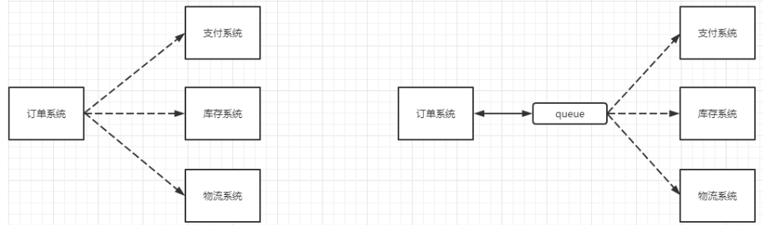
>
> **3.异步处理**
>
> 有些服务间调用是异步的，例如 A 调用 B，B 需要花费很长时间执行，但是 A 需要知道 B 什么时候可以执行完，以前一般有两种方式，A 过一段时间去调用 B 的查询 api 查询。或者 A 提供一个 callback api，B 执行完之后调用 api 通知 A 服务。这两种方式都不是很优雅，使用消息总线，可以很方便解决这个问题，A 调用 B 服务后，只需要监听 B 处理完成的消息，当 B 处理完成后，会发送一条消息给 MQ，MQ 会将此消息转发给 A 服务。这样 A 服务既不用循环调用 B 的查询 api，也不用提供 callback api。同样 B 服务也不用做这些操作。A 服务还能及时的得到异步处理成功的消息。
>
> 

### 1.1.3. MQ 的分类

> **1.ActiveMQ**
>
> 优点：单机吞吐量万级，时效性 ms 级，可用性高，基于主从架构实现高可用性，消息可靠性较低的大概率丢失数据
>
> 缺点：官方社区现在对 ActiveMQ 5.x 维护越来越少，高吞吐量场景较少使用。
>
> 尚硅谷官网视频: http://www.gulixueyuan.com/course/322
>
> **2.Kafka**
>
> 大数据的杀手锏，谈到大数据领域内的消息传输，则绕不开 Kafka，这款为大数据而生的消息中间件，以其百万级 TPS 的吞吐量名声大噪，迅速成为大数据领域的宠儿，在数据采集、传输、存储的过程中发挥着举足轻重的作用。目前已经被 LinkedIn，Uber, Twitter, Netflix 等大公司所采纳。
>
> 优点: 性能卓越，单机写入 TPS 约在百万条/秒，最大的优点，就是吞吐量高。时效性 ms 级可用性非常高，kafka 是分布式的，一个数据多个副本，少数机器宕机，不会丢失数据，不会导致不可用,消费者采用 Pull 方式获取消息,消息有序,通过控制能够保证所有消息被消费且仅被消费一次;有优秀的第三方Kafka Web 管理界面 Kafka-Manager；在日志领域比较成熟，被多家公司和多个开源项目使用；
>
> 功能支持：功能较为简单，主要支持简单的 MQ 功能，在大数据领域的实时计算以及日志采集被大规模使用
>
> 缺点：Kafka 单机超过64 个队列/分区，Load 会发生明显的飙高现象，队列越多，load 越高，发送消息响应时间变长，使用短轮询方式，实时性取决于轮询间隔时间，消费失败不支持重试；支持消息顺序，但是一台代理宕机后，就会产生消息乱序，社区更新较慢；
>
> **3.RocketMQ**
>
> RocketMQ 出自阿里巴巴的开源产品，用 Java 语言实现，在设计时参考了 Kafka，并做出了自己的一些改进。被阿里巴巴广泛应用在订单，交易，充值，流计算，消息推送，日志流式处理，binglog 分发等场景。
>
> 优点:单机吞吐量十万级,可用性非常高，分布式架构,消息可以做到0 丢失,MQ 功能较为完善，还是分布式的，扩展性好,支持10 亿级别的消息堆积，不会因为堆积导致性能下降,源码是 java 我们可以自己阅读源码，定制自己公司的 MQ
>
> 缺点：支持的客户端语言不多，目前是 java 及 c++，其中 c++不成熟；社区活跃度一般,没有在 MQ核心中去实现 JMS 等接口,有些系统要迁移需要修改大量代码
>
> **4.RabbitMQ**
>
> 2007 年发布，是一个在 AMQP(高级消息队列协议)基础上完成的，可复用的企业消息系统，是当前最主流的消息中间件之一。
>
> 优点:由于 erlang 语言的高并发特性，性能较好；吞吐量到万级，MQ 功能比较完备,健壮、稳定、易用、跨平台、支持多种语言如：Python、Ruby、.NET、Java、JMS、C、PHP、ActionScript、XMPP、STOMP等，支持 AJAX 文档齐全；开源提供的管理界面非常棒，用起来很好用,社区活跃度高；更新频率相当高https://www.rabbitmq.com/news.html
>
> 缺点：需要学习比较复杂的接口和协议，学习和维护成本较高。

### 1.1.4. MQ 的选择

> **1.Kafka**
>
> Kafka 主要特点是基于 Pull 的模式来处理消息消费，追求高吞吐量，一开始的目的就是用于日志收集和传输，适合产生大量数据的互联网服务的数据收集业务。大型公司建议可以选用，如果有日志采集功能，肯定是首选 kafka 了。尚硅谷官网 kafka 视频连接 http://www.gulixueyuan.com/course/330/tasks
>
> **2.RocketMQ**
>
> 天生为金融互联网领域而生，对于可靠性要求很高的场景，尤其是电商里面的订单扣款，以及业务削峰，在大量交易涌入时，后端可能无法及时处理的情况。RoketMQ 在稳定性上可能更值得信赖，这些业务场景在阿里双11 已经经历了多次考验，如果你的业务有上述并发场景，建议可以选择 RocketMQ。
>
> **3.RabbitMQ**
>
> 结合 erlang 语言本身的并发优势，性能好时效性微秒级，社区活跃度也比较高，管理界面用起来十分方便，如果你的数据量没有那么大，中小型公司优先选择功能比较完备的 RabbitMQ。

## 1.2. RabbitMQ

### 1.2.1. RabbitMQ 的概念

> RabbitMQ 是一个消息中间件：它接受并转发消息。你可以把它当做一个快递站点，当你要发送一个包裹时，你把你的包裹放到快递站，快递员最终会把你的快递送到收件人那里，按照这种逻辑 RabbitMQ 是一个快递站，一个快递员帮你传递快件。
>
> RabbitMQ 与快递站的主要区别在于，它不处理快件而是接收，存储和转发消息数据。

### 1.2.2.四大核心概念

**生产者**

> 产生数据发送消息的程序是生产者

**交换机**

> 交换机是 RabbitMQ 非常重要的一个部件，一方面它接收来自生产者的消息，另一方面它将消息推送到队列中。交换机必须确切知道如何处理它接收到的消息，是将这些消息推送到特定队列还是推送到多个队列，亦或者是把消息丢弃，这个得有交换机类型决定

**队列**

> 队列是 RabbitMQ 内部使用的一种数据结构，尽管消息流经 RabbitMQ 和应用程序，但它们只能存储在队列中。队列仅受主机的内存和磁盘限制的约束，本质上是一个大的消息缓冲区。许多生产者可以将消息发送到一个队列，许多消费者可以尝试从一个队列接收数据。这就是我们使用队列的方式

**消费者**

> 消费与接收具有相似的含义。消费者大多时候是一个等待接收消息的程序。请注意生产者，消费者和消息中间件很多时候并不在同一机器上。同一个应用程序既可以是生产者又是可以是消费者。

### 1.2.3.RabbitMQ 核心部分

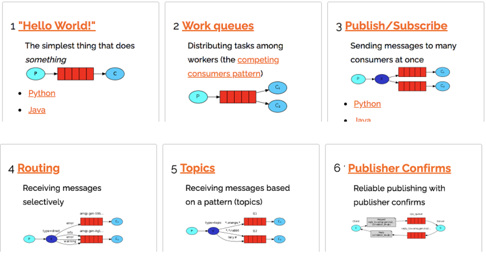

### 1.2.4.各个名词介绍

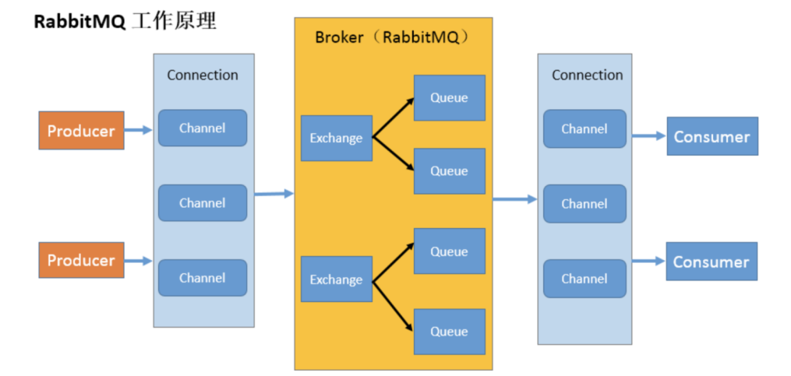

> **Broker**：接收和分发消息的应用，RabbitMQ Server 就是 Message Broker
>
> **Virtual host**：出于多租户和安全因素设计的，把 AMQP 的基本组件划分到一个虚拟的分组中，类似于网络中的 namespace 概念。当多个不同的用户使用同一个 RabbitMQ server 提供的服务时，可以划分出多个 vhost，每个用户在自己的 vhost 创建exchange／queue 等
>
> **Connection**：producer／consumer 和 broker 之间的 TCP 连接
>
> **Channel**：如果每一次访问 RabbitMQ 都建立一个 Connection，在消息量大的时候建立 TCP Connection 的开销将是巨大的，效率也较低。Channel 是在 connection 内部建立的逻辑连接，如果应用程序支持多线程，通常每个 thread 创建单独的 channel 进行通讯，AMQP method 包含了 channel id 帮助客户端和 message broker 识别 channel，所以 channel 之间是完全隔离的。 Channel 作为轻量级的Connection 极大减少了操作系统建立 TCP connection 的开销
>
> **Exchange**： message 到达 broker 的第一站，根据分发规则，匹配查询表中的 routing key，分发消息到 queue 中去。常用的类型有：direct (point-to-point), topic (publish-subscribe) and fanout(multicast)
>
> **Queue**：消息最终被送到这里等待 consumer 取走
>
> **Binding**： exchange 和 queue 之间的虚拟连接，binding 中可以包含 routing key，Binding 信息被保存到 exchange 中的查询表中，用于 message 的分发依据

### 1.2.5.安装

1.官网地址

https://www.rabbitmq.com/download.html

2.文件上传

上传到/usr/local/software 目录下(如果没有 software 需要自己创建)

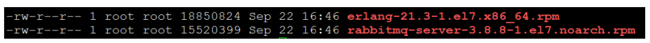

3.安装文件(分别按照以下顺序安装)

```sh
rpm -ivh erlang-21.3-1.el7.x86_64.rpm
yum install socat -y
rpm -ivh rabbitmq-server-3.8.8-1.el7.noarch.rpm
```

4.常用命令(按照以下顺序执行)

```txt
添加开机启动 RabbitMQ 服务
chkconfig rabbitmq-server on
启动服务
/sbin/service rabbitmq-server start
查看服务状态
/sbin/service rabbitmq-server status
停止服务(选择执行)
/sbin/service rabbitmq-server stop
开启 web 管理插件
rabbitmq-plugins enable rabbitmq_management
```

用默认账号密码(guest)访问地址 http://47.115.185.244:15672/出现权限问题

5.添加一个新的用户

```txt
创建账号
rabbitmqctl add_user admin 123
设置用户角色
rabbitmqctl set_user_tags admin administrator
设置用户权限
set_permissions [-p <vhostpath>]<user> <conf> <write> <read>
rabbitmqctl set_permissions -p "/" admin ".*"".*"".*"
用户 user_admin 具有/vhost1 这个 virtual host 中所有资源的配置、写、读权限
当前用户和角色
rabbitmqctl list_users
```

6.再次利用 admin 用户登录

7.重置命令

```txt
关闭应用的命令为
rabbitmqctl stop_app
清除的命令为rabbitmqctl reset
重新启动命令为
rabbitmqctl start_app
```


# 2. Hello World

> 在本教程的这一部分中，我们将用 Java 编写两个程序。发送单个消息的生产者和接收消息并打印出来的消费者。我们将介绍 Java API 中的一些细节。在下图中，“ P”是我们的生产者，“ C”是我们的消费者。中间的框是一个队列-RabbitMQ 代表使用者保留的消息缓冲区


## 2.1.依赖

```xml
<!--指定 jdk 编译版本-->
<build>
    <plugins>
        <plugin>
            <groupId>org.apache.maven.plugins</groupId>
            <artifactId>maven-compiler-plugin</artifactId>
            <configuration>
                <source>8</source>
                <target>8</target>
            </configuration>
        </plugin>
    </plugins>
</build>

<dependencies>
    <!--rabbitmq 依赖客户端-->
    <dependency>
        <groupId>com.rabbitmq</groupId>
        <artifactId>amqp-client</artifactId>
        <version>5.8.0</version>
    </dependency>
    <!--操作文件流的一个依赖-->
    <dependency>
        <groupId>commons-io</groupId>
        <artifactId>commons-io</artifactId>
        <version>2.6</version>
    </dependency>
</dependencies>
```

## 2.2.消息生产者

```java
public class Producer {
    private final static String QUEUE_NAME = "hello";
    public static void main(String[] args) throws Exception {
        //创建一个连接工厂
        ConnectionFactory factory = new ConnectionFactory();
        factory.setHost("182.92.234.71");
        factory.setUsername("admin");
        factory.setPassword("123");
        //channel 实现了自动 close 接口自动关闭不需要显示关闭
        try(Connection connection= factory.newConnection();Channel channel = connection.createChannel()){
            /**
            *生成一个队列
            *1.队列名称
            *2.队列里面的消息是否持久化默认消息存储在内存中
            *3.该队列是否只供一个消费者进行消费是否进行共享 true 可以多个消费者消费
            *4.是否自动删除最后一个消费者端开连接以后该队列是否自动删除 true 自动删除
            *5.其他参数
            */
            channel.queueDeclare(QUEUE_NAME,false,false,false,null);
            String message="hello world";
            /**
            *发送一个消息
            *1.发送到那个交换机	
            *2.路由的 key 是哪个
            *3.其他的参数信息
            *4.发送消息的消息体
            */
            channel.basicPublish("",QUEUE_NAME,null,message.getBytes());
            System.out.println("消息发送完毕");
        }
    }
}
```

## 2.3.消息消费者

```java
public class Consumer {
    private final static String QUEUE_NAME = "hello";
    public static void main(String[] args) throws Exception {
        ConnectionFactory factory = new ConnectionFactory();
        factory.setHost("182.92.234.71");
        factory.setUsername("admin");
        factory.setPassword("123");
        Connection connection = factory.newConnection();
        Channel channel = connection.createChannel();
        System.out.println("等待接收消息....");
        //推送的消息如何进行消费的接口回调
        DeliverCallback deliverCallback=(consumerTag,delivery)->{
            String message= new String(delivery.getBody());
            System.out.println(message);
        };
        //取消消费的一个回调接口如在消费的时候队列被删除掉了
        CancelCallback cancelCallback=(consumerTag)->{
            System.out.println("消息消费被中断");
        };
       
        /**
        *消费者消费消息
        *1.消费哪个队列
        *2.消费成功之后是否要自动应答 true 代表自动应答 false 手动应答
        *3.消费者未成功消费的回调
        */
        channel.basicConsume(QUEUE_NAME,true,deliverCallback,cancelCallback);
    }
}
```

# 3. Work Queues

> 工作队列(又称任务队列)的主要思想是避免立即执行**资源密集型**任务，而不得不等待它完成。相反我们安排任务在之后执行。我们把任务封装为消息并将其发送到队列。在后台运行的工作进程将弹出任务并最终执行作业。当有多个工作线程时，这些工作线程将一起处理这些任务。

## 3.1.轮循分发消息

在这个案例中我们会启动两个工作线程，一个消息发送线程，我们来看看他们两个工作线程是如何工作的。

### 3.1.1.抽取工具类

```java
public class RabbitMqUtils {
    //得到一个连接的 channel
    public static Channel getChannel() throws Exception{
        //创建一个连接工厂
        ConnectionFactory factory = new ConnectionFactory();
        factory.setHost("182.92.234.71");
        factory.setUsername("admin");
        factory.setPassword("123");
        Connection connection = factory.newConnection();
        Channel channel = connection.createChannel();
        return channel;
    }
}
```

### 3.1.2.启动两个工作线程

```java
public class Worker01 {
    private static final String QUEUE_NAME="hello";
    public static void main(String[] args) throws Exception {
        Channel channel = RabbitMqUtils.getChannel();
        DeliverCallback deliverCallback=(consumerTag,delivery)->{
            String receivedMessage = new String(delivery.getBody());
            System.out.println("接收到消息:"+receivedMessage);
        };
        CancelCallback cancelCallback=(consumerTag)->{
            System.out.println(consumerTag+"消费者取消消费接口回调逻辑");
        };
        System.out.println("C2 消费者启动等待消费......");
        channel.basicConsume(QUEUE_NAME,true,deliverCallback,cancelCallback);
    }
}
```

### 3.1.3.启动一个发送线程

```java
public class Task01 {
    private static final String QUEUE_NAME="hello";
    public static void main(String[] args) throws Exception {
        try(Channel channel=RabbitMqUtils.getChannel();){
            channel.queueDeclare(QUEUE_NAME,false,false,false,null);
            //从控制台当中接受信息
            Scanner scanner = new Scanner(System.in);
            while (scanner.hasNext()){
                String message = scanner.next();
                channel.basicPublish("",QUEUE_NAME,null,message.getBytes());
                System.out.println("发送消息完成:"+message);
            }
        }
    }
}
```


### 3.1.4.结果展示

通过程序执行发现生产者总共发送4 个消息，消费者1 和消费者2 分别分得两个消息，并且是按照有序的一个接收一次消息

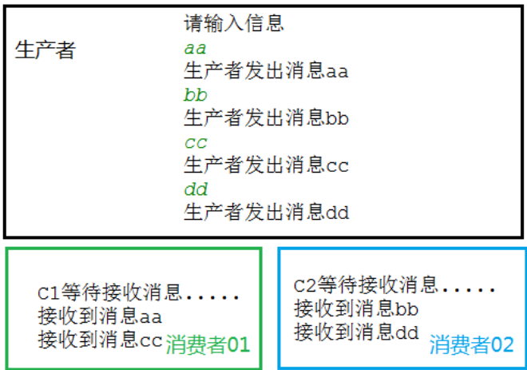

## 3.2.消息应答

### 3.2.1.概念

> 消费者完成一个任务可能需要一段时间，如果其中一个消费者处理一个长的任务并仅只完成了部分突然它挂掉了，会发生什么情况。RabbitMQ 一旦向消费者传递了一条消息，便立即将该消息标记为删除。在这种情况下，突然有个消费者挂掉了，我们将丢失正在处理的消息。以及后续发送给该消费这的消息，因为它无法接收到。为了保证消息在发送过程中不丢失，rabbitmq 引入**消息应答机制**。
>
> 消息应答就是:消费者在接收到消息并且处理该消息之后，告诉 rabbitmq 它已经处理了，rabbitmq 可以把该消息删除了。

### 3.2.2.自动应答

> 消息发送后立即被认为已经传送成功，这种模式需要在高吞吐量和数据传输安全性方面做权衡,因为这种模式如果消息在接收到之前，消费者那边出现连接或者 channel 关闭，那么消息就丢失了,当然另一方面这种模式消费者那边可以传递过载的消息，没有对传递的消息数量进行限制，当然这样有可能使得消费者这边由于接收太多还来不及处理的消息，导致这些消息的积压，最终使得内存耗尽，最终这些消费者线程被操作系统杀死，所以这种模式**仅适用在消费者可以高效并以某种速率能够处理这些消息的情况**下使用。

### 3.2.3.消息应答的方法

> A.Channel.basicAck(用于肯定确认) RabbitMQ 已知道该消息并且成功的处理消息，可以将其丢弃了
>
> B.Channel.basicNack(用于否定确认)
>
> C.Channel.basicReject(用于否定确认)与 Channel.basicNack 相比少一个参数，不处理该消息了直接拒绝，可以将其丢弃了

### 3.2.4.Multiple 的解释

> 手动应答的好处是可以批量应答并且减少网络拥堵
>
> 
>
> multiple 的 true 和 false 代表不同意思
>
> true 代表批量应答 channel 上未应答的消息
>
> 比如说 channel 上有传送 tag 的消息5,6,7,8 当前 tag 是8 那么此时5-8 的这些还未应答的消息都会被确认收到消息应答
>
> false 同上面相比
>
> 只会应答 tag=8 的消息5,6,7 这三个消息依然不会被确认收到消息应答
>
> 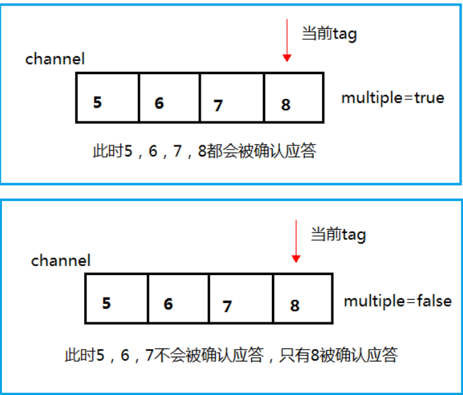

### 3.2.5.消息自动重新入队

> 如果消费者由于某些原因失去连接(其通道已关闭，连接已关闭或 TCP 连接丢失)，导致消息未发送 ACK 确认，RabbitMQ 将了解到消息未完全处理，并将对其重新排队。如果此时其他消费者可以处理，它将很快将其重新分发给另一个消费者。这样，即使某个消费者偶尔死亡，也可以确保不会丢失任何消息。
>
> 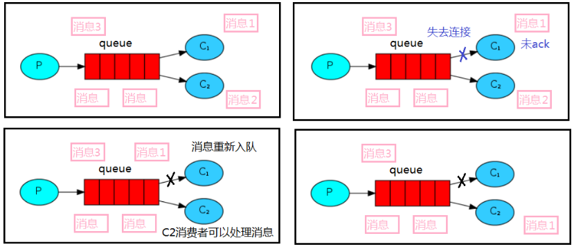

### 3.2.6.消息手动应答代码

> 默认消息采用的是自动应答，所以我们要想实现消息消费过程中不丢失，需要把自动应答改为手动应答，消费者在上面代码的基础上增加下面画红色部分代码。

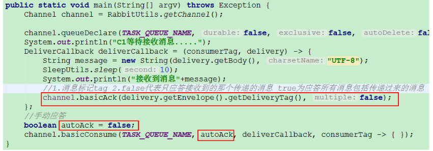

**消息生产者**

```java
public class Task02 {
    private static final String TASK_QUEUE_NAME = "ack_queue";
    public static void main(String[] argv) throws Exception {
        try (Channel channel = RabbitMqUtils.getChannel()){
            channel.queueDeclare(TASK_QUEUE_NAME, false, false, false, null);
            Scanner sc = new Scanner(System.in);
            System.out.println("请输入信息");
            while (sc.hasNext()){
                String message = sc.nextLine();
                channel.basicPublish("", TASK_QUEUE_NAME, null,message.getBytes("UTF-8"));
                System.out.println("生产者发出消息"+ message);
            }
        }
    }
}
```

**消费者01**

```java
public class Work03 {
    private static final String ACK_QUEUE_NAME="ack_queue";
    public static void main(String[] args) throws Exception {
        Channel channel = RabbitMqUtils.getChannel();
        System.out.println("C1 等待接收消息处理时间较短");
        //消息消费的时候如何处理消息
        DeliverCallback deliverCallback=(consumerTag,delivery)->{
            String message= new String(delivery.getBody());
            SleepUtils.sleep(1);
            System.out.println("接收到消息:"+message);
            /**
            *1.消息标记 tag
            *2.是否批量应答未应答消息
            */
            channel.basicAck(delivery.getEnvelope().getDeliveryTag(),false);
        };
        //采用手动应答
        boolean autoAck=false;
        channel.basicConsume(ACK_QUEUE_NAME,autoAck,deliverCallback,(consumerTag)->{
            System.out.println(consumerTag+"消费者取消消费接口回调逻辑");
        });
    }
}
```

**消费者02**

```java
public class Work04 {
    private static final String ACK_QUEUE_NAME="ack_queue";
    public static void main(String[] args) throws Exception {
        Channel channel = RabbitMqUtils.getChannel();
        System.out.println("C2 等待接收消息处理时间较长");
        //消息消费的时候如何处理消息
        DeliverCallback deliverCallback=(consumerTag,delivery)->{
            String message= new String(delivery.getBody());
            SleepUtils.sleep(30);
            System.out.println("接收到消息:"+message);
            /**
            *1.消息标记 tag
            *2.是否批量应答未应答消息
            */
            channel.basicAck(delivery.getEnvelope().getDeliveryTag(),false);
        };
        //采用手动应答
        boolean autoAck=false;
        channel.basicConsume(ACK_QUEUE_NAME,autoAck,deliverCallback,(consumerTag)->{
            System.out.println(consumerTag+"消费者取消消费接口回调逻辑");
        });
    }
}
```

**睡眠工具类**

```java
 public class SleepUtils {
     public static void sleep(int second){
         try {
             Thread.sleep(1000*second);
         } catch (InterruptedException _ignored){
             Thread.currentThread().interrupt();
         }
     }
}
```


### 3.2.7.手动应答效果演示

> 正常情况下消息发送方发送两个消息 C1 和 C2 分别接收到消息并进行处理
>
> 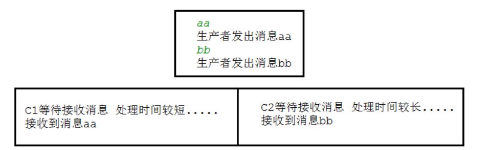
>
> 在发送者发送消息 dd，发出消息之后的把 C2 消费者停掉，按理说该 C2 来处理该消息，但是由于它处理时间较长，在还未处理完，也就是说 C2 还没有执行 ack 代码的时候，C2 被停掉了，此时会看到消息被 C1 接收到了，说明消息 dd 被重新入队，然后分配给能处理消息的 C1 处理了
>
> 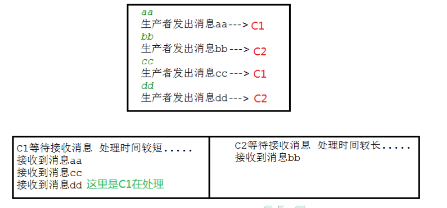

## 3.3. RabbitMQ 持久化

### 3.3.1.概念

> 刚刚我们已经看到了如何处理任务不丢失的情况，但是如何保障当 RabbitMQ 服务停掉以后消息生产者发送过来的消息不丢失。默认情况下 RabbitMQ 退出或由于某种原因崩溃时，它忽视队列和消息，除非告知它不要这样做。确保消息不会丢失需要做两件事：我们需要将**队列和消息**都标记为**持久化**。

### 3.3.2.队列如何实现持久化

> 之前我们创建的队列都是非持久化的，rabbitmq 如果重启的化，该队列就会被删除掉，如果要队列实现持久化需要在声明队列的时候把 durable 参数设置为持久化
>
> 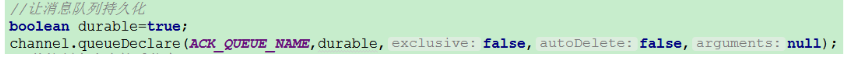
>
> 但是需要注意的就是如果之前声明的队列不是持久化的，需要把原先队列先删除，或者重新创建一个持久化的队列，不然就会出现错误
>
> 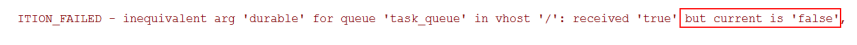
>
> 以下为控制台中持久化与非持久化队列的 UI 显示区、
>
> 
>
> 这个时候即使重启 rabbitmq 队列也依然存在

### 3.3.3.消息实现持久化

> 要想让消息实现持久化需要在消息生产者修改代码， MessageProperties.PERSISTENT_TEXT_PLAIN 添加这个属性。
>
> 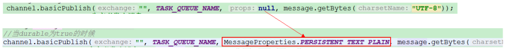
>
> 将消息标记为持久化并不能完全保证不会丢失消息。尽管它告诉 RabbitMQ 将消息保存到磁盘，但是这里依然存在当消息刚准备存储在磁盘的时候但是还没有存储完，消息还在缓存的一个间隔点。此时并没有真正写入磁盘。持久性保证并不强，但是对于我们的简单任务队列而言，这已经绰绰有余了。如果需要更强有力的持久化策略，参考后边课件**发布确认**章节。

### 3.3.4.不公平分发

> 在最开始的时候我们学习到 RabbitMQ **分发消息**采用的轮循分发，但是在某种场景下这种策略并不是很好，比方说有两个消费者在处理任务，其中有个消费者1 处理任务的速度非常快，而另外一个消费者2处理速度却很慢，这个时候我们还是采用轮循分发的化就会到这处理速度快的这个消费者很大一部分时间处于空闲状态，而处理慢的那个消费者一直在干活，这种分配方式在这种情况下其实就不太好，但是RabbitMQ 并不知道这种情况它依然很公平的进行分发。为了避免这种情况，我们可以设置参数 **channel.basicQos(1)**;
>
> 
>
> 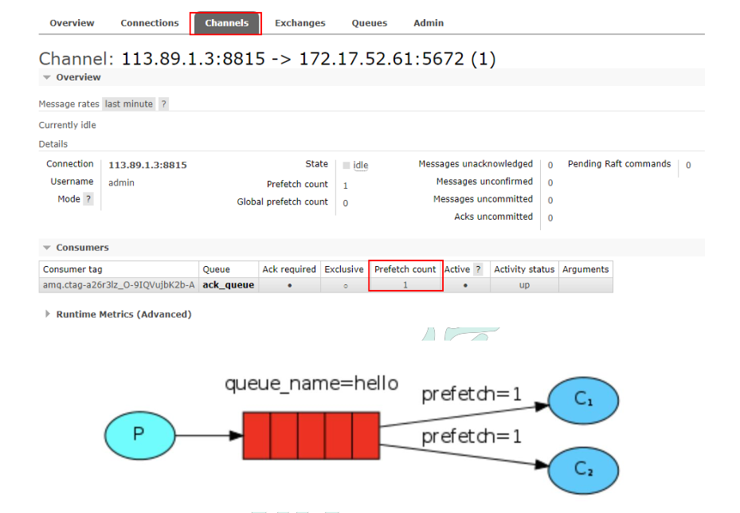
>
> 意思就是如果这个任务我还没有处理完或者我还没有应答你，你先别分配给我，我目前只能处理一个任务，然后 rabbitmq 就会把该任务分配给没有那么忙的那个空闲消费者，当然如果所有的消费者都没有完成手上任务，队列还在不停的添加新任务，队列有可能就会遇到队列被撑满的情况，这个时候就只能添加新的 worker 或者改变其他存储任务的策略。

### 3.3.5.预取值

> 本身消息的发送就是异步发送的，所以在任何时候，channel 上肯定不止只有一个消息另外来自消费者的手动确认本质上也是异步的。因此这里就存在一个未确认的消息缓冲区，因此希望开发人员能限制此缓冲区的大小，以避免缓冲区里面无限制的未确认消息问题。这个时候就可以通过使用 **basic.qos 方法设置“预取计数”**值来完成的。该值定义通道上允许的未确认消息的最大数量。一旦数量达到配置的数量，RabbitMQ 将停止在通道上传递更多消息，除非至少有一个未处理的消息被确认，例如，假设在通道上有未确认的消息5、6、7，8，并且通道的预取计数设置为4，此时 RabbitMQ 将不会在该通道上再传递任何消息，除非至少有一个未应答的消息被 ack。比方说 tag=6 这个消息刚刚被确认 ACK，RabbitMQ 将会感知这个情况到并再发送一条消息。消息应答和 QoS 预取值对用户吞吐量有重大影响。
>
> 通常，**增加预取将提高向消费者传递消息的速度**。虽然自动应答传输消息速率是最佳的，但是，在这种情况下已传递但尚未处理的消息的数量也会增加，从而增加了消费者的 RAM 消耗(随机存取存储器)应该小心使用具有无限预处理的自动确认模式或手动确认模式，消费者消费了大量的消息如果没有确认的话，会导致消费者连接节点的内存消耗变大，所以找到合适的预取值是一个反复试验的过程，不同的负载该值取值也不同100 到300 范围内的值通常可提供最佳的吞吐量，并且不会给消费者带来太大的风险。预取值为1 是最保守的。当然这将使吞吐量变得很低，特别是消费者连接延迟很严重的情况下，特别是在消费者连接等待时间较长的环境中。对于大多数应用来说，稍微高一点的值将是最佳的。
>
> 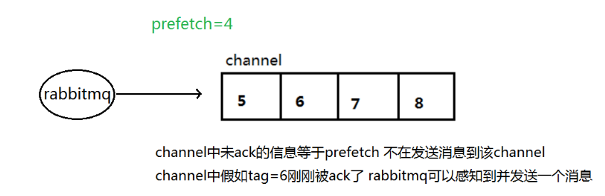

# 4.发布确认

## 4.1.发布确认原理

> 生产者将信道设置成 **confirm** 模式，一旦信道进入 confirm 模式，所有在该信道上面发布的消息都将会被指派一个唯一的 ID(从1 开始)，一旦消息被投递到所有匹配的队列之后，broker就会发送一个确认给生产者(包含消息的唯一 ID)，这就使得生产者知道消息已经正确到达目的队列了，
>
> 如果消息和队列是可持久化的，那么确认消息会在将消息写入磁盘之后发出，broker 回传给生产者的确认消息中 delivery-tag 域包含了确认消息的序列号，此外 broker 也可以设置basic.ack 的 multiple 域，表示到这个序列号之前的所有消息都已经得到了处理。confirm 模式最大的好处在于他是**异步**的，一旦发布一条消息，生产者应用程序就可以在等信道返回确认的同时继续发送下一条消息，当消息最终得到确认之后，生产者应用便可以通过回调方法来处理该确认消息，如果 RabbitMQ 因为自身内部错误导致消息丢失，就会发送一条 nack 消息，生产者应用程序同样可以在回调方法中处理该 nack 消息。

## 4.2.发布确认的策略

### 4.2.1.开启发布确认的方法

> 发布确认默认是没有开启的，如果要开启需要调用方法 confirmSelect，每当你要想使用发布确认，都需要在 channel 上调用该方法
>
> 

### 4.2.2.单个确认发布

> 这是一种简单的确认方式，它是一种同步确认发布的方式，也就是发布一个消息之后只有它被确认发布，后续的消息才能继续发布,waitForConfirmsOrDie(long)这个方法只有在消息被确认的时候才返回，如果在指定时间范围内这个消息没有被确认那么它将抛出异常。这种确认方式有一个最大的缺点就是:发布速度特别的慢，因为如果没有确认发布的消息就会阻塞所有后续消息的发布，这种方式最多提供每秒不超过数百条发布消息的吞吐量。当然对于某些应用程序来说这可能已经足够了。

```java
public static void publishMessageIndividually() throws Exception {
    try (Channel channel = RabbitMqUtils.getChannel()){
        String queueName = UUID.randomUUID().toString();
        channel.queueDeclare(queueName, false, false, false, null);
        //开启发布确认
        channel.confirmSelect();
        long begin = System.currentTimeMillis();
        for (int i = 0; i < MESSAGE_COUNT; i++){
            String message = i +"";
            channel.basicPublish("", queueName, null, message.getBytes());
            //服务端返回 false 或超时时间内未返回，生产者可以消息重发
            boolean flag = channel.waitForConfirms();
            if(flag){
                System.out.println("消息发送成功");
            }
        }
        long end = System.currentTimeMillis();
        System.out.println("发布"+ MESSAGE_COUNT +"个单独确认消息,耗时"+(end - begin)+"ms");
    }
}
```

### 4.2.3.批量确认发布

> 上面那种方式非常慢，与单个等待确认消息相比，先发布一批消息然后一起确认可以极大地提高吞吐量，当然这种方式的缺点就是:当发生故障导致发布出现问题时，不知道是哪个消息出现问题了，我们必须将整个批处理保存在内存中，以记录重要的信息而后重新发布消息。当然这种方案仍然是同步的，也一样阻塞消息的发布。

```java
public static void publishMessageBatch() throws Exception {
    try (Channel channel = RabbitMqUtils.getChannel()){
        String queueName = UUID.randomUUID().toString();
        channel.queueDeclare(queueName, false, false, false, null);
        //开启发布确认
        channel.confirmSelect();
        //批量确认消息大小
        int batchSize = 100;
        //未确认消息个数
        int outstandingMessageCount = 0;
        long begin = System.currentTimeMillis();
        for (int i = 0; i < MESSAGE_COUNT; i++){
            String message = i +"";
            channel.basicPublish("", queueName, null, message.getBytes());
            outstandingMessageCount++;
            if (outstandingMessageCount == batchSize){
                channel.waitForConfirms();
                outstandingMessageCount = 0;
            }
        }
        //为了确保还有剩余没有确认消息再次确认
        if (outstandingMessageCount > 0){
            channel.waitForConfirms();
        }
        long end = System.currentTimeMillis();
       System.out.println("发布"+ MESSAGE_COUNT +"个批量确认消息,耗时"+(end - begin)+"ms");
    }
}
```


### 4.2.4.异步确认发布

> 异步确认虽然编程逻辑比上两个要复杂，但是性价比最高，无论是可靠性还是效率都没得说，他是利用**回调函数**来达到消息可靠性传递的，这个中间件也是通过函数回调来保证是否投递成功，下面就让我们来详细讲解异步确认是怎么实现的。
>
> 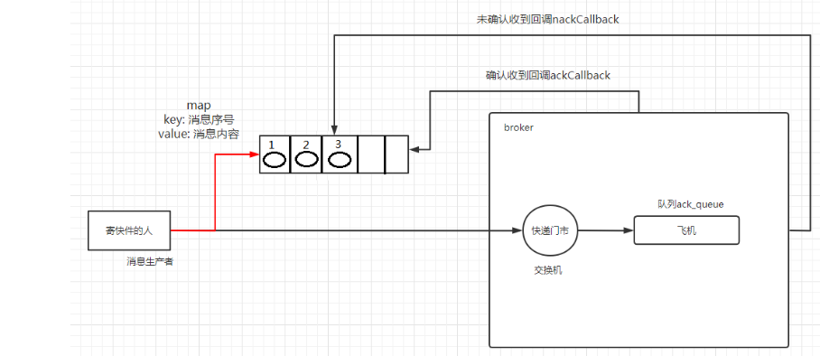


```java
public static void publishMessageAsync() throws Exception {
    try (Channel channel = RabbitMqUtils.getChannel()){
        String queueName = UUID.randomUUID().toString();
        channel.queueDeclare(queueName, false, false, false, null);
        //开启发布确认
        channel.confirmSelect();
        /**
        *线程安全有序的一个哈希表，适用于高并发的情况
        *1.轻松的将序号与消息进行关联
        *2.轻松批量删除条目只要给到序列号
        *3.支持并发访问
        */
        ConcurrentSkipListMap<Long, String>  outstandingConfirms = new  ConcurrentSkipListMap<>();
        /**
	*确认收到消息的一个回调
	*1.消息序列号
	*2.true 可以确认小于等于当前序列号的消息
	* false 确认当前序列号消息
	*/
        ConfirmCallback ackCallback = (sequenceNumber, multiple)-> {
            if (multiple){
                //返回的是小于等于当前序列号的未确认消息是一个 map
                ConcurrentNavigableMap<Long, String>  confirmed =  outstandingConfirms.headMap(sequenceNumber, true);
                //清除该部分未确认消息
                confirmed.clear();
            }else{
                //只清除当前序列号的消息
                outstandingConfirms.remove(sequenceNumber);
            }
        };
        ConfirmCallback nackCallback = (sequenceNumber, multiple)-> {
            String message = outstandingConfirms.get(sequenceNumber);
            System.out.println("发布的消息"+message+"未被确认，序列号"+sequenceNumber);
        };
        /**
	*添加一个异步确认的监听器
	*1.确认收到消息的回调
	*2.未收到消息的回调
	*/
        channel.addConfirmListener(ackCallback, null); 
        long begin = System.currentTimeMillis();
        for (int i = 0; i < MESSAGE_COUNT; i++){
            String message = "消息"+ i;
            /**
            * channel.getNextPublishSeqNo()获取下一个消息的序列号
            *通过序列号与消息体进行一个关联
            *全部都是未确认的消息体
            */
            outstandingConfirms.put(channel.getNextPublishSeqNo(), message);
            channel.basicPublish("", queueName, null, message.getBytes());
        }
        long end = System.currentTimeMillis();
        System.out.println("发布"+ MESSAGE_COUNT +"个异步确认消息,耗时"+(end - begin)+"ms");
    }
}
```

### 4.2.5.如何处理异步未确认消息

> 最好的解决的解决方案就是把未确认的消息放到一个基于内存的能被发布线程访问的队列，比如说用 ConcurrentLinkedQueue 这个队列在 confirm callbacks 与发布线程之间进行消息的传递。

### 4.2.6.以上3 种发布确认速度对比

> **单独发布消息**
>
> ​	同步等待确认，简单，但吞吐量非常有限。
>
> **批量发布消息**
>
> ​	批量同步等待确认，简单，合理的吞吐量，一旦出现问题但很难推断出是那条消息出现了问题。
>
> **异步处理：**
>
> ​	最佳性能和资源使用，在出现错误的情况下可以很好地控制，但是实现起来稍微难些

```java
public static void main(String[] args) throws Exception {
    //这个消息数量设置为1000 好些不然花费时间太长
    publishMessagesIndividually();
    publishMessagesInBatch();
    handlePublishConfirmsAsynchronously();
}
```

```sh
//运行结果
发布1,000 个单独确认消息耗时50,278 ms
发布1,000 个批量确认消息耗时635 ms
发布1,000 个异步确认消息耗时92 ms
```


# 5.交换机

> 在上一节中，我们创建了一个工作队列。我们假设的是工作队列背后，每个任务都恰好交付给一个消费者(工作进程)。在这一部分中，我们将做一些完全不同的事情-我们将消息传达给多个消费者。这种模式称为”发布/订阅”.
>
> 为了说明这种模式，我们将构建一个简单的日志系统。它将由两个程序组成:第一个程序将发出日志消息，第二个程序是消费者。其中我们会启动两个消费者，其中一个消费者接收到消息后把日志存储在磁盘，另外一个消费者接收到消息后把消息打印在屏幕上，事实上第一个程序发出的日志消息将广播给所有消费者者

## 5.1. Exchanges

### 5.1.1. Exchanges 概念

> RabbitMQ 消息传递模型的核心思想是: 生产者生产的消息从不会直接发送到队列。实际上，通常生产者甚至都不知道这些消息传递传递到了哪些队列中。相反，生产者只能将消息发送到交换机(exchange)，交换机工作的内容非常简单，一方面它接收来自生产者的消息，另一方面将它们推入队列。交换机必须确切知道如何处理收到的消息。是应该把这些消息放到特定队列还是说把他们到许多队列中还是说应该丢弃它们。这就的由交换机的类型来决定。

### 5.1.2.Exchanges 的类型

> 总共有以下类型：
>
> 直接(direct),主题(topic),标题(headers),扇出(fanout)

### 5.1.3.无名 exchange

> 在本教程的前面部分我们对 exchange 一无所知，但仍然能够将消息发送到队列。之前能实现的原因是因为我们使用的是默认交换，我们通过空字符串(“”)进行标识。
>
> 
>
> 第一个参数是交换机的名称。空字符串表示默认或无名称交换机：消息能路由发送到队列中其实是由 routingKey(bindingkey)绑定 key 指定的，如果它存在的话

## 5.2.临时队列

> 之前的章节我们使用的是具有特定名称的队列(还记得 hello 和 ack_queue 吗？)。队列的名称我们来说至关重要。我们需要指定我们的消费者去消费哪个队列的消息。每当我们连接到 Rabbitmq 时，我们都需要一个全新的空队列，为此我们可以创建一个具有随机名称的队列，或者能让服务器为我们选择一个随机队列名称那就更好了。其次一旦我们断开了消费者的连接，队列将被自动删除。
>
> 创建临时队列的方式如下:
>
> ```java
> String queueName = channel.queueDeclare().getQueue();
> ```
>
> 创建出来之后长成这样:
>
> 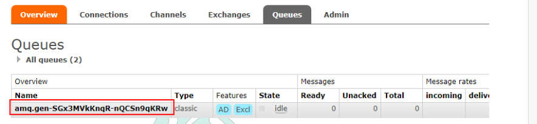

## 5.3.绑定(bindings)

> 什么是 bingding 呢，binding 其实是 exchange 和 queue 之间的桥梁，它告诉我们 exchange 和那个队列进行了绑定关系。比如说下面这张图告诉我们的就是 X 与 Q1 和 Q2 进行了绑定
>
> 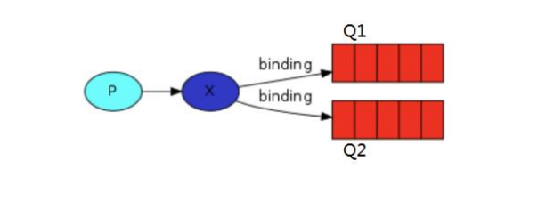

## 5.4. Fanout

### 5.4.1.Fanout 介绍

> Fanout 这种类型非常简单。正如从名称中猜到的那样，它是将接收到的所有消息**广播到它知道的所有队列中**。系统中默认有些 exchange 类型
>
> 

### 5.4.2.Fanout 实战

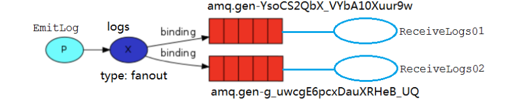

Logs 和临时队列的**绑定关系**如下图

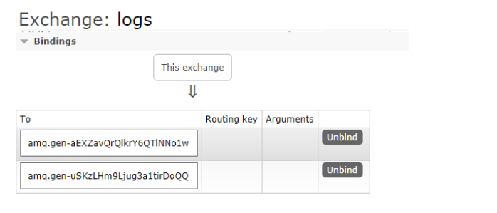

ReceiveLogs01 将接收到的消息打印在控制台

```java
public class ReceiveLogs01 {
    private static final String EXCHANGE_NAME = "logs";
    public static void main(String[] argv) throws Exception {
        Channel channel = RabbitUtils.getChannel();
        channel.exchangeDeclare(EXCHANGE_NAME,"fanout");
        /**
        *生成一个临时的队列队列的名称是随机的
        *当消费者断开和该队列的连接时队列自动删除
        */
        String queueName = channel.queueDeclare().getQueue();
        //把该临时队列绑定我们的 exchange 其中 routingkey(也称之为 binding key)为空字符串
        channel.queueBind(queueName, EXCHANGE_NAME,"");
        System.out.println("等待接收消息,把接收到的消息打印在屏幕.....");
        DeliverCallback deliverCallback = (consumerTag, delivery)-> {
            String message = new String(delivery.getBody(),"UTF-8");
            System.out.println("控制台打印接收到的消息"+message);
        };
        channel.basicConsume(queueName, true, deliverCallback, consumerTag -> {});
    }
}
```

ReceiveLogs02 将接收到的消息存储在磁盘

```java
public class ReceiveLogs02 {
    private static final String EXCHANGE_NAME = "logs";
    public static void main(String[] argv) throws Exception {
        Channel channel = RabbitUtils.getChannel();
        channel.exchangeDeclare(EXCHANGE_NAME,"fanout");
        /**
        *生成一个临时的队列队列的名称是随机的
        *当消费者断开和该队列的连接时队列自动删除
        */
        String queueName = channel.queueDeclare().getQueue();
        //把该临时队列绑定我们的 exchange 其中 routingkey(也称之为 binding key)为空字符串
        channel.queueBind(queueName, EXCHANGE_NAME,"");
        System.out.println("等待接收消息,把接收到的消息写到文件.....");
        DeliverCallback deliverCallback = (consumerTag, delivery)-> {
            String message = new String(delivery.getBody(),"UTF-8");
            File file = new File("C:\\work\\rabbitmq_info.txt");
            FileUtils.writeStringToFile(file,message,"UTF-8");
            System.out.println("数据写入文件成功");
        };
        channel.basicConsume(queueName, true, deliverCallback, consumerTag -> {});
    }
}
```

EmitLog 发送消息给两个消费者接收

```java
public class EmitLog {
    private static final String EXCHANGE_NAME = "logs";
    public static void main(String[] argv) throws Exception {
        try (Channel channel = RabbitUtils.getChannel()){
            /**
            *声明一个 exchange
            *1.exchange 的名称
            *2.exchange 的类型
            */
            channel.exchangeDeclare(EXCHANGE_NAME,"fanout");
            Scanner sc = new Scanner(System.in);
            System.out.println("请输入信息");
            while (sc.hasNext()){
                String message = sc.nextLine();
                channel.basicPublish(EXCHANGE_NAME,"", null, message.getBytes("UTF-8"));
                System.out.println("生产者发出消息"+ message);
            }
        }
    }
}
```

## 5.5. Direct exchange

### 5.5.1.回顾

> 在上一节中，我们构建了一个简单的日志记录系统。我们能够向许多接收者广播日志消息。在本节我们将向其中添加一些特别的功能-比方说我们只让某个消费者订阅发布的部分消息。例如我们只把严重错误消息定向存储到日志文件(以节省磁盘空间)，同时仍然能够在控制台上打印所有日志消息。
>
> 我们再次来回顾一下什么是 bindings，绑定是交换机和队列之间的桥梁关系。也可以这么理解：队列只对它绑定的交换机的消息感兴趣。绑定用参数： routingKey 来表示也可称该参数为 binding key，创建绑定我们用代码:channel.queueBind(queueName,EXCHANGE_NAME,"routingKey");绑定之后的意义由其交换类型决定。

### 5.5.2.Direct exchange 介绍

> 上一节中的我们的日志系统将所有消息广播给所有消费者，对此我们想做一些改变，例如我们希望将日志消息写入磁盘的程序仅接收严重错误(errros)，而不存储哪些警告(warning)或信息(info)日志消息避免浪费磁盘空间。Fanout 这种交换类型并不能给我们带来很大的灵活性-它只能进行无意识的广播，在这里我们将使用 direct 这种类型来进行替换，这种类型的工作方式是，消息只去到它绑定的routingKey 队列中去。
>
> 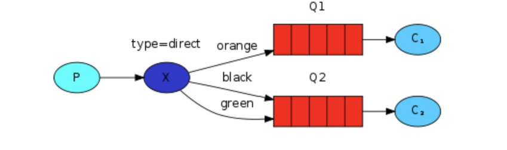
>
> 在上面这张图中，我们可以看到 X 绑定了两个队列，绑定类型是 direct。队列 Q1 绑定键为 orange，队列 Q2 绑定键有两个:一个绑定键为 black，另一个绑定键为 green.在这种绑定情况下，生产者发布消息到 exchange 上，绑定键为 orange 的消息会被发布到队列Q1。绑定键为 blackgreen 和的消息会被发布到队列 Q2，其他消息类型的消息将被丢弃。

### 5.5.3.多重绑定

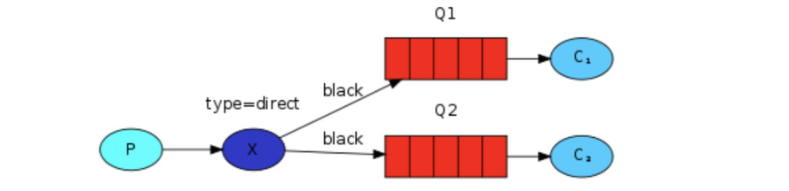

> 当然如果 exchange 的绑定类型是 direct，但是它绑定的多个队列的 key 如果都相同，在这种情况下虽然绑定类型是 direct 但是它表现的就和 fanout 有点类似了，就跟广播差不多，如上图所示。

### 5.5.4.实战

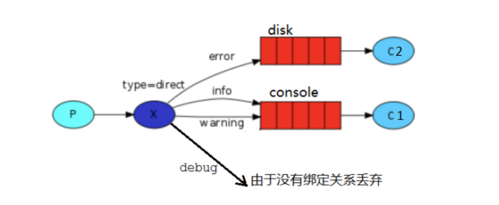

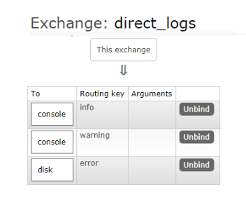

```java
public class ReceiveLogsDirect01 {
    private static final String EXCHANGE_NAME = "direct_logs";
    public static void main(String[] argv) throws Exception {
        Channel channel = RabbitUtils.getChannel();
        channel.exchangeDeclare(EXCHANGE_NAME, BuiltinExchangeType.DIRECT);
        String queueName = "disk";
        channel.queueDeclare(queueName, false, false, false, null);
        channel.queueBind(queueName, EXCHANGE_NAME,"error");
        System.out.println("等待接收消息.....");
        DeliverCallback deliverCallback = (consumerTag, delivery)-> {
            String message = new String(delivery.getBody(),"UTF-8");
            message="接收绑定键:"+delivery.getEnvelope().getRoutingKey()+",消息:"+message;
            File file = new File("C:\\work\\rabbitmq_info.txt");
            FileUtils.writeStringToFile(file,message,"UTF-8");
            System.out.println("错误日志已经接收");
        };
        channel.basicConsume(queueName, true, deliverCallback, consumerTag -> {});
    }
}
```

```java
public class ReceiveLogsDirect02 {
    private static final String EXCHANGE_NAME = "direct_logs";
    public static void main(String[] argv) throws Exception {
        Channel channel = RabbitUtils.getChannel();
        channel.exchangeDeclare(EXCHANGE_NAME, BuiltinExchangeType.DIRECT);
        String queueName = "console";
        channel.queueDeclare(queueName, false, false, false, null);
        channel.queueBind(queueName, EXCHANGE_NAME,"info");
        channel.queueBind(queueName, EXCHANGE_NAME,"warning");
        System.out.println("等待接收消息.....");
        DeliverCallback deliverCallback = (consumerTag, delivery)-> {
            String message = new String(delivery.getBody(),"UTF-8");
            System.out.println("接收绑定键:"+delivery.getEnvelope().getRoutingKey()+",消息:"+message);
        };
        channel.basicConsume(queueName, true, deliverCallback, consumerTag -> {});
    }
}
```

```java
public class EmitLogDirect {
    private static final String EXCHANGE_NAME = "direct_logs";
    public static void main(String[] argv) throws Exception {
        try (Channel channel = RabbitUtils.getChannel()){
            channel.exchangeDeclare(EXCHANGE_NAME, BuiltinExchangeType.DIRECT);
            //创建多个 bindingKey
            Map<String, String> bindingKeyMap = new HashMap<>();
            bindingKeyMap.put("info","普通 info 信息");
            bindingKeyMap.put("warning","警告 warning 信息");
            bindingKeyMap.put("error","错误 error 信息");
            //debug 没有消费这接收这个消息所有就丢失了
            bindingKeyMap.put("debug","调试 debug 信息");
            for (Map.Entry<String, String> bindingKeyEntry: bindingKeyMap.entrySet()){
                String bindingKey = bindingKeyEntry.getKey();
                String message = bindingKeyEntry.getValue();
                channel.basicPublish(EXCHANGE_NAME,bindingKey,null,message.getBytes("UTF-8"));
                System.out.println("生产者发出消息:"+ message);
            }
        }
    }
}
```

## 5.6. Topics

### 5.6.1.之前类型的问题

> 在上一个小节中，我们改进了日志记录系统。我们没有使用只能进行随意广播的 fanout 交换机，而是使用了 direct 交换机，从而有能实现有选择性地接收日志。尽管使用 direct 交换机改进了我们的系统，但是它仍然存在局限性-比方说我们想接收的日志类型有info.base 和 info.advantage，某个队列只想 info.base 的消息，那这个时候 direct 就办不到了。这个时候就只能使用 topic 类型

### 5.6.2.Topic 的要求

> 发送到类型是 topic 交换机的消息的 routing_key 不能随意写，必须满足一定的要求，它必须是一个单词列表，以点号分隔开。这些单词可以是任意单词，比如说："stock.usd.nyse","nyse.vmw","quick.orange.rabbit".这种类型的。当然这个单词列表最多不能超过255 个字节。在这个规则列表中，其中有两个替换符是大家需要注意的

```txt
*(星号)可以代替一个单词
#(井号)可以替代零个或多个单词
```

### 5.6.3.Topic 匹配案例

下图绑定关系如下

```txt
Q1-->绑定的是

​	中间带 orange 带3 个单词的字符串(*.orange.*)

Q2-->绑定的是

​	最后一个单词是 rabbit 的3 个单词(*.*.rabbit)

​	第一个单词是 lazy 的多个单词(lazy.#)
```

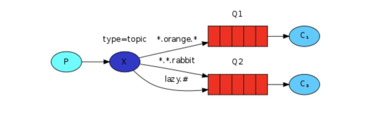

上图是一个队列绑定关系图，我们来看看他们之间数据接收情况是怎么样的

```txt
quick.orange.rabbit				被队列 Q1Q2 接收到
lazy.orange.elephant 			被队列 Q1Q2 接收到quick.orange.fox 被队列 Q1 接收到
lazy.brown.fox 				     被队列 Q2 接收到
lazy.pink.rabbit 			        虽然满足两个绑定但只被队列 Q2 接收一次
quick.brown.fox 			   不匹配任何绑定不会被任何队列接收到会被丢弃
quick.orange.male.rabbit 		是四个单词不匹配任何绑定会被丢弃
lazy.orange.male.rabbit 		是四个单词但匹配 Q2
```

> 当队列绑定关系是下列这种情况时需要引起注意
>
> 当一个队列绑定键是#,那么这个队列将接收所有数据，就有点像 fanout 了
>
> 如果队列绑定键当中没有#和*出现，那么该队列绑定类型就是 direct 了

### 5.6.4.实战

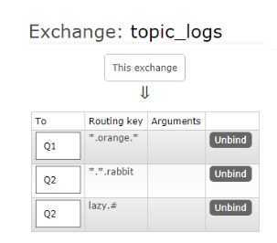

```java
public class EmitLogTopic {
    private static final String EXCHANGE_NAME = "topic_logs";
    public static void main(String[] argv) throws Exception {
        try (Channel channel = RabbitUtils.getChannel()){
            channel.exchangeDeclare(EXCHANGE_NAME,"topic");
            /**
            * Q1--> 绑定的是
            *中间带 orange 带3 个单词的字符串(*.orange.*)
            * Q2--> 绑定的是
            *最后一个单词是 rabbit 的3 个单词(*.*.rabbit)
            *第一个单词是 lazy 的多个单词(lazy.#)
            **/
            Map<String, String> bindingKeyMap = new HashMap<>();
            bindingKeyMap.put("quick.orange.rabbit","被队列 Q1Q2 接收到");
            bindingKeyMap.put("lazy.orange.elephant","被队列 Q1Q2 接收到");
            bindingKeyMap.put("quick.orange.fox","被队列 Q1 接收到");
            bindingKeyMap.put("lazy.brown.fox","被队列 Q2 接收到");
            bindingKeyMap.put("lazy.pink.rabbit","虽然满足两个绑定但只被队列 Q2 接收一次");
            bindingKeyMap.put("quick.brown.fox","不匹配任何绑定不会被任何队列接收到会被丢弃");
            bindingKeyMap.put("quick.orange.male.rabbit","是四个单词不匹配任何绑定会被丢弃");
            bindingKeyMap.put("lazy.orange.male.rabbit","是四个单词但匹配 Q2");
            for (Map.Entry<String, String> bindingKeyEntry: bindingKeyMap.entrySet()){
                String bindingKey = bindingKeyEntry.getKey();
                String message = bindingKeyEntry.getValue();
                channel.basicPublish(EXCHANGE_NAME,bindingKey, null, message.getBytes("UTF-8")); System.out.println("生产者发出消息"+ message);
            }
        }
    }
}
```

```java
public class ReceiveLogsTopic01 {
    private static final String EXCHANGE_NAME = "topic_logs";
    public static void main(String[] argv) throws Exception {
        Channel channel = RabbitUtils.getChannel();
        channel.exchangeDeclare(EXCHANGE_NAME,"topic");
        //声明 Q1 队列与绑定关系
        String queueName="Q1";
        channel.queueDeclare(queueName, false, false, false, null);
        channel.queueBind(queueName, EXCHANGE_NAME,"*.orange.*");
        System.out.println("等待接收消息.....");
        DeliverCallback deliverCallback = (consumerTag, delivery)-> {
            String message = new String(delivery.getBody(),"UTF-8");
            System.out.println("接收队列:"+queueName+"绑键:"+delivery.getEnvelope().getRoutingKey()+",消息:"+message);
        };
        channel.basicConsume(queueName, true, deliverCallback, consumerTag -> {});
    }
}
```

```java
public class ReceiveLogsTopic02 {
    private static final String EXCHANGE_NAME = "topic_logs";
    public static void main(String[] argv) throws Exception {
        Channel channel = RabbitUtils.getChannel();
        channel.exchangeDeclare(EXCHANGE_NAME,"topic");
        //声明 Q2 队列与绑定关系
        String queueName="Q2";
        channel.queueDeclare(queueName, false, false, false, null);
        channel.queueBind(queueName, EXCHANGE_NAME,"*.*.rabbit");
        channel.queueBind(queueName, EXCHANGE_NAME,"lazy.#");
        System.out.println("等待接收消息.....");
        DeliverCallback deliverCallback = (consumerTag, delivery)-> {
            String message = new String(delivery.getBody(),"UTF-8");
            System.out.println("接收队列:"+queueName+"绑键:"+delivery.getEnvelope().getRoutingKey()+",消息:"+message);
        };
        channel.basicConsume(queueName, true, deliverCallback, consumerTag -> {});
    }
}
```

# 6.死信队列

## 6.1.死信的概念

> 先从概念解释上搞清楚这个定义，死信，顾名思义就是无法被消费的消息，字面意思可以这样理解，一般来说，producer 将消息投递到 broker 或者直接到 queue 里了，consumer 从 queue 取出消息进行消费，但某些时候由于特定的原因导致 queue 中的某些消息无法被消费，这样的消息如果没有后续的处理，就变成了死信，有死信自然就有了死信队列。
>
> 应用场景:为了保证订单业务的消息数据不丢失，需要使用到 RabbitMQ 的死信队列机制，当消息消费发生异常时，将消息投入死信队列中.还有比如说: 用户在商城下单成功并点击去支付后在指定时间未支付时自动失效

## 6.2.死信的来源

> 消息 TTL 过期
>
> 队列达到最大长度(队列满了，无法再添加数据到 mq 中)
>
> 消息被拒绝(basic.reject 或 basic.nack)并且 requeue=false.

## 6.3.死信实战

### 6.3.1.代码架构图

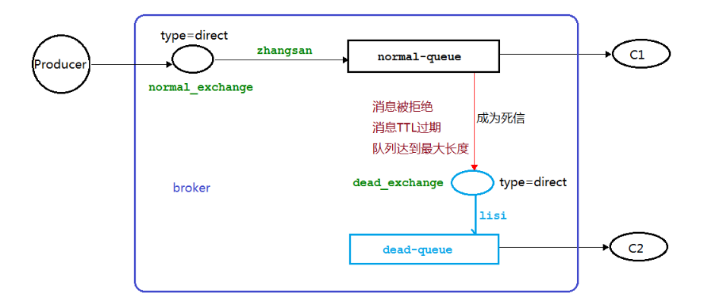

### 6.3.2.消息 TTL 过期

生产者代码

```java
public class Producer {
    private static final String NORMAL_EXCHANGE = "normal_exchange";
    public static void main(String[] argv) throws Exception {
        try (Channel channel = RabbitMqUtils.getChannel()){
            channel.exchangeDeclare(NORMAL_EXCHANGE, BuiltinExchangeType.DIRECT);
            //设置消息的 TTL 时间
            AMQP.BasicProperties properties = new AMQP.BasicProperties().builder().expiration("10000").build();
            //该信息是用作演示队列个数限制
            for (int i = 1; i <11 ; i++){
                String message="info"+i;
                channel.basicPublish(NORMAL_EXCHANGE,"zhangsan",properties,message.getBytes());
                System.out.println("生产者发送消息:"+message);
            }
        }
    }
}
```

消费者 C1 代码(启动之后关闭该消费者模拟其接收不到消息)

```java
public class Consumer01 {
    //普通交换机名称
    private static final String NORMAL_EXCHANGE = "normal_exchange";
    //死信交换机名称
    private static final String DEAD_EXCHANGE = "dead_exchange";
    public static void main(String[] argv) throws Exception {
        Channel channel = RabbitUtils.getChannel();
        //声明死信和普通交换机类型为 direct
        channel.exchangeDeclare(NORMAL_EXCHANGE, BuiltinExchangeType.DIRECT);
        channel.exchangeDeclare(DEAD_EXCHANGE, BuiltinExchangeType.DIRECT);
        //声明死信队列
        String deadQueue = "dead-queue";
        channel.queueDeclare(deadQueue, false, false, false, null);
        //死信队列绑定死信交换机与 routingkey
        channel.queueBind(deadQueue, DEAD_EXCHANGE,"lisi");
        //正常队列绑定死信队列信息
        Map<String, Object> params = new HashMap<>();
        //正常队列设置死信交换机参数 key 是固定值
        params.put("x-dead-letter-exchange", DEAD_EXCHANGE);
        //正常队列设置死信 routing-key 参数 key 是固定值
        params.put("x-dead-letter-routing-key","lisi");
        String normalQueue = "normal-queue";
        channel.queueDeclare(normalQueue, false, false, false, params);
        channel.queueBind(normalQueue, NORMAL_EXCHANGE,"zhangsan");
        System.out.println("等待接收消息.....");
        DeliverCallback deliverCallback = (consumerTag, delivery)-> {
            String message = new String(delivery.getBody(),"UTF-8");
            System.out.println("Consumer01 接收到消息"+message);
        };
        channel.basicConsume(normalQueue, true, deliverCallback, consumerTag -> {});
    }
}
```

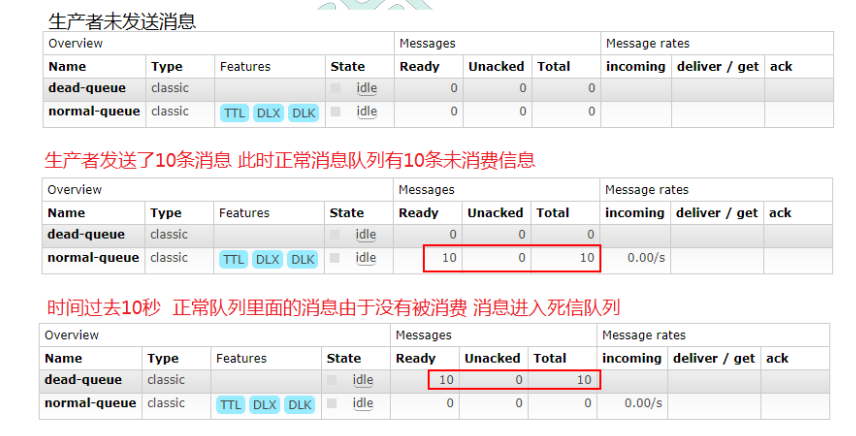

消费者 C2 代码(以上步骤完成后启动 C2 消费者它消费死信队列里面的消息)

```java
public class Consumer02 {
    private static final String DEAD_EXCHANGE = "dead_exchange";
    public static void main(String[] argv) throws Exception {
        Channel channel = RabbitUtils.getChannel();
        channel.exchangeDeclare(DEAD_EXCHANGE, BuiltinExchangeType.DIRECT);
        String deadQueue = "dead-queue";
        channel.queueDeclare(deadQueue, false, false, false, null);
        channel.queueBind(deadQueue, DEAD_EXCHANGE,"lisi");
        System.out.println("等待接收死信队列消息.....");
        DeliverCallback deliverCallback = (consumerTag, delivery)-> {
            String message = new String(delivery.getBody(),"UTF-8");
            System.out.println("Consumer02 接收死信队列的消息"+ message);
        };
        channel.basicConsume(deadQueue, true, deliverCallback, consumerTag -> {});
    }
}
```

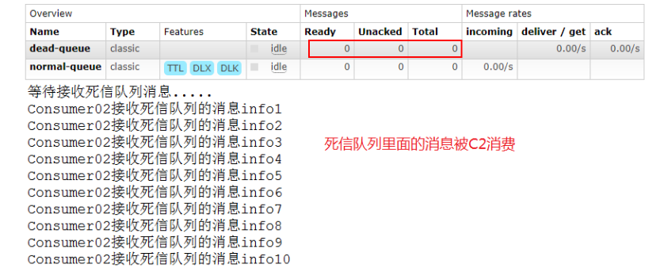

### 6.3.3.队列达到最大长度

1. 消息生产者代码去掉 TTL 属性

   ```java
   public class Producer {
       private static final String NORMAL_EXCHANGE = "normal_exchange";
       public static void main(String[] argv) throws Exception {
           try (Channel channel = RabbitMqUtils.getChannel()){
               channel.exchangeDeclare(NORMAL_EXCHANGE, BuiltinExchangeType.DIRECT);
               //该信息是用作演示队列个数限制
               for (int i = 1; i <11 ; i++){
                   String message="info"+i;
                   channel.basicPublish(NORMAL_EXCHANGE,"zhangsan",null, message.getBytes());
                   System.out.println("生产者发送消息:"+message);
               }
           }
       }
   }
   ```

2. C1 消费者修改以下代码(启动之后关闭该消费者模拟其接收不到消息)

   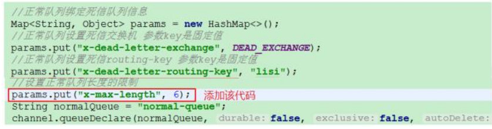

   注意此时需要把原先队列删除因为参数改变了

3. C2 消费者代码不变(启动 C2 消费者)

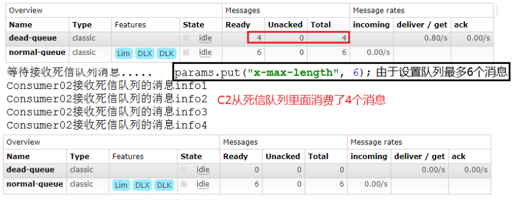

### 6.3.4.消息被拒

1.消息生产者代码同上生产者一致

2.C1 消费者代码(启动之后关闭该消费者模拟其接收不到消息)

  ```java
  public class Consumer01 {
      //普通交换机名称
      private static final String NORMAL_EXCHANGE = "normal_exchange";
      //死信交换机名称
      private static final String DEAD_EXCHANGE = "dead_exchange";
      public static void main(String[] argv) throws Exception {
          Channel channel = RabbitUtils.getChannel();
          //声明死信和普通交换机类型为 direct
          channel.exchangeDeclare(NORMAL_EXCHANGE, BuiltinExchangeType.DIRECT);
          channel.exchangeDeclare(DEAD_EXCHANGE, BuiltinExchangeType.DIRECT);
          //声明死信队列
          String deadQueue = "dead-queue";
          channel.queueDeclare(deadQueue, false, false, false, null);
          //死信队列绑定死信交换机与 routingkey
          channel.queueBind(deadQueue, DEAD_EXCHANGE,"lisi");//正常队列绑定死信队列信息
          Map<String, Object> params = new HashMap<>();
          //正常队列设置死信交换机参数 key 是固定值
          params.put("x-dead-letter-exchange", DEAD_EXCHANGE);
          //正常队列设置死信 routing-key 参数 key 是固定值
          params.put("x-dead-letter-routing-key","lisi");
          String normalQueue = "normal-queue";
          channel.queueDeclare(normalQueue, false, false, false, params);
          channel.queueBind(normalQueue, NORMAL_EXCHANGE,"zhangsan");
          System.out.println("等待接收消息.....");
          DeliverCallback deliverCallback = (consumerTag, delivery)-> {
              String message = new String(delivery.getBody(),"UTF-8");
              if(message.equals("info5")){
                  System.out.println("Consumer01 接收到消息"+ message +"并拒绝签收该消息");
                  //requeue 设置为 false 代表拒绝重新入队该队列如果配置了死信交换机将发送到死信队列中
                  channel.basicReject(delivery.getEnvelope().getDeliveryTag(), false);
              }else {
                  System.out.println("Consumer01 接收到消息"+message);
                  channel.basicAck(delivery.getEnvelope().getDeliveryTag(), false);
              }
          };
          boolean autoAck = false;
          channel.basicConsume(normalQueue, autoAck, deliverCallback, consumerTag -> {});
      }
  }
  ```

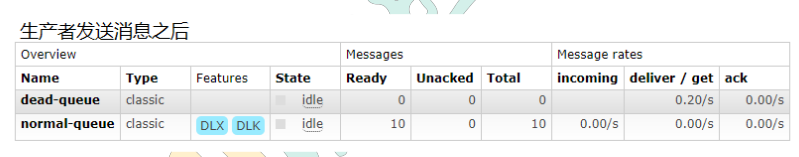

3. C2 消费者代码不变
   启动消费者1 然后再启动消费者2

   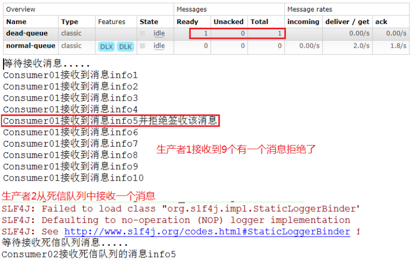

# 7.延迟队列

## 7.1.延迟队列概念

> 延时队列,队列内部是有序的，最重要的特性就体现在它的延时属性上，延时队列中的元素是希望在指定时间到了以后或之前取出和处理，简单来说，延时队列就是用来存放需要在**指定时间**被处理的元素的队列。

## 7.2.延迟队列使用场景

> 1.订单在十分钟之内未支付则自动取消
>
> 2.新创建的店铺，如果在十天内都没有上传过商品，则自动发送消息提醒。
>
> 3.用户注册成功后，如果三天内没有登陆则进行短信提醒。
>
> 4.用户发起退款，如果三天内没有得到处理则通知相关运营人员。
>
> 5.预定会议后，需要在预定的时间点前十分钟通知各个与会人员参加会议
>
> 这些场景都有一个特点，需要在某个事件发生之后或者之前的指定时间点完成某一项任务，如：发生订单生成事件，在十分钟之后检查该订单支付状态，然后将未支付的订单进行关闭；看起来似乎使用定时任务，一直轮询数据，每秒查一次，取出需要被处理的数据，然后处理不就完事了吗？如果数据量比较少，确实可以这样做，比如：对于“如果账单一周内未支付则进行自动结算”这样的需求，如果对于时间不是严格限制，而是宽松意义上的一周，那么每天晚上跑个定时任务检查一下所有未支付的账单，确实也是一个可行的方案。但对于数据量比较大，并且时效性较强的场景，如：“订单十分钟内未支付则关闭“，短期内未支付的订单数据可能会有很多，活动期间甚至会达到百万甚至千万级别，对这么庞大的数据量仍旧使用轮询的方式显然是不可取的，很可能在一秒内无法完成所有订单的检查，同时会给数据库带来很大压力，无法满足业务要求而且性能低下。
>
> 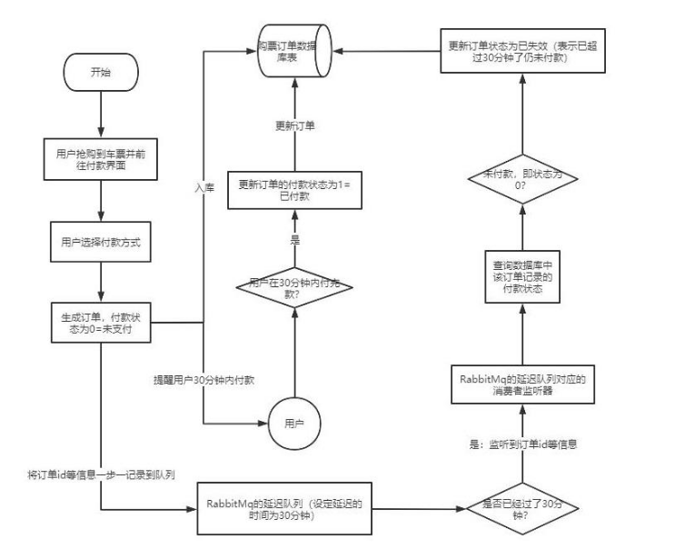

## 7.3. RabbitMQ 中的 TTL

> TTL 是什么呢？TTL 是 RabbitMQ 中一个消息或者队列的属性，表明一条消息或者该队列中的所有消息的最大存活时间，单位是毫秒。换句话说，如果一条消息设置了 TTL 属性或者进入了设置 TTL 属性的队列，那么这条消息如果在 TTL 设置的时间内没有被消费，则会成为"死信"。如果同时配置了队列的 TTL 和消息的 TTL，那么较小的那个值将会被使用，有两种方式设置 TTL。

### 7.3.1.消息设置 TTL

> 另一种方式便是针对每条消息设置 TTL
>
> 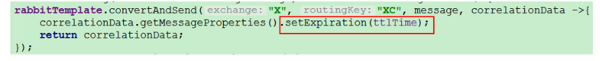

###  7.3.2.队列设置 TTL

> 第一种是在创建队列的时候设置队列的“x-message-ttl”属性
>
> 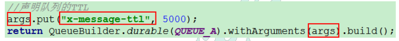

### 7.3.3.两者的区别

> 如果设置了队列的 TTL 属性，那么一旦消息过期，就会被队列丢弃(如果配置了死信队列被丢到死信队列中)，而第二种方式，消息即使过期，也不一定会被马上丢弃，因为消息是否过期是在即将投递到消费者之前判定的，如果当前队列有严重的消息积压情况，则已过期的消息也许还能存活较长时间；另外，还需要注意的一点是，如果不设置 TTL，表示消息永远不会过期，如果将 TTL 设置为0，则表示除非此时可以直接投递该消息到消费者，否则该消息将会被丢弃。
>
> 前一小节我们介绍了死信队列，刚刚又介绍了 TTL，至此利用 RabbitMQ 实现延时队列的**两大要素**已经集齐，接下来只需要将它们进行融合，再加入一点点调味料，延时队列就可以新鲜出炉了。想想看，延时队列，不就是想要消息延迟多久被处理吗，TTL 则刚好能让消息在延迟多久之后成为死信，另一方面，成为死信的消息都会被投递到死信队列里，这样只需要消费者一直消费死信队列里的消息就完事了，因为里面的消息都是希望被立即处理的消息。

## 7.4.整合 springboot

###      7.4.1.创建项目

###      7.4.2.添加依赖

```xml
<dependencies>
    <!--RabbitMQ 依赖-->
    <dependency>
        <groupId>org.springframework.boot</groupId>
        <artifactId>spring-boot-starter-amqp</artifactId>
    </dependency>
    <dependency>
        <groupId>org.springframework.boot</groupId>
        <artifactId>spring-boot-starter-web</artifactId>
    </dependency>
    <dependency>
        <groupId>org.springframework.boot</groupId>
        <artifactId>spring-boot-starter-test</artifactId>
        <scope>test</scope>
    </dependency>
    <dependency>
        <groupId>com.alibaba</groupId>
        <artifactId>fastjson</artifactId>
        <version>1.2.47</version>
    </dependency>
    <dependency>
        <groupId>org.projectlombok</groupId>
        <artifactId>lombok</artifactId>
    </dependency>
    <!--swagger-->
    <dependency>
        <groupId>io.springfox</groupId>
        <artifactId>springfox-swagger2</artifactId>
        <version>2.9.2</version>
    </dependency>
    <dependency>
        <groupId>io.springfox</groupId>
        <artifactId>springfox-swagger-ui</artifactId>
        <version>2.9.2</version>
    </dependency>

    <!--RabbitMQ 测试依赖-->
    <dependency>
        <groupId>org.springframework.amqp</groupId>
        <artifactId>spring-rabbit-test</artifactId>
        <scope>test</scope>
    </dependency>
</dependencies>
```

###   7.4.3.修改配置文件

   ```properties
   spring.rabbitmq.host=182.92.234.71
   spring.rabbitmq.port=5672
   spring.rabbitmq.username=admin
   spring.rabbitmq.password=123
   ```


### 7.4.4.添加 Swagger 配置类

```java
import org.springframework.context.annotation.Bean;
import org.springframework.context.annotation.Configuration;
import springfox.documentation.builders.ApiInfoBuilder;
import springfox.documentation.service.ApiInfo;
import springfox.documentation.service.Contact;
import springfox.documentation.spi.DocumentationType;
import springfox.documentation.spring.web.plugins.Docket;
import springfox.documentation.swagger2.annotations.EnableSwagger2;

@Configuration
@EnableSwagger2
public class SwaggerConfig {
    @Bean
    public Docket webApiConfig(){
        return new Docket(DocumentationType.SWAGGER_2)
            .groupName("webApi")
            .apiInfo(webApiInfo())
            .select()
            .build();
    } 
    private ApiInfo webApiInfo(){
        return new ApiInfoBuilder()
            .title("rabbitmq 接口文档")
            .description("本文档描述了 rabbitmq 微服务接口定义")
            .version("1.0")
            .contact(new Contact("enjoy6288","1551388580@qq.com"))
            .build();
    }
}
```

##  7.5.队列 TTL

###      7.5.1.代码架构图

> 创建两个队列 QA 和 QB，两者队列 TTL 分别设置为10S 和40S，然后在创建一个交换机 X 和死信交换机 Y，它们的类型都是 direct，创建一个死信队列 QD，它们的绑定关系如下：
>
> 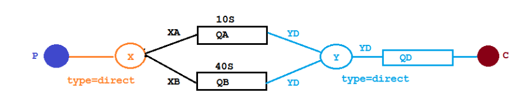

### 7.5.2.配置文件类代码

```java
@Configuration
public class TtlQueueConfig {
    public static final String X_EXCHANGE = "X";
    public static final String QUEUE_A = "QA";
    public static final String QUEUE_B = "QB";
    public static final String Y_DEAD_LETTER_EXCHANGE = "Y";
    public static final String DEAD_LETTER_QUEUE = "QD";
    //声明 xExchange
    @Bean("xExchange")
    public DirectExchange xExchange(){
        return new DirectExchange(X_EXCHANGE);
    }

    //声明 xExchange
    @Bean("yExchange")
    public DirectExchange yExchange(){
        return new DirectExchange(Y_DEAD_LETTER_EXCHANGE);
    }

    //声明队列 A ttl 为10s 并绑定到对应的死信交换机@Bean("queueA")
    public Queue queueA(){
        Map<String, Object> args = new HashMap<>(3);
        //声明当前队列绑定的死信交换机
        args.put("x-dead-letter-exchange", Y_DEAD_LETTER_EXCHANGE);
        //声明当前队列的死信路由 key
        args.put("x-dead-letter-routing-key","YD");
        //声明队列的 TTL
        args.put("x-message-ttl",10000);
        return QueueBuilder.durable(QUEUE_A).withArguments(args).build();
    }


    //声明队列 A 绑定 X 交换机
    @Bean
    public Binding queueaBindingX(@Qualifier("queueA") Queue queueA,@Qualifier("xExchange") DirectExchange xExchange){
        return BindingBuilder.bind(queueA).to(xExchange).with("XA");
    }

    //声明队列 B ttl 为40s 并绑定到对应的死信交换机
    @Bean("queueB")
    public Queue queueB(){
        Map<String, Object> args = new HashMap<>(3);
        //声明当前队列绑定的死信交换机
        args.put("x-dead-letter-exchange", Y_DEAD_LETTER_EXCHANGE);
        //声明当前队列的死信路由 key
        args.put("x-dead-letter-routing-key","YD");
        //声明队列的 TTL
        args.put("x-message-ttl",40000);
        return QueueBuilder.durable(QUEUE_B).withArguments(args).build();
    }
    //声明队列 B 绑定 X 交换机
    @Bean
    public Binding queuebBindingX(@Qualifier("queueB") Queue queue1B,
                                  @Qualifier("xExchange") DirectExchange xExchange){
        return BindingBuilder.bind(queue1B).to(xExchange).with("XB");
    }
    //声明死信队列 QD
    @Bean("queueD")
    public Queue queueD(){
        return new Queue(DEAD_LETTER_QUEUE);
    }

    //声明死信队列 QD 绑定关系
    @Bean
    public Binding deadLetterBindingQAD(@Qualifier("queueD") Queue queueD,@Qualifier("yExchange") DirectExchange yExchange){
        return BindingBuilder.bind(queueD).to(yExchange).with("YD");
    }
}
```

### 7.5.3.消息生产者代码

```java
@Slf4j
@RequestMapping("ttl")
@RestController
 public class SendMsgController {
     @Autowired
     private RabbitTemplate rabbitTemplate;
     @GetMapping("sendMsg/{message}")
     public void sendMsg(@PathVariable String message){
         log.info("当前时间：{},发送一条信息给两个 TTL 队列:{}", new Date(), message);
         rabbitTemplate.convertAndSend("X","XA","消息来自 ttl 为10S 的队列: "+message);
         rabbitTemplate.convertAndSend("X","XB","消息来自 ttl 为40S 的队列: "+message);
     }
}
```

### 7.5.4.消息消费者代码

```java
@Slf4j
@Component
public class DeadLetterQueueConsumer {
    @RabbitListener(queues = "QD")
    public void receiveD(Message message, Channel channel) throws IOException {
        String msg = new String(message.getBody());
        log.info("当前时间：{},收到死信队列信息{}", new Date().toString(), msg);
    }
}
```

   ```sh
   发起一个请求 http://localhost:8080/ttl/sendMsg/嘻嘻嘻
   ```

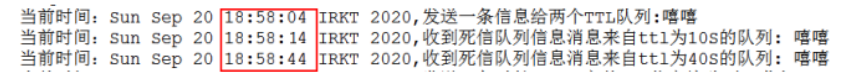

> 第一条消息在10S 后变成了死信消息，然后被消费者消费掉，第二条消息在40S 之后变成了死信消息，然后被消费掉，这样一个延时队列就打造完成了。不过，如果这样使用的话，岂不是每增加一个新的时间需求，就要新增一个队列，这里只有10S 和40S两个时间选项，如果需要一个小时后处理，那么就需要增加 TTL 为一个小时的队列，如果是预定会议室然后提前通知这样的场景，岂不是要增加无数个队列才能满足需求？

## 7.6.延时队列优化

### 7.6.1.代码架构图

> 在这里新增了一个队列 QC,绑定关系如下,该队列不设置 TTL 时间
>
> 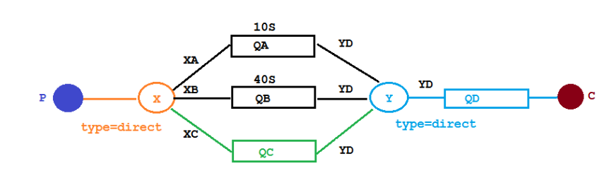

### 7.6.2.配置文件类代码

```java
@Component
public class MsgTtlQueueConfig {
    public static final String Y_DEAD_LETTER_EXCHANGE = "Y";
    public static final String QUEUE_C = "QC";
    
    //声明队列 C 死信交换机
    @Bean("queueC")
    public Queue queueB(){
        Map<String, Object> args = new HashMap<>(3);
        //声明当前队列绑定的死信交换机
        args.put("x-dead-letter-exchange", Y_DEAD_LETTER_EXCHANGE);
        //声明当前队列的死信路由 key
        args.put("x-dead-letter-routing-key","YD");
        //没有声明 TTL 属性
        return QueueBuilder.durable(QUEUE_C).withArguments(args).build();
    }
    //声明队列 B 绑定 X 交换机
    @Bean
    public Binding queuecBindingX(@Qualifier("queueC") Queue queueC,@Qualifier("xExchange") DirectExchange xExchange){
        return BindingBuilder.bind(queueC).to(xExchange).with("XC");
    }
}
```

### 7.6.3.消息生产者代码

```java
@GetMapping("sendExpirationMsg/{message}/{ttlTime}")
public void sendMsg(@PathVariable String message,@PathVariable String ttlTime){
    rabbitTemplate.convertAndSend("X","XC", message, correlationData ->{
        correlationData.getMessageProperties().setExpiration(ttlTime);
        return correlationData;
    });
    log.info("当前时间：{},发送一条时长{}毫秒 TTL 信息给队列 C:{}", new Date(),ttlTime, message);
}
```

发起请求

```sh
 http://localhost:8080/ttl/sendExpirationMsg/你好1/20000
 http://localhost:8080/ttl/sendExpirationMsg/你好2/2000
```

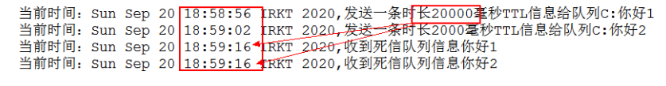

> 看起来似乎没什么问题，但是在最开始的时候，就介绍过如果使用在消息属性上设置 TTL 的方式，消息可能并不会按时“死亡“，因为 RabbitMQ 只会检查第一个消息是否过期，如果过期则丢到死信队列，如果第一个消息的延时时长很长，而第二个消息的延时时长很短，第二个消息并不会优先得到执行。

## 7.7. Rabbitmq 插件实现延迟队列

> 上文中提到的问题，确实是一个问题，如果不能实现在消息粒度上的 TTL，并使其在设置的 TTL 时间及时死亡，就无法设计成一个通用的延时队列。那如何解决呢，接下来我们就去解决该问题。

### 7.7.1.安装延时队列插件

> 在官网上下载 https://www.rabbitmq.com/community-plugins.html，下载rabbitmq_delayed_message_exchange 插件，然后解压放置到 RabbitMQ 的插件目录。进入 RabbitMQ 的安装目录下的 plgins 目录，执行下面命令让该插件生效，然后重启 RabbitMQ
>
> /usr/lib/rabbitmq/lib/rabbitmq_server-3.8.8/plugins
>
> rabbitmq-plugins enable rabbitmq_delayed_message_exchange

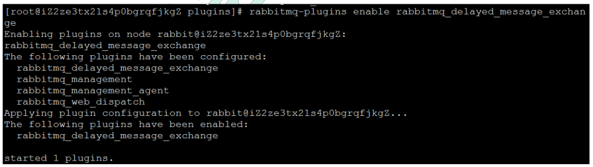

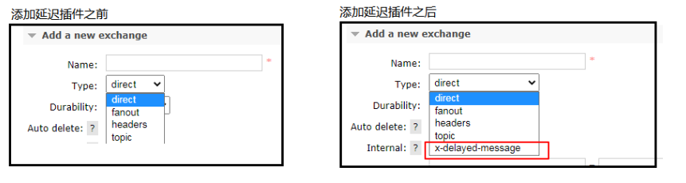

### 7.7.2. 代码架构图

> 在这里新增了一个队列 delayed.queue,一个自定义交换机 delayed.exchange，绑定关系如下:
>
> 

### 7.7.3. 配置文件类代码

> 在我们自定义的交换机中，这是一种新的交换类型，该类型消息支持延迟投递机制消息传递后并不会立即投递到目标队列中，而是存储在 mnesia(一个分布式数据系统)表中，当达到投递时间时，才投递到目标队列中。

```java
@Configuration
public class DelayedQueueConfig {
    public static final String DELAYED_QUEUE_NAME = "delayed.queue";
    public static final String DELAYED_EXCHANGE_NAME = "delayed.exchange";
    public static final String DELAYED_ROUTING_KEY = "delayed.routingkey";
    
    @Bean
    public Queue delayedQueue(){
        return new Queue(DELAYED_QUEUE_NAME);
    }
    //自定义交换机我们在这里定义的是一个延迟交换机
    @Bean
    public CustomExchange delayedExchange(){
        Map<String, Object> args = new HashMap<>();
        //自定义交换机的类型
        args.put("x-delayed-type","direct");
        return new CustomExchange(DELAYED_EXCHANGE_NAME,"x-delayed-message", true, false,args);
    }

    @Bean
    public Binding bindingDelayedQueue(@Qualifier("delayedQueue") Queue queue,@Qualifier("delayedExchange") CustomExchange delayedExchange){
        return BindingBuilder.bind(queue).to(delayedExchange).with(DELAYED_ROUTING_KEY).noargs();
    }
}
```

### 7.7.4.消息生产者代码

```java
 public static final String DELAYED_EXCHANGE_NAME = "delayed.exchange";
 public static final String DELAYED_ROUTING_KEY = "delayed.routingkey";
@GetMapping("sendDelayMsg/{message}/{delayTime}")
 public void sendMsg(@PathVariable String message,@PathVariable Integer delayTime){
 rabbitTemplate.convertAndSend(DELAYED_EXCHANGE_NAME, DELAYED_ROUTING_KEY, message,
 correlationData ->{
 correlationData.getMessageProperties().setDelay(delayTime);
 return correlationData;});
 log.info("当前时间：{},发送一条延迟{}毫秒的信息给队列 delayed.queue:{}", new
 Date(),delayTime, message);
}
```

### 7.7.5.消息消费者代码

```java
 public static final String DELAYED_QUEUE_NAME = "delayed.queue";
@RabbitListener(queues = DELAYED_QUEUE_NAME)
 public void receiveDelayedQueue(Message message){
 String msg = new String(message.getBody());
 log.info("当前时间：{},收到延时队列的消息：{}", new Date().toString(), msg);
}
```

发起请求：

```sh
 http://localhost:8080/ttl/sendDelayMsg/come on baby1/20000
 http://localhost:8080/ttl/sendDelayMsg/come on baby2/2000
```

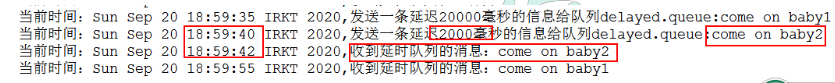

第二个消息被先消费掉了，符合预期

## 7.8.总结

>延时队列在需要延时处理的场景下非常有用，使用 RabbitMQ 来实现延时队列可以很好的利用RabbitMQ 的特性，如：消息可靠发送、消息可靠投递、死信队列来保障消息至少被消费一次以及未被正确处理的消息不会被丢弃。另外，通过 RabbitMQ 集群的特性，可以很好的解决单点故障问题，不会因为单个节点挂掉导致延时队列不可用或者消息丢失。当然，延时队列还有很多其它选择，比如利用 Java 的 DelayQueue，利用 Redis 的 zset，利用 Quartz或者利用 kafka 的时间轮，这些方式各有特点,看需要适用的场景

# 8. 发布确认高级

在生产环境中由于一些不明原因，导致 rabbitmq 重启，在 RabbitMQ 重启期间生产者消息投递失败，导致消息丢失，需要手动处理和恢复。于是，我们开始思考，如何才能进行 RabbitMQ 的消息可靠投递呢？特别是在这样比较极端的情况，RabbitMQ 集群不可用的时候，无法投递的消息该如何处理呢:

```sh
应 用 [xxx] 在 [08-1516:36:04] 发 生 [ 错 误 日 志 异 常 ] ， alertId=[xxx] 。 由
[org.springframework.amqp.rabbit.listener.BlockingQueueConsumer:start:620]触发。应用 xxx 可能原因如下
服务名为：
异 常 为 ： org.springframework.amqp.rabbit.listener.BlockingQueueConsumer:start:620,
产 生 原 因 如 下 :1.org.springframework.amqp.rabbit.listener.QueuesNotAvailableException:
Cannot prepare queue for listener. Either the queue doesn't exist or the broker will not
allow us to use it.||Consumer received fatal=false exception on startup:
```

## 8.1.发布确认 springboot 版本

### 8.1.1.确认机制方案

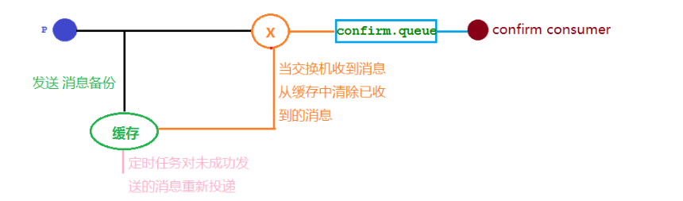

### 8.1.2.代码架构图


### 8.1.3.配置文件

在配置文件当中需要添加

spring.rabbitmq.publisher-confirm-type=correlated

⚫NONE

禁用发布确认模式，是默认值

⚫CORRELATED

发布消息成功到交换器后会触发回调方法

⚫SIMPLE

经测试有两种效果，其一效果和 CORRELATED 值一样会触发回调方法，其二在发布消息成功后使用 rabbitTemplate 调用 waitForConfirms 或 waitForConfirmsOrDie 方法等待 broker 节点返回发送结果，根据返回结果来判定下一步的逻辑，要注意的点是
waitForConfirmsOrDie 方法如果返回 false 则会关闭 channel，则接下来无法发送消息到 broker

```sh
spring.rabbitmq.host=182.92.234.71
spring.rabbitmq.port=5672
spring.rabbitmq.username=admin
spring.rabbitmq.password=123
spring.rabbitmq.publisher-confirm-type=correlated
```


### 8.1.4.添加配置类

```java
@Configuration
public class ConfirmConfig {
public static final String CONFIRM_EXCHANGE_NAME = "confirm.exchange";
public static final String CONFIRM_QUEUE_NAME = "confirm.queue";
//声明业务 Exchange
@Bean("confirmExchange")
public DirectExchange confirmExchange(){
return new DirectExchange(CONFIRM_EXCHANGE_NAME);
}
//声明确认队列
@Bean("confirmQueue")
public Queue confirmQueue(){
return QueueBuilder.durable(CONFIRM_QUEUE_NAME).build();
}
//声明确认队列绑定关系
@Bean
public Binding queueBinding(@Qualifier("confirmQueue") Queue queue,
@Qualifier("confirmExchange") DirectExchange exchange){
return BindingBuilder.bind(queue).to(exchange).with("key1");
}
}
```


### 8.1.5.消息生产者

```java
@RestController
@RequestMapping("/confirm")
@Slf4j
public class Producer {
public static final String CONFIRM_EXCHANGE_NAME = "confirm.exchange";
@Autowired
private RabbitTemplate rabbitTemplate;
@Autowired
private MyCallBack myCallBack;
//依赖注入 rabbitTemplate 之后再设置它的回调对象
@PostConstruct
public void init(){
rabbitTemplate.setConfirmCallback(myCallBack);
}
@GetMapping("sendMessage/{message}")
public void sendMessage(@PathVariable String message){//指定消息 id 为1
CorrelationData correlationData1=new CorrelationData("1");
String routingKey="key1";
rabbitTemplate.convertAndSend(CONFIRM_EXCHANGE_NAME,routingKey,message+routingKey,correl
ationData1);
CorrelationData correlationData2=new CorrelationData("2");
routingKey="key2";
rabbitTemplate.convertAndSend(CONFIRM_EXCHANGE_NAME,routingKey,message+routingKey,correl
ationData2);
log.info("发送消息内容:{}",message);
}
}
```


### 8.1.6.回调接口

```java
@Component
@Slf4j
public class MyCallBack implements RabbitTemplate.ConfirmCallback {
/**

* 交换机不管是否收到消息的一个回调方法
* CorrelationData
* 消息相关数据
* ack
* 交换机是否收到消息
  */
  @Override
  public void confirm(CorrelationData correlationData, boolean ack, String cause){
  String id=correlationData!=null?correlationData.getId():"";
  if(ack){
  log.info("交换机已经收到 id 为:{}的消息",id);
  }else{
  log.info("交换机还未收到 id 为:{}消息,由于原因:{}",id,cause);
  }
  }
  }
```

### 8.1.7.消息消费者

```java
@Component
@Slf4j
public class ConfirmConsumer {
public static final String CONFIRM_QUEUE_NAME = "confirm.queue";
@RabbitListener(queues =CONFIRM_QUEUE_NAME)
public void receiveMsg(Message message){
String msg=new String(message.getBody());
log.info("接受到队列 confirm.queue 消息:{}",msg);
}
}
```


### 8.1.8.结果分析

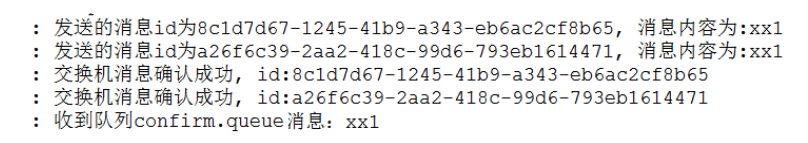

可以看到，发送了两条消息，第一条消息的 RoutingKey 为"key1"，第二条消息的 RoutingKey 为"key2"，两条消息都成功被交换机接收，也收到了交换机的确认回调，但消费者只收到了一条消息，因为第二条消息的 RoutingKey 与队列的 BindingKey 不一致，也没有其它队列能接收这个消息，所有第二条消息被直接丢弃了。

## 8.2.回退消息

### 8.2.1.Mandatory 参数

在仅开启了生产者确认机制的情况下，交换机接收到消息后，会直接给消息生产者发送确认消息，如果发现该消息不可路由，那么消息会被直接丢弃，此时生产者是不知道消息被丢弃这个事件的。那么如何让无法被路由的消息帮我想办法处理一下？最起码通知我一声，我好自己处理啊。通过设置 mandatory 参数可以在当消息传递过程中不可达目的地时将消息返回给生产者。

### 8.2.2.消息生产者代码

```java
@Slf4j
@Component
public
class
MessageProducer
implements
RabbitTemplate.ConfirmCallback
,
RabbitTemplate.ReturnCallback {
@Autowired
private RabbitTemplate rabbitTemplate;
//rabbitTemplate 注入之后就设置该值
@PostConstruct
private void init(){
rabbitTemplate.setConfirmCallback(this);
/**

* true ：
  *
  交换机无法将消息进行路由时，会将该消息返回给生产者
* false ：
  *
  如果发现消息无法进行路由，则直接丢弃
  */
  rabbitTemplate.setMandatory(true);
  //设置回退消息交给谁处理
  rabbitTemplate.setReturnCallback(this);
  }
  @GetMapping("sendMessage")
  public void sendMessage(String message){
  //让消息绑定一个 id 值
  CorrelationData correlationData1 = new CorrelationData(UUID.randomUUID().toString());rabbitTemplate.convertAndSend("confirm.exchange","key1",message+"key1",correlationData1)
  ;
  log.info("发送消息 id 为:{}内容为{}",correlationData1.getId(),message+"key1");
  CorrelationData correlationData2 = new CorrelationData(UUID.randomUUID().toString());
  rabbitTemplate.convertAndSend("confirm.exchange","key2",message+"key2",correlationData2)
  ;
  log.info("发送消息 id 为:{}内容为{}",correlationData2.getId(),message+"key2");
  }
  @Override
  public void confirm(CorrelationData correlationData, boolean ack, String cause){
  String id = correlationData != null ? correlationData.getId(): "";
  if (ack){
  log.info("交换机收到消息确认成功, id:{}", id);
  } else {
  log.error("消息 id:{}未成功投递到交换机,原因是:{}", id, cause);
  }
  }
  @Override
  public void returnedMessage(Message message, int replyCode, String replyText, String
  exchange, String routingKey){
  log.info("消息:{}被服务器退回，退回原因:{},交换机是:{},路由 key:{}",
  new String(message.getBody()),replyText, exchange, routingKey);
  }
  }
```


### 8.2.3.回调接口

```java
@Component
@Slf4j
public
class
MyCallBack
implements
RabbitTemplate.ConfirmCallback,RabbitTemplate.ReturnCallback {
/**

* 交换机不管是否收到消息的一个回调方法
* CorrelationData
* 消息相关数据
* ack
* 交换机是否收到消息
  */
  @Override
  public void confirm(CorrelationData correlationData, boolean ack, String cause){
  String id=correlationData!=null?correlationData.getId():"";
  if(ack){
  log.info("交换机已经收到 id 为:{}的消息",id);
  }else{
  log.info("交换机还未收到 id 为:{}消息,由于原因:{}",id,cause);
  }
  }
  //当消息无法路由的时候的回调方法
  @Override
  public void returnedMessage(Message message, int replyCode, String replyText, String
  exchange, String routingKey){
  log.error("消息{},被交换机{}退回，退回原因:{},路由 key:{}",new
  String(message.getBody()),exchange,replyText,routingKey);
  }
  }
```


### 8.2.4.结果分析

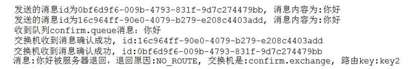


## 8.3.备份交换机

有了 mandatory 参数和回退消息，我们获得了对无法投递消息的感知能力，有机会在生产者的消息无法被投递时发现并处理。但有时候，我们并不知道该如何处理这些无法路由的消息，最多打个日志，然后触发报警，再来手动处理。而通过日志来处理这些无法路由的消息是很不优雅的做法，特别是当生产者所在的服务有多台机器的时候，手动复制日志会更加麻烦而且容易出错。而且设置 mandatory 参数会增
加生产者的复杂性，需要添加处理这些被退回的消息的逻辑。如果既不想丢失消息，又不想增加生产者的复杂性，该怎么做呢？前面在设置死信队列的文章中，我们提到，可以为队列设置死信交换机来存储那些处理失败的消息，可是这些不可路由消息根本没有机会进入到队列，因此无法使用死信队列来保存消息。在 RabbitMQ 中，有一种备份交换机的机制存在，可以很好的应对这个问题。什么是备份交换机呢？备份交换机可以理解为 RabbitMQ 中交换机的“备胎”，当我们为某一个交换机声明一个对应的备份交换机时，就是为它创建一个备胎，当交换机接收到一条不可路由消息时，将会把这条消息转发到备份交换机中，由备份交换机来进行转发和处理，通常备份交换机的类型为 Fanout ，这样就能把所有消息都投递到与其绑定的队列中，然后我们在备份交换机下绑定一个队列，这样所有那些原交换机无法被路由的消息，就会都进入这个队列了。当然，我们还可以建立一个报警队列，用独立的消费者来进行监测和报警。

### 8.3.1.代码架构图

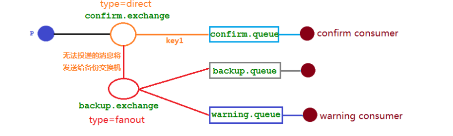

### 8.3.2.修改配置类

```java
@Configuration
public class ConfirmConfig {public static final String CONFIRM_EXCHANGE_NAME = "confirm.exchange";
public static final String CONFIRM_QUEUE_NAME = "confirm.queue";
public static final String BACKUP_EXCHANGE_NAME = "backup.exchange";
public static final String BACKUP_QUEUE_NAME = "backup.queue";
public static final String WARNING_QUEUE_NAME = "warning.queue";
//声明确认队列
@Bean("confirmQueue")
public Queue confirmQueue(){
return QueueBuilder.durable(CONFIRM_QUEUE_NAME).build();
}
//声明确认队列绑定关系
@Bean
public Binding queueBinding(@Qualifier("confirmQueue") Queue queue,
@Qualifier("confirmExchange") DirectExchange exchange){
return BindingBuilder.bind(queue).to(exchange).with("key1");
}
//声明备份 Exchange
@Bean("backupExchange")
public FanoutExchange backupExchange(){
return new FanoutExchange(BACKUP_EXCHANGE_NAME);
}
//声明确认 Exchange 交换机的备份交换机
@Bean("confirmExchange")
public DirectExchange confirmExchange(){
ExchangeBuilder exchangeBuilder =
ExchangeBuilder.directExchange(CONFIRM_EXCHANGE_NAME)
.durable(true)
//设置该交换机的备份交换机
.withArgument("alternate-exchange", BACKUP_EXCHANGE_NAME);
return (DirectExchange)exchangeBuilder.build();
}
//声明警告队列
@Bean("warningQueue")
public Queue warningQueue(){
return QueueBuilder.durable(WARNING_QUEUE_NAME).build();
}
//声明报警队列绑定关系
@Bean
public Binding warningBinding(@Qualifier("warningQueue") Queue queue,
@Qualifier("backupExchange")
FanoutExchange
backupExchange){
return BindingBuilder.bind(queue).to(backupExchange);
}
//声明备份队列
@Bean("backQueue")
public Queue backQueue(){
return QueueBuilder.durable(BACKUP_QUEUE_NAME).build();
}
//声明备份队列绑定关系
@Bean
public Binding backupBinding(@Qualifier("backQueue") Queue queue,
@Qualifier("backupExchange") FanoutExchange backupExchange){
return BindingBuilder.bind(queue).to(backupExchange);
}
}
```

### 8.3.3.报警消费者

```java
@Component
@Slf4j
public class WarningConsumer {
public static final String WARNING_QUEUE_NAME = "warning.queue";
@RabbitListener(queues = WARNING_QUEUE_NAME)public void receiveWarningMsg(Message message){
String msg = new String(message.getBody());
log.error("报警发现不可路由消息：{}", msg);
}
}
```

### 8.3.4.测试注意事项

重新启动项目的时候需要把原来的 confirm.exchange 删除因为我们修改了其绑定属性，不然报以下错:

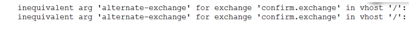

### 8.3.5.结果分析

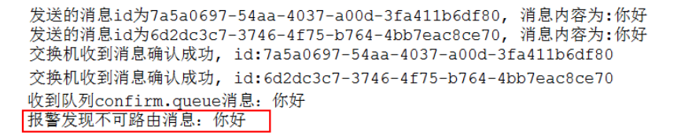

mandatory 参数与备份交换机可以一起使用的时候，如果两者同时开启，消息究竟何去何从？谁优先级高，经过上面结果显示答案是备份交换机优先级高。

# 9. RabbitMQ 其他知识点

## 9.1.幂等性

### 9.1.1. 概念

用户对于同一操作发起的一次请求或者多次请求的结果是一致的，不会因为多次点击而产生了副作用。举个最简单的例子，那就是支付，用户购买商品后支付，支付扣款成功，但是返回结果的时候网络异常，此时钱已经扣了，用户再次点击按钮，此时会进行第二次扣款，返回结果成功，用户查询余额发现多扣钱了，流水记录也变成了两条。在以前的单应用系统中，我们只需要把数据操作放入事务中即可，发生错误立即回滚，但是再响应客户端的时候也有可能出现网络中断或者异常等等

### 9.1.2.消息重复消费

消费者在消费 MQ 中的消息时，MQ 已把消息发送给消费者，消费者在给 MQ 返回 ack 时网络中断，故 MQ 未收到确认信息，该条消息会重新发给其他的消费者，或者在网络重连后再次发送给该消费者，但实际上该消费者已成功消费了该条消息，造成消费者消费了重复的消息。

### 9.1.3.解决思路

MQ 消费者的幂等性的解决一般使用全局 ID 或者写个唯一标识比如时间戳或者 UUID 或者订单消费者消费 MQ 中的消息也可利用 MQ 的该 id 来判断，或者可按自己的规则生成一个全局唯一 id，每次消费消息时用该 id 先判断该消息是否已消费过。

### 9.1.4.消费端的幂等性保障

在海量订单生成的业务高峰期，生产端有可能就会重复发生了消息，这时候消费端就要实现幂等性，这就意味着我们的消息永远不会被消费多次，即使我们收到了一样的消息。业界主流的幂等性有两种操作:a.唯一 ID+指纹码机制,利用数据库主键去重, b.利用 redis 的原子性去实现

### 9.1.5.唯一 ID+指纹码机制

指纹码:我们的一些规则或者时间戳加别的服务给到的唯一信息码,它并不一定是我们系统生成的，基本都是由我们的业务规则拼接而来，但是一定要保证唯一性，然后就利用查询语句进行判断这个 id 是否存在数据库中,优势就是实现简单就一个拼接，然后查询判断是否重复；劣势就是在高并发时，如果是单个数据库就会有写入性能瓶颈当然也可以采用分库分表提升性能，但也不是我们最推荐的方式。

### 9.1.6.Redis 原子性

利用 redis 执行 setnx 命令，天然具有幂等性。从而实现不重复消费

## 9.2.优先级队列

### 9.2.1.使用场景

在我们系统中有一个订单催付的场景，我们的客户在天猫下的订单,淘宝会及时将订单推送给我们，如果在用户设定的时间内未付款那么就会给用户推送一条短信提醒，很简单的一个功能对吧，但是，tmall商家对我们来说，肯定是要分大客户和小客户的对吧，比如像苹果，小米这样大商家一年起码能给我们创造很大的利润，所以理应当然，他们的订单必须得到优先处理，而曾经我们的后端系统是使用 redis 来存放的定时轮询，大家都知道 redis 只能用 List 做一个简简单单的消息队列，并不能实现一个优先级的场景，所以订单量大了后采用RabbitMQ 进行改造和优化,如果发现是大客户的订单给一个相对比较高的优先级，否则就是默认优先级。

### 9.2.2.如何添加

a.控制台页面添加

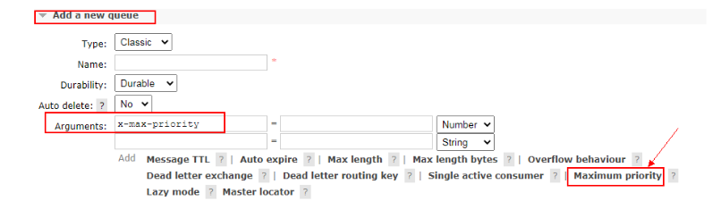

b.队列中代码添加优先级

```java
Map<String, Object> params = new HashMap();
params.put("x-max-priority",10);
channel.queueDeclare("hello", true, false, false, params);
```

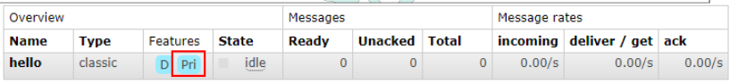

c.消息中代码添加优先级

```java
AMQP.BasicProperties
properties = new AMQP.BasicProperties().builder().priority(5).build();
```

d.注意事项

要让队列实现优先级需要做的事情有如下事情:队列需要设置为优先级队列，消息需要设置消息的优先级，消费者需要等待消息已经发送到队列中才去消费因为，这样才有机会对消息进行排序

### 9.2.3. 实战

a.消息生产者

```java
public class Producer {
private static final String QUEUE_NAME="hello";
public static void main(String[] args) throws Exception {
try (Channel channel = RabbitMqUtils.getChannel();){
//给消息赋予一个 priority 属性
AMQP.BasicProperties
properties
AMQP.BasicProperties().builder().priority(5).build();
for (int i = 1; i <11; i++){
String message = "info"+i;
=
newif(i==5){
channel.basicPublish("", QUEUE_NAME, properties, message.getBytes());
}else{
channel.basicPublish("", QUEUE_NAME, null, message.getBytes());
}
System.out.println("发送消息完成:"+ message);
}
}
}
}
```


b.消息消费者

```java
public class Consumer {
private static final String QUEUE_NAME="hello";
public static void main(String[] args) throws Exception {
Channel channel = RabbitMqUtils.getChannel();
//设置队列的最大优先级最大可以设置到255 官网推荐1-10 如果设置太高比较吃内存和 CPU
Map<String, Object> params = new HashMap();
params.put("x-max-priority",10);
channel.queueDeclare(QUEUE_NAME, true, false, false, params);
System.out.println("消费者启动等待消费......");
DeliverCallback deliverCallback=(consumerTag, delivery)->{
String receivedMessage = new String(delivery.getBody());
System.out.println("接收到消息:"+receivedMessage);
};
channel.basicConsume(QUEUE_NAME,true,deliverCallback,(consumerTag)->{
System.out.println("消费者无法消费消息时调用，如队列被删除");
});
}
}
```

## 9.3.惰性队列

### 9.3.1. 使用场景

RabbitMQ 从3.6.0 版本开始引入了惰性队列的概念。惰性队列会尽可能的将消息存入磁盘中，而在消费者消费到相应的消息时才会被加载到内存中，它的一个重要的设计目标是能够支持更长的队列，即支持更多的消息存储。当消费者由于各种各样的原因(比如消费者下线、宕机亦或者是由于维护而关闭等)而致使长时间内不能消费消息造成堆积时，惰性队列就很有必要了。默认情况下，当生产者将消息发送到 RabbitMQ 的时候，队列中的消息会尽可能的存储在内存之中，这样可以更加快速的将消息发送给消费者。即使是持久化的消息，在被写入磁盘的同时也会在内存中驻留一份备份。当 RabbitMQ 需要释放内存的时候，会将内存中的消息换页至磁盘中，这个操作会耗费较长的
时间，也会阻塞队列的操作，进而无法接收新的消息。虽然 RabbitMQ 的开发者们一直在升级相关的算法，但是效果始终不太理想，尤其是在消息量特别大的时候。

### 9.3.2.两种模式

队列具备两种模式： default 和 lazy。默认的为 default 模式，在3.6.0 之前的版本无需做任何变更。 lazy模式即为惰性队列的模式，可以通过调用 channel.queueDeclare 方法的时候在参数中设置，也可以通过Policy 的方式设置，如果一个队列同时使用这两种方式设置的话，那么 Policy 的方式具备更高的优先级。如果要通过声明的方式改变已有队列的模式的话，那么只能先删除队列，然后再重新声明一个新的。
在队列声明的时候可以通过“x-queue-mode”参数来设置队列的模式，取值为“default”和“lazy”。下面示例中演示了一个惰性队列的声明细节：

```java
Map<String, Object> args = new HashMap<String, Object>();
args.put("x-queue-mode","lazy");
channel.queueDeclare("myqueue", false, false, false, args);
```

### 9.3.3. 内存开销对比

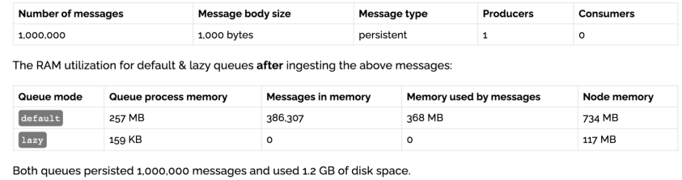

在发送1 百万条消息，每条消息大概占1KB 的情况下，普通队列占用内存是1.2GB，而惰性队列仅仅占用1.5MB

# 10. RabbitMQ 集群

## 10.1. clustering

### 10.1.1.使用集群的原因

最开始我们介绍了如何安装及运行 RabbitMQ 服务，不过这些是单机版的，无法满足目前真实应用的要求。如果 RabbitMQ 服务器遇到内存崩溃、机器掉电或者主板故障等情况，该怎么办？单台 RabbitMQ服务器可以满足每秒1000 条消息的吞吐量，那么如果应用需要 RabbitMQ 服务满足每秒10 万条消息的吞吐量呢？购买昂贵的服务器来增强单机 RabbitMQ 务的性能显得捉襟见肘，搭建一个 RabbitMQ 集群才是解决实际问题的关键.

### 10.1.2.搭建步骤

```txt
1.修改3 台机器的主机名称
vim /etc/hostname
2.配置各个节点的 hosts 文件，让各个节点都能互相识别对方
vim /etc/hosts
10.211.55.74 node1
10.211.55.75 node2
10.211.55.76 node3
3.以确保各个节点的 cookie 文件使用的是同一个值
在 node1 上执行远程操作命令
scp /var/lib/rabbitmq/.erlang.cookie root@node2:/var/lib/rabbitmq/.erlang.cookie
scp /var/lib/rabbitmq/.erlang.cookie root@node3:/var/lib/rabbitmq/.erlang.cookie
4.启动 RabbitMQ 服务,顺带启动 Erlang 虚拟机和 RbbitMQ 应用服务(在三台节点上分别执行以下命令)
rabbitmq-server -detached
5.在节点2 执行
rabbitmqctl stop_app
(rabbitmqctl stop 会将 Erlang 虚拟机关闭，rabbitmqctl stop_app 只关闭 RabbitMQ 服务)
rabbitmqctl reset
rabbitmqctl join_cluster rabbit@node1
rabbitmqctl start_app(只启动应用服务)
6.在节点3 执行rabbitmqctl stop_app
rabbitmqctl reset
rabbitmqctl join_cluster rabbit@node2
rabbitmqctl start_app
7.集群状态
rabbitmqctl cluster_status
8.需要重新设置用户
创建账号
rabbitmqctl add_user admin 123
设置用户角色
rabbitmqctl set_user_tags admin administrator
设置用户权限
rabbitmqctl set_permissions -p "/" admin ".*"".*"".*"
9.解除集群节点(node2 和 node3 机器分别执行)
rabbitmqctl stop_app
rabbitmqctl reset
rabbitmqctl start_app
rabbitmqctl cluster_status
rabbitmqctl forget_cluster_node rabbit@node2(node1 机器上执行)
```

## 10.2.镜像队列

### 10.2.1.使用镜像的原因

如果 RabbitMQ 集群中只有一个 Broker 节点，那么该节点的失效将导致整体服务的临时性不可用，并且也可能会导致消息的丢失。
可以将所有消息都设置为持久化，并且对应队列的 durable 属性也设置为 true，但是这样仍然无法避免由于缓存导致的问题：因为消息在发送之后和被写入磁盘井执行刷盘动作之间存在一个短暂却会产生问题的时间窗。通过 publisherconfirm 机制能够确保客户端知道哪些消息己经存入磁盘，尽管如此，一般不希望遇到因单点故障导致的服务不可用。引入镜像队列(Mirror Queue)的机制，可以将队列镜像到集群中的其他 Broker 节点之上，如果集群中的一个节点失效了，队列能自动地切换到镜像中的另一个节点上以保证服务的可用性。

### 10.2.2.搭建步骤

> 1.启动三台集群节点
>
> 2.随便找一个节点添加 policy
>
> 
>
> 3.在 node1 上创建一个队列发送一条消息，队列存在镜像队列
>
> 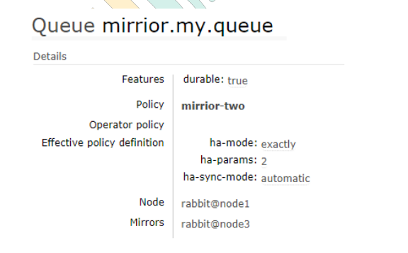
>
> 4.停掉 node1 之后发现 node2 成为镜像队列
>
> 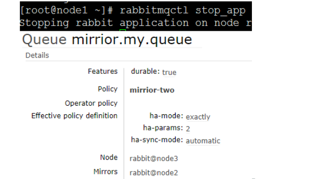
>
> 5.就算整个集群只剩下一台机器了依然能消费队列里面的消息
> 说明队列里面的消息被镜像队列传递到相应机器里面了
>
> 


## 10.3. Haproxy+Keepalive 实现高可用负载均衡

### 10.3.1.整体架构图

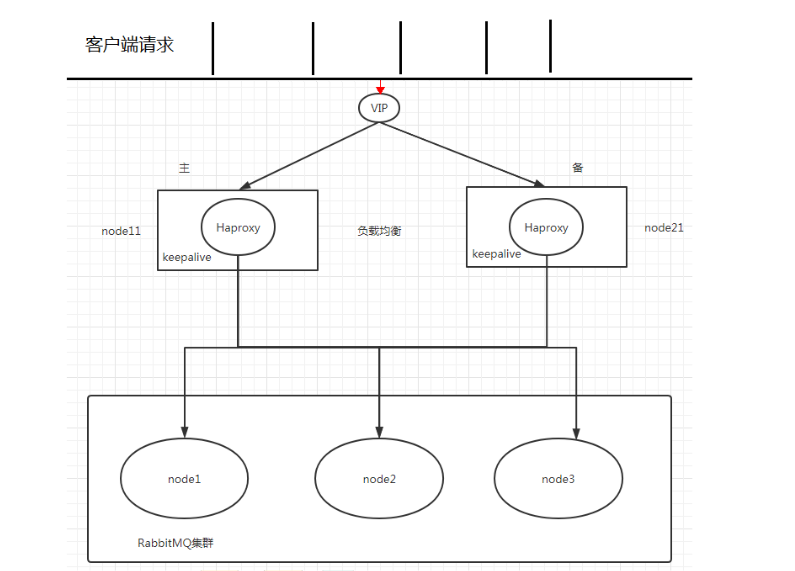

### 10.3.2. Haproxy 实现负载均衡

HAProxy 提供高可用性、负载均衡及基于 TCPHTTP 应用的代理，支持虚拟主机，它是免费、快速并且可靠的一种解决方案，包括 Twitter,Reddit,StackOverflow,GitHub 在内的多家知名互联网公司在使用。HAProxy 实现了一种事件驱动、单一进程模型，此模型支持非常大的井发连接数。扩展 nginx,lvs,haproxy 之间的区别: http://www.ha97.com/5646.html

### 10.3.3.搭建步骤

> 1.下载 haproxy(在 node1 和 node2)
>
> yum -y install haproxy
>
> 2.修改 node1 和 node2 的 haproxy.cfgvim /etc/haproxy/haproxy.cfg
>
> 需要修改红色 IP 为当前机器 IP
>
> 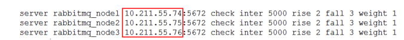
>
> 3.在两台节点启动 haproxy
>
> haproxy -f /etc/haproxy/haproxy.cfg
>
> ps -ef | grep haproxy
>
> 4.访问地址
>
> http://10.211.55.71:8888/stats

### 10.3.4. Keepalived 实现双机(主备)热备

试想如果前面配置的 HAProxy 主机突然宕机或者网卡失效，那么虽然 RbbitMQ 集群没有任何故障但是对于外界的客户端来说所有的连接都会被断开结果将是灾难性的为了确保负载均衡服务的可靠性同样显得十分重要，这里就要引入 Keepalived 它能够通过自身健康检查、资源接管功能做高可用(双机热备)，实现故障转移.

### 10.3.5.搭建步骤

> 1.下载 keepalived
> yum -y install keepalived
> 2.节点 node1 配置文件
> vim /etc/keepalived/keepalived.conf
> 把资料里面的 keepalived.conf 修改之后替换
> 3.节点 node2 配置文件
> 需要修改 global_defs 的 router_id,如:nodeB
> 其次要修改 vrrp_instance_VI 中 state 为"BACKUP"；
> 最后要将 priority 设置为小于100 的值
> 4.添加 haproxy_chk.sh
> (为了防止 HAProxy 服务挂掉之后 Keepalived 还在正常工作而没有切换到 Backup 上，所以这里需要编写一个脚本来检测 HAProxy 务的状态,当 HAProxy 服务挂掉之后该脚本会自动重启
> HAProxy 的服务，如果不成功则关闭 Keepalived 服务，这样便可以切换到 Backup 继续工作)
> vim /etc/keepalived/haproxy_chk.sh(可以直接上传文件)
> 修改权限 chmod 777 /etc/keepalived/haproxy_chk.sh
> 5.启动 keepalive 命令(node1 和 node2 启动)
> systemctl start keepalived
> 6.观察 Keepalived 的日志
> tail -f /var/log/messages -n 200
> 7.观察最新添加的 vip
> ip add show
> 8.node1 模拟 keepalived 关闭状态
> systemctl stop keepalived
> 9.使用 vip 地址来访问 rabbitmq 集群

## 10.4. Federation Exchange

### 10.4.1.使用它的原因

(broker 北京)，(broker 深圳)彼此之间相距甚远，网络延迟是一个不得不面对的问题。有一个在北京的业务(Client 北京)需要连接(broker 北京)，向其中的交换器 exchangeA 发送消息，此时的网络延迟很小，(Client 北京)可以迅速将消息发送至 exchangeA 中，就算在开启了 publisherconfirm 机制或者事务机制的情况下，也可以迅速收到确认信息。此时又有个在深圳的业务(Client 深圳)需要向 exchangeA 发送消息，那么(Client 深圳)(broker 北京)之间有很大的网络延迟，(Client 深圳)将发送消息至 exchangeA 会经历一定的延迟，尤其是在开启了 publisherconfirm 机制或者事务机制的情况下，(Client 深圳)会等待很长的延迟时间来接收(broker 北京)的确认信息，进而必然造成这条发送线程的性能降低，甚至造成一定程度上的阻塞。将业务(Client 深圳)部署到北京的机房可以解决这个问题，但是如果(Client 深圳)调用的另些服务都部署在深圳，那么又会引发新的时延问题，总不见得将所有业务全部部署在一个机房，那么容灾又何以实现？

这里使用 Federation 插件就可以很好地解决这个问题.

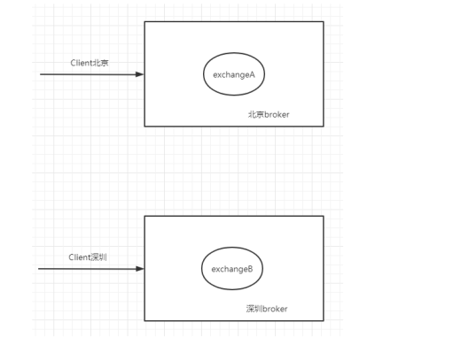

### 10.4.2.搭建步骤

> 1.需要保证每台节点单独运行
>
> 2.在每台机器上开启 federation 相关插件
>
> rabbitmq-plugins enable rabbitmq_federation
>
> rabbitmq-plugins enable rabbitmq_federation_management
>
> 
>
> 3.原理图(先运行 consumer 在 node2 创建 fed_exchange)
>
> 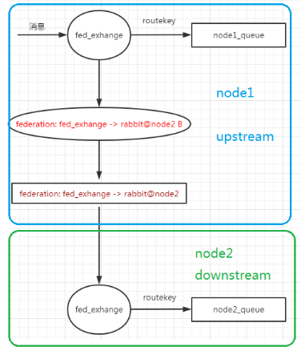
>
> 4.在 downstream(node2)配置 upstream(node1)
>
> 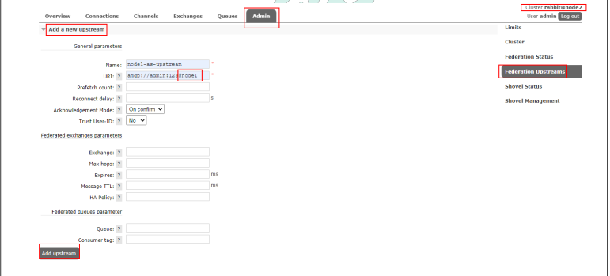
>
> 
>
> 5.添加 policy
>
> 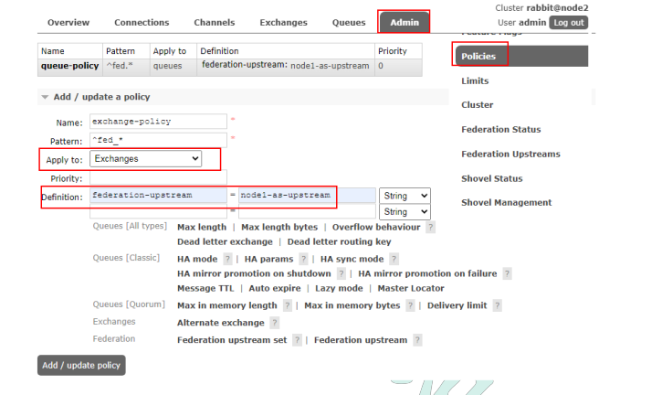
>
> 5.成功的前提
>
> 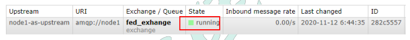


## 10.5. Federation Queue

### 10.5.1.使用它的原因

联邦队列可以在多个 Broker 节点(或者集群)之间为单个队列提供均衡负载的功能。一个联邦队列可以连接一个或者多个上游队列(upstream queue)，并从这些上游队列中获取消息以满足本地消费者消费消息的需求。

### 10.5.2.搭建步骤

> 1.原理图
>
> 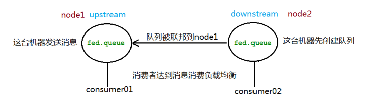
>
> 2.添加 upstream(同上)
>
> 3.添加 policy
>
> 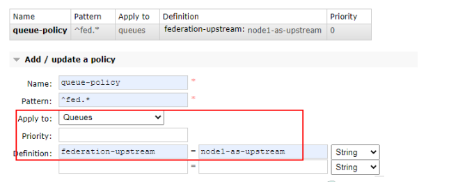


## 10.6. Shovel

### 10.6.1.使用它的原因

Federation 具备的数据转发功能类似，Shovel 够可靠、持续地从一个 Broker 中的队列(作为源端，即source)拉取数据并转发至另一个 Broker 中的交换器(作为目的端，即 destination)。作为源端的队列和作为目的端的交换器可以同时位于同一个 Broker，也可以位于不同的 Broker 上。Shovel 可以翻译为"铲子"，是一种比较形象的比喻，这个"铲子"可以将消息从一方"铲子"另一方。Shovel 行为就像优秀的客户端应用程序能够负责连接源和目的地、负责消息的读写及负责连接失败问题的处理。

### 10.6.2.搭建步骤

> 1.开启插件(需要的机器都开启)
>
> rabbitmq-plugins enable rabbitmq_shovel
>
> rabbitmq-plugins enable rabbitmq_shovel_management
>
> 
>
> 2.原理图(在源头发送的消息直接回进入到目的地队列)
>
> 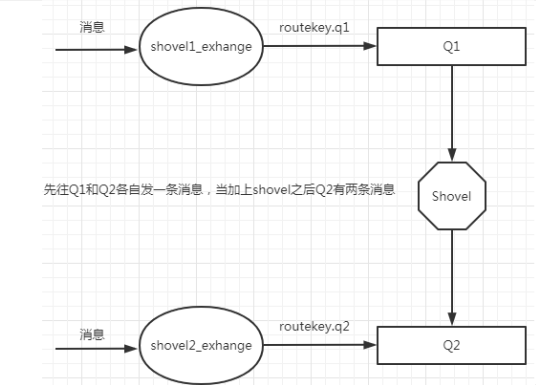
>
> 3.添加 shovel 源和目的地
>
> 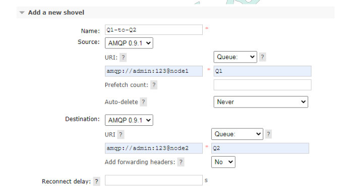