# 第1章 Java语言概述

**Java基础是学习JavaEE、大数据、Android开发的基石！**

举例：**Spring – Rest(Spring MVC)**

 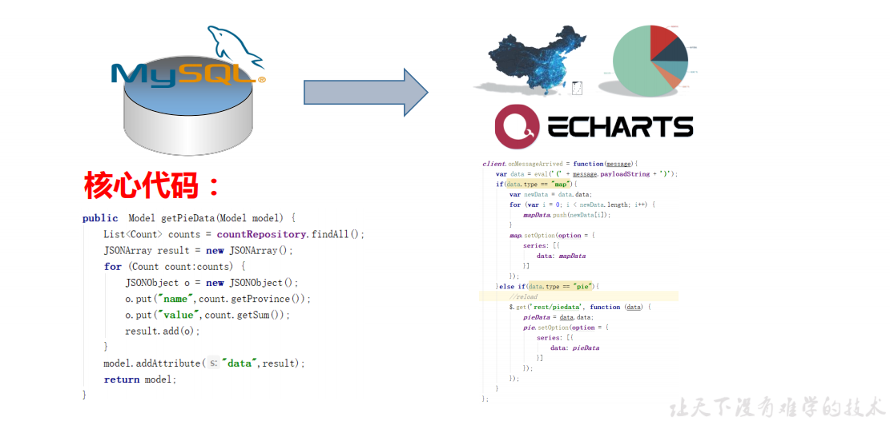

举例：**Spark – Spark Streaming**

 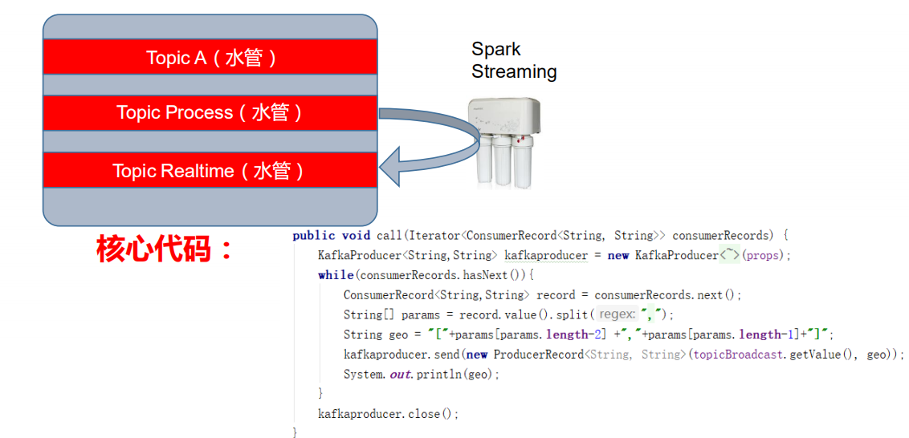


**Java基础知识图解**

 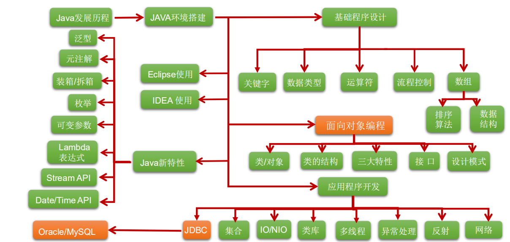


## 1.1  软件开发介绍

- 软件开发

软件，即一系列按照特定顺序组织的计算机数据和指令的集合。有系统软件和应用软件之分。

- 人机交互方式

- 图形化界面(Graphical User Interface GUI)这种方式简单直观，使用者易于接受，容易上手操作。

- 命令行方式(Command Line Interface CLI)：需要有一个控制台，输入特定的指令，让计算机完成一些操作。较为麻烦，需要记录住一些命令。

Pascal之父Nicklaus Wirth： “Algorithms+Data Structures=Programs”


- 常用的DOS命令

- dir : 列出当前目录下的文件以及文件夹

- md : 创建目录

- rd : 删除目录

- cd : 进入指定目录

- cd.. : 退回到上一级目录

- cd\: 退回到根目录

- del : 删除文件

- exit : 退出 dos 命令行

-  补充：echo javase>1.doc

- 常用快捷键

- ← →：移动光标

- ↑ ↓：调阅历史操作命令

- Delete和Backspace：删除字符

## 1.2 计算机编程语言介绍

- 什么是计算机语言

  **语言**：是人与人之间用于沟通的一种方式。例如：中国人与中国人用普通话沟通。而中国人要和英国人交流，就要学习英语。

  **计算机语言**：人与计算机交流的方式。如果人要与计算机交流，那么就要学习计算机语言。计算机语言有很多种。如：C，C++，Java，PHP , Kotlin，Python，Scala等。

- 第一代语言

  机器语言。指令以二进制代码形式存在。

- 第二代语言

  汇编语言。使用助记符表示一条机器指令。

 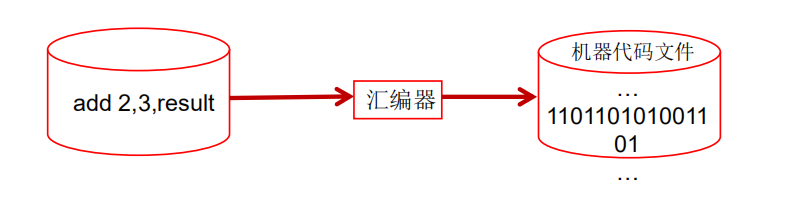


- 第三代语言：高级语言

  C、Pascal、Fortran面向过程的语言

  C++面向过程/面向对象

  Java跨平台的纯面向对象的语言

  .NET跨语言的平台

  Python、Scala…

## 1.3 Java语言概述

Java是SUN(Stanford University Network，斯坦福大学网络公司 ) 1995年推出的一门高级编程语言。是一种面向Internet的编程语言。Java一开始富有吸引力是因为Java程序可以在Web浏览器中运行。这些Java程序被称为Java小程序（applet）。applet使用现代的图形用户界面与Web用户进行交互。 applet内嵌在HTML代码中。

随着Java技术在web方面的不断成熟，已经成为Web应用程序的首选开发语言。后台开发：Java、PHP、Python、Go、Node.js1.3 

### **Java简史**

- 1991年 Green项目，开发语言最初命名为Oak (橡树) 
- 1994年，开发组意识到Oak 非常适合于互联网
- 1996年，发布JDK 1.0，约8.3万个网页应用Java技术来制作
- 1997年，发布JDK 1.1，JavaOne会议召开，创当时全球同类会议规模之最
- 1998年，发布JDK 1.2，同年发布企业平台J2EE
- 1999年，Java分成J2SE、J2EE和J2ME，JSP/Servlet技术诞生
- 2004年，发布里程碑式版本：JDK 1.5，为突出此版本的重要性，更名为JDK 5.0
- 2005年，J2SE -> JavaSE，J2EE -> JavaEE，J2ME -> JavaME
- 2009年，Oracle公司收购SUN，交易价格74亿美元
- 2011年，发布JDK 7.0
- 2014年，发布JDK 8.0，是继JDK 5.0以来变化最大的版本
- 2017年，发布JDK 9.0，最大限度实现模块化
- 2018年3月，发布JDK 10.0，版本号也称为18.3
- 2018年9月，发布JDK 11.0，版本号也称为18.9

### **Java技术体系平台**

Java SE(Java Standard Edition)标准版支持面向桌面级应用（如Windows下的应用程序）的Java平台，提供了完整的Java核心API，此版本以前称为J2SE。

Java EE(Java Enterprise Edition)企业版是为开发企业环境下的应用程序提供的一套解决方案。该技术体系中包含的技术如:Servlet 、Jsp等，主要针对于Web应用程序开发。版本以前称为J2EE。

Java ME(Java Micro Edition)小型版支持Java程序运行在移动终端（手机、PDA）上的平台，对Java API有所精简，并加入了针对移动终端的支持，此版本以前称为J2ME。

Java Card支持一些Java小程序（Applets）运行在小内存设备（如智能卡）上的平台

### **Java在各领域的应用**

-  从Java的应用领域来分，Java语言的应用方向主要表现在以下几个方面：

-  企业级应用：主要指复杂的大企业的软件系统、各种类型的网站。Java的安全机制以及它的跨平台的优势，使它在分布式系统领域开发中有广泛应用。应用领域包括金融、电信、交通、电子商务等。

-  Android平台应用：Android应用程序使用Java语言编写。Android开发水平的高低很大程度上取决于Java语言核心能力是否扎实。 

- 大数据平台开发：各类框架有Hadoop，spark，storm，flink等，就这类技术生态圈来讲，还有各种中间件如flume，kafka，sqoop等等 ，这些框架以及工具大多数是用Java编写而成，但提供诸如Java，scala，Python，R等各种语言API供编程。

- 移动领域应用：主要表现在消费和嵌入式领域，是指在各种小型设备上的应用，包括手机、PDA、机顶盒、汽车通信设备等。


## 1.4 Java语言的诞生

Java之父James Gosling团队在开发”Green”项目时，发现C缺少垃圾回收系统，还有可移植的安全性、分布程序设计和多线程功能。最后，他们想要一种易于移植到各种设备上的平台。Java确实是从C语言和C++语言继承了许多成份，甚至可以将Java看成是类C语言发展和衍生的产物。比如Java语言的变量声明，操作符形式，参数传递，流程控制等方面和C语言、C++语言完全相同。但同时，Java是一个纯粹的面向对象的程序设计语言，它继承了C++语言面向对象技术的核心。Java舍弃了C语言中容易引起错误的指针（以引用取代）、运算符重载（operator overloading）、多重继承（以接口取代）等特性，增加了垃圾回收器功能用于回收不再被引用的对象所占据的内存空间。JDK1.5又引入了泛型编程（Generic Programming）、类型安全的枚举、不定长参数和自动装/拆箱

**主要特性**

• Java语言是易学的。Java语言的语法与C语言和C++语言很接近，使得大多数程序员很容易学习和使用Java。 

• Java语言是强制面向对象的。Java语言提供类、接口和继承等原语，为了简单起见，只支持类之间的单继承，但支持接口之间的多继承，并支持类与接口之间的实现机制（关键字为implements）。

• Java语言是分布式的。Java语言支持Internet应用的开发，在基本的Java应用编程接口中有一个网络应用编程接口（java net），它提供了用于网络应用编程的类库，包括URL、URLConnection、Socket、ServerSocket等。Java的RMI（远程方法激活）机制也是开发分布式应用的重要手段。

• Java语言是健壮的。Java的强类型机制、异常处理、垃圾的自动收集等是Java程序健壮性的重要保证。对指针的丢弃是Java的明智选择。

• Java语言是安全的。Java通常被用在网络环境中，为此，Java提供了一个安全机制以防恶意代码的攻击。如：安全防范机制（类ClassLoader），如分配不同的名字空间以防替代本地的同名类、字节代码检查。

• Java语言是体系结构中立的。Java程序（后缀为java的文件）在Java平台上被编译为体系结构中立的字节码格式（后缀为class的文件），然后可以在实现这个Java平台的任何系统中运行。

• Java语言是解释型的。如前所述，Java程序在Java平台上被编译为字节码格式，然后可以在实现这个Java平台的任何系统的解释器中运行。

• Java是性能略高的。与那些解释型的高级脚本语言相比，Java的性能还是较优的。

• Java语言是原生支持多线程的。在Java语言中，线程是一种特殊的对象，它必须由Thread类或其子（孙）类来创建。


## 1.5 Java语言运行机制及运行过程

- Java语言的特点

**特点一：面向对象**

​	两个基本概念：类、对象

​	三大特性：封装、继承、多态

**特点二：健壮性**

​	吸收了C/C++语言的优点，但去掉了其影响程序健壮性的部分（如指针、内存的申请与释放等），提供了一个相对安全的内存管理和访问机制。

**特点三：跨平台性**

​	跨平台性：通过Java语言编写的应用程序在不同的系统平台上都可以运行。“Write once , Run Anywhere” 。

   原理：只要在需要运行 java 应用程序的操作系统上，先安装一个Java虚拟机 (JVM Java Virtual Machine) 即可。由JVM来负责Java程序在该系统中的运行。

 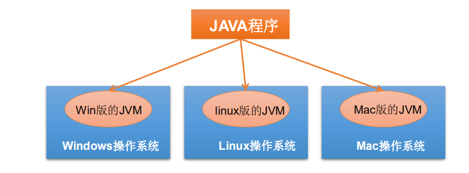

因为有了JVM，同一个Java 程序在三个不同的操作系统中都可以执行。这样就实现了Java 程序的跨平台性。

**Java两种核心机制**

​	Java虚拟机 (Java Virtal Machine) 

​	垃圾收集机制 (Garbage Collection)


**核心机制—Java虚拟机**

- JVM是一个虚拟的计算机，具有指令集并使用不同的存储区域。负责执行指令，管理数据、内存、寄存器。 

- 对于不同的平台，有不同的虚拟机。

- 只有某平台提供了对应的java虚拟机，java程序才可在此平台运行

- Java虚拟机机制屏蔽了底层运行平台的差别，实现了“一次编译，到处运行”

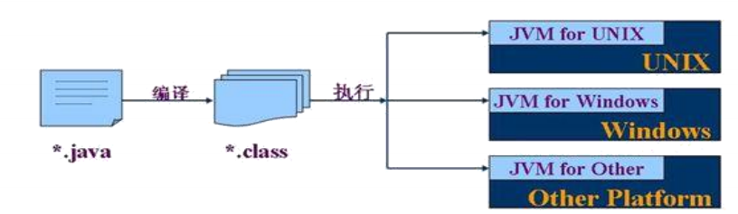

**核心机制—垃圾回收**

- 不再使用的内存空间应回收—— 垃圾回收。

  在C/C++等语言中，由程序员负责回收无用内存。

  Java 语言消除了程序员回收无用内存空间的责任：它提供一种系统级线程跟踪存储空间的分配情况。并在JVM空闲时，检查并释放那些可被释放的存储空间。

- 垃圾回收在Java程序运行过程中自动进行，程序员无法精确控制和干预。

- Java程序还会出现内存泄漏和内存溢出问题吗？Yes!

## 1.6 Java语言的环境搭建

- 明确什么是JDK, JRE

- 下载 JDK

- 安装 JDK

- 配置环境变量

  path：windows系统执行命令时要搜寻的路径。

- 验证是否成功：javac java

- 选择合适的文本编辑器或 IDE 开发

**什么是JDK，JRE**

JDK(Java Development Kit Java开发工具包)

JDK是提供给Java开发人员使用的，其中包含了java的开发工具，也包括了JRE。所以安装了JDK，就不用在单独安装JRE了。其中的开发工具：编译工具(javac.exe) 、打包工具(jar.exe)等

JRE(Java Runtime Environment Java运行环境) 

包括Java虚拟机(JVM Java Virtual Machine)和Java程序所需的核心类库等，如果想要运行一个开发好的Java程序，计算机中只需要安装JRE即可。

简单而言，使用JDK的开发工具完成的Java程序，交给JRE去运行。


**JDK、JRE、JVM关系**

 


 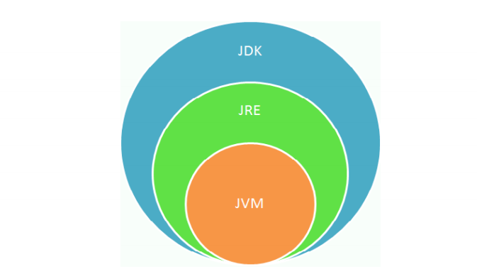

• JDK = JRE + 开发工具集（例如Javac编译工具等）

• JRE = JVM + Java SE标准类库


**下载并安装JDK**

- 官方网址：

  www.oracle.com

  java.sun.com

- 安装JDK

  傻瓜式安装，下一步即可。

  建议：安装路径不要有中文或者空格等特殊符号。

  如果操作系统是64位的，软件尽量选择支持64位的（除非软件本身不区分）。 

  当提示安装 JRE 时，正常在JDK安装时已经装过了，但是为了后续使用Eclipse等开发工具不报错，建议也根据提示安装JRE。

**配置环境变量 path**

- 在dos命令行中敲入javac，出现错误提示：

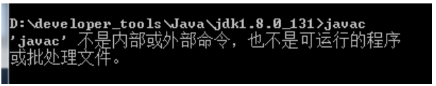

- 错误原因：当前执行的程序在当前目录下如果不存在，windows系统会在系统中已有的一个名为path的环境变量指定的目录中查找。如果仍未找到，会出现以上的错误提示。所以进入到 jdk安装路径\bin目录下，执行javac，会看到javac参数提示信息。

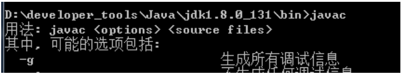

**配置环境变量 path**

每次执行 java 的工具都要进入到bin目录下，是非常麻烦的。可不可以在任何目录下都可以执行java的工具呢？

- 根据windows系统在查找可执行程序的原理，可以将java工具所在路径定义到path 环境变量中，让系统帮我们去找运行执行的程序。

- 配置方法：

  我的电脑--属性--高级系统设置--环境变量

  编辑 path 环境变量，在变量值开始处加上java工具所在目录，后面用 “ ; ”和其他值分隔开即可。

  打开DOS命令行，任意目录下敲入javac。如果出现javac 的参数信息，配置成功。

注： 具体操作流程，参看JDK8下载\_安装_配置.doc

 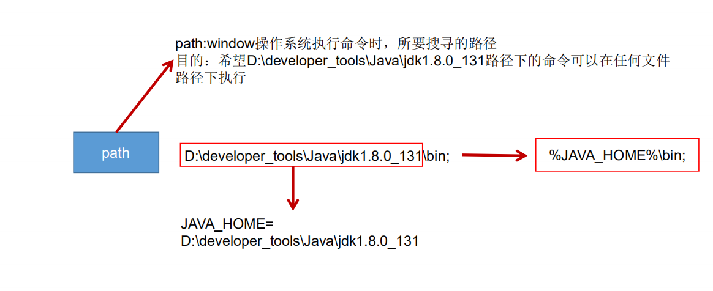

配置完path环境变量以后的验证

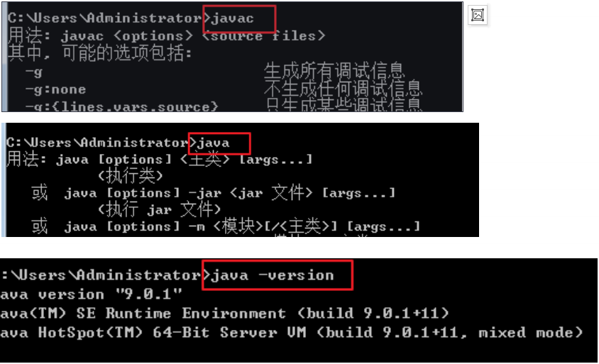

## 1.7 开发体验— HelloWorld

步骤：

1. 将 Java 代码编写到扩展名为 .java 的文件中。

2. 通过 javac 命令对该 java 文件进行编译。

3. 通过 java 命令对生成的 class 文件进行运行。

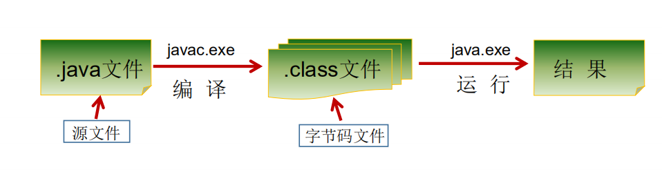

步骤一：编写

-  选择最简单的编辑器：记事本。
-  敲入代码 class Test{ }
-  将文件保存成Test.java，这个文件是存放java代码的文件，称为源文件。

第一个Java程序

```java
public class Test{
    public static void main(String[] args) {
        System.out.println(“Hello World!”);
    } 
}
```

步骤二：编译

 

- 有了java源文件，通过编译器将其编译成JVM可以识别的字节码文件。

- 在该源文件目录下，通过javac编译工具对Test.java文件进行编译。

- 如果程序没有错误，没有任何提示，但在当前目录下会出现一个Test.class文件，该文件称为字节码文件，也是可以执行的java的程序。

步骤三：运行
- 有了可执行的java程序(Test.class字节码文件) 

- 通过运行工具java.exe对字节码文件进行执行。

- 出现提示：缺少一个名称为main的方法。

   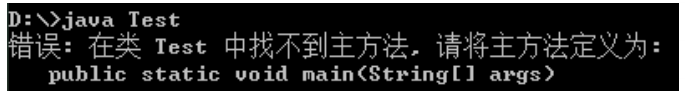

- 因为一个程序的执行需要一个起始点或者入口，所以在Test类中的加入public static void main(String[] args){ } 

- 对修改后的Test.java源文件需要重新编译，生成新的class文件后，再进行执行。

- 发现没有编译失败，但也没有任何效果，因为并没有告诉JVM要帮我们做什么事情，也就是没有可以具体执行的语句。

- 想要和JVM来个互动，只要在main方法中加入一句System.out.println(“Hello World");因为程序进行改动，所以再重新编译，运行即可。

  

## 1.8 常见问题及解决方法

 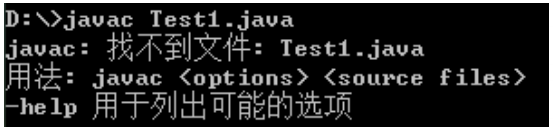

- 源文件名不存在或者写错 

- 当前路径错误

- 后缀名隐藏问题

 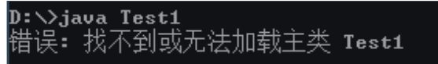

- 类文件名写错，尤其文件名与类名不一致时，要小心

- 类文件不在当前路径下，或者不在classpath指定路径下

 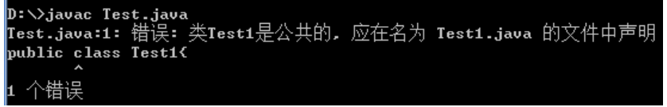

- 声明为public的类应与文件名一致，否知编译失败

 

- 编译失败，注意错误出现的行数，再到源代码中指定位置改错

**总结：**

学习编程最容易犯的错是语法错误。Java要求你必须按照语法规则编写代码。如果你的程序违反了语法规则，例如：忘记了分号、大括号、引号，或者拼错了单词，java编译器都会报语法错误。尝试着去看懂编译器会报告的错误信息。

## 1.9 注 释(comment)

用于注解说明解释程序的文字就是注释。

Java中的注释类型：

- 单行注释

- 多行注释

- 文档注释 (java特有) 

提高了代码的阅读性；调试程序的重要方法。 注释是一个程序员必须要具有的良好编程习惯。将自己的思想通过注释先整理出来，再用代码去体现

- 单行注释

  格式： //注释文字

- 多行注释

  格式： / 注释文字 / 

注：

对于单行和多行注释，被注释的文字，不会被JVM（java虚拟机）解释执行。多行注释里面不允许有多行注释嵌套。

- 文档注释（Java特有）

  格式：

  ```java
  /**
  @author 指定java程序的作者
  @version 指定源文件的版本
  */ 
  ```

  注释内容可以被JDK提供的工具 javadoc 所解析，生成一套以网页文件形式体现的该程序的说明文档。

- 操作方式

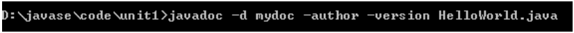

**小结第一个程序**

> - Java源文件以“java”为扩展名。源文件的基本组成部分是类（class），如 本例中的HelloWorld类。
>
> - Java应用程序的执行入口是main()方法。它有固定的书写格式：public static void main(String[] args) {...}
>
> - Java语言严格区分大小写。
>
> - Java方法由一条条语句构成，每个语句以“;”结束。
>
> - 大括号都是成对出现的，缺一不可。
>
> - 一个源文件中最多只能有一个public类。其它类的个数不限，如果源文件包含一个public类，则文件名必须按该类名命名。

## 1.10 Java API的文档

> - API （Application Programming Interface,应用程序编程接口）是 Java 提供的基本编程接口。
>
> - Java语言提供了大量的基础类，因此 Oracle 也为这些基础类提供了相应的API文档，用于告诉开发者如何使用这些类，以及这些类里包含的方法。
>
> - 下载API：
>
>   http://www.oracle.com/technetwork/java/javase/downloads/index.html
>
> - Additional Resources-Java SE 8 Documentation下载。 
>
> - 详见：JDK8的下载-安装-配置.doc


## 1.11 良好的编程风格

> - 正确的注释和注释风格
>
> - 使用文档注释来注释整个类或整个方法。
>
> - 如果注释方法中的某一个步骤，使用单行或多行注释。
>
> - 正确的缩进和空白
>
> - 使用一次tab操作，实现缩进
>
> - 运算符两边习惯性各加一个空格。比如：2 + 4  5。 
>
> - 块的风格
>
> - Java API 源代码选择了行尾风格
>
> ```JAVA
> //行尾风格 
> public class Test {
>     public static void main(String[] args){
>         System.out.println("Block Style!")
>     } 
> }
> //次行风格
> public class Test {
>     public static void main(String[] args) {
>         System.out.println("Block Style!");
>     } 
> }
> ```

## 1.12 常用的Java开发工具

> (Integrated Development Environment)
>
> - 文本编辑工具：
>
> - 记事本
>
> - UltraEdit
>
> - EditPlus 
>
> - TextPad
>
> - NotePad1.11 常用的Java开发工具
>
> - Java集成开发环境（IDE)： 
>
> - JBuilder
>
> - NetBeans
>
> - Eclipse
>
> - MyEclipse
>
> - IntelliJ IDEA

作 业

1. 独立编写HelloJava程序，并配上必要的注释。

2. 将个人的基本信息（姓名、性别、籍贯、住址）打印到控制台上输出。各条信息分别占一行。

3. 结合\n(换行)，\t(制表符)，空格等在控制台打印出如下图所示的效果。

**知识回顾**

● JDK,JRE,JVM的关系。

● 环境变量path配置及其作用。

● Java程序的编写、编译、运行步骤： 

● Java程序编写的规则。

● 在配置环境、编译、运行各个步骤中常见的错误以及解决方法。


# 第2章 Java基本语法

## 2.1 关键字与保留字

> 关键字(keyword)的定义和特点
>
> 定义：被Java语言赋予了特殊含义，用做专门用途的字符串（单词）
>
> 特点：关键字中所有字母都为小写
>
> 官方地址： https://docs.oracle.com/javase/tutorial/java/nutsandbolts/_keywords.html

 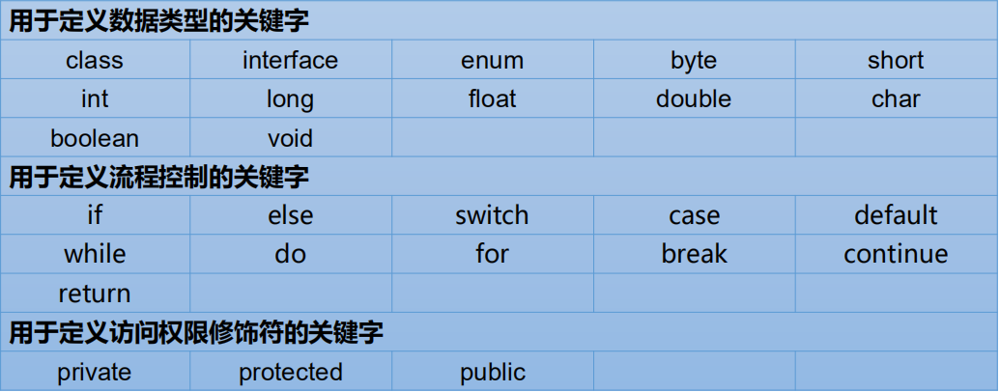

 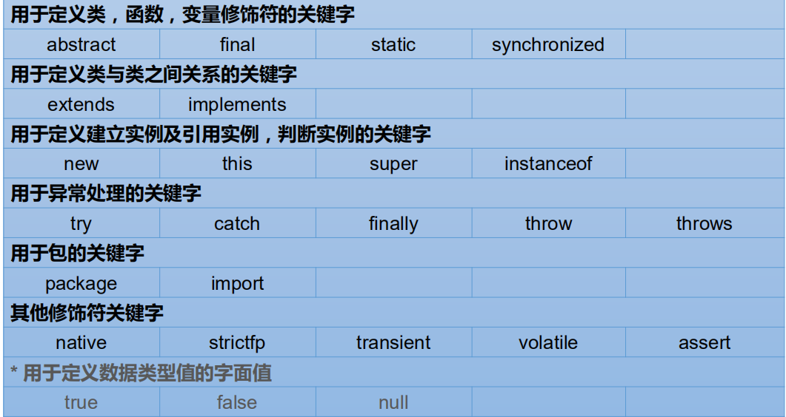


**保留字(reserved word)**

Java保留字：现有Java版本尚未使用，但以后版本可能会作为关键字使用。自己命名标识符时要避免使用这些保留字goto 、const

## 2.2 标识符(Identifier)

- **标识符**：

  Java 对各种变量、方法和类等要素命名时使用的字符序列称为标识符

  技巧：凡是自己可以起名字的地方都叫标识符。

  

- **定义合法标识符规则**：

  由26个英文字母大小写，0-9 ，_或 $ 组成

  数字不可以开头。

  不可以使用关键字和保留字，但能包含关键字和保留字。

  Java中严格区分大小写，长度无限制。

  标识符不能包含空格。

  练习：miles, Test, a++, --a, 4#R, $4, #44, apps, class, public, int, x, y, radius

  

- **Java中的名称命名规范**

  包名：多单词组成时所有字母都小写：xxxyyyzzz

  类名、接口名：多单词组成时，所有单词的首字母大写：XxxYyyZzz

  变量名、方法名：多单词组成时，第一个单词首字母小写，第二个单词开始每个单词首字母大写：xxxYyyZzz

  常量名：所有字母都大写。多单词时每个单词用下划线连接：XXX_YYY_ZZZ

  注意1：在起名字时，为了提高阅读性，要尽量有意义，“见名知意”。

  注意2：java采用unicode字符集，因此标识符也可以使用汉字声明，但是不建议使用。

  更多细节详见《代码整洁之道.pdf》

## 2.3 变量

>  基本数据类型
>
>  基本数据类型变量间转换
>
>  基本数据类型与String间转换
>
>  进制与进制间的转换

变量的概念：

- 内存中的一个存储区域
- 该区域的数据可以在同一类型范围内不断变化
- 变量是程序中最基本的存储单元。包含变量类型、变量名和存储的值

变量的作用：

- 用于在内存中保存数据

使用变量注意：

- Java中每个变量必须先声明，后使用
- 使用变量名来访问这块区域的数据
- 变量的作用域：其定义所在的一对{ }内 -变量只有在其作用域内才有效
- 同一个作用域内，不能定义重名的变量值名字

声明变量

> 语法：<数据类型> <变量名称> 
>
> 例如：int var;

变量的赋值

>  语法：<变量名称> = <值> 
>
>  例如：var = 10;

声明和赋值变量

>  语法： <数据类型> <变量名> = <初始化值> 
>
>  例如：int var = 10;

变量的分类-按数据类型

对于每一种数据都定义了明确的具体数据类型（强类型语言），在内存中分配了不同大小的内存空间。

 

补充：变量的分类-按声明的位置的不同

在方法体外，类体内声明的变量称为成员变量。

在方法体内部声明的变量称为局部变量。 

 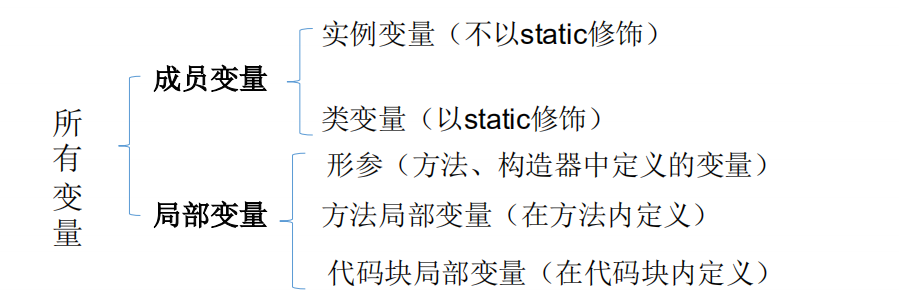

注意：二者在初始化值方面的异同:

> 同：都有生命周期 
>
> 异：局部变量除形参外，需显式初始化。


### **整数类型：byte、short、int、long**

Java各整数类型有固定的表数范围和字段长度，不受具体OS的影响，以保证java程序的可移植性。

Java的整型常量默认为 int 型，声明long型常量须后加‘l’或‘L’

Java程序中变量通常声明为int型，除非不足以表示较大的数，才使用long

 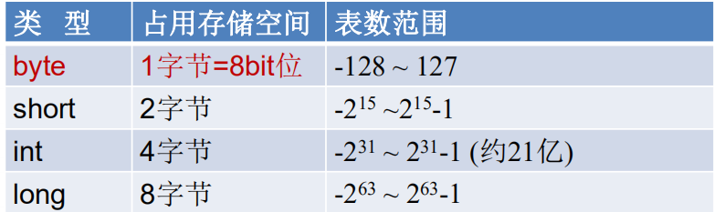

1MB = 1024KB 1KB= 1024B  1B= 8byte 

bit: 计算机中的最小存储单位。

byte:计算机中基本存储单元。

```java
public class VariableTest {
    public static void main(String[] args) {
        int number1;
        number1 = 10;
        int number2;
        number2 = 20;
        int number3;
        number3 = number1 + number2;
        System.out.println("Number3 = " + number3);
        int number4 = 50;
        int number5 = number4 - number3;
        System.out.println("Number5 = " + number5);
    }
}
```

### **浮点类型：float、double**

与整数类型类似，Java 浮点类型也有固定的表数范围和字段长度，不受具体操作系统的影响。

浮点型常量有两种表示形式：

- 十进制数形式：如：5.12 512.0f .512 (必须有小数点）
-  科学计数法形式:如：5.12e2 512E2 100E-2 

float:单精度，尾数可以精确到7位有效数字。很多情况下，精度很难满足需求。

double:双精度，精度是float的两倍。通常采用此类型。

Java 的浮点型常量默认为double型，声明float型常量，须后加‘f’或‘F’。 

 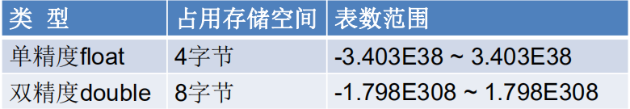

### **字符类型：char**

- char 型数据用来表示通常意义上“字符”(2字节) 

- Java中的所有字符都使用Unicode编码，故一个字符可以存储一个字母，一个汉字，或其他书面语的一个字符。

- 字符型变量的三种表现形式：

  字符常量是用单引号('')括起来的单个字符。例如：char c1 = 'a'; char c2 = '中'; char c3 = '9'

  Java中还允许使用转义字符‘\’来将其后的字符转变为特殊字符型常量。例如：char c3 = '\n'; // '\n'表示换行符

  直接使用 Unicode 值来表示字符型常量：'\uXXXX'。其中，XXXX代表一个十六进制整数。如：\u000a 表示 \n。 

  char类型是可以进行运算的。因为它都对应有Unicode码。

> **了解：ASCII 码**
>
> - 在计算机内部，所有数据都使用二进制表示。每一个二进制位（bit）有 0 和 1 两种状态，因此 8 个二进制位就可以组合出 256 种状态，这被称为一个字节（byte）。一个字节一共可以用来表示 256 种不同的状态，每一个状态对应一个符号，就是 256 个符号，从0000000 到 11111111。
>
> -   ASCII码：上个世纪60年代，美国制定了一套字符编码，对英语字符与二进制位之间的关系，做了统一规定。这被称为ASCII码。ASCII码一共规定了128个字符的编码，比如空格“SPACE”是32（二进制00100000），大写的字母A是65（二进制01000001）。这128个符号（包括32个不能打印出来的控制符号），只占用了一个字节的后面7位，最前面的1位统一规定为0。
>
> - 缺点：
>
>   不能表示所有字符。 
>
>   相同的编码表示的字符不一样：比如，130在法语编码中代表了é，在希伯来语编码中却代表  (ג) 了字母Gimel
>
>

>**了解： Unicode 编码**
>
>- 乱码：世界上存在着多种编码方式，同一个二进制数字可以被解释成不同的符号。因此，要想打开一个文本文件，就必须知道它的编码方式，否则用错误的编码方式解读，就会出现乱码。 
>- Unicode：一种编码，将世界上所有的符号都纳入其中。每一个符号都给予一个独一无二的编码，使用 Unicode 没有乱码的问题。 
>- Unicode 的缺点：Unicode 只规定了符号的二进制代码，却没有规定这个二进制代码应该如何存储：无法区别 Unicode 和 ASCII：计算机无法区分三个字节表示一个符号还是分别表示三个符号。另外，我们知道，英文字母只用一个字节表示就够了，如果unicode统一规定，每个符号用三个或四个字节表示，那么每个英文字母前都必然有二到三个字节是0，这对于存储空间来说是极大的浪费。

>**了解： UTF-8** 
>
>- UTF-8 是在互联网上使用最广的一种 Unicode 的实现方式。
>
>- UTF-8 是一种变长的编码方式。它可以使用 1-6 个字节表示一个符号，根据不同的符号而变化字节长度。
>
>- UTF-8的编码规则：
>
>  对于单字节的UTF-8编码，该字节的最高位为0，其余7位用来对字符进行编码（等同于ASCII码）。
>
>  对于多字节的UTF-8编码，如果编码包含 n 个字节，那么第一个字节的前 n 位为1，第一个字节的第 n+1 位为0，该字节的剩余各位用来对字符进行编码。在第一个字节之后的所有的字节，都是最高两位为"10"，其余6位用来对字符进行编码。
>
>  详见《尚硅谷\_宋红康_计算机字符编码.docx》

### **布尔类型：boolean**

>- boolean 类型用来判断逻辑条件，一般用于程序流程控制：
>- if条件控制语句；
> - while循环控制语句；
>  - do-while循环控制语句；
>  - for循环控制语句；
> - boolean类型数据只允许取值true和false，无null。 
> - 不可以使用0或非 0 的整数替代false和true，这点和C语言不同。
> - Java虚拟机中没有任何供boolean值专用的字节码指令，Java语言表达所操作的 boolean值，在编译之后都使用java虚拟机中的int数据类型来代替：true用1表示，false 用0表示。———《java虚拟机规范 8版》

### **基本数据类型转换**

>- 自动类型转换：容量小的类型自动转换为容量大的数据类型。数据类型按容量大小排序为：
>
> 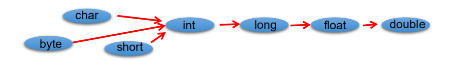
>
> - 有多种类型的数据混合运算时，系统首先自动将所有数据转换成容量最大的那种数据类型，然后再进行计算。
>- byte,short,char之间不会相互转换，他们三者在计算时首先转换为int类型。 
>- boolean类型不能与其它数据类型运算。
>- 当把任何基本数据类型的值和字符串(String)进行连接运算时(+)，基本数据类型的值将自动转化为字符串(String)类型。

### **字符串类型：String**


>- String不是基本数据类型，属于引用数据类型
>- 使用方式与基本数据类型一致。例如：String str = “abcd”;
>- 一个字符串可以串接另一个字符串，也可以直接串接其他类型的数据。例如：
>
>```java
>str = str + “xyz” ; 
>int n = 100;
>str = str + n;
>```
>
>- 示例—StringTest类
>
>```java
>public class StringTest {
>   public static void main(String[] args) {
>       int no = 10;
>        String str = "abcdef";
>        String str1 = str + “xyz” + no;
>        str1 = str1 + "123";
>        char c = '国';
>        double pi = 3.1416;
>        str1 = str1 + pi;
>        boolean b = false;
>        str1 = str1 + b;
>        str1 = str1 + c;
>        System.out.println("str1 = " + str1);
>    }
> }
> ```
>
>​    练习1
>
>```java
>String str1 = 4; //判断对错：no
>String str2 = 3.5f + “”; //判断str2对错：yes
>System.out.println(str2); //输出：”3.5”
>System.out .println(3+4+“Hello!”); //输出：7Hello!
>System.out.println(“Hello!”+3+4); //输出：Hello!34
>System.out.println(‘a’+1+“Hello!”); //输出：98Hello!
>System.out.println(“Hello”+‘a’+1); //输出：Helloa1
>```

### **强制类型转换**

>      - 自动类型转换的逆过程，将容量大的数据类型转换为容量小的数据类型。使用时要加上强制转换符：()，但可能造成精度降低或溢出,格外要注意。 
>
>      - 通常，字符串不能直接转换为基本类型，但通过基本类型对应的包装类则可以实现把字符串转换成基本类型。 
>
>      - 如： String a = “43”; int i = Integer.parseInt(a);
>
>      - boolean类型不可以转换为其它的数据类型。
>
>      练习2 
>
>        ```java
>        //判断是否能通过编译
>        short s = 5;
>        s = s-2; //判断：no
>        
>        byte b = 3;
>        b = b + 4; //判断：no
>        b = (byte)(b+4); //判断：yes
>        
>        char c = ‘a’;
>        int i = 5;
>        float d = .314F;
>        double result = c+i+d; //判断：yes
>        
>        byte b = 5;
>        short s = 3;
>        short t = s + b; //判断：no
>        ```
>

### **进 制**

> 世界上有10种人 ，认识和不认识二进制的。
>
> 关于进制
>
> - 所有数字在计算机底层都以二进制形式存在。 - 对于整数，有四种表示方式：
>
> - 二进制(binary)：0,1 ，满2进1.以0b或0B开头。
>
> - 十进制(decimal)：0-9 ，满10进1。
>
> - 八进制(octal)：0-7 ，满8进1. 以数字0开头表示。
>
> - 十六进制(hex)：0-9及A-F，满16进1. 以0x或0X开头表示。此处的A-F不区分大小写。如：0x21AF +1= 0X21B0
>
>     
>
>     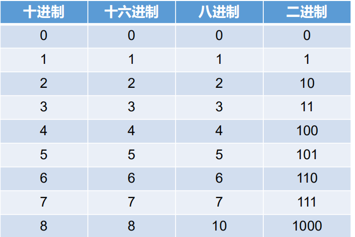
>       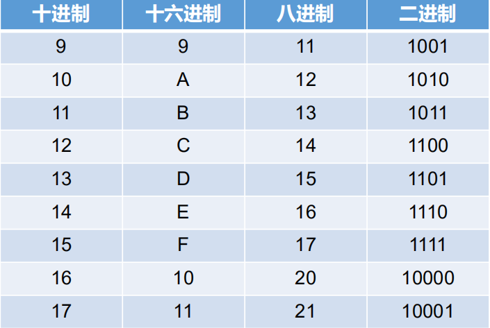

**二进制**

>- Java整数常量默认是int类型，当用二进制定义整数时，其第32位是符号位；当是long类型时，二进制默认占64位，第64位是符号位
>
>- 二进制的整数有如下三种形式：
>
>- 原码：直接将一个数值换成二进制数。最高位是符号位
>
>- 负数的反码：是对原码按位取反，只是最高位（符号位）确定为1。
>
>- 负数的补码：其反码加1。
>
>- 计算机以二进制补码的形式保存所有的整数。
>
>- 正数的原码、反码、补码都相同
>
>- 负数的补码是其反码+1
>
>
>
>  - 为什么要使用原码、反码、补码表示形式呢？
>
>计算机辨别“符号位”显然会让计算机的基础电路设计变得十分复杂! 于是人们想出了将符号位也参与运算的方法. 我们知道, 根据运算法则减去一个正数等于加上一个负数, 即: 1-1 = 1 + (-1) = 0 , 所以机器可以只有加法而没有减法, 这样计算机运算的设计就更简单了。
>
>  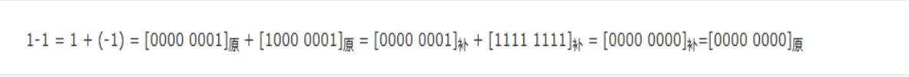
> 
> 
>   **二进制→十进制**
> 
> 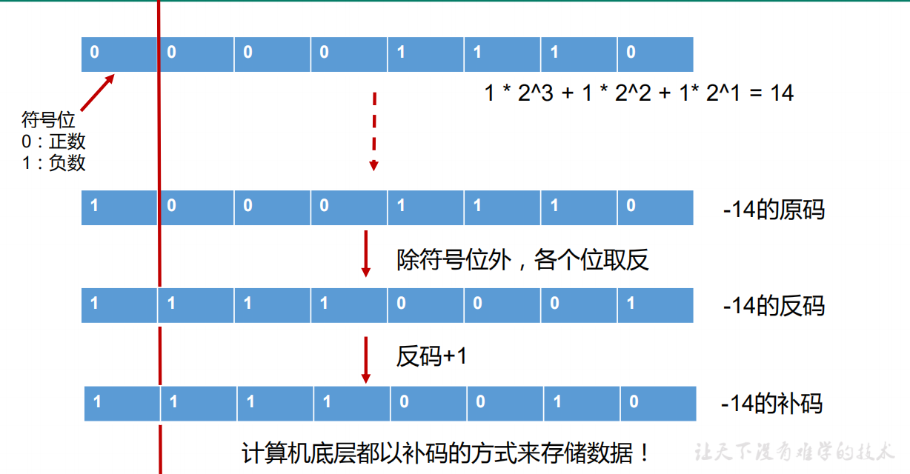
>
>    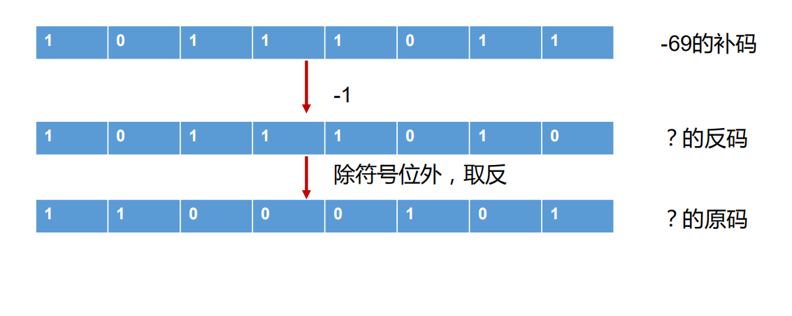
>
>  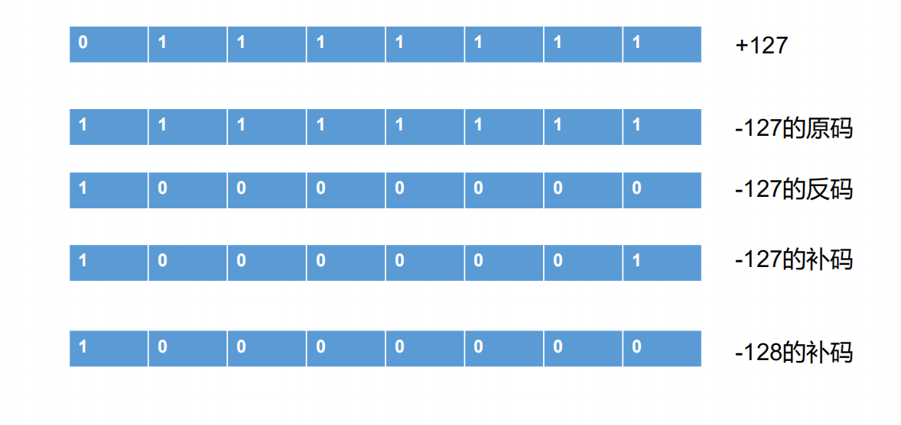
>
> 
>
>    **十进制 → 二进制：除2取余的逆**
>  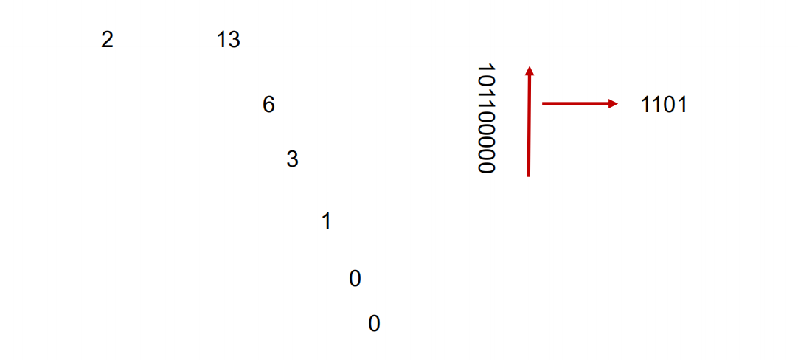
>  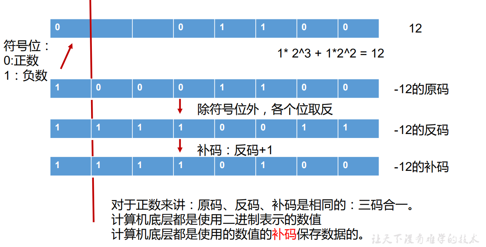
>    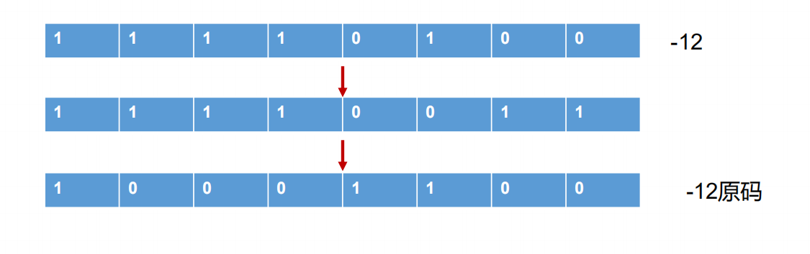
> 
> 
>
>   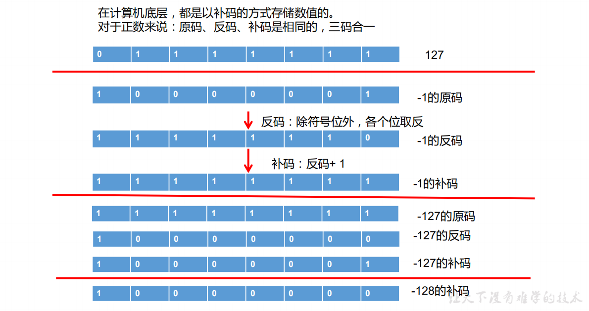
> 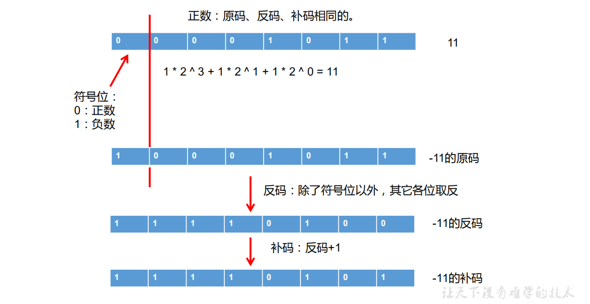
>    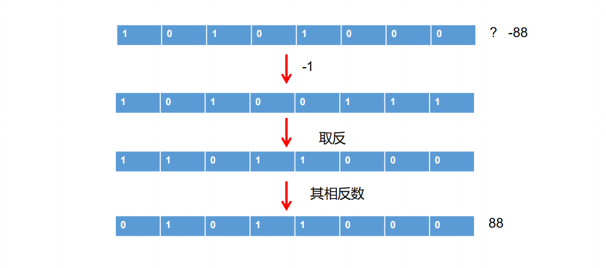
>  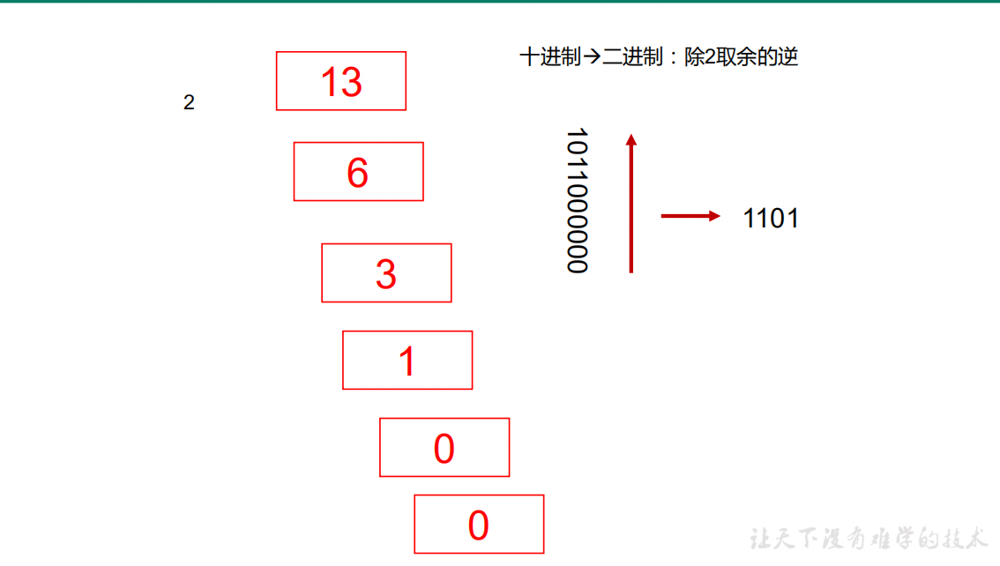
>    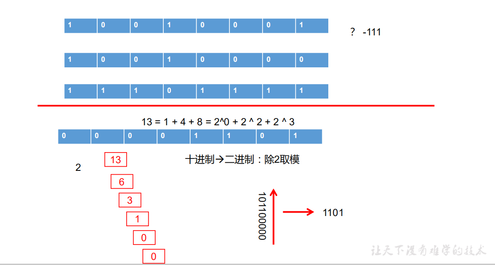
>   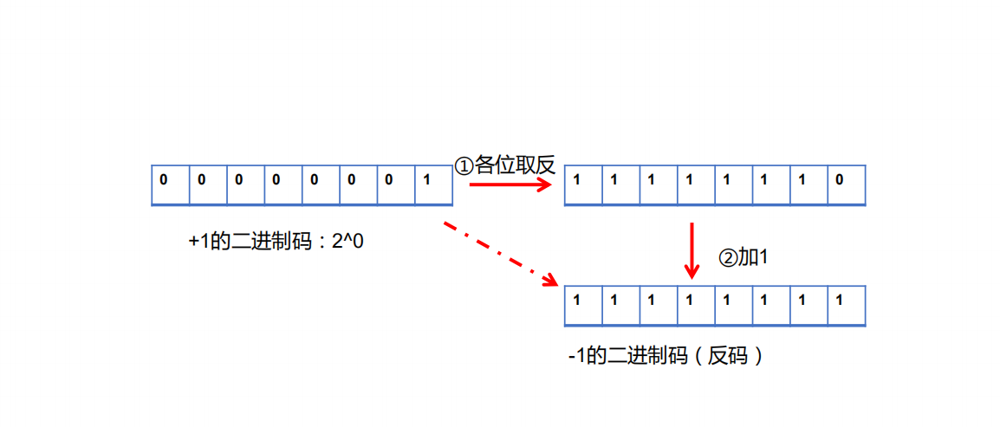
> 
> 


**进制间转化**

>进制的基本转换
>
>十进制 二进制互转
>
>- [x] 二进制转成十进制 乘以2的幂数 
>
>- [x] 十进制转成二进制 除以2取余数
>
>
>
>- 二进制 八进制互转
>
>- 二进制 十六进制互转
>
>- 十进制 八进制互转
>
>- 十进制 十六进制互转
>  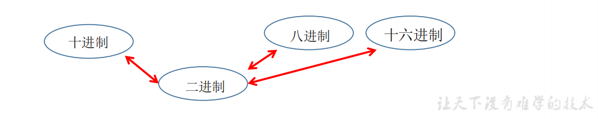
>   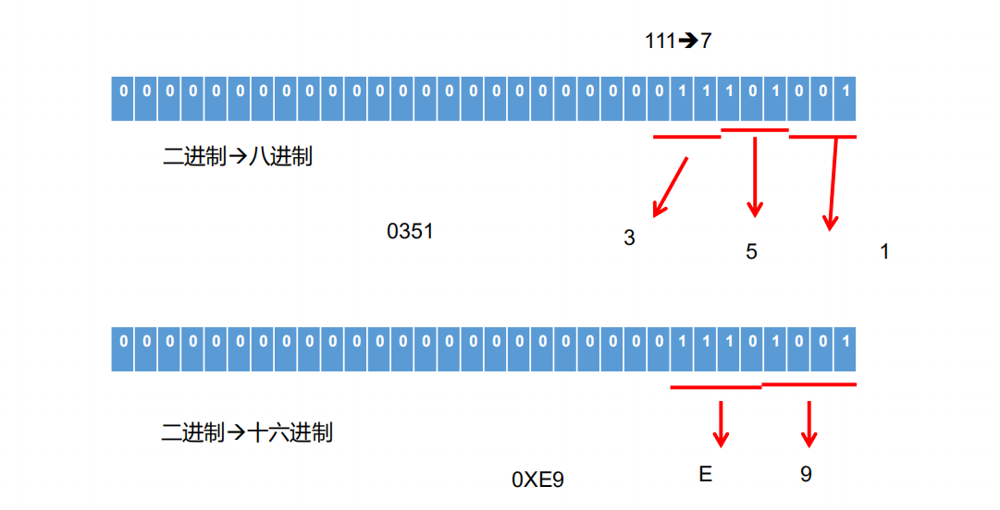
>   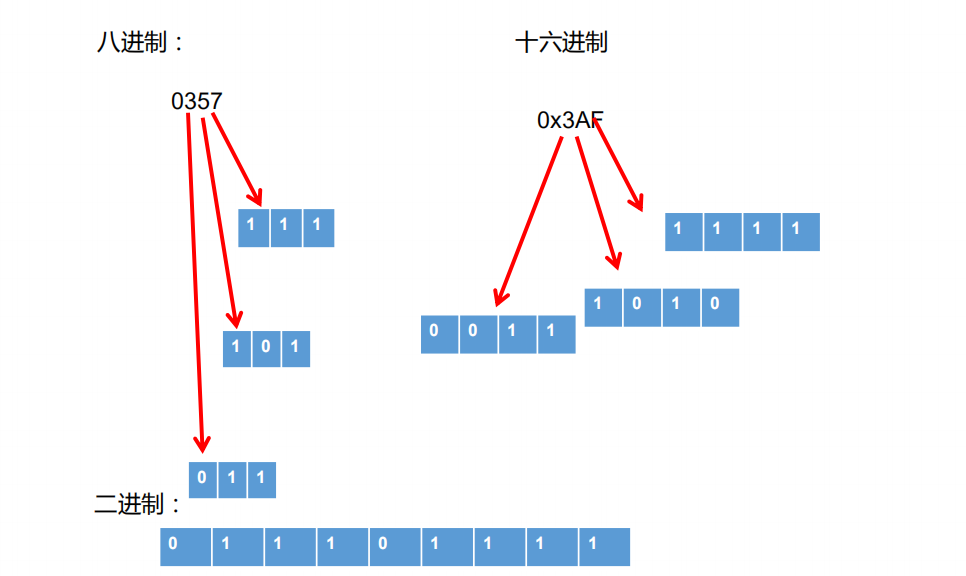
>
>
>
>

>练 习
>
>1. 将以下十进制数转换为十六进制和二进制
>     123 256 87 62
>2. 将以下十六进制数转换为十进制和二进制
>     0x123 0x25F 0x38 0x62


## 2.4 运算符

运算符是一种特殊的符号，用以表示数据的运算、赋值和比较等。 

- 算术运算符
- 赋值运算符
- 比较运算符（关系运算符）
- 逻辑运算符
- 位运算符
- 三元运算符

 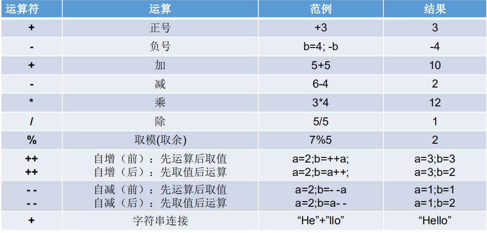

  

### **算术运算符的注意问题**

> - 如果对负数取模，可以把模数负号忽略不记，如：5%-2=1。 但被模数是负数则不可忽略。此外，取模运算的结果不一定总是整数。
> - 对于除号“/”，它的整数除和小数除是有区别的：整数之间做除法时，只保留整数部分而舍弃小数部分。 例如：int x=3510;x=x/10001000; x的
>   结果是？
> - “+”除字符串相加功能外，还能把非字符串转换成字符串.例如：System.out.println(“5+5=”+5+5); //打印结果是？ 5+5=55 ?

**练习1**：算术运算符：自加、自减

>```java
>public class SignTest{
>    public static void main(String[] args){
>        int i1 = 10;
>    	   int i2 = 20;
>     	   int i = i1++;
>     	   System.out.print(“i=”+i);
>     	   System.out.println(“i1=”+i1);
>     	   i = ++i1;
>     	   System.out.print(“i=”+i);
>     	   System.out.println(“i1=”+i1);
>     	   i = i2--;
>     	   System.out.print(“i=”+i);
>     	   System.out.println(“i2=”+i2);
>     	   i = --i2;
>     	   System.out.print(“i=”+i);
>     	   System.out.println(“i2=”+i2);
>     	}
>     }
>    ```
>
> 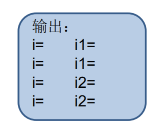

**练习2**

随意给出一个整数，打印显示它的个位数，十位数，百位数的值。格式如下：

数字xxx的情况如下：

个位数：

十位数：

百位数：

例如：

数字153的情况如下：

个位数：3

十位数：5

百位数：1


### **赋值运算符**


>- 符号：= 
>
>- 当“=”两侧数据类型不一致时，可以使用自动类型转换或使用强制类型转换原则进行处理。 
>
>- 支持连续赋值。 
>
>- 扩展赋值运算符： +=, -=, =, /=, %=
>
> 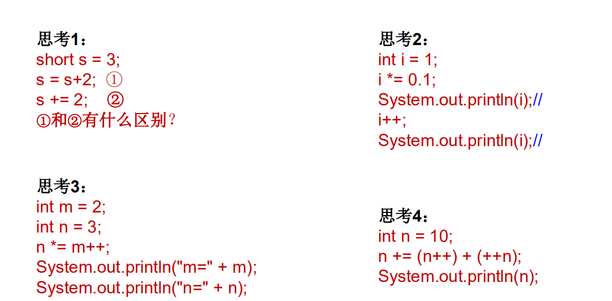
>


### **比较运算符**

>  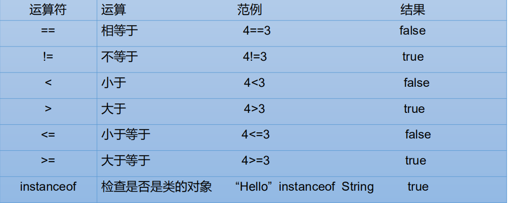
>
>  - 比较运算符的结果都是boolean型，也就是要么是true，要么是false。 
>
>  - 比较运算符“==”不能误写成“=” 。
>  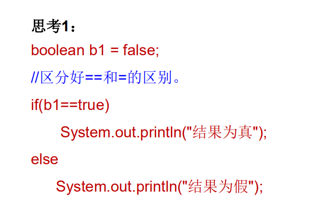
>  
>  


### **逻辑运算符**


>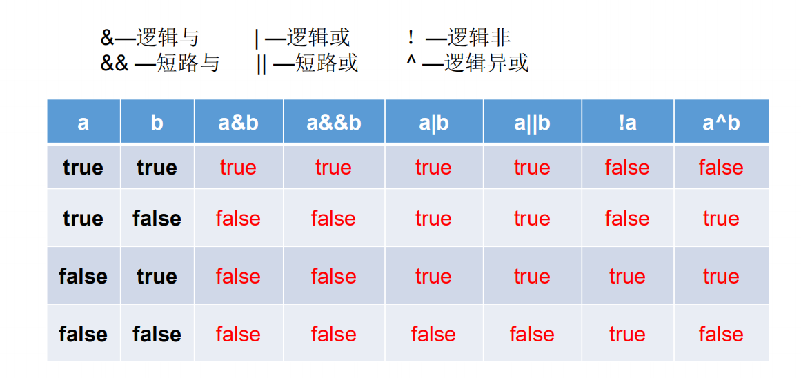
>
>
>
>- 逻辑运算符用于连接布尔型表达式，在Java中不可以写成3<x<6，应该写成x>3 & x<6 。 
>
>- “&”和“&&”的区别：
>
>- 单&时，左边无论真假，右边都进行运算；
>
>- 双&时，如果左边为真，右边参与运算，如果左边为假，那么右边不参与运算。 
>
>- “|”和“||”的区别同理，
>
>- ||表示：当左边为真，右边不参与运算。 
>
>- 异或( ^ )与或( | )的不同之处是：当左右都为true时，结果为false。理解：异或，追求的是“异”!
> 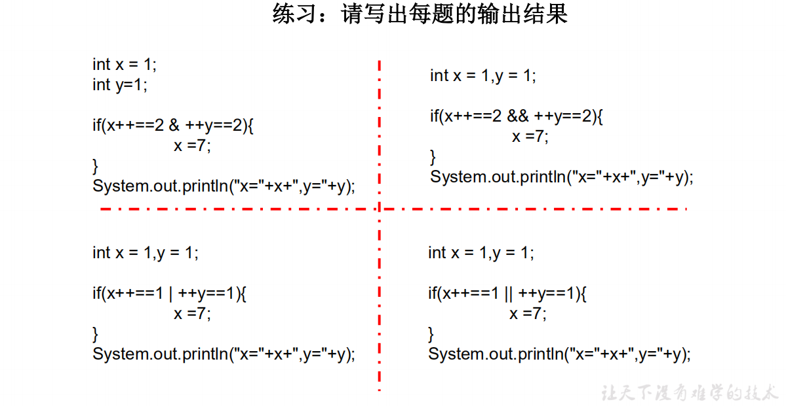
>
>  ```java
> class Test {
>      public static void main (String [] args) {
>          boolean x= true;
>          boolean y= false;
>          short z=42;
>          //if(y == true)
>          if((z++==42)&&(y=true))z++;
>          if((x=false) || (++z==45)) z++;
>          System. out.println(“z=”+z);
>      }
>  }
>  ```
> 
>  结果为：
>
>  z= 46


### **位运算符**

>  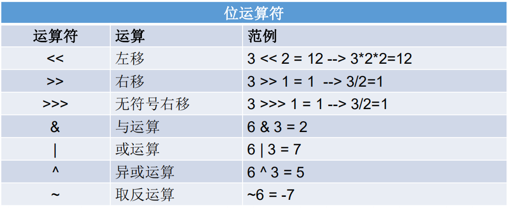
>
>  - 位运算是直接对整数的二进制进行的运算
>
>  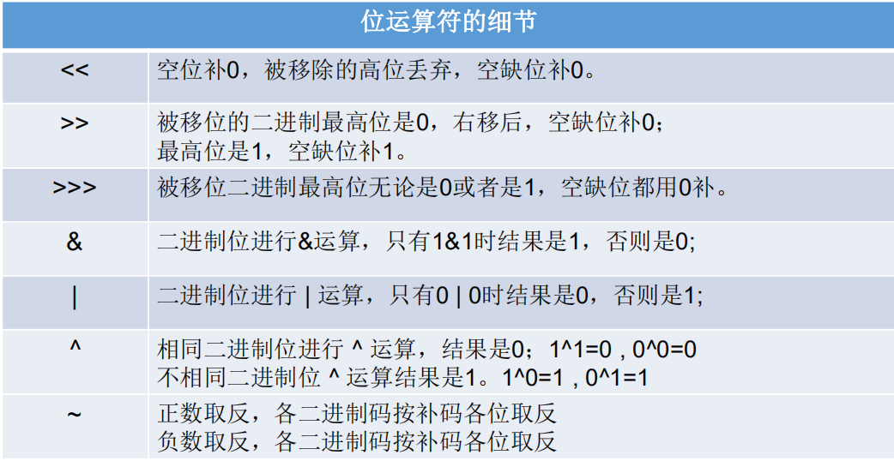
>
>  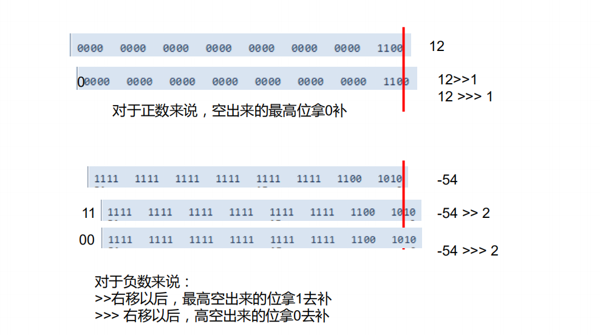


### **三元运算符**

>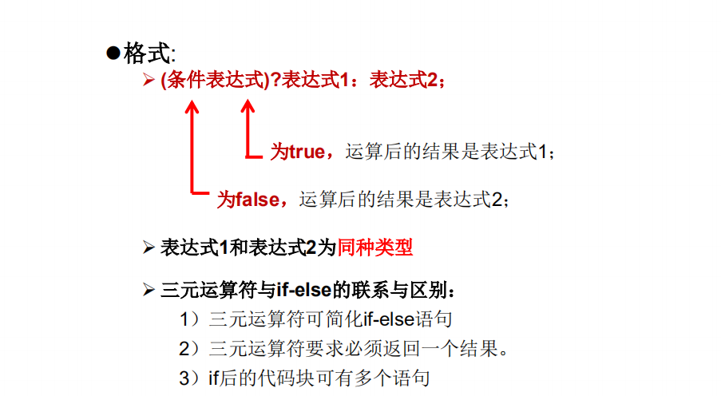
>
>练习： 获取两个数中的较大数
>
>获取三个数中的较大数


### **运算符的优先级**

>-  运算符有不同的优先级，所谓优先级就是表达式运算中的运算顺序。如右表，上一行运算符总优先于下一行。
>-  只有单目运算符、三元运算符、赋值运算符是从右向左运算的。
> .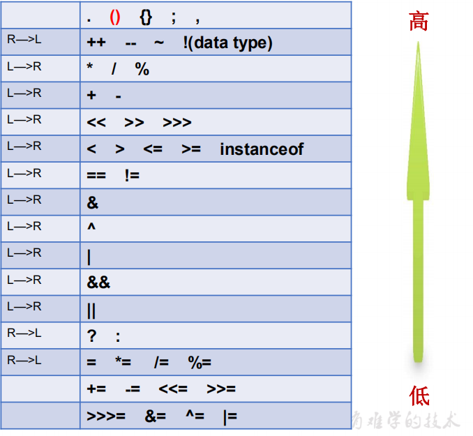


# 第3章 数 组

## 3.1 数组的概述

数组(Array)，是多个相同类型数据按一定顺序排列的集合，并使用一个名字命名，并通过编号的方式对这些数据进行统一管理。 

**数组的常见概念**

- 数组名 

- 下标(或索引) 

- 元素

- 数组的长度
- 数组本身是引用数据类型，而数组中的元素可以是任何数据类型，包括基本数据类型和引用数据类型。
- 创建数组对象会在内存中开辟一整块连续的空间，而数组名中引用的是这块连续空间的首地址。
- 数组的长度一旦确定，就不能修改。
- 我们可以直接通过下标(或索引)的方式调用指定位置的元素，速度很快。

**数组的分类：**

 - 按照维度：

 一维数组、二维数组、三维数组、… 

 - 按照元素的数据类型分：

 基本数据类型元素的数组、引用数据类型元素的数组(即对象数组)

## 3.2 一维数组的使用


> **声明**
> - 一维数组的声明方式：
>
>   type var[] 或 type[] var；
>
> 例如：
>
> ```java
> int a[];
> int[] a1;
> double b[];
> String[] c; //引用类型变量数组
> ```
>
> Java语言中声明数组时不能指定其长度(数组中元素的数)， 例如： int a[5]; //非法
>
> 动态初始化：数组声明且为数组元素分配空间与赋值的操作分开进行
>
> ```java
> int[] arr = new int[3];
> arr[0] = 3;
> arr[1] = 9;
> arr[2] = 8; 
> ```
>
> 
>
> 静态初始化：在定义数组的同时就为数组元素分配空间并赋值。
>
> ```java
> int arr[] = new int[]{ 3, 9, 8};
> int[] arr = {3,9,8};
> String names[];
> names = new String[3];
> names[0] = “钱学森”;
> names[1] = “邓稼先”;
> names[2] = “袁隆平”;
> String names[] = {“李四光”,“茅以升”,“华罗庚” }
> ```
>
### 一维数组的使用：初始化

### 一维数组的使用：数组元素的引用

定义并用运算符new为之分配空间后，才可以引用数组中的每个元素；

数组元素的引用方式：数组名[数组元素下标] 

数组元素下标可以是整型常量或整型表达式。如a[3] , b[i] , c[6\*i];

数组元素下标从0开始；长度为n的数组合法下标取值范围: 0 —>n-1；如int a[]=new int[3]; 可引用的数组元素为a[0]、a[1]、a[2]

每个数组都有一个属性length指明它的长度，例如：a.length 指明数组a的长度(元素个数)

数组一旦初始化，其长度是不可变的

数组是引用类型，它的元素相当于类的成员变量，因此数组一经分配空间，其中的每个元素也被按照成员变量同样的方式被隐式初始化。例如：

```java
public class Test {
    public static void main(String argv[]){
        int a[]= new int[5];
        System.out.println(a[3]); //a[3]的默认值为0
    } 
}
```

对于基本数据类型而言，默认初始化值各有不同

对于引用数据类型而言，默认初始化值为null(注意与0不同!)

###  一维数组的使用：数组元素的默认初始化值

数组元素类型 元素默认初始值
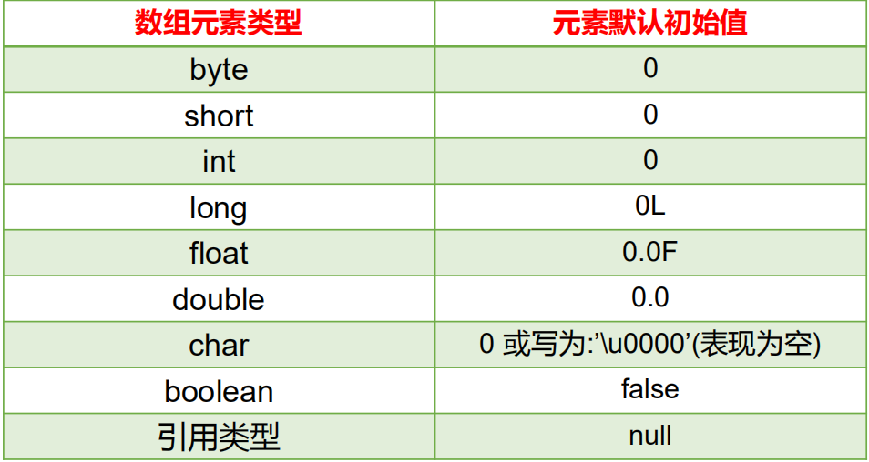

```java
public class Test{
    public static void main(String args[]){
        int[] s;
        s = new int[10];
        for ( int i=0; i<10; i++ ) {
            s[i] =2*i+1;
            System.out.println(s[i]);
        } 
    } 
} 
```

Java中使用关键字new来创建数组

如下是创建基本数据类型元素的一维数组

 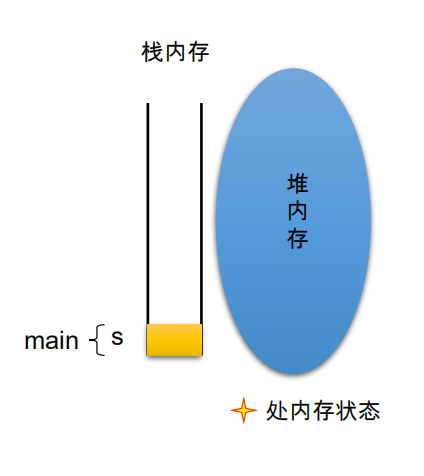


###  一维数组的使用案例

```java
public class Test{
    public static void main(String args[]){
        int[] s;
        s = new int[10];
        //int[] s=new int[10];
        //基本数据类型数组在显式赋值之前，
        //Java会自动给他们赋默认值。
        for ( int i=0; i<10; i++ ) {
            s[i] =2*i+1;
            System.out.println(s[i]);
        }
    } 
}
```


 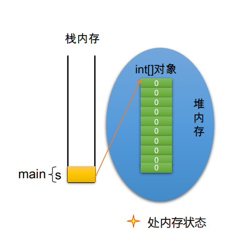


## 3.3 多维数组的使用

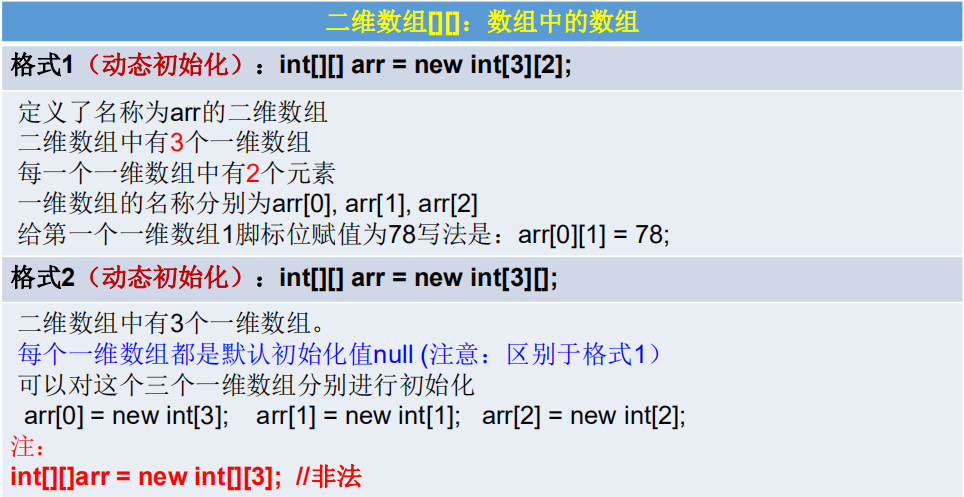

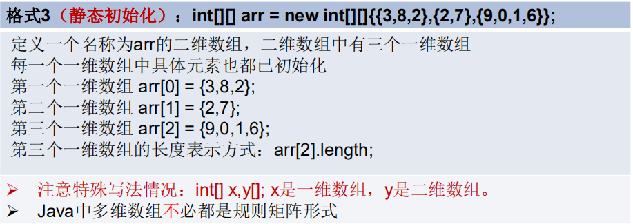
- 注意特殊写法情况：int[] x,y[]; x是一维数组，y是二维数组。
- Java中多维数组不必都是规则矩阵形式

## 3.4 数组中涉及到的常见算法

### 二分法查找算法

```java
//二分法查找：要求此数组必须是有序的。
int[] arr3 = new int[]{-99,-54,-2,0,2,33,43,256,999};
boolean isFlag = true;
int number = 256;
//int number = 25;
int head = 0;//首索引位置
int end = arr3.length - 1;//尾索引位置
while(head <= end){
    int middle = (head + end) / 2;
    if(arr3[middle] == number){
        System.out.println("找到指定的元素，索引为：" + middle);
        isFlag = false;
        break;
    }else if(arr3[middle] > number){
        end = middle - 1;
    }else{
        //arr3[middle] < number
        head = middle + 1;
    }
}
if(isFlag){
    System.out.println("未找打指定的元素");
}
```

### 排序算法

> 排序：假设含有n个记录的序列为{R1，R2，...,Rn},其相应的关键字序列为{K1，K2，...,Kn}。将这些记录重新排序为{Ri1,Ri2,...,Rin},使得相应的关键字值满足条Ki1<=Ki2<=...<=Kin,这样的一种操作称为排序。
>
> 通常来说，排序的目的是快速查找。
>
> 衡量排序算法的优劣：
>
> 1.时间复杂度：分析关键字的比较次数和记录的移动次数
>
> 2.空间复杂度：分析排序算法中需要多少辅助内存
>
> 3.稳定性：若两个记录A和B的关键字值相等，但排序后A、B的先后次序保持不变，则称这种排序算法是稳定的。
>
> 排序算法分类：内部排序和外部排序。
>
>  - 内部排序：整个排序过程不需要借助于外部存储器（如磁盘等），所有排序操作都在内存中完成。
>
> - 外部排序：参与排序的数据非常多，数据量非常大，计算机无法把整个排序过程放在内存中完成，必须借助于外部存储器（如磁盘）。外部排序最常见的是多路归并排序。可以认为外部排序是由多次内部排序组成。
>
> - 选择排序
>
> - 直接选择排序、堆排序
>
> - 交换排序
>
> - 冒泡排序、快速排序
>
> - 插入排序
>
> - 直接插入排序、折半插入排序、Shell排序
>
> - 归并排序
>
> - 桶式排序
>
> - 基数排序
>
> 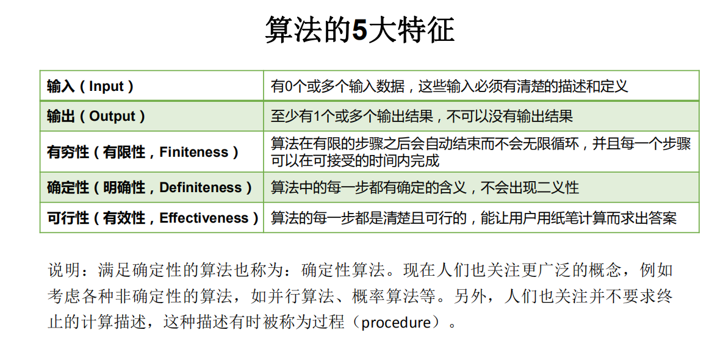
>


## 3.5 Arrays工具类的使用

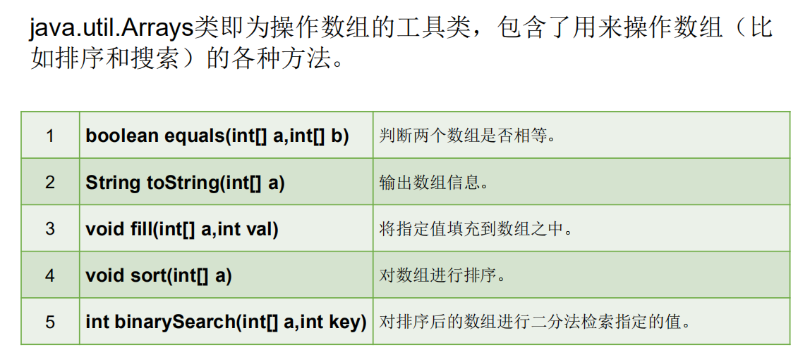


java.util.Arrays类的sort()方法提供了数组元素排序功能：

```java
import java.util.Arrays;
public class SortTest {
    public static void main(String[] args) {
        int [] numbers = {5,900,1,5,77,30,64,700};
        Arrays.sort(numbers);
        for(int i = 0; i < numbers.length; i++){
            System.out.println(numbers[i]); 
        } 
    } 
}
```


## 3.6 数组使用中的常见异常

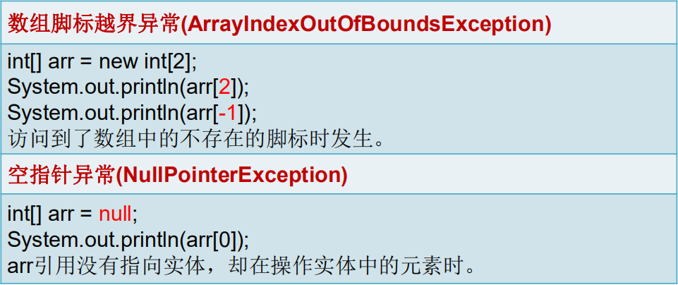


# 第4章 面向对象编程(上)

学习面向对象内容的三条主线

> 1.Java类及类的成员
>
> 2.面向对象的三大特征
>
> 3.其它关键字


## 4.1 面向过程与面向对象

> **何谓“面向对象”的编程思想？**
>
> 首先解释一下“思想”。先问你个问题：你想做个怎样的人？可能你会回答：我想做个好人，孝敬父母，尊重长辈，关爱亲朋……
> 你看，这就是思想。这是你做人的思想，或者说，是你做人的原则。做人有做人的原则，编程也有编程的原则。这些编程的原则呢，就
> 是编程思想。 
>
> **面向过程(POP) 与 面向对象(OOP)** 
>
> - 二者都是一种思想，面向对象是相对于面向过程而言的。面向过程，强调的是功能行为，以函数为最小单位，考虑怎么做。面向对象，将功能封装进对象，强调具备了功能的对象，以类/对象为最小单位，考虑谁来做。
>
> - 面向对象更加强调运用人类在日常的思维逻辑中采用的思想方法与原则，如抽象、分类、继承、聚合、多态等。
>
> - 面向对象的三大特征
>
>   封装 (Encapsulation)
>
>   继承 (Inheritance)
>
>   多态 (Polymorphism)
>
> 面向对象：Object Oriented Programming 
>
> 面向过程：Procedure Oriented Programming
>
> **例子：人把大象装进冰箱**
> 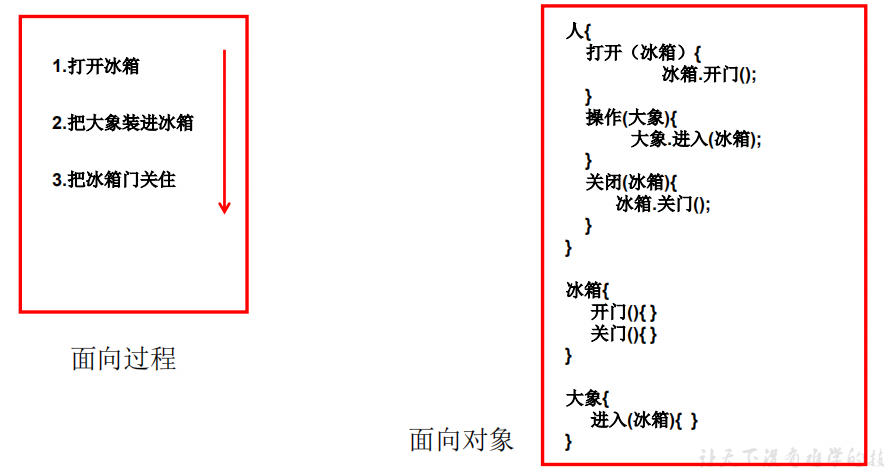
>
> **面向对象的思想概述**
>
> 程序员从面向过程的执行者转化成了面向对象的指挥者
>
> 面向对象分析方法分析问题的思路和步骤：
>
> - 根据问题需要，选择问题所针对的现实世界中的实体。
> - 从实体中寻找解决问题相关的属性和功能，这些属性和功能就形成了概念世界中的类。
> - 把抽象的实体用计算机语言进行描述，形成计算机世界中类的定义。即借助某种程序语言，把类构造成计算机能够识别和处理的数据结构。
> - 将类实例化成计算机世界中的对象。对象是计算机世界中解决问题的最终工具。
>
> 练习1 
>
> 1. 我要开车去丽江，这句话包含的类有什么？
>
> 2. 体会以下几个经典案例涉及到的类。
>
>    人在黑板上画圆
>
>    列车司机紧急刹车
>
>    售货员统计收获小票的金额
>
>    你把门关上了
> 3. 抽象出下面系统中的“类”及其关系。
>    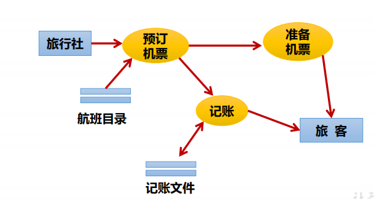


## 4.2 Java语言的基本元素：类和对象


面向对象的思想概述

- 类(Class)和对象(Object)是面向对象的核心概念。
- 类是对一类事物的描述，是抽象的、概念上的定义
- 对象是实际存在的该类事物的每个个体，因而也称为实例(instance)。 
- “万事万物皆对象”

- 可以理解为：类 = 抽象概念的人；对象 = 实实在在的某个人
- 面向对象程序设计的重点是类的设计
- 类的设计，其实就是类的成员的设计

**Java类及类的成员**

现实世界的生物体，大到鲸鱼，小到蚂蚁，都是由最基本的细胞构成的。同理，Java代码世界是由诸多个不同功能的类构成的。现实生物世界中的细胞又是由什么构成的呢？细胞核、细胞质、… 那么，

Java中用类class来描述事物也是如此。常见的类的成员有：

- 属 性：对应类中的成员变量

- 行 为：对应类中的成员方法

Field = 属性 = 成员变量，Method = (成员)方法 = 函数
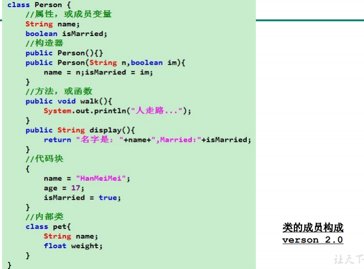


 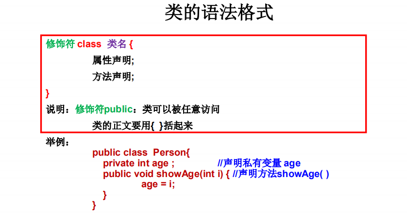

**创建Java自定义类**

> 步骤：
>
> 1. 定义类（考虑修饰符、类名）
> 2. 编写类的属性（考虑修饰符、属性类型、属性名、初始化值）
> 3. 编写类的方法（考虑修饰符、返回值类型、方法名、形参等）


## 4.3 对象的创建和使用

 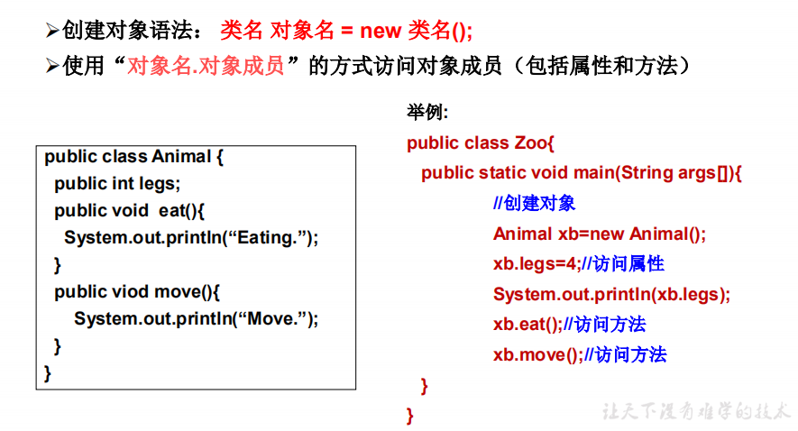

 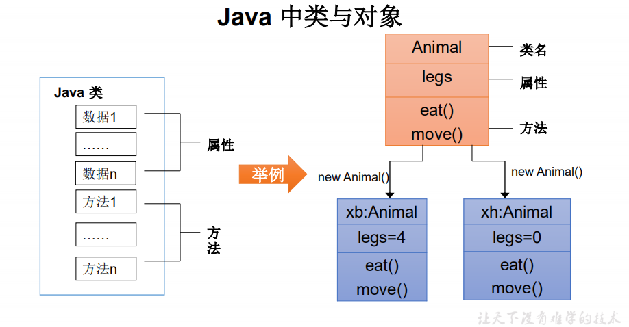

提 示

类的访问机制：

在一个类中的访问机制：类中的方法可以直接访问类中的成员变量。 （例外：static方法访问非static，编译不通过。）

在不同类中的访问机制：先创建要访问类的对象，再用对象访问类中定义的成员。

**对象的产生**
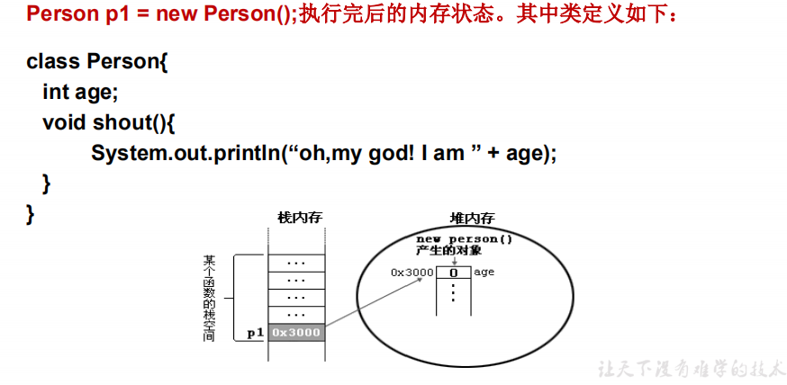

**对象的使用**
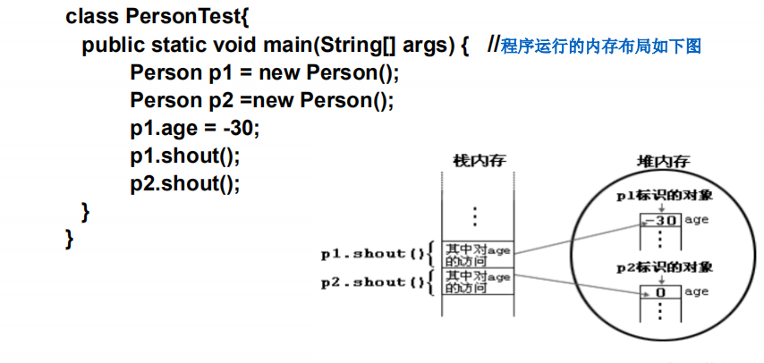

**对象的生命周期**

 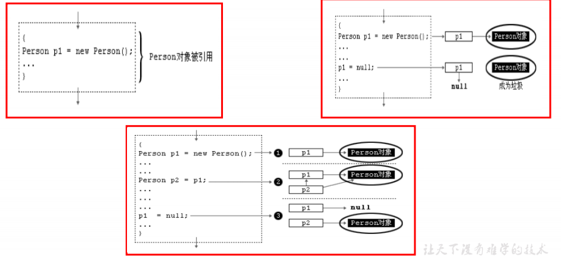


**内存解析**

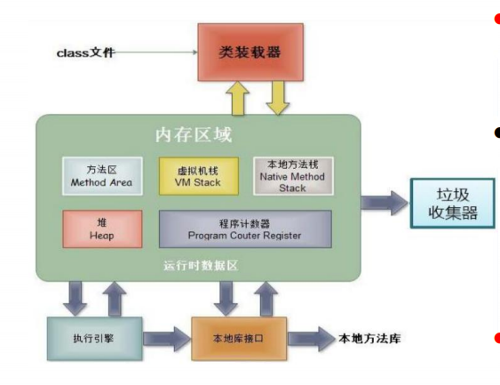

- 堆（Heap），此内存区域的唯一目的就是存放对象实例，几乎所有的对象实例都在这里分配内存。这一点在Java虚拟机规范中的描述是：所有的对象实例以及数组都要在堆上分配。

 - 通常所说的栈（Stack），是指虚拟机栈。虚拟机栈用于存储局部变量等。局部变量表存放了编译期可知长度的各种基本数据类型（boolean、byte、char 、 short 、 int 、 float 、 long 、double）、对象引用（reference类型，它不等同于对象本身，是对象在堆内存的首地址）。 方法执行完，自动释放。

 - 方法区（Method Area），用于存储已被虚拟机加载的类信息、常量、静态变量、即时编译器编译后的代码等数据。


**匿名对象**

- 我们也可以不定义对象的句柄，而直接调用这个对象的方法。这样的对象叫做匿名对象。

  如：new Person().shout(); 

- 使用情况

  如果对一个对象只需要进行一次方法调用，那么就可以使用匿名对象。

  我们经常将匿名对象作为实参传递给一个方法调用。

## 4.4 类的成员之一：属性(field)

语法格式：修饰符 数据类型 属性名 = 初始化值 ; 

说明1: 修饰符

- 常用的权限修饰符有：private、缺省、protected、public

- 其他修饰符：static、final (暂不考虑) 

说明2：数据类型

- 任何基本数据类型(如int、Boolean) 或 任何引用数据类型。

说明3：属性名

- 属于标识符，符合命名规则和规范即可。

举例：

```java
public class Person{
    private int age; //声明private变量 age
    public String name = “Lila”; //声明public变量 name
}
```

**变量的分类：成员变量与局部变量**

- 在方法体外，类体内声明的变量称为成员变量。

- 在方法体内部声明的变量称为局部变量。

 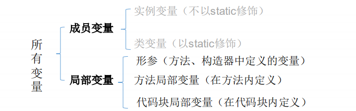

- 注意：二者在初始化值方面的异同:

同：都有生命周期

异：局部变量除形参外，均需显式初始化。

**成员变量（属性）和局部变量的区别？**
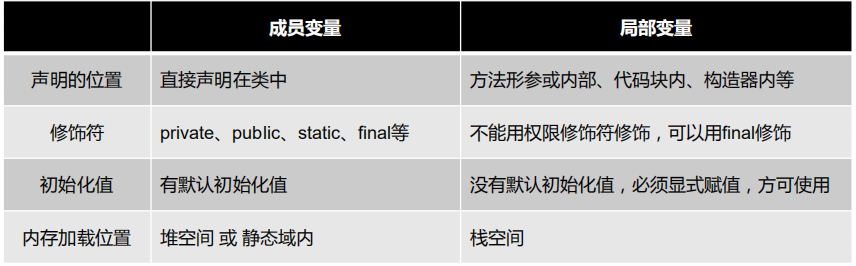


## 4.5 类的成员之二：方法(method)

什么是方法(method、函数):

- 方法是类或对象行为特征的抽象，用来完成某个功能操作。在某些语言中也称为函数或过程。

- 将功能封装为方法的目的是，可以实现代码重用，简化代码

- Java里的方法不能独立存在，所有的方法必须定义在类里。

举例：

```java
public class Person{
    private int age;
    public int getAge() { //声明方法getAge()
        return age; 
    }
    public void setAge(int i) { //声明方法setAge
        age = i; //将参数i的值赋给类的成员变量age
    } 
}
```


**方法的声明格式：**
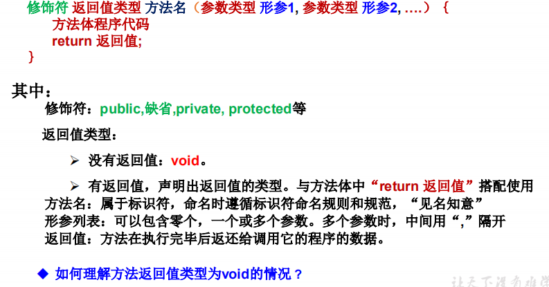


**方法的分类：按照是否有形参及返回值**
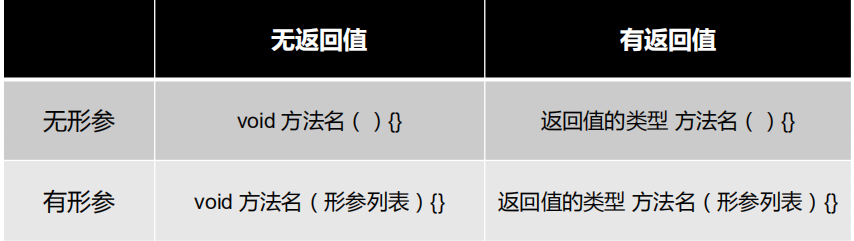

- 方法的调用

- 方法通过方法名被调用，且只有被调用才会执行。

- 方法调用的过程分析

 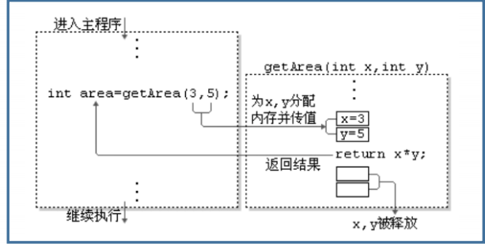

注 意：

- 方法被调用一次，就会执行一次

- 没有具体返回值的情况，返回值类型用关键字void表示，那么方法体中可以不必使用return语句。如果使用，仅用来结束方法。

- 定义方法时，方法的结果应该返回给调用者，交由调用者处理。

- 方法中只能调用方法或属性，不可以在方法内部定义方法。


## 4.6 再谈方法1：方法的重载(overload)

> **重载的概念**
>
> 在同一个类中，允许存在一个以上的同名方法，只要它们的参数个数或者参数类型不同即可。
>
> **重载的特点：**
>
> 与返回值类型无关，只看参数列表，且参数列表必须不同。(参数个数或参数类型)。调用时，根据方法参数列表的不同来区别。
>
> **重载示例：**
>
> //返回两个整数的和
>
> int add(int x,int y){return x+y;}
>
> //返回三个整数的和
>
> int add(int x,int y,int z){return x+y+z;}
>
> //返回两个小数的和
>
> double add(double x,double y){return x+y;}

- 使用重载方法，可以为编程带来方便。

- 例如，System.out.println()方法就是典型的重载方法，其内部的声

明形式如下：

```java
public void println(byte x)
public void println(short x)
public void println(int x)
public void println(long x)
public void println(float x)
public void println(double x)
public void println(char x)
public void println(double x)
public void println()
……
```


## 4.6 再谈方法2：可变个数的形参

JavaSE 5.0 中提供了Varargs(variable number of arguments)机制，允许直接定义能和多个实参相匹配的形参。从而，可以用一种更简单的方式，来传递个数可变的实参。

```java
//JDK 5.0以前：采用数组形参来定义方法，传入多个同一类型变量
public static void test(int a ,String[] books);
//JDK5.0：采用可变个数形参来定义方法，传入多个同一类型变量
public static void test(int a ,String…books);
```

说明：

1. 声明格式：方法名(参数的类型名 ...参数名)

2. 可变参数：方法参数部分指定类型的参数个数是可变多个：0个，1个或多个

3. 可变个数形参的方法与同名的方法之间，彼此构成重载

4. 可变参数方法的使用与方法参数部分使用数组是一致的

5. 方法的参数部分有可变形参，需要放在形参声明的最后

6. 在一个方法的形参位置，最多只能声明一个可变个数形参

  ```java
  public void test(String[] msg){
      System.out.println(“含字符串数组参数的test方法 ");
  }
  public void test1(String book){
      System.out.println(“****与可变形参方法构成重载的test1方法****");
  }
  public void test1(String ... books){
      System.out.println("****形参长度可变的test1方法****");
  }
  public static void main(String[] args){
      TestOverload to = new TestOverload();
      //下面两次调用将执行第二个test方法
      to.test1();
      to.test1("aa" , "bb");
      //下面将执行第一个test方法
      to.test(new String[]{"aa"});
  }
  ```

## 4.6 再谈方法3：方法参数的值传递机制

方法，必须由其所在类或对象调用才有意义。若方法含有参数：

- 形参：方法声明时的参数

- 实参：方法调用时实际传给形参的参数值

Java的实参值如何传入方法呢？

Java里方法的参数传递方式只有一种：值传递。 即将实际参数值的副本（复制品）传入方法内，而参数本身不受影响。

- 形参是基本数据类型：将实参基本数据类型变量的“数据值”传递给形参

- 形参是引用数据类型：将实参引用数据类型变量的“地址值”传递给形参

  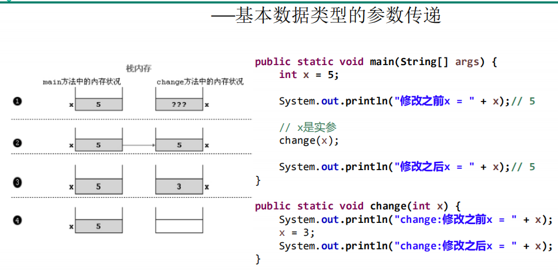

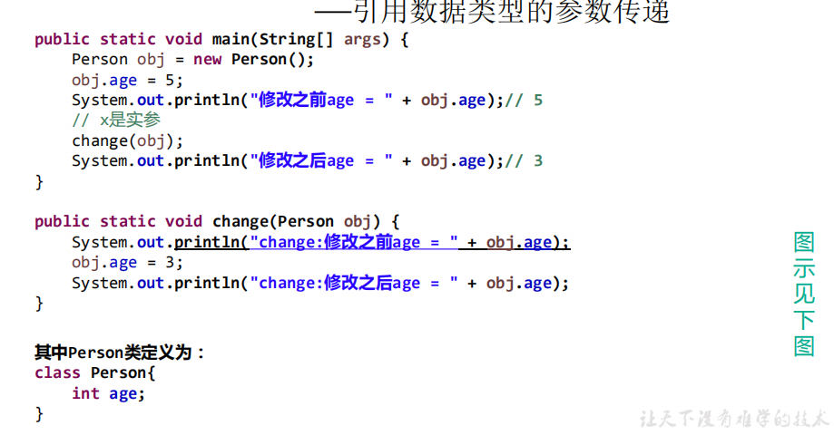

##   4.6 再谈方法4：递归(recursion)方法

  递归方法：一个方法体内调用它自身。

 方法递归包含了一种隐式的循环，它会重复执行某段代码，但这种重复执行无须循环控制。

  递归一定要向已知方向递归，否则这种递归就变成了无穷递归，类似于死循环。

```java
//计算1-100之间所有自然数的和
public int sum(int num){
    if(num == 1){
        return 1;
    }else{
        return num + sum(num - 1);
    } 
}
```


##   4.7 面向对象特征之一：封装与隐藏

  - 为什么需要封装？封装的作用和含义？

  - 我要用洗衣机，只需要按一下开关和洗涤模式就可以了。有必要了解洗衣机内部的结构吗？有必要碰电动机吗？

  - 我要开车，… 

- 我们程序设计追求“高内聚，低耦合”。

  高内聚 ：类的内部数据操作细节自己完成，不允许外部干涉；

  低耦合 ：仅对外暴露少量的方法用于使用。

 - 隐藏对象内部的复杂性，只对外公开简单的接口。便于外界调用，从而提高系统的可扩展性、可维护性。通俗的说，把该隐藏的隐藏起来，该暴露的暴露出来。这就是封装性的设计思想。 使用者对类内部定义的属性(对象的成员变量)的直接操作会导致数据的错误、混乱或安全性问题。
   
    问题：xb.legs = -1000;应该将legs属性保护起来，防止乱用。保护的方式：信息隐藏

 ```java
 class Animal {
     public int legs;
     public void eat(){
         System.out.println("Eating");
     }
     public void move(){
         System.out.println("Moving.");
     } 
 }
 
 public class Zoo {
     public static void main(String args[]) {
         Animal xb = new Animal();
         xb.legs = 4;
         System.out.println(xb.legs);
         xb.eat();
         xb.move();
     } 
 }
 ```


  **信息的封装和隐藏**

  Java中通过将数据声明为私有的(private)，再提供公共的（public）方法:getXxx()和setXxx()实现对该属性的操作，以实现下述目的：

- 隐藏一个类中不需要对外提供的实现细节；

- 使用者只能通过事先定制好的方法来访问数据，可以方便地加入控制逻辑， 限制对属性的不合理操作；

- 便于修改，增强代码的可维护性；

```java
  class Animal {
      private int legs;// 将属性legs定义为private，只能被Animal类内部访问
      public void setLegs(int i) { 
          // 在这里定义方法 eat() 和 move()
          if (i != 0 && i != 2 && i != 4) {
              System.out.println("Wrong number of legs!");
              return; 
          }
          legs = i; 
      }
      public int getLegs() {
          return legs;
      }
  }

public class Zoo {
    public static void main(String args[]) {
        Animal xb = new Animal();
        xb.setLegs(4); // xb.setLegs(-1000);
        //xb.legs = -1000; // 非法
        System.out.println(xb.getLegs());
    } 
}
```

Java权限修饰符public、protected、(缺省)、private置于类的成员定义前，用来限定对象对该类成员的访问权限。 

 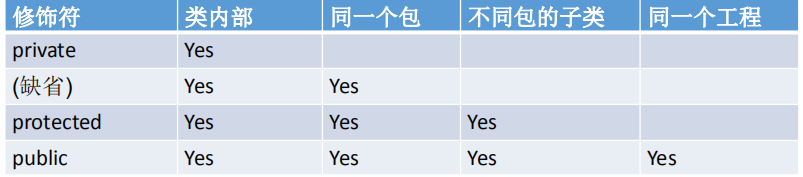

对于class的权限修饰只可以用public和default(缺省)。 

- public类可以在任意地方被访问。

- default类只可以被同一个包内部的类访问。 


##   4.8 类的成员之三： 构造器(或构造方法)

- 构造器的特征

- 它具有与类相同的名称

- 它不声明返回值类型。（与声明为void不同）

- 不能被static、final、synchronized、abstract、native修饰，不能有return语句返回值

- 构造器的作用：创建对象；给对象进行初始化

  如：Order o = new Order(); Person p = new Person(“Peter”,15); 

- 如同我们规定每个“人”一出生就必须先洗澡，我们就可以在“人”的 构造器中加入完成“洗澡”的程序代码，于是每个“人”一出生就会自
    动完成“洗澡”，程序就不必再在每个人刚出生时一个一个地告诉他们要“洗澡”了。

语法格式：

修饰符 类名 (参数列表) {

​	初始化语句；

} 

举 例：

创建Animal类的实例：Animal a = new Animal();  调用构造器，将legs初始化为4。

 ```java
 public class Animal {
     private int legs;
     // 构造器
     public Animal() {
         legs = 4;
     } 
     public void setLegs(int i) {
         legs = i; 
     }
     public int getLegs() {
         return legs; 
     } 
 }
 ```

 根据参数不同，构造器可以分为如下两类：

- 隐式无参构造器（系统默认提供）

- 显式定义一个或多个构造器（无参、有参）

 注 意：

- Java语言中，每个类都至少有一个构造器

- 默认构造器的修饰符与所属类的修饰符一致

- 一旦显式定义了构造器，则系统不再提供默认构造器 

- 一个类可以创建多个重载的构造器

- 父类的构造器不可被子类继承


**构造器重载**

构造器一般用来创建对象的同时初始化对象。如

```java
class Person{
    String name;
    int age;
    public Person(String n , int a){
        name=n; age=a;
    }
}
```

构造器重载使得对象的创建更加灵活，方便创建各种不同的对象。

构造器重载举例：

```java
public class Person{
    public Person(String name, int age, Date d) {
        this(name,age);
        …
    }
    public Person(String name, int age) {…}
    public Person(String name, Date d) {…}
    public Person(){…}
} 
```


构造器重载，参数列表必须不同

```java
public class Person { 
    //构造器重载举例
    private String name;
    private int age;
    private Date birthDate;
    public Person(String n, int a, Date d) {
        name = n;
        age = a;
        birthDate = d; 
    }
    public Person(String n, int a) {
        name = n;
        age = a;
    }

    public Person(String n, Date d) {
        name = n;
        birthDate = d; 
    }
    public Person(String n) {
        name = n;
        age = 30;
    } 
}
```

总结：属性赋值过程

截止到目前，我们讲到了很多位置都可以对类的属性赋值。现总结这几个位置，并指明赋值的先后顺序。

  - 赋值的位置：
    ① 默认初始化
    ② 显式初始化
    ③ 构造器中初始化
    ④ 通过“对象.属性“或“对象.方法”的方式赋值
    
  - 赋值的先后顺序：
    ① - ② - ③ - ④
    
    
    

## 4.9 拓展知识：JavaBean

JavaBean是一种Java语言写成的可重用组件。

所谓javaBean，是指符合如下标准的Java类：

- 类是公共的
- 有一个无参的公共的构造器
- 有属性，且有对应的get、set方法  

用户可以使用JavaBean将功能、处理、值、数据库访问和其他任何可以用Java代码创造的对象进行打包，并且其他的开发者可以通过内部的JSP页面、Servlet、其他JavaBean、applet程序或者应用来使用这些对象。用户可以认为JavaBean提供了一种随时随地的复制和粘贴的功能，而不用关心任何改变。

**JavaBean示例**

```java
public class JavaBean {
    private String name; // 属性一般定义为private
    private int age;
    public JavaBean() {}
    public int getAge() {
        return age;
    }
    public void setAge(int a) {
        age = a;
    }
    public String getName() {
        return name;
    }
    public void setName(String n) {
        name = n;
    }
}
```

## 4.10 拓展知识：UML类图

 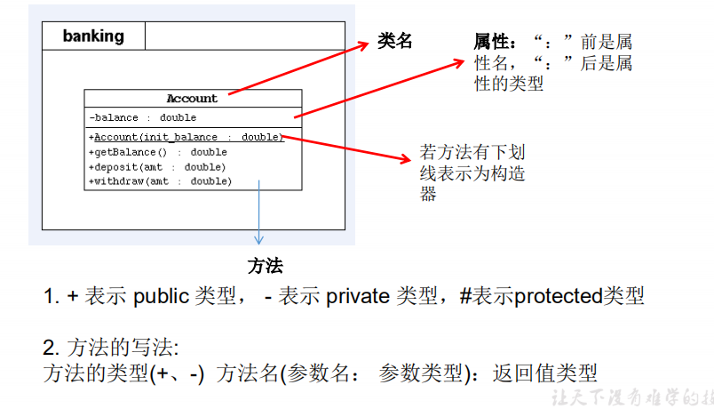


##   4.11 关键字—this

  this是什么？

 - 在Java中，this关键字比较难理解，它的作用和其词义很接近。

 - 它在方法内部使用，即这个方法所属对象的引用；

 - 它在构造器内部使用，表示该构造器正在初始化的对象。

 - this 可以调用类的属性、方法和构造器 - 什么时候使用this关键字呢？

- 当在方法内需要用到调用该方法的对象时，就用this。

  具体的：我们可以用this来区分属性和局部变量。
  
  比如：this.name = name;

  - 使用this，调用属性、方法

 ```java
 class Person{ // 定义Person类
     private String name ;
     private int age ;
     public Person(String name,int age){
         this.name = name ; 
         this.age = age ; 
     }
     public void getInfo(){
         System.out.println("姓名：" + name) ;
         this.speak();
     }
     public void speak(){
         System.out.println(“年龄：” + this.age);
     }
 }
 ```

在任意方法或构造器内，如果使用当前类的成员变量或成员方法可以在其前面添加this，增强程序的阅读性。不过，通常我们都习惯省略this。

当形参与成员变量同名时，  如果在方法内或构造器内需要 使用成员变量，必须添加this来表明该变量是类的成员变量

使用this访问属性和方法时， 如果在本类中未找到，会从父类中查找

```java
//当前正在操作本方法的对象称为当前对象。
class Person{
    // 定义Person类
    String name;
    Person(String name){
        this.name = name;
    }
    public void getInfo(){
        System.out.println("Person类 --> " + this.name) ;
    }
    public boolean compare(Person p){
        return this.name==p.name;
    } 
}
public class PersonTest{
    public static void main(String args[]){
        Person per1 = new Person("张三") ;
        Person per2 = new Person("李四") ;
        per1.getInfo() ; // 当前调用getInfo()方法的对象是per1
        per2.getInfo() ; // 当前调用getInfo()方法的对象是per2
        boolean b = per1.compare(per2);
    }
}
```

```java
//使用this调用本类的构造器
class Person{ 
    // 定义Person类
    private String name ;
    private int age ;
    public Person(){ // 无参构造器
        System.out.println("新对象实例化") ;
    }
    public Person(String name){
        this(); // 调用本类中的无参构造器
        this.name = name ;
    }
    public Person(String name,int age){
        this(name) ; // 调用有一个参数的构造器
        this.age = age;
    }
    public String getInfo(){
        return "姓名：" + name + "，年龄：" + age ;
    } 
} 
//4.this可以作为一个类中构造器相互调用的特殊格式
```

注意：

 - 可以在类的构造器中使用"this(形参列表)"的方式，调用本类中重载的其他的构造器！

- 明确：构造器中不能通过"this(形参列表)"的方式调用自身构造器

 - 如果一个类中声明了n个构造器，则最多有 n - 1个构造器中使用了"this(形参列表)"

  - "this(形参列表)"必须声明在类的构造器的首行！

  - 在类的一个构造器中，最多只能声明一个"this(形参列表)"


##    4.12 关键字：package、

package语句作为Java源文件的第一条语句，指明该文件中定义的类所在的包。(若缺省该语句，则指定为无名包)。它的格式为：
   package 顶层包名.子包名 ;

举例：pack1\pack2\PackageTest.java

```java
package pack1.pack2; //指定类PackageTest属于包pack1.pack2
public class PackageTest{
    public void display(){
        System.out.println("in method display()");
    }
} 
```

包对应于文件系统的目录，package语句中，用 “.” 来指明包(目录)的层次；

包通常用小写单词标识。通常使用所在公司域名的倒置：com.atguigu.xxx

源文件布局：
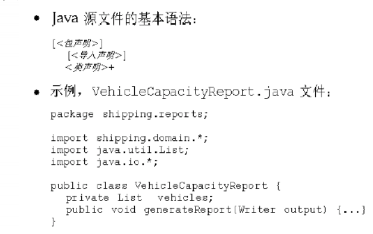
   包的作用：
   - 包帮助管理大型软件系统：将功能相近的类划分到同一个包中。比如：MVC的设计模式
   - 包可以包含类和子包，划分项目层次，便于管理
   - 解决类命名冲突的问题
   - 控制访问权限

   **MVC设计模式**

  MVC是常用的设计模式之一，将整个程序分为三个层次：视图模型层，控制器层，与数据模型层。这种将程序输入输出、数据处理，以及数据的展示分离开来的设计模式
   使程序结构变的灵活而且清晰，同时也描述了程序各个对象间的通信方式，降低了程 序的耦合性。
 

 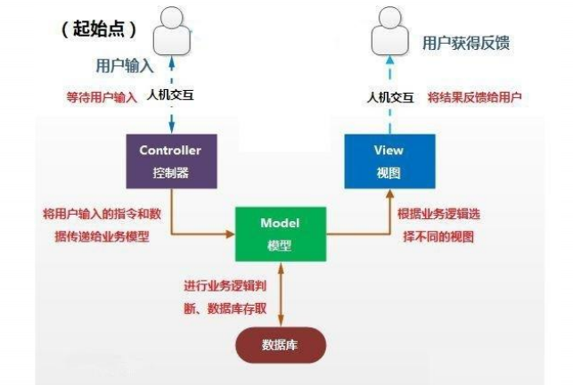

**JDK中主要的包介绍**

> 1. java.lang----包含一些Java语言的核心类，如String、Math、Integer、 System和Thread，提供常用功能
> 2. java.net----包含执行与网络相关的操作的类和接口。
> 3. java.io ----包含能提供多种输入/输出功能的类。
> 4. java.util----包含一些实用工具类，如定义系统特性、接口的集合框架类、使用与日期日历相关的函数。
> 5. java.text----包含了一些java格式化相关的类
> 6. java.sql----包含了java进行JDBC数据库编程的相关类/接口
> 7. java.awt----包含了构成抽象窗口工具集（abstract window toolkits）的多个类，这些类被用来构建和管理应用程序的图形用户界面(GUI)。 B/S C/S
>    
>    

## 4.13 关键字—import

为使用定义在不同包中的Java类，需用import语句来引入指定包层次下所需要的类或全部类(.\*)。import语句告诉编译器到哪里去寻找类。

语法格式：

import 包名. 类名;

应用举例：

```java
import pack1.pack2.Test; //import pack1.pack2.*;表示引入pack1.pack2包中的所有结构
public class PackTest{
    public static void main(String args[]){
        Test t = new Test(); //Test类在pack1.pack2包中定义
        t.display();
    }
}
```


注意：

> 1. 在源文件中使用import显式的导入指定包下的类或接口
> 2. 声明在包的声明和类的声明之间。
> 3. 如果需要导入多个类或接口，那么就并列显式多个import语句即可
> 4. 举例：可以使用java.util.*的方式，一次性导入util包下所有的类或接口。
> 5. 如果导入的类或接口是java.lang包下的，或者是当前包下的，则可以省略此import语句。
> 6. 如果在代码中使用不同包下的同名的类。那么就需要使用类的全类名的方式指明调用的是哪个类。
> 7. 如果已经导入java.a包下的类。那么如果需要使用a包的子包下的类的话，仍然需要导入。
> 8. import static组合的使用：调用指定类或接口下的静态的属性或方法


#  第5章 面向对象编程(中)

## 5.1 面向对象特征之二：继承性

为描述和处理个人信息，定义类Person:
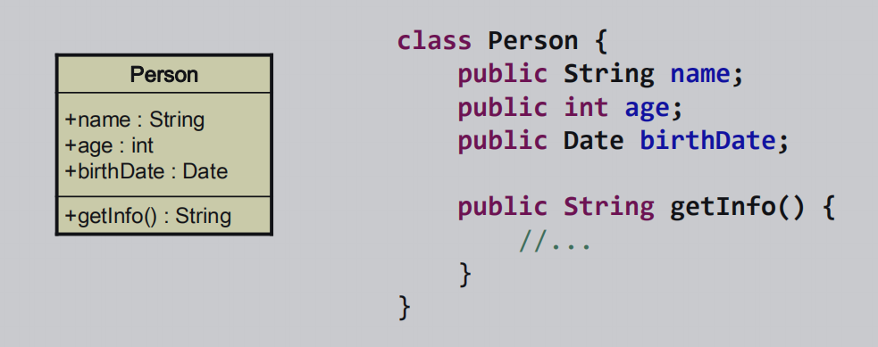

为描述和处理学生信息，定义类Student:
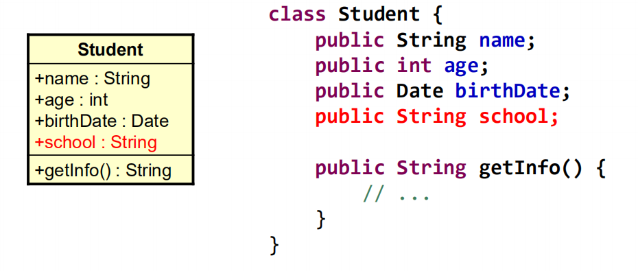

通过继承，简化Student类的定义: 

Student类继承了父类Person的所有属性和方法，并增加了一个属性school。Person中的属性和方法,Student都可以使用。

 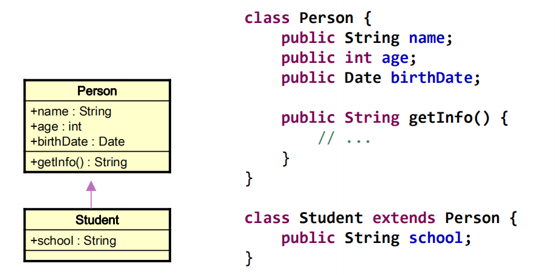

为什么要有继承？

> 多个类中存在相同属性和行为时，将这些内容抽取到单独一个类中，那么多个类无需再定义这些属性和行为，只要继承那个类即可。

- 此处的多个类称为子类(派生类)，单独的这个类称为父类(基类 或超类)。可以理解为:“子类 is a 父类”

- 类继承语法规则:

> class Subclass extends SuperClass{ }

- 作用：

> 继承的出现减少了代码冗余，提高了代码的复用性。
>
>  继承的出现，更有利于功能的扩展。
>
>  继承的出现让类与类之间产生了关系，提供了多态的前提。
>
> 

 - 注意：不要仅为了获取其他类中某个功能而去继承

- 子类继承了父类，就继承了父类的方法和属性。

- 在子类中，可以使用父类中定义的方法和属性，也可以创建新的数据和方法。

- 在Java 中，继承的关键字用的是“extends”，即子类不是父类的子集，而是对父类的“扩展”。

**关于继承的规则：**

> 子类不能直接访问父类中私有的(private)的成员变量和方法。
>
>  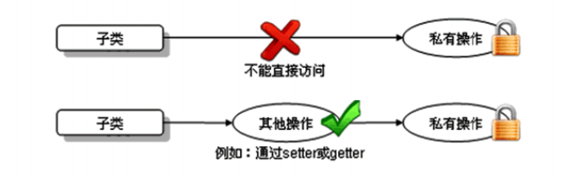

- Java只支持单继承和多层继承，不允许多重继承

> 一个子类只能有一个父类
>
> 一个父类可以派生出多个子类
>
>  class SubDemo extends Demo{ } //ok
>
>  class SubDemo extends Demo1,Demo2...//error
>
> 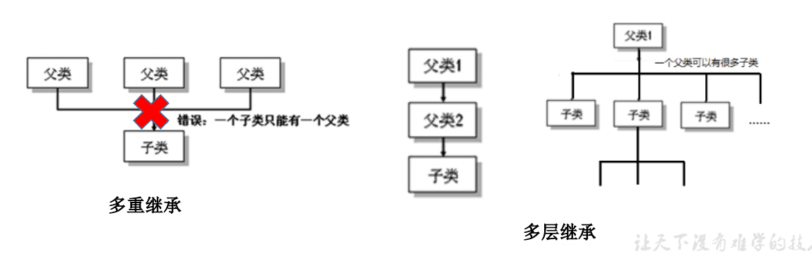
>
> 


## 5.2 方法的重写(override/overwrite)

定义：在子类中可以根据需要对从父类中继承来的方法进行改造，也称为方法的重置、覆盖。在程序执行时，子类的方法将覆盖父类的方法。

要求：

> 1. 子类重写的方法必须和父类被重写的方法具有相同的方法名称、参数列表
>
> 2. 子类重写的方法的返回值类型不能大于父类被重写的方法的返回值类型
>
> 3. 子类重写的方法使用的访问权限不能小于父类被重写的方法的访问权限
>
>    子类不能重写父类中声明为private权限的方法
>
> 4. 子类方法抛出的异常不能大于父类被重写方法的异常

- 注意：

> 子类与父类中同名同参数的方法必须同时声明为非static的(即为重写)，或者同时声明为static的（不是重写）。因为static方法是属于类的，子类无法覆盖父类的方法。


## 5.3 四种访问权限修饰符

> Java权限修饰符public、protected、 (缺省)、 private置于类的成员定义前，用来限定对象对该类成员的访问权限。
>
> 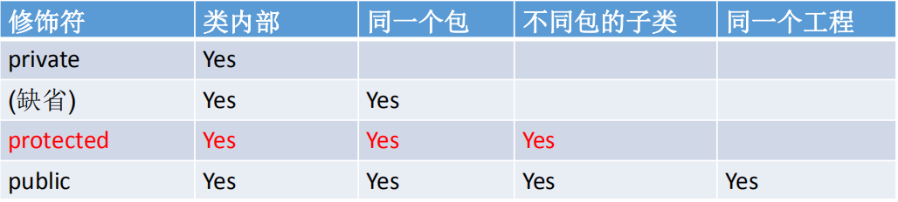


> 对于class的权限修饰只可以用public和default(缺省)。
>
>  public类可以在任意地方被访问。
>
> default类只可以被同一个包内部的类访问。


## 5.4 关键字：super

在Java类中使用super来调用父类中的指定操作：

> super可用于访问父类中定义的属性
>
> super可用于调用父类中定义的成员方法
>
> super可用于在子类构造器中调用父类的构造器 

- 注意：

>尤其当子父类出现同名成员时，可以用super表明调用的是父类中的成员
>
>super的追溯不仅限于直接父类 -super和this的用法相像，this代表本类对象的引用，super代表父类的内存空间的标识
>


调用父类的构造器

> 子类中所有的构造器默认都会访问父类中空参数的构造器 
>
> 当父类中没有空参数的构造器时，子类的构造器必须通过this(参数列表)或者super(参数列表)语句指定调用本类或者父类中相应的
> 构造器。同时，只能”二选一”，且必须放在构造器的首行 
>
> 如果子类构造器中既未显式调用父类或本类的构造器，且父类中又没有无参的构造器，则编译出错


**this和super的区别**
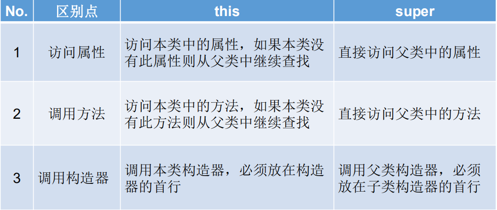

## 5.5 子类对象实例化过程

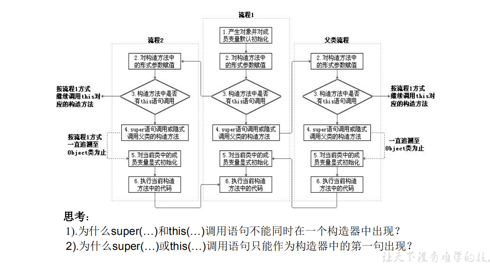


## 5.6 面向对象特征之三：多态性

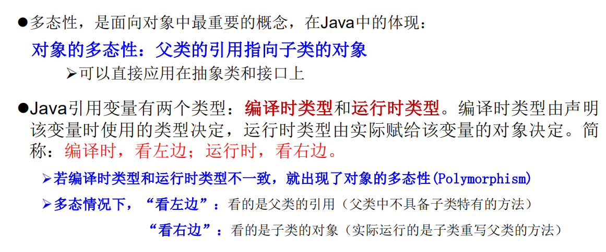

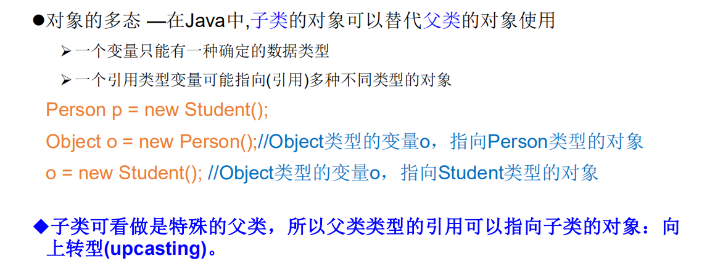

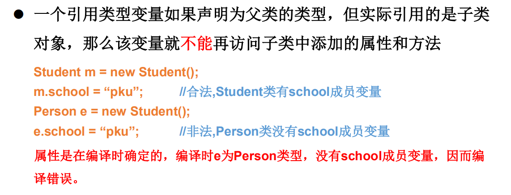


-------------------------------------------------------------------
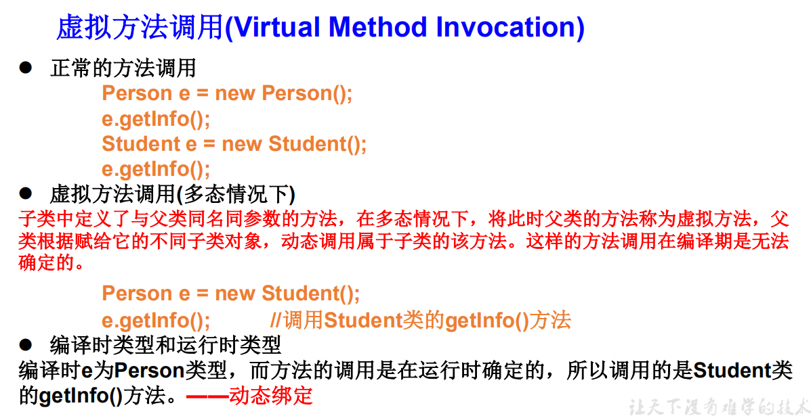

##  5. 7 关于向上转型与向下转型：

### 5. 7.1 向上转型：多态

### 5.7.2 向下转型：

#### 5.7.2.1 为什么使用向下转型：

> 有了对象的多态性以后，内存中实际上是加载了子类特有的属性和方法的，但是由于变量声明为父类类型，导致编译时，只能调用父类中声明的属性和方法。子类特有的属性和方法不能调用。如何才能调用子类特的属性和方法？使用向下转型。

#### 5.7.2.2 如何实现向下转型：

> 使用强制类型转换符：()

#### 5.7.2.3 使用时的注意点：

> ① 使用强转时，可能出现ClassCastException的异常。
>
> ② 为了避免在向下转型时出现ClassCastException的异常，我们在向下转型之前，先进行instanceof的判断，一旦返回true，就进行向下转型。如果返回false，不进行向下转型。

#### 5.7.2.4 instanceof的使用：

> ① a instanceof A:判断对象a是否是类A的实例。如果是，返回true；如果不是，返回false。
>
> ② 如果 a instanceof A返回true,则 a instanceof B也返回true.其中，类B是类A的父类。
>
> ③ 要求a所属的类与类A必须是子类和父类的关系，否则编译错误。

#### 5.7.2.5 图示：

 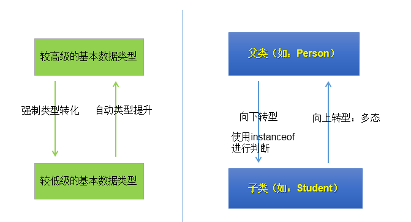

### 5.7.8 面试题：

#### 5.7.8.1 谈谈你对多态性的理解？

> ① 实现代码的通用性。
>
> ② Object类中定义的public boolean equals(Object obj){  }
>
>  JDBC:使用java程序操作(获取数据库连接、CRUD)数据库(MySQL、Oracle、DB2、SQL Server)
>
> ③ 抽象类、接口的使用肯定体现了多态性。（抽象类、接口不能实例化）

#### 5.7.8.2 多态是编译时行为还是运行时行为？


## 5.8 Object类的使用

### 1.java.lang.Object类的说明：

> 1.Object类是所Java类的根父类
>
> 2.如果在类的声明中未使用extends关键字指明其父类，则默认父类为java.lang.Object类 
>
> 3.Object类中的功能(属性、方法)就具通用性。
>
> 属性：无
>
> 方法：equals() / toString() / getClass() /hashCode() / clone() / finalize()
>
> wait() 、 notify()、notifyAll()
>
> 4.Object类只声明了一个空参的构造器

### 2.equals()方法

#### 2.1 equals()的使用：

>1. 是一个方法，而非运算符
>2. 只能适用于引用数据类型
>3. Object类中equals()的定义：
>
>```java
>public boolean equals(Object obj) {
>    return (this == obj);
>}
>```
>
>说明：Object类中定义的equals()和==的作用是相同的：比较两个对象的地址值是否相同.即两个引用是否指向同一个对象实体
>
>4. 像String、Date、File、包装类等都重写了Object类中的equals()方法。重写以后，比较的不是两个引用的地址是否相同，而是比较两个对象的"实体内容"是否相同。
>5. 通常情况下，我们自定义的类如果使用equals()的话，也通常是比较两个对象的"实体内容"是否相同。那么，我们就需要对Object类中的equals()进行重写.重写的原则：比较两个对象的实体内容是否相同.
>
>

#### 2.2 如何重写equals()

##### 2.2.1 手动重写举例：

```java
class User{
    String name;
    int age;
    //重写其equals()方法
	public boolean equals(Object obj){
		if(obj == this){
			return true;
		}
		if(obj instanceof User){
			User u = (User)obj;
			return this.age == u.age && this.name.equals(u.name);
		}
		return false;
	}
}
```

##### 2.2.2 开发中如何实现：自动生成的

#### 2.3 回顾 == 运算符的使用：

```properties
== ：运算符
  1. 可以使用在基本数据类型变量和引用数据类型变量中
  2. 如果比较的是基本数据类型变量：比较两个变量保存的数据是否相等。（不一定类型要相同）
     如果比较的是引用数据类型变量：比较两个对象的地址值是否相同.即两个引用是否指向同一个对象实体
 补充： == 符号使用时，必须保证符号左右两边的变量类型一致。
```


### 3. toString()方法

#### 3.1 toString()的使用：

```properties
 1. 当我们输出一个对象的引用时，实际上就是调用当前对象的toString()
 
 2. Object类中toString()的定义：
  public String toString() {
      return getClass().getName() + "@" + Integer.toHexString(hashCode());
  }
 
 3. 像String、Date、File、包装类等都重写了Object类中的toString()方法。
    使得在调用对象的toString()时，返回"实体内容"信息
    
 4. 自定义类也可以重写toString()方法，当调用此方法时，返回对象的"实体内容"
```

#### 3.2 如何重写toString()

```java
//自动实现
@Override
public String toString() {
    return "Customer [name=" + name + ", age=" + age + "]";
}
```

### 4.面试题：

```properties
① final、finally、finalize的区别？
②  == 和 equals() 区别
```

## 5.9 单元测试方法

```properties
Java中的JUnit单元测试
步骤：
1.中当前工程 - 右键择：build path - add libraries - JUnit 4 - 下一步
2.创建Java类，进行单元测试。
此时的Java类要求：① 此类是public的  ②此类提供公共的无参的构造器
3.此类中声明单元测试方法。
此时的单元测试方法：方法的权限是public,没返回值，没形参

4.此单元测试方法上需要声明注解：@Test,并在单元测试类中导入：import org.junit.Test;

5.声明好单元测试方法以后，就可以在方法体内测试相关的代码。
6.写完代码以后，左键双击单元测试方法名，右键：run as - JUnit Test

说明：
1.如果执行结果没任何异常：绿条
2.如果执行结果出现异常：红条
```

## 5.10 类的包装和使用

### 1.为什么要有包装类(或封装类）

```sh
为了使基本数据类型的变量具有类的特征，引入包装类。
```

### 2.基本数据类型与对应的包装类：

 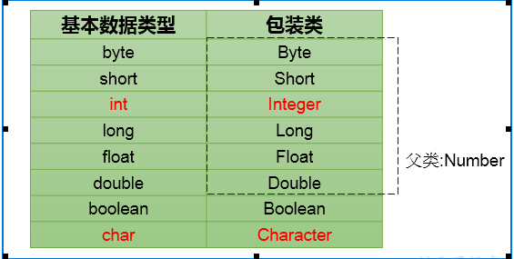

### 3.需要掌握的类型间的转换：（基本数据类型、包装类、String）

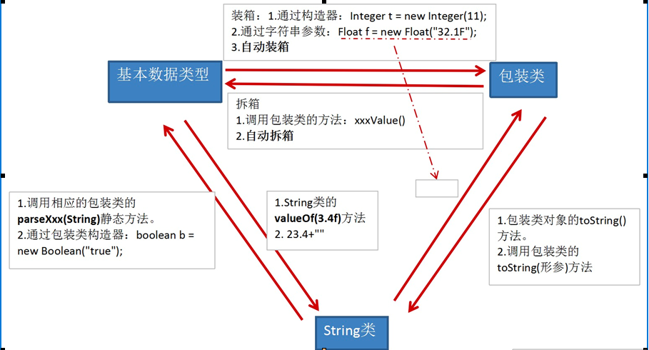

```properties
简易版：
基本数据类型<--->包装类：JDK 5.0 新特性：自动装箱 与自动拆箱
基本数据类型、包装类--->String:调用String重载的valueOf(Xxx xxx)
String--->基本数据类型、包装类:调用包装类的parseXxx(String s)
     注意：转换时，可能会报NumberFormatException
应用场景举例：
① Vector类中关于添加元素，只定义了形参为Object类型的方法：
v.addElement(Object obj);   //基本数据类型 --->包装类 --->使用多态
```

# 第6章 面向对象编程（下）

## 6.1 static 关键字

> 1.可以用来修饰的结构：主要用来修饰类的内部结构
>
> 属性、方法、代码块、内部类
>
> 2.static修饰属性：静态变量（或类变量）
>
> ```properties
> 2.1 属性，是否使用static修饰，又分为：静态属性  vs 非静态属性(实例变量)
> 实例变量：我们创建了类的多个对象，每个对象都独立的拥一套类中的非静态属性。当修改其中一个对象中的非静态属性时，不会导致其他对象中同样的属性值的修改。
> 静态变量：我们创建了类的多个对象，多个对象共享同一个静态变量。当通过某一个对象修改静态变量时，会导致其他对象调用此静态变量时，是修改过了的。
> 2.2 static修饰属性的其他说明：
> 
> ① 静态变量随着类的加载而加载。可以通过"类.静态变量"的方式进行调用
> ② 静态变量的加载要早于对象的创建。
> ③ 由于类只会加载一次，则静态变量在内存中也只会存在一份：存在方法区的静态域中。
> ④		类变量	实例变量
>           类		yes		no
>           对象	yes		yes
>      
> 2.3 静态属性举例：System.out; Math.PI;
> ```
>
> 3.静态变量内存解析：
>
> 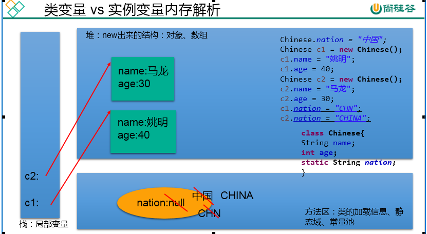
>
> 4.static修饰方法：静态方法、类方法
>
> ```properties
> ① 随着类的加载而加载，可以通过"类.静态方法"的方式进行调用
> ②		静态方法	非静态方法
>  类		 yes       no
>  对象		yes		  yes
>  
> ③静态方法中，只能调用静态的方法或属性
> 非静态方法中，既可以调用非静态的方法或属性，也可以调用静态的方法或属性
> ```
>
> 5.static的注意点：
>
> ```properties
> 5.1 在静态的方法内，不能使用this关键字、super关键字
> 5.2 关于静态属性和静态方法的使用，大家都从生命周期的角度去理解。
> ```
>
> 6.如何判定属性和方法应该使用static关键字：
>
> ```sh
> 6.1 关于属性
> 属性是可以被多个对象所共享的，不会随着对象的不同而不同的。
> 类中的常量也常常声明为static
> 
> 6.2 关于方法
> 操作静态属性的方法，通常设置为static的
> 工具类中的方法，习惯上声明为static的。 比如：Math、Arrays、Collections
> ```
>
> 7.使用举例：
>
> ```sh
> 举例一：Arrays、Math、Collections等工具类
> 举例二：单例模式
> 举例三：
> ```
>
> ```java
> class Circle{
> 	private double radius;
> 	private int id;//自动赋值
> 
> 	public Circle(){
> 		id = init++;
> 		total++;
> 	}
> 
> 	public Circle(double radius){
> 		this();
> //		id = init++;
> //		total++;
> 		this.radius = radius;
> 
> 	}
> 
> 	private static int total;//记录创建的圆的个数
> 	private static int init = 1001;//static声明的属性被所对象所共享
> 
> 	public double findArea(){
> 		return 3.14 * radius * radius;
> 	}
> 
> 	public double getRadius() {
> 		return radius;
> 	}
> 
> 	public void setRadius(double radius) {
> 		this.radius = radius;
> 	}
> 
> 	public int getId() {
> 		return id;
> 	}
> 
> 	public static int getTotal() {
> 		return total;
> 	}
> 
> }
> ```

>1.设计模式的说明
>
>1.1 理解
>
>设计模式是在大量的实践中总结和理论化之后优的代码结构、编程风格、以及解决问题的思考方式。
>
>1.2 常用设计模式  --- 23种经典的设计模式  GOF
>
>创建型模式，共5种：工厂方法模式、抽象工厂模式、单例模式、建造者模式、原型模式。 
>
>结构型模式，共7种：适配器模式、装饰器模式、代理模式、外观模式、桥接模式、组合模式、享元模式。 
>
>行为型模式，共11种：策略模式、模板方法模式、观察者模式、迭代器模式、责任链模式、命令模式、备忘录模式、状态模式、访问者模式、中介者模式、解释器模式。 
>
>2.单例模式
>
>2.1 要解决的问题：
>
>所谓类的单例设计模式，就是采取一定的方法保证在整个的软件系统中，对某个类只能存在一个对象实例。
>
>2.2 具体代码的实现：
>
>饿汉式1：	
>
>```java
>class Bank{
>    //1.私化类的构造器
>    private Bank(){}
>    //2.内部创建类的对象
>    //4.要求此对象也必须声明为静态的
>    private static Bank instance = new Bank();
>    //3.提供公共的静态的方法，返回类的对象
>    public static Bank getInstance(){
>        return instance;
>    }
>}
>```
>
>
>饿汉式2：使用了静态代码块
>
>
>```java
>class Order{
>    //1.私化类的构造器
>    private Order(){}
>    //2.声明当前类对象，没初始化
>    //4.此对象也必须声明为static的
>    private static Order instance = null;
>    static{
>        instance = new Order();
>    }
>    //3.声明public、static的返回当前类对象的方法
>    public static Order getInstance(){
>        return instance;
>    }
>}
>```
>
>懒汉式：	
>
>```java
>class Order{
>    //1.私化类的构造器
>    private Order(){}
>    //2.声明当前类对象，没初始化
>    //4.此对象也必须声明为static的
>    private static Order instance = null;
>    //3.声明public、static的返回当前类对象的方法
>    public static Order getInstance(){
>        if(instance == null){
>            instance = new Order();
>        }
>        return instance;
>    }
>}
>```
>
>
>2.3 两种方式的对比：
>
>*   饿汉式：	
>*   	坏处：对象加载时间过长。
>* 好处：饿汉式是线程安全的
>
>*   懒汉式：好处：延迟对象的创建。
>* 		  目前的写法坏处：线程不安全。--->到多线程内容时，再修改
>

## 6.2 main()函数使用

> 1.main()方法作为程序的入口
>
> 2.main()方法也是一个普通的静态方法
>
> 3.main()方法可以作为我们与控制台交互的方式。（之前：使用Scanner）
>
> 如何将控制台获取的数据传给形参：String[] args?
>
> 运行时：java 类名 "Tom" "Jerry" "123" "true"
>
> sysout(args[0]);//"Tom"
>
> sysout(args[3]);//"true"  -->Boolean.parseBoolean(args[3]);
>
> sysout(args[4]);//报异常
>
> `小结：一叶知秋`
>
> public static void main(String[] args){//方法体}
>
> 权限修饰符：private 缺省 protected pubilc ---->封装性
>
> 修饰符：static \ final \ abstract \native 可以用来修饰方法
>
> 返回值类型： 无返回值 / 有返回值 -->return
>
> 方法名：需要满足标识符命名的规则、规范；"见名知意"
>
> 形参列表：重载 vs 重写；参数的值传递机制；体现对象的多态性
>
> 方法体：来体现方法的功能
>
> ```java
> main(){
>     Person p = new Man();
>     p.eat();
>     //p.earnMoney();
>     Man man = new Man();
>     man.eat();
>     man.earnMoney();
> }
> ```
>


## 6.3 类的结构：代码块

> 类的成员之四：代码块(初始化块)（重要性较属性、方法、构造器差一些）
>
> 1.代码块的作用：用来初始化类、对象的信息
>
> 2.分类：代码块要是使用修饰符，只能使用static
>
> 分类：静态代码块  vs 非静态代码块
>
> 3.静态代码块：
>
> 内部可以输出语句
>
> 随着类的加载而执行,而且只执行一次
>
> 作用：初始化类的信息
>
> 如果一个类中定义了多个静态代码块，则按照声明的先后顺序执行
>
> 静态代码块的执行要优先于非静态代码块的执行
>
> 静态代码块内只能调用静态的属性、静态的方法，不能调用非静态的结构
>
> 非静态代码块：
>
> 内部可以输出语句
>
> 随着对象的创建而执行
>
> 每创建一个对象，就执行一次非静态代码块
>
> 作用：可以在创建对象时，对对象的属性等进行初始化
>
> 如果一个类中定义了多个非静态代码块，则按照声明的先后顺序执行
>
> 非静态代码块内可以调用静态的属性、静态的方法，或非静态的属性、非静态的方法
>
> 4.实例化子类对象时，涉及到父类、子类中静态代码块、非静态代码块、构造器的加载顺序：
>
> 对应的练习：LeafTest.java / Son.java
>
> 由父及子，静态先行。

```sh
 ①默认初始化
 ②显式初始化/⑤在代码块中赋值
 ③构造器中初始化
 ④有了对象以后，可以通过"对象.属性"或"对象.方法"的方式，进行赋值
 执行的先后顺序：① - ② / ⑤ - ③ - ④
```


## 6.4 关键字：final

> final：最终的
>
> 1.可以用来修饰：类、方法、变量
>
> 2.具体的：
>
> 2.1 final 用来修饰一个类:此类不能被其他类所继承。
>  * 比如：String类、System类、StringBuffer类
>
>
> 2.2 final 用来修饰方法：表明此方法不可以被重写
>  * 比如：Object类中getClass();
>
> 2.3 final 用来修饰变量：此时的"变量"就称为是一个常量
>
>  * 	    final修饰属性：可以考虑赋值的位置：显式初始化、代码块中初始化、构造器中初始化
>  * 	    final修饰局部变量：
>  * 	    尤其是使用final修饰形参时，表明此形参是一个常量。当我们调用此方法时，给常量形参赋一个实参。一旦赋值以后，就只能在方法体内使用此形参，但不能进行重新赋值。
>  * 	    static final 用来修饰属性：全局常量
>


## 6.5 关键字 ：abstract

> abstract: 抽象的
>
> 1.可以用来修饰：类、方法
>
> 2.具体的：
>
> **abstract修饰类：抽象类**
>
> 此类不能实例化
>
> 抽象类中一定有构造器，便于子类实例化时调用（涉及：子类对象实例化的全过程）
>
> 开发中，都会提供抽象类的子类，让子类对象实例化，完成相关的操作 --->抽象的使用前提：继承性
>
> **abstract修饰方法：抽象方法**
>
> 抽象方法只方法的声明，没方法体
>
> 包含抽象方法的类，一定是一个抽象类。反之，抽象类中可以没有抽象方法的。
>
> 若子类重写了父类中的所的抽象方法后，此子类方可实例化
>
> 若子类没重写父类中的所的抽象方法，则此子类也是一个抽象类，需要使用abstract修饰
>
> 3.注意点：
>
>  * 1.abstract不能用来修饰：属性、构造器等结构
>  * 2.abstract不能用来修饰私方法、静态方法、final的方法、final的类
>
> 4.abstract的应用举例：
>
> 举例一：
>
> 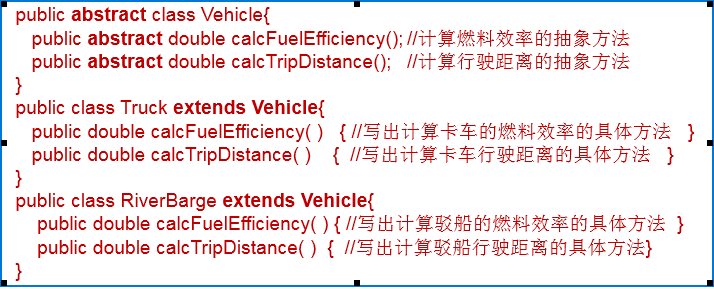
>
> 举例二：
>
> ```java
> abstract class GeometricObject{
>     public abstract double findArea();
> }
> class Circle extends GeometricObject{
>     private double radius;
>     public double findArea(){
>         return 3.14 * radius * radius;
>     };
> }
> ```
>
> 举例三：IO流中设计到的抽象类：InputStream/OutputStream / Reader /Writer。在其内部定义了抽象的read()、write()方法。

> **模板方法的设计模式**
>
> 解决的问题
>
> 在软件开发中实现一个算法时，整体步骤很固定、通用，这些步骤已经在父类中写好了。但是某些部分易变，易变部分可以抽象出来，供不同子类实现。这就是一种模板模式。
>
> 举例
>
>
> ```java
> abstract class Template{
>     //计算某段代码执行所需要花费的时间
>     public void spendTime(){
>         long start = System.currentTimeMillis();
>         this.code();//不确定的部分、易变的部分
>         long end = System.currentTimeMillis();
>         System.out.println("花费的时间为：" + (end - start));
>     }
>     public abstract void code();
> }
> ```
>
>
> ```java
> class SubTemplate extends Template{
>     @Override
>     public void code() {
>         for(int i = 2;i <= 1000;i++){
>             boolean isFlag = true;
>             for(int j = 2;j <= Math.sqrt(i);j++){
>                 if(i % j == 0){
>                     isFlag = false;
>                     break;
>                 }
>             }
>             if(isFlag){
>                 System.out.println(i);
>             }
>         }
>     }
> }
> ```
>
> 应用场景
>
>  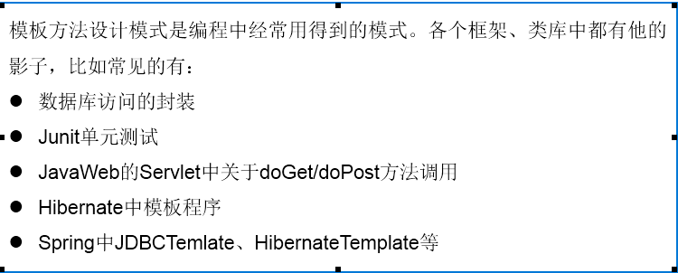

## 6.6 关键字 ：interface

> interface:接口
>
> 1.使用说明：
>
> ```properties
> 1.接口使用interface来定义
> 2.Java中，接口和类是并列的两个结构
> 3.如何定义接口：定义接口中的成员
> 3.1 JDK7及以前：只能定义全局常量和抽象方法
> 全局常量：public static final的.但是书写时，可以省略不写
> 抽象方法：public abstract的
> 3.2 JDK8：除了定义全局常量和抽象方法之外，还可以定义静态方法、默认方法（略
> 4. 接口中不能定义构造器的！意味着接口不可以实例化
> 5. Java开发中，接口通过让类去实现(implements)的方式来使用.
> 如果实现类覆盖了接口中的所抽象方法，则此实现类就可以实例化
> 如果实现类没覆盖接口中所的抽象方法，则此实现类仍为一个抽象类
> 
> 6. Java类可以实现多个接口   --->弥补了Java单继承性的局限性
> 格式：class AA extends BB implements CC,DD,EE
> 
> 7. 接口与接口之间可以继承，而且可以多继承
> 8. 接口的具体使用，体现多态性
> 9. 接口，实际上可以看做是一种规范
> ```
>
> 
>
> 2.举例：
>
>
> ​	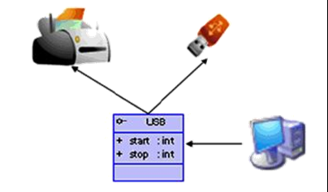
>
> ```java
> class Computer{
>     public void transferData(USB usb){//USB usb = new Flash();
>         usb.start();
>         System.out.println("具体传输数据的细节");
>         usb.stop();
>     }
> }
> ```
>
> ```java
> interface USB{
>     //常量：定义了长、宽、最大最小的传输速度等
>     void start();
>     void stop();
> }
> ```
>
> 
>
> ```java
> class Flash implements USB{
>     @Override
>     public void start() {
>         System.out.println("U盘开启工作");
>     }
>     @Override
>     public void stop() {
>         System.out.println("U盘结束工作");
>     }
> }
> ```
>
> ```java
> class Printer implements USB{
>     @Override
>     public void start() {
>         System.out.println("打印机开启工作");
>     }
>     @Override
>     public void stop() {
>         System.out.println("打印机结束工作");
>     }
> }
> ```
>
> ```properties
> 体会：
> 1.接口使用上也满足多态性
> 2.接口，实际上就是定义了一种规范
> 3.开发中，体会面向接口编程！	
> 
> ```
>
>   3.体会面向接口编程的思想
>
> 
>
>  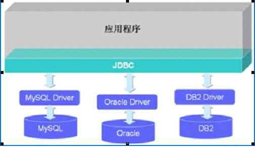
>
> 面向接口编程：我们在应用程序中，调用的结构都是JDBC中定义的接口，不会出现具体某一个数据库厂商的API。
>
> 4.Java8中关于接口的新规范
>
> ```sh
> //知识点1：接口中定义的静态方法，只能通过接口来调用。
> 
> //知识点2：通过实现类的对象，可以调用接口中的默认方法。
> //如果实现类重写了接口中的默认方法，调用时，仍然调用的是重写以后的方法
> 
> //知识点3：如果子类(或实现类)继承的父类和实现的接口中声明了同名同参数的默认方法，那么子类在没重写此方法的情况下，默认调用的是父类中的同名同参数的方法。-->类优先原则
> //知识点4：如果实现类实现了多个接口，而这多个接口中定义了同名同参数的默认方法，
> //那么在实现类没重写此方法的情况下，报错。-->接口冲突。
> //这就需要我们必须在实现类中重写此方法
> //知识点5：如何在子类(或实现类)的方法中调用父类、接口中被重写的方法
> ```
>
> ```java
> public void myMethod(){
> 		method3();//调用自己定义的重写的方法
> 		super.method3();//调用的是父类中声明的
> 		//调用接口中的默认方法
> 		CompareA.super.method3();
> 		CompareB.super.method3();
> }
> ```
>
> 5.面试题：
>
> ```sh
> 抽象类和接口的异同？
> 相同点：不能实例化；都可以包含抽象方法的。
> 不同点：
> 1）把抽象类和接口(java7,java8,java9)的定义、内部结构解释说明
> 2）类：单继承性    接口：多继承
>    类与接口：多实现
> ```
>
> 

### 6.6.1 代理模式

> 解决的问题
>
> 代理模式是Java开发中使用较多的一种设计模式。代理设计就是为其他对象提供一种代理以控制对这个对象的访问。 
>
> 举例
>
> ```java
>  interface NetWork{
>      public void browse();
>  }
> ```
>
> ```java
> //被代理类
> class Server implements NetWork{
>     @Override
>     public void browse() {
>         System.out.println("真实的服务器访问网络");
>     }
> }
> //代理类
> class ProxyServer implements NetWork{
>     private NetWork work;
>     public ProxyServer(NetWork work){
>         this.work = work;
>     }
>     public void check(){
>         System.out.println("联网之前的检查工作");
>     }
>     @Override
>     public void browse() {
>         check();
>         work.browse();
>     }
> }
> ```
>
> 应用场景
>
>  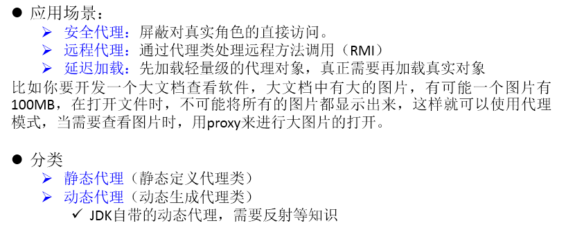

### 6.6.2 工厂代理模式

> 1. 解决的问题
> 实现了创建者与调用者的分离，即将创建对象的具体过程屏蔽隔离起来，达到提高灵活性的目的。
>
> 2. 具体模式
>
> - 简单工厂模式：用来生产同一等级结构中的任意产品。（对于增加新的产品，需要修改已有代码）
> - 工厂方法模式：用来生产同一等级结构中的固定产品。（支持增加任意产品)
> - 抽象工厂模式：用来生产不同产品族的全部产品。（对于增加新的产品，无能为力；支持增加产品族)

## 6.7 类的结构：内部类

内部类：类的第五个成员

1.定义：Java中允许将一个类A声明在另一个类B中，则类A就是内部类，类B称为外部类.

2.内部类的分类：

成员内部类（静态、非静态 ） vs 局部内部类(方法内、代码块内、构造器内)

3.成员内部类的理解：

一方面，作为外部类的成员：

> ```sh
> 调用外部类的结构
> 可以被static修饰
> 可以被4种不同的权限修饰
> 另一方面，作为一个类：
> 类内可以定义属性、方法、构造器等
> 可以被final修饰，表示此类不能被继承。言外之意，不使用final，就可以被继承
> 可以被abstract修饰
> ```
>
> 4.成员内部类：
>
> 4.1如何创建成员内部类的对象？(静态的，非静态的)
>
> ```java
> //创建静态的Dog内部类的实例(静态的成员内部类):
> Person.Dog dog = new Person.Dog();
> //创建非静态的Bird内部类的实例(非静态的成员内部类):
> //Person.Bird bird = new Person.Bird();//错误的
> Person p = new Person();
> Person.Bird bird = p.new Bird();
> ```
>
> 4.2 如何在成员内部类中调用外部类的结构？
>
> ```java
> class Person{
> 	String name = "小明";
>     public void eat(){}
>     //非静态成员内部类
>     class Bird{
>        String name = "杜鹃";
>         public void display(String name){
> 			System.out.println(name);//方法的形参
> 			System.out.println(this.name);//内部类的属性
> 			System.out.println(Person.this.name);//外部类的属性
>             //Person.this.eat();
> 		}
> 	}
> }
> ```
>
> 5.局部内部类的使用：
>
> ```java
> //返回一个实现了Comparable接口的类的对象
> 	public Comparable getComparable(){	
> //创建一个实现了Comparable接口的类:局部内部类
> 	//方式一：
> 	//		class MyComparable implements Comparable{
> //
> //			@Override
> //			public int compareTo(Object o) {
> //				return 0;
> //			}
> //			
> //		}
> //		
> //		return new MyComparable();
>         //方式二：
> 	return new Comparable(){
> 
> 		@Override
> 		public int compareTo(Object o) {
> 			return 0;
> 		}	
> 	};	
> }
> ```
> ```sh
> 注意点：
> 在局部内部类的方法中（比如：show如果调用局部内部类所声明的方法(比如：method)中的局部变量(比如：num)的话,要求此局部变量声明为final的。
> 
> jdk 7及之前版本：要求此局部变量显式的声明为final的
> jdk 8及之后的版本：可以省略final的声明
> 
> 总结：
>     成员内部类和局部内部类，在编译以后，都会生成字节码文件。
>     格式：成员内部类：外部类$内部类名.class
>     局部内部类：外部类$数字 内部类名.class
> ```
>


# 第7章 异常处理

## 7.1 异常

> 1. 异常的体系结构
> ```sh
>  java.lang.Throwable
>   |-----java.lang.Error:一般不编写针对性的代码进行处理。
>   |-----java.lang.Exception:可以进行异常的处理
>   |------编译时异常(checked)
>   |-----IOException
>   |-----FileNotFoundException
>   |-----ClassNotFoundException
>   |------运行时异常(unchecked,RuntimeException)
>   |-----NullPointerException
>   |-----ArrayIndexOutOfBoundsException
>   |-----ClassCastException
>   |-----NumberFormatException
>   |-----InputMismatchException
>   |-----ArithmeticException
> ```
>
>  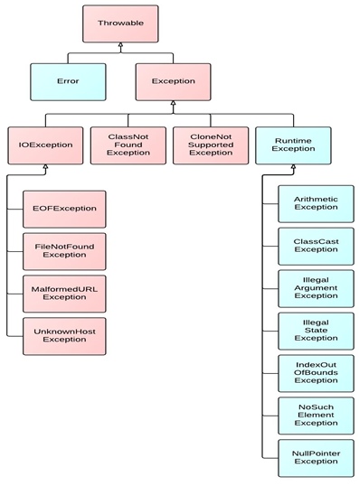
>
> 2.从程序执行过程，看编译时异常和运行时异常
>
>  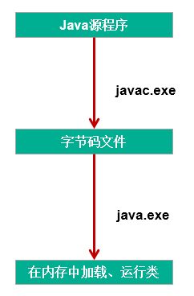
>
> 编译时异常：执行javac.exe命名时，可能出现的异常
>
> 运行时异常：执行java.exe命名时，出现的异常
>
> 3.常见的异常类型，请举例说明：
>
> ```java
> //******************以下是运行时异常***************************
> //ArithmeticException
> @Test
> public void test6(){
>     int a = 10;
>     int b = 0;
>     System.out.println(a / b);
> }
> 
> //InputMismatchException
> @Test
> public void test5(){
>     Scanner scanner = new Scanner(System.in);
> 	int score = scanner.nextInt();
> 	System.out.println(score);
> 	scanner.close();
> }
> 
> //NumberFormatException
> @Test
> public void test4(){
> 	String str = "123";
> 	str = "abc";
> 	int num = Integer.parseInt(str);
> }
> 
> //ClassCastException
> @Test
> public void test3(){
> 	Object obj = new Date();
> 	String str = (String)obj;
> }
> 
> //IndexOutOfBoundsException
> @Test
> public void test2(){
> 	//ArrayIndexOutOfBoundsException
> 	//int[] arr = new int[10];
>    //System.out.println(arr[10]);
>    //StringIndexOutOfBoundsException
> 		String str = "abc";
> 		System.out.println(str.charAt(3));
> }
> 
> //NullPointerException
> @Test
> public void test1(){
> //		int[] arr = null;
> //		System.out.println(arr[3]);
>     String str = "abc";
> 	str = null;
> 	System.out.println(str.charAt(0));
> }
> 
> //******************以下是编译时异常***************************
> @Test
> public void test7(){
> //		File file = new File("hello.txt");
> //		FileInputStream fis = new FileInputStream(file);
> //		
> //		int data = fis.read();
> //		while(data != -1){
> //			System.out.print((char)data);
> //			data = fis.read();
> //		}
> //		
> //		fis.close();
> }		
> ```
>

## 7.2 异常处理

> 1.java异常处理的抓抛模型
>
> ```sh
> 过程一："抛"：程序在正常执行的过程中，一旦出现异常，就会在异常代码处生成一个对应异常类的对象。并将此对象抛出。
> 一旦抛出对象以后，其后的代码就不再执行。         
> 
> 关于异常对象的产生：
> ① 系统自动生成的异常对象
> ② 手动的生成一个异常对象，并抛出（throw）
> 
> 过程二："抓"：可以理解为异常的处理方式：① try-catch-finally  ② throws
> ```
>
> 2.异常处理方式一：try-catch-finally
>
> 2.1 使用说明：
>
> ```java
> try{
>     //可能出现异常的代码
> }catch(异常类型1 变量名1){
>     //处理异常的方式1
> }catch(异常类型2 变量名2){
>     //处理异常的方式2
> }catch(异常类型3 变量名3){
>     //处理异常的方式3
> }
> ....
> finally{
>     //一定会执行的代码
> }
> ```
>
> 
>
> ```sh
> 说明：
>   		1. finally是可的。
>   		2. 使用try将可能出现异常代码包装起来，在执行过程中，一旦出现异常，就会生成一个对应异常类的对象，根据此对象的类型，去catch中进行匹配
>   		3. 一旦try中的异常对象匹配到某一个catch时，就进入catch中进行异常的处理。一旦处理完成，就跳出当前的try-catch结构（在没写finally的情况。继续执行其后的代码
>  		4. catch中的异常类型如果没子父类关系，则谁声明在上，谁声明在下无所谓。
>   		catch中的异常类型如果满足子父类关系，则要求子类一定声明在父类的上面。否则，报错
>  		5. 常用的异常对象处理的方式： ① String  getMessage()    ② printStackTrace()
>  		6. 在try结构中声明的变量，再出了try结构以后，就不能再被调用
>  		7. try-catch-finally结构可以嵌套
> 
> 总结：如何看待代码中的编译时异常和运行时异常？
> 
> 体会1：使用try-catch-finally处理编译时异常，是得程序在编译时就不再报错，但是运行时仍可能报错。相当于我们使用try-catch-finally将一个编译时可能出现的异常，延迟到运行时出现。
> 
> 体会2：开发中，由于运行时异常比较常见，所以我们通常就不针对运行时异常编写try-catch-finally了。针对于编译时异常，我们说一定要考虑异常的处理。
> ```
>
> 2.2：finally的再说明：
>
> 1.finally是可选的
>
> 2.<font color = red size = 5 >finally中声明的是一定会被执行的代码。即使catch中又出现异常了，try中return语句，catch中return语句等情况</font>。
>
> 3.像数据库连接、输入输出流、网络编程Socket等资源，JVM是不能自动的回收的，我们需要自己手动的进行资源的释放。此时的资源释放，就需要声明在finally中。
>
> 
>
> 2.3：[面试题] 
>
> ```sh
> final、finally、finalize三者的区别？
> 
> 类似：
> throw 和 throws
> Collection 和 Collections
> String 、StringBuffer、StringBuilder
> ArrayList 、 LinkedList
> HashMap 、LinkedHashMap
> 重写、重载
> 
> 结构不相似的：
> 抽象类、接口
> == 、 equals()
> sleep()、wait()
> ```
>
> 3.异常处理方式二：
>
> ```sh
> "throws + 异常类型"写在方法的声明处。指明此方法执行时，可能会抛出的异常类型。
> 一旦当方法体执行时，出现异常，仍会在异常代码处生成一个异常类的对象，此对象满足throws后异常类型时，就会被抛出。异常代码后续的代码，就不再执行！
> ```
>
> 4.对比两种处理方式
>
> ```sh
> try-catch-finally:真正的将异常给处理掉了。
> throws的方式只是将异常抛给了方法的调用者。并没真正将异常处理掉。 
> ```
>
>  5.体会开发中应该如何选择两种处理方式？
>
> ```sh
> 5.1 如果父类中被重写的方法没throws方式处理异常，则子类重写的方法也不能使用throws，意味着如果子类重写的方法中异常，必须使用try-catch-finally方式处理。
> 5.2 执行的方法a中，先后又调用了另外的几个方法，这几个方法是递进关系执行的。我们建议这几个方法使用throws的方式进行处理。而执行的方法a可以考虑使用try-catch-finally方式进行处理。
>  
> 补充：
> 方法重写的规则之一：
> 子类重写的方法抛出的异常类型不大于父类被重写的方法抛出的异常类型
> ```

## 7.3 手动抛出异常对象

> 1.使用说明
>
> 在程序执行中，除了自动抛出异常对象的情况之外，我们还可以手动的throw一个异常类的对象。
>
> 2.[面试题] 
>
> ```sh
> throw 和  throws区别：
> throw 表示抛出一个异常类的对象，生成异常对象的过程。声明在方法体内。
> throws 属于异常处理的一种方式，声明在方法的声明处。
> ```
>
> 3.典型例题
>
> ```java
> class Student{
>     private int id;
>     public void regist(int id) throws Exception {
>         if(id > 0){
>             this.id = id;
>         }else{
>          //手动抛出异常对象
> 		//	throw new RuntimeException("您输入的数据非法！");
>         //throw new Exception("您输入的数据非法！");
>             throw new MyException("不能输入负数");
>         }
> 	}
>     @Override
>     public String toString() {
>         return "Student [id=" + id + "]";
>     }
> }
> ```


## 7.4 自定义异常

如何自定义一个异常类？

```java
/*
* 如何自定义异常类？
* 1. 继承于现的异常结构：RuntimeException 、Exception
* 2. 提供全局常量：serialVersionUID
* 3. 提供重载的构造器
* */
public class MyException extends Exception{
   	static final long serialVersionUID = -7034897193246939L;
    public MyException(){}
    public MyException(String msg){
        super(msg);
    }
}
```


