# 1. Scala语言概述

## 1.1 why is Scala语言?

```sh
1) Spark—新一代内存级大数据计算框架，是大数据的重要内容。

2) Spark就是使用Scala编写的。因此为了更好的学习Spark,需要掌握Scala这门语言。 

3) Scala 是 Scalable Language 的简写，是一门多范式(范式/编程方式[面向对象/函数式编程])的编程语言 

4) 联邦理工学院洛桑（EPFL）的Martin Odersky于2001年开始设计Scala 

5) Spark的兴起，带动Scala语言的发展！
```


## 1.2 Scala语言诞生小故事

​	创始人马丁·奥德斯基（Martin Odersky）是**编译器**及编程的狂热爱好者， 长时间的编程之后，**希望发明一种语言**，能够让写程序这样的基础工作变 得**高效**，简单。所以当接触到JAVA语言后，对JAVA这门便携式，运行在网 

络，且存在垃圾回收的语言产生了极大的兴趣，所以决定将函数式编程语言的特点融合到JAVA中，由此发明了两种语言（Pizza & Scala） 

​	Pizza和Scala极大地推动了Java编程语言的发展。[如何理解?] 

​	jdk5.0 的泛型，for循环增强, 自动类型转换等，都是从Pizza 引入的新特性。 

​	jdk8.0 的类型推断，Lambda表达式就是从scala引入的特性。 且现在主流JVM的javac编译器就是马丁·奥德斯基编写出来的。Jdk5.0 ,Jdk8.0的编译器就是马丁·奥德斯基写的，因此马丁·奥德斯基 一个人的战 斗力抵得上一个Java开发团队。

## 1.3  Scala **和** **Java** **以及** **jvm** **的关系分析图** 

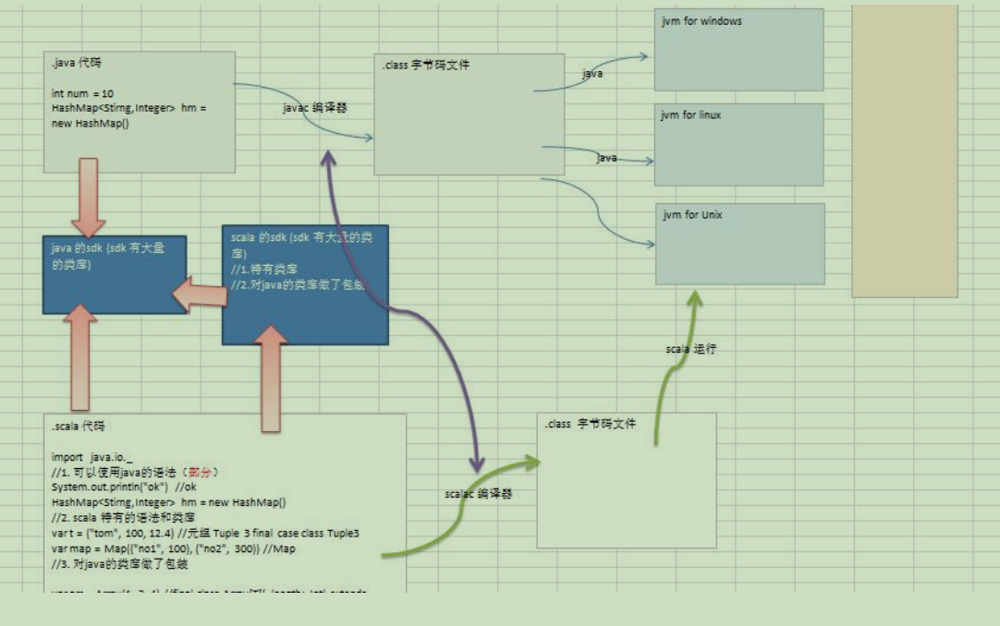

一般来说，学Scala的人，都会Java，而Scala 是基于Java的，因此我们需要将Scala和Java以及JVM 之间 

的关系搞清楚，否则学习Scala你会蒙圈。 

**建议**：如果没有任何Java基础的同学，先学Java，至少要 学习JavaSE，再学习Scala。 

**我们分析一下**：**Scala** **和** **Java** **以及** **jvm** **的关系** (重要!)。

## 1.4 Scala语言的特点

​	Scala是一门以java虚拟机（JVM）为运行环境并将**面向对象**和**函数式编程**的最佳特性结合在一起 的**静态类型编程语言**。 

1) Scala 是一门多范式 (multi-paradigm) 的编程语言，Scala支持面向对象和函数式编程 

2) Scala源代码(.scala)会被编译成Java字节码(.class)，然后运行于JVM之上，并可以调用现有的Java类库，实现两种语言的无缝对接。[案例演示] 

3) scala 单作为一门语言来看， 非常的**简洁高效 （三元运算，** **++** **，** **--**）

4) Scala 在设计时，马丁·奥德斯基 是参考了Java的设计思想，可以说Scala是源于java，同时马 丁·奥德斯基 也加入了自己的思想，将函数式编程语言的特点融合到JAVA中, 因此，对于学习 过Java的同学，只要在学习Scala的过程中，搞清楚Scala 和 java相同点和不同点，就可以快 速的掌握Scala这门语言 

5) 快速有效掌握Scala的建议 [1. 学习scala 特有的语法 2. 搞清楚 scala 和java 区别 3. 如何规范 

的使用scala]

##  1.5  Windows下搭建Scala开发环境

**安装&配置** 

1) Scala需要Java运行时库，安装Scala需要**首先安装**JVM虚拟机**并配置好**，推荐安 装JDK1.8 

2) 在http://www.scala-lang.org/ 下载Scala2.11.8程序安装包 

**提示**: 根据不同的操作系统选 择不同的安装包，下载 完成后，将安装包解压 到安装目录

3) 配置Jdk的环境变量 

4) 配置SCALA_HOME 

SCALA_HOME= D:\program\scala-2.11.8 

5) 将Scala安装目录下的bin目录加入到PATH环境变量 

在PATH变量中添加：%SCALA_HOME%\bin 

6) 在终端中输入“scala”命令打开scala解释器

 

**Scala的REPL**

Ø **介绍**

上面打开的scala命令行窗口，我们称之为REPL，是指：Read->Evaluation- > Print->Loop，也称之为交互式解释器。 

Ø **说明**

在命令行窗口中输入scala指令代码时，解释器会读取指令代码(R)并计算对应的值(E)，然后将结果打印出来(P)，接着循环等待用户输入指令(L)。 从技术上讲，这里其实并不是一个解释器，而是指令代码被快速的编译成Java字 

节码并被JVM加载执行。最终将执行结果输出到命令行中 


## 1.6  Linux下搭建Scala开发环境

**安装&配置** 

Linux下安装Scala的原理机制一样，操作的具体步骤:

**安装和配置**Scala**开发环境练习** 

请同学们安装和配置Scala[windows & Linux], 可以下正确的执行，如图：

## 1.7 Scala的开发工具 

**IDEA介绍：** 

IDEA 全称IntelliJ IDEA，是用于java语言开发的集成环境（也 可用于其他语言），IntelliJ在业界被公认为最好的java开发工 具之一。IDEA是JetBrains公司的产品，这家公司总部位于捷克共和国的首都布拉格。 

1) java开发工具很多，比如netbean,eclipse等等，单开发Scala可选的工具不多，主要使用IDEA 

2) Idea工具开发Scala的快捷键也不是很多，所以使用相对比较简单 

3) IDEA不是专门用于开发Scala的IDE，但是确是最适合开发Scala的工具，因为在我们实际工作中，大部分是开发项目，而大数据项目不可避免的会使用到Java, 所以会进行Java 和 Scala 两种语言的混合编程。 而Idea 可以很好的支持Java和 Scala的开发。

**IDEA的安装：** 

看老师的演示和图示: 

Ø 说明：idea的安装 直接下一步即可(傻瓜式安装)。 

Ø 安装成功，会看到如下界面l **Scala**的开发工具

**Scala插件安装：** 

默认情况下IDEA不支持Scala的开发，需要安装Scala插件, 具体看老师演示和图示:

## 1.8 **Scala**快速开发入门

**需求说明** 

要求开发一个Hello.scala 程序，可以输出 “hello,世界!" [对scala程序基本结构说明] 

**windows**下开发步骤[先使用ed]

1) 可以直接使用文本开发工具[editplus] 

2) 将 Scala 代码编写到扩展名为 Hello.scala 的文件中。 

[ 说明: 比如将源码在目录 d:/scalademo下 ] 

3) 通过 scalac 命令对该 scala 文件进行编译，生成 .class 文件。[和javac类似] 

4) 命令行下 执行 scala Hello 就可以看到运行效果。 

**5)** **注意**：scala Hello.scala 命令可以直接运行 Hello.scala 程序 [内部也会有编译和运行过程]

**linux**下开发步骤

1) 直接使用vim开发 ,一个遍历数组的案例 

2) 将 Scala 代码编写到扩展名为 Hello.scala 的文件中。[**代码说明**] 

3) 通过 scala 命令对该 scala 文件进行编译，生成 .class 字节码文件。 

4) 在终端 执行 scala Hello 就可以看到运行效果。 

**5)** **注意**：通过 scala 命令可以直接运行 Hello.scala 程序

### 1.8.1 **IDE**工具**Idea** 来开发 **“hello,world”** 

使用文本工具开发项目可以很好的理解运行原理，但是不利于开发综合项目，所以在实际开发中我们要使用Idea来开发, 看老师演示 


### 1.8.2 **Scala**程序反编译

1) 看反编译代码 

2) 模拟代码

**Scala**程序结构的说明

**课堂小练习** 

要求使用Idea 下开发一个Hi.scala 程序，可以输出 “hello,scala!" (10min) 

1) 包名为 com.atguigu.chapter01 

2) object 名称为 Hil **Scala**语言快速开发入门

**Scala**执行流程分析

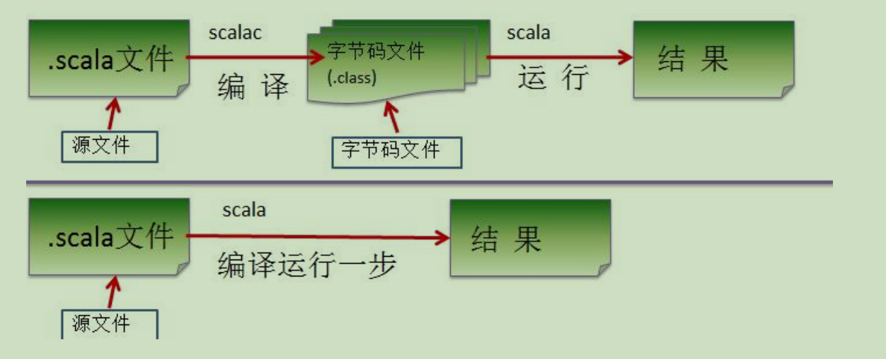

### 1.8.3 **Scala**程序开发注意事项

1) Scala源文件以 “.scala" 为扩展名。 

2) Scala程序的执行入口是main()函数。 

3) Scala语言严格区分大小写。 

4) Scala方法由一条条语句构成，每个语句后**不需要**分号(**Scala**语言会在每行后自动加分号)，这也体现出Scala的简洁性。 

5) 如果在同一行有多条语句，除了最后一条语句不需要分号，其它语句需要分号 。

## 1.9 **Scala**语言转义字符

**Scala**常用的转义字符(escape char)

```sh
1)\t : 一个制表位，实现对齐的功能   println("姓名\t年龄")
2) \n: 换行符					 println("姓名\t20")
3)\\ :一个 \ 					  println("Hello,张三丰\nhello,郭襄")                                                      println("C:\Users\\Desktop\lday1 _part1\ltest100")
4)\" :一个"                     println("尚硅谷说:"Go语言开始了\"")
5)\r:一个回车 printin("hello\rk");  println("hello\ra")

```


**应用实例**

**课后**练习

要求：请使用**一句输出语句**，达到输入如下图形的效果：

## 1.10  **Scala语言输出的三种方式** 

1) 字符串通过+号连接（类似java）。 

2) printf用法 （类似C语言）字符串通过 % 传值。 

3) 字符串通过$引用(类似PHP）。 

```scala
val name = "ApacheCN" 
val age = 1 
val url = "www.atguigu.com" 
println("name=" + name + " age=" + age + " url=" + url) 
printf("name=%s, age=%d, url=%s \n", name, age, url) 
println(s"name=$name, age=$age, url=$url")
```


## 1.11 **Scala源码的查看的关联** 

在使用scala过程中，为了搞清楚scala底层的机制，需要查 看源码，下面看看如果关联和查看Scala的源码包 

1) 查看源码, 选择要查看的方法或者类, 输入 ctrl + b 

2) 关联源码,看老师演示


## 1.12 **注释(comment)** 

**介绍：** 

用于注解说明解释程序的文字就是注释，注释提高了代码的阅读性； 注释是一个程序员必须要具有的良好编程习惯。将自己的思想通过注释先整理出来 ，再用代码去体现。 

**Scala中的注释类型** 

1) 单行注释 

2) 多行注释 

3) 文档注释l 

**单行注释：** 

Ø 基本格式 

格式： //注释文字 

Ø 应用实例 

**多行注释：** 

Ø 基本格式 

格式： /* 注释文字 */ 

Ø 应用实例


**文档注释：** 

注释内容可以被工具 scaladoc 所解析，生成一套以网页文件形式体现的该程序的 

说明文档 

**案例演示** 

```scala
package com.atguigu.chapter01.Demo01 

object Hello { 
/**
\* @deprecated xxx 
\* @example testing coding 
\* @param args 
*/ 
def main(args: Array[String]): Unit = { 
    println("helllo") 
} 
}
```


scaladoc -d d:/ Hello.scalal 

**规范的代码风格** 

**正确的注释和注释风格：** 

带看Scala源码 

**正确的缩进和空白** 

1) 使用一次tab操作，实现缩进,默认整体向右边移动，时候用shift+tab整体向左移 

2) 或者使用 ctrl + alt + L 来进行格式化 [演示] 

3) 运算符两边习惯性各加一个空格。比如：2 + 4 * 5。 

4) 一行最长不超过80个字符，超过的请使用换行展示，尽量保持格式优雅

## 1.13 **Scala官方编程指南** 

√**课后练习**

**本章知识回顾** 

Ø Scala语言的sdk是什么? 

Ø Scala环境变量配置及其作用。 

配置SCALA_HOME = d:\program 

配置Path = % SCALA_HOME %\bin 

Ø Scala程序的编写、编译、运行步骤是什么? 能否一步执行? 

编写：就是使用工具，开发scala程序 

编译：就是将 .scala 文件编译成 .class [scalac] 

运行：就是使用scala 来将.class文件加载到jvm并运行 

可以直接运行.scala, 但是速度慢. cmd>scala xx.scalaq 

Ø Scala程序编写的规则。//基本上规范和java类似。但是语句后面不 需要加上分号 

Ø 简述：在配置环境、编译、运行各个步骤中常见的错误。


# 2. 变量

## 2.1 **变量是程序的基本组成单位** 

不论是使用哪种高级程序语言编写程序,变量都是其程序的基本组成单位，比如: 

```scala
package com.atguigu.chapter02 
object ScalaFunDemo01 { 
    def main(args: Array[String]): Unit = { 
        //定义一个整型变量,取名a,并赋初值1
        var a : Int = 1  
        //定义一个整型变量,取名b,并赋初值3 
        var b : Int = 3 
        //给变量b 赋 89 
        b = 89 
        //输出语句,把变量a的值输出 
        println("a=" + a) 
         //把变量b的值输出
        println("b=" + b) 
    } 
}
```


## 2.2 **变量的介绍** 

### 2.2.1 **概念**

​	变量相当于内存中一个数据存储空间的表示，你可以把变量看做是一个房间的门牌号，通过门牌号我们可以找到房间，而通过变量名可以访问到变量(值)。 

### 2.2.2 **变量使用的基本步骤** 

**1)** **声明**/定义变量 (scala要求变量声明时初始化) 

2) 使用

## 2.3 **变量基本使用** 

**Scala变量使用案例入门** 

看演示并对代码进行说明

## 2.4 **Scala变量使用说明** 

**变量声明基本语法** 

```sh
var  val 变量名 [: 变量类型] = 变量值 
```

**注意事项** 

1) 声明变量时，类型可以省略（编译器自动推导,即类型推导） 

2) 类型确定后，就不能修改，说明Scala 是强数据类型语言. 

3) 在声明/定义一个变量时，可以使用var 或者 val 来修饰， var 修饰的变量可改变， val 修饰的变量不可改 [案例]. 

4) val修饰的变量在编译后，等同于加上final， 通过反编译看下底层代码。

5) var 修饰的对象引用可以改变，val 修饰的则不可改变，但对象的状态(值)却是可以改变的。(比如: 自定义对象、数组、集合等等) [分析val好处] 

6) 变量声明时，需要初始值。

## 2.5 **程序中**+号的使用

1) 当左右两边都是数值型时，则做加法运算 

2) 当左右两边有一方为字符串，则做拼接运算l 

## 2.6 **数据类型** 

**scala数据类型介绍** 

Ø Scala 与 Java有着相同的数据类型，**在Scala中数据类型都是对象**，也就是说scala 没有java中的原生类型 

Ø Scala数据类型分为两大类 AnyVal(值类型) 和 AnyRef(引用类型)， 注意：**不管是AnyVal还是AnyRef** **都是对象**。[案例演示 Int , Char] 

Ø 相对于java的类型系统，scala要复杂些！也正是这复杂多变的类型系统才让面向对象编程和函数式编程完美的融合在了一起 

**型体系一览图**

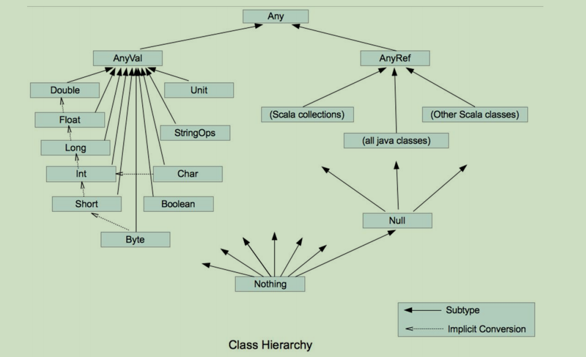

>对上面图的小结和整理
>1)在scala中有一个根类型Any ,他是所有类的父类.
>2) scala中一切皆为对象，分为两大类AnyVal(值类型)，AnyRef(引用类型)，他们都是Any子类.
>
>3)Null类型是scala的特别类型，它只有一个值 null,他是bottom calss ,是所有AnyRef类型的子类.
>4) Nothing类型也是 bottom class ,他是所有类的子类，在开发中通常可以将Nothing类型的值返回给任意变量或者函数，这里抛出异常使用很多.


**数据类型列表** 

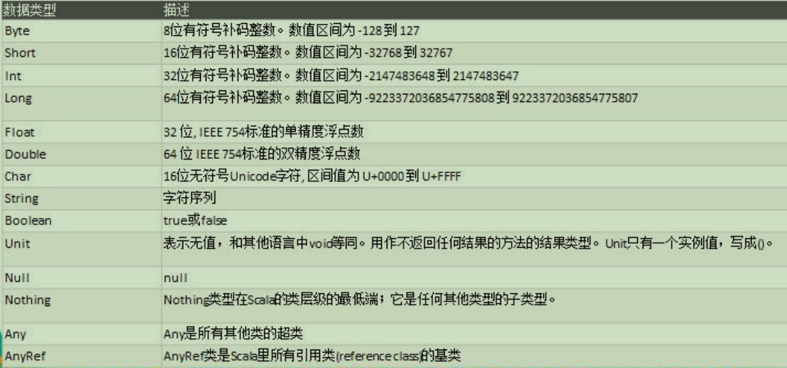


## 2.7 **整数类型** 

**基本介绍** 

Scala的整数类型就是用于存放整数值的，比如 12 , 30, 3456等等 

**整型的类型** 

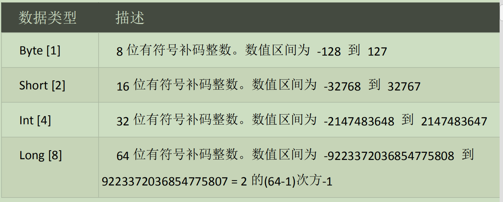

**整型的使用细节** 

1) Scala各整数类型有固定的表数范围和字段长度，不受具体OS的影响，以保证 Scala程序的可移植性。 

2) Scala的整型 **常量字面量 默认为 Int 型，声明Long型 常量字面量须后加 ‘l’’或‘L’ [反编译看] 

3) Scala程序中变量常声明为Int型，除非不足以表示大数，才使用Long 


## 2.8 **浮点类型** 

**基本介绍** 

Scala的浮点类型可以表示一个小数，比如 123.4f，7.8 ，0.12等等 

**浮点型的分类** 


**浮点型使用细节** 

1) 与整数类型类似，Scala 浮点类型也有固定的表数范围和字段长度，不受具体OS 的影响。 

2) Scala的浮点型常量默认为Double型，声明Float型常量，须后加‘f’或‘F’。 

3) 浮点型常量有两种表示形式 

十进制数形式：如：5.12 512.0f .512 (必须有小数点） 

科学计数法形式:如：5.12e2 = 5.12乘以10的2次方 5.12E-2 = 5.12除以10的2次方 

4) 通常情况下，应该使用Double型，因为它比Float型更精确(小数点后大致7位) 


## 2.9 **字符类型(Char)** 

**基本介绍** 

字符类型可以表示**单个字符**,字符类型是Char， 16位无符号Unicode字符(2个字节), 区间值为 U+0000 到 U+FFFF 

**字符类型使用细节** 

1) 字符常量是用单引号(‘ ’)括起来的单个字符。例如：var c1 = 'a‘ var c2 = '中‘ var c3 = '9' 

2) Scala 也允许使用转义字符‘\’来将其后的字符转变为特殊字符型常量。例如：var c3 = ‘\n’ // '\n'表示换行符 

3)可以直接给Char赋一个整数，然后输出时，会按照对应的unicode 字符输出 ['\u0061' 97] 

4) Char类型是可以进行运算的，相当于一个整数，因为它都对应有Unicode码. 

**字符类型本质探讨** 

1) 字符型 存储到 计算机中，需要将字符对应的码值（整数）找出来 

存储：字符——>码值——>二进制——>存储 

读取：二进制——>码值——> 字符——>读取 

2) 字符和码值的对应关系是通过字符编码表决定的(是规定好)， 这一点和Java一样。


## 2.10 **布尔类型：Boolean** 

**基本介绍** 

1) 布尔类型也叫Boolean类型，Booolean类型数据**只允许取值**true和false 

2) boolean类型占1个字节。 

3) boolean 类型适于**逻辑运算**，一般用于程序流程控制[后面详解]： 

Ø if条件控制语句； 

Ø while循环控制语句； 

Ø do-while循环控制语句； 

Ø for循环控制语句 

**案例演示：**

## 2.11  **Unit类型、Null类型和Nothing类型** 

**基本说明** 

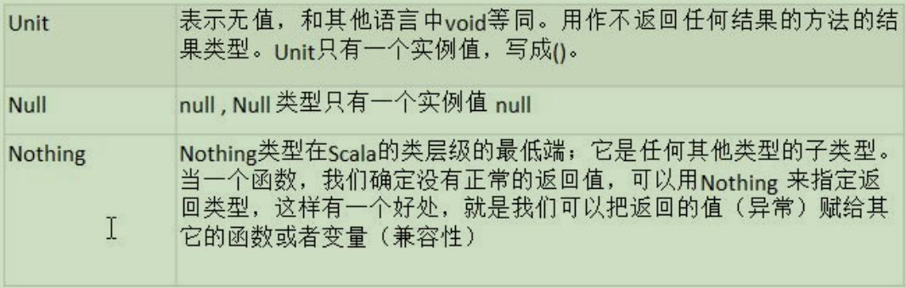

**使用细节和注意事项** 

1) Null类只有一个实例对象，null，类似于Java中的null引用。null可以赋值给任意引用类型(AnyRef)**，但是不能赋值给**值类型(AnyVal: **比如** **Int, Float, Char,** Boolean, Long, Double, Byte, Short)

2) Unit类型用来标识过程，也就是没有明确返回值的函数。由此可见，Unit类似于Java里的void。Unit只有一个实例， ()，这个实例也没有实质的意义 

3) Nothing，可以作为没有正常返回值的方法的返回类型，非常直观的告诉你这个方法不会正常返回，而且由于Nothing是其他任意类型的子类，他还能跟要求返回值的方法兼容。

## 2.12 **值类型转换** 

**值类型隐式转换** 

Ø **介绍** 

**当Scala程序在进行赋值或者运算时，精度小的类型自动转换为精度大的数据类型，这个就是自动类型转换(**隐式转换)。 

Ø 数据类型按精度(容量)大小排序为

 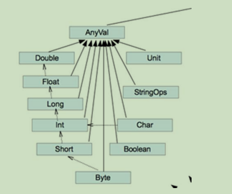

Ø **案例演示** 

**演示一下基本数据类型转换的基本情况。** 

Ø **自动类型转换细节说明** 

1) 有多种类型的数据混合运算时，系统首先自动将所有数据转换成容量最大的那种数据类 型，然后再进行计算。 5.6 + 10 = 》double 

2) 当我们把精度(容量)大 的数据类型赋值给精度(容量)小 的数据类型时，就会报错，反之 就会进行自动类型转换。 

3) (byte, short) 和 char之间不会相互自动转换。 

4) byte，short，char 他们三者可以计算，在计算时首先转换为int类型。 

5) 自动提升原则： 表达式结果的类型自动提升为 操作数中最大的类型


**高级隐式转换和隐式函数** 

scala还提供了非常强大的**隐式转换机制**(隐式函数，隐式类等等)，我们放在高级部 分专门用一个章节来讲解 


**强制类型转换** 

Ø **介绍** 

自动类型转换的逆过程，将容量大的数据类型转换为容量小的数据类型。使用时要 加上强制转函数，**但可能造成精度降低或溢出**,格外要注意。 

Ø **案例演示** 

java : int num = (int)2.5 

scala : var num : Int = 2.7.toInt //对象

Ø **强制类型转换细节说明** 

1) 当进行数据的 从 大——>小，就需要使用到强制转换 

**2)** **强转符号只针对于最近的操作数有效**，往往会使用小括号提升优先级 

3) Char类型可以保存 Int的常量值，但不能保存Int的变量值，需要强转 

4) Byte和Short类型在**进行运算**时，当做Int类型处理。 

```scala
val num1: Int = 10 * 3.5.toInt + 6 * 1.5.toInt // 36 
val num2: Int = (10 * 3.5 + 6 * 1.5).toInt // 44 
println(num1 + " " + num2)
```


## 2.13 **值类型转换课堂练习题** 

**判断是否能够通过编译,并说明原因** 

```scala
1）var s : Short = 5 // ok 
s = s-2 // error Int -> Short 
2） var b : Byte = 3 // ok 
b = b + 4 // error Int ->Byte 
b = (b+4).toByte // ok ，使用强制转换 
3）var c : Char = 'a' //ok 
var i : Int = 5 //ok 
var d : Float = .314F //ok 
var result : Double = c+i+d //ok Float->Double 
4） var b : Byte = 5 // ok 
var s : Short = 3 //ok 
var t : Short = s + b // error Int->Short 
var t2 = s + b // ok, 使用类型推导
```


## 2.14 **值类型和String类型的转换** 

**介绍**

在程序开发中，我们经常需要将基本数据类型转成String 类型。 或者将String类型转成基本数据类型。 

**基本类型转String类型** 

语法： 将基本类型的值+"" 即可 

案例演示： 


**String类型转基本数据类型** 

语法：通过基本类型的**String的toXxx**方法即可 

案例演示： 

```scala
val s1 = "12" 
s1.toInt 
s1.toFloat 
s1.toDouble 
s1.toByte 
s1.toLong 
s1.toShortl 
```

**注意事项** 

1) 在将String 类型转成 基本数据类型时，**要确保String类型能够转成有效的数据**， 

比如 我们可以把 "123" , 转成一个整数，但是不能把 "hello" 转成一个整数 

2) 思考就是要把 "12.5" 转成 Int //?l 

## 2.15 **标识符的命名规范** 

**标识符概念** 

1) Scala 对各种变量、**方法**、**函数**等命名时使用的**字符序列**称为标识符 

2) 凡是自己可以起名字的地方都叫**标识符** 

**标识符的命名规则**

Scala中的标识符声明，基本和Java是一致的，但是细节上会有所变化。 

1) 首字符为字母，后续字符任意字母和数字，美元符号，可后接下划线_ 

2) 数字不可以开头。 

**3)** **首字符为操作符(比如+ - \* / )，后续字符也需跟操作符** **,至少一个(**反编译**)** 

4) 操作符(比如+-*/)不能在标识符中间和最后. 

5) 用反引号`....`包括的任意字符串，即使是关键字(39个)也可以 [true]

**标识符举例说明** 

```scala
hello // ok 
hello12 // ok 
1hello // error 
h-b // error 
x h // error 
h_4 // ok 
_ab // ok 
Int // ok, 在scala中，Int 不是关键字，而是预定义标识符,可以用，但是不推荐 
Float // ok 
_ // 不可以，因为在scala中，_ 有很多其他的作用，因此不能使用 
Abc // ok 
+*- // ok 
+a // error
```

**标识符命名注意事项** 

**1)** **包名**：尽量采取有意义的包名，简短，有意义 

2) 变量名、函数名 、方法名 采用驼峰法。

**Scala关键字**

**关键字介绍** 

Scala有39个关键字： 

• package, import, class, object, trait, extends, with, type, forSome 

• private, protected, abstract, sealed, final, implicit, lazy, override 

• try, catch, finally, throw 

• if, else, match, case, do, while, for, return, yield 

• def, val, var 

• this, super 

• new 

• true, false, null


# 3. 运算符

## 3.1 **运算符介绍** 

运算符是一种特殊的符号，用以表示数据的**运算**、**赋值**和**比较**等。 

1) 算术运算符 

2) 赋值运算符 

3) 比较运算符(关系运算符) 

4) 逻辑运算符 

5) 位运算符

## 3.2 **算术运算符** 

**介绍**

算术运算符(arithmetic)是对数值类型的变量进行运算的，在Scala程序中使用的非常多。

**算术运算符一览** 

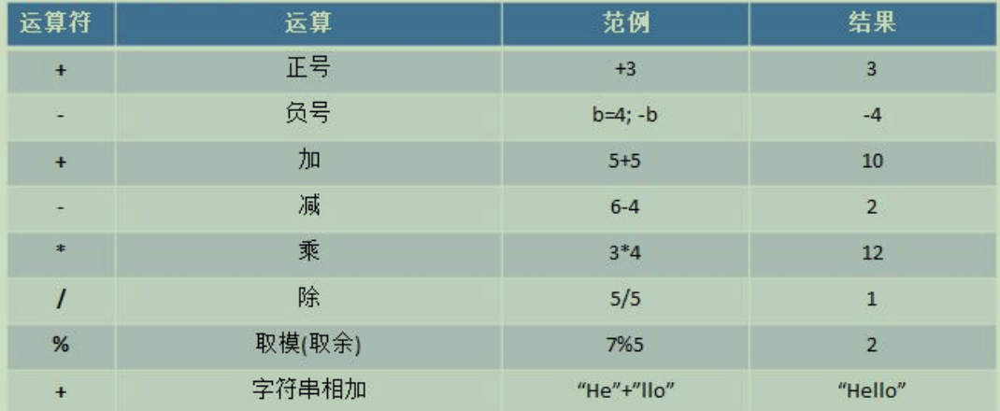

**案例演示** 

案例演示算术运算符的使用(Operator.scala)。 

1) +, - , * , / , % 重点讲解 **/****、****%** 

2) +、-、* 是一个道理，完全可以类推。 

3) 算数运算符的运算规则和Java一样 

**细节说明** 

1) 对于除号“/”，它的整数除和小数除是有区别的：整数之间做除法时，只保留 整数部分而舍弃小数部分。 例如：var x : Int = 10/3 ,结果是 3 

2) 当对一个数取模时，可以等价 a%b=a-a/b*b ， 这样我们可以看到取模的一个本 质运算(和java 的取模规则一样)。 

**3)** 注意Scala中没有++、--操作符，需要通过+=、-=来实现同样的效果 


**课堂练习** 

1) 假如还有97天放假，问：xx个星期零xx天 

2) 定义一个变量保存华氏温度，华氏温度转换摄氏温度的公式为：5/9*(华 

氏温度-100),请求出华氏温度对应的摄氏温度。[测试：232.5]l 


## 3.3**关系运算符(比较运算符)** 

**基本介绍** 

1) 关系运算符的结果都是boolean型，也就是要么是true，要么是false 

2) 关系表达式 经常用在 if结构的条件中或循环结构的条件中 

3) 关系运算符的使用和java一样

**关系运算符一览** 

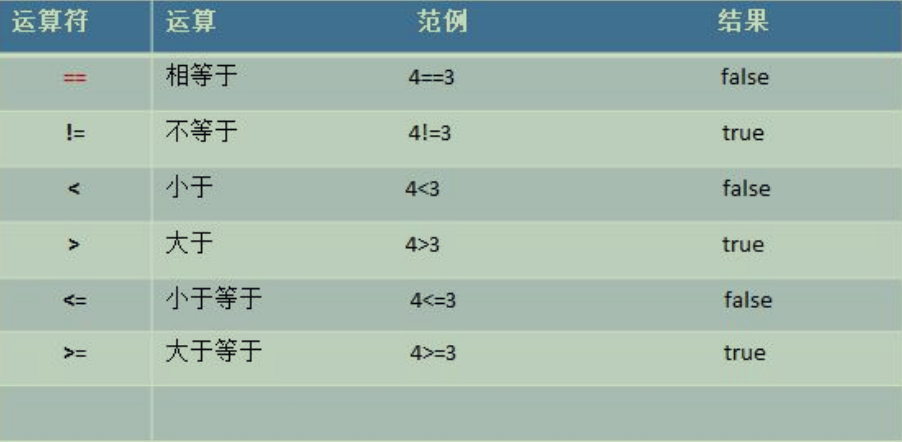

 

**细节说明** 

1) 关系运算符的结果都是Boolean型，也就是要么是true，要么是false。 

2) 关系运算符组成的表达式，我们称为**关系表达式**。 a > b 

3) 比较运算符“==”不能误写成“=” 

4) 使用陷阱: 如果两个**浮点数进行比较**，应当保证数据类型一致.

## 3.4 **逻辑运算符** 

**介绍**

用于连接多个条件（一般来讲就是关系表达式），最终的结果也是一个Boolean值。

**逻辑运算符一览** 

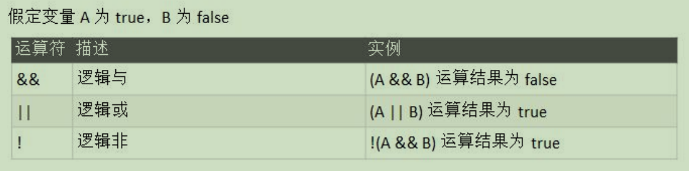


## 3.5 **赋值运算符** 

**介绍**

赋值运算符就是将某个运算后的值，赋给指定的变量。 

**赋值运算符的分类** 

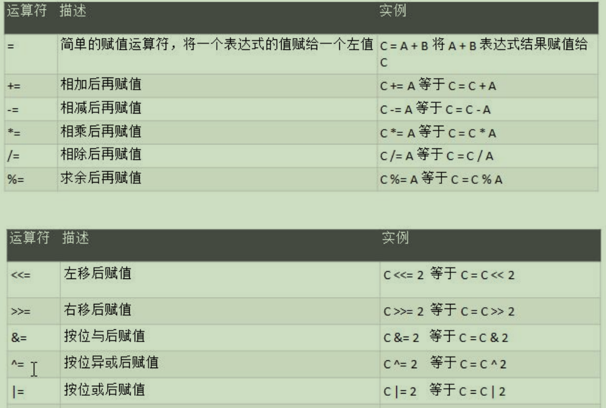

**说明**：**这部分的赋值运算涉及到**二进制相关知识，其运行的规则和Java一样。 

**赋值运算符特点** 

1) 运算顺序从右往左 

2) 赋值运算符的左边 只能是变量,右边 可以是**变量**、**表达式**、**常量值****/****字面量** 

3) 复合赋值运算符等价于下面的效果 

```scala
比如：a+=3 等价于a=a+3
var a = 10 
var b = 99 
println("a="+a+"\tb="+b) 

//交换 
val t = a 
a = b 
b = t 
println("a="+a+"\tb="+b)
```

**面试题** 

有两个变量，a和b，要求将其进行交换，但是不允许使用中间变量，最终打印 

结果：[学员做] 

val a = 10 

val bl 

**位运算符** 

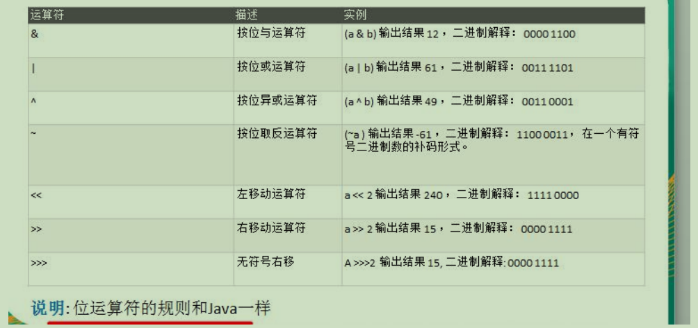

**运算符的特别说明** 

**Scala不支持三目运算符 , 在Scala中使用** **if – else** **的方式实现。** 

**val num = 5 > 4 ? 5 : 4 //没有**

**val num = if (5>4) 5 else 4** 

**课堂练习** 

1) 案例1：求两个数的最大值 

2) 案例2：求三个数的最大值 

Scala的设计理念: 

**一种事情尽量只有一种方法完成，这样可以让代码风格更加统一**.

## 3.6 **运算符优先级** 

1) 运算符有不同的优先级，所谓优先 级就是表达式运算中的**运算顺序**。如 右表，上一行运算符总优先于下一行。 

2) 只有单目运算符、赋值运算符是从右向左运算的。 

3) 运算符的优先级和Java一样。 

小结运算符的优先级 

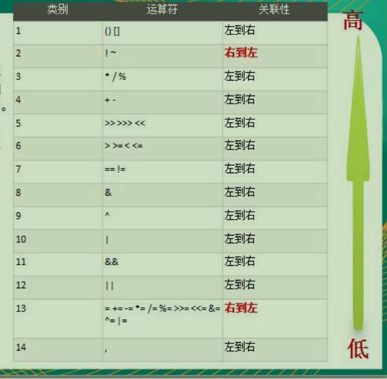

## 3.7 **键盘输入语句** 

**介绍**

在编程中，需要接收用户输入的数据，就可以使用键盘输入语句来获取。 

InputDemo.scala 

**步骤 ：** 

1) 导入该类的所在包 

2) 创建该类对象（声明变量） 

3) 调用里面的功能 

**案例演示：** 

**要求：可以从控制台接收用户信息，【姓名，年龄，薪水】。** 

**1)** **回顾Java的实现不说明**

**2) Scala的实现 【 import scala.io.StdIn】**


# 4. 流程控制

## 4.1 **程序流程控制介绍** 

在程序中，程序运行的流程控制决定程序是如何执行的，是我们必须掌握的，主要有三大流程控制语句。 

**温馨提示**： Scala语言中控制结构和Java语言中的控制结构基本相同，在不考虑特殊应用场景的情况下，代码书写方式以及理解方式都没有太大的区别 

1) 顺序控制 

2) 分支控制 

3) 循环控制

## 4.2 **顺序控制** 

**顺序控制介绍** 

程序从上到下逐行地执行，中间没有任何判断和跳转。 

**顺序控制举例和注意事项** 

Scala中定义变量时采用合法的前向引用。如： 

```scala
def main(args : Array[String]) : Unit = { 
    var num1 = 12 
    var num2 = num1 + 2 
}
```

错误形式： 

```scala
def main(args : Array[String]) : Unit = { 
    var num2 = num1 + 2 
    var num1 = 12 
} 
```


## 4.3 **分支控制if-else** 

**分支控制if-else介绍** 

让程序有选择的的执行,分支控制有三种: 

1) 单分支 

2) 双分支 

3) 多分支

**单分支** 

Ø **基本语法** 

if (**条件表达式**) { 

执行代码块 

}

**说明：当条件表达式为ture时，就会执行** **{ }** **的代码。** 

Ø **案例说明** 

请大家看个案例[IfDemo.scala]: 

编写一个程序,可以输入人的年龄,如果该同志的年龄大于18岁,则输出 “age > 18” 

```scala
val age = 20 
if (age > 18) { 
    println("age > 18") 
}
```

**双分支** 

Ø **基本语法** 

if (条件表达式) { 

执行代码块1 

} **else** { 

执行代码块2 

} 

**说明：当条件表达式成立，即执行代码块1**，否则执行代码块2. 

Ø **案例演示** 

请大家看个案例[IfDemo2.scala]: 

编写一个程序,**可以输入人的年龄**,如果该同志的年龄大于18岁,则输出 “age >18”。否则 ,输出 

"age <= 18 "


**单分支和双分支练习题** 

**1)** 对下列代码，若有输出，指出输出结果。 

```scala
var x = 4 
var y = 1 
if (x > 2) { 
    if (y > 2) { 
        println(x + y) 
    } 
    // 输出内容 atguigu 
    println("atguigu") 
} else
println("x is " + x)
```

2) 编写程序，声明2个Int型变量并赋值。判断两数之和，如果大于等于50，打印 “hello world!” 

3) 编写程序，声明2个Double型变量并赋值。判断第一个数大于10.0，且第2个数 小于20.0，打印两数之和。 

4) 【选作】定义两个变量Int，判断二者的和，是否既能被3又能被5整除，打印提 示信息 

5) 判断一个年份是否是闰年，闰年的条件是符合下面二者之一：(1)年份能被4整 除，但不能被100整除；(2)能被400整除 


**多分支** 

Ø **基本语法** 

if (条件表达式1) { 

执行代码块1 

}

else if (条件表达式2) { 

执行代码块2 

}

……

else { 

执行代码块n 

} 

Ø **多分支的流程图** 

Ø **案例演示** 

请大家看个案例[IfDemo3.scala]: 

岳小鹏参加scala考试，他和父亲岳不群达成承诺： 如果： 

成绩为100分时，奖励一辆BMW； 

成绩为(80，99]时，奖励一台iphone7plus； 

当成绩为[60,80]时，奖励一个 iPad； 

其它时，什么奖励也没有。 

说明: 成绩在控制台输入!

Ø 案例演示

求ax2+bx+c=0方程的根。a,b,c分别为函数的参数，如果：b2-4ac>0，则有两个解； 

b2-4ac=0，则有一个解；b2-4ac<0，则无解； [a=3 b=100 c=6] 

提示1：x1=(-b+sqrt(b2-4ac))/2a 

X2=(-b-sqrt(b2-4ac))/2a 

提示2：sqrt(num) 在 scala 包中(默认引入的) 的math 的包对象有很多方法直接可用.l 

 **注意事项** 

1) 如果大括号{}内的逻辑代码只有一行，大括号可以省略, 这点和java 的规定一样。 

2) Scala中任意**表达式都是有返回值的**，也就意味着if else表达式其实是有返回结果的，具体返回结果的值取决于满足条件的代码体的最后一行内容.[案例演示] 

3) Scala中是没有三元运算符，因为可以这样简写 

**// Java** 

int result = flg ? 1 : 0 

**// Scala** 

**val result = if (flg) 1 else 0** // 因为 scala 的if-else 是有返回值的，因此，本身这个语 

言也不需要三元运算符了(如图)，**并且**可以写在同一行，类似 三元运算l 


## 4.4 **嵌套分支**

**基本介绍** 

在一个分支结构中又完整的嵌套了另一个完整的分支结构，里面的分支的结构称为内层分支外面的分支结构称为外层分支。嵌套分支不要超过3层 

**基本语法** 

if(){ 

if(){ 

}else{ 

} 

}


**应用案例**

参加百米运动会，如果用时8秒以内进入决赛，否则提示淘汰。并且根据性别提示进入男子组或女子组, **输入**成绩和性别，进行判断。 


## 4.5 **switch分支结构** 

在scala中没有switch,而是使用**模式匹配**来处理。 模式匹配涉及到的知识点较为综合，因此我们放在后面讲解。 

match-case


## 4.6 **for循环控制** 

**基本介绍** 

Scala 也为for 循环这一常见的控制结构提供了非常多的特性，这些for 循环的 特性被称为**for** **推导式**（for comprehension）或**for** **表达式**（for expression） 

**范围数据循环方式1** 

Ø 基本案例 

```scala
for(i <- 1 to 3){ 
print(i + " ") 
}
println() 
```

**说明**

**1) i** **表示循环的变量，** **<-** **规定好** **to** **规定** 

**2) i** **将会从** **1-3** **循环， 前后闭合** 

Ø 输出10句 "hello,尚硅谷!"

**范围数据循环方式2** 

Ø 基本案例 

```scala
for(i <- 1 until 3) { 
    print(i + " ") 
}
println() 
```

说明: 

1) 这种方式和前面的区别在于 i 是从**1** **到** **3-1** 

**2)** **前闭合后开**的范围,和java的arr.length() 类似 for (int i = 0; i < arr.lenght; i++){} 

Ø 输出10句 "hello,尚硅谷!"


**循环守卫** 

Ø 基本案例 

```scala
for(i <- 1 to 3 if i != 2) { 
    print(i + " ") 
}
println() 
```

Ø 基本案例说明 

**1)** **循环守卫，即循环保护式（也称条件判断式，守卫）。保护式为true则进入循环体内部，为false则跳过，类似于continue** 

**2)** **上面的代码等价** 

```scala
for (i <- 1 to 3) { 
    if (i != 2) {
        println(i+"")
    }
}
```

**3)** **案例** 

**引入变量** 

Ø 基本案例 

```scala
for(i <- 1 to 3; j = 4 - i) { 
    print(j + " ") 
}
```

Ø 对基本案例说明 

**1)** **没有关键字，所以范围后一定要加；来隔断逻辑** 

**2)** **上面的代码等价** 

**for ( i <- 1 to 3) {** 

**val j = 4 –i** 

**print(j+"")** 

**}**

**嵌套循环** 

Ø 基本案例 

for(i <- 1 to 3; j <- 1 to 3) { 

println(" i =" + i + " j = " + j) 

}

Ø 对基本案例说明 

**1)** **没有关键字，所以范围后一定要加；来隔断逻辑** 

**2)** **上面的代码等价** 

**for ( i <- 1 to 3) {** 

**for ( j <- 1to 3){** 

**println(i + " " + j + " ")** 

**}** 

**}**

**循环返回值** 

Ø 基本案例 

val res = for(i <- 1 to 10) yield i 

println(res) 

Ø 对基本案例说明 

**1)** **将遍历过程中处理的结果返回到一个新Vector集合中，使用yield关键字使用花括号{}代替小括号()** 

Ø 基本案例 

for(i <- 1 to 3; j = i * 2) { 

println(" i= " + i + " j= " + j) 

}

可以写成 

for{

i <- 1 to 3 

j = i * 2} { 

println(" i= " + i + " j= " + j) 

}

Ø 对基本案例说明 

**1) {}和()对于for表达式来说都可以** 

**2) for** **推导式有一个不成文的约定：当for 推导式仅包含单一表达式时使用圆括号，当其包含多个表达式时使用大括号** 

**3)** **当使用{}来换行写表达式时，分号就不用写了

**注意事项和细节说明** 

1) scala 的for循环形式和java是较大差异，这点请同学们注意，但是基本的原 理还是一样的。 

2) scala 的for循环的**步长**如何控制! [for(i <- Range(1,3,2)] 

3) 思考题：如何使用循环守卫控制步长

**for循环练习题** 

1) 打印1~100之间所有是9的倍数的整数的个数及总和. 

2) 完成下面的表达式输出

## 4.7 **while循环控制** 

**基本语法** 

循环变量初始化 

while (循环条件) { 

循环体(语句) 

循环变量迭代 

}

**while循环应用实例** 

1) 画出流程图 

2) 输出10句"你好,尚硅谷"

**注意事项和细节说明** 

1) 循环条件是返回一个布尔值的表达式 

2) while循环是先判断再执行语句 

3) 与If语句不同，While语句本身没有值，即整个While语句的结果是Unit类型的() 

**4)** **因为while中没有返回值,所以当要用该语句来计算并返回结果时,就不可避免的使用变量 ，而变量需要声明在while循环的外部，那么就等同于循环的内部对外部的变量造成了影响，所以不推荐使用，而是推荐使用for循环。** 

**var** list = *List*(1,2,4)

**练习题** 

1) 打印1—100之间所有能被3整除的数 [演示 ] 

2) 打印40—200之间所有的偶数

## 4.8 **do..while循环控制** 

**基本语法** 

循环变量初始化; 

do{ 

循环体(语句) 

循环变量迭代 

} while(循环条件) 

**do...while循环应用实例** 

1) 画出流程图 

2) 输入10 "你好, 尚硅谷"

**注意事项和细节说明** 

1) 循环条件是返回一个布尔值的表达式 

2) do..while循环是先执行，再判断 

3) 和while 一样，**因为do…while中没有返回值,所以当要用该语句来计算并返回结果时,就不可避免的使用变量 ，而变量需要声明在do...while循环的外部，那么就等同于循环的内部对外部的变量造成了影响，所以不推荐使用，而是推荐使用for循环** 

**课堂练习题【学员先做】** 

1) 计算1—100的和 【课后】 

2) 统计1——200之间能被5整除但不能被3整除的个数 【课堂】

## 4.9 **多重循环控制** 

**介绍：** 

1) 将**一个循环放在另一个循环体内**，就形成了嵌套循环。其中， for ,while ,do…while均可以作为外层循环和内层循环。【建议一般使用两层， 最多不要**超过3层**】 

2) 实质上，**嵌套循环就是把内层循环当成外层循环的循环体**。当只有内层循 环的循环条件为false时，才会完全跳出内层循环，才可结束外层的当次循环， 开始下一次的循环。 

3) 设外层循环次数为m次，内层为n次， 则内层循环体实际上需要执行 m*n=mn次。

**应用实例：** 

1) 统计三个班成绩情况，每个班有5名同学，求出各个班的平均分和所有班级的平均分[学生的成绩从键盘输入]。 

2) 统计三个班及格人数，每个班有5名同学。 

3) 打印出九九乘法表l **while循环的中断** 

**基本说明** 

Scala内置控制结构特地**去掉了break和continue**，是为了更好的适应函数化 编程，推荐使用**函数式的风格**解决break和contine的功能，而不是一个关键字。 

**案例演示** 

**代码说明**：(看源码分析 **重要**)

## 4.10 **while循环的中断** 

**如何实现continue的效果** 

可以使用**if – else** 或是 循环守卫实现continue的效果 

案例

for (i <- 1 to 10 if (i != 2 && i != 3)) { 

println("i=" + i) 

}

**课后练习题** 

**课后练习题：** 

1) 100以内的数求和，求出当和 第一次大于20的当前数【for】 

2) 实现登录验证，有三次机会，如果用户名为”张无忌” ,密码”888”提示登录成功，否则提示还有几次机会，请使用for 循环完成 

3) 某人有100,000元,每经过一次路口，需要交费,规则如下: 

1.当现金>50000时,每次交5% 

2.当现金<=50000时,每次交1000 

编程计算该人可以经过多少次路口,使用 方式完成


# 5. **函数式编程基础**

## 5.1 **函数式编程内容及授课顺序说明** 

**函数式编程内容** 

Ø **函数式编程基础** 

1) 函数定义/声明 

2) 函数运行机制 

**3)** **递归**//难点 [最短路径，邮差问题，迷宫问题, 回溯] 

4) 过程 

5) 惰性函数和异常 

Ø **函数式编程高级** 

1) 值函数(函数字面量) 

2) 高阶函数 

3) 闭包 

4) 应用函数 

5) 柯里化函数，抽象控制...


**函数式编程授课顺序** 

**1)** **在scala中，函数式编程和面向对象编程融合在一起，学习函数式编程式需要oop** 的知识，同样学习oop需要函数式编程的基础。[**矛盾**] 

**2)** **关系如下图**:

**3)** **授课顺序： 函数式编程基础**->**面向对象编程**->**函数式编程高级**

## 5.2 **函数式编程介绍** 

**几个概念的说明** 

**在学习Scala中将方法、函数、函数式编程和面向对象编程明确一下：** 

**1)** **在scala中，方法和函数几乎可以等同(比如他们的定义、使用、运行机制都一样的)**，只是函数的使用方式更加的灵活多样。

**2)** **函数式编程是从编程方式(范式)的角度来谈的，可以这样理解：函数式编程把函** 

**数当做一等公民，充分利用函数、 支持的函数的多种使用方式。** 

**比如：** 

在Scala当中，函数是一等公民，像变量一样，既可以作为函数的参数使用，也可 以将函数赋值给一个变量. ，函数的创建不用依赖于类或者对象，而在Java当中， 函数的创建则要依赖于类、抽象类或者接口. 

**3)** **面向对象编程是以对象为基础的编程方式。** 

**4)** **在scala中函数式编程和面向对象编程融合在一起了 。**


**在学习Scala中将方法、函数、函数式编程和面向对象编程关系分析图**

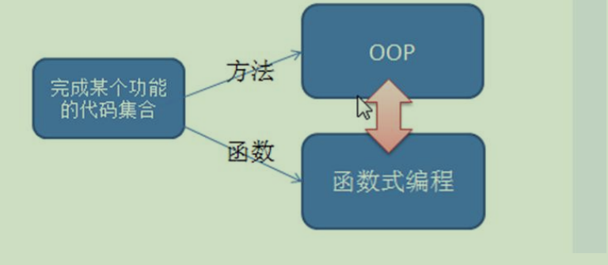


Ø "函数式编程"是一种"编程范式"（programming paradigm）。 

Ø 它属于"结构化编程"的一种，主要思想是把运算过程尽量写成一系列嵌套的函数调用。 

Ø 函数式编程中，将**函数也当做数据类型**，因此可以接受函数当作输入（参数）和 输出（返回值）。 

Ø 函数式编程中，最重要的就是函数。l 

## 5.3 **为什么需要函数** 

请大家完成这样一个需求: (学习技术套路) 输入两个数,再输入一个运算符(+,-)，得到结果.。 

先使用传统的方式来解决，看看有什么问题没有？ 

1) 代码冗余 

2) 不利于代码的维护 

函数 抽取功能，形成代码 

**函数介绍** 

为完成某一功能的程序指令(语句)的集合,称为函数。

## 5.4 **函数的定义** 

**基本语法** 

def 函数名 ([参数名: 参数类型], ...)[[: 返回值类型] =] { 

语句... 

return 返回值 

}

1) 函数声明关键字为def (definition) 

2) [参数名: 参数类型], ...：表示函数的输入(就是参数列表), 可以没有。 如果有，多个参数使用逗号间隔 

3) 函数中的语句：表示为了实现某一功能代码块 

4) 函数可以有返回值,也可以没有 

5) 返回值形式1: **:** **返回值类型** **=** 

6) 返回值形式2: **=** **表示返回值类型不确定，使用类型推导完成** 

7) 返回值形式3: **表示没有返回值，return** 不生效

**8)** **如果没有return ,默认以执行到最后一行的结果作为返回值** 

**快速入门案例** 

使用函数完全前面的案例。


## 5.5 **函数-调用机制** 

Ø **如何理解方法这个概念,给大家举个通俗的示例:**

拉登同志给特工小组下达命令:去炸美国白宫,特工小组返回结果 程序员调用方法:给方法必要的输入,方法返回结果.

**函数-调用过程** 

为了让大家更好的理解函数调用机制, 看1个案例，并**画出示意图**，这个很重要， 

比如getSum 计算两个数的和,并返回结果。 

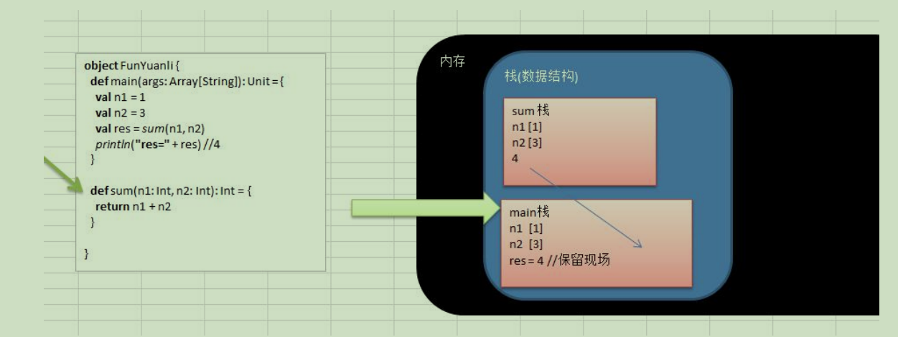

**函数-递归调用** 

**基本介绍** 

一个函数在**函数体内**又**调用了本身**，我们称为递归调用 

**递归调用快速入门** 

当调用**test(4)** 和 test2(4) 上面两段代码分别输出什么？ 

递归调用并分析原因(画出示意图) 

```scala
def test (n: Int) { 
    if (n > 2) { 
        test (n - 1) 
}
println("n=" + n) // 
} 

def test2 (n: Int) { 
    if (n > 2) { 
        test2 (n - 1) 
    }else { 
println("n=" + n) 
}
} 
```


**函数递归需要遵守的重要原则（总结）:** 

1) 程序执行一个函数时，就创建一个新的受保护的独立空间(新函数栈) 

2) 函数的局部变量是独立的，不会相互影响 

3) 递归必须向退出递归的条件逼近，否则就是无限递归，死龟了:) 

4) 当一个函数**执行完毕**，**或者遇到return**，就会返回，遵守谁调用，就将结果返回 给谁。


**递归课堂练习题** 

Ø 题1：斐波那契数 [学员练习10min] 

请使用递归的方式，求出斐波那契数1,1,2,3,5,8,13... 给你一个整数n，求出它的斐波那契数是多少？ 

Ø 题2：求函数值 [演示] 

已知 f(1)=3; f(n) = 2*f(n-1)+1; 请使用递归的思想编程，求出 f(n)的值?l 

Ø 题3：猴子吃桃子问题 

有一堆桃子，猴子第一天吃了其中的一半，并再多吃了一个！以后每天猴子都吃 其中的一半，然后再多吃一个。当到第十天时，想再吃时（还没吃），发现只有 1个桃子了。**问题：最初共多少个桃子**？

## 5.6 **函数注意事项和细节讨论** 

1) 函数的形参列表可以是多个, 如果函数没有形参，调用时 **可以不带()** 

2) 形参列表和返回值列表的数据类型可以是值类型和引用类型。【案例演示】 

3) Scala中的函数可以根据函数体最后一行代码自行推断函数返回值类型。那么在 这种情况下，return关键字可以省略 

4) 因为Scala可以自行推断，所以在省略return关键字的场合，返回值类型也可以 省略 

5) 如果函数明确使用return关键字，那么函数返回就不能使用自行推断了,这时要明确写成 **:** **返回类型** **=** ，当然如果你什么都不写，即使有return 返回值为() 

```scala
def getSum(n1: Int, n2: Int): Int = { 
    n1 + n2 
} 

def getSum(n1: Int, n2: Int) = { 
    n1 + n2 
} 

def getSum(n1: Int, n2: Int): Int = { 
//因为这里有明确的return , 这时 getSum 就不能省略 : Int = 的 Int了 
return n1 + n2 
}
```

6) 如果函数明确声明无返回值（声明Unit），那么函数体中即使使用return关键字 也不会有返回值 

7) 如果明确函数无返回值或不确定返回值类型，那么返回值类型可以省略(或声明为Any) 

8) Scala语法中任何的语法结构都可以嵌套其他语法结构(灵活)，即：函数中可以再声明/定义函数，类中可以再声明类 ，方法中可以再声明/定义方法 

**9) Scala函数的形参，在声明参数时，直接赋初始值(默认值)**，这时调用函数时，如果没有指定实参，则会使用默认值。如果指定了实参，则实参会覆盖默认值。 

```scala
def f3(s: String) = { 
    if(s.length >= 3) 
    s + "123" 
    else 
    3
} 

def f4(s: String): Any = { 
    if(s.length >= 3) 
    s + "123" 
    else 
    3
} 
def sayOk(name : String = "jack"): String = { 
    return name + " ok! " 
}
```

10) 如果函数存在多个参数，每一个参数都可以设定默认值，那么这个时候，传递的 参数到底是覆盖默认值，还是赋值给没有默认值的参数，就不确定了(默认按照 声明顺序[**从左到右**])。在这种情况下，可以采用**带名参数** **[**案例演示+练习**]** 

**11)scala** **函数的形参默认是val的，因此不能在函数中进行修改.** 

12)递归函数未执行之前是无法推断出来结果类型，在使用时**必须有明确的返回值类型**

13) Scala函数支持**可变参数** 

说明: 

**(1) args** **是集合,** 通过 **for循环 可以访问到各个值**。 

(2) 案例演示： 编写一个函数sum ,可以求出 1到多个int的和 

(3) 可变参数需要写在形参列表的最后。 

## 5.7 函数练习题

 

##  5.8 **过程** 

### 5.8.1 **基本介绍** 

将函数的返回类型为Unit的函数称之为**过程(procedure)**，如果明确函数没有返回值，那么等号可以省略 


### 5.8.2 **注意事项和细节说明** 

1) 注意区分: 如果函数声明时没有返回值类型，但是有 = 号，可以进行**类型推断**最 后一行代码。这时这个函数实际是有返回值的，该函数并不是过程。(这点在讲解函数细节的时候讲过的.) 

2)开发工具的自动代码补全功能，虽然会自动加上Unit，但是考虑到Scala语言的简单，灵活，最好不加.

## 5.9 **惰性函数** 

### 5.9.1 **看一个应用场景** 

	惰性计算（尽可能延迟表达式求值）是许多函数式编程语言的特性。惰性集合在需要时提供其元素，无需预先计算它们，这带来了一些好处。首先，您可以将耗时的计算推迟到绝对需要的时候。其次，您可以创造无限个集合，只要它们继续收到请求，就会继续提供元素。函数的惰性使用让您能够得到更高效的代码。Java 并没有为惰性提供原生支持，Scala提供了。 

### 5.9.2 画图说明[大数据推荐系统]

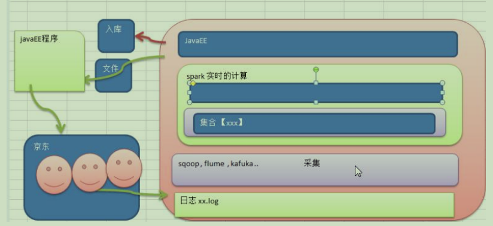

### 5.9.3 **Java实现懒加载的代码** 

```scala
public class LazyDemo {
    private String property; //属性也可能是一个数据库连接，文件等资源 
    public String getProperty() { 
        if (property == null) {//如果没有初始化过，那么进行初始化 
            property = initProperty(); 
        }
        return property; 
    } 
    private String initProperty() { 
        return "property"; 
    }
}
//比如常用的单例模式懒汉式实现时就使用了上面类似的思路实现l
```

 

### 5.9.4 **惰性函数介绍**

​	当**函数返回值**声明为**lazy**时，函数的执行将被推迟，直到我们首次对此取值，该函数才会执行。这种函数我们称之为**惰性函数**，在Java的某些框架代码中称之为懒加载(延迟加载)。 

### 5.9.5 **案例演示** 

看老师演示 

```scala
package com.atguigu.chapter05.mylazy
object LazyDemo01 {
    def main(args: Array[String]): Unit = {
        lazy val res = sum(10,20)
        println("---------------")
        println("res=" + res)//在要使用res前，才执行
    }
    //sum函数，返回和
    def sum(n1: Int, n2 : Int): Int ={
        println("sum()执行了..")//输出一句话
        return n1+ n2
    }
}
```

### 5.9.6 **注意事项和细节** 

1) lazy 不能修饰 var 类型的变量 

2) 不但是 在调用函数时，加了 lazy ,会导致函数的执行被推迟，我们在声明一个变量时，如果给声明了 lazy ,那么变量值得分配也会推迟。 比如 lazy val i = 10 


## 5.10 **异常** 

### 5.10.1 **介绍**

Ø Scala提供try和catch块来处理异常。try块用于包含可能出错的代码。catch块用于处理try块中发生的异常。可以根据需要在程序中有任意数量的try...catch块。 

Ø 语法处理上和Java类似，但是又不尽相同 

###  5.10.2 **Java异常处理回顾** 

```scala
try { 
    // 可疑代码 
    int i = 0; 
    int b = 10; 
    int c = b/i; // 执行代码时，会抛出ArithmeticException异常 
} catch(Exception e) { 
    e.printStackTrace(); 
}finally { 
    // 最终要执行的代码 
    System.out.println("java finally"); 
}
```


### 5.10.3  **Java异常处理的注意点.** 

1) java语言按照try—catch-catch...—finally的方式来处理异常 

2) 不管有没有异常捕获，都会执行finally, 因此通常可以在finally代码块中释放资源 

3) 可以有多个catch，分别捕获对应的异常，这时需要把范围小的异常类写在前面，把范围大的异常类写在后面，否则编译错误。会提示 "*Exception 'java.lang.xxxxxx' has already been caught*"【案例演示】


### 5.10.4 **Scala异常处理举例** 

```scala
try {
    val r = 10 / 0 
} catch { 
    case ex: ArithmeticException=> println("捕获了除数为零的算数异常") 
    case ex: Exception => println("捕获了异常") 
} finally { 
    // 最终要执行的代码 
    println("scala finally...") 
}
```

### 5.10.5 **Scala异常处理小结** 

1) 我们将可疑代码封装在try块中。 在try块之后使用了一个catch处理程序来捕获异常。如果发生任何异常，catch处理程序将处理它，程序将不会异常终止。 

2) Scala的异常的工作机制和Java一样，但是Scala没有“checked(编译期)”异常，即Scala没有编译异常这个概念，异常*都是在运行的时候捕获*处理。 

3) 用throw关键字，抛出一个异常对象。所有异常都是Throwable的子类型。throw 表达式是有类型的，就是Nothing，因为Nothing是所有类型的子类型，所以throw表达式可以用在需要类型的地方 

```scala
def test(): Nothing = { 
    throw new ArithmeticException("算术异常") 
}
```

4) 在Scala里，借用了模式匹配的思想来做异常的匹配，因此，在catch的代码里，是一系列case子句来匹配异常。【前面案例可以看出这个特点, 模式匹配我们后面详解】，当匹配上后 => 有多条语句可以换行写，类似 java 的 switch case x: 代码块.. 

5) 异常捕捉的机制与其他语言中一样，如果有异常发生，catch子句是按次序捕捉的。因此，在catch子句中，越具体的异常越要靠前，越普遍的异常越靠后，如果把越普遍的异常写在前，把具体的异常写在后，在scala中也不会报错，但这样是非常不好的编程风格。

7) finally子句用于执行不管是正常处理还是有异常发生时都需要执行的步骤，一般用于对象的清理工作，这点和Java一样。 

8) Scala提供了throws关键字来声明异常。可以使用方法定义声明异常。 它向调用者函数提供了此方法可能引发此异常的信息。 它有助于调用函数处理并将该代码包含在try-catch块中，**以避免程序异常终止**。在scala中，可以使用throws注释来声明异常

```scala
def main(args: Array[String]): Unit = { 
    f11() 
}
@throws(classOf[NumberFormatException])//等同于NumberFormatException.class 
def f11() = { 
    "abc".toInt 
}
```

## 5.11 **函数的课堂练习题** 

1) 函数可以没有返回值案例，编写一个函数,从终端输入一个整数打印出对应的金子塔。 【**课后练习**】 

 

2) 编写一个函数,从终端输入一个整数(1—9),打印出对应的乘法表:【上机练习】

 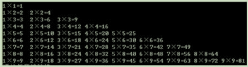

```scala
package com.atguigu.chapter05.exercises
import scala.io.StdIn
object Exercise01 {
    def main(args: Array[String]): Unit = {
        println("请输入数字(1-9)之间")
        val n = StdIn.readInt()
        print99(n)
}
    //编写一个函数，输出99乘法表
    def print99(n: Int)={
        for (i<- 1 to n){
            for (j<- 1 to i){
                printf("%d* %d = %d\t", j, i,j* i)
            }
            println()
        }
    }
}
```

3) 编写函数,对给定的一个二维数组(3×3)转置，这个题讲数组的时候再完成。 

 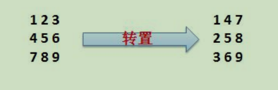


# 6. 面向对象编程（基础部分）

## 6.1 **类与对象** 

**看一个养猫猫问题** 

​	张老太养了只**猫**猫:一只**名字**叫小白,今年3**岁**,白色。还有一只叫小花,今年10岁,花色。**请编写一个程序**，当用户输入小猫的名字时，就显示该猫的名字，年龄，颜色。如果用户输入的小猫名错误，则显示 张老太没有这只猫猫。 

//问题 

1. 猫有三个属性，类型不一样. 

2. 如果使用普通的变量就不好管理 

3. 使用一种新的**数据类型**((1) 可以管理多个不同类型的数据 [**属性**]) (2) 可以对属性进行操作-**方法** 

4. 因此类与对象

### 6.1.1 **Scala语言是面向对象的** 

Ø Java是面向对象的编程语言，由于历史原因，Java中还存在着非面向对象的内容:基本类型 ，null，静态方法等。 

Ø Scala语言来自于Java，所以天生就是面向对象的语言，而且Scala是纯粹的面向对象的语言，即在Scala中，一切皆为对象。 

Ø 在面向对象的学习过程中可以对比着Java语言学习

### 6.1.2 快速入门-解决养猫问题


### 6.1.3 **类和对象的区别和联系** 

通过上面的案例和讲解我们可以看出: 

1) 类是抽象的，概念的，代表**一类事物**,比如人类,猫类.. 

2) 对象是具体的，实际的，代表**一个具体**事物 

3) 类是对象的模板，对象是类的一个个体，对应一个实例 

4) Scala中类和对象的区别和联系 和 Java是一样的。l 


### 6.1.4 **如何定义类** 

Ø 基本语法 

**[修饰符] class** **类名** **{** 

**类体** 

**}**

Ø **定义类的注意事项** 

1) scala语法中，类并不声明为public，所有这些类**都具有公有可见性**(即默认就是public),[修饰符在后面再详解]. 

2) 一个Scala源文件可以包含多个类.l 


### 6.1.5 **属性**

Ø 基本介绍 

1) 案例演示： 

2) 属性是类的一个组成部分，一般是**值数据类型**,也**可是引用类型**。比如我们前面定义猫类 的 age 就是属性 


### 6.1.6 **属性**/成员变量

Ø 注意事项和细节说明 

1) 属性的定义语法同变量，示例：**[访问修饰符] var 属性名称** **[：类型] =** **属性值** 

2) 属性的定义类型可以为任意类型，包含值类型或引用类型[案例演示] 

3) Scala中声明一个属性,必须**显示的初始化**，然后根据初始化数据的类型自动推断，属性类型可以省略(这点和Java不同)。[案例演示] 

4) 如果赋值为null,则一定要加类型，因为不加类型, 那么该属性的类型就是Null 

类型. 

```scala
class Person { 
    var age : Int = 10 
    var sal = 8090.9 //给属性赋初值，省略类型，会自动推导
    var Name = null // Name 是什么类型?
    var address : String = null // address是什么类型？
}
```

5) 如果在定义属性时，暂时不赋值，也可以使用符号**_(下划线)**，让系统分配默认值. 

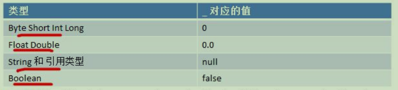

**6)** **不同对象**的属性是独立，互不影响，一个对象对属性的更改，不影响另外一个。 


### 6.1.7 **属性的高级部分** 

说明：属性的高级部分和构造器(构造方法/函数)相关，我们把属性高级部分放到构造器那里讲解。


### 6.1.8 **如何创建对象** 

Ø 基本语法 

**val | var** **对象名** **[：类型] = new 类型()** 

Ø 说明 

1) 如果我们不希望改变对象的引用(即：内存地址), 应该声明为val 性质的，否则声明为var, scala设计者推荐使用**val** ,因为一般来说，在程序中，我们只是改变对象属性的值，而不是改变对象的引用。 

2) scala在声明对象变量时，可以根据创建对象的类型自动推断，所以类型声明可以省略，**但当类型和后面 new** 对象类型有继承关系即多态时，就必须写了

**如何访问属性** 

Ø **基本语法** 

对象名.属性名; 


### 6.1.9 **类和对象的内存分配机制**

Ø 看一个思考题 

我们定义一个Person类(包括 名字,年龄) ，创建一个对象(ObjectDemo.scala) 

**我们看看下面一段代码:** 

```scala
val p1 = new Person 
p1.name = "jack"
p1.age = 30 
val p2 = p1 //内存布局? 
println("p2.age=" + p2.age) 
println("p1.age="+ p1.age)
```

**请问:p2.age究竟是多少?**

Ø **Scala**对象的内存布局

**对象是存在内存中的**,那么对象在内存中究竟是怎样存在的?

**这里我们给大家伙画一个图来说明一下,这个图对我们理解对象在内存中** 

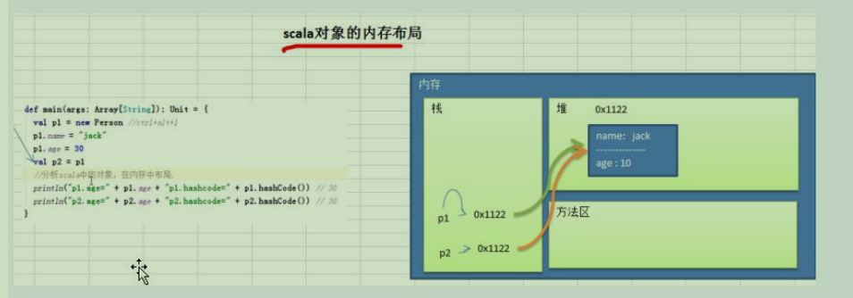


## 6.2 **方法** 

### 6.2.1 **基本说明** 

Scala中的方法其实就是函数，声明规则请参考函数式编程中的函数声明。 

### 6.2.2 **基本语法** 

**def** **方法名(参数列表) [：返回值类型] = {** 

**方法体** 

**}**

### 6.2.3 **方法案例演示** 

给Cat类添加cal方法,可以计算两个数的和 

```scala
class Dog { 
    private var sal: Double = _ 
    var food : String = _ 
    def cal(n1: Int, n2: Int): Int = { 
        return n1 + n2 
    }
}
```


### 6.2.4 **方法的调用机制原理** 

提示：程序调用方法过程+**说明** 

1) 当我们scala开始执行时，先在栈区开辟一个main栈。main栈是最后被销毁 

2) 当scala程序在执行到一个方法时，总会开一个新的栈。 

3) 每个栈是独立的空间，变量（基本数据类型）是独立的，相互不影响（引用类型除外） 

4) 当方法执行完毕后，该方法开辟的栈就会被jvm机回收。


**课堂练习题** 

1) 编写类(**MethodExec**)，编程一个方法，方法不需要参数，在方法中打印一个 10*8 的矩形，在main方法中调用该方法。【案例演示】 

2) 修改上一个程序，编写一个方法中，方法不需要参数，计算该矩形的面积，并将其作 为方法返回值。在main方法中调用该方法，接收返回的面积值并打印(结果保留小数点 2位)。【案例演示】 

3) 修改上一个程序，**编写一个方法**，提供m和n两个参数，方法中打印一个m*n的矩形，再编写一个方法算该矩形的面积(可以接收长len，和宽width)， 将其作为方法返回值。 在main方法中调用该方法，接收返回的面积值并打印。【课堂】 

4) 编写方法：判断一个数是奇数odd还是偶数 【课堂】 [10min] 

5) 根据行、列、字符打印 对应行数和列数的字符，比如：行：3，列：2，字符* 则打印相应的效果【课后】 

6) 定义小小计算器类(Calcuator)，实现加减乘除四个功能 【课后】 

实现形式1：分四个方法完成: 

实现形式2：用一个方法搞定l 

## 6.3 **类与对象应用实例** 

### 6.3.1 **小狗案例** 

1) 编写一个Dog类，包含name(String)、age(Int)、weight(Double)属性 

2) 类中声明一个say方法，返回String类型，方法返回信息中包含所有属性值。 

3) 在另一个TestDog类中的main方法中，创建Dog对象，并访问say方法和所有属性，将调用结果打印输出。 

### 6.3.2 **盒子案例**

1) 编程创建一个Box类，在其中定义三个变量表示一个立方体的长、宽和高，长宽高可以通过控制台输入。 

2) 定义一个方法获取立方体的体积(volumn)。长*宽*高 

3) 创建一个对象，打印给定尺寸的立方体的体积。 


### 6.3.3 **景区门票案例**

1) 一个景区根据游人的年龄收取不同价格的门票。 

2) 请编写游人类，根据年龄段决定能够购买的门票价格并输出 

3) 规则：年龄>18 , 门票为20元，其它情况免费。 

4) 可以循环从控制台输入名字和年龄，打印门票收费情况, 如果名字输入 n , 则退出程序。l 

## 6.4 **构造器** 

### 6.4.1 **看一个需求** 

我们来看一个需求：前面我们在创建Person的对象时，是先把一个对象创建好后，再给他的**年龄**和**姓名**属性赋值，如果现在我要求，在创建人类的对象时，就直接指定这个对象的年龄和姓名，该怎么做? 这时就可以使用**构造方法**/构造器。

### 6.4.2 **回顾-Java构造器基本语法** 

[**修饰符**] **方法名**(参数列表){ 

构造方法体 

}


### 6.4.3 **回顾-Java构造器的特点** 

Ø 在Java中一个类可以定义多个不同的构造方法，构造方法重载 

Ø 如果程序员**没有定义构造方法**，系统会自动给类生成一个**默认无参构造方法** (也叫默认构造器)，比如 Person (){} 

Ø 一旦定义了自己的构造方法（构造器）,默认的构造方法就覆盖了，就不能再使用默认的无参构造方法，除非**显示的定义一下**,即: Person(){};


### 6.4.4 **回顾**-Java构造器的案例

在前面定义的Person类中添加两个构造器： 

**第一个无参构造器**：利用构造器设置所有人的age属性初始值都为18 

**第二个带**name**和**age**两个参数的构造器**：使得每次创建Person对象的同时初始化对象的age属性值和name属性值。 

```scala
class Person{ 
    public String name; 
    public int age; 
    public String getInfo(){ 
        return name+"\t"+age; 
}
    public Person(){ 
        age = 18; 
    }
    public Person(String name,int age){ 
        this.name = name; 
        this.age = age; 
    }
}
```


### 6.4.5 **Scala构造器的介绍** 

和Java一样，Scala构造对象也需要调用构造方法，并且可以有任意多个构造 方法（即scala中构造器也支持重载）。 

Scala类的构造器包括： **主构造器** 和 **辅助构造器** 

### 6.4.6 **Scala构造器的基本语法** 

**class** 类名**(**形参列表**)** { // 主构造器 

// 类体 

**def this**(形参列表) { // 辅助构造器 

}

**def this**(形参列表) { //辅助构造器可以有多个... 

} 

}

//1. 辅助构造器 函数的名称this, 可以有多个，编译器通过不同参数来区分.


### 6.4.7 **Scala构造器的快速入门** 

创建Person对象的同时初始化对象的age属性值和name属性值，案例演示。


### 6.4.8 **Scala构造器注意事项和细节** 

1) Scala构造器作用是完成对**新对象的初始化，构造器没有返回值。** 

**2)** **主构造器的声明直接放置于类名之后** **[**反编译**]** 

**3)** **主构造器会执行类定义中的所有语句**，这里可以体会到Scala的函数式编程和面向对象编程融合在一起，**即：构造器也是方法（函数）**，传递参数和使用方法和前面的函数部分内容没有区别【案例演示+反编译】 

4) 如果主构造器无参数，小括号可省略，构建对象时调用的构造方法的小括号也可以省略

**5)** **辅助构造器**名称为**this**（这个和**Java**是不一样的），多个辅助构造器通过不同参数列表进行区分， 在底层就是f构造器重载。【**案例演示+反编译**】

```scala
class Person() { 
    var name: String = _ 
    var age: Int = _ 
    def this(**name : String**) { 
        //辅助构造器无论是直接或间接，最终都一定要调用主构造器，执行主构造器的逻辑 
        //而且需要放在辅助构造器的第一行[这点和java一样，java中一个构造器要调用同类的其它构造器，也需要放在第一行] 
        this() //直接调用主构造器 
        this.name = name 
    }
    def this(name : String, age : Int) { 
        this() //直接调用主构造器 
        this.name = name 
        this.age = age 
    }
    def this(age : Int) { 
        this("匿名") //简介调用主构造器,因为 def this(name : String) 中调用了主构造器! 
        this.age = age 
    }
    def showInfo(): Unit = { 
        println("person信息如下:") 
        println("name=" + this.name) 
        println("age=" + this.age) 
    }
} 

main函数中: 
val p1 = new Person("scott") 
p1.showInfo()
```

**6)** **如果想让主构造器变成私有的，可以在**()**之前加上**private**，这样用户只能通过辅助构造器来构造对象了【反编译】** 

7) 辅助构造器的声明不能和主构造器的声明一致,会发生错误(即构造器名重复)

## 6.5 **属性高级** 

前面我们讲过属性了，这里我们再对属性的内容做一个加强. 

### 6.5.1 **构造器参数** 

1) Scala类的主构造器的形参未用任何修饰符修饰，那么这个参数是局部变量。 

2) 如果参数使用val关键字声明，那么Scala会将参数作为类的私有的只读属性使用 【案例+反编译】 

3) 如果参数使用var关键字声明，那么那么Scala会将参数作为类的**成员属性**使用,并会提供属性对应的xxx()[类似getter]/xxx_$eq()[类似setter]方法，即这时的**成员属性是私有的，但是可读写**。【案例+反编译】l 


### 6.5.2 **Bean**属性

JavaBeans规范定义了Java的属性是像getXxx（）和setXxx（）的方法。许多Java工具（框架）都依赖这个命名习惯。为了Java的互操作性。将Scala字段加@BeanProperty时，这样会自动生成**规范的** **setXxx/getXxx** **方法**。这时可以使用 对象.setXxx() 和 对象.getXxx() 来调用属性。 

**注意**:给某个属性加入@BeanPropetry注解后，会生成getXXX和setXXX的方法并且对原来底层自动生成类似xxx(),xxx_$eq()方法，**没有冲突，二者可以共存**。 

案例演示+反编译 

```scala
import scala.beans.BeanProperty 
class Car { 
    @BeanProperty var name: String = null 
}
```


## 6.6 **对象创建的流程分析** 

### 6.6.1 **看一个案例** 

```scala
class Person { 
    var age : Short = 90 
    var name : String = _ 
    def this (n: String, a: Int) { 
        this() 
        this.name = n 
        this.age = a 
    }
} 
var p : Person = new Person("小倩",20) 
```


### 6.6.2 **流程分析** 

**1)** **加载类的信息**(**属性信息，方法信息**)

**2)** **在内存中**(**堆**)**开辟空间**

**3)** **使用父类的构造器**(**主和辅助**)**进行初始** 

**4)** **使用主构造器对属性进行初始化 【**age:90, naem nul**】** 

**5)** **使用辅助构造器对属性进行初始化 【** **age:20, naem** **小倩 】** 

**6)** **将开辟的对象的地址赋给** **p**这个引用


# 7 . 面向对象编程（中级部分）

## 7.1 **包**

### 7.1.1 看一个应用场景

现在有两个程序员共同开发一个**项**目,程序员xiaoming希望定义一个类取名 Dog ,程序员xiaoqiang也想定义一个类也叫 Dog。两个程序员为此还吵了起来, 怎么办?l 


### 7.1.2 **回顾-Java包的三大作用** 

1) 区分相同名字的类 

2) 当类很多时,可以很好的管理类 

3) 控制访问范围 

### 7.1.3 **回顾-Java打包命令** 

Ø 打包基本语法 

package com.atguigu; 

Ø 打包的本质分析 

实际上就是创建不同的**文件夹来保存类文件**，画出**示意图**。 

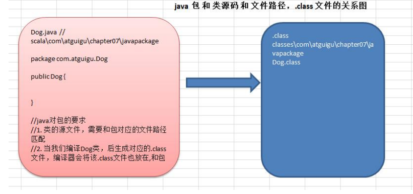

### 7.1.4 **快速入门** 

语法: import 包; 

比如 import java.awt.*; 我们引入一个包的主要目的是要使用该包下的类 比如 import java.util.Scanner; 就只是引入一个类Scanner。 java中**包名**和**源码**所在的系统**文件目录结构要一致**，并且编译后的字节码文件路径也和包名保持一致。[如图]


### 7.1.5 **Scala包的基本介绍** 

和Java一样，Scala中管理项目可以使用包，但Scala中的包的**功能更加强大**，使用也相对复杂些，下面我们学习Scala包的使用和注意事项。 

### 7.1.6 **Scala包快速入门** 

使用打包技术来解决上面的问题，不同包下Dog类 

```scala
package com.atguigu.chapter02.xh 

class Cat { 
}

package com.atguigu.chapter02.xm 

class Cat { 
} 

var cat1 = new com.atguigu.chapter02.xh.Cat() 

println("cat1" + cat1) 

var cat2 = new com.atguigu.chapter02.xm.Cat() 

println("cat2" + cat2)l 
```


### 7.1.7 Scala包的特点概述

Ø 基本语法 

**package** **包名** 

Ø Scala包的三大作用(和Java一样) 

1) 区分相同名字的类 

2) 当类很多时,可以很好的管理类 

3) 控制访问范围 

4)可以对类的功能进行扩展


Ø Scala中**包名**和**源码**所在的系统**文件目录结构要****可以不一致**，但是编译后的字节码文件路径和包名会保持一致(这个工作由**编译器完成)。[案例演示]


### 7.1.8 **Scala包的命名** 

Ø 命名规则： 

只能包含**数字**、字母、下划线、**小圆点**.,但不能用数字开头, 也不要使用关键字。 

demo.**class**.exec1 //错误 , 因为class是关键字 

demo.12a // 错误，因为不能以数字开头 

Ø 命名**规范**： 

一般是小写字母+小圆点一般是 

com.**公司名**.**项目名**.**业务模块名** 

比如：com.atguigu.**oa**.model com.atguigu.oa.controller 

com.sina.edu.user 

com.sohu.bank.orderl 


### 7.1.9 **Scala会自动引入的常用包** 

java.lang.* 

**scala**包 

**Predef**包l 


### 7.1.10 **Scala包注意事项和使用细节** 

1) scala进行package 打包时，可以有如下形式。【案例+反编译】 

```scala
package com.atguigu.scala

class Person{ 
    val name = "Nick" 
    def play(message: String): Unit ={ 
        println(this.name + " " + message) 
    }
}

//代码说明 传统的方式 

package com.atguigu 
package scala 

class Person{ 
    val name = "Nick" 
    def play(message: String): Unit ={ 
        println(this.name + " " + message) 
    } 
}

//代码说明 ：和第一种方式完全等价 

package com.atguigu
package scala

class Person{ 
    val name = "Nick" 
    def play(message: String): Unit ={ 
        println(this.name + " " + message) 
    } 
}  
```


2) 包也可以像嵌套类那样嵌套使用（包中有包）, 这个在前面的第三种打包方式已经讲过了，在使用第三种方式时的**好处是**：程序员可以在同一个文件中， 将**类**(class / object)、**trait** 创建在不同的包中，这样就非常灵活了。[案例+反编译]

 

**3)** **作用域**原则：可以直接向上访问。 即: **Scala****中子包中直接访问父包中的内容**,** 大括号体现作用域。 

(**提示：**Java中子包使用父包的类，需要import)。在子包和父包 类重名时，默认采用就近原则，如果 

希望指定使用某个类，则带上包 名即可。【案例演示+反编译】 

4) 父包要访问子包的内容时，需要 

import对应的类等 

5) 可以在同一个.scala文件中，声明多个并列的package(建议嵌套的pakage不要超过3层) [案例+反编译] 

6) 包名可以相对也可以绝对，比如，访问BeanProperty的绝对路径是： _root_. scala.beans.BeanProperty ，**在一般情况下**：我们使用相对路径来引入包，只有当**包名冲突时**，使用绝对路径来处理。[案例演示] 


### 7.1.11 **包对象** 

基本介绍：包可以包含**类、对象和特质**trait**，但**不能包含**函数**/**方法或变量的定义**。这是 Java虚拟机的局限。为了弥补 

这一点不足，scala提供了**包对象**的概念来解决这个问题。 

### 7.1.12 **包对象的应用案例** 


### 7.1.12 **包对象的底层实现机制分析** 

**说明**：看**反编译代码**+分析图 

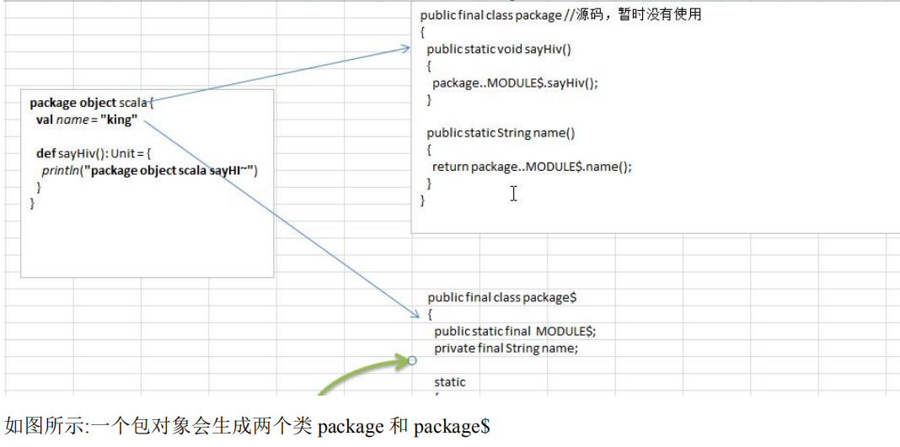

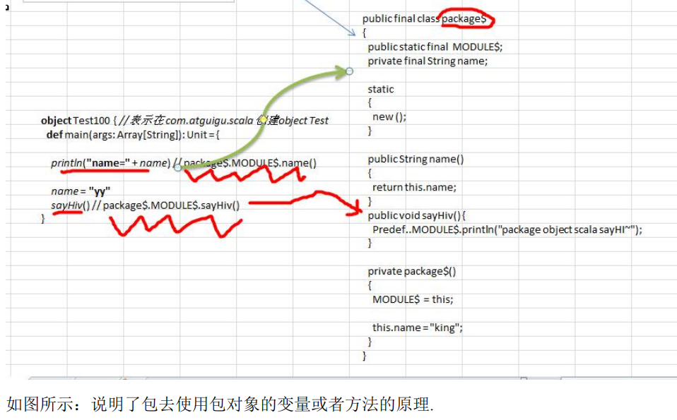

1) 当创建包对象后，在该包下生成 public final class package 和 public final class 

package$ 

2) 通过 package$ 的一个静态实例完成对包对象中的属性和方法的调用。[java模拟] 

```scala
public class Temp100 { 
    public static void main(String[] args) {
        System.out.println(package$$.MODULE$.name()); 
        package$$.MODULE$.sayOk(); 
    }
} 

final class package$$ { 
    public static final package$$ MODULE$; 
    private final String name = "ok"; 
    static  {
        MODULE$ = new package$$();
            } 
public void sayOk() { 
    System.out.println("scala pkg obj sayok");
} 

public String name() {
    return this.name; 
} 
}
```


### 7.1.14 **包对象的注意事项** 

1) 每个包都可以有一个包对象。你需要在父包中定义它。如图： 

2) 包对象名称需要和包名一致，一般用来对包的功能补充

## 7.2 **包的可见性** 

### 7.2.1 **回顾-Java**访问修饰符基本介绍

java提供**四种访问控制修饰符号**控制方法和变量的访问权限（范围）: 

1) 公开级别:用public 修饰,对外公开 

2) 受保护级别:用protected修饰,对子类和同一个包中的类公开 

3) 默认级别:没有修饰符号,向同一个包的类公开. 

4) 私有级别:用**private**修饰,只有类本身可以访问,不对外公开.l 


### 7.2.2 **回顾-Java中4种访问修饰符的访问范围** 

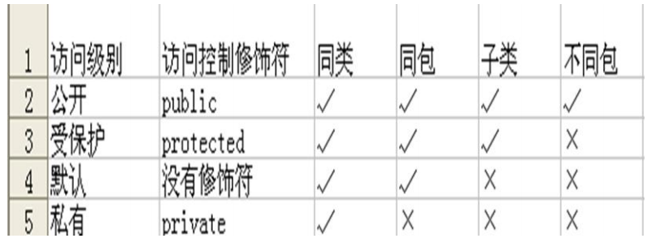


### 7.2.3 **回顾-Java访问修饰符使用注意事项** 

1) 修饰符可以用来修饰类中的**属性**，成员方法以及**类** 

2) 只有**默认**的和**public**才能修饰类！并且遵循上述访问权限的特点。


### 7.2.4 **Scala中包的可见性介绍:** 

在Java中，访问权限分为: public，private，protected和默认。**在Scala中**，你可以通过类似的修饰符达到同样的效果。但是**使用上有区别**。 

```scala
object Testvisit { 
    def main(args: Array[String]): Unit = { 
        val c = new Clerk() 
        c.showInfo() 
        Clerk.test(c) 
    }
} 
class Clerk { 
    var name : String = "jack" 
    private var sal : Double = 9999.9 
    def showInfo(): Unit = { 
        println(" name " + name + " sal= " + sal) 
    }
} 
object Clerk{ 
    def test(c : Clerk): Unit = { 
        //这里体现出在伴生对象中，可以访问c.sal 
        println("test() name=" + c.name + " sal= " + c.sal) 
    }
}
```


### 7.2.5 **Scala中包的可见性和访问修饰符的使用** 

1) 当属性访问权限为默认时，从底层看属性是private的，但是因为提供了 **xxx_$eq()**[类似setter]/**xxx()**[类似getter] 方法，因此从使用效果看是任何地方都可以访问) 

2) 当方法访问权限为默认时，**默认为public访问权限** 

3) private为私有权限，只在**类的内部**和**伴生对象**中可用 【案例演示】 

**4) protected为受保护权限，**scala中受保护权限比Java中更严格，只能子类访问，同包无法访问 (编译器) 

5) 在scala中没有public关键字,即**不能用public显式的修饰属性和方法**。【案演】

**6)** **包访问权限（表示属性有了限制。同时包也有了限制），这点和Java不一样，** **体现出Scala包使用的灵活性。**[案例演示] 

> package com.atguigu.scala 
>
> class Person { 
>
> private**[scala]** val pname="hello" // 增加包访问权限后，1.private同时起作用。不仅同 
>
> 类可以使用 2. 同时com.atguigu.scala中包下其他类也可以使用 
>
> }
>
> 当然，也可以将可见度延展到上层包 
>
> private[**atguigu**] val description="zhangsan" 
>
> 说明：private也可以变化，比如protected[atguigu], 非常的灵活。 
>
> 

## 7.3 包的引用

### 7.3.1 **Scala引入包基本介绍** 

Scala引入包也是使用import, 基本的原理和机制和Java一样，但是Scala中的import功**能更加强大，也更灵活**。 

因为Scala语言源自于Java，所以**java.lang**包中的类会自动引入到当前环境中，而Scala中的**scala**包和**Predef**包的类也会自动引入到当前环境中，即起其下面的类可以直接使用。 

如果想要把其他包中的类引入到当前环境中，需要使用import语言


### 7.3.2  **Scala引入包的细节和注意事项** 

1) 在Scala中，import语句可以出现在任何地方，并不仅限于文件顶部，import语句的作用一直延伸到包含该语句的块末尾。这种语法的好处是：**在需要时在引入包，缩小import** **包的作用范围，提高效率**。 

2) Java中如果想要导入包中所有的类，可以通过通配符*，Scala中采用下 _ [案例演示]

class User { 

**import scala.beans.BeanProperty** 

@BeanProperty var name : String = "" 

}

class Dog { 

@BeanProperty var name : String = "" //可以吗? 

}

3) 如果不想要某个包中全部的类，而是其中的几个类，可以采用**选取器**(大括号) 

def test(): Unit = { 

**import scala.collection.mutable.****{HashMap, HashSet}** 

var map = new HashMap() 

var set = new HashSet() 

}

4) 如果引入的多个包中含有相同的类，那么可以将不需要的类进行重命名进行区分，这个就是**重命名**。【案例演示+小结】 

5) 如果某个冲突的类根本就不会用到，那么这个类可以直接**隐藏**掉。[案例演示] 

import java.util.{ **HashMap=>JavaHashMap**, List} 

import scala.collection.mutable._ 

var map = new HashMap() // 此时的HashMap指向的是scala中的HashMap 

var map1 = new **JavaHashMap**(); // 此时使用的java中hashMap的别名 

import java.util.{ **HashMap=>_**, _} // 含义为 引入java.util包的所有类，但是忽略 

HahsMap类. 

var map = new HashMap() // 此时的HashMap指向的是scala中的HashMap, 而且 

idea工具，的提示也不会显示java.util的HashMaplel 

## 7.4 **面向对象编程方法-抽象** 

**如何理解抽象** 

我们在前面去定义一个类时候，实际上就是把一类事物的共有的**属性和行为提取出来**，形成一个物理模型(模板)。这种**研究问题的方法称为抽象**。[见后面ppt] 

**银行账号1**

**银行账号2** 

**银行账号3** 

**银行账号n** 

不管是哪种账号, 是谁的账号 

属性： 

账号，余额，密码 

方法

查询 取款 存款 

**账号类** 

**Account**l 

## 7.5 **面向对象编程三大特征** 

### 7.5.1 **基本介绍** 

面向对象编程有三大特征：**封装**、**继承**和**多态**。 

下面我们一一为同学们进行详细的讲解。l 


### 7.5.2 **封装介绍** 

封装(encapsulation)就是把抽象出的**数据和对数据的操作**封装在一起,数据被保护在内部,程序的其它部分只有通过**被授权的操作**(成员方法),才能对数据进行操作。


### 7.5.3 **封装的理解和好处** 

1) 隐藏实现细节 

2) 提可以对**数据进行验证**，保证**安全**合理 

3）同时可以加入业务逻辑

### 7.5.4 **如何体现封装** 

1) 对类中的属性进行封装 

2) 通过成员方法，包实现封装l 


### 7.5.5 **封装的实现步骤** 

1) 将属性进行私有化 

2) 提供一个公共的set方法，用于对属性判断并赋值 

def setXxx(参数名 : 类型) : Unit = { 

//加入数据验证的业务逻辑 

属性 = 参数名 

} 

3) 提供一个公共的get方法，用于获取属性的值 

def getXxx() [: 返回类型] = { 

return 属性 

}


### 7.5.6 **快速入门案例** 

Ø **看一个案例** 

那么在Scala中如何实现这种类似的控制呢? 请大家看一个小程序(TestEncap.scala),不能随便查看**人**的年龄,工资等隐私， 

并对输入的年龄进行合理的验证[要求1-120之间]。 

```scala
class Person { 
    var name: String = _ 
    //var age ; //当是public时，可以随意的进行修改，不安全 
    private var age: Int = _ 
    private var salary: Float = _ 
    private var job: String = _ 
} 
//案例演示 
def setAge(age: Int): Unit = { 
    if (age >= 0 && age <= 120) { 
        this.age = age 
    } else { 
        println("输入的数据不合理"); 
        //可考虑给一个默认值 
        this.age = 20 
    }
}
```


**课堂练习(**学员做, 较简单**)** 

创建程序,在其中定义两个类：Account和AccountTest类体会Scala的封装性。 

1) Account类要求具有属性：姓名（长度为2位3位或4位）、余额(必须>20)、 密码（必须是六位） 

2) 通过setXxx的方法给Account 的属性赋值。 

3) 完成转账的功能. 

4) 在AccountTest中测试 

提示知识点： 

var name : String = “” 

var len = name.length() //*按照字符的个数统计的*l 


### 7.5.7 **Scala封装的注意事项和细节** 

前面讲的Scala的封装特性，大家发现和Java是一样的，下面我们看看Scala封装还有哪些特点。 

**1) Scala中为了简化代码的开发**，当声明属性时，本身就自动提供了对应setter/getter 方法，如果属性声明为private的，那么自动生成的setter/getter方法也是private的， 如果属性省略访问权限修饰符，那么自动生成的setter/getter方法是public的[案例反编译+说明] 

```scala
class Cat(inAge:Int) { 
    private var age: Int = 0 
    var name: String = "" 
    private val age2: Int = 0 
    val name2: String = "" 
}
```

**2) 因此我们如果只是对一个属性进行简单的set和get** **，只要声明一下该属性(属性使用默认访问修饰符) **不用写专门的getset，默认会创建，访问时，直接对象.变量。

**这样也是为了保持访问一致性 [**案例**]** 

3) 从形式上看 dog.food 直接访问属性，其实底层仍然是**访问的方法**, 看一下反编译的代码就明白 

4) 有了上面的特性，目前很多新的框架，在进行反射时，也支持对属性的直接反射


## 7.6 面向对象编程-继承

### 7.6.1 **Java继承的简单回顾** 

**class** **子类名** **extends** **父类名** **{** **类体** **}** 

子类继承父类的属性和方法 

### 7.6.2 **继承基本介绍和示意图** 

**继承**可以**解决代码复用**,让我们的编程更加靠近人类思维.当**多个类存在相同的属性**(变量)和**方法时**,可以从这些类中抽象出父类(比如Student),在父类中定义这些相同的属性和方法，所有的子类不需要重新定义这些属性和方法，只需要通过extends语句来声明继承父类即可。 

和Java一样，Scala也支持类的单继承

画出继承的示意图

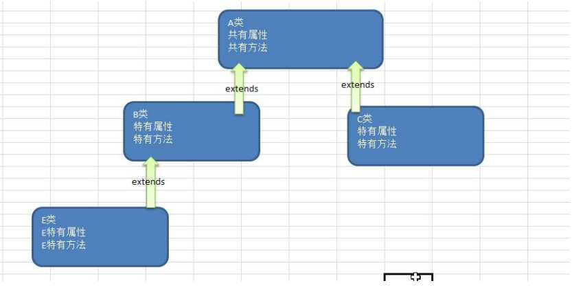


### 7.6.3 **Scala继承的基本语法** 

**class** **子类名** **extends** **父类名** **{** **类体** **}** 


### 7.6.4 **Scala继承快速入门** 

Ø 编写一个Student 继承 Person的案例，体验一下Scala继承的特点 

```scala
package com.atguigu.chapter07.myextends
object Extends01 {
    def main(args: Array[String]): Unit= {
        //使用
        val student = new Student
        student.name = "jack"//调用了student.name()//调用到从Person继承的name()
        student.studying()
        student.showInfo()
}

class Person { 
    var name : String = _ 
    var age : Int = _ 
    def showInfo(): Unit = { 
        println("学生信息如下：") 
        println("名字：" + this.name) 
    } 
}

class Student extends Person { 
    def studying(): Unit = { 
        println(this.name + "学习 scala中....") 
    } 
}
```


### 7.6.5 **Scala继承给编程带来的便利** 

1) 代码的复用性提高了 

2) 代码的扩展性和维护性提高了【面试官问:当我们修改父类时，对应的子类就会继承相应的方法和属性】 

### 7.6.6 **scala子类继承了什么,怎么继承了?** 

子类继承了**所有的属性**，只是私有的属性不能直接访问，需要**通过公共的方法**去访问【**debug**代码验证可以看到】 

```scala
package com.atguigu.chapter07.myextends
//说明
//1．在scala中，子类继承了父类的所有属性
//2.但是private的属性和方法无法访问
object Extends02{
    def main(args: Array[ String]): Unit = {
        val sub = new Sub()
        sub.sayOk()
    }
}
//父类(基类)
class Base {
    var n1: Int= 1 //public n10 , public n1_Seq()
    protected var n2: Int = 2
    private var n3: Int= 3 //private n3() , private n3_Seq0
    
    def test 100(): Unit= {//默认 public test1000
        println("base 100")
        }
    protected def test200(): Unit = {//?
        println("base 200")
    }
    private def test300(): Unit = { //private 
        println("base 300")
    }
}
//Sub 继承 Base
class Sub extends Base {
    def sayOk(): Unit= {
        this.n1 = 20 //这里访问本质this.n1_Seq()
        this.n2= 40
        println("范围"+this.nl + this.n2)
        test1000() //
        test2000()//
    }
}
```

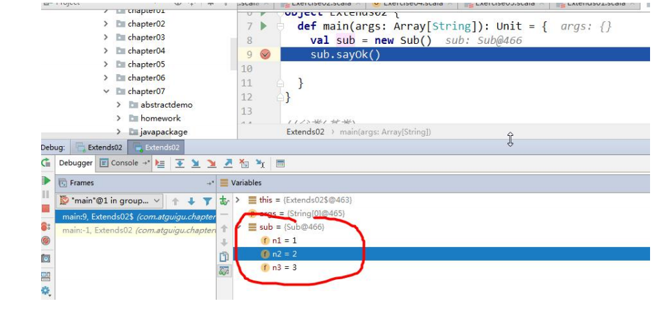

### 7.6.7 **重写方法** 

说明: scala明确规定，重写一个非抽象方法需要用**override**修饰符，调用超类的方法使用**super**关键字 【案例演示+反编译+注释】 

```scala
package com.atguigu.chapter07.myextends 
object MethodOverride01 {
    def main(args: Array[String]): Unit = {
        val emp = new Emp100
        emp.printName()
    }
}
//Person类
class Person { 
    var name : String = "tom" 
    def printName() { 
        println("Person printName() " + name) 
    }
    def sayHi():Unit = {
        println("sayHi...")
    }
} 
//这里我们继承Person
class Emp extends Person { 
    //这里需要显式的使用override 
    override def printName() { 
        println("Emp printName() " + name) 
        //在子类中调用父类的方法，需要使用super
        super.printName() 
        sayHi()
    }
}
```


### 7.6.8 **Scala中类型检查和转换** 

Ø **基本介绍** 

要测试某个对象是否属于某个给定的类，可以用**isInstanceOf**方法。用**asInstanceOf**方法将引用转换为子类的引用。classOf获取对象的类名。 

1) classOf[String]就如同Java的 String.class 。 

2) obj.isInstanceOf[T]就如同Java的obj.instanceof  T **判断obj是不是T类型**。 

3) obj.asInstanceOf[T]就如同Java的(T)obj **将obj强转成T类型**。 

前面案例基础演示+文档 

```scala
package com.atguigu.chapter07.myextends
object TypeConvert {
    def main(args: Array[String]): Unit = {
        //ClassOf的使用,可以得到类名
        println(classOf[String])//输出
        val s = "king"
        println(s.getClass.getName)//使用反射机制
        //isInstanceOf asInstanceOf
        var pl =new Person200
        var emp = new Emp200
        //将子类引用给父类(向上转型,自动)
        pl = emp
        //将父类的引用重新转成子类引用(多态),即向下转型
        var emp2 = pl.asInstanceOf[Emp200]
        emp2.sayHello()
    }
}
//Person类
class Person200 {
    var name: String = "tom"
    def printName(){//输出名字
        println("Person printName() " + name)
    }
    def sayHi(): Unit= {
        println("sayHi...")
    }
}
//这里我们继承 Person
class Emp200 extends Person200 {
    //这里需要显式的使用override
    override def printName() {
        println("Emp printName() " + name)
        //在子类中需要去调用父类的方法,使用super
        super.printName()
        sayHi()
    }
    def sayHello(): Unit = {
    }
}
```


Ø **最佳实践** 

类型检查和转换的最大价值在于：可以判断传入对象的类型，然后转成对应的子类对象，进行相关操作，这里也体现出**多态**的特点。【案例演示】 

 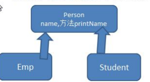

```scala
package com.atguigu.chapter07.myextends
object TypeConvertCase {
    def main(args: Array[ String]): Unit = {
        val stu = new Student400
        val emp = new Emp400
        test(stu) //
        test(emp)
    }
    
//写了一个参数多态代码
//因为在 oop中一个父类的引用可以接收所有子类的引用,多态(参数多态)
    def test(p:Person400): Unit= {
        //使用Scala中类型检查和转换
        if(p.isInstanceOfEmp400]) {
            //判断
            //p.asInstanceOf[Emp400],对p的类型没有任何变化，而是返回的是Emp400
            p.asInstanceOf[Emp400].showInfo()
        }else if(p.isInstanceOf[Student400]) {
            p.asInstanceOf[Student400].cry()
        }else {
            printIn("转换失败")
        }
    }
}

class Person400 {
    def printName(): Unit= {
        println("Person400 printName")
    }
    def sayOk(): Unit= {
        println("Person400 sayOk")
    }
}

class Student400 extends Person400 {
    val stuld = 100
    override def printName(): Unit ={
        printIn("Student400 printName")
    }
    def cry(): Unit = {
        println("学生的id="+this.stuld)
    }
}

class Emp400 extends Person400 {
    val empld = 800
    override def printName(): Unit = {
        printIn("Emp400 printName")
    }
    def showln fo(): Unit= {
        println("雇员的id="+this.empld))
    }
}
```


### 7.6.9 **Scala中超类的构造** 

Ø 回顾-Java中超类的构造

**说明：** 

从代码可以看出：在Java中，创建子类对象时，子类的构造器总是去调用一个父类的构造器(显式或者隐式调用)。 

```scala
pack age com.atguigu.chapter07.myextends;
public class JavaBaseConstractor{
    public static void main(String[]args){
        //1.A()
        //2.B()
        B b= new B();
        //1.A(String name)jack
        //2.B(String name)jack
        B b2 = new B("jack ");
    }
}

class A { 
    public A(){ 
        System.out.println("A()"); 
    }
    public A(String name) { 
        System.out.println("A(String name)" + name); 
    } 
} 

class B extends A{ 
    public B() { 
        //这里会隐式调用super(); 就是无参的父类构造器A() 
        System.out.println("B()"); 
    }
    public B(String name) { 
        super(name); 
        System.out.println("B(String name)" + name); 
    } 
}
```


### 7.6.10 **Scala**超类的构造说明

1) 类有一个主构器和任意数量的辅助构造器，而每个辅助构造器都必须先调用主构造器(也可以是间接调用.)，这点在前面我们说过了。 

```scala
package com.atguigu.chapter07.myextends
object ScalaBaseConstrator {
    def main(args: Array[String]): Unit = {
        //分析一下他的执行流程 
        //1.因为 scala 遵守先构建父类部分 extends Person700()
        //2.Person...
        val emp = new Emp700() 
        //分析一下他的执行流程
        //1.因为 scala 遵守先构建父类部分 extends Person700() 
        //2.Person... 
        //3.Emp .... (Emp700 的主构造器)
        println("=====================")
        val emp2 = new Emp700("mary")
        println("**************************") 
        //分析执行的顺序
        //1.Person... 
        //2.默认的名字
        //3.Emp .... 
        //4.Emp 辅助构造器~ 
        val emp3 = new Emp700("smith") 
    } 
}
//父类
Person class Person700(pName:String) { 
    var name = pName 
    println("Person...") 
    def this() { 
        this("默认的名字")
        println("默认的名字")
    } 
}
//子类 Emp 继承 Person 
class Emp700() extends Person700() {
    println("Emp ....")
    //辅助构造器 
    def this(name: String) {
        this // 必须调用主构造器
        this.name = name
        println("Emp 辅助构造器~")
    } 
} 
```

2) 只有**主构造器可以调用父类的构造器**。辅助构造器不能直接调用父类的构造器。在Scala的构造器中，你不能调用super(params) 【案例演示+反编译】 

```scala
class Person(name: String) { //父类的构造器 
}

class Emp (name: String) extends Person(name) {// 将子类参数传递给父类构造器,这种写法√
// super(name) (×)没有这种语法
    def this() {
        super("abc") // (×)不能在辅助构造器中调用父类的构造器
    }
}
```

代码： 

```scala
package com.atguigu.chapter07.myextends 
object ScalaBaseConstrator { 
    def main(args: Array[String]): Unit = { 
        //分析一下他的执行流程 
        //1.因为 scala 遵守先构建父类部分 extends Person700() 
        //2.Person... 
        //val emp = new Emp700() 
        //分析一下他的执行流程 
        //1.因为 scala 遵守先构建父类部分 extends Person700() 
        //2.Person... 
        //3.Emp .... (Emp700 的主构造器) 
        println("=====================") 
        val emp2 = new Emp700("mary") 
        println("**************************") 
        //分析执行的顺序 
        //1.Person... 
        //2.默认的名字 
        //3.Emp .... 
        //4.Emp 辅助构造器~ 
        val emp3 = new Emp700("smith") 
        println("%%%%%%%%%%%%%%%%%%%%%%%%%%%%%%%%") 
        //再测试一把 
        //Person.. , name= "terry" 
        //Emp .... 
        val emp4 = new Emp700("terry", 10) 
        emp4.showInfo() // 雇员的名字 terry 
    } 
}

//父类 Person 
class Person700(pName:String) { 
    var name = pName 
    println("Person...") 
    def this() { 
        this("默认的名字") 
        println("默认的名字") 
    } 
}

//子类 Emp 继承 Person 
class Emp700(eName:String,eAge:Int) extends Person700(eName) { 
    println("Emp ....") 
    //辅助构造器 
    def this(name: String) { 
        this(name,100) // 必须调用主构造器 
        this.name = name 
        println("Emp 辅助构造器~") 
    }
    def showInfo(): Unit = { 
        println("雇员的名字 ", name) 
    }
} 
```


### 7.6.11 覆写字段 

 基本介绍 

在 Scala 中，**子类改写父类的字段，我们称为覆写/重写字段**。覆写字段需使用 override 修饰。 

 回顾：在 Java 中**只有方法的重写**，**没有属性/字段的重写**，准确的讲，是**隐藏字段代替了重写**。参考：Java 中为什么字段不能被重写.doc [字段隐藏案例]。 

 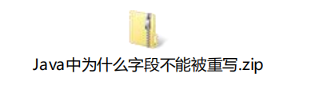

 回顾-Java 另一重要特性: 动态绑定机制 

动态绑定的机制： 

//java 的动态绑定机制的小结 

1.如果调用的是方法，则 Jvm 机会将该方法和对象的内存地址绑定 

2.如果调用的是一个属性，则没有动态绑定机制，在哪里调用，就返回对应值 

```scala
package com.atguigu.chapter07.myextends; 
public class JavaDaynamicBind { 
    public static void main(String[] args) { 
        //将一个子类的对象地址，交给了一个 AA(父类的)引用 
        //java 的动态绑定机制的小结 
        //1.如果调用的是方法，则 Jvm 机会将该方法和对象的内存地址绑定
        //2.如果调用的是一个属性，则没有动态绑定机制，在哪里调用，就返回对应值 
        AA obj = new BB(); 
        System.out.println(obj.sum()); //40 //? 30 
        System.out.println(obj.sum1()); //30 //? 20 
    } 
}

class AA { 
    public int i = 10; 
    public int sum() { 
        return getI() + 10; 
    }
    public int sum1() { 
        return i + 10; 
    }
    public int getI() { 
        return i; 
    } 
}

class BB extends AA { 
    public int i = 20; 
    // public int sum() { 
    // return i + 20; 
    // }
    public int getI() { 
        return i; 
    } 
    // public int sum1() { 
    // return i + 10; 
    // } 
}
```


 Scala 覆写字段快速入门 

我们看一个关于覆写字段的案例。【案例演示+分析+反编译】 

```scala
package com.atguigu.chapter07.myextends 
object ScalaFiledOverride { 
    def main(args: Array[String]): Unit = { 
        val obj1: AAA = new BBB 
        val obj2: BBB = new BBB 
        //obj1.age => obj1.age() //动态绑定机制
        //obj2.age => obj2.age() 
        println("obj1.age=" + obj1.age + "\t obj2.age=" + obj2.age) 
    } 
}
class AAA { 
    val age: Int = 10 // 会生成 public age() 
}
class BBB extends AAA { 
    override val age: Int = 20 // 会生成 public age() 
} 
```


反编译后的代码： 

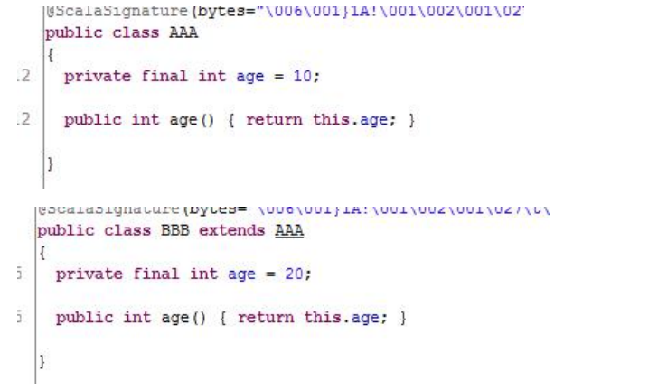

 覆写字段的注意事项和细节 

1) def 只能重写另一个 def(即：方法只能重写另一个方法) 

2) val 只能重写另一个 val 属性 或 重写不带参数的 def [案例+分析] 

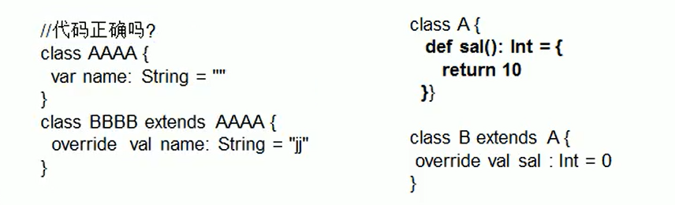

案例 1（val 只能重写另外一个 val 属性） 

```scala
package com.atguigu.chapter07.myextends 
object ScalaFiledOverride { 
    def main(args: Array[String]): Unit = { 
        val obj1: AAA = new BBB
        val obj2: BBB = new BBB 
        //obj1.age => obj1.age() //动态绑定机制 
        //obj2.age => obj2.age() 
        println("obj1.age=" + obj1.age + "\t obj2.age=" + obj2.age) 
    } 
}

//如果 val age 改成 var 报错 
class AAA { 
    val age: Int = 10 // 会生成 public age() 
}

class BBB extends AAA { 
    override val age: Int = 20 // 会生成 public age() 
} 
```


案例 2(重写**不带参数的** **def** ) 

```scala
package com.atguigu.chapter07.myextends 
object ScalaFieldOverrideDetail02 { 
    def main(args: Array[String]): Unit = { 
        println("xxx") 
        val bbbbb = new BBBBB() 
        println(bbbbb.sal) // 0 
        val b2:AAAAA = new BBBBB() 
        println("b2.sal=" + b2.sal()) // 0
    } 
}

class AAAAA { 
    def sal(): Int = { 
        return 10 
    }
} 

class BBBBB extends AAAAA { 
    override val sal : Int = 0 //底层 public sal 
} 
```


3) var 只能重写另一个抽象的 var 属性 

```scala
package com.atguigu.chapter07.myextends 
object ScalaFieldOverrideDetail03 { 
    def main(args: Array[String]): Unit = { 
        println("hello~") 
    } 
}
//在 A03 中，有一个抽象的字段(属性) 
//1. 抽象的字段(属性):就是没有初始化的字段(属性) 
//2. 当一个类含有抽象属性时，则该类需要标记为 abstract 
//3. 对于抽象的属性，在底层不会生成对应的属性声明，而是生成两个对应的抽象方法(name name_$eq) 
abstract class A03 { 
    var name : String //抽象 
    var age: Int = 10
}

class Sub_A03 extends A03 { 
//说明 
//1. 如果我们在子类中去重写父类的抽象属性，本质是实现了抽象方法 
//2. 因此这里我们可以写 override ，也可以不写 
override var name : String = "" 
}
```


 抽象属性：声明未初始化的变量就是抽象的属性,抽象属性在抽象类 

 var 重写抽象的 var 属性小结 

1) 一个属性没有初始化，那么这个属性就是抽象属性 

2) 抽象属性在编译成字节码文件时，属性并不会声明，但是会自动生成抽象方法，所以类必须声明为抽象类 

3) 如果是覆写一个父类的抽象属性，那么 override 关键字可省略 [原因：父类的抽象属性，生成的是抽象方法，因此就不涉及到方法重写的概念，因此 override 可省略] 

### 7.6.12 抽象类 

 基本介绍 

在 Scala 中，通过 abstract 关键字标记不能被实例化的类。方法不用标记 abstract，只要省掉方法体即可。抽象类可以拥有抽象字段，抽象字段/属性就是没有初始值的字段 

 快速入门案例

我们看看如何把 Animal 做成抽象类, 包含一个抽象的方法 cry() 案例的演示 

```scala
package com.atguigu.chapter07.myextends 
object AbstractDemo01 { 
    def main(args: Array[String]): Unit = { 
        println("xxx") 
    } 
}

//抽象类 
abstract class Animal{ 
    var name : String //抽象的字段 
    var age : Int // 抽象的字段 
    var color : String = "black" //普通属性 
    def cry() //抽象方法,不需要标记 abstract 
} 
```


### 7.6.13 Scala 抽象类使用的注意事项和细节讨论 

1) 抽象类不能被实例 

//默认情况下，一个抽象类是不能实例化的，但是你实例化时，动态的实现了抽象类的所有抽象方法，也可以先,如下 

```scala
val animal = new Animal03 {
    override def sayHello(): Unit = { 
        println("say hello~~~~") 
    } 
}
animal.sayHello() 
```

2) 抽象类不一定要包含 abstract 方法。也就是说,抽象类可以没有 abstract 方法 

```scala
abstract class Animal02 { 
    //在抽象类中可以有实现的方法 
    def sayHi (): Unit = { 
        println("xxx") 
    } 
} 
```

3) 一旦类包含了抽象方法或者抽象属性,则这个类必须声明为 abstract 

4) 抽象方法不能有主体，不允许使用 abstract 修饰 

5) 如果一个类继承了抽象类，则它必须实现抽象类的所有抽象方法和**抽象属性**，除非它自己也声明为 abstract 类 

```scala
abstract class Animal03 { 
    def sayHello() 
    var food: String 
}

class Dog extends Animal03 {
    override def sayHello(): Unit = { 
        println("小狗汪汪叫！") 
    }
    override var food: String = _ 
} 
```

6) 抽象方法和抽象属性不能使用 private、final 来修饰，因为这些关键字都是和重写/实现相违背的 

7) 抽象类中可以有实现的方法. 

8) 子类重写抽象方法不需要 override，写上也不会错. 

### 7.6.14 匿名子类 

 基本介绍 

和 Java 一样，可以通过包含带有定义或重写的代码块的方式创建一个匿名的子类. 

 java 中的匿名子类使用的回顾 

```scala
package com.atguigu.chapter07.myextends; 
public class NoNameDemo01 { 
    public static void main(String[] args) { 
        //在 java 中去创建一个匿名子类对象 
        A2 a2 = new A2() { 
            @Override 
            public void cry() {
                System.out.println("cry..."); 
            } 
        }; 
        a2.cry(); 
    } 
}

abstract class A2 { 
    abstract public void cry(); 
}
```

 scala 匿名子类案例 

```scala
package com.atguigu.chapter07.myextends 
object ScalaNoNameDemo02 { 
    def main(args: Array[String]): Unit = { 
        val monster = new Monster { 
            override def cry(): Unit = { 
                println("妖怪嗷嗷叫...:)") 
            }
            override var name: String = _ 
        }
        monster.cry() 
    }
}

abstract class Monster { 
    var name: String 
    def cry() 
} 
```


### 7.6.15 继承层级 

 Scala 继承层级一览图

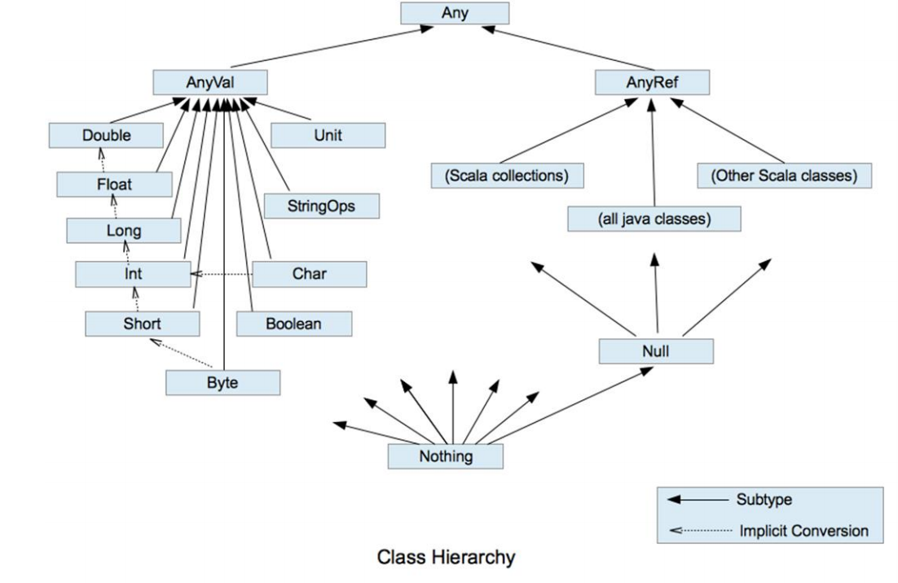

 对上图的一个小结 

1) 在 scala 中，所有其他类都是 AnyRef 的子类，类似 Java 的 Object。 

2) AnyVal 和 AnyRef 都扩展自 Any 类。Any 类是根节点 

3) Any 中定义了 isInstanceOf、asInstanceOf 方法，以及哈希方法等。 

4) Null 类型的唯一实例就是 null 对象。可以将 null 赋值给任何引用，但不能赋值给值类型的变量 [案例演示]。 

5) Nothing 类型没有实例。它对于泛型结构是有用处的，举例：空列表 Nil 的类型是 List[Nothing]， 它是 List[T]的子类型，T 可以是任何类


## 7.7 面向对象编程作业尚硅谷 

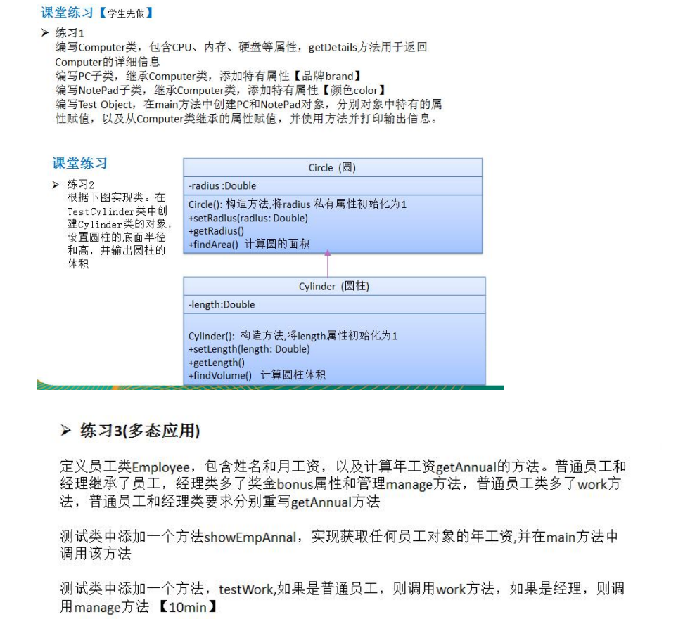

# 第 8 章 面向对象编程(高级特性) 

## 8.1 静态属性和静态方法 

### 8.1.1静态属性-提出问题 

提出问题的主要目的就是让大家思考解决之道，从而引出我要讲的知识点. 

说：有一群小孩在玩堆雪人,不时有新的小孩加入,请问如何知道现在共有多少人在玩?**请使用面向对象的思想**，编写程序解决。 

### 8.1.2基本介绍 

 Scala 中静态的概念-伴生对象 

Scala 语言是完全面向对象(万物皆对象)的语言，所以并没有静态的操作(即在 Scala 中没有静态的概念)。但是为了能够和 Java 语言交互(因为 Java 中有静态概念)，就产生了一种特殊的对象来模拟类对象，我们称之为类的伴生对象。这个类的所有静态内容都可以放置在它的伴生对象中声明和调用 

### 8.1.3伴生对象的快速入门

```scala
package com.atguigu.chapter08 
object AccompanyObject { 
    def main(args: Array[String]): Unit = { 
        println(ScalaPerson.sex) //true 在底层等价于 ScalaPerson$.MODULE$.sex() 
        ScalaPerson.sayHi()//在底层等价于 ScalaPerson$.MODULE$.sayHi() 
    } 
}

//说明 
//1. 当在同一个文件中，有 class ScalaPerson 和 object ScalaPerson 
//2. class ScalaPerson 称为伴生类,将非静态的内容写到该类中 
//3. object ScalaPerson 称为伴生对象,将静态的内容写入到该对象(类) 
//4. class ScalaPerson 编译后底层生成 ScalaPerson 类 ScalaPerson.class 
//5. object ScalaPerson 编译后底层生成 ScalaPerson$类 ScalaPerson$.class 
//6. 对于伴生对象的内容，我们可以直接通过 ScalaPerson.属性 或者方法 
//伴生类 

class ScalaPerson { // 
    var name : String = _ 
}

//伴生对象 
object ScalaPerson { // 
    var sex : Boolean = true
    def sayHi(): Unit = { 
        println("object ScalaPerson sayHI~~") 
    } 
}
```


 对快速入门案例的源码剖析 

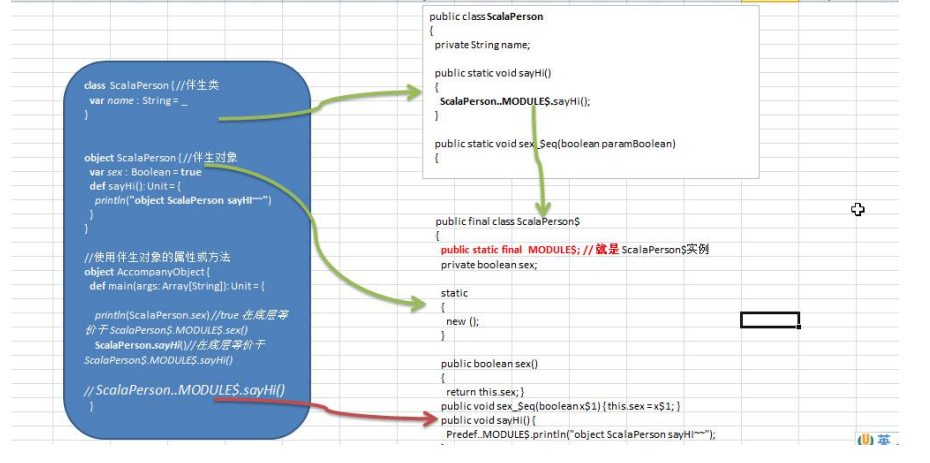

### 8.1.4伴生对象的小结 

1) Scala 中伴生对象采用 object 关键字声明，伴生对象中声明的全是 "静态"内容，可以通过伴生对象名称直接调用。 

2) 伴生对象对应的类称之为伴生类，伴生对象的名称应该和伴生类名一致。 

3) 伴生对象中的属性和方法都可以通过伴生对象名(类名)直接调用访问 

4) 从语法角度来讲，所谓的伴生对象其实就是类的静态方法和成员的集合 

5) 从技术角度来讲，scala 还是没有生成静态的内容，只不过是将伴生对象生成了一个新的类，实现属性和方法的调用。[反编译看源码]

6) 从底层原理看，伴生对象实现静态特性是依赖于 **public static final MODULE$** 实现的。 

7) 伴生对象的声明应该和伴生类的声明在同一个源码文件中(如果不在同一个文件中会运行错误!)，但是如果没有伴生类，也就没有所谓的伴生对象了，所以放在哪里就无所谓了。 

8) 如果 class A 独立存在，那么 A 就是一个类， 如果 object A 独立存在，那么 A 就是一个"静态"性质的对象[即类对象], 在 object A 中声明的属性和方法可以通过 A.属性 和 A.方法 来实现调用 

9) 当一个文件中，存在伴生类和伴生对象时，文件的图标会发生变化 


### 8.1.5最佳实践-使用伴生对象完成小孩玩游戏 

如果,设计一个 var total Int 表示总人数,我们在创建一个小孩时，就把 total 加 1,并且 total 是所有对象共享的就 ok 了!，我们使用伴生对象来解决 

画一个小图给大家理解。 

```scala
package com.atguigu.chapter08 
object ChildJoinGame { 
    def main(args: Array[String]): Unit = { 
        //创建三个小孩 
        val child0 = new Child02("白骨精")
        val child1 = new Child02("蜘蛛精") 
        val child2 = new Child02("黄鼠狼精") 
        Child02.joinGame(child0) 
        Child02.joinGame(child1) 
        Child02.joinGame(child2) 
        Child02.showNum() 
    } 
}

class Child02(cName: String) { 
    var name = cName 
}

object Child02 { 
    //统计共有多少小孩的属性 
    var totalChildNum = 0 
    def joinGame(child: Child02): Unit = { 
        printf("%s 小孩加入了游戏\n", child.name) 
        //totalChildNum 加 1 
        totalChildNum += 1 
    }
    def showNum(): Unit = { 
        printf("当前有%d 小孩玩游戏\n", totalChildNum) 
    }
} 
```


### 8.1.6伴生对象-apply 方法 

在伴生对象中定义 apply 方法，可以实现： 类名(参数) 方式来创建对象实例. 

```scala
package com.atguigu.chapter08 
object ApplyDemo01 { 
    def main(args: Array[String]): Unit = { 
        val list = List(1, 2, 5) 
        println(list) 
        val pig = new Pig("小花") 
        //使用 apply 方法来创建对象 
        val pig2 = Pig("小黑猪") //自动 apply(pName: String) 
        val pig3 = Pig() // 自动触发 apply() 
        println("pig2.name=" + pig2.name) //小黑猪 
        println("pig3.name=" + pig3.name) //匿名猪猪 
    } 
}

//案例演示 apply 方法. 
class Pig(pName:String) { 
    var name: String = pName
}

object Pig { 
    //编写一个 apply 
    def apply(pName: String): Pig = new Pig(pName) 
    def apply(): Pig = new Pig("匿名猪猪") 
} 
```


### 8.1.7课后练习题 

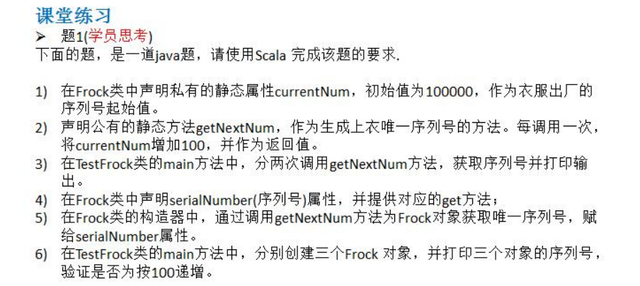

## 8.2 单例对象

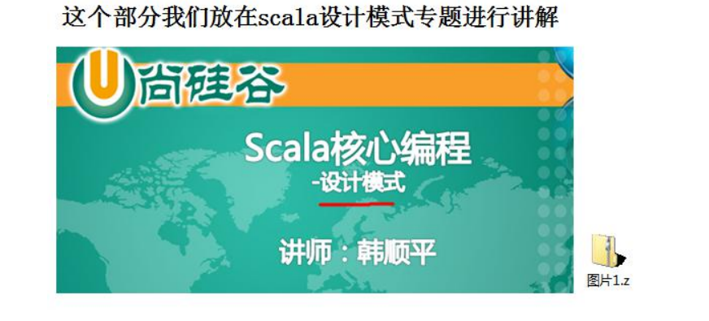

## 8.3 接口 

### 8.3.1回顾 Java 接口 

 声明接口 

interface 接口名 

 实现接口 

class 类名 implements 接口名 1，接口 2 

 java 接口的使用小结 

1) 在 Java 中, 一个类可以实现多个接口。 

2) 在 Java 中，接口之间支持多继承 

3) 接口中属性都是常量 

4) 接口中的方法都是抽象的

### 8.3.2Scala 接口的介绍 

1) 从面向对象来看，接口并不属于面向对象的范畴，Scala 是纯面向对象的语言，在 Scala 中，没有接口。 

2) Scala 语言中，采用特质 trait（特征）来代替接口的概念，也就是说，多个类具有相同的特征（特征）时，就可以将这个特质（特征）独立出来，采用关键字 trait 声明。理解 trait 等价于(interface + abstract class)

3) scala 继承特质(trait)的示意图 

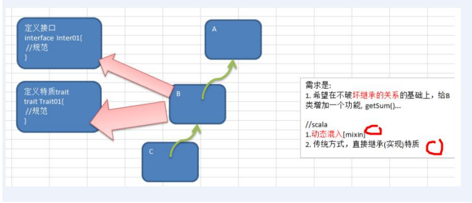

### 8.3.3trait 的声明 

trait 特质名 { 

trait 体 

} 

1) trait 命名 一般首字母大写.

Cloneable , Serializable 

object T1 extends Serializable { 

}

Serializable： 就是 scala 的一个特质。 

 在 scala 中，java 中的接口可以当做特质使用 

```scala
package com.atguigu.chapter08.mytrait 
object TraitDemo01 { 
    def main(args: Array[String]): Unit = { 
    } 
}

//trait Serializable extends Any with java.io.Serializable 
//在 scala 中，java 的接口都可以当做 trait 来使用(如上面的语法) 
object T1 extends Serializable { 
}
object T2 extends Cloneable { 
} 
```


### 8.3.4Scala 中 trait 的使用 

一个类具有某种特质（特征），就意味着这个类满足了这个特质（特征）的所有要素，所以在使用时，也采用了 extends 关键字，如果有多个特质或存在父类，那么需要采用 with 关键字连接 

1) 没有父类 

**class** **类名**     **extends**     **特质** **1**  **with**  **特质** **2**  **with**  **特质** **3** .. 

2) 有父类 

**class** **类名**  **extends**  **父类**  **with** **特质** **1**  **with**  **特质** **2**  **with** **特质** 3 

## 8.4 特质(trait) 

### 8.4.1特质的快速入门案例 

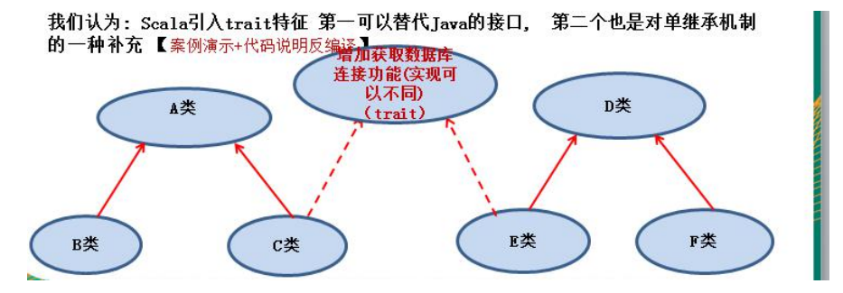

### 8.4.2代码完成 

```scala
package com.atguigu.chapter08.mytrait 
object TraitDemo02 { 
    def main(args: Array[String]): Unit = { 
        val c = new C() 
        val f = new F() 
        c.getConnect() // 连接 mysql 数据库...
        f.getConnect() // 连接 oracle 数据库.. 
    } 
}

//按照要求定义一个 trait 
trait Trait01 { 
    //定义一个规范 
    def getConnect() 
}

//先将六个类的关系写出 
class A {} 
class B extends A {} 
class C extends A with Trait01{ 
    override def getConnect(): Unit = { 
        println("连接 mysql 数据库...") 
    } 
}

class D {} 
class E extends D {} 
class F extends D with Trait01 { 
    override def getConnect(): Unit = { 
        println("连接 oracle 数据库..") 
    } 
} 
```


### 8.4.3特质 trait 的再说明 

1) Scala 提供了特质（trait），特质可以同时拥有抽象方法和具体方法，一个类可以实现/继承多个特质。【案例演示+反编译】 

 代码说明 

```scala
package com.atguigu.chapter08.mytrait 
object TraitDemo03 { 
    def main(args: Array[String]): Unit = { 
        println("~~~~") 
        //创建 sheep 
        val sheep = new Sheep 
        sheep.sayHi() 
        sheep.sayHello() 
    } 
}

//当一个 trait 有抽象方法和非抽象方法时 
//1. 一个 trait 在底层对应两个 Trait03.class 接口 
//2. 还对应 Trait03$class.class Trait03$class 抽象类 
trait Trait03 { 
    //抽象方法 
    def sayHi()
    //实现普通方法 
    def sayHello(): Unit = { 
        println("say Hello~~") 
    } 
}

//当 trait 有接口和抽象类是 
//1.class Sheep extends Trait03 在底层 对应 
//2.class Sheep implements Trait03 
//3.当在 Sheep 类中要使用 Trait03 的实现的方法，就通过 Trait03$class 

class Sheep extends Trait03 { 
    override def sayHi(): Unit = { 
        println("小羊 say hi~~") 
    } 
}
```

 上面代码对应的底层的分析图

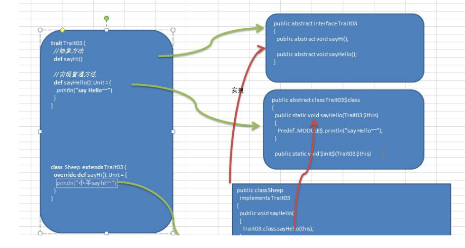

2) 特质中没有实现的方法就是抽象方法。类通过 extends 继承特质，通过 with 可以继承多个特质 

3) 所有的 java 接口都可以当做 Scala 特质使用 

### 8.4.4带有特质的对象，动态混入 

1) 除了可以在类声明时继承特质以外，还可以在构建对象时混入特质，扩展目标类的功能【反编译看动态混入本质】 

2) 此种方式也可以应用于对抽象类功能进行扩展 

3) 动态混入是 Scala 特有的方式（java 没有动态混入），可在不修改类声明/定义的情况下，扩展类的功能，非常的灵活，耦合性低 。 

4) 动态混入可以在不影响原有的继承关系的基础上，给指定的类扩展功能。[如何理解] 

5) 同时要注意动态混入时，如果抽象类有抽象方法，如何混入 

6) 案例演示 

```scala
package com.atguigu.chapter08.mixin 

object MixInDemo01 { 
    def main(args: Array[String]): Unit = { 
        //在不修改 类的定义基础，让他们可以使用 trait 方法 
        val oracleDB = new OracleDB **with** Operate3 //ocp 原则 
        oracleDB.insert(100) // 
        val mySQL = new MySQL3 with Operate3 
        mySQL.insert(200) 
        //如果一个抽象类有抽象方法，如何动态混入特质 
        val mySql_ = new MySQL3_ with Operate3 { 
            override def say(): Unit = { 
                println("say") 
            } 
        }
        mySql_.insert(999) 
        mySql_.say() 
    } 
}
trait Operate3 { //特质 
    def insert(id: Int): Unit = { //方法（实现） 
        println("插入数据 = " + id) 
    } 
}

class OracleDB { //空 
}

abstract class MySQL3 { //空 
}

abstract class MySQL3_ { //空 
    def say() 
}
```

 课堂练习：在 Scala 中创建对象共有几种方式？ 

1) new 对象 

2) apply 创建 

3) 匿名子类方式 

4) 动态混入 

### 8.4.5叠加特质 

 基本介绍 

构建对象的**同时如果混入多个特质，称之为叠加特质**，那么特质声明顺序从左到右，方法执行顺序从右到左。 

 叠加特质应用案例 

目的：分析叠加特质时，**对象的构建顺序**，**和执行方法的顺**序 

案例的代码： 

```scala
package com.atguigu.chapter08.mixin 

//看看混入多个特质的特点(叠加特质) 
object AddTraits { 
    def main(args: Array[String]): Unit = { 
        //说明 
        //1. 创建 MySQL4 实例时，动态的混入 DB4 和 File4 
        //研究第一个问题，当我们创建一个动态混入对象时，其顺序是怎样的 
        //总结一句话 
        //Scala 在叠加特质的时候，会首先从后面的特质开始执行(即从左到右) 
        //1.Operate4... 
        //2.Data4 
        //3.DB4 
        //4.File4 
        val mysql = new MySQL4 with DB4 with File4 
        println(mysql) 
        //研究第 2 个问题，当我们执行一个动态混入对象的方法，其执行顺序是怎样的 
        //顺序是，(1)从右到左开始执行 , (2)当执行到 super 时，是指的左边的特质 (3) 如果左边没有特质了，则 super 就是父特质
        //1. 向文件" 
        //2. 向数据库 
        //3. 插入数据 100 
        mysql.insert(100) 
    } 
}

trait Operate4 { //特点 
    println("Operate4...") 
    def insert(id: Int) //抽象方法 
}

trait Data4 extends Operate4 { //特质，继承了 Operate4 
    println("Data4") 
    override def insert(id: Int): Unit = { //实现/重写 Operate4 的 insert 
        println("插入数据 = " + id) 
    } 
}

trait DB4 extends Data4 { //特质，继承 Data4 
    println("DB4") 
    override def insert(id: Int): Unit = { // 重写 Data4 的 insert
        println("向数据库") 
        super.insert(id) 
    } 
}

trait File4 extends Data4 { //特质，继承 Data4 
    println("File4") 
    override def insert(id: Int): Unit = { // 重写 Data4 的 insert 
        println("向文件") 
        super.insert(id) //调用了 insert 方法(难点)，这里 super 在动态混入时，不一定是父类 
    } 
}
class MySQL4 {} //普通类 
```


 叠加特质注意事项和细节 

1) 特质声明顺序从左到右。 

2) Scala 在执行叠加对象的方法时，会首先从后面的特质(从右向左)开始执行 

3) Scala 中特质中如果调用 super，并不是表示调用父特质的方法，而是向前面（左边）继续查找特质，如果找不到，才会去父特质查找 

4) 如果想要调用具体特质的方法，可以指定：**super[特质].xxx(…).其中的泛型必须是该特质的直接超类类**型 

 叠加特质的课堂练习

要求：修改一下构建对象的混入多个特质的顺序，请学员说出输出结 

//练习题

```scala
val mySQL4 = new MySQL4 with File4 with DB4 
mySQL4.insert(999) 
//构建顺序 
//1.Operate4... 
//2.Data4 
//3.File4 
//4.DB4 
//执行顺序 
//1. 向数据库 
//2. 向文件 
//3. 插入数据 = 999 
```

### 8.4.6当作富接口使用的特质 

富接口：即该特质中既**有抽象方法**，又有**非抽象方**法 

```scala
trait Operate { 
    def insert( id : Int ) //抽象 
    def pageQuery(pageno:Int, pagesize:Int): Unit = { //实现 
        println("分页查询") 
    } 
}
```

### 8.4.7特质中的具体字段 

特质中可以定义具体字段，如果初始化了就是具体字段，如果不初始化就是抽象字段。混入该特质的类就具有了该字段，字段不是继承，而是直接加入类，成为自己的字段。【案例演示+反编译】 

```scala
package com.atguigu.chapter08.mixin 

object MixInPro { 
    def main(args: Array[String]): Unit = { 
        val mySQL = new MySQL6 with DB6 { 
            override var sal = "" 
        } 
    } 
}

trait DB6 { 
    var sal:Int //抽象字段 
    var opertype : String = "insert" 
    def insert(): Unit = { 
    } 
}
class MySQL6 {} 
```

 反编译后的代码

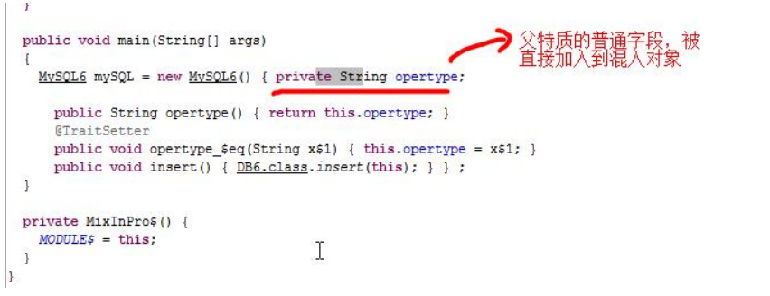

### 8.4.8特质中的抽象字段 

特质中未被初始化的字段在具体的子类中必须被重写。 

### 8.4.9特质构造顺序 

 介绍

特质也是有构造器的，构造器中的内容由“字段的初始化” 和一些其他语句构成。具体实现请参考“特质叠加” 

 第一种特质构造顺序(**声明类的同时混入特质**) 

\1. 调用当前类的超类构造器 

\2. 第一个特质的父特质构造器 

\3. 第一个特质构造器 

\4. 第二个特质构造器的父特质构造器, 如果已经执行过，就不再执行 

\5. 第二个特质构造器 

\6. .......重复 4,5 的步骤(如果有第 3 个，第 4 个特质)

\7. 当前类构造器 

[案例演示] 

\8. 代码案例: 

 第 2 种特质构造顺序(**在构建对象时，动态混入特质**) 

\1. 调用当前类的超类构造器 

\2. 当前类构造器 

\3. 第一个特质构造器的父特质构造器 

\4. 第一个特质构造器. 

\5. 第二个特质构造器的父特质构造器, 如果已经执行过，就不再执行 

\6. 第二个特质构造器 

\7. .......重复 5,6 的步骤(如果有第 3 个，第 4 个特质) 

\8. 当前类构造器 

[案例演示] 

 分析两种方式对构造顺序的影响 

第 1 种方式实际是构建类对象, 在混入特质时，**该对象还没有创建**。 

第 2 种方式实际是构造匿名子类，可以理解成在**混入特质时，对象已经创建**了 

 代码演示 

```scala
package com.atguigu.chapter08.mixin 

object MixInSeq { 
    def main(args: Array[String]): Unit = { 
        //这时 FF 是这样 形式 class FF extends EE with CC with DD 

/*
调用当前类的超类构造器
第一个特质的父特质构造器 
第一个特质构造器 
第二个特质构造器的父特质构造器, 如果已经执行过，就不再执行 
第二个特质构造器 
.......重复 4,5 的步骤(如果有第 3 个，第 4 个特质) 
当前类构造器 
[案例演示] 
*/ 

//1. E... 
//2. A... 
//3. B.... 
//4. C.... 
//5. D.... 
//6. F.... 

val ff1 = new FF() 
println(ff1) 
//这时我们是动态混入 
/*
先创建 new KK 对象，然后再混入其它特质调用当前类的超类构造器 
当前类构造器 
第一个特质构造器的父特质构造器
第一个特质构造器. 
第二个特质构造器的父特质构造器, 如果已经执行过，就不再执行 
第二个特质构造器 
.......重复 5,6 的步骤(如果有第 3 个，第 4 个特质) 
当前类构造器 
[案例演示] 
*/ 

//1. E... 
//2. K.... 
//3. A... 
//4. B 
//5. C 
//6. D 

println("=======================") 
val ff2 = new KK with CC with DD 
println(ff2) 
    } 
}

trait AA { 
    println("A...") 
}

trait BB extends AA { 
    println("B....")
}

trait CC extends BB { 
    println("C....") 
}

trait DD extends BB { 
    println("D....") 
}

class EE { //普通类 
    println("E...") 
}

class FF extends EE with CC with DD { //先继承了 EE 类，然后再继承 CC 和 DD 
    println("F....") 
}

class KK extends EE { //KK 直接继承了普通类 EE 
    println("K....") 
}
```


### 8.4.10 扩展类的特质 

 特质可以继承类，以用来拓展该特质的一些功能 

```scala
trait LoggedException extends Exception{ 
    def log(): Unit ={ 
        println(getMessage()) // 方法来自于 Exception 类 
    } 
}
```

 所有混入该特质的类，会自动成为那个特质所继承的超类的子类 

```scala
//说明 
//1. LoggedException 继承了 Exception 
//2. LoggedException 特质就可以 Exception 功能 
trait LoggedException extends Exception { 
    def log(): Unit = { 
        println(getMessage()) // 方法来自于 Exception 类 
    } 
}
```

 如果混入该特质的类，已经继承了另一个类(A 类)，则要求 A 类是特质超类的子类，否则就会出现了多继承现象，发生错误 

代码: 

```scala
package com.atguigu.chapter08.extendtrait
object ExtendTraitDemo01 { 
    def main(args: Array[String]): Unit = { 
        println("haha~~") 
    } 
}
//说明 
//1. LoggedException 继承了 Exception 
//2. LoggedException 特质就可以 Exception 功能 
trait LoggedException extends Exception { 
    def log(): Unit = { 
        println(getMessage()) // 方法来自于 Exception 类 
    } 
}

//因为 UnhappyException 继承了 LoggedException 
//而 LoggedException 继承了 Exception 
//UnhappyException 就成为 Exception 子类 
class UnhappyException extends LoggedException{ 
    // 已经是 Exception 的子类了，所以可以重写方法 
    override def getMessage = "错误消息！" 
}

// 如果混入该特质的类，已经继承了另一个类(A 类)，则要求 A 类是特质超类的子类， 
// 否则就会出现了多继承现象，发生错误。
class UnhappyException2 extends IndexOutOfBoundsException with LoggedException{ 
    // 已经是 Exception 的子类了，所以可以重写方法 
    override def getMessage = "错误消息！" 
}
class CCC {} 
//错误的原因是 CCC 不是 Exception 子类 
class UnhappyException3 extends CCC with LoggedException{ 
    // 已经是 Exception 的子类了，所以可以重写方法 
    override def getMessage = "错误消息！" 
} 
```


### 8.4.11 自身类型 

 说明

自身类型：主要是为了解决特质的循环依赖问题，同时可以确保特质在不扩展某个类的情况下，依然可以做到限制混入该特质的类的类型。 

 应用案例 

举例说明自身类型特质，以及如何使用自身类型特质 

```scala
package com.atguigu.chapter08.selftype
object SelfTypeDemo { 
    def main(args: Array[String]): Unit = { 
    } 
}
//Logger 就是自身类型特质,当这里做了自身类型后，那么 
// trait Logger extends Exception,要求混入该特质的类也是 Exception 子类 
trait Logger { 
    // 明确告诉编译器，我就是 Exception,如果没有这句话，下面的 getMessage 不能调用 
    this: Exception => 
    def log(): Unit ={ 
        // 既然我就是 Exception, 那么就可以调用其中的方法 
        println(getMessage) 
    } 
}
//class Console extends Logger {} //对吗? 错误 
class Console extends Exception with Logger {}//对吗? 
```

## 8.5 嵌套类 

//看源码,面试 

### 8.5.1Scala 嵌套类的使用 1

请编写程序，定义 Scala 的成员内部类和静态内部类，并创建相应的对象实例。 

代码如下： 

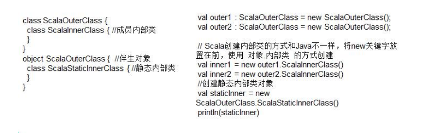

### 8.5.2Scala 嵌套类的使用 2 

请编写程序，在内部类中访问外部类的属性。 

 方式 1 

**内部类如果想要访问外部类的属性**，可以通过外部类对象访问。 即：访问方式：**外部类名.this.属性**名 

代码: 

```scala
//外部类 
//内部类访问外部类的属性的方法 1 外部类名.this.属性 
//class ScalaOuterClass { 
// //定义两个属性 
// var name = "scoot" 
// private var sal = 30000.9 
// class ScalaInnerClass { //成员内部类,//
// def info() = { 
// 访问方式：外部类名.this.属性名 
// 怎么理解 ScalaOuterClass.this 就相当于是 ScalaOuterClass 这个外部类的一个实例, 
// 然后通过 ScalaOuterClass.this 实例对象去访问 name 属性 
// 只是这种写法比较特别，学习 java 的同学可能更容易理解 ScalaOuterClass.class 的写法. 
// println("name = " + **ScalaOuterClass.this**.name 
// + " sal =" + ScalaOuterClass.this.sal) 
// } 
// } 
//
//}
```

 方式 2 

内部类如果想要访问外部类的属性，也可以通过**外部类别名访问**(推荐)。即：访问方式：外部类名.别名.属性名 

代码如下： 

```scala
package com.atguigu.chapter08.innerclass 

import com.atguigu.chapter08.innerclass 
object ScalaInnerClassDemo { 
    def main(args: Array[String]): Unit = { 
        //测试 1. 创建了两个外部类的实例 
        val outer1 : ScalaOuterClass = new ScalaOuterClass(); 
        val outer2 : ScalaOuterClass = new ScalaOuterClass();
        //在 scala 中，创建成员内部类的语法是 
        //对象.内部类 的方式创建, 这里语法可以看出在 scala 中，默认情况下内部类实例和外部对象关联 
        val inner1 = new outer1.ScalaInnerClass 
        val inner2 = new outer2.ScalaInnerClass 
        //测试一下使用 inner1 去调用 info() 
        inner1.info() 
        //创建静态内部类实例 
        val staticInner= new ScalaOuterClass.ScalaStaticInnerClass() 
    } 
}

//外部类 
//内部类访问外部类的属性的方法 1 外部类名.this.属性 
//class ScalaOuterClass { 
// //定义两个属性 
// var name = "scoot" 
// private var sal = 30000.9 
//
// class ScalaInnerClass { //成员内部类, 
//
// def info() = { 
// 访问方式：外部类名.this.属性名 
//  怎么理解 ScalaOuterClass.this 就相当于是 ScalaOuterClass 这个外部类的一个实例, 
// 然后通过 ScalaOuterClass.this 实例对象去访问 name 属性 
//  只是这种写法比较特别，学习 java 的同学可能更容易理解 ScalaOuterClass.class 的写法. 
// println("name = " + ScalaOuterClass.this.name 
// + " sal =" + ScalaOuterClass.this.sal) 
// } 
// } 
//
//}
//外部类 
//内部类访问外部类的属性的方法 2 使用别名的方式 
//1. 将外部类属性，写在别名后面 

class ScalaOuterClass { 
    myouter => //这里我们可以这里理解 外部类的别名 看做是外部类的一个实例 
    class ScalaInnerClass { //成员内部类, 
        def info() = { 
            // 访问方式：外部类别名.属性名 
            // 只是这种写法比较特别，学习 java 的同学可能更容易理解 ScalaOuterClass.class 的写法. 
            println("name~ = " + myouter.name + " sal~ =" + myouter.sal) 
        } 
    }
    //定义两个属性 
    var name = "jack" 
    private var sal = 800.9 
}

object ScalaOuterClass { //伴生对象 
    class ScalaStaticInnerClass { //静态内部类 
    }
} 
```

### 8.5.3类型投影 

 先看一段代码，引出类型投影 

```java
//外部类 
//内部类访问外部类的属性的方法 2 使用别名的方式 
//1. 将外部类属性，写在别名后面 
class ScalaOuterClass { 
    myouter => //这里我们可以这里理解 外部类的别名 看做是外部类的一个实例 
        class ScalaInnerClass { //成员内部类, 
            def info() = { 
                // 访问方式：外部类别名.属性名 
                // 只是这种写法比较特别，学习 java 的同学可能更容易理解 ScalaOuterClass.class 的写法. 
                println("name~ = " + myouter.name + " sal~ =" + myouter.sal)
            }
            
            //这里有一个方法,可以接受 ScalaInnerClass 实例
            //下面的ScalaOuterClass#ScalaInnerClass类型投影的作用就是屏蔽 外部对象对内部类对象的影响
            def test(ic: ScalaOuterClass#ScalaInnerClass): Unit = { 
                System.out.println("使用了类型投影" + ic)
            } 
        }
    //定义两个属性 
    var name = "jack" 
        private var sal = 800.9 
} 
```

 解决方式-使用类型投影 

```properties
类型投影是指：在方法声明上，如果使用外部类#内部类的方式，表示忽略内部类的对象关系，等同于Java 中内部类的语法操作，我们将这种方式称之为类型投影（即：忽略对象的创建方式，只考虑类型）
```


# 第 9 章 隐式转换和隐式值 

## 9.1 隐式转换 

### 9.1.1提出问题 

先看一段代码，引出隐式转换的实际需要=>指定某些数据类型的相互转化 

```scala
package com.atguigu.scala.conversion 
object Scala01 { 
    def main(args: Array[String]): Unit = { 
        val num : Int = 3.5 //?错 高精度->低精度 
        println(num) 
    } 
} 
```


### 9.1.2隐式函数基本介绍 

隐式转换函数是以 implicit 关键字声明的带有单个参数的函数。这种函数将会自动应用，将值从一 种类型转换为另一种类型 

### 9.1.3隐式函数快速入门 

使用隐式函数可以优雅的解决数据类型转换，以前面的案例入门. 代码演示

```scala
package com.atguigu.chapter09 
object ImplicitDemo01 { 
    def main(args: Array[String]): Unit = { 
        //编写一个隐式函数转成 Double->Int 转换 
        //隐式函数应当在作用域才能生效 
        implicit def f1(d:Double): Int = { //底层 生成 f1$1 
            d.toInt 
        }
        val num: Int = 3.5 // 底层编译 f1$1(3.5) //idea ___ 
        println("num =" + num) 
    } 
} 
```


 反编译后的代码

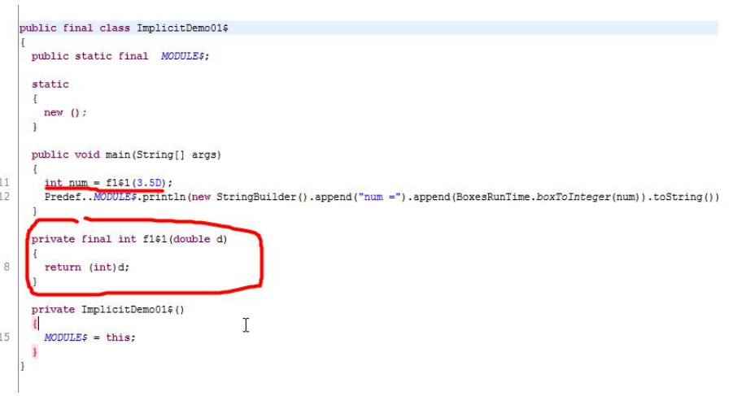

### 9.1.4隐式转换的注意事项和细节 

1) 隐式转换函数的函数名可以是任意的，**隐式转换与函数名**称无关，只与**函数签名（函数参数类型和返回值类型）有关**。 

2) 隐式函数可以有多个(即：隐式函数列表)，但是需要保证在当前环境下，**只有一个隐式函数能被识**别

3) 代码 

```scala
package com.atguigu.chapter09 
object ImplicitDemo01 { 
    def main(args: Array[String]): Unit = { 
        //编写一个隐式函数转成 Double->Int 转换
        //隐式函数应当在作用域才能生效 
        implicit def f1(d:Double): Int = { //底层 生成 f1$1 
            d.toInt 
        }
        implicit def f2(f:Float): Int = { 
            f.toInt 
        }
        //这里我们必须保证隐式函数的匹配只能是唯一的. 
        // implicit def f3(f1:Float): Int = { 
        // f1.toInt 
        // }
        val num: Int = 3.5 // 底层编译 f1$1(3.5) 
        val num2: Int = 4.5f // 
        println("num =" + num) 
    } 
}
```


## 9.2 隐式转换丰富类库功能 

### 9.2.1快速入门案例

使用隐式转换方式动态的给 MySQL 类增加 delete 方法 

9.2.2案例代码 

```scala
package com.atguigu.chapter09 

object ImplicitDemo02 { 
    def main(args: Array[String]): Unit = { 
        //编写一个隐式函数，丰富 mySQL 功能 
        implicit def addDelete(msql:MySQL): DB = { 
            new DB 
        }
        //创建 mysql 对象 
        val mySQL = new MySQL 
        mySQL.insert() 
        mySQL.delete() // 编译器工作 分析 addDelete$1(mySQL).delete() 
        mySQL.update() 
    } 
} 
class MySQL { 
    def insert(): Unit = { 
        println("insert") 
    } 
}

class DB { 
    def delete(): Unit = { 
        println("delete") 
    }
    def update(): Unit = { 
        println("update")
    } 
}

class Dog { 
} 
```


## 9.3 隐式值 

### 9.3.1基本介绍 

隐式值也叫隐式变量，将某个形参变量标记为 implicit，所以编译器会在方法省略隐式参数的情况下去搜索作用域内的隐式值作为缺省参数

### 9.3.2快速入门 

```scala
package com.atguigu.chapter09 

object ImplicitValDemo03 { 
    def main(args: Array[String]): Unit = { 
        implicit val str1: String = "jack~" //这个就是隐式值 
        //implicit name: String ：name 就是隐式参数 
        def hello(implicit name: String): Unit = { 
            println(name + " hello") 
        }
        hello //底层 hello$1(str1); 
    } 
} 
```

### 9.3.3一个案例说明 隐式值 ，默认值，传值的优先级 

```scala
package com.atguigu.chapter09 

//小结
//1. 当在程序中，同时有 隐式值，默认值，传值
//2.编译器的优先级为 传值>隐式值>默认值
//3.在隐式值匹配时，不能有二义性
//4.如果三个 （隐式值，默认值，传值） 一个都没有，就会报错

object ImplicitVal02 { 
    def main(args: Array[String]): Unit = { 
        // 隐式变量（值） 
        // implicit val name: String = "Scala" 
        //implicit val name1: String = "World" 
        //隐式参数 
        def hello(implicit content: String = "jack"): Unit = { 
            println("Hello " + content) 
        } //调用 hello 
        hello 
        //当同时有 implicit 值和默认值，implicit 优先级高 
        def hello2(implicit content: String = "jack"): Unit = { 
            println("Hello2 " + content) 
        } //调用 hello 
        hello2 
        //说明 
        //1. 当一个隐式参数匹配不到隐式值，仍然会使用默认值
        implicit val name: Int = 10 
        def hello3(implicit content: String = "jack"): Unit = { 
            println("Hello3 " + content) 
        } //调用 hello 
        hello3 // hello3 jack 
        //当没有隐式值，没有默认值，又没有传值，就会报错 
        def hello4(implicit content: String ): Unit = { 
            println("Hello4 " + content) 
        } //调用 hello 
        hello4 // hello3 jack 
    } 
} 
```


## 9.4 隐式类 

### 9.4.1基本介绍 

在 scala2.10 后提供了隐式类，可以使用 implicit 声明类，隐式类的非常强大，同样可以扩展类的功能，比前面使用隐式转换丰富类库功能更加的方便，在集合中隐式类会发挥重要的作用。 

### 9.4.2隐式类使用有如下几个特点： 

1) 其所带的构造参数有且只能有一个

2) 隐式类必须被定义在“**类”或“伴生对象”或“包对象**”里，即隐式类不能是顶级的(top-level objects)。

3) 隐式类不能是 case class（case class 在后续介绍 样例类） 

4) 作用域内不能有与之相同名称的标识符 

### 9.4.3应用案例 

看一个关于隐式类的案例，进一步认识隐式类 

```scala
package com.atguigu.chapter09 

object ImplicitClassDemo { 
    def main(args: Array[String]): Unit = { 
        //DB1 会对应生成隐式类 
        //DB1 是一个隐式类, 当我们在该隐式类的作用域范围，创建 MySQL1 实例 
        //该隐式类就会生效, 这个工作仍然编译器完成 
        //看底层.. 
        implicit class DB1(val m: MySQL1) { //ImplicitClassDemo$DB1$2 
            def addSuffix(): String = { 
                m + " scala" 
            } 
        }
        //创建一个 MySQL1 实例
        val mySQL = new MySQL1 
        mySQL.sayOk() //本身 
        mySQL.addSuffix() //研究 如何关联到 DB1$1(mySQL).addSuffix(); 
    } 
}
class DB1 {} 
class MySQL1 { 
    def sayOk(): Unit = { 
        println("sayOk") 
    } 
} 
```


## 9.5 隐式的转换时机 

1) 当方法中的参数的类型与目标类型不一致时, 或者是赋值时。 

```scala
implicit def f1(d:Double): Int = { 
    d.toInt 
}
def test1(n1:Int): Unit = {
    println("ok") 
}
test1(10.1)
```

2) 当对象调用所在类中不存在的方法或成员时，编译器会自动将对象进行隐式转换（根据类型） 

## 9.6 隐式解析机制 

即编译器是如何查找到缺失信息的，解析具有以下两种规则： 

1) 首先会在当前代码作用域下查找隐式实体（隐式方法、隐式类、隐式对象）。(一般是这种情况 

2) 如果第一条规则查找隐式实体失败，会继续在隐式参数的类型的作用域里查找。类型的作用域是指与该类型相关联的全部伴生模块，一个隐式实体的类型 T 它的查找范围如下(**第二种情况范围广且复杂在使用时，应当尽量避免出现**)： 

a) 如果 T 被定义为 T with A with B with C,那么 A,B,C 都是 T 的部分，在 T 的隐式解析过程中，它们的伴生对象都会被搜索。 

b) 如果 T 是参数化类型，那么类型参数和与类型参数相关联的部分都算作 T 的部分，比如 List[String]的隐式搜索会搜索 List 的伴生对象和 String 的伴生对象。 

c) 如果 T 是一个单例类型 p.T，即 T 是属于某个 p 对象内，那么这个 p 对象也会被搜索。 

d) 如果 T 是个类型注入 S#T，那么 S 和 T 都会被搜索 

## 9.7 在进行隐式转换时，需要遵守两个基本的前提： 

1) 不能存在二义性 

2) 隐式操作不能嵌套使用 // [举例：]如:隐式转换函数

```scala
package com.atguigu.chapter09 

object ImplicitNotice { 
    def main(args: Array[String]): Unit = { 
        //1. 隐式转换不能有二义性 
        //2. 隐式转换不能嵌套使用 
        implicit def f1(d: Double): Int = { 
            d.toInt 
            //val num2:Int = 2.3 //底层 f1$1(2.3) //f1$1 对应的就是 f1,就会形成递归 
        }
        val num1: Int = 1.1 
    } 
}
```


# 第 10 章数据结构(上)-集合 

## 10.1 数据结构特点 

### 10.1.1 scala 集合基本介绍 

uml => 统一建模语言 

1) Scala 同时支持不可变集合和可变集合，不可变集合可以安全的并发访问 

两个主要的包： 

不可变集合：scala.collection.immutable 

可变集合： scala.collection.mutable 

2) Scala 默认采用不可变集合，对于几乎所有的集合类，Scala 都同时提供了可变(mutable)和不可变(immutable)的版本 

3) Scala 的集合有三大类：序列 Seq(有序的,Linear Seq)、集 Set、映射 Map【key->value】，所有的集合都扩展自 Iterable 特质，在 Scala 中集合有可变（mutable）和不可变（immutable）两种类型。 什么时候，应该使用什么集合？ 

### 10.1.2 可变集合和不可变集合举例 

1) 不可变集合：scala 不可变集合，就是这个**集合本身不能动态变化**。(类似 java 的数组，是不可以动态增长的) 

2) 可变集合:可变集合，就是这个**集合本身可以动态变化的**。(比如:ArrayList , 是可以动态增长的) 

3) 使用 java 做了一个简单的案例说明 

```scala
package com.atguigu.chapter10; 

import java.util.ArrayList; 
public class JavaCollection {
    public static void main(String[] args) { 
        //不可变集合类似 java 的数组 
        int[] nums = new int[3]; 
        nums[2] = 11; //? 
        nums[2] = 22; 
        //nums[3] = 90; //? 
        // String[] names = {"bj", "sh"}; 
        // System.out.println(nums + " " + names); 
        //可变集合举例 
        ArrayList al = new ArrayList<String>(); 
        al.add("zs"); 
        al.add("zs2"); 
        System.out.println(al + " 地址= " + al.hashCode()); //地址 
        al.add("zs3"); 
        System.out.println(al + " 地址 2=" + al.hashCode()); //地址 
    } 
}
```


## 10.2 不可变集合继承层次一览图 


### 10.2.1 图

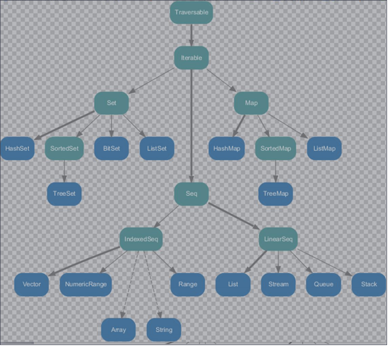

### 10.2.2 老师小结: 

1) Set、Map 是 Java 中也有的集合 

2) Seq 是 Java 没有的，我们发现 List 归属到 Seq 了,因此这里的 List 就和 java 不是同一个概念了 

3.我们前面的 for 循环有一个 1 to 3 ,就是 IndexedSeq 下的 Vector 

4.String 也是属于 IndexeSeq

5.我们发现经典的数据结构比如 Queue 和 Stack 被归属到 LinearSeq 

6.大家注意 Scala 中的 Map 体系有一个 SortedMap,说明 Scala 的 Map 可以支持排序

7.IndexSeq 和 LinearSeq 的区别[IndexSeq 是通过索引来查找和定位，因此速度快，比如 String 就是一个索引集合，通过索引即可定位] [LineaSeq 是线型的，即有头尾的概念，这种数据结构一般是通过遍历来查找，它的价值在于应用到一些**具体的应用场景** (电商网站, 大数据推荐系统 :最近浏览的 10 个商品) 

## 10.3 可变集合继承层次一览图 

### 10.3.1 图

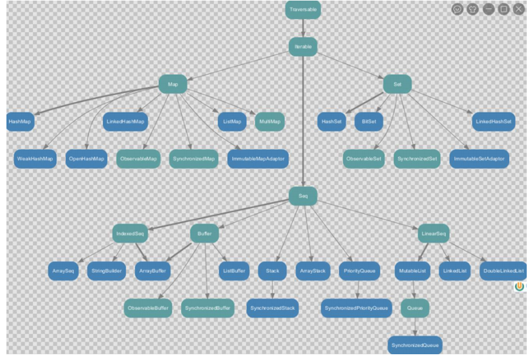

### 10.3.2 对上图的说明 

1) 在可变集合中比不可变集合更加丰富 

2) 在 Seq 集合中， 增加了 Buffer 集合，将来开发中，我们常用的有 ArrayBuffer 和 ListBuffer 

3) 如果涉及到线程安全可以选择使用 syn.. 开头的集合 

4) 其它的说明参考不可变集合 

## 10.4 数组-定长数组(声明泛型) 

### 10.4.1 第一种方式定义数组 

 说明

这里的数组等同于 Java 中的数组,中括号的类型就是数组的类型 

```scala
val arr1 = new Array[Int](10) 
//赋值,集合元素采用小括号访问 
arr1(1) = 7 
```

 代码演示 

```scala
package com.atguigu.chapter10 

object ArrayDemo01 { 
    def main(args: Array[String]): Unit = { 
        //说明 
        //1. 创建了一个 Array 对象, 
        //2. [Int] 表示泛型，即该数组中，只能存放 Int 
        //3. [Any] 表示 该数组可以存放任意类型 
        //4. 在没有赋值情况下，各个元素的值 0 
        //5. arr01(3) = 10 表示修改 第 4 个元素的值
        val arr01 = new Array[Int](4) //底层 int[] arr01 = new int[4]
        println(arr01.length) // 4 
        println("arr01(0)=" + arr01(0)) // 0 
        //数据的遍历 
        for (i <- arr01) { 
            println(i) 
        }
        println("--------------------") 
        arr01(3) = 10 // 
        for (i <- arr01) { 
            println(i) 
        } 
    } 
} 
```


### 10.4.2 第二种方式定义数组 

 说明

在定义数组时，直接赋值 

```scala
//使用 apply 方法创建数组对象 
val arr1 = Array(1, 2) 
```

 代码

```scala
package com.atguigu.chapter10 

object ArrayDemo02 { 
    def main(args: Array[String]): Unit = { 
        //说明 
        //1. 使用的是 object Array 的 apply 
        //2. 直接初始化数组，这时因为你给了 整数和 "", 这个数组的泛型就 Any 
        //3. 遍历方式一样 
        var arr02 = Array(1, 3, "xx") 
        arr02(1) = "xx" 
        for (i <- arr02) { 
            println(i) 
        }
        //可以使用我们传统的方式遍历，使用下标的方式遍历 
        for (index <- 0 until arr02.length) { 
            printf("arr02[%d]=%s", index , arr02(index) + "\t") 
        } 
    } 
}
```


## 10.5 数组-变长数组(声明泛型) 

 说明

```scala
//定义/声明
val arr2 = ArrayBuffer[Int]() 
//追加值/元素 
arr2.append(7) 
//重新赋值 
arr2(0) = 7 
```

 代码演示 

```scala
package com.atguigu.chapter10 

import scala.collection.mutable.ArrayBuffer 
object ArrayBufferDemo01 { 
    def main(args: Array[String]): Unit = { 
        //创建 ArrayBuffer 
        val arr01 = ArrayBuffer[Any](3, 2, 5) 
        //访问，查询 
        //通过下标访问元素 
        println("arr01(1)=" + arr01(1)) // arr01(1) = 2 
        //遍历
        for (i <- arr01) { 
            println(i) 
        }
        println(arr01.length) //3 
        println("arr01.hash=" + arr01.hashCode())
        //修改 [修改值，动态增加] 
        //使用 append 追加数据 ,append 支持可变参数 
        //可以理解成 java 的数组的扩容 
        arr01.append(90.0,13) // (3,2,5,90.0,13) 
        println("arr01.hash=" + arr01.hashCode()) 
        println("===================") 
        arr01(1) = 89 //修改 (3,89,5,90.0,13) 
        println("--------------------------") 
        for (i <- arr01) { 
            println(i) 
        }
        //删除... 
        //删除,是根据下标来说 
        arr01.remove(0) // (89,5,90.0,13) 
        println("--------删除后的元素遍历---------------") 
        for (i <- arr01) { 
            println(i) 
        }
        println("最新的长度=" + arr01.length) // 4
    } 
} 
```


### 10.5.1 变长数组分析小结 

1) ArrayBuffer 是变长数组，类似 java 的 ArrayList 

2) val arr2 = ArrayBuffer\[Int]() 也是使用的 apply 方法构建对象 

3) def append(elems: A*) { appendAll(elems) } 接收的是可变参数. 

4) 每 append 一次，arr 在底层会重新分配空间，进行扩容，arr2 的内存地址会发生变化，也就成为新的 ArrayBuffer 

### 10.5.2 定长数组与变长数组的转换 

 说明

在开发中，我们可能使用对定长数组和变长数组，进行转换 

arr1.**toBuffer** //定长数组转可变数组 

arr2.**toArray** //可变数组转定长数组 

 注意事项： 

arr2.toArray 返回结果才是一个定长数组， arr2 本身没有变化 

arr1.toBuffer 返回结果才是一个可变数组， arr1 本身没有变化 

 代码演示 

```scala
package com.atguigu.chapter10 

import scala.collection.mutable.ArrayBuffer 
object Array22ArrayBuffer { 
    def main(args: Array[String]): Unit = {
        val arr2 = ArrayBuffer[Int]() 
        // 追加值 
        arr2.append(1, 2, 3) 
        println(arr2) 
        //说明 
        //1. arr2.toArray 调用 arr2 的方法 toArray 
        //2. 将 ArrayBuffer ---> Array 
        //3. arr2 本身没有任何变化 
        val newArr = arr2.toArray 
        println(newArr) 
        //说明 
        //1. newArr.toBuffer 是把 Array->ArrayBuffer 
        //2. 底层的实现 
        /*
        override def toBuffer[A1 >: A]: mutable.Buffer[A1] = { 
        val result = new mutable.ArrayBuffer[A1](size) 
        copyToBuffer(result) 
        result 
        } 
        */ 
        //3. newArr 本身没变化 
        val newArr2 = newArr.toBuffer 
        newArr2.append(123)
        println(newArr2) 
        //案例演示+说明 
    } 
} 
```


### 10.5.3 多维数组的定义和使用 

 说明

```scala
//定义 
val arr = Array.ofDim[Double](3,4) 
//说明：二维数组中有三个一维数组， 每个一维数组中有四个元素 
//赋值 
arr(1)(1) = 11.11 
```

 代码演示 

```scala
package com.atguigu.chapter10 

object MultiplyArray { 
    def main(args: Array[String]): Unit = { 
        //创建 
        val arr = Array.ofDim[Int](3, 4) 
        //遍历
        for (item <- arr) { //取出二维数组的各个元素（一维数组） 
            for (item2 <- item) { // 元素（一维数组） 遍历 
                print(item2 + "\t") 
            }
            println() 
        }
        //指定取出 
        println(arr(1)(1)) // 0 
        //修改值 
        arr(1)(1) = 100 
        //遍历 
        println("=====================") 
        for (item <- arr) { //取出二维数组的各个元素（一维数组） 
            for (item2 <- item) { // 元素（一维数组） 遍历 
                print(item2 + "\t") 
            }
            println() 
        }
        //使用传统的下标的方式来进行遍历 
        println("===================") 
        for (i <- 0 to arr.length - 1) { //先对 
            for (j <- 0 to arr(i).length - 1) { 
                printf("arr[%d][%d]=%d\t", i, j, arr(i)(j))
            }
            println() 
        } 
    } 
}
```


## 10.6 数组-Scala 数组与 Java 的 List 的互转 

### 10.6.1 Scala 数组转 Java 的 List 

在项目开发中，有时我们需要将 Scala 数组转成 Java 数组，看下面案例： 

10.6.2 演示的代码 

```scala
package com.atguigu.chapter10 

import scala.collection.mutable.ArrayBuffer 
object ArrayBuffer2JavaList { 
    def main(args: Array[String]): Unit = { 
        // Scala 集合和 Java 集合互相转换 
        val arr = ArrayBuffer("1", "2", "3") 
        /*
        implicit def bufferAsJavaList[A](b : scala.collection.mutable.Buffer[A]) : java.util.List[A] = { /* 
        compiled code */ */ 
        import scala.collection.JavaConversions.bufferAsJavaList 
        //对象 ProcessBuilder ， 因为 这里使用到上面的 bufferAsJavaList
        val javaArr = new ProcessBuilder(arr) //为什么可以这样使用? 
        // 这里 arrList 就是 java 中的 List 
        val arrList = javaArr.command() 
        println(arrList) //输出 [1, 2, 3] 
    } 
} 
```


### 10.6.3 补充了一个多态（使用 trait 来实现的参数多态）的知识点 

```scala
trait MyTrait01 {} 

class A extends MyTrait01 {} 
object B { 
    def test(m: MyTrait01): Unit = { 
        println("b ok..") 
    } 
}

//明确一个知识点 
//当一个类继承了一个trait
//那么该类的实例，就可以传递给这个trait引用
val a01 = new A 
B.test(a01)
```


### 10.6.4 Java 的 List 转 Scala 数组(mutable.Buffer) 

 代码如下 

```scala
//java 的 List 转成 scala 的 ArrayBuffer 
//说明 
//1. asScalaBuffer 是一个隐式函数 
/*
implicit def asScalaBuffer[A](l : java.util.List[A]) : scala.collection.mutable.Buffer[A] = { /* compiled 
code  
*/ 
import scala.collection.JavaConversions.asScalaBuffer 
import scala.collection.mutable 
// java.util.List ==> Buffer 
val scalaArr: mutable.Buffer[String] = arrList 
scalaArr.append("jack") 
scalaArr.append("tom") 
scalaArr.remove(0) 
println(scalaArr) // (2,3,jack,tom) 
```


## 10.7 元组 Tuple-元组的基本使用 

### 10.7.1 基本介绍 

元组也是可以理解为一个容器，可以存放各种相同或不同类型的数据。说的简单点，就是将多个无关的数据封装为一个整体，称为元组, 最多的特点灵活,对数据没有过多的约束。 

注意：元组中最大只能有 22 个元素

### 10.7.2 元组的创建 

 代码 

```scala
//创建 
//说明 1. tuple1 就是一个 Tuple 类型是 Tuple5 
//简单说明: 为了高效的操作元组 ， 编译器根据元素的个数不同，对应不同的元组类型 
// 分别 Tuple1----Tuple22 
val tuple1 = (1, 2, 3, "hello", 4) 
println(tuple1) 
```

 对代码的说明 

1) t1 的类型是 Tuple5 类 是 scala 特有的类型 

2) t1 的类型取决于 t1 **后面有多少个元素**, 有对应关系，比如 4 个元素=》Tuple4 

3) 给大家看一个 Tuple5 类的定义,大家就了然了 

```scala
/*
final case class Tuple5[+T1, +T2, +T3, +T4, +T5](_1: T1, _2: T2, _3: T3, _4: T4, _5: T5) 
extends Product5[T1, T2, T3, T4, T5] 
{override def toString() = "(" + _1 + "," + _2 + "," + _3 + "," + _4 + "," + _5 + ")" 
} 
*/ 
```

4) 元组中最大只能有 22 个元素 即 Tuple1...Tuple22 

## 10.8 元组 Tuple-元组数据的访问 

### 10.8.1 基本介绍

访问元组中的数据,可以采用顺序号（_顺序号），也可以通过索引（productElement）访问。 

### 10.8.2 应用案例 

```scala
println("==================访问元组=========================") 
//访问元组 
val t1 = (1, "a", "b", true, 2) 
println(t1._1) // 1 //访问元组的第一个元素 ，从 1 开始 
/*
override def productElement(n: Int) = n match { 
case 0 => _1 
case 1 => _2 
case 2 => _3 
case 3 => _4 
case 4 => _5 
case _ => throw new IndexOutOfBoundsException(n.toString()) 
} 
*/ 
println(t1.productElement(0)) // 0 // 访问元组的第一个元素，从 0 开始 
```


## 10.9 元组 Tuple-元组数据的遍历 

Tuple 是一个整体，遍历需要调其迭代器 

```scala
println("==================遍历元组=========================") 
//遍历元组, 元组的遍历需要使用到迭代器 
for (item <- t1.productIterator) {
    println("item=" + item) 
} 
```


## 10.10列表 List-创建 List 

### 10.10.1 基本介绍 

Scala 中的 List 和 Java List 不一样，在 Java 中 List 是一个接口，真正存放数据是 ArrayList，而 Scala的 List 可以直接存放数据，就是一个 object，默认情况下 Scala 的 List 是不可变的，List 属于序列 Seq。 

```scala
val List = scala.collection.immutable.List 
object List extends SeqFactory[List] 
```

### 10.10.2 创建 List 的应用案例 

```scala
object ListDemo01 { 
    def main(args: Array[String]): Unit = { 
        //说明 
        //1. 在默认情况下 List 是 scala.collection.immutable.List,即不可变 
        //2. 在 scala 中,List 就是不可变的，如需要使用可变的 List,则使用 ListBuffer 
        //3. List 在 package object scala 做了 val List = scala.collection.immutable.List 
        //4. val Nil = scala.collection.immutable.Nil // List() 
        val list01 = List(1, 2, 3) //创建时，直接分配元素 
        println(list01) 
        val list02 = Nil //空集合 
        println(list02)
    } 
} 
```

### 10.10.3 创建 List 的应用案例小结 

1) List 默认为不可变的集合 

2) List 在 scala 包对象声明的,因此不需要引入其它包也可以使用 

```scala
val List = scala.collection.immutable.List 
```

3) List 中可以放任何数据类型，比如 arr1 的类型为 List[Any] 

4) 如果希望得到一个空列表，可以使用 Nil 对象, 在 scala 包对象声明的,因此不需要引入其它包也可以使用 

```scala
val Nil = scala.collection.immutable.Nil 
```

## 10.11列表 List-访问 List 元素 

```scala
//访问 List 的元素 
val value1 = list01(1) // 1 是索引，表示取出第 2 个元素. 
println("value1=" + value1) // 2 
```

## 10.12列表 List-元素的追加 

### 10.12.1 基本介绍 

向列表中增加元素, 会返回新的列表/集合对象。注意：Scala 中 List 元素的追加形式非常独特，和 Java 不一样。

### 10.12.2 方式 1-在列表的最后增加数据 

案例演示 

### 10.12.3 方式 2-在列表的最前面增加数据 

案例演示 

代码如下： 

```scala
println("-------------list 追加元素后的效果-----------------") 
//通过 :+ 和 +: 给 list 追加元素(本身的集合并没有变化) 
var list1 = List(1, 2, 3, "abc") 
// :+运算符表示在列表的最后增加数据 
val list2 = list1 :+ 4 // (1,2,3,"abc", 4) 
println(list1) //list1 没有变化 (1, 2, 3, "abc"),说明 list1 还是不可变 
println(list2) //新的列表结果是 [1, 2, 3, "abc", 4] 
val list3 = 10 +: list1 // (10,1, 2, 3, "abc") 
println("list3=" + list3) 
```

### 10.12.4 方式 3-在列表的最后增加数据 

 说明: 

1) 符号::表示向集合中 新建集合添加元素。 

2) 运算时，**集合对象一定要放置在最右边**， 

3) 运算规则，从右向左。 

4) **:::** **运算符是将集合中的每一个元素加入到集合中**去 

 应用案例：

```scala
//:: 符号的使用 
val list4 = List(1, 2, 3, "abc") 
//说明 val list5 = 4 :: 5 :: 6 :: list4 :: Nil 步骤 
//1. List() 
//2. List(List(1, 2, 3, "abc")) 
//3. List(6,List(1, 2, 3, "abc")) 
//4. List(5,6,List(1, 2, 3, "abc")) 
//5. List(4,5,6,List(1, 2, 3, "abc")) 
val list5 = 4 :: 5 :: 6 :: list4 :: Nil 
println("list5=" + list5) 
//说明 val list6 = 4 :: 5 :: 6 :: list4 ::: Nil 步骤 
//1. List() 
//2. List(1, 2, 3, "abc") 
//3. List(6,1, 2, 3, "abc") 
//4. List(5,6,1, 2, 3, "abc") 
//5. List(4,5,6,1, 2, 3, "abc") 
val list6 = 4 :: 5 :: 6 :: list4 ::: Nil 
println("list6=" + list6)  
```

### 10.12.5 课堂练习题

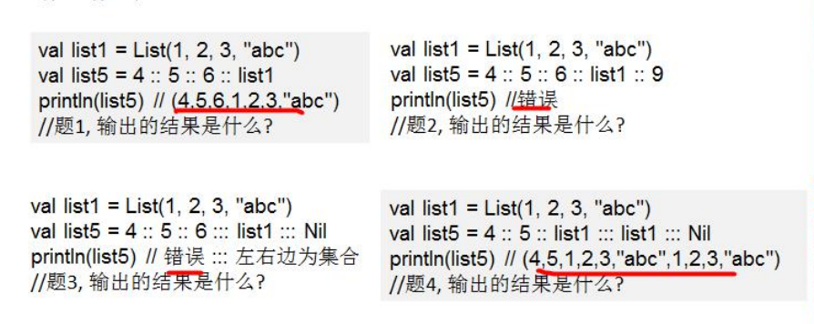

## 10.13ListBuffer 

### 10.13.1 基本介绍 

ListBuffer 是可变的 list 集合，可以添加，删除元素,ListBuffer 属于序列 

```scala
//追一下继承关系即可 
Seq var listBuffer = ListBuffer(1,2) 
```

### 10.13.2 应用实例代码 

```scala
package com.atguigu.chapter10 
import scala.collection.mutable.ListBuffer 
object ListBufferDemo01 { 
    def main(args: Array[String]): Unit = { 
        //创建 ListBuffer 
        val lst0 = ListBuffer[Int](1, 2, 3)
        //如何访问 
        println("lst0(2)=" + lst0(2)) // 输出 lst0(2)= 3 
        for (item <- lst0) { // 遍历，是有序 
            println("item=" + item) 
        }
        //动态的增加元素，lst1就会变化,增加一个一个的元素
        val lst1 = new ListBuffer[Int] //空的 ListBuffer
        lst1 += 4 // lst1 (4)
        lst1.append(5) // list1(4,5)
        //lst0 ++= lst1 // lst0 (1, 2, 3,4,5) 
        println("lst0=" + lst0) 
        val lst2 = lst0 ++ lst1 // lst2(1, 2, 3,4,5,4,5) 
        println("lst2=" + lst2) 
        val lst3 = lst0 :+ 5 // lst0 不变 lst3(1, 2, 3,4,5,5) 
        println("lst3=" + lst3) 
        println("=====删除=======") 
        println("lst1=" + lst1)
        lst1.remove(1) //表示将下标为1的元素删除
        for (item <- lst1) {
            println("item=" + item) //4
        }
    } 
} 
```


## 10.14队列 Queue-基本介绍 

### 10.14.1 队列的应用场景 

银行排队的案例 

 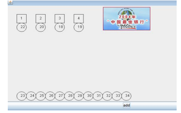

### 10.14.2 队列的说明 

1) 队列是一个**有序列表**，在底层可以用**数组**或是**链表**来实现。 

2) 其输入和输出要遵循**先入先出的原则**。即：先存入队列的数据，要先取出。后存入的要后取 

3) 在 Scala 中，由设计者直接给我们提供队列类型 Queue 使用。 

4) 在 scala 中, 有 scala.collection.mutable.Queue 和 scala.collection.immutable.Queue , 一般来说，我们在开发中通常使用可变集合中的队列。 

## 10.15队列 Queue-队列的创建 

```scala
//创建队列 
val q1 = new mutable.Queue[Int] 
println(q1) 
```

## 10.16队列 Queue-队列元素的追加数据 

```scala
//给队列增加元素 
q1 += 9 // (9) 
println("q1=" + q1) // (9) 
q1 ++= List(4,5,7) // 默认值直接加在队列后面 
println("q1=" + q1) //(9,4,5,7) 
//q1 += List(10,0) // 表示将 List(10,0) 作为一个元素加入到队列中,
```

 

## 10.17队列 Queue-删除和加入队列元素 

在队列中，严格的遵守，入队列的数据，放在队位，出队列的数据是队列的头部取出. 

```scala
//dequeue 从队列的头部取出元素 q1 本身会变 
val queueElement = q1.dequeue() 
println("queueElement=" + queueElement + "q1="+q1) 
//enQueue 入队列，默认是从队列的尾部加入. Redis 
q1.enqueue(100,10,100,888) 
println("q1=" + q1) // Queue(4, 5, 7, 100,10,100,888) 
```

## 10.18队列 Queue-返回队列的元素

```scala
println("============Queue-返回队列的元素=================") 
//队列 Queue-返回队列的元素 
//1. 获取队列的第一个元素 
println(q1.head) // 4, 对 q1 没有任何影响 
//2. 获取队列的最后一个元素 
println(q1.last) // 888, 对 q1 没有任何影响 
//3. 取出队尾的数据 ,即：返回除了第一个以外剩余的元素，可以级联使用 
println(q1.tail) // (5, 7, 100,10,100,888) 
println(q1.tail.tail.tail.tail) // (10,100,888) 
```


## 10.19映射 Map-基本介绍 

### 10.19.1 Java 中的 Map 回顾 

HashMap 是一个**散列表**(数组+链表**)，它存储的内容是键值对(**key-value)映射，Java 中的 HashMap是**无序的**，**key** **不能重复**。案例演示 

### 10.19.2 应用案例 

```scala
package com.atguigu.chapter10; 
import java.util.HashMap; 
public class JavaHashMap { 
    public static void main(String[] args) { 
        HashMap<String,Integer> hm = new HashMap(); 
        hm.put("no1", 100);
        hm.put("no2", 200); 
        hm.put("no3", 300); 
        hm.put("no4", 400); 
        hm.put("no1", 500); //更新 
        System.out.println(hm);//无序的 
        System.out.println(hm.get("no2")); 
    } 
} 
```


### 10.19.3 Scala 中的 Map 介绍 

1) Scala 中的 Map 和 Java 类似，也是一**个散列表**，它存储的内容也是键值对(key-value)映射，Scala中**不可变的** **Map** **是有序的**，**可变的** **Map** **是无序的**。 

2) Scala 中 ，有可变Map (scala.collection.mutable.Map) 和 不可变Map(scala.collection.immutable.Map) 

## 10.20映射 Map-构建 Map 

### 10.20.1 方式 1-构造不可变映射 

Scala 中的不可变 Map 是有序，构建 Map 中的元素底层是 Tuple2 类型。 

代码如下： 

```scala
package com.atguigu.chapter10 

object MapDemo01 { 
    def main(args: Array[String]): Unit = {
        //1.默认 Map 是immutable.Map
        //2.key-value类型支持Any
        //3.在Map的底层，每对key-value是Tuple2
        val map1 = Map("Alice" -> 10, "Bob" -> 20, "Kotlin" -> "北京") 
        println(map1) 
    } 
} 
```


## 10.21映射 Map-构建 Map 

### 10.21.1 方式 1-构造不可变映射 

Scala 中的不可变 Map 是有序，构建 Map 中的元素底层是 Tuple2 类型 

```scala
//方式 1-构造不可变映射 
//1.默认 Map 是 immutable.Map 
//2.key-value 类型支持 Any 
//3.在 Map 的底层，每对 key-value 是 Tuple2 
//4.从输出的结果看到，输出顺序和声明顺序一致 
val map1 = Map("Alice" -> 10, "Bob" -> 20, "Kotlin" -> "北京") 
println(map1) 
```


### 10.21.2 方式 2-构造可变映射 

```scala
//方式 2-构造可变映射 
//1.从输出的结果看到，可变的 map 输出顺序和声明顺序不一致 
val map2 = mutable.Map("Alice" -> 10, "Bob" -> 20, "Kotlin" -> "北京")
println(map2) 
```


### 10.21.3 方式 3-创建空的映射 

```scala
val map3 = new scala.collection.mutable.HashMap[String, Int] 
println(map3) 
```

### 10.21.4 方式 4-对偶元组 

 说明

即创建包含键值对的二元组， 和第一种方式等价，只是形式上不同而已。 对偶元组 就是只含有两个数据的元组。 

 代码演示 

```scala
//方式 4-对偶元组 
val map4 = mutable.Map(("Alice" , 10), ("Bob" , 20), ("Kotlin" , "北京")) 
println("map4=" + map4) 
```

## 10.22映射 Map-取值 

### 10.22.1 方式 1-使用 map(key) 

```scala
val value1 = map2("Alice") 
println(value1) 
```

 说明: 

1) 如果 key 存在，则返回对应的值 

2) 如果 key 不存在，则抛出异常[java.util.NoSuchElementException] 

3) 在 Java 中,如果 key 不存在则返回 null

4) 代码 

```scala
//方式 1-使用 map(key) 
println(map4("Alice")) // 10 
//抛出异常（java.util.NoSuchElementException: key not found:） 
//println(map4("Alice~")) 
```

### 10.22.2 方式 2-使用 contains 方法检查是否存在 key 

```scala
// 返回 Boolean 
// 1.如果 key 存在，则返回 true 
// 2.如果 key 不存在，则返回 false 
map4.contains("B") 
```

 说明: 

使用 containts 先判断在取值，可以防止异常，并加入相应的处理逻辑 

 代码 

```scala
//方式 2-使用 contains 方法检查是否存在 key 
if (map4.contains("Alice")) { 
    println("key 存在，值=" + map4("Alice")) 
} else { 
    println("key 不存在:)") 
} 
```

### 10.22.3 方式 3-使用 map.get(key).get 取值 

通过 映射.get(键) 这样的调用返回一个 Option 对象，要么是 Some，要么是 None 

 说明和小结:

1) map.get 方法会将数据进行包装 

2) 如果 map.get(key) key 存在返回 some,如果 key 不存在，则返回 None 

3) 如 果 map.get(key).get key 存 在 ， 返 回 key 对 应 的 值 , 否 则 ， 抛 出 异 常 java.util.NoSuchElementException: None.get 

 代码 

```scala
//方式 3 方式 3-使用 map.get(key).get 取值 
//1. 如果 key 存在 map.get(key) 就会返回 Some(值) ,然后 Some(值).get 就可以取出 
//2. 如果 key 不存在 map.get(key) 就会返回 None 
println(map4.get("Alice").get) 
//println(map4.get("Alice~").get) // 抛出异常 
```


### 10.22.4 方式 4-使用 map4.getOrElse()取值 

 getOrElse 方法 : def getOrElse\[V1 >: V](key: K, default: => V1) 

 说明： 

1) 如果 key 存在，返回 key 对应的值。 

2) 如果 key 不存在，返回默认值。在 java 中底层有很多类似的操作 

3) 代码 

```scala
//方式 4-使用 map4.getOrElse()取值 
println(map4.getOrElse("Alice~~~","默认的值 鱼 <・)))><<")) 
```

### 10.22.5 如何选择取值的方式 

1) 如果我们确定 map 有这个 key ,则应当使用 map(key), 速度快 

2) 如果我们不能确定 map 是否有 key ,而且有不同的业务逻辑，使用 map.contains() 先判断在加入逻辑

3) 如果只是简单的希望得到一个值，使用 map4.getOrElse("ip","127.0.0.1") 

## 10.23映射 Map-对 map 修改、添加和删除 

### 10.23.1 更新 map 的元素 

 代码演示 

```scala
val map5 = mutable.Map( ("A", 1), ("B", "北京"), ("C", 3) ) 
map5("A") = 20 //增加 
println("map5=" + map5) 
```

 小结

1) map 是可变的，才能修改，否则报错 

2) 如果 **key** **存在：则修改**对应的值,**key** **不存在****,****等价于添加**一个 key-val 

### 10.23.2 添加 map 元素 

 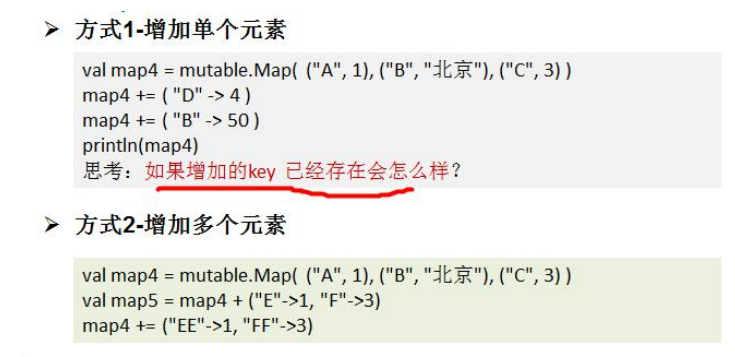

说明: 当增加一个 key-value ,如果 key 存在就是更新，如果不存在，这是添加 

### 10.23.3 删除 map 元素 

 代码 

```scala
map5 -= ("A","B","AAA") // 
println("map5=" + map5) 
```

 说明

1) "A","B" 就是要删除的 key, 可以写多个. 

2) 如果 key 存在，就删除，如果 key 不存在，也不会报错. 

## 10.24映射 Map-对 map 遍历 

对 map 的元素(元组 Tuple2 对象 )进行遍历的方式很多，具体如下 

```scala
val map1 = mutable.Map( ("A", 1), ("B", "北京"), ("C", 3) ) 
for ((k, v) <- map1) println(k + " is mapped to " + v) 
for (v <- map1.keys) println(v) 
for (v <- map1.values) println(v) 
for(v <- map1) println(v) //v 是 Tuple? 
```

说明

1.每遍历一次，返回的元素是 Tuple2 

2.取出的时候，可以按照元组的方式来取 代码如下：

```scala
//map 的遍历 
val map6 = mutable.Map(("A", 1), ("B", "北京"), ("C", 3)) 
println("----(k, v) <- map6--------") 
for ((k, v) <- map6) println(k + " is mapped to " + v) 
println("----v <- map6.keys--------") 
for (v <- map6.keys) println(v) 
println("----v <- map6.values--------") 
for (v <- map6.values) println(v) 
//这样取出方式 v 类型是 Tuple2 
println("----v <- map6--------") 
for (v <- map6) println(v + " key =" + v._1 + " val=" + v._2) //v 是 Tuple? 
```

## 10.25集 Set-基本介绍 

集是**不重复元素的结合**。集**不保留顺序**，默认是以**哈希**集实现 

### 10.25.1 Java 中 Set 的回顾 

java 中，HashSet 是实现 Set<E>接口的一个实体类，数据是以哈希表的形式存放的，里面的不能包含重复数据。Set 接口是一种不包含重复元素的 collection，HashSet 中的数据也是没有顺序的。 

### 10.25.2 案例演示： 

Scala 中 Set 的说明

```scala
package com.atguigu.chapter10; 

import java.util.HashSet; 
public class JavaHashSet { 
    public static void main(String[] args) { 
        //java 中的 Set 的元素 没有顺序，不能重复 
        HashSet hs = new HashSet<String>(); 
        hs.add("jack"); 
        hs.add("tom"); 
        hs.add("jack"); 
        hs.add("jack2"); 
        System.out.println(hs); 
    } 
}
```

默 认 情 况 下 ， Scala 使 用 的 是 不 可 变 集 合 ， 如 果 你 想 使 用 可 变 集 合 ， 需 要 引 用 scala.collection.mutable.Set 包 

## 10.26集 Set-创建 

```scala
package com.atguigu.chapter10

import scala.collection.mutable 
object SetDemo01 { 
    def main(args: Array[String]): Unit = { 
        val set = Set(1, 2, 3) //不可变 
        println(set) 
        val set2 = mutable.Set(1,2,"hello") //可以变 
        println("set2" + set2) 
    } 
} 
```


## 10.27集 Set-可变集合的元素添加和删除 

### 10.27.1 可变集合的元素添加 

```scala
mutableSet.add(4) //方式 1 
mutableSet += 6 //方式 2 
mutableSet.+=(5) //方式 3 
```

说明：如果添加的对象已经存在，则不会重复添加，也不会报错 

### 10.27.2 可变集合的元素删除 

```scala
val set02 = mutable.Set(1,2,4,"abc") 
set02 -= 2 // 操作符形式 
set02.remove("abc") // 方法的形式，scala 的 Set 可以直接删除值
println(set02) 
```

说明：说明：如果删除的对象不存在，则不生效，也不会报错 

### 10.27.3 set 集合的遍历操作 

```scala
val set02 = mutable.Set(1, 2, 4, "abc") 
for(x <- set02) { 
    println(x) 
} 
```


## 10.28集 Set-更多操作

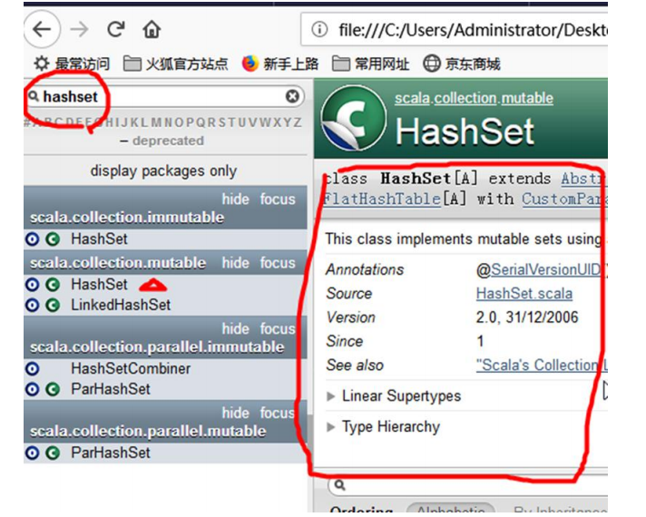

# 第 11 章数据结构(下)-集合操作 

## 11.1 集合元素的映射-map 映射操作 

### 11.1.1 看一个实际需求 

要求：请将 List(3,5,7) 中的所有元素都 * 2 ，将其结果放到一个新的集合中返回，即返回一个新的 List(6,10,14), 请编写程序实现. 

### 11.1.2 map 映射操作 

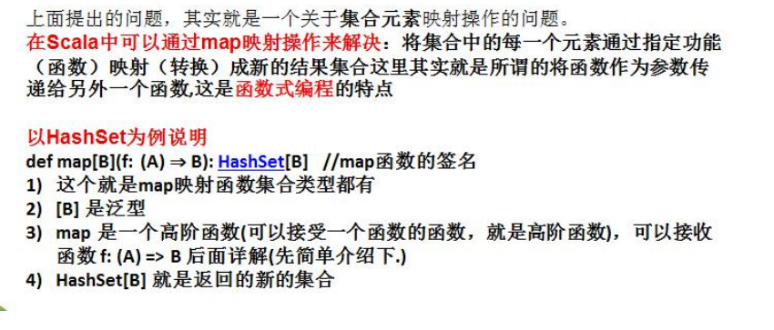

### 11.1.3 使用传统方法 

 代码如下 

```scala
package com.atguigu.chapter11 

object MapOperateDemo01 { 
    def main(args: Array[String]): Unit = {
        /*请将 List(3,5,7) 中的所有元素都 * 2 ， 
        将其结果放到一个新的集合中返回，即返回一个新的 List(6,10,14), 请编写程序实现. 
        */ 
        val list1 = List(3, 5, 7) //集合 
        var list2 = List[Int]() //新的集合，准备放入新的内容 
        for (item <- list1) { //遍历 
            list2 = list2 :+ item * 2 // 对元素*2 ，然后加入 list2 集合 
        }
        println("list2=" + list2) //List(6,10,14) 
        //对上面传统的方法来解决问题的小结 
        //1. 优点 
        //（1） 处理方法比较直接，好理解 
        //2. 缺点 
        // (1) 不够简洁，高效 
        // (2) 没有体现函数式编程特点 集合=》函数 => 新的集合 =》 函数 .. 
        // (3) 不利于处理复杂的数据处理业务 
    } 
}
```

 对代码做了分析和小结 

1) 优点 

处理方法比较直接，好理解 

2) 缺点

// (1) 不够简洁，高效 

// (2) 没有体现函数式编程特点 集合=》函数 => 新的集合 =》 函数 .. 

// (3) 不利于处理复杂的数据处理业务 

### 11.1.4 高阶函数基本使用案例 1 

 代码 

```scala
package com.atguigu.chapter11 

object HighOrderFunDemo01 { 
    def main(args: Array[String]): Unit = { 
        //使用高阶函数 
        val res = test(sum2 _, 3.5) 
        println("res=" + res) 
        //在 scala 中，可以把一个函数直接赋给一个变量,但是不执行函数 
        val f1 = myPrint _ 
        f1() //执行
    }
    def myPrint(): Unit = { 
        println("hello,world!") 
    }
    //说明 
    //1. test 就是一个高阶函数 
    //2. f: Double => Double 表示一个函数， 该函数可以接受一个 Double,返回 Double 
    //3. n1: Double 普通参数 
    //4. f(n1) 在 test 函数中，执行 你传入的函数 
    def test(f: Double => Double, n1: Double) = { 
        f(n1) 
    }
    //普通的函数, 可以接受一个 Double,返回 Double 
    def sum2(d: Double): Double = { 
        println("sum2 被调用") 
        d + d 
    } 
} 
```


### 11.1.5 高阶函数应用案例 2 

 代码

```scala
package com.atguigu.chapter11 

object HighOrderFunDemo02 { 
    def main(args: Array[String]): Unit = { 
        test2(sayOK) 
    }
    //说明 test2 是一个高阶函数，可以接受一个 没有输入，返回为 Unit 的函数 
    def test2(f: () => Unit) = { 
        f() 
    }
    def sayOK() = { 
        println("sayOKKK...") 
    }

    def sub(n1:Int): Unit = { 
    } 
}
```

### 11.1.6 使用 map 映射函数来解决 

```scala
/* 
/* 请将 List(3,5,7) 中的所有元素都 * 2 ， 
将其结果放到一个新的集合中返回，即返回一个新的 List(6,10,14), 请编写程序实现. 
*/ 
*/ 
val list = List(3,5,7,9) 
//说明 list.map(multiple) 做了什么 
//1. 将 list 这个集合的元素 依次遍历 
//2. 将各个元素传递给 multiple 函数 => 新 Int 
//3. 将得到新 Int ,放入到一个新的集合并返回 
//4. 因此 multiple 函数调用 3 

val list2 = list.map(multiple) 
println("list2=" + list2) //List(6,10,14) 
def multiple(n:Int): Int = { 
    println("multiple 被调用~~") 
    2 * n 
} 
```


### 11.1.7 深刻理解 map 映射函数的机制-模拟实现 

```scala
package com.atguigu.chapter11

object MapOperateDemo02 { 

def main(args: Array[String]): Unit = { 

/*
/* 请将 List(3,5,7) 中的所有元素都 * 2 ， 
将其结果放到一个新的集合中返回，即返回一个新的 List(6,10,14), 请编写程序实现. 
*/ 
*/ 

val list = List(3,5,7,9) 
//说明 list.map(multiple) 做了什么 
//1. 将 list 这个集合的元素 依次遍历 
//2. 将各个元素传递给 multiple 函数 => 新 Int 
//3. 将得到新 Int ,放入到一个新的集合并返回 
//4. 因此 multiple 函数调用 3 
val list2 = list.map(multiple) 
println("list2=" + list2) //List(6,10,14) 
//深刻理解 map 映射函数的机制-模拟实现 

val myList = MyList()
val myList2 = myList.map(multiple)
println("myList2=" + myList2)
}

def multiple(n:Int): Int = { 
    println("multiple 被调用~~") 
    2 * n } 
}

//深刻理解 map 映射函数的机制-模拟实现 
class MyList {
    val list1 = List(3,5,7,9)
    //****新的集合** 
    var list2 = List[Int]()
    //****写** **map** 
    def map(f: Int=>Int): List[Int] = {
        //****遍历集合** 
        for (item <- this.list1) {
            //****过滤，扁平化。。。** 
            list2 = list2 :+ f(item)
}
list2
} 
} 
object MyList {
    def apply(): MyList = new MyList() 
}
```


### 11.1.8 课堂练习 

请将 val names = List("Alice", "Bob", "Nick") 中的所有单词，全部转成字母大写，返回到新的 List 集合中. 

```scala
object Exercise01 { 
    def main(args: Array[String]): Unit = { 
        val names = List("Alice", "Bob", "Nick") 
        val names2 = names.map(upper) 
        println("names=" + names2) 
    }
    def upper(s:String): String = { 
        s.toUpperCase 
    } 
} 
```

### 11.1.9 flatmap 映射：flat 即压扁，压平，扁平化映射 

 扁平化说明 

flatmap：flat 即压扁，压平，扁平化，效果就是将集合中的每个元素的子元素映射到某个函数并返 

回新的集合。

 案例代码 

```scala
package com.atguigu.chapter11 

object FlatMapDemo01 { 
    def main(args: Array[String]): Unit = { 
        val names = List("Alice", "Bob", "Nick") 
        //需求是将 List 集合中的所有元素，进行扁平化操作，即把所有元素打散 
        val names2 = names.flatMap(upper) 
        println("names2=" + names2) 
    }
    def upper( s : String ) : String = { 
        s. toUpperCase 
    } 
}
```

## 11.2 集合元素的过滤-filter 

 基本的说明 

filter：将符合要求的数据(筛选)放置到新的集合中 

 案例演示： 

应用案例：将 val names = List("Alice", "Bob", "Nick") 集合中首字母为'A'的筛选到新的集合。 

思考：如果这个使用传统的方式，如何完成?

```scala
package com.atguigu.chapter11 

object FilterDemo01 { 
    def main(args: Array[String]): Unit = { 
        /*选出首字母为 A 的元素 
        */ 
        val names = List("Alice", "Bob", "Nick") 
        val names2 = names.filter(startA) 
        println("names=" + names) 
        println("names2=" + names2) 
    }
    def startA(str:String): Boolean = { 
        str.startsWith("A") 
    } 
}
```


## 11.3 化简 

### 11.3.1 看一个需求: 

val list = List(1, 20, 30, 4 ,5) , 求出 list 的和. 

### 11.3.2 化简的介绍：

化简：将二元函数引用于集合中的函数,。 上面的问题当然可以使用遍历 list 方法来解决，这里我们使用 scala 的化简方式来完成。[案例演示 +代码说明] 

### 11.3.3 代码演示 

```scala
package com.atguigu.chapter11 

object ReduceDemo01 { 
    def main(args: Array[String]): Unit = { 
        /*
        使用化简的方式来计算 list 集合的和 
        */ 
        val list = List(1, 20, 30, 4, 5) 
        val res = list.reduceLeft(sum) // reduce/reduceLeft/reduceRight 
        //执行的流程分析 
        //步骤 1 (1 + 20) 
        //步骤 2 (1 + 20) + 30 
        //步骤 3 ((1 + 20) + 30) + 4 
        //步骤 4 (((1 + 20) + 30) + 4) + 5 = 60 
        println("res="+res) // 60 
    }
    def sum(n1: Int, n2: Int): Int = {
        println("sum 被调用~~") 
        n1 + n2 
    } 
} 
```


### 11.3.4 对 reduceLeft 的运行机制的说明 

1) def reduceLeft\[B >: A](@deprecatedName('f) op: (B, A) => B): B 

2) reduceLeft(f) 接收的函数需要的形式为 op: (B, A) => B): B 

3) reduceleft(f) 的运行规则是 从左边开始执行将得到的结果返回给第一个参数 

4) 然后继续和下一个元素运行，将得到的结果继续返回给第一个参数，继续.. 即: //((((1 + 2) + 3) + 4) + 5) = 15 

### 11.3.5 化简的课堂练习 

 题的要求 

 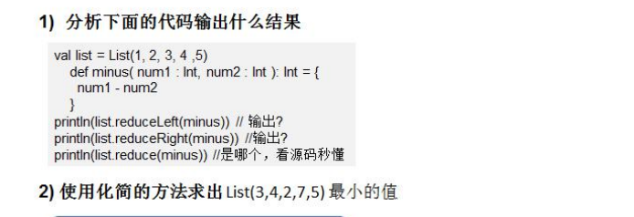

 代码

```scala
package com.atguigu.chapter11

object ReduceExercise01 { 
    def main(args: Array[String]): Unit = { 
        val list = List(1, 2, 3, 4, 5) 
        def minus(num1: Int, num2: Int): Int = { 
            num1 - num2 
        }
        // (((1-2) - 3) - 4) - 5 = -13 
        println(list.reduceLeft(minus)) // 输出? -13 
        // 1 - (2 - (3 -(4 - 5))) = 3 
        println(list.reduceRight(minus)) //输出? 3 
        // reduce 等价于 reduceLeft 
        println(list.reduce(minus)) 
        println("minval=" + list.reduceLeft(min)) // 1 
    }
    //求出最小值 
    def min(n1: Int, n2: Int): Int = { 
        if (n1 > n2) n2 else n1 
    } 
}
```


## 11.4 折叠 

### 11.4.1 基本介绍 

 fold 函数将上一步返回的值作为函数的第一个参数继续传递参与运算，直到 list 中的所有元素被遍历。 

 可以把 reduceLeft 看做简化版的 foldLeft。 

如何理解: 

def reduceLeft\[B >: A](@deprecatedName('f) op: (B, A) => B): B = 

if (isEmpty) throw new UnsupportedOperationException("empty.reduceLeft") 

else tail.foldLeft\[B](head)(op) 

大家可以看到. reduceLeft 就是调用的 foldLeft\[B](head)，并且是默认从集合的 head 元素开始操作的。 

 相关函数：fold，foldLeft，foldRight，可以参考 reduce 的相关方法理解 

### 11.4.2 应用案例 

看下面代码看看输出什么，并分析原因. 

代码如下： 

```scala
package com.atguigu.chapter11 

object FoldDemo01 { 
    def main(args: Array[String]): Unit = { 
        val list = List(1, 2, 3, 4) 
        def minus( num1 : Int, num2 : Int ): Int = {
            num1 - num2 
        }
        //说明 
        //1. 折叠的理解和化简的运行机制几乎一样. 
        //理解 list.foldLeft(5)(minus) 理解成 list(5,1, 2, 3, 4) list.reduceLeft(minus) 
        //步骤 (5-1) 
        //步骤 ((5-1) - 2) 
        //步骤 (((5-1) - 2) - 3) 
        //步骤 ((((5-1) - 2) - 3)) - 4 = - 5 
        println(list.foldLeft(5)(minus)) // 函数的柯里化 
        ////理解 list.foldRight(5)(minus) 理解成 list(1, 2, 3, 4, 5) list.reduceRight(minus) 
        // 步骤 (4 - 5)
        // 步骤 (3- (4 - 5)) 
        // 步骤 (2 -(3- (4 - 5))) 
        // 步骤 1- (2 -(3- (4 - 5))) = 3 
        println(list.foldRight(5)(minus)) // 
    } 
} 
```


### 11.4.3 foldLeft 和 foldRight 缩写方法分别是：/:和:\ 

```scala
package com.atguigu.chapter11

object FlodDemo02 { 
    def main(args: Array[String]): Unit = { 
        val list4 = List(1, 9) 
        def minus(num1: Int, num2: Int): Int = { 
            num1 - num2 
        }
        var i6 = (1 /: list4) (minus) // =等价=> list4.foldLeft(1)(minus) 
        println("i6=" + i6) 
        i6 = (100 /: list4) (minus) //=等价=> list4.foldLeft(100)(minus) 
        println(i6) // 输出? 
        i6 = (list4 :\ 10) (minus) // list4.foldRight(10)(minus) 
        println(i6) // 输出? 2 
    } 
} 
```


## 11.5 扫描 

### 11.5.1 基本介绍 

扫描，即对某个集合的所有元素做 fold 操作，但是会把产生的**所有中间结果放置于一个集合**中保存

### 11.5.2 应用实例 

```scala
package com.atguigu.chapter11 

object ScanDemo01 { 
    def main(args: Array[String]): Unit = { 
        //普通函数 
        def minus( num1 : Int, num2 : Int ) : Int = { 
            num1 - num2 
        }
        //5 (1,2,3,4,5) =>(5, 4, 2, -1, -5, -10) //Vector(5, 4, 2, -1, -5, -10) 
        val i8 = (1 to 5).scanLeft(5)(minus) //IndexedSeq[Int] 
        println("i8=" + i8) 
        //普通函数 
        def add( num1 : Int, num2 : Int ) : Int = { 
            num1 + num2 
        }
        //(1,2,3,4,5) 5 => (20,19,17,14, 10,5) 
        val i9 = (1 to 5).scanRight(5)(add) //IndexedSeq[Int] 
        println("i9=" + i9) 
    } 
}
```


### 11.5.3 课堂练习 

请写出下面的运行结果: 

 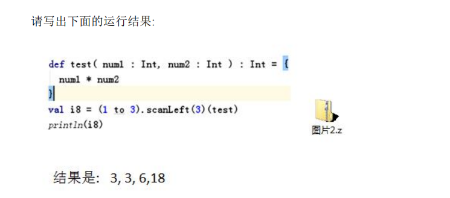

## 11.6 集合综合应用案例 

### 11.6.1 课堂练习 1 

val sentence = "AAAAAAAAAABBBBBBBBCCCCCDDDDDDD"将 sentence 中各个字符，通过foldLeft 存放到 一个 ArrayBuffer 中，目的：理解 flodLeft 的用法. ArrayBufer('A','A','A'..) 

```scala
package com.atguigu.chapter11 

import scala.collection.mutable.ArrayBuffer 
object Exercise02 { 
    def main(args: Array[String]): Unit = { 
        val sentence = "AAAAAAAAAABBBBBBBBCCCCCDDDDDDD" 
        val arrayBuffer = new ArrayBuffer[Char]()
        //理解折叠的第一个传入的 arrayBuffer 含义. 
        sentence.foldLeft(arrayBuffer)(putArray) 
        println("arrayBuffer=" + arrayBuffer) 
    }
    def putArray(arr:ArrayBuffer[Char],c:Char): ArrayBuffer[Char] = { 
        //将 c 放入到 arr 中 
        arr.append(c) 
        arr 
    } 
} 
```


### 11.6.2 课堂练习 2 

val sentence = "AAAAAAAAAABBBBBBBBCCCCCDDDDDDD" 使用映射集合，统计一句话中，各个字母出现的次数 

提示：Map\[Char, Int]() 

 看看 java 如何实现 

```java
String sentence = "AAAAAAAAAABBBBBBBBCCCCCDDDDDDD"; 
Map<Character, Integer> charCountMap = 
new HashMap<Character, Integer>(); 
char[] cs = sentence.toCharArray(); 
for ( char c : cs ) { 
    if ( charCountMap.containsKey(c) ) { 
        Integer count = charCountMap.get(c);
        charCountMap.put(c, count + 1); 
    } else { 
        charCountMap.put(c, 1);
    }
} 
System.out.println(charCountMap); 
```


 使用 scala 的 flodLeft 折叠方式实现 

```scala
package com.atguigu.chapter11 

import scala.collection.mutable 

object Exercise03 { 
    def main(args: Array[String]): Unit = { 
        val sentence = "AAAAAAAAAABBBBBBBBCCCCCDDDDDDD" 
        val map2 = sentence.foldLeft(Map[Char,Int]())(charCount) 
        println("map2=" + map2) 
        //使用可变的 map,效率更高. 
        //1. 先创建一个可变 map,作为左折叠的第一个参数 
        val map3 = mutable.Map[Char,Int]() 
        sentence.foldLeft(map3)(charCount2) 
        println("map3=" + map3) 
    }
    //使用不可变 map 实现
    def charCount(map:Map[Char,Int],char:Char): Map[Char,Int] = { 
        map + (char -> (map.getOrElse(char,0) + 1) ) 
    }
    //使用可变 map 实现 
    def charCount2(map:mutable.Map[Char,Int], char:Char): mutable.Map[Char,Int] = { 
        map += (char -> (map.getOrElse(char,0) + 1) ) 
    } 
} 
```


### 11.6.3 课后练习 3-大数据中经典的 wordcount 案例 

val lines = List("atguigu han hello ", "atguigu han aaa aaa aaa ccc ddd uuu") 使用映射集合，list 中，各个单词出现的次数，并按出现次数排序 

提示：xxx, 课后练习 

## 11.7 扩展-拉链(合并) 

### 11.7.1 基本介绍 

在开发中，当我们需要将两个集合进行 **对偶元组合并**，可以使用拉链。 

### 11.7.2 应用实例 

```scala
package com.atguigu.chapter11

object ZipDemo01 { 
    def main(args: Array[String]): Unit = { 
        // 拉链 
        val list1 = List(1, 2, 3) 
        val list2 = List(4, 5, 6) 
        val list3 = list1.zip(list2) // (1,4),(2,5),(3,6) 
        println("list3=" + list3) 
    } 
} 
```


### 11.7.3 拉链的使用注意事项 

1) 拉链的本质就是两个集合的合并操作，合并后每个元素是一个 对偶元组。 

2) 操作的规则下图: 

 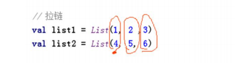

3) 如果两个集合个数不对应，会造**成数据丢失**。 

4) 集合不限于 List, 也可以是其它集合比如 Array 

5) 如果要取出合并后的各个对偶元组的数据，可以遍历 

for(item<-list3){ 

print(item._1 + " " + item._2) //取出时，按照元组的方式取出即可

}

## 11.8 扩展-迭代器 

### 11.8.1 基本说明 

通过 iterator 方法从集合获得一个迭代器，通过 while 循环和 for 表达式对集合进行遍历.(学习使用迭代器来遍历) 

### 11.8.2 应用案例 

```scala
package com.atguigu.chapter11 

object IteratorDemo01 { 

def main(args: Array[String]): Unit = { 
    val iterator = List(1, 2, 3, 4, 5).iterator // 得到迭代器 
    /*这里我们看看 iterator 的继承关系 
    def iterator: Iterator[A] = new AbstractIterator[A] { 
    var these = self 
    def hasNext: Boolean = !these.isEmpty 
    def next(): A = 
    if (hasNext) { 
    val result = these.head; these = these.tail; result 
    } else Iterator.empty.next() 
    */ 
    println("--------遍历方式 1 while -----------------")
    while (iterator.hasNext) { 
        println(iterator.next()) 
    }
    println("--------遍历方式 2 for -----------------") 
    for(enum <- iterator) { 
        println(enum) 
    } 
} 
```


### 11.8.3 对代码小结 

1) iterator 的构建实际是 AbstractIterator 的一个匿名子类，该子类提供了 

/*

def iterator: Iterator[A] = new AbstractIterator[A] { 

var these = self 

def hasNext: Boolean = !these.isEmpty 

def next(): A = 

*/ 

2) 该 AbstractIterator 子类提供了 hasNext next 等方法. 

3) 因此，我们可以使用 while 的方式，使用 hasNext next 方法变量

## 11.9 扩展-流 Stream 

### 11.9.1 基本说明 

stream 是一个集合。这个集合，可以用于存放**无穷多个元素**，但是这无穷个元素并不会一次性生产出来，而是需要用到多大的区间，就会动态的生产，**末尾元素遵循** **lazy** **规则**(即：要使用结果才进行计算的) 。 

### 11.9.2 创建 Stream 对象 

 案例: 

def numsForm(n: BigInt) : Stream[BigInt] = n #:: numsForm(n + 1) 

val stream1 = numsForm(1) 

 说明

1) Stream 集合存放的数据类型是 BigInt 

2) numsForm 是自定义的一个函数，函数名是程序员指定的。 

3) 创建的集合的第一个元素是 n , 后续元素生成的规则是 n + 1 

4) 后续元素生成的规则是可以程序员指定的 ，比如 numsForm( n * 4)... 

### 11.9.3 流的应用案例 

```scala
//创建 Stream 
def numsForm(n: BigInt) : Stream[BigInt] = n #:: numsForm(n + 1) 
val stream1 = numsForm(1) 
println(stream1) // 
//取出第一个元素 
println("head=" + stream1.head) //
println(stream1.tail) // 当对流执行 tail 操作时，就会生成一个新的数据. 
println(stream1) //? 
```


## 11.10扩展-视图 View 

### 11.10.1 基本介绍 

Stream 的懒加载特性，也可以对其他集合应用 **view** **方法来得到类似的效果**，具有如下特点： 

1) view 方法产出一个总是**被懒执行的集合**。 

2) view 不会缓存数据，每次都要重新计算，比如遍历 View 时。 

### 11.10.2 应用案例 

请找到 1-100 中，数字倒序排列 和它本身相同的所有数。(1 2, 11, 22, 33 ...) 

```scala
package com.atguigu.chapter11 

object ViewDemo01 { 
    def main(args: Array[String]): Unit = { 
        def multiple(num: Int): Int = { 
            num 
        }
        //如果这个数，逆序后和原来数相等，就返回 true,否则返回 false 
        def eq(i: Int): Boolean = { 
            println("eq 被调用..") 
            i.toString.equals(i.toString.reverse) 
        }
        //说明: 没有使用 view,常规方式 
        val viewSquares1 = (1 to 100).filter(eq) 
        println(viewSquares1) 
        //使用 view，来完成这个问题,程序中，对集合进行 map,filter,reduce,fold... 
        //你并不希望立即执行，而是在使用到结果才执行，则可以使用 view 来进行优化. 
        val viewSquares2 = (1 to 100).view.filter(eq) 
        println(viewSquares2) 
        //遍历 
        for (item <- viewSquares2) { 
            println("item=" + item) 
        } 
    } 
} 
```


## 11.11扩展-并行集合 

### 11.11.1 基本介绍 

1) Scala 为了充分使用多核 CPU，提供了并行集合（有别于前面的串行集合），用于多核环境的并行计算。 

2) 主要用到的算法有：

Divide and conquer : 分治算法，Scala 通过 splitters(分解器)，combiners（组合器）等抽象层来实现，主要原理是将计算工作分解很多任务，分发给一些处理器去完成，并将它们处理结果合并返回

 Work stealin 算法【学数学】，主要用于任务调度负载均衡（load-balancing），通俗点完成自己的所有任务之后，发现其他人还有活没干完，主动（或被安排）帮他人一起干，这样达到尽早干完的目的 

### 11.11.2 应用案例 

 parallel(pærəlel 并行) 

打印 1~5 

```scala
(1 to 5).foreach(println(_)) 
println() 
(1 to 5).par.foreach(println(_)) 
```

 查看并行集合中元素访问的线程 

```scala
object ParDemo02 { 
    def main(args: Array[String]): Unit = { 
        val result1 = (0 to 100).map{case _ => Thread.currentThread.getName}.distinct 
        val result2 = (0 to 100).par.map{case _ => Thread.currentThread.getName}.distinct 
        println(result1) //非并行 
        println("--------------------------------------------") 
        println(result2) //并行 
    } 
}
```


## 11.12扩展-操作符 

### 11.12.1 基本介绍 

这部分内容没有必要刻意去理解和记忆，语法使用的多了，自然就会熟练的使用，该部分内容了解一下即可。 

### 11.12.2 操作符扩展 

1) 如果想在变量名、类名等定义中使用语法关键字（保留字），可以配合反引号反引号 [案例演示] val `val` = 42 

2) 中置操作符：A 操作符 B 等同于 A.操作符(B) 

3) 后置操作符：A 操作符 等同于 A.操作符，如果操作符定义的时候不带()则调用时不能加括号[案例演示+代码说明] 

4) 前置操作符，+、-、！、~等操作符 A 等同于 A.unary_操作符 [案例演示] 

5) 赋值操作符，A 操作符= B 等同于 A = A 操作符 B ，比如 A += B 等价 A = A + B 

 代码的演示： 

```scala
package com.atguigu.chapter11 

object OperatorDemo01 { 
    def main(args: Array[String]): Unit = { 
        val n1 = 1 
        val n2 = 2 
        val r1 = n1 + n2 // 3
        val r2 = n1.+(n2) // 3 看 Int 的源码即可说明 
        val monster = new Monster 
        monster + 10 
        monster.+(10) 
        println("monster.money=" + monster.money) // 20 
        println(monster++) 
        println(monster.++) 
        println("monster.money=" + monster.money) // 22 
        !monster 
        println("monster.money=" + monster.money) // -22 
    } 
}

class Monster { 
    var money: Int = 0 
    //对操作符进行重载 (中置操作符) 
    def +(n:Int): Unit = { 
        this.money += n 
    }
    //对操作符进行重载(后置操作符) 
    def ++(): Unit = { 
        this.money += 1 
    }
    //对操作符进行重载(前置操作符，一元运算符) 
    def unary_!(): Unit = { 
        this.money = -this.money 
    } 
} 
```


# 第 12 章模式匹配 

## 12.1 match 

### 12.1.1 基本介绍 

Scala 中的模式匹配类似于 Java 中的 switch 语法，但是更加强大。 模式匹配语法中，采用 match 关键字声明，每个分支采用 case 关键字进行声明，当需要匹配时，会从第一个 case 分支开始，如果匹配成功，那么执行对应的逻辑代码，如果匹配不成功，继续执行下一个分支进行判断。如果所有 case 都不匹配，那么会执行 case _ 分支，类似于 Java 中 default 语句。 

### 12.1.2 scala 的 match 的快速入门案例 

```scala
package com.atguigu.chapter12 

object MatchDemo01 { 
    def main(args: Array[String]): Unit = { 
        val oper = '-' 
        val n1 = 20 
        val n2 = 10 
        var res = 0 
        //说明
        //1. match (类似 java switch)和case是关键字
        //2.如果匹配成功， 则 执行=>后面的代码块.
        //3.匹配的顺序是从上到下，匹配到一个就执行对应的代码
        //4. =>后面的代码块 不要写break ,会自动的退出match
        //5.如果一个都没有匹配到，则执行case _后面的代码块
        oper match { 
            case '+' => res = n1 + n2 
            case '-' => res = n1 - n2 
            case '*' => res = n1 * n2 
            case '/' => res = n1 / n2 
            case _ => println("oper error") 
        }
        println("res=" + res) 
    } 
} 
```


### 12.1.3 match 的细节和注意事项 

1) 如果所有 case 都不匹配，那么会执行 case _ 分支，类似于 Java 中 default 语句 

2) 如果所有 case 都不匹配，又没有写 case _ 分支，那么会抛出 MatchError 

3) 每个 case 中，不用 break 语句，自动中断 case 

4) 可以在 match 中使用其它类型，而不仅仅是字符 

5) => 等价于 java swtich 的 : 

6) => 后面的代码块到下一个 case， 是作为一个整体执行，可以使用{} 扩起来，也可以不扩。 

7) 案例:

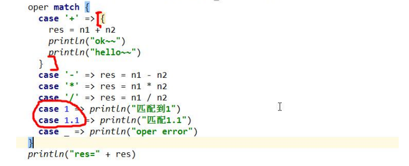

## 12.2 守卫 

### 12.2.1 基本介绍 

如果想要表达匹配某个范围的数据，就需要在模式匹配中增加条件守卫 

### 12.2.2 应用案例 

```scala
package com.atguigu.chapter12 

object MatchIfDemo01 { 
    def main(args: Array[String]): Unit = { 
        for (ch <- "+-3!") { //是对"+-3!" 遍历 
            var sign = 0 
            var digit = 0 
            ch match { 
                case '+' => sign = 1
                case '-' => sign = -1 
                // 说明.. 
                // 如果 case 后有 条件守卫即 if ,那么这时的 _ 不是表示默认匹配 
                // 表示忽略 传入 的 ch 
                case _ if ch.toString.equals("3") => digit = 3 
                case _ if (ch > 1110 || ch < 120) => println("ch > 10") 
                case _ => sign = 2 
            }
            //分析 
            // + 1 0 
            // - -1 0 
            // 3 0 3 
            // ! 2 0 
            println(ch + " " + sign + " " + digit) 
        } 
    } 
} 
```


### 12.2.3 课堂练习题 

```scala
package com.atguigu.chapter12 

object MatchExercise01 { 
    def main(args: Array[String]): Unit = { 
        for (ch <- "+-3!") {
            var sign = 0 
            var digit = 0 
            ch match { 
                case '+' => sign = 1 
                case '-' => sign = -1 
                // 说明.. 
                // 可以有多个 默认匹配，但是后面的默认匹配无效，编译器没有报错 
                case _ => digit = 3 
                case _ => sign = 2 
            }
            // + 1 0
            // - -1 0 
            // 3 0 3 
            // ! 0 3 
            println(ch + " " + sign + " " + digit) 
        } 
    } 
} 

package com.atguigu.chapter12 

object MatchExercise02 { 
    def main(args: Array[String]): Unit = {
        for (ch <- "+-3!") { 
            var sign = 0 
            var digit = 0 
            ch match { 
                case _ if ch > 10000 => digit = 3 
                case '+' => sign = 1 
                case '-' => sign = -1 
                // 说明.. 
                case _ => println("没有任何匹配~~~") 
            }
            println(ch + " " + sign + " " + digit) 
        } 
    } 
}
```


## 12.3 模式中的变量 

### 12.3.1 基本介绍 

如果在 case 关键字后跟变量名，那么 match 前表达式的值会赋给那个变量 

### 12.3.2 应用案例 

```scala
package com.atguigu.chapter12 

object MatchVar {
    def main(args: Array[String]): Unit = { 
        val ch = 'U' 
        ch match { 
            case '+' => println("ok~") 
            // 下面 case mychar 含义是 mychar = ch 
            case mychar => println("ok~" + mychar) 
            case _ => println ("ok~~") 
        }
        val ch1 = '+' 
        //match 是一个表达式，因此可以有返回值 
        //返回值就是匹配到的代码块的最后一句话的值 
        val res = ch1 match { 
            case '+' => ch1 + " hello " 
            // 下面 case mychar 含义是 mychar = ch 
            case _ => println ("ok~~") 
        }
        println("res=" + res) 
    } 
} 
```


## 12.4 类型匹配 

### 12.4.1 基本介绍

可以匹配**对象的任意类型**，这样做避免了使用 **isInstanceOf** 和 **asInstanceOf** 方法 

### 12.4.2 应用案例 

```scala
package com.atguigu.chapter12 

object MatchTypeDemo01 { 
    def main(args: Array[String]): Unit = { 
        val a = 8 
        //说明 obj 实例的类型 根据 a 的值来返回 
        val obj = if (a == 1) 1 
        else if (a == 2) "2" 
        else if (a == 3) BigInt(3) 
        else if (a == 4) Map("aa" -> 1) 
        else if (a == 5) Map(1 -> "aa") 
        else if (a == 6) Array(1, 2, 3) 
        else if (a == 7) Array("aa", 1) 
        else if (a == 8) Array("aa") 
        //说明 
        //1. 根据 obj 的类型来匹配 
        // 返回值 
        val result = obj match { 
            case a: Int => a 
            case b: Map[String, Int] => "对象是一个字符串-数字的 Map 集合" 
            case c: Map[Int, String] => "对象是一个数字-字符串的 Map 集合"
            case d: Array[String] => d //"对象是一个字符串数组" 
            case e: Array[Int] => "对象是一个数字数组" 
            case f: BigInt => Int.MaxValue 
            case _ => "啥也不是" 
        }
        println(result) 
    } 
} 
```


### 12.4.3 类型匹配注意事项 

1) Map[String, Int] 和 Map[Int, String]是两种不同的类型，其它类推。 

2) 在进行类型匹配时，编译器会预先检测是否有可能的匹配，如果没有则报错. 

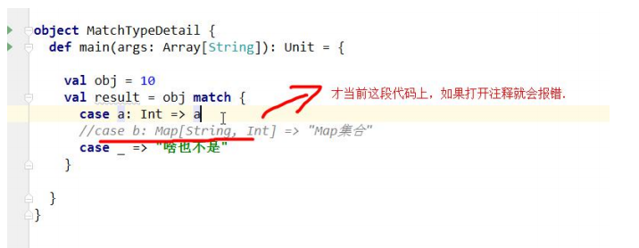

3) 一个说明: 

val result = obj match {

case i : Int => i 

} case i : Int => i 表示 将 i = obj (其它类推)，然后再判断类型 

4) 如果 case _ 出现在 match 中间，则表示隐藏变量名，即不使用,而不是表示默认匹配 

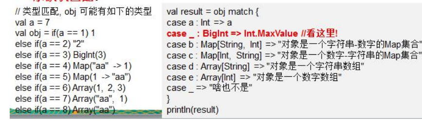

## 12.5 匹配数组 

### 12.5.1 基本介绍 

1) Array(0) 匹配只有一个元素且为 0 的数组。 

2) Array(x,y) 匹配数组有两个元素，并将两个元素赋值为 x 和 y。当然可以依次类推 Array(x,y,z) 匹配数组有 3 个元素的等等.... 

3) Array(0,_*) 匹配数组以 0 开始 

### 12.5.2 应用案例 

```scala
package com.atguigu.chapter12 

import scala.collection.mutable.ArrayBuffer 

object MatchArr { 
    def main(args: Array[String]): Unit = {
        // val arrs = Array(Array(0), Array(1, 0), Array(0, 1, 0), 
        // Array(1, 1, 0), Array(1, 1, 0, 1)) 
        //
        // for (arr <- arrs ) { 
        // val result = arr match { 
        // case Array(0) => "0" 
        // case Array(x, y) => x + "=" + y 
        // case Array(0, _*) => "以 0 开头和数组"
        // case _ => "什么集合都不是" 
        // } 
        // 
        // result = 0 
        // // result = 1 = 0 
        // // result = 以 0 开头和数组 // 
        // result = 什么集合都不是 
        // // result = 什么集合都不是 
        // println("result = " + result) 
        // }
        //给你一个数组集合，如果该数组时 Array(10,20) , 请使用默认匹配，返回 Array(20,10) 
        val arrs2 = Array(Array(0), Array(1, 0), Array(0, 1, 0), 
                          Array(1, 1, 0), Array(1, 1, 0, 1)) 
        for (arr <- arrs2 ) {
            val result = arr match { 
                //case Array(0) => "0" 
                case Array(x, y) => ArrayBuffer(y,x) //? ArrayB(y,x) 
                //case Array(0, _*) => "以 0 开头和数组" 
                case _ => "不处理~~" 
            }
            if (result.isInstanceOf[ArrayBuffer]) { 
                println(result.asInstanceOf[ArrayBuffer]) 
            } 
        } 
    } 
} 
```


## 12.6 匹配列表 

 应用案例 

```scala
package com.atguigu.chapter12 

object MatchList { 
    def main(args: Array[String]): Unit = { 
        for (list <- Array(List(0), List(1, 0), List(88), List(0, 0, 0), List(1, 0, 0))) { 
            val result = list match { 
                case 0 :: Nil => "0" // 
                case x :: y :: Nil => x + " " + y // 
                case 0 :: tail => "0 ..." // 
                case x :: Nil => x
                case _ => "something else" 
            }
            //1. 0 
            //2. 1 0 
            //3. 0 ... 
            //4. something else 
            println(result) 
        } 
    } 
}
```


## 12.7 匹配元组 

 应用案例 

```scala
package com.atguigu.chapter12 

object MatchTupleDemo01 { 
    def main(args: Array[String]): Unit = { 
        //如果要匹配 (10, 30) 这样任意两个元素的对偶元组，应该如何写 
        for (pair <- Array((0, 1), (1, 0), (10, 30), (1, 1), (1, 0, 2))) { 
            val result = pair match { // 
                case (0, _) => "0 ..." // 
                case (y, 0) => y // 
                case (x, y) => (y, x) //"匹配到(x,y)" + x + " " + y
                case _ => "other" //. 
            }
            //1. 0 ... 
            //2. 1 
            //3. other 
            //4. other 
            println(result) 
        } 
    } 
}
```


## 12.8 对象匹配 

### 12.8.1 基本介绍 

对象匹配，什么才算是匹配呢？，规则如下: 

1) case 中对象的 unapply 方法(对象提取器)返回 Some 集合则为匹配成功 

2) 返回 None 集合则为匹配失败 

### 12.8.2 快速入门案例 

```scala
package com.atguigu.chapter12 

object MatchObject { 
    def main(args: Array[String]): Unit = { 
        // 模式匹配使用：
        val number: Double = Square(5.0)// 36.0 // 
        number match { 
            //说明 case Square(n) 的运行的机制 
            //1. 当匹配到 case Square(n) 
            //2. 调用 Square 的 unapply(z: Double),z 的值就是 number 
            //3. 如果对象提取器 unapply(z: Double) 返回的是 Some(6) ,则表示匹配成功，同时将 6 赋给 Square(n) 的 n 
            //4. 果对象提取器 unapply(z: Double) 返回的是 None ,则表示匹配不成功 
            case Square(n) => println("匹配成功 n=" + n) 
            case _ => println("nothing matched") 
        } 
    } 
}

//说明 
object Square { 
    //说明 
    //1. unapply 方法是对象提取器 
    //2. 接收 z:Double 类型 
    //3. 返回类型是 Option[Double] 
    //4. 返回的值是 Some(math.sqrt(z)) 返回 z 的开平方的值，并放入到 Some(x) 
    def unapply(z: Double): Option[Double] = {
        println("unapply 被调用 z 是=" + z) 
        //Some(math.sqrt(z)) 
        None 
    }
    def apply(z: Double): Double = z * z 
} 
```


### 12.8.3 应用案例 2 

 代码 

```scala
package com.atguigu.chapter12 

object MatchObjectDemo2 { 
    def main(args: Array[String]): Unit = { 
        val namesString = "Alice,Bob,Thomas" //字符串 
        //说明 
        namesString match { 
            // 当 执行 
            case Names(first, second, third) 
            // 1. 会调用 unapplySeq（str）,把 "Alice,Bob,Thomas" 传入给 str 
            // 2. 如果 返回的是 Some("Alice","Bob","Thomas"),分别给 （first, second, third） 
            // 注意，这里的返回的值的个数需要和 （first, second, third）要一样 
            // 3. 如果返回的 None ,表示匹配失败 
            case Names(first, second, third) => {
                println("the string contains three people's names") 
                // 打印字符串 
                println(s"$first $second $third") 
            }
            case _ => println("nothing matched") 
        } 
    } 
}

//object 
object Names { 
    //当构造器是多个参数时，就会触发这个对象提取器 
    def unapplySeq(str: String): Option[Seq[String]] = { 
        if (str.contains(",")) Some(str.split(",")) 
        else None 
    } 
}
```


 代码的小结 

1) 当 case 后面的对象提取器方法的参数为多个，则会默认调用 def unapplySeq() 方法 

2) 如果 unapplySeq 返回是 Some，获取其中的值,判断得到的 sequence 中的元素的个数是否是三个如果是三个，则把三个元素分别取出，赋值给 first，second 和 third 

3) 其它的规则不变.

## 12.9 变量声明中的模式 

### 12.9.1 基本介绍 

match 中每一个 case 都可以单独提取出来，意思是一样的. 

### 12.9.2 应用案例 

```scala
package com.atguigu.chapter12 

object MatchVarDemo { 
    def main(args: Array[String]): Unit = { 
        val (x, y, z) = (1, 2, "hello") 
        println("x=" + x) 
        val (q, r) = BigInt(10) /% 3 //说明 q = BigInt(10) / 3 r = BigInt(10) % 3 
        val arr = Array(1, 7, 2, 9) 
        val Array(first, second, _*) = arr // 提出 arr 的前两个元素 
        println(first, second) 
    } 
} 
```


## 12.10for 表达式中的模式 

### 12.10.1 基本介绍 

for 循环也可以进行模式匹配.

### 12.10.2 应用案例 

```scala
package com.atguigu.chapter12 

object MatchForDemo { 
    def main(args: Array[String]): Unit = { 
        val map = Map("A" -> 1, "B" -> 0, "C" -> 3) 
        for ((k, v) <- map) { 
            println(k + " -> " + v) // 出来三个 key-value ("A"->1), ("B"->0), ("C"->3) 
        }
        //说明 : 只遍历出 value =0 的 key-value ,其它的过滤掉 
        println("--------------(k, 0) <- map-------------------") 
        for ((k, 0) <- map) { 
            println(k + " --> " + 0) 
        }
        //说明, 这个就是上面代码的另外写法, 只是下面的用法灵活和强大 

        println("--------------(k, v) <- map if v == 0-------------------") 
        for ((k, v) <- map if v >= 1) { 
            println(k + " ---> " + v) 
        } 
    } 
}
```


## 12.11样例(模板)类 

### 12.11.1 样例类快速入门 

```scala
package com.atguigu.chapter12.casepak 

object CaseClassDemo01 { 
    def main(args: Array[String]): Unit = { 
        println("hello~~") 
    } 
}

abstract class Amount 
case class Dollar(value: Double) extends Amount 
//样例类 
case class Currency(value: Double, unit: String) extends Amount //样例类 
case object NoAmount extends Amount //样例类 
//类型(对象) =序列化(serializable)==>字符串(1.你可以保存到文件中【freeze】2.反序列化,2 网络传输)
```


### 12.11.2 基本介绍 

1) 样例类仍然是类 

2) 样例类用 case 关键字进行声明。 

3) 样例类是为**模式匹配而优化**的类 

4) 构造器中的每一个参数都成为 **val**——除非它被显式地声明为 var（不建议这样做）

5) 在样例类对应的伴生对象中提供 apply 方法让你不用 new 关键字就能构造出相应的对象 

6) 提供 unapply 方法让模式匹配可以工作 

7) 将自动生成 **toString**、**equals**、**hashCode **和 **copy** 方法(有点类似模板类，直接给生成，供程序员使用) 

8) 除上述外，样例类和其他类完全一样。你可以添加方法和字段，扩展它们 

### 12.11.3 样例类最佳实践 1: 

```scala
package com.atguigu.chapter12.casepak 

object CaseClassDemo02 { 
    def main(args: Array[String]): Unit = { 
        //该案例的作用就是体验使用样例类方式进行对象匹配简洁性 
        for (amt <- Array(Dollar2(1000.0), Currency2(1000.0, "RMB"), NoAmount2)) { 
            val result = amt match { 
                //说明 
                case Dollar2(v) => "$" + v // $1000.0 
                //说明 
                case Currency2(v, u) => v + " " + u // 1000.0 RMB 
                case NoAmount2 => "" // "" 
            }
            println(amt + ": " + result) 
        } 
    } 
}

abstract class Amount2 
case class Dollar2(value: Double) extends Amount2 
//样例类 
case class Currency2(value: Double, unit: String) extends Amount2 //样例类 =
case object NoAmount2 extends Amount2 //样例类 
```


### 12.11.4 样例类最佳实践 2: 

 说明

样例类的 copy 方法和带名参数 copy 创建一个与现有对象值相同的新对象，并可以通过带名参数来修改某些属性。 

 代码实现 

```scala
package com.atguigu.chapter12.casepak 

object CaseClassDemo03 { 
    def main(args: Array[String]): Unit = { 
        val amt = new Currency3(3000.0,"RMB") 
        val amt2 = amt.copy() // 克隆,创建的对象和 amt 的属性一样 
        println("amt2.value" + amt2.value + " amt2.unit= " + amt2.unit) 
        println(amt2) 
        val amt3 = amt.copy(value = 8000.0) 
        println(amt3) 
        val amt4 = amt.copy(unit = "美元") 
    }
}

abstract class Amount3 
case class Dollar3(value: Double) extends Amount3 
//样例类 
case class Currency3(value: Double, unit: String) extends Amount3 //样例类 
case object NoAmount3 extends Amount3 //样例类 
```


## 12.12case 语句的中置(缀)表达式 

### 12.12.1 基本介绍 

什么是中置表达式？1 + 2，这就是一个中置表达式。如果 unapply 方法产出一个元组，你可以在case 语句中使用中置表示法。比如可以匹配一个 List 序列 

### 12.12.2 应用实例 

```scala
package com.atguigu.chapter12 

object MidCase { 
    def main(args: Array[String]): Unit = { 
        List(1, 3, 5, 9) match { //修改并测试 
            //1.两个元素间::叫中置表达式,至少 first，second 两个匹配才行. 
            //2.first 匹配第一个 second 匹配第二个, rest 匹配剩余部分(5,9) 
            case first :: second :: rest => println(first + " " + second + " "+ rest.length + " " + rest) // 
            case _ => println("匹配不到...")
        } 
    } 
} 
```


## 12.13匹配嵌套结构 

### 12.13.1 基本介绍 

操作原理类似于正则表达式 

### 12.13.2 最佳实践案例-商品捆绑打折出售 

现在有一些商品，请使用 Scala 设计相关的样例类，完成商品捆绑打折出售。要求 

1) 商品捆绑可以是单个商品，也可以是多个商品。 

2) 打折时按照折扣 x 元进行设计. 

3) 能够统计出所有捆绑商品打折后的最终价格 

 创建样例类 

```scala
//设计样例类 
abstract class Item // 项 
case class Book(description: String, price: Double) extends Item 
case class Food(description: String, price: Double) extends Item
//Bundle 捆 ， discount: Double 折扣 ， item: Item* , 
case class Bundle(description: String, discount: Double, item: Item*) extends Item 
```

 匹配嵌套结构(就是 Bundle 的对象) 

```scala
//这里给出了一个具体的打折的案例 

// 120. 

val sale = Bundle("书籍", 10, Book("漫画", 40), Bundle("文学作品", 20, Book("《阳关》", 80), Book(" 

《围城》", 30))) 
```


 为了讲解案例，我们补充了三个知识点 

```scala
//知识点 1 - 使用 case 语句，得到 "漫画" 

val res = sale match { 
    //如果我们进行对象匹配时，不想接受某些值，则使用_ 忽略即可，_* 表示所有 
    case Bundle(_, _, Book(desc, _), _*) => desc 
}
println("res=" + res) // 

//知识点 2-通过@表示法将嵌套的值绑定到变量。_*绑定剩余 Item 到 rest 
val res2 = sale match { 
    //如果我们进行对象匹配时，不想接受某些值，则使用_ 忽略即可，_* 表示所有 
    case Bundle(_, _, art @ Book(_, _), rest @ _*) => (art, rest) 
}

println("res2=" + res2)

//知识点 3-不使用_*绑定剩余 Item 到 rest 

val res3 = sale match { 
    //如果我们进行对象匹配时，不想接受某些值，则使用_ 忽略即可，_* 表示所有 
    case Bundle(_, _, art3 @ Book(_, _), rest3) => (art3, rest3) 
}
println("res3=" + res3) 
```


### 12.13.3 最佳实践案例-商品捆绑打折出售 

现在有一些商品，请使用 Scala 设计相关的样例类，完成商品可以捆绑打折出售。要求 

1) 商品捆绑可以是单个商品，也可以是多个商品 

2) 打折时按照折扣 xx 元进行设计. 

3) 能够统计出所有捆绑商品打折后的最终价格 

 对应的代码和分析 

```scala
def price(it:Item): Double = { 
    it match { 
        case Book(_,p) => p 
        case Bundle(_,disc,its @ _*) => its.map(price).sum - disc 
    } 
} 
println("price=" + price(sale)) // 120 
```


## 12.14密封类

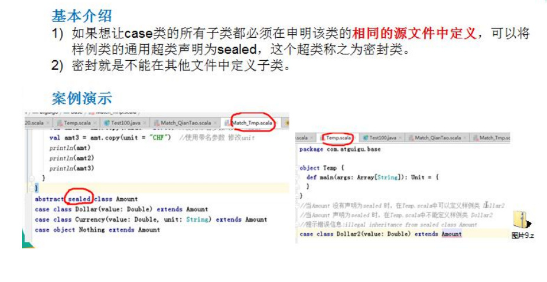

# 第 13 章函数式编程高级 

## 13.1 偏函数(partial function) 

### 13.1.1 提出一个需求，引起思考 

给你一个集合 val list = List(1, 2, 3, 4, "abc") ，请完成如下要求: 

1) 将集合 list 中的所有数字+1，并返回一个新的集合 

2) 要求忽略掉 非数字 的元素，即返回的 新的集合 形式为 (2, 3, 4, 5) 

### 13.1.2 解决方式-filter + map 返回新的集合, 引出偏函数 

### 13.1.3 解决方式-模式匹配 

```scala
package com.atguigu.chapter13 

/*给你一个集合 val list = List(1, 2, 3, 4, "abc") ，请完成如下要求: 
将集合 list 中的所有数字+1，并返回一个新的集合 
要求忽略掉 非数字 的元素，即返回的 新的集合 形式为 (2, 3, 4, 5) 
*/ 

object PartialFunDemo01 { 
    def main(args: Array[String]): Unit = { 
        //思路1 filter + map方式解决 
        //虽然可以解决问题，但是麻烦.
        val list = List(1, 2, 3, 4, "hello")
        //先过滤，再map 
        println(list.filter(f1).map(f3).map(f2))
        //思路2-模式匹配
        //小结：虽然使用模式匹配比较简单，但是不够完美 
        val list2 = list.map(addOne2)
        println("list2=" + list2)
    }
    //模式匹配 
    def addOne2( i : Any ): Any = { 
        i match { 
            case x:Int => x + 1 
            case _ => 
        } 
    }
    def f1(n: Any): Boolean = { 
        n.isInstanceOf[Int] 
    }
    def f2(n: Int): Int = { 
        n + 1 
    }
    //将 Any->Int [map] 
    def f3(n: Any): Int = { 
        n.asInstanceOf[Int] 
    } 
} 
```


### 13.1.4 偏函数快速入门 

使用偏函数解决前面的问题，【代码演示+说明】 

代码: 

```scala
package com.atguigu.chapter13 

object PartialFunDemo02 { 
    def main(args: Array[String]): Unit = { 
        //使用偏函数解决 
        val list = List(1, 2, 3, 4, "hello") 
        //定义一个偏函数
        //1. PartialFunction[Any,Int] 表示偏函数接收的参数类型是 Any,返回类型是 Int 
        //2. isDefinedAt(x: Any) 如果返回 true ,就会去调用 apply 构建对象实例,如果是 false,过滤 
        //3. apply 构造器 ,对传入的值 + 1,并返回（新的集合） 
        val partialFun = new PartialFunction[Any,Int] { 
            override def isDefinedAt(x: Any) = { 
                println("x=" + x)
                x.isInstanceOf[Int] 
            }
            override def apply(v1: Any) = { 
                println("v1=" + v1) 
                v1.asInstanceOf[Int] + 1 
            } 
        }
        //使用偏函数 
        //说明：如果是使用偏函数，则不能使用 map,应该使用 collect 
        //说明一下偏函数的执行流程 
        //1. 遍历 list 所有元素 
        //2. 然后调用 val element = if(partialFun-isDefinedAt(list 单个元素)) {partialFun-apply(list 单个元素)}
        //3. 每得到一个 element,放入到新的集合，最后返回 
        val list2 = list.collect(partialFun) 
        println("list2" + list2) 
    } 
} 
```


### 13.1.5 偏函数的小结

1) 使用构建特质的实现类(使用的方式是 PartialFunction 的匿名子类) 

2) PartialFunction 是个特质(看源码) 

3) 构建偏函数时，参数形式 [Any, Int]是泛型，第一个表示参数类型，第二个表示返回参数 

4) 当使用偏函数时，会遍历集合的所有元素，编译器执行流程时先执行 isDefinedAt()如果为 true , 就会执行 apply, 构建一个新的 Int 对象返回 

5) 执行 isDefinedAt() 为 false 就过滤掉这个元素，即不构建新的 Int 对象. 

6) map 函数不支持偏函数，因为 map 底层的机制就是所有循环遍历，无法过滤处理原来集合的元素 

7) collect 函数支持偏函数 

### 13.1.6 偏函数的简写形式 

 代码说明 

```scala
package com.atguigu.chapter13 

object PartialFun03 { 
    def main(args: Array[String]): Unit = { 
        //可以将前面的案例的偏函数简写 
        def partialFun2: PartialFunction[Any,Int] = { 
            //简写成 case 语句 
            case i:Int => i + 1 
            case j:Double => (j * 2).toInt 
        }
        val list = List(1, 2, 3, 4, 1.2, 2.4, 1.9f, "hello") 
        val list2 = list.collect(partialFun2) 
        println("list2=" + list2) 
        //第二种简写形式 
        val list3 = list.collect{ 
            case i:Int => i + 1 
            case j:Double => (j * 2).toInt 
            case k:Float => (k * 3).toInt 
        }
        println("list3=" + list3) // (2,3,4,5) 
    } 
}
```


## 13.2 作为参数的函数 

### 13.2.1 基本介绍 

函数作为一个变量传入到了另一个函数中，那么该作为参数的函数的类型是：function1，即：(参数类型) => 返回类型 

### 13.2.2 应用实例 

```scala
package com.atguigu.chapter13

object FunParameter { 
    def main(args: Array[String]): Unit = { 
        def plus(x: Int) = 3 + x 
        //说明 
        val result1 = Array(1, 2, 3, 4).map(plus(_)) 
        println(result1.mkString(",")) //(4,5,6,7) 
        //说明 
        //1. 在scala中，函数也是有类型，比如plus就是<function1> 
        println("puls 的函数类型 function1" + (plus _)) 
    } 
} 
```


### 13.2.3 对代码的小结 

1) map(plus(_)) 中的 plus(_) 就是将 plus 这个函数当做一个参数传给了 map，_这里代表从集合中遍历出来的一个元素。 

2) plus(_) 这里也可以写成 plus 表示对 Array(1,2,3,4) 遍历，将每次遍历的元素传给 plus 的 x 

3) 进行 3 + x 运算后，返回新的 Int ，并加入到新的集合 result1 中 

4) def map\[B, That](f: A => B) 的声明中的 f: A => B 一个函数 

## 13.3 匿名函数 

### 13.3.1 基本介绍

没有名字的函数就是匿名函数，可以通过函数表达式来设置匿名函数 

### 13.3.2 应用案例 

```scala
package com.atguigu.chapter13 

object AnonymouseFunction { 
    def main(args: Array[String]): Unit = { 
        //对匿名函数的说明 
        //1. 不需要写 def 函数名 
        //2. 不需要写返回类型，使用类型推导 
        //3. = 变成 => 
        //4. 如果有多行，则使用{} 包括 
        val triple = (x: Double) => { 
            println("x=" + x) 
            3 * x 
        }
        println("triple" + triple(3)) // 9.0 
    } 
} 
```

### 13.3.3 课堂案例

请编写一个匿名函数，可以返回 2 个整数的和，并输出该匿名函数的类型. 

```scala
val f1 = (n1: Int, n2: Int ) => { 
    println("匿名函数被调用") 
    n1 + n2 
}
println("f1 类型=" + f1) 
println(f1(10, 30))
```


## 13.4 高阶函数 

### 13.4.1 基本介绍 

能够接受函数作为参数的函数，叫做高阶函数 (higher-order function)。可使应用程序更加健壮。 

### 13.4.2 高阶函数基本使用 

```scala
package com.atguigu.chapter13 

object HigherOrderFunction { 
    def main(args: Array[String]): Unit = { 
        def test(f: Double => Double, f2: Double =>Int , n1: Double) = { 
            f(f2(n1)) // f(0) 
        }
        //sum 是接收一个 Double,返回一个 Double 
        def sum(d: Double): Double = { 
            d + d
        }
        def mod(d:Double): Int = { 
            d.toInt % 2 
        }
        val res = test(sum, mod, 5.0) // 
        println("res=" + res) // 2.0 
    } 
} 
```

### 13.4.3 高阶函数可以返回函数类型 

```scala
package com.atguigu.chapter13 

object HigherOrderFunction2 { 
    def main(args: Array[String]): Unit = { 
        //说明 
        //1. minusxy 是高阶函数,因为它返回匿名函数 
        //2. 返回的匿名函数 (y: Int) => x - y 
        //3. 返回的匿名函数可以使用变量接收 
        def minusxy(x: Int) = {
            (y: Int) => x - y //匿名函数 
        }
        //分步执行 
        //f1 就是 (y: Int) => 3 - y 
        val f1 = minusxy(3) 
       println("f1 的类型=" + f1) 
        println(f1(1)) // 2 
        println(f1(9)) // -6 
        //也可以一步到位的调用 
        println(minusxy(4)(9)) // -5 
    } 
} 
```


## 13.5 参数(类型)推断 

### 13.5.1 基本介绍 

参数推断省去类型信息（在某些情况下[**需要有应用场景**]，参数类型是可以推断出来的，如 list=(1,2,3) list.map() 

map 中函数参数类型是可以推断的)，同时也可以进行相应的简写。 

### 13.5.2 参数类型推断写法说明

1) 参数类型是可以推断时，可以省略参数类型 

2) 当传入的函数，只有单个参数时，可以省去括号 

3) 如果变量只在=>右边只出现一次，可以用_来代替 

### 13.5.3 应用案例 

```scala
//分别说明 
val list = List(1, 2, 3, 4) 
println(list.map((x:Int)=>x + 1)) //(2,3,4,5) 
println(list.map((x)=>x + 1)) 
println(list.map(x=>x + 1)) 
println(list.map(_ + 1)) 
val res = list.reduce(_+_) 
package com.atguigu.chapter13 
object ParameterInfer { 
    def main(args: Array[String]): Unit = { 
        val list = List(1, 2, 3, 4) 
        println(list.map((x:Int)=>x + 1)) //(2,3,4,5) 
        println(list.map((x)=>x + 1)) //(2,3,4,5) 
        println(list.map(x=>x + 1)) //(2,3,4,5) 
        println(list.map( _ + 1)) //(2,3,4,5)
        println(list.reduce(f1)) // 10 
        println(list.reduce((n1:Int ,n2:Int) => n1 + n2)) //10 
        println(list.reduce((n1 ,n2) => n1 + n2)) //10 
        println(list.reduce( _ + _)) //10 
        val res = list.reduce(_+_) 
    }
    def f1(n1:Int ,n2:Int): Int = { 
        n1 + n2 
    } 
}
```


## 13.6 闭包(closure) 

### 13.6.1 基本介绍 

基本介绍：闭包就是**一个函数**和**与其相关的引用环境**组合的一个**整体**(实体)。 

### 13.6.2 案例演示 

```scala
//1.用等价理解方式改写 2.对象属性理解 
def minusxy(x: Int) = (y: Int) => x - y
//f 函数就是闭包. 
val f = minusxy(20) 
println("f(1)=" + f(1)) // 19 
println("f(2)=" + f(2)) // 18 
```

【案例演示+总结】 

 对上面代码的小结和说明 

1) 第 1 点 

(y: Int) => x – y 返回的是一个匿名函数 ，因为该函数引用到到函数外的 x,那么 该函数和 x 整体形成一个闭包 如：这里 val f = minusxy(20) 的 f 函数就是闭包 

2) 你可以这样理解，返回函数是一个对象，而 x 就是该对象的一个字段，他们共同形成一个闭包 

3) 当多次调用 f 时（可以理解多次调用闭包），发现使用的是同一个 x, 所以 x 不变。 

4) 在使用闭包时，主要搞清楚返回函数引用了函数外的哪些变量，因为他们会组合成一个整体(实体),形成一个闭包 

### 13.6.3 闭包的最佳实践 

请编写一个程序，具体要求如下 

1) 编写一个函数 makeSuffix(suffix: String) 可以接收一个文件后缀名(比如.jpg)，并返回一个闭 包

2) 调用闭包，可以传入一个文件名，如果该文件名没有指定的后缀(比如.jpg) ,则返回 文件名.jpg ,如果已经有.jpg 后缀，则返回原文件名。 

3) 要求使用闭包的方式完成 

String.endsWith(xx)

```scala
package com.atguigu.chapter13 

object ClosureDemo { 
    def main(args: Array[String]): Unit = { 
        /*
        请编写一个程序，具体要求如下 
        1.编写一个函数 makeSuffix(suffix: String) 可以接收一个文件后缀名(比如.jpg)， 并返回 一个闭包 
        2.调用闭包，可以传入一个文件名，如果该文件名没有指定的后缀(比如.jpg) ,则返回 文件名.jpg , 如果已经有.jpg 后缀，则返回原文件名。 比如 文件名 是 dog =>dog.jpg 比如 文件名 是 cat.jpg => cat.jpg 
        3.要求使用闭包的方式完成 提示：String.endsWith(xx) 
        */ 
        //使用并测试 
        val f = makeSuffix(".jpg") 
        println(f("dog.jpg")) // dog.jpg 
        println(f("cat")) // cat.jpg 
    }
    def makeSuffix(suffix: String) = { 
        //返回一个匿名函数，回使用到 suffix 
        (filename:String) => {
            if (filename.endsWith(suffix)) { 
                filename 
            } else { 
                filename + suffix 
            } 
        } 
    } 
} 
```


## 13.7 函数柯里化(curry) 

### 13.7.1 基本介绍 

1) 函数编程中，接受多个参数的函数都可以转化为接受单个参数的函数，这个转化过程就叫柯里化 

2) 柯里化就是证明了函数只需要一个参数而已。其实我们刚才的学习过程中，已经涉及到了柯里化操作。

3) 不用设立柯里化存在的意义这样的命题。柯里化就是以函数为主体这种思想发展的必然产生的 结果。(即：柯里化是面向函数思想的必然产生结果) 

### 13.7.2 函数柯里化快速入门 

编写一个函数，接收两个整数，可以返回两个数的乘积，要求: 

使用常规的方式完成 

使用闭包的方式完成

使用函数柯里化完成 

 注意观察编程方式的变化。[案例演示] 

//说明 

```scala
def mul(x: Int, y: Int) = x * y 
println(mul(10, 10)) 
def mulCurry(x: Int) = (y: Int) => x * y 
println(mulCurry(10)(9)) 
def mulCurry2(x: Int)(y:Int) = x * y 
println(mulCurry2(10)(8)) 
```


### 13.7.3 函数柯里化最佳实践 

比较两个字符串在忽略大小写的情况下是否相等，注意，这里是两个任务： 

1) 全部转大写（或小写） 

2) 比较是否相等 

针对这两个操作，我们用一个函数去处理的思想，其实也变成了两个函数处理的思想（柯里化）使用函数柯里化的思想来任务 

```scala
package com.atguigu.chapter13 

object CurryDemo02 { 
    def main(args: Array[String]): Unit = 
    //这是一个函数，可以接收两个字符串，比较是否相等 
    def eq(s1: String, s2: String): Boolean = { 
        s1.equals(s2) 
    }
    //隐式类(可以参考前面讲解内容) 
    implicit class TestEq(s: String) {
        //体现了将比较字符串的事情，分解成两个任务完成
        //1. checkEq完转换大小写
        //2. f函数完成比较任务 
        def checkEq(ss: String)(f: (String, String) => Boolean): Boolean = { 
            f(s.toLowerCase, ss.toLowerCase)
        }
    }
    val str1 = "hello" 
    println(str1.checkEq("HeLLO")(eq)) 
    //在看一个简写形式 
    println(str1.checkEq("HeLLO")(_.equals(_))) 
} 
```


## 13.8 控制抽象 

### 13.8.1 看一个需求 

如何实现将一段代码(从形式上看)，作为参数传递给高阶函数，在高阶函数内部执行这段代码. 其使用的形式如 breakable{} 。 

```scala
var n = 10 

breakable { 
    while (n <= 20) { 
        n += 1 
        if (n == 18) { 
            break() 
        }
    }
}
```


### 13.8.2 控制抽象基本介绍 

 控制抽象是这样的函数，满足如下条件 

1) 参数是函数 

2) 函数参数没有输入值也没有返回值 

 控制抽象的应用案例（使用控制抽象实现了 while 语法） 

```scala
package com.atguigu.chapter13 

object AbstractControl {
    def main(args: Array[String]): Unit = { 
        //myRunInThread 就是一个抽象控制 
        //是没有输入， 也没有输出的函数 f1: () => Unit 
        def myRunInThread(f1: () => Unit) = { 
            new Thread { 
                override def run(): Unit = { 
                    f1() //只写了 f1 
                } 
            }.start() 
        }
        myRunInThread { 
            () => println("干活咯！5 秒完成...") 
            Thread.sleep(5000) 
            println("干完咯！") 
        }
        //简写形式 
        def myRunInThread2(f1: => Unit) = { 
            new Thread { 
                override def run(): Unit = { 
                    f1 //只写了 f1 
                }
            }.start() 
        }
        //对于没有输入，也没有返回值函数，可以简写成如下形式 
        myRunInThread2 { 
            println("干活咯！5 秒完成...~~~") 
            Thread.sleep(5000) 
            println("干完咯！~~~") 
        } 
    } 
} 
```


### 13.8.3 进阶用法：实现类似 while 的 until 函数 

```scala
package com.atguigu.chapter13 

object AbstractControl2 { 
    def main(args: Array[String]): Unit = { 
        var x = 10 
        //说明 
        //1 函数名为 until , 实现了类似 while 循环的效果 
        //2. condition: => Boolean 是后一个没有输入值，返回 Boolean 类型函数 
        //3. block: => Unit 没有输入值，也没有返回值的
        def mywhile(condition: => Boolean)(block: => Unit): Unit = { 
            //类似 while 循环，递归 
            if(!condition) { 
                block // x= 9 ,x = 8 x =7 .... 
                mywhile(condition)(block) 
            } 
        }
        mywhile(x == 0) { 
            x -= 1 
            println("x=" + x ) 
        } 
    } 
}
```


# 第 14 章使用递归的方式去思考,去编程 

## 14.1 基本介绍 

Scala 是运行在 Java 虚拟机（Java Virtual Machine）之上，因此具有如下特点: 

1) 轻松实现和丰富的 Java 类库互联互通。 

2) 它既支持面向对象的编程方式，又支持函数式编程。 

3) 它写出的程序像动态语言一样简洁，但事实上它确是严格意义上的静态语言。 

4) Scala 就像一位**武林中的集大成者**，将过去几十年计算机语言发展历史中的精萃集于一身，化繁为简，为程序员们提供了一种新的选择。设计者马丁·奥得斯基 希望程序员们将编程作为简洁，高效，令人愉快的工作。同时也让程序员们进行关于编程思想的新的思考 

## 14.2 Scala 提倡函数式编程(递归思想) 

先说下编程范式: 

1) 在所有的编程范式中，面向对象编程（Object-Oriented Programming）无疑是最大的赢家。 

2) 但其实面向对象编程并不是一种严格意义上的编程范式，严格意义上的编程范式分为：命令式编程（Imperative Programming）、函数式编程（Functional Programming）和逻辑式编程（Logic Programming）。**面向对象编程只是上述几种范式的一个交叉产物**，更多的还是继承了命令式编程的基因。

3) 在传统的语言设计中，只有命令式编程得到了强调，那就是程序员要告诉计算机应该怎么做。而递归则通过灵巧的函数定义，**告诉计算机做什么**。因此在使用命令式编程思维的程序中，是现在多数程序采用的编程方式，递归出镜的几率很少，而在函数式编程中，大家可以随处见到递归的方式。 

## 14.3 应用实例 

scala 中循环不建议使用 while 和 do...while,而建议使用递归。 

### 14.3.1 应用实例要求: 

计算 1-50 的和

### 14.3.2 常规的解决方式 

```scala
package com.atguigu.chapter14 

import java.text.SimpleDateFormat 
import java.util.Date 

object RecursiveDemo01 { 
    def main(args: Array[String]): Unit = { 
        //传统方法完成 1-50 的求和任务 
        val now: Date = new Date() 
        val dateFormat: SimpleDateFormat = 
        new SimpleDateFormat("yyyy-MM-dd HH:mm:ss") 
        val date = dateFormat.format(now) 
        println("date=" + date) //输出时间 
        var res = BigInt(0) 
        var num = BigInt(1) 
        var maxVal = BigInt(99999999l) //BigInt(99999999l)[测试效率大数] 
        while (num <= maxVal) { 
            res += num 
            num += 1 
        }
        println("res=" + res)
        //再一次输出时间 
        val now2: Date = new Date() 
        val date2 = dateFormat.format(now2) 
        println("date2=" + date2) //输出时间 
    } 
} 
```

### 14.3.3 使用函数式编程方式-递归 

函数式编程的重要思想就是尽量不要产生额外的影响,上面的代码就不符合函数式编程的思想, 下面我们看看使用函数式编程方式来解决(Scala 提倡的方式) 测试：看看递归的速度是否有影响? 没有任何影响 

```scala
package com.atguigu.chapter14 

import java.text.SimpleDateFormat 
import java.util.Date 

object RecursiveDemo02 { 
    def main(args: Array[String]): Unit = { 
        // 递归的方式来解决 
        //传统方法完成 1-50 的求和任务 
        val now: Date = new Date() 
        val dateFormat: SimpleDateFormat = new SimpleDateFormat("yyyy-MM-dd HH:mm:ss") 
        val date = dateFormat.format(now) 
        println("date=" + date) //输出时间 
        def mx(num: BigInt, sum: BigInt): BigInt = { 
            if (num <= 99999999l) return mx(num + 1, sum + num) 
            else return sum 
        }
        //测试 
        var num = BigInt(1) 
        var sum = BigInt(0) 
        var res = mx(num,sum) 
        println("res=" + res) 
        //再一次输出时间 
        val now2: Date = new Date() 
       val date2 = dateFormat.format(now2) 
        println("date2=" + date2) //输出时间 
    } 
}
```


## 14.4 应用案例 2 

求最大值 

```scala
//大话 java 数据结构 

def max(xs: List[Int]): Int = { 
    if (xs.isEmpty) 
    throw new java.util.NoSuchElementException 
    if (xs.size == 1) 
    xs.head 
    else if (xs.head > max(xs.tail)) xs.head else max(xs.tail) 
} 
```


## 14.5 使用函数式编程方式-字符串翻转 

```scala
def reverse(xs: String): String = 
if (xs.length == 1) xs else reverse(xs.tail) + xs.head 
```

## 14.6 使用递归-求阶乘 

```scala
def factorial(n: Int): Int = 
if (n == 0) 1 else n * factorial(n - 1)
```


# 第 15 章 项目-scala 客户信息管理系统 

## 15.1 项目开发流程 

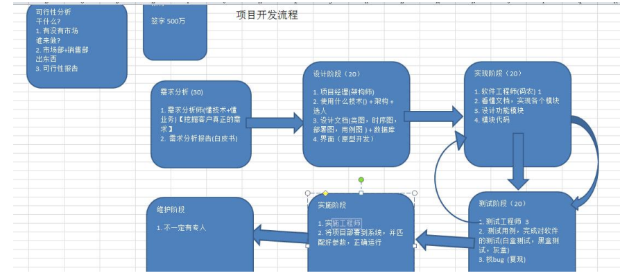

## 15.2 项目需求分析 

模拟实现基于文本界面的《客户信息管理软件》。 该软件 scala 能够实现对客户对象的插入、修改和删除,显示，查询（用 ArrayBuffer 或者 ListBuffer 实现），并能够打印客户明细表。 

## 15.3 项目界面 

 主界面

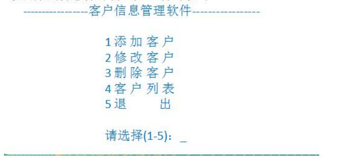

 添加客户 


 修改客户

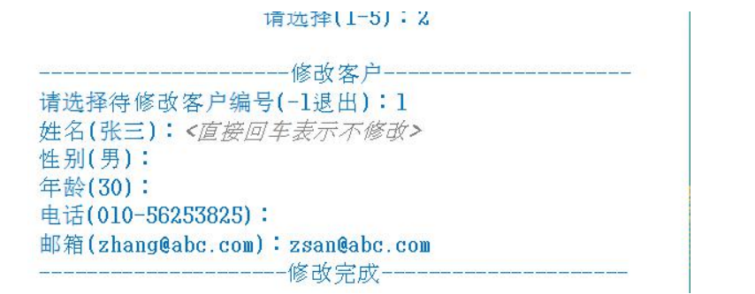

 删除 

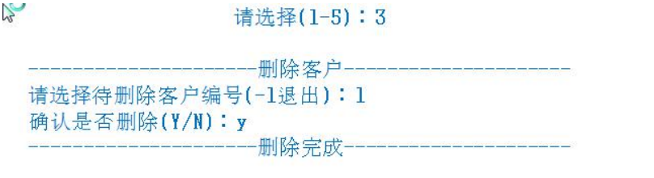

 客户列表 

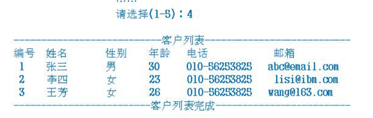

## 15.4 项目设计-程序框架图

程序框架图: 设计系统有多少个文件，以及文件(一般来说，一个文件对应一个类)之间的调用关系，可以帮助程序员实现模块的设计(清晰)， 便于程序员之间对项目交流分析.=> 【业务，优化, 设计方案】

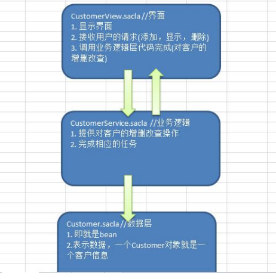 

## 15.5 项目功能实现 

### 15.5.1 项目功能实现-完成 Customer 类 

根据需求文档或者页面，我们写出了 Customer 类 

```scala
package com.atguigu.chapter15.customercrm.bean 

class Customer { 
    //属性 
    var id: Int = _ 
    var name: String = _
    var gender: Char = _ 
    var age:Short = _ 
    var tel:String = _ 
    var email:String = _ 
    //设计一个辅助构造器 
    def this(id:Int,name:String,gender: Char,age:Short,tel:String,email:String) { 
        this 
        this.id = id 
        this.name = name 
        this.gender = gender 
        this.age = age 
        this.tel = tel 
        this.email = email 
    } 
} 
```


### 15.5.2 项目功能实现-显示主菜单和完成退出软件功能 

 功能说明 

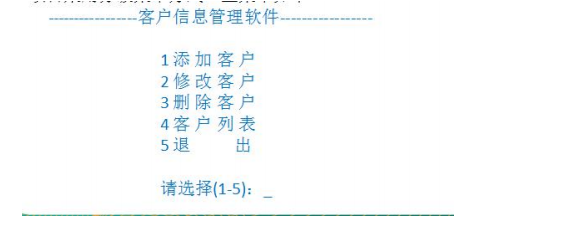

 思路分析

完成显示主菜单,退出 

\1. 将主菜单的显示放入到 while 

\2. 用户可以根据输入，选择自己的操作 

\3. 如果输入 5 退出 

 代码实现 

```scala
//在 CustomerView.scala 
package com.atguigu.chapter15.customercrm.view 

import scala.io.StdIn 
class CustomerView { 
    //定义一个循环变量，控制是否退出 while 
    var loop = true 
    //定义一个 key 用于接收用户输入的选项 
    var key = ' ' 
    /*
    -----------------客户信息管理软件----------------- 
    1 添 加 客 户 
    2 修 改 客 户 
    3 删 除 客 户 
    4 客 户 列 表 
    5 退出
    请选择(1-5)：_ 
    */ 
    def mainMenu(): Unit = { 
        do {
            println("-----------------客户信息管理软件-----------------") 
            println(" 1 添 加 客 户")      
            println(" 2 修 改 客 户")         
            println(" 3 删 除 客 户")       
            println(" 4 客 户 列 表")        
            println(" 5 退 出")       
            println("请选择(1-5)：")        
            key = StdIn.readChar()         
            key match {             
                case '1' => println(" 添 加 客 户")            
                case '2' => println(" 修 改 客 户")             
                case '3' => println(" 删 除 客 户")            
                case '4' => println(" 客 户 列 表")            
                case '5' => this.loop = false 
            } 
        }
        while(loop) 
        println("你退出了软件系统...")
    } 
}

//CustomerCrm.scala 
package com.atguigu.chapter15.customercrm.app 
import com.atguigu.chapter15.customercrm.view.CustomerView 

object CustomerCrm { 
    def main(args: Array[String]): Unit = { 
        new CustomerView().mainMenu() 
    } 
} 
```


### 15.5.3 项目功能实现-完成显示客户列表的功能 

 功能分析

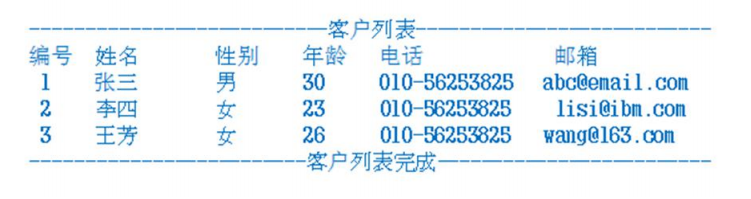

 分析思路 

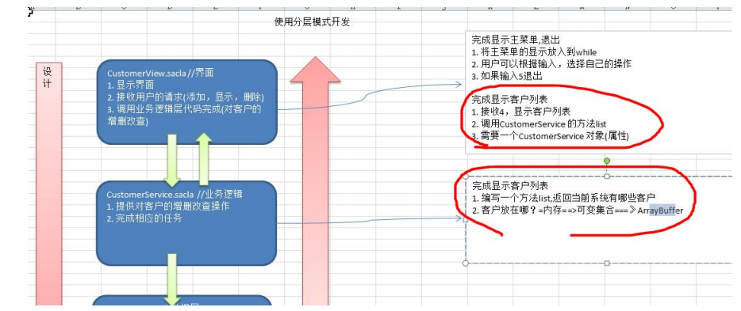

 代码实现 

//在 Customer.scala ,重写 toString 

```scala
override def toString: String = { 
    this.id + "\t\t" + this.name + "\t\t" + this.gender + "\t\t" + this.age + "\t\t" + this.tel + "\t\t" + this.email 
} 
```

//CustomerService.scala 

```scala
package com.atguigu.chapter15.customercrm.service 

import com.atguigu.chapter15.customercrm.bean.Customer 
import scala.collection.mutable.ArrayBuffer 

class CustomerService { 
    //customers 是存放客户的，这里我们先初始化,为了测试
    val customers = ArrayBuffer(new Customer(1,"tom",'男',10,"110","tom@sohu.com")) 
    def list(): ArrayBuffer[Customer] = { 
        this.customers 
    } 
} 

//在 CustomerView.scala 增加了 list 方法，并调用
def list(): Unit = { 
    println() 
    println("---------------------------客户列表---------------------------") 
    println("编号\t\t 姓名\t\t 性别\t\t 年龄\t\t 电话\t\t 邮箱") 
    //for 遍历 
    //1.获取到 CustomerSerivce 的 customers ArrayBuffer
    val customers = customerService.list() 
    for (cutomer <- customers) { 
        //重写 Customer 的 toString 方法，返回信息(并且格式化) 
        println(cutomer) 
    }
    println("-------------------------客户列表完成-------------------------") 
} 
```


### 15.5.4 项目功能实现-添加客户的功能 

 功能说明

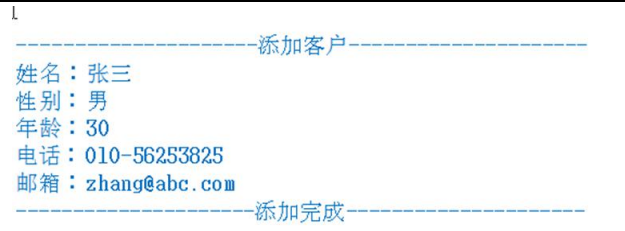

 思路分析

 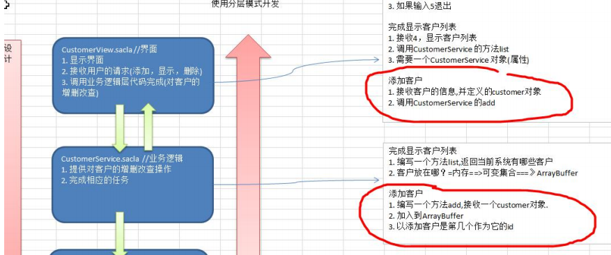

 代码实现 

```scala
//Customer.scala 
//在写一个构造器 
def this(name: String, gender: Char, age: Short, tel: String, email: String) { 
    this 
    this.name = name 
    this.gender = gender 
    this.age = age 
    this.tel = tel
    this.email = email 
}

//CustomerService.scala 
//添加客户 
def add(customer:Customer): Boolean = { 
    //设置 id 
    customerNum += 1 
    customer.id = customerNum 
    //加入到 customers 
    customers.append(customer)
    true 
} 
//在 CustomerView.scala 
def add(): Unit = { 
    println() 
    println("---------------------添加客户---------------------") 
    println("姓名：") 
    val name = StdIn.readLine() 
    println("性别：") 
    val gender = StdIn.readChar() 
    println("年龄：") 
    val age = StdIn.readShort() 
    println("电话：") 
    val tel = StdIn.readLine() 
    println("邮箱：")
    val email = StdIn.readLine() 
    //构建对象 
    val customer = new Customer(name,gender,age,tel,email) 
    customerService.add(customer) 
    println("---------------------添加完成---------------------") 
} 
```


### 15.5.5 项目功能实现-完成删除客户的功能 

 功能说明 

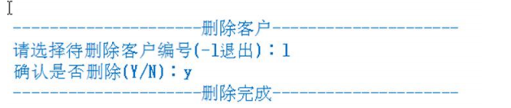

 思路分析 

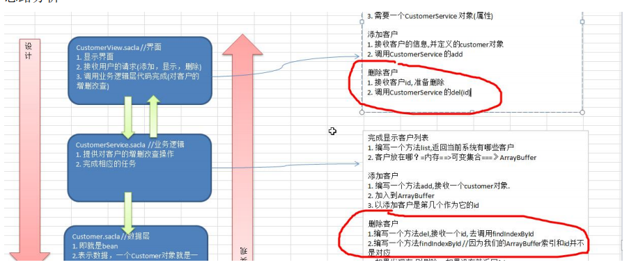

 代码实现 

```scala
//在 **CustomerService.scala
//在 CustomerView.scala 中写的 
def del(id:Int): Boolean = { 
    val index = findIndexById(id) 
    if (index != -1) { 
        //删除 
        customers.remove(index) 
        true 
    }else { 
        false 
    } 
}

//根据 id 找到 index 
def findIndexById(id: Int) = { 
    var index = -1 //默认-1,如果找到就改成对应,如果没有找到，就返回-1 
    //遍历 customers 
    breakable { 
        for (i <- 0 until customers.length) { 
            if (customers(i).id == id) { //找到 
                index = i 
                break() 
            } 
        } 
    }
    index 
}

*/
def del(): Unit = { 
    println("---------------------删除客户---------------------") 
    println("请选择待删除客户编号(-1 退出)：") 
    val id = StdIn.readInt() 
    if (id == -1) { 
        println("---------------------删除没有完成---------------------") 
        return 
    }
    println("确认是否删除(Y/N)：") 
    val choice = StdIn.readChar().toLower 
    if (choice == 'y') { 
        if (customerService.del(id)) { 
            println("---------------------删除完成---------------------") 
            return 
        } 
    }
    println("---------------------删除没有完成---------------------") 
} 
```


### 15.5.6 项目功能实现-完善退出确认功能（课堂作业带）

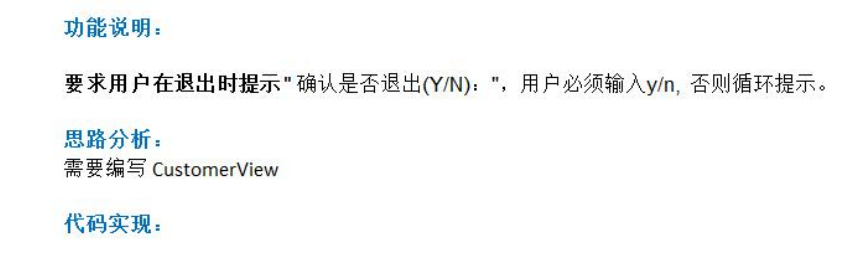

### 15.5.7 项目功能实现-完成修改客户的功能（课堂作业） 

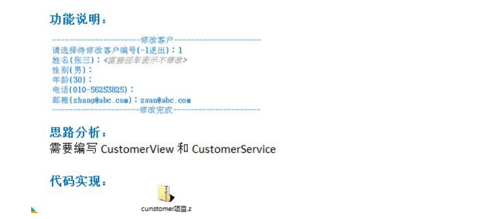

### 15.5.8 项目功能实现-查询客户的功能（课堂作业）

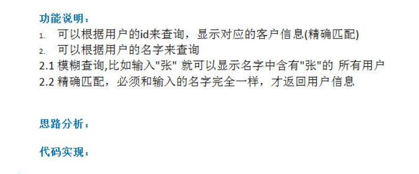

# 第 16 章并发编程模型 Akka 

## 16.1 Akka 介绍 

1) Akka 是 JAVA 虚拟机 JVM 平台上构建高并发、分布式和容错应用的工具包和运行时，你可以理解成 **Akka** **是编写并发程序的框架**。 

2) Akka 用 Scala 语言写成，同时提供了 Scala 和 JAVA 的开发接口。 

3) Akka 主要解决的问题是：可以轻松的写出高效稳定的并发程序，程序员不再过多的考虑线程、锁和资源竞争等细节。 

## 16.2 Actor 模型用于解决什么问题 

1) 处理并发问题关键是要保证共享数据的一致性和正确性，因为程序是多线程时，多个线程对同一个数据进行修改，若不加同步条件，势必会造成数据污染。但是当我们对关键代码加入同步条件 synchronized 后，实际上大并发就会阻塞在这段代码，对程序效率有很大影响。 

2) 若是用单线程处理，不会有数据一致性的问题，但是系统的性能又不能保证。 

3) Actor 模型的出现解决了这个问题，简化并发编程，提升程序性能。 你可以这里理解：Actor 模型是一种处理并发问题的解决方案，很牛! 

## 16.3 Akka 中 Actor 模型 

### 16.3.1 Actor 模型及其说明

1) Akka 处理并发的方法基于 Actor 模型。(示意图) 

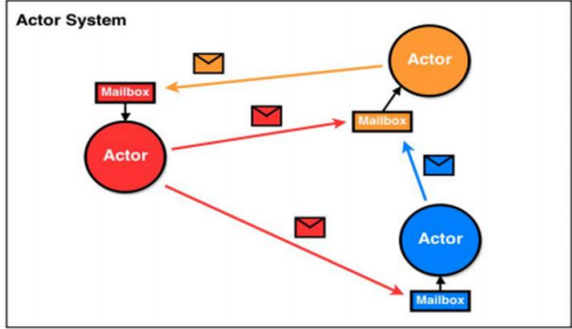

2) 在基于 Actor 的系统里，所有的事物都是 Actor，就好像在面向对象设计里面所有的事物都是对象一样。 

3) Actor 模型是作为一个并发模型设计和架构的。Actor 与 Actor 之间只能通过消息通信，如图 的信封

4) Actor 与 Actor 之间只能用消息进行通信，当一个 Actor 给另外一个 Actor 发消息，消息是有顺序的(消息队列)，只需要将消息投寄的相应的邮箱即可。 

5) 怎么处理消息是由接收消息的 Actor 决定的，发送消息 Actor 可以等待回复，也可以异步处理 【ajax】

6) ActorSystem 的职责是负责创建并管理其创建的 Actor， ActorSystem 是单例的(可以 ActorSystem 是一个工厂，专门创建 Actor)，一个 JVM 进程中有一个即可，而 Acotr 是可以有多个的。 

7) Actor 模型是对并发模型进行了更高的抽象。 

8) Actor 模型是**异步、非阻塞、高性能**的事件驱动编程模型。[案例: 说明 什么是异步、非阻塞, 最经典的案例就是 ajax 异步请求处理 ] 

9) Actor 模型是轻量级事件处理（1GB 内存可容纳百万级别个 Actor），因此处理大并发性能高.

## 16.4 Actor 模型工作机制说明 

 说明了 Actor 模型的工作机制（对应上图） 


1) ActorySystem 创建 Actor 

2) ActorRef:可以理解成是Actor 的代理或者引用。消息是通过ActorRef来发送,而不能通过Actor 发送消息，通过哪个 ActorRef 发消息，就表示把该消息发给哪个 Actor 

3) 消息发送到 Dispatcher Message (消息分发器)，它得到消息后，会将消息进行分发到对应的MailBox。(注: Dispatcher Message 可以理解成是一个线程池, MailBox 可以理解成是消息队列，可以缓冲多个消息，遵守 FIFO) 

4) Actor 可以通过 receive 方法来获取消息，然后进行处理。 

 Actor 模型的消息机制(对应上图) 

1) 每一个消息就是一个 Message 对象。Message 继承了 Runable， 因为 Message 就是线程类。 

2) 从 Actor 模型工作机制看上去很麻烦，但是程序员编程时只需要编写 Actor 就可以了，其它的交给 Actor 模型完成即可。 

3) A Actor 要给 B Actor 发送消息，那么 A Actor 要先拿到(也称为持有) B Actor 的 代理对象 ActorRef 才能发送消息

## 16.5 Actor 模型快速入门 

### 16.5.1 应用实例需求 

1) 编写一个 Actor, 比如 SayHelloActor 

2) SayHelloActor 可以给自己发送消息 ,如图 

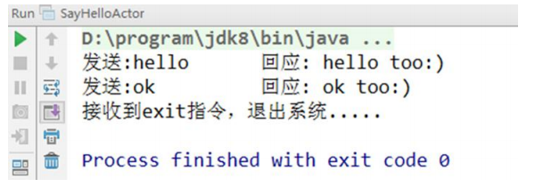

3) 要求使用 Maven 的方式来构建项目,这样可以很好的解决项目开发包的依赖关系。[scala 和 akka] 

### 16.5.2 代码如下 

```scala
package com.atguigu.akka.actor 

import akka.actor.{Actor, ActorRef, ActorSystem, Props} 

//说明 
//1. 当我们继承 Actor 后，就是一个 Actor,核心方法 receive 方法重写 
class SayHelloActor extends Actor{ 
    //说明
    //1. receive 方法，会被该 Actor 的 MailBox(实现了 Runnable 接口)调用 
    //2. 当该 Actor 的 MailBox 接收到消息,就会调用 receive 
    //3. type Receive = PartialFunction[Any, Unit] 

    override def receive:Receive = { 
        case "hello" => println("收到 hello, 回应 hello too:)") 
        case "ok" => println("收到 ok, 回应 ok too:)") 
        case "exit" => { 
            println("接收到 exit 指令，退出系统") 
            context.stop(self) //停止 actoref 
            context.system.terminate()//退出 actorsystem 
        }
        case _ => println("匹配不到") 
    } 
}
object SayHelloActorDemo { 
    //1. 先创建一个 ActorSystem, 专门用于创建 Actor 
    private val actoryFactory = ActorSystem("actoryFactory") 
    //2. 创建一个 Actor 的同时，返回 Actor 的 ActorRef 
    // 说明 
    //(1) Props[SayHelloActor] 创建了一个 SayHelloActor 实例，使用反射 
    //(2) "sayHelloActor" 给 actor 取名 
    //(3) sayHelloActorRef: ActorRef 就是 Props[SayHelloActor] 的 ActorRef 
    //(4) 创建的 SayHelloActor 实例被 ActorSystme 接管
    private val sayHelloActorRef: ActorRef = actoryFactory.actorOf(Props[SayHelloActor],"sayHelloActor") 
    def main(args: Array[String]): Unit = { 
        //给 SayHelloActor 发消息(邮箱) 
        sayHelloActorRef ! "hello" 
        sayHelloActorRef ! "ok" 
        sayHelloActorRef ! "ok~" 
        //研究异步如何退出 ActorSystem 
        sayHelloActorRef ! "exit" 
    } 
} 
```


### 16.5.3 代码的小结和示意图 

小结和说明 

\1. 当程序执行 aActorRef = actorFactory.actorOf(Props[AActor], "aActor") ，会完成如下任务 [这是非常重要的方法] 

\2. actorFactory 是 ActorSystem("ActorFactory") 这样创建的。 

\3. 这 里 的 Props[AActor] 会 使 用 反 射 机 制 ， 创 建 一 个 AActor 对 象 ， 如 果 是 actorFactory.actorOf(Props(new AActor(bActorRef)), "aActorRef") 形式，就是使用 new 的方式创建一 个 AActor 对象, 注意 Props() 是小括号。

\4. 会创建一个 AActor 对象的代理对象 aActorRef , 使用 aActorRef 才能发送消息 

\5. 会在底层创建 Dispather Message ，是一个线程池，用于分发消息， 消息是发送到对应的 Actor 的 MailBox 

\6. 会在底层创建 AActor 的 MailBox 对象，该对象是一个队列，可接收 Dispatcher Message 发送的消息 

\7. MailBox 实现了 Runnable 接口，是一个线程，一直运行并调用 Actor 的 receive 方法，因此当Dispather 发送消息到 MailBox 时，Actor 在 receive 方法就可以得到信息. 

\8. aActorRef ! "hello", 表示把 hello 消息发送到 AActor 的 mailbox（通过 Dispatcher Message 转发） 

一个示意图的说明: 

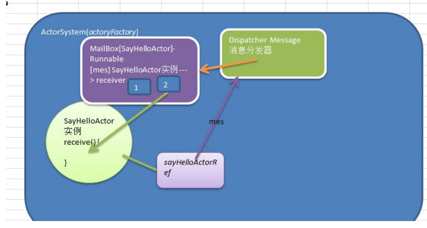

## 16.6 Actor 模型应用实例-Actor 间通讯 

### 16.6.1 应用实例需求 

1) 编写 2 个 Actor , 分别是 AActor 和 BActor

2) AActor 和 BActor 之间可以相互发送消息. 

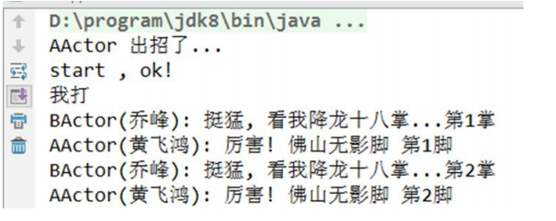

3) 加强对 Actor 传递消息机制的理解 

### 16.6.2 两个 Actor 的通讯机制原理图 

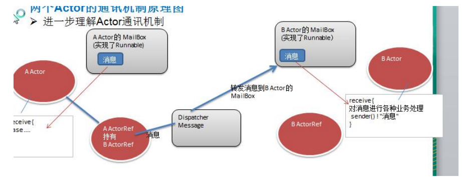

### 16.6.3 代码如下 

```scala
//AActor.scala 

package com.atguigu.akka.actors 

import akka.actor.{Actor, ActorRef}
class AActor(actorRef: ActorRef) extends Actor { 
    val bActorRef: ActorRef = actorRef 
    override def receive: Receive = { 
        case "start" => { 
            println("AActor 出招了 , start ok") 
            self ! "我打" //发给自己 
        }
        case "我打" => { 
            //给 BActor 发出消息 
            //这里需要持有 BActor 的引用(BActorRef) 
            println("AActor(黄飞鸿) 厉害 看我佛山无影脚") 
            Thread.sleep(1000) 
            bActorRef ! "我打" //给 BActor 发出消息 
        } 
    } 
}

//BActor.scala 
package com.atguigu.akka.actors 
import akka.actor.Actor

class BActor extends Actor{ 
    override def receive:Receive = { 
        case "我打" => { 
            println("BActor(乔峰) 挺猛 看我降龙十八掌") 
            Thread.sleep(1000) 
            //通过 sender() 可以获取到发现消息的 actor 的 ref 
            sender() ! "我打" 
        } 
    } 
}

ActorGame.scala 
package com.atguigu.akka.actors 
import akka.actor.{ActorRef, ActorSystem, Props} 
//100 招后，就退出 
object ActorGame extends App { 
    //创建 ActorSystem 
    val actorfactory = ActorSystem("actorfactory") 
    //先创建 BActor 引用/代理 
    val bActorRef: ActorRef = actorfactory.actorOf(Props[BActor], "bActor") 
    //创建 AActor 的引用 
    val aActorRef: ActorRef = actorfactory.actorOf(Props(new AActor(bActorRef)), "aActor")
    //aActor 出招 
    aActorRef ! "start" 
} 
```


## 16.7 Akka 网络编程 

### 16.7.1 看两个实际应用(socket/tcp/ip) 


## 16.8 Akka 网络编程基本介绍 

Akka 支持面向大并发后端服务程序，网络通信这块是服务端程序重要的一部分。 

网络编程有两种: 

1) TCP socket 编程，是网络编程的主流。之所以叫 Tcp socket 编程，是因为底层是基于 Tcp/ip 协议的. 比如: QQ 聊天 [示意图] 

2) b/s 结构的 http 编程，我们使用浏览器去访问服务器时，使用的就是 http 协议，而 http 底层依旧是用 tcp socket 实现的。 比如: 京东商城 【属于 web 开发范畴 】

### 16.8.1 OSI 与 Tcp/ip 参考模型 (推荐 tcp/ip 协议 3 卷) 

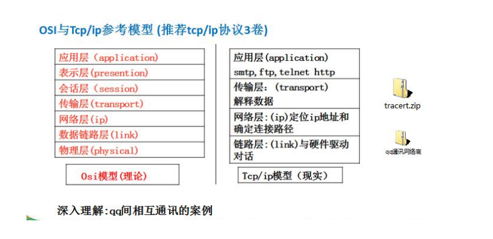

### 16.8.2 端口(port)-介绍 

我们这里所指的端口不是指物理意义上的端口，而是特指 TCP/IP 协议中的端口，是逻辑意义上的端口。如果把 IP 地址比作一间房子，端口就是出入这间房子的门。真正的房子只有几个门，但是一个 IP 地址的端口 可以有 65535（即：256×256-1）个之多！端口是通过端口号来标记的。(端口号 0：Reserved) 

 端口(port)-分类

1) 0 号是保留端口. 

2) 1-1024 是固定端口 又叫有名端口,即被某些程序固定使用,一般程序员不使用. 22: SSH 远程登录协议 23: telnet 使用 21: ftp 使用  m25: smtp 服务使用  80: iis 使用 7: echo 服务 

3) 1025-65535 是动态端口 这些端口，程序员可以使用. 

 端口(port)-使用注意 

1) 在计算机(尤其是做服务器)要尽可能的少开端口[ 

2) 一个端口只能被一个程序监听( ) 

3) 如果使用 netstat –an 可以查看本机有哪些端口在监听 

4) 可以使用 netstat –anb 来查看监听端口的 pid,在结合任务管理器关闭不安全的端口 

5) 使用示意图

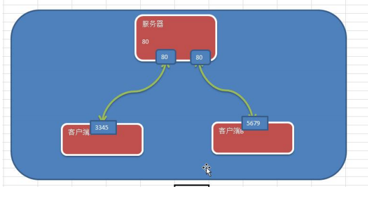

## 16.9 Akka 网络编程-小黄鸡客服 

16.9.1 需求分析 

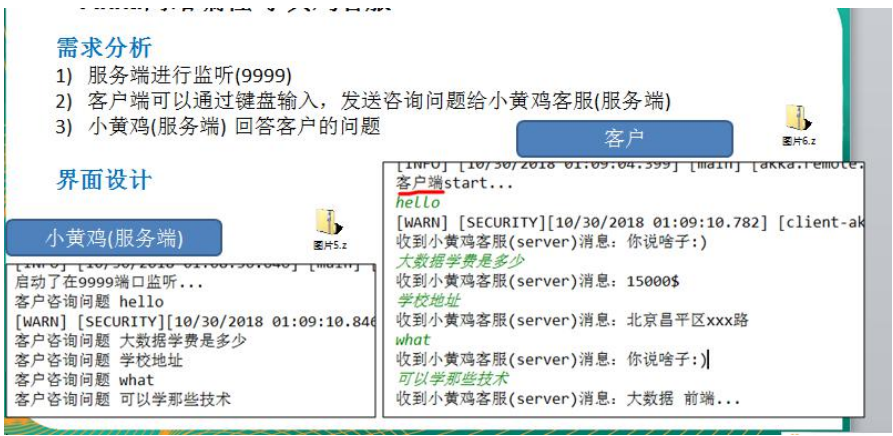

### 16.9.2 程序网络拓扑图

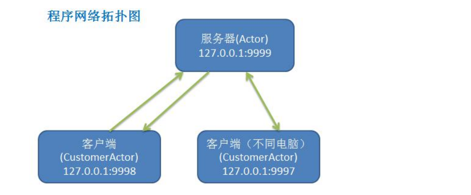

### 16.9.3 程序框架图 


### 16.9.4 功能实现(走代码)


```scala
代码如下： 

//YellowChickenServer.scala 

package com.atguigu.akka.yellowchicken.server 

import akka.actor.{Actor, ActorRef, ActorSystem, Props} 
import com.atguigu.akka.yellowchicken.common.{ClientMessage, ServerMessage} 
import com.typesafe.config.ConfigFactory 

class YellowChickenServer extends Actor{ 
    override def receive:Receive = { 
        case "start" => println("start 小黄鸡客服开始工作了....") 
        //如果接收到 ClientMessage 
        case ClientMessage(mes) => { 
            //使用 match --case 匹配(模糊) 
            mes match { 
                case "大数据学费" => sender() ! ServerMessage("35000RMB") 
                case "学校地址" => sender() ! ServerMessage("北京昌平 xx 路 xx 大楼") 
                case "学习什么技术" => sender() ! ServerMessage("大数据 前端 python") 
                case _ => sender() ! ServerMessage("你说的啥子~")
            } 
        } 
    } 
}

//主程序-入口 

object YellowChickenServer extends App { 
    val host = "127.0.0.1" //服务端 ip 地址 
    val port = 9999 
    //创建 config 对象,指定协议类型，监听的 ip 和端口 
    val config = ConfigFactory.parseString( 
        s"""
        |akka.actor.provider="akka.remote.RemoteActorRefProvider" 
        |akka.remote.netty.tcp.hostname=$host 
        |akka.remote.netty.tcp.port=$port 
        """.stripMargin) 
    //创建 ActorSystem 
    //url (统一资源定位) 
    val serverActorSystem = ActorSystem("Server",config) 
    //创建 YellowChickenServer 的 actor 和返回 actorRef 
    val yellowChickenServerRef: ActorRef = serverActorSystem.actorOf(Props[YellowChickenServer],"YellowChickenServer")
    //启动 
    yellowChickenServerRef ! "start" 
}
//CustomerAtor.scala 
package com.atguigu.akka.yellowchicken.client 
import akka.actor.{Actor, ActorRef, ActorSelection, ActorSystem, Props} 
import com.atguigu.akka.yellowchicken.common.{ClientMessage, ServerMessage} 
import com.typesafe.config.ConfigFactory 
import scala.io.StdIn 
class CustomerActor(serverHost: String, serverPort: Int) extends Actor { 
    //定义一个 YellowChickenServerRef 
    var serverActorRef: ActorSelection = _ 
    //在 Actor 中有一个方法 PreStart 方法，他会在 actor 运行前执行 
    //在 akka 的开发中，通常将初始化的工作，放在 preStart 方法 
    override def preStart(): Unit = { 
        println("preStart() 执行") 
        serverActorRef = context.actorSelection(s"akka.tcp://Server@${serverHost}:${serverPort}/user/YellowChickenServer")
        println("serverActorRef=" + serverActorRef) 
    }
    override def receive: Receive = { 
        case "start" => println("start,客户端运行，可以咨询问题") 
        case mes: String => { 
            //发给小黄鸡客服 
            serverActorRef ! ClientMessage(mes) //使用 ClientMessage case class apply 
        }
        //如果接收到服务器的回复 
        case ServerMessage(mes) => { 
            println(s"收到小黄鸡客服(Server): $mes") 
        } 
    } 
}

//主程序-入口 

object CustomerActor extends App { 
    val (clientHost, clientPort, serverHost, serverPort) = ("127.0.0.1", 9990, "127.0.0.1", 9999) 
    val config = ConfigFactory.parseString( 
        s"""
        |akka.actor.provider="akka.remote.RemoteActorRefProvider"
        |akka.remote.netty.tcp.hostname=$clientHost 
        |akka.remote.netty.tcp.port=$clientPort 
        """.stripMargin) 
    //创建 ActorSystem 
    val clientActorSystem = ActorSystem("client", config) 
    //创建 CustomerActor 的实例和引用 
    val customerActorRef: ActorRef = clientActorSystem.actorOf(Props(new CustomerActor(serverHost, serverPort)), "CustomerActor") 
    //启动 customerRef/也可以理解启动 Actor 
    customerActorRef ! "start" 
    //客户端可以发送消息给服务器 
    while (true) { 
        println("请输入要咨询的问题") 
        val mes = StdIn.readLine() 
        customerActorRef ! mes 
    } 
}

//MessageProtocol.scala
package com.atguigu.akka.yellowchicken.common 

//使用样例类来构建协议 
//客户端发给服务器协议(序列化的对象) 
case class ClientMessage(mes: String) 
//服务端发给客户端的协议(样例类对象) 
case class ServerMessage(mes: String) 
```


## 16.10Spark Master Worker 进程通讯项目 

### 16.10.1 项目的意义 

1) 深入理解 Spark 的 Master 和 Worker 的通讯机制 

2) 为了方便同学们看 Spark 的底层源码，命名的方式和源码保持一致.(如： 通讯消息类命名就是一样的) 

3) 加深对主从服务**心跳检测机制**(HeartBeat)的理解，方便以后 spark 源码二次开发。 

### 16.10.2 项目需求分析

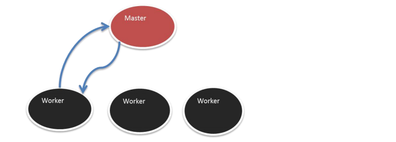

1) worker 注册到 Master, Master 完成注册，并回复 worker 注册成功 

2) worker 定时发送心跳，并在 Master 接收到 

3) Master 接收到 worker 心跳后，要更新该 worker 的最近一次发送心跳的时间 

4) 给 Master 启动定时任务，定时检测注册的 worker 有哪些没有更新心跳,并将其从 hashmap 中删除 

5) master worker 进行分布式部署(Linux 系统) 

### 16.10.3 实现功能 1-Worker 完成注册 

 功能要求: worker 注册到 Master, Master 完成注册，并回复 worker 注册成功 

 思路分析(程序框架图) 

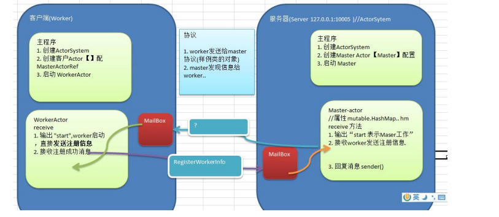

 代码实现


```scala
//SparkMaster.scala 

package com.atguigu.akka.sparkmasterworker.master 

import akka.actor.{Actor, ActorSystem, Props} 
import com.atguigu.akka.sparkmasterworker.common.{RegisterWorkerInfo, RegisteredWorkerInfo, WorkerInfo} 
import com.typesafe.config.ConfigFactory 
import scala.collection.mutable 
class SparkMaster extends Actor { 
    //定义个 hm,管理 workers 
    val workers = mutable.Map[String,WorkerInfo]() 
    override def receive: Receive = { 
        case "start" => println("master 服务器启动了...") 
        case RegisterWorkerInfo(id,cpu,ram) => { 
            //接收到 worker 注册信息 
            if (!workers.contains(id)) {
                //创建 WorkerInfo 对象 
                val workerInfo = new WorkerInfo(id,cpu,ram) 
                //加入到 workers 
                workers += ((id,workerInfo)) 
                println("服务器的 workers=" + workers) 
                //回复一个消息，说注册成功 
                sender() ! RegisteredWorkerInfo 
            } 
        } 
    } 
}

object SparkMaster { 
    def main(args: Array[String]): Unit = { 
        //先创建 ActorSystem 
        val config = ConfigFactory.parseString( 
            s"""
            |akka.actor.provider="akka.remote.RemoteActorRefProvider"
            |akka.remote.netty.tcp.hostname=127.0.0.1 
            |akka.remote.netty.tcp.port=10005 
            """.stripMargin) 
        val sparkMasterSystem = ActorSystem("SparkMaster", config) 
        //创建 SparkMaster -actor 
        val sparkMasterRef = sparkMasterSystem.actorOf(Props[SparkMaster], "SparkMaster-01") 
        //启动 SparkMaster 
        sparkMasterRef ! "start"
    } 
}

//SparkWorker.scala 

package com.atguigu.akka.sparkmasterworker.worker 
import akka.actor.{Actor, ActorSelection, ActorSystem, Props} 
import com.atguigu.akka.sparkmasterworker.common.{RegisterWorkerInfo, RegisteredWorkerInfo} 
import com.typesafe.config.ConfigFactory 
class SparkWorker(masterHost:String,masterPort:Int) extends Actor{ 
    //masterProxy 是 Master 的代理/引用 ref 
    var masterPorxy :ActorSelection = _ 
    val id = java.util.UUID.randomUUID().toString 
    override def preStart(): Unit = { 
        println("preStart()调用") 
        //初始化 masterPorxy 
        masterPorxy = context.actorSelection(s"akka.tcp://SparkMaster@${masterHost}:${masterPort}/user/SparkMaster-01") 
        println("masterProxy=" + masterPorxy) 
    }
    override def receive:Receive = { 
        case "start" => { 
            println("worker 启动了")
            //发出一个注册消息 
            masterPorxy ! RegisterWorkerInfo(id, 16, 16 * 1024) 
        }
        case RegisteredWorkerInfo => { 
            println("workerid= " + id + " 注册成功~") 
        } 
    } 
}

object SparkWorker { 
    def main(args: Array[String]): Unit = { 
        val workerHost = "127.0.0.1" 
        val workerPort = 10001 
        val masterHost = "127.0.0.1" 
        val masterPort = 10005 
        val config = ConfigFactory.parseString( 
            s"""
            |akka.actor.provider="akka.remote.RemoteActorRefProvider" 
            |akka.remote.netty.tcp.hostname=127.0.0.1 
            |akka.remote.netty.tcp.port=10002 
            """.stripMargin) 
        //创建 ActorSystem 
        val sparkWorkerSystem = ActorSystem("SparkWorker",config) 
        //创建 SparkWorker 的引用/代理
        val sparkWorkerRef = sparkWorkerSystem.actorOf(Props(new SparkWorker(masterHost, masterPort)), "SparkWorker-01") 
        //启动 actor 
        sparkWorkerRef ! "start" 
    } 
}

//MessageProtocol.scala 
package com.atguigu.akka.sparkmasterworker.common 
// worker 注册信息 //MessageProtocol.scala 
case class RegisterWorkerInfo(id: String, cpu: Int, ram: Int) 
// 这个是 WorkerInfo, 这个信息将来是保存到 master 的 hm(该 hashmap 是用于管理 worker) 
// 将来这个 WorkerInfo 会扩展（比如增加 worker 上一次的心跳时间） 
class WorkerInfo(val id: String, val cpu: Int, val ram: Int) 
// 当 worker 注册成功，服务器返回一个 RegisteredWorkerInfo 对象 
case object RegisteredWorkerInfo 
```


### 16.10.4 实现功能 2-Worker 定时发送心跳

 功能要求: worker 定时发送心跳给 Master，Master 能够接收到,并更新 worker 上一次心跳时间 

 思路分析(程序框架图) 

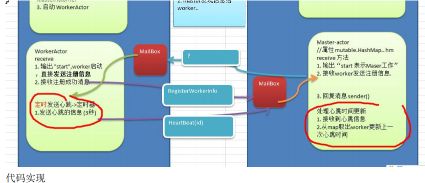

 代码实现 

```scala
//在 MessageProtocol.scala 中增加了对应的协议 
// 这个是 WorkerInfo, 这个信息将来是保存到 master 的 hm(该 hashmap 是用于管理 worker) 
// 将来这个 WorkerInfo 会扩展（比如增加 worker 上一次的心跳时间） 
class WorkerInfo(val id: String, val cpu: Int, val ram: Int) { 
    var lastHeartBeat : Long = System.currentTimeMillis() 
}

// 当 worker 注册成功，服务器返回一个 RegisteredWorkerInfo 对象 
case object RegisteredWorkerInfo 
//worker 每隔一定时间由定时器发给自己的一个消息 
case object SendHeartBeat 
//worker 每隔一定时间由定时器触发，而向 master 发现的协议消息 
case class HeartBeat(id: String)
//更新 SparkWorker.scala 
case RegisteredWorkerInfo => { 
    println("workerid= " + id + " 注册成功~") 
    //当注册成功后，就定义一个定时器,每隔一定时间，发送 SendHeartBeat 给自己 
    import context.dispatcher 
    //****说明** 
    //1. 0 millis** **不延时，立即执行定时器** 
    //2. 3000 millis** **表示每隔** **3** **秒执行一次** 
    //3. self:****表示发给自己** 
    //4. SendHeartBeat** **发送的内容** 
    context.system.scheduler.schedule(0 millis, 3000 millis, self, SendHeartBeat)
}

case SendHeartBeat =>{ 
    println("worker = " + id + "****给** **master** **发送心跳****") 
    masterPorxy ! HeartBeat(id)
} 

//更新 SparkMaster.scala 
case HeartBeat(id) => { 
    //更新对应的 worker 的心跳时间 
    //1.从 workers 取出 WorkerInfo 
    val workerInfo = workers(id) 
    workerInfo.lastHeartBeat = System.currentTimeMillis()
    println("master 更新了 " + id + " 心跳时间...") 
} 
```


### 16.10.5 实现功能 3-Master 启动定时任务，定时检测注册的 worker 

 功能要求：Master 启动定时任务，定时检测注册的 worker 有哪些没有更新心跳，已经超时的 worker， 

将其从 hashmap 中删除掉 

 思路分析(程序框架图) 

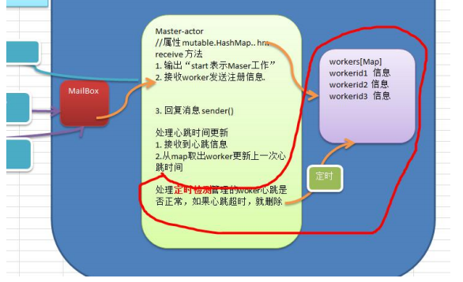

 代码实现 

```scala
//更新 MessageProtocol.scala 
//master 给自己发送一个触发检查超时 worker 的信息 
case object StartTimeOutWorker 
// master 给自己发消息，检测 worker,对于心跳超时的. 
case object RemoveTimeOutWorker 
//更新 SpartMaster.scala
case "start" => { 
    println("master 服务器启动了...") 
    //这里开始。。 
    self ! StartTimeOutWorker 
} 

case StartTimeOutWorker => { 
    println("开始了定时检测 worker 心跳的任务") 
    import context.dispatcher 
    //说明 
    //1. 0 millis 不延时，立即执行定时器 
    //2. 9000 millis 表示每隔 3 秒执行一次 
    //3. self:表示发给自己 
    //4. RemoveTimeOutWorker 发送的内容 
    context.system.scheduler.schedule(0 millis, 9000 millis, self, RemoveTimeOutWorker) 
}
//对 RemoveTimeOutWorker 消息处理 
//这里需求检测哪些 worker 心跳超时（now - lastHeartBeat > 6000），并从 map 中删除 
case RemoveTimeOutWorker => { 
    //首先将所有的 workers 的 所有 WorkerInfo 
    val workerInfos = workers.values 
    val nowTime = System.currentTimeMillis() 
    //先把超时的所有 workerInfo,删除即可 
    workerInfos.filter(workerInfo => (nowTime - workerInfo.lastHeartBeat) > 6000) 
    .foreach(workerInfo=>workers.remove(workerInfo.id)) 
    println("当前有 " + workers.size + " 个 worker 存活的")
} 
```


### 16.10.6 实现功能 4-Master,Worker 的启动参数运行时指定 

 功能要求：Master,Worker 的启动参数运行时指定，而不是固定写在程序中的。 

 代码实现： 

```scala
//修改了 SparkMaster.scala 

def main(args: Array[String]): Unit = { 
    //这里我们分析出有 3 个 host,port,sparkMasterActor 
    if (args.length != 3) { 

        println("请输入参数 host port sparkMasterActor 名字") 
        sys.exit() 
    }
    val host = args(0) 
    val port = args(1) 
    val name = args(2) 
} 

//SparkWorker.scala 

if (args.length != 6) { 
    println("请输入参数 workerHost workerPort workerName masterHost masterPort masterName") 
    sys.exit() 
}
val workerHost = args(0) 
val workerPort = args(1) 
val workerName = args(2) 
val masterHost = args(3) 
val masterPort = args(4) 
val masterName = args(5) 
} 
```

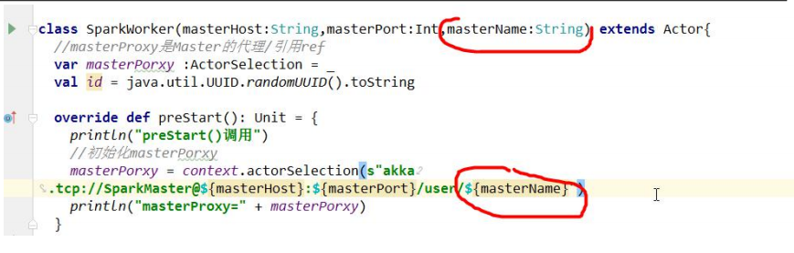

 运行项目

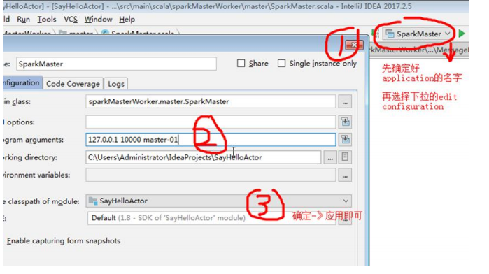

**说明**：再点击确认->应用即可保存设置，如果需要运行第二个 worker 服务，则需要修改参数，再运行. 

### 16.10.7 master worker 进行分布式部署(Linux 系统)-》如何给 maven 项目打包-> 上传 linux 

看老师演示 

 步骤 1-先给 SparkMaster 打包 

修改 pom.xml 文件的<mainClass>xxx</mainClass>,指定我们的程序的主类 

 修改成如下 

<mainClass>com.atguigu.akka.sparkmasterworker.master.SparkMaster</mainClass> 

 显示 maven projects 的右侧菜单

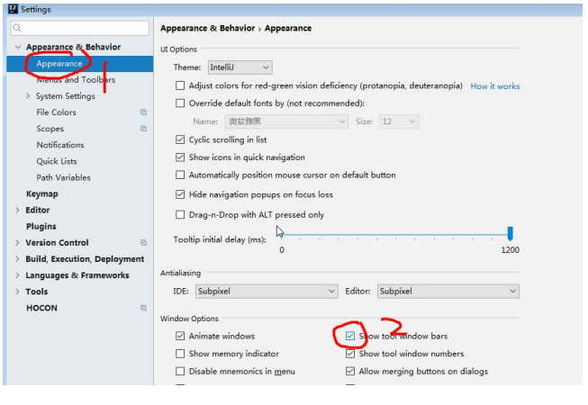

 双击 package 开始自动打包, 第一次需要下载内容。 到 target 去找，内容比较大的文件. 

 将打包的.jar 上传到 linux，实现分布式 

 运行测试尚硅谷运行 worker java -jar worker.jar 参数...

# 第 17 章设计模式 

## 17.1 学习设计模式的必要性 

1) 面试会被问，所以必须学 

2) 读源码时看到别人在用，尤其是一些框架大量使用到设计模式，不学看不懂源码为什么这样写， 比如 Runtime 的单例模式. 

3) 设计模式能让专业人之间交流方便 

4) 提高代码的易维护 

5) 设计模式是编程经验的总结，我的理解：**即通用的编程应用场景的模式化，套路化**（站在软件设计层面思考）。 

## 17.2 设计模式的介绍 

1) 设计模式是程序员在面对同类软件工程设计问题所总结出来的有用的经验，模式【设计，思想】 不是代码，而是某类问题的通用解决方案，设计模式（Design pattern）代表了最佳的实践。这些解决方案是众多软件开发人员经过相当长的一段时间的试验和错误总结出来的。 

2) 设计模式的本质提高 软件的维护性，通用性和扩展性，并降低软件的复杂度【软件巨兽=》软件工程】。 

3) <<设计模式>> 是经典的书，作者是 Erich Gamma、Richard Helm、Ralph Johnson 和 John Vlissides Design（俗称 “四人组 GOF”） 

4) 设计模式并不局限于某种语言，java，php，c++ 都有设计模式. 

## 17.3 设计模式类型 

设计模式分为三种类型，共 23 种

1) 创建型模式：单例模式、抽象工厂模式、建造者模式、工厂模式、原型模式。 

2) 结构型模式：适配器模式、桥接模式、装饰模式、组合模式、外观模式、享元模式、代理模式 

3) 行为型模式：模版方法模式、命令模式、迭代器模式、观察者模式、中介者模式、备忘录模式、 解释器模式（Interpreter 模式）、状态模式、策略模式、职责链模式(责任链模式)、访问者模式。 

## 17.4 简单工厂 

### 17.4.1 基本介绍 

1) 简单工厂模式是属于创建型模式，但不属于 23 种 GOF 设计模式之一。简单工厂模式是由一个工厂对象决定创建出哪一种产品类的实例。简单工厂模式是工厂模式家族中最简单实用的模式 

2) 简单工厂模式：定义了一个创建对象的类，由这个类来封装实例化对象的行为(代码) 

3) 在软件开发中，当我们会用到大量的创建某种、某类或者某批对象时，就会使用到工厂模式. 

### 17.4.2 看一个具体的需求 

看一个披萨的项目：要便于披萨种类的扩展，要便于维护，完成披萨订购功能。 披萨簇的设计，如下:

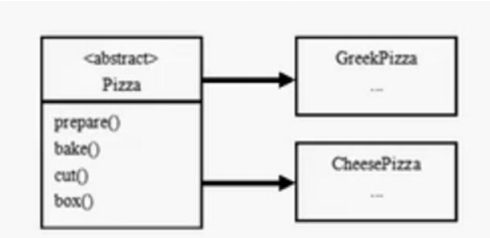

### 17.4.3 使用传统的方式来完成 


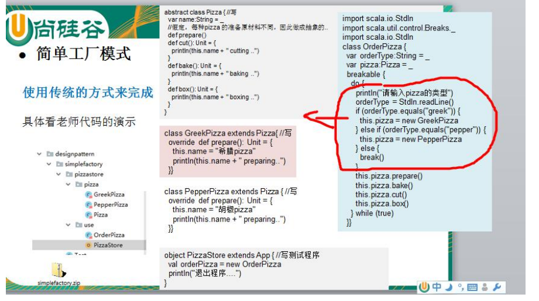

### 17.4.4 传统的方式的优缺点 

1) 优点是比较好理解，简单易操作。 

2) 缺点是违反了设计模式的 **ocp** 原则，即对扩展开放，对修改关闭。即当我们给类增加新功能的时候，尽量不修改代码，或者尽可能少修改代码. 

3) 比如我们这时要新增加一个 Pizza 的种类(Cheese 披萨)，我们需要做如下修改 

### 17.4.5 使用简单工厂模式-进行改进 

1) 简单工厂模式的设计方案: 定义一个实例化 Pizaa 对象的类，封装创建对象的代码。 

2) 看代码示例

simplefactory.zip 

## 17.5 工厂方法模式 

### 17.5.1 看一个新的需求 

披萨项目新的需求：客户在点披萨时，可以点不同口味的披萨，比如 北京的奶酪 pizza、北京的胡椒 pizza 或者是伦敦的奶酪 pizza、伦敦的胡椒 pizza。 

### 17.5.2 思路 1 

使用简单工厂模式，创建不同的简单工厂类，比如 BJPizzaSimpleFactory、LDPizzaSimpleFactory 等等.从当前这个案例来说，也是可以的，但是考虑到项目的规模，以及软件的可维护性、可扩展性并不是特别好的方案

### 17.5.3 思路 2

使用工厂方法模式 

### 17.5.4 工厂方法模式介绍 

1) 工厂方法模式设计方案：将披萨项目的实例化功能抽象成抽象方法，在不同的口味点餐子类中具体实现。 

2) 工厂方法模式：定义了一个创建对象的抽象方法，由子类决定要实例化的类。**工厂方法模式将对象的实例化推迟到子类**。 

### 17.5.5 工厂方法模式应用案例 

披萨项目新的需求：客户在点披萨时，可以点不同口味的披萨，比如 北京的奶酪 pizza、北京的胡椒 pizza 或者是伦敦的奶酪 pizza、伦敦的胡椒 pizza 

源代码: 

factorymethod.zip

## 17.6 抽象工厂模式 

### 17.6.1 基本介绍 

1) 抽象工厂模式：定义了一个 trait 用于创建相关或有依赖关系的对象簇，而无需指明具体的类 

2) 抽象工厂模式可以将简单工厂模式和工厂方法模式进行整合。 

3) 从设计层面看，抽象工厂模式就是对简单工厂模式的改进(或者称为进一步的抽象)。 

4) 将工厂抽象成两层，**AbsFactory(**抽象工厂) 和 **具体实现的工厂子类**。程序员可以根据创建对象类型使用对应的工厂子类。这样将单个的简单工厂类变成了工厂簇，更利于代码的维护和扩展。 

### 17.6.2 抽象工厂模式应用实例 

源码

abstractfactory.zip

## 17.7 工厂模式的小结 

1) 工厂模式的意义 

将**实例化对象的代码提取出来，放到一个类中统一管理和维护**，达到和主项目的**依赖关系的解耦**。 从而提高项目的扩展和维护性。 

三种工厂模式 

2) 设计模式的依赖抽象原则 

 创建对象实例时，不要直接 new 类, 而是把这个 new 类的动作放在一个工厂的方法中，并返回。 也有的书上说，变量不要直接持有具体类的引用。 

 不要让类继承具体类，而是继承抽象类或者是 trait（接口） 

 不要覆盖基类中已经实现的方法。 

## 17.8 单例模式 

### 17.8.1 什么是单例模式 

单例模式是指：保证在整个的软件系统中，某个类只能存在一个对象实例。 

### 17.8.2 单例模式的应用场景 

比如Hibernate的SessionFactory，它充当数据存储源的代理，并负责创建Session对象。SessionFactory 并不是轻量级的，一般情况下，一个项目通常只需要一个 SessionFactory 就够，这是就会使用到单例模式。

Akka [ActorySystem 单例]

### 17.8.3 单例模式-懒汉式 

```scala
package com.atguigu.chapter17.singleton 

object TestSingleTon { 
    def main(args: Array[String]): Unit = { 
        val instance1 = SingleTon.getInstance 
        val instance2 = SingleTon.getInstance 
        if (instance1 == instance2) { 
            println("相等") 
        } 
    } 
}
//将 SingleTon 的构造方法私有化 
class SingleTon private() {} 
//懒汉式 
//看底层 
/* 
public SingleTon getInstance() { 
if (s() == null) { 
s_$eq(new SingleTon()); 
}
return s(); 
}
*/ 

object SingleTon { //SingleTon$ 
    private var s: SingleTon = null 
    def getInstance = { 
        if (s == null) { 
            s = new SingleTon 
        }
        s 
    } 
} 
```


### 17.8.4 单例模式-饿汉式 

```scala
package com.atguigu.chapter17.singleton 

object TestSingleTon2 { 
    def main(args: Array[String]): Unit = { 
        val instance1 = SingleTon2.getInstance 
        val instance2 = SingleTon2.getInstance 
        if (instance1 == instance2) { 
            println("相等~~~") 
        } 
    }
}

//将 SingleTon 的构造方法私有化 
class SingleTon2 private() {} 
//饿汉式 
//看底层 
/*
public SingleTon2 getInstance() { 
return s(); 
}*/ 

object SingleTon2 { //SingleTon$ 
    private val s: SingleTon2 = new SingleTon2 
    def getInstance = { 
        s 
    } 
}
```


## 17.9 装饰者模式(Decorator) 

### 17.9.1 看一个项目需求 

咖啡馆订单系统项目（咖啡馆）： 

1) 咖啡种类/单品咖啡：Espresso(意大利浓咖啡)、ShortBlack、LongBlack(美式咖啡)、Decaf(无因咖啡)

2) 调料：Milk、Soy(豆浆)、Chocolate 

3) 要求在扩展新的咖啡种类时，具有良好的扩展性、改动方便、维护方便 

4) 使用 **OO** **的来计算不同种类咖啡的费用**: 客户可以点单品咖啡，也可以单品咖啡+调料组合。 

### 17.9.2 方案 1-较差的方案 

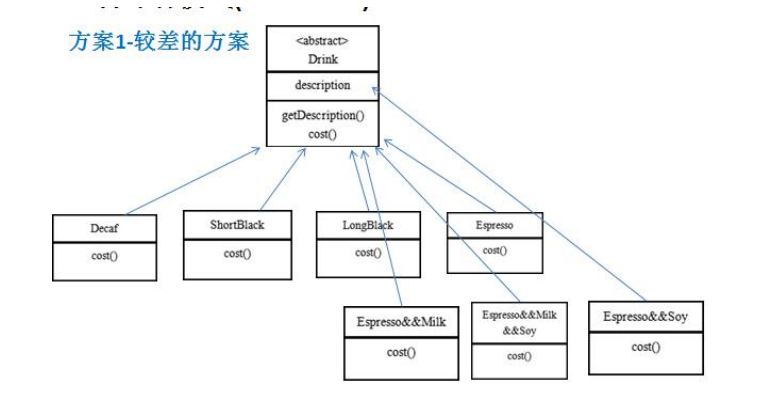

### 17.9.3 方案 1-小结和分析

1) Drink 是一个抽象类，表示饮料 

2) description 就是描述，比如咖啡的名字等 

3) cost 就是计算费用，是一个抽象方法 

4) Decaf 等等就是具体的单品咖啡，继承 Drink,并实现 cost 方法 

5) Espresso&&Milk 等等就是单品咖啡+各种调料的组合,这个会很多.. 

6) **这种设计方式时**，会有很多的类，并且当增加一个新的单品咖啡或者调料时，类的数量就会倍增(**类爆炸**) 

### 17.9.4 方案 2-好点的方案 

前面分析到方案 1 因为咖啡单品+调料组合会造成类的倍增，因此可以做改进，将调料内置到 Drink 类，这样就不会造成类数量过多。从而提高项目的维护性(如图)=>同时违反 ocp 

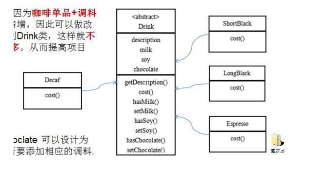

### 17.9.5 装饰者模式原理 

1) 装饰者模式就像打包一个快递 

 主体：比如：陶瓷、衣服 (Component) 

 包装：比如：报纸填充、塑料泡沫、纸板、木板(Decorator) 

2) Component

主体：比如类似前面的 Drink 

3) ConcreteComponent 和 Decorator 

ConcreteComponent：具体的主体， 比如前面的各个单品咖啡 

4) Decorator: 装饰者，比如各调料. 

在如图的 Component 与 ConcreteComponent 之间，如果 ConcreteComponent 类很多,还可以设计一 个缓冲层，将共有的部分提取出来，抽象层一个类。 

### 17.9.6 装饰者模式定义 

1) 装饰者模式：**动态的将新功能附加到对象上**。在对象功能扩展方面，它比**继承更有弹性**(递归)， 装饰者模式也体现了开闭原则(ocp) 

2) 这里提到的动态的将新功能附加到对象和 ocp 原则，在后面的应用实例上会以代码的形式体现， 请同学们注意体会。 

### 17.9.7 用装饰者模式设计重新设计的方案

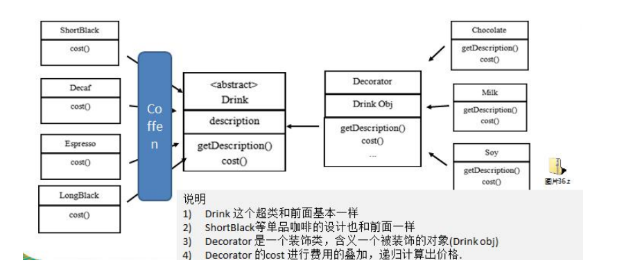

### 17.9.8 装饰者模式下的订单：2 份巧克力+一份牛奶的 LongBlack 

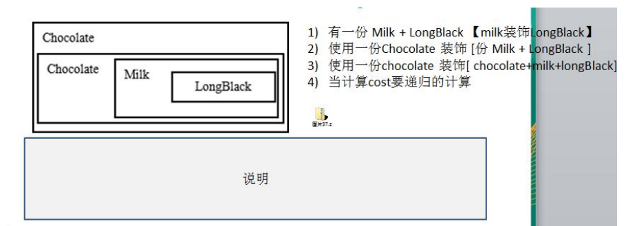

### 17.9.9 装饰者模式咖啡订单项目应用实例

decorator.zip 

## 17.10观察者模式(Observer) 

### 17.10.1 看一个项目需求 

气象站项目，具体要求如下： 

1) 气象站可以将每天测量到的温度，湿度，气压等等以公告的形式发布出去(比如发布到自己的网站)。

2) 需要设计开放型 API，便于其他第三方公司也能接入气象站获取数据。 

3) 提供温度、气压和湿度的接口 

4) 测量数据更新时，要能实时的通知给第三方

### 17.10.2 WeatherData 类 

通过对气象站项目的分析，我们可以初步设计出一个 WeatherData 类 

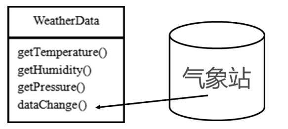

 说明: 

1) 通过 getXxx 方法，可以让第三方公司接入，并得到相关信息. 

2) 当数据有更新时，气象站通过调用 dataChange() 去更新数据，当第三方再次获取时，就能得到最新数据，当然也可以推送。 

### 17.10.3 气象站设计方案 1-普通方案 

 示意图 

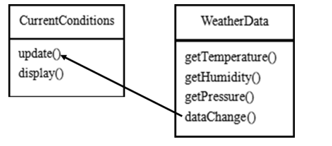

 代码实现

localinternetobserver.zip 

 普通方案的分析-发现问题 

1) 其他第三方公司接入气象站获取数据的问题 

2) 无法在运行时动态的添加第三方 

3) 同时违反 ocp 的原则 

### 17.10.4 观察者模式原理 

 观察者模式类似订牛奶业务 

1) 奶站/气象局：Subject 

2) 用户/第三方网站：Observer 

 Subject：登记注册、移除和通知 

1) registerObserver 注册 

2) removeObserver 移除 

3) notifyObservers() 通知所有的注册的用户，根据不同需求，可以是更新数据，让用户来取， 也可能是实施推送，看具体需求定 

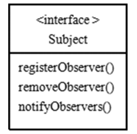

 Observer：接收输入

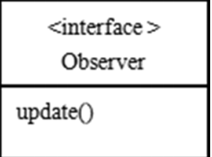

 观察者模式：**对象之间多对一依赖**的一种设计方案，被依赖的对象为 Subject，依赖的对象为 Observer，Subject 通知 Observer 变化,比如这里的奶站是 Subject，是 1 的一方。用户时 Observer，是多的一方。 

### 17.10.5 气象站设计方案 2-观察者模式

###  

 代码实现 

observepattern.zip

### 17.10.6 Java 内置观察者模式

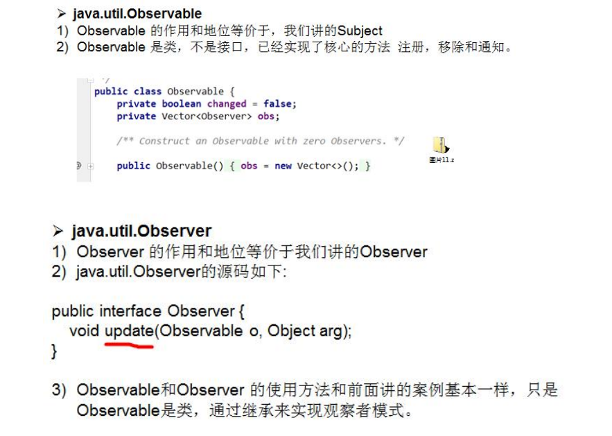

说明: 

通过 getXxx 方法，可以让第三方公司接入，并得到相关信息. 当数据有更新时，气象站通过调用 dataChange() 去更新数据，当第三方再次获取时，就能得到最新数据，当然也可以推送。 

## 17.11代理模式(Proxy) 

### 17.11.1 代码模式的基本介绍 

1) 代理模式：**为一个对象提供一个替身**，以控制对这个对象的访问 

2) 被代理的对象可以是**远程对象**、**创建开销大的对象**或需要**安全控制的**对象(动态代理) 

3) 代理模式有不同的形式(比如 远程代理，静态代理，动态代理)，都是为了控制与管理对象访问 

### 17.11.2 看一个项目需求 

糖果机项目，具体要求如下： 

1) 某公司需要将销售糖果的糖果机放置到本地**(****本地监控****)**和外地(**远程监控**)，进行糖果销售。 

2) 给糖果机插入硬币，转动手柄，这样就可以购买糖果。 

3) 可以监控糖果机的状态和销售情况。 

### 17.11.3 完成监控本地糖果机 

对本地糖果机的状态和销售情况进行监控，相对比较简单，完成该功能

localcandymachine.zip 

### 17.11.4 完成监控远程糖果机 

**说明**:对远程糖果机的状态和销售情况进行监控，相对麻烦些，我们先分析一下 

1) 方式 1：因为远程糖果机不在本地，比如在另外的城市，国家，这时可以使用 **socket** **编程**来进 

行网络编程控制(缺点：麻烦) 

2) 方案 2：在远程放置 web 服务器，通过 web 编程来实现远程监控。 

3) 方案 3：使用 **RMI(Remote Method Invocation)****远程方法调用**来完成对远程糖果机的监控，因为 

RMI 将 socket 的底层封装起来，对外提供调用方法接口即可，这样比较简单，这样我们就可以实现远 

程代理模式开发。 

### 17.11.5 远程代理模式监控方案

远程代理：远程对象的本地代表，通过它可以把远程对象当本地对象来调用。 

远程代理通过网络和真正的远程对象沟通信息。 

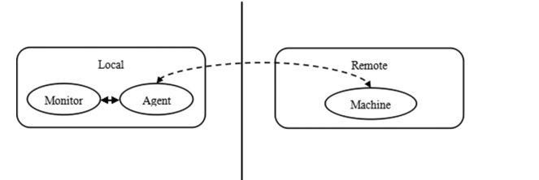

涉及到一个核心的技术 RMI 

### 17.11.6 Java RMI 实现远程代理 

RMI 指的是远程方法调用 (Remote Method Invocation)。它是一种**机制**，能够让在**某个** **Java** **虚拟**机上的对象调用另一个**Java** **虚拟机中的对象上的方法**。可以用此方法调用的任何对象必须实现该远程接口，RMI 可以将底层的 socket 编程封装，简化操作。(如图) 

### 17.11.7 Java RMI 的介绍 

1) RMI 远程方法调用是计算机之间通过网络实现对象调用的一种通讯机制。 

2) 使用 RMI 机制，一台计算机上的对象可以调用另外 一台计算机上的对象来获取远程数据。 

3) RMI 被设计成一种**面向对象开发方式**，允许程序员使用远程对象来实现通信

### 17.11.8 Java RMI 的开发应用案例-说明 

请编写一个 JavaRMI 的案例，代理端(客户端)可以通过 rmi 远程调用 远程端注册的一个服务的 sayHello 的方法，并且返回结果。 

### 17.11.9 Java RMI 的开发应用案例-开发步骤 

1) 制作远程接口：接口文件 

2) 远程接口的实现：Service 文件 

3) RMI 服务端注册，开启服务 

4) RMI 代理端通过 RMI 查询到服务端，建立联系，通过接口调用远程方法 

### 17.11.10 Java RMI 的开发应用案例-程序框架 

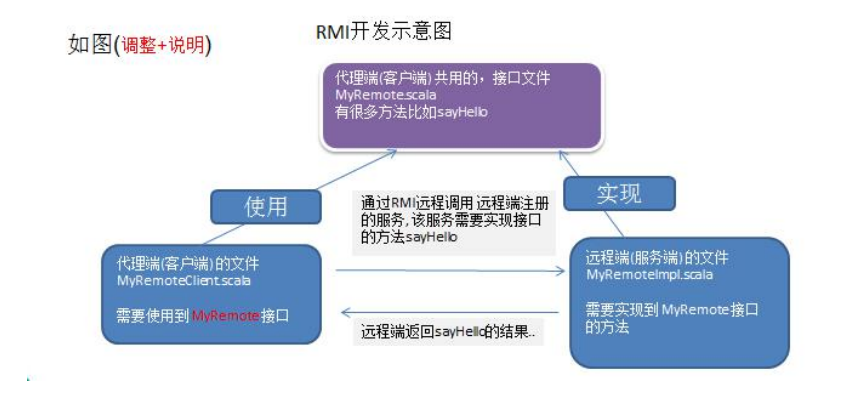

### 17.11.11 Java RMI 的开发应用案例-代码实现

rmi.zip 

### 17.11.12 使用远程代理模式完成远程糖果机监控 

 示例项目类结构图 

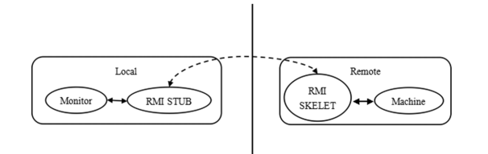

 代码实现

remotecandymachine.zip 

### 17.11.13 动态代理 

动态代理：运行时动态的创建代理类(对象)，并将方法调用转发到指定类(对象) 动态代理调用的机制图 

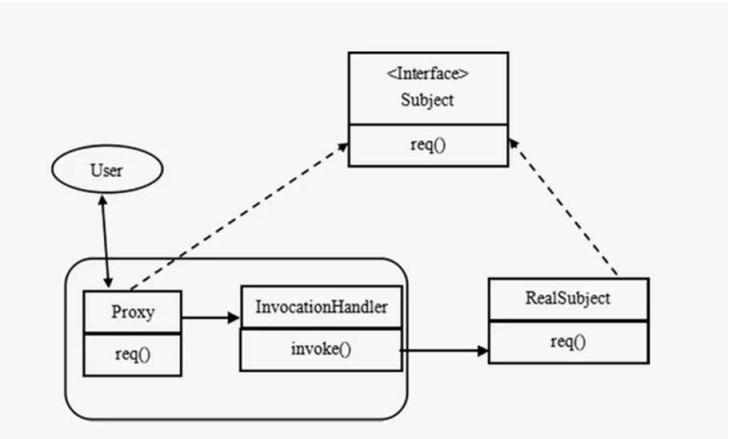

1) Proxy 和 InvocationHandler 组合充当代理的角色. 

2) RealSubject 是一个实际对象，它实现接口 Subject 

3) 在使用时，我们不希望直接访问 RealSubject 的对象，比如：我们对这个对象的访问是有控制的 

4) 我们使用动态代理，在程序中通过动态代理创建 RealSubject，并完成调用. 

5) 动态代理可以根据需要，创建多种组合 

6) Proxy 也会实现 Subject 接口的方法，因此，使用 Proxy+Invocation 可以完成对 RealSubject 的动态调用。

7) 但是通过 Proxy 调用 RealSubject 方法是否成功，是由 InvocationHandler 来控制的。(这里其实就是保护代理) 

8) 理解：**创建一个代理对象**替**代被调用的真实对象**，使用**反射实现控**制 

### 17.11.14 动态代理的应用案例 

 应用案例说明 

有一个婚恋网项目，女友/男友有个人信息、兴趣爱好和总体评分,要求： 

1) 不能自己给自己评分 

2) 其它用户可以评分，但是不能设置信息，兴趣爱好。 

3) 请使用动态代理实现保护代理的效果。 

4) 分析这里我们需要写两个代理。一个是自己使用，一个是提供给其它用户使用。 

5) 示意图画出: 


 代码实现 

dyn.zip

### 17.11.15 几种常见的代理模式介绍— 几种变体 

1) 防火墙代理 

内网通过代理穿透防火墙，实现对公网的访问。 

2) 缓存代理 

比如：当请求图片文件等资源时，先到缓存代理取，如果取到资源则 ok,如果取不到资源，再到公网或 者数据库取，然后缓存。 

3) 静态代理 

静态代理通常用于对原有业务逻辑的扩充。 比如持有第二方包的某个类，并调用了其中的某些方法。比如记录日志、打印工作等。可以创建一个代理类实现和第二方方法相同的方法，通过让代理类持有真实对象，调用代理类方法，来达到增加业务逻辑的目的。 

4) Cglib 代理 

使用 cglib[Code Generation Library]实现动态代理，并不要求委托类必须实现接口，底层采用 **asm** 字节码生成框架生成代理类的字节码。 

5) 同步代理 

主要使用在多线程编程中，完成多线程间同步工作

# 第 18 章泛型、上下界、视图界定 、上下文界定 

## 18.1 泛型的基本介绍 

### 18.1.1 基本介绍 

1) 如果我们要求函数的参数可以接受任意类型。可以使用泛型，这个类型可以代表任意的数据类型。

2) 例如 List，在创建 List 时，可以传入整型、字符串、浮点数等等任意类型。那是因为 List 在类定义时引用了泛型。比如在 Java 中：public interface List<E> extends Collection<E> 

### 18.1.2 Scala 泛型应用案例 1 

 要求: 

1) 编写一个 Message 类 

2) 可以构建 Int 类型的 Message,String 类型的 Message. 

3) 要求使用泛型来完成设计,(说明：不能使用 Any) 

```scala
package com.atguigu.chapter18.generic 

object GenericDemo01 { 
    def main(args: Array[String]): Unit = { 
        val intMessage = new IntMessage[Int](10) 
        println(intMessage) 
        val strMessage = new StringMessage[String]("hello") 
        println(strMessage) 
    } 
} 

/*
编写一个 Message 类 可以构建 Int 类型的 Message, String 类型的 Message. 
要求使用泛型来完成设计,(说明：不能使用 Any) 
*/ 

abstract class Message[T](s:T) { 
    def get = s 
}
class IntMessage[Int](v:Int) extends Message(v) 
class StringMessage[String](v:String) extends Message(v) 
```


### 18.1.3 Scala 泛型应用案例 2 

要求

1) 请设计一个 EnglishClass (英语班级类)，在创建 EnglishClass 的一个实例时，需要指定[ 班级开班季节(spring,autumn,summer,winter)、班级名称、班级类型] 

2) 开班季节只能是指定的，班级名称为 String, 班级类型是(字符串类型 "高级班", "初级班"..) 或者是 Int 类型(1, 2, 3 等) 

3) 请使用泛型来完成本案例.

```scala
package com.atguigu.chapter18.generic 

import com.atguigu.temp.generic.SeasonEnum 

object GenericDemo02 { 
    def main(args: Array[String]): Unit = { 
        //使用 
        val class01 = new EnglishClass[SeasonEnum.SeasonEnum,String,String](SeasonEnum.spring,"0705 班","高级班") 
        println("class01 " + class01.classSesaon + " " + class01.className + class01.classType) 
        val class02 = new EnglishClass[SeasonEnum.SeasonEnum,String,Int](SeasonEnum.spring,"0707 班",1) 
        println("class02 " + class02.classSesaon + " " + class02.className + class02.classType) 
    } 
}

/*
Scala 泛型应用案例 2 
要求请设计一个 EnglishClass (英语班级类)，在创建 EnglishClass 的一个实例时，需要指定[ 班级开班季节 (spring,autumn,summer,winter)、班级名称、班级类型] 开班季节只能是指定的，班级名称为 String, 班级类型是(字符串类型 "高级班", "初级班"..) 或者是 Int 类型(1, 2, 3 等)请使用泛型来完成本案例. 
*/ 

class EnglishClass[A, B, C](val classSesaon: A, val className: B, val classType: C) 
//季节是枚举类型 
class SeasonEnum extends Enumeration { 
    type SeasonEnum = Value 
    val spring,autumn,summer,winter = Value 
} 
```


### 18.1.4 Scala 泛型应用案例 3 

要求

1) 定义一个函数，可以获取各种类型的 List 的中间 index 的值 

2) 使用泛型完成 

```scala
package com.atguigu.chapter18.generic 

object GenericDemo03 { 
    def main(args: Array[String]): Unit = { 
        val list1 = List("hello", "dog", "world") 
        val list2 = List(90, 10, 23) 
        println(midList[String](list1))// "dog" 
        println(midList[Int](list2))// 10
    }

/* 要求
定义一个函数，可以获取各种类型的 List 的中间 index 的值使用泛型完成 
*/
    def midList[E](l: List[E]): E = { 
        l(l.length / 2)
    } 
} 
```


## 18.2 类型约束-上界(Upper Bounds)/下界(lower bounds) 

### 18.2.1 上界(Upper Bounds)介绍和使用 

 java 中上界 

在 Java 泛型里表示某个类型是 A 类型的子类型，使用 extends 关键字，这种形式叫 upper bounds(上限或上界)，语法如下：

<T extends A> 

//或用通配符的形式： 

<? extends A> 

### 18.2.2 上界(Upper Bounds)介绍和使用 

 scala 中上界 

在 scala 里表示某个类型是 A 类型的子类型，也称上界或上限，使用 <: 关键字，语法如下： [T <: A] 

//或用通配符: 

[_ <: A] 

### 18.2.3 上界(Upper Bounds)介绍和使用 

 scala 中上界应用案例-要求 

1) 编写一个通用的类，可以进行 Int 之间、Float 之间、等实现了 Comparable 接口的值直接的比 较.//java.lang.Integer 

2) 分别使用**传统方法**和**上界的方式**来完成，体会上界使用的好处. 

3) 代码 

```scala
package com.atguigu.chapter18.upperbounds 

object UpperBoundsDemo01 { 
    def main(args: Array[String]): Unit = { 
        val compareInt = new CompareInt(10,40) 
        println(compareInt.greater) // 40
        //第一个用法 
        val commonCompare1 = new CommonCompare(Integer.valueOf(10), Integer.valueOf(40))//Int 
        println(commonCompare1.greater) 
        //第二个用法 
        val commonCompare2 = new CommonCompare(java.lang.Float.valueOf(1.1f),java.lang.Float.valueOf(2.1f))//Fl
        println(commonCompare2.greater) 
        //第 3 种写法使用了隐式转换 
        //implicit def float2Float(x: Float): java.lang.Float = x.asInstanceOf[java.lang.Float] val commonCompare3 = new CommonCompare[java.lang.Float](10.1f, 21.1f)// println(commonCompare3.greater) 
    } 
}

/*
编写一个通用的类，可以进行 Int 之间、Float 之间、等实现了 Comparable 接口的值直接的比较.//java.lang.Integer 
分别使用传统方法和上界的方式来完成，体会上界使用的好处. 
*/ 
//传统方法 
class CompareInt(n1: Int, n2: Int) { 
    //返回较大的值
    def greater = if(n1 > n2) n1 else n2 
}

//使用上界(上限)来完成 
//说明 
//1. [T <: Comparable[T]] 表示 T 类型是 Comparable 子类型 
//2. 即你传入的 T 类要继承 Comparable 接口 
//3. 这样就可以使用 compareTo 方法 
//4. 这样的写法(使用上界的写法)通用性比传统的好 
class CommonCompare[T <: Comparable[T]](obj1:T,obj2:T) { 
    def greater = if (obj1.compareTo(obj2) > 0) obj1 else obj2 
}
```

 scala 中上界课程测试题(理解上界含义) 

```scala
package com.atguigu.chapter18.upperbounds 

object LowerBoundsDemo { 
    def main(args: Array[String]): Unit = { 
        biophony(Seq(new Bird, new Bird)) //? √ 
        biophony(Seq(new Animal, new Animal)) //对 
        biophony(Seq(new Animal, new Bird)) //√ 
        //biophony(Seq(new Earth, new Earth)) //×,因为 Earth 不是 Animal 子类 
    }

    //上界 
    def biophony[T <: Animal](things: Seq[T]) = things map (_.sound) 
} 

class Earth { //Earth 类 
    def sound() { //方法 
        println("hello !") 
    } 
}

class Animal extends Earth { 
    override def sound() = { //重写了 Earth 的方法 sound() 
        println("animal sound") 
    } 
}

class Bird extends Animal { 
    override def sound() = { //将 Animal 的方法重写 
        println("bird sounds") 
    } 
} 
```


### 18.2.4 下界(Lower Bounds)介绍和使用 

 Java 中下界 

在 Java 泛型里表示某个类型是 A 类型的父类型，使用 super 关键字 

<T super A>

//或用通配符的形式： 

<? super A> 

 scala 中下界 

在 scala 的下界或下限，使用 >: 关键字，语法如下： 

[T >: A] 

//或用通配符: 

[_ >: A] 

 scala 中下界应用实例 

```scala
package com.atguigu.chapter18.lowerbounds 

//
//1）和 Animal 直系的，是 Animal 父类的还是父类处理，是 Animal 子类的按照 Animal 处理()， 
//2）和 Animal 无关的，一律按照 Object 处理！ 
object LowerBoundsDemo01 { 
    def main(args: Array[String]): Unit = { 
        println("ok!") 
        //满足下界的约束 
        biophony(Seq(new Earth, new Earth)).map(_.sound()) 
        //满足下界的约束 
        biophony(Seq(new Animal, new Animal)).map(_.sound()) 
        //这里我们不能使用上界的思路去推导，这里是可以运行 
        //1.?
        println("===================") 
        biophony(Seq(new Bird, new Bird)).map(_.sound())// 
        //biophony(Seq(new Moon)) 
    }
    //下界 
    def biophony[T >: Animal](things: Seq[T]) = things 
}

class Earth { //Earth 类 
    def sound(){ //方法 
        println("hello !") 
    } 
}

class Animal extends Earth{ 
    override def sound() ={ //重写了 Earth 的方法 sound() 
        println("animal sound") 
    } 
}

class Bird extends Animal{ 
    override def sound()={ //将 Animal 的方法重写 
        print("bird sounds") 
    } 
}
class Moon { 
    // def sound()={ //将 Animal 的方法重写 
    // print("bird sounds") // } 
} 
```


 scala 中下界的使用小结 

def biophony\[T >: Animal](things: Seq[T]) = things 

1) 对于下界，可以传入任意类型 

2) 传入和 Animal 直系的，是 Animal 父类的还是父类处理，是 Animal 子类的按照 Animal 处理 

3) 和 Animal 无关的，一律按照 Object 处理 

4) 也就是下界，可以随便传，只是处理是方式不一样 

5) 不能使用上界的思路来类推下界的含义 

### 18.2.5 视图界定应用案例 3 

**说明**: 自己写**隐式转换**结合**视图界定**的方式，比较两个 Person 对象的年龄大小

```scala
//ViewBoundsDemo03.scala 

package com.atguigu.chapter18.viewbounds 

object ViewBoundsDemo03 { 
    def main(args: Array[String]): Unit = { 
        val p1 = new Person3("汤姆", 13) 
        val p2 = new Person3("杰克", 10) 
        //引入隐式函数 
        import MyImplicit._ 
        val compareComm3 = new CompareComm3(p1,p2) 
        println(compareComm3.getter) 
    } 
}

class Person3(val name: String, val age: Int) { 

    //这里是重写 toString,为了显示方便 
    override def toString: String = this.name + "\t" + this.age 
}

//说明 
//1. T <% Ordered[T] 表示 T 是 Ordered 子类型 java.lang.Comparable 
//2. 这里调用的 compareTo 方法是 T 这个类型的方法 
class CompareComm3[T <% Ordered[T]](obj1: T, obj2: T) { 
    def getter = if (obj1 > obj2) obj1 else obj2
    def geatter2 = if (obj1.compareTo(obj2) > 0) obj1 else obj2 
}

//MyImplicit.scala 
package com.atguigu.chapter18.viewbounds 

object MyImplicit { 
    implicit def person3toOrderedPerson3(p3:Person3) = new Ordered[Person3] { 
        override def compare(that: Person3) = { //是你自己的业务逻辑 
            p3.age - that.age 
        } 
    } 
} 
```


## 18.3 类型约束-上下文界定(Context bounds) 

### 18.3.1 基本介绍 

与 view bounds 一样 context bounds(上下文界定)也是**隐式参数的语法糖**。为语法上的方便， 引入了”上下文界定”这个概念 

### 18.3.2 上下文界定应用实例 

要求：使用上下文界定+隐式参数的方式，比较两个 Person 对象的年龄大小 

要求：使用 Ordering 实现比较 

代码:

```scala
package com.atguigu.chapter18.contextbounds 

object ContextBoundsDemo { 
    //这里我定义一个隐式值 Ordering[Person]类型 
    implicit val personComparetor = new Ordering[Person4] { 
        override def compare(p1: Person4, p2: Person4): Int = 
        p1.age - p2.age 
    }
    def main(args: Array[String]): Unit = { 
        //val p1 = new Person4("mary", 30) 
        val p2 = new Person4("smith", 35) 
        val compareComm4 = new CompareComm4(p1, p2) 
        println(compareComm4.geatter) // "smith", 35 
        val compareComm5 = new CompareComm5(p1, p2) 
        println(compareComm5.geatter) // "smith", 35 
        println("personComparetor hashcode=" + personComparetor.hashCode()) 
        val compareComm6 = new CompareComm6(p1, p2) 
        println(compareComm6.geatter) // "smith", 35 
    } 
}

//一个普通的 Person 类 
class Person4(val name: String, val age: Int) { 
    //重写 toStirng 
    override def toString = this.name + "\t" + this.age 
}
//方式 1 
//说明： 
//1. [T: Ordering] 泛型 
//2. obj1: T, obj2: T 接受 T 类型的对象 
//3. implicit comparetor: Ordering[T] 是一个隐式参数 
class CompareComm4[T: Ordering](obj1: T, obj2: T)(implicit comparetor: Ordering[T]) { 
    def geatter = if (comparetor.compare(obj1, obj2) > 0) obj1 else obj2 
}
//方式 2 
//方式 2,将隐式参数放到方法内 
class CompareComm5[T: Ordering](o1: T, o2: T) { 
    def geatter = { 
        def f1(implicit cmptor: Ordering[T]) = cmptor.compare(o1, o2) //返回一个数字 
        //如果 f1 返回的值>0,就返回 o1,否则返回 o2 
        if (f1 > 0) o1 else o2 
    }
    def lowwer = {
        def f1(implicit cmptor: Ordering[T]) = cmptor.compare(o1, o2) //返回一个数字 
        //如果 f1 返回的值>0,就返回 o1,否则返回 o2 
        if (f1 > 0) o2 else o1 
    } 
}

//方式 3 
//方式 3,使用 implicitly 语法糖，最简单(推荐使用) 
class CompareComm6[T: Ordering](o1: T, o2: T) { 
    def geatter = { 
        //这句话就是会发生隐式转换，获取到隐式值 personComparetor 
        //底层仍然使用编译器来完成绑定(赋值的)工作 
        val comparetor = implicitly[Ordering[T]] 
        println("comparetor hashcode=" + comparetor.hashCode()) 
        if (comparetor.compare(o1, o2) > 0) o1 else o2 
    } 
} 
```


## 18.4 协变、逆变和不变 

### 18.4.1 基本介绍 

1) Scala 的协变(+)，逆变(-)，协变 covariant、逆变 contravariant、不可变 invariant

2) 对于一个带类型参数的类型，比如 List[T]，如果对 A 及其子类型 B，满足 List[B]也符合 List[A] 的子类型，那么就称为 covariance(协变) ，如果 List[A]是 List[B]的子类型，即与原来的父子关系正相 反，则称为 contravariance(逆变)。如果一个类型支持协变或逆变，则称这个类型为 variance(翻译为可变的或变型)，否则称为 invariance(不可变的) 

3) 在 Java 里，泛型类型都是 invariant，比如 List<String> 并不是 List<Object> 的子类型。而 scala 支持，可以在定义类型时声明(用加号表示为协变，减号表示逆变)，如: trait List[+T] // 在类型定义时声明为协变这样会把 List[String]作为 List[Any]的子类型。 

### 18.4.2 应用实例 

在这里引入关于这个符号的说明，在声明 Scala 的泛型类型时，“+”表示协变，而“-”表示逆变 

C[+T]：如果 A 是 B 的子类，那么 C[A]是 C[B]的子类，称为协变 

C[-T]：如果 A 是 B 的子类，那么 C[B]是 C[A]的子类，称为逆变 

C[T]：无论 A 和 B 是什么关系，C[A]和 C[B]没有从属关系。称为不变. 

代码: 

```scala
package com.atguigu.chapter18.covariantcontravariant 

object Demo { 
    def main(args: Array[String]): Unit = { 
        val t1: Temp3[Sub] = new Temp3[Sub]("hello"); 
        //ok 
        // val t2: Temp3[Sub] = new Temp3[Super]("hello");//error 
        // val t3: Temp3[Super] = new Temp3[Sub]("hello");//error 
        val t4: Temp3[Sub] = new Temp3[Sub]("hello"); //ok 
        val t5: Temp4[Super] = new Temp4[Sub]("hello"); //ok 
        //val t6: Temp4[Sub] = new Temp4[Super]("hello"); //ok
        val t7: Temp5[Sub] = new Temp5[Sub]("hello"); //ok 
        val t8: Temp5[Sub] = new Temp5[Super]("hello"); //ok 
        //val t9: Temp5[Super] = new Temp5[Sub]("hello"); //ok 
    } 
}

//协变 
class Temp4[+A](title: String) { //Temp3[+A] //Temp[-A] 
    override def toString: String = { 
        title 
    } 
}

//逆变 
class Temp5[-A](title: String) { //Temp3[+A] //Temp[-A] 
    override def toString: String = { 
        title 
    } 
}

//不变 
class Temp3[A](title: String) { //Temp3[+A] //Temp[-A] 
    override def toString: String = { 
        title
    } 
}
//支持协变 
class Super //父类 
//Sub 是 Super 的子类 
class Sub extends Super
```


