# 重学java设计模式

> ​	设计模式遵循六⼤原则；单⼀职责( ⼀个类和⽅法只做⼀件事 )、⾥⽒替换( 多态，⼦类可扩展⽗类 )、依赖
>
> 倒置( 细节依赖抽象，下层依赖上层 )、接⼝隔离( 建⽴单⼀接⼝ )、迪⽶特原则( 最少知道，降低耦合 )、开闭
>
> 原则( 抽象架构，扩展实现 )，会在具体的设计模式章节中，进⾏体现。

## **1.** 创建型模式

这类模式提供创建对象的机制， 能够提升已有代码的灵活性和可复⽤性。

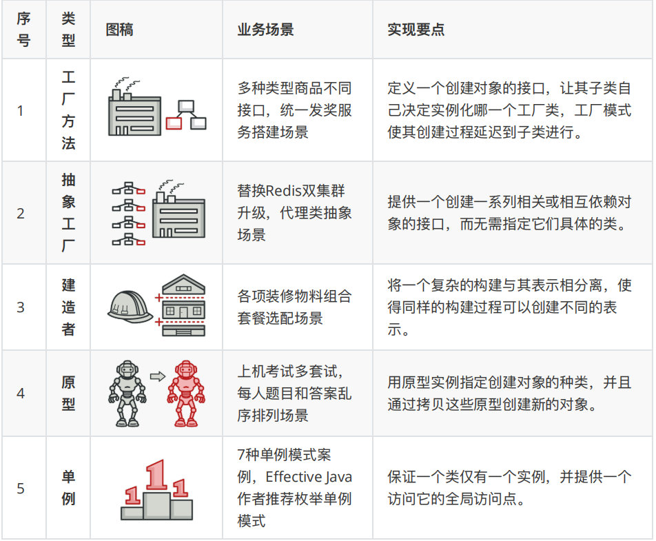


## **2.** 结构型模式

这类模式介绍如何将对象和类组装成较⼤的结构， 并同时保持结构的灵活和⾼效。

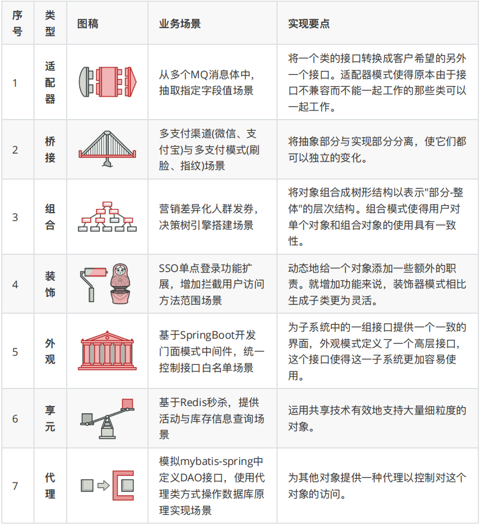

## **3.** ⾏为模式

这类模式负责对象间的⾼效沟通和职责委派。

| 序号 | 类型     | 图稿                                                         | 业务场景                                                     | 业务场景                                                     |
| ---- | -------- | ------------------------------------------------------------ | ------------------------------------------------------------ | ------------------------------------------------------------ |
| 1    | 责任链   | 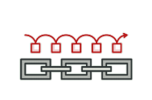 | 模拟618电商⼤促期间，项⽬上线流程多级负责⼈审批场景          | 避免请求发送者与接收者耦合在⼀起，让多个对象都有可能接收请求，将这些对象连接成⼀条链，并且沿着这条链传递请求，直到有对象处理它为⽌。 |
| 2    | 命令     |  | 模拟⾼档餐厅⼋⼤菜系，⼩⼆点单厨师烹饪场景                   | 将⼀个请求封装成⼀个对象，从⽽使您可以⽤不同的请求对客户进⾏参数化。 |
| 3    | 迭代器   |  | 模拟公司组织架构树结构关系，深度迭代遍历⼈员信息输出场景     | 提供⼀种⽅法顺序访问⼀个聚合对象中各个元素, ⽽⼜⽆须暴露该对象的内部表示。 |
| 4    | 中介者   | 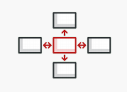 | 按照Mybatis原理⼿写ORM框架，给JDBC⽅式操作数据库增加中介者场景 | ⽤⼀个中介对象来封装⼀系列的对象交互，中介者使各对象不需要显式地相互引⽤，从⽽使其耦合松散，⽽且可以独⽴地改变它们之间的交互。 |
| 5    | 备忘录   | 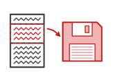 | 模拟互联⽹系统上线过程中，配置⽂件回滚场景                   | 在不破坏封装性的前提下，捕获⼀个对象的内部状态，并在该对象之外保存这个状态。 |
| 6    | 观察者   |  | 模拟类似⼩客⻋指标摇号过程，监听消息通知⽤户中签场景         | 定义对象间的⼀种⼀对多的依赖关系，当⼀个对象的状态发⽣改变时，所有依赖于它的对象都得到通知并被⾃动更新。 |
| 7    | 状态     | 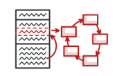 | 模拟系统营销活动，状态流程审核发布上线场景                   | 允许对象在内部状态发生改变时改变它的行为，对象看起来好像修改了它的类。 |
| 8    | 策略     | 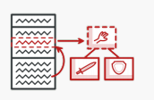 | 模拟多种营销类型优惠券，折扣金额计算策略场景                 | 定义一系列的算法,把它们一个个封装起来,并且使它们可相互替换。 |
| 9    | 模板方法 | 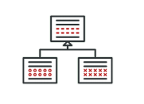 | 模拟爬虫各类电商商品，生成营销推广海报场景                   | 定义一个操作中的算法的骨架，而将一些步骤延迟到子类中。模板方法使得子类可以不改变一个算法的结构即可重定义该算法的某些特定步骤。 |
| 10   | 访问者   |  | 模拟家长与校长,对学生和老师的不同视角信息的访问场景          | 主要将数据结构与数据操作分离。                               |

# 1. 创建者模式**(5**节**)**

> 这类模式提供创建对象的机制， 能够提升已有代码的灵活性和可复⽤性。
>
> 创建者模式包括：⼯⼚⽅法、抽象⼯⼚、⽣成器、原型、单例，这5类。

## 第 **1** 节：⼯⼚⽅法模式

> 好看的代码千篇⼀律，恶⼼的程序升职加薪。该说不说⼏乎是程序员就都知道或者了解设计模式，但⼤部分⼩伙伴写代码总是习惯于⼀把梭。⽆论多少业务逻辑就⼀个类⼏千⾏，这样的开发也可以归纳为三步；定义属性、创建⽅法、调⽤展示，Done！只不过开发⼀时爽，᯿构⽕葬场。好的代码不只为了完成现有功能，也会考虑后续扩展。在结构设计上松耦合易读易扩展，在领域实现上⾼内聚不对外暴漏实现细节不被外部⼲扰。⽽这就有点像家⾥三居(MVC)室、四居(DDD)室的装修，你不会允许⼏⼗万的房⼦把⾛线⽔管裸漏在外⾯，也不会允许把⻢桶放到厨房，炉灶安装到卫⽣间。
>
> **谁发明了设计模式？** 设计模式的概念最早是由 克⾥斯托佛·亚历⼭⼤ 在其著作 《建筑模式语⾔》 中⾸次提出的。 本书介绍了城市设计的 “语⾔”，提供了253个描述城镇、邻⾥、住宅、花园、房间及⻄部构造的模式， ⽽此类 “语⾔” 的基本单元就是模式。后来， 埃⾥希·伽玛 、 约翰·弗利赛德斯 、 拉尔夫·约翰逊 和 理查德·赫尔姆 这四位作者接受了模式的概念。 1994 年， 他们出版了 《设计模式： 可复⽤⾯向对象软件的基础》 ⼀书， 将设计模式的概念应⽤到程序开发领域中。
>
> 其实有⼀部分⼈并没有仔细阅读过设计模式的相关书籍和资料，但依旧可以编写出优秀的代码。这主要是由于在经过众多项⽬的锤炼和对程序设计的不断追求，从⽽在多年编程历程上提炼出来的⼼得体会。⽽这份经验最终会与设计模式提到的内容⼏乎⼀致，同样会要求⾼内聚、低耦合、可扩展、可复⽤。你可能也遇到类似的经历，在学习⼀些框架的源码时，发现它⾥的某些设计和你在做开发时⼀样。
>
> **我怎么学不会设计模式？** 钱也花了，书也买了。代码还是⼀坨⼀坨的！设计模式是由多年的经验提炼出来开发指导思想。就像我告诉你⾃⾏⻋怎么骑、汽⻋怎么开，但只要你没跑过⼏千公⾥，你能记住的只是理论，想上道依旧很慌！所以，本设计模式专题系列开始，会带着你使⽤设计模式的思想去优化代码。从⽽学习设计模式的⼼得并融⼊给⾃⼰。当然这⾥还需要多加练习，⼀定是⼈⻋合⼀，才能站在设计模式的基础上构建出更加合理的代码。

### ⼀、开发环境

1. JDK 1.8

2. Idea + Maven

3. 涉及⼯程三个，[https://github.com/fuzhengwei/itstack-demo-design](源码)

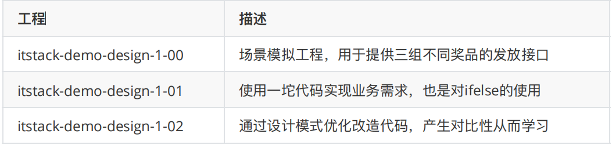

- 1-00，1 代表着第⼀个设计模式，⼯⼚⽅法模式

- 1-00，00 代表模拟的场景
- 1-01，01 代表第⼀种实现⽅案，后续 02 03 以此类推

### ⼆、⼯⼚⽅法模式介绍

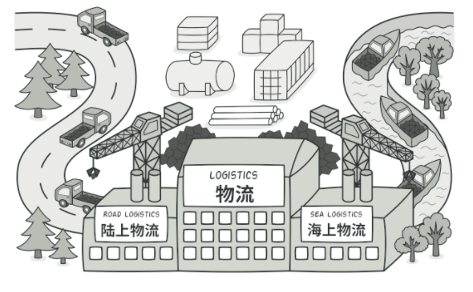

⼯⼚⽅法模式，图⽚来⾃ *refactoringguru.cn*

> ​	**⼯⼚模式**⼜称⼯⼚⽅法模式，是⼀种创建型设计模式，其在⽗类中提供⼀个创建对象的⽅法， 允许⼦类决定实例化对象的类型。
>
> ​	这种设计模式也是 Java 开发中最常⻅的⼀种模式，它的主要意图是定义⼀个创建对象的接⼝，让其⼦类⾃⼰决定实例化哪⼀个⼯⼚类，⼯⼚模式使其创建过程延迟到⼦类进⾏。
>
> ​	简单说就是为了提供代码结构的扩展性，屏蔽每⼀个功能类中的具体实现逻辑。让外部可以更加简单的只是知道调⽤即可，同时，这也是去掉众多 ifelse 的⽅式。当然这可能也有⼀些缺点，⽐如需要实现的类⾮常多，如何去维护，怎样减低开发成本。但这些问题都可以在后续的设计模式结合使⽤中，逐步降低。

### 三、模拟发奖多种商品

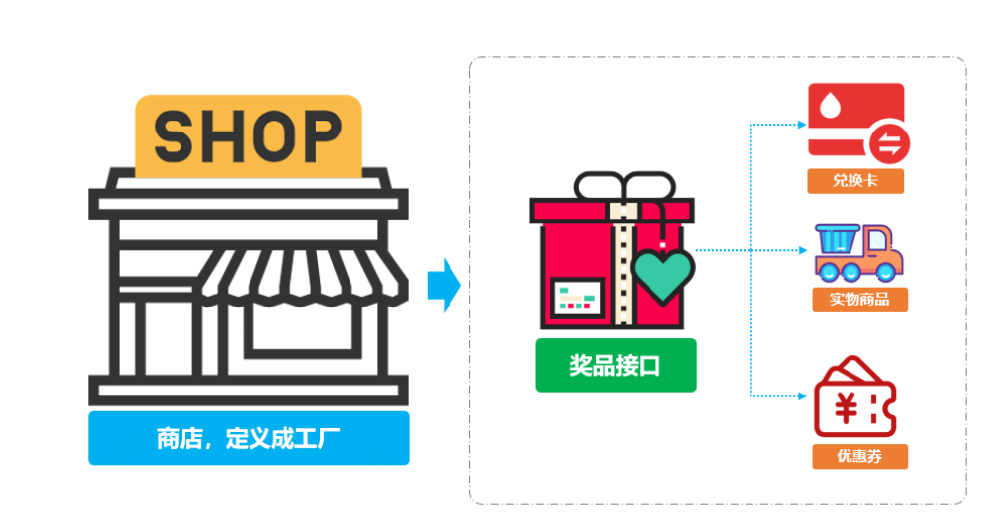

> 为了可以让整个学习的案例更加贴近实际开发，这⾥模拟互联⽹中在营销场景下的业务。由于营销场景的复杂、多变、临时的特性，它所需要的设计需要更加深⼊，否则会经常⾯临各种紧急CRUD操作，从⽽让代码结构混乱不堪，难以维护。
>
> 在营销场景中经常会有某个⽤户做了⼀些操作；打卡、分享、留⾔、邀请注册等等，进⾏返利积分，最后通过积分在兑换商品，从⽽促活和拉新。那么在这⾥我们模拟积分兑换中的发放多种类型商品，假如现在我们有如下三种类型的商品接⼝；

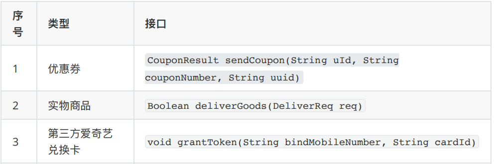

**从以上接⼝来看有如下信息：**

- 三个接⼝返回类型不同，有对象类型、布尔类型、还有⼀个空类型。

- ⼊参不同，发放优惠券需要仿᯿、兑换卡需要卡ID、实物商品需要发货位置(对象中含有)。

- 另外可能会随着后续的业务的发展，会新增其他种商品类型。因为你所有的开发需求都是随着业务对市场的拓展⽽带来的。

### 四、⽤⼀坨坨代码实现

> 如果不考虑任何扩展性，只为了尽快满⾜需求，那么对这么⼏种奖励发放只需使⽤ifelse语句判断，调⽤不同的接⼝即可满⾜需求。可能这也是⼀些刚⼊⻔编程的⼩伙伴，常⽤的⽅式。接下来我们就先按照这样的⽅式来实现业务的需求。

**1.** ⼯程结构

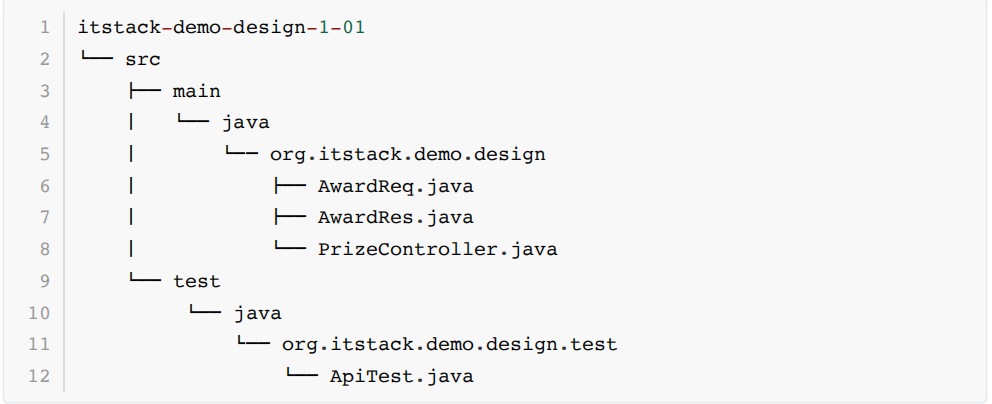

- ⼯程结构上⾮常简单，⼀个⼊参对象 AwardReq 、⼀个出参对象 AwardRes ，以及⼀个接⼝类PrizeController

**2. ifelse**实现需求

```java
public class PrizeController {
    private Logger logger = LoggerFactory.getLogger(PrizeController.class);
    public AwardRes awardToUser(AwardReq req) {
        String reqJson = JSON.toJSONString(req);
        AwardRes awardRes = null;
        try {
            logger.info("奖品发放开始{}。req:{}", req.getuId(), reqJson);
            // 按照不同类型⽅法商品[1优惠券、2实物商品、3第三⽅兑换卡(爱奇艺)]
            if (req.getAwardType() == 1) {
                CouponService couponService = new CouponService();
                CouponResult couponResult = couponService.sendCoupon(req.getuId(), req.getAwardNumber(),req.getBizId());
                if ("0000".equals(couponResult.getCode())) {
                    awardRes = new AwardRes("0000", "发放成功");
                } else {
                    awardRes = new AwardRes("0001",couponResult.getInfo());
                }
            } else if (req.getAwardType() == 2) {
                GoodsService goodsService = new GoodsService();
                DeliverReq deliverReq = new DeliverReq();
                deliverReq.setUserName(queryUserName(req.getuId()));
                deliverReq.setUserPhone(queryUserPhoneNumber(req.getuId()));
                deliverReq.setSku(req.getAwardNumber());
                deliverReq.setOrderId(req.getBizId());
                deliverReq.setConsigneeUserName(req.getExtMap().get("consigneeUserName"));
                deliverReq.setConsigneeUserPhone(req.getExtMap().get("consigneeUserPhone"));
                deliverReq.setConsigneeUserAddress(req.getExtMap().get("consigneeUserAddress"));
                Boolean isSuccess = goodsService.deliverGoods(deliverReq);
                if (isSuccess) {
                    awardRes = new AwardRes("0000", "发放成功");
                } else {
                    awardRes = new AwardRes("0001", "发放失败");
                }
            } else if (req.getAwardType() == 3) {
                String bindMobileNumber = queryUserPhoneNumber(req.getuId());
                IQiYiCardService iQiYiCardService = new IQiYiCardService();
                iQiYiCardService.grantToken(bindMobileNumber,req.getAwardNumber());
                awardRes = new AwardRes("0000", "发放成功");
            }
            logger.info("奖品发放完成{}。", req.getuId());
        } catch (Exception e) {
            logger.error("奖品发放失败{}。req:{}", req.getuId(), reqJson, e);
            awardRes = new AwardRes("0001", e.getMessage());
        }
        return awardRes;
    }
    private String queryUserName(String uId) {
        return "花花";
    }
    private String queryUserPhoneNumber(String uId) {
        return "15200101232";
    }
}
```

- 如上就是使⽤ ifelse ⾮常直接的实现出来业务需求的⼀坨代码，如果仅从业务⻆度看，研发如期甚⾄提前实现了功能。

- 那这样的代码⽬前来看并不会有什么问题，但如果在经过⼏次的迭代和拓展，接⼿这段代码的研发将⼗分痛苦。重构成本⾼需要理清之前每⼀个接⼝的使⽤，测试回归验证时间⻓，需要全部验证⼀次。这也就是很多⼈并不愿意接⼿别⼈的代码，如果接⼿了⼜被压榨开发时间。那么可想⽽知这样的 ifelse 还会继续增加。

**3.** 测试验证

写⼀个单元测试来验证上⾯编写的接⼝⽅式，养成单元测试的好习惯会为你增强代码质量。

**编写测试类：**

```java
@Test
public void test_awardToUser() {
    PrizeController prizeController = new PrizeController();
    System.out.println("\r\n模拟发放优惠券测试\r\n");
    // 模拟发放优惠券测试
    AwardReq req01 = new AwardReq();
    req01.setuId("10001");
    req01.setAwardType(1);
    req01.setAwardNumber("EGM1023938910232121323432");
    req01.setBizId("791098764902132");
    AwardRes awardRes01 = prizeController.awardToUser(req01);
    logger.info("请求参数：{}", JSON.toJSON(req01));
    logger.info("测试结果：{}", JSON.toJSON(awardRes01));
    System.out.println("\r\n模拟⽅法实物商品\r\n");
    // 模拟⽅法实物商品
    AwardReq req02 = new AwardReq();
    req02.setuId("10001");
    req02.setAwardType(2);
    req02.setAwardNumber("9820198721311");
    req02.setBizId("1023000020112221113");
    Map<String,String> extMap = new HashMap<String,String>();
    extMap.put("consigneeUserName", "谢⻜机");
    extMap.put("consigneeUserPhone", "15200292123");
    extMap.put("consigneeUserAddress", "吉林省.⻓春市.双阳区.XX街道.檀溪苑⼩区.#18-2109");
    req02.setExtMap(extMap);
    commodityService_2.sendCommodity("10001","9820198721311","1023000020112221113", extMap);
    AwardRes awardRes02 = prizeController.awardToUser(req02);
    logger.info("请求参数：{}", JSON.toJSON(req02));
    logger.info("测试结果：{}", JSON.toJSON(awardRes02));
    System.out.println("\r\n第三⽅兑换卡(爱奇艺)\r\n");
    AwardReq req03 = new AwardReq();
    req03.setuId("10001");
    req03.setAwardType(3);
    req03.setAwardNumber("AQY1xjkUodl8LO975GdfrYUio");
    AwardRes awardRes03 = prizeController.awardToUser(req03);
    logger.info("请求参数：{}", JSON.toJSON(req03));
    logger.info("测试结果：{}", JSON.toJSON(awardRes03));
}
```


结果：

```properties
模拟发放优惠券测试

22:17:55.668 [main] INFO o.i.demo.design.PrizeController - 奖品发放开始10001。req: {"awardNumber":"EGM1023938910232121323432","awardType":1,"bizId":"791098764902132","uId":"10001"}

模拟发放优惠券⼀张：10001,EGM1023938910232121323432,791098764902132
22:17:55.671 [main] INFO o.i.demo.design.PrizeController - 奖品发放完成10001。22:17:55.673 [main] INFO org.itstack.demo.test.ApiTest - 请求参数：{"uId":"10001","bizId":"791098764902132","awardNumber":"EGM1023938910232121323432","awardType":1}
22:17:55.674 [main] INFO org.itstack.demo.test.ApiTest - 测试结果：{"code":"0000","info":"发放成功"}

模拟⽅法实物商品
22:17:55.675 [main] INFO o.i.demo.design.PrizeController - 奖品发放开始10001。req: {"awardNumber":"9820198721311","awardType":2,"bizId":"1023000020112221113","extMap":{"consigneeUserName":"谢⻜机","consigneeUserPhone":"15200292123","consigneeUserAddress":"吉林省.⻓春市.双阳区.XX街道.檀溪苑⼩区.#18-2109"},"uId":"10001"}

模拟发货实物商品⼀个：{"consigneeUserAddress":"吉林省.⻓春市.双阳区.XX街道.檀溪苑⼩区.#18-2109","consigneeUserName":"谢⻜机","consigneeUserPhone":"15200292123","orderId":"1023000020112221113","sku":"9820198721311","userName":"花花","userPhone":"15200101232"}
22:17:55.677 [main] INFO o.i.demo.design.PrizeController - 奖品发放完成10001。
22:17:55.677 [main] INFO org.itstack.demo.test.ApiTest - 请求参数：{"extMap":{"consigneeUserName":"谢⻜机","consigneeUserAddress":"吉林省.⻓春市.双阳区.XX街道.檀溪苑⼩区.#18-2109","consigneeUserPhone":"15200292123"},"uId":"10001","bizId":"1023000020112221113","awardNumber":"9820198721311","awardType":2}
22:17:55.677 [main] INFO org.itstack.demo.test.ApiTest - 测试结果：{"code":"0000","info":"发放成功"}

第三⽅兑换卡(爱奇艺)
22:17:55.678 [main] INFO o.i.demo.design.PrizeController - 奖品发放开始10001。req: {"awardNumber":"AQY1xjkUodl8LO975GdfrYUio","awardType":3,"uId":"10001"}

模拟发放爱奇艺会员卡⼀张：15200101232，AQY1xjkUodl8LO975GdfrYUio22:17:55.678 [main] INFO o.i.demo.design.PrizeController - 奖品发放完成10001。
22:17:55.678 [main] INFO org.itstack.demo.test.ApiTest - 请求参数：{"uId":"10001","awardNumber":"AQY1xjkUodl8LO975GdfrYUio","awardType":3}
22:17:55.678 [main] INFO org.itstack.demo.test.ApiTest - 测试结果：{"code":"0000","info":"发放成功"}

Process finished with exit code 0
```

- 运⾏结果正常，满⾜当前所有业务产品需求，写的还很快。但！实在难以为维护！

### 五、⼯⼚模式优化代码

> 接下来使⽤⼯⼚⽅法模式来进⾏代码优化，也算是⼀次很⼩的重构。整理重构会你会发现代码结构清晰了、也具备了下次新增业务需求的扩展性。但在实际使⽤中还会对此进⾏完善，⽬前的只是抽离出最核⼼的部分体现到你⾯前，⽅便学习。
>

**1.** ⼯程结构

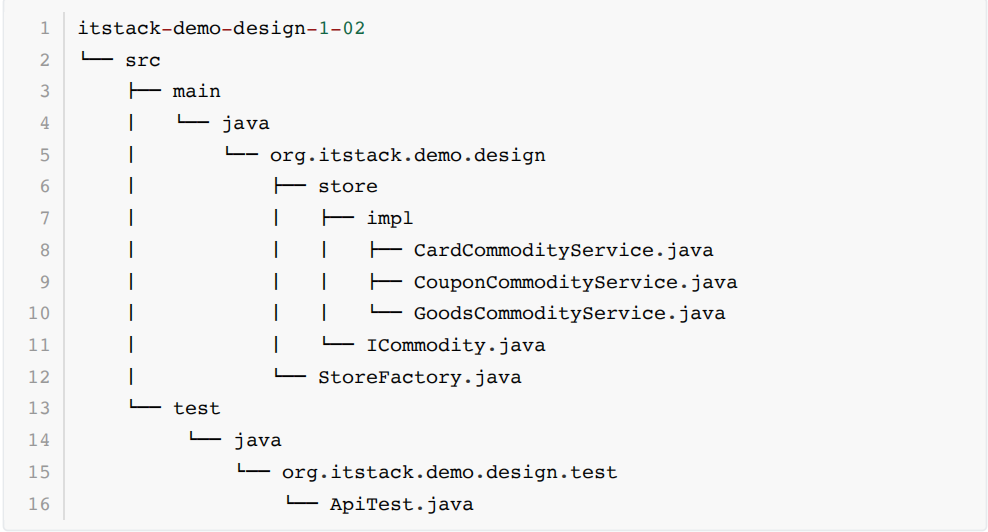

- ⾸先，从上⾯的⼯程结构中你是否⼀些感觉，⽐如；它看上去清晰了、这样分层可以更好扩展了、似乎可以想象到每⼀个类做了什么。

- 如果还不能理解为什么这样修改，也没有关系。因为你是在通过这样的⽂章，来学习设计模式的魅⼒。并且再获取源码后，进⾏实际操作⼏次也就慢慢掌握了 ⼯⼚模式 的技巧。

**2.** 代码实现

**2.1** 定义发奖接⼝

```java
public interface ICommodity {
    void sendCommodity(String uId, String commodityId, String bizId,Map<String, String> extMap) throws Exception; 
}
```

- 所有的奖品⽆论是实物、虚拟还是第三⽅，都需要通过我们的程序实现此接⼝进⾏处理，以保证最终⼊参出参的统⼀性。

- 接⼝的⼊参包括； ⽤户ID 、 奖品ID 、 业务ID 以及 扩展字段 ⽤于处理发放实物商品时的收获地址。

**2.2** 实现奖品发放接⼝

优惠券

```java
public class CouponCommodityService implements ICommodity {
    private Logger logger = LoggerFactory.getLogger(CouponCommodityService.class);
    private CouponService couponService = new CouponService();
    public void sendCommodity(String uId, String commodityId, String bizId, Map<String, String> extMap) throws Exception {
        CouponResult couponResult = couponService.sendCoupon(uId,commodityId, bizId);
        logger.info("请求参数[优惠券] => uId：{} commodityId：{} bizId：{} extMap：{}", uId, commodityId, bizId, JSON.toJSON(extMap));
        logger.info("测试结果[优惠券]：{}", JSON.toJSON(couponResult));
        if (!"0000".equals(couponResult.getCode())) throw new RuntimeException(couponResult.getInfo());
    }
}
```


实物商品

```java
public class GoodsCommodityService implements ICommodity {
 private Logger logger =
LoggerFactory.getLogger(GoodsCommodityService.class);
 private GoodsService goodsService = new GoodsService();
 public void sendCommodity(String uId, String commodityId, String
bizId, Map<String, String> extMap) throws Exception {
 DeliverReq deliverReq = new DeliverReq();
     deliverReq.setUserName(queryUserName(uId));
 deliverReq.setUserPhone(queryUserPhoneNumber(uId));
 deliverReq.setSku(commodityId);
 deliverReq.setOrderId(bizId);
 deliverReq.setConsigneeUserName(extMap.get("consigneeUserName"));
 
deliverReq.setConsigneeUserPhone(extMap.get("consigneeUserPhone"));
 
deliverReq.setConsigneeUserAddress(extMap.get("consigneeUserAddress"));
 Boolean isSuccess = goodsService.deliverGoods(deliverReq);
 logger.info("请求参数[优惠券] => uId：{} commodityId：{} bizId：{}
extMap：{}", uId, commodityId, bizId, JSON.toJSON(extMap));
 logger.info("测试结果[优惠券]：{}", isSuccess);
 if (!isSuccess) throw new RuntimeException("实物商品发放失败");
 }
 private String queryUserName(String uId) {
 return "花花";
 }
 private String queryUserPhoneNumber(String uId) {
 return "15200101232";
 }
}
```

第三⽅兑换卡

```java
public class CardCommodityService implements ICommodity {
 private Logger logger =
LoggerFactory.getLogger(CardCommodityService.class);
 // 模拟注⼊
 private IQiYiCardService iQiYiCardService = new IQiYiCardService();
 public void sendCommodity(String uId, String commodityId, String
bizId, Map<String, String> extMap) throws Exception {
 String mobile = queryUserMobile(uId);
 iQiYiCardService.grantToken(mobile, bizId);
 logger.info("请求参数[爱奇艺兑换卡] => uId：{} commodityId：{} bizId：
{} extMap：{}", uId, commodityId, bizId, JSON.toJSON(extMap));
 logger.info("测试结果[爱奇艺兑换卡]：success");
 }
 private String queryUserMobile(String uId) {
     return "15200101232";
 }
}
```

- 从上⾯可以看到每⼀种奖品的实现都包括在⾃⼰的类中，新增、修改或者删除都不会影响其他奖品功能的测试，降低回归测试的可能。

- 后续在新增的奖品只需要按照此结构进⾏填充即可，⾮常易于维护和扩展。

- 在统⼀了⼊参以及出参后，调⽤⽅不在需要关⼼奖品发放的内部逻辑，按照统⼀的⽅式即可处理。

**2.3** 创建商店⼯⼚

```java
public class StoreFactory {
 public ICommodity getCommodityService(Integer commodityType) {
 if (null == commodityType) return null;
 if (1 == commodityType) return new CouponCommodityService();
 if (2 == commodityType) return new GoodsCommodityService();
 if (3 == commodityType) return new CardCommodityService();
 throw new RuntimeException("不存在的商品服务类型");
 }
}
```

- 这⾥我们定义了⼀个商店的⼯⼚类，在⾥⾯按照类型实现各种商品的服务。可以⾮常⼲净整洁的处理你的代码，后续新增的商品在这⾥扩展即可。如果你不喜欢 if 判断，也可以使⽤ switch 或者 map 配置结构，会让代码更加⼲净。

- 另外很多代码检查软件和编码要求，不喜欢if语句后⾯不写扩展，这⾥是为了更加⼲净的向你体现逻辑。在实际的业务编码中可以添加括号。

**3.** 测试验证

编写测试类：

```java
@Test
public void test_commodity() throws Exception {
 StoreFactory storeFactory = new StoreFactory();
 // 1. 优惠券
 ICommodity commodityService_1 = storeFactory.getCommodityService(1);
 commodityService_1.sendCommodity("10001", "EGM1023938910232121323432",
"791098764902132", null);
 // 2. 实物商品
 ICommodity commodityService_2 = storeFactory.getCommodityService(2);
 
 Map<String,String> extMap = new HashMap<String,String>();
 extMap.put("consigneeUserName", "谢⻜机");
 extMap.put("consigneeUserPhone", "15200292123");
 extMap.put("consigneeUserAddress", "吉林省.⻓春市.双阳区.XX街道.檀溪苑⼩区.#18-2109");
    commodityService_2.sendCommodity("10001","9820198721311","102300002011222
1113", extMap);
 // 3. 第三⽅兑换卡(爱奇艺)
 ICommodity commodityService_3 = storeFactory.getCommodityService(3);
 
commodityService_3.sendCommodity("10001","AQY1xjkUodl8LO975GdfrYUio",null
,null);
}
```

结果：

```properties
模拟发放优惠券⼀张：10001,EGM1023938910232121323432,791098764902132
22:48:10.922 [main] INFO o.i.d.d.s.i.CouponCommodityService - 请求参数[优惠
券] => uId：10001 commodityId：EGM1023938910232121323432 bizId：
791098764902132 extMap：null
22:48:10.957 [main] INFO o.i.d.d.s.i.CouponCommodityService - 测试结果[优惠
券]：{"code":"0000","info":"发放成功"}
模拟发货实物商品⼀个：{"consigneeUserAddress":"吉林省.⻓春市.双阳区.XX街道.檀溪苑⼩
区.#18-2109","consigneeUserName":"谢⻜
机","consigneeUserPhone":"15200292123","orderId":"1023000020112221113","sk
u":"9820198721311","userName":"花花","userPhone":"15200101232"}
22:48:10.962 [main] INFO o.i.d.d.s.impl.GoodsCommodityService - 请求参数[优
惠券] => uId：10001 commodityId：9820198721311 bizId：1023000020112221113
extMap：{"consigneeUserName":"谢⻜机","consigneeUserAddress":"吉林省.⻓春市.双
阳区.XX街道.檀溪苑⼩区.#18-2109","consigneeUserPhone":"15200292123"}
22:48:10.962 [main] INFO o.i.d.d.s.impl.GoodsCommodityService - 测试结果[优
惠券]：true
模拟发放爱奇艺会员卡⼀张：15200101232，null
22:48:10.963 [main] INFO o.i.d.d.s.impl.CardCommodityService - 请求参数[爱
奇艺兑换卡] => uId：10001 commodityId：AQY1xjkUodl8LO975GdfrYUio bizId：null
extMap：null
22:48:10.963 [main] INFO o.i.d.d.s.impl.CardCommodityService - 测试结果[爱
奇艺兑换卡]：success
Process finished with exit code 0
```

- 运⾏结果正常，既满⾜了业务产品需求，也满⾜了⾃⼰对代码的追求。这样的代码部署上线运⾏，内⼼不会恐慌，不会觉得半夜会有电话。

- 另外从运⾏测试结果上也可以看出来，在进⾏封装后可以⾮常清晰的看到⼀整套发放奖品服务的完整性，统⼀了⼊参、统⼀了结果。

### 六、总结

- 从上到下的优化来看，⼯⼚⽅法模式并不复杂，甚⾄这样的开发结构在你有所理解后，会发现更加简单了。

- 那么这样的开发的好处知道后，也可以总结出来它的优点； 避免创建者与具体的产品逻辑耦合 、 满⾜单⼀职责，每⼀个业务逻辑实现都在所属⾃⼰的类中完成 、 满⾜开闭原则，⽆需更改使⽤调⽤⽅就可以在程序中引⼊新的产品类型 。但这样也会带来⼀些问题，⽐如有⾮常多的奖品类型，那么实现的⼦类会极速扩张。因此也需要使⽤其他的模式进⾏优化，这些在后续的设计模式中会逐步涉及到。
- 从案例⼊⼿看设计模式往往要⽐看理论学的更加容易，因为案例是缩短理论到上⼿的最佳⽅式，如果你已经有所收获，⼀定要去尝试实操。


## 第 **2** 节：抽象⼯⼚模式

> 代码⼀把梭，兄弟来背锅。
>
> ⼤部分做开发的⼩伙伴初⼼都希望把代码写好，除了把编程当作⼯作以外他们还是具备⼯匠精神的从业者。但很多时候⼜很难让你把初⼼坚持下去，就像；接了个烂⼿的项⽬、产品功能要的急、个⼈能⼒不⾜，等等原因导致⼯程代码臃肿不堪，线上频出事故，最终离职⾛⼈。
>
> 看了很多书、学了很多知识，多线程能玩出花，可最后我还是写不好代码！
>
> 这就有点像家⾥装修完了买物件，我⼏⼗万的实⽊沙发，怎么放这⾥就不好看。同样代码写的不好并不⼀定是基础技术不⾜，也不⼀定是产品要得急 怎么实现我不管明天上线 。⽽很多时候是我们对编码的经验的不⾜和对架构的把控能⼒不到位，我相信产品的第⼀个需求往往都不复杂，甚⾄所⻅所得。但如果你不考虑后续的是否会拓展，将来会在哪些模块继续添加功能，那么后续的代码就会随着你种下的第⼀颗恶性的种⼦开始蔓延。
>
> 学习设计模式的⼼得有哪些，怎么学才会⽤！
>
> 设计模式书籍，有点像考驾驶证的科⼀、家⾥装修时的⼿册、或者单身狗的恋爱宝典。但！你只要不实操，⼀定能搞的乱 码 七糟。因为这些指导思想都是从实际经验中提炼的，没有经过提炼的⼩⽩，很难驾驭这样的知识。所以在学习的过程中⾸先要有案例，之后再结合案例与⾃⼰实际的业务，尝试重构改造，慢慢体会其中的感受，从⽽也就学会了如果搭建出优秀的代码。
>

### ⼀、开发环境

1. JDK 1.8

2. Idea + Maven

3. 涉及⼯程三个

   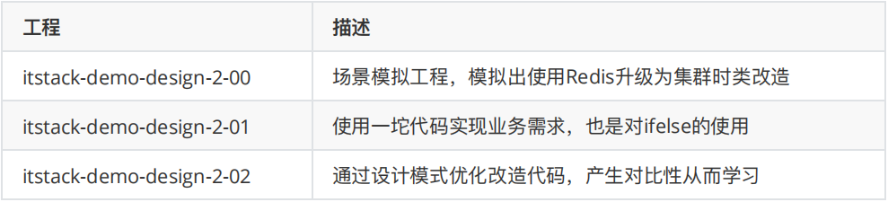

### ⼆、抽象⼯⼚模式介绍

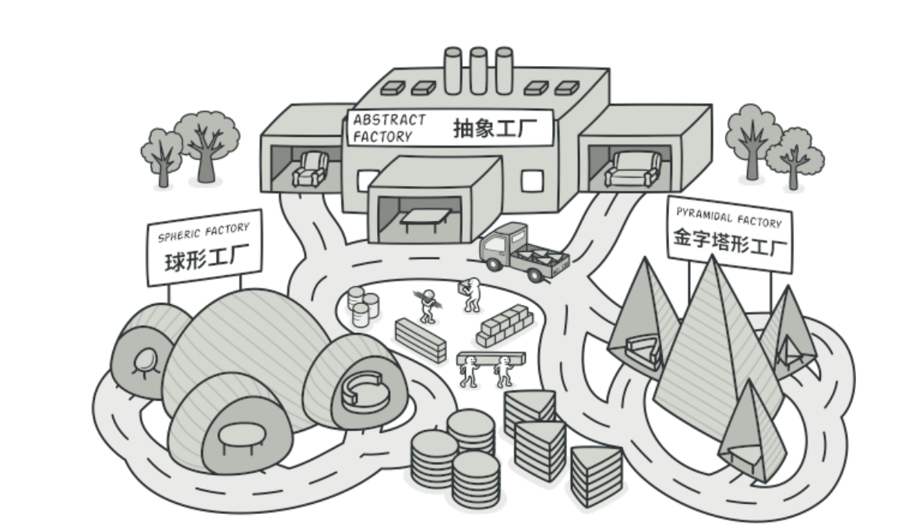

抽象⼯⼚模式与⼯⼚⽅法模式虽然主要意图都是为了解决，接⼝选择问题。但在实现上，抽象⼯⼚是⼀个中⼼⼯⼚，创建其他⼯⼚的模式。可能在平常的业务开发中很少关注这样的设计模式或者类似的代码结构，但是这种场景确⼀直在我们身边，例如；

1. 不同系统内的回⻋换⾏

> 1. Unix系统⾥，每⾏结尾只有 **<**换⾏**>**，即 \n ；
>
> 2. Windows系统⾥⾯，每⾏结尾是 **<**换⾏**><**回⻋**>**，即 \n\r ；
>
> 3. Mac系统⾥，每⾏结尾是 **<**回⻋**>**

2. IDEA 开发⼯具的差异展示(Win\Mac)
3. 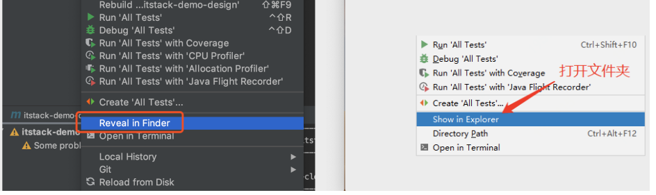

除了这样显⽽易⻅的例⼦外，我们的业务开发中时常也会遇到类似的问题，需要兼容做处理。但⼤部分经验不⾜的开发⼈员，常常直接通过添加 ifelse ⽅式进⾏处理了。

### 三、案例场景模拟

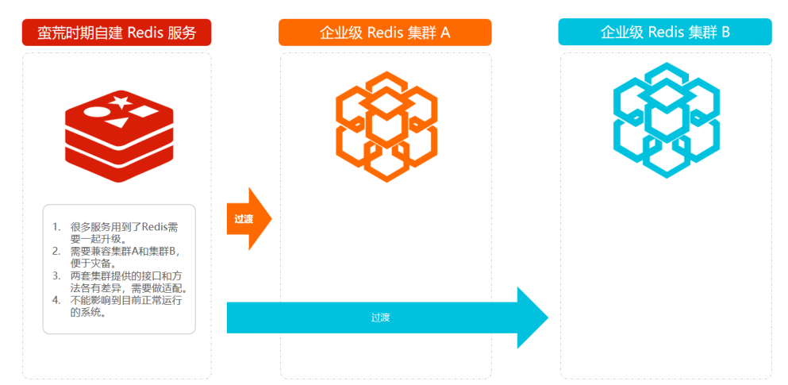

> 很多时候初期业务的蛮荒发展，也会牵动着研发对系统的建设。预估 QPS较低 、 系统压⼒较⼩ 、 并发访问不⼤ 、 近⼀年没有⼤动作 等等，在考虑时间投⼊成本的前提前，并不会投⼊特别多的⼈⼒去构建⾮常完善的系统。就像对 Redis 的使⽤，往往可能只要是单机的就可以满⾜现状。不吹⽜的讲百度⾸⻚我上学时候⼀天就能写完，等毕业⼯作了就算给我⼀年都完成不了！
>
> 但随着业务超过预期的快速发展，系统的负载能⼒也要随着跟上。原有的单机 Redis 已经满⾜不了系统需求。这时候就需要更换为更为健壮的Redis集群服务，虽然需要修改但是不能影响⽬前系统的运⾏，还要平滑过渡过去。
>
> 随着这次的升级，可以预⻅的问题会有；
>
> 1. 很多服务⽤到了Redis需要⼀起升级到集群。
>
> 2. 需要兼容集群A和集群B，便于后续的灾备。
>
> 3. 两套集群提供的接⼝和⽅法各有差异，需要做适配。
>
> 4. 不能影响到⽬前正常运⾏的系统。

**1.** 场景模拟⼯程

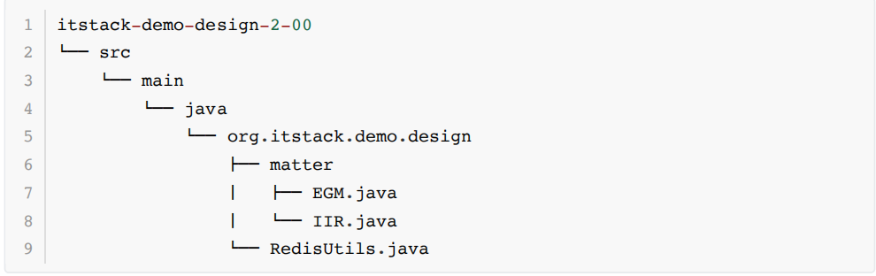

**2.** 场景简述

**2.1** 模拟单机服务 **RedisUtils**

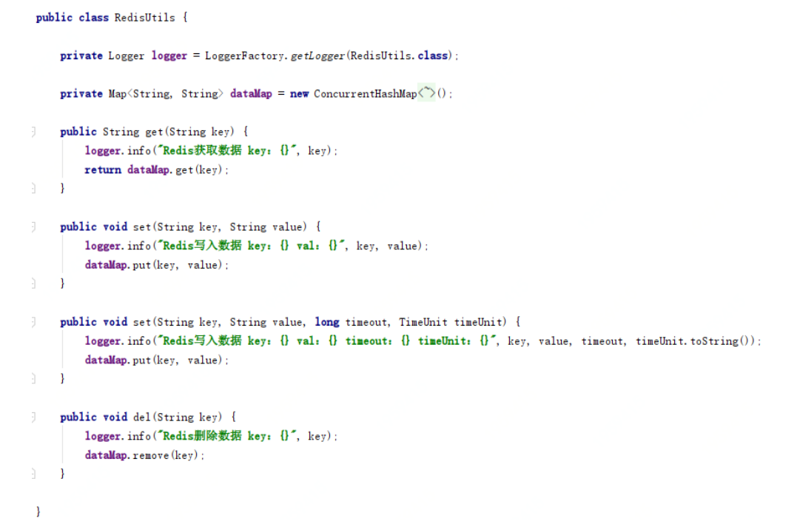

- 模拟Redis功能，也就是假定⽬前所有的系统都在使⽤的服务

- 类和⽅法名次都固定写死到各个业务系统中，改动略微麻烦

**2.2** 模拟集群 **EGM**

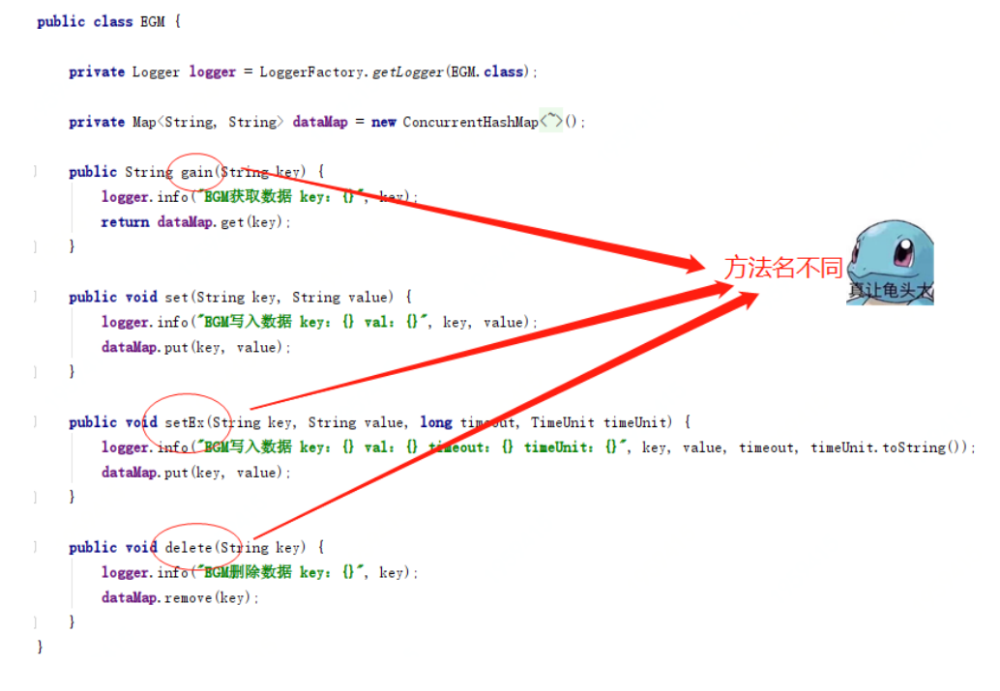

- 模拟⼀个集群服务，但是⽅法名与各业务系统中使⽤的⽅法名不同。有点像你mac，我⽤win。做⼀样的事，但有不同的操作。

**2.3** 模拟集群 **IIR**

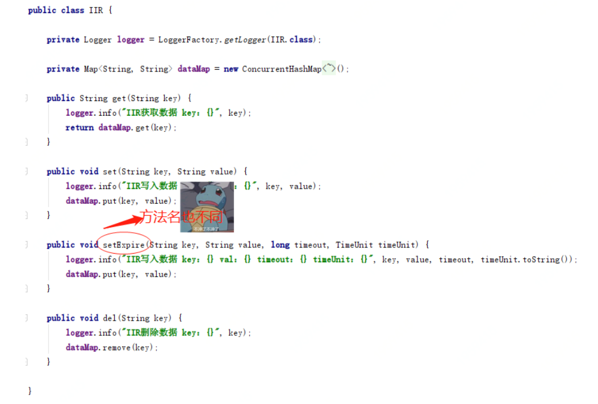

- 这是另外⼀套集群服务，有时候在企业开发中就很有可能出现两套服务，这⾥我们也是为了做模拟案例，所以添加两套实现同样功能的不同服务，来学习抽象⼯⼚模式。

> 综上可以看到，我们⽬前的系统中已经在⼤量的使⽤redis服务，但是因为系统不能满⾜业务的快速发展，因此需要迁移到集群服务中。⽽这时有两套集群服务需要兼容使⽤，⼜要满⾜所有的业务系统改造的同时不影响线上使⽤。
>

**3.** 单集群代码使⽤

以下是案例模拟中原有的单集群Redis使⽤⽅式，后续会通过对这⾥的代码进⾏改造。

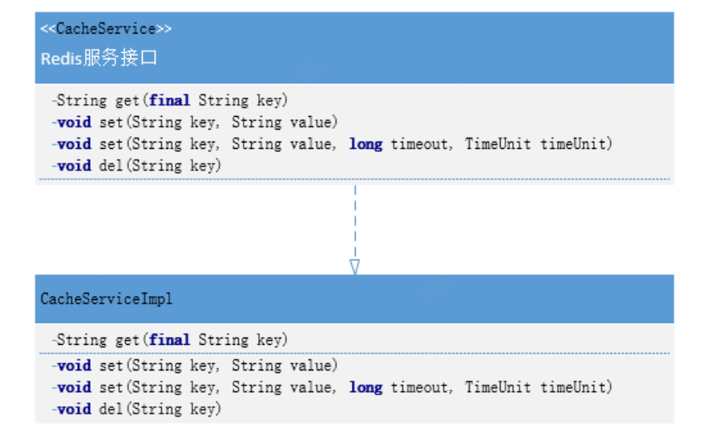

**3.1** 定义使⽤接⼝

```java
public interface CacheService {
 String get(final String key);
 void set(String key, String value);
 void set(String key, String value, long timeout, TimeUnit timeUnit);
 void del(String key);
}
```


**3.2** 实现调⽤代码


⽬前的代码对于当前场景下的使⽤没有什么问题，也⽐较简单。但是所有的业务系统都在使⽤同

时，需要改造就不那么容易了。这⾥可以思考下，看如何改造才是合理的。

四、⽤⼀坨坨代码实现

讲道理没有ifelse解决不了的逻辑，不⾏就在加⼀⾏！

此时的实现⽅式并不会修改类结构图，也就是与上⾯给出的类层级关系⼀致。通过在接⼝中添加类型字

段区分当前使⽤的是哪个集群，来作为使⽤的判断。可以说⽬前的⽅式⾮常难⽤，其他使⽤⽅改动颇

多，这⾥只是做为例⼦。

**1.** ⼯程结构

此时的只有两个类，类结构⾮常简单。⽽我们需要的补充扩展功能也只是在 CacheServiceImpl

中实现。

**2. ifelse**实现需求

 public void set(String key, String value, long timeout, TimeUnit

timeUnit) {

 redisUtils.set(key, value, timeout, timeUnit);

 }

 public void del(String key) {

 redisUtils.del(key);

 }

}

13

14

15

16

17

18

19

20

21

itstack-demo-design-2-01

!"" src

 !"" main

 !"" java

 !"" org.itstack.demo.design

 \#"" impl

 $ !"" CacheServiceImpl.java

 !"" CacheService.java

1

2

3

4

5

6

7

8

public class CacheServiceImpl implements CacheService {

 private RedisUtils redisUtils = new RedisUtils();

 private EGM egm = new EGM();

 private IIR iir = new IIR();

 public String get(String key, int redisType) {

 if (1 == redisType) {

1

2

3

4

5

6

7

8

9

10

11这⾥的实现过程⾮常简单，主要根据类型判断是哪个Redis集群。

虽然实现是简单了，但是对使⽤者来说就麻烦了，并且也很难应对后期的拓展和不停的维护。

**3.** 测试验证

接下来我们通过junit单元测试的⽅式验证接⼝服务，强调⽇常编写好单测可以更好的提⾼系统的健壮

度。

编写测试类：

结果：

 return egm.gain(key);

 }

 if (2 == redisType) {

 return iir.get(key);

 }

 return redisUtils.get(key);

 }

 public void set(String key, String value, int redisType) {

 if (1 == redisType) {

 egm.set(key, value);

 return;

 }

 if (2 == redisType) {

 iir.set(key, value);

 return;

 }

 redisUtils.set(key, value);

 }

 //... 同类不做太多展示，可以下载源码进⾏参考

}

12

13

14

15

16

17

18

19

20

21

22

23

24

25

26

27

28

29

30

31

32

33

34

35

36

37

38

39

@Test

public void test_CacheService() {

 CacheService cacheService = new CacheServiceImpl();

 cacheService.set("user_name_01", "⼩傅哥", 1);

 String val01 = cacheService.get("user_name_01",1);

 System.out.println(val01);

} 

1

2

3

4

5

6

7从结果上看运⾏正常，并没有什么问题。但这样的代码只要到⽣成运⾏起来以后，想再改就真的难

了！

五、抽象⼯⼚模式重构代码

接下来使⽤抽象⼯⼚模式来进⾏代码优化，也算是⼀次很⼩的᯿构。

这⾥的抽象⼯⼚的创建和获取⽅式，会采⽤代理类的⽅式进⾏实现。所被代理的类就是⽬前的Redis操

作⽅法类，让这个类在不需要任何修改下，就可以实现调⽤集群A和集群B的数据服务。

并且这⾥还有⼀点⾮常᯿要，由于集群A和集群B在部分⽅法提供上是不同的，因此需要做⼀个接⼝适

配，⽽这个适配类就相当于⼯⼚中的⼯⼚，⽤于创建把不同的服务抽象为统⼀的接⼝做相同的业务。这

⼀块与我们上⼀章节中的 ⼯⼚⽅法模型 类型，可以翻阅参考。

**1.** ⼯程结构

抽象⼯⼚模型结构

22:26:24.591 [main] INFO org.itstack.demo.design.matter.EGM - EGM写⼊数据

key：user_name_01 val：⼩傅哥

22:26:24.593 [main] INFO org.itstack.demo.design.matter.EGM - EGM获取数据

key：user_name_01

测试结果：⼩傅哥

Process finished with exit code 0 

1

2

3

4

5

itstack-demo-design-2-02

!"" src

 \#"" main

 $ !"" java

 $ !"" org.itstack.demo.design

 $ #"" factory 

 $ $ #"" impl

 $ $ $ #"" EGMCacheAdapter.java

 $ $ $ !"" IIRCacheAdapter.java

 $ $ #"" ICacheAdapter.java

 $ $ #"" JDKInvocationHandler.java

 $ $ !"" JDKProxy.java

 $ #"" impl

 $ $ !"" CacheServiceImpl.java 

 $ !"" CacheService.java

 !"" test

 !"" java

 !"" org.itstack.demo.design.test

 !"" ApiTest.java

1

2

3

4

5

6

7

8

9

10

11

12

13

14

15

16

17

18

19⼯程中涉及的部分核⼼功能代码，如下；

ICacheAdapter ，定义了适配接⼝，分别包装两个集群中差异化的接⼝名

称。 EGMCacheAdapter 、 IIRCacheAdapter

JDKProxy 、 JDKInvocationHandler ，是代理类的定义和实现，这部分也就是抽象⼯⼚的

另外⼀种实现⽅式。通过这样的⽅式可以很好的把原有操作Redis的⽅法进⾏代理操作，通过

控制不同的⼊参对象，控制缓存的使⽤。

好，那么接下来会分别讲解⼏个类的具体实现。

**2.** 代码实现

**2.1** 定义适配接⼝

这个类的主要作⽤是让所有集群的提供⽅，能在统⼀的⽅法名称下进⾏操作。也⽅⾯后续的拓展。

**2.2** 实现集群使⽤服务

public interface ICacheAdapter {

 String get(String key);

 void set(String key, String value);

 void set(String key, String value, long timeout, TimeUnit timeUnit);

 void del(String key);

} 

1

2

3

4

5

6

7

8

9

10

11**EGMCacheAdapter**

**IIRCacheAdapter**

public class EGMCacheAdapter implements ICacheAdapter {

 private EGM egm = new EGM();

 public String get(String key) {

 return egm.gain(key);

 }

 public void set(String key, String value) {

 egm.set(key, value);

 }

 public void set(String key, String value, long timeout, TimeUnit

timeUnit) {

 egm.setEx(key, value, timeout, timeUnit);

 }

 public void del(String key) {

 egm.delete(key);

 }

} 

1

2

3

4

5

6

7

8

9

10

11

12

13

14

15

16

17

18

19

20

public class IIRCacheAdapter implements ICacheAdapter {

 private IIR iir = new IIR();

 public String get(String key) {

 return iir.get(key);

 }

 public void set(String key, String value) {

 iir.set(key, value);

 }

 public void set(String key, String value, long timeout, TimeUnit

timeUnit) {

 iir.setExpire(key, value, timeout, timeUnit);

 }

 public void del(String key) {

 iir.del(key);

 }

} 

1

2

3

4

5

6

7

8

9

10

11

12

13

14

15

16

17

18

19

20

21以上两个实现都⾮常容易，在统⼀⽅法名下进⾏包装。

**2.3** 定义抽象⼯程代理类和实现

**JDKProxy**

这⾥主要的作⽤就是完成代理类，同时对于使⽤哪个集群有外部通过⼊参进⾏传递。

**JDKInvocationHandler**

在代理类的实现中其实也⾮常简单，通过穿透进来的集群服务进⾏⽅法操作。

另外在 invoke 中通过使⽤获取⽅法名称反射⽅式，调⽤对应的⽅法功能，也就简化了整体的使

⽤。

到这我们就已经将整体的功能实现完成了，关于抽象⼯⼚这部分也可以使⽤⾮代理的⽅式进⾏实

现。

**3.** 测试验证

编写测试类：

public static <T> T getProxy(Class<T> interfaceClass, ICacheAdapter

cacheAdapter) throws Exception {

 InvocationHandler handler = new JDKInvocationHandler(cacheAdapter);

 ClassLoader classLoader =

Thread.currentThread().getContextClassLoader();

 Class<?>[] classes = interfaceClass.getInterfaces();

 return (T) Proxy.newProxyInstance(classLoader, new Class[]{classes[0]},

handler);

} 

1

2

3

4

5

6

public class JDKInvocationHandler implements InvocationHandler {

 private ICacheAdapter cacheAdapter;

 public JDKInvocationHandler(ICacheAdapter cacheAdapter) {

 this.cacheAdapter = cacheAdapter;

 }

 public Object invoke(Object proxy, Method method, Object[] args)

throws Throwable {

 return ICacheAdapter.class.getMethod(method.getName(),

ClassLoaderUtils.getClazzByArgs(args)).invoke(cacheAdapter, args);

 }

} 

1

2

3

4

5

6

7

8

9

10

11

12

13在测试的代码中通过传⼊不同的集群类型，就可以调⽤不同的集群下的⽅

法。 JDKProxy.getProxy(CacheServiceImpl.class, new EGMCacheAdapter());

如果后续有扩展的需求，也可以按照这样的类型⽅式进⾏补充，同时对于改造上来说并没有改动原

来的⽅法，降低了修改成本。

结果：

运⾏结果正常，这样的代码满⾜了这次拓展的需求，同时你的技术能⼒也给⽼板留下了深刻的印

象。

研发⾃我能⼒的提升远不是外接的压⼒就是编写⼀坨坨代码的接⼝，如果你已经熟练了很多技能，

那么可以在即使紧急的情况下，也能做出完善的⽅案。

六、总结

抽象⼯⼚模式，所要解决的问题就是在⼀个产品族，存在多个不同类型的产品(Redis集群、操作系

统)情况下，接⼝选择的问题。⽽这种场景在业务开发中也是⾮常多⻅的，只不过可能有时候没有

将它们抽象化出来。

你的代码只是被ifelse埋上了！ 当你知道什么场景下何时可以被抽象⼯程优化代码，那么你的代码

层级结构以及满⾜业务需求上，都可以得到很好的完成功能实现并提升扩展性和优雅度。

那么这个设计模式满⾜了；单⼀职责、开闭原则、解耦等优点，但如果说随着业务的不断拓展，可

@Test

public void test_CacheService() throws Exception {

 CacheService proxy_EGM = JDKProxy.getProxy(CacheServiceImpl.class, new

EGMCacheAdapter());

 proxy_EGM.set("user_name_01","⼩傅哥");

 String val01 = proxy_EGM.get("user_name_01");

 System.out.println(val01);

 

 CacheService proxy_IIR = JDKProxy.getProxy(CacheServiceImpl.class, new

IIRCacheAdapter());

 proxy_IIR.set("user_name_01","⼩傅哥");

 String val02 = proxy_IIR.get("user_name_01");

 System.out.println(val02);

} 

1

2

3

4

5

6

7

8

9

10

11

12

23:07:06.953 [main] INFO org.itstack.demo.design.matter.EGM - EGM写⼊数据

key：user_name_01 val：⼩傅哥

23:07:06.956 [main] INFO org.itstack.demo.design.matter.EGM - EGM获取数据

key：user_name_01

测试结果：⼩傅哥

23:07:06.957 [main] INFO org.itstack.demo.design.matter.IIR - IIR写⼊数据

key：user_name_01 val：⼩傅哥

23:07:06.957 [main] INFO org.itstack.demo.design.matter.IIR - IIR获取数据

key：user_name_01

测试结果：⼩傅哥

Process finished with exit code 0 

1

2

3

4

5

6

7

8能会造成类实现上的复杂度。但也可以说算不上缺点，因为可以随着其他设计⽅式的引⼊和代理类

以及⾃动⽣成加载的⽅式降低此项缺点。⼯程 

描述

itstack-demo-design-3-00 

场景模拟⼯程，模拟装修过程中的套餐选择(豪华、⽥园、简约)

itstack-demo-design-3-01 

使⽤⼀坨代码实现业务需求，也是对ifelse的使⽤

itstack-demo-design-3-02 

通过设计模式优化改造代码，产⽣对⽐性从⽽学习

第 **3** 节：建造者模式

乱码七糟 [luàn qī bā zāo]，我时常怀疑这个成语是来形容程序猿的！

⽆论承接什么样的需求，是不是身边总有那么⼏个⼈代码写的烂，但是却时常有测试⼩姐姐过来聊天(求 

改*bug*)、有产品⼩伙伴送吃的(求写需求)、有业务⼩妹妹陪着改代码(求上线)，直⾄领导都认为他的⼯作

很᯿要，⽽在旁边的你只能蹭点吃的。

那你说，CRUD的代码还想让我怎么样？

这样的⼩伙伴，可能把代码写的很直接， ifelse 多⽤⼀点，满⾜于先临时⽀持⼀下，想着这也没什么

的。⽽且这样的业务需求要的急⼜都是增删改查的内容，实在不想做设计。⽽如果有⼈提到说好好设计

下，可能也会被反对不要过渡设计。

贴膏药似的修修补补，⼀次⽐⼀次恐怖！

第⼀次完成产品需求实在是很快，但互联⽹的代码不⽐传统企业。在传统⾏业可能⼀套代码能⽤⼗年，

但在互联⽹⾼速的迭代下你的⼯程，⼀年就要变动⼏⼗次。如果从⼀开始就想着只要完成功能就可以，

那么随之⽽来的是后续的需求难以承接，每次看着成⽚成⽚的代码，实在不知如何下⼿。

在研发流程规范下执⾏，才能写出好程序！

⼀个项⽬的上线往往要经历 业务需求 、 产品设计 、 研发实现 、 测试验证 、 上线部署 到 正式开量 ，⽽这

其中对研发⾮常᯿要的⼀换就是研发实现的过程，⼜可以包括为； 架构选型 、 功能设计 、 设计评审 、

代码实现 、 代码评审 、 单测覆盖率检查 、 编写⽂档 、 提交测试 。所以在⼀些流程规范下，其实很难让

你随意开发代码。

开发代码的过程不是 炫技 ，就像盖房⼦如果不按照图纸来修建，回⾸就在⼭墙上搭⼀个厨房卫浴！可能

在现实场景中这很荒唐，但在功能开发中却总有这样的代码。

所以我们也需要⼀些设计模式的标准思想，去建设代码结构，提升全局把控能⼒。

⼀、开发环境

\1. JDK 1.8

\2. Idea + Maven

\3. 涉及⼯程三个，可以通过关注公众号： bugstack⾍洞栈 ，回复 源码下载 获取(打开获取的链接，

找到序号18)

⼆、建造者模式介绍建造者模式所完成的内容就是通过将多个简单对象通过⼀步步的组装构建出⼀个复杂对象的过程。

那么，哪⾥有这样的场景呢？

例如你玩王者荣耀的时的初始化界⾯；有三条路、有树⽊、有ᰀ怪、有守卫塔等等，甚⾄依赖于你的⽹

络情况会控制清晰度。⽽当你换⼀个场景进⾏其他不同模式的选择时，同样会建设道路、树⽊、ᰀ怪等

等，但是他们的摆放和⼤⼩都有不同。这⾥就可以⽤到建造者模式来初始化游戏元素。

⽽这样的根据相同的 物料 ，不同的组装所产⽣出的具体的内容，就是建造者模式的最终意图，也就是；

将⼀个复杂的构建与其表示相分离，使得同样的构建过程可以创建不同的表示。

三、案例场景模拟

这⾥我们模拟装修公司对于设计出⼀些套餐装修服务的场景。很多装修公司都会给出⾃家的套餐服务，⼀般有；欧式豪华、轻奢⽥园、现代简约等等，⽽这些套餐的

后⾯是不同的商品的组合。例如；⼀级&⼆级吊顶、多乐⼠涂料、圣象地板、⻢可波罗地砖等等，按照

不同的套餐的价格选取不同的品牌组合，最终再按照装修⾯积给出⼀个整体的报价。

这⾥我们就模拟装修公司想推出⼀些套餐装修服务，按照不同的价格设定品牌选择组合，以达到使⽤建

造者模式的过程。

**1.** 场景模拟⼯程

在模拟⼯程中提供了装修中所需要的物料； ceilling(吊顶) 、 coat(涂料) 、 floor(地板) 、

tile(地砖) ，这么四项内容。（实际的装修物料要⽐这个多的多）

**2.** 场景简述

**2.1** 物料接⼝

itstack-demo-design-3-00

!"" src

 !"" main

 !"" java

 !"" org.itstack.demo.design

 \#"" ceilling

 $ #"" LevelOneCeiling.java

 $ !"" LevelTwoCeiling.java

 \#"" coat

 $ #"" DuluxCoat.java

 $ !"" LiBangCoat.java

 $ !"" LevelTwoCeiling.java

 \#"" floor

 $ #"" DerFloor.java

 $ !"" ShengXiangFloor.java

 \#"" tile

 $ #"" DongPengTile.java

 $ !"" MarcoPoloTile.java

 !"" Matter.java

1

2

3

4

5

6

7

8

9

10

11

12

13

14

15

16

17

18

19

public interface Matter {

 String scene(); // 场景；地板、地砖、涂料、吊顶

 String brand(); // 品牌

 String model(); // 型号

 BigDecimal price(); // 价格

 String desc(); // 描述

} 

1

2

3

4

5

6

7

8

9

10

11

12

13物料接⼝提供了基本的信息，以保证所有的装修材料都可以按照统⼀标准进⾏获取。

**2.2** 吊顶**(ceiling)**

⼀级顶

⼆级顶

public class LevelOneCeiling implements Matter {

 public String scene() {

 return "吊顶";

 }

 public String brand() {

 return "装修公司⾃带";

 }

 public String model() {

 return "⼀级顶";

 }

 public BigDecimal price() {

 return new BigDecimal(260);

 }

 public String desc() {

 return "造型只做低⼀级，只有⼀个层次的吊顶，⼀般离顶120-150mm";

 }

} 

1

2

3

4

5

6

7

8

9

10

11

12

13

14

15

16

17

18

19

20

21

22

23

public class LevelTwoCeiling implements Matter {

 public String scene() {

 return "吊顶";

 }

 public String brand() {

 return "装修公司⾃带";

 }

 public String model() {

 return "⼆级顶";

 }

 public BigDecimal price() {

 return new BigDecimal(850);

 }

1

2

3

4

5

6

7

8

9

10

11

12

13

14

15

16

17**2.3** 涂料**(coat)**

多乐⼠

⽴邦

 public String desc() {

 return "两个层次的吊顶，⼆级吊顶⾼度⼀般就往下吊20cm，要是层⾼很⾼，也可增加

每级的厚度";

 }

 

}

18

19

20

21

22

23

public class DuluxCoat implements Matter {

 public String scene() {

 return "涂料";

 }

 public String brand() {

 return "多乐⼠(Dulux)";

 }

 public String model() {

 return "第⼆代";

 }

 public BigDecimal price() {

 return new BigDecimal(719);

 }

 public String desc() {

 return "多乐⼠是阿克苏诺⻉尔旗下的著名建筑装饰油漆品牌，产品畅销于全球100个国

家，每年全球有5000万户家庭使⽤多乐⼠油漆。";

 }

 

} 

1

2

3

4

5

6

7

8

9

10

11

12

13

14

15

16

17

18

19

20

21

22

23

public class LiBangCoat implements Matter {

 public String scene() {

 return "涂料";

 }

 public String brand() {

 return "⽴邦";

 }

1

2

3

4

5

6

7

8

9

10**2.4** 地板**(flfloor)**

德尔

圣象

 public String model() {

 return "默认级别";

 }

 public BigDecimal price() {

 return new BigDecimal(650);

 }

 public String desc() {

 return "⽴邦始终以开发绿⾊产品、注᯿⾼科技、⾼品质为⽬标，以技术⼒量不断推进科

研和开发，满⾜消费者需求。";

 }

}

11

12

13

14

15

16

17

18

19

20

21

22

23

public class DerFloor implements Matter {

 public String scene() {

 return "地板";

 }

 public String brand() {

 return "德尔(Der)";

 }

 public String model() {

 return "A+";

 }

 public BigDecimal price() {

 return new BigDecimal(119);

 }

 public String desc() {

 return "DER德尔集团是全球领先的专业⽊地板制造商，北京2008年奥运会家装和公装

地板供应商";

 }

 

} 

1

2

3

4

5

6

7

8

9

10

11

12

13

14

15

16

17

18

19

20

21

22

23

public class ShengXiangFloor implements Matter {

 public String scene() {

1

2

3**2.5** 地砖**(tile)**

东鹏

 return "地板";

 }

 public String brand() {

 return "圣象";

 }

 public String model() {

 return "⼀级";

 }

 public BigDecimal price() {

 return new BigDecimal(318);

 }

 public String desc() {

 return "圣象地板是中国地板⾏业著名品牌。圣象地板拥有中国驰名商标、中国名牌、国

家免检、中国环境标志认证等多项荣誉。";

 }

} 

4

5

6

7

8

9

10

11

12

13

14

15

16

17

18

19

20

21

22

23

public class DongPengTile implements Matter {

 public String scene() {

 return "地砖";

 }

 public String brand() {

 return "东鹏瓷砖";

 }

 public String model() {

 return "10001";

 }

 public BigDecimal price() {

 return new BigDecimal(102);

 }

 public String desc() {

 return "东鹏瓷砖以品质铸就品牌，科技推动品牌，⼝碑传播品牌为宗旨，2014年品牌

价值132.35亿元，位列建陶⾏业榜⾸。";

 }

1

2

3

4

5

6

7

8

9

10

11

12

13

14

15

16

17

18

19

20

21

22⻢可波罗

以上就是本次装修公司所提供的 装修配置单 ，接下我们会通过案例去使⽤不同的物料组合出不同的

套餐服务。

四、⽤⼀坨坨代码实现

讲道理没有ifelse解决不了的逻辑，不⾏就在加⼀⾏！

每⼀个章节中我们都会使⽤这样很直⽩的⽅式去把功能实现出来，在通过设计模式去优化完善。这样的

代码结构也都是⾮常简单的，没有复杂的类关系结构，都是直来直去的代码。除了我们经常强调的这样

的代码不能很好的扩展外，做⼀些例⼦demo⼯程还是可以的。

**1.** ⼯程结构

} 

23

public class MarcoPoloTile implements Matter {

 public String scene() {

 return "地砖";

 }

 public String brand() {

 return "⻢可波罗(MARCO POLO)";

 }

 public String model() {

 return "缺省";

 }

 public BigDecimal price() {

 return new BigDecimal(140);

 }

 public String desc() {

 return "“⻢可波罗”品牌诞⽣于1996年，作为国内最早品牌化的建陶品牌，以“⽂化陶

瓷”占领市场，享有“仿古砖⾄尊”的美誉。";

 }

} 

1

2

3

4

5

6

7

8

9

10

11

12

13

14

15

16

17

18

19

20

21

22

23

itstack-demo-design-3-01

!"" src

 !"" main

 !"" java

 !"" org.itstack.demo.design

 !"" DecorationPackageController.java

1

2

3

4

5

6⼀个类⼏千⾏的代码你是否⻅过，嚯？那今天就让你⻅识⼀下有这样潜质的类！

**2. ifelse**实现需求

public class DecorationPackageController {

 public String getMatterList(BigDecimal area, Integer level) {

 List<Matter> list = new ArrayList<Matter>(); // 装修清单

 BigDecimal price = BigDecimal.ZERO; // 装修价格

 // 豪华欧式

 if (1 == level) {

 LevelTwoCeiling levelTwoCeiling = new LevelTwoCeiling(); // 吊

顶，⼆级顶

 DuluxCoat duluxCoat = new DuluxCoat(); // 涂

料，多乐⼠

 ShengXiangFloor shengXiangFloor = new ShengXiangFloor(); // 地

板，圣象

 list.add(levelTwoCeiling);

 list.add(duluxCoat);

 list.add(shengXiangFloor);

 price = price.add(area.multiply(new

BigDecimal("0.2")).multiply(levelTwoCeiling.price()));

 price = price.add(area.multiply(new

BigDecimal("1.4")).multiply(duluxCoat.price()));

 price = price.add(area.multiply(shengXiangFloor.price()));

 }

 // 轻奢⽥园

 if (2 == level) {

 LevelTwoCeiling levelTwoCeiling = new LevelTwoCeiling(); // 吊

顶，⼆级顶

 LiBangCoat liBangCoat = new LiBangCoat(); // 涂

料，⽴邦

 MarcoPoloTile marcoPoloTile = new MarcoPoloTile(); // 地

砖，⻢可波罗

 list.add(levelTwoCeiling);

 list.add(liBangCoat);

 list.add(marcoPoloTile);

 price = price.add(area.multiply(new

BigDecimal("0.2")).multiply(levelTwoCeiling.price()));

1

2

3

4

5

6

7

8

9

10

11

12

13

14

15

16

17

18

19

20

21

22

23

24

25

26

27

28

29

30

31

32

33

34

35

36 price = price.add(area.multiply(new

BigDecimal("1.4")).multiply(liBangCoat.price()));

 price = price.add(area.multiply(marcoPoloTile.price()));

 }

 // 现代简约

 if (3 == level) {

 LevelOneCeiling levelOneCeiling = new LevelOneCeiling(); //

吊顶，⼆级顶

 LiBangCoat liBangCoat = new LiBangCoat(); //

涂料，⽴邦

 DongPengTile dongPengTile = new DongPengTile(); //

地砖，东鹏

 list.add(levelOneCeiling);

 list.add(liBangCoat);

 list.add(dongPengTile);

 price = price.add(area.multiply(new

BigDecimal("0.2")).multiply(levelOneCeiling.price()));

 price = price.add(area.multiply(new

BigDecimal("1.4")).multiply(liBangCoat.price()));

 price = price.add(area.multiply(dongPengTile.price()));

 }

 StringBuilder detail = new StringBuilder("\r\n--------------------

-----------------------------------\r\n" +

 "装修清单" + "\r\n" +

 "套餐等级：" + level + "\r\n" +

 "套餐价格：" + price.setScale(2, BigDecimal.ROUND_HALF_UP) +

" 元\r\n" +

 "房屋⾯积：" + area.doubleValue() + " 平⽶\r\n" +

 "材料清单：\r\n");

 for (Matter matter: list) {

 

detail.append(matter.scene()).append("：").append(matter.brand()).append( 

"、").append(matter.model()).append("、平⽶价

格：").append(matter.price()).append(" 元。\n");

 }

 return detail.toString();

 }

}

37

38

39

40

41

42

43

44

45

46

47

48

49

50

51

52

53

54

55

56

57

58

59

60

61

62

63

64

65

66

67

68

69

70

71

72

73⾸先这段代码所要解决的问题就是接收⼊参；装修⾯积(area)、装修等级(level)，根据不同类型的

装修等级选择不同的材料。

其次在实现过程中可以看到每⼀段 if 块⾥，都包含着不通的材料(吊顶，⼆级顶、涂料，⽴邦、地

砖，⻢可波罗)，最终⽣成装修清单和装修成本。

最后提供获取装修详细信息的⽅法，返回给调⽤⽅，⽤于知道装修清单。

**3.** 测试验证

接下来我们通过junit单元测试的⽅式验证接⼝服务，强调⽇常编写好单测可以更好的提⾼系统的健壮

度。

编写测试类：

结果：

@Test

public void test_DecorationPackageController(){

 DecorationPackageController decoration = new

DecorationPackageController();

 // 豪华欧式

 System.out.println(decoration.getMatterList(new

BigDecimal("132.52"),1));

 // 轻奢⽥园

 System.out.println(decoration.getMatterList(new

BigDecimal("98.25"),2));

 // 现代简约

 System.out.println(decoration.getMatterList(new

BigDecimal("85.43"),3));

} 

1

2

3

4

5

6

7

8

9

10

\-------------------------------------------------------

装修清单

套餐等级：1

套餐价格：198064.39 元

房屋⾯积：132.52 平⽶

材料清单：

吊顶：装修公司⾃带、⼆级顶、平⽶价格：850 元。

涂料：多乐⼠(Dulux)、第⼆代、平⽶价格：719 元。

地板：圣象、⼀级、平⽶价格：318 元。

\-------------------------------------------------------

装修清单

套餐等级：2

套餐价格：119865.00 元

房屋⾯积：98.25 平⽶

材料清单：

吊顶：装修公司⾃带、⼆级顶、平⽶价格：850 元。

涂料：⽴邦、默认级别、平⽶价格：650 元。

1

2

3

4

5

6

7

8

9

10

11

12

13

14

15

16

17

18

19看到输出的这个结果，已经很有装修公司提供报价单的感觉了。以上这段使⽤ ifelse ⽅式实现的

代码，⽬前已经满⾜的我们的也许功能。但随着⽼板对业务的快速发展要求，会提供很多的套餐针

对不同的户型。那么这段实现代码将迅速扩增到⼏千⾏，甚⾄在修修改改中，已经像膏药⼀样难以

维护。

五、建造者模式重构代码

接下来使⽤建造者模式来进⾏代码优化，也算是⼀次很⼩的᯿构。

建造者模式主要解决的问题是在软件系统中，有时候⾯临着"⼀个复杂对象"的创建⼯作，其通常由各个

部分的⼦对象⽤⼀定的过程构成；由于需求的变化，这个复杂对象的各个部分经常⾯临着᯿⼤的变化，

但是将它们组合在⼀起的过程却相对稳定。

这⾥我们会把构建的过程交给 创建者 类，⽽创建者通过使⽤我们的 构建⼯具包 ，去构建出不同的 装修套

餐 。

**1.** ⼯程结构

建造者模型结构

地砖：⻢可波罗(MARCO POLO)、缺省、平⽶价格：140 元。

\-------------------------------------------------------

装修清单

套餐等级：3

套餐价格：90897.52 元

房屋⾯积：85.43 平⽶

材料清单：

吊顶：装修公司⾃带、⼀级顶、平⽶价格：260 元。

涂料：⽴邦、默认级别、平⽶价格：650 元。

地砖：东鹏瓷砖、10001、平⽶价格：102 元。

Process finished with exit code 0

20

21

22

23

24

25

26

27

28

29

30

31

32

33

34

itstack-demo-design-3-02

!"" src

 \#"" main

 $ !"" java

 $ !"" org.itstack.demo.design

 $ #"" Builder.java 

 $ #"" DecorationPackageMenu.java

 $ !"" IMenu.java

 !"" test

 !"" java

 !"" org.itstack.demo.design.test

 !"" ApiTest.java

1

2

3

4

5

6

7

8

9

10

11

12⼯程中有三个核⼼类和⼀个测试类，核⼼类是建造者模式的具体实现。与 ifelse 实现⽅式相⽐，多出

来了两个⼆外的类。具体功能如下；

Builder ，建造者类具体的各种组装由此类实现。

DecorationPackageMenu ，是 IMenu 接⼝的实现类，主要是承载建造过程中的填充器。相当于

这是⼀套承载物料和创建者中间衔接的内容。

好，那么接下来会分别讲解⼏个类的具体实现。

**2.** 代码实现

**2.1** 定义装修包接⼝

接⼝类中定义了填充各项物料的⽅法； 吊顶 、 涂料 、 地板 、 地砖 ，以及最终提供获取全部明细

的⽅法。

**2.2** 装修包实现

public interface IMenu {

 IMenu appendCeiling(Matter matter); // 吊顶

 IMenu appendCoat(Matter matter); // 涂料

 IMenu appendFloor(Matter matter); // 地板

 IMenu appendTile(Matter matter); // 地砖

 String getDetail(); // 明细

} 

1

2

3

4

5

6

7

8

9

10

11

12

13

public class DecorationPackageMenu implements IMenu {

 private List<Matter> list = new ArrayList<Matter>(); // 装修清单

 private BigDecimal price = BigDecimal.ZERO; // 装修价格

1

2

3

4

5 private BigDecimal area; // ⾯积

 private String grade; // 装修等级；豪华欧式、轻奢⽥园、现代简约

 private DecorationPackageMenu() {

 }

 public DecorationPackageMenu(Double area, String grade) {

 this.area = new BigDecimal(area);

 this.grade = grade;

 }

 public IMenu appendCeiling(Matter matter) {

 list.add(matter);

 price = price.add(area.multiply(new

BigDecimal("0.2")).multiply(matter.price()));

 return this;

 }

 public IMenu appendCoat(Matter matter) {

 list.add(matter);

 price = price.add(area.multiply(new

BigDecimal("1.4")).multiply(matter.price()));

 return this;

 }

 public IMenu appendFloor(Matter matter) {

 list.add(matter);

 price = price.add(area.multiply(matter.price()));

 return this;

 }

 public IMenu appendTile(Matter matter) {

 list.add(matter);

 price = price.add(area.multiply(matter.price()));

 return this;

 }

 public String getDetail() {

 StringBuilder detail = new StringBuilder("\r\n--------------------

-----------------------------------\r\n" +

 "装修清单" + "\r\n" +

 "套餐等级：" + grade + "\r\n" +

 "套餐价格：" + price.setScale(2, BigDecimal.ROUND_HALF_UP) +

" 元\r\n" +

 "房屋⾯积：" + area.doubleValue() + " 平⽶\r\n" +

 "材料清单：\r\n");

 for (Matter matter: list) {

6

7

8

9

10

11

12

13

14

15

16

17

18

19

20

21

22

23

24

25

26

27

28

29

30

31

32

33

34

35

36

37

38

39

40

41

42

43

44

45

46

47

48

49

50装修包的实现中每⼀个⽅法都会了 this ，也就可以⾮常⽅便的⽤于连续填充各项物料。

同时在填充时也会根据物料计算平⽶数下的报价，吊顶和涂料按照平⽶数适量乘以常熟计算。

最后同样提供了统⼀的获取装修清单的明细⽅法。

**2.3** 建造者⽅法

建造者的使⽤中就已经⾮常容易了，统⼀的建造⽅式，通过不同物料填充出不同的装修⻛格； 豪华

欧式 、 轻奢⽥园 、 现代简约 ，如果将来业务扩展也可以将这部分内容配置到数据库⾃动⽣成。但

整体的思想还可以使⽤创建者模式进⾏搭建。

**3.** 测试验证

编写测试类：

 

detail.append(matter.scene()).append("：").append(matter.brand()).append( 

"、").append(matter.model()).append("、平⽶价

格：").append(matter.price()).append(" 元。\n");

 }

 return detail.toString();

 }

}

51

52

53

54

55

56

57

public class Builder {

 public IMenu levelOne(Double area) {

 return new DecorationPackageMenu(area, "豪华欧式")

 .appendCeiling(new LevelTwoCeiling()) // 吊顶，⼆级顶

 .appendCoat(new DuluxCoat()) // 涂料，多乐⼠

 .appendFloor(new ShengXiangFloor()); // 地板，圣象

 }

 public IMenu levelTwo(Double area){

 return new DecorationPackageMenu(area, "轻奢⽥园")

 .appendCeiling(new LevelTwoCeiling()) // 吊顶，⼆级顶

 .appendCoat(new LiBangCoat()) // 涂料，⽴邦

 .appendTile(new MarcoPoloTile()); // 地砖，⻢可波罗

 }

 public IMenu levelThree(Double area){

 return new DecorationPackageMenu(area, "现代简约")

 .appendCeiling(new LevelOneCeiling()) // 吊顶，⼆级顶

 .appendCoat(new LiBangCoat()) // 涂料，⽴邦

 .appendTile(new DongPengTile()); // 地砖，东鹏

 }

} 

1

2

3

4

5

6

7

8

9

10

11

12

13

14

15

16

17

18

19

20

21

22

23

24结果：

@Test

public void test_Builder(){

 Builder builder = new Builder();

 // 豪华欧式

 System.out.println(builder.levelOne(132.52D).getDetail());

 // 轻奢⽥园

 System.out.println(builder.levelTwo(98.25D).getDetail());

 // 现代简约

 System.out.println(builder.levelThree(85.43D).getDetail());

} 

1

2

3

4

5

6

7

8

9

10

\-------------------------------------------------------

装修清单

套餐等级：豪华欧式

套餐价格：198064.39 元

房屋⾯积：132.52 平⽶

材料清单：

吊顶：装修公司⾃带、⼆级顶、平⽶价格：850 元。

涂料：多乐⼠(Dulux)、第⼆代、平⽶价格：719 元。

地板：圣象、⼀级、平⽶价格：318 元。

\-------------------------------------------------------

装修清单

套餐等级：轻奢⽥园

套餐价格：119865.00 元

房屋⾯积：98.25 平⽶

材料清单：

吊顶：装修公司⾃带、⼆级顶、平⽶价格：850 元。

涂料：⽴邦、默认级别、平⽶价格：650 元。

地砖：⻢可波罗(MARCO POLO)、缺省、平⽶价格：140 元。

\-------------------------------------------------------

装修清单

套餐等级：现代简约

套餐价格：90897.52 元

房屋⾯积：85.43 平⽶

材料清单：

吊顶：装修公司⾃带、⼀级顶、平⽶价格：260 元。

涂料：⽴邦、默认级别、平⽶价格：650 元。

地砖：东鹏瓷砖、10001、平⽶价格：102 元。

 

Process finished with exit code 0 

1

2

3

4

5

6

7

8

9

10

11

12

13

14

15

16

17

18

19

20

21

22

23

24

25

26

27

28

29

30

31

32

33

34测试结果是⼀样的，调⽤⽅式也基本类似。但是⽬前的代码结构却可以让你很⽅便的很有调理的进

⾏扩展业务开发。⽽不是以往⼀样把所有代码都写到 ifelse ⾥⾯。

六、总结

通过上⾯对建造者模式的使⽤，已经可以摸索出⼀点⼼得。那就是什么时候会选择这样的设计模

式，当： ⼀些基本物料不会变，⽽其组合经常变化的时候 ，就可以选择这样的设计模式来构建代码。

此设计模式满⾜了单⼀职责原则以及可复⽤的技术、建造者独⽴、易扩展、便于控制细节⻛险。但

同时当出现特别多的物料以及很多的组合后，类的不断扩展也会造成难以维护的问题。但这种设计

结构模型可以把᯿复的内容抽象到数据库中，按照需要配置。这样就可以减少代码中⼤量的᯿复。

设计模式能带给你的是⼀些思想，但在平时的开发中怎么样清晰的提炼出符合此思路的建造模块，

是⽐较难的。需要经过⼀些锻炼和不断承接更多的项⽬，从⽽获得这部分经验。有的时候你的代码

写的好，往往是倒逼的，复杂的业务频繁的变化，不断的挑战！

第 **4** 节：原型模式⼯程 

描述

itstack-demo-design-4-00 

场景模拟⼯程，模拟在线考试题库抽提打乱顺序

itstack-demo-design-4-01 

使⽤⼀坨代码实现业务需求，也是对ifelse的使⽤

itstack-demo-design-4-02 

通过设计模式优化改造代码，产⽣对⽐性从⽽学习

第 **4** 节：原型模式

⽼板你加钱我的代码能⻜

程序员这份⼯作⾥有两种⼈；⼀类是热爱喜欢的、⼀类是仅当成⼯作的。⽽喜欢代码编程的这部分⼈会

极其主动学习去丰富⾃⼰的⽻翼，也⾮常喜欢对技术探索⼒求将学到的知识赋能到平时的业务需求开发

中。对于这部分⼩伙伴来说上班写代码还能赚钱真的是幸福！

怎么成为喜欢编码都那部分⼈

⽆论做哪⾏那业你都喜欢，往往来⾃从中持续不断都获取成就感。就开发编程⽽⾔因为你的⼀⾏代码影

响到了千千万万的⼈、因为你的⼀⾏代码整个系统更加稳定、因为你的⼀⾏代码扛过了所有秒杀等等，

这样⼀⾏⾏的代码都是你⽇积⽉累学习到的经验。那如果你也想成为这样有成就感的程序员就需要不断

的学习，不断的⽤更多的技能知识把⾃⼰编写的代码运⽤到更核⼼的系统。

⽅向不对努⼒⽩费

平常你也付出了很多的时间，但就是没有得到多少收益。就像有时候很多⼩伙伴问我，我是该怎么学⼀

个我没接触过的内容。我的个⼈经验⾮常建议，先不要学太多理论性的内容，⽽是尝试实际操作下，把

要学的内容做⼀些Demo案例出来。这有点像你买了个⾃⾏⻋是先拆了学学怎么个原理，还是先骑⼏圈

呢？哪怕摔了跟头，但那都是必须经历后留下的经验。

同样我也知道很多⼈看了设计模式收获不⼤，这主要新⼈对没有案例或者案例不贴近实际场景没有学习

⽅向导致。太空、太虚、太⽞，让⼈没有抓⼿！

所以我开始编写以实际案例为着⼿的⽅式，讲解设计模式的⽂章，帮助⼤家成⻓的同时也让我⾃⼰有所

沉淀！

⼀、开发环境

\1. JDK 1.8

\2. Idea + Maven

\3. 涉及⼯程三个，可以通过关注公众号： bugstack⾍洞栈 ，回复 源码下载 获取(打开获取的链接，

找到序号18)

⼆、原型模式介绍原型模式主要解决的问题就是创建᯿复对象，⽽这部分 对象 内容本身⽐较复杂，⽣成过程可能从库或者

RPC接⼝中获取数据的耗时较⻓，因此采⽤克隆的⽅式节省时间。

其实这种场景经常出现在我们的身边，只不过很少⽤到⾃⼰的开发中，就像；

\1. 你经常 Ctrl+C 、 Ctrl+V ，复制粘贴代码。

\2. Java多数类中提供的API⽅法； Object clone() 。

\3. 细胞的有丝分裂。

类似以上的场景并不少，但如果让你去思考平时的代码开发中，有⽤到这样的设计模式吗？确实不那么

容易找到，甚⾄有时候是忽略了这个设计模式的⽅式。在没有阅读下⽂之前，也可以思考下哪些场景可

以⽤到。

三、案例场景模拟每个⼈都经历过考试，从纸制版到上机答题，⼤⼤⼩⼩也有⼏百场。⽽以前坐在教室⾥答题身边的⼈都

是⼀套试卷，考试的时候还能偷摸或者别⼈给发信息抄⼀抄答案。

但从⼀部分可以上机考试的内容开始，在保证⼤家的公平性⼀样的题⽬下，开始出现试题混排更有做的

好的答案选项也混排。这样⼤⼤的增加了抄的成本，也更好的做到了考试的公平性。

但如果这个公平性的考试需求交给你来完成，你会怎么做？

因为需要实现⼀个上机考试抽题的服务，因此在这⾥建造⼀个题库题⽬的场景类信息，⽤于创建； 选择

题 、 问答题 。

**1.** 场景模拟⼯程

在这⾥模拟了两个试卷题⽬的类； ChoiceQuestion (选择题)、 AnswerQuestion (问答题)。如果

是实际的业务场景开发中，会有更多的题⽬类型，可以回忆⼀下你的⾼考试卷。

**2.** 场景简述

**2.1** 选择题

itstack-demo-design-4-00

!"" src

 !"" main

 !"" java

 !"" org.itstack.demo.design

 \#"" AnswerQuestion.java

 !"" ChoiceQuestion.java

1

2

3

4

5

6

7**2.2** 问答题

以上两个类就是我们场景中需要的物料内容，相对来说⽐较简单。如果你在测试的时候想扩充学

习，可以继续添加⼀些其他物料(题⽬类型)。

四、⽤⼀坨坨代码实现

今天的实现⽅式没有ifelse了，但是没有⼀个类解决不了的业务，只要你胆⼤！

在以下的例⼦中我们会按照每⼀个⽤户创建试卷的题⽬，并返回给调⽤⽅。

**1.** ⼯程结构

public class ChoiceQuestion {

 private String name; // 题⽬

 private Map<String, String> option; // 选项；A、B、C、D

 private String key; // 答案；B

 public ChoiceQuestion() {

 }

 public ChoiceQuestion(String name, Map<String, String> option, String

key) {

 this.name = name;

 this.option = option;

 this.key = key;

 }

 // ...get/set

} 

1

2

3

4

5

6

7

8

9

10

11

12

13

14

15

16

17

public class AnswerQuestion {

 private String name; // 问题

 private String key; // 答案

 public AnswerQuestion() {

 }

 public AnswerQuestion(String name, String key) {

 this.name = name;

 this.key = key;

 }

 // ...get/set

} 

1

2

3

4

5

6

7

8

9

10

11

12

13

14

15⼀个类⼏千⾏的代码你是否⻅过，嚯？那今天就再让你⻅识⼀下有这样潜质的类！

**2.** ⼀把梭实现需求

itstack-demo-design-4-01

!"" src

 !"" main

 !"" java

 !"" org.itstack.demo.design

 !"" QuestionBankController.java

1

2

3

4

5

6

public class QuestionBankController {

 public String createPaper(String candidate, String number) {

 List<ChoiceQuestion> choiceQuestionList = new

ArrayList<ChoiceQuestion>();

 List<AnswerQuestion> answerQuestionList = new

ArrayList<AnswerQuestion>();

 Map<String, String> map01 = new HashMap<String, String>();

 map01.put("A", "JAVA2 EE");

 map01.put("B", "JAVA2 Card");

 map01.put("C", "JAVA2 ME");

 map01.put("D", "JAVA2 HE");

 map01.put("E", "JAVA2 SE");

 Map<String, String> map02 = new HashMap<String, String>();

 map02.put("A", "JAVA程序的main⽅法必须写在类⾥⾯");

 map02.put("B", "JAVA程序中可以有多个main⽅法");

 map02.put("C", "JAVA程序中类名必须与⽂件名⼀样");

 map02.put("D", "JAVA程序的main⽅法中如果只有⼀条语句，可以不⽤{}(⼤括号)括

起来");

 Map<String, String> map03 = new HashMap<String, String>();

 map03.put("A", "变量由字⺟、下划线、数字、$符号随意组成；");

 map03.put("B", "变量不能以数字作为开头；");

 map03.put("C", "A和a在java中是同⼀个变量；");

 map03.put("D", "不同类型的变量，可以起相同的名字；");

 Map<String, String> map04 = new HashMap<String, String>();

 map04.put("A", "STRING");

 map04.put("B", "x3x;");

 map04.put("C", "void");

 map04.put("D", "de$f");

 Map<String, String> map05 = new HashMap<String, String>();

 map05.put("A", "31");

1

2

3

4

5

6

7

8

9

10

11

12

13

14

15

16

17

18

19

20

21

22

23

24

25

26

27

28

29

30

31

32

33

34 map05.put("B", "0");

 map05.put("C", "1");

 map05.put("D", "2");

 choiceQuestionList.add(new ChoiceQuestion("JAVA所定义的版本中不包括",

map01, "D"));

 choiceQuestionList.add(new ChoiceQuestion("下列说法正确的是", map02,

"A"));

 choiceQuestionList.add(new ChoiceQuestion("变量命名规范说法正确的是",

map03, "B"));

 choiceQuestionList.add(new ChoiceQuestion("以下()不是合法的标识符",

map04, "C"));

 choiceQuestionList.add(new ChoiceQuestion("表达式(11+3*8)/4%3的值

是", map05, "D"));

 answerQuestionList.add(new AnswerQuestion("⼩红⻢和⼩⿊⻢⽣的⼩⻢⼏条

腿", "4条腿"));

 answerQuestionList.add(new AnswerQuestion("铁棒打头疼还是⽊棒打头疼", 

"头最疼"));

 answerQuestionList.add(new AnswerQuestion("什么床不能睡觉", "⽛床"));

 answerQuestionList.add(new AnswerQuestion("为什么好⻢不吃回头草", "后

⾯的草没了"));

 // 输出结果

 StringBuilder detail = new StringBuilder("考⽣：" + candidate +

"\r\n" +

 "考号：" + number + "\r\n" +

 "--------------------------------------------\r\n" +

 "⼀、选择题" + "\r\n\n");

 for (int idx = 0; idx < choiceQuestionList.size(); idx++) {

 detail.append("第").append(idx + 

1).append("题：").append(choiceQuestionList.get(idx).getName()).append("\r\

n");

 Map<String, String> option =

choiceQuestionList.get(idx).getOption();

 for (String key : option.keySet()) {

 

detail.append(key).append("：").append(option.get(key)).append("\r\n");

 ;

 }

 detail.append("答

案：").append(choiceQuestionList.get(idx).getKey()).append("\r\n\n");

 }

 detail.append("⼆、问答题" + "\r\n\n");

 for (int idx = 0; idx < answerQuestionList.size(); idx++) {

35

36

37

38

39

40

41

42

43

44

45

46

47

48

49

50

51

52

53

54

55

56

57

58

59

60

61

62

63

64

65

66

67这样的代码往往都⾮常易于理解，要什么程序就给什么代码，不⾯向对象，只⾯向过程。不考虑扩

展性，能⽤就⾏。

以上的代码主要就三部分内容；⾸先创建选择题和问答题到集合中、定义详情字符串包装结果、返

回结果内容。

但以上的代码有⼀个没有实现的地⽅就是不能乱序，所有⼈的试卷顺序都是⼀样的。如果需要加乱

序也是可以的，但复杂度⼜会增加。这⾥不展示具体过多实现，只为后⽂对⽐᯿构。

**3.** 测试验证

接下来我们通过junit单元测试的⽅式验证接⼝服务，强调⽇常编写好单测可以更好的提⾼系统的健壮

度。

编写测试类：

结果：

 detail.append("第").append(idx + 

1).append("题：").append(answerQuestionList.get(idx).getName()).append("\r\

n");

 detail.append("答

案：").append(answerQuestionList.get(idx).getKey()).append("\r\n\n");

 }

 return detail.toString();

 }

}

68

69

70

71

72

73

74

75

@Test

public void test_QuestionBankController() {

 QuestionBankController questionBankController = new

QuestionBankController();

 System.out.println(questionBankController.createPaper("花花",

"1000001921032"));

 System.out.println(questionBankController.createPaper("⾖⾖",

"1000001921051"));

 System.out.println(questionBankController.createPaper("⼤宝",

"1000001921987"));

} 

1

2

3

4

5

6

7

考⽣：花花

考号：1000001921032

\--------------------------------------------

⼀、选择题

第1题：JAVA所定义的版本中不包括

A：JAVA2 EE

B：JAVA2 Card

C：JAVA2 ME

1

2

3

4

5

6

7

8

9D：JAVA2 HE

E：JAVA2 SE

答案：D 

第2题：下列说法正确的是

A：JAVA程序的main⽅法必须写在类⾥⾯

B：JAVA程序中可以有多个main⽅法

C：JAVA程序中类名必须与⽂件名⼀样

D：JAVA程序的main⽅法中如果只有⼀条语句，可以不⽤{}(⼤括号)括起来

答案：A 

第3题：变量命名规范说法正确的是

A：变量由字⺟、下划线、数字、$符号随意组成；

B：变量不能以数字作为开头；

C：A和a在java中是同⼀个变量；

D：不同类型的变量，可以起相同的名字；

答案：B 

第4题：以下()不是合法的标识符

A：STRING

B：x3x; 

C：void

D：de$f

答案：C 

第5题：表达式(11+3*8)/4%3的值是

A：31

B：0 

C：1 

D：2

答案：D

⼆、问答题

第1题：⼩红⻢和⼩⿊⻢⽣的⼩⻢⼏条腿

答案：4条腿

第2题：铁棒打头疼还是⽊棒打头疼

答案：头最疼

第3题：什么床不能睡觉

答案：⽛床

第4题：为什么好⻢不吃回头草

答案：后⾯的草没了

考⽣：⾖⾖

考号：1000001921051

10

11

12

13

14

15

16

17

18

19

20

21

22

23

24

25

26

27

28

29

30

31

32

33

34

35

36

37

38

39

40

41

42

43

44

45

46

47

48

49

50

51

52

53

54

55

56

57

58--------------------------------------------

⼀、选择题

第1题：JAVA所定义的版本中不包括

A：JAVA2 EE

B：JAVA2 Card

C：JAVA2 ME

D：JAVA2 HE

E：JAVA2 SE

答案：D 

第2题：下列说法正确的是

A：JAVA程序的main⽅法必须写在类⾥⾯

B：JAVA程序中可以有多个main⽅法

C：JAVA程序中类名必须与⽂件名⼀样

D：JAVA程序的main⽅法中如果只有⼀条语句，可以不⽤{}(⼤括号)括起来

答案：A 

第3题：变量命名规范说法正确的是

A：变量由字⺟、下划线、数字、$符号随意组成；

B：变量不能以数字作为开头；

C：A和a在java中是同⼀个变量；

D：不同类型的变量，可以起相同的名字；

答案：B 

第4题：以下()不是合法的标识符

A：STRING

B：x3x; 

C：void

D：de$f

答案：C 

第5题：表达式(11+3*8)/4%3的值是

A：31

B：0 

C：1 

D：2

答案：D

⼆、问答题

第1题：⼩红⻢和⼩⿊⻢⽣的⼩⻢⼏条腿

答案：4条腿

第2题：铁棒打头疼还是⽊棒打头疼

答案：头最疼

第3题：什么床不能睡觉

答案：⽛床

59

60

61

62

63

64

65

66

67

68

69

70

71

72

73

74

75

76

77

78

79

80

81

82

83

84

85

86

87

88

89

90

91

92

93

94

95

96

97

98

99

100

101

102

103

104

105

106

107第4题：为什么好⻢不吃回头草

答案：后⾯的草没了

考⽣：⼤宝

考号：1000001921987

\--------------------------------------------

⼀、选择题

第1题：JAVA所定义的版本中不包括

A：JAVA2 EE

B：JAVA2 Card

C：JAVA2 ME

D：JAVA2 HE

E：JAVA2 SE

答案：D 

第2题：下列说法正确的是

A：JAVA程序的main⽅法必须写在类⾥⾯

B：JAVA程序中可以有多个main⽅法

C：JAVA程序中类名必须与⽂件名⼀样

D：JAVA程序的main⽅法中如果只有⼀条语句，可以不⽤{}(⼤括号)括起来

答案：A 

第3题：变量命名规范说法正确的是

A：变量由字⺟、下划线、数字、$符号随意组成；

B：变量不能以数字作为开头；

C：A和a在java中是同⼀个变量；

D：不同类型的变量，可以起相同的名字；

答案：B 

第4题：以下()不是合法的标识符

A：STRING

B：x3x; 

C：void

D：de$f

答案：C 

第5题：表达式(11+3*8)/4%3的值是

A：31

B：0 

C：1 

D：2

答案：D

⼆、问答题

第1题：⼩红⻢和⼩⿊⻢⽣的⼩⻢⼏条腿

108

109

110

111

112

113

114

115

116

117

118

119

120

121

122

123

124

125

126

127

128

129

130

131

132

133

134

135

136

137

138

139

140

141

142

143

144

145

146

147

148

149

150

151

152

153

154

155

156以上呢就是三位考试的试卷； 花花 、 ⾖⾖ 、 ⼤宝 ，每个⼈的试卷内容是⼀样的这没问题，但是三

个⼈的题⽬以及选项顺序都是⼀样，就没有达到我们说希望的乱序要求。

⽽且以上这样的代码⾮常难扩展，随着题⽬的不断的增加以及乱序功能的补充，都会让这段代码变

得越来越混乱。

五、原型模式重构代码

接下来使⽤原型模式来进⾏代码优化，也算是⼀次很⼩的᯿构。

原型模式主要解决的问题就是创建⼤量᯿复的类，⽽我们模拟的场景就需要给不同的⽤户都创建相同的

试卷，但这些试卷的题⽬不便于每次都从库中获取，甚⾄有时候需要从远程的RPC中获取。这样都是⾮

常耗时的，⽽且随着创建对象的增多将严᯿影响效率。

在原型模式中所需要的⾮常᯿要的⼿段就是克隆，在需要⽤到克隆的类中都需要实现 implements

Cloneable 接⼝。

**1.** ⼯程结构

原型模式模型结构

答案：4条腿

第2题：铁棒打头疼还是⽊棒打头疼

答案：头最疼

第3题：什么床不能睡觉

答案：⽛床

第4题：为什么好⻢不吃回头草

答案：后⾯的草没了

Process finished with exit code 0

157

158

159

160

161

162

163

164

165

166

167

168

itstack-demo-design-4-02

!"" src

 \#"" main

 $ !"" java

 $ !"" org.itstack.demo.design

 $ #"" util

 $ $ #"" Topic.java

 $ $ !"" TopicRandomUtil.java

 $ #"" QuestionBank.java

 $ !"" QuestionBankController.java

 !"" test

 !"" java

 !"" org.itstack.demo.design.test

 !"" ApiTest.java

1

2

3

4

5

6

7

8

9

10

11

12

13

14⼯程中包括了核⼼的题库类 QuestionBank ，题库中主要负责将各个的题⽬进⾏组装最终输出试

卷。

针对每⼀个试卷都会使⽤克隆的⽅式进⾏复制，复制完成后将试卷中题⽬以及每个题⽬的答案进⾏

乱序处理。这⾥提供了⼯具包；*TopicRandomUtil*

**2.** 代码实现

**2.1** 题⽬选项乱序操作⼯具包

可能你还记得上⽂⾥我们提供了Map存储题⽬选项，同时key的属性存放答案。如果忘记可以往上

/**

\* 乱序Map元素，记录对应答案key

\* @param option 题⽬

\* @param key 答案

\* @return Topic 乱序后 {A=c., B=d., C=a., D=b.}

*/

static public Topic random(Map<String, String> option, String key) {

 Set<String> keySet = option.keySet();

 ArrayList<String> keyList = new ArrayList<String>(keySet);

 Collections.shuffle(keyList);

 HashMap<String, String> optionNew = new HashMap<String, String>();

 int idx = 0;

 String keyNew = "";

 for (String next : keySet) {

 String randomKey = keyList.get(idx++);

 if (key.equals(next)) {

 keyNew = randomKey;

 }

 optionNew.put(randomKey, option.get(next));

 }

 return new Topic(optionNew, keyNew);

} 

1

2

3

4

5

6

7

8

9

10

11

12

13

14

15

16

17

18

19

20

21

22翻翻

这个这个⼯具类的操作就是将原有Map中的选型乱序操作， 也就是A的选项内容给B ， B的可能给

C ，同时记录正确答案在处理后的位置信息。

**2.2** 克隆对象处理类

public class QuestionBank implements Cloneable {

 private String candidate; // 考⽣

 private String number; // 考号

 private ArrayList<ChoiceQuestion> choiceQuestionList = new

ArrayList<ChoiceQuestion>();

 private ArrayList<AnswerQuestion> answerQuestionList = new

ArrayList<AnswerQuestion>();

 public QuestionBank append(ChoiceQuestion choiceQuestion) {

 choiceQuestionList.add(choiceQuestion);

 return this;

 }

 public QuestionBank append(AnswerQuestion answerQuestion) {

 answerQuestionList.add(answerQuestion);

 return this;

 }

 @Override

 public Object clone() throws CloneNotSupportedException {

 QuestionBank questionBank = (QuestionBank) super.clone();

 questionBank.choiceQuestionList = (ArrayList<ChoiceQuestion>)

choiceQuestionList.clone();

 questionBank.answerQuestionList = (ArrayList<AnswerQuestion>)

answerQuestionList.clone();

 // 题⽬乱序

 Collections.shuffle(questionBank.choiceQuestionList);

 Collections.shuffle(questionBank.answerQuestionList);

 // 答案乱序

 ArrayList<ChoiceQuestion> choiceQuestionList =

questionBank.choiceQuestionList;

 for (ChoiceQuestion question : choiceQuestionList) {

 Topic random = TopicRandomUtil.random(question.getOption(),

question.getKey());

 question.setOption(random.getOption());

 question.setKey(random.getKey());

 }

 return questionBank;

 }

1

2

3

4

5

6

7

8

9

10

11

12

13

14

15

16

17

18

19

20

21

22

23

24

25

26

27

28

29

30

31

32

33

34

35

36

37这⾥的主要操作内容有三个，分别是；

两个 append() ，对各项题⽬的添加，有点像我们在建造者模式中使⽤的⽅式，添加装修物料。

 public void setCandidate(String candidate) {

 this.candidate = candidate;

 }

 public void setNumber(String number) {

 this.number = number;

 }

 @Override

 public String toString() {

 StringBuilder detail = new StringBuilder("考⽣：" + candidate +

"\r\n" +

 "考号：" + number + "\r\n" +

 "--------------------------------------------\r\n" +

 "⼀、选择题" + "\r\n\n");

 for (int idx = 0; idx < choiceQuestionList.size(); idx++) {

 detail.append("第").append(idx + 

1).append("题：").append(choiceQuestionList.get(idx).getName()).append("\r\

n");

 Map<String, String> option =

choiceQuestionList.get(idx).getOption();

 for (String key : option.keySet()) {

 

detail.append(key).append("：").append(option.get(key)).append("\r\n");;

 }

 detail.append("答

案：").append(choiceQuestionList.get(idx).getKey()).append("\r\n\n");

 }

 detail.append("⼆、问答题" + "\r\n\n");

 for (int idx = 0; idx < answerQuestionList.size(); idx++) {

 detail.append("第").append(idx + 

1).append("题：").append(answerQuestionList.get(idx).getName()).append("\r\

n");

 detail.append("答

案：").append(answerQuestionList.get(idx).getKey()).append("\r\n\n");

 }

 return detail.toString();

 }

}

38

39

40

41

42

43

44

45

46

47

48

49

50

51

52

53

54

55

56

57

58

59

60

61

62

63

64

65

66

67

68

69

70

71

72

73clone() ，这⾥的核⼼操作就是对对象的复制，这⾥的复制不只是包括了本身，同时对两个集合

也做了复制。只有这样的拷⻉才能确保在操作克隆对象的时候不影响原对象。

乱序操作，在 list 集合中有⼀个⽅法， Collections.shuffle ，可以将原有集合的顺序打乱，

输出⼀个新的顺序。在这⾥我们使⽤此⽅法对题⽬进⾏乱序操作。

**2.4** 初始化试卷数据

public class QuestionBankController {

 private QuestionBank questionBank = new QuestionBank();

 public QuestionBankController() {

 Map<String, String> map01 = new HashMap<String, String>();

 map01.put("A", "JAVA2 EE");

 map01.put("B", "JAVA2 Card");

 map01.put("C", "JAVA2 ME");

 map01.put("D", "JAVA2 HE");

 map01.put("E", "JAVA2 SE");

 Map<String, String> map02 = new HashMap<String, String>();

 map02.put("A", "JAVA程序的main⽅法必须写在类⾥⾯");

 map02.put("B", "JAVA程序中可以有多个main⽅法");

 map02.put("C", "JAVA程序中类名必须与⽂件名⼀样");

 map02.put("D", "JAVA程序的main⽅法中如果只有⼀条语句，可以不⽤{}(⼤括号)括

起来");

 Map<String, String> map03 = new HashMap<String, String>();

 map03.put("A", "变量由字⺟、下划线、数字、$符号随意组成；");

 map03.put("B", "变量不能以数字作为开头；");

 map03.put("C", "A和a在java中是同⼀个变量；");

 map03.put("D", "不同类型的变量，可以起相同的名字；");

 Map<String, String> map04 = new HashMap<String, String>();

 map04.put("A", "STRING");

 map04.put("B", "x3x;");

 map04.put("C", "void");

 map04.put("D", "de$f");

 Map<String, String> map05 = new HashMap<String, String>();

 map05.put("A", "31");

 map05.put("B", "0");

 map05.put("C", "1");

 map05.put("D", "2");

 

 questionBank.append(new ChoiceQuestion("JAVA所定义的版本中不包括",

map01, "D"))

 .append(new ChoiceQuestion("下列说法正确的是", map02, "A"))

1

2

3

4

5

6

7

8

9

10

11

12

13

14

15

16

17

18

19

20

21

22

23

24

25

26

27

28

29

30

31

32

33

34

35

36

37

38

39这个类的内容就⽐较简单了，主要提供对试卷内容的模式初始化操作(所有考⽣试卷⼀样，题⽬顺

序不⼀致)。

以及对外部提供创建试卷的⽅法，在创建的过程中使⽤的是克隆的⽅式； (QuestionBank)

questionBank.clone(); ，并最终返回试卷信息。

**3.** 测试验证

编写测试类：

结果：

 .append(new ChoiceQuestion("变量命名规范说法正确的是", map03,

"B"))

 .append(new ChoiceQuestion("以下()不是合法的标识符",map04,

"C"))

 .append(new ChoiceQuestion("表达式(11+3*8)/4%3的值是",

map05, "D"))

 .append(new AnswerQuestion("⼩红⻢和⼩⿊⻢⽣的⼩⻢⼏条腿", "4条 

腿"))

 .append(new AnswerQuestion("铁棒打头疼还是⽊棒打头疼", "头最

疼"))

 .append(new AnswerQuestion("什么床不能睡觉", "⽛床"))

 .append(new AnswerQuestion("为什么好⻢不吃回头草", "后⾯的草没

了"));

 }

 public String createPaper(String candidate, String number) throws

CloneNotSupportedException {

 QuestionBank questionBankClone = (QuestionBank)

questionBank.clone();

 questionBankClone.setCandidate(candidate);

 questionBankClone.setNumber(number);

 return questionBankClone.toString();

 }

}

40

41

42

43

44

45

46

47

48

49

50

51

52

53

54

55

56

@Test

public void test_QuestionBank() throws CloneNotSupportedException {

 QuestionBankController questionBankController = new

QuestionBankController();

 System.out.println(questionBankController.createPaper("花花",

"1000001921032"));

 System.out.println(questionBankController.createPaper("⾖⾖",

"1000001921051"));

 System.out.println(questionBankController.createPaper("⼤宝",

"1000001921987"));

} 

1

2

3

4

5

6

7考⽣：花花

考号：1000001921032

\--------------------------------------------

⼀、选择题

第1题：JAVA所定义的版本中不包括

A：JAVA2 Card

B：JAVA2 HE

C：JAVA2 EE

D：JAVA2 ME

E：JAVA2 SE

答案：B 

第2题：表达式(11+3*8)/4%3的值是

A：1 

B：0 

C：31

D：2

答案：D 

第3题：以下()不是合法的标识符

A：void

B：de$f

C：STRING

D：x3x;

答案：A 

第4题：下列说法正确的是

A：JAVA程序的main⽅法中如果只有⼀条语句，可以不⽤{}(⼤括号)括起来

B：JAVA程序中可以有多个main⽅法

C：JAVA程序的main⽅法必须写在类⾥⾯

D：JAVA程序中类名必须与⽂件名⼀样

答案：C 

第5题：变量命名规范说法正确的是

A：变量由字⺟、下划线、数字、$符号随意组成；

B：A和a在java中是同⼀个变量；

C：不同类型的变量，可以起相同的名字；

D：变量不能以数字作为开头；

答案：D

⼆、问答题

第1题：⼩红⻢和⼩⿊⻢⽣的⼩⻢⼏条腿

答案：4条腿

第2题：什么床不能睡觉

答案：⽛床

1

2

3

4

5

6

7

8

9

10

11

12

13

14

15

16

17

18

19

20

21

22

23

24

25

26

27

28

29

30

31

32

33

34

35

36

37

38

39

40

41

42

43

44

45

46

47

48

49第3题：铁棒打头疼还是⽊棒打头疼

答案：头最疼

第4题：为什么好⻢不吃回头草

答案：后⾯的草没了

考⽣：⾖⾖

考号：1000001921051

\--------------------------------------------

⼀、选择题

第1题：下列说法正确的是

A：JAVA程序中可以有多个main⽅法

B：JAVA程序的main⽅法必须写在类⾥⾯

C：JAVA程序的main⽅法中如果只有⼀条语句，可以不⽤{}(⼤括号)括起来

D：JAVA程序中类名必须与⽂件名⼀样

答案：B 

第2题：表达式(11+3*8)/4%3的值是

A：2 

B：1 

C：31

D：0

答案：A 

第3题：以下()不是合法的标识符

A：void

B：de$f

C：x3x; 

D：STRING

答案：A 

第4题：JAVA所定义的版本中不包括

A：JAVA2 Card

B：JAVA2 HE

C：JAVA2 ME

D：JAVA2 EE

E：JAVA2 SE

答案：B 

第5题：变量命名规范说法正确的是

A：变量不能以数字作为开头；

B：A和a在java中是同⼀个变量；

C：不同类型的变量，可以起相同的名字；

D：变量由字⺟、下划线、数字、$符号随意组成；

答案：A

⼆、问答题

50

51

52

53

54

55

56

57

58

59

60

61

62

63

64

65

66

67

68

69

70

71

72

73

74

75

76

77

78

79

80

81

82

83

84

85

86

87

88

89

90

91

92

93

94

95

96

97

98第1题：什么床不能睡觉

答案：⽛床

第2题：铁棒打头疼还是⽊棒打头疼

答案：头最疼

第3题：为什么好⻢不吃回头草

答案：后⾯的草没了

第4题：⼩红⻢和⼩⿊⻢⽣的⼩⻢⼏条腿

答案：4条腿

考⽣：⼤宝

考号：1000001921987

\--------------------------------------------

⼀、选择题

第1题：以下()不是合法的标识符

A：x3x; 

B：de$f

C：void

D：STRING

答案：C 

第2题：表达式(11+3*8)/4%3的值是

A：31

B：0 

C：2 

D：1

答案：C 

第3题：变量命名规范说法正确的是

A：不同类型的变量，可以起相同的名字；

B：变量由字⺟、下划线、数字、$符号随意组成；

C：变量不能以数字作为开头；

D：A和a在java中是同⼀个变量；

答案：C 

第4题：下列说法正确的是

A：JAVA程序的main⽅法中如果只有⼀条语句，可以不⽤{}(⼤括号)括起来

B：JAVA程序的main⽅法必须写在类⾥⾯

C：JAVA程序中类名必须与⽂件名⼀样

D：JAVA程序中可以有多个main⽅法

答案：B 

第5题：JAVA所定义的版本中不包括

A：JAVA2 EE

99

100

101

102

103

104

105

106

107

108

109

110

111

112

113

114

115

116

117

118

119

120

121

122

123

124

125

126

127

128

129

130

131

132

133

134

135

136

137

138

139

140

141

142

143

144

145

146

147从以上的输出结果可以看到，每个⼈的题⽬和答案都是差异化的乱序的，如下图⽐对结果； - 花花、⾖

⾖、⼤宝，每个⼈的试卷都存在着题⽬和选项的混乱排序

六、总结

以上的实际场景模拟了原型模式在开发中᯿构的作⽤，但是原型模式的使⽤频率确实不是很⾼。如

果有⼀些特殊场景需要使⽤到，也可以按照此设计模式进⾏优化。

另外原型设计模式的优点包括；便于通过克隆⽅式创建复杂对象、也可以避免᯿复做初始化操作、

不需要与类中所属的其他类耦合等。但也有⼀些缺点如果对象中包括了循环引⽤的克隆，以及类中

深度使⽤对象的克隆，都会使此模式变得异常麻烦。

终究设计模式是⼀整套的思想，在不同的场景合理的运⽤可以提升整体的架构的质量。永远不要想

B：JAVA2 Card

C：JAVA2 HE

D：JAVA2 SE

E：JAVA2 ME

答案：C

⼆、问答题

第1题：为什么好⻢不吃回头草

答案：后⾯的草没了

第2题：⼩红⻢和⼩⿊⻢⽣的⼩⻢⼏条腿

答案：4条腿

第3题：什么床不能睡觉

答案：⽛床

第4题：铁棒打头疼还是⽊棒打头疼

答案：头最疼

Process finished with exit code 0

148

149

150

151

152

153

154

155

156

157

158

159

160

161

162

163

164

165

166

167

168着去硬凑设计模式，否则将会引起过渡设计，以及在承接业务反复变化的需求时造成浪费的开发和

维护成本。

初期是代码的优化，中期是设计模式的使⽤，后期是把控全局服务的搭建。不断的加强⾃⼰对全局

能⼒的把控，也加深⾃⼰对细节的处理。可上可下才是⼀个程序员最佳处理⽅式，选取做合适的才

是最好的选择。第 **5** 节：单例模式

5个创建型模式的最后⼀个

在设计模式中按照不同的处理⽅式共包含三⼤类；创建型模式、结构型模式和⾏为模式，其中创建型模

式⽬前已经介绍了其中的四个； ⼯⼚⽅法模式 、 抽象⼯⼚模式 、 ⽣成器模式 和 原型模式 ，除此之外还有

最后⼀个 单例模式 。

掌握了的知识才是⾃⼰的

在本次编写的重学 **Java** 设计模式的编写中尽可能多的⽤各种场景案例还介绍设计的使⽤，包括我们已

经使⽤过的场景； 各种类型奖品发放 、 多套Redis缓存集群升级 、 装修公司报价清单 和 百份考卷题⽬与答

案乱序 ，通过这些场景案例的实践感受设计模式的思想。但这些场景都是作者通过经验分离出来的，还

并不是读者的知识，所以你如果希望可以融会贯通的掌握那么⼀定要亲⼒亲为的操作，事必躬亲的完

成。

书不是看的是⽤的

在这⾥还是想强调⼀下学习⽅法，总有很多⼩伙伴对学习知识有疑惑，明明看了、看的时候也懂了，但

到了实际使⽤的时候却⽤不上。或者有时候在想是不要是有更加⽣动的漫画或者什么对⽐会好些，当然

这些⽅式可能会加快⼀个新⼈对知识的理解速度。但只要你把学习视频当电影看、学习书籍当故事看，

就很难掌握这项技术栈。只有你把它⽤起来，逐字逐句的深挖，⼀点点的探求，把各项遇到的盲点全部

扫清，才能让你真的掌握这项技能。

⼀、开发环境

\1. JDK 1.8

\2. Idea + Maven

\3. 涉及⼯程1个，可以通过关注公众号： bugstack⾍洞栈 ，回复 源码下载 获取(打开获取的链接，找

到序号18)

⼆、单例模式介绍单例模式可以说是整个设计中最简单的模式之⼀，⽽且这种⽅式即使在没有看设计模式相关资料也会常

⽤在编码开发中。

因为在编程开发中经常会遇到这样⼀种场景，那就是需要保证⼀个类只有⼀个实例哪怕多线程同时访

问，并需要提供⼀个全局访问此实例的点。

综上以及我们平常的开发中，可以总结⼀条经验，单例模式主要解决的是，⼀个全局使⽤的类频繁的创

建和消费，从⽽提升提升整体的代码的性能。

三、案例场景

本章节的技术所出现的场景⾮常简单也是我们⽇常开发所能⻅到的，例如；

\1. 数据库的连接池不会反复创建

\2. spring中⼀个单例模式bean的⽣成和使⽤

\3. 在我们平常的代码中需要设置全局的的⼀些属性保存

在我们的⽇常开发中⼤致上会出现如上这些场景中使⽤到单例模式，虽然单例模式并不复杂但是使⽤⾯

却⽐较⼴。

四、**7**种单例模式实现

单例模式的实现⽅式⽐较多，主要在实现上是否⽀持懒汉模式、是否线程安全中运⽤各项技巧。当然也

有⼀些场景不需要考虑懒加载也就是懒汉模式的情况，会直接使⽤ static 静态类或属性和⽅法的⽅式

进⾏处理，供外部调⽤。

那么接下来我们就通过实现不同⽅式的实现进⾏讲解单例模式。

**0.** 静态类使⽤以上这种⽅式在我们平常的业务开发中⾮常场常⻅，这样静态类的⽅式可以在第⼀次运⾏的时候直

接初始化Map类，同时这⾥我们也不需要到延迟加载在使⽤。

在不需要维持任何状态下，仅仅⽤于全局访问，这个使⽤使⽤静态类的⽅式更加⽅便。

但如果需要被继承以及需要维持⼀些特定状态的情况下，就适合使⽤单例模式。

**1.** 懒汉模式**(**线程不安全**)**

单例模式有⼀个特点就是不允许外部直接创建，也就是 new Singleton_01() ，因此这⾥在默认

的构造函数上添加了私有属性 private 。

⽬前此种⽅式的单例确实满⾜了懒加载，但是如果有多个访问者同时去获取对象实例你可以想象成

⼀堆⼈在抢厕所，就会造成多个同样的实例并存，从⽽没有达到单例的要求。

**2.** 懒汉模式**(**线程安全**)**

public class Singleton_00 {

 public static Map<String,String> cache = new ConcurrentHashMap<String,

String>();

 

} 

1

2

3

4

5

public class Singleton_01 {

 private static Singleton_01 instance;

 private Singleton_01() {

 }

 public static Singleton_01 getInstance(){

 if (null != instance) return instance;

 instance = new Singleton_01();

 return instance;

 }

} 

1

2

3

4

5

6

7

8

9

10

11

12

13

14

public class Singleton_02 {

 private static Singleton_02 instance;

 private Singleton_02() {

 }

 public static synchronized Singleton_02 getInstance(){

 if (null != instance) return instance;

 instance = new Singleton_02();

 return instance;

 }

1

2

3

4

5

6

7

8

9

10

11

12此种模式虽然是安全的，但由于把锁加到⽅法上后，所有的访问都因需要锁占⽤导致资源的浪费。

如果不是特殊情况下，不建议此种⽅式实现单例模式。

**3.** 饿汉模式**(**线程安全**)**

此种⽅式与我们开头的第⼀个实例化 Map 基本⼀致，在程序启动的时候直接运⾏加载，后续有外

部需要使⽤的时候获取即可。

但此种⽅式并不是懒加载，也就是说⽆论你程序中是否⽤到这样的类都会在程序启动之初进⾏创

建。

那么这种⽅式导致的问题就像你下载个游戏软件，可能你游戏地图还没有打开呢，但是程序已经将

这些地图全部实例化。到你⼿机上最明显体验就⼀开游戏内存满了，⼿机卡了，需要换了。

**4.** 使⽤类的内部类**(**线程安全**)**

使⽤类的静态内部类实现的单例模式，既保证了线程安全有保证了懒加载，同时不会因为加锁的⽅

式耗费性能。

这主要是因为JVM虚拟机可以保证多线程并发访问的正确性，也就是⼀个类的构造⽅法在多线程环

}

13

14

public class Singleton_03 {

 private static Singleton_03 instance = new Singleton_03();

 private Singleton_03() {

 }

 public static Singleton_03 getInstance() {

 return instance;

 }

} 

1

2

3

4

5

6

7

8

9

10

11

12

public class Singleton_04 {

 private static class SingletonHolder {

 private static Singleton_04 instance = new Singleton_04();

 }

 private Singleton_04() {

 }

 public static Singleton_04 getInstance() {

 return SingletonHolder.instance;

 }

} 

1

2

3

4

5

6

7

8

9

10

11

12

13

14境下可以被正确的加载。

此种⽅式也是⾮常推荐使⽤的⼀种单例模式

**5.** 双重锁校验**(**线程安全**)**

双᯿锁的⽅式是⽅法级锁的优化，减少了部分获取实例的耗时。

同时这种⽅式也满⾜了懒加载。

**6. CAS**「**AtomicReference**」**(**线程安全**)**

public class Singleton_05 {

 private static Singleton_05 instance;

 private Singleton_05() {

 }

 public static Singleton_05 getInstance(){

 if(null != instance) return instance;

 synchronized (Singleton_05.class){

 if (null == instance){

 instance = new Singleton_05();

 }

 }

 return instance;

 }

} 

1

2

3

4

5

6

7

8

9

10

11

12

13

14

15

16

17

18

public class Singleton_06 {

 private static final AtomicReference<Singleton_06> INSTANCE = new

AtomicReference<Singleton_06>();

 private static Singleton_06 instance;

 private Singleton_06() {

 }

 public static final Singleton_06 getInstance() {

 for (; ; ) {

 Singleton_06 instance = INSTANCE.get();

 if (null != instance) return instance;

 INSTANCE.compareAndSet(null, new Singleton_06());

 return INSTANCE.get();

 }

 }

 public static void main(String[] args) {

1

2

3

4

5

6

7

8

9

10

11

12

13

14

15

16

17

18

19java并发库提供了很多原⼦类来⽀持并发访问的数据安全

性； AtomicInteger 、 AtomicBoolean 、 AtomicLong 、 AtomicReference 。

AtomicReference 可以封装引⽤⼀个V实例，⽀持并发访问如上的单例⽅式就是使⽤了这样的⼀个

特点。

使⽤CAS的好处就是不需要使⽤传统的加锁⽅式保证线程安全，⽽是依赖于CAS的忙等算法，依赖

于底层硬件的实现，来保证线程安全。相对于其他锁的实现没有线程的切换和阻塞也就没有了额外

的开销，并且可以⽀持较⼤的并发性。

当然CAS也有⼀个缺点就是忙等，如果⼀直没有获取到将会处于死循环中。

**7. Effffective Java**作者推荐的枚举单例**(**线程安全**)**

约书亚·布洛克（英语：Joshua J. Bloch，1961年8⽉28⽇－），美国著名程序员。他为Java平台

设计并实作了许多的功能，曾担任Google的⾸席Java架构师（Chief Java Architect）。

Effffective Java 作者推荐使⽤枚举的⽅式解决单例模式，此种⽅式可能是平时最少⽤到的。

这种⽅式解决了最主要的；线程安全、⾃由串⾏化、单⼀实例。

调⽤⽅式

这种写法在功能上与共有域⽅法相近，但是它更简洁，⽆偿地提供了串⾏化机制，绝对防⽌对此实例

化，即使是在⾯对复杂的串⾏化或者反射攻击的时候。虽然这中⽅法还没有⼴泛采⽤，但是单元素的枚

举类型已经成为实现*Singleton*的最佳⽅法。

但也要知道此种⽅式在存在继承场景下是不可⽤的。

五、总结

虽然只是⼀个很平常的单例模式，但在各种的实现上真的可以看到java的基本功的体现，这⾥包括

 System.out.println(Singleton_06.getInstance()); //

org.itstack.demo.design.Singleton_06@2b193f2d

 System.out.println(Singleton_06.getInstance()); //

org.itstack.demo.design.Singleton_06@2b193f2d

 }

}

20

21

22

23

24

public enum Singleton_07 {

 INSTANCE;

 public void test(){

 System.out.println("hi~");

 }

} 

1

2

3

4

5

6

7

8

@Test

public void test() {

 Singleton_07.INSTANCE.test();

1

2

3了；懒汉、饿汉、线程是否安全、静态类、内部类、加锁、串⾏化等等。

在平时的开发中如果可以确保此类是全局可⽤不需要做懒加载，那么直接创建并给外部调⽤即可。

但如果是很多的类，有些需要在⽤户触发⼀定的条件后(游戏关卡)才显示，那么⼀定要⽤懒加载。

线程的安全上可以按需选择。

建议在学习的过程中⼀定要加以实践，否则很难完完整整的掌握⼀整套的知识体系。例如案例中的

出现的 Effective Java ⼀书也⾮常建议⼤家阅读。另外推荐下这位⼤神的

Github：https://github.com/jbloch

结构型模式**(7**节**)**

这类模式介绍如何将对象和类组装成较⼤的结构， 并同时保持结构的灵活和⾼效。

结构型模式包括：适配器、桥接、组合、装饰器、外观、享元、代理，这7类。第 **1** 节：适配器模式

擦屁屁纸80%的⾯积都是保护⼿的！⼯程 

描述

itstack-demo-design-6-00 

场景模拟⼯程；模拟多个MQ消息体

itstack-demo-design-6-01 

使⽤⼀坨代码实现业务需求

itstack-demo-design-6-02 

通过设计模式优化改造代码，产⽣对⽐性从⽽学习

⼯作到3年左右很⼤⼀部分程序员都想提升⾃⼰的技术栈，开始尝试去阅读⼀些源码，例如

Spring 、 Mybaits 、 Dubbo 等，但读着读着发现越来越难懂，⼀会从这过来⼀会跑到那去。甚⾄怀疑

⾃⼰技术太差，慢慢也就不愿意再触碰这部分知识。

⽽这主要的原因是⼀个框架随着时间的发展，它的复杂程度是越来越⾼的，从最开始只有⼀个⾮常核⼼

的点到最后开枝散叶。这就像你⾃⼰开发的业务代码或者某个组件⼀样，最开始的那部分核⼼代码也许

只能占到20%，⽽其他⼤部分代码都是为了保证核⼼流程能正常运⾏的。所以这也是你读源码费劲的⼀

部分原因。

框架中⽤到了设计模式吗？

框架中不仅⽤到设计模式还⽤了很多，⽽且有些时候根本不是⼀个模式的单独使⽤，⽽是多种设计模式

的综合运⽤。与⼤部分⼩伙伴平时开发的CRUD可就不⼀样了，如果都是if语句从上到下，也就算得不上

什么框架了。就像你到Spring的源码中搜关键字 Adapter ，就会出现很多实现类，例

如； UserCredentialsDataSourceAdapter 。⽽这种设计模式就是我们本⽂要介绍的适配器模式。

适配器在⽣活⾥随处可⻅

如果提到在⽇常⽣活中就很多适配器的存在你会想到什么？在没有看后⽂之前可以先思考下。

⼀、开发环境

\1. JDK 1.8

\2. Idea + Maven

\3. 涉及⼯程三个，可以通过关注公众号： bugstack⾍洞栈 ，回复 源码下载 获取(打开获取的链接，

找到序号18)

⼆、适配器模式介绍适配器模式的主要作⽤就是把原本不兼容的接⼝，通过适配修改做到统⼀。使得⽤户⽅便使⽤，就像我

们提到的万能充、数据线、MAC笔记本的转换头、出国旅游买个插座等等，他们都是为了适配各种不同

的 ⼝ ，做的兼容。。

除了我们⽣活中出现的各种适配的场景，那么在业务开发中呢？

在业务开发中我们会经常的需要做不同接⼝的兼容，尤其是中台服务，中台需要把各个业务线的各种类

型服务做统⼀包装，再对外提供接⼝进⾏使⽤。⽽这在我们平常的开发中也是⾮常常⻅的。

三、案例场景模拟随着公司的业务的不断发展，当基础的系统逐步成型以后。业务运营就需要开始做⽤户的拉新和促活，

从⽽保障 DUA 的增速以及最终 ROI 转换。

⽽这时候就会需要做⼀些营销系统，⼤部分常⻅的都是裂变、拉客，例如；你邀请⼀个⽤户开户、或者

邀请⼀个⽤户下单，那么平台就会给你返利，多邀多得。同时随着拉新的量越来越多开始设置每⽉下单

都会给⾸单奖励，等等，各种营销场景。

那么这个时候做这样⼀个系统就会接收各种各样的MQ消息或者接⼝，如果⼀个个的去开发，就会耗费

很⼤的成本，同时对于后期的拓展也有⼀定的难度。此时就会希望有⼀个系统可以配置⼀下就把外部的

MQ接⼊进⾏，这些MQ就像上⾯提到的可能是⼀些注册开户消息、商品下单消息等等。

⽽适配器的思想⽅式也恰恰可以运⽤到这⾥，并且我想强调⼀下，适配器不只是可以适配接⼝往往还可

以适配⼀些属性信息。

**1.** 场景模拟⼯程

itstack-demo-design-6-00

!"" src

 !"" main

 !"" java

 !"" org.itstack.demo.design

 \#"" mq

 $ #"" create_account.java

 $ #"" OrderMq.java

 $ !"" POPOrderDelivered.java

 !"" service

 \#"" OrderServicejava

 !"" POPOrderService.java

1

2

3

4

5

6

7

8

9

10

11

12这⾥模拟了三个不同类型的MQ消息，⽽在消息体中都有⼀些必要的字段，⽐如；⽤户ID、时间、

业务ID，但是每个MQ的字段属性并不⼀样。就像⽤户ID在不同的MQ⾥也有不同的字段：uId、

userId等。

同时还提供了两个不同类型的接⼝，⼀个⽤于查询内部订单订单下单数量，⼀个⽤于查询第三⽅是

否⾸单。

后⾯会把这些不同类型的MQ和接⼝做适配兼容。

**2.** 场景简述

**1.1** 注册开户**MQ**

**1.2** 内部订单**MQ**

**1.3** 第三⽅订单**MQ**

**1.4** 查询⽤户内部下单数量接⼝

public class create_account {

 private String number; // 开户编号

 private String address; // 开户地

 private Date accountDate; // 开户时间

 private String desc; // 开户描述

 // ... get/set 

} 

1

2

3

4

5

6

7

8

9

public class OrderMq {

 private String uid; // ⽤户ID

 private String sku; // 商品

 private String orderId; // 订单ID

 private Date createOrderTime; // 下单时间 

 // ... get/set 

} 

1

2

3

4

5

6

7

8

9

public class POPOrderDelivered {

 private String uId; // ⽤户ID

 private String orderId; // 订单号

 private Date orderTime; // 下单时间

 private Date sku; // 商品

 private Date skuName; // 商品名称

 private BigDecimal decimal; // ⾦额

 // ... get/set 

} 

1

2

3

4

5

6

7

8

9

10

11**1.5** 查询⽤户第三⽅下单⾸单接⼝

以上这⼏项就是不同的MQ以及不同的接⼝的⼀个体现，后⾯我们将使⽤这样的MQ消息和接⼝，

给它们做相应的适配。

四、⽤⼀坨坨代码实现

其实⼤部分时候接MQ消息都是创建⼀个类⽤于消费，通过转换他的MQ消息属性给⾃⼰的⽅法。

我们接下来也是先体现⼀下这种⽅式的实现模拟，但是这样的实现有⼀个很⼤的问题就是，当MQ消息

越来越多后，甚⾄⼏⼗⼏百以后，你作为中台要怎么优化呢？

**1.** ⼯程结构

⽬前需要接收三个MQ消息，所有就有了三个对应的类，和我们平时的代码⼏乎⼀样。如果你的

public class OrderService {

 private Logger logger =

LoggerFactory.getLogger(POPOrderService.class);

 public long queryUserOrderCount(String userId){

 logger.info("⾃营商家，查询⽤户的订单是否为⾸单：{}", userId);

 return 10L;

 }

} 

1

2

3

4

5

6

7

8

9

10

public class POPOrderService {

 private Logger logger =

LoggerFactory.getLogger(POPOrderService.class);

 public boolean isFirstOrder(String uId) {

 logger.info("POP商家，查询⽤户的订单是否为⾸单：{}", uId);

 return true;

 }

} 

1

2

3

4

5

6

7

8

9

10

itstack-demo-design-6-01

!"" src

 !"" main

 !"" java

 !"" org.itstack.demo.design

 !"" create_accountMqService.java

 !"" OrderMqService.java

 !"" POPOrderDeliveredService.java

1

2

3

4

5

6

7

8MQ量不多，这样的写法也没什么问题，但是随着数量的增加，就需要考虑⽤⼀些设计模式来解

决。

**2. Mq**接收消息实现

三组MQ的消息都是⼀样模拟使⽤，就不⼀⼀展示了。可以获取源码后学习。

五、适配器模式重构代码

接下来使⽤适配器模式来进⾏代码优化，也算是⼀次很⼩的᯿构。

适配器模式要解决的主要问题就是多种差异化类型的接⼝做统⼀输出，这在我们学习⼯⼚⽅法模式中也

有所提到不同种类的奖品处理，其实那也是适配器的应⽤。

在本⽂中我们还会再另外体现出⼀个多种MQ接收，使⽤MQ的场景。来把不同类型的消息做统⼀的处

理，便于减少后续对MQ接收。

在这⾥如果你之前没要开发过接收MQ消息，可能听上去会有些不理解这样的场景。对此，我个⼈建议

先了解下MQ。另外就算不了解也没关系，不会影响对思路的体会。

再者，本⽂所展示的MQ兼容的核⼼部分，也就是处理适配不同的类型字段。⽽如果我们接收MQ后，在

配置不同的消费类时，如果不希望⼀个个开发类，那么可以使⽤代理类的⽅式进⾏处理。

**1.** ⼯程结构

public class create_accountMqService {

 public void onMessage(String message) {

 create_account mq = JSON.parseObject(message,

create_account.class);

 mq.getNumber();

 mq.getAccountDate();

 // ... 处理⾃⼰的业务

 }

} 

1

2

3

4

5

6

7

8

9

10

11

12

13适配器模型结构

这⾥包括了两个类型的适配；接⼝适配、MQ适配。之所以不只是模拟接⼝适配，因为很多时候⼤

家都很常⻅了，所以把适配的思想换⼀下到MQ消息体上，增加⼤家多设计模式的认知。

先是做**MQ**适配，接收各种各样的MQ消息。当业务发展的很快，需要对下单⽤户⾸单才给奖励，

在这样的场景下再增加对接⼝的适配操作。

**2.** 代码实现**(MQ**消息适配**)**

**2.1** 统⼀的**MQ**消息体

MQ消息中会有多种多样的类型属性，虽然他们都有同样的值提供给使⽤⽅，但是如果都这样接⼊

那么当MQ消息特别多时候就会很麻烦。

所以在这个案例中我们定义了通⽤的MQ消息体，后续把所有接⼊进来的消息进⾏统⼀的处理。

itstack-demo-design-6-02

!"" src

 !"" main

 !"" java

 !"" org.itstack.demo.design

 \#"" impl

 $ #"" InsideOrderService.java

 $ !"" POPOrderAdapterServiceImpl.java

 \#"" MQAdapter,java

 \#"" OrderAdapterService,java

 !"" RebateInfo,java

1

2

3

4

5

6

7

8

9

10

11

public class RebateInfo {

 private String userId; // ⽤户ID

 private String bizId; // 业务ID

 private Date bizTime; // 业务时间

 private String desc; // 业务描述

 

 // ... get/set

} 

1

2

3

4

5

6

7

8

9**2.2 MQ**消息体适配类

这个类⾥的⽅法⾮常᯿要，主要⽤于把不同类型MQ种的各种属性，映射成我们需要的属性并返

回。就像⼀个属性中有 ⽤户ID;uId ，映射到我们需要的； userId ，做统⼀处理。

⽽在这个处理过程中需要把映射管理传递给 Map<String, String> link ，也就是准确的描述

了，当前MQ中某个属性名称，映射为我们的某个属性名称。

最终因为我们接收到的 mq 消息基本都是 json 格式，可以转换为MAP结构。最后使⽤反射调⽤的

⽅式给我们的类型赋值。

**2.3** 测试适配类

**2.3.1** 编写单元测试类

public class MQAdapter {

 public static RebateInfo filter(String strJson, Map<String, String>

link) throws NoSuchMethodException, InvocationTargetException,

IllegalAccessException {

 return filter(JSON.parseObject(strJson, Map.class), link);

 }

 public static RebateInfo filter(Map obj, Map<String, String> link)

throws NoSuchMethodException, InvocationTargetException,

IllegalAccessException {

 RebateInfo rebateInfo = new RebateInfo();

 for (String key : link.keySet()) {

 Object val = obj.get(link.get(key));

 RebateInfo.class.getMethod("set" + key.substring(0, 

1).toUpperCase() + key.substring(1), String.class).invoke(rebateInfo,

val.toString());

 }

 return rebateInfo;

 }

} 

1

2

3

4

5

6

7

8

9

10

11

12

13

14

15

16

@Test

public void test_MQAdapter() throws NoSuchMethodException,

IllegalAccessException, InvocationTargetException {

 create_account create_account = new create_account();

 create_account.setNumber("100001");

 create_account.setAddress("河北省.廊坊市.⼴阳区.⼤学⾥职业技术学院");

 create_account.setAccountDate(new Date());

 create_account.setDesc("在校开户"); 

 HashMap<String, String> link01 = new HashMap<String, String>();

 link01.put("userId", "number");

 link01.put("bizId", "number");

 link01.put("bizTime", "accountDate");

1

2

3

4

5

6

7

8

9

10

11

12在这⾥我们分别模拟传⼊了两个不同的MQ消息，并设置字段的映射关系。

等真的业务场景开发中，就可以配这种映射配置关系交给配置⽂件或者数据库后台配置，减少编

码。

**2.3.2** 测试结果

从上⾯可以看到，同样的字段值在做了适配前后分别有统⼀的字段属性，进⾏处理。这样业务开发

中也就⾮常简单了。

 link01.put("desc", "desc");

 RebateInfo rebateInfo01 = MQAdapter.filter(create_account.toString(),

link01);

 System.out.println("mq.create_account(适配前)" +

create_account.toString());

 System.out.println("mq.create_account(适配后)" +

JSON.toJSONString(rebateInfo01));

 System.out.println("");

 OrderMq orderMq = new OrderMq();

 orderMq.setUid("100001");

 orderMq.setSku("10928092093111123");

 orderMq.setOrderId("100000890193847111");

 orderMq.setCreateOrderTime(new Date());

 HashMap<String, String> link02 = new HashMap<String, String>();

 link02.put("userId", "uid");

 link02.put("bizId", "orderId");

 link02.put("bizTime", "createOrderTime");

 RebateInfo rebateInfo02 = MQAdapter.filter(orderMq.toString(),

link02);

 System.out.println("mq.orderMq(适配前)" + orderMq.toString());

 System.out.println("mq.orderMq(适配后)" +

JSON.toJSONString(rebateInfo02));

}

13

14

15

16

17

18

19

20

21

22

23

24

25

26

27

28

29

30

31

32

33

34

mq.create_account(适配前){"accountDate":1591024816000,"address":"河北省.廊坊

市.⼴阳区.⼤学⾥职业技术学院","desc":"在校开户","number":"100001"}

mq.create_account(适配后){"bizId":"100001","bizTime":1591077840669,"desc":"在

校开户","userId":"100001"}

mq.orderMq(适配前) 

{"createOrderTime":1591024816000,"orderId":"100000890193847111","sku":"1092

8092093111123","uid":"100001"}

mq.orderMq(适配后) 

{"bizId":"100000890193847111","bizTime":1591077840669,"userId":"100001"}

Process finished with exit code 0 

1

2

3

4

5

6

7接⼝ 

描述

org.itstack.demo.design.service.OrderService.queryUserOrderCount(String userId) 

出参long，查询订单数量

org.itstack.demo.design.service.OrderService.POPOrderService.isFirstOrder(String uId) 

出参boolean，判断是否⾸单

另外有⼀个⾮常᯿要的地⽅，在实际业务开发中，除了反射的使⽤外，还可以加⼊代理类把映射的

配置交给它。这样就可以不需要每⼀个mq都⼿动创建类了。

**3.** 代码实现**(**接⼝使⽤适配**)**

就像我们前⾯提到随着业务的发展，营销活动本身要修改，不能只是接了MQ就发奖励。因为此时已经

拉新的越来越多了，需要做⼀些限制。

因为增加了只有⾸单⽤户才给奖励，也就是你⼀年或者新⼈或者⼀个⽉的第⼀单才给你奖励，⽽不是你

之前每⼀次下单都给奖励。

那么就需要对此种⽅式进⾏限制，⽽此时MQ中并没有判断⾸单的属性。只能通过接⼝进⾏查询，⽽拿

到的接⼝如下；

两个接⼝的判断逻辑和使⽤⽅式都不同，不同的接⼝提供⽅，也有不同的出参。⼀个是直接判断是

否⾸单，另外⼀个需要根据订单数量判断。

因此这⾥需要使⽤到适配器的模式来实现，当然如果你去编写if语句也是可以实现的，但是我们经

常会提到这样的代码很难维护。

**3.1** 定义统⼀适配接⼝

后⾯的实现类都需要完成此接⼝，并把具体的逻辑包装到指定的类中，满⾜单⼀职责。

**3.2** 分别实现两个不同的接⼝

内部商品接⼝

第三⽅商品接⼝

public interface OrderAdapterService {

 boolean isFirst(String uId);

} 

1

2

3

4

5

public class InsideOrderService implements OrderAdapterService {

 private OrderService orderService = new OrderService();

 public boolean isFirst(String uId) {

 return orderService.queryUserOrderCount(uId) <= 1;

 }

} 

1

2

3

4

5

6

7

8

9在这两个接⼝中都实现了各⾃的判断⽅式，尤其像是提供订单数量的接⼝，需要⾃⼰判断当前接到

mq时订单数量是否 <= 1 ，以此判断是否为⾸单。

**3.3** 测试适配类

**3.3.1** 编写单元测试类

**3.3.2** 测试结果

从测试结果上来看，此时已经的接⼝已经做了统⼀的包装，外部使⽤时候就不需要关⼼内部的具体

逻辑了。⽽且在调⽤的时候只需要传⼊统⼀的参数即可，这样就满⾜了适配的作⽤。

六、总结

从上⽂可以看到不使⽤适配器模式这些功能同样可以实现，但是使⽤了适配器模式就可以让代码：

⼲净整洁易于维护、减少⼤量᯿复的判断和使⽤、让代码更加易于维护和拓展。

尤其是我们对MQ这样的多种消息体中不同属性同类的值，进⾏适配再加上代理类，就可以使⽤简

public class POPOrderAdapterServiceImpl implements OrderAdapterService {

 private POPOrderService popOrderService = new POPOrderService();

 public boolean isFirst(String uId) {

 return popOrderService.isFirstOrder(uId);

 }

} 

1

2

3

4

5

6

7

8

9

@Test

public void test_itfAdapter() {

 OrderAdapterService popOrderAdapterService = new

POPOrderAdapterServiceImpl();

 System.out.println("判断⾸单，接⼝适配(POP)：" +

popOrderAdapterService.isFirst("100001")); 

 OrderAdapterService insideOrderService = new InsideOrderService();

 System.out.println("判断⾸单，接⼝适配(⾃营)：" +

insideOrderService.isFirst("100001"));

} 

1

2

3

4

5

6

7

8

23:25:47.076 [main] INFO o.i.d.design.service.POPOrderService - POP商家，查

询⽤户的订单是否为⾸单：100001

判断⾸单，接⼝适配(POP)：true

23:25:47.079 [main] INFO o.i.d.design.service.POPOrderService - ⾃营商家，查

询⽤户的订单是否为⾸单：100001

判断⾸单，接⼝适配(⾃营)：false

Process finished with exit code 0 

1

2

3

4

5

6单的配置⽅式接⼊对⽅提供的MQ消息，⽽不需要⼤量᯿复的开发。⾮常利于拓展。

设计模式的学习学习过程可能会在⼀些章节中涉及到其他设计模式的体现，只不过不会᯿点讲解，

避免喧宾夺主。但在实际的使⽤中，往往很多设计模式是综合使⽤的，并不会单⼀出现。

第 **2** 节：桥接模式⼯程 

描述

itstack-demo-design-7-01 

使⽤⼀坨代码实现业务需求

itstack-demo-design-7-02 

通过设计模式优化改造代码，产⽣对⽐性从⽽学习

为什么你的代码那么多ifelse

同类的业务、同样的功能，怎么就你能写出来那么多 ifelse 。很多时候⼀些刚刚从校园进⼊企业的萌

新，或者⼀部分从⼩公司跳槽到⼤企业的程序员，初次承接业务需求的时候，往往编码还不成熟，经常

⼀杆到底的写需求。初次实现确实很快，但是后期维护和扩展就⼗分痛苦。因为⼀段代码的可读性阅读

他后期的维护成本也就越⾼。

设计模式是可以帮助你改善代码

很多时候你写出来的 ifelse 都是没有考虑使⽤设计模式优化，就像；同类服务的不同接⼝适配包装、

同类物料不同组合的建造、多种奖品组合的营销⼯⼚等等。它们都可以让你代码中原本使⽤ if 判断的

地⽅，变成⼀组组类和⾯向对象的实现过程。

怎么把设计模式和实际开发结合起来

多从实际场景思考，只找到代码优化的最佳点，不要可以想着设计模式的使⽤。就像你最开始看设计模

式适合，因为没有真实的场景模拟案例，都是⼀些画圆形、⽅形，对新⼈或者理解能⼒还不到的伙伴来

说很不友好。所以即使学了半天 ，但实际使⽤还是摸不着头脑。

⼀、开发环境

\1. JDK 1.8

\2. Idea + Maven

\3. 涉及⼯程三个，可以通过关注公众号： bugstack⾍洞栈 ，回复 源码下载 获取(打开获取的链接，

找到序号18)

⼆、桥接模式介绍桥接模式的主要作⽤就是通过将抽象部分与实现部分分离，把多种可匹配的使⽤进⾏组合。说⽩了核⼼

实现也就是在A类中含有B类接⼝，通过构造函数传递B类的实现，这个B类就是设计的 桥 。

那么这样的桥接模式，在我们平常的开发中有哪些场景

JDBC多种驱动程序的实现、同品牌类型的台式机和笔记本平板、业务实现中的多类接⼝同组过滤服务

等。这些场景都⽐较适合使⽤桥接模式进⾏实现，因为在⼀些组合中如果有如果每⼀个类都实现不同的

服务可能会出现笛卡尔积，⽽使⽤桥接模式就可以⾮常简单。

三、案例场景模拟随着市场的竞争在⽀付服务⾏业出现了微信和⽀付宝还包括⼀些其他⽀付服务，但是对于商家来说并不

希望改变⽤户习惯。就像如果我的地摊只能使⽤微信或者只能使⽤⽀付宝付款，那么就会让我顾客伤

⼼，鸡蛋灌饼也卖不动了。

在这个时候就出现了第三⽅平台，把市⾯上综合占据市场90%以上的⽀付服务都集中到⾃⼰平台中，再

把这样的平台提供给店铺、超市、地摊使⽤，同时⽀持⼈脸、扫描、密码多种⽅式。

我们这个案例就模拟⼀个这样的第三⽅平台来承接各个⽀付能⼒，同时使⽤⾃家的⼈脸让⽤户⽀付起来

更加容易。那么这⾥就出现了多⽀付与多模式的融合使⽤，如果给每⼀个⽀付都实现⼀次不同的模式，

即使是继承类也需要开发好多。⽽且随着后⾯接⼊了更多的⽀付服务或者⽀付⽅式，就会呈爆炸似的扩

展。

所以你现在可以思考⼀下这样的场景该如何实现？

四、⽤⼀坨坨代码实现

产品经理说⽼板要的需求，要尽快上，kpi你看着弄！

既然你逼我那就别怪我⽆情，还没有我⼀个类写不完的需求！反正写完就完事了，拿完绩效也要⾛了天

天逼着写需求，代码越来越乱⼼疼后⾯的兄弟3秒。

**1.** ⼯程结构

只有⼀个类⾥⾯都是 ifelse ，这个类实现了⽀付和模式的全部功能。

**2.** 代码实现

itstack-demo-design-7-01

!"" src

 !"" main

 !"" java

 !"" org.itstack.demo.design

 !"" PayController.java

1

2

3

4

5

6

public class PayController {

 private Logger logger = LoggerFactory.getLogger(PayController.class);

 public boolean doPay(String uId, String tradeId, BigDecimal amount,

int channelType, int modeType) {

 // 微信⽀付

 if (1 == channelType) {

 logger.info("模拟微信渠道⽀付划账开始。uId：{} tradeId：{} amount：

{}", uId, tradeId, amount);

 if (1 == modeType) {

 logger.info("密码⽀付，⻛控校验环境安全");

 } else if (2 == modeType) {

 logger.info("⼈脸⽀付，⻛控校验脸部识别");

 } else if (3 == modeType) {

 logger.info("指纹⽀付，⻛控校验指纹信息");

1

2

3

4

5

6

7

8

9

10

11

12

13

14上⾯的类提供了⼀个⽀付服务功能，通过提供的必要字段； ⽤户ID 、 交易ID 、 ⾦额 、 渠道 、 模 

式 ，来控制⽀付⽅式。

以上的 ifelse 应该是最差的⼀种写法，即使写 ifelse 也是可以优化的⽅式去写的。

**3.** 测试验证

**3.1** 编写测试类

以上分别测试了两种不同的⽀付类型和⽀付模式；微信⼈脸⽀付、⽀付宝指纹⽀付

**3.2** 测试结果

 }

 }

 // ⽀付宝⽀付

 else if (2 == channelType) {

 logger.info("模拟⽀付宝渠道⽀付划账开始。uId：{} tradeId：{}

amount：{}", uId, tradeId, amount);

 if (1 == modeType) {

 logger.info("密码⽀付，⻛控校验环境安全");

 } else if (2 == modeType) {

 logger.info("⼈脸⽀付，⻛控校验脸部识别");

 } else if (3 == modeType) {

 logger.info("指纹⽀付，⻛控校验指纹信息");

 }

 }

 return true;

 }

}

15

16

17

18

19

20

21

22

23

24

25

26

27

28

29

30

31

@Test

public void test_pay() {

 PayController pay = new PayController();

 System.out.println("\r\n模拟测试场景；微信⽀付、⼈脸⽅式。");

 pay.doPay("weixin_1092033111", "100000109893", new BigDecimal(100), 1, 

2);

 

 System.out.println("\r\n模拟测试场景；⽀付宝⽀付、指纹⽅式。");

 pay.doPay("jlu19dlxo111","100000109894",new BigDecimal(100), 2, 3);

} 

1

2

3

4

5

6

7

8

9从测试结果看已经满⾜了我们的不同⽀付类型和⽀付模式的组合，但是这样的代码在后⾯的维护以

及扩展都会变得⾮常复杂。

五、桥接模式重构代码

接下来使⽤桥接模式来进⾏代码优化，也算是⼀次很⼩的᯿构。

从上⾯的 ifelse ⽅式实现来看，这是两种不同类型的相互组合。那么就可以把⽀付⽅式和⽀付模式进

⾏分离通过抽象类依赖实现类的⽅式进⾏桥接，通过这样的拆分后⽀付与模式其实是可以单独使⽤的，

当需要组合时候只需要把模式传递给⽀付即可。

桥接模式的关键是选择的桥接点拆分，是否可以找到这样类似的相互组合，如果没有就不必要⾮得使⽤

桥接模式。

**1.** ⼯程结构

模拟测试场景；微信⽀付、⼈脸⽅式。

23:05:59.152 [main] INFO o.i.demo.design.pay.channel.Pay - 模拟微信渠道⽀付

划账开始。uId：weixin_1092033111 tradeId：100000109893 amount：100

23:05:59.155 [main] INFO o.i.demo.design.pay.mode.PayCypher - ⼈脸⽀付，⻛

控校验脸部识别

23:05:59.155 [main] INFO o.i.demo.design.pay.channel.Pay - 模拟微信渠道⽀付

⻛控校验。uId：weixin_1092033111 tradeId：100000109893 security：true

23:05:59.155 [main] INFO o.i.demo.design.pay.channel.Pay - 模拟微信渠道⽀付

划账成功。uId：weixin_1092033111 tradeId：100000109893 amount：100

模拟测试场景；⽀付宝⽀付、指纹⽅式。

23:05:59.156 [main] INFO o.i.demo.design.pay.channel.Pay - 模拟⽀付宝渠道⽀

付划账开始。uId：jlu19dlxo111 tradeId：100000109894 amount：100

23:05:59.156 [main] INFO o.i.demo.design.pay.mode.PayCypher - 指纹⽀付，⻛

控校验指纹信息

23:05:59.156 [main] INFO o.i.demo.design.pay.channel.Pay - 模拟⽀付宝渠道⽀

付⻛控校验。uId：jlu19dlxo111 tradeId：100000109894 security：true

23:05:59.156 [main] INFO o.i.demo.design.pay.channel.Pay - 模拟⽀付宝渠道⽀

付划账成功。uId：jlu19dlxo111 tradeId：100000109894 amount：100

Process finished with exit code 0 

1

2

3

4

5

6

7

8

9

10

11

12

13

itstack-demo-design-7-02

!"" src

 \#"" main

 $ !"" java

 $ !"" org.itstack.demo.design.pay

 $ #"" channel

 $ $ #"" Pay.java

 $ $ #"" WxPay.java

 $ $ !"" ZfbPay.java

 $ !"" mode

 $ #"" IPayMode.java

1

2

3

4

5

6

7

8

9

10

11桥接模式模型结构

左侧 Pay 是⼀个抽象类，往下是它的两个⽀付类型实现；微信⽀付、⽀付宝⽀付。

右侧 IPayMode 是⼀个接⼝，往下是它的两个⽀付模型；刷脸⽀付、指纹⽀付。

那么， ⽀付类型 × ⽀付模型 = 就可以得到相应的组合。

注意，每种⽀付⽅式的不同，刷脸和指纹校验逻辑也有差异，可以使⽤适配器模式进⾏处理，这⾥

不是本⽂᯿点不做介绍，可以看适配器模式章节。

**2.** 代码实现

**2.1** ⽀付类型桥接抽象类

 $ #"" PayCypher.java

 $ #"" PayFaceMode.java

 $ !"" PayFingerprintMode.java

 !"" test

 !"" java

 !"" org.itstack.demo.design.test

 !"" ApiTest.java

12

13

14

15

16

17

18在这个类中定义了⽀付⽅式的需要实现的划账接⼝： transfer ，以及桥接接⼝； IPayMode ，并

在构造函数中⽤户⽅⾃⾏选择⽀付⽅式。

如果没有接触过此类实现，可以᯿点关注 IPayMode payMode ，这部分是桥接的核⼼。

**2.2** 两个⽀付类型的实现

微信⽀付

⽀付宝⽀付

public abstract class Pay {

 protected Logger logger = LoggerFactory.getLogger(Pay.class);

 protected IPayMode payMode;

 public Pay(IPayMode payMode) {

 this.payMode = payMode;

 }

 public abstract String transfer(String uId, String tradeId, BigDecimal

amount);

} 

1

2

3

4

5

6

7

8

9

10

11

12

13

public class WxPay extends Pay {

 public WxPay(IPayMode payMode) {

 super(payMode);

 }

 public String transfer(String uId, String tradeId, BigDecimal amount) 

{

 logger.info("模拟微信渠道⽀付划账开始。uId：{} tradeId：{} amount：{}",

uId, tradeId, amount);

 boolean security = payMode.security(uId);

 logger.info("模拟微信渠道⽀付⻛控校验。uId：{} tradeId：{} security：

{}", uId, tradeId, security);

 if (!security) {

 logger.info("模拟微信渠道⽀付划账拦截。uId：{} tradeId：{} amount：

{}", uId, tradeId, amount);

 return "0001";

 }

 logger.info("模拟微信渠道⽀付划账成功。uId：{} tradeId：{} amount：{}",

uId, tradeId, amount);

 return "0000";

 }

} 

1

2

3

4

5

6

7

8

9

10

11

12

13

14

15

16

17

18

19这⾥分别模拟了调⽤第三⽅的两个⽀付渠道；微信、⽀付宝，当然作为⽀付综合平台可能不只是接

了这两个渠道，还会有其很跟多渠道。

另外可以看到在⽀付的时候分别都调⽤了⻛控的接⼝进⾏验证，也就是不同模式的⽀付( 刷脸 、 指 

纹 )，都需要过指定的⻛控，才能保证⽀付安全。

**2.3** 定义⽀付模式接⼝

任何⼀个⽀付模式；刷脸、指纹、密码，都会过不同程度的安全⻛控，这⾥定义⼀个安全校验接

⼝。

**2.4** 三种⽀付模式⻛控**(**刷脸、指纹、密码**)**

刷脸

public class ZfbPay extends Pay {

 public ZfbPay(IPayMode payMode) {

 super(payMode);

 }

 public String transfer(String uId, String tradeId, BigDecimal amount) 

{

 logger.info("模拟⽀付宝渠道⽀付划账开始。uId：{} tradeId：{} amount：

{}", uId, tradeId, amount);

 boolean security = payMode.security(uId);

 logger.info("模拟⽀付宝渠道⽀付⻛控校验。uId：{} tradeId：{} security：

{}", uId, tradeId, security);

 if (!security) {

 logger.info("模拟⽀付宝渠道⽀付划账拦截。uId：{} tradeId：{}

amount：{}", uId, tradeId, amount);

 return "0001";

 }

 logger.info("模拟⽀付宝渠道⽀付划账成功。uId：{} tradeId：{} amount：

{}", uId, tradeId, amount);

 return "0000";

 }

} 

1

2

3

4

5

6

7

8

9

10

11

12

13

14

15

16

17

18

19

public interface IPayMode {

 boolean security(String uId);

} 

1

2

3

4

5指纹

密码

在这⾥实现了三种⽀付模式(刷脸、指纹、密码)的⻛控校验，在⽤户选择不同⽀付类型的时候，则

会进⾏相应的⻛控拦截以此保障⽀付安全。

**3.** 测试验证

**3.1** 编写测试类

public class PayFaceMode implements IPayMode{

 protected Logger logger = LoggerFactory.getLogger(PayCypher.class);

 public boolean security(String uId) {

 logger.info("⼈脸⽀付，⻛控校验脸部识别");

 return true;

 }

} 

1

2

3

4

5

6

7

8

9

10

public class PayFingerprintMode implements IPayMode{

 protected Logger logger = LoggerFactory.getLogger(PayCypher.class);

 public boolean security(String uId) {

 logger.info("指纹⽀付，⻛控校验指纹信息");

 return true;

 }

} 

1

2

3

4

5

6

7

8

9

10

public class PayCypher implements IPayMode{

 protected Logger logger = LoggerFactory.getLogger(PayCypher.class);

 public boolean security(String uId) {

 logger.info("密码⽀付，⻛控校验环境安全");

 return true;

 }

} 

1

2

3

4

5

6

7

8

9

10与上⾯的ifelse实现⽅式相⽐，这⾥的调⽤⽅式变得整洁、⼲净、易使⽤； new WxPay(new

PayFaceMode()) 、 new ZfbPay(new PayFingerprintMode())

外部的使⽤接⼝的⽤户不需要关⼼具体的实现，只按需选择使⽤即可。

⽬前以上优化主要针对桥接模式的使⽤进⾏᯿构 if 逻辑部分，关于调⽤部分可以使⽤ 抽象⼯⼚ 或

策略模式 配合map结构，将服务配置化。因为这⾥主要展示 桥接模式 ，所以就不在额外多加代

码，避免喧宾夺主。

**3.2** 测试结果

从测试结果看内容是⼀样的，但是整体的实现⽅式有了很⼤的变化。所以有时候不能只看结果，也

要看看过程

六、总结

@Test

public void test_pay() {

 System.out.println("\r\n模拟测试场景；微信⽀付、⼈脸⽅式。");

 Pay wxPay = new WxPay(new PayFaceMode());

 wxPay.transfer("weixin_1092033111", "100000109893", new

BigDecimal(100));

 System.out.println("\r\n模拟测试场景；⽀付宝⽀付、指纹⽅式。");

 Pay zfbPay = new ZfbPay(new PayFingerprintMode());

 zfbPay.transfer("jlu19dlxo111","100000109894",new BigDecimal(100));

} 

1

2

3

4

5

6

7

8

9

10

模拟测试场景；微信⽀付、⼈脸⽅式。

23:14:40.911 [main] INFO o.i.demo.design.pay.channel.Pay - 模拟微信渠道⽀付

划账开始。uId：weixin_1092033111 tradeId：100000109893 amount：100

23:14:40.914 [main] INFO o.i.demo.design.pay.mode.PayCypher - ⼈脸⽀付，⻛

控校验脸部识别

23:14:40.914 [main] INFO o.i.demo.design.pay.channel.Pay - 模拟微信渠道⽀付

⻛控校验。uId：weixin_1092033111 tradeId：100000109893 security：true

23:14:40.915 [main] INFO o.i.demo.design.pay.channel.Pay - 模拟微信渠道⽀付

划账成功。uId：weixin_1092033111 tradeId：100000109893 amount：100

模拟测试场景；⽀付宝⽀付、指纹⽅式。

23:14:40.915 [main] INFO o.i.demo.design.pay.channel.Pay - 模拟⽀付宝渠道⽀

付划账开始。uId：jlu19dlxo111 tradeId：100000109894 amount：100

23:14:40.915 [main] INFO o.i.demo.design.pay.mode.PayCypher - 指纹⽀付，⻛

控校验指纹信息

23:14:40.915 [main] INFO o.i.demo.design.pay.channel.Pay - 模拟⽀付宝渠道⽀

付⻛控校验。uId：jlu19dlxo111 tradeId：100000109894 security：true

23:14:40.915 [main] INFO o.i.demo.design.pay.channel.Pay - 模拟⽀付宝渠道⽀

付划账成功。uId：jlu19dlxo111 tradeId：100000109894 amount：100

Process finished with exit code 0 

1

2

3

4

5

6

7

8

9

10

11

12

13通过模拟微信与⽀付宝两个⽀付渠道在不同的⽀付模式下， 刷脸 、 指纹 、 密码 ，的组合从⽽体现

了桥接模式的在这类场景中的合理运⽤。简化了代码的开发，给后续的需求迭代增加了很好的扩展

性。

从桥接模式的实现形式来看满⾜了单⼀职责和开闭原则，让每⼀部分内容都很清晰易于维护和拓

展，但如果我们是实现的⾼内聚的代码，那么就会很复杂。所以在选择᯿构代码的时候，需要考虑

好整体的设计，否则选不到合理的设计模式，将会让代码变得难以开发。

任何⼀种设计模式的选择和使⽤都应该遵顼符合场景为主，不要刻意使⽤。⽽且统⼀场景因为业务

的复杂从⽽可能需要使⽤到多种设计模式的组合，才能将代码设计的更加合理。但这种经验需要从

实际的项⽬中学习经验，并提不断的运⽤。

第 **3** 节：组合模式

⼩朋友才做选择题，成年⼈我都要⼯程 

描述

itstack-demo-design-8-01 

使⽤⼀坨代码实现业务需求

itstack-demo-design-8-02 

通过设计模式优化改造代码，产⽣对⽐性从⽽学习

头⼏年只要群⾥⼀问我该学哪个开发语⾔，哪个语⾔最好。群⾥肯定聊的特别⽕热，有⼈⽀持PHP、有

⼈喊号Java、也有C++和C#。但这⼏年开始好像⼤家并不会真的 ⼑枪棍棒、斧钺钩叉 般讨论了，⼤多数

时候都是开玩笑的闹⼀闹。于此同时在整体的互联⽹开发中很多时候是⼀些开发语⾔公⽤的，共同打造

整体的⽣态圈。⽽⼤家选择的⽅式也是更偏向于不同领域下选择适合的架构，⽽不是⼀味地追求某个语

⾔。这可以给很多初学编程的新⼈⼀些提议，不要刻意的觉得某个语⾔好，某个语⾔不好，只是在适合

的场景下选择最需要的。⽽你要选择的那个语⾔可以参考招聘⽹站的需求量和薪资⽔平决定。

编程开发不是炫技

总会有⼈喜欢在整体的项⽬开发中⽤上点新特性，把⾃⼰新学的知识实践试试。不能说这样就是不好，

甚⾄可以说这是⼀部分很热爱学习的⼈，喜欢创新，喜欢实践。但编程除了⽤上新特性外，还需要考虑

整体的扩展性、可读性、可维护、易扩展等⽅⾯的考虑。就像你家⾥雇佣了⼀伙装修师傅，有那么⼀个

⼩⼯喜欢炫技搞花活，在家的淋浴下 

& 

安装了⻢桶 

' 

。

即使是写CRUD也应该有设计模式

往往很多⼤需求都是通过增删改查堆出来的，今天要⼀个需求 if ⼀下，明天加个内容 else 扩展⼀下。

⽇积⽉累需求也就越来越⼤，扩展和维护的成本也就越来越⾼。往往⼤部分研发是不具备产品思维和整

体业务需求导向的，总以为写好代码完成功能即可。但这样的不考虑扩展性的实现，很难让后续的需求

都快速迭代，久⽽久之就会被陷⼊恶性循环，每天都有bug要改。

⼀、开发环境

\1. JDK 1.8

\2. Idea + Maven

\3. 涉及⼯程三个，可以通过关注公众号： bugstack⾍洞栈 ，回复 源码下载 获取(打开获取的链接，

找到序号18)

⼆、组合模式介绍从上图可以看到这有点像螺丝 

( 

和螺⺟，通过⼀堆的链接组织出⼀棵结构树。⽽这种通过把相似对象

(也可以称作是⽅法)组合成⼀组可被调⽤的结构树对象的设计思路叫做组合模式。

这种设计⽅式可以让你的服务组节点进⾏⾃由组合对外提供服务，例如你有三个原⼦校验功能( A：身份

证 、 B：银⾏卡 、 C：⼿机号 )服务并对外提供调⽤使⽤。有些调⽤⽅需要使⽤AB组合，有些调⽤⽅需要

使⽤到CBA组合，还有⼀些可能只使⽤三者中的⼀个。那么这个时候你就可以使⽤组合模式进⾏构建服

务，对于不同类型的调⽤⽅配置不同的组织关系树，⽽这个树结构你可以配置到数据库中也可以不断的

通过图形界⾯来控制树结构。

所以不同的设计模式⽤在恰当好处的场景可以让代码逻辑⾮常清晰并易于扩展，同时也可以减少团队新

增⼈员对项⽬的学习成本。

三、案例场景模拟

以上是⼀个⾮常简化版的营销规则 决策树 ，根据 性别 、 年龄 来发放不同类型的优惠券，来刺激消费起

到精准⽤户促活的⽬的。⽇

期 

需求 

紧急程

度

程序员**(**话外

⾳**)** 

星

期

⼀. 

早

上

猿哥哥，⽼板说要搞⼀下营销拉拉量，给男⽣⼥⽣发不同的

优惠券，促活消费。

很紧

急，下

班就要

⾏吧，也不

难，加下判

断就上线

星

期

⼆. 

下

午

⼩哥哥，咱们上线后⾮常好。要让咱们按照年轻、中年、成

年，不同年龄加下判断，准确刺激消费。

超紧

急，明

天就要

也不难，加

就加吧

星

期

三. 

晚

上

喂，⼩哥哥！睡了吗！⽼板说咱们这次活动很成功，可以不

可以在细分下，把单身、结婚、有娃的都加上不同判断。这

样更能刺激⽤户消费。

贼紧

急，最

快上

线。

已经意识

到 ifelse 越

来越多了

星

期

四. 

凌

晨

哇！⼩哥哥你们太棒了，上的真快。嘻嘻！有个⼩请求，需

要调整下年龄段，因为现在学⽣处对象的都⽐较早，有对象

的更容易买某某某东⻄。要改下值！⾟苦⾟苦！

⽼板，

在等着

呢！

⼀⼤⽚的值

要修改，

哎！这么

多 ifelse 了 

星

期

五. 

半

夜

歪歪喂！巴巴，坏了，怎么发的优惠券不对了，有客诉了，

很多⼥⽣都来投诉。你快看看。⽼板，他...

(⼀头

汗)，

哎，值

粘错位

置了！

终究还是⼀

个⼈扛下了

所有

虽然⼀部分⼩伙伴可能并没有开发过营销场景，但你可能时时刻刻的被营销着。⽐如你去经常浏览男性

喜欢的机械键盘、笔记本电脑、汽⻋装饰等等，那么久给你推荐此类的优惠券刺激你消费。那么如果你

购物不多，或者钱不在⾃⼰⼿⾥。那么你是否打过⻋，有⼀段时间经常有⼩伙伴喊，为什么同样的距离

他就10元，我就15元呢？其实这些都是被营销的案例，⼀般对于不常使⽤软件的⼩伙伴，经常会进⾏稍

微⼤⼒度的促活，增加⽤户粘性。

那么在这⾥我们就模拟⼀个类似的决策场景，体现出组合模式在其中起到的᯿要性。另外，组合模式不

只是可以运⽤于规则决策树，还可以做服务包装将不同的接⼝进⾏组合配置，对外提供服务能⼒，减少

开发成本。

四、⽤⼀坨坨代码实现

这⾥我们举⼀个关于 ifelse 诞⽣的例⼦，介绍⼩姐姐与程序员 

! 

之间的 故事 导致的 事故 。

**1.** ⼯程结构公司⾥要都是这样的程序员绝对省下不少成本，根本不要搭建微服务，⼀个⼯程搞定所有业务！

但千万不要这么⼲！ 酒⾁穿肠过，佛祖⼼中留。世⼈若学我，如同进魔道。

**2.** 代码实现

itstack-demo-design-8-01

!"" src

 !"" main

 !"" java

 !"" org.itstack.demo.design

 !"" EngineController.java

1

2

3

4

5

6

public class EngineController {

 private Logger logger =

LoggerFactory.getLogger(EngineController.class);

 public String process(final String userId, final String userSex, final

int userAge) {

 logger.info("ifelse实现⽅式判断⽤户结果。userId：{} userSex：{}

userAge：{}", userId, userSex, userAge);

 if ("man".equals(userSex)) {

 if (userAge < 25) {

 return "果实A";

 }

 if (userAge >= 25) {

 return "果实B";

 }

 }

 if ("woman".equals(userSex)) {

 if (userAge < 25) {

 return "果实C";

 }

 if (userAge >= 25) {

 return "果实D";

 }

 }

 return null;

 }

} 

1

2

3

4

5

6

7

8

9

10

11

12

13

14

15

16

17

18

19

20

21

22

23

24

25

26

27

28

29

30

31

32

33除了我们说的扩展性和每次的维护以外，这样的代码实现起来是最快的。⽽且从样⼦来看也很适合

新⼈理解。

但是 我劝你别写 ，写这样代码不是被扣绩效就是被开除。

**3.** 测试验证

**3.1** 编写测试类

这⾥我们模拟了⼀个⽤户ID，并传输性别：man、年龄：29，我们的预期结果是：果实B。实际对

应业务就是给 头秃的程序员发⼀张枸杞优惠券 。

**3.2** 测试结果

从测试结果上看我们的程序运⾏正常并且符合预期，只不过实现上并不是我们推荐的。接下来我们

会采⽤ 组合模式 来优化这部分代码。

五、组合模式重构代码

接下来使⽤组合模式来进⾏代码优化，也算是⼀次很⼩的᯿构。

接下来的᯿构部分代码改动量相对来说会⽐较⼤⼀些，为了让我们可以把不同类型的决策节点和最终的

果实组装成⼀棵可被运⾏的决策树，需要做适配设计和⼯⼚⽅法调⽤，具体会体现在定义接⼝以及抽象

类和初始化配置决策节点( 性别 、 年龄 )上。建议这部分代码多阅读⼏次，最好实践下。

**1.** ⼯程结构

@Test

public void test_EngineController() {

 EngineController engineController = new EngineController();

 String process = engineController.process("Oli09pLkdjh", "man", 29);

 logger.info("测试结果：{}", process);

} 

1

2

3

4

5

6

22:10:12.891 [main] INFO o.i.demo.design.EngineController - ifelse实现⽅式判

断⽤户结果。userId：Oli09pLkdjh userSex：man userAge：29

22:10:12.898 [main] INFO org.itstack.demo.design.test.ApiTest - 测试结果：果

实B

Process finished with exit code 0 

1

2

3

4

itstack-demo-design-8-02

!"" src

 \#"" main

 $ !"" java

 $ !"" org.itstack.demo.design.domain

 $ #"" model

 $ $ #"" aggregates

 $ $ $ !"" TreeRich.java

 $ $ !"" vo

1

2

3

4

5

6

7

8

9组合模式模型结构

⾸先可以看下⿊⾊框框的模拟指导树结构； 1 、 11 、 12 、 111 、 112 、 121 、 122 ，这是⼀组

树结构的ID，并由节点串联组合出⼀棵关系树树。

接下来是类图部分，左侧是从 LogicFilter 开始定义适配的决策过滤器， BaseLogic 是对接⼝的

实现，提供最基本的通⽤⽅法。 UserAgeFilter 、 UserGenerFilter ，是两个具体的实现类⽤

于判断 年龄 和 性别 。

最后则是对这颗可以被组织出来的决策树，进⾏执⾏的引擎。同样定义了引擎接⼝和基础的配置，

在配置⾥⾯设定了需要的模式决策节点。

 $ $ #"" EngineResult.java

 $ $ #"" TreeNode.java

 $ $ #"" TreeNodeLink.java 

 $ $ !"" TreeRoot.java 

 $ !"" service

 $ #"" engine

 $ $ #"" impl

 $ $ $ !"" TreeEngineHandle.java 

 $ $ #"" EngineBase.java

 $ $ #"" EngineConfig.java 

 $ $ !"" IEngine.java

 $ !"" logic

 $ #"" impl

 $ $ #"" LogicFilter.java

 $ $ !"" LogicFilter.java 

 $ !"" LogicFilter.java

 !"" test

 !"" java

 !"" org.itstack.demo.design.test

 !"" ApiTest.java

10

11

12

13

14

15

16

17

18

19

20

21

22

23

24

25

26

27

28

29包路径 

类 

介绍

model.aggregates 

TreeRich 

聚合对象，包含组织树信息

model.vo 

EngineResult 

决策返回对象信息

model.vo 

TreeNode 

树节点；⼦叶节点、果实节点

model.vo 

TreeNodeLink 

树节点链接链路

model.vo 

TreeRoot 

树根信息

接下来会对每⼀个类进⾏细致的讲解，如果感觉没有读懂⼀定是我作者的表述不够清晰，可以添加

我的微信(fustack)与我交流。

**2.** 代码实现

**2.1** 基础对象

以上这部分简单介绍，不包含逻辑只是各项必要属性的 get/set ，整个源代码可以通过关注微信

公众号： bugstack⾍洞栈 ，回复源码下载打开链接获取。

**2.2** 树节点逻辑过滤器接⼝

static {

 logicFilterMap = new ConcurrentHashMap<>();

 logicFilterMap.put("userAge", new UserAgeFilter());

 logicFilterMap.put("userGender", new UserGenderFilter());

} 

1

2

3

4

5

public interface LogicFilter {

 /**

 \* 逻辑决策器

 *

 \* @param matterValue 决策值

 \* @param treeNodeLineInfoList 决策节点

 \* @return 下⼀个节点Id

 */

 Long filter(String matterValue, List<TreeNodeLink>

treeNodeLineInfoList);

 /**

 \* 获取决策值

 *

 \* @param decisionMatter 决策物料

 \* @return 决策值

 */

 String matterValue(Long treeId, String userId, Map<String, String>

decisionMatter);

1

2

3

4

5

6

7

8

9

10

11

12

13

14

15

16

17

18这⼀部分定义了适配的通⽤接⼝，逻辑决策器、获取决策值，让每⼀个提供决策能⼒的节点都必须

实现此接⼝，保证统⼀性。

**2.3** 决策抽象类提供基础服务

在抽象⽅法中实现了接⼝⽅法，同时定义了基本的决策⽅法； 1、2、3、4、5 ， 等于、⼩于、⼤

}

19

20

public abstract class BaseLogic implements LogicFilter {

 @Override

 public Long filter(String matterValue, List<TreeNodeLink>

treeNodeLinkList) {

 for (TreeNodeLink nodeLine : treeNodeLinkList) {

 if (decisionLogic(matterValue, nodeLine)) return

nodeLine.getNodeIdTo();

 }

 return 0L;

 }

 @Override

 public abstract String matterValue(Long treeId, String userId,

Map<String, String> decisionMatter);

 private boolean decisionLogic(String matterValue, TreeNodeLink

nodeLink) {

 switch (nodeLink.getRuleLimitType()) {

 case 1:

 return matterValue.equals(nodeLink.getRuleLimitValue());

 case 2:

 return Double.parseDouble(matterValue) >

Double.parseDouble(nodeLink.getRuleLimitValue());

 case 3:

 return Double.parseDouble(matterValue) <

Double.parseDouble(nodeLink.getRuleLimitValue());

 case 4:

 return Double.parseDouble(matterValue) <=

Double.parseDouble(nodeLink.getRuleLimitValue());

 case 5:

 return Double.parseDouble(matterValue) >=

Double.parseDouble(nodeLink.getRuleLimitValue());

 default:

 return false;

 }

 }

} 

1

2

3

4

5

6

7

8

9

10

11

12

13

14

15

16

17

18

19

20

21

22

23

24

25

26

27

28

29

30

31于、⼩于等于、⼤于等于 的判断逻辑。

同时定义了抽象⽅法，让每⼀个实现接⼝的类都必须按照规则提供 决策值 ，这个决策值⽤于做逻

辑⽐对。

**2.4** 树节点逻辑实现类

年龄节点

性别节点

以上两个决策逻辑的节点获取值的⽅式都⾮常简单，只是获取⽤户的⼊参即可。实际的业务开发可

以从数据库、RPC接⼝、缓存运算等各种⽅式获取。

**2.5** 决策引擎接⼝定义

对于使⽤⽅来说也同样需要定义统⼀的接⼝操作，这样的好处⾮常⽅便后续拓展出不同类型的决策

引擎，也就是可以建造不同的决策⼯⼚。

**2.6** 决策节点配置

public class UserAgeFilter extends BaseLogic {

 @Override

 public String matterValue(Long treeId, String userId, Map<String,

String> decisionMatter) {

 return decisionMatter.get("age");

 }

} 

1

2

3

4

5

6

7

8

public class UserGenderFilter extends BaseLogic {

 @Override

 public String matterValue(Long treeId, String userId, Map<String,

String> decisionMatter) {

 return decisionMatter.get("gender");

 }

} 

1

2

3

4

5

6

7

8

public interface IEngine {

 EngineResult process(final Long treeId, final String userId, TreeRich

treeRich, final Map<String, String> decisionMatter);

} 

1

2

3

4

5

public class EngineConfig { 

1

2在这⾥将可提供服务的决策节点配置到 map 结构中，对于这样的 map 结构可以抽取到数据库中，

那么就可以⾮常⽅便的管理。

**2.7** 基础决策引擎功能

 static Map<String, LogicFilter> logicFilterMap;

 static {

 logicFilterMap = new ConcurrentHashMap<>();

 logicFilterMap.put("userAge", new UserAgeFilter());

 logicFilterMap.put("userGender", new UserGenderFilter());

 }

 public Map<String, LogicFilter> getLogicFilterMap() {

 return logicFilterMap;

 }

 public void setLogicFilterMap(Map<String, LogicFilter> logicFilterMap) 

{

 this.logicFilterMap = logicFilterMap;

 }

} 

3

4

5

6

7

8

9

10

11

12

13

14

15

16

17

18

19

public abstract class EngineBase extends EngineConfig implements IEngine {

 private Logger logger = LoggerFactory.getLogger(EngineBase.class);

 @Override

 public abstract EngineResult process(Long treeId, String userId,

TreeRich treeRich, Map<String, String> decisionMatter);

 protected TreeNode engineDecisionMaker(TreeRich treeRich, Long treeId,

String userId, Map<String, String> decisionMatter) {

 TreeRoot treeRoot = treeRich.getTreeRoot();

 Map<Long, TreeNode> treeNodeMap = treeRich.getTreeNodeMap();

 // 规则树根ID

 Long rootNodeId = treeRoot.getTreeRootNodeId();

 TreeNode treeNodeInfo = treeNodeMap.get(rootNodeId);

 //节点类型[NodeType]；1⼦叶、2果实

 while (treeNodeInfo.getNodeType().equals(1)) {

 String ruleKey = treeNodeInfo.getRuleKey();

 LogicFilter logicFilter = logicFilterMap.get(ruleKey);

 String matterValue = logicFilter.matterValue(treeId, userId,

decisionMatter);

 Long nextNode = logicFilter.filter(matterValue,

treeNodeInfo.getTreeNodeLinkList());

 treeNodeInfo = treeNodeMap.get(nextNode);

1

2

3

4

5

6

7

8

9

10

11

12

13

14

15

16

17

18

19

20这⾥主要提供决策树流程的处理过程，有点像通过链路的关系( 性别 、 年龄 )在⼆叉树中寻找果实

节点的过程。

同时提供⼀个抽象⽅法，执⾏决策流程的⽅法供外部去做具体的实现。

**2.8** 决策引擎的实现

这⾥对于决策引擎的实现就⾮常简单了，通过传递进来的必要信息；决策树信息、决策物料值，来

做具体的树形结构决策。

**3.** 测试验证

**3.1** 组装树关系

 logger.info("决策树引擎=>{} userId：{} treeId：{} treeNode：{}

ruleKey：{} matterValue：{}", treeRoot.getTreeName(), userId, treeId,

treeNodeInfo.getTreeNodeId(), ruleKey, matterValue);

 }

 return treeNodeInfo;

 }

}

21

22

23

24

25

26

public class TreeEngineHandle extends EngineBase {

 @Override

 public EngineResult process(Long treeId, String userId, TreeRich

treeRich, Map<String, String> decisionMatter) {

 // 决策流程

 TreeNode treeNode = engineDecisionMaker(treeRich, treeId, userId,

decisionMatter);

 // 决策结果

 return new EngineResult(userId, treeId, treeNode.getTreeNodeId(),

treeNode.getNodeValue());

 }

} 

1

2

3

4

5

6

7

8

9

10

11

@Before

public void init() {

 // 节点：1

 TreeNode treeNode_01 = new TreeNode();

 treeNode_01.setTreeId(10001L);

 treeNode_01.setTreeNodeId(1L);

 treeNode_01.setNodeType(1);

 treeNode_01.setNodeValue(null);

 treeNode_01.setRuleKey("userGender");

 treeNode_01.setRuleDesc("⽤户性别[男/⼥]");

 // 链接：1->11

 TreeNodeLink treeNodeLink_11 = new TreeNodeLink();

1

2

3

4

5

6

7

8

9

10

11

12 treeNodeLink_11.setNodeIdFrom(1L);

 treeNodeLink_11.setNodeIdTo(11L);

 treeNodeLink_11.setRuleLimitType(1);

 treeNodeLink_11.setRuleLimitValue("man");

 // 链接：1->12

 TreeNodeLink treeNodeLink_12 = new TreeNodeLink();

 treeNodeLink_12.setNodeIdTo(1L);

 treeNodeLink_12.setNodeIdTo(12L);

 treeNodeLink_12.setRuleLimitType(1);

 treeNodeLink_12.setRuleLimitValue("woman");

 List<TreeNodeLink> treeNodeLinkList_1 = new ArrayList<>();

 treeNodeLinkList_1.add(treeNodeLink_11);

 treeNodeLinkList_1.add(treeNodeLink_12);

 treeNode_01.setTreeNodeLinkList(treeNodeLinkList_1);

 // 节点：11

 TreeNode treeNode_11 = new TreeNode();

 treeNode_11.setTreeId(10001L);

 treeNode_11.setTreeNodeId(11L);

 treeNode_11.setNodeType(1);

 treeNode_11.setNodeValue(null);

 treeNode_11.setRuleKey("userAge");

 treeNode_11.setRuleDesc("⽤户年龄");

 // 链接：11->111

 TreeNodeLink treeNodeLink_111 = new TreeNodeLink();

 treeNodeLink_111.setNodeIdFrom(11L);

 treeNodeLink_111.setNodeIdTo(111L);

 treeNodeLink_111.setRuleLimitType(3);

 treeNodeLink_111.setRuleLimitValue("25");

 // 链接：11->112

 TreeNodeLink treeNodeLink_112 = new TreeNodeLink();

 treeNodeLink_112.setNodeIdFrom(11L);

 treeNodeLink_112.setNodeIdTo(112L);

 treeNodeLink_112.setRuleLimitType(5);

 treeNodeLink_112.setRuleLimitValue("25");

 List<TreeNodeLink> treeNodeLinkList_11 = new ArrayList<>();

 treeNodeLinkList_11.add(treeNodeLink_111);

 treeNodeLinkList_11.add(treeNodeLink_112);

 treeNode_11.setTreeNodeLinkList(treeNodeLinkList_11);

 // 节点：12

 TreeNode treeNode_12 = new TreeNode();

 treeNode_12.setTreeId(10001L);

 treeNode_12.setTreeNodeId(12L);

 treeNode_12.setNodeType(1);

 treeNode_12.setNodeValue(null);

 treeNode_12.setRuleKey("userAge");

 treeNode_12.setRuleDesc("⽤户年龄");

 // 链接：12->121

 TreeNodeLink treeNodeLink_121 = new TreeNodeLink();

 treeNodeLink_121.setNodeIdFrom(12L);

13

14

15

16

17

18

19

20

21

22

23

24

25

26

27

28

29

30

31

32

33

34

35

36

37

38

39

40

41

42

43

44

45

46

47

48

49

50

51

52

53

54

55

56

57

58

59

60

61 treeNodeLink_121.setNodeIdTo(121L);

 treeNodeLink_121.setRuleLimitType(3);

 treeNodeLink_121.setRuleLimitValue("25");

 // 链接：12->122

 TreeNodeLink treeNodeLink_122 = new TreeNodeLink();

 treeNodeLink_122.setNodeIdFrom(12L);

 treeNodeLink_122.setNodeIdTo(122L);

 treeNodeLink_122.setRuleLimitType(5);

 treeNodeLink_122.setRuleLimitValue("25");

 List<TreeNodeLink> treeNodeLinkList_12 = new ArrayList<>();

 treeNodeLinkList_12.add(treeNodeLink_121);

 treeNodeLinkList_12.add(treeNodeLink_122);

 treeNode_12.setTreeNodeLinkList(treeNodeLinkList_12);

 // 节点：111

 TreeNode treeNode_111 = new TreeNode();

 treeNode_111.setTreeId(10001L);

 treeNode_111.setTreeNodeId(111L);

 treeNode_111.setNodeType(2);

 treeNode_111.setNodeValue("果实A");

 // 节点：112

 TreeNode treeNode_112 = new TreeNode();

 treeNode_112.setTreeId(10001L);

 treeNode_112.setTreeNodeId(112L);

 treeNode_112.setNodeType(2);

 treeNode_112.setNodeValue("果实B");

 // 节点：121

 TreeNode treeNode_121 = new TreeNode();

 treeNode_121.setTreeId(10001L);

 treeNode_121.setTreeNodeId(121L);

 treeNode_121.setNodeType(2);

 treeNode_121.setNodeValue("果实C");

 // 节点：122

 TreeNode treeNode_122 = new TreeNode();

 treeNode_122.setTreeId(10001L);

 treeNode_122.setTreeNodeId(122L);

 treeNode_122.setNodeType(2);

 treeNode_122.setNodeValue("果实D");

 // 树根

 TreeRoot treeRoot = new TreeRoot();

 treeRoot.setTreeId(10001L);

 treeRoot.setTreeRootNodeId(1L);

 treeRoot.setTreeName("规则决策树");

 Map<Long, TreeNode> treeNodeMap = new HashMap<>();

 treeNodeMap.put(1L, treeNode_01);

 treeNodeMap.put(11L, treeNode_11);

 treeNodeMap.put(12L, treeNode_12);

 treeNodeMap.put(111L, treeNode_111);

 treeNodeMap.put(112L, treeNode_112);

 treeNodeMap.put(121L, treeNode_121);

62

63

64

65

66

67

68

69

70

71

72

73

74

75

76

77

78

79

80

81

82

83

84

85

86

87

88

89

90

91

92

93

94

95

96

97

98

99

100

101

102

103

104

105

106

107

108

109

110重要，这⼀部分是组合模式⾮常᯿要的使⽤，在我们已经建造好的决策树关系下，可以创建出树的

各个节点，以及对节点间使⽤链路进⾏串联。

及时后续你需要做任何业务的扩展都可以在⾥⾯添加相应的节点，并做动态化的配置。

关于这部分⼿动组合的⽅式可以提取到数据库中，那么也就可以扩展到图形界⾯的进⾏配置操作。

**3.2** 编写测试类

 treeNodeMap.put(122L, treeNode_122);

 treeRich = new TreeRich(treeRoot, treeNodeMap);

}

111

112

113在这⾥提供了调⽤的通过组织模式创建出来的流程决策树，调⽤的时候传⼊了决策树的ID，那么如

果是业务开发中就可以⽅便的解耦决策树与业务的绑定关系，按需传⼊决策树ID即可。

此外⼊参我们还提供了需要处理； 男 (man)、 年龄 (29岁)，的参数信息。

**3.3** 测试结果

从测试结果上看这与我们使⽤ ifelse 是⼀样的，但是⽬前这与的组合模式设计下，就⾮常⽅便后

续的拓展和修改。

整体的组织关系框架以及调⽤决策流程已经搭建完成，如果阅读到此没有完全理解，可以下载代码

观察结构并运⾏调试。

六、总结

从以上的决策树场景来看，组合模式的主要解决的是⼀系列简单逻辑节点或者扩展的复杂逻辑节点

在不同结构的组织下，对于外部的调⽤是仍然可以⾮常简单的。

这部分设计模式保证了开闭原则，⽆需更改模型结构你就可以提供新的逻辑节点的使⽤并配合组织

出新的关系树。但如果是⼀些功能差异化⾮常⼤的接⼝进⾏包装就会变得⽐较困难，但也不是不能

很好的处理，只不过需要做⼀些适配和特定化的开发。

很多时候因为你的极致追求和稍有倔强的⼯匠精神，即使在⾯对同样的业务需求，你能完成出最好

的代码结构和最易于扩展的技术架构。 不要被远不能给你指导提升能⼒的影响到放弃⾃⼰的追求！

@Test

public void test_tree() {

 logger.info("决策树组合结构信息：\r\n" + JSON.toJSONString(treeRich));

 

 IEngine treeEngineHandle = new TreeEngineHandle();

 Map<String, String> decisionMatter = new HashMap<>();

 decisionMatter.put("gender", "man");

 decisionMatter.put("age", "29");

 

 EngineResult result = treeEngineHandle.process(10001L, "Oli09pLkdjh",

treeRich, decisionMatter);

 

 logger.info("测试结果：{}", JSON.toJSONString(result));

} 

1

2

3

4

5

6

7

8

9

10

11

12

13

23:35:05.711 [main] INFO o.i.d.d.d.service.engine.EngineBase - 决策树引擎=>

规则决策树 userId：Oli09pLkdjh treeId：10001 treeNode：11 ruleKey：userGender

matterValue：man

23:35:05.712 [main] INFO o.i.d.d.d.service.engine.EngineBase - 决策树引擎=>

规则决策树 userId：Oli09pLkdjh treeId：10001 treeNode：112 ruleKey：userAge

matterValue：29

23:35:05.715 [main] INFO org.itstack.demo.design.test.ApiTest - 测试结

果：{"nodeId":112,"nodeValue":"果实

B","success":true,"treeId":10001,"userId":"Oli09pLkdjh"}

Process finished with exit code 0 

1

2

3

4

5⼯程 

描述

itstack-demo-design-9-00 

场景模拟⼯程；模拟单点登录类

itstack-demo-design-9-01 

使⽤⼀坨代码实现业务需求

itstack-demo-design-9-02 

通过设计模式优化改造代码，产⽣对⽐性从⽽学习

第 **4** 节：装饰器模式

对于代码你有编程感觉吗

很多⼈写代码往往是没有编程感觉的，也就是除了可以把功能按照固定的流程编写出流⽔式的代码外，

很难去思考整套功能服务的扩展性和可维护性。尤其是在⼀些较⼤型的功能搭建上，⽐较缺失⼀些驾驭

能⼒，从⽽导致最终的代码相对来说不能做到尽善尽美。

江洋⼤盗与江洋⼤偷

两个本想描述⼀样的意思的词，只因⼀字只差就让⼈觉得⼀个是好⽜，⼀个好搞笑。往往我们去开发编

程写代码时也经常将⼀些不恰当的⽤法⽤于业务需求实现中，但却不能意识到。⼀⽅⾯是由于编码不多

缺少较⼤型项⽬的实践，另⼀⽅⾯是不思进取的总在以完成需求为⽬标缺少精益求精的⼯匠精神。

书从来不是看的⽽是⽤的

在这个学习资料⼏乎爆炸的时代，甚⾄你可以轻易就获取⼏个T的视频，⼩⼿轻轻⼀点就收藏⼀堆⽂

章，但却很少去看。学习的过程从不只是简单的看⼀遍就可以，对于⼀些实操性的技术书籍，如果真的

希望学习到知识，那么⼀定是把这本书⽤起来⽽绝对不是看起来。

⼀、开发环境

\1. JDK 1.8

\2. Idea + Maven

\3. 涉及⼯程三个，可以通过关注公众号： bugstack⾍洞栈 ，回复 源码下载 获取(打开获取的链接，

找到序号18)

⼆、装饰器模式介绍初看上图感觉装饰器模式有点像俄罗斯套娃、某众汽⻋ 

) 

，⽽装饰器的核⼼就是再不改原有类的基础上

给类新增功能。不改变原有类，可能有的⼩伙伴会想到继承、AOP切⾯，当然这些⽅式都可以实现，但

是使⽤装饰器模式会是另外⼀种思路更为灵活，可以避免继承导致的⼦类过多，也可以避免AOP带来的

复杂性。

你熟悉的场景很多⽤到装饰器模式

new BufferedReader(new FileReader("")); ，这段代码你是否熟悉，相信学习java开发到字节

流、字符流、⽂件流的内容时都⻅到了这样的代码，⼀层嵌套⼀层，⼀层嵌套⼀层，字节流转字符流等

等，⽽这样⽅式的使⽤就是装饰器模式的⼀种体现。

三、案例场景模拟在本案例中我们模拟⼀个单点登录功能扩充的场景

⼀般在业务开发的初期，往往内部的ERP使⽤只需要判断账户验证即可，验证通过后即可访问ERP的所

有资源。但随着业务的不断发展，团队⾥开始出现专⻔的运营⼈员、营销⼈员、数据⼈员，每个⼈员对

于ERP的使⽤需求不同，有些需要创建活动，有些只是查看数据。同时为了保证数据的安全性，不会让

每个⽤户都有最⾼的权限。

那么以往使⽤的 SSO 是⼀个组件化通⽤的服务，不能在⾥⾯添加需要的⽤户访问验证功能。这个时候我

们就可以使⽤装饰器模式，扩充原有的单点登录服务。但同时也保证原有功能不受破坏，可以继续使

⽤。

**1.** 场景模拟⼯程这⾥模拟的是spring中的类： HandlerInterceptor ，实现接⼝功能 SsoInterceptor 模拟的单

点登录拦截服务。

为了避免引⼊太多spring的内容影响对设计模式的阅读，这⾥使⽤了同名的类和⽅法，尽可能减少

外部的依赖。

**2.** 场景简述

**2.1** 模拟**Spring**的**HandlerInterceptor**

实际的单点登录开发会基于； org.springframework.web.servlet.HandlerInterceptor 实

现。

**2.2** 模拟单点登录功能

这⾥的模拟实现⾮常简单只是截取字符串，实际使⽤需要从 HttpServletRequest request 对象

中获取 cookie 信息，解析 ticket 值做校验。

在返回的⾥⾯也⾮常简单，只要获取到了 success 就认为是允许登录。

四、⽤⼀坨坨代码实现

此场景⼤多数实现的⽅式都会采⽤继承类

itstack-demo-design-9-00

!"" src

 !"" main

 !"" java

 !"" org.itstack.demo.design

 \#"" HandlerInterceptor.java

 !"" SsoInterceptor.java

1

2

3

4

5

6

7

public interface HandlerInterceptor {

 boolean preHandle(String request, String response, Object handler);

} 

1

2

3

4

5

public class SsoInterceptor implements HandlerInterceptor{

 public boolean preHandle(String request, String response, Object

handler) {

 // 模拟获取cookie

 String ticket = request.substring(1, 8);

 // 模拟校验

 return ticket.equals("success");

 }

} 

1

2

3

4

5

6

7

8

9

10继承类的实现⽅式也是⼀个⽐较通⽤的⽅式，通过继承后᯿写⽅法，并发将⾃⼰的逻辑覆盖进去。如果

是⼀些简单的场景且不需要不断维护和扩展的，此类实现并不会有什么，也不会导致⼦类过多。

**1.** ⼯程结构

以上⼯程结构⾮常简单，只是通过 LoginSsoDecorator 继承 SsoInterceptor ，᯿写⽅法功

能。

**2.** 代码实现

以上这部分通过继承᯿写⽅法，将个⼈可访问哪些⽅法的功能添加到⽅法中。

以上看着代码还算⽐较清晰，但如果是⽐较复杂的业务流程代码，就会很混乱。

itstack-demo-design-9-01

!"" src

 !"" main

 !"" java

 !"" org.itstack.demo.design

 !"" LoginSsoDecorator.java

1

2

3

4

5

6

public class LoginSsoDecorator extends SsoInterceptor {

 private static Map<String, String> authMap = new

ConcurrentHashMap<String, String>();

 static {

 authMap.put("huahua", "queryUserInfo");

 authMap.put("doudou", "queryUserInfo");

 }

 @Override

 public boolean preHandle(String request, String response, Object

handler) {

 // 模拟获取cookie

 String ticket = request.substring(1, 8);

 // 模拟校验

 boolean success = ticket.equals("success");

 if (!success) return false;

 String userId = request.substring(9);

 String method = authMap.get(userId);

 // 模拟⽅法校验

 return "queryUserInfo".equals(method);

 }

} 

1

2

3

4

5

6

7

8

9

10

11

12

13

14

15

16

17

18

19

20

21

22

23

24

25

26**3.** 测试验证

**3.1** 编写测试类

这⾥模拟的相当于登录过程中的校验操作，判断⽤户是否可登录以及是否可访问⽅法。

**3.2** 测试结果

从测试结果来看满⾜我们的预期，已经做了拦截。如果你在学习的过程中，可以尝试模拟单点登录

并继承扩展功能。

五、装饰器模式重构代码

接下来使⽤装饰器模式来进⾏代码优化，也算是⼀次很⼩的᯿构。

装饰器主要解决的是直接继承下因功能的不断横向扩展导致⼦类膨胀的问题，⽽是⽤装饰器模式后就会

⽐直接继承显得更加灵活同时这样也就不再需要考虑⼦类的维护。

在装饰器模式中有四个⽐较᯿要点抽象出来的点；

\1. 抽象构件⻆⾊(Component) - 定义抽象接⼝

\2. 具体构件⻆⾊(ConcreteComponent) - 实现抽象接⼝，可以是⼀组

\3. 装饰⻆⾊(Decorator) - 定义抽象类并继承接⼝中的⽅法，保证⼀致性

\4. 具体装饰⻆⾊(ConcreteDecorator) - 扩展装饰具体的实现逻辑

通过以上这四项来实现装饰器模式，主要核⼼内容会体现在抽象类的定义和实现上。

**1.** ⼯程结构

@Test

public void test_LoginSsoDecorator() {

 LoginSsoDecorator ssoDecorator = new LoginSsoDecorator();

 String request = "1successhuahua";

 boolean success = ssoDecorator.preHandle(request, "ewcdqwt40liuiu",

"t");

 System.out.println("登录校验：" + request + (success ? " 放⾏" : " 拦 

截"));

} 

1

2

3

4

5

6

7

登录校验：1successhuahua 拦截

Process finished with exit code 0 

1

2

3

itstack-demo-design-9-02

!"" src

 !"" main

 !"" java

 !"" org.itstack.demo.design

 \#"" LoginSsoDecorator.java

 !"" SsoDecorator.java

1

2

3

4

5

6

7装饰器模式模型结构

以上是⼀个装饰器实现的类图结构，᯿点的类是 SsoDecorator ，这个类是⼀个抽象类主要完成

了对接⼝ HandlerInterceptor 继承。

当装饰⻆⾊继承接⼝后会提供构造函数，⼊参就是继承的接⼝实现类即可，这样就可以很⽅便的扩

展出不同功能组件。

**2.** 代码实现

**2.1** 抽象类装饰⻆⾊

在装饰类中有两个᯿点的地⽅是；1)继承了处理接⼝、2)提供了构造函数、3)覆盖了⽅法

preHandle 。

以上三个点是装饰器模式的核⼼处理部分，这样可以踢掉对⼦类继承的⽅式实现逻辑功能扩展。

public abstract class SsoDecorator implements HandlerInterceptor {

 private HandlerInterceptor handlerInterceptor;

 private SsoDecorator(){}

 public SsoDecorator(HandlerInterceptor handlerInterceptor) {

 this.handlerInterceptor = handlerInterceptor;

 }

 public boolean preHandle(String request, String response, Object

handler) {

 return handlerInterceptor.preHandle(request, response, handler);

 }

} 

1

2

3

4

5

6

7

8

9

10

11

12

13

14

15**2.2** 装饰⻆⾊逻辑实现

在具体的装饰类实现中，继承了装饰类 SsoDecorator ，那么现在就可以扩展⽅法； preHandle

在 preHandle 的实现中可以看到，这⾥只关⼼扩展部分的功能，同时不会影响原有类的核⼼服

务，也不会因为使⽤继承⽅式⽽导致的多余⼦类，增加了整体的灵活性。

**3.** 测试验证

**3.1** 编写测试类

public class LoginSsoDecorator extends SsoDecorator {

 private Logger logger =

LoggerFactory.getLogger(LoginSsoDecorator.class);

 private static Map<String, String> authMap = new

ConcurrentHashMap<String, String>();

 static {

 authMap.put("huahua", "queryUserInfo");

 authMap.put("doudou", "queryUserInfo");

 }

 public LoginSsoDecorator(HandlerInterceptor handlerInterceptor) {

 super(handlerInterceptor);

 }

 @Override

 public boolean preHandle(String request, String response, Object

handler) {

 boolean success = super.preHandle(request, response, handler);

 if (!success) return false;

 String userId = request.substring(8);

 String method = authMap.get(userId);

 logger.info("模拟单点登录⽅法访问拦截校验：{} {}", userId, method);

 // 模拟⽅法校验

 return "queryUserInfo".equals(method);

 }

} 

1

2

3

4

5

6

7

8

9

10

11

12

13

14

15

16

17

18

19

20

21

22

23

24

25

26这⾥测试了对装饰器模式的使⽤，通过透传原有单点登录类 new SsoInterceptor() ，传递给装

饰器，让装饰器可以执⾏扩充的功能。

同时对于传递者和装饰器都可以是多组的，在⼀些实际的业务开发中，往往也是由于太多类型的⼦

类实现⽽导致不易于维护，从⽽使⽤装饰器模式替代。

**3.2** 测试结果

结果符合预期，扩展了对⽅法拦截的校验性。

如果你在学习的过程中有⽤到过单点登陆，那么可以适当在⾥⾯进⾏扩展装饰器模式进⾏学习使

⽤。

另外，还有⼀种场景也可以使⽤装饰器。例如；你之前使⽤某个实现某个接⼝接收单个消息，但由

于外部的升级变为发送 list 集合消息，但你⼜不希望所有的代码类都去修改这部分逻辑。那么可

以使⽤装饰器模式进⾏适配 list 集合，给使⽤者依然是 for 循环后的单个消息。

六、总结

使⽤装饰器模式满⾜单⼀职责原则，你可以在⾃⼰的装饰类中完成功能逻辑的扩展，⽽不影响主

类，同时可以按需在运⾏时添加和删除这部分逻辑。另外装饰器模式与继承⽗类᯿写⽅法，在某些

时候需要按需选择，并不⼀定某⼀个就是最好。

装饰器实现的᯿点是对抽象类继承接⼝⽅式的使⽤，同时设定被继承的接⼝可以通过构造函数传递

其实现类，由此增加扩展性并᯿写⽅法⾥可以实现此部分⽗类实现的功能。

就像夏天热你穿短裤，冬天冷你穿棉裤，⾬天挨浇你穿⾬⾐⼀样，你的根本本身没有被改变，⽽你

的需求却被不同的装饰⽽实现。⽣活中往往⽐⽐皆是设计，当你可以融合这部分活灵活现的例⼦到

代码实现中，往往会创造出更加优雅的实现⽅式。

@Test

public void test_LoginSsoDecorator() {

 LoginSsoDecorator ssoDecorator = new LoginSsoDecorator(new

SsoInterceptor());

 String request = "1successhuahua";

 boolean success = ssoDecorator.preHandle(request, "ewcdqwt40liuiu",

"t");

 System.out.println("登录校验：" + request + (success ? " 放⾏" : " 拦 

截"));

} 

1

2

3

4

5

6

7

23:50:50.796 [main] INFO o.i.demo.design.LoginSsoDecorator - 模拟单点登录⽅法

访问拦截校验：huahua queryUserInfo

登录校验：1successhuahua 放⾏

Process finished with exit code 0 

1

2

3

4⼯程 

描述

itstack-demo-design-10-00 

场景模拟⼯程；模拟⼀个提供接⼝服务的SpringBoot⼯程

itstack-demo-design-10-01 

使⽤⼀坨代码实现业务需求

itstack-demo-design-10-02 

通过设计模式开发为中间件，包装通⽤型核⼼逻辑

第 **5** 节：外观模式

你感受到的容易，⼀定有⼈为你承担不容易

这句话更像是描述⽣活的，许许多多的磕磕绊绊总有⼈为你提供躲⾬的屋檐和避⻛的港湾。其实编程开

发的团队中也⼀样有⼈只负责CRUD中的简单调⽤，去使⽤团队中⾼级程序员开发出来的核⼼服务和接

⼝。这样的编程开发对于初期刚进⼊程序员⾏业的⼩伙伴来说锻炼锻炼还是不错的，但随着开发的⽇⼦

越来越久⼀直做这样的事情就很难得到成⻓，也想努⼒的去做⼀些更有难度的承担，以此来增强个⼈的

技术能⼒。

没有最好的编程语⾔，语⾔只是⼯具

⼑枪棍棒、斧钺钩叉、包⼦油条、盒⼦麻花，是语⾔。五郎⼋卦棍、⼗⼆路弹腿、洪家铁线拳，是设 

计。记得叶问⾥有⼀句台词是： ⾦⼭找：今天我北⽅拳术，输给你南⽅拳术了。叶问：你错了，不是南北拳

的问题，是你的问题。 所以当你编程开发写的久了，就不会再特别在意⽤的语⾔，⽽是为⽬标服务，⽤

最好的设计能⼒也就是编程的智慧做出做最完美的服务。这也就是编程⼈员的价值所在！

设计与反设计以及过渡设计

设计模式是解决程序中不合理、不易于扩展、不易于维护的问题，也是⼲掉⼤部分 ifelse 的利器，在

我们常⽤的框架中基本都会⽤到⼤量的设计模式来构建组件，这样也能⽅便框架的升级和功能的扩展。

但！如果不能合理的设计以及乱⽤设计模式，会导致整个编程变得更加复杂难维护，也就是我们常说

的； 反设计 、 过渡设计 。⽽这部分设计能⼒也是从实践的项⽬中获取的经验，不断的改造优化摸索出的

最合理的⽅式，应对当前的服务体量。

⼀、开发环境

\1. JDK 1.8

\2. Idea + Maven

\3. SpringBoot 2.1.2.RELEASE

\4. 涉及⼯程三个，可以通过关注公众号： bugstack⾍洞栈 ，回复 源码下载 获取(打开获取的链接，

找到序号18)

⼆、外观模式介绍外观模式也叫⻔⾯模式，主要解决的是降低调⽤⽅的使⽤接⼝的复杂逻辑组合。这样调⽤⽅与实际的接

⼝提供⽅提供⽅提供了⼀个中间层，⽤于包装逻辑提供API接⼝。有些时候外观模式也被⽤在中间件

层，对服务中的通⽤性复杂逻辑进⾏中间件层包装，让使⽤⽅可以只关⼼业务开发。

那么这样的模式在我们的所⻅产品功能中也经常遇到，就像⼏年前我们注册⼀个⽹站时候往往要添加很

多信息，包括；姓名、昵称、⼿机号、QQ、邮箱、住址、单身等等，但现在注册成为⼀个⽹站的⽤户

只需要⼀步即可，⽆论是⼿机号还是微信也都提供了这样的登录服务。⽽对于服务端应⽤开发来说以前

是提供了⼀个整套的接⼝，现在注册的时候并没有这些信息，那么服务端就需要进⾏接⼝包装，在前端

调⽤注册的时候服务端获取相应的⽤户信息(从各个渠道)，如果获取不到会让⽤户后续进⾏补全(营销补

全信息给奖励)，以此来拉动⽤户的注册量和活跃度。

三、案例场景模拟在本案例中我们模拟⼀个将所有服务接⼝添加⽩名单的场景

在项⽬不断壮⼤发展的路上，每⼀次发版上线都需要进⾏测试，⽽这部分测试验证⼀般会进⾏⽩名单开

量或者切量的⽅式进⾏验证。那么如果在每⼀个接⼝中都添加这样的逻辑，就会⾮常麻烦且不易维护。

另外这是⼀类具备通⽤逻辑的共性需求，⾮常适合开发成组件，以此来治理服务，让研发⼈员更多的关

⼼业务功能开发。

⼀般情况下对于外观模式的使⽤通常是⽤在复杂或多个接⼝进⾏包装统⼀对外提供服务上，此种使⽤⽅

式也相对简单在我们平常的业务开发中也是最常⽤的。你可能经常听到把这两个接⼝包装⼀下，但在本

例⼦中我们把这种设计思路放到中间件层，让服务变得可以统⼀控制。

**1.** 场景模拟⼯程

itstack-demo-design-10-00

!"" src

 \#"" main

 $ #"" java

 $ $ !"" org.itstack.demo.design

 $ $ #"" domain

 $ $ $ !"" UserInfo.java

 $ $ #"" web

 $ $ $ !"" HelloWorldController.java

 $ $ !"" HelloWorldApplication.java

 $ !"" resources

 $ !"" application.yml

 !"" test

 !"" java

 !"" org.itstack.demo.test

1

2

3

4

5

6

7

8

9

10

11

12

13

14

15这是⼀个 SpringBoot 的 HelloWorld ⼯程，在⼯程中提供了查询⽤户信息的接⼝

HelloWorldController.queryUserInfo ，为后续扩展此接⼝的⽩名单过滤做准备。

**2.** 场景简述

**2.1** 定义基础查询接⼝

这⾥提供了⼀个基本的查询服务，通过⼊参 userId ，查询⽤户信息。后续就需要在这⾥扩展⽩名

单，只有指定⽤户才可以查询，其他⽤户不能查询。 

**2.2** 设置**Application**启动类

这⾥是通⽤的 SpringBoot 启动类。需要添加的是⼀个配置注解 @Configuration ，为了后续可

以读取⽩名单配置。

 !"" ApiTest.java 

16

@RestController

public class HelloWorldController {

 @Value("${server.port}")

 private int port;

 /**

 \* key：需要从⼊参取值的属性字段，如果是对象则从对象中取值，如果是单个值则直接使⽤

 \* returnJson：预设拦截时返回值，是返回对象的Json

 *

 \* http://localhost:8080/api/queryUserInfo?userId=1001

 \* http://localhost:8080/api/queryUserInfo?userId=⼩团团

 */

 @RequestMapping(path = "/api/queryUserInfo", method =

RequestMethod.GET)

 public UserInfo queryUserInfo(@RequestParam String userId) {

 return new UserInfo("⾍⾍:" + userId, 19, "天津市南开区旮旯胡同100

号");

 }

} 

1

2

3

4

5

6

7

8

9

10

11

12

13

14

15

16

17

18

19

@SpringBootApplication

@Configuration

public class HelloWorldApplication {

 public static void main(String[] args) {

 SpringApplication.run(HelloWorldApplication.class, args);

 }

} 

1

2

3

4

5

6

7

8

9四、⽤⼀坨坨代码实现

⼀般对于此种场景最简单的做法就是直接修改代码

累加 if 块⼏乎是实现需求最快也是最慢的⽅式，快是修改当前内容很快，慢是如果同类的内容⼏百个

也都需要如此修改扩展和维护会越来越慢。

**1.** ⼯程结构

以上的实现是模拟⼀个Api接⼝类，在⾥⾯添加⽩名单功能，但类似此类的接⼝会有很多都需要修

改，所以这也是不推荐使⽤此种⽅式的᯿要原因。

**2.** 代码实现

在这⾥⽩名单的代码占据了⼀⼤块，但它⼜不是业务中的逻辑，⽽是因为我们上线过程中需要做的

开量前测试验证。

如果你⽇常对待此类需求经常是这样开发，那么可以按照此设计模式进⾏优化你的处理⽅式，让后

续的扩展和摘除更加容易。

五、外观模式重构代码

接下来使⽤外观器模式来进⾏代码优化，也算是⼀次很⼩的᯿构。

itstack-demo-design-10-01

!"" src

 !"" main

 !"" java

 !"" org.itstack.demo.design

 !"" HelloWorldController.java

1

2

3

4

5

6

public class HelloWorldController {

 public UserInfo queryUserInfo(@RequestParam String userId) {

 // 做⽩名单拦截

 List<String> userList = new ArrayList<String>();

 userList.add("1001");

 userList.add("aaaa");

 userList.add("ccc");

 if (!userList.contains(userId)) {

 return new UserInfo("1111", "⾮⽩名单可访问⽤户拦截！");

 }

 return new UserInfo("⾍⾍:" + userId, 19, "天津市南开区旮旯胡同100

号");

 }

} 

1

2

3

4

5

6

7

8

9

10

11

12

13

14

15

16

17这次᯿构的核⼼是使⽤外观模式也可以说⻔⾯模式，结合 SpringBoot 中的⾃定义 starter 中间件开发

的⽅式，统⼀处理所有需要⽩名单的地⽅。

后续接下来的实现中，会涉及的知识；

\1. SpringBoot的starter中间件开发⽅式。

\2. ⾯向切⾯编程和⾃定义注解的使⽤。

\3. 外部⾃定义配置信息的透传，SpringBoot与Spring不同，对于此类⽅式获取⽩名单配置存在差

异。

**1.** ⼯程结构

⻔⾯模式模型结构

itstack-demo-design-10-02

!"" src

 \#"" main

 $ #"" java

 $ $ !"" org.itstack.demo.design.door

 $ $ #"" annotation

 $ $ $ !"" DoDoor.java

 $ $ #"" config

 $ $ $ #"" StarterAutoConfigure.java

 $ $ $ #"" StarterService.java

 $ $ $ !"" StarterServiceProperties.java

 $ $ !"" DoJoinPoint.java

 $ !"" resources

 $ !"" META_INF

 $ !"" spring.factories

 !"" test

 !"" java

 !"" org.itstack.demo.test

 !"" ApiTest.java

1

2

3

4

5

6

7

8

9

10

11

12

13

14

15

16

17

18

19以上是外观模式的中间件实现思路，右侧是为了获取配置⽂件，左侧是对于切⾯的处理。

⻔⾯模式可以是对接⼝的包装提供出接⼝服务，也可以是对逻辑的包装通过⾃定义注解对接⼝提供

服务能⼒。

**2.** 代码实现

**2.1** 配置服务类

以上类的内容较简单只是为了获取配置信息。

**2.2** 配置类注解定义

public class StarterService {

 private String userStr;

 public StarterService(String userStr) {

 this.userStr = userStr;

 }

 public String[] split(String separatorChar) {

 return StringUtils.split(this.userStr, separatorChar);

 }

} 

1

2

3

4

5

6

7

8

9

10

11

12

13

@ConfigurationProperties("itstack.door")

public class StarterServiceProperties {

 private String userStr; 

1

2

3

4

5⽤于定义好后续在 application.yml 中添加 itstack.door 的配置信息。

**2.3** ⾃定义配置类信息获取

以上代码是对配置的获取操作，主要是对注解的定

义； @Configuration 、 @ConditionalOnClass 、 @EnableConfigurationProperties ，这

⼀部分主要是与SpringBoot的结合使⽤。

**2.4** 切⾯注解定义

定义了外观模式⻔⾯注解，后续就是此注解添加到需要扩展⽩名单的⽅法上。

 public String getUserStr() {

 return userStr;

 }

 public void setUserStr(String userStr) {

 this.userStr = userStr;

 }

} 

6

7

8

9

10

11

12

13

14

@Configuration

@ConditionalOnClass(StarterService.class)

@EnableConfigurationProperties(StarterServiceProperties.class)

public class StarterAutoConfigure {

 @Autowired

 private StarterServiceProperties properties;

 @Bean

 @ConditionalOnMissingBean

 @ConditionalOnProperty(prefix = "itstack.door", value = "enabled",

havingValue = "true")

 StarterService starterService() {

 return new StarterService(properties.getUserStr());

 }

} 

1

2

3

4

5

6

7

8

9

10

11

12

13

14

15

16

@Retention(RetentionPolicy.RUNTIME)

@Target(ElementType.METHOD)

public @interface DoDoor {

 String key() default "";

 String returnJson() default ""; 

} 

1

2

3

4

5

6

7

8

9这⾥提供了两个⼊参，**key**：获取某个字段例如⽤户ID、**returnJson**：确定⽩名单拦截后返回的

具体内容。

**2.5** ⽩名单切⾯逻辑

@Aspect

@Component

public class DoJoinPoint {

 private Logger logger = LoggerFactory.getLogger(DoJoinPoint.class);

 @Autowired

 private StarterService starterService;

 

@Pointcut("@annotation(org.itstack.demo.design.door.annotation.DoDoor)")

 public void aopPoint() {

 }

 @Around("aopPoint()")

 public Object doRouter(ProceedingJoinPoint jp) throws Throwable {

 //获取内容

 Method method = getMethod(jp);

 DoDoor door = method.getAnnotation(DoDoor.class);

 //获取字段值

 String keyValue = getFiledValue(door.key(), jp.getArgs());

 logger.info("itstack door handler method：{} value：{}",

method.getName(), keyValue);

 if (null == keyValue || "".equals(keyValue)) return jp.proceed();

 //配置内容

 String[] split = starterService.split(",");

 //⽩名单过滤

 for (String str : split) {

 if (keyValue.equals(str)) {

 return jp.proceed();

 }

 }

 //拦截

 return returnObject(door, method);

 }

 private Method getMethod(JoinPoint jp) throws NoSuchMethodException {

 Signature sig = jp.getSignature();

 MethodSignature methodSignature = (MethodSignature) sig;

 return getClass(jp).getMethod(methodSignature.getName(),

methodSignature.getParameterTypes());

 }

1

2

3

4

5

6

7

8

9

10

11

12

13

14

15

16

17

18

19

20

21

22

23

24

25

26

27

28

29

30

31

32

33

34

35

36

37

38

39

40这⾥包括的内容较多，核⼼逻辑主要是； Object doRouter(ProceedingJoinPoint jp) ，接下

来我们分别介绍。

**@Pointcut("@annotation(org.itstack.demo.design.door.annotation.DoDoor)")**

定义切⾯，这⾥采⽤的是注解路径，也就是所有的加⼊这个注解的⽅法都会被切⾯进⾏管理。

**getFiledValue**

获取指定key也就是获取⼊参中的某个属性，这⾥主要是获取⽤户ID，通过ID进⾏拦截校验。

**returnObject**

返回拦截后的转换对象，也就是说当⾮⽩名单⽤户访问时则返回⼀些提示信息。

 private Class<? extends Object> getClass(JoinPoint jp) throws

NoSuchMethodException {

 return jp.getTarget().getClass();

 }

 //返回对象

 private Object returnObject(DoDoor doGate, Method method) throws

IllegalAccessException, InstantiationException {

 Class<?> returnType = method.getReturnType();

 String returnJson = doGate.returnJson();

 if ("".equals(returnJson)) {

 return returnType.newInstance();

 }

 return JSON.parseObject(returnJson, returnType);

 }

 //获取属性值

 private String getFiledValue(String filed, Object[] args) {

 String filedValue = null;

 for (Object arg : args) {

 try {

 if (null == filedValue || "".equals(filedValue)) {

 filedValue = BeanUtils.getProperty(arg, filed);

 } else {

 break;

 }

 } catch (Exception e) {

 if (args.length == 1) {

 return args[0].toString();

 }

 }

 }

 return filedValue;

 }

}

41

42

43

44

45

46

47

48

49

50

51

52

53

54

55

56

57

58

59

60

61

62

63

64

65

66

67

68

69

70

71

72

73

74**doRouter**

切⾯核⼼逻辑，这⼀部分主要是判断当前访问的⽤户ID是否⽩名单⽤户，如果是则放

⾏ jp.proceed(); ，否则返回⾃定义的拦截提示信息。

**3.** 测试验证

这⾥的测试我们会在⼯程： itstack-demo-design-10-00 中进⾏操作，通过引⼊jar包，配置注解的

⽅式进⾏验证。

**3.1** 引⼊中间件**POM**配置

打包中间件⼯程，给外部提供jar包服务

**3.2** 配置**application.yml**

这⾥主要是加⼊了⽩名单的开关和⽩名单的⽤户ID，逗号隔开。

**3.3** 在**Controller**中添加⾃定义注解

这⾥核⼼的内容主要是⾃定义的注解的添加 @DoDoor ，也就是我们的外观模式中间件化实现。

key：需要从⼊参取值的属性字段，如果是对象则从对象中取值，如果是单个值则直接使⽤。

returnJson：预设拦截时返回值，是返回对象的Json。

**3.4** 启动**SpringBoot**

<dependency>

 <groupId>org.springframework.boot</groupId>

 <artifactId>itstack-demo-design-10-02</artifactId>

</dependency> 

1

2

3

4 

\# ⾃定义中间件配置

itstack:

 door:

 enabled: true

 userStr: 1001,aaaa,ccc #⽩名单⽤户ID，多个逗号隔开

1

2

3

4

5

/**

\* http://localhost:8080/api/queryUserInfo?userId=1001

\* http://localhost:8080/api/queryUserInfo?userId=⼩团团

*/

@DoDoor(key = "userId", returnJson = "{\"code\":\"1111\",\"info\":\"⾮⽩名单

可访问⽤户拦截！\"}")

@RequestMapping(path = "/api/queryUserInfo", method = RequestMethod.GET)

public UserInfo queryUserInfo(@RequestParam String userId) {

 return new UserInfo("⾍⾍:" + userId, 19, "天津市南开区旮旯胡同100号");

} 

1

2

3

4

5

6

7

8

9启动正常，SpringBoot已经启动可以对外提供服务。

**3.5** 访问接⼝接⼝测试

⽩名单⽤户访问

http://localhost:8080/api/queryUserInfo?userId=1001

此时的测试结果正常，可以拿到接⼝数据。

⾮⽩名单⽤户访问

http://localhost:8080/api/queryUserInfo?userId=⼩团团

这次我们把 userId 换成 ⼩团团 ，此时返回的信息已经是被拦截的信息。⽽这个拦截信息正式我们

⾃定义注解中的信息： @DoDoor(key = "userId", returnJson = "

{\"code\":\"1111\",\"info\":\"⾮⽩名单可访问⽤户拦截！\"}")

六、总结

以上我们通过中间件的⽅式实现外观模式，这样的设计可以很好的增强代码的隔离性，以及复⽤

性，不仅使⽤上⾮常灵活也降低了每⼀个系统都开发这样的服务带来的⻛险。

可能⽬前你看这只是⾮常简单的⽩名单控制，是否需要这样的处理。但往往⼀个⼩⼩的开始会影响

着后续⽆限的扩展，实际的业务开发往往也要复杂的很多，不可能如此简单。因⽽使⽤设计模式来

 . ____ _ __ _ _ 

/\\ / ___'_ __ _ _(_)_ __ __ _ \ \ \ \

( ( )\___ | '_ | '_| | '_ \/ _` | \ \ \ \

\\/ ___)| |_)| | | | | || (_| | ) ) ) )

 ' |____| .__|_| |_|_| |_\__, | / / / /

=========|_|==============|___/=/_/_/_/

 :: Spring Boot :: (v2.1.2.RELEASE)

2020-06-11 23:56:55.451 WARN 65228 --- [ main]

ion$DefaultTemplateResolverConfiguration : Cannot find template location:

classpath:/templates/ (please add some templates or check your Thymeleaf

configuration)

2020-06-11 23:56:55.531 INFO 65228 --- [ main] 

o.s.b.w.embedded.tomcat.TomcatWebServer : Tomcat started on port(s): 8080

(http) with context path ''

2020-06-11 23:56:55.533 INFO 65228 --- [ main] 

o.i.demo.design.HelloWorldApplication : Started HelloWorldApplication

in 1.688 seconds (JVM running for 2.934) 

1

2

3

4

5

6

7

8

9

10

11

{"code":"0000","info":"success","name":"⾍⾍:1001","age":19,"address":"天津市

南开区旮旯胡同100号"} 

1 

{"code":"1111","info":"⾮⽩名单可访问⽤户拦

截！","name":null,"age":null,"address":null} 

1让代码结构更加⼲净整洁。

很多时候不是设计模式没有⽤，⽽是⾃⼰编程开发经验不⾜导致即使学了设计模式也很难驾驭。毕

竟这些知识都是经过⼀些实际操作提炼出来的精华，但如果你可以按照本系列⽂章中的案例⽅式进

⾏学习实操，还是可以增强这部分设计能⼒的。

第 **6** 节：享元模式

程序员 

! 

的上下⽂是什么？

很多时候⼀⼤部分编程开发的⼈员都只是关注于功能的实现，只要⾃⼰把这部分需求写完就可以了，有

点像被动的交作业。这样的问题⼀⽅⾯是由于很多新⼈还不了解程序员的职业发展，还有⼀部分是对于

编程开发只是⼯作并⾮兴趣。但在程序员的发展来看，如果不能很好的处理上⽂( 产品 )，下⽂( 测试 )，

在这样不能很好的了解业务和产品发展，也不能编写出很有体系结构的代码，⽇久天⻓，1到3年、3到5

年，就很难跨越⼀个个技术成⻓的分⽔岭。

拥有接受和学习新知识的能⼒

你是否有感受过⼩时候在什么都还不会的时候接受知识的能⼒很强，但随着我们开始⻓⼤后，慢慢学习

能⼒、处事⽅式、性格品⾏，往往会固定。⼀⽅⾯是形成了各⾃的性格特征，⼀⽅⾯是圈⼦已经固定。

但也正因为这样的故步，⽽很少愿意听取别⼈的意⻅，就像即使看到了⼀整⽚内容，在视觉盲区下也会

过掉到80%，就在眼前也看不⻅，也因此导致了能⼒不再有较⼤的提升。

编程能⼒怎样会成⻓的最快

⼯作内容往往有些像在⼯⼚ 

\* 

拧螺丝，⼤部分内容是᯿复的，也可以想象过去的⼀年你有过多少创新和

学习了新的技能。那么这时候⼀般为了多学些内容会买⼀些技术书籍，但！技术类书籍和其他书籍不

同，只要不去⽤看了也就只是轻描淡写，很难接纳和理解。就像设计模式，虽然可能看了⼏遍，但是在

实际编码中仍然很少会⽤，⼤部分原因还是没有认认真真的跟着实操。事必躬亲才是学习编程的最好是

⽅式。

⼀、开发环境

\1. JDK 1.8

\2. Idea + Maven

\3. 涉及⼯程三个，可以通过关注公众号： bugstack⾍洞栈 ，回复 源码下载 获取(打开获取的链接，⼯程 

描述

itstack-demo-design-11-01 

使⽤⼀坨代码实现业务需求

itstack-demo-design-11-02 

通过设计模式优化代码结构，减少内存使⽤和查询耗时

找到序号18)

⼆、享元模式介绍

享元模式，主要在于共享通⽤对象，减少内存的使⽤，提升系统的访问效率。⽽这部分共享对象通常⽐

较耗费内存或者需要查询⼤量接⼝或者使⽤数据库资源，因此统⼀抽离作为共享对象使⽤。

另外享元模式可以分为在服务端和客户端，⼀般互联⽹H5和Web场景下⼤部分数据都需要服务端进⾏

处理，⽐如数据库连接池的使⽤、多线程线程池的使⽤，除了这些功能外，还有些需要服务端进⾏包装

后的处理下发给客户端，因为服务端需要做享元处理。但在⼀些游戏场景下，很多都是客户端需要进⾏

渲染地图效果，⽐如；树⽊、花草、⻥⾍，通过设置不同元素描述使⽤享元公⽤对象，减少内存的占

⽤，让客户端的游戏更加流畅。

在享元模型的实现中需要使⽤到享元⼯⼚来进⾏管理这部分独⽴的对象和共享的对象，避免出现线程安

全的问题。

三、案例场景模拟在这个案例中我们模拟在商品秒杀场景下使⽤享元模式查询优化

你是否经历过⼀个商品下单的项⽬从最初的⽇均⼗⼏单到⼀个⽉后每个时段秒杀量破⼗万的项⽬。⼀般

在最初如果没有经验的情况下可能会使⽤数据库⾏级锁的⽅式下保证商品库存的扣减操作，但是随着业

务的快速发展秒杀的⽤户越来越多，这个时候数据库已经扛不住了，⼀般都会使⽤redis的分布式锁来控

制商品库存。

同时在查询的时候也不需要每⼀次对不同的活动查询都从库中获取，因为这⾥除了库存以外其他的活动

商品信息都是固定不变的，以此这⾥⼀般⼤家会缓存到内存中。

这⾥我们模拟使⽤享元模式⼯⼚结构，提供活动商品的查询。活动商品相当于不变的信息，⽽库存部分

属于变化的信息。

四、⽤⼀坨坨代码实现

逻辑很简单，就怕你写乱。⼀⽚⽚的固定内容和变化内容的查询组合，CV的哪⾥都是！

其实这部分逻辑的查询在⼀般情况很多程序员都是先查询固定信息，在使⽤过滤的或者添加if判断的⽅

式补充变化的信息，也就是库存。这样写最开始并不会看出来有什么问题，但随着⽅法逻辑的增加，后

⾯就越来越多᯿复的代码。

**1.** ⼯程结构

以上⼯程结构⽐较简单，之后⼀个控制类⽤于查询活动信息。

itstack-demo-design-11-01

!"" src

 !"" main

 !"" java

 !"" org.itstack.demo.design

 !"" ActivityController.java

1

2

3

4

5

6**2.** 代码实现

这⾥模拟的是从接⼝中查询活动信息，基本也就是从数据库中获取所有的商品信息和库存。有点像

最开始写的商品销售系统，数据库就可以抗住购物量。

当后续因为业务的发展需要扩展代码将库存部分交给redis处理，那么就需要从redis中获取活动的

库存，⽽不是从库中，否则将造成数据不统⼀的问题。

五、享元模式重构代码

接下来使⽤享元模式来进⾏代码优化，也算是⼀次很⼩的᯿构。

享元模式⼀般情况下使⽤此结构在平时的开发中并不太多，除了⼀些线程池、数据库连接池外，再就是

游戏场景下的场景渲染。另外这个设计的模式思想是减少内存的使⽤提升效率，与我们之前使⽤的原型

模式通过克隆对象的⽅式⽣成复杂对象，减少rpc的调⽤，都是此类思想。

**1.** ⼯程结构

/**

\* 博客：https://bugstack.cn - 沉淀、分享、成⻓，让⾃⼰和他⼈都能有所收获！

\* 公众号：bugstack⾍洞栈

\* Create by ⼩傅哥(fustack) @2020

*/

public class ActivityController {

 public Activity queryActivityInfo(Long id) {

 // 模拟从实际业务应⽤从接⼝中获取活动信息

 Activity activity = new Activity();

 activity.setId(10001L);

 activity.setName("图书嗨乐");

 activity.setDesc("图书优惠券分享激励分享活动第⼆期");

 activity.setStartTime(new Date());

 activity.setStopTime(new Date());

 activity.setStock(new Stock(1000,1));

 return activity;

 }

} 

1

2

3

4

5

6

7

8

9

10

11

12

13

14

15

16

17

18

19

20

itstack-demo-design-11-02

!"" src

 \#"" main

 $ !"" java

 $ !"" org.itstack.demo.design

 $ #"" util

 $ $ !"" RedisUtils.java

 $ #"" Activity.java

 $ #"" ActivityController.java

 $ #"" ActivityFactory.java

 $ !"" Stock.java

1

2

3

4

5

6

7

8

9

10

11享元模式模型结构

以上是我们模拟查询活动场景的类图结构，左侧构建的是享元⼯⼚，提供固定活动数据的查询，右

侧是Redis存放的库存数据。

最终交给活动控制类来处理查询操作，并提供活动的所有信息和库存。因为库存是变化的，所以我

们模拟的 RedisUtils 中设置了定时任务使⽤库存。

**2.** 代码实现

**2.1** 活动信息

 !"" test

 !"" java

 !"" org.itstack.demo.test

 !"" ApiTest.java

12

13

14

15

/**

\* 博客：https://bugstack.cn - 沉淀、分享、成⻓，让⾃⼰和他⼈都能有所收获！

\* 公众号：bugstack⾍洞栈

\* Create by ⼩傅哥(fustack) @2020

*/

public class Activity {

 private Long id; // 活动ID

 private String name; // 活动名称

 private String desc; // 活动描述

1

2

3

4

5

6

7

8

9

10这⾥的对象类⽐较简单，只是⼀个活动的基础信息；id、名称、描述、时间和库存。

**2.2** 库存信息

这⾥是库存数据我们单独提供了⼀个类进⾏保存数据。

**2.3** 享元⼯⼚

 private Date startTime; // 开始时间

 private Date stopTime; // 结束时间

 private Stock stock; // 活动库存

 

 // ...get/set

}

11

12

13

14

15

16

public class Stock {

 private int total; // 库存总量

 private int used; // 库存已⽤

 

 // ...get/set

} 

1

2

3

4

5

6

7

/**

\* 博客：https://bugstack.cn - 沉淀、分享、成⻓，让⾃⼰和他⼈都能有所收获！

\* 公众号：bugstack⾍洞栈

\* Create by ⼩傅哥(fustack) @2020

*/

public class ActivityFactory {

 static Map<Long, Activity> activityMap = new HashMap<Long, Activity>

();

 public static Activity getActivity(Long id) {

 Activity activity = activityMap.get(id);

 if (null == activity) {

 // 模拟从实际业务应⽤从接⼝中获取活动信息

 activity = new Activity();

 activity.setId(10001L);

 activity.setName("图书嗨乐");

 activity.setDesc("图书优惠券分享激励分享活动第⼆期");

 activity.setStartTime(new Date());

 activity.setStopTime(new Date());

 activityMap.put(id, activity);

 }

 return activity;

 }

} 

1

2

3

4

5

6

7

8

9

10

11

12

13

14

15

16

17

18

19

20

21

22

23

24

25这⾥提供的是⼀个享元⼯⼚

*

，通过 map 结构存放已经从库表或者接⼝中查询到的数据，存放到

内存中，⽤于下次可以直接获取。

这样的结构⼀般在我们的编程开发中还是⽐较常⻅的，当然也有些时候为了分布式的获取，会把数

据存放到redis中，可以按需选择。

**2.4** 模拟**Redis**类

这⾥处理模拟 redis 的操作⼯具类外，还提供了⼀个定时任务⽤于模拟库存的使⽤，这样⽅⾯我

们在测试的时候可以观察到库存的变化。

**2.4** 活动控制类

/**

\* 博客：https://bugstack.cn - 沉淀、分享、成⻓，让⾃⼰和他⼈都能有所收获！

\* 公众号：bugstack⾍洞栈

\* Create by ⼩傅哥(fustack) @2020

*/

public class RedisUtils {

 private ScheduledExecutorService scheduledExecutorService =

Executors.newScheduledThreadPool(1);

 private AtomicInteger stock = new AtomicInteger(0);

 public RedisUtils() {

 scheduledExecutorService.scheduleAtFixedRate(() -> {

 // 模拟库存消耗

 stock.addAndGet(1);

 }, 0, 100000, TimeUnit.MICROSECONDS);

 }

 public int getStockUsed() {

 return stock.get();

 }

} 

1

2

3

4

5

6

7

8

9

10

11

12

13

14

15

16

17

18

19

20

21

22

23

24

/**

\* 博客：https://bugstack.cn - 沉淀、分享、成⻓，让⾃⼰和他⼈都能有所收获！

\* 公众号：bugstack⾍洞栈

\* Create by ⼩傅哥(fustack) @2020

*/

public class ActivityController {

 private RedisUtils redisUtils = new RedisUtils();

 public Activity queryActivityInfo(Long id) {

 Activity activity = ActivityFactory.getActivity(id);

1

2

3

4

5

6

7

8

9

10

11在活动控制类中使⽤了享元⼯⼚获取活动信息，查询后将库存信息在补充上。因为库存信息是变化

的，⽽活动信息是固定不变的。

最终通过统⼀的控制类就可以把完整包装后的活动信息返回给调⽤⽅。

**3.** 测试验证

**3.1** 编写测试类

这⾥我们通过活动查询控制类，在 for 循环的操作下查询了⼗次活动信息，同时为了保证库存定

时任务的变化，加了睡眠操作，实际的开发中不会有这样的睡眠。

**3.2** 测试结果

 // 模拟从Redis中获取库存变化信息

 Stock stock = new Stock(1000, redisUtils.getStockUsed());

 activity.setStock(stock);

 return activity;

 }

}

12

13

14

15

16

17

18

public class ApiTest {

 private Logger logger = LoggerFactory.getLogger(ApiTest.class);

 private ActivityController activityController = new

ActivityController();

 @Test

 public void test_queryActivityInfo() throws InterruptedException {

 for (int idx = 0; idx < 10; idx++) {

 Long req = 10001L;

 Activity activity = activityController.queryActivityInfo(req);

 logger.info("测试结果：{} {}", req,

JSON.toJSONString(activity));

 Thread.sleep(1200);

 }

 }

} 

1

2

3

4

5

6

7

8

9

10

11

12

13

14

15

16

17可以仔细看下 stock 部分的库存是⼀直在变化的，其他部分是活动信息，是固定的，所以我们使

⽤享元模式来将这样的结构进⾏拆分。

六、总结

关于享元模式的设计可以着᯿学习享元⼯⼚的设计，在⼀些有⼤量᯿复对象可复⽤的场景下，使⽤

22:35:20.285 [main] INFO org.i..t.ApiTest - 测试结果：10001 {"desc":"图书优

惠券分享激励分享活动第⼆期","id":10001,"name":"图书嗨

乐","startTime":1592130919931,"stock": 

{"total":1000,"used":1},"stopTime":1592130919931}

22:35:21.634 [main] INFO org.i..t.ApiTest - 测试结果：10001 {"desc":"图书优

惠券分享激励分享活动第⼆期","id":10001,"name":"图书嗨

乐","startTime":1592130919931,"stock": 

{"total":1000,"used":18},"stopTime":1592130919931}

22:35:22.838 [main] INFO org.i..t.ApiTest - 测试结果：10001 {"desc":"图书优

惠券分享激励分享活动第⼆期","id":10001,"name":"图书嗨

乐","startTime":1592130919931,"stock": 

{"total":1000,"used":30},"stopTime":1592130919931}

22:35:24.042 [main] INFO org.i..t.ApiTest - 测试结果：10001 {"desc":"图书优

惠券分享激励分享活动第⼆期","id":10001,"name":"图书嗨

乐","startTime":1592130919931,"stock": 

{"total":1000,"used":42},"stopTime":1592130919931}

22:35:25.246 [main] INFO org.i..t.ApiTest - 测试结果：10001 {"desc":"图书优

惠券分享激励分享活动第⼆期","id":10001,"name":"图书嗨

乐","startTime":1592130919931,"stock": 

{"total":1000,"used":54},"stopTime":1592130919931}

22:35:26.452 [main] INFO org.i..t.ApiTest - 测试结果：10001 {"desc":"图书优

惠券分享激励分享活动第⼆期","id":10001,"name":"图书嗨

乐","startTime":1592130919931,"stock": 

{"total":1000,"used":66},"stopTime":1592130919931}

22:35:27.655 [main] INFO org.i..t.ApiTest - 测试结果：10001 {"desc":"图书优

惠券分享激励分享活动第⼆期","id":10001,"name":"图书嗨

乐","startTime":1592130919931,"stock": 

{"total":1000,"used":78},"stopTime":1592130919931}

22:35:28.859 [main] INFO org.i..t.ApiTest - 测试结果：10001 {"desc":"图书优

惠券分享激励分享活动第⼆期","id":10001,"name":"图书嗨

乐","startTime":1592130919931,"stock": 

{"total":1000,"used":90},"stopTime":1592130919931}

22:35:30.063 [main] INFO org.i..t.ApiTest - 测试结果：10001 {"desc":"图书优

惠券分享激励分享活动第⼆期","id":10001,"name":"图书嗨

乐","startTime":1592130919931,"stock": 

{"total":1000,"used":102},"stopTime":1592130919931}

22:35:31.268 [main] INFO org.i..t.ApiTest - 测试结果：10001 {"desc":"图书优

惠券分享激励分享活动第⼆期","id":10001,"name":"图书嗨

乐","startTime":1592130919931,"stock": 

{"total":1000,"used":114},"stopTime":1592130919931}

Process finished with exit code 0 

1

2

3

4

5

6

7

8

9

10

11

12此场景在服务端减少接⼝的调⽤，在客户端减少内存的占⽤。是这个设计模式的主要应⽤⽅式。

另外通过 map 结构的使⽤⽅式也可以看到，使⽤⼀个固定id来存放和获取对象，是⾮常关键的点。

⽽且不只是在享元模式中使⽤，⼀些其他⼯⼚模式、适配器模式、组合模式中都可以通过map结

构存放服务供外部获取，减少ifelse的判断使⽤。

当然除了这种设计的减少内存的使⽤优点外，也有它带来的缺点，在⼀些复杂的业务处理场景，很

不容易区分出内部和外部状态，就像我们活动信息部分与库存变化部分。如果不能很好的拆分，就

会把享元⼯⼚设计的⾮常混乱，难以维护。

第 **7** 节：代理模式

难以跨越的瓶颈期，把你拿捏滴死死的！

编程开发学习过程中遇到的瓶颈期，往往是由于看不到前进的⽅向。这个时候你特别希望能有⼈告诉

你，你还⽋缺些什么朝着哪个⽅向努⼒。⽽导致这⼀问题的主要原因是由于⽇常的业务开发太过于复制

过去，⽇复⼀⽇的᯿复。没有太多的挑战，也没参与过较⼤体量的业务场景，除了这些开发场景因素

外，还有缺少组内的技术氛围和技术分享，没有⼈做传播和布道者，也缺少⾃⼰对各项技术学习的热

情，从⽽导致⼀直游荡在瓶颈之下，难以提升。

⼩公司与⼤公司，选择哪个？

刨除掉薪资以外你会选择什么，是不有⼈建议⼩公司，因为可以接触到各个环境，也有⼈建议⼤公司，

因为正规体量⼤可以学习到更多。有些时候你的技术成⻓缓慢也是因为你的不同选择⽽导致的，⼩公司

确实要接触各个环境，但往往如果你所做的业务体量不⾼，那么你会⽤到的技术栈就会相对较少，同时

也会技术栈研究的深度也会较浅。⼤公司中确实有时候你不需要去关⼼⼀个集群的部署和维护、⼀个中

间件的开发、全套服务监控等等，但如果你愿意了解这些技术在内部都是公开的，你会拥有⽆限的技术

营养可以补充。⽽这最主要的是提升视ᰀ和事业。

除了业务中的CRUD开发，有些技术你真的很难接触到！

可能很多⼩伙伴认为技术开发就是承接下产品需求，写写CRUD，不会的百度⼀下，就完事了，总觉得

别⼈问的东⻄像再造⽕箭⼀样。但在⾼体量、⾼并发的业务场景下，每⼀次的压测优化，性能提升，都

像在研究⼀道数学题⼀样，反复的锤炼，压榨性能。不断的深究，找到最合适的设计。除了这些优化提

升外，还有那么⼴阔的技术体系栈，都可能因为你只是注᯿CRUD⽽被忽略；字节码编程、领域驱动设

计架构、代理模式中间件开发、JVM虚拟机实现原理等等。

⼀、开发环境⼯程 

描述

itstack-demo-design-12-00 

模拟MyBatis开发中间件代理类部分

\1. JDK 1.8

\2. Idea + Maven

\3. Spring 4.3.24.RELEASE

\4. 涉及⼯程三个，可以通过关注公众号： bugstack⾍洞栈 ，回复 源码下载 获取(打开获取的链接，

找到序号18)

⼆、代理模式介绍

代理模式有点像⽼⼤和⼩弟，也有点像分销商。主要解决的是问题是为某些资源的访问、对象的类的易

⽤操作上提供⽅便使⽤的代理服务。⽽这种设计思想的模式经常会出现在我们的系统中，或者你⽤到过

的组件中，它们都提供给你⼀种⾮常简单易⽤的⽅式控制原本你需要编写很多代码的进⾏使⽤的服务

类。

类似这样的场景可以想到；

\1. 你的数据库访问层⾯经常会提供⼀个较为基础的应⽤，以此来减少应⽤服务扩容时不⾄于数据库连

接数暴增。

\2. 使⽤过的⼀些中间件例如；RPC框架，在拿到jar包对接⼝的描述后，中间件会在服务启动的时候⽣

成对应的代理类，当调⽤接⼝的时候，实际是通过代理类发出的socket信息进⾏通过。

\3. 另外像我们常⽤的 MyBatis ，基本是定义接⼝但是不需要写实现类，就可以对 xml 或者⾃定义注

解⾥的 sql 语句进⾏增删改查操作。

三、案例场景模拟在本案例中我们模拟实现**mybatis-spring**中代理类⽣成部分

对于Mybatis的使⽤中只需要定义接⼝不需要写实现类就可以完成增删改查操作，有疑问的⼩伙伴，在

本章节中就可以学习到这部分知识。解析下来我们会通过实现⼀个这样的代理类交给spring管理的核⼼

过程，来讲述代理类模式。

这样的案例场景在实际的业务开发中其实不多，因为这是将这种思想运⽤在中间件开发上，⽽很多⼩伙

伴经常是做业务开发，所以对Spring的bean定义以及注册和对代理以及反射调⽤的知识了解的相对较

少。但可以通过本章节作为⼀个⼊⻔学习，逐步了解。

四、代理类模式实现过程

接下来会使⽤代理类模式来模拟实现⼀个Mybatis中对类的代理过程，也就是只需要定义接⼝，就可以

关联到⽅法注解中的 sql 语句完成对数据库的操作。

这⾥需要注意⼀些知识点；

\1. BeanDefinitionRegistryPostProcessor ，spring的接⼝类⽤于处理对bean的定义注册。

\2. GenericBeanDefinition ，定义bean的信息，在mybatis-spring中使⽤到的

是； ScannedGenericBeanDefinition 略有不同。

\3. FactoryBean ，⽤于处理bean⼯⼚的类，这个类⾮常⻅。

**1.** ⼯程结构

itstack-demo-design-12-00

!"" src

 \#"" main

 $ #"" java

 $ $ !"" org.itstack.demo.design

 $ $ #"" agent

1

2

3

4

5

6代理模式中间件模型结构

此模型中涉及的类并不多，但都是抽离出来的核⼼处理类。主要的事情就是对类的代理和注册到

spring中。

上图中最上⾯是关于中间件的实现部分，下⾯对应的是功能的使⽤。

**2.** 代码实现

**2.1** ⾃定义注解

这⾥我们定义了⼀个模拟mybatis-spring中的⾃定义注解，⽤于使⽤在⽅法层⾯。

**2.2 Dao**层接⼝

 $ $ $ #"" MapperFactoryBean.java

 $ $ $ #"" RegisterBeanFactory.java

 $ $ $ !"" Select.java

 $ $ !"" IUserDao.java

 $ !"" resources

 $ !"" spring-config.xml

 !"" test

 !"" java

 !"" org.itstack.demo.test

 !"" ApiTest.java

7

8

9

10

11

12

13

14

15

16

@Documented

@Retention(RetentionPolicy.RUNTIME)

@Target({ElementType.METHOD})

public @interface Select {

 String value() default ""; // sql语句

} 

1

2

3

4

5

6

7

8这⾥定义⼀个Dao层接⼝，并把⾃定义注解添加上。这与你使⽤的mybatis组件是⼀样的。

2.1和2.2是我们的准备⼯作，后⾯开始实现中间件功能部分。

**2.3** 代理类定义

public interface IUserDao {

 @Select("select userName from user where id = #{uId}")

 String queryUserInfo(String uId);

} 

1

2

3

4

5

6

public class MapperFactoryBean<T> implements FactoryBean<T> {

 private Logger logger =

LoggerFactory.getLogger(MapperFactoryBean.class);

 private Class<T> mapperInterface;

 public MapperFactoryBean(Class<T> mapperInterface) {

 this.mapperInterface = mapperInterface;

 }

 @Override

 public T getObject() throws Exception {

 InvocationHandler handler = (proxy, method, args) -> {

 Select select = method.getAnnotation(Select.class);

 logger.info("SQL：{}", select.value().replace("#{uId}",

args[0].toString()));

 return args[0] + ",⼩傅哥,bugstack.cn - 沉淀、分享、成⻓，让⾃⼰和他

⼈都能有所收获！";

 };

 return (T)

Proxy.newProxyInstance(this.getClass().getClassLoader(), new Class[]

{mapperInterface}, handler);

 }

 @Override

 public Class<?> getObjectType() {

 return mapperInterface;

 }

 @Override

 public boolean isSingleton() {

 return true;

 }

} 

1

2

3

4

5

6

7

8

9

10

11

12

13

14

15

16

17

18

19

20

21

22

23

24

25

26

27

28

29

30

31如果你有阅读过mybatis源码，是可以看到这样的⼀个类； MapperFactoryBean ，这⾥我们也模

拟⼀个这样的类，在⾥⾯实现我们对代理类的定义。

通过继承 FactoryBean ，提供bean对象，也就是⽅法； T getObject() 。

在⽅法 getObject() 中提供类的代理以及模拟对sql语句的处理，这⾥包含了⽤户调⽤dao层⽅法

时候的处理逻辑。

还有最上⾯我们提供构造函数来透传需要被代理类， Class<T> mapperInterface ，在mybatis

中也是使⽤这样的⽅式进⾏透传。

另外 getObjectType() 提供对象类型反馈，以及 isSingleton() 返回类是单例的。

**2.4** 将**Bean**定义注册到**Spring**容器

这⾥我们将代理的bean交给spring容器管理，也就可以⾮常⽅便让我们可以获取到代理的bean。

这部分是spring中关于⼀个bean注册过程的源码。

GenericBeanDefinition ，⽤于定义⼀个bean的基本信

息 setBeanClass(MapperFactoryBean.class); ，也包括可以透传给构造函数信

息 addGenericArgumentValue(IUserDao.class);

最后使⽤ BeanDefinitionReaderUtils.registerBeanDefinition ，进⾏bean的注册，也就

是注册到 DefaultListableBeanFactory 中。

public class RegisterBeanFactory implements

BeanDefinitionRegistryPostProcessor {

 

 @Override

 public void postProcessBeanDefinitionRegistry(BeanDefinitionRegistry

registry) throws BeansException {

 

 GenericBeanDefinition beanDefinition = new

GenericBeanDefinition();

 beanDefinition.setBeanClass(MapperFactoryBean.class);

 beanDefinition.setScope("singleton");

 

beanDefinition.getConstructorArgumentValues().addGenericArgumentValue(IUs

erDao.class);

 BeanDefinitionHolder definitionHolder = new

BeanDefinitionHolder(beanDefinition, "userDao");

 BeanDefinitionReaderUtils.registerBeanDefinition(definitionHolder,

registry);

 }

 @Override

 public void postProcessBeanFactory(ConfigurableListableBeanFactory

configurableListableBeanFactory) throws BeansException {

 // left intentionally blank

 }

} 

1

2

3

4

5

6

7

8

9

10

11

12

13

14

15

16

17

18

19

20**2.5** 配置⽂件**spring-confifig**

接下来在配置⽂件中添加我们的bean配置，在mybatis的使⽤中⼀般会配置扫描的dao层包，这样

就可以减少这部分的配置。

**3.** 测试验证

**3.1** 编写测试类

测试的过程⽐较简单，通过加载Bean⼯⼚获取我们的代理类的实例对象，之后调⽤⽅法返回结

果。

那么这个过程你可以看到我们是没有对接⼝先⼀个实现类的，⽽是使⽤代理的⽅式给接⼝⽣成⼀个

实现类，并交给spring管理。

**3.2** 测试结果

<?xml version="1.0" encoding="UTF-8"?>

<beans xmlns="http://www.springframework.org/schema/beans"

 xmlns:xsi="http://www.w3.org/2001/XMLSchema-instance"

 xsi:schemaLocation="http://www.springframework.org/schema/beans

http://www.springframework.org/schema/beans/spring-beans-3.0.xsd"

 default-autowire="byName">

 <bean id="userDao"

class="org.itstack.demo.design.agent.RegisterBeanFactory"/>

</beans> 

1

2

3

4

5

6

7

8

9

@Test

public void test_IUserDao() {

 BeanFactory beanFactory = new ClassPathXmlApplicationContext("spring

config.xml");

 IUserDao userDao = beanFactory.getBean("userDao", IUserDao.class);

 String res = userDao.queryUserInfo("100001");

 logger.info("测试结果：{}", res);

} 

1

2

3

4

5

6

7从测试结果可以看到，我们打印了SQL语句，这部分语句是从⾃定义注解中获取的； select

userName from user where id = 100001 ，我们做了简单的适配。在mybatis框架中会交给

SqlSession 的实现类进⾏逻辑处理返回操作数据库数据

⽽这⾥我们的测试结果是⼀个固定的，如果你愿意更加深⼊的研究可以尝试与数据库操作层进⾏关

联，让这个框架可以更加完善。

五、总结

关于这部分代理模式的讲解我们采⽤了开发⼀个关于 mybatis-spring 中间件中部分核⼼功能来

体现代理模式的强⼤之处，所以涉及到了⼀些关于代理类的创建以及spring中bean的注册这些知

识点，可能在平常的业务开发中都是很少⽤到的，但是在中间件开发中确实⾮常常⻅的操作。

代理模式除了开发中间件外还可以是对服务的包装，物联⽹组件等等，让复杂的各项服务变为轻量

级调⽤、缓存使⽤。你可以理解为你家⾥的电灯开关，我们不能操作220v电线的⼈⾁连接，但是

可以使⽤开关，避免触电。

代理模式的设计⽅式可以让代码更加整洁、⼲净易于维护，虽然在这部分开发中额外增加了很多类

也包括了⾃⼰处理bean的注册等，但是这样的中间件复⽤性极⾼也更加智能，可以⾮常⽅便的扩

展到各个服务应⽤中。

23:21:57.551 [main] DEBUG o.s.core.env.StandardEnvironment - Adding

PropertySource 'systemProperties' with lowest search precedence

...

23:21:57.858 [main] DEBUG o.s.c.s.ClassPathXmlApplicationContext - Unable

to locate LifecycleProcessor with name 'lifecycleProcessor': using default

[org.springframework.context.support.DefaultLifecycleProcessor@7bc1a03d]

23:21:57.859 [main] DEBUG o.s.b.f.s.DefaultListableBeanFactory - Returning

cached instance of singleton bean 'lifecycleProcessor'

23:21:57.860 [main] DEBUG o.s.c.e.PropertySourcesPropertyResolver - Could

not find key 'spring.liveBeansView.mbeanDomain' in any property source

23:21:57.861 [main] DEBUG o.s.b.f.s.DefaultListableBeanFactory - Returning

cached instance of singleton bean 'userDao'

23:21:57.915 [main] INFO o.i.d.design.agent.MapperFactoryBean - SQL：

select userName from user where id = 100001

23:21:57.915 [main] INFO org.itstack.demo.design.test.ApiTest - 测试结果：

100001,⼩傅哥,bugstack.cn - 沉淀、分享、成⻓，让⾃⼰和他⼈都能有所收获！

Process finished with exit code 0 

1

2

3

4

5

6

7

8

9

10⾏为模式**(10**节**)**

这类模式负责对象间的⾼效沟通和职责委派。

⾏为模式包括：责任链、命令、迭代器、中介者、备忘录、观察者、状态、策略、模板、访问者，这10

类。第 **1** 节：责任链模式

场地和场景的᯿要性

射击 

+

需要去靶场学习、滑雪 

, 

需要去雪场体验、开⻋ 

\- 

需要能上路实践，⽽编程开发除了能完成产

品的功能流程，还需要保证系统的可靠性能。就像你能听到的⼀些系统监控指

标； QPS 、 TPS 、 TP99 、 TP999 、 可⽤率 、 响应时⻓ 等等，⽽这些指标的总和评估就是⼀个系统的

健康度。但如果你⼏乎没有听到这样的技术术语，也没接触过类似⾼并发场景，那么就很像驾驶证的科

⽬1考了100分，但不能上路。没有这样的技术场景给你训练，让你不断的体会系统的脾⽓秉性，即便你

有再多的想法都没法实现。所以，如果真的想学习⼀定要去⼀个有实操的场景，下⽔试试才能学会狗

刨。

你的视觉盲区有多⼤

同样⼀本书、同样⼀条路、同样⼀座城，你真的以为⽣活有选择吗？有时候很多选项都是摆设，给你多

少次机会你都选的⼀模⼀样。这不是你选不选⽽是你的认知范围决定了你下⼀秒做的事情，另外的⼀个

下⼀秒⼜决定了再下⼀个下⼀秒。就像管中窥豹⼀样，20%的⾯积在你视觉⾥都是⿊⾊的，甚⾄就总是

忽略看不到，⽽这看不到的20%就是⽣命中的时运！但，⼈可以学习，可以成⻓，可以脱胎换⻣，可以

努⼒付出，通过⼀次次的蜕变⽽看到剩下的20%！

没有设计图纸你敢盖楼吗

编程开发中最好的什么，是设计。运⽤架构思维、经验⼼得、 才华灵感 ，构建出最佳的系统。真正的研

发会把⾃⼰写的代码当做作品来欣赏，你说这是⼀份⼯作，但在这样的⼈眼⾥这可不是⼀份⼯作，⽽是

⼀份⼯匠精神。就像可能时⽽你也会为⾃⼰因为⼀个 niubility 的设计⽽豪迈万丈，为能上线⼀个扛

得住每秒200万访问量的系统会精神焕发。这样的⾃豪感就是⼀次次垒砖⼀样垫⾼脚底，不断的把你的

视ᰀ提⾼，让你能看到上层设计也能知晓根基建设。可以把控全局，也可以治理细节。这⼀份份知识的

沉淀，来帮助你绘制出⼀张系统架构蓝图。

⼀、开发环境

\1. JDK 1.8

\2. Idea + Maven

\3. 涉及⼯程三个，可以通过关注公众号： bugstack⾍洞栈 ，回复 源码下载 获取(打开获取的链接，

找到序号18)⼯程 

描述

itstack-demo-design-13-00 

场景模拟⼯程；模拟⼀个上线流程审批的接⼝。

itstack-demo-design-13-01 

使⽤⼀坨代码实现业务需求

itstack-demo-design-13-02 

通过设计模式优化改造代码，产⽣对⽐性从⽽学习

⼆、责任链模式介绍

击⿎传雷，看上图你是否想起周星驰有⼀个电影，⼤家坐在海边围成⼀个圈，拿着⼀个点燃的炸弹，互

相传递。

责任链模式的核⼼是解决⼀组服务中的先后执⾏处理关系，就有点像你没钱花了，需要家庭财务⽀出审

批，10块钱以下找闺⼥审批，100块钱先闺⼥审批在媳妇审批。你可以理解想象成当你要跳槽的时候被

安排的明明⽩⽩的被各个领导签字放⾏。

三、案例场景模拟在本案例中我们模拟在**618**⼤促期间的业务系统上线审批流程场景

像是这些⼀线电商类的互联⽹公司，阿⾥、京东、拼多多等，在618期间都会做⼀些运营活动场景以及

提供的扩容备战，就像过年期间百度的红包⼀样。但是所有开发的这些系统都需要陆续的上线，因为临

近618有时候也有⼀些紧急的调整的需要上线，但为了保障线上系统的稳定性是尽可能的减少上线的，

也会相应的增强审批⼒度。就像⼀级响应、⼆级响应⼀样。

⽽这审批的过程在随着特定时间点会增加不同级别的负责⼈加⼊，每个⼈就像责任链模式中的每⼀个核

⼼点。对于研发⼩伙伴并不需要关⼼具体的审批流程处理细节，只需要知道这个上线更严格，级别也更

⾼，但对于研发⼈员来说同样是点击相同的提审按钮，等待审核。

接下来我们就模拟这样⼀个业务诉求场景，使⽤责任链的设计模式来实现此功能。

**1.** 场景模拟⼯程

这⾥的代码结构⽐较简单，只有⼀个模拟审核和查询审核结果的服务类。相当于你可以调⽤这个类

去审核⼯程和获取审核结构，这部分结果信息是模拟的写到缓存实现。

**2.** 场景简述

**2.1** 模拟审核服务

itstack-demo-design-13-00

!"" src

 !"" main

 !"" java

 !"" org.itstack.demo.design

 !"" AuthService.java

1

2

3

4

5

6这⾥⾯提供了两个接⼝⼀个是查询审核结果( queryAuthInfo )、另外⼀个是处理审核( auth )。

这部分是把由谁审核的和审核的单⼦ID作为唯⼀key值记录到内存Map结构中。

四、⽤⼀坨坨代码实现

这⾥我们先使⽤最直接的⽅式来实现功能

按照我们的需求审批流程，平常系统上线只需要三级负责⼈审批就可以，但是到了618⼤促时间点，就

需要由⼆级负责以及⼀级负责⼈⼀起加⼊审批系统上线流程。在这⾥我们使⽤⾮常直接的if判断⽅式来

实现这样的需求。

**1.** ⼯程结构

这部分⾮常简单的只包含了⼀个审核的控制类，就像有些伙伴开始写代码⼀样，⼀个类写所有需

求。

**2.** 代码实现

public class AuthService {

 private static Map<String, Date> authMap = new

ConcurrentHashMap<String, Date>();

 public static Date queryAuthInfo(String uId, String orderId) {

 return authMap.get(uId.concat(orderId));

 }

 public static void auth(String uId, String orderId) {

 authMap.put(uId.concat(orderId), new Date());

 }

} 

1

2

3

4

5

6

7

8

9

10

11

12

13

itstack-demo-design-13-01

!"" src

 !"" main

 !"" java

 !"" org.itstack.demo.design

 !"" AuthController.java

1

2

3

4

5

6

public class AuthController {

 private SimpleDateFormat f = new SimpleDateFormat("yyyy-MM-dd

HH:mm:ss");// 时间格式化

 public AuthInfo doAuth(String uId, String orderId, Date authDate)

throws ParseException {

1

2

3

4

5

6这⾥从上到下分别判断了在指定时间范围内由不同的⼈员进⾏审批，就像618上线的时候需要三个

负责⼈都审批才能让系统进⾏上线。

像是这样的功能看起来很简单的，但是实际的业务中会有很多部⻔，但如果这样实现就很难进⾏扩

展，并且在改动扩展调整也⾮常麻烦。

**3.** 测试验证

**3.1** 编写测试类

 // 三级审批

 Date date = AuthService.queryAuthInfo("1000013", orderId);

 if (null == date) return new AuthInfo("0001", "单号：", orderId, "

状态：待三级审批负责⼈ ", "王⼯");

 // ⼆级审批

 if (authDate.after(f.parse("2020-06-01 00:00:00")) &&

authDate.before(f.parse("2020-06-25 23:59:59"))) {

 date = AuthService.queryAuthInfo("1000012", orderId);

 if (null == date) return new AuthInfo("0001", "单号：",

orderId, " 状态：待⼆级审批负责⼈ ", "张经理");

 }

 // ⼀级审批

 if (authDate.after(f.parse("2020-06-11 00:00:00")) &&

authDate.before(f.parse("2020-06-20 23:59:59"))) {

 date = AuthService.queryAuthInfo("1000011", orderId);

 if (null == date) return new AuthInfo("0001", "单号：",

orderId, " 状态：待⼀级审批负责⼈ ", "段总");

 }

 return new AuthInfo("0001", "单号：", orderId, " 状态：审批完成");

 }

} 

7

8

9

10

11

12

13

14

15

16

17

18

19

20

21

22

23

24

25

26

@Test

public void test_AuthController() throws ParseException {

 AuthController authController = new AuthController(); 

 // 模拟三级负责⼈审批

 logger.info("测试结果：{}", JSON.toJSONString(authController.doAuth("⼩

傅哥", "1000998004813441", new Date())));

 logger.info("测试结果：{}", "模拟三级负责⼈审批，王⼯");

 AuthService.auth("1000013", "1000998004813441"); 

 // 模拟⼆级负责⼈审批 

 logger.info("测试结果：{}", JSON.toJSONString(authController.doAuth("⼩

傅哥", "1000998004813441", new Date())));

 logger.info("测试结果：{}", "模拟⼆级负责⼈审批，张经理");

1

2

3

4

5

6

7

8

9

10

11

12这⾥模拟每次查询是否审批完成，随着审批的不同节点，之后继续由不同的负责⼈进⾏审批操作。

authController.doAuth ，是查看审批的流程节点、 AuthService.auth ，是审批⽅法⽤于操

作节点流程状态。

**3.2** 测试结果

从测试结果上可以看到⼀层层的由不同的⼈员进⾏审批，审批完成后到下⼀个⼈进⾏处理。单看结

果是满⾜我们的诉求，只不过很难扩展和调整流程，相当于代码写的死死的。

五、责任链模式重构代码

接下来使⽤装饰器模式来进⾏代码优化，也算是⼀次很⼩的᯿构。

责任链模式可以让各个服务模块更加清晰，⽽每⼀个模块间可以通过 next 的⽅式进⾏获取。⽽每⼀

个 next 是由继承的统⼀抽象类实现的。最终所有类的职责可以动态的进⾏编排使⽤，编排的过程可以

做成可配置化。

**1.** ⼯程结构

 AuthService.auth("1000012", "1000998004813441"); 

 // 模拟⼀级负责⼈审批

 logger.info("测试结果：{}", JSON.toJSONString(authController.doAuth("⼩

傅哥", "1000998004813441", new Date())));

 logger.info("测试结果：{}", "模拟⼀级负责⼈审批，段总");

 AuthService.auth("1000011", "1000998004813441"); 

 logger.info("测试结果：{}", "审批完成");

}

13

14

15

16

17

18

19

20

21

23:25:00.363 [main] INFO org.itstack.demo.design.test.ApiTest - 测试结

果：{"code":"0001","info":"单号：1000998004813441 状态：待三级审批负责⼈ 王⼯"}

23:25:00.366 [main] INFO org.itstack.demo.design.test.ApiTest - 测试结果：模

拟三级负责⼈审批，王⼯

23:25:00.367 [main] INFO org.itstack.demo.design.test.ApiTest - 测试结

果：{"code":"0001","info":"单号：1000998004813441 状态：待⼆级审批负责⼈ 张经理"}

23:25:00.367 [main] INFO org.itstack.demo.design.test.ApiTest - 测试结果：模

拟⼆级负责⼈审批，张经理

23:25:00.368 [main] INFO org.itstack.demo.design.test.ApiTest - 测试结

果：{"code":"0001","info":"单号：1000998004813441 状态：待⼀级审批负责⼈ 段总"}

23:25:00.368 [main] INFO org.itstack.demo.design.test.ApiTest - 测试结果：模

拟⼀级负责⼈审批，段总

23:25:00.368 [main] INFO org.itstack.demo.design.test.ApiTest - 测试结果：审

批完成

Process finished with exit code 0 

1

2

3

4

5

6

7

8

9责任链模式模型结构 

上图是这个业务模型中责任链结构的核⼼部分，通过三个实现了统⼀抽象类 AuthLink 的不同规

则，再进⾏责任编排模拟出⼀条链路。这个链路就是业务中的责任链。

⼀般在使⽤责任链时候如果是场景⽐较固定，可以通过写死到代码中进⾏初始化。但如果业务场景

经常变化可以做成xml配置的⽅式进⾏处理，也可以落到库⾥进⾏初始化操作。

**2.** 代码实现

**2.1** 责任链中返回对象定义

itstack-demo-design-13-02

!"" src

 !"" main

 !"" java

 !"" org.itstack.demo.design

 \#"" impl

 $ #"" Level1AuthLink.java

 $ #"" Level2AuthLink.java

 $ !"" Level3AuthLink.java

 \#"" AuthInfo.java

 !"" AuthLink.java

1

2

3

4

5

6

7

8

9

10

11

public class AuthInfo {

 private String code;

 private String info = ""; 

1

2

3

4

5这个类的是包装了责任链处理过程中返回结果的类，⽅⾯处理每个责任链的返回信息。

**2.2** 链路抽象类定义

这部分是责任链，链接起来的核⼼部分。 AuthLink next ，᯿点在于可以通过 next ⽅式获取下

⼀个链路需要处理的节点。

levelUserId 、 levelUserName ，是责任链中的公⽤信息，标记每⼀个审核节点的⼈员信息。

抽象类中定义了⼀个抽象⽅法， abstract AuthInfo doAuth ，这是每⼀个实现者必须实现的

类，不同的审核级别处理不同的业务。

 public AuthInfo(String code, String ...infos) {

 this.code = code;

 for (String str:infos){

 this.info = this.info.concat(str);

 }

 }

 

 // ...get/set

} 

6

7

8

9

10

11

12

13

14

public abstract class AuthLink {

 protected Logger logger = LoggerFactory.getLogger(AuthLink.class);

 protected SimpleDateFormat f = new SimpleDateFormat("yyyy-MM-dd

HH:mm:ss");// 时间格式化

 protected String levelUserId; // 级别⼈员ID

 protected String levelUserName; // 级别⼈员姓名

 private AuthLink next; // 责任链

 public AuthLink(String levelUserId, String levelUserName) {

 this.levelUserId = levelUserId;

 this.levelUserName = levelUserName;

 }

 public AuthLink next() {

 return next;

 }

 public AuthLink appendNext(AuthLink next) {

 this.next = next;

 return this;

 }

 public abstract AuthInfo doAuth(String uId, String orderId, Date

authDate);

} 

1

2

3

4

5

6

7

8

9

10

11

12

13

14

15

16

17

18

19

20

21

22

23

24

25

26**2.3** 三个审核实现类

**Level1AuthLink**

**Level2AuthLink**

public class Level1AuthLink extends AuthLink {

 public Level1AuthLink(String levelUserId, String levelUserName) {

 super(levelUserId, levelUserName);

 }

 public AuthInfo doAuth(String uId, String orderId, Date authDate) {

 Date date = AuthService.queryAuthInfo(levelUserId, orderId);

 if (null == date) {

 return new AuthInfo("0001", "单号：", orderId, " 状态：待⼀级审批

负责⼈ ", levelUserName);

 }

 AuthLink next = super.next();

 if (null == next) {

 return new AuthInfo("0000", "单号：", orderId, " 状态：⼀级审批完

成负责⼈", " 时间：", f.format(date), " 审批⼈：", levelUserName);

 }

 return next.doAuth(uId, orderId, authDate);

 }

} 

1

2

3

4

5

6

7

8

9

10

11

12

13

14

15

16

17

18

19

20

public class Level2AuthLink extends AuthLink {

 private Date beginDate = f.parse("2020-06-11 00:00:00");

 private Date endDate = f.parse("2020-06-20 23:59:59");

 public Level2AuthLink(String levelUserId, String levelUserName) throws

ParseException {

 super(levelUserId, levelUserName);

 }

 public AuthInfo doAuth(String uId, String orderId, Date authDate) {

 Date date = AuthService.queryAuthInfo(levelUserId, orderId);

 if (null == date) {

 return new AuthInfo("0001", "单号：", orderId, " 状态：待⼆级审批

负责⼈ ", levelUserName);

 }

 AuthLink next = super.next();

 if (null == next) {

 return new AuthInfo("0000", "单号：", orderId, " 状态：⼆级审批完

成负责⼈", " 时间：", f.format(date), " 审批⼈：", levelUserName);

1

2

3

4

5

6

7

8

9

10

11

12

13

14

15

16

17**Level3AuthLink**

如上三个类； Level1AuthLink 、 Level2AuthLink 、 Level3AuthLink ，实现了不同的审核级

别处理的简单逻辑。

 }

 if (authDate.before(beginDate) || authDate.after(endDate)) {

 return new AuthInfo("0000", "单号：", orderId, " 状态：⼆级审批完

成负责⼈", " 时间：", f.format(date), " 审批⼈：", levelUserName);

 }

 return next.doAuth(uId, orderId, authDate);

 }

}

18

19

20

21

22

23

24

25

26

27

public class Level3AuthLink extends AuthLink {

 private Date beginDate = f.parse("2020-06-01 00:00:00");

 private Date endDate = f.parse("2020-06-25 23:59:59");

 public Level3AuthLink(String levelUserId, String levelUserName) throws

ParseException {

 super(levelUserId, levelUserName);

 }

 public AuthInfo doAuth(String uId, String orderId, Date authDate) {

 Date date = AuthService.queryAuthInfo(levelUserId, orderId);

 if (null == date) {

 return new AuthInfo("0001", "单号：", orderId, " 状态：待三级审批

负责⼈ ", levelUserName);

 }

 AuthLink next = super.next();

 if (null == next) {

 return new AuthInfo("0000", "单号：", orderId, " 状态：三级审批负

责⼈完成", " 时间：", f.format(date), " 审批⼈：", levelUserName);

 }

 if (authDate.before(beginDate) || authDate.after(endDate)) {

 return new AuthInfo("0000", "单号：", orderId, " 状态：三级审批负

责⼈完成", " 时间：", f.format(date), " 审批⼈：", levelUserName);

 }

 return next.doAuth(uId, orderId, authDate);

 }

} 

1

2

3

4

5

6

7

8

9

10

11

12

13

14

15

16

17

18

19

20

21

22

23

24

25

26

27例如第⼀个审核类中会先判断是否审核通过，如果没有审核通过则返回结果给调⽤⽅，引导去审

核。（这⾥简单模拟审核后有时间信息不为空，作为判断条件）

判断完成后获取下⼀个审核节点； super.next(); ，如果不存在下⼀个节点，则直接返回结果。

之后是根据不同的业务时间段进⾏判断是否需要，⼆级和⼀级的审核。

最后返回下⼀个审核结果； next.doAuth(uId, orderId, authDate); ，有点像递归调⽤。

**3.** 测试验证

**3.1** 编写测试类

这⾥包括最核⼼的责任链创建，实际的业务中会包装到控制层； AuthLink authLink = new

Level3AuthLink("1000013", "王⼯") .appendNext(new Level2AuthLink("1000012",

"张经理") .appendNext(new Level1AuthLink("1000011", "段总"))); 通过把不同的责任节

点进⾏组装，构成⼀条完整业务的责任链。

接下⾥不断的执⾏查看审核链路 authLink.doAuth(...) ，通过返回结果对数据进⾏3、2、1级

负责⼈审核，直⾄最后审核全部完成。

**3.2** 测试结果

@Test

public void test_AuthLink() throws ParseException {

 AuthLink authLink = new Level3AuthLink("1000013", "王⼯")

 .appendNext(new Level2AuthLink("1000012", "张经理")

 .appendNext(new Level1AuthLink("1000011", "段总")));

 logger.info("测试结果：{}", JSON.toJSONString(authLink.doAuth("⼩傅哥",

"1000998004813441", new Date())));

 // 模拟三级负责⼈审批

 AuthService.auth("1000013", "1000998004813441");

 logger.info("测试结果：{}", "模拟三级负责⼈审批，王⼯");

 logger.info("测试结果：{}", JSON.toJSONString(authLink.doAuth("⼩傅哥",

"1000998004813441", new Date())));

 // 模拟⼆级负责⼈审批

 AuthService.auth("1000012", "1000998004813441");

 logger.info("测试结果：{}", "模拟⼆级负责⼈审批，张经理");

 logger.info("测试结果：{}", JSON.toJSONString(authLink.doAuth("⼩傅哥",

"1000998004813441", new Date())));

 // 模拟⼀级负责⼈审批

 AuthService.auth("1000011", "1000998004813441");

 logger.info("测试结果：{}", "模拟⼀级负责⼈审批，段总");

 logger.info("测试结果：{}", JSON.toJSONString(authLink.doAuth("⼩傅哥",

"1000998004813441", new Date())));

} 

1

2

3

4

5

6

7

8

9

10

11

12

13

14

15

16

17

18

19

20

21

22

23从上述的结果可以看到我们的责任链已经⽣效，按照责任链的结构⼀层层审批，直⾄最后输出审批

结束到⼀级完成的结果。

这样责任链的设计⽅式可以⽅便的进⾏扩展和维护，也把if语句⼲掉了。

六、总结

从上⾯代码从if语句᯿构到使⽤责任链模式开发可以看到，我们的代码结构变得清晰⼲净了，也解

决了⼤量if语句的使⽤。并不是if语句不好，只不过if语句并不适合做系统流程设计，但是在做判断

和⾏为逻辑处理中还是⾮常可以使⽤的。

在我们前⾯学习结构性模式中讲到过组合模式，它像是⼀颗组合树⼀样，我们搭建出⼀个流程决策

树。其实这样的模式也是可以和责任链模型进⾏组合扩展使⽤，⽽这部分的᯿点在于如何关联链路

的关联，最终的执⾏都是在执⾏在中间的关系链。

责任链模式很好的处理单⼀职责和开闭原则，简单了耦合也使对象关系更加清晰，⽽且外部的调⽤

⽅并不需要关⼼责任链是如何进⾏处理的*(*以上程序中可以把责任链的组合进⾏包装，在提供给外

部使⽤*)*。但除了这些优点外也需要是适当的场景才进⾏使⽤，避免造成性能以及编排混乱调试测

试疏漏问题。

第 **2** 节：命令模式

23:49:46.585 [main] INFO org.itstack.demo.design.test.ApiTest - 测试结

果：{"code":"0001","info":"单号：1000998004813441 状态：待三级审批负责⼈ 王⼯"}

23:49:46.590 [main] INFO org.itstack.demo.design.test.ApiTest - 测试结果：模

拟三级负责⼈审批，王⼯

23:49:46.590 [main] INFO org.itstack.demo.design.test.ApiTest - 测试结

果：{"code":"0001","info":"单号：1000998004813441 状态：待⼆级审批负责⼈ 张经理"}

23:49:46.590 [main] INFO org.itstack.demo.design.test.ApiTest - 测试结果：模

拟⼆级负责⼈审批，张经理

23:49:46.590 [main] INFO org.itstack.demo.design.test.ApiTest - 测试结

果：{"code":"0001","info":"单号：1000998004813441 状态：待⼀级审批负责⼈ 段总"}

23:49:46.590 [main] INFO org.itstack.demo.design.test.ApiTest - 测试结果：模

拟⼀级负责⼈审批，段总

23:49:46.590 [main] INFO org.itstack.demo.design.test.ApiTest - 测试结

果：{"code":"0000","info":"单号：1000998004813441 状态：⼀级审批完成负责⼈ 时间：

2020-06-18 23:49:46 审批⼈：段总"}

Process finished with exit code 0 

1

2

3

4

5

6

7

8

9⼯程 

描述

itstack-demo-design-14-01 

使⽤⼀坨代码实现业务需求

itstack-demo-design-14-02 

通过设计模式优化代码结构，增加扩展性和维护性

持之以恒的᯿要性

初学编程往往都很懵，⼏乎在学习的过程中会遇到各种各样的问题，哪怕别⼈那运⾏好好的代码，但你

照着写完就报错。但好在你坚持住了，否则你可能看不到这篇⽂章。时间和成⻓就是相互关联着，你在

哪条路上坚持⾛的久，就能看⻅那条的终点有多美，但如果你浪费了⼀次⼜⼀次努⼒的机会，那么你也

会同样错过很多机遇，因为你的路换了。坚持学习、努⼒成⻓，持以恒的付出⼀定会有所收获。

学习⽅法的᯿要性

不会学习往往会耽误很多时间，⼜没有可观的收成。但不会学习有时候是因为懒造成的，尤其是学习视

频、书籍资料、技术⽂档等，如果只是看了却不是实际操作验证，那么真的很难把别⼈的知识让⾃⼰吸

收，即使是当时感觉会了也很快就会忘记。时⽽也经常会有⼈找到你说；“这个我不知道，你先告诉我，

过后我就学。”但过后你学了吗？

你愿意为⼀个知识盲区付出多⻓时间

你⼼⾥时⽽会蹦出这样的词吗； 太难了我不会 、 找个⼈帮⼀下吧 、 放弃了放弃了 ，其实谁都可能遇到很

不好解决的问题，也是可以去问去咨询的。但，如果在这之前你没有在⾃⼰的⼤脑中反复的寻找答案，

那么你的⼤脑中就不会形成⼀个凸点的知识树，缺少了这个学习过程也就缺少了查阅各种资料给⾃⼰⼤

脑填充知识的机会，哪怕是问到了答案最终也会因时间流逝⽽忘记。

⼀、开发环境

\1. JDK 1.8

\2. Idea + Maven

\3. 涉及⼯程三个，可以通过关注公众号： bugstack⾍洞栈 ，回复 源码下载 获取(打开获取的链接，

找到序号18)

⼆、命令模式介绍命令模式在我们通常的互联⽹开发中相对来说⽤的⽐较少，但这样的模式在我们的⽇常中却经常使⽤

到，那就是 Ctrl+C 、 Ctrl+V 。当然如果你开发过⼀些桌⾯应⽤，也会感受到这样设计模式的应⽤场

景。从这样的模式感受上，可以想到这是把逻辑实现与操作请求进⾏分离，降低耦合⽅便扩展。

命令模式是⾏为模式中的⼀种，以数据驱动的⽅式将 命令对象 ，可以使⽤构造函数的⽅式传递给调⽤

者。调⽤者再提供相应的实现为命令执⾏提供操作⽅法。可能会感觉这部分有⼀些饶，可以通过对代码

的实现进⾏理解，在通过实操来熟练。

在这个设计模式的实现过程中有如下⼏个⽐较᯿要的点；

\1. 抽象命令类；声明执⾏命令的接⼝和⽅法

\2. 具体的命令实现类；接⼝类的具体实现，可以是⼀组相似的⾏为逻辑

\3. 实现者；也就是为命令做实现的具体实现类

\4. 调⽤者；处理命令、实现的具体操作者，负责对外提供命令服务

三、案例场景模拟在这个案例中我们模拟在餐厅中点餐交给厨师 

.. 

烹饪的场景

命令场景的核⼼的逻辑是调⽤⽅与不需要去关⼼具体的逻辑实现，在这个场景中也就是点餐⼈员只需要

把需要点的各种菜系交个 ⼩⼆ 就可以，⼩⼆再把各项菜品交给各个厨师进⾏烹饪。也就是点餐⼈员不需

要跟各个厨师交流，只需要在统⼀的环境⾥下达命令就可以。

在这个场景中可以看到有不同的菜品；⼭东（鲁菜）、四川（川菜）、江苏（苏菜）、⼴东（粤菜）、

福建（闽菜）、浙江（浙菜）、湖南（湘菜），每种菜品都会有不同的厨师 

/ 

进⾏烹饪。⽽客户并不会

去关⼼具体是谁烹饪，厨师也不会去关⼼谁点的餐。客户只关⼼早点上菜，厨师只关⼼还有多少个菜要

做。⽽这中间的衔接的过程，由⼩⼆完成。

那么在这样的⼀个模拟场景下，可以先思考 

" 

哪部分是命令模式的拆解，哪部分是命令的调⽤者以及命

令的实现逻辑。

四、⽤⼀坨坨代码实现

不考虑设计模式的情况下，在做这样⼀个点单系统，有⼀个类就够了

像是这样⼀个复杂的场景，如果不知道设计模式直接开发，也是可以达到⽬的的。但对于后续的各项的

菜品扩展、厨师实现以及如何调⽤上会变得⾮常耦合难以扩展。

**1.** ⼯程结构

这⾥只有⼀个饭店⼩⼆的类，通过这样的⼀个类实现整个不同菜品的点单逻辑。

**2.** 代码实现

itstack-demo-design-14-01

!"" src

 !"" main

 !"" java

 !"" org.itstack.demo.design

 !"" XiaoEr.java

1

2

3

4

5

6在这个类的实现中提供了两个⽅法，⼀个⽅法⽤于点单添加菜品 order() ，另外⼀个⽅法展示菜

品的信息 placeOrder() 。

从上⾯可以看到有⽐较多的if语句判断类型进⾏添加菜品，那么对于这样的代码后续就需要⼤量的

经历进⾏维护，同时可能实际的逻辑要⽐这复杂的多。都写在这样⼀个类⾥会变得耦合的⾮常严

᯿。

五、命令模式重构代码

public class XiaoEr {

 private Logger logger = LoggerFactory.getLogger(XiaoEr.class);

 private Map<Integer, String> cuisineMap = new

ConcurrentHashMap<Integer, String>();

 public void order(int cuisine) {

 // ⼴东（粤菜）

 if (1 == cuisine) {

 cuisineMap.put(1, "⼴东厨师，烹饪鲁菜，宫廷最⼤菜系，以孔府⻛味为⻰

头");

 }

 // 江苏（苏菜）

 if (2 == cuisine) {

 cuisineMap.put(2, "江苏厨师，烹饪苏菜，宫廷第⼆⼤菜系，古今国宴上最受⼈

欢迎的菜系。");

 }

 // ⼭东（鲁菜）

 if (3 == cuisine) {

 cuisineMap.put(3, "⼭东厨师，烹饪鲁菜，宫廷最⼤菜系，以孔府⻛味为⻰

头.");

 }

 // 四川（川菜）

 if (4 == cuisine) {

 cuisineMap.put(4, "四川厨师，烹饪川菜，中国最有特⾊的菜系，也是⺠间最⼤

菜系。");

 }

 }

 public void placeOrder() {

 logger.info("菜单：{}", JSON.toJSONString(cuisineMap));

 }

} 

1

2

3

4

5

6

7

8

9

10

11

12

13

14

15

16

17

18

19

20

21

22

23

24

25

26

27

28

29

30

31

32

33

34接下来使⽤命令模式来进⾏代码优化，也算是⼀次很⼩的᯿构。

命令模式可以将上述的模式拆解三层⼤块，命令、命令实现者、命令的调⽤者，当有新的菜品或者厨师

扩充时候就可以在指定的类结构下进⾏实现添加即可，外部的调⽤也会⾮常的容易扩展。

**1.** ⼯程结构

命令模式模型结构

itstack-demo-design-14-02

!"" src

 \#"" main

 $ !"" java

 $ !"" org.itstack.demo.design

 $ #"" cook

 $ $ #"" impl

 $ $ $ #"" GuangDongCook.java

 $ $ $ #"" JiangSuCook.java

 $ $ $ #"" ShanDongCook.java

 $ $ $ !"" SiChuanCook.java

 $ $ !"" ICook.java

 $ #"" cuisine

 $ $ #"" impl

 $ $ $ #"" GuangDoneCuisine.java

 $ $ $ #"" JiangSuCuisine.java

 $ $ $ #"" ShanDongCuisine.java

 $ $ $ !"" SiChuanCuisine.java

 $ $ !"" ICuisine.java

 $ !"" XiaoEr.java

 !"" test

 !"" java

 !"" org.itstack.demo.test

 !"" ApiTest.java

1

2

3

4

5

6

7

8

9

10

11

12

13

14

15

16

17

18

19

20

21

22

23

24从上图可以看到整体分为三⼤块；命令实现(菜品)、逻辑实现(厨师)、调⽤者(⼩⼆)，以上这三⾯的

实现就是命令模式的核⼼内容。

经过这样的拆解就可以⾮常⽅⾯的扩展菜品、厨师，对于调⽤者来说这部分都是松耦合的，在整体

的框架下可以⾮常容易加⼊实现逻辑。

**2.** 代码实现

**2.1** 抽象命令定义**(**菜品接⼝**)**

这是命令接⼝类的定义，并提供了⼀个烹饪⽅法。后⾯会选四种菜品进⾏实现。

**2.2** 具体命令实现**(**四种菜品**)**

/**

\* 博客：https://bugstack.cn - 沉淀、分享、成⻓，让⾃⼰和他⼈都能有所收获！

\* 公众号：bugstack⾍洞栈

\* Create by ⼩傅哥(fustack) @2020

*

\* 菜系

\* 01、⼭东（鲁菜）——宫廷最⼤菜系，以孔府⻛味为⻰头。

\* 02、四川（川菜）——中国最有特⾊的菜系，也是⺠间最⼤菜系。

\* 03、江苏（苏菜）——宫廷第⼆⼤菜系，古今国宴上最受⼈欢迎的菜系。

\* 04、⼴东（粤菜）——国内⺠间第⼆⼤菜系，国外最有影响⼒的中国菜系，可以代表中国。

\* 05、福建（闽菜）——客家菜的代表菜系。

\* 06、浙江（浙菜）——中国最古⽼的菜系之⼀，宫廷第三⼤菜系。

\* 07、湖南（湘菜）——⺠间第三⼤菜系。

\* 08、安徽（徽菜）——徽州⽂化的典型代表。

*/

public interface ICuisine {

 void cook(); // 烹调、制作

} 

1

2

3

4

5

6

7

8

9

10

11

12

13

14

15

16

17

18

19

20⼴东（粤菜）

江苏（苏菜）

⼭东（鲁菜）

public class GuangDoneCuisine implements ICuisine {

 private ICook cook;

 public GuangDoneCuisine(ICook cook) {

 this.cook = cook;

 }

 public void cook() {

 cook.doCooking();

 }

} 

1

2

3

4

5

6

7

8

9

10

11

12

13

public class JiangSuCuisine implements ICuisine {

 private ICook cook;

 public JiangSuCuisine(ICook cook) {

 this.cook = cook;

 }

 public void cook() {

 cook.doCooking();

 }

} 

1

2

3

4

5

6

7

8

9

10

11

12

13

public class ShanDongCuisine implements ICuisine {

 private ICook cook;

 public ShanDongCuisine(ICook cook) {

 this.cook = cook;

 }

 public void cook() {

 cook.doCooking();

 }

} 

1

2

3

4

5

6

7

8

9

10

11

12

13四川（川菜）

以上是四种菜品的实现，在实现的类中都有添加了⼀个厨师类( ICook )，并通过这个类提供的⽅法

进⾏操作命令(烹饪菜品) cook.doCooking() 。

命令的实现过程可以是按照逻辑进⾏添加补充，⽬前这⾥抽象的⽐较简单，只是模拟⼀个烹饪的过

程，相当于同时厨师进⾏菜品烹饪。

**2.3** 抽象实现者定义**(**厨师接⼝**)**

这⾥定义的是具体的为命令的实现者，这⾥也就是菜品对应的厨师烹饪的指令实现。

**2.4** 实现者具体实现**(**四类厨师**)**

粤菜，厨师

苏菜，厨师

public class SiChuanCuisine implements ICuisine {

 private ICook cook;

 public SiChuanCuisine(ICook cook) {

 this.cook = cook;

 }

 public void cook() {

 cook.doCooking();

 }

} 

1

2

3

4

5

6

7

8

9

10

11

12

13

public interface ICook {

 void doCooking();

} 

1

2

3

4

5

public class GuangDongCook implements ICook {

 private Logger logger = LoggerFactory.getLogger(ICook.class);

 public void doCooking() {

 logger.info("⼴东厨师，烹饪鲁菜，宫廷最⼤菜系，以孔府⻛味为⻰头");

 }

} 

1

2

3

4

5

6

7

8

9鲁菜，厨师

苏菜，厨师

这⾥是四类不同菜品的厨师

/

，在这个实现的过程是模拟打了⽇志，相当于通知了厨房⾥具体的

厨师进⾏菜品烹饪。

从以上可以看到，当我们需要进⾏扩从的时候是可以⾮常⽅便的进⾏添加的，每⼀个类都具备了单

⼀职责原则。

**2.5** 调⽤者**(**⼩⼆**)**

public class JiangSuCook implements ICook {

 private Logger logger = LoggerFactory.getLogger(ICook.class);

 public void doCooking() {

 logger.info("江苏厨师，烹饪苏菜，宫廷第⼆⼤菜系，古今国宴上最受⼈欢迎的菜

系。");

 }

} 

1

2

3

4

5

6

7

8

9

public class ShanDongCook implements ICook {

 private Logger logger = LoggerFactory.getLogger(ICook.class);

 public void doCooking() {

 logger.info("⼭东厨师，烹饪鲁菜，宫廷最⼤菜系，以孔府⻛味为⻰头");

 }

} 

1

2

3

4

5

6

7

8

9

public class SiChuanCook implements ICook {

 private Logger logger = LoggerFactory.getLogger(ICook.class);

 public void doCooking() {

 logger.info("四川厨师，烹饪川菜，中国最有特⾊的菜系，也是⺠间最⼤菜系。");

 }

} 

1

2

3

4

5

6

7

8

9

public class XiaoEr {

 private Logger logger = LoggerFactory.getLogger(XiaoEr.class);

 private List<ICuisine> cuisineList = new ArrayList<ICuisine>();

1

2

3

4

5

6在调⽤者的具体实现中，提供了菜品的添加和菜单执⾏烹饪。这个过程是命令模式的具体调⽤，通

过外部将菜品和厨师传递进来⽽进⾏具体的调⽤。

**3.** 测试验证

**3.1** 编写测试类

这⾥可以主要观察 菜品 与 厨师 的组合； new GuangDoneCuisine(new GuangDongCook()); ，

每⼀个具体的命令都拥有⼀个对应的实现类，可以进⾏组合。

当菜品和具体的实现定义完成后，由⼩⼆进⾏操作点

单， xiaoEr.order(guangDoneCuisine); ，这⾥分别添加了四种菜品，给⼩⼆。

最后是下单，这个是具体命令实现的操作，相当于把⼩⼆⼿⾥的菜单传递给厨师。当然这⾥也可以

提供删除和撤销，也就是客户取消了⾃⼰的某个菜品。

**3.2** 测试结果

 public void order(ICuisine cuisine) {

 cuisineList.add(cuisine);

 }

 public synchronized void placeOrder() {

 for (ICuisine cuisine : cuisineList) {

 cuisine.cook();

 }

 cuisineList.clear();

 }

} 

7

8

9

10

11

12

13

14

15

16

17

18

@Test

public void test(){

 // 菜系 + 厨师；⼴东（粤菜）、江苏（苏菜）、⼭东（鲁菜）、四川（川菜）

 ICuisine guangDoneCuisine = new GuangDoneCuisine(new GuangDongCook());

 JiangSuCuisine jiangSuCuisine = new JiangSuCuisine(new JiangSuCook());

 ShanDongCuisine shanDongCuisine = new ShanDongCuisine(new

ShanDongCook());

 SiChuanCuisine siChuanCuisine = new SiChuanCuisine(new SiChuanCook());

 // 点单

 XiaoEr xiaoEr = new XiaoEr();

 xiaoEr.order(guangDoneCuisine);

 xiaoEr.order(jiangSuCuisine);

 xiaoEr.order(shanDongCuisine);

 xiaoEr.order(siChuanCuisine);

 // 下单

 xiaoEr.placeOrder();

} 

1

2

3

4

5

6

7

8

9

10

11

12

13

14

15

16

17

18

19从上⾯的测试结果可以看到，我们已经交给调⽤者(⼩⼆)的点单，由不同的厨师具体实现(烹饪)。

此外当我们需要不同的菜品时候或者修改时候都可以⾮常⽅便的添加和修改，在具备单⼀职责的类

下，都可以⾮常⽅便的扩展。

六、总结

从以上的内容和例⼦可以感受到，命令模式的使⽤场景需要分为三个⽐较⼤的块； 命令 、 实现 、

调⽤者 ，⽽这三块内容的拆分也是选择适合场景的关键因素，经过这样的拆分可以让逻辑具备单

⼀职责的性质，便于扩展。

通过这样的实现⽅式与if语句相⽐，降低了耦合性也⽅便其他的命令和实现的扩展。但同时这样的

设计模式也带来了⼀点问题，就是在各种命令与实现的组合下，会扩展出很多的实现类，需要进⾏

管理。

设计模式的学习⼀定要勤加练习，哪怕最开始是模仿实现也是可以的，多次的练习后再去找到⼀些

可以优化的场景，并逐步运⽤到⾃⼰的开发中。提升⾃⼰对代码的设计感觉，让代码结构更加清晰

易扩展。

第 **3** 节：迭代器模式

相信相信的⼒量！

从懵懂的少年，到拿起键盘，可以写⼀个HelloWorld。多数⼈在这并不会感觉有多难，也不会认为做不

出来。因为这样的例⼦，有⽼师的指导、有书本的例⼦、有前⼈的经验。但随着你的开发时间越来越

⻓，要解决更复杂的问题或者技术创新，因此在⽹上搜了⼏天⼏夜都没有答案，这个时候是否想过放

弃，还是⼀直坚持不断的尝试⼀点点完成⾃⼰⼼⾥要的结果。往往这种没有前⻋之鉴需要⾃⼰解决问题

的时候，可能真的会折磨到要崩溃，但你要愿意执着、愿意倔强，愿意选择相信相信的⼒量，就⼀定能

解决。哪怕解决不了，也可以在这条路上摸索出其他更多的收获，为后续前进的道路填充好垫脚⽯。

22:12:13.056 [main] INFO org.itstack.demo.design.cook.ICook - ⼴东厨师，烹饪

鲁菜，宫廷最⼤菜系，以孔府⻛味为⻰头

22:12:13.059 [main] INFO org.itstack.demo.design.cook.ICook - 江苏厨师，烹饪

苏菜，宫廷第⼆⼤菜系，古今国宴上最受⼈欢迎的菜系。

22:12:13.059 [main] INFO org.itstack.demo.design.cook.ICook - ⼭东厨师，烹饪

鲁菜，宫廷最⼤菜系，以孔府⻛味为⻰头

22:12:13.059 [main] INFO org.itstack.demo.design.cook.ICook - 四川厨师，烹饪

川菜，中国最有特⾊的菜系，也是⺠间最⼤菜系。

Process finished with exit code 0 

1

2

3

4

5

6⼯程 

描述

itstack-demo-design-15-00 

开发树形组织架构关系迭代器

时间紧是写垃圾代码的理由？

拧螺丝？Ctrl+C、Ctrl+V？贴膏药⼀样写代码？没有办法，没有时间，往往真的是借⼝，胸中没⽤笔

墨，才只能凑合。难道⼀定是好好写代码就浪费时间，拼凑CRUD就快吗，根本不可能的。因为不会，

没⽤实操过，很少架构出全场景的设计，才很难写出优良的代码。多增强⾃身的编码( 武术 )修为，在各

种编码场景中让⾃⼰变得⽼练，才好应对紧急情况下的需求开发和⼈员安排。就像韩信⼀样有谋有略，

才能执掌百万雄兵。

不要只是做个⼯具⼈！

因为⽇常的编写简单业务需求，导致⾃⼰像个⼯具⼈⼀样，⽇久天⻓的也就很少去深⼊学习更多技术

栈。看⻅有⼯具、有组件、有框架，拿来就⽤⽤，反正没什么体量也不会出什么问题。但如果你想要更

多的收⼊，哪怕是᯿复的造轮⼦，你也要去尝试造⼀个，就算不⽤到⽣产，⾃⼰玩玩总可以吧。有些事

情只有⾃⼰经历过，才能有最深的感触，参与过实践过，才好总结点评学习。

⼀、开发环境

\1. JDK 1.8

\2. Idea + Maven

\3. 涉及⼯程⼀个，可以通过关注公众号： bugstack⾍洞栈 ，回复 源码下载 获取(打开获取的链接，

找到序号18)

⼆、迭代器模式介绍迭代器模式，常⻅的就是我们⽇常使⽤的 iterator 遍历。虽然这个设计模式在我们的实际业务开发中

的场景并不多，但却⼏乎每天都要使⽤ jdk 为我们提供的 list 集合遍历。另外增强的for循环虽然是循

环输出数据，但是他不是迭代器模式。迭代器模式的特点是实现 Iterable 接⼝，通过 next 的⽅式获

取集合元素，同时具备对元素的删除等操作。⽽增强的for循环是不可以的。

这种设计模式的优点是可以让我们以相同的⽅式，遍历不同的数据结构元素，这些数据结构包括； 数 

组 、 链表 、 树 等，⽽⽤户在使⽤遍历的时候并不需要去关⼼每⼀种数据结构的遍历处理逻辑，从让使

⽤变得统⼀易⽤。

三、案例场景模拟

在本案例中我们模拟迭代遍历输出公司中树形结构的组织架构关系中雇员列表

⼤部分公司的组织架构都是⾦字塔结构，也就这种树形结构，分为⼀级、⼆级、三级等部⻔，每个组织

部⻔由雇员填充，最终体现出⼀个整体的树形组织架构关系。

⼀般我们常⽤的遍历就是jdk默认提供的⽅法，对list集合遍历。但是对于这样的偏业务特性较⼤的树形

结构，如果需要使⽤到遍历，那么就可以⾃⼰来实现。接下来我们会把这个组织层次关系通过树形数据

结构来实现，并完成迭代器功能。

四、迭代器模式遍历组织结构

在实现迭代器模式之前可以先阅读下 java 中 list ⽅法关于 iterator 的实现部分，⼏乎所有的迭代器

开发都会按照这个模式来实现，这个模式主要分为以下⼏块；

\1. Collection，集合⽅法部分⽤于对⾃定义的数据结构添加通⽤⽅法； add 、 remove 、 iterator

等核⼼⽅法。

\2. Iterable，提供获取迭代器，这个接⼝类会被 Collection 继承。

\3. Iterator，提供了两个⽅法的定义； hasNext 、 next ，会在具体的数据结构中写实现⽅式。

除了这样通⽤的迭代器实现⽅式外，我们的组织关系结构树，是由节点和节点间的关系链构成，所以会

⽐上述的内容多⼀些⼊参。**1.** ⼯程结构

迭代器模式模型结构 

以上是我们⼯程类图的模型结构，左侧是对迭代器的定义，右侧是在数据结构中实现迭代器功能。

关于左侧部分的实现与jdk中的⽅式是⼀样的，所以在学习的过程中可以互相参考，也可以⾃⼰扩

展学习。

另外这个遍历⽅式⼀个树形结构的深度遍历，为了可以更加让学习的⼩伙伴容易理解，这⾥我实现

了⼀种⽐较简单的树形结构深度遍历⽅式。后续读者也可以把遍历扩展为横向遍历也就是宽度遍

历。

**2.** 代码实现

itstack-demo-design-15-00

!"" src

 \#"" main

 $ !"" java

 $ !"" org.itstack.demo.design

 $ #"" group

 $ $ #"" Employee.java

 $ $ #"" GroupStructure.java

 $ $ !"" Link.java

 $ !"" lang

 $ #"" Collection.java

 $ #"" Iterable.java

 $ !"" Iterator.java

 !"" test

 !"" java

 !"" org.itstack.demo.design.test

 !"" ApiTest.java

1

2

3

4

5

6

7

8

9

10

11

12

13

14

15

16

17**2.1** 雇员实体类

这是⼀个简单的雇员类，也就是公司员⼯的信息类，包括必要的信息；id、姓名、备注。

**2.2** 树节点链路

这个类⽤于描述结构树中的各个节点之间的关系链，也就是 A to B 、 B to C 、 B to D ，以此

描述出⼀套完整的树组织结构。

**2.3** 迭代器定义

这⾥的这个类和 java 的 jdk 中提供的是⼀样的，这样也⽅⾯后续读者可以对照 list 的

Iterator 进⾏源码学习。

⽅法描述； hasNext ，判断是否有下⼀个元素、 next ，获取下⼀个元素。这个在 list 的遍历中

是经常⽤到的。

**2.4** 可迭代接⼝定义

/**

\* 雇员

*/

public class Employee {

 private String uId; // ID

 private String name; // 姓名

 private String desc; // 备注

 

 // ...get/set

} 

1

2

3

4

5

6

7

8

9

10

11

/**

\* 树节点链路

*/

public class Link {

 private String fromId; // 雇员ID

 private String toId; // 雇员ID 

 

 // ...get/set

} 

1

2

3

4

5

6

7

8

9

10

public interface Iterator<E> {

 boolean hasNext();

 E next();

 

} 

1

2

3

4

5

6

7这个接⼝中提供了上⾯迭代器的实现 Iterator 的获取，也就是后续在⾃⼰的数据结构中需要实现

迭代器的功能并交给 Iterable ，由此让外部调⽤⽅进⾏获取使⽤。

**2.5** 集合功能接⼝定义

这⾥我们定义集合操作接⼝； Collection ，同时继承了另外⼀个接⼝ Iterable 的⽅法

iterator() 。这样后续谁来实现这个接⼝，就需要实现上述定义的⼀些基本功能； 添加元素 、

删除元素 、 遍历 。

同时你可能注意到这⾥定义了两个泛型 <E, L> ，因为我们的数据结构⼀个是⽤于添加元素，另外

⼀个是⽤于添加树节点的链路关系。

**2.6 (**核⼼**)**迭代器功能实现

public interface Iterable<E> {

 Iterator<E> iterator();

} 

1

2

3

4

5

public interface Collection<E, L> extends Iterable<E> {

 boolean add(E e);

 boolean remove(E e);

 boolean addLink(String key, L l);

 boolean removeLink(String key);

 Iterator<E> iterator();

} 

1

2

3

4

5

6

7

8

9

10

11

12

13

public class GroupStructure implements Collection<Employee, Link> {

 private String groupId; 

 // 组织ID，也是⼀个组织链的头部ID

 private String groupName; 

 // 组织名称

 private Map<String, Employee> employeeMap = new

ConcurrentHashMap<String, Employee>(); // 雇员列表

 private Map<String, List<Link>> linkMap = new

ConcurrentHashMap<String, List<Link>>(); // 组织架构关系；id->list

 private Map<String, String> invertedMap = new

ConcurrentHashMap<String, String>(); // 反向关系链

 public GroupStructure(String groupId, String groupName) {

 this.groupId = groupId; 

1

2

3

4

5

6

7

8

9

10 this.groupName = groupName;

 }

 public boolean add(Employee employee) {

 return null != employeeMap.put(employee.getuId(), employee);

 }

 public boolean remove(Employee o) {

 return null != employeeMap.remove(o.getuId());

 }

 public boolean addLink(String key, Link link) {

 invertedMap.put(link.getToId(), link.getFromId());

 if (linkMap.containsKey(key)) {

 return linkMap.get(key).add(link);

 } else {

 List<Link> links = new LinkedList<Link>();

 links.add(link);

 linkMap.put(key, links);

 return true;

 }

 }

 public boolean removeLink(String key) {

 return null != linkMap.remove(key);

 }

 public Iterator<Employee> iterator() {

 return new Iterator<Employee>() {

 HashMap<String, Integer> keyMap = new HashMap<String, Integer>

();

 int totalIdx = 0;

 private String fromId = groupId; // 雇员ID，From

 private String toId = groupId; // 雇员ID，To

 public boolean hasNext() {

 return totalIdx < employeeMap.size();

 }

 public Employee next() {

 List<Link> links = linkMap.get(toId);

 int cursorIdx = getCursorIdx(toId);

 // 同级节点扫描

 if (null == links) {

 cursorIdx = getCursorIdx(fromId);

11

12

13

14

15

16

17

18

19

20

21

22

23

24

25

26

27

28

29

30

31

32

33

34

35

36

37

38

39

40

41

42

43

44

45

46

47

48

49

50

51

52

53

54

55

56

57

58以上的这部分代码稍微有点⻓，主要包括了对元素的添加和删除。另外最᯿要的是对遍历的实现

new Iterator<Employee> 。

添加和删除元素相对来说⽐较简单，使⽤了两个map数组结构进⾏定义； 雇员列表 、 组织架构关

系；id->list 。当元素添加元素的时候，会分别在不同的⽅法中向 map 结构中进⾏填充指向关系

**(A->B)**，也就构建出了我们的树形组织关系。

迭代器实现思路

\1. 这⾥的树形结构我们需要做的是深度遍历，也就是左侧的⼀直遍历到最深节点。

\2. 当遍历到最深节点后，开始遍历最深节点的横向节点。

\3. 当横向节点遍历完成后则向上寻找横向节点，直⾄树结构全部遍历完成。

**3.** 测试验证

 links = linkMap.get(fromId);

 }

 // 上级节点扫描

 while (cursorIdx > links.size() - 1) {

 fromId = invertedMap.get(fromId);

 cursorIdx = getCursorIdx(fromId);

 links = linkMap.get(fromId);

 }

 // 获取节点

 Link link = links.get(cursorIdx);

 toId = link.getToId();

 fromId = link.getFromId();

 totalIdx++;

 // 返回结果

 return employeeMap.get(link.getToId());

 }

 

 // 给每个层级定义宽度遍历进度

 public int getCursorIdx(String key) {

 int idx = 0;

 if (keyMap.containsKey(key)) {

 idx = keyMap.get(key);

 keyMap.put(key, ++idx);

 } else {

 keyMap.put(key, idx);

 }

 return idx;

 }

 };

 }

}

59

60

61

62

63

64

65

66

67

68

69

70

71

72

73

74

75

76

77

78

79

80

81

82

83

84

85

86

87

88

89

90

91

92

93**3.1** 编写测试类

**3.2** 测试结果

@Test

public void test_iterator() {

 // 数据填充

 GroupStructure groupStructure = new GroupStructure("1", "⼩傅哥"); 

 

 // 雇员信息

 groupStructure.add(new Employee("2", "花花", "⼆级部⻔"));

 groupStructure.add(new Employee("3", "⾖包", "⼆级部⻔"));

 groupStructure.add(new Employee("4", "蹦蹦", "三级部⻔"));

 groupStructure.add(new Employee("5", "⼤烧", "三级部⻔"));

 groupStructure.add(new Employee("6", "⻁哥", "四级部⻔"));

 groupStructure.add(new Employee("7", "玲姐", "四级部⻔"));

 groupStructure.add(new Employee("8", "秋雅", "四级部⻔")); 

 

 // 节点关系 1->(1,2) 2->(4,5)

 groupStructure.addLink("1", new Link("1", "2"));

 groupStructure.addLink("1", new Link("1", "3"));

 groupStructure.addLink("2", new Link("2", "4"));

 groupStructure.addLink("2", new Link("2", "5"));

 groupStructure.addLink("5", new Link("5", "6"));

 groupStructure.addLink("5", new Link("5", "7"));

 groupStructure.addLink("5", new Link("5", "8")); 

 Iterator<Employee> iterator = groupStructure.iterator();

 while (iterator.hasNext()) {

 Employee employee = iterator.next();

 logger.info("{}，雇员 Id：{} Name：{}", employee.getDesc(),

employee.getuId(), employee.getName());

 }

} 

1

2

3

4

5

6

7

8

9

10

11

12

13

14

15

16

17

18

19

20

21

22

23

24

25

26

27

28

29从遍历的结果可以看到，我们是顺着树形结构的深度开始遍历，⼀直到右侧的节点**3**； 雇员 Id： 

2、雇员 Id：4...雇员 Id：3

五、总结

迭代器的设计模式从以上的功能实现可以看到，满⾜了单⼀职责和开闭原则，外界的调⽤⽅也不需

要知道任何⼀个不同的数据结构在使⽤上的遍历差异。可以⾮常⽅便的扩展，也让整个遍历变得更

加⼲净整洁。

但从结构的实现上可以看到，迭代器模式的实现过程相对来说是⽐较负责的，类的实现上也扩增了

需要外部定义的类，使得遍历与原数据结构分开。虽然这是⽐较麻烦的，但可以看到在使⽤java的

jdk时候，迭代器的模式还是很好⽤的，可以⾮常⽅便扩展和升级。

以上的设计模式场景实现过程可能对新⼈有⼀些不好理解点，包括；迭代器三个和接⼝的定义、树

形结构的数据关系、树结构深度遍历思路。这些都需要反复实现练习才能深⼊的理解，事必躬亲，

亲历亲为，才能让⾃⼰掌握这些知识。

第 **4** 节：中介者模式

22:23:37.166 [main] INFO org.itstack.demo.design.test.ApiTest - ⼆级部⻔，雇

员 Id：2 Name：花花

22:23:37.168 [main] INFO org.itstack.demo.design.test.ApiTest - 三级部⻔，雇

员 Id：4 Name：蹦蹦

22:23:37.169 [main] INFO org.itstack.demo.design.test.ApiTest - 三级部⻔，雇

员 Id：5 Name：⼤烧

22:23:37.169 [main] INFO org.itstack.demo.design.test.ApiTest - 四级部⻔，雇

员 Id：6 Name：⻁哥

22:23:37.169 [main] INFO org.itstack.demo.design.test.ApiTest - 四级部⻔，雇

员 Id：7 Name：玲姐

22:23:37.169 [main] INFO org.itstack.demo.design.test.ApiTest - 四级部⻔，雇

员 Id：8 Name：秋雅

22:23:37.169 [main] INFO org.itstack.demo.design.test.ApiTest - ⼆级部⻔，雇

员 Id：3 Name：⾖包

Process finished with exit code 0 

1

2

3

4

5

6

7

8

9⼯程 

描述

itstack-demo-design-16-01 

使⽤JDBC⽅式连接数据库

itstack-demo-design-16-02 

⼿写ORM框架操作数据库

同龄⼈的差距是从什么时候拉开的

同样的幼⼉园、同样的⼩学、⼀样的书本、⼀样的课堂，有⼈学习好、有⼈学习差。不只是上学，⼏乎

⼈⽣处处都是赛道，发令枪响起的时刻，也就把⼈⽣的差距拉开。编程开发这条路也是很⻓很宽，有⼈

跑得快有⼈跑得慢。那么你是否想起过，这⼀点点的差距到遥不可及的距离，是从哪⼀天开始的。摸摸

肚⼦的⾁，看看远处的路，别⼈讲的是 故事 ，你想起的都是 事故 。

思想没有产品⾼才写出⼀⽚的ifelse

当你承接⼀个需求的时候，⽐如；交易、订单、营销、保险等各类场景。如果你不熟悉这个场景下的业

务模式，以及将来的拓展⽅向，那么很难设计出良好可扩展的系统。再加上产品功能初建，说⽼板要的

急，尽快上线。作为程序员的你更没有时间思考，整体⼀看现在的需求也不难，直接上⼿开⼲( ⼀个⽅法

两个if语句 )，这样确实满⾜了当前需求。但⽼板的想法多呀，产品也跟着变化快，到你这就是改改改，

加加加。当然你也不客⽓，回⾸掏就是1024个if语句！

⽇积⽉累的技术沉淀是为了厚积薄发

粗略的估算过，如果从上⼤学开始每天写 200 ⾏，⼀个⽉是 6000 ⾏，⼀年算10个⽉话，就是6万⾏，

第三年出去实习的是时候就有 20 万⾏的代码量。如果你能做到这⼀点，找⼯作难？有时候很多事情就

是靠时间积累出来的，想⾛捷径有时候真的没有。你的技术⽔平、你的业务能⼒、你身上的⾁，都是⼀

点点积累下来的，不要浪费看似很短的时间，⼀年年坚持下来，留下印刻⻘春的痕迹，多给⾃⼰武装上

⼀些能⼒。

⼀、开发环境

\1. JDK 1.8

\2. Idea + Maven

\3. mysql 5.1.20

\4. 涉及⼯程⼀个，可以通过关注公众号： bugstack⾍洞栈 ，回复 源码下载 获取(打开获取的链接，

找到序号18)

⼆、中介者模式介绍中介者模式要解决的就是复杂功能应⽤之间的᯿复调⽤，在这中间添加⼀层中介者包装服务，对外提供

简单、通⽤、易扩展的服务能⼒。

这样的设计模式⼏乎在我们⽇常⽣活和实际业务开发中都会⻅到，例如；⻜机

0

降落有⼩姐姐在塔台喊

话、⽆论哪个⽅向来的候⻋都从站台上下、公司的系统中有⼀个中台专⻔为你包装所有接⼝和提供统⼀

的服务等等，这些都运⽤了中介者模式。除此之外，你⽤到的⼀些中间件，他们包装了底层多种数据库

的差异化，提供⾮常简单的⽅式进⾏使⽤。

三、案例场景模拟在本案例中我们通过模仿**Mybatis**⼿写**ORM**框架，通过这样操作数据库学习中介者运⽤场景

除了这样的中间件层使⽤场景外，对于⼀些外部接⼝，例如N种奖品服务，可以由中台系统进⾏统⼀包

装对外提供服务能⼒。也是中介者模式的⼀种思想体现。

在本案例中我们会把jdbc层进⾏包装，让⽤户在使⽤数据库服务的时候，可以和使⽤mybatis⼀样简单

⽅便，通过这样的源码⽅式学习中介者模式，也⽅便对源码知识的拓展学习，增强知识栈。

四、⽤⼀坨坨代码实现

这是⼀种关于数据库操作最初的⽅式

基本上每⼀个学习开发的⼈都学习过直接使⽤jdbc⽅式连接数据库，进⾏CRUD操作。以下的例⼦可以

当做回忆。

**1.** ⼯程结构

这⾥的类⽐较简单只包括了⼀个数据库操作类。

**2.** 代码实现

itstack-demo-design-16-01

!"" src

 !"" main

 !"" java

 !"" org.itstack.demo.design

 !"" JDBCUtil.java

1

2

3

4

5

6

public class JDBCUtil {

 private static Logger logger =

LoggerFactory.getLogger(JDBCUtil.class);

 public static final String URL = "jdbc:mysql://127.0.0.1:3306/itstack

demo-design";

 public static final String USER = "root";

 public static final String PASSWORD = "123456";

 public static void main(String[] args) throws Exception {

 //1. 加载驱动程序

 Class.forName("com.mysql.jdbc.Driver");

 //2. 获得数据库连接

 Connection conn = DriverManager.getConnection(URL, USER,

PASSWORD);

 //3. 操作数据库

 Statement stmt = conn.createStatement();

 ResultSet resultSet = stmt.executeQuery("SELECT id, name, age,

createTime, updateTime FROM user");

 //4. 如果有数据 resultSet.next() 返回true

 while (resultSet.next()) {

1

2

3

4

5

6

7

8

9

10

11

12

13

14

15

16

17

18以上是使⽤JDBC的⽅式进⾏直接操作数据库，⼏乎⼤家都使⽤过这样的⽅式。

**3.** 测试结果

从测试结果可以看到这⾥已经查询到了数据库中的数据。只不过如果在全部的业务开发中都这样实

现，会⾮常的麻烦。

五、中介模式开发**ORM**框架

`接下来就使⽤中介模式的思想完成模仿Mybatis的ORM框架开发~

**1.** ⼯程结构

 logger.info("测试结果 姓名：{} 年龄：{}",

resultSet.getString("name"),resultSet.getInt("age"));

 }

 }

}

19

20

21

22

23

15:38:10.919 [main] INFO org.itstack.demo.design.JDBCUtil - 测试结果 姓名：⽔

⽔ 年龄：18

15:38:10.922 [main] INFO org.itstack.demo.design.JDBCUtil - 测试结果 姓名：⾖

⾖ 年龄：18

15:38:10.922 [main] INFO org.itstack.demo.design.JDBCUtil - 测试结果 姓名：花

花 年龄：19

Process finished with exit code 0 

1

2

3

4

5

itstack-demo-design-16-02

!"" src

 \#"" main

 $ #"" java

 $ $ !"" org.itstack.demo.design

 $ $ #"" dao

 $ $ $ #"" ISchool.java

 $ $ $ !"" IUserDao.java

 $ $ #"" mediator

 $ $ $ #"" Configuration.java

 $ $ $ #"" DefaultSqlSession.java

 $ $ $ #"" DefaultSqlSessionFactory.java

 $ $ $ #"" Resources.java

 $ $ $ #"" SqlSession.java

 $ $ $ #"" SqlSessionFactory.java

 $ $ $ #"" SqlSessionFactoryBuilder.java

 $ $ $ !"" SqlSessionFactoryBuilder.java

 $ $ !"" po

 $ $ #"" School.java

 $ $ !"" User.java

1

2

3

4

5

6

7

8

9

10

11

12

13

14

15

16

17

18

19

20中介者模式模型结构 

以上是对ORM框架实现的核⼼类，包括了；加载配置⽂件、对xml解析、获取数据库session、操

作数据库以及结果返回。

左上是对数据库的定义和处理，基本包括我们常⽤的⽅法； <T> T selectOne 、 <T> List<T>

selectList 等。

右侧蓝⾊部分是对数据库配置的开启session的⼯⼚处理类，这⾥的⼯⼚会操

作 DefaultSqlSession

之后是红⾊地⽅的 SqlSessionFactoryBuilder ，这个类是对数据库操作的核⼼类；处理⼯⼚、

解析⽂件、拿到session等。

接下来我们就分别介绍各个类的功能实现过程。

**2.** 代码实现

**2.1** 定义**SqlSession**接⼝

 $ !"" resources

 $ #"" mapper

 $ $ #"" School_Mapper.xml

 $ $ !"" User_Mapper.xml

 $ !"" mybatis-config-datasource.xml

 !"" test

 !"" java

 !"" org.itstack.demo.design.test

 !"" ApiTest.java

21

22

23

24

25

26

27

28

29这⾥定义了对数据库操作的查询接⼝，分为查询⼀个结果和查询多个结果，同时包括有参数和没有

参数的⽅法。

**2.2 SqlSession**具体实现类

public interface SqlSession {

 <T> T selectOne(String statement);

 <T> T selectOne(String statement, Object parameter);

 <T> List<T> selectList(String statement);

 <T> List<T> selectList(String statement, Object parameter);

 void close();

} 

1

2

3

4

5

6

7

8

9

10

11

12

public class DefaultSqlSession implements SqlSession {

 private Connection connection;

 private Map<String, XNode> mapperElement;

 public DefaultSqlSession(Connection connection, Map<String, XNode>

mapperElement) {

 this.connection = connection;

 this.mapperElement = mapperElement;

 }

 @Override

 public <T> T selectOne(String statement) {

 try {

 XNode xNode = mapperElement.get(statement);

 PreparedStatement preparedStatement =

connection.prepareStatement(xNode.getSql());

 ResultSet resultSet = preparedStatement.executeQuery();

 List<T> objects = resultSet2Obj(resultSet,

Class.forName(xNode.getResultType()));

 return objects.get(0);

 } catch (Exception e) {

 e.printStackTrace();

 }

 return null;

 }

 @Override

 public <T> List<T> selectList(String statement) {

 XNode xNode = mapperElement.get(statement);

 try {

1

2

3

4

5

6

7

8

9

10

11

12

13

14

15

16

17

18

19

20

21

22

23

24

25

26

27

28 PreparedStatement preparedStatement =

connection.prepareStatement(xNode.getSql());

 ResultSet resultSet = preparedStatement.executeQuery();

 return resultSet2Obj(resultSet,

Class.forName(xNode.getResultType()));

 } catch (Exception e) {

 e.printStackTrace();

 }

 return null;

 }

 // ...

 private <T> List<T> resultSet2Obj(ResultSet resultSet, Class<?> clazz) 

{

 List<T> list = new ArrayList<>();

 try {

 ResultSetMetaData metaData = resultSet.getMetaData();

 int columnCount = metaData.getColumnCount();

 // 每次遍历⾏值

 while (resultSet.next()) {

 T obj = (T) clazz.newInstance();

 for (int i = 1; i <= columnCount; i++) {

 Object value = resultSet.getObject(i);

 String columnName = metaData.getColumnName(i);

 String setMethod = "set" + columnName.substring(0, 

1).toUpperCase() + columnName.substring(1);

 Method method;

 if (value instanceof Timestamp) {

 method = clazz.getMethod(setMethod, Date.class);

 } else {

 method = clazz.getMethod(setMethod,

value.getClass());

 }

 method.invoke(obj, value);

 }

 list.add(obj);

 }

 } catch (Exception e) {

 e.printStackTrace();

 }

 return list;

 }

 @Override

 public void close() {

 if (null == connection) return;

 try {

 connection.close();

29

30

31

32

33

34

35

36

37

38

39

40

41

42

43

44

45

46

47

48

49

50

51

52

53

54

55

56

57

58

59

60

61

62

63

64

65

66

67

68

69

70

71

72这⾥包括了接⼝定义的⽅法实现，也就是包装了jdbc层。

通过这样的包装可以让对数据库的jdbc操作隐藏起来，外部调⽤的时候对⼊参、出参都有内部进⾏

处理。

**2.3** 定义**SqlSessionFactory**接⼝

开启⼀个 SqlSession ， 这⼏乎是⼤家在平时的使⽤中都需要进⾏操作的内容。虽然你看不⻅，

但是当你有数据库操作的时候都会获取每⼀次执⾏的 SqlSession 。

**2.4 SqlSessionFactory**具体实现类

DefaultSqlSessionFactory ，是使⽤mybatis最常⽤的类，这⾥我们简单的实现了⼀个版本。

虽然是简单的版本，但是包括了最基本的核⼼思路。当开启 SqlSession 时会进⾏返回⼀

个 DefaultSqlSession

这个构造函数中向下传递了 Configuration 配置⽂件，在这个配置⽂件中包括； Connection

connection 、 Map<String, String> dataSource 、 Map<String, XNode>

mapperElement 。如果有你阅读过Mybatis源码，对这个就不会陌⽣。

**2.5 SqlSessionFactoryBuilder**实现

 } catch (SQLException e) {

 e.printStackTrace();

 }

 }

}

73

74

75

76

77

public interface SqlSessionFactory {

 SqlSession openSession();

} 

1

2

3

4

5

public class DefaultSqlSessionFactory implements SqlSessionFactory {

 private final Configuration configuration;

 public DefaultSqlSessionFactory(Configuration configuration) {

 this.configuration = configuration;

 }

 @Override

 public SqlSession openSession() {

 return new DefaultSqlSession(configuration.connection,

configuration.mapperElement);

 }

} 

1

2

3

4

5

6

7

8

9

10

11

12

13

14public class SqlSessionFactoryBuilder {

 public DefaultSqlSessionFactory build(Reader reader) {

 SAXReader saxReader = new SAXReader();

 try {

 saxReader.setEntityResolver(new XMLMapperEntityResolver());

 Document document = saxReader.read(new InputSource(reader));

 Configuration configuration =

parseConfiguration(document.getRootElement());

 return new DefaultSqlSessionFactory(configuration);

 } catch (DocumentException e) {

 e.printStackTrace();

 }

 return null;

 }

 private Configuration parseConfiguration(Element root) {

 Configuration configuration = new Configuration();

 

configuration.setDataSource(dataSource(root.selectNodes("//dataSource"))

);

 

configuration.setConnection(connection(configuration.dataSource));

 

configuration.setMapperElement(mapperElement(root.selectNodes("mappers")

));

 return configuration;

 }

 // 获取数据源配置信息

 private Map<String, String> dataSource(List<Element> list) {

 Map<String, String> dataSource = new HashMap<>(4);

 Element element = list.get(0);

 List content = element.content();

 for (Object o : content) {

 Element e = (Element) o;

 String name = e.attributeValue("name");

 String value = e.attributeValue("value");

 dataSource.put(name, value);

 }

 return dataSource;

 }

 private Connection connection(Map<String, String> dataSource) {

 try {

 Class.forName(dataSource.get("driver"));

 return DriverManager.getConnection(dataSource.get("url"),

dataSource.get("username"), dataSource.get("password"));

 } catch (ClassNotFoundException | SQLException e) {

1

2

3

4

5

6

7

8

9

10

11

12

13

14

15

16

17

18

19

20

21

22

23

24

25

26

27

28

29

30

31

32

33

34

35

36

37

38

39

40

41

42 e.printStackTrace();

 }

 return null;

 }

 // 获取SQL语句信息

 private Map<String, XNode> mapperElement(List<Element> list) {

 Map<String, XNode> map = new HashMap<>();

 Element element = list.get(0);

 List content = element.content();

 for (Object o : content) {

 Element e = (Element) o;

 String resource = e.attributeValue("resource");

 try {

 Reader reader = Resources.getResourceAsReader(resource);

 SAXReader saxReader = new SAXReader();

 Document document = saxReader.read(new

InputSource(reader));

 Element root = document.getRootElement();

 //命名空间

 String namespace = root.attributeValue("namespace");

 // SELECT

 List<Element> selectNodes = root.selectNodes("select");

 for (Element node : selectNodes) {

 String id = node.attributeValue("id");

 String parameterType =

node.attributeValue("parameterType");

 String resultType =

node.attributeValue("resultType");

 String sql = node.getText();

 // ? 匹配

 Map<Integer, String> parameter = new HashMap<>();

 Pattern pattern = Pattern.compile("(#\\{(.*?)})");

 Matcher matcher = pattern.matcher(sql);

 for (int i = 1; matcher.find(); i++) {

 String g1 = matcher.group(1);

 String g2 = matcher.group(2);

 parameter.put(i, g2);

 sql = sql.replace(g1, "?");

 }

 XNode xNode = new XNode();

 xNode.setNamespace(namespace);

 xNode.setId(id);

 xNode.setParameterType(parameterType);

43

44

45

46

47

48

49

50

51

52

53

54

55

56

57

58

59

60

61

62

63

64

65

66

67

68

69

70

71

72

73

74

75

76

77

78

79

80

81

82

83

84

85

86

87

88在这个类中包括的核⼼⽅法有； build(构建实例化元素) 、 parseConfiguration(解析配置) 、

dataSource(获取数据库配置) 、 connection(Map<String, String> dataSource) (链接数据

库) 、 mapperElement (解析sql语句)

接下来我们分别介绍这样的⼏个核⼼⽅法。

**build(**构建实例化元素**)**

这个类主要⽤于创建解析xml⽂件的类，以及初始化SqlSession⼯⼚

类 DefaultSqlSessionFactory 。另外需要注意这段代码 saxReader.setEntityResolver(new

XMLMapperEntityResolver()); ，是为了保证在不联⽹的时候⼀样可以解析xml，否则会需要从互联

⽹获取dtd⽂件。

**parseConfifiguration(**解析配置**)**

是对xml中的元素进⾏获取，这⾥主要获取了； dataSource 、 mappers ，⽽这两个配置⼀个是我们数

据库的链接信息，另外⼀个是对数据库操作语句的解析。

**connection(Map<String, String> dataSource) (**链接数据库**)**

链接数据库的地⽅和我们常⻅的⽅式是⼀样的； Class.forName(dataSource.get("driver")); ，

但是这样包装以后外部是不需要知道具体的操作。同时当我们需要链接多套数据库的时候，也是可以在

这⾥扩展。

**mapperElement (**解析**sql**语句**)**

这部分代码块内容相对来说⽐较⻓，但是核⼼的点就是为了解析xml中的sql语句配置。在我们平常的使

⽤中基本都会配置⼀些sql语句，也有⼀些⼊参的占位符。在这⾥我们使⽤正则表达式的⽅式进⾏解析操

作。

解析完成的sql语句就有了⼀个名称和sql的映射关系，当我们进⾏数据库操作的时候，这个组件就可以

通过映射关系获取到对应sql语句进⾏操作。

**3.** 测试验证

在测试之前需要导⼊sql语句到数据库中;

 xNode.setResultType(resultType);

 xNode.setSql(sql);

 xNode.setParameter(parameter);

 map.put(namespace + "." + id, xNode);

 }

 } catch (Exception ex) {

 ex.printStackTrace();

 }

 }

 return map;

 }

}

89

90

91

92

93

94

95

96

97

98

99

100

101

102

103库名： itstack-demo-design

表名： user 、 school

**3.1** 创建数据库对象类

⽤户类

CREATE TABLE school ( id bigint NOT NULL AUTO_INCREMENT, name varchar(64),

address varchar(256), createTime datetime, updateTime datetime, PRIMARY KEY

(id) ) ENGINE=InnoDB DEFAULT CHARSET=utf8;

insert into school (id, name, address, createTime, updateTime) values (1, 

'北京⼤学', '北京市海淀区颐和园路5号', '2019-10-18 13:35:57', '2019-10-18

13:35:57');

insert into school (id, name, address, createTime, updateTime) values (2, 

'南开⼤学', '中国天津市南开区卫津路94号', '2019-10-18 13:35:57', '2019-10-18

13:35:57');

insert into school (id, name, address, createTime, updateTime) values (3, 

'同济⼤学', '上海市彰武路1号同济⼤厦A楼7楼7区', '2019-10-18 13:35:57', '2019-10-

18 13:35:57');

CREATE TABLE user ( id bigint(11) NOT NULL AUTO_INCREMENT, name

varchar(32), age int(4), address varchar(128), entryTime datetime, remark

varchar(64), createTime datetime, updateTime datetime, status int(4)

DEFAULT '0', dateTime varchar(64), PRIMARY KEY (id), INDEX idx_name (name)

) ENGINE=InnoDB DEFAULT CHARSET=utf8;

insert into user (id, name, age, address, entryTime, remark, createTime,

updateTime, status, dateTime) values (1, '⽔⽔', 18, '吉林省榆树市⿊林镇尹家村5 

组', '2019-12-22 00:00:00', '⽆', '2019-12-22 00:00:00', '2019-12-22

00:00:00', 0, '20200309');

insert into user (id, name, age, address, entryTime, remark, createTime,

updateTime, status, dateTime) values (2, '⾖⾖', 18, '辽宁省⼤连市清河湾司⻢道

407路', '2019-12-22 00:00:00', '⽆', '2019-12-22 00:00:00', '2019-12-22

00:00:00', 1, null);

insert into user (id, name, age, address, entryTime, remark, createTime,

updateTime, status, dateTime) values (3, '花花', 19, '辽宁省⼤连市清河湾司⻢道

407路', '2019-12-22 00:00:00', '⽆', '2019-12-22 00:00:00', '2019-12-22

00:00:00', 0, '20200310');

1

2

3

4

5

6

7

8

public class User {

 private Long id;

 private String name;

 private Integer age;

 private Date createTime;

 private Date updateTime;

 

 // ... get/set

} 

1

2

3

4

5

6

7

8

9

10学校类

这两个类都⾮常简单，就是基本的数据库信息。

**3.2** 创建**DAO**包

⽤户**Dao**

学校**Dao**

**3.3 ORM**配置⽂件

链接配置

public class School {

 private Long id;

 private String name;

 private String address;

 private Date createTime;

 private Date updateTime; 

 

 // ... get/set

} 

1

2

3

4

5

6

7

8

9

10

public interface IUserDao {

 User queryUserInfoById(Long id);

} 

1

2

3

4

5

public interface ISchoolDao {

 School querySchoolInfoById(Long treeId);

} 

1

2

3

4

5 

<configuration>

 <environments default="development">

 <environment id="development">

 <transactionManager type="JDBC"/>

 <dataSource type="POOLED">

 <property name="driver" value="com.mysql.jdbc.Driver"/>

 <property name="url"

value="jdbc:mysql://127.0.0.1:3306/itstack_demo_design?useUnicode=true"/>

 <property name="username" value="root"/>

 <property name="password" value="123456"/>

 </dataSource>

 </environment> 

1

2

3

4

5

6

7

8

9

10

11这个配置与我们平常使⽤的mybatis基本是⼀样的，包括了数据库的连接池信息以及需要引⼊的

mapper映射⽂件。

操作配置**(**⽤户**)**

操作配置**(**学校**)**

**3.4** 单个结果查询测试

 </environments>

 <mappers>

 <mapper resource="mapper/User_Mapper.xml"/>

 <mapper resource="mapper/School_Mapper.xml"/>

 </mappers>

</configuration>

12

13

14

15

16

17

18

19

<mapper namespace="org.itstack.demo.design.dao.IUserDao">

 <select id="queryUserInfoById" parameterType="java.lang.Long"

resultType="org.itstack.demo.design.po.User">

 SELECT id, name, age, createTime, updateTime

 FROM user

 where id = #{id}

 </select>

 <select id="queryUserList"

parameterType="org.itstack.demo.design.po.User"

resultType="org.itstack.demo.design.po.User">

 SELECT id, name, age, createTime, updateTime

 FROM user

 where age = #{age}

 </select>

</mapper> 

1

2

3

4

5

6

7

8

9

10

11

12

13

14

15

<mapper namespace="org.itstack.demo.design.dao.ISchoolDao">

 <select id="querySchoolInfoById"

resultType="org.itstack.demo.design.po.School">

 SELECT id, name, address, createTime, updateTime

 FROM school

 where id = #{id}

 </select>

</mapper> 

1

2

3

4

5

6

7

8

9这⾥的使⽤⽅式和 Mybatis 是⼀样的，都包括了；资源加载和解析、 SqlSession ⼯⼚构建、开

启 SqlSession 以及最后执⾏查询操作 selectOne

测试结果

从结果上看已经满⾜了我们的查询需求。

**3.5** 集合结果查询测试

@Test

public void test_queryUserInfoById() {

 String resource = "mybatis-config-datasource.xml";

 Reader reader;

 try {

 reader = Resources.getResourceAsReader(resource);

 SqlSessionFactory sqlMapper = new

SqlSessionFactoryBuilder().build(reader);

 SqlSession session = sqlMapper.openSession();

 try {

 User user =

session.selectOne("org.itstack.demo.design.dao.IUserDao.queryUserInfoById"

, 1L);

 logger.info("测试结果：{}", JSON.toJSONString(user));

 } finally {

 session.close();

 reader.close();

 }

 } catch (Exception e) {

 e.printStackTrace();

 }

} 

1

2

3

4

5

6

7

8

9

10

11

12

13

14

15

16

17

18

19

16:56:51.831 [main] INFO org.itstack.demo.design.demo.ApiTest - 测试结

果：{"age":18,"createTime":1576944000000,"id":1,"name":"⽔ 

⽔","updateTime":1576944000000}

Process finished with exit code 0 

1

2

3

@Test

public void test_queryUserList() {

 String resource = "mybatis-config-datasource.xml";

 Reader reader;

 try {

 reader = Resources.getResourceAsReader(resource);

 SqlSessionFactory sqlMapper = new

SqlSessionFactoryBuilder().build(reader);

 SqlSession session = sqlMapper.openSession();

 try {

1

2

3

4

5

6

7

8

9这个测试内容与以上只是查询⽅法有所不同； session.selectList ，是查询⼀个集合结果。

测试结果

测试验证集合的结果也是正常的，⽬前位置测试全部通过。

六、总结

以上通过中介者模式的设计思想我们⼿写了⼀个ORM框架，隐去了对数据库操作的复杂度，让外

部的调⽤⽅可以⾮常简单的进⾏操作数据库。这也是我们平常使⽤的 Mybatis 的原型，在我们⽇

常的开发使⽤中，只需要按照配置即可⾮常简单的操作数据库。

除了以上这种组件模式的开发外，还有服务接⼝的包装也可以使⽤中介者模式来实现。⽐如你们公

司有很多的奖品接⼝需要在营销活动中对接，那么可以把这些奖品接⼝统⼀收到中台开发⼀个奖品

中⼼，对外提供服务。这样就不需要每⼀个需要对接奖品的接⼝，都去找具体的提供者，⽽是找中

台服务即可。

在上述的实现和测试使⽤中可以看到，这种模式的设计满⾜了； 单⼀职责 和 开闭原则 ，也就符合

了 迪⽶特原则 ，即越少⼈知道越好。外部的⼈只需要按照需求进⾏调⽤，不需要知道具体的是如何

实现的，复杂的⼀⾯已经有组件合作服务平台处理。

 User req = new User();

 req.setAge(18);

 List<User> userList =

session.selectList("org.itstack.demo.design.dao.IUserDao.queryUserList",

req);

 logger.info("测试结果：{}", JSON.toJSONString(userList));

 } finally {

 session.close();

 reader.close();

 }

 } catch (Exception e) {

 e.printStackTrace();

 }

}

10

11

12

13

14

15

16

17

18

19

20

21

16:58:13.963 [main] INFO org.itstack.demo.design.demo.ApiTest - 测试结

果：[{"age":18,"createTime":1576944000000,"id":1,"name":"⽔ 

⽔","updateTime":1576944000000},

{"age":18,"createTime":1576944000000,"id":2,"name":"⾖ 

⾖","updateTime":1576944000000}]

Process finished with exit code 0 

1

2

3第 **5** 节：备忘录模式

实现不了是研发的借⼝？

实现不了，有时候是功能复杂度较⾼难以实现，有时候是⼯期较短实现不完。⽽编码的⾏为⼜是⼀个不

太好量化的过程，同样⼀个功能每个⼈的实现⽅式不⼀样，遇到开发问题解决问题的速度也不⼀样。除

此之外还很不好给产品解释具体为什么要这个⼯期时间，这就像盖楼的图纸最终要多少⽔泥砂浆⼀样。

那么这时研发会尽可能的去通过⼀些经验，制定流程规范、设计、开发、评审等，确定⼀个可以完成的

时间范围，⼜避免⻛险的时间点后。再被压缩，往往会出⼀些⽭盾点，能压缩要解释为什么之前要那么

多时间，不能压缩⼜有各⽅不断施加的压⼒。因此有时候不⼀定是借⼝，是要考虑如何让整个团队健康

的发展。

⿎励有时⽐压⼒要᯿要！

在学习的过程中，很多时候我们听到的都是， 你要怎样，怎样，你瞧瞧谁谁谁 ，哪怕今天听不到这样的声

⾳了，但因为曾经反复听到过⽽导致内⼼抗拒。虽然也知道⾃⼰要去学，但是很难坚持，学着学着就没

有了⽅向，看到还有那么多不会的就更慌了，以⾄于最后⼼态崩了，更不愿意学。其实程序员的压⼒并

不⼩，想成⻓⼏乎是需要⼀直的学习，就像似乎再也不敢说精通java了⼀样，知识量实在是随着学习的

深⼊，越来越深，越来越⼴。所以需要，开⼼学习，快乐成⻓！

临阵的你好像⼀直很着急！

经常的听到； ⽼师明天就要了你帮我弄弄吧 、 你给我写⼀下完事我就学这次着急 、 现在这不是没时间学吗快

给我看看 。其实看到的类似的还有很多，很纳闷你的着急怎么来的，不太可能，⼈在家中坐，祸从天上

落。⽼师怎么就那个时间找你了，⽼板怎么就今天管你要了，还不是⽇积⽉累你没有学习，临时抱佛脚

乱着急！即使后来真的有⼈帮你了，但最好不要放松，要尽快学会，躲得过初⼀还有初⼆呢！

⼀、开发环境

\1. JDK 1.8

\2. Idea + Maven

\3. 涉及⼯程⼀个，可以通过关注公众号： bugstack⾍洞栈 ，回复 源码下载 获取(打开获取的链接，

找到序号18)⼯程 

描述

itstack-demo-design-17-00 

开发配置⽂件备忘录

⼆、备忘录模式介绍

备忘录模式是以可以恢复或者说回滚，配置、版本、悔棋为核⼼功能的设计模式，⽽这种设计模式属于

⾏为模式。在功能实现上是以不破坏原对象为基础增加备忘录操作类，记录原对象的⾏为从⽽实现备忘

录模式。

这个设计在我们平常的⽣活或者开发中也是⽐较常⻅的，⽐如：后悔药、孟婆汤(⼀下回滚到0)，IDEA编

辑和撤销、⼩霸王游戏机存档。当然还有我们⾮常常⻅的Photoshop，如下；

三、案例场景模拟在本案例中我们模拟系统在发布上线的过程中记录线上配置⽂件⽤于紧急回滚

在⼤型互联⽹公司系统的发布上线⼀定是易⽤、安全、可处理紧急状况的，同时为了可以隔离线上和本

地环境，⼀般会把配置⽂件抽取出来放到线上，避免有⼈误操作导致本地的配置内容发布出去。同时线

上的配置⽂件也会在每次变更的时候进⾏记录，包括；版本号、时间、MD5、内容信息和操作⼈。

在后续上线时如果发现紧急问题，系统就会需要回滚操作，如果执⾏回滚那么也可以设置配置⽂件是否

回滚。因为每⼀个版本的系统可能会随着带着⼀些配置⽂件的信息，这个时候就可以很⽅便的让系统与

配置⽂件⼀起回滚操作。

我们接下来就使⽤备忘录模式，模拟如何记录配置⽂件信息。实际的使⽤过程中还会将信息存放到库中

进⾏保存，这⾥暂时只是使⽤内存记录。

四、备忘录模式记录配置⽂件版本信息

备忘录的设计模式实现⽅式，᯿点在于不更改原有类的基础上，增加备忘录类存放记录。可能平时虽然

不⼀定⾮得按照这个设计模式的代码结构来实现⾃⼰的需求，但是对于功能上可能也完成过类似的功

能，记录系统的信息。

除了现在的这个案例外，还可以是运营⼈员在后台erp创建活动对信息的记录，⽅便运营⼈员可以上下

修改⾃⼰的版本，⽽不⾄于因为误操作⽽丢失信息。

**1.** ⼯程结构

itstack-demo-design-17-00

!"" src

 \#"" main

 $ !"" java

 $ !"" org.itstack.demo.design

 $ #"" Admin.java

 $ #"" ConfigFile.java

 $ #"" ConfigMemento.java

 $ !"" ConfigOriginator.java

 !"" test

 !"" java

 !"" org.itstack.demo.design.test

 !"" ApiTest.java

1

2

3

4

5

6

7

8

9

10

11

12

13备忘录模式模型结构 

以上是⼯程结构的⼀个类图，其实相对来说并不复杂，除了原有的配置类( ConfigFile )以外，只

新增加了三个类。

ConfigMemento ：备忘录类，相当于是对原有配置类的扩展

ConfigOriginator ：记录者类，获取和返回备忘录类对象信息

Admin ：管理员类，⽤于操作记录备忘信息，⽐如你⼀些列的顺序执⾏了什么或者某个版本下的

内容信息

**2.** 代码实现

**2.1** 配置信息类配置类可以是任何形式的，这⾥只是简单的描述了⼀个基本的配置内容信息。

**2.2** 备忘录类

备忘录是对原有配置类的扩展，可以设置和获取配置信息。

**2.3** 记录者类

public class ConfigFile {

 private String versionNo; // 版本号

 private String content; // 内容

 private Date dateTime; // 时间

 private String operator; // 操作⼈

 

 // ...get/set

} 

1

2

3

4

5

6

7

8

9

public class ConfigMemento {

 private ConfigFile configFile;

 public ConfigMemento(ConfigFile configFile) {

 this.configFile = configFile;

 }

 public ConfigFile getConfigFile() {

 return configFile;

 }

 public void setConfigFile(ConfigFile configFile) {

 this.configFile = configFile;

 }

 

} 

1

2

3

4

5

6

7

8

9

10

11

12

13

14

15

16

17

public class ConfigOriginator {

 private ConfigFile configFile;

 public ConfigFile getConfigFile() {

 return configFile;

 }

 public void setConfigFile(ConfigFile configFile) {

 this.configFile = configFile;

 }

 public ConfigMemento saveMemento(){

1

2

3

4

5

6

7

8

9

10

11

12

13记录者类除了对 ConfigFile 配置类增加了获取和设置⽅法外，还增加了保存 saveMemento() 、

获取 getMemento(ConfigMemento memento) 。

saveMemento ：保存备忘录的时候会创建⼀个备忘录信息，并返回回去，交给管理者处理。

getMemento ：获取的之后并不是直接返回，⽽是把备忘录的信息交给现在的配置⽂件

this.configFile ，这部分需要注意。

**2.4** 管理员类

 return new ConfigMemento(configFile);

 }

 public void getMemento(ConfigMemento memento){

 this.configFile = memento.getConfigFile();

 }

}

14

15

16

17

18

19

20

21

public class Admin {

 private int cursorIdx = 0;

 private List<ConfigMemento> mementoList = new ArrayList<ConfigMemento>

();

 private Map<String, ConfigMemento> mementoMap = new

ConcurrentHashMap<String, ConfigMemento>();

 public void append(ConfigMemento memento) {

 mementoList.add(memento);

 mementoMap.put(memento.getConfigFile().getVersionNo(), memento);

 cursorIdx++;

 }

 public ConfigMemento undo() {

 if (--cursorIdx <= 0) return mementoList.get(0);

 return mementoList.get(cursorIdx);

 }

 public ConfigMemento redo() {

 if (++cursorIdx > mementoList.size()) return

mementoList.get(mementoList.size() - 1);

 return mementoList.get(cursorIdx);

 }

 public ConfigMemento get(String versionNo){

 return mementoMap.get(versionNo);

 }

} 

1

2

3

4

5

6

7

8

9

10

11

12

13

14

15

16

17

18

19

20

21

22

23

24

25

26

27在这个类中主要实现的核⼼功能就是记录配置⽂件信息，也就是备忘录的效果，之后提供可以回滚

和获取的⽅法，拿到备忘录的具体内容。

同时这⾥设置了两个数据结构来存放备忘录，实际使⽤中可以按需设

置。 List<ConfigMemento> 、 Map<String, ConfigMemento> 。

最后是提供的备忘录操作⽅法；存放( append )、回滚( undo )、返回( redo )、定向获取( get )，这

样四个操作⽅法。

**3.** 测试验证

**3.1** 编写测试类

@Test

public void test() {

 Admin admin = new Admin();

 ConfigOriginator configOriginator = new ConfigOriginator();

 configOriginator.setConfigFile(new ConfigFile("1000001", "配置内容A=哈 

哈", new Date(), "⼩傅哥"));

 admin.append(configOriginator.saveMemento()); // 保存配置

 configOriginator.setConfigFile(new ConfigFile("1000002", "配置内容A=嘻 

嘻", new Date(), "⼩傅哥"));

 admin.append(configOriginator.saveMemento()); // 保存配置

 configOriginator.setConfigFile(new ConfigFile("1000003", "配置内容A=么 

么", new Date(), "⼩傅哥"));

 admin.append(configOriginator.saveMemento()); // 保存配置

 configOriginator.setConfigFile(new ConfigFile("1000004", "配置内容A=嘿 

嘿", new Date(), "⼩傅哥"));

 admin.append(configOriginator.saveMemento()); // 保存配置 

 // 历史配置(回滚)

 configOriginator.getMemento(admin.undo());

 logger.info("历史配置(回滚)undo：{}",

JSON.toJSONString(configOriginator.getConfigFile())); 

 // 历史配置(回滚)

 configOriginator.getMemento(admin.undo());

 logger.info("历史配置(回滚)undo：{}",

JSON.toJSONString(configOriginator.getConfigFile())); 

 // 历史配置(前进)

 configOriginator.getMemento(admin.redo());

 logger.info("历史配置(前进)redo：{}",

JSON.toJSONString(configOriginator.getConfigFile())); 

 // 历史配置(获取)

 configOriginator.getMemento(admin.get("1000002"));

 logger.info("历史配置(获取)get：{}",

JSON.toJSONString(configOriginator.getConfigFile()));

} 

1

2

3

4

5

6

7

8

9

10

11

12

13

14

15

16

17

18

19

20

21

22

23

24

25

26

27

28

29这个设计模式的学习有⼀部分᯿点是体现在了单元测试类上，这⾥包括了四次的信息存储和备忘录

历史配置操作。

通过上⾯添加了四次配置后，下⾯分别进⾏操作是； 回滚1次 、 再回滚1次 ， 之后向前进1次 ， 最

后是获取指定的版本配置 。具体的效果可以参考测试结果。

**3.2** 测试结果

从测试效果上可以看到，历史配置按照我们的指令进⾏了回滚和前进，以及最终通过指定的版本进

⾏获取，符合预期结果。

五、总结

此种设计模式的⽅式可以满⾜在不破坏原有属性类的基础上，扩充了备忘录的功能。虽然和我们平

时使⽤的思路是⼀样的，但在具体实现上还可以细细品味，这样的⽅式在⼀些源码中也有所体现。

在以上的实现中我们是将配置模拟存放到内存中，如果关机了会导致配置信息丢失，因为在⼀些真

实的场景⾥还是需要存放到数据库中。那么此种存放到内存中进⾏回复的场景也不是没有，⽐如；

Photoshop、运营⼈员操作ERP配置活动，那么也就是即时性的⼀般不需要存放到库中进⾏恢复。

另外如果是使⽤内存⽅式存放备忘录，需要考虑存储问题，避免造成内存⼤量消耗。

设计模式的学习都是为了更好的写出可扩展、可管理、易维护的代码，⽽这个学习的过程需要⾃⼰

不断的尝试实际操作，理论的知识与实际结合还有很⻓⼀段距离。切记多多上⼿！

23:12:09.512 [main] INFO org.itstack.demo.design.test.ApiTest - 历史配置(回 

滚)undo：{"content":"配置内容A=嘿嘿","dateTime":159209829432,"operator":"⼩傅

哥","versionNo":"1000004"}

23:12:09.514 [main] INFO org.itstack.demo.design.test.ApiTest - 历史配置(回 

滚)undo：{"content":"配置内容A=么么","dateTime":159209829432,"operator":"⼩傅

哥","versionNo":"1000003"}

23:12:09.514 [main] INFO org.itstack.demo.design.test.ApiTest - 历史配置(前 

进)redo：{"content":"配置内容A=嘿嘿","dateTime":159209829432,"operator":"⼩傅

哥","versionNo":"1000004"}

23:12:09.514 [main] INFO org.itstack.demo.design.test.ApiTest - 历史配置(获 

取)get：{"content":"配置内容A=嘻嘻","dateTime":159320989432,"operator":"⼩傅

哥","versionNo":"1000002"}

Process finished with exit code 0 

1

2

3

4

5

6⼯程 

描述

itstack-demo-design-18-00 

场景模拟⼯程；模拟⼀个⼩客⻋摇号接⼝

itstack-demo-design-18-01 

使⽤⼀坨代码实现业务需求

itstack-demo-design-18-02 

通过设计模式优化改造代码，产⽣对⽐性从⽽学习

第 **6** 节：观察者模式

知道的越多不知道的就越多

编程开发这条路上的知识是⽆穷⽆尽的，就像以前你敢说精通Java，到后来学到越来越多只想写了解

Java，过了⼏年现在可能想说懂⼀点点Java。当视ᰀ和格局的扩⼤，会让我们越来越发现原来的看法是

多么浅显，这就像站在地球看地球和站在宇宙看地球⼀样。但正因为胸怀和眼界的提升让我们有了更多

的认识，也逐渐学会了更多的技能。虽然不知道的越来越多，但也因此给⾃⼰填充了更多的技术栈，让

⾃⼰越来越强⼤。

拒绝学习的惰性很可怕

现在与以前不⼀样，资料多、途径⼴，在这中间夹杂的⼴告也⾮常多。这就让很多初学者很难找到⾃⼰

要的知识，最后看到有⼈推荐相关学习资料⽴刻屏蔽、删除，但同时技术优秀的资料也不能让需要的⼈

看⻅了。久⽽久之把更多的时间精⼒都放在游戏、娱乐、影⾳上，适当的放松是可以的，但往往沉迷以

后就很难出来，因此需要做好⼀些可以让⾃⼰成⻓的计划，稍有克制。

平衡好软件设计和实现成本的度°

有时候⼀个软件的架构设计需要符合当前条件下的各项因素，往往不能因为⼼中想当然的有某个蓝图，

就去开始执⾏。也许虽然你的设计是⾮常优秀的，但是放在当前环境下很难满⾜业务的时间要求，当⼀

个业务的基本诉求不能满⾜后，就很难拉动市场。没有产品的DAU⽀撑，最后整个研发的项⽬也会因此

停滞。但研发⼜不能⼀团乱麻的写代码，因此需要找好⼀个适合的度，⽐如可以搭建良好的地基，实现

上可扩展。但在具体的功能上可以先简化实现，随着活下来了再继续完善迭代。

⼀、开发环境

\1. JDK 1.8

\2. Idea + Maven

\3. 涉及⼯程三个，可以通过关注公众号： bugstack⾍洞栈 ，回复 源码下载 获取(打开获取的链接，

找到序号18)

⼆、观察者模式介绍简单来讲观察者

1

模式，就是当⼀个⾏为发⽣时传递信息给另外⼀个⽤户接收做出相应的处理，两者之

间没有直接的耦合关联。例如；狙击⼿、李云⻰。

除了⽣活中的场景外，在我们编程开发中也会常⽤到⼀些观察者的模式或者组件，例如我们经常使⽤的

MQ服务，虽然MQ服务是有⼀个通知中⼼并不是每⼀个类服务进⾏通知，但整体上也可以算作是观察者

模式的思路设计。再⽐如可能有做过的⼀些类似事件监听总线，让主线服务与其他辅线业务服务分离，

为了使系统降低耦合和增强扩展性，也会使⽤观察者模式进⾏处理。

三、案例场景模拟在本案例中我们模拟每次⼩客⻋指标摇号事件通知场景**(**真实的不会由官⽹给你发消息**)**

可能⼤部分⼈看到这个案例⼀定会想到⾃⼰每次摇号都不中的场景，收到⼀个遗憾的短信通知。当然⽬

前的摇号系统并不会给你发短信，⽽是由百度或者⼀些其他插件发的短信。那么假如这个类似的摇号功

能如果由你来开发，并且需要对外部的⽤户做⼀些事件通知以及需要在主流程外再添加⼀些额外的辅助

流程时该如何处理呢？

基本很多⼈对于这样的通知事件类的实现往往⽐较粗犷，直接在类⾥⾯就添加了。1是考虑

"

这可能不

会怎么扩展，2是压根就没考虑

2

过。但如果你有仔细思考过你的核⼼类功能会发现，这⾥⾯有⼀些核

⼼主链路，还有⼀部分是辅助功能。⽐如完成了某个⾏为后需要触发MQ给外部，以及做⼀些消息PUSH

给⽤户等，这些都不算做是核⼼流程链路，是可以通过事件通知的⽅式进⾏处理。

那么接下来我们就使⽤这样的设计模式来优化᯿构此场景下的代码。

**1.** 场景模拟⼯程

这⾥提供的是⼀个模拟⼩客⻋摇号的服务接⼝。

**2.** 场景简述

**2.1** 摇号服务接⼝

itstack-demo-design-18-00

!"" src

 !"" main

 !"" java

 !"" org.itstack.demo.design

 !"" MinibusTargetService.java

1

2

3

4

5

6⾮常简单的⼀个模拟摇号接⼝，与真实公平的摇号是有差别的。

四、⽤⼀坨坨代码实现

这⾥我们先使⽤最粗暴的⽅式来实现功能

按照需求需要在原有的摇号接⼝中添加MQ消息发送以及短消息通知功能，如果是最直接的⽅式那么可

以直接在⽅法中补充功能即可。

**1.** ⼯程结构

这段代码接⼝中包括了三部分内容；返回对象( LotteryResult )、定义接⼝( LotteryService )、

具体实现( LotteryServiceImpl )。

**2.** 代码实现

public class MinibusTargetService {

 /**

 \* 模拟摇号，但不是摇号算法

 *

 \* @param uId ⽤户编号

 \* @return 结果

 */

 public String lottery(String uId) {

 return Math.abs(uId.hashCode()) % 2 == 0 ? "恭喜你，编

码".concat(uId).concat("在本次摇号中签") : "很遗憾，编

码".concat(uId).concat("在本次摇号未中签或摇号资格已过期");

 }

} 

1

2

3

4

5

6

7

8

9

10

11

12

13

itstack-demo-design-18-01

!"" src

 !"" main

 !"" java

 !"" org.itstack.demo.design

 \#"" LotteryResult.java

 \#"" LotteryService.java

 !"" LotteryServiceImpl.java

1

2

3

4

5

6

7

8

public class LotteryServiceImpl implements LotteryService {

 private Logger logger =

LoggerFactory.getLogger(LotteryServiceImpl.class);

 private MinibusTargetService minibusTargetService = new

MinibusTargetService();

1

2

3

4

5从以上的⽅法实现中可以看到，整体过程包括三部分；摇号、发短信、发MQ消息，⽽这部分都是

顺序调⽤的。

除了 摇号 接⼝调⽤外，后⾯的两部分都是⾮核⼼主链路功能，⽽且会随着后续的业务需求发展⽽

不断的调整和扩充，在这样的开发⽅式下就⾮常不利于维护。

**3.** 测试验证

**3.1** 编写测试类

测试过程中提供对摇号服务接⼝的调⽤。

**3.2** 测试结果

从测试结果上是符合预期的，也是平常开发代码的⽅式，还是⾮常简单的。

五、观察者模式重构代码

 public LotteryResult doDraw(String uId) {

 // 摇号

 String lottery = minibusTargetService.lottery(uId);

 // 发短信

 logger.info("给⽤户 {} 发送短信通知(短信)：{}", uId, lottery);

 // 发MQ消息

 logger.info("记录⽤户 {} 摇号结果(MQ)：{}", uId, lottery);

 // 结果

 return new LotteryResult(uId, lottery, new Date());

 }

} 

6

7

8

9

10

11

12

13

14

15

16

17

18

@Test

public void test() {

 LotteryService lotteryService = new LotteryServiceImpl();

 LotteryResult result = lotteryService.doDraw("2765789109876");

 logger.info("测试结果：{}", JSON.toJSONString(result));

} 

1

2

3

4

5

6

22:02:24.520 [main] INFO o.i.demo.design.LotteryServiceImpl - 给⽤户

2765789109876 发送短信通知(短信)：很遗憾，编码2765789109876在本次摇号未中签或摇号资格

已过期

22:02:24.523 [main] INFO o.i.demo.design.LotteryServiceImpl - 记录⽤户

2765789109876 摇号结果(MQ)：很遗憾，编码2765789109876在本次摇号未中签或摇号资格已过

期

22:02:24.606 [main] INFO org.itstack.demo.design.ApiTest - 测试结

果：{"dateTime":1598764144524,"msg":"很遗憾，编码2765789109876在本次摇号未中签或

摇号资格已过期","uId":"2765789109876"}

Process finished with exit code 0 

1

2

3

4

5接下来使⽤观察者模式来进⾏代码优化，也算是⼀次很⼩的᯿构。

**1.** ⼯程结构

观察者模式模型结构 

从上图可以分为三⼤块看； 事件监听 、 事件处理 、 具体的业务流程 ，另外在业务流程中

LotteryService 定义的是抽象类，因为这样可以通过抽象类将事件功能屏蔽，外部业务流程开

发者不需要知道具体的通知操作。

右下⻆圆圈图表示的是核⼼流程与⾮核⼼流程的结构，⼀般在开发中会把主线流程开发完成后，再

使⽤通知的⽅式处理辅助流程。他们可以是异步的，在MQ以及定时任务的处理下，保证最终⼀致

性。

**2.** 代码实现

**2.1** 事件监听接⼝定义

itstack-demo-design-18-02

!"" src

 !"" main

 !"" java

 !"" org.itstack.demo.design

 \#"" event

 $ #"" listener

 $ $ #"" EventListener.java

 $ $ #"" MessageEventListener.java

 $ $ !"" MQEventListener.java

 $ !"" EventManager.java

 \#"" LotteryResult.java

 \#"" LotteryService.java

 !"" LotteryServiceImpl.java

1

2

3

4

5

6

7

8

9

10

11

12

13

14接⼝中定义了基本的事件类，这⾥如果⽅法的⼊参信息类型是变化的可以使⽤泛型 <T>

**2.2** 两个监听事件的实现

短消息事件

**MQ**发送事件

以上是两个事件的具体实现，相对来说都⽐较简单。如果是实际的业务开发那么会需要调⽤外部接

⼝以及控制异常的处理。

同时我们上⾯提到事件接⼝添加泛型，如果有需要那么在事件的实现中就可以按照不同的类型进⾏

包装事件内容。

**2.3** 事件处理类

public interface EventListener {

 void doEvent(LotteryResult result);

} 

1

2

3

4

5

public class MessageEventListener implements EventListener {

 private Logger logger =

LoggerFactory.getLogger(MessageEventListener.class);

 @Override

 public void doEvent(LotteryResult result) {

 logger.info("给⽤户 {} 发送短信通知(短信)：{}", result.getuId(),

result.getMsg());

 }

} 

1

2

3

4

5

6

7

8

9

10

public class MQEventListener implements EventListener {

 private Logger logger =

LoggerFactory.getLogger(MQEventListener.class);

 @Override

 public void doEvent(LotteryResult result) {

 logger.info("记录⽤户 {} 摇号结果(MQ)：{}", result.getuId(),

result.getMsg());

 }

} 

1

2

3

4

5

6

7

8

9

10

public class EventManager { 

1 Map<Enum<EventType>, List<EventListener>> listeners = new HashMap<>();

 public EventManager(Enum<EventType>... operations) {

 for (Enum<EventType> operation : operations) {

 this.listeners.put(operation, new ArrayList<>());

 }

 }

 public enum EventType {

 MQ, Message

 }

 /**

 \* 订阅

 \* @param eventType 事件类型

 \* @param listener 监听

 */

 public void subscribe(Enum<EventType> eventType, EventListener

listener) {

 List<EventListener> users = listeners.get(eventType);

 users.add(listener);

 }

 /**

 \* 取消订阅

 \* @param eventType 事件类型

 \* @param listener 监听

 */

 public void unsubscribe(Enum<EventType> eventType, EventListener

listener) {

 List<EventListener> users = listeners.get(eventType);

 users.remove(listener);

 }

 /**

 \* 通知

 \* @param eventType 事件类型

 \* @param result 结果

 */

 public void notify(Enum<EventType> eventType, LotteryResult result) {

 List<EventListener> users = listeners.get(eventType);

 for (EventListener listener : users) {

 listener.doEvent(result);

 }

 }

} 

2

3

4

5

6

7

8

9

10

11

12

13

14

15

16

17

18

19

20

21

22

23

24

25

26

27

28

29

30

31

32

33

34

35

36

37

38

39

40

41

42

43

44

45

46

47整个处理的实现上提供了三个主要⽅法；订阅( subscribe )、取消订阅( unsubscribe )、通知

( notify )。这三个⽅法分别⽤于对监听时间的添加和使⽤。

另外因为事件有不同的类型，这⾥使⽤了枚举的⽅式进⾏处理，也⽅便让外部在规定下使⽤事件，

⽽不⾄于乱传信息( EventType.MQ 、 EventType.Message )。

**2.4** 业务抽象类接⼝

这种使⽤抽象类的⽅式定义实现⽅法，可以在⽅法中扩展需要的额外调⽤。并提供抽象

类 abstract LotteryResult doDraw(String uId) ，让类的继承者实现。

同时⽅法的定义使⽤的是 protected ，也就是保证将来外部的调⽤⽅不会调⽤到此⽅法，只有调

⽤到 draw(String uId) ，才能让我们完成事件通知。

此种⽅式的实现就是在抽象类中写好⼀个基本的⽅法，在⽅法中完成新增逻辑的同时，再增加抽象

类的使⽤。⽽这个抽象类的定义会有继承者实现。

另外在构造函数中提供了对事件的定

义； eventManager.subscribe(EventManager.EventType.MQ, new

MQEventListener()) 。

在使⽤的时候也是使⽤枚举的⽅式进⾏通知使⽤，传了什么类型

EventManager.EventType.MQ ，就会执⾏什么事件通知，按需添加。

**2.5** 业务接⼝实现类

public abstract class LotteryService {

 private EventManager eventManager;

 public LotteryService() {

 eventManager = new EventManager(EventManager.EventType.MQ,

EventManager.EventType.Message);

 eventManager.subscribe(EventManager.EventType.MQ, new

MQEventListener());

 eventManager.subscribe(EventManager.EventType.Message, new

MessageEventListener());

 }

 public LotteryResult draw(String uId) {

 LotteryResult lotteryResult = doDraw(uId);

 // 需要什么通知就给调⽤什么⽅法

 eventManager.notify(EventManager.EventType.MQ, lotteryResult);

 eventManager.notify(EventManager.EventType.Message,

lotteryResult);

 return lotteryResult;

 }

 protected abstract LotteryResult doDraw(String uId);

} 

1

2

3

4

5

6

7

8

9

10

11

12

13

14

15

16

17

18

19

20

21现在再看业务流程的实现中可以看到已经⾮常简单了，没有额外的辅助流程，只有核⼼流程的处

理。

**3.** 测试验证

**3.1** 编写测试类

从调⽤上来看⼏乎没有区别，但是这样的实现⽅式就可以⾮常⽅便的维护代码以及扩展新的需求。

**3.2** 测试结果

从测试结果上看满⾜

3

我们的预期，虽然结果是⼀样的，但只有我们知道了设计模式的魅⼒所

在。

public class LotteryServiceImpl extends LotteryService {

 private MinibusTargetService minibusTargetService = new

MinibusTargetService();

 @Override

 protected LotteryResult doDraw(String uId) {

 // 摇号

 String lottery = minibusTargetService.lottery(uId);

 // 结果

 return new LotteryResult(uId, lottery, new Date());

 }

} 

1

2

3

4

5

6

7

8

9

10

11

12

13

@Test

public void test() {

 LotteryService lotteryService = new LotteryServiceImpl();

 LotteryResult result = lotteryService.draw("2765789109876");

 logger.info("测试结果：{}", JSON.toJSONString(result));

} 

1

2

3

4

5

6

23:56:07.597 [main] INFO o.i.d.d.e.listener.MQEventListener - 记录⽤户

2765789109876 摇号结果(MQ)：很遗憾，编码2765789109876在本次摇号未中签或摇号资格已过

期

23:56:07.600 [main] INFO o.i.d.d.e.l.MessageEventListener - 给⽤户

2765789109876 发送短信通知(短信)：很遗憾，编码2765789109876在本次摇号未中签或摇号资格

已过期

23:56:07.698 [main] INFO org.itstack.demo.design.test.ApiTest - 测试结

果：{"dateTime":1599737367591,"msg":"很遗憾，编码2765789109876在本次摇号未中签或

摇号资格已过期","uId":"2765789109876"}

Process finished with exit code 0 

1

2

3

4

5六、总结

从我们最基本的过程式开发以及后来使⽤观察者模式⾯向对象开发，可以看到设计模式改造后，拆

分出了核⼼流程与辅助流程的代码。⼀般代码中的核⼼流程不会经常变化。但辅助流程会随着业务

的各种变化⽽变化，包括； 营销 、 裂变 、 促活 等等，因此使⽤设计模式架设代码就显得⾮常有必

要。

此种设计模式从结构上是满⾜开闭原则的，当你需要新增其他的监听事件或者修改监听逻辑，是不

需要改动事件处理类的。但是可能你不能控制调⽤顺序以及需要做⼀些事件结果的返回继续操作，

所以使⽤的过程时需要考虑场景的合理性。

任何⼀种设计模式有时候都不是单独使⽤的，需要结合其他模式共同建设。另外设计模式的使⽤是

为了让代码更加易于扩展和维护，不能因为添加设计模式⽽把结构处理更加复杂以及难以维护。这

样的合理使⽤的经验需要⼤量的实际操作练习⽽来。

第 **7** 节：状态模式

写好代码三个关键点

如果把写代码想象成家⾥的软装，你肯定会想到家⾥需要有⼀个⾮常不错格局最好是南北通透的，买回

来的家具最好是品牌保证质量的，之后呢是⼤⼩合适，不能摆放完了看着别扭。那么把这⼀过程抽象成

写代码就是需要三个核⼼的关键点； 架构 (房间的格局)、 命名 (品牌和质量)、 注释 (尺⼨⼤⼩说明书)，

只有这三个点都做好才能完成出⼀套赏⼼悦⽬的家。

平原⾛码

4

易放难收

上学期间你写了多少代码？上班⼀年你能写多少代码？回家⾃⼰学习写了多少代码？个⼈素养的技术栈

地基都是⼀块⼀块砖码出来的，写的越⼴越深，根基就越牢固。当根基牢固了以后在再上层建设就变得

迎刃⽽解了，也更容易建设了。往往最难的就是⼀层⼀层阶段的突破，突破就像破壳⼀样，也像夯实地

基，短时间看不到成绩，也看不出⾼度。但以后谁能⾛的稳，就靠着默默的沉淀。⼯程 

描述

itstack-demo-design-19-00 

场景模拟⼯程；模拟营销活动操作服务(查询、审核)

itstack-demo-design-19-01 

使⽤⼀坨代码实现业务需求

itstack-demo-design-19-02 

通过设计模式优化改造代码，产⽣对⽐性从⽽学习

技术传承的᯿要性

可能是现在时间节奏太快，⼀个需求下来恨不得当天就上线( 这个需求很简单，怎么实现我不管，明天上

线！ )，导致团队的⼈都 很慌 、 很急 、 很累 、 很崩溃 ，最终反反复复的⼈员更替，项⽬在这个过程中

也交接了N次，⽂档不全、代码混乱、错综复杂，谁在后⾯接⼿也都只能修修补补，就像烂尾楼。这个

没有传承、没有沉淀的项⽬，很难跟随业务的发展。最终！根基不牢，⼀地鸡⽑。

⼀、开发环境

\1. JDK 1.8

\2. Idea + Maven

\3. 涉及⼯程三个，可以通过关注公众号： bugstack⾍洞栈 ，回复 源码下载 获取(打开获取的链接，

找到序号18)

⼆、状态模式介绍

状态模式描述的是⼀个⾏为下的多种状态变更，⽐如我们最常⻅的⼀个⽹站的⻚⾯，在你登录与不登录

下展示的内容是略有差异的( 不登录不能展示个⼈信息 )，⽽这种 登录 与 不登录 就是我们通过改变状态，

⽽让整个⾏为发⽣了变化。⾄少80后、90后的⼩伙伴基本都⽤过这种磁带放⾳机( 可能没有这个好看 )，它的上⾯是⼀排按钮，当放

⼊磁带后，通过上⾯的按钮就可以让放⾳机播放磁带上的内容( listen to 英语听⼒考试 )，⽽且有些按

钮是互斥的，当在某个状态下才可以按另外的按钮( 这在设计模式⾥也是⼀个关键的点 )。

三、案例场景模拟

在本案例中我们模拟营销活动审核状态流转场景**(**⼀个活动的上线是多个层级审核上线的**)**

在上图中也可以看到我们的流程节点中包括了各个状态到下⼀个状态扭转的关联条件，⽐如；审核通过

才能到活动中，⽽不能从编辑中直接到活动中，⽽这些状态的转变就是我们要完成的场景处理。⼤部分程序员基本都开发过类似的业务场景，需要对活动或者⼀些配置需要审核后才能对外发布，⽽这

个审核的过程往往会随着系统的᯿要程度⽽设⽴多级控制，来保证⼀个活动可以安全上线，避免造成资

损。

当然有时候会⽤到⼀些审批流的过程配置，也是⾮常⽅便开发类似的流程的，也可以在配置中设定某个

节点的审批⼈员。但这不是我们主要体现的点，在本案例中我们主要是模拟学习对⼀个活动的多个状态

节点的审核控制。

**1.** 场景模拟⼯程

在这个模拟⼯程⾥我们提供了三个类，包括；状态枚举( Status )、活动对象( ActivityInfo )、

活动服务( ActivityService )，三个服务类。

接下来我们就分别介绍三个类包括的内容。

**2.** 代码实现

**2.1** 基本活动信息

⼀些基本的活动信息；活动ID、活动名称、活动状态、开始时间、结束时间。

**2.2** 活动枚举状态

itstack-demo-design-19-00

!"" src

 !"" main

 !"" java

 !"" org.itstack.demo.design

 \#"" ActivityInfo.java

 \#"" Status.java

 !"" ActivityService.java

1

2

3

4

5

6

7

8

public class ActivityInfo {

 private String activityId; // 活动ID

 private String activityName; // 活动名称

 private Enum<Status> status; // 活动状态

 private Date beginTime; // 开始时间

 private Date endTime; // 结束时间

 

 // ...get/set

} 

1

2

3

4

5

6

7

8

9

10

public enum Status {

 // 1创建编辑、2待审核、3审核通过(任务扫描成活动中)、4审核拒绝(可以撤审到编辑状态)、 

5活动中、6活动关闭、7活动开启(任务扫描成活动中)

 Editing, Check, Pass, Refuse, Doing, Close, Open

} 

1

2

3

4

5

6活动的枚举；1创建编辑、2待审核、3审核通过(任务扫描成活动中)、4审核拒绝(可以撤审到编辑

状态)、5活动中、6活动关闭、7活动开启(任务扫描成活动中)

**2.3** 活动服务接⼝

public class ActivityService {

 private static Map<String, Enum<Status>> statusMap = new

ConcurrentHashMap<String, Enum<Status>>();

 public static void init(String activityId, Enum<Status> status) {

 // 模拟查询活动信息

 ActivityInfo activityInfo = new ActivityInfo();

 activityInfo.setActivityId(activityId);

 activityInfo.setActivityName("早起学习打卡领奖活动");

 activityInfo.setStatus(status);

 activityInfo.setBeginTime(new Date());

 activityInfo.setEndTime(new Date());

 statusMap.put(activityId, status);

 }

 /**

 \* 查询活动信息

 *

 \* @param activityId 活动ID

 \* @return 查询结果

 */

 public static ActivityInfo queryActivityInfo(String activityId) {

 // 模拟查询活动信息

 ActivityInfo activityInfo = new ActivityInfo();

 activityInfo.setActivityId(activityId);

 activityInfo.setActivityName("早起学习打卡领奖活动");

 activityInfo.setStatus(statusMap.get(activityId));

 activityInfo.setBeginTime(new Date());

 activityInfo.setEndTime(new Date());

 return activityInfo;

 }

 /**

 \* 查询活动状态

 *

 \* @param activityId 活动ID

 \* @return 查询结果

 */

 public static Enum<Status> queryActivityStatus(String activityId) {

 return statusMap.get(activityId);

 }

 /**

1

2

3

4

5

6

7

8

9

10

11

12

13

14

15

16

17

18

19

20

21

22

23

24

25

26

27

28

29

30

31

32

33

34

35

36

37

38

39

40

41

42

43在这个静态类中提供了活动的查询和状态变更接

⼝； queryActivityInfo 、 queryActivityStatus 、 execStatus 。

同时使⽤Map的结构来记录活动ID和状态变化信息，另外还有init⽅法来初始化活动数据。实际的

开发中这类信息基本都是从 数据库 或者 Redis 中获取。

四、⽤⼀坨坨代码实现

这⾥我们先使⽤最粗暴的⽅式来实现功能

对于这样各种状态的变更，最让我们直接想到的就是使⽤ if 和 else 进⾏判断处理。每⼀个状态可以流

转到下⼀个什么状态，都可以使⽤嵌套的 if 实现。

**1.** ⼯程结构

整个实现的⼯程结构⽐较简单，只包括了两个

类； ActivityExecStatusController 、 Result ，⼀个是处理流程状态，另外⼀个是返回的对

象。

**2.** 代码实现

 \* 执⾏状态变更

 *

 \* @param activityId 活动ID

 \* @param beforeStatus 变更前状态

 \* @param afterStatus 变更后状态 b

 */

 public static synchronized void execStatus(String activityId,

Enum<Status> beforeStatus, Enum<Status> afterStatus) {

 if (!beforeStatus.equals(statusMap.get(activityId))) return;

 statusMap.put(activityId, afterStatus);

 }

}

44

45

46

47

48

49

50

51

52

53

54

55

itstack-demo-design-19-01

!"" src

 !"" main

 !"" java

 !"" org.itstack.demo.design

 \#"" ActivityExecStatusController.java

 !"" Result.java

1

2

3

4

5

6

7

public class ActivityExecStatusController {

 /**

 \* 活动状态变更

 \* 1. 编辑中 -> 提审、关闭

 \* 2. 审核通过 -> 拒绝、关闭、活动中

1

2

3

4

5

6 * 3. 审核拒绝 -> 撤审、关闭

 \* 4. 活动中 -> 关闭

 \* 5. 活动关闭 -> 开启

 \* 6. 活动开启 -> 关闭

 *

 \* @param activityId 活动ID

 \* @param beforeStatus 变更前状态

 \* @param afterStatus 变更后状态

 \* @return 返回结果

 */

 public Result execStatus(String activityId, Enum<Status> beforeStatus,

Enum<Status> afterStatus) {

 // 1. 编辑中 -> 提审、关闭

 if (Status.Editing.equals(beforeStatus)) {

 if (Status.Check.equals(afterStatus) ||

Status.Close.equals(afterStatus)) {

 ActivityService.execStatus(activityId, beforeStatus,

afterStatus);

 return new Result("0000", "变更状态成功");

 } else {

 return new Result("0001", "变更状态拒绝");

 }

 }

 // 2. 审核通过 -> 拒绝、关闭、活动中

 if (Status.Pass.equals(beforeStatus)) {

 if (Status.Refuse.equals(afterStatus) ||

Status.Doing.equals(afterStatus) || Status.Close.equals(afterStatus)) {

 ActivityService.execStatus(activityId, beforeStatus,

afterStatus);

 return new Result("0000", "变更状态成功");

 } else {

 return new Result("0001", "变更状态拒绝");

 }

 }

 // 3. 审核拒绝 -> 撤审、关闭

 if (Status.Refuse.equals(beforeStatus)) {

 if (Status.Editing.equals(afterStatus) ||

Status.Close.equals(afterStatus)) {

 ActivityService.execStatus(activityId, beforeStatus,

afterStatus);

 return new Result("0000", "变更状态成功");

 } else {

 return new Result("0001", "变更状态拒绝");

 }

 }

7

8

9

10

11

12

13

14

15

16

17

18

19

20

21

22

23

24

25

26

27

28

29

30

31

32

33

34

35

36

37

38

39

40

41

42

43

44

45

46

47

48这⾥我们只需要看⼀下代码实现的结构即可。从上到下是⼀整篇的 ifelse ，基本这也是⼤部分初

级程序员的开发⽅式。

这样的⾯向过程式开发⽅式，对于不需要改动代码，也不需要⼆次迭代的，还是可以使⽤的( 但基

本不可能不迭代 )。⽽且随着状态和需求变化，会越来越难以维护，后⾯的⼈也不好看懂并且很容易

填充其他的流程进去。 越来越乱就是从点滴开始的

**3.** 测试验证

**3.1** 编写测试类

 // 4. 活动中 -> 关闭

 if (Status.Doing.equals(beforeStatus)) {

 if (Status.Close.equals(afterStatus)) {

 ActivityService.execStatus(activityId, beforeStatus,

afterStatus);

 return new Result("0000", "变更状态成功");

 } else {

 return new Result("0001", "变更状态拒绝");

 }

 }

 // 5. 活动关闭 -> 开启

 if (Status.Close.equals(beforeStatus)) {

 if (Status.Open.equals(afterStatus)) {

 ActivityService.execStatus(activityId, beforeStatus,

afterStatus);

 return new Result("0000", "变更状态成功");

 } else {

 return new Result("0001", "变更状态拒绝");

 }

 }

 // 6. 活动开启 -> 关闭

 if (Status.Open.equals(beforeStatus)) {

 if (Status.Close.equals(afterStatus)) {

 ActivityService.execStatus(activityId, beforeStatus,

afterStatus);

 return new Result("0000", "变更状态成功");

 } else {

 return new Result("0001", "变更状态拒绝");

 }

 }

 return new Result("0001", "⾮可处理的活动状态变更");

 }

}

49

50

51

52

53

54

55

56

57

58

59

60

61

62

63

64

65

66

67

68

69

70

71

72

73

74

75

76

77

78

79

80

81

82

83我们的测试代码包括了两个功能的验证，⼀个是从 编辑中 到 审核拒绝 ，另外⼀个是从编辑中到 提

交审核 。

因为从我们的场景流程中可以看到，编辑中的活动是不能直接到 审核拒绝 的，这中间还需要 提 

审 。

**3.2** 测试结果

从测试结果和我们的状态流程的流转中可以看到，是符合测试结果预期的。除了不好维护外，这样

的开发过程还是蛮快的，但不建议这么搞！

五、状态模式重构代码

接下来使⽤状态模式来进⾏代码优化，也算是⼀次很⼩的᯿构。

᯿构的᯿点往往是处理掉 ifelse ，⽽想处理掉 ifelse 基本离不开接⼝与抽象类，另外还需要᯿新改

造代码结构。

**1.** ⼯程结构

@Test

public void test() {

 // 初始化数据

 String activityId = "100001";

 ActivityService.init(activityId, Status.Editing); 

 ActivityExecStatusController activityExecStatusController = new

ActivityExecStatusController();

 Result resultRefuse =

activityExecStatusController.execStatus(activityId, Status.Editing,

Status.Refuse);

 logger.info("测试结果(编辑中To审核拒绝)：{}",

JSON.toJSONString(resultRefuse)); 

 Result resultCheck =

activityExecStatusController.execStatus(activityId, Status.Editing,

Status.Check);

 logger.info("测试结果(编辑中To提交审核)：{}",

JSON.toJSONString(resultCheck));

} 

1

2

3

4

5

6

7

8

9

10

11

12

13

23:24:30.774 [main] INFO org.itstack.demo.design.test.ApiTest - 测试结果(编

辑中To审核拒绝)：{"code":"0001","info":"变更状态拒绝"}

23:24:30.778 [main] INFO org.itstack.demo.design.test.ApiTest - 测试结果(编

辑中To提交审核)：{"code":"0000","info":"变更状态成功"}

Process finished with exit code 0 

1

2

3

4

itstack-demo-design-19-02 

1状态模式模型结构 

以上是状态模式的整个⼯程结构模型，State是⼀个抽象类，定义了各种操作接⼝( 提审、审核、拒

审等 )。

右侧的不同颜⾊状态与我们场景模拟中的颜⾊保持⼀致，是各种状态流程流转的实现操作。这⾥的

实现有⼀个关键点就是每⼀种状态到下⼀个状态，都分配到各个实现⽅法中控制，也就不需要 if

语⾔进⾏判断了。

最后是 StateHandler 对状态流程的统⼀处理，⾥⾯提供 Map 结构的各项服务接⼝调⽤，也就避

免了使⽤ if 判断各项状态转变的流程。

**2.** 代码实现

**2.1** 定义状态抽象类

!"" src

 !"" main

 !"" java

 !"" org.itstack.demo.design

 \#"" event

 $ #"" CheckState.java

 $ !"" CloseState.java

 $ !"" DoingState.java

 $ !"" EditingState.java

 $ !"" OpenState.java

 $ !"" PassState.java

 $ !"" RefuseState.java

 \#"" Result.java

 \#"" State.java

 !"" StateHandler.java

2

3

4

5

6

7

8

9

10

11

12

13

14

15

16

public abstract class State {

 /**

1

2

3 * 活动提审

 *

 \* @param activityId 活动ID

 \* @param currentStatus 当前状态

 \* @return 执⾏结果

 */

 public abstract Result arraignment(String activityId, Enum<Status>

currentStatus);

 /**

 \* 审核通过

 *

 \* @param activityId 活动ID

 \* @param currentStatus 当前状态

 \* @return 执⾏结果

 */

 public abstract Result checkPass(String activityId, Enum<Status>

currentStatus);

 /**

 \* 审核拒绝

 *

 \* @param activityId 活动ID

 \* @param currentStatus 当前状态

 \* @return 执⾏结果

 */

 public abstract Result checkRefuse(String activityId, Enum<Status>

currentStatus);

 /**

 \* 撤审撤销

 *

 \* @param activityId 活动ID

 \* @param currentStatus 当前状态

 \* @return 执⾏结果

 */

 public abstract Result checkRevoke(String activityId, Enum<Status>

currentStatus);

 /**

 \* 活动关闭

 *

 \* @param activityId 活动ID

 \* @param currentStatus 当前状态

 \* @return 执⾏结果

 */

 public abstract Result close(String activityId, Enum<Status>

currentStatus);

4

5

6

7

8

9

10

11

12

13

14

15

16

17

18

19

20

21

22

23

24

25

26

27

28

29

30

31

32

33

34

35

36

37

38

39

40

41

42

43

44

45

46

47在整个接⼝中提供了各项状态流转服务的接⼝，例如；活动提审、审核通过、审核拒绝、撤审撤销

等7个⽅法。

在这些⽅法中所有的⼊参都是⼀样的，activityId( 活动ID )、currentStatus( 当前状态 )，只有他们

的具体实现是不同的。

**2.2** 部分状态流转实现

编辑

 /**

 \* 活动开启

 *

 \* @param activityId 活动ID

 \* @param currentStatus 当前状态

 \* @return 执⾏结果

 */

 public abstract Result open(String activityId, Enum<Status>

currentStatus);

 /**

 \* 活动执⾏

 *

 \* @param activityId 活动ID

 \* @param currentStatus 当前状态

 \* @return 执⾏结果

 */

 public abstract Result doing(String activityId, Enum<Status>

currentStatus);

}

48

49

50

51

52

53

54

55

56

57

58

59

60

61

62

63

64

65

66

public class EditingState extends State {

 public Result arraignment(String activityId, Enum<Status>

currentStatus) {

 ActivityService.execStatus(activityId, currentStatus,

Status.Check);

 return new Result("0000", "活动提审成功");

 }

 public Result checkPass(String activityId, Enum<Status> currentStatus) 

{

 return new Result("0001", "编辑中不可审核通过");

 }

 public Result checkRefuse(String activityId, Enum<Status>

currentStatus) {

 return new Result("0001", "编辑中不可审核拒绝");

 }

1

2

3

4

5

6

7

8

9

10

11

12

13

14提审

 @Override

 public Result checkRevoke(String activityId, Enum<Status>

currentStatus) {

 return new Result("0001", "编辑中不可撤销审核");

 }

 public Result close(String activityId, Enum<Status> currentStatus) {

 ActivityService.execStatus(activityId, currentStatus,

Status.Close);

 return new Result("0000", "活动关闭成功");

 }

 public Result open(String activityId, Enum<Status> currentStatus) {

 return new Result("0001", "⾮关闭活动不可开启");

 }

 public Result doing(String activityId, Enum<Status> currentStatus) {

 return new Result("0001", "编辑中活动不可执⾏活动中变更");

 }

}

15

16

17

18

19

20

21

22

23

24

25

26

27

28

29

30

31

32

33

34

public class CheckState extends State {

 public Result arraignment(String activityId, Enum<Status>

currentStatus) {

 return new Result("0001", "待审核状态不可᯿复提审");

 }

 public Result checkPass(String activityId, Enum<Status> currentStatus) 

{

 ActivityService.execStatus(activityId, currentStatus,

Status.Pass);

 return new Result("0000", "活动审核通过完成");

 }

 public Result checkRefuse(String activityId, Enum<Status>

currentStatus) {

 ActivityService.execStatus(activityId, currentStatus,

Status.Refuse);

 return new Result("0000", "活动审核拒绝完成");

 }

 @Override

 public Result checkRevoke(String activityId, Enum<Status>

currentStatus) {

1

2

3

4

5

6

7

8

9

10

11

12

13

14

15

16

17

18这⾥提供了两个具体实现类的内容，编辑状态和提审状态。

例如在这两个实现类中， checkRefuse 这个⽅法对于不同的类中有不同的实现，也就是不同状态

下能做的下⼀步流转操作已经可以在每⼀个⽅法中具体控制了。

其他5个类的操作是类似的具体就不在这⾥演示了，⼤部分都是᯿复代码。可以通过源码进⾏学习

理解。

**2.3** 状态处理服务

 ActivityService.execStatus(activityId, currentStatus,

Status.Editing);

 return new Result("0000", "活动审核撤销回到编辑中");

 }

 public Result close(String activityId, Enum<Status> currentStatus) {

 ActivityService.execStatus(activityId, currentStatus,

Status.Close);

 return new Result("0000", "活动审核关闭完成");

 }

 public Result open(String activityId, Enum<Status> currentStatus) {

 return new Result("0001", "⾮关闭活动不可开启");

 }

 public Result doing(String activityId, Enum<Status> currentStatus) {

 return new Result("0001", "待审核活动不可执⾏活动中变更");

 }

}

19

20

21

22

23

24

25

26

27

28

29

30

31

32

33

34

35

36

public class StateHandler {

 private Map<Enum<Status>, State> stateMap = new

ConcurrentHashMap<Enum<Status>, State>();

 public StateHandler() {

 stateMap.put(Status.Check, new CheckState()); // 待审核

 stateMap.put(Status.Close, new CloseState()); // 已关闭

 stateMap.put(Status.Doing, new DoingState()); // 活动中

 stateMap.put(Status.Editing, new EditingState()); // 编辑中

 stateMap.put(Status.Open, new OpenState()); // 已开启

 stateMap.put(Status.Pass, new PassState()); // 审核通过

 stateMap.put(Status.Refuse, new RefuseState()); // 审核拒绝

 }

 public Result arraignment(String activityId, Enum<Status>

currentStatus) {

 return stateMap.get(currentStatus).arraignment(activityId,

currentStatus);

 }

1

2

3

4

5

6

7

8

9

10

11

12

13

14

15

16

17这是对状态服务的统⼀控制中⼼，可以看到在构造函数中提供了所有状态和实现的具体关联，放到

Map数据结构中。

同时提供了不同名称的接⼝操作类，让外部调⽤⽅可以更加容易的使⽤此项功能接⼝，⽽不需要像

在 itstack-demo-design-19-01 例⼦中还得传两个状态来判断。

**3.** 测试验证

**3.1** 编写测试类**(Editing2Arraignment)**

 public Result checkPass(String activityId, Enum<Status> currentStatus) 

{

 return stateMap.get(currentStatus).checkPass(activityId,

currentStatus);

 }

 public Result checkRefuse(String activityId, Enum<Status>

currentStatus) {

 return stateMap.get(currentStatus).checkRefuse(activityId,

currentStatus);

 }

 public Result checkRevoke(String activityId, Enum<Status>

currentStatus) {

 return stateMap.get(currentStatus).checkRevoke(activityId,

currentStatus);

 }

 public Result close(String activityId, Enum<Status> currentStatus) {

 return stateMap.get(currentStatus).close(activityId,

currentStatus);

 }

 public Result open(String activityId, Enum<Status> currentStatus) {

 return stateMap.get(currentStatus).open(activityId,

currentStatus);

 }

 public Result doing(String activityId, Enum<Status> currentStatus) {

 return stateMap.get(currentStatus).doing(activityId,

currentStatus);

 }

 

}

18

19

20

21

22

23

24

25

26

27

28

29

30

31

32

33

34

35

36

37

38

39

40

41

42

43测试结果

测试编辑中To提审活动，的状态流转。

**3.2** 编写测试类**(Editing2Open)**

测试结果

@Test

public void test_Editing2Arraignment() {

 String activityId = "100001";

 ActivityService.init(activityId, Status.Editing);

 StateHandler stateHandler = new StateHandler();

 Result result = stateHandler.arraignment(activityId, Status.Editing);

 logger.info("测试结果(编辑中To提审活动)：{}", JSON.toJSONString(result));

 logger.info("活动信息：{} 状态：{}",

JSON.toJSONString(ActivityService.queryActivityInfo(activityId)),

JSON.toJSONString(ActivityService.queryActivityInfo(activityId).getStatus()

));

} 

1

2

3

4

5

6

7

8

9

23:59:20.883 [main] INFO org.itstack.demo.design.test.ApiTest - 测试结果(编

辑中To提审活动)：{"code":"0000","info":"活动提审成功"}

23:59:20.907 [main] INFO org.itstack.demo.design.test.ApiTest - 活动信

息：{"activityId":"100001","activityName":"早起学习打卡领奖活

动","beginTime":1593694760892,"endTime":1593694760892,"status":"Check"} 状

态："Check"

Process finished with exit code 0 

1

2

3

4

@Test

public void test_Editing2Open() {

 String activityId = "100001";

 ActivityService.init(activityId, Status.Editing);

 StateHandler stateHandler = new StateHandler();

 Result result = stateHandler.open(activityId, Status.Editing);

 logger.info("测试结果(编辑中To开启活动)：{}", JSON.toJSONString(result));

 logger.info("活动信息：{} 状态：{}",

JSON.toJSONString(ActivityService.queryActivityInfo(activityId)),

JSON.toJSONString(ActivityService.queryActivityInfo(activityId).getStatus()

));

} 

1

2

3

4

5

6

7

8

9测试编辑中To开启活动，的状态流转。

**3.3** 编写测试类**(Refuse2Doing)**

测试结果

测试拒绝To活动中，的状态流转。

**3.4** 编写测试类**(Refuse2Revoke)**

23:59:36.904 [main] INFO org.itstack.demo.design.test.ApiTest - 测试结果(编

辑中To开启活动)：{"code":"0001","info":"⾮关闭活动不可开启"}

23:59:36.914 [main] INFO org.itstack.demo.design.test.ApiTest - 活动信

息：{"activityId":"100001","activityName":"早起学习打卡领奖活

动","beginTime":1593694776907,"endTime":1593694776907,"status":"Editing"} 状

态："Editing"

Process finished with exit code 0 

1

2

3

4

@Test

public void test_Refuse2Doing() {

 String activityId = "100001";

 ActivityService.init(activityId, Status.Refuse);

 StateHandler stateHandler = new StateHandler();

 Result result = stateHandler.doing(activityId, Status.Refuse);

 logger.info("测试结果(拒绝To活动中)：{}", JSON.toJSONString(result));

 logger.info("活动信息：{} 状态：{}",

JSON.toJSONString(ActivityService.queryActivityInfo(activityId)),

JSON.toJSONString(ActivityService.queryActivityInfo(activityId).getStatus()

));

} 

1

2

3

4

5

6

7

8

9

23:59:46.339 [main] INFO org.itstack.demo.design.test.ApiTest - 测试结果(拒 

绝To活动中)：{"code":"0001","info":"审核拒绝不可执⾏活动为进⾏中"}

23:59:46.352 [main] INFO org.itstack.demo.design.test.ApiTest - 活动信

息：{"activityId":"100001","activityName":"早起学习打卡领奖活

动","beginTime":1593694786342,"endTime":1593694786342,"status":"Refuse"} 状

态："Refuse"

Process finished with exit code 0 

1

2

3

4测试结果

测试测试结果(拒绝To撤审)，的状态流转。

综上以上四个测试类分别模拟了不同状态之间的 有效流转 和 拒绝流转 ，不同的状态服务处理不同

的服务内容。

六、总结

从以上的两种⽅式对⼀个需求的实现中可以看到，在第⼆种使⽤设计模式处理后已经没有了

ifelse ，代码的结构也更加清晰易于扩展。这就是设计模式的好处，可以⾮常强⼤的改变原有代

码的结构，让以后的扩展和维护都变得容易些。

在实现结构的编码⽅式上可以看到这不再是⾯向过程的编程，⽽是⾯向对象的结构。并且这样的设

计模式满⾜了 单⼀职责 和 开闭原则 ，当你只有满⾜这样的结构下才会发现代码的扩展是容易的，

也就是增加和修改功能不会影响整体的变化。

但如果状态和各项流转较多像本⽂的案例中，就会产⽣较多的实现类。因此可能也会让代码的实现

上带来了时间成本，因为如果遇到这样的场景可以按需评估投⼊回报率。主要点在于看是否经常修

改、是否可以做成组件化、抽离业务与⾮业务功能。

@Test

public void test_Refuse2Revoke() {

 String activityId = "100001";

 ActivityService.init(activityId, Status.Refuse);

 StateHandler stateHandler = new StateHandler();

 Result result = stateHandler.checkRevoke(activityId, Status.Refuse);

 logger.info("测试结果(拒绝To撤审)：{}", JSON.toJSONString(result));

 logger.info("活动信息：{} 状态：{}",

JSON.toJSONString(ActivityService.queryActivityInfo(activityId)),

JSON.toJSONString(ActivityService.queryActivityInfo(activityId).getStatus()

));

} 

1

2

3

4

5

6

7

8

9

23:59:50.197 [main] INFO org.itstack.demo.design.test.ApiTest - 测试结果(拒 

绝To撤审)：{"code":"0000","info":"撤销审核完成"}

23:59:50.208 [main] INFO org.itstack.demo.design.test.ApiTest - 活动信

息：{"activityId":"100001","activityName":"早起学习打卡领奖活

动","beginTime":1593694810201,"endTime":1593694810201,"status":"Editing"} 状

态："Editing"

Process finished with exit code 0 

1

2

3

4⼯程 

描述

itstack-demo-design-20-01 

使⽤⼀坨代码实现业务需求

itstack-demo-design-20-02 

通过设计模式优化改造代码，产⽣对⽐性从⽽学习

第 **8** 节：策略模式

⽂⽆第⼀，武⽆第⼆

不同⽅向但同样努⼒的⼈，都有⾃身的价值和亮点，也都是可以互相学习的。不要太过于⽤⾃⼰⼿⾥的

⽭去攻击别⼈的盾

5

，哪怕⼀时争辩过了也多半可能是你被安放的⻆⾊不同。取别⼈之强补⾃⼰之弱，

⽭与盾的结合可能就是坦克。

能把复杂的知识讲的简单很᯿要

在学习的过程中我们看过很多资料、视频、⽂档等，因为现在资料视频都较多所以往往⼀个知识点会有

多种多样的视频形式讲解。除了推⼴营销以外，确实有很多⼈的视频讲解⾮常优秀，例如李永乐⽼师的

短视频课，可以在⼀个⿊板上把那么复杂的知识，讲解的那么容易理解，那么透彻。⽽我们学习编程的

⼈也是，不只是要学会把知识点讲明⽩，也要写明⽩。

6

提升⾃⼰的眼界交往更多同好

有时候圈⼦很᯿要，就像上学期间⼤家都会发现班⾥有这样⼀类学⽣

7

不怎么听课，但是就是学习好。

那假如让他回家呆着，不能在课堂⾥呢？类似的圈⼦还有；图书馆、⽹吧、⻋友群、技术群等等，都可

以给你带来同类爱好的⼈所分享出来的技能或者⼤家⼀起烘托出的氛围帮你成⻓。

⼀、开发环境

\1. JDK 1.8

\2. Idea + Maven

\3. 涉及⼯程三个，可以通过关注公众号： bugstack⾍洞栈 ，回复 源码下载 获取(打开获取的链接，

找到序号18)

⼆、策略模式介绍策略模式是⼀种⾏为模式，也是替代⼤量 ifelse 的利器。它所能帮你解决的是场景，⼀般是具有同类

可替代的⾏为逻辑算法场景。⽐如；不同类型的交易⽅式(信⽤卡、⽀付宝、微信)、⽣成唯⼀ID策略

(UUID、DB⾃增、DB+Redis、雪花算法、Leaf算法)等，都可以使⽤策略模式进⾏⾏为包装，供给外部

使⽤。

策略模式也有点像三国演义中诸葛亮给刘关张的锦囊；第⼀个锦囊：⻅乔国⽼，并把刘备娶亲的事情du搞得东吴⼈尽皆知。

第⼆个锦囊：⽤谎⾔（曹操打荆州）骗泡在温柔乡⾥的刘备回去。

第三个锦囊：让孙夫⼈摆平东吴的追兵，她是孙权妹妹，东吴将领惧她三分。

三、案例场景模拟

在本案例中我们模拟在购买商品时候使⽤的各种类型优惠券**(**满减、直减、折扣、**n**元购**)**

这个场景⼏乎也是⼤家的⼀个⽇常购物省钱渠道，购买商品的时候都希望找⼀些优惠券，让购买的商品

更加实惠。⽽且到了⼤促的时候就会有更多的优惠券需要计算那些商品⼀起购买更加优惠！！！

这样的场景有时候⽤户⽤起来还是蛮爽的，但是最初这样功能的设定以及产品的不断迭代，对于程序员

!

开发还是不太容易的。因为这⾥包括了很多的规则和优惠逻辑，所以我们模拟其中的⼀个计算优惠的

⽅式，使⽤策略模式来实现。

四、⽤⼀坨坨代码实现

这⾥我们先使⽤最粗暴的⽅式来实现功能

对于优惠券的设计最初可能⾮常简单，就是⼀个⾦额的抵扣，也没有现在这么多种类型。所以如果没有

这样场景的经验话，往往设计上也是⾮常简单的。但随着产品功能的不断迭代，如果程序最初设计的不

具备很好的扩展性，那么往后就会越来越混乱。

**1.** ⼯程结构

itstack-demo-design-20-01

!"" src

 !"" main

 !"" java

 !"" org.itstack.demo.design

 !"" CouponDiscountService.java

1

2

3

4

5

6⼀坨坨 ⼯程的结构很简单，也是最直接的⾯向过程开发⽅式。

**2.** 代码实现

以上是不同类型的优惠券计算折扣后的实际⾦额。

⼊参包括；优惠券类型、优惠券⾦额、商品⾦额，因为有些优惠券是满多少减少多少，所以增加

了 typeExt 类型。这也是⽅法的不好扩展性问题。

最后是整个的⽅法体中对优惠券抵扣⾦额的实现，最开始可能是⼀个最简单的优惠券，后⾯随着产

品功能的增加，不断的扩展 if 语句。实际的代码可能要⽐这个多很多。

/**

\* 博客：https://bugstack.cn - 沉淀、分享、成⻓，让⾃⼰和他⼈都能有所收获！

\* 公众号：bugstack⾍洞栈

\* Create by ⼩傅哥(fustack) @2020

\* 优惠券折扣计算接⼝

\* <p>

\* 优惠券类型；

\* 1. 直减券

\* 2. 满减券

\* 3. 折扣券

\* 4. n元购

*/

public class CouponDiscountService {

 public double discountAmount(int type, double typeContent, double

skuPrice, double typeExt) {

 // 1. 直减券

 if (1 == type) {

 return skuPrice - typeContent;

 }

 // 2. 满减券

 if (2 == type) {

 if (skuPrice < typeExt) return skuPrice;

 return skuPrice - typeContent;

 }

 // 3. 折扣券

 if (3 == type) {

 return skuPrice * typeContent;

 }

 // 4. n元购

 if (4 == type) {

 return typeContent;

 }

 return 0D;

 }

} 

1

2

3

4

5

6

7

8

9

10

11

12

13

14

15

16

17

18

19

20

21

22

23

24

25

26

27

28

29

30

31

32

33

34

35

36五、策略模式重构代码

接下来使⽤策略模式来进⾏代码优化，也算是⼀次很⼩的᯿构。

与上⾯⾯向流程式的开发这⾥会使⽤设计模式，优惠代码结构，增强整体的扩展性。

**1.** ⼯程结构

策略模式模型结构 

整体的结构模式并不复杂，主要体现的不同类型的优惠券在计算优惠券⽅式的不同计算策略。

这⾥包括⼀个借⼝类( ICouponDiscount )以及四种优惠券类型的实现⽅式。

最后提供了策略模式的上下控制类处理，整体的策略服务。

**2.** 代码实现

**2.1** 优惠券接⼝

itstack-demo-design-20-02

!"" src

 !"" main

 !"" java

 !"" org.itstack.demo.design

 \#"" event

 $ !"" MJCouponDiscount.java

 $ !"" NYGCouponDiscount.java

 $ !"" ZJCouponDiscount.java

 $ !"" ZKCouponDiscount.java

 \#"" Context.java

 !"" ICouponDiscount.java

1

2

3

4

5

6

7

8

9

10

11

12定义了优惠券折扣接⼝，也增加了泛型⽤于不同类型的接⼝可以传递不同的类型参数。

接⼝中包括商品⾦额以及出参返回最终折扣后的⾦额，这⾥在实际开发中会⽐现在的接⼝参数多⼀

些，但核⼼逻辑是这些。

**2.2** 优惠券接⼝实现

满减

直减

public interface ICouponDiscount<T> {

 /**

 \* 优惠券⾦额计算

 \* @param couponInfo 券折扣信息；直减、满减、折扣、N元购

 \* @param skuPrice sku⾦额

 \* @return 优惠后⾦额

 */

 BigDecimal discountAmount(T couponInfo, BigDecimal skuPrice);

} 

1

2

3

4

5

6

7

8

9

10

11

12

public class MJCouponDiscount implements

ICouponDiscount<Map<String,String>> {

 /**

 \* 满减计算

 \* 1. 判断满⾜x元后-n元，否则不减

 \* 2. 最低⽀付⾦额1元

 */

 public BigDecimal discountAmount(Map<String,String> couponInfo,

BigDecimal skuPrice) {

 String x = couponInfo.get("x");

 String o = couponInfo.get("n");

 // ⼩于商品⾦额条件的，直接返回商品原价

 if (skuPrice.compareTo(new BigDecimal(x)) < 0) return skuPrice;

 // 减去优惠⾦额判断

 BigDecimal discountAmount = skuPrice.subtract(new BigDecimal(o));

 if (discountAmount.compareTo(BigDecimal.ZERO) < 1) return

BigDecimal.ONE;

 return discountAmount;

 }

} 

1

2

3

4

5

6

7

8

9

10

11

12

13

14

15

16

17

18

19

20

public class ZJCouponDiscount implements ICouponDiscount<Double> { 

1折扣

**N**元购

 /**

 \* 直减计算

 \* 1. 使⽤商品价格减去优惠价格

 \* 2. 最低⽀付⾦额1元

 */

 public BigDecimal discountAmount(Double couponInfo, BigDecimal

skuPrice) {

 BigDecimal discountAmount = skuPrice.subtract(new

BigDecimal(couponInfo));

 if (discountAmount.compareTo(BigDecimal.ZERO) < 1) return

BigDecimal.ONE;

 return discountAmount;

 }

} 

2

3

4

5

6

7

8

9

10

11

12

13

14

public class ZKCouponDiscount implements ICouponDiscount<Double> {

 /**

 \* 折扣计算

 \* 1. 使⽤商品价格乘以折扣⽐例，为最后⽀付⾦额

 \* 2. 保留两位⼩数

 \* 3. 最低⽀付⾦额1元

 */

 public BigDecimal discountAmount(Double couponInfo, BigDecimal

skuPrice) {

 BigDecimal discountAmount = skuPrice.multiply(new

BigDecimal(couponInfo)).setScale(2, BigDecimal.ROUND_HALF_UP);

 if (discountAmount.compareTo(BigDecimal.ZERO) < 1) return

BigDecimal.ONE;

 return discountAmount;

 }

} 

1

2

3

4

5

6

7

8

9

10

11

12

13

14

15

16以上是四种不同类型的优惠券计算折扣⾦额的策略⽅式，可以从代码中看到每⼀种优惠⽅式的优惠

⾦额。

**2.3** 策略控制类

策略模式的控制类主要是外部可以传递不同的策略实现，在通过统⼀的⽅法执⾏优惠策略计算。

另外这⾥也可以包装成map结构，让外部只需要对应的泛型类型即可使⽤相应的服务。

**3.** 测试验证

**3.1** 编写测试类**(**直减优惠**)**

public class NYGCouponDiscount implements ICouponDiscount<Double> {

 /**

 \* n元购购买

 \* 1. ⽆论原价多少钱都固定⾦额购买

 */

 public BigDecimal discountAmount(Double couponInfo, BigDecimal

skuPrice) {

 return new BigDecimal(couponInfo);

 }

} 

1

2

3

4

5

6

7

8

9

10

11

public class Context<T> {

 private ICouponDiscount<T> couponDiscount;

 public Context(ICouponDiscount<T> couponDiscount) {

 this.couponDiscount = couponDiscount;

 }

 public BigDecimal discountAmount(T couponInfo, BigDecimal skuPrice) {

 return couponDiscount.discountAmount(couponInfo, skuPrice);

 }

} 

1

2

3

4

5

6

7

8

9

10

11

12

13

@Test

public void test_zj() {

 // 直减；100-10，商品100元

 Context<Double> context = new Context<Double>(new ZJCouponDiscount());

 BigDecimal discountAmount = context.discountAmount(10D, new

BigDecimal(100));

 logger.info("测试结果：直减优惠后⾦额 {}", discountAmount);

} 

1

2

3

4

5

6

7测试结果

**3.2** 编写测试类**(**满减优惠**)**

测试结果

**3.3** 编写测试类**(**折扣优惠**)**

测试结果

15:43:22.035 [main] INFO org.itstack.demo.design.test.ApiTest - 测试结果：直

减优惠后⾦额 90

Process finished with exit code 0 

1

2

3

@Test

public void test_mj() {

 // 满100减10，商品100元

 Context<Map<String,String>> context = new Context<Map<String,String>>

(new MJCouponDiscount());

 Map<String,String> mapReq = new HashMap<String, String>();

 mapReq.put("x","100");

 mapReq.put("n","10");

 BigDecimal discountAmount = context.discountAmount(mapReq, new

BigDecimal(100));

 logger.info("测试结果：满减优惠后⾦额 {}", discountAmount);

} 

1

2

3

4

5

6

7

8

9

10

15:43:42.695 [main] INFO org.itstack.demo.design.test.ApiTest - 测试结果：满

减优惠后⾦额 90

Process finished with exit code 0 

1

2

3

@Test

public void test_zk() {

 // 折扣9折，商品100元

 Context<Double> context = new Context<Double>(new ZKCouponDiscount());

 BigDecimal discountAmount = context.discountAmount(0.9D, new

BigDecimal(100));

 logger.info("测试结果：折扣9折后⾦额 {}", discountAmount);

} 

1

2

3

4

5

6

7

15:44:05.602 [main] INFO org.itstack.demo.design.test.ApiTest - 测试结果：折

扣9折后⾦额 90.00

Process finished with exit code 0 

1

2

3**3.4** 编写测试类**(n**元购优惠**)**

测试结果

以上四组测试分别验证了不同类型优惠券的优惠策略，测试结果是满⾜我们的预期。

这⾥四种优惠券最终都是在原价 100元 上折扣 10元 ，最终⽀付 90元 。

六、总结

以上的策略模式案例相对来说不并不复杂，主要的逻辑都是体现在关于不同种类优惠券的计算折扣

策略上。结构相对来说也⽐较简单，在实际的开发中这样的设计模式也是⾮常常⽤的。另外这样的

设计与命令模式、适配器模式结构相似，但是思路是有差异的。

通过策略设计模式的使⽤可以把我们⽅法中的if语句优化掉，⼤量的if语句使⽤会让代码难以扩

展，也不好维护，同时在后期遇到各种问题也很难维护。在使⽤这样的设计模式后可以很好的满⾜

隔离性与和扩展性，对于不断新增的需求也⾮常⽅便承接。

策略模式 、 适配器模式 、 组合模式 等，在⼀些结构上是⽐较相似的，但是每⼀个模式是有⾃⼰的

逻辑特点，在使⽤的过程中最佳的⽅式是经过较多的实践来吸取经验，为后续的研发设计提供更好

的技术输出。

@Test

public void test_nyg() {

 // n元购；100-10，商品100元

 Context<Double> context = new Context<Double>(new NYGCouponDiscount());

 BigDecimal discountAmount = context.discountAmount(90D, new

BigDecimal(100));

 logger.info("测试结果：n元购优惠后⾦额 {}", discountAmount);

1

2

3

4

5

6

7

15:44:24.700 [main] INFO org.itstack.demo.design.test.ApiTest - 测试结果：n

元购优惠后⾦额 90

Process finished with exit code 0 

1

2

3⼯程 

描述

itstack-demo-design-21-00 

场景模拟⼯程；模拟爬⾍商品⽣成海报场景

第 **9** 节：模板模式

黎明前的坚守，的住吗？

有⼈举过这样⼀个例⼦，先给你张北⼤的录取通知书，但要求你每天5点起床，12点睡觉

8

，刻苦学

习，勤奋上进。只要你坚持三年，这张通知书就有效。如果是你，你能坚持吗？其实对于这个例⼦很难

在我们的⼈⽣中出现，因为它⽬标明确，有准确的⾏军路线。就像你是⼟豪家庭，家⾥给你安排的明明

⽩⽩⼀样，只要你按照这个⽅式⾛就不会有问题。可⼤多数时候我们并没有这样的路线，甚⾄不知道多

久到达⾃⼰的黎明。但！谁⼜不渴望⻅到黎明呢，坚持吧！

不要轻易被洗脑

键盘侠

⌨ 

、 ⽹络喷壶 ，⼏乎当你努⼒坚持⼀件事的时候，在这条路上会遇到形形⾊⾊的⼈和事。有时

候接收建议完善⾃⼰是有必要的，但不能放弃⾃⼰的初⼼和底线，有时候只坚持⾃⼰也是难能可贵的。

⼦路之勇，⼦贡之辩，冉有之智，此三⼦者，皆天下之所谓难能⽽可贵者也 。阳光和努⼒是这个世界最温暖

的东⻄，加油坚持好⾃⼰的选的路。

有时还好坚持了

当你为⾃⼰的⼀个决定⽽感到万分开⼼

2

时，是不是也⾮常感谢⾃⼰还好坚持了。坚持、努⼒、终身学

习，似乎在程序员这个⾏业是离不开的，当你意愿于把这当做⼀份可以努⼒的爱好时，你就会愿意为此

⽽努⼒。⽽我们很难说只在机会要来时准备，⽽是⼀直努⼒等待机会。也就是很多⼈说的别⼈抓住机会

是因为⼀直在准备着。

⼀、开发环境

\1. JDK 1.8

\2. Idea + Maven

\3. 涉及⼯程三个，可以通过关注公众号： bugstack⾍洞栈 ，回复 源码下载 获取(打开获取的链接，

找到序号18)

⼆、模版模式介绍

模板模式的核⼼设计思路是通过在，抽象类中定义抽象⽅法的执⾏顺序，并将抽象⽅法设定为只有⼦类

实现，但不设计 独⽴访问 的⽅法。简单说也就是把你安排的明明⽩⽩的。

就像⻄游记的99⼋⼗⼀难，基本每⼀关都是；师傅被掳⾛、打妖怪、妖怪被收⾛，具体什么妖怪你⾃⼰

定义，怎么打你想办法，最后收⾛还是弄死看你本事，我只定义执⾏顺序和基本策略，具体的每⼀难由

观⾳来安排。

三、案例场景模拟在本案例中我们模拟爬⾍各类电商商品，⽣成营销推⼴海报场景

关于模版模式的核⼼点在于由抽象类定义抽象⽅法执⾏策略，也就是说⽗类规定了好⼀系列的执⾏标

准，这些标准的串联成⼀整套业务流程。

在这个场景中我们模拟爬⾍爬取各类商家的商品信息，⽣成推⼴海报( 海报中含带个⼈的邀请码 )赚取商品

返利。声明，这⾥是模拟爬取，并没有真的爬取

⽽整个的爬取过程分为；模拟登录、爬取信息、⽣成海报，这三个步骤，另外；

\1. 因为有些商品只有登录后才可以爬取，并且登录可以看到⼀些特定的价格这与未登录⽤户看到的价

格不同。

\2. 不同的电商⽹站爬取⽅式不同，解析⽅式也不同，因此可以作为每⼀个实现类中的特定实现。

\3. ⽣成海报的步骤基本⼀样，但会有特定的商品来源标识。所以这样三个步骤可以使⽤模版模式来设

定，并有具体的场景做⼦类实现。

四、模版模式搭建⼯程

模版模式的业务场景可能在平时的开发中并不是很多，主要因为这个设计模式会在抽象类中定义逻辑⾏

为的执⾏顺序。⼀般情况下，我们⽤的抽象类定义的逻辑⾏为都⽐较轻量级或者没有，只是提供⼀些基

本⽅法公共调⽤和实现。

但如果遇到适合的场景使⽤这样的设计模式也是⾮常⽅便的，因为他可以控制整套逻辑的执⾏顺序和统

⼀的输⼊、输出，⽽对于实现⽅只需要关⼼好⾃⼰的业务逻辑即可。

⽽在我们这个场景中，只需要记住这三步的实现即可； 模拟登录 、 爬取信息 、 ⽣成海报

**1.** ⼯程结构

模版模式模型结构 

以上的代码结构还是⽐较简单的，⼀个定义了抽象⽅法执⾏顺序的核⼼抽象类，以及三个模拟具体

itstack-demo-design-21-00

!"" src

 \#"" main

 $ !"" java

 $ !"" org.itstack.demo.design

 $ #"" group

 $ $ #"" DangDangNetMall.java

 $ $ #"" JDNetMall.java

 $ $ !"" TaoBaoNetMall.java

 $ #"" HttpClient.java

 $ !"" NetMall.java

 !"" test

 !"" java

 !"" org.itstack.demo.design.test

 !"" ApiTest.java

1

2

3

4

5

6

7

8

9

10

11

12

13

14

15的实现( 京东 、 淘宝 、 当当 )的电商服务。

**2.** 代码实现

**2.1** 定义执⾏顺序的抽象类

这个类是此设计模式的灵魂

定义可被外部访问的⽅法 generateGoodsPoster ，⽤于⽣成商品推⼴海报

generateGoodsPoster 在⽅法中定义抽象⽅法的执⾏顺序 1 2 3 步

/**

\* 基础电商推⼴服务

\* 1. ⽣成最优价商品海报

\* 2. 海报含带推⼴邀请码

*/

public abstract class NetMall {

 protected Logger logger = LoggerFactory.getLogger(NetMall.class);

 String uId; // ⽤户ID

 String uPwd; // ⽤户密码

 public NetMall(String uId, String uPwd) {

 this.uId = uId;

 this.uPwd = uPwd;

 }

 /**

 \* ⽣成商品推⼴海报

 *

 \* @param skuUrl 商品地址(京东、淘宝、当当)

 \* @return 海报图⽚base64位信息

 */

 public String generateGoodsPoster(String skuUrl) {

 if (!login(uId, uPwd)) return null; // 1. 验证登录

 Map<String, String> reptile = reptile(skuUrl); // 2. 爬⾍商品

 return createBase64(reptile); // 3. 组装海报

 }

 // 模拟登录

 protected abstract Boolean login(String uId, String uPwd);

 // 爬⾍提取商品信息(登录后的优惠价格)

 protected abstract Map<String, String> reptile(String skuUrl);

 // ⽣成商品海报信息

 protected abstract String createBase64(Map<String, String> goodsInfo);

} 

1

2

3

4

5

6

7

8

9

10

11

12

13

14

15

16

17

18

19

20

21

22

23

24

25

26

27

28

29

30

31

32

33

34

35

36

37

38

39提供三个具体的抽象⽅法，让外部继承⽅实现；模拟登录( login )、模拟爬取( reptile )、⽣成海

报( createBase64 )

**2.2** 模拟爬⾍京东

模拟登录

爬取信息，这⾥只是把 title 的信息爬取后的结果截取出来。

模拟创建 base64 图⽚的⽅法

**2.3** 模拟爬⾍淘宝

public class JDNetMall extends NetMall {

 public JDNetMall(String uId, String uPwd) {

 super(uId, uPwd);

 }

 public Boolean login(String uId, String uPwd) {

 logger.info("模拟京东⽤户登录 uId：{} uPwd：{}", uId, uPwd);

 return true;

 }

 public Map<String, String> reptile(String skuUrl) {

 String str = HttpClient.doGet(skuUrl);

 Pattern p9 = Pattern.compile("(?<=title\\>).*(?=</title)");

 Matcher m9 = p9.matcher(str);

 Map<String, String> map = new ConcurrentHashMap<String, String>();

 if (m9.find()) {

 map.put("name", m9.group());

 }

 map.put("price", "5999.00");

 logger.info("模拟京东商品爬⾍解析：{} | {} 元 {}", map.get("name"),

map.get("price"), skuUrl);

 return map;

 }

 public String createBase64(Map<String, String> goodsInfo) {

 BASE64Encoder encoder = new BASE64Encoder();

 logger.info("模拟⽣成京东商品base64海报");

 return encoder.encode(JSON.toJSONString(goodsInfo).getBytes());

 }

} 

1

2

3

4

5

6

7

8

9

10

11

12

13

14

15

16

17

18

19

20

21

22

23

24

25

26

27

28

29

30

31

public class TaoBaoNetMall extends NetMall {

 public TaoBaoNetMall(String uId, String uPwd) {

 super(uId, uPwd);

 }

1

2

3

4

5同上，模拟登录和爬取以及创建图⽚的 base64

**2.4** 模拟爬⾍当当

 @Override

 public Boolean login(String uId, String uPwd) {

 logger.info("模拟淘宝⽤户登录 uId：{} uPwd：{}", uId, uPwd);

 return true;

 }

 @Override

 public Map<String, String> reptile(String skuUrl) {

 String str = HttpClient.doGet(skuUrl);

 Pattern p9 = Pattern.compile("(?<=title\\>).*(?=</title)");

 Matcher m9 = p9.matcher(str);

 Map<String, String> map = new ConcurrentHashMap<String, String>();

 if (m9.find()) {

 map.put("name", m9.group());

 }

 map.put("price", "4799.00");

 logger.info("模拟淘宝商品爬⾍解析：{} | {} 元 {}", map.get("name"),

map.get("price"), skuUrl);

 return map;

 }

 @Override

 public String createBase64(Map<String, String> goodsInfo) {

 BASE64Encoder encoder = new BASE64Encoder();

 logger.info("模拟⽣成淘宝商品base64海报");

 return encoder.encode(JSON.toJSONString(goodsInfo).getBytes());

 }

} 

6

7

8

9

10

11

12

13

14

15

16

17

18

19

20

21

22

23

24

25

26

27

28

29

30

31

32

33

34

public class DangDangNetMall extends NetMall {

 public DangDangNetMall(String uId, String uPwd) {

 super(uId, uPwd);

 }

 @Override

 public Boolean login(String uId, String uPwd) {

 logger.info("模拟当当⽤户登录 uId：{} uPwd：{}", uId, uPwd);

 return true;

 }

 @Override

 public Map<String, String> reptile(String skuUrl) {

1

2

3

4

5

6

7

8

9

10

11

12

13

14同上，模拟登录和爬取以及创建图⽚的 base64

**3.** 测试验证

**3.1** 编写测试类

测试类提供了三个商品链接，也可以是其他商品的链接

爬取的过程模拟爬取京东商品，可以替换为其他商品服务 new JDNetMall 、 new

TaoBaoNetMall 、 new DangDangNetMall

**3.2** 测试结果

 String str = HttpClient.doGet(skuUrl);

 Pattern p9 = Pattern.compile("(?<=title\\>).*(?=</title)");

 Matcher m9 = p9.matcher(str);

 Map<String, String> map = new ConcurrentHashMap<String, String>();

 if (m9.find()) {

 map.put("name", m9.group());

 }

 map.put("price", "4548.00");

 logger.info("模拟当当商品爬⾍解析：{} | {} 元 {}", map.get("name"),

map.get("price"), skuUrl);

 return map;

 }

 @Override

 public String createBase64(Map<String, String> goodsInfo) {

 BASE64Encoder encoder = new BASE64Encoder();

 logger.info("模拟⽣成当当商品base64海报");

 return encoder.encode(JSON.toJSONString(goodsInfo).getBytes());

 }

}

15

16

17

18

19

20

21

22

23

24

25

26

27

28

29

30

31

32

33

34

/**

\* 测试链接

\* 京东；https://item.jd.com/100008348542.html

\* 淘宝；https://detail.tmall.com/item.htm

\* 当当；http://product.dangdang.com/1509704171.html

*/

@Test

public void test_NetMall() {

 NetMall netMall = new JDNetMall("1000001","*******");

 String base64 =

netMall.generateGoodsPoster("https://item.jd.com/100008348542.html");

 logger.info("测试结果：{}", base64);

} 

1

2

3

4

5

6

7

8

9

10

11

12五、总结

通过上⾯的实现可以看到 模版模式 在定义统⼀结构也就是执⾏标准上⾮常⽅便，也就很好的控制

了后续的实现者不⽤关⼼调⽤逻辑，按照统⼀⽅式执⾏。那么类的继承者只需要关⼼具体的业务逻

辑实现即可。

另外模版模式也是为了解决⼦类通⽤⽅法，放到⽗类中设计的优化。让每⼀个⼦类只做⼦类需要完

成的内容，⽽不需要关⼼其他逻辑。这样提取公⽤代码，⾏为由⽗类管理，扩展可变部分，也就⾮

常有利于开发拓展和迭代。

但每⼀种设计模式都有⾃⼰的特定场景，如果超过场景外的建设就需要额外考虑

"

其他模式的运

⽤。⽽不是⾮要⽣搬硬套，否则⾃⼰不清楚为什么这么做，也很难让后续者继续维护代码。⽽想要

活学活⽤就需要多加练习，有实践的经历。

23:33:13.616 [main] INFO org.itstack.demo.design.NetMall - 模拟京东⽤户登录

uId：1000001 uPwd：*******

23:33:15.038 [main] INFO org.itstack.demo.design.NetMall - 模拟京东商品爬⾍解

析：【AppleiPhone 11】Apple iPhone 11 (A2223) 128GB ⿊⾊ 移动联通电信4G⼿机 双卡

双待【⾏情 报价 价格 评测】-京东 | 5999.00 元

https://item.jd.com/100008348542.html

23:33:15.038 [main] INFO org.itstack.demo.design.NetMall - 模拟⽣成京东商品

base64海报

23:33:15.086 [main] INFO org.itstack.demo.design.test.ApiTest - 测试结果：

eyJwcmljZSI6IjU5OTkuMDAiLCJuYW1lIjoi44CQQXBwbGVpUGhvbmUgMTHjgJFBcHBsZSBpUGh

v

bmUgMTEgKEEyMjIzKSAxMjhHQiDpu5HoibIg56e75Yqo6IGU6YCa55S15L+hNEfmiYvmnLog5Y+ 

M

5Y2h5Y+M5b6F44CQ6KGM5oOFIOaKpeS7tyDku7fmoLwg6K+E5rWL44CRLeS6rOS4nCJ9

Process finished with exit code 0 

1

2

3

4

5

6

7

8⼯程 

描述

itstack-demo-design-22-00 

场景模拟⼯程；模拟学⽣和⽼师信息不同视⻆访问

第 **10** 节：访问者模式

能⼒，是你前⾏的最⼤保障

年龄会不断的增⻓，但是什么才能让你不慌张。⼀定是能⼒，即使是在⼀个看似还很安稳的⼯作中也是

⼀样，只有拥有 能留下的本事 和 跳出去的能⼒ ，你才会是安稳的。⽽能⼒的提升是不断突破⾃⼰的未知

也就是拓展宽度，以及在专业领域建设个⼈影响⼒也就是深度。如果⽇复⽇365天，天天搬砖，⼀切都

没有变化的᯿复只能让⼿上增⻓点⽼茧，岁⽉⼜叹⼈⽣苦短。

站得⾼看的远吗？

站得⾼确实能看得远，也能给⾃⼰更多的追求。但，站的⾼了，原本看的清的东⻄就变得看不清了。视

⻆和᯿点的不同，会让我们有很多不同的选择，⽽脚踏实地是给⾃⼰奠定能攀升起来的基⽯，当真的可

以四平⼋稳的⾛向⼭头的时候，才是适合看到更远的时候。

数学好才能学编码吗

往往很多时候学编程的初学者都会问数学不好能学会吗？其实可以想想那为什么数学不好呢？在这条没

学好的路上，你为它们付出了多少时间呢？如果⼀件事情你敢做到和写⾃⼰名字⼀样熟悉，还真的有难

的东⻄吗。从⼤学到毕业能写出40万⾏代码的，还能愁找不到⼯作吗，⽇积⽉累，每⼀天并没有多难。

难的你想⽤最后⼀个⽉的时间学完⼈家四年努⼒的成绩的。学习，要趁早。

⼀、开发环境

\1. JDK 1.8

\2. Idea + Maven

\3. 涉及⼯程三个，可以通过关注公众号： bugstack⾍洞栈 ，回复 源码下载 获取(打开获取的链接，

找到序号18)

⼆、访问者模式介绍

访问者要解决的核⼼事项是，在⼀个稳定的数据结构下，例如⽤户信息、雇员信息等，增加易变的业务

访问逻辑。为了增强扩展性，将这两部分的业务解耦的⼀种设计模式。

说⽩了访问者模式的核⼼在于同⼀个事物不同视⻆下的访问信息不同，⽐如⼀个 美⼥ ⼿⾥拿个 冰激

凌 。⼩朋友会注意冰激凌，⼤朋友会找⾃⼰喜欢的地⽅观测敌情。

三、案例场景模拟在本案例中我们模拟校园中的学⽣和⽼师对于不同⽤户的访问视⻆

这个案例场景我们模拟校园中有学⽣和⽼师两种身份的⽤户，那么对于家⻓和校⻓关⼼的⻆度来看，他

们的视⻆是不同的。家⻓更关⼼孩⼦的成绩和⽼师的能⼒，校⻓更关⼼⽼师所在班级学⽣的⼈数和升学

率{ 此处模拟的 }。

那么这样 学⽣ 和 ⽼师 就是⼀个固定信息的内容，⽽想让不同视⻆的⽤户获取关⼼的信息，就⽐较适合

使⽤观察者模式来实现，从⽽让实体与业务解耦，增强扩展性。但观察者模式的整体类结构相对复杂，

需要梳理清楚再开发

四、访问者模式搭建⼯程

访问者模式的类结构相对其他设计模式来说⽐较复杂，但这样的设计模式在我看来更加 烧⽓有魅⼒ ，它

能阔开你对代码结构的新认知，⽤这样思维不断的建设出更好的代码架构。

关于这个案例的核⼼逻辑实现，有以下⼏点；

\1. 建⽴⽤户抽象类和抽象访问⽅法，再由不同的⽤户实现；⽼师和学⽣。

\2. 建⽴访问者接⼝，⽤于不同⼈员的访问操作；校⻓和家⻓。

\3. 最终是对数据的看板建设，⽤于实现不同视⻆的访问结果输出。

**1.** ⼯程结构

访问者模式模型结构 

以上是视图展示了代码的核⼼结构，主要包括不同视⻆下的不同⽤户访问模型。

itstack-demo-design-22-00

!"" src

 \#"" main

 $ !"" java

 $ !"" org.itstack.demo.design

 $ #"" user

 $ $ #"" impl

 $ $ $ #"" Student.java

 $ $ $ !"" Teacher.java

 $ $ !"" User.java 

 $ #"" visitor

 $ $ #"" impl

 $ $ $ #"" Parent.java

 $ $ $ !"" Principal.java

 $ $ !"" Visitor.java

 $ !"" DataView.java

 !"" test

 !"" java

 !"" org.itstack.demo.design.test

 !"" ApiTest.java

1

2

3

4

5

6

7

8

9

10

11

12

13

14

15

16

17

18

19

20在这⾥有⼀个关键的点⾮常᯿要，也就是整套设计模式的核⼼组成部分； visitor.visit(this) ，这

个⽅法在每⼀个⽤户实现类⾥，包括； Student 、 Teacher 。在以下的实现中可以᯿点关注。

**2.** 代码实现

**2.1** 定义⽤户抽象类

基础信息包括；姓名、身份、班级，也可以是⼀个业务⽤户属性类。

定义抽象核⼼⽅法， abstract void accept(Visitor visitor) ，这个⽅法是为了让后续的⽤

户具体实现者都能提供出⼀个访问⽅法，共外部使⽤。

**2.2** 实现⽤户信息**(**⽼师和学⽣**)**

⽼师类

// 基础⽤户信息

public abstract class User {

 public String name; // 姓名

 public String identity; // 身份；᯿点班、普通班 | 特级教师、普通教师、实习教

师

 public String clazz; // 班级

 public User(String name, String identity, String clazz) {

 this.name = name;

 this.identity = identity;

 this.clazz = clazz;

 }

 // 核⼼访问⽅法

 public abstract void accept(Visitor visitor);

} 

1

2

3

4

5

6

7

8

9

10

11

12

13

14

15

16

17

public class Teacher extends User {

 public Teacher(String name, String identity, String clazz) {

 super(name, identity, clazz);

 }

 public void accept(Visitor visitor) {

 visitor.visit(this);

 }

 // 升本率

 public double entranceRatio() {

 return BigDecimal.valueOf(Math.random() * 100).setScale(2,

BigDecimal.ROUND_HALF_UP).doubleValue();

 }

1

2

3

4

5

6

7

8

9

10

11

12

13

14学⽣类

这⾥实现了⽼师和学⽣类，都提供了⽗类的构造函数。

在 accept ⽅法中，提供了本地对象的访问； visitor.visit(this) ，这块需要加深理解。

⽼师和学⽣类⼜都单独提供了各⾃的特性⽅法；升本率( entranceRatio )、排名( ranking )，类

似这样的⽅法可以按照业务需求进⾏扩展。

**2.3** 定义访问数据接⼝

访问的接⼝⽐较简单，相同的⽅法名称，不同的⼊参⽤户类型。

让具体的访问者类，在实现时可以关注每⼀种⽤户类型的具体访问数据对象，例如；升学率和排

名。

**2.4** 实现访问类型**(**校⻓和家⻓**)**

访问者；校⻓

}

15

16

public class Student extends User {

 public Student(String name, String identity, String clazz) {

 super(name, identity, clazz);

 }

 public void accept(Visitor visitor) {

 visitor.visit(this);

 }

 public int ranking() {

 return (int) (Math.random() * 100);

 }

} 

1

2

3

4

5

6

7

8

9

10

11

12

13

14

15

public interface Visitor {

 // 访问学⽣信息

 void visit(Student student);

 // 访问⽼师信息

 void visit(Teacher teacher);

} 

1

2

3

4

5

6

7

8

9访问者；家⻓

以上是两个具体的访问者实现类，他们都有⾃⼰的视⻆需求。

校⻓关注；学⽣的名称和班级，⽼师对这个班级的升学率

家⻓关注；⾃⼰家孩⼦的排名，⽼师的班级和教学⽔平

**2.5** 数据看版

public class Principal implements Visitor {

 private Logger logger = LoggerFactory.getLogger(Principal.class);

 public void visit(Student student) {

 logger.info("学⽣信息 姓名：{} 班级：{}", student.name,

student.clazz);

 }

 public void visit(Teacher teacher) {

 logger.info("学⽣信息 姓名：{} 班级：{} 升学率：{}", teacher.name,

teacher.clazz, teacher.entranceRatio());

 }

} 

1

2

3

4

5

6

7

8

9

10

11

12

13

public class Parent implements Visitor {

 private Logger logger = LoggerFactory.getLogger(Parent.class);

 public void visit(Student student) {

 logger.info("学⽣信息 姓名：{} 班级：{} 排名：{}", student.name,

student.clazz, student.ranking());

 }

 public void visit(Teacher teacher) {

 logger.info("⽼师信息 姓名：{} 班级：{} 级别：{}", teacher.name,

teacher.clazz, teacher.identity);

 }

} 

1

2

3

4

5

6

7

8

9

10

11

12

13

public class DataView {

 List<User> userList = new ArrayList<User>();

 public DataView() {

 userList.add(new Student("谢⻜机", "᯿点班", "⼀年⼀班"));

 userList.add(new Student("windy", "᯿点班", "⼀年⼀班"));

 userList.add(new Student("⼤⽑", "普通班", "⼆年三班"));

1

2

3

4

5

6

7

8⾸先在这个类中初始化了基本的数据，学⽣和⽼师的信息。

并提供了⼀个展示类，通过传⼊不同的 观察者(校⻓、家⻓) ⽽差异化的打印信息。

**3.** 测试验证

**3.1** 编写测试类

从测试类可以看到，家⻓和校⻓分别是不同的访问视⻆。

**3.2** 测试结果

 userList.add(new Student("Shing", "普通班", "三年四班"));

 userList.add(new Teacher("BK", "特级教师", "⼀年⼀班"));

 userList.add(new Teacher("娜娜Goddess", "特级教师", "⼀年⼀班"));

 userList.add(new Teacher("dangdang", "普通教师", "⼆年三班"));

 userList.add(new Teacher("泽东", "实习教师", "三年四班"));

 }

 // 展示

 public void show(Visitor visitor) {

 for (User user : userList) {

 user.accept(visitor);

 }

 }

} 

9

10

11

12

13

14

15

16

17

18

19

20

21

22

23

@Test

public void test(){

 DataView dataView = new DataView(); 

 logger.info("\r\n家⻓视⻆访问：");

 dataView.show(new Parent()); // 家⻓

 logger.info("\r\n校⻓视⻆访问：");

 dataView.show(new Principal()); // 校⻓

} 

1

2

3

4

5

6

7

8

9

10

23:00:39.726 [main] INFO org.itstack.demo.design.test.ApiTest -

家⻓视⻆访问：

23:00:39.730 [main] INFO o.i.demo.design.visitor.impl.Parent - 学⽣信息 姓

名：谢⻜机 班级：⼀年⼀班 排名：62

23:00:39.730 [main] INFO o.i.demo.design.visitor.impl.Parent - 学⽣信息 姓

名：windy 班级：⼀年⼀班 排名：51

23:00:39.730 [main] INFO o.i.demo.design.visitor.impl.Parent - 学⽣信息 姓

名：⼤⽑ 班级：⼆年三班 排名：16

23:00:39.730 [main] INFO o.i.demo.design.visitor.impl.Parent - 学⽣信息 姓

名：Shing 班级：三年四班 排名：98

1

2

3

4

5

6通过测试结果可以看到，家⻓和校⻓的访问视⻆同步，数据也是差异化的。

家⻓视⻆看到学⽣的排名； 排名：62 、 排名：51 、 排名：16 、 排名：98 。

校⻓视⻆看到班级升学率； 升学率：70.62 、 升学率：23.15 、 升学率：70.98 、 升学率：

90.14 。

通过这样的测试结果，可以看到访问者模式的初⼼和结果，在适合的场景运⽤合适的模式，⾮常有

利于程序开发。

五、总结

从以上的业务场景中可以看到，在嵌⼊访问者模式后，可以让整个⼯程结构变得容易添加和修改。

也就做到了系统服务之间的解耦，不⾄于为了不同类型信息的访问⽽增加很多多余的 if 判断或者

类的强制转换。也就是通过这样的设计模式⽽让代码结构更加清晰。

另外在实现的过程可能你可能也发现了，定义抽象类的时候还需要等待访问者接⼝的定义，这样的

设计⾸先从实现上会让代码的组织变得有些难度。另外从设计模式原则的⻆度来看，违背了迪⽶特

原则，也就是最少知道原则。因此在使⽤上⼀定要符合场景的运⽤，以及提取这部分设计思想的精

髓。

好的学习⽅式才好更容易接受知识，学习编程的更需要的不单单是看，⽽是操作。⼆⼗多种设计模

式每⼀种都有⾃⼰的设计技巧，也可以说是巧妙之处，这些巧妙的地⽅往往是解决复杂难题的最佳

视⻆。亲⼒亲为，才能为所欲为，为了⾃⼰的欲望⽽努⼒！

23:00:39.730 [main] INFO o.i.demo.design.visitor.impl.Parent - ⽼师信息 姓

名：BK 班级：⼀年⼀班 级别：特级教师

23:00:39.730 [main] INFO o.i.demo.design.visitor.impl.Parent - ⽼师信息 姓

名：娜娜Goddess 班级：⼀年⼀班 级别：特级教师

23:00:39.730 [main] INFO o.i.demo.design.visitor.impl.Parent - ⽼师信息 姓

名：dangdang 班级：⼆年三班 级别：普通教师

23:00:39.730 [main] INFO o.i.demo.design.visitor.impl.Parent - ⽼师信息 姓

名：泽东 班级：三年四班 级别：实习教师

23:00:39.730 [main] INFO org.itstack.demo.design.test.ApiTest -

校⻓视⻆访问：

23:00:39.731 [main] INFO o.i.d.design.visitor.impl.Principal - 学⽣信息 姓

名：谢⻜机 班级：⼀年⼀班

23:00:39.731 [main] INFO o.i.d.design.visitor.impl.Principal - 学⽣信息 姓

名：windy 班级：⼀年⼀班

23:00:39.731 [main] INFO o.i.d.design.visitor.impl.Principal - 学⽣信息 姓

名：⼤⽑ 班级：⼆年三班

23:00:39.731 [main] INFO o.i.d.design.visitor.impl.Principal - 学⽣信息 姓

名：Shing 班级：三年四班

23:00:39.733 [main] INFO o.i.d.design.visitor.impl.Principal - 学⽣信息 姓

名：BK 班级：⼀年⼀班 升学率：70.62

23:00:39.733 [main] INFO o.i.d.design.visitor.impl.Principal - 学⽣信息 姓

名：娜娜Goddess 班级：⼀年⼀班 升学率：23.15

23:00:39.734 [main] INFO o.i.d.design.visitor.impl.Principal - 学⽣信息 姓

名：dangdang 班级：⼆年三班 升学率：70.98

23:00:39.734 [main] INFO o.i.d.design.visitor.impl.Principal - 学⽣信息 姓

名：泽东 班级：三年四班 升学率：90.14

Process finished with exit code 0 

7

8

9

10

11

12

13

14

15

16

17

18

19

20

21

22结尾

截⽌到此设计模式内容就全部讲完了，可能书中会因作者⽔平有限，有⼀些描述不准确或者错字内容。

欢迎提交给我，也欢迎和我讨论相关的技术内容，作者⼩傅哥，⾮常愿意与同好进⾏交流，互相提升技

术。