# 1、Cloudera Manager使用

Cloudera Manager是CDH市场领先的管理平台。作为业界第一的端到端Apache Hadoop的管理应用，Cloudera Manager对CDH的每个部件都提供了细粒度的可视化和控制，从而设立了企业部署的标准。通过Cloudera Manger，运维人员得以提高集群的性能，提升服务质量，提高合规性并降低管理成本。

Cloudera Manager设计的目的是为了使得对于企业数据中心的管理变得简单和直观。通过 Cloudera Manager，可以方便地部署并且集中式的操作完整的大数据软件栈。该应用软件会自动化安装过程，从而减少了部署集群的时间。通过Cloudera Manager可以提供一个集群范围内的节点实时运行状态视图。同时，还提供了一个中央控制台，可以用于配置集群。不仅如此，Cloudera Manager通过包含一系列的报道和诊断工具，可以帮助优化集群性能，并且提高利用率。Cloudera Manager能够提供以下的功能:

-   自动化Hadoop安装过程，大幅缩短部署时间

-   提供实时的集群概况，例如节点、服务的运行状况

-   提供了集中的中央控制台对集群的配置进行更改

-   包含全面的报告和诊断工具，帮助优化性能和利用率

Cloudera Manager 的架构如图所示，主要由如下几部分组成:

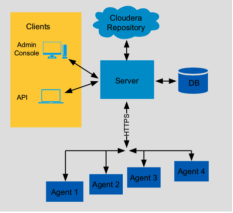

-   服务端/Server:Cloudera Manager的核心。主要用于管理web server和应用逻辑。它用于安装软件，配置，开始和停止服务，以及管理服务运行的集群。

-   代理/agent:安装在每台主机上。它负责启动和停止的进程，部署配置，触发安装和监控主机。

-   数据库/Database:存储配置和监控信息。通常可以在一个或多个数据库服务器上运行的多个逻辑数据库。例如，所述的Cloudera管理器服务和监视后台程序使用不同的逻辑数据库。

-   Cloudera Repository:用于软件分发由Cloudera软件仓库。

-   客户端/Clients:提供了一个与Server交互的接口:

-   管理平台/Admin Console:提供一个管理员管理集群和Cloudera Manage的基于网页的交互界面。

-   API:为开发者提供了创造自定义Cloudera Manager程序的API。

# 2、配置安装源

## 2.1、配置Linux源

安装前选择一台机器安装配置本地源并安装http服务，如utility01

挂载redhat的安装光盘，/root/rhel-server-x86_64-dvd.is为iso镜像的地址

```sh
  mount -o loop -t iso9660 /root/rhel-server-x86_64-dvd.iso /mnt/boson
```

在/etc/yum.repos.d下添加rhel6.repo文件

```sh
[rhel6]
name=Redhat Enterprise Linux
baseurl=file:///mnt/boson
enabled=1
gpgcheck=1
gpgkey= file:///mnt/boson/RPM-GPG-KEY-redhat-release
```

安装http服务

```sh
 yum -y install httpd
```


设置开机自启动

 ```sh
 chkconfig httpd on
 ```


启动http服务

```sh
service httpd start
```

将光盘内容拷贝到/var/www/html下

```sh
scp -r /mnt/boson /var/www/html/redhat/
```

确认使用http:// utiliity01.cdhtest.com /redhat可以访问到下载的文件夹。

在其他服务器上配置源，在/etc/yum.repos.d下添加rhel.repo文件

```sh
[local]
name=Redhat Enterprise Linux
baseurl=http://utiliity01.cdhtest.com/redhat
enabled=1
gpgcheck=1
gpgkey=http:// utiliity01.cdhtest.com/redhat/RPM-GPG-KEY-redhat-release
```

## 2.2、配置CDH源

由于本次在内网环境安装，需要在cloudera官网下载cm安装包和cdh parcel包

cm安装包下载地址如下，可按照需要选择自己需要的版本，目前采用的版本为5.11.2

  ```sh
  http://archive.cloudera.com/cm5/repo-as-tarball/
  ```


cdh parcel包下载地址如下，请选择和cm配套的版本

```sh
  http://archive.cloudera.com/cdh5/parcels/
```

下载后将所有安装包传输至内网环境任一机器，解压缩后的目录结构如下（仅为示意）：

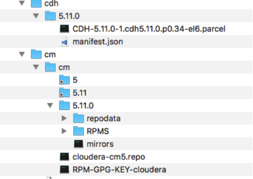

将所有文件拷贝至/var/www/html/供集群使用，确认使用http:// utiliity01.cdhtest.com/cdh 和http:// utiliity01.cdhtest.com/cm可以访问到安装包

在/etc/yum.repos.d/文件夹下创建repo文件，如cloudera-manager.repo，内容如下。

```sh
[cloudera-manager]
baseurl=http:// utiliity01.cdhtest.com/cm/5/
gpgkey=http:// utiliity01.cdhtest.com/RPM-GPG-KEY-cloudera
gpgcheck=1
```

# 3、集群管理

## 3.1、升级CM和CDH

### 3.1.1、Cloudera升级概述

下面描述的流程适用于由Cloudera Manager管理的集群，对于不是由Cloudera Manager管理的集群升级，

请参考：

https://www.cloudera.com/documentation/enterprise/latest/topics/cdh_ig_upgrade_command_line.html#xd_583c10bfdbd326ba--5a52cca-1476e7473cd--7f99

CDH和Cloudera Manager不用同时升级，但是需要保证Cloudera Manager和CDH版本的兼容。Cloudera Manager可以管理当前或以前的major版本的CDH，或相同minor版本的CDH，或较低minor版本的CDH。比如，Cloudear Manager 5.7.1可以管理CDH5.7.2，CDH5.6.1和CDH4.8.6，但是不能管理CDH5.8.1. Cloudera Manager5.x不能管理CDH3.x。

升级时具体有如下几种选择：

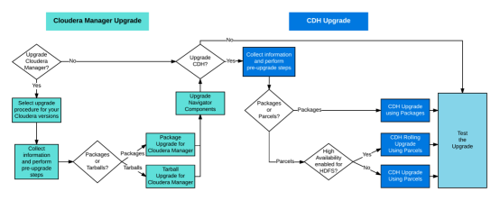

#### 3.1.1.1 评估升级影响

一般需要规划一个足够长的维护窗口(停机时间)进行升级。根据需要升级的组件，集群的节点数，以及不同的硬件情况，可能需要一整天来进行升级。开始升级之前，需要做好一些前置条件准备以及关键数据备份，这篇文档在讲述升级步骤时也会说明。升级之前，需要查阅Cloudera Manager的

https://www.cloudera.com/documentation/enterprise/release-notes/topics/rg_release_notes.html

了解API更改，不推荐的功能，新的功能以及不兼容的更改。

同时需要检查

https://www.cloudera.com/documentation/enterprise/release-notes/topics/rn_consolidated_pcm.html

来确认支持的操作系统，JDK，数据库和其他组件。

#### 3.1.1.2 Cloudera Manager升级概述

升级Cloudera Manager包括以下步骤：

1.在CM节点上升级Cloudera Manager Server，使用操作系统的命令，比如Redhat的yum。也可以手动通过tarballs来升级。

2.在所有主机上升级Cloudera Manager agent，Cloudera Manager的升级向导可以帮助你升级agent(JDK升级可选)，同时也可以手动的通过tarballs升级JDK和agent。

Cloudera Manager升级，可以参考官网文档：

https://www.cloudera.com/documentation/enterprise/latest/topics/cm_upgrade.html#concept_q1q_mbs_wx

### 3.1.2 CDH升级概述

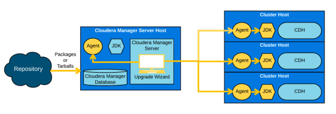

CDH升级包含Hadoop相关组件的升级，可以使用Cloudera Manager来升级CDH，采用parcel或package的方式都可以。

建议使用parcels来升级CDH，因为Cloudera Manager管理这些parcels自动下载，分发和激活。

### 3.1.3 JDK升级

在升级Cloudera Manager和CDH之前，请确保集群内的所有主机都是使用受支持的Oracle JDK

参考：https://www.cloudera.com/documentation/enterprise/release-notes/topics/rn_consolidated_pcm.html。

同时，所有主机必须使用相同版本的JDK

参考：https://www.cloudera.com/documentation/enterprise/latest/topics/cdh_cm_upgrading_to_jdk8.html#xd_583c10bfdbd326ba-590cb1d1-149e9ca9886--7c46

### 3.1.4 配置安装源

配置新的CM和CDH源

修改/etc/yum.repos.d/cloudera-manager.repo指向新的CM源

```sh
[cloudera-manager]
name = Cloudera Manager, Version 5.13.0
baseurl = http://10.123.197.131/cm/5
gpgkey = http://10.123.197.131/cm/RPM-GPG-KEY-cloudera
gpgcheck = 1
```

### 3.1.5 升级CM

#### 3.1.5.1 暂停cms服务

选择集群-Cloudera Management Service，选择停止

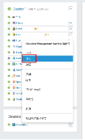

#### 3.1.5.2 备份数据库

在数据库所在服务器上执行如下命令备份原数据库数据

```sh
  mysqldump -u root -p -A > /root/oldmysql.dump
```

#### 3.1.5.3 停止CM服务

停止cloudera-scm-server和所有cloudera-scm-agent

```sh
service cloudera-scm-server stop
service cloudera-scm-agent stop
```

#### 3.1.5.4 在Cloudera Manager上备份以下目录

```sh
scp -r  /etc/cloudera-scm-server/ /root/cm_bak/
scp -r  /etc/cloudera-scm-agent/ /root/cm_bak/
```

#### 3.1.5.5 升级CM

```sh
yum clean all
yum upgrade cloudera-manager-server cloudera-manager-daemons cloudera-manager-agent
```

#### 3.1.5.6 重启Cloudera manager

```sh
service cloudera-scm-server start
```

  

#### 3.1.5.7 登入CM执行升级向导

CM会自动启动升级向导

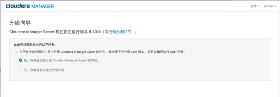

填写CM源

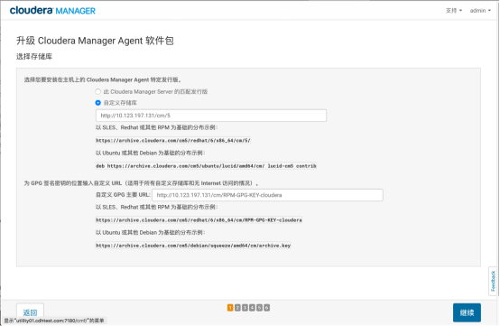

选择安装JDK和JCE

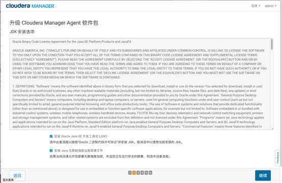

输入SSH登录凭证

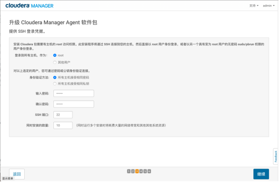

等待升级完成

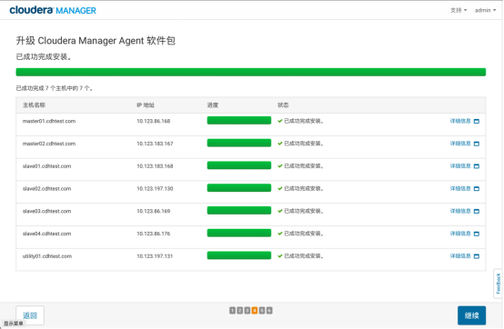

检查主机正确性

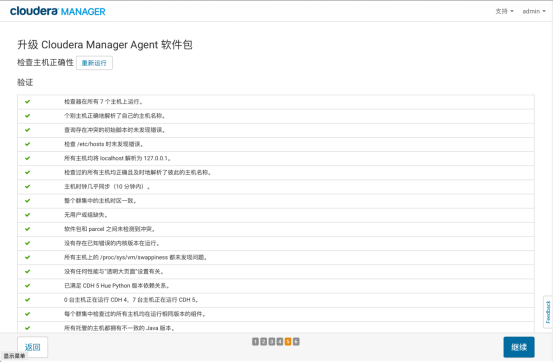 

升级完成

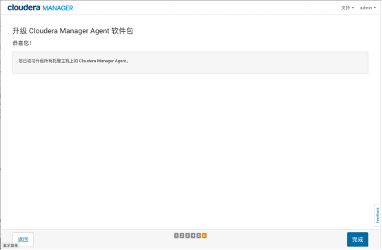

进入审核更改向导界面

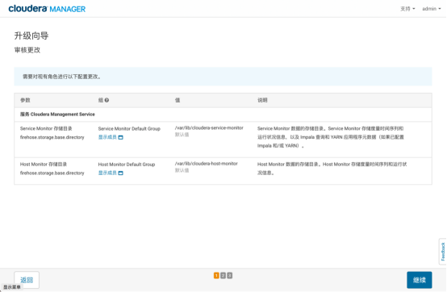

重启Cloudera Management Service

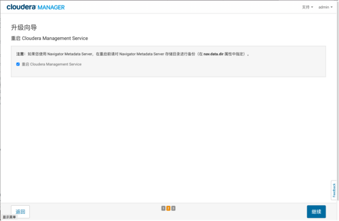

重启完成

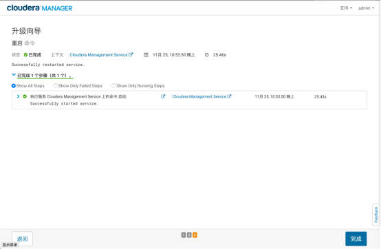

CM显示过期配置，重启服务

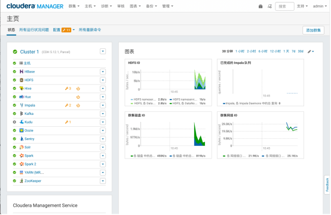

重启完成

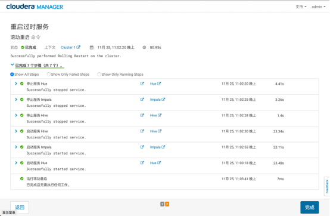

### 3.1.6 升级CDH

停止集群服务

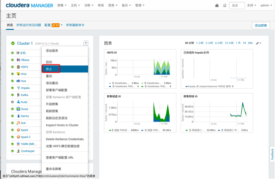

备份NameNode上的HDFS Metastore，注意，此目录实际地址需要在CM的HDFS配置中查看

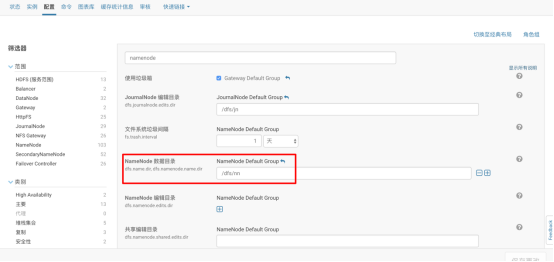

```sh
cd /dfs/
tar -czvf /root/nn_bak/nn_backup.tar.gz  nn/
```

在数据库所在服务器上执行如下命令备份原数据库数据

```sh
  mysqldump -u root -p -A > /root/newmysql.dump
```

向集群中添加新版的CDH存储库

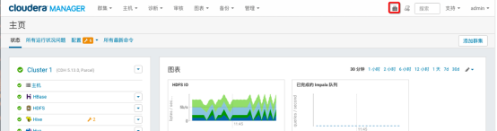

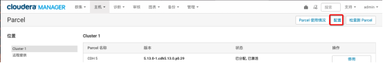

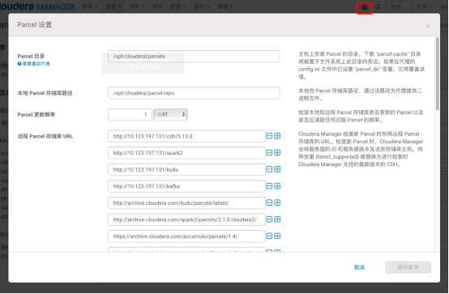

在主页选择升级集群，进入升级向导


选择升级版本

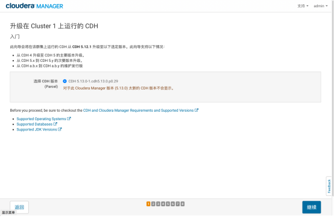

确认备份

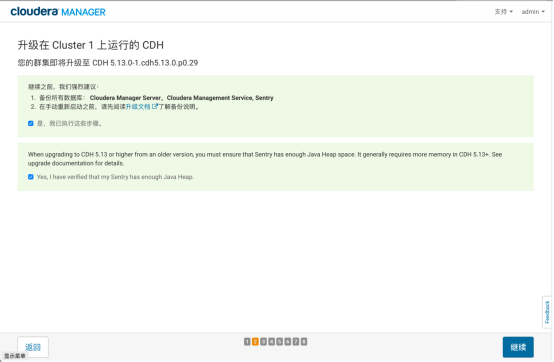

通过检测

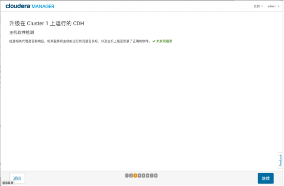

等待parcel分发完成

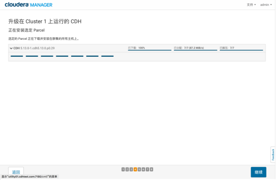

通过主机正确性验证

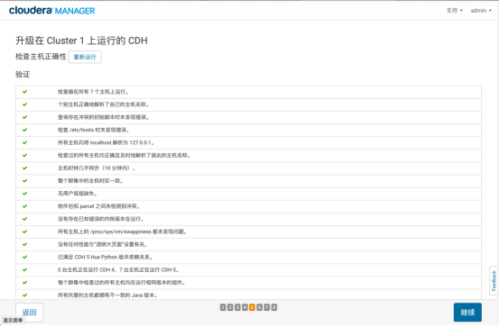

选择完整集群升级

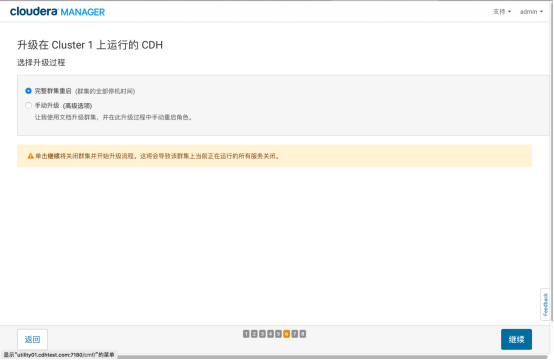

等待升级完成

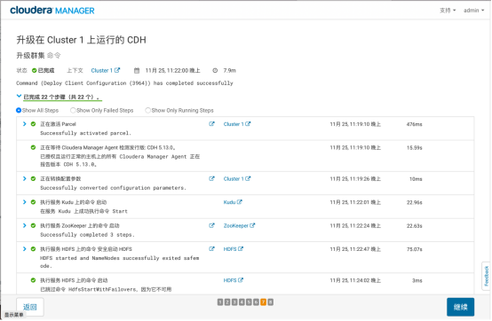

升级完成

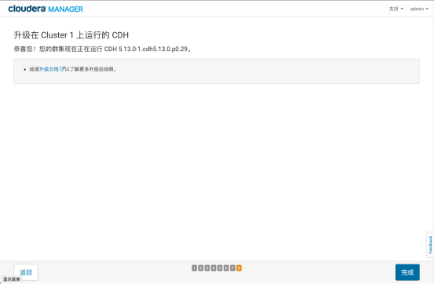

最终化元数据升级

在最终化元数据之前，进行几天甚至几周的运行观察集群是否正常，在发现所有任务都没有任何异常情况后，再进行最终化元数据操作。一旦进行最终化元数据之后，就不能回滚到老的版本了，除非有数据备份。对NameNode的主备节点都执行最终化元数据升级操作：

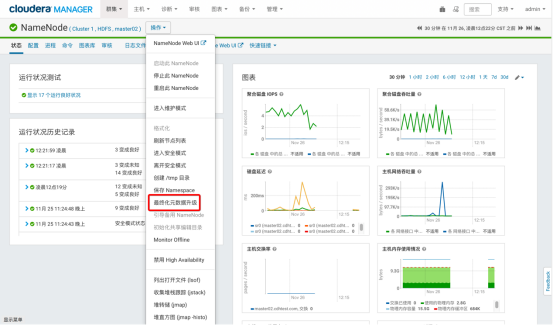

功能验证

建议参照集群功能测试确认集群功能。

## 3.2 升级JDK

CDH支持的JDK包括JDK7以及JDK8。Cloudera提供相应JDK包，并可以通过CM自动在集群中部署安装。CDH的版本都能提供对Oracle JDK7的支持，而JDK8的支持则需要CDH5.3之后的版本。目前在CDH发行版中自带的JDK版本为1.7.0_67版本。

参考文档：

https://www.cloudera.com/documentation/enterprise/release-notes/topics/rn_consolidated_pcm.html#pcm_jdk

JDK7版本支持情况：

| JDK 7  | Supported in all C5.x               |
| ------ | ----------------------------------- |
| 1.7u80 | Recommended / Latest version tested |
| 1.7u75 | Recommended                         |
| 1.7u67 | Recommended                         |
| 1.7u55 | Minimum required                    |

JDK8版本支持情况：

| JDK 8   | Supported in C5.3 and Higher       |
| ------- | ---------------------------------- |
| 1.8u131 | Recommended  Latest version tested |
| 1.8u121 | Recommended                        |
| 1.8u111 | Recommended                        |
| 1.8u102 | Recommended                        |
| 1.8u91  | Recommended                        |
| 1.8u74  | Recommended                        |
| 1.8u31  | Minimum required                   |

建议使用Cloudera官网推荐的JDK版本。

### 3.2.1 JDK8安装包准备

在oracle官网下载JDK8 1.8u131的安装包

http://www.oracle.com/technetwork/java/javase/downloads/java-archive-javase8-2177648.html

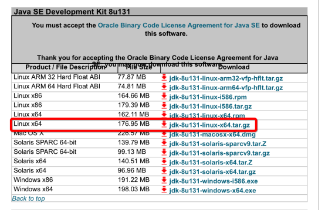

下载JDK8的无限制权限策略文件JCE，如果集群未启动Kerberos，无需下载，但是建议下载，以免日后出现问题。

http://www.oracle.com/technetwork/java/javase/downloads/jce8-download-2133166.html

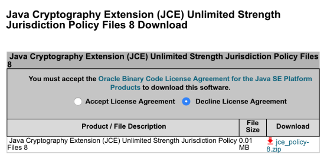

解压下载的两个压缩包，将UnlimitedJCEPolicyJDK8目录下所有文件拷贝至./jdk1.8.0_131/jre/lib/security目录下覆盖原有文件

```sh
tar zxvf jdk-8u131-linux-x64.tar.gz
unzip jce_policy-8.zip
cp UnlimitedJCEPolicyJDK8/* jdk1.8.0_131/jre/lib/security/
```

### 3.2.2 部署JDK8到集群

将jdk1.8.0_131目录拷贝至/usr/java目录下

```sh
cp -r jdk1.8.0_131/ /usr/java/jdk1.8.0_131-cloudera
```

将jdk1.8.0_131-cloudera目录同步至集群所有节点的/usr/java目录下。注意：集群中所有节点jdk1.8.0_131-cloudera的部署目录必须一致。

```sh
nodes=`cat /etc/hosts | grep -v "localhost" | awk '{print $3}' | grep -v kdc*`
for target in $nodes; do echo $target "==========>";
scp -r /usr/java/jdk1.8.0_131-cloudera/ $target:/usr/java/; 
done
```


### 3.2.3 Cloudera Manager配置

登录Cloudera Manager的Web管理界面，进入主机列表页面

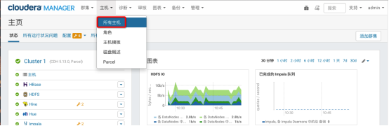

点击配置进入主机配置页面

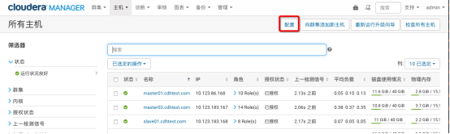

选择高级类别，在Java主目录输入jdk8的路径并保存配置

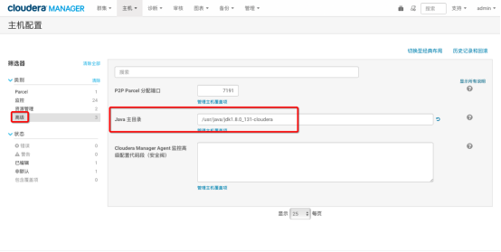

回到CM主页根据页面提示重启相应服务

### 3.2.4 验证集群JDK8环境

使用ps -ef命令查看启动的java服务使用的jdk版本

### 3.2.5 常见问题

cloudera-scm-server使用的jdk版本仍然为jdk7，如需将其切换为jdk8，可以删除CM节点的/usr/java/jdk1.7.0_67-cloudera文件夹并重启cm server

## 3.3 升级Kafka和Spark

本文以升级Kafka0.11及Spark2.2为例，这两个版本都需要JDK1.8的支持，因此需要首先按照将CDH集群JAVA升级至JDK8中的步骤升级JDK

### 3.3.1 设置源地址

根据配置安装源配置新的Kafka和Spark2源

Kafka下载地址

http://archive.cloudera.com/kafka/parcels

Spark2下载地址

http://archive.cloudera.com/spark2/parcels

在集群中增加新的parcel库

### 3.3.2 更换Spark CSD文件

CSD文件下载地址

http://archive.cloudera.com/spark2/csd/

将下载的文件放入/opt/cloudera/csd目录

```sh
cp SPARK2_ON_YARN-2.2.0.cloudera1.jar /opt/cloudera/csd
```

CSD文件存放的地址可以通过CM中的Custom Service Descriptors配置项修改

重启cloudera-scm-server服务

```sh
service cloudera-scm-server restart
```

设置parcel


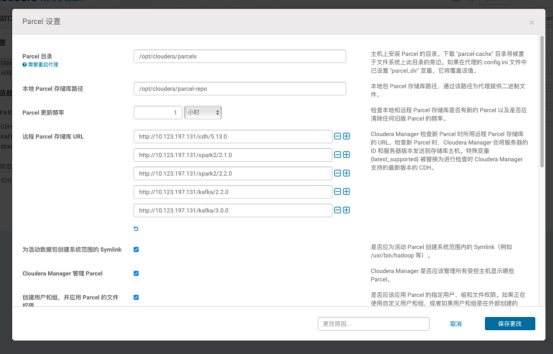

下载、分配Parcel包

激活parcel包时提示重启，选择滚动重启或重启

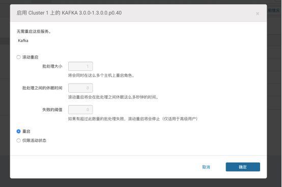

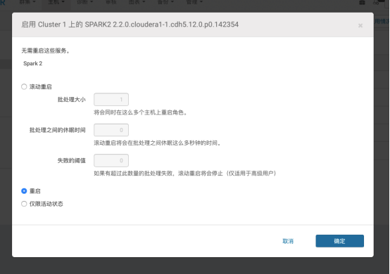

激活成功

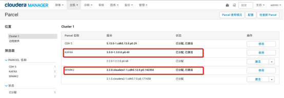

回到CM主页，根据提示重启服务并下发客户端配置

### 3.3.3 配置Spark2的JAVA环境变量

配置Spark2的JAVA环境变量为JDK8

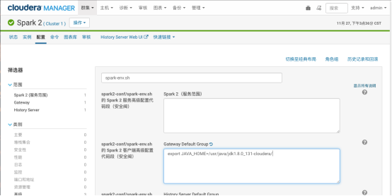

## 3.4 集群数据备份

### 3.4.1 namenode节点元数据备份

在CM中选择活动的namenode

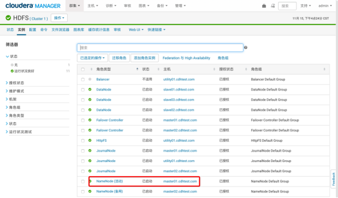

选择该namenode，进入安全模式

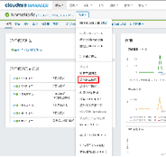

选择保存Namespace，此命令将所有edits修改flush到fsimage

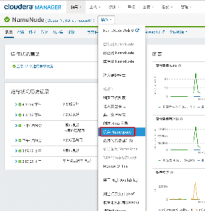

进入活动namenode的服务器，将namenode元数据备份，根据集群namenode目录进行如下操作

```sh
mkdir /root/namenode_back
tar -czvf /root/namenode_back/nn_back.tar.gz /dfs/nn
```


### 3.4.2 备份MySQL元数据

在utility01上执行以下命令

```sh
mysqldump -u root -p -A > /root/oldmysql.dump
```


### 3.4.3 集群用户数据备份

以下路径为Cloudera默认安装目录下各组件用户数据，需在安装相关组件的所有服务器上备份数据

```sh
/var/lib/flume-ng
/var/lib/hadoop*
/var/lib/hue
/var/lib/navigator
/var/lib/oozie
/var/lib/solr
/var/lib/sqoop*
/var/lib/zookeeper
#data_driver_path为集群环境部署时设置的目录，如根目录
data_drive_path/dfs
data_drive_path/mapred
data_drive_path/yarn
```

可参考以下备份zookeeper数据的方式备份以上所有数据

```sh
mkdir zookeeper_back
scp -r /var/lib/zookeeper/  /root/zookeeper_back/zookeeper_1
```


## 3.5 卸载CDH

### 3.5.1 数据备份

参考集群数据备份备份数据

### 3.5.2 停止所有服务

在CM界面中停止所有集群服务

先停止集群服务


再停止cms服务


解除并移除Parcels

在CM主页右上角选择parcel图标

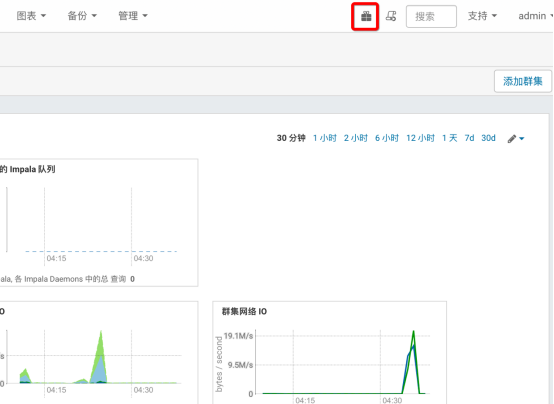

停用所有parcel


删除停用后的parcel，此处以KUDU为例，所有parcel都需删除

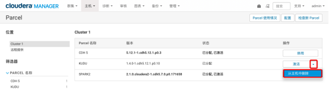

### 3.5.3 删除集群

在CM界面选择集群，删除

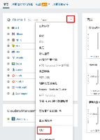

### 3.5.4 停止CM相关服务

停止utility01的cloudera manager

```sh
systemctl stop cloudera-scm-server
```

停止所有节点的cloudera manager agent

```sh
systemctl stop cloudera-scm-agent
```

  也可以使用脚本停止cloudera manager agent，此脚本在utility01上执行，并假设utility01已经设置到所有服务器的免密登录，可参考配置操作系统，下同。

```sh
nodes=`cat /etc/hosts | grep -v "localhost" | awk '{print $3}' | grep -v kdc*`
for target in $nodes; do echo $target "==========>"; ssh -o StrictHostKeyChecking=no $target "service cloudera-scm-agent stop"; done
```

### 3.5.5 卸载所有服务

在所有集群节点上运行以下命令

```sh
yum remove 'cloudera-manager-*' avro-tools crunch flume-ng hadoop-hdfs-fuse hadoop-hdfs-nfs3 hadoop-httpfs hadoop-kms hbase-solr hive-hbase hive-webhcat hue-beeswax hue-hbase hue-impala hue-pig hue-plugins hue-rdbms hue-search hue-spark hue-sqoop hue-zookeeper impala impala-shell kite llama mahout oozie pig pig-udf-datafu search sentry solr-mapreduce spark-core spark-master spark-worker spark-history-server spark-python sqoop sqoop2 whirr hue-common oozie-client solr solr-doc sqoop2-client zookeeper
yum clean all
```

### 3.5.6 移除Cloudera Manager和用户数据

#### 3.5.6.1 杀死 Cloudera Manager和Managed进程

在所有集群节点上运行以下命令，将所有服务器的Cloudera Manager和Managed进程杀死

```sh
for u in cloudera-scm flume hadoop hdfs hbase hive httpfs  hue impala llama mapred oozie solr spark sqoop sqoop2 yarn zookeeper;
do
    sudo kill $(ps  -u $u -o pid=);
done
```


#### 3.5.6.2 移除Cloudera Manager数据

在所有集群节点上运行以下命令，删除所有Cloudera Manager数据

```sh
umount cm_processes
rm –rf /usr/share/cmf  /var/lib/cloudera* /var/cache/yum/x86_64/6/cloudera*  /var/log/cloudera* /var/run/cloudera* /etc/cloudera* /usr/lib64/cmf
```


#### 3.5.6.3 移除Cloudera Manager Lock File

在所有集群节点上运行以下命令，删除Cloudera Manager Lock File

```sh
rm --rf /tmp/.scm_prepare_node.lock
```


### 3.5.7 移除用户数据

在所有集群节点上运行以下命令，删除用户所有数据

```sh
#用户数据目录
rm -rf /var/lib/flume-ng /var/lib/hadoop* /var/lib/hue  /var/lib/navigator /var/lib/oozie /var/lib/solr /var/lib/sqoop*  /var/lib/zookeeper

rm -rf /usr/lib/hadoop /usr/lib/hadoop* /usr/lib/hive  /usr/lib/hbase /usr/lib/oozie /usr/lib/sqoop* /usr/lib/zookeeper  /usr/lib/bigtop* /usr/lib/flume-ng /usr/lib/hcatalog
  
rm -rf /var/run/hadoop* /var/run/flume-ng  /var/run/cloudera* /var/run/oozie /var/run/sqoop2 /var/run/zookeeper  /var/run/hbase /var/run/hbase /var/run/impala /var/run/hive  /var/run/hdfs-sockets
  
#服务命令
rm -rf /usr/bin/hadoop* /usr/bin/zookeeper*  /usr/bin/hbase* /usr/bin/hive* /usr/bin/hdfs /usr/bin/mapred /usr/bin/yarn  /usr/bin/sqoop* /usr/bin/oozie
#集群配置文件目录
rm -rf /etc/cloudera* /etc/hadoop* /etc/zookeeper*  /etc/hive* /etc/hue /etc/impala /etc/sqoop* /etc/oozie /etc/hbase*  /etc/hcatalog
#集群配置文件目录
rm -rf /etc/alternatives/avro-tools  /etc/alternatives/beeline /etc/alternatives/catalogd /etc/alternatives/cli_*  /etc/alternatives/flume* /etc/alternatives/hadoop* /etc/alternatives/hbase*  /etc/alternatives/hcat /etc/alternatives/hdfs /etc/alternatives/hive*  /etc/alternatives/hue* /etc/alternatives/impala* /etc/alternatives/llama*  /etc/alternatives/load_gen /etc/alternatives/mahout* /etc/alternatives/mapred  /etc/alternatives/oozie* /etc/alternatives/pig* /etc/alternatives/pyspark  /etc/alternatives/sentry* /etc/alternatives/solr* /etc/alternatives/spark*  /etc/alternatives/sqoop* /etc/alternatives/statestored  /etc/alternatives/whirr /etc/alternatives/yarn /etc/alternatives/zookeeper*
#
rm -rf /var/lib/alternatives/avro-tools  /var/lib/alternatives/beeline /var/lib/alternatives/catalogd  /var/lib/alternatives/cli_* /var/lib/alternatives/flume*  /var/lib/alternatives/hadoop* /var/lib/alternatives/hbase*  /var/lib/alternatives/hcat /var/lib/alternatives/hdfs  /var/lib/alternatives/hive* /var/lib/alternatives/hue* /var/lib/alternatives/impala*  /var/lib/alternatives/llama* /var/lib/alternatives/load_gen  /var/lib/alternatives/mahout* /var/lib/alternatives/mapred  /var/lib/alternatives/oozie* /var/lib/alternatives/pig*  /var/lib/alternatives/pyspark /var/lib/alternatives/sentry*  /var/lib/alternatives/solr* /var/lib/alternatives/spark*  /var/lib/alternatives/sqoop* /var/lib/alternatives/statestored  /var/lib/alternatives/whirr /var/lib/alternatives/yarn  /var/lib/alternatives/zookeeper*
  
#请修改 data_drive_path 为自己机器上的路径
rm -rf data_drive_path/dfs data_drive_path/mapred  data_drive_path/yarn
#删除Hadoop相关服务安装目录、服务软件包数据，数据格式为parcels、服务软件包缓存数据
rm -rf /opt/cloudera/

```

### 3.5.8 停止并移除外部数据库

在安装mysql的服务器上进行操作。

停止mysql数据库，操作如下：

```sh
service mysqld stop
```

卸载mysql数据库，操作如下

```sh
  yum remove mysql*
```


删除mysql数据目录，操作如下

```sh
rm –rf /var/lib/mysql
```


## 3.6 迁移数据库

### 3.6.1 环境说明

假设集群已经安装CDH 5.12.1并配置了kerberos

ip及主机名如下

```sh
10.123.197.131 utility01.cdhtest.com utility01
10.123.86.168 master01.cdhtest.com  master01
10.123.183.167 master02.cdhtest.com  master02
10.123.183.168 slave01.cdhtest.com   slave01
10.123.197.130 slave02.cdhtest.com   slave02
10.123.86.169 slave03.cdhtest.com   slave03
```

数据库安装在utility01上，迁移到一台新的主机utility02

```sh
10.123.86.176 utility02.cdhtest.com utility02
```

请注意，本次操作仅仅迁移数据库本身，没有迁移任务其他服务。

### 3.6.2 停止所有集群服务

在CM界面中停止所有集群服务

先停止集群服务

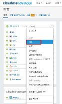

再停止cms服务

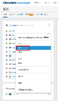

### 3.6.3 停止CM服务

停止utility01的cloudera manager

```sh
systemctl stop cloudera-scm-server
```

停止所有节点的cloudera manager agent

```sh
systemctl stop cloudera-scm-agent
```

也可以使用脚本停止cloudera manager agent，此脚本在utility01上执行，并假设utility01已经设置到所有服务器的免密登录，可参考配置操作系统，下同。

```sh
nodes=`cat /etc/hosts | grep -v "localhost" | awk '{print $3}' | grep -v kdc*`
for target in $nodes; do echo $target "==========>"; ssh -o StrictHostKeyChecking=no $target "service cloudera-scm-agent stop"; done
```

### 3.6.4 备份原数据库数据

在utility01上执行以下命令

```sh
mysqldump -u root -p -A > /root/oldmysql.dump
```


### 3.6.5 安装数据库

在utility02上安装新的数据库

```sh
yum install -y MariaDB-server MariaDB-client
```

### 3.6.6 启动数据库

```sh
service mysql start
chkconfig mysql on
```


### 3.6.7 初始化数据库

```sh
# 创建root访问数据库的密码
# 禁止远程机器以root用户登录
# 禁止以匿名方式登录数据库
# mysql_secure_installation
[...]
Enter current password for root (enter for none):
OK, successfully used password, moving on...
[...]
Set root password? [Y/n] y
New password:
Re-enter new password:
Remove anonymous users? [Y/n] Y
[...]
Disallow root login remotely? [Y/n] N
[...]
Remove test database and access to it [Y/n] Y
[...]
Reload privilege tables now? [Y/n] Y
All done!

```


### 3.6.8 导入备份数据至新库

将备份数据传输至新的数据库服务器，在utility01上执行命令

```sh
scp /root/oldmysql.dump root@utility02:/root/
```

在utility02上导入数据

 ```sh
 mysql -uroot -p < oldmysql.dump
 ```


刷新权限，在mysql命令行执行命令

```sh
FLUSH PRIVILEGES;
```


  ### 3.6.9 修改CM的数据库配置信息

修改新CM的数据库配置文件/etc/cloudera-scm-server/db.properties，将数据库地址指定为新的主机地址utility02，修改后文件如下

```sh
# Auto-generated by scm_prepare_database.sh on 2017年 11月 15日 星期三 10:07:50 CST
#
# For information describing how to configure the Cloudera Manager Server
# to connect to databases, see the "Cloudera Manager Installation Guide."
#
com.cloudera.cmf.db.type=mysql
com.cloudera.cmf.db.host=utility02
com.cloudera.cmf.db.name=scm
com.cloudera.cmf.db.user=scm
com.cloudera.cmf.db.setupType=EXTERNAL
com.cloudera.cmf.db.password=password
```


### 3.6.10 启动CM服务

启动所有节点的cloudera manager agent

```sh
systemctl start cloudera-scm-agent
```

也可以使用脚本启动cloudera manager agent

```sh
nodes=`cat /etc/hosts | grep -v "localhost" | awk '{print $3}' | grep -v kdc*`
for target in $nodes; do echo $target "==========>"; ssh -o StrictHostKeyChecking=no $target "service cloudera-scm-agent start"; done
```

启动cloudera manager server

```sh
systemctl start cloudera-scm-server
```


### 3.6.11 修改集群服务配置

由于做了数据库迁移，所以需要修改依赖到数据库的服务配置，否则服务无法正常启动。

这些服务包括

Reports Manager，Activity Monitor，Hive Metastore Server， oozie， hue， sentry，Cloudera Navigator Audit Server， Cloudera Navigator Metadata Server

修改方式为进入每个服务的配置页面，搜索数据库主机，将数据库主机修改为utility02

以Reports Manager，Activity Monito为例，修改前配置信息如下

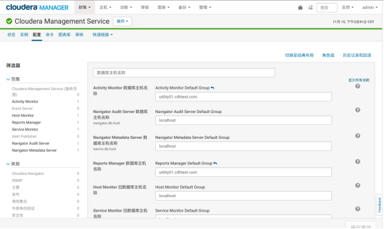

修改后配置信息如下


### 3.6.12 启动所有集群服务

在新的CM界面中启动所有集群服务，先启动cms服务，再启动集群服务，启动后建议使用集群测试中测试确认服务正常运作。

## 3.7 迁移Cloudera manager

### 3.7.1 环境说明

假设集群已经安装CDH 5.12.1并配置了kerberos

ip及主机名如下

+----+
| 10.123.197.131 utility01.cdhtest.com utility01 |
|                                                |
| 10.123.86.168 master01.cdhtest.com master01    |
|                                                |
| 10.123.183.167 master02.cdhtest.com master02   |
|                                                |
| 10.123.183.168 slave01.cdhtest.com slave01     |
|                                                |
| 10.123.197.130 slave02.cdhtest.com slave02     |
|                                                |
| 10.123.86.169 slave03.cdhtest.com slave03      |
+----+

cloudera manager安装在utility01上，迁移到一台新的主机utility02

---
  10.123.86.176 utility02.cdhtest.com utility02
  ---

请注意，本次操作仅仅迁移cloudera manager本身服务，没有迁移数据库，也没有迁移其他安装在utility01上的其他服务。

### 服务器配置

#### 设置主机名

centos7下可以用以下命令设置主机名

----
  hostnamectl set-hostname utility02.cdhtest.com
  ----

配置完成后使用hostname -f命令确认设置正确。

#### 配置/etc/hosts文件

在每台机器上设置/etc/hosts文件如下，添加一行utiliyt02的解析

+----+
| 10.123.197.131 utility01.cdhtest.com utility01 |
|                                                |
| 10.123.86.168 master01.cdhtest.com master01    |
|                                                |
| 10.123.183.167 master02.cdhtest.com master02   |
|                                                |
| 10.123.183.168 slave01.cdhtest.com slave01     |
|                                                |
| 10.123.197.130 slave02.cdhtest.com slave02     |
|                                                |
| 10.123.86.169 slave03.cdhtest.com slave03      |
|                                                |
| 10.123.197.125 kdc01.cdhtest.com kdc01         |
|                                                |
| 10.123.86.175 kdc02.cdhtest.com kdc02          |
|                                                |
| 10.123.86.176 utility02.cdhtest.com utility02  |
+----+

#### 关闭防火墙

关闭utility02的防火墙

+---+
| \# 停止firewall                     |
|                                     |
| systemctl stop firewalld.service    |
|                                     |
| \# 禁止firewall开机启动             |
|                                     |
| systemctl disable firewalld.service |
|                                     |
| \# 确认关闭                         |
|                                     |
| firewall-cmd \--state               |
+---+

#### 关闭SELINUX

+----+
| \# 临时关闭                                                |
|                                                            |
| setenforce 0                                               |
|                                                            |
| \# 永久关闭                                                |
|                                                            |
| \# /etc/sysconfig/selinux是/etc/selinux/config的一个软链接 |
|                                                            |
| sed -i s\@enforcing\@disabled\@g /etc/selinux/config       |
|                                                            |
| \# 确认关闭                                                |
|                                                            |
| /usr/sbin/sestatus -v                                      |
+----+

#### 禁用大内存页面

这一参数默认值可能会导致CDH性能下降

+-+
| \# 临时关闭                                                                           |
|                                                                                       |
| echo never \> /sys/kernel/mm/transparent_hugepage/enabled                             |
|                                                                                       |
| echo never \> /sys/kernel/mm/transparent_hugepage/defrag                              |
|                                                                                       |
| \# 永久关闭                                                                           |
|                                                                                       |
| echo \"echo never \> /sys/kernel/mm/transparent_hugepage/enabled\" \>\> /etc/rc.local |
|                                                                                       |
| echo \"echo never \> /sys/kernel/mm/transparent_hugepage/defrag\" \>\> /etc/rc.local  |
|                                                                                       |
| \# 确认关闭                                                                           |
|                                                                                       |
| grep -i HugePages_Total /proc/meminfo                                                 |
|                                                                                       |
| cat /proc/sys/vm/nr_hugepages                                                         |
|                                                                                       |
| sysctl vm.nr_hugepages                                                                |
+-+

#### 禁止交换内存

内存页面交换在某些情况下会导致CDH性能下降

++
| \# for runtime effect                      |
|                                            |
| sudo sysctl vm.swappiness=1                |
|                                            |
| \# for permanent effect                    |
|                                            |
| echo vm.swappiness=1 \>\> /etc/sysctl.conf |
|                                            |
| \# check                                   |
|                                            |
| cat /proc/sys/vm/swappiness                |
++

#### 修改文件描述符大小

修改/etc/security/limits.conf，添加

++
| \ soft nofile 65535 |
|                      |
| \ hard nofile 65535 |
++

#### 配置NTP服务


  yum install -y ntp


修改/etc/ntp.conf文件，添加

+----+
| server kdc01.cdhtest.com |
|                          |
| server kdc02.cdhtest.com |
+----+

重启ntp服务

--
  systemctl restart ntpd
  --

### 配置安装源

#### 配置mysql-connector-java

++
| \# 下载最新的mysql-connector-java                                                                  |
|                                                                                                    |
| wget http://dev.mysql.com/get/Downloads/Connector-J/mysql-connector-java-5.1.44.tar.gz             |
|                                                                                                    |
| tar -xzvf mysql-connector-java-5.1.44.tar.gz                                                       |
|                                                                                                    |
| mkdir -p /usr/share/java                                                                           |
|                                                                                                    |
| sudo mv mysql-connector-java-5.1.44/mysql-connector-java-5.1.44-bin.jar /usr/share/java/           |
|                                                                                                    |
| ln -s /usr/share/java/mysql-connector-java-5.1.44-bin.jar /usr/share/java/mysql-connector-java.jar |
++

#### 安装JDK

在utility02上安装oracle jdk

----
  yum install -y oracle-j2sdk1.7
  ----

#### 配置kerberos客户端

由于本次使用freeipa，因此在utility02上安装freeipa的客户端

+-+
| yum install ipa-client openldap-clients -y                      |
|                                                                 |
| \# \--mkhomedir用户自动创建用户家目录，如不需要可以省去         |
|                                                                 |
| ipa-client-install \--mkhomedir                                 |
|                                                                 |
| \# 命令执行过程                                                 |
|                                                                 |
| Continue to configure the system with these values? \[no\]: yes |
|                                                                 |
| User authorized to enroll computers: admin                      |
|                                                                 |
| Password for admin\@CDHTEST.COM:                                |
+-+

#### 修改/etc/krb5.conf文件

在\[libdefaults\]下增加

-
  renew_lifetime = 7d
  -

在\[libdefaults\]下注释下行

--
  \# default_ccache_name = KEYRING:persistent:%{uid}
  --

### 安装Cloudera Manager服务

在utility02上安装cm服务端和客户端


  yum -y install cloudera-manager-server


安装完成Cloudera Manager后暂时不要启动服务。

注意：新节点的Cloudera Manager版本必须与原Cloudera Manager版本一致;节点上不要安装CDH的其它组件

### 为CM配置外部数据库

使用以下命令设定cm的数据库，其中第一个scm为数据库名，第二个scm为用户名，password为密码，由于cm的数据库在utility01上，所以用-h命令指定，如果数据库已经迁移，可以在此处指定新的数据库地址，在迁移数据库后，启动集群服务器还需要一些额外配置，否则某些服务无法正常启动，具体可参考迁移数据库

+-+
| \# -h \<MYSQL_HOST\>可以不指定，默认是localhost                                                                                                 |
|                                                                                                                                                 |
| \# DB_TYPE可以是mysql, oracle等                                                                                                                 |
|                                                                                                                                                 |
| \# \--scm-host \<SCM_HOST\> 可以不指定，默认是本机                                                                                              |
|                                                                                                                                                 |
| \# DATABASE即为之前为Cloudera Manager配置的数据库                                                                                               |
|                                                                                                                                                 |
| \# USERNAME/PASSWORD 即为可以访问这个数据库的用户                                                                                               |
|                                                                                                                                                 |
| \# /usr/share/cmf/schema/scm_prepare_database.sh --h \<MYSQL_HOST\> \<DB_TYPE\> \--scm-host \<SCM_HOST\> \<DATABASE\> \<USERNAME\> \<PASSWORD\> |
|                                                                                                                                                 |
| /usr/share/cmf/schema/scm_prepare_database.sh -h utility01 mysql scm scm password                                                               |
+-+

### 停止所有集群服务

在CM界面中停止所有集群服务

{width="1.2916666666666667in" height="2.1527777777777777in"}

先停止集群服务

{width="1.2916666666666667in" height="2.1527777777777777in"}

再停止cms服务

{width="1.2638888888888888in" height="2.1666666666666665in"}

### 停止CM服务

停止utility01的cloudera manager

--
  systemctl stop cloudera-scm-server
  --

停止所有节点的cloudera manager agent

-
  systemctl stop cloudera-scm-agent
  -

也可以使用脚本停止cloudera manager agent，此脚本在utility01上执行，并假设utility01已经设置到所有服务器的免密登录，可参考配置操作系统，下同。

+----+
| nodes=\`cat /etc/hosts \| grep -v \"localhost\" \| awk \'{print \$3}\' \| grep -v kdc\\`                                                    |
|                                                                                                                                              |
| for target in \$nodes; do echo \$target \"==========\>\"; ssh -o StrictHostKeyChecking=no \$target \"service cloudera-scm-agent stop\"; done |
+----+

### 迁移原CM节点数据

/opt/cloudera/csd中的文件为某些服务的控制包

/opt/freeipa.sh为自定义的kerberos脚本

id_rsa为免密登录的密钥

scp.keytab用于cm生成kerberos凭据

+----+
| scp /opt/cloudera/csd/\ root\@utility02:/opt/cloudera/csd |
|                                                            |
| scp /opt/freeipa.sh id_rsa scm.keytab root\@utility02:/opt |
+----+

### 更新集群所有节点的CM Server指向

修改集群所有节点上/etc/cloudera-scm-agent/config.ini文件中server_host值为新CM节点的hostname

+--+
| \#server_host=10.123.197.131 |
|                              |
| server_host=10.123.86.176    |
+--+

### 启动CM服务

启动所有节点的cloudera manager agent

--
  systemctl start cloudera-scm-agent
  --

也可以使用脚本启动cloudera manager agent

+-----+
| nodes=\`cat /etc/hosts \| grep -v \"localhost\" \| awk \'{print \$3}\' \| grep -v kdc\\`                                                     |
|                                                                                                                                               |
| for target in \$nodes; do echo \$target \"==========\>\"; ssh -o StrictHostKeyChecking=no \$target \"service cloudera-scm-agent start\"; done |
+-----+

在新的cm服务器utility02上启动cloudera manager server

---
  systemctl start cloudera-scm-server
  ---

### 启动所有集群服务

在新的CM界面中启动所有集群服务，先启动cms服务，再启动集群服务，启动后建议参考集群功能测试确认服务正常运作。

## 集群功能测试

### 安全测试

#### HDFS安全测试

1.  启用安全以后未经认证的用户无法访问hdfs

2.  用户无法访问未授权目录

#### YARN安全测试

1.  启用安全之后所有服务的帐号（包括hdfs，yarn，mapred，bin）不再可以向YARN提交任务。可通过设置banned.users改变

2.  用户ID小于1000也将不能提交任务（min.user.id），用户ID可以利用id user命令查看

#### Hive安全测试

1.  启用安全以后未经认证的用户无法通过任何方式访问hive

2.  只有hive,hue,impala用户可以通过hive命令行访问hive，其余用户必须使用beeline命令连接。

3.  用户无法访问未授权数据库，表

#### Impala安全测试

1.  启用安全以后未经认证的用户无法访问impala

2.  用户无法访问未授权数据库，表

### 性能测试

#### DFSIO测试

##### 测试说明

在Hadoop中包含很多的基准测试，用来验证集群的HDFS是不是设置合理，性能是不是达到预期，DFSIO是Hadoop的一个基准测试工具，被用来分析集群HDFS的I/O性能。

DFSIO后台执行MapReduce框架，其中Map任务以并行方式读写文件，Reduce任务用来收集和汇总性能数字。可以通过这个基准测试对比吞吐量、IO速率的结果以及整个磁盘的原始速度，来确定你的集群是否得到了期待的性能。另外，可以通过这些测试中指标的严重偏差发现集群中一个或多个问题节点，结合监控系统一起使用能够更好的定位Hadoop集群的瓶颈所在。请注意，当确定写性能的时候，请考虑复制因子。

##### 测试步骤

1.  写性能测试

执行以下命令来运行HDFS写性能测试，其中参数-nrFiles指定了测试中要写的文件数目,参数-fileSize指明了写入每个文件的大小单位是MB。该命令会在HDFS上产生一系列的文件存放在HDFS的/benchmarks/TestDFSIO文件夹下。

请注意，由于部署了安全，hdfs不允许任意读写，此时需要kinit某个用户，然后指定TestDFSIO的写目录，指定方法为

添加参数-D test.build.data=/user/shihao/benchmark

+--+
| \# 测试1                                                                                                                                                                                                     |
|                                                                                                                                                                                                              |
| hadoop jar /opt/cloudera/parcels/CDH/lib/hadoop-mapreduce/hadoop-mapreduce-client-jobclient-2.6.0-cdh5.11.1-tests.jar TestDFSIO -D test.build.data=/user/shihao/benchmark -write -nrFiles 10 -fileSize 100   |
|                                                                                                                                                                                                              |
| \# 测试2                                                                                                                                                                                                     |
|                                                                                                                                                                                                              |
| hadoop jar /opt/cloudera/parcels/CDH/lib/hadoop-mapreduce/hadoop-mapreduce-client-jobclient-2.6.0-cdh5.11.1-tests.jar TestDFSIO -D test.build.data=/user/shihao/benchmark -write -nrFiles 1000 -fileSize 100 |
|                                                                                                                                                                                                              |
| \# 测试3                                                                                                                                                                                                     |
|                                                                                                                                                                                                              |
| hadoop jar /opt/cloudera/parcels/CDH/lib/hadoop-mapreduce/hadoop-mapreduce-client-jobclient-2.6.0-cdh5.11.1-tests.jar TestDFSIO -D test.build.data=/user/shihao/benchmark -write -nrFiles 1000 -fileSize 100 |
+--+

这个基准测试结果会在控制台打印出来，也会写入一个名为TestDFSIO_results.log的文件中，可以添加参数-resFile来指定结果文件的名字。

2.  读性能测试

性能基准测试针对HDFS的读操作进行，读操作将用到第一步的写操作，因此写操作必须在读操作之前执行。

+--+
| \# 测试1                                                                                                                                                                                                     |
|                                                                                                                                                                                                              |
| hadoop jar /opt/cloudera/parcels/CDH/lib/hadoop-mapreduce/hadoop-mapreduce-client-jobclient-2.6.0-cdh5.11.1-tests.jar TestDFSIO -D test.build.data=/user/shihao/benchmark -read -nrFiles 100 -fileSize 1000  |
|                                                                                                                                                                                                              |
| \# 测试2                                                                                                                                                                                                     |
|                                                                                                                                                                                                              |
| hadoop jar /opt/cloudera/parcels/CDH/lib/hadoop-mapreduce/hadoop-mapreduce-client-jobclient-2.6.0-cdh5.11.1-tests.jar TestDFSIO -D test.build.data=/user/shihao/benchmark -read -nrFiles 1000 -fileSize 100  |
|                                                                                                                                                                                                              |
| \# 测试3                                                                                                                                                                                                     |
|                                                                                                                                                                                                              |
| hadoop jar /opt/cloudera/parcels/CDH/lib/hadoop-mapreduce/hadoop-mapreduce-client-jobclient-2.6.0-cdh5.11.1-tests.jar TestDFSIO -D test.build.data=/user/shihao/benchmark -read -nrFiles 1000 -fileSize 1000 |
+--+

3.  清理数据

可以用下面的命令来清空之前产生的文件，这样可以清空HDFS上测试中产生的所有文件。

--
  hadoop jar /opt/cloudera/parcels/CDH/lib/hadoop-mapreduce/hadoop-mapreduce-client-jobclient-2.6.0-cdh5.11.1-tests.jar TestDFSIO -D test.build.data=/user/shihao/benchmark -clean
  --

##### 运行结果

---- ---- ----  -- -----
  序号   操作   文件数目   文件大小   吞吐量(mb/sec)   平均IO速率(mb/sec)   IO速率标准差   消耗时间（sec）
  1      写     100        1000       119.57           120.67               11.82          34.187
  2      写     1000       100        33.71            47.72                24.03          78.63
  3      写     1000       1000       14.22            15.03                4.12           349.47
  4      读     10         100        544.37           555.00               70.58          27.28
  5      读     100        1000       218.54           321.35               251.19         42.71
  6      读     1000       100        113.00           171.16               117.57         74.66
  7      读     1000       1000       34.04            79.08                117.18         178.83
---- ---- ----  -- -----

##### 测试参考

在某一集群运行此命令，此集群配置10个datanode和3个namenode，每个节点采用10块2T硬盘，128G内存，32核CPU，采用双千兆网口，结果如下：

---- ---- ----  -- -----
  序号   操作   文件数目   文件大小   吞吐量(mb/sec)   平均IO速率(mb/sec)   IO速率标准差   消耗时间（sec）
  1      写     100        1000       31.01            134.33               285.7          74.52
  2      写     1000       100        79.53            129.08               119.17         116
  3      写     1000       1000       17.59            34.45                65.44          431.6
  4      读     10         100        58.63            64.07                20.79          34.05
  5      读     1000       100        8.07             10.49                6.33           144.78
  6      读     1000       1000       5.64             6.13                 1.84           1220.84
---- ---- ----  -- -----

#### TeraSort测试

##### 测试说明

Hadoop的TeraSort是一个常用的测试，目的是利用MapReduce来尽可能快的对数据进行排序。TeraSort使用MapReduce框架通过分区操作将Map过程中的结果输出到Reduce任务，确保整体排序的顺序。TeraSort测试可以很好的对MapReduce框架的每个过程进行压力测试，为调优和配置Hadoop集群提供一个合理的参考。

##### 测试步骤

在进行TeraSort测试之前的一个准备过程就是数据的产生，可以使用teragen命令来生成TeraSort测试输入的数据。teragen命令的第一个参数是记录的数目，第二个参数是生成数据的HDFS目录。下面这个命令在HDFS的terasort-input目录中生成1GB的数据，由1千万条记录组成。

-
  time hadoop jar /opt/cloudera/parcels/CDH/lib/hadoop-mapreduce/hadoop-mapreduce-examples.jar teragen 10000000 /user/shihao/terasort-input
  -

TeraSort基准测试的第二步就是在第一步产生的数据上执行TeraSort MapReduce计算。对于TeraSort第一个参数是HDFS上输入文件的路径，第二个参数是HDFS上输出结果的路径。

-----
  time hadoop jar /opt/cloudera/parcels/CDH/lib/hadoop-mapreduce/hadoop-mapreduce-examples.jar terasort /user/shihao/terasort-input /user/shihao/terasort-ouput
  -----

验证TeraSort基准测试程序结果的正确性，可以使用teravalidate命令来执行。第一个参数是排序的结果集的HDFS上的位置。第二个参数是验证结果集正确性的报告存放位置。


  time hadoop jar /opt/cloudera/parcels/CDH/lib/hadoop-mapreduce/hadoop-mapreduce-examples.jar teravalidate /user/shihao/terasort-ouput /user/shihao/terasort-validate


Terasort产生的文件需要手动删除

-
  hdfs dfs --rm --r /user/shihao/\
  -

##### 运行结果

TeraSort命令耗时42.767s

##### 测试参考

在某一集群运行此命令，此集群配置10个datanode和3个namenode，每个节点采用10块2T硬盘，128G内存，32核CPU，结果如下：

TeraSort命令耗时46.553s

# 集群节点管理

## 增加节点

### 异构节点说明

增加的节点功能可以分为边缘节点，计算节点，主节点等，同样功能的节点也会因为服务器配置不同而需要采用不同的配置，例如不同大小的内存，硬盘等。而不论添加哪类节点，初期的配置都是一致的，区别在于安装CDH时选择安装不同组件，并且为每个组件设置相应的配置。CM提供了模板功能统一配置同样功能且同样硬件的节点。

本文将首先介绍统一的配置方法，然后介绍如何为异构设备构建模板，最后在安装CDH时分别说明如何配置不同功能或不同硬件的节点。

注意，此处的异构设备一般仅指服务器硬件不同，操作系统版本和安装cloudera manager agent和cdh的版本与原系统一致。如需要增加不同操作系统的节点或安装不同版本的cm和cdh，需要额外设置以下步骤，不建议这么做。

1.  在Cloudera manager的parcel源中增加需要新增节点操作系统和需要安装cdh版本的parcel包，cdh的parcel包版本不能超过cm的版本。

2.  在安装过程中选择和操作系统和需要安装cm版本一致的cm安装源。此处cm安装源的版本和cdh安装源的版本需要保持一致。

### 环境说明

假设集群已经安装CDH 5.12.1并配置了kerberos

ip及主机名如下

+----+
| 10.123.197.131 utility01.cdhtest.com utility01 |
|                                                |
| 10.123.86.168 master01.cdhtest.com master01    |
|                                                |
| 10.123.183.167 master02.cdhtest.com master02   |
|                                                |
| 10.123.183.168 slave01.cdhtest.com slave01     |
|                                                |
| 10.123.197.130 slave02.cdhtest.com slave02     |
|                                                |
| 10.123.86.169 slave03.cdhtest.com slave03      |
+----+

新增加一个节点

-
  10.123.86.176 slave04.cdhtest.com slave04
  -

### 服务器配置

设置新加的节点slave04

#### 设置主机名

centos7下可以用以下命令设置主机名

--
  hostnamectl set-hostname slave04.cdhtest.com
  --

配置完成后使用hostname -f命令确认设置正确。

#### 配置/etc/hosts文件

在每台机器上设置/etc/hosts文件如下，添加一行utiliyt02的解析

+----+
| 10.123.197.131 utility01.cdhtest.com utility01 |
|                                                |
| 10.123.86.168 master01.cdhtest.com master01    |
|                                                |
| 10.123.183.167 master02.cdhtest.com master02   |
|                                                |
| 10.123.183.168 slave01.cdhtest.com slave01     |
|                                                |
| 10.123.197.130 slave02.cdhtest.com slave02     |
|                                                |
| 10.123.86.169 slave03.cdhtest.com slave03      |
|                                                |
| 10.123.197.125 kdc01.cdhtest.com kdc01         |
|                                                |
| 10.123.86.175 kdc02.cdhtest.com kdc02          |
|                                                |
| 10.123.86.176 slave04.cdhtest.com slave04      |
+----+

#### 关闭防火墙

关闭slave04的防火墙

+----+
| \# 停止firewall                                            |
|                                                            |
| systemctl stop firewalld.service                           |
|                                                            |
| \# 禁止firewall开机启动                                    |
|                                                            |
| systemctl disable firewalld.service                        |
|                                                            |
| \# 确认关闭                                                |
|                                                            |
| firewall-cmd \--state                                      |
|                                                            |
| 关闭SELINUX                                                |
|                                                            |
| \# 临时关闭                                                |
|                                                            |
| setenforce 0                                               |
|                                                            |
| \# 永久关闭                                                |
|                                                            |
| \# /etc/sysconfig/selinux是/etc/selinux/config的一个软链接 |
|                                                            |
| sed -i s\@enforcing\@disabled\@g /etc/selinux/config       |
|                                                            |
| \# 确认关闭                                                |
|                                                            |
| /usr/sbin/sestatus -v                                      |
+----+

#### 禁用大内存页面

这一参数默认值可能会导致CDH性能下降

+-+
| \# 临时关闭                                                                           |
|                                                                                       |
| echo never \> /sys/kernel/mm/transparent_hugepage/enabled                             |
|                                                                                       |
| echo never \> /sys/kernel/mm/transparent_hugepage/defrag                              |
|                                                                                       |
| \# 永久关闭                                                                           |
|                                                                                       |
| echo \"echo never \> /sys/kernel/mm/transparent_hugepage/enabled\" \>\> /etc/rc.local |
|                                                                                       |
| echo \"echo never \> /sys/kernel/mm/transparent_hugepage/defrag\" \>\> /etc/rc.local  |
|                                                                                       |
| \# 确认关闭                                                                           |
|                                                                                       |
| grep -i HugePages_Total /proc/meminfo                                                 |
|                                                                                       |
| cat /proc/sys/vm/nr_hugepages                                                         |
|                                                                                       |
| sysctl vm.nr_hugepages                                                                |
+-+

#### 禁止交换内存

内存页面交换在某些情况下会导致CDH性能下降

++
| \# for runtime effect                      |
|                                            |
| sudo sysctl vm.swappiness=1                |
|                                            |
| \# for permanent effect                    |
|                                            |
| echo vm.swappiness=1 \>\> /etc/sysctl.conf |
|                                            |
| \# check                                   |
|                                            |
| cat /proc/sys/vm/swappiness                |
++

#### 修改文件描述符大小

修改/etc/security/limits.conf，添加

++
| \ soft nofile 65535 |
|                      |
| \ hard nofile 65535 |
++

#### 配置NTP服务


  yum install -y ntp


修改/etc/ntp.conf文件，添加

+----+
| server kdc01.cdhtest.com |
|                          |
| server kdc02.cdhtest.com |
+----+

#### 重启ntp服务

--
  systemctl restart ntpd
  --

#### 配置安装源

按照配置安装源中的说明添加安装源

#### 配置mysql-connector-java

如果新增节点需要连接数据库，如需要增加sentry，hive metastore等组件，需要配置mysql-connector-java

++
| \# 下载最新的mysql-connector-java                                                                  |
|                                                                                                    |
| wget http://dev.mysql.com/get/Downloads/Connector-J/mysql-connector-java-5.1.44.tar.gz             |
|                                                                                                    |
| tar -xzvf mysql-connector-java-5.1.44.tar.gz                                                       |
|                                                                                                    |
| mkdir -p /usr/share/java                                                                           |
|                                                                                                    |
| sudo mv mysql-connector-java-5.1.44/mysql-connector-java-5.1.44-bin.jar /usr/share/java/           |
|                                                                                                    |
| ln -s /usr/share/java/mysql-connector-java-5.1.44-bin.jar /usr/share/java/mysql-connector-java.jar |
++

### 配置kerberos客户端

按照认证中的说明配置kerberos客户端，简要说明如下

#### 添加DNS服务

修改slave04上的文件 /etc/sysconfig/network-scripts/ifcfg-eth0，eth0为对应网卡名，添加如下两行，分别为两台freeipa服务器的ip

+-+
| DNS1=10.123.197.125 |
|                     |
| DNS2=10.123.86.175  |
+-+

重启network服务

---
  service network restart
  ---

#### 安装freeipa的客户端

+-+
| yum install ipa-client openldap-clients -y                      |
|                                                                 |
| \# \--mkhomedir用户自动创建用户家目录，如不需要可以省去         |
|                                                                 |
| ipa-client-install \--mkhomedir                                 |
|                                                                 |
| \# 命令执行过程                                                 |
|                                                                 |
| Continue to configure the system with these values? \[no\]: yes |
|                                                                 |
| User authorized to enroll computers: admin                      |
|                                                                 |
| Password for admin\@CDHTEST.COM:                                |
+-+

#### 修改/etc/krb5.conf文件

在\[libdefaults\]下增加

-
  renew_lifetime = 7d
  -

在\[libdefaults\]下注释下行

--
  \# default_ccache_name = KEYRING:persistent:%{uid}
  --

#### 安装确认

此时客户端安装已完成并加入到KDC服务器当中，此时在KDC的web管理端是可以看到新加入的节点信息

### 模板准备

#### 边缘节点模板

在CM界面中选择主机-主机模板，选择创建，添加模板，选择gateway角色，完整的gateway设置如下图所示，也可以按照实际需要减少gateway角色。

{width="5.763888888888889in" height="4.0055555555555555in"}

选择创建

#### 同构节点模板

如果新加入的节点和原节点配置一样，只需在CM界面中选择主机-主机模板，选择创建，添加模板，然后选择要加入的角色即可。

#### 异构节点模板

##### 创建角色组

由于新加入的节点硬件配置和原有节点不同，或者因为别的原因，需要为角色配置不同的参数，那么首先需要为每个角色建立新的角色组，并且在角色组里配置相应的参数。参数配置可以参考集群基本参数调整。

此处以HDFS为例，其他组件可以参照配置。

进入HDFS的配置页面，点击角色组

{width="5.763888888888889in" height="1.6680555555555556in"}

选择创建

{width="5.763888888888889in" height="1.6972222222222222in"}

输入组名称，按需要选择是否复制配置，复制配置指将原有组的所有配置复制到新组。建议选择从default组复制。点击创建。

{width="5.763888888888889in" height="3.7604166666666665in"}

此时可以在HDFS配置中为该组配置独立的配置，如配置DataNode 数据目录

{width="5.763888888888889in" height="2.7069444444444444in"}

##### 创建模板

在CM界面中选择主机-主机模板，选择创建，添加模板，选择需要在新节点上增加的角色，此处仅以hdfs的datanode为例，有其他配置的可以一并添加。

{width="5.763888888888889in" height="3.816666666666667in"}

### 安装CDH

进入CM界面，选择主机-向集群添加新主机

{width="5.763888888888889in" height="2.436111111111111in"}

输入新加主机的主机名或IP，点击搜索

{width="5.763888888888889in" height="3.5416666666666665in"}

点击继续

{width="5.763888888888889in" height="3.6222222222222222in"}

根据实际情况按照配置安装源中的说明配置安装源，如此处使用内网源，请注意，如新加节点的操作系统和原集群不一致，或需要安装不同版本的cm，此处需填写与操作系统和cm版本相匹配的cm源。

{width="5.763888888888889in" height="3.6277777777777778in"}

安装JDK和JCE

{width="5.763888888888889in" height="3.6284722222222223in"}

输入root密码

{width="5.763888888888889in" height="3.6222222222222222in"}

等待cloudera manager agent安装完成

{width="5.763888888888889in" height="3.6326388888888888in"}

等待parcel分发完成

{width="5.763888888888889in" height="3.6381944444444443in"}

检查主机正确性，如有问题请修正，如果新节点采用不同的操作系统或cm版本，此处会报警，点击继续即可。

{width="5.763888888888889in" height="3.6069444444444443in"}

选择需要应用的模板，如此处选择边缘节点的模板，按情况选择是否立即启动新创建的角色。

{width="5.763888888888889in" height="2.0729166666666665in"}

等待运行结束

### 应用主机模板

如果在安装向导中没有配置模板或者配置错误，也可以直接在CM中应用主机模板

选择主机，选择需要应用主机模板的主机

{width="5.763888888888889in" height="2.611111111111111in"}

点击应用主机模板

{width="5.763888888888889in" height="2.861111111111111in"}

选择要应用的主机模板

{width="5.763888888888889in" height="2.0527777777777776in"}

等待配置完成。

### 迁移角色组

可以在每个角色中迁移角色所在的角色组，以HDFS为例

进入HDFS的配置页面，点击角色组

{width="5.763888888888889in" height="1.6680555555555556in"}

点击角色迁移前所在的角色组，如default组

{width="5.763888888888889in" height="3.36875in"}

选择要迁移的角色，选择移动至另一个角色组

{width="5.763888888888889in" height="3.657638888888889in"}

选择要移动的目标角色组

{width="5.763888888888889in" height="1.85625in"}

根据需要重启过期服务

### 增加节点后续配置

如果有数据节点加入集群，需要对HDFS进行重新平衡操作，建议在集群负载较低时运行此命令，以免影响其他任务，可参考HDFS数据平衡

## 删除节点

通过Cloudera Manager的进入所有主机列表

{width="5.763888888888889in" height="2.0194444444444444in"}

选中要下线的节点，点击从"从集群中删除"

{width="5.763888888888889in" height="2.123611111111111in"}

点击"集群中删除"，请注意，如果此处未勾选"解除授权角色"和"跳过管理角色"功能，会将节点强制下线，直接停止该节点上面的所有角色并删除节点上的角色，不会处理该节点上的数据，会导致集群Block缺失，如果一定要强制下线，不要一次删除超过两个datanode节点，否则可能导致数据丢失

如果此处勾选了"解除授权角色"和"跳过管理角色"功能， 则在进行节点下线的时候会将该节点的数据复制到集群的其它节点上，在数据全部复制成功后才会将该节点从集群中删除。

{width="5.763888888888889in" height="1.5125in"}

等待将该节点从集群中删除，解除授权的过程中，该下线节点上的数据也会被自动复制到其他的DataNode节点，如果下线节点的数据量较大，此步骤会耗费非常长的时间。

如果在此步骤卡死，可参考

https://cloudera-portal.force.com/articles/KB_Article/Decommissioning-a-Datanode-is-Taking-a-Long-Time-or-is-Hanging

{width="5.763888888888889in" height="1.7083333333333333in"}

成功下线，但是此节点仍然被Cloudera Manager管理

{width="5.763888888888889in" height="1.9395833333333334in"}

将该节点从Cloudera Manager中移除，在删除前需要登录节点，并停止cloudera manager agent服务

---
  service cloudera-manager-agent stop
  ---

点击"确认"，将该节点移除Cloudera Manager

{width="5.763888888888889in" height="3.214583333333333in"}

可以看到节点已被移除。

{width="5.763888888888889in" height="1.6125in"}

## HDFS数据平衡

### Balance参数说明

#### 重新平衡阈值

值越低各节点越平衡，但消耗时间也更长，默认为10%

{width="5.763888888888889in" height="1.1868055555555554in"}

#### Maximum Concurrent Moves

允许同时并发复制的块数，如果重新平衡命令运行非常缓慢或集群有大量小文件，可以增加此值

{width="5.763888888888889in" height="1.1319444444444444in"}

### 查看数据分布情况

通过HDFS的http://hostname:50070界面可以看到在执行了"重新平衡"操作后，新加入的DataNode节点磁盘的使用率和其它节点磁盘使用率相差在10%以内，如果需要降低各节点磁盘使用率差则需要调整"重新平衡阈值"该值越低节点磁盘使用率差越低。

{width="5.763888888888889in" height="4.268055555555556in"}

### 使用CM

首先需要在HDFS组件中有Balancer角色实例，如果没有，则必须添加添加一个Balancer角色实例

进入HDFS服务，点击"重新平衡"

{width="5.763888888888889in" height="2.4923611111111112in"}

等待运行结束

### 额外注意事项

由于HDFS会均匀的向所有的datanode写入数据，如果原有节点磁盘即将写满并且HDFS新增数据量较大，在开启重新平衡之后可能仍然无法达到理想的效果，此时可以设置允许HDFS使用的磁盘量来限制HDFS向磁盘中写入数据。

可以将即将写满的datanode设置为角色组，对该角色组单独设置保留空间。

{width="5.763888888888889in" height="1.3715277777777777in"}

# 集群用户管理

## Cloudera manager用户添加

### 未配置CM和LDAP的集成

如果没有配置CM和LDAP的集成，直接在CM中添加用户，

在Cloudera Manager界面上选择管理-用户

{width="5.763888888888889in" height="1.5618055555555554in"}

选择添加用户，可以选择分配多种不同权限给用户。

{width="5.763888888888889in" height="2.1222222222222222in"}

### 已经配置CM和LDAP的集成

如果采用FreeIPA配置了CM和LDAP的集成，那么只需要在FreeIPA或者AD中添加用户即可自动同步权限，不需要额外配置，也可以使用未配置CM和LDAP的集成中的方法重新授权

权限可以在CM配置-外部身份验证中配置，所有权限配置的单位都是用户组

{width="5.763888888888889in" height="4.4527777777777775in"}

## HUE用户添加

### 未配置HUE和LDAP的集成

如果没有配置HUE和LDAP的集成，直接在HUE中添加用户，步骤如下

确保需要添加的用户在集群所有节点均存在linux系统用户，可参考集群用户添加

使用HUE管理员用户登录HUE，选择管理用户

{width="5.763888888888889in" height="1.5798611111111112in"}

如果需要创建用户组，选择组，添加组，如果组已经存在，可以跳过此步

{width="5.763888888888889in" height="2.279861111111111in"}

输入组的名字和设置组的权限

{width="5.763888888888889in" height="3.4652777777777777in"}

选择用户，添加用户

{width="5.763888888888889in" height="2.2444444444444445in"}

输入用户信息，选择是否创建hdfs家目录

{width="5.763888888888889in" height="2.0034722222222223in"}

### 已经配置HUE和LDAP的集成

如果已经采用FreeIPA或AD配置了HUE和LDAP的集成，同步HUE用户的步骤如下

1.  使用HUE管理员用户登录HUE，选择管理用户

{width="5.763888888888889in" height="1.5798611111111112in"}

2.  如果在FreeIPA或AD添加了新的组或将原有用户添加到别的组，需要同步该组。选择Groups，选择Add/Sync LDAP group

> {width="5.763888888888889in" height="1.3736111111111111in"}

输入需要同步的组名，按照需要勾选选项，点击Add/Sync group

{width="5.763888888888889in" height="3.654861111111111in"}

此时该组的所有用户会自动和HUE用户同步

3.  如果在FreeIPA或AD添加了新的用户，则需要同步该用户

> {width="5.763888888888889in" height="2.2444444444444445in"}

输入用户信息，选择是否创建hdfs家目录

> {width="5.763888888888889in" height="2.0034722222222223in"}

也可以参照上一步直接同步该用户加入的组，如果多个组需要同步多次

### 设置用户为HUE的超级管理员

使用初次使用hue时设置的超级管理员登入hue

点击用户名-Manager Users，点击需要设置为超级管理员的用户

{width="5.763888888888889in" height="1.3458333333333334in"}

选择Advanced，勾选Superuser status，点击Update user

{width="5.763888888888889in" height="1.7826388888888889in"}

### 设置用户在HUE中的权限

HUE中的权限以组为单位，设置组权限的步骤如下

选择需要设置权限的组

{width="5.763888888888889in" height="2.3125in"}

设置权限

{width="5.763888888888889in" height="3.097916666666667in"}

## 集群用户添加

### linux用户添加

#### 未配置认证或采用了MIT kerberos认证

在集群所有机器上使用useradd命令添加linux用户，可以使用-u指定uid，请确保所有用户的uid和gid保持一致。如

-
  useradd shihao -u uid
  -

修改该用户的密码可以使用passwd命令

---
  passwd shihao
  ---

#### 采用FreeIPA认证

Freeipa已经集成了openldap和sssd，只需在FreeIPA界面添加用户就可以同步到所有linux机器上，可参考FreeIPA中的创建组和用户

添加完成后在所有机器linux后台确认添加成功

+--+
| \[root\@utility01 \~\]\# id shihao                                                             |
|                                                                                                |
| uid=1184000007(shihao) gid=1184000007(shihao) 组=1184000007(shihao),1184000010(prod_cdh_users) |
+--+

Freeipa可以统一配置ssh public key，例如创建shihao用户的ssh免密

+----+
| \# 检测shihao用户的家目录是否存在                                                                                                                                                                                                                                                                                                                                                                                          |
|                                                                                                                                                                                                                                                                                                                                                                                                                            |
| \[root\@utility01 \~\]\# ls -la /home                                                                                                                                                                                                                                                                                                                                                                                      |
|                                                                                                                                                                                                                                                                                                                                                                                                                            |
| \# 如不存在则建立家目录                                                                                                                                                                                                                                                                                                                                                                                                    |
|                                                                                                                                                                                                                                                                                                                                                                                                                            |
| \[root\@utility01 \~\]\# mkdir /home/shihao                                                                                                                                                                                                                                                                                                                                                                                |
|                                                                                                                                                                                                                                                                                                                                                                                                                            |
| \[root\@utility01 \~\]\# chown shihao:shihao /home/shihao                                                                                                                                                                                                                                                                                                                                                                  |
|                                                                                                                                                                                                                                                                                                                                                                                                                            |
| \# 切换到shihao用户                                                                                                                                                                                                                                                                                                                                                                                                        |
|                                                                                                                                                                                                                                                                                                                                                                                                                            |
| \[root\@utility01 \~\]\# su shihao                                                                                                                                                                                                                                                                                                                                                                                         |
|                                                                                                                                                                                                                                                                                                                                                                                                                            |
| \# 输入ssh-keygen命令生成publickey                                                                                                                                                                                                                                                                                                                                                                                         |
|                                                                                                                                                                                                                                                                                                                                                                                                                            |
| sh-4.2\$ ssh-keygen                                                                                                                                                                                                                                                                                                                                                                                                        |
|                                                                                                                                                                                                                                                                                                                                                                                                                            |
| Generating public/private rsa key pair.                                                                                                                                                                                                                                                                                                                                                                                    |
|                                                                                                                                                                                                                                                                                                                                                                                                                            |
| Enter file in which to save the key (/home/shihao/.ssh/id_rsa):                                                                                                                                                                                                                                                                                                                                                            |
|                                                                                                                                                                                                                                                                                                                                                                                                                            |
| Created directory \'/home/shihao/.ssh\'.                                                                                                                                                                                                                                                                                                                                                                                   |
|                                                                                                                                                                                                                                                                                                                                                                                                                            |
| Enter passphrase (empty for no passphrase):                                                                                                                                                                                                                                                                                                                                                                                |
|                                                                                                                                                                                                                                                                                                                                                                                                                            |
| Enter same passphrase again:                                                                                                                                                                                                                                                                                                                                                                                               |
|                                                                                                                                                                                                                                                                                                                                                                                                                            |
| Your identification has been saved in /home/shihao/.ssh/id_rsa.                                                                                                                                                                                                                                                                                                                                                            |
|                                                                                                                                                                                                                                                                                                                                                                                                                            |
| Your public key has been saved in /home/shihao/.ssh/id_rsa.pub.                                                                                                                                                                                                                                                                                                                                                            |
|                                                                                                                                                                                                                                                                                                                                                                                                                            |
| The key fingerprint is:                                                                                                                                                                                                                                                                                                                                                                                                    |
|                                                                                                                                                                                                                                                                                                                                                                                                                            |
| 4c:0a:dd:8f:04:63:36:89:22:19:0a:90:09:ec:5e:08 shihao\@utility01.cdhtest.com                                                                                                                                                                                                                                                                                                                                              |
|                                                                                                                                                                                                                                                                                                                                                                                                                            |
| The key\'s randomart image is:                                                                                                                                                                                                                                                                                                                                                                                             |
|                                                                                                                                                                                                                                                                                                                                                                                                                            |
| +\--\[ RSA 2048\]\-\-\--+                                                                                                                                                                                                                                                                                                                                                                                                  |
|                                                                                                                                                                                                                                                                                                                                                                                                                            |
| \|O= .\. \|                                                                                                                                                                                                                                                                                                                                                                                                               |
|                                                                                                                                                                                                                                                                                                                                                                                                                            |
| \|E.. .+.= \|                                                                                                                                                                                                                                                                                                                                                                                                              |
|                                                                                                                                                                                                                                                                                                                                                                                                                            |
| \|+\.... . + \|                                                                                                                                                                                                                                                                                                                                                                                                            |
|                                                                                                                                                                                                                                                                                                                                                                                                                            |
| \| o . . = o \|                                                                                                                                                                                                                                                                                                                                                                                                            |
|                                                                                                                                                                                                                                                                                                                                                                                                                            |
| \|. . . S . \|                                                                                                                                                                                                                                                                                                                                                                                                             |
|                                                                                                                                                                                                                                                                                                                                                                                                                            |
| \| . \|                                                                                                                                                                                                                                                                                                                                                                                                                    |
|                                                                                                                                                                                                                                                                                                                                                                                                                            |
| \| \|                                                                                                                                                                                                                                                                                                                                                                                                                      |
|                                                                                                                                                                                                                                                                                                                                                                                                                            |
| \| \|                                                                                                                                                                                                                                                                                                                                                                                                                      |
|                                                                                                                                                                                                                                                                                                                                                                                                                            |
| \| \|                                                                                                                                                                                                                                                                                                                                                                                                                      |
|                                                                                                                                                                                                                                                                                                                                                                                                                            |
| +\-\-\-\-\-\-\-\-\-\-\-\-\-\-\-\--+                                                                                                                                                                                                                                                                                                                                                                                        |
|                                                                                                                                                                                                                                                                                                                                                                                                                            |
| \# 查看ssh key                                                                                                                                                                                                                                                                                                                                                                                                             |
|                                                                                                                                                                                                                                                                                                                                                                                                                            |
| sh-4.2\$ ls -la /home/shihao/.ssh                                                                                                                                                                                                                                                                                                                                                                                          |
|                                                                                                                                                                                                                                                                                                                                                                                                                            |
| 总用量 8                                                                                                                                                                                                                                                                                                                                                                                                                   |
|                                                                                                                                                                                                                                                                                                                                                                                                                            |
| drwx\-\-\-\-\-- 2 shihao shihao 36 11月 16 12:13 .                                                                                                                                                                                                                                                                                                                                                                         |
|                                                                                                                                                                                                                                                                                                                                                                                                                            |
| drwxr-xr-x 3 shihao shihao 17 11月 16 12:13 ..                                                                                                                                                                                                                                                                                                                                                                             |
|                                                                                                                                                                                                                                                                                                                                                                                                                            |
| -rw\-\-\-\-\-\-- 1 shihao shihao 1675 11月 16 12:13 id_rsa                                                                                                                                                                                                                                                                                                                                                                 |
|                                                                                                                                                                                                                                                                                                                                                                                                                            |
| -rw-r\--r\-- 1 shihao shihao 410 11月 16 12:13 id_rsa.pub                                                                                                                                                                                                                                                                                                                                                                  |
|                                                                                                                                                                                                                                                                                                                                                                                                                            |
| sh-4.2\$ cat /home/shihao/.ssh/id_rsa.pub                                                                                                                                                                                                                                                                                                                                                                                  |
|                                                                                                                                                                                                                                                                                                                                                                                                                            |
| ssh-rsa AAAAB3NzaC1yc2EAAAADAQABAAABAQC9R/1jin+hFmpS3G5nT6XU1Ae1GVCzl8g0oxIgxqJhAjscb3YRfgJsaSkW+lHR1H9oZGUoLzjLYsodjQAv1BIWYSHj3hlxxPRfOCZTwaC+9JaU3ojcuaqmKI7/uO+srTTTO/payCzdxeqWlwEUZBdFFB+sQB1o1k7BTW+CW2smjXIcrQ1cBhSuD3H2K9wisBDV1TyWkrduoRtcPBq9qpR8/UPG0WwfnO+vN75DiyU/awzT3KIL/S/gKkTVTdLtKrP4jw73ZQrOo/ijEjjYzQtLsaeRIQXYxPasbuQ86Dt4AUZimIVI9UvxCQUtDl2IbFDsS0BgVK+8ae61ZjbCsyRj shihao\@utility01.cdhtest.com |
+----+

登录FreeIPA界面，用管理员账号登录，选择需要添加免密的用户，选择添加SSH公钥

{width="5.763888888888889in" height="3.5618055555555554in"}

在弹出框中复制公钥信息，将最后的域名中的utility01改为_HOST，点击设置

{width="5.763888888888889in" height="2.3444444444444446in"}

点击保存，再点击更新

{width="5.763888888888889in" height="3.4055555555555554in"}

在后台测试，任选一台机器，确认实现免密登录。

+-+
| bash-4.2\$ ssh slave03                                          |
|                                                                 |
| Last login: Thu Nov 16 12:33:23 2017 from utility01.cdhtest.com |
|                                                                 |
| \[shihao\@slave03 \~\]\$                                        |
+-+

### 为用户生成kaytab

#### FreeIPA

---
  ipa-getkeytab -s kdc01.cdhtest.com -p \<principlname\> -k \<keytab-path\>
  ---

请注意此时freeipa会自动给该用户重置密码，因此使用kinit用户名然后输入密码的方式无法登录。

如果希望仍然可以使用密码认证，可以加入-P参数指定密码


  ipa-getkeytab -s kdc01.cdhtest.com -p \<principlname\> -k \<keytab-path\> -P


# 集群资源管理

CM提供了众多的资源KPI指标，以及丰富的可视化的资源分配、运维和监控界面。运维人员能在单一管理界面配置、监控和导出实时的系统集群资源状态、管理规则以及分用户、任务的使用状况。

{width="5.763888888888889in" height="3.261111111111111in"}

CDH 以及 CM 能同时满足动态以及静态的资源管理

动态资源池可以提供基于 YARN 的动态资源隔离能力，静态资源池可以提供基于 Linux 容器技术的静态资源隔离能力。

## YARN动态资源池

CDH 集成了 YARN 组件，提供了动态资源隔离能力，并对内存资源和 CPU 资源采用了不同的资源隔离方案。CM 提供了可视化界面来配置动态资源池，同时支持计划模式，对于指定类型的时间使用特定的资源管理策略，能有效的管理高峰在线业务期以及高峰离线计算期的不同资源负载管理矛盾。

当前 YARN 支持内存和 CPU 两种资源类型的管理和分配。 对于内存资源是限制性资源， 应用程序到达内存限制， 会发生 OOM， 就会被杀死， 因此内存直接决定应用程序的运行。CPU 资源一般用 Cgroups 进行资源控制， 内存资源隔离除 Cgroups 之外提供了另外一个更灵活的方案，就是线程监控方案，以获取更加灵活的资源控制效果。默认情况下 YARN 采用线程监控的方案控制内存使用，每个 NodeManager 会启动一个额外监控线程监控每个 container 内存资源使用量，一旦发现它超过约定的资源量，则会将其杀死。

在 YARN 中， 用户以队列的形式组织， 每个用户可属于一个或多个队列， 且只能向这些队列中提交 application。 每个队列被划分了一定比例的资源。 用户提交应用程序时， 可以指定每个任务需要的虚拟 CPU 个数以及内存要求。

本文中采用比较严格的资源管理，可以按照实际情况调整。

### 前期配置

#### 确认开启HDFS权限检查 (默认是开启的)

{width="5.763888888888889in" height="2.1347222222222224in"}

#### 启用 ResourceManager ACL

在YARN中搜索acl，其中yarn.acl.enable默认值为true。而对于yarn.admin.acl默认值为\，意味着所有人都可以提交任务、管理已提交 (比如取消kill) 的任务。格式为"以逗号分隔的用户列表+空格+以逗号分隔的组列表"，例如"user1,user2 group1,group2"。如果只有组信息，需要在最前端加入一个空格，例如" group1,group2"。另外特别需要注意的是需要将"yarn"加入到用户列表中，默认安装CDH后，有关YARN服务的命令会以yarn用户的身份进行运行，若yarn不设置于yarn.admin.acl中，可能出现权限相关的错误 (例如刷新动态资源池)。

下图中配置了yarn用户和prod_cdh_admins用户组作为管理员

{width="5.763888888888889in" height="2.2743055555555554in"}

#### 关闭未声明资源池的自动生成

默认情况下，允许未声明的池是选中的，需要关闭，否则如果用户指定一个尚未声明的资源池，比如prod，YARN将会自动生成一个prod资源池。

配置文件修改后需要重新启动YARN服务，重新部署客户端配置。

{width="5.763888888888889in" height="2.1145833333333335in"}

#### 配置不指定特定的queue时使用default queue

默认情况下，使用默认队列时的 Fair Scheduler 用户是选中的，意味着如果用户提交任务时不指定特定的queue，就使用以用户命名的queue

{width="5.763888888888889in" height="2.2222222222222223in"}

### 资源池设置

点击群集-动态资源池配置进入动态资源池的设置

{width="2.2777777777777777in" height="2.0694444444444446in"}

访问动态资源池管理页面

{width="5.763888888888889in" height="2.6534722222222222in"}

此界面展示了当前资源池的分配情况，默认情况下，只有一个资源池root.default。但是如果在本文开头的前期配置之前执行了任务，yarn会自动建立users资源池。

权重 (weight) 定义了两个资源池资源分配的比例。如将users资源池设置权重为4而default的权重为1，那么集群资源的80%会被分配给users资源池。注意，这里提到的资源分配不是一个静态的概念，例如当前资源池users中没有任何任务在运行，那么资源池default是允许使用超过20%的集群资源。

点击资源池对应的编辑按钮，如编辑users，请注意，users可以使用与root相同的ACL配置，也可以使用不同的配置。

{width="5.763888888888889in" height="2.5659722222222223in"}

在Resource Limits栏， 设置资源池权重，资源约束等

{width="5.763888888888889in" height="4.040972222222222in"}

在计划策略栏，设置资源池users的调度算法，一般使用默认的DRF

{width="5.763888888888889in" height="3.013888888888889in"}

在提交访问控制(Submission Access Control)栏， 设置哪些用户或组可以向该资源池提交任务

{width="5.763888888888889in" height="3.832638888888889in"}

在管理访问控制 (Administration Access Control) 栏设置哪些用户或组可以对资源池中的任务进行管理

{width="5.763888888888889in" height="3.832638888888889in"}

### 创建资源池

点击创建资源池可以创建一个新的资源池，可以参照上文的配置方法配置新建立的资源池的属性

{width="5.763888888888889in" height="2.689583333333333in"}

可以为每个资源池创建子池

{width="5.763888888888889in" height="2.9479166666666665in"}

### YARN任务放置规则配置

点击放置规则，选择创建规则，进入配置选项

{width="5.763888888888889in" height="2.348611111111111in"}

根据实际情况选择放置规则

{width="5.763888888888889in" height="2.251388888888889in"}

选择重新排列防止规则设置规则优先级。

{width="5.763888888888889in" height="1.8347222222222221in"}

{width="5.763888888888889in" height="2.3409722222222222in"}

如需采用最严格的资源权限控制，可以在资源池权限配置中为每个用户组配置相应的资源池，然后此处删除所有放置规则，只添加"已在运行时指定"一条放置规则, 并且不勾选自动创建池，此时用户提交任务时必须指定使用的资源池，方法为指定参数

-
  -Dmapreduce.job.queuename=\<pool name\>
  -

## 静态资源池

静态资源隔离能力基于 Linux 容器技术。Linux 容器工具，即 LXC，可以提供轻量级的虚拟化，以便隔离进程和资源。使用 LXC 的优点就是不需要安装太多的软件包，使用过程也不会占用太多的资源，LXC 是在 Linux 平台上基于容器的虚拟化技术的未来标准，最初的 LXC 技术是由 IBM 研发的，目前已经进入 Linux 内核主线，这意味着 LXC 技术将是目前最有竞争力的轻量级虚拟容器技术。LXC 项目由一个 Linux 内核补丁和一些用户空间（userspace）工具组成。这些工具使用由补丁增加的内核新特性，提供一套简化的工具来维护容器。2.6.29 版本后的 Linux 内核版本已经包含该补丁提供的大部分功能。所以强烈建议使用最新的内核源代码。 LXC 在资源管理方面依赖 Linux 内核的 CGroups (Control Groups) 系统，CGroups 系统是 Linux 内核提供的一个基于进 程组的资源管理的框架，可以为特定的进程组限定可以使用的资源。它最初由 Google 的工程师提出，后来被整合进 Linux 内核。CGroups 也是 LXC 为实现虚拟化所使用的资源管理手段，可以说没有 CGroups 就没有 LXC。

CDH 支持基于 CGroups 或者 Linux 容器进行静态资源隔离，保证不同应用、不同任务之间的资源使用独立性。

CM 提供了静态服务的监控和运维界面，能方便的查看和管理静态服务池。

{width="5.763888888888889in" height="3.189583333333333in"}

{width="5.763888888888889in" height="3.573611111111111in"}

在 CM 中的静态服务池集成了可视化的界面，可以对 CPU、IO、内存等资源进行静态的隔离。

{width="5.763888888888889in" height="3.1347222222222224in"}

# 集群安全管理

## HDFS的权限控制

HDFS的权限控制和linux类似。

查看和设置hdfs的acl权限必须使用hdfs超级用户认证，可按下图设置。

{width="5.763888888888889in" height="2.495138888888889in"}

### 通过命令行授权

#### 采用ugo的方式设置权限

可使用hdfs的chmod命令设置文件夹权限

----
  hdfs dfs -chmod \[-R\] \<MODE\[,MODE\]\... \| OCTALMODE\> PATH\... :
  ----

可使用hdfs的chown命令设置文件夹所属用户和组

-
  hdfs dfs -chown \[-R\] \[OWNER\]\[:\[GROUP\]\] PATH\...
  -

#### 采用ACL的的方式设置权限

通过ACL的方式实现更精细的权限控制，详细说明可参考

https://www.cloudera.com/documentation/enterprise/latest/topics/cdh_sg_hdfs_ext_acls.html\#concept_urf_fhk_q4

##### 查看ACL权限

+--+
| -getfacl \[-R\] \<path\> :                                               |
|                                                                          |
| Displays the Access Control Lists (ACLs) of files and directories. If a  |
|                                                                          |
| directory has a default ACL, then getfacl also displays the default ACL. |
|                                                                          |
| -R List the ACLs of all files and directories recursively.               |
|                                                                          |
| \<path\> File or directory to list.                                      |
+--+

例如

-----
  hdfs dfs -getfacl /extwarehouse
  -----

##### 设置ACL权限

+---+
| -setfacl \[-R\] \[{-b\|-k} {-m\|-x \<acl_spec\>} \<path\>\]\|\[\--set \<acl_spec\> \<path\>\] : |
|                                                                                                 |
| Sets Access Control Lists (ACLs) of files and directories.                                      |
|                                                                                                 |
| Options:                                                                                        |
|                                                                                                 |
| -b Remove all but the base ACL entries. The entries for user, group                             |
|                                                                                                 |
| and others are retained for compatibility with permission bits.                                 |
|                                                                                                 |
| -k Remove the default ACL.                                                                      |
|                                                                                                 |
| -R Apply operations to all files and directories recursively.                                   |
|                                                                                                 |
| -m Modify ACL. New entries are added to the ACL, and existing entries                           |
|                                                                                                 |
| are retained.                                                                                   |
|                                                                                                 |
| -x Remove specified ACL entries. Other ACL entries are retained.                                |
|                                                                                                 |
| \--set Fully replace the ACL, discarding all existing entries. The                              |
|                                                                                                 |
| \<acl_spec\> must include entries for user, group, and others for                               |
|                                                                                                 |
| compatibility with permission bits.                                                             |
|                                                                                                 |
| \<acl_spec\> Comma separated list of ACL entries.                                               |
|                                                                                                 |
| \<path\> File or directory to modify.                                                           |
+---+

例如让用户user1拥有对/user/hdfs/user1目录的所有权限

-
  hdfs dfs --setfacl --m user:user1:rwx /user/hdfs/user1/
  -

设置dev组拥有/user/hdfs/user1/目录的读权限


  hdfs dfs --setfacl --m group:dev:rwx /user/hdfs/user1/


### 通过HUE授权

在hue中设置HDFS权限时，必须以hdfs超级用户登陆hue，如此处hdfs为超级用户

{width="5.763888888888889in" height="2.2604166666666665in"}

#### 采用ugo的方式设置权限

选择file-file browser，选择要修改的目录

{width="5.763888888888889in" height="3.348611111111111in"}

在action里选择修改所属用户和用户组

{width="5.763888888888889in" height="4.003472222222222in"}

在action里选择修改权限

{width="5.763888888888889in" height="3.220833333333333in"}

#### 采用ACL的方式设置权限

选择Security-File ACLs

{width="5.763888888888889in" height="2.348611111111111in"}

选择想要修改ACL的目录，在右侧修改ACL

{width="5.763888888888889in" height="3.748611111111111in"}

## Sentry简介

### Sentry术语

Sentry中存在以下概念：

1\. Object，实体，常见的例如，server，database，table，URL。授权就是定义用户对于这些实体的访问权限。Server，表示具备所有Object的所有权限。Database表示数据库。Table即常见的表。URL可以表示表的一个partition或者文件。

2\. Role，是对于某个实体的访问规则的集合。

3\. Privilege代表具体的权限，例如INSERT，SELECT，ALL等。

在Hive中常规的权限控制流程如下：

1.使用hive用户通过beeline登录hive。虽然默认hive用户为管理员用户，但是第一次登录并不能够直接访问hive中的表，需要先对hive进行授权。

2.创建一个role，例如create role admin。

3.为该role赋予具体Object的权限，例如grant all on server server1 to role admin。该语句将所有对象的ALL权限赋予给了role admin。即role admin能够读写Hive中的所有Object

4.将role关联具体的用户组。grant role admin to group hive。Sentry通过用户组来进行权限控制，上述语句，将Role admin赋予给了hive用户组。

5.通过上述配置后，所有属于hive用户组的用户具备了访问Hive中所有Object的权限。

类似的，可以创建其他的role，并grant不同的privilege。都可以按照上述的步骤进行操作。

### Sentry语法

常用Sentry命令如下，更详细的说明可参考

https://www.cloudera.com/documentation/enterprise/latest/topics/sg_hive_sql.html

+-+
| \-- 创建一个角色，只有hive的管理员用户可以执行（hive）                                  |
|                                                                                         |
| CREATE ROLE \[role_name\];                                                              |
|                                                                                         |
| \-- 删除一个角色                                                                        |
|                                                                                         |
| DROP ROLE \[role_name\];                                                                |
|                                                                                         |
| \-- 给角色授权, OBJECT 可以为Server database，table，view，uri                          |
|                                                                                         |
| GRANT \[SELECT\|INSERT\|ALL\] ON OBJECT \<objectName\> TO ROLE\<roleName\>;             |
|                                                                                         |
| \-- 取消角色授权, OBJECT 可以为Server database，table，view，uri                        |
|                                                                                         |
| REVOKE \[SELECT\|INSERT\|ALL\]ON OBJECT \<objectName\> FROM ROLE \<roleName\>;          |
|                                                                                         |
| \-- 给用户组赋角色                                                                      |
|                                                                                         |
| GRANT ROLE role_name \[, role_name\] TO GROUP \<groupName\> \[,GROUP \<groupName\>\]    |
|                                                                                         |
| \-- 取消用户组的角色                                                                    |
|                                                                                         |
| REVOKE ROLE role_name \[, role_name\] FROM GROUP \<groupName\> \[,GROUP \<groupName\>\] |
|                                                                                         |
| \-- 设置当前session使用的角色                                                           |
|                                                                                         |
| SET ROLE\<roleName\>;                                                                   |
|                                                                                         |
| \-- 当前session所具有的角色                                                             |
|                                                                                         |
| SHOW CURRENT ROLES;                                                                     |
|                                                                                         |
| \-- 显示所有的角色 （只有管理员用户可以执行）                                           |
|                                                                                         |
| SHOW ROLES;                                                                             |
|                                                                                         |
| \-- 显示用户组所属的角色                                                                |
|                                                                                         |
| SHOW ROLE GRANT GROUP \<groupName\>;                                                    |
|                                                                                         |
| \-- 在某个对象上某个角色拥有的权限。OBJECT 可以为Server database，table，view，uri      |
|                                                                                         |
| SHOW GRANT ROLE \<roleName\> \[on OBJECT \<objectName\>\];                              |
+-+

### Sentry的管理员设置

选择sentry配置，添加管理员组，如prod_cdh_admins

{width="5.763888888888889in" height="2.7819444444444446in"}

如果使用HUE执行授权操作时，需要使用sentry管理组的用户登入hue，否则在设置时候会报错，报错信息为Access denied to xxx,xxx为用户名

同时授予该用户所在组在hue中的所有权限，例如用hue用户登入，hue属于prod_cdh_admins组，则授予prod_cdh_admins组在hue中的所有权限，如下

{width="5.763888888888889in" height="4.6090277777777775in"}

此时，该用户仅能设置其所在组的权限，如需要设置别的用户组的权限，这个用户同时需要是hue的超级管理员，设置方法可参考设置用户为hue的超级管理员

## Hive和Impala的权限管理

目前集群中，Hive以及Impala中的权限控制都通过Sentry来进行，因此hive，impala实现授权控制的方式基本类似，在此仅以hive为例描述实施权限控制的过程。Sentry默认hive，impala，hue为管理员。设置管理员的方法可参考Sentry的管理员设置。

在启用Sentry之后，Hive需要使用beeline方式连接才受到权限控制，使用Hive CLI不会被Sentry影响，因此需要禁用Hive CLI。

在HDFS中搜索hadoop.proxyuser.hive.groups，添加hive,hue,impala，此时其余用户不允许使用hive命令，只能使用beeline连接hive

在Hive中也有此项属性，如果两者都配置，Hive中的配置优先于HDFS的配置

{width="5.763888888888889in" height="1.663888888888889in"}

### 可授权对象

Server（数据库服务）

数据库服务具有的权限，则数据库服务下的数据库实例都具有相同的权限， 例如sentry指定的server1

Database（数据库实例）

数据库实例 （如果数据库具有权限，则数据库下的表和视图都具有相同的权限），例如default

Table（数据库表）

例如任意表格test1

View（ 数据库视图）

例如任意视图view1

URI

统一资源标识符，主要用于文件路径。

### Hive/Impala 操作所需要的权限

---- --- ----- - -----
  要执行的操作                                 需要权限的对象                    需要的权限    是否需要URI权限   其他权限
  CREATE DATABASE                                  SERVER                                ALL                                     
  DROP DATABASE                                    DATABASE                              ALL                                     
  CREATE TABLE                                     DATABASE                              ALL               URI                   
  DROP TABLE                                       TABLE                                 ALL                                     
  CREATE VIEW                                      DATABASE; SELECT on TABLE             ALL                                     SELECT on TABLE
  DROP VIEW                                        VIEW/TABLE                            ALL                                     
  ALTER TABLE .. ADD COLUMNS                       TABLE                                 ALL                                     
  ALTER TABLE .. REPLACE COLUMNS                   TABLE                                 ALL                                     
  ALTER TABLE .. CHANGE column                     TABLE                                 ALL                                     
  ALTER TABLE .. RENAME                            TABLE                                 ALL                                     
  ALTER TABLE .. SET TBLPROPERTIES                 TABLE                                 ALL                                     
  ALTER TABLE .. SET FILEFORMAT                    TABLE                                 ALL                                     
  ALTER TABLE .. SET LOCATION                      TABLE                                 ALL               URI                   
  ALTER TABLE .. ADD PARTITION                     TABLE                                 ALL                                     
  ALTER TABLE .. ADD PARTITION location            TABLE                                 ALL               URI                   
  ALTER TABLE .. DROP PARTITION                    TABLE                                 ALL                                     
  ALTER TABLE .. PARTITION SET FILEFORMAT          TABLE                                 ALL                                     
  SHOW CREATE TABLE                                TABLE                                 SELECT/INSERT                           
  SHOW PARTITIONs                                  TABLE                                 SELECT/INSERT                           
  DESCRIBE TABLE                                   TABLE                                 SELECT/INSERT                           
  LOAD DATA                                        TABLE                                 INSERT            URI                   
  SELECT                                           TABLE                                 SELECT                                  
  INSERT OVERWRITE TABLE                           TABLE                                 INSERT                                  
  CREATE TABLE .. AS SELECT                        DATABASE; SELECT on TABLE             ALL                                     SELECT on TABLE
  USE \<dbName\>                                   Any                                                                           
  CREATE FUNCTION                                  SERVER                                ALL                                     
  ALTER TABLE .. SET SERDEPROPERTIES               TABLE                                 ALL                                     
  ALTER TABLE .. PARTITION SET SERDEPROPERTIES     TABLE                                 ALL                                     
  Hive-Only Operations                                                                                                       
  INSERT OVERWRITE DIRECTORY                       TABLE                                 INSERT            URI                   
  Analyze TABLE                                    TABLE                                 SELECT + INSERT                         
  IMPORT TABLE                                     DATABASE                              ALL               URI                   
  EXPORT TABLE                                     TABLE                                 SELECT            URI                   
  ALTER TABLE TOUCH                                TABLE                                 ALL                                     
  ALTER TABLE TOUCH PARTITION                      TABLE                                 ALL                                     
  ALTER TABLE .. CLUSTERED BY SORTED BY            TABLE                                 ALL                                     
  ALTER TABLE .. ENABLE/DISABLE                    TABLE                                 ALL                                     
  ALTER TABLE .. PARTITION ENABLE/DISABLE          TABLE                                 ALL                                     
  ALTER TABLE .. PARTITION.. RENAME TO PARTITION   TABLE                                 ALL                                     
  MSCK REPAIR TABLE                                TABLE                                 ALL                                     
  ALTER DATABASE                                   DATABASE                              ALL                                     
  DESCRIBE DATABASE                                DATABASE                              SELECT/INSERT                           
  SHOW COLUMNS                                     TABLE                                 SELECT/INSERT                           
  CREATE INDEX                                     TABLE                                 ALL                                     
  DROP INDEX                                       TABLE                                 ALL                                     
  SHOW INDEXES                                     TABLE                                 SELECT/INSERT                           
  GRANT PRIVILEGE                                  Allowed only for Sentry admin users                                           
  REVOKE PRIVILEGE                                 Allowed only for Sentry admin users                                           
  SHOW GRANTS                                      Allowed only for Sentry admin users                                           
  SHOW TBLPROPERTIES                               TABLE                                 SELECT/INSERT                           
  DESCRIBE TABLE .. PARTITION                      TABLE                                 SELECT/INSERT                           
  ADD JAR                                          Not Allowed                                                                   
  ADD FILE                                         Not Allowed                                                                   
  DFS                                              Not Allowed                                                                   
---- --- ----- - -----

### 操作示例

本文档以HIVE为例，如果需要使用Impala，但是授权在beeline中进行，则需要在授权完毕后用hive用户在beeline或impala-shell中运行

-
  invalidate metadata
  -

为方便说明，下文使用了hue的示例数据。

#### 给hive组授最高权限

以下操作均用hive操作执行，因此在执行操作前，将hive用户授予最高权限

##### 命令行方式

使用sentry管理员认证，如kinit hive，使用beeline连接hive或使用impala-shell连接impala，以beeline为例

+-----+
| kinit hive                                                                                                        |
|                                                                                                                   |
| beeline -u \"jdbc:hive2://utility01.cdhtest.com:10000/default;principal=hive/utility01.cdhtest.com\@CDHTEST.COM\" |
+-----+

在beeline命令行中运行以下命令

++
| \-\-- 创建admin角色，admin可以为任意名字   |
|                                            |
| create role admin;                         |
|                                            |
| \-\-- 给admin角色赋予所有权限              |
|                                            |
| grant all on server server1 to role admin; |
|                                            |
| \-\-- 将admin角色赋予hive组                |
|                                            |
| grant role admin to group hive;            |
++

##### 使用HUE

使用sentry管理员登录hue，如hive用户

{width="5.763888888888889in" height="3.7368055555555557in"}

选择server1，点选click here to add some

{width="5.763888888888889in" height="2.1777777777777776in"}

输入角色名字admin，要赋予的组名prod_cdh_admins，选择ALL表示授予server1的全部权限，选择with grant表示该角色可以给其他角色授权。

在hue中没有hive组，因此无法将权限授予hive组，如只想授权给hive组，需要在hue中建立hive组或在ldap上建立hive组后同步到hue，添加方式可参考HUE用户添加

{width="5.763888888888889in" height="2.1in"}

刷新权限

#### 库级别授权

使用hive用户创建一个对default库有只读（SELECT）权限的角色defaultread，并授权给prod_cdh_users用户组，所属该用户组的用户对default库下所有表只有SECLET权限没有INSERT权限。

确认prod_cdh_users用户组没有其他权限，如果有其他角色权限可以使用revoke role命令取消授权

+--+
| \-\-- 取消授权                                     |
|                                                    |
| revoke role defaultread from group prod_cdh_users; |
|                                                    |
| \-\-- 显示所有权限，确认为空                       |
|                                                    |
| SHOW ROLE GRANT GROUP prod_cdh_users;              |
+--+

##### 命令行方式

使用sentry管理员认证，如kinit hive，使用beeline连接hive或使用impala-shell连接impala，以beeline为例

+-----+
| kinit hive                                                                                                        |
|                                                                                                                   |
| beeline -u \"jdbc:hive2://utility01.cdhtest.com:10000/default;principal=hive/utility01.cdhtest.com\@CDHTEST.COM\" |
+-----+

在beeline命令行中运行以下命令

+-----+
| \-\-- 创建defaultread角色                             |
|                                                       |
| create role defaultread;                              |
|                                                       |
| \-\-- 给defaultread角色赋予所有权限                   |
|                                                       |
| grant select on database default to role defaultread; |
|                                                       |
| \-\-- 将defaultread角色赋予prod_cdh_users组           |
|                                                       |
| grant role defaultread to group prod_cdh_users;       |
+-----+

##### 使用HUE

使用sentry管理员登录hue，如hive用户

{width="5.763888888888889in" height="3.7368055555555557in"}

选择default，点选click here to add some

{width="5.763888888888889in" height="2.2270833333333333in"}

输入角色名字defaultread，要赋予的组名prod_cdh_users，自动选择default库，选择SELECT表示授予select权限。

{width="5.763888888888889in" height="2.682638888888889in"}

刷新权限

{width="5.763888888888889in" height="2.061111111111111in"}

#### 表级别授权

使用hive用户创建一个对default库下sample_07表有所有（ALL）操作权限的角色sample07all，并授权给prod_cdh_users用户组，所属该用户组下的所有用户能对default.sample_07表执行所有操作。

确认prod_cdh_users用户组没有其他权限，如果有其他角色权限可以使用revoke role命令取消授权

+--+
| \-\-- 取消授权                                     |
|                                                    |
| revoke role defaultread from group prod_cdh_users; |
|                                                    |
| \-\-- 显示所有权限，确认为空                       |
|                                                    |
| SHOW ROLE GRANT GROUP prod_cdh_users;              |
+--+

##### 命令行方式

使用sentry管理员认证，如kinit hive，使用beeline连接hive或使用impala-shell连接impala，以beeline为例

+-----+
| kinit hive                                                                                                        |
|                                                                                                                   |
| beeline -u \"jdbc:hive2://utility01.cdhtest.com:10000/default;principal=hive/utility01.cdhtest.com\@CDHTEST.COM\" |
+-----+

在beeline命令行中运行以下命令

+---+
| \-\-- 创建sample07all角色                                 |
|                                                           |
| create role sample07all;                                  |
|                                                           |
| \-\-- 给sample07all角色赋予default库sample_07表的权限     |
|                                                           |
| grant all on table default.sample_07 to role sample07all; |
|                                                           |
| \-\-- 将sample07all角色赋予prod_cdh_users组               |
|                                                           |
| grant role sample07all to group prod_cdh_users;           |
+---+

##### 使用HUE

使用sentry管理员登录hue，如hive用户

{width="5.763888888888889in" height="3.7368055555555557in"}

选择default库下的sample07表，点选click here to add some

{width="5.763888888888889in" height="2.1479166666666667in"}

输入角色名字sample07all，要赋予的组名prod_cdh_users，自动选择default.sample_07表，选择ALL表示授予所有权限。

{width="5.763888888888889in" height="3.0083333333333333in"}

刷新权限

{width="5.763888888888889in" height="2.339583333333333in"}

#### 列级别授权

此功能从 CDH 5.5开始可用，使用hive用户创建一个对sample_07表的s1列有只读（SELECT）权限的角色sample07column，并授权给prod_cdh_users用户组，所属该用户组下的所有用户只对default.sample_07表的code列有SELECT权限。

确认prod_cdh_users用户组没有其他权限，如果有其他角色权限可以使用revoke role命令取消授权

+--+
| \-\-- 取消授权                                     |
|                                                    |
| revoke role defaultread from group prod_cdh_users; |
|                                                    |
| \-\-- 显示所有权限，确认为空                       |
|                                                    |
| SHOW ROLE GRANT GROUP prod_cdh_users;              |
+--+

##### 命令行方式

使用sentry管理员认证，如kinit hive，使用beeline连接hive或使用impala-shell连接impala，以beeline为例

+-----+
| kinit hive                                                                                                        |
|                                                                                                                   |
| beeline -u \"jdbc:hive2://utility01.cdhtest.com:10000/default;principal=hive/utility01.cdhtest.com\@CDHTEST.COM\" |
+-----+

在beeline命令行中运行以下命令

+----+
| \-\-- 创建sample07column角色                                         |
|                                                                      |
| create role sample07column;                                          |
|                                                                      |
| \-\-- 给sample07column角色赋予code列权限                             |
|                                                                      |
| grant select(code) on table default.sample07 to role sample07column; |
|                                                                      |
| \-\-- 将sample07column角色赋予prod_cdh_users组                       |
|                                                                      |
| grant role sample07column to group prod_cdh_users;                   |
+----+

##### 使用HUE

使用sentry管理员登录hue，如hive用户

{width="5.763888888888889in" height="3.7368055555555557in"}

选择default库下sample07表的code列，点选click here to add some

{width="5.763888888888889in" height="2.6166666666666667in"}

输入角色名字sample07column，要赋予的组名prod_cdh_users，自动选择default.sample_07.code列，选择SELECT表示授予所有权限。

{width="5.763888888888889in" height="2.7875in"}

刷新权限

{width="5.763888888888889in" height="2.8645833333333335in"}

#### URL授权

该授权主要用于非hive用户创建外部表时对HDFS数据目录授权。Sentry授权的URI可以指向外部表的数据目录，也可以指向外部表数据目录的父目录，指向父目录则父目录下的所有子目录都可以为外部表的数据目录。

使用hive用户创建一个角色extwarehouse，并授权给prod_cdh_users用户组

-   授权extwarehouse角色对test库有所有权限

-   授权extwarehouse角色对HDFS目录/extwarehouse/test_hive有所有（ALL）权限

所属该用户组下的所有用户均对test库有所有操作权限，对/extwarehouse/test_hive目录有所有权限，在test库下创建外部表只能指向/extwarehouse/test_hive目录

确认prod_cdh_users用户组没有其他权限，如果有其他角色权限可以使用revoke role命令取消授权

+--+
| \-\-- 取消授权                                     |
|                                                    |
| revoke role defaultread from group prod_cdh_users; |
|                                                    |
| \-\-- 显示所有权限，确认为空                       |
|                                                    |
| SHOW ROLE GRANT GROUP prod_cdh_users;              |
+--+

##### 建立测试库

使用hdfs用户建立hdfs目录

+-+
| kinit hdfs                                |
|                                           |
| hdfs dfs -mkdir /extwarehouse             |
|                                           |
| hdfs -chown hive:supergroup /extwarehouse |
+-+

使用hive认证，使用beeline连接hive或使用impala-shell连接impala，以beeline为例

+-----+
| kinit hive                                                                                                        |
|                                                                                                                   |
| beeline -u \"jdbc:hive2://utility01.cdhtest.com:10000/default;principal=hive/utility01.cdhtest.com\@CDHTEST.COM\" |
+-----+

在beeline命令行中运行以下命令

-
  create database test;
  -

##### 命令行方式

使用sentry管理员认证，如kinit hive，使用beeline连接hive或使用impala-shell连接impala，以beeline为例

+-----+
| kinit hive                                                                                                        |
|                                                                                                                   |
| beeline -u \"jdbc:hive2://utility01.cdhtest.com:10000/default;principal=hive/utility01.cdhtest.com\@CDHTEST.COM\" |
+-----+

在beeline命令行中运行以下命令

+-----+
| \-\-- 创建extwarehouse角色                                                  |
|                                                                             |
| create role extwarehouse;                                                   |
|                                                                             |
| \-\-- 给extwarehouse角色赋予数据库test权限和/extwarehouse/test_hive路径权限 |
|                                                                             |
| grant all on database test to role extwarehouse;                            |
|                                                                             |
| grant all on URI \'/extwarehouse/test_hive\' to role extwarehouse;          |
|                                                                             |
| \-\-- 将admin角色赋予hive组                                                 |
|                                                                             |
| grant role extwarehouse to group prod_cdh_users;                            |
+-----+

##### 

##### 

##### 使用HUE

使用sentry管理员登录hue，如hive用户

{width="5.763888888888889in" height="3.7368055555555557in"}

选择test库，点选click here to add some

{width="5.763888888888889in" height="2.0722222222222224in"}

输入角色名字extwarehouse，要赋予的组名prod_cdh_users，自动选择test库，选择ALL表示授予所有权限。

选择URL \'/extwarehouse/test_hive\'，选择ALL表示授予所有权限。

{width="5.763888888888889in" height="3.5770833333333334in"}

刷新权限

{width="5.763888888888889in" height="2.0118055555555556in"}

## Hbase的权限管理

### 设置Hbase的超级用户

在CM中Hbase配置中搜索hbase.superuser，设置拥有所有权限的超级管理员用户

{width="5.763888888888889in" height="2.0125in"}

### Hbase权限设置

HBase提供的五个权限标识符：RWXCA,分别对应着READ(\'R\'), WRITE(\'W\'), EXEC(\'X\'), CREATE(\'C\'), ADMIN(\'A\')

HBase提供的安全管控级别包括：

Superuser：拥有所有权限的超级管理员用户。通过hbase.superuser参数配置

Global：全局权限可以作用在集群所有的表上。

Namespace ：命名空间级。

Table：表级。

ColumnFamily：列簇级权限。

Cell：单元级。

和关系数据库一样，权限的授予和回收都使用grant和revoke，但格式有所不同。grant语法格式：

-----
  grant user permissions table column_family column_qualifier
  -----

例如

++
| grant \'user1\', \'RWC\'                   |
|                                            |
| grant \'user2\', \'RW\', \'tableA\'        |
|                                            |
| grant \'user3\', \'C\', \'\@my_namespace\' |
++

更多的信息请参见：

https://www.cloudera.com/documentation/enterprise/latest/topics/cdh_sg_hbase_authorization.html
