尚硅谷大数据技术之SeaTunnel

（作者：尚硅谷研究院）

版本：V1.0

# 第1章Seatunnel概述

## 1.1SeaTunnel是什么

SeaTunnel是一个简单易用的数据集成框架，在企业中，由于开发时间或开发部门不通用，往往有多个异构的、运行在不同的软硬件平台上的信息系统同时运行。数据集成是把不同来源、格式、特点性质的数据在逻辑上或物理上有机地集中，从而为企业提供全面的数据共享。

SeaTunnel支持海量数据的实时同步。它每天可以稳定高效地同步数百亿数据。并已用于近100家公司的生产。

SeaTunnel的前身是Waterdrop（中文名：水滴）自2021年10月12日更名为SeaTunnel。

2021年12月9日，SeaTunnel正式通过Apache软件基金会的投票决议，以全票通过的优秀表现正式成为Apache孵化器项目。2022年3月18日社区正式发布了首个Apache版本v2.1.0。

## 1.2SeaTunnel在做什么

本质上，SeaTunnel不是对Saprk和Flink的内部修改，而是在Spark和Flink的基础上做了一层包装。它主要运用了控制反转的设计模式，这也是SeaTunnel实现的基本思想。

SeaTunnel的日常使用，就是编辑配置文件。编辑好的配置文件由SeaTunnel转换为具体的Spark或Flink任务。如图所示。

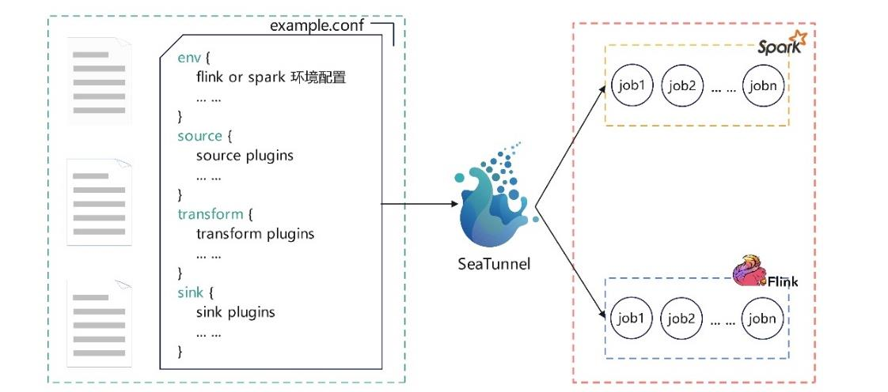

## 1.3SeaTunnel的应用场景

SeaTunnel适用于以下场景

⚫海量数据的同步

⚫海量数据的集成

⚫海量数据的ETL

⚫海量数据聚合

⚫多源数据处理

SeaTunnel的特点

⚫基于配置的低代码开发，易用性高，方便维护。

⚫支持实时流式传输

⚫离线多源数据分析

⚫高性能、海量数据处理能力

⚫模块化的插件架构，易于扩展

⚫支持用SQL进行数据操作和数据聚合

⚫支持Sparkstructuredstreaming

⚫支持Spark2.x

目前SeaTunnel的长板是他有丰富的连接器，又因为它以Spark和Flink为引擎。所以可以很好地进行分布式的海量数据同步。通常SeaTunnel会被用来做出仓入仓工具，或者被用来进行数据集成。比如，唯品会就选择用SeaTunnel来解决数据孤岛问题，让ClcikHouse
集成到了企业中先前的数据系统之中。如图所示：

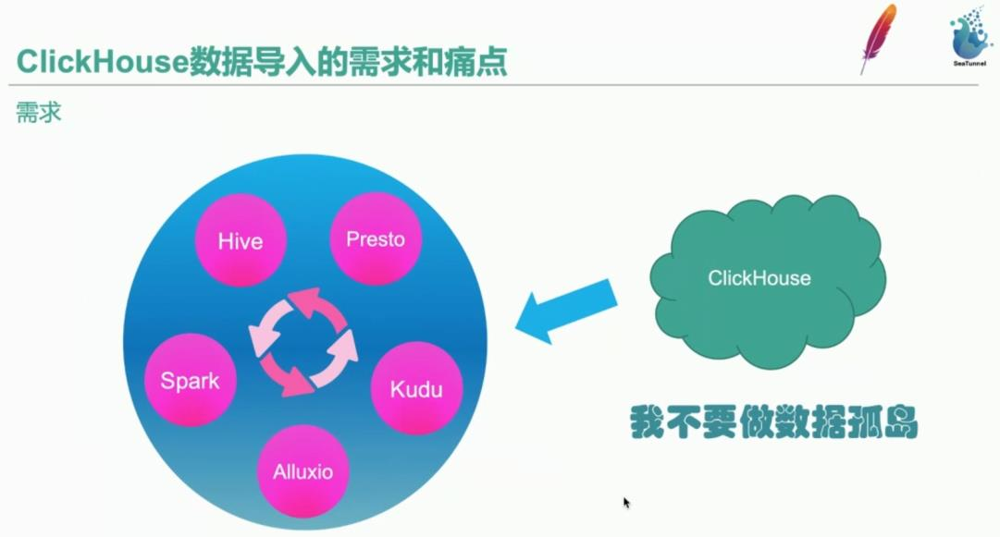

下图是SeaTunnel的工作流程：

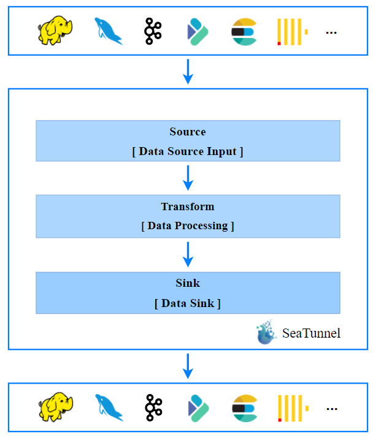

## 1.5SeaTunnel目前的插件支持

### 1.5.1Spark连接器插件(Source)

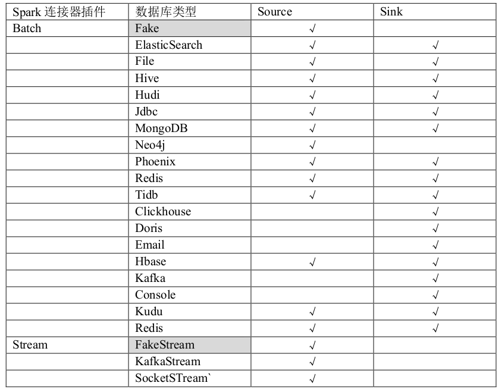

### 1.5.2Flink连接器插件(Source)


### 1.5.3Spark&Flink转换插件


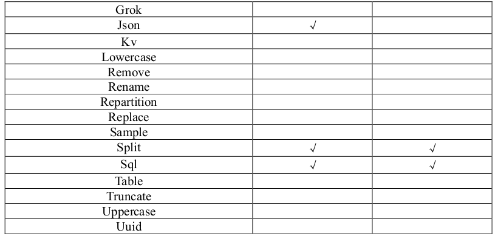

这部分内容来官网，可以看出社区目前规划了大量的插件，但截至V2.1.0可用的transform插件的数量还是很少的。同学们有兴趣也可以在业余时间尝试参与开源贡献。

官方网址：https://seatunnel.apache.org/zh-CN/

# 第2章Seatunnel安装和使用

注意v2.1.0中有少量bug，要想一次性跑通所有示例程序，需使用我们自己编译的包，可以在资料包里获取。具体如何修改源码，可以参考文档第5章。

## 2.1SeaTunnel的环境依赖

截至SeaTunnelV2.1.0。

SeaTunnel支持Spark2.x（尚不支持Spark3.x）。

支持Flink1.9.0及其以上的版本。

Java版本需要>=1.8

我们演示时使用的是flink版本是1.13.0

## 2.2SeaTunnel的下载和安装

1）使用wget下载SeaTunnel，使用-O参数将文件命名为seatunnel-2.1.0.tar.gz

```sh
wgethttps://downloads.apache.org/incubator/seatunnel/2.1.0/apache-seatunnel-incubating-2.1.0-bin.tar.gz-Oseatunnel-2.1.0.tar.gz2
```

2）解压下载好的tar.gz包

```sh
tar-zxvfseatunnel-2.1.0.tar.gz-C/opt/module/
```

3）查看解压的目标路径，apache-seatunnel-incubating-2.1.0的目录就是我们已经安装好的seatunnel。Incubating的意思是孵化中。

## 2.3SeaTunnel的依赖环境配置

在config/目录中有一个seatunnel-env.sh脚本。我们可以看一下里面的内容。

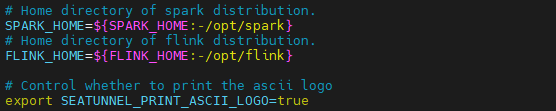

这个脚本中声明了SPARK_HOME和FLINK_HOME两个路径。默认情况下seatunnel-env.sh中的SPARK_HOME和FLINK_HOME就是系统环境变量中的SPARK_HOME和FLINK_HOME。在shell脚本中:-的意思是如果:-前的内容为空，则替换为后面的。

例如，环境变量中没有FLINK_HOME。那么SeaTunnel运行时会将FLINK_HOME设为/opt/flink。

如果你机器上的环境变量SPARK_HOME指向了3.x的一个版本。但是想用2.x的Spark来试一下SeaTunnel。这种情况下，如果你不想改环境变量，那就直接在seatunnel-env.sh中将2.x的路径赋值给SPARK_HOME即可。

比如：

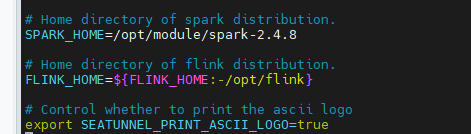

## 2.4示例1:SeaTunnel快速开始

我们先跑一个官方的flink案例。来了解它的基本使用。

1）选择任意路径，创建一个文件。这里我们选择在SeaTunnel的config路径下创建一个example01.conf

```sh
[atguigu@hadoop102config]$vimexample01.conf
```

2）在文件中编辑如下内容

```sh
#配置Spark或Flink的参数
env{
	#Youcansetflinkconfigurationhere
	execution.parallelism=1
	#execution.checkpoint.interval=10000
	#execution.checkpoint.data-uri="hdfs://hadoop102:9092/checkpoint"
}

#在source所属的块中配置数据源
source{
	SocketStream{
		host=hadoop102
		result_table_name="fake"
		field_name="info"
	}
}

#在transform的块中声明转换插件
transform{
	Split{
		separator="#"
		fields=["name","age"]
	}
	sql{
		sql="selectinfo,split(info)asinfo_rowfromfake"
	}
}

#在sink块中声明要输出到哪
sink{
	ConsoleSink{}
}
```

3）开启flink集群

```sh
[atguigu@hadoop102flink-1.11.6]$bin/start-cluster.sh
```

4）开启一个netcat服务来发送数据

```sh
[atguigu@hadoop102~]$nc-lk9999
```

5）使用SeaTunnel来提交任务。

在bin目录下有以下内容

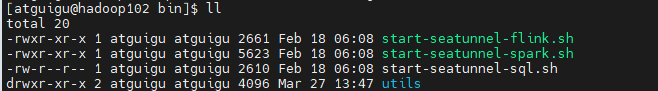

start-seatunnel-flink.sh是用来提交flink任务的。start-seatunnel-spark.sh是用来提交Spark任务的。这里我们用flink演示。所以使用start-seatunnel-flink.sh。

用--config参数指定我们的应用配置文件。

```sh
bin/start-seatunnel-flink.sh--configconfig/example01.sh
```

等待弹出Job已经提交的提示

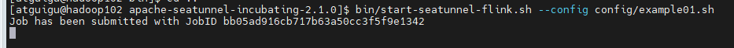

6）在netcat上发送数据

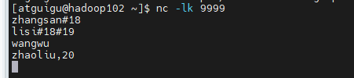

7）在FlinkwebUI上查看输出结果。

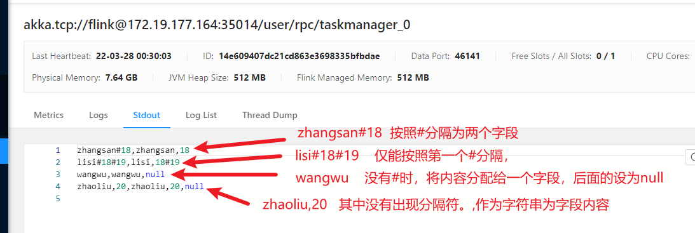

8）小结

至此，我们已经跑完了一个官方案例。它以Socket为数据源。经过SQL的处理，最终输出到控制台。在这个过程中，我们并没有编写具体的flink代码，也没有手动去打jar包。我们只是将数据的处理流程声明在了一个配置文件中。

在背后，是SeaTunnel帮我们把配置文件翻译为具体的flink任务。配置化，低代码，易维护是SeaTunnel最显著的特点。

# 第3章SeaTunnel基本原理

## 3.1SeaTunnel的启动脚本

### 3.1.1启动脚本的参数

截至目前，SeaTunnel有两个启动脚本。

提交spark任务用start-seatunnel-spark.sh。

提交flink任务则用start-seatunnel-flink.sh。

本文档主要是结合flink来使用seatunnel的，所以用start-seatunnel-flink.sh来讲解。start-seatunnle-flink.sh可以指定3个参数
分别是：

```sh
--config应用配置的路径
--variable应用配置里的变量赋值
--check检查config语法是否合法
```

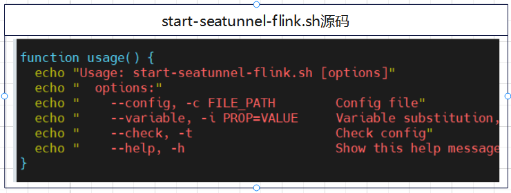

### 3.1.2--check参数

截至本文档撰写时的SeaTunnel版本v2.1.0。check功能还尚在开发中，因此--check参数是一个虚设。目前start-seatunnel-flink.sh并不能对应用配置文件的语法合法性进行检查。而且start-seatunnel-flink.sh中目前没有对--check参数的处理逻辑。需要注意！使用过程中，如果没有使用--check参数，命令行一闪而过。那就是你的配置文件语法有问题。

### 3.1.3--config参数和--variable参数

--config参数用来指定应用配置文件的路径。

--variable参数可以向配置文件传值。配置文件内是支持声明变量的。然后我们可以通过命令行给配置中的变量赋值。

变量声明语法如下。

```sql
sql{
	sql="select*from(selectinfo,split(info)fromfake)whereage>'"${age}"'"
}
```

在配置文件的任何位置都可以声明变量。并用命令行参数--variablekey=value的方式将变量值传进去，你也可以用它的短命令形式-ikey=value。传递参数时，key需要和配置文件中声明的变量名保持一致。

如果需要传递多个参数，那就在命令行里面传递多个-i或--variablekey=value。比如：

```sh
bin/start-seatunnel-flink.sh--config/xxx.sh-iage=18-isex=man
```

### 3.1.4示例2：配置中使用变量

1）我们在example01.conf的基础上创建example02.conf。

```sh
[atguigu@hadoop102config]$cpexample01.shexample02.sh
```

2）修改文件

```sh
[atguigu@hadoop102config]$vimexample02.sh
```

3）给sql插件声明一个变量，红色的是我们修改的地方。最终的配置文件如下。

```sh
env{
	execution.parallelism=1
}
source{
	SocketStream{
		result_table_name="fake"
		field_name="info"
	}
}
transform{
	Split{
		separator="#"
		fields=["name","age"]
	}
	sql{
		sql="select*from(selectinfo,split(info)fromfake)whereage>'"${age}"'"

#需要套一层子查询，因为where先于select,split出的字段无法用where过滤
	}
}
sink{
	ConsoleSink{}
}
```

4）开启netcat服务

```sh
[atguigu@hadoop102~]nc-l9999
```

5）使用SeaTunnel来提交任务。-iage=18往命令行中

```sh
bin/start-seatunnel-flink.sh--configconfig/example01.sh-iage=18
```

6）接着，我们用nc发送几条数据看看效果。

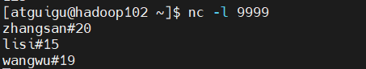

7）在flink的webUI上我们看一下控制台的输出。最终发现未满18岁的李四被过滤掉了。

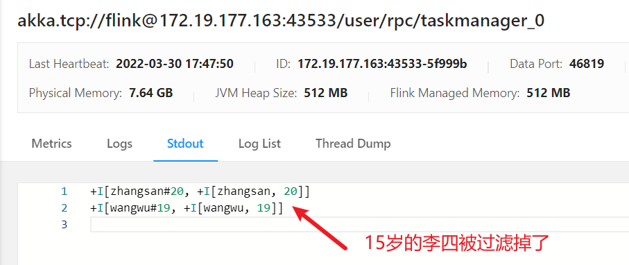

8）小结

通过传递变量，我们可以实现配置文件的复用。让同一份配置文件就能满足不同的业务需求。

### 3.1.5给flink传递参数

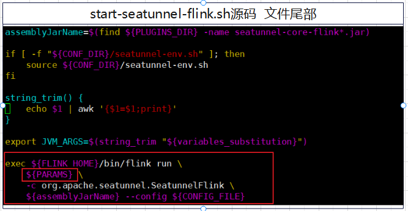

在启动脚本的尾部，我们可以看到，start-seatunnel-flink.sh会执行(exec)一条命令，这个命令会使用flink的提交脚本去向集群提交一个任务。而且在调用bin/flinkrun的时候，还传递了PARAMS作为flinkrun的参数。

如下图所示，我们可知，凡是--config和--variable之外的命令行参数都被放到PARAMS变量中，最后相当于给flinkrun传递了参数。注意！命令行参数解析过程中没有涉及--check参数处理。这也是为什么说它目前不支持--check操作。

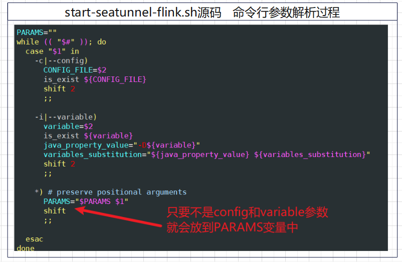

比如，我们可以在seatunnel启动脚本中，指定flinkjob并行度。

```sh
bin/start-seatunnel-flink.sh --configconfig/ -p 2\
```


## 3.2 SeaTunnel的配置文件

### 3.2.1 应用配置的4个基本组件

我们从SeaTunnel的app配置文件开始讲起。

一个完整的SeaTunnel配置文件应包含四个配置组件。分别是：

```sh
env{} source{}-->transform{}-->sink{}
```

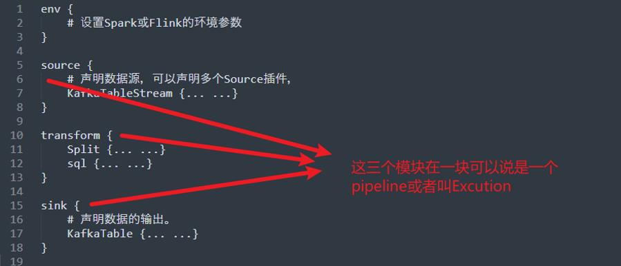

在Source和Sink数据同构时，如果业务上也不需要对数据进行转换，那么transform中的内容可以为空。具体需根据业务情况来定。

### 3.2.2 env块

env块中可以直接写spark或flink支持的配置项。比如并行度，检查点间隔时间。检查点hdfs路径等。在SeaTunnel源码的ConfigKeyName类中，声明了env块中所有可用的key。

如图所示：

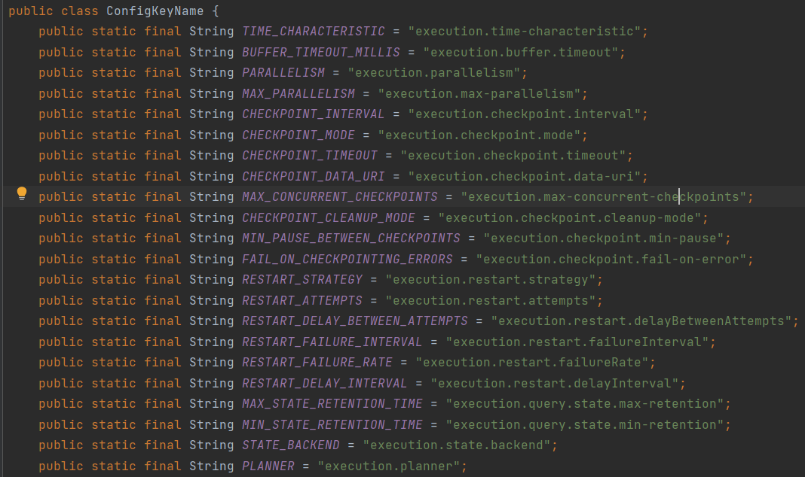

### 3.2.3 SeaTunnel中的核心数据结构Row

Row是SeaTunnel中数据传递的核心数据结构。对flink来说，source插件需要给下游的转换插件返回一个DataStream<Row>，转换插件接到上游的DataStream<Row>进行处理后需要再给下游返回一个DataStream<Row>。最后Sink插件将转换插件处理好的DataStream<Row>输出到外部的数据系统。

如图所示：

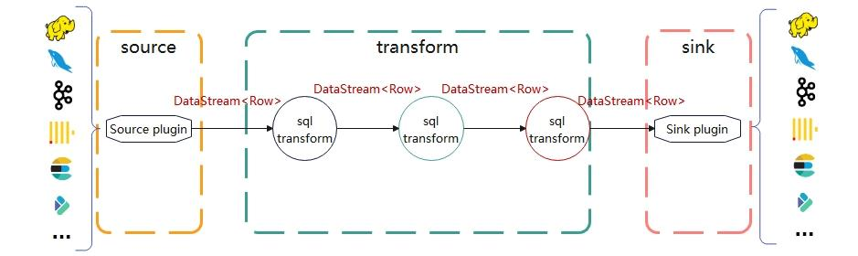

因为DataStream<Row>可以很方便地和Table进行互转，所以将Row当作核心数据结构可以让转换插件同时具有使用代码（命令式）和sql（声明式）处理数据的能力。

### 3.2.4 source块

source块是用来声明数据源的。source块中可以声明多个连接器。比如：

```sh
# 伪代码

env{
	...
}
source{
	hdfs{...}
	elasticsearch{...}
	jdbc{...}
}
transform{
	sql{
		sql="""
		select....from hdfs_table
		join es_table
		on hdfs_table.uid=es_table.uid where..."""
	}
}
sink{
	elasticsearch{...}
}
```

需要注意的是，所有的source插件中都可以声明result_table_name。如果你声明了result_table_name。SeaTunnel会将source插件输出的DataStream<Row>转换为Table并注册在Table环境中。当你指定了result_table_name，那么你还可以指定field_name，在注册时，
给Table重设字段名(后面的案例中会讲解)。

因为不同source所需的配置并不一样，所以对source连接器的配置最好参考官方的文档。

### 3.2.5 transform块

目前社区对插件做了很多规划，但是截至v2.1.0版本，可用的插件总共有两个，一个是Split，另一个是sql。transform{}块中可以声明多个转换插件。所有的转换插件都可以使用source_table_name，和result_table_name。同样，如果我们声明了result_table_name，那么
我们就能声明field_name。

我们需要着重了解一下Split插件和sql插件的实现。但在此在SeaTunnel中，一个转换插件的实现类最重要的逻辑在下述四个方法中。

1）处理批数据，DataSet<Row>进，DataSet<Row>出

```java
DataSet<Row> processBatch(FlinkEnvironmentenv,DataSet<Row> data)
```

2）处理流数据，DataStram<Row>进，DataStream<Row>出

```java
DataStream<Row> processStream(FlinkEnvironmentenv,DataStream<Row> dataStream)
```

3）函数名叫注册函数。实际上，这是一个约定，它只不过是每个transform插件作用于流之后调用的一个函数。

```java
void registerFunction(FlinkEnvironment env,DataStream<Row>datastream)
```

4）处理一些预备工作，通常是用来解析配置。

```java
void prepare(FlinkEnvironment prepareEnv)
```

**Split插件的实现**

现在我们需要着重看一下Split插件的实现。

先回顾一下我们之前example01.conf中关于transform的配置。

 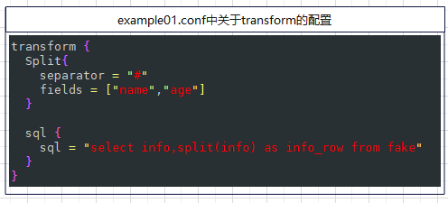

接着我们再来看一下Split的源码实现。

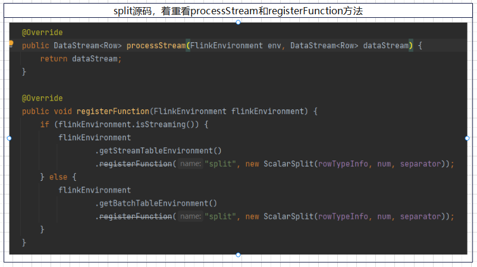

我们发现Split插件并没有对数据流进行任何的处理，而是将它直接return了。反之，它向表环境中注册了一个名为split的UDF（用户自定义函数）。而且，函数名是写死的。

这意味着，如果你声明了多个Split，后面的UDF还会把前面的覆盖。这是开发时需要注意的一个点。

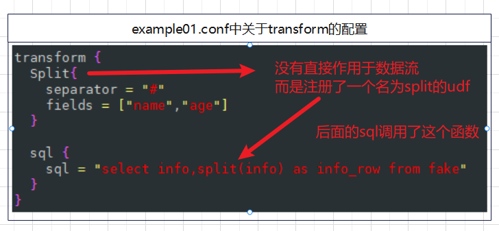

但是，需要注意，tranform接口其实是留给了我们直接操作数据的能力的。也就是processStream方法。那么，一个transform插件其实同时履行了process和udf的职责，这是违反单一职责原则的。那要判断一个转换插件在做什么就只能从源码和文档的方面来加以区分了。

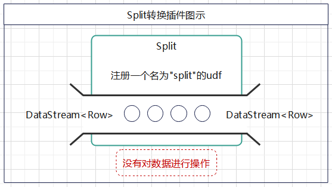

最后需要叮嘱的是，指定soure_table_name对于sql插件的意义不大。因为sql插件可以通过from子句来决定从哪个表里抽取数据。

### 3.2.6 sink块

Sink块里可以声明多个sink插件，每个sink插件都可以指定source_table_name。不过因为不同Sink插件的配置差异较大，所以在实现时建议参考官方文档。

## 3.3 SeaTunnel的基本原理

SeaTunnel的工作原理简单明了。

1）程序会解析你的应用配置，并创建环境

2）配置里source{}，transform{}，sink{}三个块中的插件最终在程序中以List集合的方式存在。

3）由Excution对象来拼接各个插件，这涉及到选择source_table，注册result_table等流程，注册udf等流程。并最终触发执行

可以参考下图：

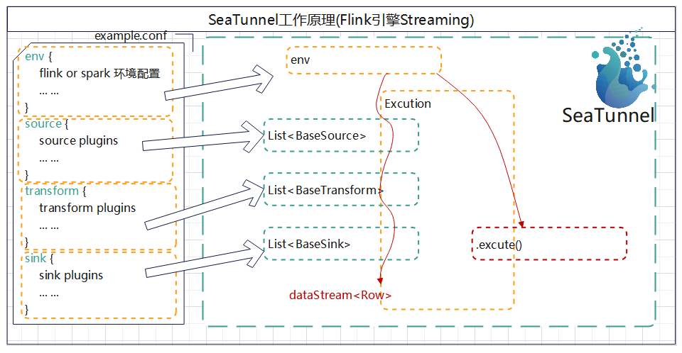

## 3.4 小结

最后我们用一张图将SeaTunnel中的重要概念串起来。

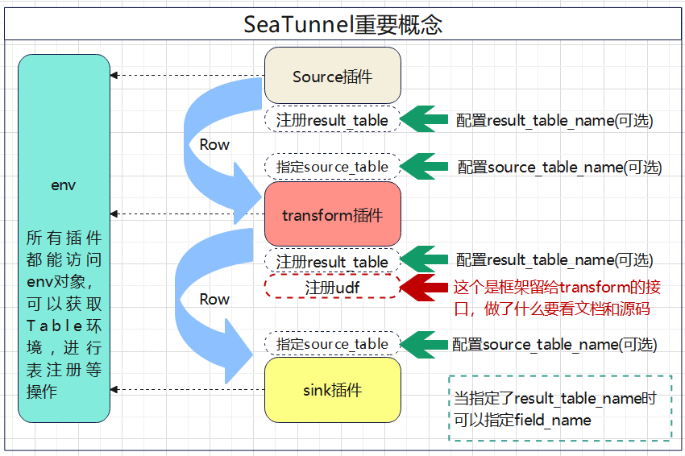

如果你愿意，依托sql插件和udf。单个配置文件也可以定义出比较复杂的工作流。但SeaTunnel的定位是一个数据集成平台。核心的功能是依托丰富的连接器进行数据同步，数据处理并不是SeaTunnel的长处。所以在SeaTunnel中定义复杂的工作流或许是一种不值得提倡的做法。

需要提醒的是，如果你不指定source_table_name，插件会使用它在配置文件上最近的上一个插件的输出作为输入。所以，我们可以通过使用依托表名表环境来实现复杂的工作流。也可以减少表名的使用实现简单的数据同步通道。

# 第4章 应用案例

注意！下述示例请使用我们修改编译好的包。

## 4.1 Kafka进Kafka出的简单ETL

### 4.1.1需求

对test_csv主题中的数据进行过滤，仅保留年龄在18岁以上的记录。

### 4.1.2 需求实现

1）首先，创建为kafka创建test_csv主题。

```sh
kafka-topics.sh --bootstrap-server hadoop102:9092 --create --topic test_csv --partitions 1 --replication-factor 1
```

2）为kafka创建test_sink主题

```sh
kafka-topics.sh --bootstrap-server hadoop102:9092 --create --topic test_sink --partitions 1 --replication-factor 1
```

3）编辑应用配置

```sh
[atguigu@hadoop102config]$vimexample03.conf
```

4）应用配置内容

```sh
env{
	# Youcansetflinkconfigurationhere
	execution.parallelism=1
	#execution.checkpoint.interval=10000
	#execution.checkpoint.data-uri="hdfs://hadoop102:9092/checkpoint"
}

# 在source所属的块中配置数据源
source{
	KafkaTableStream{
		consumer.bootstrap.servers="hadoop102:9092"
		consumer.group.id="seatunnel-learn"
		topics=test_csv
		result_table_name=test
		format.type=csv
		schema=
"[{\"field\":\"name\",\"type\":\"string\"},{\"field\":\"age\",\"type\":\"int\"}]"
	format.field-delimiter=";"
	format.allow-comments="true"
	format.ignore-parse-errors="true"
	}
}

# 在transform的块中声明转换插件

transform{
	sql{
		sql="selectname,agefromtest
	}
	where age>'"${age}"'"
}

# 在sink块中声明要输出到哪

sink{
	kafkaTable{
		topics="test_sink"
		producer.bootstrap.servers="hadoop102:9092"
	}
}
```

5）提交任务

```sh
bin/start-seatunnel-flink.sh --config config/example03.conf -i age=18
```

6）起一个kafkaconsoleproducer发送csv数据(分号分隔)

 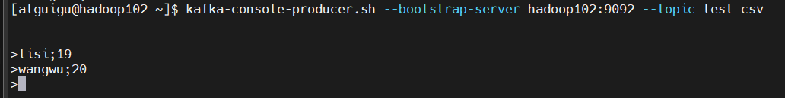

7）起一个kafkaconsoleconsumer消费数据

 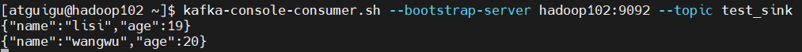

我们成功地实现了数据从kafka输入经过简单的ETL再向kafka输出。

## 4.2 Kafka输出到Doris进行指标统计

### 4.2.1 需求

使用回话日志统计用户的总观看视频数，用户最常会话市场，用户最小会话时长，用户最后一次会话时间。

### 4.2.2需求实现

1）在资料中有一个伪数据的生成脚本，将它拷贝到服务器的任意位置

 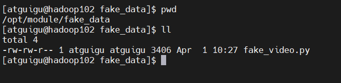

2）执行以下命令安装python脚本需要的两个依赖库

```sh
pip3 install Faker
pip3 install kafka-python
```

3）使用mysql客户端连接doris

```sh
[atguigu@hadoop102 fake_data]$mysql-h hadoop102 -P 9030 -uatguigu -p123321
```

4）手动创建test_db数据库。

```sql
create database test_db;
```


5）使用下述sql语句建表

```sql
CREATE TABLE `example_user_video` (
`user_id` largeint(40) NOT NULL COMMENT "用户 id",
`city` varchar(20) NOT NULL COMMENT "用户所在城市",
`age` smallint(6) NULL COMMENT "用户年龄",
`video_sum` bigint(20) SUM NULL DEFAULT "0" COMMENT "总观看视频数
",
`max_duration_time` int(11) MAX NULL DEFAULT "0" COMMENT "用户最
长会话时长",
`min_duration_time` int(11) MIN NULL DEFAULT "999999999"
COMMENT "用户最小会话时长",
`last_session_date` datetime REPLACE NULL DEFAULT "1970-01-01
00:00:00" COMMENT "用户最后一次会话时间"
) ENGINE=OLAP
AGGREGATE KEY(`user_id`, `city`, `age`)
COMMENT "OLAP"
DISTRIBUTED BY HASH(`user_id`) BUCKETS 16
;
```

6）在config目录下，编写如下的配置文件。

```sh
env {
	execution.parallelism = 1
}
source {
	KafkaTableStream {
		consumer.bootstrap.servers = "hadoop102:9092"
		consumer.group.id = "seatunnel5"
		topics = test
		result_table_name = test
		format.type = json
		schema =
"{\"session_id\":\"string\",\"video_count\":\"int\",\"duration_time\":\"long\",\"user_id\":\"string\",\"user_age\":\"int\",\"city\":\"string\",\"session_start_time\":\"datetime\",\"session_end_time\":\"datetime\"}"
		format.ignore-parse-errors = "true"
	}
}
transform{
	sql {
		sql = "select user_id,city,user_age as age,video_count as video_sum,duration_time as max_duration_time,duration_time as min_duration_time,session_end_time as last_session_date from
test"
		result_table_name = test2
	}
}
sink{
	DorisSink {
		source_table_name = test2
		fenodes = "hadoop102:8030"
		database = test_db
		table = example_user_video
		user = atguigu
		password = 123321
		batch_size = 50
		doris.column_separator="\t"
		doris.columns="user_id,city,age,video_sum,max_duration_time,min_duration_time,last_session_date"
	}
}
```

7）使用python脚本向kafka中生成伪数据

```sh
[atguigu@hadoop102 fake_data]$python3 fake_video.py --bootstrap-server hadoop102:9092 --topic test_video
```

8）查看doris中的结果。

```sh
Select * from `example_user_video`;
```


# 第5章 如何参与开源贡献

## 5.1基本概念

### 5.1.1参与开源贡献的常见方法

1）参与解答

在社区中，帮助使用过程中遇到困难的人，帮他们解释框架的用法也算是一种贡献。

2）文档贡献

帮助框架来完善文档，比如说将英文文档翻译为中文，纠正文档里面的错误单词，这是很多人参与开源贡献的第一步。

3）代码贡献

经过阅读源码，发现源码中有Bug，修改后将代码提交给社区。或者，框架有一个新的特性亟待开发，你为新功能的实现提供了解决方案，这属于代码贡献，也是一种重要的参与开源贡献的方式。

### 5.1.2 开源社区中常见的三个身份标签

1）contributor（贡献者）

只要参与过一次贡献就算是贡献者，

2）committer（提交者）

成为contributor后，如果你能保证持续贡献，而且有扎实的技术功底，经PMC（管理委员会）投票或讨论决定后，可以决定让你成为一名committer。Committer和contributor的区别在于，commiter对于项目的仓库是具有写的权限的。他可以审核并合并contributor的代码。而且如果成为commiter，你还会获得一个后缀为@apache.org的邮箱。

3）PMC（管理委员会）

Committer中表现优秀的话，是可以成为PMC的。PMC要负责整个项目的走向，做出一些重要的决策，要具备前瞻性的技术眼光。

## 5.2 如何修改bug

### 5.2.1背景

在我们准备这项课程的时候，实际上kafka输入插件，kafka输出插件和doris输出插件是各有一个bug的，当时kafka输入插件的bug在社区中已经有了一个解决方案。Kafka输出插件的bug，和doris输出插件的bug是我们来做的修改，而且修改后的结果提交给了SeaTunnel社区，并且成功实现了代码合并。下面我们复现一个doris输出插件bug的场景，并且在这个基础上向大家讲解如何一步步去参与开源贡献，成为一名源码贡献者。

### 5.2.2 问题复现

1）场景

当时，向doris插入数据时会抛出一个ClassCastException，也就是类型的强转错误。这里会报Java.Util.ArratList不能强转为java.lang.CharSequence。在反复确认我们的配置文件写的没问题后。我们仔细阅读了一下控制台打印的栈追踪信息。

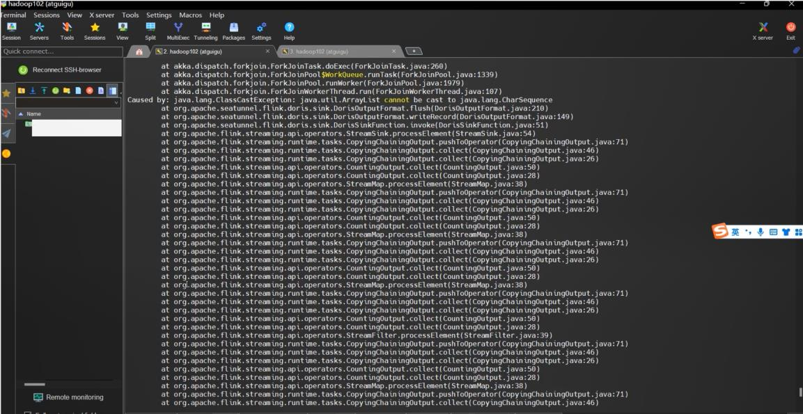

2）问题定位

通过最后打印的栈追踪信息，我们可以知道出错的位置在DorisOutPutFormat.java文件的第210行，于是我们需要去idea里面打开源码看一下这里的代码是怎么写的。

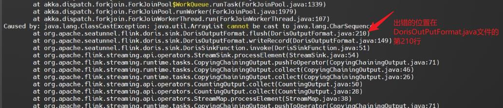

### 5.2.3 分析问题

定位到210行后，我们看到下面的问题。

它要将一个batch（它是一个ArrayList集合）强转为CharSequence（字符序列）。这显然是错误的。

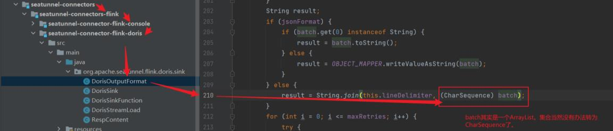

要想解决这个问题，我们要了解这段代码的意图。

这需要一定的背景知识，SeaTunnel的dorisSink其实是依托于doris的streamload这种导入方式来实现的。而streamload其实是通过http请求的形式，向doris导入数据。而且doris提倡提交数据的时候一定要成批地向doris导入数据。如此一来，我们知道bacth就是用来积攒数据的一个集合，而向远端通过http发送数据必然要经过一个序列化的过程。结合上下文来看，我们可以判断这段代码的目的，就是要将batch里的所有数据，按照某个规则转为字符串，为http请求做准备。分析过程如图所示。

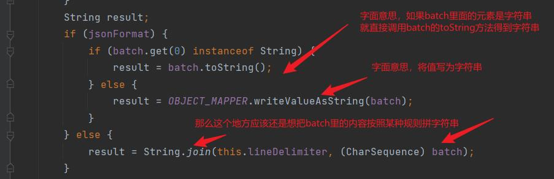

### 5.2.4 确定问题的解决方案

我们需要看一下String提供的这个join静态方法，对参数的要求。

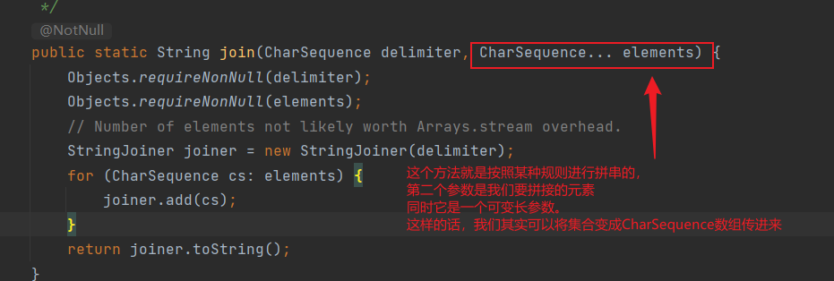

我们发现，join方法的第二个参数是一个CharSequence类型的可变长参数，这意味着我们可以向里面传递一个CharSequence类型的数组。那么代码可以修改成下面这个样子。

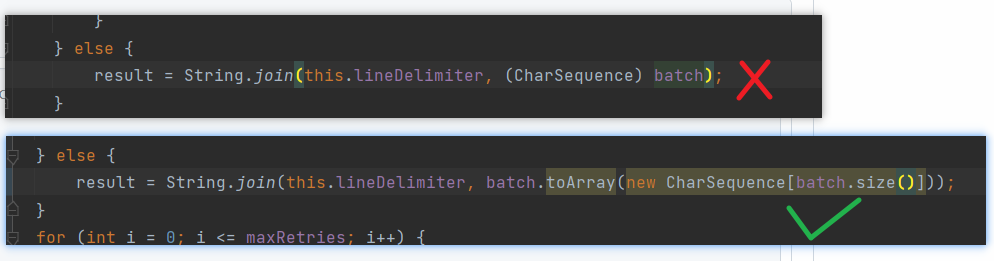

### 5.2.5 方案验证

1）重新打包

接着，我们可以重新编译这个包，把重新编译的包放到我们的集群上，再跑一次任务看看能不能通过。在这个过程中，因为跨平台性的问题(windows和linux的路径不通用，其实也是个bug)，有一些单元测试我们无法通过，因此我们取个巧，用下面的方式进行编译
打包，跳过单元测试和代码的格式审查。

```sh
mvn clean package -Dmaven.test.skip=true -Dcheckstyle.skip=true
```

2）使用新的包

接着，我们使用重新编译过的SeaTunnel执行我们之前向Doris导入数据的命令。

```sh
bin/start-seatunnel-flink.sh --config config/example04.conf
```

3）到我们的Doris上查看数据是否成功导入

这次我们的数据成功导进了doris。而且我们的程序并没有因为类型转换错误而崩溃。

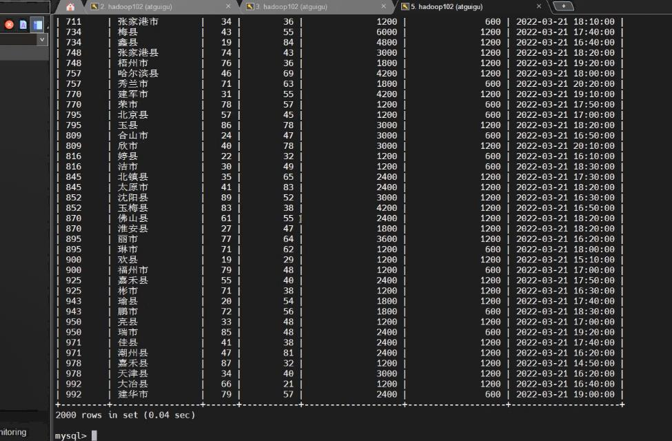

4）小结

经过上面的这些步骤，我们确信问题是出在源码的问题上。接下来我们要开始向社区汇报这个bug，并向社区提供我们的解决方案。

## 5.3 创建issue

### 5.3.1 什么是issue

每个github的仓库下都会有一个项目独立的issue板块。在这个板块里面，大家可以提出自己的问题，也可以去和大家讨论SeaTunnel是否要添加一些特性。而且，这是一个可以汇报bug的地方。

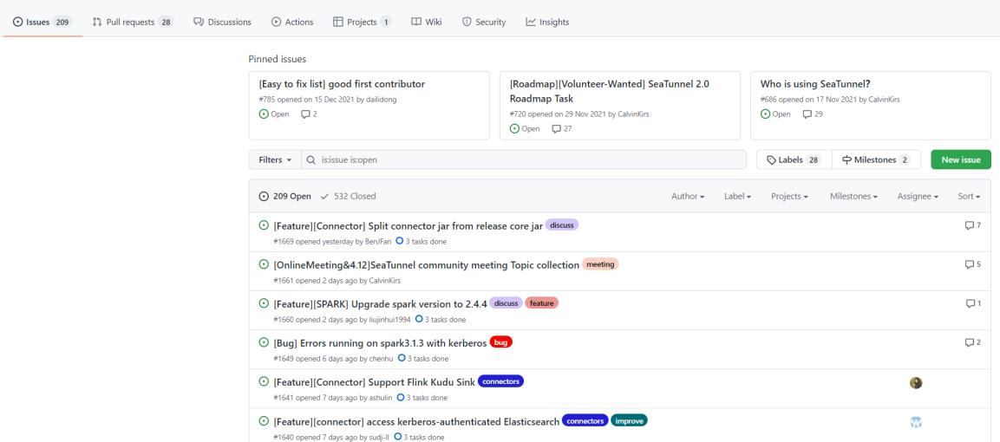

开源社区通常会要求你在提交代码合并的请求前，先去创建一个issue。这是一个好的习惯，就像是我们抓贼要先立案，逮捕要先有逮捕令。创建pullrequest之前先创建issue，然后把pr关联到我们创建的issue上，让每一次改动，都有据可查。

### 5.3.2 如何创建issue

1）点击new issue按钮进入下一个页面

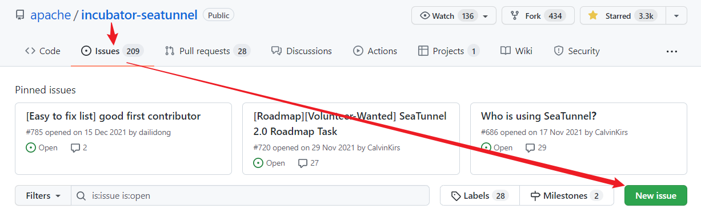

2）选择你要创建的issue类型，我们选择bugreport（bug汇报），进入下一个页面

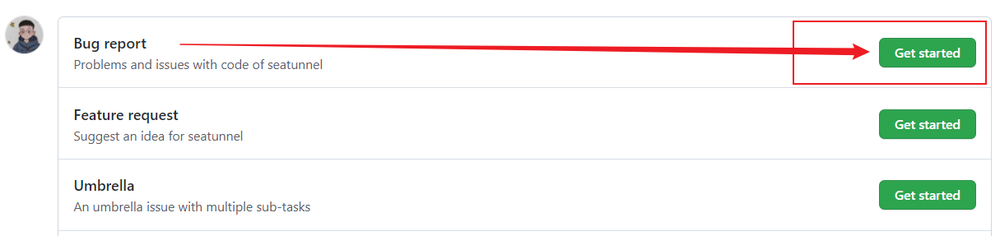

3）按照表单的提示，一步步填写完整。注意，表单提醒你，创建issue之前应该先去搜索社区中是否已经有讨论同一问题的issue。同样的问题，无需重复。

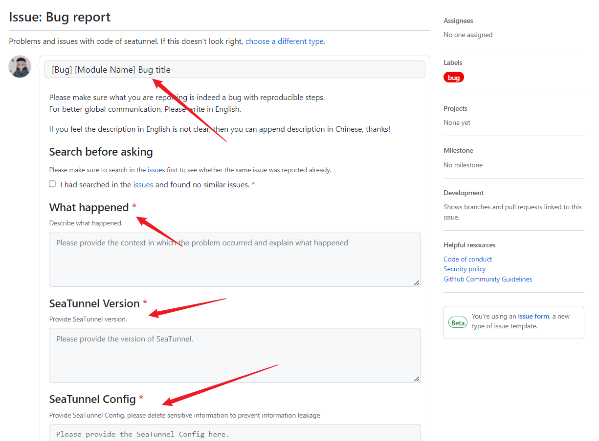

4）按照要求填写表单后，点击下方的Submitnewissue。创建这个issue。

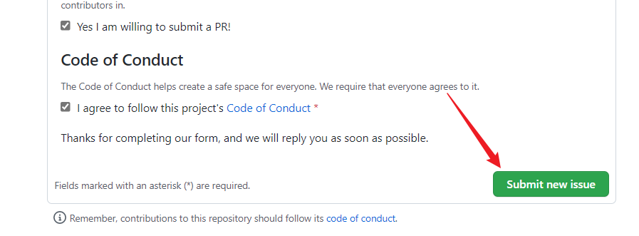

5）查看我们已经创建好的issue

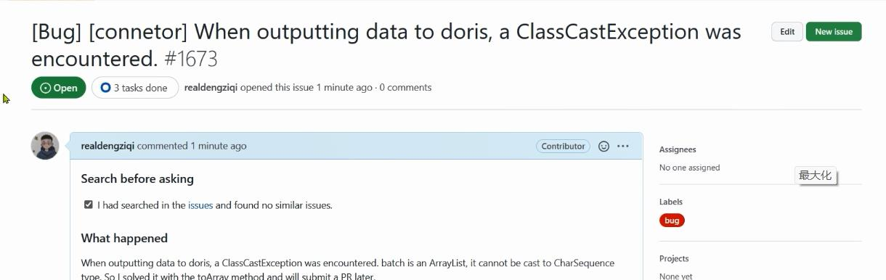

## 5.4 创建pull request

pullrequest的意思是拉取请求，也就是我这有代码写好了，请你把我的代码拉过去吧。所以，发起拉取请求之前应该要先有自己的代码。这样一来，创建pullrequest并不是一上来就创建，而是要先搞好自己的代码仓库。

pull request的简称是pr。

### 5.4.1 fork项目到自己的仓库中

对于第一次对SeaTunnel贡献的同学来说，应该先fork（叉子）官方的仓库。

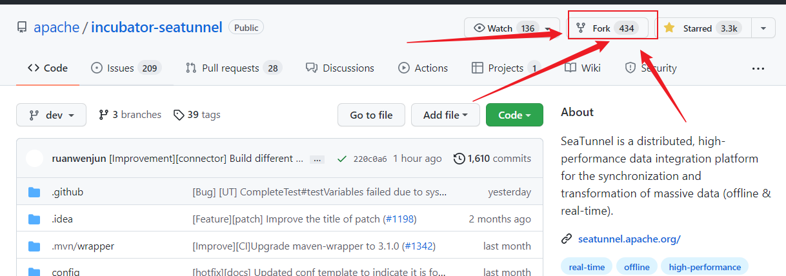

点击fork按钮后，你自己的github账号上会出现一个一模一样的仓库。如下图所示。

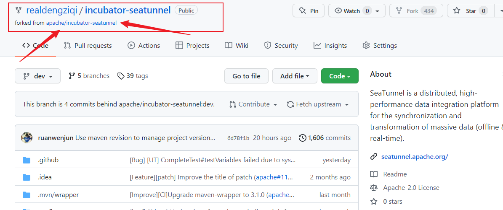

### 5.4.2 git clone自己fork的仓库

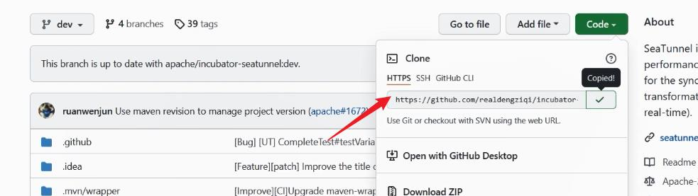

拿到这个url，在自己电脑上的任意目录上使用下面的git命令去clone这个仓库。

```sh
git clone xxxx{你自己的仓库的url}xxx
```

### 5.4.3 修改代码

1）在项目的跟目录右键，用idea打开我们clone的项目

2）在我们之前确定的位置，改代码

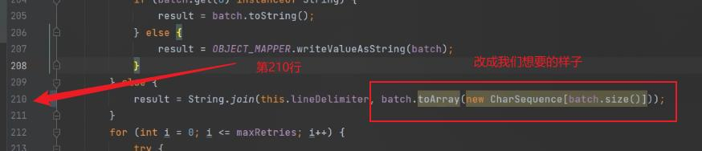

3）commit提交

（这个地方应该先建一个分支，从dev上分出来，在新建分支的基础上commit。这里成反面教材了\^_^）

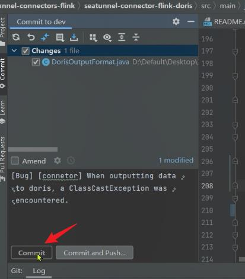

4）push到我们fork的仓库里去，这个时候在远端的目标分支上，我们写一个新的分支名

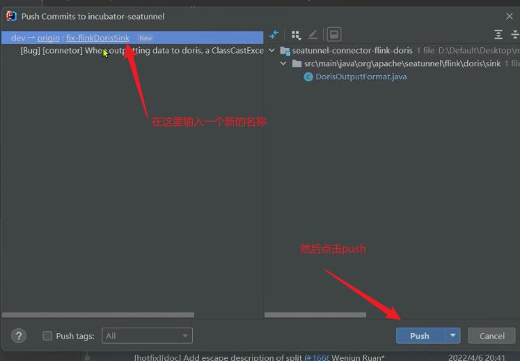

### 5.4.4 创建PR

1）去我们的github上，看一下自己的仓库，发现它会提示我们可以创建一个pr了。点击这个按钮，进入下一个页面

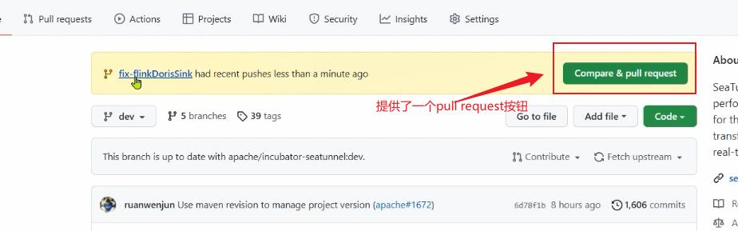

2）在新的页面中，按照对话框里给出的模板，说明我们这个pr的目的。最终，不要忘了和你之前的issue关联起来，关联的方式就是直接粘贴你创建的issue的链接。

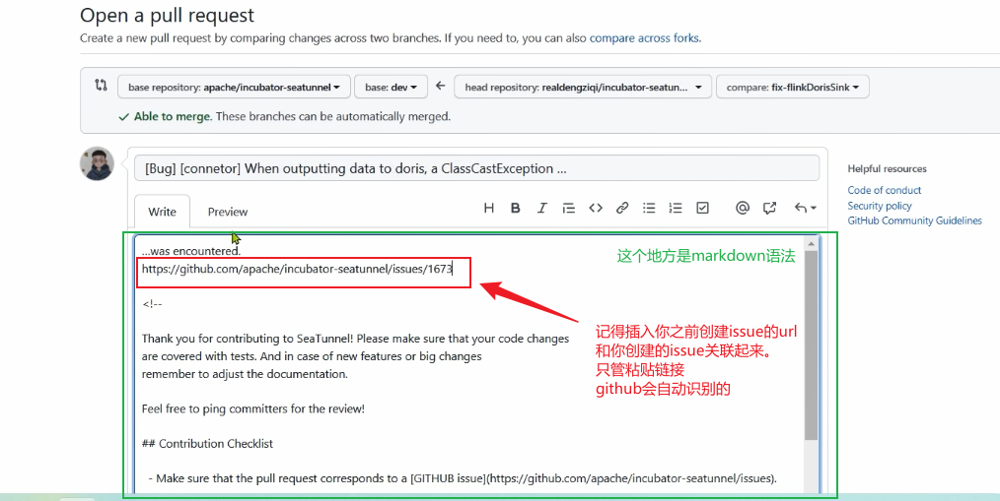

3）全部搞定之后，点击createpullrequest按钮，创建一个pr

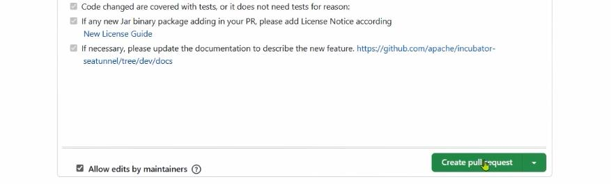

4）我们还可以看到github会判断我们做了哪些修改。红色的地方表示我们删除的代码，绿色的地方表示我们新增的代码。因为github的差异是按行进行标记的。所以如果你就改了一个字母。也是一个删除行和新增行的效果。

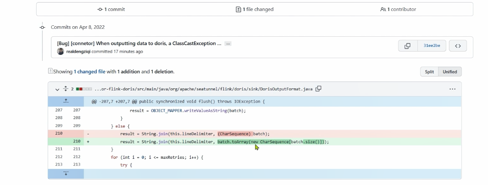

5）我们的PR已经提交完毕，我们可以看到github会启动一个自动的检查。这个叫做CI/CD。持续交付/持续部署的意思。简单来说，你上传的代码，云端会自动拉取，然后自动地跑一边编译，然后进行单元测试，代码格式等一系列检查。这些测试都通过后，你的代码才有被合并的可能。


6）接下来你可以去干点别的，自动测试的时间会比较久，而且你需要等待社区人员注意到你的pull request。

## 5.5 成功成为源码贡献者

过一段时间就可以回来看一下你的pr了。我们看到有一个apachemember审核了我们的代码，并将我们的代码合并到了项目中。以后，大家使用seatunnel将数据从flink写入doris，就有你的一份功劳了。

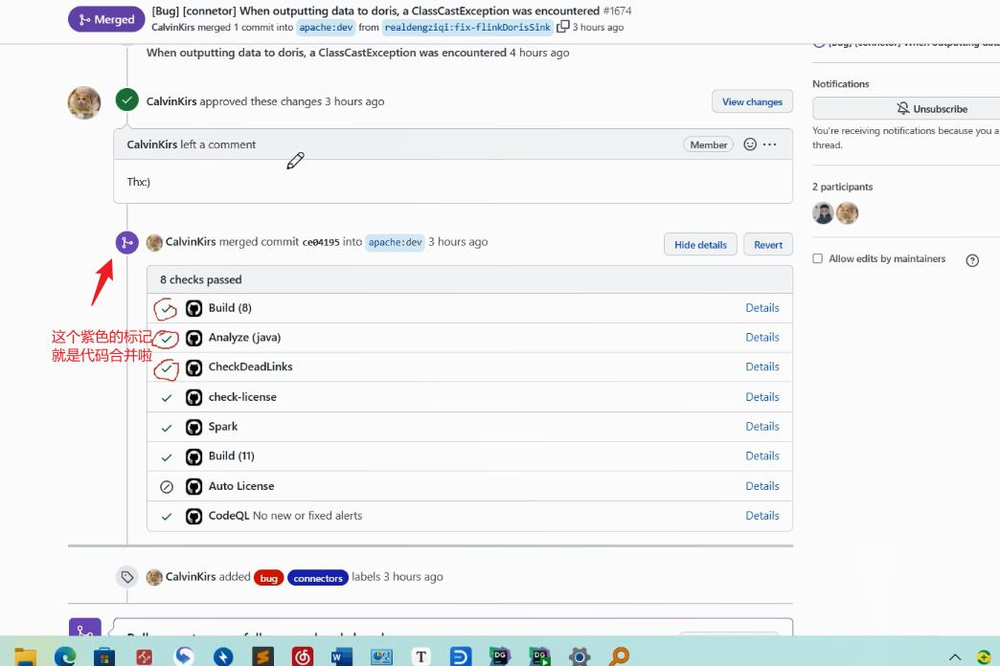

你的发言记录上，会出现contributor的标记。

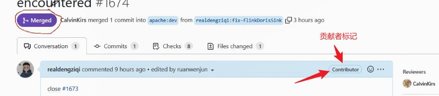

弄完这些，就算是SeaTunnel的源码贡献者啦。

## 5.6 寻找贡献机会

Apache的开源项目中，社区成员们通常会维护一个待办列表，里面是一些好做的任务。适合新手上路。

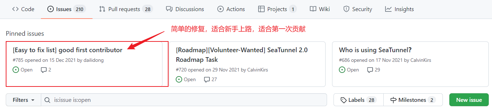