尚硅谷大数据技术之 Azkaban

(作者：尚硅谷大数据研发部)

版本：V3.84.4

# 第 1 章 Azkaban 概论

## 1.1 为什么需要工作流调度系统

1）一个完整的数据分析系统通常都是由大量任务单元组成：

Shell 脚本程序，Java 程序，MapReduce 程序、Hive 脚本等

2）各任务单元之间存在时间先后及前后依赖关系

3）为了很好地组织起这样的复杂执行计划，需要一个工作流调度系统来调度执行；

**为什么需要工作流调度系统**

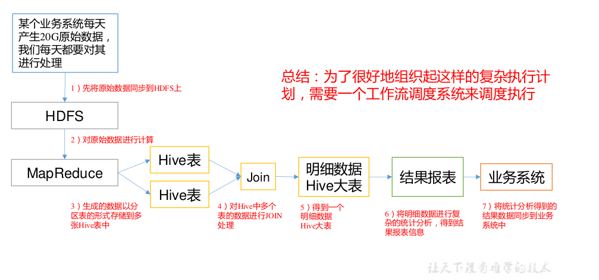


## 1.2 常见工作流调度系统

1）简单的任务调度：直接使用 Linux 的 Crontab 来定义；

2）复杂的任务调度：开发调度平台或使用现成的开源调度系统，比如 Ooize、Azkaban、Airflow、DolphinScheduler 等。

## 1.3 Azkaban 与 Oozie 对比

总体来说，Ooize 相比 Azkaban 是一个重量级的任务调度系统，功能全面，但配置使用也更复杂。如果可以不在意某些功能的缺失，轻量级调度器 Azkaban 是很不错的候选对象。


# 第 2 章 Azkaban 入门

## 2.1 集群模式安装

### 2.1.1 上传 tar 包

1）将 azkaban-db-3.84.4.tar.gz，azkaban-exec-server-3.84.4.tar.gz，azkaban-web-server-3.84.4.tar.gz 上传到 hadoop102 的/opt/software 路径

```sh
[atguigu@hadoop102 software]$ ll
总用量 35572
-rw-r--r--. 1 atguigu atguigu 6433 4 月 18 17:24 azkaban-db-3.84.4.tar.gz
-rw-r--r--. 1 atguigu atguigu 16175002 4 月 18 17:26 azkaban-exec-server-3.84.4.tar.gz
-rw-r--r--. 1 atguigu atguigu 20239974 4 月 18 17:26 azkaban-web-server-3.84.4.tar.gz
```

2）新建/opt/module/azkaban 目录，并将所有 tar 包解压到这个目录下

```sh
[atguigu@hadoop102 software]$ mkdir /opt/module/azkaban
```

3）解压 azkaban-db-3.84.4.tar.gz、 azkaban-exec-server-3.84.4.tar.gz 和 azkaban-web-server-3.84.4.tar.gz 到/opt/module/azkaban 目录下

```sh
[atguigu@hadoop102 software]$ tar -zxvf azkaban-db-3.84.4.tar.gz -C /opt/module/azkaban/
[atguigu@hadoop102 software]$ tar -zxvf azkaban-exec-server-3.84.4.tar.gz -C /opt/module/azkaban/
[atguigu@hadoop102 software]$ tar -zxvf azkaban-web-server-3.84.4.tar.gz -C /opt/module/azkaban/
```

4）进入到/opt/module/azkaban 目录，依次修改名称

```sh
[atguigu@hadoop102 azkaban]$ mv azkaban-exec-server-3.84.4/ azkaban-exec
[atguigu@hadoop102 azkaban]$ mv azkaban-web-server-3.84.4/ azkaban-web 
```

### 2.1.2 配置 MySQL

1）正常安装 MySQL

详见《尚硅谷大数据技术之 Hive》

2）启动 MySQL

```sh
[atguigu@hadoop102 azkaban]$ mysql -uroot -p000000
```

3）登陆 MySQL，创建 Azkaban 数据库

```sh
mysql> create database azkaban;
```

4）创建 azkaban 用户并赋予权限

设置密码有效长度 4 位及以上

```sql
mysql> set global validate_password_length=4;
```

设置密码策略最低级别

```sql
mysql> set global validate_password_policy=0;
```

创建 Azkaban 用户，任何主机都可以访问 Azkaban，密码是 000000

```sql
mysql> CREATE USER 'azkaban'@'%' IDENTIFIED BY '000000';
```

赋予 Azkaban 用户增删改查权限

```sql
mysql>GRANT SELECT,INSERT,UPDATE,DELETE 'azkaban'@'%' WITH GRANT OPTION;
```

5）创建 Azkaban 表，完成后退出 MySQL

```sql
mysql> use azkaban;
mysql> source /opt/module/azkaban/azkaban-db-3.84.4/create-all-sql-3.84.4.sql
mysql> quit;
```

6）更改 MySQL 包大小；防止 Azkaban 连接 MySQL 阻塞

```sh
[atguigu@hadoop102 software]$ sudo vim /etc/my.cnf
```

在[mysqld]下面加一行 max_allowed_packet=1024M

```sh
[mysqld]
max_allowed_packet=1024M
```

7）重启 MySQL

```sh
[atguigu@hadoop102 software]$ sudo systemctl restart mysqld
```

### 2.1.3 配置 Executor Server

Azkaban Executor Server 处理工作流和作业的实际执行。

1）编辑 azkaban.properties

```sh
[atguigu@hadoop102 azkaban]$ vim /opt/module/azkaban/azkaban-exec/conf/azkaban.properties

修改如下标红的属性
#...
default.timezone.id=Asia/Shanghai
#...
azkaban.webserver.url=http://hadoop102:8081
executor.port=12321
#...
database.type=mysql
mysql.port=3306
mysql.host=hadoop102
mysql.database=azkaban
mysql.user=azkaban
mysql.password=000000
mysql.numconnections=100
```

2）同步 azkaban-exec 到所有节点

```sh
[atguigu@hadoop102 azkaban]$ xsync /opt/module/azkaban/azkaban-exec
```

3）必须进入到/opt/module/azkaban/azkaban-exec 路径，分别在三台机器上，启动 executorserver

```sh
[atguigu@hadoop102 azkaban-exec]$ bin/start-exec.sh
[atguigu@hadoop103 azkaban-exec]$ bin/start-exec.sh
[atguigu@hadoop104 azkaban-exec]$ bin/start-exec.sh
```

注意：如果在/opt/module/azkaban/azkaban-exec 目录下出现 executor.port 文件，说明启动成功

4）下面激活 executor，需要

```sh
[atguigu@hadoop102 azkaban-exec]$ curl "hadoop102:12321/executor?action=activate" && echo -G
[atguigu@hadoop103 azkaban-exec]$ curl "hadoop103:12321/executor?action=activate" && echo -G
[atguigu@hadoop104 azkaban-exec]$ curl "hadoop104:12321/executor?action=activate" && echo -G
```

如果三台机器都出现如下提示，则表示激活成功

```json
{"status":"success"}
```


### 2.1.4 配置 Web Server

Azkaban Web Server 处理项目管理，身份验证，计划和执行触发。

1）编辑 azkaban.properties

```sh
[atguigu@hadoop102 azkaban]$ vim /opt/module/azkaban/azkaban-web/conf/azkaban.properties
修改如下属性
...
default.timezone.id=Asia/Shanghai
...
database.type=mysql
mysql.port=3306
mysql.host=hadoop102
mysql.database=azkaban
mysql.user=azkaban
mysql.password=000000
mysql.numconnections=100
...
azkaban.executorselector.filters=StaticRemainingFlowSize,CpuStatus
```

说明：

#StaticRemainingFlowSize：正在排队的任务数；

#CpuStatus：CPU 占用情况

#MinimumFreeMemory：内存占用情况。测试环境，必须将 MinimumFreeMemory 删除掉，否则它会认为集群资源不够，不执行。

2）修改 azkaban-users.xml 文件，添加 atguigu 用户

```xml
[atguigu@hadoop102 azkaban-web]$ vim /opt/module/azkaban/azkaban-web/conf/azkaban-users.xml
<azkaban-users>
	<user groups="azkaban" password="azkaban" roles="admin" username="azkaban"/>
	<user password="metrics" roles="metrics" username="metrics"/>
	<user password="atguigu" roles="admin" username="atguigu"/>
	<role name="admin" permissions="ADMIN"/>
	<role name="metrics" permissions="METRICS"/>
</azkaban-users>
```

3）必须进入到 hadoop102 的/opt/module/azkaban/azkaban-web 路径，启动 web server

```sh
[atguigu@hadoop102 azkaban-web]$ bin/start-web.sh
```

4）访问 http://hadoop102:8081,并用 atguigu 用户登陆

## 2.2 Work Flow 案例实操

### 2.2.1 HelloWorld 案例

1）在 windows 环境，新建 azkaban.project 文件，编辑内容如下

```sh
azkaban-flow-version: 2.0
```

注意：该文件作用，是采用新的 Flow-API 方式解析 flow 文件。

2）新建 basic.flow 文件，内容如下

```sh
nodes:
	- name: jobA
	  type: command
	  config:
	 	 command: echo "Hello World"
```

（1）Name：job 名称

（2）Type：job 类型。command 表示你要执行作业的方式为命令

（3）Config：job 配置

3）将 azkaban.project、basic.flow 文件压缩到一个 zip 文件，文件名称必须是英文。

 

4）在 WebServer 新建项目：http://hadoop102:8081/index

 

5）给项目名称命名和添加项目描述

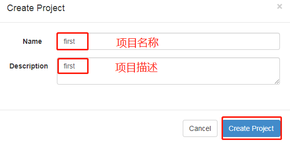

6）first.zip 文件上传

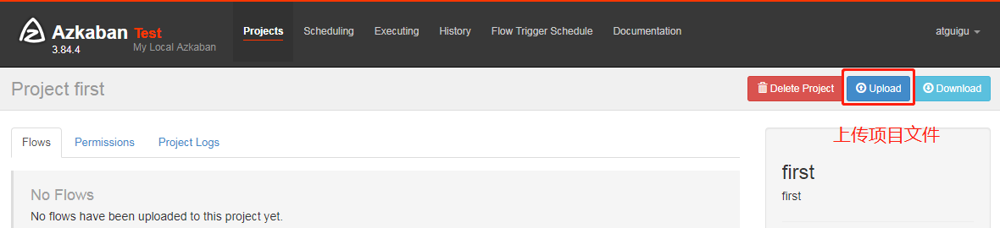

7）选择上传的文件


8）执行任务流

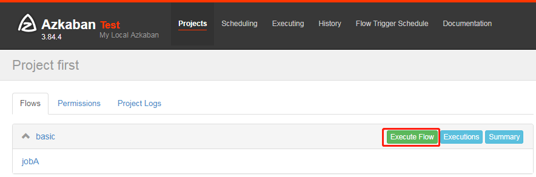


9）在日志中，查看运行结果

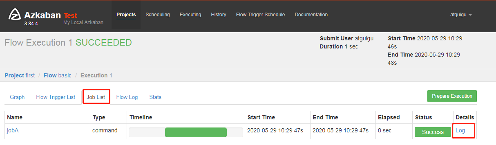

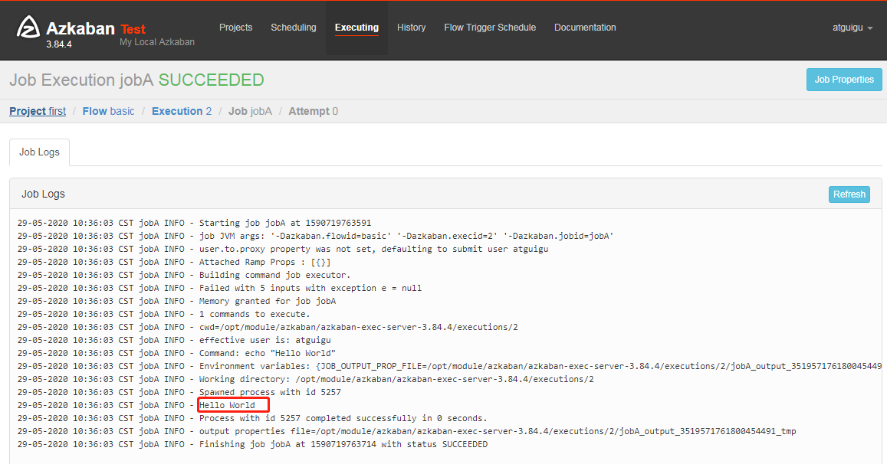

### 2.2.2 作业依赖案例

需求：JobA 和 JobB 执行完了，才能执行 JobC

具体步骤：

1）修改 basic.flow 为如下内容

```sh
nodes:
	- name: jobC
	  type: command
	  # jobC 依赖 JobA 和 JobB
	  dependsOn:
		- jobA
		- jobB
		  config:
			  command: echo "I’m JobC"
	- name: jobA
 	  type: command
	  config:
  		command: echo "I’m JobA"
	- name: jobB
	  type: command
	  config:
		  command: echo "I’m JobB"
```

（1）dependsOn：作业依赖，后面案例中演示

2）将修改后的 basic.flow 和 azkaban.project 压缩成 second.zip 文件

 

3）重复 2.3.1 节 HelloWorld 后续步骤。

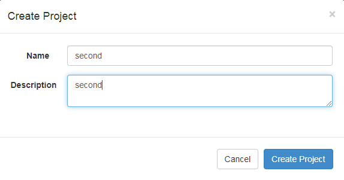


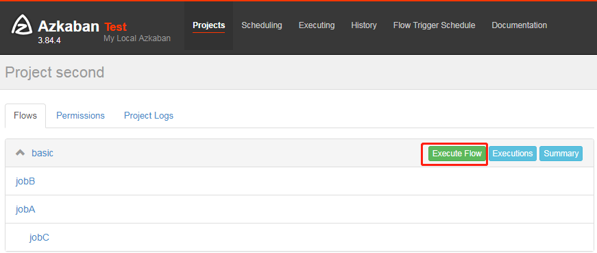

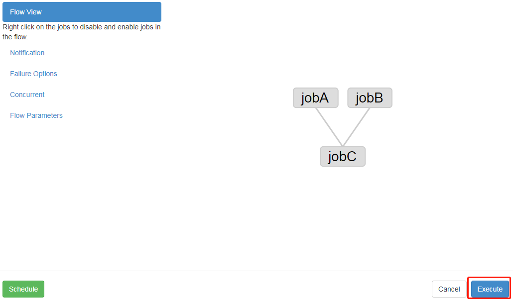

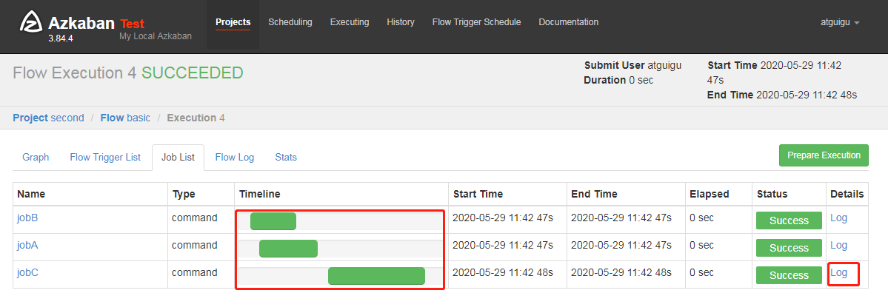

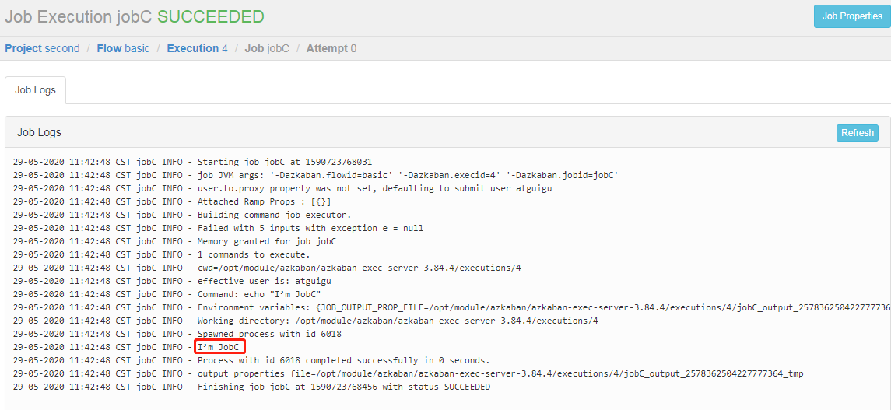


### 2.2.3 自动失败重试案例

需求：如果执行任务失败，需要重试 3 次，重试的时间间隔 10000ms

具体步骤：

1）编译配置流

```sh
nodes:
	- name: JobA
	  type: command
	  config:
 		 command: sh /not_exists.sh
	 	 retries: 3
 	 	 retry.backoff: 10000
```

参数说明：

retries：重试次数

retry.backoff：重试的时间间隔

2）将修改后的 basic.flow 和 azkaban.project 压缩成 four.zip 文件

 

3）重复 2.3.1 节 HelloWorld 后续步骤。

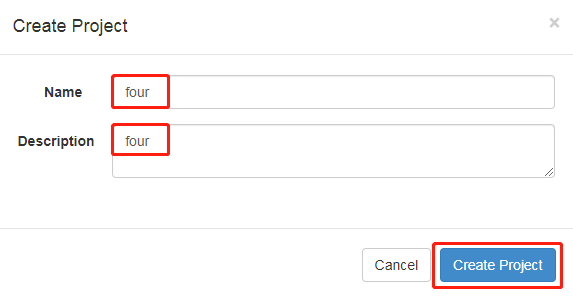


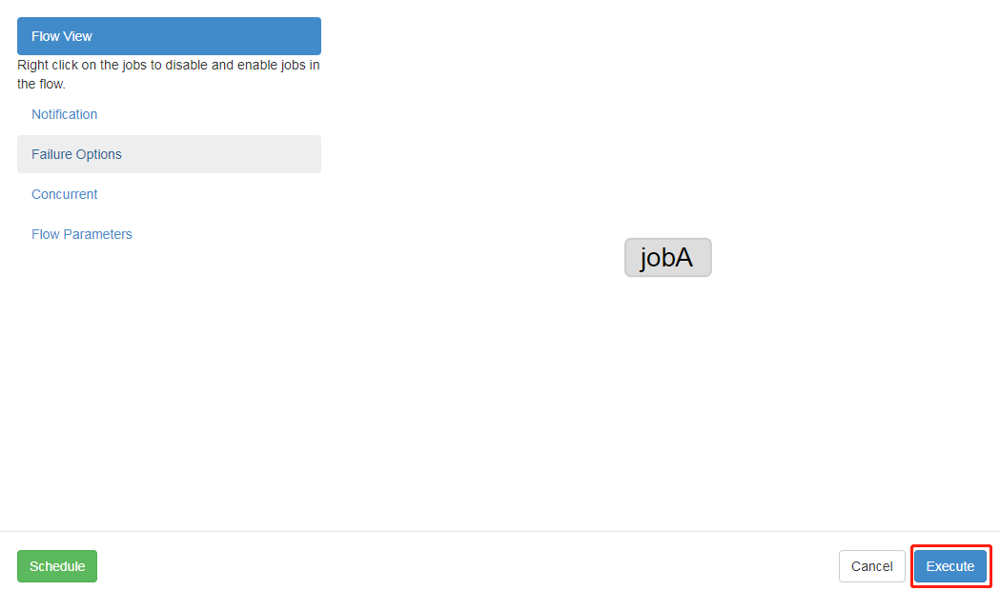

4）执行并观察到一次失败+三次重试

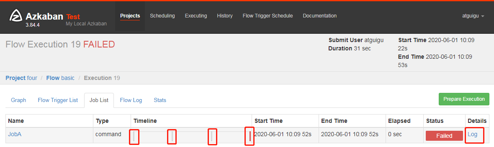

5）也可以点击上图中的 Log，在任务日志中看到，总共执行了 4 次。

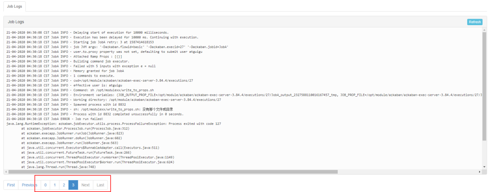

6）也可以在 Flow 全局配置中添加任务失败重试配置，此时重试配置会应用到所有 Job。

案例如下：

```sh
config:
	retries: 3
	retry.backoff: 10000

nodes:
	- name: JobA
	  type: command
	  config:
		  command: sh /not_exists.sh
```

### 2.2.4 手动失败重试案例

需求：JobA=》JobB（依赖于 A）=》JobC=》JobD=》JobE=》JobF。生产环境，任何 Job 都有可能挂掉，可以根据需求执行想要执行的 Job。

具体步骤：

1）编译配置流

```sh
nodes:
	- name: JobA
	  type: command
	  config:
		  command: echo "This is JobA."
		  
	- name: JobB
  	  type: command
	  dependsOn:
		- JobA
		  config:
 			 command: echo "This is JobB."
 			 
	- name: JobC
 	  type: command
	  dependsOn:
		- JobB
		  config:
		  	command: echo "This is JobC."
		
	- name: JobD
	  type: command
 	  dependsOn:
		- JobC
		  config:
			  command: echo "This is JobD."

	- name: JobE
	  type: command
	  dependsOn:
		- JobD
		  config:
			  command: echo "This is JobE."

	- name: JobF
	  type: command
	  dependsOn:
		- JobE
		  config:
		      command: echo "This is JobF."
```

2）将修改后的 basic.flow 和 azkaban.project 压缩成 five.zip 文件

 

3）重复 2.3.1 节 HelloWorld 后续步骤。

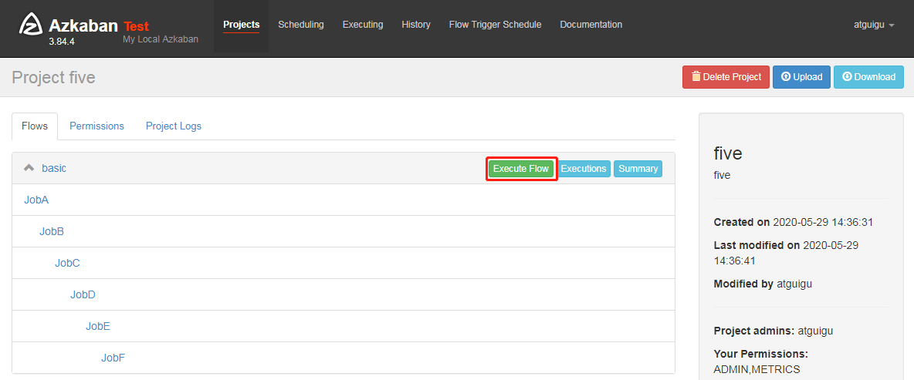

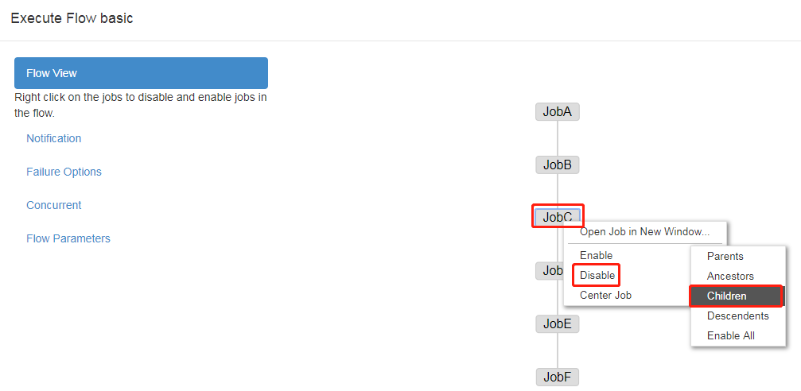

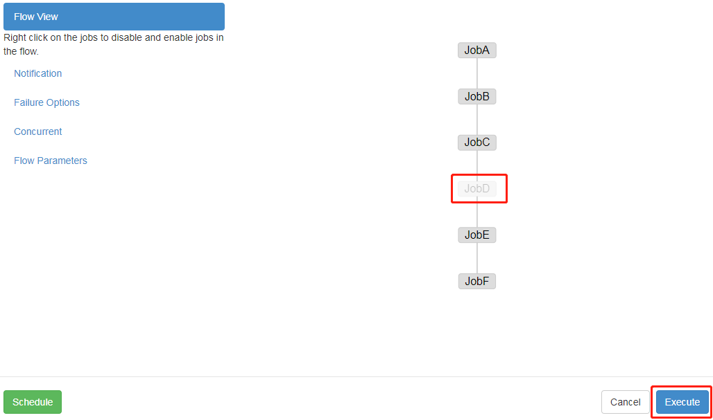

Enable 和 Disable 下面都分别有如下参数：

Parents：该作业的上一个任务

Ancestors：该作业前的所有任务

Children：该作业后的一个任务

Descendents：该作业后的所有任务

Enable All：所有的任务

4）可以根据需求选择性执行对应的任务。

 

# 第 3 章 Azkaban 进阶

## 3.1 JavaProcess 作业类型案例

JavaProcess 类型可以运行一个自定义主类方法，type 类型为 javaprocess，可用的配置为：

Xms：最小堆

Xmx：最大堆

classpath：类路径

java.class：要运行的 Java 对象，其中必须包含 Main 方法

main.args：main 方法的参数

案例：

1）新建一个 azkaban 的 maven 工程

2）创建包名：com.atguigu

3）创建 AzTest 类

```java
package com.atguigu;
public class AzTest {
    public static void main(String[] args) {
        System.out.println("This is for testing!");
    }
}
```

4）打包成 jar 包 azkaban-1.0-SNAPSHOT.jar

5）新建 testJava.flow，内容如下

```sh
nodes:
	- name: test_java
  	  type: javaprocess
  	  config:
		Xms: 96M
  		Xmx: 200M
  		java.class: com.atguigu.AzTest
```

6）将 Jar 包、flow 文件和 project 文件打包成 javatest.zip

7）创建项目=》上传 javatest.zip =》执行作业=》观察结果

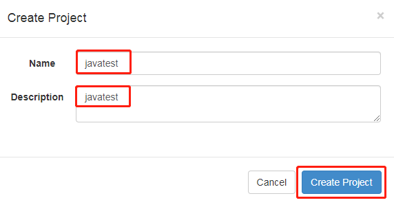


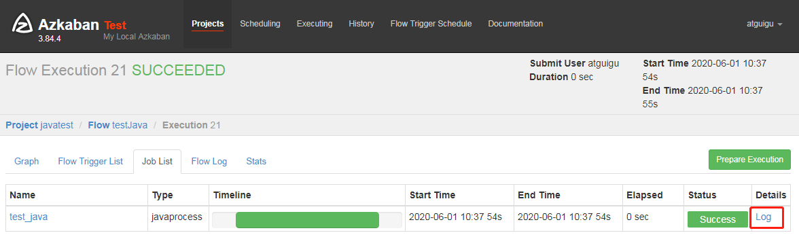

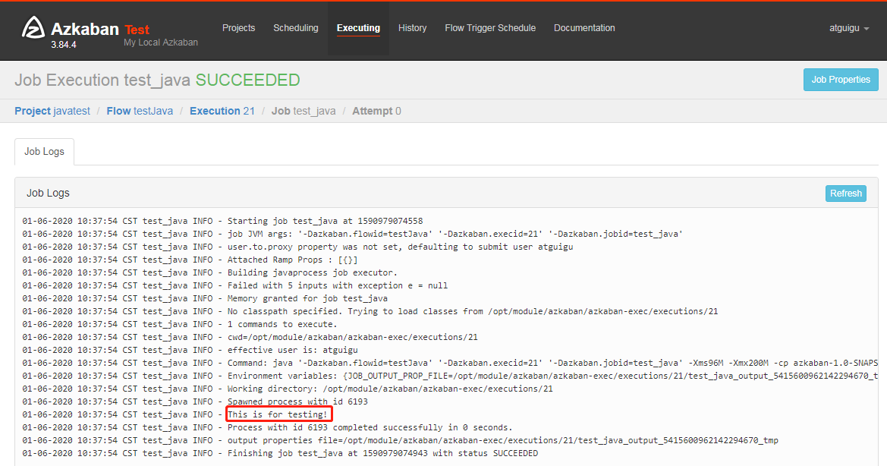

## 3.2 条件工作流案例

条件工作流功能允许用户自定义执行条件来决定是否运行某些 Job。条件可以由当前 Job的父 Job 输出的运行时参数构成，也可以使用预定义宏。在这些条件下，用户可以在确定 Job执行逻辑时获得更大的灵活性，例如，只要父 Job 之一成功，就可以运行当前 Job。

### 3.2.1 运行时参数案例

1）基本原理

（1）父 Job 将参数写入 JOB_OUTPUT_PROP_FILE 环境变量所指向的文件

（2）子 Job 使用 ${jobName:param}来获取父 Job 输出的参数并定义执行条件

2）支持的条件运算符：

（1）== 等于

（2）!= 不等于

（3）> 大于

（4）>= 大于等于

（5）< 小于

（6）<= 小于等于

（7）&& 与

（8）|| 或

（9）! 非

3）案例：

需求：

JobA 执行一个 shell 脚本。

JobB 执行一个 shell 脚本，但 JobB 不需要每天都执行，而只需要每个周一执行。

（1）新建 JobA.sh

```sh
#!/bin/bash
echo "do JobA"
wk=`date +%w`
echo "{\"wk\":$wk}" > $JOB_OUTPUT_PROP_FILE
```

（2）新建 JobB.sh

```sh
#!/bin/bash
echo "do JobB"
```

（3）新建 condition.flow	

```sh
nodes:
	- name: JobA
	  type: command
	  config:
	  command: sh JobA.sh

	- name: JobB
	  type: command
 	  dependsOn:
		- JobA
		  config:
		  command: sh JobB.sh
 		  condition: ${JobA:wk} == 1
```

（4）将 JobA.sh、JobB.sh、condition.flow 和 azkaban.project 打包成 condition.zip

（5）创建 condition 项目=》上传 condition.zip 文件=》执行作业=》观察结果

（6）按照我们设定的条件，JobB 会根据当日日期决定是否执行。

 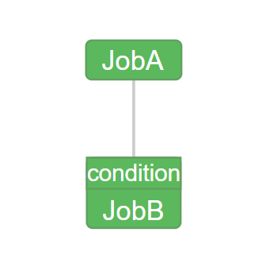

### 3.2.2 预定义宏案例

Azkaban 中预置了几个特殊的判断条件，称为预定义宏。

预定义宏会根据所有父 Job 的完成情况进行判断，再决定是否执行。可用的预定义宏如下：

（1）all_success: 表示父 Job 全部成功才执行(默认)

（2）all_done：表示父 Job 全部完成才执行

（3）all_failed：表示父 Job 全部失败才执行

（4）one_success：表示父 Job 至少一个成功才执行

（5）one_failed：表示父 Job 至少一个失败才执行

1）案例

需求：

JobA 执行一个 shell 脚本

JobB 执行一个 shell 脚本

JobC 执行一个 shell 脚本，要求 JobA、JobB 中有一个成功即可执行

（1）新建 JobA.sh

```sh
#!/bin/bash
echo "do JobA"
```

（2）新建 JobC.sh

```sh
#!/bin/bash
echo "do JobC"
```

（3）新建 macro.flow

```sh
nodes:
	- name: JobA
  	  type: command
  	  config:
  	  	command: sh JobA.sh

	- name: JobB
  	  type: command
  	  config:
  		command: sh JobB.sh

	- name: JobC
  	  type: command
  	  dependsOn:
		- JobA
		- JobB
  		  config:
  			command: sh JobC.sh
  			condition: one_success
```

（4）JobA.sh、JobC.sh、macro.flow、azkaban.project 文件，打包成 macro.zip。

注意：没有 JobB.sh。

（5）创建 macro 项目=》上传 macro.zip 文件=》执行作业=》观察结果

 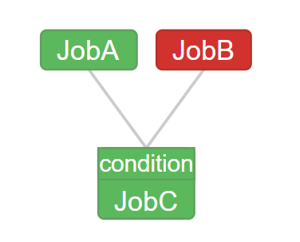

## 3.3 定时执行案例

需求：JobA 每间隔 1 分钟执行一次；

具体步骤：

1）Azkaban 可以定时执行工作流。在执行工作流时候，选择左下角 Schedule


2）右上角注意时区是上海，然后在左面填写具体执行事件，填写的方法和 crontab 配置定时任务规则一致。

 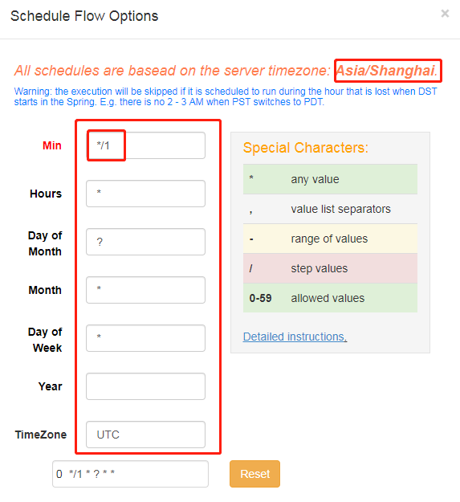

3）观察结果

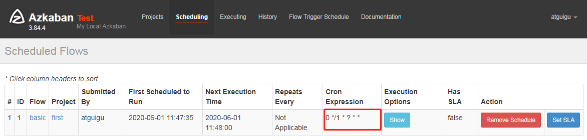

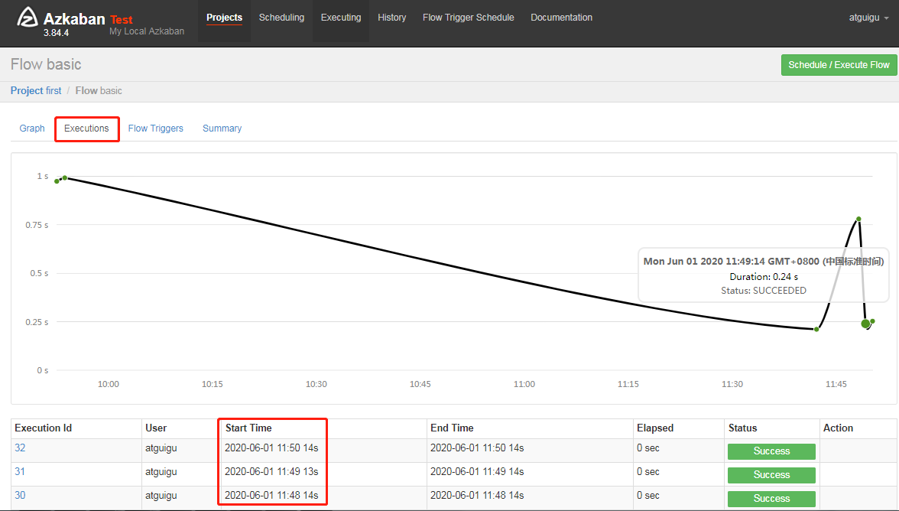

4）删除定时调度

点击 remove Schedule 即可删除当前任务的调度规则。

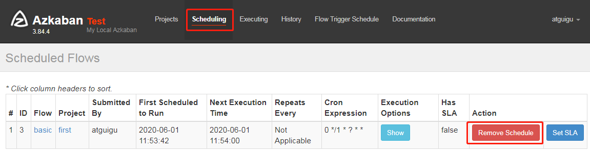

## 3.4 邮件报警案例

### 3.4.1 注册邮箱

1）申请注册一个 126 邮箱

2）点击邮箱账号=》账号管理

 

3）开启 SMTP 服务

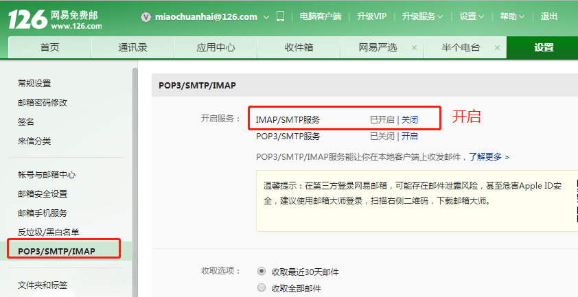

4）一定要记住授权码


### 3.4.2 默认邮件报警案例

Azkaban 默认支持通过邮件对失败的任务进行报警，配置方法如下：

1 ） 在azkaban-web节 点hadoop102上 ， 编 辑 /opt/module/azkaban/azkaban-web/conf/azkaban.properties，修改如下内容：

```sh
[atguigu@hadoop102 azkaban-web]$ vim /opt/module/azkaban/azkaban-web/conf/azkaban.properties
添加如下内容：
#这里设置邮件发送服务器，需要 申请邮箱，切开通 stmp 服务，以下只是例子
mail.sender=atguigu@126.com
mail.host=smtp.126.com
mail.user=atguigu@126.com
mail.password=用邮箱的授权码
```

2）保存并重启 web-server。

```sh
[atguigu@hadoop102 azkaban-web]$ bin/shutdown-web.sh
[atguigu@hadoop102 azkaban-web]$ bin/start-web.sh
```

3）编辑 basic.flow

```sh
nodes:
	- name: jobA
  	  type: command
  	  config:
  		command: echo "This is an email test."
```

4）将 azkaban.project 和 basic.flow 压缩成 email.zip

5）创建工程=》上传文件=》执行作业=》查看结果

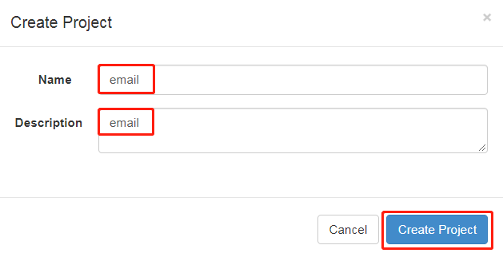


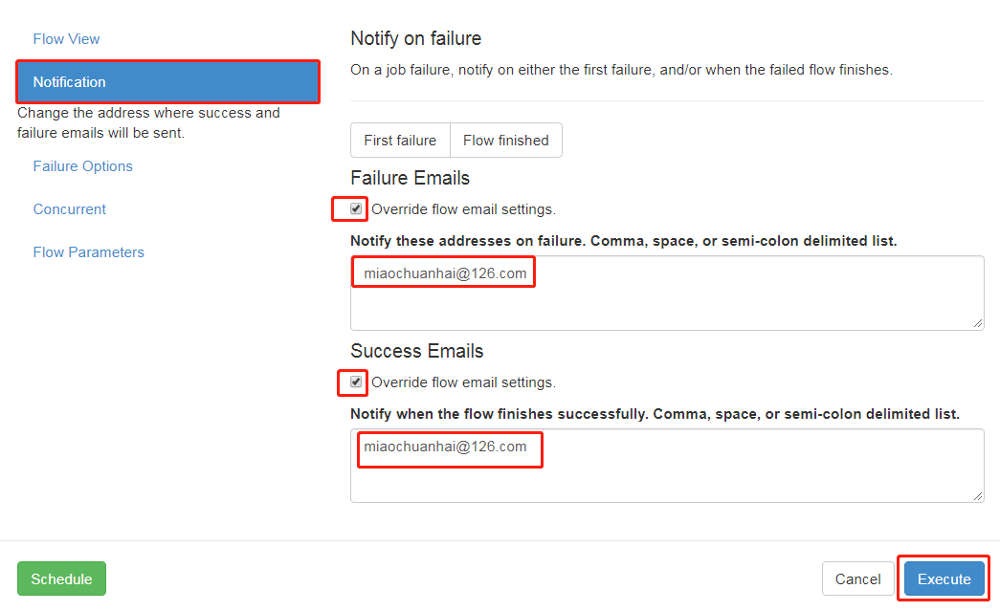

6）观察邮箱，发现执行成功或者失败的邮件

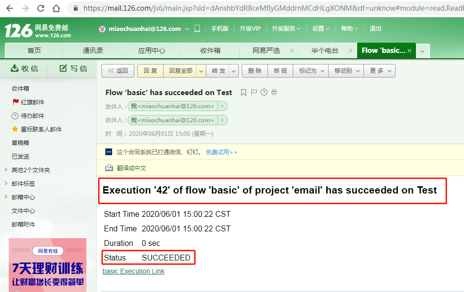

## 3.5 电话报警案例

### 3.5.1 第三方告警平台集成

有时任务执行失败后邮件报警接收不及时，因此可能需要其他报警方式，比如电话报警。如有类似需求，可与第三方告警平台进行集成，例如睿象云。

1）进入睿象云官网注册账号并登录

官网地址：https://www.aiops.com/


2）集成告警平台，使用 Email 集成


3）获取邮箱地址，后边需将报警信息发送至该邮箱


4）配置分派策略

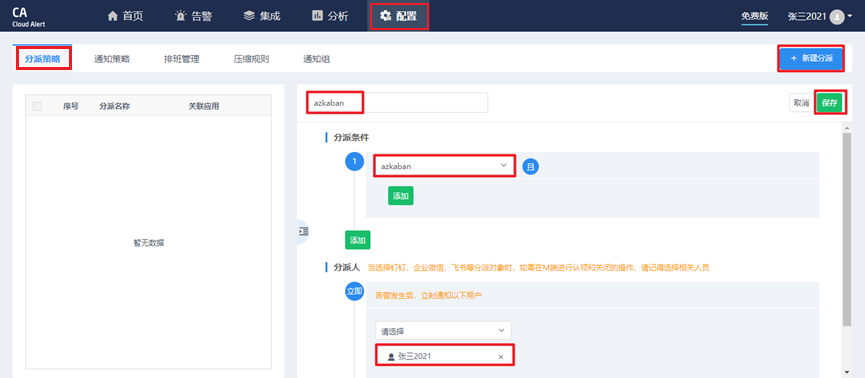

5）配置通知策略

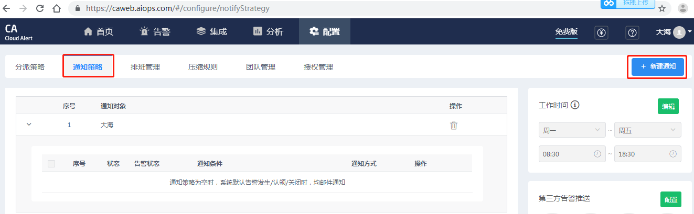


### 3.5.2 测试

执行上一个邮件通知的案例，将通知对象改为刚刚集成第三方平台时获取的邮箱。

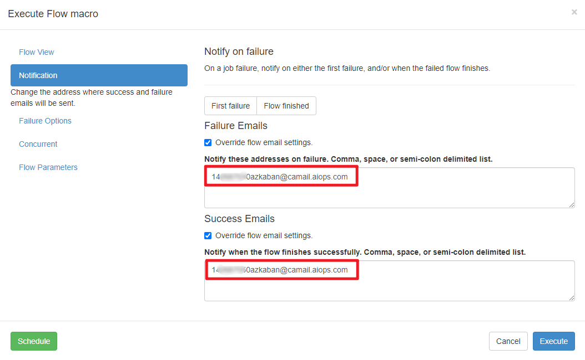

## 3.6 Azkaban 多 Executor 模式注意事项

Azkaban 多 Executor 模式是指，在集群中多个节点部署 Executor。在这种模式下，Azkaban web Server 会根据策略，选取其中一个 Executor 去执行任务。为确保所选的 Executor 能够准确的执行任务，我们须在以下两种方案任选其一，推荐使用方案二。

方案一：指定特定的 Executor（hadoop102）去执行任务。

1）在 MySQL 中 azkaban 数据库 executors 表中，查询 hadoop102 上的 Executor 的 id。

```sql
mysql> use azkaban;
Reading table information for completion of table and column names
You can turn off this feature to get a quicker startup with -A
Database changed
mysql> select * from executors;
+----+-----------+-------+--------+
| id | host| port | active |
+----+-----------+-------+--------+
| 1 | hadoop103 | 35985 |1 |
| 2 | hadoop104 | 36363 |1 |
| 3 | hadoop102 | 12321 |1 |
+----+-----------+-------+--------+
3 rows in set (0.00 sec)
```

2）在执行工作流程时加入 useExecutor 属性，如下

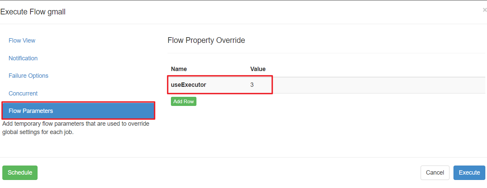

方案二：在 Executor 所在所有节点部署任务所需脚本和应用。

# 第 4 章 参考资料

## 4.1 Azkaban 完整配置

见官网文档：https://azkaban.readthedocs.io/en/latest/configuration.html

## 4.2 YAML 语法

Azkaban2.0 工作流文件是用 YAML 语法写的，相关教程如下：

YAML语法简易入门.mhtml