**2022-09-01**

# 01 | 开篇

## 开篇词

**到底什么是数据中台？如何来建设数据中台？数据中台有哪些应用价值？**

**那数据中台到底是陷阱？还是金钥匙呢？ 为什么这些项目很难成功呢？** 

在我看来，这里面既有客观原因，又有主观原因：

客观上讲，数据中台的建设是一项系统性工程，从组织架构、支撑技术到流程规范，既要有宏观的顶层设计，又要有强有力的落地执行，所以对整个团队的要求会比较高；

从主观上讲，这些企业本身数据建设经验不足，或者还处于比较初级的阶段，不知道数据建设中有哪些痛点，更不知道用什么样的技术手段和管理机制去解决这些问题。

**如果用一句话概括我的讲解方式，那就是从原理到实现，最后到实践。**你从中既可以看到数据中台支撑技术的全貌，又不会错过每一个实现细节。配合大量的实践案例，你可以深入掌握数据中台的落地过程。

为此，我把内容划分了原理篇、实现篇。

在原理篇中，我会告诉你数据中台的来龙去脉，数据仓库、数据湖、大数据平台以及数据中台的区别，以及它们有什么样的内在联系，然后会跟你讨论什么样的企业适合建数据中台。最后，我会从全局的视角出发，讲解数据中台如何在企业落地。

通过原理篇的介绍，我希望可以回答你三个问题：什么是数据中台，数据中台解决了什么问题，如何来规划数据中台的建设。

实现篇是我讲解的重点，我会基于数据中台支撑技术的整体架构，逐一讲解每个模块的具体实现。

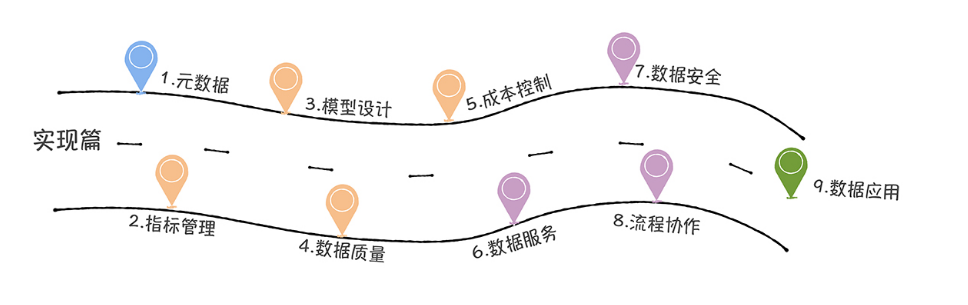

在这部分内容讲解中，我会遵循从问题入手，然后给出解决方案，接着评估解决的效果，最后问题解决不是一次性的工作，为了使得问题得到长久化的解决，需要借助产品化的实现方式，所以最后我会讲如何将管理方法沉淀成产品。

接着我会讲解数据服务化相关内容，比如告诉你为什么要实现数据服务化，如何设计一个数据服务。数据安全也是数据中台的核心内容，尤其是随着最近删库跑路的热点事件，安全问题也被企业越来越重视，那么我们将讨论如何实现精细化的权限管理，如何做好企业数据的备份。

最后，我会讲一下基于数据中台之上的通用数据应用（包括自助取数、可视化分析等）。在这个过程中，我会以电商场景为例，通过大量的案例，帮助你理解这些问题以及问题的解决过程。

通过实现篇的学习，你可以了解企业在数据建设中到底存在哪些痛点，如何解决这些痛点，这些经验和案例可以立即应用到你目前的工作中，帮助你解决当前遇到的问题（例如指标口径不一致、数据无法按时产出……）。

除此之外，我会以网易电商的数据中台为例，从项目立项、推进到成果汇报，详细地描述数据中台在网易电商的落地过程。同时我还会对数据中台未来的方向进行展望，包括实时数据中台、跨云数据中台、自动化代码生成能力、智能元数据管理和增强分析等热门技术方向的探讨。

总的来说，通过这个专栏，你将获得这样几点：

一线互联网公司数据中台的实践经验

大量实践案例讲解如何躲过数据中台建设的那些坑

可落地执行的数据中台建设方法

经过实践的数据中台支撑技术体系


# 02 | 原理篇

## 01 | 前因后果：为什么说数据中台是大数据的下一站？

今天这节课，我想带着这个问题，**与你深入大数据的发展历史，先从数据仓库的出现讲起，途径数据湖，再到大数据平台，**因为这样，你才能理解大数据发展的每个阶段遇到的问题，从而深入理解数据中台在大数据发展中的历史定位。

### 启蒙时代：数据仓库的出现

商业智能（Business Intelligence）诞生在上个世纪 90 年代，它是将企业已有的数据转化为知识，帮助企业做出经营分析决策。比如在零售行业的门店管理中，如何使得单个门店的利润最大化，我们就需要分析每个商品的销售数据和库存信息，为每个商品制定合理的销售采购计划，有的商品存在滞销，应该降价促销，有的商品比较畅销，需要根据对未来销售数据的预测，进行提前采购，这些都离不开大量的数据分析。

而数据分析需要聚合多个业务系统的数据，比如需要集成交易系统的数据，需要集成仓储系统的数据等等，同时需要保存历史数据，进行大数据量的范围查询。传统数据库面向单一业务系统，主要实现的是面向事务的增删改查，已经不能满足数据分析的场景，**这促使数据仓库概念的出现。**

在 1991 年出版的《Building the Data Warehouse》中，数据仓库之父比尔·恩门（Bill Inmon）首次给出了数据仓库的完整定义，他认为：

数据仓库是在企业管理和决策中面向主题的、集成的、与时间相关的，不可修改的数据集合。

为了帮你理解数据仓库的四要素，我举个电商的例子。

在电商场景中，有一个数据库专门存放订单的数据，另外一个数据库存放会员相关的数据。构建数据仓库，首先要把不同业务系统的数据同步到一个统一的数据仓库中，然后按照主题域方式组织数据。

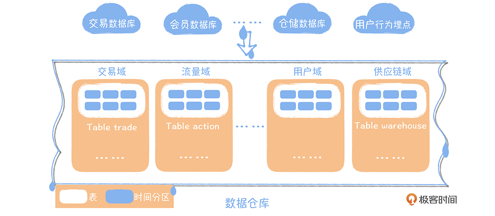

主题域是业务过程的一个高层次的抽象，像商品、交易、用户、流量都能作为一个主题域，**你可以把它理解为数据仓库的一个目录。**数据仓库中的数据一般是按照时间进行分区存放，一般会保留 5 年以上，每个时间分区内的数据都是追加写的方式，对于某条记录是不可更新的。

除了这个概念之外，我还要提一下他和金博尔（Kimball） 共同开创的数仓建模的设计方法，这个方法对于后来基于数据湖的现代数据仓库的设计有重要的意义，所以你有必要了解。

恩门提出的建模方法自顶向下（这里的顶是指数据的来源，在传统数据仓库中，就是各个业务数据库），基于业务中各个实体以及实体之间的关系，构建数据仓库。

比如，在一个最简单的买家购买商品的场景中，按照恩门建模的思维模式，首先你要理清这个业务过程中涉及哪些实体。买家、商品是一个实体，买家购买商品是一个关系。所以，模型设计应该有买家表，商品表，和买家商品交易表三个模型。


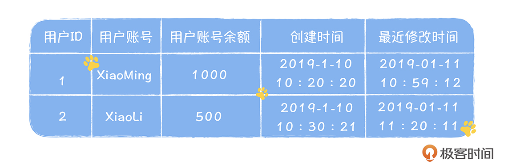

​																												买家表

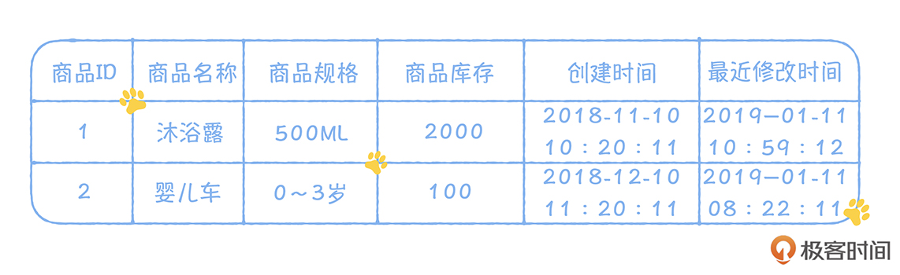

​                                                                                                  商品表


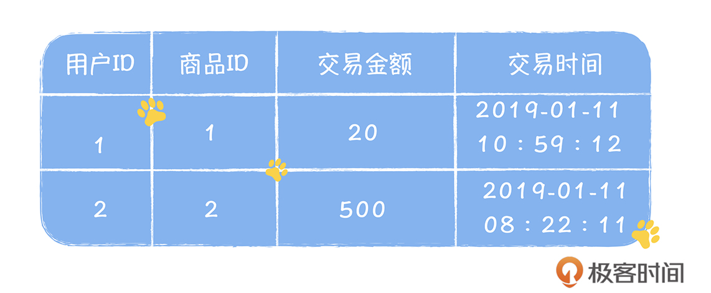

​																								买家商品交易表

金博尔建模与恩门正好相反，是一种自底向上的模型设计方法，从数据分析的需求出发，拆分维度和事实。那么用户、商品就是维度，库存、用户账户余额是事实。

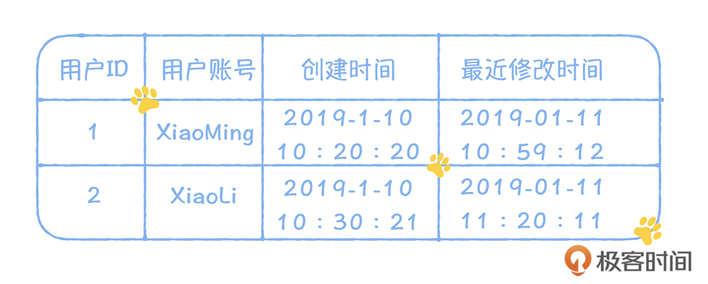

​                                                                                用户维度表

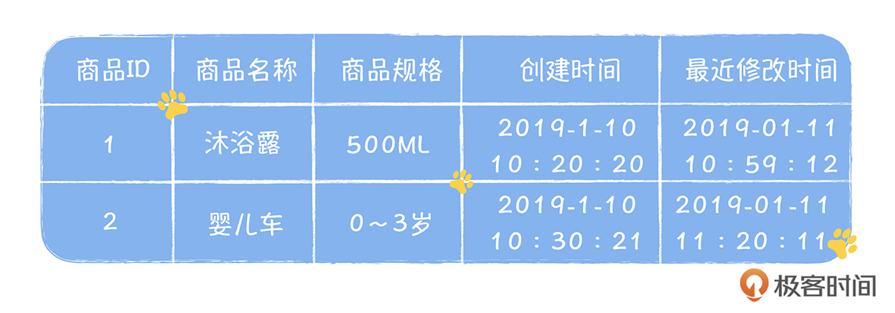

​                                                                                    商品维度表


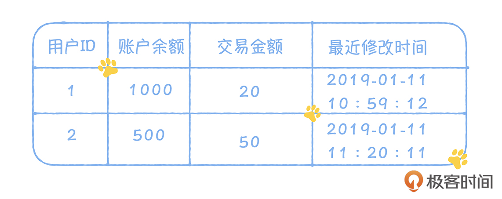

​                                                                                账户余额事实表

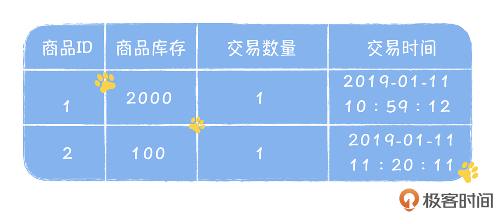

​                                                                                   商品库存事实表

这两种方法各有优劣，恩门建模因为是从数据源开始构建，构建成本比较高，适用于应用场景比较固定的业务，比如金融领域，冗余数据少是它的优势。金博尔建模由于是从分析场景出发，适用于变化速度比较快的业务，比如互联网业务。**由于现在的业务变化都比较快，所以我更推荐金博尔的建模设计方法。**

传统数据仓库，第一次明确了数据分析的应用场景应该用单独的解决方案去实现，不再依赖于业务的数据库。在模型设计上，提出了数据仓库模型设计的方法论，为后来数据分析的大规模应用奠定了基础。但是进入互联网时代后，传统数据仓库逐渐没落，一场由互联网巨头发起的技术革命催生了大数据时代的到来。

### 技术革命：从 Hadoop 到数据湖

进入互联网时代，有两个最重要的变化。

- 一个是数据规模前所未有

- 另一个是数据类型变得异构化

所以，数据规模和数据类型的限制，导致传统数据仓库无法支撑互联网时代的商业智能。

而以谷歌和亚马逊为代表的互联网巨头率先开始了相关探索。从 2003 年开始，互联网巨头谷歌先后发表了 3 篇论文：《The Google File System》《MapReduce：Simplified Data Processing on Large Clusters》《Bigtable：A Distributed Storage System for Structed Data》，这三篇论文奠定了现代大数据的技术基础。它们提出了一种新的，面向数据分析的海量异构数据的统一计算、存储的方法。关于这三篇论文，在这里我们不做深入的解读，如果对实现技术感兴趣的话，也可以查看我在文末提供的链接。

但 2005 年 Hadoop 出现的时候，大数据技术才开始普及。你可以把 Hadoop 认为是前面三篇论文的一个开源实现，我认为 Hadoop 相比传统数据仓库主要有两个优势：

1. 完全分布式，易于扩展，可以使用价格低廉的机器堆出一个计算、存储能力很强的集群，满足海量数据的处理要求；

2. 弱化数据格式，数据被集成到 Hadoop 之后，可以不保留任何数据格式，数据模型与数据存储分离，数据在被使用的时候，可以按照不同的模型读取，满足异构数据灵活分析的需求。

随着 Hadoop 技术日趋成熟，2010 年，Pentaho 创始人兼 CTO James Dixon 在纽约 Hadoop World 大会上提出了数据湖的概念，他提到：

数据湖（Data Lake）是一个以原始格式存储数据的存储库或系统。

数据湖概念的提出，我认为是 Hadoop 从开源技术走向商业化成熟的标志。企业可以基于 Hadoop 构建数据湖，将数据作为一种企业核心资产。

数据湖拉开了 Hadoop 商用化的大幕，但是一个商用的 Hadoop 包含 20 多种计算引擎， 数据研发涉及流程非常多，技术门槛限制了 Hadoop 的商用化进程。那么如何让数据的加工像工厂一样，直接在设备流水线上完成呢？

### 数据工厂时代：大数据平台兴起

对于一个数据开发，在完成一项需求时，常见的一个流程是首先要把数据导入到大数据平台中，然后按照需求进行数据开发。开发完成以后要进行数据验证比对，确认是否符合预期。接下来是把数据发布上线，提交调度。最后是日常的任务运维，确保任务每日能够正常产出数据。

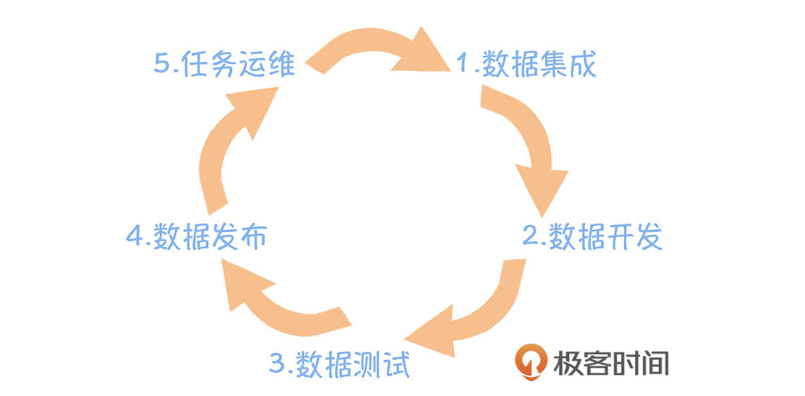

如此繁杂的一个工作流程，如果没有一个高效的平台作为支撑，就跟写代码没有一个好用的 IDE， 用文本编辑器写代码一样，别人完成十个需求，你可能连一个需求都完成不了，效率异常低下，根本无法大规模的应用。

提出大数据平台的概念，就是为了提高数据研发的效率，降低数据研发的门槛，让数据能够在一个设备流水线上快速地完成加工。

大数据平台是面向数据研发场景的，覆盖数据研发的完整链路的数据工作台

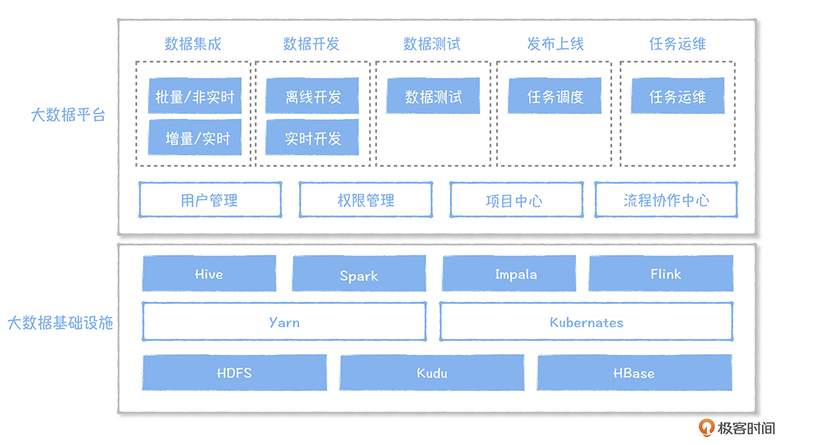

大数据平台按照使用场景，分为数据集成、数据开发、数据测试……任务运维，大数据平台的使用对象是数据开发。大数据平台的底层是以 Hadoop 为代表的基础设施，分为计算、资源调度和存储。

Hive、Spark、Flink、Impala 提供了大数据计算引擎：

Hive、Spark 主要解决离线数据清洗、加工的场景，目前，Spark 用得越来越多，性能要比 Hive 高不少；

Flink 主要是解决实时计算的场景；

Impala 主要是解决交互式查询的场景。

这些计算引擎统一运行在一个称为 Yarn 的资源调度管理框架内，由 Yarn 来分配计算资源。目前最新的研究方向中也有基于 Kubernetes 实现资源调度的，例如在最新的 Spark 版本（2.4.4）中，Spark 已经能够运行在 Kubernetes 管理的集群上，这样的好处是可以实现在线和离线的资源混合部署，节省机器成本。

数据存储在 HDFS、Kudu 和 HBase 系统内。HDFS 不可更新，主要存全量数据，HBase 提供了一个可更新的 KV，主要存一些维度表，Kudu 提供了实时更新的能力，一般用在实时数仓的构建场景中。

大数据平台像一条设备流水线，经过大数据平台的加工，原始数据变成了指标，出现在各个报表或者数据产品中。随着数据需求的快速增长，报表、指标、数据模型越来越多，找不到数据，数据不好用，数据需求响应速度慢等问题日益尖锐，成为阻塞数据产生价值的绊脚石。


### 数据价值时代：数据中台崛起

时间到了 2016 年前后，互联网高速发展，背后对数据的需求越来越多，数据的应用场景也越来越多，有大量的数据产品进入到了我们运营的日常工作，成为运营工作中不可或缺的一部分。在电商业务中，有供应链系统，供应链系统会根据各个商品的毛利、库存、销售数据以及商品的舆情，产生商品的补货决策，然后推送给采购系统。

大规模数据的应用，也逐渐暴露出现一些问题。

业务发展前期，为了快速实现业务的需求，烟囱式的开发导致企业不同业务线，甚至相同业务线的不同应用之间，数据都是割裂的。两个数据应用的相同指标，展示的结果不一致，导致运营对数据的信任度下降。如果你是运营，当你想看一下商品的销售额，发现两个报表上，都叫销售额的指标出现了两个值，你的感受如何?  你第一反应肯定是数据算错了，你不敢继续使用这个数据了。

数据割裂的另外一个问题，就是大量的重复计算、开发，导致的研发效率的浪费，计算、存储资源的浪费，大数据的应用成本越来越高。

- 如果你是运营，当你想要一个数据的时候，开发告诉你至少需要一周，你肯定想是不是太慢了，能不能再快一点儿？

- 如果你是数据开发，当面对大量的需求的时候，你肯定是在抱怨，需求太多，人太少，活干不完。

- 如果你是一个企业的老板，当你看到每个月的账单成指数级增长的时候，你肯定觉得这也太贵了，能不能再省一点，要不吃不消了。

这些问题的根源在于，数据无法共享。2016 年，阿里巴巴率先提出了“数据中台”的口号。**数据中台的核心，是避免数据的重复计算，通过数据服务化，提高数据的共享能力，赋能数据应用。**之前，数据是要啥没啥，中间数据难于共享，无法积累。现在建设数据中台之后，要啥有啥，数据应用的研发速度不再受限于数据开发的速度，一夜之间，我们就可以根据场景，孵化出很多数据应用，这些应用让数据产生价值。

### 课堂总结

现在，回到我们本节课的题目：为什么说数据中台是大数据的下一站？ 在我看来，有这样几个原因：

1. 数据中台构建于数据湖之上，具备数据湖异构数据统一计算、存储的能力，同时让数据湖中杂乱的数据通过规范化的方式管理起来。

2. 数据中台需要依赖大数据平台，大数据平台完成了数据研发的全流程覆盖，数据中台增加了数据治理和数据服务化的内容。

3. 数据中台借鉴了传统数据仓库面向主题域的数据组织模式，基于维度建模的理论，构建统一的数据公共层。

总的来说，数据中台吸收了传统数据仓库、数据湖、大数据平台的优势，同时又解决了数据共享的难题，通过数据应用，实现数据价值的落地。

在文章的最后，为了帮你把数据中台诞生的大事件串联起来，我做了一张时间图，在这个时间线里，你可以很清晰地看到数据中台诞生的前期、中期，和后期的大事件，这样可以帮你更清晰的掌握数据中台背景。

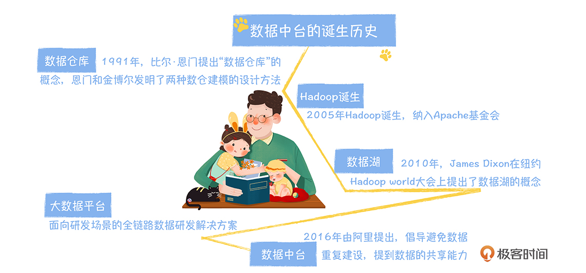

**论文链接：**

[《The Google File System》](https://www.open-open.com/lib/view/open1328763454608.html)

[《MapReduce：Simplified Data Processing on Large Clusters》](https://www.open-open.com/lib/view/open1328763069203.html)

[《Bigtable：A Distributed Storage System for Structed Data》](https://www.open-open.com/lib/view/open1328763508092.html)


## 02 | 关键抉择： 到底什么样的企业应该建数据中台？

### 建设中台前，我们面临的挑战

对于绝大多数互联网企业来说，2018 年绝对是煎熬的一年，因为面临线上流量枯竭，业绩增长乏力，企业成本高筑， 利润飞速下滑的风险。 原先粗放的企业管理模式和经营模式（比如我们在采购商品的时候，凭借经验去做出采购哪个商品的决策）已经没办法继续支撑企业的高速增长，越来越多的企业开始提数字化转型，强调数据是企业增长的新动力，它应该深入企业经营的各个环节。

数据需求的爆发式增长，促进了数据产品的蓬勃发展，在每个业务过程中，都有大量的数据产品辅助运营完成日常工作。例如，在电商的场景中，用户运营、商品运营、市场运营……每个场景下，都有很多的数据产品，每天有大量的运营基于这些产品完成经营决策。

比如在供应链决策协同系统中，我们有一个智能补货的功能，会根据商品的库存、历史销售数据以及商品的舆情，智能计算商品的最佳采购计划，推送给运营审核，然后完成采购下单。

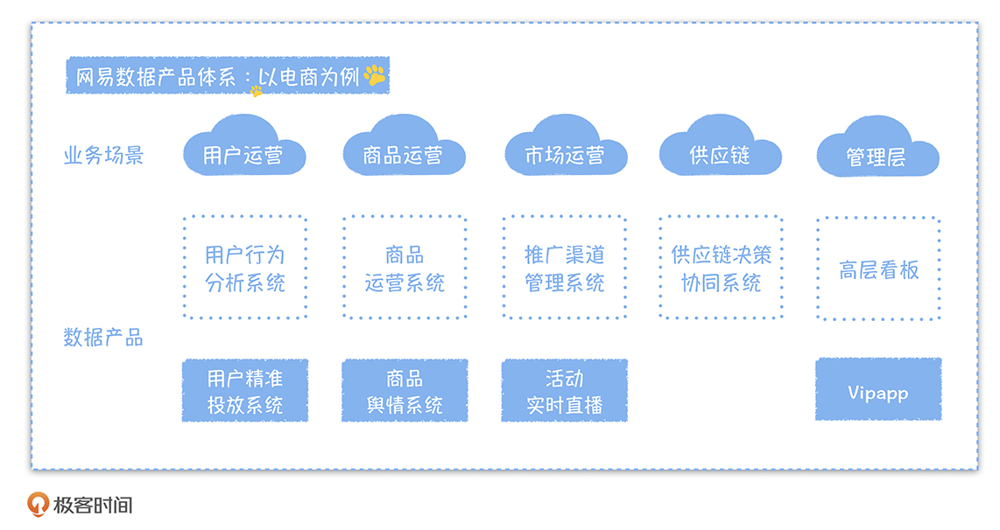

**大量数据产品的出现，在不断提高企业运营效率的同时，也暴露出很多尖锐的问题，在我看来，主要有五点。**

1. 指标口径不一致。 两个数据产品一个包含税，一个不包含税，它们相同的一个指标名称都是销售额，结果却不一样。运营面对这些指标的时候，不知道指标的业务口径，很难去使用这些数据。

2. 数据重复建设，需求响应时间长。随着需求的增长，运营和分析师不断抱怨需求的交付时间拉长，面对快速变化的业务，需求响应时间已经无法满足业务对数据的敏捷研发要求。

3. 取数效率低。 面对数十万张表，我们的运营和分析师找数据、准确地理解数据非常困难，想找到一个想要的数据，确认这个数据和自己的需求匹配，他们往往需要花费三天以上的时间，对新人来说，这个时间会更长。

除了查找数据效率低，从系统中取数分析对于非技术出身的分析师和运营来说也是一个难题，这就导致大部分的取数工作还是依赖数据开发来完成。数据开发大部分的时间都被临时取数的需求占据，根本无法专注在数仓模型的构建和集市层数据的建设，最终形成了一个恶性循环，一方面是数据不完善，另一方面是数据开发忙于各种临时取数需求。

4. 数据质量差。数据经常因为 BUG 导致计算结果错误，最终导致错误的商业决策。**分享一个我们踩过的坑，**在大促期间，某类商品搜索转化率增长，于是我们给这个商品分配了更大的流量，可转化率增长的原因是数据计算错误，所以这部分流量也就浪费了，如果分配给其他的商品的话，可以多赚 200W 的营收。

5. 数据成本线性增长。数据成本随着需求的增长而线性增长，2017 年的时候，我们一个业务的大数据资源在 4000Core，但是 2018 就已经到达 9000Core 水平，如果折算成钱的话，已经多了 500 多万的机器成本。

相信你能在我“惨痛”的经历中，找到自己的影子，这些事儿的确很头疼，好在后来，我们用数据中台解决了这些问题。


### 为什么数据中台可以解决这些问题？

要想回答这个问题，你需要了解上述问题背后的原因。

指标口径不一致，可能原因包括三种：**业务口径不一致、计算逻辑不一致、数据来源不一致。**

如果是业务口径不一致，那就要明确区分两个指标不能使用相同的标识，像上面的例子，含税和不含税的两个指标， 不能同时叫销售额。

业务口径的描述往往是一段话，但是对于很多指标，涉及的计算逻辑非常复杂，仅仅一段话是描述不清楚的，此时，两个相同业务口径的指标，恰巧又分别是由两个数据开发去实现的，这样就有可能造成计算逻辑不一致。比如，有一个指标叫做排关单（排关单：把关单的排除；关单：关闭订单）的当天交易额这个指标，A 认为关单的定义是未发货前关闭的订单，B 认为关单是当天关闭的订单，大家对业务口径理解不一致，这样实现的计算结果也就会不一致。

最后，还可能是两个指标的数据来源不一样，比如一个来自实时数据，一个是来自离线的数据，即使加工逻辑一样，最终结果也可能不相同。

**综合看来，要实现一致，就务必确保对同一个指标，只有一个业务口径，只加工一次，数据来源必须相同。**

而数据需求响应慢在于烟囱式的开发模式，导致了大量重复逻辑代码的研发，比如同一份原始数据，两个任务都对原始数据进行清洗。如果只有一个任务清洗，产出一张明细表，另外一个任务直接引用这张表，就可以节省一个研发的清洗逻辑的开发。

**所以，要解决数据需求响应慢，就必须解决数据复用的问题，要确保相同数据只加工一次，实现数据的共享。**

取数效率低，一方面原因是找不到数据，另一方面原因可能是取不到数据。要解决找不到数据的问题，就必须要构建一个全局的企业数据资产目录，实现数据地图的功能，快速找到数据。而非技术人员并不适合用写 SQL 的方式来取数据，所以要解决取不到数据的问题，就要为他们提供可视化的查询平台，通过勾选一些参数，才更容易使用。

数据质量差的背后其实是数据问题很难被发现。我们经常是等到使用数据的人反馈投诉，才知道数据有问题。而数据的加工链路一般非常长，在我们的业务中，一个指标上游的所有链路加起来有 100 多个节点，这是很正常的事情。等到运营投诉再知道数据有问题就太迟了，因为要逐个去排查到底哪个任务有问题，然后再重跑这个任务以及所有下游链路上的每个任务，这样往往需要花费半天到一天的时间，最终导致故障恢复的效率很低，时间很长。

**所以，要解决数据质量差，就要及时发现然后快速恢复数据问题。**

最后一个是大数据的成本问题，它其实与需求响应慢背后的数据重复建设有关，因为重复开发任务的话，这些任务上线肯定会花费双倍的资源。如果我们可以节省一个任务的资源消耗，满足两个数据需求，就可以控制不必要的资源消耗。所以，成本问题背后也是数据重复建设的问题。

正当我们为这些问题苦恼的时候，数据中台的理念给了我们全新的启迪，那么数据中台到底是怎么一回事儿呢？**在我看来，数据中台是企业构建的标准的、安全的、统一的、共享的数据组织，通过数据服务化的方式支撑前端数据应用。**

数据中台消除了冗余数据，构建了企业级数据资产，提高了数据的共享能力，这与我们需要的能力不谋而合，所以很快，我们开启了数据中台的建设。


### 数据中台是如何解决这些问题的？

指标是数据加工的结果，要确保数据需求高质量的交付，首先是要管好指标。

原先指标的管理非常分散，没有全局统一的管理，在数据中台中，必须要有一个团队统一负责指标口径的管控。

其次，要实现指标体系化的管理，提高指标管理的效率。在指标系统中，我们会明确每个指标的业务口径，数据来源和计算逻辑，同时会按照类似数仓主题域的方式进行管理。

最后，要确保所有的数据产品、报表都引用指标系统的口径定义。当运营把鼠标 Hover 到某个指标上时，就可以浮现出该指标的口径定义。

通过对全局指标的梳理，我们实现了 100% 的数据产品的指标口径统一，消除了数据产品中，指标口径二义性的问题，同时还提供了方便分析师、运营查询的指标管理系统。

**那么数据中台是怎么实现所有数据只加工一次的呢？**简单来说，就是对于数仓数据，我们要求相同粒度的度量或者指标只加工一次，构建全局一致的公共维表。要实现上述目标，需要两个工具产品：

- 一个是数仓设计中心，在模型设计阶段，强制相同聚合粒度的模型，度量不能重复。

- 另外一个是数据地图，方便数据开发能够快速地理解一张表的准确含义。

这样就解决了数据重复加工导致研发效率瓶颈的问题，现在我们把需求的平均交付时间从一周减少到 2～3 天，大幅提高了数据产能，得到了分析师和运营的认可。

**数据中台通过服务化的方式，提高了数据应用接入和管理的效率。**原先数仓提供给应用的访问方式是直接提供表，应用开发自己把数据导出到一个查询引擎上，然后去访问查询引擎。在数据中台中，数仓的数据是通过 API 接口的方式提供给数据应用，数据应用不用关心底层不同的查询引擎访问方式的差异。

**对于非技术人员，数据中台提供了可视化的取数平台，**你只需要选取指标、通过获取指标系统中每个指标的可分析维度，然后勾选，添加筛选过滤条件，点击查询，就可以获取数据。

同时，数据中台构建了企业数据地图，你可以很方便地检索有哪些数据，它们在哪些表中，又关联了哪些指标和维度。通过自助取数平台和数据地图，公司的非技术人员开始自助完成取数，相比通过提需求给技术人员的方式，取数效率提高了 300%。

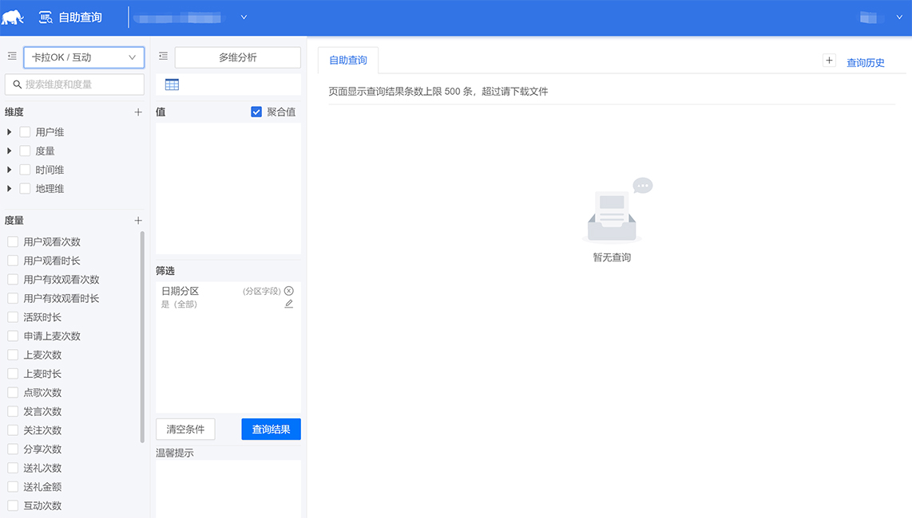

​                                                                                EasyFetch 网易自助取数界面

**数据中台由于数据只能加工一次，强调数据的复用性，这就对数据的质量提出了更高的要求。**而我们实现了全链路的数据质量稽核监控，对一个指标的产出上游链路中涉及的每个表，都实现了数据一致性、完整性、正确性和及时性的监控，确保在第一时间发现、恢复、通知数据问题。

原先，当技术人员问我们“今天数据有没有问题？” 的时候，我们很难回答，现在我们可以很自信地回答，数据对不对，哪些数据不对，什么时候能恢复了。我个人认为这个能力对我们最终达成 99.8% 数据 SLA 至关重要。

**最后一个是成本问题。**我们在构建数据中台的时候，研发了一个数据成本治理系统，从应用维度、表维度、任务的维度、文件的维度进行全面的治理。 从应用的维度，如果一个报表 30 天内没有访问，这个报表的产出价值就是低的，然后结合这个报表产出的所有上游表以及上游表的产出任务，我们可以计算加工这张表的成本，有了价值和成本，我们就能计算 ROI，根据 ROI 就可以实现将低价值的报表下线的功能。通过综合治理，最终我们在一个业务中节省了超过 20% 的成本，约 900W。

通过数据中台，最终我们成功解决了面临的问题，大幅提高了数据研发的效率、质量，降低了数据的成本。那么现在让我们回到课程开始时的问题，到底什么样的企业适合建数据中台？ 是不是所有企业都要构建一个数据中台？

### 什么样的企业适合建数据中台？

不可否认，数据中台的构建需要非常大的投入：一方面数据中台的建设离不开系统支撑，研发系统需要投入大量的人力，而这些系统是否能够匹配中台建设的需求，还需要持续打磨。另外一方面，面对大量的数据需求，要花费额外的人力去做数据模型的重构，也需要下定决心。

所以数据中台的建设，需要结合企业的现状，根据需要进行选择。我认为企业在选择数据中台的时候，应该考虑这样几个因素。

- 企业是否有大量的数据应用场景： 数据中台本身并不能直接产生业务价值，数据中台的本质是支撑快速地孵化数据应用。所以当你的企业有较多数据应用的场景时（一般有 3 个以上就可以考虑），就像我在课程开始时提到电商中有各种各样的数据应用场景，此时你要考虑构建一个数据中台。

- 经过了快速的信息化建设，企业存在较多的业务数据的孤岛，需要整合各个业务系统的数据，进行关联的分析，此时，你需要构建一个数据中台。比如在我们做电商的初期，仓储、供应链、市场运营都是独立的数据仓库，当时数据分析的时候，往往跨了很多数据系统，为了消除这些数据孤岛，就必须要构建一个数据中台。

- 当你的团队正在面临效率、质量和成本的苦恼时，面对大量的开发，却不知道如何提高效能，数据经常出问题而束手无策，老板还要求你控制数据的成本，这个时候，数据中台可以帮助你。

- 当你所在的企业面临经营困难，需要通过数据实现精益运营，提高企业的运营效率的时候，你需要构建一个数据中台，同时结合可视化的 BI 数据产品，实现数据从应用到中台的完整构建，在我的接触中，这种类型往往出现在传统企业中。

- 企业规模也是必须要考虑的一个因素，数据中台因为投入大，收益偏长线，所以更适合业务相对稳定的大公司，并不适合初创型的小公司。

如果你的公司有这样几个特征，不要怀疑，把数据中台提上日程吧。

### 课堂总结

本节课，我结合自己的经历，带你了解了企业数据在日常使用过程中面临的一些难题，通过分析，我们发现，数据中台恰好可以对症下药，解决这些问题。在这个过程中，我想强调这样几个重点：

- 效率、质量和成本是决定数据能否支撑好业务的关键，构建数据中台的目标就是要实现高效率、高质量、低成本。

- 数据只加工一次是建设数据中台的核心，本质上是要实现公共计算逻辑的下沉和复用。

- 如果你的企业拥有 3 个以上的数据应用场景，数据产品还在不断研发和更新，你必须要认真考虑建设数据中台。

在最后，我想再次强调一下，建设数据中台不能盲目跟风，因为它不一定适合你，我在生活中见到了很多不符合上述特征，却想要建设数据中台的公司，比如一些初创型的小公司，初期投入了大量人力成本建设数据中台，因为业务变化快，缺少深入数据应用场景，结果却是虎头蛇尾，价值无法落地。所以，你最正确的做法是仔细想想我提出的上述 5 点要素。

因为这节课信息比较密集，我用一个脑图帮你梳理一下知识体系，便于你理解：

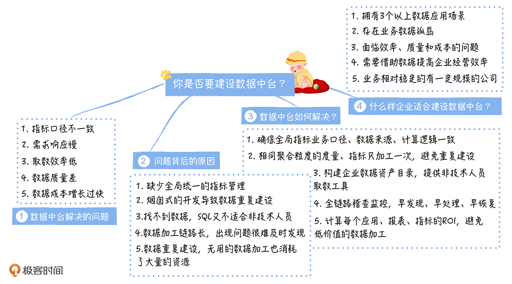

## 03 | 数据中台建设三板斧：方法论、组织和技术

那数据中台到底如何建设呢？咱们先不着急回答这个问题，而是看一个例子。

你肯定见过盖房子，盖房子之前，是不是先得有设计图纸，知道如何去盖这个房子？然后还必须要有一个好用的工具（比如水泥搅拌机、钢筋切割机）帮你盖好这个房子。当然了，盖房子离不开一个靠谱的施工队伍，这里面涉及很多角色（泥瓦工、木工、水电工等等），这些人必须高效协作，最终才能盖出一个好的房子。

如果我们把建数据中台比作是盖房子，那么设计图纸就是数据中台建设的方法论；工具是数据中台的支撑技术；施工队伍就是数据中台的组织架构。这三者缺一不可。

这一讲我就以全局的视角，让你从宏观上了解如何建设一个企业级的数据中台。

### 数据中台建设方法论

早在 2016 年，阿里巴巴就提出了数据中台建设的核心方法论：OneData 和 OneService。经过这么多年，很多公司都进行了实践，但你很难找出一个准确的定义去描述这些方法论，而我结合自己在网易数据中台建设的经验，对方法论进行了系统化的定义，你可以借鉴参考一下。

#### OneData

用一句话定义 OneData 的话，就是所有数据只加工一次。 这个概念具体是啥意思呢？我们来看一个例子。

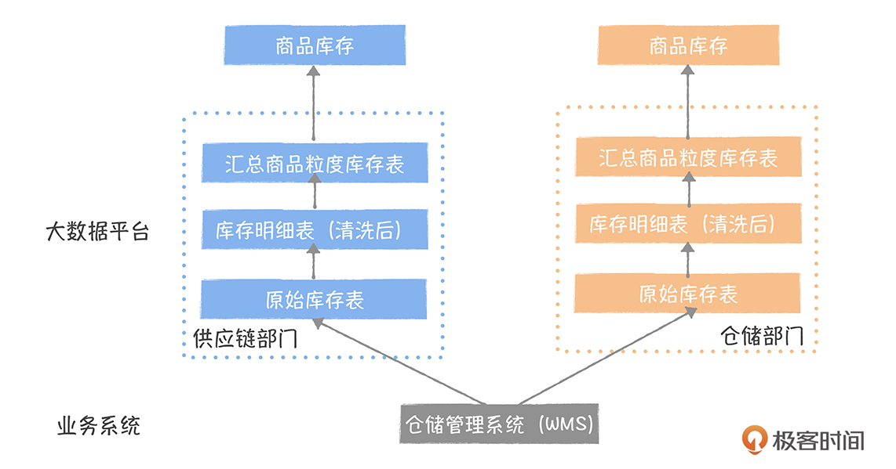

电商业务建设数据中台之前，每个部门内部都会有一些小的数仓去完成本部门的数据分析需求。

有一天，供应链团队接到一个数据需求，那就是计算“商品库存”指标，供应链的运营需要根据每个商品的库存制订商品采购计划，部门的数据开发从业务系统同步数据，进行数据清洗、聚合、深度加工，最终，产出这个指标花了 1 周的时间。

而恰逢全年最重要的大促节日，市场部门也需要根据每个商品的库存，制订商品的促销计划。该数据开发接到这个紧急的需求（与供应链团队类似）从需求开发到上线，也足足花费了 1 周的时间。同部门的运营会抱怨说，为什么数据需求开发这么慢，根本无法满足大促期间高频的市场运营决策。而对公司而言，等待 1 周意味着遭受巨大损失，该促销的商品没有促销，不该促销的却低价卖了。

如果你是这个公司的老板， 肯定会问，既然供应链团队已经计算出来了商品库存的数据，为什么市场部门不直接用，还要从头再计算一遍呢？这个看似很傻的行为，却处处出现在我们日常的数据建设中。

而数据中台就是要在整个电商业务形成一个公共数据层，消灭这些跨部门的小数仓，实现数据的复用，所以强调数据只加工一次，不会因为不同的应用场景，不同的部门数据重复加工。

那具体来说，如何去做才能实现数据只加工一次呢？有这样五点：

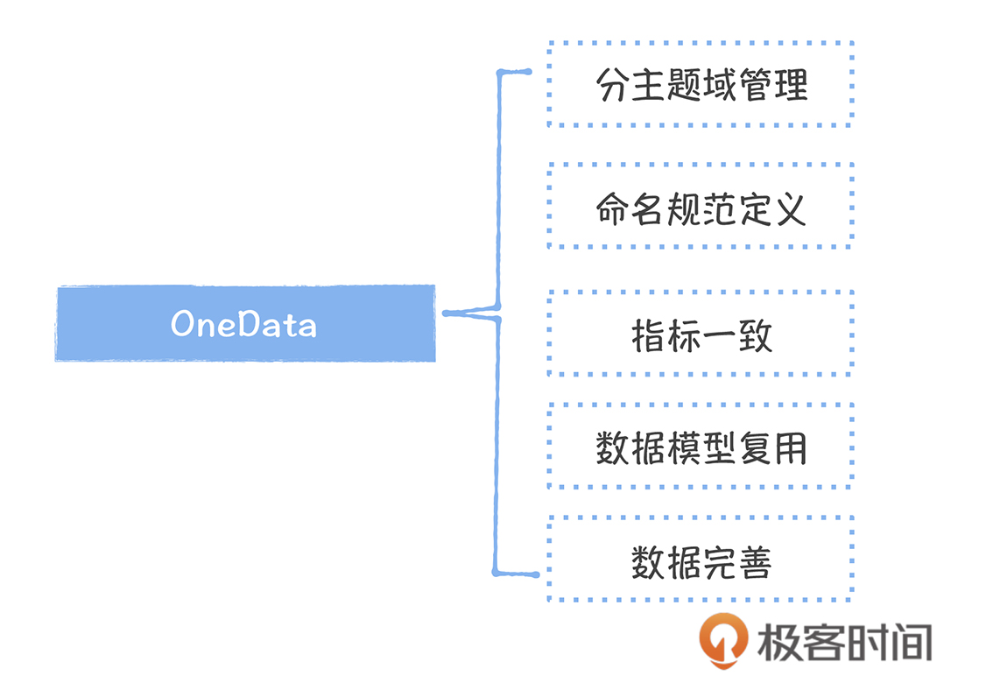

试想一下，现在你构建了数据中台，但存在几万张表，同时又有几十个数据开发维护这些表，如何来确保这些表的管理效率？ **我建议你选择划主题域。**

我们可以将这几万张表划到不同的主题域中，比如在电商业务中，商品、交易、流量、用户、售后、配送、供应链都可以作为主题域。好的主题域划分，是相对稳定，尽可能地覆盖绝大多数的表。

**除此之外，还要对表的命名进行规范化统一，** 表的名称中最好能够携带表的主题域、业务过程、分层以及分区信息。比如，对于仓储域下的一张入库明细表，规则命名可以这样：

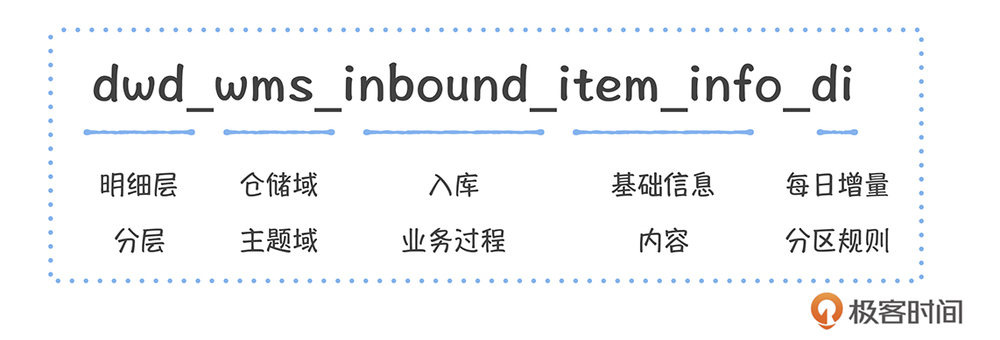

接着你还必须构建全局的指标字典，确保所有表中相同指标的口径必须一致（这部分内容我会在 06 讲细说）。

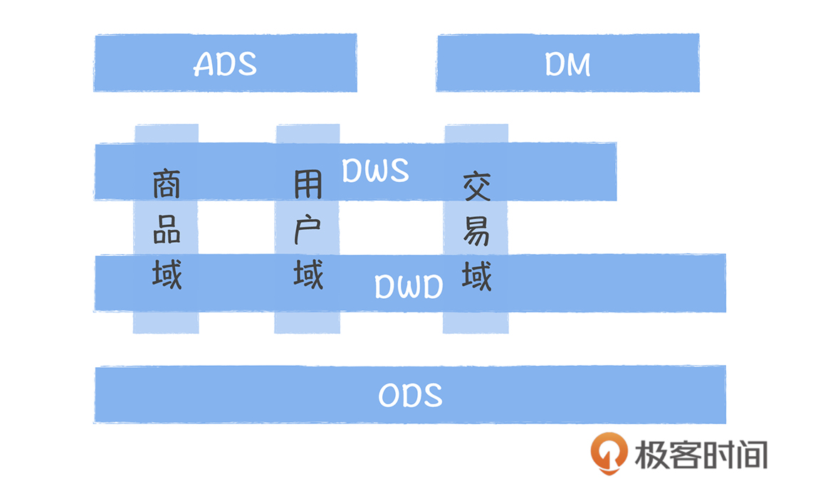

另外，为了实现模型的复用，数据中台适合采用分层的设计方式，常见的分层包括：ODS 原始数据层，DWD 明细数据层，DWS 轻度汇总数据层，ADS/DM 应用数据层 / 数据集市层。**最后，数据中台的数据必须尽可能的覆盖所有的业务过程，**数据中台中每一层的数据也要尽可能完善，让数据使用者尽可能的使用汇总后的数据。

OneData 体系的目标是构建统一的数据规范标准，让数据成为一种资产，而不是成本。资产和成本的差别在于资产是可以沉淀的，是可以被复用的。成本是消耗性质的、是临时的、无法被复用的。

#### OneService

OneService，数据即服务，强调数据中台中的数据应该是通过 API 接口的方式被访问。

这里我想提个问题：为什么数据一定要通过 API 接口的方式被访问，不通过 API 接口，直接提供数据表给用户又存在哪些问题呢？

如果你是数据应用开发，当你要开发一个数据产品时，首先要把数据导出到不同的查询引擎上：

- 数据量小的使用 MySQL；

- 大的可能用到 HBase；

- 需要多维分析的可能需要 Greenplum；

- 实时性要求高的需要用到 Redis；

总的来说，不同的查询引擎，应用开发需要定制不同的访问接口。

如果你是一个数据开发，当某个任务无法按时产出，发生异常时，想要了解这个表可能会影响到下游的哪些应用或者报表，但是却发现单纯依赖表与表的血缘无法触及应用，根本无法知道最后的这些表被哪些应用访问。与此同时，当你想下线一张表时，因为不知道谁访问了这张表，无法实施，最终造成了“上线容易，下线难”的窘境。

而 API 接口一方面对应用开发屏蔽了底层数据存储，使用统一标准的 API 接口查询数据，提高了数据接入的速度。另一方面，对于数据开发，提高了数据应用的管理效率，建立了表到应用的链路关系。

那如何来实现数据服务化呢？

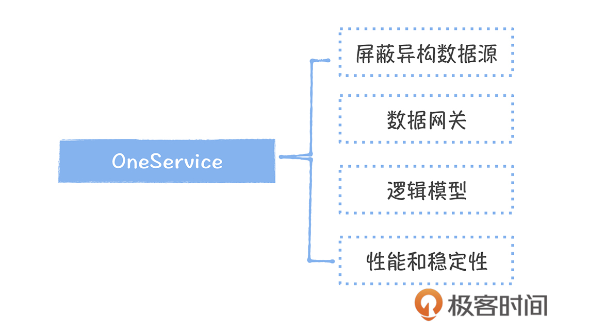

**屏蔽异构数据源：**数据服务必须要能够支撑类型丰富的查询引擎，满足不同场景下数据的查询需求，常见的有 MySQL、HBase、Greenplum、Redis、Elasticsearch 等。

**数据网关：**要实现包括权限、监控、流控、日志在内的一系列管控能力，哪个应用的哪个页面访问了哪个模型，要做到实时跟踪，如果有一些模型长时间没有被访问，应该予以下线。使用数据的每个应用都应该通过 accesskey 和 secretkey 实现身份认证和接口权限的管理。另外，访问日志可以方便在访问出现问题时，加快排查速度。

**逻辑模型：**从用户的视角出发，屏蔽底层的模型设计的实现，面向用户提供逻辑模型。什么是逻辑模型呢？熟悉数据库的同学应该知道，数据库中有一个视图的概念，视图本身并没有真实的数据，一个视图可以关联一张或者多张表，每次在查询的时候，动态地将不同表的查询结果聚合成视图的查询结果。逻辑模型可以类比视图，它可以帮助应用开发者屏蔽底层的数据物理实现，实现相同粒度的数据构造一个逻辑模型，简化了数据接入的复杂度。

**性能和稳定性：**由于数据服务侵入到用户的访问链路，所以对服务的可用性和性能都有很高的要求，数据服务必须是无状态的，可以做到横向扩展。

OneService 体系的目标是提高数据的共享能力，让数据可以被用得好，用得爽。

### 数据中台支撑技术

讲完方法论，我们接着要来讲数据中台的支撑技术，因为一个好用的工具，可以让你的数据中台建设事半功倍。

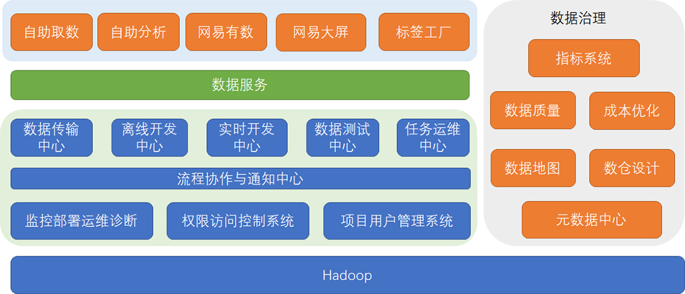

这个图完整地描述了数据中台支撑技术体系，它的底层是以 Hadoop 为代表的大数据计算、存储基础设施，提供了大数据运行所必须的计算、存储资源。

以 HDFS 为代表的分布式文件系统，以 Yarn/Kubernates 为代表的资源调度系统，以 Hive、Spark、Fink 为代表的分布式计算引擎，都属于基础设施范畴。如果把数据中台比作是一个数据工厂，那可以把它们比作是这个工厂的水、电。

在 Hadoop 之上，浅绿色的部分是原有大数据平台范畴内的工具产品，覆盖了从数据集成、数据开发、数据测试到任务运维的整套工具链产品。同时还包括基础的监控运维系统、权限访问控制系统和项目用户的管理系统。由于涉及多人协作，所以还有一个流程协作与通知中心。

灰色的部分，是数据中台的核心组成部分：数据治理模块。它对应的方法论就是 OneData 体系。以元数据中心为基础，在统一了企业所有数据源的元数据基础上，提供了包括数据地图、数仓设计、数据质量、成本优化以及指标管理在内的 5 个产品，分别对应的就是数据发现、模型、质量、成本和指标的治理。

深绿色的部分是数据服务，它是数据中台的门户，对外提供了统一的数据服务，对应的方法论就是 OneService。数据服务向下提供了应用和表的访问关系，使数据血缘可以延申到数据应用，向上支撑了各种数据应用和服务，所有的系统通过统一的 API 接口获取数据。

在数据服务之上，是面向不同场景的数据产品和应用，包括面向非技术人员的自助取数系统；面向数据开发、分析师的自助分析系统；面向敏捷数据分析场景的 BI 产品；活动直播场景下的大屏系统；以及用户画像相关的标签工厂。

这套产品技术支撑体系，覆盖了数据中台建设的整个过程，配合规范化实施，你就可以搭建出一个数据中台，关于具体的细节我会在实现篇中逐一分析讲解，这里你只需要知道这个框架就可以了。

### 组织架构

我在开篇提到，在网易电商数据中台建设之前，各个部门都会存在一些小的数仓，**那么你有没有想过，为什么会存在这些分散的小数仓？** 归根结底是因为建设这些数仓的人分散在各个业务部门。所以，如果你要建设数据中台，单纯有方法论和支撑技术还不够，还必须要有一个独立于业务部门的中台团队。

数据中台提供的是一个跨业务部门共享的公共数据能力，所以，承担数据中台建设职责的部门一定是一个独立于业务线的部门。这个部门的负责人应该直接向公司的 CTO 汇报工作，当然这个也要取决于数据中台建设的层次，例如在网易内，有云音乐、严选等多个产品线，数据中台的建设层次是在产品级别的，也就是说，云音乐有一个数据中台，严选有一个数据中台，所以严选的数据中台应该向严选的 CTO 汇报。

而独立部门的最大风险是与业务脱节，所以我们对数据中台的组织定位是：**懂业务，能够深入业务，扎根业务。**数据中台要管理所有的指标，而每个业务线之间的指标既有差异，也有交叉，要理解指标的口径定义，就必须要了解业务的过程。同时，当我们要制定一些新的指标时，必须要了解各个业务线新的业务目标，指标的本质还是为业务目标服务的。

综合来讲，什么样的组织架构是适合数据中台建设的呢？

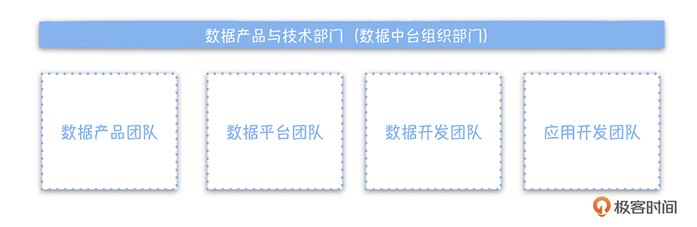

- 数据产品部门：负责数据中台、数据产品的体系规划、产品设计、规范制定、应用效果跟进，指标口径的定义和维护（有的部门是由分析师管理）。

- 数据平台部门：负责研发支撑数据中台构建的产品，例如指标系统、元数据中心、数据地图等。

- 数据开发团队：负责维护数据中台的公共数据层，满足数据产品制定的数据需求。

- 应用开发团队：负责开发数据应用产品，比如报表系统、电商中的供应链系统、高层看板、经营分析。

而且，中台组织的绩效目标一定是要与业务落地价值绑定的，比如在电商中，我们提供了供应链决策系统，有智能补货的功能，会根据商品的库存，各个地区的历史销售情况，生产加工周期，自动生成补货决策，由人工审核以后，直接推送给采购系统。那我们评估价值时，我们会拿由系统自动生成的采购计划占整体采购计划的比例来衡量数据的应用价值。

最后，数据中台的组织架构改革涉及原有各个部门的利益，所以这个是数据中台构建最难又不得不做的地方，必须要取得高层领导的支持和重视。

### 课堂小结

这节课，我以自己建设数据中台的经历，带领你了解了数据中台建设的三板斧：方法论、支撑技术和组织架构。在课程的最后，我想再强调几个点。

适合数据中台的组织架构是建设数据中台的第一步，数据中台组织一定是独立的部门，同时要避免与业务脱节，深入业务，要与业务目标绑定。

数据中台支撑技术大规模落地，需要有成熟的系统工具作为支撑，同时要注意这些系统工具之间的联动和打通。

数据中台的方法论可以借鉴，但是不能完全照搬，每个公司的数据应用水平和当前遇到的问题都不相同，可以针对这些问题，分阶段制定数据中台的建设计划，选择性的应用一些技术，例如当前最主要的问题是数据质量问题，那就应该优先落地数据质量中心，提升质量。

最后，让我们回到开篇的那个问题，如何建设数据中台？在我看来，方法论、支撑技术和组织架构，对于建设数据中台，三者缺一不可。而且我想再强调一下，数据中台的建设绝对不是为了建中台而建中台，数据中台的建设一定要结合落地场景，可以先从从一些小的场景开始，但是规划一定是要有顶层设计的。关于具体的操作细节，我会在第二部分，用 8 讲的篇幅来讲给你听。

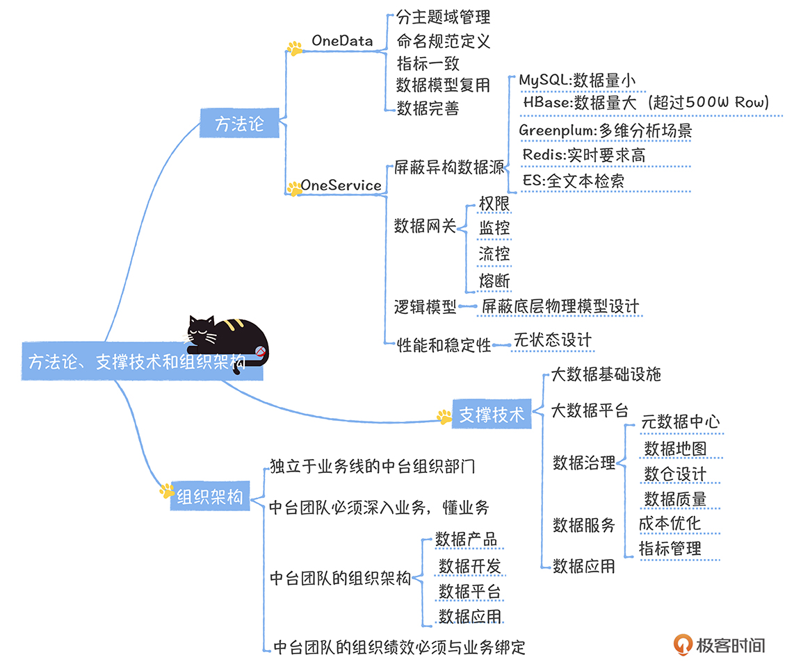


# 03丨实现篇

## 04 | 元数据中心的关键目标和技术实现方案

这节课，咱们来聊聊元数据。

为什么要先讲元数据呢？我来举个例子。在原理篇中，我提到数据中台的构建，需要确保全局指标的业务口径一致，要把原先口径不一致的、重复的指标进行梳理，整合成一个统一的指标字典。而这项工作的前提，是要搞清楚这些指标的业务口径、数据来源和计算逻辑。而这些数据呢都是元数据。

你可以认为，如果没有这些元数据，就没法去梳理指标，更谈不上构建一个统一的指标体系。当你看到一个数 700W，如果你不知道这个数对应的指标是每日日活，就没办法理解这个数据的业务含义，也就无法去整合这些数据。**所以你必须要掌握元数据的管理，才能构建一个数据中台。**

那么问题来了：元数据中心应该包括哪些元数据呢？ 什么样的数据是元数据？

### 元数据包括哪些？

结合我的实践经验，我把元数据划为三类：数据字典、数据血缘和数据特征。我们还是通过一个例子来理解这三类元数据。

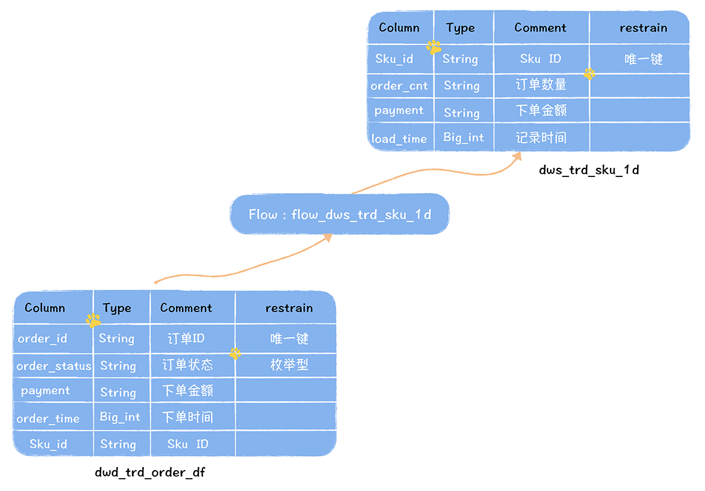

在这个图中，dwd_trd_order_df 是一张订单交易明细数据，任务 flow_dws_trd_sku_1d 读取这张表，按照 sku 粒度，计算每日 sku 的交易金额和订单数量，输出轻度汇总表 dws_trd_sku_1d。

数据字典描述的是数据的结构信息，我们以 dws_trd_sku_1d 为例，数据字典包括：

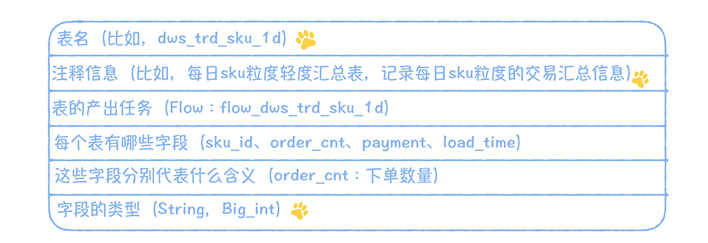

数据血缘是指一个表是直接通过哪些表加工而来，在上面的例子中，dws_trd_sku_1d 是通过 dwd_trd_order_df 的数据计算而来，所以，dwd_trd_order_df 是 dws_trd_sku_1d 的上游表。

数据血缘一般会帮我们做影响分析和故障溯源。比如说有一天，你的老板看到某个指标的数据违反常识，让你去排查这个指标计算是否正确，你首先需要找到这个指标所在的表，然后顺着这个表的上游表逐个去排查校验数据，才能找到异常数据的根源。

而数据特征主要是指数据的属性信息，我们以 dws_trd_sku_1d 为例：

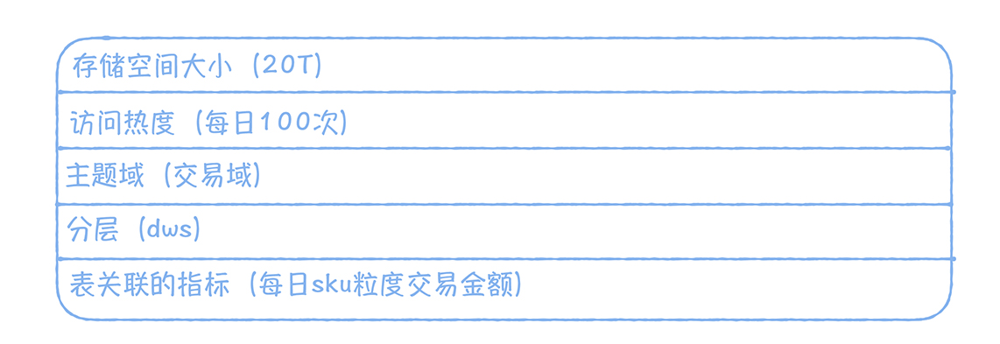

通过这个例子，你了解了元数据了吗？ 不过元数据的种类非常多，为了管理这些元数据，你必须要构建一个元数据中心。那么接下来，我们就来看看如何搭建一个元数据中心，打通企业的元数据。

### 业界元数据中心产品

我做系统设计这么些年，一直有一个习惯，是先看看业界的产品都是怎么设计的，避免关门造车。业界的比较有影响力的产品：

- 开源的有 Netflix 的 Metacat、Apache Atlas；

- 商业化的产品有 Cloudera Navigator。

我今天重点想带你了解 Metacat 和 Atlas 这两款产品，一个擅长于管理数据字典，一个擅长于管理数据血缘，通过了解这两款产品，你更能深入的理解元数据中心应该如何设计。

#### Metacat 多数据源集成型架构设计

关于[Metacat](https://github.com/Netflix/metacat)，你可以在 GitHub 上找到相关介绍，所以关于这个项目的背景和功能特性，我就不再多讲，我只想强调一个点，就是它多数据源的可扩展架构设计，因为这个点对于数据字典的管理，真的太重要！

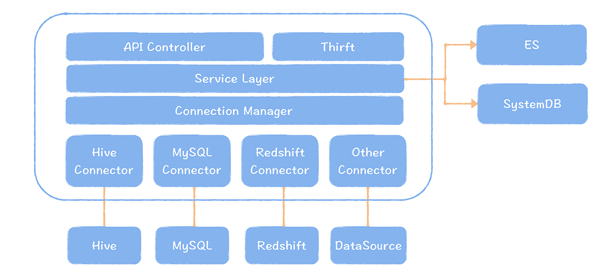

在一般的公司中，数据源类型非常多是很常见的现象，包括 Hive、MySQL、Oracle、Greenplum 等等。支持不同数据源，建立一个可扩展的、统一的元数据层是非常重要的，否则你的元数据是缺失的。

从上面 Metacat 的架构图中，你可以看到，Metacat 的设计非常巧妙，它并没有单独再保存一份元数据，而是采取直连数据源拉的方式，一方面它不存在保存两份元数据一致性的问题，另一方面，这种架构设计很轻量化，每个数据源只要实现一个连接实现类即可，扩展成本很低，我把这种设计叫做集成型设计。我认为这种设计方式对于希望构建元数据中心的企业，是非常有借鉴意义的。

#### Apache Atlas 实时数据血缘采集

同样，关于Apache Atlas的背景和功能，我也不多说，只是想强调 Atlas 实时数据血缘采集的架构设计，因为它为解决血缘采集的准确性和时效性难题提供了很多的解决思路。

血缘采集，一般可以通过三种方式：

- 通过静态解析 SQL，获得输入表和输出表；

- 通过实时抓取正在执行的 SQL，解析执行计划，获取输入表和输出表；

- 通过任务日志解析的方式，获取执行后的 SQL 输入表和输出表。

第一种方式，面临准确性的问题，因为任务没有执行，这个 SQL 对不对都是一个问题。第三种方式，血缘虽然是执行后产生的，可以确保是准确的，但是时效性比较差，通常要分析大量的任务日志数据。所以第二种方式，我认为是比较理想的实现方式，而 Atlas 就是这种实现。

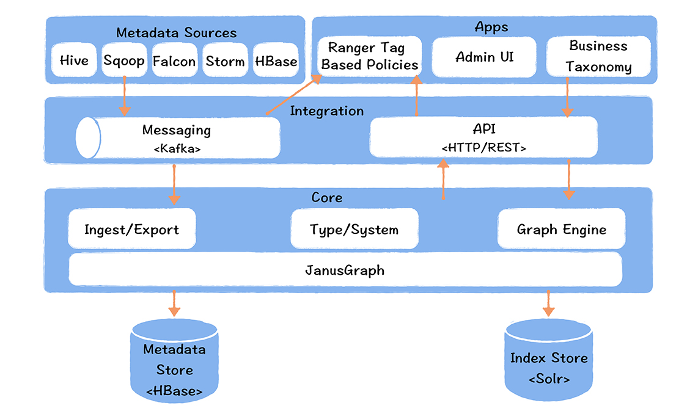

对于 Hive 计算引擎，Atlas 通过 Hook 方式，实时地捕捉任务执行计划，获取输入表和输出表，推送给 Kafka，由一个 Ingest 模块负责将血缘写入 JanusGraph 图数据库中。然后通过 API 的方式，基于图查询引擎，获取血缘关系。对于 Spark，Atlas 提供了 Listener 的实现方式，此外 Sqoop、Flink 也有对应的实现方式。

这两款产品在设计网易元数据中心时，给了很多灵感，下面我就带你了解一下网易元数据中心的设计，以便你掌握一个元数据中心在设计时应该考虑哪些点。

### 网易元数据中心设计

在设计网易元数据中心之初，我设定了元数据中心必须实现的 5 个关键目标：

**其一，多业务线、多租户支持。**

在网易，电商、音乐都是不同的业务线，同一个业务线内，也分为算法、数仓、风控等多个租户，所以元数据中心必须支持多业务线、多租户。

**其二，多数据源的支持。**

元数据中心必须要能够支持不同类型的数据源（比如 MySQL、Hive、Kudu 等），同时还要支持相同数据源的多个集群。为了规范化管理，还需要考虑将半结构化的 KV 也纳入元数据中心的管理（比如 Kafka、Redis、HBase 等）。这些系统本身并没有表结构元数据，所以需要能够在元数据中心里定义 Kafka 每个 Topic 的每条记录 JSON 中的格式，每个字段代表什么含义。

**其三，数据血缘。**

元数据中心需要支持数据血缘的实时采集和高性能的查询。同时，还必须支持字段级别的血缘。

什么是字段级别的血缘，我们来举个例子。

```sql
insert overwrite table t2 select classid, count(userid) from t1 group by classid;
```

t2 表是由 t1 表的数据计算来的，所以 t2 和 t1 是表血缘上下游关系，t2 的 classid 字段是由 t1 的 classid 字段产生的，count 字段是由 userid 经过按照 classid 字段聚合计算得到的，所以 t2 表的 classid 与 t1 的 classid 存在字段血缘，t2 表的 count 分别与 t1 表的 classid 和 userid 存在血缘关系。

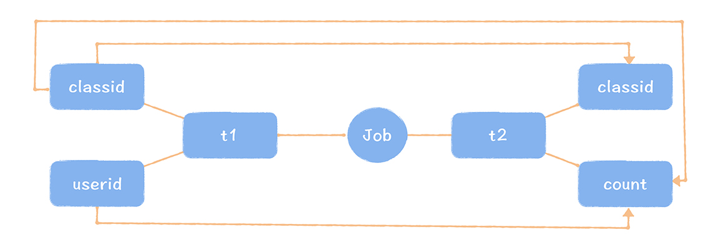

字段血缘在做溯源的时候非常有用，因为大数据加工链路的下游是集市层，为了方便使用者使用，一般都是一些很宽的表（列很多的表，避免 Join 带来的性能损耗），这个表的上游可能是有几十个表产生的，如果不通过字段血缘限定溯源范围，就会导致搜索范围变得很大，无法快速地精准定位到有问题的表。

另外，数据血缘还必须要支持生命周期管理，已经下线的任务应该立即清理血缘，血缘要保留一段时间，如果没有继续被调度，过期的血缘关系应该予以清理。

**其四，与大数据平台集成。**

元数据中心需要与 Ranger 集成，实现基于 tag 的权限管理方式。在元数据中心中可以为表定义一组标签，Ranger 可以基于这个标签，对拥有某一个标签的一组表按照相同的权限授权。这种方式大幅提高了权限管理的效率。比如，对于会员、交易、毛利、成本，可以设定表的敏感等级，然后根据敏感等级，设定不同的人有权限查看。

另外，元数据中心作为基础元数据服务，包括自助取数分析系统，数据传输系统，数据服务，都应该基于元数据中心提供的统一接口获取元数据。

**其五，数据标签。**

元数据中心必须要支持对表和表中的字段打标签，通过丰富的不同类型的标签，可以完善数据中台数据的特征，比如指标可以作为一种类型的标签打在表上，主题域、分层信息都可以作为不同类型的标签关联到表。

基于这 5 个因素的考虑，我们设计了网易元数据中心。

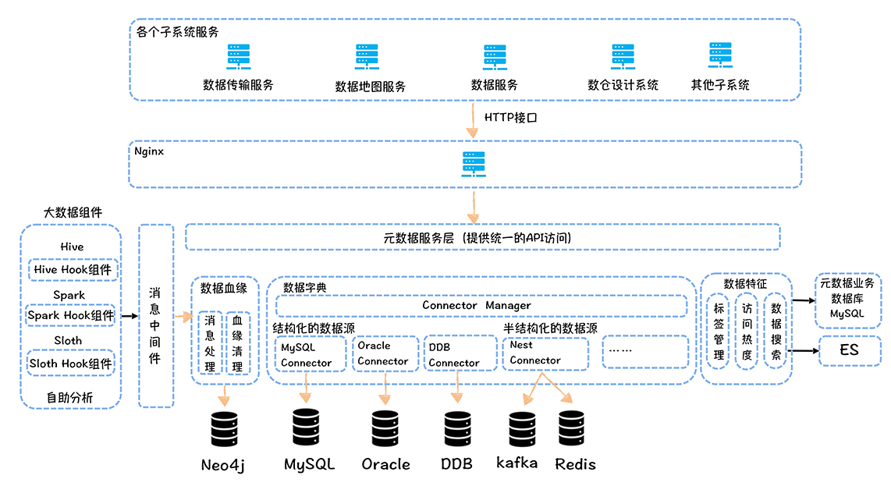

​                                                                         网易元数据中心系统架构设计图

这个图按照功能模块分为数据血缘、数据字典和数据特征。

数据血缘由采集端、消息中间件、消费端以及血缘清理模块组成，基于 Hive Hook，Spark Listener，Flink Hook ，可以获取任务执行时输入表和输出表，推送给统一的消息中间件（Kafka），然后消费端负责将血缘关系沉淀到图数据库中。

图数据库选择 Neo4j，主要考虑是性能快、部署轻量化、依赖模块少，当然，开源的 Neo4j 没有高可用方案，并且不支持水平扩展，但是因为单个业务活跃的表规模基本也就在几万的规模，所以单机也够用，高可用可以通过双写的方式实现。

血缘还有一个清理的模块，主要负责定时清理过期的血缘，一般我们把血缘的生命周期设置为 7 天。

数据字典部分，我们参考了 Metacat 实现，我们由一个统一的 Connector Mananger 负责管理到各个数据源的连接。对于 Hive、MySQL，元数据中心并不会保存系统元数据，而是直接连数据源实时获取。对于 Kafka、HBase、Redis 等 KV，我们在元数据中心里内置了一个元数据管理模块，可以在这个模块中定义 Value 的 schema 信息。

数据特征主要是标签的管理以及数据的访问热度信息。元数据中心内置了不同类型的标签，同时允许用户自定义扩展标签类型。指标、分层信息、主题域信息都是以标签的形式存储在元数据中心的系统库里，同时元数据中心允许用户基于标签类型和标签搜索表和字段。

元数据中心统一对外提供了 API 访问接口，数据传输、数据地图、数据服务等其他的子系统都可以通过 API 接口获取元数据。另外 Ranger 可以基于元数据中心提供的 API 接口，获取标签对应的表，然后根据标签更新表对应的权限，实现基于标签的权限控制。

元数据中心构建好以后，你肯定会问，这个元数据中心没有界面吗？它长什么样子？用户咋使用这个元数据中心？ 别急，我们接着往下看。


数据地图提供了多维度的检索功能，使用者可以按照表名、列名、注释、主题域、分层、指标进行检索，结果按照匹配相关度进行排序。考虑到数据中台中有一些表是数仓维护的表，有一些表数仓已经不再维护，在结果排序的时候，增加了数仓维护的表优先展示的规则。同时数据地图还提供了按照主题域、业务过程导览，可以帮助使用者快速了解当前有哪些表可以使用。

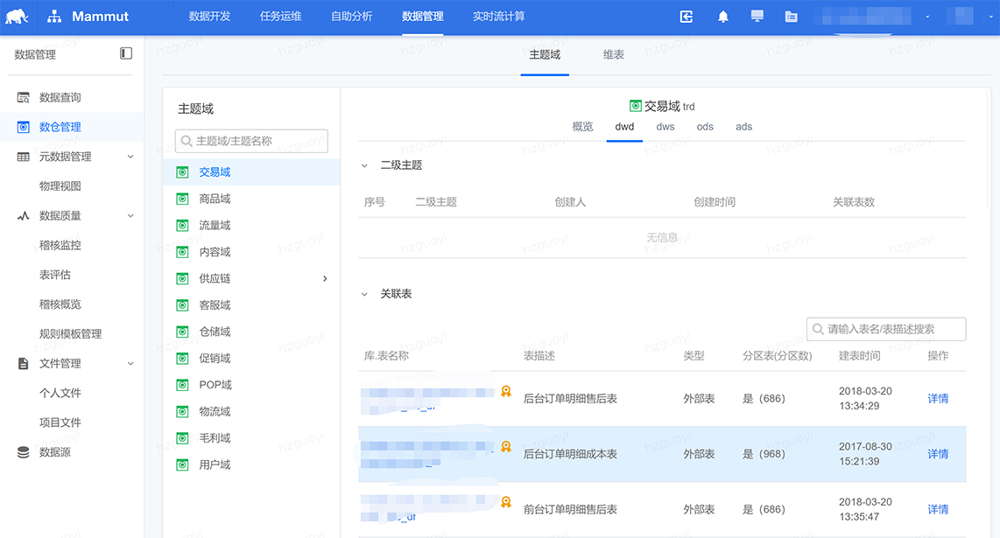

当使用者定位到某一个表打开时，会进入详情页，详情页中会展示表的基础信息，字段信息、分区信息、产出信息以及数据血缘。数据血缘可以帮助使用者了解这个表的来源和去向，这个表可能影响的下游应用和报表，这个表的数据来源。

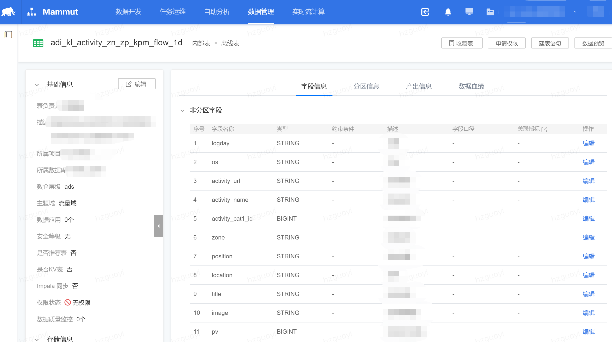

数据地图同时还提供了数据预览的功能，考虑到安全性因素，只允许预览 10 条数据，用于判断数据是否符合使用者的预期。数据地图提供的收藏功能， 方便使用者快速找到自己经常使用的表。当数据开发、分析师、数据运营找到自己需要的表时，在数据地图上可以直接发起申请对该表的权限申请。

数据地图对于提高数据发现的效率，实现非技术人员自助取数有重要作用。经过我的实践，数据地图是数据中台中使用频率最高的一个工具产品，在网易，每天都有 500 以上人在使用数据地图查找数据。

### 课程总结

本节课，我以元数据作为起点，带你了解了元数据应该包括数据字典、数据血缘和数据特征，然后通过分析两个业界比较有影响力的元数据中心产品，结合我在网易数据中台实践，给出了元数据中心设计的 5 个关键特性和技术实现架构，最后介绍了基于元数据中心之上的数据地图产品。我想在最后强调几个关键点：

- 元数据中心设计上必须注意扩展性，能够支持多个数据源，所以宜采用集成型的设计方式。

- 数据血缘需要支持字段级别的血缘，否则会影响溯源的范围和准确性。

- 数据地图提供了一站式的数据发现服务，解决了检索数据，理解数据的“找数据的需求”。

最后，你要知道，元数据中心是数据中台的基石，它提供了我们做数据治理的必须的数据支撑，在后续的章节中，我们将逐一介绍指标、模型、质量、成本、安全等的治理，这些都离不开元数据中心的支撑。

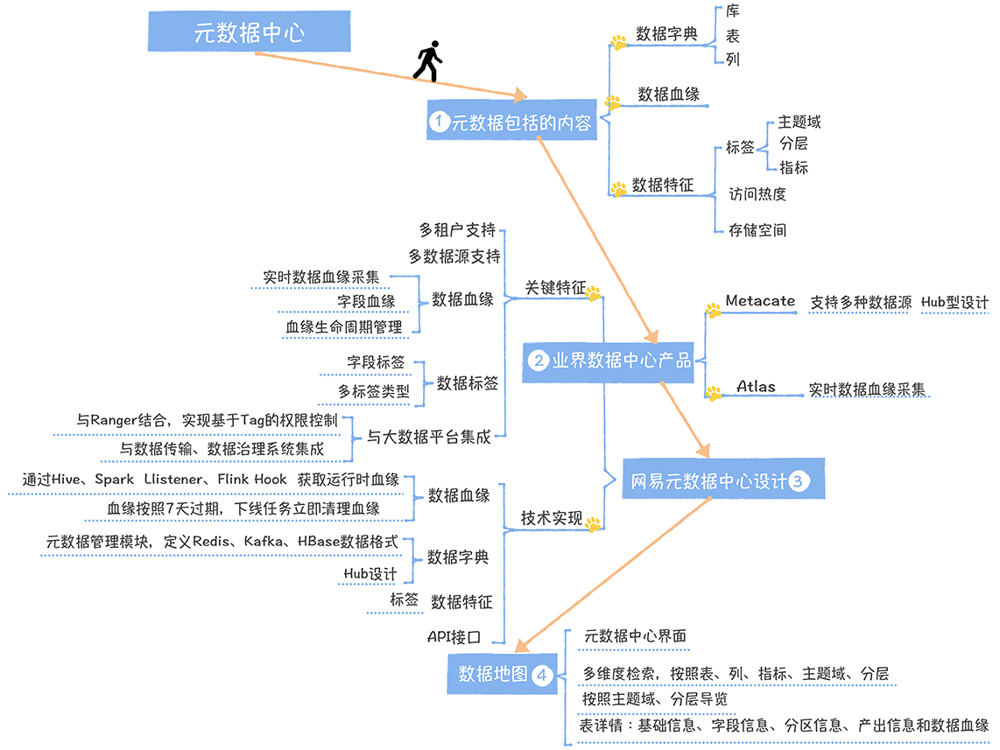

## 05 | 如何统一管理纷繁杂乱的数据指标？

元数据在指标管理、模型设计、数据质量和成本治理四个领域都发挥着作用，而这些领域构成了数据中台 OneData 数据体系。从今天开始，我将带你逐一了解元数据在上述领域的应用，首先是指标管理。

指标是一种特定类型的元数据，公司的运营会围绕它进行工作，可以说，它是业务和数据的交汇点。指标数据能不能用，会影响他们的日常工作。来看一件我身边发生的事儿。

在电商业务中，新用户销售额是考核市场活动拉新效果的重要指标。马漂亮（化名）是市场部门的数据分析师，某一天，她要给 CEO 提供一份数据报告，报告中有一项指标是“新用户销售额”。孙美丽（化名）是会员中心的运营，她每天都会给 CEO 提供每日的新用户销售额数据。

结果有一天，CEO 看了这两份报告后发现，同一日的新用户销售额数值相差很大，他判断数据出了问题，责令两个部门的负责人进行排查。**排查后发现，市场部门对新用户口径的定义和会员中心不一样：**

- 市场部门认定新用户是首次下单并完成支付的用户；

- 会员中心认定新用户是当日新注册用户。

也就是说，市场部门认定的新用户中，可能有之前注册但是没有下过单的客户；而会员中心只包括当日注册并完成下单支付的用户。其实，在日常工作中还有很多类似的问题。

造成上述问题的根源是因为指标口径不一致，而你要构建全局一致的指标口径，输出企业的指标字典。

### 指标混乱现状

从 2018 年年末开始，网易电商数据中台团队对电商业务的核心指标进行了全面的盘点和梳理，为的就是解决指标口径不一致的问题。原先 800 个指标，最终梳理完成 427 个指标，在梳理过程中，我总结了 7 个常见的指标问题，希望你能对照着看一下，自己是否也存在类似的情况。

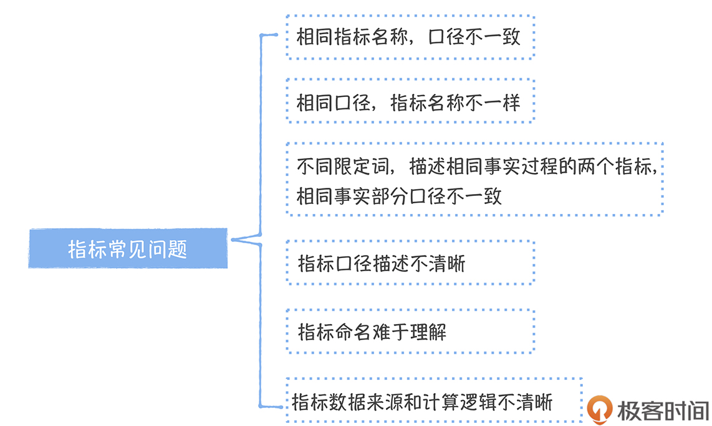

你可以编个口诀记忆一下，比如：

同名不同径，同径不同名。

口径不清晰，口径有错误。

命名难理解，计算不易懂。

来源不清晰，同部不同径。

**第一，相同指标名称，口径定义不同。**

我开篇说的就是这个问题，不同的部门对相同的“新用户销售额”，因为口径定义的差别，导致指标数值的不一致。而这种情况是指标管理中最容易出现的情况。口径不一致，数据也就没办法横向对比，失去了数据辅助商业决策的意义。

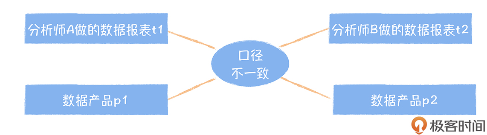

**第二，相同口径，指标名称不一样。**

这种情况与上面相反，比如发放优惠券是电商常见的促销手段，现在你有两个数据产品：

一个是经营大脑，主要展示的是企业日常经营活动健康度的核心指标，它有一个指标叫“优惠券抵扣金额”；

一个是市场 360，主要是展示市场活动效果衡量的指标，它也有一个指标叫“优惠券消耗金额”。

其实，两者的口径定义并没有区别，但是指标名称不同，这会让使用指标的人疑惑，是不是同一个指标，计算逻辑是否一致？数据是否可以横向对比？

**第三，不同限定词，描述相同事实过程的两个指标，相同事实部分口径不一致。**

这个问题该如何理解呢？ 来看一个例子。

黑卡会员购买用户和非会员购买用户数，它们描述的都是用户下单购买商品的相同业务过程，记录的都是购买商品的事实，只是一个限定词是黑卡会员，一个限定词是非会员。

按照一致性原则，虽然是两个指标，但是对于购买用户数这个相同的事实部分，业务口径、计算逻辑应该是一致的，但是现实情况却可能不是这样：

“黑卡会员购买用户数”的口径定义是计算周期内去重的（重复购买的用户只算一个），下单并且支付成功的用户数量；

“ 非会员的购买用户数”的口径定义是计算周期内去重的，下单并且支付成功，排除关单（“关单”是指在用户在下单购买成功后，取消订单）的用户数量。

你能看到，对于购买用户数，这两个指标的口径是不一致的，一个包含关单，一个不包含关单。

**第四，指标口径描述不清晰。**

在梳理过程中，我们还发现，有些报表上的指标口径描述的比较笼统。比如“关单金额”，口径描述“关闭订单的金额”。不同人的理解可能不一样，有的人会认为是支付成功后关闭订单；也有可能是支付完成前，取消订单。描述不清晰，就会让人们对数据的理解产生歧义。

**第五，指标口径描述错误。**

在流量分析数据产品中，有“7 日 uv”这个指标，口径的定义是 7 日内日均 uv。根据口径描述的计算逻辑，应该是最近 7 日，每日 uv 相加除以 7 取平均值。显然，这个定义在业务场景中是有问题的，正确的 7 日 uv 的口径定义应该是 7 日内有登录过，去重的用户数。

**第六，指标命名难于理解。**

我们在梳理促销业务过程的指标时，有一个数据产品的指标名称是“ROI”，口径定义优惠券销售额 / 优惠券成本。ROI 其实是投资回报率的简称，在电商业务场景中，除了优惠劵，商品降价促销都可以计算 ROI，所以比较好的命名应该是（商品|类目|通用）优惠劵 ROI。所以，指标命名不规范的话，从指标名称中很难看出指标描述的业务过程。

**最后，指标数据来源和计算逻辑不清晰。**

如果指标数据来源不清楚，一旦这个指标数据异常，就很难去做溯源。另外，有些指标的计算逻辑比较复杂，仅仅凭借业务口径一段描述，使用指标的人还是无法理解这个指标的计算逻辑，这个时候就需要有一些伪码或者 SQL 描述。

### 如何规范化定义指标

那么如果你面临这些问题，该如何规范化定义指标呢？我提供给你一些经验，希望你能从中学习到如何高效、规范化的管理指标。

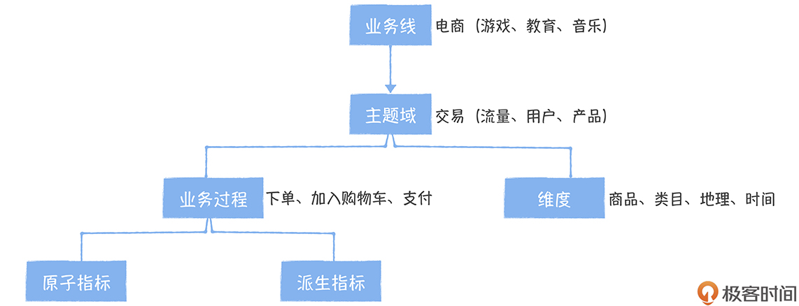

**首先，面向主题域管理。**

为了提高指标管理的效率，你需要按照业务线、主题域和业务过程三级目录方式管理指标（业务线是顶级目录）。

在网易，电商、游戏、音乐、传媒、教育都是不同的业务线。在业务线之下，是主题域，指标中的主题域与数仓中的概念是一致的，划分标准最好是跟数仓保持一致（数仓主题域的划分，我会在 06 讲详细讲述）。在主题域下面还有细分的业务过程，比如对于交易域，细分的业务过程有加入购物车、下单、支付。

**其次，拆分原子指标和派生指标。**

为了解决前面提到的，“黑卡购买用户数”和“非会员购买用户数”，这两个指标对购买用户数口径定义不一致的问题，我们需要引入原子指标和派生指标的管理方式。**那么什么是原子指标，什么是派生指标呢？**

统计周期、统计粒度、业务限定、原子指标，组成派生指标，所以原子指标可以定义为不能够按照上述规则进一步拆分的指标。


在例子中，你可以这样理解：

- 购买用户数是原子指标，原子指标的口径定义是“计算周期内去重的，下单并且支付成功的用户数量，包括关单”；

- 黑卡会员和非会员都可以认定为业务限定词；

- 统计粒度是商品粒度的；

- 统计周期是 30 天。

这样 30 天内，商品维度的黑卡会员购买用户数和 30 天内商品维度的非会员购买用户数就作为两个派生指标存在，但是他们继承自同一个原子指标。

**除此之外，还需要指标命名规范。**

指标命名规范要遵循两个基本的原则：

- 易懂，就是看到指标的名称，就可以基本判断这个指标归属于哪个业务过程；

- 统一，就是要确保派生指标和它继承的原子指标命名是一致的。

除此之外，指标应该有指标名称和指标标识（或者叫英文名）。

**对于原子指标，**指标名称适合用“动作 + 度量”的命名方式（比如注册用户数、购买用户数），标识的命名用英文简写或者汉语拼音缩写比较好。

**对于派生指标，**指标名称应该严格遵循“时间周期 + 统计粒度 + 修饰词 + 原子指标”的命名方式，标识命名要用“修饰词 _ 原子指标 _ 时间周期”的方式。

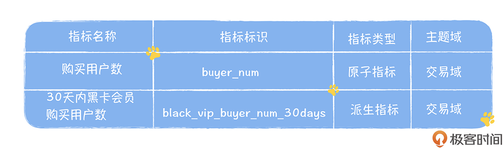

**第四，关联的应用和可分析维度。**

对于使用指标的人（运营、分析师）了解了这个指标的口径定义之后，下一步就是要看指标的数值。所以，在全局的指标字典中，还应该有指标被哪些应用使用，这样方便去对应的数据产品或者报表上查看指标的数值。除此之外，还应该有指标的可分析维度，方便分析师从不同的维度分析指标的变化趋势。

**最后一个是分等级管理。**

那这么多指标，数据中台管的过来么？是的，确实管不过来，因为不仅仅是数据中台会产出一些公共核心指标，业务部门也会创建一些专属业务部门内的指标。那面对这么多指标，如何管理呢？以我的经验，你可以按照以下原则区分等级，来管理指标。

- 一级指标：数据中台直接产出，核心指标（提供给公司高层看的）、原子指标以及跨部门的派生指标。

- 二级指标：基于中台提供的原子指标，业务部门创建的派生指标。

不同等级的指标意味着管理方式不同：

- 一级指标，要确保指标按时、保证质量产出，指标创建由中台负责；

- 二级指标，允许业务方自己创建，中台不承诺指标的产出时间和质量。

现在你了解如何管理指标了吗？ 我建议你在学完这部分知识以后，结合自己所在的业务，找一些指标，试着按照上面的方法实践一下，这样掌握得会加更深刻。

### 指标系统

在了解如何管理指标之后，我们还需要一款好用的工具，帮助我们落实管理方法。我观察到，很多公司喜欢用 Excel 管理指标，觉得 Excel 上手容易，编辑比较方便。在我看来，Excel 并不是一个适合指标管理的工具，有这样几个原因：

难于共享；

缺少权限控制；

无法动态更新；

指标无法跟数仓的模型动态关联。

所以，我们需要一个面向指标的管理系统

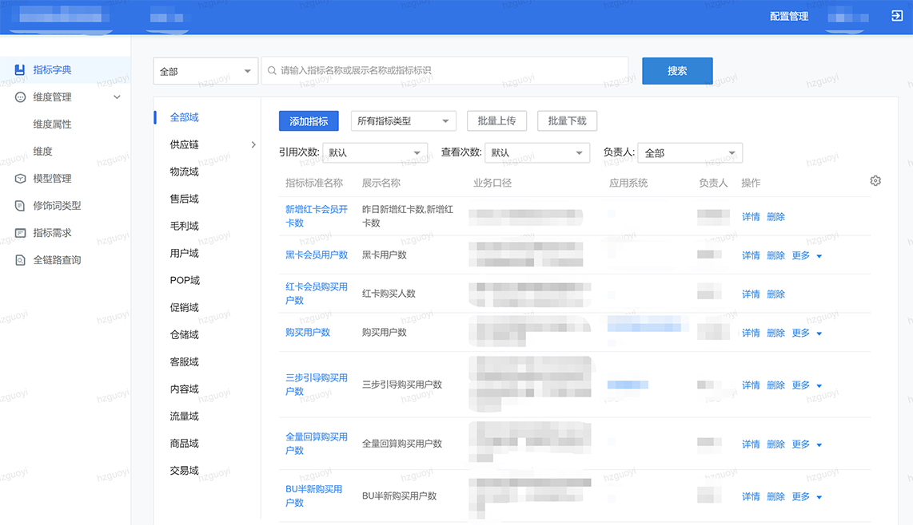

指标系统是基于元数据中心构建的一个指标管理工具，它从元数据中心自动同步数仓的主题域和业务过程，按照规范化定义创建指标。

新创建的指标同时会以特定类型的标签，下沉到元数据中心对应的表和字段上，这样在数据地图上就可以搜索到表关联的指标。

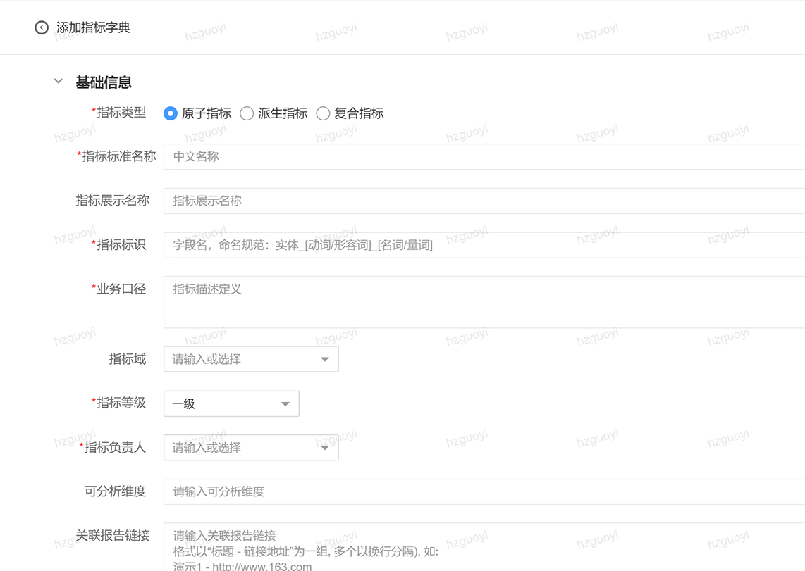

指标系统还提供了按照指标名称、标识、业务口径的检索功能。

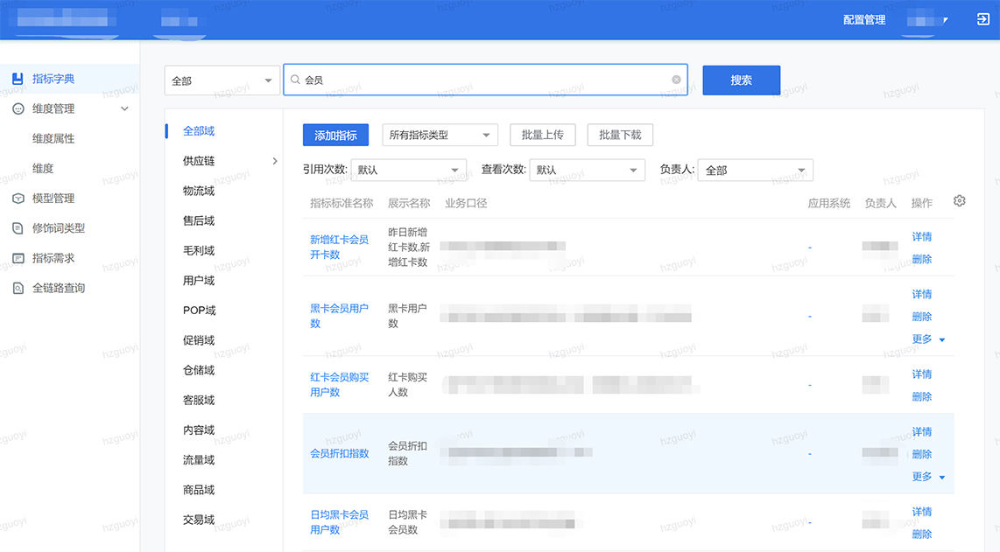

既然指标系统能够实现指标的规范化定义，帮你解决“如何系统化、规范化定义指标”的问题，那接下来我们的重点就是如何基于指标系统构建全局的指标字典，因为这是指标治理的最终结果。

### 基于指标系统构建全局的指标字典

指标治理的最终结果，就是要形成一个全局业务口径一致的指标字典。让使用指标的人，可以通过指标字典，快速了解指标的业务含义和计算过程，不会对指标口径产生歧义。

数据中台团队必须要有一个专门负责指标管理的人或者小组（一般不超过 3 个人），最好是数据产品经理来负责，**如果你的公司没有这个职位，也可以让分析师承担（前提是分析师必须属于中台团队）。**

构建全局的指标字典分为两个场景：

- 一个是面对一个新的指标需求，如何基于指标系统完成指标开发流程；

- 另外一个是面对已经存在的，混乱的指标现状，如何进行全局梳理。

先来看第一个场景。

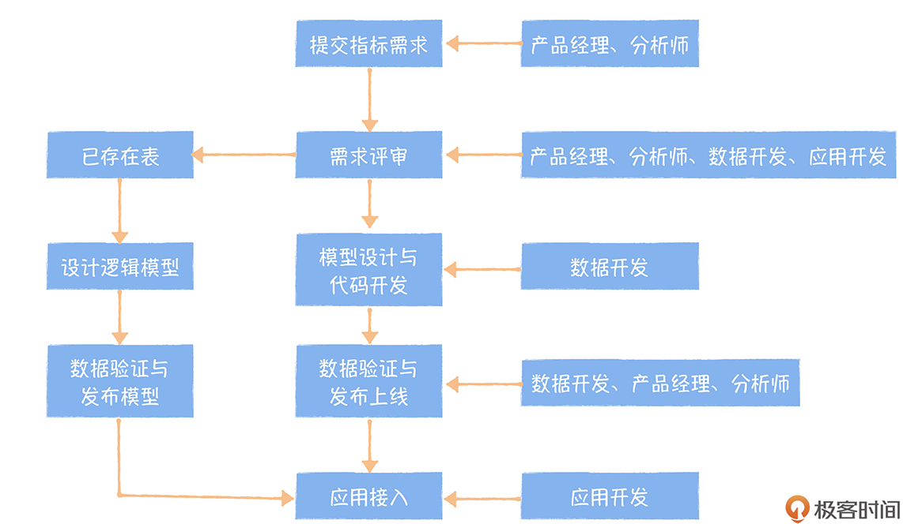

这个图详细地描述了新建指标的流程，流程中参与的各个角色。我在这里想强调几点：

- 指标需求评审，需要需求方、数据开发、应用开发都参加。评审首先要确认这是不是一个新的指标，并明确它是原子指标还是派生指标。评审的目的就是要大家达成一致。

- 评审的结果一种是不需要开发，是一个已经存在的指标，直接可以通过设计逻辑模型（具体我会在数据服务章节讲），发布接口，获取数据。第二种就是需要开发。前者交付时间短，后者需要排期，交付时间长。

- 上面我提到指标有一级和二级之分，这个流程适用于一级指标，对于二级指标，可以不需要评审，当然开发也是由业务方开发和发布上线。

接下来，我们来看第二个场景。

除了新建指标的流程，对于很多公司，已经有一定的大数据业务，但是还不能算是一个中台，那这部分公司该如何进行一次全局的指标梳理呢？我认为应该有以下几个步骤：

1. 成立以数据产品或者分析师为核心的 1～3 人的工作小组，专门负责指标的全局梳理；

2. 制定指标梳理计划，明确指标梳理目标，覆盖多少个业务线，与业务方共同制定时间计划；

3. 对于每一个业务线，需要对还在使用的数据报表、数据产品进行盘点，这里顺便可以把没用的报表和数据产品应该下线；

4. 对于每一个报表和数据产品中涉及的指标，按照以下格式进行收集；

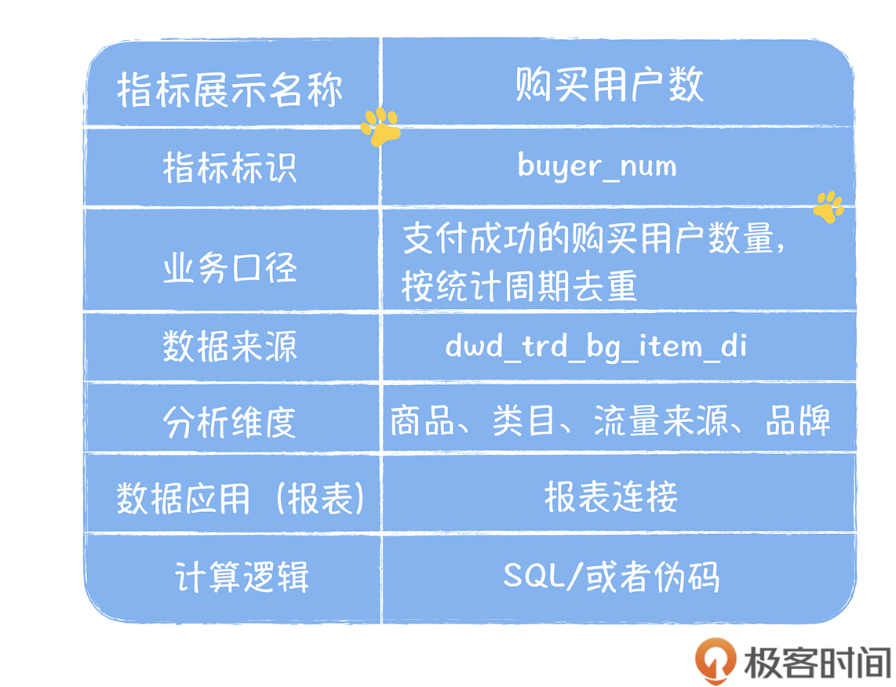


5. 对于收集的指标，明确业务口径，对于口径相同的，应该去除重复，关联的应用应该合并，此时以我的经验，可以过滤掉相当一部分；

6. 根据指标业务口径，明确指标所属的主题域、业务过程；

7. 区分指标类型，对于派生指标，要明确指标的统计粒度、修饰词、时间周期以及关联的原子指标；

8. 按照指标系统对指标的规范化定义，把整理好的指标录入指标系统。

通过全局的梳理和新建指标流程的管控，你就可以构建一个全局一致的指标字典了。


### 课堂总结

本节课，我带你了解了如何构建全局一致的指标字典，通过系统 + 规范的方法，帮你解决了数据中台指标一致性管理的难题，我想再强调几个点：

数据中台直接产出的核心指标必须实施强管理，由数据中台团队的专人或者小组负责，最好是数据产品经理的角色。

指标的管理必须结合系统 + 规范的治理方法，明确每个角色的职责，通过系统化的方法实现。

不同的两个指标描述的相同业务过程中的相同事实部分口径不一致，是指标梳理过程中最常见的问题，需要通过拆分原子指标和派生指标的方式解决。

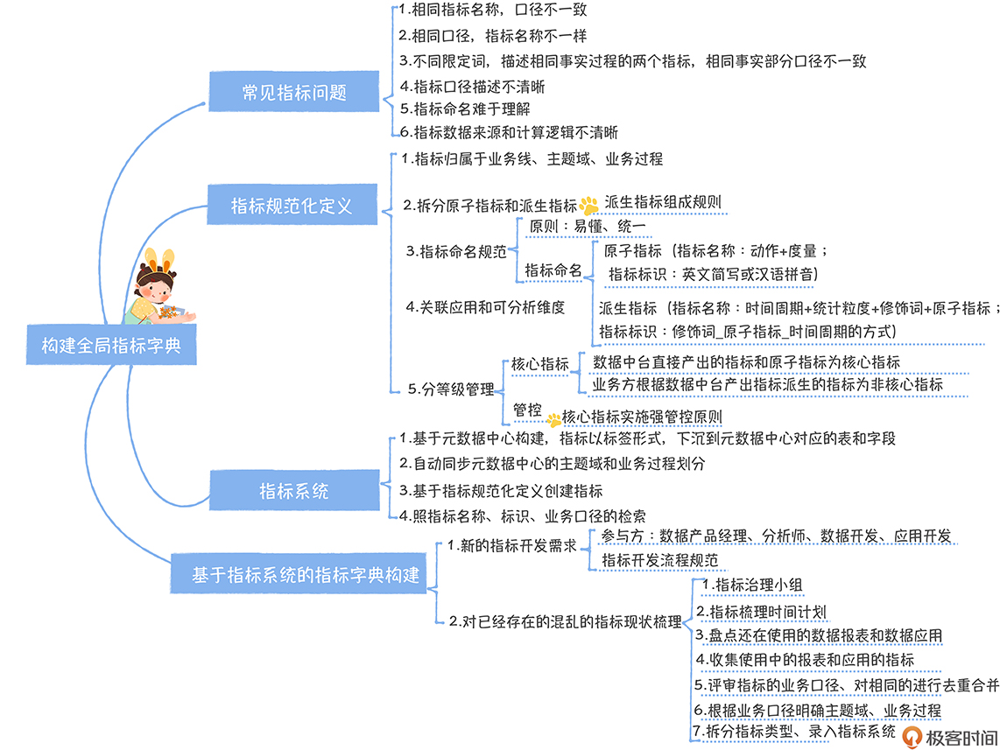


## 06 | 数据模型无法复用，归根结底还是设计问题

### 什么才是一个好的数据模型设计？

来看一组数据，这两个表格是基于元数据中心提供的血缘信息，分别对大数据平台上运行的任务和分析查询（Ad-hoc）进行的统计。

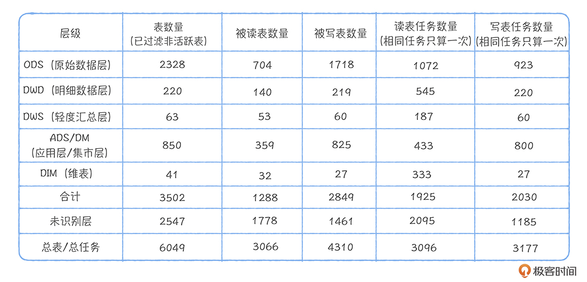

​                                                                                      表1 离线调度任务/表统计

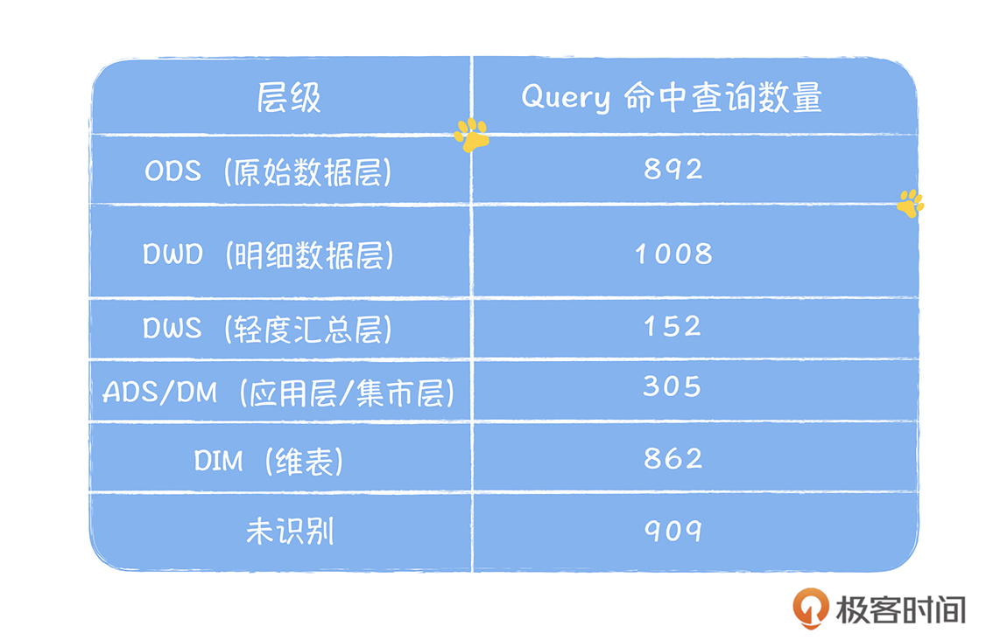

​                                                                                            表2 一周内Ad-hoc 查询统计

下图是数仓分层架构图，方便你回忆数据模型分层的设计架构：

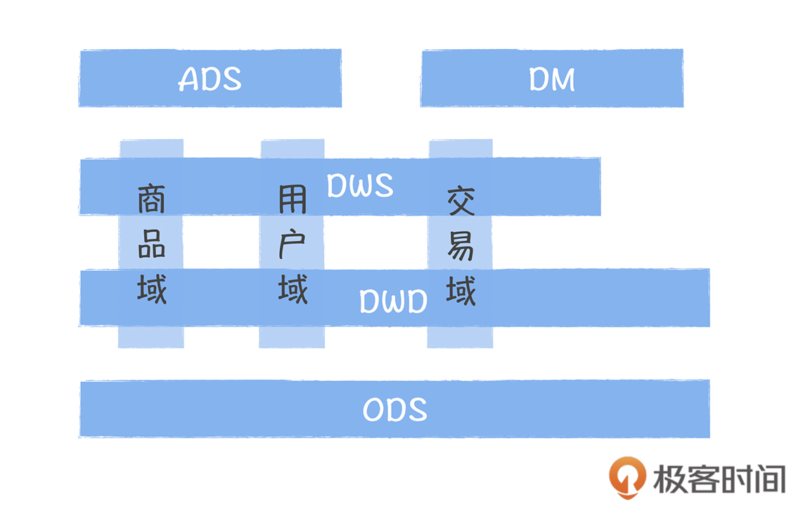

我们首先来看表 1。表 1 中有 2547 张未识别分层的表，占总表 6049 的 40%，它们基本没办法复用。 重点是在已识别分层的读表任务中，ODS：DWD：DWS：ADS 的读取任务分别是 1072：545：187：433，直接读取 ODS 层任务占这四层任务总和的 47.9%，这说明有大量任务都是基于原始数据加工，中间模型复用性很差。

我们再来看看表 2，在已识别的分层的查询中，ODS：DWD：DWS：ADS 的命中的查询分别是 892：1008：152：305，有 37.8% 的查询直接命中 ODS 层原始数据，说明 DWD、DWS、ADS 层数据建设缺失严重。尤其是 ADS 和 DWS，查询越底层的表，就会导致查询扫描的数据量会越大，查询时间会越长，查询的资源消耗也越大，使用数据的人满意度会低。

最后，我们进一步对 ODS 层被读取的 704 张表进行分解，发现有 382 张表的下游产出是 DWS，ADS，尤其是 ADS 达到了 323 张表，占 ODS 层表的比例 45.8%，说明有大量 ODS 层表被进行物理深加工。

**通过上面的分析，我们似乎已经找到了一个理想的数仓模型设计应该具备的因素，那就是“数据模型可复用，完善且规范”。**

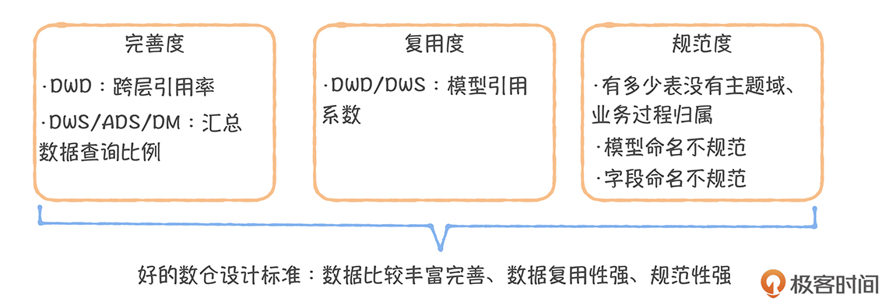

#### 如何衡量完善度

**DWD 层完善度：**衡量 DWD 层是否完善，最好看 ODS 层有多少表被 DWS/ADS/DM 层引用。因为 DWD 以上的层引用的越多，就说明越多的任务是基于原始数据进行深度聚合计算的，明细数据没有积累，无法被复用，数据清洗、格式化、集成存在重复开发。因此，我提出用跨层引用率指标衡量 DWD 的完善度。

跨层引用率：ODS 层直接被 DWS/ADS/DM 层引用的表，占所有 ODS 层表（仅统计活跃表）比例。

跨层引用率越低越好，在数据中台模型设计规范中，我们要求不允许出现跨层引用，ODS 层数据只能被 DWD 引用。

**DWS/ADS/DM 层完善度：**考核汇总数据的完善度，我认为主要看汇总数据能直接满足多少查询需求（也就是用汇总层数据的查询比例衡量）。如果汇总数据无法满足需求，使用数据的人就必须使用明细数据，甚至是原始数据。

汇总数据查询比例：DWS/ADS/DM 层的查询占所有查询的比例。

你要明确的是，这个跟跨层引用率不同，汇总查询比例不可能做到 100%，但值越高，说明上层的数据建设越完善，对于使用数据的人来说，查询速度和成本会减少，用起来会更爽。

#### 如何衡量复用度

数据中台模型设计的核心是追求模型的复用和共享，通过元数据中心的数据血缘图，我们可以看到，一个比较差的模型设计，自下而上是一条线。而一个理想的模型设计，它应该是交织的发散型结构。

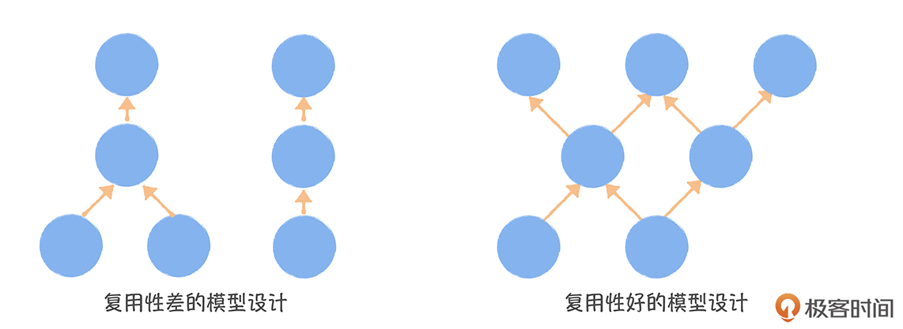

我提出用模型引用系数作为指标，衡量数据中台模型设计的复用度。引用系数越高，说明数仓的复用性越好。

模型引用系数：一个模型被读取，直接产出下游模型的平均数量。

比如一张 DWD 层表被 5 张 DWS 层表引用，这张 DWD 层表的引用系数就是 5，如果把所有 DWD 层表（有下游表的）引用系数取平均值，则为 DWD 层表平均模型引用系数，一般低于 2 比较差，3 以上相对比较好（经验值）。

#### 如何衡量规范度

表 1 中，超过 40% 的表都没有分层信息，在模型设计层面，这显然是不规范的。除了看这个表有没有分层，还要看它有没有归属到主题域（例如交易域）如果没有归属主题域，就很难找到这张表，也无法复用。

其次，你要看表的命名。拿 stock 这个命名为例，当你看到这个表时，知道它是哪个主题域、业务过程？是全量数据的表，还是每天的增量数据？总的来说，通过这个表名获取的信息太有限了。一个规范的表命名应该包括主题域、分层、表是全量快照，还是增量等信息。

除此之外，如果在表 A 中用户 ID 的命名是 UserID，在表 B 中用户 ID 命名是 ID，就会对使用者造成困扰，这到底是不是一个东西。所以我们要求相同的字段在不同的模型中，它的命名必须是一致的。

**讲了这么多，你要如何吸收经验呢？在这里，我给你几点建议。**

你可以拿着这些指标去评估一下，自己的数仓现状如何。

然后制订一些针对性的改进计划，比如把这些不规范命名的表消灭掉，把主题域覆盖的表比例提高到 90% 以上。

在尝试完一段时间的模型重构和优化后，再拿着这些指标去测一测是不是真的变好了。我见过很多数据开发在向上级汇报工作时，喜欢用重构了多少模型说明工作成果，很多老大会想，这些重构到底对数据建设有多少帮助？有没有一些量化的指标可以衡量？**我想有上面的知识，你可以应对这个问题了。**

现在你知道什么是好的数仓设计了，可目前已经存在了大量烟囱式开发，具体怎么做才能让它变成一个数据中台呢？

### 如何从烟囱式的小数仓到共享的数据中台

建设数据中台本质就是构建企业的公共数据层，把原先分散的、烟囱式的、杂乱的小数仓，合并成一个可共享、可复用的数据中台（我在03 讲提到过，建议你回顾一下）。结合我在网易的实践经验，我给你几点建议。

**第一，接管 ODS 层，控制源头。**

ODS 是业务数据进入数据中台的第一站，是所有数据加工的源头，控制住源头，才能从根本上防止一个重复的数据体系的出现。

数据中台团队必须明确职责，全面接管 ODS 层数据，从业务系统的源数据库权限入手，确保数据从业务系统产生后进入数据仓库时，只能在数据中台保持一份。这个可以跟业务系统数据库管理者达成一致，只有中台团队的账号才能同步数据。

ODS 层表的数据必须和数据源的表结构、表记录数一致，高度无损，对于 ODS 层表的命名采用 ODS_ 业务系统数据库名 _ 业务系统数据库表名方式，比如 ods_warehous_stock，warehous 是业务系统数据库名，stock 是该库下面的表名。

**第二，划分主题域，构建总线矩阵。**

主题域是业务过程的抽象集合。可能这么讲，稍微有点儿抽象，但其实业务过程就是企业经营过程中一个个不可拆分的行为事件，比如仓储管理里面有入库、出库、发货、签收，都是业务过程，抽象出来的主题域就是仓储域。

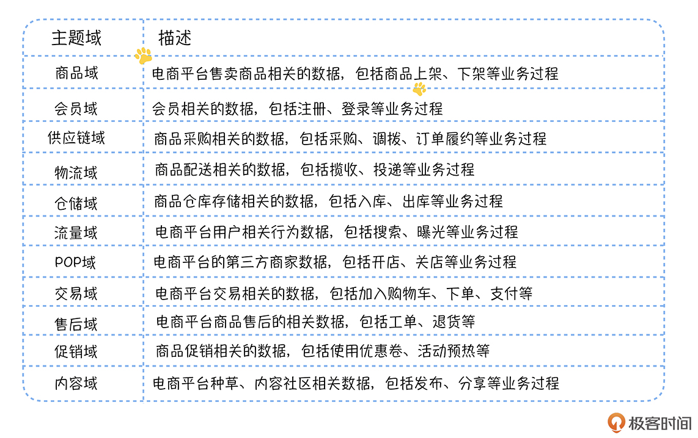

​                                                                                     表3 电商业务的主题域划分

主题域划分要尽量涵盖所有业务需求，保持相对稳定性，还具备一定的扩展性（新加入一个主题域，不影响已经划分的主题域的表）。

主题域划分好以后，就要开始构建总线矩阵，明确每个主题域下的业务过程有哪些分析维度，举个例子：

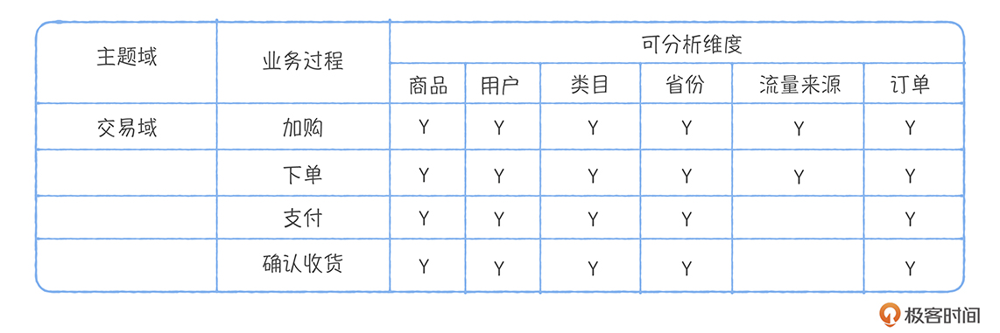

​                                                                                   表4 交易域的总线矩阵

**第三，构建一致性维度。**

售后团队的投诉工单数量有针对地区的分析维度，而配送团队的配送延迟也有针对地区的分析维度，你想分析因为配送延迟导致的投诉增加，但是两个地区的分析维度包含内容不一致，最终会导致一些地区没办法分析。所以我们构建全局一致性的维表，确保维表只存一份。

**维度统一的最大的难题在于维度属性（如果维度是商品，那么商品类别、商品品牌、商品尺寸等商品的属性，我们称为维度属性）的整合。**是不是所有维度属性都要整合到一个大的维表中，也不见得，我给你几个建议。

- 公共维度属性与特有维度属性拆成两个维表。在自营平台中，通常也会有一些第三方的商家入驻，但是数量很少。大部分商品其实都没有店铺的属性，这种情况，就不建议将店铺和商品的其他维度属性，比如商品类别、品牌设计成一个维表。

- 产出时间相差较大的维度属性拆分单独的维表，比如有些维度属性产出时间在凌晨 2 点，有些维度属性产出时间在凌晨 6 点，那 2 点和 6 点的就可以拆成两个维表，确保核心维表尽早产出。

- 出于维表稳定性产出的考虑，你可以将更新频繁的和变化缓慢的进行拆分，访问频繁的和访问较少的维表进行拆分。

对于维表的规范化命名，建议你用“DIM_ 主题域 _ 描述 _ 分表规则”方式。**分表你可以这样理解：**一个表存储几千亿行记录实在是太大了，所以需要把一个表切割成很多小的分区，每天或者每周，随着任务被调度，会生成一个分区。我提供给你一个常见的分区规则（这个规则你在用的时候，查阅就可以了）。

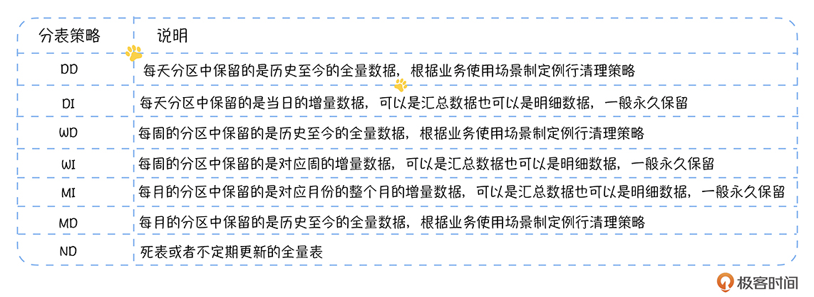

**第四，事实表整合。**

我觉得事实表整合遵循的最基本的一个原则是，统计粒度必须保持一致，不同统计粒度的数据不能出现在同一个事实表中。来看一个例子：

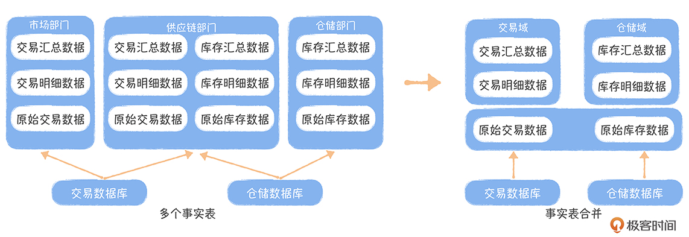

在数据中台构建前，供应链部门、仓储部门和市场部门都有一些重复的事实表，我们需要将这些重复的内容进行去除，按照交易域和仓储域，主题域的方式进行整合。

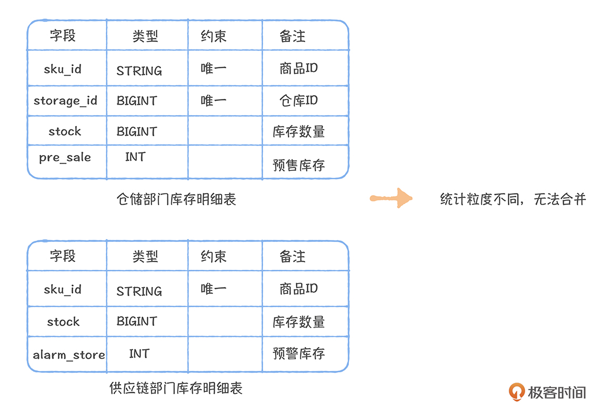

对于仓储部门和供应链部门都有的库存明细表，因为仓储部门的统计粒度是商品加仓库，而供应链部门的只有商品，所以原则上两个表是不能合并，而是应该独立存在。

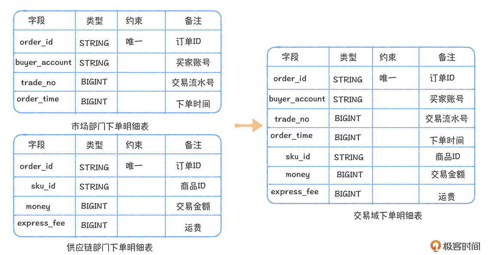

对于市场部门和供应链部门的两张下单明细表，因为统计粒度都是订单级别，都归属于交易域下的下单业务过程，所以可以合并为一张事实表。

除此之外，还应该考虑将不全的数据补齐。对于 ODS 层直接被引用产出 DWS/ADS/DM 层的任务，通过血缘，找到任务清单，逐个进行拆解。没有 ODS 对应的 DWD 的，应该生成 DWD 表，对于已经存在的，应该迁移任务，使用 DWD 层表。

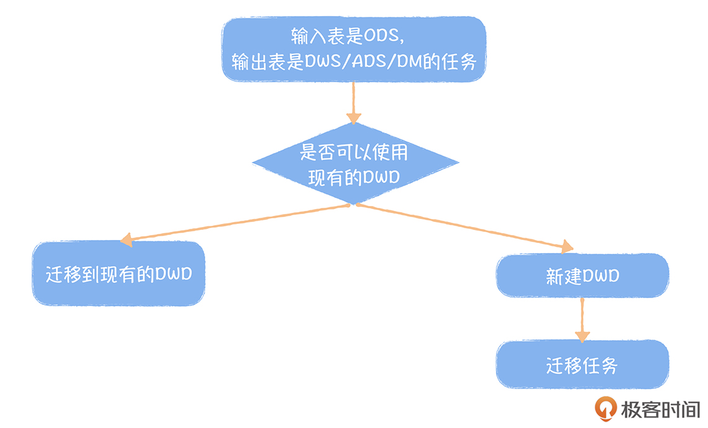

DWD/DWS/ADS/DM 的命名规则适合采用“[层次][主题][子主题][内容描述][分表规则]”的命名方式。

**第五，模型开发。**

模型设计完成后，就进入模型开发阶段，我想提几个你需要注意的点：

所有任务都必须严格配置任务依赖，如果没有配置任务依赖，会导致前一个任务没有正常产出数据的情况下，后一个任务被调度起来，基于错误的数据空跑，浪费资源，同时增加了排查故障的复杂度；

任务中创建的临时表，在任务结束前应该删除，如果不删除，会发现有大量的临时表存在，占用空间；

任务名称最好跟表名一致，方便查找和关联；

生命周期的管理，对于 ODS 和 DWD，一般尽可能保留所有历史数据，对于

DWS/ADS/DM 需要设置生命周期，7～30 天不等；

DWD 层表宜采用压缩的方式存储，可用 lzo 压缩。

**第六，应用迁移。**

最后一步就是应用的迁移，这个过程的核心是要注意数据的比对，确保数据的完全一致，然后进行应用迁移，删除老的数据表。

总的来说，建设数据中台不是一口气就能吃成一个胖子，它的建设往往是滚雪球的方式，随着一个个应用的迁移，中台的数据也越来越丰满，发挥的价值也越来越大。

### 数仓建模工具 EasyDesign

当然了，这些步骤的实现，离不开一个好用的工具作为支撑，为了规范化数据模型的设计，我们研发了 EasyDesign 的模型设计产品，让这些流程实现系统化管理。而我希望你了解如何去设计这个工具，或者在选用工具的时候应该考虑有哪些功能。

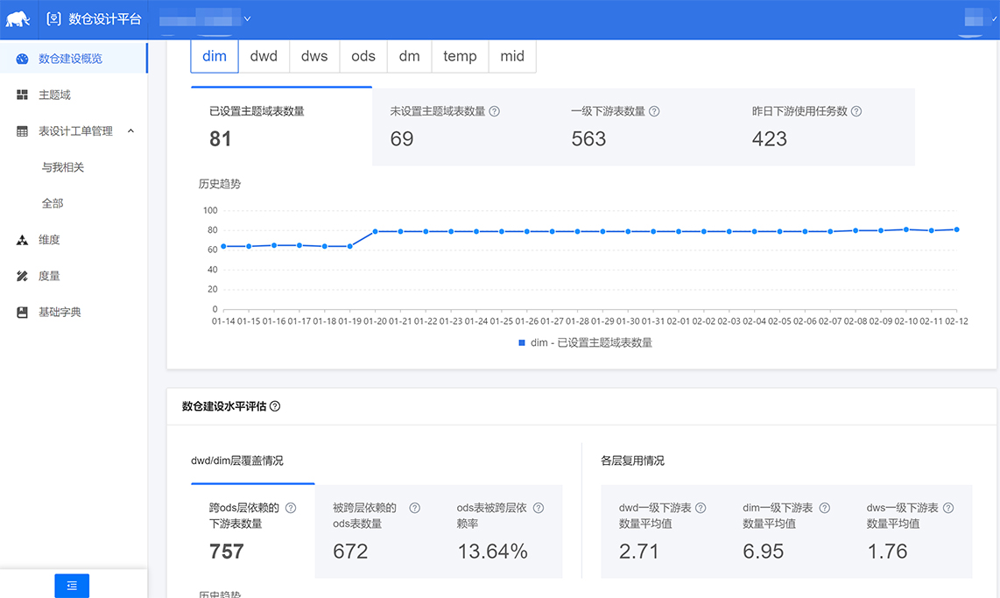

EasyDesign 构建于元数据中心之上，通过 API 调用元数据中心的数据血缘接口，结合数仓模型设计的指标，给出了模型设计度量。

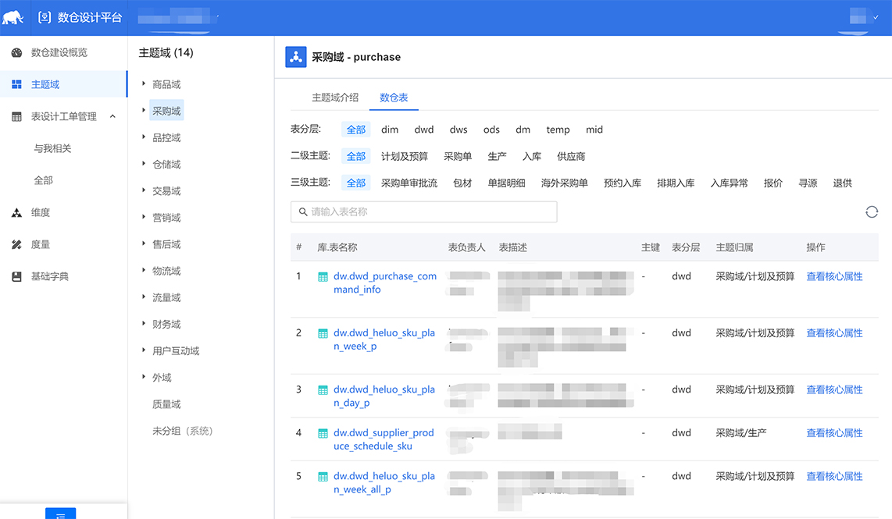

EasyDesign 按照主题域、业务过程、分层的方式管理所有的模型。

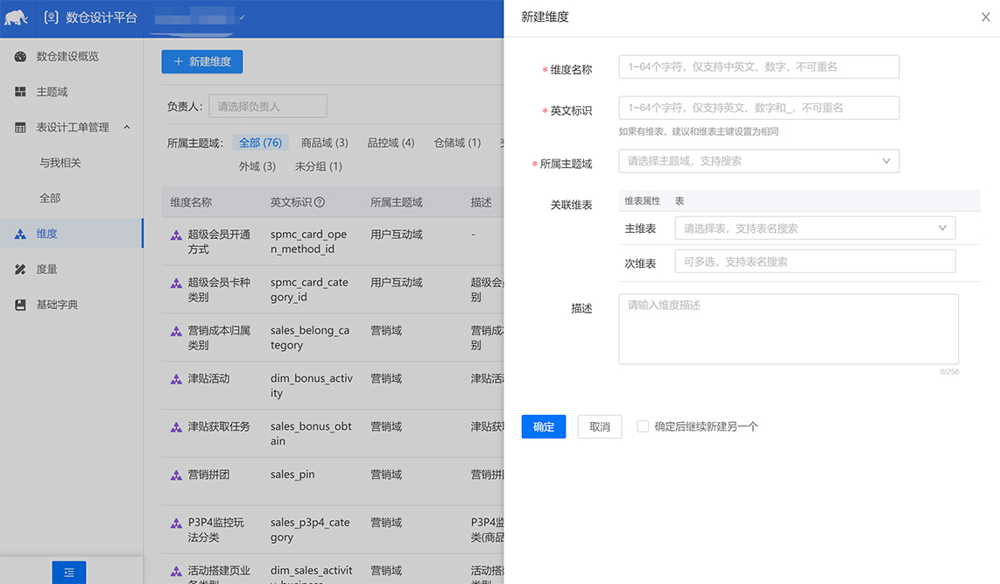

它还提供了维度、度量和字段基础字典的管理，同时具备模型设计审批流程的控制。

### 课堂总结

本节课，我结合自己的经验，带你了解了数据中台的模型设计。从确立设计目标，到通过一系列步骤，将一个个分散的、杂乱的、烟囱式的小数仓逐步规整到一个可复用、可共享的数据中台，最后通过产品化的方式实现系统化的管理。在最后，我想再强调几个点：

完善度、复用度和规范度构成了衡量数据中台模型设计的度量体系，可以帮助你评估数仓设计的好坏。

维度设计是维度建模的灵魂，也是数据中台模型设计的基础，维度设计的核心是构建一致性维度。

事实表的统计粒度必须保持一致，不同统计粒度的数据不能出现在同一个事实表中。

你要知道，数据中台的构建往往需要花费半年甚至一年以上的时间，但是数据中台建成后，对研发效率的提升效果非常明显，在网易电商业务中，中台构建后相比构建前，数据需求的平均交付时间从一周缩短到 3 天内，需求响应速度的提升，为企业运营效果提升提供了数据支撑。我相信通过数据中台的构建，你所在企业的数据研发效率也会得到大幅度的提升。

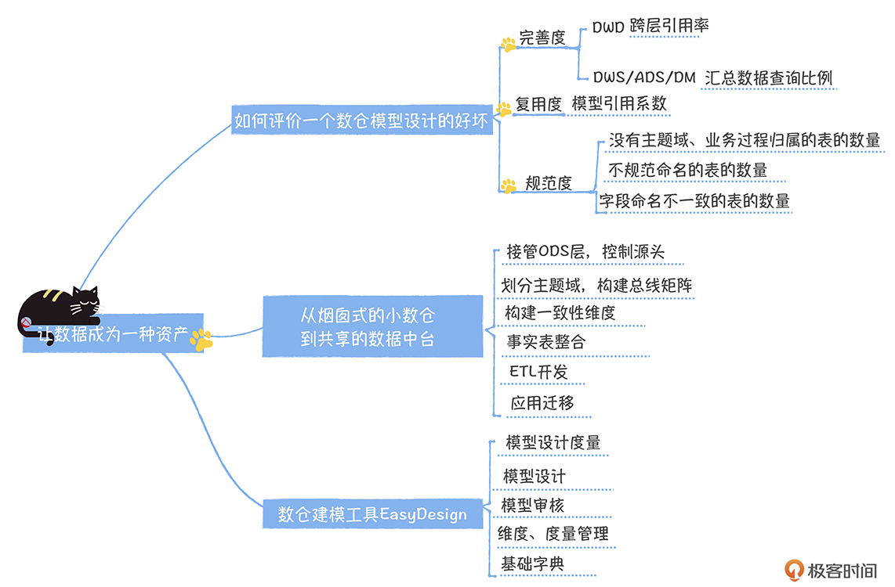

## 07 | 同事老打脸说数据有问题，该怎么彻底解决？

当然，这个例子暴露出这样几个问题：

- 数据部门晚于业务方发现数据异常，被投诉后才发现问题。

- 出现问题后，数据部门无法快速定位到数据异常的根源，排查用了较长的时间。

- 故障出现在数据加工链路的上游顶端，出现问题没有第一时间报警处理，导致问题修复时，所有下游链路上的任务都要运行，修复时间成本非常高。

**这些问题最终导致了数据长时间不可用。**那如何解决这些问题，确保数据高质量的交付呢？ 首先，你要了解产生这些问题的根源，毕竟认识问题才能解决问题。

### 数据质量问题的根源

在网易电商业务数据中台构建之初，我对数据团队一年内，记录在案的 321 次数据质量事件做了逐一分析，对这些事件的原因进行了归纳，主要有下面几类。这里多说一句，如果你想改进数据质量，不妨也对过去踩过的坑做一次复盘，归一下类，看看问题都出在哪里，然后制定针对性的改进计划。

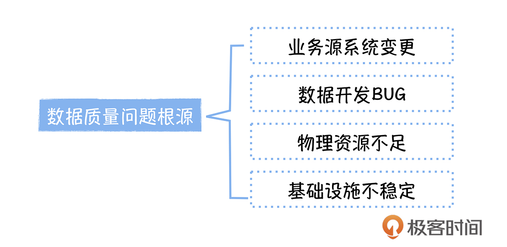

#### 业务源系统变更

数据中台的数据来源于业务系统，而源系统变更一般会引发 3 类异常情况，

**首先是源系统数据库表结构变更。**例如业务系统新版本发布上线，对数据库进行了表结构变更，增加了一个字段，同时对部分字段的类型、枚举值进行了调整。这种表结构变更没有通知到数据团队，导致数据同步任务或者数据清洗任务异常，进而影响了下游数据产出。

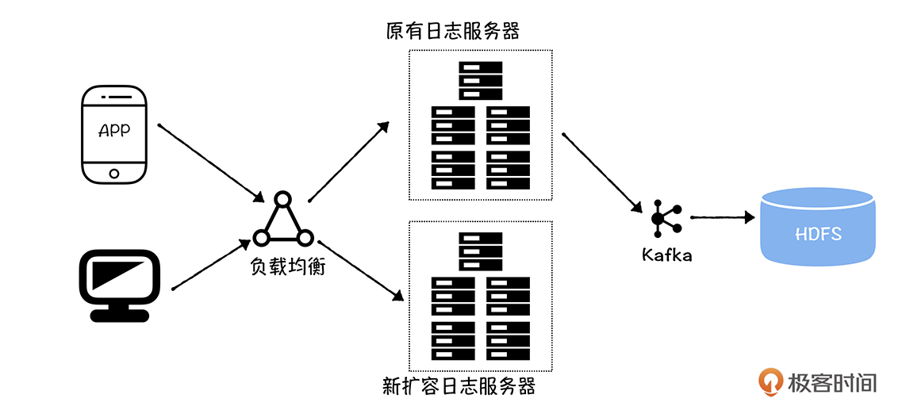

​                                                                图2 日志服务器扩容误操作引发数据异常

**第二个是源系统环境变更。**我经常在大促期间见到这种情况，其中的典型是前端用户行为埋点日志量暴增，系统管理员紧急对服务器进行扩容，上线了 5 台新的服务器，但是没有配置这 5 台服务器的日志同步任务，结果导致数据侧少了这 5 台服务器的数据，最终影响了数据计算结果的准确性。

**最后一个是源系统日志数据格式异常。**这种情况通常出现在前后端埋点日志中。业务系统发布上线引入埋点 BUG，导致 IP 格式出现了不符合约定的格式（比如，我们一般约定的 IP 格式是 166.111.4.129，结果出现了 166.111.4.null），最终也会导致计算结果错误。

#### 数据开发任务变更

这种情况在数据质量事件中占到了 60% 以上，而它大多数是由于数据开发的纰漏引发的，来看几个你比较熟悉的例子：

- 任务发布上线，代码中引用的测试库没有修改为线上库，结果污染了线上数据；

- 任务发布上线，代码中使用了固定分区，没有切换为“${azkaban.flow.1.days.ago}”，导致数据异常；

- 前面例子中，数据格式处理错误，代码忽略了异常，导致数据错误；

- 任务配置异常，它通常表现在任务没有配置依赖，前一个任务没有运行完，后一个任务就开始运行，输入数据不完整，导致下游数据产出错误。

#### 物理资源不足

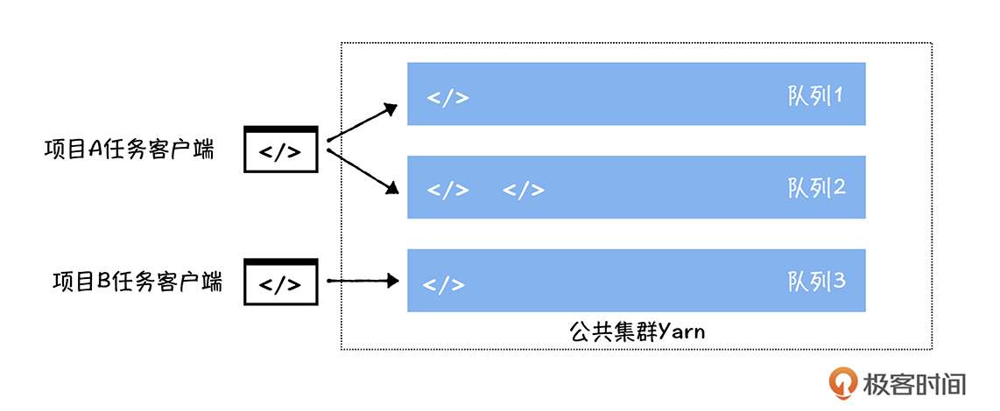

​                                                                      图3 Hadoop多队列任务提交

在多租户下，Hadoop 生态的大数据任务（MR，Hive，Spark）一般运行在 yarn 管理的多个队列上（调度器为 CapacityScheduluer），每个队列都是分配了一定大小的计算资源（CPU、内存）。

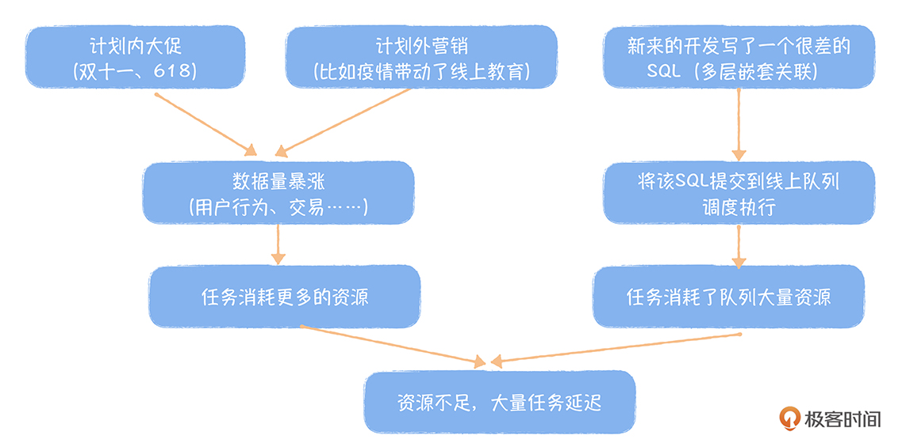

​																				图4 物理资源不足导致任务延迟

我展示了两种常见的物理资源不足，导致任务延迟产出的情况。

#### 基础设施不稳定

从数量上来看，这类异常不算多，但影响却是全局性的。我们曾经在大促期间，碰到了一个Hadoop 2.7 NameNode 的 BUG，造成 HDFS 整个服务都停止读写，最终通过临时补丁的方式才修复。

总的来说，出现问题并不可怕，可怕的是，我们没有及时发现问题，尽快恢复服务，举一反三地通过流程和技术手段，降低问题出现的概率。所以接下来我们就来看一看，如何提高数据质量？

### 如何提高数据质量？

我认为，要想提升数据质量，最重要的就是“早发现，早恢复”：

- 早发现，是要能够先于数据使用方发现数据的问题，尽可能在出现问题的源头发现问题，这样就为“早恢复”争取到了大量的时间。

- 早恢复，就是要缩短故障恢复的时间，降低故障对数据产出的影响。

那具体如何做到这两个早呢？我总结了一套数据质量建设的方法，包括这样几个内容。

#### 添加稽核校验任务

在数据加工任务中，对产出表按照业务规则，设计一些校验逻辑，确保数据的完整性、一致性和准确性，这是提升数据质量最行之有效的方法。

通常建议你在数据产出任务运行结束后，启动稽核校验任务对数据结果进行扫描计算，判断是否符合规则预期。如果不符合，就根据提前设定的强弱规则，触发不同的处理流程。

如果是强规则，就立即终止任务加工链路，后续的任务不会执行，并且立即发出电话报警，甚至我们要求，关键任务还要开启循环电话报警，直到故障被认领；如果是弱规则，任务会继续执行。但是存在风险，这些风险会通过邮件或者短信的方式，通知到数据开发，由人来进一步判断风险严重程度。

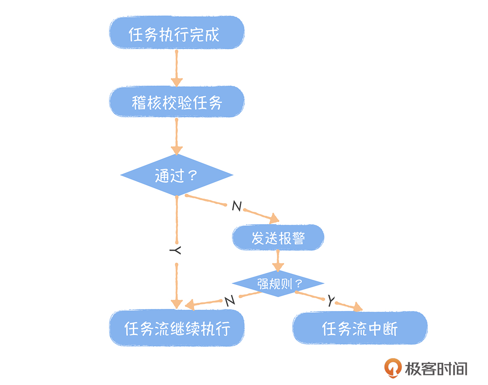

​																						图5 稽核校验执行流程图

那具体要加哪些稽核规则呢？

**完整性规则。**主要目的是确保数据记录是完整的，不丢失。常见的稽核规则有表数据量的绝对值监控和波动率的监控（比如表波动超过 20%，就认为是异常）。还有主键唯一性的监控，它是判断数据是否有重复记录的监控规则，比较基础。除了表级别的监控，还有字段级别的监控（比如字段为 0、为 NULL 的记录）。

**一致性规则。**主要解决相关数据在不同模型中一致性的问题。商品购买率是通过商品购买用户数除以商品访问 uv 计算而来的，如果在不同的模型中，商品购买用户数是 1W、商品访问 uv10W，商品购买率 20%，那这三个指标就存在不一致。

**准确性规则。**主要解决数据记录正确性的问题。常见的稽核规则有，一个商品只能归属在一个类目，数据格式是不是正确的 IP 格式，订单的下单日期是还没有发生的日期等等。

它们是强规则还是弱规则，取决于业务对上述异常的容忍度（比如涉及到交易、支付跟钱相关的，一般都会设置为强规则，对于一些偏行为分析的，一般都是弱规则）。

#### 建立全链路监控

在 06 讲中，我强调数据中台的模型设计是分层的，确保中间结果可以被多个模型复用。

不过这会导致数据加工的链路变长，加工链路的依赖关系会非常复杂，最终当下游表上的某个指标出现问题，排查定位问题的时间都会比较长。**所以，我们有必要基于数据血缘关系，建立全链路数据质量监控。**


图6 全链路数据质量监控

从这个图中你可以看到，业务系统的源数据库表是起点，经过数据中台的数据加工链路，产出指标“黑卡会员购买用户数”，数据应用是链路的终点。

对链路中每个表增加稽核校验规则之后，当其中任何一个节点产出的数据出现异常时，你能够第一时间发现，并立即修复，做到早发现、早修复。另外，即使是使用方反馈经营分析上的黑卡会员购买用户数，相较于昨天数据大幅下降超过 30%，你也可以快速判定整个指标加工链路上节点是否运行正常，产出任务是否有更新，提高了问题排查速度。

#### 通过智能预警，确保任务按时产出

在数据质量问题中，我提到会存在物理资源不足，导致任务产出延迟的情况。在网易，所有数据中台产出的指标要求 6 点前产出。为了实现这个目标，我们需要对指标加工链路中的每个任务的产出时间进行监控，基于任务的运行时间和数据血缘，对下游指标产出时间进行实时预测，一旦发现指标无法按时产出，则立即报警，数据开发可以终止一些低优先级的任务，确保核心任务按时产出。

#### 通过应用的重要性区分数据等级，加快恢复速度

稽核校验会消耗大量的资源，所以只有核心任务才需要。核心任务的定义是核心应用（使用范围广、使用者管理级别高）数据链路上的所有任务。

#### 规范化管理制度

讲到这儿，你可能会问：数据质量取决于稽核规则的完善性，如果数据开发没有添加，或者添加的规则不全，是不是就达不到早发现、早恢复？

这个问题戳中了要害，就是规则的完备性如何来保障。在我看来，这不仅仅是一个技术问题，也涉及管理。在网易，我们会制定一些通用的指导规则（比如，所有数据中台维护的表都需要添加主键唯一性的监控规则），但这些通用规则往往与业务关系不大。如果涉及业务层面，就要由数据架构师牵头，按照主题域、业务过程，对每个表的规则进行评审，决定这些规则够不够。

那我想建议你，如果要做稽核校验，可以通过组建数据架构师团队，由这个团队负责核心表的规则审核，确保规则的完备性。

那么当你按照这几个方法建立了数据质量体系之后，要如何验证体系是否有效呢?

### 如何衡量数据质量？

做数据治理，我一直奉行“效果可量化”的原则，否则这个治理做到什么程度，很难衡量。那么如何评价数据质量是否有改进呢？除了故障次数，你还可以有这样几个指标。

- 4 点半前数据中台核心任务产出完成率。这个指标是一个综合性指标，如果任务异常，任务延迟，强稽核规则失败，都会导致任务无法在规定时间前产出。

- 基于稽核规则，计算表级别的质量分数。根据表上稽核规则的通过情况，为每个表建立质量分数，对于分数低的表，表负责人要承担改进责任。

- 需要立即介入的报警次数，通常以开启循环报警的电话报警次数为准。对于核心任务，任务异常会触发循环电话报警，接到报警的数据开发需要立即介入。

- 数据产品 SLA。每个数据产品上所有指标有没有在 9 点产出，如果没有，开始计算不可用时间，整体可以按照不同数据产品的重要性进行折算，99.8% 是数据产品一个相对比较好的 SLA。

不过，技术和规范最终需要依靠产品来帮助落地，在网易内部，有一个数据质量中心的 产品，通过介绍这个产品，我希望能给你一个参考，如何去设计一个数据质量中心，或者在选型的时候，数据质量中心必须具备的功能。

### 数据质量中心

数据质量中心（以下简称 DQC）的核心功能是稽核校验和基于数据血缘的全链路数据质量监控。

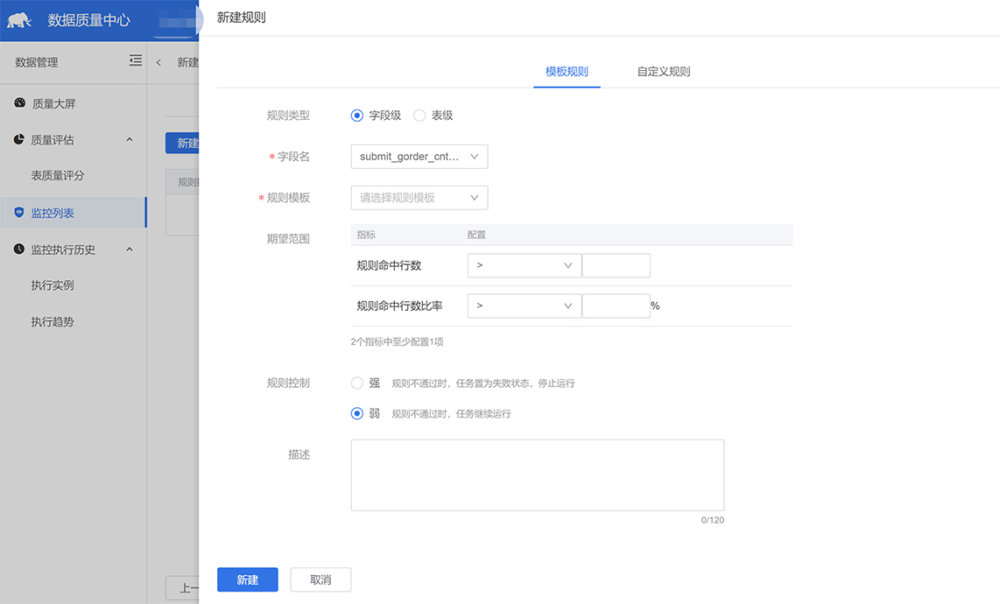

DQC 的首页是质量大屏，提供了稽核规则的数量、表的覆盖量以及这些规则的执行通过情况。通过这些数据，你就能跟你的老板讲清楚，目前数据质量水平建设如何？目标是多少？距离目标还有多少差距。

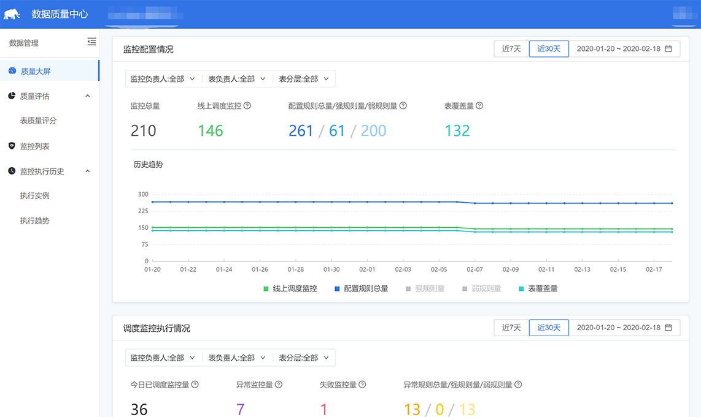

在 DQC 中创建稽核规则非常简单，DQC 内置了大量的基础规则，例如 IP 字段格式校验，主键唯一性校验，表行数波动率校验，同时还提供了自定义 SQL 的方式，允许业务层面的规则创建，例如我们前面提到的一致性规则中，两个指标相除等于第三个指标，就可以通过自定义 SQL 解决。

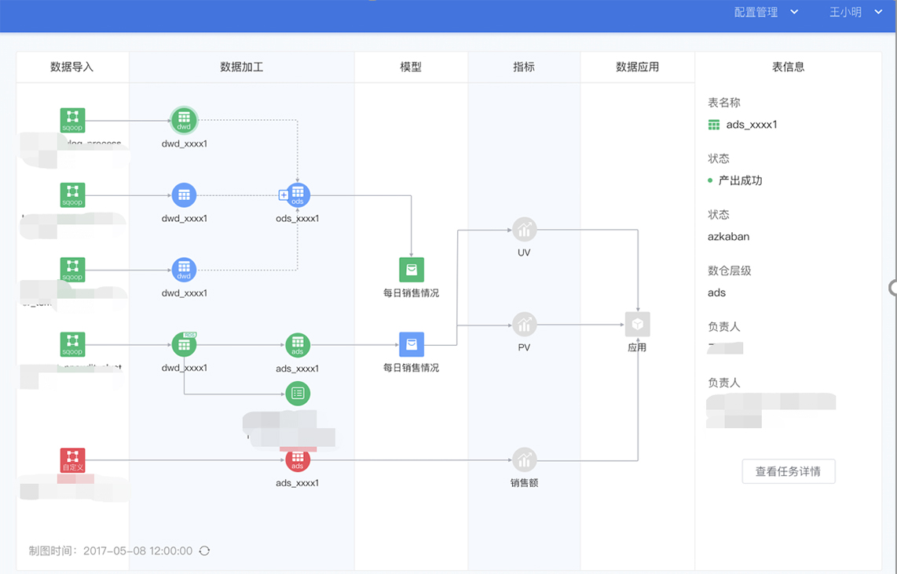

DQC 还提供了全链路监控的功能，覆盖了从数据导入、数据加工、模型产出、指标、到数据应用的完整链路。绿色节点代表数据正常，蓝色节点代表数据正在产出中，红色节点代表数据异常，灰色节点代表产出任务还未被调度到。通过这个监控，大幅提高了问题发现和定位的速度。

所以你可以发现，一个好用的 DQC， 必须要具备的功能就是质量度量、稽核规则管理以及全链路监控。

### 课堂总结

本节课，我从数据质量问题的根源入手，带你分析了背后的原因，和五种提高数据质量的方法，在课程结束前，我再强调几个重点：

- 数据质量治理必须要做到全链路，从业务系统的数据源到指标所在的应用，这样可以提前发现问题，将故障消灭在摇篮中；

- 根据应用的优先级和全链路血缘关系，圈定核心任务，要确保核心任务的稽核规则全覆盖，优先保障核心任务的按时产出，在资源紧缺时，有必要停止非核心任务；

- 稽核规则的完备性，可以通过数据架构师团队对每个域下的核心表进行评审的方式保障，同时问题回溯和复盘，也可以不断地完善。

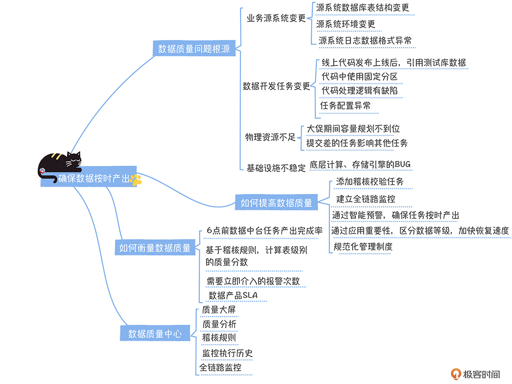

## 08 | 交付速度和质量问题解决了，老板说还得“省”

在上一节课中，我们讨论了如何保障数据中台的数据质量，让数据做到“准”。我认为，除了“快”和“准”，数据中台还离不开一个“省”字。尤其是随着数据规模越来越大，成本越来越高，如果不能合理控制成本，还没等你挖掘出数据的应用价值，企业利润就已经被消耗完了。

所以，能否做到精细化的成本管理，关乎数据中台项目的成败。还是分享一个我见过的事儿。

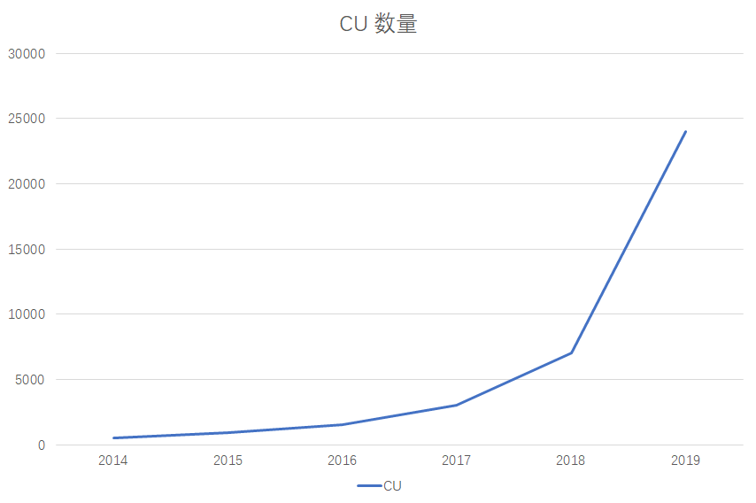

某电商业务数据建设资源增长趋势（CU= 1vcpu + 4G memory）

这张图展示了某电商平台的大数据资源消耗增长趋势，尤其值得你关注的是，到了 2019 年，全年的资源规模已经达到了 25000CU，全年机器预算达到了 3500W。对一个在创业的企业来说，这显然是一笔不小的开支。

终于有一天，数据团队的负责人李好看（化名）就被 CEO 叫到了办公室，CEO 问了几个问题：

这 3500W 花在什么业务上？

你们做了哪些成本优化的举措，效果如何？

一系列的灵魂拷问，直接把李好看问懵了，他心想：团队的成本是按机器又不是数据应用核算的。在数据中台中，数据应用之间的底层数据是复用的，那具体每个数据产品或者报表花了多少钱，自己没有这样的数据啊，怎么可能知道。

可对 CEO 来说，这些问题很重要，因为资源总是有限的，他必须确保资源都用在战略目标的关键节点上。比如，对于电商团队，今年的核心 KPI 是提升单个注册会员在平台的消费额，那从老板角度来讲，他必须确保资源都投入与 KPI 相关业务中，例如基于数据对注册会员进行精准化营销，来提升会员在平台的消费额。

讲到这儿，你可以想一想，自己所在的团队是否发生过类似的事情？ 我相信，数据部门是企业的成本中心，如果要展现自己的价值，一方面是支撑好业务，获得业务的认可；另外一方面就是精简成本，为公司省钱。

所以，今天我们就把重点放在省钱上，聊一聊数据中台的精细化成本管理。

### 有哪些成本的陷阱？

在一开始建设数据中台时，你往往会关注新业务的接入，数据的整合，数据价值的挖掘上，忽略成本管控的问题，从而落入陷阱中，造成成本爆炸式的增长。所以，你有必要深入了解一下有哪些陷阱，从而尽量在日常开发中避免。

在这里，我总结了 8 种陷阱，其中：

1~3 是广泛存在，但是容易被忽略的，需要你格外注意；

4~8 涉及数据开发中一些技能，你在开发过程中注意一下就可以了。

除此之外，在学习这部分知识的过程中，我建议你“知其然，更要知其所以然”，这样才能发现问题的本质，从而深入掌握解决问题的方法。

**第一，数据上线容易下线难。**

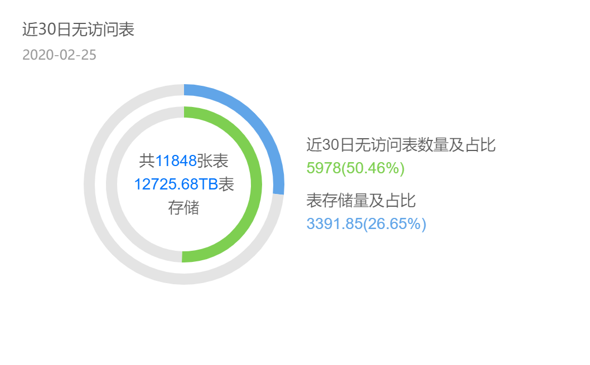

先来看一组统计数据，这是某数据中台项目，表相关的使用统计。从中你可以发现，有一半的表在 30 天内都没有访问，而这些表占用了 26% 的存储空间。如果我们把这些表的产出任务单独拎出来，在高峰期需要消耗 5000Core CPU 的计算资源，换算成服务器需要 125 台（按照一台服务器可分配 CPU 40Core 计算），折合成本一年接近 500W。

是不是觉得自己竟然有这么多没用的数据？我经常把数据比作手机中的图片，我们总是不断地拍照，生成图片，却懒得清理，最终手机里面的存储经常不够用。

对于无法及时清理数据，数据开发其实也有苦衷。他们并不知道一个表还有哪些任务在引用，还有哪些人在查询，自然不敢停止这个表的数据加工，那造成的后果就是数据上线容易，下线难。

**第二，低价值的数据应用消耗了大量的资源。**

我们的数据看上去每天都在被访问，但究竟产出了多少价值，投入和产出是否匹配呢？作为一个数据部门，我们要问一问自己。

我们曾经有一个宽表（拥有很多列的表，经常出现在数据中台下游的汇总层数据中），算上上游加工链路的任务，每天加工这张宽表要消耗 6000 块钱，一年要 200W，可追查后我们发现，这张宽表实际每天只有一个人在使用，还是一个运营的实习生。显然，投入和产出极不匹配。

这其实间接说明，数据部门比较关注新的数据产品带给业务的价值，却忽略了已经存在的产品或者报表是否还存在价值，最终导致低价值的应用仍然在大量消耗资源。

**第三，烟囱式的开发模式。**

烟囱式的开发不仅会带来研发效率低的问题，同时因为数据重复加工，还会存在资源浪费的问题。我们来算一笔账，一张 500T 的表，加工这张表，计算任务需要高峰期消耗 300Core，折合 7 台服务器（按照一台服务器可分配 CPU 40Core 计算），再加上存储盘的成本 (按照 0.7 元 /TB* 天计算)，一年需要消耗 40W。

而这张表每复用一次，就可以节省 40W 的成本。所以通过模型复用，还可以实现省钱的目的。

**第四，数据倾斜。**

数据倾斜会让任务性能变差，也会浪费大量的资源，那什么是数据倾斜呢？

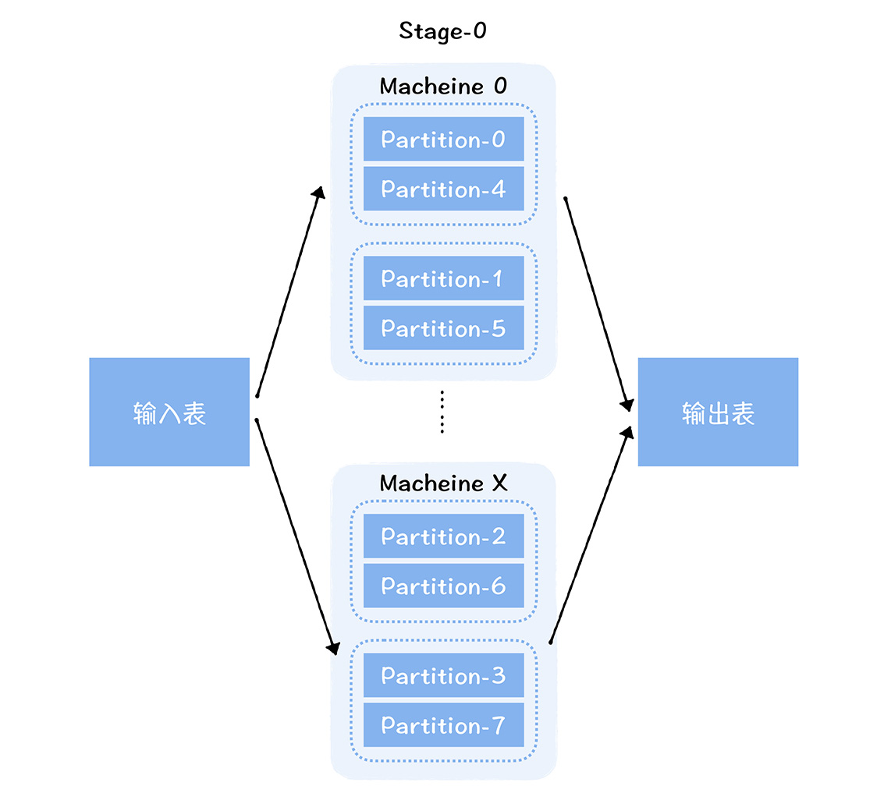

​																				单Stage阶段Spark任务数据分片运行图

你肯定听说过木桶效应吧？一个木桶装多少水，主要取决于最短的那块板。对于一个分布式并行计算框架来说，这个效应同样存在。对于 Spark 计算引擎来说，它可以将海量的数据切分成不同的分片（Partition），分配到不同机器运行的任务中，进行并行计算，从而实现计算能力水平扩展。

但是整个任务的运行时长，其实取决于运行最长的那个任务。因为每个分片的数据量可能不同，每个任务需要的资源也不相同。由于不同的任务不能分配不同的资源，所以，总任务消耗资源 =max{单个任务消耗的资源} * 任务数量。这样一来，数据量小的任务会消耗更多的资源，就会造成资源的浪费。

我们还是举个电商场景的例子。

假设你需要按照商户粒度统计每个商户的交易金额，此时，我们需要对订单流水表按照商户进行 group by 计算。在平台上，每个商户的订单交易量实际差距很大，有的订单交易量很多，有的却比较少。

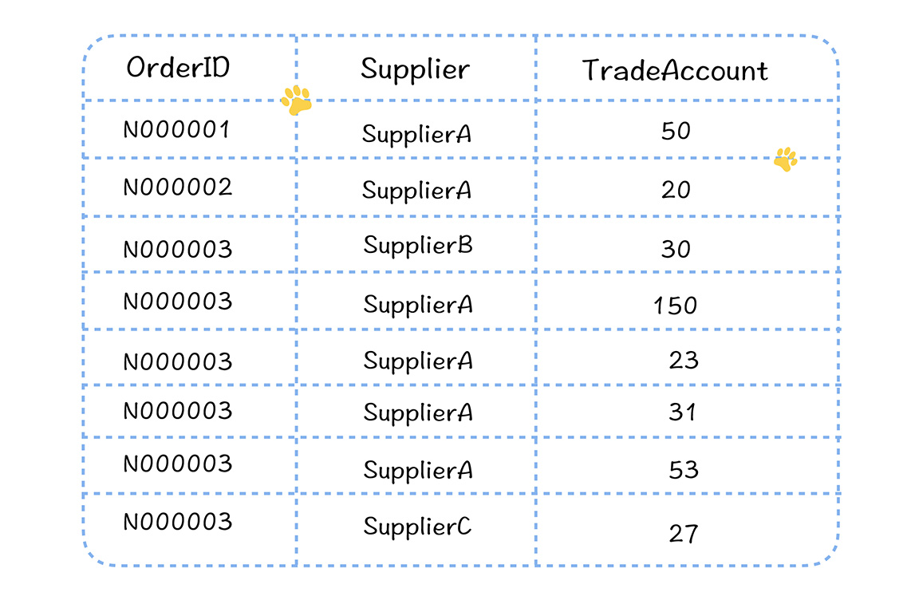

我们利用 Spark SQL 完成计算过程。

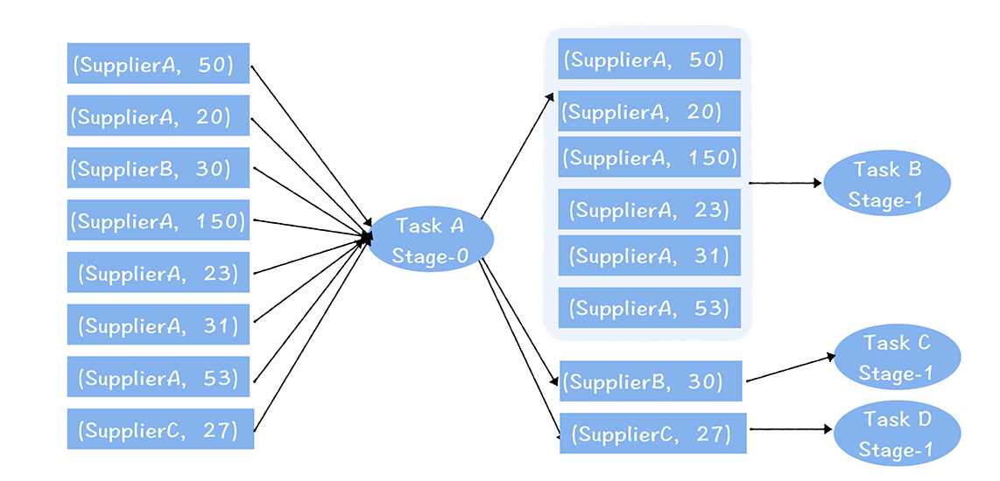

数据倾斜示意图

在上图中，任务 A 读取了左边某个分片的数据，按照供应商进行聚合，然后输出给下一个 Stage 的 B、C、D 任务。

你可以看到，聚合后，B、C 和 D 任务输入的数据量有很大的不同，B 处理的数据量比 C 和 D 多，消耗的内存自然更多，假设单个 Executor 需要分配 16G，而 B、C、D 不能设置不同的内存大小，所以 C 和 D 也都设置了 16G。可实际上，按照 C 和 D 的数据量，只需要 4G 就够了。这就造成了 C 和 D 任务资源分配的浪费。

**第五，数据未设置生命周期。**

在06 讲中，我强调，一般原始数据和明细数据，会保留完整的历史数据。而在汇总层、集市层或者应用层，考虑到存储成本，数据建议按照生命周期来管理，通常保留几天的快照或者分区。如果存在大表没有设置生命周期，就会浪费存储资源。

**第六，调度周期不合理。**

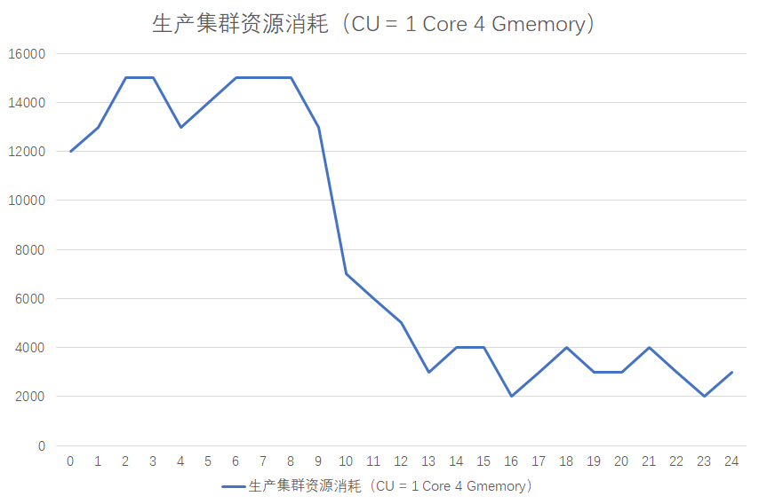

通过这张图你可以看到，大数据任务的资源消耗有很明显的高峰和低谷效应，一般晚上 12 点到第二天的 9 点是高峰期，9 点到晚上 12 点，是低谷期。

虽然任务有明显的高峰低谷效应，但是服务器资源不是弹性的，所以就会出现服务器在低谷期比较空闲，在高峰期比较繁忙的情况，整个集群的资源配置取决于高峰期的任务消耗。所以，把一些不必要在高峰期内运行任务迁移到低谷期运行，也可以节省资源的消耗。

**第七，任务参数配置。**

任务参数配置的不合理，往往也会浪费资源。比如在 Spark 中，Executor 内存设置的过大；CPU 设置的过多；还有 Spark 没有开启动态资源分配策略，一些已经运行完 Task 的 Executor 不能释放，持续占用资源，尤其是遇到数据倾斜的情况，资源浪费会更加明显。

**第八，数据未压缩。**

Hadoop 的 HDFS 为了实现高可用，默认数据存储 3 副本，所以大数据的物理存储量消耗是比较大的。尤其是对于一些原始数据层和明细数据层的大表，动辄 500 多 T，折合物理存储需要 1.5P（三副本，所以实际物理存储 500*3），大约需要 16 台物理服务器（一台服务器可分配存储按照 12*8T 计算），如果不启用压缩，存储资源成本会很高。

另外，在 Hive 或者 Spark 计算过程中，中间结果也需要压缩，可以降低网络传输量，提高 Shuffer (在 Hive 或者 Spark 计算过程中，数据在不同节点之间的传输过程) 性能。

你看，我为你列举了 8 个典型的成本陷阱，那你可能会问了，老师，我已经中招了，该怎么办呢？ 别急，接下来我们就看一看，如何进行精细化的成本管理。

### 如何实现精细化成本管理？

我认为，成本治理应该遵循全局盘点、发现问题、治理优化和效果评估四个步骤。

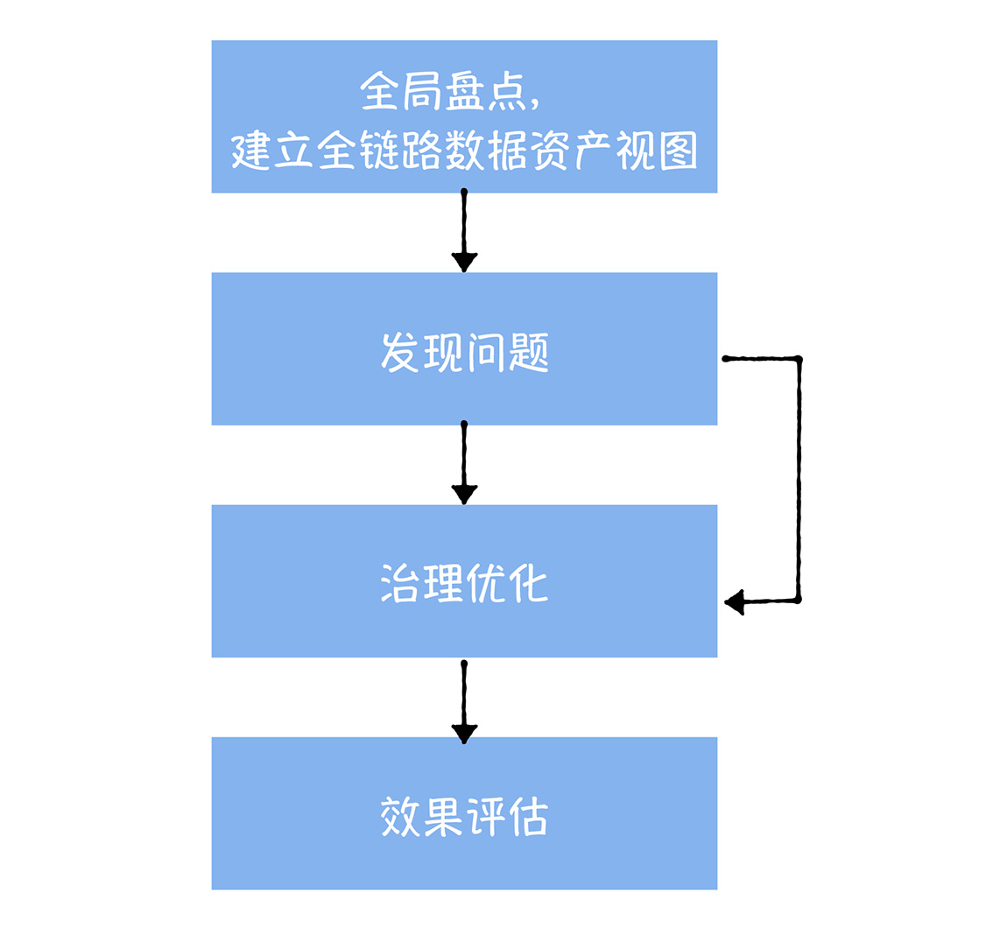

#### 全局资产盘点

精细化成本管理的第一步，就是要对数据中台中，所有的数据进行一次全面盘点，基于元数据中心提供的数据血缘，建立全链路的数据资产视图。

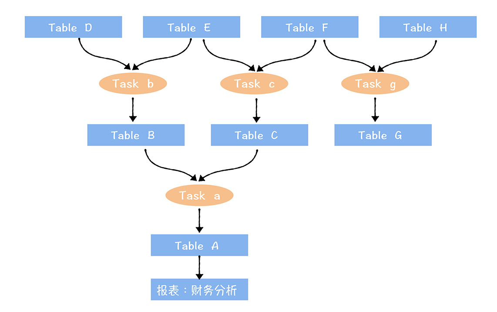

从这个图中你可以看到，全链路数据资产视图的下游末端关联到了数据应用（报表：财务分析），而上游的起点是刚进入数据中台的原始数据。数据之间通过任务进行连接。

接下来，我们要计算全链路数据资产视图中，末端数据的成本和价值（末端数据就是加工链路最下游的表，例如图中 TableA，Table G）。

为什么一定要从末端开始呢？ 因为中间数据，在计算价值的时候，还要考虑下游表被使用的情况，比较难计算清楚，所以我们选择从末端数据开始。这与我们下线表的顺序也是一致的，如果数据的价值很低，成本很高，我们也是从末端数据开始下线的。

**那么数据成本该如何计算呢？**

我们要对上图中财务分析报表核算成本，这个报表上游链路中涉及到 a，b，c，3 个任务，A，B，C，D，E，F， 6 张表，那么：

这张报表的成本 =3 个任务加工消耗的计算资源成本 +6 张表消耗的存储资源的成本。

另外，需要注意的是，如果一个表被多个下游应用复用，那这个表的存储资源成本以及产出任务消耗的成本，需要分摊给多个应用。

**那价值又该如何计算呢？**

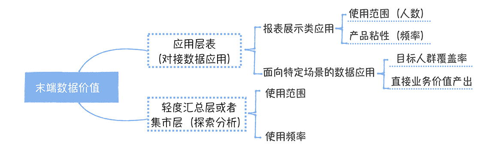

我们来分析一下这张图。

如果末端数据是一张应用层的表，它对接的是一个数据报表，那衡量这个数据的价值，主要是看报表的使用范围和使用频率。在计算使用范围时，通常用周活来评估，同时还要考虑不同管理级别的人权重，对于老板，他一个人的权重可以相当于 1000 个普通员工。

之所以这样设计，是考虑到管理级别越高，做出的商业决策影响就越大，自然这个价值也就越大。使用频率一般使用单个用户每周查看报表的次数来衡量，次数越高，说明报表价值越大。

如果末端数据对接的不是一个数据报表，而是面向特定场景的数据应用（比如我之前提到过的供应链分析决策系统，它面向的人群主要是供应链部门）。衡量这类产品的价值，主要考虑目标人群的覆盖率和直接业务价值产出。什么是直接业务价值产出呢？，在供应链决策系统中，就是通过系统自动生成的采购订单占所有采购订单的比例。

除此之外，末端数据，可能还是一张集市层的表，它主要用于提供给分析师做探索式查询。这类表的价值主要看它被哪些分析师使用，使用频率如何。同样，在使用范围评估时，要对分析师按照级别进行加权。

#### 发现问题

全局盘点，为我们发现问题提供了数据支撑，而你需要重点关注下面三类问题：

- 持续产生成本，但是已经没有使用的末端数据（“没有使用”一般指 30 天内没有访问）；

- 数据应用价值很低，成本却很高，这些数据应用上游链路上的所有相关数据；

- 高峰期高消耗的数据。

那么为什么你要关注这三类数据呢？

- 其实第一类就是没有使用，但一直在消耗成本的表，对应的就是我提到的陷阱 1。

- 第二类其实就是低价值产出，高成本的数据应用，对应的是陷阱 2。

- 第三类高成本的数据，对应的就是陷阱 4～8。

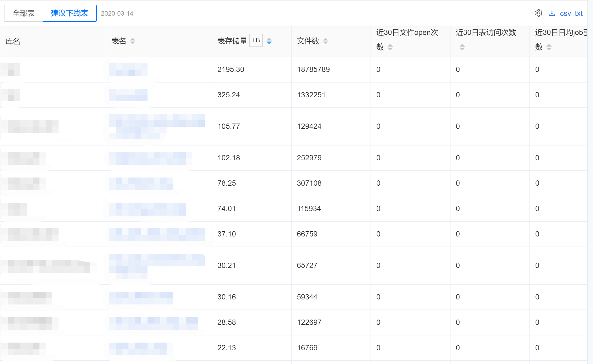

陷阱 3 实际是在第 6 节模型设计中解决的。

#### 治理优化

针对这三类问题，我们需要制订相应的策略。

对于第一类问题，应该对表进行下线。 数据下线要谨慎，你可以参考这张数据下线的执行过程图：

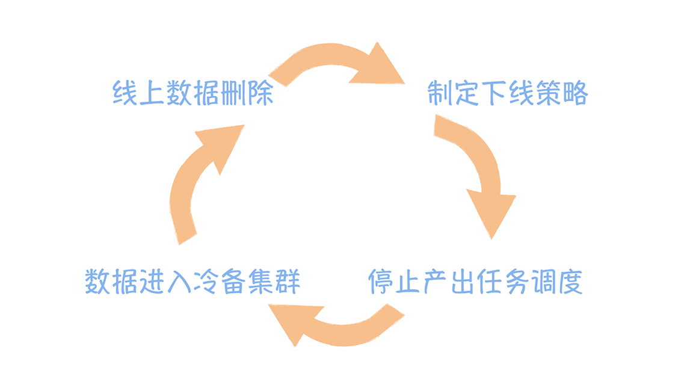

末端数据删除后，原先末端数据的上游数据会成为新的末端数据，同样还要按发现问题到治理优化进行重复，直到所有的末端数据都不满足下线策略为止。

对第二类问题，我们需要按照应用粒度评估应用是否还有存在的必要。对于报表，可以按照 30 天内没有访问的应用自动下线的策略，先对报表进行销毁，然后对报表上游的表进行下线，如果该表还被其他的应用引用，就不能下线。**下线步骤可以参考前面的下线步骤。**

第三类问题，主要是针对高消耗的数据，又具体分为产出数据的任务高消耗和数据存储高消耗。对于产出任务高消耗，首先要考虑是不是数据倾斜。具体怎么判断呢？其实你可以通过 MR 或者 Spark 日志中，Shuffer 的数据量进行判断。如果有某一个 Task 数据量非常大，其他的很少，就可以判定出现了数据倾斜。

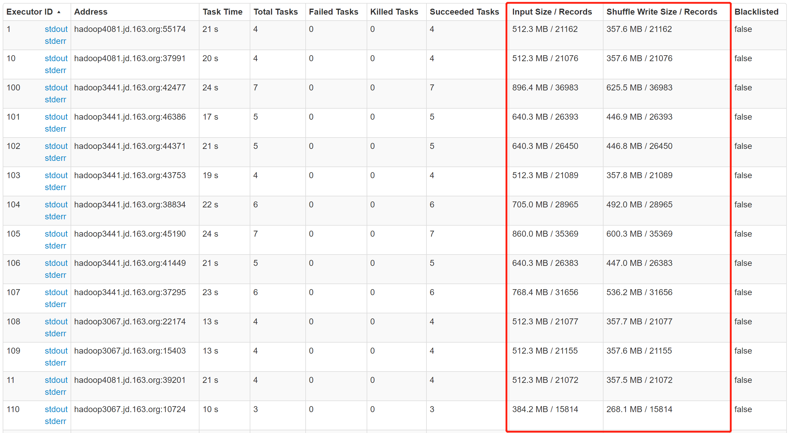

​                                                                                     图 Spark task shuffer records

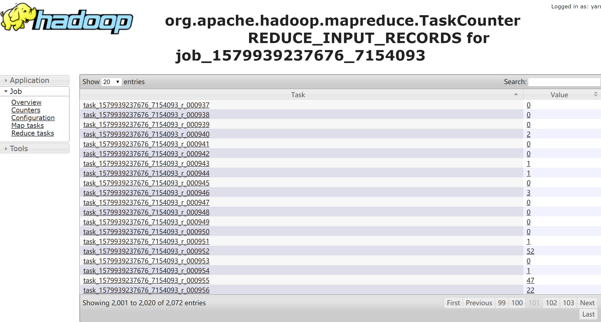

​																		   图 MR reduce task records

如果出现数据倾斜，该如何处理呢？

数据倾斜的处理方法有很多，不同的场景有一些适用的解决方案：比如在一些大表和小表关联时，Key 分布不均造成的数据倾斜，可以使用 mapjoin 的方式解决；另外还有一些比较通用的处理方式，例如把热点的 Key 进行单独的处理，然后对剩下的 Key 进行处理，然后对结果进行并集。

因为它不是本文的重点，所以这里就不再详细展开，之前有一篇美团的文章，对数据倾斜有比较深入的分析，推荐给你做课下学习的资料。

除了数据倾斜，我们还应该检查任务的配置参数。例如对于 Spark 执行引擎，Executor 个数是否开的过大，executor-cores 和 executor-memory 是否开的过多，利用率比较低。一般来说，executors-memorty 设置为 4G-8G 为宜，executor-cores 设置为 2-4 个为宜（这是我们实践过利用率最高的配置选项）。

另外，你还要考虑任务是否真的有必要在高峰期执行，可以根据集群的负载情况，尽量将任务迁移到非高峰期执行，我将这个步骤称为“削峰填谷”。

上面几点是产出任务高消耗的情况，那么对于存储消耗比较大的任务，你首先要考虑是否要压缩，尤其是对于原始数据层和明细数据层，建议压缩，压缩的方式有这样几种：

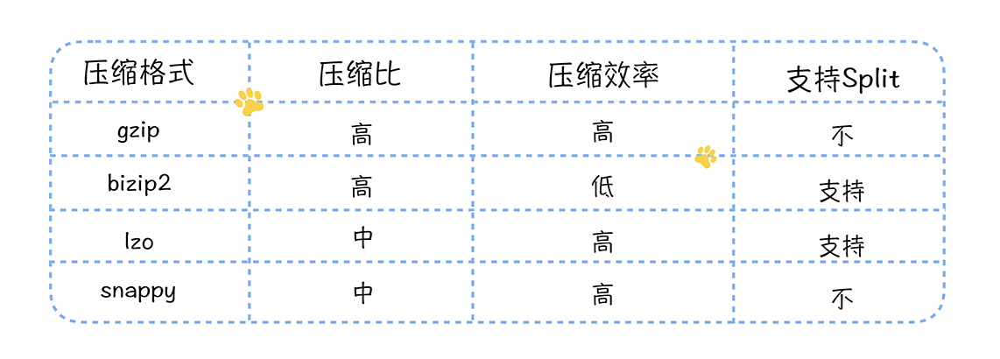

整体来看，对于小文件的压缩，不考虑 split，gzip 比较合适；对于大文件，推荐使用 lzo，支持 split，在保证压缩效率的前提下，有着相对稳定的压缩比。

除此之外，还需要考虑生命周期是否设置：

对于 ODS 原始数据层和 DWD 明细数据层，比较适合用永久保留的策略；

对于一些商品、用户维表，可以考虑 3 年或者 5 年的保留策略。

整体上，底层表都是长期保留的。所以你的关注重点应该是汇总层以上的表（包括汇总层），一般可以根据数据的重要性，制订 7 天，1 个月的保留策略。

#### 治理效果评估

现在，通过我介绍的这几个方法，你已经能够节省大量的资源消耗，那如何量化我们的治理成果呢？

五个字：省了多少钱。不过，如果直接拿服务器的数量来衡量，其实并不能真实地反应治理效果，因为还要考虑业务增长的原因。业务不是停止不动的，所以你可以围绕任务和数据的成本考虑这样几点：

- 下线了多少任务和数据；

- 这些任务每日消耗了多少资源；

- 数据占用了多少存储空间。

拿这些资源来计算成本，这样就能够算出来省了多少钱。我还是拿本节课开始的例子来看，任务 A 运行时长 3 个小时，在运行过程中，共消耗 5384503 cpu*s，37007892 GB *s, 假设我们 1 个 CU （1 cpu， 4g memeory）一年是 1300 元成本，折合每天为 3.5 元（计算公式为 1300/365）。

**这里需要特别强调，**不论是优化或者下线任务，我们只统计高峰时间段内，因为优化低峰时间，并不能实际节省资源。

高峰时间段为 8 个小时，那折合每秒的费用为 0.00012153, 那该任务的费用为 max{5384503*0.00012153, 37007892/4 * 0.00012153} = max{654, 1124} = 1124 。那下线这个任务后，就节省 1124 元，再加上表 A 占用的存储空间大小乘以每 GB 的成本，就可以得出数据表 A 下线节省的费用。

### 成本治理中心

成本治理不是一劳永逸的工作，需要持之以恒，不断发现问题，然后治理优化，建立长久运行机制的前提是必须降低成本治理的门槛，接下来，看一下网易的一个成本治理的平台，EasyCost。

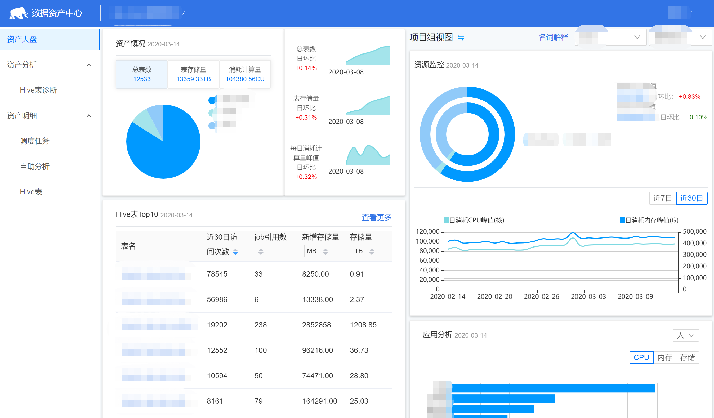

系统提供了数据诊断的功能，可以按照访问时间、访问频率、关联的应用，设置下线策略，支持一键灰度下线，大幅提高了管理的效率。

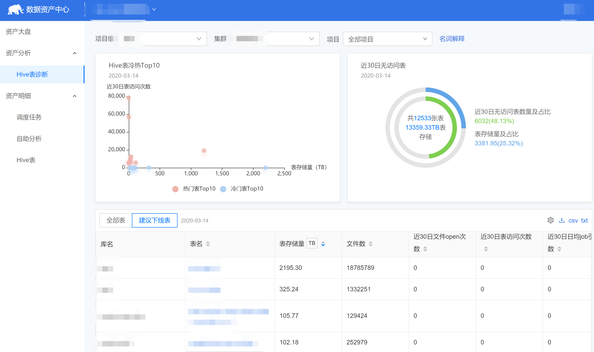

通过介绍 EasyCost，我想告诉你的是，今天的内容，其实可以通过系统化的方式沉淀到产品中，然后通过产品提高管理的效率，从而实现治理机制的长久落地。

### 课堂总结

总的来说，通过数据中台，一方面你可以获得大数据作为资产中心带来的红利，另一方面，你也有可能陷入成本的深渊，为野蛮增长的大数据费用买单。

今天这节课，我从常见的 8 个成本陷阱入手，带你分析了可能造成成本浪费的原因，然后介绍了精细化成本管理的方法，在最后，我想再强调几个你可能忽略的点：

- 无用数据的下线应该从全链路数据资产视图的末端入手，然后抽丝剥茧，一层一层，向数据加工链路的上游推进。

- 应用层表的价值应该以数据应用的价值来衡量，对于低价值产出的应用，应该以应用为粒度进行下线。

- 对高消耗任务的优化只要关注集群高峰期的任务，项目的整体资源消耗只取决于高峰期的任务消耗，当然，如果你使用的是公有云的资源，可以高峰和低谷实施差异化的成本结算，那低谷期的也是要关注的。

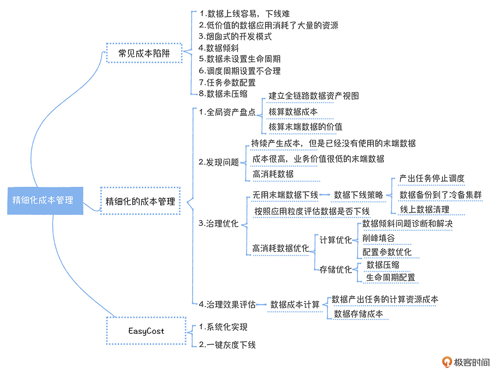

### 思考时间

在数据中台的集市层，会存在一些大的宽表，这些宽表可能存在几百个字段，上游可能有数十个表，如果要计算这个表的成本会非常高。在这个表中，字段的访问频率是不相同，有的字段频率很高，有的字段频率很低，如果要对这张宽表做优化，你觉得如何来做呢?


## 09 （一）| 数据服务到底解决了什么问题？

从 04 讲元数据中心开始，到 08 讲成本治理，我已经把元数据以及在它基础上的五大应用场景：数据发现（数据地图）、指标管理、模型设计、数据质量、成本优化，全部讲完了。这部分内容对应的就是数据中台 OneData 方法论。相信学完这部分内容之后，你已经了解了 OneData 方法论在企业内部落地的方法了。

而这节课我要和你聊的，是数据中台另外一个核心方法论，OneService 的实现：数据服务。

服务化在业务系统中提的比较多，它是业务系统化繁为简，实现业务拆分的必经之路（特别是这几年微服务的概念深入人心）。那对于数据中台，服务化意味着什么呢？数据服务到底解决了什么问题？ 我相信很多人会有这样的疑问。

服务化：不同系统之间通过服务方式交互，服务通常以 API 接口形式存在。

当然，关于数据服务的“料”很多，信息比较密集，所以我会用两讲的时间帮你搞清楚这部分内容，今天咱们先来从问题入手，看一看数据服务解决了什么问题，打消你“为什么要有数据服务”这样的疑问。

在我看来，要想搞清楚数据服务解决了什么问题，就要先知道，没有数据服务，我们在日常数据建设中存在哪些痛点。


### 数据接入方式多样，接入效率低

数据中台加工好的数据，通常会以 Hive 表的形式存储在 HDFS 上。如果想直接通过数据报表或者数据产品前端展现，为了保证查询的速度，会把数据导出到一个中间存储上：

数据量少的可以用 MySQL , Oracle 等 DB，因为部署维护方便、数据量小、查询性能强。比如数据量小于 500W 条记录，建议使用 DB 作为中间存储；

涉及大数据量、多维度查询的可以用 GreenPlum，它在海量数据的 OLAP（在线分析处理）场景中有优异的性能表现。比如数据量超过 500W 记录，要进行多个条件的过滤查询；

涉及大数据量的单 Key 查询，可以用 HBase。在大数据量下，HBase 拥有不错的读写性能。比如超过 500W 记录，根据 Key 查询 Value 的场景。如果需要用到二级索引，由于 HBase 原生不支持二级索引，所以可以引入 ES，基于 ES 构建二级索引和 RowKey（HBase 中的 Key）映射关系，查询时先根据二级索引在 ES 中找到 RowKey，然后再根据 RowKey 获取 HBase 中的 Value 值。

因为不同的中间存储，涉及的访问 API 也不一样，所以对数据应用开发来说，每个数据应用都要根据不同的中间存储，开发对应的代码，如果涉及多个中间存储，还需要开发多套代码，数据接入效率很低。

而数据服务为数据开发屏蔽了不同的中间存储，应用开发使用统一的 API 接口访问数据，大幅度提高了数据应用的研发效率。

当然了，数据接入效率低，除了跟对接不同的中间存储有关，还因为数据和接口不能复用。这又是怎么回事呢？

### 数据和接口没有办法复用

我们还是举个例子。

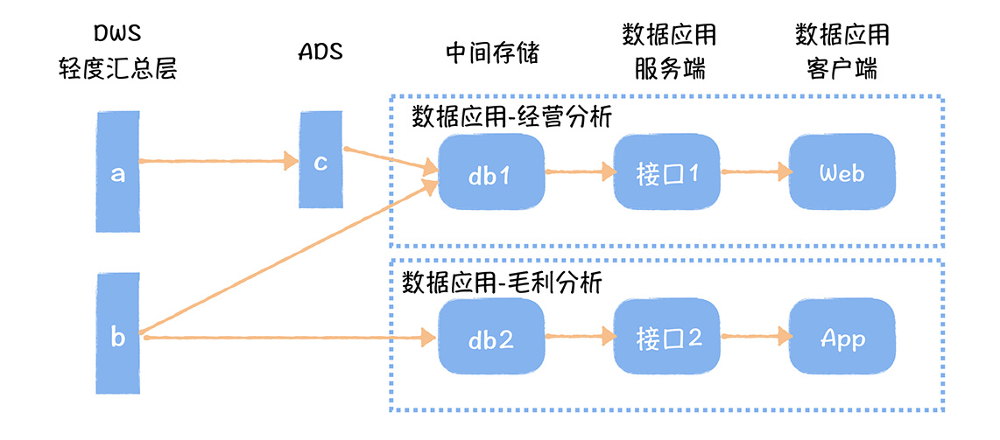

​																										数据和接口无法复用示意图

在上图中，当我们开发“数据应用 - 经营分析”时，数据开发会基于 a 表加工 c 表，然后数据应用开发会把 a 和 b 的数据导出到“数据应用 - 经营分析的数据库 db1”中，然后开发经营分析的服务端代码，通过接口 1 对 web 提供服务。

当我们又接到任务开发“数据应用 - 毛利分析”时，我们同样需要用到 b 表的数据，虽然 b 的数据已经存在于 db1 中，但 db1 是“数据应用 - 经营分析”的数据库，无法共享给“数据应用 - 毛利分析”（因为不同应用之间共享数据库，会存在相互影响）。

同时，经营分析的服务端接口也无法直接给毛利分析用，因为接口归属在经营分析应用中，已经根据应用需求高度定制化。

所以我们看到这样的现象：即使数据重复，不同数据应用之间，在中间存储和服务端接口上，也是无法复用的。这种烟囱式的开发模式，导致了数据应用的研发效率非常低。

而数据服务，使数据中台暴露的不再是数据，而是接口，接口不再归属于某个数据应用，而是在统一的数据服务上。这就使接口可以在不同的数据应用之间共享，同时因为数据服务具备限流的功能，使接口背后的数据共享成为可能，解决了不同应用共享数据相互影响的问题。

那么当数据应用上线之后，我们就进入了运维阶段，如果这个阶段没有数据服务的话，会出现什么问题呢？

### 不知道数据被哪些应用访问

来看一个我身边的案例。

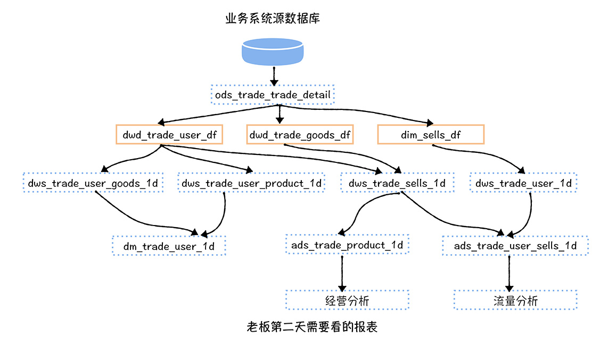

​																												故障恢复示意图

张好看（化名）是一名数据开发，某一天的凌晨，她突然接到了一堆电话报警：有大量的任务出现异常（对应上图中红色表的产出任务）。经过紧张的定位后，她确认问题来源于业务系统的源数据库，也就是说，因为一次数据库的表结构变更，导致数据中台中，原始数据清洗出现异常，从而影响了下游的多个任务。

这时，摆在她面前的，是一堆需要恢复重跑的任务。可是队列资源有限，到底先恢复哪一个呢？ 哪个任务最终会影响到老板第二天要看的报表呢？

虽然数据血缘建立了表与表之间的链路关系，但是在表的末端，我们却不知道这个表被哪些应用访问，所以应用到表的链路关系是断的。当某个任务异常时，我们无法快速判断出这个任务影响了哪些数据应用，从而也无法根据影响范围决定恢复的优先级，最终可能导致重要的报表没有恢复，不重要的报表却被优先恢复了。

同样，在成本治理中，我也提到，因为没有应用和数据的链路关系，我们不敢贸然下线数据。

而数据服务打通了数据和应用的访问链路，建立了从数据应用到数据中台数据的全链路数据血缘关系，这就等于我们在迷宫中拿到了一个地图，当任何一个任务出现问题，我们都可以顺着地图，找到这个故障影响了哪些应用，从而针对重要应用加速恢复速度。同样，我们也可以放心的下线数据中台中任意一张表。

除了不知道数据被哪些下游应用使用，在运维阶段，我们还经常面临着数据表频繁重构，而这也许是数据应用开发最可怕的噩梦了。

### 数据部门字段变更导致应用变更

数据中台底层模型的字段变更是比较频繁的一个事情，因为本身汇总层的模型也在随着需求不断优化。

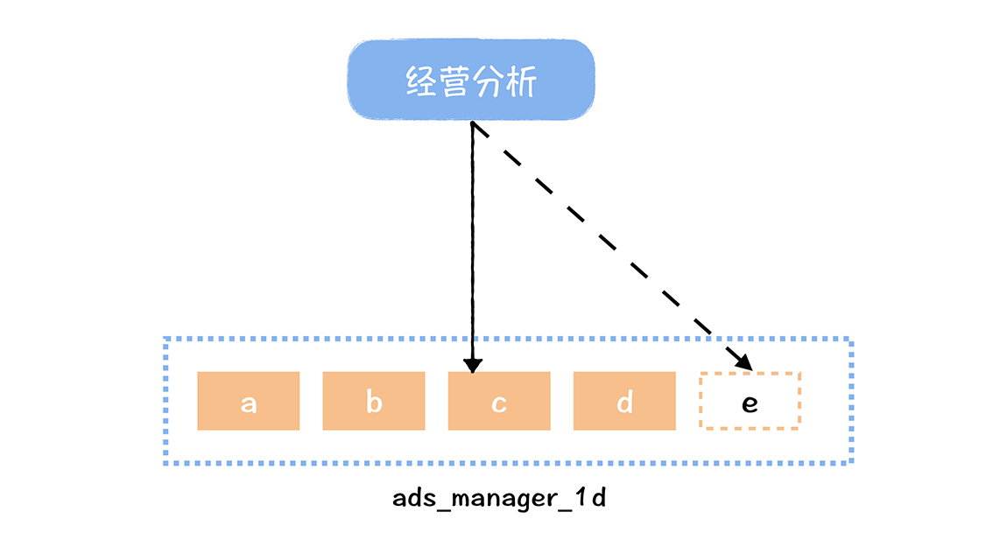

“数据应用 - 经营分析”使用了数据中台的 ads_mamager_1d 这张表的 c 字段，如果我们对这张表进行了重构，访问字段需要替换成 e 字段，此时需要数据应用修改代码。这种因为数据中台的数据变更导致应用需要重新上线的事情，是非常不合理的，不但会增加应用开发额外的工作量，也会拖累数据变更的进度。

有了数据服务，就会把数据应用和中台数据进行解耦，当中台数据表结构变更时，我们只需要修改一下数据服务上接口参数和数据字段的映射关系就可以了。不需要再修改代码，重新上线数据应用。

### 课堂总结

你看，我列举了在数据接入和运维过程中，遇到的 4 个典型的问题，也为你简要分析了数据服务为什么能够帮我们解决这些问题。而这些问题会让数据应用使用中台数据效率低下，同时也带来了中台数据维护的烦恼。

今天这部分内容，是下一讲的基础，下一讲我会和你聊一聊数据服务具备哪些功能，如果你正准备设计一个数据服务，或者正在做数据服务的产品选型，那你一定要留意这部分内容。最后，我会提供给你一个网易数据服务的实现方案，告诉你在数据服务实现上的几个关键设计。

在最后，我通过一个脑图，总结一下今天的内容。

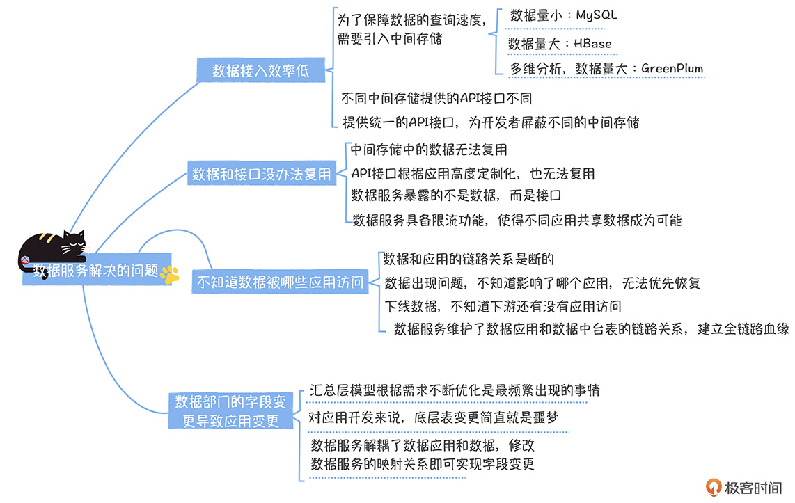


### 思考时间

其实，在我刚接触数据服务的时候，我听到最多的一种说法，数据服务解决了数据的安全性的问题，你觉得有道理吗？ 欢迎你在留言区与我互动。

## 09（二） | 数据服务难道就是对外提供个API吗？

在上一讲中，我为你介绍了为什么必须要有数据服务，你可以看到，数据服务在数据建设中发挥着重要的作用。那有的人可能会好奇了，数据服务到底长什么样子呢？ 是不是只对外提供一个 API？ 真的有这么简单吗？接下来，我们就带着这些问题，学习今天的内容。

而我希望你能在学完这部分内容之后，真正掌握数据服务的产品功能设计和系统架构设计。因为这会对你设计一个数据服务，或者选择一个商业化产品，有很大的帮助。

### 数据服务应该具备的八大功能

我认为，数据服务应该具备八个功能，只有具备这些功能，才能解决我们在上一讲提到的问题。比如，数据接入方式多样，接入效率低；数据和接口没办法共享；不知道数据被哪些应用访问……

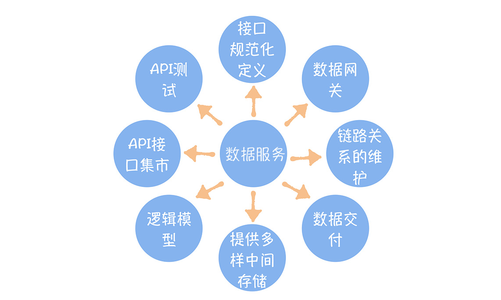

那么为了让你更好地理解数据服务的功能，我来讲个小故事。

你肯定去过菜鸟驿站取快递吧？假设有一个很大的菜鸟驿站，里面有很多组货架，每个货架前都有一些工作人员帮助我们取快递，同时也有很多队伍排队。

取快递，要先约定好接口（比如统一使用收货码来取货）。然后，为了保证不同队伍都能取到快递，我们要对每个队伍做一些限流（比如一个队伍一次只能取一个人）。在你取走快递时，驿站会记录是谁取走了哪个快递，方便后续追查。

这段时间，菜鸟驿站服务开始升级，不仅可以取快递，还提供快递送货上门的服务。除此之外，不同种类的快递对应的货架也变得不同，比如生鲜食品，货架是冷藏冰箱，文件、信封，货架就是文件柜。

对于取快递的人来说，如果他买了生鲜，又买了信封，那他要排好几个队伍，肯定不方便。所以，一般来讲，取快递的人最好只在一个队伍排队，而驿站工作人员帮他一次把多个货架的快递都取过来。

可驿站的货架实在是太多了，为了方便每个取快递的小伙伴都能快速找到每个货架以及队伍，驿站提供了一个导览。与此同时，为了不让工作人员出错，驿站的工作人员必须经过严格的测试，才能上岗。

讲完这个故事之后，我们接着回到数据服务的这八大功能上来。在取快递的这个例子中，你可以把数据服务看成是一个菜鸟驿站，工作人员看成是 API 解耦库，货架可以看作是中间存储，快递则可以认为是数据。

那么对应到八个功能，就是：

- 接口规范化定义，可以看成是取快递约定的收货码，基于统一的收货码取走快递；

- 数据网关，可以看成是我们对每个货架前的队伍进行限流，确保每个队伍都能取走快递；

- 链路关系的维护，可以看作是驿站会记录谁取走了什么快递；

- 数据交付，可以看作驿站同时提供取快递和送货上门服务；

- 提供多样中间存储，可以看成有不同类型的货架；

- 逻辑模型，可以看成是一个工作人员，可以取多个货架的快递；

- API 接口，可以看作是驿站的不同货架的不同队伍导览；

- API 测试，可以看作是驿站工作人员上岗前的测试。

通过这个故事，你是不是已经对数据服务的八个功能有一个形象的感知了？接下来，我们来看看数据服务这八个功能具体包含什么内容。

**第一个是接口规范化定义。**

接口规范化定义就是取快递时我们约定的取件码。数据服务，对各个数据应用屏蔽了不同的中间存储，提供的是统一的 API。

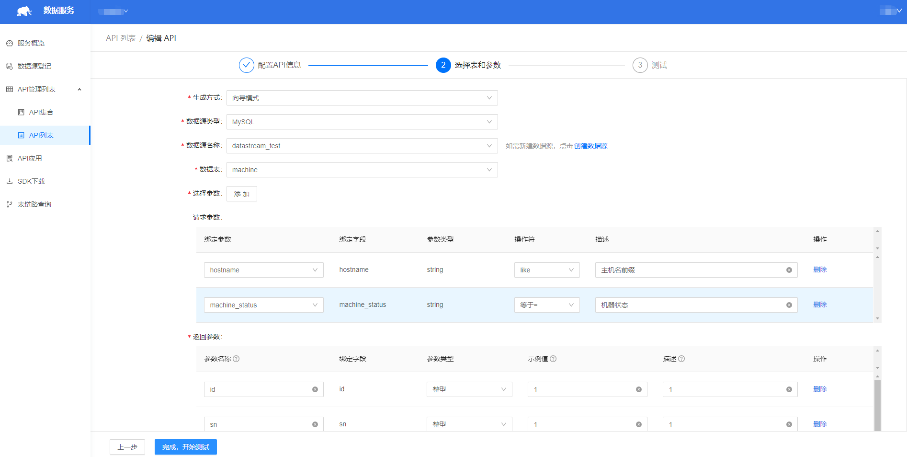

网易数据服务EasyDS界面示意图

在上图中，我们可以在数据服务上，定义每个 API 接口的输入和输出参数。

**第二，数据网关。**

作为网关服务，数据服务必须要具备认证、权限、限流、监控四大功能，这是数据和接口复用的前提。这就跟我们在菜鸟驿站前取快递，要对每个队伍的人进行认证、限流一个道理。我详细介绍一下。

首先是认证，为了解决接口安全的问题，数据服务首先会为每个注册的应用分配一对 accesskey 和 secretkey，应用每次调用 API 接口，都必须携带 acesskey 和 secretkey。

除此之外，对于每个已发布的 API，API 负责人可以对应用进行授权，只有有权限的应用才可以调用该接口。同时，API 接口的负责人可以对应用进行限流（例如限制每秒 QPS 不超过 200），如果超过设定的阈值，就会触发熔断，限制接口的访问频率。

需要你注意的是，对于接口复用来说，限流功能非常必要，否则会造成不同应用之间的相互影响。

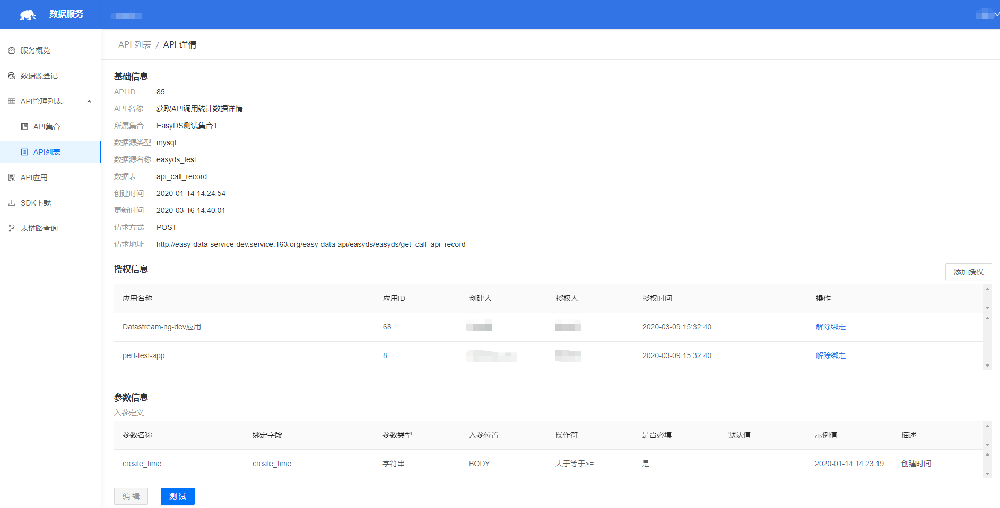

当然，数据服务还要提供接口相关的监控，比如接口的 90% 的请求响应时间、接口调用次数、失败次数等相关的监控，另外，对于长时间没有调用的 API ，应该予以下线。这样做的好处是防止没用的接口额外占用资源。

**第三，全链路打通。**

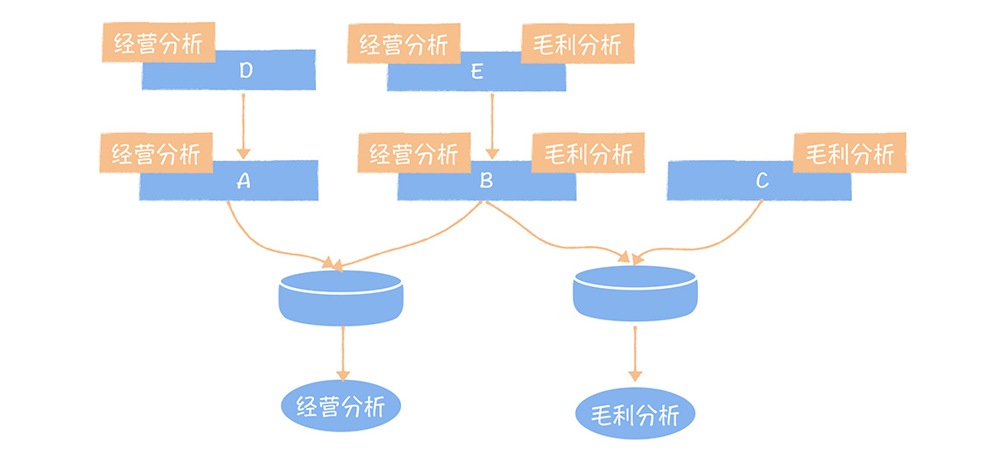

数据服务还必须负责维护数据模型到数据应用的链路关系。

在上图中，经营分析是一个数据应用，甄美丽是数据应用的开发，当她想要访问数据服务中的某个接口获取表 A 和 B 的数据时，她需要向接口的发布者马帅帅申请授予权限。然后经营分析就可以通过接口获取到数据。

同时，数据服务会把经营分析和表 A 和 B 的访问关系，推送给数据中台的元数据中心。接着元数据中心表 A、B 以及 A 和 B 的上游所有的表（图中 D 和 E）上，就会有经营分析数据应用的标签。

当表 D 的产出任务异常时，马帅帅可以通过元数据中心，快速判断出该任务影响了经营分析数据产品的数据产出。同时，当马帅帅想要下线表 D 时，也可以通过这张表是否有标签，快速判断这个表下游是否还有应用访问。当马帅帅取消 API 接口授权时，元数据中心同时会清理表的相关标签。

**需要特别提到的是，**一个数据应用往往涉及很多页面，如果我们在影响分析时，只分析到应用，可能粒度还是太粗了，需要到更细级别的页面的粒度，比如一个任务异常，我不光要知道是哪个数据产品，还必须得知道是哪个数据产品的哪个页面。此时，我们在接口授权时，可以标注页面名称。

**第四，推和拉的数据交付方式。**

相信你听到的数据服务，都是以 API 接口的形式对外提供服务，但是业务实际场景中，光 API 还不够的。我把 API 方式称为拉的方式，而实际业务中同样还需要推的场景。

比如在实时直播场景中，商家需要第一时间获得关于活动的销售数据，此时就需要数据服务具备推的能力，我把它称为数据的送货上门服务。数据服务将数据实时写入到一个 Kafka 中，然后应用通过订阅 Kafka 的 Topic，可以获得实时数据的推送。

**第五，利用中间存储，加速数据查询。**

数据中台中数据以 Hive 表的形式存在，基于 Hive 或者是 Spark 计算引擎，并不能满足数据产品低延迟，高并发的访问要求，

所以，一般做法是将数据从 Hive 表导出到一个中间存储，由中间存储提供实时查询的能力。数据服务需要根据应用场景支持多种中间存储，我列举了一些常用的中间存储以及这些存储适用的场景，希望你能根据实际场景选择适合的中间存储。

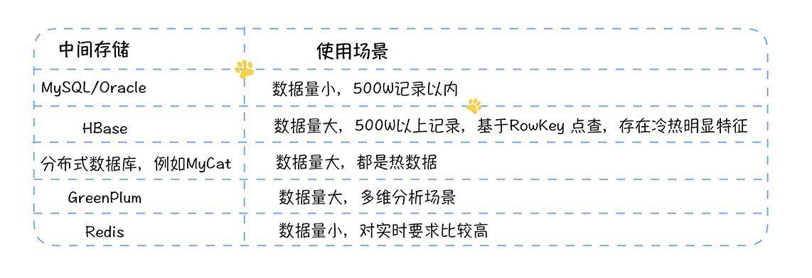

**第六，逻辑模型，实现数据的复用。**

在前面取快递的场景中，每一个货架一拨工作人员，其实对取快递的人并不友好，所以最好的就是一个人帮我们把所有的快递都取了。这就有点儿类似数据服务中逻辑模型的概念了。我们可以在数据服务中定义逻辑模型，然后基于逻辑模型发布 API，逻辑模型的背后实际是多个物理表，从用户的视角，一个接口就可以访问多张不同的物理表了。

逻辑模型可以类比为数据库中视图的概念，相比于物理模型，逻辑模型只定义了表和字段的映射关系，数据是在查询时动态计算的。逻辑模型可以看作是相同主键的物理模型组成的大宽表。逻辑模型的存在，解决了数据复用的问题，相同的物理模型之上，应用可以根据自己的需求，构建出不同的逻辑模型，每个应用看到不同的列。

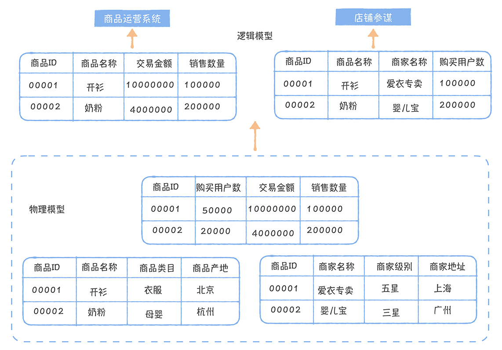

在上面这个例子中，有三个物理模型，但是主键都是商品 ID，针对商品运营系统和店铺参谋，我们可以构建两个不同的逻辑模型，分别从不同的视角看数据，逻辑模型并不实际存在，而是在查询的时候，根据逻辑模型映射的物理模型字段，动态的地将请求拆分给多个物理模型，然后对多个查询结果进行聚合，得到逻辑模型查询的结果。

**第七，构建 API 集市，实现接口复用。**

为了实现接口的复用，我们需要构建 API 的集市，应用开发者可以直接在 API 集市发现已有的数据接口，直接申请该接口的 API 权限，即可访问该数据，不需要重复开发。

需要特别指出的是，数据服务通过元数据中心，可以获得接口访问的表关联了哪些指标。使用者可以基于指标的组合，筛选接口，这样就可以根据想要的数据，查找可以提供这些数据的接口，形成了一个闭环。

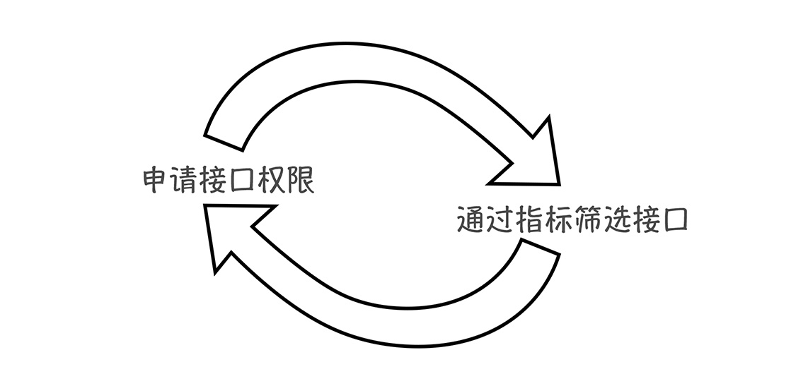

讲了这么多数据服务应该具备的功能，你可能会问，那数据服务应该如何实现呢？ 我们下面就来讲数据服务的架构设计。

### 数据服务系统架构设计

网易在实现数据服务时，主要采用了云原生、逻辑模型和数据自动导出三个关键设计，关于这部分内容，我希望你能通过学习，在实际工作中可以借鉴我们的方式完成数据服务的设计，或者在选择商业化产品时，给你一个架构选型方面的参考。

**云原生**

云原生的核心优势在于每个服务至少有两个副本，实现了服务的高可用，同时根据访问量大小，服务的副本数量可以动态调整，基于服务发现，可以实现对客户端透明的弹性伸缩。服务之间基于容器实现了资源隔离，避免了服务之间的相互影响。这些特性非常适用于提供高并发、低延迟，在线数据查询的数据服务。

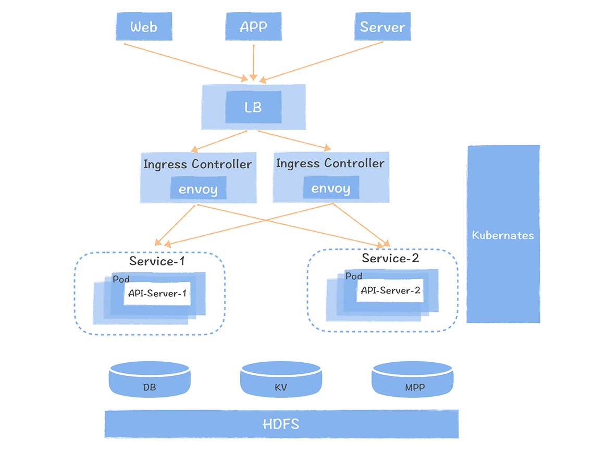

上图是网易数据服务的部署架构，在这个图中，每个已经发布上线的 API 接口都对应了一个 Kubernates 的 Service，每个 Service 有多个副本的 Pod 组成，每个 API 接口访问后端存储引擎的代码运行在 Pod 对应的容器中，随着 API 接口调用量的变化，Pod 可以动态的创建和销毁。

Envoy 是服务网关，可以将 Http 请求负载均衡到 Service 的多个 Pod 上。Ingress Controller 可以查看 Kubernates 中每个 Service 的 Pod 变化，动态地将 Pod IP 写回到 Envoy，从而实现动态的服务发现。前端的 APP，Web 或者是业务系统的 Server 端，通过一个 4 层的负载均衡 LB 接入到 Envoy。

基于云原生的设计，解决了数据服务不同接口之间资源隔离的问题，同时可以基于请求量实现动态的水平扩展。同时借助 Envoy 实现了限流、熔断的功能。你也可以借鉴我们的方案，实现原原生的数据服务设计。

**逻辑模型**

相较于物理模型，逻辑模型并没有保存实际的数据，而只是包括了逻辑模型和物理模型的映射关系，数据在每次查询时动态生成。逻辑模型的设计，解决了不同接口，对于同一份数据，需要只看到自己需要的数据的需求。

下图是网易数据服务逻辑模型的系统设计图。

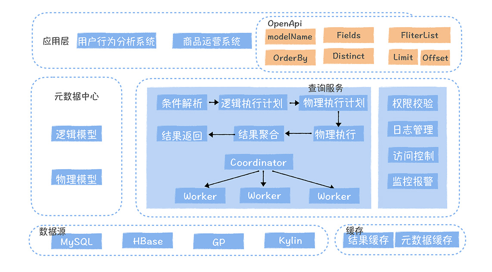

接口发布者在数据服务中选择主键相同的多张物理表构建一个逻辑模型，然后基于逻辑模型发布接口。API 服务接到查询请求后，根据逻辑模型和物理模型字段的映射关系，将逻辑执行计划拆解为面向物理模型的物理执行计划，并下发多个物理模型上去执行，最后对执行的结果进行聚合，返回给客户端。

一个逻辑模型关联的物理模型可以分布在不同的查询引擎上，但是这种情况下，考虑性能因素，只支持基于主键的筛选。

**数据自动导出**

数据服务选择的是数据中台的一张表，然后将数据导出到中间存储中，对外提供 API 。那数据什么时候导出到中间存储中呢？ 要等数据产出完成。

所以在用户选择了一张数据中台的表，定义好表的中间存储后，数据服务会自动生成一个数据导出任务，同时建立到这个数据中台表的产出任务的依赖关系，等到每次调度产出任务结束，就会触发数据导出服务，将数据导出到中间存储中，此时 API 接口就可以查询到最新的数据。


### 课堂总结

你看，数据服务化不是一个 API 接口这么简单吧，它的背后是数据标准化交付的整套流程。通过这节课，我为你介绍了数据服务的八大关键功能设计和三大系统架构设计。

在最后，我还想强调几个点：

- 数据服务实现了数据中台模型和数据应用的全链路打通，解决了任务异常影响分析和数据下线不知道影响哪些应用的难题；

- 基于相同主键的物理模型，可以构建逻辑模型，逻辑模型解决了数据复用的难题，提高了接口模型的发布效率；

- 数据服务宜采用云原生的设计模式，可以解决服务高可用、弹性伸缩和资源隔离的问题。

数据服务化对于加速数据交付流程，以及数据交付后的运维管理效率有重要作用，也是数据中台关键的组成部分。

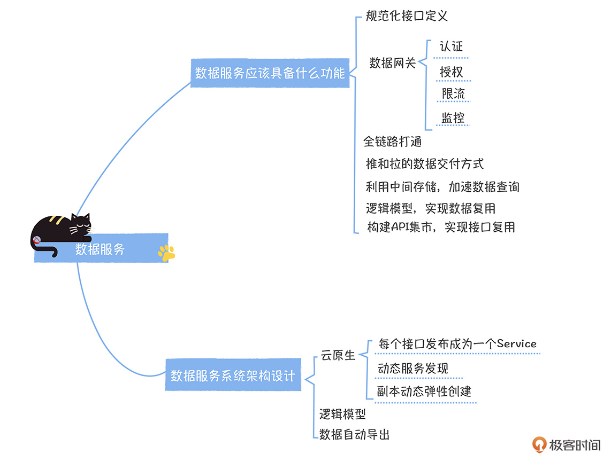

### 思考时间

数据服务要想解决数据被哪些应用访问的问题，就必须确保所有数据应用都必须通过数据服务获取数据中台的数据，那问题来了，如何确保数据服务是数据中台的唯一出口？欢迎在留言区与我互动。

## 10 | 怎么一劳永逸地解决数据安全问题？

在前面的课程中，我们了解了数据中台在数据建设效率、质量和成本方面的内容。而除了快、准和省以外，数据中台还必须是安全的。因为如果不安全，你很可能出现和“微盟删库跑路”同样的事情。所以，为了让你能重视数据中台的数据安全，我简单说一下这件事儿的情况。

2020 年 2 月 23 日 19 点，国内最大的精准营销服务商微盟出现了大面积的系统故障，旗下 300 万商户的线上业务全部停止，商铺后台的所有数据被清零。始作俑者是一位运维人员，他在生产环境数据库进行了删库操作，而刚刚上市不久的微盟就因此遭受了巨大的损失，从 2 月 23 日宕机以来，市值已经蒸发了 30 亿港元。这件事儿堪称史上最贵的安全事件。

那么从微盟的教训中，我们能得到什么警醒呢？在数据中台中怎么防止出现类似的事件呢？ 我想这或许是你需要认真思考的内容。安全问题可大可小，不出事情，你可能根本不会重视，但是一旦出现事故，就是灾难性的。在网易，我们对数据中台的安全管理是非常严格的。

在刚开始构建网易数据中台的时候，我们就重点考虑了数据中台的安全保障，我把它归结为五大法宝。

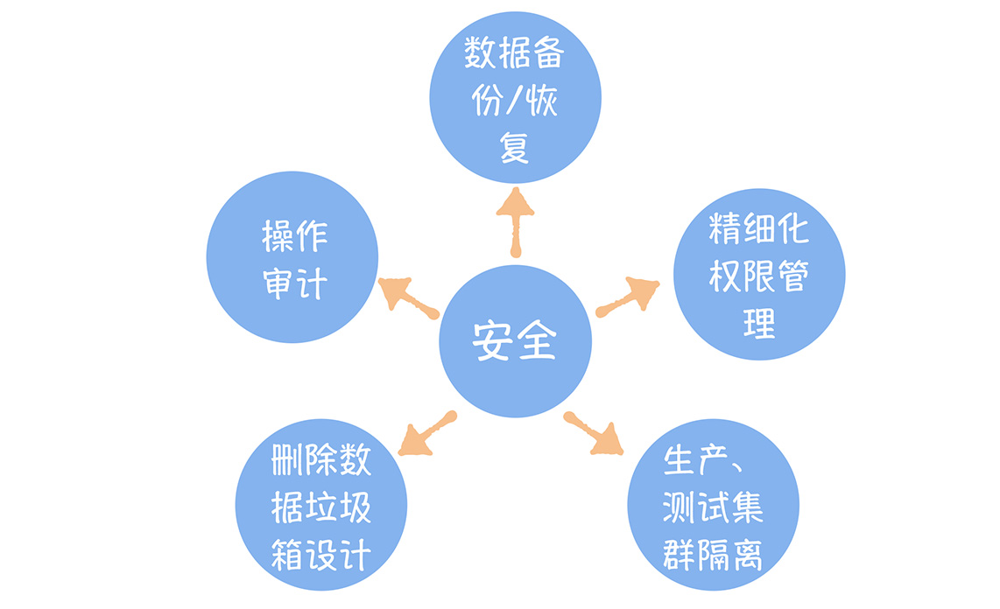

接下来，我就带你深入分析一下，希望学完这部分内容之后，你可以回答这样三个问题：

如何解决数据误删除问题；

如何解决敏感数据泄露问题；

如何解决开发和生产物理隔离问题。

它们是你在数据中台建设中一定会面临的，学完之后，你一定可以找到解决这些问题的方法。

### **机制一：数据备份与恢复**

对于绝大多数的企业，数据中台的数据都存储在 HDFS 中，即使是实时的数据（存储于 Kafka），也会归档一份到 HDFS，因为要保存历史数据进行回算或者补数据。**所以我们要解决的核心问题是 HDFS 的数据备份。**

网易 HDFS 数据的备份，是基于 HDFS 快照 + DistCp + EC 实现的。

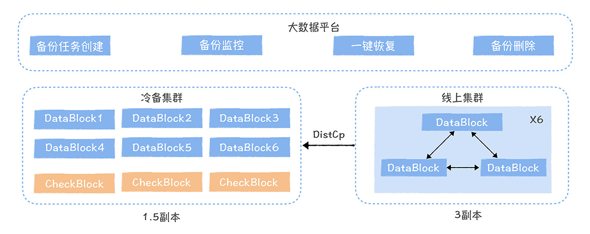

​																					网易数据备份的架构图

我们分为线上集群和冷备集群两个集群，数据加工任务访问的是线上集群，存储采用的是 HDFS 默认的 3 副本。而冷备集群，主要考虑到存储成本的因素，采用的是 EC 存储。

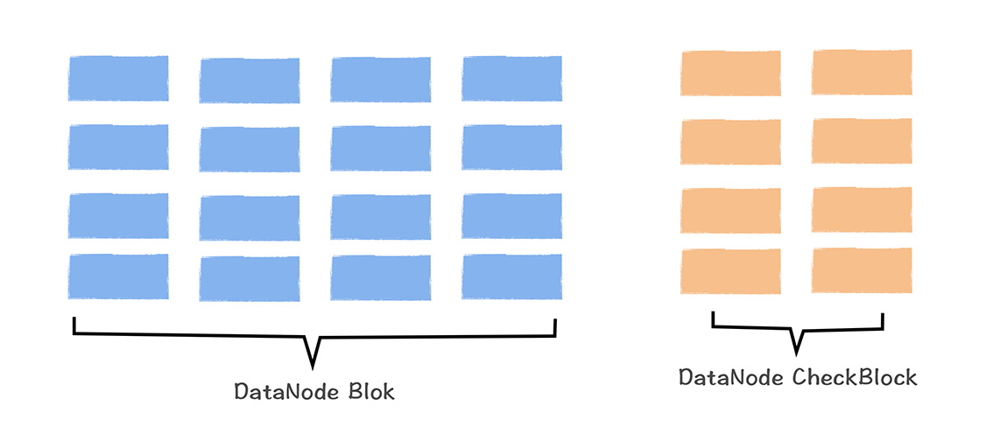

​																			EC 存储原理示意图

**为了让你了解 EC 存储的基本原理，我多说几句。**其实，Hadoop 在 3.x 就正式引入了 EC 存储，它是一种基于纠删码实现的数据容错机制，通过将数据进行分块，然后基于一定的算法计算一些冗余的校验块，当其中一部分数据块丢失的时候，可以通过这些冗余的校验块和剩余的数据块，恢复出丢失的数据块。

这么说可能不太形象，我做个比喻。比如有三个数据块，分别存储的是 1、2 和 3。我们非常担心其中一个数据块坏了，丢失内容。所以增加了一个块，这个块存储的内容是前面三个数据块之和。那么如果其中任意一个数据块坏了，我们可以根据现有的数据块计算出丢失的数据块内容。 比如 1 丢失了，我们可以根据 6-3-2 计算出 1，当然这个只是最简单的 EC 算法，只能容忍一个数据块丢失，实际的 EC 算法要再复杂一些 。

关于 EC 具体的算法细节，不是本节课的重点，不过我在文末提供了一个链接，你可以课下研究一下。在这里我只想告诉你的是，EC 存储，在不降低可靠性的前提下（与 HDFS 3 副本可靠性相同），通过牺牲了一定的计算性能（因为计算校验块需要消耗额外的计算资源），将数据存储成本降低了一半，非常适合低频访问的冷数据的存储，而备份数据就是这种类型的数据。

**那线上集群的数据又是如何同步到冷备集群的呢？**

在回答这个问题前，你有必要先了解一下快照的基本原理，因为这样你才能理解后续的数据同步流程。

Hadoop 在 2.x 版本就已经支持了对某个文件或者目录创建快照，你可以在几秒内完成一个快照操作。在做快照前，你首先要对某个目录或者文件启用快照，此时对应目录下面会生成一个.snapshot 的文件夹。


在上图中， 我们对 /helloword 目录启用快照，然后创建一个 s1 的备份。此时，在.snapshot 下存在 s1 文件。然后我们删除 /helloword/animal/lion 文件时，HDFS 会在 animal 目录创建 differ 文件，并把 diifer 文件关联到 s1 备份，最后把 lion 文件移动到 differ 目录下。

通过这个案例，我们不难发现，HDFS 快照实际只记录了产生快照时刻之后的，所有的文件和目录的变化，非常适合每天只有少数文件被更新的数据中台，代价和成本也很低。

有了快照之后，我们就需要把快照拷贝到冷备集群中，这里选择的是 Hadoop 自带的 DistCp。为什么考虑 DistCp 呢？因为它支持增量数据的同步。它有一个 differ 参数，可以对比两个快照，仅拷贝增量的数据。同时，DistCp 是基于 MapReduce 框架实现的数据同步工具，可以充分利用 Hadoop 分布式计算的能力，保证数据的拷贝性能。

我提供给你一张详细的图，透过这张图，你可以看到具体的数据从线上集群拷贝到冷备集群的流程。

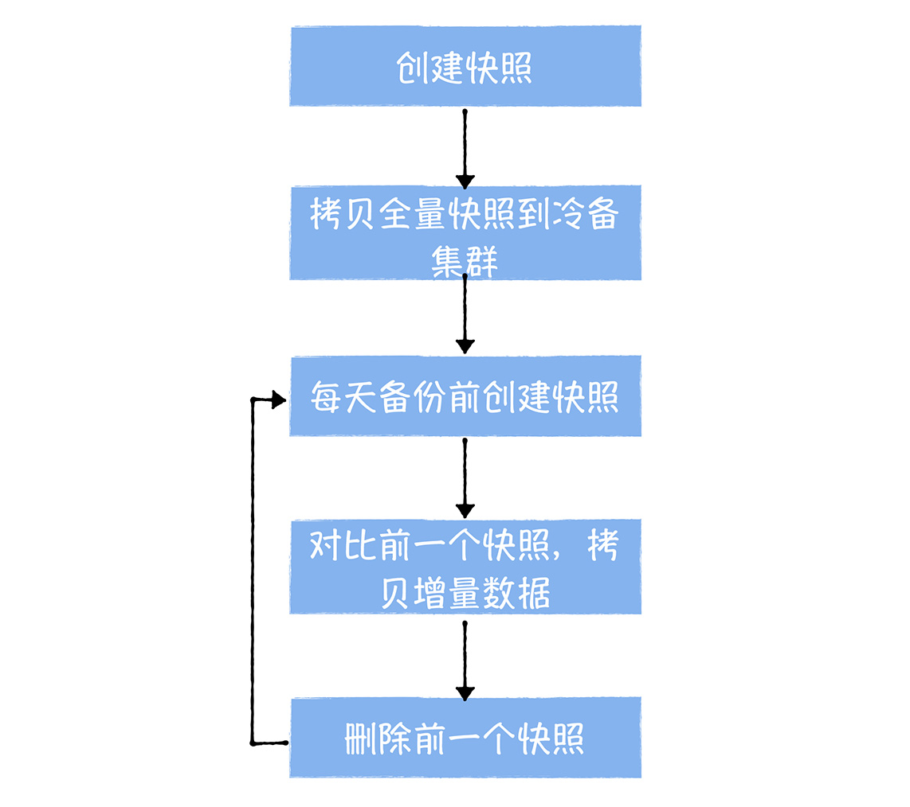

首先，对于第一次开始数据备份的文件，我们会先创建一个快照，然后利用 DistCp 拷贝全量的备份数据到冷备集群。然后后续的每一天，我们都会定时生成一个快照，并和前一天的快照基于 distcp --differ 参数进行对比，将有更新的部分再同步到冷备集群。同步完成以后，会删除前一天的快照，这样就完成了每日数据的增量同步。

这里需要特别注意的是，拷贝数据会对线上 I/O 产生比较大的压力，所以尽量在任务运行的低峰期进行同步（比如白天 12 点到晚上 24 点之间的时间），同时 DistCp 的 bandwidth 参数可以限制同步的速率，你可以根据 I/O 负载和数据同步速率，动态调整。比如说，I/O 利用率 100%，应该限制数据拷贝带宽，为 10MB/s。

讲到这儿，你已经了解了数据中台中，文件目录的备份了，但是光这些还不够，我们还需要备份数据的产出任务，表相关的信息：

- 任务的备份，要保存任务代码、任务的依赖关系、任务的调度配置以及任务的告警、稽核监控等信息；

- 表的备份主要是备份表的创建语句。

在网易，我们提供了产品化的解决方案，数据开发可以在我们提供的数据管理平台上，选择一张表，创建备份，然后系统就会自动地完成任务、文件和表的备份。平台也提供了一键恢复的功能，系统会自动地帮数据开发创建任务和表，拷贝数据从冷备集群到线上集群。

那么你可能会有疑问：什么样的数据应该备份呢？ **在我看来，数据的备份策略应该和数据资产等级打通，对于核心数据资产，数据中台应该强制进行备份。**

那假如说，数据没有备份，但我们误删除了，还有没有其他的补救方法呢？ 你可以试一下接下来地的这个机制。

### **机制二：垃圾回收箱设计**

HDFS 本身提供了垃圾回收站的功能，对于意外删除的文件，可以在指定时间内进行恢复，通过在 Core-site.xml 中添加如下配置就可以开启了，默认是关闭状态。

```xml
<property>  
      <name>fs.trash.interval</name>  
      <value>1440</value>  
</property> 
```

当 HDFS 一旦开启垃圾回收功能后，用户通过命令行执行 rm 文件操作的时候，HDFS 会将文件移到 /user/[用户名]/.trash/current/ 目录下。这个目录下的文件会在 fs.trash.interval 配置的时间过期后被系统自动删除。当你需要恢复文件的时候，只需要把 /user/[用户名]/.trash/current/ 被删除文件移到要恢复的目录即可。

**听到这儿，你是不是感觉问题已经解决了呢？但是我想强调的是 HDFS 垃圾回收机制在实际应用过程中，存在重大的缺陷。**因为它只能支持通过命令行执行 rm 操作，对于在代码中通过 HDFS API 调用 Delete 接口时，会直接删除文件，垃圾回收机制并不生效。尤其是我们在 Hive 中执行 drop table 删除一个 Hive 内表，此时删除的数据文件并不会进入 trash 目录，会存在巨大的安全隐患。


​																			改造后 HDFS 回收站原理示意图

那你要怎么解决呢？我建议你可以对 HDFS 的 Client 进行修改，对 Delete API 通过配置项控制，改成跟 rm 相同的语义。也就是说，把文件移到 trash 目录。对于 Hive 上的 HDFS Client 进行了替换，这样可以确保用户通过 drop table 删除表和数据时，数据文件能够正常进入 HDFS trash 目录。

**通过这种方式，你可以解决数据误删除的问题。**但 HDFS 回收站不宜保留时间过长，因为回收站中的数据还是三副本配置，会占用过多的存储空间。所以我给出的一个配合解决方案是，回收站保留 24 小时内的数据。这样解决的是数据还没来得及被同步到冷备集群，误删除的情况。对于一天以上的数据恢复，建议采取基于冷备集群的数据备份来恢复。

好了，讲完如何解决数据的误删除之后，接下来我们来解决第二个问题，就是如何避免敏感数据的泄露，而这离不开精细化的权限管理。

### **机制三：精细化的权限管理**

数据权限是数据中台实现数据复用的前提和必要条件。如果刚开始系统没有开启权限，后期接入权限，任务的改造成本会非常高的，几乎涉及到所有的任务。**所以权限这个问题，在数据中台构建之初，必须提前规划好。**

网易数据中台支撑技术体系是基于 OpenLDAP + Kerberos + Ranger 实现的一体化用户、认证、权限管理体系。

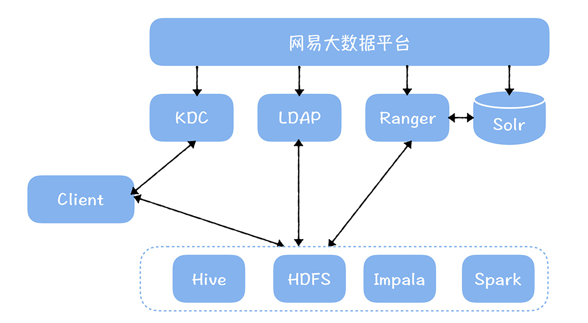

​																		网易数据中台用户、认证、权限系统架构

试想一下，如果有几千台机器，却没有一个统一的用户管理服务，当我们想添加一个用户时，需要到几千台服务器上去创建初始化用户，这个管理和运维的效率有多低。而 OpenLDAP 就帮我们解决了这个问题。

OpenLDAP 是一个轻量化的目录服务，数据以树型结构进行存储，能够提供高性能的查询服务，非常适合用户管理的场景。

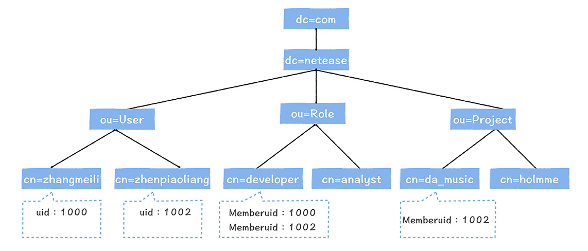

​																					OpenLDAP 树型目录架构示意图

在 OpenLDAP 中，我们可以创建用户（User）和组 (Group)，对于每个用户，会有唯一的 uid，对于每个组，通过 Memberuid，我们可以添加一个用户到一个组中。

在网易大数据平台上注册一个用户，平台会自动生成一个 OpenLDAP 的用户，当该用户加入某个项目时，会将该项目对应的 Group 下增加一个 Memberuid。假设在上图中，甄漂亮加入了 da_music 项目，那么在 da_music 的 Group 下，会增加 Memberuid:1002。同理，当甄美丽加入某个角色时，在对应角色的 Group 下，也会有甄美丽对应的 Memberuid。

那 Hadoop 又是怎么跟 OpenLDAP 集成的呢？

Hadoop 可以使用 LdapGroupsMappings 同步 LDAP 创建的用户和用户组，这样当我们在 LDAP 中添加用户和组时，会自动同步到 Hadoop 集群内的所有机器上。

**通过这个方式，你就可以解决用户管理的问题了，而接下来要解决的就是认证的问题。**在非安全网络中，除了客户端要证明自己是谁，对于服务端而言，同样也需要证明我是我。为了实现双向的认证，我们在生产环境启用了安全等级最高的，基于共享密钥实现的 Kerberos 认证。

说起 Kerberos 认证的原理，我想举一个有趣的例子。

你肯定去过游乐场吧！ 为了进游乐场，首先你需要提供你的身份证，实名购买一张与你身份绑定的门票。在进入游乐场之后呢，每个游乐设施前，都有一个票据授权机器，你需要刷一下你的门票，授权机器会生成一个该游乐设施的票据，你拿着这个票据就可以玩这个游乐设施了。

当然，当你想玩另外一个游乐设施的时候，同样需要刷一下你们的门票，生成对应游乐设施的票据。而且你的门票是有有效期的，在有效期内，你可以尽情地玩游乐设施，一旦超过有效期，你需要重新购买你的门票。

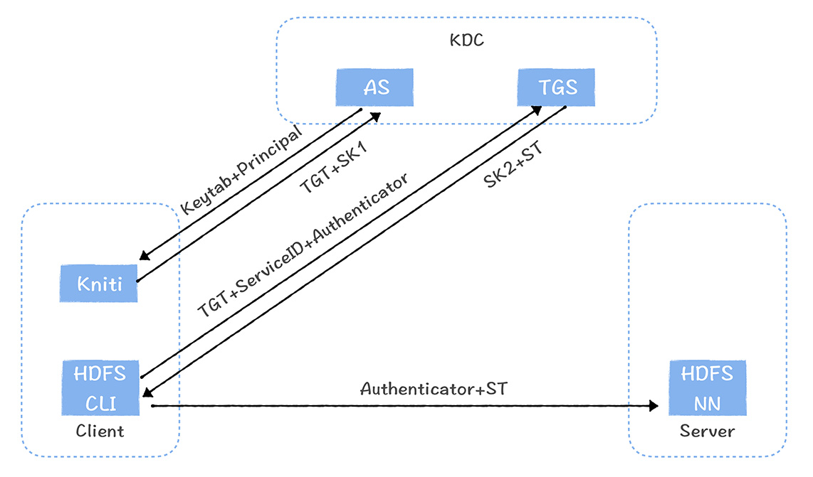

​																							Kerberos 认证原理示意图

Kerberos 认证与上面这个故事类似，在上面的故事中，TGT（Ticket-granting ticket）可以看作是门票，Client 首先使用自己的密钥文件 Keytab 和用户标识 Principal 去认证服务器（AS）购买 TGT，认证服务器确认是合法的用户，Client 会获得 TGT，而这个 TGT 使用了 TGS（Ticket-granting service）的 Keytab 加密，所以 Client 是没办法伪造的。

在访问每个 Server 前，Client 需要去票据授权服务（TGS）刷一下 TGT，获取每个服务的票据（ST），ST 使用了 Client 要访问的 Server 的 Keytab 加密，里面包含了 TGS 认证的用户信息，Client 是无法伪造 ST 的。

最后基于每个服务的票据，以及客户端自己生成的加密客户认证信息（Autenticator）访问每个服务。每个 Server 都有归属于自己的 Keytab，Server 只有使用 Server 自己的 Keytab 才能解密票据（ST），这就避免了 Client 传给了错误的 Server。

与此同时，解密后票据中包含 TGS 认证的客户信息，通过与 Authenticator 中 Client 生成的客户信息进行对比，如果是一致的，就认为 Client 是认证通过的。

一般在 Hadoop 中，我们会使用 Kinit 工具完成 TGT 的获取，TGT 一般保存 24 小时内。**我介绍 Kerberos 原理，其实是想让你知道，Kerberos 对于 Hadoop 集群来说，是一个非常安全的认证实现机制，我推荐你使用 Kerberos 实现 Hadoop 集群的安全认证。**

你可能会问，Kerberos 使用的是 Principal 标识用户的，它又是怎么和 OpenLDAP 中的用户打通的呢？ 其实我们访问 HDFS，使用的是 Principal，Hadoop 可以通过配置 hadoop.security.auth_to_local，将 Principal 映射为系统中的 OpenLDAP 的用户。用户注册时，平台会为每一个新注册的用户生成 Principal 以及相对应的 Keytab 文件。

认证完成之后呢，就要解决哪些客户可以访问哪些数据的问题了。我推荐你使用 Ranger 来解决权限管理的问题。

**为什么要选择 Ranger 呢？**因为 Ranger 提供了细粒度的权限控制（Hive 列级别），基于策略的访问控制机制，支持丰富的组件以及与 Kerberos 的良好集成。权限管理的本质，可以抽象成一个模型：“用户 - 资源 - 权限”。

数据就是资源，权限的本质是解决哪些人对哪些资源有权限。

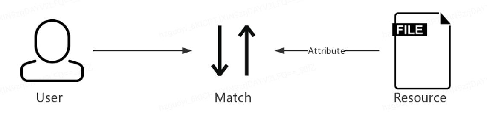

在 Ranger 中，保存了很多策略，每一个资源都对应了一条策略，对于每个策略中，包含了很多组许可，每个一个许可标识哪个用户或者组拥有 CRUD 权限。

讲完了用户、认证和权限实现机制，那你可能会问，**权限的申请流程是什么样子的呢?** 

在数据中台中，每一张表都有对应的负责人，当我们在数据地图中找到我们想要的数据的时候，可以直接申请表的访问权限，然后就会发起一个权限申请的工单。表的负责人可以选择授权或者拒绝申请。申请通过后，就可以基于我们自己的 Keytab 访问该表了。

**另外，需要特别强调的是，**由于数据中台中会有一些涉及商业机密的核心数据，所以数据权限要根据数据资产等级，制订不同的授权策略，会涉及到不同的权限审批流程，对于一级机密文件，可能需要数据中台负责人来审批，对于一般的表，只需要表的负责人审批就可以了。

### 机制四：操作审计机制

进行到第三步，权限控制的时候，其实已经大幅降低了数据泄露的风险了，但是一旦真的出现了数据泄露，我们必须能够追查到到底谁泄露了数据，所以，数据中台必须具备审计的功能。

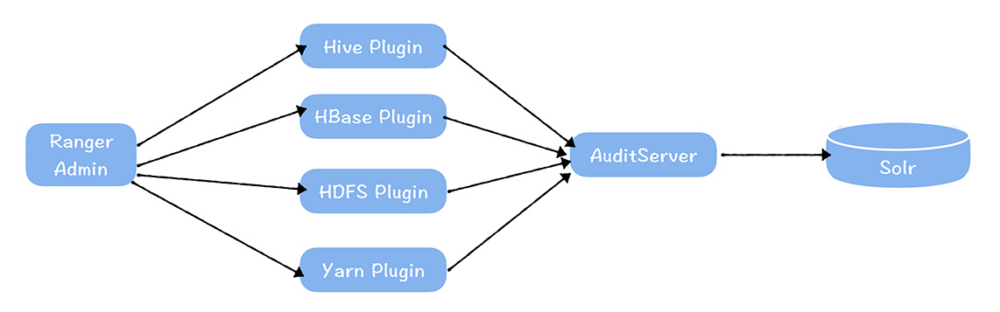

由于用户每次访问数据，都要对权限进行验证，所以在校验权限的同时，可以获取用户访问表的记录，Ranger 支持审计的功能，用户的访问记录会由部署在各个服务（HDFS，HBase 等等）上的插件推送到 Audit Server 上，然后存储在 Solr 中，Ranger 提供了 API 接口查询表的访问记录。但是必须指出的是，Ranger 开启 Audit 后，会对服务内的插件性能产生影响。

除了敏感数据泄露的风险，我还看到一些企业想要对开发和生产环境进行物理隔离。为什么企业会有这个诉求呢？

首先，很多传统公司的数据开发都是外包人员，从企业的角度，不希望数据开发直接使用生产环境的数据进行测试，从安全角度，他们希望生产和测试从物理集群上完全隔离，数据脱敏以后，给开发环境进行数据测试。

其次，涉及一些基础设施层面的组件升级（比如 HDFS、Yarn、Hive、Spark 等），贸然直接在生产环境升级，往往会造成兼容性的事故，所以从安全性的角度，企业需要有灰度环境，而用开发环境承担灰度环境的职能，是一个不错的选择。

最后，虽然可以为生产和开发环境设置不同的库和队列，从而实现隔离，避免开发任务影响线上任务和数据，但会导致任务上线需要改动代码，所以最理想的，还是实现开发和生产环境两套集群，同一套代码，在开发环境对应的就是开发集群，提交上线后，就发布到生产集群。

这些就是企业希望开发和生产集群物理隔离的原因，那我们接下来看一看该如何满足。

### 机制五：开发和生产集群物理隔离

在面对这个需求时，我们遇到了两类完全不同的企业群体。

一部分来自传统企业，尤其是金融行业，他们对安全性的要求远大于对效率的诉求，严格禁止数据开发使用线上数据进行测试，他们希望有两套完全不同的环境，包括操作平台，任务在开发环境进行开发，配置任务依赖，设置稽核规则和报警，然后由运维人员进行审核后，一键发布到生产环境。当数据开发需要对数据进行测试时，可以同步生产环境的局部数据（部分分区），数据会进行脱敏。

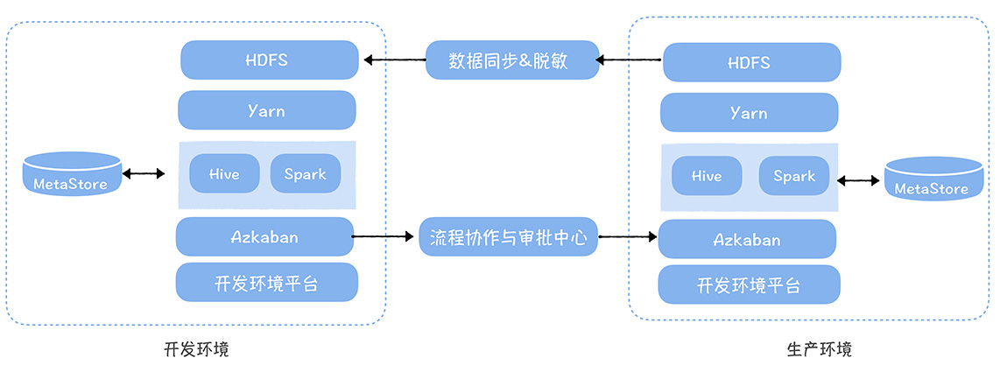

上图是该模式下的部署架构。

通过这张图我们可以看到，开发和测试环境本身是两套完全独立的平台，因为每次数据测试，都需要同步生产环境的数据，所以这种模式下，数据开发的效率会有比较大的影响，但是优势在于对数据安全实现了最高级别的保护。

与这部分客户不同的是，很多企业需要同时兼顾安全和效率，他们没有办法接受同步生产环境数据，而是需要在开发环境能够直接使用线上的数据进行测试。

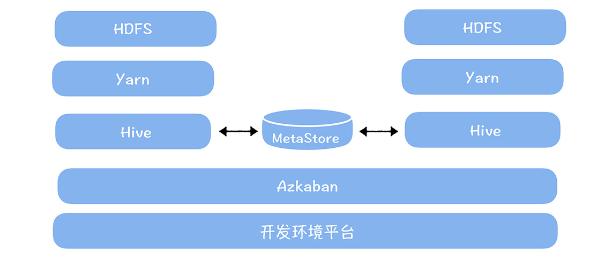

上图展示了该模式下的部署架构。

我们可以看到，大数据平台和任务调度系统（Azkaban）都是一套，然后 Hive，Yarn 和 HDFS 都是两套，两套集群通过 Metastore 共享元数据。

这样做的一个好处在于，一个集群的 Hive 可以直接访问另外一个集群的数据。在同一个 Metastore 中，开发环境的数据在 _dev 库中，生产环境的数据在 _online 库中，用户在代码中不需要指定库，在任务执行时，根据运行环境，自动匹配库。例如在开发环境执行，Hive 默认会使用 _dev 库下的表，而在生产环境执行，Hive 默认会使用 _online 库下的表，从而实现了不需要改代码可以实现一键发布。

上面两种部署模式，你可以根据你所在的企业实际情况进行选择，对安全性要求高，推荐第一种方案，对于效率要求高，同时兼顾一定的安全性，就推荐第二种方案。

### 课堂总结

以上就是这节课的全部内容了，总的来说，我为你介绍了解决数据中台安全问题的五大制胜法宝，相信通过这些保障机制，你可以解决数据中台遇到的安全问题了。最后，我再强调几个重点：

- 数据备份要同时兼顾备份的性能和成本，推荐采用 EC 存储作为备份集群的存储策略；

- 数据权限要实现精细化管理，基于 OpenLDAP+Kerberos+Ranger 可以实现一体化用户、认证、权限管理；

- 开发和生产环境物理隔离，我提到了两种部署模式，需要综合权衡效率和安全进行选择。

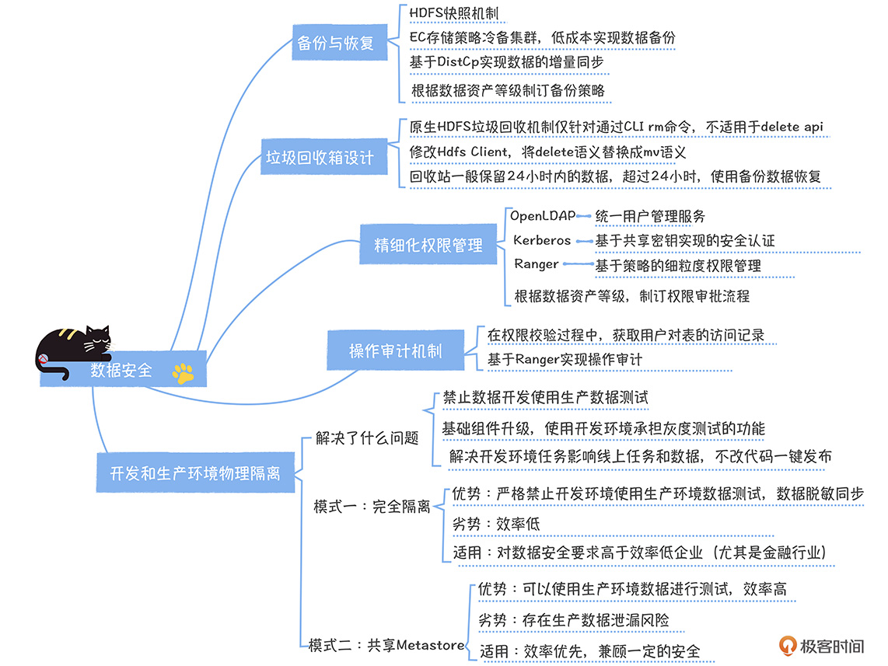

### 思考时间

在课程的最后，我还是留一个思考题，来与你进行互动。

引入权限管理，势必会对数据研发效率产生影响，同时已有的任务必须重构，进行认证改造。你是如何思考安全和效率之间的优先关系的？ 欢迎在留言区与我互动。

**HDFS EC 存储介绍：**

https://hadoop.apache.org/docs/current/hadoop-project-dist/hadoop-hdfs/HDFSErasureCoding.html


## 11 | 数据的台子搭完了，但你还得想好戏该怎么唱

从第 4 节元数据管理开始，到第 10 节数据安全，我已经详细讲了如何建成快、准、省和安全的数据中台。现在，数据中台的台子已经全部搭完了，接下来，好戏就可以上演了，也就是说，我们要在数据中台的基础上，构建企业数据应用体系，用好数据中台的数据。

对企业来说，用好数据非常关键，从我多年的数据建设经验来看，我把数据在企业的应用划分成三个阶段。


- **初级阶段。一般企业的数据应用都是从数据报表开始的，**分析师会为业务部门的负责人、运营制作一些 BI 报表，把数据通过可视化的方式呈现出来，这是数据应用的初始阶段。

- **发展阶段。**只是可视化的展现数据已经不能满足业务的需求，业务需要根据数据持续监控业务过程，发现问题、诊断分析，并给出决策建议，最后需要一键执行，形成完成的业务过程闭环，**这个时候就要借助数据产品来实现，**网易也是在 2018 年才开始大规模构建数据产品体系。

- **高级阶段。**无论是数据报表、还是数据产品，它们呈现的都是固化的分析思路，只能解决知道的业务问题，但是日常工作还有很多未知的业务问题，比如销售额指标突然下降了，需要基于数据进行探索分析。这个时候，如果都依赖分析师，肯定不现实，**那么就要实现自助取数，**让每个人都能基于数据去做分析和决策，实现普惠大数据。我认为这是数据应用的最高级阶段，网易在 2019 年开始开放越来越多的中台数据，让更多的非技术人员去使用数据。

那么今天这节课，我们就从这三个阶段，谈一谈如何用好数据中台的数据。

### 数据中台该如何赋能 BI 工具

很多人对数据的了解，都是从 BI 工具做的报表开始的。关于 BI 工具的产品本身，不是我想说的重点，我主要想和你讨论的是数据中台时代，如何让数据中台帮助 BI 工具更强大。

我会从四个方面带你了解这部分内容。

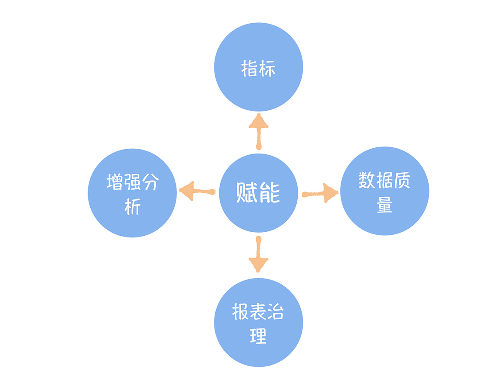

**第一，统一报表指标业务口径。**

数据报表上会存在指标口径不一致的问题，相同指标名称，两个报表里的数据却相差很大，这会让数据使用者对数据失去信任。

而数据中台的所有的指标都是由指标系统统一管理的，如果能在数据报表上直接看到指标系统中，指标的口径定义，就可以让看报表的人准确理解数据的含义，也可以避免不同报表之间指标口径不一致的问题。

同时，如果我们在指标系统上修改了指标的口径定义，也可以同步到所有的呈现该指标的数据报表中。

**第二，掌握任务影响了哪些数据报表。**

当某个任务异常，影响了下游多个任务时，我们往往要根据任务的影响范围，决定任务恢复的优先级。如果任务影响了老板每天看的一张报表，而你却不知道，没有优先修复它，那你就等着被批吧。

那我们要怎么知道一个 任务影响了哪些数据报表呢？

在网易，数据报表在保存时，BI 工具可以把报表和数据的链路关系，推送给数据中台的元数据中心。当数据中台的任何一个任务出现异常，我们通过数据血缘，就可以快速找到这个任务影响了哪些数据报表，尤其是在故障恢复的时候，根据报表的优先级，我们可以优先恢复高优先级的报表。

**第三，治理低价值的数据报表。**

根据数据中台的全链路数据血缘，我们可以计算每一个报表上游所有的数据加工成本，然后得到这个报表的成本。然后根据报表的访问量和访问人群，我们可以计算报表的 ROI（投入产出比），下线低价值的数据报表。

**第四，全维度钻取。**

在制作报表时，分析师只能依靠经验去判断一个指标有哪些可分析维度。如果 BI 工具能根据元数据中心提供的所有指标可分析维度，自动根据指标在各个维度下的取值，找出指标波动的原因，那这就是全维度钻取了，它是目前业界最为热门的研究领域，增强分析的一个方向。

比如，有一个单车租赁公司，发现 8 月份的营业额下降了，系统通过根据各个维度的数据对比和分析发现，8 月份营业额下降，是因为那个月雨天的天数增多导致的。如果分析师不知道用天气的维度去分析营业额，很可能就不知道原因。但是全维度钻取，可以基于数据中台营业额的所有可分析维度，包括天气，自动计算出雨天的销售额相比晴天的销售额低，同时进行交叉分析，发现 8 月份的雨天数量比其他月份多，最后找到问题的原因。

你看，数据中台是不是很大程度上增强了 BI 工具的产品能力？ 在 BI 工具的基础上制作数据报表，这才是数据应用的初级阶段，接下来，咱们继续看一下，基于数据中台，我们能做出什么数据产品，提升业务的运营效率。

### 打造零售行业精益数据运营体系

零售行业是目前我见过的所有行业中，对数据使用程度最深的行业，所以我会以零售行业为例，带你了解如何借助数据实现精益运营。

假如你是“贾天真连锁奶茶店“的老板，你的目标是把更多的奶茶卖给更多的人，赚更多的钱。那你要时刻谨记零售行业一个很经典的理论，那就是：人、货、场，在正确的地点，把正确的商品，卖给正确的人。

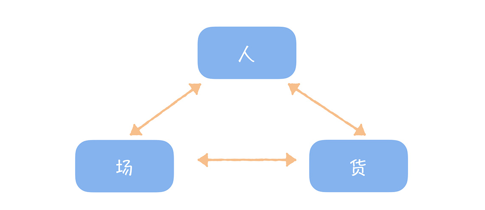

#### 让更多的人，买更多的奶茶

为了让更多的人，买更多的奶茶，你必须要解决客户拉新和促活的问题。那如何拉新呢？

获得新用户的方式，一般就是做广告，但是做广告也有很多渠道：

微信公众号；

抖音；

快手短视频；

小区电梯；

……

可这么多的广告渠道，到底哪个渠道的广告效果最好，性价比最高呢？数据说了算！

我们一般用新消用户数、单个新消用户的平均消费金额（新消 ARPU）、新消单客成本来衡量各个渠道的广告投放效果。你可以参考这几点，选择最优的广告投放渠道。例如，微信公众号相比快手短视频，每日新消用户数更多、单个新消的平均消费金额更多、新消客成本更低，那你就应该果断选择微信公众号。

当然，广告中选择的奶茶种类也会在很大程度上影响广告拉新效果。比如高档小区投放广告时，应该选择价格高、健康的饮品；普通小区的话，更加亲民的奶茶才能吸引更多的客户。那如何来选择奶茶的种类呢？还是数据说了算！

除了根据数据选择奶茶种类之外，广告的投放也要讲究策略，就拿微信公众号这个渠道来说，年纪大的客户群体，注重健康饮品；年轻的客户群体，注重价格亲民，口感，样式。所以，必须要基于人群画像（年龄、地区、学历等），决定推送哪些人哪些商品。 至于人群画像，需要基于日常的顾客交易数据计算而来。

不过，光拉新用户，但是如果留不住用户也不行。那么如何让老用户，增加消费奶茶的频率呢？

我相信你肯定也见过一些套路，比如经常收到一些短信、App 站内消息、小程序、微信公众号推送的打折信息，然后没忍住，就“剁手“了。那你有没有想过，这些商家是怎么抓住你的，怎么就知道你喜欢这一款？

我曾经做过 2 年的推荐算法，这个算法有一个很经典的论述：大数据可以做到让机器比你自己更了解自己。所以，如果你曾经购买过奶茶，那系统就可以交易行为数据计算出你喜欢的奶茶口味、品类，你平时喜欢在哪家店购买，然后定向把这些店对应的奶茶优惠信息推送给你，这样你大概率会中招！

你可以看到，店家总是有各种各样的套路促进你消费。

店家在数据的基础上，一方面可以让新客源源不断；又可以增加老客复购的频率，这时整个奶茶生意的销售额就实现了最大化。

#### 保障奶茶不要断货

作为老板的你，要让更多的奶茶，卖给更多的人，那前提必须要保障奶茶的充足供应，这就涉及到供应链管理的问题。

因为奶茶本质上属于生鲜品，如果门店囤货太多，鲜果就会烂掉。但如果缺货，又会影响门店的销售，所以如何在保证不缺货的前提下，尽量减少门店的囤货，这是你必须要解决的问题。

而供应链涉及到销售、补货、到货和库存四个环节。如果有一款数据产品，可以根据奶茶的实际销售情况和销售计划、结合门店库存的安全水位、采购时间周期，自动计算需要补货的原材料，然后推送给采购系统进行补货，那你是不是会觉得很省心？

#### 实现门店的利润最大化

当然了，奶茶卖的多不多，还和门店有很大的关系。如果你的店员，可以根据数据，及时发现滞销的奶茶，然后在客户结账的时候，主动推荐这些奶茶，那你就可以获得更高的门店收益。我们一般使用“效坪（每天每平米门店的营业额）“来衡量单个门店的经营状况。

通过这几点，其实你可以看到，零售行业有很多赚钱的窍门。接下来，我带你了解一下如何基于数据产品，轻松地使用这些窍门。

#### 构建数据产品，实现数据驱动下的精益运营

数据产品与 BI 报表最大的不同，在于它们不仅可以实现数据的可视化展示，更为重要的是，可以基于数据，对业务过程进行持续的监控，及时发现问题，进行诊断，并形成决策建议，付诸执行。

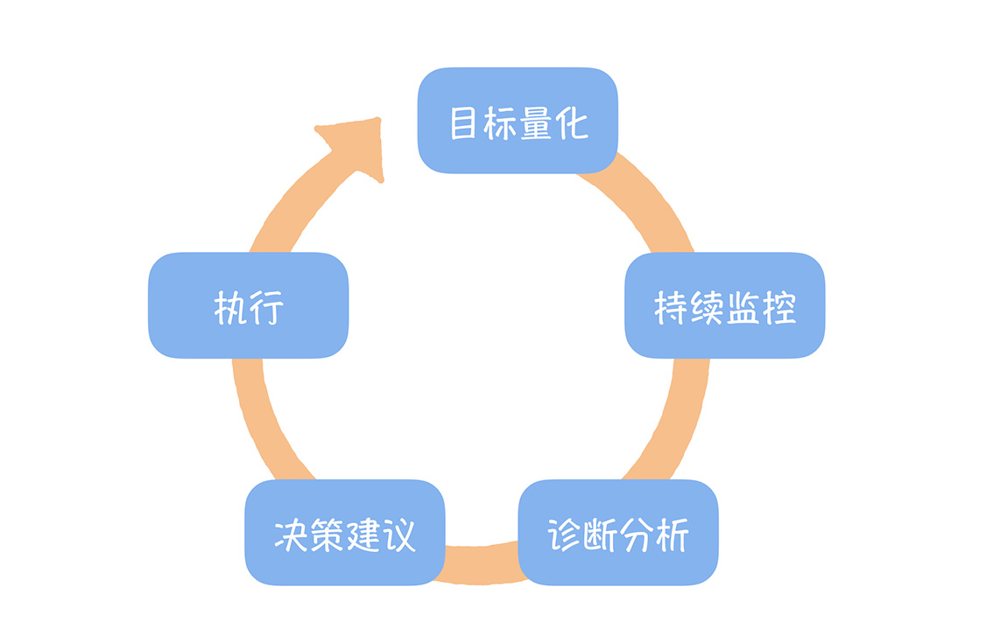

数据产品，首先要实现对业务目标的量化。对于卖奶茶来说，你要关注的重点是研发出更多的网红款的奶茶，确保圈住更多的“奶茶粉儿“，同时降低库存周转的压力，因为有越多的滞销奶茶，就会导致积压更多的货物，产生更多的成本。

为了实现这个目标，你可以用动销率来评估目标的达成。

动销率：销售商品的品类数量占库存的商品品类数量的比例。

为了提高动销率，数据产品必须对每个奶茶品类进行销售的跟踪，及时发现零动销的奶茶。

所以，你可能会经常收到“xxx 款奶茶零动销”"xxx 款奶茶慢动销"的预警信息，然后接下来你就要对这款奶茶出现零动销进行分析了：数据产品会通过不同季节横向对比这款奶茶的销售情况，也会通过顾客消费问卷去分析这款奶茶的口感，最终找到这款奶茶滞销的原因。

接下来，你就要根据原因产生决策建议了。比如如果是因为奶茶口感的因素，应该及时下架这款奶茶，否则会影响口碑。数据产品可以推送给运营进行审核，然后运营确认后，一键下线商品，此后各个奶茶店的菜单中，不会再出现该款奶茶。

当然了，我只是拿零售行业举了个例子，因为很多问题都是共通的，用奶茶店，我总结了一些方法论，你可以结合自己所在的行业去应用：

- 找到业务问题、量化业务目标，比如，我们找到提高奶茶周转的关键，在于及时发现滞销奶茶品类，那么我们用动销率来衡量业务目标；

- 然后要对业务目标持续监控，及时发现问题，比如，我们监控各个品类奶茶的销售情况，及时发现零动销奶茶；

- 紧接着，要对问题进行诊断，比如，我们要发现奶茶滞销是因为口感太差；

- 当然，还要根据原因形成决策，比如下线这款奶茶；

- 最后付诸执行，比如通过一键，在所有门店菜单中去掉了该品类奶茶。

你看，数据产品实现了从监控问题、发现问题、解决问题的完整闭环。可数据产品毕竟还是按照固化的分析思路进行分析和产生决策建议，在日常运营中，还会有很多数据产品或者数据报表无法解释的问题，这个时候就必须要依赖探索式的数据分析来解决，而探索分析的门槛主要在于获取数据，接下来，咱们就来聊聊自助取数的问题。

#### 让技术人员不再是数据的搬运工，释放取数效能

对于传统行业来说，BI 部门一般有两项职责，一个是做报表，一个是取数。而取数的工作量远远多于报表的工作量。

一年中做的报表可能就几百张，但是取数，一年可能要取几千次，或者上万次。而大部分传统企业的取数会依赖技术人员，因为他们离数据更近，取数还涉及写代码，所以，如果你是非技术人员，根本不可能基于数据去做探索式的分析。

所以，大量的取数工作就落在了懂技术的数据开发的头上。

靠别人取数，会存在大量的沟通和协作的成本，同时因为公共集市层数据不完善，导致无法基于现有的数据，直接完成取数，需要数据开发加工新的数据，所以耗时会非常的长，一般需要一周时间。高昂的取数成本，压制了取数的需求，也导致探索式的数据分析，根本不可能大规模的使用。

对于数据开发来说，他们更希望自己的工作重心放在建设公共集市层的数据上，因为公共集市层越完善，取数的成本就越低，不需要额外的开发。但是他们忙于临时的取数需求，根本就没有时间和精力去做这些工作。最后就形成了不良循环，越是集市层数据不完善，取数的工作量就会越大（要开发新的模型），越多的时间去临时取数，集市层越没人建设。

这个问题该如破解呢？ 我们研发了一个自助取数平台，叫 EasyFetch（意为简单取数）。

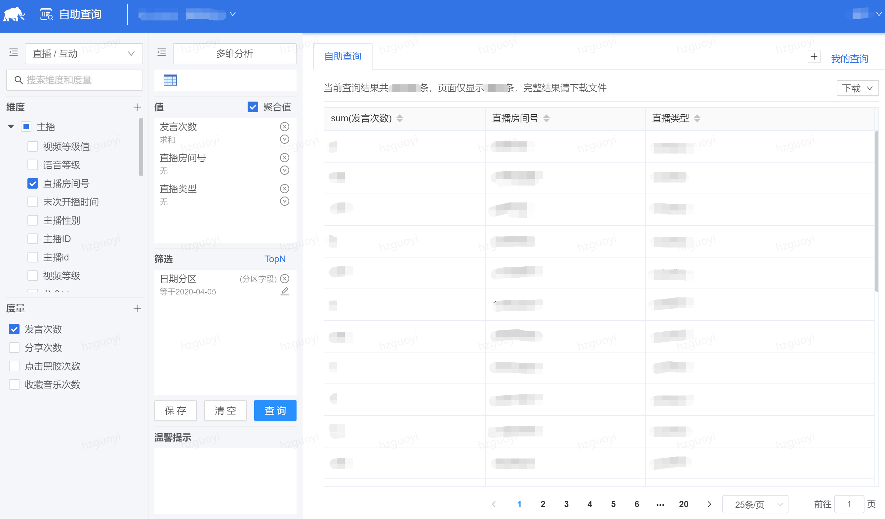

这个平台主要有这样几个优点：

- 用图形化的方式，替代了写 SQL 的方式；

- 提供了对业务人员比较友好的业务过程、指标、维度的概念，替换了表、字段；

- 每个指标的业务口径都能够直接显示；

- 用户通过选取一些指标和维度，添加一些筛选值，就可以完成取数过程；

- 界面非常简洁，使用门槛非常低。

在实现层面，我们在数据中台里，加工了多个面向不同业务过程的集市层的表，取数平台会自动根据用户选择的度量和维度，去对应的表中关联多张表进行查询，SQL 会自动根据查询进行优化，避免非技术人员调试 SQL 以及写的 SQL 质量非常差的问题。

通过自助取数平台，原先我们数据开发 50% 的时间都在临时取数，而现在只有 10% 的时间，在自助取数平台无法满足（需要加工集市层模型）的情况下，帮助用户取数。

同时，这部分的工作也会对集市层模型的不断优化产生促进作用。对于取数效率来说，原先 10 个数据开发，一周做 100 个取数需求，已经是濒临极限。而现在，我们一周有 1000 多次有效取数的需求在自助取数平台完成，取数效率提升了 10 倍以上。

还有一个有趣的现象，我也想分享给你，就是我们发现，在周末，也有很多人在使用取数平台，经过调研，我们发现很多人在基于数据写周报，这是之前完全无法想象的事情。

最后，我建议你在设计取数平台时，一定要注重简洁、对用户的引导、降低用户的使用门槛。因为我们面临的是非技术人员，我们要拿出做 C 端产品的姿态去做取数产品。

### 课堂小结

这就是今天我要讲的全部内容了，你可以看到，数据中台之上，可以有这么多的数据应用场景，数据可以帮助我们实现这么多原先不可能做到的事情。在课程的最后，我想再强调几个重点：

- 数据中台对 BI 赋能体现在指标口径的一致、任务影响分析、数据报表的成本以及基于数据中台的元数据之上的全维度钻取；

- 数据产品实现了从目标量化，持续跟踪，异常诊断，决策建议，最后到执行的完整数据驱动业务目标达成的闭环；

- 通过实现面向非技术人员友好的自助取数平台，让数据开发专注于集市模型的构建，可以释放取数的效能，大幅度促进数据的应用范围和深度。

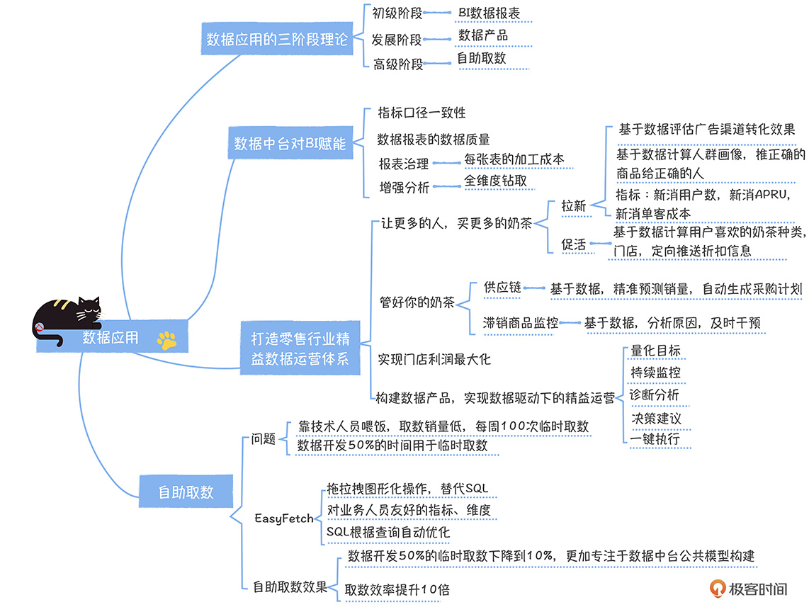

### 思考时间

今天我主要介绍的都是零售行业数据应用的场景，在其他的行业，比如农业、物流、金融、教育、制造业等等，来谈谈你所在的行业有哪些数据应用的场景，如何来实现业务目标的数据驱动？欢迎在留言区与我互动。


## 12（一）| 数据研发就只是写代码吗？

到现在，我已经讲了 10 几个数据中台的工具产品，除此之外，我还提到了数据产品、数据架构师、数据开发、应用开发、分析师……多个角色。既然数据中台要用到这么多工具，又涉及这么多角色，如果没有配套的协同流程和规范，那也没办法达到数据中台高效、高质量、低成本的建设目标。来看几件有意思的事儿。

郝有才（数据开发）修改了数据中台一个数据加工任务，变更了产出的数据表字段，因为没有通知到下游数据的负责人，结果影响了 10 多个任务，大量数据应用出现异常。这属于比较典型的“协作事故”，咱们再接着看一个跨团队之间协作的问题。

张漂亮（业务系统的服务端开发）今天业务上线，她提交了数据库变更工单，修改了商品交易明细表的商品类型枚举值。但这个升级并没有通知数据部门，结果导致基于商品类型计算的多个指标数值出现错误，严重影响了第二天多个数据产品的数据产出。

这些教训告诉我们，建设数据中台是一项系统性的工程，**你不但要有技术的思维，更要有管理者的视角。**所以接下来，我会带你了解数据中台中，三个最常见的协作流程：数据研发、数据分析、资产管理。**看一下不同角色使用场景化的工具产品，是如何进行高效协作的？**

因为流程协作涉及的料也很多，我会用两讲的时间来讲这部分内容。今天，我们就先从数据研发的场景讲起，如果你是一名普通的数据开发，你肯定很熟悉下面的这些场景。

当然，在学习的过程中，我建议你关注这样几个重点，因为它们对于你理解一个协作流程如何运转非常关键：

- 一个流程中涉及到了哪些环节？

- 这些环节涉及到哪些角色参与？

- 承载这个场景的工具产品是什么？

- 这些环节之间是如何衔接的？

话不多说，开始今天的内容。

也许在很多人的印象中，数据研发就是写代码，其实对大规模、标准化的数据建设来说，这远远不够。在网易，标准的数据研发流程包括四个阶段：需求阶段、开发阶段、交付阶段和运维阶段。每个阶段中又涉及多个环节，如果你缺失了这些环节，就很容易出问题，数据也会因此没办法高效、高质量的交付。

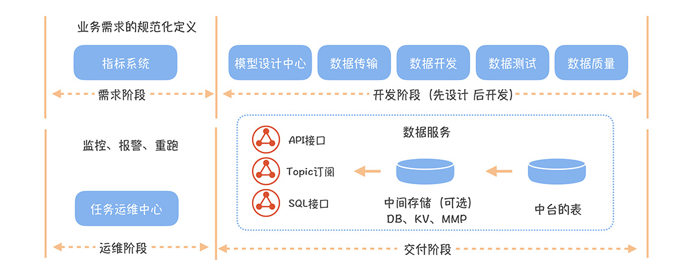

### 需求阶段

需求是数据开发的起点。如果想让后面的流程高效运作，那需求的定义一定要清晰，这样协作者（数据开发、应用开发、数据产品 / 分析师）对需求的理解才能一致。

在数据中台中，数据需求通常是以指标的形式出现的，比如李天真提了个需求（计算每日黑卡会员的消费额），而承载这个场景的产品就是我们 05 讲的指标系统。

那什么时候会提需求？又什么时候会频繁用到指标系统呢？

一般来说，分析师在制作新的报表，数据产品经理在策划新的数据产品时，会提一些新的指标需求，然后就会在指标系统登记指标（包括指标的业务口径，可分析维度、关联的应用、时间周期信息）。这个时候，指标的状态就是待评审状态。

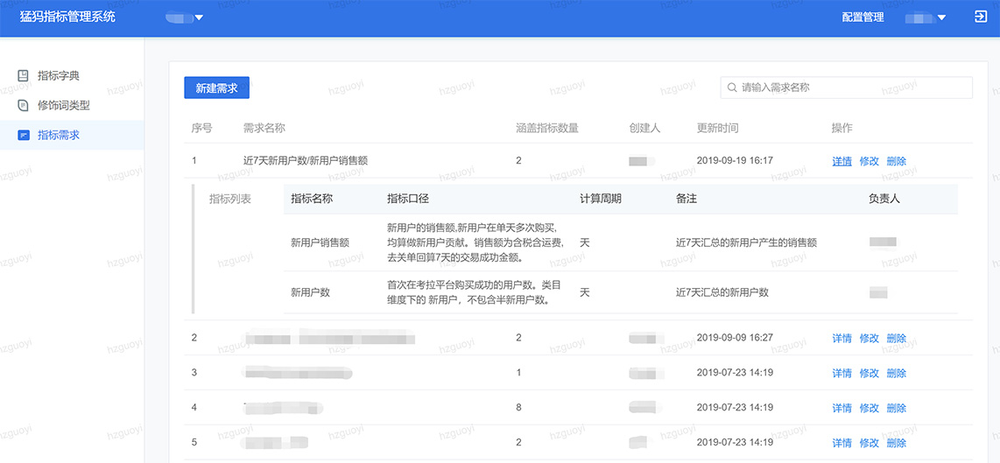

​																				指标系统需求登记示意图

然后，管理指标的数据产品（没有这个角色的，分析师也行）会叫上相关的数据开发、应用开发、提出这个需求的分析师或者数据产品，对指标进行评审：

- 指标是新指标还是存在的指标；

- 如果是新指标，那么是原子指标还是派生指标；

- 确认指标业务口径、计算逻辑和数据来源。

那评审后的结果又是什么呢？

- 如果是新指标，就在指标系统上录入相关信息，指标状态是待开发状态；

- 如果是存在的指标，应用开发可以直接找到这个指标所在的表。然后看这个表是否已经有现成的接口可以被直接使用，如果有，就直接申请授权，如果没有，可以基于这张表发布一个新的接口。

### 研发阶段

现在，新指标的状态是待开发状态，接下来就要进入开发阶段。在这个阶段，你要秉持“先设计，后开发”的理念。为啥这么说呢？

因为很多开发都习惯边开发、边设计，想到哪里，代码写到哪里，这其实并不是一个好习惯。这会造成缺少整体的设计，开发过程中经常出现表结构频繁修改，代码返工，整体研发效率不高。

所以说，我们要先做好模型的设计，而承载这个场景的工具产品就是06 讲的模型设计中心。**这里我再强调一下，**数据开发在设计的过程中，可能要用到一些已经存在的数据，这时就要利用数据地图发现已经存在的表，然后理解这些表中，数据的准确含义。

除此之外，在模型设计过程中，要对模型中每个字段关联前面设计好的指标，以及可分析的维度。比如，我们对下图的 account 字段，标记为指标“用户消费金额”；user 标记为“买家维度”。这个标记会把模型和指标建立关联关系，然后把前面设计的指标落实到了表中。

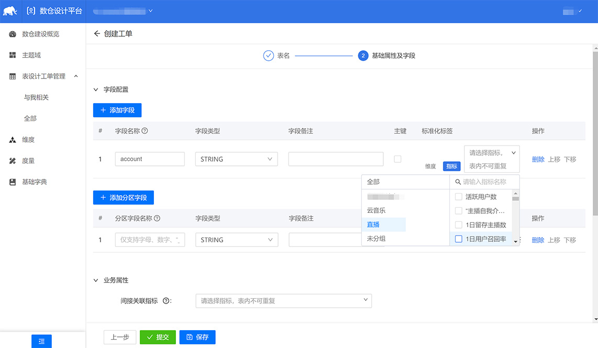

​																					模型设计中心，新建模型示意图

到这一步，模型设计还不算完，数据开发还要提交模型上线工单。工单会根据模型所属的主题域，流转到对应域的负责人，并通知对应域负责人进行审批。审批通过后，模型会自动发布到生产环境。


​																							模型发布上线工单示意图

这里你要注意一下，数据域的负责人一般是数据架构师，他需要检查数据是不是重复建设，要保证自己管理的域下模型设计的相关复用性、完善度、规范性的相关指标。

当然了，除了新建模型之外，已有模型也会存在变更的情况（比如增加一个字段或变更字段枚举值）。这个时候，要根据数据血缘，通知所有依赖这个表的下游任务的负责人，在负责人确认以后，才能进行模型变更。

比如，甄可爱是一名数据开发，她接到需求，完成模型设计之后，就要开始模型的开发了。首先她要把数据从业务系统导入数据中台中，那她第一步就要申请对应数据库的权限，然后在数据传输中心建立数据传输任务，把数据同步过来。

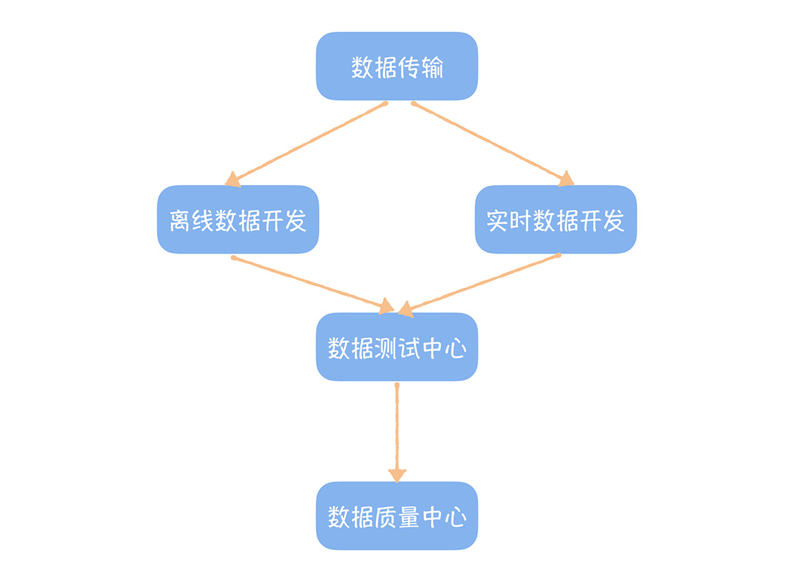

接下来，要清洗和加工数据，那她要在数据开发中心开发数据的 ETL 任务，根据之前模型设计，编写对应任务的代码。

任务代码完成以后，甄可爱要在数据测试中心，验证数据：

- 一个是进行数据探查，确定新加工的数据是否符合预期；

- 另外一类是对原有模型的重构，新增字段或者更新部分字段。此时不仅要验证新加工数据的正确性，还要确保原有未修改数据，与修改前是否有改变，我们管它叫数据的比对。

数据测试中心还提供了静态 SQL 代码检查的功能，主要是发现一些使用固定分区，使用测试环境的库，使用笛卡尔积等代码问题，我们把这个过程叫 SQL Scan。 在我们的开发规范中，只有通过 SQL Scan 的代码才被允许发布上线。

在数据测试完成后，甄可爱还要在数据质量中心里配置稽核校验规则。目的是对任务产出的数据进行校验，在数据出现问题时，第一时间发现问题，快速地恢复故障。

在开发规范中，主键唯一性监控、表行数绝对值以及波动率监控等属于基础监控，是必须要添加的，另外还需要根据业务过程，添加一些业务规则，比如一个商品只能归属一个类目等。

配置完稽核规则，甄可爱要任务发布上线了。任务发布上线，要设置调度周期，配置任务依赖，设置报警规则以及报警对象，选择提交的队列。

任务发布与模型发布一样，也需要进行审核。首先甄可爱需要发起任务发布上线的工单，然后工单会根据产出表所在域流转到对应域负责人贾英俊审批，审批的主要内容：

- 确认任务参数设置是否合理，比如 Spark Executor 分配内存和 CPU 资源；

- 检查任务依赖、报警设置是否正确，核心任务必须要开启循环报警，同时要开启报警上报；

- 重点审核稽核规则是否完备，是否有缺失需要补充。

- 在审批通过以后，任务就会发布上线，每天就会有数据源源不断的产生了。

到这里，甄可爱就完成了所有模型研发的流程了。你看，虽然是一个模型研发的环节，可涉及这么多的工具产品，还包括了多个审批流程，但是这些工具和流程，都是标准化研发不可或缺的。例如如果不测试，就会导致大量的 BUG 上线，如果没有稽核监控规则配置，就会导致出了 BUG 还不知道，等着被投诉。

而数据研发完，接下来就是数据的交付了，如何让数据快速接入到数据应用中呢？

### 交付阶段

在数据中台之前，其实并不存在单独的交付阶段，因为数据开发加工好数据应用需要的表，他的工作就已经结束了，剩下的就是应用开发的事儿了。应用开发需要把数据导出到应用所属的数据库，然后开发 API 接口，供客户端调用。

数据中台，提出了数据服务化的思想，数据中台暴露的不再直接是数据，而是服务。数据开发不仅需要加工数据，还需要把数据发布成 API 接口或者其他服务形式，提供给业务系统或者数据产品调用，从而形成了单独的数据交付阶段。

数据服务承载了数据交付的整个流程。数据开发，可以直接选择一张数据中台的 Hive 表，然后在数据服务上创建一个数据抽取任务，把数据抽取到中间存储中（中间存储可以是 DB，KV，MPP 等）。这个过程，数据服务会自动根据中台数据的产出时间，在调度系统中创建数据导出任务，建立到产出任务的依赖。

接下来，数据开发可以基于中间存储发布 API 接口，定义输入和输出参数，测试 API 后发布上线。这个时候，数据开发的工作才算完成。

最后，应用开发在数据服务上创建应用，然后申请对该接口的授权，等数据开发审批通过后，就可以直接调用该接口获取数据了。

数据交付完呢，还不算完，接下来数据开发的工作，还需要保证任务的正常运行，这就进入了第四个阶段，运维阶段。

### 运维阶段

承载运维阶段的工具产品主要是任务运维中心。

在这个阶段的第一责任人是任务负责人（一般是这个任务对应的数据开发）。这里有这样几个过程：

- 数据开发接到报警后，要第一时间认领报警；

- 任务运维中心提供了报警认领的功能，数据开发点击认领，代表数据开发开始处理这个报警；

- 如果报警迟迟没有人认领，任务运维中心会每隔 5 分钟会发起一次电话报警，直到报警认领；

- 如果报警一直没有认领，系统会在 3 次报警，15 分钟后进行报警的上报，发送给模型所在域的负责人。

这样的机制设计，确保了报警能够在第一时间被响应，我们在实施这项机制前后，报警的平均响应时间，从 2 个小时缩短到 15 分钟内。

那么当数据开发认领报警之后，需要开始排查，首先要确认上游依赖任务稽核规则是否有异常（也就是输入数据是否存在异常）。如果没有异常，数据开发要通过任务运行日志，排查当前任务的问题原因，并进行紧急修复，接下来再重跑该任务，任务重跑完，还要通过数据地图，找到所有依赖该表的下游任务负责人，发送“下游任务需要进行重跑”的通知。

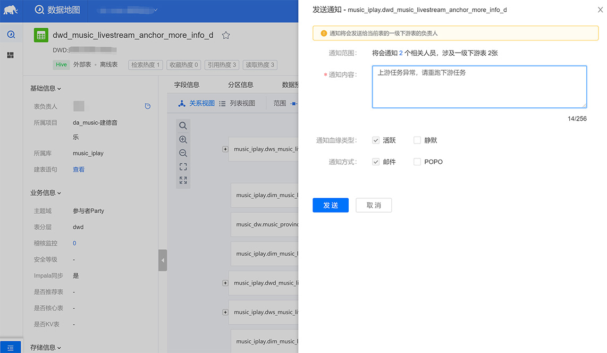

数据地图通知下游任务负责人示意图

故障恢复完，还要进行复盘，其中重要的事情就是补充稽核规则，确保不再出现犯过的错误。通过这样不断沉淀和记录，数据中台的数据质量就会越来越高，数据质量问题也会减少。

### 课堂总结

你看，数据研发不仅仅只是写代码这么简单吧？在这四个阶段中，你经常容易忽略的是需求阶段和交付阶段，如果需求定义不一致，就很容易导致后面的研发返工，如果没有标准的数据交付流程，就会数据接入慢，同时交付后维护的复杂度会增加。我再强调两个重点：

- 数据研发的需求是从指标的规范化定义开始，数据产品、数据开发和应用开发要建立一致的指标业务口径、计算逻辑和数据来源，从而才能确保需求被高质量的交付；

- 数据服务承载了数据标准化交付的功能，通过发布成服务 API 的方式，把数据中台的数据接入到数据产品中。

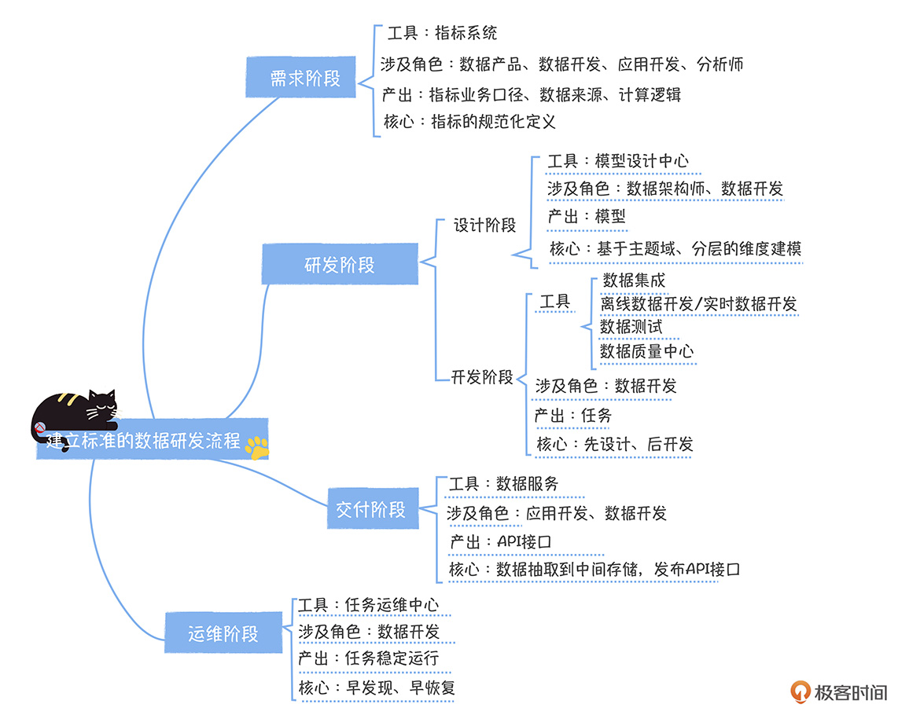

数据研发好之后，数据就要被使用了，下一节课，我们再以数据使用者的角度以及数据资产管理的视角，带你了解后面两个流程：数据分析流程，带你看一下数据是如何被使用的；然后是资产管理流程，看一下如何有效的实现精细化的资产管理。

### 思考时间

在你日常的数据建设中，遇到过哪些因为流程协作导致的问题呢？ 欢迎你在留言区与我互动。

## 12（二）| 数据被加工后，你还要学会使用和管理数据

上一讲，我讲了数据研发的四个阶段，你可以发现，标准化的研发流程对交付高效、高质量的数据来说，非常关键。那么数据被加工好以后，怎么使用数据和管理数据就是重点了。

所以今天，我会从数据使用者的角度出发，聊一聊怎么构建高效的数据分析流程。同时，也会以资产管理者的视角，带你了解怎么实现数据资产的精细化管理。

我希望你通过学习今天的内容，判断一下，日常工作中自己在数据使用和管理方面是不是还存在流程环节上的缺失，并不断完善，让数据使用、管理得更好。

### 落地高效的数据分析流程

根据我的经验，我把数据分析过程划分五个步骤。接下来，我通过分析师甄可爱的例子，为你呈现了一个典型的数据分析流程。

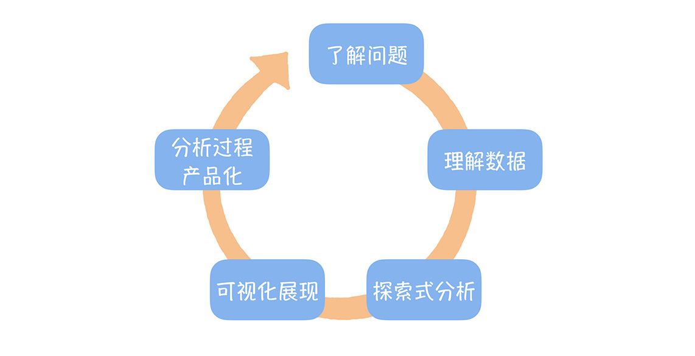

**第一步：发现业务问题。**

数据分析的典型场景呢，起点都是业务出现了某个问题，我们需要基于数据找出业务问题背后的原因。

分析师甄可爱所在的公司，电商平台 Q2 季度某个品类的商品销售额下降了 30%，老板要求给出问题的原因，并进行整改。这个任务落到了她的身上。 要解释这个问题，她必须要从现有的数据入手，看看到底是哪里出现问题。

**第二步：理解数据。**

她首先要了解这样几点：

- 要分析的业务过程；

- 这些业务过程中涉及到了哪些关键指标；

- 这些指标的业务口径是什么；

- 有哪些可以分析的维度。

这些事儿，比较琐碎，甄可爱为了提高效率，利用指标系统，将要分析的业务过程快速锁定到交易域下的业务过程，然后找到交易域下有哪些指标。通过指标系统，她了解了“渠道销售额”这个指标的口径定义、计算逻辑和数据来源。

接下来，她要去查看指标对应的数据，借助指标系统，甄可爱可以直接跳转到指标关联到数据报表上，接下来她需要申请报表的权限，查看数据。报表负责人审批通过后，甄可爱就可以看到数据了。

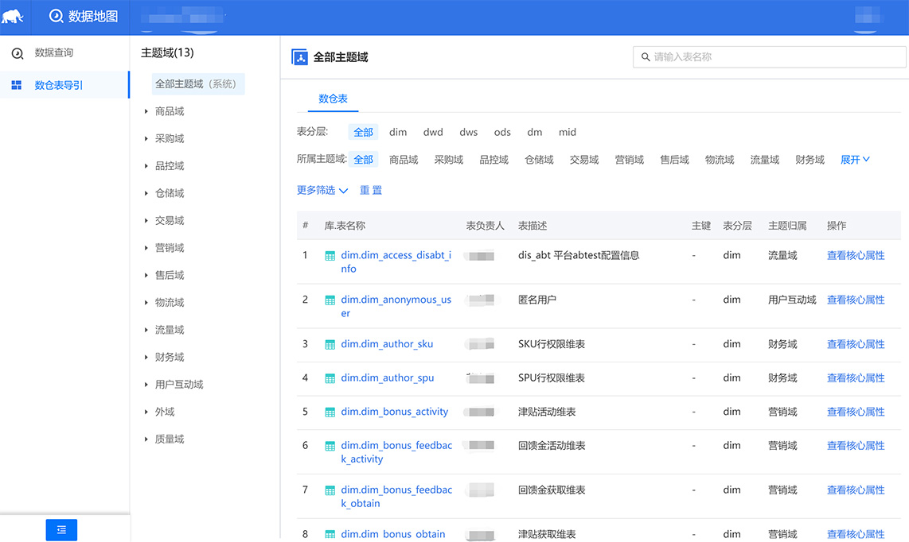

​																	数据地图导览示意图

这个时候，她发现，淘宝渠道销售额数据出现下降，拖累了整体品类销售额的数据。可是当她想进一步探查渠道下降的原因时，却发现并没有渠道级别的商品库存和销售指标。现在，靠现有的指标和数据已经没办法进一步解读业务问题的原因了，甄可爱需要进行探索式分析。

**第三步：探索式分析。**

那她首先要找到当下有哪些数据可以用，借助数据地图，她可以快速了解当前主题域下有哪些表，这些表分别代表什么含义。

这个时候，会存在两种情况：

- 如果现有的数据可以满足分析的需求，她可以直接在数据地图表详情页上发起数据权限的申请流程；

- 如果现有的数据没办法满足需求，甄可爱就要对数据开发提出数据研发的需求，会稍显麻烦。

幸运的是，甄可爱发现，商品粒度的库存和销售表中有渠道的字段，按照渠道进行聚合、过滤，就可以满足分析的需求了。所以，她在数据地图的相关表详情页里申请了这些表的权限。

接下来，权限申请流程会流转到表对应的负责人上：

- 对于核心表（比如交易数据），除了表负责人审批，还需要中台负责人审批；

- 核心表中的一些核心 KPI 数据（比如平台全年销售额），还需要 CTO 甚至 CEO 级别的审批。

等了一段时间，权限审批终于通过，甄可爱收到了来自权限中心的通知，于是她马不停蹄地在自助分析上，基于 SQL 对相关表进行了探查分析。甄可爱对比分析后发现，淘宝渠道销售数据下降的主要原因是：该品类下的部分畅销商品经常库存为 0，出现缺货情况，导致整体品类销售额下降。

**第四步：可视化展现。**

现在，找到了问题原因，为了给老板讲清楚分析过程，甄可爱还要通过报表的方式，把分析过程呈现出来。所以，她又在 BI 工具网易有数上进行了报表的制作，把报表授权给相关的管理层。

看到了原因后，管理层制订了供应链优化措施，加大了淘宝渠道的库存供货，整体品类销售额数据出现回升，终于解决了问题。

**第五步：分析过程产品化。**

解决了现有问题，并不是数据分析的终点。我们还要建立长久的问题发现和解决机制。

为了持续地监控该问题，并对其进行智能预警，甄可爱需要将分析过程固化到数据产品中。她策划并研发了供应链决策协同系统，能够自动检测商品的库存和销售，智能生成补货建议，然后推送给采购系统。

到此，整个数据分析的全过程就完成了。最后，我想再强调一个点，在这五个步骤中，你往往最容易忽略是最后一个步骤。当然，这也并不只是分析师的疏忽，本身数据产品的建设还需要有一定的研发资源的投入。

为了解决大规模数据产品研发资源投入的问题，在网易，我们基于网易有数（BI 工具）实现了数据门户的功能，它实现了一个低代码构建数据产品的开发环境，允许分析师通过拖拉拽的方式构建企业数据门户，从而为高效的大规模数据产品构建提供了基础。基于数据门户，企业可以构建商品运营系统、供应链协同决策系统、流量看板系统、会员运营管理系统等不同的数据产品，满足不同场景下数据分析的需要。

数据如何被使用讲完，接下来，我还想来谈谈数据的精细化管理流程，因为这个流程或者环节的缺失，会导致很多成本、安全、以及稳定性的问题。

### 构建精细化的资产管理流程

在数据中台中，数据资产的精细化管理主要包括成本治理和资产管理两个部分。在网易，我们分别研发了两个工具产品来完成上述管理流程的落地，分别是成本治理中心（简称 EasyCost）和数据管理中心（简称 EasyManager）。

下面我们通过资产管理员李无邪的视角，来看看上述两个工具产品日常是如何运转的。

李无邪首先要登录到 EasyCost 中，然后制订数据自动下线的规则，比如，他认定 30 天内没有访问的数据需要下线。然后系统会根据规则，每天自动将符合规则的表和目录推送给表的负责人，等待表的负责人审核确认。

表的负责人张美丽接到了 EasyCost 推送的邮件，此时一般有两种情况：

- 第一种，是该数据虽然没有被使用，但是属于核心资产，以后用的上，需要保留，此时可以申请加入白名单中，由资产管理员李无邪审批后，不再被推送。

- 第二种情况，是该数据确实没有被使用了，那张美丽就点击一键下线，然后系统会进行数据的灰度下线，首先会先停止调度任务，数据不再产出，7 天后，数据会被自动清理。在下线前，可以选择是否保存备份。

为主题域的负责人和数据团队的管理者，同样也会收到 EasyCost 推送的面向主题域和数据中台整体的表的使用情况，从管理者的角度，也可以对下形成治理的压力，把成本治理纳入到数据开发的绩效考核中。

接下来，我们讲讲资产管理部分。资产管理的核心，是数据资产等级的制订，李无邪需要为数据中台的数据制订资产等级规则。

李无邪要依据两方面的因素，制订资产等级的标记规则：

- 一方面是数据本身涉及企业的核心机密，比如 KPI，产品日活，毛利等；

- 另外一方面因素是根据数据应用的优先级，然后基于全链路的数据血缘制订数据的等级。

数据等级可以与数据权限的审批流程、模型和任务发布上线的审批流程打通，根据不同的资产等级，需要不同级别的角色来完成审批。另外，数据资产等级还与数据备份策略相关，对于核心数据，我们要求必须实施备份。

此外，数据中台的小文件也需要关注，因为如果小文件过多，会导致 HDFS 元数据过大，对 HDFS 的元数据服务 NameNode 产生性能问题。所以 EasyManager 同样需要对小文件的数量和分布进行监控，然后推送给各个主题域和表的负责人，同时系统提供了小文件合并的工具，可以帮助数据开发快速的完成小文件的治理。

### 课堂小结

今天这节课，我带你重点了解了如何构建高效的数据分析流程，和如何实现精细化的资产管理流程。

通过这两讲内容的学习，我相信你就不会觉得，面对这么多的工具产品，不知道该怎么用！涉及这么多人，又不知道什么人该干什么事儿了。同样，你也可以把前面提到的工具和角色串联起来，形成一个可落地运行的机制，应用到你日常的数据建设工作中。

在最后，我想再强调几个重点：

- 数据分析的完整流程应该从了解业务数据，到探查式分析，再到通过数据报表进行可视化呈现，最后通过数据产品固化场景，实现持续监控、自动生成决策建议，一键执行的目标。

- 资产管理流程中，资产管理员的主要职责在于制订规则，包括数据或者报表下线的规则，数据资产等级的规则，目的是凸显数据的资产属性，聚焦核心数据。

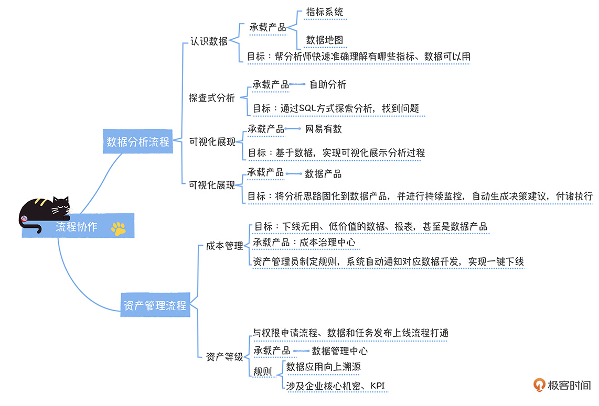

### 思考时间

数据研发、数据分析以及资产管理是数据中台中三个基本流程，除了这些，你还知道有哪些别的流程需要涉及到多个角色的协作？ 如果需要通过一个工具产品，流程协作中心来完成上述协作流程，你觉得该如何设计这个产品呢？


## 13 | 数据中台在网易电商业务的最佳实践

从 OneData 到 OneService、从方法论到支撑技术、从宏观架构到微观实现，我已经带你系统地了解了建设数据中台的所有核心知识点。你可以看到，虽然人人都在讨论数据中台，但是真的实战起来，还是不简单吧？

而且建数据中台是一项系统性的工程，涉及人员组织架构的变动，需要研发大量的系统支撑工具，更要和业务部门达成密切的合作，形成双赢，反之会有失败的风险。还是分享一件我见过的事儿。

甄英俊是某零售企业 IT 部门的老大，最近他也想在企业中建数据中台。设想一番后，他亲自操刀，组建了新的数据中台部门，还亲自规划了十个业务场景（包括会员看板、商品运营、供应链管理、售后管理、毛利分析、类目管理、门店管理、仓储管理、渠道分析、辅助选品）。

但数据中台团队没有和业务部门达成一致的 KPI，在具体工作推进过程中，中台团队与业务部门脱节，业务部门也没有资源支撑中台的推进（例如指标的梳理）。

最后，虽然基于原先规划的十个场景，数据中台确实做出了一些报表，但很少有人查看。于是，尴尬的一幕发生了：在年终总结汇报中，甄英俊自信地向 CEO 汇报了数据建设的成果（输出了多个报表，覆盖了多少业务场景）。可当 CEO 问业务老大是否感觉到数据的作用？业务老大摇 了摇头，他们并没有认可数据中台的成果。

这是一个很典型的失败项目，而问题的根源就在于数据中台团队虽然独立于业务，但是并不能脱离业务。 甄英俊最大的失误就是没有深入调研业务问题，也没有和业务达成一致的 KPI，更没有根据业务的反馈，不断完善数据应用。

所以，如果你要建中台，要做到这样几点：

- 问问自己为什么要建中台，与业务达成一致的目标；

- 把数据中台作为一个公司级别的顶级项目来推进，而不是一个数据部门自己的 KPI；

- 数据中台必须要有清晰的、可量化的价值来衡量（从主观上也要得到业务部门的认可）。

而今天这节课，我会从项目立项、到项目推进，最后到项目总结，带你看一下网易电商数据中台的构建过程。这样一来，你会明白如何在企业一步一步落地数据中台，这对想要建设数据中台的你来说，非常有借鉴意义。

### 立项数据中台项目

我认为，立项是建数据中台最关键的一步，因为它的核心就是挖掘业务的痛点，跟业务达成一致的建设目标。**如果能达成一个一致的、可量化的目标，数据中台的项目就成功了一半。**

所以在网易电商数据中台构建之前，我们（数据部门）对业务方（包括市场、商品、供应链、仓配、售后、会员等）进行了密集的调研，尤其是跟各个部门的老大了解了这样两个方面：

- 当前数据使用过程中存在哪些痛点；

-  当前业务部门最关注的业绩目标。

这里我多说几句，对一些传统企业来说，业务部门的数据思维能力比较薄弱，数据使用水平还比较初级，根本讲不出什么痛点。如果遇到这种情况，你要多关注一下业绩目标（比如，如何让数据帮助企业达成 KPI。） 如果谈论这种话题，业务部门的老大一定很感兴趣。

经过调研，我总结了这样几个痛点。

**第一，指标业务口径不一致。**

在建数据中台前，网易电商已经有 20 多款数据产品，它们涉及 800 多个指标，存在大量业务口径不一致的情况，导致了数据不可信、无法用。你看，虽然数据产品不少，但是真正发挥价值的却寥寥无几。其实这还没算数据报表，如果把报表算进来，就更夸张了。

**第二，需求响应速度慢。**

在电商平台中，业务部门运营活动的规模和频率大大提高，原先可能一个月才一次促销活动，现在是一天一次，甚至还有小时级别的。淘宝上一双 NewBalance 的鞋子，前一个小时还是 599，下一个小时就成了 429，而这背后其实是大量的商品运营策略在发挥作用。

活动一开始，运营人员就需要分析大量的数据，从而不断优化运营策略。此时，数据部门会收到大量的数据研发需求。而我们统计后发现，数据部门一个需求的平均交付时间是一周（数据来源于项目管理工具 JIRA），根本没办法满足业务部门的需求，可以这么说，数据研发的速度已经无法支撑业务高频的运营活动。

**第三，取数效率低。**

我们问了很多的分析师、运营，他们集中认为取数效率太低，原因有两个。

一个是他们不知道有哪些数据，也不知道到哪里去找数据。当时整个电商团队存在三个小数仓（供应链、市场和仓配客）加起来有近 4W 张表，对他们来说，找到并准确理解数据，其实是非常困难的事情。

第二，基于 SQL 取数，对于非技术人员来说，门槛比较高。分析师经常遇到一个 SQL 异常就不知所措，更不要说不懂 SQL 的运营。

正是因为这两个原因，取数要靠数据开发帮助完成，效率很低。有多低呢？平均取数需求从提出到交付，需要一周（数据来源于项目管理工具 JIRA）。而这也抑制了数据的大规模使用，与此同时，临时取数的需求，占据了数据开发的大量时间（来自 JIRA 的数据统计，数据开发 50% 的时间都被临时性的取数需求占据）。

**第四，数据经常违反常识。**

糟糕的数据质量也是各个业务部门对数据最为不满的地方，经过 POPO 群统计（网易内部办公协作通讯工具），平均每周，我们就有 10 个数据质量问题被业务方投诉。

更为可怕的是，这些问题中，90% 都是由业务方先于数据提供方发现的问题，然后 50% 都是因为数据研发的 BUG 导致。在当时，我们经常出现数据经常无法按时产出，数据修复需要花费一天的时间！

**第五，数据成本指数级增长。**

2018 年，电商业务的大数据资源从一年 4000CU(1 CU = 1 Core + 4 memory) 增长到 12000CU，并且还在持续高速增长。当时正好是 2018 年底，公司对业务毛利这块儿管控的非常严格，精简成本作为了各个业务推进的优先级，大数据这块也不例外。

为了优化大数据的成本，我们排查后发现，至少有 20% 的数据在当时都属于废弃数据，这些数据每天仍在产生，却没有人访问，浪费着资源。

除了现有数据是否用的好以外，我们也对各个部门的业务目标进行了调研，目的就是让数据帮助解决更多的业务问题。

**商品部门：**主要目标是优化商品结构、降低滞销商品比例、提高商品库存周转，从而达到控制毛利水平的目标。所以他们最紧急的就是监控平台上滞销的商品。

**供应链部门：**主要目标是尽可能保证商品的供货充足，尽量避免缺货商品出现。所以及时发现缺货商品，制订更精准的采购计划是最紧急的事儿。

**仓配客部门：**最重要的业务目标是保障商品及时送达，优化物流成本。所以，基于各个仓库的数据和物流公司的报价，制订最合理的配送计划，是他们最重要的事儿。

有了这两方面的调研之后，我们下一步的目标制订就会顺利很多，最后，我们从效率、质量和成本三个方面，和业务部门制订了共同的 KPI。同时又因为当时整个电商业务的核心方向是控制毛利水平，提高商品周转，所以在业务目标上，我们选择了与之最相关的商品和供应链部门进行合作，共背业绩 KPI。

这里我提供给你一份数据中台 KPI 考核表格，希望你能参考一下，数据中台部门考核 KPI 应该包括哪些内容。

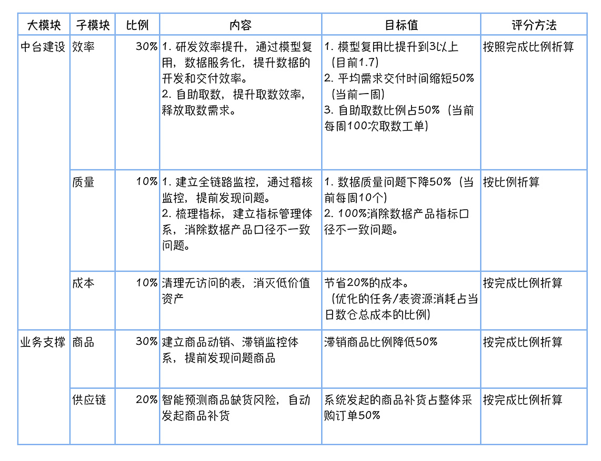

数据中台 业绩KPI 目标（参考）

你看，这个表里包含中台建设和业务支撑两部分，前者对应的是业务痛点，后者对应的是业务目标。更为关键的是，我们都是从业务出发制订的这两部分内容，我认为这是业务愿意和中台团队达成共建 KPI 的基础。

后来，在 CTO 的推动下，供应链、仓配以及市场部门把指标梳理、自助取数、数据模型迁移中台纳入了 KPI 考核。当然，对数据中台的支撑工作，这部分在业务部门的 KPI 中比例不会很高，一般最多 20%，但是却很重要，因为只有这样，业务部门才有压力去做这个事情。

以上就是立项阶段了，在这个阶段里，我们从挖掘业务痛点，到输出共建目标，接下来，我们就来看一看这个目标是怎么落地的。

### 推进数据中台项目落地

我会从四个方面带你了解数据中台的落地过程，这部分内容，会帮你把前面 12 讲串起来，并形成企业落地执行方案。

**第一步，调整团队组织架构，明确各个团队的职责。**

在数据中台构建之前，电商业务主要存在 3 个独立的数仓：市场、供应链和仓配客。这些业务部门中有数据开发、数据产品还有分析师。

而我们首先要做的，就是成立数据中台团队，这个团队是在原有市场数仓（除了服务市场，还服务于管理层）的基础上建起来的。

而对供应链和仓配客，我们并没有立即把他们的数据开发团队并入中台团队，而是调整了团队职责，把他们的数据开发的职责调整成，基于数据中台数据，加工私有的集市层和应用层。

这样处理的话，各方比较容易接受，不然业务部门会觉得中台团队在抢他们的人，对于员工个人，也可能因为团队定位、福利等原因不愿意转部门。

建立数据中台团队之后（主要由 3 名数据产品和 15 个数据开发构成），接下来就是明确团队的职责。数据中台主要负责 DW 层公共数据，以及跨部门共享的集市层和应用层的数据建设。

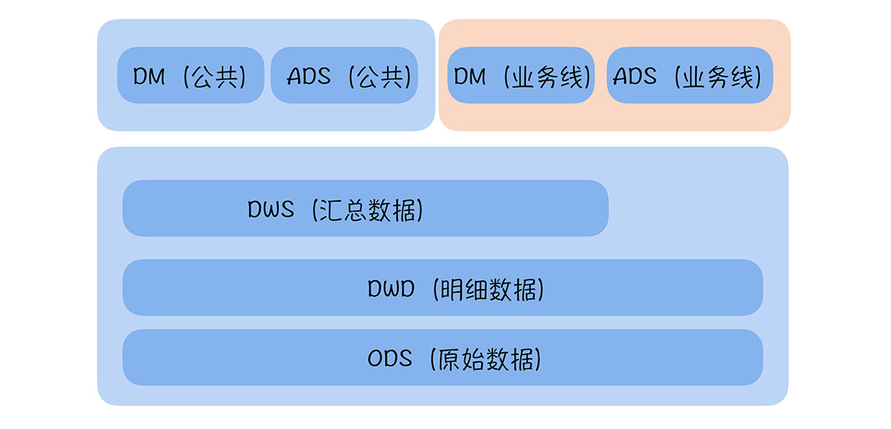

​																		数据中台团队与业务部门分工示意图

**第二步，数据整合。**

中台团队成立后，首先面对的是混乱的指标业务口径，所以团队要先梳理指标，建立全局的指标管理规范（对应咱们的 05 讲）。这项工作由 1 名数据产品牵头，2 名数据产品辅助，对电商分布在各个业务线的 20 多个数据产品，800 多个指标进行了梳理，去除了冗余指标，对齐口径不一致的指标。

最后，我们把指标梳理成 400 个，其中，原子指标 127 个，这个过程花了 1 个月的时间，不过大部分时间都是在理解业务，和业务的分析师、数据产品对口径。

接下来，中台团队还要对模型进行重构、整合和迁移（对应咱们的 06 讲），而这部分工作可以分为设计阶段和实施阶段。

设计阶段，由一名数据架构师牵头，根据梳理好的指标，构建主题域，然后在原有模型的基础上进行重新设计，构建一致性维度。**这里需要强调的是，**中台团队必须要完全接管 ODS 层数据，这可以强迫业务部门必须要基于中台数据进行再加工。当然，中台团队会肩负着巨大的压力，但是只有熬过最痛苦的时期，这种中台的机制才能建立起来，**一旦原始数据没有管住，那中台就会功亏一篑。**

实施阶段需要投入大量的人力，但是中台团队还承担着公共数据需求的研发，所以为了保证模型重构和迁移的进度，我们从 15 个数据开发中拆出了 5 个人，专门进行模型的重构和迁移。最终，我们完成了 200 多张表的基础数据的迁移重构，而这个过程花费了近 5 个月的时间。

**第三步，研发工具产品。**

在数据中台构建过程中，我们积累了很多规范和经验，但数据中台如果要形成落地、长久的运行机制，就必须把这些规范和经验沉淀到产品中，通过产品化的方式实现。

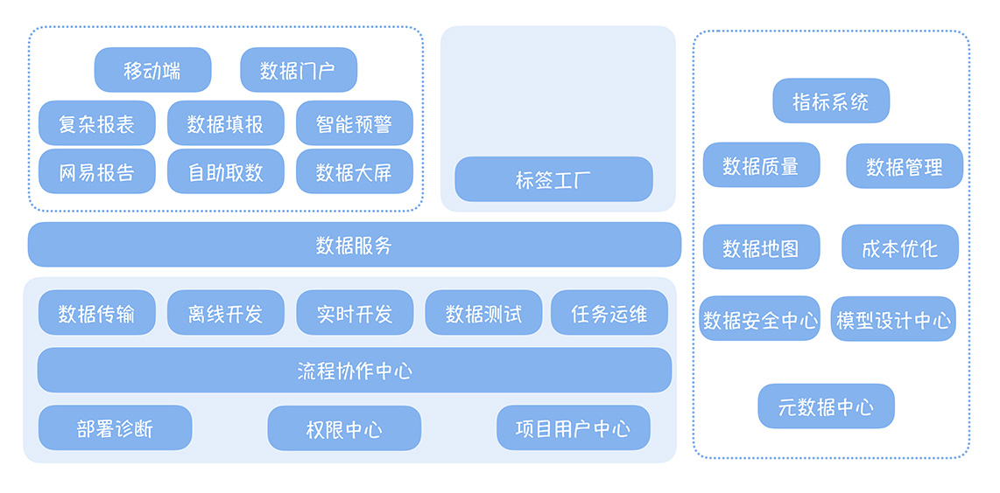

网易数据中台支撑技术工具产品架构图

所以在原有数据研发、数据产品团队的基础上，我们开始构思数据平台（工具产品）研发团队。因为考虑到网易集团存在公共技术研发部门（杭州研究院），可以实现工具产品在集团内不同业务线之间复用，所以选择了与公技合作的方式，由公技承担数据中台支撑技术产品的研发。

我们研发了 20 多个数据中台支撑技术产品，总结了四个产品设计的经验，对你设计这些产品有很大的借鉴价值。

- 正交化产品设计。每个产品聚焦一个应用场景，构建产品矩阵，简化了系统使用的复杂度。

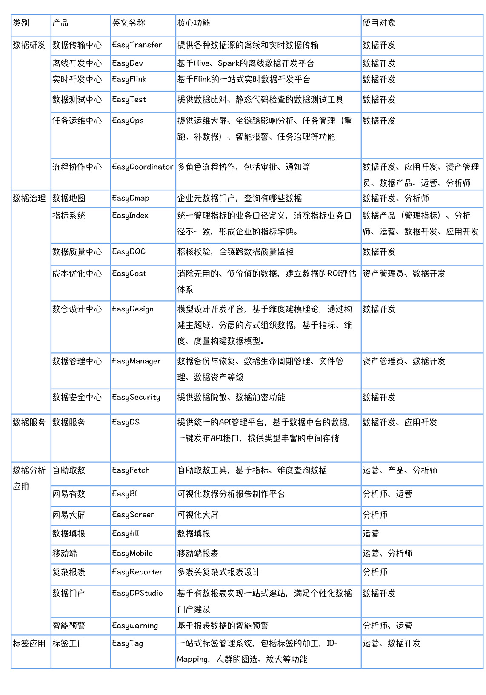

​														EasyData 数据中台支撑技术工具列表

- 全链路打通，形成产品闭环。比如任务运维中心与有数报告打通，可以看到一个任务影响了哪些下游报表。

- 组件式产品架构，允许业务根据场景搭配产品使用，形成面向不同场景的解决方案能力，例如数据质量解决方案、成本优化解决方案。

- 轻型易用、降低用户门槛，尤其注重非技术人员的交互体验。

我们研发这些工具产品，投入了 20 多个系统研发人力，因为公技可以把这些工具产品复用给其他的业务，所以对于单个业务来说，成本还是可以接受的。

**第四，数据产品构建。**

最后，就是业务支撑。我们通过构建数据产品，帮助业务达成业绩目标。我们的重点是商品和供应链。分别研发了商品运营系统和供应链辅助决策系统，大幅度提升了业务决策的效率。数据产品团队，我们有 10 个人的团队规模，主要负责数据产品研发。

### 总结数据中台项目成果

经过耗时 1 年半，实际执行一年的时间，我们完成了电商数据中台的搭建，并产出了一些阶段性的成果，对于成果这部分，你可以重点参考一下，因为你也可以通过这种方式，说服你的老板启动数据中台的建设。

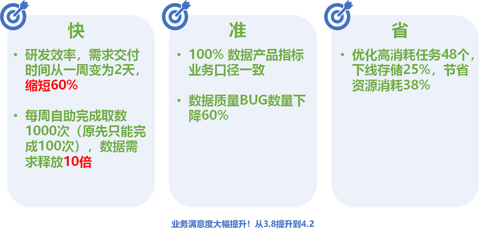

​																			网易电商数据中台成果汇报

数据产品深入到业务运营，商品运营实现了滞销商品下降 60%，大幅提高了库存周转，降低了业务的成本。供应链辅助决策系统，每周有 70% 的订单由系统自动生成，推动给采购系统。用时一年时间，我们基本达成了在 2018 年底我们设定的中台建设目标。

### 课堂小结

这节课，我用网易电商建设数据中台的案例，从项目立项、推进、成果总结，让你看到了数据中台在企业落地的完整过程。**最后，我想用一句话来总结今天的内容，那就是：数据中台从业务中来，到业务中去！同时我还想送给要建设数据中台的人一句话，“建设数据中台，不仅需要技术的思维，更需要管理者的视角”。**

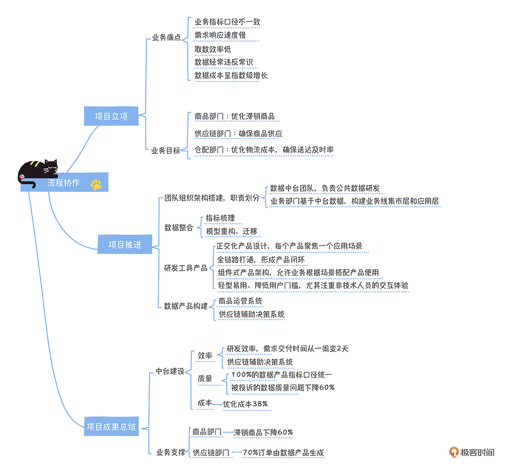

### 思考时间

学完最后一节课，你可以看到，所有关于数据中台的建设规范，我们最终都沉淀到了工具产品中，形成了产品化的解决方案，你知道这是为什么么？


# 04 | 结束篇

## 结束语 | 数据中台从哪里来，要到哪里去？

一晃一个多月过去了，咱们也要说再见了，虽然课程更新得比较顺利，但这个课从敲定、到打磨、再到上线，中间还是蛮坎坷的。虽然网易数据中台的建设有了一些规模和一些阶段性的成果，但成果需要巩固和扩大，在这个过程中，还要解决出现的一些新的问题。而我自己也在带团队，所以忙得脚打后脑勺。

后来，开始准备咱们的课之后，我都是晚上 9 点多到家，看一眼孩子就开始写稿，写到凌晨是常有的事儿。中间有一段时间，孩子总闹脾气说我不陪她，那个时候，我心里很酸，真的想放弃算了，但是现在回想起来，很庆幸自己坚持下来了。

因为这门课对我来说，意义真的很大，一方面让我在晚上安静的时候，认真总结和思考了自己在数据中台建设中的工作，沉淀这些工作背后的方法论和知识体系，让我对数据中台的理解上升到一个新的台阶，另一方面，我把这些沉淀的知识分享给了你们，还收获了很多的认可和鼓励，也得到了新的启发，这对我后续的工作有很大的帮助。

除此之外，在课程的留言区，我也收获了很多的感动。记得有一位同学（@Geek_albert）在留言区说，自己在睡觉前刷视频，无意间刷到了我在开课时，直播的视频，一口气看完，睡意全无。因为我说的这些痛点全都命中了他目前的工作，他也非常认可我关于这些问题的分析，并迅速加入到学习的队伍中来，获得了很多的收获和成长。我记得自己看到这个留言的时候，真的真的很开心，也很感动，还发了朋友圈。

类似的留言还有很多，我非常开心能帮你解决当前遇到的问题。这也让我看到，数据中台要解决的问题，其实是一个普遍存在的问题，也让我更加坚信，**数据中台并不是一阵风，而是企业数据建设发展到一定阶段，必然的选择！**

在这里，我要向所有坚持学习的同学说一声感谢，在你们身上，我看到了数据中台在企业落地过程中遇到的各种各样的问题，尤其是传统行业的企业。这让我有了一些新的想法，特别要感谢 @aof @吴科 ，我看到每次内容一更新，他们总是第一时间在留言区和我交流目前遇到的问题和思考。

就要说再见了，之前我一直在想，在课程结束的时候跟你们说点儿啥，后来我发现，有很多同学都在提业务和数据中台的关系，所以今天，我就想跟你聊聊，“数据中台从哪里来，到哪里去”，希望能对业务和数据中台的关系有一个深入的探讨。

### 数据中台从哪里来？

还记得在 03 讲数据中台建设的三板斧中，关于组织关系，我曾经说过，数据中台的团队必须独立于业务部门，同时又不能脱离业务。

独立于业务，是因为数据中台要实现多个业务之间数据的共享，如果在业务部门内部，单个业务部门没有动力去做这个事情。

那为什么不能脱离业务呢？ 这就与今天的话题密切相关了。

因为数据中台必须要解决业务的问题，我记得之前在和严选数据部门负责人交流时，他有一句话让我印象深刻，他说：“数据中台各项指标建设得再好，都比不上业务部门老大在管委会上，说一句数据有用，什么数据帮他们解决了什么问题。”我觉得，这其实反应了一个根本问题，**那就是业务部门的口碑，是数据部门的生命线，**如果没办法获得业务的认可，数据做得再多，也是无用功。

那么要解决业务的问题，得先搞清楚业务存在哪些问题。我把这些问题归结为两类：

- 第一类是数据用的好不好的问题；

- 第二类是怎么让数据帮助业务解决更多的问题。

据我所知，很多企业已经拥有了大数据研发的基础，也有了不少数据应用的场景，但是数据到底用的好不好，这是他们面临的最大的问题。

从业务的视角看，需求响应速度慢、取数效率低、指标口径不一致、数据经常无法按时产出，违反常识，甚至是高昂的大数据成本，种种原因让很多想用数据，但是对成本比较敏感的业务望而却步。这些问题最终导致数据在业务部门用的并不好。

我清楚记得，在数据中台构建前，一个业务部门的负责人向我反馈说：“别看现在有 3000 多张报表，其实能用的不超过 10 张，因为指标口径都不一致，根本无法用，不知道相信谁。“这个时候，数据中台要解决的核心问题就是效率、质量和成本的问题。只有解决好这些问题，才能让数据用的好，业务部门用的爽，真正实现让更多的人使用数据的目的。

第二类问题，是如何让数据帮业务解决更多的问题。对一些企业来说，尤其是传统企业，如果连数据应用场景都还没有，你去跟他谈效率、质量和成本，他们根本就不会关心，因为他们还没有到达这个阶段。

所以，对他们来说，数据到底能解决什么业务问题才是最重要的，因为他们还没尝到数据的甜头。比如，某项业务指标出现下降，你能基于数据，帮他找到下降的原因，并解决，那业务就会很认可数据的价值。

我建议你基于 1~2 数据应用场景作为切入，比如对于零售行业，我就先选择滞销、缺货商品监控作为起始场景，构建数据中台。然后随着应用场景的增多，数据中台的数据越来越丰富和完善。这种滚雪球的建设方式对于企业来说风险最小，前期不需要大量的投入，在建设过程中可以看到阶段性成果，是比较容易落地的一条数据中台建设途径。

### 数据中台到哪里去？

当然，数据中台的价值最终是要回到业务价值上来的。对数据部门的负责人来说，最尴尬的地方，就是数据中台并不能直接产生业务价值，他们需要前台（也就是数据应用）来接触业务，所以数据中台的价值，最终还是要通过数据应用来体现。

对应于前面两类业务问题，我认为数据中台的价值，最终也是体现在数据用的好不好和数据解决了什么业务问题上。

数据用的好不好，主要看这样几点：

- 数据需求的交付时间到底有没有缩短；

- 还存不存在指标业务口径不一致的问题；

- 数据质量是否有显著的提升；数据成本是否增长变慢了。

而最终应用到业务身上的，**就是数据使用的成本到底有没有降低，只有真正降低了，才能让更多的人用。**

第二个就是数据解决了什么业务问题，这个主要还是要通过一些业务场景来体现，比如：

帮助零售行业解决了库存周转慢的问题；

帮助物流行业提前发现了快递延迟的风险；

……

而这些都需要结合具体的案例说明。只要有这些活生生的案例，再加上业务部门老大的认可，那我相信，你的工作成果一定可以被老板认可。

别看我絮絮叨叨讲了这么多，其实我主要是想让你明白一个基本的道理：**数据中台和业务的关系，就是鱼和水的关系，谁也离不开谁，**不能把它们完全分开来看。业务想要获得更大的增长，就必须依赖数据中台，数据中台想要存活下去，就必须依赖业务的口碑和认可。**这也是我这十多年来，数据建设过程中最重要的一条经验了。**

好了，咱们的课程到此就告一段落了。但课程的结束，并不意味着我们交流结束，我会时刻关注留言，与你继续互动，咱们就把留言区当作沟通的桥梁吧，记得多提问，说实话，其实我已经养成了每天睡觉前，看留言的习惯了！

在文章的结尾，我为你准备了一份调查问卷，题目不多，希望你能抽出两三分钟填写一下。我非常希望听听你对这个课程的意见和建议，期待你的反馈！
