# 第1章数据仓库概念

> **业务数据**：就是各行业在处理事务过程中产生的数据。比如用户在电商网站中登录、下单、支付等过程中产生的数据就是业务数据。业务数据通常存储在MySQL、Oracle等数据库中。
>
> 
>
> **用户行为数据**：用户在使用产品过程中，与客户端产品交互过程中产生的数据，比如页面浏览、点击、停留、评论、点赞、收藏等。用户行为数据通常存储在日志文件中。
>
> 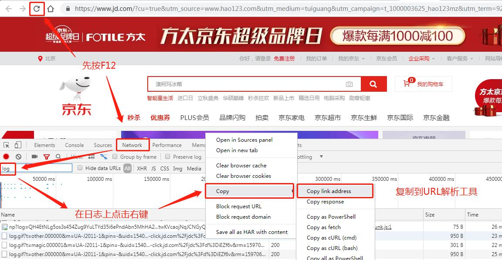

**数据仓库概念：**

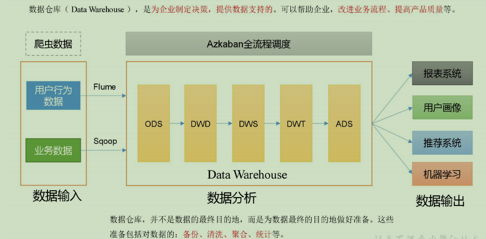


# 第2章项目需求及架构设计

## 2.1项目需求分析

一、项目需求

1、用户行为数据采集平台搭建

2、业务数据采集平台搭建

3、数据仓库维度建模

4、分析,用户、流量、会员、商品、销售、地区、活动等电商核心主题,统计的报表指标近100个。完全对比中型公司。

5、采用即席查询工其,随时进行指标分析

6、对集群性能进行监控,发生异常需要报警。

7、元数据管理

8、质量监控

二、思考题

1、项目技术如何选型?

2、框架版本如何选型(Apache、CDH、HDP)

3、服务器使用物理机还是云主机?

4、如何确认集群规模?〔假设每台服务器8T硬盘)


## 2.2项目框架

### 2.2.1技术选型


### 2.2.2系统数据流程设计

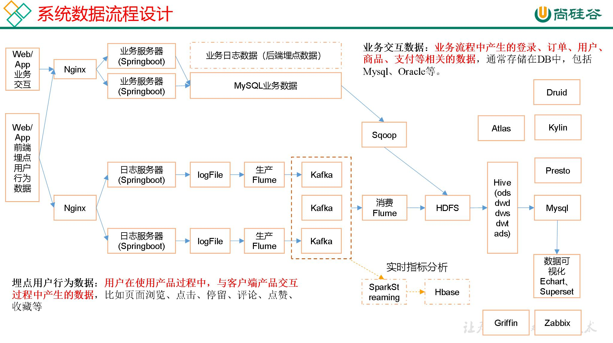

### 2.2.3框架版本选型

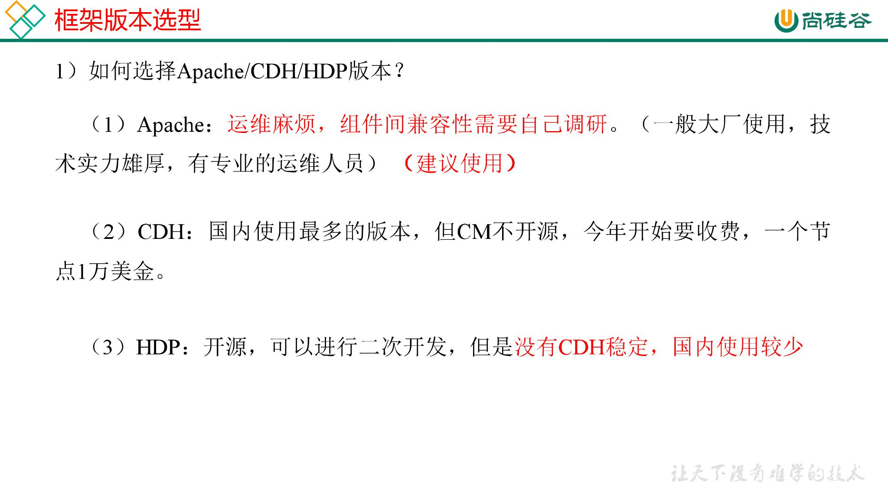

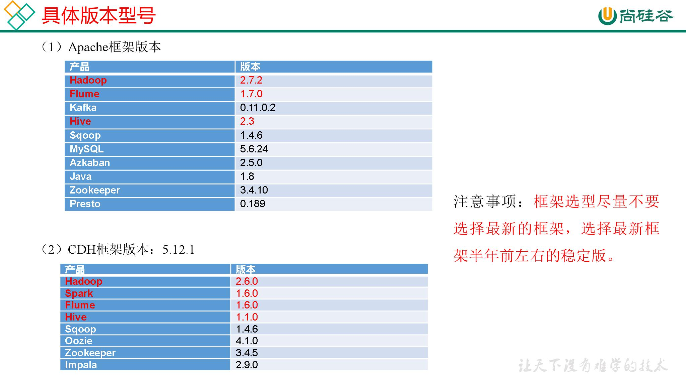

### 2.2.4服务器选型

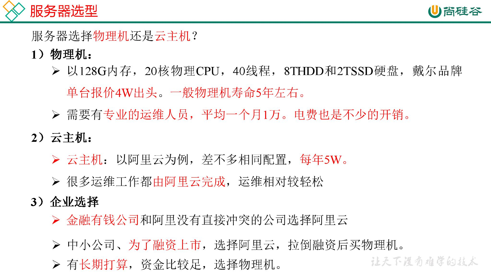

### 2.2.5集群资源规划设计

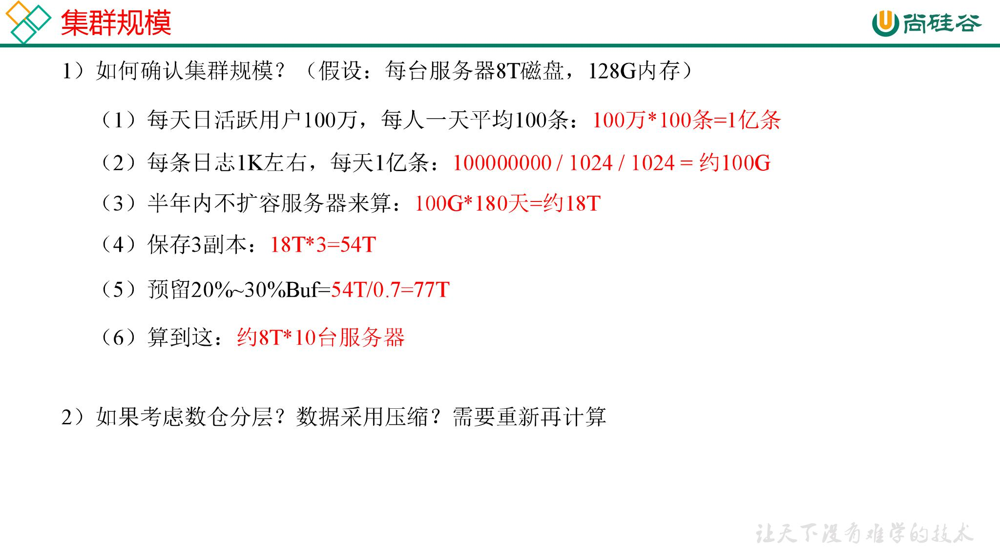

2）测试集群服务器规划


# 第3章数据生成模块

## 3.1埋点数据基本格式

- 公共字段：基本所有安卓手机都包含的字段

- 业务字段：埋点上报的字段，有具体的业务类型

下面就是一个示例，表示业务字段的上传。

```json
{
"ap":"xxxxx",//项目数据来源apppc
"cm":{//公共字段
		"mid":"",//(String)设备唯一标识
		"uid":"",//(String)用户标识
		"vc":"1",//(String)versionCode，程序版本号
		"vn":"1.0",//(String)versionName，程序版本名
		"l":"zh",//(String)language系统语言
		"sr":"",//(String)渠道号，应用从哪个渠道来的。
		"os":"7.1.1",//(String)Android系统版本
		"ar":"CN",//(String)area区域
		"md":"BBB100-1",//(String)model手机型号
		"ba":"blackberry",//(String)brand手机品牌
		"sv":"V2.2.1",//(String)sdkVersion
		"g":"",//(String)gmail
		"hw":"1620x1080",//(String)heightXwidth，屏幕宽高
		"t":"1506047606608",//(String)客户端日志产生时的时间
		"nw":"WIFI",//(String)网络模式
		"ln":0,//(double)lng经度
		"la":0//(double)lat纬度
	},
	"et":[//事件
			{
				"ett":"1506047605364",//客户端事件产生时间
				"en":"display",//事件名称
				"kv":{//事件结果，以key-value形式自行定义
						"goodsid":"236",
						"action":"1",
						"extend1":"1",
						"place":"2",
						"category":"75"
					}
			}
		]
}
```

示例日志（服务器时间戳|日志）：

```json
1540934156385|{
	"ap":"gmall",
	"cm":{
		"uid":"1234",
		"vc":"2",
		"vn":"1.0",
		"la":"EN",
		"sr":"",
		"os":"7.1.1",
		"ar":"CN",
		"md":"BBB100-1",
		"ba":"blackberry",
		"sv":"V2.2.1",
		"g":"abc@gmail.com",
		"hw":"1620x1080",
		"t":"1506047606608",
		"nw":"WIFI",
		"ln":0
	},
	"et":[
			{
				"ett":"1506047605364",//客户端事件产生时间
				"en":"display",//事件名称
				"kv":{//事件结果，以key-value形式自行定义
						"goodsid":"236",
						"action":"1",
						"extend1":"1",
						"place":"2",
						"category":"75"
					}
				},{
					"ett":"1552352626835",
					"en":"active_background",
					"kv":{
						"active_source":"1"
					}
				}
			]
		}
}
```

下面是各个埋点日志格式。其中商品点击属于信息流的范畴

## 3.2事件日志数据

### 3.2.1商品列表页(loading)

事件名称：loading

| 标签         | 含义                                                         |
| ------------ | ------------------------------------------------------------ |
| action       | 动作：开始加载=1，加载成功=2，加载失败=3                     |
| loading_time | 加载时长：计算下拉开始到接口返回数据的时间，（开始加载报0，加载成功或加载失败才上报时间） |
| loading_way  | 加载类型：1-读取缓存，2-从接口拉新数据（加载成功才上报加载类型） |
| extend1      | 扩展字段Extend1                                              |
| extend2      | 扩展字段Extend2                                              |
| type         | 加载类型：自动加载=1，用户下拽加载=2，底部加载=3（底部条触发点击底部提示条/点击返回顶部加载） |
| type1        | 加载失败码：把加载失败状态码报回来（报空为加载成功，没有失败） |


### 3.2.2商品点击(display)

事件标签：display

| 标签     | 含义                                               |
| -------- | -------------------------------------------------- |
| action   | 动作：曝光商品=1，点击商品=2                       |
| goodsid  | 商品ID（服务端下发的ID）                           |
| place    | 顺序（第几条商品，第一条为0，第二条为1，如此类推） |
| extend1  | 曝光类型：1-首次曝光2-重复曝光                     |
| category | 分类ID（服务端定义的分类ID）                       |

### 3.2.3商品详情页(newsdetail)

事件标签：newsdetail

| 标签          | 含义                                                         |
| ------------- | ------------------------------------------------------------ |
| entry         | 页面入口来源：应用首页=1、push=2、详情页相关推荐=3           |
| action        | 动作：开始加载=1，加载成功=2（pv），加载失败=3,退出页面=4    |
| goodsid       | 商品ID（服务端下发的ID）                                     |
| show_style    | 商品样式：0、无图、1、一张大图、2、两张图、3、三张小图、4、一张小图、5、一张大图两张小图 |
| news_staytime | 页面停留时长：从商品开始加载时开始计算，到用户关闭页面所用的时间。若中途用跳转到其它页面了，则暂停计时，待回到详情页时恢复计时。或中途划出的时间超过10分钟，则本次计时作废，不上报本次数据。如未加载成功退出，则报空。 |
| loading_time  | 加载时长：计算页面开始加载到接口返回数据的时间（开始加载报0，加载成功或加载失败才上报时间） |
| type1         | 加载失败码：把加载失败状态码报回来（报空为加载成功，没有失败） |
| category      | 分类ID（服务端定义的分类ID）                                 |

### 3.2.4广告(ad)

事件名称：ad

| 标签         | 含义                                     |
| ------------ | ---------------------------------------- |
| entry        | 入口：商品列表页=1应用首页=2商品详情页=3 |
| action       | 动作：广告展示=1广告点击=2               |
| contentType  | Type:1商品2营销活动                      |
| displayMills | 展示时长毫秒数                           |
| itemId       | 商品id                                   |
| activityId   | 营销活动id                               |

### 	3.2.5消息通知(notification)

事件标签：notification

| 标签    | 含义                                                         |
| ------- | ------------------------------------------------------------ |
| action  | 动作：通知产生=1，通知弹出=2，通知点击=3，常驻通知展示（不重复上报，一天之内只报一次）=4 |
| type    | 通知id：预警通知=1，天气预报（早=2，晚=3），常驻=4           |
| ap_time | 客户端弹出时间                                               |
| content | 备用字段                                                     |

### 3.2.6用户后台活跃(active_background)

事件标签:active_background

| 标签          | 含义                                        |
| ------------- | ------------------------------------------- |
| active_source | 1=upgrade,2=download(下载),3=plugin_upgrade |

### 3.2.7评论（comment）

描述：评论表

| 序号 | 字段名称     | 字段描述                                  | 字段类型 | 长度 | 允许空 | 缺省值 |
| ---- | ------------ | ----------------------------------------- | -------- | ---- | ------ | ------ |
| 1    | comment_id   | 评论表                                    | int      | 10,0 |        |        |
| 2    | userid       | 用户id                                    | int      | 10,0 | √      | 0      |
| 3    | p_comment_id | 父级评论id(为0则是一级评论,不为0则是回复) | int      | 10,0 | √      |        |
| 4    | content      | 评论内容                                  | string   | 1000 | √      |        |
| 5    | addtime      | 创建时间                                  | string   |      | √      |        |
| 6    | other_id     | 评论的相关id                              | int      | 10,0 | √      |        |
| 7    | praise_count | 点赞数量                                  | int      | 10,0 | √      | 0      |
| 8    | reply_count  | 回复数量                                  | int      | 10,0 | √      | 0      |

### 3.2.8收藏（favorites）

描述：收藏

| 序号 | 字段名称  | 字段描述 | 字段类型 | 长度 | 允许空 | 缺省值 |
| ---- | --------- | -------- | -------- | ---- | ------ | ------ |
| 1    | id        | 主键     | int      | 10,0 |        |        |
| 2    | course_id | 商品id   | int      | 10,0 | √      | 0      |
| 3    | userid    | 用户ID   | int      | 10,0 | √      | 0      |
| 4    | add_time  | 创建时间 | string   |      | √      |        |

### 3.2.9点赞（praise）

描述：所有的点赞表

| 序号 | 字段名称  | 字段描述                                           | 字段类型 | 长度 | 允许空 | 缺省值 |
| ---- | --------- | -------------------------------------------------- | -------- | ---- | ------ | ------ |
| 1    | id        | 主键id                                             | int      | 10,0 |        |        |
| 2    | userid    | 用户id                                             | int      | 10,0 | √      |        |
| 3    | target_id | 点赞的对象id                                       | int      | 10,0 | √      |        |
| 4    | type      | 点赞类型1问答点赞2问答评论点赞3文章点赞数4评论点赞 | int      | 10,0 | √      |        |
| 5    | add_time  | 添加时间                                           | string   |      | √      |        |


### 3.2.10错误日志

errorBrief	错误摘要

errorDetail	错误详情

## 3.3启动日志数据

事件标签:start

| 标签         | 含义                                                         |
| ------------ | ------------------------------------------------------------ |
| entry        | 入口：push=1，widget=2，icon=3，notification=4,lockscreen_widget=5 |
| open_ad_type | 开屏广告类型:开屏原生广告=1,开屏插屏广告=2                   |
| action       | 状态：成功=1失败=2                                           |
| loading_time | 加载时长：计算下拉开始到接口返回数据的时间，（开始加载报0，加载成功或加载失败才上报时间） |
| detail       | 失败码（没有则上报空）                                       |
| extend1      | 失败的message（没有则上报空）                                |
| en           | 日志类型start                                                |

```json
{
	"action":"1",
	"ar":"MX",
	"ba":"HTC",
	"detail":"",
	"en":"start",
	"entry":"2",
	"extend1":"",
	"g":"43R2SEQX@gmail.com",
	"hw":"640*960",
	"l":"en",
	"la":"20.4",
	"ln":"-99.3",
	"loading_time":"2",
	"md":"HTC-2",
	"mid":"995",
	"nw":"4G",
	"open_ad_type":"2",
	"os":"8.1.2",
	"sr":"B",
	"sv":"V2.0.6",
	"t":"1561472502444",
	"uid":"995",
	"vc":"10",
	"vn":"1.3.4"
}
```

## 3.4数据生成脚本

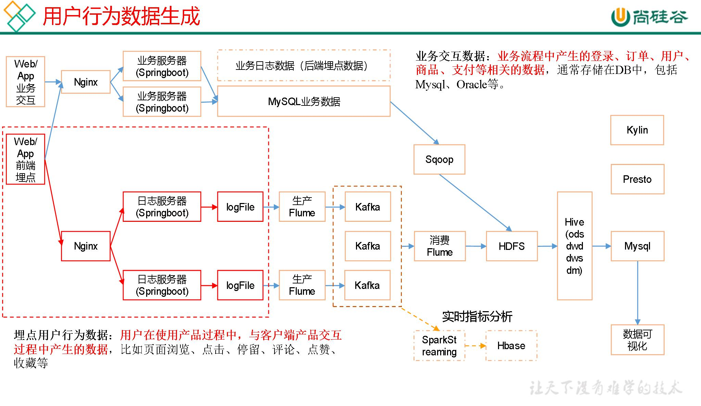

### 3.4.1创建Maven工程

1）创建log-collector


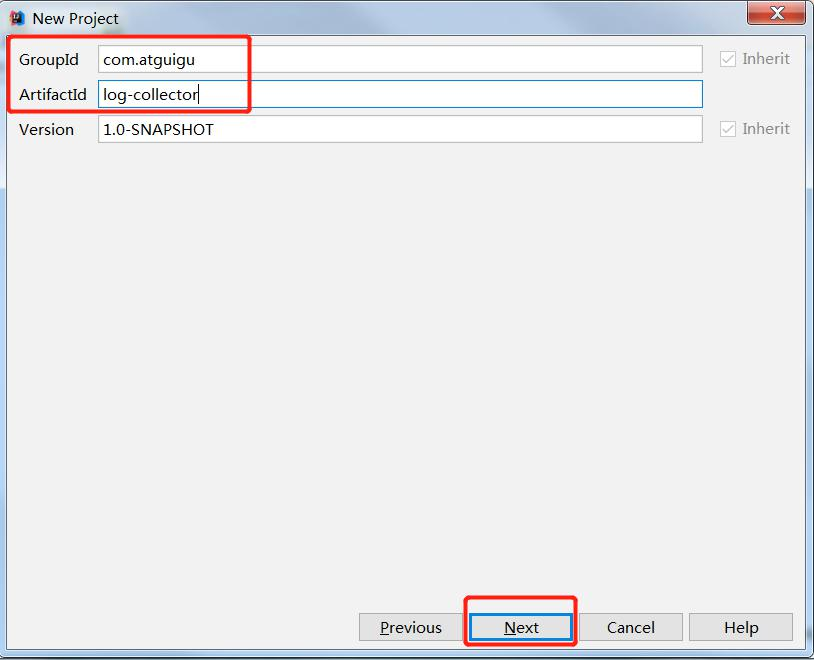

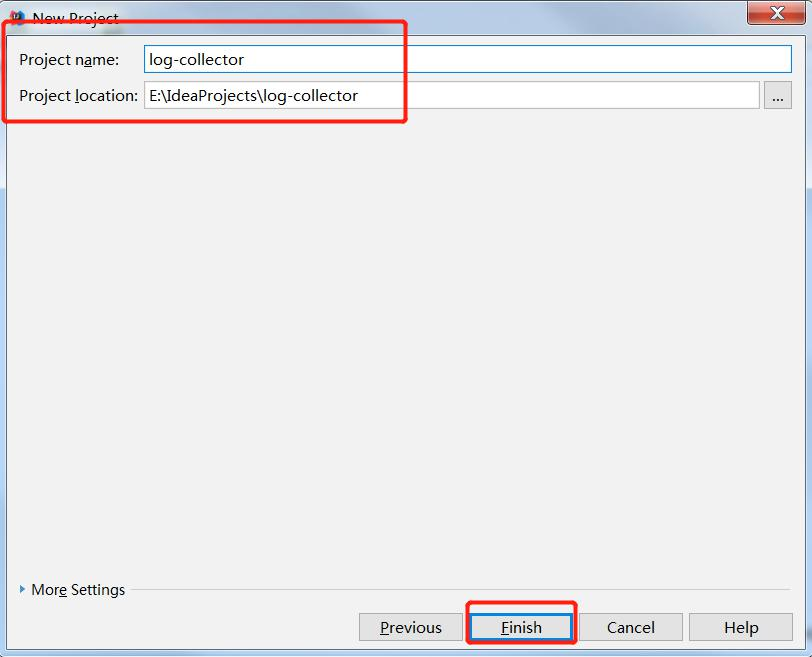

2）创建一个包名：com.atguigu.appclient

3）在com.atguigu.appclient包下创建一个类，AppMain。

4）在pom.xml文件中添加如下内容

```xml
<!--版本号统一-->
<properties>
	<slf4j.version>1.7.20</slf4j.version>
	<logback.version>1.0.7</logback.version>
</properties>

<dependencies>
	<!--阿里巴巴开源json解析框架-->
	<dependency>
		<groupId>com.alibaba</groupId>
		<artifactId>fastjson</artifactId>
		<version>1.2.51</version>
	</dependency>
	<!--日志生成框架-->
	<dependency>
		<groupId>ch.qos.logback</groupId>
		<artifactId>logback-core</artifactId>
		<version>${logback.version}</version>
	</dependency>
	<dependency>
		<groupId>ch.qos.logback</groupId>
		<artifactId>logback-classic</artifactId>
		<version>${logback.version}</version>
	</dependency>
</dependencies>

<!--编译打包插件-->
<build>
	<plugins>
		<plugin>
			<artifactId>maven-compiler-plugin</artifactId>
			<version>2.3.2</version>
			<configuration>
				<source>1.8</source>
				<target>1.8</target>
			</configuration>
		</plugin>
		<plugin>
			<artifactId>maven-assembly-plugin</artifactId>
			<configuration>
				<descriptorRefs>
					<descriptorRef>jar-with-dependencies</descriptorRef>
				</descriptorRefs>
				<archive>
					<manifest>
						<mainClass>com.atguigu.appclient.AppMain</mainClass>
					</manifest>
				</archive>
			</configuration>
			<executions>
				<execution>
					<id>make-assembly</id>
					<phase>package</phase>
					<goals>
						<goal>single</goal>
					</goals>
				</execution>
			</executions>
		</plugin>
	</plugins>
</build>
```
注意：com.atguigu.appclient.AppMain要和自己建的全类名一致。

### 3.4.2公共字段Bean

1）创建包名：com.atguigu.bean

2）在com.atguigu.bean包下依次创建如下bean对象

```java
packagecom.atguigu.bean;
/**
*公共日志
*/
public class AppBase{
	private String mid;//(String)设备唯一标识
	private String uid;//(String)用户uid
	private String vc;//(String)versionCode，程序版本号
	private String vn;//(String)versionName，程序版本名
    private String l;//(String)系统语言
	private String sr;//(String)渠道号，应用从哪个渠道来的。
	private String os;//(String)Android系统版本
	private String ar;//(String)区域
	private String md;//(String)手机型号
	private String ba;//(String)手机品牌
	private String sv;//(String)sdkVersion
	private String g;//(String)gmail
	private String hw;//(String)heightXwidth，屏幕宽高
	private String t;//(String)客户端日志产生时的时间
	private String nw;//(String)网络模式
	private String ln;//(double)lng经度
	private String la;//(double)lat纬度

	public String getMid(){
		return mid;
	}

	public void setMid(Stringmid){
		this.mid=mid;
	}

	public String getUid(){
		return uid;
	}

	public void setUid(Stringuid){
		this.uid=uid;
	}

	public String getVc(){
		return vc;
	}

	public void setVc(Stringvc){
		this.vc=vc;
	}

	public String getVn(){
		return vn;
	}

	public void setVn(Stringvn){
		this.vn=vn;
	}

	public String getL(){
		return l;
	}

	public void setL(Stringl){
		this.l=l;
	}

	public String getSr(){
		return sr;
	}

	public void  setSr(Stringsr){
		this.sr=sr;
	}

	public String getOs(){
		return os;
	}

	public void setOs(Stringos){
		this.os=os;
	}

	public String getAr(){
		return ar;
	}

	public void setAr(Stringar){
		this.ar=ar;
	}

	public String getMd(){
		return md;
	}

	public void setMd(Stringmd){
		this.md=md;
	}

	public String getBa(){
		return ba;
	}

	public void setBa(Stringba){
		this.ba=ba;
	}

	public String getSv(){
		return sv;
	}

	public void setSv(Stringsv){
		this.sv=sv;
	}

	public String getG(){
		return g;
	}

	public void setG(Stringg){
		this.g=g;
	}

	public String getHw(){
		return hw;
	}

	public void setHw(Stringhw){
		this.hw=hw;
	}

	public String getT(){
		return t;
	}

	public void setT(Stringt){
		this.t=t;
	}

	public String getNw(){
		return nw;
	}

	public void setNw(Stringnw){
		this.nw=nw;
	}

	public String getLn(){
		return ln;
	}

	public void setLn(Stringln){
		this.ln=ln;
	}

	public String getLa(){
		return la;
	}

	public void setLa(Stringla){
		this.la=la;
	}
}
```

### 3.4.3启动日志Bean

```java
package com.atguigu.bean;
/**
* 启动日志
*/
public class AppStart extends AppBase {
	private String entry;// 入口： push=1 ， widget=2 ， icon=3 ， notification=4,lockscreen_widget =5
	private String open_ad_type;// 开屏广告类型 : 开屏原生广告 =1, 开屏插屏广告 =2
	private String action;// 状态：成功 =1 失败 =2
	private String loading_time;// 加载时长：计算下拉开始到接口返回数据的时间，（开始加载报0 ，加载成功或加载失败才上报时间）
	private String detail;// 失败码（没有则上报空）
	private String extend1;// 失败的 message （没有则上报空）
	private String en;// 启动日志类型标记
    
	public String getEntry() {
		return entry;
	}
	public void setEntry(String entry) {
		this.entry = entry;
	}
	public String getOpen_ad_type() {
		return open_ad_type;
	}
	public void setOpen_ad_type(String open_ad_type) {
		this.open_ad_type = open_ad_type;
	}
	public String getAction() {
		return action;
	}
	public void setAction(String action) {
		this.action = action;
	}
	public String getLoading_time() {
		return loading_time;
	}
	public void setLoading_time(String loading_time) {
		this.loading_time = loading_time;
	}
	public String getDetail() {
		return detail;
	}
	public void setDetail(String detail) {
		this.detail = detail;
	}
	public String getExtend1() {
		return extend1;
	}
	public void setExtend1(String extend1) {
		this.extend1 = extend1;
	}
    public String getEn() {
		return en;
	}
	public void setEn(String en) {
		this.en = en;
	}
}
```

### 3.4.3错误日志Bean

```java
package com.atguigu.bean;
/**
* 错误日志
*/
public class AppErrorLog {
	private String errorBrief; //错误摘要
	private String errorDetail; //错误详情
	public String getErrorBrief() {
		return errorBrief;
	}
	public void setErrorBrief(String errorBrief) {
		this.errorBrief = errorBrief;
	}
	public String getErrorDetail() {
		return errorDetail;
	}
	public void setErrorDetail(String errorDetail) {
		this.errorDetail = errorDetail;
	}
}
```


### 3.4.4事件日志Bean之商品点击

```java
package com.atguigu.bean;
/**
* 商品点击日志
*/
public class AppDisplay {
	private String action;// 动作：曝光商品 =1 ，点击商品 =2 ，
	private String goodsid;// 商品 ID （服务端下发的 ID ）
	private String place;// 顺序（第几条商品，第一条为 0 ，第二条为 1 ，如此类推）
	private String extend1;// 曝光类型： 1 - 首次曝光 2- 重复曝光（没有使用）
	private String category;// 分类 ID （服务端定义的分类 ID ）
	public String getAction() {
		return action;
	}
	public void setAction(String action) {
		this.action = action;
	}
	public String getGoodsid() {
		return goodsid;
	}
	public void setGoodsid(String goodsid) {
		this.goodsid = goodsid;
	}
	public String getPlace() {
		return place;
	}
	public void setPlace(String place) {
		this.place = place;
	}
	public String getExtend1() {
		return extend1;
	}
	public void setExtend1(String extend1) {
		this.extend1 = extend1;
	}
	public String getCategory() {
		return category;
	}
	public void setCategory(String category) {
		this.category = category;
	}
}
```


### 3.4.5事件日志Bean之商品详情页

```java
package com.atguigu.bean;
/**
* 商品详情
*/
public class AppNewsDetail {
	private String entry;// 页面入口来源：应用首页 =1 、 push=2 、详情页相关推荐 =3
	private String action;// 动作：开始加载 =1 ，加载成功 =2 （ pv ），加载失败 =3, 退出页面 =4
	private String goodsid;// 商品 ID （服务端下发的 ID ）
	private String showtype;// 商品样式： 0 、无图 1 、一张大图 2 、两张图 3 、三张小图 4 、一张小图 5 、一张大图两张小图来源于详情页相关推荐的商品，上报样式都为 0 （因为都是左文右图）
	private String news_staytime;// 页面停留时长：从商品开始加载时开始计算，到用户关闭页面所用的时间。若中途用跳转到其它页面了，则暂停计时，待回到详情页时恢复计时。或中途划出的时间超过 10 分钟，则本次计时作废，不上报本次数据。如未加载成功退出，则报空。
	private String loading_time;// 加载时长：计算页面开始加载到接口返回数据的时间 （开始加载报 0 ，加载成功或加载失败才上报时间）
	private String type1;// 加载失败码：把加载失败状态码报回来（报空为加载成功，没有失败）
	private String category;// 分类 ID （服务端定义的分类 ID ）
	public String getEntry() {
		return entry;
	}
	public void setEntry(String entry) {
		this.entry = entry;
	}
	public String getAction() {
		return action;
	}
	public void setAction(String action) {
		this.action = action;
	}
	public String getGoodsid() {
		return goodsid;
	}
	public void setGoodsid(String goodsid) {
		this.goodsid = goodsid;
	}
	public String getShowtype() {
		return showtype;
	}
	public void setShowtype(String showtype) {
		this.showtype = showtype;
	}
	public String getNews_staytime() {
		return news_staytime;
	}
	public void setNews_staytime(String news_staytime) {
		this.news_staytime = news_staytime;
	}
	public String getLoading_time() {
		return loading_time;
	}
	public void setLoading_time(String loading_time) {
		this.loading_time = loading_time;
	}
	public String getType1() {
		return type1;
	}
	public void setType1(String type1) {
		this.type1 = type1;
	}
	public String getCategory() {
		return category;
	}
	public void setCategory(String category) {
		this.category = category;
	}
}
```


### 3.4.6 事件日志Bean之商品列表页

```java
package com.atguigu.bean;
/**
* 商品列表
*/
public class AppLoading {
	private String action;//动作：开始加载=1，加载成功=2，加载失败=3
	private String loading_time;//加载时长：计算下拉开始到接口返回数据的时间，（开始加载报 0，加载成功或加载失败才上报时间）
	private String loading_way;//加载类型：1-读取缓存，2-从接口拉新数据（加载成功才上报加载类型）
	private String extend1;//扩展字段 Extend1
	private String extend2;//扩展字段 Extend2
	private String type;//加载类型：自动加载=1，用户下拽加载=2，底部加载=3（底部条触发点击底部提示条/点击返回顶部加载）
	private String type1;//加载失败码：把加载失败状态码报回来（报空为加载成功，没有失败）
	public String getAction() {
		return action;
	}
	public void setAction(String action) {
		this.action = action;
	}
	public String getLoading_time() {
		return loading_time;
	}
	public void setLoading_time(String loading_time) {
		this.loading_time = loading_time;
	}
	public String getLoading_way() {
		return loading_way;
	}
	public void setLoading_way(String loading_way) {
		this.loading_way = loading_way;
	}
	public String getExtend1() {
		return extend1;
	}
	public void setExtend1(String extend1) {
		this.extend1 = extend1;
	}
	public String getExtend2() {
		return extend2;
	}
	public void setExtend2(String extend2) {
		this.extend2 = extend2;
	}
	public String getType() {
		return type;
	}
	public void setType(String type) {
		this.type = type;
	}
	public String getType1() {
		return type1;
	}
	public void setType1(String type1) {
		this.type1 = type1;
	}
}
```

### 3.4.7事件日志Bean之广告

```java
package com.atguigu.bean;
/**
* 广告
*/
public class AppAd {
	private String entry;// 入口：商品列表页 =1应用首页 =2 商品详情页 =3
	private String action;// 动作： 广告展示 =1 广告点击 =2
	private String contentType;//Type: 1 商品 2 营销活动
	private String displayMills;// 展示时长 毫秒数
	private String itemId; // 商品 id
	private String activityId; // 营销活动 id
	public String getEntry() {
		return entry;
	}
	public void setEntry(String entry) {
		this.entry = entry;
	}
	public String getAction() {
		return action;
	}
	public void setAction(String action) {
		this.action = action;
	}
	public String getActivityId() {
		return activityId;
	}
	public void setActivityId(String activityId) {
		this.activityId = activityId;
	}
	public String getContentType() {
		return contentType;
	}
	public void setContentType(String contentType) {
		this.contentType = contentType;
	}
	public String getDisplayMills() {
		return displayMills;
	}
	public void setDisplayMills(String displayMills) {
		this.displayMills = displayMills;
	}
	public String getItemId() {
		return itemId;
	}
	public void setItemId(String itemId) {
		this.itemId = itemId;
	}
}
```

### 3.4.8事件日志Bean之消息通知

```java
package com.atguigu.bean;
/**
* 消息通知日志
*/
public class AppNotification {
	private String action;//动作：通知产生=1，通知弹出=2，通知点击=3，常驻通知展示（不重复上报，一天之内只报一次）=4
	private String type;//通知 id：预警通知=1，天气预报（早=2，晚=3），常驻=4
	private String ap_time;//客户端弹出时间
	private String content;//备用字段
	public String getAction() {
		return action;
	}
	public void setAction(String action) {
		this.action = action;
	}
	public String getType() {
		return type;
	}
	public void setType(String type) {
		this.type = type;
	}
	public String getAp_time() {
		return ap_time;
	}
	public void setAp_time(String ap_time) {
		this.ap_time = ap_time;
	}
	public String getContent() {
		return content;
	}
	public void setContent(String content) {
		this.content = content;
	}
}
```


### 3.4.9事件日志Bean之用户后台活跃

```java
package com.atguigu.bean;
/**
* 用户后台活跃
*/
public class AppActive_background {
	private String active_source;//1=upgrade,2=download(下载),3=plugin_upgrade
	public String getActive_source() {
		return active_source;
	}
	public void setActive_source(String active_source) {
		this.active_source = active_source;
	}
}
```


### 3.4.10事件日志Bean之用户评论

```java
package com.atguigu.bean;
/**
* 评论
*/
public class AppComment {
	private int comment_id;//评论表
	private int userid;//用户 id
	private int p_comment_id;//父级评论 id(为 0 则是一级评论,不为 0 则是回复)
	private String content;//评论内容
	private String addtime;//创建时间
	private int other_id;//评论的相关 id
	private int praise_count;//点赞数量
	private int reply_count;//回复数量
	public int getComment_id() {
		return comment_id;
	}
	public void setComment_id(int comment_id) {
		this.comment_id = comment_id;
	}
	public int getUserid() {
		return userid;
	}
	public void setUserid(int userid) {
		this.userid = userid;
	}
	public int getP_comment_id() {
		return p_comment_id;
	}
	public void setP_comment_id(int p_comment_id) {
		this.p_comment_id = p_comment_id;
	}
	public String getContent() {
		return content;
	}
	public void setContent(String content) {
		this.content = content;
	}
	public String getAddtime() {
		return addtime;
	}
	public void setAddtime(String addtime) {
		this.addtime = addtime;
	}
	public int getOther_id() {
		return other_id;
	}
	public void setOther_id(int other_id) {
		this.other_id = other_id;
	}
	public int getPraise_count() {
		return praise_count;
	}
	public void setPraise_count(int praise_count) {
		this.praise_count = praise_count;
	}
	public int getReply_count() {
		return reply_count;
	}
	public void setReply_count(int reply_count) {
		this.reply_count = reply_count;
	}
}
```

### 3.4.11事件日志Bean之用户收藏

```java
package com.atguigu.bean;
/**
* 收藏
*/
public class AppFavorites {
	private int id;//主键
	private int course_id;//商品 id
	private int userid;//用户 ID
	private String add_time;//创建时间
	public int getId() {
		return id;
	}
	public void setId(int id) {
		this.id = id;
	}
	public int getCourse_id() {
		return course_id;
	}
	public void setCourse_id(int course_id) {
		this.course_id = course_id;
	}
	public int getUserid() {
		return userid;
	}
	public void setUserid(int userid) {
		this.userid = userid;
	}
	public String getAdd_time() {
		return add_time;
	}
	public void setAdd_time(String add_time) {
		this.add_time = add_time;
	}
}
```

### 3.4.12事件日志Bean之用户点赞

```java
package com.atguigu.bean;
/**
* 点赞
*/
public class AppPraise {
	private int id; //主键 id
	private int userid;//用户 id
	private int target_id;//点赞的对象 id
	private int type;//点赞类型 1 问答点赞 2 问答评论点赞 3 文章点赞数 4 评论点赞
	private String add_time;//添加时间
	public int getId() {
		return id;
	}
	public void setId(int id) {
		this.id = id;
	}
	public int getUserid() {
		return userid;
	}
	public void setUserid(int userid) {
		this.userid = userid;
	}
	public int getTarget_id() {
		return target_id;
	}
	public void setTarget_id(int target_id) {
		this.target_id = target_id;
	}
	public int getType() {
		return type;
	}
	public void setType(int type) {
		this.type = type;
	}
	public String getAdd_time() {
		return add_time;
	}
	public void setAdd_time(String add_time) {
		this.add_time = add_time;
	}
}
```

### 3.4.13主函数

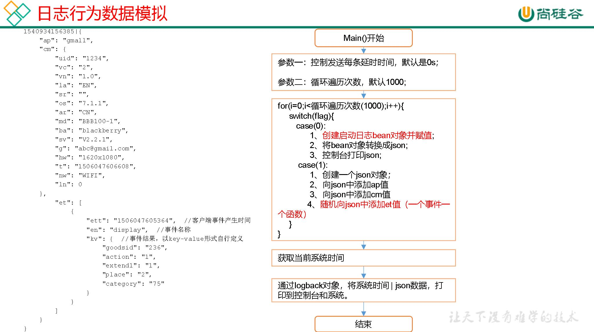

在AppMain类中添加如下内容：

```java
package com.atguigu.appclient;
import java.io.UnsupportedEncodingException;
import java.util.Random;
import com.alibaba.fastjson.JSON;
import com.alibaba.fastjson.JSONArray;
import com.alibaba.fastjson.JSONObject;
import com.atguigu.bean.*;
import org.slf4j.Logger;
import org.slf4j.LoggerFactory;
/**
* 日志行为数据模拟
*/
public class AppMain {
	private final static Logger logger = LoggerFactory.getLogger(AppMain.class);
	private static Random rand = new Random();
	// 设备 id
	private static int s_mid = 0;
	// 用户 id
    private static int s_uid = 0;
    // 商品 id
    private static int s_goodsid = 0;
    public static void main(String[] args) {
        // 参数一：控制发送每条的延时时间，默认是 0
        Long delay = args.length > 0 ? Long.parseLong(args[0]) : 0L;
        // 参数二：循环遍历次数
        int loop_len = args.length > 1 ? Integer.parseInt(args[1]) : 1000;
        // 生成数据
        generateLog(delay, loop_len);
    }

    private static void generateLog(Long delay, int loop_len) {
        for (int i = 0; i < loop_len; i++) {
            int flag = rand.nextInt(2);
            switch (flag) {
                case (0):
                    // 应用启动
                    AppStart appStart = generateStart();
                    String jsonString = JSON.toJSONString(appStart);
                    // 控制台打印
                    logger.info(jsonString);
                    break;
                case (1):
                    JSONObject json = new JSONObject();
                    json.put("ap", "app");
                    json.put("cm", generateComFields());
                    JSONArray eventsArray = new JSONArray();
                    // 事件日志
                    // 商品点击，展示
                    if (rand.nextBoolean()) {
                        eventsArray.add(generateDisplay());
                        json.put("et", eventsArray);
                    }
                    // 商品详情页
                    if (rand.nextBoolean()) {
                        eventsArray.add(generateNewsDetail());
                        json.put("et", eventsArray);
                    }
                    // 商品列表页
                    if (rand.nextBoolean()) {
                        eventsArray.add(generateNewList());
                        json.put("et", eventsArray);
                    }
                    // 广告
                    if (rand.nextBoolean()) {
                        eventsArray.add(generateAd());
                        json.put("et", eventsArray);
                    }
                    // 消息通知
                    if (rand.nextBoolean()) {
                        eventsArray.add(generateNotification());
                        json.put("et", eventsArray);
                    }
                    // 用户后台活跃
                    if (rand.nextBoolean()) {
                        eventsArray.add(generateBackground());
                        json.put("et", eventsArray);
                    }
                    // 故障日志
                    if (rand.nextBoolean()) {
                        eventsArray.add(generateError());
                        json.put("et", eventsArray);
                    }
                    // 用户评论
                    if (rand.nextBoolean()) {
                        eventsArray.add(generateComment());
                        json.put("et", eventsArray);
                    }
                    // 用户收藏
                    if (rand.nextBoolean()) {
                        eventsArray.add(generateFavorites());
                        json.put("et", eventsArray);
                    }
                    // 用户点赞
                    if (rand.nextBoolean()) {
                        eventsArray.add(generatePraise());
                        json.put("et", eventsArray);
                    }
                    // 时间
                    long millis = System.currentTimeMillis();
                    // 控制台打印
                    logger.info(millis + "|" + json.toJSONString());
                    break;
            }
            // 延迟
            try {
                Thread.sleep(delay);
            } catch (InterruptedException e) {
                e.printStackTrace();
            }
        }
    }
    /**
	* 公共字段设置
	*/
	private static JSONObject generateComFields() {
		AppBase appBase = new AppBase();
		// 设备 id
		appBase.setMid(s_mid + "");
		s_mid++;
		// 用户 id
		appBase.setUid(s_uid + "");
		s_uid++;
		// 程序版本号 5,6 等
		appBase.setVc("" + rand.nextInt(20));
		// 程序版本名 v1.1.1
		appBase.setVn("1." + rand.nextInt(4) + "." + rand.nextInt(10));
		// 安卓系统版本
		appBase.setOs("8." + rand.nextInt(3) + "." + rand.nextInt(10));
		// 语言es,en,pt
		int flag = rand.nextInt(3);
		switch (flag) {
			case (0):
				appBase.setL("es");
				break;
			case (1):
				appBase.setL("en");
				break;
			case (2):
				appBase.setL("pt");
				break;
		}
		// 渠道号从哪个渠道来的
		appBase.setSr(getRandomChar(1));
		// 区域
		flag = rand.nextInt(2);
		switch (flag) {
			case 0:
				appBase.setAr("BR");
			case 1:
				appBase.setAr("MX");
		}
		// 手机品牌 ba , 手机型号 md ，就取 2 位数字了
		flag = rand.nextInt(3);
		switch (flag) {
			case 0:
				appBase.setBa("Sumsung");
				appBase.setMd("sumsung-" + rand.nextInt(20));
				break;
			case 1:
				appBase.setBa("Huawei");
				appBase.setMd("Huawei-" + rand.nextInt(20));
				break;
			case 2:
				appBase.setBa("HTC");
				appBase.setMd("HTC-" + rand.nextInt(20));
				break;
		}
		// 嵌入 sdk 的版本
		appBase.setSv("V2." + rand.nextInt(10) + "." + rand.nextInt(10));
		// gmail
		appBase.setG(getRandomCharAndNumr(8) + "@gmail.com");
		// 屏幕宽高 hw
		flag = rand.nextInt(4);
		switch (flag) {
			case 0:
				appBase.setHw("640*960");
				break;
			case 1:
				appBase.setHw("640*1136");
				break;
			case 2:
				appBase.setHw("750*1134");
				break;
			case 3:
				appBase.setHw("1080*1920");
				break;
		}
		// 客户端产生日志时间
		long millis = System.currentTimeMillis();
		appBase.setT("" + (millis - rand.nextInt(99999999)));
		// 手机网络模式 3G,4G,WIFI
		flag = rand.nextInt(3);
		switch (flag) {
			case 0:
				appBase.setNw("3G");
				break;
			case 1:
				appBase.setNw("4G");
				break;
			case 2:
				appBase.setNw("WIFI");
				break;
		}
		// 拉丁美洲 西经 34°46′ 至西经 117°09 ；北纬 32°42′ 至南纬 53°54′
		// 经度
		appBase.setLn((-34 - rand.nextInt(83) - rand.nextInt(60) / 10.0) + "");
		// 纬度
		appBase.setLa((32 - rand.nextInt(85) - rand.nextInt(60) / 10.0) + "");
		return (JSONObject) JSON.toJSON(appBase);
	}
    
    /**
    * 商品展示事件
    */
	private static JSONObject generateDisplay() {
		AppDisplay appDisplay = new AppDisplay();
		boolean boolFlag = rand.nextInt(10) < 7;
		// 动作：曝光商品 =1 ，点击商品 =2 ，
		if (boolFlag) {
			appDisplay.setAction("1");
        } else {
			appDisplay.setAction("2");
		}
		// 商品 id
		String goodsId = s_goodsid + "";
		s_goodsid++;
		appDisplay.setGoodsid(goodsId);
		// 顺序设置成 6 条吧
		int flag = rand.nextInt(6);
		appDisplay.setPlace("" + flag);
		// 曝光类型
		flag = 1 + rand.nextInt(2);
		appDisplay.setExtend1("" + flag);
		// 分类
		flag = 1 + rand.nextInt(100);
		appDisplay.setCategory("" + flag);
		JSONObject jsonObject = (JSONObject) JSON.toJSON(appDisplay);
		return packEventJson("display", jsonObject);
	}

    /**
    * 商品详情页
    */
	private static JSONObject generateNewsDetail() {
		AppNewsDetail appNewsDetail = new AppNewsDetail();
		// 页面入口来源
		int flag = 1 + rand.nextInt(3);
		appNewsDetail.setEntry(flag + "");
		// 动作
		appNewsDetail.setAction("" + (rand.nextInt(4) + 1));
		// 商品 id
		appNewsDetail.setGoodsid(s_goodsid + "");
		// 商品来源类型
		flag = 1 + rand.nextInt(3);
		appNewsDetail.setShowtype(flag + "");
		// 商品样式
		flag = rand.nextInt(6);
		appNewsDetail.setShowtype("" + flag);
		// 页面停留时长
		flag = rand.nextInt(10) * rand.nextInt(7);
		appNewsDetail.setNews_staytime(flag + "");
		// 加载时长
		flag = rand.nextInt(10) * rand.nextInt(7);
		appNewsDetail.setLoading_time(flag + "");
		// 加载失败码
		flag = rand.nextInt(10);
		switch (flag) {
			case 1:
				appNewsDetail.setType1("102");
				break;
			case 2:
				appNewsDetail.setType1("201");
				break;
			case 3:
				appNewsDetail.setType1("325");
				break;
			case 4:
				appNewsDetail.setType1("433");
				break;
			case 5:
				appNewsDetail.setType1("542");
				break;
			default:
				appNewsDetail.setType1("");
				break;
		}
		// 分类
		flag = 1 + rand.nextInt(100);
		appNewsDetail.setCategory("" + flag);
		JSONObject eventJson = (JSONObject) JSON.toJSON(appNewsDetail);
		return packEventJson("newsdetail", eventJson);
	}
	/**
	* 商品列表
	*/
	private static JSONObject generateNewList() {
		AppLoading appLoading = new AppLoading();
		// 动作
		int flag = rand.nextInt(3) + 1;
		appLoading.setAction(flag + "");
		// 加载时长
		flag = rand.nextInt(10) * rand.nextInt(7);
		appLoading.setLoading_time(flag + "");
		// 失败码
		flag = rand.nextInt(10);
		switch (flag) {
			case 1:
				appLoading.setType1("102");
				break;
			case 2:
				appLoading.setType1("201");
				break;
			case 3:
				appLoading.setType1("325");
				break;
			case 4:
				appLoading.setType1("433");
				break;
			case 5:
				appLoading.setType1("542");
				break;
			default:
				appLoading.setType1("");
				break;
		}
		// 页面加载类型
		flag = 1 + rand.nextInt(2);
		appLoading.setLoading_way("" + flag);
		// 扩展字段 1
		appLoading.setExtend1("");
		// 扩展字段 2
		appLoading.setExtend2("");
		// 用户加载类型
		flag = 1 + rand.nextInt(3);
		appLoading.setType("" + flag);
		JSONObject jsonObject = (JSONObject) JSON.toJSON(appLoading);
		return packEventJson("loading", jsonObject);
	}
	/**
	* 广告相关字段
	*/
	private static JSONObject generateAd() {
		AppAd appAd = new AppAd();
		// 入口
		int flag = rand.nextInt(3) + 1;
		appAd.setEntry(flag + "");
		// 动作
		flag = rand.nextInt(5) + 1;
		appAd.setAction(flag + "");
		// 内容类型类型
		flag = rand.nextInt(6)+1;
		appAd.setContentType(flag+ "");
		// 展示样式
		flag = rand.nextInt(120000)+1000;
		appAd.setDisplayMills(flag+"");
		flag=rand.nextInt(1);
		if(flag==1){
			appAd.setContentType(flag+"");
			flag =rand.nextInt(6);
			appAd.setItemId(flag+ "");
		}else{
			appAd.setContentType(flag+"");
			flag =rand.nextInt(1)+1;
			appAd.setActivityId(flag+ "");
		}
		JSONObject jsonObject = (JSONObject) JSON.toJSON(appAd);
		return packEventJson("ad", jsonObject);
	}
	/**
	* 启动日志
	*/
	private static AppStart generateStart() {
		AppStart appStart = new AppStart();
		// 设备 id
		appStart.setMid(s_mid + "");
		s_mid++;
		// 用户 id
		appStart.setUid(s_uid + "");
		s_uid++;
		// 程序版本号 5,6 等
		appStart.setVc("" + rand.nextInt(20));
		// 程序版本名 v1.1.1
		appStart.setVn("1." + rand.nextInt(4) + "." + rand.nextInt(10));
		// 安卓系统版本
		appStart.setOs("8." + rand.nextInt(3) + "." + rand.nextInt(10));
		// 设置日志类型
		appStart.setEn("start");
		//语言 es,en,pt
		int flag = rand.nextInt(3);
		switch (flag) {
			case (0):
				appStart.setL("es");
				break;
			case (1):
				appStart.setL("en");
				break;
			case (2):
				appStart.setL("pt");
				break;
			}
		// 渠道号从哪个渠道来的
		appStart.setSr(getRandomChar(1));
		// 区域
		flag = rand.nextInt(2);
		switch (flag) {
			case 0:
				appStart.setAr("BR");
			case 1:
				appStart.setAr("MX");
		}
		// 手机品牌 ba , 手机型号 md ，就取 2 位数字了
		flag = rand.nextInt(3);
		switch (flag) {
			case 0:
				appStart.setBa("Sumsung");
				appStart.setMd("sumsung-" + rand.nextInt(20));
				break;
			case 1:
				appStart.setBa("Huawei");
				appStart.setMd("Huawei-" + rand.nextInt(20));
				break;
			case 2:
				appStart.setBa("HTC");
				appStart.setMd("HTC-" + rand.nextInt(20));
				break;
		}
		// 嵌入 sdk 的版本
		appStart.setSv("V2." + rand.nextInt(10) + "." + rand.nextInt(10));
		// gmail
		appStart.setG(getRandomCharAndNumr(8) + "@gmail.com");
		// 屏幕宽高 hw
		flag = rand.nextInt(4);
		switch (flag) {
			case 0:
				appStart.setHw("640*960");
				break;
			case 1:
				appStart.setHw("640*1136");
				break;
			case 2:
				appStart.setHw("750*1134");
				break;
			case 3:
				appStart.setHw("1080*1920");
				break;
			}
		// 客户端产生日志时间
		long millis = System.currentTimeMillis();
		appStart.setT("" + (millis - rand.nextInt(99999999)));
		// 手机网络模式 3G,4G,WIFI
		flag = rand.nextInt(3);
		switch (flag) {
			case 0:
				appStart.setNw("3G");
				break;
			case 1:
				appStart.setNw("4G");
				break;
			case 2:
				appStart.setNw("WIFI");
				break;
		}
		// 拉丁美洲 西经 34°46′ 至西经 117°09 ；北纬 32°42′ 至南纬 53°54′
		// 经度
		appStart.setLn((-34 - rand.nextInt(83) - rand.nextInt(60) / 10.0) + "");
        // 纬度
        appStart.setLa((32 - rand.nextInt(85) - rand.nextInt(60) / 10.0) + "");
        // 入口
        flag = rand.nextInt(5) + 1;
        appStart.setEntry(flag + "");
        // 开屏广告类型
        flag = rand.nextInt(2) + 1;
        appStart.setOpen_ad_type(flag + "");
        // 状态
        flag = rand.nextInt(10) > 8 ? 2 : 1;
        appStart.setAction(flag + "");
        // 加载时长
        appStart.setLoading_time(rand.nextInt(20) + "");
		// 失败码
		flag = rand.nextInt(10);
		switch (flag) {
			case 1:
				appStart.setDetail("102");
				break;
			case 2:
				appStart.setDetail("201");
				break;
			case 3:
				appStart.setDetail("325");
				break;
			case 4:
				appStart.setDetail("433");
				break;
			case 5:
				appStart.setDetail("542");
				break;
			default:
				appStart.setDetail("");
				break;
		}
        // 扩展字段
        appStart.setExtend1("");
        return appStart;
    }
    /**
    * 消息通知
    */
    private static JSONObject generateNotification() {
        AppNotification appNotification = new AppNotification();
        int flag = rand.nextInt(4) + 1;
        // 动作
        appNotification.setAction(flag + "");
        // 通知 id
        flag = rand.nextInt(4) + 1;
        appNotification.setType(flag + "");
        // 客户端弹时间
        appNotification.setAp_time((System.currentTimeMillis() -rand.nextInt(99999999)) + "");
        // 备用字段
        appNotification.setContent("");
        JSONObject jsonObject = (JSONObject) JSON.toJSON(appNotification);
        return packEventJson("notification", jsonObject);
    }
    /**
    * 后台活跃
    */
    private static JSONObject generateBackground() {
        AppActive_background appActive_background = new AppActive_background();
        // 启动源
        int flag = rand.nextInt(3) + 1;
        appActive_background.setActive_source(flag + "");
        JSONObject jsonObject = (JSONObject) JSON.toJSON(appActive_background);
        return packEventJson("active_background", jsonObject);
    }

    /**
    * 错误日志数据
    */
    private static JSONObject generateError() {
        AppErrorLog appErrorLog = new AppErrorLog();
      
        String[] errorBriefs = {"atcn.lift.dfdf.web.AbstractBaseController.validInbound(AbstractBaseController.java:72)", "at cn.lift.appIn.control.CommandUtil.getInfo(CommandUtil.java:67)"};  // 错误摘要
        String[] errorDetails = {"java.lang.NullPointerException\\n" + "atcn.lift.appIn.web.AbstractBaseController.validInbound(AbstractBaseController.java:72)\\n " + "at cn.lift.dfdf.web.AbstractBaseController.validInbound", "atcn.lift.dfdfdf.control.CommandUtil.getInfo(CommandUtil.java:67)\\n " + "atsun.reflect.DelegatingMethodAccessorImpl.invoke(DelegatingMethodAccessorImpl.java:43)\\n" + " at java.lang.reflect.Method.invoke(Method.java:606)\\n"};// 错误详情

	// 错误摘要
	appErrorLog.setErrorBrief(errorBriefs[rand.nextInt(errorBriefs.length)]);
	// 错误详情
	appErrorLog.setErrorDetail(errorDetails[rand.nextInt(errorDetails.length)]);
	JSONObject jsonObject = (JSONObject) JSON.toJSON(appErrorLog);
	return packEventJson("error", jsonObject);
}
/**
* 为各个事件类型的公共字段（时间、事件类型、 Json 数据）拼接
*/
private static JSONObject packEventJson(String eventName, JSONObject jsonObject) {
	JSONObject eventJson = new JSONObject();
	eventJson.put("ett", (System.currentTimeMillis() - rand.nextInt(99999999)) +"");
	eventJson.put("en", eventName);
	eventJson.put("kv", jsonObject);
	return eventJson;
}
/**
* 获取随机字母组合
* @param length 字符串长度
*/
private static String getRandomChar(Integer length) {
	StringBuilder str = new StringBuilder();
	Random random = new Random();
	for (int i = 0; i < length; i++) {
	// 字符串
	str.append((char) (65 + random.nextInt(26)));// 取得大写字母
	}
	return str.toString();
}
/**
* 获取随机字母数字组合
* @param length 字符串长度
*/
private static String getRandomCharAndNumr(Integer length) {
	StringBuilder str = new StringBuilder();
	Random random = new Random();
	for (int i = 0; i < length; i++) {
		boolean b = random.nextBoolean();
		if (b) { // 字符串
			// int choice = random.nextBoolean() ? 65 : 97; 取得 65 大写字母还是 97 小写字母
			str.append((char) (65 + random.nextInt(26)));// 取得大写字母
		} else { // 数字
			str.append(String.valueOf(random.nextInt(10)));
		}
	}
	return str.toString();
}
/**
* 收藏
*/
private static JSONObject generateFavorites() {
	AppFavorites favorites = new AppFavorites();
	favorites.setCourse_id(rand.nextInt(10));
	favorites.setUserid(rand.nextInt(10));
	favorites.setAdd_time((System.currentTimeMillis() - rand.nextInt(99999999)) +"");
	JSONObject jsonObject = (JSONObject) JSON.toJSON(favorites);
	return packEventJson("favorites", jsonObject);
}
/**
* 点赞
*/
private static JSONObject generatePraise() {
	AppPraise praise = new AppPraise();
	praise.setId(rand.nextInt(10));
	praise.setUserid(rand.nextInt(10));
	praise.setTarget_id(rand.nextInt(10));
	praise.setType(rand.nextInt(4) + 1);
	praise.setAdd_time((System.currentTimeMillis() - rand.nextInt(99999999)) + "");
	JSONObject jsonObject = (JSONObject) JSON.toJSON(praise);
	return packEventJson("praise", jsonObject);
}
/**
* 评论
*/
private static JSONObject generateComment() {
	AppComment comment = new AppComment();
	comment.setComment_id(rand.nextInt(10));
	comment.setUserid(rand.nextInt(10));
	comment.setP_comment_id(rand.nextInt(5));
	comment.setContent(getCONTENT());
	comment.setAddtime((System.currentTimeMillis() - rand.nextInt(99999999)) + "");
	comment.setOther_id(rand.nextInt(10));
	comment.setPraise_count(rand.nextInt(1000));
	comment.setReply_count(rand.nextInt(200));
	JSONObject jsonObject = (JSONObject) JSON.toJSON(comment);
	return packEventJson("comment", jsonObject);
}
/**
* 生成单个汉字
*/
private static char getRandomChar() {
	String str = "";
	int hightPos; //
	int lowPos;
	Random random = new Random();
	// 随机生成汉子的两个字节
	hightPos = (176 + Math.abs(random.nextInt(39)));
	lowPos = (161 + Math.abs(random.nextInt(93)));
	byte[] b = new byte[2];
	b[0] = (Integer.valueOf(hightPos)).byteValue();
	b[1] = (Integer.valueOf(lowPos)).byteValue();
	try {
		str = new String(b, "GBK");
	} catch (UnsupportedEncodingException e) {
		e.printStackTrace();
		System.out.println("错误");
	}
    return str.charAt(0);
}
    
/**
* 拼接成多个汉字
*/
private static String getCONTENT() {
	StringBuilder str = new StringBuilder();
	for (int i = 0; i < rand.nextInt(100); i++) {
		str.append(getRandomChar());
	}
	return str.toString();
	}
}
```


### 3.4.14 配置日志打印Logback

Logback主要用于在磁盘和控制台打印日志。

Logback具体使用：

1）在resources文件夹下创建logback.xml文件。

2）在logback.xml文件中填写如下配置

```xml
<?xml version="1.0" encoding="UTF-8"?>
<configuration debug="false">
	<!--定义日志文件的存储地址 勿在 LogBack 的配置中使用相对路径 -->
	<property name="LOG_HOME" value="/tmp/logs/" />
	<!-- 控制台输出 -->
	<appender name="STDOUT"
		class="ch.qos.logback.core.ConsoleAppender">
		<encoder
			class="ch.qos.logback.classic.encoder.PatternLayoutEncoder">
			<!--格式化输出：%d 表示日期，%thread 表示线程名，%-5level：级别从左显示 5 个字符宽度%msg：日志消息，%n 是换行符 -->
			<pattern>%d{yyyy-MM-dd HH:mm:ss.SSS} [%thread] %-5level %logger{50} - %msg%n</pattern>
	</encoder>
</appender>
	<!-- 按照每天生成日志文件。存储事件日志 -->
<appender name="FILE"
	class="ch.qos.logback.core.rolling.RollingFileAppender">
	<!-- <File>${LOG_HOME}/app.log</File>设置日志不超过${log.max.size}时的保存路径，注意，
如果是 web 项目会保存到 Tomcat 的 bin 目录 下 -->
	<rollingPolicy
		class="ch.qos.logback.core.rolling.TimeBasedRollingPolicy">
			<!--日志文件输出的文件名 -->
			<FileNamePattern>${LOG_HOME}/app-%d{yyyy-MM-dd}.log</FileNamePattern>
			<!--日志文件保留天数 -->
			<MaxHistory>30</MaxHistory>
		</rollingPolicy>
	<encoder
		class="ch.qos.logback.classic.encoder.PatternLayoutEncoder">
		<pattern>%msg%n</pattern>
	</encoder>
	<!--日志文件最大的大小 -->
	<triggeringPolicy
		class="ch.qos.logback.core.rolling.SizeBasedTriggeringPolicy">
		<MaxFileSize>10MB</MaxFileSize>
		</triggeringPolicy>
	</appender>
	<!--异步打印日志-->
	<appender name ="ASYNC_FILE" class= "ch.qos.logback.classic.AsyncAppender">
		<!-- 不丢失日志.默认的,如果队列的 80%已满,则会丢弃 TRACT、DEBUG、INFO 级别的日志 -->
		<discardingThreshold >0</discardingThreshold>
		<!-- 更改默认的队列的深度,该值会影响性能.默认值为 256 -->
		<queueSize>512</queueSize>
		<!-- 添加附加的 appender,最多只能添加一个 -->
		<appender-ref ref = "FILE"/>
	</appender>
	<!-- 日志输出级别 -->
	<root level="INFO">
	<appender-ref ref="STDOUT" />
	<appender-ref ref="ASYNC_FILE" />
	<appender-ref ref="error" />
	</root>
</configuration>
```


###  3.4.15打包

1）采用Maven对程序打包

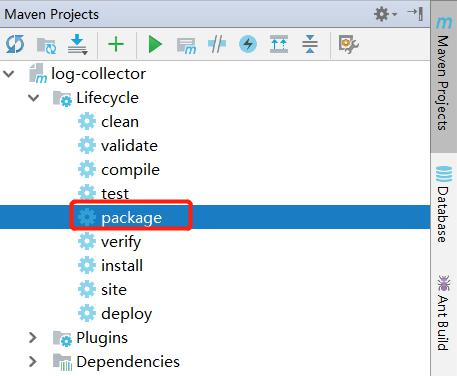

2）采用带依赖的jar包。包含了程序运行需要的所有依赖。

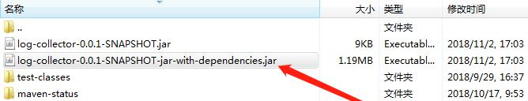

3）后续日志生成过程，在安装完Hadoop和Zookeeper之后执行。

# 第4章数据采集模块

## 4.1Hadoop安装

详见：尚硅谷大数据技术之Hadoop（入门）

1）集群规划：

|      | 服务器hadoop102          | 服务器hadoop103                | 服务器hadoop104               |
| ---- | ------------------------ | ------------------------------ | ----------------------------- |
| HDFS | NameNode<br>	DataNode | DataNode                       | DataNode<br>SecondaryNameNode |
| Yarn | NodeManager              | Resourcemanager<br>NodeManager | NodeManager                   |

注意：尽量使用离线方式安装

### 4.1.1项目经验之HDFS存储多目录

1）生产环境服务器磁盘情况

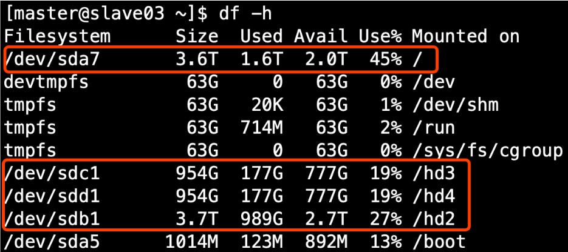

2）在hdfs-site.xml文件中配置多目录，注意新挂载磁盘的访问权限问题。

HDFS的DataNode节点保存数据的路径由dfs.datanode.data.dir参数决定，其默认值为file://${hadoop.tmp.dir}/dfs/data，若服务器有多个磁盘，必须对该参数进行修改。如服务器磁盘如上图所示，则该参数应修改为如下的值。

```xml
<property>
	<name>dfs.datanode.data.dir</name>
	<value>file:///dfs/data1,file:///hd2/dfs/data2,file:///hd3/dfs/data3,file:///hd4/dfs/data4</value>
</property>
```

注意：因为每台服务器节点的磁盘情况不同，所以这个配置配完之后，不需要分发

### 4.1.2项目经验之集群数据均衡

1）节点间数据均衡

（1）开启数据均衡命令：

```sh
start-balancer.sh -threshold 10
```

对于参数10，代表的是集群中各个节点的磁盘空间利用率相差不超过10%，可根据实际情况进行调整。

（2）停止数据均衡命令：

```sh
stop-balancer.sh
```

注意：由于HDFS需要启动单独的RebalanceServer来执行Rebalance操作，所以尽量不要在NameNode上执行start-balancer.sh，而是找一台比较空闲的机器。

### 4.1.3 项目经验之支持LZO压缩配置

1）hadoop本身并不支持lzo压缩，故需要使用twitter提供的hadoop-lzo开源组件。hadoop-lzo需依赖hadoop和lzo进行编译，编译步骤如下。

2）将编译好后的hadoop-lzo-0.4.20.jar放入hadoop-2.7.2/share/hadoop/common/

```sh
[atguigu@hadoop102common]$pwd
/opt/module/hadoop-2.7.2/share/hadoop/common
[atguigu@hadoop102common]$ls
hadoop-lzo-0.4.20.jar
```

3）同步hadoop-lzo-0.4.20.jar到hadoop103、hadoop104

```sh
[atguigu@hadoop102common]$xsynchadoop-lzo-0.4.20.jar
```

4）core-site.xml增加配置支持LZO压缩

```xml
<?xmlversion="1.0"encoding="UTF-8"?>
<?xml-stylesheettype="text/xsl"href="configuration.xsl"?>

<configuration>
<property>
	<name>io.compression.codecs</name>
	<value>
	org.apache.hadoop.io.compress.GzipCodec,
	org.apache.hadoop.io.compress.DefaultCodec,
	org.apache.hadoop.io.compress.BZip2Codec,
	org.apache.hadoop.io.compress.SnappyCodec,
	com.hadoop.compression.lzo.LzoCodec,
	com.hadoop.compression.lzo.LzopCodec
	</value>
</property>

<property>
	<name>io.compression.codec.lzo.class</name>
	<value>com.hadoop.compression.lzo.LzoCodec</value>
</property>
</configuration>
```


5）同步core-site.xml到hadoop103、hadoop104

```sh
[atguigu@hadoop102hadoop]$xsync core-site.xml
```


6）启动及查看集群

```sh
[atguigu@hadoop102hadoop-2.7.2]$sbin/start-dfs.sh
[atguigu@hadoop103hadoop-2.7.2]$sbin/start-yarn.sh
```


### 4.1.4 项目经验之LZO创建索引

1）创建LZO文件的索引，LZO压缩文件的可切片特性依赖于其索引，故我们需要手动为LZO压缩文件创建索引。若无索引，则LZO文件的切片只有一个。

```sh
hadoop jar /path/to/your/hadoop-lzo.jar com.hadoop.compression.lzo.DistributedLzoIndexer big_file.lzo
```

2）测试
	（1）将bigtable.lzo（150M）上传到集群的根目录

```sh
[atguigu@hadoop102module]$hadoopfs-mkdir/input
[atguigu@hadoop102module]$hadoopfs-putbigtable.lzo/input
```

（2）执行wordcount程序

```sh
[atguigu@hadoop102module]$hadoop jar /opt/module/hadoop-2.7.2/share/hadoop/mapreduce/hadoop-mapreduce-examples-2.7.2.jar wordcount/input/output1
```

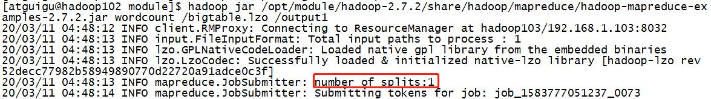

（3）对上传的LZO文件建索引

```sh
[atguigu@hadoop102module]$hadoop jar /opt/module/hadoop-2.7.2/share/hadoop/common/hadoop-lzo-0.4.20.jarcom.hadoop.compression.lzo.DistributedLzoIndexer /input/bigtable.lzo
```

​	（4）再次执行WordCount程序

```sh
[atguigu@hadoop102module]$hadoop jar /opt/module/hadoop-2.7.2/share/hadoop/mapreduce/hadoop-mapreduce-examples-2.7.2.jar wordcount/input/output2
```

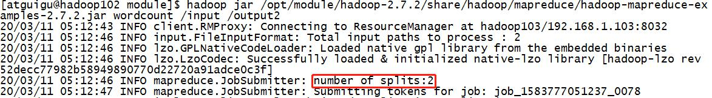

### 4.1.5 项目经验之基准测试

1）测试HDFS写性能

测试内容：向HDFS集群写10个128M的文件

```sh
[atguigu@hadoop102 mapreduce]$ hadoop jar /opt/module/hadoop-2.7.2/share/hadoop/mapreduce/hadoop-mapreduce-client-jobclient-2.7.2-tests.jar TestDFSIO -write -nrFiles 10 -fileSize 128MB
```

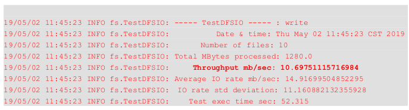

2）测试HDFS读性能

（1）测试内容：读取HDFS集群10个128M的文件

```sh
[atguigu@hadoop102mapreduce]$hadoop jar /opt/module/hadoop-2.7.2/share/hadoop/mapreduce/hadoop-mapreduce-client-jobclient-2.7.2-tests.jar TestDFSIO -read -nrFiles 10 -fileSize 128MB
```

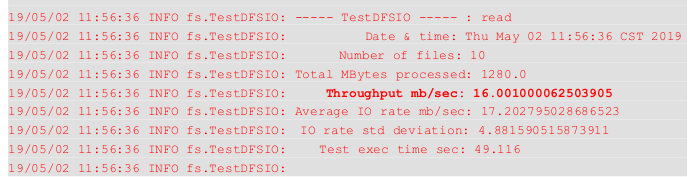

（2）删除测试生成数据

```sh
[atguigu@hadoop102 mapreduce]$hadoop jar /opt/module/hadoop-2.7.2/share/hadoop/mapreduce/hadoop-mapreduce-client-jobclient-2.7.2-tests.jar TestDFSIO -clean
```

3）使用Sort程序评测MapReduce

（1）使用RandomWriter来产生随机数，每个节点运行10个Map任务，每个Map产生大约1G大小的二进制随机数

```sh
[atguigu@hadoop102 mapreduce]$ hadoop jar /opt/module/hadoop-2.7.2/share/hadoop/mapreduce/hadoop-mapreduce-examples-2.7.2.jar randomwriter random-data
```

（2）执行Sort程序

```sh
[atguigu@hadoop102mapreduce]$hadoop jar /opt/module/hadoop-2.7.2/share/hadoop/mapreduce/hadoop-mapreduce-examples-2.7.2.jar sort random-datasorted-data
```

（3）验证数据是否真正排好序了

```sh
[atguigu@hadoop102mapreduce]$
hadoopjar/opt/module/hadoop-2.7.2/share/hadoop/mapreduce/hadoop-mapreduce-client-jobclient-2.7.2-tests.jartestmapredsort-sortInputrandom-data-sortOutputsorted-data
```

### 4.1.6项目经验之Hadoop参数调优

1）HDFS参数调优hdfs-site.xml

```sh
The number of Namenode RPC server threads that listen to requests from clients. If dfs.namenode.servicerpc-address is not configured then Namenode RPC server threads listen to requests from all nodes.
NameNode 有一个工作线程池，用来处理不同 DataNode 的并发心跳以及客户端并发
的元数据操作。
对于大集群或者有大量客户端的集群来说 ，通常需要增大参数dfs.namenode.handler.count 的默认值 10。
<property>
	<name>dfs.namenode.handler.count</name>
	<value>10</value>
</property>
```

dfs.namenode.handler.count=20 X log<sup>Cluster Size</sup>，比如集群规模（DataNode台数）为8台时，此参数设置为41。可通过简单的python代码计算该值，代码如下。

```sh
[atguigu@hadoop102~]$python
Python2.7.5(default,Apr112018,07:36:10)
[GCC4.8.520150623(RedHat4.8.5-28)]onlinux2
Type"help","copyright","credits"or"license"formoreinformation.

>>> import math
>>> print int(20*math.log(8))
41
>>> quit()
```

2）YARN参数调优yarn-site.xml

（1）情景描述：总共7台机器，每天几亿条数据，数据源->Flume->Kafka->HDFS->Hive面临问题：数据统计主要用HiveSQL，没有数据倾斜，小文件已经做了合并处理，开启的JVM重用，而且IO没有阻塞，内存用了不到50%。但是还是跑的非常慢，而且数据量洪峰过来时，整个集群都会宕掉。基于这种情况有没有优化方案。

（2）解决办法：

内存利用率不够。这个一般是Yarn的2个配置造成的，单个任务可以申请的最大内存大小，和Hadoop单个节点可用内存大小。调节这两个参数能提高系统内存的利用率。

（a）yarn.nodemanager.resource.memory-mb

表示该节点上YARN可使用的物理内存总量，默认是8192（MB），注意，如果你的节点内存资源不够8GB，则需要调减小这个值，而YARN不会智能的探测节点的物理内存总量。

（b）yarn.scheduler.maximum-allocation-mb

单个任务可申请的最多物理内存量，默认是8192（MB）。

3）Hadoop宕机

（1）如果MR造成系统宕机。此时要控制Yarn同时运行的任务数，和每个任务申请的最大内存。调整参数：

yarn.scheduler.maximum-allocation-mb（单个任务可申请的最多物理内存量，默认是8192MB）

（2）如果写入文件过量造成NameNode宕机。那么调高Kafka的存储大小，控制从Kafka到HDFS的写入速度。高峰期的时候用Kafka进行缓存，高峰期过去数据同步会自动跟上。

## 4.2 Zookeeper安装

### 4.2.1 安装ZK

详见：尚硅谷大数据技术之Zookeeper

集群规划

|           | 服务器hadoop102 | 服务器hadoop103 | 服务器hadoop104 |
| --------- | --------------- | --------------- | --------------- |
| Zookeeper | Zookeeper       | Zookeeper       | Zookeeper       |


​		

### 4.2.2 ZK集群启动停止脚本

1）在hadoop102的/home/atguigu/bin目录下创建脚本

```sh
[atguigu@hadoop102bin]$vim zk.sh
```

​	在脚本中编写如下内容

```sh
#!/bin/bash
case $1 in
"start"){
	for i in hadoop102 hadoop103 hadoop104
	do
		ssh $i "/opt/module/zookeeper-3.4.10/bin/zkServer.sh start"
	done
};;
"stop"){
	for i in hadoop102 hadoop103 hadoop104
	do
		ssh $i "/opt/module/zookeeper-3.4.10/bin/zkServer.sh stop"
	done
};;
"status"){
	for i in hadoop102 hadoop103 hadoop104
	do
		ssh $i "/opt/module/zookeeper-3.4.10/bin/zkServer.sh status"
	done
};;
esac
```

2）增加脚本执行权限

```sh
[atguigu@hadoop102 bin]$chmod 777 zk.sh
```

3）Zookeeper集群启动脚本

```sh
[atguigu@hadoop102 module]$zk.sh start
```

4）Zookeeper集群停止脚本

```sh
[atguigu@hadoop102 module]$zk.sh stop
```


### 4.2.3项目经验之Linux环境变量

1）修改/etc/profile文件：用来设置系统环境参数，比如\$PATH.这里面的环境变量是对系统内所有用户生效。使用bash命令，需要source/etc/profile一下。

2）修改~/.bashrc文件：针对某一个特定的用户，环境变量的设置只对该用户自己有效。使用bash命令，只要以该用户身份运行命令行就会读取该文件。

3）把/etc/profile里面的环境变量追加到~/.bashrc目录

```sh
[atguigu@hadoop102~]$cat /etc/profile >> ~/.bashrc
[atguigu@hadoop103~]$cat /etc/profile >> ~/.bashrc
[atguigu@hadoop104~]$cat /etc/profile >> ~/.bashrc
```

4）说明

登录式Shell，采用用户名比如atguigu登录，会自动加载/etc/profile

非登录式Shell，采用ssh比如ssh hadoop103登录，不会自动加载/etc/profile，会自动加载~/.bashrc

## 4.3日志生成

### 4.3.1日志启动

1）代码参数说明

```java
//参数一：控制发送每条的延时时间，默认是0
Long delay = args.length > 0 ? Long.parseLong(args[0]):0L;

//参数二：循环遍历次数
int loop_len = args.length > 1 ? Integer.parseInt(args[1]):1000;
```

2）将生成的jar包log-collector-0.0.1-SNAPSHOT-jar-with-dependencies.jar拷贝到hadoop102服务器/opt/module上，并同步到hadoop103的/opt/module路径下，

```sh
[atguigu@hadoop102 module]$xsync log-collector-1.0-SNAPSHOT-jar-with-dependencies.jar
```

3）在hadoop102上执行jar程序

```sh
[atguigu@hadoop102 module]$java -classpath log-collector-1.0-SNAPSHOT-jar-with-dependencies.jar com.atguigu.appclient.AppMain > /opt/module/test.log
```

说明1：

java -classpath需要在jar包后面指定全类名；

java -jar需要查看一下解压的jar包META-INF/MANIFEST.MF文件中，Main-Class是否有全类名。如果有可以用java -jar，如果没有就需要用到java -classpath

说明2：/dev/null代表linux的空设备文件，所有往这个文件里面写入的内容都会丢失，俗称“黑洞”。

标准输入0：从键盘获得输入/proc/self/fd/0

标准输出1：输出到屏幕（即控制台）/proc/self/fd/1

错误输出2：输出到屏幕（即控制台）/proc/self/fd/2

4）在/tmp/logs路径下查看生成的日志文件

```sh
[atguigu@hadoop102 module]$ cd /tmp/logs/
[atguigu@hadoop102 logs]$ls
app-2020-03-10.log
```


### 4.3.2集群日志生成启动脚本

​	1）在/home/atguigu/bin目录下创建脚本lg.sh

```sh
[atguigu@hadoop102 bin]$vim lg.sh
```

​	2）在脚本中编写如下内容

```sh
#!/bin/bash
for i in hadoop102 hadoop103
do
	ssh $i "java -classpath /opt/module/log-collector-1.0-SNAPSHOT-jar-with-dependencies.jar com.atguigu.appclient.AppMain $1 $2 > /dev/null 2>&1 &"
done
```
3）修改脚本执行权限

```sh
[atguigu@hadoop102 bin]$chmod 777 lg.sh
```

4）启动脚本

```sh
[atguigu@hadoop102 module]$ lg.sh
```

5）分别在hadoop102、hadoop103的/tmp/logs目录上查看生成的数据

```sh
[atguigu@hadoop102 logs]$ ls
app-2020-03-10.log
[atguigu@hadoop103 logs]$ ls
app-2020-03-10.log
```


### 4.3.3集群时间同步修改脚本（非正规临时脚本）

企业开发时，参考hadoop集群时间同步。

1）在/home/atguigu/bin目录下创建脚本dt.sh

```sh
[atguigu@hadoop102 bin]$vim dt.sh
```

​	2）在脚本中编写如下内容

```sh
#!/bin/bash

for i in hadoop102 hadoop103 hadoop104
do
	echo"==========$i=========="
	ssh -t $i "sudo date -s $1"
done
```

注意：ssh -t 通常用于ssh远程执行sudo命令

3）修改脚本执行权限

```sh
[atguigu@hadoop102 bin]$chmod 777 dt.sh
```

4）启动脚本

```sh
[atguigu@hadoop102 bin]$dt.sh 2020-03-10
```

4.3.4集群所有进程查看脚本

1）在/home/atguigu/bin目录下创建脚本xcall.sh

```sh
[atguigu@hadoop102 bin]$vim xcall.sh
```

2）在脚本中编写如下内容

```sh
#!/bin/bash

for i in hadoop102 hadoop103 hadoop104
do
	echo---------$i----------
	ssh $i "$*"
done
```

3）修改脚本执行权限

```sh
[atguigu@hadoop102 bin]$chmod 777 xcall.sh
```

4）启动脚本

```sh
[atguigu@hadoop102 bin]$xcall.sh jps
```

## 4.4采集日志Flume

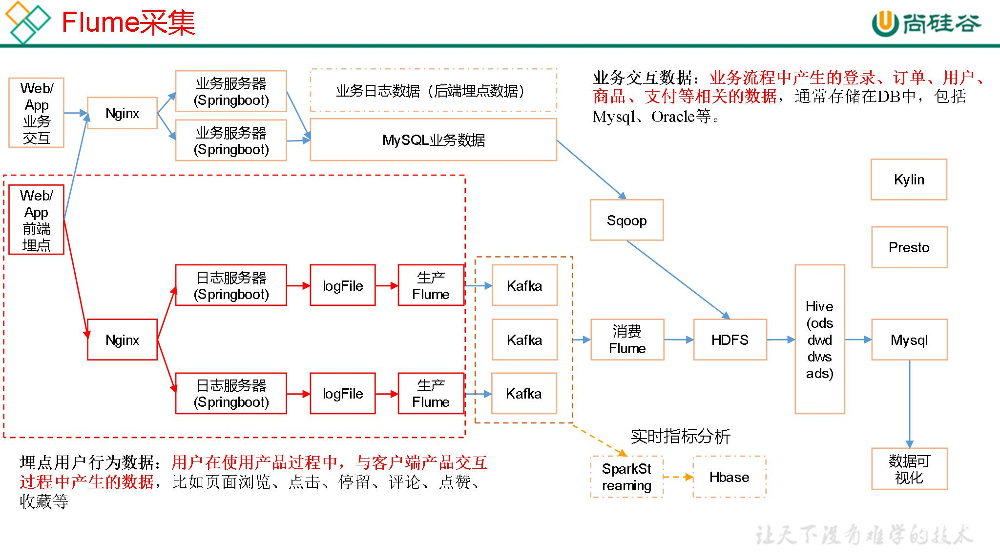

### 4.4.1日志采集Flume安装

详见：尚硅谷大数据技术之Flume

集群规划：

|                 | 服务器hadoop102 | 服务器hadoop103 | 服务器hadoop104 |
| --------------- | --------------- | --------------- | --------------- |
| Flume(采集日志) | Flume           | Flume           |                 |

### 4.4.2 项目经验之Flume组件

1）Source

（1）Taildir Source相比ExecSource、Spooling Directory Source的优势

TailDirSource：断点续传、多目录。Flume1.6以前需要自己自定义Source记录每次读取文件位置，实现断点续传。

ExecSource可以实时搜集数据，但是在Flume不运行或者Shell命令出错的情况下，数据将会丢失。

Spooling Directory Source监控目录，不支持断点续传。

（2）batchSize大小如何设置？

答：Event 1K左右时，500-1000合适（默认为100）

2）Channel

采用KafkaChannel，省去了Sink，提高了效率。KafkaChannel数据存储在Kafka里面，所以数据是存储在磁盘中。

注意 在Flume1.7以前，KafkaChannel很少有人使用，因为发现parseAsFlumeEvent这个配置起不了作用。也就是无论parseAsFlumeEvent配置为true还是false，都会转为FlumeEvent。这样的话，造成的结果是，会始终都把Flume的headers中的信息混合着内容一起写入Kafka的消息中，这显然不是我所需要的，我只是需要把内容写入即可。

### 4.4.3日志采集Flume配置

1）Flume配置分析


Flume直接读log日志的数据，log日志的格式是app-yyyy-mm-dd.log。

2）Flume的具体配置如下：
	（1）在/opt/module/flume/conf目录下创建file-flume-kafka.conf文件

```sh
[atguigu@hadoop102 conf]$vim file-flume-kafka.conf
```

在文件配置如下内容

```sh
a1.sources=r1
a1.channels=c1 c2
# configure source
a1.sources.r1.type = TAILDIR
a1.sources.r1.positionFile = /opt/module/flume/test/log_position.json
a1.sources.r1.filegroups = f1
a1.sources.r1.filegroups.f1 = /tmp/logs/app.+
a1.sources.r1.fileHeader = true
a1.sources.r1.channels = c1 c2
#interceptor
a1.sources.r1.interceptors = i1 i2
a1.sources.r1.interceptors.i1.type = com.atguigu.flume.interceptor.LogETLInterceptor$Builder
a1.sources.r1.interceptors.i2.type = com.atguigu.flume.interceptor.LogTypeInterceptor$Builder
a1.sources.r1.selector.type = multiplexing
a1.sources.r1.selector.header = topic
a1.sources.r1.selector.mapping.topic_start = c1
a1.sources.r1.selector.mapping.topic_event = c2
# configure channel
a1.channels.c1.type = org.apache.flume.channel.kafka.KafkaChannel
a1.channels.c1.kafka.bootstrap.servers = hadoop102:9092,hadoop103:9092,hadoop104:9092
a1.channels.c1.kafka.topic = topic_start
a1.channels.c1.parseAsFlumeEvent = false
a1.channels.c1.kafka.consumer.group.id = flume-consumer
a1.channels.c2.type = org.apache.flume.channel.kafka.KafkaChannel
a1.channels.c2.kafka.bootstrap.servers = hadoop102:9092,hadoop103:9092,hadoop104:9092
a1.channels.c2.kafka.topic = topic_event
a1.channels.c2.parseAsFlumeEvent = false
a1.channels.c2.kafka.consumer.group.id = flume-consumer
```

​	注意：com.atguigu.flume.interceptor.LogETLInterceptor和com.atguigu.flume.interceptor.LogTypeInterceptor是自定义的拦截器的全类名。需要根据用户自定义的拦截器做相应修改。

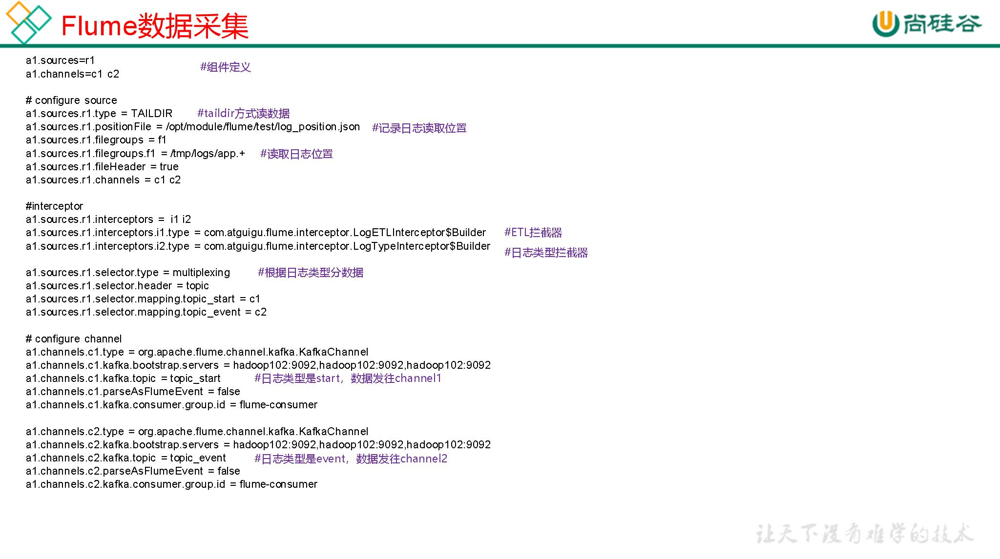

### 4.4.4 Flume的ETL和分类型拦截器

本项目中自定义了两个拦截器，分别是：ETL拦截器、日志类型区分拦截器。

ETL拦截器主要用于，过滤时间戳不合法和Json数据不完整的日志

日志类型区分拦截器主要用于，将启动日志和事件日志区分开来，方便发往Kafka的不同Topic。

1）创建Maven工程flume-interceptor

2）创建包名：com.atguigu.flume.interceptor

3）在pom.xml文件中添加如下配置

```xml
<dependencies>
	<dependency>
		<groupId>org.apache.flume</groupId>
		<artifactId>flume-ng-core</artifactId>
		<version>1.7.0</version>
	</dependency>
</dependencies>

<build>
	<plugins>
		<plugin>
			<artifactId>maven-compiler-plugin</artifactId>
			<version>2.3.2</version>
			<configuration>
				<source>1.8</source>
				<target>1.8</target>
			</configuration>
		</plugin>
		<plugin>
			<artifactId>maven-assembly-plugin</artifactId>
			<configuration>
				<descriptorRefs>
					<descriptorRef>jar-with-dependencies</descriptorRef>
				</descriptorRefs>
			</configuration>
			<executions>
				<execution>
					<id>make-assembly</id>
					<phase>package</phase>
					<goals>
						<goal>single</goal>
					</goals>
				</execution>
			</executions>
		</plugin>
	</plugins>
</build>
```

4）在com.atguigu.flume.interceptor包下创建LogETLInterceptor类名

FlumeETL拦截器LogETLInterceptor

```JAVA
package com.atguigu.flume.interceptor;
import org.apache.flume.Context;
import org.apache.flume.Event;
import org.apache.flume.interceptor.Interceptor;
import java.nio.charset.Charset;
import java.util.ArrayList;
import java.util.List;
public class LogETLInterceptor implements Interceptor {
    @Override
    public void initialize() {}
    @Override
    public Event intercept(Event event) {
        // 1 获取数据
        byte[] body = event.getBody();
        String log = new String(body, Charset.forName("UTF-8"));
        // 2 判断数据类型并向 Header 中赋值
        if (log.contains("start")) {
            if (LogUtils.validateStart(log)){
                return event;
            }
        }else {
            if (LogUtils.validateEvent(log)){
                return event;
            }
        }
        // 3 返回校验结果
        return null;
    }
    
    @Override
    public List<Event> intercept(List<Event> events) {
        ArrayList<Event> interceptors = new ArrayList<>();
        for (Event event : events) {
            Event intercept1 = intercept(event);
            if (intercept1 != null){
                interceptors.add(intercept1);
            }
        }
        return interceptors;
    }
    
    @Override
    public void close() {}

    public static class Builder implements Interceptor.Builder{
        @Override
        public Interceptor build() {
            return new LogETLInterceptor();
        }
        @Override
        public void configure(Context context) {
          
        }
    }
}
```

4）Flume日志过滤工具类

```java
package com.atguigu.flume.interceptor;
import org.apache.commons.lang.math.NumberUtils;
public class LogUtils {
	public static boolean validateEvent(String log) {
// 服务器时间 | json
// 1549696569054 |{"cm":{"ln":"-89.2","sv":"V2.0.4","os":"8.2.0","g":"M67B4QYU@gmail.com","nw":"4G","l":"en","vc":"18","hw":"1080*1920","ar":"MX","uid":"u8678","t":"1549679122062","la":"-27.4","md":"sumsung-12","vn":"1.1.3","ba":"Sumsung","sr":"Y"},"ap":"weather","et":[]}
	// 1 切割
	String[] logContents = log.split("\\|");
	// 2 校验
	if(logContents.length != 2){
		return false;
	}
	//3 校验服务器时间
	if (logContents[0].length()!=13 || !NumberUtils.isDigits(logContents[0])){
		return false;
	}
	// 4 校验 json
	if (!logContents[1].trim().startsWith("{") || !logContents[1].trim().endsWith("}")){
		return false;
	}
	return true;
}

    public static boolean validateStart(String log) {
        //{"action":"1","ar":"MX","ba":"HTC","detail":"542","en":"start","entry":"2","extend1":"","g":"S3HQ7LKM@gmail.com","hw":"640*960","l":"en","la":"-43.4","ln":"-98.3","loading_time":"10","md":"HTC-5","mid":"993","nw":"WIFI","open_ad_type":"1","os":"8.2.1","sr":"D","sv":"V2.9.0","t":"1559551922019","uid":"993","vc":"0","vn":"1.1.5"}
        if (log == null){
            return false;
        }
        // 校验 json
        if (!log.trim().startsWith("{") || !log.trim().endsWith("}")){
            return false;
        }
        return true;
    }
}
```

5）Flume日志类型区分拦截器LogTypeInterceptor

```java
package com.atguigu.flume.interceptor;
import org.apache.flume.Context;
import org.apache.flume.Event;
import org.apache.flume.interceptor.Interceptor;
import java.nio.charset.Charset;
import java.util.ArrayList;
import java.util.List;
import java.util.Map;
public class LogTypeInterceptor implements Interceptor {
	@Override
	public void initialize() {}
	@Override
	public Event intercept(Event event) {
        // 区分日志类型：body header
        // 1 获取 body 数据
        byte[] body = event.getBody();
        String log = new String(body, Charset.forName("UTF-8"));
        // 2 获取 header
		Map<String, String> headers = event.getHeaders();
		// 3 判断数据类型并向 Header 中赋值
		if (log.contains("start")) {
			headers.put("topic","topic_start");
		}else {
			headers.put("topic","topic_event");
		}
		return event;
	}
	@Override
	public List<Event> intercept(List<Event> events) {
		ArrayList<Event> interceptors = new ArrayList<>();
		for (Event event : events) {
			Event intercept1 = intercept(event);
			interceptors.add(intercept1);
		}
		return interceptors;
	}
	@Override
	public void close() {}
    public static class Builder implements Interceptor.Builder{
        @Override
        public Interceptor build() {
            return new LogTypeInterceptor();
        }
        @Override
        public void configure(Context context) {
            
        }
    }
}
```

6）打包

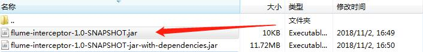

拦截器打包之后，只需要单独包，不需要将依赖的包上传。打包之后要放入Flume的lib文件夹下面。

注意：为什么不需要依赖包？因为依赖包在flume的lib目录下面已经存在了。

7）需要先将打好的包放入到hadoop102的/opt/module/flume/lib文件夹下面。

```sh
[atguigu@hadoop102 lib]$ ls | grep interceptor
flume-interceptor-1.0-SNAPSHOT.jar
```

8）分发Flume到hadoop103、hadoop104

```sh
[atguigu@hadoop102 module]$xsync flume/

[atguigu@hadoop102 flume]$ bin/flume-ngagent --name a1 --conf-file conf/file-flume-kafka.conf &
```

9）分别在hadoop102、hadoop103上启动Flume

```sh
[atguigu@hadoop102 flume]$bin/flume-ngagent --name a1 --conf-file conf/file-flume-kafka.conf &

[atguigu@hadoop103 flume]$bin/flume-ngagent --name a1 --conf-file conf/file-flume-kafka.conf &
```


### 4.4.5日志采集Flume启动停止脚本

1）在/home/atguigu/bin目录下创建脚本f1.sh

```sh
[atguigu@hadoop102 bin]$vim f1.sh
```

​	在脚本中填写如下内容

```sh
#!/bin/bash

case $1 in
"start"){
	for i in hadoop102 hadoop103
	do
	echo"--------启动$i采集flume-------"
	ssh $i "nohup /opt/module/flume/bin/flume-ngagent --conf-file /opt/module/flume/conf/file-flume-kafka.conf --name a1 -Dflume.root.logger=INFO,LOGFILE > /opt/module/flume/test1 2>&1 &"
	done
};;	
"stop"){
	for i in hadoop102 hadoop103
	do
	echo"--------停止$i采集flume-------"
	ssh $i "ps -ef | grep file-flume-kafka|grep -v grep|awk '{print\$2}'| xargs kill"
	done
};;
esac
```

说明1：nohup，该命令可以在你退出帐户/关闭终端之后继续运行相应的进程。nohup就是不挂起的意思，不挂断地运行命令。

说明2：awk默认分隔符为空格

说明3：xargs表示取出前面命令运行的结果，作为后面命令的输入参数。

2）增加脚本执行权限

```sh
[atguigu@hadoop102 bin]$chmod 777 f1.sh
```


3）f1集群启动脚本

```sh
[atguigu@hadoop102 module]$ f1.sh start
```


4）f1集群停止脚本

```sh
[atguigu@hadoop102module]$f1.sh stop
```


## 4.5Kafka安装

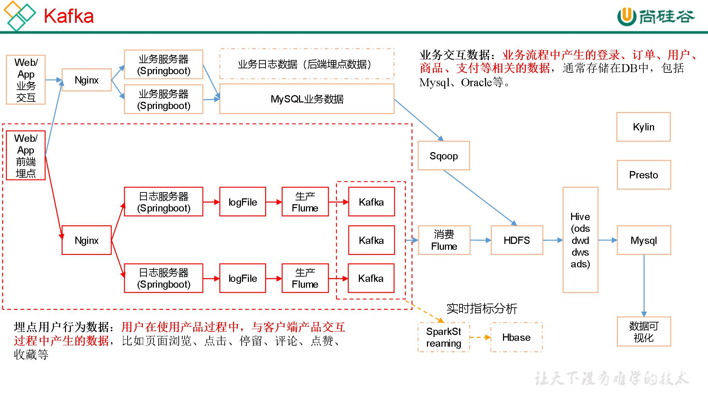

### 4.5.1Kafka集群安装

详见：尚硅谷大数据技术之Kafka

集群规划：

|       | 服务器hadoop102 | 服务器hadoop103 | 服务器hadoop104 |
| ----- | --------------- | --------------- | --------------- |
| Kafka | Kafka           | Kafka           | Kafka           |

### 4.5.2Kafka集群启动停止脚本

1）在/home/atguigu/bin目录下创建脚本kf.sh

```sh
[atguigu@hadoop102 bin]$vim kf.sh
```

在脚本中填写如下内容

```sh
#!/bin/bash

case $1 in
"start"){
	for i in hadoop102 hadoop103 hadoop104
	do
	echo"--------启动$iKafka-------"
	ssh $i "/opt/module/kafka/bin/kafka-server-start.sh -daemon /opt/module/kafka/config/server.properties"
	done
};;
"stop"){
	for i in hadoop102 hadoop103 hadoop104
	do
	echo"--------停止$iKafka-------"
	ssh $i "/opt/module/kafka/bin/kafka-server-stop.sh stop"
	done
};;
esac
```

2）增加脚本执行权限

```sh
[atguigu@hadoop102 bin]$chmod 777 kf.sh
```


3）kf集群启动脚本

```sh
[atguigu@hadoop102 module]$kf.sh start
```


4）kf集群停止脚本

```sh
[atguigu@hadoop102 module]$kf.sh stop
```

### 4.5.3查看KafkaTopic列表

```sh
[atguigu@hadoop102 kafka]$ bin/kafka-topics.sh --zookeeper hadoop102:2181 --list
```


### 4.5.4创建KafkaTopic

进入到/opt/module/kafka/目录下分别创建：启动日志主题、事件日志主题。

1）创建启动日志主题

```sh
[atguigu@hadoop102 kafka]$bin/kafka-topics.sh --zookeeper hadoop102:2181,hadoop103:2181,hadoop104:2181 --create--replication-factor 1 --partitions 1 --topic topic_start
```

2）创建事件日志主题

```sh
[atguigu@hadoop102 kafka]$bin/kafka-topics.sh --zookeeper hadoop102:2181,hadoop103:2181,hadoop104:2181 --create--replication-factor 1 --partitions 1 --topictopic_event
```

### 4.5.5删除KafkaTopic

1）删除启动日志主题

```sh
[atguigu@hadoop102 kafka]$bin/kafka-topics.sh --delete --zookeeper hadoop102:2181,hadoop103:2181,hadoop104:2181 --topic topic_start
```

2）删除事件日志主题

```sh
[atguigu@hadoop102kafka]$bin/kafka-topics.sh --delete --zookeeper hadoop102:2181,hadoop103:2181,hadoop104:2181 --topic topic_event
```

### 4.5.6Kafka生产消息

```sh
[atguigu@hadoop102 kafka]$ bin/kafka-console-producer.sh\
--broker-list hadoop102:9092 --topic topic_start

hello world
atguigu atguigu
```


### 4.5.7 Kafka消费消息

```sh
[atguigu@hadoop102 kafka]$bin/kafka-console-consumer.sh\
--bootstrap-server hadoop102:9092 --from-beginning --topic topic_start
```

--from-beginning：会把主题中以往所有的数据都读取出来。根据业务场景选择是否增加该配置。

### 4.5.8查看KafkaTopic详情

```sh
[atguigu@hadoop102 kafka]$bin/kafka-topics.sh --zookeeper hadoop102:2181\
--describe --topic topic_start
```


### 4.5.9项目经验之Kafka压力测试

1）Kafka压测

用Kafka官方自带的脚本，对Kafka进行压测。Kafka压测时，可以查看到哪个地方出现了瓶颈（CPU，内存，网络IO）。一般都是网络IO达到瓶颈。

```sh
kafka-consumer-perf-test.sh
kafka-producer-perf-test.sh
```

2）KafkaProducer压力测试

（1）在/opt/module/kafka/bin目录下面有这两个文件。我们来测试一下

```sh
[atguigu@hadoop102 kafka]$bin/kafka-producer-perf-test.sh --topic test --record-size 100 --num-records 100000 --throughput -1 --producer-propsbootstrap.servers=hadoop102:9092,hadoop103:9092,hadoop104:9092
```

说明：

record-size是一条信息有多大，单位是字节。

num-records是总共发送多少条信息。

throughput是每秒多少条信息，设成-1，表示不限流，可测出生产者最大吞吐量。

（2）Kafka会打印下面的信息

```sh
100000 records sent, 95877.277085 records/sec (9.14 MB/sec),
187.68 ms avg latency, 424.00 ms max latency, 155 ms 50th, 411 ms
95th, 423 ms 99th, 424 ms 99.9th.
```

参数解析：本例中一共写入10w条消息，吞吐量为9.14MB/sec，每次写入的平均延迟为187.68毫秒，最大的延迟为424.00毫秒。

3）KafkaConsumer压力测试

Consumer的测试，如果这四个指标（IO，CPU，内存，网络）都不能改变，考虑增加分区数来提升性能。

```sh
[atguigu@hadoop102 kafka]$
bin/kafka-consumer-perf-test.sh --zookeeper hadoop102:2181 --topic test --fetch-size 10000 --messages 10000000 --threads 1
```

参数说明：

--zookeeper指定zookeeper的链接信息

--topic指定topic的名称

--fetch-size指定每次fetch的数据的大小

--messages总共要消费的消息个数

测试结果说明：

```sh
start.time, end.time, data.consumed.in.MB, MB.sec, data.consumed.in.nMsg, nMsg.sec
2019-02-19 20:29:07:566, 2019-02-19 20:29:12:170, 9.5368, 2.0714, 100010, 21722.4153
```

开始测试时间，测试结束数据，共消费数据9.5368MB，吞吐量2.0714MB/s，共消费100010条，平均每秒消费21722.4153条。

### 4.5.10 项目经验之Kafka机器数量计算

<font color=red>Kafka机器数量（经验公式）=2 *（峰值生产速度 * 副本数/100）+1</font>

先拿到峰值生产速度，再根据设定的副本数，就能预估出需要部署Kafka的数量。

比如我们的峰值生产速度是50M/s。副本数为2。

Kafka机器数量=2 *（50 * 2/100）+1=3台

## 4.6 消费Kafka数据Flume

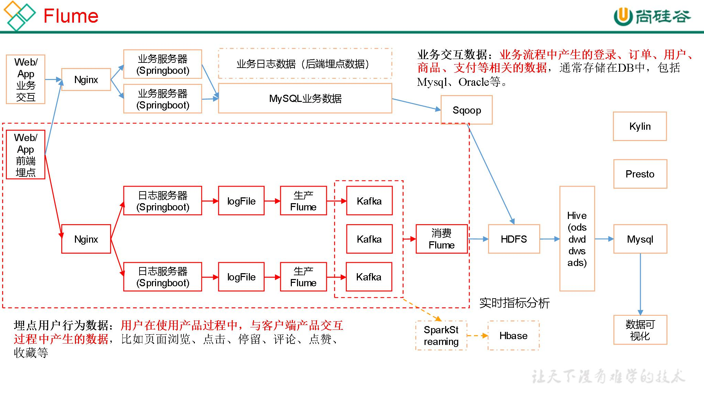

集群规划

|                    | 服务器hadoop102 | 服务器hadoop103 | 服务器hadoop104 |
| ------------------ | --------------- | --------------- | --------------- |
| Flume（消费Kafka） |                 |                 | Flume           |

### 4.6.1 项目经验之Flume组件选型

1）FileChannel和MemoryChannel区别

MemoryChannel传输数据速度更快，但因为数据保存在JVM的堆内存中，Agent进程挂掉会导致数据丢失，适用于对数据质量要求不高的需求。

FileChannel传输速度相对于Memory慢，但数据安全保障高，Agent进程挂掉也可以从失败中恢复数据。

选型：

金融类公司、对钱要求非常准确的公司通常会选择FileChannel

传输的是普通日志信息（京东内部一天丢100万-200万条，这是非常正常的），通常选择MemoryChannel。

2）FileChannel优化

通过配置dataDirs指向多个路径，每个路径对应不同的硬盘，增大Flume吞吐量。

官方说明如下：

Comma separated list of directories for storing log files. Using multiple directories on separate disks can improve file channel peformance

checkpointDir和backupCheckpointDir也尽量配置在不同硬盘对应的目录中，保证checkpoint坏掉后，可以快速使用backupCheckpointDir恢复数据

3）Sink：HDFS Sink

（1）HDFS存入大量小文件，有什么影响？

元数据层面：每个小文件都有一份元数据，其中包括文件路径，文件名，所有者，所属组，权限，创建时间等，这些信息都保存在Namenode内存中。所以小文件过多，会占用Namenode服务器大量内存，影响Namenode性能和使用寿命

计算层面：默认情况下MR会对每个小文件启用一个Map任务计算，非常影响计算性能。同时也影响磁盘寻址时间。

（2）HDFS小文件处理

官方默认的这三个参数配置写入HDFS后会产生小文件，hdfs.rollInterval、hdfs.rollSize、hdfs.rollCount

基于以上hdfs.rollInterval=3600，hdfs.rollSize=134217728，hdfs.rollCount=0几个参数综合作用，效果如下：

（1）文件在达到128M时会滚动生成新文件

（2）文件创建超3600秒时会滚动生成新文件

### 4.6.2日志消费Flume配置

1）Flume配置分析

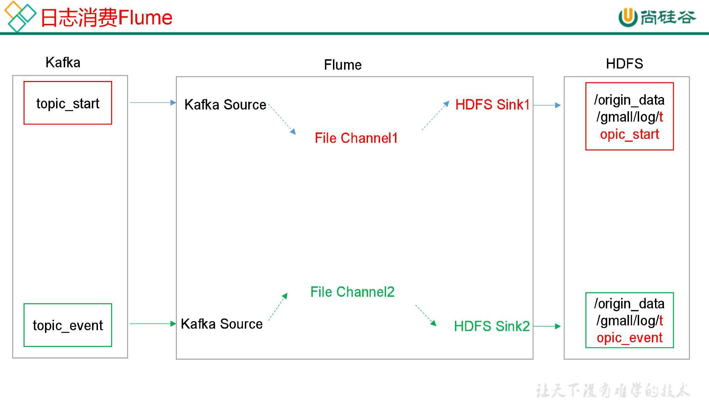

2）Flume的具体配置如下：

（1)在hadoop104的/opt/module/flume/conf目录下创建kafka-flume-hdfs.conf文件

```sh
[atguigu@hadoop104 conf]$ vim kafka-flume-hdfs.conf
```

在文件配置如下内容

```sh
##组件
a1.sources=r1r2
a1.channels=c1c2
a1.sinks=k1k2

##source1
a1.sources.r1.type=org.apache.flume.source.kafka.KafkaSource
a1.sources.r1.batchSize=5000
a1.sources.r1.batchDurationMillis=2000
a1.sources.r1.kafka.bootstrap.servers=hadoop102:9092,hadoop103:9092,hadoop104:9092
a1.sources.r1.kafka.topics=topic_start

##source2
a1.sources.r2.type=org.apache.flume.source.kafka.KafkaSource
a1.sources.r2.batchSize=5000
a1.sources.r2.batchDurationMillis=2000
a1.sources.r2.kafka.bootstrap.servers=hadoop102:9092,hadoop103:9092,hadoop104:9092
a1.sources.r2.kafka.topics=topic_event

##channel1
a1.channels.c1.type=file
a1.channels.c1.checkpointDir=/opt/module/flume/checkpoint/behavior1
a1.channels.c1.dataDirs=/opt/module/flume/data/behavior1/
a1.channels.c1.keep-alive=6

##channel2

a1.channels.c2.type=file
a1.channels.c2.checkpointDir=/opt/module/flume/checkpoint/behavior2
a1.channels.c2.dataDirs=/opt/module/flume/data/behavior2/
a1.channels.c2.keep-alive=6

##sink1
a1.sinks.k1.type=hdfs
a1.sinks.k1.hdfs.path=/origin_data/gmall/log/topic_start/%Y-%m-%d
a1.sinks.k1.hdfs.filePrefix=logstart-

##sink2
a1.sinks.k2.type=hdfs
a1.sinks.k2.hdfs.path=/origin_data/gmall/log/topic_event/%Y-%m-%d
a1.sinks.k2.hdfs.filePrefix=logevent-

##不要产生大量小文件,生产环境rollInterval配置为3600

a1.sinks.k1.hdfs.rollInterval=10
a1.sinks.k1.hdfs.rollSize=134217728
a1.sinks.k1.hdfs.rollCount=0

a1.sinks.k2.hdfs.rollInterval=10
a1.sinks.k2.hdfs.rollSize=134217728
a1.sinks.k2.hdfs.rollCount=0

##控制输出文件是原生文件。

a1.sinks.k1.hdfs.fileType=CompressedStream
a1.sinks.k2.hdfs.fileType=CompressedStream

a1.sinks.k1.hdfs.codeC=lzop
a1.sinks.k2.hdfs.codeC=lzop

##拼装

a1.sources.r1.channels=c1
a1.sinks.k1.channel=c1
a1.sources.r2.channels=c2
a1.sinks.k2.channel=c2
```

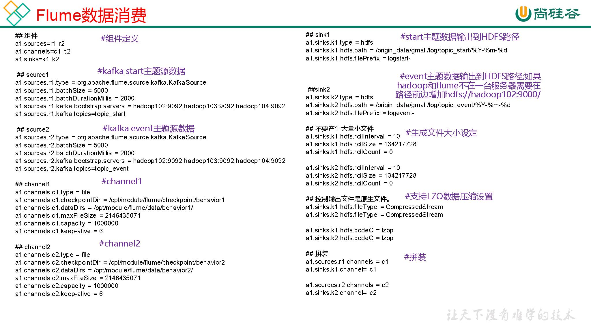

### 4.6.3日志消费Flume启动停止脚本

1）在/home/atguigu/bin目录下创建脚本f2.sh

```sh
[atguigu@hadoop102bin]$vim f2.sh
```

在脚本中填写如下内容

```sh
#!/bin/bash

case $1 in
"start"){
	for i in hadoop104
	do
	echo"--------启动$i消费flume-------"
	ssh $i "nohup/opt/module/flume/bin/flume-ngagent --conf-file /opt/module/flume/conf/kafka-flume-hdfs.conf --name a1 -Dflume.root.logger=INFO,LOGFILE > /opt/module/flume/log.txt 2>&1 &"
	done
};;
"stop"){
	for i in hadoop104
	do
	echo"--------停止$i消费flume-------"
	ssh $i "ps -ef | grep kafka-flume-hdfs|grep -v grep|awk'{print\$2}'|xargs kill"
	done
};;
esac


```

2）增加脚本执行权限

```sh
[atguigu@hadoop102 bin]$chmod 777 f2.sh
```


3）f2集群启动脚本

```sh
[atguigu@hadoop102 module]$f2.sh start
```


4）f2集群停止脚本

```sh
[atguigu@hadoop102 module]$f2.sh stop
```


### 4.6.4 项目经验之Flume内存优化

1）问题描述：如果启动消费Flume抛出如下异常

```txt
ERROR hdfs.HDFSEventSink: process failed
java.lang.OutOfMemoryError: GC overhead limit exceeded
```

2）解决方案步骤：

（1）在hadoop102服务器的/opt/module/flume/conf/flume-env.sh文件中增加如下配置

```sh
export JAVA_OPTS="-Xms100m -Xmx2000m -Dcom.sun.management.jmxremote"
```

（2）同步配置到hadoop103、hadoop104服务器

```sh
[atguigu@hadoop102 conf]$xsync flume-env.sh
```

3）Flume内存参数设置及优化

JVM heap一般设置为4G或更高，部署在单独的服务器上（4核8线程16G内存）

-Xmx与-Xms最好设置一致，减少内存抖动带来的性能影响，如果设置不一致容易导致频繁fullgc。

-Xms表示JVM Heap（堆内存）最小尺寸，初始分配；

-Xmx表示JVM Heap（堆内存）最大允许的尺寸，按需分配。

如果不设置一致，容易在初始化时，由于内存不够，频繁触发fullgc。

## 4.7采集通道启动/停止脚本

### 4.7.1采集通道启动/停止脚本

1）在/home/atguigu/bin目录下创建脚本cluster.sh

```sh
[atguigu@hadoop102 bin]$vim cluster.sh
```

在脚本中填写如下内容

```sh
#! /bin/bash
case $1 in
"start"){
	echo " -------- 启动 集群 -------"
	echo " -------- 启动 hadoop 集群 -------"
	/opt/module/hadoop-2.7.2/sbin/start-dfs.sh
	ssh hadoop103 "/opt/module/hadoop-2.7.2/sbin/start-yarn.sh"
	#启动 Zookeeper 集群
	zk.sh start
	sleep 4s;
	#启动 Flume 采集集群
	f1.sh start
	#启动 Kafka 采集集群
	kf.sh start
	sleep 6s;
	#启动 Flume 消费集群
	f2.sh start
};;
"stop"){
	echo " -------- 停止 集群 -------"
	#停止 Flume 消费集群
	f2.sh stop
	#停止 Kafka 采集集群
	kf.sh stop
	sleep 6s;
	#停止 Flume 采集集群
	f1.sh stop
	#停止 Zookeeper 集群
	zk.sh stop
	echo " -------- 停止 hadoop 集群 -------"
	ssh hadoop103 "/opt/module/hadoop-2.7.2/sbin/stop-yarn.sh"
	/opt/module/hadoop-2.7.2/sbin/stop-dfs.sh
};;
esac
```

2）增加脚本执行权限

```sh
[atguigu@hadoop102 bin]$ chmod 777 cluster.sh
```


3）cluster集群启动脚本

```sh
[atguigu@hadoop102 module]$ cluster.sh start
```


4）cluster集群停止脚本

```sh
[atguigu@hadoop102 module]$ cluster.sh stop
```


### 4.7.2生成测试数据

根据需求分别生成2020-03-10和2020-03-11日期的数据

1）生成2020-03-10日期的数据

（1）停止集群

```sh
[atguigu@hadoop102 ~]$ cluster.sh stop
```


（2）修改集群时间为2020-03-10

```sh
[atguigu@hadoop102 ~]$ dt.sh 2020-03-10
```


（3）启动集群

```sh
[atguigu@hadoop102 ~]$ cluster.sh start
```


（4）生成日志，观察HDFS路径上数据

2）生成2020-03-11日期的数据

（1）停止集群

```sh
[atguigu@hadoop102 ~]$ cluster.sh stop
```


（2）修改集群时间为2020-03-11

```sh
[atguigu@hadoop102 ~]$ dt.sh 2020-03-11
```


（3）启动集群

```sh
[atguigu@hadoop102 ~]$ cluster.sh start
```


（4）生成日志，观察HDFS路径上数据

