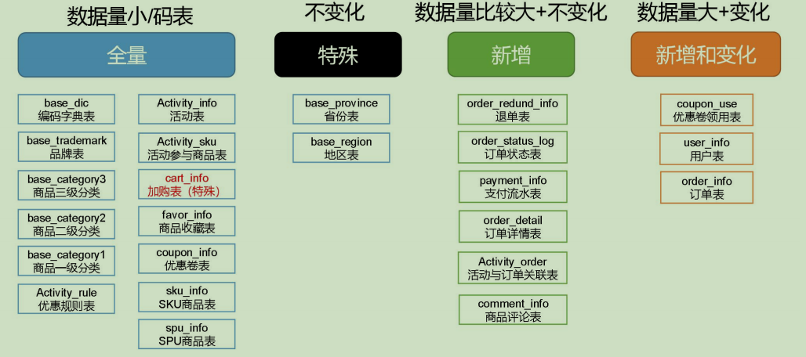

# 第1章 电商业务简介

## 1.1 电商业务流程

电商的业务流程可以以一个普通用户的浏览足迹为例进行说明，用户点开电商首页开始浏览，可能会通过分类查询也可能通过全文搜索寻找自己中意的商品，这些商品无疑都是存储在后台的管理系统中的。
当用户寻找到自己中意的商品，可能会想要购买，将商品添加到购物车后发现需要登录，登录后对商品进行结算，这时候购物车的管理和商品订单信息的生成都会对业务数据库产生影响，会生成相应的订单数据和支付数据。
订单正式生成之后，还会对订单进行跟踪处理，直到订单全部完成。
电商的主要业务流程包括用户前台浏览商品时的商品详情的管理，用户商品加入购物车进行支付时用户个人中心&支付服务的管理，用户支付完成后订单后台服务的管理，这些流程涉及到了十几个甚至几十个业务数据表，甚至更多。

## 1.2 电商常识（SKU、SPU）

 SKU=Stock Keeping Unit（库存量基本单位）。现在已经被引申为产品统一编号的简称，每种产品均对应有唯一的SKU号。
 SPU（Standard Product Unit）：是商品信息聚合的最小单位，是一组可复用、易检索的标准化信息集合。
例如：iPhoneX手机就是SPU。一台银色、128G内存的、支持联通网络的iPhoneX，就是SKU。

SPU表示一类商品。好处就是：可以共用商品图片，海报、销售属性等。

## 1.3 电商业务表结构

本电商数仓系统涉及到的业务数据表结构关系。这24个表以订单表、用户表、SKU商品表、活动表和优惠券表为中心，延伸出了优惠券领用表、支付流水表、活动订单表、订单详情表、订单状态表、商品评论表、编码字典表退单表、SPU商品表等，用户表提供用户的详细信息，支付流水表提供该订单的支付详情，订单详情表提供订单的商品数量等情况，商品表给订单详情表提供商品的详细信息。本次讲解只以此24个表为例，实际项目中，业务数据库中表格远远不止这些。

### 1.3.1 订单表（order_info）

标签	含义
id	订单编号
consignee	收货人
consignee_tel	收件人电话
final_total_amount	总金额
order_status	订单状态
user_id	用户id
delivery_address	送货地址
order_comment	订单备注
out_trade_no	订单交易编号（第三方支付用)
trade_body	订单描述(第三方支付用)
create_time	创建时间
operate_time	操作时间
expire_time	失效时间
tracking_no	物流单编号
parent_order_id	父订单编号
img_url	图片路径
province_id	地区
benefit_reduce_amount	优惠金额
original_total_amount	原价金额
feight_fee	运费金额

### 1.3.2 订单详情表（order_detail）

标签	含义
id	订单编号
order_id	订单号
sku_id	商品id
sku_name	sku名称（冗余)
img_url	图片名称（冗余)
order_price	商品价格(下单时sku价格）
sku_num	商品数量
create_time	创建时间

### 1.3.3 SKU商品表（sku_info）

标签	含义
id	skuId
spu_id	spuid
price	价格
sku_name	商品名称
sku_desc	商品描述
weight	重量
tm_id	品牌id
category3_id	品类id
sku_default_img	默认显示图片(冗余)
create_time	创建时间

### 1.3.4 用户表（user_info）

标签	含义
id	用户id
login_name	用户名称
nick_name	用户昵称
passwd	用户密码
name	姓名
phone_num	手机号
email	邮箱
head_img	头像
user_level	用户级别
birthday	生日
gender	性别M男,F女
create_time	创建时间
operate_time	操作时间

### 1.3.5 商品一级分类表（base_category1）

标签	含义
id	id
name	名称

### 1.3.6 商品二级分类表（base_category2）

标签	含义
id	id
name	名称
category1_id	一级品类id

### 1.3.7 商品三级分类表（base_category3）

标签	含义
id	id
name	名称
Category2_id	二级品类id

### 1.3.8 支付流水表（payment_info）

标签	含义
id	编号
out_trade_no	对外业务编号
order_id	订单编号
user_id	用户编号
alipay_trade_no	支付宝交易流水编号
total_amount	支付金额
subject	交易内容
payment_type	支付类型
payment_time	支付时间

### 1.3.9 省份表（base_province）

标签	含义
id	id
name	省份名称
region_id	地区ID
area_code	地区编码
iso_code	国际编码

### 1.3.10 地区表（base_region）

标签	含义
id	大区id
region_name	大区名称

### 1.3.11 品牌表（base_trademark）

标签	含义
tm_id	品牌id
tm_name	品牌名称

### 1.3.12 订单状态表（order_status_log）

标签	含义
id	编号
order_id	订单编号
order_status	订单状态
operate_time	操作时间

### 1.3.13 SPU商品表（spu_info）

标签	含义
id	商品id
spu_name	spu商品名称
description	商品描述(后台简述）
category3_id	三级分类id
tm_id	品牌id

### 1.3.14 商品评论表（comment_info）

标签	含义
id	编号
user_id	用户名称
sku_id	商品id
spu_id	spu_id
order_id	订单编号
appraise	评价 1 好评 2 中评 3 差评
comment_txt	评价内容
create_time	创建时间

### 1.3.15 退单表（order_refund_info）

标签	含义
id	编号
order_id	订单编号
sku_id	skuid
refund_type	退款类型
refund_amount	退款金额
refund_reason_type	原因类型
refund_reason_txt	原因内容
create_time	创建时间

### 1.3.16 加购表（cart_info）

标签	含义
id	编号
user_id	用户id
sku_id	SKU商品
cart_price	放入购物车时价格
sku_num	数量
img_url	图片文件
sku_name	sku名称 (冗余)
create_time	创建时间
operate_time	修改时间
is_ordered	是否已经下单
order_time	下单时间

### 1.3.17 商品收藏表（favor_info）

标签	含义
id	编号
user_id	用户名称
sku_id	商品id
spu_id	spu_id
is_cancel	是否已取消 0 正常 1 已取消
create_time	创建时间
cancel_time	修改时间

### 1.3.18 优惠券领用表（coupon_use）

标签	含义
id	编号
coupon_id	购物券ID
user_id	用户ID
order_id	订单ID
coupon_status	购物券状态
get_time	领券时间
using_time	使用时间
used_time	支付时间
expire_time	过期时间

### 1.3.19 优惠券表（coupon_info）

标签	含义
id	购物券编号
coupon_name	购物券名称
coupon_type	购物券类型 1 现金券 2 折扣券 3 满减券 4 满件打折券
condition_amount	满额数
condition_num	满件数
activity_id	活动编号
benefit_amount	减金额
benefit_discount	折扣
create_time	创建时间
range_type	范围类型 1、商品 2、品类 3、品牌
spu_id	商品id
tm_id	品牌id
category3_id	品类id
limit_num	最多领用次数
operate_time	修改时间
expire_time	过期时间

### 1.3.20 活动表（activity_info）

标签	含义
id	活动id
activity_name	活动名称
activity_type	活动类型
activity_desc	活动描述
start_time	开始时间
end_time	结束时间
create_time	创建时间

### 1.3.21 活动订单关联表（activity_order）

标签	含义
id	编号
activity_id	活动id
order_id	订单编号
create_time	发生日期

### 1.3.22 优惠规则表（activity_rule）

标签	含义
id	编号
activity_id	活动id
condition_amount	满减金额
condition_num	满减件数
benefit_amount	优惠金额
benefit_discount	优惠折扣
benefit_level	优惠级别

### 1.3.23 编码字典表（base_dic）

标签	含义
dic_code	编号
dic_name	编码名称
parent_code	父编号
create_time	创建日期
operate_time	修改日期

### 1.3.24 活动参与商品表（activity_sku）（暂不导入）

标签	含义
id	编号
activity_id	活动id
sku_id	满减金额
create_time	创建时间

# 第2章 业务数据采集模块

## 2.1 MySQL安装

### 2.1.1 安装包准备

1）查看MySQL是否安装，如果安装了，卸载MySQL
	（1）查看
[root@hadoop102 桌面]# rpm -qa|grep mysql
mysql-libs-5.1.73-7.el6.x86_64
	（2）卸载
[root@hadoop102 桌面]# rpm -e --nodeps mysql-libs-5.1.73-7.el6.x86_64
2）解压mysql-libs.zip文件到当前目录
[root@hadoop102 software]# unzip mysql-libs.zip
[root@hadoop102 software]# ls
mysql-libs.zip
mysql-libs
3）进入到mysql-libs文件夹下
[root@hadoop102 mysql-libs]# ll
总用量 76048
-rw-r--r--. 1 root root 18509960 3月  26 2015 MySQL-client-5.6.24-1.el6.x86_64.rpm
-rw-r--r--. 1 root root  3575135 12月  1 2013 mysql-connector-java-5.1.27.tar.gz
-rw-r--r--. 1 root root 55782196 3月  26 2015 MySQL-server-5.6.24-1.el6.x86_64.rpm

### 2.1.2 安装MySQL服务器

1）安装mysql服务端
[root@hadoop102 mysql-libs]# rpm -ivh MySQL-server-5.6.24-1.el6.x86_64.rpm
2）查看产生的随机密码
[root@hadoop102 mysql-libs]# cat /root/.mysql_secret
OEXaQuS8IWkG19Xs
3）查看mysql状态
[root@hadoop102 mysql-libs]# service mysql status
4）启动mysql
[root@hadoop102 mysql-libs]# service mysql start

### 2.1.3 安装MySQL客户端

1）安装mysql客户端
[root@hadoop102 mysql-libs]# rpm -ivh MySQL-client-5.6.24-1.el6.x86_64.rpm
2）链接mysql
[root@hadoop102 mysql-libs]# mysql -uroot -pOEXaQuS8IWkG19Xs
3）修改密码
mysql>SET PASSWORD=PASSWORD('000000');
4）退出mysql
mysql>exit

### 2.1.4 MySQL中user表中主机配置

配置只要是root用户+密码，在任何主机上都能登录MySQL数据库。
1）进入mysql
[root@hadoop102 mysql-libs]# mysql -uroot -p000000
2）显示数据库
mysql>show databases;
3）使用mysql数据库
mysql>use mysql;
4）展示mysql数据库中的所有表
mysql>show tables;
5）展示user表的结构
mysql>desc user;
6）查询user表
mysql>select User, Host, Password from user;
7）修改user表，把Host表内容修改为%
mysql>update user set host='%' where host='localhost';
8）删除root用户的其他host
mysql>
delete from user where Host='hadoop102';
delete from user where Host='127.0.0.1';
delete from user where Host='::1';
9）刷新
mysql>flush privileges;
10）退出
mysql>quit;

## 2.2 Sqoop安装

### 2.2.1 下载并解压

1）下载地址：http://mirrors.hust.edu.cn/apache/sqoop/1.4.6/
2）上传安装包sqoop-1.4.6.bin__hadoop-2.0.4-alpha.tar.gz到hadoop102的/opt/software路径中
3）解压sqoop安装包到指定目录，如：
[atguigu@hadoop102 software]$ tar -zxf sqoop-1.4.6.bin__hadoop-2.0.4-alpha.tar.gz -C /opt/module/
4）解压sqoop安装包到指定目录，如：
[atguigu@hadoop102 module]$ mv sqoop-1.4.6.bin__hadoop-2.0.4-alpha/ sqoop

### 2.2.2 修改配置文件

1) 进入到/opt/module/sqoop/conf目录，重命名配置文件
[atguigu@hadoop102 conf]$ mv sqoop-env-template.sh sqoop-env.sh
2) 修改配置文件
[atguigu@hadoop102 conf]$ vim sqoop-env.sh 

增加如下内容
export HADOOP_COMMON_HOME=/opt/module/hadoop-2.7.2
export HADOOP_MAPRED_HOME=/opt/module/hadoop-2.7.2
export HIVE_HOME=/opt/module/hive
export ZOOKEEPER_HOME=/opt/module/zookeeper-3.4.10
export ZOOCFGDIR=/opt/module/zookeeper-3.4.10/conf
export HBASE_HOME=/opt/module/hbase

### 2.2.3 拷贝JDBC驱动

1）进入到/opt/software/mysql-libs路径，解压mysql-connector-java-5.1.27.tar.gz到当前路径
[atguigu@hadoop102 mysql-libs]$ tar -zxvf mysql-connector-java-5.1.27.tar.gz
2）进入到/opt/software/mysql-libs/mysql-connector-java-5.1.27路径，拷贝jdbc驱动到sqoop的lib目录下。
[atguigu@hadoop102 mysql-connector-java-5.1.27]$ cp mysql-connector-java-5.1.27-bin.jar /opt/module/sqoop/lib/

### 2.2.4 验证Sqoop

我们可以通过某一个command来验证sqoop配置是否正确：
[atguigu@hadoop102 sqoop]$ bin/sqoop help
出现一些Warning警告（警告信息已省略），并伴随着帮助命令的输出：
Available commands:
  codegen            Generate code to interact with database records
  create-hive-table     Import a table definition into Hive
  eval               Evaluate a SQL statement and display the results
  export             Export an HDFS directory to a database table
  help               List available commands
  import             Import a table from a database to HDFS
  import-all-tables     Import tables from a database to HDFS
  import-mainframe    Import datasets from a mainframe server to HDFS
  job                Work with saved jobs
  list-databases        List available databases on a server
  list-tables           List available tables in a database
  merge              Merge results of incremental imports
  metastore           Run a standalone Sqoop metastore
  version            Display version information

### 2.2.5 测试Sqoop是否能够成功连接数据库

[atguigu@hadoop102 sqoop]$ bin/sqoop list-databases --connect jdbc:mysql://hadoop102:3306/ --username root --password 000000
出现如下输出：
information_schema
metastore
mysql
oozie
performance_schema

## 2.3 业务数据生成

### 2.3.1 连接MySQL

通过MySQL操作可视化工具SQLyog连接MySQL。

### 2.3.2 建表语句

1）通过SQLyog创建数据库gmall
2）设置数据库编码

3）导入数据库结构脚本（gmall2020-03-16.sql）

### 2.3.3 生成业务数据

1）在hadoop102的/opt/module/目录下创建db_log文件夹
[atguigu@hadoop102 module]$ mkdir db_log/
2）把gmall-mock-db-2020-03-16-SNAPSHOT.jar和 application.properties上传到hadoop102的/opt/module/db_log路径上。
3）根据需求修改application.properties相关配置
logging.level.root=info

spring.datasource.driver-class-name=com.mysql.jdbc.Driver
spring.datasource.url=jdbc:mysql://hadoop102:3306/gmall?characterEncoding=utf-8&useSSL=false&serverTimezone=GMT%2B8
spring.datasource.username=root
spring.datasource.password=000000

logging.pattern.console=%m%n

mybatis-plus.global-config.db-config.field-strategy=not_null

#业务日期
mock.date=2020-03-10
#是否重置
mock.clear=1

#是否生成新用户
mock.user.count=50
#男性比例
mock.user.male-rate=20

#收藏取消比例
mock.favor.cancel-rate=10
#收藏数量
mock.favor.count=100

#购物车数量
mock.cart.count=10
#每个商品最多购物个数
mock.cart.sku-maxcount-per-cart=3

#用户下单比例
mock.order.user-rate=80
#用户从购物中购买商品比例
mock.order.sku-rate=70
#是否参加活动
mock.order.join-activity=1
#是否使用购物券
mock.order.use-coupon=1
#购物券领取人数
mock.coupon.user-count=10

#支付比例
mock.payment.rate=70
#支付方式 支付宝：微信 ：银联
mock.payment.payment-type=30:60:10

#评价比例 好：中：差：自动
mock.comment.appraise-rate=30:10:10:50

#退款原因比例：质量问题 商品描述与实际描述不一致 缺货 号码不合适 拍错 不想买了 其他
mock.refund.reason-rate=30:10:20:5:15:5:5
4）并在该目录下执行，如下命令，生成2020-03-10日期数据：
[atguigu@hadoop102 db_log]$ java -jar gmall-mock-db-2020-03-16-SNAPSHOT.jar
5）在配置文件application.properties中修改
mock.date=2020-03-11
mock.clear=0
6）再次执行命令，生成2020-03-11日期数据：
[atguigu@hadoop102 db_log]$ java -jar gmall-mock-db-2020-03-16-SNAPSHOT.jar

## 2.4 同步策略

数据同步策略的类型包括：全量表、增量表、新增及变化表
全量表：存储完整的数据。
增量表：存储新增加的数据。
新增及变化表：存储新增加的数据和变化的数据。
特殊表：只需要存储一次。

### 2.4.1 全量同步策略

> 每日全量，就是每天存储一份完整数据，作为一个分区。
> 适用于表数据量不大，且每天既会有新数据插入，也会有旧数据的修改的场景。例如:编码字典表、品牌表、商品三级分类、商品二级分类、商品一级分类、优惠规则表、活动表、活动参与商品表、加购表、商品收藏表、优惠卷表、SKU商品表、SPU商品表

### 2.4.2 增量同步策略

> 每日增量，就是每天存储一份增量数据，作为一个分区。
> 适用于表数据量大，且每天只会有新数据插入的场景。例如:退单表、订单状态表、支付流水表、订单详情表、活动与订单关联表、商品评论表。

### 2.4.3 新增及变化策略

每日新增及变化，就是存储创建时间和操作时间都是今天的数据。
适用场景为，表的数据量大，既会有新增，又会有变化。
例如：用户表、订单表、优惠卷领用表。

### 2.4.4 特殊策略

某些特殊的维度表，可不必遵循上述同步策略。
1）客观世界维度
没变化的客观世界的维度（比如性别，地区，民族，政治成分，鞋子尺码）可以只存一份固定值。
2）日期维度
日期维度可以一次性导入一年或若干年的数据。
3）地区维度
省份表、地区表

## 2.5 业务数据导入HDFS

### 2.5.1 分析表同步策略



### 2.5.2 脚本编写

1）在/home/atguigu/bin目录下创建
[atguigu@hadoop102 bin]$ vim mysql_to_hdfs.sh
添加如下内容：

```sh
#! /bin/bash

sqoop=/opt/module/sqoop/bin/sqoop
do_date=`date -d '-1 day' +%F`

if [[ -n "$2" ]]; then
    do_date=$2
fi

import_data(){
$sqoop import \
--connect jdbc:mysql://hadoop102:3306/gmall \
--username root \
--password 000000 \
--target-dir /origin_data/gmall/db/$1/$do_date \
--delete-target-dir \
--query "$2 and  \$CONDITIONS" \
--num-mappers 1 \
--fields-terminated-by '\t' \
--compress \
--compression-codec lzop \
--null-string '\\N' \
--null-non-string '\\N'

hadoop jar /opt/module/hadoop-2.7.2/share/hadoop/common/hadoop-lzo-0.4.20.jar com.hadoop.compression.lzo.DistributedLzoIndexer /origin_data/gmall/db/$1/$do_date
}

import_order_info(){
  import_data order_info "select
                            id, 
                            final_total_amount, 
                            order_status, 
                            user_id, 
                            out_trade_no, 
                            create_time, 
                            operate_time,
                            province_id,
                            benefit_reduce_amount,
                            original_total_amount,
                            feight_fee      
                        from order_info
                        where (date_format(create_time,'%Y-%m-%d')='$do_date' 
                        or date_format(operate_time,'%Y-%m-%d')='$do_date')"
}

import_coupon_use(){
  import_data coupon_use "select
                          id,
                          coupon_id,
                          user_id,
                          order_id,
                          coupon_status,
                          get_time,
                          using_time,
                          used_time
                        from coupon_use
                        where (date_format(get_time,'%Y-%m-%d')='$do_date'
                        or date_format(using_time,'%Y-%m-%d')='$do_date'
                        or date_format(used_time,'%Y-%m-%d')='$do_date')"
}

import_order_status_log(){
  import_data order_status_log "select
                                  id,
                                  order_id,
                                  order_status,
                                  operate_time
                                from order_status_log
                                where date_format(operate_time,'%Y-%m-%d')='$do_date'"
}

import_activity_order(){
  import_data activity_order "select
                                id,
                                activity_id,
                                order_id,
                                create_time
                              from activity_order
                              where date_format(create_time,'%Y-%m-%d')='$do_date'"
}

import_user_info(){
  import_data "user_info" "select 
                            id,
                            name,
                            birthday,
                            gender,
                            email,
                            user_level, 
                            create_time,
                            operate_time
                          from user_info 
                          where (DATE_FORMAT(create_time,'%Y-%m-%d')='$do_date' 
                          or DATE_FORMAT(operate_time,'%Y-%m-%d')='$do_date')"
}

import_order_detail(){
  import_data order_detail "select 
                              od.id,
                              order_id, 
                              user_id, 
                              sku_id,
                              sku_name,
                              order_price,
                              sku_num, 
                              od.create_time  
                            from order_detail od
                            join order_info oi
                            on od.order_id=oi.id
                            where DATE_FORMAT(od.create_time,'%Y-%m-%d')='$do_date'"
}

import_payment_info(){
  import_data "payment_info"  "select 
                                id,  
                                out_trade_no, 
                                order_id, 
                                user_id, 
                                alipay_trade_no, 
                                total_amount,  
                                subject, 
                                payment_type, 
                                payment_time 
                              from payment_info 
                              where DATE_FORMAT(payment_time,'%Y-%m-%d')='$do_date'"
}

import_comment_info(){
  import_data comment_info "select
                              id,
                              user_id,
                              sku_id,
                              spu_id,
                              order_id,
                              appraise,
                              comment_txt,
                              create_time
                            from comment_info
                            where date_format(create_time,'%Y-%m-%d')='$do_date'"
}

import_order_refund_info(){
  import_data order_refund_info "select
                                id,
                                user_id,
                                order_id,
                                sku_id,
                                refund_type,
                                refund_num,
                                refund_amount,
                                refund_reason_type,
                                create_time
                              from order_refund_info
                              where date_format(create_time,'%Y-%m-%d')='$do_date'"
}

import_sku_info(){
  import_data sku_info "select 
                          id,
                          spu_id,
                          price,
                          sku_name,
                          sku_desc,
                          weight,
                          tm_id,
                          category3_id,
                          create_time
                        from sku_info where 1=1"
}

import_base_category1(){
  import_data "base_category1" "select 
                                  id,
                                  name 
                                from base_category1 where 1=1"
}

import_base_category2(){
  import_data "base_category2" "select
                                  id,
                                  name,
                                  category1_id 
                                from base_category2 where 1=1"
}

import_base_category3(){
  import_data "base_category3" "select
                                  id,
                                  name,
                                  category2_id
                                from base_category3 where 1=1"
}

import_base_province(){
  import_data base_province "select
                              id,
                              name,
                              region_id,
                              area_code,
                              iso_code
                            from base_province
                            where 1=1"
}

import_base_region(){
  import_data base_region "select
                              id,
                              region_name
                            from base_region
                            where 1=1"
}

import_base_trademark(){
  import_data base_trademark "select
                                tm_id,
                                tm_name
                              from base_trademark
                              where 1=1"
}

import_spu_info(){
  import_data spu_info "select
                            id,
                            spu_name,
                            category3_id,
                            tm_id
                          from spu_info
                          where 1=1"
}

import_favor_info(){
  import_data favor_info "select
                          id,
                          user_id,
                          sku_id,
                          spu_id,
                          is_cancel,
                          create_time,
                          cancel_time
                        from favor_info
                        where 1=1"
}

import_cart_info(){
  import_data cart_info "select
                        id,
                        user_id,
                        sku_id,
                        cart_price,
                        sku_num,
                        sku_name,
                        create_time,
                        operate_time,
                        is_ordered,
                        order_time
                      from cart_info
                      where 1=1"
}

import_coupon_info(){
  import_data coupon_info "select
                          id,
                          coupon_name,
                          coupon_type,
                          condition_amount,
                          condition_num,
                          activity_id,
                          benefit_amount,
                          benefit_discount,
                          create_time,
                          range_type,
                          spu_id,
                          tm_id,
                          category3_id,
                          limit_num,
                          operate_time,
                          expire_time
                        from coupon_info
                        where 1=1"
}

import_activity_info(){
  import_data activity_info "select
                              id,
                              activity_name,
                              activity_type,
                              start_time,
                              end_time,
                              create_time
                            from activity_info
                            where 1=1"
}

import_activity_rule(){
    import_data activity_rule "select
                                    id,
                                    activity_id,
                                    condition_amount,
                                    condition_num,
                                    benefit_amount,
                                    benefit_discount,
                                    benefit_level
                                from activity_rule
                                where 1=1"
}

import_base_dic(){
    import_data base_dic "select
                            dic_code,
                            dic_name,
                            parent_code,
                            create_time,
                            operate_time
                          from base_dic
                          where 1=1" 
}

case $1 in
  "order_info")
     import_order_info
;;
  "base_category1")
     import_base_category1
;;
  "base_category2")
     import_base_category2
;;
  "base_category3")
     import_base_category3
;;
  "order_detail")
     import_order_detail
;;
  "sku_info")
     import_sku_info
;;
  "user_info")
     import_user_info
;;
  "payment_info")
     import_payment_info
;;
  "base_province")
     import_base_province
;;
  "base_region")
     import_base_region
;;
  "base_trademark")
     import_base_trademark
;;
  "activity_info")
      import_activity_info
;;
  "activity_order")
      import_activity_order
;;
  "cart_info")
      import_cart_info
;;
  "comment_info")
      import_comment_info
;;
  "coupon_info")
      import_coupon_info
;;
  "coupon_use")
      import_coupon_use
;;
  "favor_info")
      import_favor_info
;;
  "order_refund_info")
      import_order_refund_info
;;
  "order_status_log")
      import_order_status_log
;;
  "spu_info")
      import_spu_info
;;
  "activity_rule")
      import_activity_rule
;;
  "base_dic")
      import_base_dic
;;

"first")
   import_base_category1
   import_base_category2
   import_base_category3
   import_order_info
   import_order_detail
   import_sku_info
   import_user_info
   import_payment_info
   import_base_province
   import_base_region
   import_base_trademark
   import_activity_info
   import_activity_order
   import_cart_info
   import_comment_info
   import_coupon_use
   import_coupon_info
   import_favor_info
   import_order_refund_info
   import_order_status_log
   import_spu_info
   import_activity_rule
   import_base_dic
;;
"all")
   import_base_category1
   import_base_category2
   import_base_category3
   import_order_info
   import_order_detail
   import_sku_info
   import_user_info
   import_payment_info
   import_base_trademark
   import_activity_info
   import_activity_order
   import_cart_info
   import_comment_info
   import_coupon_use
   import_coupon_info
   import_favor_info
   import_order_refund_info
   import_order_status_log
   import_spu_info
   import_activity_rule
   import_base_dic
;;
esac
```

说明1：
[ -n 变量值 ] 判断变量的值，是否为空
-- 变量的值，非空，返回true
-- 变量的值，为空，返回false
说明2：
查看date命令的使用，[atguigu@hadoop102 ~]$ date --help
2）修改脚本权限 
[atguigu@hadoop102 bin]$ chmod 777 mysql_to_hdfs.sh
3）初次导入
[atguigu@hadoop102 bin]$ mysql_to_hdfs.sh first 2020-03-10
4）每日导入
[atguigu@hadoop102 bin]$ mysql_to_hdfs.sh all 2020-03-11

### 2.5.3 项目经验

Hive中的Null在底层是以“\N”来存储，而MySQL中的Null在底层就是Null，为了保证数据两端的一致性。在导出数据时采用--input-null-string和--input-null-non-string两个参数。导入数据时采用--null-string和--null-non-string。

# 第3章 数据环境准备

## 3.1 安装Hive

1）上传apache-hive-2.3.0-bin.tar.gz 到/opt/software目录下，并解压到/opt/module
[atguigu@hadoop102 software]$ tar -zxvf apache-hive-2.3.6-bin.tar.gz -C /opt/module/
2）修改apache-hive-2.3.6-bin名称为hive
[atguigu@hadoop102 module]$ mv apache-hive-2.3.6-bin hive
3）将Mysql的mysql-connector-java-5.1.27-bin.jar拷贝到/opt/module/hive/lib/
[atguigu@hadoop102 module]$ cp /opt/software/mysql-libs/mysql-connector-java-5.1.27/mysql-connector-java-5.1.27-bin.jar /opt/module/hive/lib/
4）在/opt/module/hive/conf路径上，创建hive-site.xml文件
[atguigu@hadoop102 conf]$ vim hive-site.xml
添加如下内容
<?xml version="1.0"?>
<?xml-stylesheet type="text/xsl" href="configuration.xsl"?>
<configuration>
	<property>
	    <name>javax.jdo.option.ConnectionURL</name>
	    <value>jdbc:mysql://hadoop102:3306/metastore?createDatabaseIfNotExist=true</value>
	    <description>JDBC connect string for a JDBC metastore</description>
	</property>

	<property>
	    <name>javax.jdo.option.ConnectionDriverName</name>
	    <value>com.mysql.jdbc.Driver</value>
	    <description>Driver class name for a JDBC metastore</description>
	</property>
	
	<property>
	    <name>javax.jdo.option.ConnectionUserName</name>
	    <value>root</value>
	    <description>username to use against metastore database</description>
	</property>
	
	<property>
	    <name>javax.jdo.option.ConnectionPassword</name>
	    <value>000000</value>
	    <description>password to use against metastore database</description>
	</property>
	
	<property>
	     <name>hive.metastore.warehouse.dir</name>
	     <value>/user/hive/warehouse</value>
	     <description>location of default database for the warehouse</description>
	</property>
	
	<property>
	    <name>hive.cli.print.header</name>
	    <value>true</value>
	</property>
	
	<property>
	    <name>hive.cli.print.current.db</name>
	    <value>true</value>
	</property>
	
	<property>
	    <name>hive.metastore.schema.verification</name>
	    <value>false</value>
	</property>
	
	<property>
	    <name>datanucleus.schema.autoCreateAll</name>
	    <value>true</value> 
	</property>
</configuration>
5）服务启动完毕后在启动Hive
[atguigu@hadoop102 hive]$ bin/hive

## 3.2 Hive集成引擎Tez

Tez是一个Hive的运行引擎，性能优于MR。为什么优于MR呢？看下图。

用Hive直接编写MR程序，假设有四个有依赖关系的MR作业，上图中，绿色是Reduce Task，云状表示写屏蔽，需要将中间结果持久化写到HDFS。
Tez可以将多个有依赖的作业转换为一个作业，这样只需写一次HDFS，且中间节点较少，从而大大提升作业的计算性能。

### 3.2.1 安装包准备

1）下载tez的依赖包：http://tez.apache.org
2）拷贝apache-tez-0.9.1-bin.tar.gz到hadoop102的/opt/software目录
[atguigu@hadoop102 software]$ ls
apache-tez-0.9.1-bin.tar.gz
3）将apache-tez-0.9.1-bin.tar.gz上传到HDFS的/tez目录下。
[atguigu@hadoop102 conf]$ hadoop fs -mkdir /tez
[atguigu@hadoop102 conf]$ hadoop fs -put /opt/software/apache-tez-0.9.1-bin.tar.gz/ /tez
4）解压缩apache-tez-0.9.1-bin.tar.gz
[atguigu@hadoop102 software]$ tar -zxvf apache-tez-0.9.1-bin.tar.gz -C /opt/module
5）修改名称
[atguigu@hadoop102 module]$ mv apache-tez-0.9.1-bin/ tez-0.9.1

### 3.2.2 集成Tez 

1）进入到Hive的配置目录：/opt/module/hive/conf
[atguigu@hadoop102 conf]$ pwd
/opt/module/hive/conf
2）在Hive的/opt/module/hive/conf下面创建一个tez-site.xml文件
[atguigu@hadoop102 conf]$ pwd
/opt/module/hive/conf
[atguigu@hadoop102 conf]$ vim tez-site.xml
添加如下内容
<?xml version="1.0" encoding="UTF-8"?>
<?xml-stylesheet type="text/xsl" href="configuration.xsl"?>
<configuration>
    <property>
        <name>tez.lib.uris</name>
        <value>${fs.defaultFS}/tez/apache-tez-0.9.1-bin.tar.gz</value>
    </property>
    <property>
         <name>tez.use.cluster.hadoop-libs</name>
         <value>true</value>
    </property>
    <property>
         <name>tez.history.logging.service.class</name>        
         <value>org.apache.tez.dag.history.logging.ats.ATSHistoryLoggingService</value>
    </property>
</configuration>
2）在hive-env.sh文件中添加tez环境变量配置和依赖包环境变量配置
[atguigu@hadoop102 conf]$ mv hive-env.sh.template hive-env.sh
[atguigu@hadoop102 conf]$ vim hive-env.sh
添加如下配置

```sh
# Set HADOOP_HOME to point to a specific hadoop install directory

export HADOOP_HOME=/opt/module/hadoop-2.7.2

# Hive Configuration Directory can be controlled by:

export HIVE_CONF_DIR=/opt/module/hive/conf

# Folder containing extra libraries required for hive compilation/execution can be controlled by:

export TEZ_HOME=/opt/module/tez-0.9.1    #是你的tez的解压目录
export TEZ_JARS=""
for jar in `ls $TEZ_HOME |grep jar`; do
    export TEZ_JARS=$TEZ_JARS:$TEZ_HOME/$jar
done
for jar in `ls $TEZ_HOME/lib`; do
    export TEZ_JARS=$TEZ_JARS:$TEZ_HOME/lib/$jar
done

export HIVE_AUX_JARS_PATH=/opt/module/hadoop-2.7.2/share/hadoop/common/hadoop-lzo-0.4.20.jar$TEZ_JARS
```

3）在hive-site.xml文件中添加如下配置，更改hive计算引擎
<property>
    <name>hive.execution.engine</name>
    <value>tez</value>
</property>

### 3.2.3 测试

1）启动Hive
[atguigu@hadoop102 hive]$ bin/hive
2）创建表
hive (default)> create table student(
id int,
name string);
3）向表中插入数据
hive (default)> insert into student values(1,"zhangsan");
4）如果没有报错就表示成功了
hive (default)> select * from student;
1       zhangsan

### 3.2.4 注意事项

1）运行Tez时检查到用过多内存而被NodeManager杀死进程问题：
Caused by: org.apache.tez.dag.api.SessionNotRunning: TezSession has already shutdown. Application application_1546781144082_0005 failed 2 times due to AM Container for appattempt_1546781144082_0005_000002 exited with  exitCode: -103
For more detailed output, check application tracking page:http://hadoop103:8088/cluster/app/application_1546781144082_0005Then, click on links to logs of each attempt.
Diagnostics: Container [pid=11116,containerID=container_1546781144082_0005_02_000001] is running beyond virtual memory limits. Current usage: 216.3 MB of 1 GB physical memory used; 2.6 GB of 2.1 GB virtual memory used. Killing container.
这种问题是从机上运行的Container试图使用过多的内存，而被NodeManager kill掉了。
[摘录] The NodeManager is killing your container. It sounds like you are trying to use hadoop streaming which is running as a child process of the map-reduce task. The NodeManager monitors the entire process tree of the task and if it eats up more memory than the maximum set in mapreduce.map.memory.mb or mapreduce.reduce.memory.mb respectively, we would expect the Nodemanager to kill the task, otherwise your task is stealing memory belonging to other containers, which you don't want.
2）解决方法：
（1）关掉虚拟内存检查，修改yarn-site.xml，
<property>
    <name>yarn.nodemanager.vmem-check-enabled</name>
    <value>false</value>
</property>
（2）修改后一定要分发，并重新启动hadoop集群。
[atguigu@hadoop102 hadoop]$ xsync yarn-site.xml