# 第1章 数仓分层
## 1.1 为什么要分层

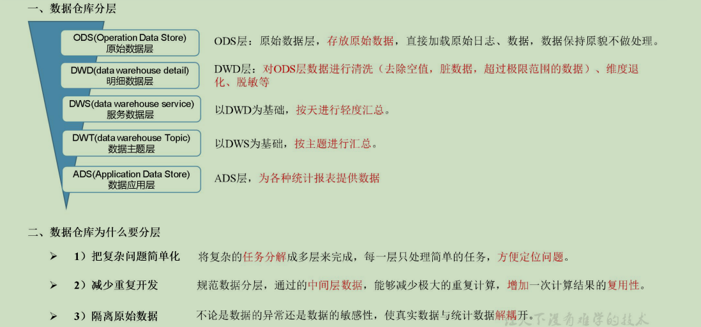

## 1.2 数据集市与数据仓库概念

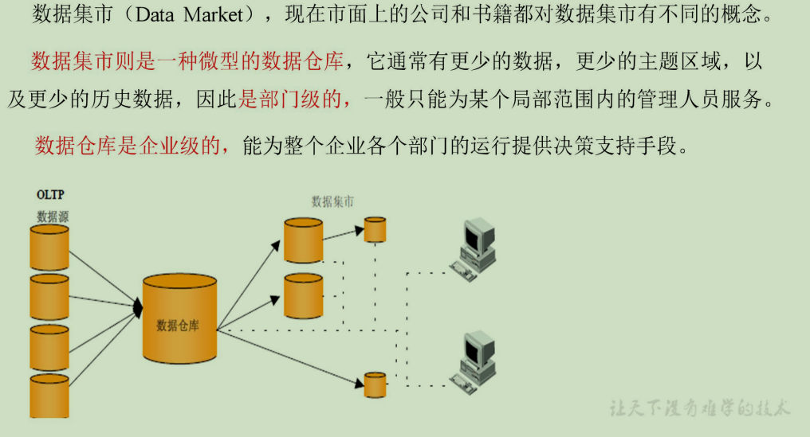

## 1.3 数仓命名规范

### 1.3.1 表命名

```
ODS层命名为ods_表名
DWD层命名为dwd_dim/fact_表名
DWS层命名为dws_表名  
DWT层命名为dwt_购物车
ADS层命名为ads_表名
临时表命名为xxx_tmp
用户行为表，以log为后缀。
```

### 1.3.2 脚本命名

```
数据源_to_目标_db/log.sh
用户行为脚本以log为后缀；业务数据脚本以db为后缀。
```

# 第2章 数仓理论

## 2.1 范式理论

### 2.1.1 范式概念

1）定义
范式可以理解为设计一张数据表的表结构，符合的标准级别。 规范和要求
2）优点
关系型数据库设计时，遵照一定的规范要求，目的在于降低数据的冗余性。
为什么要降低数据冗余性？
（1）十几年前，磁盘很贵，为了减少磁盘存储。
（2）以前没有分布式系统，都是单机，只能增加磁盘，磁盘个数也是有限的
（3）一次修改，需要修改多个表，很难保证数据一致性
3）缺点
范式的缺点是获取数据时，需要通过Join拼接出最后的数据。
4）分类
目前业界范式有：第一范式(1NF)、第二范式(2NF)、第三范式(3NF)、巴斯-科德范式(BCNF)、第四范式(4NF)、第五范式(5NF)。 

### 2.1.2 函数依赖

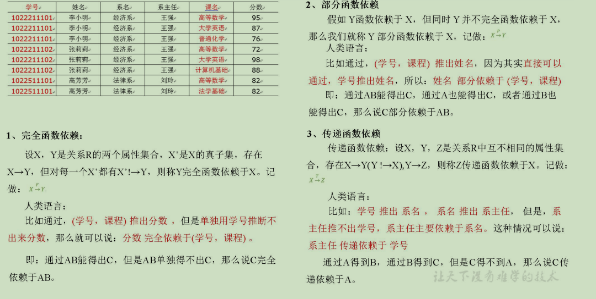

### 2.1.3 三范式区分

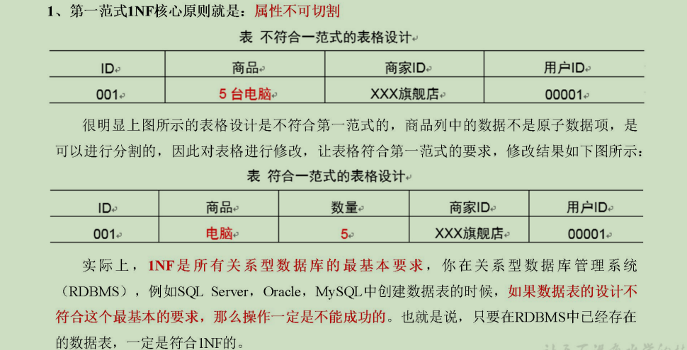

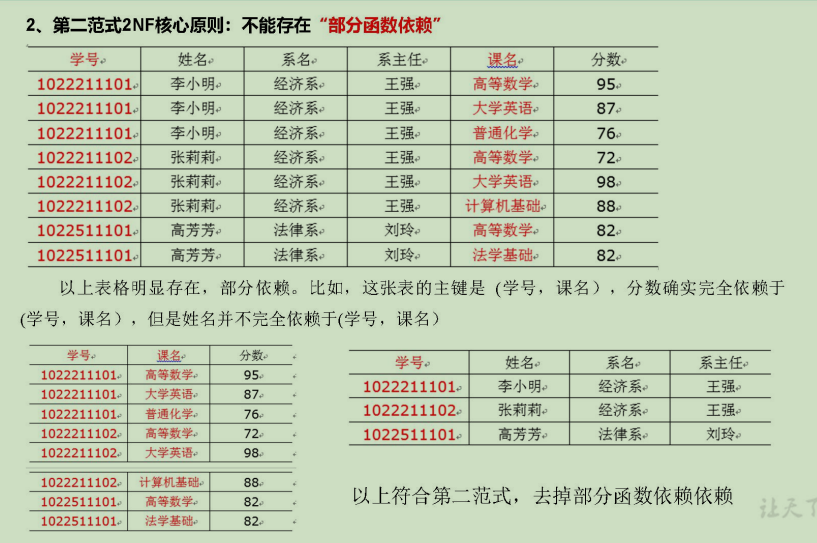

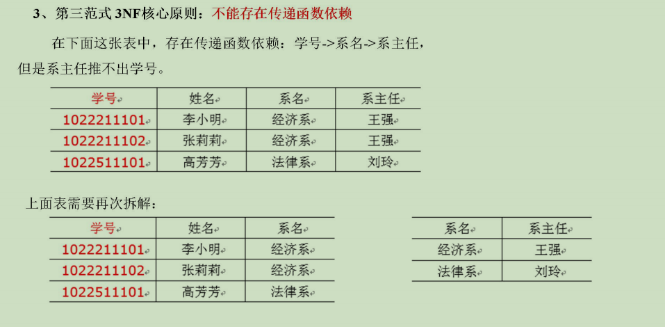

## 2.2 关系建模与维度建模

当今的数据处理大致可以分成两大类：联机事务处理OLTP（on-line transaction processing）、联机分析处理OLAP（On-Line Analytical Processing）。OLTP是传统的关系型数据库的主要应用，主要是基本的、日常的事务处理，例如银行交易。OLAP是数据仓库系统的主要应用，支持复杂的分析操作，侧重决策支持，并且提供直观易懂的查询结果。二者的主要区别对比如下表所示。
对比属性	OLTP	OLAP
读特性	每次查询只返回少量记录	对大量记录进行汇总
写特性	随机、低延时写入用户的输入	批量导入
使用场景	用户，Java EE项目	内部分析师，为决策提供支持
数据表征	最新数据状态	随时间变化的历史状态
数据规模	GB	TB到PB

### 2.2.1 关系建模

关系模型如图所示，严格遵循第三范式（3NF），从图中可以看出，较为松散、零碎，物理表数量多，而数据冗余程度低。由于数据分布于众多的表中，这些数据可以更为灵活地被应用，功能性较强。关系模型主要应用与OLTP系统中，为了保证数据的一致性以及避免冗余，所以大部分业务系统的表都是遵循第三范式的。

图 维度模型示意图
维度模型如图所示，主要应用于OLAP系统中，通常以某一个事实表为中心进行表的组织，主要面向业务，特征是可能存在数据的冗余，但是能方便的得到数据。
关系模型虽然冗余少，但是在大规模数据，跨表分析统计查询过程中，会造成多表关联，这会大大降低执行效率。所以通常我们采用维度模型建模，把相关各种表整理成两种：事实表和维度表两种。

### 2.2.2 维度建模

在维度建模的基础上又分为三种模型：星型模型、雪花模型、星座模型。

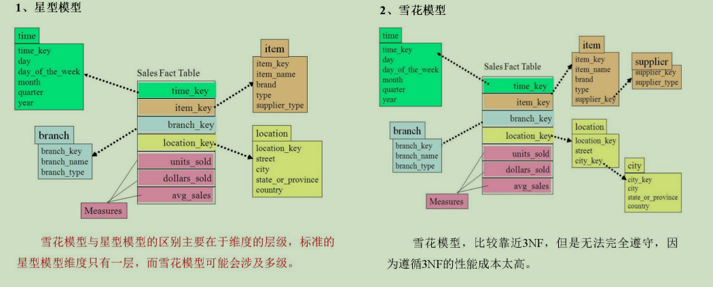

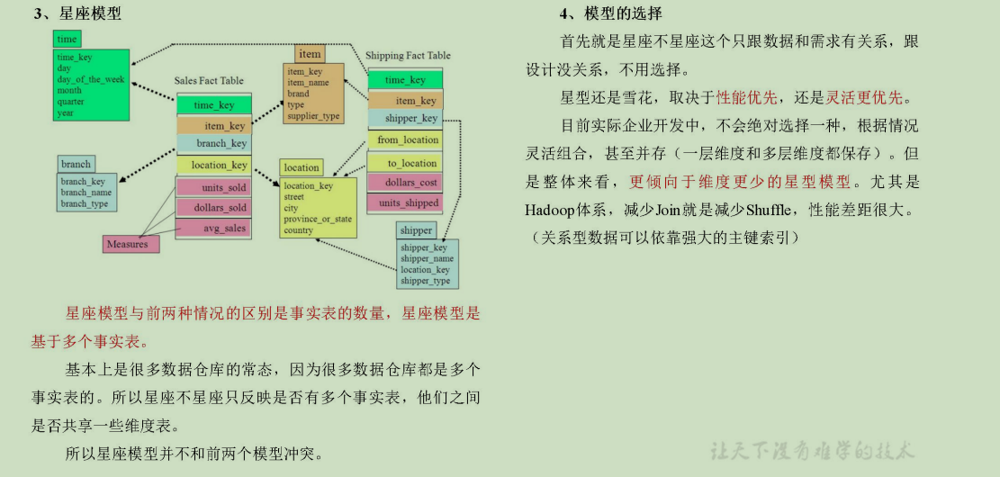

## 2.3 维度表和事实表

### 2.3.1 维度表

维度表：一般是对事实的描述信息。每一张维表对应现实世界中的一个对象或者概念。    例如：用户、商品、日期、地区等。
维表的特征：
维表的范围很宽（具有多个属性、列比较多）
跟事实表相比，行数相对较小：通常< 10万条
内容相对固定：编码表
时间维度表：
日期ID	day of week	day of year	季度	节假日
2020-01-01	2	1	1	元旦
2020-01-02	3	2	1	无
2020-01-03	4	3	1	无
2020-01-04	5	4	1	无
2020-01-05	6	5	1	无

### 2.3.2 事实表

事实表中的每行数据代表一个业务事件（下单、支付、退款、评价等）。“事实”这个术语表示的是业务事件的度量值（可统计次数、个数、件数、金额等），例如，订单事件中的下单金额。
每一个事实表的行包括：具有可加性的数值型的度量值、与维表相连接的外键、通常具有两个和两个以上的外键、外键之间表示维表之间多对多的关系。
事实表的特征：
非常的大
内容相对的窄：列数较少
经常发生变化，每天会新增加很多。
**1）事务型事实表**
以每个事务或事件为单位，例如一个销售订单记录，一笔支付记录等，作为事实表里的一行数据。一旦事务被提交，事实表数据被插入，数据就不再进行更改，其更新方式为增量更新。  
**2）周期型快照事实表**
周期型快照事实表中不会保留所有数据，只保留固定时间间隔的数据，例如每天或者每月的销售额，或每月的账户余额等。
**3）累积型快照事实表**
累计快照事实表用于跟踪业务事实的变化。例如，数据仓库中可能需要累积或者存储订单从下订单开始，到订单商品被打包、运输、和签收的各个业务阶段的时间点数据来跟踪订单声明周期的进展情况。当这个业务过程进行时，事实表的记录也要不断更新。
订单id	用户id	下单时间	打包时间	发货时间	签收时间	订单金额
		3-8	3-8	3-9	3-10	

## 2.4 数据仓库建模

### 2.4.1 ODS层

1）HDFS用户行为数据

2）HDFS业务数据

3）针对HDFS上的用户行为数据和业务数据，我们如何规划处理？
（1）保持数据原貌不做任何修改，起到备份数据的作用。
（2）数据采用压缩，减少磁盘存储空间（例如：原始数据100G，可以压缩到10G左右）
（3）创建分区表，防止后续的全表扫描

### 2.4.2 DWD层

DWD层需构建维度模型，一般采用星型模型，呈现的状态一般为星座模型。
维度建模一般按照以下四个步骤：
选择业务过程→声明粒度→确认维度→确认事实
（1）选择业务过程
在业务系统中，挑选我们感兴趣的业务线，比如下单业务，支付业务，退款业务，物流业务，一条业务线对应一张事实表。
如果是中小公司，尽量把所有业务过程都选择。
如果是大公司（1000多张表），选择和需求相关的业务线。
（2）声明粒度
数据粒度指数据仓库的数据中保存数据的细化程度或综合程度的级别。
声明粒度意味着精确定义事实表中的一行数据表示什么，应该尽可能选择最小粒度，以此来应各种各样的需求。
典型的粒度声明如下：
订单当中的每个商品项作为下单事实表中的一行，粒度为每次。
每周的订单次数作为一行，粒度为每周。
每月的订单次数作为一行，粒度为每月。
如果在DWD层粒度就是每周或者每月，那么后续就没有办法统计细粒度的指标了。所以建议采用最小粒度。
（3）确定维度
维度的主要作用是描述业务是事实，主要表示的是“谁，何处，何时”等信息。
确定维度的原则是：后续需求中是否要分析相关维度的指标。例如，需要统计，什么时间下的订单多，哪个地区下的订单多，哪个用户下的订单多。需要确定的维度就包括：时间维度、地区维度、用户维度。
维度表：需要根据维度建模中的星型模型原则进行维度退化。
（4）确定事实
此处的“事实”一词，指的是业务中的度量值（次数、个数、件数、金额，可以进行累加），例如订单金额、下单次数等。
在DWD层，以业务过程为建模驱动，基于每个具体业务过程的特点，构建最细粒度的明细层事实表。事实表可做适当的宽表化处理。
事实表和维度表的关联比较灵活，但是为了应对更复杂的业务需求，可以将能关联上的表尽量关联上。如何判断是否能够关联上呢？在业务表关系图中，只要两张表能通过中间表能够关联上，就说明能关联上。
	时间	用户	地区	商品	优惠券	活动	编码	度量值
订单	√	√	√			√		件数/金额
订单详情	√	√	√	√				件数/金额
支付	√	√	√					金额
加购	√	√		√				件数/金额
收藏	√	√		√				个数
评价	√	√		√				个数
退款	√	√		√				件数/金额
优惠券领用	√	√			√			个数
至此，数据仓库的维度建模已经完毕，DWD层是以业务过程为驱动。
DWS层、DWT层和ADS层都是以需求为驱动，和维度建模已经没有关系了。
DWS和DWT都是建宽表，按照主题去建表。主题相当于观察问题的角度。对应着维度表。

### 2.4.3 DWS层

DWS层统计各个主题对象的当天行为，服务于DWT层的主题宽表。
（1）问题引出：两个需求，统计每个省份订单的个数、统计每个省份订单的总金额
（2）处理办法：都是将省份表和订单表进行join，group by省份，然后计算。相当于类似的需求重复计算了两次。
	那怎么设计能避免重复计算呢？
地区宽表的字段设计为：下单次数、下单金额、支付次数、支付金额等。只需要和每个事实表一次join。
（3）总结：
需要建哪些表：以维度为基准，去关联对应多个事实表
宽表里面的字段：是站在不同维度的角度去看事实表，重点关注事实表聚合后的度量值。

（4）DWS层宽表包括：每日设备行为、每日会员行为、每日商品行为、每日活动统计、每日地区统计。

### 2.4.4 DWT层

DWT层统计各个主题对象的累积行为。
（1）需要建哪些表：和DWS层一样。以维度为基准，去关联对应多个事实表
（2）宽表里面的字段：我们站在维度表的角度去看事实表，重点关注事实表度量值的累积值、事实表行为的首次和末次时间。
例如，订单事实表的度量值是下单次数、下单金额。订单事实表的行为是下单。我们站在用户维度表的角度去看订单事实表，重点关注订单事实表至今的累积下单次数、累积下单金额和某时间段内的累积次数、累积金额，以及关注下单行为的首次时间和末次时间。

（4）DWS层宽表包括：每日设备行为、每日会员行为、每日商品行为、每日活动统计、每日地区统计。

### 2.4.5 ADS层

​	对电商系统各大主题指标分别进行分析。

# 第3章 数仓搭建-ODS层

1）保持数据原貌不做任何修改，起到备份数据的作用。
2）数据采用LZO压缩，减少磁盘存储空间。100G数据可以压缩到10G以内。
3）创建分区表，防止后续的全表扫描，在企业开发中大量使用分区表。
4）创建外部表。在企业开发中，除了自己用的临时表，创建内部表外，绝大多数场景都是创建外部表。

## 3.1 创建数据库

1）启动hive
[atguigu@hadoop102 hive]$ nohup bin/hive --service metastore &
[atguigu@hadoop102 hive]$ nohup bin/hive --service hiveserver2 &
[atguigu@hadoop102 hive]$ bin/hive
2）显示数据库
hive (default)> show databases;
3）创建数据库
hive (default)> create database gmall;
4）使用数据库
hive (default)> use gmall;

## 3.2 ODS层（用户行为数据）

### 3.2.1 创建启动日志表ods_start_log

1）创建输入数据是lzo输出是text，支持json解析的分区表
hive (gmall)> 
drop table if exists ods_start_log;
CREATE EXTERNAL TABLE ods_start_log (`line` string)
PARTITIONED BY (`dt` string)
STORED AS
  INPUTFORMAT 'com.hadoop.mapred.DeprecatedLzoTextInputFormat'
  OUTPUTFORMAT 'org.apache.hadoop.hive.ql.io.HiveIgnoreKeyTextOutputFormat'
LOCATION '/warehouse/gmall/ods/ods_start_log';
说明Hive的LZO压缩：https://cwiki.apache.org/confluence/display/Hive/LanguageManual+LZO
2）加载数据
hive (gmall)> 
load data inpath '/origin_data/gmall/log/topic_start/2020-03-10' into table gmall.ods_start_log partition(dt='2020-03-10');
注意：时间格式都配置成YYYY-MM-DD格式，这是Hive默认支持的时间格式
3）查看是否加载成功
hive (gmall)> 
select * from ods_start_log where dt='2020-03-10' limit 2;
4）为lzo压缩文件创建索引
[atguigu@hadoop102 hadoop-2.7.2]$
hadoop jar /opt/module/hadoop-2.7.2/share/hadoop/common/hadoop-lzo-0.4.20.jar com.hadoop.compression.lzo.DistributedLzoIndexer /warehouse/gmall/ods/ods_start_log/dt=2020-03-10

### 3.2.2 创建事件日志表ods_event_log

1）创建输入数据是lzo输出是text，支持json解析的分区表
hive (gmall)> 
drop table if exists ods_event_log;
CREATE EXTERNAL TABLE ods_event_log(`line` string)
PARTITIONED BY (`dt` string)
STORED AS
  INPUTFORMAT 'com.hadoop.mapred.DeprecatedLzoTextInputFormat'
  OUTPUTFORMAT 'org.apache.hadoop.hive.ql.io.HiveIgnoreKeyTextOutputFormat'
LOCATION '/warehouse/gmall/ods/ods_event_log';
2）加载数据
hive (gmall)> 
load data inpath '/origin_data/gmall/log/topic_event/2020-03-10' into table gmall.ods_event_log partition(dt='2020-03-10');
注意：时间格式都配置成YYYY-MM-DD格式，这是Hive默认支持的时间格式
3）查看是否加载成功
hive (gmall)> 
select * from ods_event_log where dt="2020-03-10" limit 2;
4）为lzo压缩文件创建索引
[atguigu@hadoop102 hadoop-2.7.2]$
hadoop jar /opt/module/hadoop-2.7.2/share/hadoop/common/hadoop-lzo-0.4.20.jar com.hadoop.compression.lzo.DistributedLzoIndexer /warehouse/gmall/ods/ods_event_log/dt=2020-03-10

### 3.2.3 Shell中单引号和双引号区别

1）在/home/atguigu/bin创建一个test.sh文件
[atguigu@hadoop102 bin]$ vim test.sh 
在文件中添加如下内容

```sh
#!/bin/bash
do_date=$1

echo '$do_date'
echo "$do_date"
echo "'$do_date'"
echo '"$do_date"'
echo `date`
```

2）查看执行结果
[atguigu@hadoop102 bin]$ test.sh 2020-03-10
$do_date
2020-03-10
'2020-03-10'
"$do_date"
2020年 05月 02日 星期四 21:02:08 CST
3）总结：
（1）单引号不取变量值
（2）双引号取变量值
（3）反引号`，执行引号中命令
（4）双引号内部嵌套单引号，取出变量值
（5）单引号内部嵌套双引号，不取出变量值

### 3.2.4 ODS层加载数据脚本

1）在hadoop102的/home/atguigu/bin目录下创建脚本
[atguigu@hadoop102 bin]$ vim hdfs_to_ods_log.sh
	在脚本中编写如下内容

```sh
#!/bin/bash

# 定义变量方便修改

APP=gmall
hive=/opt/module/hive/bin/hive

# 如果是输入的日期按照取输入日期；如果没输入日期取当前时间的前一天

if [ -n "$1" ] ;then
   do_date=$1
else 
   do_date=`date -d "-1 day" +%F`
fi 

echo "===日志日期为 $do_date==="
sql="
load data inpath '/origin_data/gmall/log/topic_start/$do_date' overwrite into table ${APP}.ods_start_log partition(dt='$do_date');

load data inpath '/origin_data/gmall/log/topic_event/$do_date' overwrite into table ${APP}.ods_event_log partition(dt='$do_date');
"

$hive -e "$sql"

hadoop jar /opt/module/hadoop-2.7.2/share/hadoop/common/hadoop-lzo-0.4.20.jar com.hadoop.compression.lzo.DistributedLzoIndexer /warehouse/gmall/ods/ods_start_log/dt=$do_date

hadoop jar /opt/module/hadoop-2.7.2/share/hadoop/common/hadoop-lzo-0.4.20.jar com.hadoop.compression.lzo.DistributedLzoIndexer /warehouse/gmall/ods/ods_event_log/dt=$do_date
```

说明1：
[ -n 变量值 ] 判断变量的值，是否为空
-- 变量的值，非空，返回true
-- 变量的值，为空，返回false
说明2：
查看date命令的使用，[atguigu@hadoop102 ~]$ date --help
2）增加脚本执行权限
[atguigu@hadoop102 bin]$ chmod 777 hdfs_to_ods_log.sh
3）脚本使用
[atguigu@hadoop102 module]$ hdfs_to_ods_log.sh 2020-03-11
4）查看导入数据
hive (gmall)> 
select * from ods_start_log where dt='2020-03-11' limit 2;
select * from ods_event_log where dt='2020-03-11' limit 2;
5）脚本执行时间
企业开发中一般在每日凌晨30分~1点

## 3.3 ODS层（业务数据）

### 3.3.1 订单表（增量及更新）

hive (gmall)>
drop table if exists ods_order_info;
create external table ods_order_info (
    `id` string COMMENT '订单号',
    `final_total_amount` decimal(10,2) COMMENT '订单金额',
    `order_status` string COMMENT '订单状态',
    `user_id` string COMMENT '用户id',
    `out_trade_no` string COMMENT '支付流水号',
    `create_time` string COMMENT '创建时间',
    `operate_time` string COMMENT '操作时间',
    `province_id` string COMMENT '省份ID',
    `benefit_reduce_amount` decimal(10,2) COMMENT '优惠金额',
    `original_total_amount` decimal(10,2)  COMMENT '原价金额',
    `feight_fee` decimal(10,2)  COMMENT '运费'
) COMMENT '订单表'
PARTITIONED BY (`dt` string)
row format delimited fields terminated by '\t'
STORED AS
  INPUTFORMAT 'com.hadoop.mapred.DeprecatedLzoTextInputFormat'
  OUTPUTFORMAT 'org.apache.hadoop.hive.ql.io.HiveIgnoreKeyTextOutputFormat'
location '/warehouse/gmall/ods/ods_order_info/';

### 3.3.2 订单详情表（增量）

hive (gmall)>
drop table if exists ods_order_detail;
create external table ods_order_detail( 
    `id` string COMMENT '订单编号',
    `order_id` string  COMMENT '订单号', 
    `user_id` string COMMENT '用户id',
    `sku_id` string COMMENT '商品id',
    `sku_name` string COMMENT '商品名称',
    `order_price` decimal(10,2) COMMENT '商品价格',
    `sku_num` bigint COMMENT '商品数量',
    `create_time` string COMMENT '创建时间'
) COMMENT '订单详情表'
PARTITIONED BY (`dt` string)
row format delimited fields terminated by '\t' 
STORED AS
  INPUTFORMAT 'com.hadoop.mapred.DeprecatedLzoTextInputFormat'
  OUTPUTFORMAT 'org.apache.hadoop.hive.ql.io.HiveIgnoreKeyTextOutputFormat'
location '/warehouse/gmall/ods/ods_order_detail/';

### 3.3.3 SKU商品表（全量）

hive (gmall)>
drop table if exists ods_sku_info;
create external table ods_sku_info( 
    `id` string COMMENT 'skuId',
    `spu_id` string   COMMENT 'spuid', 
    `price` decimal(10,2) COMMENT '价格',
    `sku_name` string COMMENT '商品名称',
    `sku_desc` string COMMENT '商品描述',
    `weight` string COMMENT '重量',
    `tm_id` string COMMENT '品牌id',
    `category3_id` string COMMENT '品类id',
    `create_time` string COMMENT '创建时间'
) COMMENT 'SKU商品表'
PARTITIONED BY (`dt` string)
row format delimited fields terminated by '\t'
STORED AS
  INPUTFORMAT 'com.hadoop.mapred.DeprecatedLzoTextInputFormat'
  OUTPUTFORMAT 'org.apache.hadoop.hive.ql.io.HiveIgnoreKeyTextOutputFormat'
location '/warehouse/gmall/ods/ods_sku_info/';

### 3.3.4 用户表（增量及更新）

hive (gmall)>
drop table if exists ods_user_info;
create external table ods_user_info( 
    `id` string COMMENT '用户id',
    `name`  string COMMENT '姓名',
    `birthday` string COMMENT '生日',
    `gender` string COMMENT '性别',
    `email` string COMMENT '邮箱',
    `user_level` string COMMENT '用户等级',
    `create_time` string COMMENT '创建时间',
    `operate_time` string COMMENT '操作时间'
) COMMENT '用户表'
PARTITIONED BY (`dt` string)
row format delimited fields terminated by '\t'
STORED AS
  INPUTFORMAT 'com.hadoop.mapred.DeprecatedLzoTextInputFormat'
  OUTPUTFORMAT 'org.apache.hadoop.hive.ql.io.HiveIgnoreKeyTextOutputFormat'
location '/warehouse/gmall/ods/ods_user_info/';

### 3.3.5 商品一级分类表（全量）

hive (gmall)>
drop table if exists ods_base_category1;
create external table ods_base_category1( 
    `id` string COMMENT 'id',
    `name`  string COMMENT '名称'
) COMMENT '商品一级分类表'
PARTITIONED BY (`dt` string)
row format delimited fields terminated by '\t'
STORED AS
  INPUTFORMAT 'com.hadoop.mapred.DeprecatedLzoTextInputFormat'
  OUTPUTFORMAT 'org.apache.hadoop.hive.ql.io.HiveIgnoreKeyTextOutputFormat'
location '/warehouse/gmall/ods/ods_base_category1/';

### 3.3.6 商品二级分类表（全量）

hive (gmall)>
drop table if exists ods_base_category2;
create external table ods_base_category2( 
    `id` string COMMENT ' id',
    `name` string COMMENT '名称',
    category1_id string COMMENT '一级品类id'
) COMMENT '商品二级分类表'
PARTITIONED BY (`dt` string)
row format delimited fields terminated by '\t'
STORED AS
  INPUTFORMAT 'com.hadoop.mapred.DeprecatedLzoTextInputFormat'
  OUTPUTFORMAT 'org.apache.hadoop.hive.ql.io.HiveIgnoreKeyTextOutputFormat'
location '/warehouse/gmall/ods/ods_base_category2/';

### 3.3.7 商品三级分类表（全量）

hive (gmall)>
drop table if exists ods_base_category3;
create external table ods_base_category3(
    `id` string COMMENT ' id',
    `name`  string COMMENT '名称',
    category2_id string COMMENT '二级品类id'
) COMMENT '商品三级分类表'
PARTITIONED BY (`dt` string)
row format delimited fields terminated by '\t'
STORED AS
  INPUTFORMAT 'com.hadoop.mapred.DeprecatedLzoTextInputFormat'
  OUTPUTFORMAT 'org.apache.hadoop.hive.ql.io.HiveIgnoreKeyTextOutputFormat'
location '/warehouse/gmall/ods/ods_base_category3/';

### 3.3.8 支付流水表（增量）

hive (gmall)>
drop table if exists ods_payment_info;
create external table ods_payment_info(
    `id`   bigint COMMENT '编号',
    `out_trade_no`    string COMMENT '对外业务编号',
    `order_id`        string COMMENT '订单编号',
    `user_id`         string COMMENT '用户编号',
    `alipay_trade_no` string COMMENT '支付宝交易流水编号',
    `total_amount`    decimal(16,2) COMMENT '支付金额',
    `subject`         string COMMENT '交易内容',
    `payment_type`    string COMMENT '支付类型',
    `payment_time`    string COMMENT '支付时间'
)  COMMENT '支付流水表'
PARTITIONED BY (`dt` string)
row format delimited fields terminated by '\t'
STORED AS
  INPUTFORMAT 'com.hadoop.mapred.DeprecatedLzoTextInputFormat'
  OUTPUTFORMAT 'org.apache.hadoop.hive.ql.io.HiveIgnoreKeyTextOutputFormat'
location '/warehouse/gmall/ods/ods_payment_info/';

### 3.3.9 省份表（特殊）

hive (gmall)>
drop table if exists ods_base_province;
create external table ods_base_province (
    `id`   bigint COMMENT '编号',
    `name`        string COMMENT '省份名称',
    `region_id`    string COMMENT '地区ID',
    `area_code`    string COMMENT '地区编码',
    `iso_code` string COMMENT 'iso编码'
   )  COMMENT '省份表'
row format delimited fields terminated by '\t'
STORED AS
  INPUTFORMAT 'com.hadoop.mapred.DeprecatedLzoTextInputFormat'
  OUTPUTFORMAT 'org.apache.hadoop.hive.ql.io.HiveIgnoreKeyTextOutputFormat'
location '/warehouse/gmall/ods/ods_base_province/';

### 3.3.10 地区表（特殊）

hive (gmall)>
drop table if exists ods_base_region;
create external table ods_base_region (
    `id`   bigint COMMENT '编号',
    `region_name`        string COMMENT '地区名称'
   )  COMMENT '地区表'
row format delimited fields terminated by '\t'
STORED AS
  INPUTFORMAT 'com.hadoop.mapred.DeprecatedLzoTextInputFormat'
  OUTPUTFORMAT 'org.apache.hadoop.hive.ql.io.HiveIgnoreKeyTextOutputFormat'
location '/warehouse/gmall/ods/ods_base_region/';

### 3.3.11 品牌表（全量）

hive (gmall)>
drop table if exists ods_base_trademark;
create external table ods_base_trademark (
    `tm_id`   bigint COMMENT '编号',
    `tm_name` string COMMENT '品牌名称'
)  COMMENT '品牌表'
PARTITIONED BY (`dt` string)
row format delimited fields terminated by '\t'
STORED AS
  INPUTFORMAT 'com.hadoop.mapred.DeprecatedLzoTextInputFormat'
  OUTPUTFORMAT 'org.apache.hadoop.hive.ql.io.HiveIgnoreKeyTextOutputFormat'
location '/warehouse/gmall/ods/ods_base_trademark/';

### 3.3.12 订单状态表（增量）

hive (gmall)>
drop table if exists ods_order_status_log;
create external table ods_order_status_log (
    `id`   bigint COMMENT '编号',
    `order_id` string COMMENT '订单ID',
    `order_status` string COMMENT '订单状态',
    `operate_time` string COMMENT '修改时间'
)  COMMENT '订单状态表'
PARTITIONED BY (`dt` string)
row format delimited fields terminated by '\t'
STORED AS
  INPUTFORMAT 'com.hadoop.mapred.DeprecatedLzoTextInputFormat'
  OUTPUTFORMAT 'org.apache.hadoop.hive.ql.io.HiveIgnoreKeyTextOutputFormat'
location '/warehouse/gmall/ods/ods_order_status_log/';

### 3.3.13 SPU商品表（全量）

hive (gmall)>
drop table if exists ods_spu_info;
create external table ods_spu_info(
    `id` string COMMENT 'spuid',
    `spu_name` string COMMENT 'spu名称',
    `category3_id` string COMMENT '品类id',
    `tm_id` string COMMENT '品牌id'
) COMMENT 'SPU商品表'
PARTITIONED BY (`dt` string)
row format delimited fields terminated by '\t'
STORED AS
  INPUTFORMAT 'com.hadoop.mapred.DeprecatedLzoTextInputFormat'
  OUTPUTFORMAT 'org.apache.hadoop.hive.ql.io.HiveIgnoreKeyTextOutputFormat'
location '/warehouse/gmall/ods/ods_spu_info/';

### 3.3.14 商品评论表（增量）

hive (gmall)>
drop table if exists ods_comment_info;
create external table ods_comment_info(
    `id` string COMMENT '编号',
    `user_id` string COMMENT '用户ID',
    `sku_id` string COMMENT '商品sku',
    `spu_id` string COMMENT '商品spu',
    `order_id` string COMMENT '订单ID',
    `appraise` string COMMENT '评价',
    `create_time` string COMMENT '评价时间'
) COMMENT '商品评论表'
PARTITIONED BY (`dt` string)
row format delimited fields terminated by '\t'
STORED AS
  INPUTFORMAT 'com.hadoop.mapred.DeprecatedLzoTextInputFormat'
  OUTPUTFORMAT 'org.apache.hadoop.hive.ql.io.HiveIgnoreKeyTextOutputFormat'
location '/warehouse/gmall/ods/ods_comment_info/';

### 3.3.15 退单表（增量）

hive (gmall)>
drop table if exists ods_order_refund_info;
create external table ods_order_refund_info(
    `id` string COMMENT '编号',
    `user_id` string COMMENT '用户ID',
    `order_id` string COMMENT '订单ID',
    `sku_id` string COMMENT '商品ID',
    `refund_type` string COMMENT '退款类型',
    `refund_num` bigint COMMENT '退款件数',
    `refund_amount` decimal(16,2) COMMENT '退款金额',
    `refund_reason_type` string COMMENT '退款原因类型',
    `create_time` string COMMENT '退款时间'
) COMMENT '退单表'
PARTITIONED BY (`dt` string)
row format delimited fields terminated by '\t'
STORED AS
  INPUTFORMAT 'com.hadoop.mapred.DeprecatedLzoTextInputFormat'
  OUTPUTFORMAT 'org.apache.hadoop.hive.ql.io.HiveIgnoreKeyTextOutputFormat'
location '/warehouse/gmall/ods/ods_order_refund_info/';

### 3.3.16 加购表（全量）

hive (gmall)>
drop table if exists ods_cart_info;
create external table ods_cart_info(
    `id` string COMMENT '编号',
    `user_id` string  COMMENT '用户id',
    `sku_id` string  COMMENT 'skuid',
    `cart_price` string  COMMENT '放入购物车时价格',
    `sku_num` string  COMMENT '数量',
    `sku_name` string  COMMENT 'sku名称 (冗余)',
    `create_time` string  COMMENT '创建时间',
    `operate_time` string COMMENT '修改时间',
    `is_ordered` string COMMENT '是否已经下单',
    `order_time` string  COMMENT '下单时间'
) COMMENT '加购表'
PARTITIONED BY (`dt` string)
row format delimited fields terminated by '\t'
STORED AS
  INPUTFORMAT 'com.hadoop.mapred.DeprecatedLzoTextInputFormat'
  OUTPUTFORMAT 'org.apache.hadoop.hive.ql.io.HiveIgnoreKeyTextOutputFormat'
location '/warehouse/gmall/ods/ods_cart_info/';

### 3.3.17 商品收藏表（全量）

hive (gmall)>
drop table if exists ods_favor_info;
create external table ods_favor_info(
    `id` string COMMENT '编号',
    `user_id` string  COMMENT '用户id',
    `sku_id` string  COMMENT 'skuid',
    `spu_id` string  COMMENT 'spuid',
    `is_cancel` string  COMMENT '是否取消',
    `create_time` string  COMMENT '收藏时间',
    `cancel_time` string  COMMENT '取消时间'
) COMMENT '商品收藏表'
PARTITIONED BY (`dt` string)
row format delimited fields terminated by '\t'
STORED AS
  INPUTFORMAT 'com.hadoop.mapred.DeprecatedLzoTextInputFormat'
  OUTPUTFORMAT 'org.apache.hadoop.hive.ql.io.HiveIgnoreKeyTextOutputFormat'
location '/warehouse/gmall/ods/ods_favor_info/';

### 3.3.18 优惠券领用表（新增及变化）

hive (gmall)>
drop table if exists ods_coupon_use;
create external table ods_coupon_use(
    `id` string COMMENT '编号',
    `coupon_id` string  COMMENT '优惠券ID',
    `user_id` string  COMMENT 'skuid',
    `order_id` string  COMMENT 'spuid',
    `coupon_status` string  COMMENT '优惠券状态',
    `get_time` string  COMMENT '领取时间',
    `using_time` string  COMMENT '使用时间(下单)',
    `used_time` string  COMMENT '使用时间(支付)'
) COMMENT '优惠券领用表'
PARTITIONED BY (`dt` string)
row format delimited fields terminated by '\t'
STORED AS
  INPUTFORMAT 'com.hadoop.mapred.DeprecatedLzoTextInputFormat'
  OUTPUTFORMAT 'org.apache.hadoop.hive.ql.io.HiveIgnoreKeyTextOutputFormat'
location '/warehouse/gmall/ods/ods_coupon_use/';

### 3.3.19 优惠券表（全量）

hive (gmall)>
drop table if exists ods_coupon_info;
create external table ods_coupon_info(
  `id` string COMMENT '购物券编号',
  `coupon_name` string COMMENT '购物券名称',
  `coupon_type` string COMMENT '购物券类型 1 现金券 2 折扣券 3 满减券 4 满件打折券',
  `condition_amount` string COMMENT '满额数',
  `condition_num` string COMMENT '满件数',
  `activity_id` string COMMENT '活动编号',
  `benefit_amount` string COMMENT '减金额',
  `benefit_discount` string COMMENT '折扣',
  `create_time` string COMMENT '创建时间',
  `range_type` string COMMENT '范围类型 1、商品 2、品类 3、品牌',
  `spu_id` string COMMENT '商品id',
  `tm_id` string COMMENT '品牌id',
  `category3_id` string COMMENT '品类id',
  `limit_num` string COMMENT '最多领用次数',
  `operate_time`  string COMMENT '修改时间',
  `expire_time`  string COMMENT '过期时间'
) COMMENT '优惠券表'
PARTITIONED BY (`dt` string)
row format delimited fields terminated by '\t'
STORED AS
  INPUTFORMAT 'com.hadoop.mapred.DeprecatedLzoTextInputFormat'
  OUTPUTFORMAT 'org.apache.hadoop.hive.ql.io.HiveIgnoreKeyTextOutputFormat'
location '/warehouse/gmall/ods/ods_coupon_info/';

### 3.3.20 活动表（全量）

hive (gmall)>
drop table if exists ods_activity_info;
create external table ods_activity_info(
    `id` string COMMENT '编号',
    `activity_name` string  COMMENT '活动名称',
    `activity_type` string  COMMENT '活动类型',
    `start_time` string  COMMENT '开始时间',
    `end_time` string  COMMENT '结束时间',
    `create_time` string  COMMENT '创建时间'
) COMMENT '活动表'
PARTITIONED BY (`dt` string)
row format delimited fields terminated by '\t'
STORED AS
  INPUTFORMAT 'com.hadoop.mapred.DeprecatedLzoTextInputFormat'
  OUTPUTFORMAT 'org.apache.hadoop.hive.ql.io.HiveIgnoreKeyTextOutputFormat'
location '/warehouse/gmall/ods/ods_activity_info/';

### 3.3.21 活动订单关联表（增量）

hive (gmall)>
drop table if exists ods_activity_order;
create external table ods_activity_order(
    `id` string COMMENT '编号',
    `activity_id` string  COMMENT '优惠券ID',
    `order_id` string  COMMENT 'skuid',
    `create_time` string  COMMENT '领取时间'
) COMMENT '活动订单关联表'
PARTITIONED BY (`dt` string)
row format delimited fields terminated by '\t'
STORED AS
  INPUTFORMAT 'com.hadoop.mapred.DeprecatedLzoTextInputFormat'
  OUTPUTFORMAT 'org.apache.hadoop.hive.ql.io.HiveIgnoreKeyTextOutputFormat'
location '/warehouse/gmall/ods/ods_activity_order/';

### 3.3.22 优惠规则表（全量）

hive (gmall)>
drop table if exists ods_activity_rule;
create external table ods_activity_rule(
    `id` string COMMENT '编号',
    `activity_id` string  COMMENT '活动ID',
    `condition_amount` string  COMMENT '满减金额',
    `condition_num` string  COMMENT '满减件数',
    `benefit_amount` string  COMMENT '优惠金额',
    `benefit_discount` string  COMMENT '优惠折扣',
    `benefit_level` string  COMMENT '优惠级别'
) COMMENT '优惠规则表'
PARTITIONED BY (`dt` string)
row format delimited fields terminated by '\t'
STORED AS
  INPUTFORMAT 'com.hadoop.mapred.DeprecatedLzoTextInputFormat'
  OUTPUTFORMAT 'org.apache.hadoop.hive.ql.io.HiveIgnoreKeyTextOutputFormat'
location '/warehouse/gmall/ods/ods_activity_rule/';

### 3.3.23 编码字典表（全量）

hive (gmall)>
drop table if exists ods_base_dic;
create external table ods_base_dic(
    `dic_code` string COMMENT '编号',
    `dic_name` string  COMMENT '编码名称',
    `parent_code` string  COMMENT '父编码',
    `create_time` string  COMMENT '创建日期',
    `operate_time` string  COMMENT '操作日期'
) COMMENT '编码字典表'
PARTITIONED BY (`dt` string)
row format delimited fields terminated by '\t'
STORED AS
  INPUTFORMAT 'com.hadoop.mapred.DeprecatedLzoTextInputFormat'
  OUTPUTFORMAT 'org.apache.hadoop.hive.ql.io.HiveIgnoreKeyTextOutputFormat'
location '/warehouse/gmall/ods/ods_base_dic/';

### 3.3.24 ODS层加载数据脚本

1）在/home/atguigu/bin目录下创建脚本hdfs_to_ods_db.sh
[atguigu@hadoop102 bin]$ vim hdfs_to_ods_db.sh
在脚本中填写如下内容

```sh
#!/bin/bash

APP=gmall
hive=/opt/module/hive/bin/hive

# 如果是输入的日期按照取输入日期；如果没输入日期取当前时间的前一天

if [ -n "$2" ] ;then
    do_date=$2
else 
    do_date=`date -d "-1 day" +%F`
fi

sql1=" 
load data inpath '/origin_data/$APP/db/order_info/$do_date' OVERWRITE into table ${APP}.ods_order_info partition(dt='$do_date');

load data inpath '/origin_data/$APP/db/order_detail/$do_date' OVERWRITE into table ${APP}.ods_order_detail partition(dt='$do_date');

load data inpath '/origin_data/$APP/db/sku_info/$do_date' OVERWRITE into table ${APP}.ods_sku_info partition(dt='$do_date');

load data inpath '/origin_data/$APP/db/user_info/$do_date' OVERWRITE into table ${APP}.ods_user_info partition(dt='$do_date');

load data inpath '/origin_data/$APP/db/payment_info/$do_date' OVERWRITE into table ${APP}.ods_payment_info partition(dt='$do_date');

load data inpath '/origin_data/$APP/db/base_category1/$do_date' OVERWRITE into table ${APP}.ods_base_category1 partition(dt='$do_date');

load data inpath '/origin_data/$APP/db/base_category2/$do_date' OVERWRITE into table ${APP}.ods_base_category2 partition(dt='$do_date');

load data inpath '/origin_data/$APP/db/base_category3/$do_date' OVERWRITE into table ${APP}.ods_base_category3 partition(dt='$do_date'); 

load data inpath '/origin_data/$APP/db/base_trademark/$do_date' OVERWRITE into table ${APP}.ods_base_trademark partition(dt='$do_date'); 

load data inpath '/origin_data/$APP/db/activity_info/$do_date' OVERWRITE into table ${APP}.ods_activity_info partition(dt='$do_date'); 

load data inpath '/origin_data/$APP/db/activity_order/$do_date' OVERWRITE into table ${APP}.ods_activity_order partition(dt='$do_date'); 

load data inpath '/origin_data/$APP/db/cart_info/$do_date' OVERWRITE into table ${APP}.ods_cart_info partition(dt='$do_date'); 

load data inpath '/origin_data/$APP/db/comment_info/$do_date' OVERWRITE into table ${APP}.ods_comment_info partition(dt='$do_date'); 

load data inpath '/origin_data/$APP/db/coupon_info/$do_date' OVERWRITE into table ${APP}.ods_coupon_info partition(dt='$do_date'); 

load data inpath '/origin_data/$APP/db/coupon_use/$do_date' OVERWRITE into table ${APP}.ods_coupon_use partition(dt='$do_date'); 

load data inpath '/origin_data/$APP/db/favor_info/$do_date' OVERWRITE into table ${APP}.ods_favor_info partition(dt='$do_date'); 

load data inpath '/origin_data/$APP/db/order_refund_info/$do_date' OVERWRITE into table ${APP}.ods_order_refund_info partition(dt='$do_date'); 

load data inpath '/origin_data/$APP/db/order_status_log/$do_date' OVERWRITE into table ${APP}.ods_order_status_log partition(dt='$do_date'); 

load data inpath '/origin_data/$APP/db/spu_info/$do_date' OVERWRITE into table ${APP}.ods_spu_info partition(dt='$do_date'); 

load data inpath '/origin_data/$APP/db/activity_rule/$do_date' OVERWRITE into table ${APP}.ods_activity_rule partition(dt='$do_date'); 

load data inpath '/origin_data/$APP/db/base_dic/$do_date' OVERWRITE into table ${APP}.ods_base_dic partition(dt='$do_date'); 
"

sql2=" 
load data inpath '/origin_data/$APP/db/base_province/$do_date' OVERWRITE into table ${APP}.ods_base_province;

load data inpath '/origin_data/$APP/db/base_region/$do_date' OVERWRITE into table ${APP}.ods_base_region;
"
case $1 in
"first"){
    $hive -e "$sql1"
    $hive -e "$sql2"
};;
"all"){
    $hive -e "$sql1"
};;
esac
```

2）修改权限
[atguigu@hadoop102 bin]$ chmod 777 hdfs_to_ods_db.sh
3）初次导入
[atguigu@hadoop102 bin]$ hdfs_to_ods_db.sh first 2020-03-10
4）每日导入
[atguigu@hadoop102 bin]$ hdfs_to_ods_db.sh all 2020-03-11
5）测试数据是否导入成功
hive (gmall)> select * from ods_order_detail where dt='2020-03-11';

# 第4章 数仓搭建-DWD层

1）对用户行为数据解析
2）对核心数据进行判空过滤。
3）对业务数据采用维度模型重新建模，即维度退化。

## 4.1 DWD层（用户行为启动表数据解析）

### 4.1.1 创建启动表

1）建表语句
hive (gmall)> 
drop table if exists dwd_start_log;
CREATE EXTERNAL TABLE dwd_start_log(
`mid_id` string,
`user_id` string, 
`version_code` string, 
`version_name` string, 
`lang` string, 
`source` string, 
`os` string, 
`area` string, 
`model` string,
`brand` string, 
`sdk_version` string, 
`gmail` string, 
`height_width` string,  
`app_time` string,
`network` string, 
`lng` string, 
`lat` string, 
`entry` string, 
`open_ad_type` string, 
`action` string, 
`loading_time` string, 
`detail` string, 
`extend1` string
)
PARTITIONED BY (dt string)
stored as parquet
location '/warehouse/gmall/dwd/dwd_start_log/'
TBLPROPERTIES('parquet.compression'='lzo');
说明：数据采用parquet存储方式，是可以支持切片的，不需要再对数据创建索引。

### 4.1.2 get_json_object函数使用

1）输入数据xjson
Xjson=[{"name":"大郎","sex":"男","age":"25"},{"name":"西门庆","sex":"男","age":"47"}]
2）取出第一个json对象
SELECT get_json_object(xjson,"$.[0]") FROM person;
结果是：{"name":"大郎","sex":"男","age":"25"}
3）取出第一个json的age字段的值
SELECT get_json_object(xjson,"$.[0].age") FROM person;
结果是：25

### 4.1.3 向启动表导入数据

hive (gmall)> 
insert overwrite table dwd_start_log
PARTITION (dt='2020-03-10')
select 
    get_json_object(line,'$.mid') mid_id,
    get_json_object(line,'$.uid') user_id,
    get_json_object(line,'$.vc') version_code,
    get_json_object(line,'$.vn') version_name,
    get_json_object(line,'$.l') lang,
    get_json_object(line,'$.sr') source,
    get_json_object(line,'$.os') os,
    get_json_object(line,'$.ar') area,
    get_json_object(line,'$.md') model,
    get_json_object(line,'$.ba') brand,
    get_json_object(line,'$.sv') sdk_version,
    get_json_object(line,'$.g') gmail,
    get_json_object(line,'$.hw') height_width,
    get_json_object(line,'$.t') app_time,
    get_json_object(line,'$.nw') network,
    get_json_object(line,'$.ln') lng,
    get_json_object(line,'$.la') lat,
    get_json_object(line,'$.entry') entry,
    get_json_object(line,'$.open_ad_type') open_ad_type,
    get_json_object(line,'$.action') action,
    get_json_object(line,'$.loading_time') loading_time,
    get_json_object(line,'$.detail') detail,
    get_json_object(line,'$.extend1') extend1
from ods_start_log 
where dt='2020-03-10';
3）测试
hive (gmall)> 
select * from dwd_start_log where dt='2020-03-10' limit 2;

### 4.1.4 DWD层启动表加载数据脚本

1）在hadoop102的/home/atguigu/bin目录下创建脚本
[atguigu@hadoop102 bin]$ vim ods_to_dwd_log.sh
	在脚本中编写如下内容

```sh
#!/bin/bash

# 定义变量方便修改

APP=gmall
hive=/opt/module/hive/bin/hive

# 如果是输入的日期按照取输入日期；如果没输入日期取当前时间的前一天

if [ -n "$1" ] ;then
	do_date=$1
else 
	do_date=`date -d "-1 day" +%F`  
fi 

sql="
set hive.exec.dynamic.partition.mode=nonstrict;

insert overwrite table "$APP".dwd_start_log
PARTITION (dt='$do_date')
select 
    get_json_object(line,'$.mid') mid_id,
    get_json_object(line,'$.uid') user_id,
    get_json_object(line,'$.vc') version_code,
    get_json_object(line,'$.vn') version_name,
    get_json_object(line,'$.l') lang,
    get_json_object(line,'$.sr') source,
    get_json_object(line,'$.os') os,
    get_json_object(line,'$.ar') area,
    get_json_object(line,'$.md') model,
    get_json_object(line,'$.ba') brand,
    get_json_object(line,'$.sv') sdk_version,
    get_json_object(line,'$.g') gmail,
    get_json_object(line,'$.hw') height_width,
    get_json_object(line,'$.t') app_time,
    get_json_object(line,'$.nw') network,
    get_json_object(line,'$.ln') lng,
    get_json_object(line,'$.la') lat,
    get_json_object(line,'$.entry') entry,
    get_json_object(line,'$.open_ad_type') open_ad_type,
    get_json_object(line,'$.action') action,
    get_json_object(line,'$.loading_time') loading_time,
    get_json_object(line,'$.detail') detail,
    get_json_object(line,'$.extend1') extend1
from "$APP".ods_start_log 
where dt='$do_date';
"

$hive -e "$sql"
```

2）增加脚本执行权限
[atguigu@hadoop102 bin]$ chmod 777 ods_to_dwd_log.sh
3）脚本使用
[atguigu@hadoop102 module]$ ods_to_dwd_log.sh 2020-03-11
4）查询导入结果
hive (gmall)> 
select * from dwd_start_log where dt='2020-03-11' limit 2;
5）脚本执行时间
企业开发中一般在每日凌晨30分~1点

## 4.2 DWD层（用户行为事件表数据解析）

### 4.2.1 创建基础明细表

明细表用于存储ODS层原始表转换过来的明细数据。

1）创建事件日志基础明细表
hive (gmall)> 
drop table if exists dwd_base_event_log;
CREATE EXTERNAL TABLE dwd_base_event_log(
`mid_id` string,
`user_id` string, 
`version_code` string, 
`version_name` string, 
`lang` string, 
`source` string, 
`os` string, 
`area` string, 
`model` string,
`brand` string, 
`sdk_version` string, 
`gmail` string, 
`height_width` string, 
`app_time` string, 
`network` string, 
`lng` string, 
`lat` string, 
`event_name` string, 
`event_json` string, 
`server_time` string)
PARTITIONED BY (`dt` string)
stored as parquet
location '/warehouse/gmall/dwd/dwd_base_event_log/'
TBLPROPERTIES('parquet.compression'='lzo');
2）说明：其中event_name和event_json用来对应事件名和整个事件。这个地方将原始日志1对多的形式拆分出来了。操作的时候我们需要将原始日志展平，需要用到UDF和UDTF。

### 4.2.2 自定义UDF函数（解析公共字段）

UDF函数特点：一行进一行出。简称，一进一出。

1）创建一个maven工程：hivefunction
2）创建包名：com.atguigu.udf
3）在pom.xml文件中添加如下内容
<properties>
    <hive.version>2.3.0</hive.version>
</properties>

<dependencies>
    <!--添加hive依赖-->
    <dependency>
        <groupId>org.apache.hive</groupId>
        <artifactId>hive-exec</artifactId>
        <version>${hive.version}</version>
    </dependency>
</dependencies>

<build>
    <plugins>
        <plugin>
            <artifactId>maven-compiler-plugin</artifactId>
            <version>2.3.2</version>
            <configuration>
                <source>1.8</source>
                <target>1.8</target>
            </configuration>
        </plugin>
        <plugin>
            <artifactId>maven-assembly-plugin</artifactId>
            <configuration>
                <descriptorRefs>
                    <descriptorRef>jar-with-dependencies</descriptorRef>
                </descriptorRefs>
            </configuration>
            <executions>
                <execution>
                    <id>make-assembly</id>
                    <phase>package</phase>
                    <goals>
                        <goal>single</goal>
                    </goals>
                </execution>
            </executions>
        </plugin>
    </plugins>
</build>
注意1：如果hive的jar包下载失败，可以将如下参数配置添加到idea中
-Dmaven.wagon.http.ssl.insecure=true -Dmaven.wagon.http.ssl.allowall=true -Dmaven.wagon.http.ssl.ignore.validity.dates=true

详见：https://blog.csdn.net/qq_22041375/article/details/103491941
注意2：如果提示pentaho-aggdesigner-algorithm.jar包下载失败，需要在maven的pom中增加如下仓库
<repositories>
    <repository>
        <id>spring-plugin</id>
        <url>https://repo.spring.io/plugins-release/</url>
    </repository>
</repositories>
注意3：如果出现如下图片中情况，说明idea内存溢出
Exception in thread "main" java.lang.StackOverflowError
	at sun.nio.cs.UTF_8$Encoder.encodeLoop(UTF_8.java:691)
	at java.nio.charset.CharsetEncoder.encode(CharsetEncoder.java:579)

修改办法：把-Xmx512 -Xms128m -Xss2m添加到下图位置。

4）UDF用于解析公共字段
package com.atguigu.udf;

import org.apache.commons.lang.StringUtils;
import org.apache.hadoop.hive.ql.exec.UDF;
import org.json.JSONException;
import org.json.JSONObject;

public class BaseFieldUDF extends UDF {

    public String evaluate(String line, String key) throws JSONException {
    
        String[] log = line.split("\\|");
    
        if (log.length != 2 || StringUtils.isBlank(log[1])) {
            return "";
        }
    
        JSONObject baseJson = new JSONObject(log[1].trim());
    
        String result = "";
    
        // 获取服务器时间
        if ("st".equals(key)) {
            result = log[0].trim();
        } else if ("et".equals(key)) {
            // 获取事件数组
            if (baseJson.has("et")) {
                result = baseJson.getString("et");
            }
        } else {
            JSONObject cm = baseJson.getJSONObject("cm");
    
            // 获取key对应公共字段的value
            if (cm.has(key)) {
                result = cm.getString(key);
            }
        }
    
        return result;
    }
    
    public static void main (String[] args) throws JSONException {
    
        String line = "1583776223469|{\"cm\":{\"ln\":\"-48.5\",\"sv\":\"V2.5.7\",\"os\":\"8.0.9\",\"g\":\"6F76AVD5@gmail.com\",\"mid\":\"0\",\"nw\":\"4G\",\"l\":\"pt\",\"vc\":\"3\",\"hw\":\"750*1134\",\"ar\":\"MX\",\"uid\":\"0\",\"t\":\"1583707297317\",\"la\":\"-52.9\",\"md\":\"sumsung-18\",\"vn\":\"1.2.4\",\"ba\":\"Sumsung\",\"sr\":\"V\"},\"ap\":\"app\",\"et\":[{\"ett\":\"1583705574227\",\"en\":\"display\",\"kv\":{\"goodsid\":\"0\",\"action\":\"1\",\"extend1\":\"1\",\"place\":\"0\",\"category\":\"63\"}},{\"ett\":\"1583760986259\",\"en\":\"loading\",\"kv\":{\"extend2\":\"\",\"loading_time\":\"4\",\"action\":\"3\",\"extend1\":\"\",\"type\":\"3\",\"type1\":\"\",\"loading_way\":\"1\"}},{\"ett\":\"1583746639124\",\"en\":\"ad\",\"kv\":{\"activityId\":\"1\",\"displayMills\":\"111839\",\"entry\":\"1\",\"action\":\"5\",\"contentType\":\"0\"}},{\"ett\":\"1583758016208\",\"en\":\"notification\",\"kv\":{\"ap_time\":\"1583694079866\",\"action\":\"1\",\"type\":\"3\",\"content\":\"\"}},{\"ett\":\"1583699890760\",\"en\":\"favorites\",\"kv\":{\"course_id\":4,\"id\":0,\"add_time\":\"1583730648134\",\"userid\":7}}]}";
    
        String mid = new BaseFieldUDF().evaluate(line, "mid");
    
        System.out.println(mid);
    }
}
注意：使用main函数主要用于模拟数据测试。

### 4.2.3 自定义UDTF函数（解析事件字段）

UDTF函数特点：多行进多行出。 简称，多进多出。

1）创建包名：com.atguigu.udtf
2）在com.atguigu.udtf包下创建类名：EventJsonUDTF
3）用于展开业务字段
package com.atguigu.udtf;

import org.apache.commons.lang.StringUtils;
import org.apache.hadoop.hive.ql.exec.UDFArgumentException;
import org.apache.hadoop.hive.ql.metadata.HiveException;
import org.apache.hadoop.hive.ql.udf.generic.GenericUDTF;
import org.apache.hadoop.hive.serde2.objectinspector.ObjectInspector;
import org.apache.hadoop.hive.serde2.objectinspector.ObjectInspectorFactory;
import org.apache.hadoop.hive.serde2.objectinspector.StructObjectInspector;
import org.apache.hadoop.hive.serde2.objectinspector.primitive.PrimitiveObjectInspectorFactory;
import org.json.JSONArray;
import org.json.JSONException;

import java.util.ArrayList;

public class EventJsonUDTF extends GenericUDTF {

    //该方法中，我们将指定输出参数的名称和参数类型：
    public StructObjectInspector initialize(StructObjectInspector argOIs) throws UDFArgumentException {
    
        ArrayList<String> fieldNames = new ArrayList<String>();
        ArrayList<ObjectInspector> fieldOIs = new ArrayList<ObjectInspector>();
    
        fieldNames.add("event_name");
        fieldOIs.add(PrimitiveObjectInspectorFactory.javaStringObjectInspector);
        fieldNames.add("event_json");
        fieldOIs.add(PrimitiveObjectInspectorFactory.javaStringObjectInspector);
    
        return ObjectInspectorFactory.getStandardStructObjectInspector(fieldNames, fieldOIs);
    }
    
    //输入1条记录，输出若干条结果
    @Override
    public void process(Object[] objects) throws HiveException {
    
        // 获取传入的et
        String input = objects[0].toString();
    
        // 如果传进来的数据为空，直接返回过滤掉该数据
        if (StringUtils.isBlank(input)) {
            return;
        } else {
    
            try {
                // 获取一共有几个事件（ad/facoriters）
                JSONArray ja = new JSONArray(input);
    
                if (ja == null)
                    return;
    
                // 循环遍历每一个事件
                for (int i = 0; i < ja.length(); i++) {
                    String[] result = new String[2];
    
                    try {
                        // 取出每个的事件名称（ad/facoriters）
                        result[0] = ja.getJSONObject(i).getString("en");
    
                        // 取出每一个事件整体
                        result[1] = ja.getString(i);
                    } catch (JSONException e) {
                        continue;
                    }
    
                    // 将结果返回
                    forward(result);
                }
            } catch (JSONException e) {
                e.printStackTrace();
            }
        }
    }
    
    //当没有记录处理的时候该方法会被调用，用来清理代码或者产生额外的输出
    @Override
    public void close() throws HiveException {
    
    }
}
2）打包

3）将hivefunction-1.0-SNAPSHOT.jar上传到hadoop102的/opt/module，然后再将该jar包上传到HDFS的/user/hive/jars路径下
[atguigu@hadoop102 module]$ hadoop fs -mkdir -p /user/hive/jars
[atguigu@hadoop102 module]$ hadoop fs -put hivefunction-1.0-SNAPSHOT.jar /user/hive/jars
4）创建永久函数与开发好的java class关联
hive (gmall)>
create function base_analizer as 'com.atguigu.udf.BaseFieldUDF' using jar 'hdfs://hadoop102:9000/user/hive/jars/hivefunction-1.0-SNAPSHOT.jar';

create function flat_analizer as 'com.atguigu.udtf.EventJsonUDTF' using jar 'hdfs://hadoop102:9000/user/hive/jars/hivefunction-1.0-SNAPSHOT.jar'; 
5）注意：如果修改了自定义函数重新生成jar包怎么处理？只需要替换HDFS路径上的旧jar包，然后重启Hive客户端即可。

### 4.2.4 解析事件日志基础明细表

1）解析事件日志基础明细表
hive (gmall)> 
insert overwrite table dwd_base_event_log partition(dt='2020-03-10')
select
    base_analizer(line,'mid') as mid_id,
    base_analizer(line,'uid') as user_id,
    base_analizer(line,'vc') as version_code,
    base_analizer(line,'vn') as version_name,
    base_analizer(line,'l') as lang,
    base_analizer(line,'sr') as source,
    base_analizer(line,'os') as os,
    base_analizer(line,'ar') as area,
    base_analizer(line,'md') as model,
    base_analizer(line,'ba') as brand,
    base_analizer(line,'sv') as sdk_version,
    base_analizer(line,'g') as gmail,
    base_analizer(line,'hw') as height_width,
    base_analizer(line,'t') as app_time,
    base_analizer(line,'nw') as network,
    base_analizer(line,'ln') as lng,
    base_analizer(line,'la') as lat,
    event_name,
    event_json,
    base_analizer(line,'st') as server_time
from ods_event_log lateral view flat_analizer(base_analizer(line,'et')) tmp_flat as event_name,event_json
where dt='2020-03-10' and base_analizer(line,'et')<>'';
2）测试
hive (gmall)> 
select * from dwd_base_event_log where dt='2020-03-10' limit 2;

### 4.2.5 DWD层数据解析脚本

1）在hadoop102的/home/atguigu/bin目录下创建脚本
[atguigu@hadoop102 bin]$ vim ods_to_dwd_base_log.sh
	在脚本中编写如下内容

```sh
#!/bin/bash

# 定义变量方便修改

APP=gmall
hive=/opt/module/hive/bin/hive

# 如果是输入的日期按照取输入日期；如果没输入日期取当前时间的前一天

if [ -n "$1" ] ;then
	do_date=$1
else 
	do_date=`date -d "-1 day" +%F`  
fi 

sql="
use gmall;
insert overwrite table "$APP".dwd_base_event_log partition(dt='$do_date')
select
    base_analizer(line,'mid') as mid_id,
    base_analizer(line,'uid') as user_id,
    base_analizer(line,'vc') as version_code,
    base_analizer(line,'vn') as version_name,
    base_analizer(line,'l') as lang,
    base_analizer(line,'sr') as source,
    base_analizer(line,'os') as os,
    base_analizer(line,'ar') as area,
    base_analizer(line,'md') as model,
    base_analizer(line,'ba') as brand,
    base_analizer(line,'sv') as sdk_version,
    base_analizer(line,'g') as gmail,
    base_analizer(line,'hw') as height_width,
    base_analizer(line,'t') as app_time,
    base_analizer(line,'nw') as network,
    base_analizer(line,'ln') as lng,
    base_analizer(line,'la') as lat,
    event_name,
    event_json,
    base_analizer(line,'st') as server_time
from "$APP".ods_event_log lateral view flat_analizer(base_analizer(line,'et')) tem_flat as event_name,event_json
where dt='$do_date'  and base_analizer(line,'et')<>'';
"

$hive -e "$sql"
```

注意：使用自定义函数时，需要在执行脚本前，增加上要使用的库。例如：use gmall;
2）增加脚本执行权限
[atguigu@hadoop102 bin]$ chmod 777 ods_to_dwd_base_log.sh
3）脚本使用
[atguigu@hadoop102 module]$ ods_to_dwd_base_log.sh 2020-03-11
4）查询导入结果
hive (gmall)> 
select * from dwd_base_event_log where dt='2020-03-11' limit 2;
5）脚本执行时间
企业开发中一般在每日凌晨30分~1点

## 4.3 DWD层（用户行为事件表获取）

### 4.3.1 商品点击表

1）建表语句
hive (gmall)> 
drop table if exists dwd_display_log;
CREATE EXTERNAL TABLE dwd_display_log(
`mid_id` string,
`user_id` string,
`version_code` string,
`version_name` string,
`lang` string,
`source` string,
`os` string,
`area` string,
`model` string,
`brand` string,
`sdk_version` string,
`gmail` string,
`height_width` string,
`app_time` string,
`network` string,
`lng` string,
`lat` string,
`action` string,
`goodsid` string,
`place` string,
`extend1` string,
`category` string,
`server_time` string
)
PARTITIONED BY (dt string)
stored as parquet
location '/warehouse/gmall/dwd/dwd_display_log/'
TBLPROPERTIES('parquet.compression'='lzo');
2）导入数据
hive (gmall)> 
insert overwrite table dwd_display_log PARTITION (dt='2020-03-10')
select 
mid_id,
user_id,
version_code,
version_name,
lang,
source,
os,
area,
model,
brand,
sdk_version,
gmail,
height_width,
app_time,
network,
lng,
lat,
get_json_object(event_json,'$.kv.action') action,
get_json_object(event_json,'$.kv.goodsid') goodsid,
get_json_object(event_json,'$.kv.place') place,
get_json_object(event_json,'$.kv.extend1') extend1,
get_json_object(event_json,'$.kv.category') category,
server_time
from dwd_base_event_log 
where dt='2020-03-10' and event_name='display';
3）测试
hive (gmall)> select * from dwd_display_log where dt='2020-03-10' limit 2;

### 4.3.2 商品详情页表

1）建表语句
hive (gmall)> 
drop table if exists dwd_newsdetail_log;
CREATE EXTERNAL TABLE dwd_newsdetail_log(
`mid_id` string,
`user_id` string, 
`version_code` string, 
`version_name` string, 
`lang` string, 
`source` string, 
`os` string, 
`area` string, 
`model` string,
`brand` string, 
`sdk_version` string, 
`gmail` string, 
`height_width` string, 
`app_time` string,  
`network` string, 
`lng` string, 
`lat` string, 
`entry` string,
`action` string,
`goodsid` string,
`showtype` string,
`news_staytime` string,
`loading_time` string,
`type1` string,
`category` string,
`server_time` string)
PARTITIONED BY (dt string)
stored as parquet
location '/warehouse/gmall/dwd/dwd_newsdetail_log/'
TBLPROPERTIES('parquet.compression'='lzo');
2）导入数据
hive (gmall)> 
insert overwrite table dwd_newsdetail_log PARTITION (dt='2020-03-10')
select 
mid_id,
user_id,
version_code,
version_name,
lang,
source,
os,
area,
model,
brand,
sdk_version,
gmail,
height_width,
app_time,
network,
lng,
lat,
get_json_object(event_json,'$.kv.entry') entry,
get_json_object(event_json,'$.kv.action') action,
get_json_object(event_json,'$.kv.goodsid') goodsid,
get_json_object(event_json,'$.kv.showtype') showtype,
get_json_object(event_json,'$.kv.news_staytime') news_staytime,
get_json_object(event_json,'$.kv.loading_time') loading_time,
get_json_object(event_json,'$.kv.type1') type1,
get_json_object(event_json,'$.kv.category') category,
server_time
from dwd_base_event_log
where dt='2020-03-10' and event_name='newsdetail';
3）测试
hive (gmall)> 
select * from dwd_newsdetail_log where dt='2020-03-10' limit 2;

### 4.3.3 商品列表页表

1）建表语句
hive (gmall)> 
drop table if exists dwd_loading_log;
CREATE EXTERNAL TABLE dwd_loading_log(
`mid_id` string,
`user_id` string, 
`version_code` string, 
`version_name` string, 
`lang` string, 
`source` string, 
`os` string, 
`area` string, 
`model` string,
`brand` string, 
`sdk_version` string, 
`gmail` string,
`height_width` string,  
`app_time` string,
`network` string, 
`lng` string, 
`lat` string, 
`action` string,
`loading_time` string,
`loading_way` string,
`extend1` string,
`extend2` string,
`type` string,
`type1` string,
`server_time` string)
PARTITIONED BY (dt string)
stored as parquet
location '/warehouse/gmall/dwd/dwd_loading_log/'
TBLPROPERTIES('parquet.compression'='lzo');
2）导入数据
hive (gmall)> 
insert overwrite table dwd_loading_log PARTITION (dt='2020-03-10')
select 
mid_id,
user_id,
version_code,
version_name,
lang,
source,
os,
area,
model,
brand,
sdk_version,
gmail,
height_width,
app_time,
network,
lng,
lat,
get_json_object(event_json,'$.kv.action') action,
get_json_object(event_json,'$.kv.loading_time') loading_time,
get_json_object(event_json,'$.kv.loading_way') loading_way,
get_json_object(event_json,'$.kv.extend1') extend1,
get_json_object(event_json,'$.kv.extend2') extend2,
get_json_object(event_json,'$.kv.type') type,
get_json_object(event_json,'$.kv.type1') type1,
server_time
from dwd_base_event_log
where dt='2020-03-10' and event_name='loading';
3）测试
hive (gmall)> select * from dwd_loading_log where dt='2020-03-10' limit 2;

### 4.3.4 广告表

1）建表语句
hive (gmall)> 
drop table if exists dwd_ad_log;
CREATE EXTERNAL TABLE dwd_ad_log(
`mid_id` string,
`user_id` string, 
`version_code` string, 
`version_name` string, 
`lang` string, 
`source` string, 
`os` string, 
`area` string, 
`model` string,
`brand` string, 
`sdk_version` string, 
`gmail` string, 
`height_width` string,  
`app_time` string,
`network` string, 
`lng` string, 
`lat` string, 
`entry` string,
`action` string,
`contentType` string,
`displayMills` string,
`itemId` string,
`activityId` string,
`server_time` string)
PARTITIONED BY (dt string)
stored as parquet
location '/warehouse/gmall/dwd/dwd_ad_log/'
TBLPROPERTIES('parquet.compression'='lzo');
2）导入数据
hive (gmall)> 
insert overwrite table dwd_ad_log PARTITION (dt='2020-03-10')
select 
mid_id,
user_id,
version_code,
version_name,
lang,
source,
os,
area,
model,
brand,
sdk_version,
gmail,
height_width,
app_time,
network,
lng,
lat,
get_json_object(event_json,'$.kv.entry') entry,
get_json_object(event_json,'$.kv.action') action,
get_json_object(event_json,'$.kv.contentType') contentType,
get_json_object(event_json,'$.kv.displayMills') displayMills,
get_json_object(event_json,'$.kv.itemId') itemId,
get_json_object(event_json,'$.kv.activityId') activityId,
server_time
from dwd_base_event_log 
where dt='2020-03-10' and event_name='ad';
3）测试
hive (gmall)> select * from dwd_ad_log where dt='2020-03-10' limit 2;

### 4.3.5 消息通知表

1）建表语句
hive (gmall)> 
drop table if exists dwd_notification_log;
CREATE EXTERNAL TABLE dwd_notification_log(
`mid_id` string,
`user_id` string, 
`version_code` string, 
`version_name` string, 
`lang` string,
`source` string, 
`os` string, 
`area` string, 
`model` string,
`brand` string, 
`sdk_version` string, 
`gmail` string, 
`height_width` string,  
`app_time` string,
`network` string, 
`lng` string, 
`lat` string, 
`action` string,
`noti_type` string,
`ap_time` string,
`content` string,
`server_time` string
)
PARTITIONED BY (dt string)
stored as parquet
location '/warehouse/gmall/dwd/dwd_notification_log/'
TBLPROPERTIES('parquet.compression'='lzo');
2）导入数据
hive (gmall)> 
insert overwrite table dwd_notification_log PARTITION (dt='2020-03-10')
select 
mid_id,
user_id,
version_code,
version_name,
lang,
source,
os,
area,
model,
brand,
sdk_version,
gmail,
height_width,
app_time,
network,
lng,
lat,
get_json_object(event_json,'$.kv.action') action,
get_json_object(event_json,'$.kv.noti_type') noti_type,
get_json_object(event_json,'$.kv.ap_time') ap_time,
get_json_object(event_json,'$.kv.content') content,
server_time
from dwd_base_event_log
where dt='2020-03-10' and event_name='notification';
3）测试
hive (gmall)> 
select * from dwd_notification_log where dt='2020-03-10' limit 2;

### 4.3.6 用户后台活跃表

1）建表语句
hive (gmall)> 
drop table if exists dwd_active_background_log;
CREATE EXTERNAL TABLE dwd_active_background_log(
`mid_id` string,
`user_id` string,
`version_code` string,
`version_name` string,
`lang` string,
`source` string,
`os` string,
`area` string,
`model` string,
`brand` string,
`sdk_version` string,
`gmail` string,
 `height_width` string,
`app_time` string,
`network` string,
`lng` string,
`lat` string,
`active_source` string,
`server_time` string
)
PARTITIONED BY (dt string)
stored as parquet
location '/warehouse/gmall/dwd/dwd_background_log/'
TBLPROPERTIES('parquet.compression'='lzo');
2）导入数据
hive (gmall)> 
insert overwrite table dwd_active_background_log PARTITION (dt='2020-03-10')
select 
mid_id,
user_id,
version_code,
version_name,
lang,
source,
os,
area,
model,
brand,
sdk_version,
gmail,
height_width,
app_time,
network,
lng,
lat,
get_json_object(event_json,'$.kv.active_source') active_source,
server_time
from dwd_base_event_log
where dt='2020-03-10' and event_name='active_background';
3）测试
hive (gmall)> 
select * from dwd_active_background_log where dt='2020-03-10' limit 2;

### 4.3.7 评论表

1）建表语句
hive (gmall)> 
drop table if exists dwd_comment_log;
CREATE EXTERNAL TABLE dwd_comment_log(
`mid_id` string,
`user_id` string,
`version_code` string,
`version_name` string,
`lang` string,
`source` string,
`os` string,
`area` string,
`model` string,
`brand` string,
`sdk_version` string,
`gmail` string,
`height_width` string,
`app_time` string,
`network` string,
`lng` string,
`lat` string,
`comment_id` int,
`userid` int,
`p_comment_id` int, 
`content` string,
`addtime` string,
`other_id` int,
`praise_count` int,
`reply_count` int,
`server_time` string
)
PARTITIONED BY (dt string)
stored as parquet
location '/warehouse/gmall/dwd/dwd_comment_log/'
TBLPROPERTIES('parquet.compression'='lzo');
2）导入数据
hive (gmall)> 
insert overwrite table dwd_comment_log PARTITION (dt='2020-03-10')
select 
mid_id,
user_id,
version_code,
version_name,
lang,
source,
os,
area,
model,
brand,
sdk_version,
gmail,
height_width,
app_time,
network,
lng,
lat,
get_json_object(event_json,'$.kv.comment_id') comment_id,
get_json_object(event_json,'$.kv.userid') userid,
get_json_object(event_json,'$.kv.p_comment_id') p_comment_id,
get_json_object(event_json,'$.kv.content') content,
get_json_object(event_json,'$.kv.addtime') addtime,
get_json_object(event_json,'$.kv.other_id') other_id,
get_json_object(event_json,'$.kv.praise_count') praise_count,
get_json_object(event_json,'$.kv.reply_count') reply_count,
server_time
from dwd_base_event_log
where dt='2020-03-10' and event_name='comment';
3）测试
hive (gmall)> select * from dwd_comment_log where dt='2020-03-10' limit 2;

### 4.3.8 收藏表

1）建表语句
hive (gmall)> 
drop table if exists dwd_favorites_log;
CREATE EXTERNAL TABLE dwd_favorites_log(
`mid_id` string,
`user_id` string, 
`version_code` string, 
`version_name` string, 
`lang` string, 
`source` string, 
`os` string, 
`area` string, 
`model` string,
`brand` string, 
`sdk_version` string, 
`gmail` string, 
`height_width` string,  
`app_time` string,
`network` string, 
`lng` string, 
`lat` string, 
`id` int, 
`course_id` int, 
`userid` int,
`add_time` string,
`server_time` string
)
PARTITIONED BY (dt string)
stored as parquet
location '/warehouse/gmall/dwd/dwd_favorites_log/'
TBLPROPERTIES('parquet.compression'='lzo');
2）导入数据
hive (gmall)> 
insert overwrite table dwd_favorites_log PARTITION (dt='2020-03-10')
select 
mid_id,
user_id,
version_code,
version_name,
lang,
source,
os,
area,
model,
brand,
sdk_version,
gmail,
height_width,
app_time,
network,
lng,
lat,
get_json_object(event_json,'$.kv.id') id,
get_json_object(event_json,'$.kv.course_id') course_id,
get_json_object(event_json,'$.kv.userid') userid,
get_json_object(event_json,'$.kv.add_time') add_time,
server_time
from dwd_base_event_log 
where dt='2020-03-10' and event_name='favorites';
3）测试
hive (gmall)> 
select * from dwd_favorites_log where dt='2020-03-10' limit 2;

### 4.3.9 点赞表

1）建表语句
hive (gmall)> 
drop table if exists dwd_praise_log;
CREATE EXTERNAL TABLE dwd_praise_log(
`mid_id` string,
`user_id` string, 
`version_code` string, 
`version_name` string, 
`lang` string, 
`source` string, 
`os` string, 
`area` string, 
`model` string,
`brand` string, 
`sdk_version` string, 
`gmail` string, 
`height_width` string,  
`app_time` string,
`network` string, 
`lng` string, 
`lat` string, 
`id` string, 
`userid` string, 
`target_id` string,
`type` string,
`add_time` string,
`server_time` string
)
PARTITIONED BY (dt string)
stored as parquet
location '/warehouse/gmall/dwd/dwd_praise_log/'
TBLPROPERTIES('parquet.compression'='lzo');
2）导入数据
hive (gmall)> 
insert overwrite table dwd_praise_log PARTITION (dt='2020-03-10')
select 
mid_id,
user_id,
version_code,
version_name,
lang,
source,
os,
area,
model,
brand,
sdk_version,
gmail,
height_width,
app_time,
network,
lng,
lat,
get_json_object(event_json,'$.kv.id') id,
get_json_object(event_json,'$.kv.userid') userid,
get_json_object(event_json,'$.kv.target_id') target_id,
get_json_object(event_json,'$.kv.type') type,
get_json_object(event_json,'$.kv.add_time') add_time,
server_time
from dwd_base_event_log
where dt='2020-03-10' and event_name='praise';
3）测试
hive (gmall)> select * from dwd_praise_log where dt='2020-03-10' limit 2;

### 4.3.10 错误日志表

1）建表语句
hive (gmall)> 
drop table if exists dwd_error_log;
CREATE EXTERNAL TABLE dwd_error_log(
`mid_id` string,
`user_id` string, 
`version_code` string, 
`version_name` string, 
`lang` string, 
`source` string, 
`os` string, 
`area` string, 
`model` string,
`brand` string, 
`sdk_version` string, 
`gmail` string, 
`height_width` string,  
`app_time` string,
`network` string, 
`lng` string, 
`lat` string, 
`errorBrief` string, 
`errorDetail` string, 
`server_time` string)
PARTITIONED BY (dt string)
stored as parquet
location '/warehouse/gmall/dwd/dwd_error_log/'
TBLPROPERTIES('parquet.compression'='lzo');
2）导入数据
hive (gmall)> 
insert overwrite table dwd_error_log PARTITION (dt='2020-03-10')
select 
mid_id,
user_id,
version_code,
version_name,
lang,
source,
os,
area,
model,
brand,
sdk_version,
gmail,
height_width,
app_time,
network,
lng,
lat,
get_json_object(event_json,'$.kv.errorBrief') errorBrief,
get_json_object(event_json,'$.kv.errorDetail') errorDetail,
server_time
from dwd_base_event_log 
where dt='2020-03-10' and event_name='error';
3）测试
hive (gmall)> select * from dwd_error_log where dt='2020-03-10' limit 2;

### 4.3.11 DWD层事件表加载数据脚本

1）在hadoop102的/home/atguigu/bin目录下创建脚本
[atguigu@hadoop102 bin]$ vim ods_to_dwd_event_log.sh
	在脚本中编写如下内容

```sh
#!/bin/bash

# 定义变量方便修改

APP=gmall
hive=/opt/module/hive/bin/hive

# 如果是输入的日期按照取输入日期；如果没输入日期取当前时间的前一天

if [ -n "$1" ] ;then
	do_date=$1
else 
	do_date=`date -d "-1 day" +%F`  
fi 

sql="
insert overwrite table "$APP".dwd_display_log
PARTITION (dt='$do_date')
select 
	mid_id,
	user_id,
	version_code,
	version_name,
	lang,
	source,
	os,
	area,
	model,
	brand,
	sdk_version,
	gmail,
	height_width,
	app_time,
	network,
	lng,
	lat,
	get_json_object(event_json,'$.kv.action') action,
	get_json_object(event_json,'$.kv.goodsid') goodsid,
	get_json_object(event_json,'$.kv.place') place,
	get_json_object(event_json,'$.kv.extend1') extend1,
	get_json_object(event_json,'$.kv.category') category,
	server_time
from "$APP".dwd_base_event_log 
where dt='$do_date' and event_name='display';


insert overwrite table "$APP".dwd_newsdetail_log
PARTITION (dt='$do_date')
select 
	mid_id,
	user_id,
	version_code,
	version_name,
	lang,
	source,
	os,
	area,
	model,
	brand,
	sdk_version,
	gmail,
	height_width,
	app_time,
	network,
	lng,
	lat,
	get_json_object(event_json,'$.kv.entry') entry,
	get_json_object(event_json,'$.kv.action') action,
	get_json_object(event_json,'$.kv.goodsid') goodsid,
	get_json_object(event_json,'$.kv.showtype') showtype,
	get_json_object(event_json,'$.kv.news_staytime') news_staytime,
	get_json_object(event_json,'$.kv.loading_time') loading_time,
	get_json_object(event_json,'$.kv.type1') type1,
	get_json_object(event_json,'$.kv.category') category,
	server_time
from "$APP".dwd_base_event_log 
where dt='$do_date' and event_name='newsdetail';


insert overwrite table "$APP".dwd_loading_log
PARTITION (dt='$do_date')
select 
	mid_id,
	user_id,
	version_code,
	version_name,
	lang,
	source,
	os,
	area,
	model,
	brand,
	sdk_version,
	gmail,
	height_width,
	app_time,
	network,
	lng,
	lat,
	get_json_object(event_json,'$.kv.action') action,
	get_json_object(event_json,'$.kv.loading_time') loading_time,
	get_json_object(event_json,'$.kv.loading_way') loading_way,
	get_json_object(event_json,'$.kv.extend1') extend1,
	get_json_object(event_json,'$.kv.extend2') extend2,
	get_json_object(event_json,'$.kv.type') type,
	get_json_object(event_json,'$.kv.type1') type1,
	server_time
from "$APP".dwd_base_event_log 
where dt='$do_date' and event_name='loading';


insert overwrite table "$APP".dwd_ad_log
PARTITION (dt='$do_date')
select 
	mid_id,
	user_id,
	version_code,
	version_name,
	lang,
	source,
	os,
	area,
	model,
	brand,
	sdk_version,
	gmail,
	height_width,
	app_time,
	network,
	lng,
	lat,
    get_json_object(event_json,'$.kv.entry') entry,
    get_json_object(event_json,'$.kv.action') action,
    get_json_object(event_json,'$.kv.contentType') contentType,
    get_json_object(event_json,'$.kv.displayMills') displayMills,
    get_json_object(event_json,'$.kv.itemId') itemId,
    get_json_object(event_json,'$.kv.activityId') activityId,
	server_time
from "$APP".dwd_base_event_log 
where dt='$do_date' and event_name='ad';


insert overwrite table "$APP".dwd_notification_log
PARTITION (dt='$do_date')
select 
	mid_id,
	user_id,
	version_code,
	version_name,
	lang,
	source,
	os,
	area,
	model,
	brand,
	sdk_version,
	gmail,
	height_width,
	app_time,
	network,
	lng,
	lat,
	get_json_object(event_json,'$.kv.action') action,
	get_json_object(event_json,'$.kv.noti_type') noti_type,
	get_json_object(event_json,'$.kv.ap_time') ap_time,
	get_json_object(event_json,'$.kv.content') content,
	server_time
from "$APP".dwd_base_event_log 
where dt='$do_date' and event_name='notification';


insert overwrite table "$APP".dwd_active_background_log
PARTITION (dt='$do_date')
select 
	mid_id,
	user_id,
	version_code,
	version_name,
	lang,
	source,
	os,
	area,
	model,
	brand,
	sdk_version,
	gmail,
	height_width,
	app_time,
	network,
	lng,
	lat,
	get_json_object(event_json,'$.kv.active_source') active_source,
	server_time
from "$APP".dwd_base_event_log 
where dt='$do_date' and event_name='active_background';


insert overwrite table "$APP".dwd_comment_log
PARTITION (dt='$do_date')
select 
	mid_id,
	user_id,
	version_code,
	version_name,
	lang,
	source,
	os,
	area,
	model,
	brand,
	sdk_version,
	gmail,
	height_width,
	app_time,
	network,
	lng,
	lat,
	get_json_object(event_json,'$.kv.comment_id') comment_id,
	get_json_object(event_json,'$.kv.userid') userid,
	get_json_object(event_json,'$.kv.p_comment_id') p_comment_id,
	get_json_object(event_json,'$.kv.content') content,
	get_json_object(event_json,'$.kv.addtime') addtime,
	get_json_object(event_json,'$.kv.other_id') other_id,
	get_json_object(event_json,'$.kv.praise_count') praise_count,
	get_json_object(event_json,'$.kv.reply_count') reply_count,
	server_time
from "$APP".dwd_base_event_log 
where dt='$do_date' and event_name='comment';


insert overwrite table "$APP".dwd_favorites_log
PARTITION (dt='$do_date')
select 
	mid_id,
	user_id,
	version_code,
	version_name,
	lang,
	source,
	os,
	area,
	model,
	brand,
	sdk_version,
	gmail,
	height_width,
	app_time,
	network,
	lng,
	lat,
	get_json_object(event_json,'$.kv.id') id,
	get_json_object(event_json,'$.kv.course_id') course_id,
	get_json_object(event_json,'$.kv.userid') userid,
	get_json_object(event_json,'$.kv.add_time') add_time,
	server_time
from "$APP".dwd_base_event_log 
where dt='$do_date' and event_name='favorites';


insert overwrite table "$APP".dwd_praise_log
PARTITION (dt='$do_date')
select 
	mid_id,
	user_id,
	version_code,
	version_name,
	lang,
	source,
	os,
	area,
	model,
	brand,
	sdk_version,
	gmail,
	height_width,
	app_time,
	network,
	lng,
	lat,
	get_json_object(event_json,'$.kv.id') id,
	get_json_object(event_json,'$.kv.userid') userid,
	get_json_object(event_json,'$.kv.target_id') target_id,
	get_json_object(event_json,'$.kv.type') type,
	get_json_object(event_json,'$.kv.add_time') add_time,
	server_time
from "$APP".dwd_base_event_log 
where dt='$do_date' and event_name='praise';


insert overwrite table "$APP".dwd_error_log
PARTITION (dt='$do_date')
select 
	mid_id,
	user_id,
	version_code,
	version_name,
	lang,
	source,
	os,
	area,
	model,
	brand,
	sdk_version,
	gmail,
	height_width,
	app_time,
	network,
	lng,
	lat,
	get_json_object(event_json,'$.kv.errorBrief') errorBrief,
	get_json_object(event_json,'$.kv.errorDetail') errorDetail,
	server_time
from "$APP".dwd_base_event_log 
where dt='$do_date' and event_name='error';
"

$hive -e "$sql"
```

2）增加脚本执行权限
[atguigu@hadoop102 bin]$ chmod 777 ods_to_dwd_event_log.sh
3）脚本使用
[atguigu@hadoop102 module]$ ods_to_dwd_event_log.sh 2020-03-11
4）查询导入结果
hive (gmall)> 
select * from dwd_comment_log where dt='2020-03-11' limit 2;
5）脚本执行时间
企业开发中一般在每日凌晨30分~1点

## 4.4 DWD层（业务数据）

### 4.4.1 商品维度表（全量表）

1）建表语句
hive (gmall)> 
DROP TABLE IF EXISTS `dwd_dim_sku_info`;
CREATE EXTERNAL TABLE `dwd_dim_sku_info` (
    `id` string COMMENT '商品id',
    `spu_id` string COMMENT 'spuid',
    `price` double COMMENT '商品价格',
    `sku_name` string COMMENT '商品名称',
    `sku_desc` string COMMENT '商品描述',
    `weight` double COMMENT '重量',
    `tm_id` string COMMENT '品牌id',
    `tm_name` string COMMENT '品牌名称',
    `category3_id` string COMMENT '三级分类id',
    `category2_id` string COMMENT '二级分类id',
    `category1_id` string COMMENT '一级分类id',
    `category3_name` string COMMENT '三级分类名称',
    `category2_name` string COMMENT '二级分类名称',
    `category1_name` string COMMENT '一级分类名称',
    `spu_name` string COMMENT 'spu名称',
    `create_time` string COMMENT '创建时间'
) 
COMMENT '商品维度表'
PARTITIONED BY (`dt` string)
stored as parquet
location '/warehouse/gmall/dwd/dwd_dim_sku_info/'
tblproperties ("parquet.compression"="lzo");
2）数据装载
hive (gmall)> 
insert overwrite table dwd_dim_sku_info partition(dt='2020-03-10')
select  
    sku.id,
    sku.spu_id,
    sku.price,
    sku.sku_name,
    sku.sku_desc,
    sku.weight,
    sku.tm_id,
    ob.tm_name,
    sku.category3_id,
    c2.id category2_id,
    c1.id category1_id,
    c3.name category3_name,
    c2.name category2_name,
    c1.name category1_name,
    spu.spu_name,
    sku.create_time
from
(
    select * from ods_sku_info where dt='2020-03-10'
)sku
join
(
    select * from ods_base_trademark where dt='2020-03-10'
)ob on sku.tm_id=ob.tm_id
join
(
    select * from ods_spu_info where dt='2020-03-10'
)spu on spu.id = sku.spu_id
join 
(
    select * from ods_base_category3 where dt='2020-03-10'
)c3 on sku.category3_id=c3.id
join 
(
    select * from ods_base_category2 where dt='2020-03-10'
)c2 on c3.category2_id=c2.id 
join 
(
    select * from ods_base_category1 where dt='2020-03-10'
)c1 on c2.category1_id=c1.id;
3）查询加载结果
hive (gmall)> select * from dwd_dim_sku_info where dt='2020-03-10';

### 4.4.2 优惠券信息表（全量）

把ODS层ods_coupon_info表数据导入到DWD层优惠卷信息表，在导入过程中可以做适当的清洗。
1）建表语句
hive (gmall)> 
drop table if exists dwd_dim_coupon_info;
create external table dwd_dim_coupon_info(
    `id` string COMMENT '购物券编号',
    `coupon_name` string COMMENT '购物券名称',
    `coupon_type` string COMMENT '购物券类型 1 现金券 2 折扣券 3 满减券 4 满件打折券',
    `condition_amount` string COMMENT '满额数',
    `condition_num` string COMMENT '满件数',
    `activity_id` string COMMENT '活动编号',
    `benefit_amount` string COMMENT '减金额',
    `benefit_discount` string COMMENT '折扣',
    `create_time` string COMMENT '创建时间',
    `range_type` string COMMENT '范围类型 1、商品 2、品类 3、品牌',
    `spu_id` string COMMENT '商品id',
    `tm_id` string COMMENT '品牌id',
    `category3_id` string COMMENT '品类id',
    `limit_num` string COMMENT '最多领用次数',
    `operate_time`  string COMMENT '修改时间',
    `expire_time`  string COMMENT '过期时间'
) COMMENT '优惠券信息表'
PARTITIONED BY (`dt` string)
row format delimited fields terminated by '\t'
stored as parquet
location '/warehouse/gmall/dwd/dwd_dim_coupon_info/';
tblproperties ("parquet.compression"="lzo");
2）数据装载
hive (gmall)> 
insert overwrite table dwd_dim_coupon_info partition(dt='2020-03-10')
select
    id,
    coupon_name,
    coupon_type,
    condition_amount,
    condition_num,
    activity_id,
    benefit_amount,
    benefit_discount,
    create_time,
    range_type,
    spu_id,
    tm_id,
    category3_id,
    limit_num,
    operate_time,
    expire_time
from ods_coupon_info
where dt='2020-03-10';
3）查询加载结果
hive (gmall)> select * from dwd_dim_coupon_info where dt='2020-03-10';

### 4.4.3 活动维度表（全量）

1）建表语句
hive (gmall)> 
drop table if exists dwd_dim_activity_info;
create external table dwd_dim_activity_info(
    `id` string COMMENT '编号',
    `activity_name` string  COMMENT '活动名称',
    `activity_type` string  COMMENT '活动类型',
    `condition_amount` string  COMMENT '满减金额',
    `condition_num` string  COMMENT '满减件数',
    `benefit_amount` string  COMMENT '优惠金额',
    `benefit_discount` string  COMMENT '优惠折扣',
    `benefit_level` string  COMMENT '优惠级别',
    `start_time` string  COMMENT '开始时间',
    `end_time` string  COMMENT '结束时间',
    `create_time` string  COMMENT '创建时间'
) COMMENT '活动信息表'
PARTITIONED BY (`dt` string)
row format delimited fields terminated by '\t'
stored as parquet
location '/warehouse/gmall/dwd/dwd_dim_activity_info/';
tblproperties ("parquet.compression"="lzo");
2）数据装载
hive (gmall)> 
insert overwrite table dwd_dim_activity_info partition(dt='2020-03-10')
select
    info.id,
    info.activity_name,
    info.activity_type,
    rule.condition_amount,
    rule.condition_num,
    rule.benefit_amount,
    rule.benefit_discount,
    rule.benefit_level,
    info.start_time,
    info.end_time,
    info.create_time
from 
(
    select * from ods_activity_info where dt='2020-03-10'
)info
left join
(
    select * from ods_activity_rule where dt='2020-03-10'
)rule on info.id = rule.activity_id;
3）查询加载结果
hive (gmall)> select * from dwd_dim_activity_info where dt='2020-03-10';

### 4.4.4 地区维度表（特殊）

1）建表语句
hive (gmall)> 
DROP TABLE IF EXISTS `dwd_dim_base_province`;
CREATE EXTERNAL TABLE `dwd_dim_base_province` (
    `id` string COMMENT 'id',
    `province_name` string COMMENT '省市名称',
    `area_code` string COMMENT '地区编码',
    `iso_code` string COMMENT 'ISO编码',
    `region_id` string COMMENT '地区id',
    `region_name` string COMMENT '地区名称'
) 
COMMENT '地区省市表'
stored as parquet
location '/warehouse/gmall/dwd/dwd_dim_base_province/';
tblproperties ("parquet.compression"="lzo");
2）数据装载
hive (gmall)> 
insert overwrite table dwd_dim_base_province
select 
    bp.id,
    bp.name,
    bp.area_code,
    bp.iso_code,
    bp.region_id,
    br.region_name
from ods_base_province bp
join ods_base_region br
on bp.region_id=br.id;
3）查询加载结果
hive (gmall)> select * from dwd_dim_base_province;

### 4.4.5 时间维度表（特殊）（预留）

1）建表语句
hive (gmall)> 
DROP TABLE IF EXISTS `dwd_dim_date_info`;
CREATE EXTERNAL TABLE `dwd_dim_date_info`(
    `date_id` string COMMENT '日',
    `week_id` int COMMENT '周',
    `week_day` int COMMENT '周的第几天',
    `day` int COMMENT '每月的第几天',
    `month` int COMMENT '第几月',
    `quarter` int COMMENT '第几季度',
    `year` int COMMENT '年',
    `is_workday` int COMMENT '是否是周末',
    `holiday_id` int COMMENT '是否是节假日'
)
row format delimited fields terminated by '\t'
stored as parquet
location '/warehouse/gmall/dwd/dwd_dim_date_info/';
tblproperties ("parquet.compression"="lzo");
2）把date_info.txt文件上传到hadoop102的/opt/module/db_log/路径
3）数据装载
hive (gmall)>
load data local inpath '/opt/module/db_log/date_info.txt' into table dwd_dim_date_info;
4）查询加载结果
hive (gmall)> select * from dwd_dim_date_info;

### 4.4.6 订单明细事实表（事务型快照事实表）

​	时间	用户	地区	商品	优惠券	活动	编码	度量值
订单详情	√		√	√				件数/金额

1）建表语句
hive (gmall)>
drop table if exists dwd_fact_order_detail;
create external table dwd_fact_order_detail (
    `id` string COMMENT '订单编号',
    `order_id` string COMMENT '订单号',
    `user_id` string COMMENT '用户id',
    `sku_id` string COMMENT 'sku商品id',
    `sku_name` string COMMENT '商品名称',
    `order_price` decimal(10,2) COMMENT '商品价格',
    `sku_num` bigint COMMENT '商品数量',
    `create_time` string COMMENT '创建时间',
    `province_id` string COMMENT '省份ID',
    `total_amount` decimal(20,2) COMMENT '订单总金额'
) 
PARTITIONED BY (`dt` string)
stored as parquet
location '/warehouse/gmall/dwd/dwd_fact_order_detail/'
tblproperties ("parquet.compression"="lzo");
2）数据装载
hive (gmall)>
insert overwrite table dwd_fact_order_detail partition(dt='2020-03-10')
select
    od.id,
    od.order_id,
    od.user_id,
    od.sku_id,
    od.sku_name,
    od.order_price,
    od.sku_num,
    od.create_time,
    oi.province_id,
    od.order_price*od.sku_num   
from 
(
    select * from ods_order_detail where dt='2020-03-10'
) od
join 
(
    select * from ods_order_info where dt='2020-03-10'
) oi
on od.order_id=oi.id;
3）查询加载结果
hive (gmall)> select * from dwd_fact_order_detail where dt='2020-03-10';

### 4.4.7 支付事实表（事务型快照事实表）

​	时间	用户	地区	商品	优惠券	活动	编码	度量值
支付	√		√					金额

1）建表语句
hive (gmall)> 
drop table if exists dwd_fact_payment_info;
create external table dwd_fact_payment_info (
    `id` string COMMENT '',
    `out_trade_no` string COMMENT '对外业务编号',
    `order_id` string COMMENT '订单编号',
    `user_id` string COMMENT '用户编号',
    `alipay_trade_no` string COMMENT '支付宝交易流水编号',
    `payment_amount`    decimal(16,2) COMMENT '支付金额',
    `subject`         string COMMENT '交易内容',
    `payment_type` string COMMENT '支付类型',
    `payment_time` string COMMENT '支付时间',
    `province_id` string COMMENT '省份ID'
) 
PARTITIONED BY (`dt` string)
stored as parquet
location '/warehouse/gmall/dwd/dwd_fact_payment_info/'
tblproperties ("parquet.compression"="lzo");
2）数据装载
hive (gmall)> 
insert overwrite table dwd_fact_payment_info partition(dt='2020-03-10')
select
    pi.id,
    pi.out_trade_no,
    pi.order_id,
    pi.user_id,
    pi.alipay_trade_no,
    pi.total_amount,
    pi.subject,
    pi.payment_type,
    pi.payment_time,          
    oi.province_id
from
(
    select * from ods_payment_info where dt='2020-03-10'
)pi
join
(
    select id, province_id from ods_order_info where dt='2020-03-10'
)oi
on pi.order_id = oi.id;
3）查询加载结果
hive (gmall)> select * from dwd_fact_payment_info where dt='2020-03-10';

### 4.4.8 退款事实表（事务型快照事实表）

把ODS层ods_order_refund_info表数据导入到DWD层退款事实表，在导入过程中可以做适当的清洗。
	时间	用户	地区	商品	优惠券	活动	编码	度量值
退款	√	√		√				件数/金额
1）建表语句
hive (gmall)> 
drop table if exists dwd_fact_order_refund_info;
create external table dwd_fact_order_refund_info(
    `id` string COMMENT '编号',
    `user_id` string COMMENT '用户ID',
    `order_id` string COMMENT '订单ID',
    `sku_id` string COMMENT '商品ID',
    `refund_type` string COMMENT '退款类型',
    `refund_num` bigint COMMENT '退款件数',
    `refund_amount` decimal(16,2) COMMENT '退款金额',
    `refund_reason_type` string COMMENT '退款原因类型',
    `create_time` string COMMENT '退款时间'
) COMMENT '退款事实表'
PARTITIONED BY (`dt` string)
row format delimited fields terminated by '\t'
location '/warehouse/gmall/dwd/dwd_fact_order_refund_info/';
2）数据装载
hive (gmall)> 
insert overwrite table dwd_fact_order_refund_info partition(dt='2020-03-10')
select
    id,
    user_id,
    order_id,
    sku_id,
    refund_type,
    refund_num,
    refund_amount,
    refund_reason_type,
    create_time
from ods_order_refund_info
where dt='2020-03-10';
3）查询加载结果
hive (gmall)> select * from dwd_fact_order_refund_info where dt='2020-03-10';

### 4.4.9 评价事实表（事务型快照事实表）

把ODS层ods_comment_info表数据导入到DWD层评价事实表，在导入过程中可以做适当的清洗。
	时间	用户	地区	商品	优惠券	活动	编码	度量值
评价	√	√		√				个数
1）建表语句
hive (gmall)> 
drop table if exists dwd_fact_comment_info;
create external table dwd_fact_comment_info(
    `id` string COMMENT '编号',
    `user_id` string COMMENT '用户ID',
    `sku_id` string COMMENT '商品sku',
    `spu_id` string COMMENT '商品spu',
    `order_id` string COMMENT '订单ID',
    `appraise` string COMMENT '评价',
    `create_time` string COMMENT '评价时间'
) COMMENT '评价事实表'
PARTITIONED BY (`dt` string)
row format delimited fields terminated by '\t'
location '/warehouse/gmall/dwd/dwd_fact_comment_info/';
2）数据装载
hive (gmall)> 
insert overwrite table dwd_fact_comment_info partition(dt='2020-03-10')
select
    id,
    user_id,
    sku_id,
    spu_id,
    order_id,
    appraise,
    create_time
from ods_comment_info
where dt='2020-03-10';
3）查询加载结果
hive (gmall)> select * from dwd_fact_comment_info where dt='2020-03-10';

### 4.4.10 加购事实表（周期型快照事实表，每日快照）

由于购物车的数量是会发生变化，所以导增量不合适。
每天做一次快照，导入的数据是全量，区别于事务型事实表是每天导入新增。
周期型快照事实表劣势：存储的数据量会比较大。
解决方案：周期型快照事实表存储的数据比较讲究时效性，时间太久了的意义不大，可以删除以前的数据。
	时间	用户	地区	商品	优惠券	活动	编码	度量值
加购	√	√		√				件数/金额
1）建表语句
hive (gmall)> 
drop table if exists dwd_fact_cart_info;
create external table dwd_fact_cart_info(
    `id` string COMMENT '编号',
    `user_id` string  COMMENT '用户id',
    `sku_id` string  COMMENT 'skuid',
    `cart_price` string  COMMENT '放入购物车时价格',
    `sku_num` string  COMMENT '数量',
    `sku_name` string  COMMENT 'sku名称 (冗余)',
    `create_time` string  COMMENT '创建时间',
    `operate_time` string COMMENT '修改时间',
    `is_ordered` string COMMENT '是否已经下单。1为已下单;0为未下单',
    `order_time` string  COMMENT '下单时间'
) COMMENT '加购事实表'
PARTITIONED BY (`dt` string)
row format delimited fields terminated by '\t'
location '/warehouse/gmall/dwd/dwd_fact_cart_info/';
2）数据装载
hive (gmall)> 
insert overwrite table dwd_fact_cart_info partition(dt='2020-03-10')
select
    id,
    user_id,
    sku_id,
    cart_price,
    sku_num,
    sku_name,
    create_time,
    operate_time,
    is_ordered,
    order_time
from ods_cart_info
where dt='2020-03-10';
3）查询加载结果
hive (gmall)> select * from dwd_fact_cart_info where dt='2020-03-10';

### 4.4.11 收藏事实表（周期型快照事实表，每日快照）

收藏的标记，是否取消，会发生变化，做增量不合适。
每天做一次快照，导入的数据是全量，区别于事务型事实表是每天导入新增。
	时间	用户	地区	商品	优惠券	活动	编码	度量值
收藏	√	√		√				个数
1）建表语句
hive (gmall)> 
drop table if exists dwd_fact_favor_info;
create external table dwd_fact_favor_info(
    `id` string COMMENT '编号',
    `user_id` string  COMMENT '用户id',
    `sku_id` string  COMMENT 'skuid',
    `spu_id` string  COMMENT 'spuid',
    `is_cancel` string  COMMENT '是否取消',
    `create_time` string  COMMENT '收藏时间',
    `cancel_time` string  COMMENT '取消时间'
) COMMENT '收藏事实表'
PARTITIONED BY (`dt` string)
row format delimited fields terminated by '\t'
location '/warehouse/gmall/dwd/dwd_fact_favor_info/';
2）数据装载
hive (gmall)> 
insert overwrite table dwd_fact_favor_info partition(dt='2020-03-10')
select
    id,
    user_id,
    sku_id,
    spu_id,
    is_cancel,
    create_time,
    cancel_time
from ods_favor_info
where dt='2020-03-10';
3）查询加载结果
hive (gmall)> select * from dwd_fact_favor_info where dt='2020-03-10';

### 4.4.12 优惠券领用事实表（累积型快照事实表）

​	时间	用户	地区	商品	优惠券	活动	编码	度量值
优惠券领用	√	√			√			个数
优惠卷的生命周期：领取优惠卷-》用优惠卷下单-》优惠卷参与支付
累积型快照事实表使用：统计优惠卷领取次数、优惠卷下单次数、优惠卷参与支付次数
1）建表语句
hive (gmall)> 
drop table if exists dwd_fact_coupon_use;
create external table dwd_fact_coupon_use(
​    `id` string COMMENT '编号',
​    `coupon_id` string  COMMENT '优惠券ID',
​    `user_id` string  COMMENT 'userid',
​    `order_id` string  COMMENT '订单id',
​    `coupon_status` string  COMMENT '优惠券状态',
​    `get_time` string  COMMENT '领取时间',
​    `using_time` string  COMMENT '使用时间(下单)',
​    `used_time` string  COMMENT '使用时间(支付)'
) COMMENT '优惠券领用事实表'
PARTITIONED BY (`dt` string)
row format delimited fields terminated by '\t'
location '/warehouse/gmall/dwd/dwd_fact_coupon_use/';
注意：dt是按照优惠卷领用时间get_time做为分区。
2）数据装载

hive (gmall)> 
set hive.exec.dynamic.partition.mode=nonstrict;
insert overwrite table dwd_fact_coupon_use partition(dt)
select
    if(new.id is null,old.id,new.id),
    if(new.coupon_id is null,old.coupon_id,new.coupon_id),
    if(new.user_id is null,old.user_id,new.user_id),
    if(new.order_id is null,old.order_id,new.order_id),
    if(new.coupon_status is null,old.coupon_status,new.coupon_status),
    if(new.get_time is null,old.get_time,new.get_time),
    if(new.using_time is null,old.using_time,new.using_time),
    if(new.used_time is null,old.used_time,new.used_time),
    date_format(if(new.get_time is null,old.get_time,new.get_time),'yyyy-MM-dd')
from
(
    select
        id,
        coupon_id,
        user_id,
        order_id,
        coupon_status,
        get_time,
        using_time,
        used_time
    from dwd_fact_coupon_use
    where dt in
    (
        select
            date_format(get_time,'yyyy-MM-dd')
        from ods_coupon_use
        where dt='2020-03-10'
    )
)old
full outer join
(
    select
        id,
        coupon_id,
        user_id,
        order_id,
        coupon_status,
        get_time,
        using_time,
        used_time
    from ods_coupon_use
    where dt='2020-03-10'
)new
on old.id=new.id;
3）查询加载结果
hive (gmall)> select * from dwd_fact_coupon_use where dt='2020-03-10';

### 4.4.13 订单事实表（累积型快照事实表）

1）concat函数
concat函数在连接字符串的时候，只要其中一个是NULL，那么将返回NULL
hive> select concat('a','b');
ab

hive> select concat('a','b',null);
NULL
2）concat_ws函数
concat_ws函数在连接字符串的时候，只要有一个字符串不是NULL，就不会返回NULL。concat_ws函数需要指定分隔符。
hive> select concat_ws('-','a','b');
a-b

hive> select concat_ws('-','a','b',null);
a-b

hive> select concat_ws('','a','b',null);
ab
3）STR_TO_MAP函数
（1）语法描述
STR_TO_MAP(VARCHAR text, VARCHAR listDelimiter, VARCHAR keyValueDelimiter)
（2）功能描述
使用listDelimiter将text分隔成K-V对，然后使用keyValueDelimiter分隔每个K-V对，组装成MAP返回。默认listDelimiter为（ ，），keyValueDelimiter为（=）。
（3）案例
str_to_map('1001=2020-03-10,1002=2020-03-10',  ','  ,  '=')
输出
{"1001":"2020-03-10","1002":"2020-03-10"}
4）建表语句
	时间	用户	地区	商品	优惠券	活动	编码	度量值
订单	√	√	√			√		件数/金额
订单生命周期：创建时间=》支付时间=》取消时间=》完成时间=》退款时间=》退款完成时间。
由于ODS层订单表只有创建时间和操作时间两个状态，不能表达所有时间含义，所以需要关联订单状态表。订单事实表里面增加了活动id，所以需要关联活动订单表。
hive (gmall)>
drop table if exists dwd_fact_order_info;
create external table dwd_fact_order_info (
    `id` string COMMENT '订单编号',
    `order_status` string COMMENT '订单状态',
    `user_id` string COMMENT '用户id',
    `out_trade_no` string COMMENT '支付流水号',
    `create_time` string COMMENT '创建时间(未支付状态)',
    `payment_time` string COMMENT '支付时间(已支付状态)',
    `cancel_time` string COMMENT '取消时间(已取消状态)',
    `finish_time` string COMMENT '完成时间(已完成状态)',
    `refund_time` string COMMENT '退款时间(退款中状态)',
    `refund_finish_time` string COMMENT '退款完成时间(退款完成状态)',
    `province_id` string COMMENT '省份ID',
    `activity_id` string COMMENT '活动ID',
    `original_total_amount` string COMMENT '原价金额',
    `benefit_reduce_amount` string COMMENT '优惠金额',
    `feight_fee` string COMMENT '运费',
    `final_total_amount` decimal(10,2) COMMENT '订单金额'
) 
PARTITIONED BY (`dt` string)
stored as parquet
location '/warehouse/gmall/dwd/dwd_fact_order_info/'
tblproperties ("parquet.compression"="lzo");
5）数据装载

5）常用函数
hive (gmall)> select order_id, concat(order_status,'=', operate_time) from ods_order_status_log where dt='2020-03-10'; 

3210    1001=2020-03-10 00:00:00.0
3211    1001=2020-03-10 00:00:00.0
3212    1001=2020-03-10 00:00:00.0
3210    1002=2020-03-10 00:00:00.0
3211    1002=2020-03-10 00:00:00.0
3212    1002=2020-03-10 00:00:00.0
3210    1005=2020-03-10 00:00:00.0
3211    1004=2020-03-10 00:00:00.0
3212    1004=2020-03-10 00:00:00.0

hive (gmall)> select order_id, collect_set(concat(order_status,'=',operate_time)) from ods_order_status_log where dt='2020-03-10' group by order_id;

3210    ["1001=2020-03-10 00:00:00.0","1002=2020-03-10 00:00:00.0","1005=2020-03-10 00:00:00.0"]
3211    ["1001=2020-03-10 00:00:00.0","1002=2020-03-10 00:00:00.0","1004=2020-03-10 00:00:00.0"]
3212    ["1001=2020-03-10 00:00:00.0","1002=2020-03-10 00:00:00.0","1004=2020-03-10 00:00:00.0"]

hive (gmall)> 
select order_id, concat_ws(',', collect_set(concat(order_status,'=',operate_time))) from ods_order_status_log where dt='2020-03-10' group by order_id;

3210    1001=2020-03-10 00:00:00.0,1002=2020-03-10 00:00:00.0,1005=2020-03-10 00:00:00.0
3211    1001=2020-03-10 00:00:00.0,1002=2020-03-10 00:00:00.0,1004=2020-03-10 00:00:00.0
3212    1001=2020-03-10 00:00:00.0,1002=2020-03-10 00:00:00.0,1004=2020-03-10 00:00:00.0

hive (gmall)>
select order_id, str_to_map(concat_ws(',',collect_set(concat(order_status,'=',operate_time))), ','  ,  '=') from ods_order_status_log where dt='2020-03-10' group by order_id;

3210    {"1001":"2020-03-10 00:00:00.0","1002":"2020-03-10 00:00:00.0","1005":"2020-03-10 00:00:00.0"}
3211    {"1001":"2020-03-10 00:00:00.0","1002":"2020-03-10 00:00:00.0","1004":"2020-03-10 00:00:00.0"}
3212    {"1001":"2020-03-10 00:00:00.0","1002":"2020-03-10 00:00:00.0","1004":"2020-03-10 00:00:00.0"}
6）数据装载
hive (gmall)>
set hive.exec.dynamic.partition.mode=nonstrict;
insert overwrite table dwd_fact_order_info partition(dt)
select
    if(new.id is null,old.id,new.id),
    if(new.order_status is null,old.order_status,new.order_status),
    if(new.user_id is null,old.user_id,new.user_id),
    if(new.out_trade_no is null,old.out_trade_no,new.out_trade_no),
    if(new.tms['1001'] is null,old.create_time,new.tms['1001']),--1001对应未支付状态
    if(new.tms['1002'] is null,old.payment_time,new.tms['1002']),
    if(new.tms['1003'] is null,old.cancel_time,new.tms['1003']),
    if(new.tms['1004'] is null,old.finish_time,new.tms['1004']),
    if(new.tms['1005'] is null,old.refund_time,new.tms['1005']),
    if(new.tms['1006'] is null,old.refund_finish_time,new.tms['1006']),
    if(new.province_id is null,old.province_id,new.province_id),
    if(new.activity_id is null,old.activity_id,new.activity_id),
    if(new.original_total_amount is null,old.original_total_amount,new.original_total_amount),
    if(new.benefit_reduce_amount is null,old.benefit_reduce_amount,new.benefit_reduce_amount),
    if(new.feight_fee is null,old.feight_fee,new.feight_fee),
    if(new.final_total_amount is null,old.final_total_amount,new.final_total_amount),
    date_format(if(new.tms['1001'] is null,old.create_time,new.tms['1001']),'yyyy-MM-dd')
from
(
    select
        id,
        order_status,
        user_id,
        out_trade_no,
        create_time,
        payment_time,
        cancel_time,
        finish_time,
        refund_time,
        refund_finish_time,
        province_id,
        activity_id,
        original_total_amount,
        benefit_reduce_amount,
        feight_fee,
        final_total_amount
    from dwd_fact_order_info
    where dt
    in
    (
        select
          date_format(create_time,'yyyy-MM-dd')
        from ods_order_info
        where dt='2020-03-10'
    )
)old
full outer join
(
    select
        info.id,
        info.order_status,
        info.user_id,
        info.out_trade_no,
        info.province_id,
        act.activity_id,
        log.tms,
        info.original_total_amount,
        info.benefit_reduce_amount,
        info.feight_fee,
        info.final_total_amount
    from
    (
        select
            order_id,
            str_to_map(concat_ws(',',collect_set(concat(order_status,'=',operate_time))),',','=') tms
        from ods_order_status_log
        where dt='2020-03-10'
        group by order_id
    )log
    join
    (
        select * from ods_order_info where dt='2020-03-10'
    )info
    on log.order_id=info.id
    left join
    (
        select * from ods_activity_order where dt='2020-03-10'
    )act
    on log.order_id=act.order_id
)new
on old.id=new.id;
6）查询加载结果
hive (gmall)> select * from dwd_fact_order_info where dt='2020-03-10';

### 4.4.14 用户维度表（拉链表）

用户表中的数据每日既有可能新增，也有可能修改，但修改频率并不高，属于缓慢变化维度，此处采用拉链表存储用户维度数据。
1）什么是拉链表

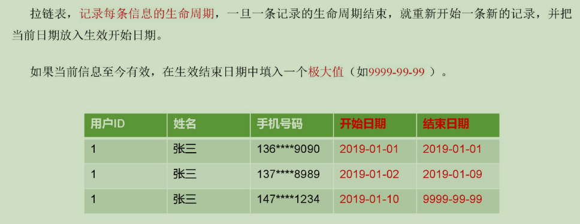

2）为什么要做拉链表

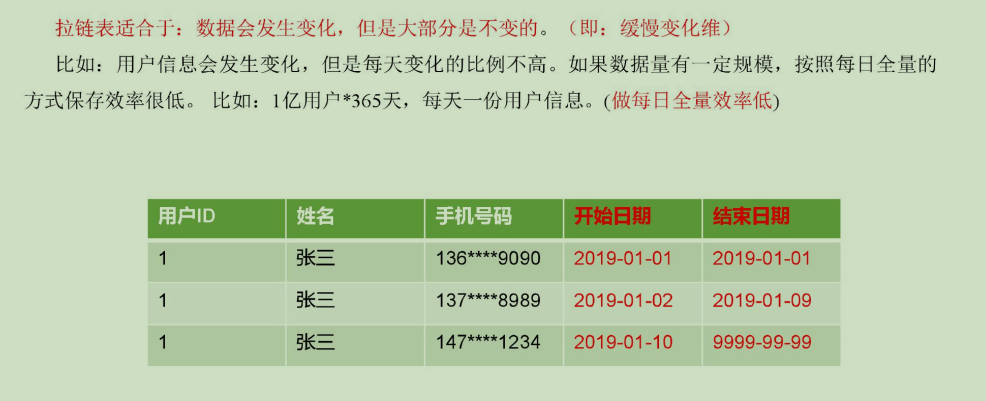

3）拉链表形成过程

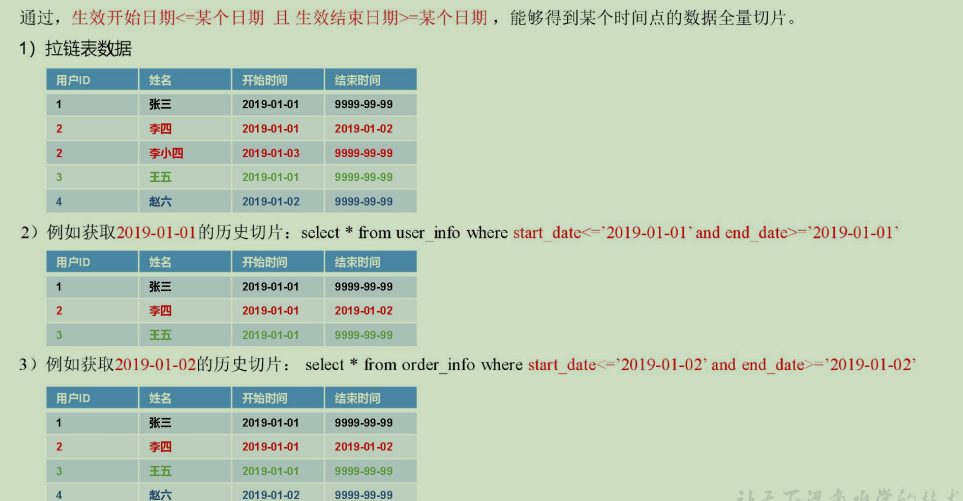

4）拉链表制作过程图


5）拉链表制作过程
步骤0：初始化拉链表（首次独立执行）
（1）建立拉链表
hive (gmall)>
drop table if exists dwd_dim_user_info_his;
create external table dwd_dim_user_info_his(
    `id` string COMMENT '用户id',
    `name` string COMMENT '姓名', 
    `birthday` string COMMENT '生日',
    `gender` string COMMENT '性别',
    `email` string COMMENT '邮箱',
    `user_level` string COMMENT '用户等级',
    `create_time` string COMMENT '创建时间',
    `operate_time` string COMMENT '操作时间',
    `start_date`  string COMMENT '有效开始日期',
    `end_date`  string COMMENT '有效结束日期'
) COMMENT '订单拉链表'
stored as parquet
location '/warehouse/gmall/dwd/dwd_dim_user_info_his/'
tblproperties ("parquet.compression"="lzo");
（2）初始化拉链表
hive (gmall)>
insert overwrite table dwd_dim_user_info_his
select
    id,
    name,
    birthday,
    gender,
    email,
    user_level,
    create_time,
    operate_time,
    '2020-03-10',
    '9999-99-99'
from ods_user_info oi
where oi.dt='2020-03-10';
步骤1：制作当日变动数据（包括新增，修改）每日执行
**（1）如何获得每日变动表**
a.最好表内有创建时间和变动时间（Lucky!）
b.如果没有，可以利用第三方工具监控比如canal，监控MySQL的实时变化进行记录（麻烦）。
c.逐行对比前后两天的数据，检查md5(concat(全部有可能变化的字段))是否相同(low)
d.要求业务数据库提供变动流水（人品，颜值）
（2）因为ods_order_info本身导入过来就是新增变动明细的表，所以不用处理
a）数据库中新增2020-03-11一天的数据
b）通过Sqoop把2020-03-11日所有数据导入
mysqlTohdfs.sh all 2020-03-11
c）ods层数据导入
hdfs_to_ods_db.sh all 2020-03-11
步骤2：先合并变动信息，再追加新增信息，插入到临时表中
1）建立临时表
hive (gmall)>
drop table if exists dwd_dim_user_info_his_tmp;
create external table dwd_dim_user_info_his_tmp(
    `id` string COMMENT '用户id',
    `name` string COMMENT '姓名', 
    `birthday` string COMMENT '生日',
    `gender` string COMMENT '性别',
    `email` string COMMENT '邮箱',
    `user_level` string COMMENT '用户等级',
    `create_time` string COMMENT '创建时间',
    `operate_time` string COMMENT '操作时间',
    `start_date`  string COMMENT '有效开始日期',
    `end_date`  string COMMENT '有效结束日期'
) COMMENT '订单拉链临时表'
stored as parquet
location '/warehouse/gmall/dwd/dwd_dim_user_info_his_tmp/'
tblproperties ("parquet.compression"="lzo");
2）导入脚本
hive (gmall)>
insert overwrite table dwd_dim_user_info_his_tmp
select * from 
(
    select 
        id,
        name,
        birthday,
        gender,
        email,
        user_level,
        create_time,
        operate_time,
        '2020-03-11' start_date,
        '9999-99-99' end_date
    from ods_user_info where dt='2020-03-11'

    union all 
    select 
        uh.id,
        uh.name,
        uh.birthday,
        uh.gender,
        uh.email,
        uh.user_level,
        uh.create_time,
        uh.operate_time,
        uh.start_date,
        if(ui.id is not null  and uh.end_date='9999-99-99', date_add(ui.dt,-1), uh.end_date) end_date
    from dwd_dim_user_info_his uh left join 
    (
        select
            *
        from ods_user_info
        where dt='2020-03-11'
    ) ui on uh.id=ui.id
)his 
order by his.id, start_date;
步骤3：把临时表覆盖给拉链表
1）导入数据
hive (gmall)>
insert overwrite table dwd_dim_user_info_his 
select * from dwd_dim_user_info_his_tmp;
2）查询导入数据
hive (gmall)> select id, start_date, end_date from dwd_dim_user_info_his;
4.4.15 DWD层数据导入脚本
1）在/home/atguigu/bin目录下创建脚本ods_to_dwd_db.sh
[atguigu@hadoop102 bin]$ vim ods_to_dwd_db.sh
在脚本中填写如下内容

```sh
#!/bin/bash

APP=gmall
hive=/opt/module/hive/bin/hive

# 如果是输入的日期按照取输入日期；如果没输入日期取当前时间的前一天

if [ -n "$2" ] ;then
    do_date=$2
else 
    do_date=`date -d "-1 day" +%F`
fi

sql1="
set hive.exec.dynamic.partition.mode=nonstrict;

insert overwrite table ${APP}.dwd_dim_sku_info partition(dt='$do_date')
select  
    sku.id,
    sku.spu_id,
    sku.price,
    sku.sku_name,
    sku.sku_desc,
    sku.weight,
    sku.tm_id,
    ob.tm_name,
    sku.category3_id,
    c2.id category2_id,
    c1.id category1_id,
    c3.name category3_name,
    c2.name category2_name,
    c1.name category1_name,
    spu.spu_name,
    sku.create_time
from
(
    select * from ${APP}.ods_sku_info where dt='$do_date'
)sku
join
(
    select * from ${APP}.ods_base_trademark where dt='$do_date'
)ob on sku.tm_id=ob.tm_id
join
(
    select * from ${APP}.ods_spu_info where dt='$do_date'
)spu on spu.id = sku.spu_id
join 
(
    select * from ${APP}.ods_base_category3 where dt='$do_date'
)c3 on sku.category3_id=c3.id
join 
(
    select * from ${APP}.ods_base_category2 where dt='$do_date'
)c2 on c3.category2_id=c2.id 
join 
(
    select * from ${APP}.ods_base_category1 where dt='$do_date'
)c1 on c2.category1_id=c1.id;

insert overwrite table ${APP}.dwd_dim_coupon_info partition(dt='$do_date')
select
    id,
    coupon_name,
    coupon_type,
    condition_amount,
    condition_num,
    activity_id,
    benefit_amount,
    benefit_discount,
    create_time,
    range_type,
    spu_id,
    tm_id,
    category3_id,
    limit_num,
    operate_time,
    expire_time
from ${APP}.ods_coupon_info
where dt='$do_date';

insert overwrite table ${APP}.dwd_dim_activity_info partition(dt='$do_date')
select
    info.id,
    info.activity_name,
    info.activity_type,
    rule.condition_amount,
    rule.condition_num,
    rule.benefit_amount,
    rule.benefit_discount,
    rule.benefit_level,
    info.start_time,
    info.end_time,
    info.create_time
from 
(
    select * from ${APP}.ods_activity_info where dt='$do_date'
)info
left join
(
    select * from ${APP}.ods_activity_rule where dt='$do_date'
)rule on info.id = rule.activity_id;

insert overwrite table ${APP}.dwd_fact_order_detail partition(dt='$do_date')
select
    od.id,
    od.order_id,
    od.user_id,
    od.sku_id,
    od.sku_name,
    od.order_price,
    od.sku_num,
    od.create_time,
    oi.province_id,
    od.order_price*od.sku_num   
from 
(
    select * from ${APP}.ods_order_detail where dt='$do_date'
) od
join 
(
    select * from ${APP}.ods_order_info where dt='$do_date'
) oi
on od.order_id=oi.id;

insert overwrite table ${APP}.dwd_fact_payment_info partition(dt='$do_date')
select
    pi.id,
    pi.out_trade_no,
    pi.order_id,
    pi.user_id,
    pi.alipay_trade_no,
    pi.total_amount,
    pi.subject,
    pi.payment_type,
    pi.payment_time,          
    oi.province_id
from
(
    select * from ${APP}.ods_payment_info where dt='$do_date'
)pi
join
(
    select id, province_id from ${APP}.ods_order_info where dt='$do_date'
)oi
on pi.order_id = oi.id;

insert overwrite table ${APP}.dwd_fact_order_refund_info partition(dt='$do_date')
select
    id,
    user_id,
    order_id,
    sku_id,
    refund_type,
    refund_num,
    refund_amount,
    refund_reason_type,
    create_time
from ${APP}.ods_order_refund_info
where dt='$do_date';

insert overwrite table ${APP}.dwd_fact_comment_info partition(dt='$do_date')
select
    id,
    user_id,
    sku_id,
    spu_id,
    order_id,
    appraise,
    create_time
from ${APP}.ods_comment_info
where dt='$do_date';

insert overwrite table ${APP}.dwd_fact_cart_info partition(dt='$do_date')
select
    id,
    user_id,
    sku_id,
    cart_price,
    sku_num,
    sku_name,
    create_time,
    operate_time,
    is_ordered,
    order_time
from ${APP}.ods_cart_info
where dt='$do_date';

insert overwrite table ${APP}.dwd_fact_favor_info partition(dt='$do_date')
select
    id,
    user_id,
    sku_id,
    spu_id,
    is_cancel,
    create_time,
    cancel_time
from ${APP}.ods_favor_info
where dt='$do_date';

insert overwrite table ${APP}.dwd_fact_coupon_use partition(dt)
select
    if(new.id is null,old.id,new.id),
    if(new.coupon_id is null,old.coupon_id,new.coupon_id),
    if(new.user_id is null,old.user_id,new.user_id),
    if(new.order_id is null,old.order_id,new.order_id),
    if(new.coupon_status is null,old.coupon_status,new.coupon_status),
    if(new.get_time is null,old.get_time,new.get_time),
    if(new.using_time is null,old.using_time,new.using_time),
    if(new.used_time is null,old.used_time,new.used_time),
    date_format(if(new.get_time is null,old.get_time,new.get_time),'yyyy-MM-dd')
from
(
    select
        id,
        coupon_id,
        user_id,
        order_id,
        coupon_status,
        get_time,
        using_time,
        used_time
    from ${APP}.dwd_fact_coupon_use
    where dt in
    (
        select
            date_format(get_time,'yyyy-MM-dd')
        from ${APP}.ods_coupon_use
        where dt='$do_date'
    )
)old
full outer join
(
    select
        id,
        coupon_id,
        user_id,
        order_id,
        coupon_status,
        get_time,
        using_time,
        used_time
    from ${APP}.ods_coupon_use
    where dt='$do_date'
)new
on old.id=new.id;


insert overwrite table ${APP}.dwd_fact_order_info partition(dt)
select
    if(new.id is null,old.id,new.id),
    if(new.order_status is null,old.order_status,new.order_status),
    if(new.user_id is null,old.user_id,new.user_id),
    if(new.out_trade_no is null,old.out_trade_no,new.out_trade_no),
    if(new.tms['1001'] is null,old.create_time,new.tms['1001']),--1001对应未支付状态
    if(new.tms['1002'] is null,old.payment_time,new.tms['1002']),
    if(new.tms['1003'] is null,old.cancel_time,new.tms['1003']),
    if(new.tms['1004'] is null,old.finish_time,new.tms['1004']),
    if(new.tms['1005'] is null,old.refund_time,new.tms['1005']),
    if(new.tms['1006'] is null,old.refund_finish_time,new.tms['1006']),
    if(new.province_id is null,old.province_id,new.province_id),
    if(new.activity_id is null,old.activity_id,new.activity_id),
    if(new.original_total_amount is null,old.original_total_amount,new.original_total_amount),
    if(new.benefit_reduce_amount is null,old.benefit_reduce_amount,new.benefit_reduce_amount),
    if(new.feight_fee is null,old.feight_fee,new.feight_fee),
    if(new.final_total_amount is null,old.final_total_amount,new.final_total_amount),
    date_format(if(new.tms['1001'] is null,old.create_time,new.tms['1001']),'yyyy-MM-dd')
from
(
    select
        id,
        order_status,
        user_id,
        out_trade_no,
        create_time,
        payment_time,
        cancel_time,
        finish_time,
        refund_time,
        refund_finish_time,
        province_id,
        activity_id,
        original_total_amount,
        benefit_reduce_amount,
        feight_fee,
        final_total_amount
    from ${APP}.dwd_fact_order_info
    where dt
    in
    (
        select
          date_format(create_time,'yyyy-MM-dd')
        from ${APP}.ods_order_info
        where dt='$do_date'
    )
)old
full outer join
(
    select
        info.id,
        info.order_status,
        info.user_id,
        info.out_trade_no,
        info.province_id,
        act.activity_id,
        log.tms,
        info.original_total_amount,
        info.benefit_reduce_amount,
        info.feight_fee,
        info.final_total_amount
    from
    (
        select
            order_id,
            str_to_map(concat_ws(',',collect_set(concat(order_status,'=',operate_time))),',','=') tms
        from ${APP}.ods_order_status_log
        where dt='$do_date'
        group by order_id
    )log
    join
    (
        select * from ${APP}.ods_order_info where dt='$do_date'
    )info
    on log.order_id=info.id
    left join
    (
        select * from ${APP}.ods_activity_order where dt='$do_date'
    )act
    on log.order_id=act.order_id
)new
on old.id=new.id;


insert overwrite table ${APP}.dwd_dim_user_info_his_tmp
select * from 
(
    select 
        id,
        name,
        birthday,
        gender,
        email,
        user_level,
        create_time,
        operate_time,
        '$do_date' start_date,
        '9999-99-99' end_date
    from ${APP}.ods_user_info where dt='$do_date'

    union all 
    select 
        uh.id,
        uh.name,
        uh.birthday,
        uh.gender,
        uh.email,
        uh.user_level,
        uh.create_time,
        uh.operate_time,
        uh.start_date,
        if(ui.id is not null  and uh.end_date='9999-99-99', date_add(ui.dt,-1), uh.end_date) end_date
    from ${APP}.dwd_dim_user_info_his uh left join 
    (
        select
            *
        from ${APP}.ods_user_info
        where dt='$do_date'
    ) ui on uh.id=ui.id

)his 
order by his.id, start_date;

insert overwrite table ${APP}.dwd_dim_user_info_his select * from ${APP}.dwd_dim_user_info_his_tmp;
"

sql2="
insert overwrite table ${APP}.dwd_dim_base_province
select 
    bp.id,
    bp.name,
    bp.area_code,
    bp.iso_code,
    bp.region_id,
    br.region_name
from ${APP}.ods_base_province bp
join ${APP}.ods_base_region br
on bp.region_id=br.id;
"

case $1 in
"first"){
    $hive -e "$sql1"
    $hive -e "$sql2"
};;
"all"){
    $hive -e "$sql1"  
};;
esac
```

2）增加脚本执行权限
[atguigu@hadoop102 bin]$ chmod 777 ods_to_dwd_db.sh
3）执行脚本导入数据
[atguigu@hadoop102 bin]$ ods_to_dwd_db.sh all 2020-03-11
4）查看导入数据
hive (gmall)> 
select * from dwd_fact_order_info where dt='2020-03-11';
select * from dwd_fact_order_detail where dt='2020-03-11';
select * from dwd_fact_comment_info where dt='2020-03-11';
select * from dwd_fact_order_refund_info where dt='2020-03-11';

# 第5章 数仓搭建-DWS层

## 5.1 业务术语

1）用户
用户以设备为判断标准，在移动统计中，每个独立设备认为是一个独立用户。Android系统根据IMEI号，IOS系统根据OpenUDID来标识一个独立用户，每部手机一个用户。
2）新增用户
首次联网使用应用的用户。如果一个用户首次打开某APP，那这个用户定义为新增用户；卸载再安装的设备，不会被算作一次新增。新增用户包括日新增用户、周新增用户、月新增用户。
3）活跃用户
打开应用的用户即为活跃用户，不考虑用户的使用情况。每天一台设备打开多次会被计为一个活跃用户。
4）周（月）活跃用户
某个自然周（月）内启动过应用的用户，该周（月）内的多次启动只记一个活跃用户。
5）月活跃率
月活跃用户与截止到该月累计的用户总和之间的比例。
6）沉默用户
用户仅在安装当天（次日）启动一次，后续时间无再启动行为。该指标可以反映新增用户质量和用户与APP的匹配程度。
7）版本分布
不同版本的周内各天新增用户数，活跃用户数和启动次数。利于判断APP各个版本之间的优劣和用户行为习惯。
8）本周回流用户
上周未启动过应用，本周启动了应用的用户。
9）连续n周活跃用户
连续n周，每周至少启动一次。
10）忠诚用户
连续活跃5周以上的用户
11）连续活跃用户
连续2周及以上活跃的用户
12）近期流失用户
连续n（2<= n <= 4）周没有启动应用的用户。（第n+1周没有启动过）
13）留存用户
某段时间内的新增用户，经过一段时间后，仍然使用应用的被认作是留存用户；这部分用户占当时新增用户的比例即是留存率。
例如，5月份新增用户200，这200人在6月份启动过应用的有100人，7月份启动过应用的有80人，8月份启动过应用的有50人；则5月份新增用户一个月后的留存率是50%，二个月后的留存率是40%，三个月后的留存率是25%。
14）用户新鲜度
每天启动应用的新老用户比例，即新增用户数占活跃用户数的比例。
15）单次使用时长
每次启动使用的时间长度。
16）日使用时长
累计一天内的使用时间长度。
17）启动次数计算标准
IOS平台应用退到后台就算一次独立的启动；Android平台我们规定，两次启动之间的间隔小于30秒，被计算一次启动。用户在使用过程中，若因收发短信或接电话等退出应用30秒又再次返回应用中，那这两次行为应该是延续而非独立的，所以可以被算作一次使用行为，即一次启动。业内大多使用30秒这个标准，但用户还是可以自定义此时间间隔。

## 5.2 系统函数

### 5.2.1 collect_set函数

1）创建原数据表
hive (gmall)>
drop table if exists stud;
create table stud (name string, area string, course string, score int);
2）向原数据表中插入数据
hive (gmall)>
insert into table stud values('zhang3','bj','math',88);
insert into table stud values('li4','bj','math',99);
insert into table stud values('wang5','sh','chinese',92);
insert into table stud values('zhao6','sh','chinese',54);
insert into table stud values('tian7','bj','chinese',91);
3）查询表中数据
hive (gmall)> select * from stud;
stud.name       stud.area       stud.course     stud.score
zhang3 bj      math    88
li4     bj      math    99
wang5   sh      chinese 92
zhao6   sh      chinese 54
tian7   bj      chinese 91
4）把同一分组的不同行的数据聚合成一个集合
hive (gmall)> select course, collect_set(area), avg(score) from stud group by course;
chinese ["sh","bj"]     79.0
math    ["bj"]  93.5
5） 用下标可以取某一个
hive (gmall)> select course, collect_set(area)[0], avg(score) from stud group by course;
chinese sh      79.0
math    bj      93.5

### 5.2.2 nvl函数

1）基本语法
NVL（表达式1，表达式2）
如果表达式1为空值，NVL返回值为表达式2的值，否则返回表达式1的值。 该函数的目的是把一个空值（null）转换成一个实际的值。其表达式的值可以是数字型、字符型和日期型。但是表达式1和表达式2的数据类型必须为同一个类型。

### 5.2.3 日期处理函数

1）date_format函数（根据格式整理日期）
hive (gmall)> select date_format('2020-03-10','yyyy-MM');
2020-03
2）date_add函数（加减日期）
hive (gmall)> select date_add('2020-03-10',-1);
2020-03-09
hive (gmall)> select date_add('2020-03-10',1);
2020-03-11
3）next_day函数
	（1）取当前天的下一个周一
hive (gmall)> select next_day('2020-03-12','MO');
2020-03-16
说明：星期一到星期日的英文（Monday，Tuesday、Wednesday、Thursday、Friday、Saturday、Sunday）
（2）取当前周的周一
hive (gmall)> select date_add(next_day('2020-03-12','MO'),-7);
2020-03-11
4）last_day函数（求当月最后一天日期）
hive (gmall)> select last_day('2020-03-10');
2020-03-31

## 5.3 DWS层（用户行为）

### 5.3.1 每日设备行为

每日设备行为，主要按照设备id统计。

1）建表语句
hive (gmall)> 
drop table if exists dws_uv_detail_daycount;
create external table dws_uv_detail_daycount
(
    `mid_id` string COMMENT '设备唯一标识',
    `user_id` string COMMENT '用户标识',
    `version_code` string COMMENT '程序版本号', 
    `version_name` string COMMENT '程序版本名', 
    `lang` string COMMENT '系统语言', 
    `source` string COMMENT '渠道号', 
    `os` string COMMENT '安卓系统版本', 
    `area` string COMMENT '区域', 
    `model` string COMMENT '手机型号', 
    `brand` string COMMENT '手机品牌', 
    `sdk_version` string COMMENT 'sdkVersion', 
    `gmail` string COMMENT 'gmail', 
    `height_width` string COMMENT '屏幕宽高',
    `app_time` string COMMENT '客户端日志产生时的时间',
    `network` string COMMENT '网络模式',
    `lng` string COMMENT '经度',
    `lat` string COMMENT '纬度',
    `login_count` bigint COMMENT '活跃次数'
)
partitioned by(dt string)
stored as parquet
location '/warehouse/gmall/dws/dws_uv_detail_daycount';
2）数据装载
hive (gmall)> 
insert overwrite table dws_uv_detail_daycount partition(dt='2020-03-10')
select  
    mid_id,
    concat_ws('|', collect_set(user_id)) user_id,
    concat_ws('|', collect_set(version_code)) version_code,
    concat_ws('|', collect_set(version_name)) version_name,
    concat_ws('|', collect_set(lang))lang,
    concat_ws('|', collect_set(source)) source,
    concat_ws('|', collect_set(os)) os,
    concat_ws('|', collect_set(area)) area, 
    concat_ws('|', collect_set(model)) model,
    concat_ws('|', collect_set(brand)) brand,
    concat_ws('|', collect_set(sdk_version)) sdk_version,
    concat_ws('|', collect_set(gmail)) gmail,
    concat_ws('|', collect_set(height_width)) height_width,
    concat_ws('|', collect_set(app_time)) app_time,
    concat_ws('|', collect_set(network)) network,
    concat_ws('|', collect_set(lng)) lng,
    concat_ws('|', collect_set(lat)) lat,
    count(*) login_count
from dwd_start_log
where dt='2020-03-10'
group by mid_id;
3）查询加载结果
hive (gmall)> select * from dws_uv_detail_daycount where dt='2020-03-10';

## 5.4 DWS层（业务）

DWS层的宽表字段，是站在不同维度的视角去看事实表。重点关注事实表的度量值。

### 5.4.1 每日会员行为

1）建表语句
hive (gmall)> 
drop table if exists dws_user_action_daycount;
create external table dws_user_action_daycount
(   
    user_id string comment '用户 id',
    login_count bigint comment '登录次数',
    cart_count bigint comment '加入购物车次数',
    cart_amount double comment '加入购物车金额',
    order_count bigint comment '下单次数',
    order_amount    decimal(16,2)  comment '下单金额',
    payment_count   bigint      comment '支付次数',
    payment_amount  decimal(16,2) comment '支付金额'
) COMMENT '每日用户行为'
PARTITIONED BY (`dt` string)
stored as parquet
location '/warehouse/gmall/dws/dws_user_action_daycount/'
tblproperties ("parquet.compression"="lzo");
2）数据装载
hive (gmall)> 
with
tmp_login as
(
    select
        user_id,
        count(*) login_count
    from dwd_start_log
    where dt='2020-03-10'
    and user_id is not null
    group by user_id
),
tmp_cart as
(
    select
        user_id,
        count(*) cart_count,
        sum(cart_price*sku_num) cart_amount
    from dwd_fact_cart_info
    where dt='2020-03-10'
and user_id is not null
and date_format(create_time,'yyyy-MM-dd')='2020-03-10'
    group by user_id
),
tmp_order as
(
    select
        user_id,
        count(*) order_count,
        sum(final_total_amount) order_amount
    from dwd_fact_order_info
    where dt='2020-03-10'
    group by user_id
) ,
tmp_payment as
(
    select
        user_id,
        count(*) payment_count,
        sum(payment_amount) payment_amount
    from dwd_fact_payment_info
    where dt='2020-03-10'
    group by user_id
)

insert overwrite table dws_user_action_daycount partition(dt='2020-03-10')
select
user_actions.user_id,
sum(user_actions.login_count),
    sum(user_actions.cart_count),
    sum(user_actions.cart_amount),
    sum(user_actions.order_count),
    sum(user_actions.order_amount),
    sum(user_actions.payment_count),
    sum(user_actions.payment_amount)
from 
(
    select
        user_id,
        login_count,
        0 cart_count,
        0 cart_amount,
        0 order_count,
        0 order_amount,
        0 payment_count,
        0 payment_amount
    from 
    tmp_login
    union all
    select
        user_id,
        0 login_count,
        cart_count,
        cart_amount,
        0 order_count,
        0 order_amount,
        0 payment_count,
        0 payment_amount
    from 
    tmp_cart
    union all
    select
        user_id,
        0 login_count,
        0 cart_count,
        0 cart_amount,
        order_count,
        order_amount,
        0 payment_count,
        0 payment_amount
    from tmp_order
    union all
    select
        user_id,
        0 login_count,
        0 cart_count,
        0 cart_amount,
        0 order_count,
        0 order_amount,
        payment_count,
        payment_amount
    from tmp_payment
 ) user_actions
group by user_id;
3）查询加载结果
hive (gmall)> select * from dws_user_action_daycount where dt='2020-03-10';

### 5.4.2 每日商品行为

1）建表语句
hive (gmall)> 
drop table if exists dws_sku_action_daycount;
create external table dws_sku_action_daycount 
(   
    sku_id string comment 'sku_id',
    order_count bigint comment '被下单次数',
    order_num bigint comment '被下单件数',
    order_amount decimal(16,2) comment '被下单金额',
    payment_count bigint  comment '被支付次数',
    payment_num bigint comment '被支付件数',
    payment_amount decimal(16,2) comment '被支付金额',
    refund_count bigint  comment '被退款次数',
    refund_num bigint comment '被退款件数',
    refund_amount  decimal(16,2) comment '被退款金额',
    cart_count bigint comment '被加入购物车次数',
    cart_num bigint comment '被加入购物车件数',
    favor_count bigint comment '被收藏次数',
    appraise_good_count bigint comment '好评数',
    appraise_mid_count bigint comment '中评数',
    appraise_bad_count bigint comment '差评数',
    appraise_default_count bigint comment '默认评价数'
) COMMENT '每日商品行为'
PARTITIONED BY (`dt` string)
stored as parquet
location '/warehouse/gmall/dws/dws_sku_action_daycount/'
tblproperties ("parquet.compression"="lzo");
2）数据装载
注意：如果是23点59下单，支付日期跨天。需要从订单详情里面取出支付时间是今天，订单时间是昨天或者今天的订单。
hive (gmall)> 
with 
tmp_order as
(
    select
        sku_id,
        count(*) order_count,
        sum(sku_num) order_num,
        sum(total_amount) order_amount
    from dwd_fact_order_detail
    where dt='2020-03-10'
    group by sku_id
),
tmp_payment as
(
    select
        sku_id,
        count(*) payment_count,
        sum(sku_num) payment_num,
        sum(total_amount) payment_amount
    from dwd_fact_order_detail
    where dt='2020-03-10'
    and order_id in
    (
        select
            id
        from dwd_fact_order_info
        where (dt='2020-03-10' or dt=date_add('2020-03-10',-1))
        and date_format(payment_time,'yyyy-MM-dd')='2020-03-10'
    )
    group by sku_id
),
tmp_refund as
(
    select
        sku_id,
        count(*) refund_count,
        sum(refund_num) refund_num,
        sum(refund_amount) refund_amount
    from dwd_fact_order_refund_info
    where dt='2020-03-10'
    group by sku_id
),
tmp_cart as
(
    select
        sku_id,
        count(*) cart_count,
        sum(sku_num) cart_num
    from dwd_fact_cart_info
    where dt='2020-03-10'
    and date_format(create_time,'yyyy-MM-dd')='2020-03-10'
    group by sku_id
),
tmp_favor as
(
    select
        sku_id,
        count(*) favor_count
    from dwd_fact_favor_info
    where dt='2020-03-10'
    and date_format(create_time,'yyyy-MM-dd')='2020-03-10'
    group by sku_id
),
tmp_appraise as
(
select
        sku_id,
        sum(if(appraise='1201',1,0)) appraise_good_count,
        sum(if(appraise='1202',1,0)) appraise_mid_count,
        sum(if(appraise='1203',1,0)) appraise_bad_count,
        sum(if(appraise='1204',1,0)) appraise_default_count
from dwd_fact_comment_info
where dt='2020-03-10'
group by sku_id
)

insert overwrite table dws_sku_action_daycount partition(dt='2020-03-10')
select
    sku_id,
    sum(order_count),
    sum(order_num),
    sum(order_amount),
    sum(payment_count),
    sum(payment_num),
    sum(payment_amount),
    sum(refund_count),
    sum(refund_num),
    sum(refund_amount),
    sum(cart_count),
    sum(cart_num),
    sum(favor_count),
    sum(appraise_good_count),
    sum(appraise_mid_count),
    sum(appraise_bad_count),
    sum(appraise_default_count)
from
(
    select
        sku_id,
        order_count,
        order_num,
        order_amount,
        0 payment_count,
        0 payment_num,
        0 payment_amount,
        0 refund_count,
        0 refund_num,
        0 refund_amount,
        0 cart_count,
        0 cart_num,
        0 favor_count,
        0 appraise_good_count,
        0 appraise_mid_count,
        0 appraise_bad_count,
        0 appraise_default_count
    from tmp_order
    union all
    select
        sku_id,
        0 order_count,
        0 order_num,
        0 order_amount,
        payment_count,
        payment_num,
        payment_amount,
        0 refund_count,
        0 refund_num,
        0 refund_amount,
        0 cart_count,
        0 cart_num,
        0 favor_count,
        0 appraise_good_count,
        0 appraise_mid_count,
        0 appraise_bad_count,
        0 appraise_default_count
    from tmp_payment
    union all
    select
        sku_id,
        0 order_count,
        0 order_num,
        0 order_amount,
        0 payment_count,
        0 payment_num,
        0 payment_amount,
        refund_count,
        refund_num,
        refund_amount,
        0 cart_count,
        0 cart_num,
        0 favor_count,
        0 appraise_good_count,
        0 appraise_mid_count,
        0 appraise_bad_count,
        0 appraise_default_count        
    from tmp_refund
    union all
    select
        sku_id,
        0 order_count,
        0 order_num,
        0 order_amount,
        0 payment_count,
        0 payment_num,
        0 payment_amount,
        0 refund_count,
        0 refund_num,
        0 refund_amount,
        cart_count,
        cart_num,
        0 favor_count,
        0 appraise_good_count,
        0 appraise_mid_count,
        0 appraise_bad_count,
        0 appraise_default_count
    from tmp_cart
    union all
    select
        sku_id,
        0 order_count,
        0 order_num,
        0 order_amount,
        0 payment_count,
        0 payment_num,
        0 payment_amount,
        0 refund_count,
        0 refund_num,
        0 refund_amount,
        0 cart_count,
        0 cart_num,
        favor_count,
        0 appraise_good_count,
        0 appraise_mid_count,
        0 appraise_bad_count,
        0 appraise_default_count
    from tmp_favor
    union all
    select
        sku_id,
        0 order_count,
        0 order_num,
        0 order_amount,
        0 payment_count,
        0 payment_num,
        0 payment_amount,
        0 refund_count,
        0 refund_num,
        0 refund_amount,
        0 cart_count,
        0 cart_num,
        0 favor_count,
        appraise_good_count,
        appraise_mid_count,
        appraise_bad_count,
        appraise_default_count
    from tmp_appraise
)tmp
group by sku_id;
3）查询加载结果
hive (gmall)> select * from dws_sku_action_daycount where dt='2020-03-10';

### 5.4.3 每日优惠券统计（预留）

1）建表语句
hive (gmall)> 
drop table if exists dws_coupon_use_daycount;
create external table dws_coupon_use_daycount
(   
    `coupon_id` string  COMMENT '优惠券ID',
    `coupon_name` string COMMENT '购物券名称',
    `coupon_type` string COMMENT '购物券类型 1 现金券 2 折扣券 3 满减券 4 满件打折券',
    `condition_amount` string COMMENT '满额数',
    `condition_num` string COMMENT '满件数',
    `activity_id` string COMMENT '活动编号',
    `benefit_amount` string COMMENT '减金额',
    `benefit_discount` string COMMENT '折扣',
    `create_time` string COMMENT '创建时间',
    `range_type` string COMMENT '范围类型 1、商品 2、品类 3、品牌',
    `spu_id` string COMMENT '商品id',
    `tm_id` string COMMENT '品牌id',
    `category3_id` string COMMENT '品类id',
    `limit_num` string COMMENT '最多领用次数',
    `get_count` bigint COMMENT '领用次数',
    `using_count` bigint COMMENT '使用(下单)次数',
    `used_count` bigint COMMENT '使用(支付)次数'
) COMMENT '每日优惠券统计'
PARTITIONED BY (`dt` string)
stored as parquet
location '/warehouse/gmall/dws/dws_coupon_use_daycount/'
tblproperties ("parquet.compression"="lzo");
2）数据装载
hive (gmall)> 
insert overwrite table dws_coupon_use_daycount partition(dt='2020-03-10')
select
    cu.coupon_id,
    ci.coupon_name,
    ci.coupon_type,
    ci.condition_amount,
    ci.condition_num,
    ci.activity_id,
    ci.benefit_amount,
    ci.benefit_discount,
    ci.create_time,
    ci.range_type,
    ci.spu_id,
    ci.tm_id,
    ci.category3_id,
    ci.limit_num,
    cu.get_count,
    cu.using_count,
    cu.used_count
from 
(
    select
        coupon_id,
        sum(if(date_format(get_time,'yyyy-MM-dd')='2020-03-10',1,0)) get_count,
        sum(if(date_format(using_time,'yyyy-MM-dd')='2020-03-10',1,0)) using_count,
        sum(if(date_format(used_time,'yyyy-MM-dd')='2020-03-10',1,0)) used_count
    from dwd_fact_coupon_use
    where dt='2020-03-10'
    group by coupon_id
)cu
left join
(
    select
        *
    from dwd_dim_coupon_info
    where dt='2020-03-10'
)ci on cu.coupon_id=ci.id;
3）查询加载结果
hive (gmall)> select * from dws_coupon_use_daycount where dt='2020-03-10';

### 5.4.4 每日活动统计（预留）

1）建表语句
hive (gmall)> 
drop table if exists dws_activity_info_daycount;
create external table dws_activity_info_daycount(
    `id` string COMMENT '编号',
    `activity_name` string  COMMENT '活动名称',
    `activity_type` string  COMMENT '活动类型',
    `start_time` string  COMMENT '开始时间',
    `end_time` string  COMMENT '结束时间',
    `create_time` string  COMMENT '创建时间',
    `order_count` bigint COMMENT '下单次数',
    `payment_count` bigint COMMENT '支付次数'
) COMMENT '购物车信息表'
PARTITIONED BY (`dt` string)
row format delimited fields terminated by '\t'
location '/warehouse/gmall/dws/dws_activity_info_daycount/'
tblproperties ("parquet.compression"="lzo");
2）数据装载
hive (gmall)> 
insert overwrite table dws_activity_info_daycount partition(dt='2020-03-10')
select
    oi.activity_id,
    ai.activity_name,
    ai.activity_type,
    ai.start_time,
    ai.end_time,
    ai.create_time,
    oi.order_count,
    oi.payment_count
from
(
    select
        activity_id,
        sum(if(date_format(create_time,'yyyy-MM-dd')='2020-03-10',1,0)) order_count,
        sum(if(date_format(payment_time,'yyyy-MM-dd')='2020-03-10',1,0)) payment_count
    from dwd_fact_order_info
    where (dt='2020-03-10' or dt=date_add('2020-03-10',-1))
    and activity_id is not null
    group by activity_id
)oi
join
(
    select
        *
    from dwd_dim_activity_info
    where dt='2020-03-10'
)ai
on oi.activity_id=ai.id;
3）查询加载结果
hive (gmall)> select * from dws_activity_info_daycount where dt='2020-03-10';

### 5.4.5 每日购买行为

1）建表语句
hive (gmall)> 
drop table if exists dws_sale_detail_daycount;
create external table dws_sale_detail_daycount
(   
    user_id   string  comment '用户 id',
    sku_id    string comment '商品 id',
    user_gender  string comment '用户性别',
    user_age string  comment '用户年龄',
    user_level string comment '用户等级',
    order_price decimal(10,2) comment '商品价格',
    sku_name string   comment '商品名称',
    sku_tm_id string   comment '品牌id',
    sku_category3_id string comment '商品三级品类id',
    sku_category2_id string comment '商品二级品类id',
    sku_category1_id string comment '商品一级品类id',
    sku_category3_name string comment '商品三级品类名称',
    sku_category2_name string comment '商品二级品类名称',
    sku_category1_name string comment '商品一级品类名称',
    spu_id  string comment '商品 spu',
    sku_num  int comment '购买个数',
    order_count bigint comment '当日下单单数',
    order_amount decimal(16,2) comment '当日下单金额'
) COMMENT '每日购买行为'
PARTITIONED BY (`dt` string)
stored as parquet
location '/warehouse/gmall/dws/dws_sale_detail_daycount/'
tblproperties ("parquet.compression"="lzo");
2）数据装载
hive (gmall)> 
insert overwrite table dws_sale_detail_daycount partition(dt='2020-03-10')
select
    op.user_id,
    op.sku_id,
    ui.gender,
    months_between('2020-03-10', ui.birthday)/12  age, 
    ui.user_level,
    si.price,
    si.sku_name,
    si.tm_id,
    si.category3_id,
    si.category2_id,
    si.category1_id,
    si.category3_name,
    si.category2_name,
    si.category1_name,
    si.spu_id,
    op.sku_num,
    op.order_count,
    op.order_amount 
from
(
    select
        user_id,
        sku_id,
        sum(sku_num) sku_num,
        count(*) order_count,
        sum(total_amount) order_amount
    from dwd_fact_order_detail
    where dt='2020-03-10'
    group by user_id, sku_id
)op
join
(
    select
        *
    from dwd_dim_user_info_his
    where end_date='9999-99-99'
)ui on op.user_id = ui.id
join
(
    select
        *
    from dwd_dim_sku_info
    where dt='2020-03-10'
)si on op.sku_id = si.id;
3）查询加载结果
hive (gmall)> select * from dws_sale_detail_daycount where dt='2020-03-10';

## 5.5 DWS层数据导入脚本

1）在/home/atguigu/bin目录下创建脚本dwd_to_dws.sh
[atguigu@hadoop102 bin]$ vim dwd_to_dws.sh
在脚本中填写如下内容

```sh
#!/bin/bash

APP=gmall
hive=/opt/module/hive/bin/hive

# 如果是输入的日期按照取输入日期；如果没输入日期取当前时间的前一天

if [ -n "$1" ] ;then
    do_date=$1
else
    do_date=`date -d "-1 day" +%F`
fi

sql="
insert overwrite table ${APP}.dws_uv_detail_daycount partition(dt='$do_date')
select  
    mid_id,
    concat_ws('|', collect_set(user_id)) user_id,
    concat_ws('|', collect_set(version_code)) version_code,
    concat_ws('|', collect_set(version_name)) version_name,
    concat_ws('|', collect_set(lang))lang,
    concat_ws('|', collect_set(source)) source,
    concat_ws('|', collect_set(os)) os,
    concat_ws('|', collect_set(area)) area, 
    concat_ws('|', collect_set(model)) model,
    concat_ws('|', collect_set(brand)) brand,
    concat_ws('|', collect_set(sdk_version)) sdk_version,
    concat_ws('|', collect_set(gmail)) gmail,
    concat_ws('|', collect_set(height_width)) height_width,
    concat_ws('|', collect_set(app_time)) app_time,
    concat_ws('|', collect_set(network)) network,
    concat_ws('|', collect_set(lng)) lng,
    concat_ws('|', collect_set(lat)) lat,
    count(*) login_count
from ${APP}.dwd_start_log
where dt='$do_date'
group by mid_id;


with
tmp_login as
(
    select
        user_id,
        count(*) login_count
    from ${APP}.dwd_start_log
    where dt='$do_date'
    and user_id is not null
    group by user_id
),
tmp_cart as
(
    select
        user_id,
        count(*) cart_count,
        sum(cart_price*sku_num) cart_amount
    from ${APP}.dwd_fact_cart_info
    where dt='$do_date'
    and user_id is not null
    and date_format(create_time,'yyyy-MM-dd')='$do_date'
    group by user_id
),
tmp_order as
(
    select
        user_id,
        count(*) order_count,
        sum(final_total_amount) order_amount
    from ${APP}.dwd_fact_order_info
    where dt='$do_date'
    group by user_id
) ,
tmp_payment as
(
    select
        user_id,
        count(*) payment_count,
        sum(payment_amount) payment_amount
    from ${APP}.dwd_fact_payment_info
    where dt='$do_date'
    group by user_id
)

insert overwrite table ${APP}.dws_user_action_daycount partition(dt='$do_date')
select
    user_actions.user_id,
    sum(user_actions.login_count),
    sum(user_actions.cart_count),
    sum(user_actions.cart_amount),
    sum(user_actions.order_count),
    sum(user_actions.order_amount),
    sum(user_actions.payment_count),
    sum(user_actions.payment_amount)
from 
(
    select
        user_id,
        login_count,
        0 cart_count,
        0 cart_amount,
        0 order_count,
        0 order_amount,
        0 payment_count,
        0 payment_amount
    from 
    tmp_login
    union all
    select
        user_id,
        0 login_count,
        cart_count,
        cart_amount,
        0 order_count,
        0 order_amount,
        0 payment_count,
        0 payment_amount
    from 
    tmp_cart
    union all
    select
        user_id,
        0 login_count,
        0 cart_count,
        0 cart_amount,
        order_count,
        order_amount,
        0 payment_count,
        0 payment_amount
    from tmp_order
    union all
    select
        user_id,
        0 login_count,
        0 cart_count,
        0 cart_amount,
        0 order_count,
        0 order_amount,
        payment_count,
        payment_amount
    from tmp_payment
 ) user_actions
group by user_id;


with 
tmp_order as
(
    select
        sku_id,
        count(*) order_count,
        sum(sku_num) order_num,
        sum(total_amount) order_amount
    from ${APP}.dwd_fact_order_detail
    where dt='$do_date'
    group by sku_id
),
tmp_payment as
(
    select
        sku_id,
        count(*) payment_count,
        sum(sku_num) payment_num,
        sum(total_amount) payment_amount
    from ${APP}.dwd_fact_order_detail
    where dt='$do_date'
    and order_id in
    (
        select
            id
        from ${APP}.dwd_fact_order_info
        where (dt='$do_date' or dt=date_add('$do_date',-1))
        and date_format(payment_time,'yyyy-MM-dd')='$do_date'
    )
    group by sku_id
),
tmp_refund as
(
    select
        sku_id,
        count(*) refund_count,
        sum(refund_num) refund_num,
        sum(refund_amount) refund_amount
    from ${APP}.dwd_fact_order_refund_info
    where dt='$do_date'
    group by sku_id
),
tmp_cart as
(
    select
        sku_id,
        count(*) cart_count,
        sum(sku_num) cart_num
    from ${APP}.dwd_fact_cart_info
    where dt='$do_date'
    and date_format(create_time,'yyyy-MM-dd')='$do_date'
    group by sku_id
),
tmp_favor as
(
    select
        sku_id,
        count(*) favor_count
    from ${APP}.dwd_fact_favor_info
    where dt='$do_date'
    and date_format(create_time,'yyyy-MM-dd')='$do_date'
    group by sku_id
),
tmp_appraise as
(
    select
        sku_id,
        sum(if(appraise='1201',1,0)) appraise_good_count,
        sum(if(appraise='1202',1,0)) appraise_mid_count,
        sum(if(appraise='1203',1,0)) appraise_bad_count,
        sum(if(appraise='1204',1,0)) appraise_default_count
    from ${APP}.dwd_fact_comment_info
    where dt='$do_date'
    group by sku_id
)

insert overwrite table ${APP}.dws_sku_action_daycount partition(dt='$do_date')
select
    sku_id,
    sum(order_count),
    sum(order_num),
    sum(order_amount),
    sum(payment_count),
    sum(payment_num),
    sum(payment_amount),
    sum(refund_count),
    sum(refund_num),
    sum(refund_amount),
    sum(cart_count),
    sum(cart_num),
    sum(favor_count),
    sum(appraise_good_count),
    sum(appraise_mid_count),
    sum(appraise_bad_count),
    sum(appraise_default_count)
from
(
    select
        sku_id,
        order_count,
        order_num,
        order_amount,
        0 payment_count,
        0 payment_num,
        0 payment_amount,
        0 refund_count,
        0 refund_num,
        0 refund_amount,
        0 cart_count,
        0 cart_num,
        0 favor_count,
        0 appraise_good_count,
        0 appraise_mid_count,
        0 appraise_bad_count,
        0 appraise_default_count
    from tmp_order
    union all
    select
        sku_id,
        0 order_count,
        0 order_num,
        0 order_amount,
        payment_count,
        payment_num,
        payment_amount,
        0 refund_count,
        0 refund_num,
        0 refund_amount,
        0 cart_count,
        0 cart_num,
        0 favor_count,
        0 appraise_good_count,
        0 appraise_mid_count,
        0 appraise_bad_count,
        0 appraise_default_count
    from tmp_payment
    union all
    select
        sku_id,
        0 order_count,
        0 order_num,
        0 order_amount,
        0 payment_count,
        0 payment_num,
        0 payment_amount,
        refund_count,
        refund_num,
        refund_amount,
        0 cart_count,
        0 cart_num,
        0 favor_count,
        0 appraise_good_count,
        0 appraise_mid_count,
        0 appraise_bad_count,
        0 appraise_default_count        
    from tmp_refund
    union all
    select
        sku_id,
        0 order_count,
        0 order_num,
        0 order_amount,
        0 payment_count,
        0 payment_num,
        0 payment_amount,
        0 refund_count,
        0 refund_num,
        0 refund_amount,
        cart_count,
        cart_num,
        0 favor_count,
        0 appraise_good_count,
        0 appraise_mid_count,
        0 appraise_bad_count,
        0 appraise_default_count
    from tmp_cart
    union all
    select
        sku_id,
        0 order_count,
        0 order_num,
        0 order_amount,
        0 payment_count,
        0 payment_num,
        0 payment_amount,
        0 refund_count,
        0 refund_num,
        0 refund_amount,
        0 cart_count,
        0 cart_num,
        favor_count,
        0 appraise_good_count,
        0 appraise_mid_count,
        0 appraise_bad_count,
        0 appraise_default_count
    from tmp_favor
    union all
    select
        sku_id,
        0 order_count,
        0 order_num,
        0 order_amount,
        0 payment_count,
        0 payment_num,
        0 payment_amount,
        0 refund_count,
        0 refund_num,
        0 refund_amount,
        0 cart_count,
        0 cart_num,
        0 favor_count,
        appraise_good_count,
        appraise_mid_count,
        appraise_bad_count,
        appraise_default_count
    from tmp_appraise
)tmp
group by sku_id;


insert overwrite table ${APP}.dws_coupon_use_daycount partition(dt='$do_date')
select
    cu.coupon_id,
    ci.coupon_name,
    ci.coupon_type,
    ci.condition_amount,
    ci.condition_num,
    ci.activity_id,
    ci.benefit_amount,
    ci.benefit_discount,
    ci.create_time,
    ci.range_type,
    ci.spu_id,
    ci.tm_id,
    ci.category3_id,
    ci.limit_num,
    cu.get_count,
    cu.using_count,
    cu.used_count
from 
(
    select
        coupon_id,
        sum(if(date_format(get_time,'yyyy-MM-dd')='$do_date',1,0)) get_count,
        sum(if(date_format(using_time,'yyyy-MM-dd')='$do_date',1,0)) using_count,
        sum(if(date_format(used_time,'yyyy-MM-dd')='$do_date',1,0)) used_count
    from ${APP}.dwd_fact_coupon_use
    where dt='$do_date'
    group by coupon_id
)cu
left join
(
    select
        *
    from ${APP}.dwd_dim_coupon_info
    where dt='$do_date'
)ci on cu.coupon_id=ci.id;

insert overwrite table ${APP}.dws_activity_info_daycount partition(dt='$do_date')
select
    oi.activity_id,
    ai.activity_name,
    ai.activity_type,
    ai.start_time,
    ai.end_time,
    ai.create_time,
    oi.order_count,
    oi.payment_count
from
(
    select
        activity_id,
        sum(if(date_format(create_time,'yyyy-MM-dd')='$do_date',1,0)) order_count,
        sum(if(date_format(payment_time,'yyyy-MM-dd')='$do_date',1,0)) payment_count
    from ${APP}.dwd_fact_order_info
    where (dt='$do_date' or dt=date_add('$do_date',-1))
    and activity_id is not null
    group by activity_id
)oi
join
(
    select
        *
    from ${APP}.dwd_dim_activity_info
    where dt='$do_date'
)ai
on oi.activity_id=ai.id;

insert overwrite table ${APP}.dws_sale_detail_daycount partition(dt='$do_date')
select
    op.user_id,
    op.sku_id,
    ui.gender,
    months_between('$do_date', ui.birthday)/12  age, 
    ui.user_level,
    si.price,
    si.sku_name,
    si.tm_id,
    si.category3_id,
    si.category2_id,
    si.category1_id,
    si.category3_name,
    si.category2_name,
    si.category1_name,
    si.spu_id,
    op.sku_num,
    op.order_count,
    op.order_amount 
from
(
    select
        user_id,
        sku_id,
        sum(sku_num) sku_num,
        count(*) order_count,
        sum(total_amount) order_amount
    from ${APP}.dwd_fact_order_detail
    where dt='$do_date'
    group by user_id, sku_id
)op
join
(
    select
        *
    from ${APP}.dwd_dim_user_info_his
    where end_date='9999-99-99'
)ui on op.user_id = ui.id
join
(
    select
        *
    from ${APP}.dwd_dim_sku_info
    where dt='$do_date'
)si on op.sku_id = si.id;

"

$hive -e "$sql"
```

2）增加脚本执行权限
[atguigu@hadoop102 bin]$ chmod 777 dwd_to_dws.sh
3）执行脚本导入数据
[atguigu@hadoop102 bin]$ dwd_to_dws.sh 2020-03-11
4）查看导入数据
hive (gmall)> 
select * from dws_uv_detail_daycount where dt='2020-03-11';
select * from dws_user_action_daycount where dt='2020-03-11';
select * from dws_sku_action_daycount where dt='2020-03-11';
select * from dws_sale_detail_daycount where dt='2020-03-11';
select * from dws_coupon_use_daycount where dt='2020-03-11';
select * from dws_activity_info_daycount where dt='2020-03-11';

# 第6章 数仓搭建-DWT层

## 6.1 设备主题宽表

1）建表语句
hive (gmall)> 
drop table if exists dwt_uv_topic;
create external table dwt_uv_topic
(
    `mid_id` string COMMENT '设备唯一标识',
    `user_id` string COMMENT '用户标识',
    `version_code` string COMMENT '程序版本号',
    `version_name` string COMMENT '程序版本名',
    `lang` string COMMENT '系统语言',
    `source` string COMMENT '渠道号',
    `os` string COMMENT '安卓系统版本',
    `area` string COMMENT '区域',
    `model` string COMMENT '手机型号',
    `brand` string COMMENT '手机品牌',
    `sdk_version` string COMMENT 'sdkVersion',
    `gmail` string COMMENT 'gmail',
    `height_width` string COMMENT '屏幕宽高',
    `app_time` string COMMENT '客户端日志产生时的时间',
    `network` string COMMENT '网络模式',
    `lng` string COMMENT '经度',
    `lat` string COMMENT '纬度',
    `login_date_first` string  comment '首次活跃时间',
    `login_date_last` string  comment '末次活跃时间',
    `login_day_count` bigint comment '当日活跃次数',
    `login_count` bigint comment '累积活跃天数'
)
stored as parquet
location '/warehouse/gmall/dwt/dwt_uv_topic';
2）数据装载
hive (gmall)> 
insert overwrite table dwt_uv_topic
select
    nvl(new.mid_id,old.mid_id),
    nvl(new.user_id,old.user_id),
    nvl(new.version_code,old.version_code),
    nvl(new.version_name,old.version_name),
    nvl(new.lang,old.lang),
    nvl(new.source,old.source),
    nvl(new.os,old.os),
    nvl(new.area,old.area),
    nvl(new.model,old.model),
    nvl(new.brand,old.brand),
    nvl(new.sdk_version,old.sdk_version),
    nvl(new.gmail,old.gmail),
    nvl(new.height_width,old.height_width),
    nvl(new.app_time,old.app_time),
    nvl(new.network,old.network),
    nvl(new.lng,old.lng),
    nvl(new.lat,old.lat),
    if(old.mid_id is null,'2020-03-10',old.login_date_first),
    if(new.mid_id is not null,'2020-03-10',old.login_date_last),
    if(new.mid_id is not null, new.login_count,0),
    nvl(old.login_count,0)+if(new.login_count>0,1,0)
from
(
    select
        *
    from dwt_uv_topic
)old
full outer join
(
    select
        *
    from dws_uv_detail_daycount
    where dt='2020-03-10'
)new
on old.mid_id=new.mid_id;
3）查询加载结果
hive (gmall)> select * from dwt_uv_topic limit 5;

## 6.2 会员主题宽表

宽表字段怎么来？维度关联的事实表度量值+开头、结尾+累积+累积一个时间段。

1）建表语句
hive (gmall)> 
drop table if exists dwt_user_topic;
create external table dwt_user_topic
(
    user_id string  comment '用户id',
    login_date_first string  comment '首次登录时间',
    login_date_last string  comment '末次登录时间',
    login_count bigint comment '累积登录天数',
    login_last_30d_count bigint comment '最近30日登录天数',
    order_date_first string  comment '首次下单时间',
    order_date_last string  comment '末次下单时间',
    order_count bigint comment '累积下单次数',
    order_amount decimal(16,2) comment '累积下单金额',
    order_last_30d_count bigint comment '最近30日下单次数',
    order_last_30d_amount bigint comment '最近30日下单金额',
    payment_date_first string  comment '首次支付时间',
    payment_date_last string  comment '末次支付时间',
    payment_count decimal(16,2) comment '累积支付次数',
    payment_amount decimal(16,2) comment '累积支付金额',
    payment_last_30d_count decimal(16,2) comment '最近30日支付次数',
    payment_last_30d_amount decimal(16,2) comment '最近30日支付金额'
 )COMMENT '用户主题宽表'
stored as parquet
location '/warehouse/gmall/dwt/dwt_user_topic/'
tblproperties ("parquet.compression"="lzo");
2）数据装载
hive (gmall)> 
insert overwrite table dwt_user_topic
select
    nvl(new.user_id,old.user_id),
    if(old.login_date_first is null and new.login_count>0,'2020-03-10',old.login_date_first),
    if(new.login_count>0,'2020-03-10',old.login_date_last),
    nvl(old.login_count,0)+if(new.login_count>0,1,0),
    nvl(new.login_last_30d_count,0),
    if(old.order_date_first is null and new.order_count>0,'2020-03-10',old.order_date_first),
    if(new.order_count>0,'2020-03-10',old.order_date_last),
    nvl(old.order_count,0)+nvl(new.order_count,0),
    nvl(old.order_amount,0)+nvl(new.order_amount,0),
    nvl(new.order_last_30d_count,0),
    nvl(new.order_last_30d_amount,0),
    if(old.payment_date_first is null and new.payment_count>0,'2020-03-10',old.payment_date_first),
    if(new.payment_count>0,'2020-03-10',old.payment_date_last),
    nvl(old.payment_count,0)+nvl(new.payment_count,0),
    nvl(old.payment_amount,0)+nvl(new.payment_amount,0),
    nvl(new.payment_last_30d_count,0),
    nvl(new.payment_last_30d_amount,0)
from
dwt_user_topic old
full outer join
(
    select
        user_id,
        sum(if(dt='2020-03-10',login_count,0)) login_count,
        sum(if(dt='2020-03-10',order_count,0)) order_count,
        sum(if(dt='2020-03-10',order_amount,0)) order_amount,
        sum(if(dt='2020-03-10',payment_count,0)) payment_count,
        sum(if(dt='2020-03-10',payment_amount,0)) payment_amount,
        sum(if(login_count>0,1,0)) login_last_30d_count,
        sum(order_count) order_last_30d_count,
        sum(order_amount) order_last_30d_amount,
        sum(payment_count) payment_last_30d_count,
        sum(payment_amount) payment_last_30d_amount
    from dws_user_action_daycount
    where dt>=date_add( '2020-03-10',-30)
    group by user_id
)new
on old.user_id=new.user_id;
3）查询加载结果
hive (gmall)> select * from dwt_user_topic limit 5;

## 6.3 商品主题宽表

1）建表语句
hive (gmall)> 
drop table if exists dwt_sku_topic;
create external table dwt_sku_topic
(
    sku_id string comment 'sku_id',
    spu_id string comment 'spu_id',
    order_last_30d_count bigint comment '最近30日被下单次数',
    order_last_30d_num bigint comment '最近30日被下单件数',
    order_last_30d_amount decimal(16,2)  comment '最近30日被下单金额',
    order_count bigint comment '累积被下单次数',
    order_num bigint comment '累积被下单件数',
    order_amount decimal(16,2) comment '累积被下单金额',
    payment_last_30d_count   bigint  comment '最近30日被支付次数',
    payment_last_30d_num bigint comment '最近30日被支付件数',
    payment_last_30d_amount  decimal(16,2) comment '最近30日被支付金额',
    payment_count   bigint  comment '累积被支付次数',
    payment_num bigint comment '累积被支付件数',
    payment_amount  decimal(16,2) comment '累积被支付金额',
    refund_last_30d_count bigint comment '最近三十日退款次数',
    refund_last_30d_num bigint comment '最近三十日退款件数',
    refund_last_30d_amount decimal(10,2) comment '最近三十日退款金额',
    refund_count bigint comment '累积退款次数',
    refund_num bigint comment '累积退款件数',
    refund_amount decimal(10,2) comment '累积退款金额',
    cart_last_30d_count bigint comment '最近30日被加入购物车次数',
    cart_last_30d_num bigint comment '最近30日被加入购物车件数',
    cart_count bigint comment '累积被加入购物车次数',
    cart_num bigint comment '累积被加入购物车件数',
    favor_last_30d_count bigint comment '最近30日被收藏次数',
    favor_count bigint comment '累积被收藏次数',
    appraise_last_30d_good_count bigint comment '最近30日好评数',
    appraise_last_30d_mid_count bigint comment '最近30日中评数',
    appraise_last_30d_bad_count bigint comment '最近30日差评数',
    appraise_last_30d_default_count bigint comment '最近30日默认评价数',
    appraise_good_count bigint comment '累积好评数',
    appraise_mid_count bigint comment '累积中评数',
    appraise_bad_count bigint comment '累积差评数',
    appraise_default_count bigint comment '累积默认评价数'
 )COMMENT '商品主题宽表'
stored as parquet
location '/warehouse/gmall/dwt/dwt_sku_topic/'
tblproperties ("parquet.compression"="lzo");
2）数据装载
hive (gmall)> 
insert overwrite table dwt_sku_topic
select 
    nvl(new.sku_id,old.sku_id),
    sku_info.spu_id,
    nvl(new.order_count30,0),
    nvl(new.order_num30,0),
    nvl(new.order_amount30,0),
    nvl(old.order_count,0) + nvl(new.order_count,0),
    nvl(old.order_num,0) + nvl(new.order_num,0),
    nvl(old.order_amount,0) + nvl(new.order_amount,0),
    nvl(new.payment_count30,0),
    nvl(new.payment_num30,0),
    nvl(new.payment_amount30,0),
    nvl(old.payment_count,0) + nvl(new.payment_count,0),
    nvl(old.payment_num,0) + nvl(new.payment_count,0),
    nvl(old.payment_amount,0) + nvl(new.payment_count,0),
    nvl(new.refund_count30,0),
    nvl(new.refund_num30,0),
    nvl(new.refund_amount30,0),
    nvl(old.refund_count,0) + nvl(new.refund_count,0),
    nvl(old.refund_num,0) + nvl(new.refund_num,0),
    nvl(old.refund_amount,0) + nvl(new.refund_amount,0),
    nvl(new.cart_count30,0),
    nvl(new.cart_num30,0),
    nvl(old.cart_count,0) + nvl(new.cart_count,0),
    nvl(old.cart_num,0) + nvl(new.cart_num,0),
    nvl(new.favor_count30,0),
    nvl(old.favor_count,0) + nvl(new.favor_count,0),
    nvl(new.appraise_good_count30,0),
    nvl(new.appraise_mid_count30,0),
    nvl(new.appraise_bad_count30,0),
    nvl(new.appraise_default_count30,0)  ,
    nvl(old.appraise_good_count,0) + nvl(new.appraise_good_count,0),
    nvl(old.appraise_mid_count,0) + nvl(new.appraise_mid_count,0),
    nvl(old.appraise_bad_count,0) + nvl(new.appraise_bad_count,0),
    nvl(old.appraise_default_count,0) + nvl(new.appraise_default_count,0) 
from 
(
    select
        sku_id,
        spu_id,
        order_last_30d_count,
        order_last_30d_num,
        order_last_30d_amount,
        order_count,
        order_num,
        order_amount  ,
        payment_last_30d_count,
        payment_last_30d_num,
        payment_last_30d_amount,
        payment_count,
        payment_num,
        payment_amount,
        refund_last_30d_count,
        refund_last_30d_num,
        refund_last_30d_amount,
        refund_count,
        refund_num,
        refund_amount,
        cart_last_30d_count,
        cart_last_30d_num,
        cart_count,
        cart_num,
        favor_last_30d_count,
        favor_count,
        appraise_last_30d_good_count,
        appraise_last_30d_mid_count,
        appraise_last_30d_bad_count,
        appraise_last_30d_default_count,
        appraise_good_count,
        appraise_mid_count,
        appraise_bad_count,
        appraise_default_count 
    from dwt_sku_topic
)old
full outer join 
(
    select 
        sku_id,
        sum(if(dt='2020-03-10', order_count,0 )) order_count,
        sum(if(dt='2020-03-10',order_num ,0 ))  order_num, 
        sum(if(dt='2020-03-10',order_amount,0 )) order_amount ,
        sum(if(dt='2020-03-10',payment_count,0 )) payment_count,
        sum(if(dt='2020-03-10',payment_num,0 )) payment_num,
        sum(if(dt='2020-03-10',payment_amount,0 )) payment_amount,
        sum(if(dt='2020-03-10',refund_count,0 )) refund_count,
        sum(if(dt='2020-03-10',refund_num,0 )) refund_num,
        sum(if(dt='2020-03-10',refund_amount,0 )) refund_amount,  
        sum(if(dt='2020-03-10',cart_count,0 )) cart_count,
        sum(if(dt='2020-03-10',cart_num,0 )) cart_num,
        sum(if(dt='2020-03-10',favor_count,0 )) favor_count,
        sum(if(dt='2020-03-10',appraise_good_count,0 )) appraise_good_count,  
        sum(if(dt='2020-03-10',appraise_mid_count,0 ) ) appraise_mid_count ,
        sum(if(dt='2020-03-10',appraise_bad_count,0 )) appraise_bad_count,  
        sum(if(dt='2020-03-10',appraise_default_count,0 )) appraise_default_count,
        sum(order_count) order_count30 ,
        sum(order_num) order_num30,
        sum(order_amount) order_amount30,
        sum(payment_count) payment_count30,
        sum(payment_num) payment_num30,
        sum(payment_amount) payment_amount30,
        sum(refund_count) refund_count30,
        sum(refund_num) refund_num30,
        sum(refund_amount) refund_amount30,
        sum(cart_count) cart_count30,
        sum(cart_num) cart_num30,
        sum(favor_count) favor_count30,
        sum(appraise_good_count) appraise_good_count30,
        sum(appraise_mid_count) appraise_mid_count30,
        sum(appraise_bad_count) appraise_bad_count30,
        sum(appraise_default_count) appraise_default_count30 
    from dws_sku_action_daycount
    where dt >= date_add ('2020-03-10', -30)
    group by sku_id    
)new 
on new.sku_id = old.sku_id
left join 
(select * from dwd_dim_sku_info where dt='2020-03-10') sku_info
on nvl(new.sku_id,old.sku_id)= sku_info.id;
3）查询加载结果
hive (gmall)> select * from dwt_sku_topic limit 5;

## 6.4 优惠券主题宽表（预留）

1）建表语句
hive (gmall)> 
drop table if exists dwt_coupon_topic;
create external table dwt_coupon_topic
(
    `coupon_id` string  COMMENT '优惠券ID',
    `get_day_count` bigint COMMENT '当日领用次数',
    `using_day_count` bigint COMMENT '当日使用(下单)次数',
    `used_day_count` bigint COMMENT '当日使用(支付)次数',
    `get_count` bigint COMMENT '累积领用次数',
    `using_count` bigint COMMENT '累积使用(下单)次数',
    `used_count` bigint COMMENT '累积使用(支付)次数'
)COMMENT '购物券主题宽表'
stored as parquet
location '/warehouse/gmall/dwt/dwt_coupon_topic/'
tblproperties ("parquet.compression"="lzo");
2）数据装载
hive (gmall)> 
insert overwrite table dwt_coupon_topic
select
    nvl(new.coupon_id,old.coupon_id),
    nvl(new.get_count,0),
    nvl(new.using_count,0),
    nvl(new.used_count,0),
    nvl(old.get_count,0)+nvl(new.get_count,0),
    nvl(old.using_count,0)+nvl(new.using_count,0),
    nvl(old.used_count,0)+nvl(new.used_count,0)
from
(
    select
        *
    from dwt_coupon_topic
)old
full outer join
(
    select
        coupon_id,
        get_count,
        using_count,
        used_count
    from dws_coupon_use_daycount
    where dt='2020-03-10'
)new
on old.coupon_id=new.coupon_id;
3）查询加载结果
hive (gmall)> select * from dwt_coupon_topic limit 5;

## 6.5 活动主题宽表（预留）

1）建表语句
hive (gmall)> 
drop table if exists dwt_activity_topic;
create external table dwt_activity_topic(
    `id` string COMMENT '活动id',
    `activity_name` string  COMMENT '活动名称',
    `order_day_count` bigint COMMENT '当日日下单次数',
    `payment_day_count` bigint COMMENT '当日支付次数',
    `order_count` bigint COMMENT '累积下单次数',
    `payment_count` bigint COMMENT '累积支付次数'
) COMMENT '活动主题宽表'
row format delimited fields terminated by '\t'
location '/warehouse/gmall/dwt/dwt_activity_topic/'
tblproperties ("parquet.compression"="lzo");
2）数据装载
hive (gmall)> 
insert overwrite table dwt_activity_topic
select
    nvl(new.id,old.id),
    nvl(new.activity_name,old.activity_name),
    nvl(new.order_count,0),
    nvl(new.payment_count,0),
    nvl(old.order_count,0)+nvl(new.order_count,0),
    nvl(old.payment_count,0)+nvl(new.payment_count,0)
from
(
    select
        *
    from dwt_activity_topic
)old
full outer join
(
    select
        id,
        activity_name,
        order_count,
        payment_count
    from dws_activity_info_daycount
    where dt='2020-03-10'
)new
on old.id=new.id;
3）查询加载结果
hive (gmall)> select * from dwt_activity_topic limit 5;

## 6.6 DWT层数据导入脚本

1）在/home/atguigu/bin目录下创建脚本dws_to_dwt.sh
[atguigu@hadoop102 bin]$ vim dws_to_dwt.sh
在脚本中填写如下内容

```sh
#!/bin/bash

APP=gmall
hive=/opt/module/hive/bin/hive

# 如果是输入的日期按照取输入日期；如果没输入日期取当前时间的前一天

if [ -n "$1" ] ;then
    do_date=$1
else 
    do_date=`date -d "-1 day" +%F`
fi

sql="
insert overwrite table ${APP}.dwt_uv_topic
select
    nvl(new.mid_id,old.mid_id),
    nvl(new.user_id,old.user_id),
    nvl(new.version_code,old.version_code),
    nvl(new.version_name,old.version_name),
    nvl(new.lang,old.lang),
    nvl(new.source,old.source),
    nvl(new.os,old.os),
    nvl(new.area,old.area),
    nvl(new.model,old.model),
    nvl(new.brand,old.brand),
    nvl(new.sdk_version,old.sdk_version),
    nvl(new.gmail,old.gmail),
    nvl(new.height_width,old.height_width),
    nvl(new.app_time,old.app_time),
    nvl(new.network,old.network),
    nvl(new.lng,old.lng),
    nvl(new.lat,old.lat),
    nvl(old.login_date_first,'$do_date'),
    if(new.login_count>0,'$do_date',old.login_date_last),
    nvl(new.login_count,0),
    nvl(new.login_count,0)+nvl(old.login_count,0)
from
(
    select
        *
    from ${APP}.dwt_uv_topic
)old
full outer join
(
    select
        *
    from ${APP}.dws_uv_detail_daycount
    where dt='$do_date'
)new
on old.mid_id=new.mid_id;

insert overwrite table ${APP}.dwt_user_topic
select
    nvl(new.user_id,old.user_id),
    if(old.login_date_first is null and new.login_count>0,'$do_date',old.login_date_first),
    if(new.login_count>0,'$do_date',old.login_date_last),
    nvl(old.login_count,0)+if(new.login_count>0,1,0),
    nvl(new.login_last_30d_count,0),
    if(old.order_date_first is null and new.order_count>0,'$do_date',old.order_date_first),
    if(new.order_count>0,'$do_date',old.order_date_last),
    nvl(old.order_count,0)+nvl(new.order_count,0),
    nvl(old.order_amount,0)+nvl(new.order_amount,0),
    nvl(new.order_last_30d_count,0),
    nvl(new.order_last_30d_amount,0),
    if(old.payment_date_first is null and new.payment_count>0,'$do_date',old.payment_date_first),
    if(new.payment_count>0,'$do_date',old.payment_date_last),
    nvl(old.payment_count,0)+nvl(new.payment_count,0),
    nvl(old.payment_amount,0)+nvl(new.payment_amount,0),
    nvl(new.payment_last_30d_count,0),
    nvl(new.payment_last_30d_amount,0)
from
(
    select 
        *
    from ${APP}.dwt_user_topic
)old
full outer join
(
    select
        user_id,
        sum(if(dt='$do_date',login_count,0)) login_count,
        sum(if(dt='$do_date',order_count,0)) order_count,
        sum(if(dt='$do_date',order_amount,0)) order_amount,
        sum(if(dt='$do_date',payment_count,0)) payment_count,
        sum(if(dt='$do_date',payment_amount,0)) payment_amount,
        sum(if(order_count>0,1,0)) login_last_30d_count,
        sum(order_count) order_last_30d_count,
        sum(order_amount) order_last_30d_amount,
        sum(payment_count) payment_last_30d_count,
        sum(payment_amount) payment_last_30d_amount
    from ${APP}.dws_user_action_daycount
    where dt>=date_add( '$do_date',-30)
    group by user_id
)new
on old.user_id=new.user_id;

with
sku_act as
(
select 
    sku_id,
    sum(if(dt='$do_date', order_count,0 )) order_count,
    sum(if(dt='$do_date',order_num ,0 ))  order_num, 
    sum(if(dt='$do_date',order_amount,0 )) order_amount ,
    sum(if(dt='$do_date',payment_count,0 )) payment_count,
    sum(if(dt='$do_date',payment_num,0 )) payment_num,
    sum(if(dt='$do_date',payment_amount,0 )) payment_amount,
    sum(if(dt='$do_date',refund_count,0 )) refund_count,
    sum(if(dt='$do_date',refund_num,0 )) refund_num,
    sum(if(dt='$do_date',refund_amount,0 )) refund_amount,  
    sum(if(dt='$do_date',cart_count,0 )) cart_count,
    sum(if(dt='$do_date',cart_num,0 )) cart_num,
    sum(if(dt='$do_date',favor_count,0 )) favor_count,
    sum(if(dt='$do_date',appraise_good_count,0 )) appraise_good_count,  
    sum(if(dt='$do_date',appraise_mid_count,0 ) ) appraise_mid_count ,
    sum(if(dt='$do_date',appraise_bad_count,0 )) appraise_bad_count,  
    sum(if(dt='$do_date',appraise_default_count,0 )) appraise_default_count,
    sum( order_count  ) order_count30 ,
    sum( order_num  )  order_num30,
    sum(order_amount ) order_amount30,
    sum(payment_count ) payment_count30,
    sum(payment_num ) payment_num30,
    sum(payment_amount ) payment_amount30,
    sum(refund_count  ) refund_count30,
    sum(refund_num ) refund_num30,
    sum(refund_amount ) refund_amount30,
    sum(cart_count  ) cart_count30,
    sum(cart_num ) cart_num30,
    sum(favor_count ) favor_count30,
    sum(appraise_good_count ) appraise_good_count30,
    sum(appraise_mid_count  ) appraise_mid_count30,
    sum(appraise_bad_count ) appraise_bad_count30,
    sum(appraise_default_count )  appraise_default_count30 
from ${APP}.dws_sku_action_daycount
where dt>=date_add ( '$do_date',-30)
group by sku_id
),
sku_topic
as 
(
select
    sku_id,
    spu_id,
    order_last_30d_count,
    order_last_30d_num,
    order_last_30d_amount,
    order_count,
    order_num,
    order_amount  ,
    payment_last_30d_count,
    payment_last_30d_num,
    payment_last_30d_amount,
    payment_count,
    payment_num,
    payment_amount,
    refund_last_30d_count,
    refund_last_30d_num,
    refund_last_30d_amount ,
    refund_count  ,
    refund_num ,
    refund_amount  ,
    cart_last_30d_count  ,
    cart_last_30d_num  ,
    cart_count  ,
    cart_num  ,
    favor_last_30d_count  ,
    favor_count  ,
    appraise_last_30d_good_count  ,
    appraise_last_30d_mid_count  ,
    appraise_last_30d_bad_count  ,
    appraise_last_30d_default_count  ,
    appraise_good_count  ,
    appraise_mid_count  ,
    appraise_bad_count  ,
    appraise_default_count 
from ${APP}.dwt_sku_topic
)
insert overwrite table ${APP}.dwt_sku_topic
select 
    nvl(sku_act.sku_id,sku_topic.sku_id) ,
    sku_info.spu_id,
    nvl (sku_act.order_count30,0)      ,
    nvl (sku_act.order_num30,0)   ,
    nvl (sku_act.order_amount30,0)   ,
    nvl(sku_topic.order_count,0)+ nvl (sku_act.order_count,0) ,
    nvl(sku_topic.order_num,0)+ nvl (sku_act.order_num,0)   ,
    nvl(sku_topic.order_amount,0)+ nvl (sku_act.order_amount,0),
    nvl (sku_act.payment_count30,0),
    nvl (sku_act.payment_num30,0),
    nvl (sku_act.payment_amount30,0),
    nvl(sku_topic.payment_count,0)+ nvl (sku_act.payment_count,0) ,
    nvl(sku_topic.payment_num,0)+ nvl (sku_act.payment_count,0)  ,
    nvl(sku_topic.payment_amount,0)+ nvl (sku_act.payment_count,0)  ,
    nvl (refund_count30,0),
    nvl (sku_act.refund_num30,0),
    nvl (sku_act.refund_amount30,0),
    nvl(sku_topic.refund_count,0)+ nvl (sku_act.refund_count,0),
    nvl(sku_topic.refund_num,0)+ nvl (sku_act.refund_num,0),
    nvl(sku_topic.refund_amount,0)+ nvl (sku_act.refund_amount,0),
    nvl(sku_act.cart_count30,0)  ,
    nvl(sku_act.cart_num30,0)  ,
    nvl(sku_topic.cart_count  ,0)+ nvl (sku_act.cart_count,0),
    nvl( sku_topic.cart_num  ,0)+ nvl (sku_act.cart_num,0),
    nvl(sku_act.favor_count30 ,0)  ,
    nvl (sku_topic.favor_count  ,0)+ nvl (sku_act.favor_count,0),
    nvl (sku_act.appraise_good_count30 ,0)  ,
    nvl (sku_act.appraise_mid_count30 ,0)  ,
    nvl (sku_act.appraise_bad_count30 ,0)  ,
    nvl (sku_act.appraise_default_count30 ,0)  ,
    nvl (sku_topic.appraise_good_count  ,0)+ nvl (sku_act.appraise_good_count,0)  ,
    nvl (sku_topic.appraise_mid_count   ,0)+ nvl (sku_act.appraise_mid_count,0) ,
    nvl (sku_topic.appraise_bad_count  ,0)+ nvl (sku_act.appraise_bad_count,0)  ,
    nvl (sku_topic.appraise_default_count  ,0)+ nvl (sku_act.appraise_default_count,0) 
from sku_act
full outer join sku_topic
on sku_act.sku_id =sku_topic.sku_id
left join
(select * from ${APP}.dwd_dim_sku_info where dt='$do_date') sku_info
on nvl(sku_topic.sku_id,sku_act.sku_id)= sku_info.id;

insert overwrite table ${APP}.dwt_coupon_topic
select
    nvl(new.coupon_id,old.coupon_id),
    nvl(new.get_count,0),
    nvl(new.using_count,0),
    nvl(new.used_count,0),
    nvl(old.get_count,0)+nvl(new.get_count,0),
    nvl(old.using_count,0)+nvl(new.using_count,0),
    nvl(old.used_count,0)+nvl(new.used_count,0)
from
(
    select
        *
    from ${APP}.dwt_coupon_topic
)old
full outer join
(
    select
        coupon_id,
        get_count,
        using_count,
        used_count
    from ${APP}.dws_coupon_use_daycount
    where dt='$do_date'
)new
on old.coupon_id=new.coupon_id;

insert overwrite table ${APP}.dwt_activity_topic
select
    nvl(new.id,old.id),
    nvl(new.activity_name,old.activity_name),
    nvl(new.order_count,0),
    nvl(new.payment_count,0),
    nvl(old.order_count,0)+nvl(new.order_count,0),
    nvl(old.payment_count,0)+nvl(new.payment_count,0)
from
(
    select
        *
    from ${APP}.dwt_activity_topic
)old
full outer join
(
    select
        id,
        activity_name,
        order_count,
        payment_count
    from ${APP}.dws_activity_info_daycount
    where dt='$do_date'
)new
on old.id=new.id;
"

$hive -e "$sql"
```

2）增加脚本执行权限
[atguigu@hadoop102 bin]$ chmod 777 dws_to_dwt.sh
3）执行脚本导入数据
[atguigu@hadoop102 bin]$ dws_to_dwt.sh 2020-03-11
4）查看导入数据
hive (gmall)> 
select * from dwt_uv_topic limit 5;
select * from dwt_user_topic limit 5;
select * from dwt_sku_topic limit 5;
select * from dwt_coupon_topic limit 5;
select * from dwt_activity_topic limit 5;

# 第7章 数仓搭建-ADS层

## 7.1 设备主题

### 7.1.1 活跃设备数（日、周、月）

需求定义：
日活：当日活跃的设备数
周活：当周活跃的设备数
月活：当月活跃的设备数
1）建表语句
hive (gmall)>
drop table if exists ads_uv_count;
create external table ads_uv_count( 
    `dt` string COMMENT '统计日期',
    `day_count` bigint COMMENT '当日用户数量',
    `wk_count`  bigint COMMENT '当周用户数量',
    `mn_count`  bigint COMMENT '当月用户数量',
    `is_weekend` string COMMENT 'Y,N是否是周末,用于得到本周最终结果',
    `is_monthend` string COMMENT 'Y,N是否是月末,用于得到本月最终结果' 
) COMMENT '活跃设备数'
row format delimited fields terminated by '\t'
location '/warehouse/gmall/ads/ads_uv_count/';
2）导入数据
hive (gmall)>
insert into table ads_uv_count 
select  
    '2020-03-10' dt,
    daycount.ct,
    wkcount.ct,
    mncount.ct,
    if(date_add(next_day('2020-03-10','MO'),-1)='2020-03-10','Y','N') ,
    if(last_day('2020-03-10')='2020-03-10','Y','N') 
from 
(
    select  
        '2020-03-10' dt,
        count(*) ct
    from dwt_uv_topic
    where login_date_last='2020-03-10'  
)daycount join 
( 
    select  
        '2020-03-10' dt,
        count (*) ct
    from dwt_uv_topic
    where login_date_last>=date_add(next_day('2020-03-10','MO'),-7) 
    and login_date_last<= date_add(next_day('2020-03-10','MO'),-1) 
) wkcount on daycount.dt=wkcount.dt
join 
( 
    select  
        '2020-03-10' dt,
        count (*) ct
    from dwt_uv_topic
    where date_format(login_date_last,'yyyy-MM')=date_format('2020-03-10','yyyy-MM')  
)mncount on daycount.dt=mncount.dt;
3）查询导入结果
hive (gmall)> select * from ads_uv_count;

### 7.1.2 每日新增设备

1）建表语句
hive (gmall)>
drop table if exists ads_new_mid_count;
create external table ads_new_mid_count
(
    `create_date`     string comment '创建时间' ,
    `new_mid_count`   BIGINT comment '新增设备数量' 
)  COMMENT '每日新增设备信息数量'
row format delimited fields terminated by '\t'
location '/warehouse/gmall/ads/ads_new_mid_count/';
2）导入数据
hive (gmall)>
insert into table ads_new_mid_count 
select
    login_date_first,
    count(*)
from dwt_uv_topic
where login_date_first='2020-03-10'
group by login_date_first;
3）查询导入数据
hive (gmall)> select * from ads_new_mid_count;

### 7.1.3 沉默用户数

需求定义：
沉默用户：只在安装当天启动过，且启动时间是在7天前
1）建表语句
hive (gmall)>
drop table if exists ads_silent_count;
create external table ads_silent_count( 
    `dt` string COMMENT '统计日期',
    `silent_count` bigint COMMENT '沉默设备数'
) 
row format delimited fields terminated by '\t'
location '/warehouse/gmall/ads/ads_silent_count';
2）导入2020-03-20数据
hive (gmall)>
insert into table ads_silent_count
select
    '2020-03-15',
    count(*) 
from dwt_uv_topic
where login_date_first=login_date_last
and login_date_last<=date_add('2020-03-15',-7);
3）查询导入数据
hive (gmall)> select * from ads_silent_count;

### 7.1.4 本周回流用户数

需求定义：
本周回流用户：上周未活跃，本周活跃的设备，且不是本周新增设备
1）建表语句
hive (gmall)>
drop table if exists ads_back_count;
create external table ads_back_count( 
    `dt` string COMMENT '统计日期',
    `wk_dt` string COMMENT '统计日期所在周',
    `wastage_count` bigint COMMENT '回流设备数'
) 
row format delimited fields terminated by '\t'
location '/warehouse/gmall/ads/ads_back_count';
2）导入数据：
hive (gmall)> 
insert into table ads_back_count
select
    '2020-03-15',
    count(*)
from
(
    select
        mid_id
    from dwt_uv_topic
    where login_date_last>=date_add(next_day('2020-03-15','MO'),-7) 
    and login_date_last<= date_add(next_day('2020-03-15','MO'),-1)
    and login_date_first<date_add(next_day('2020-03-15','MO'),-7)
)current_wk
left join
(
    select
        mid_id
    from dws_uv_detail_daycount
    where dt>=date_add(next_day('2020-03-15','MO'),-7*2) 
    and dt<= date_add(next_day('2020-03-15','MO'),-7-1) 
    group by mid_id
)last_wk
on current_wk.mid_id=last_wk.mid_id
where last_wk.mid_id is null;
3）查询结果
hive (gmall)> select * from ads_back_count;

### 7.1.5 流失用户数

需求定义：
流失用户：最近7天未活跃的设备
1）建表语句
hive (gmall)>
drop table if exists ads_wastage_count;
create external table ads_wastage_count( 
    `dt` string COMMENT '统计日期',
    `wastage_count` bigint COMMENT '流失设备数'
) 
row format delimited fields terminated by '\t'
location '/warehouse/gmall/ads/ads_wastage_count';
2）导入2020-03-20数据
hive (gmall)>
insert into table ads_wastage_count
select
     '2020-03-20',
     count(*)
from 
(
    select 
        mid_id
    from dwt_uv_topic
    where login_date_last<=date_add('2020-03-20',-7)
    group by mid_id
)t1;
3）查询结果
hive (gmall)> select * from ads_wastage_count;

### 7.1.6 留存率

1）建表语句
hive (gmall)>
drop table if exists ads_user_retention_day_rate;
create external table ads_user_retention_day_rate 
(
     `stat_date`          string comment '统计日期',
     `create_date`       string  comment '设备新增日期',
     `retention_day`     int comment '截止当前日期留存天数',
     `retention_count`    bigint comment  '留存数量',
     `new_mid_count`     bigint comment '设备新增数量',
     `retention_ratio`   decimal(10,2) comment '留存率'
)  COMMENT '每日用户留存情况'
row format delimited fields terminated by '\t'
location '/warehouse/gmall/ads/ads_user_retention_day_rate/';
2）导入数据
hive (gmall)>
insert into table ads_user_retention_day_rate
select
    '2020-03-10',--统计日期
    date_add('2020-03-10',-1),--新增日期
    1,--留存天数
    sum(if(login_date_first=date_add('2020-03-10',-1) and login_date_last='2020-03-10',1,0)),--2020-03-09的1日留存数
    sum(if(login_date_first=date_add('2020-03-10',-1),1,0)),--2020-03-09新增
    sum(if(login_date_first=date_add('2020-03-10',-1) and login_date_last='2020-03-10',1,0))/sum(if(login_date_first=date_add('2020-03-10',-1),1,0))*100
from dwt_uv_topic

union all

select
    '2020-03-10',--统计日期
    date_add('2020-03-10',-2),--新增日期
    2,--留存天数
    sum(if(login_date_first=date_add('2020-03-10',-2) and login_date_last='2020-03-10',1,0)),--2020-03-08的2日留存数
    sum(if(login_date_first=date_add('2020-03-10',-2),1,0)),--2020-03-08新增
    sum(if(login_date_first=date_add('2020-03-10',-2) and login_date_last='2020-03-10',1,0))/sum(if(login_date_first=date_add('2020-03-10',-2),1,0))*100
from dwt_uv_topic

union all

select
    '2020-03-10',--统计日期
    date_add('2020-03-10',-3),--新增日期
    3,--留存天数
    sum(if(login_date_first=date_add('2020-03-10',-3) and login_date_last='2020-03-10',1,0)),--2020-03-07的3日留存数
    sum(if(login_date_first=date_add('2020-03-10',-3),1,0)),--2020-03-07新增
    sum(if(login_date_first=date_add('2020-03-10',-3) and login_date_last='2020-03-10',1,0))/sum(if(login_date_first=date_add('2020-03-10',-3),1,0))*100
from dwt_uv_topic;
3）查询导入数据
hive (gmall)>select * from ads_user_retention_day_rate;

### 7.1.7 最近连续三周活跃用户数

1）建表语句
hive (gmall)>
drop table if exists ads_continuity_wk_count;
create external table ads_continuity_wk_count( 
    `dt` string COMMENT '统计日期,一般用结束周周日日期,如果每天计算一次,可用当天日期',
    `wk_dt` string COMMENT '持续时间',
    `continuity_count` bigint COMMENT '活跃次数'
) 
row format delimited fields terminated by '\t'
location '/warehouse/gmall/ads/ads_continuity_wk_count';
2）导入2020-03-20所在周的数据
hive (gmall)>
insert into table ads_continuity_wk_count
select
    '2020-03-15',
    concat(date_add(next_day('2020-03-15','MO'),-7*3),'_',date_add(next_day('2020-03-15','MO'),-1)),
    count(*)
from
(
    select
        mid_id
    from
    (
        select
            mid_id
        from dws_uv_detail_daycount
        where dt>=date_add(next_day('2020-03-10','monday'),-7)
        and dt<=date_add(next_day('2020-03-10','monday'),-1)
        group by mid_id

        union all
    
        select
            mid_id
        from dws_uv_detail_daycount
        where dt>=date_add(next_day('2020-03-10','monday'),-7*2)
        and dt<=date_add(next_day('2020-03-10','monday'),-7-1)
        group by mid_id
    
        union all
    
        select
            mid_id
        from dws_uv_detail_daycount
        where dt>=date_add(next_day('2020-03-10','monday'),-7*3)
        and dt<=date_add(next_day('2020-03-10','monday'),-7*2-1)
        group by mid_id
    )t1
    group by mid_id
    having count(*)=3
)t2
3）查询
hive (gmall)> select * from ads_continuity_wk_count;

### 7.1.8 最近七天内连续三天活跃用户数

1）建表语句
hive (gmall)>
drop table if exists ads_continuity_uv_count;
create external table ads_continuity_uv_count( 
    `dt` string COMMENT '统计日期',
    `wk_dt` string COMMENT '最近7天日期',
    `continuity_count` bigint
) COMMENT '连续活跃设备数'
row format delimited fields terminated by '\t'
location '/warehouse/gmall/ads/ads_continuity_uv_count';
2）写出导入数据的SQL语句
hive (gmall)>
insert into table ads_continuity_uv_count
select
    '2020-03-12',
    concat(date_add('2020-03-12',-6),'_','2020-03-12'),
    count(*)
from
(
    select mid_id
    from
    (
        select mid_id      
        from
        (
            select 
                mid_id,
                date_sub(dt,rank) date_dif
            from
            (
                select 
                    mid_id,
                    dt,
                    rank() over(partition by mid_id order by dt) rank
                from dws_uv_detail_daycount
                where dt>=date_add('2020-03-12',-6) and dt<='2020-03-12'
            )t1
        )t2 
        group by mid_id,date_dif
        having count(*)>=3
    )t3 
    group by mid_id
)t4;
3）查询
hive (gmall)> select * from ads_continuity_uv_count;

## 7.2 会员主题

### 7.2.1 会员主题信息

1）建表
hive (gmall)>
drop table if exists ads_user_topic;
create external table ads_user_topic(
    `dt` string COMMENT '统计日期',
    `day_users` string COMMENT '活跃会员数',
    `day_new_users` string COMMENT '新增会员数',
    `day_new_payment_users` string COMMENT '新增消费会员数',
    `payment_users` string COMMENT '总付费会员数',
    `users` string COMMENT '总会员数',
    `day_users2users` decimal(10,2) COMMENT '会员活跃率',
    `payment_users2users` decimal(10,2) COMMENT '会员付费率',
    `day_new_users2users` decimal(10,2) COMMENT '会员新鲜度'
) COMMENT '会员主题信息表'
row format delimited fields terminated by '\t'
location '/warehouse/gmall/ads/ads_user_topic';
2）导入数据
hive (gmall)>
insert into table ads_user_topic
select
    '2020-03-10',
    sum(if(login_date_last='2020-03-10',1,0)),
    sum(if(login_date_first='2020-03-10',1,0)),
    sum(if(payment_date_first='2020-03-10',1,0)),
    sum(if(payment_count>0,1,0)),
    count(*),
    sum(if(login_date_last='2020-03-10',1,0))/count(*),
    sum(if(payment_count>0,1,0))/count(*),
    sum(if(login_date_first='2020-03-10',1,0))/sum(if(login_date_last='2020-03-10',1,0))
from dwt_user_topic
3）查询数据
hive (gmall)> select * from ads_user_topic;
4）在/home/atguigu/bin目录下编写脚本ads_user_topic.sh
[atguigu@hadoop102 bin]$ vim ads_user_topic.sh
添加如下内容：

```sh
#!/bin/bash

APP=gmall
hive=/opt/module/hive/bin/hive

# 如果是输入的日期按照取输入日期；如果没输入日期取当前时间的前一天

if [ -n "$1" ] ;then
    do_date=$1
else 
    do_date=`date -d "-1 day" +%F`
fi

sql="
with
tmp_day_users as
(
select
    '$do_date' dt,
    count(*) day_users
from
    ${APP}.dwt_user_topic
where
    login_date_last='$do_date'
),
tmp_day_new_users as
(
select
    '$do_date' dt,
    count(*) day_new_users
from
    ${APP}.dwt_user_topic
where
    login_date_last='$do_date' and login_date_first='$do_date'
),
tmp_day_new_payment_users as
(
select
    '$do_date' dt,
    count(*) day_new_payment_users
from
    ${APP}.dwt_user_topic
where
    payment_date_first='$do_date'
),
tmp_payment_users as
(
select
    '$do_date' dt,
    count(*) payment_users
from
    ${APP}.dwt_user_topic
where
    payment_date_first is not null
),
tmp_users as
(
select
    '$do_date' dt,
    count(*) users
from
    ${APP}.dwt_user_topic
tmp_users
)

insert into table ${APP}.ads_user_topic
select
    '$do_date' dt,
    day_users,
    day_new_users,
    day_new_payment_users,
    payment_users,
    users,
    day_users/users,
    payment_users/users,
    day_new_users/users
from
    tmp_day_users
join
    tmp_day_new_users
on
    tmp_day_users.dt=tmp_day_new_users.dt
join
    tmp_day_new_payment_users
on
    tmp_day_users.dt=tmp_day_new_payment_users.dt
join
    tmp_payment_users
on
    tmp_day_users.dt=tmp_payment_users.dt
join
    tmp_users
on
tmp_day_users.dt=tmp_users.dt;
"

$hive -e "$sql"
```

5）增加脚本执行权限
[atguigu@hadoop102 bin]$ chmod 777 ads_user_topic.sh
6）执行脚本导入数据
[atguigu@hadoop102 bin]$ ads_user_topic.sh 2020-03-11
7）查看导入数据
hive (gmall)> select * from ads_user_topic;

### 7.2.2 漏斗分析

统计“浏览->购物车->下单->支付”的转化率
思路：统计各个行为的人数，然后计算比值。
1）建表语句
hive (gmall)>
drop table if exists ads_user_action_convert_day;
create external  table ads_user_action_convert_day(
    `dt` string COMMENT '统计日期',
    `total_visitor_m_count`  bigint COMMENT '总访问人数',
    `cart_u_count` bigint COMMENT '加入购物车的人数',
    `visitor2cart_convert_ratio` decimal(10,2) COMMENT '访问到加入购物车转化率',
    `order_u_count` bigint     COMMENT '下单人数',
    `cart2order_convert_ratio`  decimal(10,2) COMMENT '加入购物车到下单转化率',
    `payment_u_count` bigint     COMMENT '支付人数',
    `order2payment_convert_ratio` decimal(10,2) COMMENT '下单到支付的转化率'
 ) COMMENT '用户行为漏斗分析'
row format delimited  fields terminated by '\t'
location '/warehouse/gmall/ads/ads_user_action_convert_day/';
2）数据装载
hive (gmall)>
insert into table ads_user_action_convert_day
select 
    '2020-03-10',
    uv.day_count,
    ua.cart_count,
    cast(ua.cart_count/uv.day_count as  decimal(10,2)) visitor2cart_convert_ratio,
    ua.order_count,
    cast(ua.order_count/ua.cart_count as  decimal(10,2)) visitor2order_convert_ratio,
    ua.payment_count,
    cast(ua.payment_count/ua.order_count as  decimal(10,2)) order2payment_convert_ratio
from  
(
    select 
        dt,
        sum(if(cart_count>0,1,0)) cart_count,
        sum(if(order_count>0,1,0)) order_count,
        sum(if(payment_count>0,1,0)) payment_count
    from dws_user_action_daycount
where dt='2020-03-10'
group by dt
)ua join ads_uv_count uv on uv.dt=ua.dt;
3）查询加载数据
hive (gmall)> select * from ads_user_action_convert_day;

## 7.3 商品主题

### 7.3.1 商品个数信息

1）建表语句
hive (gmall)>
drop table if exists ads_product_info;
create external table ads_product_info(
    `dt` string COMMENT '统计日期',
    `sku_num` string COMMENT 'sku个数',
    `spu_num` string COMMENT 'spu个数'
) COMMENT '商品个数信息'
row format delimited fields terminated by '\t'
location '/warehouse/gmall/ads/ads_product_info';
2）导入数据
hive (gmall)>
insert into table ads_product_info
select
    '2020-03-10' dt,
    sku_num,
    spu_num
from
(
    select
        '2020-03-10' dt,
        count(*) sku_num
    from
        dwt_sku_topic
) tmp_sku_num
join
(
    select
        '2020-03-10' dt,
        count(*) spu_num
    from
    (
        select
            spu_id
        from
            dwt_sku_topic
        group by
            spu_id
    ) tmp_spu_id
) tmp_spu_num
on
    tmp_sku_num.dt=tmp_spu_num.dt;
3）查询结果数据
hive (gmall)> select * from ads_product_info;

### 7.3.2 商品销量排名

1）建表语句
hive (gmall)>
drop table if exists ads_product_sale_topN;
create external table ads_product_sale_topN(
    `dt` string COMMENT '统计日期',
    `sku_id` string COMMENT '商品ID',
    `payment_amount` bigint COMMENT '销量'
) COMMENT '商品个数信息'
row format delimited fields terminated by '\t'
location '/warehouse/gmall/ads/ads_product_sale_topN';
2）导入数据
hive (gmall)>
insert into table ads_product_sale_topN
select
    '2020-03-10' dt,
    sku_id,
    payment_amount
from
    dws_sku_action_daycount
where
    dt='2020-03-10'
order by payment_amount desc
limit 10;
3）查询结果数据
hive (gmall)> select * from ads_product_sale_topN;

### 7.3.3 商品收藏排名

1）建表语句
hive (gmall)>
drop table if exists ads_product_favor_topN;
create external table ads_product_favor_topN(
    `dt` string COMMENT '统计日期',
    `sku_id` string COMMENT '商品ID',
    `favor_count` bigint COMMENT '收藏量'
) COMMENT '商品收藏TopN'
row format delimited fields terminated by '\t'
location '/warehouse/gmall/ads/ads_product_favor_topN';
2）导入数据
hive (gmall)>
insert into table ads_product_favor_topN
select
    '2020-03-10' dt,
    sku_id,
    favor_count
from
    dws_sku_action_daycount
where
    dt='2020-03-10'
order by favor_count desc
limit 10;
3）查询数据
hive (gmall)> select * from ads_product_favor_topN;

### 7.3.4 商品加入购物车排名

1）建表语句
hive (gmall)>
drop table if exists ads_product_cart_topN;
create external table ads_product_cart_topN(
    `dt` string COMMENT '统计日期',
    `sku_id` string COMMENT '商品ID',
    `cart_num` bigint COMMENT '加入购物车数量'
) COMMENT '商品加入购物车TopN'
row format delimited fields terminated by '\t'
location '/warehouse/gmall/ads/ads_product_cart_topN';
2）导入数据
hive (gmall)>
insert into table ads_product_cart_topN
select
    '2020-03-10' dt,
    sku_id,
    cart_num
from
    dws_sku_action_daycount
where
    dt='2020-03-10'
order by cart_num desc
limit 10;
3）查询数据
hive (gmall)> select * from ads_product_cart_topN;

### 7.3.5 商品退款率排名(最近30天)

1）建表语句
hive (gmall)>
drop table if exists ads_product_refund_topN;
create external table ads_product_refund_topN(
    `dt` string COMMENT '统计日期',
    `sku_id` string COMMENT '商品ID',
    `refund_ratio` decimal(10,2) COMMENT '退款率'
) COMMENT '商品退款率TopN'
row format delimited fields terminated by '\t'
location '/warehouse/gmall/ads/ads_product_refund_topN';
2）导入数据
hive (gmall)>
insert into table ads_product_refund_topN
select
    '2020-03-10',
    sku_id,
    refund_last_30d_count/payment_last_30d_count*100 refund_ratio
from dwt_sku_topic
order by refund_ratio desc
limit 10;
3）查询数据
hive (gmall)> select * from ads_product_refund_topN;

### 7.3.6 商品差评率

1）建表语句
hive (gmall)>
drop table if exists ads_appraise_bad_topN;
create external table ads_appraise_bad_topN(
    `dt` string COMMENT '统计日期',
    `sku_id` string COMMENT '商品ID',
    `appraise_bad_ratio` decimal(10,2) COMMENT '差评率'
) COMMENT '商品差评率TopN'
row format delimited fields terminated by '\t'
location '/warehouse/gmall/ads/ads_appraise_bad_topN';
2）导入数据
hive (gmall)>
insert into table ads_appraise_bad_topN
select
    '2020-03-10' dt,
    sku_id,
appraise_bad_count/(appraise_good_count+appraise_mid_count+appraise_bad_count+appraise_default_count) appraise_bad_ratio
from
    dws_sku_action_daycount
where
    dt='2020-03-10'
order by appraise_bad_ratio desc
limit 10;
3）查询数据
hive (gmall)> select * from ads_appraise_bad_topN;

## 7.4 营销主题（用户+商品+购买行为）

### 7.4.1 下单数目统计

需求分析：统计每日下单数，下单金额及下单用户数。
1）建表语句
hive (gmall)>
drop table if exists ads_order_daycount;
create external table ads_order_daycount(
    dt string comment '统计日期',
    order_count bigint comment '单日下单笔数',
    order_amount bigint comment '单日下单金额',
    order_users bigint comment '单日下单用户数'
) comment '每日订单总计表'
row format delimited fields terminated by '\t'
location '/warehouse/gmall/ads/ads_order_daycount';
2）导入数据
hive (gmall)>
insert into table ads_order_daycount
select
    '2020-03-10',
    sum(order_count),
    sum(order_amount),
    sum(if(order_count>0,1,0))
from dws_user_action_daycount
where dt='2020-03-10';
3）查询数据
hive (gmall)> select * from ads_order_daycount;

### 7.4.2 支付信息统计

每日支付金额、支付人数、支付商品数、支付笔数以及下单到支付的平均时长（取自DWD）
1）建表
hive (gmall)>
drop table if exists ads_payment_daycount;
create external table ads_payment_daycount(
    dt string comment '统计日期',
    order_count bigint comment '单日支付笔数',
    order_amount bigint comment '单日支付金额',
    payment_user_count bigint comment '单日支付人数',
    payment_sku_count bigint comment '单日支付商品数',
    payment_avg_time double comment '下单到支付的平均时长，取分钟数'
) comment '每日订单总计表'
row format delimited fields terminated by '\t'
location '/warehouse/gmall/ads/ads_payment_daycount';
2）导入数据
hive (gmall)>
insert into table ads_payment_daycount
select
    tmp_payment.dt,
    tmp_payment.payment_count,
    tmp_payment.payment_amount,
    tmp_payment.payment_user_count,
    tmp_skucount.payment_sku_count,
    tmp_time.payment_avg_time
from
(
    select
        '2020-03-15' dt,
        sum(payment_count) payment_count,
        sum(payment_amount) payment_amount,
        sum(if(payment_count>0,1,0)) payment_user_count
    from dws_user_action_daycount
    where dt='2020-03-15'
)tmp_payment
join
(
    select
        '2020-03-15' dt,
        sum(if(payment_count>0,1,0)) payment_sku_count 
    from dws_sku_action_daycount
    where dt='2020-03-15'
)tmp_skucount on tmp_payment.dt=tmp_skucount.dt
join
(
    select
        '2020-03-15' dt,
        sum(unix_timestamp(payment_time)-unix_timestamp(create_time))/count(*)/60 payment_avg_time
    from dwd_fact_order_info
    where dt='2020-03-15'
    and payment_time is not null
)tmp_time on tmp_payment.dt=tmp_time.dt
3）查询数据
hive (gmall)> select * from ads_payment_daycount;

### 7.4.3 复购率

1）建表语句
hive (gmall)>
drop table ads_sale_tm_category1_stat_mn;
create external table ads_sale_tm_category1_stat_mn
(  
    tm_id string comment '品牌id',
    category1_id string comment '1级品类id ',
    category1_name string comment '1级品类名称 ',
    buycount   bigint comment  '购买人数',
    buy_twice_last bigint  comment '两次以上购买人数',
    buy_twice_last_ratio decimal(10,2)  comment  '单次复购率',
    buy_3times_last   bigint comment   '三次以上购买人数',
    buy_3times_last_ratio decimal(10,2)  comment  '多次复购率',
    stat_mn string comment '统计月份',
    stat_date string comment '统计日期' 
)   COMMENT '复购率统计'
row format delimited fields terminated by '\t'
location '/warehouse/gmall/ads/ads_sale_tm_category1_stat_mn/';
2）数据导入
hive (gmall)>
insert into table ads_sale_tm_category1_stat_mn
select   
    mn.sku_tm_id,
    mn.sku_category1_id,
    mn.sku_category1_name,
    sum(if(mn.order_count>=1,1,0)) buycount,
    sum(if(mn.order_count>=2,1,0)) buyTwiceLast,
    sum(if(mn.order_count>=2,1,0))/sum( if(mn.order_count>=1,1,0)) buyTwiceLastRatio,
    sum(if(mn.order_count>=3,1,0))  buy3timeLast  ,
    sum(if(mn.order_count>=3,1,0))/sum( if(mn.order_count>=1,1,0)) buy3timeLastRatio ,
    date_format('2019-02-10' ,'yyyy-MM') stat_mn,
    '2019-02-10' stat_date
from 
(
    select 
        user_id, 
        sd.sku_tm_id,
        sd.sku_category1_id,
        sd.sku_category1_name,
        sum(order_count) order_count
    from dws_sale_detail_daycount sd 
    where date_format(dt,'yyyy-MM')=date_format('2019-02-10' ,'yyyy-MM')
    group by user_id, sd.sku_tm_id, sd.sku_category1_id, sd.sku_category1_name
) mn
group by mn.sku_tm_id, mn.sku_category1_id, mn.sku_category1_name;

## 7.5 ADS层导入脚本

1）在/home/atguigu/bin目录下创建脚本dwt_to_ads.sh
[atguigu@hadoop102 bin]$ vim dwt_to_ads.sh
在脚本中填写如下内容

```sh
#!/bin/bash

hive=/opt/module/hive/bin/hive

# 如果是输入的日期按照取输入日期；如果没输入日期取当前时间的前一天

if [ -n "$1" ] ;then
    do_date=$1
else 
    do_date=`date -d "-1 day" +%F`
fi

sql="use gmall;
insert into table ads_uv_count
select
    '$do_date',
    sum(if(login_date_last='$do_date',1,0)),
    sum(if(login_date_last>=date_add(next_day('$do_date','monday'),-7) and login_date_last<=date_add(next_day('$do_date','monday'),-1) ,1,0)),
    sum(if(date_format(login_date_last,'yyyy-MM')=date_format('$do_date','yyyy-MM'),1,0)),
    if('$do_date'=date_add(next_day('$do_date','monday'),-1),'Y','N'),
    if('$do_date'=last_day('$do_date'),'Y','N')
from dwt_uv_topic;

insert into table ads_new_mid_count
select
    '$do_date',
    count(*)
from dwt_uv_topic
where login_date_first='$do_date';

insert into table ads_silent_count
select
    '$do_date',
    count(*) 
from dwt_uv_topic
where login_date_first=login_date_last
and login_date_last<=date_add('$do_date',-7);

insert into table ads_back_count
select
    '$do_date',
    concat(date_add(next_day('2020-03-10','MO'),-7),'_',date_add(next_day('2020-03-10','MO'),-1)),
    count(*)
from
(
    select
        mid_id
    from dwt_uv_topic
    where login_date_last>=date_add(next_day('$do_date','MO'),-7) 
    and login_date_last<= date_add(next_day('$do_date','MO'),-1)
    and login_date_first<date_add(next_day('$do_date','MO'),-7)
)current_wk
left join
(
    select
        mid_id
    from dws_uv_detail_daycount
    where dt>=date_add(next_day('$do_date','MO'),-7*2) 
    and dt<= date_add(next_day('$do_date','MO'),-7-1) 
    group by mid_id
)last_wk
on current_wk.mid_id=last_wk.mid_id
where last_wk.mid_id is null;


insert into table ads_wastage_count
select
    '$do_date',
    count(*)
from dwt_uv_topic
where login_date_last<=date_add('$do_date',-7);

insert into table ads_user_retention_day_rate
select
    '$do_date',
    date_add('$do_date',-3),
    3,
    sum(if(login_date_first=date_add('$do_date',-3) and login_date_last='$do_date',1,0)),
    sum(if(login_date_first=date_add('$do_date',-3),1,0)),
    sum(if(login_date_first=date_add('$do_date',-3) and login_date_last='$do_date',1,0))/sum(if(login_date_first=date_add('$do_date',-3),1,0))*100
from dwt_uv_topic
union all 
select
    '$do_date',
    date_add('$do_date',-2),
    2,
    sum(if(login_date_first=date_add('$do_date',-2) and login_date_last='$do_date',1,0)),
    sum(if(login_date_first=date_add('$do_date',-2),1,0)),
    sum(if(login_date_first=date_add('$do_date',-2) and login_date_last='$do_date',1,0))/sum(if(login_date_first=date_add('$do_date',-2),1,0))*100
from dwt_uv_topic
union all
select
    '$do_date',
    date_add('$do_date',-1),
    1,
    sum(if(login_date_first=date_add('$do_date',-1) and login_date_last='$do_date',1,0)),
    sum(if(login_date_first=date_add('$do_date',-1),1,0)),
    sum(if(login_date_first=date_add('$do_date',-1) and login_date_last='$do_date',1,0))/sum(if(login_date_first=date_add('$do_date',-1),1,0))*100
from dwt_uv_topic;


insert into table ads_continuity_wk_count
select
    '$do_date',
    concat(date_add(next_day('$do_date','MO'),-7*3),'_',date_add(next_day('$do_date','MO'),-1)),
    count(*)
from
(
    select
        mid_id
    from
    (
        select
            mid_id
        from dws_uv_detail_daycount
        where dt>=date_add(next_day('$do_date','monday'),-7)
        and dt<=date_add(next_day('$do_date','monday'),-1)
        group by mid_id

        union all
    
        select
            mid_id
        from dws_uv_detail_daycount
        where dt>=date_add(next_day('$do_date','monday'),-7*2)
        and dt<=date_add(next_day('$do_date','monday'),-7-1)
        group by mid_id
    
        union all
    
        select
            mid_id
        from dws_uv_detail_daycount
        where dt>=date_add(next_day('$do_date','monday'),-7*3)
        and dt<=date_add(next_day('$do_date','monday'),-7*2-1)
        group by mid_id
    )t1
    group by mid_id
    having count(*)=3

)t2;

insert into table ads_continuity_uv_count
select
    '$do_date',
    concat(date_add('$do_date',-6),'_','$do_date'),
    count(*)
from
(
    select mid_id
    from
    (
        select mid_id      
        from
        (
            select 
                mid_id,
                date_sub(dt,rank) date_dif
            from
            (
                select 
                    mid_id,
                    dt,
                    rank() over(partition by mid_id order by dt) rank
                from dws_uv_detail_daycount
                where dt>=date_add('$do_date',-6) and dt<='$do_date'
            )t1
        )t2 
        group by mid_id,date_dif
        having count(*)>=3
    )t3 
    group by mid_id
)t4;

insert into table ads_user_topic
select
    '$do_date',
    sum(if(login_date_last='$do_date',1,0)),
    sum(if(login_date_first='$do_date',1,0)),
    sum(if(payment_date_first='$do_date',1,0)),
    sum(if(payment_count>0,1,0)),
    count(*),
    sum(if(login_date_last='$do_date',1,0))/count(*),
    sum(if(payment_count>0,1,0))/count(*),
    sum(if(login_date_first='$do_date',1,0))/sum(if(login_date_last='$do_date',1,0))
from dwt_user_topic;

insert into table ads_user_action_convert_day
select 
    '$do_date',
    uv.day_count,
    ua.cart_count,
    ua.cart_count/uv.day_count*100 visitor2cart_convert_ratio,
    ua.order_count,
    ua.order_count/ua.cart_count*100  visitor2order_convert_ratio,
    ua.payment_count,
    ua.payment_count/ua.order_count*100 order2payment_convert_ratio
from  
(
    select 
        '$do_date' dt,
        sum(if(cart_count>0,1,0)) cart_count,
        sum(if(order_count>0,1,0)) order_count,
        sum(if(payment_count>0,1,0)) payment_count
    from dws_user_action_daycount
    where dt='$do_date'
)ua join ads_uv_count uv on uv.dt=ua.dt;


insert into table ads_product_info
select
    '$do_date' dt,
    sku_num,
    spu_num
from
(
    select
        '$do_date' dt,
        count(*) sku_num
    from
        dwt_sku_topic
) tmp_sku_num
join
(
    select
        '$do_date' dt,
        count(*) spu_num
    from
    (
        select
            spu_id
        from
            dwt_sku_topic
        group by
            spu_id
    ) tmp_spu_id
) tmp_spu_num
on tmp_sku_num.dt=tmp_spu_num.dt;


insert into table ads_product_sale_topN
select
    '$do_date',
    sku_id,
    payment_amount
from dws_sku_action_daycount
where dt='$do_date'
order by payment_amount desc
limit 10;


insert into table ads_product_favor_topN
select
    '$do_date',
    sku_id,
    favor_count
from dws_sku_action_daycount
where dt='$do_date'
order by favor_count
limit 10;


insert into table ads_product_cart_topN
select
    '$do_date' dt,
    sku_id,
    cart_num
from dws_sku_action_daycount
where dt='$do_date'
order by cart_num
limit 10;

insert into table ads_product_refund_topN
select
    '$do_date',
    sku_id,
    refund_last_30d_count/payment_last_30d_count*100 refund_ratio
from dwt_sku_topic
order by refund_ratio desc
limit 10;

insert into table ads_appraise_bad_topN
select
    '$do_date' dt,
    sku_id,
    appraise_bad_count/(appraise_bad_count+appraise_good_count+appraise_mid_count+appraise_default_count)*100 appraise_bad_ratio
from dws_sku_action_daycount
where dt='$do_date'
order by appraise_bad_ratio desc
limit 10;


insert into table ads_order_daycount
select
    '$do_date',
    sum(order_count),
    sum(order_amount),
    sum(if(order_count>0,1,0))
from dws_user_action_daycount
where dt='$do_date';

insert into table ads_payment_daycount
select
    tmp_payment.dt,
    tmp_payment.payment_count,
    tmp_payment.payment_amount,
    tmp_payment.payment_user_count,
    tmp_skucount.payment_sku_count,
    tmp_time.payment_avg_time
from
(
    select
        '$do_date' dt,
        sum(payment_count) payment_count,
        sum(payment_amount) payment_amount,
        sum(if(payment_count>0,1,0)) payment_user_count
    from dws_user_action_daycount
    where dt='$do_date'
)tmp_payment
join
(
    select
        '$do_date' dt,
        sum(if(payment_count>0,1,0)) payment_sku_count 
    from dws_sku_action_daycount
    where dt='$do_date'
)tmp_skucount on tmp_payment.dt=tmp_skucount.dt
join
(
    select
        '$do_date' dt,
        sum(unix_timestamp(payment_time)-unix_timestamp(create_time))/count(*)/60 payment_avg_time
    from dwd_fact_order_info
    where dt='$do_date'
    and payment_time is not null
)tmp_time on tmp_payment.dt=tmp_time.dt;

insert into table ads_sale_tm_category1_stat_mn
select   
    mn.sku_tm_id,
    mn.sku_category1_id,
    mn.sku_category1_name,
    sum(if(mn.order_count>=1,1,0)) buycount,
    sum(if(mn.order_count>=2,1,0)) buyTwiceLast,
    sum(if(mn.order_count>=2,1,0))/sum( if(mn.order_count>=1,1,0)) buyTwiceLastRatio,
    sum(if(mn.order_count>=3,1,0))  buy3timeLast  ,
    sum(if(mn.order_count>=3,1,0))/sum( if(mn.order_count>=1,1,0)) buy3timeLastRatio ,
    date_format('$do_date' ,'yyyy-MM') stat_mn,
    '$do_date' stat_date
from 
(
    select 
        user_id, 
        sd.sku_tm_id,
        sd.sku_category1_id,
        sd.sku_category1_name,
        sum(order_count) order_count
    from dws_sale_detail_daycount sd 
    where date_format(dt,'yyyy-MM')=date_format('$do_date' ,'yyyy-MM')
    group by user_id, sd.sku_tm_id, sd.sku_category1_id, sd.sku_category1_name
) mn
group by mn.sku_tm_id, mn.sku_category1_id, mn.sku_category1_name;
"

$hive -e "$sql"
```

# 第8章 Azkaban调度

## 8.1 Azkaban部署

详见：尚硅谷大数据技术之Azkaban

## 8.2 创建MySQL数据库和表

（1）创建gmall_report数据库

注:SQL语句
CREATE DATABASE `gmall_report` CHARACTER SET 'utf8' COLLATE 'utf8_general_ci';
（2）创建表
DROP TABLE IF EXISTS `ads_user_topic`;
CREATE TABLE `ads_user_topic`  (
  `dt` date NOT NULL,
  `day_users` bigint(255) NULL DEFAULT NULL,
  `day_new_users` bigint(255) NULL DEFAULT NULL,
  `day_new_payment_users` bigint(255) NULL DEFAULT NULL,
  `payment_users` bigint(255) NULL DEFAULT NULL,
  `users` bigint(255) NULL DEFAULT NULL,
  `day_users2users` double(255, 2) NULL DEFAULT NULL,
  `payment_users2users` double(255, 2) NULL DEFAULT NULL,
  `day_new_users2users` double(255, 2) NULL DEFAULT NULL,
  PRIMARY KEY (`dt`) USING BTREE
) ENGINE = InnoDB CHARACTER SET = utf8 COLLATE = utf8_general_ci ROW_FORMAT = Compact;

## 8.3 Sqoop导出脚本

1）编写Sqoop导出脚本
在/home/atguigu/bin目录下创建脚本sqoop_export.sh
[atguigu@hadoop102 bin]$ vim sqoop_export.sh
	在脚本中填写如下内容
#!/bin/bash

hive_db_name=gmall
mysql_db_name=gmall_report

export_data() {
/opt/module/sqoop/bin/sqoop export \
--connect "jdbc:mysql://hadoop102:3306/${mysql_db_name}?useUnicode=true&characterEncoding=utf-8"  \
--username root \
--password 000000 \
--table $1 \
--num-mappers 1 \
--export-dir /warehouse/$hive_db_name/ads/$1 \
--input-fields-terminated-by "\t" \
--update-mode allowinsert \
--update-key $2 \
--input-null-string '\\N'    \
--input-null-non-string '\\N'
}

case $1 in
  "ads_uv_count")
     export_data "ads_uv_count" "dt"
;;
  "ads_user_action_convert_day") 
     export_data "ads_user_action_convert_day" "dt"
;;
  "ads_user_topic")
     export_data "ads_user_topic" "dt"
;;
   "all")
     export_data "ads_uv_count" "dt"
     export_data "ads_user_action_convert_day" "dt"
     export_data "ads_user_topic" "dt"
;;
esac
 关于导出update还是insert的问题
--update-mode：
updateonly   只更新，无法插入新数据
        allowinsert   允许新增 
--update-key：允许更新的情况下，指定哪些字段匹配视为同一条数据，进行更新而不增加。多个字段用逗号分隔。
--input-null-string和--input-null-non-string：
分别表示，将字符串列和非字符串列的空串和“null”转义。
官网地址：http://sqoop.apache.org/docs/1.4.6/SqoopUserGuide.html
Sqoop will by default import NULL values as string null. Hive is however using string \N to denote NULL values and therefore predicates dealing with NULL(like IS NULL) will not work correctly. You should append parameters --null-string and --null-non-string in case of import job or --input-null-string and --input-null-non-string in case of an export job if you wish to properly preserve NULL values. Because sqoop is using those parameters in generated code, you need to properly escape value \N to \\N:
Hive中的Null在底层是以“\N”来存储，而MySQL中的Null在底层就是Null，为了保证数据两端的一致性。在导出数据时采用--input-null-string和--input-null-non-string两个参数。导入数据时采用--null-string和--null-non-string。
3）执行Sqoop导出脚本
[atguigu@hadoop102 bin]$ chmod 777 sqoop_export.sh
[atguigu@hadoop102 bin]$ sqoop_export.sh all

## 8.4会员主题指标获取的全调度流程

job文件

（1）mysql_to_hdfs.job
type=command
command=/home/atguigu/bin/mysql_to_hdfs.sh all ${dt}
（2）hdfs_to_ods_log.job
type=command
command=/home/atguigu/bin/hdfs_to_ods_log.sh ${dt}
（3）hdfs_to_ods_db.job
type=command
command=/home/atguigu/bin/hdfs_to_ods_db.sh all ${dt}
dependencies=mysql_to_hdfs
（4）ods_to_dwd_start_log.job
type=command
command=/home/atguigu/bin/ods_to_dwd_start_log.sh ${dt}
dependencies=hdfs_to_ods_log
（5）ods_to_dwd_db.job
type=command
command=/home/atguigu/bin/ods_to_dwd_db.sh ${dt}
dependencies=hdfs_to_ods_db
（6）dwd_to_dws.job
type=command
command=/home/atguigu/bin/dwd_to_dws.sh ${dt}
dependencies=ods_to_dwd_db,ods_to_dwd_start_log
（7）dws_to_dwt.job
type=command
command=/home/atguigu/bin/dws_to_dwt.sh ${dt}
dependencies=dwd_to_dws
（8）dwt_to_ads.job
type=command
command=/home/atguigu/bin/dwt_to_ads.sh ${dt}
dependencies=dws_to_dwt
（9）hdfs_to_mysql.job
type=command
command=/home/atguigu/bin/hdfs_to_mysql.sh ads_user_topic
dependencies=dwt_to_ads