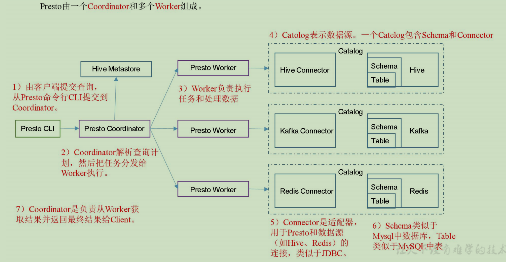
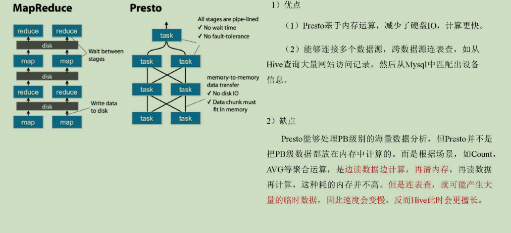
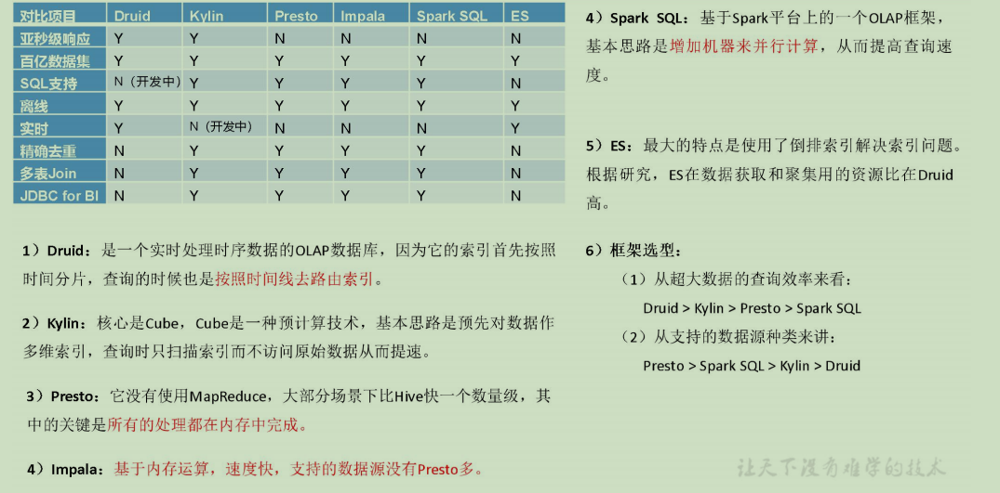
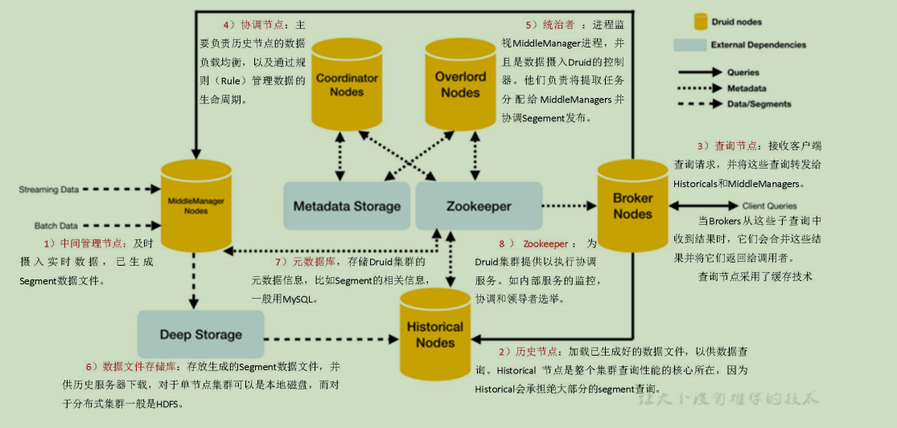
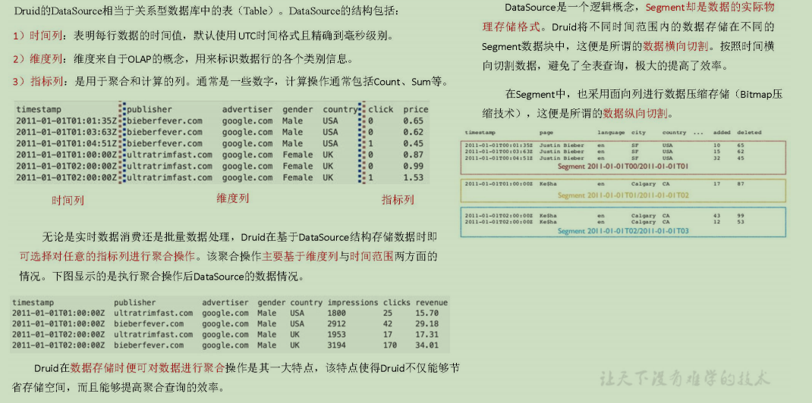

# 第1章 Presto

## 1.1 Presto简介

### 1.1.1 Presto概念

> Presto是一个开源的分布式SQL查询引擎，数据量支持GB到PB字节，主要用来处理秒级查询的场景。
> 注意:虽然Presto可以解析SQL，但它不是一个标准的数据库。不是MySQL、Oracle的代替品，也不能用来处理在线事务（OLTP)。

### 1.1.2 Presto架构

### 1.1.3 Presto优缺点

### 1.1.4 Presto、Impala性能比较

https://blog.csdn.net/u012551524/article/details/79124532
测试结论：Impala性能稍领先于Presto，但是Presto在数据源支持上非常丰富，包括Hive、图数据库、传统关系型数据库、Redis等。

## 1.2 Presto安装

### 1.2.1 Presto Server安装

0）官网地址
https://prestodb.github.io/
1）下载地址
https://repo1.maven.org/maven2/com/facebook/presto/presto-server/0.196/presto-server-0.196.tar.gz 
2）将presto-server-0.196.tar.gz导入hadoop102的/opt/software目录下，并解压到/opt/module目录
[atguigu@hadoop102 software]$ tar -zxvf presto-server-0.196.tar.gz -C /opt/module/
3）修改名称为presto
[atguigu@hadoop102 module]$ mv presto-server-0.196/ presto
4）进入到/opt/module/presto目录，并创建存储数据文件夹
[atguigu@hadoop102 presto]$ mkdir data
5）进入到/opt/module/presto目录，并创建存储配置文件文件夹
[atguigu@hadoop102 presto]$ mkdir etc
6）配置在/opt/module/presto/etc目录下添加jvm.config配置文件
[atguigu@hadoop102 etc]$ vim jvm.config
添加如下内容
-server
-Xmx16G
-XX:+UseG1GC
-XX:G1HeapRegionSize=32M
-XX:+UseGCOverheadLimit
-XX:+ExplicitGCInvokesConcurrent
-XX:+HeapDumpOnOutOfMemoryError
-XX:+ExitOnOutOfMemoryError
7）Presto可以支持多个数据源，在Presto里面叫catalog，这里我们配置支持Hive的数据源，配置一个Hive的catalog
[atguigu@hadoop102 etc]$ mkdir catalog
[atguigu@hadoop102 catalog]$ vim hive.properties 
添加如下内容
connector.name=hive-hadoop2
hive.metastore.uri=thrift://hadoop102:9083
8）将hadoop102上的presto分发到hadoop103、hadoop104
[atguigu@hadoop102 module]$ xsync presto
9）分发之后，分别进入hadoop102、hadoop103、hadoop104三台主机的/opt/module/presto/etc的路径。配置node属性，node id每个节点都不一样。
[atguigu@hadoop102 etc]$vim node.properties
node.environment=production
node.id=ffffffff-ffff-ffff-ffff-ffffffffffff
node.data-dir=/opt/module/presto/data

[atguigu@hadoop103 etc]$vim node.properties
node.environment=production
node.id=ffffffff-ffff-ffff-ffff-fffffffffffe
node.data-dir=/opt/module/presto/data

[atguigu@hadoop104 etc]$vim node.properties
node.environment=production
node.id=ffffffff-ffff-ffff-ffff-fffffffffffd
node.data-dir=/opt/module/presto/data
10）Presto是由一个coordinator节点和多个worker节点组成。在hadoop102上配置成coordinator，在hadoop103、hadoop104上配置为worker。
（1）hadoop102上配置coordinator节点
[atguigu@hadoop102 etc]$ vim config.properties
添加内容如下
coordinator=true
node-scheduler.include-coordinator=false
http-server.http.port=8881
query.max-memory=50GB
discovery-server.enabled=true
discovery.uri=http://hadoop102:8881
（2）hadoop103、hadoop104上配置worker节点
[atguigu@hadoop103 etc]$ vim config.properties
添加内容如下
coordinator=false
http-server.http.port=8881
query.max-memory=50GB
discovery.uri=http://hadoop102:8881

[atguigu@hadoop104 etc]$ vim config.properties
添加内容如下
coordinator=false
http-server.http.port=8881
query.max-memory=50GB
discovery.uri=http://hadoop102:8881
11）在hadoop102的/opt/module/hive目录下，启动Hive Metastore，用atguigu角色
[atguigu@hadoop102 hive]$
nohup bin/hive --service metastore >/dev/null 2>&1 &
12）分别在hadoop102、hadoop103、hadoop104上启动Presto Server
（1）前台启动Presto，控制台显示日志
[atguigu@hadoop102 presto]$ bin/launcher run
[atguigu@hadoop103 presto]$ bin/launcher run
[atguigu@hadoop104 presto]$ bin/launcher run
（2）后台启动Presto
[atguigu@hadoop102 presto]$ bin/launcher start
[atguigu@hadoop103 presto]$ bin/launcher start
[atguigu@hadoop104 presto]$ bin/launcher start
13）日志查看路径/opt/module/presto/data/var/log

### 1.2.2 Presto命令行Client安装

1）下载Presto的客户端
https://repo1.maven.org/maven2/com/facebook/presto/presto-cli/0.196/presto-cli-0.196-executable.jar
2）将presto-cli-0.196-executable.jar上传到hadoop102的/opt/module/presto文件夹下
3）修改文件名称
[atguigu@hadoop102 presto]$ mv presto-cli-0.196-executable.jar  prestocli
4）增加执行权限
[atguigu@hadoop102 presto]$ chmod +x prestocli
5）启动prestocli
[atguigu@hadoop102 presto]$ ./prestocli --server hadoop102:8881 --catalog hive --schema default
6）Presto命令行操作
Presto的命令行操作，相当于Hive命令行操作。每个表必须要加上schema。
例如：
select * from schema.table limit 100

### 1.2.3 Presto可视化Client安装

1）将yanagishima-18.0.zip上传到hadoop102的/opt/module目录
2）解压缩yanagishima
[atguigu@hadoop102 module]$ unzip yanagishima-18.0.zip
cd yanagishima-18.0
3）进入到/opt/module/yanagishima-18.0/conf文件夹，编写yanagishima.properties配置
[atguigu@hadoop102 conf]$ vim yanagishima.properties
  添加如下内容
jetty.port=7080
presto.datasources=atguigu-presto
presto.coordinator.server.atguigu-presto=http://hadoop102:8881
catalog.atguigu-presto=hive
schema.atguigu-presto=default
sql.query.engines=presto
4）在/opt/module/yanagishima-18.0路径下启动yanagishima
[atguigu@hadoop102 yanagishima-18.0]$
nohup bin/yanagishima-start.sh >y.log 2>&1 &
5）启动web页面
http://hadoop102:7080 
看到界面，进行查询了。
6）查看表结构

这里有个Tree View，可以查看所有表的结构，包括Schema、表、字段等。
比如执行select * from hive.dw_weather.tmp_news_click limit 10，这个句子里Hive这个词可以删掉，是上面配置的Catalog

每个表后面都有个复制键，点一下会复制完整的表名，然后再上面框里面输入sql语句，ctrl+enter键执行显示结果

## 1.3 Presto优化之数据存储

### 1.3.1 合理设置分区

与Hive类似，Presto会根据元数据信息读取分区数据，合理的分区能减少Presto数据读取量，提升查询性能。

### 1.3.2 使用列式存储

Presto对ORC文件读取做了特定优化，因此在Hive中创建Presto使用的表时，建议采用ORC格式存储。相对于Parquet，Presto对ORC支持更好。

### 1.3.3 使用压缩

数据压缩可以减少节点间数据传输对IO带宽压力，对于即席查询需要快速解压，建议采用Snappy压缩。

## 1.4 Presto优化之查询SQL

### 1.4.1 只选择使用的字段

由于采用列式存储，选择需要的字段可加快字段的读取、减少数据量。避免采用*读取所有字段。
[GOOD]: SELECT time, user, host FROM tbl

[BAD]:  SELECT * FROM tbl

### 1.4.2 过滤条件必须加上分区字段

对于有分区的表，where语句中优先使用分区字段进行过滤。acct_day是分区字段，visit_time是具体访问时间。
[GOOD]: SELECT time, user, host FROM tbl where acct_day=20171101

[BAD]:  SELECT * FROM tbl where visit_time=20171101

### 1.4.3 Group By语句优化

合理安排Group by语句中字段顺序对性能有一定提升。将Group By语句中字段按照每个字段distinct数据多少进行降序排列。
[GOOD]: SELECT GROUP BY uid, gender

[BAD]:  SELECT GROUP BY gender, uid

### 1.4.4 Order by时使用Limit

Order by需要扫描数据到单个worker节点进行排序，导致单个worker需要大量内存。如果是查询Top N或者Bottom N，使用limit可减少排序计算和内存压力。
[GOOD]: SELECT * FROM tbl ORDER BY time LIMIT 100

[BAD]:  SELECT * FROM tbl ORDER BY time

### 1.4.5 使用Join语句时将大表放在左边(与hive不一样)

Presto中join的默认算法是broadcast join，即将join左边的表分割到多个worker，然后将join右边的表数据整个复制一份发送到每个worker进行计算。如果右边的表数据量太大，则可能会报内存溢出错误。
[GOOD] SELECT ... FROM large_table l join small_table s on l.id = s.id
[BAD] SELECT ... FROM small_table s join large_table l on l.id = s.id

## 1.5 注意事项

### 1.5.1 字段名引用

避免和关键字冲突：MySQL对字段加反引号`、Presto对字段加双引号分割
当然，如果字段名称不是关键字，可以不加这个双引号。

### 1.5.2 时间函数

对于Timestamp，需要进行比较的时候，需要添加Timestamp关键字，而MySQL中对Timestamp可以直接进行比较。
/*MySQL的写法*/
SELECT t FROM a WHERE t > '2017-01-01 00:00:00'; 

/*Presto中的写法*/
SELECT t FROM a WHERE t > timestamp '2017-01-01 00:00:00';

### 1.5.3 不支持INSERT OVERWRITE语法

Presto中不支持insert overwrite语法，只能先delete，然后insert into。

### 1.5.4 PARQUET格式

Presto目前支持Parquet格式，支持查询，但不支持insert。

# 第2章 Druid

## 2.1 Druid简介

### 2.1.1 Druid概念

> Druid是一个快速的列式分布式的支持实时分析的数据存储系统。它在处理PB级数据、毫秒级查询、数据实时处理方面，比传统的OLAP系统有了显著的性能改进。
> Druid的官方网站是http://druid.io。
> 注意:阿里巴巴也曾创建过一个开源项目叫作Druid（简称阿里Druid），它是一个数据库连接池的项目。阿里Druid和本文讨论的Druid没有任何关系，它们解决完全不同的问题。

### 2.1.2 Druid特点

> 1）列式存储格式。Druid使用面向列的存储，它只需要加载特定查询所需要的列。查询速度迅速快。
> 2）可扩展的分布式系统。Druid通常部署在数十到数百台服务器的集群中，并且提供数百万条/秒的摄取率，保留数百万条记录，以及亚秒级到几秒钟的查询延迟。
> 3）大规模的并行处理。Druid可以在整个集群中进行大规模的并行查询。
> 4）实时或批量摄取。Druid可以实时摄取数据（实时获取的数据可立即用于查询）或批量处理数据。
> 5）自愈，自平衡，易操作。集群扩展和缩小，只需添加或删除服务器，集群将在后台自动重新平衡，无需任何停机时间。
> 6）数据进行了有效的预聚合或预计算，查询速度快。
> 7）数据的结果应用了Bitmap压缩算法。

### 2.1.3 Druid应用场景

> 1）适用于清洗好的记录实时录入，但不需要更新操作
> 2）适用于支持宽表，不用Join的方式（换句话说就是一张单表)
> 3）适用于可以总结出基础的统计指标，用一个字段表示
> 4）适用于实时性要求高的场景
> 5）适用于对数据质量的敏感度不高的场景

### 2.1.4 Druid对比Impala/Presto/Spark SQL/Kylin/Elasticsearch

## 2.2 Druid框架原理

## 2.3 Druid数据结构

与Druid架构相辅相成的是其基于DataSource与Segment的数据结构，它们共同成就了Druid的高性能优势。

## 2.4 Druid安装（单机版）

### 2.4.1 安装包下载

从https://imply.io/get-started 下载最新版本安装包

### 2.4.2 安装部署

imply集成了Druid，提供了Druid从部署到配置到各种可视化工具的完整的解决方案，imply有点类似于我们之前学过的Cloudera Manager
1）将imply-2.7.10.tar.gz上传到hadoop102的/opt/software目录下，并解压
[atguigu@hadoop102 software]$ tar -zxvf imply-2.7.10.tar.gz -C /opt/module
2）修改/opt/module/imply-2.7.10名称为/opt/module/imply
[atguigu@hadoop102 module]$ mv imply-2.7.10/ imply
3）修改配置文件
（1）修改Druid的ZK配置
[atguigu@hadoop102 _common]$ vi /opt/module/imply/conf/druid/_common/common.runtime.properties
修改如下内容
druid.zk.service.host=hadoop102:2181,hadoop103:2181,hadoop104:2181
（2）修改启动命令参数，使其不校验不启动内置ZK
[atguigu@hadoop102 supervise]$ 
vim /opt/module/imply/conf/supervise/quickstart.conf
修改如下内容
:verify bin/verify-java
#:verify bin/verify-default-ports
#:verify bin/verify-version-check
:kill-timeout 10

#!p10 zk bin/run-zk conf-quickstart
4）启动
（1）启动Zookeeper
[atguigu@hadoop102 imply]$ zk.sh start
（2）启动imply
[atguigu@hadoop102 imply]$ bin/supervise  -c conf/supervise/quickstart.conf
说明：每启动一个服务均会打印出一条日志。可以通过/opt/module/imply/var/sv/查看服务启动时的日志信息
（3）启动采集Flume和Kafka（主要是为了节省内存开销，同时hadoop102内存调整为8G）
[atguigu@hadoop102 imply]$ f1.sh start
[atguigu@hadoop102 imply]$ kf.sh start

### 2.4.3 Web页面使用

0）启动日志生成程序（延时1秒发送一条日志）
[atguigu@hadoop102 server]$ lg.sh 1000 5000
1）登录hadoop102:9095查看

2）点击Load data->点击Apache Kafka

3）添加Kafka Broker和要消费的topic

4）确认数据样本格式

5）加载数据，必须要有时间字段

6）配置要加载哪些列

7）创建数据库表名

8）重新观察一下配置

9）连接Kafka的topic_start

10）点击SQL

11）查询指标
select sum(mid) from "topic_start"

### 2.4.4 停止服务

按Ctrl + c中断监督进程，如果想中断服务后进行干净的启动，请删除/opt/module/imply/var/目录。

# 第3章 Kylin

## 3.1 Kylin简介

### 3.1.1 Kylin 定义

Apache Kylin是一个开源的分布式分析引擎，提供Hadoop/Spark之上的SQL查询接口及多维分析（OLAP）能力以支持超大规模数据，最初由eBay Inc开发并贡献至开源社区。它能在亚秒内查询巨大的Hive表。

### 3.1.2 Kylin架构

1）REST Server
REST Server是一套面向应用程序开发的入口点，旨在实现针对Kylin平台的应用开发工作。 此类应用程序可以提供查询、获取结果、触发cube构建任务、获取元数据以及获取用户权限等等。另外可以通过Restful接口实现SQL查询。
2）查询引擎（Query Engine）
当cube准备就绪后，查询引擎就能够获取并解析用户查询。它随后会与系统中的其它组件进行交互，从而向用户返回对应的结果。 
3）路由器（Routing）
在最初设计时曾考虑过将Kylin不能执行的查询引导去Hive中继续执行，但在实践后发现Hive与Kylin的速度差异过大，导致用户无法对查询的速度有一致的期望，很可能大多数查询几秒内就返回结果了，而有些查询则要等几分钟到几十分钟，因此体验非常糟糕。最后这个路由功能在发行版中默认关闭。
4）元数据管理工具（Metadata）
Kylin是一款元数据驱动型应用程序。元数据管理工具是一大关键性组件，用于对保存在Kylin当中的所有元数据进行管理，其中包括最为重要的cube元数据。其它全部组件的正常运作都需以元数据管理工具为基础。 Kylin的元数据存储在hbase中。 
5）任务引擎（Cube Build Engine）
这套引擎的设计目的在于处理所有离线任务，其中包括shell脚本、Java API以及Map Reduce任务等等。任务引擎对Kylin当中的全部任务加以管理与协调，从而确保每一项任务都能得到切实执行并解决其间出现的故障。

### 3.1.3 Kylin特点

Kylin的主要特点包括支持SQL接口、支持超大规模数据集、亚秒级响应、可伸缩性、高吞吐率、BI工具集成等。
1）标准SQL接口：Kylin是以标准的SQL作为对外服务的接口。
2）支持超大数据集：Kylin对于大数据的支撑能力可能是目前所有技术中最为领先的。早在2015年eBay的生产环境中就能支持百亿记录的秒级查询，之后在移动的应用场景中又有了千亿记录秒级查询的案例。
3）亚秒级响应：Kylin拥有优异的查询相应速度，这点得益于预计算，很多复杂的计算，比如连接、聚合，在离线的预计算过程中就已经完成，这大大降低了查询时刻所需的计算量，提高了响应速度。
4）可伸缩性和高吞吐率：单节点Kylin可实现每秒70个查询，还可以搭建Kylin的集群。
5）BI工具集成
Kylin可以与现有的BI工具集成，具体包括如下内容。
ODBC：与Tableau、Excel、PowerBI等工具集成
JDBC：与Saiku、BIRT等Java工具集成
RestAPI：与JavaScript、Web网页集成
Kylin开发团队还贡献了Zepplin的插件，也可以使用Zepplin来访问Kylin服务。

## 3.2 Kylin安装

### 3.2.1 Kylin依赖环境

安装Kylin前需先部署好Hadoop、Hive、Zookeeper、HBase，并且需要在/etc/profile中配置以下环境变量HADOOP_HOME，HIVE_HOME，HBASE_HOME，记得source使其生效。

### 3.2.2 Kylin搭建

1）下载Kylin安装包
下载地址：http://kylin.apache.org/cn/download/
2）解压apache-kylin-2.5.1-bin-hbase1x.tar.gz到/opt/module
[atguigu@hadoop102 sorfware]$ tar -zxvf apache-kylin-2.5.1-bin-hbase1x.tar.gz -C /opt/module/
注意：启动前检查HADOOP_HOME，HIVE_HOME，HBASE_HOME是否配置完毕
3）启动
（1）启动Kylin之前，需先启动Hadoop（hdfs，yarn，jobhistoryserver）、Zookeeper、Hbase
（2）启动Kylin
[atguigu@hadoop102 kylin]$ bin/kylin.sh start
启动之后查看各个节点进程：
--------------------- hadoop102 ----------------
3360 JobHistoryServer
31425 HMaster
3282 NodeManager
3026 DataNode
53283 Jps
2886 NameNode
44007 RunJar
2728 QuorumPeerMain
31566 HRegionServer
--------------------- hadoop103 ----------------
5040 HMaster
2864 ResourceManager
9729 Jps
2657 QuorumPeerMain
4946 HRegionServer
2979 NodeManager
2727 DataNode
--------------------- hadoop104 ----------------
4688 HRegionServer
2900 NodeManager
9848 Jps
2636 QuorumPeerMain
2700 DataNode
2815 SecondaryNameNode

在http://hadoop102:7070/kylin查看Web页面

用户名为：ADMIN，密码为：KYLIN
3）关闭
[atguigu@hadoop102 kylin]$ bin/kylin.sh stop

## 3.3 Kylin使用

以gmall数据仓库中的dwd_payment_info作为事实表，dwd_order_info_his、dwd_user_info作为维度表，构建星型模型，并演示如何使用Kylin进行OLAP分析。

### 3.3.1 创建工程

1）点击下图中的"+"。

2）填写项目名称和描述信息，并点击Submit按钮提交。

### 3.3.2 获取数据源

1）点击DataSource

2）点击下图按钮导入Hive表

3）选择所需数据表，并点击Sync按钮

### 3.3.3 创建model

1）点击Models，点击"+New"按钮，点击"★New Model"按钮。

2）填写Model信息，点击Next

3）指定事实表

4）选择维度表，并指定事实表和维度表的关联条件，点击Ok

维度表添加完毕之后，点击Next

5）指定维度字段，并点击Next

6）指定度量字段，并点击Next

7）指定事实表分区字段（仅支持时间分区），点击Save按钮，model创建完毕

### 3.3.4 构建cube

1）点击new， 并点击new cube

2）填写cube信息，选择cube所依赖的model，并点击next

3）选择所需的维度，如下图所示

4）选择所需度量值，如下图所示

4）cube自动合并设置，cube需按照日期分区字段每天进行构建，每次构建的结果会保存在Hbase中的一张表内，为提高查询效率，需将每日的cube进行合并，此处可设置合并周期。

5）Kylin高级配置（优化相关，暂时跳过）

6）Kylin相关属性配置覆盖

7）Cube信息总览，点击Save，Cube创建完成

8）构建Cube（计算），点击对应Cube的action按钮，选择build

9）选择要构建的时间区间，点击Submit

10）点击Monitor查看构建进度

### 3.3.5 使用进阶

1）每日全量维度表及拉链维度表重复Key问题如何处理
按照上述流程，会发现，在cube构建流程中出现以下错误

错误原因分析：
上述错误原因是model中的维度表dwd_dim_user_info_his为拉链表、dwd_dim_sku_info为每日全量表，故使用整张表作为维度表，必然会出现订单表中同一个user_id或者sku_id对应多条数据的问题，针对上述问题，有以下两种解决方案。
方案一：在hive中创建维度表的临时表，该临时表中只存放维度表最新的一份完整的数据，在kylin中创建模型时选择该临时表作为维度表。
方案二：与方案一思路相同，但不使用物理临时表，而选用视图（view）实现相同的功能。
此处采用方案二：
（1）创建维度表视图
--拉链维度表视图
create view dwd_dim_user_info_his_view as select * from dwd_dim_user_info_his where end_date='9999-99-99';

--全量维度表视图
create view dwd_dim_sku_info_view as select * from dwd_dim_sku_info where dt=date_add(current_date,-1);

--当前情形我们先创建一个2020-03-10的视图
create view dwd_dim_sku_info_view as select * from dwd_dim_sku_info where dt='2020-03-10';
（2）在DataSource中导入新创建的视图，之前的维度表，可选择性删除。

（3）重新创建model、cube。
（4）查询结果
select
    ui.gender,
    si.category3_id,
    dp.region_id,
    sum(od.total_amount)
from
    dwd_fact_order_detail od
join
    dwd_dim_user_info_view ui
on
    od.user_id=ui.id
join
    dwd_dim_sku_info_view si
on
    od.sku_id=si.id
join
    dwd_dim_base_province dp
on
    od.province_id=dp.id
group by
    ui.gender,si.category3_id,dp.region_id;

2）如何实现每日自动构建cube
Kylin提供了Restful API，因次我们可以将构建cube的命令写到脚本中，将脚本交给azkaban或者oozie这样的调度工具，以实现定时调度的功能。
脚本如下:
#!/bin/bash
cube_name=order_cube
do_date=`date -d '-1 day' +%F`

#获取00:00时间戳
start_date_unix=`date -d "$do_date 08:00:00" +%s`
start_date=$(($start_date_unix*1000))

#获取24:00的时间戳
stop_date=$(($start_date+86400000))

curl -X PUT -H "Authorization: Basic QURNSU46S1lMSU4=" -H 'Content-Type: application/json' -d '{"startTime":'$start_date', "endTime":'$stop_date', "buildType":"BUILD"}' http://hadoop102:7070/kylin/api/cubes/$cube_name/build

## 3.4 Kylin Cube构建原理

### 3.4.1 维度和度量

维度：即观察数据的角度。比如员工数据，可以从性别角度来分析，也可以更加细化，从入职时间或者地区的维度来观察。维度是一组离散的值，比如说性别中的男和女，或者时间维度上的每一个独立的日期。因此在统计时可以将维度值相同的记录聚合在一起，然后应用聚合函数做累加、平均、最大和最小值等聚合计算。
度量：即被聚合（观察）的统计值，也就是聚合运算的结果。比如说员工数据中不同性别员工的人数，又或者说在同一年入职的员工有多少。

### 3.4.2 Cube和Cuboid

有了维度跟度量，一个数据表或者数据模型上的所有字段就可以分类了，它们要么是维度，要么是度量（可以被聚合）。于是就有了根据维度和度量做预计算的Cube理论。
给定一个数据模型，我们可以对其上的所有维度进行聚合，对于N个维度来说，组合`的所有可能性共有2n种。对于每一种维度的组合，将度量值做聚合计算，然后将结果保存为一个物化视图，称为Cuboid。所有维度组合的Cuboid作为一个整体，称为Cube。
下面举一个简单的例子说明，假设有一个电商的销售数据集，其中维度包括时间[time]、商品[item]、地区[location]和供应商[supplier]，度量为销售额。那么所有维度的组合就有24 = 16种，如下图所示：

一维度（1D）的组合有：[time]、[item]、[location]和[supplier]4种；
二维度（2D）的组合有：[time, item]、[time, location]、[time, supplier]、[item, location]、[item, supplier]、[location, supplier]3种；
三维度（3D）的组合也有4种；
最后还有零维度（0D）和四维度（4D）各有一种，总共16种。
注意：每一种维度组合就是一个Cuboid，16个Cuboid整体就是一个Cube。

### 3.4.3 Cube构建算法

1）逐层构建算法（layer）

我们知道，一个N维的Cube，是由1个N维子立方体、N个(N-1)维子立方体、N*(N-1)/2个(N-2)维子立方体、......、N个1维子立方体和1个0维子立方体构成，总共有2^N个子立方体组成，在逐层算法中，按维度数逐层减少来计算，每个层级的计算（除了第一层，它是从原始数据聚合而来），是基于它上一层级的结果来计算的。比如，[Group by A, B]的结果，可以基于[Group by A, B, C]的结果，通过去掉C后聚合得来的；这样可以减少重复计算；当 0维度Cuboid计算出来的时候，整个Cube的计算也就完成了。
每一轮的计算都是一个MapReduce任务，且串行执行；一个N维的Cube，至少需要N次MapReduce Job。

算法优点：
1）此算法充分利用了MapReduce的优点，处理了中间复杂的排序和shuffle工作，故而算法代码清晰简单，易于维护；
2）受益于Hadoop的日趋成熟，此算法非常稳定，即便是集群资源紧张时，也能保证最终能够完成。
算法缺点：
1）当Cube有比较多维度的时候，所需要的MapReduce任务也相应增加；由于Hadoop的任务调度需要耗费额外资源，特别是集群较庞大的时候，反复递交任务造成的额外开销会相当可观；
2）由于Mapper逻辑中并未进行聚合操作，所以每轮MR的shuffle工作量都很大，导致效率低下。
3）对HDFS的读写操作较多：由于每一层计算的输出会用做下一层计算的输入，这些Key-Value需要写到HDFS上；当所有计算都完成后，Kylin还需要额外的一轮任务将这些文件转成HBase的HFile格式，以导入到HBase中去；
总体而言，该算法的效率较低，尤其是当Cube维度数较大的时候。
2）快速构建算法（inmem）

也被称作“逐段”(By Segment) 或“逐块”(By Split) 算法，从1.5.x开始引入该算法，该算法的主要思想是，每个Mapper将其所分配到的数据块，计算成一个完整的小Cube 段（包含所有Cuboid）。每个Mapper将计算完的Cube段输出给Reducer做合并，生成大Cube，也就是最终结果。如图所示解释了此流程。

与旧算法相比，快速算法主要有两点不同：
1） Mapper会利用内存做预聚合，算出所有组合；Mapper输出的每个Key都是不同的，这样会减少输出到Hadoop MapReduce的数据量，Combiner也不再需要；
2）一轮MapReduce便会完成所有层次的计算，减少Hadoop任务的调配。
3.4.4 Cube存储原理

## 3.5 Kylin Cube构建优化

### 3.5.1 使用衍生维度（derived dimension）

衍生维度用于在有效维度内将维度表上的非主键维度排除掉，并使用维度表的主键（其实是事实表上相应的外键）来替代它们。Kylin会在底层记录维度表主键与维度表其他维度之间的映射关系，以便在查询时能够动态地将维度表的主键“翻译”成这些非主键维度，并进行实时聚合。

虽然衍生维度具有非常大的吸引力，但这也并不是说所有维度表上的维度都得变成衍生维度，如果从维度表主键到某个维度表维度所需要的聚合工作量非常大，则不建议使用衍生维度。

### 3.5.2 使用聚合组（Aggregation group）

聚合组（Aggregation Group）是一种强大的剪枝工具。聚合组假设一个Cube的所有维度均可以根据业务需求划分成若干组（当然也可以是一个组），由于同一个组内的维度更可能同时被同一个查询用到，因此会表现出更加紧密的内在关联。每个分组的维度集合均是Cube所有维度的一个子集，不同的分组各自拥有一套维度集合，它们可能与其他分组有相同的维度，也可能没有相同的维度。每个分组各自独立地根据自身的规则贡献出一批需要被物化的Cuboid，所有分组贡献的Cuboid的并集就成为了当前Cube中所有需要物化的Cuboid的集合。不同的分组有可能会贡献出相同的Cuboid，构建引擎会察觉到这点，并且保证每一个Cuboid无论在多少个分组中出现，它都只会被物化一次。
对于每个分组内部的维度，用户可以使用如下三种可选的方式定义，它们之间的关系，具体如下。
1）强制维度（Mandatory），如果一个维度被定义为强制维度，那么这个分组产生的所有Cuboid中每一个Cuboid都会包含该维度。每个分组中都可以有0个、1个或多个强制维度。如果根据这个分组的业务逻辑，则相关的查询一定会在过滤条件或分组条件中，因此可以在该分组中把该维度设置为强制维度。

2）层级维度（Hierarchy），每个层级包含两个或更多个维度。假设一个层级中包含D1，D2…Dn这n个维度，那么在该分组产生的任何Cuboid中， 这n个维度只会以（），（D1），（D1，D2）…（D1，D2…Dn）这n+1种形式中的一种出现。每个分组中可以有0个、1个或多个层级，不同的层级之间不应当有共享的维度。如果根据这个分组的业务逻辑，则多个维度直接存在层级关系，因此可以在该分组中把这些维度设置为层级维度。

3）联合维度（Joint），每个联合中包含两个或更多个维度，如果某些列形成一个联合，那么在该分组产生的任何Cuboid中，这些联合维度要么一起出现，要么都不出现。每个分组中可以有0个或多个联合，但是不同的联合之间不应当有共享的维度（否则它们可以合并成一个联合）。如果根据这个分组的业务逻辑，多个维度在查询中总是同时出现，则可以在该分组中把这些维度设置为联合维度。

这些操作可以在Cube Designer的Advanced Setting中的Aggregation Groups区域完成，如下图所示。

聚合组的设计非常灵活，甚至可以用来描述一些极端的设计。假设我们的业务需求非常单一，只需要某些特定的Cuboid，那么可以创建多个聚合组，每个聚合组代表一个Cuboid。具体的方法是在聚合组中先包含某个Cuboid所需的所有维度，然后把这些维度都设置为强制维度。这样当前的聚合组就只能产生我们想要的那一个Cuboid了。
再比如，有的时候我们的Cube中有一些基数非常大的维度，如果不做特殊处理，它就会和其他的维度进行各种组合，从而产生一大堆包含它的Cuboid。包含高基数维度的Cuboid在行数和体积上往往非常庞大，这会导致整个Cube的膨胀率变大。如果根据业务需求知道这个高基数的维度只会与若干个维度（而不是所有维度）同时被查询到，那么就可以通过聚合组对这个高基数维度做一定的“隔离”。我们把这个高基数的维度放入一个单独的聚合组，再把所有可能会与这个高基数维度一起被查询到的其他维度也放进来。这样，这个高基数的维度就被“隔离”在一个聚合组中了，所有不会与它一起被查询到的维度都没有和它一起出现在任何一个分组中，因此也就不会有多余的Cuboid产生。这点也大大减少了包含该高基数维度的Cuboid的数量，可以有效地控制Cube的膨胀率。

### 3.5.3 Row Key优化

Kylin会把所有的维度按照顺序组合成一个完整的Rowkey，并且按照这个Rowkey升序排列Cuboid中所有的行。
设计良好的Rowkey将更有效地完成数据的查询过滤和定位，减少IO次数，提高查询速度，维度在rowkey中的次序，对查询性能有显著的影响。
Row key的设计原则如下：
1）被用作where过滤的维度放在前边。

2）基数大的维度放在基数小的维度前边。

### 3.5.4 并发粒度优化

当Segment中某一个Cuboid的大小超出一定的阈值时，系统会将该Cuboid的数据分片到多个分区中，以实现Cuboid数据读取的并行化，从而优化Cube的查询速度。具体的实现方式如下：构建引擎根据Segment估计的大小，以及参数“kylin.hbase.region.cut”的设置决定Segment在存储引擎中总共需要几个分区来存储，如果存储引擎是HBase，那么分区的数量就对应于HBase中的Region数量。kylin.hbase.region.cut的默认值是5.0，单位是GB，也就是说对于一个大小估计是50GB的Segment，构建引擎会给它分配10个分区。用户还可以通过设置kylin.hbase.region.count.min（默认为1）和kylin.hbase.region.count.max（默认为500）两个配置来决定每个Segment最少或最多被划分成多少个分区。

由于每个Cube的并发粒度控制不尽相同，因此建议在Cube Designer 的Configuration Overwrites（上图所示）中为每个Cube量身定制控制并发粒度的参数。假设将把当前Cube的kylin.hbase.region.count.min设置为2，kylin.hbase.region.count.max设置为100。这样无论Segment的大小如何变化，它的分区数量最小都不会低于2，最大都不会超过100。相应地，这个Segment背后的存储引擎（HBase）为了存储这个Segment，也不会使用小于两个或超过100个的分区。我们还调整了默认的kylin.hbase.region.cut，这样50GB的Segment基本上会被分配到50个分区，相比默认设置，我们的Cuboid可能最多会获得5倍的并发量。

## 3.6 Kylin BI工具集成

可以与Kylin结合使用的可视化工具很多，例如：
ODBC：与Tableau、Excel、PowerBI等工具集成
JDBC：与Saiku、BIRT等Java工具集成
RestAPI：与JavaScript、Web网页集成
Kylin开发团队还贡献了Zepplin的插件，也可以使用Zepplin来访问Kylin服务。

### 3.6.1 JDBC

1）新建项目并导入依赖
    <dependencies>
        <dependency>
            <groupId>org.apache.kylin</groupId>
            <artifactId>kylin-jdbc</artifactId>
            <version>2.5.1</version>
        </dependency>
    </dependencies>
2）编码
package com.atguigu;

import java.sql.*;

public class TestKylin {

    public static void main(String[] args) throws Exception {
    
        //Kylin_JDBC 驱动
        String KYLIN_DRIVER = "org.apache.kylin.jdbc.Driver";
    
        //Kylin_URL
        String KYLIN_URL = "jdbc:kylin://hadoop102:7070/FirstProject";
    
        //Kylin的用户名
        String KYLIN_USER = "ADMIN";
    
        //Kylin的密码
        String KYLIN_PASSWD = "KYLIN";
    
        //添加驱动信息
        Class.forName(KYLIN_DRIVER);
    
        //获取连接
        Connection connection = DriverManager.getConnection(KYLIN_URL, KYLIN_USER, KYLIN_PASSWD);
    
        //预编译SQL
        PreparedStatement ps = connection.prepareStatement("SELECT sum(sal) FROM emp group by deptno");
    
        //执行查询
        ResultSet resultSet = ps.executeQuery();
    
        //遍历打印
        while (resultSet.next()) {
            System.out.println(resultSet.getInt(1));
        }
    }
}
3）结果展示

### 3.6.2 Zepplin

1）Zepplin安装与启动
（1）将zeppelin-0.8.0-bin-all.tgz上传至Linux
（2）解压zeppelin-0.8.0-bin-all.tgz之/opt/module
[atguigu@hadoop102 sorfware]$ tar -zxvf zeppelin-0.8.0-bin-all.tgz -C /opt/module/
（3）修改名称
[atguigu@hadoop102 module]$ mv zeppelin-0.8.0-bin-all/ zeppelin
（4）启动
[atguigu@hadoop102 zeppelin]$ bin/zeppelin-daemon.sh start
可登录网页查看，web默认端口号为8080
http://hadoop102:8080

2）配置Zepplin支持Kylin
（1）点击右上角anonymous选择Interpreter

（2）搜索Kylin插件并修改相应的配置

（3）修改完成点击Save完成

3）案例实操
需求：查询员工详细信息，并使用各种图表进行展示
（1）点击Notebook创建新的note

（2）填写Note Name点击Create

（3）执行查询

（4）结果展示

（5）其他图表格式