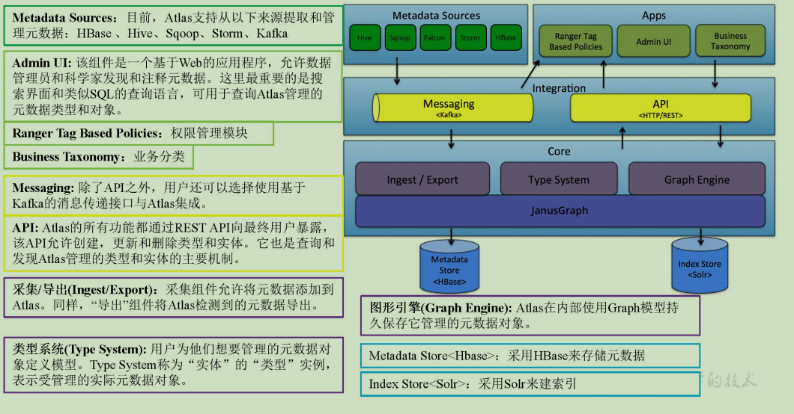

# 第1章 Atlas入门

## 1.1 Atlas概述

Apache Atlas为组织提供开放式元数据管理和治理功能，用以构建其数据资产目录，对这些资产进行分类和管理，并为数据分析师和数据治理团队，提供围绕这些数据资产的协作功能。
1）表与表之间的血缘依赖

2）字段与字段之间的血缘依赖

## 1.2 Atlas架构原理



# 第2章 Atlas安装及使用

1）Atlas官网地址：https://atlas.apache.org/
2）文档查看地址：https://atlas.apache.org/0.8.4/index.html
3）下载地址：https://www.apache.org/dyn/closer.cgi/atlas/0.8.4/apache-atlas-0.8.4-sources.tar.gz

## 2.1 安装前环境准备

Atlas安装分为：集成自带的HBase + Solr；集成外部的HBase + Solr。通常企业开发中选择集成外部的HBase + Solr，方便项目整体进行集成操作。
服务名称    子服务 服务器
hadoop102   服务器
hadoop103   服务器
hadoop104
HDFS    NameNode    √       
    DataNode    √   √   √
    SecondaryNameNode           √
Yarn    NodeManager √   √   √
    Resourcemanager     √   
Zookeeper   QuorumPeerMain  √   √   √
Kafka   Kafka   √   √   √
HBase   HMaster √       
    HRegionServer   √   √   √
Solr    Jar √   √   √
Hive    Hive    √       
MySQL   MySQL   √       
Azkaban AzkabanWebServer    √       
    AzkabanExecutorServer   √       
Atlas   atlas   √       
服务数总计       13  7   7

### 2.1.1 安装JDK8、Hadoop2.7.2

1）安装Hadoop集群

2）启动Hadoop集群
[atguigu@hadoop102 hadoop-2.7.2]$ sbin/start-dfs.sh
[atguigu@hadoop103 hadoop-2.7.2]$ sbin/start-yarn.sh

### 2.1.2 安装Zookeeper3.4.10

1）安装Zookeeper集群

2）启动Zookeeper集群
[atguigu@hadoop102 zookeeper-3.4.10]$ zk.sh start

### 2.1.3 安装Kafka0.11.0.2

1）安装Kafka集群

2）启动Kafka集群
[atguigu@hadoop102 kafka]$ kf.sh start

### 2.1.4 安装Hbase1.3.1

1）安装Hbase集群

2）启动Hbase集群
[atguigu@hadoop102 hbase]$ bin/start-hbase.sh

### 2.1.5 安装Solr5.2.1

1）Solr版本要求必须是5.2.1，见官网
2）Solr下载：http://archive.apache.org/dist/lucene/solr/5.2.1/solr-5.2.1.tgz
3）把solr-5.2.1.tgz上传到hadoop102的/opt/software目录下
4）解压solr-5.2.1.tgz到/opt/module/目录下面
[atguigu@hadoop102 software]$ tar -zxvf solr-5.2.1.tgz -C /opt/module/
5）修改solr-5.2.1的名称为solr
[atguigu@hadoop102 module]$ mv solr-5.2.1/ solr
6）进入solr/bin目录，修改solr.in.sh文件
[atguigu@hadoop102 solr]$ vim bin/solr.in.sh

```sh
#添加下列指令
ZK_HOST="hadoop102:2181,hadoop103:2181,hadoop104:2181"
SOLR_HOST="hadoop102"
# Sets the port Solr binds to, default is 8983
#可修改端口号
SOLR_PORT=8983
```

7）分发Solr，进行Cloud模式部署
[atguigu@hadoop102 module]$ xsync solr
提示：分发完成后，分别对hadoop103、hadoop104主机/opt/module/solr/bin下的solr.in.sh文件，修改为SOLR_HOST=对应主机名。
8）在三台节点上分别启动Solr，这个就是Cloud模式
[atguigu@hadoop102 solr]$ bin/solr start 
[atguigu@hadoop103 solr]$ bin/solr start 
[atguigu@hadoop104 solr]$ bin/solr start 
提示：启动Solr前，需要提前启动Zookeeper服务。
9）Web访问8983端口，可指定三台节点中的任意一台IP，http://hadoop102:8983/solr/#/ 

提示：UI界面出现Cloud菜单栏时，Solr的Cloud模式才算部署成功。
10）编写Solr启动停止脚本
（1）在hadoop102的/home/atguigu/bin目录下创建脚本
[atguigu@hadoop102 bin]$ vim s.sh
在脚本中编写如下内容
#!/bin/bash

case $1 in
"start"){
    for i in hadoop102 hadoop103 hadoop104
    do
        ssh $i "/opt/module/solr/bin/solr start"
    done
};;
"stop"){
    for i in hadoop102 hadoop103 hadoop104
    do
        ssh $i "/opt/module/solr/bin/solr stop"
    done
};;
esac
（2）增加脚本执行权限
[atguigu@hadoop102 bin]$ chmod 777 s.sh
（3）Solr集群启动脚本
[atguigu@hadoop102 module]$ s.sh start
（4）Solr集群停止脚本
[atguigu@hadoop102 module]$ s.sh stop

### 2.1.6 安装Hive2.3.6

### 2.1.7 安装Azkaban2.5.0

如果采用的Hive2.3.6版本，Azkaban需要在启动脚本中将hive的环境变量注释掉。

### 2.1.8 安装Atlas0.8.4

1）把apache-atlas-0.8.4-bin.tar.gz上传到hadoop102的/opt/software目录下
2）解压apache-atlas-0.8.4-bin.tar.gz到/opt/module/目录下面
[atguigu@hadoop102 software]$ tar -zxvf apache-atlas-0.8.4-bin.tar.gz -C /opt/module/
3）修改apache-atlas-0.8.4的名称为atlas
[atguigu@hadoop102 module]$ mv apache-atlas-0.8.4/ atlas

## 2.2 Atlas集成外部框架

### 2.2.1 Atlas集成Hbase 

1）进入/opt/module/atlas/conf/目录，修改配置文件
[atguigu@hadoop102 conf]$ vim atlas-application.properties 

#修改atlas存储数据主机
atlas.graph.storage.hostname=hadoop102:2181,hadoop103:2181,hadoop104:2181
2）进入到/opt/module/atlas/conf/hbase路径，添加Hbase集群的配置文件到${Atlas_Home}
[atguigu@hadoop102 hbase]$ 
ln -s /opt/module/hbase/conf/ /opt/module/atlas/conf/hbase/
3）在/opt/module/atlas/conf/atlas-env.sh中添加HBASE_CONF_DIR
[atguigu@hadoop102 conf]$ vim atlas-env.sh

#添加HBase配置文件路径
export HBASE_CONF_DIR=/opt/module/atlas/conf/hbase/conf

### 2.2.2 Atlas集成Solr 

1）进入/opt/module/atlas/conf目录，修改配置文件
[atguigu@hadoop102 conf]$ vim atlas-application.properties 

#修改如下配置
atlas.graph.index.search.solr.zookeeper-url=hadoop102:2181,hadoop103:2181,hadoop104:2181
2）将Atlas自带的Solr文件夹拷贝到外部Solr集群的各个节点。
[atguigu@hadoop102 conf]$ 
cp -r /opt/module/atlas/conf/solr /opt/module/solr/
3）进入到/opt/module/solr路径，修改拷贝过来的配置文件名称为atlas_conf
[atguigu@hadoop102 solr]$ mv solr atlas_conf
4）在Cloud模式下，启动Solr（需要提前启动Zookeeper集群），并创建collection
[atguigu@hadoop102 solr]$ bin/solr create -c vertex_index -d /opt/module/solr/atlas_conf -shards 3 -replicationFactor 2

[atguigu@hadoop102 solr]$ bin/solr create -c edge_index -d /opt/module/solr/atlas_conf -shards 3 -replicationFactor 2

[atguigu@hadoop102 solr]$ bin/solr create -c fulltext_index -d /opt/module/solr/atlas_conf -shards 3 -replicationFactor 2
-shards 3：表示该集合分片数为3
-replicationFactor 2：表示每个分片数都有2个备份
vertex_index、edge_index、fulltext_index：表示集合名称
注意：如果需要删除vertex_index、edge_index、fulltext_index等collection可以执行如下命令。
[atguigu@hadoop102 solr]$ bin/solr delete -c ${collection_name}
5）验证创建collection成功
登录solr web控制台：http://hadoop102:8983/solr/#/~cloud 看到如下图显示：

### 2.2.3 Atlas集成Kafka 

1）进入/opt/module/atlas/conf/目录，修改配置文件atlas-application.properties
[atguigu@hadoop102 conf]$ vim atlas-application.properties 

#########  Notification Configs  #########
atlas.notification.embedded=false
atlas.kafka.zookeeper.connect=hadoop102:2181,hadoop103:2181,hadoop104:2181
atlas.kafka.bootstrap.servers=hadoop102:9092,hadoop103:9092,hadoop104:9092
atlas.kafka.zookeeper.session.timeout.ms=4000
atlas.kafka.zookeeper.connection.timeout.ms=2000

atlas.kafka.enable.auto.commit=true
2）启动Kafka集群，并创建Topic
[atguigu@hadoop102 kafka]$ bin/kafka-topics.sh --zookeeper hadoop102:2181,hadoop103:2181,hadoop104:2181 --create --replication-factor 3 --partitions 3 --topic _HOATLASOK

[atguigu@hadoop102 kafka]$ bin/kafka-topics.sh --zookeeper hadoop102:2181,hadoop103:2181,hadoop104:2181 --create --replication-factor 3 --partitions 3 --topic ATLAS_ENTITIES

### 2.2.4 Atlas其他配置

1）进入/opt/module/atlas/conf/目录，修改配置文件atlas-application.properties
[atguigu@hadoop102 conf]$ vim atlas-application.properties 

```SH
#########  Server Properties  #########
atlas.rest.address=http://hadoop102:21000

# If enabled and set to true, this will run setup steps when the server starts

atlas.server.run.setup.on.start=false

#########  Entity Audit Configs  #########
atlas.audit.hbase.zookeeper.quorum=hadoop102:2181,hadoop103:2181,hadoop104:2181
```

2）记录性能指标，进入/opt/module/atlas/conf/路径，修改当前目录下的atlas-log4j.xml
[atguigu@hadoop102 conf]$ vim atlas-log4j.xml

#去掉如下代码的注释
<appender name="perf_appender" class="org.apache.log4j.DailyRollingFileAppender">
    <param name="file" value="${atlas.log.dir}/atlas_perf.log" />
    <param name="datePattern" value="'.'yyyy-MM-dd" />
    <param name="append" value="true" />
    <layout class="org.apache.log4j.PatternLayout">
        <param name="ConversionPattern" value="%d|%t|%m%n" />
    </layout>
</appender>

<logger name="org.apache.atlas.perf" additivity="false">
    <level value="debug" />
    <appender-ref ref="perf_appender" />
</logger>

### 2.2.5 Atlas集成Hive

1）进入/opt/module/atlas/conf/目录，修改配置文件atlas-application.properties
[atguigu@hadoop102 conf]$ vim atlas-application.properties 

######### Hive Hook Configs #######
atlas.hook.hive.synchronous=false
atlas.hook.hive.numRetries=3
atlas.hook.hive.queueSize=10000
atlas.cluster.name=primary
2）将atlas-application.properties配置文件加入到atlas-plugin-classloader-1.0.0.jar中 
[atguigu@hadoop102 hive]$ zip -u /opt/module/atlas/hook/hive/atlas-plugin-classloader-0.8.4.jar /opt/module/atlas/conf/atlas-application.properties

[atguigu@hadoop102 hive]$ cp /opt/module/atlas/conf/atlas-application.properties /opt/module/hive/conf/
原因：这个配置不能参照官网，将配置文件考到hive的conf中。参考官网的做法一直读取不到atlas-application.properties配置文件，看了源码发现是在classpath读取的这个配置文件，所以将它压到jar里面。
3）在/opt/module/hive/conf/hive-site.xml文件中设置Atlas hook
[atguigu@hadoop102 conf]$ vim hive-site.xml
<property>
      <name>hive.exec.post.hooks</name>
      <value>org.apache.atlas.hive.hook.HiveHook</value>
</property>

[atguigu@hadoop102 conf]$ vim hive-env.sh

#在tez引擎依赖的jar包后面追加hive插件相关jar包
export HIVE_AUX_JARS_PATH=/opt/module/hadoop-2.7.2/share/hadoop/common/hadoop-lzo-0.4.20.jar$TEZ_JARS,/opt/module/atlas/hook/hive/atlas-plugin-classloader-0.8.4.jar,/opt/module/atlas/hook/hive/hive-bridge-shim-0.8.4.jar

## 2.3 集群启动

1）启动Hadoop集群
[atguigu@hadoop102 hadoop-2.7.2]$ sbin/start-dfs.sh
[atguigu@hadoop103 hadoop-2.7.2]$ sbin/start-yarn.sh
2）启动Zookeeper集群
[atguigu@hadoop102 zookeeper-3.4.10]$ zk.sh start
3）启动Kafka集群
[atguigu@hadoop102 kafka]$ kf.sh start
4）启动Hbase集群：
[atguigu@hadoop102 hbase]$ bin/start-hbase.sh
5）启动Solr集群
[atguigu@hadoop102 solr]$ bin/solr start
[atguigu@hadoop103 solr]$ bin/solr start
[atguigu@hadoop104 solr]$ bin/solr start
6）进入/opt/module/atlas路径，重新启动Atlas服务
[atguigu@hadoop102 atlas]$ bin/atlas_stop.py

[atguigu@hadoop102 atlas]$ bin/atlas_start.py
提示：错误信息查看路径：/opt/module/atlas/logs/*.out和application.log
访问地址：http://hadoop102:21000
注意：等待时间大概2分钟。
账户：admin
密码：admin

## 2.4 将Hive元数据导入Atlas

1）配置Hive环境变量
[atguigu@hadoop102 hive]$ sudo vim /etc/profile

#配置Hive环境变量
export HIVE_HOME=/opt/module/hive
export PATH=$PATH:$HIVE_HOME/bin/

[atguigu@hadoop102 hive]$ source /etc/profile
2）启动Hive，如果Hive能正常启动说明环境OK，就可以退出Hive客户端
[atguigu@hadoop102 hive]$ hive 
hive (default)> show databases;
hive (default)> use gmall;
3）在/opt/module/atlas/路径，将Hive元数据导入到Atlas
[atguigu@hadoop102 atlas]$ bin/import-hive.sh

Using Hive configuration directory [/opt/module/hive/conf]
Log file for import is /opt/module/atlas/logs/import-hive.log
log4j:WARN No such property [maxFileSize] in org.apache.log4j.PatternLayout.
log4j:WARN No such property [maxBackupIndex] in org.apache.log4j.PatternLayout.
输入用户名：admin；输入密码：admin
Enter username for atlas :- admin
Enter password for atlas :- 
Hive Meta Data import was successful!!!

## 2.5 Atlas常用配置（可选）

### 2.5.1 配置内存

如果计划存储数万个元数据对象，建议调整参数值获得最佳的JVM GC性能。以下是常见的服务器端选项
1）修改配置文件/opt/module/atlas/conf/atlas-env.sh
#设置Atlas内存
export ATLAS_SERVER_OPTS="-server -XX:SoftRefLRUPolicyMSPerMB=0 -XX:+CMSClassUnloadingEnabled -XX:+UseConcMarkSweepGC -XX:+CMSParallelRemarkEnabled -XX:+PrintTenuringDistribution -XX:+HeapDumpOnOutOfMemoryError -XX:HeapDumpPath=dumps/atlas_server.hprof -Xloggc:logs/gc-worker.log -verbose:gc -XX:+UseGCLogFileRotation -XX:NumberOfGCLogFiles=10 -XX:GCLogFileSize=1m -XX:+PrintGCDetails -XX:+PrintHeapAtGC -XX:+PrintGCTimeStamps"

#建议JDK1.7使用以下配置
export ATLAS_SERVER_HEAP="-Xms15360m -Xmx15360m -XX:MaxNewSize=3072m -XX:PermSize=100M -XX:MaxPermSize=512m"

#建议JDK1.8使用以下配置
export ATLAS_SERVER_HEAP="-Xms15360m -Xmx15360m -XX:MaxNewSize=5120m -XX:MetaspaceSize=100M -XX:MaxMetaspaceSize=512m"

#如果是Mac OS用户需要配置
export ATLAS_SERVER_OPTS="-Djava.awt.headless=true -Djava.security.krb5.realm= -Djava.security.krb5.kdc="
参数说明： -XX:SoftRefLRUPolicyMSPerMB 此参数对管理具有许多并发用户的查询繁重工作负载的GC性能特别有用。

### 2.5.2 配置用户名密码

​    Atlas支持以下身份验证方法：File、Kerberos协议、LDAP协议
通过修改配置文件atlas-application.properties文件开启或关闭三种验证方法
atlas.authentication.method.kerberos=true|false
atlas.authentication.method.ldap=true|false
atlas.authentication.method.file=true|false
如果两个或多个身份证验证方法设置为true，如果较早的方法失败，则身份验证将回退到后一种方法。例如，如果Kerberos身份验证设置为true并且ldap身份验证也设置为true，那么，如果对于没有kerberos principal和keytab的请求，LDAP身份验证将作为后备方案。
本文主要讲解采用文件方式修改用户名和密码设置。其他方式可以参见官网配置即可。
1）打开/opt/module/atlas/conf/users-credentials.properties文件
[atguigu@hadoop102 conf]$ vim users-credentials.properties

#username=group::sha256-password
admin=ADMIN::8c6976e5b5410415bde908bd4dee15dfb167a9c873fc4bb8a81f6f2ab448a918
rangertagsync=RANGER_TAG_SYNC::e3f67240f5117d1753c940dae9eea772d36ed5fe9bd9c94a300e40413f1afb9d
（1）admin是用户名称
（2）8c6976e5b5410415bde908bd4dee15dfb167a9c873fc4bb8a81f6f2ab448a918是采用sha256加密的密码，默认密码为admin。
2）例如：修改用户名称为atguigu，密码为atguigu
    （1）获取sha256加密的atguigu密码
[atguigu@hadoop102 conf]$ echo -n "atguigu"|sha256sum
2628be627712c3555d65e0e5f9101dbdd403626e6646b72fdf728a20c5261dc2
（2）修改用户名和密码
[atguigu@hadoop102 conf]$ vim users-credentials.properties

#username=group::sha256-password
atguigu=ADMIN::2628be627712c3555d65e0e5f9101dbdd403626e6646b72fdf728a20c5261dc2
rangertagsync=RANGER_TAG_SYNC::e3f67240f5117d1753c940dae9eea772d36ed5fe9bd9c94a300e40413f1afb9d

# 第3章 界面查看

## 3.1 基本信息查看

### 3.1.1 登录

1）访问http://hadoop102:21000端口号 进行登录

2）账号密码默认都为admin，登录成功页面如下

### 3.1.2 查询Hive库

1）查询相应的Hive库，类型选择hive_db

### 3.1.3 查询Hive进程

查询Hive进程，类型选择hive_process

### 3.1.4 查询Hive表

查询Hive表，类型选择hive_table

### 3.1.5 查询Hive列

查询Hive表，类型选择hive_column

### 3.1.6 筛选查询条件

比如要查询name为sequence的列，那么在Search By Query 填写 where name='sequence' 其他选项筛选条件写法一样。

### 3.1.7 查看具有血缘依赖列的数据

查询类型选择hive_column_lineage

## 3.2 查看血缘依赖关系

### 3.2.1 第一次查看表血缘依赖

1）先选中hive_db，点击hive_db查看对应的表，如下图选中gmall库查看相应的表。

2）点击Tables按钮，可以看到gmall数据库中的所有表。

3）点击Properties，查看到表详情

4）点击Lineage，显示血缘依赖关系

5）点击Audits，显示表修改过几次对应的时间和详情

6）点击Schema，可以查看到表字段信息

### 3.2.2 第一次查看字段血缘依赖

1）点击gmv_count字段

2）点击Properties，显示字段详情

3）点击Lineage，显示血缘关系

4）点击Audits，显示修改时间和详情

### 3.2.3 启动GMV全流程任务

1）启动Azkaban
（1）启动executor服务器。在executor服务器目录下执行启动命令
[atguigu@hadoop102 executor]$ pwd
/opt/module/azkaban/executor
[atguigu@hadoop102 executor]$ bin/azkaban-executor-start.sh
（2）启动web服务器。在azkaban web服务器目录下执行启动命令
[atguigu@hadoop102 server]$ pwd
/opt/module/azkaban/server
[atguigu@hadoop102 server]$ bin/azkaban-web-start.sh
    （3）查看web页面：https://hadoop102:8443/
2）上传任务
    参见数仓项目中，Azkaban任务提交流程。

3）查看结果
    等待Azkaban运行结束。
4）查看Atlas表血缘依赖关系图

5）查看Atlas字段血缘依赖关系图

## 3.3 Rest API使用（二次开发使用）

如果需要对Atlas进行二次开发，可以查看官网地址，https://atlas.apache.org/api/v2/index.html，根据官方API进行二次开发。

# 第4章 编译Atlas源码

### 4.1.1 安装Maven

1）Maven下载：https://maven.apache.org/download.cgi
2）把apache-maven-3.6.1-bin.tar.gz上传到linux的/opt/software目录下
3）解压apache-maven-3.6.1-bin.tar.gz到/opt/module/目录下面
[atguigu@hadoop102 software]$ tar -zxvf apache-maven-3.6.1-bin.tar.gz -C /opt/module/
4）修改apache-maven-3.6.1的名称为maven
[atguigu@hadoop102 module]$ mv apache-maven-3.6.1/ maven
5）添加环境变量到/etc/profile中
[atguigu@hadoop102 module]$ sudo vim /etc/profile
#MAVEN_HOME
export MAVEN_HOME=/opt/module/maven
export PATH=$PATH:$MAVEN_HOME/bin
6）测试安装结果
[atguigu@hadoop102 module]$ source /etc/profile
[atguigu@hadoop102 module]$ mvn -v
7）修改setting.xml，指定为阿里云
[atguigu@hadoop102 maven]$ cd conf
[atguigu@hadoop102 maven]$ vim settings.xml

<!-- 添加阿里云镜像-->
<mirror>
    <id>nexus-aliyun</id>
    <mirrorOf>central</mirrorOf>
    <name>Nexus aliyun</name>
<url>http://maven.aliyun.com/nexus/content/groups/public</url>
</mirror>
<mirror>
    <id>UK</id>
    <name>UK Central</name>
    <url>http://uk.maven.org/maven2</url>
    <mirrorOf>central</mirrorOf>
</mirror>
<mirror>
    <id>repo1</id>
    <mirrorOf>central</mirrorOf>
    <name>Human Readable Name for this Mirror.</name>
    <url>http://repo1.maven.org/maven2/</url>
</mirror>
<mirror>
    <id>repo2</id>
    <mirrorOf>central</mirrorOf>
    <name>Human Readable Name for this Mirror.</name>
    <url>http://repo2.maven.org/maven2/</url>
</mirror>
8）在/home/atguigu目录下创建.m2文件夹
[atguigu@hadoop102 ~]$ mkdir .m2
9）上传repository文件夹所有内容到/home/atguigu/.m2文件夹里面

### 4.1.2 编译Atlas源码

1）把apache-atlas-0.8.4-sources.tar.gz上传到hadoop102的/opt/software目录下
2）解压apache-atlas-0.8.4-sources.tar.gz到/opt/module/目录下面
[atguigu@hadoop102 software]$ tar -zxvf apache-atlas-0.8.4-sources.tar.gz -C /opt/module/
3）下载Atlas依赖
[atguigu@hadoop102 module]$ export MAVEN_OPTS="-Xms2g -Xmx2g"
[atguigu@hadoop102 module]$ cd /opt/module/apache-atlas-sources-0.8.4/ 
[atguigu@hadoop102 apache-atlas-sources-0.8.4]$ mvn clean -DskipTests install#一定要在${atlas_home}执行
提示：执行过程比较长，会下载很多依赖，大约需要半个小时，期间如果报错很有可能是因为TimeOut造成的网络中断，重试即可。