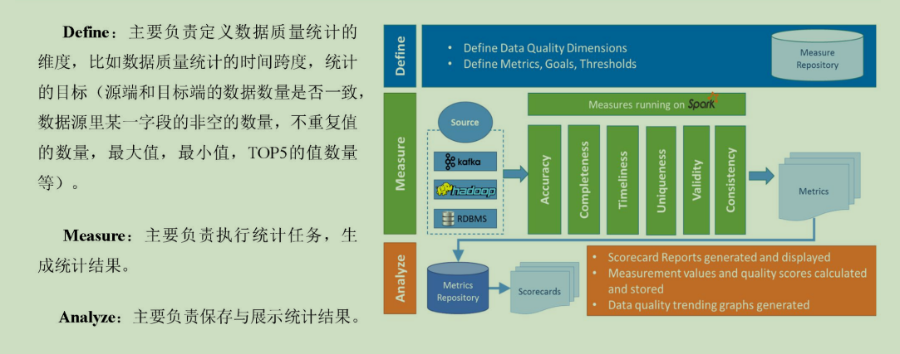

# 第1章 Griffin入门

## 1.1 Griffin概述

Apache Griffin是一个开源的大数据数据质量解决方案，它支持批处理和流模式两种数据质量检测方式，可以从不同维度度量数据资产，从而提升数据的准确度和可信度。例如：离线任务执行完毕后检查源端和目标端的数据数量是否一致，源表的数据空值等。

## 1.2 Griffin架构原理



# 第2章 Griffin安装及使用

## 2.1 安装前环境准备

### 2.1.1 安装ES5.2

1）上传elasticsearch-5.2.2.tar.gz到hadoop102的/opt/software目录，并解压到/opt/module目录
[atguigu@hadoop102 software]$ tar -zxvf elasticsearch-5.2.2.tar.gz -C /opt/module/
2）修改/opt/module/elasticsearch-5.2.2/config/elasticsearch.yml配置文件
[atguigu@hadoop102 config]$ vim elasticsearch.yml

network.host: hadoop102
http.port: 9200
http.cors.enabled: true
http.cors.allow-origin: "*"
bootstrap.memory_lock: false
bootstrap.system_call_filter: false
3）修改Linux系统配置文件/etc/security/limits.conf
[atguigu@hadoop102 elasticsearch-5.2.2]$ sudo vim /etc/security/limits.conf

#添加如下内容
* soft nproc 65536
* hard nproc 65536
* soft nofile 65536
* hard nofile 65536

[atguigu@hadoop102 elasticsearch-5.2.2]$ sudo vim /etc/sysctl.conf

#添加
vm.max_map_count=655360

[atguigu@hadoop102 elasticsearch-5.2.2]$ sudo vim /etc/security/limits.d/90-nproc.conf
#修改配置
*          soft    nproc     2048

[atguigu@hadoop102 elasticsearch-5.2.2]$ sudo sysctl -p
4）需要重新启动虚拟机
[atguigu@hadoop102 elasticsearch-5.2.2]$ su root
root@hadoop102 elasticsearch-5.2.2]# reboot
5）在/opt/module/elasticsearch-5.2.2路径上，启动ES
[atguigu@hadoop102 elasticsearch-5.2.2]$ bin/elasticsearch
6）在ES里创建griffin索引
[atguigu@hadoop102 ~]$ curl -XPUT http://hadoop102:9200/griffin -d '
{
    "aliases": {},
    "mappings": {
        "accuracy": {
            "properties": {
                "name": {
                    "fields": {
                        "keyword": {
                            "ignore_above": 256,
                            "type": "keyword"
                        }
                    },
                    "type": "text"
                },
                "tmst": {
                    "type": "date"
                }
            }
        }
    },
    "settings": {
        "index": {
            "number_of_replicas": "2",
            "number_of_shards": "5"
        }
    }
}
'

### 2.1.2 安装JDK8、Hadoop2.7.2

注意：JDK版本至少1.8及以上，Hadoop版本至少2.6.0及以上
1）安装Hadoop集群

2）启动Hadoop集群
[atguigu@hadoop102 hadoop-2.7.2]$ sbin/start-dfs.sh
[atguigu@hadoop103 hadoop-2.7.2]$ sbin/start-yarn.sh

### 2.1.3 安装Hive2.3

注意：Hive版本至少2.2及以上
1）上传apache-hive-2.3.0-bin.tar.gz 到/opt/software目录下，并解压到/opt/module
[atguigu@hadoop102 software]$ tar -zxvf apache-hive-2.3.6-bin.tar.gz -C /opt/module/
2）修改apache-hive-2.3.6-bin名称为hive-2.3.6
[atguigu@hadoop102 module]$ mv apache-hive-2.3.6-bin hive-2.3.6
3）将Mysql的mysql-connector-java-5.1.27-bin.jar拷贝到/opt/module/hive-2.3.6/lib/
[atguigu@hadoop102 module]$ cp /opt/software/mysql-libs/mysql-connector-java-5.1.27/mysql-connector-java-5.1.27-bin.jar /opt/module/hive-2.3.6/lib/
4）在/opt/module/hive-2.3.6/conf路径上，创建hive-site.xml文件
[atguigu@hadoop102 conf]$ vim hive-site.xml

#添加如下内容
<?xml version="1.0"?>
<?xml-stylesheet type="text/xsl" href="configuration.xsl"?>
<configuration>
    <property>
        <name>javax.jdo.option.ConnectionURL</name>
        <value>jdbc:mysql://hadoop102:3306/metastore?createDatabaseIfNotExist=true</value>
        <description>JDBC connect string for a JDBC metastore</description>
    </property>

    <property>
        <name>javax.jdo.option.ConnectionDriverName</name>
        <value>com.mysql.jdbc.Driver</value>
        <description>Driver class name for a JDBC metastore</description>
    </property>
    
    <property>
        <name>javax.jdo.option.ConnectionUserName</name>
        <value>root</value>
        <description>username to use against metastore database</description>
    </property>
    
    <property>
        <name>javax.jdo.option.ConnectionPassword</name>
        <value>000000</value>
        <description>password to use against metastore database</description>
    </property>
    
    <property>
         <name>hive.metastore.warehouse.dir</name>
         <value>/user/hive/warehouse</value>
         <description>location of default database for the warehouse</description>
    </property>
    
    <property>
        <name>hive.cli.print.header</name>
        <value>true</value>
    </property>
    
    <property>
        <name>hive.cli.print.current.db</name>
        <value>true</value>
    </property>
    
    <property>
        <name>hive.metastore.schema.verification</name>
        <value>false</value>
    </property>
    
    <property>
        <name>datanucleus.schema.autoCreateAll</name>
        <value>true</value> 
    </property>
    
    <property>
        <name>hive.metastore.uris</name>
        <value>thrift://hadoop102:9083</value>
    </property>
</configuration>
3）启动服务
[atguigu@hadoop102 hive-2.3.6]$ nohup bin/hive --service metastore &
[atguigu@hadoop102 hive-2.3.6]$ nohup bin/hive --service hiveserver2 & 
注意：hive2.x版本需要启动两个服务metastore和hiveserver2，否则会报错Exception in thread "main" java.lang.RuntimeException: org.apache.hadoop.hive.ql.metadata.HiveException: java.lang.RuntimeException: Unable to instantiate org.apache.hadoop.hive.ql.metadata.SessionHiveMetaStoreClient
4）服务启动完毕后在启动Hive
[atguigu@hadoop102 hive-2.3.6]$ bin/hive

### 2.1.4 安装Spark2.4.3

注意：Spark版本至少2.2.1及以上
1）把spark-2.4.3-bin-hadoop2.7.tgz上传到/opt/software目录，并解压到/opt/module
[atguigu@hadoop102 software]$ tar -zxvf spark-2.4.3-bin-hadoop2.7.tgz -C /opt/module/
2）修改名称/opt/module/spark-2.4.3-bin-hadoop2.7名称为spark
[atguigu@hadoop102 module]$ mv spark-2.4.3-bin-hadoop2.7/ spark
3）修改/opt/module/spark/conf/spark-defaults.conf.template名称为spark-defaults.conf
[atguigu@hadoop102 conf]$ mv spark-defaults.conf.template  spark-defaults.conf
4）在hadoop集群上提前创建spark_directory日志路径
[atguigu@hadoop102 spark]$ hadoop fs -mkdir /spark_directory
5）在spark-default.conf文件中配置Spark日志路径
[atguigu@hadoop102 conf]$ vim spark-defaults.conf

#添加如下配置
spark.eventLog.enabled           true
spark.eventLog.dir               hdfs://hadoop102:9000/spark_directory
6）修改/opt/module/spark/conf/spark-env.sh.template名称为spark-env.sh
[atguigu@hadoop102 conf]$ mv spark-env.sh.template spark-env.sh
7）在/opt/module/spark/conf/spark-env.sh文件中配置YARN配置文件路径、配置历史服务器相关参数
[atguigu@hadoop102 conf]$ vim spark-env.sh

#添加如下参数
YARN_CONF_DIR=/opt/module/hadoop-2.7.2/etc/hadoop
export SPARK_HISTORY_OPTS="-Dspark.history.ui.port=18080
-Dspark.history.retainedApplications=30 
-Dspark.history.fs.logDirectory=hdfs://hadoop102:9000/spark_directory"
8）把Hive中/opt/module/hive-2.3.6/lib/datanucleus-*.jar包拷贝到Spark的/opt/module/spark/jars路径
[atguigu@hadoop102 lib]$ cp /opt/module/hive-2.3.6/lib/datanucleus-*.jar /opt/module/spark/jars/
9）把Hive中/opt/module/hive-2.3.6/conf/hive-site.xml包拷贝到Spark的/opt/module/spark/conf路径
[atguigu@hadoop102 conf]$ cp /opt/module/hive-2.3.6/conf/hive-site.xml  /opt/module/spark/conf/
10）测试环境
[atguigu@hadoop102 spark]$ bin/spark-shell

scala>spark.sql("show databases").show

### 2.1.5 安装Livy0.3

1）上传livy-server-0.3.0.zip到hadoop102的/opt/software目录下，并解压到/opt/module
[atguigu@hadoop102 software]$ unzip livy-server-0.3.0.zip -d /opt/module/
2）修改/opt/module/livy-server-0.3.0文件名称为livy
[atguigu@hadoop102 module]$ mv livy-server-0.3.0/ livy
3）修改/opt/module/livy/conf/livy.conf文件，配置livy与spark相关参数
livy.server.host = Hadoop102
livy.spark.master =yarn
livy.spark.deployMode = client
livy.repl.enableHiveContext = true 
livy.server.port = 8998
4）配置需要的环境变量
[atguigu@hadoop102 conf]$ sudo vim /etc/profile

#SPARK_HOME
export SPARK_HOME=/opt/module/spark
export PATH=$PATH:$SPARK_HOME/bin

[atguigu@hadoop102 conf]$ source /etc/profile
5）在/opt/module/livy/路径上，启动livy服务
[atguigu@hadoop102 livy]$ bin/livy-server start

### 2.1.6 安装MySQL5.6

1）上传Init_quartz_mysql_innodb.sql 到hadoop102的/opt/software目录
2）使用mysql创建quartz库，执行脚本初始化表信息
[atguigu@hadoop102 ~]$ mysql -uroot -p000000
mysql> create database quartz;
mysql> use quartz;
mysql> source /opt/software/Init_quartz_mysql_innodb.sql
mysql> show tables;

### 2.1.7 安装Maven

1）Maven下载：https://maven.apache.org/download.cgi
2）把apache-maven-3.6.1-bin.tar.gz上传到linux的/opt/software目录下
3）解压apache-maven-3.6.1-bin.tar.gz到/opt/module/目录下面
[atguigu@hadoop102 software]$ tar -zxvf apache-maven-3.6.1-bin.tar.gz -C /opt/module/
4）修改apache-maven-3.6.1的名称为maven
[atguigu@hadoop102 module]$ mv apache-maven-3.6.1/ maven
5）添加环境变量到/etc/profile中
[atguigu@hadoop102 module]$ sudo vim /etc/profile
#MAVEN_HOME
export MAVEN_HOME=/opt/module/maven
export PATH=$PATH:$MAVEN_HOME/bin
6）测试安装结果
[atguigu@hadoop102 module]$ source /etc/profile
[atguigu@hadoop102 module]$ mvn -v
7）修改setting.xml，指定为阿里云
[atguigu@hadoop102 maven]$ cd conf
[atguigu@hadoop102 maven]$ vim settings.xml

<!-- 添加阿里云镜像-->
<mirror>
    <id>nexus-aliyun</id>
    <mirrorOf>central</mirrorOf>
    <name>Nexus aliyun</name>
<url>http://maven.aliyun.com/nexus/content/groups/public</url>
</mirror>
<mirror>
    <id>UK</id>
    <name>UK Central</name>
    <url>http://uk.maven.org/maven2</url>
    <mirrorOf>central</mirrorOf>
</mirror>
<mirror>
    <id>repo1</id>
    <mirrorOf>central</mirrorOf>
    <name>Human Readable Name for this Mirror.</name>
    <url>http://repo1.maven.org/maven2/</url>
</mirror>
<mirror>
    <id>repo2</id>
    <mirrorOf>central</mirrorOf>
    <name>Human Readable Name for this Mirror.</name>
    <url>http://repo2.maven.org/maven2/</url>
</mirror>
8）在/home/atguigu目录下创建.m2文件夹
[atguigu@hadoop102 ~]$ mkdir .m2

## 2.2 编译Griffin0.4.0

### 2.2.1 修改配置文件:

1）上传griffin-master.zip到hadoop102的/opt/software目录，并解压tar.gz包到/opt/module
[atguigu@hadoop102 software]$ unzip griffin-master.zip -d /opt/module/
2）修改/opt/module/griffin-master/service/pom.xml文件，注释掉org.postgresql，添加mysql依赖。
[atguigu@hadoop102 service]$ vim pom.xml

<!--
<dependency>
    <groupId>org.postgresql</groupId>
    <artifactId>postgresql</artifactId>
    <version>${postgresql.version}</version>
</dependency>
-->
<dependency>
    <groupId>mysql</groupId>
    <artifactId>mysql-connector-java</artifactId>
</dependency>
注意:版本号删除掉
3）修改/opt/module/griffin-master/service/src/main/resources/application.properties文件
[atguigu@hadoop102 service]$ vim /opt/module/griffin-master/service/src/main/resources/application.properties

```sh
# Apache Griffin应用名称

spring.application.name=griffin_service

# MySQL数据库配置信息

spring.datasource.url=jdbc:mysql://hadoop102:3306/quartz?autoReconnect=true&useSSL=false
spring.datasource.username=root
spring.datasource.password=000000
spring.jpa.generate-ddl=true
spring.datasource.driver-class-name=com.mysql.jdbc.Driver
spring.jpa.show-sql=true

# Hive metastore配置信息

hive.metastore.uris=thrift://hadoop102:9083
hive.metastore.dbname=default
hive.hmshandler.retry.attempts=15
hive.hmshandler.retry.interval=2000ms

# Hive cache time

cache.evict.hive.fixedRate.in.milliseconds=900000

# Kafka schema registry按需配置

kafka.schema.registry.url=http://hadoop102:8081

# Update job instance state at regular intervals

jobInstance.fixedDelay.in.milliseconds=60000

# Expired time of job instance which is 7 days that is 604800000 milliseconds.Time unit only supports milliseconds

jobInstance.expired.milliseconds=604800000

# schedule predicate job every 5 minutes and repeat 12 times at most

#interval time unit s:second m:minute h:hour d:day,only support these four units
predicate.job.interval=5m
predicate.job.repeat.count=12

# external properties directory location

external.config.location=

# external BATCH or STREAMING env

external.env.location=

# login strategy ("default" or "ldap")

login.strategy=default

# ldap

ldap.url=ldap://hostname:port
ldap.email=@example.com
ldap.searchBase=DC=org,DC=example
ldap.searchPattern=(sAMAccountName={0})

# hdfs default name

fs.defaultFS=

# elasticsearch

elasticsearch.host=hadoop102
elasticsearch.port=9200
elasticsearch.scheme=http

# elasticsearch.user = user

# elasticsearch.password = password

# livy

livy.uri=http://hadoop102:8998/batches

# yarn url

yarn.uri=http://hadoop103:8088

# griffin event listener

internal.event.listeners=GriffinJobEventHook
```

4）修改/opt/module/griffin-master/service/src/main/resources/sparkProperties.json文件
[atguigu@hadoop102 service]$ vim /opt/module/griffin-master/service/src/main/resources/sparkProperties.json

{
  "file": "hdfs://hadoop102:9000/griffin/griffin-measure.jar",
  "className": "org.apache.griffin.measure.Application",
  "name": "griffin",
  "queue": "default",
  "numExecutors": 2,
  "executorCores": 1,
  "driverMemory": "1g",
  "executorMemory": "1g",
  "conf": {
    "spark.yarn.dist.files": "hdfs://hadoop102:9000/home/spark_conf/hive-site.xml"
  },
  "files": [
  ]
}
5）修改/opt/module/griffin-master/service/src/main/resources/env/env_batch.json文件
[atguigu@hadoop102 service]$ vim /opt/module/griffin-master/service/src/main/resources/env/env_batch.json

{
  "spark": {
    "log.level": "INFO"
  },
  "sinks": [
    {
      "type": "CONSOLE",
      "config": {
        "max.log.lines": 10
      }
    },
    {
      "type": "HDFS",
      "config": {
        "path": "hdfs://hadoop102:9000/griffin/persist",
        "max.persist.lines": 10000,
        "max.lines.per.file": 10000
      }
    },
    {
      "type": "ELASTICSEARCH",
      "config": {
        "method": "post",
        "api": "http://hadoop102:9200/griffin/accuracy",
        "connection.timeout": "1m",
        "retry": 10
      }
    }
  ],
  "griffin.checkpoint": []
}
6）修改/opt/module/griffin-master/service/src/main/resources/env/env_streaming.json文件
[atguigu@hadoop102 service]$ vim /opt/module/griffin-master/service/src/main/resources/env/env_streaming.json

{
  "spark": {
    "log.level": "WARN",
    "checkpoint.dir": "hdfs:///griffin/checkpoint/${JOB_NAME}",
    "init.clear": true,
    "batch.interval": "1m",
    "process.interval": "5m",
    "config": {
      "spark.default.parallelism": 4,
      "spark.task.maxFailures": 5,
      "spark.streaming.kafkaMaxRatePerPartition": 1000,
      "spark.streaming.concurrentJobs": 4,
      "spark.yarn.maxAppAttempts": 5,
      "spark.yarn.am.attemptFailuresValidityInterval": "1h",
      "spark.yarn.max.executor.failures": 120,
      "spark.yarn.executor.failuresValidityInterval": "1h",
      "spark.hadoop.fs.hdfs.impl.disable.cache": true
    }
  },
  "sinks": [
    {
      "type": "CONSOLE",
      "config": {
        "max.log.lines": 100
      }
    },
    {
      "type": "HDFS",
      "config": {
        "path": "hdfs://hadoop102:9000/griffin/persist",
        "max.persist.lines": 10000,
        "max.lines.per.file": 10000
      }
    },
    {
      "type": "ELASTICSEARCH",
      "config": {
        "method": "post",
        "api": "http://hadoop102:9200/griffin/accuracy"
      }
    }
  ],
  "griffin.checkpoint": [
    {
      "type": "zk",
      "config": {
        "hosts": "zk:2181",
        "namespace": "griffin/infocache",
        "lock.path": "lock",
        "mode": "persist",
        "init.clear": true,
        "close.clear": false
      }
    }
  ]
}
7）修改/opt/module/griffin-master/service/src/main/resources/quartz.properties文件
[atguigu@hadoop102 service]$ vim /opt/module/griffin-master/service/src/main/resources/quartz.properties

```sh
org.quartz.scheduler.instanceName=spring-boot-quartz
org.quartz.scheduler.instanceId=AUTO
org.quartz.threadPool.threadCount=5
org.quartz.jobStore.class=org.quartz.impl.jdbcjobstore.JobStoreTX

# If you use postgresql as your database,set this property value to org.quartz.impl.jdbcjobstore.PostgreSQLDelegate

# If you use mysql as your database,set this property value to org.quartz.impl.jdbcjobstore.StdJDBCDelegate

# If you use h2 as your database, it's ok to set this property value to StdJDBCDelegate, PostgreSQLDelegate or others

org.quartz.jobStore.driverDelegateClass=org.quartz.impl.jdbcjobstore.StdJDBCDelegate
org.quartz.jobStore.useProperties=true
org.quartz.jobStore.misfireThreshold=60000
org.quartz.jobStore.tablePrefix=QRTZ_
org.quartz.jobStore.isClustered=true
org.quartz.jobStore.clusterCheckinInterval=20000
```

### 2.2.2 执行编译

1）在/opt/module/griffin-master路径执行maven命令，开始编译Griffin源码
[atguigu@hadoop102 griffin-master]$ mvn -Dmaven.test.skip=true clean install
2）见到如下页面，表示编译成功。（大约需要1个小时左右）

### 2.2.3 修改名称并上传HDFS

命令执行完成后，会在Service和Measure模块的target目录下分别看到service-0.6.0.jar和measure-0.6.0.jar两个jar包。
1）修改/opt/module/griffin-master/measure/target/measure-0.6.0-SNAPSHOT.jar名称
[atguigu@hadoop102 measure]$ mv measure-0.6.0-SNAPSHOT.jar griffin-measure.jar
2）上传griffin-measure.jar到HDFS文件目录里
[atguigu@hadoop102 measure]$ hadoop fs -mkdir /griffin/
[atguigu@hadoop102 measure]$ hadoop fs -put griffin-measure.jar /griffin/
注意：这样做的目的主要是因为Spark在YARN集群上执行任务时，需要到HDFS的/griffin目录下加载griffin-measure.jar，避免发生类org.apache.griffin.measure.Application找不到的错误。
3）上传hive-site.xml文件到HDFS的/home/spark_conf/路径
[atguigu@hadoop102 ~]$ hadoop fs -mkdir -p /home/spark_conf/
[atguigu@hadoop102 ~]$ hadoop fs -put /opt/module/hive-2.3.6/conf/hive-site.xml /home/spark_conf/
4）进入到/opt/module/griffin-master/service/target/路径，运行service-0.6.0-SNAPSHOT.jar
控制台启动：控制台打印信息
[atguigu@hadoop102 target]$ java -jar service-0.6.0-SNAPSHOT.jar
后台启动：启动后台并把日志归写倒service.out
[atguigu@hadoop102 ~]$ nohup java -jar service-0.6.0-SNAPSHOT.jar>service.out 2>&1 &

### 2.2.4 浏览器访问

http://hadoop102:8080 默认账户和密码都是无

# 第3章 案例实操

## 3.1 生产测试数据

获取官网测试数据。在/opt/module/目录下创建data文件夹，并下载相关测试数据
[atguigu@hadoop102 moudle]$ mkdir data
[atguigu@hadoop102 data]$
wget http://griffin.apache.org/data/batch/gen_demo_data.sh
wget http://griffin.apache.org/data/batch/gen_delta_src.sh
wget http://griffin.apache.org/data/batch/demo_basic
wget http://griffin.apache.org/data/batch/delta_tgt
wget http://griffin.apache.org/data/batch/insert-data.hql.template
wget http://griffin.apache.org/data/batch/gen-hive-data.sh
wget http://griffin.apache.org/data/batch/create-table.hql
wget http://griffin.apache.org/data/batch/delta_src
wget http://griffin.apache.org/data/batch/delta_tgt

[atguigu@hadoop102 data]$ chmod 777 ../data -R
#生成临时文件
[atguigu@hadoop102 data]$ ./gen_demo_data.sh
#生产测试数据
[atguigu@hadoop102 data]$ ./gen-hive-data.sh

## 3.2 UI创建Measure

注意根据官网描述，目前UI创建Measure只支持Accuracy的Measure，UI界面上虽然有其他选项但是无法运行job。

3.2.1 添加一个新的Measure

3.2.2 选择准确度Accuracy

3.2.3 选择数据源的字段

3.2.4 选择目标表的字段

3.2.5 选择条件

3.2.6 选择时间格式和分区尺度

3.2.7 添加Measure名称和描述

## 3.3 UI创建Job

3.3.1 新建一个Job

3.3.2 与Measure结合并调度任务执行

3.3.3 查看运行结果单击“DQ指标”

单击放大图片

## 3.4 手动定制规则运行Job

3.4.1 准确度度量Accuracy Measure
1）创建json文件制定相应规则
在/opt/module/griffin-master/measure/target目录下创建文件dq.json
vim dq.json
{
  "name": "batch_accu",
  "process.type": "batch",
  "data.sources": [
    {
      "name": "src",
      "baseline": true,
      "connectors": [
        {
          "type": "hive",
          "version": "2.3",
          "config": {
            "database": "gmall",
            "table.name": "dwd_order_info"
          }
        }
      ]
    }, {
      "name": "tgt",
      "connectors": [
        {

          "type": "hive",
          "version": "2.3",
          "config": {
            "database": "gmall",
            "table.name": "dws_user_action"
          }
        }
      ]
    }
  ],
  "evaluate.rule": {
    "rules": [
      {
        "dsl.type": "griffin-dsl",
        "dq.type": "accuracy",
        "out.dataframe.name": "accu",
        "rule": "src.id = tgt.user_id ",
        "details": {
          "source": "src",
          "target": "tgt",
          "miss": "miss_count",
          "total": "total_count",
          "matched": "matched_count"
        },
        "out": [
          {
            "type": "metric",
            "name": "accu"
          },
          {
            "type": "record",
            "name": "missRecords"
          }
        ]
      }
    ]
  },
  "sinks": ["CONSOLE", "HDFS"]
}
选项："rule": "src.id = tgt.id AND src.age = tgt.age AND src.desc = tgt.desc" 
rule制定匹配规则如src表的id字段对应 tgt表id字段
当前规则是id age desc三者字段相同，这个规则就是接下来对应job所需监控的对应关系
2）在/opt/module/griffin-master/measure/target目录下创建文件env.json
vim env.json
{
  "spark": {
    "log.level": "WARN"
  },
  "sinks": [
    {
      "type": "console"
    },
    {
      "type": "hdfs",
      "config": {
        "path": "hdfs://hadoop102:9000/griffin/persist"
      }
    },
    {
      "type": "elasticsearch",
      "config": {
        "method": "post",
        "api": "http://hadoop102:9200/griffin/accuracy"
      }
    }
  ]
}
分别指定hdfs结果存储路径和elasticsearch路径
两个json文件编写完毕后 指定 /opt/module/griffin-0.4.0/measure/target 该路径下的griffin-measure.jar 运行Spark任务
（3）Spark 提交脚本命令
[atguigu@hadoop102 target]$ spark-submit --class org.apache.griffin.measure.Application --master yarn --deploy-mode client  --driver-memory 1g --executor-memory 1g --num-executors 1 griffin-measure.jar  env.json dq.json


跑完任务之后，可以看到对比结果总条数250000未匹配上的数有980条，匹配上的数据有249020条，匹配分数为0.99608。
也可以去HDFS上查看结果

根据任务id号，下载missRecords文件，里面保存的所有没匹配上的数据，方便分析问题。

3.4.2 性能分析度量Profiling Measure
如果想查看最大值、总个数、空值个数、最大长度等值那就得创建profiling measure
1）创建json文件定制规则
 vim dq2.json
{
  "name": "batch_prof",
  "process.type": "batch",
  "data.sources": [
    {
      "name": "src",
      "baseline": true,
      "connectors": [
        {
          "type": "hive",
          "version": "2.2",
          "config": {
            "database": "tmp",
            "table.name": "demo_tgt"
          }
        }
      ]
    }
  ],
  "evaluate.rule": {
    "rules": [
      {
        "dsl.type": "griffin-dsl",
        "dq.type": "profiling",
        "out.dataframe.name": "prof",
        "rule": "src.id.count() AS id_count, src.age.max() AS age_max, src.desc.length().max() AS desc_length_max",
        "out": [
          {
            "type": "metric",
            "name": "prof"
          }
        ]
      }
    ]
  },
  "sinks": ["CONSOLE", "HDFS"]
}
同样rule选项编写规则，如当前规则统计id总个数、age最大值和desc最大长度。
具体rule规则可查看官网
https://github.com/apache/griffin/blob/master/griffin-doc/measure/measure-batch-sample.md
2）编辑env.json
vim env.json
{
  "spark": {
    "log.level": "WARN"
  },
  "sinks": [
    {
      "type": "console"
    },
    {
      "type": "hdfs",
      "config": {
        "path": "hdfs://hadoop102:9000/griffin/persist"
      }
    },
    {
      "type": "elasticsearch",
      "config": {
        "method": "post",
        "api": "http://hadoop102:9200/griffin/accuracy"
      }
    }
  ]
}
分别指定hdfs结果存储路径和elasticsearch路径
两个json文件编写完毕后 指定 /opt/module/griffin-0.4.0/measure/target 该路径下的griffin-measure.jar 运行spark任务
3）Spark 提交脚本命令
spark-submit --class org.apache.griffin.measure.Application --master yarn --deploy-mode client  --driver-memory 1g --executor-memory 1g --num-executors 1 griffin-measure.jar  env.json dq2.json

跑完任务后，显示结果 id个数一共250000条，age最大值1000，desc长度最大值4，对应hdfs路径，env.json路径加时间戳。


## 3.5 Rule规则编写

3.5.1 空值个数查询

在rule里可以写sql 比如当前rule中统计id为空的个数，注意查询时，不是查询表名而是查询name名称

3.5.2 去重个数统计


3.5.3 最大值、最小值


3.5.4 排序

3.5.5 范围查询