# 数仓建设

## 1. 数仓为什么要分层？

> ①用空间换时间，通过大量的预处理来提升应用系统的用户体验（效率），因此数据仓库会存在大量冗余的数据；不分层的话，如果源业务系统的业务规则发生变化将会影响整个数据清洗过程，工作量巨大。
>
> ②通过数据分层管理可以简化数据清洗的过程，因为把原来一步的工作分到多个步骤去完成，相当于把一个复杂的工作拆分成了多个简单的工作，把一个大的黑盒变成一个白盒，每一层的处理逻辑都相对简单和容易理解，这样我们比较容易保证每一步骤的正确性，当数据发生错误时，往往只需要局部调整某个步骤即可。

​	数据仓库之父Bill Inmon对数据仓库做了定义--**面向主题的、集成的、相对稳定的、反映历史变化**的数据集合，用于支持管理决策。从定义上来看，数据仓库的关键词为面向主题、集成、稳定、反映历史变化、支持管理决策，而这些关键词的实现就体现在分层架构中。

一个好的分层架构，有以下好处：

> ①**清晰数据结构**：每一个数据分层都有对应的作用域，在使用数据的时候能够更加方便的理解和定位。
>
> ②**数据血缘追踪**：提供给业务人员或下游系统的数据服务时都是目标数据，目标数据的数据源一般来自多张表数据。若出现目标数据异常时，清晰的血缘关系可以快速定位问题所在。而且血缘管理也是元数据管理重要的一部分。
>
> ③**减少重复开发**：数据的逐层加工原则，下层包含了上层数据加工所需的全量数据，这样的加工方式避免了每个数据开发人员都重新从源系统抽取数据进行加工。
>
> ④**数据关系条理化**：源系统间存在复杂的数据关系，比如客户信息同时存在于核心系统、信贷系统、理财系统、资金系统，取数时该如何决策呢？数据仓库会对相同主题的数据进行统一建模，把复杂的数据关系疏理成条理清晰的数据模型，使用时就可以避免上述问题了。
>
> ⑤**屏蔽原始数据的影响**：数据的逐层加工原则，上层的数据都由下一层的数据加工获取，不允许跳级取数。而原始数据位于数仓的最底层，离应用层还有多层的数据加工，所以加工应用层数据的过程中就会把原始数据的变更消除掉，保持应用层的稳定性。

## 2. 数仓分几层最好？

​	目前市场上主流的分层方式眼花缭乱，不过看事情不能只看表面，还要看到内在的规律，**不能为了分层而分层**，没有最好，只有最合适。

​	分层是以解决当前业务快速的数据支撑为目的，为未来抽象出共性的框架并能够赋能给其他业务线，同时为业务发展提供稳定、准确的数据支撑，并能够按照已有的模型为新业务发展提供方向，也就是数据驱动和赋能。

## 3. 如何搭建一个好的数仓？

- 稳定：数据产出稳定且有保障。
- 可信：数据干净、数据质量高。
- 丰富：数据涵盖的业务足够广泛。
- 透明：数据构成体系足够透明。

## 4. 数仓设计

数仓设计的3个维度：

- 功能架构：结构层次清晰。
- 数据架构：数据质量有保障。
- 技术架构：易扩展、易用。

## 5. 数仓架构

按照数据流入流出的过程，数据仓库架构可分为：**源数据、数据仓库、数据应用**。

 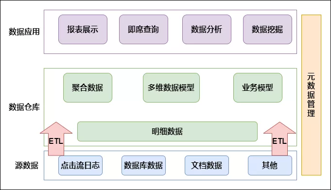

​	数据仓库的数据来源于不同的源数据，并提供多样的数据应用，数据自下而上流入数据仓库后向上层开放应用，而数据仓库只是中间集成化数据管理的一个平台。

​	**源数据**：此层数据无任何更改，直接沿用外围系统数据结构和数据，不对外开放；为临时存储层，是接口数据的临时存储区域，为后一步的数据处理做准备。

​	**数据仓库**：也称细节层，DW层的数据应该是一致的、准确的、干净的数据，即对源系统数据进行了清洗后的数据。

​	**数据应用** ：前端应用直接读取的数据源；根据报表、专题分析需求而计算生成的数据。

​	数据仓库从各数据源获取数据及在数据仓库内的数据转换和流动都可以认为是ETL（抽取Extra，转化Transfer，装载Load）过程，ETL是数据仓库的流水线，也可以认为是数据仓库的血液，它维系着数据仓库中数据的新陈代谢，而数据仓库日常的管理和维护工作的大部分精力就是保存ETL的正常和稳定。建设数据仓库犹如创造一条新的生命，分层架构只是这条生命的逻辑骨架而已。想要在骨架上长出血肉，就必须进行合适的数据建模，数据仓库的强壮还是潺弱，健美还是丑陋，就取决于建模的结果。

## 6. 数仓建模方法

​	数据仓库的建模方法有很多种，每一种建模方法代表了哲学上的一个观点，代表了一种归纳、概括世界的一种方法。常见的有 **范式建模法、维度建模法、实体建模法**等，每种方法从本质上将是从不同的角度看待业务中的问题。

### 6.1 范式建模

​	范式建模法其实是我们在构建数据模型常用的一个方法，该方法的主要由 Inmon 所提倡，主要解决关系型数据库的数据存储，利用的一种技术层面上的方法。目前，我们在关系型数据库中的建模方法，大部分采用的是三范式建模法。

​	范式 是符合某一种级别的关系模式的集合。构造数据库必须遵循一定的规则，而在关系型数据库中这种规则就是范式，这一过程也被称为规范化。目前关系数据库有六种范式：第一范式（1NF）、第二范式（2NF）、第三范式（3NF）、Boyce-Codd范式（BCNF）、第四范式（4NF）和第五范式（5NF）。

在数据仓库的模型设计中，一般采用第三范式。一个符合第三范式的关系必须具有以下三个条件 :

- 每个属性值唯一，不具有多义性 ;
- 每个非主属性必须完全依赖于整个主键，而非主键的一部分 ;
- 每个非主属性不能依赖于其他关系中的属性，因为这样的话，这种属性应该归到其他关系中去。

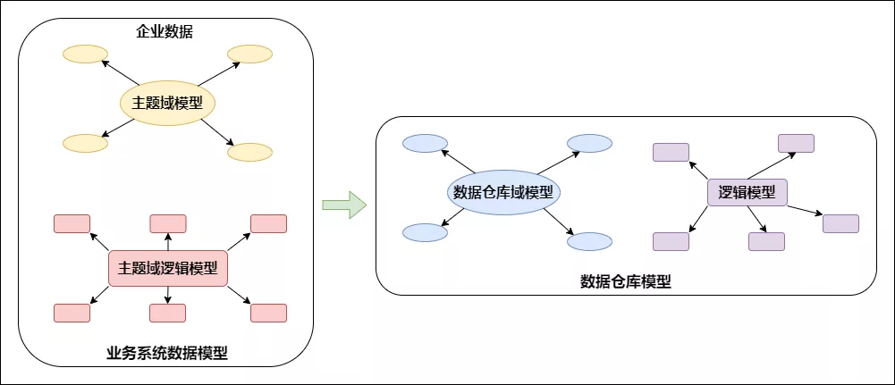

​	根据 Inmon 的观点，数据仓库模型的建设方法和业务系统的企业数据模型类似。在业务系统中，企业数据模型决定了数据的来源，而企业数据模型也分为两个层次，即主题域模型和逻辑模型。同样，主题域模型可以看成是业务模型的概念模型，而逻辑模型则是域模型在关系型数据库上的实例化。

### 6.2 实体建模法

实体建模法并不是数据仓库建模中常见的一个方法，它来源于哲学的一个流派。从哲学的意义上说，客观世界应该是可以细分的，客观世界应该可以分成由一个个实体，以及实体与实体之间的关系组成。那么我们在数据仓库的建模过程中完全可以引入这个抽象的方法，将整个业务也可以划分成一个个的实体，而每个实体之间的关系，以及针对这些关系的说明就是我们数据建模需要做的工作。

虽然实体法粗看起来好像有一些抽象，其实理解起来很容易。即我们可以将任何一个业务过程划分成 3 个部分，**实体，事件，说明**，如下图所示：

 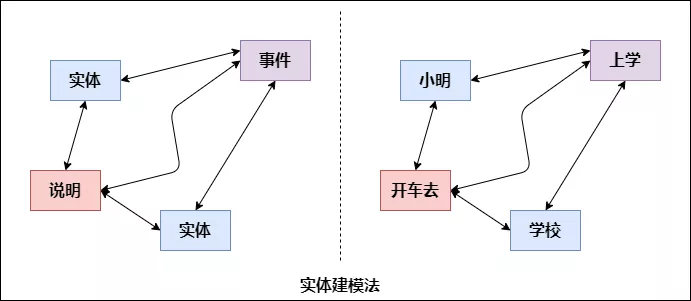

上图表述的是一个抽象的含义，如果我们描述一个简单的事实：“小明开车去学校上学”。以这个业务事实为例，我们可以把“小明”，“学校”看成是一个实体，“上学”描述的是一个业务过程，我们在这里可以抽象为一个具体“事件”，而“开车去”则可以看成是事件“上学”的一个说明。

### 6.3 维度建模法

​	维度模型是数据仓库领域另一位大师Ralph Kimall所倡导，他的《数据仓库工具箱》是数据仓库工程领域最流行的数仓建模经典。维度建模以分析决策的需求出发构建模型，构建的数据模型为分析需求服务，因此它重点解决用户如何更快速完成分析需求，同时还有较好的大规模复杂查询的响应性能。

 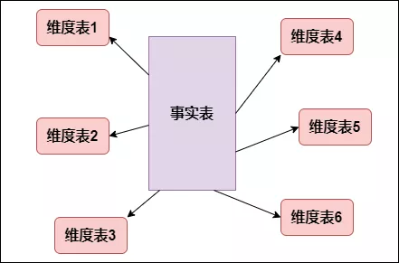

典型的代表是我们比较熟知的星形模型（Star-schema），以及在一些特殊场景下适用的雪花模型（Snow-schema）。

维度建模中比较重要的概念就是 事实表（Fact table）和维度表（Dimension table）。其最简单的描述就是，按照事实表、维度表来构建数据仓库、数据集市。

目前在互联网公司最常用的建模方法就是维度建模。

**维度建模怎么建：**

在实际业务中，给了我们一堆数据，我们怎么拿这些数据进行数仓建设呢，数仓工具箱作者根据自身60多年的实际业务经验，给我们总结了如下四步。

数仓工具箱中的维度建模四步走：

 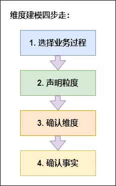

这四步是环环相扣，步步相连。下面详细拆解下每个步骤怎么做

**1、选择业务过程**

- 维度建模是紧贴业务的，所以必须以业务为根基进行建模，那么选择业务过程，顾名思义就是在整个业务流程中选取我们需要建模的业务，根据运营提供的需求及日后的易扩展性等进行选择业务。比如商城，整个商城流程分为商家端，用户端，平台端，运营需求是总订单量，订单人数，及用户的购买情况等，我们选择业务过程就选择用户端的数据，商家及平台端暂不考虑。业务选择非常重要，因为后面所有的步骤都是基于此业务数据展开的。

**2、声明粒度**

- 先举个例子：对于用户来说，一个用户有一个身份证号，一个户籍地址，多个手机号，多张银行卡，那么与用户粒度相同的粒度属性有身份证粒度，户籍地址粒度，比用户粒度更细的粒度有手机号粒度，银行卡粒度，存在一对一的关系就是相同粒度。为什么要提相同粒度呢，因为维度建模中要求我们，在**同一事实表**中，必须具有**相同的粒度**，同一事实表中不要混用多种不同的粒度，不同的粒度数据建立不同的事实表。并且从给定的业务过程获取数据时，强烈建议从关注原子粒度开始设计，也就是从最细粒度开始，因为原子粒度能够承受无法预期的用户查询。但是上卷汇总粒度对查询性能的提升很重要的，所以对于有明确需求的数据，我们建立针对需求的上卷汇总粒度，对需求不明朗的数据我们建立原子粒度。

**3、确认维度**

- 维度表是作为业务分析的入口和描述性标识，所以也被称为数据仓库的“灵魂”。在一堆的数据中怎么确认哪些是维度属性呢，如果该列是对具体值的描述，是一个文本或常量，某一约束和行标识的参与者，此时该属性往往是维度属性，数仓工具箱中告诉我们**牢牢掌握事实表的粒度，就能将所有可能存在的维度区分开**，并且要**确保维度表中不能出现重复数据，应使维度主键唯一**

**4、确认事实**

- 事实表是用来度量的，基本上都以数量值表示，事实表中的每行对应一个度量，每行中的数据是一个特定级别的细节数据，称为粒度。维度建模的核心原则之一**是同一事实表中的所有度量必须具有相同的粒度**。这样能确保不会出现重复计算度量的问题。有时候往往不能确定该列数据是事实属性还是维度属性。记住**最实用的事实就是数值类型和可加类事实**。所以可以通过分析该列是否是一种包含多个值并作为计算的参与者的度量，这种情况下该列往往是事实。

**其中粒度是非常重要的**，粒度用于确定事实表的行表示什么，建议从关注原子级别的粒度数据开始设计，因为原子粒度能够承受无法预估的用户查询，而且原子数据可以以各种可能的方式进行上卷，而一旦选择了高粒度，则无法满足用户下钻细节的需求。

**事实是整个维度建模的核心**，其中雪花模型或者星型模型都是基于一张事实表通过外健关联维表进行扩展，生成一份能够支撑可预知查询需求的模型宽表，而且最后的查询也是落在事实表中进行。

## 7. 实际业务中数仓分层

数仓分层要结合公司业务进行，并且需要清晰明确各层职责，要保证数据层的稳定又要屏蔽对下游影响，一般采用如下分层结构：

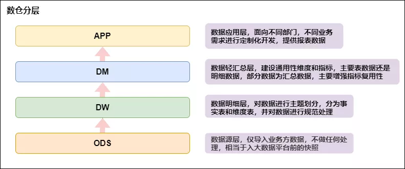

## 8. 数据层具体实现

- 数据源ODS

 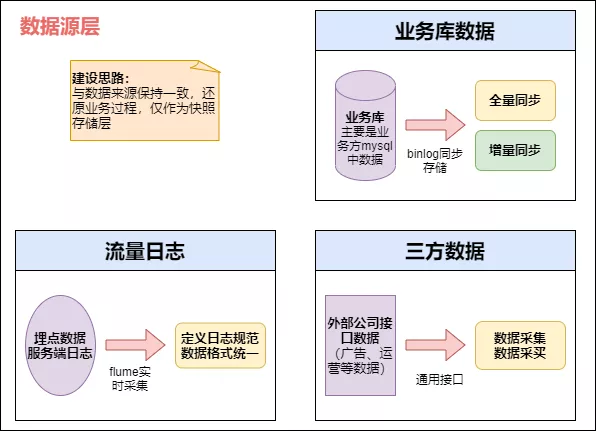

数据源层主要将各个业务数据导入到大数据平台，作为业务数据的快照存储。

- 数据明细层DW

 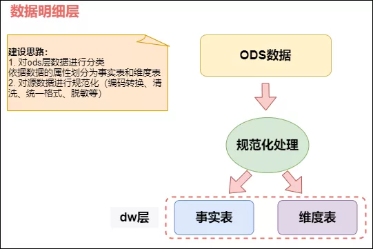

事实表中的每行对应一个度量，每行中的数据是一个特定级别的细节数据，称为粒度。维度建模的核心原则之一是**同一事实表中的所有度量必须具有相同的粒度**。这样能确保不会出现重复计算度量的问题。

维度表一般都是单一主键，少数是联合主键，注意维度表不要出现重复数据，否则和事实表关联会出现**数据发散**问题。

有时候往往不能确定该列数据是事实属性还是维度属性。记住**最实用的事实就是数值类型和可加类事实**。所以可以通过分析该列是否是一种包含多个值并作为计算的参与者的度量，这种情况下该列往往是事实；如果该列是对具体值的描述，是一个文本或常量，某一约束和行标识的参与者，此时该属性往往是维度属性。但是还是要结合业务进行最终判断是维度还是事实。

- 数据轻度汇总层DM

 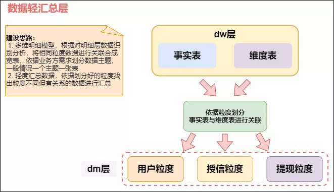

此层命名为轻汇总层，就代表这一层已经开始对数据进行汇总，但是不是完全汇总，只是对相同粒度的数据进行关联汇总，不同粒度但是有关系的数据也可进行汇总，此时需要将粒度通过聚合等操作进行统一。

- 数据应用层APP

 

数据应用层的表就是提供给用户使用的，数仓建设到此就接近尾声了，接下来就根据不同的需求进行不同的取数，如直接进行报表展示，或提供给数据分析的同事所需的数据，或其他的业务支撑。

**一张图总结下数据仓库的构建整体流程**：

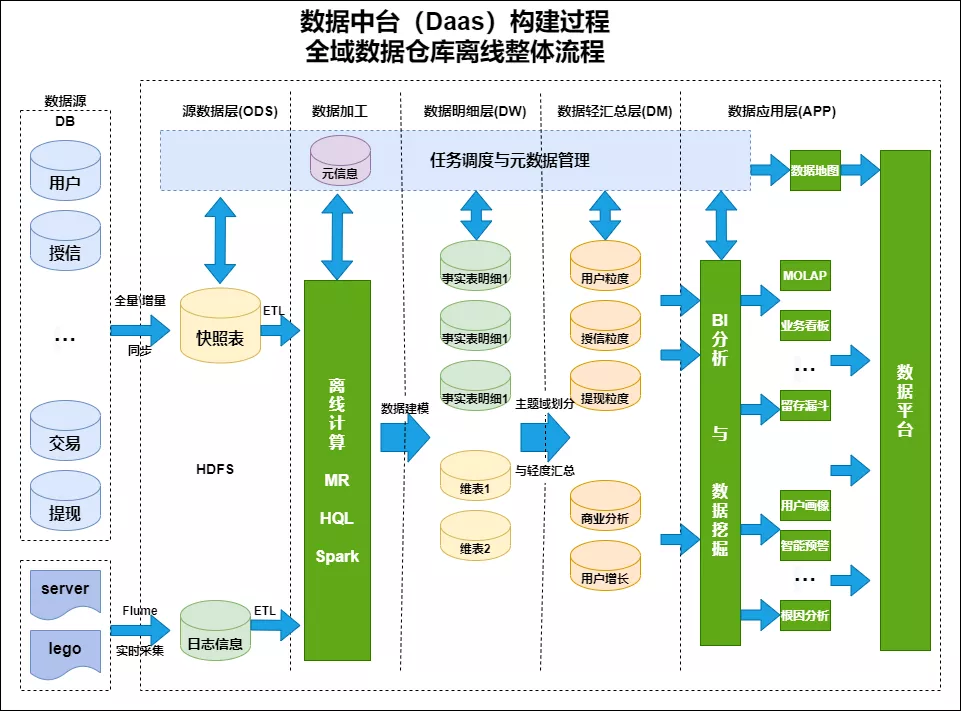

# 数据治理

**数仓建设真正的难点不在于数仓设计，而在于后续业务发展起来，业务线变的庞大之后的数据治理**，包括资产治理、数据质量监控、数据指标体系的建设等。

其实数据治理的范围很⼴，包含数据本⾝的管理、数据安全、数据质量、数据成本等。在DAMA 数据管理知识体系指南中，数据治理位于数据管理“车轮图”的正中央，是数据架构、数据建模、数据存储、数据安全、数据质量、元数据管理、主数据管理等10大数据管理领域的总纲，为各项数据管理活动提供总体指导策略。

 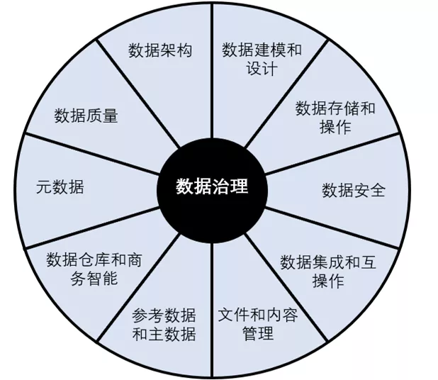

## 1. 数据治理之道是什么？

### 1.1 数据治理需要体系建设

​	为发挥数据价值需要满足三个要素：合理的平台架构、完善的治理服务、体系化的运营手段。根据企业的规模、所属行业、数据量等情况选择合适的平台架构；治理服务需要贯穿数据全生命周期，保证数据在采集、加工、共享、存储、应用整个过程中的完整性、准确性、一致性和实效性；运营手段则应当包括规范的优化、组织的优化、平台的优化以及流程的优化等等方面。

### 1.2 数据治理需要夯实基础

​	数据治理需要循序渐进，但在建设初期至少需要关注三个方面：**数据规范、数据质量、数据安全**。规范化的模型管理是保障数据可以被治理的前提条件，高质量的数据是数据可用的前提条件，数据的安全管控是数据可以共享交换的前提条件。

### 1.3 数据治理需要IT赋能

​	数据治理不是一堆规范文档的堆砌，而是需要将治理过程中所产生的规范、流程、标准落地到IT平台上，在数据生产过程中通过“以终为始”前向的方式进行数据治理，避免事后稽核带来各种被动和运维的成本的增加。

### 1.4 数据治理需要聚焦数据

​	数据治理的本质是管理数据，因此需要加强元数据管理和主数据管理，从源头治理数据，补齐数据的相关属性和信息，比如：元数据、质量、安全、业务逻辑、血缘等，通过元数据驱动的方式管理数据生产、加工和使用。

### 1.5 数据治理需要建管一体化

​	数据模型血缘与任务调度的一致性是建管一体化的关键，有助于解决数据管理与数据生产口径不一致的问题，避免出现两张皮的低效管理模式。

## 2. 浅谈数据治理方式

如上面所说，数据治理的范围非常广，其中最重要的是数据质量治理，而数据质量涉及的范围也很广，贯穿数仓的整个生命周期，从**数据产生->数据接入->数据存储->数据处理->数据输出->数据展示**，每个阶段都需要质量治理，评价维度包括**完整性、规范性、一致性、准确性、唯一性、关联性**等。

在系统建设的各个阶段都应该根据标准进行数据质量检测和规范，及时进行治理，避免事后的清洗工作。

质量检测可参考以下维度：

| 维度       | 衡量标准                                                     |
| ---------- | ------------------------------------------------------------ |
| 完整性     | 业务指定必须的数据是否缺失，不允许为空字符或者空值等。例如，数据源是否完整、维度取值是否完整、数据取值是否完整等 |
| 时效性     | 当需要使用时，数据能否反映当前事实。即数据必须及时，能够满足系统对数据时间的要求。例如处理（获取、整理、清洗、加载等）的及时性 |
| 唯一性     | 在指定的数据集中数据值是否唯一                               |
| 参照完整性 | 数据项是否在父表中有定义                                     |
| 依赖一致性 | 数据项取值是否满足与其他数据项之间的依赖关系                 |
| 正确性     | 数据内容和定义是否一致                                       |
| 精确性     | 数据精度是否达到业务规则要求的位数                           |
| 技术有效性 | 数据项是否按已定义的格式标准组织                             |
| 业务有效性 | 数据项是否符合已定义的                                       |
| 可信度     | 根据客户调查或客户主动提供获得                               |
| 可用性     | 数据可用的时间和数据需要被访问时间的比例                     |
| 可访问性   | 数据是否便于自动化读取                                       |

### 2.1 规范治理

规范是数仓建设的保障。为了避免出现指标重复建设和数据质量差的情况，统一按照最详细、可落地的方法进行规范建设。

（1）**词根**

词根是维度和指标管理的基础，划分为普通词根与专有词根，提高词根的易用性和关联性。

- 普通词根：描述事物的最小单元体，如：交易-trade。
- 专有词根：具备约定俗成或行业专属的描述体，如：美元-USD。

（2）**表命名规范**

通用规范

- 表名、字段名采用一个下划线分割词根（示例：clienttype -》client_type）。
- 每部分使用小写英文单词，属于通用字段的必须满足通用字段信息的定义。
- 表名、字段名需要以字母开头。
- 表名、字段名最长不超过64个英文字符。
- 优先使用词根中已有关键字（数仓标准配置中的词根管理），定期Review新增命名的不合理性。
- 在表名自定义部分禁止采用非标准的缩写。

表命名规则

- 表名称 = 类型 + 业务主题 + 子主题 + 表含义 + 存储格式 + 更新频率 + 结尾，如图所示：

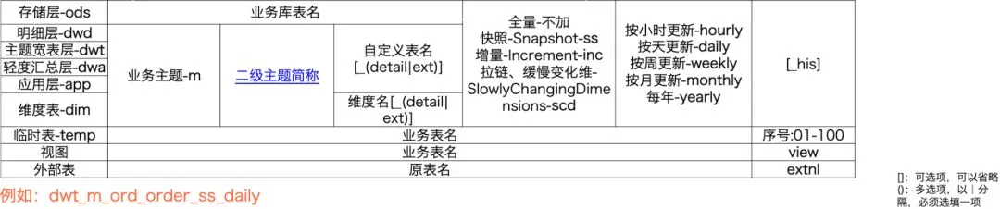

（3） **指标命名规范**

结合指标的特性以及词根管理规范，将指标进行结构化处理。

① 基础指标词根，即所有指标必须包含以下基础词根：

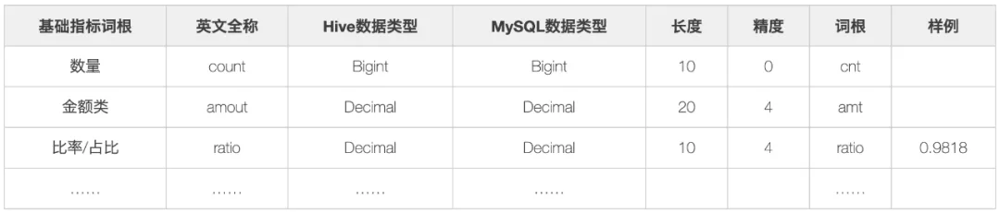

② 业务修饰词，用于描述业务场景的词汇，例如trade-交易。

③日期修饰词，用于修饰业务发生的时间区间。

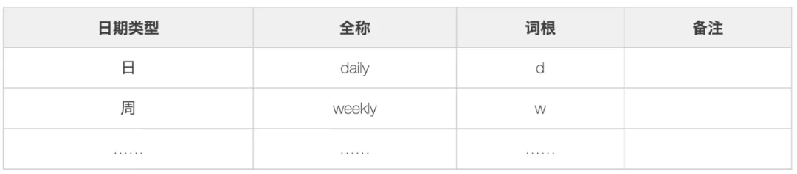

④ 聚合修饰词，对结果进行聚合操作。

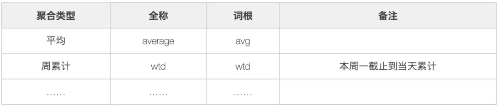

⑤ 基础指标，单一的业务修饰词 + 基础指标词根构建基础指标，例如：交易金额- trade_amt。

⑥ 派生指标，多修饰词 + 基础指标词根构建派生指标。派生指标继承基础指标的特性，例如：安装门店数量-install_poi_cnt。

⑦普通指标命名规范，与字段命名规范一致，由词汇转换即可。

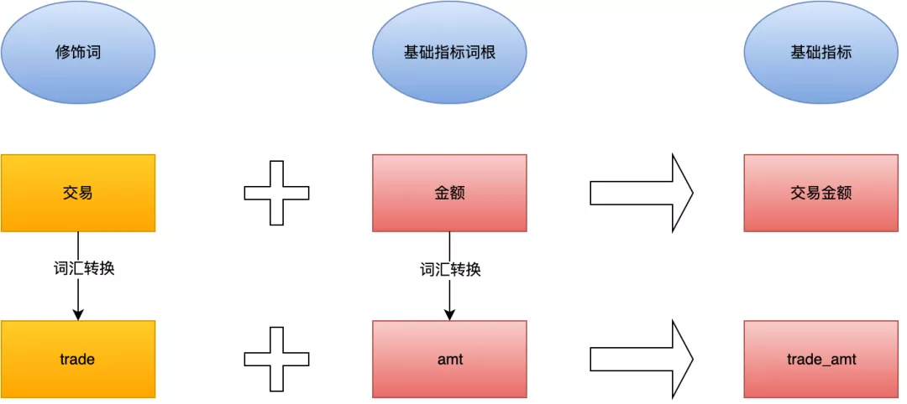

### 2.2 架构治理

(1) **数据分层**

优秀可靠的数仓体系，往往需要清晰的数据分层结构，即要保证数据层的稳定又要屏蔽对下游的影响，并且要避免链路过长，一般的分层架构如下：

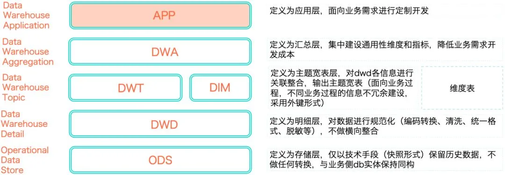

(2) **数据流向**

稳定业务按照标准的数据流向进行开发，即ODS-->DWD-->DWA-->APP。非稳定业务或探索性需求，可以遵循ODS->DWD->APP或者ODS->DWD->DWT->APP两个模型数据流。在保障了数据链路的合理性之后，又在此基础上确认了模型分层引用原则：

- 正常流向：ODS>DWD->DWT->DWA->APP，当出现ODS >DWD->DWA->APP这种关系时，说明主题域未覆盖全。应将DWD数据落到DWT中，对于使用频度非常低的表允许DWD->DWA。
- 尽量避免出现DWA宽表中使用DWD又使用（该DWD所归属主题域）DWT的表。
- 同一主题域内对于DWT生成DWT的表，原则上要尽量避免，否则会影响ETL的效率。
- DWT、DWA和APP中禁止直接使用ODS的表， ODS的表只能被DWD引用。
- 禁止出现反向依赖，例如DWT的表依赖DWA的表。

### 2.3 元数据治理

元数据可分为技术元数据和业务元数据：

**技术元数据**为开发和管理数据仓库的IT 人员使用，它描述了与数据仓库开发、管理和维护相关的数据，包括数据源信息、数据转换描述、数据仓库模型、数据清洗与更新规则、数据映射和访问权限等。

常见的技术元数据有：

- 存储元数据：如表、字段、分区等信息。
- 运行元数据：如大数据平台上所有作业运行等信息：类似于 Hive Job 日志，包括作业类型、实例名称、输入输出、 SQL 、运行参数、执行时间，执行引擎等。
- 数据开发平台中数据同步、计算任务、任务调度等信息：包括数据同步的输入输出表和字段，以及同步任务本身的节点信息：计算任务主要有输入输出、任务本身的节点信息 任务调度主要有任务的依赖类型、依赖关系等，以及不同类型调度任务的运行日志等。
- 数据质量和运维相关元数据：如任务监控、运维报警、数据质量、故障等信息，包括任务监控运行日志、告警配置及运行日志、故障信息等。

**业务元数据**为管理层和业务分析人员服务，从业务角度描述数据，包括商务术语、数据仓库中有什么数据、数据的位置和数据的可用性等，帮助业务人员更好地理解数据仓库中哪些数据是可用的以及如何使用。

- 常见的业务元数据有维度及属性(包括维度编码，字段类型，创建人，创建时间，状态等)、业务过程、指标(包含指标名称,指标编码，业务口径，指标类型，责任人，创建时间，状态，sql等)，安全等级，计算逻辑等的规范化定义，用于更好地管理和使用数据。数据应用元数据，如数据报表、数据产品等的配置和运行元数据。

元数据不仅定义了数据仓库中数据的模式、来源、抽取和转换规则等，而且是整个数据仓库系统运行的基础，元数据把数据仓库系统中各个松散的组件联系起来，组成了一个有机的整体。

**元数据治理主要解决三个问题**：

1. 通过建立相应的组织、流程和工具，推动业务标准的落地实施，实现指标的规范定义，消除指标认知的歧义；
2. 基于业务现状和未来的演进方式，对业务模型进行抽象，制定清晰的主题、业务过程和分析方向，构建完备的技术元数据，对物理模型进行准确完善的描述，并打通技术元数据与业务元数据的关系，对物理模型进行完备的刻画；
3. 通过元数据建设，为使用数据提效，解决“找数、理解数、评估”难题以及“取数、数据可视化”等难题。

### 2.4 安全治理

围绕数据安全标准，首先要有数据的分级、分类标准，确保数据在上线前有着准确的密级。第二，针对数据使用方，要有明确的角色授权标准，通过分级分类和角色授权，来保障重要数据拿不走。第三，针对敏感数据，要有隐私管理标准，保障敏感数据的安全存储，即使未授权用户绕过权限管理拿到敏感数据，也要确保其看不懂。第四，通过制定审计标准，为后续的审计提供审计依据，确保数据走不脱。

### 2.5 数据生命周期治理

任何事物都具有一定的生命周期，数据也不例外。从数据的产生、加工、使用乃至消亡都应该有一个科学的管理办法，将极少或者不再使用的数据从系统中剥离出来，并通过核实的存储设备进行保留，不仅能够提高系统的运行效率，更好的服务客户，还能大幅度减少因为数据长期保存带来的储存成本。数据生命周期一般包含在线阶段、归档阶段（有时还会进一步划分为在线归档阶段和离线归档阶段）、销毁阶段三大阶段，管理内容包括建立合理的数据类别，针对不同类别的数据制定各个阶段的保留时间、存储介质、清理规则和方式、注意事项等。

 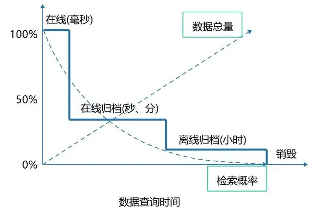

从上图数据生命周期中各参数间的关系中我们可以了解到，数据生命周期管理可以使得高价值数据的查询效率大幅提升，而且高价格的存储介质的采购量也可以减少很多；但是随着数据的使用程度的下降，数据被逐渐归档，查询时间也慢慢的变长；最后随着数据的使用频率和价值基本没有了之后，就可以逐渐销毁了。

