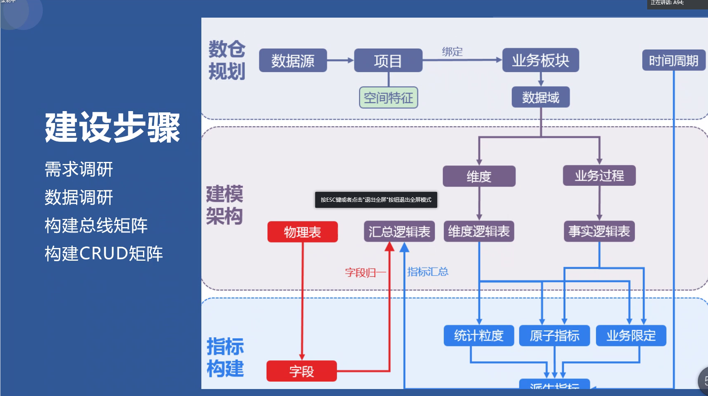
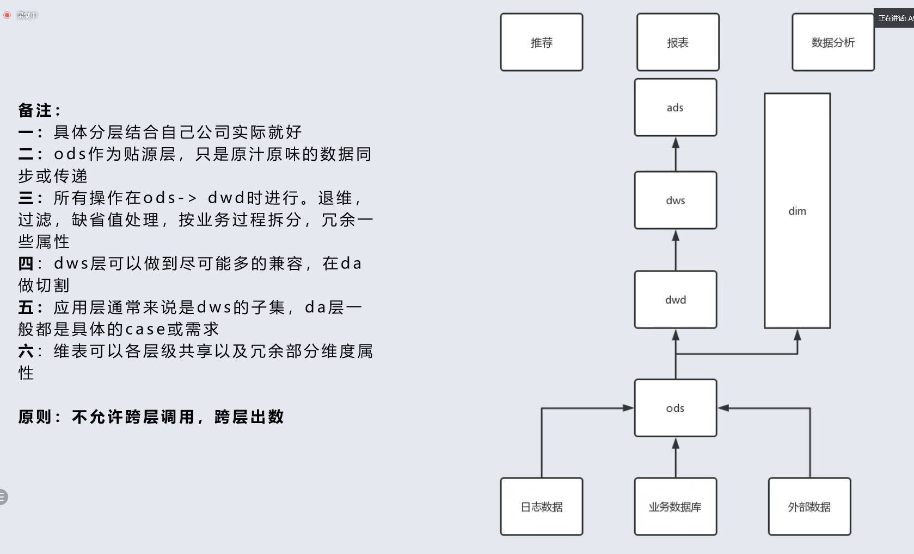

## 1. 数据仓库特点

- 集成的

  > 面向操作型的数据库通常是异构的、并且相互独立，所以无法对信息进行概括和反映信息的本质。而数据仓库中的数据是经过数据的抽取、清洗、切换、加载得到的，所以为了保证数据不存在二义性，必须对数据进行编码统一和必要的汇总，以保证数据仓库内数据的一致性。数据仓库在经历数据集成阶段后，使数据仓库中的数据都遵守统一的编码规则，并且消除许多冗余数据。

- 稳定的

  > 数据仓库中的数据反映的都是一段历史时期的数据内容，它的主要操作是查询、分析而不进行一般意义上的更新（数据集成前的操作型数据库主要完成数据的增加、修改、删除、查询），一旦某个数据进入到数据仓库后，一般情况下数据会被长期保留，当超过规定的期限才会被删除。通常数据仓库需要做的工作就是加载、查询和分析，一般不进行任何修改操作，是为了企业高层 人员决策分析之用。

- 面向主题

  >  普通的操作型数据库主要面向事务性处理，而数据仓库中的所有数据一般按照主题进行划分。主题是对业务数据的一种抽象，是从较高层次上对信息系统中的数据进行归纳和整理。
  >   面向主题的数据可以划分成两部分----根据原系统业务数据的特点进行主题的抽取和确定每个主题所包含的数据内容。例如客户主题、产品主题、财务主题等；而客户主题包括客户基本信息、客户信用信息、客户资源信息等内容。分析数据仓库主题的时候，一般方法是先确定几个基本的 主题，然后再将范围扩大，最后再逐步求精

- 反应历史变化

  > 数据仓库不断从操作型数据库或其他数据源获取变化的数据，从而分析和预测需要的历史数据，所以一般数据仓库中数据表的键码（维度）都含有时间键，以表明数据的历史时期信息，然后不断增加新的数据内容。通过这些历史信息可以对企业的发展历程和趋势做出分析和预测。数据仓库的建设需要大量的业务数据作为积累，并将这些宝贵的历史信息经过加工、整理，最后提供给决策分析人员，这是数据仓库建设的根本目的。

## 2. 数据仓库常见的概念

> **分层**:它是数据架构的产出之一，主要作用是为了解耦合分布执行降低出问题的风险以及用空间换时间用多步换取最终使用的数据的高效性。
>
> **分域**:主题域和数据域。主题域一般是面向分析用的，主题域通常是联系较为紧密的数据主题的集合，比如财务主题域、人力主题域、供应链主题域等。数据域一般指的是一组/一串/一类业务活动单元的集合，如日志、交易等
>
> **分类**:我们一般为了更好的管理数据，会把数据划分为主数据、交易数据、参考数据、元数据等。业务系统数据的一个划分。
>
> **维度**:由独立不重叠的数据元素组成的数据集，所构成的可进行统计的对象。常见的如人、产品、地点。通俗一点说就是你观察事物的角度，也就是通常所说的环境描述
>
> **事实**:描述业务过程的度量。
>
> **粒度**:事实表中一条记录所表达的业务细节程度。

**拓展：**

> **业务过程**:业务过程代表一个被管理实体或系统的事实，是对业务活动单元/事件的定义。常见的如下单、支付。
>
> **原子指标**:原子指标是对业务事实中度量的统计定义，与SQL中select内容等价。常见的如支付金额、买家数。
>
> **业务限定**:业务限定是对业务中圈选的统计范围的定义，与SQL中where条件等价。常见的如商品品类、已支付。
>
> **派生指标**:派生指标即常规的统计指标，通过原子指标与各种业务限定的组合而生成。如最近一天买家支付金额。
>
> **汇总逻辑表**:描述维度统计信息〔即派生指标）及维度属性信息的数据集合集，所构成的数据仓库模型。

### 3. 数据仓库建设步骤

