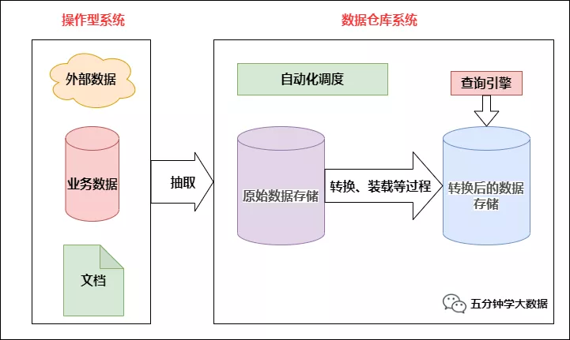


## 一、数仓基本概念

### 1. 数据仓库架构

我们在谈数仓之前，为了让大家有直观的认识，先来谈数仓架构，“**架构**”是什么？这个问题从来就没有一个准确的答案。这里我们引用一段话：在软件行业，一种被普遍接受的架构定义是指系统的一个或多个结构。结构中包括软件的构建（构建是指软件的设计与实现），构建的外部可以看到属性以及它们之间的相互关系。

这里参考此定义，**把数据仓库架构理解成构成数据仓库的组件及其之间的关系**，画出下面的数仓架构图：

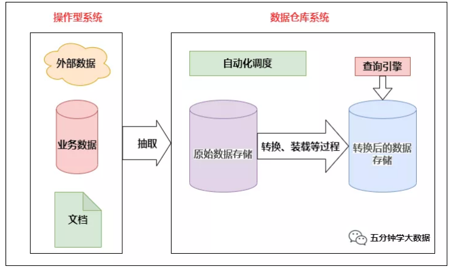

上图中显示的整个数据仓库环境包括操作型系统和数据仓库系统两大部分。操作型系统的数据由各种形式的业务数据组成，这些数据经过抽取、转换和装载（ETL）过程进入数据仓库系统。

任何事物都是随着时间的演进变得越来越完善，当然也是越来越复杂，数仓也不例外。在数据仓库技术演化过程中，产生了几种主要的架构方法，包括**数据集市架构**、**Inmon企业信息工厂架构**、**Kimball数据仓库架构**、**混合型数据仓库架构**。这几种架构我们后面再讲，接下来看下数仓的基本概念。

### 2. 数据仓库概念

英文名称为Data Warehouse，可简写为DW或DWH。数据仓库的目的是构建面向分析的集成化数据环境，为企业提供决策支持（Decision Support）。它出于分析性报告和决策支持目的而创建。

数据仓库本身并不“生产”任何数据，同时自身也不需要“消费”任何的数据，数据来源于外部，并且开放给外部应用，这也是为什么叫“仓库”，而不叫“工厂”的原因。

#### 1) 基本特征

数据仓库是面向主题的、集成的、非易失的和时变的数据集合，用以支持管理决策。

1. **面向主题**:

传统数据库中，最大的特点是面向应用进行数据的组织，各个业务系统可能是相互分离的。而数据仓库则是面向主题的。主题是一个抽象的概念，是较高层次上企业信息系统中的数据综合、归类并进行分析利用的抽象。在逻辑意义上，它是对应企业中某一宏观分析领域所涉及的分析对象。

2. **集成性**:

通过对分散、独立、异构的数据库数据进行抽取、清理、转换和汇总便得到了数据仓库的数据，这样保证了数据仓库内的数据关于整个企业的一致性。

数据仓库中的综合数据不能从原有的数据库系统直接得到。因此在数据进入数据仓库之前，必然要经过统一与综合，这一步是数据仓库建设中最关键、最复杂的一步，所要完成的工作有：

- **要统一源数据中所有矛盾之处**，如字段的同名异义、异名同义、单位不统一、字长不一致，等等。
- 进行数据综合和计算。数据仓库中的数据综合工作可以在从原有数据库抽取数据时生成，但许多是在数据仓库内部生成的，即进入数据仓库以后进行综合生成的。

下图说明一个保险公司综合数据的简单处理过程，其中数据仓库中与“保险” 主题有关的数据来自于多个不同的操作型系统。这些系统内部数据的命名可能不同，数据格式也可能不同。把不同来源的数据存储到数据仓库之前，需要去除这些不一致。

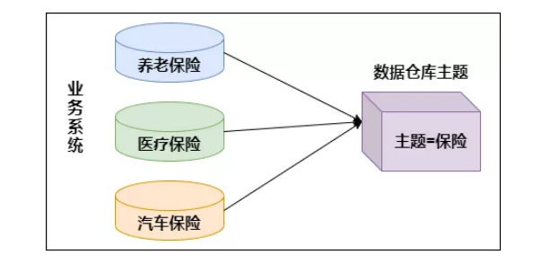

3. **非易失性（不可更新性）**:

数据仓库的数据反映的是一段相当长的时间内**历史数据的内容**，是不同时点的数据库快照的集合，以及基于这些快照进行统计、综合和重组的导出数据。

数据非易失性主要是针对应用而言。数据仓库的用户对数据的操作大多是数据查询或比较复杂的挖掘，一旦数据进入数据仓库以后，一般情况下被较长时间保留。数据仓库中一般有大量的查询操作，但修改和删除操作很少。因此，**数据经加工和集成进入数据仓库后是极少更新的，通常只需要定期的加载和更新**。

4. **时变性**:

数据仓库包含各种粒度的历史数据。数据仓库中的数据可能与某个特定日期、星期、月份、季度或者年份有关。数据仓库的目的是通过分析企业过去一段时间业务的经营状况，挖掘其中隐藏的模式。虽然数据仓库的用户不能修改数据，但并不是说数据仓库的数据是永远不变的。分析的结果只能反映过去的情况，当业务变化后，挖掘出的模式会失去时效性。因此数据仓库的数据需要更新，以适应决策的需要。从这个角度讲，数据仓库建设是一个项目，更是一个过程。数据仓库的数据随时间的变化表现在以下几个方面：

（1） 数据仓库的数据时限一般要远远长于操作型数据的数据时限。

（2） 操作型系统存储的是当前数据，而数据仓库中的数据是历史数据。

（3） 数据仓库中的数据是按照时间顺序追加的，它们都带有时间属性。

### 3. 为什么要有数据仓库

先来看下数据仓库的数据从哪里来，最终要到哪里去？

**通常数据仓库的数据来自各个业务应用系统**。业务系统中的数据形式多种多样，可能是 Oracle、MySQL、SQL Server等关系数据库里的结构化数据，可能是文本、CSV等平面文件或Word、Excel文档中的数据，还可能是HTML、XML等自描述的半结构化数据。这些业务数据经过一系列的数据抽取、转换、清洗，最终以一种统一的格式装载进数据仓库。数据仓库里的数据作为分析用的数据源，**提供给后面的即席查询、 分析系统、数据集市、报表系统、数据挖掘系统等**。

这时我们就想了，为什么不能把业务系统的数据直接拿来供即席查询、分析系统、报表系统等使用呢，为什么要经过数据仓库这一步？实际上在数仓出现之前，确实是这么做的，但是有很多数据分析的先驱者当时已经发现，简单的“直接访问”方式很难良好工作，这样做的失败案例数不胜数。下面列举一些直接访问业务系统无法工作的原因：

- 某些业务数据由于安全或其他因素不能直接访问。
- 业务系统的版本变更很频繁，每次变更都需要重写分析系统并重新测试。
- 很难建立和维护汇总数据来源于多个业务系统版本的报表。
- 业务系统的列名通常是硬编码，有时仅仅是无意义的字符串，这让编写分析系统更加困难。
- 业务系统的数据格式，如日期、数字的格式不统一。
- 业务系统的表结构为事务处理性能而优化，有时并不适合查询与分析。
- 没有适当的方式将有价值的数据合并进特定应用的数据库。
- 没有适当的位置存储元数据。
- 用户需要看到的显示数据字段，有时在数据库中并不存在。
- 通常事务处理的优先级比分析系统高，所以如果分析系统和事务处理运行在同一硬件之上，分析系统往往性能很差。
- 有误用业务数据的风险。
- 极有可能影响业务系统的性能。

**尽管需要增加软硬件的投入，但建立独立数据仓库与直接访问业务数据相比，无论是成本还是带来的好处，这样做都是值得的**。随着处理器和存储成本的逐年降低，数据仓库方案的优势更加明显，在经济上也更具可行性。

### 4. 数据仓库与数据库的区别

数据库与数据仓库的区别实际讲的是 OLTP 与 OLAP 的区别。

操作型处理，叫联机事务处理 OLTP（On-Line Transaction Processing，），也可以称面向交易的处理系统，它是针对具体业务在数据库联机的日常操作，通常对少数记录进行查询、修改。**用户较为关心操作的响应时间、数据的安全性、完整性和并发支持的用户数等问题**。传统的数据库系统作为数据管理的主要手段，主要用于操作型处理，像Mysql，Oracle等关系型数据库一般属于OLTP。

分析型处理，叫联机分析处理 OLAP（On-Line Analytical Processing）一般针对某些主题的历史数据进行分析，支持管理决策。

首先要明白，数据仓库的出现，并不是要取代数据库。数据库是面向事务的设计，数据仓库是面向主题设计的。数据库一般存储业务数据，数据仓库存储的一般是历史数据。

数据库设计是尽量避免冗余，一般针对某一业务应用进行设计，比如一张简单的User表，记录用户名、密码等简单数据即可，符合业务应用，但是不符合分析。**数据仓库在设计是有意引入冗余，依照分析需求，分析维度、分析指标进行设计**。

**数据库是为捕获数据而设计，数据仓库是为分析数据而设计**。

以银行业务为例。数据库是事务系统的数据平台，客户在银行做的每笔交易都会写入数据库，被记录下来，这里，可以简单地理解为用数据库记账。数据仓库是分析系统的数据平台，它从事务系统获取数据，并做汇总、加工，为决策者提供决策的依据。比如，某银行某分行一个月发生多少交易，该分行当前存款余额是多少。如果存款又多，消费交易又多，那么该地区就有必要设立ATM了。

显然，银行的交易量是巨大的，通常以百万甚至千万次来计算。事务系统是实时的，这就要求时效性，客户存一笔钱需要几十秒是无法忍受的，这就要求数据库只能存储很短一段时间的数据。而分析系统是事后的，它要提供关注时间段内所有的有效数据。这些数据是海量的，汇总计算起来也要慢一些，但是，只要能够提供有效的分析数据就达到目的了。

**数据仓库，是在数据库已经大量存在的情况下，为了进一步挖掘数据资源、为了决策需要而产生的，它决不是所谓的“大型数据库”**。

### 5.  数据仓库分层架构

按照数据流入流出的过程，数据仓库架构可分为：**源数据**、**数据仓库**、**数据应用**

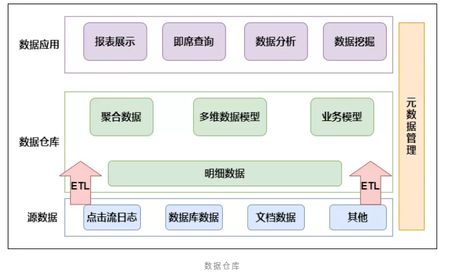

数据仓库的数据来源于不同的源数据，并提供多样的数据应用，数据自下而上流入数据仓库后向上层开放应用，而数据仓库只是中间集成化数据管理的一个平台。

**源数据**：此层数据无任何更改，直接沿用外围系统数据结构和数据，不对外开放；为临时存储层，是接口数据的临时存储区域，为后一步的数据处理做准备。

**数据仓库**：也称为细节层，DW层的数据应该是一致的、准确的、干净的数据，即对源系统数据进行了清洗（去除了杂质）后的数据。

**数据应用**：前端应用直接读取的数据源；根据报表、专题分析需求而计算生成的数据。

数据仓库从各数据源获取数据及在数据仓库内的数据转换和流动都可以认为是ETL（**抽取Extra, 转化Transfer, 装载Load**）的过程，ETL是数据仓库的流水线，也可以认为是数据仓库的血液，它维系着数据仓库中数据的新陈代谢，而数据仓库日常的管理和维护工作的大部分精力就是保持ETL的正常和稳定。

**那么为什么要数据仓库进行分层呢**?

- 用空间换时间，通过大量的预处理来提升应用系统的用户体验（效率），因此数据仓库会存在大量冗余的数据；不分层的话，如果源业务系统的业务规则发生变化将会影响整个数据清洗过程，工作量巨大。
- 通过数据分层管理可以简化数据清洗的过程，因为把原来一步的工作分到了多个步骤去完成，相当于把一个复杂的工作拆成了多个简单的工作，把一个大的黑盒变成了一个白盒，每一层的处理逻辑都相对简单和容易理解，这样我们比较容易保证每一个步骤的正确性，当数据发生错误的时候，往往我们只需要局部调整某个步骤即可。

### 6. 主要数据仓库架构

通过上面的内容我们大概了解数仓的概念，接下来就看下数仓的几种演进架构。

#### 1. 数据集市架构

数据集市是按主题域组织的数据集合，用于支持部门级的决策。有两种类型的数据集市：**独立数据集市**和**从属数据集市**。

##### 1) 独立数据集市

独立数据集市集中于部门所关心的单一主题域，数据以部门为基础部署，无须考虑企业级别的信息共享与集成。例如，制造部门、人力资源部门和其他部门都各自有他们自己的数据集市。

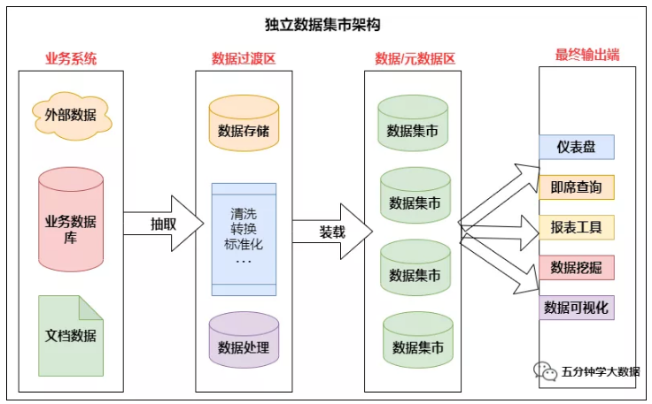


**优点**：因为一个部门的业务相对于整个企业要简单，数据量也小得多，所以部门的独立数据集市具有周期短、见效快的特点。

**缺点**：

- 从业务角度看，当部门的分析需求扩展，或者需要分析跨部门或跨主题域的数据时，独立数据市场会显得力不从心。
- 当数据存在歧义，比如同一个产品，在A部门和B部门的定义不同时，将无法在部门间进行信息比较。
- 每个部门使用不同的技术，建立不同的ETL的过程，处理不同的事务系统，而在多个独立的数据集市之间还会存在数据的交叉与重叠，甚至会有数据不一致的情况。

##### 2) 从属数据集市

从属数据集市的数据来源于数据仓库。数据仓库里的数据经过整合、重构、汇总后传递给从属数据集市。

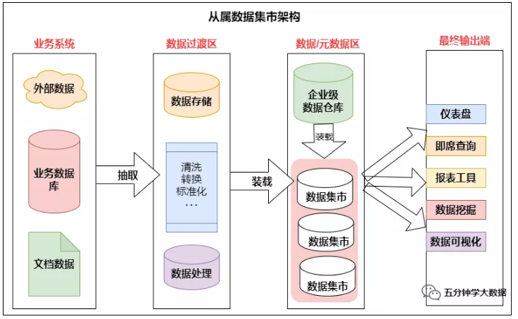

建立从属数据集市的好处主要有：

- **性能**：当数据仓库的查询性能出现问题，可以考虑建立几个从属数据集市，将查询从数据仓库移出到数据集市。
- **安全**：每个部门可以完全控制他们自己的数据。
- **数据一致**：因为每个数据集市的数据来源都是同一个数据仓库，有效消除了数据不一致的情况。

#### 2. Inmon企业工厂架构

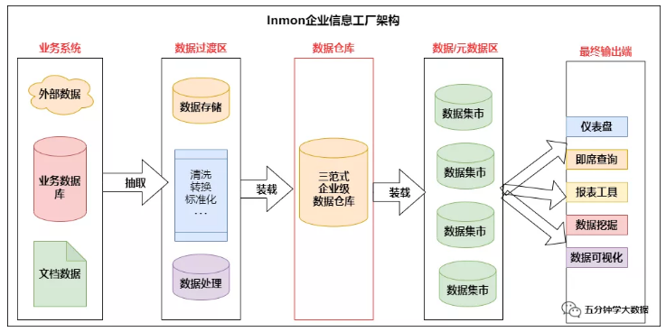

上图的前两步不过多介绍，直接从第三步开始。

**企业级数据仓库**：是该架构中的核心组件。正如Inmon数据仓库所定义的，企业级数据仓库是一个细节数据的集成资源库。其中的数据以最低粒度级别被捕获，存储在满足三范式设计的关系数据库中。

**部门级数据集市**：是面向主题数据的部门级视图，数据从企业级数据仓库获取。数据在进入部门数据集市时可能进行聚合。数据集市使用多维模型设计，用于数据分析。重要的一点是，所有的报表工具、BI工具或其他数据分析应用都从数据集市查询数据，而不是直接查询企业级数据仓库。

#### 3. Kimball数据仓库架构

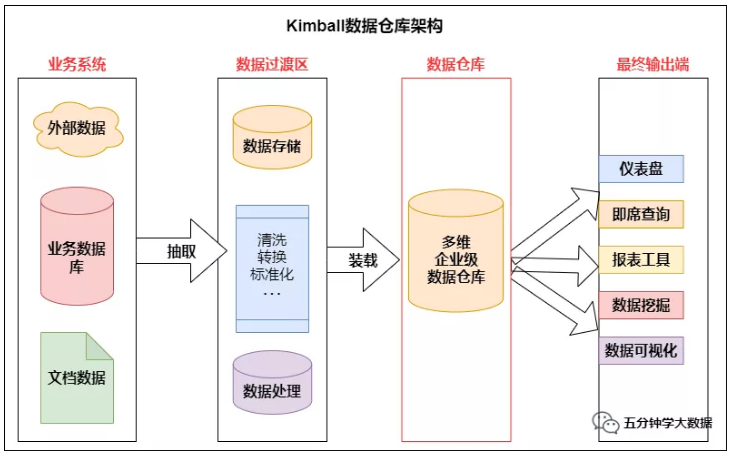


对比上一张图可以看到，Kimball与Inmon两种架构的主要区别在于核心数据仓库的设计和建立。

Kimball的数据仓库包含高粒度的企业数据，使用多维模型设计，这也意味着**数据仓库由星型模式的维度表和事实表构成**。分析系统或报表工具可以直接访问多维数据仓库里的数据。

在此架构中的数据集市也与Inmon中的不同。这里的**数据集市是一个逻辑概念，只是多维数据仓库中的主题域划分**，并没有自己的物理存储，也可以说是虚拟的数据集市。

#### 4. 混合型数据仓库架构

所谓的混合型结构，指的是在一个数据仓库环境中，**联合使用Inmon和Kimball两种架构**。


从架构图可以看到，这种架构将Inmon方法中的数据集市部分替换成了一个多维数据仓库，而数据集市则是多维数据仓库上的逻辑视图。

**使用这种架构的好处是**：既可以利用规范化设计消除数据冗余，保证数据的粒度足够细；又可以利用多维结构更灵活地在企业级实现报表和分析。

### 7. 数据仓库元数据的管理

**元数据（Meta Date），主要记录数据仓库中模型的定义、各层级间的映射关系、监控数据仓库的数据状态及ETL的任务运行状态**。一般会通过元数据资料库（Metadata Repository）来统一地存储和管理元数据，其主要目的是使数据仓库的设计、部署、操作和管理能达成协同和一致。

元数据是数据仓库管理系统的重要组成部分，元数据管理是企业级数据仓库中的关键组件，贯穿数据仓库构建的整个过程，直接影响着数据仓库的构建、使用和维护。

- 构建数据仓库的主要步骤之一是ETL。这时元数据将发挥重要的作用，它定义了源数据系统到数据仓库的映射、数据转换的规则、数据仓库的逻辑结构、数据更新的规则、数据导入历史记录以及装载周期等相关内容。数据抽取和转换的专家以及数据仓库管理员正是通过元数据高效地构建数据仓库。
- 用户在使用数据仓库时，通过元数据访问数据，明确数据项的含义以及定制报表。
- 数据仓库的规模及其复杂性离不开正确的元数据管理，包括增加或移除外部数据源，改变数据清洗方法，控制出错的查询以及安排备份等。

元数据可分为技术元数据和业务元数据。**技术元数据**为开发和管理数据仓库的IT 人员使用，它描述了与数据仓库开发、管理和维护相关的数据，包括数据源信息、数据转换描述、数据仓库模型、数据清洗与更新规则、数据映射和访问权限等。而**业务元数据**为管理层和业务分析人员服务，从业务角度描述数据，包括商务术语、数据仓库中有什么数据、数据的位置和数据的可用性等，帮助业务人员更好地理解数据仓库中哪些数据是可用的以及如何使用。

由上可见，元数据不仅定义了数据仓库中数据的模式、来源、抽取和转换规则等，而且是整个数据仓库系统运行的基础，元数据把数据仓库系统中各个松散的组件联系起来，组成了一个有机的整体。

### 8. 数仓常见术语解析

本小节结构如下图所示：

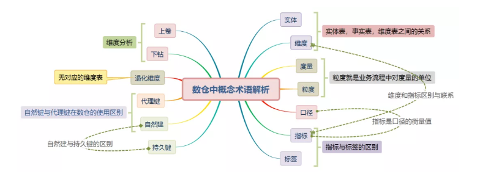

#### 1. 数仓名词解释

##### 1. 实体

实体是指依附的主体，就是我们分析的一个对象，比如我们分析商品的销售情况，如华为手机近半年的销售量是多少，那华为手机就是一个实体；我们分析用户的活跃度，用户就是一个实体。当然实体也可以现实中不存在的，比如虚拟的业务对象，活动，会员等都可看做一个实体。

**实体的存在是为了业务分析，作为分析的一个筛选的维度，拥有描述自己的属性，本身具有可分析的价值**。

##### 2. 维度

维度就是看待问题的角度，分析业务数据，从什么角度分析，就建立什么样的维度。所以维度就是要对数据进行分析时所用的一个量，比如你要分析产品销售情况，你可以选择按商品类别来进行分析，这就构成一个维度，把所有商品类别集合在一起，就构成了维度表。

##### 3. 度量

度量是业务流程节点上的一个数值。比如销量，价格，成本等等。

**事实表中的度量可分为三类：完全可加，半可加，不可加**。

1. 完全可加的度量是最灵活，最有用的，比如说销量，销售额等，可进行任意维度汇总；
2. 半可加的度量可以对某些维度汇总，但不能对所有维度汇总，差额是常见的半可加度量，它除了时间维度外，可以跨所有维度进行加法操作；
3. 还有一种是完全不可加的，例如：比率。对于这类非可加度量，一种好的方法是，**尽可能存储非可加度量的完全可加分量**，并在计算出最终的非可加事实前，将这些分量汇总到最终的结果集中。

##### 4. 粒度

粒度就是业务流程中对度量的单位，比如商品是按件记录度量，还是按批记录度量。

在数仓建设中，我们说这是用户粒度的事实表，那么表中每行数据都是一个用户，无重复用户；例如还有销售粒度的表，那么表中每行都是一条销售记录。

**选择合适的粒度级别是数据仓库建设好坏的重要关键内容**，在设计数据粒度时，通常需重点考虑以下因素：

1. 要接受的分析类型、可接受的数据最低粒度和能存储的数据量；
2. 粒度的层次定义越高，就越不能在该仓库中进行更细致的分析；
3. 如果存储资源有一定的限制，就只能采用较高的数据粒度划分；
4. **数据粒度划分策略一定要保证：数据的粒度确实能够满足用户的决策分析需要，这是数据粒度划分策略中最重要的一个准则**。

##### 5. 口径

**口径就是取数逻辑（如何取数的）**，比如**要取的数**是10岁以下儿童中男孩的平均身高，这就是统计的口径。

##### 6. 指标

**指标是口径的衡量值，也就是最后的结果**。比如最近七天的订单量，一个促销活动的购买转化率等。

一个指标具体到计算实施，主要有以下几部分组成：

- 指标加工逻辑，比如count ,sum, avg
- 维度，比如按部门、地域进行指标统计，对应sql中的group by
- 业务限定/修饰词，比如以不同的支付渠道来算对应的指标，微信支付的订单退款率，支付宝支付的订单退款率 。对应sql中的where。

除此之外，指标本身还可以衍生、派生出更多的指标，基于这些特点，可以将指标进行分类：

- **原子指标**：基本业务事实，没有业务限定、没有维度。比如订单表中的订单量、订单总金额都算原子指标；

> 业务方更关心的指标，是有实际业务含义，可以直接取数据的指标。比如店铺近1天订单支付金额就是一个派生指标，会被直接在产品上展示给商家看。但是这个指标却不能直接从数仓的统一中间层里取数（因为没有现成的事实字段，数仓提供的一般都是大宽表）。需要有一个桥梁连接数仓中间层和业务方的指标需求，于是便有了派生指标

- **派生指标**：维度+修饰词+原子指标。店铺近1天订单支付金额中店铺是维度，近1天是一个时间类型的修饰词，支付金额是一个原子指标；

> 维度：观察各项指标的角度；
>
> 修饰词：维度的一个或某些值，比如维度性别下，男和女就是2种修饰词。

- **衍生指标**：比如某一个促销活动的转化率就是衍生指标，因为需要促销投放人数指标和促销订单数指标进行计算得出。

##### 7. 标签

标签是人为设定的、根据业务场景需求，对目标对象运用一定的算法得到的高度精炼的特征标识。可见标签是经过人为再加工后的结果，如网红、白富美、萝莉。对于有歧义的标签，我们内部可进行标签区分，比如：苹果，我们可以定义苹果指的是水果，苹果手机才指的是手机。

##### 8. 自然键

由现实中已经存在的属性组成的键，它在业务概念中是唯一的，并具有一定的业务含义，比如商品ID，员工ID。

以数仓角度看，来自于业务系统的标识符就是自然键，比如业务库中员工的编号。

##### 9. 持久键

保持永久性不会发生变化。有时也被叫做超自然持久键。比如身份证号属于持久键。

**自然键和持久键区别**：举个例子就明白了，比如说公司员工离职之后又重新入职，他的自然键也就是员工编号发生了变化，但是他的持久键身份证号是不变的。

##### 10. 代理键

就是不具有业务含义的键。代理键有许多其他的称呼：无意义键、整数键、非自然键、人工键、合成键等。

代理键就是简单的以按照顺序序列生产的整数表示。产品行的第1行代理键为1，则下一行的代理键为2，如此进行。**代理键的作用仅仅是连接维度表和事实表**。

##### 11. 退化维度

**退化维度，就是那些看起来像是事实表的一个维度关键字，但实际上并没有对应的维度表**，就是维度属性存储到事实表中，这种存储到事实表中的维度列被称为退化维度。与其他存储在维表中的维度一样，退化维度也可以用来进行事实表的过滤查询、实现聚合操作等。

那么究竟怎么定义退化维度呢？比如说订单id，这种量级很大的维度，没必要用一张维度表来进行存储，而我们进行数据查询或者数据过滤的时候又非常需要，所以这种就冗余在事实表里面，这种就叫退化维度，citycode这种我们也会冗余在事实表里面，但是**它有对应的维度表，所以它不是退化维度**。

##### 12. 下钻

这是在数据分析中常见的概念，下钻可以理解成增加维的层次，从而可以**由粗粒度到细粒度来观察数据**，比如对产品销售情况分析时，可以沿着时间维从年到月到日更细粒度的观察数据。从年的维度可以下钻到月的维度、日的维度等。

##### 13. 上卷

知道了下钻，上卷就容易理解了，它俩是相逆的操作，所以**上卷可以理解为删掉维的某些层**，由细粒度到粗粒度观察数据的操作或沿着维的层次向上聚合汇总数据。

##### 14. 数据集市

数据集市（Data Mart），也叫数据市场，数据集市就是满足特定的部门或者用户的需求，按照多维的方式进行存储，包括定义维度、需要计算的指标、维度的层次等，生成面向决策分析需求的数据立方体。其实就是从数据仓库中抽取出来的一个小合集。

#### 2. 数仓名词之间关系

##### 1. 实体表，事实表，维度表之间的关系

在Kimball维度建模中有维度与事实，在Inmon范式建模中有实体与关系，如果我们分开两种建模方式看这些概念比较容易理解。但是目前也出现了不少混合建模方式，两种建模方式结合起来看，这些概念是不是容易记忆混乱，尤其事实表和实体表，它们之间到底有怎样区别与联系，先看下它们各自概念：

1. **维度表**：维度表可以看成是用户用来分析一个事实的窗口，它里面的数据应该是对事实的各个方面描述，比如时间维度表，地域维度表，维度表是事实表的一个分析角度。
2. **事实表**：事实表其实就是通过各种维度和一些指标值的组合来确定一个事实的，比如通过时间维度，地域组织维度，指标值可以去确定在某时某地的一些指标值怎么样的事实。事实表的每一条数据都是几条维度表的数据和指标值交汇而得到的。
3. **实体表**：实体表就是一个实际对象的表，实体表放的数据一定是一条条客观存在的事物数据，比如说各种商品，它就是客观存在的，所以可以将其设计一个实体表。实时表只描述各个事物，并不存在具体的事实，所以也有人称实体表是无事实的事实表。

举个例子：比如说手机商场中有苹果手机，华为手机等各品牌各型号的手机，这些数据可以组成一个**手机实体表**，但是表中没有可度量的数据。某天苹果手机卖了15台，华为手机卖了20台，这些手机销售数据属于事实，组成一个**事实表**。这样就可以使用**日期维度表**和**地域维度表**对这个事实表进行各种维度分析。

##### 2. 指标与标签的区别

- 概念不同

**指标**是用来定义、评价和描述特定事物的一种标准或方式。比如：新增用户数、累计用户数、用户活跃率等是衡量用户发展情况的指标；

**标签**是人为设定的、根据业务场景需求，对目标对象运用一定的算法得到的高度精炼的特征标识。可见标签是经过人为再加工后的结果，如网红、白富美、萝莉。

- 构成不同

**指标名称**是对事物质与量两方面特点的命名；指标取值是指标在具体时间、地域、条件下的数量表现，如人的体重，指标名称是体重，指标的取值就是120斤；

**标签名称**通常都是形容词或形容词+名词的结构，标签一般是不可量化的，通常是孤立的，除了基础类标签，通过一定算法加工出来的标签一般都没有单位和量纲。如将超过200斤的称为大胖子。

- 分类不同

**对指标的分类**：

按照指标计算逻辑，可以将指标分为原子指标、派生指标、衍生指标三种类型；

按照对事件描述内容的不同，分为过程性指标和结果性指标；

**对标签的分类**：

按照标签的变化性分为静态标签和动态标签；

按照标签的指代和评估指标的不同，可分为定性标签和定量标签；

> **指标**最擅长的应用是监测、分析、评价和建模。
>
> **标签**最擅长的应用是标注、刻画、分类和特征提取。
>
> 特别需要指出的是，由于对结果的标注也是一种标签，所以在自然语言处理和机器学习相关的算法应用场景下，标签对于监督式学习有重要价值，只是单纯的指标难以做到的。而指标在任务分配、绩效管理等领域的作用，也是标签无法做到的。

##### 3. 维度和指标区别与联系

维度就是数据的观察角度，即从哪个角度去分析问题，看待问题。

指标就是从维度的基础上去衡算这个结果的值。

维度一般是一个离散的值，比如时间维度上每一个独立的日期或地域，因此统计时，可以把维度相同记录的聚合在一起，应用聚合函数做累加、均值、最大值、最小值等聚合计算。

指标就是被聚合的通计算，即聚合运算的结果，一般是一个连续的值。

##### 4. 自然键与代理键在数仓的使用区别

数仓工具箱中说**维度表的唯一主键应该是代理键而不应该是自然键**。有时建模人员不愿意放弃使用自然键，因为他们希望与操作型代码查询事实表，而不希望与维度表做连接操作。然而，应该避免使用包含业务含义的多维键，因为不管我们做出任何假设最终都可能变得无效，因为我们控制不了业务库的变动。

**所以数据仓库中维度表与事实表的每个连接应该基于无实际含义的整数代理键。避免使用自然键作为维度表的主键**。

##### 5. 数据集市和数据仓库的关系

**数据集市是企业级数据仓库的一个子集**，他主要面向部门级业务，并且只面向某个特定的主题。为了解决灵活性和性能之间的矛盾，数据集市就是数据仓库体系结构中增加的一种小型的部门或工作组级别的数据仓库。数据集市存储为特定用户预先计算好的数据，从而满足用户对性能的需求。数据集市可以在一定程度上缓解访问数据仓库的瓶颈。

**数据集市和数据仓库的主要区别**：数据仓库是企业级的，能为整个企业各个部门的运行提供决策支持手段；而数据集市则是一种微型的数据仓库,它通常有更少的数据,更少的主题区域,以及更少的历史数据,因此是部门级的，一般只能为某个局部范围内的管理人员服务，因此也称之为部门级数据仓库。


## 二、离线数仓建设核心

**数据仓库的核心是展现层和提供优质的服务。ETL 及其规范、分层等所做的一切都是为了一个更清晰易用的展现层。**

### 1. 数仓分层

**数仓分层的原则**：

1. 为便于数据分析，要屏蔽底层复杂业务，简单、完整、集成的将数据暴露给分析层。
2. 底层业务变动与上层需求变动对模型冲击最小化，业务系统变化影响削弱在基础数据层，结合自上而下的建设方法削弱需求变动对模型的影响。
3. 高内聚松耦合，即主题之内或各个完整意义的系统内数据的高内聚，主题之间或各个完整意义的系统间数据的松耦合。
4. 构建仓库基础数据层，使底层业务数据整合工作与上层应用开发工作相隔离，为仓库大规模开发奠定基础 仓库层次更加清晰，对外暴露数据更加统一。

一般采用如下分层结构：

  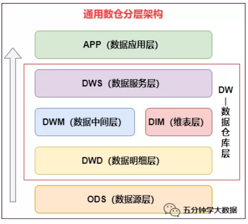

#### 1. 数据源层：ODS（Operational Data Store）

ODS 层，是最接近数据源中数据的一层，为了考虑后续可能需要追溯数据问题，因此对于这一层就不建议做过多的数据清洗工作，原封不动地接入原始数据即可，至于数据的去噪、去重、异常值处理等过程可以放在后面的 DWD 层来做。

#### 2. 数据仓库层：DW（Data Warehouse）

数据仓库层是我们在做数据仓库时要核心设计的一层，在这里，从 ODS 层中获得的数据按照主题建立各种数据模型。

DW 层又细分为 **DWD**（Data Warehouse Detail）层、**DWM**（Data WareHouse Middle）层和 **DWS**（Data WareHouse Servce） 层。

##### 1) 数据明细层：DWD（Data Warehouse Detail）

该层一般保持和 ODS 层一样的数据粒度，并且提供一定的数据质量保证。**DWD 层要做的就是将数据清理、整合、规范化、脏数据、垃圾数据、规范不一致的、状态定义不一致的、命名不规范的数据都会被处理**。

同时，为了提高数据明细层的易用性，**该层会采用一些维度退化手法，将维度退化至事实表中，减少事实表和维表的关联**。

另外，在该层也会做一部分的数据聚合，将相同主题的数据汇集到一张表中，提高数据的可用性 。

##### 2) 数据中间层：DWM（Data WareHouse Middle）

该层会在 DWD 层的数据基础上，数据做轻度的聚合操作，生成一系列的中间表，提升公共指标的复用性，减少重复加工。

直观来讲，**就是对通用的核心维度进行聚合操作，算出相应的统计指标**。

在实际计算中，如果直接从 DWD 或者 ODS 计算出宽表的统计指标，会存在计算量太大并且维度太少的问题，因此一般的做法是，在 DWM 层先计算出多个小的中间表，然后再拼接成一张 DWS 的宽表。由于宽和窄的界限不易界定，也可以去掉 DWM 这一层，只留 DWS 层，将所有的数据再放在 DWS 亦可。

##### 3) 数据服务层：DWS（Data WareHouse Servce）

DWS 层为公共汇总层，会进行轻度汇总，粒度比明细数据稍粗，基于 DWD 层上的基础数据，**整合汇总成分析某一个主题域的服务数据，一般是宽表**。DWS 层应覆盖 80% 的应用场景。又称数据集市或宽表。

按照业务划分，如主题域流量、订单、用户等，生成字段比较多的宽表，用于提供后续的业务查询，OLAP 分析，数据分发等。

一般来讲，该层的数据表会相对比较少，一张表会涵盖比较多的业务内容，由于其字段较多，因此一般也会称该层的表为宽表。

#### 3. 数据应用层：APP（Application）

在这里，主要是提供给数据产品和数据分析使用的数据，一般会存放在 ES、 PostgreSql、Redis 等系统中供线上系统使用，也可能会存在 Hive 或者 Druid 中供数据分析和数据挖掘使用。比如我们经常说的报表数据，一般就放在这里。

#### 4. 维表层：DIM（Dimension）

如果维表过多，也可针对维表设计单独一层，维表层主要包含两部分数据：

**高基数维度数据**：一般是用户资料表、商品资料表类似的资料表。数据量可能是千万级或者上亿级别。

**低基数维度数据**：一般是配置表，比如枚举值对应的中文含义，或者日期维表。数据量可能是个位数或者几千几万。

### 2. 数仓建模方法

数仓建模在哪层建设呢？我们以维度建模为例，**建模是在数据源层的下一层进行建设**，在上节的分层架构中，**就是在DW层进行数仓建模**，所以**DW层是数仓建设的核心层**。

那数仓建模怎么建呢？其实数据仓库的建模方法有很多种，每一种建模方法代表了哲学上的一个观点，代表了一种归纳、概括世界的一种方法。常见的有 **范式建模法、维度建模法、实体建模法**等，每种方法从本质上将是从不同的角度看待业务中的问题。

#### 1. 范式建模法（Third Normal Form，3NF）

范式建模法其实是我们在构建数据模型常用的一个方法，该方法的主要由 Inmon 所提倡，主要解决关系型数据库的数据存储，利用的一种技术层面上的方法。目前，我们在关系型数据库中的建模方法，大部分采用的是三范式建模法。

范式 是符合某一种级别的关系模式的集合。构造数据库必须遵循一定的规则，而在关系型数据库中这种规则就是范式，这一过程也被称为规范化。目前关系数据库有六种范式：第一范式（1NF）、第二范式（2NF）、第三范式（3NF）、Boyce-Codd范式（BCNF）、第四范式（4NF）和第五范式（5NF）。

在数据仓库的模型设计中，一般采用第三范式。一个符合第三范式的关系必须具有以下三个条件 :

- 每个属性值唯一，不具有多义性 ;
- 每个非主属性必须完全依赖于整个主键，而非主键的一部分 ;
- 每个非主属性不能依赖于其他关系中的属性，因为这样的话，这种属性应该归到其他关系中去。

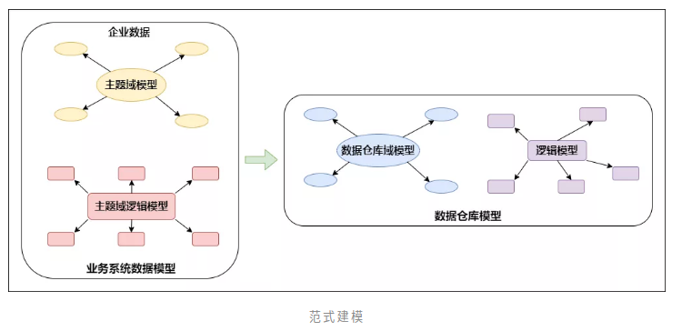

根据 Inmon 的观点，数据仓库模型的建设方法和业务系统的企业数据模型类似。在业务系统中，企业数据模型决定了数据的来源，而企业数据模型也分为两个层次，即主题域模型和逻辑模型。同样，主题域模型可以看成是业务模型的概念模型，而逻辑模型则是域模型在关系型数据库上的实例化。

#### 2. 维度建模法（Dimensional Modeling）

维度模型是数据仓库领域另一位大师Ralph Kimall所倡导，他的《数据仓库工具箱》是数据仓库工程领域最流行的数仓建模经典。维度建模以分析决策的需求出发构建模型，构建的数据模型为分析需求服务，因此它重点解决用户如何更快速完成分析需求，同时还有较好的大规模复杂查询的响应性能。

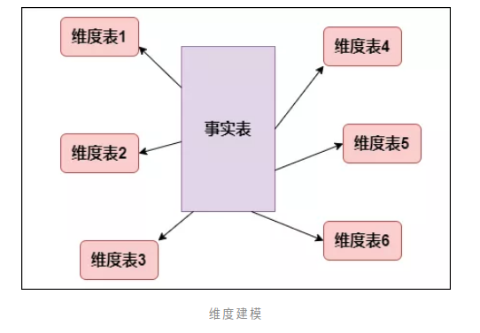

典型的代表是我们比较熟知的星形模型（Star-schema），以及在一些特殊场景下适用的雪花模型（Snow-schema）。

维度建模中比较重要的概念就是 事实表（Fact table）和维度表（Dimension table）。其最简单的描述就是，按照事实表、维度表来构建数据仓库、数据集市。

#### 3. 实体建模法（Entity Modeling）

实体建模法并不是数据仓库建模中常见的一个方法，它来源于哲学的一个流派。从哲学的意义上说，客观世界应该是可以细分的，客观世界应该可以分成由一个个实体，以及实体与实体之间的关系组成。那么我们在数据仓库的建模过程中完全可以引入这个抽象的方法，将整个业务也可以划分成一个个的实体，而每个实体之间的关系，以及针对这些关系的说明就是我们数据建模需要做的工作。

虽然实体法粗看起来好像有一些抽象，其实理解起来很容易。即我们可以将任何一个业务过程划分成 3 个部分，**实体，事件，说明**，如下图所示：

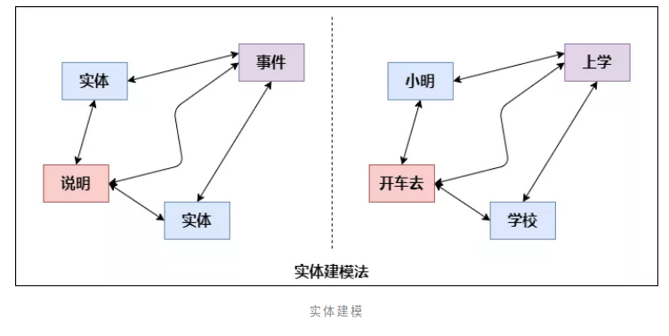

上图表述的是一个抽象的含义，如果我们描述一个简单的事实：“小明开车去学校上学”。以这个业务事实为例，我们可以把“小明”，“学校”看成是一个实体，“上学”描述的是一个业务过程，我们在这里可以抽象为一个具体“事件”，而“开车去”则可以看成是事件“上学”的一个说明。

### 3. 维度建模详解

目前在互联网公司最常用的建模方法就是维度建模，我们将重点讲解！

维度建模是专门应用于分析型数据库、数据仓库、数据集市建模的方法。数据集市可以理解为是一种"小型数据仓库"。

我们先不着急开始维度建模，先来了解下**维度建模中表的类型**和**维度建模的模式**之后再开始建模，这样能够让我们深刻理解！

#### 1. 维度建模中表的类型

维度建模分为两种表：事实表和维度表：

1. **事实表**：必然存在的一些数据，像采集的日志文件，订单表，都可以作为事实表 。
   特征：是一堆主键的集合，每个主键对应维度表中的一条记录，客观存在的，根据主题确定出需要使用的数据
2. **维度表**：维度就是所分析的数据的一个量，维度表就是以合适的角度来创建的表，分析问题的一个角度：时间、地域、终端、用户等角度

##### 1. 事实表

发生在现实世界中的操作型事件，其所产生的可度量数值，存储在事实表中。从最低的粒度级别来看，事实表行对应一个度量事件，反之亦然。

**事实表表示对分析主题的度量**。比如一次购买行为我们就可以理解为是一个事实。

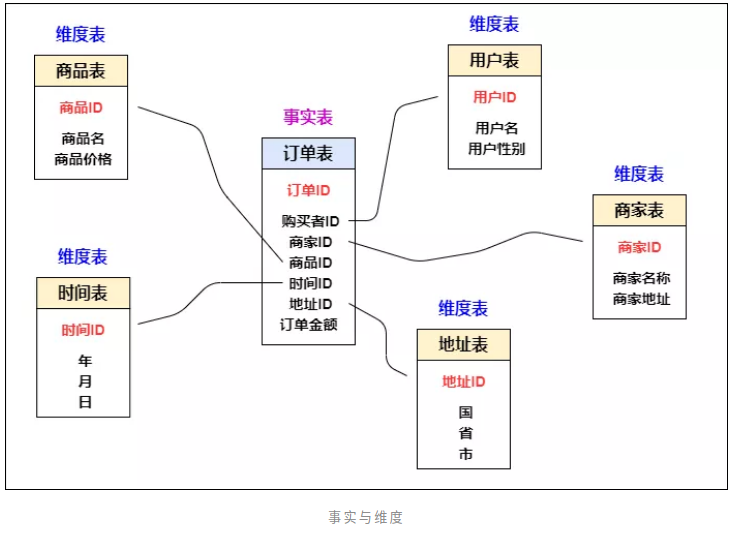

图中的订单表就是一个事实表，你可以理解他就是在现实中发生的一次操作型事件，我们每完成一个订单，就会在订单中增加一条记录。事实表的特征：表里没有存放实际的内容，他是一堆主键的集合，这些ID分别能对应到维度表中的一条记录。事实表包含了与各维度表相关联的外键，可与维度表关联。事实表的度量通常是数值类型，且记录数会不断增加，表数据规模迅速增长。

**明细表（宽表）：**

事实表的数据中，有些属性共同组成了一个字段（糅合在一起），比如年月日时分秒构成了时间,当需要根据某一属性进行分组统计的时候，需要截取拼接之类的操作，效率极低。如：


**为了分析方便，可以事实表中的一个字段切割提取多个属性出来构成新的字段，因为字段变多了，所以称为宽表，原来的成为窄表**。

将上述的`local_time`字段扩展为如下6个字段：

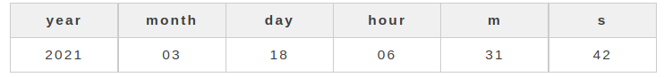

又因为宽表的信息更加清晰明细，所以也可以称之为明细表。

**事实表种类**

事实表分为以下6类：

1. **事务事实表**
2. **周期快照事实表**
3. **累积快照事实表**
4. **无事实的事实表**
5. **聚集事实表**
6. **合并事实表**

简单解释下每种表的概念：

- 事务事实表

表中的一行对应空间或时间上某点的度量事件。就是一行数据中必须有度量字段，什么是度量，就是指标，比如说销售金额，销售数量等这些可加的或者半可加就是度量值。另一点就是事务事实表都包含一个与维度表关联的外键。并且度量值必须和事务粒度保持一致。

- 周期快照事实表

顾名思义，周期事实表就是每行都带有时间值字段，代表周期，通常时间值都是标准周期，如某一天，某周，某月等。粒度是周期，而不是个体的事务，也就是说一个周期快照事实表中数据可以是多个事实，但是它们都属于某个周期内。

- 累计快照事实表

周期快照事实表是单个周期内数据，而累计快照事实表是由多个周期数据组成，每行汇总了过程开始到结束之间的度量。每行数据相当于管道或工作流，有事件的起点，过程，终点，并且每个关键步骤都包含日期字段。如订单数据，累计快照事实表的一行就是一个订单，当订单产生时插入一行，当订单发生变化时，这行就被修改。

- 无事实的事实表

我们以上讨论的事实表度量都是数字化的，当然实际应用中绝大多数都是数字化的度量，但是也可能会有少量的没有数字化的值但是还很有价值的字段，无事实的事实表就是为这种数据准备的，利用这种事实表可以分析发生了什么。

- 聚集事实表

聚集，就是对原子粒度的数据进行简单的聚合操作，目的就是为了提高查询性能。如我们需求是查询全国所有门店的总销售额，我们原子粒度的事实表中每行是每个分店每个商品的销售额，聚集事实表就可以先聚合每个分店的总销售额，这样汇总所有门店的销售额时计算的数据量就会小很多。

- 合并事实表

这种事实表遵循一个原则，就是相同粒度，数据可以来自多个过程，但是只要它们属于相同粒度，就可以合并为一个事实表，这类事实表特别适合经常需要共同分析的多过程度量。

##### 2．维度表

每个维度表都包含单一的主键列。维度表的主键可以作为与之关联的任何事实表的外键，当然，维度表行的描述环境应与事实表行完全对应。维度表通常比较宽，是扁平型非规范表，包含大量的低粒度的文本属性。

维度表示你要对数据进行分析时所用的一个量，比如你要分析产品销售情况， 你可以选择按类别来进行分析，或按区域来分析。每个类别就构成一个维度。上图中的用户表、商家表、时间表这些都属于维度表，这些表都有一个唯一的主键，然后在表中存放了详细的数据信息。

总的说来，在数据仓库中不需要严格遵守规范化设计原则。因为数据仓库的主导功能就是面向分析，以查询为主，不涉及数据更新操作。**事实表的设计是以能够正确记录历史信息为准则，维度表的设计是以能够以合适的角度来聚合主题内容为准则**。

- **维度表结构**

维度表谨记一条原则，包含单一主键列，但有时因业务复杂，也可能出现联合主键，请尽量避免，如果无法避免，也要确保必须是单一的，这很重要，如果维表主键不是单一，和事实表关联时会出现数据发散，导致最后结果可能出现错误。

维度表通常比较宽，包含大量的低粒度的文本属性。

- **跨表钻取**

跨表钻取意思是当每个查询的行头都包含相同的一致性属性时，使不同的查询能够针对两个或更多的事实表进行查询

钻取可以改变维的层次，变换分析的粒度。它包括上钻/下钻：

上钻（roll-up）：上卷是沿着维的层次向上聚集汇总数据。例如，对产品销售数据，沿着时间维上卷，可以求出所有产品在所有地区每月（或季度或年或全部）的销售额。

下钻（drill-down）：下钻是上钻的逆操作，它是沿着维的层次向下，查看更详细的数据。

- **退化维度**

退化维度就是将维度退回到事实表中。因为有时维度除了主键没有其他内容，虽然也是合法维度键，但是一般都会退回到事实表中，减少关联次数，提高查询性能

- **多层次维度**

多数维度包含不止一个自然层次，如日期维度可以从天的层次到周到月到年的层次。所以在有些情况下，在同一维度中存在不同的层次。

- **维度表空值属性**

当给定维度行没有被全部填充时，或者当存在属性没有被应用到所有维度行时，将产生空值维度属性。上述两种情况，推荐采用描述性字符串代替空值，如使用 unknown 或 not applicable 替换空值。

- **日历日期维度**

在日期维度表中，主键的设置不要使用顺序生成的id来表示，可以使用更有意义的数据表示，比如将年月日合并起来表示，即YYYYMMDD，或者更加详细的精度。


#### 2. 维度建模三种模式

##### 1. 星型模式

星形模式(Star Schema)是最常用的维度建模方式。**星型模式是以事实表为中心，所有的维度表直接连接在事实表上，像星星一样**。星形模式的维度建模由一个事实表和一组维表成，且具有以下特点：a. 维表只和事实表关联，维表之间没有关联；b. 每个维表主键为单列，且该主键放置在事实表中，作为两边连接的外键；c. 以事实表为核心，维表围绕核心呈星形分布；

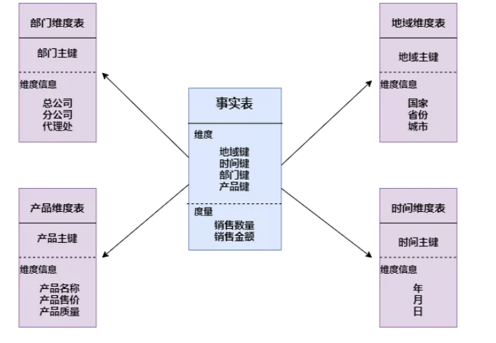

##### 2. 雪花模式

雪花模式(Snowflake Schema)是对星形模式的扩展。**雪花模式的维度表可以拥有其他维度表的**，虽然这种模型相比星型更规范一些，但是由于这种模型不太容易理解，维护成本比较高，而且性能方面需要关联多层维表，性能也比星型模型要低。所以一般不是很常用

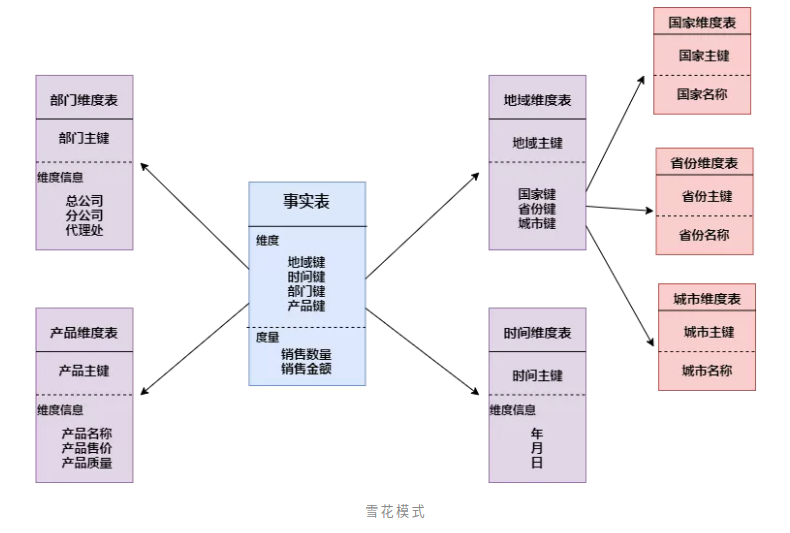

##### 3．星座模式

星座模式是星型模式延伸而来，星型模式是基于一张事实表的，而**星座模式是基于多张事实表的，而且共享维度信息**。前面介绍的两种维度建模方法都是多维表对应单事实表，但在很多时候维度空间内的事实表不止一个，而一个维表也可能被多个事实表用到。在业务发展后期，绝大部分维度建模都采用的是星座模式。

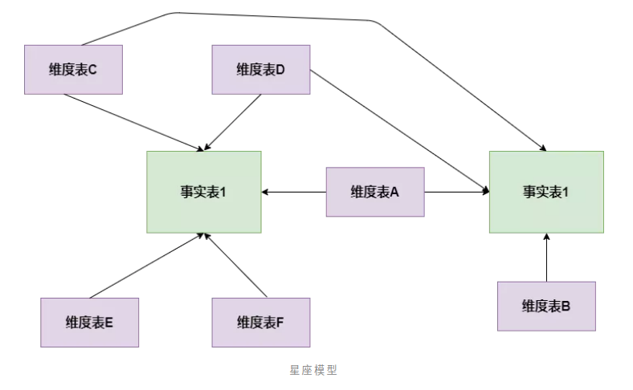

#### 3. 维度建模过程

我们知道维度建模的表类型有事实表，维度表；模式有星形模型，雪花模型，星座模型这些概念了，但是实际业务中，给了我们一堆数据，我们怎么拿这些数据进行数仓建设呢，数仓工具箱作者根据自身60多年的实际业务经验，给我们总结了如下四步，请务必记住！

**数仓工具箱中的维度建模四步走**：

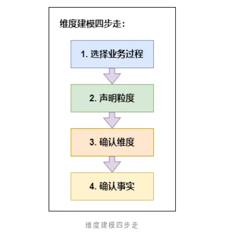

请**牢记**以上四步，不管什么业务，就按照这个步骤来，顺序不要搞乱，因为这四步是环环相扣，步步相连。下面详细拆解下每个步骤怎么做

**1、选择业务过程**
维度建模是紧贴业务的，所以必须以业务为根基进行建模，那么选择业务过程，顾名思义就是在整个业务流程中选取我们需要建模的业务，根据运营提供的需求及日后的易扩展性等进行选择业务。比如商城，整个商城流程分为商家端，用户端，平台端，运营需求是总订单量，订单人数，及用户的购买情况等，我们选择业务过程就选择用户端的数据，商家及平台端暂不考虑。业务选择非常重要，因为后面所有的步骤都是基于此业务数据展开的。

**2、声明粒度**
先举个例子：对于用户来说，一个用户有一个身份证号，一个户籍地址，多个手机号，多张银行卡，那么与用户粒度相同的粒度属性有身份证粒度，户籍地址粒度，比用户粒度更细的粒度有手机号粒度，银行卡粒度，存在一对一的关系就是相同粒度。为什么要提相同粒度呢，因为维度建模中要求我们，在**同一事实表**中，必须具有**相同的粒度**，同一事实表中不要混用多种不同的粒度，不同的粒度数据建立不同的事实表。并且从给定的业务过程获取数据时，强烈建议从关注原子粒度开始设计，也就是从最细粒度开始，因为原子粒度能够承受无法预期的用户查询。但是上卷汇总粒度对查询性能的提升很重要的，所以对于有明确需求的数据，我们建立针对需求的上卷汇总粒度，对需求不明朗的数据我们建立原子粒度。

**3、确认维度**
维度表是作为业务分析的入口和描述性标识，所以也被称为数据仓库的“灵魂”。在一堆的数据中怎么确认哪些是维度属性呢，如果该列是对具体值的描述，是一个文本或常量，某一约束和行标识的参与者，此时该属性往往是维度属性，数仓工具箱中告诉我们**牢牢掌握事实表的粒度，就能将所有可能存在的维度区分开**，并且要**确保维度表中不能出现重复数据，应使维度主键唯一**

**4、确认事实**
事实表是用来度量的，基本上都以数量值表示，事实表中的每行对应一个度量，每行中的数据是一个特定级别的细节数据，称为粒度。维度建模的核心原则之一**是同一事实表中的所有度量必须具有相同的粒度**。这样能确保不会出现重复计算度量的问题。有时候往往不能确定该列数据是事实属性还是维度属性。记住**最实用的事实就是数值类型和可加类事实**。所以可以通过分析该列是否是一种包含多个值并作为计算的参与者的度量，这种情况下该列往往是事实。

## 三、离线数仓建设实战

> 技术是为业务服务的，业务是为公司创造价值的，离开业务的技术是无意义的

### 1. 业务介绍

需要针对不同需求的用户开发不同的产品，所以公司内部有很多条业务线，但是对于数据部门来说，所有业务线的数据都是数据源。对数据的划分不只是根据业务进行，而是结合数据的属性。

### 2. 早期规划

之前开发是不同业务线对应不同的数据团队，每个数据团队互不干扰，这种模式比较简单，只针对自己的业务线进行数仓建设及报表开发即可。

但是随着业务的发展，频繁迭代及跨部门的垂直业务单元越来越多，业务之间的出现耦合情况，这时再采用这种烟囱式开发就出现了问题：

例如权限问题，公司对数据管理比较严格，不同的数据开发组没有权限共享数据，需要其他业务线的数据权限需要上报审批，比较耽误时间；

还有重复开发问题，不同业务线会出现相同的报表需求，如果每个业务方都开发各自的报表，太浪费资源。

所以对于数据开发而言，需要对各个业务线的数据进行统一管理，所以就有了数据中台的出现。

### 3. 数据中台

我认为数据中台是根据每个公司具体的业务需求而搭建的，不同的业务，对中台的理解有所不同。

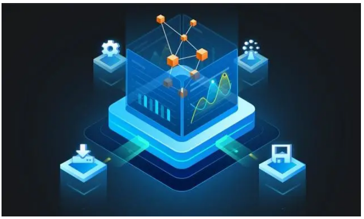

公司内部开发的敏捷数据中台，主要从数据技术和计算能力的复用，到数据资产和数据服务的复用，数据中台以更大价值带宽，快准精让数据直接赋能业务。提供一个统一化的管理，打破数据孤岛，追溯数据血缘，实现自助化及高复用度。

如下所示：

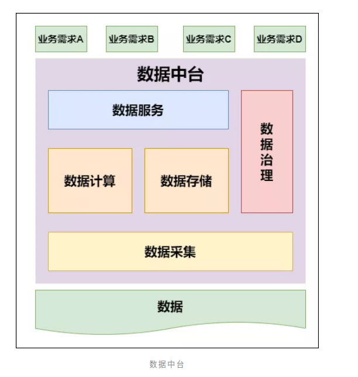

以上解释比较抽象，我们以实际项目开发来看下数据中台的便利性。

比如我们之前做报表开发流程，首先是要数据采集，不同的数据源通过sqoop等工具采集到大数据平台，然后进行数仓搭建，最后产出报表数据，放到可视化系统展示，最终把整个流程写成脚本放到调度平台进行自动化执行。

而有了数据中台之后就不需要那么繁琐，直接进行数仓搭建，产生报表即可，无需将精力过多放在数据源、可视化展示及调度。并且可以直观的查看数据血缘关系，计算表之间血缘。像下面图中，表之间的依赖关系很明确：

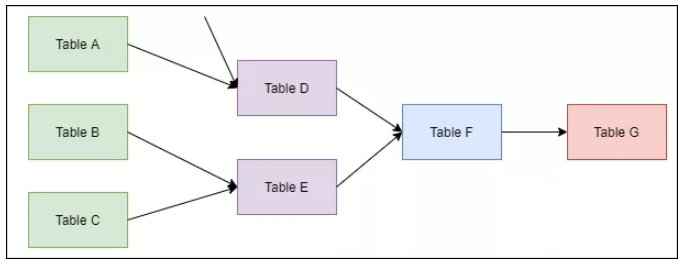

另一点，数据中台的异构数据系统可以非常简单的进行关联查询，比如hive的表关联mysql的表。可透明屏蔽异构数据系统异构交互方式，轻松实现跨异构数据系统透明混算。

**异构数据系统原理是数据中台提供虚拟表到物理表之间的映射,终端用户无需关心数据的物理存放位置和底层数据源的特性，可直接操作数据，体验类似操作一个虚拟数据库**。


数据中台额外集成可视化展示，提供一站式数据可视化解决方案，支持JDBC数据源和CSV文件上传，支持基于数据模型拖拽智能生成可视化组件，大屏展示自适应不同大小屏幕。

调度系统是公司内部自写集成到数据中台的，在编写完sql语句之后可以直接进行调度。

### 4. 数仓建设

到这才真正到数仓建设，为什么前面我要占那么大篇幅去介绍公司业务及所使用的数据中台系统，因为下面的数仓建设是根据公司的业务发展及现有的数据中台进行，数仓的建设离不开公司的业务。

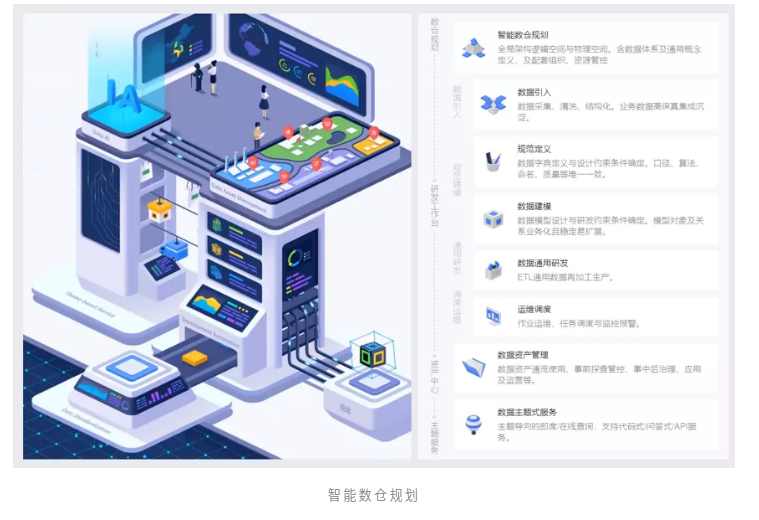

**数仓建设核心思想：从设计、开发、部署和使用层面，避免重复建设和指标冗余建设，从而保障数据口径的规范和统一，最终实现数据资产全链路关联、提供标准数据输出以及建立统一的数据公共层。**有了核心思想，那怎么开始数仓建设，有句话说数仓建设者即是技术专家，也是大半个业务专家，所以采用的方式就是需求推动数据建设，并且因为数据中台，所以各业务知识体系比较集中，各业务数据不再分散，加快了数仓建设速度。
数仓建设主要从两个方面进行，**模型和规范**，所有业务进行统一化

- **模型**

所有业务采用统一的模型体系，从而降低研发成本，增强指标复用，并且能保证数据口径的统一

- **模型分层**

结合公司业务，后期新增需求较多，所以分层不宜过多，并且需要清晰明确各层职责，要保证数据层的稳定又要屏蔽对下游影响，所以采用如下分层结构：

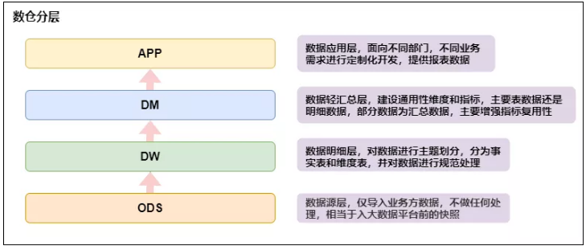

- **数据流向**

遵循模型开发时分层结构，数据从 ods -> dw -> dm ->app 这样正向流动，可以防止因数据引用不规范而造成数据链路混乱及SLA时效难保障等问题，同时保证血缘关系简洁化，能够轻易追踪数据流向。在开发时应避免以下情况出现：

1. 数据引用链路不正确，如 ods -> dm ->app ，出现这种情况说明明细层没有完全覆盖数据；如 ods -> dw -> app ，说明轻度汇总层主题划分未覆盖全 。减少跨层引用，才能提高中间表的复用度。理想的数仓模型设计应当具备：**数据模型可复⽤，完善且规范**。
2. 尽量避免一层的表生成当前层的表，如dw层表生成dw层表，这样会影响ETL效率。
3. 禁止出现反向依赖，如dw表依赖于dm表。

- **规范**

- 表命名规范

- 1. 对于**ods、dm、app**层表名：类型_主题_表含义，如：dm_xxsh_user
  2. 对于**dw**层表名：类型_主题_维度_表含义，如：dw_xxsh_fact_users（事实表）、dw_xxsh_dim_city（维度表）

- 字段命名规范
  构建词根，词根是维度和指标管理的基础，划分为普通词根与专有词根

- 1. 普通词根：描述事物的最小单元体，如：sex-性别。
  2. 专有词根：具备行业专属或公司内部规定的描述体，如：xxsh-公司内部对某个产品的称呼。

- 脚本命名规范
  脚本名称：脚本类型.脚本功用.[库名].脚本名称，如 hive.hive.dm.dm_xxsh_users
  脚本类型主要分为以下三类：

- 1. 常规Hive sql：hive
  2. 自定义shell脚本：sh
  3. 自定义Python脚本：python

- 脚本内容规范

```sh
#变量的定义要符合python的语法要求
#指定任务负责人
owner = "zhangsan@xxx.com"
#脚本存放目录/opt/xxx
#脚本名称 hive.hive.dm.dm_xxsh_users
#source用来标识上游依赖表，一个任务如果有多个上游表，都需要写进去
#(xxx_name 是需要改动的，其余不需要改)
source = {
        "table_name": {
        "db": "db_name",
        "table": "table_name"
        }
}
#如source，但是每个任务target只有一张表
target = {
        "db_table": {
                "host": "hive",
                "db": "db_name",
                "table": "table_name"
        }
}
#变量列表
#$now
#$now.date 常用，格式示例：2020-12-11

 
task = '''
写sql代码
'''
```

### 5. 数据层具体实现

> 使用四张图说明每层的具体实现

- **数据源层ODS**

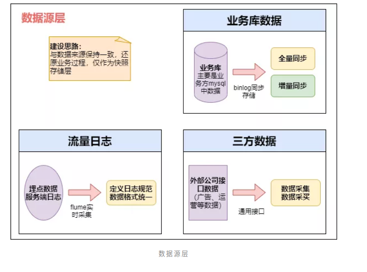

数据源层主要将各个业务数据导入到大数据平台，作为业务数据的快照存储。

- **数据明细层DW**

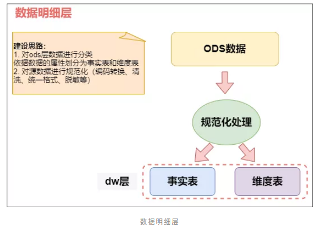

事实表中的每行对应一个度量，每行中的数据是一个特定级别的细节数据，称为粒度。维度建模的核心原则之一是**同一事实表中的所有度量必须具有相同的粒度**。这样能确保不会出现重复计算度量的问题。

维度表一般都是单一主键，少数是联合主键，注意维度表不要出现重复数据，否则和事实表关联会出现**数据发散**问题。

有时候往往不能确定该列数据是事实属性还是维度属性。记住**最实用的事实就是数值类型和可加类事实**。所以可以通过分析该列是否是一种包含多个值并作为计算的参与者的度量，这种情况下该列往往是事实；如果该列是对具体值的描述，是一个文本或常量，某一约束和行标识的参与者，此时该属性往往是维度属性。但是还是要结合业务进行最终判断是维度还是事实。

- **数据轻度汇总层DM**

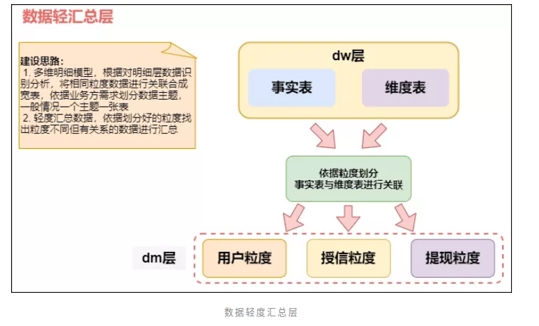此层命名为轻汇总层，就代表这一层已经开始对数据进行汇总，但是不是完全汇总，只是对相同粒度的数据进行关联汇总，不同粒度但是有关系的数据也可进行汇总，此时需要将粒度通过聚合等操作进行统一。

- **数据应用层APP**

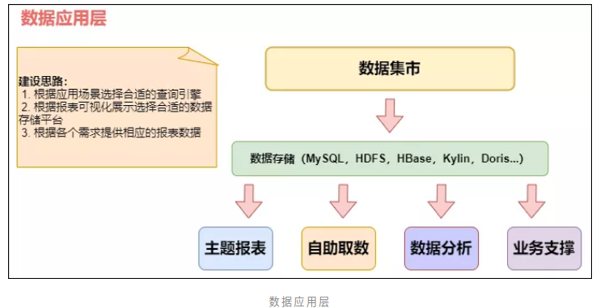

数据应用层的表就是提供给用户使用的，数仓建设到此就接近尾声了，接下来就根据不同的需求进行不同的取数，如直接进行报表展示，或提供给数据分析的同事所需的数据，或其他的业务支撑。

### 6. 总结

**一张图总结下数据仓库的构建整体流程**：

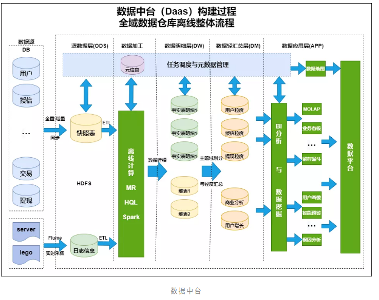

### 7. 实际生产中注意事项

生产环境中操作不能像我们自己测试时那样随意，一不小心都可能造成生产事故。所以每步操作都要十分小心，需全神贯注，管好大脑管住右手。

仅列出以下但不限于以下的注意事项：

> - 请勿操作自己管理及授权表之外的其它库表；
> - 未经授权，请勿操作生产环境中其他人的脚本及文件；
> - 在修改生产环境脚本前，请务必自行备份到本地；
> - 请确认自己的修改操作能迅速回滚；
> - 生产环境中表名及字段等所有命名请遵循命名规则。

## 四、实时计算

实时计算一般都是针对海量数据进行的，并且要求为秒级。由于大数据兴起之初，Hadoop并没有给出实时计算解决方案，随后Storm，SparkStreaming，Flink等实时计算框架应运而生，而Kafka，ES的兴起使得实时计算领域的技术越来越完善，而随着物联网，机器学习等技术的推广，实时流式计算将在这些领域得到充分的应用。

实时计算的三个特征：

1. **无限数据**：无限数据指的是一种不断增长的，基本上无限的数据集。这些通常被称为“流数据”，而与之相对的是有限的数据集。
2. **无界数据处理**：一种持续的数据处理模式,能够通过处理引擎重复的去处理上面的无限数据，是能够突破有限数据处理引擎的瓶颈的。
3. **低延迟**：延迟是多少并没有明确的定义。但我们都知道数据的价值将随着时间的流逝降低，时效性将是需要持续解决的问题。

现在大数据应用比较火爆的领域，比如推荐系统在实践之初受技术所限，可能要一分钟，一小时，甚至更久对用户进行推荐，这远远不能满足需要，我们需要更快的完成对数据的处理，而不是进行离线的批处理。

### 1. 实时计算应用场景

随着实时技术发展趋于成熟，实时计算应用越来越广泛，以下仅列举常见的几种实时计算的应用场景：

**1. 实时智能推荐**

智能推荐会根据用户历史的购买或浏览行为，通过推荐算法训练模型，预测用户未来可能会购买的物品或喜爱的资讯。对个人来说，推荐系统起着信息过滤的作用，对Web/App服务端来说，推荐系统起着满足用户个性化需求，提升用户满意度的作用。推荐系统本身也在飞速发展，除了算法越来越完善，对时延的要求也越来越苛刻和实时化。利用Flink流计算帮助用户构建更加实时的智能推荐系统，对用户行为指标进行实时计算，对模型进行实时更新，对用户指标进行实时预测，并将预测的信息推送给Web/App端，帮助用户获取想要的商品信息，另一方面也帮助企业提升销售额，创造更大的商业价值。

**2. 实时欺诈检测**

在金融领域的业务中，常常出现各种类型的欺诈行为，例如信用卡欺诈，信贷申请欺诈等，而如何保证用户和公司的资金安全，是近年来许多金融公司及银行共同面对的挑战。随着不法分子欺诈手段的不断升级，传统的反欺诈手段已经不足以解决目前所面临的问题。以往可能需要几个小时才能通过交易数据计算出用户的行为指标，然后通过规则判别出具有欺诈行为嫌疑的用户，再进行案件调查处理，在这种情况下资金可能早已被不法分子转移，从而给企业和用户造成大量的经济损失。而运用Flink流式计算技术能够在毫秒内就完成对欺诈行为判断指标的计算，然后实时对交易流水进行实时拦截，避免因为处理不及时而导致的经济损失。

**3. 舆情分析**

有的客户需要做舆情分析，要求所有数据存放若干年，舆情数据每日数据量可能超百万，年数据量可达到几十亿的数据。而且爬虫爬过来的数据是舆情，通过大数据技术进行分词之后得到的可能是大段的网友评论，客户往往要求对舆情进行查询，做全文本搜索，并要求响应时间控制在秒级。爬虫将数据爬到大数据平台的Kafka里，在里面做Flink流处理，去重去噪做语音分析，写到ElasticSearch里。大数据的一个特点是多数据源，大数据平台能根据不同的场景选择不同的数据源。

**4. 复杂事件处理**

对于复杂事件处理，比较常见的集中于工业领域，例如对车载传感器，机械设备等实时故障检测，这些业务类型通常数据量都非常大，且对数据处理的时效性要求非常高。通过利用Flink提供的CEP进行时间模式的抽取，同时应用Flink的Sql进行事件数据的转换，在流式系统中构建实施规则引擎，一旦事件触发报警规则，便立即将告警结果通知至下游通知系统，从而实现对设备故障快速预警检测，车辆状态监控等目的。

**5. 实时机器学习**

实时机器学习是一个更宽泛的概念，传统静态的机器学习主要侧重于静态的模型和历史数据进行训练并提供预测。很多时候用户的短期行为，对模型有修正作用，或者说是对业务判断有预测作用。对系统来说，需要采集用户最近的行为并进行特征工程，然后给到实时机器学习系统进行机器学习。如果动态地实施新规则，或是推出新广告，就会有很大的参考价值。


### 2. 实时计算总览

我们先来看一张大数据平台的实时架构图：

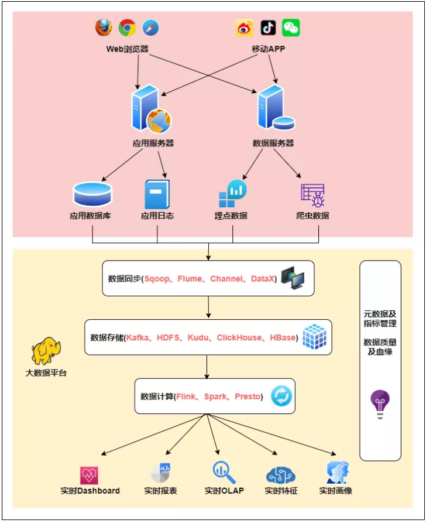

- **数据同步：**

在上面这张架构图中，数据从Web平台中产生，通过数据同步系统导入到大数据平台，由于数据源不同，这里的数据同步系统实际上是多个相关系统的组合。数据库同步通常用 Sqoop，日志同步可以选择 Flume等，不同的数据源产生的数据质量可能差别很大，数据库中的格式化数据直接导入大数据系统即可，而日志和爬虫产生的数据就需要进行大量的清洗、转化处理才能有效使用。

- **数据存储：**

该层对原始数据、清洗关联后的明细数据进行存储，基于统一的实时数据模型分层理念，将不同应用场景的数据分别存储在 Kafka、HDFS、Kudu、 Clickhouse、Hbase等存储中。

- **数据计算：**

计算层主要使用 Flink、Spark、Presto 以及 ClickHouse 自带的计算能力等四种计算引擎，Flink 计算引擎主要用于实时数据同步、 流式 ETL、关键系统秒级实时指标计算场景，Spark SQL 主要用于复杂多维分析的准实时指标计算需求场景，Presto 和 ClickHouse 主要满足多维自助分析、对查询响应时间要求不太高的场景。

- **实时应用：**

以统一查询服务对各个业务线数据场景进行支持，业务主要包括实时大屏、实时数据产品、实时 OLAP、实时特征等。

当然一个好的大数据平台不能缺少元数据管理及数据治理：

**1. 元数据及指标管理**：主要对实时的Kafka表、Kudu表、Clickhouse表、Hive表等进行统一管理，以数仓模型中表的命名方式规范表的命名，明确每张表的字段含义、使用方，指标管理则是尽量通过指标管理系统将所有的实时指标统一管理起来，明确计算口径，提供给不同的业务方使用；

**2. 数据质量及血缘分析**：数据质量分为平台监控和数据监控两个部分，血缘分析则主要是对实时数据依赖关系、实时任务的依赖关系进行分析。

以上架构只是大数据平台通用的数据模型，如果要具体的建设，需要考虑以下情况，业务需求需要实时还是准实时即可，数据时效性是秒级还是分钟级等。

- 在**调度开销**方面，准实时数据是批处理过程，因此仍然需要调度系统支持，调度频率较高，而实时数据却没有调度开销；
- 在**业务灵活性**方面，因为准实时数据是基于 ETL 或 OLAP 引擎实现，灵活性优于基于流计算的方式；
- 在**对数据晚到的容忍度**方面，因为准实时数据可以基于一个周期内的数据进行全量计算，因此对于数据晚到的容忍度也是比较高的，而实时数据使用的是增量计算，对于数据晚到的容忍度更低一些；
- 在**适用场景**方面，准实时数据主要用于有实时性要求但不太高、涉及多表关联和业务变更频繁的场景，如交易类型的实时分析，实时数据则更适用于实时性要求高、数据量大的场景，如实时特征、流量类型实时分析等场景。

### 3. 实时架构

在某些场景中，数据的价值随着时间的推移而逐渐减少。所以在传统大数据离线数仓的基础上，逐渐对数据的实时性提出了更高的要求。

于是随之诞生了大数据实时数仓，并且衍生出了两种技术架构Lambda和Kappa。

#### 1. Lambda架构

先来看下Lambda架构图：

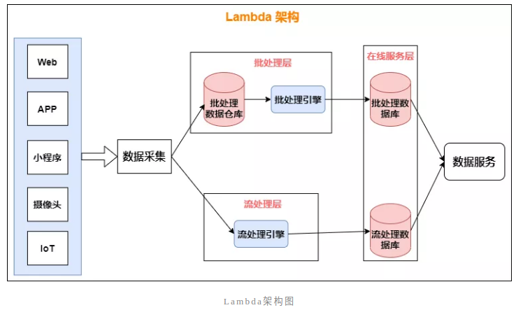数据从底层的数据源开始，经过Kafka、Flume等数据组件进行收集，然后分成两条线进行计算：

- 一条线是进入流式计算平台（例如 Storm、Flink或者SparkStreaming），去计算实时的一些指标；
- 另一条线进入批量数据处理离线计算平台（例如Mapreduce、Hive，Spark SQL），去计算T+1的相关业务指标，这些指标需要隔日才能看见。

**为什么Lambda架构要分成两条线计算？**

假如整个系统只有一个批处理层，会导致用户必须等待很久才能获取计算结果，一般有几个小时的延迟。电商数据分析部门只能查看前一天的统计分析结果，无法获取当前的结果，这对于实时决策来说有一个巨大的时间鸿沟，很可能导致管理者错过最佳决策时机。

Lambda架构属于较早的一种架构方式，早期的流处理不如现在这样成熟，在准确性、扩展性和容错性上，流处理层无法直接取代批处理层，只能给用户提供一个近似结果，还不能为用户提供一个一致准确的结果。因此Lambda架构中，出现了批处理和流处理并存的现象。

在 Lambda 架构中，每层都有自己所肩负的任务。

**1. 批处理层存储管理主数据集（不可变的数据集）和预先批处理计算好的视图：**

批处理层使用可处理大量数据的分布式处理系统预先计算结果。它通过处理所有的已有历史数据来实现数据的准确性。这意味着它是基于完整的数据集来重新计算的，能够修复任何错误，然后更新现有的数据视图。输出通常存储在只读数据库中，更新则完全取代现有的预先计算好的视图。

**2. 流处理层会实时处理新来的大数据：**

流处理层通过提供最新数据的实时视图来最小化延迟。流处理层所生成的数据视图可能不如批处理层最终生成的视图那样准确或完整，但它们几乎在收到数据后立即可用。而当同样的数据在批处理层处理完成后，在速度层的数据就可以被替代掉了。

**那Lambda架构有没有缺点呢？**

Lambda架构经历多年的发展，其优点是稳定，对于实时计算部分的计算成本可控，批量处理可以用晚上的时间来整体批量计算，这样把实时计算和离线计算高峰分开，这种架构支撑了数据行业的早期发展，但是它也有一些致命缺点，并在大数据3.0时代越来越不适应数据分析业务的需求。缺点如下：

- **使用两套大数据处理引擎**：维护两个复杂的分布式系统，成本非常高。
- **批量计算在计算窗口内无法完成**：在IOT时代，数据量级越来越大，经常发现夜间只有4、5个小时的时间窗口，已经无法完成白天20多个小时累计的数据，保证早上上班前准时出数据已成为每个大数据团队头疼的问题。
- **数据源变化都要重新开发，开发周期长**：每次数据源的格式变化，业务的逻辑变化都需要针对ETL和Streaming做开发修改，整体开发周期很长，业务反应不够迅速。

导致 Lambda 架构的缺点根本原因是要同时维护两套系统架构：批处理层和速度层。我们已经知道，在架构中加入批处理层是因为从批处理层得到的结果具有高准确性，而加入速度层是因为它在处理大规模数据时具有低延时性。

那我们能不能改进其中某一层的架构，让它具有另外一层架构的特性呢？

例如，改进批处理层的系统让它具有更低的延时性，又或者是改进速度层的系统，让它产生的数据视图更具准确性和更加接近历史数据呢？

另外一种在大规模数据处理中常用的架构——Kappa 架构，便是在这样的思考下诞生的。

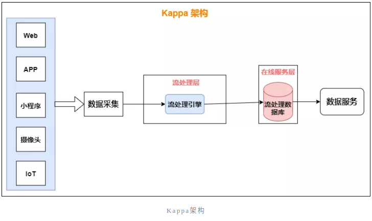

这种架构只关注流式计算，数据以流的方式被采集过来，实时计算引擎将计算结果放入数据服务层以供查询。**可以认为Kappa架构是Lambda架构的一个简化版本，只是去除掉了Lambda架构中的离线批处理部分**；

**Kappa架构的兴起主要有两个原因**：

- Kafka不仅起到消息队列的作用，也可以保存更长时间的历史数据，以替代Lambda架构中批处理层数据仓库部分。流处理引擎以一个更早的时间作为起点开始消费，起到了批处理的作用。
- Flink流处理引擎解决了事件乱序下计算结果的准确性问题。

Kappa架构相对更简单，实时性更好，所需的计算资源远小于Lambda架构，随着实时处理的需求在不断增长，更多的企业开始使用Kappa架构。**但这不意味着kappa架构能够取代Lambda架构**。

Lambda和kappa架构都有各自的适用领域；例如流处理与批处理分析流程比较统一，且允许一定的容错，用Kappa比较合适，少量关键指标（例如交易金额、业绩统计等）使用Lambda架构进行批量计算，增加一次校对过程。

还有一些比较复杂的场景，批处理与流处理产生不同的结果（使用不同的机器学习模型，专家系统，或者实时计算难以处理的复杂计算），可能更适合Lambda架构。


https://mp.weixin.qq.com/s/s02rTkBCymUiGbTe_gp71A


