# 第1章数据仓库、商业智能及维度建模初步


本章是后续各章的基础。我们首先从宏观层面上考察数据仓库和商业智能(DataWarehousingandBusinessIntelligence,DW/BI)系统。您可能会对本书没有开门见山地讨论技术和工具感到有些失望,但DW/BI系统首先应该仔细考虑的问题是业务需求。本书将紧紧抓住业务需求这一要点,逐步深入探讨逻辑设计、物理设计以及采用有关技术和工具的决策等问题。

本章将详细考察数据仓库及商业智能的主要目标,辨析DW/BI管理者与杂志出版商各自责任中存在的不可思议的相似之处。

基于此背景,我们将探索维度建模核心概念并建立基本词汇表。在此基础上,本章将讨论KimballDW/BI结构的主要组成部分,并与其他不同的结构方法进行比较,无论您倾向于使用何种结构,这些讨论对维度建模都有非常重要的意义。最后,我们将总结针对维度建模的诸多错误理解。本章最后将解释为什么在处理DW/BI项目时,既需要从数据库管理员的角度,也需要从商业分析师的角度考虑问题。


本章主要讨论下述概念:

- DW/BI的业务驱动目标

- 发布DW/BI系统的隐喻

- 维度建模核心概念及涉及的主要词汇,包括事实表与维度表
- KimballDW/BI松构的组件与压则
- 不同DW/BI枫构的比铮研究,维度建模在不同架构中所扮演的角色
- 有关维度建模的误解
  

## 1.1数据获取与数据分析的区别

对所有组织来说,信息都是其最重要的财富之一。信息几乎总是用作两个目的:操作型记录的保存和分析型决策的制定。简单来说,操作型系统保存数据,而DW/BI系统使用数据。

操作型系统的用户确保组织能正常运转。操作型系统获取订单、签订新客户、监视操作型活动的状态、记录问题及用户的抱怨。对操作型系统进行优化的目的是使其能够更快地处理事务。操作型系统一般一次处理一个事务记录。它们按部就班,以可预测的方式完成同样的操作型任务,可预测地执行组织的业务过程。鉴于这种执行特点,操作型系统通常不必维护历史数据,只需修改数据以反映最新的状态。

另一方面,DW/BI系统的用户研究分析企业的运转,并对其性能进行评估。DW/BI系统计算新订单的数量,并与过去一周的订单进行比较,找寻签订新客户的原因,了解客户在抱怨什么。这些信息用于分析并判断操作型过程是否处于正确的工作状态。尽管也需要详细的数据来支持始终处于变化状态的问题,但DW/BI系统一般不会一次只处理一个事务。对DW/BI系统进行优化的目的是高性能地完成用户的查询,而回答用户的查询通常需要搜索成千上万条事务,并将查询结果放入一个查询集合中。为应对更复杂的问题,DW/BI系统的用户通常要求保存历史环境,用于精确地评估组织在一段时间内的性能。

在本书第1版中,作者RalphKimball用一整章内容描述操作型处理和数据仓库之间存在的巨大差异。目前,DW/BI系统与操作型系统有不同的需求、不同的客户、不同的结构以及不同的应用场景的观点已经为大众所接受。遗憾的是,我们仍会发现认为DW/BI系统是存储于不同硬件平台上的操作型系统的记录的拷贝这样的错误观点。尽管在这样的环境中,出于性能的考虑,将操作型系统和分析型系统进行了隔离,但并未仔细考虑这两类系统之间天然存在的其他差异.商业用户感觉不到由这些虚假数据仓库提供的可用性和性能。这些冒名顶替者对DW/BI系统造成了伤害,因为它们没有考虑DW/BI系统用户与操作型系统用户在需求方面存在巨大的差异。


## 1.2数据仓库与商业智能的目标

在开始深入研究维度建模的细节前,关注数据仓库与商业智能的基本目标是非常有益的。这些目标可通过深入到任何组织的工作场所中,倾听业务管理的问题而建立起来。以下同样的话题已经存在30多年了:

- 我们收集了海量的数据,但无法对其访问

- 我们需要以各种方式方便地对数据进行切片及切块

- 业务人员需要方便地获得数据

- 将最重要的事情展示给我

- 会议自始全终争论的是谁的数字正确,而不是制定决策

- 我们希望人们能够使用信息来支持更多的基于事实的决策制定

基于作者的经验,上述的关注仍然普遍存在,它们构成了DW/BI系统的基本需求。下面将上述引用的业务管理话题转换为业务需求:

- **DW/BI系统要能方便地存取信息**。DW/BI系统的内容必须是易于理解的。对业务用户来说,数据需要有直观性。直观性不能仅针对开发人员。数据结构与标识必须符合业务用户的思维过程和词汇。业务用户能以各种形式分割和合并分析数据。访问数据的商业智能工具和应用要简单易用,同时能够在较短的时间内速将查询结果返回给用户。可以将上述这些需求描述为:简单、快捷。

- **DW/BI系统必须以一致的形式展现信息**。DW/BI系统的数据必须是可信的。精心组织不同来源的数据,实现数据清洗,确保质量,只有在数据真正适合用户的需要时发布。一致性也意味着表示DW/BI系统内容的公共标识和定义,可在不同数据源共用。如果两个关于性能度量的参数具有同样的名称,则它们一定是指同一个事情(同名同意性)。反之,如果两个度量参数被用于表示不同的事情,则它们应该具有不同的标记(异意异名性)。

- **DW/BI系统必须能够适应变化**。用户需求、业务环境、数据及技术都容易产生变化。设计DW/BI系统时要考虑使其能够方便地处理无法避免的变化,以便在变化发生时仍能处理现有的数据和应用。当业务问题发生变化或新数据增加到数据仓库中时,已经存在的数据和应用不应该被改变或破坏。最后,如果必须修改DW/BI系统中的描述性数据,要能以适当的方式描述变化,并使这些变化对用户来说是透明的。

- **DW/BI系统必须能够及时展现信息**。由于DW/BI系统主要用于操作型决策,原始数据需要在几小时、几分钟或几秒钟内被转换成可用的信息。当没有多少时间可用于清洗或验证数据时,DW/BI团队和业务用户需要对发布数据意味着什么有现实的期望。

- **DW/BI系统必须成为保护信息财富的安全堡垒**。保存在数据仓库中的信息是组织的信息化财富。至少,数据仓库可能会包含有关将何种商品以什么样的价格卖给何种客户的信息,如果将这样的信息发送给错误的人,将给组织带来伤害。DW/BI必约能有效控制对组织中机密信息的访问。

- **DW/BI系统必须成为提高决策制定能力的权威和可信的基础**。数据仓库需要正确的信息以支持决策制定.DW/BI系统最重要的输出是基于分析证据所产生的决策。这些决策体现了数据仓库的影响和价值。早期用于表示DW/BI系统的称谓一一决策支持系统,仍可作为开展系统设计的最好描述。

- **DW/BI系统成功的标志是业务群体接受DW/BI系统**。是否使用最佳组合产品或平台来构建您的体面的解决方案其实并不重要。如果业务群体不能接受DW/BI环境并积极使用它,就难言成功。对操作型系统来说,用户无法对其加以选择,只能使用新系统,而对DW/BI系统来说,与操作型系统不同的是,它是可选的。只有当DW/BI系统真正成为用于构建可付诸实现的信息的“简单快捷“的资源时,用户才会接受它。

尽管上述列表中的每一项都很重要,但我们认为最后两项全关重要。遗憾的是,通常这两项是最容易被忽略的。数据仓库和商业智能的成功需要更多的专业设计师、技术员、建模人员、数据库管理员。作为初涉DW/BI领域的您,一方面具有较好的信息技术基础,另一方面,对业务用户并不了解。您必须两方面兼顾,为适应DW/BI的独特需求,修改那些经过检验的技能。显然,需要一整套的技能,这些技能既包括数据库管理的技能,也包括商业分析师的技能,才能更好地适应DW/BI的商业盛筵。

**以出版发行工作为例说明DW/BI管理者的职责**

本小节将以DW/BI目标为背景,将DW/BI管理者的责任与出版社主编进行比较。作为一个高质量杂志的主编,应该有广阔的空间来管理杂志的内容、风格和发行。主编需要处理以下活动:

**理解读者**

* 确定读者的人口统计学特征。

* 发现读者希望杂志应该呈现的内容。

* 识别那些将会续订杂志并购买杂志广告中产品的“最佳“读者。
* 发现潜在的新读者并使他们意识到该杂志的存在。

**确保杂志对读者具有吸引力**

* 杂志刊出的内容要有趣且引人入胜。

* 杂志的布局和渣染要给读者带来最大的快乐。

* 杂志要支持高质量的写作和编辑标准,同时札用一致的展现风格。

* 不断地监控杂志中文章的准确性以及广告商的要求。

* 根据读者和撰稿人网络的新情况适时改变读者信息及保证修改即时可用。

**维持出版**

* 吸引广告商,为杂志带来更多利润。
* 定期出版杂志。
* 保持读者对杂志的信任。
* 让投资人对杂志满意。

您也可以分辨出那些不是杂志主编目标的条目。例如,围绕特定的打印技术出版杂志,或为改进操作效率专门投入管理层的精力,例如,强制使用读者不易理解的技术写作风格,或者建立错综复杂的、拥挤不堪的、难以阅读的版面布局等。

基于有效服务读者这一理念构建发行业务,杂志获得成功的可能性增大。相反,浏览上述列表,并设想如果忽略了其中某项会发生什么情况,可以肯定,杂志将面临严重问题。

可以看出,作为一个传统的出版商与DW/BI管理者之间具有很强的相似性。按照业务需求的要求,DW/BI管理者必须发布获取自不同数据源的数据,这些数据需要具备高质量和一致性。其主要责任是为数据的读者提供服务,或者称为为商业用户提供服务。出版发行这一比喻强调的是,要关注外部的客户而不是仅关注内部产品和过程。尽管在发布DW/BI系统时使用了技术方法,但技术充其量也就是达到目的的一种手段而已。因此,技术以及用于建立系统的技能不应该直接出现在顶层工作职责中。

下面重新考虑杂志出版商与DW/BI管理者的责任:

**理解业务用户**

- 理解他们的工作责任、目标和任务。′

- 确定商业用户在制定哪些决策时需要DW/BI系统的帮助。

- 识别出那些制定出高效率、高影响的决策的“最佳“用户。

- 发现潜在的新用户,并让他们意识到DW/BI系统能够给他们带来什么能力。

**对业务用户发布高质量、相关的、可访问的信息和分析**

* 选择最健壮的、可操作的数据放入DW/BI系统中,从组织机构的各种数据源中仔细选择。
* 简化用户接口和应用,采用模板驱动方式,与用户的认知过程轮廓匹配。
* 确保数据精确、可信,使其标识在整个企业具有一致性。
* 不间断地监控数据和分析的准确性。
* 适应用户不断变化的思维方式、需求和业务优先级,及新数据源的可用性。

**维护DW/BI环境**

* 采用DW/BI系统制定的成功的业务决策,验证人员配置及要投入的开支。
* 定期对DW/BI系统进行更新。
* 保持业务用户的信任。
* 保持业务用户、执行赞助商和IT管理层满意度。

完美地履行上述职责,您将成为一名优秀的DW/BI系统管理者!相反,不重视上述职责,忽略任何职责都会带来不良后果。现在将自己的工作描述与上述DW/BI管理者的任务比较,会发现上述职责更趋向用户和业务过程,看起来不像信息系统人员所涉及的工作,这正是数据仓库和商业智能让人感兴趣的地方。

## 1.3维度建模简介

基于前述对DW/BI系统目标的介绍,本节开始介绍维度建模的基本概念。维度建模是展现分析数据的首选技术,这一观点之所以被广泛接受,主要基于以下两个需要同时满足的需求：

- 以商业用户可理解的方式发布数据。

- 提供高效的查询性能。

维度建模并不是一种新技术,早期主要用于简化数据库。50多年来,经过大量案例的考验,IT组织、行业顾问和商业用户自然而然地被这种以单一维度结构满足人们基本需求的简单性所吸引。简单性至关重要,因为它能够确保用户方便地理解数据,以及确保软件能够快速、有效地发现及发布结果。

假设某个业务经理描述其业务为:“我们在各种各样的市场销售产品,并不断地对我们的表现进行度量。”维度设计者通过仔细倾听和分析,知道其业务强调的是产品、市场、时间。多数人发现其业务包含三维数据,即将其业务数据标识为产品、市场和时间。设想沿着上述三维进行切片和切块操作。多维数据库中的点表示度量结果,例如,销售额或利润,这一结果是满足特定产品、市场和时间的结果。将这些事情以具体、有形的方式抽象成数据集展示出来的能力是解决可理解能力的法宝。如果上述场景表现太简单,这正是我们的所需!从简单的数据模型开始是保持设计简单性的基础。如果从复杂的数据模型起步,那么最终会导致模型过度复杂,从而导致查询性能低下,最终使商业用户反感。爱因斯坦曾经说过“凡事应该尽量简单,直到不能再简单为止。”

尽管维度模型通常应用在关系数据库管理系统之上,但并不要求维度模型必须满足第3范式(3NF)。数据库中强调的3NF主要是为消除冗余。规范化的3NF将数据划分为多个不同的实体,每个实体构成一个关系表。一个销售订单数据库开始可能是每个订单中的一行表示一条记录,到后来为满足3NF变成蜘蛛网状图,也许会包含上百个规范化的表。

业界有时将3NF模型称为实体-关系模型。实体-关系图(ER图或ERD)表示了表间的交互关系。3NF模型及维度模型都可以用ERD表示,因为它们都包含可连接的关系表。主要差别在于规范化程度。因为两种模型都可以用ERD表示,我们强调不要将ER模型当成3NF模型,将3NF模型称为规范化模型以消除混淆。

规范化的3NF模型主要应用于操作型过程中,因为对事务的更新与插入仅触及数据库的单一地方。然而,对BI查询来说,规范化模型太复杂。用户难以理解、检索,难以记住类似洛杉矶地铁系统那样具有复杂网络的模型。而且,多数关系数据库管理系统不能有效地查询规范化模型,用户查询难以预测的复杂性将耗尽数据库优化器,产生灾难性的查询性能。在DW/BI这样的展现系统中使用规范化建模方法难以满足对数据的高性能检索需求。幸运的是,维度建模解决了模式过分复杂的问题。

**注意:**

维度模型包含的信息与规范化模型包含的信息相同,但将数据以一种用户可理解的、满足查询性能要求的、灵活多变的方式进行了包装。


### 1.3.1星型模式与OLAP多维数据库

在关系数据库管理系统中实现的维度模型称为星型模式,因为其结构类似星型结构。在多维数据库环境中实现的维度模型通常称为联机分析处理(OnLineAnalyticalProcessing,OLAP)多维数据库,如图1-1所示。

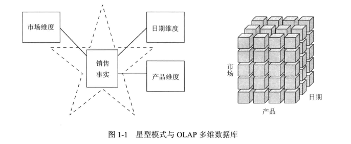

如果采用的DW/BI环境包括星型模式或者OLAP多维数据库,则可以说是利用了维度概念。星型模式和多维数据库对可识别的维度具有公共的逻辑设计,但是物理实现上存在差异。

当数据被加载到OLAP多维数据库时,对这些数据的存储和索引,采用了为维度数据设计的格式和技术。性能聚集或预计算汇总表通常由OLAP多维数据库引擎建立并管理。


由于采用预计算、索引策略和其他优化方法,多维数据库可实现高性能查询。业务用户可以通过增加或删除其查询中的属性,开展上钻和下钻操作,获得良好的分析性能,不需要提出新的查询。OLAP多维数据库还提供大量健壮的分析函数,这些分析函数比那些SQL编写的函数更好,特别是针对大数据集合时,分析函数体现的优势更加明显。

幸运的是,本书的大多数描述适合两种模式。尽管OLAP技术不断得到改善,我们通常推荐将详细的、原子的信息加载到星型模式中,然后将OLAP多维数据库移植到星型模式上。出于这样的原因,本书多数维度建模技术都基于关系型的星型模式。

**OLAP部署的注意事项**

如果要将数据部署到OLAP多维数据库中,必须注意以下一些问题。

- 构建于关系数据库之上的星型模式是建立OLAP多维数据库的良好物理基础。通常也被认为是备份与恢复的良好的、稳定的基础。

- 传统上,一般认为OLAP多维数据库比RDBMS具有更好的性能,但这一优越性随着计算机硬件(例如,设备以及内存数据库)和软件(例如,纵列数据库)的发展变得不那么重要。

- 由于供应商多,OLAP多维数据库数据结构比关系数据库管理系统变化更大,因此,最终的部署细节通常与选择的提供商有关。通常在不同OLAP工具之间建立BI应用比在不同关系数据库之间建立BI更困难。

- OLAP多维数据库通常比RDBMS提供更多的复杂安全选项。例如,限制访问细节数据,但对汇总数据往往能够提供更开放的接口。

- OLAP多维数据库显然能够提供比RDBMS更加丰富的分析能力,因为后者受SQL的制约。这也可以作为选择OLAP产品的主要依据。

- OLAP多维数据库方便地支持缓慢变化维度类型2变化(将在第5章讨论),但当需要使用其他缓慢变化维度技术重写数据时,多维数据库通常需要被全部或部分地重新处理。
  

- OLAP多维数据库方便地支持事务和周期性快照事实表,但是由于前一点所描述的重写数据的限制问题而无法处理累积快照事实表。

- OLAP多维数据库通常支持具有层次不确定的复杂的不规则层次结构,例如,组织结构图或物料表等。使用自身查询语法比使用RDBMS的方法更优越。

- OLAP多维数据库与关系数据库比较,能对实现下钻层次的维度关键词结构提供更详细的约束。

- 一些OLAP产品无法确保实现维度角色和别名,因此需要定义不同的物理维度。

以下将着手考虑星型模式的两个关键部件,以此回到基于关系平台的维度建模世界中。

### 1.3.2用于度量的事实表

维度模型中的事实表存储组织机构业务过程事件的性能度量结果。应该尽最将来源于同一个业务过程的底层度量结果存储于一个维度模型中。因为度量的数据量巨大,所以不应该为满足多个组织功能的需要而将这些数据存放在多个地方。应该允许多个组织的业务用户访问同一个单一的集中式数据仓库,确保他们能在整个企业中使用一致的数据。


“事实“这一术语表示某个业务度量。从市场角度观察,记录销售的产品的数量单位,以及每种产品在每个销售事务中涉及的销售额。当产品被扫描时可以获取这些度量,如图1-2所示。

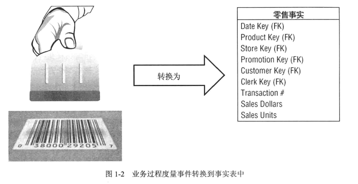



事实表中的每行对应一个度量事件。每行中的数据是一个特定级别的细节数据,称为粒度。例如,销售事务中用一行来表示每个卖出的产品。维度建模的核心原则之一是同一事实表中的所有度量行必须具有相同的粒度。牢记建立事实表时使用统一的细节级别这一原则可以确保不会出现重复计算度量的问题。

**注意:**

物理世界的每一个度量事件与对应的事实表行具有一对一的关系,这一思想是维度建模的基本原则。其他工作都是以此为基础建立的。

最实用的事实是数值类型和可加类型事实,例如,美元销售额。本书以美元作为标准货币单位,以使所有的实例更具有实际意义一一如果您使用的不是美元,可以替换为本地货币。

可加性是至关重要的,因为BI应用不太可能仅检索事实表的单一行。常见的情况是,BI应用往往一次需要检索成百上干,甚至百万级别的事实表行。处理如此多行数据的最有用的操作是将它们加到一起。无论用户如何分割图1-2中的数据,都会将销售数量和销售额度汇总为有效的合计。可能也会遇到一些半可加,甚至是不可加的事实。半可加事实(例如,账户节余)不能按时间维度执行汇总操作。不可加事实(例如,单位价格)不可相加。面对这种情况时,不得不进行计数或者取平均值操作,或者简化为一次输出一个事实行,当然当事实表包含海量数据行时,执行这种操作是不现实的。

事实通常以连续值描述,这样做有助于区分到底是事实还是维度属性的问题。在本书实例中,美元销售额事实是连续值,这样它可以在一定范围内表示实际可能存在的所有值。必须面向市场,研究度量,以确定其度量值到底应该是什么。

理论上,以文本方式表示度量事实是可行的。然而,很少采用这种方式。多数情况下,文本型度量是对某些事情的描述,来源于离散值列表。设计者应该尽最大可能将文本数据放入维度中,将它们有效地关联到其他文本维度属性上,以减少空间开销。不要在事实表中存储冗余的文本信息。除非对事实表中的每个行来说,其文本是唯一的,否则,应将其放入维度表中。准确的文本事实比较少见,因为文本事实存在不可预测性,例如,自由文本注释,几乎没有对其进行分析的可能性。

考虑图1-2表示的简单事实表,如果给定产品没有销售活动,则不要在表中插入任何行。不要试图以0表示没有活动发生来填充事实表,这些0将会占据大量的事实表。仅将发生的活动放入事实表中,事实表将变得非常稀疏。尽管存在稀疏特性,事实表仍然占据维度模型消耗空间的90%甚至更多。从行的数量来看,事实表趋向于变长。从列的数量来看,事实表趋向于变短。鉴于事实表占据大量空间的实际情况,应该仔细考虑对事实表空间的利用问题。

通过对本书设计的实例的分析,您将发现所有事实表的粒度可划分为三类.**事务、周期性快照和累积快照**。事务粒度级别的事实表最常见。第3章将介绍事务性事实表。第4章将介绍周期快照和累积快照。

一般事实表具有两个或更多个外键(参考图1-2中的外键概念)与维度表的主键关联。例如,事实表中的产品键始终与产品维度表中的特定产品键匹配。当事实表中所有键与对应维度表中各自的主键正确匹配时,这些表满足参照完整性。可以通过维度表使用连接操作
来实现对事实表的访问。

事实表通常有包含外键集合的主键。事实表的主键常称为组合键,具有组合键的表称为事实表。事实表表示多对多关系。其他表称为维度表。

通常几个维度一起唯一标识每个事实表行。当确定了所有维度中唯一标识事实表行的子集后,其他维度使用事实表行的主键的单一值。换句话说,其他维度只是参与其中。


### 1.3.3用于描述环境的维度表

维度表是事实表不可或缺的组成部分。维度表包含与业务过程度量事件有关的文本环境。它们用于描述与“谁、什么、唧里、何时、如何、为什么“有关的事件。

如图1-3所示,维度表通常有多列,或者说包含多个属性。有50一100个属性的维度表并不稀奇。尽管如此,也可能存在一些只包含少量属性的维度表。与事实表比较,维度表趋向于包含较少的行,但由于可能存在大量文本列而导致存在多列的情况。每个维度表由单一主键定义(参考图1-3的主键概念),用于在与事实表连接操作时实现参照完整性的基础。

维度属性可作为查询约束、分组、报表标识的主要来源。对查询或报表请求来说,属性以词或词组加以区分。例如,当用户希望按照品牌来查看销售额时,要查看的品牌必须存在于维度属性中。

维度表属性在DW/BI系统中起着至关重要的作用。因为维度表的属性是所有查询约束和报表标识的来源。同时,维度属性对构建DW/BI系统的可用性和可理解性也起者非常重要的作用。属性应该包含真实使用的词汇而不是令人感到迷惑的缩写。应该尽量减少在维度表中使用代码,应该将代码替换为详细的文本属性。您可能已经训练业务用户,让他们记住操作型的代码,但为了提高效率,应尽量减少他们对代码转换注释的依赖。应该对那些操作型代码进行解码,以用于维度属性中,这样可以为查询、报表和BI应用提供具备一致性的标识。对那些不可避免会发生不一致情况的报表应用,应尽量使用解码值。


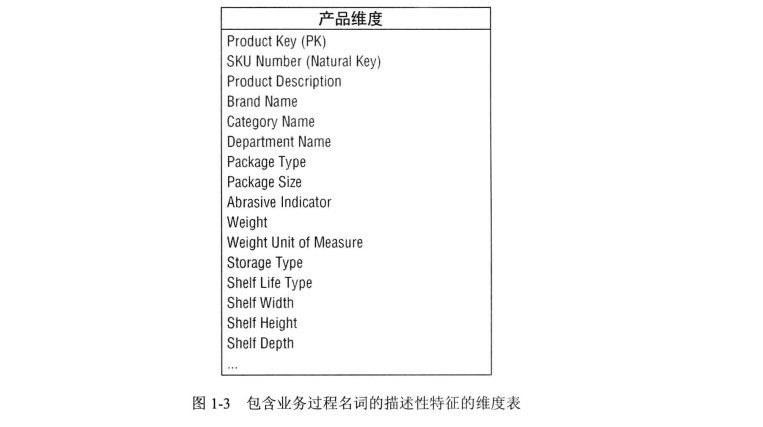


某些情况下,操作码或标识符对用户具有确定的业务含义,或者需要利用这些操作码与后台的操作环境交互。在此情况下,代码应该以清晰的维度属性出现,辅以对应的用户友好的文本描述符。有时操作码中包含一些智能含义,例如,操作码头两位数字表示业务类别,3一4位表示全球区域。与其强制用户查询或过滤操作码,不如将隐含的意思拆分,以不同的维度属性方式展现给用户,这样用户就能方便地开展过滤、分组和制作报表等工作。

多数情况下,数据仓库的好坏直接取决于维度属性的设置;DW/BI环境的分析能力直接取决于维度属性的质量和深度。为维度属性提供详细的业务术语耗费的精力越多,效果就越好。为属性列填充领域值耗费的精力越多,效果就越好。为确保属性值的质量耗费的时间越多,效果就越好。强大的维度属性带来的回报是健壮的分片-分块分析能力。

**注意:**

维度提供敬据的入口点,提供所有DW/BI分析的最终标识和分组.

在分析操作型源数据时,有时不清楚一个数值数据元素应该是事实属性还是维度属性。可以通过分析该列是否是一种包含多个值并作为计算的参与者的度量,这种情况下该列往往可能是事实;或者该列是对具体值的描述,是一个常量、唯一约束和行标识的参与者,此时该属性往往是维度属性。例如,产品的标价看起来像一个产品的常量属性,但它经常会发生变化,因此它更可能是一种度量事实。偶尔,由于很难确定如何进行分类,需要根据设计者所处的环境以不同的方式建模数据元素。


**注意:**

一个数字量到底是事实还是维度属性,对设计者来说是一个两难的问题,很难做出决策。连续值数字基本上可以认为属于事实,来自于一个不太大的列表的离散数字基本可认为是维度属性。

图1-4表明维度表通常以层次关系表示。例如,产品抽象为品牌,然后抽豪为类别。在产品维度的每行中,存储的是有关品牌和分类的描述。层次描述信息的存储存在冗余,这样做的目的主要是为了方便使用和提高查询性能。也许您会坚持在产品维度表中仅存储品牌代码,建立品牌分类查询表的方式,同样的方法可以建立单独的类别查询表,使数据规范化。这种规范化的方法构建的模式称为雪花模式。维度表通常不一定要满足第3范式,它常常是非规范化的,一个维度表中往往存在多对一的关系。由于与事实表比较,维度表通常要小得多,因此采用规范化或雪花模式实际上对数据库的总容量没有多大影响。一般对维度表存储空间的权衡往往需要关注简单性和可访问性。

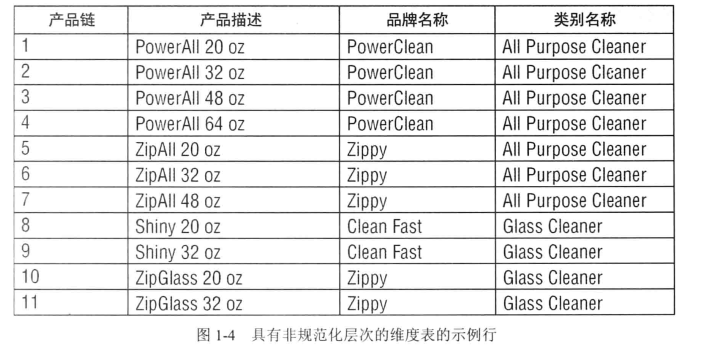



比较流行的观点认为,事实和维度这两个术语并不是由RalphKimball首先提出的。目前大家比较能够接受的说法是,维度和事实这两个术语来自于20世纪60年代杰拉尔德。米勒和达特茅斯大学的一个联合研究项目。20世纪70年代,ACNielsen和IRI使用这两个术语一致地描述他们的辛迪加企业联合组织的数据服务并趋向于使用维度模型,用于简化分析信息的表示。他们认识到,除非将这些数据打包,否则无法使用数据。可以确定地说,并不是由某个人发明了维度方法。当设计者需要将可理解性和性能作为最重要的目标时,
维度模型是在设计数据库时必然产生的结果。

### 1.3.4星型模式中维度与事实的连接

在对维度表与事实表有了简单了解后,可以开始将维度模型中的基本元素一起加以考虑了,如图1-5所示。维度模型表示每个业务过程包含事实表,事实表存储事件的数值化度最,围绕事实表的是多个维度表,维度表包含事件发生时实际存在的文本环境。这种类似星状的结构通常称为星型连接,这一个术语的采用可以追溯到关系数据库系统产生的初期。


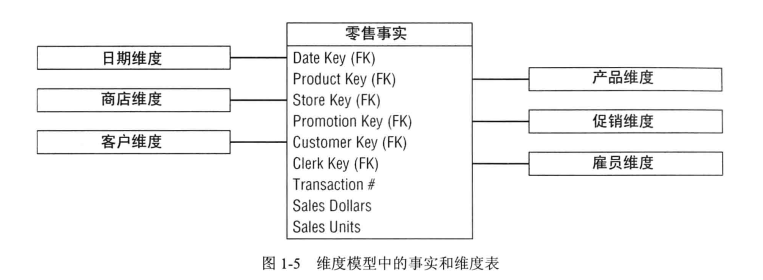

对维度模式首先需要注意的是其简单性和对称性。显然,简单性对业务用户有利,因为数据易于理解和查询。图1-5所示的设计图表对用户来说非常易于理解。我们曾经建立了很多示例,用户看后立即认同,建立的维度模型符合他们的业务。此外,表数量的减少以及使用有实际意义的业务描述使表更容易被查询,减少了错误的发生。

维度模型的简单性也带来性能方面的好处。数据库优化器处理这些很少使用连接操作的简单模式会更高效。数据库引擎首先处理多重索引的维度表,然后将满足用户约束的维度表关键宇与事实表通过笛卡尔积连接。令人惊讶的是,在使用上述方法时,优化器可以一遍扫描事实表索引,实现与事实表的多重连接查询评估。

最后,维度模型非常适于变化。维度模型可预测的框架可适应用户行为的变化。每个维度的地位都相同,所有维度在事实表中都存在对应的入口点。对期望的查询模式,维度模型没有任何偏见。对那些涉及本月或是下月业务问题的查询没有优先顺序。如果业务用户建议采用新的模式分析业务,您不需要调整模式。

本书反复强调,粒度最小的数据或原子数据具有最多的维度。尚未聚集的原子数据是最具有可表达性的数据。这些原子数据是构建能满足用户提出任意查询的事实表的设计基础。对维度模型来说,可以将全新维度增加到模式中,只要该维度的单一值被定义到已经存在的事实表行中。同样,可以将新的事实增加到事实表中,前提是其细节级别与当前事实表保持一致。可以向已存在的维度表添加新属性。对上述情况,可以通过简单增加数据行或通过执行SQLALTERTABLE命令对当前表进行更新。不需要重新加载数据,已经建立的BI应用可不间断运行,不会产生不同的结果。第3章将对维度模型的这些可扩展性进行更详细的讨论。

另一种体会事实表与维度表互为补充的方式似乎可以考察将它们转化为报表。如图1-6所示,维度属性支持报表过滤和标识,事实表支持报表中的数字值。

可以方便地构建SQL用于建立该报表(或由BI工具构建)。


```sql
SELECT
	store.district_name,
	product.brand,
	sum(sales_facts.sales_dollars)AS"SalesDollars"
FROM
	store,
	product,
	date,
	sales_facts
WHERE
	date.month_name="January"AND
	date.year=2013AND
	store.store_key=sales_facts.store_keyAND
	product.product_key=sales_facts.product_keyAND
	date.date_key=sales_facts.date_key
GROUPBY
	store.district_naem,
	product.brand
```

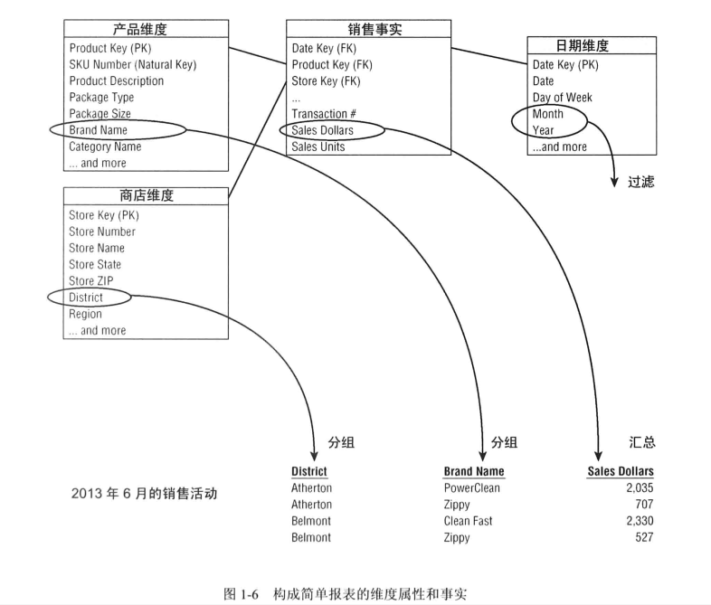

逐行仔细研究这段代码可以看出,紧接SELECT语句后的两行来源于报表需要的维度属性,其后是来自于事实表的聚集矩阵。FROM子句说明查询涉及的所有表,WHERE子句的前两行定义了报表的过滤器,然后描述维度与事实表之间需要做的连接操作。最后,GROUPBY子句建立报表内的聚集。

## 1.4Kimball的DW/BI架构

本节将通过研究基于Kimball架构的DW/BI环境的组成,方便您理解系统及维度建模基础。需要学习每个组成部分的要点,避免混淆它们的作用和功能。

如图1-7所示,将DW/BI环境划分为4个不同的,各具特色的组成部分。它们分别是:操作型源系统、ETL系统、数据展现和商业智能应用。


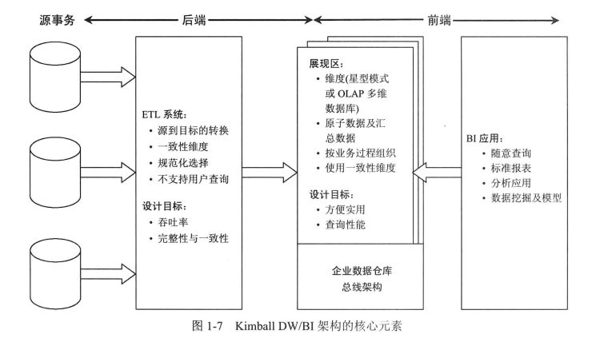


### 1.4.1操作型源系统

它们是记录的操作型系统,用于获取业务事务。可以认为源系统处于数据仓库之外,因为您几乎不能控制这些操作型系统中数据的格式和内容。这些源系统主要关注的事情是处理性能和可用性。针对这些操作型系统的查询是浅显的,以一次一条记录的查询方式构成常见的事务流,这种方式严重制约了查询对操作型系统的需求。通常操作型系统不能实现类似DW/BI系统那样以广泛的、无法预料的查询方式查询的特点。源系统一般不维护历史信息。好的数据仓库可以更好地承担源系统表示过去情况的责任。多数情况下,源系统是一种针对特定意图的应用,并未承诺要与组织中其他操作型系统共享诸如产品、客户、区域、日期这样的公共数据。当然,适合于交叉应用的企业资源规划(EnterpriseResourcePlanning,ERP)系统或操作型主数据管理系统可用于解决这些问题。

### 1.4.2获取-转换-加载(ETL)系统

DW/BI环境中获取、转换、加载(ExtractTransformationandLoad,ETL)系统包括一个工作区间、实例化的数据结构以及一个过程集合。ETL系统是处于操作型源系统与DW/BI展现系统之间的区域。第19章将详细描述ETL系统的结构以及相关的技术。此处仅对DW/BI系统中的这一基础模块进行简单介绍。

获取是将数据从操作型系统导入数据仓库环境这一ETL过程的第1步。获取意味着读取并理解源数据并将需要的数据复制到ETL系统中以利于后续的处理操作。从这点来看,数据属于数据仓库。

数据获取到ETL系统后,需要进行多种转换操作,例如,清洗数据(消除拼写错误、解决领域冲突、处理错误的元素、解析为标准格式),合并来自不同数据源的数据,复制数据等。ETL系统通过增强或数据变换,采用清洗和整合上述任务的方法,增加数据的利用价值。另外,这些工作还可以建立诊断元数据,逐步建立业务过程再工程以改进源系统的数据质量。

ETL最后的步骤是实际构建和加载数据到展现区域的目标维度模型中。由于ETL系统的主要任务是在交付过程中划分维度和事实,因此其所包含的子系统非常重要。此处定义的子系统关注维度表的处理,例如,代理键分配、查找代码以提供适当的描述、拆分或组合列以提供适当的数据值、连接满足第3范式的数据表成为扁平的不满足规范化要求的维度等。相比之下,事实表往往比较庞大,因此在加载时需要耗费大量时间,将其加载并导入到展现区是必须开展的工作。当维度模型中的维度表和事实表被更新、索引、适当聚集,些确保良好质量后,业务用户就可以开始使用这些数据了。

业界对是否需要将ETL系统保存的数据,在加载到展现区的维度结构(以供查询和报表)时,改变其物理规范化的结构存在争议。ETL系统通常包含简单的排序和顺序化处理等操作。多数情况下,ETL系统并不遵守关系技术,而主要是一种平面文件系统。在验证数据是否满足一对一或多对一规则后,在最后步骤中建立满足第3范式要求的数据库显得毫无意义,只需再次将数据转换为非规范化结构,放入BI展示区中。

当然,很多情况下,即将进行ETL处理的数据往往是满足第3范式的数据。此时,ETL系统开发者在执行清洗和转换工作时使用规范化结构会更加方便。尽管在进行ETL处理时,规范化的数据库是可以被处理的,但我们对这一方法持保留意见。为ETL建立规范化结构和为展现而建立的维度模型意味着数据将会被获取、转换、加载两次一一一次加载到规范化数据库中,然后加载到维度模型中。显然,对开发者来说,实现这两个过程需要投入更多的时间和投资。需要更多的时间实现周期性加载或更新数据,需要更多的空间用于存储数据的多个拷贝。最终,这种方式需要更多的开发管理、持续的支持、硬件平台更多的预算。一些失败的DW/BI工作,源于开发者过度关注构建规范化结构,而不是将其主要精力和资源投入到支持改进业务决策的维度展现区域中。尽管保持企业范围内数据的一致性是DW/BI环境的基本目标,但是与在ETL中建立规范化数据表的方法比较,在没有现成的结构时,存在一些更有效和成本更低的方法。

**注意:**

建立规范化结构支持ETL过程是可以采用的方法。然而,这不是最终的目标、不能在用户查询中使用规范化结构,因为规范化结构难以同时满足可理解性和性能这两个目标。


### 1.4.3用于支持商业智能决策的展现区

DW/BI展现区用于组织、存储数据,支持用户、报表制作者以及其他分析型商业智能(BD应用的查询。由于展现区后端的ETL是不允许用户直接进行查询的,所以DW/BI环境中的展现区成为用户关注的区域。业务团队可以在此通过访问工具和BI应用浏览和观察业务。在TheDataFfareRoxse7bolfit一书的第1版中，原先的题目是“获取数据”。茯取数据实际上是包含维度模型的展现区的主要职责。

关于展现区,作者有一些必要的建议。首先,我们坚持认为,数据应该以维度模型来展现,要么采用星型模式,要么采用OLAP多维数据库。幸运的是,业界目前已经采用这一观点,对此方式不再存在争议。维度建模是为DW/BI用户发布数据的最可行的技术。

关于展现区,我们第二个主要的建议是必须包含详细的原子数据。为满足用户无法预期的、随意的查询,必须使用原子数据。尽管在展现区,为提高性能也会存储联集数据,但若仅仅有这些汇总数据而没有形成这些汇总数据的细粒度数据,则这样的展现区是不够完整的。换句话说,在维度模型中仅有汇总数据而查询原子数据时必须访问规范化模型是完全不能被接受的。期望用尸通过下钻维度数据到最细粒度的数据级别是不现实的,而且采用这样的方式将失去使用维度展现的意义.虽然DW/BI用户和应用对某个订单的单个条目的查询频度较低,但他们可能对上周产品订单的某种类型(或口味、包装类、供应商)感兴趣,期望找到那些在半年内首次进行购买活动(或具有某一指定状态或具有一定的信用)的用户。展现区中一定要包含最细粒度的数据,以便用户能够获得最准确的查询结果。由于用户需求是不可预知的、不断变化的,因此需要提供各种细节数据,方便用户上卷以解决实际问题。

展现区的数据可以围绕业务过程度量事件来构建。采用这一方法可以自然地裁剪操作型源数据获取系统。维度模型应该对应物理数据获取事件。不应该将它们设计为仅为完成每天的报表工作。企业业务过程往往会有部门或功能的交叉。换句话说,应该为原始销售矩阵建立单一事实表而不是仅仅从相似性来考虑问题.数据库的销售矩阵应该包含与销售、市场、部门和财务有关的项。


必须使用公共的、一致性的维度建立维度结构。这是实现第4章所描述的企业数据仓库总线结构的基础。遵守总线结构是对展现区的最后一个要求。如果没有一种可共享的、一致性的维度,维度模型将成为一种孤立的应用。无法实现交互的、隔离的烟筒型数据集合将导致企业的不兼容视图,是DW/BI系统的最大障碍。如果希望建立一种健壮的、集成的DW/BI环境,则必须采用企业总线结构。采用一致性维度思想设计维度模型,可以随意组合和共同使用它们。大企业DW/BI环境中的展现区最终包含一系列维度模型,该维度模型由事实表和多个关联的维度组成。

利用总线结构建立分布式DW/BI系统是成功的法宝。将总线结构作为基本框架,可采用敏捷的、分散的、范围合适的、迭代的方式建立企业数据仓库。

**注意:**

处于DW/BI系统的可查询展现区中的数据必须是维度化的、原子(辅以增强性能的聚集)的、以业务过程为中心的。坚持使用总线结构的企业数据仓库,数据不应该按照个别部门需要的数据来构建。


### 1.4.4商业智能应用

KimballDW/BI架构的最后一个主要的部件是商业智能(BusinessIntelligence,BD)应用部件。“BI应用“这一术语泛指为商业用户提供利用展现区制定分析决策的能力。根据定义,所有的BI应用的查询针对的是DW/BI展现区。显然,查询是使用数据提高决策能力的关键。

BI应用可以简单,仅作为专用查询工具,也可以复杂,实现复杂的数据挖掘或建模应用。专用查询工具,具有足够强大的功能,仅能被少数潜在能够理解和有效使用它们的DW/BI业务用户使用。多数业务用户可能通过预先构建参数驱动的应用和模板访问数据,不需要用户直接构建查询。对那些更加复杂的应用,例如,建模或预测工具,可以将结果上传至操作型源系统、ETL系统或展现区中。

### 1.4.5以餐厅为例描述Kimball架构

将整个DW/BI环境划分为不同的组成部分,这一思想非常重要,为强调其重要性,我们将考察餐馆与DW/BI环境的相似性。
1. ETL系统与餐馆后厨

ETL系统类似餐馆的后厨。餐馆的后厨本身是自成体系的。多才多艺的大厨们获得原始食材,然后将它们烹调为令餐馆用餐者食欲大增的美味膳食。很久以前,商业厨房进入操作环节,大最的规划设计考虑厨房工作场所的布置和包含的子区间。


厨房设计包含几个设计目标。首先,布置要高效。餐厅管理者希望厨房有高的产出。当餐厅被塞满,客人都非常饥饿时,没有必要将时间浪费在运转方面。从餐厅厨房中得到同样质量的东西是另一个重要的目标.如果从厨房来的菜品无法满足期望的情况反复出现,餐厅注定要倒闭。为获得一致性,厨师将餐厅自制调味酱在厨房做好,而不是将构成调味酱的作料放到餐桌上,如果这样做,定会产生多种不同的口味。最后,厨房的输出,即端出给餐厅用餐者的菜品,应该具有很高的完整性。您不会希望有人在您的餐厅吃饭时发生中毒现象。因此,厨房设计要具有整体考虑,调拌沙拉的工作台面一定不能与处理鸡的工作台面处于同一个地方。

正如在厨房设计时,质量、一致性和完整性是主要的设计考虑因素一样,这些原则也是餐厅日常管理需要关注的要点。厨师努力状得最好的食材,做出的菜品必须满足质量标准,如果不能满足最低标准的要求,则会被拒绝推出。多数好的餐厅基于高品质材料来更新其菜单。

餐厅雇佣有技能的能够熟练应用专业工具的专业人士。厨师以难以置信和轻松的方式操作锐利的刀具。他们操作强力的设备,芸工作于高热的工作台面上,不会出现什么意外问题。

考虑到环境的危险性,后厨通常与餐厅顾客隔离。厨房里发生问题,客人往往看不到,因为厨房是不安全的。专业厨师使用锋利的刀全神贯注工作时,不应该被用餐者的问询所打断。您也不会同意让客人进入厨房,将其手指伸到调味汁中,以确定是否要订某个主菜。为防止这些入侵行为,多数餐厅使用门将厨房与用餐地点分开。即使那些夸口采用开放厨房的餐厅也会使用屏蔽设施,例如,采用部分玻璃墙,将两个环境分开。用餐者可以看见厨房的工作但不能进入厨房。尽管某些厨房是可见的,但后厨总是有一些地方不在视野范围之内。

数据仓库的ETL系统与餐馆的厨房类似。在此,源数据被魔法般地转换为有意义的、可展现的信息。ETL系统的后厨需要布置,以能够承载从数据源获得的大量数据。与厨房一样,ETL系统被设计为能够具有足够的吞吐量。能够有效地、尼量减少移动地将原始源数据转换为目标模型。

显然,ETL系统也需要高度关注数据质量、完整性、一致性。输入数据在进入时要检查其质量。不断地监视相关的环境以确保ETL输出的数据具有高度的完整性。一致地获取增值度量和属性的业务规则由ETL系统中有技能的专业人员应用,而不是由开发系统的顾客独立开发。当然,这样做会给ETL开发小组带来额外的负担,但这样做会给ETL用户发布一个更好的、保持一致性的产品。

**注意:**

设计适当的DW/BI环境将平衡前端BI应用以支撞后端ETL系统,前端的工作需要由商业用户多次反复实现,然而,后端工作由ETL人员一次实现.

最后,ETL系统应该与业务用户和BI应用开发者保持一定的距离。正如您不希望餐厅顾客随意进入厨房并食用尚未成熟的食物一样,您不希望您的ETL专职人员由于来自,BI用户的不可预测的询问所打扰。当数据准备工作尚未完成时,用户就参与其中,这如同餐厅食物尚处于烹制阶段,用户就将其手指伸入锅中品尝味道一样,结果不会令人满意。与餐厅厨房情况类似,发生在ETL系统中的活动不应该展示给DW/BI用户。当数据准备工作就绪,质量检查完成后,数据将进入DW/BI展现区。

2. 处于前端用餐区的数据展现与BI

现在请将您的注意力转向餐厅就餐区。区分餐厅优劣的主要因素是什么?按照一般的餐厅评价策略,判断其优劣主要有4个指标:

- 食物(质量、口味、色泽)

- 装饰风格(独具特色,舒适的用餐环境)

- 服务(上菜快捷,细致周到的餐厅服务人员,餐食与用餐者所需一致)

- 就餐的开销

在评价餐厅优劣时,多数客户最初主要关注食物。最重要的是,餐厅是否能够提供可口的食物。食物是餐厅主要的可交付产品。然而,装饰风格、服务、就餐的开销等因素也是影响用餐者是否选择就餐的主要因素。

当然,DW/BI厨房所交付的主要产品是展现区的数据。什么数据是可用的?类似于餐厅,DW/BI系统提供“菜单“,通过元数据、发布报表、参数化分析应用等告诉用户什么数据可用。DW/BI的用户希望获得一致的、良好的数据质量。展现区的数据应该根据要求准备停当并保证安全。

展现区的“装饰风格“应该让用户感觉舒服。应该按照BI使用者的口味而不是开发者的喜好进行设计。对DW/BI系统来说,服务也是至关重要的因素。发布的数据一定要满足需求,快速提供给业务用户或BI应用开发人员。

最后,开销也是DW/BI系统必须考虑的问题。厨房工作人员可以设想制作精美、昂贵的菜育,如果价格不能为用户接受,则餐厅只能关门。

如果餐厅顾客对其就餐经历感觉良好,餐厅管理者会感觉非常轻松。餐厅总是人满为患,甚全会出现等待就餐的情况。餐厅管理者的业绩指标一片光明,就餐者数量庞大,餐桌流动率高,晚间利润高,而成员流动率低。前景一片光明,老板开始考虑扩张分店以应对客流。另一方面,如果就餐者对餐厅不满意,情形将快速变坏。由于用餐人数有限,餐厅无法做到收支平衡,员工开始骚动,餐厅很快就会关门大吉。

餐厅管理者通常积极主动地检查就餐者对菜育和就餐体验的满意程度。如果某位顾客不满意,立即采取行动对涉及的问题加以纠正。同样,DW/BI管理者应该积极主动地开展对满意度的监控工作。您不能被动地等待听顾客抱怨。通常,客户甚至没有表达他们的不满,就放弃就餐。一段时间后,管理者会发现不知什么原因,就餐人数下降。

同样,DW/BI顾客将选择更适合他们需要或更符合他们喜好的“餐厅“,让您为设计、构建、人员投入大量资金建立的DW/BI系统成为废品。当然,应该通过像餐厅那样的主动管理方法防止产生这样不愉快的结局。保证厨房以适当的组织形式建立和使用,按照展现区需要的食物、装修风格、服务和开销,组织厨房的建立和使用。


## 1.5其他DW/BI架构

以上简单描述了KimballDW/BI架构。本节将集中讨论其他的DW/BI架构方法。将从相同点和差别出发,简单描述两种与Kimball不同的架构。最后描述一种混合以上各种架构的方法。

幸运的是,多年以来,Kimball架构与其他架构之间存在的差别变得不那么突出了。更为幸运的是,无论您趋向选择哪种架构,都会涉及维度建模。

我们承认许多成功构建DW/BI系统的组织采用其他的架构方法。我们坚信,与其花费更多的时间关注架构思想的差异,不如使发布的产品被制定决策的商业用户广泛接受,制定更多、更好的决策。架构仅仅作为实现这一目标的方法。

### 1.5.1独立数据集市架构

采用独立数据集市架构,分析型数据以部门为基础来部署,不需要考虑企业级别的信息共亩和集成,如图1-8所示。通常,由单一部门确定其针对操作型源数据的数据需求。部门利用信息技术人员或外部顾问构建数据库用于满足部门自己的需要,主要考虑本部门的业务规则和标识。独立地开展工作,部门数据集市主要用于解决部门内的信息需求。

同时,其他部门可能对同一数据源感兴趣。多个部门对同样的来自组织核心业务过程事件的性能度量感兴趣是比较常见的情况。但由于需要数据的桅一部门不能访问由其他部门构建的数据集市,它将按照自己的情况处理类似的问题,数据可能稍微有些差别。当来自这两个业务部门的用户基于各自的数据集市产生的报表讨论组织的指标时,毫无疑问,由于存在不同的业务规则和标识,没有几个数值能够匹配。

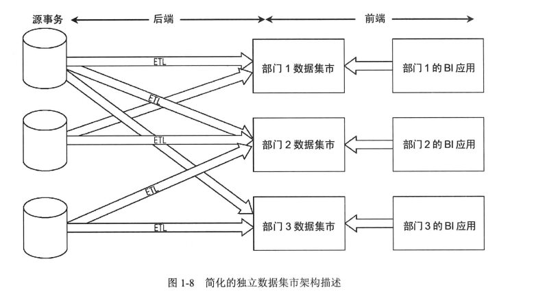

此类独立的分析仓库代表了一种DW/BI架构,这种架构实际上没有结构。尽管没有业界领导者提倡使用类似的独立数据集市,但这一方法却比较常见,在大型组织中尤其如此。它反映了许多组织构建其IT项目的方式,不需要考虑跨组织的数据控制和协调问题。至少从短期效果来看,它有利于以较低成本实现快速开发。当然,从长远来看,采用不同的方式从相同的操作型数据源获取数据,将由于分析数据的元余存储造成浪费和低效。这种独立方法没有从全局考虑问题,因此导致大量不同的解决方案,这些方案掺杂了对组织指标的互不兼容的视图,将会导致企业无休止的争吵和不协调。

我们极力反对独立数据集市方法。然而,这些独立的数据集市往往采用维度建模方法,因为希望发布的数据能够方便业务人员理解,并适合快速响应查询。因此,我们有关维度建模的概念通常会被应用到这一架构中,尽管完全无视我们提出的一些核心原则,例如,关注细节数据,根据业务过程而不是部门构建系统,利用一致性维度实现一致性和集成。

### 1.5.2辐射状企业信息工厂Inmon架构

辐射状企业信息工厂(CorporateInformationFactory,CIF)方法由BillInmon及业界人土倡导。图1-9描述了关注核心元素和展开讨论有关的概念的简化版CIF。

在CIF环境下,数据从操作型数据源中获取,在ETL系统中进行处理,有时将这一过程称为数据获取。从这一过程中获得的原子数据保存在满足第3范式的数据库中,这种规范化的、原子数据的仓库被称为CIF架构下的企业数据仓库(EnterpriseDataWarehouse,EDW)。尽管Kimball架构也可以选择使用规范化以支持ETL处理,规范化的EDW是CIF中强制性的构件。与Kimball方法类似,CIF提倡企业数据协调和集成。但CIF认为要利用规范化的EDW承担这一角色,而Kimball架构强调具有一致性维度的企业总线的重要作用。

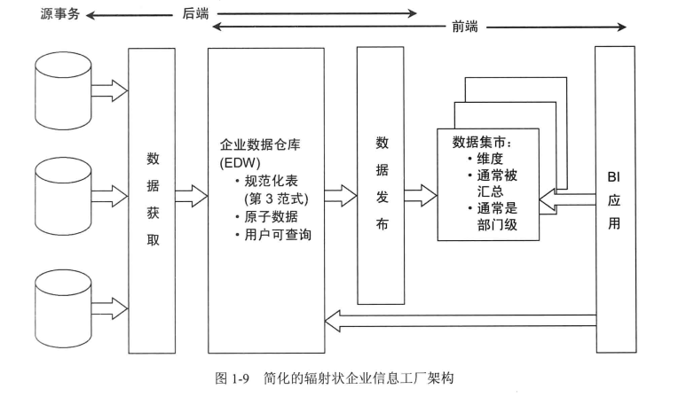

注意:

规范化过程并未能够从技术上支持集成、规范化仅建立能够实现多对一关系的物理表。从另一方面看,集成需要解决由于多源所造成的不一致性。不兼容的数据库源可以完全被规范化,但并未解决集成的问题.基于一致性维度的Kimball架构颠覆了这一逻辑,关注解决数据不一致性,但并未明确提出需要规范化。

采用CIF方法的企业通常允许业务用户根据数据细节程度和数据可用性要求访问EDW仓库。然而,产生的ETL数据的发布过程包含下游的报表和分析环境以支持业务用户。虽然也采用维度结构,但结果分析数据库通常与Kimball架构的展现区存在差别,分析数据库通常以部门为中心(而不是围绕业务过程来组织),而且包含聚集数据(不是原子级细节数据)。如果ETL过程中数据所应用的业务规则超越了基本概要,如部门重命名了列或其他
类似计算,要将分析数据库与EDW原子数据联系起来将变得非常困难。

**注意:**

我们认为,纯CIF架构最极端的形式是不能实现数据仓库的功能。这样的架构将原子数据固定为难以查询的规范化结构,而将部门级的不兼容的数据集市发布到不同的业务用户组。有关这一观点的详细解释,请看1.5.3小节。

### 1.5.3混合辐射状架构与Kimball架构

最后一种需要讨论的架构是将Kimball架构与InmonCFI架构嫁接。如图1-10所示,这种架构利用了CIF中处于中心地位的EDW,但是此处的EDW完全与分析和报表用户隔离。它仅作为Kimball风格的展现区的数据来源,其中的数据是维度的、原子的(辅以联集数据)、以过程为中心的,与企业数据仓库总线结构保持一致。


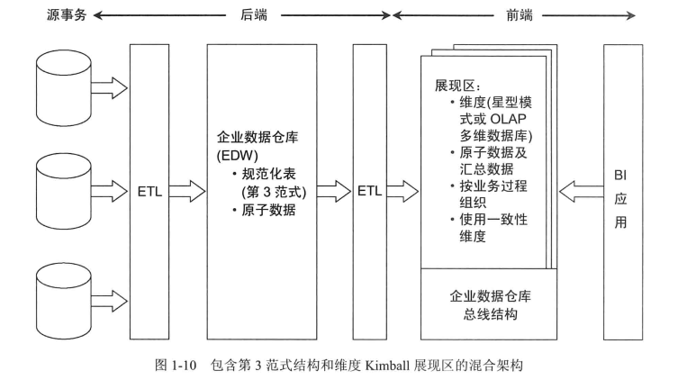

这一方法的一些支持者认为,该方式是结合两种架构的最好方式。的确,该方法是两种面向企业的方法的合并,可以利用构建集成数据仓库中已经开展的工作。为解决EDW第3范式性能和可用性的问题,可以离线加载查询到维度展现区,因为最终给业务用户和BI应用发布的产品是基于Kimball原则构建的。可能有人会质疑这一方法?

如果已经为建立满足第3范式的EDW进行了投资,但尚不能按照用户的期望更灵活地实现报表和分析,这种混合方法可能非常适合您的组织。如果您的组织什么也没有,混合方法可能需要更多的开销和时间,无论是在开发期间还是运行期间,因为数据需要多次移动,原子细节数据冗余存储。如果您存在使用的欲望和需求,最重要的是,预算没有问题以及具有足够的耐心将您的数据在加载到由Kimball方法构建的维度结构之前完全规范化及实例化,可以尝试采用此种方法。

## 1.6维度建模神话

尽管维度建模方法被广泛采用,但仍有一些持续存在的误解。这些错误的断言会带来麻烦,特别是当您想要为团队提供一些最余实践时。如果组织的某些伙计不断批评维度建模方法时,本节可以作为一种推荐的学习列表。他们的理解可能被这些常见的误解所玷污。


### 1.6.1神话1:维度模型仅包含汇总数据

神话1通常晗设计有问题维度模型的根源.由于不可能预测业务用户提出的所有问题,因此必须向业务用户提供对细节数据的查询访问,这样业务用户才能基于其业务问题开展上卷操作。最细粒度的细节数据事实上不会受到意外变化的影响。汇总数据只是在针对公共查询时能够比粒度数据提供更好的性能,但它不能取代细节数据。

认同这一神话的必然结果是仅在维度结构中存储有限的历史数据。维度模型苜不反对存储大量的历史数据。维度模型中可用的历史数据的数量,必须由业务需求来驱动。

### 1.6.2神话2:,维度模型是部门级而不是企业级的

维度模型应该围绕业务过程组织,例如,订单、发货、服务调用等,而不是按照组织中部门的职责划分。多个业务部门往往需要分析来自同一业务过程的相同的度量。应该避免多次获取同一个数据源的数据,这样做会产生多个不一致的分析数据库。

### 1.6.3神话3:维度模型是不可扩展的

维度模型非常易于扩展。事实表通常包含海量的数据行,据报道存在包含2万亿行的事实表。数据库提供商全力支持DW/BI,在其产品中不断增加各种能力以优化维度模型的可扩展性和性能。


规范化数据库和维度模型包含同样的信息和数据关系。在一种模型中表达的数据关系可以在另一个模型中被精确地表达。无论是规范化数据库或是维度模型都能够准确回答同样的问题,即使存在各种各样的困难。

### 1.6.4神话4:维度模型仅用于预测

不应将维度模型设计为仅仅关注预定义的报表或分析。设计应该以度量过程为中心。显然,考虑BI应用的过滤和标识需求非常重要。不应该建立前10个重要报表的名单,因为这样的报表非常容易发生变化,维度模型设计应该是适应变化的。关键是将注意力放到组织的度量事件上,因为与不断变化的分析比较,它们通常是比较稳定的。

与该神话类似的说法是维度模型无法适应业务需求的变化。恰恰相反,由于具有对称性,维度结构非常灵活,能够适应变化。实现查询灵活性的灵丹妙药是以最细粒度级别构建事实表。仅仅发布汇总数据的维度模型是有问题的,当用户在汇总表中无法获取细节数据时,他们有时会逼见分析屏隔。当基于不成熟的汇总表,无法容易地适应新的维度、属性或事实时,开发者有时也会遇到分析屏障。维度模型中正确的做法是以最详细的粒度表达数据,这样可以获得最好的灵活性和可扩展性。若预先制定业务问题,则极易预先汇总数据,从长远娄看,这样操作是非常危险的。

建筑师MiesvanderRohe曾经充满自信地说过“细节就是上帝“。构建维度模型时增加最细粒度的数据可以带籼最大的灵活性和可扩展性。维度模型中没有这些细节信息将破坏构建具有健壮的业务智能的基本需求。


### 1.6.5神话5:维度模型不能被集成

如果遵守企业数据仓库总线结构,维度模型多数都能够被集成。一致性维度作为集中的、持久的主数据建立在ETL系统中,并进行维护,跨维度模型的重用能够实现数据集成和语义一致性。数据集成依赖于标准标识、值和定义。实现组织的一致性并实现其对应的ETL规则是非常困难的事情,但您决不能回避相关的困难,无论是否在处理规范化的或者维度模型。

展现区数据库如果不坚持采用具有共享一致性维度的总线结构,将会产生烟筒式的解决方案。不能将那些由于不满足基本原则造成的企业失败归罪于维度模型

## 1.7考虑使用维度模型的更多理由

本书主要关注在DW/BI展现区设计数据库的维度建模.但是维度建模概念超越了简单和快速的数据结构的设计。应该考虑DW/BI项目其他构建连接的维度。

当开始考虑DW/BI需求时,需要倾听并综合所发现的业务过程。有时小组关注一系列需要的报表和控制面板的度量。此时,您应该不断询问自己产生这些报表和控制面板度量的业务过程度量是什么?当确定项目的范围后,重点关注每个项目的单一业务过程,不要试图在一个迭代中就将多个业务过程覆盖。


尽管DW/BI小组将注意力放在业务过程是至关重要的,但同等重要的事情是同时开展IT和业务管理。从传统的IT基础策略来看,一般认为业务可能与部门数据部署更相似。需要改变他们有关DW/BI面向过程的思维方式。在确定优先级别和开发DW/BI路标时,业务过程是基本工作单元。幸运的是,业务管理通常采纳该方法,因为此方法反映了其对关键性能指标的思考。此外,小组还需要考虑不一致性问题,无休止的争论,以及由部门方法所带来的连绵不断的协调,因此,应该考虑采用新的策略方法。与企业领导层的合作者一起开展工作,按照业务价俳和可行性排序业务过程,然后优先处理具有最大影响和可行性最高的业务过程。尽管优先级晗业务的联合活动,但对组织业务过程的彻底理解是提高效率和随后的可执行性的基础。

开展规划DW/BI系统数据结构的工作,需要考虑组织的所有过程,以及相关的主要的描述维度数据。这一活动的主要成果是企业数据仓库总线矩阵,在第4章中会有详细的介绍。矩阵也可以作为一种有用工具,其潜在的好处是灵活丁更加严谨的主数据管理平台。

数据管理或治理项目首先应该关注主维度集。处于不同的行业,可能包括数据、客户、产品、雇员、设施、提供商、学生、教员、账目等。考虑描述业务的中心名词,将其放入由来自业务团体的主题业务专家领导的数据管理项目列表中。建立针对这些主要名词的数据管理责任是最终开发出具有一致性,能够满足业务分析过滢、分组、标识等需求的维度的关键。健壮的维度是建立健壮的DW/BI系统的基础。

如您所见,维度建模的考虑应早于设计星型模式或OLAP多维数据库。同样,绵度模型在后续的ETL系统和BI应用设计时也处于显著位置。维度建模概念将业务和技术团队联系到一起。第17章和第18章将详细讲解上述概念。希望这里的简述能够播下种子,以便能生根发芽。

**敏捷性考虑**

当前,DW/BI行业内非常青晃敏捷开发实践。敏捷方法存在过度简化的风险,这种方法关注构建大小可管理的工作增量,这些工作增量可在合理时间框架下完成,例如,以周来度量,而不是跨越更大的范围(造成的风险也越大),项目及发布物保证在数月或数年内完成,听起来很好,的确如此吗?

多数敏捷方法的核心原则与Kimball最佳实践契合,包括:

- 关注发布业务值。这是多年籼Kimball广受赞誉的原则之一。

- 开发小组与业务相关方之间的倦合作。类似敏捷小组,应该与业务构成紧密合作关系。

- 强调与业务相关方开展面对面的沟通、反馈、优化。

- 快速适应不可避免的需求变化。

- 以迭代、增量方式处理开发过程

虽然上述方式引人注目,但对敏捷开发的主要批评在于该方法缺乏集合和结构,伴随持续的管理挑战。企业数据仓库总线矩阵是解决上述困难的强有力工具。总线矩阵为敏捷开发提供框架和主生产计划,对可用公共描述维度的标识,提供数据一致性并减少市场发布时间。采用正确的合作方法,业务及IT参与方共处,企业数据仓库总线矩阵可以在较短时间内建立。增量式方法工作可以不断地建立框架的部件,直到其具有足够的可用功能,并发布给业务团体。

一些客户和初学者痛苦地发现,尽管他们想要在其DW/BI环境中发布具有一致性定义的一致性维度,但往往是无法实现的。他们解释说,尽管总是希望这样做,但是由于敏捷开发技术的原因,他们不可能有足够的时间获得组织的一致意见建立一致性维度。我们认为,一致性维度能够确保敏捷DW/BI开发,以及敏捷性决策的制定。当具体化主一致性维度的多样性时,开发曲柄将调整得越来越忧。当开发者重用已有的一致性维度时,新业务过程数据源的上市时间缩短。最后,新ETL开发几乎只关注分发更多的事实表,因为关联的维度表己经设置好。

如果没有类似企业数据仓库总线矩阵这样的框架,一些DW/BI开发小组将陷入凭空使用敏捷技术建立分析或报表方案的陷阱中。多数情况下,小组与少量用户合作获取有限数据源,并将其用于解决其特定的问题。输出往往成为独立的烟筒式数据系统,其他人不能利用。或者更横的是,发布的数据不能与组织其他分析信息关联。我们鼓励适当情况下,采用继捷性。然而,应该避免建立孤立的数据集合。与生活中多数情况一样,在极端情况下寻找适度和平衡总是明智之举。

## 1.8本章小结

本章主要讨论DW/BI系统最重要的日标以及维度建模的基本概念,将KimballDW/B1架构与其他几种架构方法进行了比较。本章最后对常见的、仍然存在于维度建模理解中的误解进行了剖析,尽管维度建模已经为业界广泛接受,但仍然应该树立维度建模而不是数据建模的思想。下一章将学习维度建模模式和技术,然后开始将这些概念应用于第3章提供的实际案例研究中。




# 第2章Kimball维度建模技术概述

始于TheDataHarehowseTbokit(Wiley,1996)第1版,Kimball小组为采用维度方式建模数据定义了完整的技术集合。在本书的前两个版本中,作者感到技术的介绍应该通过涵盖各种行业的熟悉的用例展开。尽管我们仍然感到业务用例是基本的教学方法,但由于技术已经非常标准化,因此有些维度建模者对这一逻辑进行了改变,首先介绍技术,然后基下环境研究用例。不管使用哪种方法都是一个好事情。

Kimball技术已经被业界所接受,成为最佳实践。实际上,一些早期Kimball大学毕业的学生已经出版了他们自己的维度建模书籍。这些书籍通常能非常准确地解释Kimball技术,但由于这些技术的健朱性,其他书籍并未显著地扩展技术库或提供了一些有争论的指导。

本章内容出自这些设计模式的发明者。我们并不期望您一开始就从头到尾阅读本章,但希望您能将本章作为所提供技术的参考。

## 2.1基本概念

本节介绍的技术,在所有维度设计工作中都需要考虑。本书的每一章几乎都会涉及本节所介绍的概念。


### 2.1.1收集业务需求与数据实现

开始维度建模工作前,项目组需要理解业务需求,以及作为基础的源数据的实际情况。通过与业务代表交流来发现需求,用于理解他们的基于关键性能指标、竞争性商业问题、决策制定过程、支持分析需求的目标。同时,数据实际情况可以通过与源系统专家交流,构建高层次数据分析访问数据可行性籼揭示。

### 2.1.2协作维度建模研讨

维度模型应该申主题专家与企业数据管理代表合作设计而成。工作由数据建模者负责,但模型应该通过与业务代表开展一系列高级别交互讨论获得。这些讨论组也为丰富业务需求提供了一种机会。维度模型不应该由那些不懂业务以及业务需求的人来设计,协作是成功的关键。

### 2.1.34步骤维度设计过程

维度模型设计期间主要涉及4个主要的决策:

(1)选择业务过程

(2)声明粒度

(3)确认维度

(4)确认事实

要回答上述问题,需要考虑业务需求以及协作建模阶段涉及的底层数据源。按照业务过程、粒度、维度、事实声明的流程,设计组确定表名和列名、示例领域值以及业务规则而业务数据管理代表必须参与详细的设计活动,以确保涠盖正确的业务。

### 2.1.4业务过程

业务过程是组织完成的操作型活动,例如,获得订单、处理保险索赔、学生课程注册或每个月每个账单的快照等。业务过程事件建立或获取性能度量,并转换为事实表中的事实。多数事实表关注树一业务过程的结果。过程的选择是非常重要的,因为过程定义了特定的设计目标以及对粒度、维度、事实的定义。每个业务过程对应企业数据仓库总线矩阵的一行。

### 2.1.5粒度

声明粒度是维度设计的重要步骤。粒度用于确定某一事实表中的行表示什么。粒度声明是设计必须履行的合同。在选择维度或事实前必须声明粒度,因为每个候选维度或事实必须与定义的粒度保持一致。.在所有维度设计中强制实行一致性是保证BI应用性能和易用性的关键。在从给定的业务过程获取数据时,原子粒度是最低级别的粒度。我们强烈建议从关注原子级别粒度数据开始设计,因为原子粒度数据能够承受无法预期的用户查询。上卷汇总粒度对性能调整来说非常重要,但这样的粒度往往要猜测业务公共问题。针对不同的事实表粒度,要建立不同的物理表,在同一事实表中不要混用多种不同的粒度.

### 2.1.6描述环境的维度

维度提供围绕某一业务过程事件所涉及的“谁、什么、何处、何时、为什么、如何“等背景。维度表包含BI应用所需要的用于过漓及分类事实的描述性属性.牢牢掌握事实表的粒度,就能够将所有可能存在的维度区分开。当与给定事实表行关联时,任何情况下都应使维度保持单一值。

维度表有时被称为数据仓库的“灵魂“,因为维度表包含确保DW/BI系统能够被用作业务分析的入口和描述性标识。主要的工作都放在数据管理与维度表的开发方面,因为它们是用户BI经验的驱动者。


### 2.1.7用于度量的事实

事实涉及来自业务过程事件的度量,基本上都是以数量值表示。一个事实表行与按照事实表粒度描述的度量事件之间存在一对一关系,因此事实表对应一个物理可观察的事件。在事实表内,所有事实只允许与声明的粒度保持一致。例如,在零售事务中,销售产品的数量与其总额是良好的事实,然而商店经理的工资不允许存在于零售事务中。

### 2.1.8星型模式与OLAP多维数据库

星型模式是部署在关系数据库管理系统(RDBMS)之上的多维结构。典型地,主要包含事实表,以及通过主键/外键关系与之关联的维度表。联机分析处理(OLAP)多维数据库是实现在多维数据库之上的多维结构,它与关系型星型模式内容等价,或者说来源于关系型星型模式。OLAP多维数据库包含维度属性和事实表,但它能够使用比SQL语言具有更强的分析能力的语言访问,例如,XMLA和MDX等。OLAP多维数据库包含在基本技术的列表中,因为OLAP多维数据库通常是部署维度DW/BI系统的最后步骤,或者作为一种堆于多个原子关系型星型模式的聚集结构。

### 2.1.9方便地扩展到维度模型

维度模型对数据关系发生变化具有灵活的适应性。当发生以下所列举的变化时,不需要改变现存的BI查询或应用,就可以方便地适应,旦查询结果不会有任何改变。

- 当事实与存在的事实表粒度一致时,可以创建新列。

- 通过建立新的外键列,可以将维度关联到已经存在的事实表上,前提是维度列与事实表粒度保持一致。

- 可以在维度表上通过建立新列添加属性。

- 可以使事实表的粒度更原子化,方法是在维度表上增加属性,然后以更细的粒度重置事实表,小心保存事实表及维度表的列名。

## 2.2事实表技术基础

本节介绍的技术将应用于所有的事实表中。在几乎所有章节中都有对事实表的描述。

### 2.2.1事实表结构

发生在现实世界中的操作型事件,其所产生的可度量数值,存储在事实表中。从最低的粒度级别来看,事实表行对应一个度量事件,反之亦然。因此,事实表的设计完全依赖物理活动,不受可能产生的最终报表的影响。除数字度量外,事实表总是包含外键,用
于关联与之相关的维度,也包含可选的退化维度健和日期/时间截。查询请求的主要目标是基于事实表开展计算和聚集操作。

### 2.2.2可加、半可加、不可加事实

事实表中的数字度量可划分为三类。最灵活、最有用的事实是完全可加,可加性度量可以按照与事实表关联的任意维度汇总。半可加度量可以对树些维度汇总,但不能对所有维度汇总。差额是常见的半可加事实,除了时间维度外,它们可以跨所有维度进行加法操
作。另外,一些度量是完全不可加的,例如,比率。对非可加事实,一种好的方法是,尽可能存储非可加度量的完全可加的分量,并在计算出最终的非可加事实前,将这些分量汇总到最终的结果集合中。最终计算通常发生在BI层或OLAP多维数据库层。

### 2.2.3事实表中的空值

事实表中可以存在空值度量。所有聚集函数(SUM、COUNT、MIN、MAX、AVG)均可针对空值事实计算。然而,在事实表的外键中不能存在空值,否则会导致违反参照完整性的情况发生。关联的维度表必须用默认行(代理键)而不是空值外键表示未知的或无法应
用的条件。

### 2.2.4一致性事实

如果某些度量出现在不同的事实表中,需要注意,如果需要比较或计算不同事实表中的事实,应保证针对事实的技术定义是相同的。如果不同的事实表定义是一致的,则这些一致性事实应该具有相同的命名,如果它们不兼容,则应该有不同的命名用于告诫业务用
户和BI应用。

### 2.2.5事务事实表

事务事实表的一行对应空间或时间上某点的度量事件。原子事务粒度事实表是维度化及可表达的事实表,这类健壮的维度确保对事务数据的最大化分片和分块。事务事实表可以是稠密的,也可以是稀疏的,因为仅当存在度量时才会建立行。这些事实表总是包含一
个与维度表关联的外键,也可能包含精确的时间截和退化维度键。度量数字事实必须与事务粒度保持一致

### 2.2.6周期快照事实表

周期快照事实表中的每行汇总了发生在某一标准周期,如某一天、某周、某月的多个度量事件。粒度是周期性的,而不是个体的事务。周期快照事实表通常包含许多事实,因为任何与事实表粒度一致的度量事件都是被允许存在的这些事实表其外键的密度是均匀
的,因为即使周期内没有活动发生,也会在事实表中为每个予实插入包含0或空值的行。

### 2.2.7累积快照事实表

累积快照事实表的行汇总了发生在过程开始和结束之间可预测步骤内的度量事件。管道或工作流过程(例如,履行订单或索赔过程)具有定义的开始点,标准中间过程,定义的结束点,它们在此类事实表中都可以被建模。通常在事实表中针对过程中的关键步骤都包含日期外键。累积快照事实表中的一行,对应某一其体的订单,当订单产生时会插入一行。当管道过程发生时,累积事实表行被访问并修改。这种对累积快照事实表行的一致性修改在三种类型事实表中具有特性,除了日期外键与每个关键过程步骤关联外,累积快照事实表包含其他维度和可选退化维度的外键。通常包含数字化的与粒度保持一致的,符合里程碑完成计数的湛后性度量。

### 2.2.8无事实的事实表

尽管多数度量事件获取的结果是数字化的,但也存在树些事件仅仅记录一系列某一时刻发生的多维实体。例如,在给定的某一天中发生的学生参加课程的事件,可能没有可记录的数字化事实,但该事实行带有一个包含日历天、学生、教师、地点、课程等定义良好的外键。同样,客户交际也是一种事件,但没有相关的度量。利用无事实的事实表也可以分析发生了什么。这类查询总是包含两个部分:包含所有可能事件的无事实覆盖表,包含实际发生的事件的活动表。当活动从覆盖表中减除时,其结果是尚未发生的事件。

### 2.2.9聚集事实表或OLAP多维数据库

聚集事实表是对原子粒度事实表数据进行简单的数字化上卷操作,目的是为了提高查询性能。这些聚集事实表以及原子事实表可以同时被BI层使用,这样BI工具在查询时可以平滑地选择适当的联集层次。这一被称为聚集导航的过程是开放的,以便报表制作者、查询工具、BI应用都能够获得同样的性能优势,适当设计的聚集集合应该类似数据库索引,能够提高查询性能,但不需要直接面对BI应用或商业用户.聚集事实表包含外键以缩小一致性维度,聚集事实的构建是通过对来自多个原子事实表的度量的汇总而获得的。最后,使用汇总而度量聚集OLAP多维数据库一般与关系类型的聚集方法类似,但是OLAP多维数据库可以被商业用户直接访问。

### 2.2.10合并事实表

通常将来自多个过程的,以相同粒度表示的事实合并为一个单一的合并事实表,这样做能够带来方便。例如,现货销售可以与销售预测合并为一张事实表,与针对多个不同的事实表采用下钻应用比较,这样做可使对现货及预测任务的分析工作变得简单快捷。合并事实表会增加ETL处理过程的负担,但降低了BI应用的分析代价。合并事实表特别适合邦些经常需要共同分析的多过程度量。

## 2.3维度表技术基础

本节所介绍的技术应用于所有维度表。每一章都会讨论和描述维度表。

### 2.3.1维度表结构

每个维度表都包含单一的主键列。维度表的主键可以作为与之关联的任何事实表的外键,当然,维度表行的描述环境应与事实表行完全对应。维度表通常比较宽,是扁平型非规范表,包含大最的低粒度的文本属性。揣作代码与指示器可作为属性对待,最强有力的维度属性采用元长的描述填充,维度表属性是杜诗及BI应用的约束和分组定义的主要目标。报表的描述性标识通常是维度表属性领域值。


### 2.3.2维度代理键

维度表中会包含一个列,表示唯一主键。该主键不是操作型系统的自然键,由于需要跟踪变化,因此若采用自然键,将需要多个维度行表示。另外,维度的自然健可能由多个源系统建立,这些自然键将出现兼容性问题,难以管理。DW/BI系统需要声明对所有维度的主键的控制,而无法采用单一的自然键或附加日期的自然键,可以为每个维度建立无语义的整型主键。这些维度代理键是按顺序分配的简单整数,以值1开始.每当需要新键时,键值自动加1。日期维度不需要遵守代理键规则,日期维度是高度可预测的且稳定的维度,可以采用更有意义的主键。参见2.3.10小节

### 2.3.3自然键、持久键和超自然键

由操作型系统建立的自然键受业务规则影响,无法被DW/BI系统控制。例如,如果雇员辞职,然后重新工作,则雇员号码(自然键)可能会发生变化。数据仓库希望为该雇员创建单一键,这就需要建立新的持久键以确保在此种情况下,雇员号保持持久性不会发生变化。该键有时被称为持久性超自然键。最好的持久键其格式应该独立于原始的业务过程,并以整数1开始进行分配。多个代理键与某一个雇员关联时,若描述发生变化时,持久键不会变化。

### 2.3.4下钻

下钻是商业用户分析数据的最基本的方法。下钻仅需要在查询上增加一个行头指针。新行的头指针是一个维度属性,附加了SQL语言的GROUPBY表达式。属性可以来自任何与查询使用的事实表关联的维度。下钻不需要预先存在层次的定义,或者是下钻路径.参见2.4.3小节。

### 2.3.5退化维度

有时,维度除了主键外没有其他内容。例如,当柏一发票包含多个数据项时,数据项事实行继承丁发票的所有描述性维度外键,发票除了外键外无其他项。但发票数量仍然是在此数据项级别的合法维度键。这种退化维度被放入事实表中,清楚地表明没有关联的维度表。退化维度常见于交易和累计快照事实表中。

### 2.3.6 非规范化扁平维度

一舫来说,维度设计者需要抵制由多年来操作型数据库设计所带来的对规范化设计的要求,并将非规范化的多对一固定深度层次引入扁平维度行的不同属性。非规范化维度能够实现维度建模的双重目标: 简化及速度。

### 2.3.7 多层次维度

多数维度包含不止一个自然层次。例如,日历日期维度可以按照财务周期层次从天到周进行划分,也可能存在从天到月再到年的层次。位置密集垣维度可能包含多个地理层次。所有这些情况下,在同一维度中可以存在不同的层次。


### 2.3.8 文档属性的标识与指示器

令人迷惑的缩写、真/假标识以及业务指标可以作为维度表中文本字词含义的补充解释。操作代码值所包含的意义应分解成不同的表示不同揩述性维度属性的部分。

### 2.3.9 维度表中的空值属性

当给定维度行没有被全部填充时,或者当存在属性没有被应用到所有维度行时,将产生空值维度属性。上述两种情况下,我们推荐采用描述性字符串替代空值。例如,使用Unknown 或 Not Applicable 替换空值。应该避免在维度属性中使用空值,因为不同的数据库系统在处理分组和约果时,针对空值的处理方法不一致。

### 2.3.10 日历日期维度

连接到实际事实表的日历日期维度,使得能够对事实表,按照熟悉的日期、月份、财务周期和日历上的特殊日期进行导航,不要指望能够用 SQL 计算复活节,但可以在日历日期维度上寻找复活节。日历日期维度通常包含许多描述,例如,周数、月份名称、财务周期、国家假日等属性。为方便划分,日期维度的主键可以更有意义,例如,用一个整数表示 YYYYMMDD,而不是用顺序分配的代理键。然而,日期维度表需要特定的行表示未知或待定的日期。若需要更详细的精确度,可以在事实表中增加不同的日期时间戟。日期时间戳并不是维度表的外健,但以单独列的形式存在。如果商业用户按照当天时间(time-of-day)属性进行约束或分组,例如,按当天时间或其他数字分组,则需要在事实表上增加一个“当天时间(time-of-day)“维度外键。

### 2.3.11 扮演角色的维度

单个物理维度可以被事实表多次引用,每个引用连接逻辑上存在差异的角色维度。例如,事实表可以有多个日期,每个月期通过外键表示不同的日期维度,原则上每个外键表示不同的日期维度视图,这样引用具有不同的含义,这些不同的维度视图(唯一的属性列名)被称为角色。

### 2.3.12 杂项维度

事务型商业过程通常产生一系列混杂的、低粒度的标识和指示器。与其为每个标识或属性定义不同的维度,不如建立单独的将不同维度合并到一起的杂项维度。这些维度,通常在一个模式中标记为事务型概要维度,不需要所有属性可能值的笛卡尔积,但应该只包含实际发生在源数据中的合并值。

### 2.3.13 雪花维度

当维度表中的层次关系是规范的时,低粒度属性作为辅助表通过属性键连接到基本维度表。当这一过程包含多重维度表层次时,建立的多级层次结构被称为雪花模式。尽管雪花模式可精确表示层次化的数据,但还是应该避免使用雪花模式,因为对商业用户来说,理解雪花模式并在其中查询是非常困难的。雪花模式还会影响查询性能。扁平化的、非规范的维度表完全能够获得与雪花模式相同的信息。

### 2.3.14 支架维度

维度可包含对其他维度的引用。例如,银行账户维度可以引用表示开户日期的维度。这些被引用的辅助维度称为支架维度。支架维度可以使用,但应该尽量少用.多数情况下,维度之间的关联应该申事实表来实现。在事实表中通过两个维度的不同外键相关联

## 2.4 使用一致性维度集成

维度建模方法最成功的方面之一就是为集成来自不同商业过程的数据而定义了简单而强大的解决方案。

### 2.4.1 一致性维度

当不同的维度表的属性具有相同列名和领域内容时,称维度表具有一致性。利用一致性维度属性与每个事实表关联,可将来自不同事实表的信息合并到同一报表中。当一致性属性被用作行头(就是说,用作 SQL 查询中的分组列)时,来自不同事实表的结果可以排列到跨钻报表的同一行中以上实现是集成企业 DW/BI 系统的基础。一致性维度一旦在与业务数据管理方共同定义后,就可以被所有事实表重用。该方法可获得分析一致性并减少未来开发的开销,因为不需要重新创建。

### 2.4.2 缩减维度

缩减维度是一种一致性维度,由基本维度的列与(或)行的子集构成。当构建根集事实表时需要缩减上卷维度。当商业过程自然地获取粒度级别较高的数据时,也需要缩减维度,例如苡个按月和品牌进行的预测(不需要与销售数据关联的更原子级别的数据和产品),另外一种情况下,也就是当两个维度具有同样粒度级别的细节数据,但其中一个仅表示行的部分子集时,也需要一致性维度子集。

### 2.4.3 跨表钻取

简单地说,跨表钻取意思是当每个查询的行头包含相同的一致性属性时,使不同的查询能够针对两个或更多的事实表进行查询。来自两个查询的回答集合将针对公共维度属性行头,通过执行排序-融合操作实现排列.BI 工具提供商对这些功能有多种不同的命名方法,包括编织和多遍查询等。

### 2.4.4 价值链

价值链用于区分组织中主要业务过程的自然流程。例如,销售商的价值链可能包括购买、库存、零售额等。一般的分类账价值链可能包括预算编制、承付款项、付款等。操作型源系统通常为价值链上的每个步骤建立事务或快照。因为每个过程在特定时间间隔,采用特定的粒度和维度建立唯一的度量,所以每个过程通常至少建立一个原子事实表.


### 2.4.5 企业数据仓库总线架构

企业数据仓库总线架构提供一种建立企业 DW/BI 系统的增量式方法。这一架构通过关注业务过程将 DW/BI 规划过程分解为可管理的模块,通过重用跨不同过程的标准化一致性维度发布实现集成。企业数据仓库总线架构提供了一种架构性框架,同时也支持可管理敏捷实现对应企业数据仓库总线矩阵。总线架构中技术与数据库平台是独立的,无论是关系数据库或者是 OLAP 维度结构都能参与其中。

### 2.4.6 企业数据仓库总线矩阵

企业数据仓库总线矩阵是用于设计并与企业数据仓库总线架构交互的基本工具。矩阵的行表示业务过程,列表示维度。矩阵中的点表示维度与给定的业务过程是否存在关联关系。设计小组分析每一行,用于测试是否为业务过程定义好相关的候选维度,同时也能分析每个列,考虑菪一维度需要跨多个业务过程并保持一致性。除技术设计细节外,当设计小组实现矩阵中的棠行时,总线矩阵还可用作输入帮助确定优先处理 DW/BI 项目过程管理。

### 2.4.7 总线矩阵实现细节

总线矩阵实现细节是一个更加粒度化的总线矩阵,其中扩展每个业务过程行以展示特定事实表或 OLAP 多维数据库。在此细节粒度上,可以文档化精确的粒度描述以及事实列表。

### 2.4.8 机会/利益相关方矩阵

在确定了企业数据仓库总线矩阵行之后,可以通过替换包含业务功能(例如,市场、销售、财务等)的维度列规划不同的矩阵。通过确定矩阵点以表示哪些业务功能与哪些业务过程行相关。机会/利益相关方矩阵可用于区分哪些业务过程分组应该与过程中心行相关

## 2.5 处理缓慢变化维度属性

本节描述处理缓慢变化维度(Slowly Changing Dimension,SCD)属性的基本方法。对同一维度表中属性的变化,采用不同的变化跟踪技术是比较常见的方法。

### 2.5.1 类型0: 原样保留

对类型0,维度属性值不会发生变化,因此事实表以原始值分组。类型0 适合属性标记为“原型“的情况。例如,客户原始的信用卡积分或持久型标识符。该类型也适用于日期维度的大多数属性。

### 2.5.2 类型1: 重写

对类型1,维度行中原米的属性借被新值覆盖。类型1 属性总是反映最近的工作,因此该技术破坏了历史情况。尽管该方法易于实现且不需要建立额外的维度行,但使用时需小心,因为受此影响的聚集事实表和 OLAP 多维数据库将会重复计算。


### 2.5.3 类型2: 增加新行

对类型2,将在维度表中增加新行,新行中采用修改的属性值。要实现该方式需要维度主键更具有一般性,不能仅采用自然键或持久键,因为采用该方法时经常会出现多行描述同样成员的情况。在为维度成员建立新行时,将为其分配新的主代理键,在修改发生后,将其作为所有事实表的外键,直到后续变化产生新维度键并更新维度行.

当变化类型2 发生时,最少需要在维度行中增加三个额外列: 

- 行有效的日期/时间戳列; 

- 行截止日期/时间戳列; 

- 当前行标识

### 2.5.4 类型3: 增加新属性

对类型3,将在维度表上增加新属性以保存原来的属性值,新属性值以变化类型1 方式重写主属性。这种类型3 变化有时称为替换现实。商业用户可以利用当前值或替换现实来分组或过滤事实数据。此种缓慢变化维度技术不太常用.

### 2.5.5 类型4: 增加微型维度

对类型4,当维度中的一组属性快速变化并划分为微型维度时采用。此种情况下的维度通常被称为快速变化魔鬼维度。通常在包含几白万行的维度表中使用的属性是微型维度设计的候选,即使它们并不经常变化。变化类型4 微型维度需要自己的唯一主键,基维度和微型维度主键从相关的事实表中获取。

### 2.5.6 类型5: 增加微型维度及类型1 支架

对类型5,用于精确保存历史属性值,按照当前属性值,增加报表的历史事实。类型5建立在类型4 微型维度之上,些嵌入当前类型1 引用基维度中的微型维度。这样才能确保当前分配的微型维度属性能够与基维度上其他微型维度一起被访问,而不必通过事实表连接。逻辑上说,应该将基维度及微型维度支架表示为展现区域中的单一表。每当当前微型维度分配发生变化时,ETL 小组需要重写类型1 微型维度引用。

### 2.5.7 类型6: 增加类型1 属性到类型2 维度

与类型5 类似,类型6 也保存历史和当前维度属性值。类型6 建立在类型2 的基础上,同时嵌入维度行属性的当前类型1 版本,因此事实行可以被过滤或分组,要么按照当度量发生时有效的类型2 属性值,要么按照属性的当前值。在此环境中,当属性发生变化时,类型1 属性由系统自动重写与特定持久键关联的所有行。

### 2.5.8 类型7: 双类型1 和类型2 维度

类型7 是用于支持过去和现在报表的最后一种混合技术。事实表可以被访问,通过被建模为类型1 维度仅仅展示最新属性值,建模为类型2 维度展示最新历史概要。同样的维度表确保实现两方面的观点。维度的持久键和主代理键同时存在事实表上。从类型1 角度看,维度的当前标识被约束至当前,通过持久键与事实表连接。从类型2 角度看,当前标识无约束,事实表通过代理键主键连接.此两种方法可以按照不同的视图部署到 BI 应用上。

### 2.6.1 固定深度位置的层次

固定深度层次是多对一关系的一种,例如,从产品到品牌,再到分类,到部门。当固定深度层次定义完成后,层次就具有商定的名字,层次级别作为维度表中的不同位置属性出现。只要满足上述条件,固定深度层次就是最容易理解和查询的层次关系,固定层次也能够提供可预测的、快速的查询性能。当层次不是多对一关系,或层次的深度不定,以致层次没有稳定的命名时,就需要接下来将描述的非固定层次技术。

### 2.6.2 轻微参差不齐/可变深度层次

轻微参差不齐层次没有固定的层次淆度,但层次深度有限。地理层次深度通常包含3到6 层。与其使用复杂的机制构建难以预测的可变深度层次,不如将其变换为固定深度位置设计,针对不同的维度属性确立最大深度,然后基于业务规则放置属性值。

### 2.6.3 具有层次桥接表的参娴不齐/可变深度层次

在关系数据库中,深度不确定的可变深度层次非常难以建模,尽管 SQL 扩展和 OLAP访问语言对递归父子关系提供了一些支持,但方法极为有限。采用 SQL 扩展,在查询时,不能替换参差不齐层次,不支持对自身层次结构的共享,同时也不支持随时间变化的参差不齐层次。以上所有问题可以通过在关系数据库中采用构建桥接表方式建模参差不齐层次来解决。这样的桥接表对每个可能的路径保留一行,确保能够遍历所有层次的形式,采用标准 SQL 而不是用特定语言扩展籼实现。

### 2.6.4 具有路径字符属性的可变深度层次

可以在维度中采用路径字符属性,以避免使用桥接表表示可变深度层次。对维度中的每行,路径字符属性包含特定的停入文本字符,包含从层次最高节点到特定维度行所描述节点的完整路径描述。多数标准层次分析需求可以通过标准 SQL 处理,不必采用 SQL 语言扩展。然而,路径孙符方法不能确保其他层次的快速替换,也无法保证共享自身层次。路径字符方法也难于构建可变路径层次的变化,可能需要重新标记整个层次。

## 2.7 高级事实表技术

本节讨论的这些技术涉及不太常见的事实表模式。

### 2.7.1 事实表代理键

代理键可用作所有维度表的主键。此外,可使用单列代理事实键,尽管不太需要。不与任何维度关联的事实表代理键,是在 ETL 加载过程中顺次分配的,可用于

作为事实表的唯一主键列; 

在 ETL 中,用作事实表行的直接标识符,不必查询多个维度; 

允许将事实表更新操作分解为风险更小的插入和删除操作。

### 2.7.2 蜈蚣事实表

一些设计者为多对一层次的每层建立不同的规范化维度,例如,日期维度、月份维度、季度维度和年维度等,并将所有外键包含在一个事实表中。这将产生蜈蚣事实表,包含与维度相关的多个维度。应该避免使用蜈蚣事实表。所有这些固定深度的、多对一层次化关联的维度都应该回到它们最细节的粒度上,例如,上例中提到的日期。当设计者将多个外键嵌入到单一低粒度维度表中,而不是建立杂项维度时,也会产生蜈蚣事实表。

### 2.7.3 属性或事实的数字值

设计者有时会逼到一些数字值,难以确定将这些数字值分类到维度表或是事实表的情况。典型的实例是产品的标准价格。如果该数字值主要用于计算目的,则可能属于事实表。如果该数字值主要用于确定分组或过湍,则应将其定义为维度属性,离散数字值用值范围属性进行补充(例如,￥0～50)。某些情况下,将数字值既建模为维度又建模为属性是非常有益的,例如,定量准时交货度量以及定性文本描述符。

### 2.7.4 日志/持续时间事实

累积快照事实表获取多个过程里程碑,每个都包含日期外键并可能包含日期/时间戳商业用户通常希望分析这些里程碑之间的湛后及延迟时间。有时这些延迟仅仅是日期上的差异,但栋些情况下,延迟可能基于更复杂的业务规则。如果流水线包含大量的步骤,则可能存在上百个延迟。与其要求用户查询通过日期/时间戬或者日期维度外键计算每个可能存在的延迟,不如根据过程的开始时间点为每个度量步骤存储一个时间延迟。这样做可以方便地通过利用存储在事实表中的两个延迟,简单地用减法计算任何两个步骤间可能存在的延迟。

### 2.7.5 头/行事实表

操作型交易系统通常包括事务头指针行,头指针行与多个事务行关联。采用头/行模式(也称为父/子模式),所有头指针级别维度外键与退化维度应该被包含在行级别事实表。

### 2.7.6 分配的事实

头指针/行事务数据与对应的事实具有不同粒度这样的情况经常发生,例如,头表示货运费用。应该尽量分配头指针事实,使其基于业务所提供的规则划分为行级别,分配的事实可以按照所有维度进行分片并上钻操作。多数情况下,可避免建立头指针级别的事实表,除非这样的聚集能够获得查询性能的改善.

### 2.7.7 利用分配建立利润与损失事实表

事实表揭示利润等价方程是企业 DW/BI 应用能够发布的最强大的结果。利淘方程是: 收入-开销= 利润。理想地实现利润方程的事实表应为原子收入事务粒度并包含许多开销项。

因为这些表处于原子粒度,才能实现数字化的上卷,包括客户利润,产品利涧,促销利涧,渠道利涧等。然而,建立这些事实表存在一定难度,因为开销项必须从其原始来源划分到事实表粒度。这一分配步骤通常申 ETL 子系统完成,这一过程是一个与业务相关的步骤,需要高层经理的支持。出于以上原因,利润与损失事实表通常在 DW/BI 程序的早期实现阶段不会被处理。

### 2.7.8 多种货币事实

以多种货币单位记录财务事务的事实表行应该包含一对列。其中一列包含以真实币种表示的事实,另外一列包含同样的,但以整个事实表统一的单一标准币种表示的事实。标准币种值在 ETL 过程中按照规定的货币转换规则建立。该事实表也必须有一个货币维度用于区分事务的真正货币。

### 2.7.9 多种度量事实单位

某些业务过程需要事实同时以多种度量单位表示。例如,按照业务用户的观点,供应链可能需要对相同事实以平台、船运、零售以及单个扫描单元构建报表。如果事实表包含太量事实,而每个事实都必须以所有度量单位表示,此时较好的方法是将事实以公认的标准度量单位存储,同时存储标准度量与其他度量的转换系数。这种事实表可按照不同用户的观点部罩,使用适当选择的转换系数。转换系数必须存储在事实表行中以确保计算简单正确,苜尽量降低查询复杂性。

### 2.7.10 年-日事实

商业用户在事实表中通常需要年-日(year-to-date,YTD)值。很难反对单个请求,但是YTD 请求很容易变换为“财务周期结束时的 YTD“或者“财务周期日“。一种更可靠、可扩展的处理这些请求的方法是在 BI 应用或 OLAP 多维数据库中计算 YTD 矩阵,而不是在事实表中村出 YTD 事实。

### 2.7.11 多道 SQL 以避免事实表间的连接

BI 应用绝不应该跨事实表的外键处理两个事实表的连接操作。在关系数据库中,控制此类连接擅作的回答集的基数是不可能的,将会产生不正确的结果。例如,如果两个事实表包含客户产品出货和返回,则这两个表不能按照客户和产品外键直接连接。要采用跨钻历式使用两个事实表,并对结果按照公共行头指针属性值,进行排序-融合操作以产生正确结果。

### 2.7.12 针对事实表的时间跟踪

存在三种基本事实表柯度,事务级别、周期快照和累积快照。个别情况下,在事实表中增加行有效时期、行截止日期和当前行标识是非常有用的,与采用类型2 缓慢变化维度,在事实行有效时狙取时间的方式类似。尽管不太常用,但该模型能够解决诺如缓慢变化库存平衡的场景,其中频繁周期快照可以在每个快照上加载同一行。


### 2.7.13 迟到的事实

迟到事实是指如果用于新事实行的多数当前维度内容无法匹配输入行的情况。这通常发生在当事实行延迟产生时。在此情况下,当迟到度量事件出现时,必须搜索相关维度以
发现有效的维度键。

## 2.8 高级维度技术

本节介绍的技术涉及高级维度表模型。

### 2.8.1 维度表连接

维度表可以包含到其他维度表的引用。尽管此类关系可以采用支架维度建模实现,但某些情况下,存在于基本维度上的指向支架维度的外键的存在将导致基本维度爆炸性增长,因为支架表中的类型2 变化强制需要在基本维度中对应处理类型2 变化。如果通过将支架表中的外键放入事实表中而不是放置在基本维度表中,降低维度表之间的关联,则此类增长通常可被避免。该方法意味着发现维度之间的关联,仅需要通过遍历事实表,这是可以接受的,特别是当事实表示周期快照,其所有维度的所有键都会在每个报表周期内出现时。

### 2.8.2 多值维度与桥接表

经典维度模式中,每个与事实表关联的维度都有一个与事实表粒度一致的单一值。但是某些情况下,维度存在合理的多值。例如,桅个病人接受了一次健康体检,可能同时出现多个诊断。在此情况下,多值维度必须通过一组维度键通过桥接表使一组中的每个诊断与事实表一行关联。

### 2.8.3 随时间变化的多值桥接表

多值桥接表可能需要基于缓慢变化类型2 维度。例如,实现银行账户与单独客户的多对多关系的桥接表,通常必须基于类型2 的账户与客户维度。在此情况下,为防止账户与客户之间的不正确连接,桥接表必须包含有效期和截止日期/时间截,请求的应用必须约束桥接表,使其满足特定时刻以产生一致的快照。

### 2.8.4 标签的时间序列行为

数据仓库中几乎所有的文本都是维度表中的描述性文本。数据挖掘客户聚类分析通常产生文本化的行为标签,通常可以用作区分周期。在此情况下,跨时间范围的客户行为度量成为由这些行为标签构成的一种序列,该时间序列应该以位置属性被存储在客户维度中,包含可选文本串,构成完整的序列标签。行为标签在位置设计时建立,因为行为标签是复杂并发查询而不是数字计算的目标。

### 2.8.5 行为研究分组

有时可以通过执行多次迭代分析,来发现复杂的客户行为。在此情况下,将行为分析嵌入到 BI 应用,以约束所有客户维度的成员,获取复杂的行为,这样的做法是不现实的。复杂行为分析的结果,可以通过树些简单表获取,这些表称为研究分组,仅包含客户的持父键。在查询时,通过约束研究组表的列与目标模式中客户维度的持久键,该静态表可当成一种可应用于任何带有客户维度的维度模式过滤器。可以定义多个研究组,导出的研究
组可以通过遍历、联合、设置差异等方式建立。

### 2.8.6 聚集事实作为维度属性

商业用户通常对基于聚集性能度量的客户维度感兴趣,例如,过渡去年或整个阶段所有花费超过一定数额的客户。选择聚集事实可以放入作为约柬和作为行标识报表的目标维度。度量通常表示为维度表中的带状范围。维度属性表示聚集性能度量将增加 ETL 处理的负担,但是可以方便 BI 应用层的分析功能。

### 2.8.7 动态值范围

动态值范围报表由一系列报表行头组成,这些报表行头为目标数字化事实定义了范围不断变化的集合。例如,一个银行的公共值范围报表包含带有标签的多个行,例如,“从0到810 的平账“,“从$10.01 到825 的平账“等等。此类报表是动态报表,因为每次查询时都定义了特定的行头,而不是在 ETL 过程中定义的。行定义可以通过在小值范围维度表实现,通过大于连接或小于连接而与事实表实现连接,定义可以仅存在于 SQL CASE 语句中。该
值范围维度方法可能会获得更高的性能,特别是针对列数据库,因为 CASE 语句方法包含针对几乎所有事实表的无约束关系扫描。

### 2.8.8 文本注释维度

与其将自由注释作为事实表的文本度量,不如将它们存储于事实表之外的不同的注释维度(或作为维度属性,每个事务一行,但需要注释的粒度满足唯一事务的数目),使该注释维度对应事实表中的一个外键。

### 2.8.9 多时区

为在多时区应用中获得通用标准时间以及本地时间,应该在受影响的事实表中设置双外键,用以连接两个不同角色的日期(和可能的当天时间(time-of-day))维度表。

### 2.8.10 度量类型维度

有时当事实表每行包含一长列稀疏存储的事实时,可以建立度量类型维度,通过度量类型维度将事实表行变成单一通用事实。我们一般不推荐采用该方法。尽管它消除了所有空的事实表列,但按照每行中占用列的平均数量,这增加了事实表大小,并且使内部列的计算更加困难。当湛在事实的数量达到极限(几百个),但是没有多少需要应用到任何给定事实表行时,可以采用该技术。

### 2.8.11 步骤维度

序列过程(例如,Web 页事件)通常在事务事实表中用不同行表示过程中的每一步。为了告知哪个步骤满足整个会话,使用步骤维度展示当前步骤的步骤号以及完成该会话共有多少步骤。

### 2.8.12 热交换维度

当同一个事实表与相同维度的不同拷贝交替搭配时,可使用热交换维度。例如,某事实表包含股票行情,可以同时展示给不同的投资人,不同的投资人对不同的股票有不同的属性要求。

### 2.8.13 抽象通用维度

一些建模者喜欢使用抽象通用维度。例如,他们的模式包含单一通用位置维度而不是关于商店、仓库和客户维度的嵌入式的地理属性。类似地,其人员维度包含雇员、客户和供应商行,因为尽管每种类型都包含显然不同的属性,但他们都是人。在维度建模时应尽量避免使用抽象通用维度。与每种类型关联的属性集合通常存在差异。如果属性是通用的,例如,地理州,应将它们唯一标识以区分商店所在州与客户所在州。最后,将所有不同的位置、人员、产品放入单一维度将产生大型的维度表。数据抽象可以适当运用于操作型源系统或 ETL 处理,但对查询性能有负面影响,并会对维度模型的易读性带来负面影响。

### 2.8.14 审计维度

当事实表行是在 ETL 之后建立时,建立包含当时已知的 ETL 过程元数据的审计维度是很好的方法。简单的审计维度行可包含一个或多个数据质量的基本标识,也许娄自对错误事件模式的检验,记录数据处理是发现的数据质量问题。另外,使用审计维度属性可以包含描述建立事实行或 ETL 执行时间截的 ETL 代码版本环境变量。这些环境变量对审计意图特别有用,因为它们确保 BI 工具下钻以确定哪些行是由哪些 ETL 软件版本建立的

### 2.8.15 最后产生的维度

有时来自操作型业务过程的事实在关联维度内容前,以分钟、小时、天或周产生。例如,在实时日期发布环境下,订单消耗行可能会到来,显示客户提交的购买特定商品的自然键。在实时 ETL 系统中,该行必须提交到 BI 层,即使客户或产品还不能立即确定下来。在此情况下,将建立特殊的维度行,包含作为属性的未分解的自然键。当然,这些维度行必须包含通用未知值,用于多数描述性列; 推测适当的维度内容将会从源获得。当这些维度内容最后获得时,占位维度行用类型1 重写。当采用类型2 维度属性的追溯性变化发生后,最后达到的维度数据也会产生。在此情况下,新行需要插入维度表中,然后需要重新定义关联事实行。

## 2.9 特殊目的模式

下列设计模式适用于特定的用例。

### 2.9.1 异构产品的超类与子类模式

金融服务与其他商业通常提供不同业务类型的广泛的产品。例如,零售银行可以提供许多不同类型的账目,从支票账户到抵押贷款到商业贷款,但是所有这些都是账户的实例。试图建立单一的、囹定的事实表,将所有可能的事实都包含在内,联系维度表包含所有不同产品的属性,是不会成功的,因为存在大量的不兼容事实和属性。解决方案是建立单一的超类事实表,该事实表道历所有账户类型的事实表(以及包含公共属性的超类维度表),然后系统化地为不同子类建立不同的事实表(与维度表关联)。超类与子类事实表也被称为校心或目定义事实表。

### 2.9.2 实时事实表

实时事实表霁要比传统的夜间批处理过程更频繁地被更新。有许多技术可用于支持这一需求。采用何种技术要考虑最后部署到 BI 报表层的 DBMS 或 OLAP 多维数据库的能力。例如,“热分区“可以定义一个事实表占用专用物理内存。不用再在该分区上建立聚集和索引。其他 DBMS 或 OLAP 多维数据库可能支持延迟更新,允许已存在的运行完毕的查询,仍然可执行更新。

### 2.9.3 错误事件模式

数据仓库中数据质量的管理需要一个综合性系统,管理数据质量通过屏幕或过滤器来实现,用于测试从源系统到 BI 平台的数据。当数据质量屏幕检测到错误时,该事件将被记录在特殊的维度模式中,该维度模式仅能被 ETL 后端处理系统处理。这一模式包含错误事件事实表,其粒度为单独错误事件和相关错误事件详细事实表,相关错误事件详细事实表粒度为参与错误事件的每个表中的列。




# 第3章零售业务

理解维度建模原理的最佳途径是研究一系列真实存在的案例。与抽象地讲述相比,通过考察实际案例来学习能够更好地掌握具体设计存在的困难以及解决之道。本书采用的案例来源广泛,可帮助您超越自身的特定环境,强化对维度建模最佳实践的理解。

要掌握维度建模,请阅读本书的所有章节,即使您并未管理某个零售商店或者工作于某家通信公司。本书包含的章节并未打算给出某个行业或业务功能的整体解决方案。每一章将介绍一系列适合所有行业的维度建模模式。大学、保险公司、银行以及航空公司等都确实需要本章有关零售行业所采用的相关技术。另外,研究考虑其他行业的情况也能给人耳目一新的感觉。当处理公司数据时,很容易被其历史复杂性所影响。跳出您所处的组织,并带回认真考虑而获得的某个(或两个)设计原则,这样当您面对纷繁复杂的业务细节时,仍能牢记设计原则的精骸。

本章将讨论以下概念:

- 维度模型设计的4 步过程

- 事实表粒度
- 事务类型事实表
- 可加、不可加以及抽取的事实
- 维度属性,包括指标、数字化描述符以及多层次
- 日历日期维度,加上当天时间(time-of-day)维度
- 因果维度,例如,促销维度
- 退化维度,例如,交易收据号码
- 维度模型中的空值
- 维度模型的可扩展性
- 无事实的事实表
- 代理键、自然键与持久键
- 基于雪花模式的维度属性
- 包含“太多维度的“蜈蚣事实表
  

## 3.1 维度模型设计的4 步过程

贯穿本书,将采用始终一致的4 步设计方法来设计维度模型。以下各节将详细讨论。

### 3.1.1 第1 步: 选择业务过程

业务过程是由组织完成的微观活动,例如,获得订单、开具发票、接收付款、处理服务电话、注册学生、执行医疗程序、处理索赔等。业务过程包含以下公共特征,理解它们将有助于区分组织中不同的业务过程:

- 业务过程通常用行为动词表示,因为它们通常表示业务执行的活动。与之相关的维度描述与每个业务过程事件关联的描述性环境。

- 业务过程通常由某个操作型系统支撑,例如,账单或购买系统。
- 业务过程建立或获取关键性能度量。有时这些度量是业务过程的直接结果,度量从其他时间获得。分析人员总是想通过过滤器和约束的不同组合,来审查和评估这些度量。

- 业务过程通常由输入激活,产生输出度量。在许多组织中,包含一系列过程,它们既是某些过程的输出,也是某些过程的输入。用维度建模人员的话来说,一系列过程产生一系列事实表。

您需要仔细了解业务以区分组织的业务过程,因为商业用户难以快速回答下列问题,“您对何种业务过程感兴趣?“用户希望在 DW/BI 系统中分析来自于业务过程的性能度量。

有时业务用户谈论的是业务战略规划,而不是业务过程。这些规划往往是由管理层为提高竞争优势而制定的抽象企业规划。为将这些规划联系到 DW/BI 小组利用的表示项目工作单元的业务过程中,需要将业务规划分解到基本业务过程中。这意味着需要深入挖掘,理解数据和操作型系统,以支持对规划进行分析的需求。

我们也需要了解业务过程不是什么。企业业务部门或企业功能职责并不等于业务过程。将注意力放在业务过程,而不是放在功能化的部门,可以更方便地获得一致的企业信息。如果以部门为边界建立维度模型,则不可避免地会将不同标号的数据及数据值重复使用。确保一致性的最好方法是一次发布数据。


### 3.1.2 第2 步: 声明粒度

声明粒度意味着精确定义某个事实表的每一行表示什么。粒度传递的是与事实表度量有关的细节级别。它回答“如何描述事实表中每个行的内容? “这一问题。粒度由获取业务过程事件的操作型系统的物理实现确定。

典型的粒度声明如下:

- 客户销售事务上的每个产品扫描到一行中

- 医生开具的票据的列表内容项采用一行表示

- 机场登机口处理的每个登机牌采用一行表示

- 仓库中每种材料库存水平的每日快照采用一行表示
- 每个银行账户每月的情况采用一行表示
  

上述粒度声明以业务术语表示。也许您一直期望粒度由对事实表主键的传统声明描述。尽管最终的粒度与主键是等价的,但将维度集合列出,然后假定这一集合就是粒度声明的方法是不正确的。无论何时,都应该以业务术语表示粒度。

维度建模者有时会忽略声明粒度这一在4 步设计过程中从表面上看起来可有可无的步骤请不要这样做。声明粒度是不容忽视的关键步骤。多年来,从对大量维度设计调试的情况来看,最常见的错误就是在设计过程之初,没有为事实表声明粒度。如果不能清楚地定义粒度,整个设计就像建立在流沙之上,对候选维度的讨论处于兜圈子的状态,不适当的事实将隐藏在设计中。不适当的维度始终笼罩着 DW/BI 实现。设计组的每个人都要对事实表粒度达成共识,这一点非常重要。讨论到此,可能会发现第3 步或第4 步设计过程的粒度说明是错误的。尽管如此,您必须返回第2 步,重新正确地定义粒度,然后考虑第3步或第4 步的问题。

### 3.1.3 第3 步: 确定维度

维度要解决的问题是“业务人员如何描述来自业务过程度量事件的数据? “应当使用健壮的维度集合来装饰事实表,这些维度表示承担每个度量环境中所有可能的单值描述符。如果粒度清楚,维度通常易于区分,因为它们表示的是与“谁、什么、何处、何时、为何、如何“关联的事件。常见维度的实例包括日期、产品、客户、雇员、设备等。在选择每个维度时,应该列出所有具体的、文本类型的属性以充实每个维度表。

### 3.1.4 第4 步: 确定事实




可以通过回答“过程的度量是什么? “这一问题来确定事实。商业用户非常愿意分析这些性能度量。设计中的所有候选事实必须符合第2 步的粒度定义。明显属于不同粒度的事实必须放在不同的事实表中。典型事实是可加性数值,例如,订货数量或以美元计的成本总额等。

需要综合考虑业务用户需求和数据来源的实际情况,并与4 个步骤联系起来,如图3-1所示。我们强烈建议坚决抵制仅仅只考虑数据来源来建模数据。将注意力放在数据上可能不会像与商业用户交流那样复杂,但数据不能替代业务用户的输入。遗憾的是,许多组织仍然在乐用这种看似最省力的数据驱动的方法,当然这样做基本不能取得成功。



## 3.2 零售业务案例研究

以下首先简单描述需要研究的零售业务。之所以选择该行业,是因为零售行业是大家都比较熟悉的行业。但本案例研究中所讨论的模型与实际的所有维度模型有关,无论处于何种行业。

设想您在某个大型食品杂货连锁店总部工作。该连锁店由100 个分布于5 个不同州的分店组成。每个商店都有完整的部门,包括杂货、冷冻食品、日常生活用品、肉类、农产品、烘烤食品、花卉、保健/美容产品等。每个商店包含被称为产品统一编号(SKU)的60 000种不同的上架产品。

数据存放在商店的几个不同地方。最常用的数据来自顾客购买商品使用的收银机。销售点系统(POS)在每个收款台扫描产品条形码,计算顾客从收款台带走的商品,如图3-2 所示为收银机发票。其他数据来自商店后端的供货商发货数据。



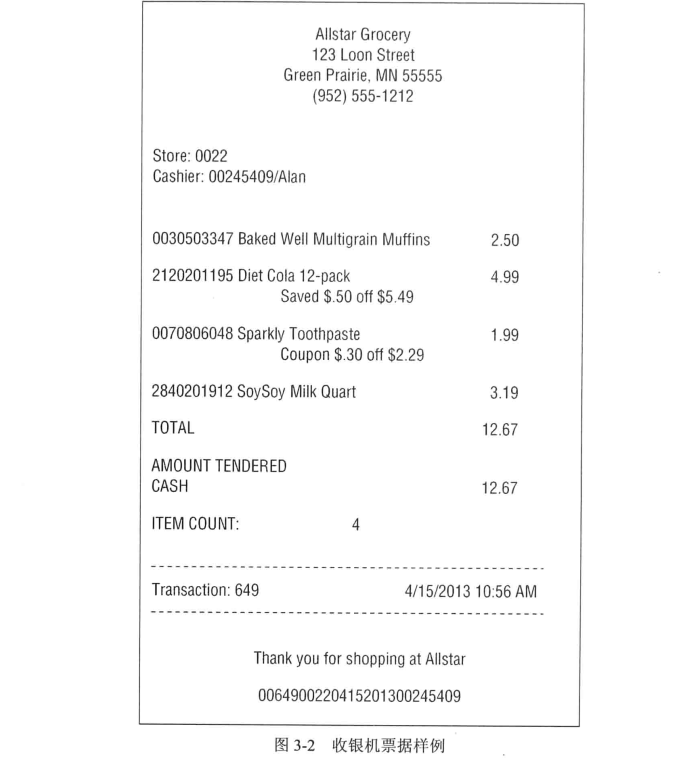

对零售商店来说,管理方面主要关注对订单、库存、销售产品的组织工作,目的是实现利润最大化。利润最终来源于赚取每种商品尽可能多的差价,降低获得产品的开销,提供具有较强竞争力的环境以吸引更多的顾客消费。显然,管理决策与价格和促销有关。商店管理层与总部市场部门将耗费大量时间考虑价格和促销。商店中的促销包括临时降价、报纸广告和广告插页、门店展示及礼券等。大幅降低商品价格是最直接、最有效的带来销售高潮的方法。纸巾价格降低50 美分,特别是当辅以广告和展示的情况下,可以使纸巾销售上升10 个百分点。遗憾的是,如此大的降价通常难以维持,因为纸巾可能是亏本销售。这些问题产生的结果是,所有形式的促销是分析零售商店经营的重要组成部分。

既然对将要研究的商业案例进行了描述,下面将开始讨论维度模型的设计问题。

### 3.2.1 第1 步: 选择业务过程

设计的第1 步是通过对业务需求以及可用数据源的综合考虑,决定对哪种业务过程开展建模工作。

注意:

第1 个 DW/BI 项目应该将注意力放在最为关键的、最易实现的用户业务过程。最易实现涉及一系列的考虑,包括数据可用性与质量,以及组织的准备工作等。

在此零售业务案例研究中,管理层希望更好地理解通过 POS 系统获得的客户购买情况。因此您将要建模的业务过程是 POS 零售交易。该数据保证商业用户能够分析被销售的产品,它们是在哪几天、在哪个商店、处于何种促销环境中被销售的。

### 3.2.2 第2 步: 声明粒度

业务过程确定后,设计小组将面临一系列有关粒度的决策。在维度模型中应该包含哪个级别的细节数据呢?

有许多理由要求以最低的原子粒度处理数据。原子粒度数据具有强大的多维性。事实度量越详细,就越能获得更确定的事实。将您所知的所有确定的事情转换成维度。在这点,原子数据与多维方法能够实现最佳匹配。

原子数据能够提供最佳的分析灵活性,因为原子数据可以被约束并以某种可能的方式上卷。维度模型中的细节数据可以适应商业用户比较随意的查询请求。

**注意:**

设计开发的维度模型应该表示由业务过程获取的最详细的原子信息。

当然,也可以定义汇总粒度来表示对原子数据的聚集。然而,一旦选择了级别较高的粒度,就限制了建立更细节的维度的可能性。粒度较高的模型无法实现用户下钻细节的需求。如果用户不能访问原子数据,则不可避免会面临分析障碍。尽管聚集数据对性能调整有很好的效果,但这种效果的获得仍然不能替代允许用户访问最低粒度的细节。用户可以方便地通过细节数据获得汇总数据,但不能从汇总数据得到细节数据。遗憾的是,一些行业专家对这一问题始终模糊不清。他们认为维度模型仅适合汇总数据,因此批评维度建模方法,认为这种方法需要顾先考虐业务问题。当详细的原子数据在维度模型中实际可用时,这种误解定会烟消云散。

在本案例研究中,最细粒度的数据是 POS 交易的单个产品,假设 POS 系统按照一个购物车中某种产品为单一项而上卷所有销售。尽管用户可能不会对分析与特定 POS 交易关联的单项感兴趣,但您能预测所有他们需要获得的数据的方法。例如,他们可能希望知道周一与周日的销售差别,或者他们希望评估是否值得备存大量的某品牌的商品,或者他们希望知道有多少购物者利用丁洗发液50 美分的降价促销,或者他们希望确定某个具有竞争性的苏打水产品大幅促销所带来的减价影响。尽管上述查询不需要某一特定交易的数据,但他们提出的查询请求需要以准确的方式对详细数据执行分片操作而获得。如果仅选择提供汇总数据,则无法获得这些问题的正确答案

**注意:**

DW/BI 系统几乎总是要求数据尽可能最细粒度来表示,不是因为需要查询单独的某行,而是因为查询需要以非常精确的方式对细节进行切分。

### 3.2.3 第3 步: 确定维度

事实表粒度选择完毕后,维度的选择就比较直接了。产品与事务立即呈现。在主维度框架内,可以考虑其他维度是否可以被属性化为 POS 度量。例如,销售日期、销售商店、哪种销售的产品被促销、处理销售的收款员、可能的支付方法等。我们将这些以另外的设计原则表达。

**注意:**

详细的粒度说明确定了事实表的主要维度。然后可以将更多维度增加到事实表上,只要这些额外的维度自然地承担主维度合并的栋个值,如果附加的维度会产生与粒度不符的其他事实行,则取消该维度或重新考虑粒度声明。

以下的描述性维度应用于该案例中: 日期、产品、门店、促销、收银员、支付方式。此外,POS 交易票据数量作为一个特殊维度也包含在其中,如3.3.6 小节所述。

在使用描述性属性填充维度表前,需要完成4 步过程的最后一步。不希望在设计的这一阶段只见树木不见森林。

### 3.2.4 第4 步: 确定事实

设计的最后一步是确认应该将哪些事实放到事实表中。粒度声明有助于稳定相关的考虑。事实必须与粒度吻合: 放入 POS 交易的单独产品线项。在考虑可能存在的事实时,可能会发现仍然需要调整早期的粒度声明或维度选择。

POS 系统收集的事实包括销售数量(例如,鸡汤面的听数)、单价、折扣、净支付价格、扩展折扣、美元销售额等。扩展的美元销售额等于销售数量乘以净单位价格。同样地,扩展的销售折扣额等于销售数量乘以单位折扣额。这些复杂的 POS 系统也提供产品的标准美元成本,由供货商发布给商店。假设这些成本事实随时可用且不需要记述详细的基于活动的成本来源,则可以将扩展开销额包含在事实表中。图3-3 展示了事实表雏形。

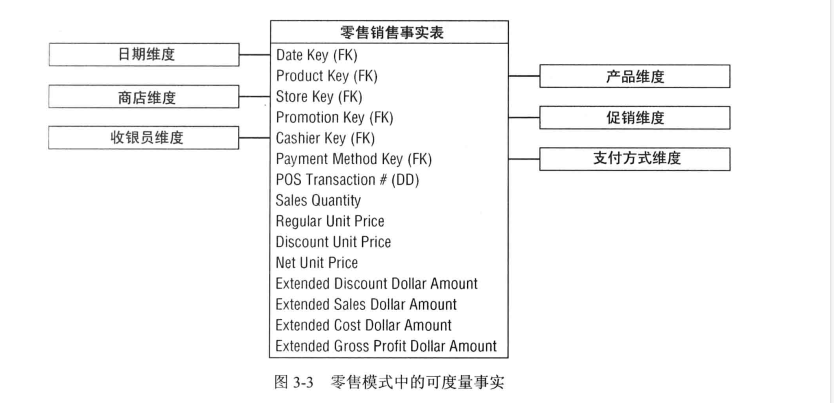

4 类事实一一涉及所有维度的销售数量、销售可扩展额、销售、成本额一一均是完全可加的。可以对事实表按照维度属性不受限制地开展切片或切块操作。针对这4 类事实开展的汇总工作都是合法正确的。

1. 计算获得的事实

可通过从扩展销售总额中减去扩展成本总额的方式获得总利润额,也称为收入。尽管是通过计算所得,但对所有维度来说,总利润额也是完全可加的。可以计算任意时间段内,所有商店所销售产品的任意组合的总利润额。维度建模者有时感到疑惑,是否应该将计算获得的事实放入数据库中。我们通常推荐将它们物理存储在数据库中。在本案例研究中,总利润额计算非常直接明了,但存储它就意味着其计算与 ETL 过程保持一致性,消除了用户计算错误产生的可能性。用户不正确表达总利润额的成本覆盖了少数增量存储成本。因此,他储总利润额也能确保所有用户和 BI 报表应用引用总利润额时能够保持一致性。因为总利润额可以通过计算单一事实表行的相邻数据而获得,因此某些人认为应该采用与表差
别不大的视图来执行类似的计算。如果所有用户在访问数据时都通过视图且没有用户可以采用特别的查询工具绕过视图而直接访问物理表时,可以考虑使用这种方法。视图是减少用户错误且节省存储的一种合理适当的方法,但数据库管理员要保证通过视图访问数据的方式不会产生意外。同样,某些组织希望通过 BI 工具执行计算工作。再次强调,如果所有用户访问数据时使用公共工具,这样做也是可行的。但据我们的经验来看,这样的情况很难实现。然而,有时某一报表的不可加度量,例如,百分比或比率,则必须由 BI 工具计算,因为此类计算不能被预先计算出来并存储在事实表中。OLAP 多维数据库更适合这样的环境。

2. 不可加事实

利润率可通过利润总额除以扩展销售总额获得。利润率是非可加事实,因为它不能从任何维度被汇总。可以计算任意产品集合、商店或者日期的利润率,方法是分别记录收入汇总,以及开销汇总,然后作除法计算。

**注意:**

百分比和比率(例如,利润率)是不可加的,应当将其分子分母分别存储在事实表中。比率可采用 BI 工具计算事实表的任意分片,只需要记住计算的是汇总的比率,而不是比率的汇总.

单价是另一种不可加事实,与事实表中的扩展额不同,对所有维度汇总单价将会产生出毫无意义的、荒谬的数字,考虑以下的实例,您以1 美元的单价销售1 个小器件,而以2美元销售4 个小器件(每个50 美分),您可以汇总销售数量以确定5 个小器件被销售出。同样,销售额也应该汇总(1美元+2美元),因此总的销售额度为3 美元,然而,您不能汇总单价(1 美元加50 美分)并说总单价是1.5美元,类似地，您不能说平均单价是75 美分。

适当的加权平均单价的计算可以通过利用整个销售额（3美元)除以总的销售数量(5 件)得到平均单价为60 美分。一般您不会使用这样的计算,仅观察每个交易行单价,为分析平均价格,在计算总额与总销售数量的比值前,必须增加销售额及销售数量,幸运的是,多数BI 工具能够正确执行此类函数,存在一些问题,例如,是否非可加事实应该物理存储在事实表中。此类问题是真实存在的,非能够获得有限的分析值,除了在报表中打印单独值或直接在事实表中应用过滤器,他们都是不典型的,不常见的。某些情况下,基本的非可加事实(例加,温度)通常是从其他源系统获得的。此类非可加事实需要通过多个记录求平均值来获得。如果业务分析师问意这样做，将非可加事实存储在事实表中也是有意义的。

3. 事务事实表

事务型业务过程是最常见的业务过程,表示这些过程的事实表步具有以下特征:

- 原子事务事实表的粒度可在事务环境下被简洁地描述，例如，每个事务一行或每个事务线一行。

- 由于这些事实表记录的是一个事务事件，所以他们通常是比较稀疏的。在本章的案例研究中，我们肯定不可能将所有产品放到一个购物车中。

- 即使事务表无法预测，分布稀疏，他们仍然可能非常庞大。数据仓库中多数包含数十亿、数万亿行的表往往都是事务事实表。

- 事务事实表趋向成为多维化

- 事务事件返回的度量通常是可加的。只要它们通过数量来扩展，而不是获取单位度量。

在设计初期,先估计一下最大的表的情况,出就是估计事实表的行数是非常有必要的,在本案例中,可以通过于源系统专家讨论,理解在每个基本周期内产生多少 POS 事务行顶。零售业每天的流最波动比较明显,因此需要在合理的周期内理解事务活动,作为一种选择,可以估计每年新增到事实表中的行数量,方法是用每年收入总额除以平均每项的销售价格。假定销售总额为40 亿美元,客户票据中平均每项价格为2 美元,可以计算出每年大约有20 亿事务项。这种估算方式是典型的工程化估计,能够得正常接近实际的设计,作为一个设计者,应该始终通过多角度测量来确定您的计算是否合理。

## 3.3 维度表设计细节

以上我们已经对4 步过程进行了研究,下面将返回维度表并关注如何为其设计健壮的属性的细节。

### 3.3.1 日期维度

日 期 维 度 是 一 种 特 殊 的 维 度 , 因 为 它 几 乎 出 现 在 所 有 的 维 度 模 型 中 。 实 际 上 每 个 业 务过 程 都 需 要 获 取 时 间 序 列 的 性 能 度 量 。 事 实 上 , 日 期 通 常 是 数 据 库 分 区 模 式 下 首 先 需 要 考虑 的 维 度 , 连 续 的 时 间 间 隔 数 据 加 载 被 放 置 于 磁 盘 上 的 新 区 中 。

在 The Data Harehouse Toolkit(Wiley, 1996) 第 1 版 中 , 该 维 度 被 称 为 时 间 维 度 。 然 而 ,十多 年 后 , 我 们 使 用 “ 日 期 维 度 “ 表 示 粒 度 按 天 处 理 的 维 度 表 。 这 有 助 于 区 分 日 期 维 度 和当 天 时 间 (time-of-day) 维 度 。

与 多 数 其 他 维 度 不 同 , 可 以 提 前 建 立 日 期 维 度 表 。 可 以 在 表 中 按 行 表 示 10 年 或 20 年的 不 同 日 期 , 因 此 可 以涵盖 存 储 的 历 史 , 也 可 以 包 含 未 来 的 几 年 。 即 使 包 括 20 年 , 日 期 行也 仅 仅 大 约 有 7 300 行 , 因 此 是 相 对 较 小 的 维 度 表 。 对 销 售 环 境 中 的 日 期 维 度 表 , 建 议 部分 列 可 以 如 图 3-4 设 计 。



日 期 维 度 表 中 的 每 列 由 行 表 示 的 特 定 日 期 定 义 。 周 天 列 包 含 天 的 名 称 , 如 周 一 。 使 用该 列 可 建 立 用 于 比 较 周 一 与 周 日 业 务 的 报 表 。 日 期 数字是 日 历 月 列 从 每 月 1 号 开 始 , 根 据不 同 的 月 份 以 28、29、30、31 日 结 束 。 该 列 用 于 比 较 每 个 月 的 相 同 一 天 的 情 况 。 类 似 地 ,可 以 用 每 年 的 月 号 码 (1、...、12)。 所 有 这 些 整 数 支 持 跨 月 或 年 的 简 单 日 期 计 算 。

对 于 报 表 , 需 要 增 加 长 标 识 和 缩 写 标 识 。 例 如 , 希 望 存 在 月 名 属 性 , 包 含 如 1 月 这 样的 值 。 此 外 , 年 - 月 (YYYYMM) 列 作 为 报 表 的 表 头 非 常 有 效 。 也 可 能 希 望 季 度 号 码 (Q1、 …、Q4), 以 及 2013-Q1 这 样 的 年 - 季 度 属 性 。 可 以 包 括 财 务 周 期 相 同 , 但 日 历 周 期 不 同 的 列 。图 3-5 所 示 的 样 例 行 包 含 几 个 日 期 维 度 列 。


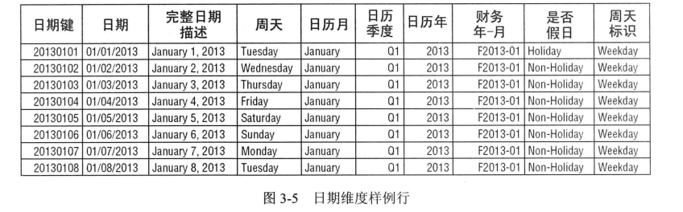

**注 意 :**

样 例 日 期 维 度 可 以 从 www.kimballgroup.com 标 有 本 书 英 文 书 名 的 Tools and Utilities 选项 卡 获 得 。

一 些 设 计 者 在 这 一 点 上 有 疑 问 , 为 什 么 需 要 如 此 详 尽 的 日 期 维 度 表 ? 他 们 存 在 疑 问 的原 因 在 于 , 如 果 事 实 表 上 的 日 期 键 是 日 期 类 型 的 列 , 则 任 何 SQL 查 询 可 以 直 接 约 束 事 实 表的 这 一 日 期 键 , 利 用 SQL 提 供 的 日 期 语 义 按 照 月 或 年 过 滤 , 从 而 可 避 免 据 称 是 非 常 昂 贵 的连 接 操 作 。 上 述 质 疑 不 成 立 的 原 因 在 于 : 首 先 , 如 果 关 系 数 据 库 系 统 不 能 有 效 处 理 与 日 期维 度 表 的 连 接 , 那 您 可 有 大 麻 烦 ; 多 数 数 据 库 优 化 器 都 能 高 效 地 处 理 多 维 查 询 ; 没 必 要 将连 接 操 作 当 成 瘟 疫 一 样 对 待 。

因 为 商 业 用 户 都 不 大 熟 悉 SQL 日 期 语 义 , 所 以 难 以 实 现 典 型 的 日 历 分 组 。SQL 日 期函数 不 支 持 以 属 性 ( 例 如 , 工 作 日 与 周 未 、 假 日 、 财 务 周 期 、 抹 度 ) 进 行 过滤 。 假 定 业 务 需要 按 照 非 标 准 的 日 期 属 性 对 日 期 分 片 , 那 么 建 立 一 个 详 尽 的 日 期 维 度 就 是 基 本 的 需 求 。 日历 逻 辑 由 维 度 表 解 决 , 而 不 是 由 应 用 代 码 来 解 决 。

注 意 :

维 度 模 型 总 是 需 要 详 尽 的 日 期 维 度 表 。SQL 日 期 函 数 不 支 持 范 围 广 泛 的 日 期 属 性 , 包括 周 、 财 务 周 期 、 季 节 、 假 日 、 周 未 等 。 与 其 试 图 将 这 些 非 标 准 日 历 计 算 放 入 查 询 中 , 不如 放 在 日 期 维 度 表 中 , 通 过 查 询 直 接 获 得 。

1. 文 本 属 性 的 标 识 和 标 志
与 大 多 数 操 作 型 标 志 与 标 识 类 似 , 日 期 维 度 的 假 日 标 识 是 一 种 简 单 的 带 有 两 个 可 能 值










