  （作者：尚硅谷研究院)

版本：V2.1 

## 第 1 章 ClickHouse 入门

ClickHouse 是俄罗斯的 Yandex 于 2016 年开源的**列式存储数据库**（DBMS），使用 C++语言编写，主要用于**在线分析处理查询**（OLAP），能够使用 SQL 查询实时生成分析数据报告。

### 1.1 ClickHouse 的特点

#### 1.1.1 列式存储

以下面的表为例：

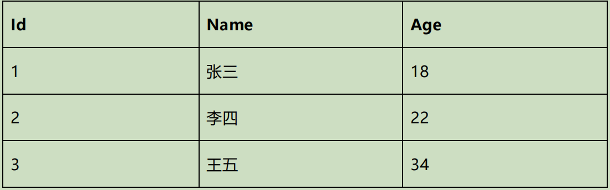

1）采用行式存储时，数据在磁盘上的组织结构为：

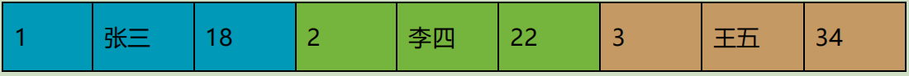

好处是想查某个人所有的属性时，可以通过一次磁盘查找加顺序读取就可以。但是当想查所有人的年龄时，需要不停的查找，或者全表扫描才行，遍历的很多数据都是不需要的。

2）采用列式存储时，数据在磁盘上的组织结构为：

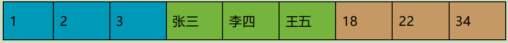

这时想查所有人的年龄只需把年龄那一列拿出来就可以了

3）列式储存的好处：

➢ 对于列的聚合，计数，求和等统计操作原因优于行式存储。  

➢ 由于某一列的数据类型都是相同的，针对于数据存储更容易进行数据压缩，每一列选择更优的数据压缩算法，大大提高了数据的压缩比重。

➢ 由于数据压缩比更好，一方面节省了磁盘空间，另一方面对于 cache 也有了更大的发挥空间。

#### 1.1.2 DBMS 的功能

几乎覆盖了标准 SQL 的大部分语法，包括 DDL 和 DML，以及配套的各种函数，用户管理及权限管理，数据的备份与恢复。 

#### 1.1.3 多样化引擎

ClickHouse 和 MySQL 类似，把表级的存储引擎插件化，根据表的不同需求可以设定不同的存储引擎。目前包括合并树、日志、接口和其他四大类 20 多种引擎。

#### 1.1.4 高吞吐写入能力

ClickHouse 采用类 **LSM Tree**的结构，数据写入后**定期在后台 Compaction**。通过类 LSM tree的结构，ClickHouse 在数据导入时全部是**顺序 append** 写，写入后数据段不可更改，在后台compaction 时也是多个段 merge sort 后顺序写回磁盘。顺序写的特性，充分利用了磁盘的吞吐能力，即便在 HDD 上也有着优异的写入性能。

官方公开 benchmark 测试显示能够达到 50MB-200MB/s 的写入吞吐能力，按照每行100Byte 估算，大约相当于 50W-200W 条/s 的写入速度。

#### 1.1.5 数据分区与线程级并行

ClickHouse 将数据划分为多个 partition，每个 partition 再进一步划分为多个 index granularity(索引粒度)，然后通过多个 CPU核心分别处理其中的一部分来实现并行数据处理。在这种设计下，**单条 Query 就能利用整机所有 CPU**。极致的并行处理能力，极大的降低了查询延时。

所以，ClickHouse 即使对于大量数据的查询也能够化整为零平行处理。但是有一个弊端就是对于单条查询使用多 cpu，就不利于同时并发多条查询。所以对于高 qps 的查询业务，ClickHouse 并不是强项。

#### 1.1.6 性能对比

某网站精华帖，中对几款数据库做了性能对比。  

1）单表查询

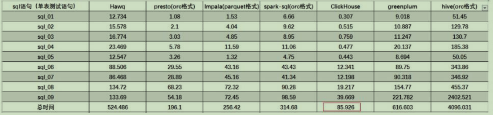

2）关联查询

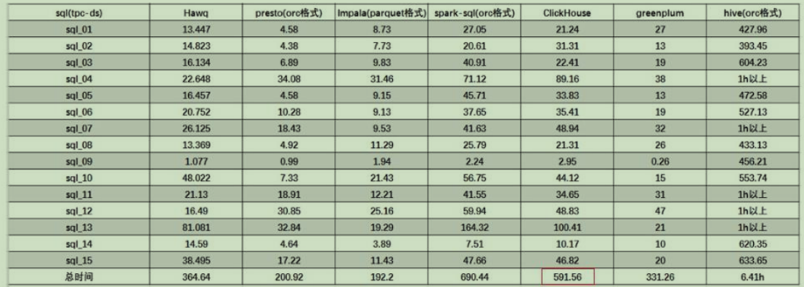

结论: ClickHouse 像很多 OLAP 数据库一样，单表查询速度由于关联查询，而且 ClickHouse的两者差距更为明显。

## 第 2 章 ClickHouse 的安装

### 2.1 准备工作

#### 2.1.1 确定防火墙处于关闭状态


#### 2.1.2 CentOS 取消打开文件数限制

（1）在 hadoop102 的 /etc/security/limits.conf 文件的末尾加入以下内容

```sh
[atguigu@hadoop102 ~]$ sudo vim /etc/security/limits.conf
* soft nofile 65536
* hard nofile 65536
* soft nproc 131072
* hard nproc 131072
```

（2）在 hadoop102 的/etc/security/limits.d/20-nproc.conf 文件的末尾加入以下内容

```sh
[atguigu@hadoop102 ~]$ sudo vim /etc/security/limits.d/20-nproc.conf

* soft nofile 65536
* hard nofile 65536
* soft nproc 131072
* hard nproc 131072
```

```sh
#查看详情
ulimit -a
```


（3）执行同步操作（将文件同步到其他服务器）

```sh
[atguigu@hadoop102 ~]$ sudo /home/atguigu/bin/xsync /etc/security/limits.conf  
[atguigu@hadoop102 ~]$ sudo /home/atguigu/bin/xsync /etc/security/limits.d/20-nproc.conf
```

#### 2.1.3 安装依赖

```sh
[atguigu@hadoop102 ~]$ sudo yum install -y libtool
[atguigu@hadoop102 ~]$ sudo yum install -y *unixODBC*
```

在 hadoop103、hadoop104 上执行以上操作

#### 2.1.4 CentOS 取消 SELINUX

（1）修改/etc/selinux/config 中的 SELINUX=disabled

```sh
[atguigu@hadoop102 ~]$ sudo vim /etc/selinux/config
SELINUX=disabled
```

注意：别改错了

（2）执行同步操作

```sh
[atguigu@hadoop102 ~]$ sudo /home/atguigu/bin/xsync /etc/selinux/config
```

（3）重启三台服务器

### 2.2 单机安装

官网：https://clickhouse.tech/

下载地址：http://repo.red-soft.biz/repos/clickhouse/stable/el7/ 

#### 2.2.1 在 hadoop102 的/opt/software 下创建 clickhouse 目录

```sh
[atguigu@hadoop102 software]$ mkdir clickhouse 
```

#### 2.2.2 将/2.资料/ClickHouse 下 4 个文件上传到 hadoop102 的software/clickhouse 目录下

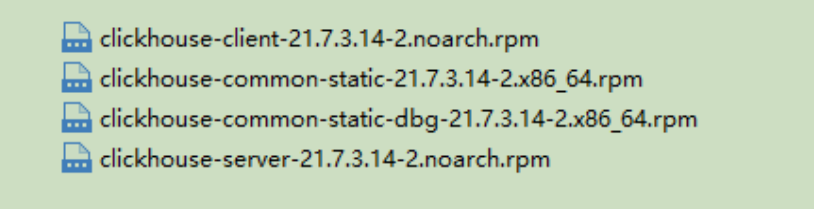

### 2.2.3 将安装文件同步到 hadoop103、hadoop104

```sh
[atguigu@hadoop102 software]$ xsync clickhouse
```

#### 2.2.4 分别在三台机子上安装这 4 个 rpm 文件

```sh
[atguigu@hadoop102 clickhouse]$ sudo rpm -ivh *.rpm
sudo rpm -qa|grep clickhouse 查看安装情况
```


#### 2.2.5 修改配置文件

```sh
[atguigu@hadoop102 clickhouse]$ sudo vim /etc/clickhouse-server/config.xml
```

（1）把 <listen_host>::</listen_host> 的注释打开，这样的话才能让 ClickHouse 被除本机以外的服务器访问

（2）分发配置文件

```xml
sudo /home/atguigu/bin/xsync /etc/clickhouse-server/config.xmlv
```

在这个文件中，有 ClickHouse 的一些默认路径配置，比较重要的数据文件路径：\<path>/var/lib/clickhouse/</path>

日志文件路径：\<log>/var/log/clickhouse-server/clickhouse-server.log</log>

#### 2.2.6 启动 Server

```sh
[atguigu@hadoop102 clickhouse]$ sudo systemctl start clickhouse-server
#新命令
sudo clickhouse start|status|restart
```

#### 2.2.7 三台机器上关闭开机自启

```sh
[atguigu@hadoop102 clickhouse]$sudo systemctl disable clickhouse-server  
```

####  2.2.8 使用 client 连接 server

```sh
[atguigu@hadoop102 clickhouse]$ clickhouse-client -m 

clickhouse-client -h hostname -p port 
```

-m :可以在命令窗口输入多行命令

## 第 3 章 数据类型

### 3.1 整型

固定长度的整型，包括有符号整型或无符号整型。

整型范围（-2n-1~2n-1-1）：

Int8 - [-128 : 127]

Int16 - [-32768 : 32767]

Int32 - [-2147483648 : 2147483647]

Int64 - [-9223372036854775808 : 9223372036854775807]

无符号整型范围（0~2n-1）：

UInt8 - [0 : 255]

UInt16 - [0 : 65535]

UInt32 - [0 : 4294967295]

UInt64 - [0 : 18446744073709551615]

使用场景： 个数、数量、也可以存储型 id。 

### 3.2 浮点型

Float32 - float

Float64 – double

建议尽可能以整数形式存储数据。例如，将固定精度的数字转换为整数值，如时间用毫秒为单位表示，因为浮点型进行计算时可能引起四舍五入的误差。

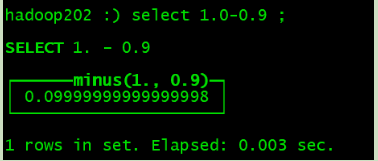

使用场景：一般数据值比较小，不涉及大量的统计计算，精度要求不高的时候。比如保存商品的重量。

### 3.3 布尔型

没有单独的类型来存储布尔值。可以使用 UInt8 类型，取值限制为 0 或 1。

### 3.4 Decimal 型

有符号的浮点数，可在加、减和乘法运算过程中保持精度。对于除法，最低有效数字会被丢弃（不舍入）。

有三种声明：

➢ Decimal32(s)，相当于 Decimal(9-s,s)，有效位数为 1~9

➢ Decimal64(s)，相当于 Decimal(18-s,s)，有效位数为 1~18

➢ Decimal128(s)，相当于 Decimal(38-s,s)，有效位数为 1~38

**s 标识小数位**

使用场景： 一般金额字段、汇率、利率等字段为了保证小数点精度，都使用 Decimal进行存储。

### 3.5 字符串

1）String

字符串可以任意长度的。它可以包含任意的字节集，包含空字节。

2）FixedString(N)

固定长度 N 的字符串，N 必须是严格的正自然数。当服务端读取长度小于 N 的字符串时候，通过在字符串末尾添加空字节来达到 N 字节长度。 当服务端读取长度大于 N 的字符串时候，将返回错误消息。

与 String 相比，极少会使用 FixedString，因为使用起来不是很方便。  

使用场景：名称、文字描述、字符型编码。 固定长度的可以保存一些定长的内容，比如一些编码，性别等但是考虑到一定的变化风险，带来收益不够明显，所以定长字符串使用意义有限。

### 3.6 枚举类型

包括 Enum8 和 Enum16 类型。Enum 保存 'string'= integer 的对应关系。

Enum8 用 'String'= Int8 对描述。

Enum16 用 'String'= Int16 对描述。

1）用法演示

创建一个带有一个枚举 Enum8('hello' = 1, 'world' = 2) 类型的列

```sql
CREATE TABLE t_enum( x Enum8('hello' = 1, 'world' = 2)) ENGINE = TinyLog; 
```

2）这个 x 列只能存储类型定义中列出的值：'hello'或'world'

```sh
hadoop102 :) INSERT INTO t_enum VALUES ('hello'), ('world'), ('hello');
```

3）如果尝试保存任何其他值，ClickHouse 抛出异常

```sql
hadoop102 :) insert into t_enum values('a')
```

4）如果需要看到对应行的数值，则必须将 Enum 值转换为整数类型

```sql
hadoop102 :) SELECT CAST(x, 'Int8') FROM t_enum;  
```

使用场景：对一些状态、类型的字段算是一种空间优化，也算是一种数据约束。但是实际使用中往往因为一些数据内容的变化增加一定的维护成本，甚至是数据丢失问题。所以谨慎使用。

### 3.7 时间类型

目前 ClickHouse 有三种时间类型

➢ Date 接受年-月-日的字符串比如 ‘2019-12-16’ 

➢ Datetime 接受年-月-日 时:分:秒的字符串比如 ‘2019-12-16 20:50:10’ 

➢ Datetime64 接受年-月-日 时:分:秒.亚秒的字符串比如‘2019-12-16 20:50:10.66’

日期类型，用两个字节存储，表示从 1970-01-01 (无符号) 到当前的日期值。

还有很多数据结构，可以参考官方文档：https://clickhouse.yandex/docs/zh/data_types/

### 3.8 数组

Array(T)：由 T 类型元素组成的数组。

T 可以是任意类型，包含数组类型。 但不推荐使用多维数组，ClickHouse 对多维数组的支持有限。例如，不能在 MergeTree 表中存储多维数组。

（1）创建数组方式 1，使用 array 函数

```sql
array(T)
hadoop102 :) SELECT array(1, 2) AS x, toTypeName(x) ;  
```

（2）创建数组方式 2：使用方括号

```sql
[]
hadoop102 :) SELECT [1, 2] AS x, toTypeName(x);
```

## 第 4 章 表引擎

### 4.1 表引擎的使用

表引擎是 ClickHouse 的一大特色。可以说， 表引擎决定了如何存储表的数据。包括：

➢ 数据的存储方式和位置，写到哪里以及从哪里读取数据。 

➢ 支持哪些查询以及如何支持。

➢ 并发数据访问。

➢ 索引的使用（如果存在）。

➢ 是否可以执行多线程请求。

➢ 数据复制参数。

表引擎的使用方式就是必须显式在创建表时定义该表使用的引擎，以及引擎使用的相关参数。

**特别注意：引擎的名称大小写敏感**  

### 4.2 TinyLog

以列文件的形式保存在磁盘上，不支持索引，没有并发控制。一般保存少量数据的小表，生产环境上作用有限。可以用于平时练习测试用。

如：

```sql
create table t_tinylog ( id String, name String) engine=TinyLog;
```

### 4.3 Memory

内存引擎，数据以未压缩的原始形式直接保存在内存当中，服务器重启数据就会消失。读写操作不会相互阻塞，不支持索引。简单查询下有非常非常高的性能表现（超过 10G/s）。

一般用到它的地方不多，除了用来测试，就是在需要非常高的性能，同时数据量又不太大（上限大概 1 亿行）的场景。

### 4.4 MergeTree

ClickHouse 中最强大的表引擎当属 MergeTree（合并树）引擎及该系列（*MergeTree）中的其他引擎，**支持索引和分区**，地位可以相当于 innodb 之于 Mysql。而且基于 MergeTree，还衍生除了很多小弟，也是非常有特色的引擎。

1）建表语句

```sql
create table t_order_mt( id UInt32, sku_id String, total_amount Decimal(16,2), create_time Datetime) engine =MergeTree partition by toYYYYMMDD(create_time) primary key (id) order by (id,sku_id); 
```

2）插入数据

```sql
insert into t_order_mt values (101,'sku_001',1000.00,'2020-06-01 12:00:00') ,(102,'sku_002',2000.00,'2020-06-01 11:00:00'),(102,'sku_004',2500.00,'2020-06-01 12:00:00'),(102,'sku_002',2000.00,'2020-06-01 13:00:00'),(102,'sku_002',12000.00,'2020-06-01 13:00:00'),(102,'sku_002',600.00,'2020-06-02 12:00:00');
```

MergeTree 其实还有很多参数(绝大多数用默认值即可)，但是三个参数是更加重要的，也涉及了关于 MergeTree 的很多概念。

#### 4.4.1 partition by 分区(可选) 

1）作用  

学过 hive 的应该都不陌生，分区的目的主要是降低扫描的范围，优化查询速度

2）如果不填

只会使用一个分区。

3）分区目录

MergeTree 是以列文件+索引文件+表定义文件组成的，但是如果设定了分区那么这些文件就会保存到不同的分区目录中。

4）并行

分区后，面对涉及跨分区的查询统计，ClickHouse 会以分区为单位并行处理。

5）数据写入与分区合并

任何一个批次的数据写入都会产生一个临时分区，不会纳入任何一个已有的分区。写入后的某个时刻（大概 10-15 分钟后），ClickHouse 会自动执行合并操作（等不及也可以手动通过 optimize 执行），把临时分区的数据，合并到已有分区中。

**optimize table xxxx final;** 

6）例如

再次执行上面的插入操作

```sql
insert into t_order_mt values (101,'sku_001',1000.00,'2020-06-01 12:00:00') ,(102,'sku_002',2000.00,'2020-06-01 11:00:00'),(102,'sku_004',2500.00,'2020-06-01 12:00:00'),(102,'sku_002',2000.00,'2020-06-01 13:00:00'),(102,'sku_002',12000.00,'2020-06-01 13:00:00'),(102,'sku_002',600.00,'2020-06-02 12:00:00');
```

查看数据并没有纳入任何分区

手动 optimize 之后  

```sql
hadoop102 :) optimize table t_order_mt final;
```

再次查询

#### 4.4.2 primary key 主键(可选)

ClickHouse 中的主键，和其他数据库不太一样，它只提供了数据的一级索引，但是却不是唯一约束。这就意味着是可以存在相同 primary key 的数据的。

主键的设定主要依据是查询语句中的 where 条件。根据条件通过对主键进行某种形式的二分查找，能够定位到对应的 index granularity,避免了全表扫描。

index granularity： 直接翻译的话就是索引粒度，指在稀疏索引中两个相邻索引对应数据的间隔。ClickHouse 中的 MergeTree 默认是 8192。官方不建议修改这个值，除非该列存在大量重复值，比如在一个分区中几万行才有一个不同数据。

**稀疏索引：**  

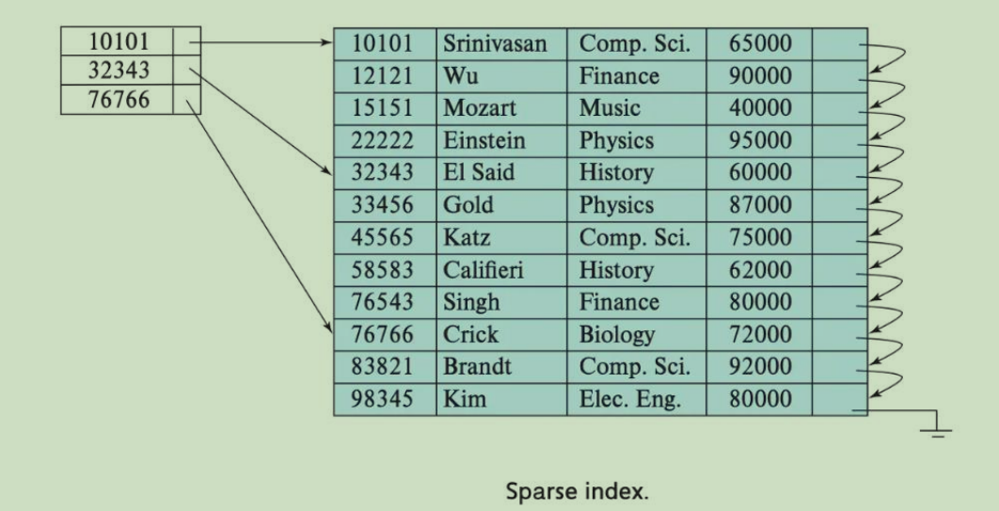

稀疏索引的好处就是可以用很少的索引数据，定位更多的数据，代价就是只能定位到索引粒度的第一行，然后再进行进行一点扫描。

#### 4.4.3 order by（必选）

order by 设定了分区内的数据按照哪些字段顺序进行有序保存。

order by 是 MergeTree 中唯一一个必填项，甚至比 primary key 还重要，因为当用户不设置主键的情况，很多处理会依照 order by 的字段进行处理（比如后面会讲的去重和汇总）。

**要求：**主键必须是 order by 字段的前缀字段。比如 order by 字段是 (id,sku_id) 那么主键必须是 id 或者(id,sku_id)

#### 4.4.4 二级索引

目前在 ClickHouse 的官网上二级索引的功能在 **v20.1.2.4** 之前是被标注为实验性的，在这个版本之后默认是开启的。 

1）老版本使用二级索引前需要增加设置

是否允许使用实验性的二级索引（v20.1.2.4 开始，这个参数已被删除，默认开启）

```xml
set allow_experimental_data_skipping_indices=1;
```

2）创建测试表

```sql
create table t_order_mt2(    id UInt32,    sku_id String,    total_amount Decimal(16,2),    create_time Datetime,    INDEX a total_amount TYPE minmax GRANULARITY 5) engine =MergeTree partition by toYYYYMMDD(create_time)  primary key (id) order by (id, sku_id);
```

其中 GRANULARITY N 是设定二级索引对于一级索引粒度的粒度。

3）插入数据

```sql
insert into t_order_mt2 values(101,'sku_001',1000.00,'2020-06-01 12:00:00') ,(102,'sku_002',2000.00,'2020-06-01 11:00:00'),(102,'sku_004',2500.00,'2020-06-01 12:00:00'),(102,'sku_002',2000.00,'2020-06-01 13:00:00'),(102,'sku_002',12000.00,'2020-06-01 13:00:00'),(102,'sku_002',600.00,'2020-06-02 12:00:00'); 
```

4）对比效果

那么在使用下面语句进行测试，可以看出二级索引能够为非主键字段的查询发挥作用。

```sql
[atguigu@hadoop102 lib]$ clickhouse-client --send_logs_level=trace <<< 'select * from t_order_mt2 where total_amount > toDecimal32(900., 2)';
```

#### 4.4.5 数据 TTL

TTL 即 Time To Live，MergeTree 提供了可以管理数据表或者列的生命周期的功能。

1）列级别 TTL

（1）创建测试表

```sql
create table t_order_mt3(id UInt32, sku_id String, total_amount Decimal(16,2) TTL create_time+interval 10 SECOND, create_time Datetime ) engine =MergeTree partition by toYYYYMMDD(create_time) primary key (id) order by (id, sku_id); 
```

（2）插入数据（注意：根据实际时间改变）

```sql
insert into t_order_mt3 values (106,'sku_001',1000.00,'2020-06-12 22:52:30'),(107,'sku_002',2000.00,'2020-06-12 22:52:30'),(110,'sku_003',600.00,'2020-06-13 12:00:00'); 
```

（3）手动合并，查看效果 到期后，指定的字段数据归 0  

2）表级 TTL

下面的这条语句是数据会在 create_time 之后 10 秒丢失

```sql
alter table t_order_mt3 MODIFY TTL create_time + INTERVAL 10 SECOND;
```

涉及判断的字段必须是 Date 或者 Datetime 类型，推荐使用分区的日期字段。

能够使用的时间周期：

```sh
- SECOND
- MINUTE
- HOUR
- DAY
- WEEK
- MONTH
- QUARTER
- YEAR
```

### 4.5 ReplacingMergeTree

ReplacingMergeTree 是 MergeTree 的一个变种，它存储特性完全继承 MergeTree，只是多了一个去重的功能。 尽管 MergeTree 可以设置主键，但是 primary key 其实没有唯一约束的功能。如果你想处理掉重复的数据，可以借助这个 ReplacingMergeTree。 

1）去重时机

数据的去重只会在**合并的过程中出现**。合并会在未知的时间在后台进行，所以你无法预先作出计划。有一些数据可能仍未被处理。  

2）去重范围

如果表经过了分区，去重只会在分区内部进行去重，不能执行跨分区的去重。所以 ReplacingMergeTree 能力有限， ReplacingMergeTree 适用于在后台清除重复的数据以节省空间，但是它不保证没有重复的数据出现。

3）案例演示

（1）创建表

```sql
create table t_order_rmt(
 id UInt32,
 sku_id String,
 total_amount Decimal(16,2) ,
 create_time Datetime 
) engine =ReplacingMergeTree(create_time)
 partition by toYYYYMMDD(create_time)
 primary key (id)
 order by (id, sku_id);
```

ReplacingMergeTree() 填入的参数为版本字段，重复数据保留版本字段值最大的。如果不填版本字段，默认按照插入顺序保留最后一条。 

（2）向表中插入数据

```sql
insert into t_order_rmt values
(101,'sku_001',1000.00,'2020-06-01 12:00:00') ,
(102,'sku_002',2000.00,'2020-06-01 11:00:00'),
(102,'sku_004',2500.00,'2020-06-01 12:00:00'),
(102,'sku_002',2000.00,'2020-06-01 13:00:00'),
(102,'sku_002',12000.00,'2020-06-01 13:00:00'),
(102,'sku_002',600.00,'2020-06-02 12:00:00'); 
```

（3）执行第一次查询

```sql
hadoop102 :) select * from t_order_rmt;
```

（4）手动合并

```sql
OPTIMIZE TABLE t_order_rmt FINAL; 
```

（5）再执行一次查询

```sql
hadoop102 :) select * from t_order_rmt;  
```

4）通过测试得到结论

➢ 实际上是使用 order by 字段作为唯一键

➢ 去重不能跨分区

➢ 只有同一批插入（新版本）或合并分区时才会进行去重

➢ 认定重复的数据保留，版本字段值最大的

➢ 如果版本字段相同则按插入顺序保留最后一笔

### 4.6 SummingMergeTree

对于不查询明细，只关心以维度进行汇总聚合结果的场景。如果只使用普通的MergeTree的话，无论是存储空间的开销，还是查询时临时聚合的开销都比较大。ClickHouse 为了这种场景，提供了一种能够“预聚合”的引擎 SummingMergeTree

1）案例演示

（1）创建表

```sql
create table t_order_smt(
    id UInt32,
    sku_id String,
    total_amount Decimal(16,2) ,
    create_time Datetime 
) engine =SummingMergeTree(total_amount)
 partition by toYYYYMMDD(create_time)
 primary key (id)
 order by (id,sku_id );
```

 （2）插入数据

```sql
insert into t_order_smt values
(101,'sku_001',1000.00,'2020-06-01 12:00:00'),
(102,'sku_002',2000.00,'2020-06-01 11:00:00'),
(102,'sku_004',2500.00,'2020-06-01 12:00:00'),
(102,'sku_002',2000.00,'2020-06-01 13:00:00'),
(102,'sku_002',12000.00,'2020-06-01 13:00:00'),
(102,'sku_002',600.00,'2020-06-02 12:00:00'); 
```

（3）执行第一次查询

hadoop102 :) select * from t_order_smt;  

（4）手动合并

OPTIMIZE TABLE t_order_smt FINAL; 

（5）再执行一次查询

hadoop102 :) select * from t_order_smt;

2）通过结果可以得到以下结论

➢ 以 SummingMergeTree（）中指定的列作为汇总数据列 

➢ 可以填写多列必须数字列，如果不填，以所有非维度列且为数字列的字段为汇总数据列

➢ 以 order by 的列为准，作为维度列

➢ 其他的列按插入顺序保留第一行

➢ 不在一个分区的数据不会被聚合

➢ 只有在同一批次插入(新版本)或分片合并时才会进行聚合

3）开发建议

设计聚合表的话，唯一键值、流水号可以去掉，所有字段全部是维度、度量或者时间戳。

4）问题

能不能直接执行以下 SQL 得到汇总值  

select total_amount from XXX where province_name=’’ and create_date=’xxx’

不行，可能会包含一些还没来得及聚合的临时明细。如果要是获取汇总值，还是需要使用 sum 进行聚合，这样效率会有一定的提高，但本身 ClickHouse 是列式存储的，效率提升有限，不会特别明显。

select sum(total_amount) from province_name=’’ and create_date=‘xxx’

## 第 5 章 SQL 操作

基本上来说传统关系型数据库（以 MySQL 为例）的 SQL 语句，ClickHouse 基本都支持，这里不会从头讲解 SQL 语法只介绍 ClickHouse 与标准 SQL（MySQL）不一致的地方。

### 5.1 Insert

基本与标准 SQL（MySQL）基本一致

（1）标准

insert into [table_name] values(…),(….) 

（2）从表到表的插入

insert into [table_name] select a,b,c from [table_name_2]

### 5.2 Update 和 Delete

ClickHouse 提供了 Delete 和 Update 的能力，这类操作被称为 Mutation 查询，它可以看做 Alter 的一种。虽然可以实现修改和删除，但是和一般的 OLTP 数据库不一样，Mutation 语句是一种很“重”的操作，而且不支持事务。“重”的原因主要是每次修改或者删除都会导致放弃目标数据的原有分区，重建新分区。所以尽量做批量的变更，不要进行频繁小数据的操作。

（1）删除操作

alter table t_order_smt delete where sku_id ='sku_001';

（2）修改操作

alter table t_order_smt update total_amount=toDecimal32(2000.00,2) where id =102;

由于操作比较“重”，所以 Mutation 语句分两步执行，同步执行的部分其实只是进行新增数据新增分区和并把旧分区打上逻辑上的失效标记。直到触发分区合并的时候，才会删除旧数据释放磁盘空间，一般不会开放这样的功能给用户，由管理员完成。  

### 5.3 查询操作

ClickHouse 基本上与标准 SQL 差别不大

➢ 支持子查询

➢ 支持 CTE(Common Table Expression 公用表表达式 with 子句) 

➢ 支持各种 JOIN，但是 JOIN 操作无法使用缓存，所以即使是两次相同的 JOIN 语句，ClickHouse 也会视为两条新 SQL

➢ 窗口函数(官方正在测试中...) 

➢ 不支持自定义函数

➢ GROUP BY 操作增加了 with rollup\with cube\with total 用来计算小计和总计。

（1）插入数据

```sql
hadoop102 :) alter table t_order_mt delete where 1=1;
insert into t_order_mt values (101,'sku_001',1000.00,'2020-06-01 12:00:00'),(101,'sku_002',2000.00,'2020-06-01 12:00:00'),(103,'sku_004',2500.00,'2020-06-01 12:00:00'),(104,'sku_002',2000.00,'2020-06-01 12:00:00'),(105,'sku_003',600.00,'2020-06-02 12:00:00'),(106,'sku_001',1000.00,'2020-06-04 12:00:00'),(107,'sku_002',2000.00,'2020-06-04 12:00:00'),(108,'sku_004',2500.00,'2020-06-04 12:00:00'),(109,'sku_002',2000.00,'2020-06-04 12:00:00'),(110,'sku_003',600.00,'2020-06-01 12:00:00'); 
```

（2）with rollup：从右至左去掉维度进行小计

```sql
hadoop102 :) select id , sku_id,sum(total_amount) from t_order_mt group by id,sku_id with rollup;
```

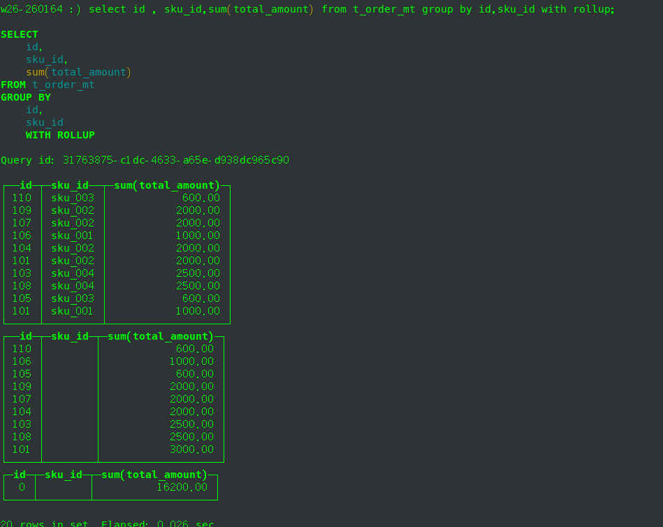

（3）with cube : 从右至左去掉维度进行小计，再从左至右去掉维度进行小计

```sql
hadoop102 :) select id , sku_id,sum(total_amount) from t_order_mt group by id,sku_id with cube;  
```

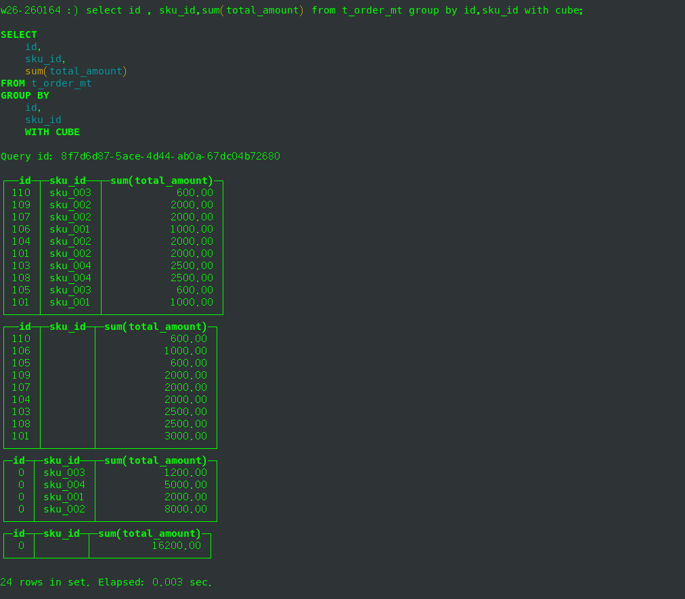

（4）with totals: 只计算合计

```sql
hadoop102 :) select id , sku_id,sum(total_amount) from t_order_mt group by id,sku_id with totals;
```

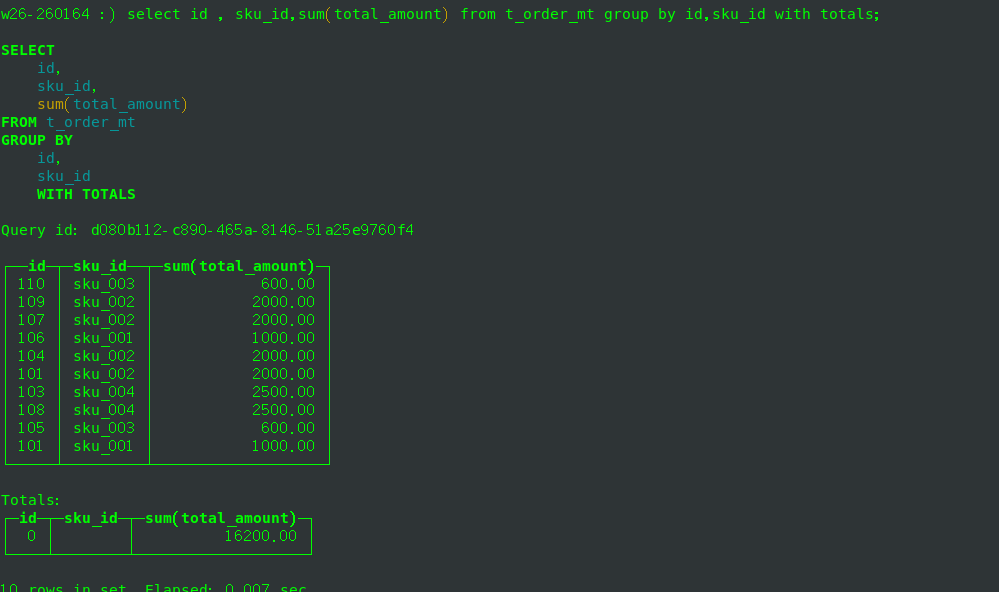

### 5.4 alter 操作

同 MySQL 的修改字段基本一致

1）新增字段

alter table tableName add column newcolname String after col1; 

2）修改字段类型

alter table tableName modify column newcolname String; 

3）删除字段

alter table tableName drop column newcolname; 

5.5 导出数据

```sql
clickhouse-client --query "select * from t_order_mt where create_time='2020-06-01 12:00:00'" --format CSVWithNames> /opt/module/data/rs1.csv
```

更多支持格式参照：  

https://clickhouse.tech/docs/en/interfaces/formats/

## 第 6 章 副本

副本的目的主要是保障数据的高可用性，即使一台 ClickHouse 节点宕机，那么也可以从其他服务器获得相同的数据。

https://clickhouse.tech/docs/en/engines/table-engines/mergetree-family/replication/

### 6.1 副本写入流程


### 6.2 配置步骤

（1）启动 zookeeper 集群

（2）在 hadoop102 的/etc/clickhouse-server/config.d 目录下创建一个名为 metrika.xml的配置文件,内容如下：

注：也可以不创建外部文件，直接在 config.xml 中指定<zookeeper>

```xml
<?xml version="1.0"?>
<yandex>
    <zookeeper-servers>
        <node index="1">
            <host>hadoop102</host>
            <port>2181</port>
        </node>
        <node index="2">
            <host>hadoop103</host>
            <port>2181</port>
        </node>
        <node index="3">
            <host>hadoop104</host>
            <port>2181</port>
        </node>
    </zookeeper-servers>
</yandex>
```

（3）同步到 hadoop103 和 hadoop104 上

```sh
sudo /home/atguigu/bin/xsync /etc/clickhouse-server/config.d/metrika.xml 
```

（4）在 hadoop102 的/etc/clickhouse-server/config.xml 中增加

```xml
<zookeeper incl="zookeeper-servers" optional="true" />
<include_from>/etc/clickhouse-server/config.d/metrika.xml</include_from>
```

（5）同步到 hadoop103 和 hadoop104 上

```xml
sudo /home/atguigu/bin/xsync /etc/clickhouse-server/config.xml
```

分别在 hadoop102 和 hadoop103 上启动 ClickHouse 服务

注意：因为修改了配置文件，如果以前启动了服务需要重启

```sh
[atguigu@hadoop102|3 ~]$ sudo clickhouse restart
```

注意：我们演示副本操作只需要在 hadoop102 和 hadoop103 两台服务器即可，上面的操作，我们 hadoop104 可以你不用同步，我们这里为了保证集群中资源的一致性，做了同步。

（6）在 hadoop102 和 hadoop103 上分别建表

副本只能同步数据，不能同步表结构，所以我们需要在每台机器上自己手动建表

①hadoop102

```sql
create table t_order_rep2 (
    id UInt32,
    sku_id String,
    total_amount Decimal(16,2),
    create_time Datetime
) engine=ReplicatedMergeTree('/clickhouse/table/01/t_order_rep','rep_102')
partition by toYYYYMMDD(create_time)
primary key (id)
order by (id,sku_id);
```

②hadoop103

```sql
create table t_order_rep2 (
    id UInt32,
    sku_id String,
    total_amount Decimal(16,2),
    create_time Datetime
) engine =ReplicatedMergeTree('/clickhouse/table/01/t_order_rep','rep_103')
 partition by toYYYYMMDD(create_time)
 primary key (id)
 order by (id,sku_id);
```

③参数解释

ReplicatedMergeTree 中，

第一个参数是分片的 zk_path 一般按照：/clickhouse/table/{shard}/{table_name} 的格式写，如果只有一个分片就写 01 即可。

第二个参数是副本名称，相同的分片副本名称不能相同。

（7）在 hadoop102 上执行 insert 语句

```sql
insert into t_order_rep2 values
(101,'sku_001',1000.00,'2020-06-01 12:00:00'),
(102,'sku_002',2000.00,'2020-06-01 12:00:00'),
(103,'sku_004',2500.00,'2020-06-01 12:00:00'),
(104,'sku_002',2000.00,'2020-06-01 12:00:00'),
(105,'sku_003',600.00,'2020-06-02 12:00:00'); 
```

（8）在 hadoop103 上执行 select，可以查询出结果，说明副本配置正确

## 第 7 章 分片集群

副本虽然能够提高数据的可用性，降低丢失风险，但是每台服务器实际上必须容纳全量数据，对数据的**横向扩容**没有解决。要解决数据水平切分的问题，需要引入分片的概念。通过分片把一份完整的数据进行切分，不同的分片分布到不同的节点上，再通过 Distributed 表引擎把数据拼接起来一同使用。

**Distributed 表**引擎本身不存储数据，有点类似于 MyCat 之于 MySql，成为一种中间件，通过分布式逻辑表来写入、分发、路由来操作多台节点不同分片的分布式数据。  

注意：ClickHouse 的集群是表级别的，实际企业中，大部分做了高可用，但是没有用分片，避免降低查询性能以及操作集群的复杂性。

### 7.1 集群写入流程（3 分片 2 副本共 6 个节点）

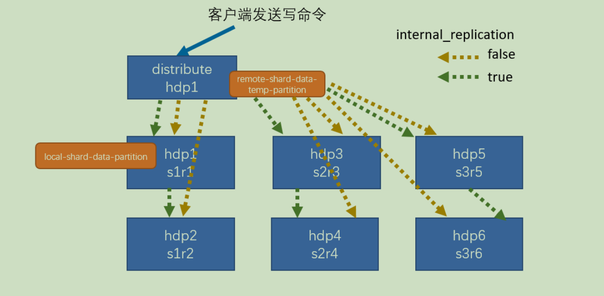

### 7.2 集群读取流程（3 分片 2 副本共 6 个节点）

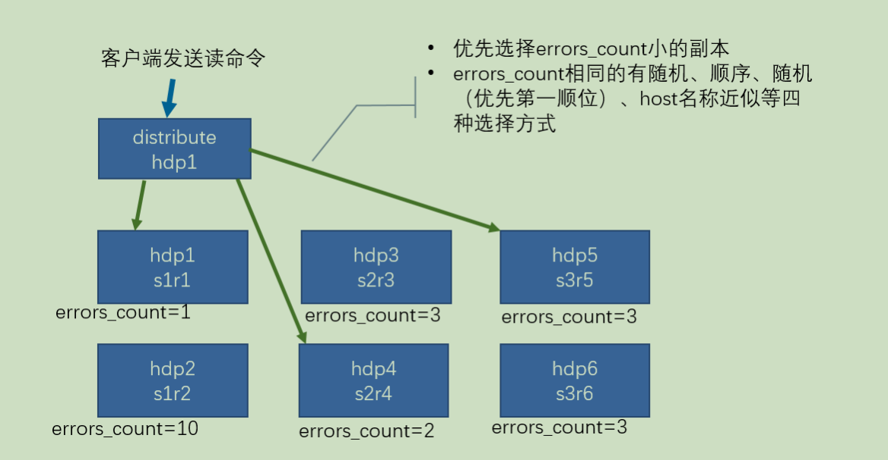

### 7.3 3 分片 2 副本共 6 个节点集群配置（供参考）

配置的位置还是在之前的/etc/clickhouse-server/config.d/metrika.xml，内容如下  

注：也可以不创建外部文件，直接在 config.xml 的<remote_servers>中指定

```xml
<yandex>
    <remote_servers>
        <gmall_cluster> <!-- 集群名称--> 
            <shard> <!--集群的第一个分片-->
                <internal_replication>true</internal_replication>
                <!--该分片的第一个副本-->
                <replica> 
                    <host>hadoop101</host>
                    <port>9000</port>
                </replica>
                <!--该分片的第二个副本-->
                <replica> 
                    <host>hadoop102</host>
                    <port>9000</port>
                </replica>
            </shard>
            <shard> <!--集群的第二个分片-->
                <internal_replication>true</internal_replication>
                <replica> <!--该分片的第一个副本-->
                    <host>hadoop103</host>
                    <port>9000</port>
                </replica>
                <replica> <!--该分片的第二个副本-->
                    <host>hadoop104</host>
                    <port>9000</port>
                </replica>
            </shard>
            <shard> <!--集群的第三个分片-->
                <internal_replication>true</internal_replication>
                <replica> <!--该分片的第一个副本-->
                    <host>hadoop105</host>
                    <port>9000</port>
                </replica>
                <replica> <!--该分片的第二个副本-->
                    <host>hadoop106</host>
                    <port>9000</port>
                </replica>
            </shard>
        </gmall_cluster>
    </remote_servers>
</yandex>  
```

### 7.4 配置三节点版本集群及副本

#### 7.4.1 集群及副本规划（2 个分片，只有第一个分片有副本）

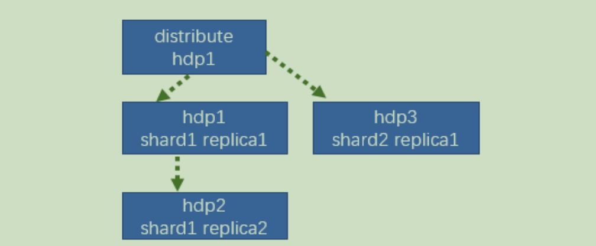

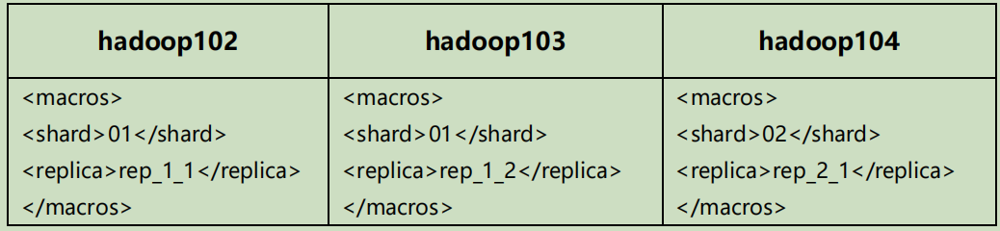

#### 7.4.2 配置步骤

1）在 hadoop102 的/etc/clickhouse-server/config.d 目录下创建 metrika-shard.xml 文件

注：也可以不创建外部文件，直接在 config.xml 的<remote_servers>中指定

```xml
<?xml version="1.0"?>
<yandex>
    <remote_servers>
        <gmall_cluster> <!-- 集群名称--> 
            <shard> <!--集群的第一个分片--> 
                <internal_replication>true</internal_replication>
                <replica> <!--该分片的第一个副本-->
                    <host>hadoop102</host>
                    <port>9000</port>
                </replica>
                <replica> <!--该分片的第二个副本-->
                    <host>hadoop103</host>
                    <port>9000</port>
                </replica>
            </shard>
            <shard> <!--集群的第二个分片-->
                <internal_replication>true</internal_replication>
                <replica> <!--该分片的第一个副本-->
                    <host>hadoop104</host>
                    <port>9000</port>
                </replica>
            </shard>  
        </gmall_cluster>
    </remote_servers>
    <zookeeper-servers>
        <node index="1">
            <host>hadoop102</host>
            <port>2181</port>
        </node>
        <node index="2">
            <host>hadoop103</host>
            <port>2181</port>
        </node>
        <node index="3">
            <host>hadoop104</host>
            <port>2181</port>
        </node>
    </zookeeper-servers>
    <macros>
        <shard>01</shard> <!--不同机器放的分片数不一样-->
        <replica>rep_1_1</replica> <!--不同机器放的副本数不一样-->
    </macros>
</yandex>
```

2）将 hadoop102 的 metrika-shard.xml 同步到 103 和 104

```xml
sudo /home/atguigu/bin/xsync /etc/clickhouse-server/config.d/metrika-shard.xml
```

3）修改 103 和 104 中 metrika-shard.xml 宏的配置

（1）103

```sh
[atguigu@hadoop103 ~]$ sudo vim /etc/clickhouse-server/config.d/metrika-shard.xml
```


（2）104

```xml
[atguigu@hadoop104 ~]$ sudo vim /etc/clickhouse-server/config.d/metrika-shard.xml
```


4）在 hadoop102 上修改/etc/clickhouse-server/config.xml

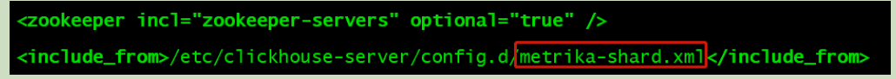

5）同步/etc/clickhouse-server/config.xml 到 103 和 104

```sh
[atguigu@hadoop102 ~]$ sudo /home/atguigu/bin/xsync /etc/clickhouse-server/config.xml  
```

6）重启三台服务器上的 ClickHouse 服务

```sh
[atguigu@hadoop102 clickhouse-server]$ sudo clickhouse restart
[atguigu@hadoop102 clickhouse-server]$ ps -ef |grep click
```

7）在 hadoop102 上执行建表语句

➢ 会自动同步到 hadoop103 和 hadoop104 上 

➢ 集群名字要和配置文件中的一致

➢ 分片和副本名称从配置文件的宏定义中获取

```sql
create table st_order_mt on cluster gmall_cluster (
    id UInt32,
    sku_id String,
    total_amount Decimal(16,2),
    create_time Datetime
) engine =ReplicatedMergeTree('/clickhouse/tables/{shard}/st_order_mt','{replica}')
 partition by toYYYYMMDD(create_time)
 primary key (id)
 order by (id,sku_id);
```

可以到 hadoop103 和 hadoop104 上查看表是否创建成功

 8）在 hadoop102 上创建 Distribute 分布式表

```sql
create table st_order_mt_all2 on cluster gmall_cluster(

 id UInt32,  

 sku_id String,

 total_amount Decimal(16,2),

 create_time Datetime

)engine = Distributed(gmall_cluster,default, st_order_mt,hiveHash(sku_id));
```

参数含义：

Distributed（集群名称，库名，本地表名，分片键）分片键必须是整型数字，所以用 hiveHash 函数转换，也可以 rand()

9）在 hadoop102 上插入测试数据

```sql
insert into st_order_mt_all2 values
(201,'sku_001',1000.00,'2020-06-01 12:00:00') ,
(202,'sku_002',2000.00,'2020-06-01 12:00:00'),
(203,'sku_004',2500.00,'2020-06-01 12:00:00'),
(204,'sku_002',2000.00,'2020-06-01 12:00:00'),
(205,'sku_003',600.00,'2020-06-02 12:00:00'); 
```

10）通过查询分布式表和本地表观察输出结果

（1）分布式表

```sql
SELECT * FROM st_order_mt_all; 
```

（2）本地表

```sql
select * from st_order_mt;
```

（3）观察数据的分布

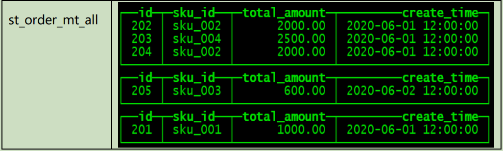

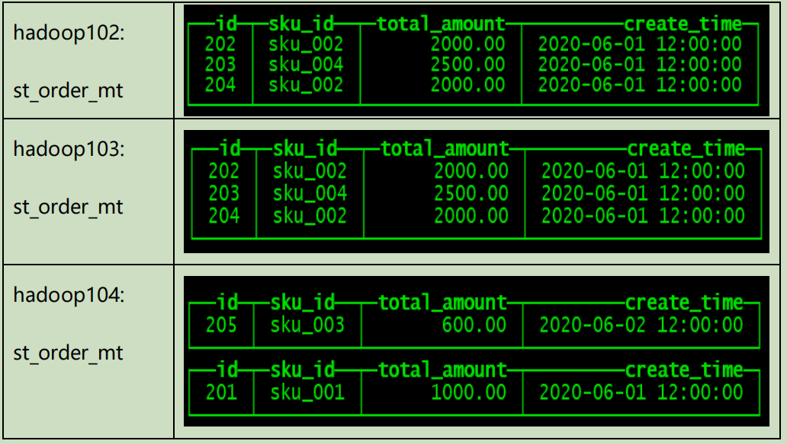

### 7.5 项目为了节省资源，就使用单节点，不用集群

不需要求改文件引用，因为已经使用集群建表了，如果改为引用 metrika-shard.xml 的话，

启动会报错。我们以后用的时候只启动 102 即可。