  (作者：尚硅谷大数据研究院)

版本：V1.0 

## 第 1 章 ClickHouse 监控概述

ClickHouse 运行时会将一些个自身的运行状态记录到众多系统表中( system.)。所以我们对于 CH 自身的一些运行指标的监控数据，也主要来自这些系统表。

但是直接查询这些系统表会有一些不足之处：

➢ 这种方式太过底层，不够直观，我们还需要在此之上实现可视化展示； 

➢ 系统表只记录了 CH 自己的运行指标，有些时候我们需要外部系统的指标进行关联分析，例如 ZooKeeper、服务器 CPU、IO 等等。

现在 **Prometheus + Grafana** 的组合比较流行，安装简单易上手，可以集成很多框架，包括服务器的负载, 其中 Prometheus 负责收集各类系统的运行指标; Grafana 负责可视化的部分。

ClickHouse 从 v20.1.2.4 开始，内置了对接 Prometheus 的功能，配置的方式也很简单,可以将其作为 Prometheus 的 Endpoint 服务，从而自动的将 metrics 、 events 和asynchronous_metrics 三张系统的表的数据发送给 Prometheus。 

## 第 2 章 Prometheus&Grafana 的安装

Prometheus 下载地址：https://prometheus.io/download/

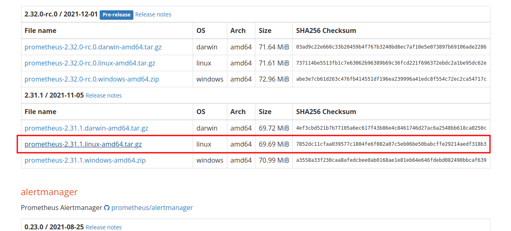

```sh
gree@W26-260164:~/下载$ tar -zxvf prometheus-2.31.1.linux-amd64.tar.gz -C /home/gree/software/
prometheus-2.31.1.linux-amd64/
prometheus-2.31.1.linux-amd64/consoles/
prometheus-2.31.1.linux-amd64/consoles/index.html.example
prometheus-2.31.1.linux-amd64/consoles/node-cpu.html
prometheus-2.31.1.linux-amd64/consoles/node-disk.html
prometheus-2.31.1.linux-amd64/consoles/node-overview.html
prometheus-2.31.1.linux-amd64/consoles/node.html
prometheus-2.31.1.linux-amd64/consoles/prometheus-overview.html
prometheus-2.31.1.linux-amd64/consoles/prometheus.html
prometheus-2.31.1.linux-amd64/console_libraries/
prometheus-2.31.1.linux-amd64/console_libraries/menu.lib
prometheus-2.31.1.linux-amd64/console_libraries/prom.lib
prometheus-2.31.1.linux-amd64/prometheus.yml
prometheus-2.31.1.linux-amd64/LICENSE
prometheus-2.31.1.linux-amd64/NOTICE
prometheus-2.31.1.linux-amd64/prometheus
prometheus-2.31.1.linux-amd64/promtool
```


Grafana 下载地址：https://grafana.com/grafana/download

### 2.1 安装 Prometheus

Prometheus 基于 Golang 编写，编译后的软件包，不依赖于任何的第三方依赖。只需下载对应平台的二进制包，解压并且添加基本的配置即可正常启动 Prometheus Server。  

####  2.1.1 上传安装包

上传 prometheus-2.26.0.linux-amd64.tar.gz 到虚拟机的/opt/software 目录

#### 2.1.2 解压安装包

（1）解压到/opt/module 目录下

```sh
[atguigu@hadoop1 software]$ tar -zxvf prometheus-2.26.0.linux-amd64.tar.gz -C /opt/module
```

（2）修改目录名

```sh
[atguigu@hadoop1 ~] cd /opt/module
[atguigu@hadoop1 module] mv prometheus-2.26.0.linux-amd64 prometheus-2.26.0
```

#### 2.1.3 修改配置文件 prometheus.yml

```sh
[atguigu@hadoop1 prometheus-2.26.0]$ vim prometheus.yml
```

在 scrape_configs 配置项下添加配置：

```sh
scrape_configs: 
 - job_name: 'prometheus'
 static_configs:
 - targets: ['hadoop1:9090']

#添加 ClickHouse 监控配置
 - job_name: clickhouse-1
  static_configs:
   - targets: ['hadoop1:9363']
```

配置说明：

1、global 配置块：控制 Prometheus 服务器的全局配置

​	➢ scrape_interval：配置拉取数据的时间间隔，默认为 1 分钟。

​	➢ evaluation_interval：规则验证（生成 alert）的时间间隔，默认为 1 分钟。

2、rule_files 配置块：规则配置文件

3、scrape_configs 配置块：配置采集目标相关， prometheus 监视的目标。Prometheus 自身的运行信息可以通过 HTTP 访问，所以 Prometheus 可以监控自己的运行数据。

➢ job_name：监控作业的名称

➢ static_configs：表示静态目标配置，就是固定从某个 target 拉取数据

➢ targets ： 指 定 监 控 的 目 标 ， 其 实 就 是 从 哪 儿 拉 取 数 据 。 Prometheus 会 从http://hadoop1:9090/metrics 上拉取数据。

Prometheus 是可以在运行时自动加载配置的。启动时需要添加：--web.enable-lifecycle

#### 3.1.4 启动 Prometheus Server

```sh
[atguigu@hadoop1 prometheus-2.26.0]$ nohup ./prometheus   --config.file=prometheus.yml > ./prometheus.log 2>&1 &
```

➢ 浏览器输入：http://hadoop1:9090/

➢ 点击 Status，选中 Targets： 

prometheus 是 up 状态，表示安装启动成功：

### 2.2 Grafana 安装

### 2.2.1 上传并解压

（1）将 grafana-7.5.2.linux-amd64.tar.gz 上传至/opt/software/目录下，解压：

```sh
[atguigu@hadoop1 software]$ tar -zxvf grafana-7.5.2.linux-amd64.tar.gz -C /opt/module/
```

（2）更改名字：

```sh
[atguigu@hadoop1 module]$ mv grafana-7.5.2.linux-amd64 grafana-7.5.2
```

#### 2.2.2 启动 Grafana

```sh
[atguigu@hadoop1 grafana-7.5.2]$ nohup ./bin/grafana-server web > ./grafana.log 2>&1 &
```

打开 web：http://hadoop1:3000,默认用户名和密码：admin

## 第 3 章 ClickHouse 配置

### 3.1 修改配置文件

编辑/etc/clickhouse-server/config.xml，打开如下配置：

```xml
 <prometheus>
     <endpoint>/metrics</endpoint>
     <port>9363</port>
     <metrics>true</metrics>
     <events>true</events>
     <asynchronous_metrics>true</asynchronous_metrics>
     <status_info>true</status_info>
</prometheus>
```

如果有多个 CH 节点，分发配置。  

###  3.2 重启 ClickHouse

sudo clickhouse restart

Float64 – double

建议尽可能以整数形式存储数据。例如，将固定精度的数字转换为整数值，如时间用毫秒为单位表示，因为浮点型进行计算时可能引起四舍五入的误差。

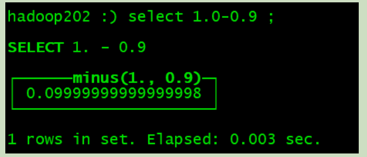

使用场景：一般数据值比较小，不涉及大量的统计计算，精度要求不高的时候。比如保存商品的重量。

### 3.3 访问 Web 查看

浏览器打开: http://hadoop1:9363/metrics

看到信息说明 ClickHouse 开启 Metrics 服务成功。

## 第 4 章 Grafana 集成 Prometheus

4.1 添加数据源 Prometheus

（1）点击配置，点击 Data Sources：  

 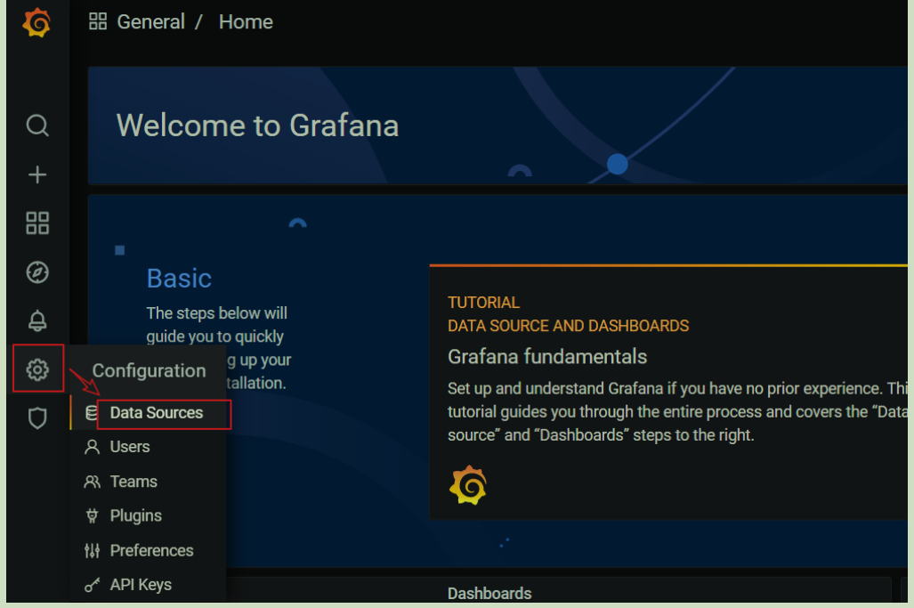


（2）点击添加按钮：

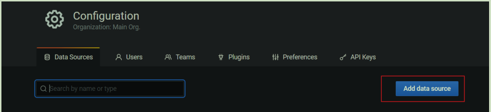

（3）找到 Prometheus，点击 Select

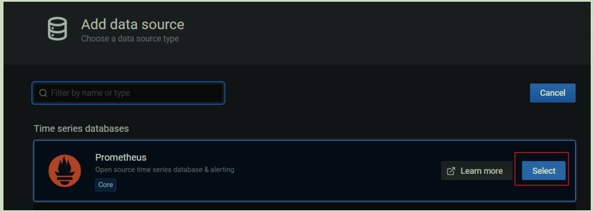

（4）配置 Prometheus Server 地址：  

 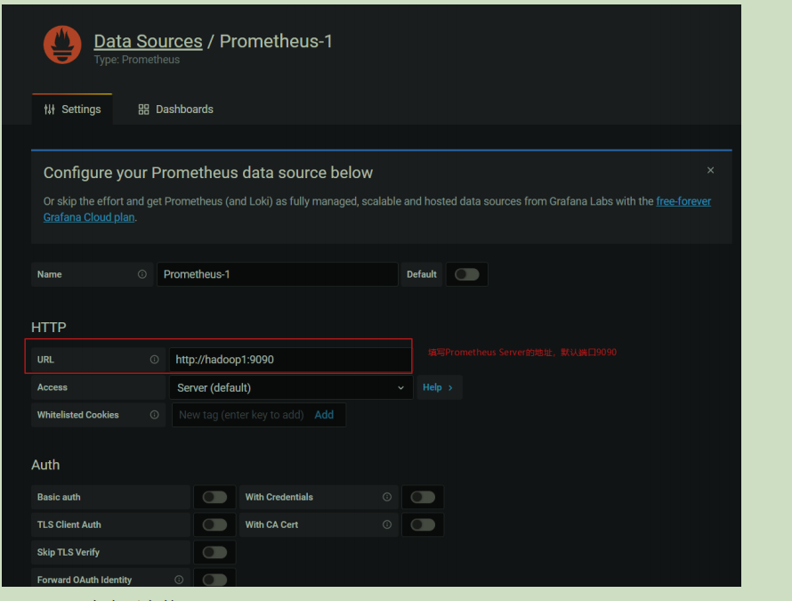


（5）点击下方的 Save&Test： 

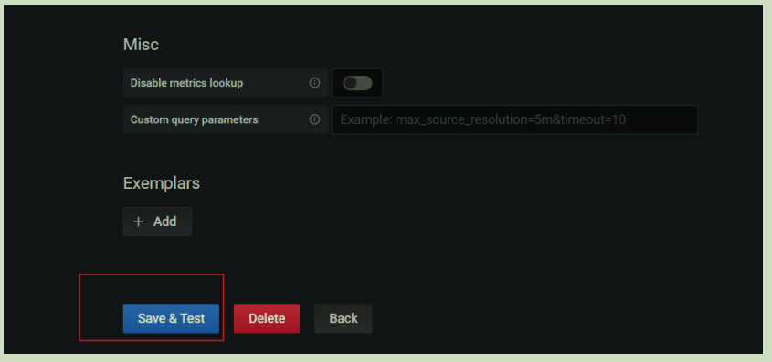

（6）出现绿色的提示框，表示与 Prometheus 正常联通：  

 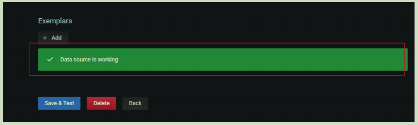


（7）点击 Back 返回即可，可以看到 Data Sources 页面，出现了添加的 Prometheus:

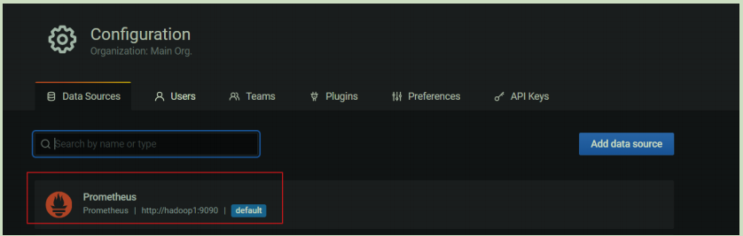

### 4.2 添加监控

手动一个个添加 Dashboard 比较繁琐，Grafana 社区鼓励用户分享 Dashboard，通过https://grafana.com/dashboards 网站，可以找到大量可直接使用的 Dashboard 模板。

Grafana 中所有的 Dashboard 通过 JSON 进行共享，下载并且导入这些 JSON 文件，就可以直接使用这些已经定义好的 Dashboard。 

（1）点击左侧 ”+”号，选择 import：  

 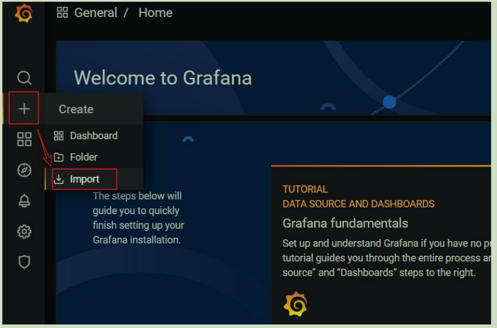

（2）上传 JSON 文件：

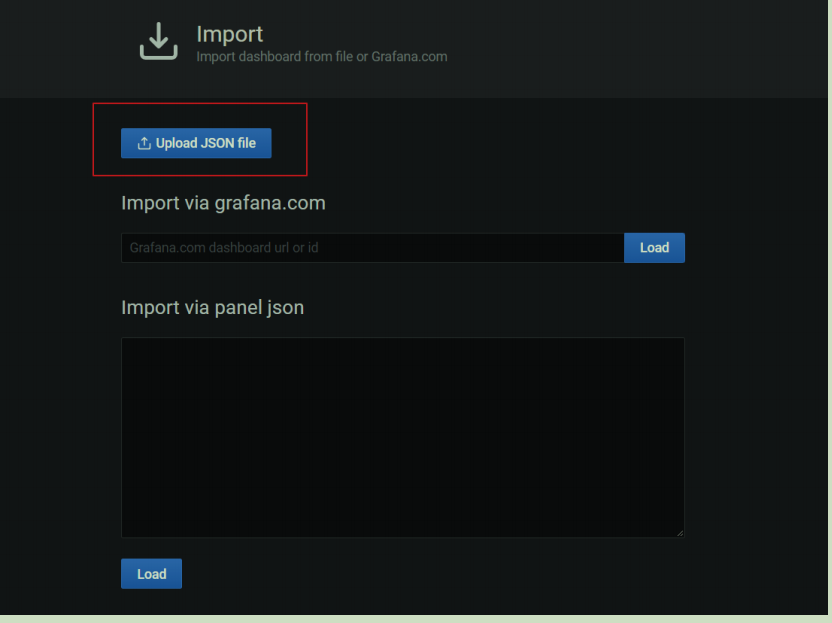

## 第 5 章 备份及恢复

官网：https://clickhouse.tech/docs/en/operations/backup/  

###  5.1 手动实现备份及恢复

ClickHouse 允许使用 ALTER TABLE ... FREEZE PARTITION ... 查询以创建表分区的本地副本。这是利用硬链接(hardlink)到 /var/lib/clickhouse/shadow/ 文件夹中实现的，所以它通常不会因为旧数据而占用额外的磁盘空间。 创建的文件副本不由 ClickHouse 服务器处理，所以不需要任何额外的外部系统就有一个简单的备份。防止硬件问题，最好将它们远程复制到另一个位置，然后删除本地副本。

#### 5.1.1 创建备份路径

（1）创建用于存放备份数据的目录 shadow

```sh
sudo mkdir -p /var/lib/clickhouse/shadow/
```

如果目录存在，先清空目录下的数据

#### 5.1.2 执行备份命令

```sh
echo -n 'alter table t_order_mt freeze' | clickhouse-client
```

#### 5.1.3 将备份数据保存到其他路径

```sh
#创建备份存储路径
sudo mkdir -p /var/lib/clickhouse/backup/ 
#拷贝数据到备份路径
sudo cp -r /var/lib/clickhouse/shadow/ /var/lib/clickhouse/backup/my-backup-name
#为下次备份准备，删除 shadow 下的数据
sudo rm -rf /var/lib/clickhouse/shadow/
```

#### 5.1.4 恢复数据

（1）模拟删除备份过的表

```sh
echo ' drop table t_order_mt ' | clickhouse-client
```

（2）重新创建表

```sh
cat events.sql | clickhouse-client
```

（3）将备份复制到 detached 目录

```sh
sudo cp -rl

backup/my-backup-name/1/store/cb1/cb176503-cd88-4ea8-8b17-6503cd888ea8/ 

data/default/t_order_mt/detached/
```

ClickHouse 使用文件系统硬链接来实现即时备份，而不会导致 ClickHouse 服务停机（或锁定）。这些硬链接可以进一步用于有效的备份存储。在支持硬链接的文件系统（例如本地文件系统或 NFS）上，将 cp 与-l 标志一起使用（或将 rsync 与–hard-links 和–numeric-ids 标志一起使用）以避免复制数据。  

 注意：仅拷贝分区目录，注意目录所属的用户要是 clickhouse

（4）执行 attach

```sh
echo 'alter table t_order_mt attach partition 20200601' | clickhouse-client
```

（5）查看数据

```sh
echo 'select count() from t_order_mt' | clickhouse-client
```

### 5.2 使用 clickhouse-backup

上面的过程，我们可以使用 Clickhouse 的备份工具 clickhouse-backup 帮我们自动化实现。

工具地址：https://github.com/AlexAkulov/clickhouse-backup/

#### 5.2.1 上传并安装

将 clickhouse-backup-1.0.0-1.x86_64.rpm 上传至/opt/software/目录下，安装：

```sh
[atguigu@hadoop1 software]$ sudo rpm -ivh clickhouse-backup-1.0.0-1.x86_64.rpm
```

#### 5.2.2 配置文件

```sh
[atguigu@hadoop1 ~]$ cat /etc/clickhouse-backup/config.yml
```

#### 5.2.3 创建备份

（1）查看可用命令

```sh
[atguigu@hadoop1 ~]$ clickhouse-backup help
```

（2）显示要备份的表

```sh
[atguigu@hadoop1 ~]$ clickhouse-backup tables
```

（3）创建备份

```sh
[atguigu@hadoop1 ~]$ sudo clickhouse-backup create
```

（4）查看现有的本地备份

```sh
[atguigu@hadoop1 ~]$ sudo clickhouse-backup list
```

备份存储在中/var/lib/clickhouse/backup/BACKUPNAME。备份名称默认为时间戳，但是可以选择使用–name 标志指定备份名称。备份包含两个目录：一个“metadata”目录，其中包含重新创建架构所需的 DDL SQL 语句；以及一个“shadow”目录，其中包含作为 ALTER TABLE ... FREEZE 操作结果的数据。

#### 5.2.4 从备份恢复数据

（1）模拟删除备份过的表

```sh
echo 'drop table t_order_rmt' | clickhouse-client
```

（2）从备份还原

```sh
sudo clickhouse-backup restore 2021-07-25T23-14-50
```

--schema 参数：只还原表结构。  

 --data 参数：只还原数据。

--table 参数：备份（或还原）特定表。也可以使用一个正则表达式，例如，针对特定的数据库：--table=dbname.。 

#### 5.2.5 其他说明

（1）API 文档：https : //github.com/AlexAkulov/clickhouse-backup#api

（2）注意事项：切勿更改文件夹/var/lib/clickhouse/backup 的权限，可能会导致数据损坏。

（3）远程备份

➢ 较新版本才支持，需要设置 config 里的 s3 相关配置

➢ 上传到远程存储：sudo clickhouse-backup upload xxxx

➢ 从远程存储下载：sudo clickhouse-backup download xxxx

➢ 保存周期： backups_to_keep_local，本地保存周期，单位天

​						backups_to_keep_remote，远程存储保存周期，单位天

​						0 均表示不删除