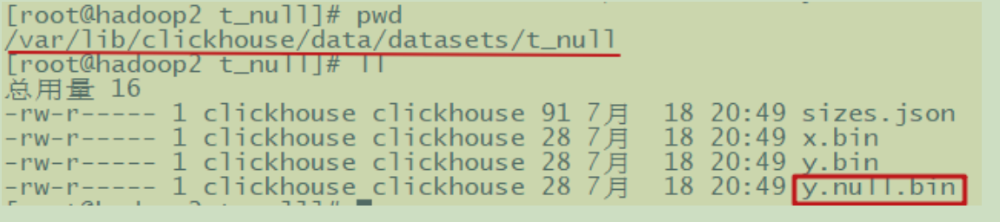
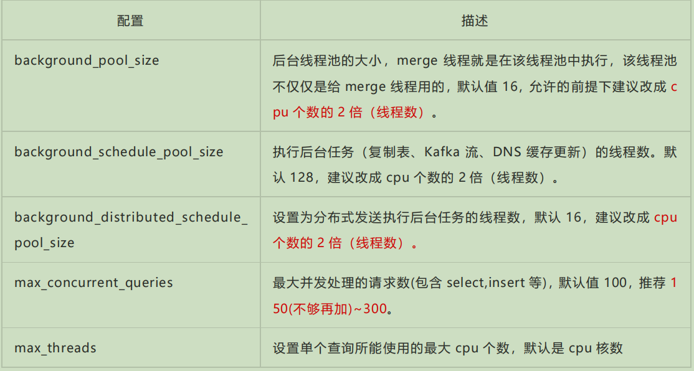
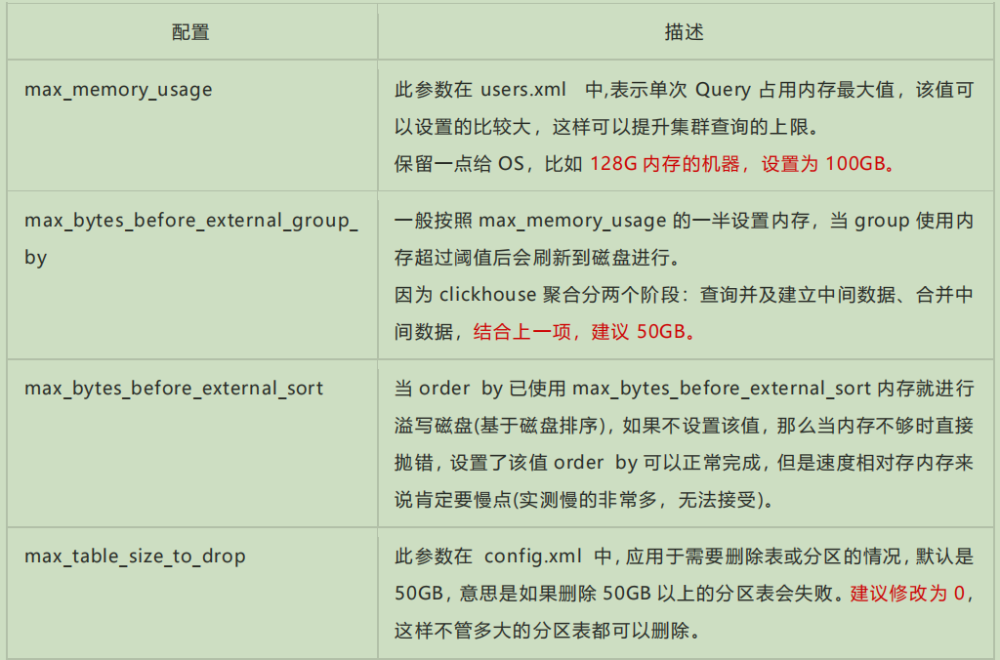
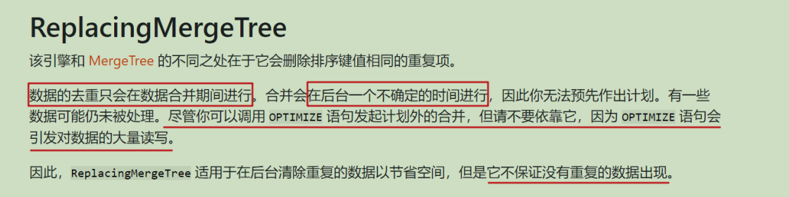

（作者：尚硅谷研究院） 

V1.0

## 第1章 Explain查看执行计划

在 clickhouse 20.6 版本之前要查看 SQL 语句的执行计划需要设置日志级别为 trace 才能可以看到，并且只能真正执行 sql，在执行日志里面查看。在 20.6 版本引入了原生的执行计划的语法。在 20.6.3 版本成为正式版本的功能。

本文档基于目前较新稳定版21.7.3.14。

### 1.1基本语法

```sql
EXPLAIN [AST | SYNTAX | PLAN | PIPELINE] [setting = value, ...] SELECT ... [FORMAT ...]
```

➢ PLAN：用于查看执行计划，默认值。

​	◼ header 打印计划中各个步骤的 head 说明，默认关闭，默认值 0;

​	◼ description 打印计划中各个步骤的描述，默认开启，默认值 1； 

​	◼ actions 打印计划中各个步骤的详细信息，默认关闭，默认值 0。 

➢ AST ：用于查看语法树; 

➢ SYNTAX：用于优化语法; 

➢ PIPELINE：用于查看 PIPELINE 计划。 

​	◼ header 打印计划中各个步骤的 head 说明，默认关闭; 

​	◼ graph 用 DOT 图形语言描述管道图，默认关闭，需要查看相关的图形需要配合graphviz 查看；

​	◼ actions 如果开启了 graph，紧凑打印打，默认开启。

注：PLAN 和 PIPELINE 还可以进行额外的显示设置，如上参数所示。

### 1.2案例实操

#### 1.2.1新版本使用EXPLAIN

可以再安装一个 20.6 以上版本，或者直接在官网的在线 demo，选择高版本进行测试。

官网在线测试链接：https://play.clickhouse.tech/?file=welcome

1）查看 PLAIN

简单查询

```sql
explain plan select arrayJoin([1,2,3,null,null]);
```

复杂 SQL 的执行计划

```sql
explain select database,table,count(1) cnt from system.parts where database in ('datasets','system') group by database,table order by database,cnt desc limit 2 by database;
```

打开全部的参数的执行计划

```sql
EXPLAIN header=1, actions=1,description=1 SELECT number from system.numbers limit 10;
```

2）AST 语法树

```sql
EXPLAIN AST SELECT number from system.numbers limit 10;
```

3）SYNTAX 语法优化

//先做一次查询

```sql
SELECT number = 1 ? 'hello' : (number = 2 ? 'world' : 'atguigu') FROM numbers(10);
```

//查看语法优化

```sql
EXPLAIN SYNTAX SELECT number = 1 ? 'hello' : (number = 2 ? 'world' : 'atguigu') FROM numbers(10);
```

//开启三元运算符优化

```sql
SET optimize_if_chain_to_multiif = 1;
```

//再次查看语法优化

```sql
EXPLAIN SYNTAX SELECT number = 1 ? 'hello' : (number = 2 ? 'world' : 'atguigu') FROM numbers(10);
```

//返回优化后的语句

```sql
SELECT multiIf(number = 1, \'hello\', number = 2, \'world\', \'xyz\') FROM numbers(10)
```

4）查看 PIPELINE

```sql
EXPLAIN PIPELINE SELECT sum(number) FROM numbers_mt(100000) GROUP BY number % 20; 
```

//打开其他参数

```sql
EXPLAIN PIPELINE header=1,graph=1 SELECT sum(number) FROM numbers_mt(10000) GROUP BY number%20; 
```

#### 1.2.2老版本查看执行计划

**clickhouse-client -h 主机名 --send_logs_level=trace <<< "sql" > /dev/null**

其中，send_logs_level 参数指定日志等级为 trace，<<<将 SQL 语句重定向至 clickhouse-client 进行查询，> /dev/null 将查询结果重定向到空设备吞掉，以便观察日志。

**注意：**

1、通过将 ClickHouse 的服务日志，设置到 DEBUG 或者 TRACE 级别，才可以变相实现EXPLAIN 查询的作用。

2、需要真正的执行 SQL 查询，CH 才能打印计划日志，所以如果表的数据量很大，最好借助 LIMIT 子句，减小查询返回的数据量。

## 第2章 建表优化

### 2.1数据类型

#### 2.1.1时间字段的类型

建表时能用数值型或日期时间型表示的字段就不要用字符串，全 String 类型在以 Hive为中心的数仓建设中常见，但 ClickHouse 环境不应受此影响。虽然 ClickHouse 底层将 DateTime 存储为时间戳 Long 类型，但不建议存储 Long 类型，因为 **DateTime 不需要经过函数转换处理**，执行效率高、可读性好。

```sql
create table t_type2(
    id UInt32,
    sku_id String,
    total_amount Decimal(16,2) ,
    create_time Int32 
) engine =ReplacingMergeTree(create_time)
 partition by toYYYYMMDD(toDate(create_time)) –-需要转换一次，否则报错
 primary key (id)
 order by (id, sku_id);
```

#### 2.1.2空值存储类型

官方已经指出Nullable类型几乎总是会拖累性能，因为存储 Nullable 列时需要创建一个额外的文件来存储 NULL 的标记，并且 Nullable 列无法被索引。因此除非极特殊情况，应直接使用字段默认值表示空，或者自行指定一个在业务中无意义的值（例如用-1 表示没有商品ID）。

```sql
CREATE TABLE t_null(x Int8, y Nullable(Int8)) ENGINE TinyLog;

INSERT INTO t_null VALUES (1, NULL), (2, 3);

SELECT x + y FROM t_null;
```

查看存储的文件：（没有权限就用 root 用户）



官网说明：https://clickhouse.tech/docs/zh/sql-reference/data-types/nullable/

### 2.2分区和索引

分区粒度根据业务特点决定，不宜过粗或过细。一般选择**按天分区**，也可以指定为 Tuple()，以单表一亿数据为例，分区大小控制在 10-30 个为最佳。

**必须指定索引列**，ClickHouse 中的索引列即排序列，通过 order by 指定，一般在查询条件中经常被用来充当筛选条件的属性被纳入进来；可以是单一维度，也可以是组合维度的索引；通常需要满足高级列在前、查询频率大的在前原则；还有基数特别大的不适合做索引列，如用户表的 userid 字段；通常筛选后的数据满足在百万以内为最佳。

比如官方案例的 hits_v1 表：

```sql
……
PARTITION BY toYYYYMM(EventDate)
ORDER BY (CounterID, EventDate, intHash32(UserID))
……
```

visits_v1 表：

```sql
……
PARTITION BY toYYYYMM(StartDate)
ORDER BY (CounterID, StartDate, intHash32(UserID), VisitID)
……
```

### 2.3 表参数

Index_granularity 是用来控制索引粒度的，默认是 8192，如非必须不建议调整。

如果表中不是必须保留全量历史数据，建议指定 TTL（生存时间值），可以免去手动过期历史数据的麻烦，TTL 也可以通过 alter table 语句随时修改。

（参考基础文档 4.4.5 数据 TTL） 

### 2.4 写入和删除优化

（1）尽量不要执行单条或小批量删除和插入操作，这样会产生小分区文件，给后台Merge 任务带来巨大压力

（2）不要一次写入太多分区，或数据写入太快，数据写入太快会导致 Merge 速度跟不上而报错，一般建议每秒钟发起 2-3 次写入操作，每次操作写入 2w~5w 条数据（依服务器性能而定）

写入过快报错，报错信息：

```sql
1. Code: 252, e.displayText() = DB::Exception: Too many parts(304). 
Merges are processing significantly slower than inserts

2. Code: 241, e.displayText() = DB::Exception: Memory limit (for query) 
exceeded:would use 9.37 GiB (attempt to allocate chunk of 301989888 bytes), maximum: 9.31 GiB
```

处理方式：

“ Too many parts 处理 ” ：使用 WAL 预写日志，提高写入性能。in_memory_parts_enable_wal 默认为 true

在服务器内存充裕的情况下增加内存配额，一般通过 max_memory_usage 来实现

在服务器内存不充裕的情况下，建议将超出部分内容分配到系统硬盘上，但会降低执行速度，一般通过 max_bytes_before_external_group_by、max_bytes_before_external_sort 参数来实现。 

### 2.5常见配置

配置项主要在 config.xml 或 users.xml 中， 基本上都在 users.xml 里 

➢ config.xml 的配置项

https://clickhouse.tech/docs/en/operations/server-configuration-parameters/settings/

➢ users.xml 的配置项

https://clickhouse.tech/docs/en/operations/settings/settings/

#### 2.5.1 CPU资源



#### 2.5.2内存资源



#### 2.5.3存储

ClickHouse 不支持设置多数据目录，为了提升数据 io 性能，可以挂载虚拟券组，一个券组绑定多块物理磁盘提升读写性能，多数据查询场景 SSD 会比普通机械硬盘快 2-3 倍。

## 第3章 ClickHouse语法优化规则

ClickHouse 的 SQL 优化规则是基于 RBO(Rule Based Optimization)，下面是一些优化规则

### 3.1准备测试用表

1）上传官方的数据集

将 visits_v1.tar 和 hits_v1.tar 上传到虚拟机，解压到 clickhouse 数据路径下

```sh
// 解压到 clickhouse 数据路径
sudo tar -xvf hits_v1.tar -C /var/lib/clickhouse
sudo tar -xvf visits_v1.tar -C /var/lib/clickhouse

//修改所属用户
sudo chown -R clickhouse:clickhouse /var/lib/clickhouse/data/datasets
sudo chown -R clickhouse:clickhouse /var/lib/clickhouse/metadata/datasets
```

2）重启clickhouse-server

sudo clickhouse restart

3）执行查询

clickhouse-client --query "SELECT COUNT() FROM datasets.hits_v1"

clickhouse-client --query "SELECT COUNT() FROM datasets.visits_v1"

注意：官方的 tar 包，包含了建库、建表语句、数据内容，这种方式不需要手动建库、建表，最方便。 

hits_v1 表有 130 多个字段，880 多万条数据

visits_v1 表有 180 多个字段，160 多万条数据

### 3.2 COUNT优化

在调用 count 函数时，如果使用的是 count() 或者 count(*)，且没有 where 条件，则会直接使用 system.tables 的 total_rows，例如:

```sql
EXPLAIN SELECT count()FROM datasets.hits_v1;
Union
	Expression (Projection)
    	Expression (Before ORDER BY and SELECT)
        	MergingAggregated
            	ReadNothing (Optimized trivial count)
```

注意 Optimized trivial count ，这是对 count 的优化。如果 count 具体的列字段，则不会使用此项优化：

```sh
EXPLAIN SELECT count(CounterID) FROM datasets.hits_v1;

Union
	Expression (Projection)
    	Expression (Before ORDER BY and SELECT)
        	Aggregating
            	Expression (Before GROUP BY)
                	ReadFromStorage (Read from MergeTree)
```

### 3.3 消除子查询重复字段

下面语句子查询中有两个重复的 id 字段，会被去重:

```sql
EXPLAIN SYNTAX SELECT a.UserID,b.VisitID,a.URL, b.UserID FROM hits_v1 AS a 
LEFT JOIN ( 
    SELECT  UserID,  UserID as HaHa,  VisitID  FROM visits_v1) AS b  USING (UserID) limit 3;

//返回优化语句：
SELECT  UserID, VisitID, URL, b.UserID FROM hits_v1 AS a
ALL LEFT JOIN (
 SELECT  UserID, VisitID FROM visits_v1) AS b USING (UserID) LIMIT 3
```

### 3.4谓词下推

当 group by 有 having 子句，但是没有 with cube、with rollup 或者 with totals 修饰的时候，having 过滤会下推到 where 提前过滤。例如下面的查询，HAVING name 变成了 WHERE name，在 group by 之前过滤：

```sql
EXPLAIN SYNTAX SELECT UserID FROM hits_v1 GROUP BY UserID HAVING UserID = '8585742290196126178';

//返回优化语句
SELECT UserID FROM hits_v1
WHERE UserID = \'8585742290196126178\'
GROUP BY UserID
```

子查询也支持谓词下推：

```sql
EXPLAIN SYNTAX SELECT FROM 
( SELECT UserID FROM visits_v1)WHERE UserID = '8585742290196126178'

//返回优化后的语句
SELECT UserID FROM 
( SELECT UserID FROM visits_v1 WHERE UserID = '8585742290196126178' )
WHERE UserID = '8585742290196126178'
```

再来一个复杂例子：

```sql
EXPLAIN SYNTAX SELECT  FROM ( SELECT * FROM 
                             (SELECT UserID  FROM visits_v1) 
 UNION ALL SELECT * FROM 
 ( SELECT  UserID  FROM visits_v1)
                            )
                            WHERE UserID = '8585742290196126178'

//返回优化后的语句
SELECT UserID FROM (SELECT UserID FROM 
 (
 SELECT UserID
 FROM visits_v1
 WHERE UserID = '8585742290196126178' )
 WHERE UserID = '8585742290196126178'
UNION ALL
 SELECT UserID FROM  (SELECT UserID FROM visits_v1
 WHERE UserID = '8585742290196126178')
 WHERE UserID = '8585742290196126178' 
)
WHERE UserID = '8585742290196126178'
```

### 3.5聚合计算外推

聚合函数内的计算，会外推，例如：

```sql
EXPLAIN SYNTAX SELECT sum(UserID *  2) FROM visits_v1

//返回优化后的语句
SELECT sum(UserID) * 2 FROM visits_v1
```

### 3.6聚合函数消除

如果对聚合键，也就是 group by key 使用 min、max、any 聚合函数，则将函数消除，

例如：

```sql
EXPLAIN SYNTAX
SELECT
 sum(UserID  2),
 max(VisitID),
 max(UserID)
FROM visits_v1
GROUP BY UserID
//返回优化后的语句
SELECT 
 sum(UserID)  2,
 max(VisitID),
 UserID
FROM visits_v1
GROUP BY UserID
```

### 3.7删除重复的order by key

例如下面的语句，重复的聚合键 id 字段会被去重:

```sql
EXPLAIN SYNTAX SELECT FROM visits_v1 ORDER BY
 UserID ASC,
 UserID ASC,
 VisitID ASC,
VisitID ASC

//返回优化后的语句：
select
……
FROM visits_v1
ORDER BY 
 UserID ASC,
VisitID ASC
```

### 3.8删除重复的limit by key

例如下面的语句，重复声明的 name 字段会被去重：

```sql
EXPLAIN SYNTAX
SELECT 
FROM visits_v1
LIMIT 3 BY
 VisitID,
 VisitID
LIMIT 10

//返回优化后的语句：
select
……
FROM visits_v1
LIMIT 3 BY VisitID
LIMIT 10
```

### 3.9删除重复的USING Key

例如下面的语句，重复的关联键 id 字段会被去重：

```sql
EXPLAIN SYNTAX
SELECT
a.UserID,
a.UserID,
 b.VisitID,
 a.URL,
 b.UserID
FROM hits_v1 AS a
LEFT JOIN visits_v1 AS b USING (UserID, UserID)

//返回优化后的语句：
SELECT 
 UserID,
 UserID,
 VisitID,
 URL,
 b.UserID
FROM hits_v1 AS a
ALL LEFT JOIN visits_v1 AS b USING (UserID)
```

### 3.10标量替换

如果子查询只返回一行数据，在被引用的时候用标量替换，例如下面语句中的

total_disk_usage 字段：

```sql
EXPLAIN SYNTAX
WITH 
 (
 SELECT sum(bytes)
 FROM system.parts
 WHERE active
 ) AS total_disk_usage
SELECT
 (sum(bytes) / total_disk_usage)  100 AS table_disk_usage,
 table
FROM system.parts
GROUP BY table
ORDER BY table_disk_usage DESC
LIMIT 10; 

//返回优化后的语句：

WITH CAST(0, \'UInt64\') AS total_disk_usage
SELECT 
 (sum(bytes) / total_disk_usage)  100 AS table_disk_usage,
 table
FROM system.parts
GROUP BY table
ORDER BY table_disk_usage DESC
LIMIT 10
```

### 3.11三元运算优化

如果开启了 optimize_if_chain_to_multiif 参数，三元运算符会被替换成 multiIf 函数，

例如：

```sql
EXPLAIN SYNTAX 
SELECT number = 1 ? 'hello' : (number = 2 ? 'world' : 'atguigu') 
FROM numbers(10) 
settings optimize_if_chain_to_multiif = 1; 
//返回优化后的语句：
SELECT multiIf(number = 1, \'hello\', number = 2, \'world\', \'atguigu\')
FROM numbers(10)
SETTINGS optimize_if_chain_to_multiif = 1
```

## 第4章 查询优化

## 4.1单表查询

### 4.1.1 Prewhere替代where

Prewhere 和 where 语句的作用相同，用来过滤数据。不同之处在于 prewhere 只支持*MergeTree 族系列引擎的表，首先会读取指定的列数据，来判断数据过滤，等待数据过滤之后再读取 select 声明的列字段来补全其余属性。

当查询列明显多于筛选列时使用 Prewhere 可十倍提升查询性能，Prewhere 会自动优化执行过滤阶段的数据读取方式，降低 io 操作。在某些场合下，prewhere 语句比 where 语句处理的数据量更少性能更高。

```sql
#关闭 where 自动转 prewhere(默认情况下， where 条件会自动优化成 prewhere)
set optimize_move_to_prewhere=0; 

# 使用 where
select WatchID, 
 JavaEnable, 
 Title, 
 GoodEvent, 
 EventTime, 
 EventDate, 
 CounterID, 
 ClientIP, 
 ClientIP6, 
 RegionID, 
 UserID, 
 CounterClass, 
 OS, 
 UserAgent, 
 URL, 
 Referer, 
 URLDomain, 
 RefererDomain, 
 Refresh,
 IsRobot, 
 RefererCategories, 
 URLCategories, 
 URLRegions, 
 RefererRegions, 
 ResolutionWidth, 
 ResolutionHeight,
 ResolutionDepth, 
 FlashMajor, 
 FlashMinor, 
 FlashMinor2
from datasets.hits_v1 where UserID='3198390223272470366';

# 使用 prewhere 关键字

select WatchID, 
 JavaEnable, 
 Title, 
 GoodEvent, 
 EventTime, 
 EventDate,
 CounterID, 
 ClientIP, 
 ClientIP6, 
 RegionID, 
 UserID, 
 CounterClass, 
 OS,
 UserAgent, 
 URL, 
 Referer, 
 URLDomain,
 RefererDomain, 
 Refresh, 
 IsRobot, 
 RefererCategories, 
 URLCategories, 
 URLRegions, 
 RefererRegions, 
 ResolutionWidth,
 ResolutionHeight,
 ResolutionDepth, 
 FlashMajor, 
 FlashMinor, 
 FlashMinor2
from datasets.hits_v1 prewhere UserID='3198390223272470366';
```

默认情况，我们肯定不会关闭 where 自动优化成 prewhere，但是某些场景即使开启优化，也不会自动转换成 prewhere，需要手动指定 prewhere： 

⚫ 使用常量表达式

⚫ 使用默认值为 alias 类型的字段

⚫ 包含了 arrayJOIN，globalIn，globalNotIn 或者 indexHint 的查询

⚫ select 查询的列字段和 where 的谓词相同

⚫ 使用了主键字段

#### 4.1.2数据采样

通过采样运算可极大提升数据分析的性能

```sql
SELECT Title,count(*) AS PageViews 
FROM hits_v1
SAMPLE 0.1 #代表采样 10%的数据,也可以是具体的条数
WHERE CounterID =57
GROUP BY Title
ORDER BY PageViews DESC LIMIT 1000
```

采样修饰符只有在 MergeTree engine 表中才有效，且在创建表时需要指定采样策略。

#### 4.1.3列裁剪与分区裁剪

数据量太大时应避免使用 select * 操作，查询的性能会与查询的字段大小和数量成线性相关，字段越少，消耗的 io 资源越少，性能就会越高。

反例：

```sql
select * from datasets.hits_v1;
```

正例：

```sql
select WatchID, 
 JavaEnable, 
 Title, 
 GoodEvent, 
 EventTime, 
 EventDate, 
 CounterID, 
 ClientIP, 
 ClientIP6, 
 RegionID, 
 UserID
from datasets.hits_v1;
```

分区裁剪就是只读取需要的分区，在过滤条件中指定。

```sql
select WatchID, 
 JavaEnable, 
 Title, 
 GoodEvent, 
 EventTime, 
 EventDate, 
 CounterID, 
 ClientIP, 
 ClientIP6, 
 RegionID, 
 UserID
from datasets.hits_v1
where EventDate='2014-03-23'; 
```

#### 4.1.4 orderby结合where、limit

千万以上数据集进行 order by 查询时需要搭配 where 条件和 limit 语句一起使用。

```sql
#正例：
SELECT UserID,Age FROM hits_v1 
WHERE CounterID=57
ORDER BY Age DESC LIMIT 1000

#反例：
SELECT UserID,Age FROM hits_v1 
ORDER BY Age DESC
```

#### 4.1.5避免构建虚拟列

如非必须，不要在结果集上构建虚拟列，虚拟列非常消耗资源浪费性能，可以考虑在前端进行处理，或者在表中构造实际字段进行额外存储。

反例：

```sql
SELECT Income,Age,Income/Age as IncRate FROM datasets.hits_v1;
```

正例：拿到 Income 和 Age 后，考虑在前端进行处理，或者在表中构造实际字段进行额外存储

```sql
SELECT Income,Age FROM datasets.hits_v1;
```

#### 4.1.6 uniqCombined替代distinct

性能可提升 10 倍以上，uniqCombined 底层采用类似 HyperLogLog 算法实现，能接收 2%左右的数据误差，可直接使用这种去重方式提升查询性能。Count(distinct )会使用 uniqExact精确去重。

不建议在千万级不同数据上执行 distinct 去重查询，改为近似去重 uniqCombined

```sh
反例：
select count(distinct rand()) from hits_v1;
正例：
SELECT uniqCombined(rand()) from datasets.hits_v1
```

#### 4.1.7使用物化视图

参考第 6 章。 

#### 4.1.8其他注意事项

（1）查询熔断

为了避免因个别慢查询引起的服务雪崩的问题，除了可以为单个查询设置超时以外，还可以配置周期熔断，在一个查询周期内，如果用户频繁进行慢查询操作超出规定阈值后将无法继续进行查询操作。

（2）关闭虚拟内存

物理内存和虚拟内存的数据交换，会导致查询变慢，资源允许的情况下关闭虚拟内存。 

（3）配置join_use_nulls

为每一个账户添加 join_use_nulls 配置，左表中的一条记录在右表中不存在，右表的相应字段会返回该字段相应数据类型的默认值，而不是标准 SQL 中的 Null 值。

（4）批量写入时先排序

批量写入数据时，必须控制每个批次的数据中涉及到的分区的数量，在写入之前最好对需要导入的数据进行排序。无序的数据或者涉及的分区太多，会导致 ClickHouse 无法及时对新导入的数据进行合并，从而影响查询性能。

（5）关注CPU

cpu 一般在 50%左右会出现查询波动，达到 70%会出现大范围的查询超时，cpu 是最关键的指标，要非常关注。

### 4.2多表关联

#### 4.2.1准备表和数据

```sql
#创建小表
CREATE TABLE visits_v2 
ENGINE = CollapsingMergeTree(Sign)
PARTITION BY toYYYYMM(StartDate)
ORDER BY (CounterID, StartDate, intHash32(UserID), VisitID)
SAMPLE BY intHash32(UserID)
SETTINGS index_granularity = 8192
as select  from visits_v1 limit 10000;

#创建 join 结果表：避免控制台疯狂打印数据
CREATE TABLE hits_v2 
ENGINE = MergeTree()
PARTITION BY toYYYYMM(EventDate)
ORDER BY (CounterID, EventDate, intHash32(UserID))
SAMPLE BY intHash32(UserID)
SETTINGS index_granularity = 8192
as select  from hits_v1 where 1=0; 
```

#### 4.2.2用IN代替JOIN

当多表联查时，查询的数据仅从其中一张表出时，可考虑用 IN 操作而不是 JOIN

```sql
insert into hits_v2
select a. from hits_v1 a where a. CounterID in (select CounterID from visits_v1); 

#反例：使用 join
insert into table hits_v2
select a. from hits_v1 a left join visits_v1 b on a. CounterID=b.CounterID;
```

#### 4.2.3大小表JOIN

多表 join 时要满足小表在右的原则，右表关联时被加载到内存中与左表进行比较，ClickHouse 中无论是 Left join 、Right join 还是 Inner join 永远都是拿着右表中的每一条记录到左表中查找该记录是否存在，所以右表必须是小表。

（1）小表在右

insert into table hits_v2 select a. from hits_v1 a left join visits_v2 b on a. CounterID=b. CounterID;

（2）大表在右

insert into table hits_v2 select a. from visits_v2 b left join hits_v1 a on a. CounterID=b.CounterID;

#### 4.2.4注意谓词下推（版本差异）

ClickHouse 在 join 查询时不会主动发起谓词下推的操作，需要每个子查询提前完成过滤操作，需要注意的是，是否执行谓词下推，对性能影响差别很大（新版本中已经不存在此问题，但是需要注意谓词的位置的不同依然有性能的差异）

```sql
Explain syntax
select a. from hits_v1 a left join visits_v2 b on a. CounterID=b.CounterID
having a.EventDate = '2014-03-17';

Explain syntax
select a. from hits_v1 a left join visits_v2 b on a. CounterID=b.CounterID
having b.StartDate = '2014-03-17';

insert into hits_v2
select a. from hits_v1 a left join visits_v2 b on a. CounterID=b.CounterID
where a.EventDate = '2014-03-17';

insert into hits_v2
select a. from (
 select  from 
 hits_v1 
 where EventDate = '2014-03-17'
) a left join visits_v2 b on a.CounterID=b.CounterID;
```

#### 4.2.5分布式表使用GLOBAL

两张**分布式表**上的 IN 和 JOIN 之前必须加上 GLOBAL 关键字，右表只会在接收查询请求的那个节点查询一次，并将其分发到其他节点上。如果不加 GLOBAL 关键字的话，每个节点都会单独发起一次对右表的查询，而右表又是分布式表，就导致右表一共会被查询 N²次（N是该分布式表的分片数量），这就是查询放大，会带来很大开销。

#### 4.2.6使用字典表

将一些需要关联分析的业务创建成字典表进行 join 操作，前提是字典表不宜太大，因为字典表会常驻内存

#### 4.2.7提前过滤

通过增加逻辑过滤可以减少数据扫描，达到提高执行速度及降低内存消耗的目的

## 第5章 数据一致性（重点）

查询 CK 手册发现，即便对数据一致性支持最好的 Mergetree，也只是保证最终一致性：



我们在使用 ReplacingMergeTree、SummingMergeTree 这类表引擎的时候，会出现短暂数据不一致的情况。在某些对一致性非常敏感的场景，通常有以下几种解决方案。

### 5.1准备测试表和数据

（1）创建表

```sql
CREATE TABLE test_a(
 user_id UInt64,
 score String,
 deleted UInt8 DEFAULT 0,
 create_time DateTime DEFAULT toDateTime(0)
)ENGINE= ReplacingMergeTree(create_time)
ORDER BY user_id;
```

其中:

user_id 是数据去重更新的标识;

create_time 是版本号字段，每组数据中 create_time 最大的一行表示最新的数据;

deleted 是自定的一个标记位，比如 0 代表未删除，1 代表删除数据。

（2）写入1000万 测试数据

```sql
INSERT INTO TABLE test_a(user_id,score)
WITH(
 SELECT ['A','B','C','D','E','F','G']
)AS dict
SELECT number AS user_id, dict[number%7+1] FROM numbers(10000000); 
```

（3）修改前50万 行数据，修改内容包括name字段和create_time版本号字段

```sql
INSERT INTO TABLE test_a(user_id,score,create_time)
WITH(
 SELECT ['AA','BB','CC','DD','EE','FF','GG']
)AS dict
SELECT number AS user_id, dict[number%7+1], now() AS create_time FROM numbers(500000);
```

（4）统计总数

```sql
SELECT COUNT() FROM test_a;
10500000
```

还未触发分区合并，所以还未去重。

### 5.2手动OPTIMIZE

在写入数据后，立刻执行 OPTIMIZE 强制触发新写入分区的合并动作。

```sql
OPTIMIZE TABLE test_a FINAL;
```

语法：OPTIMIZE TABLE [db.]name [ON CLUSTER cluster] [PARTITION partition | 

PARTITION ID 'partition_id'] [FINAL] [DEDUPLICATE [BY expression]]

### 5.3通过Group by去重

（1）执行去重的查询

```sql
SELECT
 user_id ,
 argMax(score, create_time) AS score, 
 argMax(deleted, create_time) AS deleted,
 max(create_time) AS ctime 
FROM test_a 
GROUP BY user_id
HAVING deleted = 0;
```

函数说明： 

◼ argMax(field1，field2):按照 field2 的最大值取 field1 的值。

当我们更新数据时，会写入一行新的数据，例如上面语句中，通过查询最大的create_time 得到修改后的 score 字段值。 

（2）创建视图，方便测试

```sql
CREATE VIEW view_test_a AS
SELECT
 user_id ,
 argMax(score, create_time) AS score, 
 argMax(deleted, create_time) AS deleted,
 max(create_time) AS ctime 
FROM test_a 
GROUP BY user_id
HAVING deleted = 0; 
```

（3）插入重复数据，再次查询

```sql
#再次插入一条数据
INSERT INTO TABLE test_a(user_id,score,create_time)VALUES(0,'AAAA',now())

#再次查询
SELECT * FROM view_test_a WHERE user_id = 0; 
```

（4）删除数据测试

```sql
#再次插入一条标记为删除的数据
INSERT INTO TABLE test_a(user_id,score,deleted,create_time) VALUES(0,'AAAA',1,now()); 

#再次查询，刚才那条数据看不到了
SELECT * FROM view_test_a WHERE user_id = 0;
```

这行数据并没有被真正的删除，而是被过滤掉了。在一些合适的场景下，可以结合表级别的 TTL 最终将物理数据删除。

### 5.4通过FINAL查询

在查询语句后增加 FINAL 修饰符，这样在查询的过程中将会执行 Merge 的特殊逻辑（例如数据去重，预聚合等）。但是这种方法在早期版本基本没有人使用，因为在增加 FINAL 之后，我们的查询将会变成一个单线程的执行过程，查询速度非常慢。

在 v20.5.2.7-stable 版本中，FINAL 查询支持多线程执行，并且可以通过 max_final_threads 参数控制单个查询的线程数。但是目前读取 part 部分的动作依然是串行的。

FINAL 查询最终的性能和很多因素相关，列字段的大小、分区的数量等等都会影响到最终的查询时间，所以还要结合实际场景取舍。

参考链接：https://github.com/ClickHouse/ClickHouse/pull/10463

使用 hits_v1 表进行测试：

分别安装了 20.4.5.36 和 21.7.3.14 两个版本的 ClickHouse 进行对比。

#### 5.4.1老版本测试

（1）普通查询语句

```sql
select * from visits_v1 WHERE StartDate = '2014-03-17' limit 100; 
```

（2）FINAL 查询

```sql
select  * from visits_v1 FINAL WHERE StartDate = '2014-03-17' limit 100;
```

先前的并行查询变成了单线程。

#### 5.4.2新版本测试

（1）普通语句查询

```sql
select *   from visits_v1 WHERE StartDate = '2014-03-17' limit 100 settings max_threads = 2;
```

查看执行计划：

```sql
explain pipeline select * from visits_v1 WHERE StartDate = '2014-03-17' limit 100 settings max_threads = 2;

(Expression) 
ExpressionTransform × 2 
 (SettingQuotaAndLimits) 
 (Limit) 
 Limit 2 → 2 
 (ReadFromMergeTree) 
 MergeTreeThread × 2 0 → 1
```

明显将由 2 个线程并行读取 part 查询。

（2）FINAL查询

```sql
select * from visits_v1 final WHERE StartDate = '2014-03-17' limit 100 
settings max_final_threads = 2;
```

查询速度没有普通的查询快，但是相比之前已经有了一些提升,查看 FINAL 查询的执行

计划：

```sql
explain pipeline select * from visits_v1 final WHERE StartDate = '2014- 03-17' limit 100 settings max_final_threads = 2;
(Expression) 
ExpressionTransform × 2 
 (SettingQuotaAndLimits) 
 (Limit) 
 Limit 2 → 2 
 (ReadFromMergeTree) 
 ExpressionTransform × 2 
 CollapsingSortedTransform × 2
 Copy 1 → 2 
 AddingSelector 
 ExpressionTransform 
 MergeTree 0 → 1
```

 从 CollapsingSortedTransform 这一步开始已经是多线程执行，但是读取 part 部分的动作还是串行。

## 第6章 物化视图

ClickHouse 的物化视图是一种**查询结果的持久化**，它确实是给我们带来了查询效率的提升。用户查起来跟表没有区别，它就是一张表，它也像是**一张时刻在预计算的表**，创建的过程它是用了一个特殊引擎，加上后来 as select，就是 create 一个 table as select 的写法。

“查询结果集”的范围很宽泛，可以是基础表中部分数据的一份简单拷贝，也可以是多表 join 之后产生的结果或其子集，或者原始数据的聚合指标等等。所以，物化视图不会随着基础表的变化而变化，所以它也称为**快照（snapshot）** 

### 6.1概述

#### 6.1.1物化视图与普通视图的区别

普通视图不保存数据，保存的仅仅是查询语句，查询的时候还是从原表读取数据，可以将普通视图理解为是个子查询。物化视图则是把查询的结果根据相应的引擎存入到了磁盘或内存中，对数据重新进行了组织，你可以理解物化视图是完全的一张新表。

#### 6.1.2优缺点

优点：查询速度快，要是把物化视图这些规则全部写好，它比原数据查询快了很多，总的行数少了，因为都预计算好了。

缺点：它的本质是一个流式数据的使用场景，是累加式的技术，所以要用历史数据做去重、去核这样的分析，在物化视图里面是不太好用的。在某些场景的使用也是有限的。而且如果一张表加了好多物化视图，在写这张表的时候，就会消耗很多机器的资源，比如数据带宽占满、存储一下子增加了很多。

#### 6.1.3基本语法

也是 create 语法，会创建一个隐藏的目标表来保存视图数据。也可以 TO 表名，保存到一张显式的表。没有加 TO 表名，表名默认就是 .inner.物化视图名

```sql
CREATE [MATERIALIZED] VIEW [IF NOT EXISTS] [db.]table_name [TO[db.]name] 
[ENGINE = engine] [POPULATE] AS SELECT ...
```

1）创建物化视图的限制

> 1.必须指定物化视图的 engine 用于数据存储
>
> 2.TO [db].[table]语法的时候，不得使用 POPULATE。
>
> 3.查询语句(select）可以包含下面的子句： DISTINCT, GROUP BY, ORDER BY, LIMIT…
>
> 4.物化视图的 alter 操作有些限制，操作起来不大方便。
>
> 5.若物化视图的定义使用了 TO [db.]name 子语句，则可以将目标表的视图 卸载DETACH 再装载 ATTACH 

2）物化视图的数据更新

（1）物化视图创建好之后，若源表被写入新数据则物化视图也会同步更新

（2）POPULATE 关键字决定了物化视图的更新策略：

​		◼ 若有 POPULATE 则在创建视图的过程会将源表已经存在的数据一并导入，类似于create table ... as 

​		◼ 若无 POPULATE 则物化视图在创建之后没有数据，只会在创建只有同步之后写入源表的数据

​		◼ clickhouse 官方并不推荐使用 POPULATE，因为在创建物化视图的过程中同时写入的数据不能被插入物化视图。

（3）物化视图不支持同步删除，若源表的数据不存在（删除了）则物化视图的数据仍然保留

（4）物化视图是一种特殊的数据表，可以用 show tables 查看

（5）物化视图数据的删除：

（6）物化视图的删除：

### 6.2案例实操

对于一些确定的数据模型，可将统计指标通过物化视图的方式进行构建，这样可避免查询时重复计算的过程，物化视图会在有新数据插入时进行更新。

#### 6.2.1准备测试用表和数据

1）建表

```sql
#建表语句
CREATE TABLE hits_test
(
 EventDate Date, 
 CounterID UInt32, 
 UserID UInt64, 
 URL String, 
 Income UInt8
)
ENGINE = MergeTree()
PARTITION BY toYYYYMM(EventDate)
ORDER BY (CounterID, EventDate, intHash32(UserID))
SAMPLE BY intHash32(UserID)
SETTINGS index_granularity = 8192
```

2）导入一些数据

```sql
INSERT INTO hits_test 
 SELECT 
 EventDate,
 CounterID,
 UserID,
 URL,
 Income 
FROM hits_v1 
limit 10000; 
```

#### 6.2.2创建物化视图

```sql
#建表语句

CREATE MATERIALIZED VIEW hits_mv 
ENGINE=SummingMergeTree
PARTITION BY toYYYYMM(EventDate) ORDER BY (EventDate, intHash32(UserID)) 
AS SELECT
UserID,
EventDate,
count(URL) as ClickCount,
sum(Income) AS IncomeSum
FROM hits_test
WHERE EventDate >= '2014-03-20' #设置更新点,该时间点之前的数据可以另外通过
#insert into select …… 的方式进行插入
GROUP BY UserID,EventDate;

##或者可以用下列语法，表 A 可以是一张 mergetree 表

CREATE MATERIALIZED VIEW 物化视图名 TO 表 A
AS SELECT FROM 表 B; 
#不建议添加 populate 关键字进行全量更新
```

#### 6.3.3导入增量数据

```sql
#导入增量数据

INSERT INTO hits_test 
SELECT 
 EventDate,
 CounterID,
 UserID,
 URL,
 Income 
FROM hits_v1 
WHERE EventDate >= '2014-03-23' 
limit 10;

#查询物化视图
SELECT *  FROM hits_mv;
```


#### 6.3.4导入历史数据

```sql
#导入历史数据

INSERT INTO hits_mv
SELECT
 UserID
 EventDate,
 count(URL) as ClickCount,
 sum(Income) AS IncomeSum
FROM hits_test
WHERE EventDate = '2014-03-20'
GROUP BY UserID,EventDate

#查询物化视图
SELECT * FROM hits_mv;
```


## 第7章 MaterializeMySQL引擎

### 7.1概述

MySQL 的用户群体很大，为了能够增强数据的实时性，很多解决方案会利用 binlog 将数据写入到 ClickHouse。为了能够监听 binlog 事件，我们需要用到类似 canal 这样的第三方中间件，这无疑增加了系统的复杂度。

ClickHouse 20.8.2.3 版本新增加了 MaterializeMySQL 的 database 引擎，该 database 能映 射 到 MySQL 中 的 某 个 database ， 并 自 动 在 ClickHouse 中 创 建 对 应 的ReplacingMergeTree。ClickHouse 服务做为 MySQL 副本，读取 Binlog 并执行 DDL 和 DML 请求，实现了基于 MySQL Binlog 机制的业务数据库实时同步功能。

#### 7.1.1特点

（1）MaterializeMySQL 同时支持全量和增量同步，在 database 创建之初会全量同步MySQL 中的表和数据，之后则会通过 binlog 进行增量同步。

（2）MaterializeMySQL database 为其所创建的每张 ReplacingMergeTree 自动增加了_sign 和 _version 字段。

其中，_version 用作 ReplacingMergeTree 的 ver 版本参数，每当监听到 insert、update 和 delete 事件时，在 databse 内全局自增。而 _sign 则用于标记是否被删除，取值 1 或 者 -1。

目前 MaterializeMySQL 支持如下几种 binlog 事件: 

➢ MYSQL_WRITE_ROWS_EVENT: \_sign = 1，_version ++

➢ MYSQL_DELETE_ROWS_EVENT: \_sign = -1，_version ++

➢ MYSQL_UPDATE_ROWS_EVENT: 新数据 _sign = 1

➢ MYSQL_QUERY_EVENT: 支持 CREATE TABLE 、DROP TABLE 、RENAME TABLE 等。

#### 7.1.2使用细则

（1）DDL查询

MySQL DDL 查询被转换成相应的 ClickHouse DDL 查询（ALTER, CREATE, DROP, RENAME）。如果 ClickHouse 不能解析某些 DDL 查询，该查询将被忽略。

（2）数据复制

MaterializeMySQL 不支持直接插入、删除和更新查询，而是将 DDL 语句进行相应转换：

MySQL INSERT 查询被转换为 INSERT with _sign=1。

MySQL DELETE 查询被转换为 INSERT with _sign=-1。

MySQL UPDATE 查询被转换成 INSERT with _sign=1 和 INSERT with _sign=-1。 

（3）SELECT查询

如果在 SELECT 查询中没有指定\_version，则使用 FINAL 修饰符，返回_version 的最大值对应的数据，即最新版本的数据。

如果在 SELECT 查询中没有指定\_sign，则默认使用 WHERE \_sign=1，即返回未删除状态（_sign=1)的数据。

（4）索引转换

ClickHouse 数据库表会自动将 MySQL 主键和索引子句转换为 ORDER BY 元组。ClickHouse 只有一个物理顺序，由 ORDER BY 子句决定。如果需要创建新的物理顺序，请使用物化视图。

### 7.2案例实操

7.2.1 MySQL开启binlog和GTID模式

（1）确保MySQL开启了binlog功能，且格式为ROW打开/etc/my.cnf,在[mysqld]下添加：

server-id=1 

log-bin=mysql-bin

binlog_format=ROW

（2）开启GTID模式

如果如果 clickhouse 使用的是 20.8 prestable 之后发布的版本，那么 MySQL 还需要配置开启 GTID 模式, 这种方式在 mysql 主从模式下可以确保数据同步的一致性(主从切换时)。

gtid-mode=on

enforce-gtid-consistency=1 # 设置为主从强一致性

log-slave-updates=1 # 记录日志

GTID 是 MySQL 复制增强版，从 MySQL 5.6 版本开始支持，目前已经是 MySQL 主流复制模式。它为每个 event 分配一个全局唯一 ID 和序号，我们可以不用关心 MySQL 集群主从拓扑结构，直接告知 MySQL 这个 GTID 即可。 

（3）重启MySQL

sudo systemctl restart mysqld

#### 7.2.2准备MySQL表和数据

（1）在MySQL中创建数据表并写入数据

```sql
CREATE DATABASE testck;
CREATE TABLE `testck`.`t_organization` (
 `id` int(11) NOT NULL AUTO_INCREMENT,
 `code` int NOT NULL,
 `name` text DEFAULT NULL,
 `updatetime` datetime DEFAULT NULL,
 PRIMARY KEY (`id`),
 UNIQUE KEY (`code`)
) ENGINE=InnoDB;
INSERT INTO testck.t_organization (code, name,updatetime) 
VALUES(1000,'Realinsight',NOW());
INSERT INTO testck.t_organization (code, name,updatetime) 
VALUES(1001, 'Realindex',NOW());
INSERT INTO testck.t_organization (code, name,updatetime) 
VALUES(1002,'EDT',NOW());
```

（2）创建第二张表

```sql
CREATE TABLE `testck`.`t_user` (
 `id` int(11) NOT NULL AUTO_INCREMENT,
 `code` int,
 PRIMARY KEY (`id`)
) ENGINE=InnoDB;
INSERT INTO testck.t_user (code) VALUES(1);
```

#### 7.2.3开启ClickHouse物化引擎

set allow_experimental_database_materialize_mysql=1;

#### 7.2.4创建复制管道

（1）ClickHouse 中创建 MaterializeMySQL 数据库

CREATE DATABASE test_binlog ENGINE = MaterializeMySQL('hadoop1:3306','testck','root','000000');

其中 4 个参数分别是 MySQL 地址、databse、username 和 password。 

（2）查看 ClickHouse 的数据

use test_binlog;

show tables;

select *  from t_organization;

select * from t_user; 

#### 7.2.5修改数据

（1）在 MySQL 中修改数据:

update t_organization set name = CONCAT(name,'-v1') where id = 1

（2）查看 clickhouse 日志可以看到 binlog 监听事件，查询 clickhouse

select  * from t_organization;

#### 7.2.6删除数据

（1）MySQL 删除数据:

DELETE FROM t_organization where id = 2; 

（2）ClicKHouse，日志有 DeleteRows 的 binlog 监听事件，查看数据：

select * from t_organization;

（3）在刚才的查询中增加 _sign 和 _version 虚拟字段

select ,\_sign,_version from t_organization order by _sign 

desc,_version desc;

在查询时，对于已经被删除的数据，_sign=-1，ClickHouse 会自动重写 SQL，将 _sign = -1 的数据过滤掉;

对于修改的数据，则自动重写 SQL，为其增加 FINAL 修饰符。

select * from t_organization

等同于

select * from t_organization final where _sign = 1

#### 7.2.7删除表

（1）在 mysql 执行删除表

drop table t_user;

（2）此时在 clickhouse 处会同步删除对应表，如果查询会报错

show tables;

select * from t_user;

DB::Exception: Table scene_mms.scene doesn't exist.. 

（3）mysql 新建表，clickhouse 可以查询到

```sql
CREATE TABLE `testck`.`t_user` (
 `id` int(11) NOT NULL AUTO_INCREMENT,
 `code` int,
 PRIMARY KEY (`id`)
) ENGINE=InnoDB;
INSERT INTO testck.t_user (code) VALUES(1);
#ClickHouse 查询
show tables;
select * from t_user;
```


## 第8章 常见问题排查

### 8.1分布式DDL某数据节点的副本不执行

（1）问题：使用分布式 ddl 执行命令 create table on cluster xxxx 某个节点上没有创建表，但是 client 返回正常，查看日志有如下报错。

\<Error> xxx.xxx: Retrying createReplica(), because some other replicas were created at the same time

（2）解决办法：重启该不执行的节点。

### 8.2数据副本表和数据不一致

（1）问题：由于某个数据节点副本异常，导致两数据副本表不一致，某个数据副本缺少表，需要将两个数据副本调整一致。

（2）解决办法：

在缺少表的数据副本节点上创建缺少的表，创建为本地表，表结构可以在其他数据副本通过 show crete table xxxx 获取。

表结构创建后，clickhouse 会自动从其他副本同步该表数据，验证数据量是否一致即可。

### 8.3副本节点全量恢复

（1）问题：某个数据副本异常无法启动，需要重新搭建副本。

（2）解决办法：

清空异常副本节点的 metadata 和 data 目录。从另一个正常副本将 metadata 目录拷贝过来（这一步之后可以启动数据库，但是只有表结构没有数据）。

执行 sudo -u clickhouse touch /data/clickhouse/flags/force_restore_data启动数据库。

### 8.4数据副本启动缺少zk表

（1）问题：某个数据副本表在 zk 上丢失数据，或者不存在，但是 metadata 元数据里存在，导致启动异常，报错：

Can’t get data for node /clickhouse/tables/01-02/xxxxx/xxxxxxx/replicas/xxx/metadata: node doesn’t exist (No node): 

Cannot attach table xxxxxxx

（2）解决办法：

metadata 中移除该表的结构文件，如果多个表报错都移除

mv metadata/xxxxxx/xxxxxxxx.sql /tmp/

启动数据库

手工创建缺少的表，表结构从其他节点 show create table 获取。

创建后会自动同步数据，验证数据是否一致。

### 8.5 ZK table replicas数据未删除，导致重建表报错

（1）问题：重建表过程中，先使用 drop table xxx on cluster xxx ,各节点在 clickhouse 上table 已物理删除，但是 zk 里面针对某个 clickhouse 节点的 table meta 信息未被删除（低概率事件），因 zk 里仍存在该表的 meta 信息，导致再次创建该表 create table xxx on cluster, 该节点无法创建表(其他节点创建表成功)，报错：

Replica /clickhouse/tables/01-03/xxxxxx/xxx/replicas/xxx already exists..

（2）解决办法：

从其他数据副本 cp 该 table 的 metadata sql 过来.重启节点。

### 8.6 Clickhouse节点意外关闭

（1）问题：模拟其中一个节点意外宕机，在大量 insert 数据的情况下，关闭某个节点。

（2）现象：数据写入不受影响、数据查询不受影响、建表 DDL 执行到异常节点会卡住，

报错：

Code: 159. DB::Exception: Received from localhost:9000. DB::Exception: 

Watching task /clickhouse/task_queue/ddl/query-0000565925 is executing 

longer than distributed_ddl_task_timeout (=180) seconds. There are 1 

unfinished hosts (0 of them are currently active), they are going to 

execute the query in background.

（3）解决办法：启动异常节点，期间其他副本写入数据会自动同步过来，其他副本的

建表 DDL 也会同步。

### 8.7其他问题参考

https://help.aliyun.com/document_detail/162815.html?spm=a2c4g.11186623.6.652.312e79bd17U8IO
