# 第1章 MapReduce概述

## 1.1 MapReduce定义

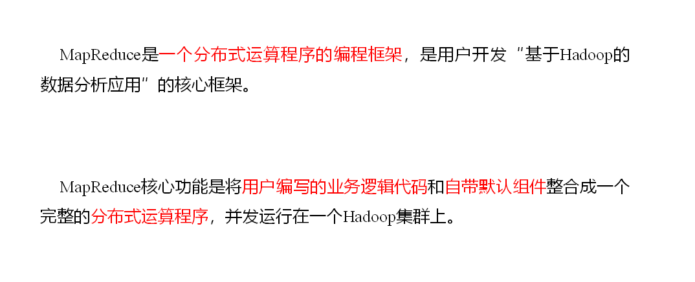

## 1.2 MapReduce优缺点

### 1.2.1 优点

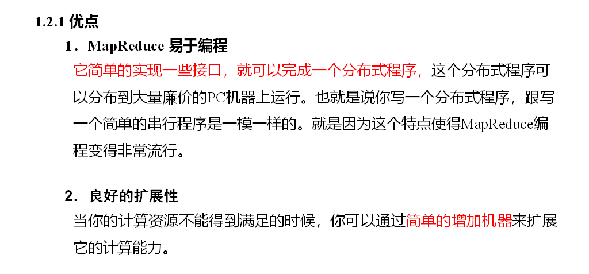

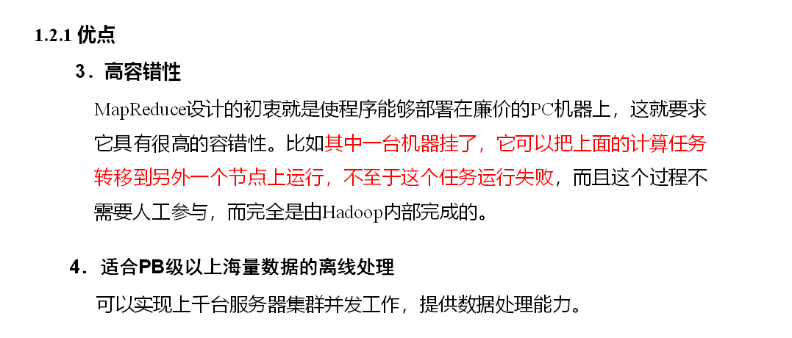

### 1.2.2 缺点

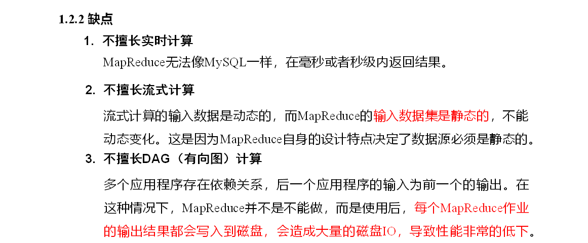

## 1.3MapReduce核心思想

MapReduce核心编程思想，如图4-1所示。

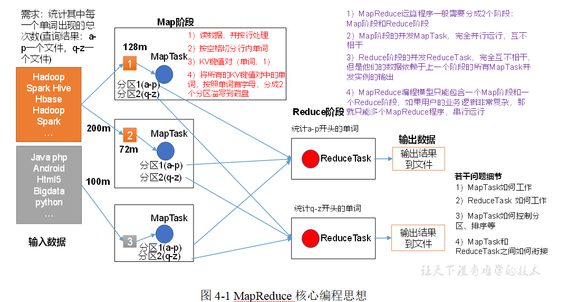

1）分布式的运算程序往往需要分成至少2个阶段。

2）第一个阶段的MapTask并发实例，完全并行运行，互不相干。

3）第二个阶段的ReduceTask并发实例互不相干，但是他们的数据依赖于上一个阶段的所有MapTask并发实例的输出。

4）MapReduce编程模型只能包含一个Map阶段和一个Reduce阶段，如果用户的业务逻辑非常复杂，那就只能多个MapReduce程序，串行运行。

总结：分析WordCount数据流走向深入理解MapReduce核心思想。

## 1.4 MapReduce进程


## 1.5 官方WordCount源码

采用反编译工具反编译源码，发现WordCount案例有Map类、Reduce类和驱动类。且数据的类型是Hadoop自身封装的序列化类型。

## 1.6 常用数据序列化类型

表4-1 常用的数据类型对应的Hadoop数据序列化类型

| **Java类型** | **Hadoop Writable类型** |
| ------------ | ----------------------- |
| boolean      | BooleanWritable         |
| byte         | ByteWritable            |
| int          | IntWritable             |
| float        | FloatWritable           |
| long         | LongWritable            |
| double       | DoubleWritable          |
| String       | Text                    |
| map          | MapWritable             |
| array        | ArrayWritable           |

## 1.7 MapReduce编程规范

用户编写的程序分成三个部分：Mapper、Reducer和Driver。

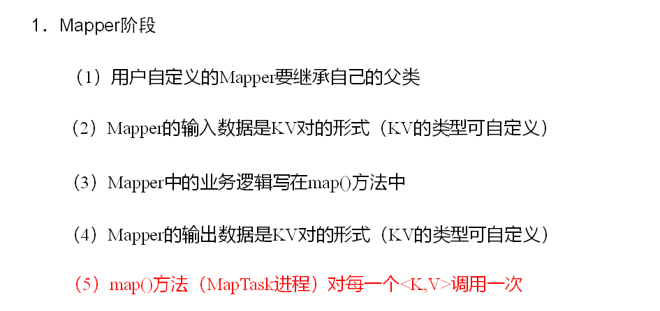

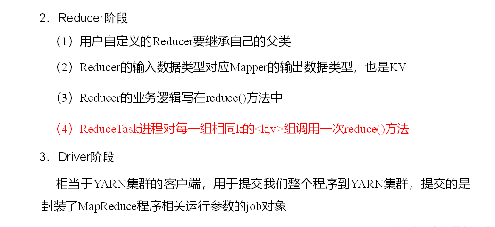

## 1.8 WordCount 案例实操

1．需求

在给定的文本文件中统计输出每一个单词出现的总次数

（1）输入数据

 

（2）期望输出数据

```txt
atguigu	2
banzhang	1
cls	2
hadoop	1
jiao	1
ss	2
xue	1
```

2．需求分析

按照MapReduce编程规范，分别编写Mapper，Reducer，Driver，如图4-2所示。

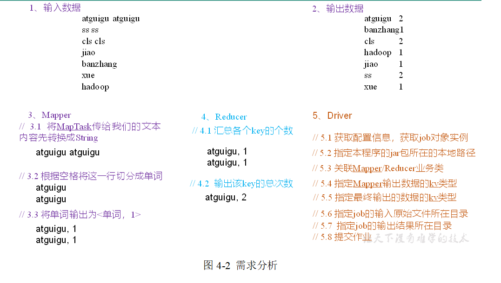


3．环境准备

（1）创建maven工程 

（2）在pom.xml文件中添加如下依赖

```xml
<dependencies>
    <dependency>
        <groupId>junit</groupId>
        <artifactId>junit</artifactId>
        <version>RELEASE</version>
    </dependency>
    <dependency>
        <groupId>org.apache.logging.log4j</groupId>
        <artifactId>log4j-core</artifactId>
        <version>2.8.2</version>
    </dependency>
    <dependency>
        <groupId>org.apache.hadoop</groupId>
        <artifactId>hadoop-common</artifactId>
        <version>2.7.2</version>
    </dependency>
    <dependency>
        <groupId>org.apache.hadoop</groupId>
        <artifactId>hadoop-client</artifactId>
        <version>2.7.2</version>
    </dependency>
    <dependency>
        <groupId>org.apache.hadoop</groupId>
        <artifactId>hadoop-hdfs</artifactId>
        <version>2.7.2</version>
    </dependency>
</dependencies>
```

（2）在项目的src/main/resources目录下，新建一个文件，命名为“log4j.properties”，在文件中填入。

```properties
log4j.rootLogger=INFO,stdout
log4j.appender.stdout=org.apache.log4j.ConsoleAppender
log4j.appender.stdout.layout=org.apache.log4j.PatternLayout
log4j.appender.stdout.layout.ConversionPattern=%d %p [%c] - %m%n
log4j.appender.logfile=org.apache.log4j.FileAppender
log4j.appender.logfile.File=target/spring.log
log4j.appender.logfile.layout=org.apache.log4j.PatternLayout
log4j.appender.logfile.layout.ConversionPattern=%d %p [%c] - %m%n
```

4．编写程序

（1）编写Mapper类

```java
package com.atguigu.mapreduce;
import java.io.IOException;
import org.apache.hadoop.io.IntWritable;
import org.apache.hadoop.io.LongWritable;
import org.apache.hadoop.io.Text;
import org.apache.hadoop.mapreduce.Mapper;
public class WordcountMapper extends Mapper<LongWritable, Text, Text, IntWritable>{
    Text k = new Text();
    IntWritable v = new IntWritable(1);
    @Override
    protected void map(LongWritable key, Text value, Context context)	throws IOException, InterruptedException {
        // 1 获取一行
        String line = value.toString();
        // 2 切割	
        String[] words = line.split(" ");
        // 3 输出	
        for (String word : words) {	
            k.set(word);
            context.write(k, v);
        }
    }
}
```


（2）编写Reducer类

```java
package com.atguigu.mapreduce.wordcount;
import java.io.IOException;
import org.apache.hadoop.io.IntWritable;
import org.apache.hadoop.io.Text;
import org.apache.hadoop.mapreduce.Reducer;
public class WordcountReducer extends Reducer<Text, IntWritable, Text, IntWritable>{
    int sum;
    IntWritable v = new IntWritable();
    @Override
    protected void reduce(Text key, Iterable<IntWritable> values,Context context) throws IOException, InterruptedException {
        // 1 累加求和
        sum = 0;
        for (IntWritable count : values) {
            sum += count.get();
        }
        // 2 输出 
        v.set(sum);	
        context.write(key,v);
    }
}
```


（3）编写Driver驱动类

```java
package com.atguigu.mapreduce.wordcount;
import java.io.IOException;
import org.apache.hadoop.conf.Configuration;
import org.apache.hadoop.fs.Path;
import org.apache.hadoop.io.IntWritable;
import org.apache.hadoop.io.Text;
import org.apache.hadoop.mapreduce.Job;
import org.apache.hadoop.mapreduce.lib.input.FileInputFormat;
import org.apache.hadoop.mapreduce.lib.output.FileOutputFormat;
public class WordcountDriver {
    public static void main(String[] args) throws IOException, ClassNotFoundException, InterruptedException {
        // 1 获取配置信息以及封装任务
        Configuration configuration = new Configuration();
        Job job = Job.getInstance(configuration);
        // 2 设置jar加载路径
        job.setJarByClass(WordcountDriver.class);
        // 3 设置map和reduce类
        job.setMapperClass(WordcountMapper.class);		
        job.setReducerClass(WordcountReducer.class);
        // 4 设置map输出
        job.setMapOutputKeyClass(Text.class);		
        job.setMapOutputValueClass(IntWritable.class);
        // 5 设置最终输出kv类型
        job.setOutputKeyClass(Text.class);
        job.setOutputValueClass(IntWritable.class);
        // 6 设置输入和输出路径
        FileInputFormat.setInputPaths(job, new Path(args[0]));		
        FileOutputFormat.setOutputPath(job, new Path(args[1]));
        // 7 提交	
        boolean result = job.waitForCompletion(true);
        System.exit(result ? 0 : 1);
    }
}
```


5．本地测试

（1）如果电脑系统是win7的就将win7的hadoop jar包解压到非中文路径，并在Windows环境上配置HADOOP_HOME环境变量。如果是电脑win10操作系统，就解压win10的hadoop jar包，并配置HADOOP_HOME环境变量。

注意：win8电脑和win10家庭版操作系统可能有问题，需要重新编译源码或者更改操作系统。

 

（2）在Eclipse/Idea上运行程序

6．集群上测试

（0）用maven打jar包，需要添加的打包插件依赖

注意：标记红颜色的部分需要替换为自己工程主类

```xml
<build>
    <plugins>
        <plugin>
            <artifactId>maven-compiler-plugin</artifactId>
            <version>2.3.2</version>
            <configuration>
                <source>1.8</source>
                <target>1.8</target>
            </configuration>
        </plugin>
        <plugin>
            <artifactId>maven-assembly-plugin </artifactId>
            <configuration>
                <descriptorRefs>
                    <descriptorRef>jar-with-dependencies</descriptorRef>
                </descriptorRefs>
                <archive>
                    <manifest>
                        <mainClass>com.atguigu.mr.WordcountDriver</mainClass>
                    </manifest>
                </archive>
            </configuration>
            <executions>
                <execution>
                    <id>make-assembly</id>
                    <phase>package</phase>
                    <goals>
                        <goal>single</goal>
                    </goals>
                </execution>
            </executions>
        </plugin>
    </plugins>
</build>
```


注意：如果工程上显示红叉。在项目上右键->maven->update project即可。

（1）将程序打成jar包，然后拷贝到Hadoop集群中

步骤详情：右键->Run as->maven install。等待编译完成就会在项目的target文件夹中生成jar包。如果看不到。在项目上右键-》Refresh，即可看到。修改不带依赖的jar包名称为wc.jar，并拷贝该jar包到Hadoop集群。

（2）启动Hadoop集群

（3）执行WordCount程序

```sh
[atguigu@hadoop102 software]$ hadoop jar  wc.jar
com.atguigu.wordcount.WordcountDriver /user/atguigu/input /user/atguigu/output
```


# 第2章 Hadoop序列化

## 2.1 序列化概述

### 2.1.1什么是序列化

序列化就是把内存中的对象，转换成字节序列(或其他数据传输协议)以便于存储到磁盘(持久化）和网络传输。

反序列化就是将收到字节序列(或其他数据传输协议)或者是磁盘的持久化数据，转换成内存中的对象。

### 2.1.2为什么要序列化

一般来说，“活的”对象只生存在内存里，关机断电就没有了。而且“活的“对象只能由本地的进程使用，不能被发送到网络上的另外一台计算机。然而序列化可以存储“活的”对象，可以将“活的”对象发送到远程计算机。

### 2.1.3为什么不用Java的序列化

Java的序列化是一个**重量级**序列化框架(Serializable)，一个对象被序列化后，会附带很多额外的信息.(各种校验信息，Header，继承体系等)，不便于在网络中高效传输。所以，Hadoop自己开发了一套序列化机制(Writable)。

Hadoop序列化特点:

(1）紧凑:高效使用存储空间。

(2）快速:读写数据的额外开销小。

(3）可扩展:随着通信协议的升级而可升级

(4）互操作:支持多语言的交互


## 2.2 自定义bean对象实现序列化接口（Writable）

在企业开发中往往常用的基本序列化类型不能满足所有需求，比如在Hadoop框架内部传递一个bean对象，那么该对象就需要实现序列化接口。

具体实现bean对象序列化步骤如下`7`步。

（1）必须实现Writable接口

（2）反序列化时，需要反射调用空参构造函数，所以必须有空参构造

```java
public FlowBean() {
    super();
}
```

（3）重写序列化方法

```java
@Override
public void write(DataOutput out) throws IOException {
    out.writeLong(upFlow);
    out.writeLong(downFlow);
    out.writeLong(sumFlow);
}
```

（4）重写反序列化方法

```java
@Override
public void readFields(DataInput in) throws IOException {
    upFlow = in.readLong();
    downFlow = in.readLong();
    sumFlow = in.readLong();
}
```

（5）注意<font color = red>反序列化的顺序和序列化的顺序完全一致</font>

（6）要想把结果显示在文件中，需要重写toString()，可用”\t”分开，方便后续用。

（7）如果需要将自定义的bean放在key中传输，则还需要实现Comparable接口，因为MapReduce框中的Shuffle过程要求对key必须能排序。详见后面排序案例。

```java
@Override
public int compareTo(FlowBean o) {
    // 倒序排列，从大到小
    return this.sumFlow > o.getSumFlow() ? -1 : 1;
}
```


## 2.3 序列化案例实操	

1.	需求

统计每一个手机号耗费的总上行流量、下行流量、总流量

（1）输入数据

 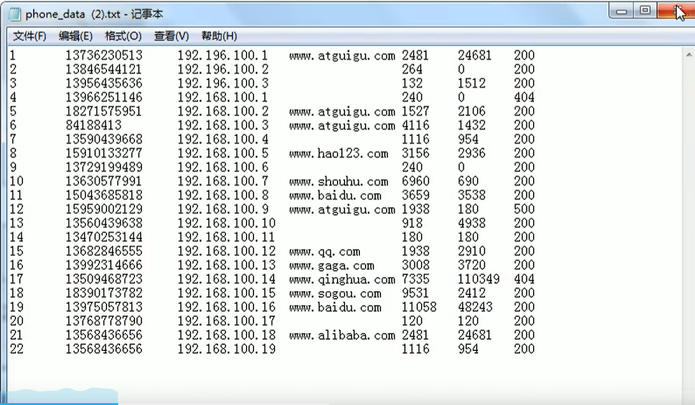

（2）输入数据格式：

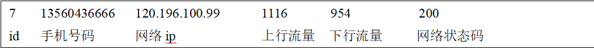

（3）期望输出数据格式


2. 需求分析

   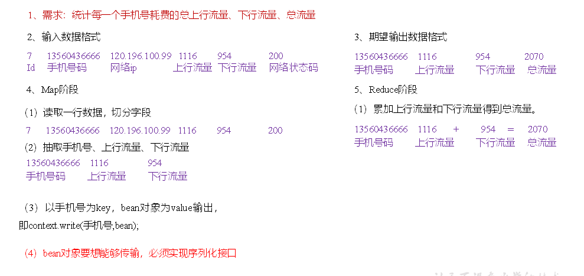

3. 编写MapReduce程序

（1）编写流量统计的Bean对象

```java
package com.atguigu.mapreduce.flowsum;
import java.io.DataInput;
import java.io.DataOutput;
import java.io.IOException;
import org.apache.hadoop.io.Writable; 
// 1 实现writable接口
public class FlowBean implements Writable{
    private long upFlow;
    private long downFlow;
    private long sumFlow;
    //2  反序列化时，需要反射调用空参构造函数，所以必须有
    public FlowBean() {
        super();
    }
    public FlowBean(long upFlow, long downFlow) {
        super();
        this.upFlow = upFlow;
        this.downFlow = downFlow;
        this.sumFlow = upFlow + downFlow;
    }
    //3  写序列化方法	
    @Override
    public void write(DataOutput out) throws IOException {
        out.writeLong(upFlow);
        out.writeLong(downFlow);
        out.writeLong(sumFlow);
    }
    //4 反序列化方法
    //5 反序列化方法读顺序必须和写序列化方法的写顺序必须一致
    @Override
    public void readFields(DataInput in) throws IOException {
        this.upFlow  = in.readLong();
        this.downFlow = in.readLong();
        this.sumFlow = in.readLong();
    }
    // 6 编写toString方法，方便后续打印到文本
    @Override	public String toString() {
        return upFlow + "\t" + downFlow + "\t" + sumFlow;
    }
    public long getUpFlow() {
        return upFlow;
    }
    public void setUpFlow(long upFlow) {
        this.upFlow = upFlow;
    }
    public long getDownFlow() {
        return downFlow;
    } 
    public void setDownFlow(long downFlow) {
        this.downFlow = downFlow;
    } 
    public long getSumFlow() {
        return sumFlow;
    }
    public void setSumFlow(long sumFlow) {
        this.sumFlow = sumFlow;
    }
}
```


（2）编写Mapper类

```java
package com.atguigu.mapreduce.flowsum;
import java.io.IOException;
import org.apache.hadoop.io.LongWritable;
import org.apache.hadoop.io.Text;
import org.apache.hadoop.mapreduce.Mapper;
public class FlowCountMapper extends Mapper<LongWritable, Text, Text, FlowBean>{		
    FlowBean v = new FlowBean();
    Text k = new Text();
    @Override
    protected void map(LongWritable key, Text value, Context context)	throws IOException, InterruptedException {
        // 1 获取一行
        String line = value.toString();
        // 2 切割字段
        String[] fields = line.split("\t");
        // 3 封装对象
        // 取出手机号码
        String phoneNum = fields[1];
        // 取出上行流量和下行流量
        long upFlow = Long.parseLong(fields[fields.length - 3]);
        long downFlow = Long.parseLong(fields[fields.length - 2]);
        k.set(phoneNum);
        v.set(downFlow, upFlow);
        // 4 写出
        context.write(k, v);
    }
}
```


（3）编写Reducer类

```java
package com.atguigu.mapreduce.flowsum;
import java.io.IOException;
import org.apache.hadoop.io.Text;
import org.apache.hadoop.mapreduce.Reducer;
public class FlowCountReducer extends Reducer<Text, FlowBean, Text, FlowBean> {
    @Override
    protected void reduce(Text key, Iterable<FlowBean> values, Context context)throws IOException, InterruptedException {
        long sum_upFlow = 0;
        long sum_downFlow = 0;
        // 1 遍历所用bean，将其中的上行流量，下行流量分别累加
        for (FlowBean flowBean : values) {
            sum_upFlow += flowBean.getUpFlow();	
            sum_downFlow += flowBean.getDownFlow();
        } 
        // 2 封装对象
        FlowBean resultBean = new FlowBean(sum_upFlow, sum_downFlow);
        // 3 写出
        context.write(key, resultBean);
    }
}
```


（4）编写Driver驱动类

```java
package com.atguigu.mapreduce.flowsum;
import java.io.IOException;
import org.apache.hadoop.conf.Configuration;
import org.apache.hadoop.fs.Path;
import org.apache.hadoop.io.Text;
import org.apache.hadoop.mapreduce.Job;
import org.apache.hadoop.mapreduce.lib.input.FileInputFormat;
import org.apache.hadoop.mapreduce.lib.output.FileOutputFormat;
public class FlowsumDriver {
    public static void main(String[] args) throws IllegalArgumentException, IOException, ClassNotFoundException, InterruptedException {
        // 输入输出路径需要根据自己电脑上实际的输入输出路径设置
        args = new String[] { "e:/input/inputflow", "e:/output1" };
        // 1 获取配置信息，或者job对象实例
        Configuration configuration = new Configuration();
        Job job = Job.getInstance(configuration);
        // 6 指定本程序的jar包所在的本地路径
        job.setJarByClass(FlowsumDriver.class); 
        // 2 指定本业务job要使用的mapper/Reducer业务类		
        job.setMapperClass(FlowCountMapper.class);		
        job.setReducerClass(FlowCountReducer.class);
        // 3 指定mapper输出数据的kv类型	
        job.setMapOutputKeyClass(Text.class);		
        job.setMapOutputValueClass(FlowBean.class);
        // 4 指定最终输出的数据的kv类型	
        job.setOutputKeyClass(Text.class);
        job.setOutputValueClass(FlowBean.class);
        // 5 指定job的输入原始文件所在目录
        FileInputFormat.setInputPaths(job, new Path(args[0]));		
        FileOutputFormat.setOutputPath(job, new Path(args[1]));
        // 7 将job中配置的相关参数，以及job所用的java类所在的jar包， 提交给yarn去运行
        boolean result = job.waitForCompletion(true);
        System.exit(result ? 0 : 1);
    }
}
```


# 第3章 MapReduce框架原理

## 3.1 InputFormat数据输入

### 3.1.1 切片与MapTask并行度决定机制

1．问题引出

MapTask的并行度决定Map阶段的任务处理并发度，进而影响到整个Job的处理速度。

思考：1G的数据，启动8个MapTask，可以提高集群的并发处理能力。那么1K的数据，也启动8个MapTask，会提高集群性能吗？MapTask并行任务是否越多越好呢？哪些因素影响了MapTask并行度？

2．MapTask并行度决定机制

**数据块：**Block是HDFS物理上把数据分成一块一块。

**数据切片：**数据切片只是在逻辑上对输入进行分片，并不会在磁盘上将其切分成片进行存储。

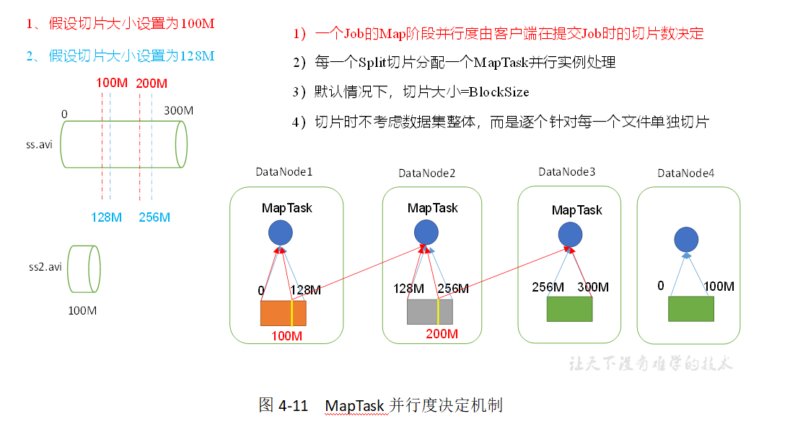

### 3.1.2 Job提交流程源码和切片源码详解

1．Job提交流程源码详解，如图4-8所示

```java
waitForCompletion()
submit();
// 1建立连接
connect();	
// 1）创建提交Job的代理
new Cluster(getConfiguration());
// （1）判断是本地yarn还是远程
initialize(jobTrackAddr, conf); 
// 2 提交job
submitter.submitJobInternal(Job.this, cluster)
// 1）创建给集群提交数据的Stag路径
Path jobStagingArea = JobSubmissionFiles.getStagingDir(cluster, conf);
// 2）获取jobid ，并创建Job路径
JobID jobId = submitClient.getNewJobID();
// 3）拷贝jar包到集群
copyAndConfigureFiles(job, submitJobDir);	
rUploader.uploadFiles(job, jobSubmitDir);
// 4）计算切片，生成切片规划文件
writeSplits(job, submitJobDir);
maps = writeNewSplits(job, jobSubmitDir);
input.getSplits(job);
// 5）向Stag路径写XML配置文件
writeConf(conf, submitJobFile);
conf.writeXml(out);
// 6）提交Job,返回提交状态
status = submitClient.submitJob(jobId, submitJobDir.toString(), job.getCredentials());
```

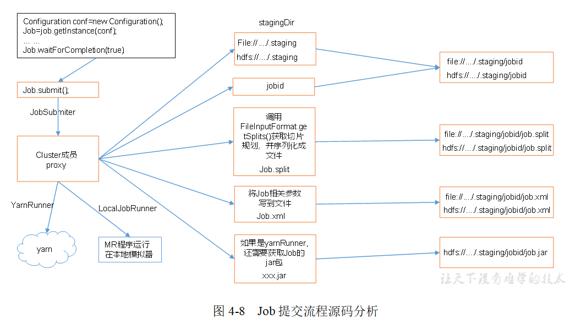

2．FileInputFormat切片源码解析(input.getSplits(job))

(1）程序先找到你数据存储的目录。

(2）开始遍历处理（规划切片)目录下的每一个文件

(3）遍历第一个文件ss.txt

a）获取文件大小fs.sizeOf(ss.txt)b）计算切片大小computeSp litSize(Math.max(minSize,Math.min(maxSize,blocksize)>)=-blodksize=128Mc)默认情况下，切片大小=blocksize

d)开始切，形成第1个切片: ss.txt—0:128M第2个切片ss.txt—128:256M第3个切片ss.txt—256M:300M(每次切片时，都要判断切完剩下的部分是否大于块的1.1倍，不大于1.1倍就划分一块切片)

e)将切片信息写到一个切片规划文件中

f)） 整个切片的核心过程在getSp lit(方法中完成

g) Imputsplit只记录了切片的元数据信息，比如起始位置、长度以及所在的节点列表等。

(4）提交切片规划文件到YARN上，YARN上的MrAppMaster就可以根据切片规划文件计算开启MapTask个数。

### 3.1.3 FileInputFormat切片机制

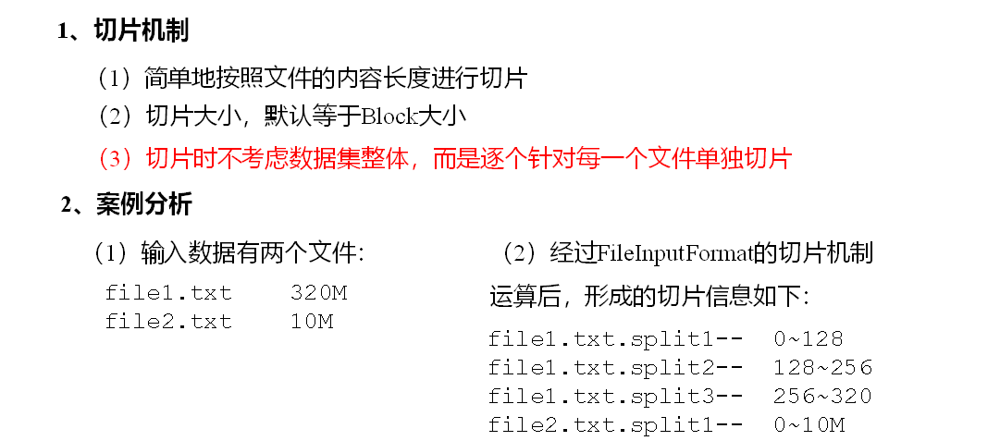

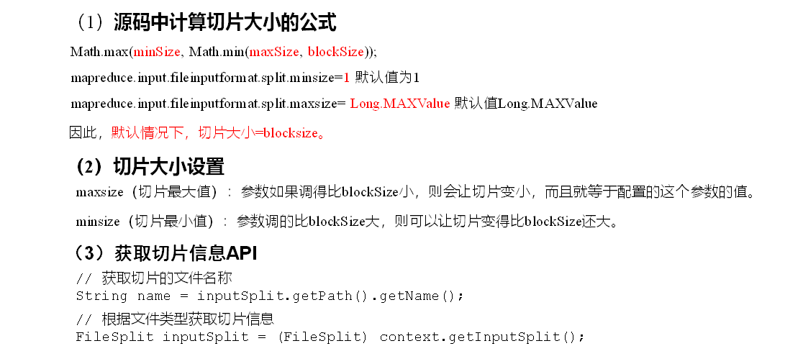

### 3.1.4  CombineTextInputFormat切片机制

框架默认的TextInputFormat切片机制是对任务按文件规划切片，不管文件多小，都会是一个单独的切片，都会交给一个MapTask，这样如果有大量小文件，就会产生大量的MapTask，处理效率极其低下。

1、应用场景：

CombineTextInputFormat用于小文件过多的场景，它可以将多个小文件从逻辑上规划到一个切片中，这样，多个小文件就可以交给一个MapTask处理。

2、虚拟存储切片最大值设置

CombineTextInputFormat.setMaxInputSplitSize(job, 4194304);// 4m

注意：虚拟存储切片最大值设置最好根据实际的小文件大小情况来设置具体的值。

3、切片机制

生成切片过程包括：虚拟存储过程和切片过程二部分。

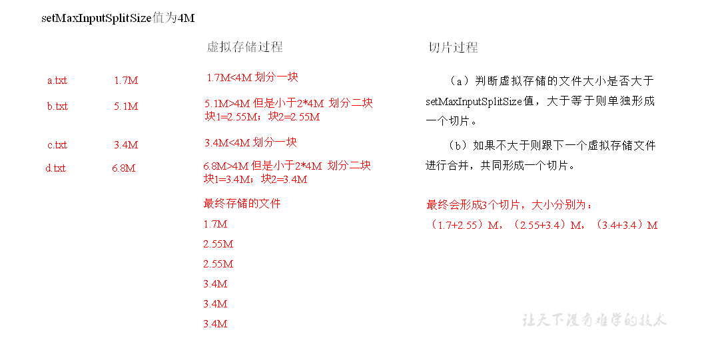

（1）虚拟存储过程：

将输入目录下所有文件大小，依次和设置的setMaxInputSplitSize值比较，如果不大于设置的最大值，逻辑上划分一个块。如果输入文件大于设置的最大值且大于两倍，那么以最大值切割一块；当剩余数据大小超过设置的最大值且不大于最大值2倍，此时将文件均分成2个虚拟存储块（防止出现太小切片）。

例如setMaxInputSplitSize值为4M，输入文件大小为8.02M，则先逻辑上分成一个4M。剩余的大小为4.02M，如果按照4M逻辑划分，就会出现0.02M的小的虚拟存储文件，所以将剩余的4.02M文件切分成（2.01M和2.01M）两个文件。

（2）切片过程：

（a）判断虚拟存储的文件大小是否大于setMaxInputSplitSize值，大于等于则单独形成一个切片。

（b）如果不大于则跟下一个虚拟存储文件进行合并，共同形成一个切片。

（c）测试举例：有4个小文件大小分别为1.7M、5.1M、3.4M以及6.8M这四个小文件，则虚拟存储之后形成6个文件块，大小分别为：

1.7M，（2.55M、2.55M），3.4M以及（3.4M、3.4M）

最终会形成3个切片，大小分别为：

（1.7+2.55）M，（2.55+3.4）M，（3.4+3.4）M

### 3.1.5 CombineTextInputFormat案例实操

1．需求

将输入的大量小文件合并成一个切片统一处理。

（1）输入数据

准备4个小文件

（2）期望

期望一个切片处理4个文件

2．实现过程

**（1）**不做任何处理，运行1.6节的WordCount案例程序，观察切片个数为4。

 

**（2）**在WordcountDriver中增加如下代码，运行程序，并观察运行的切片个数为3。

（a）驱动类中添加代码如下：

```java
// 如果不设置InputFormat，它默认用的是TextInputFormat.class
job.setInputFormatClass(CombineTextInputFormat.class);

//虚拟存储切片最大值设置4m
CombineTextInputFormat.setMaxInputSplitSize(job, 4194304);
```

（b）运行如果为3个切片。

 

（3）在WordcountDriver中增加如下代码，运行程序，并观察运行的切片个数为1。

​		（a）驱动中添加代码如下：

```java
// 如果不设置InputFormat，它默认用的是TextInputFormat.class
job.setInputFormatClass(CombineTextInputFormat.class);
//虚拟存储切片最大值设置20m
CombineTextInputFormat.setMaxInputSplitSize(job, 20971520);
```

（b）运行如果为1个切片。

 

### 3.1.6 FileInputFormat实现类

思考:在运行MapReduce程序时，输入的文件格式包括:基于行的日志文件二进制格式文件、数据库表等。那么，针对不同的数据类型，MapReduce是如何读取这些数据的呢?

FileInputFormat常见的接口实现类包括: TextInputFormat .KeyValueTextInputFormat、NLineInputFormat、CombineTextInputFormat和自定义InputFormat等。

1. TextInputFormat
TextImnputForm at是默认的FileInputForm at实现类。按行读取每条记录。键是存储该行在整个文件中的起始字节偏移量， LongWritable类型。值是这行的内容，不包括任何行终止符（换行符和回车符)，Text类型。
以下是一个示例，比如，一个分片包含了如下4条文本记录。
Rich learning f orm
lntelligent learning engi neLearning more convenient
From the real demand for more close to the enterprise
每条记录表示为以下键/值对:
(0, Rich learning form)
( 19, Intelligent learning engine )( 47, Le arning more convenient)
( 72,From the real demand for more close to the enterprise)


### 3.1.7 KeyValueTextInputFormat使用案例

1．需求

统计输入文件中每一行的第一个单词相同的行数。

（1）输入数据

```txt
banzhang ni hao
xihuan hadoop banzhang
banzhang ni hao
xihuan hadoop banzhang
```

（2）期望结果数据

```txt
banzhang	2
xihuan	2
```

2．需求分析

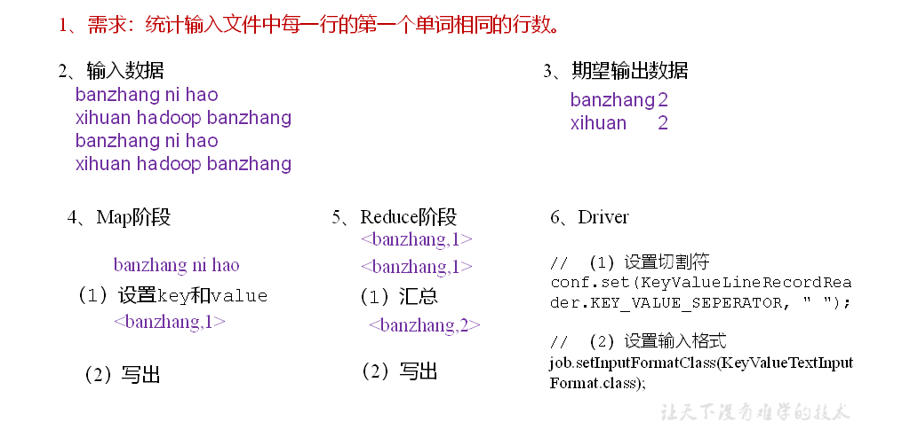

3．代码实现

（1）编写Mapper类

```java
package com.atguigu.mapreduce.KeyValueTextInputFormat;
import java.io.IOException;
import org.apache.hadoop.io.LongWritable;
import org.apache.hadoop.io.Text;
import org.apache.hadoop.mapreduce.Mapper;
public class KVTextMapper extends Mapper<Text, Text, Text, LongWritable>{
    // 1 设置value 
    LongWritable v = new LongWritable(1);
    @Override	protected void map(Text key, Text value, Context context)			throws IOException, InterruptedException {
        // banzhang ni hao
        // 2 写出
        context.write(key, v);
    }
}
```


（2）编写Reducer类

```java
package com.atguigu.mapreduce.KeyValueTextInputFormat;
import java.io.IOException;
import org.apache.hadoop.io.LongWritable;
import org.apache.hadoop.io.Text;
import org.apache.hadoop.mapreduce.Reducer;
public class KVTextReducer extends Reducer<Text, LongWritable, Text, LongWritable>{	 
    LongWritable v = new LongWritable();
    @Override	protected void reduce(Text key, Iterable<LongWritable> values,	Context context) throws IOException, InterruptedException {
        long sum = 0L; 
        // 1 汇总统计
        for (LongWritable value : values) {
            sum += value.get();
        }
        v.set(sum);
        // 2 输出
        context.write(key, v);
    }
}
```


（3）编写Driver类

```java
package com.atguigu.mapreduce.keyvaleTextInputFormat;
import java.io.IOException;
import org.apache.hadoop.conf.Configuration;
import org.apache.hadoop.fs.Path;
import org.apache.hadoop.io.LongWritable;
import org.apache.hadoop.io.Text;
import org.apache.hadoop.mapreduce.Job;
import org.apache.hadoop.mapreduce.lib.input.FileInputFormat;
import org.apache.hadoop.mapreduce.lib.input.KeyValueLineRecordReader;
import org.apache.hadoop.mapreduce.lib.input.KeyValueTextInputFormat;
import org.apache.hadoop.mapreduce.lib.output.FileOutputFormat;
public class KVTextDriver { public static void main(String[] args) throws IOException, ClassNotFoundException, InterruptedException {
    Configuration conf = new Configuration();
    // 设置切割符
    conf.set(KeyValueLineRecordReader.KEY_VALUE_SEPERATOR, " ");
    // 1 获取job对象
    Job job = Job.getInstance(conf);
    // 2 设置jar包位置，关联mapper和reducer
    job.setJarByClass(KVTextDriver.class);		
    job.setMapperClass(KVTextMapper.class);
    job.setReducerClass(KVTextReducer.class);
    // 3 设置map输出kv类型
    job.setMapOutputKeyClass(Text.class);		
    job.setMapOutputValueClass(LongWritable.class);
    // 4 设置最终输出kv类型		
    job.setOutputKeyClass(Text.class);
    job.setOutputValueClass(LongWritable.class);
    // 5 设置输入输出数据路径
    FileInputFormat.setInputPaths(job, new Path(args[0]));
    // 设置输入格式
    job.setInputFormatClass(KeyValueTextInputFormat.class);	
    // 6 设置输出数据路径
    FileOutputFormat.setOutputPath(job, new Path(args[1]));
    // 7 提交job
    job.waitForCompletion(true);
   }
}
```


### 3.1.8 NLineInputFormat使用案例

1．需求

对每个单词进行个数统计，要求根据每个输入文件的行数来规定输出多少个切片。此案例要求每三行放入一个切片中。

（1）输入数据

```txt
banzhang ni hao
xihuan hadoop banzhang
banzhang ni hao
xihuan hadoop banzhang
banzhang ni hao
xihuan hadoop banzhang
banzhang ni hao
xihuan hadoop banzhang
banzhang ni hao
xihuan hadoop banzhang banzhang ni hao
xihuan hadoop banzhang
```

（2）期望输出数据

```sh
Number of splits:4
```

2．需求分析

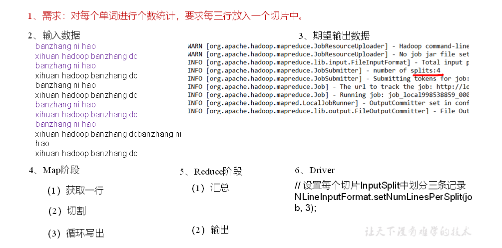

3．代码实现

（1）编写Mapper类

```java
package com.atguigu.mapreduce.nline;
import java.io.IOException;
import org.apache.hadoop.io.LongWritable;
import org.apache.hadoop.io.Text;
import org.apache.hadoop.mapreduce.Mapper;
public class NLineMapper extends Mapper<LongWritable, Text, Text, LongWritable>{
    private Text k = new Text();
    private LongWritable v = new LongWritable(1);
    @Override	protected void map(LongWritable key, Text value, Context context)	throws IOException, InterruptedException {
        // 1 获取一行
        String line = value.toString();
        // 2 切割
        String[] splited = line.split(" ");
        // 3 循环写出 
        for (int i = 0; i < splited.length; i++) {
            k.set(splited[i]);
            context.write(k, v);
        }
    }
}
```


（2）编写Reducer类

```java
package com.atguigu.mapreduce.nline;
import java.io.IOException;
import org.apache.hadoop.io.LongWritable;
import org.apache.hadoop.io.Text;
import org.apache.hadoop.mapreduce.Reducer;
public class NLineReducer extends Reducer<Text, LongWritable, Text, LongWritable>{		
    LongWritable v = new LongWritable();
    @Override	protected void reduce(Text key, Iterable<LongWritable> values,	Context context) throws IOException, InterruptedException {
        long sum = 0l;
        // 1 汇总 
        for (LongWritable value : values) {
            sum += value.get();
        } 
        v.set(sum);
        // 2 输出 
        context.write(key, v);
    }
}
```


（3）编写Driver类

```java
package com.atguigu.mapreduce.nline;
import java.io.IOException;
import java.net.URISyntaxException;
import org.apache.hadoop.conf.Configuration;
import org.apache.hadoop.fs.Path;
import org.apache.hadoop.io.LongWritable;
import org.apache.hadoop.io.Text;
import org.apache.hadoop.mapreduce.Job;
import org.apache.hadoop.mapreduce.lib.input.FileInputFormat;
import org.apache.hadoop.mapreduce.lib.input.NLineInputFormat;
import org.apache.hadoop.mapreduce.lib.output.FileOutputFormat;
public class NLineDriver {
    public static void main(String[] args) throws IOException, URISyntaxException, ClassNotFoundException, InterruptedException {
        // 输入输出路径需要根据自己电脑上实际的输入输出路径设置
        args = new String[] { "e:/input/inputword", "e:/output1" };
        // 1 获取job对象
        Configuration configuration = new Configuration();
        Job job = Job.getInstance(configuration);
        // 7设置每个切片InputSplit中划分三条记录
        NLineInputFormat.setNumLinesPerSplit(job, 3);
        // 8使用NLineInputFormat处理记录数
        job.setInputFormatClass(NLineInputFormat.class);
        // 2设置jar包位置，关联mapper和reducer
        job.setJarByClass(NLineDriver.class); 
        job.setMapperClass(NLineMapper.class);
        job.setReducerClass(NLineReducer.class); 
        // 3设置map输出kv类型
        job.setMapOutputKeyClass(Text.class);      
        job.setMapOutputValueClass(LongWritable.class); 
        // 4设置最终输出kv类型
        job.setOutputKeyClass(Text.class);
        job.setOutputValueClass(LongWritable.class); 
        // 5设置输入输出数据路径
        FileInputFormat.setInputPaths(job, new Path(args[0]));      
        FileOutputFormat.setOutputPath(job, new Path(args[1]));
        // 6提交job
        job.waitForCompletion(true);
    }
}
```


4．测试

（1）输入数据

```txt
banzhang ni hao
xihuan hadoop banzhang
banzhang ni hao
xihuan hadoop banzhang
banzhang ni hao
xihuan hadoop banzhang
hang ni hao
xihuan hadoop banzhang
banzhang ni hao
xihuan hadoop banzhang banzhang ni hao
xihuan hadoop banzhang
```

（2）输出结果的切片数，如图4-10所示：

 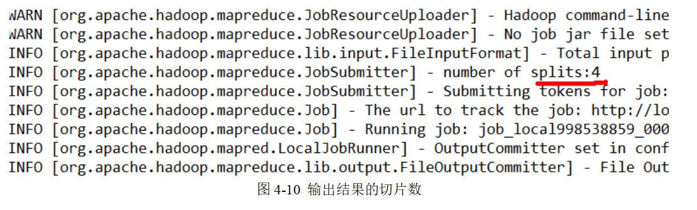


### 3.1.9 自定义InputFormat

在企业开发中，Hadoop框架自带的InputFormat类型不能满足所有应用场景，需要自定义InputFormat来解决实际问题。
自定义InputFormat步骤如下:

(1)自定义一个类继承FileInputFormat。

(2）改写RecordReader，实现一次读取一个完整文件封装为KV。

(3）在输出时使用SequenceFileOutPutFormat输出合并文件。

### 3.1.10 自定义InputFormat案例实操

无论HDFS还是MapReduce，在处理小文件时效率都非常低，但又难免面临处理大量小文件的场景，此时，就需要有相应解决方案。可以自定义InputFormat实现小文件的合并。

1．需求

将多个小文件合并成一个SequenceFile文件（SequenceFile文件是Hadoop用来存储二进制形式的key-value对的文件格式），SequenceFile里面存储着多个文件，存储的形式为文件路径+名称为key，文件内容为value。

（1）输入数据

 

（2）期望输出文件格式

```txt
part-r-0000
```


2．需求分析

自定义InputFormat案例分析

1、自定义一个类继承FileInputFormat

(1）重写isSplitable()方法，返回false不可切割

(2）重写createRecordReader()，创建自定义的RecordReader对象，并初始化

2、改写Recor dReader，实现一次读取一个完整文件封装为KV

(1）采用Io流一次读取一个文件输出到value中，因为设置了不可切片，最终把所有文件都封装到了value中

(2）获取文件路径信息+名称，并设置key

3、设置Driver

```java
//(1)设置输入的inputFormat
job.setInputFormatclass( wholeFileInputformat.class);
//(2)设置输出的outputFormat
job.setOutputFormatClass(SequenceF1leoutputForlmat.class>)
```

3．程序实现

（1）自定义InputFromat

```java
package com.atguigu.mapreduce.inputformat;
import java.io.IOException;
import org.apache.hadoop.fs.Path;
import org.apache.hadoop.io.BytesWritable;
import org.apache.hadoop.io.NullWritable;
import org.apache.hadoop.mapreduce.InputSplit;
import org.apache.hadoop.mapreduce.JobContext;
import org.apache.hadoop.mapreduce.RecordReader;
import org.apache.hadoop.mapreduce.TaskAttemptContext;
import org.apache.hadoop.mapreduce.lib.input.FileInputFormat; 
// 定义类继承FileInputFormat
public class WholeFileInputformat extends FileInputFormat<Text, BytesWritable>{
    @Override	protected boolean isSplitable(JobContext context, Path filename) {
        return false;
    }
    @Override	public RecordReader<Text, BytesWritable> createRecordReader(InputSplit split, TaskAttemptContext context)	throws IOException, InterruptedException {				
        WholeRecordReader recordReader = new WholeRecordReader();		
        recordReader.initialize(split, context);
        return recordReader;
    }
}
```


（2）自定义RecordReader类

```java
package com.atguigu.mapreduce.inputformat;
import java.io.IOException;
import org.apache.hadoop.conf.Configuration;
import org.apache.hadoop.fs.FSDataInputStream;
import org.apache.hadoop.fs.FileSystem;
import org.apache.hadoop.fs.Path;
import org.apache.hadoop.io.BytesWritable;
import org.apache.hadoop.io.IOUtils;
import org.apache.hadoop.io.NullWritable;
import org.apache.hadoop.mapreduce.InputSplit;
import org.apache.hadoop.mapreduce.RecordReader;
import org.apache.hadoop.mapreduce.TaskAttemptContext;
import org.apache.hadoop.mapreduce.lib.input.FileSplit;
public class WholeRecordReader extends RecordReader<Text, BytesWritable>{
    private Configuration configuration;
    private FileSplit split;
    private boolean isProgress= true;
    private BytesWritable value = new BytesWritable();
    private Text k = new Text();
    @Override	public void initialize(InputSplit split, TaskAttemptContext context) throws IOException, InterruptedException {	
        this.split = (FileSplit)split;
        configuration = context.getConfiguration();
    } 
    @Override	public boolean nextKeyValue() throws IOException, InterruptedException {	
        if (isProgress) { 
            // 1 定义缓存区
            byte[] contents = new byte[(int)split.getLength()];	
            FileSystem fs = null;
            FSDataInputStream fis = null;
            try {
                // 2 获取文件系统	
                Path path = split.getPath();
                fs = path.getFileSystem(configuration);	
                // 3 读取数据
                fis = fs.open(path);
                // 4 读取文件内容
                IOUtils.readFully(fis, contents, 0, contents.length);					
                // 5 输出文件内容	
                value.set(contents, 0, contents.length);
                // 6 获取文件路径及名称
                String name = split.getPath().toString();
                // 7 设置输出的key值k.set(name);
            } catch (Exception e) {	
            }finally {
                IOUtils.closeStream(fis);
            }
            isProgress = false;	
            return true;
        }
        return false;
    }
    @Override	public Text getCurrentKey() throws IOException, InterruptedException {		
        return k;
    }
    @Override	public BytesWritable getCurrentValue() throws IOException, InterruptedException {
        return value;
    }
    @Override	public float getProgress() throws IOException, InterruptedException {		
        return 0;
    }
    @Override	public void close() throws IOException {
    }
}
```


（3）编写SequenceFileMapper类处理流程

```java
package com.atguigu.mapreduce.inputformat;
import java.io.IOException;
import org.apache.hadoop.io.BytesWritable;
import org.apache.hadoop.io.NullWritable;
import org.apache.hadoop.io.Text;
import org.apache.hadoop.mapreduce.Mapper;
import org.apache.hadoop.mapreduce.lib.input.FileSplit;
public class SequenceFileMapper extends Mapper<Text, BytesWritable, Text, BytesWritable>{
    @Override
    protected void map(Text key, BytesWritable value,Context context) throws IOException, InterruptedException {
        context.write(key, value);
    }
}
```


（4）编写SequenceFileReducer类处理流程

```java
package com.atguigu.mapreduce.inputformat;
import java.io.IOException;
import org.apache.hadoop.io.BytesWritable;
import org.apache.hadoop.io.Text;
import org.apache.hadoop.mapreduce.Reducer;
public class SequenceFileReducer extends Reducer<Text, BytesWritable, Text, BytesWritable> { 
    @Override
    protected void reduce(Text key, Iterable<BytesWritable> values, Context context)		throws IOException, InterruptedException {
        context.write(key, values.iterator().next());
    }
}
```


（5）编写SequenceFileDriver类处理流程

```java
package com.atguigu.mapreduce.inputformat;
import java.io.IOException;
import org.apache.hadoop.conf.Configuration;
import org.apache.hadoop.fs.Path;
import org.apache.hadoop.io.BytesWritable;
import org.apache.hadoop.io.Text;
import org.apache.hadoop.mapreduce.Job;
import org.apache.hadoop.mapreduce.lib.input.FileInputFormat;
import org.apache.hadoop.mapreduce.lib.output.FileOutputFormat;
import org.apache.hadoop.mapreduce.lib.output.SequenceFileOutputFormat;
public class SequenceFileDriver {
    public static void main(String[] args) throws IOException, ClassNotFoundException, InterruptedException {
        // 输入输出路径需要根据自己电脑上实际的输入输出路径设置
        args = new String[] { "e:/input/inputinputformat", "e:/output1" };
        // 1 获取job对象
        Configuration conf = new Configuration();
        Job job = Job.getInstance(conf);
        // 2 设置jar包存储位置、关联自定义的mapper和reducer		
        job.setJarByClass(SequenceFileDriver.class);		
        job.setMapperClass(SequenceFileMapper.class);		
        job.setReducerClass(SequenceFileReducer.class);
        // 7设置输入的inputFormat
        job.setInputFormatClass(WholeFileInputformat.class);
        // 8设置输出的outputFormat
        job.setOutputFormatClass(SequenceFileOutputFormat.class);
        // 3 设置map输出端的kv类型
        job.setMapOutputKeyClass(Text.class);		
        job.setMapOutputValueClass(BytesWritable.class);
        // 4 设置最终输出端的kv类型
        job.setOutputKeyClass(Text.class);
        job.setOutputValueClass(BytesWritable.class);
        // 5 设置输入输出路径
        FileInputFormat.setInputPaths(job, new Path(args[0]));		
        FileOutputFormat.setOutputPath(job, new Path(args[1]));
        // 6 提交job
        boolean result = job.waitForCompletion(true);
        System.exit(result ? 0 : 1);
    }
}
```


## 3.2 MapReduce工作流程

1．流程示意图，如图4-6，4-7所示

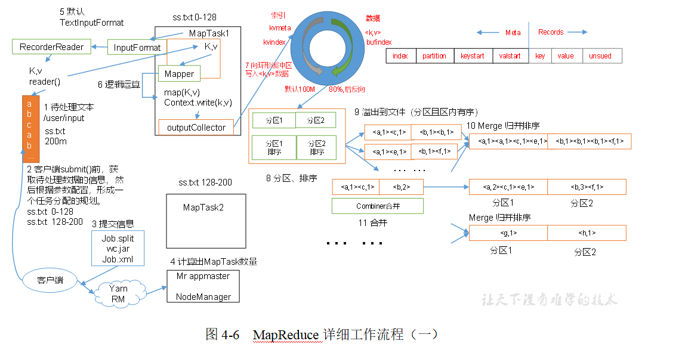


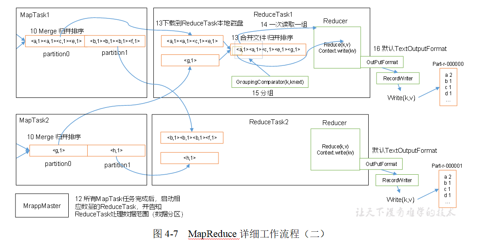


2．流程详解

上面的流程是整个MapReduce最全工作流程，但是Shuffle过程只是从第7步开始到第16步结束，具体Shuffle过程详解，如下：

1）MapTask收集我们的map()方法输出的kv对，放到内存缓冲区中

2）从内存缓冲区不断溢出本地磁盘文件，可能会溢出多个文件

3）多个溢出文件会被合并成大的溢出文件

4）在溢出过程及合并的过程中，都要调用Partitioner进行分区和针对key进行排序

5）ReduceTask根据自己的分区号，去各个MapTask机器上取相应的结果分区数据

6）ReduceTask会取到同一个分区的来自不同MapTask的结果文件，ReduceTask会将这些文件再进行合并（归并排序）

7）合并成大文件后，Shuffle的过程也就结束了，后面进入ReduceTask的逻辑运算过程（从文件中取出一个一个的键值对Group，调用用户自定义的reduce()方法）

3．注意

Shuffle中的缓冲区大小会影响到MapReduce程序的执行效率，原则上说，缓冲区越大，磁盘io的次数越少，执行速度就越快。

缓冲区的大小可以通过参数调整，参数：io.sort.mb默认100M。

4．源码解析流程

```java
context.write(k, NullWritable.get());
output.write(key, value);
collector.collect(key, value,partitioner.getPartition(key, value, partitions));
HashPartitioner();
collect()
    close()
    collect.flush()
    sortAndSpill()
    sort()
    QuickSort
    mergeParts();
collector.close();
```


## 3.3 Shuffle机制

### 3.3.1 Shuffle机制

Map方法之后，Reduce方法之前的数据处理过程称之为Shuffle。如图4-14所示。

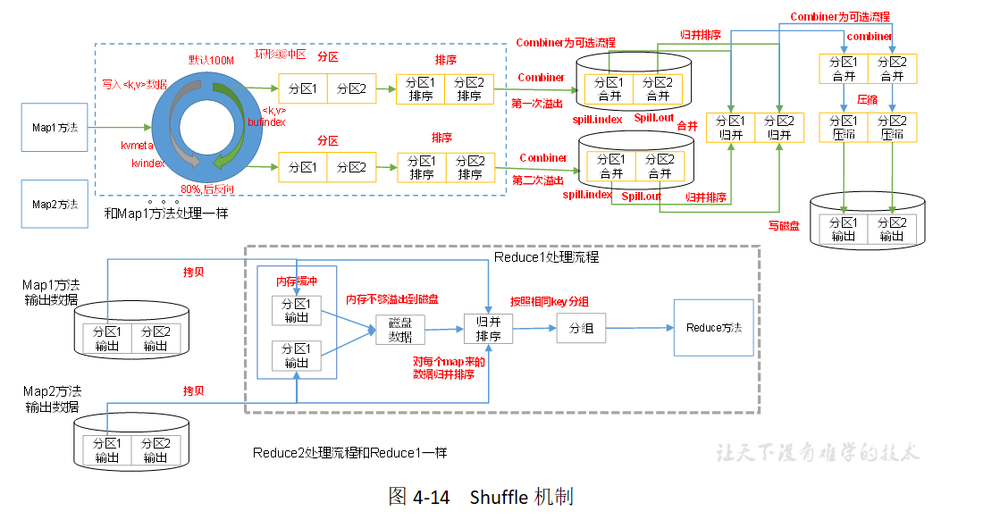


### 3.3.2 Partition分区

1、问题引出

要求将统计结果按照条件输出到不同文件中（分区)。比如:将统计结果按照手机归属地不同省份输出到不同文件中(分区)

2、默认Partitioner分区

```java
public class HashPartitioner<K,V>extends Partitioner<K,V>{
    public int getPartition(K key,v value, int numReduceTasks){
        return (key.hashCode() & Integer.MAX_VALUE) % numReduceTasks;
    }
}
```


默认分区是根据key的hashCode对ReduceTasks个数取模得到的。用户没法控制哪个key存储到哪个分区。

3、自定义Partitioner步骤

(1)自定义类继承Partitioner，重写getPartition()方法

```java
public class customPartitioner extends Partitioner<Text,FlowBean>{
    override
        public int getPartition (Text key,FlowBean value, int num Partitions){
        //控制分区代码逻辑
        ......
        return partition ;
    }
}
```

(2)在Job驱动中，设置自定义Patitioner

```java
job.setPartitionerClass(CustomPatitioner.class );
```

(3）自定义Partition后，要根据自定义Patitioner的逻辑设置相应数量的ReduceTask

```java
job.setNumReduceTasks(5);
```

4、分区总结

(1)如果ReduceTask的数量>getPartition的结果数，则会多产生几个空的输出文件pant-r-000xx;

(2)如果1<ReduceTask的数量<getPautition的结果数，则有一部分分区数据无处安放，会Exception;

(3）如果ReduceTask的数量=1，则不管MapTask端输出多少个分区文件，最终结果都交给这一个ReduceTask，最终也就只会产生一个结果文件pat-r-00000;

(4)分区号必须从零开始，逐一累加。

5、案例分析

例如︰假设自定义分区数为5，则

( 1) job.setNumReduceTasks(1); 会正常运行，只不过会产生一个输出文件

(2) job.setNumReduceTasks(2); 会报错

(3 ) job.setNumReduceTasks(6); 大于5，程序会正常运行，会产生空文件


### 3.3.3 Partition分区案例实操

1．需求

将统计结果按照手机归属地不同省份输出到不同文件中（分区）

（1）输入数据

​	

（2）期望输出数据

​	手机号136、137、138、139开头都分别放到一个独立的4个文件中，其他开头的放到一个文件中。

2．需求分析

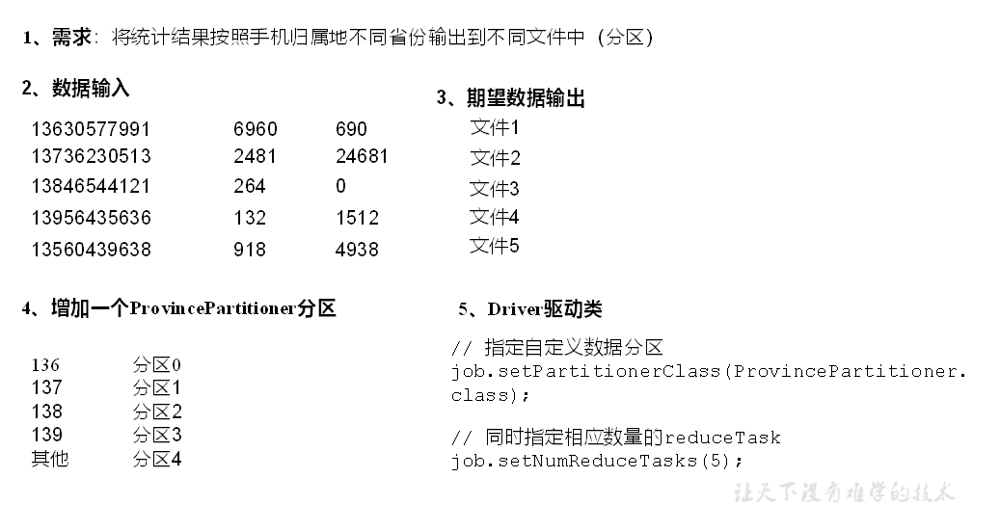

3．在案例2.4的基础上，增加一个分区类

```java
package com.atguigu.mapreduce.flowsum;
import org.apache.hadoop.io.Text;
import org.apache.hadoop.mapreduce.Partitioner;
public class ProvincePartitioner extends Partitioner<Text, FlowBean> {
    @Override
    public int getPartition(Text key, FlowBean value, int numPartitions) {
        // 1 获取电话号码的前三位
        String preNum = key.toString().substring(0, 3);
        int partition = 4;
        // 2 判断是哪个省
        if ("136".equals(preNum)) {
            partition = 0;
        }else if ("137".equals(preNum)) {
            partition = 1;
        }else if ("138".equals(preNum)) {
            partition = 2;
        }else if ("139".equals(preNum)) {
            partition = 3;
        }
        return partition;
    }
}
```

4．在驱动函数中增加自定义数据分区设置和ReduceTask设置

```java
package com.atguigu.mapreduce.flowsum;
import java.io.IOException;
import org.apache.hadoop.conf.Configuration;
import org.apache.hadoop.fs.Path;
import org.apache.hadoop.io.Text;
import org.apache.hadoop.mapreduce.Job;
import org.apache.hadoop.mapreduce.lib.input.FileInputFormat;
import org.apache.hadoop.mapreduce.lib.output.FileOutputFormat;
public class FlowsumDriver {
    public static void main(String[] args) throws IllegalArgumentException, IOException, ClassNotFoundException, InterruptedException {
        // 输入输出路径需要根据自己电脑上实际的输入输出路径设置
        args = new String[]{"e:/output1","e:/output2"};
        // 1 获取配置信息，或者job对象实例
        Configuration configuration = new Configuration();
        Job job = Job.getInstance(configuration);
        // 2 指定本程序的jar包所在的本地路径
        job.setJarByClass(FlowsumDriver.class);
        // 3 指定本业务job要使用的mapper/Reducer业务类
        job.setMapperClass(FlowCountMapper.class);
        job.setReducerClass(FlowCountReducer.class);
        // 4 指定mapper输出数据的kv类型
        job.setMapOutputKeyClass(Text.class);
        job.setMapOutputValueClass(FlowBean.class);
        // 5 指定最终输出的数据的kv类型
        job.setOutputKeyClass(Text.class);
        job.setOutputValueClass(FlowBean.class);
        // 8 指定自定义数据分区
        job.setPartitionerClass(ProvincePartitioner.class);
        // 9 同时指定相应数量的reduce task
        job.setNumReduceTasks(5);
        // 6 指定job的输入原始文件所在目录
        FileInputFormat.setInputPaths(job, new Path(args[0]));
        FileOutputFormat.setOutputPath(job, new Path(args[1]));
        // 7 将job中配置的相关参数，以及job所用的java类所在的jar包， 提交给yarn去运行
        boolean result = job.waitForCompletion(true);
        System.exit(result ? 0 : 1);
    }
}
```


### 3.3.4 WritableComparable排序

排序是MapReduce框架中最重要的操作之一。

MapTask和ReduceTask均会对数据按照key进行排序。该操作属于Hadoop的默认行为。任何应用程序中的数据均会被排序，而不管逻辑上是否需要。

默认排序是按照字典顺序排序，且实现该排序的方法是快速排序。

对于MapTask，它会将处理的结果暂时放到环形缓冲区中，当环形缓冲区使用率达到一定阈值后，再对缓冲区中的数据进行一次快速排序，并将这些有序数据溢写到磁盘上，而当数据处理完毕后，它会对磁盘上所有文件进行归并排序。

对于ReduceTask，它从每个MapTask上远程拷贝相应的数据文件，如果文件大小超过一定阈值，则溢写磁盘上，否则存储在内存中。如果磁盘上文件数目达到一定阈值，则进行一次归并排序以生成一个更大文件;如果内存中文件大小或者数目超过一定阈值，则进行一次合并后将数据溢写到磁盘上。当所有数据拷贝完毕后，ReduceTask统一对内存和磁盘上的所有数据进行一次归并排序。

1．排序的分类

(1）部分排序

MapReduce根据输入记录的键对数据集排序。保证输出的每个文件内部有序。

(2)全排序

最终输出结果只有一个文件，且文件内部有序。实现方式是只设置一个ReduceTask。但该方法在处理大型文件时效率极低，因为一台机器处理所有文件，完全丧失了MapReduce所提供的并行架构。

(3）辅助排序:(GroupingComparator分组)

在Reduce端对key进行分组。应用于:在接收的key为bean对象时，想让一个或几个字段相同（全部字段比较不相同)的keyi进入到同一个reduce方法时，可以采用分组排序。

(4)二次排序

在自定义排序过程中，如果compareTo中的判断条件为两个即为二次排序。

2．自定义排序WritableComparable

（1）原理分析

bean对象做为key传输，需要实现WritableComparable接口重写compareTo方法，就可以实现排序。

```java
@Override
public int compareTo(FlowBean o) {
    int result;
    // 按照总流量大小，倒序排列
    if (sumFlow > bean.getSumFlow()) {
        result = -1;
    }else if (sumFlow < bean.getSumFlow()) {
        result = 1;
    }else {
        result = 0;
    }
    return result;
}
```


### 3.3.5 WritableComparable排序案例实操（全排序）

1．需求

根据案例2.3产生的结果再次对总流量进行排序。

（1）输入数据


（2）期望输出数据

```txt
13509468723	7335	110349	117684
13736230513	2481	24681	27162
13956435636	132		1512	1644
13846544121	264		0		264
。。。。。。
```

2．需求分析

​	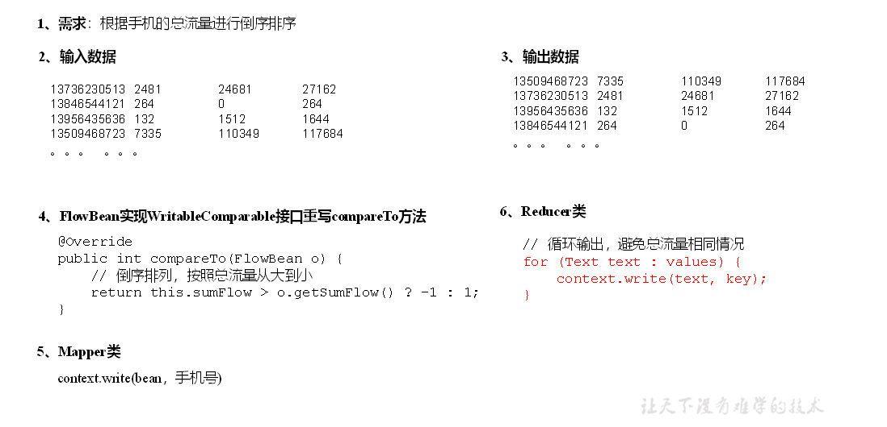

3．代码实现

（1）FlowBean对象在在需求1基础上增加了比较功能

```java
package com.atguigu.mapreduce.sort;
import java.io.DataInput;
import java.io.DataOutput;
import java.io.IOException;
import org.apache.hadoop.io.WritableComparable;
public class FlowBean implements WritableComparable<FlowBean> {
    private long upFlow;
    private long downFlow;
    private long sumFlow;
    // 反序列化时，需要反射调用空参构造函数，所以必须有
    public FlowBean() {
        super();
    }
    public FlowBean(long upFlow, long downFlow) {
        super();
        this.upFlow = upFlow;
        this.downFlow = downFlow;
        this.sumFlow = upFlow + downFlow;
    }
    public void set(long upFlow, long downFlow) {
        this.upFlow = upFlow;
        this.downFlow = downFlow;
        this.sumFlow = upFlow + downFlow;
    }
    public long getSumFlow() {
        return sumFlow;
    }
    public void setSumFlow(long sumFlow) {
        this.sumFlow = sumFlow;
    }	
    public long getUpFlow() {
        return upFlow;
    }
    public void setUpFlow(long upFlow) {
        this.upFlow = upFlow;
    }
    public long getDownFlow() {
        return downFlow;
    }
    public void setDownFlow(long downFlow) {
        this.downFlow = downFlow;
    }
    /**
    * 序列化方法
    * @param out
    * @throws IOException
    */
    @Override
    public void write(DataOutput out) throws IOException {
        out.writeLong(upFlow);
        out.writeLong(downFlow);
        out.writeLong(sumFlow);
    }

    /**
    * 反序列化方法 注意反序列化的顺序和序列化的顺序完全一致
    * @param in
    * @throws IOException
    */

    @Override
    public void readFields(DataInput in) throws IOException {
        upFlow = in.readLong();
        downFlow = in.readLong();
        sumFlow = in.readLong();
    }

    @Override
    public String toString() {
        return upFlow + "\t" + downFlow + "\t" + sumFlow;
    }
    @Override
    public int compareTo(FlowBean o) {
        int result;
        // 按照总流量大小，倒序排列
        if (sumFlow > bean.getSumFlow()) {
            result = -1;
        }else if (sumFlow < bean.getSumFlow()) {
            result = 1;
        }else {
            result = 0;
        }
        return result;
    }
}
```


​	（2）编写Mapper类

```java
package com.atguigu.mapreduce.sort;
import java.io.IOException;
import org.apache.hadoop.io.LongWritable;
import org.apache.hadoop.io.Text;
import org.apache.hadoop.mapreduce.Mapper;
public class FlowCountSortMapper extends Mapper<LongWritable, Text, FlowBean, Text>{
    FlowBean bean = new FlowBean();
    Text v = new Text();
    @Override
    protected void map(LongWritable key, Text value, Context context)	throws IOException, InterruptedException {
        // 1 获取一行
        String line = value.toString();
        // 2 截取
        String[] fields = line.split("\t");
        // 3 封装对象
        String phoneNbr = fields[0];
        long upFlow = Long.parseLong(fields[1]);
        long downFlow = Long.parseLong(fields[2]);
        bean.set(upFlow, downFlow);
        v.set(phoneNbr);
        // 4 输出
        context.write(bean, v);
    }
}
```


​	（3）编写Reducer类

```java
package com.atguigu.mapreduce.sort;
import java.io.IOException;
import org.apache.hadoop.io.Text;
import org.apache.hadoop.mapreduce.Reducer;
public class FlowCountSortReducer extends Reducer<FlowBean, Text, Text, FlowBean>{
    @Override
    protected void reduce(FlowBean key, Iterable<Text> values, Context context)	throws IOException, InterruptedException {
        // 循环输出，避免总流量相同情况
        for (Text text : values) {
            context.write(text, key);
        }
    }
}
```


​	（4）编写Driver类

```java
package com.atguigu.mapreduce.sort;
import java.io.IOException;
import org.apache.hadoop.conf.Configuration;
import org.apache.hadoop.fs.Path;
import org.apache.hadoop.io.Text;
import org.apache.hadoop.mapreduce.Job;
import org.apache.hadoop.mapreduce.lib.input.FileInputFormat;
import org.apache.hadoop.mapreduce.lib.output.FileOutputFormat;
public class FlowCountSortDriver {
    public static void main(String[] args) throws ClassNotFoundException, IOException, InterruptedException {
        // 输入输出路径需要根据自己电脑上实际的输入输出路径设置
        args = new String[]{"e:/output1","e:/output2"};
        // 1 获取配置信息，或者job对象实例
        Configuration configuration = new Configuration();
        Job job = Job.getInstance(configuration);
        // 2 指定本程序的jar包所在的本地路径
        job.setJarByClass(FlowCountSortDriver.class);
        // 3 指定本业务job要使用的mapper/Reducer业务类
        job.setMapperClass(FlowCountSortMapper.class);
        job.setReducerClass(FlowCountSortReducer.class);
        // 4 指定mapper输出数据的kv类型
        job.setMapOutputKeyClass(FlowBean.class);
        job.setMapOutputValueClass(Text.class);
        // 5 指定最终输出的数据的kv类型
        job.setOutputKeyClass(Text.class);
        job.setOutputValueClass(FlowBean.class);
        // 6 指定job的输入原始文件所在目录
        FileInputFormat.setInputPaths(job, new Path(args[0]));
        FileOutputFormat.setOutputPath(job, new Path(args[1]));
        // 7 将job中配置的相关参数，以及job所用的java类所在的jar包， 提交给yarn去运行
        boolean result = job.waitForCompletion(true);
        System.exit(result ? 0 : 1);
    }
}
```


### 3.3.6 WritableComparable排序案例实操（区内排序）

1．需求

要求每个省份手机号输出的文件中按照总流量内部排序。

2．需求分析

​	基于前一个需求，增加自定义分区类，分区按照省份手机号设置。

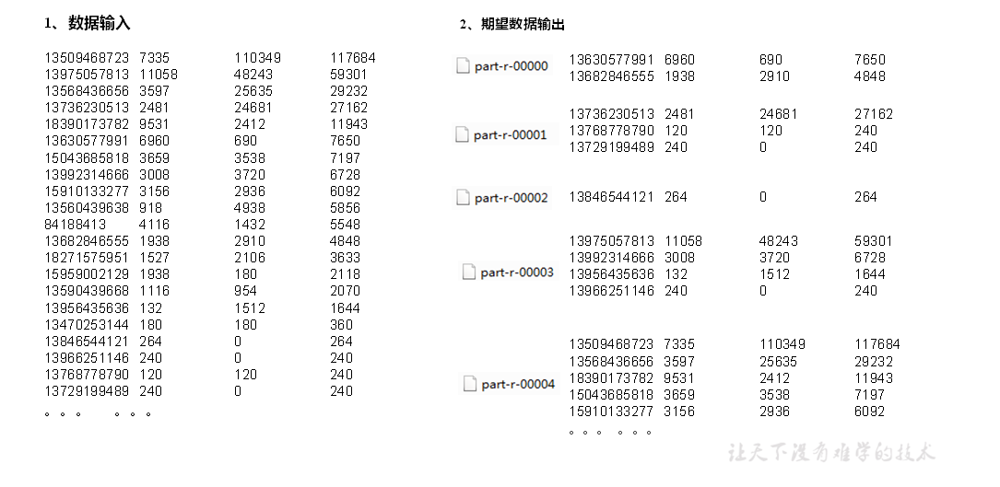

3．案例实操

（1）增加自定义分区类

```java
package com.atguigu.mapreduce.sort;
import org.apache.hadoop.io.Text;
import org.apache.hadoop.mapreduce.Partitioner;
public class ProvincePartitioner extends Partitioner<FlowBean, Text> {
    @Override
    public int getPartition(FlowBean key, Text value, int numPartitions) {
        // 1 获取手机号码前三位
        String preNum = value.toString().substring(0, 3);
        int partition = 4;
        // 2 根据手机号归属地设置分区
        if ("136".equals(preNum)) {
            partition = 0;
        }else if ("137".equals(preNum)) {
            partition = 1;
        }else if ("138".equals(preNum)) {
            partition = 2;
        }else if ("139".equals(preNum)) {
            partition = 3;
        }
        return partition;
    }
}


```

（2）在驱动类中添加分区类

   ```java
// 加载自定义分区类
job.setPartitionerClass(ProvincePartitioner.class);
// 设置Reducetask个数
job.setNumReduceTasks(5);
   ```


### 3.3.7 Combiner合并

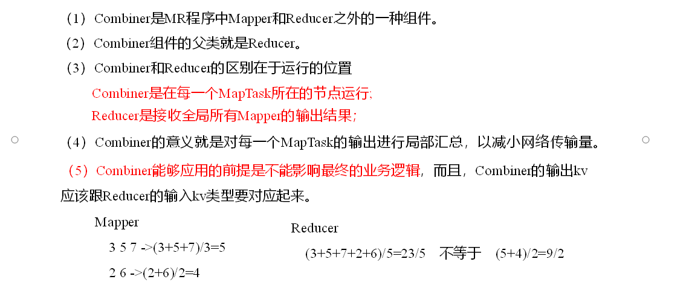

（6）自定义Combiner实现步骤

（a）自定义一个Combiner继承Reducer，重写Reduce方法

```java
public class WordcountCombiner extends Reducer<Text, IntWritable, Text,IntWritable>{ 
    @Override	protected void reduce(Text key, Iterable<IntWritable> values,Context context) throws IOException, InterruptedException {
        // 1 汇总操作
        int count = 0;
        for(IntWritable v :values){
            count += v.get();
        } 
        // 2 写出	
        context.write(key, new IntWritable(count));
    }
}
```

（b）在Job驱动类中设置：  

```java
job.setCombinerClass(WordcountCombiner.class);
```


### 3.3.8 Combiner合并案例实操

1．需求

统计过程中对每一个MapTask的输出进行局部汇总，以减小网络传输量即采用Combiner功能。

（1）数据输入

 

（2）期望输出数据

期望：Combine输入数据多，输出时经过合并，输出数据降低。

2．需求分析

<font color=red>需求:对每一个MapTask的输出局部汇总(Combiner)</font>

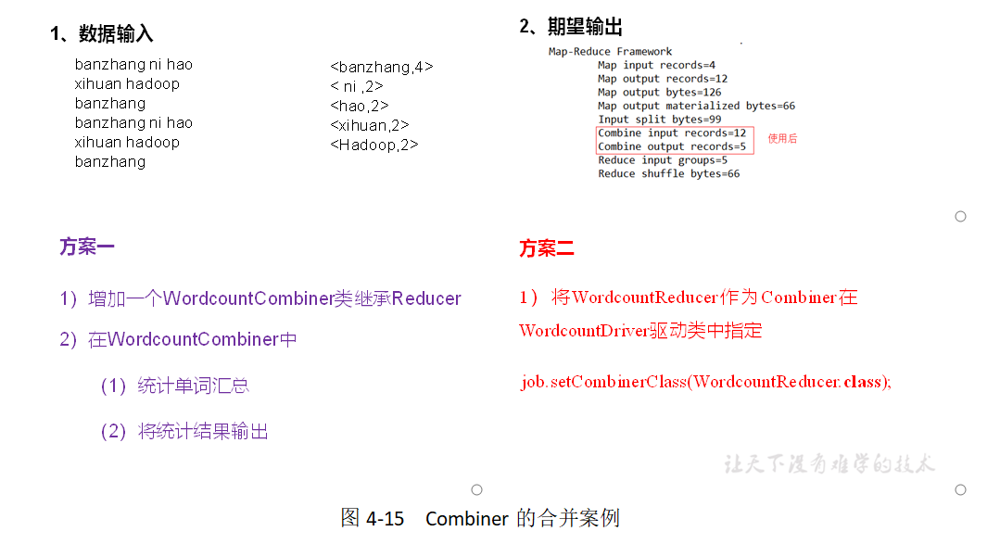


3．案例实操-方案一

1）增加一个WordcountCombiner类继承Reducer

```java
package com.atguigu.mr.combiner;
import java.io.IOException;
import org.apache.hadoop.io.IntWritable;
import org.apache.hadoop.io.Text;
import org.apache.hadoop.mapreduce.Reducer;
public class WordcountCombiner extends Reducer<Text, IntWritable, Text, IntWritable>{
    IntWritable v = new IntWritable();
    @Override
    protected void reduce(Text key, Iterable<IntWritable> values, Context context) throws IOException, InterruptedException {
        // 1 汇总
        int sum = 0;
        for(IntWritable value :values){
            sum += value.get();
        }
        v.set(sum);
        // 2 写出
        context.write(key, v);
    }
}
```

2）在WordcountDriver驱动类中指定Combiner

```java
// 指定需要使用combiner，以及用哪个类作为combiner的逻辑
job.setCombinerClass(WordcountCombiner.class);
```

4．案例实操-方案二

1）将WordcountReducer作为Combiner在WordcountDriver驱动类中指定

```java
// 指定需要使用Combiner，以及用哪个类作为Combiner的逻辑
job.setCombinerClass(WordcountReducer.class);
```

运行程序

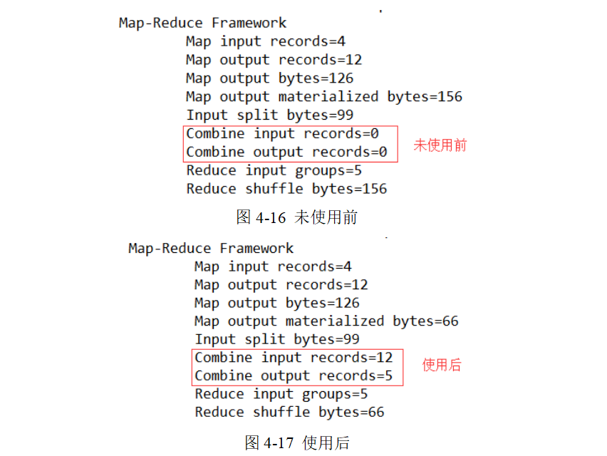

### 3.3.9 GroupingComparator分组（辅助排序）

对Reduce阶段的数据根据某一个或几个字段进行分组。

分组排序步骤：

（1）自定义类继承WritableComparator

（2）重写compare()方法

```java
@Override
public int compare(WritableComparable a, WritableComparable b) {
    // 比较的业务逻辑
    return result;
}
```

（3）创建一个构造将比较对象的类传给父类

```java
protected OrderGroupingComparator() {
    super(OrderBean.class, true);
}
```

### 3.3.10 GroupingComparator分组案例实操

1．需求

有如下订单数据

表4-2 订单数据

| 订单id  | 商品id | 成交金额 |
| ------- | ------ | -------- |
| 0000001 | Pdt_01 | 222.8    |
| Pdt_02  | 33.8   |          |
| 0000002 | Pdt_03 | 522.8    |
| Pdt_04  | 122.4  |          |
| Pdt_05  | 722.4  |          |
| 0000003 | Pdt_06 | 232.8    |
| Pdt_02  | 33.8   |          |

现在需要求出每一个订单中最贵的商品。

（1）输入数据

 

（2）期望输出数据

```txt
1	222.8
2	722.4
3	232.8
```

2．需求分析

（1）利用“订单id和成交金额”作为key，可以将Map阶段读取到的所有订单数据按照id升序排序，如果id相同再按照金额降序排序，发送到Reduce。

（2）在Reduce端利用groupingComparator将订单id相同的kv聚合成组，然后取第一个即是该订单中最贵商品，如图4-18所示。

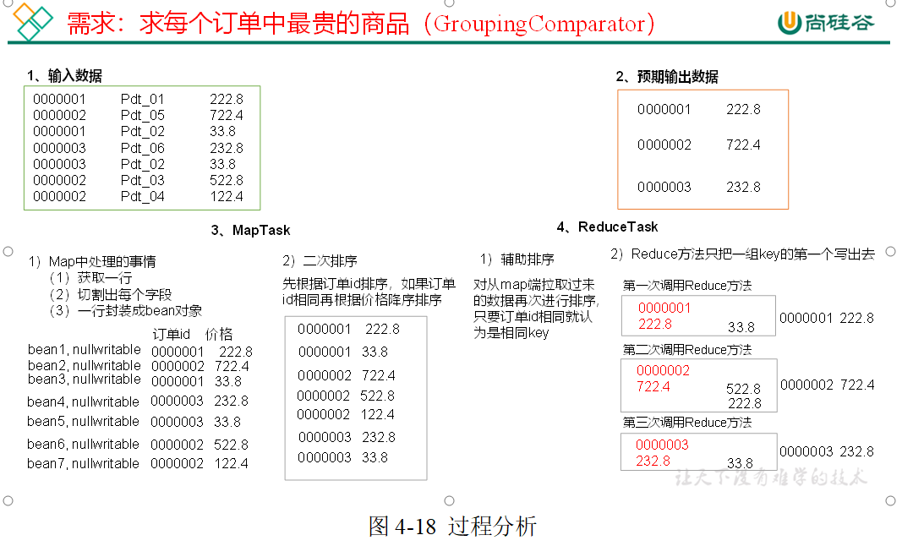

图4-18 过程分析

3．代码实现

（1）定义订单信息OrderBean类

```java
package com.atguigu.mapreduce.order;
import java.io.DataInput;
import java.io.DataOutput;
import java.io.IOException;
import org.apache.hadoop.io.WritableComparable;
public class OrderBean implements WritableComparable<OrderBean> {
    private int order_id;
    // 订单id号
    private double price;
    // 价格
    public OrderBean() {
        super();
    }
    public OrderBean(int order_id, double price){
        super();
        this.order_id = order_id;
        this.price = price;
    }
    @Override
    public void write(DataOutput out) throws IOException {
        out.writeInt(order_id);
        out.writeDouble(price);
    }
    @Override	public void readFields(DataInput in) throws IOException {
        order_id = in.readInt();
        price = in.readDouble();
    } 
    @Override	public String toString() {
        return order_id + "\t" + price;
    }
    public int getOrder_id() {
        return order_id;
    } 
    public void setOrder_id(int order_id) {	
        this.order_id = order_id;
    } 
    public double getPrice() {
        return price;
    }
    public void setPrice(double price) {
        this.price = price;
    }
    // 二次排序
    @Override	public int compareTo(OrderBean o) {
        int result;
        if (order_id > o.getOrder_id()) {
            result = 1;
        } else if (order_id < o.getOrder_id()) {
            result = -1;
        } else {
            // 价格倒序排序
            result = price > o.getPrice() ? -1 : 1;	
        } 
        return result;
    }
}
```


（2）编写OrderSortMapper类

```java
package com.atguigu.mapreduce.order;
import java.io.IOException;
import org.apache.hadoop.io.LongWritable;
import org.apache.hadoop.io.NullWritable;
import org.apache.hadoop.io.Text;
import org.apache.hadoop.mapreduce.Mapper; 
public class OrderMapper extends Mapper<LongWritable, Text, OrderBean, NullWritable> { 
    OrderBean k = new OrderBean();
    @Override
    protected void map(LongWritable key, Text value, Context context) throws IOException, InterruptedException {
        // 1 获取一行
        String line = value.toString();
        // 2 截取	
        String[] fields = line.split("\t");	
        // 3 封装对象
        k.setOrder_id(Integer.parseInt(fields[0]));		
        k.setPrice(Double.parseDouble(fields[2]));
        // 4 写出	
        context.write(k, NullWritable.get());
    }
}
```


（3）编写OrderSortGroupingComparator类

```java
package com.atguigu.mapreduce.order;
import org.apache.hadoop.io.WritableComparable;
import org.apache.hadoop.io.WritableComparator;
public class OrderGroupingComparator extends WritableComparator {
    protected OrderGroupingComparator() {
        super(OrderBean.class, true);
    }
    @Override
    public int compare(WritableComparable a, WritableComparable b) {
        OrderBean aBean = (OrderBean) a;
        OrderBean bBean = (OrderBean) b;
        int result;	
        if (aBean.getOrder_id() > bBean.getOrder_id()) {
            result = 1;	
        } else if (aBean.getOrder_id() < bBean.getOrder_id()) {	
            result = -1;
        } else {	
            result = 0;
        } 
        return result;	
    }
}
```


（4）编写OrderSortReducer类

```java
package com.atguigu.mapreduce.order;
import java.io.IOException;
import org.apache.hadoop.io.NullWritable;
import org.apache.hadoop.mapreduce.Reducer;
public class OrderReducer extends Reducer<OrderBean, NullWritable, OrderBean, NullWritable> { 
    @Override
    protected void reduce(OrderBean key, Iterable<NullWritable> values, Context context)		throws IOException, InterruptedException {
        context.write(key, NullWritable.get());	
    }
}
```


（5）编写OrderSortDriver类

```java
package com.atguigu.mapreduce.order;
import java.io.IOException;
import org.apache.hadoop.conf.Configuration;
import org.apache.hadoop.fs.Path;
import org.apache.hadoop.io.NullWritable;
import org.apache.hadoop.mapreduce.Job;
import org.apache.hadoop.mapreduce.lib.input.FileInputFormat;
import org.apache.hadoop.mapreduce.lib.output.FileOutputFormat;
public class OrderDriver {
    public static void main(String[] args) throws Exception, IOException {
        // 输入输出路径需要根据自己电脑上实际的输入输出路径设置
        args  = new String[]{"e:/input/inputorder" , "e:/output1"};
        // 1 获取配置信息	
        Configuration conf = new Configuration();
        Job job = Job.getInstance(conf);
        // 2 设置jar包加载路径	
        job.setJarByClass(OrderDriver.class);
        // 3 加载map/reduce类	
        job.setMapperClass(OrderMapper.class);
        job.setReducerClass(OrderReducer.class);
        // 4 设置map输出数据key和value类型
        job.setMapOutputKeyClass(OrderBean.class);		
        job.setMapOutputValueClass(NullWritable.class); 
        // 5 设置最终输出数据的key和value类型
        job.setOutputKeyClass(OrderBean.class);		
        job.setOutputValueClass(NullWritable.class);
        // 6 设置输入数据和输出数据路径	
        FileInputFormat.setInputPaths(job, new Path(args[0]));		
        FileOutputFormat.setOutputPath(job, new Path(args[1])); 
        // 8 设置reduce端的分组
        job.setGroupingComparatorClass(OrderGroupingComparator.class);
        // 7 提交
        boolean result = job.waitForCompletion(true);
        System.exit(result ? 0 : 1);
    }
}
```


## 3.4 MapTask工作机制

MapTask工作机制如图4-12所示。

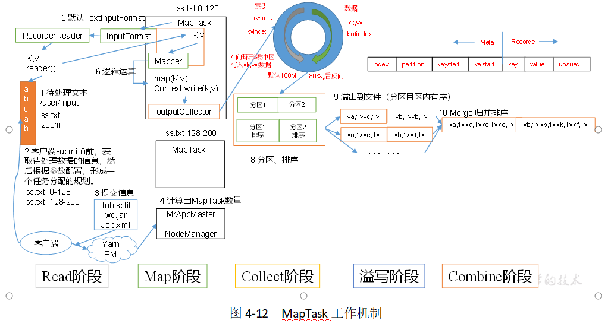

​	（1）Read阶段：MapTask通过用户编写的RecordReader，从输入InputSplit中解析出一个个key/value。

​	（2）Map阶段：该节点主要是将解析出的key/value交给用户编写map()函数处理，并产生一系列新的key/value。

​	（3）Collect收集阶段：在用户编写map()函数中，当数据处理完成后，一般会调用OutputCollector.collect()输出结果。在该函数内部，它会将生成的key/value分区（调用Partitioner），并写入一个环形内存缓冲区中。

​	（4）Spill阶段：即“溢写”，当环形缓冲区满后，MapReduce会将数据写到本地磁盘上，生成一个临时文件。需要注意的是，将数据写入本地磁盘之前，先要对数据进行一次本地排序，并在必要时对数据进行合并、压缩等操作。

​	溢写阶段详情：

​	步骤1：利用快速排序算法对缓存区内的数据进行排序，排序方式是，先按照分区编号Partition进行排序，然后按照key进行排序。这样，经过排序后，数据以分区为单位聚集在一起，且同一分区内所有数据按照key有序。

​	步骤2：按照分区编号由小到大依次将每个分区中的数据写入任务工作目录下的临时文件output/spillN.out（N表示当前溢写次数）中。如果用户设置了Combiner，则写入文件之前，对每个分区中的数据进行一次聚集操作。

​	步骤3：将分区数据的元信息写到内存索引数据结构SpillRecord中，其中每个分区的元信息包括在临时文件中的偏移量、压缩前数据大小和压缩后数据大小。如果当前内存索引大小超过1MB，则将内存索引写到文件output/spillN.out.index中。

​	（5）Combine阶段：当所有数据处理完成后，MapTask对所有临时文件进行一次合并，以确保最终只会生成一个数据文件。

​	当所有数据处理完后，MapTask会将所有临时文件合并成一个大文件，并保存到文件output/file.out中，同时生成相应的索引文件output/file.out.index。

​	在进行文件合并过程中，MapTask以分区为单位进行合并。对于某个分区，它将采用多轮递归合并的方式。每轮合并io.sort.factor（默认10）个文件，并将产生的文件重新加入待合并列表中，对文件排序后，重复以上过程，直到最终得到一个大文件。

​	让每个MapTask最终只生成一个数据文件，可避免同时打开大量文件和同时读取大量小文件产生的随机读取带来的开销。

## 3.5 ReduceTask工作机制

1．ReduceTask工作机制

ReduceTask工作机制，如图4-19所示。

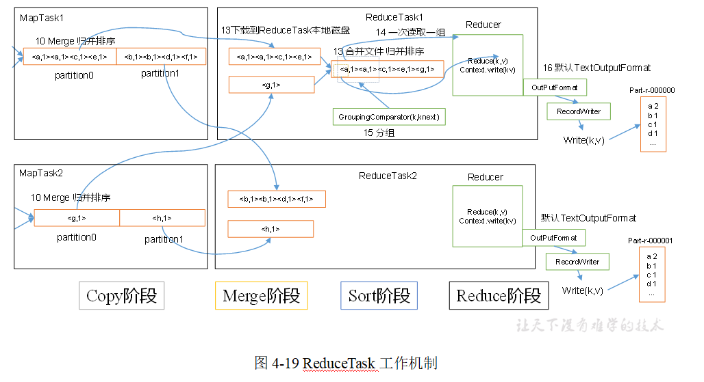

​	（1）Copy阶段：ReduceTask从各个MapTask上远程拷贝一片数据，并针对某一片数据，如果其大小超过一定阈值，则写到磁盘上，否则直接放到内存中。

​	（2）Merge阶段：在远程拷贝数据的同时，ReduceTask启动了两个后台线程对内存和磁盘上的文件进行合并，以防止内存使用过多或磁盘上文件过多。

​	（3）Sort阶段：按照MapReduce语义，用户编写reduce()函数输入数据是按key进行聚集的一组数据。为了将key相同的数据聚在一起，Hadoop采用了基于排序的策略。由于各个MapTask已经实现对自己的处理结果进行了局部排序，因此，ReduceTask只需对所有数据进行一次归并排序即可。

​	（4）Reduce阶段：reduce()函数将计算结果写到HDFS上。

2．设置ReduceTask并行度（个数）

ReduceTask的并行度同样影响整个Job的执行并发度和执行效率，但与MapTask的并发数由切片数决定不同，ReduceTask数量的决定是可以直接手动设置：

```java
// 默认值是1，手动设置为4

job.setNumReduceTasks(4);
```

3．实验：测试ReduceTask多少合适

（1）实验环境：1个Master节点，16个Slave节点：CPU:8GHZ，内存: 2G

（2）实验结论：

表4-3 改变ReduceTask （数据量为1GB）

| MapTask =16 |      |      |      |      |      |      |      |      |      |      |
| ----------- | ---- | ---- | ---- | ---- | ---- | ---- | ---- | ---- | ---- | ---- |
| ReduceTask  | 1    | 5    | 10   | 15   | 16   | 20   | 25   | 30   | 45   | 60   |
| 总时间      | 892  | 146  | 110  | 92   | 88   | 100  | 128  | 101  | 145  | 104  |

4．注意事项

> (1) ReduceTask=0，表示没有Reduce阶段，输出文件个数和Map个数一致。
>
> (2) ReduceTask默认值就是1，所以输出文件个数为一个。
>
> (3）如果数据分布不均匀，就有可能在Reduce阶段产生数据倾斜
>
> (4) ReduceTask数量并不是任意设置，还要考虑业务逻辑需求，有些情况下，需要计算全局汇总结果，就只能有1个ReduceTask。
>
> (5）具体多少个ReduceTask，需要根据集群性能而定。
>
> (6）如果分区数不是1，但是ReduceTask为1，是否执行分区过程。答案是:不执行分区过程。因为在MapTask的源码中，执行分区的前提是先判断ReduceNum个数是否大于1。不大于1肯定不执行。

## 3.6 OutputFormat数据输出

### 3.6.1 OutputFormat接口实现类

> OutputFormat是MapReduce输出的基类，所有实现MapReduce输出都实现了OutputFormat接口。下面我们介绍几种常见的OutputFormat实现类。
>
> 1. 文本输出TextOutputFormat
>    默认的输出格式是TextOutputFormat，它把每条记录写为文本行。它的键和值可以是任意类型，因为TextOutputFormat调用toString0方法把它们转换为字符串。
>
> 2. SequenceFileOutputFormat
> 将SequenceFileOutputFormat输出作为后续 MapReduce任务的输入，这便是一种好的输出格式，因为它的格式紧凑，很容易被压缩。
> 3. 自定义OutputFormat
>     根据用户需求，自定义实现输出。

### 3.6.2 自定义OutputFormat

> 自定义OutputFormat使用场景及步骤
> 1．使用场景
> 为了实现控制最终文件的输出路径和输出格式，可以自定义OutputFormat。例如:要在一个MapReduce程序中根据数据的不同输出两类结果到不同目录，这类灵活的输出需求可以通过自定义OutputFormat来实现。
> 2.自定义OutputFormat步骤
> (1）自定义一个类继承FileOutputFormat。
> (2）改写RecordWriter，具体改写输出数据的方法write(。

### 3.6.3 自定义OutputFormat案例实操

1．需求

​	过滤输入的log日志，包含atguigu的网站输出到e:/atguigu.log，不包含atguigu的网站输出到e:/other.log。

（1）输入数据

 

（2）期望输出数据

 

2．需求分析

<font color =red >自定义OutputFormat案例分析</font>


3．案例实操

（1）编写FilterMapper类

```java
package com.atguigu.mapreduce.outputformat;
import java.io.IOException;
import org.apache.hadoop.io.LongWritable;
import org.apache.hadoop.io.NullWritable;
import org.apache.hadoop.io.Text;
import org.apache.hadoop.mapreduce.Mapper; 
public class FilterMapper extends Mapper<LongWritable, Text, Text, NullWritable>{		
    @Override
    protected void map(LongWritable key, Text value, Context context)	throws IOException, InterruptedException {
        // 写出
        context.write(value, NullWritable.get());
    }
}
```


（2）编写FilterReducer类

```java
package com.atguigu.mapreduce.outputformat;
import java.io.IOException;
import org.apache.hadoop.io.NullWritable;
import org.apache.hadoop.io.Text;
import org.apache.hadoop.mapreduce.Reducer; 
public class FilterReducer extends Reducer<Text, NullWritable, Text, NullWritable> {
    Text k = new Text();
    @Override
    protected void reduce(Text key, Iterable<NullWritable> values, Context context)		throws IOException, InterruptedException {
        // 1 获取一行
        String line = key.toString();
        // 2 拼接	
        line = line + "\r\n";
        // 3 设置key 
        k.set(line);
        // 4 输出	
        context.write(k, NullWritable.get());
    }
}
```


（3）自定义一个OutputFormat类

```java
package com.atguigu.mapreduce.outputformat;
import java.io.IOException;
import org.apache.hadoop.io.NullWritable;
import org.apache.hadoop.io.Text;
import org.apache.hadoop.mapreduce.RecordWriter;
import org.apache.hadoop.mapreduce.TaskAttemptContext;
import org.apache.hadoop.mapreduce.lib.output.FileOutputFormat;
public class FilterOutputFormat extends FileOutputFormat<Text, NullWritable>{
    @Override
    public RecordWriter<Text, NullWritable> getRecordWriter(TaskAttemptContext job)			throws IOException, InterruptedException {
        // 创建一个RecordWriter
        return new FilterRecordWriter(job);
    }
}
```


（4）编写RecordWriter类

```java
package com.atguigu.mapreduce.outputformat;
import java.io.IOException;
import org.apache.hadoop.fs.FSDataOutputStream;
import org.apache.hadoop.fs.FileSystem;
import org.apache.hadoop.fs.Path;
import org.apache.hadoop.io.NullWritable;
import org.apache.hadoop.io.Text;
import org.apache.hadoop.mapreduce.RecordWriter;
import org.apache.hadoop.mapreduce.TaskAttemptContext;
public class FilterRecordWriter extends RecordWriter<Text, NullWritable> {
    FSDataOutputStream atguiguOut = null;
    FSDataOutputStream otherOut = null; 
    public FilterRecordWriter(TaskAttemptContext job) { 
        // 1 获取文件系统
        FileSystem fs; 
        try {
            fs = FileSystem.get(job.getConfiguration());
            // 2 创建输出文件路径
            Path atguiguPath = new Path("e:/atguigu.log");
            Path otherPath = new Path("e:/other.log");
            // 3 创建输出流
            atguiguOut = fs.create(atguiguPath);
            otherOut = fs.create(otherPath);
        } catch (IOException e) {
            e.printStackTrace();
        }
    }
    @Override	public void write(Text key, NullWritable value) throws IOException, InterruptedException {
        // 判断是否包含“atguigu”输出到不同文件
        if (key.toString().contains("atguigu")) {			
            atguiguOut.write(key.toString().getBytes());
        } else {
            otherOut.write(key.toString().getBytes());
        }
    }
    @Override
    public void close(TaskAttemptContext context) throws IOException, InterruptedException { 	
        // 关闭资源
        IOUtils.closeStream(atguiguOut);
        IOUtils.closeStream(otherOut);
    }
}
```


（5）编写FilterDriver类

```java
package com.atguigu.mapreduce.outputformat;
import org.apache.hadoop.conf.Configuration;
import org.apache.hadoop.fs.Path;
import org.apache.hadoop.io.NullWritable;
import org.apache.hadoop.io.Text;
import org.apache.hadoop.mapreduce.Job;
import org.apache.hadoop.mapreduce.lib.input.FileInputFormat;
import org.apache.hadoop.mapreduce.lib.output.FileOutputFormat;
public class FilterDriver {
    public static void main(String[] args) throws Exception {
        // 输入输出路径需要根据自己电脑上实际的输入输出路径设置
        args = new String[] { "e:/input/inputoutputformat", "e:/output2" };
        Configuration conf = new Configuration();
        Job job = Job.getInstance(conf);
        job.setJarByClass(FilterDriver.class);
        job.setMapperClass(FilterMapper.class);
        job.setReducerClass(FilterReducer.class);
        job.setMapOutputKeyClass(Text.class);		
        job.setMapOutputValueClass(NullWritable.class);				
        job.setOutputKeyClass(Text.class);
        job.setOutputValueClass(NullWritable.class);
        // 要将自定义的输出格式组件设置到job中		
        job.setOutputFormatClass(FilterOutputFormat.class); 	
        FileInputFormat.setInputPaths(job, new Path(args[0]));
        // 虽然我们自定义了outputformat，但是因为我们的outputformat继承自fileoutputformat
        // 而fileoutputformat要输出一个_SUCCESS文件，所以，在这还得指定一个输出目录		
        FileOutputFormat.setOutputPath(job, new Path(args[1]));
        boolean result = job.waitForCompletion(true);
        System.exit(result ? 0 : 1);
    }
}
```


## 3.7 Join多种应用

### 3.7.1 Reduce Join

> Reduce Join工作原理
>
> Map端的主要工作:为来自不同表或文件的key/value对，打标签以区别不同来源的记录。然后用连接字段作为key，其余部分和新加的标志作为value，最后进行输出。
>
> Reduce端的主要工作:在Redce端以连接字段作为key的分组已经完成，我们只需要在每一个分组当中将那些来源于不同文件的记录(在Map阶段已经打标志)分开，最后进行合并就ok了。

### 3.7.2 Reduce Join案例实操

1．需求

 

表4-4 订单数据表t_order

| id   | pid  | amount |
| ---- | ---- | ------ |
| 1001 | 01   | 1      |
| 1002 | 02   | 2      |
| 1003 | 03   | 3      |
| 1004 | 01   | 4      |
| 1005 | 02   | 5      |
| 1006 | 03   | 6      |

 

表4-5 商品信息表t_product

| pid  | pname |
| ---- | ----- |
| 01   | 小米  |
| 02   | 华为  |
| 03   | 格力  |

​	将商品信息表中数据根据商品pid合并到订单数据表中。

表4-6 最终数据形式

| id   | pname | amount |
| ---- | ----- | ------ |
| 1001 | 小米  | 1      |
| 1004 | 小米  | 4      |
| 1002 | 华为  | 2      |
| 1005 | 华为  | 5      |
| 1003 | 格力  | 3      |
| 1006 | 格力  | 6      |

2．需求分析

通过将关联条件作为Map输出的key，将两表满足Join条件的数据并携带数据所来源的文件信息，发往同一个ReduceTask，在Reduce中进行数据的串联，如图4-20所示。

<font color = red>Reduce端表合并（数据倾斜）</font>

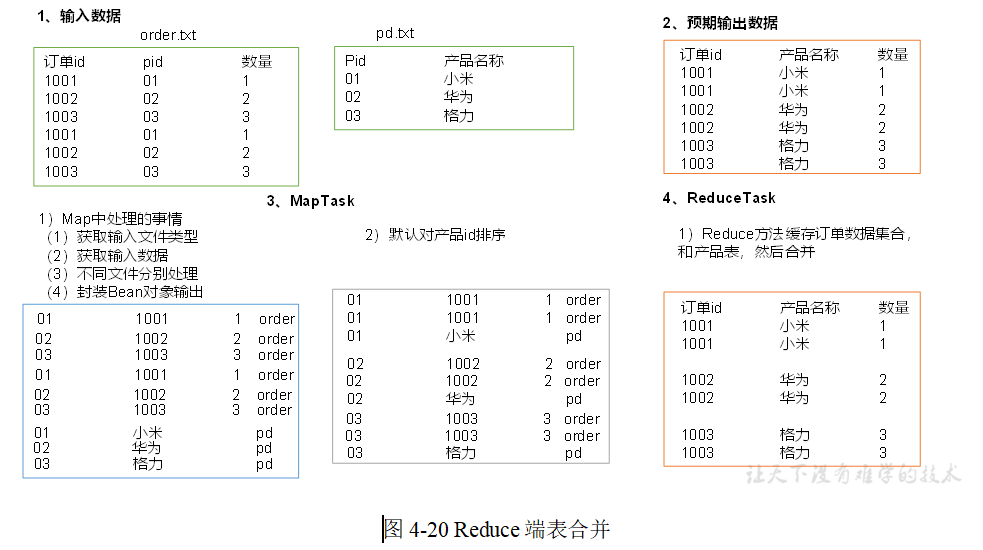

3．代码实现

1）创建商品和订合并后的Bean类

```java
package com.atguigu.mapreduce.table;
import java.io.DataInput;
import java.io.DataOutput;
import java.io.IOException;
import org.apache.hadoop.io.Writable;
public class TableBean implements Writable { 
   // 订单id	
    private String order_id; 
    // 产品id
    private String p_id; 
     // 产品数量
    private int amount;  
     // 产品名称	
    private String pname;  
      // 表的标记
    private String flag; 
    public TableBean() {
        super();
    } 
    public TableBean(String order_id, String p_id, int amount, String pname, String flag) {
        super(); 
        this.order_id = order_id;
        this.p_id = p_id;	
        this.amount = amount;	
        this.pname = pname;	
        this.flag = flag;
    } 
    
    public String getFlag() {
        return flag;
    } 
    public void setFlag(String flag) {
        this.flag = flag;
    } 
    public String getOrder_id() {
        return order_id;
    }
    public void setOrder_id(String order_id) {
        this.order_id = order_id;
    } 
    public String getP_id() {
        return p_id;
    }
    public void setP_id(String p_id) {
        this.p_id = p_id;
    } 
    public int getAmount() {
        return amount;
    } 
    public void setAmount(int amount) {
        this.amount = amount;
    } 
    public String getPname() {
        return pname;
    } 
    public void setPname(String pname) {
        this.pname = pname;
    }
    @Override
    public void write(DataOutput out) throws IOException {
        out.writeUTF(order_id);
        out.writeUTF(p_id);
        out.writeInt(amount);
        out.writeUTF(pname);	
        out.writeUTF(flag);
    }
    @Override	
    
    public void readFields(DataInput in) throws IOException {
        this.order_id = in.readUTF();
        this.p_id = in.readUTF();	
        eadUTF();
    }
    @Override
    public String toString() {	
        return order_id + "\t" + pname + "\t" + amount + "\t" ;	
    }
}
```


2）编写TableMapper类

```java
package com.atguigu.mapreduce.table;
import java.io.IOException;
import org.apache.hadoop.io.LongWritable;
import org.apache.hadoop.io.Text;
import org.apache.hadoop.mapreduce.Mapper;
import org.apache.hadoop.mapreduce.lib.input.FileSplit;
public class TableMapper extends Mapper<LongWritable, Text, Text, TableBean>{
    String name;	
    TableBean bean = new TableBean();
    Text k = new Text();
    @Override
    protected void setup(Context context) throws IOException, InterruptedException { 
        // 1 获取输入文件切片
        FileSplit split = (FileSplit) context.getInputSplit();
        // 2 获取输入文件名称
        name = split.getPath().getName();
    } 
    @Override
    protected void map(LongWritable key, Text value, Context context) throws IOException, InterruptedException {	
        // 1 获取输入数据	
        String line = value.toString();	
        // 2 不同文件分别处理	
        if (name.startsWith("order")) {
            // 订单表处理
            // 2.1 切割	
            String[] fields = line.split("\t");	
            // 2.2 封装bean对象	
            bean.setOrder_id(fields[0]);
            bean.setP_id(fields[1]);
            bean.setAmount(Integer.parseInt(fields[2]));
            bean.setPname("");
            bean.setFlag("order");
            k.set(fields[1]);
        }else {
            // 产品表处理 
            // 2.3 切割	
            String[] fields = line.split("\t");	
            // 2.4 封装bean对象	
            bean.setP_id(fields[0]);
            bean.setPname(fields[1]);
            bean.setFlag("pd");		
            bean.setAmount(0);		
            bean.setOrder_id("");
            k.set(fields[0]);	
        } 
        // 3 写出	
        context.write(k, bean);	
    }
}
```


3）编写TableReducer类

```java
package com.atguigu.mapreduce.table;
import java.io.IOException;
import java.util.ArrayList;
import org.apache.commons.beanutils.BeanUtils;
import org.apache.hadoop.io.NullWritable;
import org.apache.hadoop.io.Text;
import org.apache.hadoop.mapreduce.Reducer;
public class TableReducer extends Reducer<Text, TableBean, TableBean, NullWritable> { 
    @Override	
    protected void reduce(Text key, Iterable<TableBean> values, Context context)	throws IOException, InterruptedException { 
        // 1准备存储订单的集合
        ArrayList<TableBean> orderBeans = new ArrayList<>();
        // 2 准备bean对象	
        TableBean pdBean = new TableBean();
        for (TableBean bean : values) {
            if ("order".equals(bean.getFlag())) {
                // 订单表 		
                // 拷贝传递过来的每条订单数据到集合中	
                TableBean orderBean = new TableBean(); 
                try {	
                    BeanUtils.copyProperties(orderBean, bean);	
                } catch (Exception e) {		
                    e.printStackTrace();	
                } 		
                orderBeans.add(orderBean);	
            } else {
                // 产品表 	
                try {		
                    // 拷贝传递过来的产品表到内存中					
                    BeanUtils.copyProperties(pdBean, bean);	
                } catch (Exception e) {		
                    e.printStackTrace();
                }
            }	
        } 
        // 3 表的拼接	
        for(TableBean bean:orderBeans){ 
            bean.setPname (pdBean.getPname());	
            // 4 数据写出去	
            context.write(bean, NullWritable.get());
        }	
    }
}
```


4）编写TableDriver类

```java
package com.atguigu.mapreduce.table;
import org.apache.hadoop.conf.Configuration;
import org.apache.hadoop.fs.Path;
import org.apache.hadoop.io.NullWritable;
import org.apache.hadoop.io.Text;
import org.apache.hadoop.mapreduce.Job;
import org.apache.hadoop.mapreduce.lib.input.FileInputFormat;
import org.apache.hadoop.mapreduce.lib.output.FileOutputFormat;
public class TableDriver { 
    public static void main(String[] args) throws Exception {	
        // 0 根据自己电脑路径重新配置
        args = new String[]{"e:/input/inputtable","e:/output1"};
        // 1 获取配置信息，或者job对象实例
        Configuration configuration = new Configuration();	
        Job job = Job.getInstance(configuration);
        // 2 指定本程序的jar包所在的本地路径
        job.setJarByClass(TableDriver.class);
        // 3 指定本业务job要使用的Mapper/Reducer业务类
        job.setMapperClass(TableMapper.class);
        job.setReducerClass(TableReducer.class);
        // 4 指定Mapper输出数据的kv类型	
        job.setMapOutputKeyClass(Text.class);		
        job.setMapOutputValueClass(TableBean.class); 
        // 5 指定最终输出的数据的kv类型	
        job.setOutputKeyClass(TableBean.class);		
        job.setOutputValueClass(NullWritable.class); 
        // 6 指定job的输入原始文件所在目录
        FileInputFormat.setInputPaths(job, new Path(args[0]));		
        FileOutputFormat.setOutputPath(job, new Path(args[1])); 
        // 7 将job中配置的相关参数，以及job所用的java类所在的jar包， 提交给yarn去运行
        boolean result = job.waitForCompletion(true);
        System.exit(result ? 0 : 1);
    }
}
```


4．测试

运行程序查看结果

​	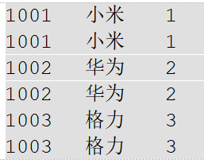

5．总结

> Reduce Join缺点及解决方案
>
> 缺点:这种方式中，合并的操作是在Reduce阶段完成，Reduce端的处理压力太大，Map节点的运算负载则很低，资源利用率不高，且在Reduce阶段极易产生数据倾斜。
>
> 解决方案: Map端实现数据合并

### 3.7.3 Map Join

1．使用场景

Map Join适用于一张表十分小、一张表很大的场景。

2．优点

思考：在Reduce端处理过多的表，非常容易产生数据倾斜。怎么办？

在Map端缓存多张表，提前处理业务逻辑，这样增加Map端业务，减少Reduce端数据的压力，尽可能的减少数据倾斜。

3．具体办法：采用DistributedCache

​	（1）在Mapper的setup阶段，将文件读取到缓存集合中。

​	（2）在驱动函数中加载缓存。

```java
// 缓存普通文件到Task运行节点。
job.addCacheFile(new URI("file://e:/cache/pd.txt"));
```


### 3.7.4 Map Join案例实操

1．需求

 

表4-4 订单数据表t_order

| id   | pid  | amount |
| ---- | ---- | ------ |
| 1001 | 01   | 1      |
| 1002 | 02   | 2      |
| 1003 | 03   | 3      |
| 1004 | 01   | 4      |
| 1005 | 02   | 5      |
| 1006 | 03   | 6      |

表4-5 商品信息表t_product

| pid  | pname |
| ---- | ----- |
| 01   | 小米  |
| 02   | 华为  |
| 03   | 格力  |

 

​	将商品信息表中数据根据商品pid合并到订单数据表中。

表4-6 最终数据形式

| id   | pname | amount |
| ---- | ----- | ------ |
| 1001 | 小米  | 1      |
| 1004 | 小米  | 4      |
| 1002 | 华为  | 2      |
| 1005 | 华为  | 5      |
| 1003 | 格力  | 3      |
| 1006 | 格力  | 6      |

2．需求分析

MapJoin适用于关联表中有小表的情形。


图4-21 Map端表合并

3．实现代码

（1）先在驱动模块中添加缓存文件

```java
package test;
import java.net.URI;
import org.apache.hadoop.conf.Configuration;
import org.apache.hadoop.fs.Path;
import org.apache.hadoop.io.NullWritable;
import org.apache.hadoop.io.Text;
import org.apache.hadoop.mapreduce.Job;
import org.apache.hadoop.mapreduce.lib.input.FileInputFormat;
import org.apache.hadoop.mapreduce.lib.output.FileOutputFormat; 
public class DistributedCacheDriver { 
    public static void main(String[] args) throws Exception {
        // 0 根据自己电脑路径重新配置
        args = new String[]{"e:/input/inputtable2", "e:/output1"}; 
        // 1 获取job信息
        Configuration configuration = new Configuration();
        Job job = Job.getInstance(configuration);
        // 2 设置加载jar包路径	
        job.setJarByClass(DistributedCacheDriver.class); 
        // 3 关联map
        job.setMapperClass(DistributedCacheMapper.class);
        // 4 设置最终输出数据类型	
        job.setOutputKeyClass(Text.class);
        job.setOutputValueClass(NullWritable.class);
        // 5 设置输入输出路径	
        FileInputFormat.setInputPaths(job, new Path(args[0]));		
        FileOutputFormat.setOutputPath(job, new Path(args[1])); 
        // 6 加载缓存数据	
        job.addCacheFile(new URI("file:///e:/input/inputcache/pd.txt"));
        // 7 Map端Join的逻辑不需要Reduce阶段，设置reduceTask数量为0
        job.setNumReduceTasks(0); 
        // 8 提交	
        boolean result = job.waitForCompletion(true);
        System.exit(result ? 0 : 1);
    }
}
```


（2）读取缓存的文件数据

```java
package test;
import java.io.BufferedReader;
import java.io.FileInputStream;
import java.io.IOException;
import java.io.InputStreamReader;
import java.util.HashMap;
import java.util.Map;
import org.apache.commons.lang.StringUtils;
import org.apache.hadoop.io.LongWritable;
import org.apache.hadoop.io.NullWritable;
import org.apache.hadoop.io.Text;
import org.apache.hadoop.mapreduce.Mapper; 
public class DistributedCacheMapper extends Mapper<LongWritable, Text, Text, NullWritable>{ 
    Map<String, String> pdMap = new HashMap<>();
    @Override
    protected void setup(Mapper<LongWritable, Text, Text, NullWritable>.Context context) throws IOException, InterruptedException {
        // 1 获取缓存的文件
        URI[] cacheFiles = context.getCacheFiles();
        String path = cacheFiles[0].getPath().toString();
        BufferedReader reader = new BufferedReader(new InputStreamReader(new FileInputStream(path), "UTF-8"));	
        String line;
        while(StringUtils.isNotEmpty(line = reader.readLine())){
            // 2 切割	
            String[] fields = line.split("\t");	
            // 3 缓存数据到集合	
            pdMap.put(fields[0], fields[1]);
        }		
        // 4 关流	
        reader.close();	
    }	
    Text k = new Text();
    @Override	
    protected void map(LongWritable key, Text value, Context context) throws IOException, InterruptedException {
        // 1 获取一行
        String line = value.toString();
        // 2 截取		
        String[] fields = line.split("\t");
        // 3 获取产品id	
        String pId = fields[1];		
        // 4 获取商品名称		
        String pdName = pdMap.get(pId);	
        // 5 拼接	
        k.set(line + "\t"+ pdName);	
        // 6 写出	
        context.write(k, NullWritable.get());
    }
}
```


## 3.8 计数器应用

> Hadoop为每个作业维护若干内置计数器，以描述多项指标。例如，某些计数器记录已处理的字节数和记录数，使用户可监控已处理的输入数据量和已产生的输出数据量。
>
> 1．计数器API
>
> (1)采用枚举的方式充计计数
>
> enum MyCounter{MALFORORMED,NORMAL}
>
> //对枚举定义的自定义计数器加1
>
> context.getCounter(MyCounter.MALFORORMED).increment( 1);
>
> (2）采用计数器组、计数器名称的方式统计
>
> context.getCounter( "counterGroup" , "counter").increment(1);
>
> 组名和计数器名称随便起，但最好有意义。
>
> (3）计数结果在程序运行后的控制台上查看。
>
> 2.计数器案例实操详见数据清先案例。
>

## 3.9 数据清洗（ETL）

在运行核心业务MapReduce程序之前，往往要先对数据进行清洗，清理掉不符合用户要求的数据。清理的过程往往只需要运行Mapper程序，不需要运行Reduce程序。

### 3.9.1 数据清洗案例实操-简单解析版

1．需求

去除日志中字段长度小于等于11的日志。

（1）输入数据

 

（2）期望输出数据

每行字段长度都大于11。

2．需求分析

​	需要在Map阶段对输入的数据根据规则进行过滤清洗。

3．实现代码

（1）编写LogMapper类

```java
package com.atguigu.mapreduce.weblog;
import java.io.IOException;
import org.apache.hadoop.io.LongWritable;
import org.apache.hadoop.io.NullWritable;
import org.apache.hadoop.io.Text;
import org.apache.hadoop.mapreduce.Mapper;
public class LogMapper extends Mapper<LongWritable, Text, Text, NullWritable>{
    Text k = new Text();
    @Override
    protected void map(LongWritable key, Text value, Context context) throws IOException, InterruptedException {	
        // 1 获取1行数据
        String line = value.toString();	
        // 2 解析日志	
        boolean result = parseLog(line,context);
        // 3 日志不合法退出
        if (!result) {		
            return;		
        }		
        // 4 设置key	
        k.set(line);	
        // 5 写出数据	
        context.write(k, NullWritable.get());
    } // 2 解析日志
    private boolean parseLog(String line, Context context) {
        // 1 截取	
        String[] fields = line.split(" ");	
        // 2 日志长度大于11的为合法		
        if (fields.length > 11) {
            // 系统计数器	
            context.getCounter("map", "true").increment(1);	
            return true;
        }else {		
            context.getCounter("map", "false").increment(1);
            return false;	
        }
    }
}
```


（2）编写LogDriver类

```java
package com.atguigu.mapreduce.weblog;
import org.apache.hadoop.conf.Configuration;
import org.apache.hadoop.fs.Path;
import org.apache.hadoop.io.NullWritable;
import org.apache.hadoop.io.Text;
import org.apache.hadoop.mapreduce.Job;
import org.apache.hadoop.mapreduce.lib.input.FileInputFormat;
import org.apache.hadoop.mapreduce.lib.output.FileOutputFormat;
public class LogDriver {
    public static void main(String[] args) throws Exception {
        // 输入输出路径需要根据自己电脑上实际的输入输出路径设置 
        args = new String[] { "e:/input/inputlog", "e:/output1" };
        // 1 获取job信息
        Configuration conf = new Configuration();
        Job job = Job.getInstance(conf); 
        // 2 加载jar包	
        job.setJarByClass(LogDriver.class); 
        // 3 关联map	
        job.setMapperClass(LogMapper.class); 
        // 4 设置最终输出类型	
        job.setOutputKeyClass(Text.class);
        job.setOutputValueClass(NullWritable.class); 
        // 设置reducetask个数为0	
        job.setNumReduceTasks(0); 
        // 5 设置输入和输出路径	
        FileInputFormat.setInputPaths(job, new Path(args[0]));		
        FileOutputFormat.setOutputPath(job, new Path(args[1])); 
        // 6 提交	
        job.waitForCompletion(true);
    }
}
```


### 3.9.2 数据清洗案例实操-复杂解析版

1．需求

对Web访问日志中的各字段识别切分，去除日志中不合法的记录。根据清洗规则，输出过滤后的数据。

（1）输入数据

 

（2）期望输出数据

都是合法的数据

2．实现代码

（1）定义一个bean，用来记录日志数据中的各数据字段

```java
package com.atguigu.mapreduce.log;
public class LogBean {
    private String remote_addr;
    // 记录客户端的ip地址	
    private String remote_user;
    // 记录客户端用户名称,忽略属性"-"
    private String time_local;
    // 记录访问时间与时区	
    private String request;
    // 记录请求的url与http协议
    private String status;
    // 记录请求状态；成功是200
    private String body_bytes_sent;
    // 记录发送给客户端文件主体内容大小
    private String http_referer;
    // 用来记录从那个页面链接访问过来的
    private String http_user_agent;
    // 记录客户浏览器的相关信息
    private boolean valid = true;
    // 判断数据是否合法 
    public String getRemote_addr() {
        return remote_addr;	
    } 
    public void setRemote_addr(String remote_addr) {
        this.remote_addr = remote_addr;	
    } 
    public String getRemote_user() {
        return remote_user;	
    } 
    public void setRemote_user(String remote_user) {
        this.remote_user = remote_user;
    } public String getTime_local() {
        return time_local;	
    } 
    public void setTime_local(String time_local) {
        this.time_local = time_local;	
    } 
    public String getRequest() {
        return request;	
    } 
    public void setRequest(String request) {
        this.request = request;	
    }
    public String getStatus() {
        return status;	
    } 
    public void setStatus(String status) {	
        this.status = status;
    } 
    public String getBody_bytes_sent() {
        return body_bytes_sent;	
    } 
    public void setBody_bytes_sent(String body_bytes_sent) {
        this.body_bytes_sent = body_bytes_sent;
    } 
    public String getHttp_referer() {
        return http_referer;	
    }
    public void setHttp_referer(String http_referer) {
        this.http_referer = http_referer;
    } 
    public String getHttp_user_agent() {
        return http_user_agent;
    }
    public void setHttp_user_agent(String http_user_agent) {
        this.http_user_agent = http_user_agent;
    } 
    public boolean isValid() {	
        return valid;	
    }
    public void setValid(boolean valid) {
        this.valid = valid;
    } 
    @Override	
    public String toString() { 
        StringBuilder sb = new StringBuilder();	
        sb.append(this.valid);	
        sb.append("\001").append(this.remote_addr);	
        sb.append("\001").append(this.remote_user);		
        sb.append("\001").append(this.time_local);		
        sb.append("\001").append(this.request);
        sb.append("\001").append(this.status);	
        sb.append("\001").append(this.body_bytes_sent);		
        sb.append("\001").append(this.http_referer);		
        sb.append("\001").append(this.http_user_agent);
        return sb.toString();
    }
}
```


（2）编写LogMapper类

```java
package com.atguigu.mapreduce.log;
import java.io.IOException;
import org.apache.hadoop.io.LongWritable;
import org.apache.hadoop.io.NullWritable;
import org.apache.hadoop.io.Text;
import org.apache.hadoop.mapreduce.Mapper;
public class LogMapper extends Mapper<LongWritable, Text, Text, NullWritable>{	
    Text k = new Text();
    @Override	
    protected void map(LongWritable key, Text value, Context context)	throws IOException, InterruptedException { 	
        // 1 获取1行
        String line = value.toString();	
        // 2 解析日志是否合法
        LogBean bean = parseLog(line);	
        if (!bean.isValid()) {
            return;	
        }			
        k.set(bean.toString());	
        // 3 输出	
        context.write(k, NullWritable.get());
    } 
    // 解析日志
    private LogBean parseLog(String line) { 
        LogBean logBean = new LogBean();
        // 1 截取		
        String[] fields = line.split(" ");
        if (fields.length > 11) { 
            // 2封装数据	
            logBean.setRemote_addr(fields[0]);
            logBean.setRemote_user(fields[1]);			
            logBean.setTime_local(fields[3].substring(1));			
            logBean.setRequest(fields[6]);
            logBean.setStatus(fields[8]);	
            logBean.setBody_bytes_sent(fields[9]);			
            logBean.setHttp_referer(fields[10]);
            if (fields.length > 12) {	
                logBean.setHttp_user_agent(fields[11] + " "+ fields[12]);
            }else {		
                logBean.setHttp_user_agent(fields[11]);	
            }			
            // 大于400，HTTP错误		
            if (Integer.parseInt(logBean.getStatus()) >= 400) {	
                logBean.setValid(false);
            }
        }else {	
            logBean.setValid(false);
        }			
        return logBean;
    }
}
```


（3）编写LogDriver类

```java
package com.atguigu.mapreduce.log;
import org.apache.hadoop.conf.Configuration;
import org.apache.hadoop.fs.Path;
import org.apache.hadoop.io.NullWritable;
import org.apache.hadoop.io.Text;
import org.apache.hadoop.mapreduce.Job;
import org.apache.hadoop.mapreduce.lib.input.FileInputFormat;
import org.apache.hadoop.mapreduce.lib.output.FileOutputFormat;
public class LogDriver {	
    public static void main(String[] args) throws Exception {
        // 1 获取job信息	
        Configuration conf = new Configuration();	
        Job job = Job.getInstance(conf); 
        // 2 加载jar包		
        job.setJarByClass(LogDriver.class); 
        // 3 关联map	
        job.setMapperClass(LogMapper.class); 
        // 4 设置最终输出类型	
        job.setOutputKeyClass(Text.class);	
        job.setOutputValueClass(NullWritable.class); 
        // 5 设置输入和输出路径	
        FileInputFormat.setInputPaths(job, new Path(args[0]));		
        FileOutputFormat.setOutputPath(job, new Path(args[1])); 
        // 6 提交	
        job.waitForCompletion(true);
    }
}
```


## 3.10 MapReduce开发总结

在编写MapReduce程序时，需要考虑如下几个方面：

> 1．输入数据接口: InputFormat
>
> (1）默认使用的实现类是:TextInputFormat
>
> (2 ) TextInputFormat的功能逻辑是:一次读一行文本，然后将该行的起始偏移量作为key，行内容作为value返回。
>
> ( 3 ) Key ValueTextInputFormat每一行均为一条记录，被分隔符分割为key ,value。默认分隔符是tab (\t)。
>
> (4)NlinenputFormat按照指定的行数N来划分切片。
>
> (5) CombineTextInputFormat可以把多个小文件合并成一个切片处理，提高处理效率。
>
> (6）用户还可以自定义InputFormat。
>
> 2．逻辑处理接口:Mapper
>
> 用户根据业务需求实现其中三个方法: map()  setup() cleanup ()
>
> 3.Partitioner分区
>
> (1）有默认实现HashPartitioner，逻辑是根据key的哈希值和numReduces来返回一个分区号;key.hashCode()&Integer.MAXVALUE %numReduces
>
> (2）如果业务上有特别的需求，可以自定义分区。
>
> 4.Comparable排序
>
> (1）当我们用自定义的对象作为key来输出时，就必须要实现WritableComparable接口，重写其中的compareTo()方法。
>
> (2）部分排序:对最终输出的每一个文件进行内部排序。
>
> (3）全排序∶对所有数据进行排序，通常只有一个Reduce。
>
> (4)二次排序∶排序的条件有两个。
>
> 5.Combiner合并
>
> Combiner合并可以提高程序执行效率，减少IO传输。但是使用时必须不能影响原有的业务处理结果。
>
> 6.Reduce端分组:GroupingComparator
>
> 在Reduce端对办key进行分组。应用于:在接收的key为bean对象时，想让一个或几个字段相同(全部字段比较不相同)的key进入到同一个reduce方法时，可以采用分组排序。
>
> 7．逻辑处理接口:Reducer
>
> 用户根据业务需求实现其中三个方法: reduce()  setup()  cleanup ()
>
> 8．输出数据接口:OutputFormat
>
> (1）默认实现类是TextOutputFormat，功能逻辑是:将每一个KV对，向目标文本文件输出一行。
>
> (2）将SequenceFileOutputFormat输出作为后续 MapReduce任务的输入，这便是—种好的输出格式，因为它的格式紧凑，很容易被压缩。
>
> (3)用户还可以自定义OutputFormat。

# 第4章 Hadoop数据压缩

## 4.1 概述

> 压宿概述
>
> 压缩技术能够有效减少底层存储系统（HDFS）读写字节数。压缩提高了网络带宽和磁盘空间的效率。在运行MR程序时，I/O操作、网络数据传输、Shuffle和Merge要花大量的时间，尤其是数据规模很大和工作负载密集的情况下，因此，使用数据压缩显得非常重要。
>
> 鉴于磁盘I/O和网络带宽是Hadoop的宝贵资源，数据压缩对于节省资源、最小化磁盘I/O和网络传输非常有帮助。可以在任意MapReduce阶段启用压缩。不过，尽管压缩与解压操作的CPU开销不高，其性能的提升和资源的节省并非没有代价。

> 压缩策略和原则
>
> 压缩是提高Hadoop运行效率的一种优化策略。
>
> 通过对Mapper、Reducer运行过程的数据进行压缩，以减少磁盘IO,提高MR程序运行速度。
>
> 注意:采用压缩技术减少了磁盘Io，但同时增加了CPU运算负担。所以，压缩特性运用得当能提高性能，但运用不当也可能降低性能。
>
> 
>
> 压缩基本原则:
>
> (1)运算密集型的job，少用压缩
>
> (2)IO密集型的job，多用压缩

## 4.2 MR支持的压缩编码

表4-7

| 压缩格式 | hadoop自带？ | 算法    | 文件扩展名 | 是否可切分 | 换成压缩格式后，原来的程序是否需要修改 |
| -------- | ------------ | ------- | ---------- | ---------- | -------------------------------------- |
| DEFLATE  | 是，直接使用 | DEFLATE | .deflate   | 否         | 和文本处理一样，不需要修改             |
| Gzip     | 是，直接使用 | DEFLATE | .gz        | 否         | 和文本处理一样，不需要修改             |
| bzip2    | 是，直接使用 | bzip2   | .bz2       | 是         | 和文本处理一样，不需要修改             |
| LZO      | 否，需要安装 | LZO     | .lzo       | 是         | 需要建索引，还需要指定输入格式         |
| Snappy   | 否，需要安装 | Snappy  | .snappy    | 否         | 和文本处理一样，不需要修改             |

为了支持多种压缩/解压缩算法，Hadoop引入了编码/解码器，如下表所示。

表4-8

| 压缩格式 | 对应的编码/解码器                          |
| -------- | ------------------------------------------ |
| DEFLATE  | org.apache.hadoop.io.compress.DefaultCodec |
| gzip     | org.apache.hadoop.io.compress.GzipCodec    |
| bzip2    | org.apache.hadoop.io.compress.BZip2Codec   |
| LZO      | com.hadoop.compression.lzo.LzopCodec       |
| Snappy   | org.apache.hadoop.io.compress.SnappyCodec  |

压缩性能的比较

表4-9

| 压缩算法 | 原始文件大小 | 压缩文件大小 | 压缩速度 | 解压速度 |
| -------- | ------------ | ------------ | -------- | -------- |
| gzip     | 8.3GB        | 1.8GB        | 17.5MB/s | 58MB/s   |
| bzip2    | 8.3GB        | 1.1GB        | 2.4MB/s  | 9.5MB/s  |
| LZO      | 8.3GB        | 2.9GB        | 49.3MB/s | 74.6MB/s |

http://google.github.io/snappy/

On a single core of a Core i7 processor in 64-bit mode, Snappy compresses at about 250 MB/sec or more and decompresses at about 500 MB/sec or more.

## 4.3 压缩方式选择

### 4.3.1 Gzip压缩

> 优点:压缩率比较高，而且压缩/解压速度也比较快;Hadoop本身支持，在应用中处理Gzip格式的文件就和直接处理文本一样;大部分Linux系统都自带Gzip命令，使用方便。
>
> 缺点:不支持Split。
>
> 应用场景:当每个文件压缩之后在130M以内的（1个块大小内)，都可以考虑用Gzip压缩格式。例如说一天或者一个小时的日志压缩成一个Gzip文件。

### 4.3.2 Bzip2压缩

> 优点:支持Split;具有很高的压缩率，比Gzip压缩率都高;Hadoop本身自带，使用方便。
>
> 缺点:压缩/解压速度慢。
>
> 应用场景:适合对速度要求不高，但需要较高的压缩率的时候;或者输出之后的数据比较大，处理之后的数据需要压缩存档减少磁盘空间并且以后数据用得比较少的情况;或者对单个很大的文本文件想压缩减少存储空间，同时又需要支持Split，而且兼容之前的应用程序的情况。

### 4.3.3 Lzo压缩

> 优点:压缩/解压速度也比较快，合理的压缩率;支持Split，是Hadoop中最流行的压缩格式;可以在Linux系统下安装lzop命令，使用方便。
>
> 缺点:压缩率比Gzip要低一些; Hadoop本身不支持，需要安装;在应用中对Lzo格式的文件需要做一些特殊处理(为了支持Split需要建索引，还需要指定InputFormat为Lzo格式)。
>
> 应用场景:一个很大的文本文件，压缩之后还大于200M以上的可以考虑，而且单个文件越大，Lzo优点越越明显。

### 4.3.4 Snappy压缩

> 优点:高速压缩速度和合理的压缩率。
>
> 缺点:不支持Split;压缩率比Gzip要低;Hadoop本身不支持，需要安装。
>
> 应用场景:当MapReduce作业的Map输出的数据比较大的时候，作为Map到Reduce的中间数据的压缩格式;或者作为一个MapReduce作业的输出和另外一个MapReduce作业的输入。

## 4.4 压缩位置选择

压缩可以在MapReduce作用的任意阶段启用，如图4-22所示。

<font color =red>MapReduce数据压缩</font>

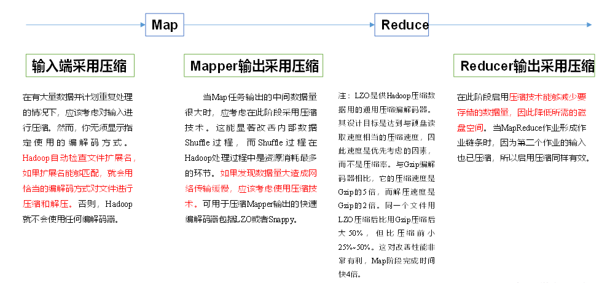

图4-22 MapReduce数据压缩

## 4.5压缩参数配置

要在Hadoop中启用压缩，可以配置如下参数：

表4-10 配置参数

| 参数                                                         | 默认值                                                       | 阶段        | 建议                                          |
| ------------------------------------------------------------ | ------------------------------------------------------------ | ----------- | --------------------------------------------- |
| io.compression.codecs  （在core-site.xml中配置）             | org.apache.hadoop.io.compress.DefaultCodec, org.apache.hadoop.io.compress.GzipCodec, org.apache.hadoop.io.compress.BZip2Codec | 输入压缩    | Hadoop使用文件扩展名判断是否支持某种编解码器  |
| mapreduce.map.output.compress（在mapred-site.xml中配置）     | false                                                        | mapper输出  | 这个参数设为true启用压缩                      |
| mapreduce.map.output.compress.codec（在mapred-site.xml中配置） | org.apache.hadoop.io.compress.DefaultCodec                   | mapper输出  | 企业多使用LZO或Snappy编解码器在此阶段压缩数据 |
| mapreduce.output.fileoutputformat.compress（在mapred-site.xml中配置） | false                                                        | reducer输出 | 这个参数设为true启用压缩                      |
| mapreduce.output.fileoutputformat.compress.codec（在mapred-site.xml中配置） | org.apache.hadoop.io.compress. DefaultCodec                  | reducer输出 | 使用标准工具或者编解码器，如gzip和bzip2       |
| mapreduce.output.fileoutputformat.compress.type（在mapred-site.xml中配置） | RECORD                                                       | reducer输出 | SequenceFile输出使用的压缩类型：NONE和BLOCK   |

## 4.6 压缩实操案例

### 4.6.1 数据流的压缩和解压缩

> CompressionCodec有两个方法可以用于轻松地压缩或解压缩数据。
>
> 要想对正在被写入一个输出流的数据进行压缩，我们可以使用createOutputStream(OutputStreamout)方法创建一个CompressionOutputStream，将其以压缩格式写入底层的流。
>
> 相反，要想对从输入流读取而来的数据进行解压缩，则调用createInputStream(InputStreamin)函数，从而获得一个CompressionInputStream，从而从底层的流读取未压缩的数据。

测试一下如下压缩方式：

表4-11

| DEFLATE | org.apache.hadoop.io.compress.DefaultCodec |
| ------- | ------------------------------------------ |
| gzip    | org.apache.hadoop.io.compress.GzipCodec    |
| bzip2   | org.apache.hadoop.io.compress.BZip2Codec   |

```java
package com.atguigu.mapreduce.compress;
import java.io.File;
import java.io.FileInputStream;
import java.io.FileNotFoundException;
import java.io.FileOutputStream;
import java.io.IOException;
import org.apache.hadoop.conf.Configuration;
import org.apache.hadoop.fs.Path;
import org.apache.hadoop.io.IOUtils;
import org.apache.hadoop.io.compress.CompressionCodec;
import org.apache.hadoop.io.compress.CompressionCodecFactory;
import org.apache.hadoop.io.compress.CompressionInputStream
import org.apache.hadoop.io.compress.CompressionOutputStream;
import org.apache.hadoop.util.ReflectionUtils;

public class TestCompress {
    public static void main(String[] args) throws Exception {
        compress("e:/hello.txt","org.apache.hadoop.io.compress.BZip2Codec");

        //decompress("e:/hello.txt.bz2");
    }
    // 1、压缩
    private static void compress(String filename, String method) throws Exception {
        // （1）获取输入流
        FileInputStream fis = new FileInputStream(new File(filename));
        Class codecClass = Class.forName(method);
        CompressionCodec codec = (CompressionCodec) ReflectionUtils.newInstance(codecClass, new Configuration());
        // （2）获取输出流
        FileOutputStream fos = new FileOutputStream(new File(filename + codec.getDefaultExtension()));
        CompressionOutputStream cos = codec.createOutputStream(fos);
        // （3）流的对拷
        IOUtils.copyBytes(fis, cos, 1024*1024*5, false);
        // （4）关闭资源
        cos.close();
        fos.close();
        fis.close();
    }
    // 2、解压缩
    private static void decompress(String filename) throws FileNotFoundException, IOException {
        // （0）校验是否能解压缩
        CompressionCodecFactory factory = new CompressionCodecFactory(new Configuration());
        CompressionCodec codec = factory.getCodec(new Path(filename));
        if (codec == null) {
            System.out.println("cannot find codec for file " + filename);
            return;
        }
        // （1）获取输入流
        CompressionInputStream cis = codec.createInputStream(new FileInputStream(new File(filename)));
        // （2）获取输出流
        FileOutputStream fos = new FileOutputStream(new File(filename + ".decoded"));
        // （3）流的对拷
        IOUtils.copyBytes(cis, fos, 1024*1024*5, false);
        // （4）关闭资源
        cis.close();
        fos.close();
    }
}
```


### 4.6.2 Map输出端采用压缩

即使你的MapReduce的输入输出文件都是未压缩的文件，你仍然可以对Map任务的中间结果输出做压缩，因为它要写在硬盘并且通过网络传输到Reduce节点，对其压缩可以提高很多性能，这些工作只要设置两个属性即可，我们来看下代码怎么设置。

1．给大家提供的Hadoop源码支持的压缩格式有：BZip2Codec 、DefaultCodec

```java
package com.atguigu.mapreduce.compress;
import java.io.IOException;
import org.apache.hadoop.conf.Configuration;
import org.apache.hadoop.fs.Path;
import org.apache.hadoop.io.IntWritable;
import org.apache.hadoop.io.Text;
import org.apache.hadoop.io.compress.BZip2Codec;
import org.apache.hadoop.io.compress.CompressionCodec;
import org.apache.hadoop.io.compress.GzipCodec;
import org.apache.hadoop.mapreduce.Job;
import org.apache.hadoop.mapreduce.lib.input.FileInputFormat;
import org.apache.hadoop.mapreduce.lib.output.FileOutputFormat; 
public class WordCountDriver { 
    public static void main(String[] args) throws IOException, ClassNotFoundException, InterruptedException { 
        Configuration configuration = new Configuration();
        // 开启map端输出压缩
        configuration.setBoolean("mapreduce.map.output.compress", true);
        // 设置map端输出压缩方式
        configuration.setClass("mapreduce.map.output.compress.codec", BZip2Codec.class, CompressionCodec.class); 
        Job job = Job.getInstance(configuration);
        job.setJarByClass(WordCountDriver.class); 
        job.setMapperClass(WordCountMapper.class);
        job.setReducerClass(WordCountReducer.class);
        job.setMapOutputKeyClass(Text.class);	
        job.setMapOutputValueClass(IntWritable.class); 
        job.setOutputKeyClass(Text.class);
        job.setOutputValueClass(IntWritable.class); 
        FileInputFormat.setInputPaths(job, new Path(args[0]));		
        FileOutputFormat.setOutputPath(job, new Path(args[1])); 
        boolean result = job.waitForCompletion(true);
        System.exit(result ? 1 : 0);
    }
}
```


2．Mapper保持不变

```java
package com.atguigu.mapreduce.compress;
import java.io.IOException;
import org.apache.hadoop.io.IntWritable;
import org.apache.hadoop.io.LongWritable;
import org.apache.hadoop.io.Text;
import org.apache.hadoop.mapreduce.Mapper;
public class WordCountMapper extends Mapper<LongWritable, Text, Text, IntWritable>{
    Text k = new Text();
    IntWritable v = new IntWritable(1); 
    @Override
    protected void map(LongWritable key, Text value, Context context)throws IOException, InterruptedException { 
        // 1 获取一行
        String line = value.toString(); 
        // 2 切割	
        String[] words = line.split(" "); 
        // 3 循环写出	
        for(String word:words){
            k.set(word);	
            context.write(k, v);
        }
    }
}
```


3．Reducer保持不变

```java
package com.atguigu.mapreduce.compress;
import java.io.IOException;
import org.apache.hadoop.io.IntWritable;
import org.apache.hadoop.io.Text;
import org.apache.hadoop.mapreduce.Reducer;
public class WordCountReducer extends Reducer<Text, IntWritable, Text, IntWritable>{ 
    IntWritable v = new IntWritable(); 
    @Override	
    protected void reduce(Text key, Iterable<IntWritable> values,Context context) throws IOException, InterruptedException {
        int sum = 0;
        // 1 汇总	
        for(IntWritable value:values){	
            sum += value.get();
        }	
        v.set(sum);
        // 2 输出	
        context.write(key, v);
    }
}
```


### 4.6.3 Reduce输出端采用压缩

基于WordCount案例处理。

1．修改驱动

```java
package com.atguigu.mapreduce.compress;
import java.io.IOException;
import org.apache.hadoop.conf.Configuration;
import org.apache.hadoop.fs.Path;
import org.apache.hadoop.io.IntWritable;
import org.apache.hadoop.io.Text;
import org.apache.hadoop.io.compress.BZip2Codec;
import org.apache.hadoop.io.compress.DefaultCodec;
import org.apache.hadoop.io.compress.GzipCodec;
import org.apache.hadoop.io.compress.Lz4Codec;
import org.apache.hadoop.io.compress.SnappyCodec;
import org.apache.hadoop.mapreduce.Job;
import org.apache.hadoop.mapreduce.lib.input.FileInputFormat;
import org.apache.hadoop.mapreduce.lib.output.FileOutputFormat; 
public class WordCountDriver {
    public static void main(String[] args) throws IOException, ClassNotFoundException, InterruptedException {	
        Configuration configuration = new Configuration();
        Job job = Job.getInstance(configuration);				
        job.setJarByClass(WordCountDriver.class);				
        job.setMapperClass(WordCountMapper.class);		
        job.setReducerClass(WordCountReducer.class);				
        job.setMapOutputKeyClass(Text.class);		
        job.setMapOutputValueClass(IntWritable.class);				
        job.setOutputKeyClass(Text.class);
        job.setOutputValueClass(IntWritable.class);				
        FileInputFormat.setInputPaths(job, new Path(args[0]));		
        FileOutputFormat.setOutputPath(job, new Path(args[1]));	
        // 设置reduce端输出压缩开启	
        FileOutputFormat.setCompressOutput(job, true);
        // 设置压缩的方式	
        FileOutputFormat.setOutputCompressorClass(job, BZip2Codec.class);
        //	  FileOutputFormat.setOutputCompressorClass(job, GzipCodec.class);
        //	  FileOutputFormat.setOutputCompressorClass(job, DefaultCodec.class); 	  		
        boolean result = job.waitForCompletion(true);
        System.exit(result?1:0);
    }
}
```

2．Mapper和Reducer保持不变（详见4.6.2）

# 第5章 Yarn资源调度器

Yarn是一个资源调度平台，负责为运算程序提供服务器运算资源，相当于一个分布式的操作系统平台，而MapReduce等运算程序则相当于运行于操作系统之上的应用程序。

## 5.1Yarn基本架构

 YARN主要由ResourceManager、NodeManager、ApplicationMaster和Container等组件构成，如图4-23所示。

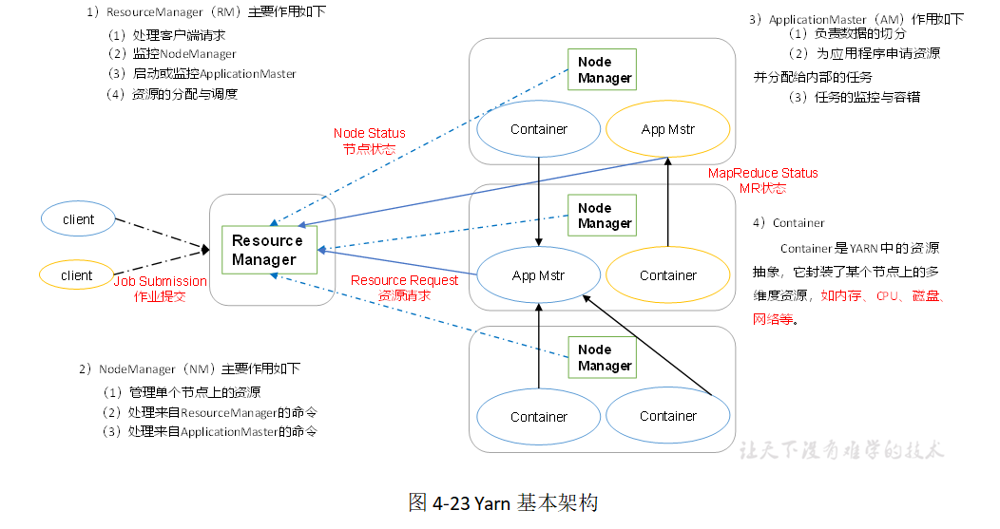


## 5.3 Yarn工作机制

1．Yarn运行机制，如图4-24所示。

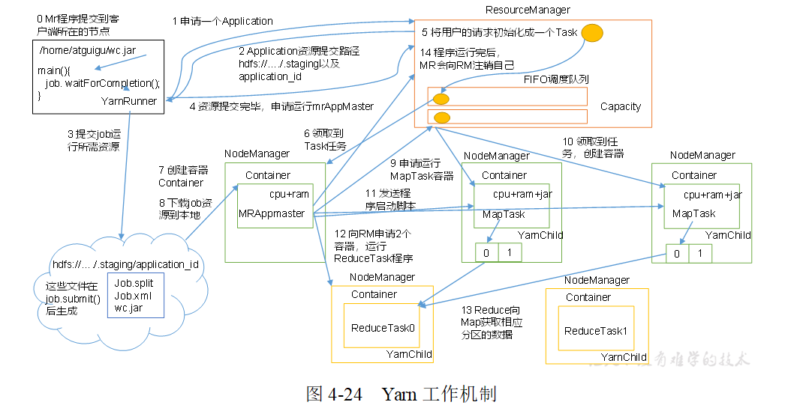


2．工作机制详解

>  （1）MR程序提交到客户端所在的节点。
>
> （2）YarnRunner向ResourceManager申请一个Application。
>
> （3）RM将该应用程序的资源路径返回给YarnRunner。
>
> （4）该程序将运行所需资源提交到HDFS上。
>
> （5）程序资源提交完毕后，申请运行mrAppMaster。
>
> （6）RM将用户的请求初始化成一个Task。
>
> （7）其中一个NodeManager领取到Task任务。
>
> （8）该NodeManager创建容器Container，并产生MRAppmaster。
>
> （9）Container从HDFS上拷贝资源到本地。
>
> （10）MRAppmaster向RM 申请运行MapTask资源。
>
> （11）RM将运行MapTask任务分配给另外两个NodeManager，另两个NodeManager分别领取任务并创建容器。
>
> （12）MR向两个接收到任务的NodeManager发送程序启动脚本，这两个NodeManager分别启动MapTask，MapTask对数据分区排序。
>
> （13）MrAppMaster等待所有MapTask运行完毕后，向RM申请容器，运行ReduceTask。
>
> （14）ReduceTask向MapTask获取相应分区的数据。
>
> （15）程序运行完毕后，MR会向RM申请注销自己。

## 5.4 作业提交全过程

1．作业提交过程之YARN，如图4-25所示。

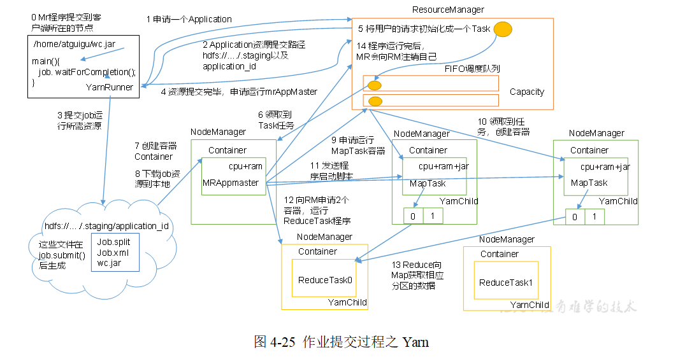


作业提交全过程详解

（1）作业提交

第1步：Client调用job.waitForCompletion方法，向整个集群提交MapReduce作业。

第2步：Client向RM申请一个作业id。

第3步：RM给Client返回该job资源的提交路径和作业id。

第4步：Client提交jar包、切片信息和配置文件到指定的资源提交路径。

第5步：Client提交完资源后，向RM申请运行MrAppMaster。

（2）作业初始化

第6步：当RM收到Client的请求后，将该job添加到容量调度器中。

第7步：某一个空闲的NM领取到该Job。

第8步：该NM创建Container，并产生MRAppmaster。

第9步：下载Client提交的资源到本地。

（3）任务分配

第10步：MrAppMaster向RM申请运行多个MapTask任务资源。

第11步：RM将运行MapTask任务分配给另外两个NodeManager，另两个NodeManager分别领取任务并创建容器。

（4）任务运行

第12步：MR向两个接收到任务的NodeManager发送程序启动脚本，这两个NodeManager分别启动MapTask，MapTask对数据分区排序。

第13步：MrAppMaster等待所有MapTask运行完毕后，向RM申请容器，运行ReduceTask。

第14步：ReduceTask向MapTask获取相应分区的数据。

第15步：程序运行完毕后，MR会向RM申请注销自己。

（5）进度和状态更新

YARN中的任务将其进度和状态(包括counter)返回给应用管理器, 客户端每秒(通过mapreduce.client.progressmonitor.pollinterval设置)向应用管理器请求进度更新, 展示给用户。

（6）作业完成

除了向应用管理器请求作业进度外, 客户端每5秒都会通过调用waitForCompletion()来检查作业是否完成。时间间隔可以通过mapreduce.client.completion.pollinterval来设置。作业完成之后, 应用管理器和Container会清理工作状态。作业的信息会被作业历史服务器存储以备之后用户核查。

2．作业提交过程之MapReduce，如图4-26所示

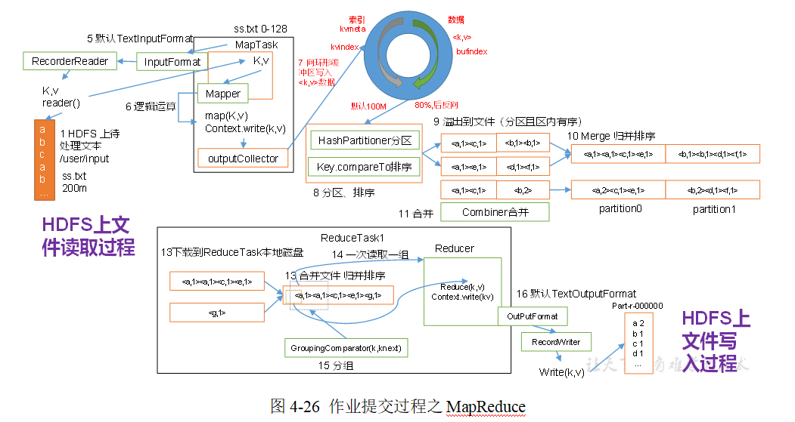


## 5.5 资源调度器

目前，Hadoop作业调度器主要有三种：FIFO、Capacity Scheduler和Fair Scheduler。Hadoop2.7.2默认的资源调度器是Capacity Scheduler。

具体设置详见：yarn-default.xml文件

```xml
<property>
    <description>The class to use as the resource scheduler.</description>
    <name>yarn.resourcemanager.scheduler.class</name>
  <value>org.apache.hadoop.yarn.server.resourcemanager.scheduler.capacity.CapacityScheduler</value>
</property>
```

1．先进先出调度器（FIFO），如图4-27所示

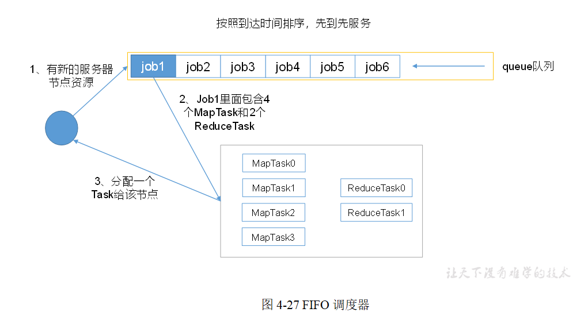


2．容量调度器（Capacity Scheduler），如图4-28所示

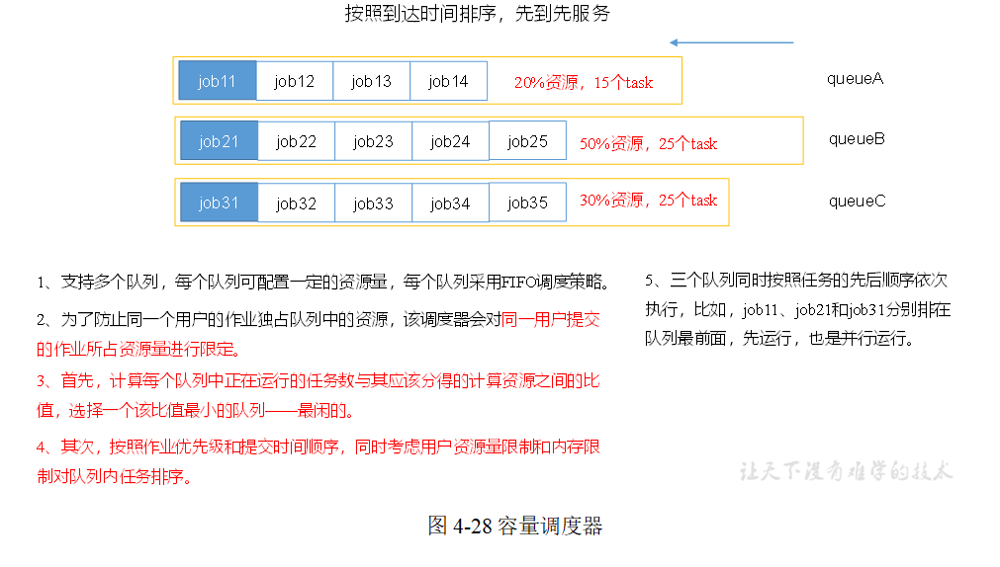

​	图4-28容量调度器

3．公平调度器（Fair Scheduler），如图4-29所示

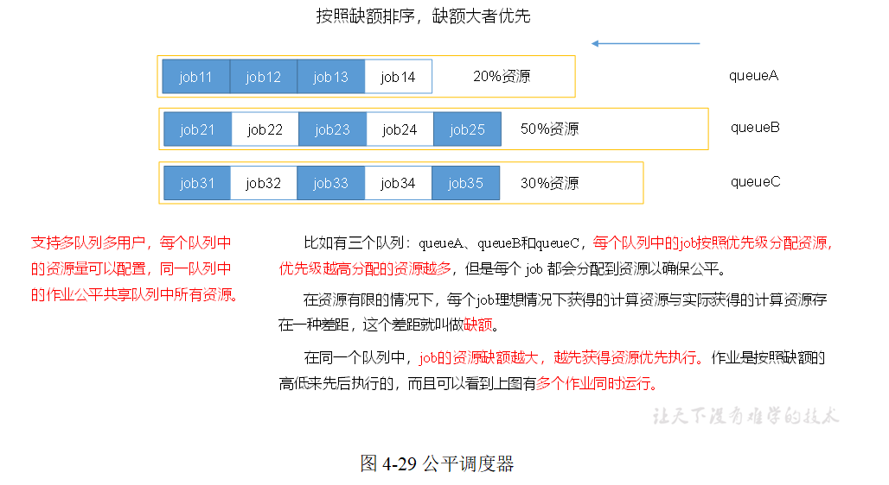


## 5.6 任务的推测执行

1．作业完成时间取决于最慢的任务完成时间

一个作业由若干个Map任务和Reduce任务构成。因硬件老化、软件Bug等，某些任务可能运行非常慢。

思考：系统中有99%的Map任务都完成了，只有少数几个Map老是进度很慢，完不成，怎么办？

2．推测执行机制

发现拖后腿的任务，比如某个任务运行速度远慢于任务平均速度。为拖后腿任务启动一个备份任务，同时运行。谁先运行完，则采用谁的结果。

3．执行推测任务的前提条件

（1）每个Task只能有一个备份任务

（2）当前Job已完成的Task必须不小于0.05（5%）

（3）开启推测执行参数设置。mapred-site.xml文件中默认是打开的。

```xml
<property>
    <name>mapreduce.map.speculative</name>
    <value>true</value>
    <description>If true, then multiple instances of some map tasks may be executed in parallel.</description>
</property>
<property>
    <name>mapreduce.reduce.speculative</name>
    <value>true</value>
    <description>If true, then multiple instances of some reduce tasks may be executed in parallel.</description>
</property>
```


4．不能启用推测执行机制情况

  （1）任务间存在严重的负载倾斜；

  （2）特殊任务，比如任务向数据库中写数据。

5．算法原理，如图4-20所示

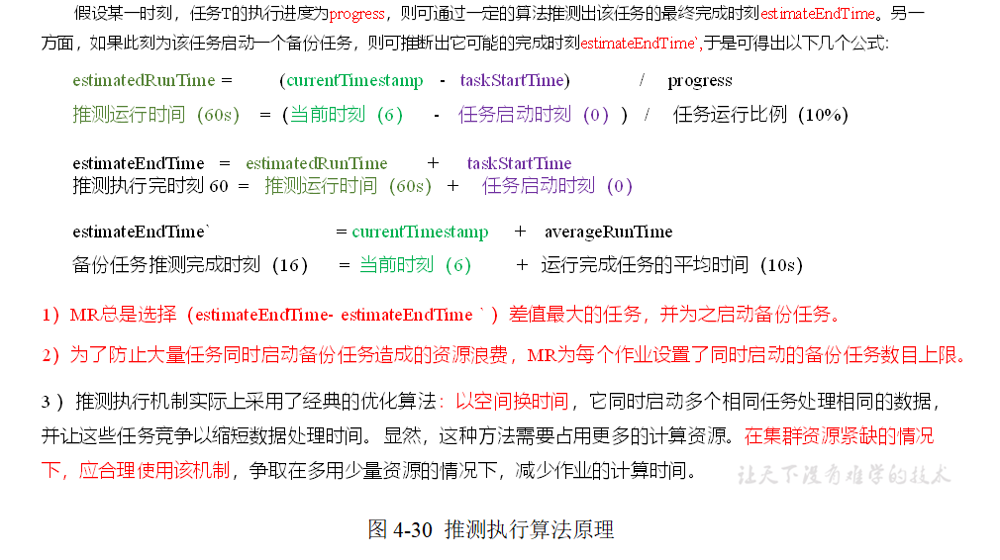


# 第6章 Hadoop企业优化

## 6.1 MapReduce 跑的慢的原因

> MapReduce程序效率的瓶颈在于两点:
>
> 1．计算机性能
>
> CPU、内存、磁盘健康、网络
>
> 2.I/O操作优化
>
> (1）数据倾斜
>
> (2)Map和Reduce数设置不合理
>
> (3)Map运行时间太长，导致Reduce等待过久
>
> (4)小文件过多
>
> (5）大量的不可分块的超大文件
>
> (6)Spill次数过多
>
> (7) Merge次数过多等。

## 6.2 MapReduce优化方法

MapReduce优化方法主要从六个方面考虑：数据输入、Map阶段、Reduce阶段、IO传输、数据倾斜问题和常用的调优参数。

### 6.2.1 数据输入

> (1）合并小文件:在执行MR任务前将小文件进行合并，大量的小文件会产生大量的Map任务，增大Map任务装载次数，而任务的装载比较耗时，从而导致MR运行较慢。
>
> (2)采用CombineTextInputFormat来作为输入，解决输入端大量小文件场景。

### 6.2.2 Map阶段

> (1）减少溢写(Spill）次数:通过调整io.sort.mb及sort.spill.percent参数值，增大触发Spill的内存上限，减少Spill次数，从而减少磁盘lO。
>
> (2)减少合并(Merge)次数:通过调整io.sort.factor参数，增大Merge的文件数目，减少Merge的次数，从而缩豆MR处理时间。
>
> (3）在Map之后，不影响业务逻辑前提下，先进行Combine处理，减少IO。

### 6.2.3 Reduce阶段

> (1) 合理设置Map和Reduce数:两个都不能设置太少，也不能设置太多。太少，会导致Task等待，延长处理时间;太多，会导致Map、Reduce任务间竞争资源，造成处理超时等错误。
>
> (2)设置Map、Redluce共存:调整slowstart.completedmaps参数，使Map运行到一定程度后，Reduce也开始运行，减少Reduce的等待时间。
>
> (3）规避使用Reduce:因为Redce在用于连接数据集的时候将会产生大量的网络消耗。
>
> (4)合理设置Redluce端的Buffer:默认情况下，数据达到一个阈值的时候，Buffer中的数据就会写入磁盘，然后Recuce会从磁盘中获得所有的数据。也就是说，Buffer和Reduce是没有直接关联的，中间多次写磁盘-→读磁盘的过程，既然有这个弊端，那么就可以通过参数来配置，使得Buffer中的一部分数据可以直接输送到Reduce，从而减少IO开销: mapreduce.reduce.input.buffer percent，默认为0.0。当值大于0的时候，会保留指定比例的内存读Buffer中的数据直接拿给Reduce使用。这样一来，设置Buffer需要内存，读取数据需要内存，Reduce计算也要内存，所以要根据作业的运行情况进行调整。


### 6.2.4 I/O传输

> 1)采用数据压缩的方式，减少网络IO的的时间。安装Snappy和LZO压缩编码器。
>
> 2)使用SequenceFile二进制文件。

### 6.2.5 数据倾斜问题

> 1．数据倾斜现象
>
> 数据频率倾斜——某一个区域的数据量要远远大于其他区域。
>
> 数据大小倾斜——部分记录的大小远远大于平均值。
>
> 2．减少数据倾斜的方法
>
> 方法1∶抽样和范围分区
>
> 可以通过对原始数据进行抽样得到的结果集来预设分区边界值。
>
> 方法2:自定义分区
>
> 基于输出键的背景知识进行自定义分区。例如，如果Map输出键的单词来源于一本书。且其中某几个专业词汇较多。那么就可以自定义分区将这这些专业词汇发送给固定的一部分Reduce实例。而将其他的都发送给剩余的Reduce实例。
>
> 方法3:Combine
>
> 使用Combine可以大量地减小数据倾斜。在可能的情况下，Combine的目的就是聚合并精简数据。
>
> 方法4:采用Map Join，尽量避免Reduce Join。


### 6.2.6 常用的调优参数

1．资源相关参数

（1）以下参数是在用户自己的MR应用程序中配置就可以生效（mapred-default.xml）

表4-12

| 配置参数                                      | 参数说明                                                     |
| --------------------------------------------- | ------------------------------------------------------------ |
| mapreduce.map.memory.mb                       | 一个MapTask可使用的资源上限（单位:MB），默认为1024。如果MapTask实际使用的资源量超过该值，则会被强制杀死。 |
| mapreduce.reduce.memory.mb                    | 一个ReduceTask可使用的资源上限（单位:MB），默认为1024。如果ReduceTask实际使用的资源量超过该值，则会被强制杀死。 |
| mapreduce.map.cpu.vcores                      | 每个MapTask可使用的最多cpu core数目，默认值: 1               |
| mapreduce.reduce.cpu.vcores                   | 每个ReduceTask可使用的最多cpu core数目，默认值: 1            |
| mapreduce.reduce.shuffle.parallelcopies       | 每个Reduce去Map中取数据的并行数。默认值是5                   |
| mapreduce.reduce.shuffle.merge.percent        | Buffer中的数据达到多少比例开始写入磁盘。默认值0.66           |
| mapreduce.reduce.shuffle.input.buffer.percent | Buffer大小占Reduce可用内存的比例。默认值0.7                  |
| mapreduce.reduce.input.buffer.percent         | 指定多少比例的内存用来存放Buffer中的数据，默认值是0.0        |

（2）应该在YARN启动之前就配置在服务器的配置文件中才能生效（yarn-default.xml）

表4-13

| 配置参数                                 | 参数说明                                        |
| ---------------------------------------- | ----------------------------------------------- |
| yarn.scheduler.minimum-allocation-mb     | 给应用程序Container分配的最小内存，默认值：1024 |
| yarn.scheduler.maximum-allocation-mb     | 给应用程序Container分配的最大内存，默认值：8192 |
| yarn.scheduler.minimum-allocation-vcores | 每个Container申请的最小CPU核数，默认值：1       |
| yarn.scheduler.maximum-allocation-vcores | 每个Container申请的最大CPU核数，默认值：32      |
| yarn.nodemanager.resource.memory-mb      | 给Containers分配的最大物理内存，默认值：8192    |

（3）Shuffle性能优化的关键参数，应在YARN启动之前就配置好（mapred-default.xml）

表4-14

| 配置参数                         | 参数说明                          |
| -------------------------------- | --------------------------------- |
| mapreduce.task.io.sort.mb        | Shuffle的环形缓冲区大小，默认100m |
| mapreduce.map.sort.spill.percent | 环形缓冲区溢出的阈值，默认80%     |

2．容错相关参数(MapReduce性能优化)

表4-15

| 配置参数                     | 参数说明                                                     |
| ---------------------------- | ------------------------------------------------------------ |
| mapreduce.map.maxattempts    | 每个Map Task最大重试次数，一旦重试参数超过该值，则认为Map Task运行失败，默认值：4。 |
| mapreduce.reduce.maxattempts | 每个Reduce Task最大重试次数，一旦重试参数超过该值，则认为Map Task运行失败，默认值：4。 |
| mapreduce.task.timeout       | Task超时时间，经常需要设置的一个参数，该参数表达的意思为：如果一个Task在一定时间内没有任何进入，即不会读取新的数据，也没有输出数据，则认为该Task处于Block状态，可能是卡住了，也许永远会卡住，为了防止因为用户程序永远Block住不退出，则强制设置了一个该超时时间（单位毫秒），默认是600000。如果你的程序对每条输入数据的处理时间过长（比如会访问数据库，通过网络拉取数据等），建议将该参数调大，该参数过小常出现的错误提示是“AttemptID:attempt_14267829456721_123456_m_000224_0 Timed out after 300 secsContainer killed by the ApplicationMaster.”。 |

## 6.3 HDFS小文件优化方法

### 6.3.1 HDFS小文件弊端

HDFS上每个文件都要在NameNode上建立一个索引，这个索引的大小约为150byte，这样当小文件比较多的时候，就会产生很多的索引文件，一方面会大量占用NameNode的内存空间，另一方面就是索引文件过大使得索引速度变慢。

### 6.3.2 HDFS小文件解决方案

小文件的优化无非以下几种方式：

（1）在数据采集的时候，就将小文件或小批数据合成大文件再上传HDFS。

（2）在业务处理之前，在HDFS上使用MapReduce程序对小文件进行合并。

（3）在MapReduce处理时，可采用CombineTextInputFormat提高效率。

> 1. Hadoop Archive
> 是一个高效地将小文件放入HDFS块中的文件存档工具，它能够将多个小文件打包成一个HAR文件，这样就减少了NameNode的内存使用。
> 2. Sequence File
> Sequence File由一系列的二进制key/value组成，如果key为文件名，value为文件内容，则可以将大批小文件合并成一个大文件。
> 3. CombineFilelnputFormat
> CombineFileInputFormat是一种新的InputFormat，用于将多个文件合并成一个单独的Split，另外，它会考虑数据的存储位置。
> 4. 开启JVM重用
>     对于大量小文件Job，可以开启JVM重用会减少45%运行时间。
>     JVM重用原理:一个Map运行在一个JVM上，开启重用的话，该Map在JVM上运行完毕后，JVM继续运行其他Map。
>     具体设置: mapreduce.job. jvm.numtasks值在10-20之间。


# 第7章 MapReduce扩展案例

## 7.1 倒排索引案例（多job串联）

1．需求

有大量的文本（文档、网页），需要建立搜索索引，如图4-31所示。

（1）数据输入

 

（2）期望输出数据

```txt
atguigu	c.txt-->2	b.txt-->2	a.txt-->3	

pingping	c.txt-->1	b.txt-->3	a.txt-->1	

ss	c.txt-->1	b.txt-->1	a.txt-->2	
```

2．需求分析

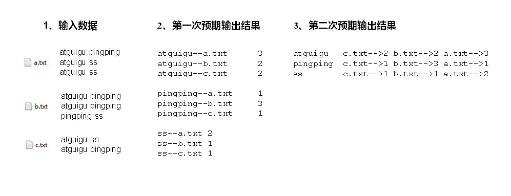

3．第一次处理

（1）第一次处理，编写OneIndexMapper类

```java
package com.atguigu.mapreduce.index;
import java.io.IOException;
import org.apache.hadoop.io.IntWritable;
import org.apache.hadoop.io.LongWritable;
import org.apache.hadoop.io.Text;
import org.apache.hadoop.mapreduce.Mapper;
import org.apache.hadoop.mapreduce.lib.input.FileSplit;
public class OneIndexMapper extends Mapper<LongWritable, Text, Text, IntWritable>{
    String name;
    Text k = new Text();
    IntWritable v = new IntWritable();
    @Override
    protected void setup(Context context)throws IOException, InterruptedException { 
        // 获取文件名称	
        FileSplit split = (FileSplit) context.getInputSplit();
        name = split.getPath().getName();
    }	
    @Override
    protected void map(LongWritable key, Text value, Context context)	throws IOException, InterruptedException { 
        // 1 获取1行
        String line = value.toString();	
        // 2 切割	
        String[] fields = line.split(" ");
        for (String word : fields) { 
            // 3 拼接	
            k.set(word+"--"+name);
            v.set(1);
            // 4 写出	
            context.write(k, v);
        }	
    }
}
```


（2）第一次处理，编写OneIndexReducer类

```java
package com.atguigu.mapreduce.index;
import java.io.IOException;
import org.apache.hadoop.io.IntWritable;
import org.apache.hadoop.io.Text;
import org.apache.hadoop.mapreduce.Reducer;
public class OneIndexReducer extends Reducer<Text, IntWritable, Text, IntWritable>{	
    IntWritable v = new IntWritable(); 
    @Override
    protected void reduce(Text key, Iterable<IntWritable> values,Context context) throws IOException, InterruptedException {
        int sum = 0; 
        // 1 累加求和	
        for(IntWritable value: values){
            sum +=value.get();
        }		
        v.set(sum); 
        // 2 写出	
        context.write(key, v);
    }
}
```


（3）第一次处理，编写OneIndexDriver类

```java
package com.atguigu.mapreduce.index;
import org.apache.hadoop.conf.Configuration;
import org.apache.hadoop.fs.Path;
import org.apache.hadoop.io.IntWritable;
import org.apache.hadoop.io.Text;
import org.apache.hadoop.mapreduce.Job;
import org.apache.hadoop.mapreduce.lib.input.FileInputFormat;
import org.apache.hadoop.mapreduce.lib.output.FileOutputFormat;
public class OneIndexDriver { 
    public static void main(String[] args) throws Exception { 
        // 输入输出路径需要根据自己电脑上实际的输入输出路径设置
        args = new String[] { "e:/input/inputoneindex", "e:/output5" };
        Configuration conf = new Configuration(); 
        Job job = Job.getInstance(conf);
        job.setJarByClass(OneIndexDriver.class); 
        job.setMapperClass(OneIndexMapper.class);		
        job.setReducerClass(OneIndexReducer.class);
        job.setMapOutputKeyClass(Text.class);		
        job.setMapOutputValueClass(IntWritable.class);				
        job.setOutputKeyClass(Text.class);	
        job.setOutputValueClass(IntWritable.class); 
        FileInputFormat.setInputPaths(job, new Path(args[0]));		
        FileOutputFormat.setOutputPath(job, new Path(args[1])); 	
        job.waitForCompletion(true);
    }
}
```


（4）查看第一次输出结果

 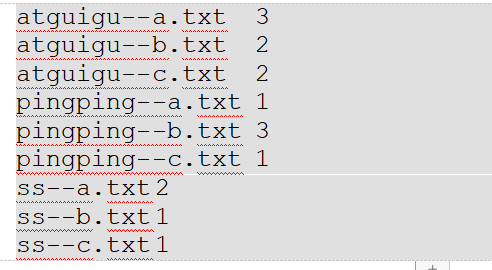

4．第二次处理

（1）第二次处理，编写TwoIndexMapper类

```java
package com.atguigu.mapreduce.index;
import java.io.IOException;
import org.apache.hadoop.io.LongWritable;
import org.apache.hadoop.io.Text;
import org.apache.hadoop.mapreduce.Mapper; 
public class TwoIndexMapper extends Mapper<LongWritable, Text, Text, Text>{ 
    Text k = new Text();
    Text v = new Text();	
    @Override	
    protected void map(LongWritable key, Text value, Context context) throws IOException, InterruptedException {
        // 1 获取1行数据	
        String line = value.toString();
        // 2用“--”切割	
        String[] fields = line.split("--");	
        k.set(fields[0]);
        v.set(fields[1]);		
        // 3 输出数据	
        context.write(k, v);
    }
}
```


（2）第二次处理，编写TwoIndexReducer类

```java
package com.atguigu.mapreduce.index;
import java.io.IOException;
import org.apache.hadoop.io.Text;
import org.apache.hadoop.mapreduce.Reducer;
public class TwoIndexReducer extends Reducer<Text, Text, Text, Text> { 
    Text v = new Text(); 
    @Override
    protected void reduce(Text key, Iterable<Text> values, Context context) throws IOException, InterruptedException {
        // atguigu a.txt 3	
        // atguigu b.txt 2	
        // atguigu c.txt 2 
        // atguigu c.txt-->2 b.txt-->2 a.txt-->3
        StringBuilder sb = new StringBuilder();
        // 1 拼接	
        for (Text value : values) {
            sb.append(value.toString().replace("\t", "-->") + "\t");
        } 
        v.set(sb.toString());
        // 2 写出
        context.write(key, v);
    }
}
```


（3）第二次处理，编写TwoIndexDriver类

```java
package com.atguigu.mapreduce.index;
import org.apache.hadoop.conf.Configuration;
import org.apache.hadoop.fs.Path;
import org.apache.hadoop.io.Text;
import org.apache.hadoop.mapreduce.Job;
import org.apache.hadoop.mapreduce.lib.input.FileInputFormat;
import org.apache.hadoop.mapreduce.lib.output.FileOutputFormat;
public class TwoIndexDriver { 
    public static void main(String[] args) throws Exception {
        // 输入输出路径需要根据自己电脑上实际的输入输出路径设置
        args = new String[] { "e:/input/inputtwoindex", "e:/output6" };
        Configuration config = new Configuration();
        Job job = Job.getInstance(config); 
        job.setJarByClass(TwoIndexDriver.class);		
        job.setMapperClass(TwoIndexMapper.class);		
        job.setReducerClass(TwoIndexReducer.class);
        job.setMapOutputKeyClass(Text.class);	
        job.setMapOutputValueClass(Text.class);		
        job.setOutputKeyClass(Text.class);
        job.setOutputValueClass(Text.class);
        FileInputFormat.setInputPaths(job, new Path(args[0]));		
        FileOutputFormat.setOutputPath(job, new Path(args[1])); 
        boolean result = job.waitForCompletion(true);
        System.exit(result?0:1);
    }
}
```


（4）第二次查看最终结果

```txt
atguigu	c.txt-->2	b.txt-->2	a.txt-->3	

pingping	c.txt-->1	b.txt-->3	a.txt-->1	

ss	c.txt-->1	b.txt-->1	a.txt-->2	
```


## 7.2 TopN案例

1．需求

对需求2.3输出结果进行加工，输出流量使用量在前10的用户信息

 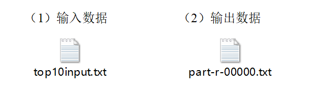

2．需求分析

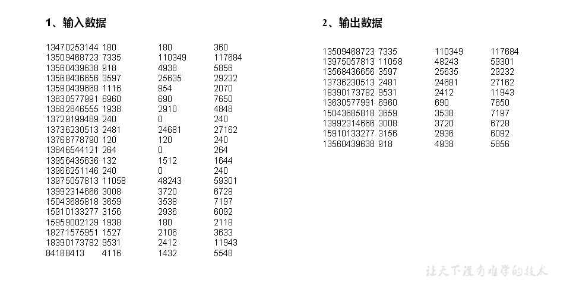

3．实现代码

（1）编写FlowBean类

```java
package com.atguigu.mr.top; 
import java.io.DataInput;
import java.io.DataOutput;
import java.io.IOException;
import org.apache.hadoop.io.WritableComparable; 
public class FlowBean implements WritableComparable<FlowBean>{
    private long upFlow;
    private long downFlow;	
    private long sumFlow;	
    public FlowBean() {	
        super();	
    } 
    public FlowBean(long upFlow, long downFlow) {
        super();
        this.upFlow = upFlow;
        this.downFlow = downFlow;
    } 
    @Override
    public void write(DataOutput out) throws IOException {
        out.writeLong(upFlow);
        out.writeLong(downFlow);	
        out.writeLong(sumFlow);	} 
    @Override
    public void readFields(DataInput in) throws IOException {
        upFlow = in.readLong();	
        downFlow = in.readLong();	
        sumFlow = in.readLong();
    } 
    public long getUpFlow() {
        return upFlow;	
    } 
    public void setUpFlow(long upFlow) {
        this.upFlow = upFlow;
    } 
    public long getDownFlow() {
        return downFlow;
    } 
    public void setDownFlow(long downFlow) {
        this.downFlow = downFlow;
    } 
    public long getSumFlow() {	
        return sumFlow;	
    }
    public void setSumFlow(long sumFlow) {
        this.sumFlow = sumFlow;	
    } 
    @Override
    public String toString() {
        return upFlow + "\t" + downFlow + "\t" + sumFlow;
    }
    public void set(long downFlow2, long upFlow2) {	
        downFlow = downFlow2;	
        upFlow = upFlow2;	
        sumFlow = downFlow2 + upFlow2;
    }
    @Override	public int compareTo(FlowBean bean) {
        int result;		
        if (this.sumFlow > bean.getSumFlow()) {	
            result = -1;	
        }else if (this.sumFlow < bean.getSumFlow()) {
            result = 1;	
        }else {	
            result = 0;	
        }	
        return result;	
    }
}
```


（2）编写TopNMapper类

```java
package com.atguigu.mr.top; 
import java.io.IOException;
import java.util.Iterator;
import java.util.TreeMap;
import org.apache.hadoop.io.LongWritable;
import org.apache.hadoop.io.Text;
import org.apache.hadoop.mapreduce.Mapper;
public class TopNMapper extends Mapper<LongWritable, Text, FlowBean, Text>{	
    // 定义一个TreeMap作为存储数据的容器（天然按key排序）
    private TreeMap<FlowBean, Text> flowMap = new TreeMap<FlowBean, Text>();
    private FlowBean kBean;	
    @Override
    protected void map(LongWritable key, Text value, Context context)	throws IOException, InterruptedException {	
        kBean = new FlowBean();	
        Text v = new Text();
        // 1 获取一行	
        String line = value.toString();
        // 2 切割		
        String[] fields = line.split("\t");	
        // 3 封装数据	
        String phoneNum = fields[0];
        long upFlow = Long.parseLong(fields[1]);
        long downFlow = Long.parseLong(fields[2]);	
        long sumFlow = Long.parseLong(fields[3]);
        kBean.setDownFlow(downFlow);
        kBean.setUpFlow(upFlow);	
        kBean.setSumFlow(sumFlow);	
        v.set(phoneNum);	
        // 4 向TreeMap中添加数据	
        flowMap.put(kBean, v);
        // 5 限制TreeMap的数据量，超过10条就删除掉流量最小的一条数据
        if (flowMap.size() > 10) {
            //		flowMap.remove(flowMap.firstKey());			
            flowMap.remove(flowMap.lastKey());
        }	
    }	
    @Override
    protected void cleanup(Context context) throws IOException, InterruptedException {				// 6 遍历treeMap集合，输出数据
        Iterator<FlowBean> bean = flowMap.keySet().iterator();
        while (bean.hasNext()) { 
            FlowBean k = bean.next(); 
            context.write(k, flowMap.get(k));
        }	
    }
}
```


（3）编写TopNReducer类

```java
package com.atguigu.mr.top;
import java.io.IOException;
import java.util.Iterator;
import java.util.TreeMap; 
import org.apache.hadoop.io.Text;
import org.apache.hadoop.mapreduce.Reducer; 
public class TopNReducer extends Reducer<FlowBean, Text, Text, FlowBean> {
    // 定义一个TreeMap作为存储数据的容器（天然按key排序）
    TreeMap<FlowBean, Text> flowMap = new TreeMap<FlowBean, Text>();
    @Override	
    protected void reduce(FlowBean key, Iterable<Text> values, Context context)throws IOException, InterruptedException { 
        for (Text value : values) {
            FlowBean bean = new FlowBean();	
            bean.set(key.getDownFlow(), key.getUpFlow()); 
            // 1 向treeMap集合中添加数据		
            flowMap.put(bean, new Text(value));
            // 2 限制TreeMap数据量，超过10条就删除掉流量最小的一条数据	
            if (flowMap.size() > 10) {	
                flowMap.remove(flowMap.firstKey());
                flowMap.remove(flowMap.lastKey());
            }
        }
    } 
    @Override
    protected void cleanup(Reducer<FlowBean, Text, Text, FlowBean>.Context context) throws IOException, InterruptedException { 
        // 3 遍历集合，输出数据	
        Iterator<FlowBean> it = flowMap.keySet().iterator();
        while (it.hasNext()) {
            FlowBean v = it.next(); 
            context.write(new Text(flowMap.get(v)), v);
        }	
    }
}
  // （4）编写TopNDriver类
package com.atguigu.mr.top; 
import org.apache.hadoop.conf.Configuration;
import org.apache.hadoop.fs.Path;
import org.apache.hadoop.io.Text;
import org.apache.hadoop.mapreduce.Job;
import org.apache.hadoop.mapreduce.lib.input.FileInputFormat;
import org.apache.hadoop.mapreduce.lib.output.FileOutputFormat; 
public class TopNDriver { 
    public static void main(String[] args) throws Exception {
        args  = new 
        String[]{"e:/output1","e:/output3"};
        // 1 获取配置信息，或者job对象实例
        Configuration configuration = new Configuration();	
        Job job = Job.getInstance(configuration); 
        // 6 指定本程序的jar包所在的本地路径	
        job.setJarByClass(TopNDriver.class); 
        // 2 指定本业务job要使用的mapper/Reducer业务类	
        job.setMapperClass(TopNMapper.class);	
        job.setReducerClass(TopNReducer.class);
        // 3 指定mapper输出数据的kv类型	
        job.setMapOutputKeyClass(FlowBean.class);		
        job.setMapOutputValueClass(Text.class); 
        // 4 指定最终输出的数据的kv类型
        job.setOutputKeyClass(Text.class);
        job.setOutputValueClass(FlowBean.class);
        // 5 指定job的输入原始文件所在目录	
        FileInputFormat.setInputPaths(job, new Path(args[0]));		
        FileOutputFormat.setOutputPath(job, new Path(args[1]));
        // 7 将job中配置的相关参数，以及job所用的java类所在的jar包， 提交给yarn去运行
        boolean result = job.waitForCompletion(true);
        System.exit(result ? 0 : 1);
    }
}
```


## 7.3 找博客共同好友案例

1．需求

以下是博客的好友列表数据，冒号前是一个用户，冒号后是该用户的所有好友（数据中的好友关系是单向的）

求出哪些人两两之间有共同好友，及他俩的共同好友都有谁？

（1）数据输入

 

2．需求分析

先求出A、B、C、….等是谁的好友

第一次输出结果


第二次输出结果


3．代码实现

（1）第一次Mapper类

```java
package com.atguigu.mapreduce.friends;
import java.io.IOException;
import org.apache.hadoop.io.LongWritable;
import org.apache.hadoop.io.Text;
import org.apache.hadoop.mapreduce.Mapper; 
public class OneShareFriendsMapper extends Mapper<LongWritable, Text, Text, Text>{		
    @Override
    protected void map(LongWritable key, Text value, Mapper<LongWritable, Text, Text, Text>.Context context) throws IOException, InterruptedException {
        // 1 获取一行 A:B,C,D,F,E,O	
        String line = value.toString();
        // 2 切割		
        String[] fields = line.split(":");
        // 3 获取person和好友	
        String person = fields[0];	
        String[] friends = fields[1].split(",");
        // 4写出去	
        for(String friend: friends){
            // 输出 <好友，人>
            context.write(new Text(friend), new Text(person));
        }
    }
}
```


（2）第一次Reducer类

```java
package com.atguigu.mapreduce.friends;
import java.io.IOException;
import org.apache.hadoop.io.Text;
import org.apache.hadoop.mapreduce.Reducer;
public class OneShareFriendsReducer extends Reducer<Text, Text, Text, Text>{
    @Override
    protected void reduce(Text key, Iterable<Text> values, Context context)throws IOException, InterruptedException {		
        StringBuffer sb = new StringBuffer(); 
        //1 拼接	
        for(Text person: values){
            sb.append(person).append(",");
        }		
        //2 写出		
        context.write(key, new Text(sb.toString()));
    }
}
```


（3）第一次Driver类

```java
package com.atguigu.mapreduce.friends;
import org.apache.hadoop.conf.Configuration;
import org.apache.hadoop.fs.Path;
import org.apache.hadoop.io.Text;
import org.apache.hadoop.mapreduce.Job;
import org.apache.hadoop.mapreduce.lib.input.FileInputFormat;
import org.apache.hadoop.mapreduce.lib.output.FileOutputFormat;
public class OneShareFriendsDriver { 
    public static void main(String[] args) throws Exception {
        // 1 获取job对象	
        Configuration configuration = new Configuration();
        Job job = Job.getInstance(configuration);
        // 2 指定jar包运行的路径	
        job.setJarByClass(OneShareFriendsDriver.class); 
        // 3 指定map/reduce使用的类	
        job.setMapperClass(OneShareFriendsMapper.class);		
        job.setReducerClass(OneShareFriendsReducer.class);	
        // 4 指定map输出的数据类型
        job.setMapOutputKeyClass(Text.class);
        job.setMapOutputValueClass(Text.class);	
        // 5 指定最终输出的数据类型	
        job.setOutputKeyClass(Text.class);
        job.setOutputValueClass(Text.class);
        // 6 指定job的输入原始所在目录	
        FileInputFormat.setInputPaths(job, new Path(args[0]));		
        FileOutputFormat.setOutputPath(job, new Path(args[1]));
        // 7 提交	
        boolean result = job.waitForCompletion(true);	
        System.exit(result?0:1);
    }
}
```


（4）第二次Mapper类

```java
package com.atguigu.mapreduce.friends;
import java.io.IOException;
import java.util.Arrays;
import org.apache.hadoop.io.LongWritable;
import org.apache.hadoop.io.Text;
import org.apache.hadoop.mapreduce.Mapper; 
public class TwoShareFriendsMapper extends Mapper<LongWritable, Text, Text, Text>{		
    @Override
    protected void map(LongWritable key, Text value, Context context) throws IOException, InterruptedException {
        // A I,K,C,B,G,F,H,O,D,	
        // 友 人，人，人	
        String line = value.toString();
        String[] friend_persons = line.split("\t"); 
        String friend = friend_persons[0];
        String[] persons = friend_persons[1].split(","); 
        Arrays.sort(persons); 
        for (int i = 0; i < persons.length - 1; i++) {	
            for (int j = i + 1; j < persons.length; j++) {
                // 发出 <人-人，好友> ，这样，相同的“人-人”对的所有好友就会到同1个reduce中去				
                context.write(new Text(persons[i] + "-" + persons[j]), new Text(friend));			}
        }
    }
}
```


（5）第二次Reducer类

```java
package com.atguigu.mapreduce.friends;
import java.io.IOException;
import org.apache.hadoop.io.Text;
import org.apache.hadoop.mapreduce.Reducer; 
public class TwoShareFriendsReducer extends Reducer<Text, Text, Text, Text>{
    @Override
    protected void reduce(Text key, Iterable<Text> values, Context context)	throws IOException, InterruptedException {	
        StringBuffer sb = new StringBuffer();
        for (Text friend : values) {
            sb.append(friend).append(" ");	
        }		
        context.write(key, new Text(sb.toString()));
    }
}
```


（6）第二次Driver类

```java
package com.atguigu.mapreduce.friends;
import org.apache.hadoop.conf.Configuration;
import org.apache.hadoop.fs.Path;
import org.apache.hadoop.io.Text;
import org.apache.hadoop.mapreduce.Job;
import org.apache.hadoop.mapreduce.lib.input.FileInputFormat;
import org.apache.hadoop.mapreduce.lib.output.FileOutputFormat;
public class TwoShareFriendsDriver { 
    public static void main(String[] args) throws Exception {
        // 1 获取job对象
        Configuration configuration = new Configuration();
        Job job = Job.getInstance(configuration);	
        // 2 指定jar包运行的路径	
        job.setJarByClass(TwoShareFriendsDriver.class);
        // 3 指定map/reduce使用的类	
        job.setMapperClass(TwoShareFriendsMapper.class);		
        job.setReducerClass(TwoShareFriendsReducer.class);
        // 4 指定map输出的数据类型
        job.setMapOutputKeyClass(Text.class);	
        job.setMapOutputValueClass(Text.class);
        // 5 指定最终输出的数据类型	
        job.setOutputKeyClass(Text.class);
        job.setOutputValueClass(Text.class);
        // 6 指定job的输入原始所在目录		
        FileInputFormat.setInputPaths(job, new Path(args[0]));		
        FileOutputFormat.setOutputPath(job, new Path(args[1]));	
        // 7 提交	
        boolean result = job.waitForCompletion(true);
        System.exit(result?0:1);
    }
}
```


# 第8章 常见错误及解决方案

1）导包容易出错。尤其Text和CombineTextInputFormat。

2）Mapper中第一个输入的参数必须是LongWritable或者NullWritable，不可以是IntWritable.  报的错误是类型转换异常。

3）java.lang.Exception: java.io.IOException: Illegal partition for 13926435656 (4)，说明Partition和ReduceTask个数没对上，调整ReduceTask个数。

4）如果分区数不是1，但是reducetask为1，是否执行分区过程。答案是：不执行分区过程。因为在MapTask的源码中，执行分区的前提是先判断ReduceNum个数是否大于1。不大于1肯定不执行。

5）在Windows环境编译的jar包导入到Linux环境中运行，

hadoop jar wc.jar com.atguigu.mapreduce.wordcount.WordCountDriver /user/atguigu/ /user/atguigu/output

报如下错误：

Exception in thread "main" java.lang.UnsupportedClassVersionError: com/atguigu/mapreduce/wordcount/WordCountDriver : Unsupported major.minor version 52.0

原因是Windows环境用的jdk1.7，Linux环境用的jdk1.8。

解决方案：统一jdk版本。

6）缓存pd.txt小文件案例中，报找不到pd.txt文件

原因：大部分为路径书写错误。还有就是要检查pd.txt.txt的问题。还有个别电脑写相对路径找不到pd.txt，可以修改为绝对路径。

7）报类型转换异常。

通常都是在驱动函数中设置Map输出和最终输出时编写错误。

Map输出的key如果没有排序，也会报类型转换异常。

8）集群中运行wc.jar时出现了无法获得输入文件。

原因：WordCount案例的输入文件不能放用HDFS集群的根目录。

9）出现了如下相关异常

```txt
Exception in thread "main" java.lang.UnsatisfiedLinkError: org.apache.hadoop.io.nativeio.NativeIO$Windows.access0(Ljava/lang/String;I)Z
at org.apache.hadoop.io.nativeio.NativeIO$Windows.access0(Native Method)
at org.apache.hadoop.io.nativeio.NativeIO$Windows.access(NativeIO.java:609)
at org.apache.hadoop.fs.FileUtil.canRead(FileUtil.java:977)
java.io.IOException: Could not locate executable null\bin\winutils.exe in the Hadoop binaries.
at org.apache.hadoop.util.Shell.getQualifiedBinPath(Shell.java:356)
at org.apache.hadoop.util.Shell.getWinUtilsPath(Shell.java:371)
at org.apache.hadoop.util.Shell.<clinit>(Shell.java:364)
```


解决方案：拷贝hadoop.dll文件到Windows目录C:\Windows\System32。个别同学电脑还需要修改Hadoop源码。

方案二：创建如下包名，并将NativeIO.java拷贝到该包名下

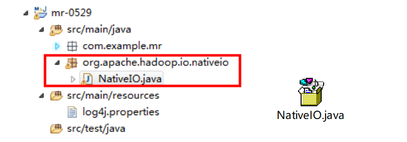

10）自定义Outputformat时，注意在RecordWirter中的close方法必须关闭流资源。否则输出的文件内容中数据为空。

```java
@Override
public void close(TaskAttemptContext context) throws IOException, InterruptedException {
    if (atguigufos != null) {
        atguigufos.close();
    }
    if (otherfos != null) {
        otherfos.close();
    }
}
```

