## 一、Apache Impala

### 1. Impala基本介绍

**impala**是cloudera提供的一款高效率的sql查询工具，提供实时的查询效果，官方测试性能比 hive快l0到100倍，其 sql查询比 sparkSQL还要更加快速，号称是当前大数据领域最快的查询 sql工具，

impala是参照谷歌的新三篇论文(Caffeine--网络搜索引擎、Pregel-分布式图计算、Dremel--交互式分析工具）当中的Dremel实现而来，其中旧三篇论文分别是（BigTable，GFS，MapReduce〉分别对应我们即将学的HBase 和已经学过的 HDFS 以及MapReduce.
impala是基于hive并使用内存进行计算，兼顾数据仓库，具有实时，批处理，多并发等优点。


### 2. Impala 与Hive关系

impala是基于hive 的大数据分析查询引擎，直接使用 hive的元数据库metadata，意味着impala元数据都存储在 hive 的metastore当中，并且 impala兼容 hive 的绝大多数sql语法。所以需要安装impala 的话，必须先安装hive，保证hive安装成功，并且还需要启动hive 的 metastore 服务。

Hive元数据包含用Hive 创建的database、table等元信息。元数据存储在关系型数据库中，如 Derby、MysQL客户端连接metastore服务，metastore 再去连接 MySQL 数据库来存取元数据。有了metastore 服务，就可以有多个客户端同时连接，而且这些客户端不需要知道MySQL 数据库的用户名和密码，只需要连接metastore 服务即可。

> nohup hive --service metastore >> ~/metastore.log 2>&1 &

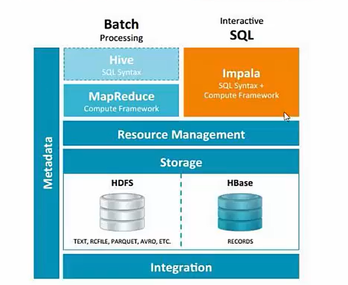

Hive适合于长时间的批处理查询分祈，而 lmpala适合于实时交互式SQL查询。可以先使用hive进行数据转换处理，之后使用Impala在 Hive处理后的结果数据集上进行快速的数据分析。

> 小结：
>
> - impla是个实时的sql查询工具，类似于hive的操作方式，只不过执行的效率极高，号称当下大数据生态圈中执行效率最高的sql类软件
> - impala来自于cloudera，后来贡献给了apache
> - impala工作底层执行依赖于hive 与hive共用一套元数据存储。在使用impala的时候，必须保证hive服务是正常可靠的，至少metastore开启。
>
> - impala最大的跟hive的不同在于不在把sql编译成mr程序执行编译成执行计划数
> - impala的sql语法几乎兼容hive的sql语句。


### 3. Impala 与 Hive异同

lmpala 与 Hive都是构建在 Hadoop之上的数据查询工具各有不同的侧重适应面,但从客户端使用来看Impala与 Hive有很多的共同之处,如数据表元数据、ODBC/JDBC驱动、SQL语法、灵活的文件格式、存储资源池等。

但是 lmpala 跟Hive最大的优化区别在于:**没有使用MapReduce进行并行计算,**虽然 MapReduce是非常好的并行计算框架,但它更多的面向批处理模式，而不是面向交互式的SQL执行。与MapReduce相比，lmpala把整个查询分成**执行计划树**，而不是一连串的MapReduce任务，在分发执行计划后，lmpala使用**拉式**获取数据的方式获取结果，把结果数据组成按执行树流式传递汇集，减少的了把中间结果写入磁盘的步骤，再从磁盘读取数据的开销。Impala使用服务的方式避免每次执行查询都需要启动的开销，即相比 Hive没了MapReduce启动时间。

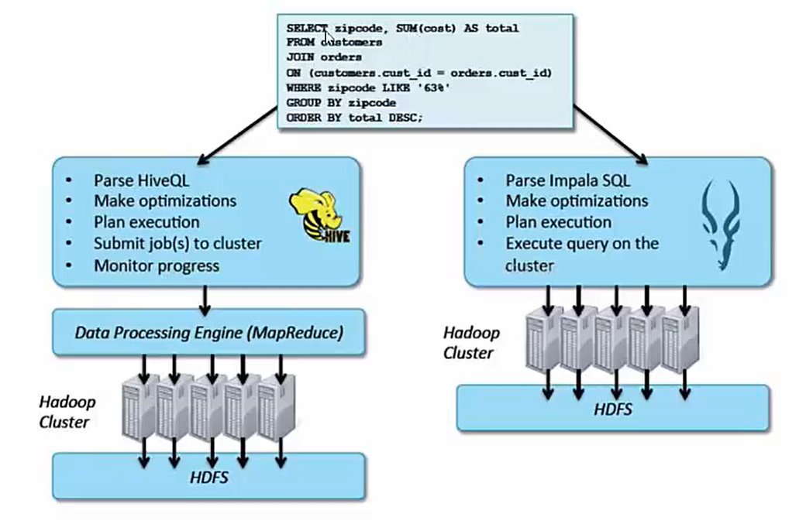


#### 3.1.Impala使用的优化技术

使用LLVM产生运行代码，针对特定查询生成特定代码，同时使用Inline 的方式减少函数调用的开销，加快执行效率。(C++特性)

充分利用可用的硬件指令(SSE4.2)。

更好的lO 调度，Impala 知道数据块所在的磁盘位置能够更好的利用多磁盘的优势，同时lmpala支持直接数据块读取和本地代码计算checksum。

通过选择合适数据存储格式可以得到最好性能(Impala支持多种存储格式)。

最大使用内存，中间结果不写磁盘，及时通过网络以stream的方式传递。

#### 3.2.执行计划

**Hive**:依赖于MapReduce执行框架，执行计划分成map->shuffle->reduce->map->shuffle->reduce…的模型。如果一个Query会被编译成多轮MapReduce，则会有更多的写中间结果。由于MapReduce执行框架本身的特点，过多的中间过程会增加整个Query的执行时间。

**lmpala**:把执行计划表现为一棵完整的执行计划树，可以更自然地分发执行计划到各个Impalad执行查询，而不用像Hive那样把它组合成管道型的map->reduce模式,以此保证lmpala有更好的并发性和避免不必要的中间sort 与shuffle。

#### 3.3.数据流

**Hive**:采用推的方式，每一个计算节点计算完成后将数据主动推给后续节点。

**lmpala**:采用拉的方式，后续节点通过getNext主动向前面节点要数据，以此方式数据可以流式的返回给客户端，且只要有1条数据被处理完，就可以立即展现出来，而不用等到全部处理完成，更符合SQL交互式查询使用。


#### 3.4.内存使用

Hive:在执行过程中如果内存放不下所有数据,则会使用外存,以保证Query能顺序执行完。每一轮MapReduce结束，中间结果也会写入HDFS 中，同样由于MapReduce执行架构的特性，shuffle过程也会有写本地磁盘的操作。

lmpala:在遇到内存放不下数据时,版本1.0.1是直接返回错误，而不会利用外存，以后版本应该会进行改进。这使用得lmpala目前处理Query会受到一定的限制，最好还是与Hive 配合使用。

#### 3.5．调度

Hive:任务调度依赖于Hadoop的调度策略。

lmpala:调度由自己完成，目前只有一种调度器 simple-schedule，它会尽量满足数据的局部性，扫描数据的进程尽量靠近数据本身所在的物理机器。调度器目前还比较简单，在 SimpleScheduler::GetBackend 中可以看到，现在还没有考虑负载，网络 lO状况等因素进行调度。但目前lmpala已经有对执行过程的性能统计分析，应该以后版本会利用这些统计信息进行调度吧。

#### 3.6．容错

Hive:依赖于Hadoop的容错能力。

lmpala:在查询过程中，没有容错逻辑，如果在执行过程中发生故障，则直接返回错误（这与Impala的设计有关，因为 lmpala定位于实时查询，一次查询失败，再查一次就好了，再查一次的成本很低)。

#### 3.7．适用面

Hive:复杂的批处理查询任务，数据转换任务。

lmpala:实时数据分析，因为不支持UDF，能处理的问题域有一定的限制，与Hive配合使用,对Hive的结果数据集进行实时分析。


### 4.Impala架构

Impala主要由**Impalad**、**State Store**、**Catalogd**和**CLI**组成。

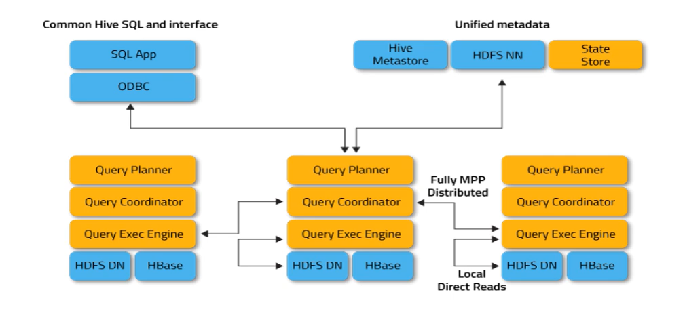


#### 4.1. Impalad

lmpalad: 与 DataNode运行在同一节点上，由lmpalad进程表示，它接收客户端的查询请求（**接收查询请求**的Impalad为**Coordinator**，Coordinator通过JNI调用java前端解释SQL查询语句，生成查询计划树，再通过调度器把执行计划分发给具有相应数据的其它lmpalad进行执行)，读写数据，并行执行查询，并把结果通过网络流式的传送回给Coordinator，由 Coordinator返回给客户端。同时Impalad也与State Store保持连接，用于确定哪个Impalad是健康和可以接受新的工作。

在Impalad中启动三个ThriftServer: beeswax_server(连接客户端), hs2_server(借用Hive元数据)， be_server( Impalad 内部使用)和一个ImpalaServer服务。

#### 4.2.lmpala State Store

lmpala State Store: 跟踪集群中的lmpalad的**健康状态**及位置信息由statestored进程表示，它通过创建多个线程来处理lmpalad 的注册订阅和与各Impalad保持心跳连接，各Impalad都会缓存一份State Store 中的信息，当State Store离线后（lmpalad发现State Store处于离线时，会进入recovery模式，反复注册，当State Store重新加入集群后,自动恢复正常,更新缓存数据)因为 lmpalad有State Store的缓存仍然可以工作，但会因为有些lmpalad失效了，而已缓存数据无法更新，导致把执行计划分配给了失效的lmpalad，导致查询失败。

#### 4.3.CLI

CLI:提供给用户查询使用的命令行工具( lmpala Shell使用python实现)，同时lmpala还提供了Hue，JDBC，ODBC使用接口。


#### 4.4.Catalogd

Catalogd:作为 metadata访问网关，从 Hive Metastore等外部 catalog中获取元数据信息，放到impala自己的catalog 结构中。impalad执行ddl命令时通过catalogd 由其代为执行，该更新则由statestored广播。

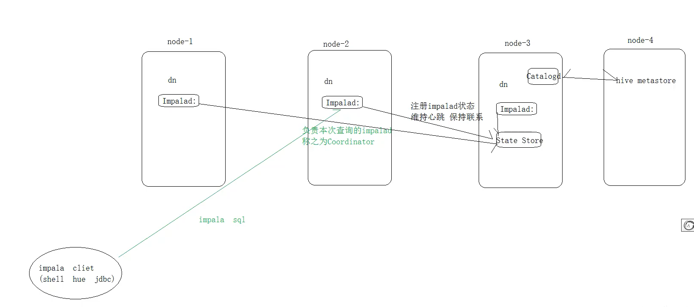

### 5.Impala查询处理过程

lmpalad分为Java前端与C++处理后端，接受客户端连接的 lmpalad即作为这次查询的Coordinator ,Coordinator通过JNI调用Java前端对用户的查询SQL进行分析生成执行计划树。

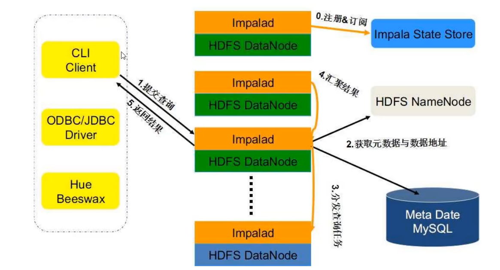


Java前端产生的执行计划树以Thrift数据格式返回给C++后端(Coordinator）（执行计划分为多个阶段，每一个阶段叫做一个PlanFragment，每一个PlanFragment在执行时可以由多个lmpalad实例并行执行(有些PlanFragment 只能由一个lmpalad 实例执行,如聚合操作)，整个执行计划为一执行计划树)。

Coordinator根据执行计划，数据存储信息 （ lmpala 通过libhdfs 与 HDFS进行交互。通过hdfsGetHosts方法获得文件数据块所在节点的位置信息)，通过调度器（现在只有 simple-scheduler，使用round-robin 算法)Coordinator:Exec对生成的执行计划树分配给相应的后端执行器lmpalad执行（查询会使用LLVM进行代码生成，编译，执行)，通过调用GetNext()方法获取计算结果。

如果是insert语句，则将计算结果通过libhdfs 写回HDFS当所有输入数据被消耗光，执行结束，之后注销此次查询服务。

> 小结：
>
> - impala 可以集群部署
>
>   -  lmpalad(impala server):可以部署多个不同机器上，通常与datanode部署在同一个节点方便数据本地计算，负责具体执行本次查询sq)的impalad称之为Coordinator。每个impala server都可以对外提供服务。
>
>   - impala state store:主要是保存impalad的状态信息监视其健康状态
>
>   -  impala catalogd :metastore维护的网关负责跟hive的metastore进行交互同步hive的元数据到limpala自己的元数据中
>
>   - CLI:用户操作impala的方式(impala shell、jdbc、hue )
>
>     
>
> - · impala查询处理流程
>
>   - impalad分为java前端（接受解析sql编译成执行计划树），c++后端（负责具体的执行计划树操作)
>   -  impala sql----impalad ( Coordinator ) --->调用java前端编译sql成计划树…以Thrift数据格式返回给C++后端---->根据执行计划树、数据位于路径(（libhdfs和hdfs交互 ) 、impalad状态分配执行计划查询---->汇总查询结果----->返回给java前端---->用户cli
>   - 跟hive不同就在于整个执行中已经没有了mapreduce程序的存在


## 二、lmpala安装部署

### 1.安装前提

集群提前安装好hadoop，hive。

hive安装包scp在所有需要安装impala 的节点上,因为impala需要引用hive的依赖包。

hadoop框架需要支持C程序访问接口，查看下图，如果有该路径下有这么文件，就证明支持C接口。

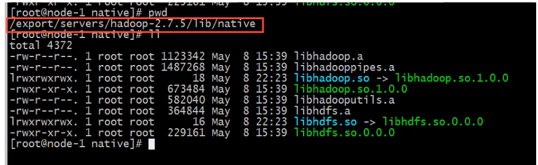


### 2.下载安装包、依赖包

由于impala没有提供 tar包进行安装，只提供了rpm包。因此在安装impala的时候，需要使用rpm包来进行安装。rpm包只有cloudera公司提供了，所以去cloudera 公司网站进行下载rpm包即可。

但是另外一个问题，impala的 rpm 包依赖非常多的其他的rpm包，可以一个个的将依赖找出来，也可以将所有的rpm 包下载下来，制作成我们本地yum源来进行安装。这里就选择制作本地的yum源来进行安装。

所以首先需要下载到所有的rpm包，下载地址如下http: / /archive.cloudera.com/ cdh5/repo-as-tarball/5.14.0 / cdh5.14.0-centos6.tar.gz


### 3.  挂载磁盘(可选)


### 4. 配置本地yum源

#### 4.1.上传安装包解压

使用**sftp** 的方式把安装包大文件上传到服务器/cloudera_data目录下。

```sh
cd /cloudera_data
tar -zxvf cdh5.14.0-centos6.tar.gz
```

#### 4.2.配置本地yum源信息

安装Apache Server服务器

```sh
yum -y install httpd
service httpd start
chkconfig httpd on
```

配置本地yum源的文件

```sh
cd /etc /yum.repos.d
vim localimp.repo
---------------------------------------------
[localimp]
name=localimp
baseurl=http://node-3/cdh5.14.0/
gpgcheck=0
enabled=1
```

创建apache httpd的读取链接

```sh
ln -s /cloudera_data/cdh/5.14.0/var/www/html/cdh5.14.0
```

确保linux的Selinux关闭

```sh
临时关闭:
[root@localhost ~]# getenforceEnforcing
[root@localhost ~]# setenforce 0
[root@localhost ~]# getenforce
Permissive
永久关闭:
[root@localhost ~]# vim /etc/sysconfig/selinux
SELINUX=enforcing 改为SELINUX=disabled
重启服务reboot
```


通过浏览器访问本地yum源，如果出现下述页面则成功。

```properties
http://192.168.227.153/cdh5.14.0/
```

### 5．安装Impala

#### 5.1．集群规划

```txt
服务名称            从节点              从节点             主节点
impala-catalog                                         Node-3
impala-state-store                                     Node-3
impala-server(impalad)  Node-1        Node-2           Node-3
```

#### 5.2．主节点安装

在规划的主节点node-3执行以下命令进行安装:

```sh
yum install -y impala impala-server impala-state-store impala-catalog impala-shell
```

#### 5.3．从节点安装

在规划的从节点node-1、node-2执行以下命令进行安装:

```sh
yum install -y impala-server
```


### 6．修改Hadoop、Hive配置

需要在3台机器整个集群上进行操作，都需要修改。hadoop、hive是否正常服务并且配置好，是决定impala是否启动成功并使用的前提。

#### 6.1．修改hive配置

可在node-1机器上进行配置，然后scp给其他2台机器。

vim /export/servers/hive/conf/hive-site.xml

```xml
<configuration>
  <property>
    <name>javax.jdo.option.ConnectionURL</name>
    <value>jdbc :mysql://node-1 :3306/hive?createDatabaseIfNotExist=true< /value>
  </property>
  <property>
    <name>javax.jdo.option.ConnectionDriverName</name>
    <value>com.mysql.jdbc.Driver</value>
  </property>
  <property>
    <name>javax.jdo.option.ConnectionUserName</name>
    <value>root</value>
  </property>
  <property>
    <name>javax.jdo.option.ConnectionPassword</name>
    <value>hadoop</value>
  </property>
  <property>
    <name>hive.cli.print.current.db</name>
    <value>true</value>
  <property>
    <name>hive.cli.print.header</name>
    <value>true</value>
  </property>
<!--绑定运行hiveServer2的主机 host,默认localhost -->
  <property>
    <name>hive.server2.thrift.bind. host</name>
    <value>node-l</value>
  </property>
<!-- 指定hive metastore服务请求的uri地址 -->
  <property>
    <name>hive.metastore.uris</name>
    <value>thrift://node-1:9083</value>
  </property>
  <property>
    <name>hive.metastore.client.socket.timeout</name>
    <value>3600</value>
  </property>
</configuration>
```

将hive安装包cp给其他两个机器。

```sh
cd /eport/servers/
scp -r hive/node-2:$PWD
scp -r hive/ node-3:$PWD
```


#### 6.2．修改hadoop配置

所有节点创建下述文件夹

```sh
mkdir -p /var/run/hdfs-sockets
```

修改所有节点的 hdfs-site.xml添加以下配置，修改完之后重启 hdfs集群生效

vim etc/hadoop/hdfs-site.xml

```xml
<property>
  <name>dfs.client.read.shortcircuit</name>
  <value>true</value>
</property>
<property>
  <name>dfs.domain.socket.path</name>
  <value>/var/run/hdfs-sockets/dn</value>
</property>
<property>
  <name>dfs.client.file-block-storage-locations.timeout.millis</name>
  <value>10000</value>
</property>
<property>
  <name>dfs.datanode.hdfs-blocks-metadata.enabled</name>
  <value>true</value>
</property>
```

dfs.client.read .shortcircuit打开 DFSClient本地读取数据的控制，

dfs.domain.socket,path是 Datanode和 DFSClient之间沟通的Socket的本地路径。


#### 6.3.重启hadoop、hive

在node-1上执行下述命令分别启动hive metastore服务和 hadoop。

```sh
cd/export/servers/hive
nohup bin/hive --service metastore &
nohup bin/hive --service hiveserver2 &
cd /export/servers/hadoop-2.7.5/
sbin/stop-dfs.sh lsbin/start-dfs.sh
```

#### 6.4．复制hadoop、hive 配置文件

impala 的配置目录为/etc/impala/conf，这个路径下面需要把core-site.xml,hdfs-site.xml以及 hive-site.xml。
所有节点执行以下命令

```sh
cp -r /export/servers/hadoop-2.7.5/etc/hadoop/core-site.xml/etc/impala/conf/core-site.xml
cp -r /export/servers/hadoop-2.7.5/etc/hadoop/hdfs-site.xml/etc/impala/conf/hdfs-site.xml
cp -r /export/servers/hive/conf/hive-site.xml
```


### 7.修改impala 配置

#### 7.1．修改impala 默认配置

所有节点更改 impala默认配置文件

vim /etc/default/impala

```sh
IMPALA_CATALOG_SERVICE_HOST=node-3
IMPALA_STATE_STORE_HOST=node-3
```

#### 7.2．添加mysql驱动

通过配置/etc/default/impala中可以发现已经指定了mysql驱动的位置名字。

 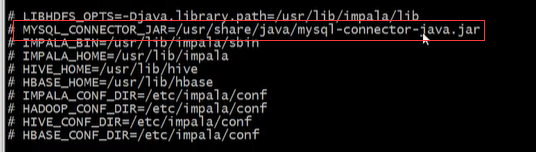

使用软链接指向该路径即可(3台机器都需要执行)

```sh
ln -s /export/servers/hive/lib/mysql-connector-java-5.1.32.jar /usr/share/java/mysql-connector-java.jar
```

#### 7.3．修改bigtop配置

修改 bigtop 的 java_home路径（3台机器)

vim /etc/default/bigtop-utils

```sh
export JAVA_HOMEE/export/servers/jdk1.8.0_65
```


### 8.启动、关闭impala服务

主节点node-3启动以下三个服务进程

```sh
service impala-state-store start
service impala-catalog start
service impala-server start
```


从节点启动node-1与 node-2启动 impala-server

```sh
service impala-server start
```

查看 impala进程是否存在

```sh
ps -ef | grep impala
```

 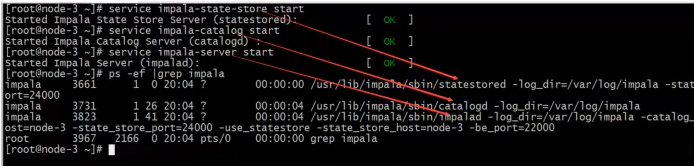

启动之后所有关于impala 的日志默认都在**/var/log/impala**

如果需要关闭 impala服务把命令中的 start 该成stop即可。注意如果关闭之后进程依然驻留，可以采取下述方式删除。正常情况下是随着关闭消失的。

解决方式:

 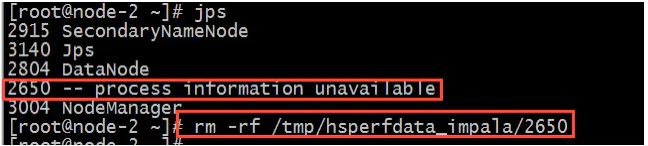


#### 8.1.impala web ui

访问impalad的管理界面http://node-3:25000/

访问statestored的管理界面http://node-3:25010/


## 三、lmpala-shell命令参数

### 1.impala-shell 外部命令

所谓的外部命令指的是不需要进入到 impala-shell交互命令行当中即可执行的命令参数。 impala-shell后面执行的时候可以带很多参数。你可以在启动impala-shell时设置,用于修改命令执行环境。

```sh
impala-shell -h 可以帮助我们查看帮助手册。也可以参考课程附件资料。
比如几个常见的:
impala-shell -r 刷新 impala元数据，与建立连接后执行REFRESH语句效果相同
impala-shell -f 文件路径执行 指的的 sql查询文件。
impala-shell -i 指定连接运行impalad守护进程的主机。默认端口是21000。你可以连接到集群中运行impalad 的任意主机。
impala-shell -o 保存执行结果到文件当中去。
```

 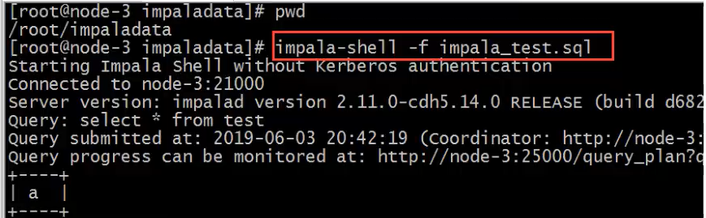


### 2.impala-shell 内部命令

所谓内部命令是指，进入 impala-shell命令行之后可以执行的语法。

 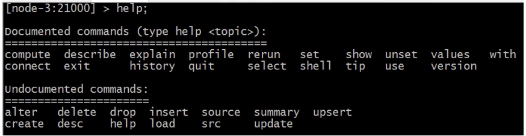

connect hostname连接到指定的机器impalad 上去执行。

 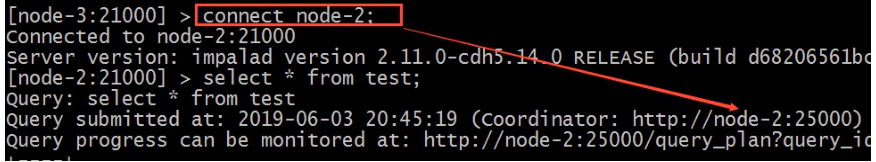

**refresh dbname.tablename**增量刷新，刷新某一张表的元数据，主要用于刷新hive当中数据表里面的数据改变的情况。

 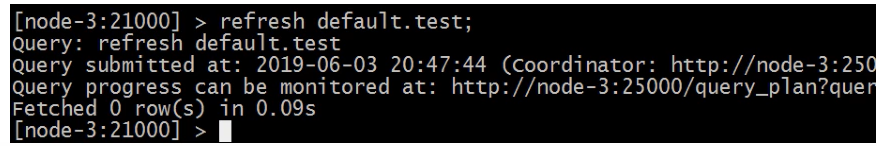

**invalidate metadata**全量刷新，性能消耗较大，主要用于 hive当中新建数据库或者数据库表的时候来进行刷新。

**quit/exit** 命令从lmpala shell中弹出

**explain **命令用于查看sql语句的执行计划。

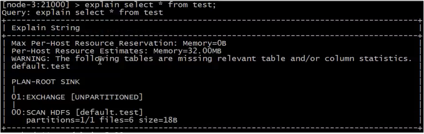

explain 的值可以设置成0,1,2,3等几个值，其中3级别是最高的，可以打印出最全的信息

```sh
set explain_level=3;
```

**profile**命令执行sql语句之后执行，可以打印出更加详细的执行步骤，主要用于查询结果的查看，集群的调优等。

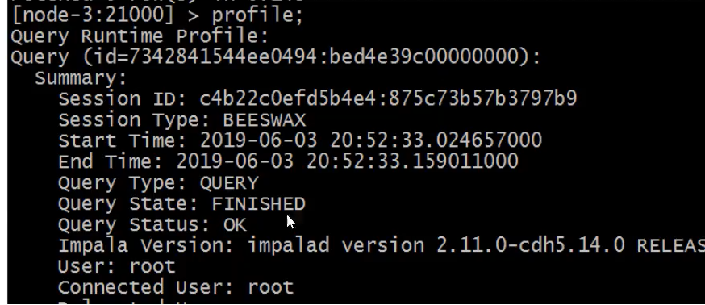

注意:

如果在 hive窗口中插入数据或者新建的数据库或者数据库表，那么在impala当中是不可直接查询,需要执行invalidate metadata以通知元数据的更新;

在impala-shell当中插入的数据，在 impala当中是可以直接查询到的，不需要刷新数据库，其中使用的就是catalog 这个服务的功能实现的，catalog 是impala1.2版本之后增加的模块功能，主要作用就是同步impala 之间的元数据。

更新操作通知Catalog，Catalog 通过广播的方式通知其它的 lmpalad进程。默认情况下Catalog是异步加载元数据的，因此查询可能需要等待元数据加载完成之后才能进行（第一次加载)。


## 四、lmpala sql语法

### 1.数据库特定语句

#### 1.1．创建数据库

**CREATE DATABASE**语句用于在 Impala中创建新数据库。

CREATE DATABASE IF NOT EXISTS database_name ;

这里，IF NOT EXISTS是一个可选的子句。如果我们使用此子句，则只有在没有具有相同名称的现有数据库时，才会创建具有给定名称的数据库。

 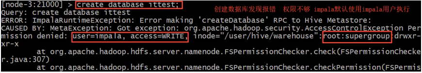

impala 默认使用impala用户执行操作，会报权限不足问题，解决办法:

一:给HDFS指定文件夹授予权限

```sh
hadoop fs -chmod -R 777 hdfs://node-1:9000/user/hive
```

二: haoop配置文件中hdfs-site.xml中设置权限为 false

```xml
<property>
  <name>dfs.permissions.enabled</name>
  <value>false</value>
</property>
```

上述两种方式都可以。

默认就会在 hive 的数仓路径下创建新的数据库名文件夹/user/hive/warehouse/ittest.db

也可以在创建数据库的时候指定hdfs路径。需要注意该路径的权限。

```sh
hadoop fs -mkdir -p /input/impala I
hadoop fs -chmod -R 777 /input/impala
create external table t3(id int ,name string ,age int ) 
row format delimited fields terminated by '\t' location
'/input/impala/external';
```


#### 1.2．删除数据库

lmpala的 **DROP DATABASE** 语句用于从lmpala中删除数据库。在删除数据库之前，建议从中删除所有表。

如果使用级联删除，lmpala会在删除指定数据库中的表之前删除它。DROP database sample **cascade**;

```sh
[node-3:21000j >drop database ittest;
Query: drop database'ittest
EROR: impalaRuntimeException:Error making 'dropbatabase' RPC to Hive Metastore:
CAUSED BY: Inva1idoperationException: Database ittest is not empty.one or more tables exist,
[node-3; 21000] > 
[node-3:21000]>. drop database ittest cascade;
Query : drop databaseittest cascade
[node-3 : 21000]>.
```

### 2.表特定语句

#### 2.1.create table语句

**CREATE TABLE**语句用于在Impala中的所需数据库中创建新表。需要指定表名字并定义其列和每列的数据类型。

impala支持的数据类型和 hive类似，除了sql类型外，还支持 java类型。

```sh
create table IF NOT EXISTS database_name.table_name (
column1 data_type,
column2 data_type,
column3 data_type,
......
columnN data_type);
```

```sql
CREATE TABLE IF NOT EXISTS my_db.student(name STRING，ageINT,contact INT );
```


```sh
[node-3:21000] > CREATE TABLE IF NOT ExISTs my_db.student(name STRING，age INT，contact INT );
query: create TABLE IF NOT EXISTs my_db.student(name STRING，age INT,'contact iNT )
Fetched o row(s in 0.06s
```


默认建表的数据存储路径跟hive一致。也可以在建表的时候通过location指定具体路径，需要注意hdfs权限问题。

#### 2.2.insert语句

lmpala 的 INSERT语句有两个子句: **into**和 **overwrite**。into 用于插入新记录数据，overwrite 用于覆盖已有的记录。

```sql
insert into table_name (column1, column2, column3....columnN) values (value1, value2, value3....valueN);
insert into table_name values (value1, value2, value2);
```

这里，column1，column2，...columnN是要插入数据的表中的列的名称。还可以添加值而不指定列名，但是，需要确保值的顺序与表中的列的顺序相同。
举个例子:

```sql
create table employee (id int,name STRING，age int,address STRING,salary BIGINT);
insert into employee VALUES(1, 'Ramesh',32, 'Ahmedabad' , 20000 );
insert into employee values (2, 'Khilan',25, 'Delhi', 15000 );
insert into employee values (3, 'kaushik'， 23, 'Kota',30000 );
insert into employee values (4, 'Chaitali', 25, 'Mumbai', 35000 );
insert into employee values (5, 'Hardik',27, 'Bhopal', 40000 );
insert into employee values (6, 'Komal', 22, 'MP', 32000 );
```

#### 2.3. select语句

lmpala **SELECT**语句用于从数据库中的一个或多个表中提取数据。此查询以表的形式返回数据。

```sh
[node-3: 21000] > select id，name，age from emp1oyee;
Query: selectid, name, age from employee
Query submitted at: 2oi9-66-09 20:06:26 (coordinator: http://node-3:25
Query progress can be monitored at: http://node-3:25000/query_plan?que
+----+------+-----+
| id | name | age |
----+------+-------+
| 1  | Ram | 26  | 
------+------+-----+
```


#### 2.4.describe语句

lmpala中的 **describe**语句用于提供表的描述。此语句的结果包含有关表的信息，例如列名称及其数据类型。

```sh
Describe table_name;
```


```sh
[node-3: 21000] > Describe emp1oyee;
Query : describe employee
十---------+--------+---------+
|name | type| comment |
---------+--------十---------+
| id  | int |
| name | string |
| age | int |
|address | string |
|salary | bigint |
```

此外，还可以使用hive的查询表元数据信息语句。desc formatted table_name;


#### 2.5. alter table

lmpala 中的**Alter** table语句用于对给定表执行更改。使用此语句，我们可以添加，删除或修改现有表中的列，也可以重命名它们。

表重命名:

```sql
ALTER TABLE [old_db_name.]old_table_name RENAME TO [new_db_name.]new_table_name
```


向表中添加列:

```sql
ALTER TABLE name ADD COLUMNS (col_spec[, col_spec ...])
```

从表中删除列:

```SQL
ALTER TABLE name DROP [COLUMN] column_name
```

更改列的名称和类型:

```SQL
ALTER TABLE name CHANGE column_name new_name new_type
```


```sh
[node-3:21000] >create tab1e t_i(id int,name string);
Query : create table t_1(id int, name string)
Fetched 0row(s)in 0.16s
[node-3: 21000]> alter table t_1 rename to t_2
Query: alter table t_1 rename to t_2
Fetched 0 row(s)in 5.21s
```


#### 2.6. delete、truncate table

lmpala drop table语句用于删除Impala中的现有表。此语句还会删除内部表的底层 HDFS 文件。

注意:使用此命令时必须小心，因为删除表后，表中可用的所有信息也将永远丢失。

```sql
DROP table database_name.table_name;
```

```sh
[node-3:21000] > drop table student;
Query: drop tab1e student
```

lmpala 的 **Truncate** Table语句用于从现有表中删除所有记录。保留表结构。您也可以使用DROP TABLE命令删除一个完整的表，但它会从数据库中删除完整的表结构，如果您希望存储一些数据，您将需要重新创建此表。

```sql
truncate table_name;
```

```sh
[node-3: 21000] > select * from employee ;
Query : select * from employee
query submitted at: 2019-o6-09 20:22;53 (Coordinator: http: / /node-3:25000)
Query progress can be monitored at: http: //node-3:250o0/query_pian?query_id=ca443

[node-3:21000] > truncate table employee
Query: truncate table employee
Query: submitted at: 2019-06-09 20:23:08 (Coordinator: htto:/l/node-3:25000)
```

#### 2.7. view视图

视图仅仅是存储在数据库中具有关联名称的Impala查询语言的语句。它是以预定义的SQL查询形式的表的组合。

视图可以包含表的所有行或选定的行。

```sql
Create View IF NOT EXISTS view_name as Select statement
```


创建视图view、查询视图view

```sql
CREATE VIEW IF NOT EXISTS employee_view AS select name, age from employee;
```

#### 2.8. order by子句

lmpala ORDER BY子句用于根据一个或多个列以升序或降序对数据进行排序。默认情况下，一些数据库按升序对查询结果进行排序。

```sql
select * from table_name ORDER BY col_name
[ASC|DESC] [NULLS FIRST [NULLS LAST]
```


可以使用关键字ASC 或 DESC分别按升序或降序排列表中的数据。如果我们使用NULLS FIRST，表中的所有空值都排列在顶行;如果我们使用NULLS LAST，包含空值的行将最后排列。


#### 2.9. group by子句

lmpala GROUP BY子句与SELECT 语句协作使用,以将相同的数据排列到组中。

```SQL
select data from table_name Group BY col_name;
```

#### 2.10. having子句

lmpala中的 Having子句允许您指定过滤哪些组结果显示在最终结果中的条件。一般来说，Having子句与group by子句一起使用;它将条件放置在由GROUPBY子句创建的组上。

#### 2.11.limit、offset

lmpala 中的 limit子句用于将结果集的行数限制为所需的数，即查询的结果集不包含超过指定限制的记录。一般来说，select查询的resultset中的行从o开始。使用offset子句，我们可以决定从哪里考虑输出。

#### 2.12.with子句

如果查询太复杂，我们可以为复杂部分定义别名，并使用lmpala的with子句将它们包含在查询中。

```SQL
with x as (select 1), y as (select 2)(select * from x union y);
```

例如:使用with子句显示年龄大于25的员工和客户的记录。

```SQL
with t1 as (select * from customers where age>25),
t2 as (select * from employee where age>25)(select * from t1 union select * from t2);
```

#### 2.13.distinct

lmpala 中的distinct运算符用于通过删除重复值来获取唯一值。

```SQL
select distinct columns... from table_name;
```

## 五、lmpala数据导入方式

### 1.load data

首先创建一个表:

```sql
create table user(id int ,name string,age int ) row format delimited fieldsterminated by "\t";
```

准备数据user.txt 并上传到hdfs 的/user/impala 路径下去

加载数据

```sh
load data inpath '/user/impala/' into table user;
```

查询加载的数据

```sql
select * from user;
```


### 2.insert into values

这种方式非常类似于RDBMS的数据插入方式。

```sql
create table t_test2(id int,name string);
insert into table t_test2 values(1,"zhangsan");
```

### 3.insert into select

插入一张表的数据来自于后面的select查询语句返回的结果。

```sql
insert into table t_test3 select id from t_test2;
```

### 4.create as select

建表的字段个数、类型、数据来自于后续的select查询语句。

```sql
create table t test4 as select name from t.test2;
```

## 六、lmpala的java开发

在实际工作当中，因为impala的查询比较快，所以可能有会使用到impala来做数据库查询的情况，可以通过java 代码来进行操作impala的查询。

### 1.下载impala jdbc依赖

下载路径:https://www.cloudera.com/downloads/connectors/impala/jdbc/2-5-28.html

因为cloudera属于商业公司性质，其提供的jar并不会出现在开源的maven仓库中，如果在企业中需要使用，请添加到企业 maven私服。

### 2.创建java工程

创建普通java工程，把依赖添加工程。


### 3. java api

```java
public static void test(){
    Connection con = null;ResultSet rs = null;
    PreparedStatement ps = null;
    String JDBC_DRIVER = "com.cloudera.impala.jdbc41.Driver";
    String CONNECTION_URL ="jdbc:impala://node3:21050";
    Class.forName(JDBC_DRIVER);
    con = (Connection) DriverManager.getConnection(CONNECTION_URL);
    ps = con.prepareStatement("select * from my_db.employee;");
    rs = ps.executeQuery();
}
```