Cassandra入门与实战

## 一、数据存储方式和NoSQL

### 1.1 数据存储方式

互联网时代各种数据存储方式层出不穷，有传统的关系型数据库如：MySQL、Oracle等，；有全文检索框架如：ElasticSearch、Solr；有NoSQL如：Cassandra、Redis

这些存储方式的特点：

- 关系型数据库：支持事务，二级索引，SQL语句，支持主从架构。


- 全文检索：分布式，p2p架构，不支持事务，采用倒排索引提供全文检索。


- NoSQL：一般基于内存，支持分布式，面向列，不支持SQL。


### 1.2 NoSQL概述

NoSQL，泛指非关系型的数据库，NoSQL去掉关系数据库的关系型特性，数据之间无关系，非常容易扩展。

NoSQL型数据库一般包含一些共同特性：

- 易扩展


NoSQL数据库种类繁多，但是一个共同的特点都是去掉关系数据库的关系型特性。数据之间无关系，这样就非常容易扩展，在架构的层面上带来了可扩展的能力。 

- 大数据量，高性能


NoSQL数据库都具有非常高的读写性能，尤其在大数据量下。一般MySQL使用Query Cache。NoSQL的Cache是记录级的，是一种细粒度的Cache，所以NoSQL在这个层面上来说性能就要高很多。 

- 灵活的数据模型


NoSQL无须事先为要存储的数据建立字段，随时可以存储自定义的数据格式。而在关系数据库里，增删字段是一件非常麻烦的事情。

- 高可用


NoSQL在不太影响性能的情况，就可以方便地实现高可用的架构。比如Cassandra、HBase模型，通过复制模型也能实现高可用。 

### 1.3 NoSQL的分类

#### 键值(Key-Value)存储数据库


这一类数据库主要使用[哈希表]，这个表中有一个特定的键和一个指针指向特定的数据。Key/value模型的优势在于简单、易部署。代表为： Redis。 

#### 列存储数据库


这类数据库通常是用来应对分布式存储的海量数据。键仍然存在，但是它们的特点是指向了多个列。这些列是由列家族来安排的。如：Cassandra， HBase。

#### 文档型数据库


文档型数据库和第一种键值存储相类似。该类型的数据模型是版本化的文档，半结构化的文档以特定的格式存储，比如JSON。文档型数据库可以看作是键值数据库的升级版，允许之间嵌套键值，在处理网页等复杂数据时，文档型数据库比传统键值数据库的查询效率更高。如：CouchDB， MongoDb。 

#### 图形(Graph)数据库


图形结构的数据库同其他行列以及关系型数据库不同，它是使用灵活的图形模型，并且能够扩展到多个服务器上。

## 二、Cassandra的介绍

### 2.1、Cassandra概述

#### 2.1.1 来自百科的介绍

> Cassandra是一套开源分布式NoSQL数据库系统。它最初由Facebook开发，用于储存收件箱等简单格式数据，集[Google](https://baike.baidu.com/item/Google)[BigTable](https://baike.baidu.com/item/BigTable)的数据模型与[Amazon](https://baike.baidu.com/item/Amazon) Dynamo的完全分布式的架构于一身Facebook于2008将 Cassandra 开源，此后，由于Cassandra良好的[可扩展性](https://baike.baidu.com/item/可扩展性/8669999)，被[Digg](https://baike.baidu.com/item/Digg)、[Twitter](https://baike.baidu.com/item/Twitter)等知名[Web 2.0](https://baike.baidu.com/item/Web 2.0)网站所采纳，成为了一种流行的分布式结构化数据存储方案。

#### 2.1.2 Cassandra的官网

Cassandra在2009年成为了Apache软件基金会的Incubator项目，并在2010年2月走出孵化器，成为正式的基金会项目。

> 官网地址：https://cassandra.apache.org/


#### 2.1.3 Cassandra的Logo

> Cassandra的名称来源于希腊神话，是特洛伊的一位悲剧性的女先知的名字，因此项目的Logo是一只放光的眼睛。


### 2.2、Cassandra特点

- **弹性可扩展性** - Cassandra是高度可扩展的; 它允许添加更多的硬件以适应更多的客户和更多的数据根据要求。
- **始终基于架构** - Cassandra没有单点故障，它可以连续用于不能承担故障的关键业务应用程序。
- **快速线性性能** - Cassandra是线性可扩展性的，即它为你增加集群中的节点数量增加你的吞吐量。因此，保持一个快速的响应时间。
- **灵活的数据存储** - Cassandra适应所有可能的数据格式，包括：结构化，半结构化和非结构化。它可以根据您的需要动态地适应变化的数据结构。
- **便捷的数据分发** - Cassandra通过在多个数据中心之间复制数据，可以灵活地在需要时分发数据。
- **事务支持** - Cassandra支持属性，如原子性，一致性，隔离和持久性（ACID）。
- **快速写入** - Cassandra被设计为在廉价的商品硬件上运行。 它执行快速写入，并可以存储数百TB的数据，而不牺牲读取效率。

### 2.3、Cassandra使用场景

#### 2.3.1 特征

- 数据写入操作密集
- 数据修改操作很少
- 通过主键查询
- 需要对数据进行分区存储

#### 2.3.2  场景举例

- 存储日志型数据
- 类似物联网的海量数据
- 对数据进行跟踪

### 2.4、与其他同类软件对比

## 三、Cassandra下载、安装、访问

### 3.1 Cassandra 下载

> 打开官网，选择下载频道https://cassandra.apache.org/download/

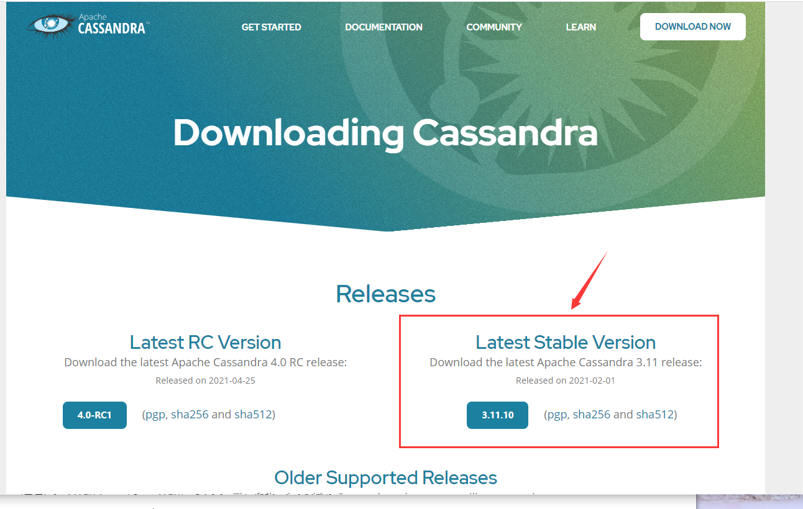

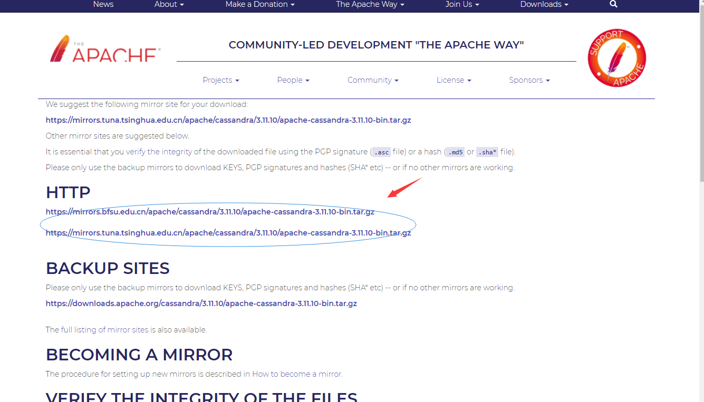


### 3.2 Windows下安装

>  注意：Cassandra使用JAVA语言开发，首先保证当前机器中已经安装JDK

#### 3.2.1 解压文件

> 找一个不包含中文的目录，把刚才下载的安装文件复制过去。然后解压到当前文件夹

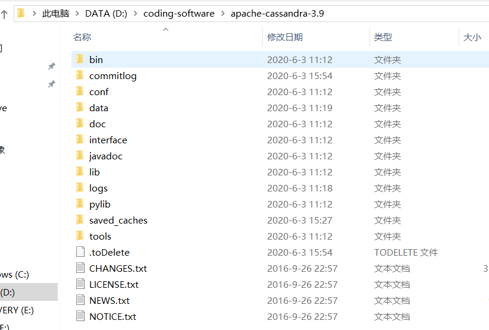

#### 3.2.2  配置环境变量

##### 1）新建CASSANDRA_HOME

> 在环境变量中新建一个CASSANDRA_HOME变量，值为：D:\coding-software\apache-cassandra-3.9

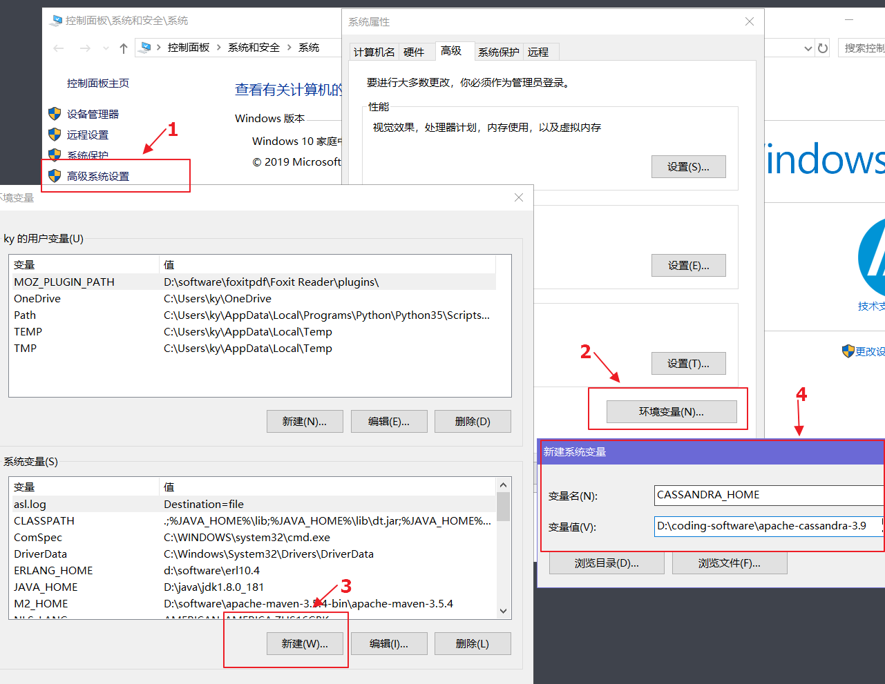


##### 2）在Path中添加

> 在Path环境变量中在末尾添加：%CASSANDRA_HOME%\bin

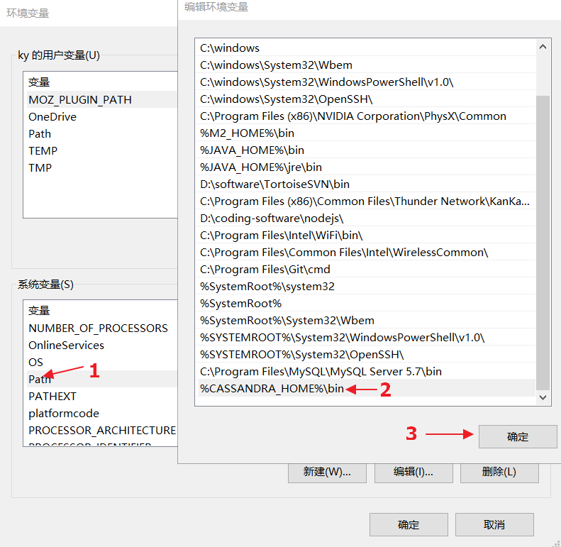

##### 3）验证环境变量。

> 打开dos窗口可以查看是否设置成功。输入echo %cassandra_home%，显示如下内容说环境变量值设置成功

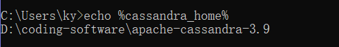

#### 3.2.3 配置Cassandra

cassandra的数据分为3类，这3类数据的存储位置都可以在配置文件中修改

**data目录**:用于存储真正的数据文件，即后面将要讲到的SSTable文件。如果服务器有多个磁盘，可以指定多个目录，每一个目录都在不同的磁盘中。这样Cassandra就可以利用更多的硬盘空间。

在data目录下，Cassandra 会将每一个 Keyspace 中的数据存储在不同的文件目录下，并且 Keyspace 文件
 目录的名称与 Keyspace 名称相同。

假设有两个 Keyspace，分别为 ks1 和 ks2，但在 data目录下，将看到3个不同的目录：ks1，ks2和 system。其中 ks1 和 ks2 用于存储系统定义的两个 Keyspace 的数据，另外一个 system 目录是 Cassandra 系统默认的一个 Keyspace，叫做 system，它用来存储 Cassandra 系统的相关元数据信息以及 HINT 数据信息。A


 **commitlog目录**:  用于存储未写人SSTable中的数据，每次Cassandra系统中有数据写入，都会先将数据记录在该日志文件中，以保证Cassandra在任何情况下宕机都不会丢失数据。如果服务器有足够多的磁盘，可以将本目录设置在一个与data目录和cache目录不同的磁盘中，以提升读写性能。

 **cache目录**: 用于存储系统中的缓存数据。可以在cassandra. yaml文件中定义Column Family的属性中定义与缓存相关的信息，如缓存数据的大小(对应配置文件中的keys_cached和rOws_ cached)、 持久化缓存数据的时间间隔(对应配置文件中的row cache_save_ period in. seconds 和key. cache save period in seconds)等。当Cassandra系统重启的时候，会从该目录下加载缓存数据。如果服务器有足够多的磁盘空间，可以将本目录设置在一个与data目录和commitlog目录不同的磁盘中，以提升读写性能。

##### 1）新建数据存储目录，data目录

- 在D:\coding-software\apache-cassandra-3.9目录中新建一个data目录；
- 找到D:\coding-software\apache-cassandra-3.9\conf目录下的cassandra.yaml配置data目录；
- 注意：如果不配置数据目录默认为$CASSANDRA_HOME/data/data；
- 注意：- 的后面要跟一个空格，这是yaml的语法；
- 代码：

```yaml
data_file_directories: 
     - D:\coding-software\apache-cassandra-3.9\data
```

- 如图：

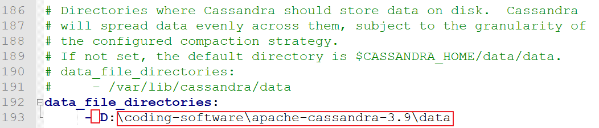

##### 2）新建日志目录，commitlog目录

- 在D:\coding-software\apache-cassandra-3.9目录中新建一个commitlog目录；

- 在cassandra.yaml中配置commitlog目录；
- 注意：如果不配置日志目录，默认为：$CASSANDRA_HOME/data/commitlog；
- 注意：- 的后面要跟一个空格，这是yaml的语法；
- 代码：

```yaml
commitlog_directory: 
     - D:\coding-software\apache-cassandra-3.9\commitlog
```

- 如图：

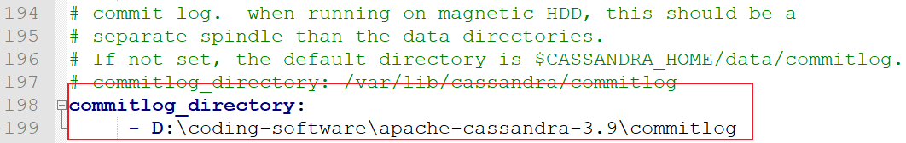

##### 3）新建缓存目录，saved_caches目录

- 在D:\coding-software\apache-cassandra-3.9目录中新建一个saved_caches目录；

- 在cassandra.yaml中配置saved_caches目录；
- 注意：如果不配置日志目录，默认为：$CASSANDRA_HOME/data/saved_caches；
- 注意：saved_caches_directory:  后面要跟一个空格，这是yaml的语法；
- 代码：

```yaml
saved_caches_directory: D:\coding-software\apache-cassandra-3.9\saved_caches
```

- 如图：

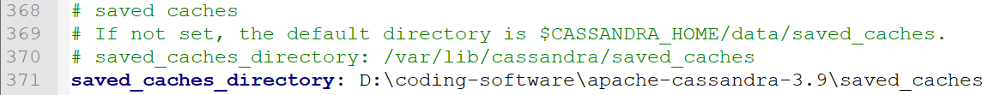

#### 3.2.4 启动Cassandra

> 打开DOS窗口，进入D:\InstallFile\apache-cassandra-3.9\bin目录，执行cassandra.bat文件，看到下入图，说明启动成功。

> 注意：这个CMD窗口不要关闭，一旦关闭，Cassandra服务就会关闭了！！！


#### 3.2.5 Cassandra客户端连接Cassandra服务器

> 注意：Cassandra的客户端的使用需要用的Python2.X版本。需要先安装Python2.X

##### 1） 下载Python2.7安装文件

访问Python的下载页面 ，<https://www.python.org/downloads/>


进入2.7.13的下载页面，这里我选择windows 64位安装文件，点击下载

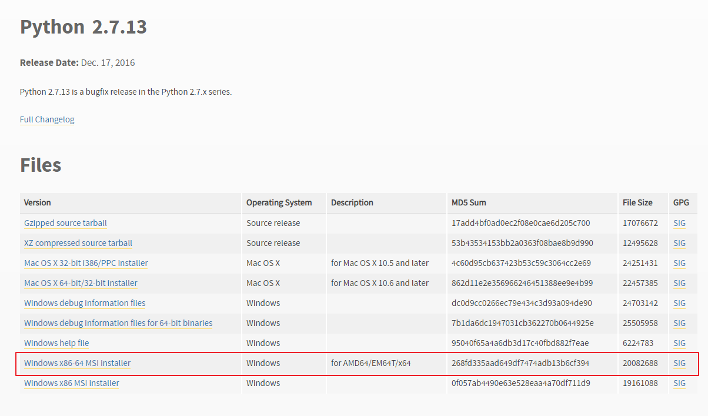

下载后的文件：


##### 2） 在本机安装Python2.7

接下来，安装Python2.7，找到安装文件双击打开，多次点击下一步，完成安装。

然后把Python2.7安装后的目录设置到环境变量的path中

##### 3） 验证Python

新打开CMD窗口，输入命令 `python`，如果现实如下内容，说明python安装成功

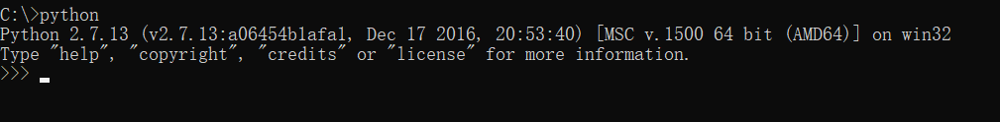

##### 4） 使用Cassandra客户端连接服务器

新打开CMD窗口，进入Cassandra的bin目录，输入 

```
D:\coding-software\apache-cassandra-3.11.6\bin>cqlsh.bat 192.168.137.1 9042
```

回车，看到如图所示，说明已经连接到服务器

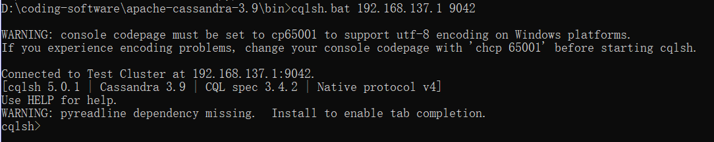

### 3.3 CentOS下安装

> 注意：Cassandra使用JAVA语言开发，首先保证当前机器中已经安装JDK

#### 3.3.1 解压安装文件

> 输入命令解压文件

```shell
 tar -xzvf apache-cassandra-3.9-bin.tar.gz
```

> 解压后，可以看到Cassandra的目录,如图：

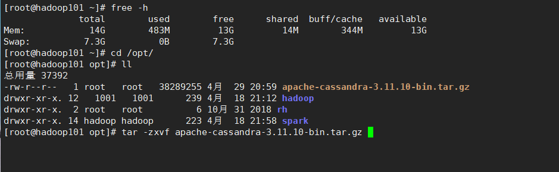

#### 3.3.2 创建数据存放文件夹

> 进入解压后的目录，创建3个Cassandra的数据文件夹

```shell
[root@hadoop101 cassandra]# mkdir data
[root@hadoop101 cassandra]# mkdir commitlog
[root@hadoop101 cassandra]# mkdir saved_caches
```

```sh
#配置环境变量
[root@hadoop101 cassandra]# vim /etc/profile
export CASSANDRA_HOME=/opt/cassandra
export PATH=$PATH:$CASSANDRA_HOME/bin

#使配置生效
[root@hadoop101 cassandra]# source /etc/profile

#查看版本ok
[root@hadoop101 cassandra]# cassandra -v
3.11.10

```


#### 3.3.3 配置Cassandra

> 在conf目录中找到cassandra.yaml配置文件，配置上面创建的3个数据目录

##### 1）配置 data_file_directories

内容：

```yaml
data_file_directories:
     - /opt/cassandra/data
```


##### 2）配置commitlog_directory

内容：

```yaml
commitlog_directory: /opt/cassandra/commitlog
```


##### 3）配置saved_caches_directory

内容：

```yaml
saved_caches_directory: /opt/cassandra/saved_caches
```


##### 4）保存文件

> 使用 :wq   保存文件

#### 3.3.4 启动Cassandra

> 执行cassandra

```sh
[root@hadoop101 cassandra]# cassandra
Running Cassandra as root user or group is not recommended - please start Cassandra using a different system user.
If you really want to force running Cassandra as root, use -R command line option.
```

意思是官方不推荐使用root用户或组来运行Cassandra，请使用其他系统用户来启动Cassandra。如果就是想用root用户来启动，可以在  命令后面加上 -R，也就是  使用root用户启动的命令是  

```SH
[root@hadoop101 cassandra]# cassandra -R
[root@hadoop101 cassandra]# Java HotSpot(TM) 64-Bit Server VM warning: Cannot open file /opt/cassandra/logs/gc.log due to No such file or directory

CompilerOracle: dontinline org/apache/cassandra/db/Columns$Serializer.deserializeLargeSubset (Lorg/apache/cassandra/io/util/DataInputPlus;Lorg/apache/cassandra/db/Columns;I)Lorg/apache/cassandra/db/Columns;
CompilerOracle: dontinline org/apache/cassandra/db/Columns$Serializer.serializeLargeSubset (Ljava/util/Collection;ILorg/apache/cassandra/db/Columns;ILorg/apache/cassandra/io/util/DataOutputPlus;)V
CompilerOracle: dontinline org/apache/cassandra/db/Columns$Serializer.serializeLargeSubsetSize (Ljava/util/Collection;ILorg/apache/cassandra/db/Columns;I)I
CompilerOracle: dontinline org/apache/cassandra/db/commitlog/AbstractCommitLogSegmentManager.advanceAllocatingFrom (Lorg/apache/cassandra/db/commitlog/CommitLogSegment;)V
CompilerOracle: dontinline org/apache/cassandra/db/transform/BaseIterator.tryGetMoreContents ()Z

```

输入命令来查看正在运行的cassandra的pid

```shell
ps -ef|grep cassandra
```

显示如图：

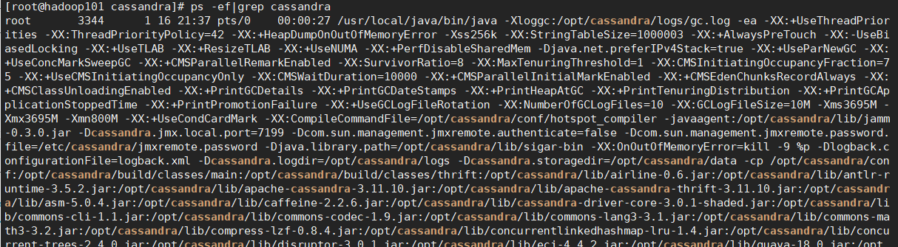

#### 3.3.5 关闭Cassandra

刚才已经查到了pid，现在可以使用命令杀掉这个pid对应的进程

```shell
kill -9 3344
```

#### 3.3.6 启动、重启、关闭的脚本

为了方便管理，可以编写脚本来管理，在/usr/local/apache-cassandra-3.9下创建一个startme.sh，输入一下内容：

```shell
#!/bin/sh
CASSANDRA_DIR="/opt/cassandra"
 echo "************cassandra***************"
case "$1" in
        start)
                
                echo "*                                  *"
                echo "*            starting              *"
                nohup $CASSANDRA_DIR/bin/cassandra -R >> $CASSANDRA_DIR/logs/system.log 2>&1 &
                echo "*            started               *"
                echo "*                                  *"
                echo "************************************"
                ;;
        stop)
                
                echo "*                                  *"
                echo "*           stopping               *"
                PID_COUNT=`ps aux |grep CassandraDaemon |grep -v grep | wc -l`
                PID=`ps aux |grep CassandraDaemon |grep -v grep | awk {'print $2'}`
                if [ $PID_COUNT -gt 0 ];then
                		echo "*           try stop               *"
                        kill -9 $PID
                		echo "*          kill  SUCCESS!          *"
                else
                		echo "*          there is no !           *"
                echo "*                                  *"
                echo "************************************"
                fi
                ;;
        restart)
        		
        		echo "*                                  *"
                echo "*********     restarting      ******"
                $0 stop
                $0 start
                echo "*                                  *"
                echo "************************************"
                ;;
        status)
                $CASSANDRA_DIR/bin/nodetool status
                ;;
        
        *)
        echo "Usage:$0 {start|stop|restart|status}"
        
        exit 1
esac
```

接下来就可以使用这个脚本进行 启动，重启，关闭 的操作

```sh
[root@localhost apache-cassandra-3.9]# ./startme.sh start
[root@localhost apache-cassandra-3.9]# ./startme.sh restart
[root@localhost apache-cassandra-3.9]# ./startme.sh stop
```

#### 3.3.7 查看状态

运行bin  目录下的 `nodetool`

```shell
[root@localhost bin]# ./nodetool status
```

结果如图：

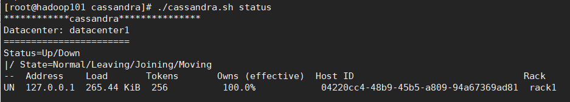

也可以运行自己编写的脚本，效果与上图一致:

```shell
[root@localhost apache-cassandra-3.9]# ./startme.sh status
```

如果cassandra启动出错，可以在bin目录下 使用 `journalctl -u cassandra` 命令查看

```shell
[root@localhost bin]# journalctl -u cassandra
```

#### 3.3.8 使用客户端连接

命令

```shell
[root@localhost apache-cassandra-3.9]# ./bin/cqlsh
```

效果

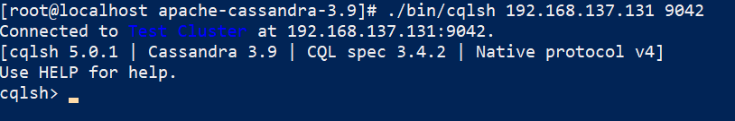

> 看到上面的效果，说明Cassandra已经安装成功，并且使用客户端连接成功

### 3.4 Cassandra的端口

```
7199 - JMX
7000 - 节点间通信（如果启用了TLS，则不使用）
7001 - TLS节点间通信（使用TLS时使用）
9160 - Thrift客户端API
9042 - CQL本地传输端口
```

### 3.5 Cassandra.yaml内容

cluster_name

集群的名字，默认情况下是TestCluster。对于这个属性的配置可以防止某个节点加入到其他集群中去，所以一个集群中的节点必须有相同的cluster_name属性。

listen_address

Cassandra需要监听的IP或主机名，默认是localhost。建议配置私有IP，不要用0.0.0.0。

commitlog_directory

commit log的保存目录，压缩包安装方式默认是/var/lib/cassandra/commitlog。通过前面的了解，我们可以知道，把这个目录和数据目录分开存放到不同的物理磁盘可以提高性能。

data_file_directories

数据文件的存放目录，压缩包安装方式默认是/var/lib/cassandra/data。为了更好的效果，建议使用RAID 0或SSD。

save_caches_directory

保存表和行的缓存，压缩包安装方式默认是/var/lib/cassandra/saved_caches。

*通常使用：用得比较频繁的属性*

在启动节点前，需要仔细评估你的需求。

commit_failure_policy

提交失败时的策略（默认stop）：

stop：关闭gossip和Thrift，让节点挂起，但是可以通过JMX进行检测。

sto_commit：关闭commit log，整理需要写入的数据，但是提供读数据服务。

ignore：忽略错误，使得该处理失败。

disk_failure_policy

设置Cassandra如何处理磁盘故障（默认stop）。

stop：关闭gossip和Thrift，让节点挂起，但是可以通过JMX进行检测。

stop_paranoid：在任何SSTable错误时就闭gossip和Thrift。

best_effort：这是Cassandra处理磁盘错误最好的目标。如果Cassandra不能读取磁盘，那么它就标记该磁盘为黑名单，可以继续在其他磁盘进行写入数据。如果Cassandra不能从磁盘读取数据，那个这些SSTable就标记为不可读，其他可用的继续堆外提供服务。所以就有可能在一致性水平为ONE时会读取到过期的数据。

ignore：用于升级情况。

endpoint_snitch

用于设置Cassandra定位节点和路由请求的snitch（默认org.apache.cassandra.locator.SimpleSnitch），必须设置为实现了IEndpointSnitch的类。

rpc_address

用于监听客户端连接的地址。可用的包括：

- 0.0.0.0监听所有地址
- IP地址
- 主机名
- 不设置：使用hosts文件或DNS

seed_provider

需要联系的节点地址。Cassandra使用-seeds集合找到其他节点并学习其整个环中的网络拓扑。

class_name：（默认org.apache.cassandra.locator.SimpleSeedProvider），可用自定义，但通常不必要。

– seeds：（默认127.0.0.1）逗号分隔的IP列表。

compaction_throughput_mb_per_sec

限制特定吞吐量下的压缩速率。如果插入数据的速度越快，越应该压缩SSTable减少其数量。推荐16-32倍于写入速度（MB/s）。如果是0表示不限制。

memtable_total_space_in_mb

指定节点中memables最大使用的内存数（默认1/4heap）。

concurrent_reads

（默认32）读取数据的瓶颈是在磁盘上，设置16倍于磁盘数量可以减少操作队列。

concurrent_writes

（默认32）在Cassandra里写很少出现I/O不稳定，所以并发写取决于CPU的核心数量。推荐8倍于CPU数。

incremental_backups

（默认false）最后一次快照发生时备份更新的数据（增量备份）。当增量备份可用时，Cassandra创建一个到SSTable的的硬链接或者流式存储到本地的备份/子目录。删除这些硬链接是操作员的责任。

snapshot_before_compaction

（默认false）启用或禁用在压缩前执行快照。这个选项在数据格式改变的时候来备份数据是很有用的。注意使用这个选项，因为Cassandra不会自动删除过期的快照。

phi_convict_threshold

（默认8）调整失效检测器的敏感度。较小的值增加了把未响应的节点标注为挂掉的可能性，反之就会降低其可能性。在不稳定的网络环境下（比如EC2），把这个值调整为10或12有助于防止错误的失效判断。大于12或小于5的值不推荐！

*性能调优*

commit_sync

（默认：periodic）Cassandra用来确认每毫秒写操作的方法。

- periodic：和commitlog_sync_period_in_ms（默认10000 – 10 秒）一起控制把commit log同步到磁盘的频繁度。周期性的同步会立即确认。
- batch：和commitlog_sync_batch_window_in_ms（默认disabled）一起控制Cassandra在执行同步前要等待其他写操作多久时间。当使用该方法时，写操作在同步数据到磁盘前不会被确认。

commitlog_periodic_queue_size

（默认1024*CPU的数量）commit log队列上的等待条目。当写入非常大的blob时，请减少这个数值。比如，16倍于CPU对于1MB的Blob工作得很好。这个设置应该至少和concurrent_writes一样大。

commitlog_segment_size_in_mb

（默认32）设置每个commit log文件段的大小。一个commit log段在其所有数据刷新到SSTable后可能会被归档、删除或回收。数据的总数可以潜在的包含系统中所有表的commit log段。默认值适合大多数情况，当然你也可以修改，比如8或16MB。

commitlog_total_space_in_mb

（默认32位JVM为32,64位JVM为1024）commit log使用的总空间。如果使用的空间达到以上指定的值，Cassandra进入下一个临近的部分，或者把旧的commit log刷新到磁盘，删除这些日志段。该个操作减少了在启动时加载过多数据引起的延迟，防止了把无限更新的表保存到有限的commit log段中。

compaction_preheat_key_cache

（默认true）当设置为true的时候，缓存的row key在压缩期间被跟踪，并且重新缓存其在新压缩的SSTable中的位置。如果有及其大的key要缓存，把这个值设为false。

concurrent_compactors

（默认每个CPU一个）设置每个节点并发压缩处理的值，不包含验证修复逆商。并发压缩可以在混合读写工作下帮助保持读的性能——通过减缓把一堆小的SSTable压缩而进行的长时间压缩。如果压缩运行得太慢或太快，请首先修改compaction_throughput_mb_per_sec的值。

in_memory_compaction_limit_in_mb

（默认64）针对数据行在内存中的压缩限制。超大的行会溢出磁盘并且使用更慢的二次压缩。当这个情况发生时，会对特定的行的key记录一个消息。推荐5-10%的Java对内存大小。

multithreaded_compaction

（默认false）当设置为true的时候，每个压缩操作使用一个线程，一个线程用于合并SSTable。典型的，这个只在使用SSD的时候有作用。使用HDD的时候，受限于磁盘I/O（可参考compaction_throughput_mb_per_sec）。

preheat_kernel_page_cache

（默认false） 启用或禁用内核页面缓存预热压缩后的key缓存。当启用的时候会预热第一个页面（4K）用于优每个数据行的顺序访问。对于大的数据行通常是有危害的。

file_cache_size_in_mb

（小于1/4堆内存或512）用于SSTable读取的缓存内存大小。

memtable_flush_queue_size

（默认4）等待刷新的满的memtable的数量（等待写线程的memtable）。最小是设置一个table上索引的最大数量。

memtable_flush_writers

（默认每数据目录一个）设置用于刷新memtable的线程数量。这些线程是磁盘I/O阻塞的，每个线程在阻塞的情况下都保持了memtable。如果有大的堆内存和很多数据目录，可以增加该值提升刷新性能。

column_index_size_in_kb

（默认64）当数据到达这个值的时候添加列索引到行上。这个值定义了多少数据行必须被反序列化来读取列。如果列的值很大或有很多列，那么就需要增加这个值。

populate_io_cache_on_flush

（默认false）添加新刷新或压缩的SSTable到操作系统的页面缓存。

reduce_cache_capacity_to

（默认0.6）设置由reduce_cache_sizes_at定义的Java对内存达到限制时的最大缓存容量百分比。

reduce_cache_sizes_at

（默认0.85）当Java对内存使用率达到这个百分比，Cassandra减少通过reduce_cache_capacity_to定义的缓存容量。禁用请使用1.0。

stream_throughput_outbound_megabits_per_sec

（默认200）限制所有外出的流文件吞吐量。Cassandra在启动或修复时使用很多顺序I/O来流化数据，这些可以导致网络饱和以及降低RPC的性能。

trickle_fsync

（默认false）当使用顺序写的时候，启用该选项就告诉fsync强制操作系统在trickle_fsync_interval_in_kb设定的间隔刷新脏缓存。建议在SSD启用。

trickle_fsync_interval_in_kb

（默认10240）设置fsync的大小

## 四、Cassandra的基本概念

> 本章介绍Cassandra的基本入门概念

### 4.1 数据模型

Cassandra的数据模型与常见的关系型数据库的数据模型有很大的不同

#### 4.1 .1 列（Column）

> 列是Cassandra的基本数据结构单元，具有三个值：名称，值、时间戳

| 名称        | 值           | 时间戳       |
| ----------- | ------------ | ------------ |
| name:byte[] | value:byte[] | clock:byte[] |

在Cassandra中不需要预先定义列（Column），只需要在KeySpace里定义列族，然后就可以开始写数据了。

#### 4.1.2 列族（ Column Family）

列族相当于关系数据库的表（Table），是包含了多行（Row）的容器。

ColumnFamily的结构举例，如图：

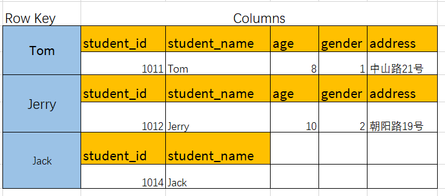


可以理解为Java结构 Map<String,Map<byte[],Column>>，如图：

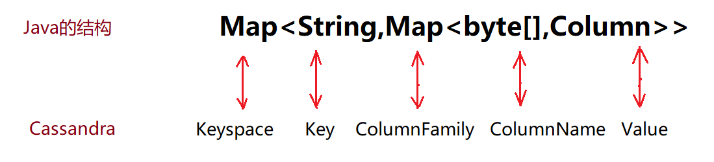

##### 1）ColumnFamily 的2种类型

- 静态column family(static column family)

  静态的column family,字段名是固定的，比较适合对于这些column都有预定义的元数据

- 动态column family(dynamic column family)

  动态的column family，字段名是应用程序计算出来并且提供的，所以column family只能定义这些字段的类型，无法不可以指定这些字段的名字和值，这些名字和值是由应用程序插入某字段才得出的。

##### 2）Row key

ColumnFamily 中的每一行都用Row Key（行键）来标识，这个相当于关系数据库表中的主键，并且总是被索引的。

##### 3）主键

Cassandra可以使用**PRIMARY KEY** 关键字创建主键，主键分为2种

- Single column Primary Key

如果 Primary Key 由一列组成，那么称为 Single column Primary Key

- Composite Primary Key

如果 Primary Key 由多列组成，那么这种情况称为 Compound Primary Key 或 Composite Primary Key


列族具有以下属性 -

- **keys_cached** - 它表示每个SSTable保持缓存的位置数。
- **rows_cached** - 它表示其整个内容将在内存中缓存的行数。
- **preload_row_cache** -它指定是否要预先填充行缓存。

#### 4.1.3 键空间 （KeySpace）

**Cassandra的键空间（KeySpace）相当于数据库，我们创建一个键空间就是创建了一个数据库。**

键空间包含一个或多个列族（Column Family）

> 注意：一般将有关联的数据放到同一个 KeySpace 下面

键空间 （KeySpace） 创建的时候可以指定一些属性：副本因子，副本策略，Durable_writes（是否启用 CommitLog 机制）

##### 副本因子（Replication Factor） 

副本因子决定数据有几份副本。例如：

副本因子为1表示每一行只有一个副,。副本因子为2表示每一行有两个副本，每个副本位于不同的节点上。在实际应用中为了避免单点故障，会配置为3以上。

> 注意：所有的副本都同样重要，没有主从之分。可以为每个数据中心定义副本因子。副本策略设置应大于1，但是不能超过集群中的节点数。

##### 副本放置策略 （Replica placement strategy）    

描述的是副本放在集群中的策略

目前有2种策略，内容如下：

| 策略名                  | 中文名       | 描述                                                         |
| ----------------------- | ------------ | ------------------------------------------------------------ |
| SimpleStrategy          | 简单策略     | 适用于只有一个数据中心。为集群指定简单的副本因子（有几个副本） |
| NetworkTopologyStrategy | 网络拓扑策略 | 推荐方式，因为可以扩展到多数据中心，可以单独为每个数据中心设置复制因子 |

##### Durable_writes

否对当前KeySpace的更新使用commitlog，默认为true

#### 4.1.4 副本 （Replication）

> 副本就是把数据存储到多个节点，来提高容错性

#### 4.1.5 节点（Node）

> 存储数据的机器

#### 4.1.6 数据中心（DateCenter）


#### 4.1.7 集群（Cluster）

Cassandra数据库是为跨越多条主机共同工作，对用户呈现为一个整体的分布式系统设计的。Cassandra最外层容器被称为群集。Cassandra将集群中的节点组织成一个环（ring），然后把数据分配到集群中的节点（Node）上。

#### 4.1.8 超级列

超级列是一个特殊列，因此，它也是一个键值对。但是超级列存储了子列的地图。

通常列族被存储在磁盘上的单个文件中。因此，为了优化性能，重要的是保持您可能在同一列族中一起查询的列，并且超级列在此可以有所帮助。下面是超级列的结构。

### 4.2 数据类型

> CQL提供了一组丰富的内置数据类型，用户还可以创建自己的自定义数据类型。
>
> CQL是Cassandra提供的一套查询语言

#### 4.2.1 数值类型

| 数据类型 | 含义                 | 描述                                   |
| -------- | -------------------- | -------------------------------------- |
| int      | 32位有符号整型       | 和 Java 中的 int 类似                  |
| bigint   | 64位长整型           | 和 Java 中的 long 类似                 |
| smallint | 16位有符号整型       | 和 Java 中的 short 类似                |
| tinyint  | 8位有符号整型        | 和 Java 中的 tinyint 类似              |
| varint   | 可变精度有符号整数   | 和 Java 中的 java.math.BigInteger 类似 |
| float    | 32位 IEEE-754 浮点型 | 和 Java 中的 float 类似                |
| double   | 64位 IEEE-754 浮点型 | 和 Java 中的 double 类似               |
| decimal  | 可变精度的 decimal   | 和 Java 中的 java.math.BigDecimal 类似 |

#### 4.2.2 文本类型

> CQL提供2种类型存放文本类型，text和varchar基本一致

| 数据类型 | 含义 | 描述                 |
| -------- | ---- | -------------------- |
| ascii    | 文本 | 表示ASCII字符串      |
| text     | 文本 | 表示UTF8编码的字符串 |
| varchar  | 文本 | 表示uTF8编码的字符串 |

#### 4.2.3 时间类型

| 数据类型  | 含义 | 描述                                       |
| --------- | ---- | ------------------------------------------ |
| timestamp | 时间 | 包含了日期和时间，使用64位有符号的整数表示 |
| date      | 日期 |                                            |
| time      | 时间 |                                            |

#### 4.2.4 标识符类型

| 类型     | 含义          | 描述                                                         |
| -------- | ------------- | ------------------------------------------------------------ |
| uuid     | 128位数据类型 | 通用唯一识别码<br>CQL 中的 uuid 实现是 Type 4 UUID，其实现完全是基于随机数的 |
| timeuuid |               | Type 1 UUID                                                  |

#### 4.2.5 集合类型

##### 1）set

集合数据类型，set 里面的元素存储是无序的。

set 里面可以存储前面介绍的数据类型，也可以是用户自定义数据类型，甚至是其他集合类型。

##### 2）list

list 包含了有序的列表数据，默认情况下，数据是按照插入顺序保存的。

##### 3）map

map 数据类型包含了 key/value 键值对。key 和 value 可以是任何类型，除了 counter 类型

> 使用集合类型要注意：
> 1、集合的每一项最大是64K。
> 2、保持集合内的数据不要太大，免得Cassandra 查询延时过长，Cassandra 查询时会读出整个集合内的数据，集合在内部不会进行分页，集合的目的是存储小量数据。
> 3、不要向集合插入大于64K的数据，否则只有查询到前64K数据，其它部分会丢失。

#### 4.2.6 其他基本类型

| 类型    | 含义                  | 描述                                                         |
| ------- | --------------------- | ------------------------------------------------------------ |
| boolean | 布尔类型              | 值只能为 true/false                                          |
| blob    | 二进制大对象          | 存储媒体或者其他二进制数据类型时很有用                       |
| inet    | IPv4 或 IPv6 网络地址 | cqlsh 接受用于定义 IPv4 地址的任何合法格式，包括包含十进制，八进制或十六进制值的点或非点式表示<br>CQL 会输出为 0.0.0.0 这种 地址形式。 |
| counter | 计数器类型            | 值不能直接设置，而只能递增或递减<br>不能用作主键的一部分；如果使用计数器，则除primary key 列之外的所有列都必须是计数器 |

#### 4.2.7 用户自定义类型

如果内置的数据类型无法满足需求，可以使用自定义数据类型。

### 4.3 CQL Shell 客户端

> CQL Shell 简称cqlsh，是一个可以和Cassandra数据库通信的客户端，使用这个cqlsh客户端可以执行Cassandra查询语言（CQL）。

#### 4.3.1 启动cqlsh

##### 1）Windows启用

新打开CMD窗口，进入Cassandra的bin目录，输入 

```
D:\coding-software\apache-cassandra-3.9\bin>cqlsh.bat 192.168.137.1 9042
```

回车，看到如图所示，说明已经连接到服务器


##### 2）CentOS启用

进入cassandra安装目录下的 bin 目录，执行 cqlsh 命令

```shell
[root@localhost apache-cassandra-3.9]# ./bin/cqlsh 192.168.137.131 9042
```

执行命令后效果


#### 4.3.2 启动说明

上面的操作在启动cqlsh的时候并没有指定需要连接的节点以及端口，默认 cqlsh 会自动探测本机及端口。上面的操作时已经启动了 Cassandra 服务并绑定相关端口，注：【 [端口列表](#3.4 Cassandra的端口)】，cqlsh默认就会连接本机的9042端口。

从上面的命令可以看出 cqlsh 连接到名为 Test Cluster 的集群，这个名字是默认值，可以自定义，配置在 `conf/cassandra.yaml` 文件的 `cluster_name` 参数，注：【[yaml全内容](#3.5 Cassandra.yaml内容（未完成）)】

另外，也可以在启动 cqlsh 的时候指定节点和端口，效果和不指定一样：

```shell
[root@localhost apache-cassandra-3.9]# ./bin/cqlsh localhost 9042
```

#### 4.3.3 cqlsh的基本命令

> 命令列表

| 命令        | 描述                                                         |
| ----------- | ------------------------------------------------------------ |
| HELP        | 显示所有cqlsh命令的帮助主题                                  |
| CAPTURE     | 捕获命令的输出并将其添加到文件                               |
| CONSISTENCY | 显示当前一致性级别，或设置新的一致性级别                     |
| COPY        | 将数据复制到Cassandra并从Cassandra复制数据                   |
| DESCRIBE    | 描述Cassandra及其对象的当前集群                              |
| EXPAND      | 纵向扩展查询的输出                                           |
| EXIT        | 终止cqlsh                                                    |
| PAGING      | 启用或禁用查询分页                                           |
| SHOW        | 显示当前cqlsh会话的详细信息，如Cassandra版本，主机或数据类型假设 |
| SOURCE      | 执行包含CQL语句的文件                                        |
| TRACING     | 启用或禁用请求跟踪                                           |

##### 1）help  帮助

输入命令，可以查看cqlsh 支持的命令

```shell
cqlsh> help
```

显示效果：
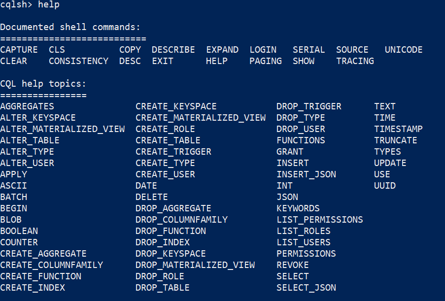

##### 3）DESCRIBE  

此命令配合 一些内容可以输入信息

> Describe cluster 提供有关集群的信息

输入命令

```shell
cqlsh> Describe cluster；
```

效果

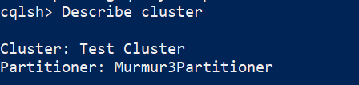

> Describe Keyspaces   列出集群中的所有Keyspaces（键空间）

输入命令

```shell
cqlsh> Describe Keyspaces；
```

效果，显示当前Cassandra里的所有键空间

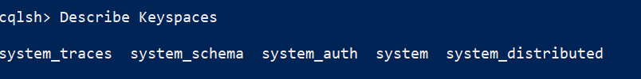

> Describe tables  列出键空间的所有表

输入命令

```shell
cqlsh> Describe tables;
```

效果，当前没有创建任何的键空间，这里显示的默认内置的表

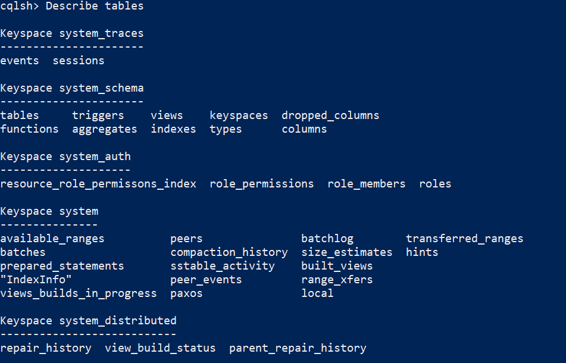

> Describe tables  列出键空间内指定表的信息

先指定键空间 ，这里使用  system_traces

```shell
cqlsh> USE system_traces ；
```

列出system_traces 下的 sessions信息

```shell
cqlsh:system_traces> DESCRIBE sessions；
```

效果

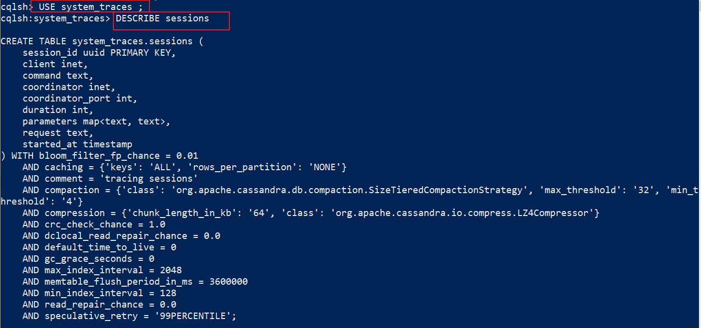

#####  Expand  扩展输出

> 使用命令后会扩展select输出的结果展示形式，对每个需要的操作先开启扩展，然后进行查询，最后关闭扩展

开启扩展输出

```
expand on;
```

查询数据

```
select * from table;
```

关闭扩展输入

```
expand OFF;
```


##### Capture 捕获命令输出到文件

此命令捕获命令的输出并将其添加到文件。

输入命令，将输出内容捕获到名为outputfile的文件

```
CAPTURE '/usr/local/apache-cassandra-3.11.6/outputfile'
```

执行效果

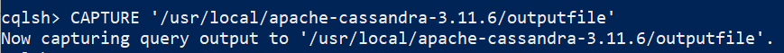

执行一个查询，控制台可以看到输出。

然后去看outputfile文件，会发现把刚才查询的

#####  show 显示当前cqlsh会话的详细信息

> show命令后可以跟3个内容 ，分别是 HOST 、SESSION 、VERSION
>
> 输入SHOW ，点击2次TAB 按键，可以看到3个内容提示

代码：

```shell
cqlsh:system_traces> SHOW
```

输入SHOW HOST，显示当前cqlsh 连接的Cassandra服务的ip和端口

```
cqlsh:system_traces> SHOW HOST
```

输入 SHOW VERSION  显示当前的版本

```shell
cqlsh:system_traces> SHOW VERSION
```

出入SHOW SESSION 显示会话信息，需要参数uuid

```shell
cqlsh:system_traces> SHOW SESSION <uuid>
```

显示效果
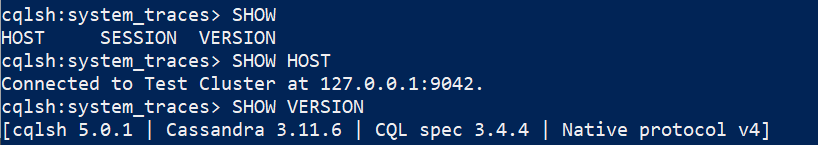

##### Exit  用于终止cql shell

### 4.4 CQL-Cassandra查询语言

CQL：Cassandra Query Language  和关系型数据库的 SQL 很类似（一些关键词相似），可以使用CQL和 Cassandra 进行交互，实现 定义数据结构，插入数据，执行查询。

> 注意：CQL 和 SQL 是相互独立，没有任何关系的。CQL 缺少 SQL 的一些关键功能，比如 JOIN 等。

#### 4.4.1 数据定义命令

| 指令            | 描述                      |
| --------------- | ------------------------- |
| CREATE KEYSPACE | 在Cassandra中创建KeySpace |
| USE             | 连接到已创建的KeySpace    |
| ALTER KEYSPACE  | 更改KeySpace的属性        |
| DROP KEYSPACE   | 删除KeySpace              |
| CREATE TABLE    | 在KeySpace中创建表        |
| ALTER TABLE     | 修改表的列属性            |
| DROP TABLE      | 删除表                    |
| TRUNCATE        | 从表中删除所有数据        |
| CREATE INDEX    | 在表的单个列上定义新索引  |
| DROP INDEX      | 删除命名索引              |

#### 4.4.2 数据操作指令

| 指令   | 描述              |
| ------ | ----------------- |
| INSERT | 在表中添加行的列  |
| UPDATE | 更新行的列        |
| DELETE | 从表中删除数据    |
| BATCH  | 一次执行多个DML语 |

#### 4.4.3  查询指令

| 指令    | 描述                                                |
| ------- | --------------------------------------------------- |
| SELECT  | 从表中读取数据                                      |
| WHERE   | where子句与select一起使用以读取特定数据             |
| ORDERBY | orderby子句与select一起使用，以特定顺序读取特定数据 |

## 五、Cassandra的基本操作

> 本章来学习在CQL Shell中使用CQL操作、查询Cassandra数据

### 5.1 操作键空间

#### 5.1.1 创建Keyspace

> 语法

```shell
CREATE KEYSPACE <identifier> WITH <properties>;
```

更具体的语法：

```shell
Create keyspace KeyspaceName with replicaton={'class':strategy name,   
'replication_factor': No of replications on different nodes};
```

要填写的内容：

KeyspaceName   代表键空间的名字

strategy name     代表副本放置策略，内容包括：简单策略、网络拓扑策略，选择其中的一个。参见：【[副本放置策略](#副本放置策略 （Replica placement strategy）)】

No of replications on different nodes 代表 复制因子，放置在不同节点上的数据的副本数。参见：【[副本因子](#副本因子（Replication Factor）)】

> 编写完成的创建语句
>
> 创建一个键空间名字为：school，副本策略选择：简单策略 SimpleStrategy，副本因子：3

```shell
CREATE KEYSPACE school WITH replication = {'class':'SimpleStrategy', 'replication_factor' : 3};
```

效果


> 验证

- 输入  DESCRIBE keyspaces查看所有的键空间，代码：

```
 DESCRIBE keyspaces ;
```

效果：能够看到新创建的键空间 school

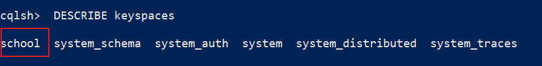

- 输入 DESCRIBE school 查看键空间的创建语句，代码：

```
DESCRIBE school;
```

效果：看到school 键空间的创建语句

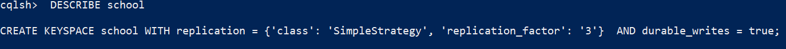

#### 5.1.2连接Keyspace

> 语法

```shell
USE <identifier>;
```

>编写完整的连接Keyspace语句，连接school 键空间

```
use school;
```

效果：

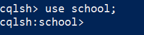

#### 5.1.3修改键空间 

> 语法

```shell
ALTER KEYSPACE <identifier> WITH <properties>
```

> 编写完整的修改键空间语句，修改school键空间，把副本因子 从3 改为1

```shell
ALTER KEYSPACE school WITH replication = {'class':'SimpleStrategy', 'replication_factor' : 1};
```

效果

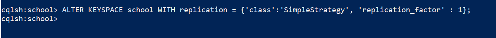

> 验证

- 输入 DESCRIBE school 查看键空间的创建语句，代码：

```
DESCRIBE school;
```

效果：看到school 键空间的创建语句，可以看到replication_factor 值为1

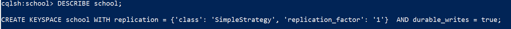

#### 5.1.4 删除键空间

> 语法

```shell
DROP KEYSPACE <identifier>
```

> 完整删除键空间语句，删除school键空间

代码

```shell
DROP KEYSPACE school
```

效果，使用DESCRIBE keyspaces ; 验证school键空间是否存在，可以看出school已经不存在

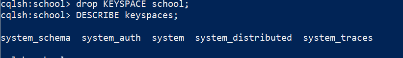

### 5.2 操作表、索引

注意：操作前，先把键空间school键空间创建，并使用school 键空间，代码

```shell
CREATE KEYSPACE school WITH replication = {'class':'SimpleStrategy', 'replication_factor' : 3};
use school;
```

#### 5.2.1 查看键空间下所有表

> 代码

```shell
 DESCRIBE TABLES;
```

> 当前键空间下没有任何表，效果

执行返回 empty


#### 5.2.2 创建表

> 语法

```shell
CREATE (TABLE | COLUMNFAMILY) <tablename> ('<column-definition>' , '<column-definition>')
(WITH <option> AND <option>)
```

>完整创建表语句，创建student 表，student包含属性如下：
>
>学生编号（id）， 姓名（name），年龄（age），性别（gender），家庭地址（address），interest（兴趣），phone（电话号码），education（教育经历）
>
>id 为主键，并且为每个Column选择对应的数据类型。
>
>注意：interest 的数据类型是set  ，phone的数据类型是list，education 的数据类型是map

```sql
CREATE TABLE student(
   id int PRIMARY KEY,  
   name text,  
   age int,  
   gender tinyint,  
   address text ,
   interest set<text>,
   phone list<text>,
   education map<text, text>
);
```

> 验证

- 使用 DESCRIBE TABLE student;  查看创建的表

```shell
cqlsh:school> DESCRIBE TABLE student;
```

效果

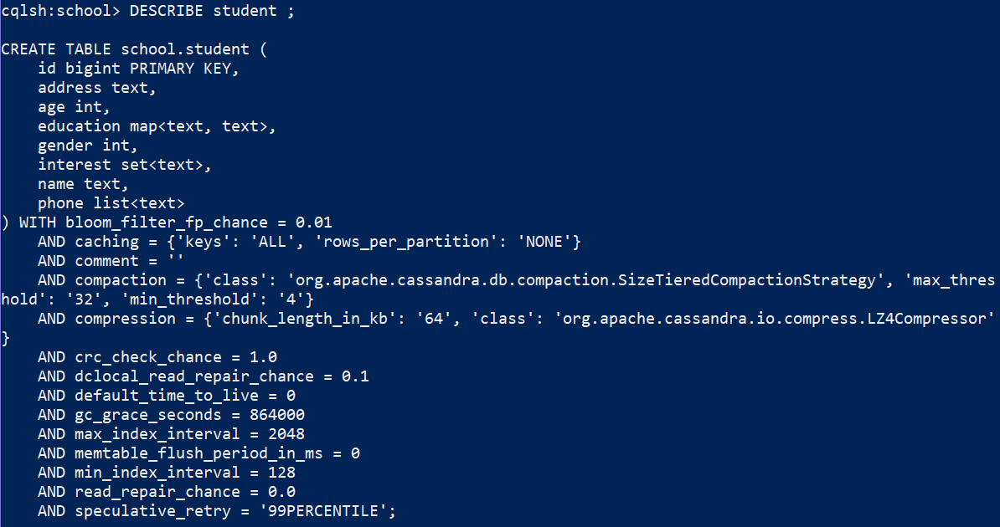

#### 5.2.3 cassandra的索引（KEY）

> 上面创建student的时候，把id 设置为primary key
>
> 在Cassandra中的primary key是比较宏观概念，用于从表中取出数据。primary key可以由1个或多个column组合而成。
>
> 不要在以下情况使用索引：
>
> - 这列的值很多的情况下，因为你相当于查询了一个很多条记录，得到一个很小的结果。
> - 表中有couter类型的列
> - 频繁更新和删除的列
> - 在一个很大的分区中去查询一条记录的时候（也就是不指定分区主键的查询）

##### Cassandra的5种Key

> 1. Primary Key      主键
> 2. Partition  Key     分区Key
> 3. Composite Key  复合key
> 4. Compound Key   复合Key
> 5. Clustering Key    集群

##### 1）Primary Key

是用来获取某一行的数据， 可以是单一列（Single column Primary Key）或者多列（Composite Primary Key）。

在 Single column Primary Key 决定这一条记录放在哪个节点。

例如：

```sql
create table testTab (
id int PRIMARY KEY,
name text
);
```

##### 2）Composite Primary Key

如果 Primary Key 由多列组成，那么这种情况称为 Compound Primary Key 或 Composite Primary Key。

例如：

```sql
create table testTab (
key_one int,
key_two int,
name text,
PRIMARY KEY(key_one, key_two)
);
```

执行创建表后，查询testTab，会发现key_one和key_two 的颜色与其他列不一样，效果：

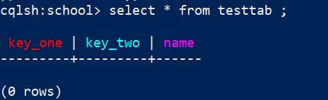

##### 3）Partition Key 

在组合主键的情况下(上面的例子)，第一部分称作Partition Key（key_one就是partition key），第二部分是CLUSTERING KEY（key_two）

 Cassandra会对Partition key 做一个hash计算，并自己决定将这一条记录放在哪个节点。

如果 Partition key 由多个字段组成，称之为 Composite Partition key

例如：

```sql
create table testTab (
key_part_one int,
key_part_two int,
key_clust_one int,
key_clust_two int,
key_clust_three uuid,
name text,
PRIMARY KEY((key_part_one,key_part_two), key_clust_one, key_clust_two, key_clust_three)
);
```

##### 4）Clustering Key 

决定同一个分区内相同 Partition Key 数据的排序，默认为升序，可以在建表语句里面手动设置排序的方式

#### 5.2.4 修改表结构

> 语法，可以添加列，删除列

- **添加列，语法**

```shell
ALTER TABLE 【table name】 ADD  【new column】 datatype;
```

给student添加一个列email代码：

```shell
ALTER TABLE student ADD email text;
```

执行代码后，进行查询，查看效果：

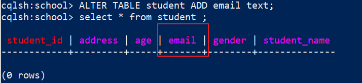

- **删除列，语法**

```shell
ALTER table name DROP columnname;
```

代码：

```shell
cqlsh:school> ALTER table student DROP email;
```

删除student的email列，并查询效果：


#### 5.2.5 删除表

> 语法：

```shell
DROP TABLE <tablename>
```

> 删除student，代码如下：

```shell
DROP TABLE student;
```

执行删除代码，然后查询student，报错：unconfigured table student ，说明student已经被删除，效果:

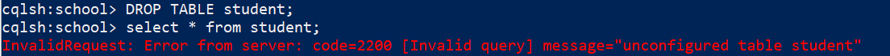

#### 5.2.6 清空表

表的所有行都将永久删除

> 语法

```shell
TRUNCATE <tablename>
```

> 代码

```shell
TRUNCATE student；
```

先查询student，发现有2条数据，然后使用上面的命令，效果

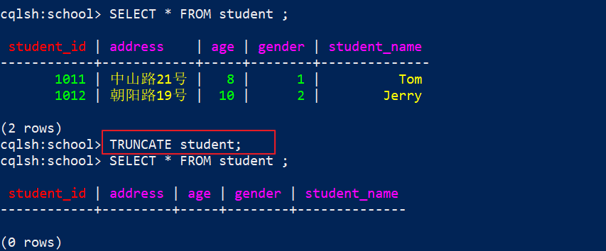

#### 5.2.7 创建索引

##### 1）普通列创建索引

> 语法

```shell
CREATE INDEX <identifier> ON <tablename>
```

> 代码

为student的 name 添加索引，索引的名字为：sname， 代码：

```shell
CREATE INDEX sname ON student (name);
```

为student 的age添加索引，不设置索引名字，代码

```shell
CREATE INDEX ON student (age);
```

执行上面的命令，然后使用 DESCRIBE student 查看表，效果：

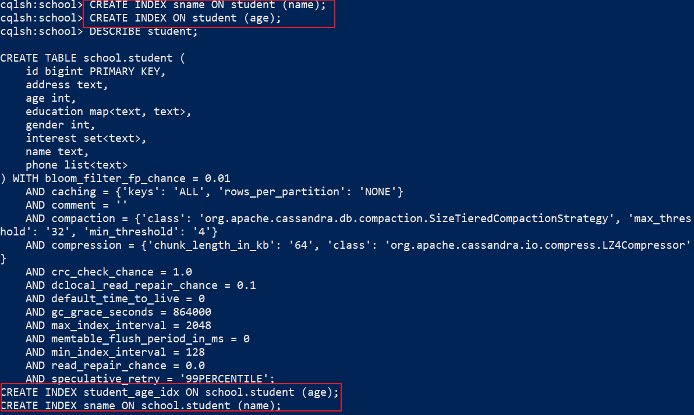

可以发现 对age创建索引，没有指定索引名字，会提供一个默认的索引名：student_age_idx。

索引原理：

Cassandra之中的索引的实现相对MySQL的索引来说就要简单粗暴很多了。Cassandra自动新创建了一张表格，同时将原始表格之中的索引字段作为新索引表的Primary Key！并且存储的值为原始数据的Primary Key 

##### 2）集合列创建索引

给集合列设置索引

```sql
CREATE INDEX ON student(interest);                 -- set集合添加索引
CREATE INDEX mymap ON student(KEYS(education));          -- map结合添加索引
```

效果：

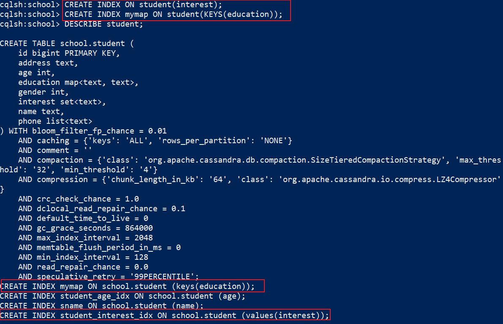

#### 5.2.8 删除索引

> 语法

```shell
DROP INDEX <identifier>
```

> 删除student的sname 索引，代码

```shell
drop index sname;
```

执行上面代码，然后使用DESCRIBE student 查看表，发现sname索引已经不存在，效果：

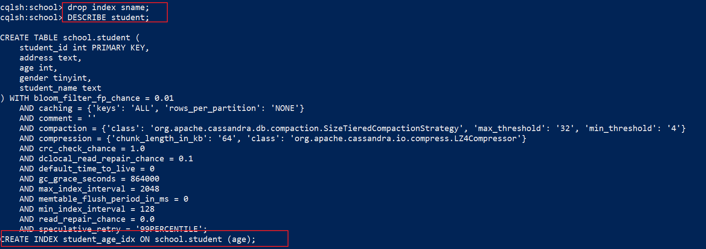

### 5.3 查询数据

#### 5.3.1 查询数据

> 语法

使用 SELECT   、WHERE、LIKE、GROUP BY 、ORDER BY等关键词

```shell
SELECT FROM <tablename>
SELECT FROM <table name> WHERE <condition>;
```

> 代码

##### 1）查询所有数据

当前student表有2行数据，全部查询出来，代码：

```
cqlsh:school> select * from student;
```

效果：


##### 2）根据主键查询

查询student_id = 1012 的行

代码

```shell
cqlsh:school> select * from student where id=1012;
```

效果

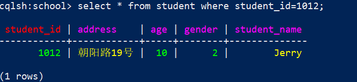

#### 5.3.2 查询时使用索引

> Cassandra对查询时使用索引有一定的要求，具体如下：
>
> - **Primary Key 只能用 = 号查询**
>
> - **第二主键 支持= > < >= <=**
>
> - **索引列 只支持 = 号**
>
> - 非索引非主键字段过滤**可以使用ALLOW FILTERING**

当前有一张表testTab，表中包含一些数据

```sql
create table testTab (
key_one int,
key_two int,
name text,
age  int,
PRIMARY KEY(key_one, key_two)
);
create INDEX tage ON testTab (age);
```

可以看到key_one 是第一主键，key_two是第二主键，age是索引列，name是普通列

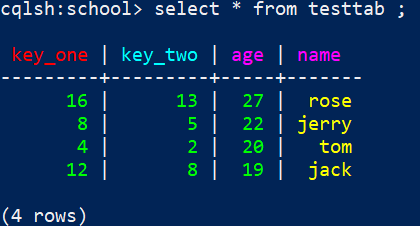

##### 1）第一主键 只能用=号查询

> key_one列是第一主键
>
> 对key_one进行 = 号查询，可以查出结果

代码如下

```sql
select * from testtab where key_one=4;
```

效果

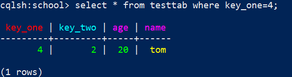

> 对key_one 进行范围查询使用 > 号，无法查出结果

代码如下：

```shell
select * from testtab where key_one>4;
```

效果：

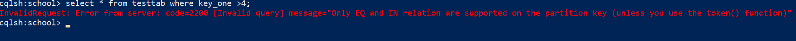

错误信息：

```
InvalidRequest: Error from server: code=2200 [Invalid query] message="Only EQ and IN relation are supported on the partition key (unless you use the token() function)"
```

##### 2) 第二主键 支持 =  、>、  <、    >= 、  <=

key_two是第二主键

> 不要单独对key_two 进行 查询， 

代码：

```sql
select * from testtab where key_two = 8;
```

结果报错：

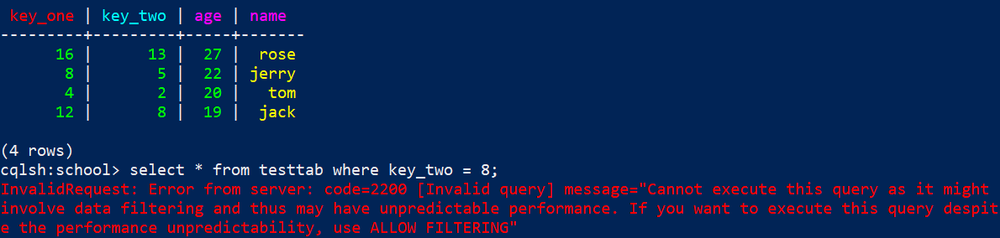

错误信息：

```
InvalidRequest: Error from server: code=2200 [Invalid query] message="Cannot execute this query as it might involve data filtering and thus may have unpredictable performance. If you want to execute this query despite the performance unpredictability, use ALLOW FILTERING"
```

意思是如果想要完成这个查询，可以使用 ALLOW FILTERING

修改：

```sql
select * from testtab where key_two = 8 ALLOW FILTERING;
```

效果：

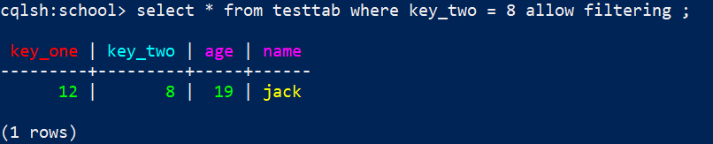

**注意：加上ALLOW FILTERING 后确实可以查询出数据，但是不建议这么做**

>正确的做法是 ，在查询第二主键时，前面先写上第一主键

代码：

```sql
select * from testtab where key_one=12 and key_two = 8 ;
```

效果：

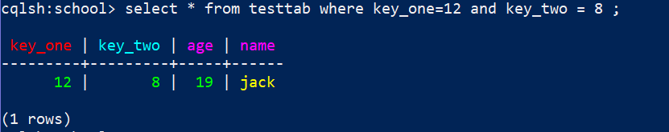

代码：

```sql
select * from testtab where key_one=12 and key_two > 7;
```

效果：

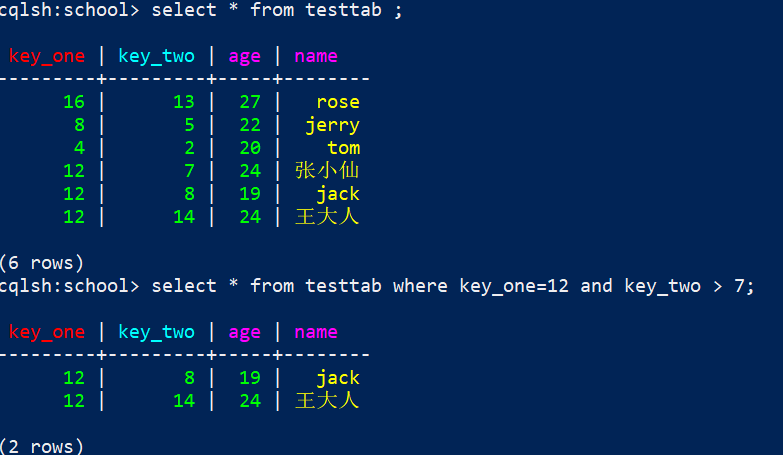

##### 3) 索引列 只支持=号

age是索引列

代码：

```sql
 select * from testtab where age = 19;   -- 正确
 select * from testtab where age > 20 ;  --会报错
 select * from testtab where age >20 allow filtering;  --可以查询出结果，但是不建议这么做
```

效果：

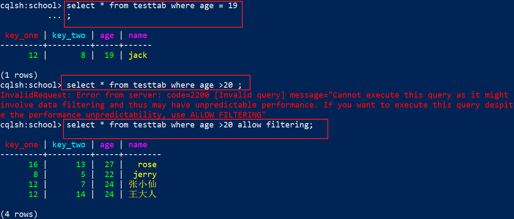

##### 4）普通列，非索引非主键字段

name是普通列，在查询时需要使用ALLOW FILTERING。

代码：

```sql
select * from testtab where key_one=12 and name='张小仙'; --报错
select * from testtab where key_one=12 and name='张小仙' allow filtering;  --可以查询
```

效果：

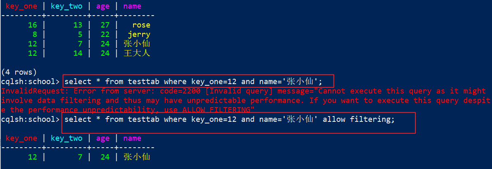

##### 5）集合列

使用student表来测试集合列上的索引使用。

假设已经给集合添加了索引，就可以使用where子句的CONTAINS条件按照给定的值进行过滤。

```sql
select * from student where interest CONTAINS '电影';        -- 查询set集合
select * from student where education CONTAINS key  '小学';  --查询map集合的key值
select * from student where education CONTAINS '中心第9小学' allow filtering; --查询map的value值
```

效果：

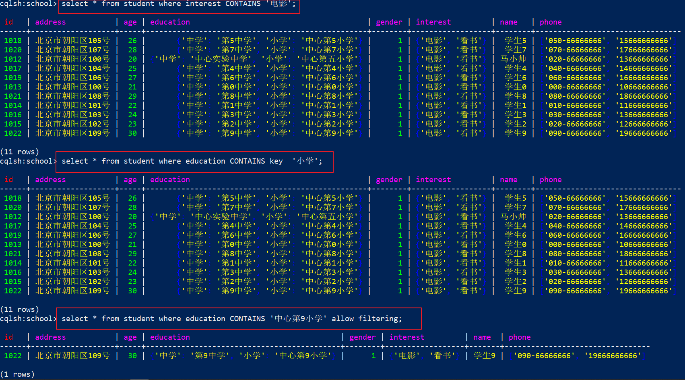

##### 6） ALLOW FILTERING

ALLOW FILTERING是一种非常消耗计算机资源的查询方式。
如果表包含例如100万行，并且其中95％具有满足查询条件的值，则查询仍然相对有效，这时应该使用ALLOW FILTERING。

如果表包含100万行，并且只有2行包含满足查询条件值，则查询效率极低。Cassandra将无需加载999,998行。如果经常使用查询，则最好在列上添加索引。

ALLOW FILTERING在表数据量小的时候没有什么问题，但是数据量过大就会使查询变得缓慢。

#### 5.3.3 查询时排序

cassandra也是支持排序的，order by。 排序也是有条件的

##### 1）必须有第一主键的=号查询

cassandra的第一主键是决定记录分布在哪台机器上，cassandra只支持单台机器上的记录排序。

##### 2）只能根据第二、三、四…主键进行有序的，相同的排序。

##### 3）不能有索引查询

cassandra的任何查询，最后的结果都是有序的，内部就是这样存储的。

现在使用 testTab表，来测试排序

```sql
select * from testtab where key_one = 12 order by key_two;  --正确
select * from testtab where key_one = 12 and age =19 order key_two;  --错误，不能有索引查询
```

索引列 支持 like 

主键支持 group by 

#### 5.3.4 分页查询

使用limit 关键字来限制查询结果的条数 进行分页

### 5.4 添加数据

> 语法：

```shell
INSERT INTO <tablename>(<column1 name>, <column2 name>....) VALUES (<value1>, <value2>....) USING <option>
```

> 给student添加2行数据，包含对set，list ，map类型数据，代码：

```shell
INSERT INTO student (id,address,age,gender,name,interest, phone,education) VALUES (1011,'中山路21号',16,1,'Tom',{'游泳', '跑步'},['010-88888888','13888888888'],{'小学' : '城市第一小学', '中学' : '城市第一中学'}) ;

INSERT INTO student (id,address,age,gender,name,interest, phone,education) VALUES (1012,'朝阳路19号',17,2,'Jerry',{'看书', '电影'},['020-66666666','13666666666'],{'小学' :'城市第五小学','中学':'城市第五中学'});
```

> 执行上面的代码，然后 select * from student ，效果：

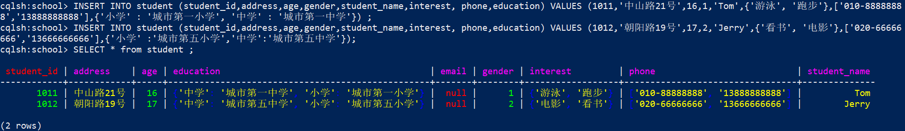

添加TTL，设定的computed_ttl数值秒后，数据会自动删除

```sql
INSERT INTO student (id,address,age,gender,name,interest, phone,education) VALUES (1030,'朝阳路30号',20,1,'Cary',{'运动', '游戏'},['020-7777888','139876667556'],{'小学' :'第30小学','中学':'第30中学'}) USING TTL 60;
```


### 5.5 更新列数据

更新表中的数据，可用关键字：

- **Where** - 选择要更新的行
- **Set** - 设置要更新的值
- **Must** - 包括组成主键的所有列

在更新行时，如果给定行不可用，则UPDATE创建一个新行

> 语法：

```shell
UPDATE <tablename>
SET <column name> = <new value>
<column name> = <value>....
WHERE <condition>
```

#### 5.5.1 更新简单数据

把student_id = 1012 的数据的gender列 的值改为1，代码：

```shell
UPDATE student set gender = 1 where student_id= 1012;
```

效果：

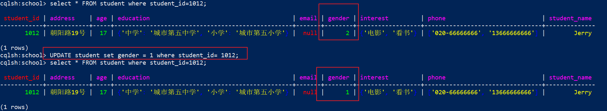

#### 5.5.2 更新set类型数据

> 在student中interest列是set类型

##### 1）添加一个元素

> 使用UPDATE命令 和 ‘+’ 操作符

代码：

```sql
UPDATE student SET interest = interest + {'游戏'} WHERE student_id = 1012;
```

先查询，执行上面的代码，再查询，效果：


##### 2）删除一个元素

> 使用UPDATE命令 和 ‘-’ 操作符

代码：

```sql
UPDATE student SET interest = interest - {'电影'} WHERE student_id = 1012;
```

效果：

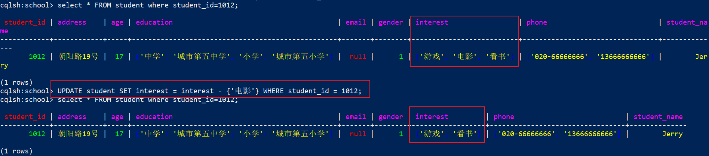

##### 3）删除所有元素

> 可以使用UPDATA或DELETE命令，效果一样

代码：

```sql
UPDATE student SET interest = {} WHERE student_id = 1012;
或
DELETE interest FROM student WHERE student_id = 1012;
```

效果

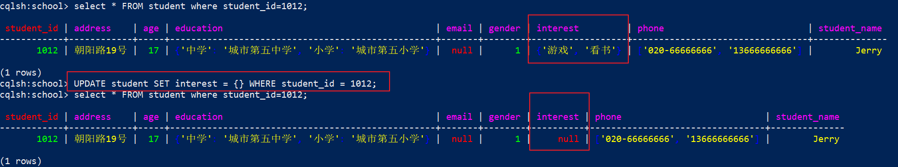

一般来说，Set,list和Map要求最少有一个元素，否则Cassandra无法把其同一个空值区分

#### 5.5.3 更新list类型数据

> 在student中phone列是list类型

##### 1）使用UPDATA命令向list插入值

代码：

```sql
UPDATE student SET phone = ['020-66666666', '13666666666'] WHERE student_id = 1012;
```

##### 2）在list前面插入值

代码：

```sql
UPDATE student SET phone = [ '030-55555555' ] + phone WHERE student_id = 1012;
```

可以看到新数据的位置在旧数据的前面，效果：

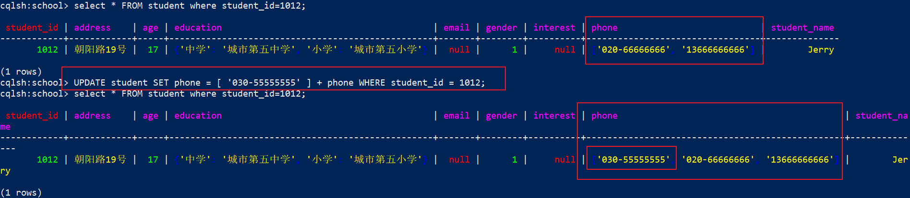

##### 3）在list后面插入值

代码：

```sql
UPDATE student SET phone = phone + [ '040-33333333' ]  WHERE student_id = 1012;
```

可以看到新数据的位置在最后面，效果：

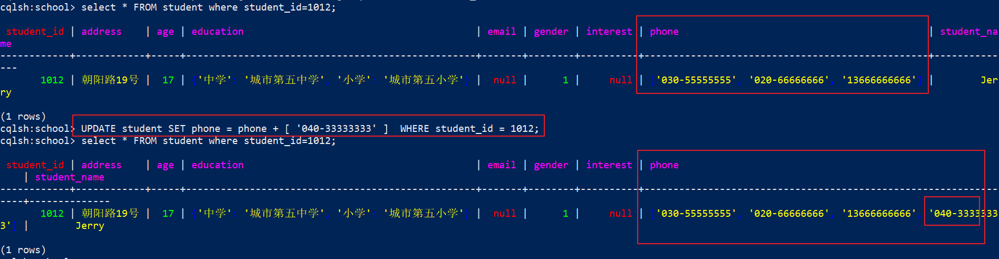

##### 4）使用列表索引设置值，覆盖已经存在的值

> 这种操作会读入整个list，效率比上面2种方式差

现在把phone中下标为2的数据，也就是 “13666666666”替换，代码：

```sql
UPDATE student SET phone[2] = '050-22222222' WHERE student_id = 1012;
```

效果：

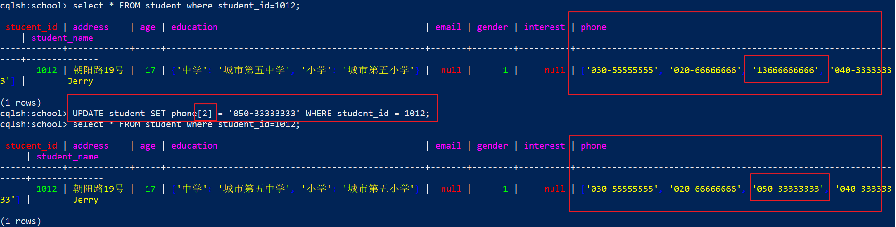

##### 5）【不推荐】使用DELETE命令和索引删除某个特定位置的值

>非线程安全的，如果在操作时其它线程在前面添加了一个元素，会导致移除错误的元素

代码：

```sql
DELETE phone[2] FROM student WHERE student_id = 1012;
```

效果：

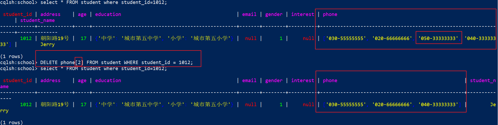

##### 6）【推荐】使用UPDATE命令和‘-’移除list中所有的特定值

代码：

```sql
UPDATE student SET phone = phone - ['020-66666666'] WHERE student_id = 1012;
```

效果：

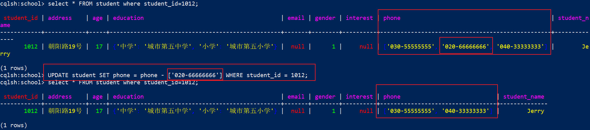


#### 5.5.4 更新map类型数据

map输出顺序取决于map类型。

##### 1）使用Insert或Update命令

```sql
UPDATE student SET education=
  {'中学': '城市第五中学', '小学': '城市第五小学'} WHERE student_id = 1012;
```

##### 2）使用UPDATE命令设置指定元素的value

```sql
UPDATE student SET education['中学'] = '爱民中学' WHERE student_id = 1012;
```

效果：

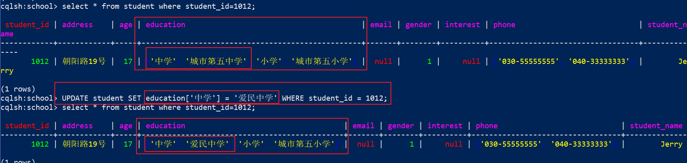

##### 3）可以使用如下语法增加map元素。如果key已存在，value会被覆盖，不存在则插入

```sql
UPDATE student SET education = education + { '幼儿园' : '大海幼儿园', '中学': '科技路中学'} WHERE student_id = 1012;
```

覆盖“中学”为“科技路中学”，添加“幼儿园”数据，效果：

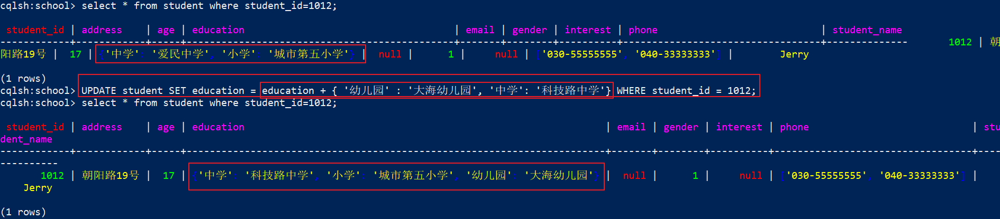

##### 4）删除元素

可以用DELETE 和 UPDATE  删除Map类型中的数据

使用DELETE删除数据

```sql
DELETE education['幼儿园'] FROM student WHERE student_id = 1012;
```

效果

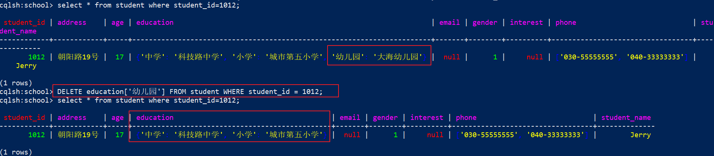

使用UPDATE删除数据

```sql
UPDATE student SET education=education - {'中学','小学'} WHERE student_id = 1012;
```

效果

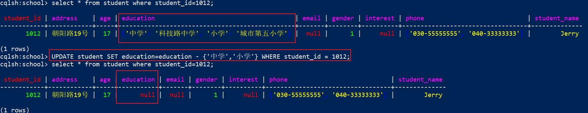

### 5.6 删除行

> 语法

```sql
DELETE FROM <identifier> WHERE <condition>;
```

> 代码

删除student中student_id=1012 的数据，代码:

```sql
DELETE FROM student WHERE student_id=1012;
```

> 效果

执行上面的命令后，查询student，发现只有一条数据

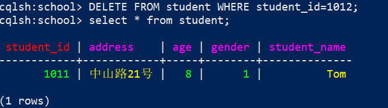

### 5.7 批量操作

> 作用

把多次更新操作合并为一次请求，减少客户端和服务端的网络交互。 batch中同一个partition key的操作具有隔离性

> 语法

使用**BATCH**，您可以同时执行多个修改语句（插入，更新，删除）

```shell
BEGIN BATCH
<insert-stmt>/ <update-stmt>/ <delete-stmt>
APPLY BATCH
```

> 代码

1、先把数据清空，然后使用添加数据的代码，在student中添加2条记录，student_id 为1011 、 1012，效果

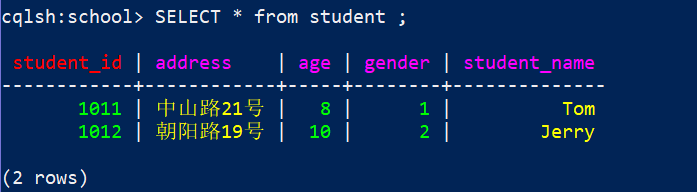

2、在批量操作中实现 3个操作：

新增一行数据，student_id =1015 

更新student_id =1012的数据，把年龄改为11，

删除已经存在的student_id=1011的数据，代码：

```shell
BEGIN BATCH
	INSERT INTO student (id,address,age,gender,name) VALUES (1015,'上海路',20,1,'Jack') ;
	UPDATE student set age = 11 where id= 1012;
	DELETE FROM student WHERE id=1011;
APPLY BATCH;
```

执行上面的代码，效果

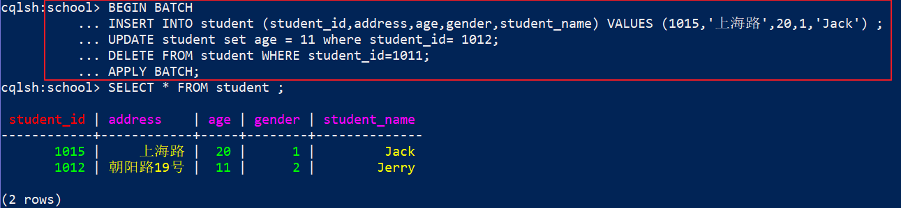

## 六、JAVA户端操作Cassandra

> 在第五章，我们使用Cassandra的命令操作Cassandra数据库，本章我们介绍使用JAVA客户端连接Cassandra，操作数据

### 6.1 JAVA客户端介绍

Cassandra有众多的JAVA客户端，目前比较流程的都是不同公司开源的客户端，如：Netfix的astyanax，datastax的java-driver，hector，以及Spring Data for Apache Cassandra。

在github中搜索cassandra，可以看都响应JAVA客户端的受欢迎程度。

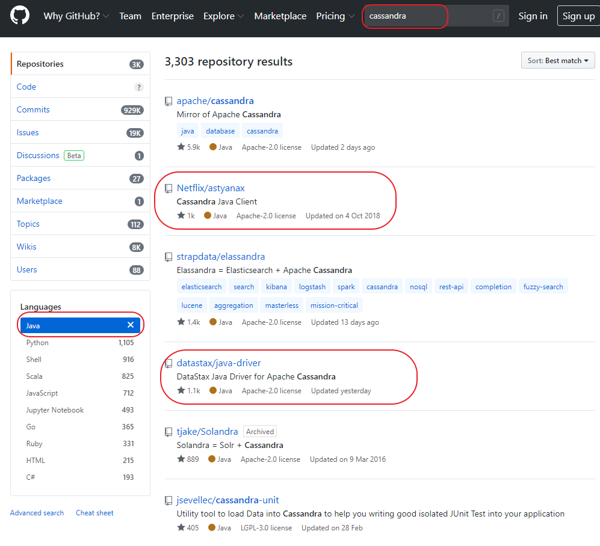

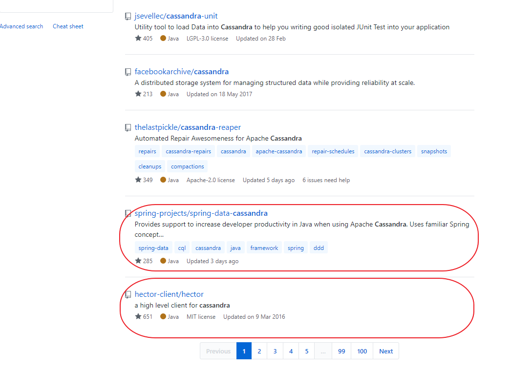


### 6.2 datastax的java-driver

#### 6.2.1 介绍

是由DataStax公司，开源的用来操作Cassandra的工具包，官网：

>https://docs.datastax.com/en/landing_page/doc/landing_page/current.html

在github的搜索页面点击   datastax/**java-driver**

源码地址：

> https://github.com/datastax/java-driver

在页面上可以看到使用java-driver的简单介绍，包含Maven依赖内容，环境兼容要求。

可以看到需要jdk8或更版本，支持Cassandra2.1获取更高版本

#### 6.2.2 创建Maven工程引入依赖

```xml
<?xml version="1.0" encoding="UTF-8"?>
<project xmlns="http://maven.apache.org/POM/4.0.0"
         xmlns:xsi="http://www.w3.org/2001/XMLSchema-instance"
         xsi:schemaLocation="http://maven.apache.org/POM/4.0.0 http://maven.apache.org/xsd/maven-4.0.0.xsd">
    <parent>
        <artifactId>cassandra-demo</artifactId>
        <groupId>com.itheima</groupId>
        <version>1.0-SNAPSHOT</version>
    </parent>
    <modelVersion>4.0.0</modelVersion>

    <artifactId>datastax-demo</artifactId>

    <dependencies>
        <!--cassandra 包-->
        <dependency>
            <groupId>com.datastax.cassandra</groupId>
            <artifactId>cassandra-driver-core</artifactId>
            <version>3.9.0</version>
        </dependency>
        <dependency>
            <groupId>com.datastax.cassandra</groupId>
            <artifactId>cassandra-driver-mapping</artifactId>
            <version>3.9.0</version>
        </dependency>
        <!--junit 测试-->
        <dependency>
            <groupId>junit</groupId>
            <artifactId>junit</artifactId>
            <version>4.12</version>
        </dependency>
    </dependencies>
</project>
```

#### 6.2.3 操作键空间

```java
package com.itheima.test;

import com.datastax.driver.core.Cluster;
import com.datastax.driver.core.KeyspaceMetadata;
import com.datastax.driver.core.Session;
import com.datastax.driver.core.schemabuilder.DropKeyspace;
import com.datastax.driver.core.schemabuilder.KeyspaceOptions;
import com.datastax.driver.core.schemabuilder.SchemaBuilder;
import org.junit.Before;
import org.junit.Test;

import java.util.HashMap;
import java.util.List;
import java.util.Map;

/**
 * 测试操作键空间
 */
public class TestKeySpace {

    Session session =null;
    /**
     * 连接cassandra的服务端
     */
    @Before
    public void init(){
//        服务器的地址
        String host = "192.168.137.131";

        int port = 9042;

//        连接服务端，获取会话
        Cluster cluster = Cluster.builder()
                .addContactPoint(host)
                .withPort(port)
                .build();

        session = cluster.connect();
    }

    /**
     * 查询所有键空间
     */
    @Test
    public void findKeySpace(){
        List<KeyspaceMetadata> keyspaces = session.getCluster().getMetadata().getKeyspaces();
        for (KeyspaceMetadata keyspace : keyspaces) {
            System.out.println(keyspace.getName());
        }
    }

    /**
     * 创建键空间
     */
    @Test
    public void createKeySpace() {
//        1、使用cql来创建
//        session.execute("CREATE KEYSPACE school WITH replication = {'class':'SimpleStrategy', 'replication_factor' : 3}");
//        2、面向对象的方式
        Map<String, Object> replicaton = new HashMap<>();
        replicaton.put("class","SimpleStrategy");
        replicaton.put("replication_factor",2);
        KeyspaceOptions options = SchemaBuilder.createKeyspace("school")
                .ifNotExists()
                .with()
                .replication(replicaton);
        session.execute(options);
    }

    /**
     * 删除 键空间
     */
    @Test
    public void deleteKeySpace(){
        DropKeyspace dropKeyspace = SchemaBuilder.dropKeyspace("school").ifExists();
        session.execute(dropKeyspace);
    }

    /**
     * 修改键空间
     */
    @Test
    public void alterKeySpace(){
        Map<String, Object> replicaton = new HashMap<>();
        replicaton.put("class","SimpleStrategy");
        replicaton.put("replication_factor",1);
        KeyspaceOptions options = SchemaBuilder.
                alterKeyspace("school").
                with().
                replication(replicaton);
        session.execute(options);
    }
}

```

#### 6.2.4 操作表

```java
package com.itheima.test;

import com.datastax.driver.core.*;
import com.datastax.driver.core.schemabuilder.SchemaBuilder;
import com.datastax.driver.mapping.Mapper;
import com.datastax.driver.mapping.MappingManager;
import com.fasterxml.jackson.core.JsonProcessingException;
import com.fasterxml.jackson.databind.ObjectMapper;
import com.itheima.entity.Student;
import org.junit.Before;
import org.junit.Test;

import java.net.InetAddress;
import java.net.InetSocketAddress;
import java.net.UnknownHostException;
import java.util.ArrayList;
import java.util.HashMap;
import java.util.HashSet;
import java.util.List;

import static com.datastax.driver.core.querybuilder.QueryBuilder.eq;
import static com.datastax.driver.core.querybuilder.QueryBuilder.select;


/**
 * 测试datastax
 */
public class TestTable {

    Session session = null;
    Mapper<Student> mapper;

    /**
     * 初始化
     */
    @Before
    public void init() {
        //Cassandra服务器地址
        String hosts = "192.168.137.131";
        //端口
        int port = 9042;

        Cluster cluster = Cluster.builder().
                addContactPoint(hosts).
                withPort(port).
                build();
        session = cluster.connect();


    }

   /**
     * 创建表
     */
    @Test
    public void testCreateTable(){
        Create create = SchemaBuilder.
                createTable("school", "student")
                .addPartitionKey("id", DataType.bigint())
                .addColumn("address", DataType.text())
                .addColumn("age", DataType.cint())
                .addColumn("name", DataType.text())
                .addColumn("gender", DataType.cint())
                .addColumn("interest", DataType.set(DataType.text()))
                .addColumn("phone", DataType.list(DataType.text()))
                .addColumn("education", DataType.map(DataType.text(), DataType.text()))
                .ifNotExists();
        session.execute(create);
    }

    /**
     * 修改表
     */
    @Test
    public void updateTable(){
//        新增一个字段
//        SchemaStatement statement = SchemaBuilder.
//                alterTable("school", "student")
//                .addColumn("email")
//                .type(DataType.text());
//        session.execute(statement);
//        修改字段,无法把text类型修改为其他类型，只能改为varchar
//        SchemaStatement statement1 = SchemaBuilder.alterTable("school", "student")
//                .alterColumn("email")
//                .type(DataType.varchar());
//        session.execute(statement1);
        //删除字段
        SchemaStatement dropColumn = SchemaBuilder.
                alterTable("school", "student")
                .dropColumn("email");
        session.execute(dropColumn);
    }
    /**
     * 删除表
     */
    @Test
    public void dropTable(){

        Statement statement = SchemaBuilder.dropTable("school","student").ifExists();
        session.execute(statement);
    }
    /**
     * 创建索引
     */
    @Test
    public void createIndex(){
//        给普通字段添加索引
        SchemaStatement statement = SchemaBuilder.
                createIndex("sname").
                onTable("school", "student").
                andColumn("name");
        session.execute(statement);
//         给map字段添加索引
        SchemaStatement statement1 = SchemaBuilder.
                createIndex("educationKeys").
                onTable("school", "student").
                andKeysOfColumn("education");
        session.execute(statement1);
    }

    /**
     * 删除索引
     */
    @Test
    public void dropIndex(){
        Drop drop = SchemaBuilder.dropIndex("school", "sname").ifExists();
        session.execute(drop);
        Drop drop1 = SchemaBuilder.dropIndex("school", "educationKeys").ifExists();
        session.execute(drop1);
    }

    /**
     * 添加数据
     * 使用CQL
     */
    @Test
    public void insertByCQL() {

        String insertSql = "INSERT INTO school.student (id,address,age,gender,name,interest, phone,education) VALUES (1011,'中山路21号',16,1,'李小仙',{'游泳', '跑步'},['010-88888888','13888888888'],{'小学' : '城市第一小学', '中学' : '城市第一中学'}) ;";
        session.execute(insertSql);
    }

    /**
     * 添加数据
     * 使用Mapper和Bean对象
     */
    @Test
    public void insertByMapper() {
        mapper = new MappingManager(session).mapper(Student.class);
        HashMap<String, String> education = new HashMap<>();
        education.put("小学", "中心第五小学");
        education.put("中学", "中心实验中学");
        HashSet<String> interest = new HashSet<>();
        interest.add("看书");
        interest.add("电影");
        List<String> phones = new ArrayList<>();
        phones.add("020-66666666");
        phones.add("13666666666");
//        构造student
        Student student = new Student(
                1012L,
                "北京市朝阳区100号",
                20,
                education,
                "xiaoshuai@123.com",
                1,
                interest,
                phones,
                "马小帅");
//         数据保存到cassandra服务器
        mapper.save(student);

    }

    /**
     * 查询所有数据
     */
    @Test
    public void queryAll(){
        mapper = new MappingManager(session).mapper(Student.class);
        ResultSet resultSet = session.execute(select().all().from("school","student"));
        List<Student> studentList = mapper.map(resultSet).all();
        for (Student student : studentList) {
            System.out.println(student);
        }

    }

    /**
     * 查询一条数据
     */
    @Test
    public void queryOne(){
        mapper = new MappingManager(session).mapper(Student.class);
        ResultSet resultSet = session.execute(select().all().from("school","student"));
        Student student = mapper.map(resultSet).one();
        System.out.println(student);
    }


    /**
     * 根据id 查询
     */
    @Test
    public void queryById(){
        mapper = new MappingManager(session).mapper(Student.class);
        ResultSet resultSet = session.execute(select().all().from("school", "student").where(eq("id", 1012L)));
        List<Student> studentList = mapper.map(resultSet).all();
        for (Student student : studentList) {
            System.out.println(student);
        }
    }

    /**
     * 删除
     */
    @Test
    public void delete() {
        mapper = new MappingManager(session).mapper(Student.class);
        Long id = 1011L;
        mapper.delete(id);
    }
}
```

#### 6.2.5 Prepared statements

cassandra提供了类似jdbcpreparedstatement使用预编译占位符。官方文档链接如下：

<https://docs.datastax.com/en/developer/java-driver/3.0/manual/statements/prepared/>

官方文档原理图：

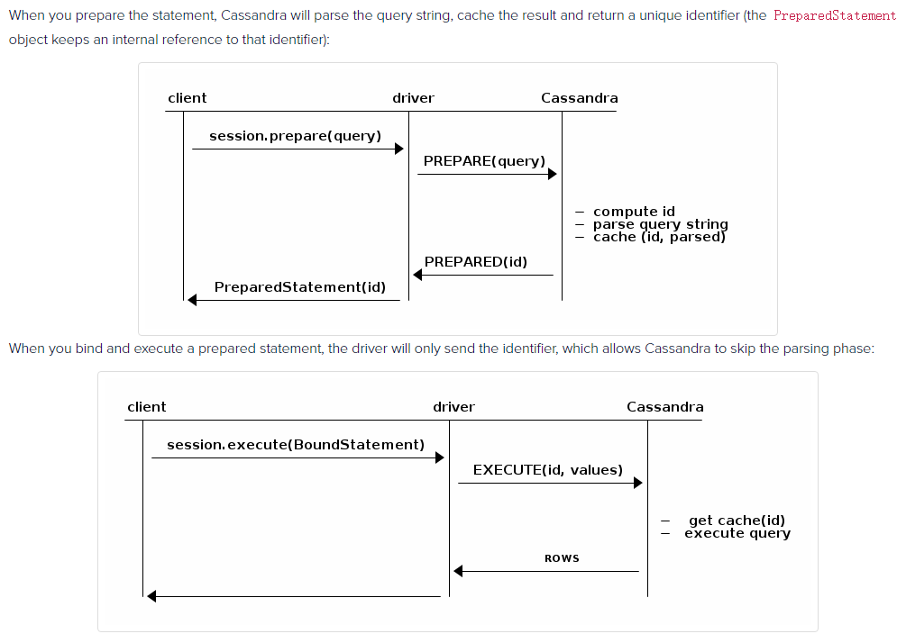

基本原理:

> 预编译statement的时候，Cassandra会解析query语句，缓存解析的结果并返回一个唯一的标志。当绑定并且执行预编译statement的时候，驱动只会发送这个标志，那么Cassandra就会跳过解析query语句的过程。
>
> 应保证query语句只应该被预编译一次，缓存`PreparedStatement` 到我们的应用中（`PreparedStatement` 是线程安全的）；如果我们对同一个query语句预编译了多次，那么驱动输出印警告日志；
>
> 如果一个query语句只执行一次，那么预编译不会提供性能上的提高，反而会降低性能，因为是两次请求，那么此时可以考虑用 [simple statement](http://docs.datastax.com/en/developer/java-driver/3.0/manual/statements/simple/) 来代替

代码：

```java
/**
     * 批量写入操作
     *
     */
    @Test
    public void batchPrepare(){
//        先把语句预编译
        BatchStatement batch = new BatchStatement();
        PreparedStatement ps = session .prepare("INSERT INTO school.student (id,address,age,gender,name,interest, phone,education) VALUES (?,?,?,?,?,?,?,?)");
//        循环10次，构造不同的student对象
        for (int i = 0; i < 10; i++) {
            HashMap<String, String> education = new HashMap<>();
            education.put("小学", "中心第"+i+"小学");
            education.put("中学", "第"+i+"中学");
            HashSet<String> interest = new HashSet<>();
            interest.add("看书");
            interest.add("电影");
            List<String> phones = new ArrayList<>();
            phones.add("0"+i+"0-66666666");
            phones.add("1"+i+"666666666");
//        构造student
            Student student = new Student(
                    1013L+i,
                    "北京市朝阳区10"+i+"号",
                    21+i,
                    education,
                    "xiaoshuai@123.com",
                    1,
                    interest,
                    phones,
                    "学生"+i);
            BoundStatement bs = ps.bind(student.getId(),
                    student.getAddress(),
                    student.getAge(),
                    student.getGender(),
                    student.getName(),
                    student.getInterest(),
                    student.getPhone(),
                    student.getEducation());
            batch.add(bs);
        }
        session.execute(batch);
        batch.clear();
    }
```

### 6.3 Spring Data Cassandra

#### 6.3.1 介绍

官网：

> <https://spring.io/projects/spring-data-cassandra>

官网对相关环境的要求：

> Spring Data for Apache Cassandra 2.x binaries require JDK level 8.0 and later and [Spring Framework](https://spring.io/docs) 5.2.7.RELEASE and later.
>
> It requires [Cassandra](https://cassandra.apache.org/) 2.0 or later.

#### 6.3.2 创建Maven工程

##### 引入依赖

```xml
<?xml version="1.0" encoding="UTF-8"?>
<project xmlns="http://maven.apache.org/POM/4.0.0"
         xmlns:xsi="http://www.w3.org/2001/XMLSchema-instance"
         xsi:schemaLocation="http://maven.apache.org/POM/4.0.0 http://maven.apache.org/xsd/maven-4.0.0.xsd">
    <parent>
        <artifactId>cassandra-demo</artifactId>
        <groupId>com.itheima</groupId>
        <version>1.0-SNAPSHOT</version>
    </parent>
    <modelVersion>4.0.0</modelVersion>

    <artifactId>springCassandra-demo</artifactId>

    <dependencies>
        <!--使用spring-data-cassandra 2.2.8-->
        <dependency>
            <groupId>org.springframework.data</groupId>
            <artifactId>spring-data-cassandra</artifactId>
            <version>2.2.8.RELEASE</version>
        </dependency>
        <dependency>
            <groupId>junit</groupId>
            <artifactId>junit</artifactId>
            <version>4.12</version>
        </dependency>
    </dependencies>

</project>
```

##### 创建配置文件

cassandra.properties

```properties
cassandra.contactpoints=192.168.137.131
cassandra.port=9042
cassandra.keyspace=school
```

springContext.xml 配置文件

```xml
<?xml version="1.0" encoding="UTF-8"?>
<beans xmlns="http://www.springframework.org/schema/beans"
       xmlns:xsi="http://www.w3.org/2001/XMLSchema-instance"
       xmlns:cassandra="http://www.springframework.org/schema/data/cassandra"
       xmlns:context="http://www.springframework.org/schema/context"
       xsi:schemaLocation="http://www.springframework.org/schema/cql http://www.springframework.org/schema/cql/spring-cql-1.0.xsd
http://www.springframework.org/schema/data/cassandra http://www.springframework.org/schema/data/cassandra/spring-cassandra-1.0.xsd
http://www.springframework.org/schema/beans http://www.springframework.org/schema/beans/spring-beans.xsd
http://www.springframework.org/schema/context http://www.springframework.org/schema/context/spring-context-4.0.xsd">

    <context:property-placeholder location="classpath:cassandra.properties"/>
    <!--cassandra的配置-->
    <cassandra:cluster contact-points="${cassandra.contactpoints}" port="${cassandra.port}"/>
    <cassandra:session keyspace-name="${cassandra.keyspace}" />
    <!-- orm映射 -->
    <cassandra:mapping />
    <!-- 类型转换 -->
    <cassandra:converter/>
    <!-- cassandra operater -->
    <cassandra:template id="cassandraTemplate"/>
    <!-- spring data 接口 -->
    <cassandra:repositories base-package="com.itheima.springcass.repository" />

    <!-- 自动扫描(自动注入) -->
    <context:component-scan base-package="com.itheima" />
</beans>
```


#### 6.3.3 编写代码

##### 创建实体类 Student.java

```java
package com.itheima.springcass.entity;

import lombok.AllArgsConstructor;
import lombok.Data;
import lombok.NoArgsConstructor;
import org.springframework.data.cassandra.core.mapping.PrimaryKey;
import org.springframework.data.cassandra.core.mapping.Table;

import java.util.List;
import java.util.Map;
import java.util.Set;

@Data
@Table
@AllArgsConstructor
@NoArgsConstructor
public class Student {
    @PrimaryKey
    private  Long id;
    private  String address;
    private  Integer age;
    private  Map<String,String> education;
    private  String email ;
    private  Integer gender;
    private  Set<String> interest;
    private  List<String> phone ;
    private  String name;
}

```

##### 创建StudentRepository.java

```java
package com.itheima.springcass.repository;

import com.itheima.springcass.entity.Student;
import org.springframework.data.cassandra.repository.CassandraRepository;


/**
 * 持久层
 */
public interface StudentRepository extends CassandraRepository<Student,Long> {


}
```

##### 创建service

```java
package com.itheima.springcass.service;

import com.itheima.springcass.entity.Student;
import com.itheima.springcass.repository.StudentRepository;
import org.springframework.beans.factory.annotation.Autowired;
import org.springframework.stereotype.Service;

import java.util.ArrayList;
import java.util.HashMap;
import java.util.HashSet;
import java.util.List;

/**
 * student的操作
 */
@Service
public class StudentService {
    /**
     * 注入持久层
     */
    @Autowired
    private StudentRepository repository;


    /**
     * 查询所有信息
     * @return
     */
    public List<Student> queryAllStudent(){
        List<Student> studentList = repository.findAll();
        return studentList;
    }

    /**
     * 根据id 查询一条信息
     * @param id
     * @return
     */
    public Student queryOneStudent(Long id){
        return repository.findById(id).get();
    }

    /**
     * 保存数据
     */

    public void saveStudent(Student student){

        repository.save(student);
    }

    /**
     * 修改数据
     */
    public void updateStudent(){
        Student student = this.queryOneStudent(1019L);
        student.setGender(0);
        repository.save(student);
    }

    /**
     * 删除数据
     */
    public void deleteStudent(Long id){
        repository.deleteById(id);
    }
}

```

##### 创建测试代码

```java
package com.itheima.springcass.test;

import com.itheima.springcass.entity.Student;
import com.itheima.springcass.service.StudentService;
import org.junit.Before;
import org.junit.Test;
import org.junit.runner.RunWith;
import org.springframework.context.ConfigurableApplicationContext;
import org.springframework.context.support.ClassPathXmlApplicationContext;

import java.net.InetSocketAddress;
import java.util.ArrayList;
import java.util.HashMap;
import java.util.HashSet;
import java.util.List;


public class TestSpringCassandra {

    private StudentService studentService;
    @Before
    public void init(){
        ConfigurableApplicationContext context = new ClassPathXmlApplicationContext("springContext.xml");
        studentService = (StudentService)context.getBean("studentService");
    }

    /**
     * 查询所有
     */
    @Test
    public void testQueryAll(){
        List<Student> students = studentService.queryAllStudent();
        for (Student student : students) {
            System.out.println(student);
            System.out.println("=============");
        }
    }

    @Test
    public void testOne(){
        Student student = studentService.queryOneStudent(1018L);
        System.out.println(student);
    }

    @Test
    public void insert(){
        HashMap<String, String> education = new HashMap<>();
        education.put("小学", "中心第五小学");
        education.put("中学", "中心实验中学");
        HashSet<String> interest = new HashSet<>();
        interest.add("看书");
        interest.add("电影");
        List<String> phones = new ArrayList<>();
        phones.add("130-66666666");
        phones.add("15766666666");
//        构造student
        Student student = new Student(
                1028L,
                "北京市朝阳区800号",
                30,
                education,
                "xiaoxiaoxian@14564e.com",
                0,
                interest,
                phones,
                "小小咸");
        studentService.saveStudent(student);
    }

    @Test
    public void delete(){
        studentService.deleteStudent(1028L);
    }
}

```


## 七、Cassandra集群搭建

### 7.1 准备

采用3台CentOS x64系统（虚拟机）

为每台虚拟机设置静态IP

- 192.168.137.131 (seed)
- 192.168.137.132 (seed)
- 192.168.137.133

选择 131,、132两台机器作为集群的种子节点（seed）。种子节点的作用：

> 一个新节点加入集群时，需要通过种子节点来发现集群中其它节点，需要至少一个活跃的种子节点可以连接，一旦节点加入这个集群，知道了集群中的其它节点，这个节点在下次启动的时候就不需要种子节点了。
>
> 对于种子节点没有特殊要求，可以设置任何一个节点为种子。

### 7.2 改配置

需要在每台机器的配置文件cassandra.yml中进行一些修改，包括

cluster_name 集群名字，每个节点都要一样

seeds 填写2个节点的ip作为 种子节点，每个节点的内容都要一样

listen_address 填写当前节点所在机器的IP地址

rpc_address 填写当前节点所在机器的IP地址

具体修改如下：

192.168.137.131 机器修改的内容：

```yaml
cluster_name: 'Test Cluster'
seed_provider:
  - class_name: org.apache.cassandra.locator.SimpleSeedProvider
    parameters:
         - seeds: "192.168.137.131,192.168.137.132"
listen_address: 192.168.137.131
rpc_address: 192.168.137.131
```

192.168.137.132 机器的修改内容

```yaml
cluster_name: 'Test Cluster'
seed_provider:
  - class_name: org.apache.cassandra.locator.SimpleSeedProvider
    parameters:
         - seeds: "192.168.137.131,192.168.137.132"
listen_address: 192.168.137.132
rpc_address: 192.168.137.132
```

192.168.137.133 机器的修改内容

```yaml
cluster_name: 'Test Cluster'
seed_provider:
  - class_name: org.apache.cassandra.locator.SimpleSeedProvider
    parameters:
         - seeds: "192.168.137.131,192.168.137.132"
listen_address: 192.168.137.133
rpc_address: 192.168.137.133
```

修改完成后，启动每个节点。可以在192.168.137.131机器上使用nodetools status 命令进行测试

## 八、Cassandra的数据存储

Cassandra的数据包括在内存中的和磁盘中的数据

> 这些数据主要分为三种：
>
> CommitLog：主要记录客户端提交过来的数据以及操作。这种数据被持久化到磁盘中，方便数据没有被持久化到磁盘时可以用来恢复。
>
> Memtable：用户写的数据在内存中的形式，它的对象结构在后面详细介绍。其实还有另外一种形式是BinaryMemtable 这个格式目前 Cassandra 并没有使用，这里不再介绍了。
>
> SSTable：数据被持久化到磁盘，又分为 Data、Index 和 Filter 三种数据格式。

### 8.1 CommitLog 数据格式

Cassandra在写数据之前，需要先记录日志，保证Cassandra在任何情况下宕机都不会丢失数据，这就是CommitLog日志。要写入的数据按照一定格式组成 byte 组数，写到 IO 缓冲区中定时的被刷到磁盘中持久化。**Commitlog是server级别的**。每个Commitlog文件的大小是固定的，称之为一个CommitlogSegment。

当一个Commitlog文件写满以后，会新建一个的文件。当旧的Commitlog文件不再需要时，会自动清除。

### 8.2 Memtable 内存中数据结构

数据写入的第二个阶段，MemTable是一种内存结构，当数据量达到块大小时，将批量flush到磁盘上，存储为SSTable。优势在于将随机IO写变成顺序IO写，降低大量的写操作对于存储系统的压力。每一个columnfamily对应一个memtable。也就是每一张表对应一个。用户写的数据在内存中的形式，

### 8.3 SSTable 数据格式

SSTable是Read Only的，且一般情况下，一个ColumnFamily会对应多个SSTable，当用户检索数据时，Cassandra使用了Bloom Filter，即通过多个hash函数将key映射到一个位图中，来快速判断这个key属于哪个SSTable。

为了减少大量SSTable带来的开销，Cassandra会定期进行compaction，简单的说，compaction就是将同一个ColumnFamily的多个SSTable合并成一个SSTable。

在Cassandra中，compaction主要完成的任务是：

1） 垃圾回收： cassandra并不直接删除数据，因此磁盘空间会消耗得越来越多，compaction 会把标记为删除的数据真正删除；

2） 合并SSTable：compaction 将多个 SSTable 合并为一个（合并的文件包括索引文件，数据文件，bloom filter文件），以提高读操作的效率；

3） 生成 MerkleTree：在合并的过程中会生成关于这个ColumnFamily中数据的 MerkleTree，用于与其他存储节点对比以及修复数据。

## 九、Cassandra的重要知识点

Cassandra的集群中每一台机器都是对等的，不存在主、从节点的区分，集群中任何一台机器出现故障，整个集群系统不会受到影响。

### 一致哈希

一致性哈希是Cassandra搭建集群的基础，一致性哈希可以降低分布式系统中，数据重新分布的影响。

在Cassandra中，每个表有Primary Key外，还有一个叫做Partition Key，Partition Key列的Value会通过Cassandra一致性算法得出一个哈希值，这个哈希值将决定这行数据该放到哪个节点上。

每个节点拥有一段数字区间，这个区间的含义是：如果某行记录的Partition Key的哈希值落在这个区间范围之内，那么该行记录就该被存储到这个节点上。

如果简单的使用哈希值，可能会引起数据分布不均匀的问题，为了解决这个问题，一致性哈希提出虚拟节点的概念，简单的理解就是：将某个节点根据一个映射算法，映射出若干个虚拟子节点出来，再把这些节点分布在哈希环上面，保存数据时，如果通过一致性哈希计算落到某个虚拟子节点上，这条记录就会被存在这个虚拟子节点的母节点上。

Token：在Cassandra，每个节点都对应一个token，相当于hash环中的一个节点地址。在Cassandra的配置文件中有一项配置叫做:**num_tokens**，这个配置项可以控制一个节点映射出来的虚拟节点的个数。

Range：在Cassandra中，每一个节点负责处理hash环的一段数据，范围是从上一个节点的Token到本节点Token，这就是Range

在健康的集群中，可以通过自带的工具nodetool查看集群的哈希环具体情况，命令为:**nodetool ring**。

这里我们使用cassandra官方文档中一张图来说明

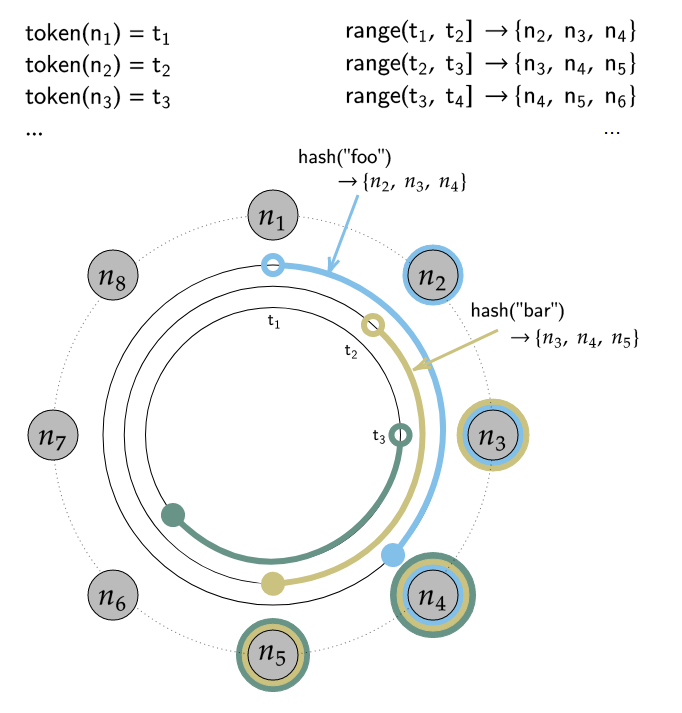

### Gossip内部通信协议

Cassandra使用Gossip的协议维护集群的状态，这是个端对端的通信协议。通过Gossip，每个节点都能知道集群中包含哪些节点，以及这些节点的状态，

Gossip进程每秒运行一次，与最多3个其他节点交换信息，这样所有节点可很快了解集群中的其他节点信息。

 