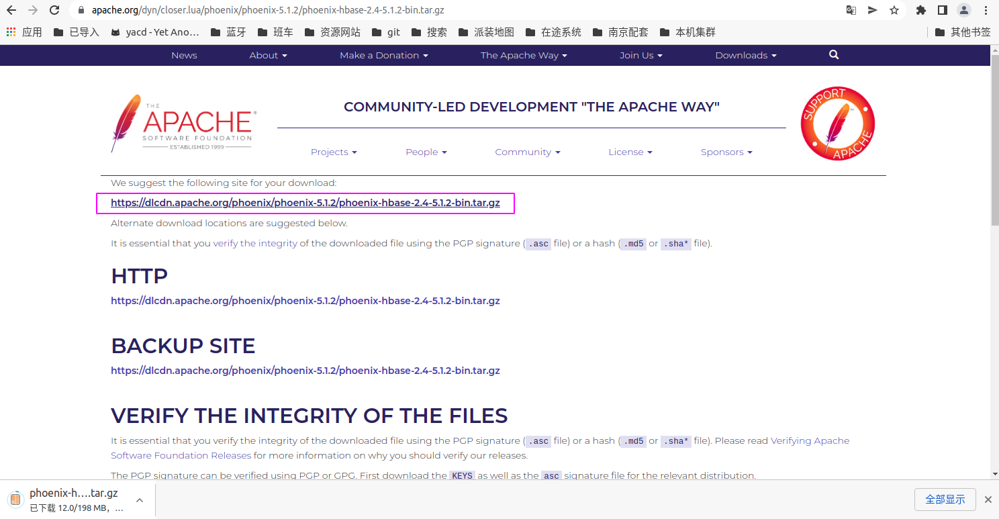
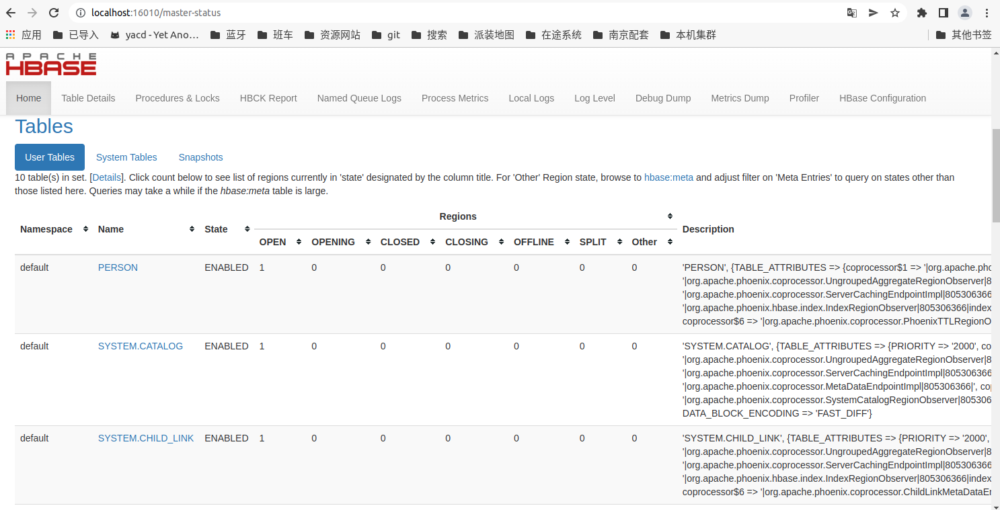

# Phoenix的安装与入门

## 1、简介

Phoenix是一个在Hbase上面实现的基于Hadoop的OLTP技术，具有低延迟、事务性、可使用SQL、提供JDBC接口的特点。而且Phoenix还提供了Hbase二级索引解决方案，丰富了Hbase查询的多样性，继承了Hbase海量数据快速随机查询的特点。


## 2、下载安装

https://phoenix.apache.org/download.html




解压缩

```sh
gree@W26-260164:~/software/hbase-2.4.12$ tar -zxvf /home/gree/下载/phoenix-hbase-2.4-5.1.2-bin.tar.gz -C /home/gree/software/

```

重命名

```sh
gree@W26-260164:~/software$ mv phoenix-hbase-2.4-5.1.2-bin/ phoenix-hbase-2.4-5.1.2/
```

将jar包拷贝到habse的lib目录下

```sh
gree@W26-260164:~/software$ cp phoenix-hbase-2.4-5.1.2/phoenix-server-hbase-2.4-5.1.2.jar hbase-2.4.12/lib/
```

配置环境变量

```sh
sudo vim /etc/profile
export PHOENIX_HOME=/home/gree/software/phoenix-hbase-2.4-5.1.2
export PATH=$PATH:$PHOENIX_HOME/bin

gree@W26-260164:~/software$ source /etc/profile
```

重启habse

```sh
gree@W26-260164:~/software$ ./hbase-2.4.12/bin/stop-hbase.sh 
stopping hbase...........
SLF4J: Class path contains multiple SLF4J bindings.
SLF4J: Found binding in [jar:file:/home/gree/software/hbase-2.4.12/lib/client-facing-thirdparty/slf4j-reload4j-1.7.33.jar!/org/slf4j/impl/StaticLoggerBinder.class]
SLF4J: Found binding in [jar:file:/home/gree/software/hadoop-3.3.2/share/hadoop/common/lib/slf4j-log4j12-1.7.30.jar!/org/slf4j/impl/StaticLoggerBinder.class]
SLF4J: See http://www.slf4j.org/codes.html#multiple_bindings for an explanation.
SLF4J: Actual binding is of type [org.slf4j.impl.Reload4jLoggerFactory]
gree@W26-260164:~/software$ ./hbase-2.4.12/bin/start-hbase.sh
SLF4J: Class path contains multiple SLF4J bindings.
SLF4J: Found binding in [jar:file:/home/gree/software/hbase-2.4.12/lib/client-facing-thirdparty/slf4j-reload4j-1.7.33.jar!/org/slf4j/impl/StaticLoggerBinder.class]
SLF4J: Found binding in [jar:file:/home/gree/software/hadoop-3.3.2/share/hadoop/common/lib/slf4j-log4j12-1.7.30.jar!/org/slf4j/impl/StaticLoggerBinder.class]
SLF4J: See http://www.slf4j.org/codes.html#multiple_bindings for an explanation.
SLF4J: Actual binding is of type [org.slf4j.impl.Reload4jLoggerFactory]
running master, logging to /home/gree/software/hbase-2.4.12/logs/hbase-gree-master-W26-260164.out
SLF4J: Class path contains multiple SLF4J bindings.
SLF4J: Found binding in [jar:file:/home/gree/software/hbase-2.4.12/lib/client-facing-thirdparty/slf4j-reload4j-1.7.33.jar!/org/slf4j/impl/StaticLoggerBinder.class]
SLF4J: Found binding in [jar:file:/home/gree/software/hadoop-3.3.2/share/hadoop/common/lib/slf4j-log4j12-1.7.30.jar!/org/slf4j/impl/StaticLoggerBinder.class]
SLF4J: See http://www.slf4j.org/codes.html#multiple_bindings for an explanation.
SLF4J: Actual binding is of type [org.slf4j.impl.Reload4jLoggerFactory]
gree@W26-260164:~/software$ 
```

启动Phoenix

```sh
gree@W26-260164:~/software$ phoenix-hbase-2.4-5.1.2/bin/sqlline.py 
Setting property: [incremental, false]
Setting property: [isolation, TRANSACTION_READ_COMMITTED]
issuing: !connect -p driver org.apache.phoenix.jdbc.PhoenixDriver -p user "none" -p password "none" "jdbc:phoenix:"
SLF4J: Class path contains multiple SLF4J bindings.
SLF4J: Found binding in [jar:file:/home/gree/software/phoenix-hbase-2.4-5.1.2/phoenix-client-hbase-2.4-5.1.2.jar!/org/slf4j/impl/StaticLoggerBinder.class]
SLF4J: Found binding in [jar:file:/home/gree/software/hadoop-3.3.2/share/hadoop/common/lib/slf4j-log4j12-1.7.30.jar!/org/slf4j/impl/StaticLoggerBinder.class]
SLF4J: See http://www.slf4j.org/codes.html#multiple_bindings for an explanation.
SLF4J: Actual binding is of type [org.slf4j.impl.Log4jLoggerFactory]
Connecting to jdbc:phoenix:
22/06/08 11:22:54 WARN util.NativeCodeLoader: Unable to load native-hadoop library for your platform... using builtin-java classes where applicable
Connected to: Phoenix (version 5.1)
Driver: PhoenixEmbeddedDriver (version 5.1)
Autocommit status: true
Transaction isolation: TRANSACTION_READ_COMMITTED
sqlline version 1.9.0

# 查看所有表
0: jdbc:phoenix:> !tables
+-----------+-------------+------------+--------------+---------+-----------+--+
| TABLE_CAT | TABLE_SCHEM | TABLE_NAME |  TABLE_TYPE  | REMARKS | TYPE_NAME |  |
+-----------+-------------+------------+--------------+---------+-----------+--+
|           | SYSTEM      | CATALOG    | SYSTEM TABLE |         |           |  |
|           | SYSTEM      | CHILD_LINK | SYSTEM TABLE |         |           |  |
|           | SYSTEM      | FUNCTION   | SYSTEM TABLE |         |           |  |
|           | SYSTEM      | LOG        | SYSTEM TABLE |         |           |  |
|           | SYSTEM      | MUTEX      | SYSTEM TABLE |         |           |  |
|           | SYSTEM      | SEQUENCE   | SYSTEM TABLE |         |           |  |
|           | SYSTEM      | STATS      | SYSTEM TABLE |         |           |  |
|           | SYSTEM      | TASK       | SYSTEM TABLE |         |           |  |
+-----------+-------------+------------+--------------+---------+-----------+--+

# 退出
0: jdbc:phoenix:> !exit
Closing: org.apache.phoenix.jdbc.PhoenixConnection
gree@W26-260164:~/software$ phoenix-hbase-2.4-5.1.2/bin/sqlline.py 
Setting property: [incremental, false]
Setting property: [isolation, TRANSACTION_READ_COMMITTED]
issuing: !connect -p driver org.apache.phoenix.jdbc.PhoenixDriver -p user "none" -p password "none" "jdbc:phoenix:"
SLF4J: Class path contains multiple SLF4J bindings.
SLF4J: Found binding in [jar:file:/home/gree/software/phoenix-hbase-2.4-5.1.2/phoenix-client-hbase-2.4-5.1.2.jar!/org/slf4j/impl/StaticLoggerBinder.class]
SLF4J: Found binding in [jar:file:/home/gree/software/hadoop-3.3.2/share/hadoop/common/lib/slf4j-log4j12-1.7.30.jar!/org/slf4j/impl/StaticLoggerBinder.class]
SLF4J: See http://www.slf4j.org/codes.html#multiple_bindings for an explanation.
SLF4J: Actual binding is of type [org.slf4j.impl.Log4jLoggerFactory]
Connecting to jdbc:phoenix:
22/06/08 11:36:58 WARN util.NativeCodeLoader: Unable to load native-hadoop library for your platform... using builtin-java classes where applicable
Connected to: Phoenix (version 5.1)
Driver: PhoenixEmbeddedDriver (version 5.1)
Autocommit status: true
Transaction isolation: TRANSACTION_READ_COMMITTED
sqlline version 1.9.0

# 帮助命令
0: jdbc:phoenix:> !help
!all                Execute the specified SQL against all the current
                    connections
!appconfig          Set custom application configuration class name
!autocommit         Set autocommit mode on or off
!batch              Start or execute a batch of statements
!brief              Set verbose mode off
!call               Execute a callable statement
!close              Close the current connection to the database
!closeall           Close all current open connections
!columns            List all the columns for the specified table
!commandhandler     Add a command handler
!commit             Commit the current transaction (if autocommit is off)
!connect            Open a new connection to the database
!dbinfo             Give metadata information about the database
!describe           Describe a table
!dropall            Drop all tables in the current database
!exportedkeys       List all the exported keys for the specified table
!go                 Select the current connection
!help               Print a summary of command usage
!history            Display the command history
                    -d Print timestamps for each event (default for !history) 
                    -f Print full time date stamps in the US format 
                    -E Print full time date stamps in the European format 
                    -i Print full time date stamps in ISO8601 format 
                    -n Suppresses command numbers 
                    -r Reverses the order of the commands
!importedkeys       List all the imported keys for the specified table
!indexes            List all the indexes for the specified table
!isolation          Set the transaction isolation for this connection
!list               List the current connections
!manual             Display the SQLLine manual
!metadata           Obtain metadata information
!nativesql          Show the native SQL for the specified statement
!nickname           Create a friendly name for the connection (updates command
                    prompt)
!outputformat       Set the output format for displaying results (table,
                    vertical, csv, tsv, xmlattrs, xmlelements, json)
!primarykeys        List all the primary keys for the specified table
!procedures         List all the procedures
!prompthandler      Set custom prompt handler class name
!properties         Connect to the database specified in the properties file(s)
!quit               Exits the program
!readonly           Set readonly mode on or off
!reconnect          Reconnect to the database
!record             Record all output to the specified file
!rehash             Fetch table and column names for command completion
!rerun              Execute previous command from the history file
!reset              Reset a sqlline variable
!rollback           Roll back the current transaction (if autocommit is off)
!run                Run a script from the specified file
!save               Save the current variables and aliases
!scan               Scan for installed JDBC drivers
!schemas            List all the schemas in the database
!script             Start saving a script to a file
!set                List / set a sqlline variable
!sql                Execute a SQL command
!tables             List all the tables in the database
!typeinfo           Display the type map for the current connection
!verbose            Set verbose mode on


Variables:

Variable        Value      Description
=============== ========== ==================================================
autoCommit      true/false Enable/disable automatic transaction commit
autoSave        true/false Automatically save preferences
color           true/false Control whether color is used for display
colorScheme     chester/dark/dracula/light/obsidian/solarized/vs2010
                           Syntax highlight schema
confirm         true/false Whether to prompt for confirmation before running
                           commands specified in confirmPattern (default:
                           false)
confirmPattern  pattern    A regexp that defines the dangerous commands for
                           which to prompt Are you sure? before execution;
                           (default: DELETE and DROP)
csvDelimiter    String     Delimiter in csv outputFormat
connectInteractionMode askCredentials/notAskCredentials/useNPTogetherOrEmpty
                           Defines interaction mode for !connect command
csvQuoteCharacter char     Quote character in csv outputFormat
dateFormat      pattern    Format dates using SimpleDateFormat pattern
escapeOutput    true/false Escape control symbols in output
fastConnect     true/false Skip building table/column list for tab-completion
force           true/false Continue running script even after errors
headerInterval  integer    The interval between which headers are displayed
historyFile     path       File in which to save command history. Default is
                           $HOME/.sqlline/history (UNIX, Linux, Mac OS),
                           $HOME/sqlline/history (Windows)
historyFlags    String     Default flags for !history command
incremental     true/false Do not receive all rows from server before
                           printing the first row; uses fewer resources,
                           especially for long-running queries, but column
                           widths may be incorrect
incrementalBufferRows integer Threshold at which to switch to incremental
                           mode; query starts in non-incremental mode, but
                           after the this many rows, switches to incremental
isolation       LEVEL      Set transaction isolation level
maxColumnWidth  integer    The maximum width to use when displaying columns
maxHeight       integer    The maximum height of the terminal
maxWidth        integer    The maximum width of the terminal
maxHistoryFileRows integer The maximum number of history rows 
                           to store in history file
maxHistoryRows  integer    The maximum number of history rows 
                           to store in memory
mode            emacs/vi   The editing mode
nullValue       String     Use String in place of  NULL values
numberFormat    pattern    Format numbers using DecimalFormat pattern
outputFormat    table/vertical/csv/tsv/xmlattrs/xmlelements/json/ansiconsole
                           Format mode for result display
prompt          pattern    Format prompt
promptScript    String     Script code to execute to generate a prompt
propertiesFile  path       File from which SQLLine reads properties on
                           startup; default is
                           $HOME/.sqlline/sqlline.properties (UNIX, Linux,
                           macOS), $HOME/sqlline/sqlline.properties (Windows)
readOnly        true/false Enable/disable readonly connection
rightPrompt     pattern    Format right prompt
rowLimit        integer    Maximum number of rows returned from a query; zero
                           means no limit
showCompletionDesc true/false Display help for completions
showElapsedTime true/false Display execution time when verbose
showHeader      true/false Show column names in query results
showLineNumbers true/false Show line numbers while multiline queries
showNestedErrs  true/false Display nested errors
showWarnings    true/false Display connection warnings
silent          true/false Be more silent
strictJdbc      true/false Use strict JDBC
timeFormat      pattern    Format times using SimpleDateFormat pattern
timeout         integer    Query timeout in seconds; less than zero means no
                           timeout
timestampFormat pattern    Format timestamps using SimpleDateFormat pattern
trimScripts     true/false Remove trailing spaces from lines read from script
                           files
useLineContinuation true/false Use line continuation
verbose         true/false Show verbose error messages and debug info
version         version    Show the current sqlline version.
                           The property is read only.

Key-strokes:
alt-b           Backward word
alt-c           Capitalize word
alt-d           Kill word
alt-f           Forward word
alt-h           Next color scheme
alt-l           Lowercase word
alt-n           History search forward
alt-p           History search backward
alt-t           Transpose words
alt-u           Uppercase word

ctrl-a          To the beginning of line
ctrl-b          Backward char
ctrl-d          Delete char
ctrl-e          To the end of line
ctrl-f          Forward char
ctrl-h          Backward delete char
ctrl-i          Complete
ctrl-j          Enter
ctrl-k          Kill the line
ctrl-m          Enter
ctrl-n          Down line or history
ctrl-p          Up line or history
ctrl-r          History incremental search backward
ctrl-s          History incremental search forward
ctrl-t          Transpose chars
ctrl-u          Kill the whole line
ctrl-w          Backward kill the line

alt-ctrl-n      Show line numbers

Comments, bug reports, and patches go to ???

```


## 3 、命令行操作Hbase

```sh
# 创建表
0: jdbc:phoenix:localhost> create table person(id varchar primary key, name varchar);
No rows affected (0.745 seconds)

# 插入数据
0: jdbc:phoenix:localhost> upsert into person values ('111','jone');
1 row affected (0.067 seconds)
0: jdbc:phoenix:localhost> upsert into person values ('222','jone');
1 row affected (0.005 seconds)
0: jdbc:phoenix:localhost> select * 夫人噢买
. . . . . . . . semicolon> 
. . . . . . . . semicolon> 
Error:  (state=,code=0)
java.sql.SQLFeatureNotSupportedException
	at org.apache.phoenix.jdbc.PhoenixStatement.cancel(PhoenixStatement.java:1825)
	at sqlline.DispatchCallback.forceKillSqlQuery(DispatchCallback.java:83)
	at sqlline.SqlLine.begin(SqlLine.java:561)
	at sqlline.SqlLine.start(SqlLine.java:267)
	at sqlline.SqlLine.main(SqlLine.java:206)

# 查询表
0: jdbc:phoenix:localhost> select * from person;
+-----+------+
| ID  | NAME |
+-----+------+
| 111 | jone |
| 222 | jone |
+-----+------+
2 rows selected (0.035 seconds)

# 删除其中数据
0: jdbc:phoenix:localhost> delete from person where id = '222
. . . . . . . . . . quote> ';
1 row affected (0.025 seconds)

# 显示所有表
0: jdbc:phoenix:localhost> !tables
+-----------+-------------+------------+--------------+---------+-----------+--+
| TABLE_CAT | TABLE_SCHEM | TABLE_NAME |  TABLE_TYPE  | REMARKS | TYPE_NAME |  |
+-----------+-------------+------------+--------------+---------+-----------+--+
|           | SYSTEM      | CATALOG    | SYSTEM TABLE |         |           |  |
|           | SYSTEM      | CHILD_LINK | SYSTEM TABLE |         |           |  |
|           | SYSTEM      | FUNCTION   | SYSTEM TABLE |         |           |  |
|           | SYSTEM      | LOG        | SYSTEM TABLE |         |           |  |
|           | SYSTEM      | MUTEX      | SYSTEM TABLE |         |           |  |
|           | SYSTEM      | SEQUENCE   | SYSTEM TABLE |         |           |  |
|           | SYSTEM      | STATS      | SYSTEM TABLE |         |           |  |
|           | SYSTEM      | TASK       | SYSTEM TABLE |         |           |  |
|           |             | PERSON     | TABLE        |         |           |  |
+-----------+-------------+------------+--------------+---------+-----------+--+
0: jdbc:phoenix:localhost> 

```




## 4 、 java 连接 Phoenix

```xml
<dependency>
    <groupId>org.apache.phoenix</groupId>
    <artifactId>phoenix-core</artifactId>
    <version>4.9.0-HBase-1.1</version>
</dependency>
<!-- https://mvnrepository.com/artifact/org.apache.phoenix/phoenix-client -->
<dependency>
    <groupId>org.apache.phoenix</groupId>
    <artifactId>phoenix-client</artifactId>
    <version>4.14.1-HBase-1.4</version>
</dependency>
```

```java
public static void main(String args[]) {
    Connection connection = null;
    Statement statement = null;
    try {
        Class.forName("org.apache.phoenix.jdbc.PhoenixDriver");
        connection = DriverManager.getConnection("jdbc:phoenix:localhsot:2181","","");
        statement = connection.createStatement();
        statement.execute("upsert into person values ('333', 'value3')");
        } catch (Exception e) {
            e.printStackTrace();
        } finally {
            try {
                connection.close();
                statement.close();
            } catch (Exception e) {
                e.printStackTrace();
            }
        }
    }

```

