## 第一章 、 Hive基本概念

### 1.1什么是Hive

#### 1. hive简介

Hive:由 Facebook开源用于解决海量结构化日志的数据统计工具。

Hive是基于Hadoop的一个**数据仓库工具**，可以将**结构化的数据文件映射为一张表**，并提供类**SQL**查询功能。


#### 2. Hive本质:

将HQL转化成MapReduce程序

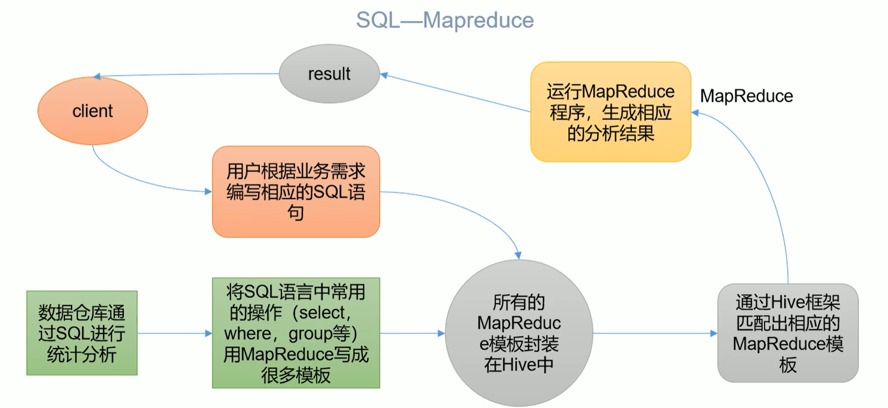


(1）Hive处理的数据存储在HDFS

(2）Hive分析数据底层的实现是MapReduce

(3）执行程序运行在 Yarn 上


### 1.2 Hive的优缺点

#### 1.2.1优点

(1）操作接口采用类sQL语法，提供快速开发的能力（简单、容易上手）。

(2〉避免了写MapReduce,减少开发人员的是习成本。

(3）Hive的执行延迟比较高，因此Hive常用于数据分析，对实时性要求不高的场合。

( 4）Hive优势在于处理大数据，对于处理小数据没有优势，因为Hive的执行延迟比较
高。

(5）Hive支持用户自定义函数，用户可以根据自己的需求来实现自己的函数。


#### 1.2.2缺点

**1)Hive的HQL表达能力有限**

​	(1）迭代式算法无法表达

​	(2）数据挖掘方面不擅长，由于MapReduce数据处理流程的限制，效率更高的算法却无法实现。

**2) Hive的效率比较低**

​	(1）Hive自动生成的 MapReduce作业，通常情况下不够智能化

​	(2) Hive 调优比较困难，粒度较粗


### 1.3 Hive架构原理

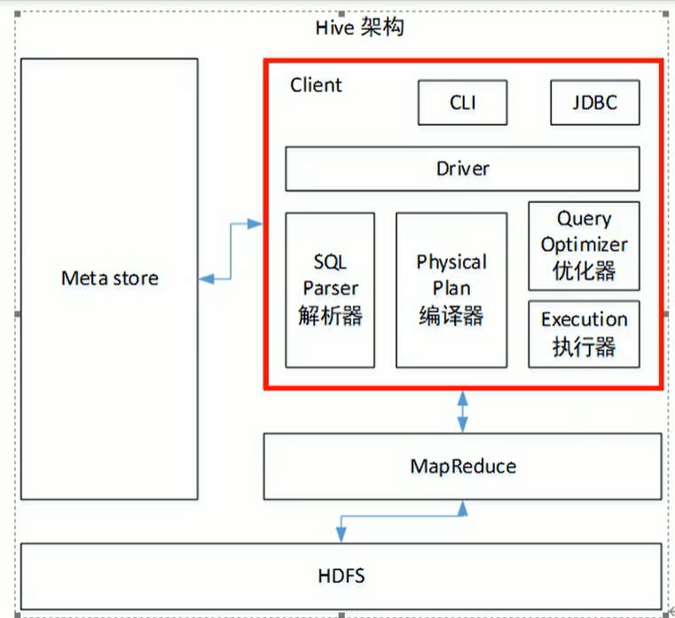


**1）用户接口：Client** 

CLI（command-line interface）、JDBC/ODBC(jdbc 访问 hive)、WEBUI（浏览器访问 hive）

**2）元数据：Metastore**

 元数据包括：表名、表所属的数据库（默认是 default）、表的拥有者、列/分区字段、 表的类型（是否是外部表）、表的数据所在目录等； 默认存储在自带的 derby 数据库中，推荐使用 MySQL 存储 Metastore 

**3）Hadoop** 

使用 HDFS 进行存储，使用 MapReduce 进行计算。

 **4）驱动器：Driver** 

（1）解析器（SQL Parser）：将 SQL 字符串转换成抽象语法树 AST，这一步一般都用第 三方工具库完成，比如 antlr；对 AST 进行语法分析，比如表是否存在、字段是否存在、SQL 语义是否有误。 

（2）编译器（Physical Plan）：将 AST 编译生成逻辑执行计划。

（3）优化器（Query Optimizer）：对逻辑执行计划进行优化。

（4）执行器（Execution）：把逻辑执行计划转换成可以运行的物理计划。对于 Hive 来 说，就是 MR/Spark。

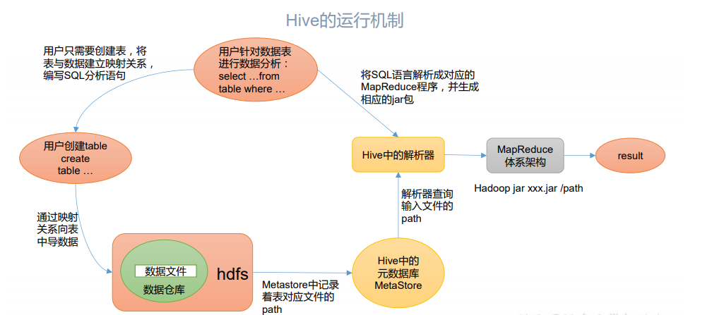


Hive 通过给用户提供的一系列交互接口，接收到用户的指令(SQL)，使用自己的 Driver， 结合元数据(MetaStore)，将这些指令翻译成 MapReduce，提交到 Hadoop 中执行，最后，将 执行返回的结果输出到用户交互接口。


### 1.4 Hive 和数据库比较 

由于 Hive 采用了类似 SQL 的查询语言 HQL(Hive Query Language)，因此很容易将 Hive 理解为数据库。其实从结构上来看，Hive 和数据库除了拥有类似的查询语言，再无类似之处。 本文将从多个方面来阐述 Hive 和数据库的差异。数据库可以用在 Online 的应用中，但是 Hive 是为数据仓库而设计的，清楚这一点，有助于从应用角度理解 Hive 的特性。

#### 1.4.1 查询语言 

由于 SQL 被广泛的应用在数据仓库中，因此，专门针对 Hive 的特性设计了类 SQL 的查 询语言 HQL。熟悉 SQL 开发的开发者可以很方便的使用 Hive 进行开发。

#### 1.4.2 数据更新

 由于 Hive 是针对数据仓库应用设计的，而数据仓库的内容是读多写少的。因此，Hive 中 不建议对数据的改写，所有的数据都是在加载的时候确定好的。而数据库中的数据通常是需 要经常进行修改的，因此可以使用 INSERT INTO … VALUES 添加数据，使用 UPDATE … SET 修 改数据。

####  1.4.3 执行延迟 

Hive 在查询数据的时候，由于没有索引，需要扫描整个表，因此延迟较高。另外一个导 致 Hive 执行延迟高的因素是 MapReduce 框架。由于 MapReduce 本身具有较高的延迟，因此 在利用 MapReduce 执行 Hive 查询时，也会有较高的延迟。相对的，数据库的执行延迟较低。 当然，这个低是有条件的，即数据规模较小，当数据规模大到超过数据库的处理能力的时候， Hive 的并行计算显然能体现出优势。 

#### 1.4.4 数据规模 

由于 Hive 建立在集群上并可以利用 MapReduce 进行并行计算，因此可以支持很大规模 的数据；对应的，数据库可以支持的数据规模较小。


## 第二章、Hive安装

### 2.1 Hive 安装地址 

1）Hive 官网地址

 http://hive.apache.org/ 

2）文档查看地址 

https://cwiki.apache.org/confluence/display/Hive/GettingStarted

 3）下载地址

http://archive.apache.org/dist/hive/ 

4）github 地址

 https://github.com/apache/hive 

### 2.2Hive 安装部署

#### 2.2.1 安装 Hive

1）把 apache-hive-3.1.2-bin.tar.gz 上传到 linux 的/opt/software 目录下 

2）解压 apache-hive-3.1.2-bin.tar.gz 到/opt/module/目录下面

```sh
 [atguigu@hadoop102 software]$ tar -zxvf /opt/software/apache-hive-3.1.2- bin.tar.gz -C /opt/module/
```

 3）修改 apache-hive-3.1.2-bin.tar.gz 的名称为 hive

```sh
 [atguigu@hadoop102 software]$ mv /opt/module/apache-hive-3.1.2-bin/ /opt/module/hive
```

4）修改/etc/profile.d/my_env.sh，添加环境变量

```sh
 [atguigu@hadoop102 software]$ sudo vim /etc/profile.d/my_env.sh 

```

 5）添加内容 

```sh
#HIVE_HOME export HIVE_HOME=/opt/module/hive export PATH=$PATH:$HIVE_HOME/bin
```

 6）解决日志 Jar 包冲突 

```sh
[atguigu@hadoop102 software]$ mv $HIVE_HOME/lib/log4j-slf4j-impl2.10.0.jar $HIVE_HOME/lib/log4j-slf4j-impl-2.10.0.bak
```

 7）初始化元数据库

```sh
 [atguigu@hadoop102 hive]$ bin/schematool -dbType derby -initSchema
```


#### 2.2.2 启动并使用 Hive

 1）启动 Hive

```sh
 [atguigu@hadoop102 hive]$ bin/hive
```


 2）使用 

```sh
Hive hive> show databases; 
hive> show tables;
hive> create table test(id int);
hive> insert into test values(1);
hive> select * from test; 
```


3）在 CRT 窗口中开启另一个窗口开启 Hive，在/tmp/atguigu 目录下监控 hive.log 文件 

```properties
Caused by: ERROR XSDB6: Another instance of Derby may have already booted the database /opt/module/hive/metastore_db. at org.apache.derby.iapi.error.StandardException.newException(Unknown Source) at org.apache.derby.iapi.error.StandardException.newException(Unknown Source) at org.apache.derby.impl.store.raw.data.BaseDataFileFactory.privGetJBMSLockOnDB(Unknown Source) at org.apache.derby.impl.store.raw.data.BaseDataFileFactory.run(Unknown Source)
...
```

**原因在于 Hive 默认使用的元数据库为 derby，开启 Hive 之后就会占用元数据库，且不与 其他客户端共享数据，所以我们需要将 Hive 的元数据地址改为 MySQL。**


### 2.3MySQL 安装 

1）检查当前系统是否安装过 MySQL

```sh
 [atguigu@hadoop102 ~]$ rpm -qa|grep mariadb mariadb-libs-5.5.56-2.el7.x86_64 
 //如果存在通过如下命令卸载
 [atguigu @hadoop102 ~]$ sudo rpm -e --nodeps mariadb-libs
```


 2）将 MySQL 安装包拷贝到/opt/software 目录下 

```sh
[atguigu @hadoop102 software]# ll 
总用量 528384 -rw-r--r--. 1 root root 609556480 3 月 21 15:41 mysql-5.7.28- 1.el7.x86_64.rpm-bundle.tar 
```

3）解压 MySQL 安装包

```sh
 [atguigu @hadoop102 software]# tar -xf mysql-5.7.28-1.el7.x86_64.rpmbundle.tar
```


4）在安装目录下执行 rpm 安装 

```sh
[atguigu @hadoop102 software]$
sudo rpm -ivh mysql-community-common-5.7.28-1.el7.x86_64.rpm
sudo rpm -ivh mysql-community-libs-5.7.28-1.el7.x86_64.rpm 
sudo rpm -ivh mysql-community-libs-compat-5.7.28-1.el7.x86_64.rpm 
sudo rpm -ivh mysql-community-client-5.7.28-1.el7.x86_64.rpm 
sudo rpm -ivh mysql-community-server-5.7.28-1.el7.x86_64.rpm 
 
```

注意:按照顺序依次执行 如果 Linux 是最小化安装的，在安装 mysql-community-server-5.7.28-1.el7.x86_64.rpm 时 可能会出现如下错误

```sh
[atguigu@hadoop102 software]$ sudo rpm -ivh mysql-community-server5.7.28-1.el7.x86_64.rpm 
警告：mysql-community-server-5.7.28-1.el7.x86_64.rpm: 头 V3 DSA/SHA1 Signature, 密钥 ID 5072e1f5: NOKEY 错误：依赖检测失败：libaio.so.1()(64bit) 被 mysql-community-server-5.7.28-1.el7.x86_64
需要 libaio.so.1(LIBAIO_0.1)(64bit) 被 mysql-community-server-5.7.28-1.el7.x86_64 需要
 libaio.so.1(LIBAIO_0.4)(64bit) 被 mysql-community-server-5.7.28-1.el7.x86_64 需要
```

通过 yum 安装缺少的依赖,然后重新安装 mysql-community-server-5.7.28-1.el7.x86_64 即 可 

```sh
[atguigu@hadoop102 software] yum install -y libaio
```

5）删除/etc/my.cnf 文件中 datadir 指向的目录下的所有内容,如果有内容的情况下: 查看 datadir 的值：

```sh
 [mysqld] datadir=/var/lib/mysql
```

 删除/var/lib/mysql 目录下的所有内容:

```sh
 [atguigu @hadoop102 mysql]# cd /var/lib/mysql [atguigu @hadoop102 mysql]# sudo rm -rf ./*  //注意执行命令的位置
```

6）初始化数据库 

```sh
[atguigu @hadoop102 opt]$ sudo mysqld --initialize --user=mysql
```

 7）查看临时生成的 root 用户的密码

```sh
 [atguigu @hadoop102 opt]$ sudo cat /var/log/mysqld.log 
```


8）启动 MySQL 服务 

```sh
[atguigu @hadoop102 opt]$ sudo systemctl start mysqld
```

 9）登录 MySQL 数据库

```sh
 [atguigu @hadoop102 opt]$ mysql -uroot -p Enter password: 输入临时生成的密码 登录成功.
```

 10）必须先修改 root 用户的密码,否则执行其他的操作会报错 

```sh
mysql> set password = password("新密码"); 
```

11）修改 mysql 库下的 user 表中的 root 用户允许任意 ip 连接 

```sh
mysql> update mysql.user set host='%' where user='root'; 
mysql> flush privileges;
```


### 2.4 Hive 元数据配置到 MySQL

####  2.4.1 拷贝驱动

 将 MySQL 的 JDBC 驱动拷贝到 Hive 的 lib 目录下

```sh
[atguigu@hadoop102 software]$ cp /opt/software/mysql-connector-java5.1.37.jar $HIVE_HOME/lib
```


#### 2.4.2 配置 Metastore 到 MySQL 

1）在$HIVE_HOME/conf 目录下新建 hive-site.xml 文件

```sh
[atguigu@hadoop102 software]$ vim $HIVE_HOME/conf/hive-site.xml
```

```xml
<?xml version="1.0"?>
<?xml-stylesheet type="text/xsl" href="configuration.xsl"?>
<configuration>
 <!-- jdbc 连接的 URL -->
 <property>
 <name>javax.jdo.option.ConnectionURL</name>
 <value>jdbc:mysql://hadoop102:3306/metastore?useSSL=false</value>
</property>
 <!-- jdbc 连接的 Driver-->
 <property>
 <name>javax.jdo.option.ConnectionDriverName</name>
 <value>com.mysql.jdbc.Driver</value>
</property>
<!-- jdbc 连接的 username-->
 <property>
 <name>javax.jdo.option.ConnectionUserName</name>
 <value>root</value>
 </property>
 <!-- jdbc 连接的 password -->
 <property>
 <name>javax.jdo.option.ConnectionPassword</name>
 <value>000000</value>
</property>
 <!-- Hive 元数据存储版本的验证 -->
 <property>
 <name>hive.metastore.schema.verification</name>
 <value>false</value>
</property>
 <!--元数据存储授权-->
 <property>
 <name>hive.metastore.event.db.notification.api.auth</name>
 <value>false</value>
 </property>
 <!-- Hive 默认在 HDFS 的工作目录 -->
 <property>
     <name>hive.metastore.warehouse.dir</name>
 <value>/user/hive/warehouse</value>
 </property>
</configuration>
```

2）登陆 MySQL

```sh
[atguigu@hadoop102 software]$ mysql -uroot -p000000
```

3）新建 Hive 元数据库

```sh
mysql> create database metastore;
mysql> quit;
```

4） 初始化 Hive 元数据库

```sh
[atguigu@hadoop102 software]$ schematool -initSchema -dbType mysql -
verbose
```

#### 2.4.3 再次启动 Hive 

1）启动 Hive

```sh
[atguigu@hadoop102 hive]$ bin/hive
```

2）使用 Hive

```sh
hive> show databases;
hive> show tables;
hive> create table test (id int);
hive> insert into test values(1);
hive> select * from test;
```

3）在 CRT 窗口中开启另一个窗口开启 Hive

```sh
hive> show databases;
hive> show tables;
hive> select * from aa;
```

### 2.5 使用元数据服务的方式访问 Hive 

1）在 hive-site.xml 文件中添加如下配置信息

```xml
 <!-- 指定存储元数据要连接的地址 -->
 <property>
 <name>hive.metastore.uris</name>
 <value>thrift://hadoop102:9083</value>
 </property>
```

2）启动 metastore

```sh
[atguigu@hadoop202 hive]$ hive --service metastore
2020-04-24 16:58:08: Starting Hive Metastore Server
注意: 启动后窗口不能再操作，需打开一个新的 shell 窗口做别的操作
```

3）启动 hive

```sh
[atguigu@hadoop202 hive]$ bin/hive
```

### 2.6 使用 JDBC 方式访问 Hive 

1）在 hive-site.xml 文件中添加如下配置信息

```xml
<!-- 指定 hiveserver2 连接的 host -->
 <property>
 <name>hive.server2.thrift.bind.host</name>
     <value>hadoop102</value>
 </property>
 <!-- 指定 hiveserver2 连接的端口号 -->
 <property>
 <name>hive.server2.thrift.port</name>
 <value>10000</value>
 </property>
```

2）启动 hiveserver2

```sh
[atguigu@hadoop102 hive]$ bin/hive --service hiveserver2
```

3）启动 beeline 客户端（需要多等待一会）

```sh
[atguigu@hadoop102 hive]$ bin/beeline -u jdbc:hive2://hadoop102:10000 -n
atguigu
```

4）看到如下界面

```sh
Connecting to jdbc:hive2://hadoop102:10000
Connected to: Apache Hive (version 3.1.2)
Driver: Hive JDBC (version 3.1.2)
Transaction isolation: TRANSACTION_REPEATABLE_READ
Beeline version 3.1.2 by Apache Hive
0: jdbc:hive2://hadoop102:10000>
```


5）编写 hive 服务启动脚本（了解） 

（1） 前台启动的方式导致需要打开多个 shell 窗口，可以使用如下方式后台方式启动

 nohup: 放在命令开头，表示不挂起,也就是关闭终端进程也继续保持运行状态 

/dev/null：是 Linux 文件系统中的一个文件，被称为黑洞，所有写入改文件的内容 都会被自动丢弃

 2>&1 : 表示将错误重定向到标准输出上

 &: 放在命令结尾,表示后台运行

 一般会组合使用: nohup [xxx 命令操作]> file 2>&1 &，表示将 xxx 命令运行的结 果输出到 file 中，并保持命令启动的进程在后台运行。 如上命令不要求掌握。

```sh
[atguigu@hadoop202 hive]$ nohup hive --service metastore 2>&1 &
[atguigu@hadoop202 hive]$ nohup hive --service hiveserver2 2>&1 &
```


（2） 为了方便使用，可以直接编写脚本来管理服务的启动和关闭

```sh
[atguigu@hadoop102 hive]$ vim $HIVE_HOME/bin/hiveservices.sh
```

内容如下：此脚本的编写不要求掌握。直接拿来使用即可。

```sh
#!/bin/bash
HIVE_LOG_DIR=$HIVE_HOME/logs
if [ ! -d $HIVE_LOG_DIR ]
then
mkdir -p $HIVE_LOG_DIR
fi
#检查进程是否运行正常，参数 1 为进程名，参数 2 为进程端口
function check_process()
{
 pid=$(ps -ef 2>/dev/null | grep -v grep | grep -i $1 | awk '{print
$2}')
 ppid=$(netstat -nltp 2>/dev/null | grep $2 | awk '{print $7}' | cut -
d '/' -f 1)
 echo $pid
 [[ "$pid" =~ "$ppid" ]] && [ "$ppid" ] && return 0 || return 1
}
function hive_start()
{
 metapid=$(check_process HiveMetastore 9083)
 cmd="nohup hive --service metastore >$HIVE_LOG_DIR/metastore.log 2>&1 &"
 [ -z "$metapid" ] && eval $cmd || echo "Metastroe 服务已启动"
 server2pid=$(check_process HiveServer2 10000)
 cmd="nohup hiveserver2 >$HIVE_LOG_DIR/hiveServer2.log 2>&1 &"
 [ -z "$server2pid" ] && eval $cmd || echo "HiveServer2 服务已启动"
}
function hive_stop()
{
metapid=$(check_process HiveMetastore 9083)
 [ "$metapid" ] && kill $metapid || echo "Metastore 服务未启动"
 server2pid=$(check_process HiveServer2 10000)
 [ "$server2pid" ] && kill $server2pid || echo "HiveServer2 服务未启动"
}
case $1 in
"start")
 hive_start
 ;;
"stop")
 hive_stop
 ;;
"restart")
 hive_stop
 sleep 2
 hive_start
 ;;
"status")
 check_process HiveMetastore 9083 >/dev/null && echo "Metastore 服务运行
正常" || echo "Metastore 服务运行异常"
 check_process HiveServer2 10000 >/dev/null && echo "HiveServer2 服务运
行正常" || echo "HiveServer2 服务运行异常"
 ;;
*)
 echo Invalid Args!
 echo 'Usage: '$(basename $0)' start|stop|restart|status'
 ;;
esac
```

3）添加执行权限

```sh
[atguigu@hadoop102 hive]$ chmod +x $HIVE_HOME/bin/hiveservices.sh
```

4）启动 Hive 后台服务

```sh
[atguigu@hadoop102 hive]$ hiveservices.sh start
```


### 2.7 Hive 常用交互命令

```sh
[atguigu@hadoop102 hive]$ bin/hive -help
usage: hive
-d,--define <key=value> Variable subsitution to apply to hive
 commands. e.g. -d A=B or --define A=B
 --database <databasename> Specify the database to use
-e <quoted-query-string> SQL from command line
-f <filename> SQL from files
-H,--help Print help information
 --hiveconf <property=value> Use value for given property
 --hivevar <key=value> Variable subsitution to apply to hive
 commands. e.g. --hivevar A=B
-i <filename> Initialization SQL file
-S,--silent Silent mode in interactive shell
-v,--verbose Verbose mode (echo executed SQL to the
console)
```

1）“-e”不进入 hive 的交互窗口执行 sql 语句

```sh
[atguigu@hadoop102 hive]$ bin/hive -e "select id from student;"
```

2）“-f”执行脚本中 sql 语句 

（1）在/opt/module/hive/下创建 datas 目录并在 datas 目录下创建 hivef.sql 文件

```sh
[atguigu@hadoop102 datas]$ touch hivef.sql
```

（2）文件中写入正确的 sql 语句

```sh
select *from student;
```

（3）执行文件中的 sql 语句

```sh
[atguigu@hadoop102 hive]$ bin/hive -f /opt/module/hive/datas/hivef.sql
```

（4）执行文件中的 sql 语句并将结果写入文件中

```sh
[atguigu@hadoop102 hive]$ bin/hive -f /opt/module/hive/datas/hivef.sql >
/opt/module/datas/hive_result.txt
```

### 2.8 Hive 其他命令操作

1）退出 hive 窗口：

```sh
 hive(default)>exit;
 hive(default)>quit; 
```

2）在 hive cli 命令窗口中如何查看 hdfs 文件系统

```sh
 hive(default)>dfs -ls /;
```

 3）查看在 hive 中输入的所有历史命令 

（1）进入到当前用户的根目录 /root 或/home/atguigu 

（2）查看. hivehistory 文件

```sh
 [atguig2u@hadoop102 ~]$ cat .hivehistory
```


### 2.9 Hive 常见属性配置 

#### 2.9.1 Hive 运行日志信息配置 

1）Hive 的 log 默认存放在/tmp/atguigu/hive.log 目录下（当前用户名下）

 2）修改 hive 的 log 存放日志到/opt/module/hive/logs 

​	（1）修改/opt/module/hive/conf/hive-log4j2.properties.template 文件名称为 hive-log4j2.properties

```sh
[atguigu@hadoop102 conf]$ pwd
/opt/module/hive/conf
[atguigu@hadoop102 conf]$ mv hive-log4j2.properties.template hivelog4j2.properties
```

（2）在 hive-log4j2.properties 文件中修改 log 存放位置

```sh
hive.log.dir=/opt/module/hive/logs
```

#### 2.9.2 打印 当前库 和 表头

在 hive-site.xml 中加入如下两个配置:

```xml
<property>
 <name>hive.cli.print.header</name>
 <value>true</value>
 </property>
 <property>
 <name>hive.cli.print.current.db</name>
 <value>true</value>
 </property>
```


#### 2.9.3 参数配置方式

 1）查看当前所有的配置信息

```sh
 hive>set; 
```

2）参数的配置三种方式 

（1）配置文件方式 默认配置文件：hive-default.xml 

用户自定义配置文件：hive-site.xml 

注意：用户自定义配置会覆盖默认配置。另外，Hive 也会读入 Hadoop 的配置，因为 Hive 是作为 Hadoop 的客户端启动的，Hive 的配置会覆盖 Hadoop 的配置。配置文件的设定对本机启动的所有 Hive 进程都有效。 

（2）命令行参数方式 启动 Hive 时，可以在命令行添加-hiveconf param=value 来设定参数。

例如：

```sh
 [atguigu@hadoop103 hive]$ bin/hive -hiveconf mapred.reduce.tasks=10; 
```

注意：仅对本次 hive 启动有效 

查看参数设置：

```sh
 hive (default)> set mapred.reduce.tasks; 
```

（3）参数声明方式 可以在 HQL 中使用 SET 关键字设定参数 

例如： 

```sh
hive (default)> set mapred.reduce.tasks=100;
```

 注意：仅对本次 hive 启动有效。 查看参数设置

```sh
 hive (default)> set mapred.reduce.tasks; 
```

上述三种设定方式的优先级依次递增。即配置文件<命令行参数<参数声明。注意某些系 统级的参数，例如 log4j 相关的设定，必须用前两种方式设定，因为那些参数的读取在会话 建立以前已经完成了。


## 第三章、Hive数据类型

### 3.1 基本数据类型

| Hive 数据类型 | Java 数据类型 | 长度                                                   | 例子                                   |
| ------------- | ------------- | ------------------------------------------------------ | -------------------------------------- |
| TINYINT       | byte          | 1byte 有符号整数                                       | 20                                     |
| SMALINT       | short         | 2byte 有符号整数                                       | 20                                     |
| **INT**       | int           | 4byte 有符号整数                                       | 20                                     |
| BIGINT        | long          | 8byte 有符号整数                                       | 20                                     |
| BOOLEAN       | boolean       | 布尔类型，true 或者 false                              | TRUE FALSE                             |
| FLOAT         | float         | 单精度浮点数                                           | 3.14159                                |
| **DOUBLE**    | double        | 双精度浮点数                                           | 3.14159                                |
| **STRING**    | string        | 字符系列。可以指定字 符集。可以使用单引号或者双 引号。 | ‘ now is the time ’ “for all good men” |
| TIMESTAMP     |               | 时间类型                                               |                                        |
| BINARY        |               | 字节数组                                               |                                        |

对于 Hive 的 String 类型相当于数据库的 varchar 类型，该类型是一个可变的字符串，不 过它不能声明其中最多能存储多少个字符，理论上它可以存储 2GB 的字符数。


### 3.2 集合数据类型

| 数据类型 | 描述                                                         | 语法示例                                           |
| -------- | ------------------------------------------------------------ | -------------------------------------------------- |
| STRUCT   | 和 c 语言中的 struct 类似，都可以通过“点”符号访 问元素内容。例如，如果某个列的数据类型是 STRUCT{first STRING, last STRING},那么第 1 个元素可以通过字段.first 来 引用。 | struct() 例 如 struct\<Street:String,city:String\> |
| MAP      | MAP 是一组键-值对元组集合，使用数组表示法可以 访问数据。例如，如果某个列的数据类型是 MAP，其中键 ->值对是’first’->’John’和’last’->’Doe’，那么可以 通过字段名[‘last’]获取最后一个元素 | map() 例如 map<String,int>                         |
| ARRAY    | 组是一组具有相同类型和名称的变量的集合。这些 变量称为数组的元素，每个数组元素都有一个编号，编号从 零开始。例如，数组值为[‘John’, ‘Doe’]，那么第 2 个 元素可以通过数组名[1]进行引用。 | Array() 例如 array\<String\>                       |

Hive 有三种复杂数据类型 ARRAY、MAP 和 STRUCT。ARRAY 和 MAP 与 Java 中的 Array 和 Map 类似，而 STRUCT 与 C 语言中的 Struct 类似，它封装了一个命名字段集合，复杂数据 类型允许任意层次的嵌套。


1）案例实操 

（1）假设某表有如下一行，我们用 JSON 格式来表示其数据结构。在 Hive 下访问的格 式为

```json
{
 "name": "songsong",
 "friends": ["bingbing" , "lili"] , //列表 Array,
 "children": { //键值 Map,
 "xiao song": 18 ,
 "xiaoxiao song": 19
 }
 "address": { //结构 Struct,
 "street": "hui long guan",
 "city": "beijing"
 }
}
```

（2）基于上述数据结构，我们在 Hive 里创建对应的表，并导入数据。

创建本地测试文件 test.txt

```sh
songsong,bingbing_lili,xiao song:18_xiaoxiao song:19,hui long
guan_beijing
yangyang,caicai_susu,xiao yang:18_xiaoxiao yang:19,chao yang_beijing
```

注意：MAP，STRUCT 和 ARRAY 里的元素间关系都可以用同一个字符表示，这里用“_”。

（3）Hive 上创建测试表 test

```sql
create table test(
name string,
friends array<string>,
    children map<string, int>,
address struct<street:string, city:string>
)
row format delimited 
fields terminated by ','
collection items terminated by '_'
map keys terminated by ':'
lines terminated by '\n';
```

**字段解释：** 

row format delimited fields terminated by ',' -- 列分隔符

collection items terminated by '_' --MAP STRUCT 和 ARRAY 的分隔符(数据分割符号) 

map keys terminated by ':' -- MAP 中的 key 与 value 的分隔符 

lines terminated by '\n'; -- 行分隔符


（4）导入文本数据到测试表

```sh
load data local inpath '/opt/module/hive/datas/test.txt' into table test; 
```


 (5）访问三种集合列里的数据，以下分别是 ARRAY，MAP，STRUCT 的访问方式

```properties
hive (default)> select friends[1],children['xiao song'],address.city from
test
where name="songsong";
OK
_c0 _c1 city
lili 18 beijing
Time taken: 0.076 seconds, Fetched: 1 row(s)
```


### 3.3 类型转化 

Hive 的原子数据类型是可以进行隐式转换的，类似于 Java 的类型转换，例如某表达式 使用 INT 类型，TINYINT 会自动转换为 INT 类型，但是 Hive 不会进行反向转化，例如，某表 达式使用 TINYINT 类型，INT 不会自动转换为 TINYINT 类型，它会返回错误，除非使用 CAST 操作。

 **1）隐式类型转换规则如下** 

 （1）任何整数类型都可以隐式地转换为一个范围更广的类型，如 TINYINT 可以转换成 INT，INT 可以转换成 BIGINT。

 （2）所有整数类型、FLOAT 和 STRING 类型都可以隐式地转换成 DOUBLE。 

 （3）TINYINT、SMALLINT、INT 都可以转换为 FLOAT。

 （4）BOOLEAN 类型不可以转换为任何其它的类型。

 **2）可以使用 CAST 操作显示进行数据类型转换** 

例如 CAST('1' AS INT)将把字符串'1' 转换成整数 1；如果强制类型转换失败，如执行 CAST('X' AS INT)，表达式返回空值 NULL。

```properties
0: jdbc:hive2://hadoop102:10000> select '1'+2, cast('1'as int) + 2;
+------+------+--+
| _c0 | _c1 |
+------+------+--+
| 3.0 | 3 |
+------+------+--+
```


## 第四章、DDL(Data Definition Language )数据定义语言

### 4.1 创建数据库

```sh
CREATE DATABASE [IF NOT EXISTS] database_name
[COMMENT database_comment]
[LOCATION hdfs_path]
[WITH DBPROPERTIES (property_name=property_value, ...)];
```

1）创建一个数据库，数据库在 HDFS 上的默认存储路径是/user/hive/warehouse/*.db。

```sh
hive (default)> create database db_hive;
```

2）避免要创建的数据库已经存在错误，增加 if not exists 判断。（标准写法）

```sh
hive (default)> create database db_hive;
FAILED: Execution Error, return code 1 from
org.apache.hadoop.hive.ql.exec.DDLTask. Database db_hive already exists
hive (default)> create database if not exists db_hive;
```

3）创建一个数据库，指定数据库在 HDFS 上存放的位置

```sh
hive (default)> create database db_hive2 location '/db_hive2.db';
```


### 4.2 查询数据库

#### 4.2.1 显示数据库

1）显示数据库

```sh
hive> show databases;
```

2）过滤显示查询的数据库

```sh
hive> show databases like 'db_hive*';
OK
db_hive
db_hive_1
```

#### 4.2.2 查看数据库详情

1）显示数据库信息

```sh
hive> desc database db_hive;
OK
db_hive hdfs://hadoop102:9820/user/hive/warehouse/db_hive.db
atguiguUSER
```

2）显示数据库详细信息，extended

```sh
hive> desc database extended db_hive;
OK
db_hive hdfs://hadoop102:9820/user/hive/warehouse/db_hive.db
atguiguUSER
```


#### 4.2.3 切换当前数据库

```sh
hive (default)> use db_hive;
```

### 4.3 修改数据库

 用户可以使用 ALTER DATABASE 命令为某个数据库的 DBPROPERTIES 设置键-值对属性值， 来描述这个数据库的属性信息。

```sh
hive (default)> alter database db_hive
set dbproperties('createtime'='20170830');
```

在 hive 中查看修改结果

```sh
hive> desc database extended db_hive;
db_name comment location owner_name owner_type parameters
db_hive hdfs://hadoop102:9820/user/hive/warehouse/db_hive.db
atguigu USER {createtime=20170830}
```


### 4.4 删除数据库 

1）删除空数据库

```sh
 hive>drop database db_hive2;
```

2）如果删除的数据库不存在，最好采用 if exists 判断数据库是否存在

```sh
hive> drop database db_hive;
FAILED: SemanticException [Error 10072]: Database does not exist: 
db_hive hive> drop database if exists db_hive2; 
```

 3）如果数据库不为空，可以采用 cascade 命令，强制删除 

```sh
hive> drop database db_hive; 
FAILED: Execution Error, return code 1 from org.apache.hadoop.hive.ql.exec.DDLTask. InvalidOperationException(message:Database db_hive is not empty. One or more tables exist.)
hive> drop database db_hive cascade;
```


### 4.5 创建表

 1）建表语法

```sql
CREATE [EXTERNAL] TABLE [IF NOT EXISTS] table_name
[(col_name data_type [COMMENT col_comment], ...)]
[COMMENT table_comment]
[PARTITIONED BY (col_name data_type [COMMENT col_comment], ...)]
[CLUSTERED BY (col_name, col_name, ...)
[SORTED BY (col_name [ASC|DESC], ...)] INTO num_buckets BUCKETS]
[ROW FORMAT row_format]
[STORED AS file_format]
[LOCATION hdfs_path]
[TBLPROPERTIES (property_name=property_value, ...)]
[AS select_statement]
```

2）字段解释说明 

 （1）CREATE TABLE 创建一个指定名字的表。如果相同名字的表已经存在，则抛出异常； 用户可以用 IF NOT EXISTS 选项来忽略这个异常。

 （2）**EXTERNAL** 关键字可以让用户创建一个外部表，在建表的同时可以指定一个指向实 际数据的路径（LOCATION），在删除表的时候，内部表的元数据和数据会被一起删除，而外 部表只删除元数据，不删除数据。

 （3）COMMENT：为表和列添加注释。 

 （4）**PARTITIONED BY** 创建分区表 

 （5）CLUSTERED BY 创建分桶表 

 （6）SORTED BY 不常用，对桶中的一个或多个列另外排序

 （7）**ROW FORMAT** 

DELIMITED [FIELDS TERMINATED BY char] [COLLECTION ITEMS TERMINATED BY char] [MAP KEYS TERMINATED BY char] [LINES TERMINATED BY char] | SERDE serde_name [WITH SERDEPROPERTIES (property_name=property_value, property_name=property_value, ...)] 

用户在建表的时候可以自定义 SerDe 或者使用自带的 SerDe。如果没有指定 ROW FORMAT 或者 ROW FORMAT DELIMITED，将会使用自带的 SerDe。在建表的时候，用户还需 要为表指定列，用户在指定表的列的同时也会指定自定义的 SerDe，Hive 通过 SerDe 确定表 的具体的列的数据。 SerDe 是 Serialize/Deserilize 的简称， hive 使用 Serde 进行行对象的序列与反序列化。 

（8）STORED AS 指定存储文件类型 常用的存储文件类型：SEQUENCEFILE（二进制序列文件）、TEXTFILE（文本）、RCFILE（列 式存储格式文件） 如果文件数据是纯文本，可以使用STORED AS TEXTFILE。如果数据需要压缩，使用 STORED AS SEQUENCEFILE。

（9）LOCATION ：指定表在 HDFS 上的存储位置。 

（10）AS：后跟查询语句，根据查询结果创建表。 

（11）LIKE 允许用户复制现有的表结构，但是不复制数据。


#### 4.5.1 管理表 (内部表)

1）理论 

默认创建的表都是所谓的管理表，有时也被称为内部表。因为这种表，Hive 会（或多或 少地）控制着数据的生命周期。Hive 默认情况下会将这些表的数据存储在由配置项

hive.metastore.warehouse.dir(例如，/user/hive/warehouse)所定义的目录的子目录下。

 **当我们删除一个管理表时，Hive 也会删除这个表中数据。**管理表不适合和其他工具共享数据。

2）案例实操 

（0）原始数据

```tex
1001 ss1
1002 ss2
1003 ss3
1004 ss4
1005 ss5
1006 ss6
1007 ss7
1008 ss8
1009 ss9
1010 ss10
1011 ss11
1012 ss12
1013 ss13
1014 ss14
1015 ss15
1016 ss16
```

（1）普通创建表

```sh
create table if not exists student(
id int, name string
)
row format delimited fields terminated by '\t'
stored as textfile
location '/user/hive/warehouse/student';
```

（2）根据查询结果创建表（查询的结果会添加到新创建的表中）

```sh
create table if not exists student2 as select id, name from student;
```

（3）根据已经存在的表结构创建表

```sh
create table if not exists student3 like student;
```

（4）查询表的类型

```sh
hive (default)> desc formatted student2;
Table Type: MANAGED_TABLE
```


4.5.2 外部表 

1）理论 

因为表是外部表，所以 Hive 并非认为其完全拥有这份数据。删除该表并不会删除掉这 份数据，不过描述表的元数据信息会被删除掉。

 2）管理表和外部表的使用场景 

每天将收集到的网站日志定期流入 HDFS 文本文件。在外部表（原始日志表）的基础上 做大量的统计分析，用到的中间表、结果表使用内部表存储，数据通过 SELECT+INSERT 进入内部表。

3）案例实操 

分别创建部门和员工外部表，并向表中导入数据。 

（0）原始数据

dept:

```sh
10 ACCOUNTING 1700
20 RESEARCH 1800
30 SALES 1900
40 OPERATIONS 1700
```

emp：

```sh
7369 SMITH CLERK 7902 1980-12-17 800.00 20
7499 ALLEN SALESMAN 7698 1981-2-20 1600.00 300.00 30
7521 WARD SALESMAN 7698 1981-2-22 1250.00 500.00 30
7566 JONES MANAGER 7839 1981-4-2 2975.00 20
7654 MARTIN SALESMAN 7698 1981-9-28 1250.00 1400.00 30
7698 BLAKE MANAGER 7839 1981-5-1 2850.00 30
7782 CLARK MANAGER 7839 1981-6-9 2450.00 10
7788 SCOTT ANALYST 7566 1987-4-19 3000.00 20
7839 KING PRESIDENT 1981-11-17 5000.00 10
7844 TURNER SALESMAN 7698 1981-9-8 1500.00 0.00 30
7876 ADAMS CLERK 7788 1987-5-23 1100.00 20
7900 JAMES CLERK 7698 1981-12-3 950.00 30
7902 FORD ANALYST 7566 1981-12-3 3000.00 20
7934 MILLER CLERK 7782 1982-1-23 1300.00 10
```

（1）上传数据到 HDFS

```sh
hive (default)> dfs -mkdir /student;
hive (default)> dfs -put /opt/module/datas/student.txt /student;
```

（2）建表语句，创建外部表

 创建部门表

```sql
create external table if not exists dept(
deptno int,
dname string,
loc int
)
row format delimited fields terminated by '\t';
```

创建员工表

```sql
create external table if not exists emp(
empno int,
ename string,
job string,
mgr int,
hiredate string,
sal double,
comm double,
deptno int)
row format delimited fields terminated by '\t';
```

（3）查看创建的表

```sh
hive (default)>show tables;
```

（4）查看表格式化数据

```sh
hive (default)> desc formatted dept;
Table Type: EXTERNAL_TABLE
```

（5）删除外部表

```sh'
hive (default)> drop table dept;
```

外部表删除后，hdfs 中的数据还在，但是 metadata 中 dept 的元数据已被删除


#### 4.5.3 管理表与外部表的互相转换 

（1）查询表的类型

```sh
hive (default)> desc formatted student2;
Table Type: MANAGED_TABLE
```

（2）修改内部表 student2 为外部表

```sh
alter table student2 set tblproperties('EXTERNAL'='TRUE');
```

（3）查询表的类型

```sh
hive (default)> desc formatted student2;
Table Type: EXTERNAL_TABLE
```

（4）修改外部表 student2 为内部表

```sh
alter table student2 set tblproperties('EXTERNAL'='FALSE');
```

（5）查询表的类型

```sh
hive (default)> desc formatted student2;
Table Type: MANAGED_TABLE
```

注意：**('EXTERNAL'='TRUE')和('EXTERNAL'='FALSE')为固定写法，区分大小写！**


### 4.6 修改表 


#### 4.6.1 重命名表

 1）语法

```sh
ALTER TABLE table_name RENAME TO new_table_name
```

2）实操案例

```sh
hive (default)> alter table dept_partition2 rename to dept_partition3;
```


#### 4.6.2 增加、修改和删除表分区 

详见 7.1 章分区表基本操作。

#### 4.6.3 增加/修改/替换列信息

1）语法 

（1）更新列

```sh
ALTER TABLE table_name CHANGE [COLUMN] col_old_name col_new_name
column_type [COMMENT col_comment] [FIRST|AFTER column_name]
```

（2）增加和替换列

```sh
ALTER TABLE table_name ADD|REPLACE COLUMNS (col_name data_type [COMMENT
col_comment], ...)
```

注：ADD 是代表新增一字段，字段位置在所有列后面(partition 列前)， REPLACE 则是表示替换表中所有字段。


2）实操案例 

（1）查询表结构

```sh
 hive> desc dept; 
```

（2）添加列

```sh
 hive (default)> alter table dept add columns(deptdesc string); 
```

(3）查询表结构 

```sh
hive> desc dept; 
```

（4）更新列 

```sh
hive (default)> alter table dept change column deptdesc desc string; 
```

（5）查询表结构

```sh
 hive> desc dept; 
```

（6）替换列 

```sh
hive (default)> alter table dept replace columns(deptno string, dname string, loc string);
```

 （7）查询表结构

```sh
 hive> desc dept;
```

###  4.7 删除表 

```sh 
hive (default)> drop table dept;
```


## 第五章、DML(Data Manipulation Language)数据操作语言

### 5.1 数据导入 

#### 5.1.1 向表中装载数据（Load）

 **1）语法**

```sh
hive> load data [local] inpath '数据的 path' [overwrite] into table student [partition (partcol1=val1,…)];
```

（1）load data:表示加载数据 

（2）local:表示从本地加载数据到 hive 表；否则从 HDFS 加载数据到 hive 表 

（3）inpath:表示加载数据的路径 

（4）overwrite:表示覆盖表中已有数据，否则表示追加 

（5）into table:表示加载到哪张表 

（6）student:表示具体的表

（7）partition:表示上传到指定分区

**2）实操案例** 

（0）创建一张表

```sql
hive (default)> create table student(id string, name string) row format
delimited fields terminated by '\t';
```

（1）加载本地文件到 hive

```sh
hive (default)> load data local inpath
'/opt/module/hive/datas/student.txt' into table default.student;
```

（2）加载 HDFS 文件到 hive 中 上传文件到 HDFS

```sh
hive (default)> dfs -put /opt/module/hive/data/student.txt
/user/atguigu/hive;
```


加载 HDFS 上数据

```sh
 hive (default)> load data inpath '/user/atguigu/hive/student.txt' into table default.student;
```

 （3）加载数据覆盖表中已有的数据

 上传文件到 HDFS 

```sh
hive (default)> dfs -put /opt/module/data/student.txt /user/atguigu/hive; 
```

加载数据覆盖表中已有的数据

```sh
hive (default)> load data inpath '/user/atguigu/hive/student.txt' overwrite into table default.student;
```

 

#### 5.1.2 通过查询语句向表中插入数据（Insert）

 1）创建一张表

```sql
hive (default)> create table student_par(id int, name string) row format delimited fields terminated by '\t'; 
```

 2）基本插入数据

```sql
 hive (default)> insert into table student_par values(1,'wangwu'),(2,'zhaoliu');
```

 3）基本模式插入（根据`单张表`查询结果）

```sql
 hive (default)> insert overwrite table student_par select id, name from student where month='201709';
```

 insert into：以追加数据的方式插入到表或分区，原有数据不会删除 

insert overwrite：会覆盖表中已存在的数据 

注意：insert 不支持插入部分字段 

4）多表（多分区）插入模式（根据多张表查询结果）

```sql
 hive (default)> from student 
 insert overwrite table student partition(month='201707')
 select id, name where month='201709' 
 insert overwrite table student partition(month='201706')
 select id, name where month='201709';
```

#### 5.1.3 查询语句中创建表并加载数据（As Select） 

详见 4.5.1 章创建表。

 根据查询结果创建表（查询的结果会添加到新创建的表中） 

```sql
create table if not exists student3 as select id, name from student;
```

####  5.1.4 创建表时通过 Location 指定加载数据路径

 1）上传数据到 hdfs 上 

```sh
hive (default)> dfs -mkdir /student; 
hive (default)> dfs -put /opt/module/datas/student.txt /student; 
```

2）创建表，并指定在 hdfs 上的位置

```sql
 hive (default)> create external table if not exists student5( id int, name string ) row format delimited fields terminated by '\t' location '/student;
```

 3）查询数据

```sql
 hive (default)> select * from student5;
```

####  5.1.5 Import 数据到指定 Hive 表中

 **注意**：先用 export 导出后，再将数据导入。 

```sql
hive (default)> import table student2 from '/user/hive/warehouse/export/student';
```


### 5.2 数据导出

####  5.2.1 Insert 导出

 1）将查询的结果导出到本地

```sql
 hive (default)> insert overwrite local directory '/opt/module/hive/data/export/student' select * from student;
```

 2）将查询的结果格式化导出到本地 

```sql
hive(default)>insert overwrite local directory '/opt/module/hive/data/export/student1' ROW FORMAT DELIMITED FIELDS TERMINATED BY '\t' select * from student;
```

 3）将查询的结果导出到 HDFS 上(没有 local)

```sql
hive (default)> insert overwrite directory '/user/atguigu/student2' ROW FORMAT DELIMITED FIELDS TERMINATED BY '\t' select * from student;
```

####   5.2.2 Hadoop 命令导出到本地

 ```sh
hive (default)> dfs -get /user/hive/warehouse/student/student.txt /opt/module/data/export/student3.txt;
 ```


#### 5.2.3 Hive Shell 命令导出

 基本语法：（hive -f/-e 执行语句或者脚本 > file）

```sh
 [atguigu@hadoop102 hive]$ bin/hive -e 'select * from default.student;' > /opt/module/hive/data/export/student4.txt;
```

####  5.2.4 Export 导出到 HDFS 上 

```sh
(defahiveult)> export table default.student to '/user/hive/warehouse/export/student';
```

 export 和 import 主要用于两个 Hadoop 平台集群之间 Hive 表迁移。

####  5.2.5 Sqoop 导出 

后续课程专门讲。 

#### 5.2.6 清除表中数据（Truncate）

 注意：`Truncate 只能删除管理表，不能删除外部表中数据`

```sql
 hive (default)> truncate table student;
 
 
```


------


## 第六章、查询

https://cwiki.apache.org/confluence/display/Hive/LanguageManual+Select

 查询语句语法：

```sql
SELECT [ALL | DISTINCT] select_expr, select_expr, ...
FROM table_reference
[WHERE where_condition]
[GROUP BY col_list]
[ORDER BY col_list]
[CLUSTER BY col_list
| [DISTRIBUTE BY col_list] [SORT BY col_list]
]
[LIMIT number]
```

### 6.1 基本查询（Select…From）

####  6.1.1 全表和特定列查询

 0）数据准备 

（0）原始数据

​      dept:

```tex
10 ACCOUNTING 1700
20 RESEARCH 1800
30 SALES 1900
40 OPERATIONS 1700
```

emp：

```txt
7369 SMITH CLERK 7902 1980-12-17 800.00 20
7499 ALLEN SALESMAN 7698 1981-2-20 1600.00 300.00 30
7521 WARD SALESMAN 7698 1981-2-22 1250.00 500.00 30
7566 JONES MANAGER 7839 1981-4-2 2975.00 20
7654 MARTIN SALESMAN 7698 1981-9-28 1250.00 1400.00 30
7698 BLAKE MANAGER 7839 1981-5-1 2850.00 30
7782 CLARK MANAGER 7839 1981-6-9 2450.00 10
7788 SCOTT ANALYST 7566 1987-4-19 3000.00 20
7839 KING PRESIDENT 1981-11-17 5000.00 10
7844 TURNER SALESMAN 7698 1981-9-8 1500.00 0.00 30
7876 ADAMS CLERK 7788 1987-5-23 1100.00 20
7900 JAMES CLERK 7698 1981-12-3 950.00 30
7902 FORD ANALYST 7566 1981-12-3 3000.00 20
7934 MILLER CLERK 7782 1982-1-23 1300.00 10
```

（1）创建部门表

```sql
create table if not exists dept(
deptno int,
dname string,
loc int
)
row format delimited fields terminated by '\t';
```

（2）创建员工表

```sql
create table if not exists emp(
empno int,
ename string,
job string,
mgr int,
hiredate string,
sal double,
comm double,
deptno int)
row format delimited fields terminated by '\t';
```

（3）导入数据

```sh
load data local inpath '/opt/module/datas/dept.txt' into table
dept;
load data local inpath '/opt/module/datas/emp.txt' into table emp;
```

1）全表查询

```sql
 hive (default)> select * from emp; 
 hive (default)> select empno,ename,job,mgr,hiredate,sal,comm,deptno from emp ; 
```

2）选择特定列查询 

```sql
hive (default)> select empno, ename from emp;
```

 注意： 

（1）SQL 语言大小写不敏感。 

（2）SQL 可以写在一行或者多行 

（3）关键字不能被缩写也不能分行

（4）各子句一般要分行写。

（5）使用缩进提高语句的可读性。


#### 6.1.2 列别名 

1）重命名一个列

 2）便于计算 

3）紧跟列名，也可以在列名和别名之间加入关键字‘AS’

 4）案例实操

查询名称和部门

```sql
 hive (default)> select ename AS name, deptno dn from emp;
```

#### 6.1.3 算术运算符

| 运算符 | 描述              |
| ------ | ----------------- |
| A+B    | A 和 B 相加       |
| A-B    | A 减去 B          |
| A*B    | A 和 B 相乘       |
| A/B    | A 除以 B          |
| A%B    | A 对 B 取余       |
| A&B    | A 和 B 按位取与   |
| A\|B   | A 和 B 按位取或   |
| A^B    | A 和 B 按位取异或 |
| ~A     | A 按位取反        |

案例实操：查询出所有员工的薪水后加 1 显示。

```SQL
 hive (default)> select sal +1 from emp;
```

#### 6.1.4 常用函数

 1）求总行数（count）

```SQL
 hive (default)> select count(*) cnt from emp;
```

 2）求工资的最大值（max）

```SQL
 hive (default)> select max(sal) max_sal from emp; 
```

3）求工资的最小值（min）

```SQL
 hive (default)> select min(sal) min_sal from emp;
```

 4）求工资的总和（sum）

```SQL
 hive (default)> select sum(sal) sum_sal from emp; 
```

5）求工资的平均值（avg）

```SQL
 hive (default)> select avg(sal) avg_sal from emp; 
```

#### 6.1.5 Limit 语句 

典型的查询会返回多行数据。LIMIT 子句用于限制返回的行数。

```SQL
 hive (default)> select * from emp limit 5;
```

#### 6.1.6 Where 语句 

1）使用 WHERE 子句，将不满足条件的行过滤掉 

2）WHERE 子句紧随 FROM 子句 

3）案例实操 

查询出薪水大于 1000 的所有员工

```SQL
 hive (default)> select * from emp where sal >1000; 
```

注意：`where 子句中不能使用字段别名`。执行顺序 from → where → select

####  6.1.7 比较运算符（Between/In/ Is Null）

 1）下面表中描述了谓词操作符，这些操作符同样可以用于 JOIN…ON 和 HAVING 语句中。

| 操作符                  | 支持的数据类型 | 描述                                                         |
| ----------------------- | -------------- | ------------------------------------------------------------ |
| A=B                     | 基本数据类型   | 如果 A 等于 B 则返回 TRUE，反之返回 FALSE                    |
| A<=>B                   | 基本数据类型   | 如果 A 和 B 都为 NULL，则返回 TRUE，如果一边为 NULL， 返回 False |
| A<>B, A!=B              | 基本数据类型   | A 或者 B 为 NULL 则返回 NULL；如果 A 不等于 B，则返回 TRUE，反之返回 FALSE |
| A<B                     | 基本数据类型   | A 或者 B 为 NULL，则返回 NULL；如果 A 小于 B，则返回 TRUE，反之返回 FALSE A<=B 基本数据类型 A 或者 B 为 NULL，则 |
| A<=B                    | 基本数据类型   | A 或者 B 为 NULL，则返回 NULL；如果 A 小于等于 B，则返 回 TRUE，反之返回 FALSE |
| A>B                     | 基本数据类型   | A 或者 B 为 NULL，则返回 NULL；如果 A 大于 B，则返回 TRUE，反之返回 FALSE |
| A>=B                    | 基本数据类型   | A 或者 B 为 NULL，则返回 NULL；如果 A 大于等于 B，则返 回 TRUE，反之返回 FALSE |
| A [NOT] BETWEEN B AND C | 基本数据类型   | 如果 A，B 或者 C 任一为 NULL，则结果为 NULL。如果 A 的 值大于等于 B 而且小于或等于 C，则结果为 TRUE，反之为 FALSE。 如果使用 NOT 关键字则可达到相反的效果。 |
| A IS NULL               | 所有数据类型   | 如果 A 等于 NULL，则返回 TRUE，反之返回 FALSE                |
| A IS NOT NULL           | 所有数据类型   | 如果 A 不等于 NULL，则返回 TRUE，反之返回 FALSE              |
| IN(数值 1, 数值 2)      | 所有数据类型   | 使用 IN 运算显示列表中的值                                   |
| A [NOT] LIKE B          | STRING 类型    | B 是一个 SQL 下的简单正则表达式，也叫通配符模式，如 果 A 与其匹配的话，则返回 TRUE；反之返回 FALSE。B 的表达式 说明如下：‘x%’表示 A 必须以字母‘x’开头，‘%x’表示 A 必须以字母’x’结尾，而‘%x%’表示 A 包含有字母’x’,可以 位于开头，结尾或者字符串中间。如果使用 NOT 关键字则可达到 相反的效果。 |
| A RLIKE B, A REGEXP B   | STRING 类型    | B 是基于 java 的正则表达式，如果 A 与其匹配，则返回 TRUE；反之返回 FALSE。匹配使用的是 JDK 中的正则表达式接口实现的，因为正则也依据其中的规则。例如，正则表达式必须和 整个字符串 A 相匹配，而不是只需与其字符串匹配。 |

2）案例实操 

（1）查询出薪水等于 5000 的所有员工

```sql
 hive (default)> select * from emp where sal =5000; 
```

（2）查询工资在 500 到 1000 的员工信息 

```sql
hive (default)> select * from emp where sal between 500 and 1000; 
```

（3）查询 comm 为空的所有员工信息 

```sql
hive (default)> select * from emp where comm is null; 
```

（4）查询工资是 1500 或 5000 的员工信息 

```sql
hive (default)> select * from emp where sal IN (1500, 5000);
```


#### 6.1.8 Like 和 RLike

 1）使用 LIKE 运算选择类似的值

 2）选择条件可以包含字符或数字: % 代表零个或多个字符(任意个字符)。 _ 代表一个字符。

 3）RLIKE 子句 RLIKE 子句是 Hive 中这个功能的一个扩展，其可以通过 Java 的正则表达式这个更强大 的语言来指定匹配条件。

 4）案例实操 

（1）查找名字以 A 开头的员工信息 

```sql
hive (default)> select * from emp where ename LIKE 'A%'; 
```

（2）查找名字中第二个字母为 A 的员工信息

```sql
hive (default)> select * from emp where ename LIKE '_A%'; 
```

 （3）查找名字中带有 A 的员工信息 

```sql
hive (default)> select * from emp where ename RLIKE '[A]';
```


#### 6.1.9 逻辑运算符（And/Or/Not） 

| 操作符 | 含义   |
| ------ | ------ |
| AND    | 逻辑并 |
| OR     | 逻辑或 |
| NOT    | 逻辑否 |

  1）案例实操 

（1）查询薪水大于 1000，部门是 30

```sql
 hive (default)> select * from emp where sal>1000 and deptno=30;
```


（2）查询薪水大于 1000，或者部门是 30

```sql
 hive (default)> select * from emp where sal>1000 or deptno=30; 
```

（3）查询除了 20 部门和 30 部门以外的员工信息 

```sql
hive (default)> select * from emp where deptno not IN(30, 20); 
```

### 6.2 分组

####  6.2.1 Group By 语句

 GROUP BY 语句通常会和聚合函数一起使用，按照一个或者多个列队结果进行分组，然 后对每个组执行聚合操作。

 1）案例实操： 

（1）计算 emp 表每个部门的平均工资

```sql
 hive (default)> select t.deptno, avg(t.sal) avg_sal from emp t group by t.deptno;
```

 （2）计算 emp 每个部门中每个岗位的最高薪水 

```sql
hive (default)> select t.deptno, t.job, max(t.sal) max_sal from emp t group by t.deptno, t.job;
```

#### 6.2.2 Having 语句 

1）having 与 where 不同点 

（1）where 后面不能写分组函数，而 having 后面可以使用分组函数。 

（2）having 只用于 group by 分组统计语句。 

2）案例实操 

（1）求每个部门的平均薪水大于 2000 的部门

 求每个部门的平均工资

```sql
hive (default)> select deptno, avg(sal) from emp group by deptno; 
```

 求每个部门的平均薪水大于 2000 的部门 

```sql
hive (default)> select deptno, avg(sal) avg_sal from emp group by deptno having avg_sal > 2000;
```

###  6.3 Join 语句

####  6.3.1 等值 Join

 Hive 支持通常的 SQL JOIN 语句。 

1）案例实操 

（1）根据员工表和部门表中的部门编号相等，查询员工编号、员工名称和部门名称；

```sql
 hive (default)> select e.empno, e.ename, d.deptno, d.dname from emp e join dept d on e.deptno = d.deptno;
```

#### 6.3.2 表的别名 

1）好处 

 （1）使用别名可以简化查询。

 （2）使用表名前缀可以提高执行效率。 

2）案例实操 合并员工表和部门表

```sql
 hive (default)> select e.empno, e.ename, d.deptno from emp e join dept d on e.deptno = d.deptno;
```

####  6.3.3 内连接 

内连接：只有进行连接的两个表中都存在与连接条件相匹配的数据才会被保留下来。 

```sql
hive (default)> select e.empno, e.ename, d.deptno from emp e join dept d on e.deptno = d.deptno;
```

####  6.3.4 左外连接 

左外连接：JOIN 操作符左边表中符合 WHERE 子句的所有记录将会被返回。

```sql
 hive (default)> select e.empno, e.ename, d.deptno from emp e left join dept d on e.deptno = d.deptno;
```

####  6.3.5 右外连接

 右外连接：JOIN 操作符右边表中符合 WHERE 子句的所有记录将会被返回。

```sql
 hive (default)> select e.empno, e.ename, d.deptno from emp e right join dept d on e.deptno = d.deptno;
```

####  6.3.6 满外连接

 满外连接：将会返回所有表中符合 WHERE 语句条件的所有记录。如果任一表的指定字 段没有符合条件的值的话，那么就使用 NULL 值替代。 

```sql
hive (default)> select e.empno, e.ename, d.deptno from emp e full join dept d on e.deptno = d.deptno;
```

####  6.3.7 多表连接 

注意：连接 n 个表，至少需要 n-1 个连接条件。例如：连接三个表，至少需要两个连接 条件。

 数据准备

```txt
 1700 Beijing
 1800 London
 1900 Tokyo
```

 1）创建位置表

```sql
create table if not exists location( loc int, loc_name string ) row format delimited fields terminated by '\t'; 
```

2）导入数据 

```sql
hive (default)> load data local inpath '/opt/module/datas/location.txt' into table location;
```

 3）多表连接查询

```sql
hive (default)>SELECT e.ename, d.dname, l.loc_name FROM emp e JOIN dept d ON d.deptno = e.deptno JOIN location l ON d.loc = l.loc; 
```

大多数情况下，Hive 会对每对 JOIN 连接对象启动一个 MapReduce 任务。本例中会首先 启动一个 MapReduce job 对表 e 和表 d 进行连接操作，然后会再启动一个 MapReduce job 将 第一个 MapReduce job 的输出和表 l;进行连接操作。

 注意：为什么不是表 d 和表 l 先进行连接操作呢？这是因为 Hive 总是按照从左到右的 顺序执行的。 

优化：当对 3 个或者更多表进行 join 连接时，如果每个 on 子句都使用相同的连接键的 话，那么只会产生一个 MapReduce job。

####  6.3.8 笛卡尔积 

1）笛卡尔集会在下面条件下产生

 （1）省略连接条件

 （2）连接条件无效

 （3）所有表中的所有行互相连接

 2）案例实操

```sql
 hive (default)> select empno, dname from emp, dept;
```

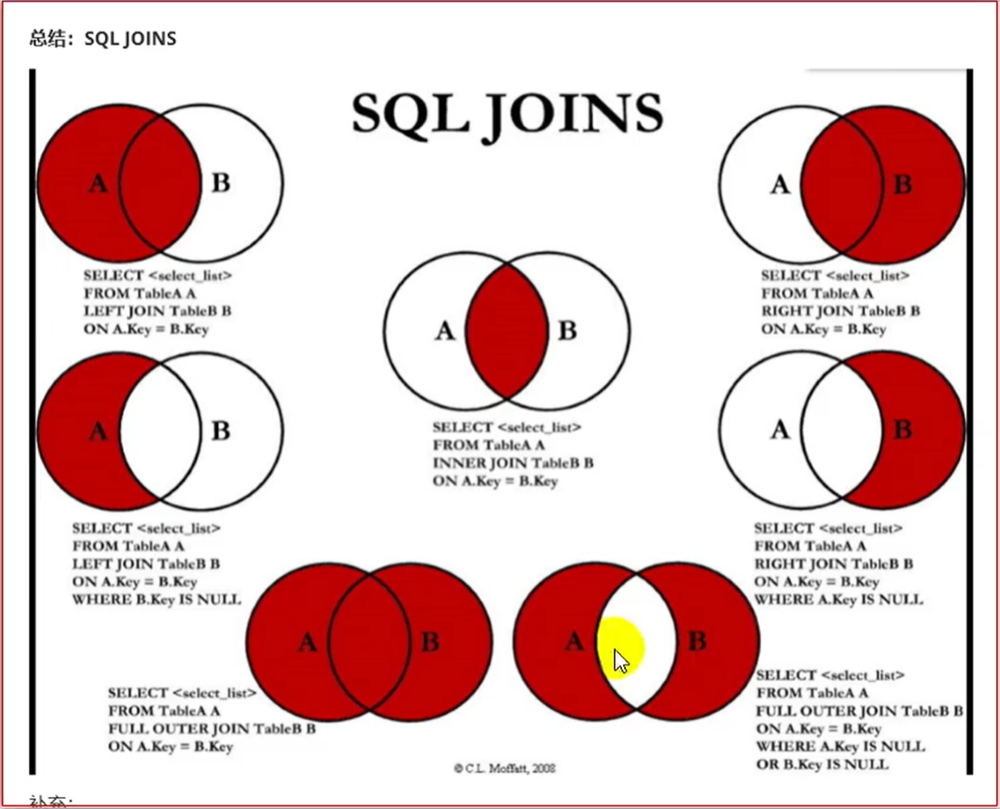


### 6.4 排序 

#### 6.4.1 全局排序（Order By）

 Order By：全局排序，`只有一个 Reducer` 

 1）使用 ORDER BY 子句排序 

 ASC（ascend）: 升序（默认）

 DESC（descend）: 降序

 2）ORDER BY 子句在 SELECT 语句的结尾

 3）案例实操 

（1）查询员工信息按工资升序排列 

```sql
hive (default)> select * from emp order by sal; 
```

（2）查询员工信息按工资降序排列

```sql
hive (default)> select * from emp order by sal desc; 
```

####  6.4.2 按照别名排序 

按照员工薪水的 2 倍排序 

```sql
hive (default)> select ename, sal*2 twosal from emp order by twosal;
```

####  6.4.3 多个列排序

 按照部门和工资升序排序

```sql
 hive (default)> select ename, deptno, sal from emp order by deptno, sal;
```

####  6.4.4 每个 Reduce 内部排序（Sort By）

 Sort By：对于大规模的数据集 order by 的效率非常低。在很多情况下，并不需要全局排序，此时可以使用sort by。

 `Sort by 为每个reducer 产生一个排序文件`。每个 Reducer 内部进行排序，对全局结果集来说不是排序。（是`随机分布`的）

 1）设置 reduce 个数

```sql
 hive (default)> set mapreduce.job.reduces=3;
```

 2）查看设置 reduce 个数 

```sql
hive (default)> set mapreduce.job.reduces;
```

 3）根据部门编号降序查看员工信息 

```sql
hive (default)> select * from emp sort by deptno desc; 
```

4）将查询结果导入到文件中（按照部门编号降序排序）

```sql
 hive (default)> insert overwrite local directory '/opt/module/data/sortby-result' select * from emp sort by deptno desc;
```


#### 6.4.5 分区（Distribute By）

 Distribute By： 在有些情况下，我们需要控制某个特定行应该到哪个 reducer，通常是为 了进行后续的聚集操作。distribute by 子句可以做这件事。distribute by 类似 MR 中 partition （自定义分区），进行分区，结合 sort by 使用。

 对于 distribute by 进行测试，一定要分配多 reduce 进行处理，否则无法看到 distribute by 的效果。

1）案例实操：

 （1）先按照部门编号分区，再按照员工编号降序排序。

```sql
 hive (default)> set mapreduce.job.reduces=3;
 hive (default)> insert overwrite local directory '/opt/module/data/distribute-result' select * from emp distribute by deptno sort by empno desc;
```

 注意：

 ➢ distribute by 的分区规则是根据分区字段的 hash 码与 reduce 的个数进行取模后， 余数相同的分到一个区。

 ➢ Hive 要求 DISTRIBUTE BY 语句要写在 SORT BY 语句之前。

####  6.4.6 Cluster By 

当 distribute by 和 sorts by 字段相同时，可以使用 cluster by 方式。

 cluster by 除了具有 distribute by 的功能外还兼具 sort by 的功能。但是排序只能是升序排序，不能指定排序规则为 ASC 或者 DESC。 （1）以下两种写法等价

```sql
 hive (default)> select * from emp cluster by deptno;
 hive (default)> select * from emp distribute by deptno sort by deptno; 
```

注意：按照部门编号分区，不一定就是固定死的数值，可以是 20 号和 30 号部门分到一 个分区里面去。


## 第七章、分区表和分桶表

###  7.1 分区表 

分区表实际上就是对应一个 HDFS 文件系统上的独立的文件夹，该文件夹下是该分区所 有的数据文件。Hive 中的分区就是分目录，把一个大的数据集根据业务需要分割成小的数据 集。在查询时通过 WHERE 子句中的表达式选择查询所需要的指定的分区，这样的`查询效率会提高`很多,避免全表扫描。 

#### 7.1.1 分区表基本操作

 1）引入分区表（需要根据日期对日志进行管理, 通过部门信息模拟）

```txt
dept_20200401.log 
dept_20200402.log 
dept_20200403.log 
```

 2）创建分区表语法 

```sql
hive (default)> create table dept_partition( deptno int, dname string, loc string) partitioned by (day string) row format delimited fields terminated by '\t';
```

 <font color = red >注意：分区字段不能是表中已经存在的数据，可以将分区字段看作表的伪列。 </font>

3）加载数据到分区表中 

（1） 数据准备 

dept_20200401.log

```txt
 10 ACCOUNTING 1700 
 20 RESEARCH 1800  
```

dept_20200402.log

```txt
30 SALES 1900 
40 OPERATIONS 1700
```

  dept_20200403.log

```txt
 50 TEST 2000
 60 DEV 1900
```

（2） 加载数据 

```sql
hive (default)> load data local inpath '/opt/module/hive/datas/dept_20200401.log' into table dept_partition partition(day='20200401'); 
hive (default)> load data local inpath '/opt/module/hive/datas/dept_20200402.log' into table dept_partition partition(day='20200402');
hive (default)> load data local inpath '/opt/module/hive/datas/dept_20200403.log' into table dept_partition partition(day='20200403');
```

 注意：分区表加载数据时，必须`指定分区`


4）查询分区表中数据 

单分区查询 

```sql
hive (default)> select * from dept_partition where day='20200401'; 
```

多分区联合查询

 ```sql
hive (default)> select * from dept_partition where day='20200401' union select * from dept_partition where day='20200402' union select * from dept_partition where day='20200403';
hive (default)> select * from dept_partition where day='20200401' or day='20200402' or day='20200403';
 ```

5）增加分区 

创建单个分区

```sql
hive (default)> alter table dept_partition add partition(day='20200404'); 
```

 同时创建多个分区

```sql
 hive (default)> alter table dept_partition add partition(day='20200405') partition(day='20200406'); 
```

6）删除分区

 删除单个分区 

```sql
hive (default)> alter table dept_partition drop partition (day='20200406'); 
```

同时删除多个分区 

```sql
hive (default)> alter table dept_partition drop partition (day='20200404'), partition(day='20200405'); 
```

7）查看分区表有多少分区

```sql
 hive> show partitions dept_partition;
```

 8）查看分区表结构

```sql
 hive> desc formatted dept_partition;
 # Partition Information
 # col_name data_type comment
 month string 
```

#### 7.1.2 二级分区 

思考: 如何一天的日志数据量也很大，如何再将数据拆分?

 1）创建二级分区表 

```sql
hive (default)> create table dept_partition2( deptno int, dname string, loc string ) partitioned by (day string, hour string) row format delimited fields terminated by '\t';
```

2）正常的加载数据 

（1）加载数据到二级分区表中

```sql
 hive (default)> load data local inpath '/opt/module/hive/datas/dept_20200401.log' into table dept_partition2 partition(day='20200401', hour='12'); 
```

（2）查询分区数据

```sql
 hive (default)> select * from dept_partition2 where day='20200401' and hour='12';
```

 3）把数据直接上传到分区目录上，让`分区表和数据产生关联`的三种方式 

（1）方式一：上传数据后修复 上传数据

```sql
hive (default)> dfs -mkdir -p /user/hive/warehouse/mydb.db/dept_partition2/day=20200401/hour=13;
hive (default)> dfs -put /opt/module/datas/dept_20200401.log /user/hive/warehouse/mydb.db/dept_partition2/day=20200401/hour=13;
```

 查询数据（查询不到刚上传的数据）

```sql
 hive (default)> select * from dept_partition2 where day='20200401' and hour='13';
```

 执行**修复**命令 

```sql
hive> msck repair table dept_partition2; 
```

再次查询数据 

```sql
hive (default)> select * from dept_partition2 where day='20200401' and hour='13'; 
```

（2）方式二：上传数据后添加分区 上传数据

```sql
 hive (default)> dfs -mkdir -p /user/hive/warehouse/mydb.db/dept_partition2/day=20200401/hour=14; 
 hive (default)> dfs -put /opt/module/hive/datas/dept_20200401.log /user/hive/warehouse/mydb.db/dept_partition2/day=20200401/hour=14; 
```

执行添加分区

```sql
 hive (default)> alter table dept_partition2 add partition(day='201709',hour='14');
```

 查询数据

```sql
hive (default)> select * from dept_partition2 where day='20200401' and hour='14'; 
```

 （3）方式三：创建文件夹后 load 数据到分区

 创建目录 

```sql
hive (default)> dfs -mkdir -p /user/hive/warehouse/mydb.db/dept_partition2/day=20200401/hour=15; 
```

上传数据

```sql
 hive (default)> load data local inpath '/opt/module/hive/datas/dept_20200401.log' into table dept_partition2 partition(day='20200401',hour='15');
```

 查询数据

```sql
hive (default)> select * from dept_partition2 where day='20200401' and hour='15';
```

 

#### 7.1.3 动态分区调整

 关系型数据库中，对分区表 Insert 数据时候，数据库自动会根据分区字段的值，将数据 插入到相应的分区中，Hive 中也提供了类似的机制，即动态分区(Dynamic Partition)，只不过， 使用 Hive 的动态分区，需要进行相应的配置。

 1）开启动态分区参数设置 

（1）开启动态分区功能（默认 true，开启）

```sql
hive.exec.dynamic.partition=true 
```

（2）设置为非严格模式（动态分区的模式，默认 strict，表示必须指定至少一个分区为 静态分区，nonstrict 模式表示允许所有的分区字段都可以使用动态分区。） 

```sql
hive.exec.dynamic.partition.mode=nonstrict
```

 （3）在所有执行 MR 的节点上，最大一共可以创建多少个动态分区。默认 1000

```sql
hive.exec.max.dynamic.partitions=1000 
```

 （4）在每个执行 MR 的节点上，最大可以创建多少个动态分区。该参数需要根据实际 的数据来设定。比如：源数据中包含了一年的数据，即 day 字段有 365 个值，那么该参数就 需要设置成大于 365，如果使用默认值 100，则会报错。

 ```sql 
hive.exec.max.dynamic.partitions.pernode=100
 ```

 （5）整个 MR Job 中，最大可以创建多少个 HDFS 文件。默认 100000 

```sql
hive.exec.max.created.files=100000 
```

（6）当有空分区生成时，是否抛出异常。一般不需要设置。默认 false

```sql
 hive.error.on.empty.partition=false
```

 2）案例实操 

需求：将 dept 表中的数据按照地区（loc 字段），插入到目标表 dept_partition 的相应 分区中。 

（1）创建目标分区表

```sql
 hive (default)> create table dept_partition_dy(id int, name string) partitioned by (loc int) row format delimited fields terminated by '\t'; 
```

（2）设置动态分区

```sql
set hive.exec.dynamic.partition.mode = nonstrict; 
hive (default)> insert into table dept_partition_dy partition(loc) select deptno, dname, loc from dept; 
```

（3）查看目标分区表的分区情况

```sql
 hive (default)> show partitions dept_partition; 
```

思考：目标分区表是如何匹配到分区字段的？

###  7.2 分桶表 

分区提供一个隔离数据和优化查询的便利方式。不过，并非所有的数据集都可形成合理 的分区。对于一张表或者分区，Hive 可以进一步组织成桶，也就是更为细粒度的数据范围划分。 分桶是将数据集分解成更容易管理的若干部分的另一个技术。 分区针对的是数据的存储路径；分桶针对的是数据文件。

 **1）先创建分桶表** 

（1）数据准备

```txt
1001 ss1
1002 ss2
1003 ss3
1004 ss4
1005 ss5
1006 ss6
1007 ss7
1008 ss8
1009 ss9
1010 ss10
1011 ss11
1012 ss12
1013 ss13
1014 ss14
1015 ss15
1016 ss16
```

 （2）创建分桶表

```sql
 create table stu_buck(id int, name string) clustered by(id) into 4 buckets row format delimited fields terminated by '\t'; 
```

（3）查看表结构

```sql
hive (default)> desc formatted stu_buck;
Num Buckets:  4 
```

（4）导入数据到分桶表中，load 的方式

```sql
hive (default)> load data inpath '/student.txt' into table stu_buck;
```

（5）查看创建的分桶表中是否分成 4 个桶 

（6）查询分桶的数据

```sql
hive(default)> select * from stu_buck; 
```

 （7）分桶规则：

 根据结果可知：Hive 的分桶采用对分桶字段的值进行哈希，然后除以桶的个数求余的方 式决定该条记录存放在哪个桶当中

------

 

**2）分桶表操作需要注意的事项:** 

（1）reduce 的个数设置为-1,让 Job 自行决定需要用多少个 reduce 或者将 reduce 的个 数设置为大于等于分桶表的桶数 

（2）从 hdfs 中 load 数据到分桶表中，避免本地文件找不到问题

（3）不要使用本地模式 


**3）insert 方式将数据导入分桶表**

 ```sql
hive(default)>insert into table stu_buck select * from student_insert; 
 ```

### 7.3 抽样查询 

对于非常大的数据集，有时用户需要使用的是一个具有代表性的查询结果而不是全部结 果。Hive 可以通过对表进行抽样来满足这个需求。 语法: TABLESAMPLE(BUCKET x OUT OF y) 查询表 stu_buck 中的数据。

```sql
hive (default)> select * from stu_buck tablesample(bucket 1 out of 4 on id); 
```

 注意：`x 的值必须小于等于 y 的值`，否则

```txt
FAILED: SemanticException [Error 10061]: Numerator should not be bigger than denominator in sample clause for table stu_buck
```

 

## 第八章、函数

### 8.1 系统内置函数 

1）查看系统自带的函数 

```sql
hive> show functions;
```

 2）显示自带的函数的用法

```sql
 hive> desc function upper; 
```

3）详细显示自带的函数的用法 

```sql
hive> desc function extended upper;
```

###  8.2 常用内置函数 

```properties
UDF:一进一出
UDAF:多进一出(聚合函数)
UDTF:一进多出（炸裂函数）

一、多指的是输入数据的行数.
```


#### 8.2.1 空字段赋值 

1）函数说明 NVL：给值为 NULL 的数据赋值，它的格式是 NVL( value，default_value)。它的功能是如 果 value 为 NULL，则 NVL 函数返回 default_value 的值，否则返回 value 的值，如果两个参数都为 NULL ，则返回NULL。

 2）数据准备：采用员工表 

3）查询：如果员工的 comm 为 NULL，则用-1 代替 

```sql
hive (default)> select comm,nvl(comm, -1) from emp;
OK 
comm _c1
NULL -1.0
300.0 300.0
500.0 500.0
NULL -1.0
1400.0 1400.0
NULL -1.0
NULL -1.0
NULL -1.0
NULL -1.0
0.0 0.0
NULL -1.0
NULL -1.0
NULL -1.0
NULL -1.0
```

 4）查询：如果员工的 comm 为 NULL，则用领导 id 代替 

```sql
hive (default)> select comm, nvl(comm,mgr) from emp;
OK
comm _c1
NULL 7902.0
300.0 300.0
500.0 500.0
NULL 7839.0
1400.0 1400.0
NULL 7839.0
NULL 7839.0
NULL 7566.0
NULL NULL
0.0 0.0
NULL 7788.0
NULL 7698.0
NULL 7566.0
NULL 7782.0
```

#### 8.2.2 CASE WHEN THEN ELSE END

 1）数据准备

```txt
name dept_id sex
悟空 A 男
大海 A 男
宋宋 B 男
凤姐 A 女
婷姐 B 女
婷婷 B 女
```

2）需求 求出不同部门男女各多少人。

结果如下：

```txt
 dept_Id 男 女
 A 2 1
 B 1 2
```

 3）创建本地 emp_sex.txt，导入数据

```sh
[atguigu@hadoop102 datas]$ vi emp_sex.txt
悟空 A 男
大海 A 男
宋宋 B 男
凤姐 A 女
婷姐 B 女
婷婷 B 女
```

4）创建 hive 表并导入数据

```sql
create table emp_sex( name string, dept_id string, sex string) row format delimited fields terminated by "\t"; load data local inpath '/opt/module/hive/data/emp_sex.txt' into table emp_sex;
```

  5）按需求查询数据

```sql
 select dept_id, sum(case sex when '男' then 1 else 0 end) male_count, sum(case sex when '女' then 1 else 0 end) female_count from emp_sex group by dept_id; 
```

#### 8.2.3 行转列

 1）相关函数说明 

 CONCAT(string A/col, string B/col…)：返回输入字符串连接后的结果，支持任意个输入字符串;

 CONCAT_WS(separator, str1, str2,...)：它是一个特殊形式的 CONCAT()。第一个参数剩余参 数间的分隔符。分隔符可以是与剩余参数一样的字符串。如果分隔符是 NULL，返回值也将 为 NULL。这个函数会跳过分隔符参数后的任何 NULL 和空字符串。分隔符将被加到被连接 的字符串之间;

 **注意: CONCAT_WS must be "string or array** 

COLLECT_SET(col)：函数只接受基本数据类型，它的主要作用是将某字段的值进行去重汇总，产生 Array 类型字段。


 2）数据准备

```txt
name constellation blood_type
孙悟空 白羊座 A
大海 射手座 A
宋宋 白羊座 B
猪八戒 白羊座 A
凤姐 射手座 A
苍老师 白羊座 B
```

3）需求

 把星座和血型一样的人归类到一起。结果如下：

```txt
 射手座,A 大海|凤姐
 白羊座,A 孙悟空|猪八戒
 白羊座,B 宋宋|苍老师 
```

4）创建本地 constellation.txt，导入数据

```sh
 [atguigu@hadoop102 datas]$ vim person_info.txt 
```

```txt
孙悟空 白羊座 A
大海 射手座 A
宋宋 白羊座 B
猪八戒 白羊座 A
凤姐 射手座 A
苍老师 白羊座 B
```

 5）创建 hive 表并导入数据 

```sql
create table person_info( name string, constellation string, blood_type string) row format delimited fields terminated by "\t"; load data local inpath "/opt/module/hive/data/person_info.txt" into table person_info;
```

 6）按需求查询数据 

```sql
SELECT t1.c_b, CONCAT_WS("|",collect_set(t1.name)) FROM ( SELECT NAME, CONCAT_WS(',',constellation,blood_type) c_b FROM person_info )t1 GROUP BY t1.c_b
```

####  8.2.4 列转行

 1）函数说明

 EXPLODE(col)：将 hive 一列中复杂的 Array 或者 Map 结构拆分成多行。

 **LATERAL VIEW** 用法：LATERAL VIEW udtf(expression) tableAlias AS columnAlias

 解释：用于和 split, explode 等 UDTF 一起使用，它能够将一列数据拆成多行数据，在此 基础上可以对拆分后的数据进行聚合。 


2）数据准备

 表 6-7 数据准备

```txt
 movie category
 《疑犯追踪》 悬疑,动作,科幻,剧情
 《Lie to me》 悬疑,警匪,动作,心理,剧情
 《战狼 2》 战争,动作,灾难
```

 3）需求 

将电影分类中的数组数据展开。结果如下：

```txt
《疑犯追踪》 悬疑
《疑犯追踪》 动作
《疑犯追踪》 科幻
《疑犯追踪》 剧情
《Lie to me》 悬疑
《Lie to me》 警匪
《Lie to me》 动作
《Lie to me》 心理
《Lie to me》 剧情
《战狼 2》 战争
《战狼 2》 动作
《战狼 2》 灾难
```

  4）创建本地 movie.txt，导入数据

```sh
 [atguigu@hadoop102 datas]$ vi movie_info.txt 
```

```txt
《疑犯追踪》 悬疑,动作,科幻,剧情
《Lie to me》悬疑,警匪,动作,心理,剧情
《战狼 2》 战争,动作,灾难
```

 5）创建 hive 表并导入数据 

```sql
create table movie_info( movie string, category string) row format delimited fields terminated by "\t";
load data local inpath "/opt/module/data/movie.txt" into table movie_info; 
```

6）按需求查询数据 

```sql
SELECT
	movie,
    category_name
FROM movie_info 
lateral VIEW explode(split(category,",")) movie_info_tmp AS category_name;
```

####  8.2.5 窗口函数（开窗函数）

1）相关函数说明 

OVER()：指定分析函数工作的数据窗口大小，这个数据窗口大小可能会随着行的变而变化。

 CURRENT ROW：当前行

 n PRECEDING：往前 n 行数据

 n FOLLOWING：往后 n 行数据 

UNBOUNDED：起点，

​	 UNBOUNDED PRECEDING 表示从前面的起点，

​	 UNBOUNDED FOLLOWING 表示到后面的终点

 LAG(col,n,default_val)：往前第 n 行数据

 LEAD(col,n, default_val)：往后第 n 行数据 

 NTILE(n)：把有序窗口的行分发到指定数据的组中，各个组有编号，编号从 1 开始，对 于每一行，NTILE 返回此行所属的组的编号。

注意：n 必须为 int 类型。

 2）数据准备：

```txt
name，orderdate，cost
jack,2017-01-01,10
tony,2017-01-02,15
jack,2017-02-03,23
tony,2017-01-04,29
jack,2017-01-05,46
jack,2017-04-06,42
tony,2017-01-07,50
jack,2017-01-08,55
mart,2017-04-08,62
mart,2017-04-09,68
neil,2017-05-10,12
mart,2017-04-11,75
neil,2017-06-12,80
mart,2017-04-13,94
```

 3）需求 

（1）查询在 2017 年 4 月份购买过的顾客及总人数

 （2）查询顾客的购买明细及月购买总额

 （3）上述的场景, 将每个顾客的 cost 按照日期进行累加

 （4）查询每个顾客上次的购买时间 

（5）查询前 20%时间的订单信息

 4）创建本地 business.txt，导入数据 

```sh
[atguigu@hadoop102 datas]$ vi business.txt
```

 5）创建 hive 表并导入数据

```sql
 create table business( name string, orderdate string,) ROW FORMAT DELIMITED FIELDS TERMINATED BY ','; load data local inpath "/opt/module/data/business.txt" into table business;
```


 6）按需求查询数据

 （1） 查询在 2017 年 4 月份购买过的顾客及总人数 

```sql
select name,count(*) over () from business where substring(orderdate,1,7) = '2017-04' group by name; 
```

（2） 查询顾客的购买明细及月购买总额

```sql
 select name,orderdate,cost,sum(cost) over(partition by month(orderdate)) from business; 
```

（3） 将每个顾客的 cost 按照日期进行累加 

```sql
select name,orderdate,cost,
sum(cost) over() as sample1,--所有行相加 
sum(cost) over(partition by name) as sample2,--按 name 分组，组内数据相加
sum(cost) over(partition by name order by orderdate) as sample3,--按 name 分组，组内数据累加
sum(cost) over(partition by name order by orderdate rows between UNBOUNDED PRECEDING and current row ) as sample4 ,--和 sample3 一样,由起点到 当前行的聚合
sum(cost) over(partition by name order by orderdate rows between 1 PRECEDING and current row) as sample5, --当前行和前面一行做聚合
sum(cost) over(partition by name order by orderdate rows between 1 PRECEDING AND 1 FOLLOWING ) as sample6,--当前行和前边一行及后面一行
sum(cost) over(partition by name order by orderdate rows between current row and UNBOUNDED FOLLOWING ) as sample7 --当前行及后面所有行 
from business;
```

 rows 必须跟在 order by 子句之后，对排序的结果进行限制，使用固定的行数来限制分区中的数据行数量,如果有相同的排序则在同一行，计算的结果也一样，需要注意，可以选择多个字段，保证排序没有相同的排名。

（4） 查看顾客上次的购买时间

```sql
select name,orderdate,cost,lag(orderdate,1,'1900-01-01') over(partition by name order by orderdate ) as time1, lag(orderdate,2) over (partition by name order by orderdate) as time2 from business; 
```

（5） 查询前 20%时间的订单信息

```sql
 select * from ( select name,orderdate,cost, ntile(5) over(order by orderdate) sorted from business ) t where sorted = 1; 
```

#### 8.2.6 Rank 

1）函数说明 RANK() 排序相同时会重复，总数不会变

DENSE_RANK() 排序相同时会重复，总数会减少 

ROW_NUMBER() 会根据顺序计算


 2）数据准备 

```txt
name subject score
孙悟空 语文 87
孙悟空 数学 95
孙悟空 英语 68
大海 语文 94
大海 数学 56
大海 英语 84
宋宋 语文 64
宋宋 数学 86
宋宋 英语 84
婷婷 语文 65
婷婷 数学 85
婷婷 英语 78
```

 3）需求 计算每门学科成绩排名。

 4）创建本地 score.txt，导入数据

```sh
 [atguigu@hadoop102 datas]$ vi score.txt 
```

5）创建 hive 表并导入数据 

```sql
create table score( name string, subject string, score int) row format delimited fields terminated by "\t"; load data local inpath '/opt/module/data/score.txt' into table score;
```

 6）按需求查询数据 

```sql
select name, subject, score, rank() over(partition by subject order by score desc) rp,dense_rank() over(partition by subject order by score desc) drp,
row_number() over(partition by subject order by score desc) rmp
from score;

name subject score rp drp rmp
孙悟空 数学 95 1 1 1
宋宋 数学 86 2 2 2
婷婷 数学 85 3 3 3
大海 数学 56 4 4 4
宋宋 英语 84 1 1 1
大海 英语 84 1 1 2
婷婷 英语 78 3 2 3
孙悟空 英语 68 4 3 4
大海 语文 94 1 1 1
孙悟空 语文 87 2 2 2
婷婷 语文 65 3 3 3
宋宋 语文 64 4 4 4
```

扩展：求出每门学科前三名的学生？

```sql
select name,subject,score from (select *,rank() over(partition by subject order by score desc)rk from score)t1
where rk<=3;
=============================
或者分组topN来求。
```


#### 8.2.7 其他常用函数

```properties
unix_timestamp:当前时间戳
unixtime:将时间戳转为日期格式
current_date:当前日期
current_timestamp:当前的日期加时间
select current_timestamp;
to_date:抽取日期部分
year:获取年
month:获取月day:获取日hour:获取时minute:获取分second:获取秒
weekofyear:当前时间是一年中的第几周
select weekofyear ( '2020-10-28 12:12:12 ');
dayofmonth:当前时间是一个月中的第几天
select dayofmonth ( ' 2020-10-28 12:12:12');
months_between:两个日期间的月份
add_months:日期加减月
datediff:两个日期相差的天数
date_add:日期加天数
date_sub:日期减天数
last_day:日期的当月的最后一天
date_format ():格式化日期

=======================================
常用取整函数
round:四舍五入
ceil:向上取整
floor:向下取整
=======================================
常用字符串操作函数
upper:转大写
lower:转小写
length:长度
trim:前后去空格
lpad:向左补齐，到指定长度
rpad:向右补齐，到指定长度
regexp_replace:使用正则表达式匹配目标字符串，匹配成功后替换!
SELECT regexp_replace ('2020/10/25', '/', '-') ;
=======================================
集合操作
size:集合中元素的个数
map_keys:返回map中的key
map_values:返回map中的value
array_contains:判断array中是否包含某个元素
sort_array:将array中的元素排序
=======================================
```


### 8.3 自定义函数

 1）Hive 自带了一些函数，比如：max/min 等，但是数量有限，自己可以通过自定义 UDF 来 方便的扩展。

 2）当 Hive 提供的内置函数无法满足你的业务处理需要时，此时就可以考虑使用用户自定义 函数（UDF：user-defined function）。

 3）根据用户自定义函数类别分为以下三种：

 （1）UDF（User-Defined-Function） 一进一出 

（2）UDAF（User-Defined Aggregation Function） 聚集函数，多进一出 类似于：count/max/min 

（3）UDTF（User-Defined Table-Generating Functions） 一进多出 如 lateral view explode() 

4）官方文档地址 https://cwiki.apache.org/confluence/display/Hive/HivePlugins 

5）编程步骤： 

（1）继承 Hive 提供的类 

org.apache.hadoop.hive.ql.udf.generic.GenericUDF 

org.apache.hadoop.hive.ql.udf.generic.GenericUDTF; 

（2）实现类中的抽象方法

（3）在 hive 的命令行窗口创建函数 添加 jar 

```sh
add jar linux_jar_path
```

 创建 function 

```sql
create [temporary] function [dbname.]function_name AS class_name;
```

 （4）在 hive 的命令行窗口删除函数 

```sql
drop [temporary] function [if exists] [dbname.]function_name; 
```

8.4 自定义 UDF 函数 

0）需求: 自定义一个 UDF 实现计算给定字符串的长度，例如：

```sql
 hive(default)> select my_len("abcd");
  4
```

 1）创建一个 Maven 工程 Hive 

2）导入依赖  

```xml
<dependencies>
	<dependency>
		<groupId>org.apache.hive</groupId>
		<artifactId>hive-exec</artifactId>
		<version>3.1.2</version>
	</dependency>
</dependencies>
```


3）创建一个类

```java
package com.atguigu.hive;
import org.apache.hadoop.hive.ql.exec.UDFArgumentException;
import org.apache.hadoop.hive.ql.exec.UDFArgumentLengthException;
import org.apache.hadoop.hive.ql.exec.UDFArgumentTypeException;
import org.apache.hadoop.hive.ql.metadata.HiveException;
import org.apache.hadoop.hive.ql.udf.generic.GenericUDF;
import org.apache.hadoop.hive.serde2.objectinspector.ObjectInspector;
import
org.apache.hadoop.hive.serde2.objectinspector.primitive.PrimitiveObjectIn
spectorFactory;
/**
* 自定义 UDF 函数，需要继承 GenericUDF 类
* 需求: 计算指定字符串的长度
*/
public class MyStringLength extends GenericUDF {
 /**
 *
 * @param arguments 输入参数类型的鉴别器对象
 * @return 返回值类型的鉴别器对象
 * @throws UDFArgumentException
 */
 @Override
 public ObjectInspector initialize(ObjectInspector[] arguments) throws UDFArgumentException{
     // 判断输入参数的个数
     if(arguments.length !=1){
         throw new UDFArgumentLengthException("Input Args Length Error!!!");
     }
     // 判断输入参数的类型
if(!arguments[0].getCategory().equals(ObjectInspector.Category.PRIMITIVE)){
 throw new UDFArgumentTypeException(0,"Input Args Type Error!!!");
 }
 //函数本身返回值为 int，需要返回 int 类型的鉴别器对象
  return PrimitiveObjectInspectorFactory.javaIntObjectInspector;
 }
 /**
 * 函数的逻辑处理
 * @param arguments 输入的参数
 * @return 返回值
 * @throws HiveException
 */
 @Override
 public Object evaluate(DeferredObject[] arguments) throws HiveException {
if(arguments[0].get() == null){
    return 0;
}
     return arguments[0].get().toString().length();
 } 
 @Override
 public String getDisplayString(String[] children) {
 return "";
 }
}

```


4）打成 jar 包上传到服务器

```sh
/opt/module/data/myudf.jar 
```

5）将 jar 包添加到 hive 的 classpath 

```sh
hive (default)> add jar /opt/module/data/myudf.jar;
```

 6）创建临时函数与开发好的 java class 关联 

```sql
hive (default)> create temporary function my_len as "com.atguigu.hive.MyStringLength";
```

 7）即可在 hql 中使用自定义的函数

```sql
 hive (default)> select ename,my_len(ename) ename_len from emp;
```


### 8.5 自定义 UDTF 函数

 0）需求 自定义一个 UDTF 实现将一个任意分割符的字符串切割成独立的单词，例如：

```sql
hive(default)> select myudtf("hello,world,hadoop,hive", ",");
hello
world
hadoop
hive 
```


1）代码实现 

```java
package com.atguigu.udtf;
import org.apache.hadoop.hive.ql.exec.UDFArgumentException;
import org.apache.hadoop.hive.ql.metadata.HiveException;
import org.apache.hadoop.hive.ql.udf.generic.GenericUDTF;
import org.apache.hadoop.hive.serde2.objectinspector.ObjectInspector;
import org.apache.hadoop.hive.serde2.objectinspector.ObjectInspectorFactory;
import org.apache.hadoop.hive.serde2.objectinspector.StructObjectInspector;
import org.apache.hadoop.hive.serde2.objectinspector.primitive.PrimitiveObjectInspectorFactory;
import java.util.ArrayList;
import java.util.List;

public class MyUDTF extends GenericUDTF {
 private ArrayList<String> outList = new ArrayList<>();
 @Override
 public StructObjectInspector initialize(StructObjectInspector argOIs) throws UDFArgumentException {
 //1.定义输出数据的列名和类型
 List<String> fieldNames = new ArrayList<>();
 List<ObjectInspector> fieldOIs = new ArrayList<>();
 //2.添加输出数据的列名和类型
     fieldNames.add("lineToWord");
     fieldOIs.add(PrimitiveObjectInspectorFactory.javaStringObjectInspector);
 return ObjectInspectorFactory.getStandardStructObjectInspector(fieldNames,fieldOIs);
 }
 @Override
 public void process(Object[] args) throws HiveException {

 //1.获取原始数据
 String arg = args[0].toString();
 //2.获取数据传入的第二个参数，此处为分隔符
 String splitKey = args[1].toString();
 //3.将原始数据按照传入的分隔符进行切分
 String[] fields = arg.split(splitKey);
     //4.遍历切分后的结果，并写出
 for (String field : fields) {
 //集合为复用的，首先清空集合
 outList.clear();
 //将每一个单词添加至集合
 outList.add(field);
 //将集合内容写出
 forward(outList);
 }
 }
 @Override
 public void close() throws HiveException {
 }
}

```

2）打成 jar 包上传到服务器/opt/module/hive/data/myudtf.jar

 3）将 jar 包添加到 hive 的 classpath 下 

```sql
hive (default)> add jar /opt/module/hive/data/myudtf.jar;
```

 4）创建临时函数与开发好的 java class 关联 

```sql
hive (default)> create temporary function myudtf as "com.atguigu.hive.MyUDTF";
```

 5）使用自定义的函数

```sql
 hive (default)> select myudtf("hello,world,hadoop,hive",",");
```


## 第九章、压缩和存储

### 9.1 Hadoop 压缩配置

####  9.1.1 MR 支持的压缩编码 

```txt
压缩格式 算法 文件扩展名 是否可切分
DEFLATE DEFLATE .deflate 否
Gzip DEFLATE .gz 否
bzip2 bzip2 .bz2 是
LZO LZO .lzo 是
Snappy Snappy .snappy 否
```

 为了支持多种压缩/解压缩算法，Hadoop 引入了编码/解码器，如下表所示：

```txt
 压缩格式 对应的编码/解码器
 DEFLATE org.apache.hadoop.io.compress.DefaultCodec
 gzip org.apache.hadoop.io.compress.GzipCodec
 bzip2 org.apache.hadoop.io.compress.BZip2Codec
 LZO com.hadoop.compression.lzo.LzopCodec
 Snappy org.apache.hadoop.io.compress.SnappyCodec
```

 压缩性能的比较：

```txt
 压缩算法 原始文件大小 压缩文件大小 压缩速度 解压速度
 gzip 8.3GB 1.8GB 17.5MB/s 58MB/s
 bzip2 8.3GB 1.1GB 2.4MB/s 9.5MB/s
 LZO 8.3GB 2.9GB 49.3MB/s 74.6MB/s
```

 http://google.github.io/snappy/ 

On a single core of a Core i7 processor in 64-bit mode, Snappy compresses at about 250 MB/sec or more and decompresses at about 500 MB/sec or more.

#### 9.1.2 压缩参数配置

 要在 Hadoop 中启用压缩，可以配置如下参数（mapred-site.xml 文件中）：

```txt
 参数 默认值 阶段 建议
 io.compression.codecs （在 core-site.xml 中配置） org.apache.hadoop.io.compress.DefaultCodec, org.apache.hadoop.io.compress.GzipCodec, org.apache.hadoop.io.compress.BZip2Codec, org.apache.hadoop.io.compress.Lz4Codec 输入压缩 Hadoop 使用文件扩展 名判断是否支持某种 编解码器
 
 mapreduce.map.output.com press false mapper 输出 这个参数设为 true 启用压缩
 
 mapreduce.map.output.com press.codec org.apache.hadoop.io.compress.DefaultCodec mapper 输出 使用 LZO、LZ4 或 snappy 编解码器在此 阶段压缩数据
 
 mapreduce.output.fileoutput format.compress false reducer 输出 这个参数设为 true 启用压缩 mapreduce.output.fileoutput format.compress.codec org.apache.hadoop.io.compress. DefaultCodec reducer 输出 使用标准工具或者编 解码器，如 gzip 和 bzip2 
 
mapreduce.output.fileoutput format.compress.type RECORD reducer 输出 SequenceFile 输出使用 的压缩类型：NONE 和 BLOCK
```

###  9.2 开启 Map 输出阶段压缩（MR 引擎） 

开启 map 输出阶段压缩可以减少 job 中 map 和 Reduce task 间数据传输量。具体配置如 下：

 1）案例实操：

 （1）开启 hive 中间传输数据压缩功能 

```sql
hive (default)>set hive.exec.compress.intermediate=true; 
```

（2）开启 mapreduce 中 map 输出压缩功能

```sh
hive (default)>set mapreduce.map.output.compress=true; 
```

（3）设置 mapreduce 中 map 输出数据的压缩方式

```sql
 hive (default)>set mapreduce.map.output.compress.codec= org.apache.hadoop.io.compress.SnappyCodec;
```

 （4）执行查询语句

```sql
 hive (default)> select count(ename) name from emp;
```

###  9.3 开启 Reduce 输出阶段压缩

 当 Hive 将 输 出 写 入 到 表 中 时 ， 输出内容同样可以进行压缩。属性 hive.exec.compress.output控制着这个功能。用户可能需要保持默认设置文件中的默认值false， 这样默认的输出就是非压缩的纯文本文件了。用户可以通过在查询语句或执行脚本中设置这 个值为 true，来开启输出结果压缩功能。

 1）案例实操：

 （1）开启 hive 最终输出数据压缩功能

```sql
hive (default)>set hive.exec.compress.output=true; 
```

 （2）开启 mapreduce 最终输出数据压缩

```sql
hive (default)>set mapreduce.output.fileoutputformat.compress=true; 
```

 （3）设置 mapreduce 最终数据输出压缩方式 

```sql
hive (default)> set mapreduce.output.fileoutputformat.compress.codec = org.apache.hadoop.io.compress.SnappyCodec; 
```

（4）设置 mapreduce 最终数据输出压缩为块压缩

```sql
 hive (default)> set mapreduce.output.fileoutputformat.compress.type=BLOCK; 
```

（5）测试一下输出结果是否是压缩文件

```sql
hive (default)> insert overwrite local directory '/opt/module/data/distribute-result' select * from emp distribute by deptno sort by empno desc;
```

###   9.4 文件存储格式

 Hive 支持的存储数据的格式主要有：TEXTFILE 、SEQUENCEFILE、ORC、PARQUET。

#### 9.4.1 列式存储和行式存储

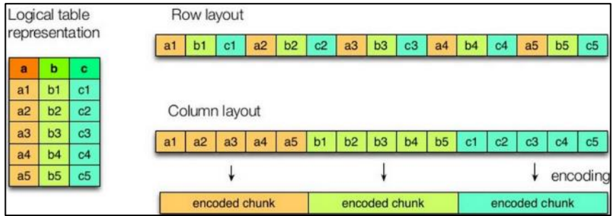


如图所示左边为逻辑表，右边第一个为行式存储，第二个为列式存储。

 1）行存储的特点 查询满足条件的一整行数据的时候，列存储则需要去每个聚集的字段找到对应的每个列 的值，行存储只需要找到其中一个值，其余的值都在相邻地方，所以此时行存储查询的速度 更快。

 2）列存储的特点 因为每个字段的数据聚集存储，在查询只需要少数几个字段的时候，能大大减少读取的 数据量；每个字段的数据类型一定是相同的，列式存储可以针对性的设计更好的设计压缩算 法。 TEXTFILE 和 SEQUENCEFILE 的存储格式都是基于行存储的； ORC 和 PARQUET 是基于列式存储的。

####  9.4.2 TextFile 格式

 默认格式，数据不做压缩，磁盘开销大，数据解析开销大。可结合 Gzip、Bzip2 使用， 但使用 Gzip 这种方式，hive 不会对数据进行切分，从而无法对数据进行并行操作。


####  9.4.3 Orc 格式

Orc (Optimized Row Columnar)是 Hive 0.11 版里引入的新的存储格式。 如下图所示可以看到每个 Orc 文件由 1 个或多个 stripe 组成，每个 stripe 一般为 HDFS 的块大小，每一个 stripe 包含多条记录，这些记录按照列进行独立存储，对应到 Parquet 中的 row group 的概念。每个 Stripe 里有三部分组成，分别是 Index Data，Row Data，Stripe Footer：

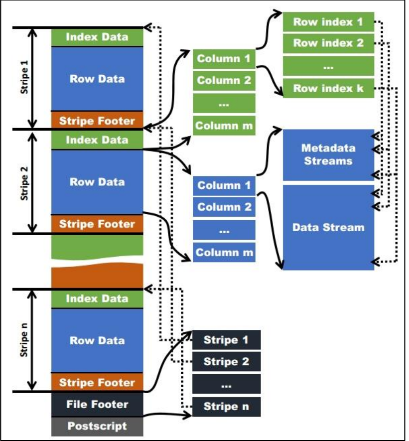

1）Index Data：一个轻量级的 index，默认是每隔 1W 行做一个索引。这里做的索引应该 只是记录某行的各字段在 Row Data 中的 offset。

 2）Row Data：存的是具体的数据，先取部分行，然后对这些行按列进行存储。对每个 列进行了编码，分成多个 Stream 来存储。

 3）Stripe Footer：存的是各个 Stream 的类型，长度等信息。 每个文件有一个 File Footer，这里面存的是每个 Stripe 的行数，每个 Column 的数据类 型信息等；每个文件的尾部是一个 PostScript，这里面记录了整个文件的压缩类型以及 FileFooter 的长度信息等。在读取文件时，会 seek 到文件尾部读 PostScript，从里面解析到 File Footer 长度，再读 FileFooter，从里面解析到各个 Stripe 信息，再读各个 Stripe，即从后 往前读。


#### 9.4.4 Parquet 格式

 Parquet 文件是以二进制方式存储的，所以是不可以直接读取的，文件中包括该文件的 数据和元数据，因此 Parquet 格式文件是自解析的。

 （1）行组(Row Group)：每一个行组包含一定的行数，在一个 HDFS 文件中至少存储一 个行组，类似于 orc 的 stripe 的概念。

 （2）列块(Column Chunk)：在一个行组中每一列保存在一个列块中，行组中的所有列连 续的存储在这个行组文件中。一个列块中的值都是相同类型的，不同的列块可能使用不同的 算法进行压缩。

 （3）页(Page)：每一个列块划分为多个页，一个页是最小的编码的单位，在同一个列块 的不同页可能使用不同的编码方式。 通常情况下，在存储 Parquet 数据的时候会按照 Block 大小设置行组的大小，由于一般 情况下每一个 Mapper 任务处理数据的最小单位是一个 Block，这样可以把每一个行组由一 个 Mapper 任务处理，增大任务执行并行度。Parquet 文件的格式。

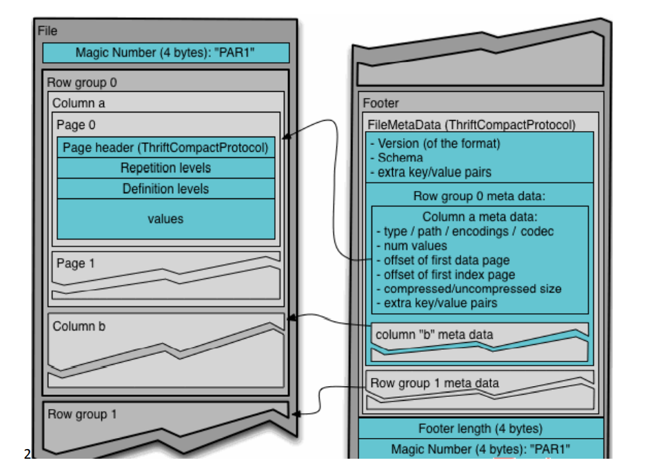


上图展示了一个 Parquet 文件的内容，一个文件中可以存储多个行组，文件的首位都是 该文件的 Magic Code，用于校验它是否是一个 Parquet 文件，Footer length 记录了文件元数

据的大小，通过该值和文件长度可以计算出元数据的偏移量，文件的元数据中包括每一个行 组的元数据信息和该文件存储数据的 Schema 信息。除了文件中每一个行组的元数据，每一 页的开始都会存储该页的元数据，在 Parquet 中，有三种类型的页：数据页、字典页和索引 页。数据页用于存储当前行组中该列的值，字典页存储该列值的编码字典，每一个列块中最 多包含一个字典页，索引页用来存储当前行组下该列的索引，目前 Parquet 中还不支持索引 页。 

#### 9.4.5 主流文件存储格式对比实验

 从存储文件的压缩比和查询速度两个角度对比。 存储文件的压缩比测试：

 1）测试数据

2）TextFile

 （1）创建表，存储数据格式为 TEXTFILE

```sql
create table log_text ( track_time string, url string, session_id string, referer string, ip string, end_user_id string, city_id string ) row format delimited fields terminated by '\t' stored as textfile; 
```

 （2）向表中加载数据 

```sql
hive (default)> load data local inpath '/opt/module/hive/datas/log.data' into table log_text ; 
```

（3）查看表中数据大小

```sql
 hive (default)> dfs -du -h /user/hive/warehouse/log_text; 18.13 M /user/hive/warehouse/log_text/log.data
```

 3）ORC

 （1）创建表，存储数据格式为 ORC

```sql
create table log_orc( track_time string, url string, session_id string, referer string, ip string,end_user_id string, city_id string ) row format delimited fields terminated by '\t' stored as orc tblproperties("orc.compress"="NONE"); -- 设置 orc 存储不使用压缩 
```

 （2）向表中加载数据

```sql
 hive (default)> insert into table log_orc select * from log_text; 
```

（3）查看表中数据大小

```sql
hive (default)> dfs -du -h /user/hive/warehouse/log_orc/ ; 
 7.7 M /user/hive/warehouse/log_orc/000000_0
```

 4）Parquet 

（1）创建表，存储数据格式为 parquet 

```sql
create table log_parquet( track_time string, url string, session_id string, referer string, ip string, end_user_id string, city_id string ) row format delimited fields terminated by '\t' stored as parquet; 
```

（2）向表中加载数据 

```sql
hive (default)> insert into table log_parquet select * from log_text;
```

（3）查看表中数据大小 

```sql
hive (default)> dfs -du -h /user/hive/warehouse/log_parquet/; 
```

13.1 M /user/hive/warehouse/log_parquet/000000_0

 存储文件的对比总结：

 ORC > Parquet > textFile

 存储文件的查询速度测试：

 （1）TextFile 

````sql
hive (default)> insert overwrite local directory '/opt/module/data/log_text' select substring(url,1,4) from log_text;
````

 （2）ORC 

```sql
hive (default)> insert overwrite local directory '/opt/module/data/log_orc' select substring(url,1,4) from log_orc;
```

 （3）Parquet 

```sql
hive (default)> insert overwrite local directory '/opt/module/data/log_parquet' select substring(url,1,4) from log_parquet;
```

 存储文件的查询速度总结：查询速度相近。


#### 9.5.1 测试存储和压缩 

官网：https://cwiki.apache.org/confluence/display/Hive/LanguageManual+ORC 

ORC 存储方式的压缩：

```txt
 Key Default Notes
orc.compress ZLIB high level compression (one of NONE, ZLIB, SNAPPY)
orc.compress.size 262,144 number of bytes in each compression chunk
orc.stripe.size 268,435,456 number of bytes in each stripe
orc.row.index.stride 10,000 number of rows between index entries (must be >= 1000) 
orc.create.index true whether to create row indexes
orc.bloom.filter.columns "" comma separated list of column names for which bloom filter should be created orc.bloom.filter.fpp 0.05 false positive probability for bloom filter (must >0.0 and <1.0)
```

 注意：所有关于 ORCFile 的参数都是在 HQL 语句的 TBLPROPERTIES 字段里面出现 

**1）创建一个 ZLIB 压缩的 ORC 存储方式** 

（1）建表语句

```sql
create table log_orc_zlib( track_time string, url string, session_id string, referer string, ip string, end_user_id string, city_id string ) row format delimited fields terminated by '\t' stored as orc tblproperties("orc.compress"="ZLIB");
```

 （2）插入数据 

```sql
insert into log_orc_zlib select * from log_text; 
```

（3）查看插入后数据

```sql
 hive (default)> dfs -du -h /user/hive/warehouse/log_orc_zlib/ ;
```

 2.78 M /user/hive/warehouse/log_orc_none/000000_0

 **2）创建一个 SNAPPY 压缩的 ORC 存储方式** 

（1）建表语句

```sql
 create table log_orc_snappy( track_time string, url string, session_id string,referer string, ip string, end_user_id string, city_id string ) row format delimited fields terminated by '\t' stored as orc tblproperties("orc.compress"="SNAPPY"); 
```

（2）插入数据 

```sql
insert into log_orc_snappy select * from log_text; 
```

（3）查看插入后数据 

```sql
hive (default)> dfs -du -h /user/hive/warehouse/log_orc_snappy/;
```

 3.75 M /user/hive/warehouse/log_orc_snappy/000000_0 

ZLIB 比 Snappy 压缩的还小。原因是 ZLIB 采用的是 deflate 压缩算法。比 snappy 压缩的 压缩率高。

 **3）创建一个 SNAPPY 压缩的 parquet 存储方式** 

（1）建表语句

```sql
create table log_parquet_snappy( track_time string, url string, session_id string, referer string, ip string, end_user_id string, city_id string ) row format delimited fields terminated by '\t' stored as parquet tblproperties("parquet.compression"="SNAPPY");
```

 （2）插入数据 

```sql
insert into log_parquet_snappy select * from log_text;
```

 （3）查看插入后数据

```sql
 hive (default)> dfs -du -h /user/hive/warehouse/log_parquet_snappy/;
```

 6.39 MB /user/hive/warehouse/ log_parquet_snappy /000000_0

 4）存储方式和压缩总结 在实际的项目开发当中，hive 表的数据存储格式一般选择：`orc` 或 `parquet`。压缩方式一 般选择 `snappy`，`lzo`。

## 第十章、企业级调优

### 10.1 执行计划（Explain）

 1）基本语法

EXPLAIN [EXTENDED | DEPENDENCY | AUTHORIZATION] query

2）案例实操 

（1）查看下面这条语句的执行计划 

没有生成 MR 任务的

```properties
hive (default)> explain select * from emp;
Explain
STAGE DEPENDENCIES:
 Stage-0 is a root stage
STAGE PLANS:
 Stage: Stage-0
 Fetch Operator
 limit: -1
 Processor Tree:
 TableScan
 alias: emp
 Statistics: Num rows: 1 Data size: 7020 Basic stats: COMPLETE
Column stats: NONE
 Select Operator
 expressions: empno (type: int), ename (type: string), job(type: string), mgr (type: int), hiredate (type: string), sal (type:double), comm (type: double), deptno (type: int)
 outputColumnNames: _col0, _col1, _col2, _col3, _col4, _col5,_col6, _col7
 Statistics: Num rows: 1 Data size: 7020 Basic stats: COMPLETE
Column stats: NONE
 ListSink
```

 有生成 MR 任务的

```properties
hive (default)> explain select deptno, avg(sal) avg_sal from emp group by deptno;
Explain
STAGE DEPENDENCIES:
 Stage-1 is a root stage
 Stage-0 depends on stages: Stage-1
STAGE PLANS:

 Stage: Stage-1
 Map Reduce
 Map Operator Tree:
 TableScan
 alias: emp
 Statistics: Num rows: 1 Data size: 7020 Basic stats: COMPLETE
Column stats: NONE

 Select Operator
 expressions: sal (type: double), deptno (type: int)
 outputColumnNames: sal, deptno
 Statistics: Num rows: 1 Data size: 7020 Basic stats: COMPLETE
Column stats: NONE

 Group By Operator
 aggregations: sum(sal), count(sal)
 keys: deptno (type: int)
 mode: hash
 outputColumnNames: _col0, _col1, _col2
 Statistics: Num rows: 1 Data size: 7020 Basic stats:
 COMPLETE Column stats: NONE
 Reduce Output Operator
 key expressions: _col0 (type: int)
 sort order: +
 Map-reduce partition columns: _col0 (type: int)
 Statistics: Num rows: 1 Data size: 7020 Basic stats:
COMPLETE Column stats: NONE
 value expressions: _col1 (type: double), _col2 (type:bigint)
 Execution mode: vectorized
 Reduce Operator Tree:
 Group By Operator
 aggregations: sum(VALUE._col0), count(VALUE._col1)
 keys: KEY._col0 (type: int)
 mode: mergepartial
 outputColumnNames: _col0, _col1, _col2
 Statistics: Num rows: 1 Data size: 7020 Basic stats: COMPLETE
Column stats: NONE
 Select Operator
 expressions: _col0 (type: int), (_col1 / _col2) (type: double)
 outputColumnNames: _col0, _col1
 Statistics: Num rows: 1 Data size: 7020 Basic stats: COMPLETE
Column stats: NONE
 File Output Operator
 compressed: false
 Statistics: Num rows: 1 Data size: 7020 Basic stats: COMPLETE
Column stats: NONE
 table:
 input format:
org.apache.hadoop.mapred.SequenceFileInputFormat
 output format:
org.apache.hadoop.hive.ql.io.HiveSequenceFileOutputFormat
 serde: org.apache.hadoop.hive.serde2.lazy.LazySimpleSerDe
 
 Stage: Stage-0
 Fetch Operator
 limit: -1
 Processor Tree:
 ListSink
```

（2）查看详细执行计划 

```sql
hive (default)> explain extended select * from emp; hive (default)> explain extended select deptno, avg(sal) avg_sal from emp group by deptno;
```

### 10.2 Fetch 抓取

 Fetch 抓取是指，Hive 中对某些情况的查询可以不必使用 MapReduce 计算。例如：SELECT * FROM employees;在这种情况下，Hive 可以简单地读取 employee 对应的存储目录下的文件， 然后输出查询结果到控制台。

 在 hive-default.xml.template 文件中 hive.fetch.task.conversion 默认是 more，老版本 hive 默认是 minimal，**该属性修改为 more 以后，在全局查找、字段查找、limit 查找等都不走 mapreduce。**

```xml
<property>
 <name>hive.fetch.task.conversion</name>
 <value>more</value>
 <description>
 Expects one of [none, minimal, more].
 Some select queries can be converted to single FETCH task minimizing
latency.
 Currently the query should be single sourced not having any subquery
and should not have any aggregations or distincts (which incurs RS),
lateral views and joins.
 0. none : disable hive.fetch.task.conversion
 1. minimal : SELECT STAR, FILTER on partition columns, LIMIT only
 2. more : SELECT, FILTER, LIMIT only (support TABLESAMPLE and
virtual columns)
 </description>
</property>

```

1）案例实操： 

（1）把 hive.fetch.task.conversion 设置成 none，然后执行查询语句，都会执行 mapreduce 程序。 

```sql
hive (default)> set hive.fetch.task.conversion=none; 
hive (default)> select * from emp; 
hive (default)> select ename from emp;
hive (default)> select ename from emp limit 3;
```

 （2）把 hive.fetch.task.conversion 设置成 more，然后执行查询语句，如下查询方式都不 会执行 mapreduce 程序。 

```sql
hive (default)> set hive.fetch.task.conversion=more; 
hive (default)> select * from emp;
hive (default)> select ename from emp;
hive (default)> select ename from emp limit 3;
```

###  10.3 本地模式 

大多数的 Hadoop Job 是需要 Hadoop 提供的完整的可扩展性来处理大数据集的。不过， 有时 Hive 的输入数据量是非常小的。在这种情况下，为查询触发执行任务消耗的时间可能 会比实际 job 的执行时间要多的多。对于大多数这种情况，Hive 可以通过本地模式在单台机 器上处理所有的任务。对于小数据集，执行时间可以明显被缩短。 

用户可以通过设置 hive.exec.mode.local.auto 的值为 true，来让 Hive 在适当的时候自动启动这个优化。


```sh
set hive.exec.mode.local.auto=true; //开启本地 mr
//设置 local mr 的最大输入数据量，当输入数据量小于这个值时采用 local mr 的方式，默认
为 134217728，即 128M
set hive.exec.mode.local.auto.inputbytes.max=50000000;
//设置 local mr 的最大输入文件个数，当输入文件个数小于这个值时采用 local mr 的方式，默认为 4
set hive.exec.mode.local.auto.input.files.max=10;
```

1）案例实操：

 （2）关闭本地模式（默认是关闭的），并执行查询语句

```sql
hive (default)> select count(*) from emp group by deptno;
```

（1）开启本地模式，并执行查询语句*

```sql
hive (default)> set hive.exec.mode.local.auto=true;
hive (default)> select count(*) from emp group by deptno;
```

 

### 10.4 表的优化 

#### 10.4.1 小表大表 Join（MapJOIN） 

将 key 相对分散，并且数据量小的表放在 join 的左边，可以使用 map join 让小的维度表 先进内存。在 map 端完成 join。

 **实际测试发现：新版的 hive 已经对小表 JOIN 大表和大表 JOIN 小表进行了优化。小表放 在左边和右边已经没有区别。** 

案例实操 

1）需求介绍 

测试大表 JOIN 小表和小表 JOIN 大表的效率

 2）开启 MapJoin 参数设置 

（1）设置自动选择 Mapjoin set hive.auto.convert.join = true; 默认为 true 

（2）大表小表的阈值设置（默认 25M 以下认为是小表）： set hive.mapjoin.smalltable.filesize = 25000000; 

3）MapJoin 工作机制

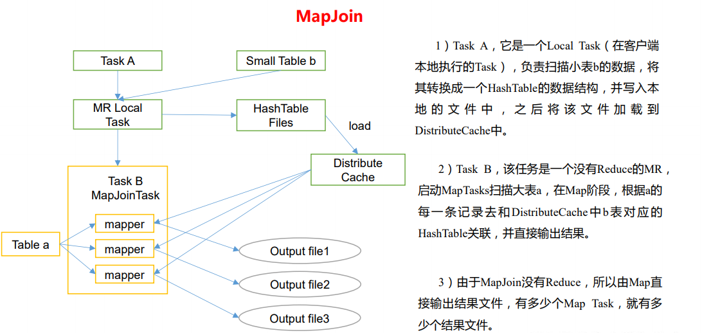


4）建大表、小表和 JOIN 后表的语句 

```sql
// 创建大表
create table bigtable(id bigint, t bigint, uid string, keyword string,
url_rank int, click_num int, click_url string) row format delimited
fields terminated by '\t';
// 创建小表
create table smalltable(id bigint, t bigint, uid string, keyword string,
url_rank int, click_num int, click_url string) row format delimited
fields terminated by '\t';
// 创建 join 后表的语句
create table jointable(id bigint, t bigint, uid string, keyword string,
url_rank int, click_num int, click_url string) row format delimited
fields terminated by '\t';
```

5）分别向大表和小表中导入数据

```sql
 hive (default)> load data local inpath '/opt/module/data/bigtable' into table bigtable;
 hive (default)>load data local inpath '/opt/module/data/smalltable' into table smalltable;
```

 6）小表 JOIN 大表语句 

```sql
insert overwrite table jointable select b.id, b.t, b.uid, b.keyword, b.url_rank, b.click_num, b.click_url from smalltable s join bigtable b on b.id = s.id;
```

 7）大表 JOIN 小表语句 

```sql
insert overwrite table jointable select b.id, b.t, b.uid, b.keyword, b.url_rank, b.click_num, b.click_url from bigtable b join smalltable s on s.id = b.id; 
```

#### 10.4.2 大表 Join 大表

1）空 KEY 过滤

 有时 join 超时是因为某些 key 对应的数据太多，而相同 key 对应的数据都会发送到相同 的 reducer 上，从而导致内存不够。此时我们应该仔细分析这些异常的 key，很多情况下， 这些 key 对应的数据是异常数据，我们需要在 SQL 语句中进行过滤。例如 key 对应的字段为 空，操作如下：

 案例实操 

（1）配置历史服务器 配置

 mapred-site.xml

```xml
<property>
<name>mapreduce.jobhistory.address</name>
<value>hadoop102:10020</value>
</property>
<property>
 <name>mapreduce.jobhistory.webapp.address</name>
    <value>hadoop102:19888</value>
</property>
```

启动历史服务器

```sh
 sbin/mr-jobhistory-daemon.sh start historyserver
```

 查看 jobhistory

 http://hadoop102:19888/jobhistory 

（2）创建原始数据空 id 表

```sql
 // 创建空 id 表
 create table nullidtable(id bigint, t bigint, uid string, keyword string, url_rank int, click_num int, click_url string) row format delimited fields terminated by '\t'; 
```

（3）分别加载原始数据和空 id 数据到对应表中 

```sql
hive (default)> load data local inpath '/opt/module/data/nullid' into table nullidtable; 
```

（4）测试不过滤空 id 

```sql
hive (default)> insert overwrite table jointable select n.* from nullidtable n left join bigtable o on n.id = o.id;
```

 （5）测试过滤空 id

```sql
 hive (default)> insert overwrite table jointable select n.* from (select * from nullidtable where id is not null) n left join bigtable o on n.id = o.id;
```

 2）空 key 转换

有时虽然某个 key 为空对应的数据很多，但是相应的数据不是异常数据，必须要包含在 join 的结果中，此时我们可以表 a 中 key 为空的字段赋一个随机的值，使得数据随机均匀地 分不到不同的 reducer 上。例如：

 案例实操： 不随机分布空 null 值：

 （1）设置 5 个 reduce 个数 

set mapreduce.job.reduces = 5; 

（2）JOIN 两张表

```sql
 insert overwrite table jointable select n.* from nullidtable n left join bigtable b on n.id = b.id;
```

 结果：如下图所示，可以看出来，出现了数据倾斜，某些 reducer 的资源消耗远大于其 他 reducer。

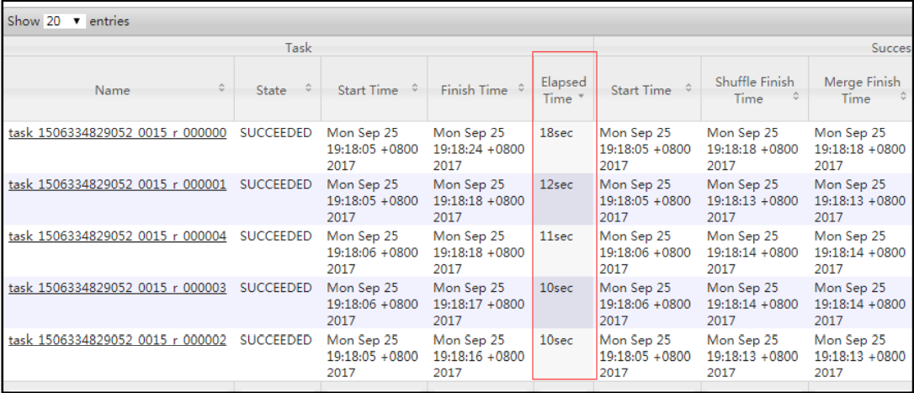

随机分布空 null 值 


（1）设置 5 个 reduce 个数

```properties
 set mapreduce.job.reduces = 5; 
```

（2）JOIN 两张表 

```sql
insert overwrite table jointable select n.* from nullidtable n full join bigtable o on nvl(n.id,rand()) = o.id;
```

 结果：如下图所示，可以看出来，消除了数据倾斜，负载均衡 reducer 的资源消耗

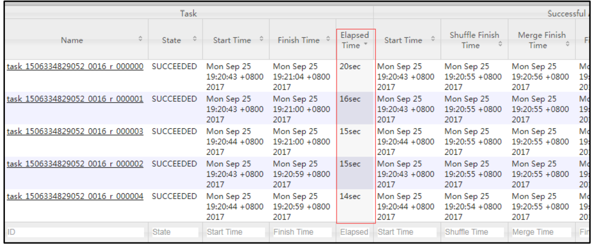


3）SMB(Sort Merge Bucket join) 

（1）创建第二张大表

```sql
create table bigtable2(
 id bigint,
 t bigint,
 uid string,
 keyword string,
 url_rank int,
 click_num int,
 click_url string)
row format delimited fields terminated by '\t';
load data local inpath '/opt/module/data/bigtable' into table bigtable2;
```

测试大表直接 JOIN

```sql
insert overwrite table jointable
select b.id, b.t, b.uid, b.keyword, b.url_rank, b.click_num, b.click_url
from bigtable s
join bigtable2 b
on b.id = s.id;
```

（2）创建分桶表1,桶的个数不要超过可用 CPU 的核数

```sql
create table bigtable_buck1(
 id bigint,
 t bigint,
 uid string,
 keyword string,
 url_rank int,
 click_num int,
 click_url string)
clustered by(id)
sorted by(id)
into 6 buckets
row format delimited fields terminated by '\t';
load data local inpath '/opt/module/data/bigtable' into table
bigtable_buck1;
```

（3）创建分桶表2,桶的个数不要超过可用 CPU 的核数

```sql
create table bigtable_buck2(
 id bigint,
 t bigint,
 uid string,
 keyword string,
 url_rank int,
 click_num int,
 click_url string)
clustered by(id)
sorted by(id)
into 6 buckets
row format delimited fields terminated by '\t';
load data local inpath '/opt/module/data/bigtable' into table
bigtable_buck2;
```

（4）设置参数

```properties
set hive.optimize.bucketmapjoin = true;
set hive.optimize.bucketmapjoin.sortedmerge = true;
set hive.input.format=org.apache.hadoop.hive.ql.io.BucketizedHiveInputFormat;
```

（5）测试

```sql
insert overwrite table jointable
select b.id, b.t, b.uid, b.keyword, b.url_rank, b.click_num, b.click_url
from bigtable_buck1 s
join bigtable_buck2 b
on b.id = s.id;
```

#### 10.4.3 Group By 

默认情况下，Map 阶段同一 Key 数据分发给一个 reduce，当一个 key 数据过大时就倾斜 了。

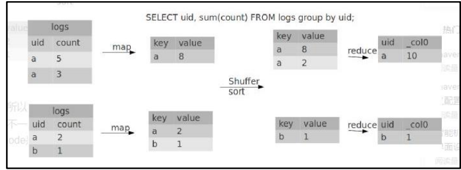

并不是所有的聚合操作都需要在 Reduce 端完成，很多聚合操作都可以先在 Map 端进行 部分聚合，最后在 Reduce 端得出最终结果。

 1）开启 Map 端聚合参数设置

 （1）是否在 Map 端进行聚合，默认为 True

```properties
set hive.map.aggr = true
```

  （2）在 Map 端进行聚合操作的条目数目 

```properties
set hive.groupby.mapaggr.checkinterval = 100000 
```

（3）有数据倾斜的时候进行负载均衡（默认是 false）

```properties
 set hive.groupby.skewindata = true
```

当选项设定为 true，生成的查询计划会有两个 MR Job。第一个 MR Job 中，Map 的输出 结果会随机分布到 Reduce 中，每个 Reduce 做部分聚合操作，并输出结果，这样处理的结果 是相同的 Group By Key 有可能被分发到不同的 Reduce 中，从而达到负载均衡的目的；第二 个 MR Job 再根据预处理的数据结果按照 Group By Key 分布到 Reduce 中（这个过程可以保证 相同的 Group By Key 被分布到同一个 Reduce 中），最后完成最终的聚合操作。

```sql
hive (default)> select deptno from emp group by deptno;
Stage-Stage-1: Map: 1 Reduce: 5 Cumulative CPU: 23.68 sec HDFS Read:
19987 HDFS Write: 9 SUCCESS
Total MapReduce CPU Time Spent: 23 seconds 680 msec
OK
deptno
10
20
30
```

优化以后

```sql
hive (default)> set hive.groupby.skewindata = true;
hive (default)> select deptno from emp group by deptno;
Stage-Stage-1: Map: 1 Reduce: 5 Cumulative CPU: 28.53 sec HDFS Read:
18209 HDFS Write: 534 SUCCESS
Stage-Stage-2: Map: 1 Reduce: 5 Cumulative CPU: 38.32 sec HDFS Read:
15014 HDFS Write: 9 SUCCESS
Total MapReduce CPU Time Spent: 1 minutes 6 seconds 850 msec
OK
deptno
10
20
30
```

#### 10.4.4 Count(Distinct) 去重统计 

数据量小的时候无所谓，数据量大的情况下，由于 COUNT DISTINCT 操作需要用一个 Reduce Task 来完成，这一个 Reduce 需要处理的数据量太大，就会导致整个 Job 很难完成， 一般 COUNT DISTINCT 使用先 GROUP BY 再 COUNT 的方式替换,但是需要注意 group by 造成 的数据倾斜问题. 

1）案例实操 

（1）创建一张大表

```sql
hive (default)> create table bigtable(id bigint, time bigint, uid string, keyword string, url_rank int, click_num int, click_url string) row format delimited fields terminated by '\t'; 
```

 （2）加载数据

```sql
 hive (default)> load data local inpath '/opt/module/data/bigtable' into table bigtable; 
```

（3）设置 5 个 reduce 个数 

```properties
set mapreduce.job.reduces = 5; 
```

（4）执行去重 id 查询

```sql
hive (default)> select count(distinct id) from bigtable;
Stage-Stage-1: Map: 1 Reduce: 1 Cumulative CPU: 7.12 sec HDFS Read:
120741990 HDFS Write: 7 SUCCESS
Total MapReduce CPU Time Spent: 7 seconds 120 msec
OK
c0
100001
Time taken: 23.607 seconds, Fetched: 1 row(s)
```

（5）采用 GROUP by 去重 id (可以`并行的去重`)

```sql
hive (default)> select count(id) from (select id from bigtable group by
id) a;
Stage-Stage-1: Map: 1 Reduce: 5 Cumulative CPU: 17.53 sec HDFS Read:
120752703 HDFS Write: 580 SUCCESS
Stage-Stage-2: Map: 1 Reduce: 1 Cumulative CPU: 4.29 sec2 HDFS Read:
9409 HDFS Write: 7 SUCCESS
Total MapReduce CPU Time Spent: 21 seconds 820 msec
OK
_c0
100001
Time taken: 50.795 seconds, Fetched: 1 row(s)
```

虽然会多用一个 Job 来完成，但在数据量大的情况下，这个绝对是值得的。

#### 10.4.5 笛卡尔积 

尽量避免笛卡尔积，join 的时候不加 on 条件，或者无效的 on 条件，Hive 只能使用 1 个 reducer 来完成笛卡尔积。

#### 10.4.6 行列过滤

 列处理：在 SELECT 中，只拿需要的列，如果有分区，尽量使用分区过滤，少用 SELECT *。

 行处理：在分区剪裁中，当使用外关联时，如果将副表的过滤条件写在 Where 后面， 那么就会先全表关联，之后再过滤，比如：

 案例实操：

1）测试先关联两张表，再用 where 条件过滤

```sql
hive (default)> select o.id from bigtable b
join bigtable o on o.id = b.id
where o.id <= 10;
```

Time taken: 34.406 seconds, Fetched: 100 row(s)

 2）通过子查询后，再关联表

```sql
hive (default)> select b.id from bigtable b
join (select id from bigtable where id <= 10) o on b.id = o.id;
```

Time taken: 30.058 seconds, Fetched: 100 row(s)

#### 10.4.7 分区 

详见 7.1 章。

####  10.4.8 分桶

 详见 7.2 章。


###  10.5 合理设置 Map 及 Reduce 数

 1）通常情况下，作业会通过 input 的目录产生一个或者多个 map 任务。 

主要的决定因素有：input 的文件总个数，input 的文件大小，集群设置的文件块大小。


 2）是不是 map 数越多越好？

 答案是否定的。如果一个任务有很多小文件（远远小于块大小 128m），则每个小文件 也会被当做一个块，用一个 map 任务来完成，而一个 map 任务启动和初始化的时间远远大 于逻辑处理的时间，就会造成很大的资源浪费。而且，同时可执行的 map 数是受限的。


3）是不是保证每个 map 处理接近 128m 的文件块，就高枕无忧了？

 答案也是不一定。比如有一个 127m 的文件，正常会用一个 map 去完成，但这个文件只 有一个或者两个小字段，却有几千万的记录，如果 map 处理的逻辑比较复杂，用一个 map 任务去做，肯定也比较耗时。

针对上面的问题 2 和 3，我们需要采取两种方式来解决：即减少 map 数和增加 map 数


#### 10.5.1 复杂文件增加 Map 数

 当 input 的文件都很大，任务逻辑复杂，map 执行非常慢的时候，可以考虑增加 Map 数， 来使得每个 map 处理的数据量减少，从而提高任务的执行效率。 增加 map 的方法为：根据 

computeSliteSize(Math.max(minSize,Math.min(maxSize,blocksize)))=blocksize=128M 公式，

 调整 maxSize 最大值。让 maxSize 最大值低于 blocksize 就可以增加 map 的个数。

 案例实操：

 1）执行查询

```sql
hive (default)> select count(*) from emp;
Hadoop job information for Stage-1: number of mappers: 1; number of
reducers: 1
```

 2）设置最大切片值为 100 个字节 

```sql
hive (default)> set mapreduce.input.fileinputformat.split.maxsize=100;
hive (default)> select count(*) from emp;
Hadoop job information for Stage-1: number of mappers: 6; number of
reducers: 1
```


#### 10.5.2 小文件进行合并

1）在 map 执行前合并小文件，减少 map 数：CombineHiveInputFormat 具有对小文件进行合 并的功能（系统默认的格式）。HiveInputFormat 没有对小文件合并功能。 

```properties
set hive.input.format= org.apache.hadoop.hive.ql.io.CombineHiveInputFormat;
```

 2）在 Map-Reduce 的任务结束时合并小文件的设置： 在 map-only 任务结束时合并小文件，默认 true 

```properties
SET hive.merge.mapfiles = true; 
```

在 map-reduce 任务结束时合并小文件，默认 false

```properties
 SET hive.merge.mapredfiles = true; 
```

合并文件的大小，默认 256M 

```properties
SET hive.merge.size.per.task = 268435456; 
```

当输出文件的平均大小小于该值时，启动一个独立的 map-reduce 任务进行文件 merge

```properties
 SET hive.merge.smallfiles.avgsize = 16777216;
```


#### 10.5.3 合理设置 Reduce 数

 1）调整 reduce 个数方法一 

（1）每个 Reduce 处理的数据量默认是 256MB

```properties
 hive.exec.reducers.bytes.per.reducer=256000000
```


（2）每个任务最大的 reduce 数，默认为 1009

```properties
 hive.exec.reducers.max=1009
```

 （3）计算 reducer 数的公式

```txt
 N=min(参数2，总输入数据量/参数1)
```

 2）调整 reduce 个数方法二 

在 hadoop 的 mapred-default.xml 文件中修改

 设置每个 job 的 Reduce 个数

```properties
 set mapreduce.job.reduces = 15; 
```

3）reduce 个数并不是越多越好

 （1）过多的启动和初始化 reduce 也会消耗时间和资源；

 （2）另外，有多少个 reduce，就会有多少个输出文件，如果生成了很多个小文件，那 么如果这些小文件作为下一个任务的输入，则也会出现小文件过多的问题； 

在设置 reduce 个数的时候也需要考虑这两个原则：

处理大数据量利用合适的 reduce 数； 

使单个 reduce 任务处理数据量大小要合适；


### 10.6 并行执行 

Hive 会将一个查询转化成一个或者多个阶段。这样的阶段可以是 MapReduce 阶段、抽 样阶段、合并阶段、limit 阶段。或者 Hive 执行过程中可能需要的其他阶段。默认情况下， Hive 一次只会执行一个阶段。不过，某个特定的 job 可能包含众多的阶段，而这些阶段可能 并非完全互相依赖的，也就是说有些阶段是可以并行执行的，这样可能使得整个 job 的执行 时间缩短。不过，如果有更多的阶段可以并行执行，那么 job 可能就越快完成。

 通过设置参数 hive.exec.parallel 值为 true，就可以开启并发执行。不过，在共享集群中， 需要注意下，如果 job 中并行阶段增多，那么集群利用率就会增加。

```properties
 set hive.exec.parallel=true; //打开任务并行执行
 set hive.exec.parallel.thread.number=16; //同一个 sql 允许最大并行度，默认为 8。
```

 当然，得是在系统资源比较空闲的时候才有优势，否则，没资源，并行也起不来。

### 10.7 严格模式

 Hive 可以通过设置防止一些危险操作：

 1）分区表不使用分区过滤 将 hive.strict.checks.no.partition.filter 设置为 true 时，对于分区表，除非 where 语句中含 有分区字段过滤条件来限制范围，否则不允许执行。换句话说，就是用户不允许扫描所有分区。进行这个限制的原因是，通常分区表都拥有非常大的数据集，而且数据增加迅速。没有 进行分区限制的查询可能会消耗令人不可接受的巨大资源来处理这个表。

 2）使用 order by 没有 limit 过滤 将 hive.strict.checks.orderby.no.limit 设置为 true 时，对于使用了 order by 语句的查询，要 求必须使用 limit 语句。因为 order by 为了执行排序过程会将所有的结果数据分发到同一个 Reducer 中进行处理，强制要求用户增加这个 LIMIT 语句可以防止 Reducer 额外执行很长一 段时间。

 3）笛卡尔积 将 hive.strict.checks.cartesian.product 设置为 true 时，会限制笛卡尔积的查询。对关系型数 据库非常了解的用户可能期望在 执行 JOIN 查询的时候不使用 ON 语句而是使用 where 语 句，这样关系数据库的执行优化器就可以高效地将 WHERE 语句转化成那个 ON 语句。不幸 的是，Hive 并不会执行这种优化，因此，如果表足够大，那么这个查询就会出现不可控的情 况。


### 10.8 JVM 重用


 详见 hadoop 优化文档中 jvm 重用 


### 10.9 压缩 


详见第 9 章。


## 第十一章、Hive实战


## 附录：常见错误及解决方案

