# 一、 apache kudu 介绍

## 1．背景介绍

在KUDU 之前,大数据主要以两种方式存储;

(1)静态数据:

以HDFS引擎作为存储引擎，适用于高吞吐量的离线大数据分析场景。这类存储的局限性是数据无法进行随机的读写。

(2)动态数据:

以 HBase、Cassandra作为存储引擎,适用于大数据随机读写场景。局限性是批量读取吞吐量远不如HDFS，不适用于批量数据分析的场景。从上面分析可知，这两种数据在存储方式上完全不同，进而导致使用场景完全不同，但在真实的场景中，边界可能没有那么清晰，面对既需要随机读写，又需要批量分析的

数据场景，该如何选择呢?

这个场景中,单种存储引擎无法满足业务需求，我们需要通过多种大数据工具组合来满足这一需求，如下图所示:

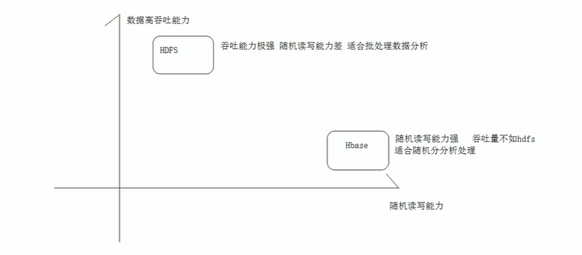

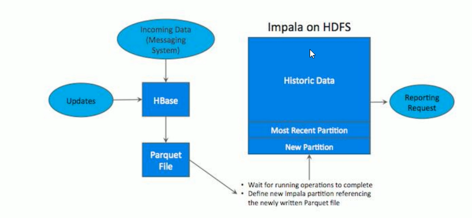


如上图所示，数据实时写入HBase，实时的数据更新也在 HBase完成，为了应对OLAP需求，我们定时将HBase数据写成静态的文件(如:Parquet)导入到OLAP引擎（如:Impala、hive)。这一架构能满足既需要随机读写，又可以支持OLAP分析的场景，但他有如下缺点:

**(1）架构复杂**

从架构上看，数据在HBase、消息队列、HDFS间流转，涉及环节太多,运维成本很高。并且每个环节需要保证高可用,都需要维护多个副本，存储空间也有一定的浪费。最后数据在多个系统上，对数据安全策略、监控等都提出了挑战。

**(2)时效性低**

数据从HBase导出成静态文件是周期性的，一般这个周期是一天（或一小时)，在时效性上不是很高。

**(3)难以应对后续的更新**

真实场景中，总会有数据是延迟到达的。如果这些数据之前已经从 HBase导出到HDFS，新到的变更数据就难以处理了，一个方案是把原有数据应用上新的变更后重写一遍，但这代价又很高。

为了解决上述架构的这些问题，KUDU应运而生。KUDU的定位是FastAnalytics on Fast Data，是一个既支持随机读写、又支持OLAP分析的大数据存储引擎。

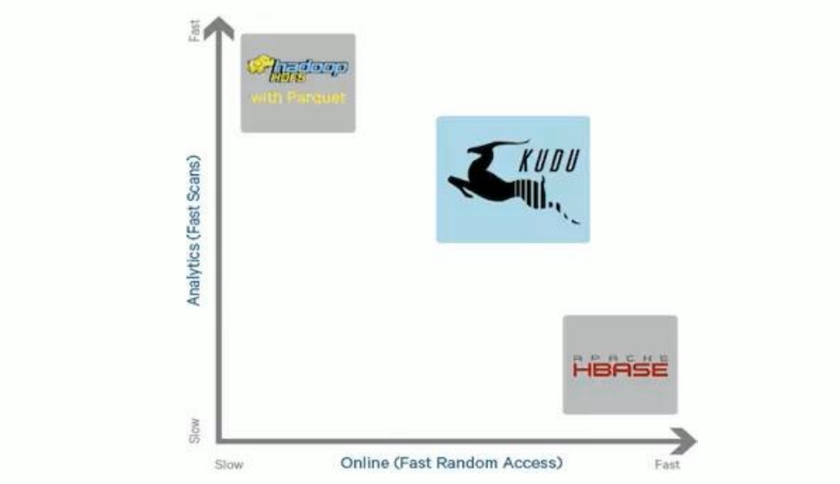

从上图可以看出，KUDU是一个折中的产品，在 HDFS和 HBase这两个偏科生中平衡了随机读写和批量分析的性能。从 KUDU的诞生可以说明一个观点：底层的技术发展很多时候都是上层的业务推动的，脱离业务的技术很可能是空中楼阁。


## 2.kudu是什么

Apache Kudu是由Cloudera开源的存储引擎，可以同时提供低延迟的随机读写和高效的数据分析能力。它是一个融合HDFS和 HBase的功能的新组件，具备介于两者之间的新存储组件。

Kudu支持水平扩展，并且与Cloudera Impala和 Apache Spark等当前流行的大数据查询和分析工具结合紧密。


## 3.kudu应用场景

适用于那些既有随机访问，也有批量数据扫描的复合场景高计算量的场景

使用了高性能的存储设备，包括使用更多的内存支持数据更新，避免数据反复迁移

支持跨地域的实时数据备份和查询

国内使用的kudu一些案例可以查看《构建近实时分析系统.pdf》文档。

> 小结：
>
> Apache Kudukudu是什么
>
> 是一个大数据存储引擎用于大数据的存储分析。
>
> 汲取了hdfs中高吞吐数据的能力和hbase中高随机读写数据的能力。既满足有传统OLAP分析又满足于随机读写访问数据
>
>  kudu来自于cloudera后来贡献给了apache

# 二、apache kudu架构

与HDFS和 HBase相似，Kudu使用单个的`Master`节点，用来管理集群的元数据，并且使用任意数量的`Tablet Server`(类似HBase 中的RegionServer角色)节点用来存储实际数据。可以部署多个Master节点来提高容错性。

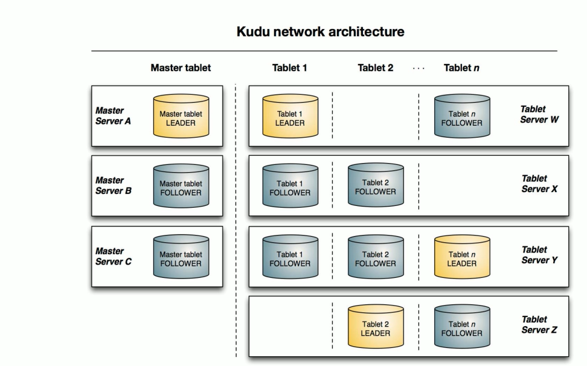

## 1.Table

**表(Table）**是数据库中用来存储数据的对象，是有结构的数据集合。kudu中的表具有schema（纲要）和全局有序的primary key（主键)。kudu中一个table会被水平分成多个被称之为tablet的片段。

## 2.Tablet

一个**tablet**是一张 table连续的片段，tablet是kudu表的水平分区，类似于HBase的region。每个tablet存储着一定连续range的数据(key),且tablet两两间的range不会重叠。一张表的所有tablet包含了这张表的所有key空间。

**tablet会冗余存储**。放置到多个tablet server 上，并且在任何给定的时间点，其中一个副本被认为是leader tablet,其余的被认之为followertablet。每个tablet都可以进行数据的读请求，但只有Leader tablet负责写数据请求。


## 3.Tablet Server

tablet server集群中的小弟，负责数据存储，并提供数据读写服务一个tablet server存储了table表的tablet，向 kudu client提供读取数据服务。对于给定的 tablet，一个tablet server充当leader，其他tablet server充当该tablet 的 follower副本。

只有 leader服务写请求，然而leader或followers为每个服务提供读请求。一个tablet server可以服务多个tablets ，并且一个tablet 可以被多个tablet servers服务着。


## 4.Master Server

集群中的老大，负责集群管理、元数据管理等功能。


> 小结：
>
>  kudu架构： kudu集群是主从架构
>
> - 主角色master :管理集群管理元数据
> - 从角色tablet server:负责最终数据的存储对外提供数据读写能力里面存储的都是一个个tableto kudu tablet
> - 是kudu表中的数据水平分区一个表可以划分成为多个tablet(类似于hbase region)
> - tablet中主键是不重复连续的所有tablet加起来就是一个table的所有数据 tablet在存储的时候会进行冗余存放设置多个副本
> - 在一个tablet所有冗余中任意时刻一个是leader其他的冗余都是follower


# 三、apache kudu 安装


## 1.节点规划

| 节点  | kudu-master | kudu-tserver |
| ----- | ----------- | ------------ |
| node1 | 是          | 是           |
| node2 | 是          | 是           |
| node3 | 是          | 是           |


## 2．本地yum源配置

### 2.1. cdh包下载

http://archive.cloudera.com/cdh5/repo-as-tarball/5.14.0/cdh5.14.0-centos6.tar.gz

下载cdh5.14.0-centos6.tar.gz文件,大小约5G左右。

### 2.2．上传解压

把5个G的压缩文件上传其中某一台服务器，作为本地yum 源服务器。(这里需要确保服务器的磁盘空间是充足的，如果磁盘容量不够，就需要扩容，增大磁盘的容量,具体操作可以参考附件)。

```sh
cd /cloudera_data
tar -zxvf cdh5.14.0-centos6.tar-gz
```


### 2.3.制作本地yum源

使用Apache Server来充当web服务器，使得其他机器可以通过http方式读取本地制作的yum源软件。这里我们选用第三台机器(node-3)作为yum源。执行以下命令安装apache Server:

```sh
yum -y install httpd
service httpd start
```

然后创建新增一个解析本地yum源的配置文件

```sh
cd /etc/yum.repos.d
vim localimp.repo
[localimp]
name=localimp
baseurl=http://node-3/cdh5.14.0
gpgcheck=e
enabled=1
```

### 2.4.创建连接、启动httpd

```sh
ln -s /export/servers/cdh/5.14.0 /var/www/html/cdh5.14.0
```

访问 http://node-3/cdh5.14.0验证是否成功

 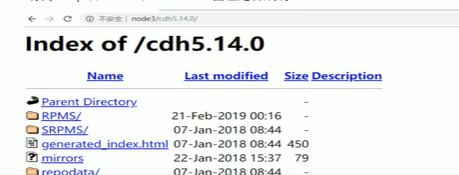

如果出现访问异常: You don't have permission to access /cdh5.14.0/
on this server，则需要关闭 Selinux服务

(1)临时关闭

执行命令:setenforce 0

(2)永久关闭

```sh
vim /etc/sysconfig/selinux
SELINUX=enforcing改为SELINUX=disabled
重启服务reboot
```

将node-3上制作好的localimp配置文件发放到所有需要kudu的节点上去

```sh
scp /etc/yum.repos.d/localimp.repo node-1:/etc/yum.repos.d
scp /etc/yum.repos.d/localimp.repo node-2:/etc/yum.repos.d
```


## 3．安装 kudu

使用yum命令，在不同的服务器下载对应的服务。

| 服务器 | 安装命令                                                     |
| ------ | ------------------------------------------------------------ |
| node-1 | yum install -y kudu kudu-master kudu-tserver kudu-client0<br />kudu-client-devel |
| node-2 | yum install -y kudu kudu-master kudu-tserver kudu-client0<br />kudu-client-devel |
| node-3 | yum install -y kudu kudu-master kudu-tserver kudu-client0<br />kudu-client-devel |


`yum install kudu # Kudu的基本包`
`yum install kudu-master # KuduMasteryum install kudu-tserver # KuduTserver`
`yum install kudu-cliente #Kudu C++客户端共享库`
`yum install kudu-client-devel # Kudu C ++客户端共享库SDK`

## 4. kudu节点配置

安装完成之后。需要在所有节点的/etc/kudu/conf目录下有两个文件:

master.gflagfile和 tserver.gflagfile.

### 4.1．修改master.gflagfile

```sh
cat /etc/kudu/conf/master.gflagfile
# Do not modify these two lines. lf you wish to change these variables,
# modify them in /etc/default/kudu-master.
--fromenv=rpc_bind_addresses
--fromenv=log_dir
--fs_wal_dir=/export/servers/kudu/master
--fs_data_dirs=/export/servers/kudu/master
--master_addresses=node-1:7051,node-2:7051,node-3:7051
```

### 4.2.修改tserver.gflagfile

```sh
# Do not modify these two lines. lf you wish to change these variables,
# modify them in /etc/default/kudu-tserver.
--fromenv=rpc_bind_addresses
--fromenv=log_dir
--fs_wal_dir=/export/servers/kudu/tserver
--fs_data_dirs=/export/servers/kudu/tserver
--tserver_master_addrsmnode-1:7051,node-2:7051,node-3:7051
```

### 4.3．修改/etc/default/kudu-master

```sh
export FLAGS_log_dir=/var/log/kudu
#每台机器的master地址要与主机名一致,这里是在node-1上
export FLAGS_rpe_bind_addresses=node-1:7051
```


> kudu 默认用户就是KUDU，所以需要将/export/servers/kudu权限修改成kudu:
> mkdir /export/servers /kudu
> chown-R kudu : kudu /export/servers /kudu
> (如果使用的是普通的用户，那么最好配置sudo权限)/etc/sudoers文件中添加:
>
> ##Allow root to run any commands anywhere
>
> root	ALL=(ALL)	 ALL
>       angel	ALL=(ALL)	ALL

## 5.kudu集群启动和关闭

### 5.1.安装ntp服务

启动的时候要注意时间同步

安装ntp服务

```sh
yum -y install ntp
```

设置开机启动

```sh
service ntpd start

chkconfig ntpd on
```

可以在每台服务器执行

```sh 
/etc/init.d/ntpd restart
```

### 5.2．启动kudu集群

在每台服务器上都执行下面脚本

```sh
service kudu-master start
service kudu-tserver start
```

如果启动失败，请前往日志目录下查看输出日志信息进行排错。


### 5.3．关闭kudu集群

在每台服务器上都执行下面脚本

```sh
service kudu-master stop
service kudu-tserver stop
```


## 6.  kudu web ui

### 6.1 Master的web地址

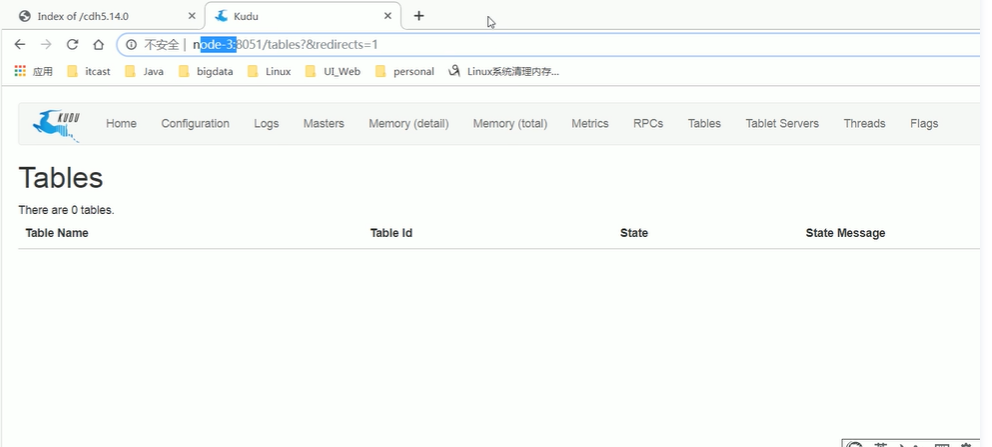

### 6.2 Tserver的web地址

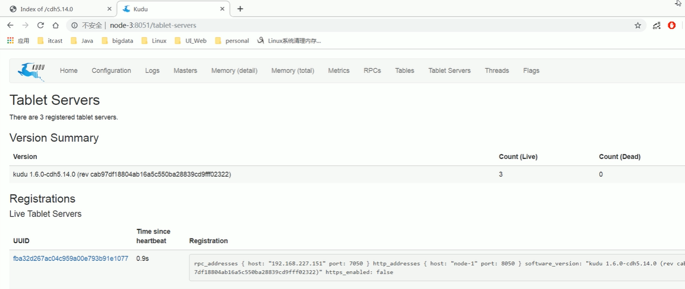

## 7．安装注意事项

### 7.1.给普通用户授予sudo出错

```sh
sudo: /etc/sudoers is world writable
解决方式: pkexec chmod 555 etc/sudoers
```

### 7.2.启动kudu的时候报错

```sh
Failed to start Kudu Master Server. Return value: 1[FAILED]
去日志文件中查看:
Service unavailable: Cannot initialize clock: Error reading clock. Clock consideredunsynchronized
解决:
第一步:首先检查是否有安装ntp:如果没有安装则使用以下命令安装:
yum -y install ntp
第二步:设置随机启动:
service ntpd start
chkconfig ntpd on
```

### 7.3．启动过程中报错

```sh
lnvalid argument: Unable to initialize catalog manager: Failed to initialize systables
async: on-disk master list
解决:
(1):停掉 master和tserver
(2):删除掉之前所有的/export/servers/kudu/master*和/export/servers/kudu/tserver/*
```

### 7.4 启动过程中报错

```sh
error: Could not create new FS layout:
unable to create file system roots:
unable towrite instance metadata:
Call to mkstemp() failed on name template
/export/servers/kudu/master/instance.kudutmp.x000XX: Permission denied (error 13)
这是因为kudu默认使用kudu权限进行执行，可能遇到文件夹的权限不一致情况，更改文件夹权限即可
```


# 四、java操作kudu


## 1.构建maven工程、导入依赖

```xml
<dependencies>
    <dependency>
        <groupld>org.apache.kudu</groupld>
        <artifactld>kudu-client</artifactld>
        <version>1.6.D</version>
    </dependency>
    <dependency>
        <groupld>junit</groupld>
        <artifactld>junit</artifactld>
        <version>4.12</version>
    </dependency>
</dependencies>
```

## 2．初始化方法

## 3. 创建表


```java
public class TestKudu{
    //声明全局变量 KuduClient后期通过它来操作 kudu表
    private KuduClient kuduClient;
    //指定 kuduMaster地址
    private String kuduMaster;
    //指定表名
    private String tableName;
    
@Before
public void init(){
    //初始化操作
    kuduMaster="node1:7051,node2:7051,node3:7051";
    //指定表名
    tableName="student";
    KuduClient.KuduClientBuilder kuduClientBuilder = new KuduClient.KuduClientBuilder(kuduMaster);
    kuduClientBuilder.defaultSocketReadTimeoutMs(10000);
    kuduClient=kuduClientBuilder.build();
    
	}

@Test
public void createTable(){
    //判断表是否存在
    if(!kuduClient.tableExists(kuduTable)){
        //指定表的schema信息
        ArrayList<ColumnSchema> columnSchemas = new ArrayList<ColumnSchema>();
        //添加字段的schema信息,其中指定id为表的主键
        columnSchemas.add(new ColumnSchema.ColumnSchemaBuilder("id",Type.INT32).key(true).build());
        columnSchemas.add(new ColumnSchema.ColumnSchemaBuilder("name",Type.STRING).build());
        columnSchemas.add(new ColumnSchema.ColumnSchemaBuilder("age"，Type.INT32).build());
        columnSchemas.add(new ColumnSchema.ColumnSchemaBuilder("sex"，Type.INT32).build());
        
        Schema schema = new Schema(columnSchemas);
        
        //指定表的option属性
        CreateTable0ptions table0ptions = new CreateTableoptions();
        //指定表的分区规则采用hash分区根据id哈k到指定的6个部分中
        ArrayList<String> partitionList = new ArrayList<string>();
        partitionList.add("id");
        tableOptions.addHashPartitions(partitionList, buckets: 6);
        //id.hashcode % 6
        //如果表不存在，则创建表操作（需要表名，表的schema信息，表属性信息）
        kuduClient.createTable(kuduTable,schema)
    }
}
    
    
@After
public void close() throws KuduException {
    //如果客户端为关闭执行cLose操做
    if((kuduClient != null){
        kuduclient.close();
   	 }
	}

}
```


## 4、插入数据

```java
/**
*向表加载数据
*/
@Test
public void insertTable() throws KuduException {
    //向表加载数据需要一个 kuduSession对象
    KuduSession kuduSession = kuduClient.newSession();
    //设置提交为自动刷新
    kuduSession.setFlushMode(SessionConfiguration.FlushMode.AUTO_FlUSH_SYNC);
    //需要使用kuduTable来构建Operation的子类实例对象
    KuduTable kuduTable = kuduClient.openTable(tableName);
    for(int i=1;i<=10;i++){
        Insert insert = kuduTable.newinsert();
        PartialRow row = insert.getRow();
        row.addInt("id",i);
        row.addString("name","zhangsan-"+i);
        row.addInt("age",20+i);
        row.addInt("sex".i%2);
        //最后实现执行数据的加载操作
        kuduSession.apply(insert);
    }
 }
```

## 5．查询数据

```JAVA

/**
*查询表的数据结果
*/
@Test
public void queryData() throws KuduException {
    //构建一个查询的扫描器
    KuduScanner.KuduScannerBuilder kuduScannerBuilder = kuduClient.newScannerBuilder(kuduClient.openTable(tableName));
    //创建集合，用于存储扫描字段信息
    ArrayList<String> columnsList = new ArrayList<String>():
    columnsList.add("id");
    columnsList.add("name");
    columnsList.add("age");
    columnsList.add("sex");
    kuduScannerBuilder.setProjectedColumnNames(columnsList);
    //调用build方法执行数据的扫描，得到返回结果集
    KuduScanner kuduScanner = kuduScannerBuilder.build();
    //遍历
    while (kuduScanner.hasMoreRows()){
        RowResultlterator rowResults = kuduScanner.nextRows();
        while(rowResults.hasNext()){
            RowResult row = rowResults.next();
            int id = row.getInt("id");
            String name = row.getstring("name");
            int age = roe.getInt("age");
            int sex = row.getInt("sex");
            System.out.println("id="+id +" name=" +name+" age="+age+" sex="+sex);     
        }
    }
}
```

## 6. 修改数据

```java
/**
*修改表的数据
*/
@Test
public void updateData() throws KuduException {
    //向表加载教据需要一个kuduSession对象
    KuduSession kuduSession = kuduClient.neweSession();
    //设置提交数据为自动fLush
    kuduSession.setFlushMode(SessionConfiguration.FlushMode.AUTo_FLUSH_SYNC);
    //打开本次操作的表名
    KuduTable kuduTable = kuduclient.openTable(kuduTableName);
    //构建了一个update对象用于数据的修改
   // Update update = kuduTable.newUpdate();
    //如果指定的主键存在更新数据操作;如果不存在，执行数据插入操作
    Upsert upsert = kuduTable.newUpsert();
    PartialRow row = upsert.getRows();
    row.addInt("id",1);
    row.addstring("name","itcast");
    row.addInt("age",50);
    row.addInt("sex",1);
    //最后实现执行数据的修改操作操作
    kuduSession.apply(update);
    }
}
```


## 7. 删除数据

```java
/**
*删除表的数据
*/
@Test
public void deleteData() throws KuduException {
    //向表加载教据需要一个kuduSession对象
    KuduSession kuduSession = kuduClient.neweSession();
    //设置提交数据为自动fLush
    kuduSession.setFlushMode(SessionConfiguration.FlushMode.AUTo_FLUSH_SYNC);
    //打开本次操作的表名
    KuduTable kuduTable = kuduclient.openTable(kuduTableName);
    //构建了一个update对象用于数据的修改
    Delete delete = kuduTable.newDelete();
   
    PartialRow row = delete.getRows();
    row.addInt("id",1);
    row.addstring("name","itcast");
    row.addInt("age",50);
    row.addInt("sex",1);
    //最后实现执行数据的修改操作操作
    kuduSession.apply(update);
    }
}
```

## 8．删除表

```java
@Test
public void dropTable() throws KuduException{
   if(kuduClient.tableExists(tableName){
       kuduClient.deleteTable(tableName);
   }
}
```


## 9.kudu分区方式

为了提供可扩展性，Kudu表被划分为称为tablet的单元，并分布在许多tablet servers 上。行总是属于单个tablet 。将行分配给tablet 的方法由在表创建期间设置的表的分区决定。kudu提供了3种分区方式。

### 9.1.Range Partitioning(范围分区)

范围分区可以根据存入数据的数据量，均衡的存储到各个机器上，防止机器出现负载不均衡现象.

```java
/**
*测试分区:
* RangePartition
*/
@Test
public void testRangePartition() throws KuduException{
  
    //判断表是否存在
    if(!kuduClient.tableExists("t_ranger_partition")){
    //指定表的schema信息
        ArrayList<ColumnSchema> columnSchemas = new ArrayList<ColumnSchema>();
        //添加字段的schema信息其中指定id为表的主键
        columnSchemas.add(new ColumnSchema.ColumnSchemaBuilder("id"，Type.INT32).key(true).build());
        columnSchemas.add(new ColumnSchema.ColumnSchemaBuilder(" name"，Type.STRING).build());
        columnSchemas.add(new ColumnSchema.ColumnSchemaBuilder("age"，Type.INT32).build());
        columnSchemas.add(new ColumnSchema.ColumnSchemaBuilder("sex"，Type.INT32).build());
        Schema schema = new Schema(columnSchemas);
        //指定表的option属性
        CreateTable0ptions tableoptions = new CreateTable0ptions();
        //指定用于分区的字段id
        ArrayList<String> partitionList = new ArrayList<string>();
        partitionList.add("id");
        
        //指定range分区字段
        tableoptions.setRangePartitionColumns(partitionList);
        //指定分区的策略
        /**
        * 0 <= id <10
        * 10 <= id <20
        * 20 <= id <30
        * 30 <= id <40
        * 40 <= id <50
        */
        int count =o;
        for(int i= 0;i<5;ivr){
            PartialRow lower = schema.newPartialRow();
            lower.addInt( columnName: "id",count);
            count+=10;
            //指定ranger的上界
            PartialRow upper = schema.newPartialRovws();
            upper.addInt("id"，count);
            table0ptions.addRangePartition();
        }   
        //如果表不存在进行创建表的操作(需要指定表名表schema信息﹑表属性信息)
        kuduclient.createTable("t _ranger_partition" , schema,table0ptions);
    }
}


```

### 9.2.Hash Partitioning(哈希分区)

哈希分区通过哈希值将行分配到许多buckets（存储桶)之一;哈希分区是一种有效的策略，当不需要对表进行有序访问时。哈希分区对于在 tablet之间随机散布这些功能是有效的，这有助于减轻热点和 tablet大小不均匀。

```java
/**
*测试分区:
*hash分区
*/
@Test
public void testHashPartition() throws KuduException {
    //判断表是否存在
    if(!kuduClient.tableExists("t_hash_partition")){
    //指定表的schema信息
        ArrayList<ColumnSchema> columnSchemas = new ArrayList<ColumnSchema>();
        //添加字段的schema信息其中指定id为表的主键
        columnSchemas.add(new ColumnSchema.ColumnSchemaBuilder("id"，Type.INT32).key(true).build());
        columnSchemas.add(new ColumnSchema.ColumnSchemaBuilder(" name"，Type.STRING).build());
        columnSchemas.add(new ColumnSchema.ColumnSchemaBuilder("age"，Type.INT32).build());
        columnSchemas.add(new ColumnSchema.ColumnSchemaBuilder("sex"，Type.INT32).build());
        Schema schema = new Schema(columnSchemas);
        //指定表的option属性
        CreateTable0ptions tableoptions = new CreateTable0ptions();
        //指定用于分区的字段id
        ArrayList<String> partitionList = new ArrayList<string>();
        partitionList.add("id");
        //指定表的分区规则采用hash分区根据id哈希到指定的6个部分中,
        //id.hashcode % 6
        tableOptions.addHashPartitions(partitionList, 6); 
        //如果表不存在进行创建表的操作(需要指定表名表schema信息﹑表属性信息)
        kuduclient.createTable("t _hash_partition" , schema,table0ptions);
    }
}

```

### 9.3.Multilevel Partitioning(多级分区)

Kudu允许一个表在单个表上组合多级分区。当正确使用时，多级分区可以保留各个分区类型的优点,同时减少每个分区的缺点需求.

```java
/**
*测试分区:
*多级分区
* Multilevel Partition
*混合使用hash 分区和 range分区
*
*哈希分区有利于提高写入数据的吞吐量，而范围分区可以避免tablet无限增长问题，
*hash分区和 range分区结合，可以极大的提升kudu的性能
*/
@Test
public void testMultilevelPartition() throws KuduException{
    //判断表是否存在
    if(!kuduClient.tableExists("t_Multi_partition")){
    //指定表的schema信息
        ArrayList<ColumnSchema> columnSchemas = new ArrayList<ColumnSchema>();
        //添加字段的schema信息其中指定id为表的主键
        columnSchemas.add(new ColumnSchema.ColumnSchemaBuilder("id"，Type.INT32).key(true).build());
        columnSchemas.add(new ColumnSchema.ColumnSchemaBuilder(" name"，Type.STRING).build());
        columnSchemas.add(new ColumnSchema.ColumnSchemaBuilder("age"，Type.INT32).build());
        columnSchemas.add(new ColumnSchema.ColumnSchemaBuilder("sex"，Type.INT32).build());
        Schema schema = new Schema(columnSchemas);
        //指定表的option属性
        CreateTable0ptions tableoptions = new CreateTable0ptions();
        //指定用于分区的字段id
        ArrayList<String> partitionList = new ArrayList<string>();
        partitionList.add("id");
        //指定表的分区规则采用hash分区根据id哈希到指定的6个部分中,
        //id.hashcode % 6
        tableOptions.addHashPartitions(partitionList, 6); 
         //指定range分区字段
        tableoptions.setRangePartitionColumns(partitionList);
        //指定分区的策略
        /**
        * 0 <= id <10
        * 10 <= id <20
        * 20 <= id <30
        * 30 <= id <40
        * 40 <= id <50
        */
        int count =o;
        for(int i= 0;i<5;ivr){
            PartialRow lower = schema.newPartialRow();
            lower.addInt( columnName: "id",count);
            count+=10;
            //指定ranger的上界
            PartialRow upper = schema.newPartialRovws();
            upper.addInt("id"，count);
            table0ptions.addRangePartition();
        }   
        //如果表不存在进行创建表的操作(需要指定表名表schema信息﹑表属性信息)
        kuduclient.createTable("t _Multi_partition" , schema,table0ptions);
    }
}
}

```


# 五、spark操作kudu

到目前为止，我们己经听说过几个上下文，例如SparkContext,SQLContext，HiveContext，SparkSession，现在，我们将使用Kudu引入一个**`KuduContext`**。这是可在Spark应用程序中广播的主要可序列化对象。此类代表在 Spark执行程序中与Kudu Java客户端进行交互。KuduContext 提供执行DDL操作所需的方法，与本机Kudu RDD的接口，对数据执行更新/插入/删除，将数据类型从Kudu转换为Spark等。


## 1. 依赖引入

```xml
<dependencies>
    <dependency>
        <groupld>org.apache.kudu</groupld>
        <artifactld>kudu-client-tools</artifactld>
        <version>1.6.O-cdh5.14.0</version>
    </dependency>
    <dependency>
        <groupld>org.apache.kudu</groupld>
        <artifactld>kudu-client</artifactld>
        <version>1.6.0-cdh5.14.O</version>
    </dependency>
<!-- https://mvnrepository.com/artifact/org.apache.kudu/kudu-spark2 -->
    <dependency>
        <groupld>org.apache.kudu</groupld>
        <artifactld>kudu-spark2_2.11</artifactld>
        <version>1.6.0-cdh5.14.0</version>
    </dependency>
</dependencies>
```


## 2. 创建表

定义kudu的表需要分成5个步骤:

1:提供表名

2:提供schema

3:提供主键

4:定义重要选项:

例如:定义分区的schema

5:调用create Table api

```scala
/**
* Created by Allen woon
*/
object testSparkKudu {
    //指定创建的表名
    val tableName = "spark_kudu_student"
 
    def main(args: Array[string]): Unit = {
        //构建sparkconf对象
        val sparkConf :SparkConf = new SparkConf().setAppName("SparkKudu" ).setMaster("local[2]")
        //构建sparksession对象
        val sparkSession: SparkSession = SparkSession.builder().config(sparkConf).getOrCreate()
        //构建sparkcontext对象
        val sc: SparkContext = sparkSession.sparkContext
        //todo构建Kuducontext对象用于和udujava客户端交互操作kudu教据
        val kuduContext = new KuduContext("node-1:7051,node-2:7051,node-3:7051",sc)
        //通过kuducontext创建一张表(需要传递表名schema主键option)
        //定义表的schema信息
        val schema = structType(
            StructField("Id",StringType,false)::
            StructField("name",StringType,false)::
            StructField("age", IntegerType,false)::
            StructField("sex" , StringType,false) ::Nil)
        
        //指定表的主键信息
        val p_key =Seq("Id")
        //指定表的option属性
        val options = new CreateTable0ptions
        //指定用子分区的字段
        val list = new util.Arraylist[string]()list.add("Id")
        options.addHashPartitions(list,6)
        //判断该表是否存在如果不存在进行表的创建
        if(!kuduContext.tableExists(tabLeName)){
        kuduContext.createTable(tabLeName,schema,p_key ,options)
        }
    }
}
```

## 3.dataFrame操作kudu

Kudu支持许多DML类型的操作，其中一些操作包含在Spark on Kudu集成.包括:

```properties
INSERT
	-将DataFrame的行插入Kudu表。请注意,虽然API完全支持INSERT,但不鼓励在Spark中使用它。使用INSERT是有风险的，因为Spark任务可能需要重新执行，这意味着可能要求再次插入已插入的行。这样做会导致失败，因为如果行已经存在，INSERT将不允许插入行（导致失败)。相反，我们鼓励使用下面描述的 INSERT_IGNORE。
INSERT-IGNORE
	-将DataFrame的行插入Kudu表。如果表存在，则忽略插入动作。
DELETE 
	-从Kudu表中删除 DataFrame中的行心**UPSERT**`-如果存在，则在 Kudu表中更新DataFrame中的行，否则执行插入操作。
UPDATE
	-更新dataframe中的行
```

```JAVA
import java.util
import org-apache.kudu.client.CreateTable0ptions
import org.apache.kudu.spark.kudu.KuduContext
import org.apache.spark.rdd.RDD
import org.apache.spark.{SparkConf，SparkContext}
import org.apache.spark.sql.{DataFrame，Row，SparkSession}
import org.apache.spark.sql.types.{IntegerType，StringType，StructField，StructType}
import org.apache.kudu.spark.kudu._

//定义样例类用于封装表的一行数据
case class Student(Id:String,name :String,age:Int,sex:String)

object testSparkKudu {
    //指定创建的表名
    val tableName = "spark_kudu_student"
        //指定创建的表名
        val tabLeName = "spark _kudu_student"
        //指定kudu集群master地址
        val kuduMaster = "node-1:7051,node-2:7051,node-3:7051"
        //指定kuduOption
        val kuduOption = Map(
        "kudu.master" ->kuduNaster,
        "kudu.table"  ->tableName)

    def main(args: Array[string]): Unit = {
        //构建sparkconf对象
        val sparkConf :SparkConf = new SparkConf().setAppName("SparkKudu" ).setMaster("local[2]")
        //构建sparksession对象
        val sparkSession: SparkSession = SparkSession.builder().config(sparkConf).getOrCreate()
        //构建sparkcontext对象
        val sc: SparkContext = sparkSession.sparkContext
         sc.setLevel("warn")
        //todo构建huducontext对象用于和udujava客户端交互操作kudu教据
        val kuduContext = new KuduContext("node-1:7051,node-2:7051,node-3:7051",sc)
        //2、插入数据操作//准备待插入的数据
            val data = list(Student("1" ," zhangsan" ,20,"m" ),student("2" ,"1isi",30,"w"),Student("3" , "wangwu " , 30 ,"m"))
            val studentRDD: RDD[ Student] = sc.parallelize(data)
                import sparkSession.implicits._
                val dataFrame: DataFrame = studentRDD.toDFkuduContext.insertRows(dataFrame ,tableName)
                    
          //3、查询表的数据//指定查询表的字段
          val columnProjection = list("Id","name","age","sex")
          val rowRDD:RDD[Row] = kuduContext.kuduRDD(sc,tableName,columnProjection)
          rowRDD.foreach(println(_))
          //4.更新表的数据如果记录不存在报错 
          kuduContext.updateRows();
          //记录存在进行更新操作否则执行插入操作
          kuduContext.upsertRows(dataFrame,tableName)

          //5.删除表数据
          val data = list(Student("2","lisi"，30，“w"))
          val studentRDD: RDD[ Student] = sc.parallelize(data)
          import sparkSession.implicits._
           val dataFrame: DataFrame = studentRDD.toDF.select(col("Id"))
           kuduContext.deleteRows(dataFrame,tabLeName)   
         
         //6、使用dataFrame进行读取kudu数据
         sparksession.read.options(keuduOption).kudu.show()
        
         //7、使用dataFram写数据到kudu
         val data = list(Student("s"，"itheima"，20，"m"))
         val studentRDD: RDD[Student] = sc.parallelize(data)
         import sparkSession.implicits._
         val dataFrame: DataFrame = studentRDD.toDF
         //Ccurrently，only Append is supported当下只支持追加模式到数据
          dataFrame.write.mode("append").options(kudu0ption).kudu
                
          //8、使用sparksq山读取eudu数据
          dataFrame1.createTempViewve("tmp"")
          sparkSession.sq1("select * from tmp" ).show()
          sparkSession.sql("select count(*) from tmp").show()
    
    }
}
```


### 3.5.DataFrame API读取kudu数据

虽然我们可以通过上面显示的KuduContext执行大量操作,但我们还可以直接从默认数据源本身调用读/写API.要设置读取,我们需要为Kudu表指定选项，命名我们要读取的表以及为表提供服务的Kudu集群的Kudu主服务器列表。


# 六、kudu集成impala


## 1.impala配置修改

在每一个服务器的impala的配置文件中添加如下配置。

```sh
vim /etc/default/impala
在IMPALA_SERVER_TRGS下添加:
-kudu_master_hosts=node-1:7051, node-2:7051, node-3:7051
```


## 2．创建kudu表

需要先启动hdfs、 hive、kudu、 impala。使用impala的shell控制台。

### 2.1．内部表

内部表由Impala管理，当您从Impala中删除时，数据和表确实被删除。当您使用Impala 创建新表时,它通常是内部表。

- 使用impala创建内部表

```sql
CREATE TABLE my_first_table
(id BIGINT,
name STRING,
PRIMARY KEY(id)
 )
PARTITION BY HASH PARTITIONS 16
STORED AS KUDU
TBLPROPERTIES (
'kudu.master addresses' = 'node1:7051, node2:7051, node3:7051',
'kudu.table_name’= 'my_first_table'
);
    
在CREATE TABLE语句中，必须首先列出构成主键的列。
```

- 此时创建的表是内部表，从impala删除表的时候，在底层存储的kudu也会删除表。

```sql
drop table if exists my_first_table;
```

### 2.2 外部表

- 外部表（创建者CREATE EXTERNAL TABLE )不受Impala管理，并且删除此表不会将表从其源位置（此处为Kudu )丢弃。相反，它只会去除Impala和Kudu之间的映射。这是Kudu提供的用于将现有表映射到lmpala的语法。

  ```sql
  CREATE EXTERINAL_TABLE "Student" STORED As KuDUTBLPROPERTIES(
  " kudu.table_name" = "Student",
  " kudu.master_addresses' = 'node-1:7051, node-2:7051, node-3:7051")
  ```

  

- 使用java创建一个kudu表:

  - 代码

  ```java
  public class createTable {
      private static columnSchema newColumn(String name，Type type，boolean iskey) {
          columnschema.columnschemaBui1der column = new columnschema.columnschemaBui1der(name,type);
          column.key(iskey);
          return column.bui1d();
  }
  pub1ic static void main(string[] args) throws KuduException {
      // master地址
      final string masteraddr = "node1,node2,node3";
      //创建kudu的数据库链接
      Kuduclient client = new Kuduc1ient.KuduclientBuilder(masteraddr).defaultsocketReadTimeoutMs(6000).bui1d();
  ```

  

## 3. 将数据插入Kudu表

- impala允许使用标准SQL语句将数据插入Kudu。

### 3.1插入单个值

- 创建表

```sql
CREATE TABLE my_first_tab1e1(
id BIGINT,name STRING,PRIMARY KEY(id)
PARTITION BY HASH PARTITIONS 16STORED AS KUDU
TBLPROPERTIESC
'kudu.table_name' = "person1",
'kudu.master_addresses' = 'node-1:7051,node-2:7051,node-3:7051');
```

- 此示例插入单个行

```sql
INSERT INTO my_first_table1 VALUES (50，"zhangsan"");
```

- 查看数据

```sql
select  from my_first_table
```

- 使用单个语句插入三行

```sql
INSERT INTO my_first_table VALUES(1，"john")，(2，"jane"")，(3，"jim");
```


## 4. 更新数据

- 示例

```sql
UPDATE my_first_table SET name="xiaowang" where id =1 ;
```


## 5. 删除数据

- 示例

```sql
delete from my_first_table where id =2;
```

## 6.更改表属性

- 开发人员可以通过更改表的属性来更改Impala与给定Kudu表相关的元数据。这些属性包括表名，Kudu主地址列表,以及表是否由Impala(内部）或外部管理。

### 6.1 Rename an Impala Mapping Table(重命名Impala映射表)

```sql
ALTER TABLE PERSON RENAME TO person_temp;
```


### 6.2 Rename the underlying Kudu table for an internal table(重新命名内部表的基础 Kudu表)

- 创建内部表:

```sql
CREATE TABLE kudu_student
(
companyId INT,
workId INT,Name STRING,Gender STRING,Photo STRING,
PRIMARY KEY(CompanyId))
PARTITION BY HASH PARTITIONS 16 STORED AS KUDU
TBLPROPERTIES (
'kudu .master_addresses' = 'node1:7051,node2:7051,node3:7051','kudu .table_name' = 'student'
);
```

- 如果表是内部表，则可以通过更改kudu.table_name属性重命名底层的 Kudu表

```sql
ALTER TABLE kudu_student SET TBLPROPERTIES('kudu.table_name ' = 'new_studeny');
```

### 6. 3 Remapping an external table to a different Kudu table(将外部表重新映射到不同的Kudu表)

- 如果用户在使用过程中发现其他应用程序重新命名了kudu表，那么此时的外部表需要重新映射到kudu上
  - 创建一个外部表:

```sql
CREATE EXTERNAL TABLE external_table
STORED AS KuD0
TBLPROPERTIES (
'kudu.master_addresses' = 'node1:7051,node2:7051,node3:7051',"kudu.table_name" = "person"
);
```

- 重新映射外部表,指向不同的kudu表:

```sql
ALTERTABLE external_table
SET TBLPROPERTIES( ' kudu.tab1e_name' = "hashTab1e')
```

上面的操作是∶将external_table映射的PERSON表重新指向hashTable表

###  6.4 Change the Kudu Master Address (更改Kudu Master地址)

```sql
ALTER TABLE my_table
SET TBLPROPERTIES('kudu.master_addresses ' = 'kudu-new-master. examp1e.com:7051');
```

### 6.4  Change an Internally-Managed Table to External(将内部管理的表更改为外部)

```sql
ALTER TABLE my_table SET TBLPROPERTIES("EXTERNAL'= 'TRUE");
```


## 7. impala使用java语言操作kudu

- 对于impala而言，开发人员是可以通过JDBC连接impala的，有了JDBC，开发人员可以通过impala来间接操作kudu ;

### 7.1．引入依赖

```xml
<dependency>
    <groupld>com.cloudera</groupld>
    <artifactld>impalaJDBC41</artifactld>
    <version>2.5.42</version>
</dependency>
<!--Caused by : ClassNotFound : thrift.protocol.TPro-->
<dependency>
    <groupld>org.apache.thrift</groupld>
    <artifactld>libfb303</artifactld>
    <version>0.9.3</version>
    <type>pom</type>
</dependency>
<!--Caused by : ClassNotFound : thrift.protocol.TPro-->
<dependency>
    <groupld>org.apache.thrift</groupld>
    <artifactld>libthrift</artifactld>
    <version>0.9.3</version>
    <type>pom</type>
</dependency>
```


## 7.2 jdbc连接impala操作kudu


# 七、apache kudu原理

## 1. table 与schema

Kudu设计是面向结构化存储的，因此，Kudu的表需要用户在建表时定义它的Schema信息，这些Schema信息包含:列定义(含类型)，Primary Key定义(用户指定的若干个列的有序组合)。数据的唯一性，依赖于用户所提供的Primary Key中的Column组合的值的唯一性。Kudu提供了Alter命令来增删列，但位于 Primary Key中的列是不允许删除的。

从用户角度来看，Kudu是一种存储结构化数据表的存储系统。在一个Kudu集群中可以定义任意数量的table，每个table都需要预先定义好schema。每个table的列数是确定的，每一列都需要有名字和类型，每个表中可以把其中一列或多列定义为主键。这么看来，Kudu更像关系型数据库，而不是像 HBase、Cassandra和 MongoDB这些NoSQL 数据库。不过Kudu目前还不能像关系型数据一样支持二级索引。

Kudu使用确定的列类型，而不是类似于NoSQL的“everything is byte"。带来好处:确定的列类型使Kudu可以进行类型特有的编码,可以提供元数据给其他上层查询工具。


## 2. kudu 底层数据模型

Kudu的底层数据文件的存储，未采用HDFS这样的较高抽象层次的分布式文件系统，而是自行开发了一套可基于Table/Tablet/Replica视图级别的底层存储系统。

这套实现基于如下的几个设计目标:

- 可提供快速的列式查询
- 可支持快速的随机更新
- 可提供更为稳定的查询性能保障

 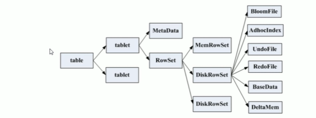

一张`table`会分成若干个tablet，每个tablet包括MetaData元信息及若干个RowSet。

`RowSet`包含一个MemRowSet及若干个DiskRowSet，DiskRowSet中包含一个BloomFile.Ad_hoc Index .BaseData,DeltaMem及若干个RedoFile和UndoFile。

`MemRowSet`:用于新数据insert及已在MemRowSet中的数据的更新，一个MemRowSet写满后会将数据刷到磁盘形成若干个DiskRowSet。默认是1G或者或者120S。

`DiskRowSet`:用于老数据的变更，后台定期对DiskRowSet 做 compaction,以删除没用的数据及合并历史数据，减少查询过程中的I0开销。

`BloomFile`:根据一个DiskRowSet中的key生成一个bloom filter，用于快速模糊定位某个key是否在 DiskRowSet中

`Ad_hocIndex`:是主键的索引，用于定位key在 DiskRowSet中的具体哪个偏

`BaseData`是MemRowSet flush下来的数据，按列存储，按主键有序。

`UndoFile`是基于BaseData之前时间的历史数据,通过在BaseData 上 applyUndoFile中的记录，可以获得历史数据。

`RedoFile`是基于BaseData之后时间的变更记录,通过在BaseData 上 applyRedoFile中的记录，可获得较新的数据。

`DeltaMem`用于DiskRowSet中数据的变更，先写到内存中，写满后flush 到磁盘形成RedoFile。


REDO与 UNDO与关系型数据库中的REDO与 UNDO日志类似(在关系型数据库中，REDO日志记录了更新后的数据，可以用来恢复尚未写入 Data File的已成功事务更新的数据。而UNDO日志用来记录事务更新之前的数据，可以用来在事务失败时进行回滚)

 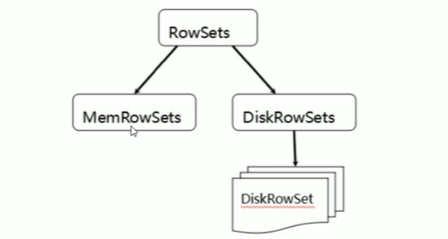

MemRowSets可以对比理解成HBase中的MemStore，而 DiskRowSets可理解成HBase中的file。

MemRowSets 中的数据被Flush 到磁盘之后,形成DiskRowSets。DisRowSets中的数据,按照32MB大小为单位,按序划分为一个个的DiskRowSet。DiskRowSet中的数据按照Column进行组织，与Parquet类似。

这是Kudu可支持一些分析性查询的基础。每一个Column的数据被存储在一个相邻的数据区域，而这个数据区域进一步被细分成一个个的小的Page单元，与HBase File中的Block 类似，对每一个Column Page可采用一些Encoding 算法,以及一些通用的Compression算法。既然可对Column Page可采用Encoding以及Compression算法，那么，对单条记录的更改就会比较困难了。

前面提到了Kudu可支持单条记录级别的更新/删除，是如何做到的?

与HBase类似，也是通过增加一条新的记录来描述这次更新/删除操作的。DiskRowSet是不可修改了，那么KUDU要如何应对数据的更新呢?在KUDU中，把`DiskRowSet分为了两部分: base data、delta stores。base data负责存储基础数据，delta stores负责存储 base data中的变更数据.`

 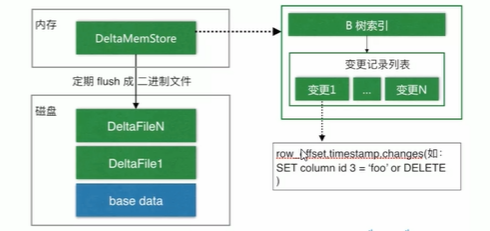

如上图所示，数据从MeTiRowSet刷到磁盘后就形成了一份DiskRowSet(只包含base data )，每份DiskRowSet在内存中都会有一个对应的DeltaMemStore，负责记录此 DiskRowSet后续的数据变更(更新、删除)。DeltaMemStore内部维护一个B-树索引，映射到每个row_offset对应的数据变更。DeltaMemStore 数据增长到一定程度后转化成二进制文件存储到磁盘，形成一个DeltaFile，随着base data对应数据的不断变更，DeltaFile逐渐增长。

## 3. tablet发现过程

当创建Kudu客户端时,其会从主服务器上获取tablet位置信息,然后直接与服务于该tablet的服务器进行交谈。

为了优化读取和写入路径,客户端将保留该信息的本地缓存，以防止他们在每个请求时需要查询主机的tablet位置信息。随着时间的推移，客户端的缓存可能会变得过时，并且当写入被发送到不再是tablet 领导者的 tablet 服务器时，则将被拒绝。然后客户端将通过查询主服务器发现新领导者的位置来更新其缓存。

 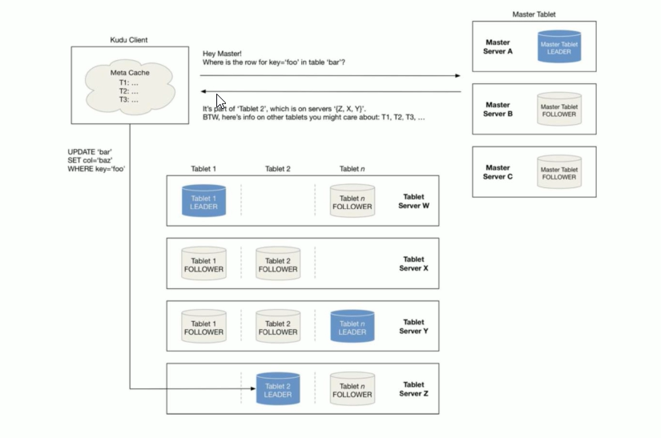


## 4. kudu写流程

当Client请求写数据时，先根据主键从Master Server中获取要访问的目标Tablets，然后到依次对应的Tablet获取数据。

因为KUDU表存在主键约束，所以需要进行主键是否已经存在的判断，这里就涉及到之前说的索引结构对读写的优化了。一个Tablet中存在很多个RowSets，为了提升性能，我们要尽可能地减少要扫描的RowSets数量。

首先,我们先通过每个RowSet中记录的主键的(最大最小)范围，过滤掉一批不存在目标主键的RowSets，然后在根据RowSet 中的布隆过滤器，过滤掉确定不存在目标主键的RowSets，最后再通过RowSets中的B-树索引，精确定位目标主键是否存在。

如果主键已经存在,则报错(主键重复),否则就进行写数据(写MemRowSet)。

 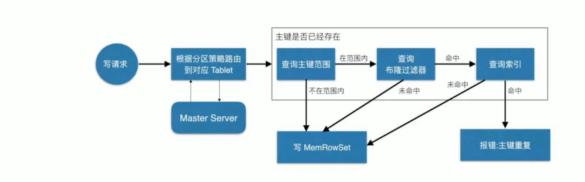

## 5. kudu读流程

数据读取过程大致如下:先根据要扫描数据的主键范围，定位到目标的Tablets，然后读取Tablets中的RowSets。

在读取每个RowSet 时，先根据主键过滤要scan范围，然后加载范围内的base data,再找到对应的delta stores,应用所有变更,最后union 上 MemRowSet中的内容，返回数据给Client。

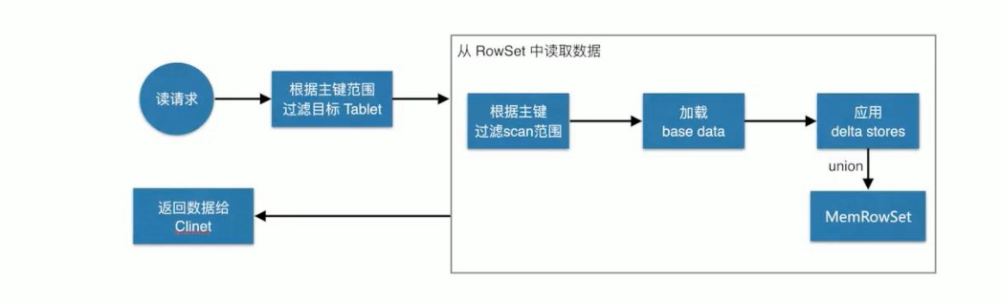


## 6. kudu更新流程

数据更新的核心是定位到待更新数据的位置，这块与写入的时候类似，就不展开了，等定位到具体位置后，然后将变更写到对应的delta store 中。

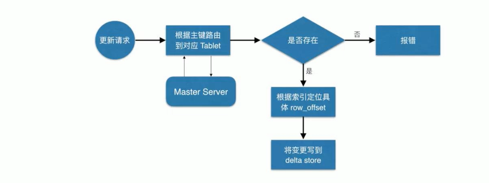


