# 一、数据湖概念[了解]

## 1.数据湖概念

> ​	数据湖是一个集中式存储库，允许您以任意规模存储所有结构化和非结构化数据。您可以按原样存储数据（无需先对数据进行结构化处理），并运行不同类型的分析 – 从控制面板和可视化到大数据处理、实时分析和机器学习，以指导做出更好的决策。

## 1.1 企业的数据困扰

> ​	我们学习到这里，已经接触到了如：数据库、数据仓库、NoSQL数据库、消息队列、流式计算、缓存等等一系列的数据管理形式。
>
> ​	我们来回顾一下，这些数据管理形式都分别提供了什么功能：
>
> `数据库`：提供数据的存储和查询
>
> `数据仓库`： 提供数据的集中存储的分析
>
> `NoSQL数据库`：也同样提供数据的存储的查询
>
> `消息队列`:提供数据的转移通道
>
> `流式计算`:提供高效的数据的加工和分析
>
> `缓存系统`提供数据的快速加载
>
> ​	可以看到，以上我们接触到的数据管理形式，提供了多种多样的功能，正常来说，应该已经足以满足企业在数据管理和利用方面的各种需求。但是，我们仍会说，企业有数据管理和利用方面的困扰。那么，这些困扰来自哪里？
>
> **困扰一：互联网的兴起和数据孤岛**
>	随着互联网的兴起，企业内客户数据大量涌现。为了存储这些数据，单个数据库已不再足够，公司通常会建立多个按业务部门组织的数据库来保存数据。随着数据量的增长，公司通常可能会构建数十个**独立运行**的业务数据库，这些数据库具有不同的业务和用途。一方面，这是一种福气：有了更多，更好的数据，公司能够比以往更精确地定位客户并管理其运营。另一方面，这导致了数据孤岛：整个组织中数据分散到各个地方。由于无法集中存储和利用这些数据，公司对于数据的利用效率并不高。这样的痛苦让公司逐步走向数仓的利用模式。
> 
>**困扰二：非结构化数据**
> 	随着数据仓库的兴起，人们发现，数据孤岛的问题貌似被数仓解决了。我们通过ETL、数据管道等程序，从各个数据孤岛中抽取数据注入数仓中等待进行`维度分析`。看起来有一种数据集中存储的样子。但是随着互联网的加速发展，数据也产生了爆发性的增长，数仓就表现出来了一点力不从心：数据增长的太快，而由于数据建模的严格性，每开发一次数仓的新应用，流程就很长。无法适应新时代对于数据快速分析、快速处理的要求。随着数据行业和大数据处理技术的发展，原本被遗忘在角落中的一些价值密度低的非结构化数据便慢慢了有了其价值所在，对于这些大量的非结构化数据（日志、记录、报告等）的分析也逐步提上日程。但是，数仓并不适合去分析非结构化的数据，因为数仓的严谨性，其只适合处理结构化的数据。那么，对于非结构化数据的处理数仓就不太适合。
> 
>**困扰三：保留原始数据**
> 	在以前，由于大规模存储的成本和复杂性以及大数据技术尚未开始蓬勃发展等客观原因，造成企业对于数据的存储是精简的。也就是，能够存入到企业系统中的数据都是经过处理提炼的，这些数据撇除了价值密度低的信息，只保留了和业务高度相关的核心内容。这样可以有效的减少企业的数据容量，也就减少了存储的成本、以及管理维护的复杂度。但这样做是有一定的缺点的，那就是企业并不保留原始数据（或者说保留部分），一旦出现数据错误或者其它问题，想要从原始的数据中进行溯源就难以完成了。并且，业务并不是一成不变的，当初因为业务被精简掉的内容，可能对未来的业务有所帮助。所以，无法大量的长期保存原始数据也是企业的困扰之一。
>
> 三个困扰：
>
> **数据孤岛**
>**非结构化数据分析**
> **想要海量的保存原始数据**
>
> 于这3个最主要的困扰，企业迫切希望能够做到：
> 
>```properties
> 数据的集中存储（解决数据孤岛），并且成本可控，使用维护简单
>可以存储任意格式的数据（结构化的、非结构化的、半结构化的）
> 能够支持大多数分析框架
>```
> 
>这样的三种最基本的需求。
> 
>那么，数据湖的概念也就因这三种需求被逐步的提出并走向人们的视野中。
> 
>集中存储，成本可控，使用简单，能够支持任意格式输入并拥有分析处理能力。（**数据湖的核心思想**）

## 补充：什么是结构化？

> ****
>
> 那么，我们刚刚提到了结构化数据和非结构化数据，现在来看一下，它们分别是什么。
>
> **结构化数据**
>
> 简单来说，就是数据库中的数据。在最早，结构化数据也称之为 `行数据`。是可以由一个`二维表`来描述的数据。也就是通俗的说，数据是有**表结构**的。不过，发展到如今，对于结构化的定义就不仅仅是指 数据库中的数据了。我们可以认为，可以用**schema定义**的数据，就是结构化数据。那么什么是schema呢？ 可以简单的认为，schema就是表结构、或者说是一种对数据结构的描述。结构化数据是规范的，在schema的定义下，每一列，每一个位置，应该是什么类型的数据，表达的是什么意义都是确定的。对于这样的`具有确定意义`的数据的分析的处理，是极为方便的。
>
> | name String | age Int | address String |
> | ----------- | ------- | -------------- |
> | 张三        | 18      | 吉安市         |
>
> 目前，常见的结构化数据有：
>
>     数据库中的数据
>     遵循schema的特定分隔符数据，如CSV等
>
> **非结构化数据**
>
> 那么，非结构化数据，就应该比较好理解了：非结构化数据就是指：无法用schema定义的数据
>
> 非结构化数据是非常多的，如：
>
>     我们写程序的代码
>     程序的日志输出
>     各类协议
>     等，这些还只是文本，如果算上二进制：
>         图片
>         音频
>         视频
>         PPT
>         等都算得上非结构化数据
>
> **半结构化数据**
>
> 其实，还有一个类别，叫做半结构化数据。这个也很好理解，就是指：可以用schema定义其一部分的数据，但无法定义全部。或者说：无法用二维表（比如：数据库表结构定义的数据）描述，但是其自身有相应的标记或描述语言，对自身进行数据描述的数据，其遵循自身所带有的描述或标记规定的结构
>
> 常见的半结构化数据有：
>
>     XML
>     
>     JSON
>     
>     YAML
>
> 以JSON举例，如果我们用schema来描述它，只能得知，如：
>
> { “Key”：“Value”， …“Key”: “Value” }
>
> 但是，我们无法详细的知道 key是什么，特别是value是什么。因为value可以是一个 字符串，可以是数字，可以是嵌套的另一个JSON对象，或者嵌套了另一个JSON数组，都有可能。所以，JSON无法用schema来完整描述，但是，JSON自身有描述。也就是，我们无法在得到JSON之前schema来定义它，但是当我们得到JSON后，就可以用schema来定义它了。
>
> 如一串JSON
>
> ```json
> {"name": "zhangsan", "age": 10, "like": ["football", "music"]}
> ```
>
> 在拿到这个json前，我们不知道其schema是什么，但是当我们得到后，就可以定义其schema
>
> ```json
> {"string": "string", "string": int, "string": Array[String]}
> ```
>
> 但是，这个schema 依旧无法和真正结构化数据的schema来进行比较，其描述能力是有所减弱的。为何？如上，我们只能得知schema中，某个位置是string, 某个位置是int。但是在真正的结构化schema中，我们是能明确，某个位置就是表示的名字，并且是string类型。
>
> 因为：
>
> ```json
> {"title": "developer", "level": 10, "like": ["football", "music"]}
> ```
>
> 这个json，依旧满足上面的schema。所以，半结构化数据，可能有点不好理解， 但也是我们经常接触到的数据。

## 1.2 数据湖的提出

​	在2011年左右，开源大数据技术（Hadoop）逐步进入企业的视野，也开始了蓬勃发展。大数据技术带来了：

    海量数据分析的可能性
    低成本、易维护管理的分布式存储

与此同时，基于大数据技术带来的优势以及企业对数据的困扰所产生的需求，在2011年，数据湖的概念也被提出。在概念中提到，数据湖应该做到：

    集中存储
    保留原始数据格式
    支持任意格式
    支持海量数据分析

以上的诉求，大数据技术体系均可以满足。此时，企业开始走向构建数据湖的时代。数据湖的提出，是基于大数据技术的发展，如果没有大数据技术，数据湖的概念很难被落实。

## 1.3 所以，数据湖是什么？

​	根据前面的内容，我们可以得出，数据湖就是：一种支持任意数据格式、并保留原始数据内容的大规模存储系统架构，并且其支持海量数据的分析处理。

    大规模存储系统架构
        支持任意数据格式的输入，并做到集中存储
        能够保留海量的原始数据
    支持海量数据分析处理

## 1.4 为什么叫做数据的湖？

​	我们知道，IT技术的命名有时候是和其本身关系不大的，比如Hadoop、Pig、Spark等。有时候看名字我们就知道其是做什么的，比如Flume、Zookeeper等。数据湖的命名（Data Lake）就是第二种，名字贴合其实际意义的。为什么是湖泊呢？我们前面说过，数据湖应该做到：

    集中存储
    支持任意数据格式输入等

​	那么，这样的要求，是不是很像：无论大小河流（任意格式）均可将水汇入湖泊中（集中存储）。所以，从名字中我们可以解析到，数据湖就是一个巨大的数据集合，汇聚了来自各个系统的任意格式的原始数据，并且能够对湖泊进行利用分析，进行水的流出（分析、利用的结果）

## 1.5 数据仓库-数据集市-数据湖区别

我们应该听说过以下3个概念：

    数据仓库
    数据集市
    数据湖

那么这三者到底有什么区别呢？
**数据湖：**

> 是整个公司内的一个开放的数据中心，接收任意类型的数据输入，对数据进行集中存储，并能对这些数据提供分析服务。

**数据仓库：**

> 是整个公司的业务数据集合，主要针对`结构化的`业务数据，并能提供查询分析服务。

**数据集市：**

> 是一个小型的`部门级别`或者工作组级别的数仓。其内部数据主要针对指定业务范围，或者为指定人员提供服务。

| 比较           | 数据仓库           | 数据集市             | 数据湖                           |
| -------------- | ------------------ | -------------------- | -------------------------------- |
| 应用范围       | 全公司             | 部门或工作组         | 全公司                           |
| 数据类型       | 结构化数据处理     | 结构化数据处理       | 任意格式数据处理                 |
| 存储规模       | 大量               | 中等规模（小型数仓） | 海量                             |
| 数据应用       | 维度建模、指标分析 | 小范围数据分析       | 海量任意格式分析、不限应用的类型 |
| 新应用开发周期 | 长                 | 长                   | 短                               |

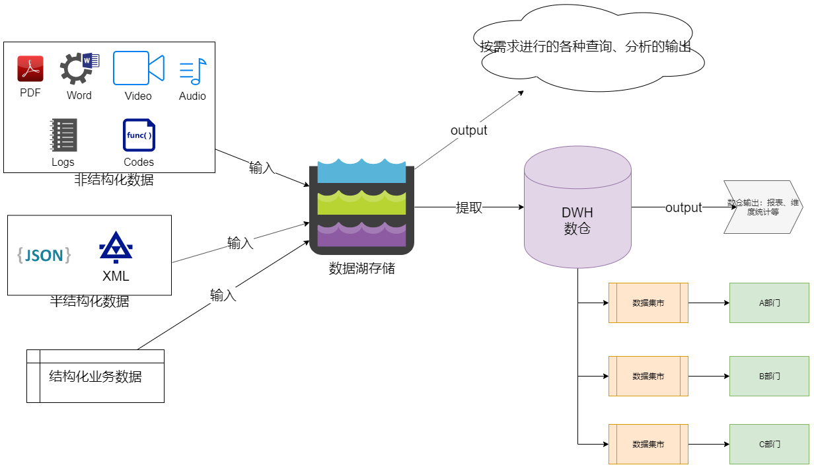

# 二、数据湖理论[了解]

学习步骤：

    两种数据写入模式
    构建数据湖的几个常规方式
    数据湖对企业的用途和数据湖的设计原则

## 2.1 写时模式 VS 读时模式

为了更好的理解数据湖，我们先了解一下：

    写时模式
    读时模式

这两种模式。

**写时模式**

> 数据在写入之前，就**需要定义**好数据的schema，数据按照schema的定义写入（eg:数据库）

**读时模式**

> 数据在写入的时候，**不需要定义**Schema，在需要使用的时候在使用Schema定义它（eg:数据湖）

> ​	`写时模式和读时模式`是两种截然不同的数据处理方法。我们前面学习的如：数据库、数据仓库、数据集市 或者具体的一些框架如：Mysql，Redis， HBase等均是写时模式，即数据在写入之前就需要预先有Schema定义好才可以。而数据湖就是一种读时模式思想的具体体现。相比较写时模式而言，读时模式因为是数据在使用到的时候再定义模型结构（Schema），因此能够提高数据模型定义的灵活性，可以满足不同上层业务的高效率分析需求。因为，对于写时模式而言，如果想要事后更改Schema是有很高的成本的。而读时模式可以在用的时候再定义Schema就很灵活了，同一套数据可以用不同的Schema来定义，来获取不同的效果。

## 2.2 数据湖构建的几种常规方式

> ​	想必同学们学习到这里，应该会有一定的疑惑，就是：数据湖是一种新型的数据库吗？还是一种新推出的技术框架吗？答案是： No。我们前面给数据湖一个定义，就是：数据湖是一种支持任意数据格式、并保留原始数据内容的 大规模存储系统架构，并且其支持海量数据的分析处理。那么根据定义可以看出，**数据湖是一种系统的架构方案，它并不是一种特殊的数据库，也不是某一种技术框架。数据湖是一种概念，一种解决问题的思路，一种数据治理的方案、一种企业大规模数据集中存储并利用的架构思想**。那么，数据湖架构是怎么实现的呢？

### **方案一：基于Hadoop生态体系的数据湖实施方案**

实际上，多数企业对于`Hadoop`生态的使用，本质上是一种数据湖思想的体现。

如，企业中会使用：

    HDFS来作为存储层，存储各类各样的原始数据，不管是结构的、半结构的、还是非结构的，均在HDFS存储。
    使用Spark、SparkSQL、MR等计算框架作为分析引擎，对原始数据进行分析、抽取、计算、利用。
    使用Flume、Kafka等持续不断的为HDFS落地新数据。
    使用Flink、Storm等实时分析HDFS的数据以及落地结果至HDFS之上。

实际上，以上的解决方案或者说数据架构，就是数据湖的思想。我们在来回想一下：以上的技术利用，是不是满足了：

    无论何种数据均可落地存储（HDFS）
    无论何种数据均可分析（Spark、MR）

> ​	所以说，我们的结论就是：数据湖，本质上就是要为企业构建一个**数据治理**方案，方案可以满足：无论何种数据（结构、半结构、非结构），均可集中存储，并能够提供分析服务，并且能够支撑海量的数据。另外，**集中存储**也是一个很重要的概念。数据湖的思想是，数据（原始数据）均集中存储起来，在需要的时候可以快速抽取进行计算，避免这里存一份，那里存一份。集中存储，集中利用。HDFS作为底层存储层，在企业业务系统中一般是均可访问到的（视权限管控的具体情况），那么对于企业来说，HDFS无处不在，在任何需要数据的时候，均随时从HDFS中抽取即可。

    可以直接让Spark、SparkSQL（读时模式，后定义Schema）去分析。
    可以直接将数据扔给AI集群去做训练。
    可以直接走ETL过程将数据扔入数仓。

> ​	那么，以这种结论来看，多数企业均在使用数据湖这样的思想去治理数据。我们说这是一种思想，一种数据治理的方式。对于能够理解并利用数据湖思想的企业，其在架构Hadoop生态体系的时候会按照数据湖的思想来构建、架构其数据中心平台。对于并未想到数据湖或者说不了解数据湖的企业来说，其Hadoop生态的体系在架构设计的时候，多数是围绕其具体业务来设计的，只是，多数的架构也恰恰满足数据湖的概念定义。

    HDFS 做集中存储，能够支持海量的数据以及不限格式的存储输入。
    Spark、SparkSQL MR 可以对这些海量的数据进行分析。

### **方案二：基于云平台的数据湖实施方案**

> 通过方案一的讲解，我们应该明白：数据湖不是技术框架，而是数据治理的方案这句话的意思了。那么，在云平台上，基于云平台提供的技术架构和具体组件来协助构建企业的数据湖实施方案也是一种可行并高效的方式。

    集中的海量存储
    海量的数据分析

我们以AWS为例：
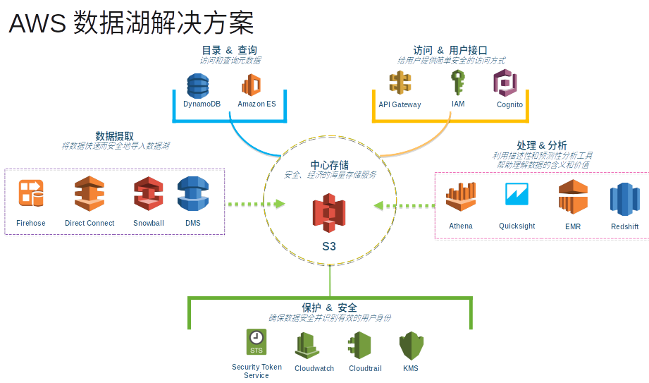

> - 以`S3`对象存储服务为核心，提供数据湖的存储层，做到集中存储，随处访问（视权限管控结果）
>
> - 以`DynamoDB`，`Amazon ES`等服务提供元数据存储和查询（`Schema`存储）
>
> - 以`Firehose`、`Snowball`等服务提供数据导入功能
>
> - 以`Athena`、`EMR`、`Redshift`等服务提供数据的处理和分析功能
>
> - 以`STS`、`Cloudwatch`、`IAM`、`API Gateway`等服务提供数据中心的安全、认证、访问、用户接口等功能
>
>   可以看出，其实和Hadoop生态体系的数据湖差不多，也是由一个核心的存储层提供集中存储（HDFS、S3），然后由一系列计算引擎提供分析计算（Spark、EMR），并由一系列其它辅助工具提供额外功能，如：数据导入、权限管控、元数据存储等。

### **方案三：基于商业公司提供的商业数据湖产品**

> ​	部分公司选择使用相关商业产品（收费）来构建企业的数据湖生态。如：`Zaloni` 等。商业公司的商业产品，一般均为闭源实现，且价格不菲，多数为大型企业以及相关传统企业选用。主要是花钱买服务，一般许多传统行业（非互联网等科技企业）的大型公司愿意选用，因为本身并没太多的技术人员，但又有相关需求，比较倾向花钱一套解决。

    商业产品这里不多做介绍，我们主要关注于Hadoop生态和云平台相关。
## 2.3 企业为何需要数据湖？对企业有何用处？【了解】

我们先来看一下，企业中数据仓库的开发流程。一般，我们如果想要开发一个新的数仓应用，其开发流程是：

    提出数仓应用的需求（需要某某某报表，指标分析）
    根据需求，设计数仓的模型和表结构
    设计完成后，编码应用ETL等工具完成数据的输入

> ​	可以发现，数仓的开发是倒序进行的，是以需求为导向的。这是写时模式的一种体现，并且在前期进行`需求分析、模型设计、项目编码`等一系列操作是传统的应用开发模式，比较耗时并繁琐。在传统的过去，这种开发形式没有太多问题，但是在数据大规模增长的今天，如果企业100%依赖数仓这种模式来进行数据的价值提炼，那么企业就很可能跟不上时代发展的步伐。所以，数据湖的价值就体现了出来，除了为企业解决我们先前提到的三个困扰以外，还有一点对企业很有价值的就是：基于数据湖的开发模式是一种`读时模式`，是一种灵活的、快速的数据处理思路，可以快速的对以后数据进行数据分析，并让其立刻产生价值。并且重要的是，它能在数字化的新浪潮下，真正的帮助企业完成技术转型、完成数据积累、完成高效的数据治理，应对快速发展的商业环境下层出不穷的新问题。

> ​	要注意的是：并不是说有了数据湖之后，数仓就是没用的了。并不是这样。数据湖和数仓是一种互补的存在，数据湖基于其：集中存储、保留原始格式、读时模式等特点，为企业提供了快速挖掘数据价值的能力以及提高数据利用率，让每一份数据都发挥其存在的价值。而数仓为企业提供的是：
>
>     更加严格的商业数据分析
>     价值密度更高的数据分析
>     针对业务进行的精准数据处理
>
> 所以，在当下的企业，数据湖有其存在的价值，数仓同样。两者是互补的关系，合力为企业创造更好的数据价值。
>

## 2.4 数据湖概念总结

寥寥草草的说了这么多，我们来总结一下数据湖的一些特点

### 2.4.1 特点

> - 不限格式，来之不拒，均可流入
>
> > 当前的时候，数据增长巨大、数据来源也是各种各样，不管是结构的、半结构的、还是非结构的，都可以流入数据湖做集中存储，方便利用的时候进行分析。
>
> - 集中存储、到处可访问
>
> > ​	数据集中存储起来（Hadoop生态使用HDFS、云平台使用S3、OSS等），在需要的时候随时进行访问，避免了在一些模式下，许多业务的数据均分散存储，这里一部分那里一部分，需要做许多前置工作才能将数据汇总聚合。
>
> - 高性能分析能力
>
> > 借助于Spark、MR、SparkSQL等高性能分析计算引擎，可以对海量的数据进行分析。
>
> - 原始数据存储
>
> > 大量的保留原始数据，让每一个字段每一段信息都发挥其价值，并更好的为企业提供数据溯源、数据修复等一系列功能。

### 2.4.2 对比数仓：

前面我们简单的对比了一下：数据湖、数仓、数据集市。随着我们对数据湖概念了解的加深，我们再次对比一下数仓：

#### 2.4.2.1 模式上：

    数仓： 写时模式，数据写入前已经定义好Schema，更改Schema成本较高
    
    数据湖：读时模式，数据在利用的时候再定义Schema，灵活方便，典型例子：SparkSQL
    
    基于SparkSQL的后定义Schema（读时模式），目前，多数数据湖的实现方案里面，SparkSQL占了很大的份额。

#### 2.4.2.2 使用思维上：

    数仓：先有报表需求，根据需求确定数仓Schema，然后通过ETL过程将数据导入。也就是，先有需求、后准备数据
    
    数据湖：并不需要根据需求来开发数据业务。数据集中存储，需要的时候再利用。也就是，先有数据，再根据已有数据开发业务。
    
    这样的方式对比数仓好在：
        可以完整的保留数据的结构，不会因为ETL过程损失数据信息
        可以加快数据开发的进度，适应企业不断增长的业务需求

#### 2.4.2.3 处理数据上

    数仓： 只针对结构化数据、或部分有严格格式的半结构化数据
    
    数据湖：接受任何数据输入

### 2.4.3 数据湖的优势

> - 轻松的收集数据（**读时模式**）：数据湖与数据仓库的一大区别就是，Schema On Read，即在使用数据时才需要Schema信息；而数据仓库是Schema On Write，即在存储数据时就需要设计好Schema。这样，由于对数据写入没有限制，数据湖可以更容易的收集数据。
> - 不需要关心数据结构：存储数据无限制，任意格式数据均可存储，只要你能分析就能存。
> - 全部数据都是共享的（集中存储），多个业务单元或者研究人员可以使用全部的数据，以前由于一些数据分布于不同的系统上，聚合汇总数据是很麻烦的。
> - 从数据中发掘更多价值（分析能力）：数据仓库和数据市场由于只使用数据中的部分属性，所以只能回答一些事先定义好的问题；而数据湖存储所有最原始、最细节的数据，所以可以回答更多的问题。并且数据湖允许组织中的各种角色通过自助分析工具（MR、Spark、SparkSQL等），对数据进行分析，以及利用AI、机器学习的技术，从数据中发掘更多的价值。
> - 具有更好的扩展性和敏捷性：数据湖可以利用分布式文件系统来存储数据，因此具有很高的扩展能力。开源技术的使用还降低了存储成本。数据湖的结构没那么严格，因此天生具有更高的灵活性，从而提高了敏捷性。

### 2.4.4 数据湖的要求

想必大家应该对数据湖有了清晰的认知了，那么，为了满足我们需要的：

    集中存储
    任意格式输入
    强大的分析能力

我们需要对数据湖的实现提出如下的要求：

    安全：数据集中存储，就对数据安全有了更高的要求，对权限的管控要求更加严格。
    可拓展的：随着业务扩张、数据增多，要求数据湖体系可以随需求扩展其能力。
    可靠的：作为一个集中存储的数据中心，可靠性也很重要，三天两头坏掉那是不可以的。
    吞吐量：数据湖作为海量数据的存储，对数据的吞吐量要求就必须很高。
    原有格式存储：数据湖我们定义为 所有数据的原始数据集中存储库，那么存储进入数据湖的数据就是未经修饰的、原始的数据
    支持多种数据源的输入：不限制数据类型，任意数据可以写入
    多分析框架的支持：因为数据格式各种各样，并不全是结构化数据，所以，要求支持多种分析框架对数据湖中的数据进行提取、分析。包括但不限于：批处理的、实时的、流的、机器学习的、图形计算的等等。

## 2.5 如何设计一个成功的数据湖架构？

那么，我们如何才能设计出一个成熟的、成功的数据湖的体系架构呢？

要满足一个成功的数据湖架构，除了要满足在前面（2.4.4 数据湖的要求）提到的要求外，也要满足下面的4个设计指导原则：

### 2.5.1 数据湖架构的4个指导原则

数据湖在架构的时候，遵循如下4个设计指导原则：

**原则1： 分离数据和业务**

> ​	在数据湖的架构设计中，不考虑业务，只考虑数据。也就是我们只站在数据的层面去考虑如何去高效的写入、如何实现可用的集中存储而不会在这个过程中，考虑业务，为业务对数据做适配。这些考虑是数仓应该做的。

    很多企业也做到了所有数据均存储，但是仍旧不能称之为数据湖，就是因为，很多企业在存储的时候，并不能完全舍弃业务，只关心数据层面。
    
    比如，有的企业认为，我的数仓里面存储了全部的企业需要的数据，为何不是数据湖？其实就是因为，在做存储的时候，并没有完全的抛弃业务，总是因为业务需求，对数据进行了拉伸、缩减等处理。
    
    或者有的企业也是将所有数据均存入HDFS，但是在存储的时候根据业务需要对数据进行了修饰。
    
    那么，这样的操作都不能算构建了数据湖，因为数据湖的要求其中之一就是：原始数据未经修改的存储，存储的是原滋原味的数据，而不是modified的数据。

**原则2： 存储和计算的分离（可选，比较适用云平台）**

> ​	有这样一个问题，当计算容量的不够的时候，我们需要对计算进行扩容，但是一般的Hadoop使用中，计算和存储是在一起的。（datanode 和 计算节点复用，为了做数据本地计算）对计算进行扩容就会导致存储也一样扩容，那么，存储的rebalance，就会造成存储的资源消耗。也就是说白了，计算的扩容受到存储的制约，无法灵活的扩容\缩容。所以，最好的情况，就是做计算和存储的分离。存储是存储，计算是计算。但对于传统的Hadoop集群来说，做分离的话，就对网络环境要求极高，因为当数据无法在本地计算的时候，就需要走网络传输。那么，交换机等内网性能就会是很大的挑战。所以，对于多数受到成本制约的公司来说，存储和计算的分离是可选的原则，因为其成本较高。但是，对于云平台来说就没有这方面的顾虑。云平台基本上都是，天生的计算和存储分离的。如AWS的S3 作为存储，其计算是和S3没有任何关联的。如Azure的Blob存储，其计算也和Blob无关同样，如阿里云的OSS存储，也是和计算没有关系的。所以，如果要在云平台上实现数据湖，那么一个天生的优势就是，计算和存储很容易就分离了。

**原则3： Lambda架构 VS Kappa架构 VS IOTA架构**

> ​	数据湖构建好后，数据总要被利用、被分析。而一个好的数据利用的架构可以高效的去处理数据湖内的海量数据。数据处理的架构，一般有 Lambda架构、Kappa架构、IOTA架构等。关于这些架构，请参阅后面的拓展章节内的介绍。

    注：这些架构并不属于数据湖架构，而是指：我们有了数据湖怎么去利用、去分析数据湖内数据的一些架构。
    
    这些也是常见的大数据分析领域的架构。

**原则4： 管理服务的重要性和选择合适的工具**

数据湖不仅仅是一个存储那么简单，存储是为了利用，为了达到这一点，我们需要：

    对数据进行安全管理
    对访问进行权限管控
    需要ETL等将数据汇入数据湖
    需要使用合适批处理、流处理去分析去计算
    用户前端工具，如BI展示、REST API等
    等等，一些列周边围绕的服务

> ​	也就是，实现一个数据湖需要许多服务的协同配合，不仅仅是存储那么简单，所以这些管理服务以及相关的辅助工具对于数据湖来说是很重要的。那么，适当的管理服务可以帮助我们更加简便的设计数据湖的架构。如上，是数据湖架构的4个指导原则，一般来说，满足这4个指导原则，就能构建出成功的数据湖架构。

# 三、数据处理、数据应用的几种架构[拓展]

学习步骤：

    了解Lambda架构
    本章为拓展章节，课堂上仅做简单介绍，同学们可以自行阅读理解或查阅互联网资料。

> ​	我们在前面说过，数据湖内的数据在利用的时候 一般会遵循`Lambda`架构或者`Kappa`架构或`IOTA`架构等数据处理的架构思想为指导。当然，不遵循这两种架构思想也是可以的，如果你有自己的想法去做设计也是没问题的。只是，一般Lambda架构和Kappa架构作为成熟的大数据分析架构，用在处理数据湖内的数据也是很适合的。

## 3.1 Lambda架构[重点了解]

下面下来看一段官方语气的介绍

### 3.1.1 简介

> ​	Lambda架构是由`Storm`的作者Nathan Marz提出的一个实时大数据处理架构。Marz在Twitter工作期间开发了著名的实时大数据处理框架Storm，Lambda架构是其根据多年进行分布式大数据系统的经验总结提炼而成。Lambda架构的目标是设计出一个能满足实时大数据系统关键特性的架构，包括有：`高容错、低延时和可扩展`等。Lambda架构整合离线计算和实时计算，`融合不可变性（Immunability），读写分离和复杂性隔离`等一系列架构原则，可集成Hadoop，Kafka，Storm，Spark，Hbase等各类大数据组件。

### 3.1.2 Lambda架构关键特性

Marz认为大数据系统应具有以下的关键特性：

> - Robust and fault-tolerant（`容错性和鲁棒性`（注1)）：对大规模分布式系统来说，机器是不可靠的，可能会宕机，但是系统需要是健壮、行为正确的，即使是遇到机器错误。除了机器错误，人更可能会犯错误。在软件开发中难免会有一些Bug，系统必须对有Bug的程序写入的错误数据有足够的适应能力，所以比机器容错性更加重要的容错性是人为操作容错性。对于大规模的分布式系统来说，人和机器的错误每天都可能会发生，如何应对人和机器的错误，让系统能够从错误中快速恢复尤其重要。
> - Low latency reads and updates（`低延时`）：很多应用对于读和写操作的延时要求非常高，要求对更新和查询的响应是低延时的。
> - Scalable（`横向扩容`）：当数据量/负载增大时，可扩展性的系统通过增加更多的机器资源来维持性能。也就是常说的系统需要线性可扩展，通常采用scale out（通过增加机器的个数）而不是scale up（通过增强机器的性能）。
> - General（`通用性`）：系统需要能够适应广泛的应用，包括金融领域、社交网络、电子商务数据分析等。
> - Extensible（`可扩展`）：需要增加新功能、新特性时，可扩展的系统能以最小的开发代价来增加新功能。
> - Allows ad hoc queries（`方便查询`）：数据中蕴含有价值，需要能够方便、快速的查询出所需要的数据。
> - Minimal maintenance（`易于维护`）：系统要想做到易于维护，其关键是控制其复杂性，越是复杂的系统越容易出错、越难维护。
> - Debuggable（`易调试`）：当出问题时，系统需要有足够的信息来调试错误，找到问题的根源。其关键是能够追根溯源到每个数据生成点。
>
> 注解1：鲁棒是Robust的音译，也就是健壮和强壮的意思。它也是在异常和危险情况下系统生存的能力。

### 3.1.3 数据查询的本质

查询是什么概念？Marz给出了一个简单的定义：

    Query = Function(All data)

> ​	该等式的含义是：查询是应用于`数据集上的函数`。该定义看似简单，却几乎囊括了数据库和数据系统的所有领域：RDBMS、索引、OLAP、OLTP、MapReduce、EFL、分布式文件系统、NoSQL等都可以用这个等式来表示。

### 3.1.4 Lambda的三层架构

> ​	有了上面对查询的定义，下面我们来讨论大数据系统的关键问题：如何实时地在任意大数据集上进行查询？
>
> ​	大数据再加上实时计算，问题的难度比较大。最简单的方法就是：根据前面的定义Query = Function(All data)， 在全体数据集上运行函数得到想要的结果。但是如果数据量非常大，该计算的方式就代价太大了，所以不现实。那么，Lambda架构通过分解为三层架构来解决此问题：

    Batch Layer（批处理层）
    Speed Layer（速度层）
    Serving Layer（服务层）

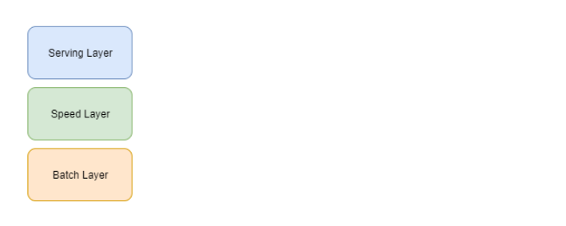

那么这三层表达了什么意思？我们一个一个来看一下。

### 3.1.5 Batch Layer 批处理层

> ​	我们前面说过，一般情况下，任何的查询都可以表示为：Query = Function(All data)，但是，如果在数据量非常大的时候，且还要支持实时查询，就会消耗巨大的系统资源，或者难以达到。那么，一个解决方式就是：预运算查询函数（precomputed query function)预运算查询函数可以在系统空闲的时候根据业务需要的设计，去运行查询分析作业，然后生成结果我们称之为`Batch view` （批视图）那么，有了这个Batch view后，我们对数据的查询可以改为：
>
> **Batch view = Query Function(All data)**
> **Query = Function(Batch view)**

> ​	从表达式中我们可以看出，真正的业务查询实际上是查询的 批处理视图，也即是我们预先准备好的数据内容。我们也可以把这一步称之为：`中间数据`生成那么，在Lambda架构中，把Batch view的生成这一步，就称之为Batch Layer 批处理层。

在Batch Layer中，有两个特性：

    存储Master Dataset， 这是一个持续增长的数据集（对应All data，也就是在数据湖中我们需要利用的数据集）
    在Master Dataset上执行预计算函数，构建查询所需的对应的view

> ​	我们把预处理结果称之为`view`，通过view可以快速得到结果（或者说对比query All data 简单太多）。
>
> 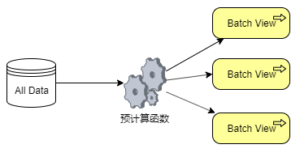
>
> ​	可以看出，`预计算函数`，本质上就是一个批处理，那么就比较适合使用MR、Spark等计算引擎进行处理。并且，采用这种形式生成的view均支持再次计算，如果对view不满意或者执行错误，重新执行一次即可。该工作看似简单，实质非常强大。任何人为或机器发生的错误，都可以通过修正错误后重新计算来恢复得到正确结果。

### 3.1.6 Speed Layer 速度层

> ​	Batch Layer可以很好的处理离线数据，但是在我们的系统中，有许多的实时增量数据，而Speed Layer这一层就是用来处理`实时增量数据`的。Speed Layer和Batch Layer比较类似，Speed Layer层是对数据进行计算并生成一个Realtime View，其主要区别在于：

    Speed Layer处理的数据是最近的增量数据流，Batch Layer处理的全体数据集
    Speed Layer为了效率，接收到新数据时不断更新Realtime View，而Batch Layer根据全体离线数据集直接得到Batch View。Speed Layer是一种增量计算，而非重新计算（recomputation）
    Speed Layer因为采用增量计算，所以延迟小，而Batch Layer是全数据集的计算，耗时比较长

综上所诉，Speed Layer是Batch Layer在实时性上的一个补充。Speed Layer可总结为：

**realtime view＝function(realtime view，new data)**

Lambda架构将数据处理分解为Batch Layer和Speed Layer有如下优点：

    容错性。Speed Layer中处理的数据也不断写入Batch Layer，当Batch Layer中重新计算的数据集包含Speed Layer处理的数据集后，当前的Realtime View就可以丢弃，这也就意味着Speed Layer处理中引入的错误，在Batch Layer重新计算时都可以得到修正。这点也可以看成是CAP理论中的最终一致性（Eventual Consistency）的体现。
    
    复杂性隔离。Batch Layer处理的是离线数据，可以很好的掌控。Speed Layer采用增量算法处理实时数据，复杂性比Batch Layer要高很多。通过分开Batch Layer和Speed Layer，把复杂性隔离到Speed Layer，可以很好的提高整个系统的鲁棒性和可靠性。

> ​	通俗的说，也就是`Batch Layer`根据其执行的时间间隔，不断的将Batch View 涵盖的范围覆盖到新数据上。而一旦Batch View执行到了某个时间点，这个时间点之前的Realtime View就会被丢弃。也就是说，由于Batch View的高延迟，在需要得到最新数据结果的时候，由Realtime View做补充，然后再后方，Batch View不断的追赶进度。

### 3.1.7 Serving layer 服务层

> Lambda架构中的最高层：`Serving Layer`层，可以理解为用户层，即响应用户的查询需求的层。在Serving Layer中，将合并Batch View 以及Realtime View的结果，作为最终的View提供给用户查询。那么，换算为前面的表达式为：**Query = Function(Batch View + Realtime View)**
>
> 上面分别讨论了Lambda架构的三层：Batch Layer，Speed Layer和Serving Layer。总结下来，Lambda架构就是如下的三个等式：

    batch view = function(all data)
    realtime view = function(realtime view, new data) # 其中参数中的Realtime view就是不断的对以后的Realtime View进行迭代更新，直到被Batch View追上丢弃。
    query = function(batch view, realtime view)

### 3.1.8 Lambda架构的组件选型

根据上面对Lambda架构的理解，我们可以对各个层的实现来做技术选型：

    Batch Layer： 可以选用MR、Spark、SparkSQL等计算引擎
    Speed Layer： 可以选用Storm、Flink、Spark Streaming
    Serving Layer：可以选用Mysql、Redis、HBase等数据库或缓存系统供用户查询（将两个View的合并结果导入供查询）

### 3.1.9 Lambda架构的总结

Lambda架构可以总结为以下一些简单的语言：

    分为离线处理路径和实时处理路径两种处理模式
    离线处理和实时处理都会产生相应的中间数据，离线的结果根据执行间隔不停的更新，实时的结果不断的用新数据迭代。
    将离线的实时生成的中间数据进行合并，抽取到一些数据库、缓存系统中，作为服务层供用户查询。

### 3.1.10 Lambda架构的缺点【拓展】

> ​	Lambda架构经过这么多年的发展，已经非常的成熟，其优点是稳定，对于实时计算部分的成本可控，而批处理部分可以利用晚上等空闲时间进行计算。这样把实时计算和离线处理的`高峰错开来`。这种架构支撑了数据行业的早期发展，但也有一些缺点：

    实时和批量结果不一致引起的冲突：由架构中可以得知，架构分实时和离线两部分，两边结果的计算要保持一致就比较困难。理论上来说，对于一些需要全量数据才能计算出的结果，90%的数据计算已经由离线负责完成，剩下10%是当前实时的计算结果，对两个结果合并就能做到100%全量的处理，并且保证低延迟。
    
    但是，这仅仅是理论上以及我们所期望达到的，实际在应用的过程中因为各种原因导致这个时间没有对的上，导致衔接处出现了一些数据遗漏或者数据重复，就会让结果不准确。
    
    并且，当过了一段时间后，离线部分追了上来，对错误进行了修正，又会导致在前端页面导致结果被修改的问题。
    
    也就是说：理论是OK的，实施起来比较复杂，难免出现问题，对技术团队的能力有要求。
    
    批量计算无法在时限内计算完成：在IOT时代，数据量越来越多，很多时候的凌晨空闲期有的时候都不够用了，有的计算作业甚至会计算到大中午才结束，这样的话离线部分就大大了落后进度了，这导致实时的压力越来越大，其不断递归迭代的更新数据view越来越困难。
    
    开发和维护的问题：由于要在两个不同的流程中对数据进行处理，那么针对一个业务就产生了两个代码库（一个离线计算、一个实时计算），那么这样的话会让系统的维护更加困难。
    
    服务器存储开销大：由于View也就是中间数据的存在，会导致计算出许多的中间数据用来支撑业务，这样会加大存储的压力。（ps: 目前存储的成本越来越低，这个问题越来越不重要了）

> 也即是由于Lambda架构的这些局限性，`Kappa`架构应运而生，它比Lambda架构更加的灵活，我们在下面来看一下Kappa架构的相关细节。

## 3.2 Kappa架构[了解]

> 针对Lambda架构的需要维护两套程序等以上缺点，LinkedIn的Jay Kreps结合实际经验和个人体会提出了`Kappa`架构。Kappa架构的核心思想是通过改进流计算系统来解决数据全量处理的问题，使得实时计算和批处理过程使用同一套代码。此外Kappa架构认为只有在有必要的时候才会对历史数据进行重复计算，而如果需要重复计算时，Kappa架构下可以启动很多个实例进行重复计算。一个典型的Kappa架构如下图所示：
>
> 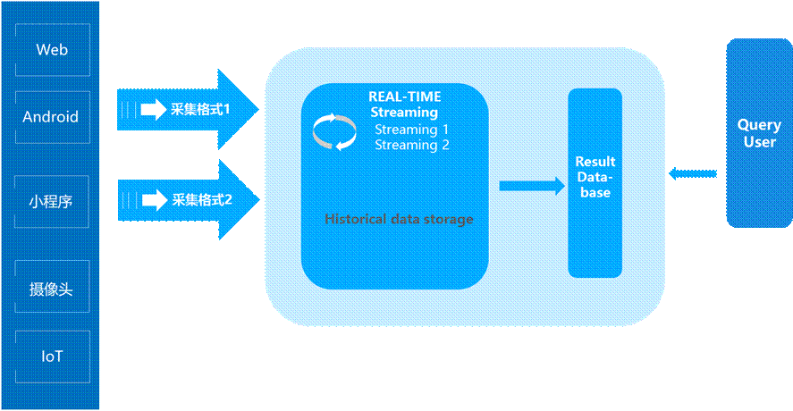


> Kappa架构的核心思想，包括以下三点：
>
> 1.用Kafka或者类似MQ队列系统收集各种各样的数据，你需要几天的数据量就保存几天。
>
> 2.当需要全量重新计算时，重新起一个流计算实例，从头开始读取数据进行处理，并输出到一个新的结果存储中。
>
> 3.当新的实例做完后，停止老的流计算实例，并把老的一些结果删除。

> Kappa架构的优点在于将实时和离线代码统一起来，方便维护而且统一了数据口径的问题。而Kappa的缺点也很明显：
>
> ● 流式处理对于历史数据的高吞吐量力不从心：所有的数据都通过流式计算，即便通过加大并发实例数亦很难适应IOT时代对数据查询响应的即时性要求。
>
> ● 开发周期长：此外Kappa架构下由于采集的数据格式的不统一，每次都需要开发不同的Streaming程序，导致开发周期长。
>
> ● 服务器成本浪费：Kappa架构的核心原理依赖于外部高性能存储redis,hbase服务。但是这2种系统组件，又并非设计来满足全量数据存储设计，对服务器成本严重浪费。

|                    | lambda 架构                            | kappa 架构                                                   |
| ------------------ | -------------------------------------- | ------------------------------------------------------------ |
| 数据处理能力       | 可处理超大规模的历史数据               | 历史数据处理能力有限                                         |
| 机器开销           | 批处理和实时计算需一直运行，机器开销大 | 必要时进行全量计算，机器开销相对较小                         |
| 存储开销           | 只需要保存一份查询结果，存储开销较小   | 需要存储新老实例结果，存储开销相对较大。但如果是多 Job 共用的集群，则只需要预留出一小部分的存储即可 |
| 开发、测试难易程度 | 实现两套代码，开发、测试难度较大       | 只需面对一个框架，开发、测试难度相对较小                     |
| 运维成本           | 维护两套系统，运维成本大               | 只需维护一个框架，运维成本小	批处理和实时计算需一直运行，机器开销大	必要时进行全量计算，机器开销相对较小
	只需要保存一份查询结果，存储开销较小	需要存储新老实例结果，存储开销相对较大。但如果是多 Job 共用的集群，则只需要预留出一小部分的存储即可
	实现两套代码，开发、测试难度较大	只需面对一个框架，开发、测试难度相对较小
	维护两套系统，运维成本大	只需维护一个框架，运维成本小 |

## 3.3 IOTA架构[了解]

> ​	而在IOT大潮下，智能手机、PC、智能硬件设备的计算能力越来越强，而业务需求要求数据实时响应需求能力也越来越强，过去传统的中心化、非实时化数据处理的思路已经不适应现在的大数据分析需求，提出新一代的大数据IOTA架构来解决上述问题。整体思路是设定标准数据模型，通过边缘计算技术把所有的计算过程分散在数据产生、计算和查询过程当中，以统一的数据模型贯穿始终，从而提高整体的预算效率，同时满足`即时计算`的需要，可以使用各种`Ad-hoc Query(即席查询)`来查询底层数据：
>
> 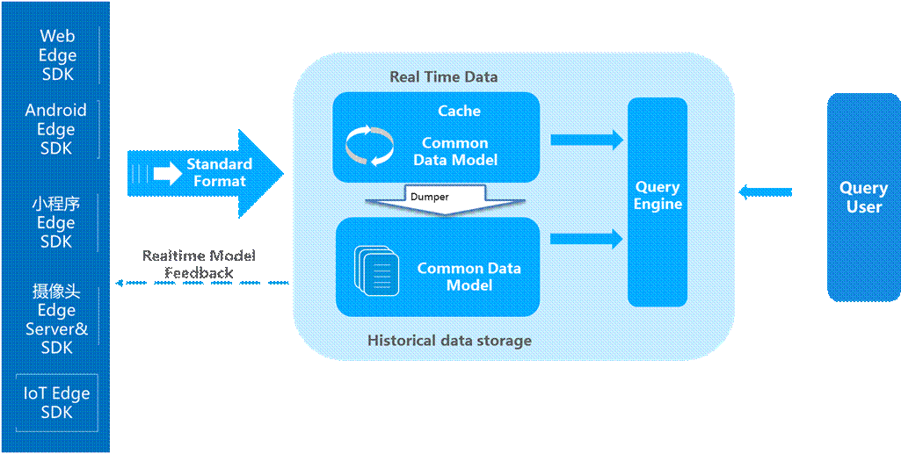

IOTA整体技术结构分为几部分：

● `Common Data Model`：贯穿整体业务始终的数据模型，这个模型是整个业务的核心，要保持SDK、cache、历史数据、查询引擎保持一致。对于用户数据分析来讲可以定义为“主-谓-宾”或者“对象-事件”这样的抽象模型来满足各种各样的查询。以大家熟悉的APP用户模型为例，用“主-谓-宾”模型描述就是“X用户 – 事件1 – A页面(2018/4/11 20:00) ”。当然，根据业务需求的不同，也可以使用“产品-事件”、“地点-时间”模型等等。模型本身也可以根据协议(例如 protobuf)来实现SDK端定义，中央存储的方式。此处核心是，从SDK到存储到处理是统一的一个Common Data Model。

● `Edge SDKs & Edge Servers`：这是数据的采集端，不仅仅是过去的简单的SDK，在复杂的计算情况下，会赋予SDK更复杂的计算，在设备端就转化为形成统一的数据模型来进行传送。例如对于智能Wi-Fi采集的数据，从AC端就变为“X用户的MAC 地址-出现- A楼层(2018/4/11 18:00)”这种主-谓-宾结构，对于摄像头会通过Edge AI Server，转化成为“X的Face特征- 进入- A火车站(2018/4/11 20:00)”。也可以是上面提到的简单的APP或者页面级别的“X用户 – 事件1 – A页面(2018/4/11 20:00) ”，对于APP和H5页面来讲，没有计算工作量，只要求埋点格式即可。

● `RealTime Data`：实时数据缓存区，这部分是为了达到实时计算的目的，海量数据接收不可能海量实时入历史数据库，那样会出现建立索引延迟、历史数据碎片文件等问题。因此，有一个实时数据缓存区来存储最近几分钟或者几秒钟的数据。这块可以使用Kudu或者Hbase等组件来实现。这部分数据会通过Dumper来合并到历史数据当中。此处的数据模型和SDK端数据模型是保持一致的，都是Common Data Model，例如“主-谓-宾”模型。

● `Historical Data`：历史数据沉浸区，这部分是保存了大量的历史数据，为了实现Ad-hoc查询，将自动建立相关索引提高整体历史数据查询效率，从而实现`秒级复杂查询百亿条数据`的反馈。例如可以使用HDFS存储历史数据，此处的数据模型依然SDK端数据模型是保持一致的Common Data Model。

● `Dumper`：Dumper的主要工作就是把最近几秒或者几分钟的实时数据，根据汇聚规则、建立索引，存储到历史存储结构当中，可以使用map-reduce、C、Scala来撰写，把相关的数据从Realtime Data区写入Historical Data区。

● `Query Engine`：查询引擎，提供统一的对外查询接口和协议(例如SQL JDBC)，把Realtime Data和Historical Data合并到一起查询，从而实现对于数据实时的Ad-hoc查询。例如常见的计算引擎可以使用presto、impala、clickhouse等。

● `Realtime model feedback`：通过Edge computing技术，在边缘端有更多的交互可以做，可以通过在Realtime Data去设定规则来对Edge SDK端进行控制，例如，数据上传的频次降低、语音控制的迅速反馈，某些条件和规则的触发等等。简单的事件处理，将通过本地的IOT端完成，例如，嫌疑犯的识别现在已经有很多摄像头本身带有此功能。

IOTA大数据架构，主要有如下几个特点：

● `去ETL化`：ETL和相关开发一直是大数据处理的痛点，IOTA架构通过Common Data Model的设计，专注在某一个具体领域的数据计算，从而可以从SDK端开始计算，中央端只做采集、建立索引和查询，提高整体数据分析的效率。

● `Ad-hoc即时查询`：鉴于整体的计算流程机制，在手机端、智能IOT事件发生之时，就可以直接传送到云端进入realtime data区，可以被前端的Query Engine来查询。此时用户可以使用各种各样的查询，直接查到前几秒发生的事件，而不用在等待ETL或者Streaming的数据研发和处理。

● `边缘计算(Edge-Computing)`：将过去统一到中央进行整体计算，分散到数据产生、存储和查询端，数据产生既符合Common Data Model。同时，也给与Realtime model feedback，让客户端传送数据的同时马上进行反馈，而不需要所有事件都要到中央端处理之后再进行下发。

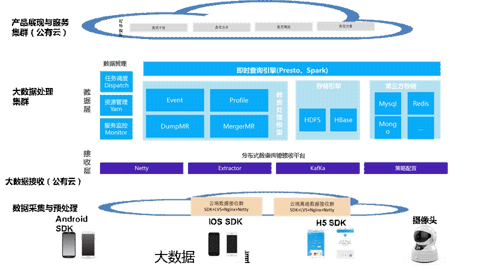

>  	如上图，IOTA架构有各种各样的实现方法，为了验证IOTA架构，很多公司也自主设计并实现了“秒算”引擎。在大数据3.0时代，Lambda大数据架构已经无法满足企业用户日常大数据分析和精益运营的需要，去ETL化的IOTA大数据架构也许才是未来。

# 四、数据湖基于Hadoop、Spark的实现[掌握]

学习步骤

    一般企业基于Hadoop、Spark是如何构建数据湖的
    数据湖的核心是什么

>  我们前面花费了3个章节来全面赘述了数据湖的相关概念和理论内容，着实是有些臭长。但是，这些概念却不能够省略掉。 数据湖从提出到现在，也不过7、8年的时间，目前还处于完善的阶段，并没有一个严格的执行标准。所以，我们对于概念的理解就直接影响数据湖的实现，而数据湖实现的好和坏也影响着公司数据治理的高度。目前，数据湖概念在逐步被企业接受，但是在实现上，每个企业都不尽相同。企业对于数据湖的实现遵循数据湖的基本概念：

    能够实现任意数据输入
    能够实现集中存储
    能够提供分析能力

那么，企业只要遵循上面这些要求去构建数据湖即可，在实现的过程中，使用了什么数据框架，应用了哪些技术，这些都是企业自己去做的决定的，自己把握。

    ps：也就是，只要能满足数据湖的概念要求，具体企业爱怎么实现就怎么实现，你用一堆磁盘实现数据湖的存储都可以，只要满足要求。

> ​	那么，尽管每个企业的实现都不尽相同，但总归是有些架构是用的较多的，大多数都会选择的。那么，课程就根据最具有普遍性的架构设计来给同学们讲解一下数据湖的具体实现：
>
> 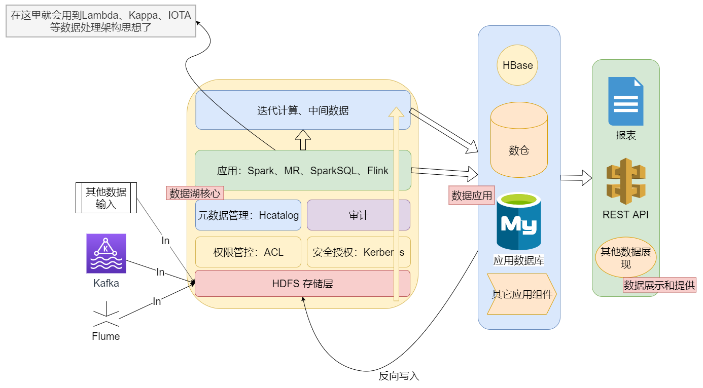
>
> 如图，是比较典型的基于Hadoop、Spark生态的一种常规数据湖实现架构。其中：

    数据湖的核心，就是由HDFS提供的存储层，以及构建在HDFS之上的包括：权限管控、安全授权、审计、元数据管理等一系列数据管理工具。
    基于HDFS存储层的核心，可以接受由Kafka、FLume、Sqoop、或其它数据工具的任意格式的数据输入。
    在HDFS存储层之上，构建了由Spark、MR等计算框架对数据进行处理的数据处理层。
    并由数据处理层产出，可以导出至如：数据仓库、HBase、Mysql、或其它需要应用到处理后数据的地方。
    并最终由数据展示和提供层，对外提供数据产品。

由上可以得知，数据湖的核心实现，就是：**存储层以及围绕在其之上的一系列数据应用和数据治理的服务**。

那么接下来，我们来解析一下，这样架构下的数据湖的核心。

## 4.1 数据湖的核心

    海量的任意格式原始数据存储
    海量数据分析利用的能力

### 4.1.1 存储层

> ​	由HDFS提供的数据存储层应该是比较好理解的，我们提及到，数据湖本质上就是数据的集中存储，那么由HDFS提供数据的集中存储是合适的。HDFS本身是一款分布式文件系统，除了能够提供存储支撑外，也能提供：

    高可用性
    可拓展性
    可靠性
    易用性

等一系列的优势特性。也满足了对数据湖要求中的：

    可拓展的
    可靠的
    吞吐量
    原有格式存储
    支持多种数据源的输入
    多分析框架的支持

### 4.1.2 数据管理

> ​	数据湖核心除了存储以外，也包含了数据管理的内容。我们可以想象，数据湖作为一个企业内海量数据的集中存储，那么就不仅仅是个大型网盘而已，对数据的管理也是必要的功能。

1. **安全**

> ​	数据湖需要安全方面的管控，常规的我们在hadoop实现安全访问，一般会使用Kerberos来实现。Kerberos是一款安全框架，可以和Hadoop无缝集成，基于身份认证来提供授权管理。
>
> 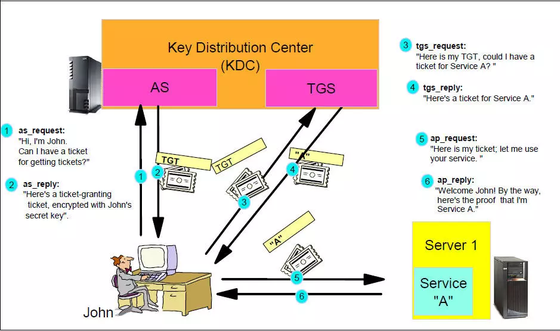
>
> 同时，也会配合`HDFS`本身的`ACL`权限控制来辅助做安全管理。

2. **审计**

> ​	大型企业对于审计也是有要求的，不过目前，暂未有成熟的针对Hadoop进行审计的框架和平台。目前多数的做法是，开启Namenode的审计日志，然后将日志导入到其它日志处理框架中，如elasticsearch进行审计操作。

3. **元数据管理**

> ​	元数据管理对于数据湖而言也是非常重要的。试想一下，数据湖汇聚来自企业各方面的数据，那么湖内的数据就会又多又杂，如果不能对数据进行很好的归纳管理，以及元数据管理的话，就很容易让数据湖变成数据沼泽。也就是，没有元数据管理，数据湖内存放的就是垃圾。我们对于数据进行分析处理，产生的二次产出、三次产出等中间数据，也是需要做元数据管理，不然也会导致数据湖内的数据混乱。同时，元数据管理带来的好处还在于，我们可以对元数据进行检索查询，除了能够快速定位自己需要的数据内容，也可以帮组我们快速找到符合我们需要的数据。比如，想要在数据湖内找到关于订单相关的数据，同时要包含有如：时间、用户、订单号等字段，那么对于元数据的检索就可以快速帮组我们来找到需要的这些数据，或者说帮我们找到有没有符合要求的数据。

### 4.1.3 数据处理

> ​	除了存储层和 数据管理以外， 数据的处理在数据湖中也是重中之重。毕竟，不管数据存的好，还是数据管的好，最终还是要落到数据用的好。不过，数据处理的实现，就可以脱离出数据湖架构之外，单独进行架构设计了。如我们前面简单介绍过的：Lambda、Kappa、IOTA等架构，就是对数据处理、数据应用的一些成熟的架构体系。

    当然，如果你有自己的设计架构也是可以的。不一定要使用别人提供的架构，适合自己的才是最好的。

> ​	一般而言，通用的数据处理（也就是大家大差不差都差不多）方式，都会涉及到数据的提炼，也就是对数据进行处理，产生对应适合业务的 中间数据（也就是Lambda架构中的view)。那么，对于这样的需求，一般通用的处理就是根据公司的业务，使用Spark、MR、Flink等框架对数据进行分析处理，以得到满足业务需求的数据结果。并最终利用这些内容，导出至适合的场景内进行利用，如：导入到数仓中为数仓提供数据来源，或者导出到其它数据存储如Mysql HBase MongoDB等用以支撑业务。并最终作为公司的数据产品提供服务。那么，这就是数据湖架构的数据扭转全链条。**总结**:

    不同的使用方式，架构方案在企业里面的定位就不同。（数据湖和普通的大数据分析处理架构基本上一模一样）。（面向业务/面向数据）
    存储层：HDFS，配合其他的辅助功能如安全管理、权限管理、审计、元数据管理。
    分析层：Lambda、IOTA、Kappa等架构哎实现，实际上大多数都是基于迭代中间数据这样的概念来生产业务可用的数据结果。

> ​	我们给同学们介绍了使用Hadoop、Spark生态构建数据湖的常见架构。但是，在这样的实现下，还是有一定的不足之处的。那么，这些不足之处是什么（eg:审计）？以及是如何解决的，就交由本次课程的重点：Delta Lake来进行解答

# 五、Delta Lake - 数据湖核心的增强

学习步骤：

- 掌握Delta Lake的基本概念
- 掌握Delta Lake的重点特性
- 掌握Delta Lake的使用形式

### 5.1 什么是Delta Lake

`Delta Lake`是由`Spark`的商业化公司，也就是大名鼎鼎的砖厂`Databricks`推出一款开源软件。官网地址：

https://delta.io/


**基于HDFS的存储层框架**

`Delta Lake`本质是：

一款开源的存储层，将ACID 事务引入到`Spark`以及大数据的工作负载中。由此可以见，`Delta Lake`作为一款存储框架层，是通过拓展`Spark`功能，通过`Spark`作为媒介来实现存储层增强。

### 5.2 Delta Lake特性

Delta Lake带来了许多的特性，主要是针对了Hadoop体系中的构建数据湖的不足的

​                                                                                         **Key Features **

| 名称                                         | 说明                                                         |
| -------------------------------------------- | ------------------------------------------------------------ |
| ACID Transactions:                           | Data lakes typically have multiple data pipelines reading and writing data  concurrently, and data engineers have to go through a tedious process to ensure data integrity, due to the lack of transactions. Delta Lake  brings ACID transactions to your data lakes. It provides  serializability, the strongest level of isolation level. Learn more at [Diving into Delta Lake: Unpacking the Transaction Log](https://databricks.com/blog/2019/08/21/diving-into-delta-lake-unpacking-the-transaction-log.html). |
| **ACID事务控制**                             | 数据湖通常具有多个同时读取和写入数据的数据管道，并且由于缺乏事务，数据工程师必须经过繁琐的过程才能确保数据的完整性。Delta Lake将ACID事务带入您的数据湖，它提供了可序列化，最强的隔离级别。 |
| Scalable Metadata Handling:                  | In big data, even the metadata itself can be "big data". Delta Lake treats metadata just like data, leveraging Spark's distributed processing  power to handle all its metadata. As a result, Delta Lake can handle  petabyte-scale tables with billions of partitions and files at ease. |
| **可伸缩的元数据处理**                       | 在大数据中，甚至元数据本身也可以是“大数据”，Delta Lake将元数据像数据一样对待，利用Spark的分布式处理能力来处理其所有的元数据。这样，Delta Lake可以轻松处理具有数十亿分区和文件的PB级表。 |
| Time Travel (data versioning):               | Delta Lake provides snapshots of data enabling developers to access and  revert to earlier versions of data for audits, rollbacks or to reproduce experiments.  Learn more in [Introducing Delta Lake Time Travel for Large Scale Data Lakes](https://databricks.com/blog/2019/02/04/introducing-delta-time-travel-for-large-scale-data-lakes.html). |
| **数据版本控制**                             | Delta Lake提供了数据快照，使开发人员可以快速的访问和还原到较早的版本的数据进行审核，回滚或重现实验。 |
| Open Format:                                 | All data in Delta Lake is stored in Apache Parquet format enabling Delta  Lake to leverage the efficient compression and encoding schemes that are native to Parquet. |
| **开放的数据格式**                           | Delta Lake中的所有数据均以Apache Parquet格式存储，从而使Datela Lake能够利用Parquet固有的高效压缩和编码方案。 |
| Unified Batch and Streaming Source and Sink: | A table in Delta Lake is both a batch table, as well as a streaming  source and sink. Streaming data ingest, batch historic backfill, and  interactive queries all just work out of the box. |
| **统一的批处理和流处理的source和sink**       | Delta Lake中的表既是批处理表又是流计算的source和sink。流数据的提取，批处理历史回填和交互式查询都可以直接使用它。 |
| Schema Enforcement:                          | Delta Lake provides the ability to specify your schema and enforce it. This  helps ensure that the data types are correct and required columns are  present, preventing bad data from causing data corruption. For more  information, refer to [Diving Into Delta Lake: Schema Enforcement & Evolution](https://databricks.com/blog/2019/09/24/diving-into-delta-lake-schema-enforcement-evolution.html). |
| **Schema执行**                               | Delta Lake 提供了指定和执行模式的功能。这有助于确保数据类型正确并且存在必需的列，从而防止不良数据导致数据损坏。 |
| Schema Evolution:                            | Big data is continuously changing. Delta Lake enables you to make changes  to a table schema that can be applied automatically, without the need  for cumbersome DDL.  For more information, refer to [Diving Into Delta Lake: Schema Enforcement & Evolution](https://databricks.com/blog/2019/09/24/diving-into-delta-lake-schema-enforcement-evolution.html). |
| **scheme演化**                               | 大数据在不断变化。Delta Lake 使您可以更改可自动应用的表模式，而无需繁琐的DDL。 |
| Audit History:                               | Delta Lake transaction log records details about every change made to data providing a full audit trail of the changes. |
| **审核历史记录**                             | Delta Lake 事务日志记录有关数据所做的每项更改的详细信息，从而提供对更改的完整审核跟踪。 |
| Updates and Deletes:                         | Delta Lake supports Scala / Java APIs to merge, update and delete datasets.  This allows you to easily comply with GDPR and CCPA and also simplifies  use cases like change data capture. For more information, refer to [Announcing the Delta Lake 0.3.0 Release](https://databricks.com/blog/2019/08/02/announcing-delta-lake-0-3-0-release.html) and [Simple, Reliable Upserts and Deletes on Delta Lake Tables using Python APIs](https://databricks.com/blog/2019/10/03/simple-reliable-upserts-and-deletes-on-delta-lake-tables-using-python-apis.html) which includes code snippets for merge, update, and delete DML commands. |
| **更新和删除**                               | Delta Lake支持Scala/Java进行合并，更新和删除数据集。         |
| 100% Compatible with Apache Spark API:       | Developers can use Delta Lake with their existing data pipelines with minimal  change as it is fully compatible with Spark, the commonly used big data  processing engine. |
| **100%和`Apache Spark`的API兼容**            | 开发人员可以将Delta Lake 与现有的数据管道一起使用，而无需进行任何更改，因为它与常用的大数据处理引擎Spark完全兼容。 |


### 5.3 Delta Lake重点特性解读

>1. 中间数据
>
> 数据湖内的原始数据，直接利用在业务分析上是比较困难的。
>
> ​	一个主要的原因就是，我们在构建数据湖的时候，汇入的数据是基于数据湖的指导原则：数据和业务分离，也就是说，数据就是最原始的样子，并不贴和业务分析的需求。
>
> 一般情况下，企业都会对原始数据进行一次，二次，乃至多次的迭代处理，将这些数据分阶段，分步骤的逐步处理成想要的格式，这样更加适合业务分析。那么，这些迭代产生的一系列的数据文件，我们称之为`中间数据`
>
> ```log
>ps: 其实这种分析模式，也就是Lambda架构中对于批（离线数据）的处理方式。
>中间数据也就是lambda架构中的Batch View.
> ```
>
>
>
>2. ACID事务控制
>
>  再基于**中间数据** 这种处理模式下，`Hadoop`、`Spark`生态构建数据湖的不足之处在于：在数据的处理过程中，没有事务控制。
>
>  原因1：
>
>  在数据转换的过程中，如果出现问题，造成数据处理的不完整，这就会导致基于此数据的后续操作均产生偏差。而修复这些偏差则需要耗费大量精力。
>
>  原因2：
>
>  在生成的中间数据，并不会只有一个人使用，如果多个人对同一个的中间数据进行修改，更新操作，就会产生冲突，而这种冲突就会造成数据迭代链条的断裂。
>
>  `Delta Lake`实现了事务日志的记录，对于数据的任何操作记录在事务日志里面，同时也基于事务日志，实现了ACID的事务控制。所以，ACID级别的事务控制，可以有效的帮助工程师控制中间数据迭代的过程，避免数据冲突。
>
>3. 数据版本控制
>
>  同样，对于一份中间数据，可能被我们折腾了多个版本更新后发现还是原来的版本最符合实际，但是，中间的数据已经被我们修改的面目全非了，这就是Hadoop 和spark生态构建的数据湖体系第二个不足之处：**没有数据版本控制**
>
>  `Delta Lake`可以随时随地的退回到数据任何时间点的版本。
>
>4. 可伸缩的元数据处理
>
>  `Delta Lake`另一个的强大之处：**强大的元数据处理能力**。在`Delta Lake`的设计中，元数据（数据的事务日志）也当成一种普通的数据对待。对于元数据的处理，当成普通的spark任务处理，应用Spark强大的分布式并行计算能力，可以完成对超大规模的数据的管理和溯源。
>
>
>
>
>
>5. 审核历史记录
>
>   
>
>   6.统一的批处理和流处理
>
>   

### 5.4 Delta Lake 的使用形式

> ​	我们前面提到，企业对于数据湖内海量的数据存储利用的方式，大多数会遵循产生中间数据、迭代中间数据的方式进行，也就是前面我们看到的这个图。
>
> 
>
> 在现阶段，实现这样的分析流程，多数的企业会选择使用`Spark`、`SparkSQL`来进行处理。
>
> 因为，不管原始数据是什么样子，一般中间数据这里，数据都基本上是结构化数据。结构化数据又特别适合使用`SparkSQL`来进行分析处理。同时，这些中间数据一般会选择存储为`Parquet`文件格式进行存储。
>
> ---
>
> 那么当企业引入Delta Lake之后，其分析逻辑依旧不变，存储格式依旧是Parquet格式。只不过，在原本使用SparkSQL进行数据处理时，不具备如下性质：
>
> - 事务控制
>
> - 数据版本控制
>
> - 元数据管理
>
>   在引入Delta Lake之后就具备了。

> 我们可以认为，Delta Lake就是SparkSQL或者Spark的一个插件或者一个外挂。增强了SparkSQL的功能，同时并不改变使用方式。同时数据分析的模式也不会因为Delta Lake的加入发生改变。
>
> 
>
> 如图，官网使用的比喻也形象的说明了数据处理的流程：
>
> 数据从：
>
> - Bronze(青铜) 原始数据
> - Sliver(白银) 中间数据
> - Gold（黄金）可以直接利用的数据

`Delta Lake`的使用形式：

> ​	本质上还是使用原有的Spark、SparkSQL的方式来处理数据，处理的流程也不变（还是原有的对中间数据进行迭代的方式**，多跳架构)**，变化的地方在于，存储数据的过程中加入了Delta Lake的支持。（也就是使用Delta Lake提供的API进行数据的存储管理）

    数据分析，就和打排位赛一样。
    
    我们初登场的时候，就是青铜组选手（原始数据）
    
    只有我们不断的进行提取、进行处理，数据才会升级并最终达到黄金段位、达到钻石、达到业务所需。
# 六、Delta Lake - Quickstart[熟练]

学习步骤：

    掌握Delta Lake 的安装和启动
    掌握简单的Delta Lake操作

## 6.1 安装

> ​	`Delta Lake`的安装非常简单，严格来说，Delta Lake不需要安装，它包含在最新的Spark发行版中。要求，使用的Spark版本：>=2.4.2。我们可以使用两种方式来应用Delta Lake：

    互动式：使用Delta Lake启动Spark shell（Scala或Python），并在shell中交互运行代码段。
    包含在工程中：使用Delta Lake设置Maven或SBT项目（Scala或Java）来应用Delta Lake

## 6.2 互动式

PySpark

如果要在PySpark中启动，请先更新PySpark的版本

```sh
pip install --upgrade pyspark
```

Run PySpark with the Delta Lake package:

```shell
pyspark --packages io.delta:delta-core_2.11:0.5.0
```

Spark Scala Shell

```sh
bin/spark-shell --packages io.delta:delta-core_2.11:0.5.0

# 首次打开需要网络连接，会联网下载Delta Lake相关的包
```

## 6.3 包含在工程中

Maven

```xml
<dependency>
  <groupId>io.delta</groupId>
  <artifactId>delta-core_2.11</artifactId>
  <version>0.5.0</version>
</dependency>
```

Scala SBT

```scala
libraryDependencies += "io.delta" %% "delta-core" % "0.5.0"
```

## 6.4 创建表

    本文中的所有操作均以Scala代码做演示。
    在适当的地方，会贴出Java和Python的同样操作代码

打开Spark Shell，执行如下代码：

```scala
val data = spark.range(0, 5)
data.write.format("delta").save("/tmp/delta-table")
```

> ​	这样，我们就创建了一个0到5的数据range，并保存为了Delta Lake表。同时，可以在HDFS的目录中看到如下图，一堆的Parquet文件。这些Parquet文件，就是保存的具体数据文件。补充：Python和Java的操作方式

Python

```python
data = spark.range(0, 5)
data.write.format("delta").save("/tmp/delta-table")
```

Java

```java
import org.apache.spark.sql.SparkSession;
import org.apache.spark.sql.Dataset;
import org.apache.spark.sql.Row;

SparkSession spark = ...   // create SparkSession

Dataset<Row> data = data = spark.range(0, 5);
data.write().format("delta").save("/tmp/delta-table");
```

## 6.5 读取数据

> 我们刚刚保存了一个0-5的range数据到delta lake的一个table中(Parquet文件)。现在，我们来读取这个文件并查看内容：

Spark Shell

```scala
val df = spark.read.format("delta").load("/tmp/delta-table")
df.show()
```

> 我们可以看到，可以正常的读出内容：
>
> 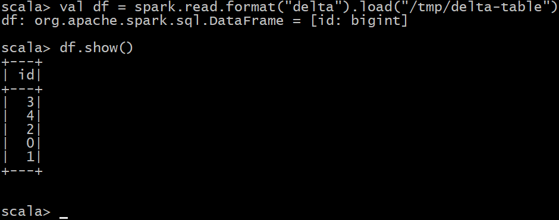
>
> 补充：Python和Java的操作方式

Python

```python
df = spark.read.format("delta").load("/tmp/delta-table")
df.show()
```

Java

```java
Dataset<Row> df = spark.read().format("delta").load("/tmp/delta-table");
df.show();
```

## 6.6 更新数据

现在我们来尝试更新一下这个数据表（Parquet文件）

Spark Shell

```scala
val data = spark.range(5, 10)
data.write.format("delta").mode("overwrite").save("/tmp/delta-table")
df.show()
```

> 我们使用一个新的 5 - 10 的range来覆盖这个表的内容：
>
> 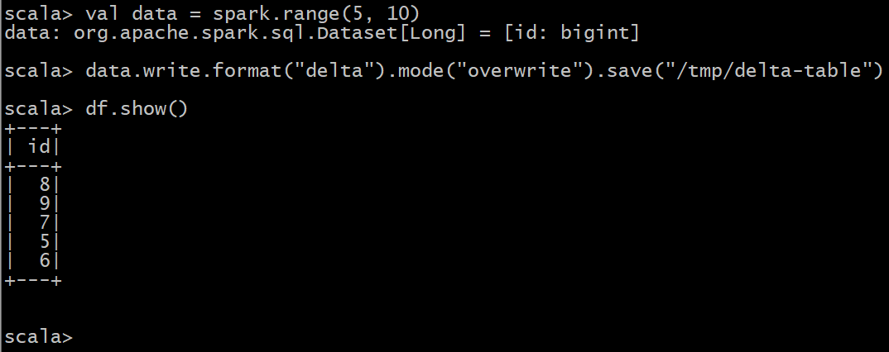
>
> 我们来重新读取一下：

```scala
val df = spark.read.format("delta").load("/tmp/delta-table")
df.show()
```

补充：Python和Java的操作方式

Python

```python
data = spark.range(5, 10)
data.write.format("delta").mode("overwrite").save("/tmp/delta-table")
```

Java

```java
Dataset<Row> data = data = spark.range(5, 10);
data.write().format("delta").mode("overwrite").save("/tmp/delta-table");
```

## 6.7 有条件的更新而不覆盖

> Delta Lake提供了编程API，可以有条件地将数据更新，删除和合并（向上插入）到表中。这里有一些例子。

Spark Shell

```scala
import io.delta.tables._
import org.apache.spark.sql.functions._

val deltaTable = DeltaTable.forPath("/tmp/delta-table")

// 通过将每个偶数值加100来更新每个偶数值
deltaTable.update(
  condition = expr("id % 2 == 0"),
  set = Map("id" -> expr("id + 100")))

// 删除偶数
deltaTable.delete(condition = expr("id % 2 == 0"))

// 合并新数据
val newData = spark.range(0, 20).toDF

deltaTable.as("oldData")
  .merge(
    newData.as("newData"),
    "oldData.id = newData.id")
  .whenMatched
  .update(Map("id" -> col("newData.id")))
  .whenNotMatched
  .insert(Map("id" -> col("newData.id")))
  .execute()

deltaTable.toDF.show()
```

补充：Python和Java的操作方式

Python

```python
from delta.tables import *
from pyspark.sql.functions import *

deltaTable = DeltaTable.forPath(spark, "/tmp/delta-table")

# Update every even value by adding 100 to it

deltaTable.update(
  condition = expr("id % 2 == 0"),
  set = { "id": expr("id + 100") })

# Delete every even value

deltaTable.delete(condition = expr("id % 2 == 0"))

# Upsert (merge) new data

newData = spark.range(0, 20)

deltaTable.alias("oldData") \
  .merge(
    newData.alias("newData"),
    "oldData.id = newData.id") \
  .whenMatchedUpdate(set = { "id": col("newData.id") }) \
  .whenNotMatchedInsert(values = { "id": col("newData.id") }) \
  .execute()

deltaTable.toDF().show()
```

Java

```java
import io.delta.tables.*;
import org.apache.spark.sql.functions;
import java.util.HashMap;

DeltaTable deltaTable = DeltaTable.forPath("/tmp/delta-table");

// Update every even value by adding 100 to it
deltaTable.update(
  functions.expr("id % 2 == 0"),
  new HashMap<String, Column>() {{
    put("id", functions.expr("id + 100"));
  }}
);

// Delete every even value
deltaTable.delete(condition = functions.expr("id % 2 == 0"));

// Upsert (merge) new data
Dataset<Row> newData = spark.range(0, 20).toDF();

deltaTable.as("oldData")
  .merge(
    newData.as("newData"),
    "oldData.id = newData.id")
  .whenMatched()
  .update(
    new HashMap<String, Column>() {{
      put("id", functions.col("newData.id"));
    }})
  .whenNotMatched()
  .insertExpr(
    new HashMap<String, Column>() {{
      put("id", functions.col("newData.id"));
    }})
  .execute();

deltaTable.toDF().show();
```

## 6.8 使用时间旅行读取旧版本的数据

我们说过，Delta Lake支持数据的版本控制，那么，还记得我们对这个一直使用的表做了哪些更改吗？来回顾一下：

    初始阶段，创建了一个0-5的range ，表内数据应该是0, 1, 2, 3, 4，这是版本0
    然后，被覆盖为了5 - 10 的range，表内数据应该是：5, 6, 7, 8, 9，这是版本1
    然后，对偶数都加了100，表内数据应该是：5, 106, 7, 108, 9，这是版本2
    然后，删除了所有偶数，表内数据应该是：5, 7, 9，这是版本3
    最后，做了一次合并，表内数据应该是0 - 20 的range，这是版本4，也是当前最新版本。

我们来尝试回退到版本0

Spark Shell

```scala
val df = spark.read.format("delta").option("versionAsOf", 0).load("/tmp/delta-table")
df.show()
```

> 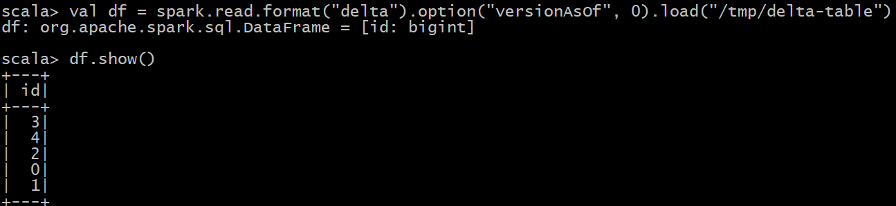
>
> 可以发现，我们读取到了最初的版本0的内容。补充：Python和Java的操作方式

Python

```python
df = spark.read.format("delta").option("versionAsOf", 0).load("/tmp/delta-table")
df.show()
```

Java

```java
Dataset<Row> df = spark.read().format("delta").option("versionAsOf", 0).load("/tmp/delta-table");
df.show();
```

> ​	我们可以尝试，将版本数从0修改为其它数来看一下是否能读到各个版本的数据。我们对/tmp/delta-table这个表的修改版本最大到版本4，如果你读取版本>4就会报错哦：
>
> 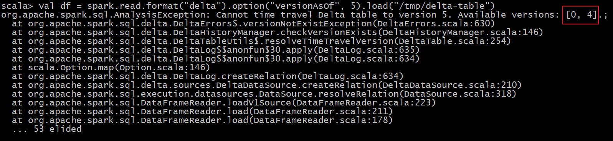
>
> ​	它会提示我们，版本只有[0, 4]。如果想要回滚到某个版本，只需要将数据读出后然后使用overwrite的方式在写回去就好了哦。比如，将数据回滚为版本0的状态：

Spark Shell

```scala
spark.read.format("delta").option("versionAsOf", 0).load("/tmp/delta-table").write.format("delta").mode("overwrite").save("/tmp/delta-table")

spark.read.format("delta").load("/tmp/delta-table").show
```


    PS: 要注意哦，回滚其实也是一种更新，这样操作会产生版本5的哦。
    这样的机制也是保障，就算回滚了也能反向再滚回去。

## 6.9 事务日志

> 我们说过，其能实现ACID事务，以及实现版本控制，是基于其事务日志的。事务日志位于表目录下的`_delta_log`文件夹
>
> 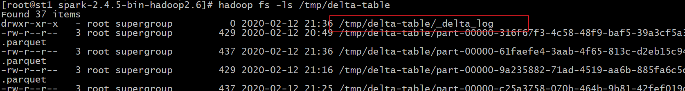

打开这个文件夹：

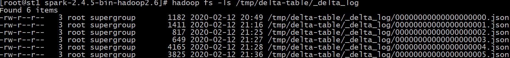

可以发现有6个JSON文件，这6个JSON文件其实就是对应我们刚刚操作表的6个版本：0, 1, 2, 3, 4, 5

我们打开00000.json

```json
{"commitInfo":{"timestamp":1581511770889,"operation":"WRITE","operationParameters":{"mode":"ErrorIfExists","partitionBy":"[]"},"isBlind
Append":true}}
{"protocol":{"minReaderVersion":1,"minWriterVersion":2}}
{"metaData":{"id":"250ed355-a118-4510-b60a-6fa16c6a3ec0","format":{"provider":"parquet","options":{}},"schemaString":"{\"type\":\"struc
t\",\"fields\":[{\"name\":\"id\",\"type\":\"long\",\"nullable\":true,\"metadata\":{}}]}","partitionColumns":[],"configuration":{},"crea
tedTime":1581511770204}}
{"add":{"path":"part-00000-316f67f3-4c58-48f9-baf5-39a3cf5a335b-c000.snappy.parquet","partitionValues":{},"size":429,"modificationTime"
:1581511770855,"dataChange":true}}
{"add":{"path":"part-00001-cf6de084-a74c-4563-adcb-57b3f6fb88a2-c000.snappy.parquet","partitionValues":{},"size":429,"modificationTime"
:1581511770854,"dataChange":true}}
{"add":{"path":"part-00002-8321221c-d29f-42d5-a3e3-36d35746d5f4-c000.snappy.parquet","partitionValues":{},"size":429,"modificationTime"
:1581511770854,"dataChange":true}}
{"add":{"path":"part-00003-2ec4f7a3-b089-4f32-a256-7791d586de81-c000.snappy.parquet","partitionValues":{},"size":437,"modificationTime"
:1581511770854,"dataChange":true}}
```

可以看到，这里记录了对这个文件的提交记录。

再打开00005.json

```json
{"commitInfo":{"timestamp":1581514597463,"operation":"WRITE","operationParameters":{"mode":"Overwrite","partitionBy":"[]"},"readVersion":4,"isBlindAppend":false}}
{"add":{"path":"part-00000-61faefe4-3aab-4f65-813c-d2eb15c9460a-c000.snappy.parquet","partitionValues":{},"size":437,"modificationTime":1581514596698,"dataChange":true}}
{"add":{"path":"part-00001-5dd5f4e2-c285-4c6a-859d-b170b81e21ed-c000.snappy.parquet","partitionValues":{},"size":429,"modificationTime":1581514596694,"dataChange":true}}
{"add":{"path":"part-00002-50f9ac71-3de7-43fb-9338-0c46ed013afd-c000.snappy.parquet","partitionValues":{},"size":429,"modificationTime":1581514596697,"dataChange":true}}
{"add":{"path":"part-00003-74dcb969-8d4d-4b47-9d6a-766c4a70ec00-c000.snappy.parquet","partitionValues":{},"size":429,"modificationTime":1581514596699,"dataChange":true}}
{"remove":{"path":"part-00112-10fe4d5b-8fbc-4001-80b2-03ea399c7de7-c000.snappy.parquet","deletionTimestamp":1581514597463,"dataChange":true}}
{"remove":{"path":"part-00190-1e873ada-5a1e-466e-8134-ad0ee0b55ab6-c000.snappy.parquet","deletionTimestamp":1581514597463,"dataChange":true}}
{"remove":{"path":"part-00116-ccfc3385-4b6b-4a8e-9e9f-c0dd026b36e2-c000.snappy.parquet","deletionTimestamp":1581514597463,"dataChange":true}}
{"remove":{"path":"part-00077-ca3f3d5c-776b-4bba-9f6b-cd5f7d4617c4-c000.snappy.parquet","deletionTimestamp":1581514597463,"dataChange":true}}
{"remove":{"path":"part-00011-d66aa330-1718-49dc-a586-e60c351da6c5-c000.snappy.parquet","deletionTimestamp":1581514597463,"dataChange":true}}
{"remove":{"path":"part-00004-c8c139fd-d44d-4461-a039-0a4146f0d629-c000.snappy.parquet","deletionTimestamp":1581514597463,"dataChange":true}}
{"remove":{"path":"part-00005-c4dc991a-7587-444e-ba54-bd23bddcc4b6-c000.snappy.parquet","deletionTimestamp":1581514597463,"dataChange":true}}
{"remove":{"path":"part-00164-91fbad05-f2e4-4869-90b0-e558b91d5606-c000.snappy.parquet","deletionTimestamp":1581514597463,"dataChange":true}}
{"remove":{"path":"part-00068-c661606b-8d9f-4dcf-bf6c-6d7f6eccbed3-c000.snappy.parquet","deletionTimestamp":1581514597463,"dataChange":true}}
{"remove":{"path":"part-00000-ca2eb3fa-bb2e-4ce3-9c90-6031cd7643a1-c000.snappy.parquet","deletionTimestamp":1581514597463,"dataChange":true}}
{"remove":{"path":"part-00121-71afe54a-7318-44ca-adff-1e12268fd851-c000.snappy.parquet","deletionTimestamp":1581514597463,"dataChange":true}}
{"remove":{"path":"part-00045-d369dda1-1463-48b2-b73f-2d8ee5b42f8e-c000.snappy.parquet","deletionTimestamp":1581514597463,"dataChange":true}}
{"remove":{"path":"part-00049-a8abf986-2d78-4a67-8d5c-c1461861a914-c000.snappy.parquet","deletionTimestamp":1581514597463,"dataChange":true}}
{"remove":{"path":"part-00058-aa375fb3-f2b5-4828-9f1c-a7ee7e49925b-c000.snappy.parquet","deletionTimestamp":1581514597463,"dataChange":true}}
{"remove":{"path":"part-00128-28f91ced-b8ad-4f13-bc27-966afcff3dd1-c000.snappy.parquet","deletionTimestamp":1581514597463,"dataChange":true}}
{"remove":{"path":"part-00154-013c0e3d-7741-42d6-ae5c-902d377daaf0-c000.snappy.parquet","deletionTimestamp":1581514597463,"dataChange":true}}
{"remove":{"path":"part-00140-faf02234-4b02-4987-88d7-0425c385fb65-c000.snappy.parquet","deletionTimestamp":1581514597463,"dataChange":true}}
{"remove":{"path":"part-00143-60822e7c-eb34-4393-bc20-2b12bd52af0b-c000.snappy.parquet","deletionTimestamp":1581514597463,"dataChange":true}}
{"remove":{"path":"part-00150-9610c09a-a9d7-4aca-9b80-ad0769b5b772-c000.snappy.parquet","deletionTimestamp":1581514597463,"dataChange":true}}
{"remove":{"path":"part-00069-31211d0f-9e99-4598-ad09-3c260e0db4b0-c000.snappy.parquet","deletionTimestamp":1581514597463,"dataChange":true}}
{"remove":{"path":"part-00107-81fdfd86-0b13-446e-afd0-7732271a4042-c000.snappy.parquet","deletionTimestamp":1581514597463,"dataChange":true}}
```

> ​	可以看到，这里有remove操作，也有add操作，就是对应了我们最后一次将数据回滚到版本0的状态（实际上是产生了版本5的更新），这次操作将数据从20行变为了5行。另外，我们在查看这个表的内容：
>
> 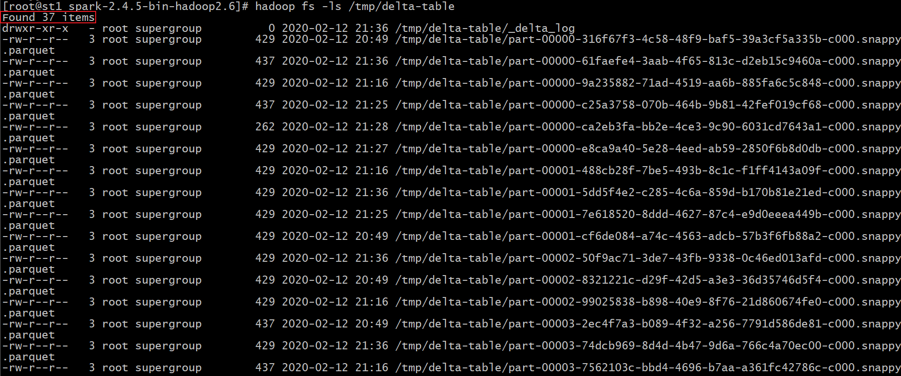

> ​	可以发现，这个表里面由36个`Parquet`。实际上我们就记录5行数据，用得着这么多的Parquet吗？其实这里面的这么多Parquet每一个都有用，因为执行了这么多次的版本更新，从元数据（事务日志）到数据文件都会可以循迹的。当然，如果你只查询`最新版本`的话：

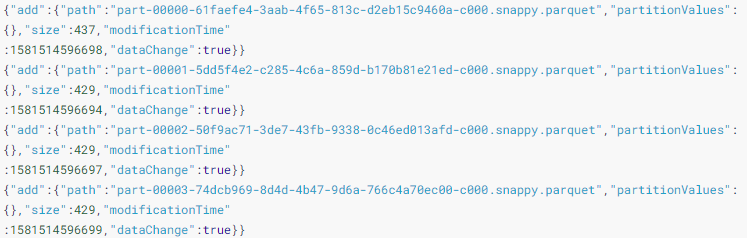

也就这4个`Parquet`对你有用了。

以上是对`Delta Lake`的快速入门使用，下面我们来详细的使用一下Delta Lake的各种操作。

# 七、Delta Lake 操作[熟练]

学习步骤：

    掌握常用的Delta Lake操作

## 7.1 表批量读写

    创建表、写入表、更新表、版本控制等我们在QuickStart已经学习过了，这里就省略了。

> 对数据进行分区.您可以对数据进行分区以加快查询。要在创建增量表时对数据进行分区，请按列指定分区。常见的模式是按日期分区，例如：

```scala
df.write.format("delta").partitionBy("date").save("/delta/events")
```

我们来演示一下，并回顾一下传统的SparkSQL开发流程：

在HDFS上准备了如下文件：

```sh
[root@st1 ~]# hadoop fs -cat /goods.txt                     
"娃哈哈",5,"2011-01-01"
"薯片",6,"2011-01-01"
"百事可乐",1,"2012-01-01"
"可口可乐",3,"2009-01-01"
"浪味仙",6,"2014-01-01"
"旺仔牛奶",11,"2015-01-01"
"旺仔小馒头",22,"2013-01-01"
"辣条",33,"2016-01-01"
"瓜子",55,"2008-01-01"
"奥利奥",11,"2007-01-01"
"六个核桃",26,"2006-01-01"
"冰红茶",22,"2005-01-01"
"绿茶",3,"2004-01-01"
"奶茶",2,"2003-01-01"
"小浣熊",2,"2002-01-01"
"旺旺仙贝",1,"2001-01-01"
"康师傅方便面",1,"2000-01-01"
"今麦郎",2,"1999-01-01"
"农夫山泉",6,"1998-01-01"
```


```scala
1# 创建case class构建schema

case class Goods(name:String, price:Int, date:String)

# 创建数据RDD

val lineRDD = sc.textFile("/goods.txt").map(_.split(","))

# 将RDD和Schema关联

val schemaRDD = lineRDD.map(line => Goods(line(0), line(1).toInt, line(2)))

# 将RDD转换为DataFrame

val dataDF = schemaRDD.toDF

# show一下

dataDF.show

# 好的，我们已经得到了一个DataFrame，我们来尝试一下将其写成Delta Lake表并使用时间分区

dataDF.write.format("delta").partitionBy("date").save("/tmp/delta/events")
```

可以看到，以时间为分区，区分了不同的文件夹存储数据了

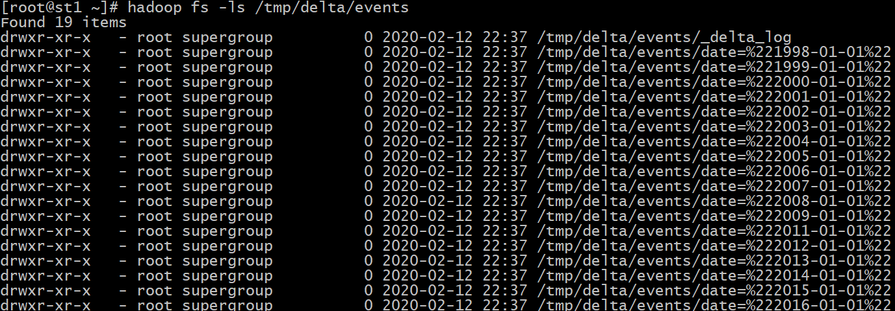

**追加数据**

构建两条新数据：

```scala
val dataDF2 = sc.makeRDD(List(Goods("append1",5,"1996-01-01"), Goods("append2",10,"1997-01-01"))).toDF
```

然后执行追加：

```scala
# 我们前面测试的时候，表示用date分区了，这里可以继续指定分区，也可以不指定，都可以的。
dataDF2.write.format("delta").mode("append").partitionBy("date").save("/tmp/delta/events")
```

## 7.2 Schema验证

Delta Lake自动验证正在写入的DataFrame的架构与表的架构兼容。 Delta Lake使用以下规则来确定从DataFrame到表的写入是否兼容：

    所有DataFrame列都必须存在于目标表中。如果表中不存在DataFrame中的列，则会引发异常。表中存在但DataFrame中不存在的列设置为null。
    DataFrame列数据类型必须与目标表中的列数据类型匹配。如果它们不匹配，则会引发异常。
    Dataframe 列名不能只根据大小写不同。这意味着您不能在同一表中定义诸如“ Foo”和“ foo”之类的列。虽然可以在区分大小写或不区分大小写（默认）模式下使用Spark，但在存储和返回列信息时，Parquet区分大小写。 Delta Lake保留大小写，但在存储架构时不敏感，并且具有此限制以避免潜在的错误，数据损坏或丢失问题。 如果您将其他选项（例如partitionBy）与附加模式结合使用，则Delta Lake会验证它们是否匹配，并为任何不匹配项引发错误。当不存在partitionBy时，追加将自动跟随现有数据的分区。

> ​	如果您将其他选项（例如partitionBy）与附加模式结合使用，则Delta Lake会验证它们是否匹配，并为任何不匹配项引发错误。当不存在partitionBy时，追加将自动跟随现有数据的分区。

    PS，上面说append可以指定分区也可以不指定分区就是根据这个来的
    
    指定了，会验证是否匹配
    
    不指定，会自动跟随已有的设置

测试修改Schema能否写入

继续使用上面的表

准备一个新数据：

```scala
case class Goods2(name:String, price:Int, date:String, comment:String)
val dataDF3 = sc.makeRDD(List(Goods2("append3",5,"1995-01-01", "测试新列1"), Goods2("append4",10,"1996-01-01", "测试新列2"))).toDF

# 执行追加
dataDF3.write.format("delta").mode("append").save("/tmp/delta/events")
```

执行追加会报错，提示：

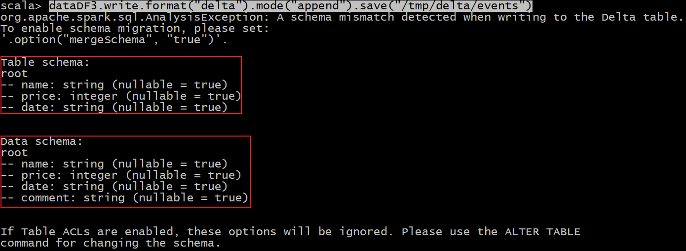

两者Schema不匹配，无法追加。

这个好理解，再试一下overwrite呢：

```scala
dataDF3.write.format("delta").mode("overwrite").save("/tmp/delta/events")
```

得到同样的结果，不可以执行。
如何强制执行

报错提示我们：

    To enable schema migration, please set:
    '.option("mergeSchema", "true")'.

那试验一下。

先试验append

```scala
dataDF3.write.format("delta").mode("append").option("mergeSchema", "true").save("/tmp/delta/events")
```

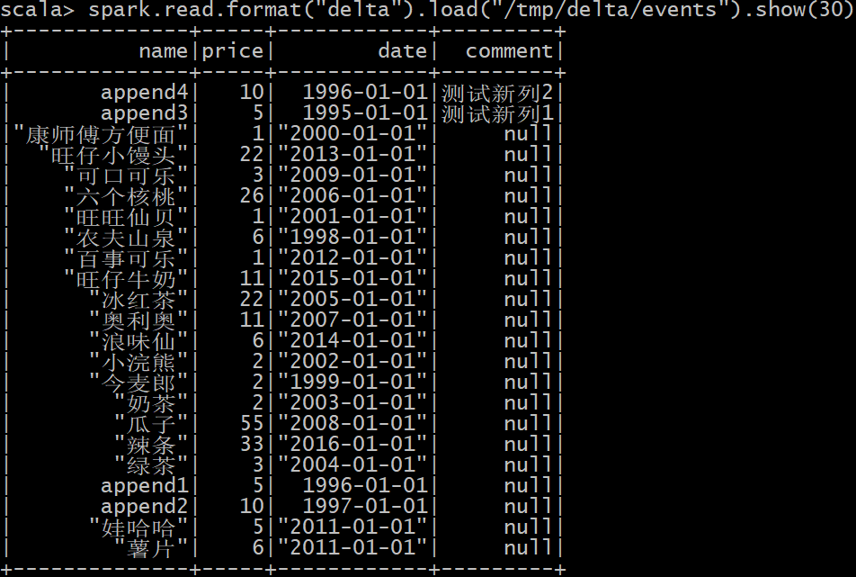

OK 成功。

    并且，验证了：表中存在但DataFrame中不存在的列设置为null。
    这句话的正确。

再试验overwrite

由于，Schema已经改为4个列的Goods2了，那么创建几条新的Goods数据，再覆盖回去：

    val dataDF4 = sc.makeRDD(List(Goods("overwrite1",5,"1995-01-01"), Goods("overwrite2",10,"1996-01-01"))).toDF
    dataDF4.show
    
    # 执行覆盖
    
    dataDF4.write.format("delta").mode("overwrite").option("mergeSchema", "true").save("/tmp/delta/events")
    
    # 查看
    
    spark.read.format("delta").load("/tmp/delta/events").show(30)

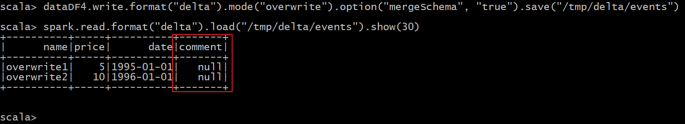

> ​	我们发现，尽管我们用3个列的数据，覆盖回4个列的表。数据是成功覆盖进去了，但是列并未消除，这也说明，mergeSchema操作，可以增加列，但是不会因为合并被删除列。换一个彻底不同的Schema试试overwrite

```scala
# 新schema

case class Test(id:Int, info:String, date:String)

scala> val dataDF5 = sc.makeRDD(List(Test(1, "haha", "2000-01-01"), Test(2, "heihei", "2000-01-02"))).toDF
dataDF5: org.apache.spark.sql.DataFrame = [id: int, info: string ... 1 more field]

scala> dataDF5.show
+---+------+----------+
| id|  info|      date|
+---+------+----------+
|  1|  haha|2000-01-01|
|  2|heihei|2000-01-02|
+---+------+----------+

# 执行覆盖

dataDF5.write.format("delta").mode("overwrite").option("mergeSchema", "true").save("/tmp/delta/events")

# 查看

spark.read.format("delta").load("/tmp/delta/events").show(30)
```


> ​	我们发现，列还是没减少。这就表明：mergeSchema操作，只会增加列，不会删除列。那如何让Schema中列减少呢，以当前Schema强制覆盖过去？使用`overwriteSchema`这个`option`将上面的语句换成：

```scala
dataDF5.write.format("delta").mode("overwrite").option("overwriteSchema", "true").save("/tmp/delta/events")
```

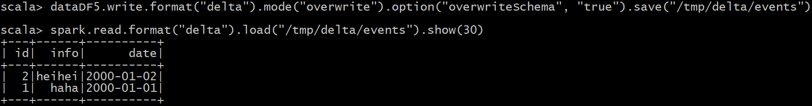

我们发现，Schema被成功的覆盖了。

## 7.3 表更新、删除对Parquet数据文件的影响

**更新指定行**

```sh
import io.delta.tables._
val deltaTable = DeltaTable.forPath(spark, "/tmp/delta/events")
deltaTable.toDF.show

# 表内容

scala> deltaTable.toDF.show
+---+----+----------+
| id|info|      date|
+---+----+----------+
|  1|haha|2000-01-01|
+---+----+----------+

# 修改info列的内容

deltaTable.updateExpr("info = 'haha'", Map("info" -> "'haha222'")) # 不要遗漏haha222上的单引号

# 查看

scala> deltaTable.toDF.show
+---+-------+----------+                                                        
| id|   info|      date|
+---+-------+----------+
|  1|haha222|2000-01-01|
+---+-------+----------+


```

> Tip：使用分区列可以加快速度。

**删除指定行**

```scala
import io.delta.tables._
val deltaTable = DeltaTable.forPath(spark, "/tmp/delta/events")
deltaTable.toDF.show

# 刚刚的表数据内容

scala> deltaTable.toDF.show
+---+------+----------+
| id|  info|      date|
+---+------+----------+
|  2|heihei|2000-01-02|
|  1|  haha|2000-01-01|
+---+------+----------+

# 删除id为2的行

scala> deltaTable.delete("id = 2")
                                                                                
scala> deltaTable.toDF.show
+---+----+----------+
| id|info|      date|
+---+----+----------+
|  1|haha|2000-01-01|
+---+----+----------+
```

> 注意： 删除只是从最新版本中删除这一行，但是并不会从物理存储中删除（有版本控制的记录）。
>
> 如果要删除物理存储，需要使用`vacuum`方法。（后面讲）
>
> Tip: 如果可能的话，尽可能使用分区列来定位，这样快。

**更新表（对重复的进行替换）**

继续使用刚刚的表

```scala
import io.delta.tables._
val deltaTable = DeltaTable.forPath(spark, "/tmp/delta/events")
deltaTable.toDF.show

# 表内容：

scala> deltaTable.toDF.show
+---+-------+----------+
| id|   info|      date|
+---+-------+----------+
|  1|haha222|2000-01-01|
+---+-------+----------+
```

现在有需求，有两条数据：

    1， replace， 2000-01-02
    2，new，2000-01-03

其中，第一行id和已有数据重复，需求是，使用新数据的替换老的id为1的数据

第二行为新数据，直接插入

预测结果为：

| id   | info    | date       |
| ---- | ------- | ---------- |
| 1    | replace | 2000-01-02 |
| 2    | new     | 2000-01-03 |

执行：

```scala
import io.delta.tables._
import org.apache.spark.sql.functions._

val df = sc.makeRDD(List(Test(1, "replace", "2000-01-02"), Test(2, "new", "2000-01-03"))).toDF

deltaTable.as("old").merge(df.as("new"), "old.id = new.id").whenMatched.updateExpr(Map("info" -> "new.info", "date" -> "new.date")).whenNotMatched.insertExpr(Map("id" -> "new.id", "info" -> "new.info", "date" -> "new.date")).execute
```

结果：

```sh
scala> deltaTable.toDF.show
+---+-------+----------+                                                        
| id|   info|      date|
+---+-------+----------+
|  1|replace|2000-01-02|
|  2|    new|2000-01-03|
+---+-------+----------+
```

和预期的一致。

    Tip:
    
    如果在whenMatched的时候，想要更新全部字段，可以使用updateAll，它等同：updateExpr(Map(“col1” -> “source.col1”, “col2” -> “source.col2”, …))
    
    同理，在whenNotMatched的时候，想要插入全部字段，可以使用insertAll，它等同于：insertExpr(Map(“col1” -> “source.col1”, “col2” -> “source.col2”, …))
    
    那么，命令可以变为：


```scala
deltaTable.as("old").merge(df.as("new"), "old.id = new.id").whenMatched.updateAll.whenNotMatched.insertAll.execute
```

> ​	注意：如果源数据中有多行匹配上，如id为1的有多行，那么，当whenMatched生效的时候，不确定会使用哪一行，这样通常会导致失败。最好是在源数据表中清除这种模棱两可的内容。也就是，比如这个例子中的id列作为匹配列，最好是唯一的不重复的。如果您知道几天之内可能会得到重复的记录，则可以通过按日期对表进行分区，然后指定要匹配的目标表的日期范围来进一步优化查询。比如，上面的通过id进行匹配：old.id = new.id，如果有时间列的话可以指定时间范围，比如指定最近7天的数据：
>

```scala
"old.id = new.id AND old.date > current_date() - INTERVAL 7 DAYS"
或者
"old.id = new.id AND old.date > date_sub(current_date, 7)"
命令最终如下：
deltaTable.as("old").merge(df.as("new"), "old.id = new.id AND old.date > current_date() - INTERVAL 7 DAYS").whenMatched.updateAll.whenNotMatched.insertAll.execute
```

## 7.4 Delta Lake 表实用工具

**Vacuum**

> ​	您可以通过在表上运行vacuum命令来删除不再由Delta表引用的文件，并且这些文件早于保留阈值。Vacuum不会自动触发。文件的默认保留期限为7天。也就是运行了Vacuum后，7天以前的文件就被清除了。

    注意：使用了Vacuum后，7天前的文件被清除，同时，版本控制也无法回退到7天之前的那些状态了。
    
    慎用。

使用

```scala
import io.delta.tables._

val deltaTable = DeltaTable.forPath(spark, pathToTable)

deltaTable.vacuum()        // vacuum files not required by versions older than the default retention period

deltaTable.vacuum(100)     // vacuum files not required by versions more than 100 hours old

```

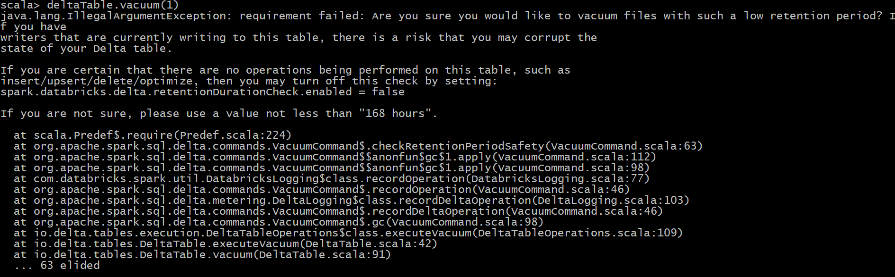

> ​	默认情况下，vacuum不接受小于168的参数。如果想要强制让参数小于168，需要设置：spark.databricks.delta.retentionDurationCheck.enabled = false,可以设置在spark-default.conf文件中，永久生效。当设置好了后再执行：

```scala
scala> deltaTable.vacuum(1)
Deleted 28 files and directories in a total of 24 directories.                  
res1: org.apache.spark.sql.DataFrame = []
```

可以看出，从总共24个目录里面，删除了28个文件和目录。

这样，这个表就只保留了最近1小时的版本

    注意：不是精确到秒的1小时。因为版本之间的更新间隔不确定，导致有的数据文件是有一定跨度的，版本上属于1小时内的版本，但是其数据文件可能是1.5小时前创建的。
    
    也就是这样做了之后，大致上2小时以前的文件是没了的。
    
    官方建议我们最好不要让保留期小于7天。
    
    并且不要关闭spark.databricks.delta.retentionDurationCheck.enabled，除非你有必要，否则不要动它
    
    vacuum是一个很暴力的操作，谨慎使用。
    
    Tip： vacuum(0) 表示除了最新版本以外，历史版本全部丢弃。

**历史**

> ​	可以通过运行history命令来获取有关每次写入Delta表的操作，用户，时间戳等信息。以相反的时间顺序返回操作。默认情况下，表历史记录会保留30天。

```scala
import io.delta.tables._

val deltaTable = DeltaTable.forPath(spark, "/tmp/delta/events")

val fullHistoryDF = deltaTable.history()    // get the full history of the table

val lastOperationDF = deltaTable.history(1) // get the last operation

# 查看最新一次操作

scala> lastOperationDF.show
+-------+--------------------+------+--------+---------+--------------------+----+--------+---------+-----------+--------------+-------------+
|version|           timestamp|userId|userName|operation| operationParameters| job|notebook|clusterId|readVersion|isolationLevel|isBlindAppend|
+-------+--------------------+------+--------+---------+--------------------+----+--------+---------+-----------+--------------+-------------+
|     11|2020-02-13 00:39:...|  null|    null|    MERGE|[predicate -> ((o...|null|    null|     null|         10|          null|        false|
+-------+--------------------+------+--------+---------+--------------------+----+--------+---------+-----------+--------------+-------------+
```

查看完整的操作记录，可以查看`fullHistoryDF`的内容：

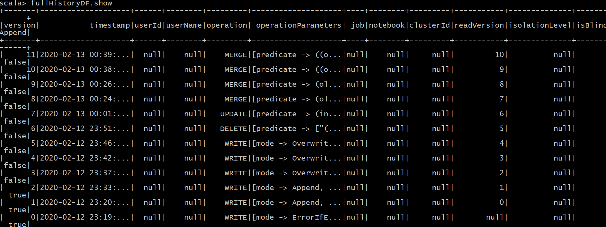

**生成**

> ​	您可以为Delta表生成清单文件，其他处理引擎（即，Apache Spark除外）可以使用清单文件来读取Delta表。例如，要生成可被Presto用来读取Delta表的清单文件，可以运行以下命令：

```scala
val deltaTable = DeltaTable.forPath(pathToDeltaTable)
deltaTable.generate("symlink_format_manifest")
```

执行完成后会在表目录下生产对应的文件：

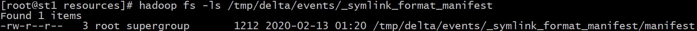

文件内容：

```sh
[root@st1 resources]# hadoop fs -cat /tmp/delta/events/_symlink_format_manifest/manifest|more
hdfs://st1:8020/tmp/delta/events/part-00000-6028256d-6bd1-4282-adbe-3d02908d2f55-c000.snappy.parquet
hdfs://st1:8020/tmp/delta/events/part-00000-b12d24d0-1430-48ab-ad66-f0f2e838ba9f-c000.snappy.parquet
hdfs://st1:8020/tmp/delta/events/part-00043-ba131274-7728-4847-8fcf-1913d0918a0a-c000.snappy.parquet
hdfs://st1:8020/tmp/delta/events/part-00000-60aaa505-d198-495b-ad98-31694c9adc8b-c000.snappy.parquet
hdfs://st1:8020/tmp/delta/events/part-00043-f7025921-5307-415f-b465-96dbdfd19cf8-c000.snappy.parquet
hdfs://st1:8020/tmp/delta/events/part-00174-0133c321-427f-4bc9-ac83-bf74bc94e5a2-c000.snappy.parquet
hdfs://st1:8020/tmp/delta/events/part-00043-4f761893-4fd2-49ab-8fbb-8a5d74116c18-c000.snappy.parquet
hdfs://st1:8020/tmp/delta/events/part-00174-0bc54e7f-a709-4a29-9fac-0c34355744dd-c000.snappy.parquet
hdfs://st1:8020/tmp/delta/events/part-00000-7bcc9e25-9b78-41e6-9148-b84bff427cc2-c000.snappy.parquet
hdfs://st1:8020/tmp/delta/events/part-00000-ca6fbb61-54fb-4a57-a434-15883e78bbe1-c000.snappy.parquet
hdfs://st1:8020/tmp/delta/events/part-00000-ed4847b5-1743-4f14-a762-f45f5bff739c-c000.snappy.parquet
hdfs://st1:8020/tmp/delta/events/part-00174-56ea9aaa-ca4a-4e30-8eb5-76d7de9bb0bd-c000.snappy.parquet
```

> ​	这个操作主要帮助我们集成Presto以及AWS Athena。可以参考：https://docs.delta.io/latest/presto-integration.html。将Delta Lake的表转换为普通的Parquet表。您可以通过以下步骤轻松地将Delta表转换回Parquet表：

    如果您执行了可以更改数据文件的Delta Lake操作（例如，“删除”或“合并”），则首先运行vacuum(0) 以删除不属于该表的最新版本的所有数据文件。
    删除 _delta_log这个目录

我们来尝试一下，将/tmp/delta/events这个表转换为普通的parquet表：

```scala
import io.delta.tables._
val dt = DeltaTable.forPath("/tmp/delta/events")
dt.toDF.show
```

在执行vacuum之前：

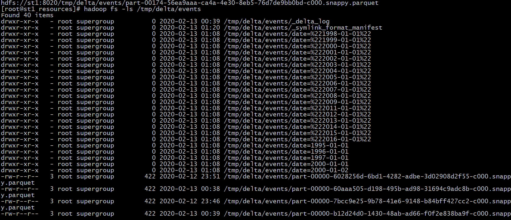

执行vacuum(0)

```scala
scala> dt.vacuum(0)
Deleted 26 files and directories in a total of 24 directories.                  
res7: org.apache.spark.sql.DataFrame = []
```

已经清除历史版本：

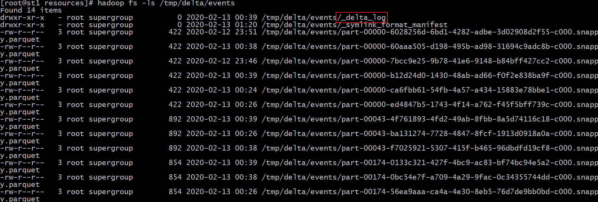

现在只要把_delta_log删除后，就成为了普通的parquet表了。

执行：

```sh
hadoop fs -rm -r /tmp/delta/events/_delta_log

# 把刚刚生成的manifest也删除

hadoop fs -rm -r /tmp/delta/events/_symlink_format_manifest
```

这样，就成为普通的`parquet`表了：

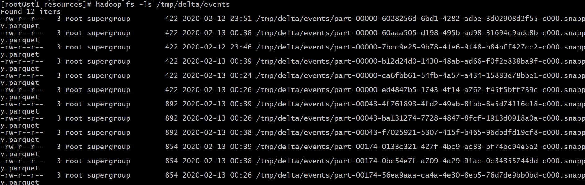

将普通的parquet表转换为Delta

> ​	将现有的Parquet表就地转换为 Delta 表。 该命令列出目录中的所有文件，创建一个 Delta Lake 事务日志来跟踪这些文件，并通过读取所有 Parquet 文件的页脚自动推断数据模式。 如果数据已分区，则必须指定分区列的架构。

```scala
import io.delta.tables._

// Convert unpartitioned parquet table at path '/path/to/table'
val deltaTable = DeltaTable.convertToDelta(spark, "parquet.`/path/to/table`")

// Convert partitioned parquet table at path '/path/to/table' and partitioned by integer column named 'part'
val partitionedDeltaTable = DeltaTable.convertToDelta(spark, "parquet.`/path/to/table`", "part int")
```

示范，将刚刚得到的parquet表转换为delta表

```scala
import io.delta.tables._
val deltaTable = DeltaTable.convertToDelta(spark, "parquet.`/tmp/delta/events`")
```

```scala
scala> val deltaTable = DeltaTable.convertToDelta(spark, "parquet.`/tmp/delta/events`")
deltaTable: io.delta.tables.DeltaTable = io.delta.tables.DeltaTable@7d36eb0

scala> deltaTable.toDF.show
+---+-------+----------+
| id|   info|      date|
+---+-------+----------+
|  1|replace|2000-01-02|
|  1|replace|2000-01-02|
|  1|replace|2000-01-02|
|  2|    new|2000-01-03|
|  2|    new|2000-01-03|
|  2|    new|2000-01-03|
+---+-------+----------+
```

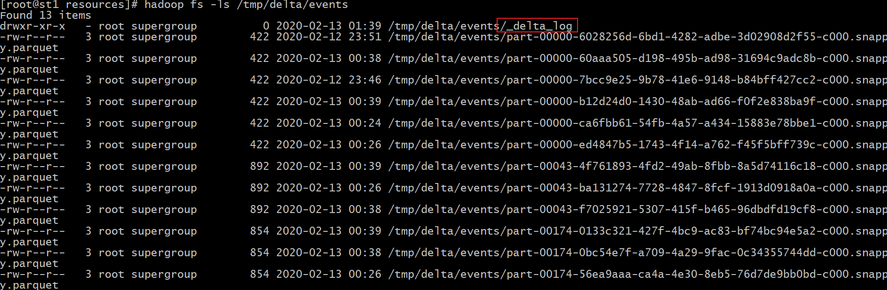

查看`HDFS`，`_delta_log`也回来了。

    只不过，这个由parquet转换来的表，是没有历史版本的，当前就是版本0。

## 7.5 Delta Lake 阶段总结

    95%的代码，都是SparkSQL的写法，一模一样。
    DataSet DataFrame来发起SparkSQL的逻辑，现在由DeltaTable这个对象发起逻辑。发起逻辑之后的一系列操作依旧和SparkSQL的写法一样。
    对表的追加以及覆盖等操作：DataFrame.write.format("delta").save("").option("mergeSchema, overwriteSchema")

> ​	DeltaLake 就是在SparkSQl或者Spark上的一个 插件(Lib库，一堆jar包)，已经使用Spark SparkSQL 来分析数据或者说构建数据湖的同学们，只需要对代码进行少量修改就可以使用DeltaLake了，那么从0开始使用DeltaLake来开发SparkSparkSQL等工程也是很简单的。 95%的代码 依旧是Spark代码。

## 7.6 其他存储系统的配置

Delta Lake 默认采用了HDFS的实现，其默认的LogStore是：

```properties
spark.delta.logStore.class=org.apache.spark.sql.delta.storage.HDFSLogStore
```

同时Delta Lake也支持`AWS S3`以及`微软Azure`的存储
**AWS - S3**

> ​	您可以在S3上创建，读取和写入Delta表。Delta Lake支持从多个集群进行并发读取，但是对S3的并发写入必须源自单个 Spark驱动程序，以便Delta Lake提供事务保证。

要求

    S3凭据：IAM角色（推荐）或访问密钥
    Apache Spark 2.4.2及更高版本
    Delta Lake 0.2.0及以上

快速开始

这是有关如何开始在S3上读写Delta表的快速指南。有关配置的详细说明，请参阅下一节。

1. 使用以下命令来启动具有Delta Lake和S3支持的Spark Shell（假设您使用针对Hadoop 2.7预先构建的Spark 2.4.3）：

```sh
bin/spark-shell \
 --packages io.delta:delta-core_2.11:0.2.0,org.apache.hadoop:hadoop-aws:2.7.7 \
 --conf spark.delta.logStore.class=org.apache.spark.sql.delta.storage.S3SingleDriverLogStore \
 --conf spark.hadoop.fs.s3a.access.key=<your-s3-access-key> \
 --conf spark.hadoop.fs.s3a.secret.key=<your-s3-secret-key>
```

2.在S3（在Scala中）中尝试一些基本的Delta表操作：

```sh
// Create a Delta table on S3:
spark.range(5).write.format("delta").save("s3a://<your-s3-bucket>/<path>/<to>/<delta-table>")

// Read a Delta table on S3:
spark.read.format("delta").save("s3a://<your-s3-bucket>/<path>/<to>/<delta-table>")
```

有关其他语言和Delta表操作的更多示例，请参见Delta Lake快速入门。
**S3的配置**

以下是为S3配置Delta Lake的步骤。

> 1. 配置`LogStore`实施。
>
> 设置spark.delta.logStore.class Spark配置属性：
>
> ```properties
> spark.delta.logStore.class=org.apache.spark.sql.delta.storage.S3SingleDriverLogStore
> ```
>
> 顾名思义，S3SingleDriverLogStore仅当所有并发写入均来自单个Spark驱动程序时，该实现才能正常工作。这是一个应用程序属性，必须在启动之前设置`SparkContext`，并且在上下文的生存期内不能更改。
>
> 2. hadoop-aws在类路径中包含JAR。
>
> Delta Lake需要软件包中的org.apache.hadoop.fs.s3a.S3AFileSystem类，该hadoop-aws软件包FileSystem为S3 实现Hadoop的API。确保此软件包的版本与构建Spark的Hadoop版本匹配。
>
> 3. 设置S3凭据。
>
> 我们建议使用IAM角色进行身份验证和授权。但是，如果要使用密钥，这是一种方法（在Scala中）设置Hadoop配置：
>
> ```scala
> sc.hadoopConfiguration.set("fs.s3a.access.key", "<your-s3-access-key>")
> sc.hadoopConfiguration.set("fs.s3a.secret.key", "<your-s3-secret-key>")  
> ```

**Microsoft Azure存储**

> 您可以在Azure Blob存储和Azure Data Lake Storage Gen1上创建，读取和写入Delta表。Delta Lake支持来自多个群集的并发写入。

要求

>  	Delta Lake依靠Hadoop FileSystemAPI来访问Azure存储服务。具体来说，Delta Lake需要将实现实现为FileSystem.rename()原子的，只有较新的Hadoop版本（Hadoop-15156和Hadoop-15086）才支持该实现。因此，您可能需要使用较新的Hadoop版本构建Spark。以下是要求列表：

Azure Blob存储

    甲共享密钥或共享访问签名（SAS）
    使用Hadoop版本2.9.1及更高版本（不是3.x）构建的Spark 2.4.2及更高版本
    Delta Lake 0.2.0及以上

Azure Data Lake Storage Gen1

    甲服务主要用于OAuth 2.0用户访问
    使用Hadoop版本2.9.1及更高版本（不是3.x）构建的Spark 2.4.2及更高版本
    Delta Lake 0.2.0及以上

> 请参阅“ 指定Hadoop版本并启用YARN ”以使用特定的Hadoop版本构建Spark，以及“ Delta Lake快速入门”以使用Delta Lake设置Spark。

**快速开始**

​	这是在Azure Data Lake Storage Gen1上设置Delta Lake的快速指南。有关Azure Data Lake Storage Gen1和Azure Blob存储的详细配置，请参阅后续部分。

```properties
1. 使用ADLS凭据从Spark主目录启动Spark Shell（假设您的Spark是使用Scala 2.11和Hadoop 2.9.2构建的）：

bin/spark-shell \
  --packages io.delta:delta-core_2.11:0.2.0,org.apache.hadoop:hadoop-azure-datalake:2.9.2 \
  --conf spark.delta.logStore.class=org.apache.spark.sql.delta.storage.AzureLogStore \
  --conf spark.hadoop.dfs.adls.oauth2.access.token.provider.type=ClientCredential \
  --conf spark.hadoop.dfs.adls.oauth2.client.id=<your-oauth2-client-id> \
  --conf spark.hadoop.dfs.adls.oauth2.credential=<your-oauth2-credential> \
  --conf spark.hadoop.dfs.adls.oauth2.refresh.url=https://login.microsoftonline.com/<your-directory-id>/oauth2/token


2. 在ADLS Gen 1上尝试一些基本的Delta表操作：

// Create a Delta table on ADLS Gen 1:
spark.range(5).write.format("delta").save("adl://<your-adls-account>.azuredatalakestore.net/<path>/<to>/<delta-table>")

// Read a Delta table on ADLS Gen 1:
spark.read.format("delta").load("adl://<your-adls-account>.azuredatalakestore.net/<path>/<to>/<delta-table>")
```

> 有关其他语言和Delta表操作的更多示例，请参见Delta Lake快速入门。

**配置Azure Data Lake Storage Gen1**

以下是在Azure Data Lake Storage Gen1上配置Delta Lake的步骤。

```properties
1.配置LogStore实施。

设置spark.delta.logStore.class Spark配置属性：

spark.delta.logStore.class=org.apache.spark.sql.delta.storage.AzureLogStore


该AzureLogStore实现适用于Azure中的所有存储服务，并支持多集群并发写入。这是一个应用程序属性，必须在启动之前设置SparkContext，并且在上下文的生存期内不能更改。

2.hadoop-azure-datalake在类路径中包含JAR。Delta Lake的Hadoop需要2.9.1+版本，而Hadoop则需要3.0.1+版本。请确保用于此软件包的版本与构建Spark的Hadoop版本匹配。

3.设置Azure Data Lake Storage Gen1凭据。

您可以使用凭据（在Scala中）设置以下Hadoop配置：

sc.hadoopConfiguration.set("dfs.adls.oauth2.access.token.provider.type", "ClientCredential")
sc.hadoopConfiguration.set("dfs.adls.oauth2.client.id", "<your-oauth2-client-id>")
sc.hadoopConfiguration.set("dfs.adls.oauth2.credential", "<your-oauth2-credential>")
sc.hadoopConfiguration.set("dfs.adls.oauth2.refresh.url", "https://login.microsoftonline.com/<your-directory-id>/oauth2/token")
```

**配置Azure Blob存储**

以下是在Azure Blob存储上配置Delta Lake的步骤。

```properties
1.配置LogStore实施。

设置spark.delta.logStore.class Spark配置属性：

spark.delta.logStore.class=org.apache.spark.sql.delta.storage.AzureLogStore


该AzureLogStore实现适用于所有Azure存储服务，并支持多集群并发写入。这是一个应用程序属性，必须在启动之前设置SparkContext，并且在上下文的生存期内不能更改。

2.hadoop-azure在类路径中包含JAR。Delta Lake的Hadoop需要2.9.1+版本，而Hadoop则需要3.0.1+版本。请确保用于此软件包的版本与构建Spark的Hadoop版本匹配。

3.设置凭据。

您可以在Spark配置属性中设置凭据。

我们建议您使用SAS令牌。在Scala中，您可以使用以下命令：

spark.conf.set(
  "fs.azure.sas.<your-container-name>.<your-storage-account-name>.blob.core.windows.net",
   "<complete-query-string-of-your-sas-for-the-container>")
  
或者，您可以指定一个帐户访问密钥：

spark.conf.set(
  "fs.azure.account.key.<your-storage-account-name>.blob.core.windows.net",
   "<your-storage-account-access-key>")


4.访问您的ABS帐户上的数据。使用Delta Lake在您的ABS帐户上读写数据。例如，在Scala中：

spark.write.format("delta").save("wasbs://<your-container-name>@<your-storage-account-name>.blob.core.windows.net/<path>/<to>/<delta-table>")
spark.read.format("delta").load("wasbs://<your-container-name>@<your-storage-account-name>.blob.core.windows.net/<path>/<to>/<delta-table>")
  

有关其他语言和Delta表操作的更多示例，请参见Delta Lake快速入门。
```
# 八、Delta Lake - 理论[理解]

学习步骤：

    理解事务日志在Delta Lake中的重要性
    理解Delta Lake中关于Schema验证和演化的相关概念
    了解Delta Lake的最佳实践

## 1.理解Delta Lake的事务日志

事务日志是理解Delta Lake的关键，因为它贯穿其许多最重要功能，包括

    ACID事务
    可伸缩的元数据处理
    时间旅行等。

> 在本文中，我们将探讨什么是Delta Lake事务日志，它在文件级别的工作方式，以及如何为多次并发读写问题提供一个优雅的解决方案。

## 1.1 什么是事务日志

> ​	Delta Lake事务日志（也称为DeltaLog）是自Delta Lake表创建以来已执行过的每个事务的有序记录。我们在前面已经有所接触，就是每个Delta表的_delta_log文件夹内的那些JSON数据文件。

## 1.2 事务日志如何工作？

### 1.2.1 将事务分解成原子提交

每当用户执行修改表的操作（例如INSERT，UPDATE或DELETE）时，Delta Lake都会将该操作分解为由以下一个或多个操作组成的一系列离散步骤。

    添加文件 –添加数据文件。
    删除文件 –删除数据文件。
    更新元数据 –更新表的元数据（例如，更改表的名称，架构或分区）。
    设置事务 –记录结构化流作业已使用给定ID提交了一个微批处理。
    更改协议 –通过将Delta Lake事务日志切换到最新的软件协议来启用新功能。
    提交信息 –包含有关提交，从何处，在什么时间进行了哪些操作的信息。

> 然后将这些操作作为有序的原子单位（称为提交）记录在事务日志中。
>
> 例如，假设用户创建一个事务以将新列添加到表中并向其中添加更多数据。Delta Lake会将交易分解为各个组成部分，一旦交易完成，请按以下提交将其添加到交易日志中：

    更新元数据–更改架构以包括新列
    添加文件–为每个添加的新文件

### 1.2.2 文件级别的Delta Lake事务日志

>  	用户创建Delta Lake表时，该表的事务日志将自动在_delta_log子目录中创建。当对该表进行更改时，这些更改将按顺序记录在事务日志中，并且是原子提交。每次提交均以JSON文件的形式写出如000000.json。对表的其他更改将按数字升序生成后续的JSON文件，以便将下一个提交写为000001.json，将其写为000002.json，依此类推。
>
> 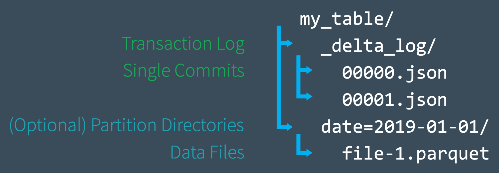

>  如果，也许我们改变了主意，决定删除这些文件并改为添加一个新文件（）。这些操作将被记录为事务日志中的下一次提交，如下所示：
>
> 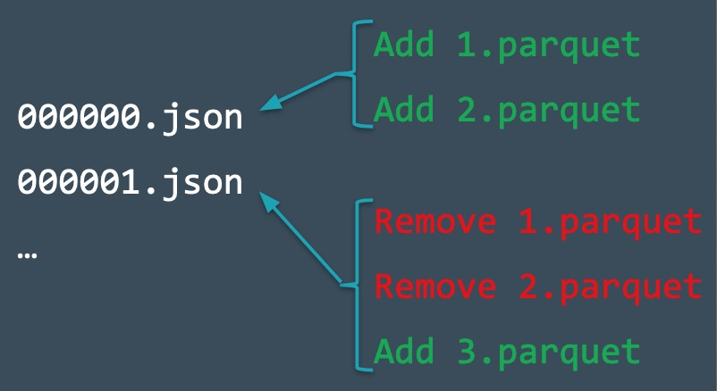

> 如图，第二次操作，删除了2个文件被记录在000001.json中。安装前面学习的版本回退操作，000001.json也代表的是version1（version从0开始算）尽管，我们在事务日志中体现了这两个文件被删除，但是在磁盘上，这两个文件依旧会保留。因为要做到版本管理。如果确实想删除，需要使用vacuum函数。

### 1.2.3 使用检查点文件快速重新计算状态

> ​	一旦我们对事务日志总共提交了10次提交，Delta Lake将以Parquet格式将检查点文件保存在同一_delta_log子目录中。Delta Lake每10次提交会自动生成一个检查点文件。
>
> 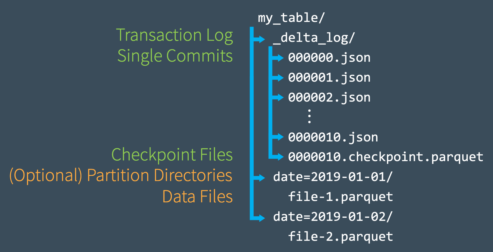

>  	这些检查点文件会在某个时间点保存表的整个状态-以本机Parquet格式保存，Spark可以轻松快速地读取它们。这样做的好处在于，如果我们要回滚到某个版本，完全不需要从版本0开始一个版本一个版本的推导。而是直接跳到最近的检查点，从检查点开始推导。比如，当前的最新版本是15，如果想要回退到版本12，如果没有检查点的话，就需要从版本0到版本1到版本2一直到版本12，重现一遍，计算得出版本12的内容。但是有了检查点之后就简单多了，按照10次提交生成检查点文件，那么，在版本10的时候就有一个检查点，对于回退到版本12的操作就变成了：

    回退到检查点（版本10）
    从版本10开始推导，进入版本11，再推导进入版本12
    即可完成版本12的回退操作
    
    可以说，检查点就是某个版本的快照。
    
    这些都是Delta Lake自动操作的，无需我们干预。

### 1.2.4 处理多个并发读取和写入

>   由于Delta Lake由Apache Spark提供支持，因此多个用户有可能同时修改表。为了处理这些情况，Delta Lake采用了乐观并发控制

**乐观并发控制**

> ​	乐观并发控制是一种处理并发事务的方法，该方法假定不同用户对表进行的事务（更改）可以完成而不会相互冲突。之所以如此之快，是因为在处理PB级数据时，用户极有可能会完全处理数据的不同部分，从而使他们能够同时完成无冲突的事务。例如，假设您和我正在一起研究拼图游戏。只要我们俩都在研究它的不同部分（例如，您在角落，而我在边缘），就没有理由为什么我们不能同时为更大难题的一部分工作，并以两倍快的速度完成拼图。只有当我们需要相同的零件时，才会出现冲突。那就是乐观的并发控制。

    也就是，在大数据下，能让用户之间起冲突的概率不高，多数情况下因为数据规模大，你处理你那部分我处理我的部分。

> ​	当然，即使采用了乐观的并发控制，有时用户的确会尝试同时修改数据的相同部分。对此，Delta Lake对此有一个协议。

**乐观的解决冲突**

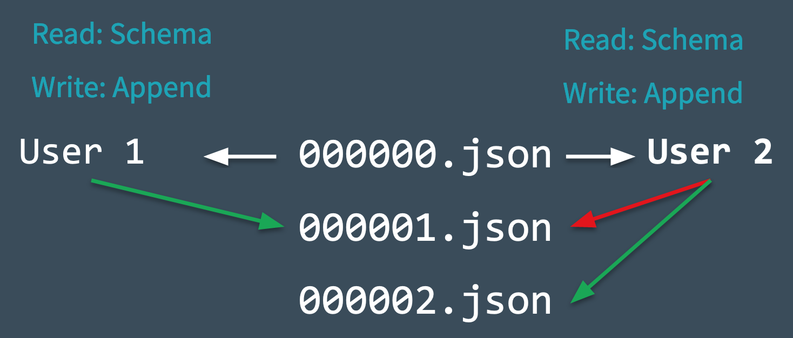

    用户1和2都试图同时向表中添加一些数据。在这里，我们陷入了冲突，因为下一次只能提交一次并记录为000001.json。
    Delta Lake通过“互斥”的概念解决了这一冲突，这意味着只有一个用户可以成功进行提交000001.json。也就是，假设接受用户1的提交，而拒绝用户2的提交。
    但是，Delta Lake宁愿乐观地处理此冲突，也不愿为User 2引发错误。它检查是否对表进行了任何新的提交（或者说检查是否有冲突），并以静默方式更新表以反映这些更改，然后简单地在新提交的表上重试用户2的提交（不进行任何数据处理），并成功提交000002.json。

> **在大多数情况下，这种和解是无声，无缝且成功地进行的。**但是，如果存在无法解决的问题，Delta Lake无法乐观地解决（例如，如果用户1删除了用户2也删除的文件），则唯一的选择是抛出错误。

## 1.3 其他用例

### 1.3.1 时间旅行

> ​	每个表都是Delta Lake事务日志中记录的所有提交的总和的结果–不多也不少。事务日志提供了逐步的指导，详细说明了如何从表的原始状态变为当前状态。也就是，从版本0开始，根据元数据进行逐步推导，当推导到最后的时候，和当前最新版本的结果肯定是一样的。因此，我们可以通过从原始表开始在任何时间点重新创建表的状态，并且只处理该点之前的提交。这种强大的功能被称为“时间旅行”或数据版本控制。

### 1.3.2 数据审查

> 由于事务日志记录的每一次对数据的操作，那么对数据进行审查就有据可依了。这个功能对部分企业来说，十分重要。

## 2. 模式验证和演变

> ​	数据，就像我们的经验一样，总是在不断发展和积累。为了跟上步伐，我们的数据模型必须适应新的数据。这就带来了挑战，Schema的更改在任何数据产品中都是重量级的操作，在Delta Lake中也是一样。我们在前面演示过，如何去合并Schema，以及如何强制的覆盖Schema。这些操作遵循Delta Lake在Scheam演变中的设计思想

## 2.1 了解表架构

> ​	Apache Spark™中的每个DataFrame都包含一个架构，一个定义数据形状的蓝图，例如数据类型和列以及元数据。使用Delta Lake，表的架构以JSON格式保存在事务日志中。也就是，_delta_log这个文件夹内的事务日志，不仅仅保存数据的更改记录，同时也保存着数据的Schema记录。所以，我们一直称之为元数据

## 2.2 模式验证

> ​	在第七章，第二节（7.2 Schema验证）中，我们演示了关于Schema更改的一系列操作。这些操作的背后，是遵循如下的理论的。
>
> **模式验证：**是Delta Lake中的一种安全措施，它通过拒绝对表的模式不匹配的写入来确保数据质量。就像忙碌的餐厅的前台经理只接受预订一样，它会检查插入表中的数据中的每一列是否在其预期列的列表中（换句话说，每一列是否都有“预订”），以及拒绝所有不在列表中的列的写操作。


```scala
case class Test1(id:Int, info:String)
case class Test2(id:Int, info:String, comment:String)

import io.delta.tables._
val df1 = sc.makeRDD(List(Test1(1, "haha"), Test1(2, "heihei"))).toDF
df1.show

df1.write.format("delta").save("/tmp/delta/sv")

val df2 = sc.makeRDD(List(Test2(1, "haha", "Test2"), Test2(2, "heihei", "Test2"))).toDF

# 当我们执行

df2.write.format("delta").mode("append").save("/tmp/delta/sv")
```

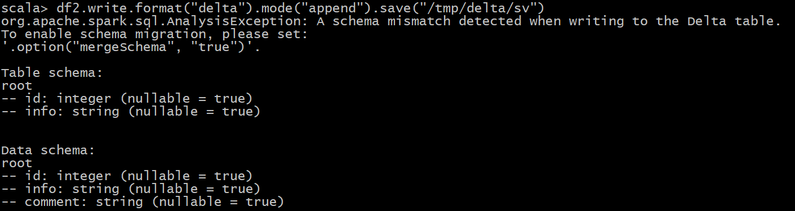

> 模式验证，就会自动工作，帮助我们拒绝Schema不匹配的工作。我们可以使用mergeSchema和overwriteSchema来进行

    mergeSchema Schema合并（增加列，不会删除列）
    overwriteSchema 按新Schema强制覆盖

## 2.3 模式验证如何工作？

> ​	Delta Lake 在写数据上使用架构验证，这意味着在写入时会检查对表的所有新写入是否与目标表的架构兼容。如果架构不兼容，则Delta Lake将完全取消事务（不写入任何数据），并引发异常以使用户知道不匹配的情况。为了确定对表的写入是否兼容，Delta Lake使用以下规则。要写入的DataFrame：

    不能包含目标表的架构中不存在的任何其他列。相反，如果传入的数据不包含表中的每一列，则可以-这些列将被简单地分配为空值。
    列数据类型不能与目标表中的列数据类型不同。**如果目标表的列包含StringType数据，但DataFrame中的相应列包含IntegerType数据，则模式强制实施将引发异常并阻止进行写操作。
    不能包含仅大小写不同的列名。**这意味着您不能在同一表中定义诸如“ Foo”和“ foo”之类的列。虽然Spark可用于区分大小写或不区分大小写（默认）模式，但Delta Lake保留大小写，但在存储架构时不区分大小写。存储和返回列信息时，Parquet区分大小写。为了避免潜在的错误，数据损坏或丢失问题，添加了此限制。

## 2.4 模式验证有何用处？

由于执行了如此严格的检查，因此模式强制实施是用作准备好用于生产或使用的干净，完全转换的数据集。通常可以帮助于：

    机器学习算法（强Schema要求）
    BI仪表板
    数据分析和可视化工具
    任何需要高度结构化，强类型语义模式的生产系统

> 为了为业务提供数据，多数企业选择多跳的模式，也就是迭代中间数据。在这个过程中的模式验证，是非常有必要的。这避免了我们将原以为干净的中间数据，变成脏数据

## 2.5 模式演变

> ​	模式演变是一项功能，使用户可以轻松更改表的当前模式，以适应随时间变化的数据。也就是我们前面学习的两个操作属性：

    mergeSchema
    overwriteSchema

**有什么用？**

>  	计划 更改可以在您打算更改表的计划时使用（与您不小心将不应该存在的列添加到DataFrame的位置相反）。这是迁移架构的最简单方法，因为它会自动添加正确的列名称和数据类型，而无需显式声明它们。通常来说，我们推荐使用mergeSchema而不是overwriteSchema除非你很有必要，不然多数情况下合并架构是一种最优的选择

## 3.Delta Lake 最佳实践

## 3.1 选择合适的分区列

> ​	你可以对Delta Lake的表进行分区存储，最常见的分区当然就是时间了。请遵循以下经验法则来决定要按哪个分区进行分区：

    如果列的基数（不重复数量）很高，请不要使用该列进行分区。例如，如果您按一列userId进行分区，并且可以有1M个不同的用户ID，则这是一个不好的分区策略。
    最好选择重复数量较多的数据列进行分区，比如日期
    随着数据增长，分区不一定能适应新的数据情况，可以在空闲的时候尝试重新分区。

## 3.2 合并文件（compact）

> ​	我们应该还记得在HBase中的compact操作。可以帮组我们对小HFile文件进行合并，合并成大的HFile文件来提高性能。对于Delta Lake也可以如此。随着表版本的增加，其存储中会产生许多的parquet文件，那么在这个时候对这些零散的parquet文件进行合并，可以显著的提高执行性能。

示范：

```scala
import scala.util.Random
case class Test(id:Int, info:String)
val df = sc.makeRDD(List(Test(Random.nextInt(10000), "haha"))).toDF
df.write.format("delta").save("/tmp/delta/compact")
df.show

# 连续append20次

1 to 20 foreach(x => sc.makeRDD(List(Test(Random.nextInt(10000), "haha"))).toDF.write.format("delta").mode("append").save("/tmp/delta/compact"))

spark.read.format("delta").load("/tmp/delta/compact").toDF.show

# 查看parquet文件数量

hadoop fs -ls /tmp/delta/compact
```


当前目录下有69个项目。

我们来执行以下compact操作：

```scala
val path = "/tmp/delta/compact"
val numFiles = 8

spark.read.format("delta").load(path).repartition(numFiles).write.option("dataChange", "false").format("delta").mode("overwrite").save(path)
```

将，分区压缩为8个，在看下结果：

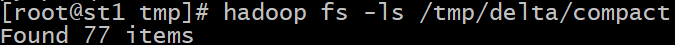

项目为77个，说明增加了8个文件，正好就是我们设置的压缩文件数：8

    不要理解为，将所有的parquet都压缩为8个。并不是。
    
    我们的compact也是对表的一次操作，也是更新了一次版本。
    
    这个压缩数量8的意思是表示：最新版本以8个parquet保存。
    
    历史的那些哪怕数量再多，如果我们不执行回退操作的话，对我们来说就是无用的文件。
    
    所以，对当前最新版本有用的就是那8个新增的parquet了。

**总结**

>  Delta Lake是一款存储层框架，是对Spark、SparkSQL的一个增强。它赋予我们在执行多跳架构（迭代中间数据）进行数据利用的过程中：

    事务控制，乐观并发解决冲突
    版本控制
    数据审查
    Schema验证
    Schema演化（合并、覆盖）
    等增强功能

> 极大的增强了企业在数据湖数据利用方面的效率，节省了开发人员的时间。我们再来回看这个图：
>
> 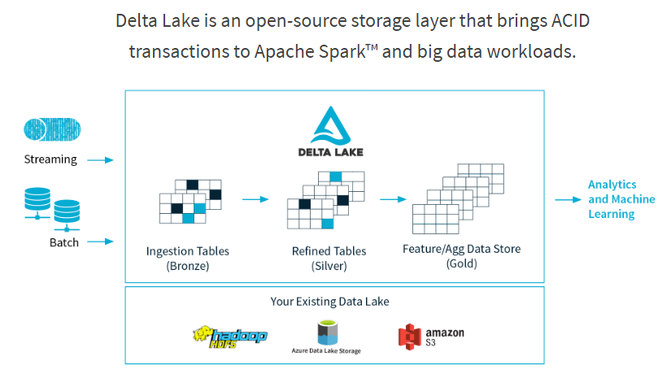

> ​	应该能够理解，Delta Lake就是构建在存储层（HDFS、S3、微软云存储等）之上， 为中间数据迭代（Lambda架构、多跳架构）提供增强功能也支撑。

正如图中所描述的：

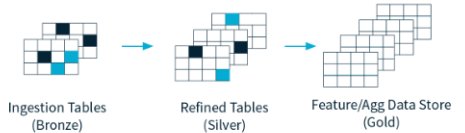

数据利用就是：

    从青铜（原始数据，结构化、半结构化、非结构化），进行处理
    走到白银（中间数据，基本上中间数据都是结构化数据，或者严格的半结构化数据。一般中间数据不会有非结构化的了）
    最终成为黄金（业务可用数据）的一系列流程，Delta Lake为这个流程保驾护航，增强功能，提高企业效率。

# 九、企业数据湖应用案例分析[实操一遍]

目标：

    学习如何在IDEA中开发集成Delta Lake功能的SparkJOB

学习步骤：

    理解企业数据湖应用的需求分析
    完成SparkJob的开发，并集成DeltaLake功能

我们已经完成了关于Delta Lake的：

    概念学习
    快速入门
    常见操作
    和理论学习

在这一章，我们模拟一个企业的离线统计分析需求，来演示一下如何在IDEA项目中使用Delta Lake
## 1. 需求分析

>  假设我们是一家做搜索引擎的公司，每天有许多人登陆网站进行搜索操作。这些用户行为统统被记录为日志存储，并被统一采集（Flume）源源不断的输入到HDFS中进行存储。数据格式：

    访问时间\t用户ID\t[查询词]\t该URL在返回结果中的排名\t用户点击的顺序号\t用户点击的URL

其中，用户ID是根据用户使用浏览器访问搜索引擎时的Cookie信息自动赋值，即同一次使用浏览器输入的不同查询对应同一个用户ID

现在公司的需求：

    政府进行合作，要求进行舆情监测，基于搜索引擎的搜索关键词，为政府提供社会舆情分析报告。
        每小时TOP10
        全天热门舆情排行

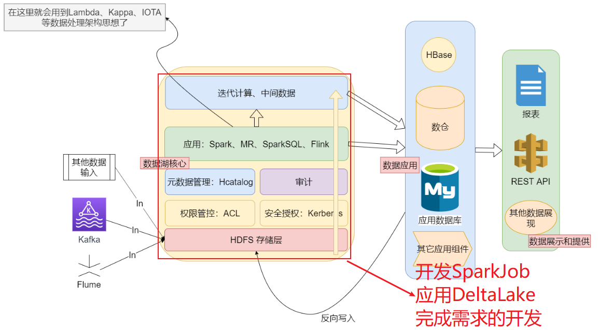

假设我们现在是在一个已经搭建好的数据湖平台之上，关于：

    数据输入
    数据应用（数仓、Mysql等）
    数据展现
    数据管理（安全、权限等）
    等

均已是开发完成了的，我们要做的，就是在这个已存在数据湖平台之上：

    开发SparkJob，应用DeltaLake，完成需求的开发
    
    关于数据湖的构建，我们前面说过，其就是普通的大数据开发平台，只不过根据用途不同，其规模、定位、以及所要完成的工作是不同的。
    
    那么，构建数据湖就不在课程里面讲解了，因为就算是讲解，还是：
    
        搭建Hadoop
        搭建Spark
        构建Kafka、Flume等数据管道
        准备数据应用（数仓、Mysql）
        做BI
        等等这一套大数据平台的构建过程
    
    那就和我们课程的主旨不符了。

假设公司已有数据湖，只不过呢没有应用DeltaLake
## 2.需求实现

> 数据文件：http://www.sogou.com/labs/resource/q.php 提供有一个月的完整数据
>
> 课程中使用的是精简版1天的数据
>
> 修复格式错误后的链接：https://pan.baidu.com/s/1kKs0ThM9EoPP7goKRCocbA
> 提取码：r6qk
>
> 前置要求：

```
同学们需要有一个可用的Hadoop、YARN、Spark的应用环境
```

项目用到的POM文件

    PS: 具体的软件版本请根据你个人的来修改
    
    但是Scala必须是2.11 以及Spark也必须是基于Scala 2.11的
    
    同时，Spark版本要大于等于2.4.2

```xml
<?xml version="1.0" encoding="UTF-8"?>
<project xmlns="http://maven.apache.org/POM/4.0.0"
         xmlns:xsi="http://www.w3.org/2001/XMLSchema-instance"
         xsi:schemaLocation="http://maven.apache.org/POM/4.0.0 http://maven.apache.org/xsd/maven-4.0.0.xsd">
    <modelVersion>4.0.0</modelVersion>
<groupId>itcast.cn</groupId>
<artifactId>DeltaLakeDemo</artifactId>
<version>1.0</version>

<repositories>
    <repository>
        <id>aliyun</id>
        <url>http://maven.aliyun.com/nexus/content/groups/public/</url>
    </repository>
    <repository>
        <id>cloudera</id>
        <url>https://repository.cloudera.com/artifactory/cloudera-repos/</url>
    </repository>
    <repository>
        <id>jboss</id>
        <url>http://repository.jboss.com/nexus/content/groups/public</url>
    </repository>
</repositories>
<properties>
    <maven.compiler.source>1.8</maven.compiler.source>
    <maven.compiler.target>1.8</maven.compiler.target>
    <encoding>UTF-8</encoding>
    <scala.version>2.11.8</scala.version>
    <scala.compat.version>2.11</scala.compat.version>
    <hadoop.version>2.6.0-cdh5.14.0</hadoop.version>
    <spark.version>2.4.5</spark.version>
</properties>
<dependencies>
    <dependency>
        <groupId>io.delta</groupId>
        <artifactId>delta-core_2.11</artifactId>
        <version>0.5.0</version>
    </dependency>
    <dependency>
        <groupId>org.scala-lang</groupId>
        <artifactId>scala-library</artifactId>
        <version>${scala.version}</version>
    </dependency>
    <dependency>
        <groupId>org.apache.spark</groupId>
        <artifactId>spark-core_2.11</artifactId>
        <version>${spark.version}</version>
    </dependency>
    <dependency>
        <groupId>org.apache.spark</groupId>
        <artifactId>spark-sql_2.11</artifactId>
        <version>${spark.version}</version>
    </dependency>
    <dependency>
        <groupId>org.apache.hadoop</groupId>
        <artifactId>hadoop-client</artifactId>
        <version>${hadoop.version}</version>
    </dependency>
    <dependency>
        <groupId>com.typesafe</groupId>
        <artifactId>config</artifactId>
        <version>1.3.3</version>
    </dependency>
</dependencies>

<build>
    <sourceDirectory>src/main/scala</sourceDirectory>
    <testSourceDirectory>src/test/scala</testSourceDirectory>
    <plugins>
        <!-- 指定编译java的插件 -->
        <plugin>
            <groupId>org.apache.maven.plugins</groupId>
            <artifactId>maven-compiler-plugin</artifactId>
            <version>3.5.1</version>
        </plugin>
        <!-- 指定编译scala的插件 -->
        <plugin>
            <groupId>net.alchim31.maven</groupId>
            <artifactId>scala-maven-plugin</artifactId>
            <version>3.2.2</version>
            <executions>
                <execution>
                    <goals>
                        <goal>compile</goal>
                        <goal>testCompile</goal>
                    </goals>
                    <configuration>
                        <args>
                            <arg>-dependencyfile</arg>
                            <arg>${project.build.directory}/.scala_dependencies</arg>
                        </args>
                    </configuration>
                </execution>
            </executions>
        </plugin>
        <plugin>
            <groupId>org.apache.maven.plugins</groupId>
            <artifactId>maven-surefire-plugin</artifactId>
            <version>2.18.1</version>
            <configuration>
                <useFile>false</useFile>
                <disableXmlReport>true</disableXmlReport>
                <includes>
                    <include>**/*Test.*</include>
                    <include>**/*Suite.*</include>
                </includes>
            </configuration>
        </plugin>
        <plugin>
            <groupId>org.apache.maven.plugins</groupId>
            <artifactId>maven-shade-plugin</artifactId>
            <version>2.3</version>
            <executions>
                <execution>
                    <phase>package</phase>
                    <goals>
                        <goal>shade</goal>
                    </goals>
                    <configuration>
                        <filters>
                            <filter>
                                <artifact>*:*</artifact>
                                <excludes>
                                    <exclude>META-INF/*.SF</exclude>
                                    <exclude>META-INF/*.DSA</exclude>
                                    <exclude>META-INF/*.RSA</exclude>
                                </excludes>
                            </filter>
                        </filters>
                        <transformers>
                            <transformer
                                    implementation="org.apache.maven.plugins.shade.resource.ManifestResourceTransformer">
                                <mainClass></mainClass>
                            </transformer>
                        </transformers>
                    </configuration>
                </execution>
            </executions>
        </plugin>
    </plugins>
</build>
    </project>
```
### 2.1 转换原始数据，生成基础表

> 我们先生成一份基础数据，对时间进行多字段显示，方便后面使用，字段为：

    date:String, hour:Int, minute:Int, userID:String, topic:String, resultRank:Int, clickRank:Int, url:String

代码实现：

```scala
package cn.itcast.deltalake.demo

import java.text.SimpleDateFormat
import java.util.Date

import org.apache.spark.SparkContext
import org.apache.spark.rdd.RDD
import org.apache.spark.sql.SparkSession

/**

- 作者：传智播客
- 描述：将原始格式进行时间细粒度划分，最小粒度划分为分钟
  */

case class OutputDefine(date:String, hour:Int, minute:Int, userID:String, topic:String, resultRank:Int, clickRank:Int, url:String)
object OriginTransform {
  def main(args: Array[String]): Unit = {
    val originFilePath = args(0)
    val outputTablePath = args(1)
    val dateSDF = new SimpleDateFormat("yyyy-MM-dd")
    val standardSDF = new SimpleDateFormat("yyyy-MM-dd HH:mm:ss")
    val hourSDF = new SimpleDateFormat("HH")
    val minuteSDF = new SimpleDateFormat("mm")
    // 由于原始数据中没有日期，我们假设为今天的数据
    val today = dateSDF.format(new Date)
val spark = SparkSession.builder().appName("OriginTransform").getOrCreate()
val sc: SparkContext = spark.sparkContext
import spark.implicits._

// Read origin data.
val lineRDD: RDD[Array[String]] = sc.textFile(originFilePath).map(line => line.split("\t"))
// 处理时间并写入到样例类OutputDefine中
val resultRDD = lineRDD.map(x => {
  // 拼接今天的日期 和原始数据中的时分秒，转换为时间戳
  val ts = standardSDF.parse(today + " " + x(0)).getTime
  val hour = hourSDF.format(new Date(ts)).toInt
  val minute = minuteSDF.format(new Date(ts)).toInt
  // case class OutputDefine(date:String, hour:Int, minute:Int, userID:String, topic:String, resultRank:Int, clickRank:Int, url:String)
  val userID = x(1)
  val topic = x(2).replace("[", "").replace("]", "")
  val resultRank = x(3).toInt
  val clickRank = x(4).toInt
  val url = x(5)
  try{
    OutputDefine(today, hour, minute, userID, topic, resultRank, clickRank, url)
  }catch {
    case e:Exception => {
      e.printStackTrace()
      throw new Exception(s"origin: $userID, $topic, $url")
    }
  }

})
// 转换为Dataframe 写入Delta Lake Table
resultRDD.toDF.write.format("delta").save(outputTablePath)

spark.close()
 }
}
```
提交Spark任务到YARN

    /root/soft/spark-2.4.5-bin-hadoop2.6/bin/spark-submit --class cn.itcast.deltalake.demo.OriginTransform --master yarn --deploy-mode client /root/DeltaLakeDemo-1.0.jar /data.txt /delta/silver/basic_minute
    
    为了方便观察日志，这里提交到YARN使用的是客户端模式而非集群模式

完成后在Spark-Shell中查看结果：

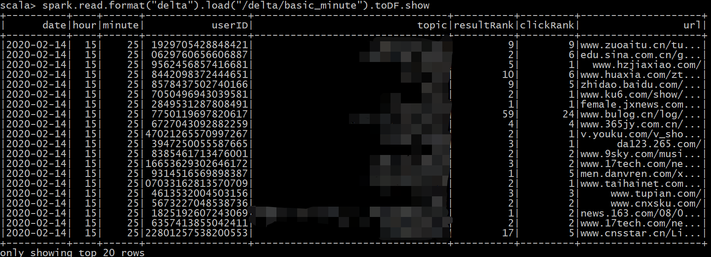

### 2.2 添加新列到基础表

>  现在，突然有一个问题，就是我们这个数据表里面虽然有时间，但是处理起来不方便。如果想要得到时间戳，需要将日期、小时、和分钟拼接起来来解析，比较不利于后面对于时间的操作。也就是，我们忘记把时间戳作为字段加入到表中了。对刚刚的代码的逻辑进行相应修改，代码如下：

    package cn.itcast.deltalake.demo
    
    import java.text.SimpleDateFormat
    import java.util.Date
    
    import org.apache.spark.SparkContext
    import org.apache.spark.rdd.RDD
    import org.apache.spark.sql.SparkSession
    
    /**
    
    - 作者：传智播客
    - 描述：将原始格式进行时间细粒度划分，最小粒度划分为分钟
      */
    
    case class OutputDefine2(ts: Long, date: String, hour: Int, minute: Int, userID: String, topic: String, resultRank: Int, clickRank: Int, url: String)
    object OriginTransform2 {
      def main(args: Array[String]): Unit = {
        val originFilePath = args(0)
        val outputTablePath = args(1)
        val dateSDF = new SimpleDateFormat("yyyy-MM-dd")
        val standardSDF = new SimpleDateFormat("yyyy-MM-dd HH:mm:ss")
        val hourSDF = new SimpleDateFormat("HH")
        val minuteSDF = new SimpleDateFormat("mm")
        // 由于原始数据中没有日期，我们假设为今天的数据
        val today = dateSDF.format(new Date)
    val spark = SparkSession.builder().appName("OriginTransform").getOrCreate()
    val sc: SparkContext = spark.sparkContext
    import spark.implicits._
    
    // Read origin data.
    val lineRDD: RDD[Array[String]] = sc.textFile(originFilePath).map(line => line.split("\t"))
    // 处理时间并写入到样例类OutputDefine中
    val resultRDD = lineRDD.map(x => {
      // 拼接今天的日期 和原始数据中的时分秒，转换为时间戳
      val ts = standardSDF.parse(today + " " + x(0)).getTime
      val hour = hourSDF.format(new Date(ts)).toInt
      val minute = minuteSDF.format(new Date(ts)).toInt
      // case class OutputDefine(date:String, hour:Int, minute:Int, userID:String, topic:String, resultRank:Int, clickRank:Int, url:String)
      val userID = x(1)
      val topic = x(2).replace("[", "").replace("]", "")
      val resultRank = x(3).toInt
      val clickRank = x(4).toInt
      val url = x(5)
      try{
        OutputDefine2(ts, today, hour, minute, userID, topic, resultRank, clickRank, url)
      }catch {
        case e:Exception => {
          e.printStackTrace()
          throw new Exception(s"origin: $userID, $topic, $url")
        }
      }
    
    })
    // 转换为Dataframe 写入Delta Lake Table，执行合并Schema的操作
    resultRDD.toDF.write.format("delta").mode("overwrite")
      .option("mergeSchema", true).save(outputTablePath)
    
    spark.close()
      }
    }
提交任务：

    /root/soft/spark-2.4.5-bin-hadoop2.6/bin/spark-submit --class cn.itcast.deltalake.demo.OriginTransform2 --master yarn --deploy-mode client /root/DeltaLakeDemo-1.0.jar /data.txt /delta/silver/basic_minute

完成后，查看结果：

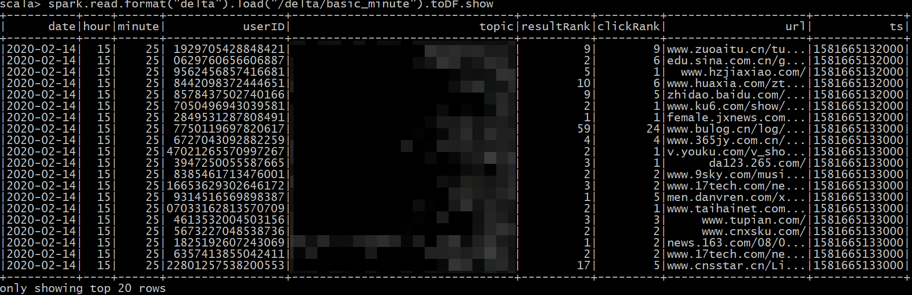

### 2.3 聚合每小时的数据，统计每小时TOP10

基于刚刚的基础数据，统计每小时TOP10

生成格式，如下：

```sh
date	hour	topic	rank	num
2020-06-06	6	中国人均GDP突破2W美元	1	1234
2020-06-06	6	可控核聚变有望在年内实现商用	2	1001
```


示例代码：

```scala
package cn.itcast.deltalake.demo

import java.text.SimpleDateFormat
import java.util.Date

import org.apache.spark.SparkContext
import org.apache.spark.rdd.RDD
import org.apache.spark.sql.{DataFrame, Dataset, SparkSession}
import org.json.JSONObject

import scala.collection.mutable
import scala.util.parsing.json.JSON

/**

- 作者：传智播客
- 描述：统计每小时TOP100
  */

case class HourTOP(date:String, hour:Int, topic:String, rank:Int, num:Int)

object HourTop10 {
  def main(args: Array[String]): Unit = {
    val hourSDF = new SimpleDateFormat("yyyy-MM-dd HH")
    val inputTablePath = args(0)
    val outputTablePath = args(1)
// Get spark context
val spark = SparkSession.builder().master("local[*]").appName("AggregationByMinute").getOrCreate()
val sc: SparkContext = spark.sparkContext
import spark.implicits._

// 读取表
val inputDF = spark.read.format("delta").load(inputTablePath).toDF()

inputDF.createOrReplaceTempView("t_basic") // 注册表
val frame: DataFrame = spark.sql("select ts, topic from t_basic") // 查询ts和topic
// 获取小时 和 对应的topic
val hourWithTopic: RDD[(String, String)] = frame.map(x => {
  val hour = hourSDF.format(new Date(x.getLong(0)))
  val topic = x.getString(1)
  hour -> topic
}).rdd

// 用Map做topic和次数的统计
val topicWithCountMap = mutable.Map[String, Int]()
// 聚合小时，以当前小时内的聚合统计次数的Map作为value
val hourWithMap: RDD[(String, mutable.Map[String, Int])] = hourWithTopic.groupByKey().mapValues(y => {
  y.foreach(x => {
    var topicCount: Int = topicWithCountMap.getOrElse(x, 0)
    topicCount += 1 // 如果没有这个key，得到的是0，+1后正好是1，put进去，如果得到了就原样+1
    topicWithCountMap += (x -> topicCount) // 次数+1
  })
  topicWithCountMap // 返回这个Map
})

// 转换这个Map为top10，并写入样例类
val hourTOPListRDD: RDD[List[HourTOP]] = hourWithMap.map(x => {
  // List[(String, Int)] == List[(topic, num)]
  val top10: List[(String, Int)] = x._2.toList.sortBy(_._2).reverse.take(10)
  val date = x._1.split(" ")(0)
  val hour = x._1.split(" ")(1).toInt
  var rank = 0
  top10.map(y => {
    rank += 1
    HourTOP(date, hour, y._1, rank, y._2)
  })
})
// 由于RDD没有flatten方法，所以用flatMap，map原样返回即可，就相当于flatten了。
val resultRDD: RDD[HourTOP] = hourTOPListRDD.flatMap(x => x)
// 转换为Dataframe，写入Delta Lake Table
resultRDD.toDF().write.format("delta").save(outputTablePath)

spark.close()
  }
}
```
提交任务：

    /root/soft/spark-2.4.5-bin-hadoop2.6/bin/spark-submit --class cn.itcast.deltalake.demo.HourTop10 --master yarn --deploy-mode client /root/DeltaLakeDemo-1.0.jar /delta/silver/basic_minute /delta/gold/hourTOP10

完成后，查看表：

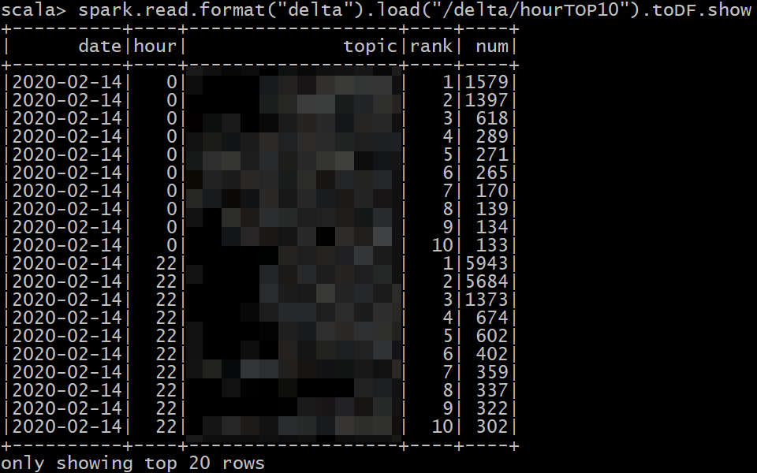

### 2.4 统计全天热门TOP100

同样基于那一份基础表数据，来统计一下全天热门TOP100，对每小时热门TOP10的代码简单修改即可。

输出表结构

```sh
date	topic	rank	num
2020-06-06	中国人均GDP突破2W美元	1	1234
2020-06-06	可控核聚变有望在年内实现商用	2	1001
```

示例代码：

    package cn.itcast.deltalake.demo
    
    import java.text.SimpleDateFormat
    import java.util.Date
    
    import org.apache.spark.SparkContext
    import org.apache.spark.rdd.RDD
    import org.apache.spark.sql.{DataFrame, Dataset, SparkSession}
    import org.json.JSONObject
    
    import scala.collection.mutable
    import scala.util.parsing.json.JSON
    
    /**
    
    - 作者：传智播客
    - 描述：统计每天TOP100
      */
    
    case class DayTOP(date:String, topic:String, rank:Int, num:Int)
    
    object DayTop100 {
      def main(args: Array[String]): Unit = {
        val daySDF = new SimpleDateFormat("yyyy-MM-dd")
        val inputTablePath = args(0)
        val outputTablePath = args(1)
    // Get spark context
    val spark = SparkSession.builder().master("local[*]").appName("AggregationByMinute").getOrCreate()
    val sc: SparkContext = spark.sparkContext
    import spark.implicits._
    
    // 读取表
    val inputDF = spark.read.format("delta").load(inputTablePath).toDF()
    
    inputDF.createOrReplaceTempView("t_basic") // 注册表
    val frame: DataFrame = spark.sql("select ts, topic from t_basic") // 查询ts和topic
    // 获取day 和 对应的topic
    val dayWithTopic: RDD[(String, String)] = frame.map(x => {
      val day = daySDF.format(new Date(x.getLong(0)))
      val topic = x.getString(1)
      day -> topic
    }).rdd
    
    // 用Map做topic和次数的统计
    val topicWithCountMap = mutable.Map[String, Int]()
    // 聚合day，以当前day内的聚合统计次数的Map作为value
    val dayWithMap: RDD[(String, mutable.Map[String, Int])] = dayWithTopic.groupByKey().mapValues(y => {
      y.foreach(x => {
        var topicCount: Int = topicWithCountMap.getOrElse(x, 0)
        topicCount += 1 // 如果没有这个key，得到的是0，+1后正好是1，put进去，如果得到了就原样+1
        topicWithCountMap += (x -> topicCount) // 次数+1
      })
      topicWithCountMap // 返回这个Map
    })
    
    // 转换这个Map为top100，并写入样例类
    val dayTOPListRDD: RDD[List[DayTOP]] = dayWithMap.map(x => {
      // List[(String, Int)] == List[(topic, num)]
      val top100: List[(String, Int)] = x._2.toList.sortBy(_._2).reverse.take(100)
      val date = x._1
      var rank = 0
      top100.map(y => {
        rank += 1
        DayTOP(date, y._1, rank, y._2)
      })
    })
    // 由于RDD没有flatten方法，所以用flatMap，map原样返回即可，就相当于flatten了。
    val resultRDD: RDD[DayTOP] = dayTOPListRDD.flatMap(x => x)
    // 转换为Dataframe，写入Delta Lake Table
    resultRDD.toDF().write.format("delta").save(outputTablePath)
    
    spark.close()
      }
    }
提交任务：

    /root/soft/spark-2.4.5-bin-hadoop2.6/bin/spark-submit --class cn.itcast.deltalake.demo.DayTop100 --master yarn --deploy-mode client /root/DeltaLakeDemo-1.0.jar /delta/basic_minute /delta/gold/dayTOP100

完成后，查看数据：

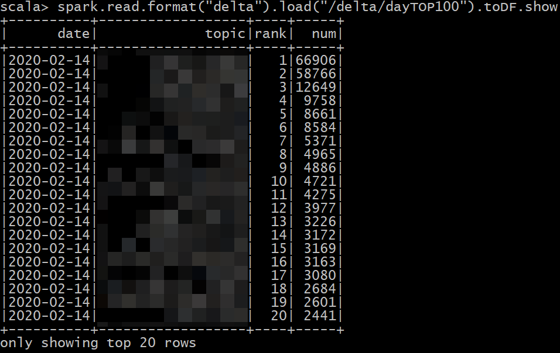

### 2.5 将输出的数据合并为1个parquet文件

导出到其它目录，供其它程序（如ETL、数据管道）进行使用。

执行(Spark-Shell)：

```scala
val inPath = "/delta/gold/dayTOP100"
val outPath = "/deltaExport/dayTOP100Result"
val numFiles = 1

spark.read.format("delta").load(path).repartition(numFiles).write.option("dataChange", "false").format("parquet").save(outPath)
```

然后，将生成的最新版本的那一个单独的parquet复制出来即可

验证：

```scala
spark.read.format("parquet").load("/deltaExport/dayTOP100Result/xxxxx.parquet").toDF.show
```

这样，我们的结果就导出为一个普通的parquet文件了，这个文件可以被其它程序方便的使用。

    PS: 你可以选择导出为多个parquet文件，具体合并为几个看你的数据量大小。
    
    一般合并为1个即可。

## 3. 总结

至此，我们已经完成了这两个需求的开发。

那么，当然，在企业内，数据工程师除了开发SparkJob进行数据计算外，也会有一些其他的操作，如：

    数据错误，回滚版本
    导出数据为清单文件
    合并维护delta表
    数据分区
    等等

这一系列的操作我们就不演示了，基于在前面Spark-Shell中学习到的操作，我们就可以完成对DeltaTable的这些操作。

那么，本章的主要目的是为了：

    演示如何在IDEA中开发Delta Lake相关项目
    体验一下Delta Lake所推崇的多跳思想
        青铜数据：原始数据
        白银数据：生成的基础表
        黄金数据：统计的每小时TOP和每天TOP的结果表
    体验Delta Lake和Spark的集成
        其实95%都是Spark的原本代码，我们只是在读数据和写数据上用到了Delta Lake而已。
        所以，对于企业来说，想要从原有的数据湖迁移到Delta Lake是非常方便的。

关于Delta Lake的部分就到此结束，下一章我们了解一下在AWS上的数据湖实现方案介绍。

# 十、基于AWS的云上数据湖实现方案介绍[了解]

步骤：

    了解云平台的概念，拓展经验
    了解在AWS云上的数据湖方案，拓展经验。

## 1. 云平台的介绍

### 1.1 前言

随着云计算概念的不断落地和推广, 目前云平台已经得到了非常广泛的使用.

云平台帮助用户在:

    应用落地
    服务落地
    安全保障
    性能

等方面获得比传统方式更高效, 更节省, 更稳定, 更方便的优势.

### 1.2 云平台的概念

云平台也称云计算平台. 云计算, 顾名思义, 就是将计算在云上运行.

那么在这里面的两个概念

    计算: 这是一个范围很大的名词, 除了能指代业务数据的计算等, 更多时候是指代服务 或者 应用
    云: 通俗的理解就是远程计算机, 并且是一组 一堆, 它们远程为使用者提供服务, 提供计算.

> 我们可以这样理解: 云平台 就是 一个云上的平台, 为用户提供各种各样的 远程服务
>
> 举个例子:
>
> 现在有一个 人力外包中心, 其内部有非常多的人力资源可供客户购买使用.那么有一个客户, 从人力资源外包公司, 花钱雇10个人干活, 发现效率不行又雇了100个一起干活, 最终活儿按时完成.那么, 上述例子就是对云平台的一种模拟.人力资源中心 提供的是服务, 提供的是资源, 客户只需要按量购买即可.在例子中, 客户如果不使用人力资源中心 就需要自己招聘相应的员工, 签订劳务合同, 让自己的员工去为自己服务.但是, 如果需求结束了, 员工又不能随意辞退, 那么这些员工就相当于资源闲置了.而人力资源中心 就是提供了 资源 供客户使用, 按需求 按用量付费即可, 用完即停止. 对客户来说资源没有闲置.

    PS: 现在很多软件人力外包, 就是这样的思路.
    
    很多甲方公司, 不愿意招聘正式员工, 仅仅某个项目需求人手, 就从外包公司招人来做, 项目完成, 人员也就遣返回外包公司了. 甲方按人数和时间给外包公司付款.

> 回到计算机的世界中,云平台提供的就是 计算的资源.那么计算的资源主要有:

    硬件资源: 主要指服务器 交换机 磁盘 GPU等硬件资源
    软件资源: 主要指 各种软件工具 如域名服务 虚拟内网 数据库软件 等.

> 云平台为客户提供了 一站式的解决方案.客户可以没有任何一台服务器 同样可以搭建起来自己的业务.业务 就运行在云平台之上.通俗的理解, 使用了云平台之后, 客户就不需要自行搭建机房了, 不需要自购服务器了.服务器等硬件资源 从云平台购买使用即可.并且因为云平台上的资源是很多的, 如果客户觉得资源不足, 可以追加购买. 如果觉得资源过多, 可以减少购买. 灵活方便.

    毕竟, 自建机房成本很高, 并且服务器等硬件购买是一次性.
    
    买回来发现用不到,造成资源的闲置 也是无可避免.
    
    特别是某些业务突增的需求, 导致资源紧张, 临时加了N台服务器.
    
    等到业务下降的时候, 这么多追加的服务器的资源就闲置了.
    
    消费者还能在闲鱼让闲置游起来. 但是服务器领域…就算也能各种二手倒腾, 在机房频繁的上架下架 也是很繁琐的. 特别是运维同学, 估计要打人…

### 1.3 云平台的分类

> 云平台主要有 2大类, 分别是:
> `私有云平台` :私有云平台, 简称私有云,顾名思义就是私人的云平台, 一般是企业自行搭建, 提供给企业内部去使用.如, 各个业务部门 或者各个项目组作为客户, 从平台上购买资源,或者申请资源去使用，费用一般企业内部结算。是一种提高企业内 资源利用率的手段，同时，基于云平台上提供的各种服务，也方便企业内部的开发。但对于企业本身来说, 其硬件资源是自行组建的.(如 自建机房 自购服务器等)
>
> `公有云平台`:公有云平台就是提供给大众使用的云平台.任何人 或者任何企业 均可以在公有云平台内去 购买 申请 相应的资源.对于公有云平台的提供商来说, 其本身的硬件资源是自行组建的(如自建机房, 自购服务器, 搭建数据中心)

    本次课程, 主要给大家讲解公有云平台.

### 1.4 主流公有云平台

提供公有云服务的平台有许多, 我们来列举一下(顺序不代表排名):

    AWS: Amazon web service: 是亚马逊提供的一个公有云平台. 也是最早提供云平台服务的一批企业. 也是目前全球公有云的龙头标杆. 在全球市场占有率处于领先地位. 就如苹果带领手机的发展方向一样, AWS目前处于引领云平台发展方向的地位.
    Azure: 微软提供的一个公有云平台. 市场占有率一般, 目前处于上升期.
    GCP: Google cloud paltform: 谷歌提供的云平台, 占有率还行, 也是处于上升期.
    阿里云: 阿里提供的云平台, 在国内市场很强势. 处于No.1地位, 在国际上占有率一般, 处于上升期.
    腾讯云: 腾讯提供的云平台, 国内占有率还行, 价格便宜, 目前正在大片的抢占市场.
    京东云 \ 金山云 \ 时速云 : 占有率比较低. 处于下层梯队.

### 1.5 云的三种服务

> 那么我<们再来了解一下PaaS SaaS IaaS
> **IaaS**
>
> Infrastructure as a Service: 基础设施即服务, 是指把IT基础设施作为服务提供
> **PaaS**
>
> Platform as a Service : 平台即服务.是指将平台作为一种服务对外提供. 那么我们要学习的云平台, 就是一种PaaS服务. 其他还有如 腾讯地图开发平台 等提供平台服务的
> **SaaS**
>
> Software as a Service: 软件即服务, 是指将软件作为一种服务对外提供. 如阿里云提供的 云上数据库 就是将数据库软件作为服务对外提供. 还有如 GitHub也是一种SaaS服务
>
> 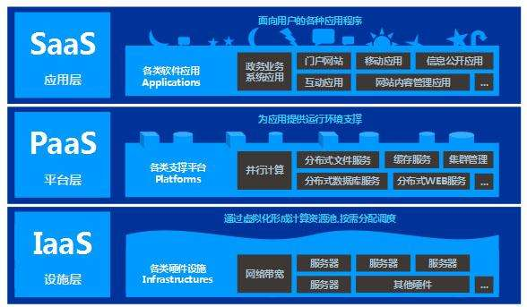
>
> 那么我们理解, 阿里云是一个PaaS平台, 提供IaaS 和 SaaS服务.
> 

### 1.6 公有云对企业或者个人的意义

> ​	我们撇开私有云不说, 单说公有云.公有云的出现, 其实极大的提升了社会的运作效率, 提高了小企业和个人的业务竞争力.比如, 你是一个小企业或者个人开发者, 在没有公有云之前, 你最少也要请1个运维, 买几台或者租用几台服务器, 租用共享机房,租用带宽 才能提供一个软件部署运行的环境.这一套不简单, 很繁琐, 费时费力. 并且租金一租一年半年的, 临时加机器也麻烦.但是公有云的出现, 就可以轻松快速的构建好自己的服务器环境, 创业者只需要专心在业务研发上面,而不用费心费力的去在 机房 服务器等方面费心.

    从硬件成本的角度来看, 自购服务器 租用机房的成本是比较低的. 毕竟服务器是一次性付费, 永久使用.
    
    但是在创业初期, 一次性付费服务器是不现实的, 一台服务器的价格 如果业务量不大, 够在公有云上用2年了.
    
    等到业务发展起来之后才去考虑自购服务器…
    
    上面还只是讨论的硬件成本. 其实综合来说,云还是要省心.
    
    其提供的优点太多, 最主要的就是方便.
    
    对于很多企业来说, 方便省心才是主要. 因为他们的业务能够挣得更多.所以要确保注意力尽量关注与业务 而不是运维
    
    哪怕多花钱在云上也是值得的.

> ​	总的来说, 小规模使用, 公有云 简单 灵活 还便宜.大规模使用, 可能费用会高一些, 但是绝对的省心和方便. 因为云平台除了提供虚拟服务器以外, 还提供许多SaaS服务,我们后面就会学到… 而这些SaaS服务才是黏住用户宁愿多花钱也要上云的最主要原因.

## 2. AWS的数据湖解决方案

> ​	那么现在，我们来了解一下在AWS上架构数据湖的方案.AWS上有众多服务，无论是PaaS还是IaaS层亦或是SaaS层，均有大量的适用于企业开展业务的服务。
>
> 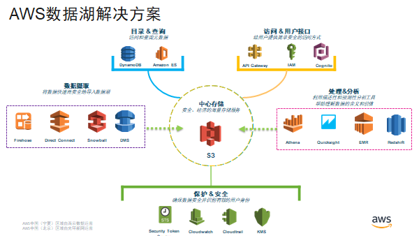
>
> 基于这些云上服务，数据湖所需要的整个生态体系基本上都有可用的服务。我们在回头来看一下，在前面看过的这张图片：
>
> 

可以看出，如果进行粗略的划分，数据湖实现分为：

    数据存储（核心）
    数据分析（核心）
    数据输入
    数据输出
    数据应用（报表、API等）
    以及围绕数据管理的一些功能（权限、安全、审计等）

那么，基于这些划分，我们来看一下，AWS之上分别有什么解决方案。

### 2.1 存储层[重点]

> 对于数据湖来说，存储层是其核心，在AWS之上的核心存储称之为AWS S3
>
> 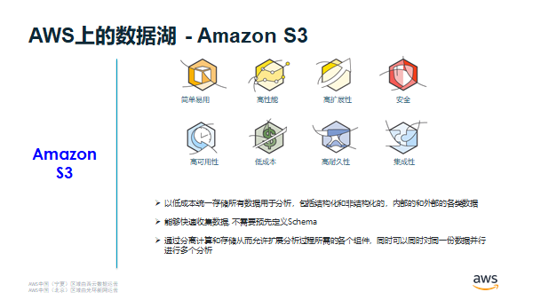

> ​	去服务器化：使用**S3这个服务**，不需要依赖服务器。S3是一款分布式的对象存储系统。可以当做是AWS云平台之上的HDFS，也可以认为它是一个大型的企业私有存储网盘。S3服务，贯穿整个AWS云平台，基本上所有AWS上的服务，只要对数据有需求，都可以操纵S3进行数据的存取。使用S3来作为数据湖的存储核心在合适不过。其完美的支持了数据湖对存储层的要求：

    集中存储的需求
    不限格式任意数据存储的需求
    随处访问（视AWS上的权限配置，只要你有权限，在AWS上任何服务内都可以直接访问S3内的数据）
    支持多种分析框架

### 2.2 数据分析[重点]

>  在AWS之上提供了多种数据分析的框架：
>
> 去服务器化：Server less
> Server Less的大数据分析引擎：`Amazon Athena`
>
> 

> ​	Athena 没有服务器，是AWS上的一款SaaS服务，你只需要创建Athena并在云上使用它即可。它可以快速的针对S3内的文件进行交互式查询（读时模式）并且由于和S3存储是独立的服务，所以存储和计算是分离的。你可以非常容易的动态扩展Athena的算力，只需要鼠标点击即可完成Athena的扩容并在不用的时候随时进行缩容或者停止服务。

**测试**

在athena上建表：

```sql
CREATE EXTERNAL TABLE testdata (
  time STRING,
  userid STRING,
  topic STRING,
  rank_result INT,
  rank_click INT,
  url STRING
) ROW FORMAT DELIMITED FIELDS TERMINATED BY '\t'
LOCATION 's3://test-datalake/test/';
```

然后就可以执行SQL查询了

**AWS之上的Hadoop： EMR [重点]**

> ​	在AWS之上，你可以快速基于EMR服务，快速的计算Hadoop计算集群。并基于S3进行的存储，完全解耦计算和存储（EMR中的Hadoop支持从S3读写数据，也就是将S3当成HDFS用）。EMR提供了快速的集群构建方式，只需要鼠标点击几下，即可构建出可用的Hadoop集群（自动安装部署）并且，提供了2种运行模式：

    集群模式：利用EMR自动化的创建出符合要求的Hadoop集群，并长期运行
    步骤执行（特色）：在构建的时候，提供给EMR需要执行的任务，并规划好集群算力，EMR就会自动的创建集群，如Spark、MR集群，然后自动运行你提供的任务， 在执行完成后，便停止服务，删除集群。

> ​	如果说，集群模式就是一个自动化安装脚本的话，其实重要性并不是很大，大不了我们手工安装一套Hadoop、Spark环境也不是太过于困难。EMR的核心，其实还是**步骤运行的模式**，这是一种典型的**计算和存储分离**的思想。数据在S3中保存着，当我需要计算这些数据的时候，比如Spark任务。我只需要将任务提交给EMR，并告知EMR比如我要开启10台4核8G的机器来进行计算，那么EMR就会自动的按照你的要求：

    构建好10台机器的Spark计算集群
    然后将你提交给EMR的任务，提交到Spark中进行计算
    任务完成后，集群停止并删除

> ​	并且如果你觉得算力不够，你可以在AWS的EMR上，开启100台服务器，开启10000台服务器去计算你想要的任务，都是可以的。并且，这些集群在执行完成后，就会自动删除。这样就节省了巨大的成本。我们知道，在计算和存储分离的情况下，计算集群只有有任务的时候，其才在发挥其存在的价值。如果没有任务要计算，计算集群的存在就是在烧钱。并且，在云服务上，服务器都是按照小时计费的。在不计算的时候，就不需要集群，在需要计算的时候，才需要集群。并且用几个小时就付几个小时的钱。这对于企业来说是非常高效并节省成本的计算方式。

### 2.3 数据处理ETL[了解]

AWS之上提供了许多数据处理ETL的工具。

比如刚刚介绍过的EMR，作为计算引擎，完全可以做ETL的任务计算。

同时，AWS还提供了：

    Glue：完全托管的ETL服务，无服务器架构，鼠标点击即可完成ETL任务。并支持使用Scala Python对ETL流程进行自定义。
    
    Lambda：是一款无服务的代码运行服务。你可以将你的代码逻辑提交给Lambda即可运行，不需要服务器，不需要执行环境，只要提交给Lambda你的逻辑代码，它就可以运行你的代码执行你想要的操作。
    
    那么，基于Lambda进行ETL处理也是很合适的。它可以监听S3，并配置触发事件，自动监听并自动执行你提交给它的代码逻辑。

### 2.4 AWS上的实时流服务[了解]

> ​	AWS提供了实时流服务：Amazon Kinesis。这是一款完全托管的实时流计算服务。 server less，我们可以认为它是云上的Flink Spark Streaming。Kinesis是一款SaaS服务，是一款无服务器的服务，同样只需要你点击鼠标配置几下，即可创建好Kinesis服务，并让其工作。同时基于云服务的特点，想要提高性能提升算力，也是鼠标点击几下即可（烧钱），十分方便。

### 2.5 AWS上的数仓服务[了解]

我们说过，数据湖和数仓是不同的概念，数据湖绝对不是替代数仓的概念。

数仓和数据湖应该是互补的。

数据湖提供：统一存储，全量数据分析

数仓提供：基于业务系统，提供严谨的数据分析

在AWS之上提供的数仓服务，称为：Redshift

这是一款分布式的数仓服务，其底层基于Postgresql开发，兼容Postgresql的使用

你可以将Redshift当成一款分布式、高并发、大容量的Postgresql数据库去使用。

同时，一样支持：

    动态扩容（存储层面）
    海量数据
    动态扩容（算力层面）
    按需付费

### 2.6 AWS上的KV存储（NoSQL） - DynamoDB[了解]

DynamoDB是AWS上的一款NoSQL服务。列式存储数据库，KV形式的数据库。 HBase

提供KV形式的数据存储和查询。

### 2.7 数据应用[了解]

**BI**

基于QuickSight，提供数据展现服务（BI）
**API服务**

API Gateway 是AWS上提供的一款托管的网关服务。

我们可以认为其是AWS上的Nginx服务。

可以配合前面提到的Lambda（无服务器代码运行服务），快速开发RESTFul形式的API对外提供。

### 2.8 安全、审查、授权[了解]

在AWS云平台上，所有的权限权利和安全控制相关基于一个服务：IAM

它是AWS上的用户认证和访问控制系统。

基于IAM我们可以完成对云上数据湖的数据管控

同时，AWS上也提供了统一的日志存储服务CloudWatch

它支持采集所有AWS服务的日志数据并存储。

我们可以基于CloudWatch完成对数据湖内数据审查的需求。

### 2.9 AWS数据湖方案总结

如上图，我们可以基于AWS云服务，去构建完整的数据湖、数据仓库、大数据分析存储等大数据应用架构。

    基于S3做核心存储
    基于EMR athnea做分析查询
    基于glue, lamda, apigateway redshift , dynamodb, kinisis

基于AWS提供的：

    核心存储S3
    分析框架（Athena，EMR等）
    ETL工具（Lambda、Glue）
    流计算框架（Kinesis）
    NoSQL（DynamoDB）
    权限管控（IAM）
    统一日志服务（CloudWatch）
    等等一系列框架来完成数据湖架构的实现、或者大数据架构的实现。

课程总结：

    数据湖的概念
        传统的大数据平台和数据湖看起来架构是一样的，只不过定位不懂，执行的工作也不同。
    DeltaLake框架的入门操作
        95%的代码都是普通的Spark SparkSQL代码
        将传统的数据湖迁移到DeltaLake架构是很简单的。只需要一点点代码的更改就能完成。
        DeltaLake为我们提供了一系列增强的功能，事务控制，版本回退，schema管理等等
    在云上的数据湖的实现
        介绍了什么是云平台
        AWS常用的服务
        以及针对数据湖核心和周边的一些辅助工具的介绍。

End


# 参考文档：https://blog.csdn.net/qq_41822345/article/details/111902557


