尚硅谷大数据技术之 Atlas-2.1（元数据管理）

(作者：尚硅谷大数据研发部)

版本：V3.0

# 第 1 章 Atlas 入门

## 1.1 Atlas 概述

Apache Atlas 为组织提供开放式元数据管理和治理功能，用以构建其数据资产目录，对这些资产进行分类和管理，形成数据字典。并为数据分析师和数据治理团队，提供围绕这些数据资产的协作功能。

注：数据字典：可以查到 hive 库的释义，表的介绍以及字段的解释和说明。

1）表与表之间的血缘依赖

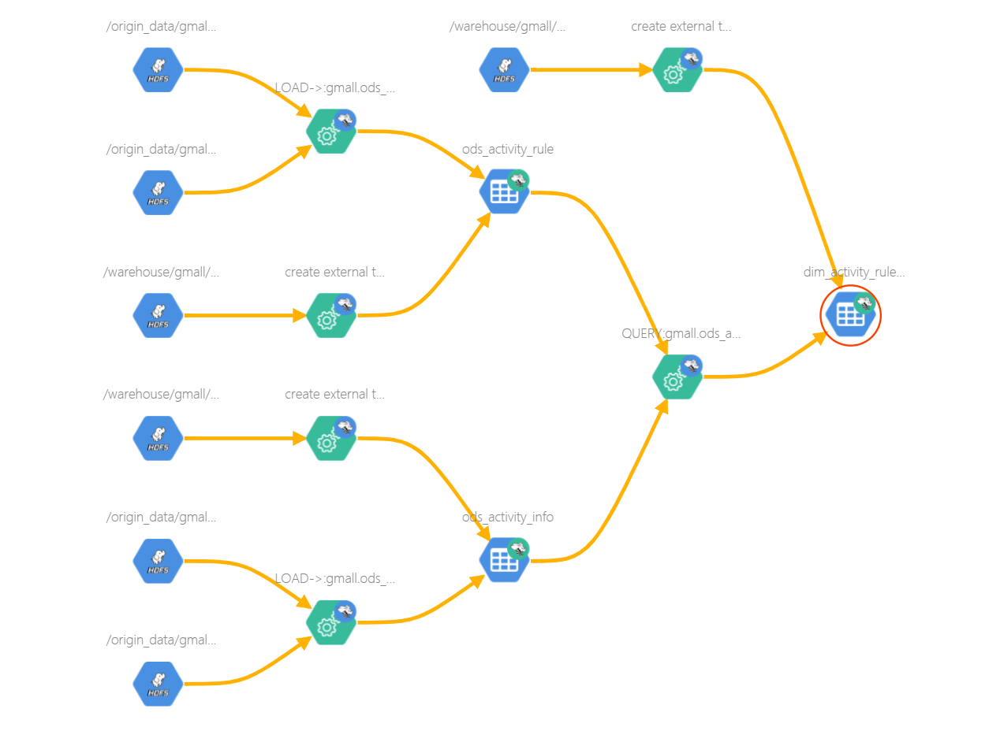

2）字段与字段之间的血缘依赖

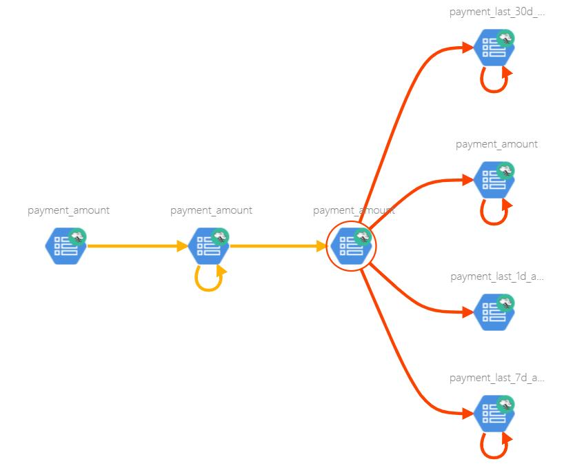

## 1.2 Atlas 架构原理

**Atlas架构原理**

**Metadata Sources**：目前，Atlas支持从以下来源提取和管理元数据：HBase 、Hive、Sqoop、Storm、Kafka

**Admin UI:** 该组件是一个基于Web的应用程序，允许数据管理员和科学家发现和注释元数据。这里最重要的是搜索界面和类似SQL的查询语言，可用于查询Atlas管理的元数据类型和对象。

**Ranger Tag Based Policies：**权限管理模块

**Business Taxonomy：**业务分类

**Messaging:** 除了API之外，用户还可以选择使用基于Kafka的消息传递接口与Atlas集成。

**API:** Atlas的所有功能都通过REST API向最终用户暴露，该API允许创建，更新和删除类型和实体。它也是查询和发现Atlas管理的类型和实体的主要机制。

**采集/导出(Ingest/Export)：**采集组件允许将元数据添加到Atlas。同样，“导出”组件将Atlas检测到的元数据导出。

**类型系统(Type System):** 用户为他们想要管理的元数据对象定义模型。Type System称为“实体”的“类型”实例，表示受管理的实际元数据对象。

**图形引擎(Graph Engine):** Atlas在内部使用Graph模型持久保存它管理的元数据对象。

**Metadata Store<Hbase>：**采用HBase来存储元数据

**Index Store<Solr>：**采用Solr来建索引

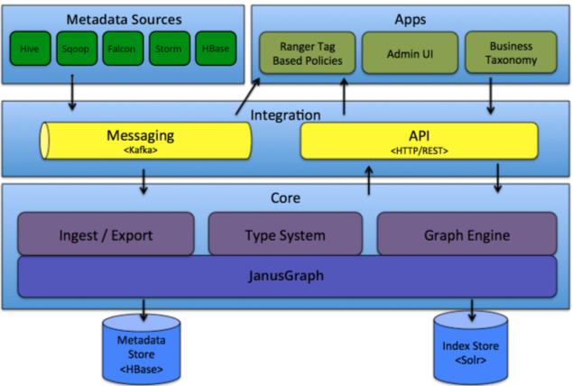

## 1.3 Atlas2.1 特性

1）更新了组件可以使用 Hadoop3.1、Hive3.1、Hive3.0、Hbase2.0、Solr7.5 和 Kafka2.0

2）将 JanusGraph 版本跟新为 0.3.1

3）更新了身份验证支持可信代理

4）更新了指标模块收集通知

5）支持 Atlas 增量导出元数据

# 第 2 章 Atlas 安装

1）Atlas 官网地址：https://atlas.apache.org/

2）文档查看地址：https://atlas.apache.org/2.1.0/index.html

3）下载地址：https://www.apache.org/dyn/closer.cgi/atlas/2.1.0/apache-atlas-2.1.0-sources.tar.gz

## 2.1 安装环境准备

Atlas 安装分为：集成自带的 HBase + Solr；集成外部的 HBase + Solr。通常企业开发中选择集成外部的 HBase + Solr，方便项目整体进行集成操作。

以下是 Atlas 所以依赖的环境及集群规划。

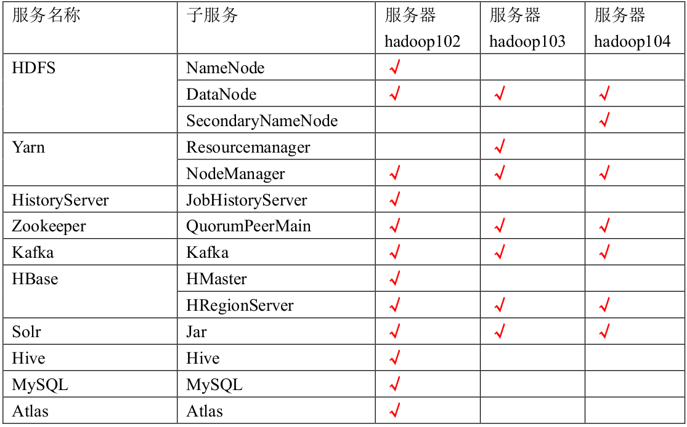

### 2.1.1 安装 JDK8、Hadoop3.1.3

1）安装 Hadoop 集群

尚硅谷大数据技术之Hadoop（入门）V3.0.docx

2）启动 Hadoop 集群

```sh
[atguigu@hadoop102 hadoop-3.1.3]$ sbin/start-dfs.sh
[atguigu@hadoop103 hadoop-3.1.3]$ sbin/start-yarn.sh
```

### 2.1.2 安装 MySQL、Hive3.1.2

尚硅谷大数据技术之Hive.docx

### 2.1.3 安装 Zookeeper3.5.7

1）安装 Zookeeper 集群

尚硅谷大数据技术之Zookeeper（V3.0）.docx

2）启动 Zookeeper 集群

```sh
[atguigu@hadoop102 zookeeper-3.7.7]$ zk.sh start
```

### 2.1.4 安装 Kafka2.4.1

1）安装 Kafka 集群

尚硅谷大数据技术之Kafka（V3.0）.docx

2）启动 Kafka 集群

```sh
[atguigu@hadoop102 kafka]$ kf.sh start
```

### 2.1.5 安装 Hbase2.0.5

1）安装 Hbase 集群

尚硅谷大数据技术之HBase.doc

2）启动 Hbase 集群

```sh
[atguigu@hadoop102 hbase]$ bin/start-hbase.sh
```

### 2.1.6 安装 Solr-7.7.3

1.在每台节点创建系统用户 solr

```sh
[atguigu@hadoop102 ~]$ sudo useradd solr
[atguigu@hadoop102 ~]$ echo solr | sudo passwd --stdin solr

[atguigu@hadoop103 ~]$ sudo useradd solr
[atguigu@hadoop103 ~]$ sudo echo solr | passwd --stdin solr
[atguigu@hadoop104 ~]$ sudo useradd solr
[atguigu@hadoop104 ~]$ sudo echo solr | passwd --stdin solr
```

2.在 102 节点上传 solr 安装包 solr-7.7.3.tgz，并解压到/opt/module 目录，重命名为 solr

```sh
[atguigu@hadoop102 solr]$ tar -zxvf solr-7.7.3.tgz -C /opt/module/
[atguigu@hadoop102 solr]$ cd /opt/module
[atguigu@hadoop102 module]$ mv solr-7.7.3/ solr
```

3.修改 solr 目录的所有者为 solr 用户

```sh
[atguigu@hadoop102 module]$ sudo chown -R solr:solr /opt/module/solr
```

4.修改 solr 配置文件

修改/opt/module/solr/bin/solr.in.sh 文件中的以下属性

```sh
[atguigu@hadoop102 solr]$ cd /opt/module/solr/bin/
[atguigu@hadoop102 bin]$ sudo vim solr.in.sh

# 找到 ZK_HOST 参数,删掉注释,然后修改
ZK_HOST="hadoop102:2181,hadoop103:2181,hadoop104:2181"
```

5.分发 solr

```sh
[atguigu@hadoop102 module]$ sudo xsync /opt/module/solr
```

6.启动 solr 集群

1）启动 Zookeeper 集群

```sh
[atguigu@hadoop102 module]$ zk.sh start
```

2）启动 solr 集群

出于安全考虑，不推荐使用 root 用户启动 solr，此处使用 solr 用户，在所有节点执行以下命令启动 solr 集群

```sh
[atguigu@hadoop102 module]$ sudo -i -u solr /opt/module/solr/bin/solr start
```

出现 Happy Searching! 字样表明启动成功。

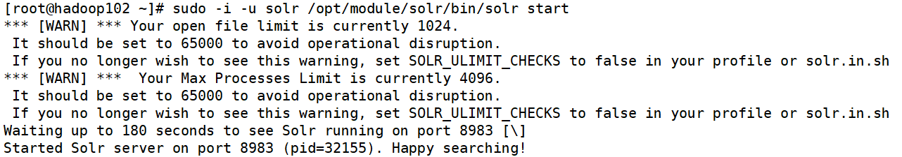

说明：上述警告内容是：solr 推荐系统允许的最大进程数和最大打开文件数分别为 65000 和65000，而系统默认值低于推荐值。如需修改可参考以下步骤，修改完需要重启方可生效，此处可暂不修改。

（1）修改打开文件数限制

修改/etc/security/limits.conf 文件，增加以下内容

```sh
* soft nofile 65000
* hard nofile 65000
```

（2）修改进程数限制

修改/etc/security/limits.d/20-nproc.conf 文件

```sh
* soft nproc 65000
```

（3）重启 solr 服务

7.访问 web 页面

默认端口为 8983，可指定三台节点中的任意一台 IP，http://hadoop102:8983

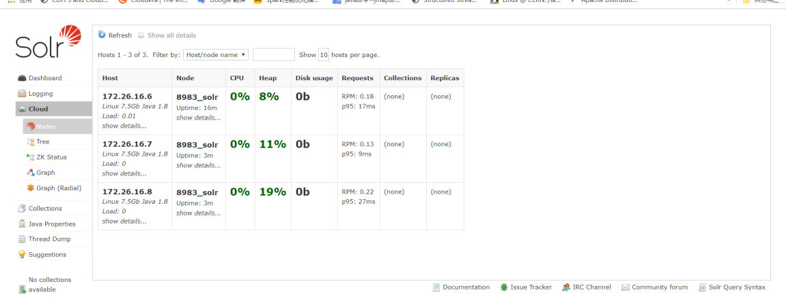

提示：UI 界面出现 Cloud 菜单栏时，Solr 的 Cloud 模式才算部署成功。

### 2.1.7 安装 Atlas2.1.0

1.把 apache-atlas-2.1.0-server.tar.gz 上传到 hadoop102 的/opt/software 目录下

2.解压 apache-atlas-2.1.0-server.tar.gz 到/opt/module/目录下面

```sh
[atguigu@hadoop102 software]$ tar -zxvf apache-atlas-2.1.0-server.tar.gz -C /opt/module/
```

3.修改 apache-atlas-2.1.0 的名称为 atlas

```sh
[atguigu@hadoop102 module]$ mv apache-atlas-2.1.0 atlas
```

## 2.2 Atlas 配置

2.2.1 Atlas 集成 Hbase

1.修改/opt/module/atlas/conf/atlas-application.properties 配置文件中的以下参数

```sh
atlas.graph.storage.hostname=hadoop102:2181,hadoop103:2181,hadoop104:2181
```

2.修改/opt/module/atlas/conf/atlas-env.sh 配置文件，增加以下内容

```sh
export HBASE_CONF_DIR=/opt/module/hbase/conf
```


### 2.2.2 Atlas 集成 Solr

1.修改/opt/module/atlas/conf/atlas-application.properties 配置文件中的以下参数

```sh
atlas.graph.index.search.backend=solr
atlas.graph.index.search.solr.mode=cloud
atlas.graph.index.search.solr.zookeeper-
url=hadoop102:2181,hadoop103:2181,hadoop104:2181
```

2.创建 solr collection

```sh
[atguigu@hadoop102 ~]$ sudo -i -u solr /opt/module/solr/bin/solr create -c vertex_index -d /opt/module/atlas/conf/solr -shards 3 -replicationFactor 2

[atguigu@hadoop102 ~]$ sudo -i -u solr /opt/module/solr/bin/solr create -c edge_index -d /opt/module/atlas/conf/solr -shards 3 -replicationFactor 2

[atguigu@hadoop102 ~]$ sudo -i -u solr /opt/module/solr/bin/solr create -c fulltext_index -d /opt/module/atlas/conf/solr -shards 3-replicationFactor 2
```


### 2.2.3 Atlas 集成 Kafka

修改/opt/module/atlas/conf/atlas-application.properties 配置文件中的以下参数

```sh
atlas.notification.embedded=false
atlas.kafka.data=/opt/module/kafka/data
atlas.kafka.zookeeper.connect=hadoop102:2181,hadoop103:2181,hadoop104:2181/kafka
atlas.kafka.bootstrap.servers=hadoop102:9092,hadoop103:9092,hadoop104:9092
```


### 2.2.4 Atlas Server 配置

1.修改/opt/module/atlas/conf/atlas-application.properties 配置文件中的以下参数

```sh
######### Server Properties #########
atlas.rest.address=http://hadoop102:21000

# If enabled and set to true, this will run setup steps when the server starts
atlas.server.run.setup.on.start=false
######### Entity Audit Configs #########
atlas.audit.hbase.tablename=apache_atlas_entity_audit
atlas.audit.zookeeper.session.timeout.ms=1000
atlas.audit.hbase.zookeeper.quorum=hadoop102:2181,hadoop103:2181,hadoop104:2181
```


2.记录性能指标，进入/opt/module/atlas/conf/路径，修改当前目录下的 atlas-log4j.xml

```sh
[root@hadoop101 conf]$ vim atlas-log4j.xml
#去掉如下代码的注释
<appender name="perf_appender" class="org.apache.log4j.DailyRollingFileAppender">
	<param name="file" value="${atlas.log.dir}/atlas_perf.log" />
	<param name="datePattern" value="'.'yyyy-MM-dd" />
	<param name="append" value="true" />
	<layout class="org.apache.log4j.PatternLayout">
		<param name="ConversionPattern" value="%d|%t|%m%n" />
	</layout>
</appender>
<logger name="org.apache.atlas.perf" additivity="false">
	<level value="debug" />
	<appender-ref ref="perf_appender" />
</logger>
```

### 2.2.5 Atlas 集成 Hive

1.修改/opt/module/atlas/conf/atlas-application.properties 配置文件中的以下参数

```sh
######### Hive Hook Configs #######
atlas.hook.hive.synchronous=false
atlas.hook.hive.numRetries=3
atlas.hook.hive.queueSize=10000
atlas.cluster.name=primary
```

2.修改 Hive 配置文件，在/opt/module/hive/conf/hive-site.xml 文件中增加以下参数，配置 Hive Hook。

```xml
<property>
	<name>hive.exec.post.hooks</name>
	<value>org.apache.atlas.hive.hook.HiveHook</value>
</property>
```

3.安装 Hive Hook

1）解压 Hive Hook

```sh
[atguigu@hadoop102 software]$ tar -zxvf apache-atlas-2.1.0-hive-hook.tar.gz
```


2）将 Hive Hook 依赖复制到 Atlas 安装路径

```sh
[atguigu@hadoop102 software]$ cp -r apache-atlas-hive-hook-2.1.0/* /opt/module/atlas/
```

3）修改/opt/module/hive/conf/hive-env.sh 配置文件

注：需先需改文件名

```sh
[atguigu@hadoop102 conf]$ mv hive-env.sh.template hive-env.sh
# 增加如下参数
export HIVE_AUX_JARS_PATH=/opt/module/atlas/hook/hive
```

4）将 Atlas 配置文件/opt/module/atlas/conf/atlas-application.properties拷贝到/opt/module/hive/conf 目录

```sh
[atguigu@hadoop102 conf]$ cp /opt/module/atlas/conf/atlas-application.properties /opt/module/hive/conf/
```

## 2.4 Atlas 启动

1.启动 Atlas 所依赖的环境

1）启动 Hadoop 集群

（1）在 NameNode 节点执行以下命令，启动 HDFS

```sh
[atguigu@hadoop102 ~]$ start-dfs.sh
```

（2）在 ResourceManager 节点执行以下命令，启动 Yarn

```sh
[atguigu@hadoop103 ~]$ start-yarn.sh
```

2）启动 Zookeeper 集群

```sh
[atguigu@hadoop102 ~]$ zk.sh start
```

3）启动 Kafka 集群

```sh
[atguigu@hadoop102 ~]$ kf.sh start
```

4）启动 Hbase 集群

在 HMaster 节点执行以下命令，启动 HBase

```sh
[atguigu@hadoop102 ~]$ start-hbase.sh
```

5）启动 Solr 集群

在所有节点执行以下命令，使用 solr 用户启动 Solr

```sh
[atguigu@hadoop102 ~]$ sudo -i -u solr /opt/module/solr/bin/solr start
```

6）进入/opt/module/atlas 路径，启动 Atlas 服务

```sh
[atguigu@hadoop102 ~]$ bin/atlas_start.py
```

提示：

（1）错误信息查看路径：/opt/module/atlas/logs/*.out 和 application.log

（2）停止 Atlas 服务命令为 atlas_stop.py

7）访问 Atlas 的 WebUI

访问地址：http://hadoop102:21000

注意：等待时间大概 2 分钟。

账户：admin

密码：admin

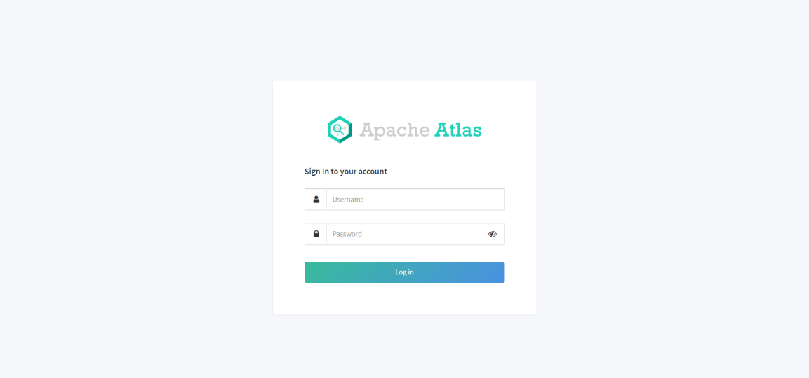

# 第 3 章 Atlas 使用

Atlas 的使用相对简单，其主要工作是同步各服务（主要是 Hive）的元数据，并构建元数据实体之间的关联关系，然后对所存储的元数据建立索引，最终未用户提供数据血缘查看及元数据检索等功能。

Atlas 在安装之初，需手动执行一次元数据的全量导入，后续 Atlas 便会利用 Hive Hook增量同步 Hive 的元数据。

## 3.1 Hive 元数据初次导入

Atlas 提供了一个 Hive 元数据导入的脚本，直接执行该脚本，即可完成 Hive 元数据的初次全量导入。

1.导入 Hive 元数据

执行以下命令

```sh
[atguigu@hadoop102 ~]$ /opt/module/atlas/hook-bin/import-hive.sh
```

按提示输入用户名：admin；输入密码：admin

Enter username for atlas :- admin

Enter password for atlas :-

等待片刻，出现以下日志，即表明导入成功

Hive Meta Data import was successful!!!

2.查看 Hive 元数据

1）搜索 hive_table 类型的元数据，可已看到 Atlas 已经拿到了 Hive 元数据


2）任选一张表查看血缘依赖关系

发现此时并未出现期望的血缘依赖，原因是 Atlas 是根据 Hive 所执行的 SQL 语句获取表与表之间以及字段与字段之间的依赖关系的，例如执行 insert into table_a select * from table_b 语句，Atlas 就能获取 table_a 与 table_b 之间的依赖关系。此时并未执行任何 SQL 语
句，故还不能出现血缘依赖关系。

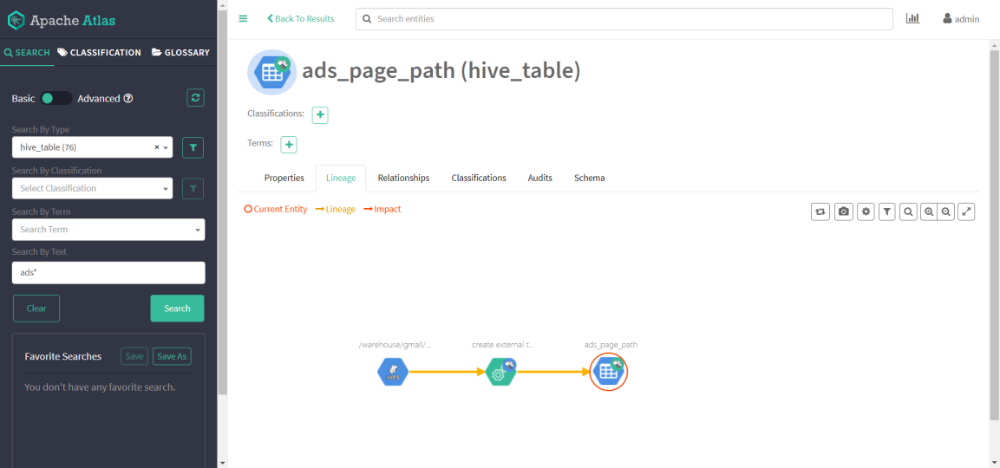

## 3.2 Hive 元数据增量同步

Hive 元数据的增量同步，无需人为干预，只要 Hive 中的元数据发生变化（执行 DDL 语句），Hive Hook 就会将元数据的变动通知 Atlas。除此之外，Atlas 还会根据 DML 语句获取数据之间的血缘关系。

### 3.2.1 生成血缘依赖

为查看血缘关系效果，在 hive 里面创建两张数据表。

1.建表语句

1） 订单事实表

```sql
CREATE TABLE dwd_order_info (
`id` STRING COMMENT '订单号',
`final_amount` DECIMAL(16,2) COMMENT '订单最终金额',
`order_status` STRING COMMENT '订单状态',
`user_id` STRING COMMENT '用户 id',
`payment_way` STRING COMMENT '支付方式',
`delivery_address` STRING COMMENT '送货地址',
`out_trade_no` STRING COMMENT '支付流水号',
`create_time` STRING COMMENT '创建时间',
`operate_time` STRING COMMENT '操作时间',
`expire_time` STRING COMMENT '过期时间',
`tracking_no` STRING COMMENT '物流单编号',
`province_id` STRING COMMENT '省份 ID',
`activity_reduce_amount` DECIMAL(16,2) COMMENT '活动减免金额',
`coupon_reduce_amount` DECIMAL(16,2) COMMENT '优惠券减免金额',
`original_amount` DECIMAL(16,2) COMMENT '订单原价金额',
`feight_fee` DECIMAL(16,2) COMMENT '运费',
`feight_fee_reduce` DECIMAL(16,2) COMMENT '运费减免'
) COMMENT '订单表'
ROW FORMAT DELIMITED FIELDS TERMINATED BY '\t';
```


2） 地区维度表

```sql
CREATE TABLE dim_base_province (
`id` STRING COMMENT '编号',
`name` STRING COMMENT '省份名称',
`region_id` STRING COMMENT '地区 ID',
`area_code` STRING COMMENT '地区编码',
`iso_code` STRING COMMENT 'ISO-3166 编码，供可视化使用',
`iso_3166_2` STRING COMMENT 'IOS-3166-2 编码，供可视化使用'
) COMMENT '省份表'
ROW FORMAT DELIMITED FIELDS TERMINATED BY '\t';
```

2.数据装载

将资料里面提前准备好的数据 order_info.txt 和 base_province.txt 上传到两张 hive 表的hdfs 路径下。

3.需求指标

1）根据订单事实表和地区维度表，求出每个省份的订单次数和订单金额

2）建表语句

```sql
CREATE TABLE `ads_order_by_province` (
`dt` STRING COMMENT '统计日期',
`province_id` STRING COMMENT '省份 id',
`province_name` STRING COMMENT '省份名称',
`area_code` STRING COMMENT '地区编码',
`iso_code` STRING COMMENT '国际标准地区编码',
`iso_code_3166_2` STRING COMMENT '国际标准地区编码',
`order_count` BIGINT COMMENT '订单数',
`order_amount` DECIMAL(16,2) COMMENT '订单金额'
) COMMENT '各省份订单统计'
ROW FORMAT DELIMITED FIELDS TERMINATED BY '\t';
```

3）数据装载

```sql
insert into table ads_order_by_province
select
'2021-08-30' dt,
bp.id,
bp.name,
bp.area_code,
bp.iso_code,
bp.iso_3166_2,
count(*) order_count,
sum(oi.final_amount) order_amount
from dwd_order_info oi
left join dim_base_province bp
on oi.province_id=bp.id
group by bp.id,bp.name,bp.area_code,bp.iso_code,bp.iso_3166_2;
```


### 3.2.2 查看血缘依赖

此时再通过 Atlas 查看 Hive 元数据，即可发现血缘依赖图

1） 表血缘依赖

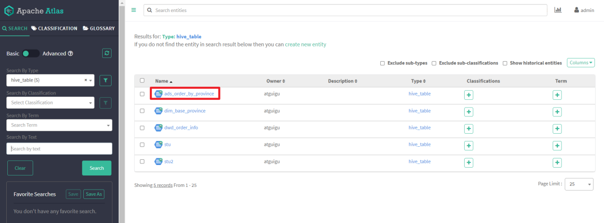

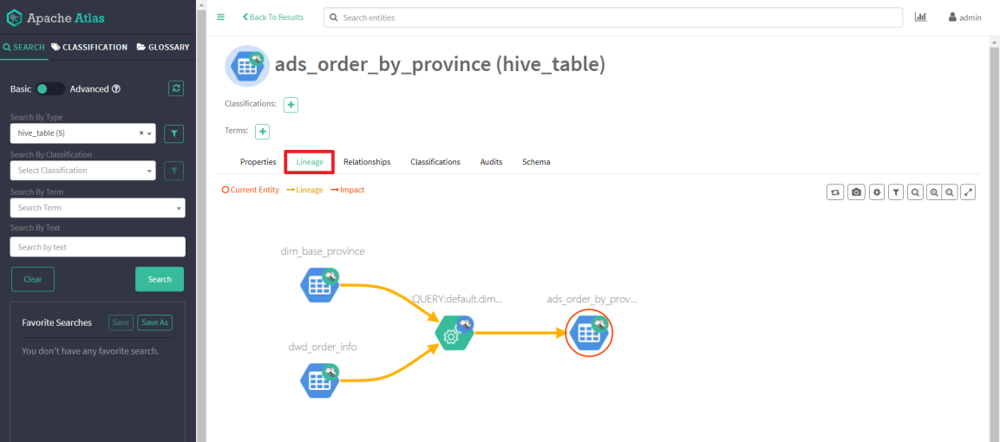

2） 字段血缘依赖

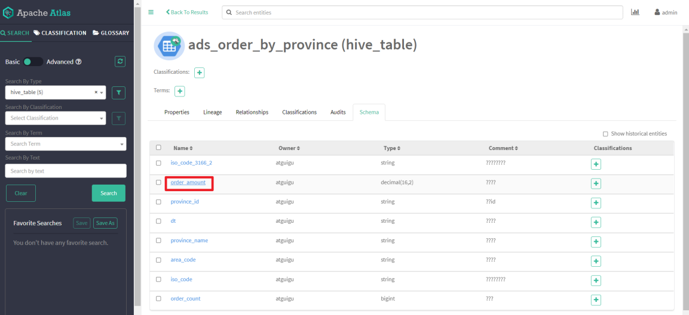

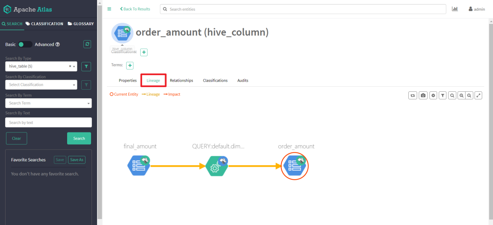

# 第 4 章 扩展内容

## 4.1 Atlas 源码编译

### 4.1.1 安装 Maven

1）Maven 下载：https://maven.apache.org/download.cgi

2）把 apache-maven-3.6.1-bin.tar.gz 上传到 linux 的/opt/software 目录下

3）解压 apache-maven-3.6.1-bin.tar.gz 到/opt/module/目录下面

```sh
[root@hadoop102 software]# tar -zxvf apache-maven-3.6.1-bin.tar.gz -C /opt/module/
```

4）修改 apache-maven-3.6.1 的名称为 maven

```sh
[root@hadoop102 module]# mv apache-maven-3.6.1/ maven
```

5）添加环境变量到/etc/profile 中

```sh
[root@hadoop102 module]#vim /etc/profile
#MAVEN_HOME
export MAVEN_HOME=/opt/module/maven
export PATH=$PATH:$MAVEN_HOME/bin
```

6）测试安装结果

```sh
[root@hadoop102 module]# source /etc/profile
[root@hadoop102 module]# mvn -v
```

7）修改 setting.xml，指定为阿里云

```xml
[root@hadoop101 module]# cd /opt/module/maven/conf/
[root@hadoop102 maven]# vim settings.xml
<!-- 添加阿里云镜像-->
<mirror>
	<id>nexus-aliyun</id>
	<mirrorOf>central</mirrorOf>
	<name>Nexus aliyun</name>
<url>http://maven.aliyun.com/nexus/content/groups/public</url>
</mirror>
<mirror>
	<id>UK</id>
	<name>UK Central</name>
	<url>http://uk.maven.org/maven2</url>
	<mirrorOf>central</mirrorOf>
</mirror>
<mirror>
	<id>repo1</id>
	<mirrorOf>central</mirrorOf>
	<name>Human Readable Name for this Mirror.</name>
	<url>http://repo1.maven.org/maven2/</url>
</mirror>
<mirror>
	<id>repo2</id>
	<mirrorOf>central</mirrorOf>
	<name>Human Readable Name for this Mirror.</name>
	<url>http://repo2.maven.org/maven2/</url>
</mirror>
```

### 4.1.2 编译 Atlas 源码

1）把 apache-atlas-2.1.0-sources.tar.gz 上传到 hadoop102 的/opt/software 目录下

2）解压 apache-atlas-2.1.0-sources.tar.gz 到/opt/module/目录下面

```sh
[root@hadoop101 software]# tar -zxvf apache-atlas-2.1.0-sources.tar.gz -C /opt/module/
```

3）下载 Atlas 依赖

```sh
[root@hadoop101 software]# export MAVEN_OPTS="-Xms2g -Xmx2g"
[root@hadoop101 software]# cd /opt/module/apache-atlas-sources-2.1.0/
[root@hadoop101 apache-atlas-sources-2.1.0]# mvn clean -DskipTests install
[root@hadoop101 apache-atlas-sources-2.1.0]# mvn clean -DskipTests package -Pdis
#一定要在${atlas_home}执行
[root@hadoop101 apache-atlas-sources-2.1.0]# cd distro/target/
[root@hadoop101 target]# mv apache-atlas-2.1.0-server.tar.gz /opt/software/
[root@hadoop101 target]# mv apache-atlas-2.1.0-hive-hook.tar.gz /opt/software/
```

提示：执行过程比较长，会下载很多依赖，大约需要半个小时，期间如果报错很有可能是因为 TimeOut 造成的网络中断，重试即可。

## 4.2 Atlas 内存配置

如果计划存储数万个元数据对象，建议调整参数值获得最佳的 JVM GC 性能。以下是常见的服务器端选项

1）修改配置文件/opt/module/atlas/conf/atlas-env.sh

```sh
#设置 Atlas 内存
export ATLAS_SERVER_OPTS="-server -XX:SoftRefLRUPolicyMSPerMB=0
-XX:+CMSClassUnloadingEnabled
-XX:+UseConcMarkSweepGC
-XX:+CMSParallelRemarkEnabled -XX:+PrintTenuringDistribution -XX:+HeapDumpOnOutOfMemoryError
-XX:HeapDumpPath=dumps/atlas_server.hprof
-Xloggc:logs/gc-worker.log
-verbose:gc
-XX:+UseGCLogFileRotation
-XX:NumberOfGCLogFiles=10
-XX:GCLogFileSize=1m
-XX:+PrintGCDetails -XX:+PrintHeapAtGC -XX:+PrintGCTimeStamps"
#建议 JDK1.7 使用以下配置
export ATLAS_SERVER_HEAP="-Xms15360m
-Xmx15360m -XX:MaxNewSize=3072m -XX:PermSize=100M -XX:MaxPermSize=512m" 
#建议 JDK1.8 使用以下配置
export ATLAS_SERVER_HEAP="-Xms15360m
-Xmx15360m -XX:MaxNewSize=5120m
-XX:MetaspaceSize=100M
-XX:MaxMetaspaceSize=512m" 

#如果是 Mac OS 用户需要配置
export ATLAS_SERVER_OPTS="-Djava.awt.headless=true
-Djava.security.krb5.realm= -Djava.security.krb5.kdc=" 
```

参数说明： -XX:SoftRefLRUPolicyMSPerMB 此参数对管理具有许多并发用户的查询繁重工作负载的 GC 性能特别有用。

## 4.3 配置用户名密码

Atlas 支持以下身份验证方法：File、Kerberos 协议、LDAP 协议通过修改配置文件 atlas-application.properties 文件开启或关闭三种验证方法

```sh
atlas.authentication.method.kerberos=true|false
atlas.authentication.method.ldap=true|false
atlas.authentication.method.file=true|false
```

如果两个或多个身份证验证方法设置为 true，如果较早的方法失败，则身份验证将回退到后一种方法。例如，如果 Kerberos 身份验证设置为 true 并且 ldap 身份验证也设置为 true，那么，如果对于没有 kerberos principal 和 keytab 的请求，LDAP 身份验证将作为后备方案。
本文主要讲解采用文件方式修改用户名和密码设置。其他方式可以参见官网配置即可。

1）打开/opt/module/atlas/conf/users-credentials.properties 文件

```sh
[atguigu@hadoop102 conf]$ vim users-credentials.properties
#username=group::sha256-password
admin=ADMIN::8c6976e5b5410415bde908bd4dee15dfb167a9c873fc4bb8a
81f6f2ab448a918
rangertagsync=RANGER_TAG_SYNC::e3f67240f5117d1753c940dae9eea77
2d36ed5fe9bd9c94a300e40413f1afb9d
```

（1）admin 是用户名称

（2） 8c6976e5b5410415bde908bd4dee15dfb167a9c873fc4bb8a81f6f2ab448a918 是采用sha256 加密的密码，默认密码为 admin。

2）例如：修改用户名称为 atguigu，密码为 atguigu

（1）获取 sha256 加密的 atguigu 密码

```sh
[atguigu@hadoop102 conf]$ echo -n "atguigu"|sha256sum
2628be627712c3555d65e0e5f9101dbdd403626e6646b72fdf728a20c5261dc2
```

（2）修改用户名和密码

```sh
[atguigu@hadoop102 conf]$ vim users-credentials.properties
#username=group::sha256-password
atguigu=ADMIN::2628be627712c3555d65e0e5f9101dbdd403626e6646b72fdf728a20c5261dc2
rangertagsync=RANGER_TAG_SYNC::e3f67240f5117d1753c940dae9eea772d36ed5fe9bd9c94a300e40413f1afb9d
```


