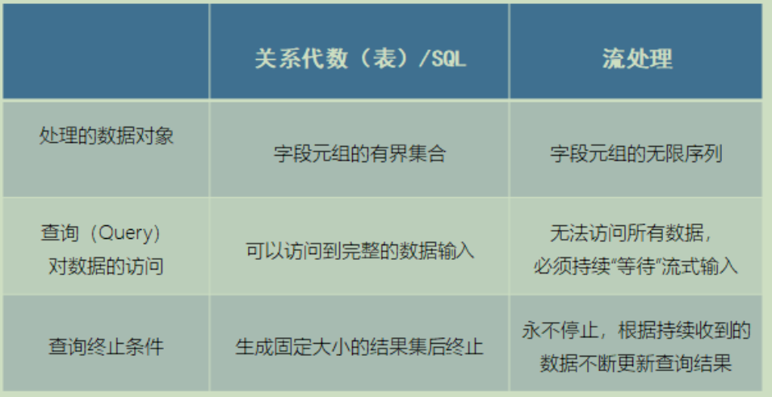
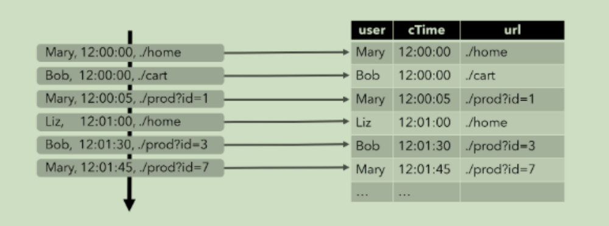
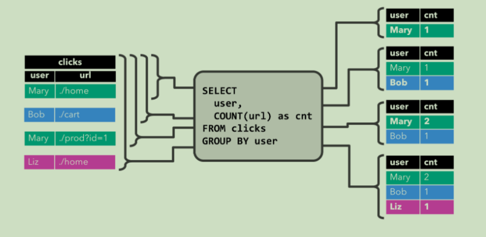
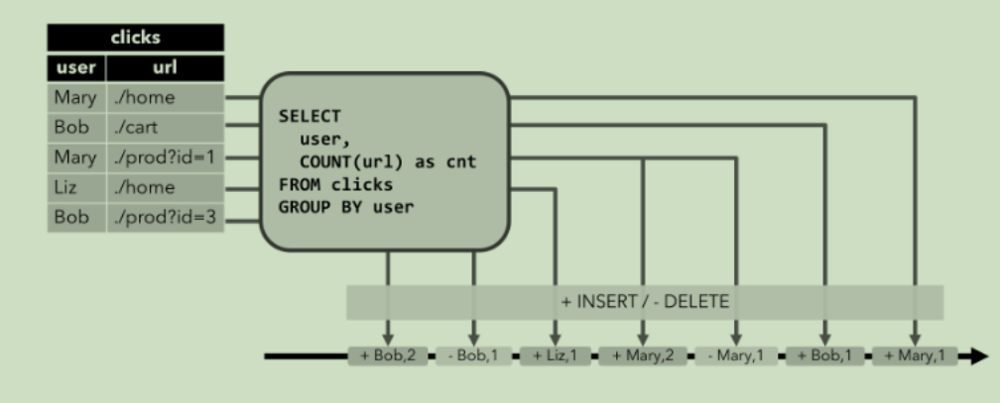
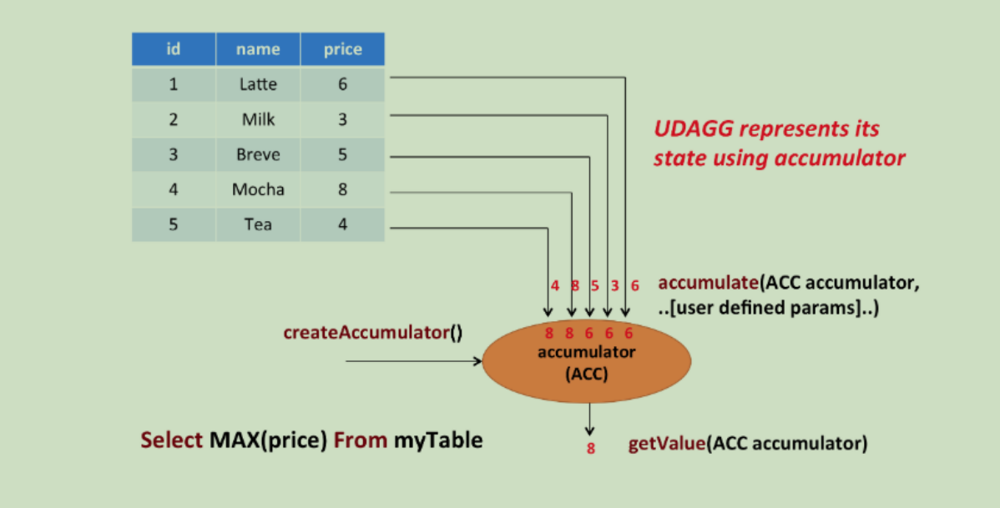

# 第一章 整体介绍

## 1.1 什么是 Table API 和 Flink SQL

​	Flink 本身是批流统一的处理框架，所以 Table API 和 SQL，就是批流统一的上层处理 API。目前功能尚未完善，处于活跃的开发阶段。Table API 是一套内嵌在 Java 和 Scala 语言中的查询 API，它允许我们以非常直观的方式，组合来自一些关系运算符的查询（比如 select、filter 和 join）。而对于 Flink SQL，就是直接可以在代码中写 SQL，来实现一些查询（Query）操作。Flink 的 SQL 支持，基于实现了 SQL 标准的 Apache Calcite（Apache 开源 SQL 解析工具）。无论输入是批输入还是流式输入，在这两套 API 中，指定的查询都具有相同的语义，得到相同的结果。

## 1.2 需要引入的依赖

Table API 和 SQL 需要引入的依赖有两个：planner 和 bridge。 

```XML
<dependency>
    <groupId>org.apache.flink</groupId>
    <artifactId>flink-table-planner_2.12</artifactId>
    <version>1.10.1</version>
</dependency> 
<dependency>
    <groupId>org.apache.flink</groupId>
    <artifactId>flink-table-api-java-bridge_2.12</artifactId>
    <version>1.10.1</version>
</dependency>
```

flink-table-planner：planner 计划器，是 table API 最主要的部分，提供了运行时环境和生成程序执行计划的 planner；

flink-table-api-java-bridge：bridge 桥接器，主要负责 table API 和 DataStream/DataSet API的连接支持，按照语言分 java 和 scala。

这里的两个依赖，是 IDE 环境下运行需要添加的；如果是生产环境，lib 目录下默认已经有了 planner，就只需要有 bridge 就可以了。

当然，如果想使用用户自定义函数，或是跟 kafka 做连接，需要有一个 SQL client，这个包含在 flink-table-common 里。

## 1.3 两种 planner（old & blink）的区别

1. 批流统一：Blink 将批处理作业，视为流式处理的特殊情况。所以，blink 不支持表和DataSet 之间的转换，批处理作业将不转换为 DataSet 应用程序，而是跟流处理一样，转换为 DataStream 程序来处理。

2. 因 为 批 流 统 一 ， Blink planner 也 不 支 持 BatchTableSource ， 而 使 用 有 界 的StreamTableSource 代替。

3. Blink planner 只支持全新的目录，不支持已弃用的 ExternalCatalog。

4. 旧 planner 和 Blink planner 的 FilterableTableSource 实现不兼容。旧的 planner 会把PlannerExpressions 下推到 filterableTableSource 中，而 blink planner 则会把 Expressions 下推。

5. 基于字符串的键值配置选项仅适用于 Blink planner。

6. PlannerConfig 在两个 planner 中的实现不同。

7. Blink planner 会将多个 sink 优化在一个 DAG 中（仅在 TableEnvironment 上受支持，而在 StreamTableEnvironment 上不受支持）。而旧 planner 的优化总是将每一个 sink 放在一个新的 DAG 中，其中所有 DAG 彼此独立。

8. 旧的 planner 不支持目录统计，而 Blink planner 支持。

   

# 第二章 API 调用

## 2.1 基本程序结构

Table API 和 SQL 的程序结构，与流式处理的程序结构类似；也可以近似地认为有这么

几步：首先创建执行环境，然后定义 source、transform 和 sink。

具体操作流程如下：

```JAVA
StreamTableEnvironment tableEnv = ... // 创建表的执行环境
// 创建一张表，用于读取数据
tableEnv.connect(...).createTemporaryTable("inputTable");
// 注册一张表，用于把计算结果输出
tableEnv.connect(...).createTemporaryTable("outputTable");
// 通过 Table API 查询算子，得到一张结果表
Table result = tableEnv.from("inputTable").select(...);
// 通过 SQL 查询语句，得到一张结果表
Table sqlResult = tableEnv.sqlQuery("SELECT ... FROM inputTable ...");
// 将结果表写入输出表中
result.insertInto("outputTable");
```

## 2.2 创建表环境

创建表环境最简单的方式，就是基于流处理执行环境，调 create 方法直接创建：

```JAVA
StreamTableEnvironment tableEnv = StreamTableEnvironment.create(env);
```

表环境（TableEnvironment）是 flink 中集成 Table API & SQL 的核心概念。它负责:

⚫ 注册 catalog

⚫ 在内部 catalog 中注册表

⚫ 执行 SQL 查询

⚫ 注册用户自定义函数

⚫ 将 DataStream 或 DataSet 转换为表

⚫ 保存对 ExecutionEnvironment 或 StreamExecutionEnvironment 的引用

在创建 TableEnv 的时候，可以多传入一个 EnvironmentSettings 或者 TableConfig 参数，可以用来配置 TableEnvironment 的一些特性。

比如，配置老版本的流式查询（Flink-Streaming-Query）：

```java
EnvironmentSettings settings = EnvironmentSettings.newInstance()
    .useOldPlanner() // 使用老版本 planner
    .inStreamingMode() // 流处理模式
    .build();

StreamTableEnvironment tableEnv = StreamTableEnvironment.create(env, settings);

//基于老版本的批处理环境（Flink-Batch-Query）：
ExecutionEnvironment batchEnv = ExecutionEnvironment.getExecutionEnvironment;
BatchTableEnvironment batchTableEnv = BatchTableEnvironment.create(batchEnv);

//基于 blink 版本的流处理环境（Blink-Streaming-Query）：
EnvironmentSettings bsSettings = EnvironmentSettings.newInstance()
    .useBlinkPlanner()
    .inStreamingMode().build();
StreamTableEnvironment bsTableEnv = StreamTableEnvironment.create(env, bsSettings);

//基于 blink 版本的批处理环境（Blink-Batch-Query）：
EnvironmentSettings bbSettings = EnvironmentSettings.newInstance().useBlinkPlanner()
    .inBatchMode().build();
TableEnvironment bbTableEnv = TableEnvironment.create(bbSettings);
```


##  2.3 在 Catalog 中注册表

### 2.3.1 表（Table）的概念

​	TableEnvironment 可以注册目录 Catalog，并可以基于 Catalog 注册表。它会维护一个Catalog-Table 表之间的 map。 表（Table）是由一个“标识符”来指定的，由 3 部分组成：Catalog 名、数据库（database）名和对象名（表名）。如果没有指定目录或数据库，就使用当前的默认值。表可以是常规的（Table，表），或者虚拟的（View，视图）。常规表（Table）一般可以用来描述外部数据，比如文件、数据库表或消息队列的数据，也可以直接从 DataStream 转换而来。视图可以从现有的表中创建，通常是 table API 或者 SQL 查询的一个结果。

### 2.3.2 连接到文件系统（Csv 格式）

​	连接外部系统在 Catalog 中注册表，直接调用 tableEnv.connect()就可以，里面参数要传入一个 ConnectorDescriptor，也就是 connector 描述器。对于文件系统的 connector 而言，flink内部已经提供了，就叫做 FileSystem()。

代码如下：

```java
tableEnv
    .connect( new FileSystem().path("sensor.txt")) // 定义表数据来源，外部连接
    .withFormat(new OldCsv()) // 定义从外部系统读取数据之后的格式化方法 .withSchema( new Schema()
    .field("id", DataTypes.STRING())
    .field("timestamp", DataTypes.BIGINT())
    .field("temperature", DataTypes.DOUBLE())
    ) // 定义表结构
    .createTemporaryTable("inputTable"); // 创建临时表
```

​	这是旧版本的 csv 格式描述器。由于它是非标的，跟外部系统对接并不通用，所以将被弃用，以后会被一个符合 RFC-4180 标准的新 format 描述器取代。新的描述器就叫 Csv()，但flink 没有直接提供，需要引入依赖 flink-csv： 

```xml
<dependency>
    <groupId>org.apache.flink</groupId>
    <artifactId>flink-csv</artifactId>
    <version>1.10.1</version>
</dependency>
```

代码非常类似，只需要把 withFormat 里的 OldCsv 改成 Csv 就可以了。

### 2.3.3 连接到 Kafka

​	kafka 的连接器 flink-kafka-connector 中，1.10 版本的已经提供了 Table API 的支持。我们可以在 connect 方法中直接传入一个叫做 Kafka 的类，这就是 kafka 连接器的描述器ConnectorDescriptor。

```java
tableEnv.connect(
    new Kafka()
    .version("0.11") // 定义 kafka 的版本
    .topic("sensor") // 定义主题 .property("zookeeper.connect", "localhost:2181")
    .property("bootstrap.servers", "localhost:9092")
)
    .withFormat(new Csv())
    .withSchema(new Schema().field("id", DataTypes.STRING())
                .field("timestamp", DataTypes.BIGINT())
                .field("temperature", DataTypes.DOUBLE())
               )
    .createTemporaryTable("kafkaInputTable");
```

​	当然也可以连接到 ElasticSearch、MySql、HBase、Hive 等外部系统，实现方式基本上是类似的。

## 2.4 表的查询

​	利用外部系统的连接器 connector，我们可以读写数据，并在环境的 Catalog 中注册表。接下来就可以对表做查询转换了。

Flink 给我们提供了两种查询方式：Table API 和 SQL。

### 2.4.1 Table API 的调用

​	Table API 是集成在 Scala 和 Java 语言内的查询 API。与 SQL 不同，Table API 的查询不会用字符串表示，而是在宿主语言中一步一步调用完成的。Table API 基于代表一张“表”的 Table 类，并提供一整套操作处理的方法 API。这些方法会返回一个新的 Table 对象，这个对象就表示对输入表应用转换操作的结果。有些关系型转换操作，可以由多个方法调用组成，构成链式调用结构。例如 table.select(…).filter(…)，其中 select（…）表示选择表中指定的字段，filter(…)表示筛选条件。

代码中的实现如下：

```java
Table sensorTable = tableEnv.from("inputTable");
Table resultTable = senorTable
    .select("id, temperature")
    .filter("id ='sensor_1'");
```

### 2.4.2 SQL 查询

​	Flink 的 SQL 集成，基于的是 ApacheCalcite，它实现了 SQL 标准。在 Flink 中，用常规字符串来定义 SQL 查询语句。SQL 查询的结果，是一个新的 Table。

代码实现如下：

```java
Table resultSqlTable = tableEnv.sqlQuery("select id, temperature from inputTable where id ='sensor_1'");
```

当然，也可以加上聚合操作，比如我们统计每个 sensor 温度数据出现的个数，做个 count统计：

```java
Table aggResultTable = sensorTable
    .groupBy("id")
    .select("id, id.count as count");
```

SQL 的实现：

```java
Table aggResultSqlTable = tableEnv.sqlQuery("select id, count(id) as cnt from inputTable group by id");
```

这里 Table API 里指定的字段，前面加了一个单引号’，这是 Table API 中定义的 Expression类型的写法，可以很方便地表示一个表中的字段。字段可以直接全部用双引号引起来，也可以用半边单引号+字段名的方式。以后的代码中，一般都用后一种形式。

## 2.5 将 DataStream 转换成表

​	Flink 允许我们把 Table 和 DataStream 做转换：我们可以基于一个 DataStream，先流式地读取数据源，然后 map 成 POJO，再把它转成 Table。Table 的列字段（column fields），就是 POJO 里的字段，这样就不用再麻烦地定义 schema 了。

### 2.5.1 代码表达

代码中实现非常简单，直接用 tableEnv.fromDataStream()就可以了。默认转换后的 Table schema 和 DataStream 中的字段定义一一对应，也可以单独指定出来。这就允许我们更换字段的顺序、重命名，或者只选取某些字段出来，相当于做了一次map 操作（或者 Table API 的 select 操作）。

代码具体如下：

```java
DataStream<String> inputStream = env.readTextFile("sensor.txt");
DataStream<SensorReading> dataStream = inputStream.map( line -> {
    String[] fields = line.split(",");
    return new SensorReading(fields[0], new Long(fields[1]), new Double(fields[2]));
});
Table sensorTable = tableEnv.fromDataStream(dataStream, "id, timestamp.rowtime as ts, temperature");
```


### 2.5.2 数据类型与 Table schema 的对应

​	在上节的例子中，DataStream 中的数据类型，与表的 Schema 之间的对应关系，是按照类中的字段名来对应的（name-based mapping），所以还可以用 as 做重命名。

基于名称的对应：

```java
Table sensorTable = tableEnv.fromDataStream(dataStream, "timestamp as ts, idas myId, temperature");
```

​	Flink 的 DataStream 和 DataSet API 支持多种类型。组合类型，比如元组（内置 Scala 和 Java 元组）、POJO、Scala case 类和 Flink 的 Row 类型等，允许具有多个字段的嵌套数据结构，这些字段可以在 Table 的表达式中访问。其他类型，则被视为原子类型。

## 2.6. 创建临时视图（Temporary View）

​	创建临时视图的第一种方式，就是直接从 DataStream 转换而来。同样，可以直接对应字段转换；也可以在转换的时候，指定相应的字段。

代码如下：

```java
tableEnv.createTemporaryView("sensorView", dataStream);
tableEnv.createTemporaryView("sensorView", dataStream, "id, temperature, timestamp as ts");
```

另外，当然还可以基于 Table 创建视图：

```java
tableEnv.createTemporaryView("sensorView", sensorTable);
```

View 和 Table 的 Schema 完全相同。事实上，在 Table API 中，可以认为 View 和 Table是等价的。

## 2.7. 输出表

​	表的输出，是通过将数据写入 TableSink 来实现的。TableSink 是一个通用接口，可以支持不同的文件格式、存储数据库和消息队列。

具体实现，输出表最直接的方法，就是通过 Table.insertInto() 方法将一个 Table 写入注册过的 TableSink 中。

### 2.7.1 输出到文件

代码如下：

```java
// 注册输出表
tableEnv.connect(
    new FileSystem().path("…\\resources\\out.txt")
) // 定义到文件系统的连接
.withFormat(new Csv()) // 定义格式化方法，Csv 格式
.withSchema(new Schema()
            .field("id", DataTypes.STRING())
            .field("temp", DataTypes.DOUBLE())) // 定义表结构
.createTemporaryTable("outputTable"); // 创建临时表

resultSqlTable.insertInto("outputTable");
```


### 2.7.2 更新模式（Update Mode）

​	在流处理过程中，表的处理并不像传统定义的那样简单。对于流式查询（Streaming Queries），需要声明如何在（动态）表和外部连接器之间执行转换。与外部系统交换的消息类型，由更新模式（update mode）指定。

Flink Table API 中的更新模式有以下三种：

1）追加模式（Append Mode）

在追加模式下，表（动态表）和外部连接器只交换插入（Insert）消息。

2）撤回模式（Retract Mode）

在撤回模式下，表和外部连接器交换的是：添加（Add）和撤回（Retract）消息。

⚫ 插入（Insert）会被编码为添加消息；

⚫ 删除（Delete）则编码为撤回消息；

⚫ 更新（Update）则会编码为，已更新行（上一行）的撤回消息，和更新行（新行）的添加消息。在此模式下，不能定义 key，这一点跟 upsert 模式完全不同。

3）Upsert（更新插入）模式

在 Upsert 模式下，动态表和外部连接器交换 Upsert 和 Delete 消息。

这个模式需要一个唯一的 key，通过这个 key 可以传递更新消息。为了正确应用消息，外部连接器需要知道这个唯一 key 的属性。

⚫ 插入（Insert）和更新（Update）都被编码为 Upsert 消息；

⚫ 删除（Delete）编码为 Delete 信息。

这种模式和 Retract 模式的主要区别在于，Update 操作是用单个消息编码的，所以效率会更高。

### 2.7.3 输出到 Kafka

除了输出到文件，也可以输出到 Kafka。我们可以结合前面 Kafka 作为输入数据，构建数据管道，kafka 进，kafka 出。

代码如下：

```java
// 输出到 kafka
tableEnv.connect(
    new Kafka()
    .version("0.11")
    .topic("sinkTest")
    .property("zookeeper.connect", "localhost:2181")
    .property("bootstrap.servers", "localhost:9092") 
)
    .withFormat( new Csv() ) 
    .withSchema( new Schema()
                .field("id", DataTypes.STRING())
                .field("temp", DataTypes.DOUBLE()))
    .createTemporaryTable("kafkaOutputTable");
resultTable.insertInto("kafkaOutputTable");
```


### 2.7.4 输出到 ElasticSearch

ElasticSearch 的 connector 可以在 upsert（update+insert，更新插入）模式下操作，这样就可以使用 Query 定义的键（key）与外部系统交换 UPSERT/DELETE 消息。另外，对于“仅追加”（append-only）的查询，connector 还可以在 append 模式下操作，这样就可以与外部系统只交换 insert 消息。es 目前支持的数据格式，只有 Json，而 flink 本身并没有对应的支持，所以还需要引入依赖：

```xml
<dependency>
    <groupId>org.apache.flink</groupId>
    <artifactId>flink-json</artifactId>
    <version>1.10.1</version>
</dependency>
```

代码实现如下：

```java
// 输出到 es
tableEnv.connect(
    new Elasticsearch()
    .version("6")
    .host("localhost", 9200, "http")
    .index("sensor")
    .documentType("temp"))
    .inUpsertMode() // 指定是 Upsert 模式
    .withFormat(new Json())
    .withSchema( new Schema()
                .field("id", DataTypes.STRING())
                .field("count", DataTypes.BIGINT()) )
    .createTemporaryTable("esOutputTable");
aggResultTable.insertInto("esOutputTable");
```


### 2.7.5 输出到 MySql

Flink 专门为 Table API 的 jdbc 连接提供了 flink-jdbc 连接器，我们需要先引入依赖：

```xml
<dependency>
    <groupId>org.apache.flink</groupId>
    <artifactId>flink-jdbc_2.12</artifactId>
    <version>1.10.1</version>
</dependency>
```

jdbc 连接的代码实现比较特殊，因为没有对应的 java/scala 类实现 ConnectorDescriptor，所以不能直接tableEnv.connect()。不过Flink SQL留下了执行DDL的接口：tableEnv.sqlUpdate()。对于 jdbc 的创建表操作，天生就适合直接写 DDL 来实现，所以我们的代码可以这样写：

```java
// 输出到 Mysql
String sinkDDL= "create table jdbcOutputTable (" +
 " id varchar(20) not null, " +
 " cnt bigint not null " +
 ") with (" +
 " 'connector.type' = 'jdbc', " + " 'connector.url' = 'jdbc:mysql://localhost:3306/test', " +
" 'connector.table' = 'sensor_count', " +
 " 'connector.driver' = 'com.mysql.jdbc.Driver', " +
 " 'connector.username' = 'root', " +
 " 'connector.password' = '123456' )";

tableEnv.sqlUpdate(sinkDDL); // 执行 DDL 创建表
aggResultSqlTable.insertInto("jdbcOutputTable");
```


## 2.8 将表转换成 DataStream

​	表可以转换为 DataStream 或 DataSet。这样，自定义流处理或批处理程序就可以继续在Table API 或 SQL 查询的结果上运行了。将表转换为 DataStream 或 DataSet 时，需要指定生成的数据类型，即要将表的每一行转换成的数据类型。通常，最方便的转换类型就是 Row。然，因为结果的所有字段类型都是明确的，我们也经常会用元组类型来表示。表作为流式查询的结果，是动态更新的。所以，将这种动态查询转换成的数据流，同样需要对表的更新操作进行编码，进而有不同的转换模式。

Table API 中表到 DataStream 有两种模式：

⚫ 追加模式（Append Mode）

用于表只会被插入（Insert）操作更改的场景。 

⚫ 撤回模式（Retract Mode）

用于任何场景。有些类似于更新模式中 Retract 模式，它只有 Insert 和 Delete 两类操作。得到的数据会增加一个 Boolean 类型的标识位（返回的第一个字段），用它来表示到底是新增的数据（Insert），还是被删除的数据（老数据， Delete）。

代码实现如下：

```java
DataStream<Row> resultStream = tableEnv.toAppendStream(resultTable, Row.class);
DataStream<Tuple2<Boolean, Row>> aggResultStream = tableEnv.toRetractStream(aggResultTable, Row.class);
resultStream.print("result");
aggResultStream.print("aggResult");
```

​	所以，没有经过 groupby 之类聚合操作，可以直接用 toAppendStream 来转换；而如果经过了聚合，有更新操作，一般就必须用 toRetractDstream。

## 2.9 Query 的解释和执行

Table API 提供了一种机制来解释（Explain）计算表的逻辑和优化查询计划。这是通过TableEnvironment.explain（table）方法或 TableEnvironment.explain（）方法完成的。explain 方法会返回一个字符串，描述三个计划：

⚫ 未优化的逻辑查询计划

⚫ 优化后的逻辑查询计划

⚫ 实际执行计划

我们可以在代码中查看执行计划：

```java
String explaination = tableEnv.explain(resultTable);
System.out.println(explaination);
```

Query 的解释和执行过程，老 planner 和 blink planner 大体是一致的，又有所不同。整体来讲，Query 都会表示成一个逻辑查询计划，然后分两步解释：

1. 优化查询计划

2. 解释成 DataStream 或者 DataSet 程序而 Blink 版本是批流统一的，所以所有的 Query，只会被解释成 DataStream 程序；另外

在批处理环境 TableEnvironment 下，Blink 版本要到 tableEnv.execute()执行调用才开始解释。


# 第三章 流处理中的特殊概念

​	Table API 和 SQL，本质上还是基于关系型表的操作方式；而关系型表、关系代数，以及SQL 本身，一般是有界的，更适合批处理的场景。这就导致在进行流处理的过程中，理解会稍微复杂一些，需要引入一些特殊概念。

## 3.1 流处理和关系代数（表，及 SQL）的区别



​	可以看到，其实关系代数（主要就是指关系型数据库中的表）和 SQL，主要就是针对批处理的，这和流处理有天生的隔阂。

## 3.2 动态表（Dynamic Tables）

​	因为流处理面对的数据，是连续不断的，这和我们熟悉的关系型数据库中保存的“表”完全不同。所以，如果我们把流数据转换成 Table，然后执行类似于 table 的 select 操作，结果就不是一成不变的，而是随着新数据的到来，会不停更新。我们可以随着新数据的到来，不停地在之前的基础上更新结果。这样得到的表，在 Flink Table API 概念里，就叫做“动态表”（Dynamic Tables）。动态表是 Flink 对流数据的 Table API 和 SQL 支持的核心概念。与表示批处理数据的静态表不同，动态表是随时间变化的。动态表可以像静态的批处理表一样进行查询，查询一个动态表会产生持续查询（Continuous Query）。连续查询永远不会终止，并会生成另一个动态表。查询（Query）会不断更新其动态结果表，以反映其动态输入表上的更改。


## 3.3 流式持续查询的过程

下图显示了流、动态表和连续查询的关系：


流式持续查询的过程为：

1. 流被转换为动态表。

2. 对动态表计算连续查询，生成新的动态表。

3. 生成的动态表被转换回流。

### 3.3.1 将流转换成表（Table）

为了处理带有关系查询的流，必须先将其转换为表。

从概念上讲，流的每个数据记录，都被解释为对结果表的插入（Insert）修改。因为流式持续不断的，而且之前的输出结果无法改变。本质上，我们其实是从一个、只有插入操作的 changelog（更新日志）流，来构建一个表。为了更好地说明动态表和持续查询的概念，我们来举一个具体的例子。比如，我们现在的输入数据，就是用户在网站上的访问行为，数据类型（Schema）如下：

```sh
[ user: VARCHAR, // 用户名
 cTime: TIMESTAMP, // 访问某个 URL 的时间戳
 url: VARCHAR // 用户访问的 URL]
```

下图显示了如何将访问 URL 事件流，或者叫点击事件流（左侧）转换为表（右侧）。



随着插入更多的访问事件流记录，生成的表将不断增长。

### 3.3.2 持续查询（Continuous Query）

​	持续查询，会在动态表上做计算处理，并作为结果生成新的动态表。与批处理查询不同，连续查询从不终止，并根据输入表上的更新更新其结果表。在任何时间点，连续查询的结果在语义上，等同于在输入表的快照上，以批处理模式执行的同一查询的结果。

​	在下面的示例中，我们展示了对点击事件流中的一个持续查询。这个 Query 很简单，是一个分组聚合做 count 统计的查询。它将用户字段上的 clicks 表分组，并统计访问的 url 数。图中显示了随着时间的推移，当 clicks 表被其他行更新时如何计算查询。



### 3.3.3 将动态表转换成流

​	与常规的数据库表一样，动态表可以通过插入（Insert）、更新（Update）和删除（Delete）更改，进行持续的修改。将动态表转换为流或将其写入外部系统时，需要对这些更改进行编码。Flink 的 Table API 和 SQL 支持三种方式对动态表的更改进行编码：

1）仅追加（Append-only）流

仅通过插入（Insert）更改，来修改的动态表，可以直接转换为“仅追加”流。这个流中发出的数据，就是动态表中新增的每一行。

2）撤回（Retract）流

Retract 流是包含两类消息的流，添加（Add）消息和撤回（Retract）消息。动态表通过将 INSERT 编码为 add 消息、DELETE 编码为 retract 消息、UPDATE 编码为被更改行（前一行）的 retract 消息和更新后行（新行）的 add 消息，转换为 retract 流。

下图显示了将动态表转换为 Retract 流的过程。



3）Upsert（更新插入）流

Upsert 流包含两种类型的消息：Upsert 消息和 delete 消息。转换为 upsert 流的动态表，需要有唯一的键（key）。通过将 INSERT 和 UPDATE 更改编码为 upsert 消息，将 DELETE 更改编码为 DELETE 消息，就可以将具有唯一键（Unique Key）的动态表转换为流。下图显示了将动态表转换为 upsert 流的过程。这些概念我们之前都已提到过。需要注意的是，在代码里将动态表转换为 DataStream时，仅支持 Append 和 Retract 流。而向外部系统输出动态表的 TableSink 接口，则可以有不同的实现，比如之前我们讲到的 ES，就可以有 Upsert 模式。


## 3.4 时间特性

​	基于时间的操作（比如 Table API 和 SQL 中窗口操作），需要定义相关的时间语义和时间数据来源的信息。所以，Table 可以提供一个逻辑上的时间字段，用于在表处理程序中，指示时间和访问相应的时间戳。时间属性，可以是每个表 schema 的一部分。一旦定义了时间属性，它就可以作为一个字段引用，并且可以在基于时间的操作中使用。时间属性的行为类似于常规时间戳，可以访问，并且进行计算。

### 3.4.1 处理时间（Processing Time）

处理时间语义下，允许表处理程序根据机器的本地时间生成结果。它是时间的最简单概念。它既不需要提取时间戳，也不需要生成 watermark。定义处理时间属性有三种方法：在 DataStream 转化时直接指定；在定义 Table Schema时指定；在创建表的 DDL 中指定。

1) DataStream 转化成 Table 时指定

由 DataStream 转换成表时，可以在后面指定字段名来定义 Schema。在定义 Schema 期间，可以使用.proctime，定义处理时间字段。

注意，这个 proctime 属性只能通过附加逻辑字段，来扩展物理 schema。因此，只能在schema 定义的末尾定义它。

代码如下：

```java
// 定义好 DataStream
DataStream<String> inputStream = env.readTextFile("\\sensor.txt")
DataStream<SensorReading> dataStream = inputStream.map( line -> {
    String[] fields = line.split(",");
    return new SensorReading(fields[0], new Long(fields[1]), new Double(fields[2]));
});
//将 DataStream 转换为 Table，并指定时间字段
Table sensorTable = tableEnv.fromDataStream(dataStream, "id, temperature, timestamp, pt.proctime");
```


2) 定义 Table Schema 时指定

这种方法其实也很简单，只要在定义 Schema 的时候，加上一个新的字段，并指定成proctime 就可以了。

代码如下：

```java
tableEnv.connect(
    new FileSystem().path("..\\sensor.txt"))
    .withFormat(new Csv())
    .withSchema(new Schema()
                .field("id", DataTypes.STRING())
                .field("timestamp", DataTypes.BIGINT())
                .field("temperature", DataTypes.DOUBLE())
                .field("pt", DataTypes.TIMESTAMP(3)).proctime() // 指定 pt 字段为处理时间
               ) // 定义表结构
    .createTemporaryTable("inputTable"); // 创建临时表
```


3) 创建表的 DDL 中指定

在创建表的 DDL 中，增加一个字段并指定成 proctime，也可以指定当前的时间字段。

代码如下：

```java
String sinkDDL = "create table dataTable (" +
 " id varchar(20) not null, " +
 " ts bigint, " +
 " temperature double, " +
 " pt AS PROCTIME() " +
 ") with (" +
 " 'connector.type' = 'filesystem', " +
 " 'connector.path' = '/sensor.txt', " +
 " 'format.type' = 'csv')";
tableEnv.sqlUpdate(sinkDDL);
```

注意：运行这段 DDL，必须使用 Blink Planner。

### 3.4.2 事件时间（Event Time）

​	事件时间语义，允许表处理程序根据每个记录中包含的时间生成结果。这样即使在有乱序事件或者延迟事件时，也可以获得正确的结果。

为了处理无序事件，并区分流中的准时和迟到事件；Flink 需要从事件数据中，提取时间戳，并用来推进事件时间的进展（watermark）。

1) DataStream 转化成 Table 时指定

在DataStream转换成Table，schema的定义期间，使用.rowtime可以定义事件时间属性。

注意，必须在转换的数据流中分配时间戳和 watermark。在将数据流转换为表时，有两种定义时间属性的方法。根据指定的.rowtime 字段名是否存在于数据流的架构中，timestamp 字段可以： 

⚫ 作为新字段追加到 schema

⚫ 替换现有字段

在这两种情况下，定义的事件时间戳字段，都将保存 DataStream 中事件时间戳的值。

代码如下：

```java

DataStream<String> inputStream = env.readTextFile("\\sensor.txt")
    DataStream<SensorReading> dataStream = inputStream
    .map( line -> {
        String[] fields = line.split(",");
        return new SensorReading(fields[0], new Long(fields[1]), new Double(fields[2])); } )
    .assignTimestampsAndWatermarks(new BoundedOutOfOrdernessTimestampExtractor<SensorReading>(Time.seconds(1)) {
        @Override
        public long extractTimestamp(SensorReading element) {
            return element.getTimestamp() * 1000L;
        }
    });
Table sensorTable = tableEnv.fromDataStream(dataStream, "id, timestamp.rowtime as ts, temperature");
```


2) 定义 Table Schema 时指定

这种方法只要在定义 Schema 的时候，将事件时间字段，并指定成 rowtime 就可以了。

代码如下：

```java
tableEnv.connect(
    new FileSystem().path("sensor.txt"))
    .withFormat(new Csv())
    .withSchema(new Schema()
                .field("id", DataTypes.STRING())
                .field("timestamp", DataTypes.BIGINT())
                .rowtime(new Rowtime().timestampsFromField("timestamp") // 从字段中提取时间戳
                         .watermarksPeriodicBounded(1000) // watermark 延迟 1 秒
                        )
                .field("temperature", DataTypes.DOUBLE())) // 定义表结构
    .createTemporaryTable("inputTable"); // 创建临时表
```


3) 创建表的 DDL 中指定

​	事件时间属性，是使用 CREATE TABLE DDL 中的 WARDMARK 语句定义的。watermark 语句，定义现有事件时间字段上的 watermark 生成表达式，该表达式将事件时间字段标记为事件时间属性。

代码如下：

```java
String sinkDDL = "create table dataTable (" +
 " id varchar(20) not null, " + " ts bigint, " +
 " temperature double, " +
 " rt AS TO_TIMESTAMP( FROM_UNIXTIME(ts) ), " +
 " watermark for rt as rt - interval '1' second" +
 ") with (" +
 " 'connector.type' = 'filesystem', " +
 " 'connector.path' = '/sensor.txt', " +
 " 'format.type' = 'csv')";
tableEnv.sqlUpdate(sinkDDL);
```

​	这里 FROM_UNIXTIME 是系统内置的时间函数，用来将一个整数（秒数）转换成“YYYY-MM-DD hh:mm:ss”格式（默认，也可以作为第二个 String 参数传入）的日期时间字符串（date time string）；然后再用 TO_TIMESTAMP 将其转换成 Timestamp。

# 第四章 窗口（Windows）

​	时间语义，要配合窗口操作才能发挥作用。最主要的用途，当然就是开窗口、根据时间段做计算了。下面我们就来看看 Table API 和 SQL 中，怎么利用时间字段做窗口操作。在 Table API 和 SQL 中，主要有两种窗口：Group Windows 和 Over Windows

## 4.1 分组窗口（Group Windows）

分组窗口（Group Windows）会根据时间或行计数间隔，将行聚合到有限的组（Group）中，并对每个组的数据执行一次聚合函数。

Table API 中的 Group Windows 都是使用.window（w:GroupWindow）子句定义的，并且必须由 as 子句指定一个别名。为了按窗口对表进行分组，窗口的别名必须在 group by 子句中，像常规的分组字段一样引用。

```java
Table table = input
 .window([w: GroupWindow] as "w") // 定义窗口，别名 w
 .groupBy("w, a") // 以属性 a 和窗口 w 作为分组的 key
 .select("a, b.sum") // 聚合字段 b 的值，求和
```

或者，还可以把窗口的相关信息，作为字段添加到结果表中：

```java
Table table = input
 .window([w: GroupWindow] as "w") 
 .groupBy("w, a") 
 .select("a, w.start, w.end, w.rowtime, b.count")
```

Table API 提供了一组具有特定语义的预定义 Window 类，这些类会被转换为底层DataStream 或 DataSet 的窗口操作。

Table API 支持的窗口定义，和我们熟悉的一样，主要也是三种：滚动（Tumbling）、滑动（Sliding）和会话（Session）。

### 4.1.1 滚动窗口

滚动窗口（Tumbling windows）要用 Tumble 类来定义，另外还有三个方法：

⚫ over：定义窗口长度

⚫ on：用来分组（按时间间隔）或者排序（按行数）的时间字段

⚫ as：别名，必须出现在后面的 groupBy 中

代码如下：

```java
// Tumbling Event-time Window
.window(Tumble.over("10.minutes").on("rowtime").as("w"))

// Tumbling Processing-time Window
.window(Tumble.over("10.minutes").on("proctime").as("w"))// Tumbling Row-count Window
.window(Tumble.over("10.rows").on("proctime").as("w"))
```


### 4.1.2 滑动窗口

滑动窗口（Sliding windows）要用 Slide 类来定义，另外还有四个方法：

⚫ over：定义窗口长度

⚫ every：定义滑动步长

⚫ on：用来分组（按时间间隔）或者排序（按行数）的时间字段

⚫ as：别名，必须出现在后面的 groupBy 中

代码如下：

```java
// Sliding Event-time Window
.window(Slide.over("10.minutes").every("5.minutes").on("rowtime").as("w"))

// Sliding Processing-time window 
.window(Slide.over("10.minutes").every("5.minutes").on("proctime").as("w"))

// Sliding Row-count window
.window(Slide.over("10.rows").every("5.rows").on("proctime").as("w"))
```


### 4.1.3 会话窗口

会话窗口（Session windows）要用 Session 类来定义，另外还有三个方法： 

⚫ withGap：会话时间间隔

⚫ on：用来分组（按时间间隔）或者排序（按行数）的时间字段

⚫ as：别名，必须出现在后面的 groupBy 中

代码如下：

```java
// Session Event-time Window
.window(Session.withGap.("10.minutes").on("rowtime").as("w"))

// Session Processing-time Window
.window(Session.withGap.("10.minutes").on("proctime").as("w"))
```


## 4.2 Over Windows

​	Over window 聚合是标准 SQL 中已有的（Over 子句），可以在查询的 SELECT 子句中定义。Over window 聚合，会针对每个输入行，计算相邻行范围内的聚合。Over windows使用.window（w:overwindows）子句定义，并在 select（）方法中通过别名来引用。

比如这样：

```java
Table table = input
    .window([w: OverWindow] as "w")
    .select("a, b.sum over w, c.min over w")
```

Table API 提供了 Over 类，来配置 Over 窗口的属性。可以在事件时间或处理时间，以及指定为时间间隔、或行计数的范围内，定义 Over windows。无界的over window是使用常量指定的。也就是说，时间间隔要指定UNBOUNDED_RANGE，或者行计数间隔要指定 UNBOUNDED_ROW。而有界的 over window 是用间隔的大小指定的。

实际代码应用如下： 

1） 无界的 over window

```java
// 无界的事件时间 over window
.window(Over.partitionBy("a").orderBy("rowtime").preceding.(UNBOUNDED_RANGE).as("w"))

// 无界的处理时间 over window
.window(Over.partitionBy("a").orderBy("proctime").preceding.(UNBOUNDED_RANGE).as("w"))

// 无界的事件时间 Row-count over window
.window(Over.partitionBy("a").orderBy("rowtime").preceding.(UNBOUNDED_ROW).as("w"))

//无界的处理时间 Row-count over window
.window(Over.partitionBy("a").orderBy("proctime").preceding.(UNBOUNDED_ROW).as("w"))
```

2） 有界的 over window

```java
// 有界的事件时间 over window
.window(Over.partitionBy("a").orderBy("rowtime").preceding("1.minutes").as("w"))
// 有界的处理时间 over window
.window(Over.partitionBy("a").orderBy("proctime").preceding("1.minutes").as("w"))
// 有界的事件时间 Row-count over window
.window(Over.partitionBy("a").orderBy("rowtime").preceding("10.rows").as("w"))
// 有界的处理时间 Row-count over window
.window(Over.partitionBy("a").orderBy("procime").preceding("10.rows").as("w"))
```


## 4.3 SQL 中窗口的定义

我们已经了解了在 Table API 里 window 的调用方式，同样，我们也可以在 SQL 中直接加入窗口的定义和使用。

### 4.3.1 Group Windows

Group Windows 在 SQL 查询的 Group BY 子句中定义。与使用常规 GROUP BY 子句的查询一样，使用 GROUP BY 子句的查询会计算每个组的单个结果行。SQL 支持以下 Group 窗口函数: 

⚫ TUMBLE(time_attr, interval)

定义一个滚动窗口，第一个参数是时间字段，第二个参数是窗口长度。

⚫ HOP(time_attr, interval, interval)

定义一个滑动窗口，第一个参数是时间字段，第二个参数是窗口滑动步长，第三个是窗口长度。

⚫ SESSION(time_attr, interval)

定义一个会话窗口，第一个参数是时间字段，第二个参数是窗口间隔（Gap）。

另外还有一些辅助函数，可以用来选择 Group Window 的开始和结束时间戳，以及时间属性。

这里只写 TUMBLE_，滑动和会话窗口是类似的（HOP_，SESSION_）。 

⚫ TUMBLE_START(time_attr, interval)

⚫ TUMBLE_END(time_attr, interval)

⚫ TUMBLE_ROWTIME(time_attr, interval)

⚫ TUMBLE_PROCTIME(time_attr, interval)

### 4.3.2 Over Windows

由于 Over 本来就是 SQL 内置支持的语法，所以这在 SQL 中属于基本的聚合操作。所有聚合必须在同一窗口上定义，也就是说，必须是相同的分区、排序和范围。目前仅支持在当前行范围之前的窗口（无边界和有边界）。

注意，ORDER BY 必须在单一的时间属性上指定。

代码如下：

```java
SELECT COUNT(amount) OVER ( PARTITION BY user ORDER BY proctime ROWS BETWEEN 2 PRECEDING AND CURRENT ROW)
FROM Orders

// 也可以做多个聚合
SELECT COUNT(amount) OVER w, SUM(amount) OVER w FROM Orders WINDOW w AS ( PARTITION BY user ORDER BY proctime ROWS BETWEEN 2 PRECEDING AND CURRENT ROW)
```

## 4.4 代码练习（以分组滚动窗口为例）

我们可以综合学习过的内容，用一段完整的代码实现一个具体的需求。例如，可以开一个滚动窗口，统计 10 秒内出现的每个 sensor 的个数。

代码如下：

```java
public static void main(String[] args) throws Exception {
    // 1. 创建环境
    StreamExecutionEnvironment env = StreamExecutionEnvironment.getExecutionEnvironment();
    env.setParallelism(1);
    // 设置事件时间
    env.setStreamTimeCharacteristic(TimeCharacteristic.EventTime);
    StreamTableEnvironment tableEnv = StreamTableEnvironment.create(env); // 2. 读取文件，得到 DataStream
    String filePath = "..\\sensor.txt";
    DataStream<String> inputStream = env.readTextFile(filePath);

    // 3. 转换成 Java Bean，并指定 timestamp 和 watermark
    DataStream<SensorReading> dataStream = inputStream
        .map( line -> {
            String[] fields = line.split(",");
            return new SensorReading(fields[0], new Long(fields[1]), new Double(fields[2])); } )
        .assignTimestampsAndWatermarks(new BoundedOutOfOrdernessTimestampExtractor<SensorReading>(Time.seconds(1)) {
            @Override
            public long extractTimestamp(SensorReading element) {
                return element.getTimestamp()  1000L;
            }
        });
    // 4. 将 DataStream 转换为 Table
    Table sensorTable = tableEnv.fromDataStream(dataStream, "id, timestamp.rowtime as ts, temperature");
    // 5. 开窗聚合
    Table resultTable = sensorTable.window(Tumble.over("10.seconds").on("ts").as("tw"))
        // 每 10 秒统计一次，滚动时间窗口
        .groupBy("id, tw")
        .select("id, id.count, temperature.avg, tw.end"); // sql
    tableEnv.createTemporaryView("sensor", sensorTable);
    Table resultSqlTable = tableEnv.sqlQuery( "select id, count(id), avg(temperature), tumble_end(ts, interval '10' second) " + "from sensor group by id, tumble(ts, interval '10' second)");
    // 转换成流打印输出
    tableEnv.toAppendStream(resultTable, Row.class).print("result");
    tableEnv.toAppendStream(resultSqlTable, Row.class).print("sql");
    env.execute("time and window test");
}
```


# 第五章 函数（Functions）

Flink Table 和 SQL 内置了很多 SQL 中支持的函数；如果有无法满足的需要，则可以实现用户自定义的函数（UDF）来解决。

## 5.1 系统内置函数

Flink Table API 和 SQL 为用户提供了一组用于数据转换的内置函数。SQL 中支持的很多函数，Table API 和 SQL 都已经做了实现，其它还在快速开发扩展中。以下是一些典型函数的举例，全部的内置函数，可以参考官网介绍。 

⚫ 比较函数

SQL：

value1 = value2

value1 > value2Table API：

ANY1 === ANY2

ANY1 > ANY2

⚫ 逻辑函数

SQL：

boolean1 OR boolean2

boolean IS FALSE

NOT boolean

Table API：

BOOLEAN1 || BOOLEAN2

BOOLEAN.isFalse

!BOOLEAN

⚫ 算术函数

SQL：

numeric1 + numeric2

POWER(numeric1, numeric2)

Table API：

NUMERIC1 + NUMERIC2

NUMERIC1.power(NUMERIC2)

⚫ 字符串函数

SQL：

string1 || string2

UPPER(string)

CHAR_LENGTH(string)

Table API：

STRING1 + STRING2

STRING.upperCase()

STRING.charLength()

⚫ 时间函数

SQL：DATE string

TIMESTAMP string

CURRENT_TIME

INTERVAL string range

Table API：

STRING.toDate

STRING.toTimestamp

currentTime()

NUMERIC.days

NUMERIC.minutes

⚫ 聚合函数

SQL：

COUNT()

SUM([ ALL | DISTINCT ] expression)

RANK()

ROW_NUMBER()

Table API：

FIELD.count

FIELD.sum0 

## 5.2 UDF

​	用户定义函数（User-defined Functions，UDF）是一个重要的特性，因为它们显著地扩展了查询（Query）的表达能力。一些系统内置函数无法解决的需求，我们可以用 UDF 来自定义实现。

### 5.2.1 注册用户自定义函数 UDF

在大多数情况下，用户定义的函数必须先注册，然后才能在查询中使用。不需要专门为Scala 的 Table API 注册函数。函数通过调用 registerFunction（）方法在 TableEnvironment 中注册。当用户定义的函数被注册时，它被插入到 TableEnvironment 的函数目录中，这样 Table API 或 SQL 解析器就可以识别并正确地解释它。

### 5.2.2 标量函数（Scalar Functions）

用户定义的标量函数，可以将 0、1 或多个标量值，映射到新的标量值。为了定义标量函数，必须在 org.apache.flink.table.functions 中扩展基类 Scalar Function，并实现（一个或多个）求值（evaluation，eval）方法。标量函数的行为由求值方法决定，求值方法必须公开声明并命名为 eval（直接 def 声明，没有 override）。求值方法的参数类型和返回类型，确定了标量函数的参数和返回类型。

在下面的代码中，我们定义自己的 HashCode 函数，在 TableEnvironment 中注册它，并

在查询中调用它。

// 自定义一个标量函数

```java
public static class HashCode extends ScalarFunction {
    private int factor = 13;
    public HashCode(int factor) {
        this.factor = factor;
    }
    public int eval(String s) {
        return s.hashCode()  factor;
    } 
}
```

主函数中调用，计算 sensor id 的哈希值（前面部分照抄，流环境、表环境、读取 source、建表）：

```java
public static void main(String[] args) throws Exception {
    // 1. 创建环境
    StreamExecutionEnvironment env = StreamExecutionEnvironment.getExecutionEnvironment();
    env.setParallelism(1);
    StreamTableEnvironment tableEnv = StreamTableEnvironment.create(env);
    // 2. 读取文件，得到 DataStream
    String filePath = "..\\sensor.txt";
    DataStream<String> inputStream = env.readTextFile(filePath);
    // 3. 转换成 Java Bean，并指定 timestamp 和 watermark
    DataStream<SensorReading> dataStream = inputStream.map( line -> {
        String[] fields = line.split(",");
        return new SensorReading(fields[0], new Long(fields[1]), new Double(fields[2]));});
    // 4. 将 DataStream 转换为 Table
    Table sensorTable = tableEnv.fromDataStream(dataStream, "id, timestamp as ts, temperature");
    // 5. 调用自定义 hash 函数，对 id 进行 hash 运算
    HashCode hashCode = new HashCode(23);
    tableEnv.registerFunction("hashCode", hashCode);
    Table resultTable = sensorTable.select("id, ts, hashCode(id)");
    // sql tableEnv.createTemporaryView("sensor", sensorTable);
    Table resultSqlTable = tableEnv.sqlQuery("select id, ts, hashCode(id) from sensor");
    tableEnv.toAppendStream(resultTable, Row.class).print("result");
    tableEnv.toRetractStream(resultSqlTable, Row.class).print("sql");
    env.execute("scalar function test");
}
```


### 5.2.3 表函数（Table Functions）

​	与用户定义的标量函数类似，用户定义的表函数，可以将 0、1 或多个标量值作为输入参数；与标量函数不同的是，它可以返回任意数量的行作为输出，而不是单个值。为了定义一个表函数，必须扩展 org.apache.flink.table.functions 中的基类 TableFunction并实现（一个或多个）求值方法。表函数的行为由其求值方法决定，求值方法必须是 public的，并命名为 eval。求值方法的参数类型，决定表函数的所有有效参数。返回表的类型由 TableFunction 的泛型类型确定。求值方法使用 protected collect（T）方法发出输出行。

​	在 Table API 中，Table 函数需要与.joinLateral 或.leftOuterJoinLateral 一起使用。joinLateral 算子，会将外部表中的每一行，与表函数（TableFunction，算子的参数是它的表达式）计算得到的所有行连接起来。而 leftOuterJoinLateral 算子，则是左外连接，它同样会将外部表中的每一行与表函数计算生成的所有行连接起来；并且，对于表函数返回的是空表的外部行，也要保留下来。 在 SQL 中，则需要使用 Lateral Table（<TableFunction>），或者带有 ON TRUE 条件的左连接。

下面的代码中，我们将定义一个表函数，在表环境中注册它，并在查询中调用它。

自定义 TableFunction：// 自定义 TableFunction

```java
public static class Split extends TableFunction<Tuple2<String, Integer>> {
    private String separator = ",";
    public Split(String separator) {
        this.separator = separator;
    }
    // 类似 flatmap，没有返回值
    public void eval(String str) {
        for (String s : str.split(separator)) {
            collect(new Tuple2<String, Integer>(s, s.length()));
        }
    } 
}
```


接下来，就是在代码中调用。首先是 Table API 的方式：

```java
Split split = new Split("_");
tableEnv.registerFunction("split", split);
Table resultTable = sensorTable
    .joinLateral( "split(id) as (word, length)")
    .select("id, ts, word, length");
```


然后是 SQL 的方式：

```java
tableEnv.createTemporaryView("sensor", sensorTable);
Table resultSqlTable = tableEnv.sqlQuery("select id, ts, word, length " + "from sensor, lateral table( split(id) ) as splitId(word, length)");
```


### 5.2.4 聚合函数（Aggregate Functions）

用户自定义聚合函数（User-Defined Aggregate Functions，UDAGGs）可以把一个表中的数据，聚合成一个标量值。用户定义的聚合函数，是通过继承 AggregateFunction 抽象类实现的。



上图中显示了一个聚合的例子。

假设现在有一张表，包含了各种饮料的数据。该表由三列（id、name 和 price）、五行组成数据。现在我们需要找到表中所有饮料的最高价格，即执行 max（）聚合，结果将是一个数值。

AggregateFunction 的工作原理如下。

⚫ 首先，它需要一个累加器，用来保存聚合中间结果的数据结构（状态）。可以通过调用 AggregateFunction 的 createAccumulator（）方法创建空累加器。

⚫ 随后，对每个输入行调用函数的 accumulate（）方法来更新累加器。

⚫ 处理完所有行后，将调用函数的 getValue（）方法来计算并返回最终结果。AggregationFunction 要求必须实现的方法：

⚫ createAccumulator()

⚫ accumulate()

⚫ getValue()除了上述方法之外，还有一些可选择实现的方法。其中一些方法，可以让系统执行查询更有效率，而另一些方法，对于某些场景是必需的。例如，如果聚合函数应用在会话窗口（session group window）的上下文中，则 merge（）方法是必需的。

⚫ retract()

⚫ merge()

⚫ resetAccumulator()

接下来我们写一个自定义 AggregateFunction，计算一下每个 sensor 的平均温度值。

```java
// 定义 AggregateFunction 的 Accumulator
public static class AvgTempAcc {
    double sum = 0.0;
    int count = 0; 
}

// 自定义一个聚合函数，求每个传感器的平均温度值，保存状态(tempSum, tempCount)
public static class AvgTemp extends AggregateFunction<Double, AvgTempAcc>{
    @Override
    public Double getValue(AvgTempAcc accumulator) {
        return accumulator.sum / accumulator.count;
    }
    
    @Override
    public AvgTempAcc createAccumulator() {
        return new AvgTempAcc();
    }
    // 实现一个具体的处理计算函数，accumulate
    public void accumulate( AvgTempAcc accumulator, Double temp) { 
        accumulator.sum += temp; 
        accumulator.count += 1;
    } 
}

//接下来就可以在代码中调用了。

// 创建一个聚合函数实例
AvgTemp avgTemp = new AvgTemp();
// Table API 的调用
tableEnv.registerFunction("avgTemp", avgTemp);
Table resultTable = sensorTable
    .groupBy("id")
    .aggregate("avgTemp(temperature) as avgTemp")
    .select("id, avgTemp");
// sql
tableEnv.createTemporaryView("sensor", sensorTable);
Table resultSqlTable = tableEnv.sqlQuery("select id, avgTemp(temperature) " + "from sensor group by id");
tableEnv.toRetractStream(resultTable, Row.class).print("result");
tableEnv.toRetractStream(resultSqlTable, Row.class).print("sql");
```


### 5.2.5 表聚合函数（Table Aggregate Functions）

​	用户定义的表聚合函数（User-Defined Table Aggregate Functions，UDTAGGs），可以把一个表中数据，聚合为具有多行和多列的结果表。这跟 AggregateFunction 非常类似，只是之前聚合结果是一个标量值，现在变成了一张表。比如现在我们需要找到表中所有饮料的前 2 个最高价格，即执行 top2（）表聚合。我们需要检查 5 行中的每一行，得到的结果将是一个具有排序后前 2 个值的表。用户定义的表聚合函数，是通过继承 TableAggregateFunction 抽象类来实现的。

TableAggregateFunction 的工作原理如下。

⚫ 首先，它同样需要一个累加器（Accumulator），它是保存聚合中间结果的数据结构。通过调用 TableAggregateFunction 的 createAccumulator（）方法可以创建空累加器。

⚫ 随后，对每个输入行调用函数的 accumulate（）方法来更新累加器。

⚫ 处理完所有行后，将调用函数的 emitValue（）方法来计算并返回最终结果。AggregationFunction 要求必须实现的方法：

⚫ createAccumulator()

⚫ accumulate()

除了上述方法之外，还有一些可选择实现的方法。

⚫ 

retract()

⚫ 

merge()

⚫ 

resetAccumulator()

⚫ 

emitValue()

⚫ emitUpdateWithRetract()

接下来我们写一个自定义 TableAggregateFunction，用来提取每个 sensor 最高的两个温

度值。

```java
// 先定义一个 Accumulator
public static class Top2TempAcc {
    double highestTemp = Double.MIN_VALUE;
    double secondHighestTemp = Double.MIN_VALUE; 
}

// 自定义表聚合函数
public static class Top2Temp extends TableAggregateFunction<Tuple2<Double, Integer>, Top2TempAcc> {
    @Override
    public Top2TempAcc createAccumulator() {
        return new Top2TempAcc();
    }
    // 实现计算聚合结果的函数 accumulate
    public void accumulate(Top2TempAcc acc, Double temp) {
        if (temp > acc.highestTemp) {
            acc.secondHighestTemp = acc.highestTemp;
            acc.highestTemp = temp;
        } else if (temp > acc.secondHighestTemp) {
            acc.secondHighestTemp = temp;
        }
    }

 // 实现一个输出结果的方法，最终处理完表中所有数据时调用
    public void emitValue(Top2TempAcc acc, Collector<Tuple2<Double, Integer>> out) {
        out.collect(new Tuple2<>(acc.highestTemp, 1));
        out.collect(new Tuple2<>(acc.secondHighestTemp, 2));
    } 
}

//接下来就可以在代码中调用了。
// 创建一个表聚合函数实例
Top2Temp top2Temp = new Top2Temp();
tableEnv.registerFunction("top2Temp", top2Temp);
Table resultTable = sensorTable
    .groupBy("id")
    .flatAggregate("top2Temp(temperature) as (temp, rank)")
    .select("id, temp, rank");
tableEnv.toRetractStream(resultTable, Row.class).print("result");
```

