#  1.前⾔

提前说明，如有抄袭，版权必究。

呕⼼沥⾎，Flink SQL 成神之路出品。⼩伙伴萌可以先体验⼀下下图⼤纲。

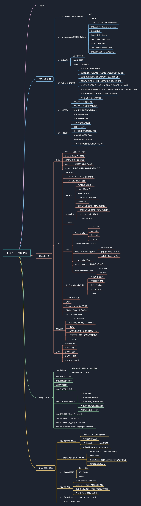

#  2.基础概念篇

## 2.1. SQL & Table 简介及运⾏环境

### 2.1.1.简介

Apache Flink 提供了两种关系型 API ⽤于统⼀流和批处理，Table 和 SQL API。

**Table API** 是⼀种集成在 Java、Scala 和 Python 语⾔中的查询 API，简单理解就是⽤ Java、Scala、Python 按照 SQL 的查询接⼝封装了⼀层 lambda 表达式的查询 API，它允许以强类型接⼝的⽅式组合各种关系运算符（如选择、筛选和联接）的查询操作，然后⽣成⼀个Flink 任务运⾏。如下案例所示：

```java
import org.apache.flink.table.api.*; 
import static org.apache.flink.table.api.Expressions.*; 

EnvironmentSettings settings = EnvironmentSettings
    .newInstance()
    .inStreamingMode()
    .build(); 

TableEnvironment tEnv = TableEnvironment.create(settings); 
//下⾯就是 Table API 的案例，其语义等同于
// select a, count(b) as cnt from Orders group by a
DataSet<Row> result = tEnv
    .from("Orders") 
    .groupBy($("a"))
    .select($("a"),$("b").count().as("cnt"))
    .toDataSet(counts, Row.class); 
result.print();
```

**SQL API** 是基于 SQL 标准的 Apache Calcite 框架实现的，我们可以使⽤纯 SQL 来开发和运⾏⼀个Flink 任务。如下案例所示：

```sql
 insert into target select a, count(b) as cnt from Orders group by a
```

注意：

⽆论输⼊是连续（流处理）还是有界（批处理），在 Table 和 SQL 任⼀ API 中同⼀条查询语句是具有相同的语义并且会产出相同的结果的。

这就是说为什么 Flink SQL 和 Table API 可以做到在⽤户接⼝层⾯的流批统⼀。xdm，⽤⼀套 SQL 既能跑流任务，也能跑批任务，它不⾹嘛？

 Table API 和 SQL API 也与 DataStream API 做到了⽆缝集成。可以轻松地在三种 API 之间灵活切换。例如，可以使⽤ SQL 的 MATCH_RECOGNIZE ⼦句匹配出异常的数据，然后使⽤再转为 DataStream API 去灵活的构建针对于异常数据的⾃定义报警机制。

在 xdm ⼤体了解了这两个 API 是⼲啥的之后，我们就可以直接来看看，怎么使⽤这两个 API 了。

### 2.1.2 SQL 和 Table API 运⾏环境依赖

根据⼩伙伴们使⽤的编程语⾔的不同（Java 或 Scala），需要将对应的依赖包添加到项⽬中。

Java 依赖如下

```xml
<dependency>
    <groupId>org.apache.flink</groupId>
    <aetifactId>flink-table-api-java-bridge_2.11</aetifactId>
    <version>1.13.5</version>
</dependency>
<dependency>
    <groupId>org.apache.flink</groupId>
    <aetifactId>flink-table-planner-blink_2.11</aetifactId>
    <version>1.13.5</version>
</dependency>
<dependency>
    <groupId>org.apache.flink</groupId>
    <aetifactId>flink-streaming-java_2.11</aetifactId>
    <version>1.13.5</version>
</dependency>
<dependency>
    <groupId>org.apache.flink</groupId>
    <aetifactId>flink-table-common</aetifactId>
    <version>1.13.5</version>
</dependency>
```

2. Scala 依赖如下

```xml
<dependency>
    <groupId>org.apache.flink</groupId>
    <artifactId>flink-table-api-scala-bridge_11</artifactId>
    <version>1.13.5</version>
</dependency>
<dependency>
    <groupId>org.apache.flink</groupId>
    <artifactId>flink-table-planner-blink_11</artifactId>
    <version>1.13.5</version>
    <scope>provided</scope>
</dependency>
<dependency>
    <groupId>org.apache.flink</groupId>
    <artifactId>flink-streaming-scala_11</artifactId>
    <version>1.13.5</version>
    <scope>provided</scope>
</dependency>
<dependency>
    <groupId>org.apache.flink</groupId>
    <artifactId>flink-table-common</artifactId>
    <version>1.13.5</version>
</dependency>
```

引⼊上述依赖之后，⼩伙伴萌就可以开始使⽤ TableSQL API 了。具体案例如下⽂所示。

## 2.2 SQL & Table 的基本概念及常⽤ API

⼩伙伴萌看下⽂之前，先看⼀下2.2节整体的思路，跟着博主思路⾛，会更清晰：

- 先通过⼀个 SQL\Table API 任务看⼀下我们在实际开发时的代码结构应该⻓啥样，让⼤家能有直观的感受

- 重点介绍 SQL\Table API 中核⼼ API - TableEnvironment。SQL\Table 所有能⽤的接⼝都在TableEnvironment中

- 通过两个⻆度（外部表\视图、临时\⾮临时）认识 Flink SQL 体系中的表的概念

- 举⼏个创建外部表、视图的实际应⽤案例

### 2.2.1 ⼀个 SQL\Table API 任务的代码结构

```java
//创建⼀个 TableEnvironment，为后续使⽤ SQL 或者 Table API 提供上线
EnvironmentSettings settings = EnvironmentSettings
    .newInstance()
    .inStreamingMode()//声明为流任务
    //.inBatchMode()//声明为批任务
    .build();
TableEnvironment tEnv = TableEnvironment.create(settings);
//⼀个输⼊表创建
tableEnv.executeSql("CREATE TEMPORARY TABLE table1 ... WITH ('connector'= ...)");
//⼀个输出表创建
tableEnv.executeSql("CREATE TEMPORARY TABLE outputTable ... WITH ('connector'= ...)");
//1.使⽤Table API 做⼀个查询并返回 Table
Table table2 = tableEnv.from("table1").select(...);
//2.使⽤SQl API 做⼀个查询并返回 Table
Table table3 = tableEnv.sqlQuery("SELECT ... FROM table1 ..."); 
// 将table2 的结果使⽤Table API写⼊ outputTable中,并返回结果
TableResult tableResult = table2.executeInsert("outputTable");
tableResult...
```

总结⼀下上⾯案例使⽤到的⼀些 API，让⼤家先对 Table\SQL API 的能⼒有⼀个⼤概了解：

- **TableEnvironment**：Table API 和 SQL API 的都集成在⼀个统⼀上下⽂（即 TableEnvironment）中，其地位等同于 DataStream API 中的 StreamExecutionEnvironment 的地位

- **TableEnvironment::executeSql**：⽤于 SQL API 中，可以执⾏⼀段完整 DDL，DML SQL。举例，⽅法的⼊参可以是 CREATE TABLE xxx ，INSERT INTO xxx SELECT xxx FROM xxx

- TableEnvironment::from(xxx)：⽤于 Table API 中，可以以强类型接⼝的⽅式运⾏。⽅法⼊参是⼀个表名称。

- TableEnvironment::sqlQuery：⽤于 SQL API 中，可以执⾏⼀段查询 SQL，并把结果以 Table 的形式返回。举例，⽅法的⼊参是 SELECT xxx FROM xxx

- Table::executeInsert：⽤于将 Table 的结果插⼊到结果表中。⽅法⼊参是写⼊的⽬标表。

⽆论是对于 SQL API 来说还是对于 Table API 来说，都是使⽤ TableEnvironment 接⼝承载我们的业务查询逻辑的。只是在⽤户的使⽤接⼝的⽅式上有区别，以上述的 Java 代码为例，Table API 其实就是模拟 SQL 的查询⽅式封装了 Java 语⾔的 lambda 强类型 API，SQL 就是纯 SQL 查询。Table 和 SQL 很多时候都是掺杂在⼀起的，⼤家理解的时候就可以直接将 Table 和 SQL API 直接按照 SQL 进⾏理解，不⽤强⾏做特殊的区分。

⽽且博主推荐的话，直接上 SQL API 就⾏，其实 Table API 在企业实战中⽤的不是特别多。你说 Table API ⽅便吧，它确实⽐ DataStream API ⽅便，但是⼜⽐ SQL 复杂。⼀般⽣产使⽤不多。

注意：由于 Table 和 SQL API 基本上属于⼀回事，后续如果没有特别介绍的话，博主就直接按照 SQL API 进⾏介绍了。

如果 xdm 想直接上⼿运⾏⼀段 Flink SQL 的代码。

可以直接在公众号后台回复1.13.5最全flink sql获取源代码。所有的源码都开源到 github 上⾯了。⾥⾯包含了⾮常多的案例。可以直接拿来在本地运⾏的！！！肥肠的⽅便。

### 2.2.2 SQL 上下⽂：TableEnvironment

 TableEnvironment 是使⽤ SQL API 永远都离不开的⼀个接⼝。其是 SQL API 使⽤的⼊⼝（上下⽂），就像是你要使⽤ Java DataStream API 去写⼀个 Flink 任务需要使⽤到 StreamExecutionEnvironment ⼀样。

可以认为 TableEnvironment 在 SQL API 中的地位和 StreamExecutionEnvironment 在 DataStream 中的地位是⼀样的，都是包含了⼀个 Flink 任务运⾏时的所有上下⽂环境信息。⼤家这样对⽐学习会⽐较好理解。

 TableEnvironment 包含的功能如下：

- Catalog 管理：Catalog 可以理解为 Flink 的 MetaStore，类似 Hive MetaStore 对在 Hive 中的地位，关于 Flink Catalog 的详细内容后续进⾏介绍

- 表管理：在 Catalog 中注册表

- SQL 查询：（这 TMD 还⽤说，最基本的功能啊），就像 DataStream 中提供了 addSource、map、flatmap 等接⼝

-  UDF 管理：注册⽤户定义（标量函数：⼀进⼀出、表函数：⼀进多出、聚合函数：多进⼀出）函数

-  UDF 扩展：加载可插拔 Module（Module 可以理解为 Flink 管理 UDF 的模块，是可插拔的，可以让⼩伙伴萌⾃定义 Module，去⽀持奇奇怪怪的 UDF 功能）

- DataStream 和 Table（TableSQL API 的查询结果）之间进⾏转换：⽬前1.13 版本的只有流任务⽀持，批任务不⽀持。1.14 ⽀持批任务。

接下来介绍如何创建⼀个 TableEnvironment。案例为 Java。easy game。

⽅法1：通过 EnvironmentSettings 创建 TableEnvironment

```java
 import org.apache.flink.table.api.EnvironmentSettings;
 import org.apache.flink.table.api.TableEnvironment; 3

//⼀些环境信息就是设置
EnvironmentSettings settings = EnvironmentSettings
     .newInstance()
     .inStreamingMode()//声明为流任务
     //.inBatchMode()//声明为批任务
     .build(); 
// 创建TableEnvironment
TableEnvironment tEnv = TableEnvironment.create(settings);
```

在13 版本中。

 inStreamingMode ，则最终创建出来的 TableEnvironment 实例为 StreamTableEnvironmentImpl。

 inBatchMode ，则最终创建出来的 TableEnvironment 实例为 TableEnvironmentImpl 。

它两虽然都继承了 TableEnvironment 接⼝，但是 StreamTableEnvironmentImpl ⽀持的功能更多⼀些。⼤家可以直接去看看接⼝实验⼀下，这⾥就不进⾏详细介绍。

⽅法2：通过已有的 StreamExecutionEnvironment 创建 TableEnvironment

```java
import org.apache.flink.streaming.api.environment.StreamExecutionEnvironment;
import org.apache.flink.table.api.EnvironmentSettings;
import org.apache.flink.table.api.bridge.java.StreamTableEnvironment; 4

StreamExecutionEnvironment env = StreamExecutionEnvironment.getExecutionEnvironment();
StreamTableEnvironment tEnv = StreamTableEnvironment.create(env);
```

### 2.2.3 SQL 中表的概念

⼀个表的全名（标识）会由三个部分组成： Catalog 名称,数据库名称,表名称。如果Catalog名称没有指明名称或者数据库，就会使⽤当前默认值 default。

举个例⼦，下⾯这个 SQL 创建的 Table 的全名为 default.default.table1 。

```java
tableEnv.executeSql("CREATE TEMPORARY TABLE table1 ... WITH ('connector'= ...)");
```

下⾯这个 SQL 创建的 Table 的全名为 default.mydatabase.table1 。

```java
tableEnv.executeSql("CREATE TEMPORARY TABLE mydatabase.table1 ... WITH ('connector'= ...)");
```

表可以是常规的（外部表 TABLE），也可以是虚拟的（视图 VIEW）。

- 外部表 TABLE：描述的是外部数据，例如⽂件（HDFS）、消息队列（Kafka）等。依然拿离线 Hive SQL 举个例⼦，离线中⼀个表指的是 Hive 表，也就是所说的外部数据。

- 视图 VIEW：从已经存在的表中创建，视图⼀般是⼀个 SQL 逻辑的查询结果。对⽐到离线的 Hive SQL中，在离线的场景（Hive 表）中 VIEW 也都是从已有的表中去创建的。其实 Flink 也是⼀样的。

注意：

不同的地⽅就是，离线 Hive MetaStore 中不会有 Catalog 这个概念，其标识都是数据库.数据表。

###  2.2.4 SQL 临时表、永久表

表（视图、外部表）可以是临时的，并与单个 Flink session（可以理解为 Flink 任务运⾏⼀次就是⼀个 session）的⽣命周期绑定。

表（视图、外部表）也可以是永久的，并且对多个 Flink session 都⽣效。

-  临时表：通常保存于内存中并且仅在创建它们的 Flink session（可以理解为⼀次 Flink 任务的运⾏）持续期间存在。这些表对于其它 session（即其他 Flink 任务或⾮此次运⾏的 Flink 任务）是不可⻅的。因为这个表的元数据没有被持久化。如下案例：

```sql
--临时外部表
CREATE TEMPORARY TABLE source_table (
    user_id BIGINT,
    `name` STRING
) WITH (
    'connector'= 'user_defined',
    'format'= 'json',
    'class.name'= 'flink.examples.sql._0source_sink.table.user_defined.UserDefinedS');

 --临时视图
 CREATE TEMPORARY VIEW query_view as
 SELECT * FROM source_table 16 ;
```

- 永久表：需要外部 Catalog（例如 Hive Metastore）来持久化表的元数据。⼀旦永久表被创建，它将对任何连接到这个 Catalog 的 Flink session 可⻅且持续存在，直⾄从 Catalog 中被明确删除。如下案例：

```sql
-- Catalog ！！！永久外部表。需要外部持久化
CREATE TABLE source_table (
    user_id BIGINT,
    `name` STRING
) WITH (
    'connector'= 'user_defined',
    'format'= 'json',
    'class.name'= 'flink.examples.sql._0source_sink.table.user_defined.UserDefinedS');

-- Catalog 永久视图。需要外部持久化！！！
CREATE VIEW query_view as
SELECT * FROM source_table;
```

- 如果临时表和永久表使⽤了相同的名称（Catalog名.数据库名.表名）。那么在这个 Flink session 中，你的任务访问到这个表时，访问到的永远是临时表（即相同名称的表，临时表会屏蔽永久表）。

### 2.2.5  SQL 外部数据表

由于⽬前在实时数据的场景中多以消息队列作为数据表。此处就以 Kafka 为例创建⼀个外部数据表。

- Table API 创建外部数据表

```JAVA
public static void main(String[] args) throws Exception {
    StreamExecutionEnvironment env = StreamExecutionEnvironment.createLocalEnvironmentWithWebUI(new Configuration);
    EnvironmentSettings settings = EnvironmentSettings
         .newInstance()
         .useBlinkPlanner()
         .inStreamingMode()
         .build(); 
    StreamTableEnvironment tEnv = StreamTableEnvironment.create(env,settings);
    // kafka数据源
    DataStream<Rew> r = env.addSource(new FlinkKafkaConSumer<Row>(XXX));
    // 将 DataStream 转为一个Table API中的TabLe对象进行使 用
    Table sourceTable = tEnv.fromDataStreamt(r, Schema                                     
                                             .newBuilder()
                                             .column("f0","string")
                                             .column("f1","string")
                                             .column("f2","bigint")
                                             .columnByExpression("proctime" , "PROCTIME()")
                                             .build ());
    tEnv.createTemporaryView("source_table" ,sourceTable) ;
    String selectWhereSql = "select f0 from source_table where f1 = 'b'";
    Table resuLtTable = tEnv.sqlQuery(selectWhereSql);
    tEnv.toRetractStream(resultTable, Row.class).print();
    env.execute();
}
```

上述案例中，Table API 将⼀个 DataStream 的结果集通过 StreamTableEnvironment::fromDataStream 转为⼀个 Table 对象来使⽤。

- SQL API 创建外部数据表

```java
EnvironmentSettings settings = EnvironmentSettings
         .newInstance()
         .useBlinkPlanner()
         .inStreamingMode()
         .build();
StreamTableEnvironment tEnv = StreamTableEnvironment.create(env, settings);
// SQL API create table创建表
tEnv.executeSql(
	"CREATE TABLE KafkaSourceTable (\n"
		+"`f0` STRING,\n"
		+"`f1` STRING\n"
		+") WITH (\n"
		+"'connector'= 'kafka',\n"
		+"'topic'= 'topic',\n"
		+"'properties.bootstrap.servers'= 'localhost:9092',\n"
		+"'properties.group.id'= 'testGroup',\n"
		+"'format'= 'json'\n"
		+")");
Table t = tEnv.sqlQuery("SELECT *  FROM KafkaSourceTable");
```

具体的创建方式就是使用 `Create Table xxx` DDL 定义一个 Kafka 数据源（输入）表（也可以是 Kafka 数据汇（输出）表）。

xdm，是不是又和 Hive 一样？惊不惊喜意不意外。对比学习 +1。

### 2.2.6.SQL 视图 VIEW

上文已经说了，一个 VIEW 其实就是一段 SQL 逻辑的查询结果。

视图 VIEW 在 Table API 中的体现就是：一个 Table 的 Java 对象，其封装了一段查询逻辑。如下案例所示：

1.  Table API 创建 VIEW

```java
import org.apache.flink.table.api.EnvironmentSettings;
import org.apache.flink.table.api.TableEnvironment;

EnvironmentSettings settings = EnvironmentSettings
    .newInstance()
    .inStreamingMode() // 声明为流任务
    .build();

TableEnvironment tEnv = TableEnvironment.create(settings);

// Table API 中的一个 Table 对象
Table projTable = tEnv.from("X").select(...);

// 将 projTable 创建为一个叫做 projectedTable 的 VIEW
tEnv.createTemporaryView("projectedTable", projTable);
```

Table API 是使用了 `TableEnvironment::createTemporaryView` 接口将一个 Table 对象创建为一个 VIEW。

1.  SQL API 创建 VIEW

```java
import org.apache.flink.table.api.EnvironmentSettings;
import org.apache.flink.table.api.TableEnvironment;

EnvironmentSettings settings = EnvironmentSettings
    .newInstance()
    .inStreamingMode() // 声明为流任务
    .build();

TableEnvironment tEnv = TableEnvironment.create(settings);

String sql = "CREATE TABLE source_table (\n"
    + "    user_id BIGINT,\n"
    + "    `name` STRING\n"
    + ") WITH (\n"
    + "  'connector' = 'user_defined',\n"
    + "  'format' = 'json',\n"
    + "  'class.name' = 'flink.examples.sql._03.source_sink.table.user_defined.UserDefinedSource'\n"
    + ");\n"
    + "\n"
    + "CREATE TABLE sink_table (\n"
    + "    user_id BIGINT,\n"
    + "    name STRING\n"
    + ") WITH (\n"
    + "  'connector' = 'print'\n"
    + ");\n"
    + "CREATE VIEW query_view as\n" // 创建 VIEW
    + "SELECT\n"
    + "    *\n"
    + "FROM source_table\n"
    + ";\n"
    + "INSERT INTO sink_table\n"
    + "SELECT\n"
    + "    *\n"
    + "FROM query_view;";

Arrays.stream(sql.split(";"))
      .forEach(tEnv::executeSql);
```

SQL API 是直接通过一段 `CREATE VIEW query_view as select * from source_table` 来创建的 VIEW，是纯 SQL 写法。

这种创建方式是不是贼熟悉，和离线 Hive 一样 +1~

> 注意：
>
> 在 Table API 中的一个 Table 对象被后续的多个查询使用的场景下：
>
> Table 对象不会真的产生一个中间表供下游多个查询去引用，即多个查询不共享这个 Table 的结果，小伙伴萌可以理解为是一种中间表的简化写法，不会先产出一个中间表结果，然后将这个结果在下游多个查询中复用，后续的多个查询会将这个 Table 的逻辑执行多次。类似于 with tmp as (DML) 的语法

### 2.2.7.一个 SQL 查询案例

首先，如果 xdm 想直接上手运行一段 Flink SQL 的代码。


来看看一个 SQL 查询案例。

1.  案例场景：计算每一种商品（sku_id 唯一标识）的售出个数、总销售额、平均销售额、最低价、最高价
2.  数据准备：数据源为商品的销售流水（sku_id：商品，price：销售价格），然后写入到 Kafka 的指定 topic（sku_id：商品，count_result：售出个数、sum_result：总销售额、avg_result：平均销售额、min_result：最低价、max_result：最高价）当中
3.  任务代码：

```java
EnvironmentSettings settings = EnvironmentSettings
    .newInstance()
    .inStreamingMode() // 声明为流任务
    //.inBatchMode() // 声明为批任务
    .build();

TableEnvironment tEnv = TableEnvironment.create(settings);

// 1. 创建一个数据源（输入）表，这里的数据源是 flink 自带的一个随机 mock 数据的数据源。
String sourceSql = "CREATE TABLE source_table (\n"
        + "    sku_id STRING,\n"
        + "    price BIGINT\n"
        + ") WITH (\n"
        + "  'connector' = 'datagen',\n"
        + "  'rows-per-second' = '1',\n"
        + "  'fields.sku_id.length' = '1',\n"
        + "  'fields.price.min' = '1',\n"
        + "  'fields.price.max' = '1000000'\n"
        + ")";

// 2. 创建一个数据汇（输出）表，输出到 kafka 中
String sinkSql = "CREATE TABLE sink_table (\n"
        + "    sku_id STRING,\n"
        + "    count_result BIGINT,\n"
        + "    sum_result BIGINT,\n"
        + "    avg_result DOUBLE,\n"
        + "    min_result BIGINT,\n"
        + "    max_result BIGINT,\n"
        + "    PRIMARY KEY (`sku_id`) NOT ENFORCED\n"
        + ") WITH (\n"
        + "  'connector' = 'upsert-kafka',\n"
        + "  'topic' = 'tuzisir',\n"
        + "  'properties.bootstrap.servers' = 'localhost:9092',\n"
        + "  'key.format' = 'json',\n"
        + "  'value.format' = 'json'\n"
        + ")";

// 3. 执行一段 group by 的聚合 SQL 查询
String selectWhereSql = "insert into sink_table\n"
        + "select sku_id,\n"
        + "       count(*) as count_result,\n"
        + "       sum(price) as sum_result,\n"
        + "       avg(price) as avg_result,\n"
        + "       min(price) as min_result,\n"
        + "       max(price) as max_result\n"
        + "from source_table\n"
        + "group by sku_id";

tEnv.executeSql(sourceSql);
tEnv.executeSql(sinkSql);
tEnv.executeSql(selectWhereSql);
```

### 2.2.8.SQL 与 DataStream API 的转换

大家会比较好奇，要写 SQL 就纯 SQL 呗，要写 DataStream 就纯 DataStream 呗，为啥还要把这两类接口做集成呢？

博主举一个案例：在 pdd 这种发补贴券的场景下，希望可以在发的补贴券总金额超过 1w 元时，及时报警出来，来帮助控制预算，防止发的太多。

对应的解决方案，我们可以想到使用 SQL 计算补贴券发放的结果，但是 SQL 的问题在于无法做到报警。所以我们可以将 SQL 的查询的结果（即 Table 对象）转为 DataStream，然后就可以在 DataStream 后自定义报警逻辑的算子。

我们直接上 SQL 和 DataStream API 互相转化的案例：

```java
public static void main(String[] args) throws Exception {

    FlinkEnv flinkEnv = FlinkEnvUtils.getStreamTableEnv(args);

    // 1. pdd 发补贴券流水数据
    String createTableSql = "CREATE TABLE source_table (\n"
            + "    id BIGINT,\n" -- 补贴券的流水 id
            + "    money BIGINT,\n" -- 补贴券的金额
            + "    row_time AS cast(CURRENT_TIMESTAMP as timestamp_LTZ(3)),\n"
            + "    WATERMARK FOR row_time AS row_time - INTERVAL '5' SECOND\n"
            + ") WITH (\n"
            + "  'connector' = 'datagen',\n"
            + "  'rows-per-second' = '1',\n"
            + "  'fields.id.min' = '1',\n"
            + "  'fields.id.max' = '100000',\n"
            + "  'fields.money.min' = '1',\n"
            + "  'fields.money.max' = '100000'\n"
            + ")\n";

    // 2. 计算总计发放补贴券的金额
    String querySql = "SELECT UNIX_TIMESTAMP(CAST(window_end AS STRING)) * 1000 as window_end, \n"
            + "      window_start, \n"
            + "      sum(money) as sum_money,\n" -- 补贴券的发放总金额
            + "      count(distinct id) as count_distinct_id\n"
            + "FROM TABLE(CUMULATE(\n"
            + "         TABLE source_table\n"
            + "         , DESCRIPTOR(row_time)\n"
            + "         , INTERVAL '5' SECOND\n"
            + "         , INTERVAL '1' DAY))\n"
            + "GROUP BY window_start, \n"
            + "        window_end";

    flinkEnv.streamTEnv().executeSql(createTableSql);

    Table resultTable = flinkEnv.streamTEnv().sqlQuery(querySql);

    // 3. 将金额结果转为 DataStream，然后自定义超过 1w 的报警逻辑
    flinkEnv.streamTEnv()
            .toDataStream(resultTable, Row.class)
            .flatMap(new FlatMapFunction<Row, Object>() {
                @Override
                public void flatMap(Row value, Collector<Object> out) throws Exception {
                    long l = Long.parseLong(String.valueOf(value.getField("sum_money")));

                    if (l > 10000L) {
                        log.info("报警，超过 1w");
                    }
                }
            });

    flinkEnv.env().execute();
}
```

> 注意：
>
> 目前在 1.13 版本中，Flink 对于 Table 和 DataStream 的转化是有一些限制的：
>
> 上面的案例可以看到，Table 和 DataStream 之间的转换目前只有 `StreamTableEnvironment::toDataStream`、`StreamTableEnvironment::fromDataStream` 接口支持。
>
> 所以其实小伙伴萌可以理解为只有流任务才支持 Table 和 DataStream 之间的转换，批任务是不支持的（虽然可以使用流执行模式处理有界流 - 批数据，也就是模拟按照批执行，但效率较低，这种骚操作不建议大家搞）。
>
> 那什么时候才能支持批任务的 Table 和 DataStream 之间的转换呢？
>
> 1.14 版本支持。1.14 版本中，流和批的都统一到了 StreamTableEnvironment 中，因此就可以做 Table 和 DataStream 的互相转换了。

## 2.3.SQL 数据类型

在介绍完一些基本概念之后，我们来认识一下，Flink SQL 中的数据类型。

Flink SQL 内置了很多常见的数据类型，并且也为用户提供了自定义数据类型的能力。

总共包含 3 部分：

1.  原子数据类型
2.  复合数据类型
3.  用户自定义数据类型

### 2.3.1.原子数据类型

1、字符串类型：

- CHAR、CHAR(n)：定长字符串，就和 Java 中的 Char 一样，n 代表字符的定长，取值范围 [1, 2,147,483,647]。如果不指定 n，则默认为 1。

- VARCHAR、VARCHAR(n)、STRING：可变长字符串，就和 Java 中的 String 一样，n 代表字符的最大长度，取值范围 [1, 2,147,483,647]。如果不指定 n，则默认为 1。STRING 等同于 VARCHAR(2147483647)。

2、 二进制字符串类型：

-  BINARY、BINARY(n)：定长二进制字符串，n 代表定长，取值范围 [1, 2,147,483,647]。如果不指定 n，则默认为 1。
-  VARBINARY、VARBINARY(n)、BYTES：可变长二进制字符串，n 代表字符的最大长度，取值范围 [1, 2,147,483,647]。如果不指定 n，则默认为 1。BYTES 等同于 VARBINARY(2147483647)。

3、 精确数值类型：

-  DECIMAL、DECIMAL(p)、DECIMAL(p, s)、DEC、DEC(p)、DEC(p, s)、NUMERIC、NUMERIC(p)、NUMERIC(p, s)：固定长度和精度的数值类型，就和 Java 中的 BigDecimal 一样，p 代表数值位数（长度），取值范围 [1, 38]；s 代表小数点后的位数（精度），取值范围 [0, p]。如果不指定，p 默认为 10，s 默认为 0。
-  TINYINT：-128 到 127 的 1 字节大小的有符号整数，就和 Java 中的 byte 一样。
-  SMALLINT：-32,768 to 32,767 的 2 字节大小的有符号整数，就和 Java 中的 short 一样。
-  INT、INTEGER：-2,147,483,648 to 2,147,483,647 的 4 字节大小的有符号整数，就和 Java 中的 int 一样。
-  BIGINT：-9,223,372,036,854,775,808 to 9,223,372,036,854,775,807 的 8 字节大小的有符号整数，就和 Java 中的 long 一样。

4、有损精度数值类型：

-  FLOAT：4 字节大小的单精度浮点数值，就和 Java 中的 float 一样。
-  DOUBLE、DOUBLE PRECISION：8 字节大小的双精度浮点数值，就和 Java 中的 double 一样。
-  关于 FLOAT 和 DOUBLE 的区别可见 https://www.runoob.com/w3cnote/float-and-double-different.html

5、 布尔类型：BOOLEAN

6、 NULL 类型：NULL

7、 Raw 类型：RAW(‘class’, ‘snapshot’) 。只会在数据发生网络传输时进行序列化，反序列化操作，可以保留其原始数据。以 Java 举例，`class` 参数代表具体对应的 Java 类型，`snapshot` 代表类型在发生网络传输时的序列化器

8、 日期、时间类型：

-  DATE：由 `年-月-日` 组成的 `不带时区含义` 的日期类型，取值范围 [0000-01-01, 9999-12-31]
-  TIME、TIME(p)：由 `小时：分钟：秒[.小数秒]` 组成的 `不带时区含义` 的的时间的数据类型，精度高达纳秒，取值范围 [00:00:00.000000000到23:59:59.9999999]。其中 p 代表小数秒的位数，取值范围 [0, 9]，如果不指定 p，默认为 0。
-  TIMESTAMP、TIMESTAMP(p)、TIMESTAMP WITHOUT TIME ZONE、TIMESTAMP(p) WITHOUT TIME ZONE：由 `年-月-日 小时：分钟：秒[.小数秒]` 组成的 `不带时区含义` 的时间类型，取值范围 [0000-01-01 00:00:00.000000000, 9999-12-31 23:59:59.999999999]。其中 p 代表小数秒的位数，取值范围 [0, 9]，如果不指定 p，默认为 6。
-  TIMESTAMP WITH TIME ZONE、TIMESTAMP(p) WITH TIME ZONE：由 `年-月-日 小时：分钟：秒[.小数秒] 时区` 组成的 `带时区含义` 的时间类型，取值范围 [0000-01-01 00:00:00.000000000 +14:59, 9999-12-31 23:59:59.999999999 -14:59]。其中 p 代表小数秒的位数，取值范围 [0, 9]，如果不指定 p，默认为 6。
-  TIMESTAMP_LTZ、TIMESTAMP_LTZ(p)：由 `年-月-日 小时：分钟：秒[.小数秒] 时区` 组成的 `带时区含义` 的时间类型，取值范围 [0000-01-01 00:00:00.000000000 +14:59, 9999-12-31 23:59:59.999999999 -14:59]。其中 p 代表小数秒的位数，取值范围 [0, 9]，如果不指定 p，默认为 6。
-  TIMESTAMP_LTZ 与 TIMESTAMP WITH TIME ZONE 的区别在于：TIMESTAMP WITH TIME ZONE 的时区信息是携带在数据中的，举例：其输入数据应该是 2022-01-01 00:00:00.000000000 +08:00；TIMESTAMP_LTZ 的时区信息不是携带在数据中的，而是由 Flink SQL 任务的全局配置决定的，我们可以由 `table.local-time-zone` 参数来设置时区。
-  INTERVAL YEAR TO MONTH、 INTERVAL DAY TO SECOND：interval 的涉及到的种类比较多。INTERVAL 主要是用于给 TIMESTAMP、TIMESTAMP_LTZ 添加偏移量的。举例，比如给 TIMESTAMP 加、减几天、几个月、几年。INTERVAL 子句总共涉及到的语法种类如下 Flink SQL 案例所示。

```java
CREATE TABLE sink_table (
    result_interval_year TIMESTAMP(3),
    result_interval_year_p TIMESTAMP(3),
    result_interval_year_p_to_month TIMESTAMP(3),
    result_interval_month TIMESTAMP(3),
    result_interval_day TIMESTAMP(3),
    result_interval_day_p1 TIMESTAMP(3),
    result_interval_day_p1_to_hour TIMESTAMP(3),
    result_interval_day_p1_to_minute TIMESTAMP(3),
    result_interval_day_p1_to_second_p2 TIMESTAMP(3),
    result_interval_hour TIMESTAMP(3),
    result_interval_hour_to_minute TIMESTAMP(3),
    result_interval_hour_to_second TIMESTAMP(3),
    result_interval_minute TIMESTAMP(3),
    result_interval_minute_to_second_p2 TIMESTAMP(3),
    result_interval_second TIMESTAMP(3),
    result_interval_second_p2 TIMESTAMP(3)
) WITH (
  'connector' = 'print'
);
INSERT INTO sink_table
SELECT
    -- Flink SQL 支持的所有 INTERVAL 子句如下，总体可以分为 `年-月`、`日-小时-秒` 两种

    -- 1. 年-月。取值范围为 [-9999-11, +9999-11]，其中 p 是指有效位数，取值范围 [1, 4]，默认值为 2。比如如果值为 1000，但是 p = 2，则会直接报错。
    -- INTERVAL YEAR
    f1 + INTERVAL '10' YEAR as result_interval_year
    -- INTERVAL YEAR(p)
    , f1 + INTERVAL '100' YEAR(3) as result_interval_year_p
    -- INTERVAL YEAR(p) TO MONTH
    , f1 + INTERVAL '10-03' YEAR(3) TO MONTH as result_interval_year_p_to_month
    -- INTERVAL MONTH
    , f1 + INTERVAL '13' MONTH as result_interval_month

    -- 2. 日-小时-秒。取值范围为 [-999999 23:59:59.999999999, +999999 23:59:59.999999999]，其中 p1\p2 都是有效位数，p1 取值范围 [1, 6]，默认值为 2；p2 取值范围 [0, 9]，默认值为 6
    -- INTERVAL DAY
    , f1 + INTERVAL '10' DAY as result_interval_day
    -- INTERVAL DAY(p1)
    , f1 + INTERVAL '100' DAY(3) as result_interval_day_p1
    -- INTERVAL DAY(p1) TO HOUR
    , f1 + INTERVAL '10 03' DAY(3) TO HOUR as result_interval_day_p1_to_hour
    -- INTERVAL DAY(p1) TO MINUTE
    , f1 + INTERVAL '10 03:12' DAY(3) TO MINUTE as result_interval_day_p1_to_minute
    -- INTERVAL DAY(p1) TO SECOND(p2)
    , f1 + INTERVAL '10 00:00:00.004' DAY TO SECOND(3) as result_interval_day_p1_to_second_p2
    -- INTERVAL HOUR
    , f1 + INTERVAL '10' HOUR as result_interval_hour
    -- INTERVAL HOUR TO MINUTE
    , f1 + INTERVAL '10:03' HOUR TO MINUTE as result_interval_hour_to_minute
    -- INTERVAL HOUR TO SECOND(p2)
    , f1 + INTERVAL '00:00:00.004' HOUR TO SECOND(3) as result_interval_hour_to_second
    -- INTERVAL MINUTE
    , f1 + INTERVAL '10' MINUTE as result_interval_minute
    -- INTERVAL MINUTE TO SECOND(p2)
    , f1 + INTERVAL '05:05.006' MINUTE TO SECOND(3) as result_interval_minute_to_second_p2
    -- INTERVAL SECOND
    , f1 + INTERVAL '3' SECOND as result_interval_second
    -- INTERVAL SECOND(p2)
    , f1 + INTERVAL '300' SECOND(3) as result_interval_second_p2
FROM (SELECT TO_TIMESTAMP_LTZ(1640966476500, 3) as f1)
```

### 2.3.2.复合数据类型

1.  数组类型：ARRAY、t ARRAY。数组最大长度为 2,147,483,647。t 代表数组内的数据类型。举例 ARRAY、ARRAY，其等同于 INT ARRAY、STRING ARRAY
2.  Map 类型：MAP<kt, vt>。Map 类型就和 Java 中的 Map 类型一样，key 是没有重复的。举例 Map<STRING, INT>、Map<BIGINT, STRING>
3.  集合类型：MULTISET、t MULTISET。就和 Java 中的 List 类型，一样，运行重复的数据。举例 MULTISET，其等同于 INT MULTISET
4.  对象类型：ROW<n0 t0, n1 t1, …>、ROW<n0 t0 ‘d0’, n1 t1 ‘d1’, …>、ROW(n0 t0, n1 t1, …>、ROW(n0 t0 ‘d0’, n1 t1 ‘d1’, …)。就和 Java 中的自定义对象一样。举例：ROW(myField INT, myOtherField BOOLEAN)，其等同于 ROW<myField INT, myOtherField BOOLEAN>

### 2.3.3.用户自定义数据类型

用户自定义类型就是运行用户使用 Java 等语言自定义一个数据类型出来。但是目前数据类型不支持使用 CREATE TABLE 的 DDL 进行定义，只支持作为函数的输入输出参数。如下案例：

1.  第一步，自定义数据类型

```java
public class User {

    // 1. 基础类型，Flink 可以通过反射类型信息自动把数据类型获取到
    // 关于 SQL 类型和 Java 类型之间的映射见：https://nightlies.apache.org/flink/flink-docs-release-1.13/docs/dev/table/types/#data-type-extraction
    public int age;
    public String name;

    // 2. 复杂类型，用户可以通过 @DataTypeHint("DECIMAL(10, 2)") 注解标注此字段的数据类型
    public @DataTypeHint("DECIMAL(10, 2)") BigDecimal totalBalance;
}
```

1.  第二步，在 UDF 中使用此数据类型

```java
public class UserScalarFunction extends ScalarFunction {

    // 1. 自定义数据类型作为输出参数
    public User eval(long i) {
        if (i > 0 && i <= 5) {
            User u = new User();
            u.age = (int) i;
            u.name = "name1";
            u.totalBalance = new BigDecimal(1.1d);
            return u;
        } else {
            User u = new User();
            u.age = (int) i;
            u.name = "name2";
            u.totalBalance = new BigDecimal(2.2d);
            return u;
        }
    }
    
    // 2. 自定义数据类型作为输入参数
    public String eval(User i) {
        if (i.age > 0 && i.age <= 5) {
            User u = new User();
            u.age = 1;
            u.name = "name1";
            u.totalBalance = new BigDecimal(1.1d);
            return u.name;
        } else {
            User u = new User();
            u.age = 2;
            u.name = "name2";
            u.totalBalance = new BigDecimal(2.2d);
            return u.name;
        }
    }
}
```

1.  第三步，在 Flink SQL 中使用

```java
-- 1. 创建 UDF
CREATE FUNCTION user_scalar_func AS 'flink.examples.sql._12_data_type._02_user_defined.UserScalarFunction';

-- 2. 创建数据源表
CREATE TABLE source_table (
    user_id BIGINT NOT NULL COMMENT '用户 id'
) WITH (
  'connector' = 'datagen',
  'rows-per-second' = '1',
  'fields.user_id.min' = '1',
  'fields.user_id.max' = '10'
);

-- 3. 创建数据汇表
CREATE TABLE sink_table (
    result_row_1 ROW<age INT, name STRING, totalBalance DECIMAL(10, 2)>,
    result_row_2 STRING
) WITH (
  'connector' = 'print'
);

-- 4. SQL 查询语句
INSERT INTO sink_table
select
    -- 4.a. 用户自定义类型作为输出
    user_scalar_func(user_id) as result_row_1,
    -- 4.b. 用户自定义类型作为输出及输入
    user_scalar_func(user_scalar_func(user_id)) as result_row_2
from source_table;

-- 5. 查询结果
+I[+I[9, name2, 2.20], name2]
+I[+I[1, name1, 1.10], name1]
+I[+I[5, name1, 1.10], name1]
```

## 2.4.SQL 动态表 & 连续查询

在小伙伴萌看下文之前，先看一下 2.4 节整体的思路，跟着博主思路走，会更清晰：

1.  先分析一下将 SQL 应用到流处理的思路
2.  SQL 应用于批处理已经很成熟了，通过对比流批处理在输入、数据处理、输出的异同点来分析出将 SQL 应用于流处理的核心要解决的问题点
3.  分析如何使用 `SQL 动态输入表` 技术来将 `输入数据流` 映射到 `SQL 中的输入表`
4.  分析如何使用 `SQL 连续查询` 技术来将 `计算逻辑` 映射到 `SQL 中的运算语义`
5.  使用 `SQL 动态表 & 连续查询技术` 两种技术方案来将 `流式 SQL` 实际应用到两个常见案例中
6.  分析 `SQL 连续查询` 的两种类型：更新（Update）查询 & 追加（Append）查询
7.  分析如何使用 `SQL 动态输出表` 技术来将 `输出数据流` 映射到 `SQL 中的输出表`

博主认为读完本节你应该掌握：

1.  `SQL 动态输入表`、`SQL 动态输出表`
2.  `SQL 连续查询` 的两种类型分别对应的查询场景及 SQL 语义

### 2.4.1.SQL 应用于流处理的思路

在流式 SQL 诞生之前，所有的基于 SQL 的数据查询都是基于批数据的，没有将 SQL 应用到流数据处理这一说法。

那么如果我们想将 SQL 应用到流处理中，必然要站在巨人的肩膀（批数据处理的流程）上面进行，那么具体的分析思路如下：

1.  步骤一：先比较 `批处理` 与 `流处理` 的异同之处：如果有相同的部分，那么可以直接复用；不同之处才是我们需要重点克服和关注的。
2.  步骤二：摘出 1 中说到的不同之处，分析如果要满足这个不同之处，目前有哪些技术是类似的
3.  步骤三：再从这些类似的技术上进一步发展，以满足将 SQL 应用于流任务中

博主下文就会根据上述三个步骤来一步一步介绍 `动态表` 诞生的背景以及这个概念是如何诞生的。

### 2.4.2.流批处理的异同点及将 SQL 应用于流处理核心解决的问题

首先对比一下常见的 `批处理` 和 `流处理` 中 `数据源（输入表）`、`处理逻辑`、`数据汇（结果表）` 的异同点。

| -      | 输入表                                           | 处理逻辑                                                     | 结果表           |
| :----- | :----------------------------------------------- | :----------------------------------------------------------- | :--------------- |
| 批处理 | 静态表：输入数据有限、是有界集合                 | 批式计算：每次执行查询能够访问到完整的输入数据，然后计算，输出完整的结果数据 | 静态表：数据有限 |
| 流处理 | 动态表：输入数据无限，数据实时增加，并且源源不断 | 流式计算：执行时不能够访问到完整的输入数据，每次计算的结果都是一个中间结果 | 动态表：数据无限 |

对比上述流批处理之后，我们得到了要将 SQL 应用于流式任务的三个要解决的核心点：

1.  SQL 输入表：分析如何将一个实时的，源源不断的输入流数据表示为 SQL 中的输入表。
2.  SQL 处理计算：分析将 SQL 查询逻辑翻译成什么样的底层处理技术才能够实时的处理流式输入数据，然后产出流式输出数据。
3.  SQL 输出表：分析如何将 SQL 查询输出的源源不断的流数据表示为一个 SQL 中的输出表。

将上面 3 个点总结一下，也就引出了本节的 `动态表` 和 `连续查询` 两种技术方案：

1.  `动态表`：源源不断的输入、输出流数据映射到 `动态表`
2.  `连续查询`：实时处理输入数据，产出输出数据的实时处理技术

### 2.4.3.SQL 流处理的输入：输入流映射为 SQL 动态输入表

`动态表`。这里的动态其实是相比于批处理的静态（有界）来说的。

1.  静态表：应用于批处理数据中，静态表可以理解为是不随着时间`实时`进行变化的。一般都是一天、一小时的粒度新生成一个分区。
2.  动态表：动态表是随时间实时进行变化的。是将 SQL 体系中表的概念应用到 Flink 上面的的核心点。

来看一个具体的案例，下图显示了`点击事件流`（左侧）如何转换为`动态表`（右侧）。当数据源生成更多的点击事件记录时，映射出来的动态表也会不断增长，这就是动态表的概念：

[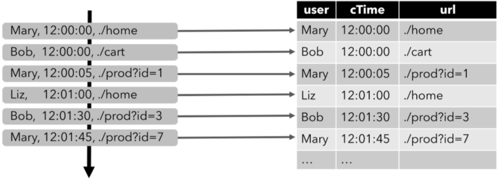](https://yangyichao-mango.github.io/blog-img/wechat-blog/01_大数据/01_数据仓库/01_实时数仓/02_数据内容建设/03_one-engine/01_计算引擎/01_flink/01_flink-sql/21_flinksql牛逼轰轰/4.png)

### 2.4.4.SQL 流处理的计算：实时处理底层技术 - SQL 连续查询

`连续查询`。

部分高级关系数据库系统提供了一个称为**物化视图**（Materialized Views) 的特性。

物化视图其实就是一条 SQL 查询，就像常规的虚拟视图 VIEW 一样。但与虚拟视图不同的是，物化视图会缓存查询的结果，因此在请求访问视图时不需要对查询进行重新计算，可以直接获取物化视图的结果，小伙伴萌可以认为物化视图其实就是把结果缓存了下来。

举个例子：批处理中，如果以 Hive 天级别的物化视图来说，其实就是每天等数据源 ready 之后，调度物化视图的 SQL 执行然后产生新的结果提供服务。`那么就可以认为一条表示了输入、处理、输出的 SQL 就是一个构建物化视图的过程。`

映射到我们的流任务中，输入、处理逻辑、输出这一套流程也是一个物化视图的概念。相比批处理来说，流处理中，我们的数据源表的数据是源源不断的。那么从输入、处理、输出的整个物化视图的维护流程也必须是实时的。

因此我们就需要引入一种`实时视图维护（Eager View Maintenance）`的技术去做到：一旦更新了物化视图的数据源表就立即更新视图的结果，从而保证输出的结果也是最新的。

这种 `实时视图维护（Eager View Maintenance）`的技术就叫做 `连续查询`。

> 注意：
>
> 1.  **连续查询（Continuous Query）** 不断的消费动态输入表的的数据，不断的更新动态结果表的数据。
> 2.  **连续查询（Continuous Query）** 的产出的结果 = 批处理模式在输入表的上执行的相同查询的结果。相同的 SQL，对应于同一个输入数据，虽然执行方式不同，但是流处理和批处理的结果是永远都会相同的。

### 2.4.5.SQL 流处理实际应用：动态表 & 连续查询技术的两个实战案例

总结前两节，`动态表` & `连续查询` 两项技术在一条流 SQL 中的执行流程总共包含了三个步骤，如下图及总结所示：

[](https://yangyichao-mango.github.io/blog-img/wechat-blog/01_大数据/01_数据仓库/01_实时数仓/02_数据内容建设/03_one-engine/01_计算引擎/01_flink/01_flink-sql/21_flinksql牛逼轰轰/30.png)

1.  第一步：将数据输入流转换为 SQL 中的动态输入表。这里的转化其实就是指将输入流映射（绑定）为一个动态输入表。上图虽然分开画了，但是可以理解为一个东西。
2.  第二步：在动态输入表上执行一个连续查询，然后生成一个新的动态结果表。
3.  第三步：生成的动态结果表被转换回数据输出流。

我们实际介绍一个案例来看看其运行方式，以上文介绍到的**点击事件流**为例，点击事件流数据的字段如下：

```txt
[
  user:  VARCHAR,   // 用户名
  cTime: TIMESTAMP, // 访问 URL 的时间
  url:   VARCHAR    // 用户访问的 URL
]
```

1.  第一步，将输入数据流映射为一个动态输入表。以下图为例，我们将点击事件流（图左）转换为动态表 (图右)。当点击数据源源不断的来到时，动态表的数据也会不断的增加。

[](https://yangyichao-mango.github.io/blog-img/wechat-blog/01_大数据/01_数据仓库/01_实时数仓/02_数据内容建设/03_one-engine/01_计算引擎/01_flink/01_flink-sql/21_flinksql牛逼轰轰/4.png)

1.  第二步，在点击事件流映射的动态输入表上执行一个**连续查询（Continuous Query）**，并生成一个新的动态输出表。

下面介绍两个查询的案例：

第一个查询：一个简单的 GROUP-BY COUNT 聚合查询，写过 SQL 的都不会陌生吧，这种应该都是最基础，最常用的对数据按照类别分组的方法。

如下图所示 group by 聚合的常用案例。

 

那么本案例中呢，是基于 clicks 表中 user 字段对 clicks 表（点击事件流）进行分组，来统计每一个 user 的访问的 URL 的数量。下面的图展示了当 clicks 输入表来了新数据（即表更新时），**连续查询（Continuous Query）** 的计算逻辑。

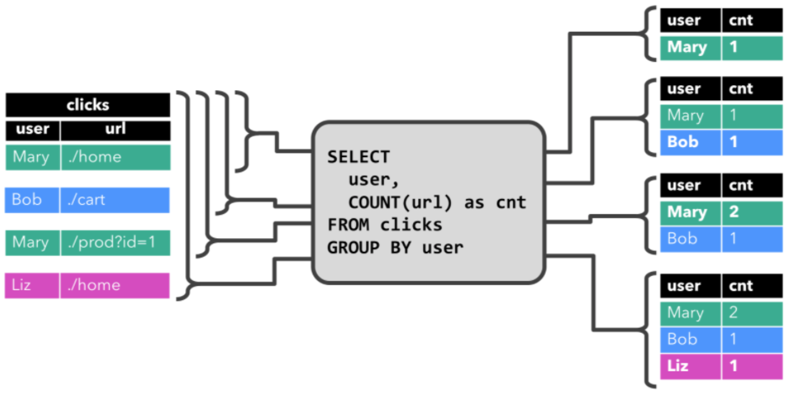

当查询开始，clicks 表(左侧)是空的。

1.  当第一行数据被插入到 clicks 表时，连续查询（Continuous Query）开始计算结果数据。数据源表第一行数据 [Mary,./home] 输入后，会计算结果 [Mary, 1] `插入（insert）结果表`。
2.  当第二行 [Bob, ./cart] 插入到 clicks 表时，连续查询（Continuous Query）会计算结果 [Bob, 1]，并`插入（insert）到结果表`。
3.  第三行 [Mary, ./prod?id=1] 输出时，会计算出[Mary, 2]（user 为 Mary 的数据总共来过两条，所以为 2），并`更新（update）结果表`，[Mary, 1] 更新成 [Mary, 2]。
4.  最后，当第四行数据加入 clicks 表时，查询将第三行 [Liz, 1] `插入（insert）结果表`中。

注意上述特殊标记出来的字体，可以看到连续查询对于结果的数据输出方式有两种：

1.  插入（insert）结果表
2.  更新（update）结果表

大家对于 `插入（insert）结果表` 这件事都比较好理解，因为离线数据都只有插入这个概念。

但是 `更新（update）结果表` 就是离线处理中没有概念了。这就是连续查询中中比较重要一个概念。后文会介绍。

接下来介绍第二条查询语句。

`第二条查询与第一条类似`，但是 group by 中除了 user 字段之外，还 group by 了 tumble，其代表开了个滚动窗口（后面会详细说明滚动窗口的作用），然后计算 url 数量。

group by user，是按照类别（横向）给数据分组，group by tumble 滚动窗口是按时间粒度（纵向）给数据进行分组。如下图所示。

[](https://yangyichao-mango.github.io/blog-img/wechat-blog/01_大数据/01_数据仓库/01_实时数仓/02_数据内容建设/03_one-engine/01_计算引擎/01_flink/01_flink-sql/21_flinksql牛逼轰轰/11.png)

图形化一解释就很好理解了，两种都是对数据进行分组，一个是按照 `类别` 分组，另一种是按照 `时间` 分组。

与前面一样，左边显示了输入表 clicks。查询每小时持续计算结果并更新结果表。clicks 表有三列，user，cTime，url。其中 cTime 代表数据的时间戳，用于给数据按照时间粒度分组。

[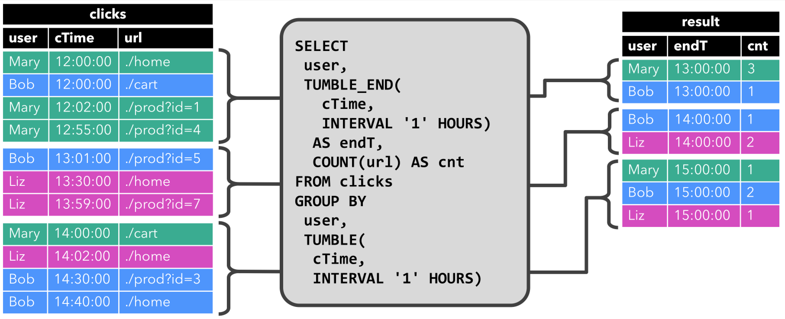](https://yangyichao-mango.github.io/blog-img/wechat-blog/01_大数据/01_数据仓库/01_实时数仓/02_数据内容建设/03_one-engine/01_计算引擎/01_flink/01_flink-sql/21_flinksql牛逼轰轰/6.png)

我们的滚动窗口的步长为 1 小时，即时间粒度上面的分组为 1 小时。其中时间戳在 12:00:00 - 12:59:59 之间有四条数据。13:00:00 - 13:59:59 有三条数据。14:00:00 - 14:59:59 之间有四条数据。

1.  当 12:00:00 - 12:59:59 数据输入之后，1 小时的窗口，连续查询（Continuous Query）计算的结果如右图所示，将 [Mary, 3]，[Bob, 1] `插入（insert）结果表`。
2.  当 13:00:00 - 13:59:59 数据输入之后，1 小时的窗口，连续查询（Continuous Query）计算的结果如右图所示，将 [Bob, 1]，[Liz, 2] `插入（insert）结果表`。
3.  当 14:00:00 - 14:59:59 数据输入之后，1 小时的窗口，连续查询（Continuous Query）计算的结果如右图所示，将 [Mary, 1]，[Bob, 2]，[Liz, 1] `插入（insert）结果表`。

而这个查询只有 `插入（insert）结果表` 这个行为。

### 2.4.6.SQL 连续查询的两种类型：更新（Update）查询 & 追加（Append）查询

虽然前一节的两个查询看起来非常相似（都计算分组进行计数聚合），但它们在一个重要方面不同：

1.  第一个查询（group by user），即（Update）查询：会更新先前输出的结果，即结果表流数据中包含 INSERT 和 UPDATE 数据。
   小伙伴萌可以理解为 group by user 这条语句当中，输入源的数据是一直有的，源源不断的，同一个 user 的数据之后可能还是会有的，因此可以认为此 SQL 的每次的输出结果都是一个中间结果，
   当同一个 user 下一条数据到来的时候，就要用新结果把上一次的产出中间结果（旧结果）给 UPDATE 了。所以这就是 UPDATE 查询的由来（其中 INSERT 就是第一条数据到来的时候，没有之前的中间结果，所以是 INSERT）。
2.  第二个查询（group by user, tumble(xxx)），即（Append）查询：只追加到结果表，即结果表流数据中只包含 INSERT 的数据。
   小伙伴萌可以理解为虽然 group by user, tumble(xxx) 上游也是一个源源不断的数据，但是这个查询本质上是对时间上的划分，而时间都是越变越大的，当前这个滚动窗口结束之后，后面来的数据的时间都会比这个滚动窗口的结束时间大，都归属于之后的窗口了，当前这个滚动窗口的结果数据就不会再改变了，因此这条查询只有 INSERT 数据，即一个 Append 查询。

上面是 Flink SQL 连续查询处理机制上面的两类查询方式。我们可以发现连续查询的处理机制不一样，产出到结果表中的结果数据也是不一样的。针对上面两种结果表的更新方式，Flink SQL 提出了 changelog 表的概念来进行兼容。

changelog 表这个概念其实就和 MySQL binlog 是一样的。会包含 `INSERT`、`UPDATE`、`DELETE` 三种数据，通过这三种数据的处理来描述实时处理技术对于动态表的变更：

1.  changelog 表：即第一个查询的输出表，输出结果数据不但会追加，还会发生更新
2.  changelog insert-only 表：即第二个查询的输出表，输出结果数据只会追加，不会发生更新

### 2.4.7.SQL 流处理的输出：动态输出表转化为输出数据

可以看到我们的标题都是随着一个 SQL 的生命周期的。从 `输入流映射为 SQL 动态输入表`、`实时处理底层技术 - SQL 连续查询` 到本小节的 `SQL 动态输出表转化为输出数据`。都是有逻辑关系的。

我们上面介绍到了 **连续查询（Continuous Query）** 的输出结果表是一个 changelog。其可以像普通数据库表一样通过 INSERT、UPDATE 和 DELETE 来不断修改。

它可能是一个只有一行、不断更新 changelog 表，也可能是一个 insert-only 的 changelog 表，没有 UPDATE 和 DELETE 修改，或者介于两者之间的其他表。

在将动态表转换为流或将其写入外部系统时，需要对这些不同状态的数据进行编码。Flink 的 Table API 和 SQL API 支持三种方式来编码一个动态表的变化:

1.  Append-only 流： 输出的结果只有 `INSERT` 操作的数据。
2.  Retract 流：

-  Retract 流包含两种类型的 message： add messages 和 retract messages 。其将 `INSERT` 操作编码为 add message、将 `DELETE` 操作编码为 retract message、将 `UPDATE` 操作编码为更新先前行的 retract message 和更新（新）行的 add message，从而将动态表转换为 retract 流。
-  Retract 流写入到输出结果表的数据如下图所示，有 `-`，`+` 两种，分别 `-` 代表撤回旧数据，`+` 代表输出最新的数据。这两种数据最终都会写入到输出的数据引擎中。
-  如果下游还有任务去消费这条流的话，要注意需要正确处理 `-`，`+` 两种数据，防止数据计算重复或者错误。

[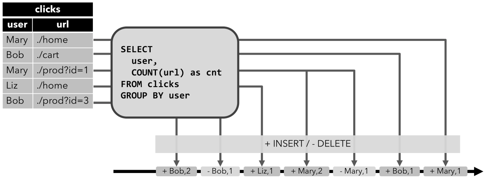](https://yangyichao-mango.github.io/blog-img/wechat-blog/01_大数据/01_数据仓库/01_实时数仓/02_数据内容建设/03_one-engine/01_计算引擎/01_flink/01_flink-sql/21_flinksql牛逼轰轰/7.png)

1.  Upsert 流：

-  Upsert 流包含两种类型的 message： upsert messages 和 delete messages。转换为 upsert 流的动态表需要唯一键（唯一键可以由多个字段组合而成）。其会将 `INSERT` 和 `UPDATE` 操作编码为 upsert message，将 `DELETE` 操作编码为 delete message。
-  Upsert 流写入到输出结果表的数据如下图所示，每次输出的结果都是当前每一个 user 的最新结果数据，不会有 Retract 中的 `-` 回撤数据。
-  如果下游还有一个任务去消费这条流的话，消费流的算子需要知道唯一键（即 user），以便正确地根据唯一键（user）去拿到每一个 user 当前最新的状态。其与 retract 流的主要区别在于 UPDATE 操作是用单个 message 编码的，因此效率更高。下图显示了将动态表转换为 upsert 流的过程。

[](https://yangyichao-mango.github.io/blog-img/wechat-blog/01_大数据/01_数据仓库/01_实时数仓/02_数据内容建设/03_one-engine/01_计算引擎/01_flink/01_flink-sql/21_flinksql牛逼轰轰/8.png)

### 2.4.8.补充知识：SQL 与关系代数

小伙伴萌会问到，关系代数是啥东西？

其实关系代数就是对于数据集（即表）的一系列的 `操作`（即查询语句）。常见关系代数有：

[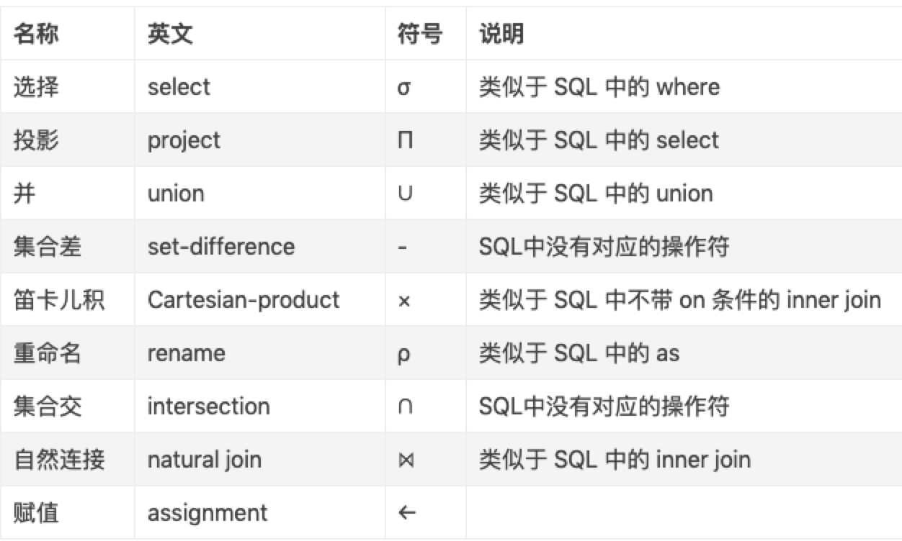](https://yangyichao-mango.github.io/blog-img/wechat-blog/01_大数据/01_数据仓库/01_实时数仓/02_数据内容建设/03_one-engine/01_计算引擎/01_flink/01_flink-sql/21_flinksql牛逼轰轰/1.png)

 那么 SQL 和关系代数是啥关系呢？

**SQL 就是能够表示关系代数一种面向用户的接口：即用户能使用 SQL 表达关系代数的处理逻辑，也就是我们可以用 SQL 去在表（数据集）上执行我们的业务逻辑操作（关系代数操作）。**

## 2.5.SQL 的时间属性

在小伙伴萌看下文之前，先看一下 2.5 节整体的思路，跟着博主思路走：

1.  与离线处理中常见的时间分区字段一样，在实时处理中，时间属性也是一个核心概念。Flink 支持 `处理时间`、`事件时间`、`摄入时间` 三种时间语义。
2.  分别介绍三种时间语义的应用场景及案例。三种时间在生产环境的使用频次 `事件时间（SQL 常用）` > `处理时间（SQL 几乎不用，DataStream 少用）` > `摄入时间（不用）`

### 2.5.1.Flink 三种时间属性简介

[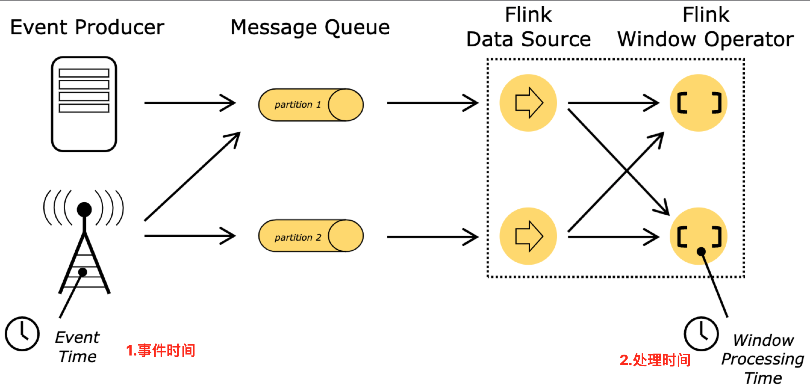](https://yangyichao-mango.github.io/blog-img/wechat-blog/01_大数据/01_数据仓库/01_实时数仓/02_数据内容建设/03_one-engine/01_计算引擎/01_flink/01_flink-sql/21_flinksql牛逼轰轰/10.png)

1.  事件时间：指的是数据本身携带的时间，这个时间是在事件产生时的时间，而且在 Flink SQL 触发计算时，也使用数据本身携带的时间。这就叫做 `事件时间`。`目前生产环境中用的最多`。
2.  处理时间：指的是具体算子计算数据执行时的机器时间（例如在算子中 Java 取 System.currentTimeMillis()) ），`在生产环境中用的次多`。
3.  摄入时间：指的是数据从数据源进入 Flink 的时间。`摄入时间用的最少，可以说基本不使用`。

小伙伴萌要注意到：

1.  上述的三种时间概念不是由于有了数据而诞生的，而是有了 Flink 之后根据实际的应用场景而诞生的。以事件时间举个例子，如果只是数据携带了时间，Flink 也消费了这个数据，但是在 Flink 中没有使用数据的这个时间作为计算的触发条件，也不能把这个 Flink 任务叫做事件时间的任务。
2.  其次，要认识到，一般一个 Flink 任务只会有一个时间属性，所以时间属性通常认为是一个任务粒度的。举例：我们可以说 A 任务是事件时间语义的任务，B 任务是处理时间语义的任务。当然了，一个任务也可以存在多个时间属性。

### 2.5.2.Flink 三种时间属性的应用场景

讲到这里，xdm 会问，博主上面写的 3 种时间属性到底对我们的任务有啥影响呢？3 种时间属性的应用场景是啥？

先说结论，在 Flink 中时间的作用：

1.  `主要体现在包含时间窗口的计算中`：用于标识任务的时间进度，来判断是否需要触发窗口的计算。比如常用的`滚动窗口`、`滑动窗口`等都需要时间推动触发。这些窗口的应用场景后续会详细介绍。
2.  `次要体现在自定义时间语义的计算中`：举个例子，比如用户可以自定义每隔 10s 的本地时间，或者消费到的数据的时间戳每增大 10s，就把计算结果输出一次，时间在此类应用中也是一种标识任务进度的作用。

博主以 `滚动窗口` 的聚合任务为例来介绍一下事件时间和处理时间的对比区别。

1.  事件时间案例：还是以之前的 clicks 表拿来举例。

[](https://yangyichao-mango.github.io/blog-img/wechat-blog/01_大数据/01_数据仓库/01_实时数仓/02_数据内容建设/03_one-engine/01_计算引擎/01_flink/01_flink-sql/21_flinksql牛逼轰轰/6.png)

上面这个案例的窗口大小是 1 小时，需求方需要按照用户点击时间戳 `cTime` 划分数据（划分滚动窗口），然后计算出 count 聚合结果（这样计算能反映出事件的真实发生时间），那么就需要把 `cTime` 设置为窗口的划分时间戳，即代码中 `tumble(cTime, interval '1' hour)`。

上面这种就叫做事件时间。即用数据中自带的时间戳进行窗口的划分（点击操作真实的发生时间）。

后续 Flink SQL 任务在运行的过程中也会实际按照 `cTime` 的当前时间作为一小时窗口结束触发条件并计算一个小时窗口内的数据。

1.  处理时间案例：还是以之前的 clicks 表拿来举例。

还是上面那个案例，但是这次需求方不需要按照数据上的时间戳划分数据（划分滚动窗口），只需要数据来了之后， 在 Flink 机器上的时间作为一小时窗口结束的书法条件并计算。

那么这种触发机制就是处理时间。

1.  摄入时间案例：在 Flink 从外部数据源读取到数据时，给这条数据带上的当前数据源算子的本地时间戳。下游可以用这个时间戳进行窗口聚合，不过这种几乎不使用。

### 2.5.3.SQL 指定时间属性的两种方式

如果要满足 Flink SQL 时间窗口类的聚合操作，SQL 或 Table API 中的 `数据源表` 就需要提供时间属性（相当于我们把这个时间属性在 `数据源表` 上面进行声明），以及支持时间相关的操作。

那么来看看 Flink SQL 为我们提供的两种指定时间戳的方式：

1.  `CREATE TABLE DDL` 创建表的时候指定
2.  `可以在 DataStream 中指定`，在后续的 DataStream 转的 Table 中使用

一旦时间属性定义好，它就可以像普通列一样使用，也可以在时间相关的操作中使用。

### 2.5.4.SQL 事件时间案例

来看看 Flink 中如何指定事件时间。

1.  `CREATE TABLE DDL` 指定时间戳的方式。

```java
CREATE TABLE user_actions (
  user_name STRING,
  data STRING,
  user_action_time TIMESTAMP(3),
  -- 使用下面这句来将 user_action_time 声明为事件时间，并且声明 watermark 的生成规则，即 user_action_time 减 5 秒
  -- 事件时间列的字段类型必须是 TIMESTAMP 或者 TIMESTAMP_LTZ 类型
  WATERMARK FOR user_action_time AS user_action_time - INTERVAL '5' SECOND
) WITH (
  ...
);

SELECT TUMBLE_START(user_action_time, INTERVAL '10' MINUTE), COUNT(DISTINCT user_name)
FROM user_actions
-- 然后就可以在窗口算子中使用 user_action_time
GROUP BY TUMBLE(user_action_time, INTERVAL '10' MINUTE);
```

从上面这条语句可以看到，如果想使用事件时间，那么我们的时间戳类型必须是 TIMESTAMP 或者 TIMESTAMP_LTZ 类型。很多小伙伴会想到，我们的时间戳一般不都是秒或者是毫秒（BIGINT 类型）嘛，那这种情况怎么办？

解决方案必须要有啊。如下。

```sql
CREATE TABLE user_actions (
  user_name STRING,
  data STRING,
  -- 1. 这个 ts 就是常见的毫秒级别时间戳
  ts BIGINT,
  -- 2. 将毫秒时间戳转换成 TIMESTAMP_LTZ 类型
  time_ltz AS TO_TIMESTAMP_LTZ(ts, 3),
  -- 3. 使用下面这句来将 user_action_time 声明为事件时间，并且声明 watermark 的生成规则，即 user_action_time 减 5 秒
  -- 事件时间列的字段类型必须是 TIMESTAMP 或者 TIMESTAMP_LTZ 类型
  WATERMARK FOR time_ltz AS time_ltz - INTERVAL '5' SECOND
) WITH (
  ...
);

SELECT TUMBLE_START(time_ltz, INTERVAL '10' MINUTE), COUNT(DISTINCT user_name)
FROM user_actions
GROUP BY TUMBLE(time_ltz, INTERVAL '10' MINUTE);
```

1.  `DataStream` 中指定事件时间。

之前介绍了 `Table` 和 `DataStream` 可以互转，那么 Flink 也提供了一个能力，就是在 Table 转为 DataStream 时，指定时间戳字段。如下案例：

```java
public class DataStreamSourceEventTimeTest {

    public static void main(String[] args) throws Exception {

        StreamExecutionEnvironment env =
                StreamExecutionEnvironment.createLocalEnvironmentWithWebUI(new Configuration());

        EnvironmentSettings settings = EnvironmentSettings
                .newInstance()
                .useBlinkPlanner()
                .inStreamingMode()
                .build();

        StreamTableEnvironment tEnv = StreamTableEnvironment.create(env, settings);

        // 1. 分配 watermark
        DataStream<Row> r = env.addSource(new UserDefinedSource())
                .assignTimestampsAndWatermarks(new BoundedOutOfOrdernessTimestampExtractor<Row>(Time.minutes(0L)) {
                    @Override
                    public long extractTimestamp(Row element) {
                        return (long) element.getField("f2");
                    }
                });
        // 2. 使用 f2.rowtime 的方式将 f2 字段指为事件时间时间戳
        Table sourceTable = tEnv.fromDataStream(r, "f0, f1, f2.rowtime");

        tEnv.createTemporaryView("source_table", sourceTable);

        // 3. 在 tumble window 中使用 f2
        String tumbleWindowSql =
                "SELECT TUMBLE_START(f2, INTERVAL '5' SECOND), COUNT(DISTINCT f0)\n"
                + "FROM source_table\n"
                + "GROUP BY TUMBLE(f2, INTERVAL '5' SECOND)"
                ;

        Table resultTable = tEnv.sqlQuery(tumbleWindowSql);

        tEnv.toDataStream(resultTable, Row.class).print();

        env.execute();
    }


    private static class UserDefinedSource implements SourceFunction<Row>, ResultTypeQueryable<Row> {

        private volatile boolean isCancel;

        @Override
        public void run(SourceContext<Row> sourceContext) throws Exception {

            int i = 0;

            while (!this.isCancel) {

                sourceContext.collect(Row.of("a" + i, "b", System.currentTimeMillis()));

                Thread.sleep(10L);
                i++;
            }

        }

        @Override
        public void cancel() {
            this.isCancel = true;
        }

        @Override
        public TypeInformation<Row> getProducedType() {
            return new RowTypeInfo(TypeInformation.of(String.class), TypeInformation.of(String.class),
                    TypeInformation.of(Long.class));
        }
    }
}
```

### 2.5.5.SQL 处理时间案例

来看看 Flink SQL 中如何指定处理时间。

1.  `CREATE TABLE DDL` 指定时间戳的方式。

```sql
CREATE TABLE user_actions (
  user_name STRING,
  data STRING,
  -- 使用下面这句来将 user_action_time 声明为处理时间
  user_action_time AS PROCTIME()
) WITH (
  ...
);

SELECT TUMBLE_START(user_action_time, INTERVAL '10' MINUTE), COUNT(DISTINCT user_name)
FROM user_actions
-- 然后就可以在窗口算子中使用 user_action_time
GROUP BY TUMBLE(user_action_time, INTERVAL '10' MINUTE);
```

1.  `DataStream` 中指定处理时间。

```java
public class DataStreamSourceProcessingTimeTest {

    public static void main(String[] args) throws Exception {

        StreamExecutionEnvironment env =
                StreamExecutionEnvironment.createLocalEnvironmentWithWebUI(new Configuration());

        EnvironmentSettings settings = EnvironmentSettings
                .newInstance()
                .useBlinkPlanner()
                .inStreamingMode()
                .build();

        StreamTableEnvironment tEnv = StreamTableEnvironment.create(env, settings);

        // 1. 分配 watermark
        DataStream<Row> r = env.addSource(new UserDefinedSource());

        // 2. 使用 proctime.proctime 的方式将 f2 字段指为处理时间时间戳
        Table sourceTable = tEnv.fromDataStream(r, "f0, f1, f2, proctime.proctime");

        tEnv.createTemporaryView("source_table", sourceTable);

        // 3. 在 tumble window 中使用 f2
        String tumbleWindowSql =
                "SELECT TUMBLE_START(proctime, INTERVAL '5' SECOND), COUNT(DISTINCT f0)\n"
                + "FROM source_table\n"
                + "GROUP BY TUMBLE(proctime, INTERVAL '5' SECOND)"
                ;

        Table resultTable = tEnv.sqlQuery(tumbleWindowSql);

        tEnv.toDataStream(resultTable, Row.class).print();

        env.execute();
    }


    private static class UserDefinedSource implements SourceFunction<Row>, ResultTypeQueryable<Row> {

        private volatile boolean isCancel;

        @Override
        public void run(SourceContext<Row> sourceContext) throws Exception {

            int i = 0;

            while (!this.isCancel) {

                sourceContext.collect(Row.of("a" + i, "b", System.currentTimeMillis()));

                Thread.sleep(10L);
                i++;
            }

        }

        @Override
        public void cancel() {
            this.isCancel = true;
        }

        @Override
        public TypeInformation<Row> getProducedType() {
            return new RowTypeInfo(TypeInformation.of(String.class), TypeInformation.of(String.class),
                    TypeInformation.of(Long.class));
        }
    }
}
```

## 2.6.SQL 时区问题

### 2.6.1.SQL 时区解决的问题

首先说一下这个问题的背景：

大家想一下离线 Hive 环境中，有遇到过时区时区相关的问题吗？

至少博主目前没有碰到过，因为这个问题在底层的数据集成系统都已经给解决了，小伙伴萌拿到手的 ODS 层表都是已经按照所在地区的时区给格式化好的了。

举个例子：小伙伴萌看到日期分区为 2022-01-01 的 Hive 表时，可以默认认为该分区中的数据就对应到你所在地区的时区的 2022-01-01 日的数据。

但是 Flink 中时区问题要特别引起关注，不加小心就会误用。

而本节 SQL 时区旨在帮助大家了解到以下两个场景的问题：

1.  在 1.13 之前，DDL create table 中使用 `PROCTIME()` 指定处理时间列时，返回值类型为 TIMESTAMP(3) 类型，而 TIMESTAMP(3) 是不带任何时区信息的，默认为 UTC 时间（0 时区）。
2.  使用 `StreamTableEnvironment::createTemporaryView` 将 DataStream 转为 Table 时，注册处理时间（`proctime.proctime`）、事件时间列（`rowtime.rowtime`）时，两列时间类型也为 TIMESTAMP(3) 类型，不带时区信息。

而以上两个场景就会导致：

1.  在北京时区的用户使用 TIMESTAMP(3) 类型的时间列开最常用的 1 天的窗口时，划分出来的窗口范围是北京时间的 [2022-01-01 08:00:00, 2022-01-02 08:00:00]，而不是北京时间的 [2022-01-01 00:00:00, 2022-01-02 00:00:00]。因为 TIMESTAMP(3) 是默认的 UTC 时间，即 0 时区。
2.  北京时区的用户将 TIMESTAMP(3) 类型时间属性列转为 STRING 类型的数据展示时，也是 UTC 时区的，而不是北京时间的。

因此充分了解本节的知识内容可以很好的帮你避免时区问题错误。

### 2.6.1.SQL 时间类型

1.  Flink SQL 支持 TIMESTAMP（不带时区信息的时间）、TIMESTAMP_LTZ（带时区信息的时间）
2.  TIMESTAMP（不带时区信息的时间）：是通过一个 `年， 月， 日， 小时， 分钟， 秒 和 小数秒` 的字符串来指定。举例：1970-01-01 00:00:04.001。

-  为什么要使用字符串来指定呢？因为此种类型不带时区信息，所以直接用一个字符串指定就好了
-  那 TIMESTAMP 字符串的时间代表的是什么时区的时间呢？UTC 时区，也就是默认 0 时区，对应中国北京是东八区

1.  TIMESTAMP_LTZ（带时区信息的时间）：没有字符串来指定，而是通过 java 标准 epoch 时间 1970-01-01T00:00:00Z 开始计算的毫秒数。举例：1640966400000

-  其时区信息是怎么指定的呢？是通过本次任务中的时区配置参数 `table.local-time-zone` 设置的
-  时间戳本身也不带有时区信息，为什么要使用时间戳来指定呢？就是因为时间戳不带有时区信息，所以我们通过配置 `table.local-time-zone` 时区参数之后，就能将一个不带有时区信息的时间戳转换为带有时区信息的字符串了。举例：`table.local-time-zone` 为 `Asia/Shanghai` 时，4001 时间戳转化为字符串的效果是 `1970-01-01 08:00:04.001`。

如果你还对时区问题有疑惑，可以参考博主写的一篇时区相关的文章。

https://mp.weixin.qq.com/s/PSwHs18ZhKsBUaTsppkp9Q

### 2.6.2.时区参数生效的 SQL 时间函数

以下 SQL 中的时间函数都会受到时区参数的影响，从而做到最后显示给用户的时间、窗口的划分都按照用户设置时区之内的时间。

1.  LOCALTIME
2.  LOCALTIMESTAMP
3.  CURRENT_DATE
4.  CURRENT_TIME
5.  CURRENT_TIMESTAMP
6.  CURRENT_ROW_TIMESTAMP()
7.  NOW()
8.  PROCTIME()：其中 PROCTIME() 在 1.13 版本及之后版本，返回值类型是 TIMESTAMP_LTZ(3)

在 Flink SQL client 中执行结果如下：

```sql
Flink SQL> SET sql-client.execution.result-mode=tableau;
Flink SQL> CREATE VIEW MyView1 AS SELECT LOCALTIME, LOCALTIMESTAMP, CURRENT_DATE, CURRENT_TIME, CURRENT_TIMESTAMP, CURRENT_ROW_TIMESTAMP(), NOW(), PROCTIME();
Flink SQL> DESC MyView1;

+------------------------+-----------------------------+-------+-----+--------+-----------+
|                   name |                        type |  null | key | extras | watermark |
+------------------------+-----------------------------+-------+-----+--------+-----------+
|              LOCALTIME |                     TIME(0) | false |     |        |           |
|         LOCALTIMESTAMP |                TIMESTAMP(3) | false |     |        |           |
|           CURRENT_DATE |                        DATE | false |     |        |           |
|           CURRENT_TIME |                     TIME(0) | false |     |        |           |
|      CURRENT_TIMESTAMP |            TIMESTAMP_LTZ(3) | false |     |        |           |
|CURRENT_ROW_TIMESTAMP() |            TIMESTAMP_LTZ(3) | false |     |        |           |
|                  NOW() |            TIMESTAMP_LTZ(3) | false |     |        |           |
|             PROCTIME() | TIMESTAMP_LTZ(3) *PROCTIME* | false |     |        |           |
+------------------------+-----------------------------+-------+-----+--------+-----------+

Flink SQL> SET table.local-time-zone=UTC;
Flink SQL> SELECT * FROM MyView1;

+-----------+-------------------------+--------------+--------------+-------------------------+-------------------------+-------------------------+-------------------------+
| LOCALTIME |          LOCALTIMESTAMP | CURRENT_DATE | CURRENT_TIME |       CURRENT_TIMESTAMP | CURRENT_ROW_TIMESTAMP() |                   NOW() |              PROCTIME() |
+-----------+-------------------------+--------------+--------------+-------------------------+-------------------------+-------------------------+-------------------------+
|  15:18:36 | 2021-04-15 15:18:36.384 |   2021-04-15 |     15:18:36 | 2021-04-15 15:18:36.384 | 2021-04-15 15:18:36.384 | 2021-04-15 15:18:36.384 | 2021-04-15 15:18:36.384 |
+-----------+-------------------------+--------------+--------------+-------------------------+-------------------------+-------------------------+-------------------------+

Flink SQL> SET table.local-time-zone=Asia/Shanghai;
Flink SQL> SELECT * FROM MyView1;

+-----------+-------------------------+--------------+--------------+-------------------------+-------------------------+-------------------------+-------------------------+
| LOCALTIME |          LOCALTIMESTAMP | CURRENT_DATE | CURRENT_TIME |       CURRENT_TIMESTAMP | CURRENT_ROW_TIMESTAMP() |                   NOW() |              PROCTIME() |
+-----------+-------------------------+--------------+--------------+-------------------------+-------------------------+-------------------------+-------------------------+
|  23:18:36 | 2021-04-15 23:18:36.384 |   2021-04-15 |     23:18:36 | 2021-04-15 23:18:36.384 | 2021-04-15 23:18:36.384 | 2021-04-15 23:18:36.384 | 2021-04-15 23:18:36.384 |
+-----------+-------------------------+--------------+--------------+-------------------------+-------------------------+-------------------------+-------------------------+


Flink SQL> CREATE VIEW MyView2 AS SELECT TO_TIMESTAMP_LTZ(4001, 3) AS ltz, TIMESTAMP '1970-01-01 00:00:01.001'  AS ntz;
Flink SQL> DESC MyView2;

+------+------------------+-------+-----+--------+-----------+
| name |             type |  null | key | extras | watermark |
+------+------------------+-------+-----+--------+-----------+
|  ltz | TIMESTAMP_LTZ(3) |  true |     |        |           |
|  ntz |     TIMESTAMP(3) | false |     |        |           |
+------+------------------+-------+-----+--------+-----------+

Flink SQL> SET table.local-time-zone=UTC;
Flink SQL> SELECT * FROM MyView2;

+-------------------------+-------------------------+
|                     ltz |                     ntz |
+-------------------------+-------------------------+
| 1970-01-01 00:00:04.001 | 1970-01-01 00:00:01.001 |
+-------------------------+-------------------------+

Flink SQL> SET table.local-time-zone=Asia/Shanghai;
Flink SQL> SELECT * FROM MyView2;

+-------------------------+-------------------------+
|                     ltz |                     ntz |
+-------------------------+-------------------------+
| 1970-01-01 08:00:04.001 | 1970-01-01 00:00:01.001 |
+-------------------------+-------------------------+

Flink SQL> CREATE VIEW MyView3 AS SELECT ltz, CAST(ltz AS TIMESTAMP(3)), CAST(ltz AS STRING), ntz, CAST(ntz AS TIMESTAMP_LTZ(3)) FROM MyView2;
Flink SQL> DESC MyView3;
+-------------------------------+------------------+-------+-----+--------+-----------+
|                          name |             type |  null | key | extras | watermark |
+-------------------------------+------------------+-------+-----+--------+-----------+
|                           ltz | TIMESTAMP_LTZ(3) |  true |     |        |           |
|     CAST(ltz AS TIMESTAMP(3)) |     TIMESTAMP(3) |  true |     |        |           |
|           CAST(ltz AS STRING) |           STRING |  true |     |        |           |
|                           ntz |     TIMESTAMP(3) | false |     |        |           |
| CAST(ntz AS TIMESTAMP_LTZ(3)) | TIMESTAMP_LTZ(3) | false |     |        |           |
+-------------------------------+------------------+-------+-----+--------+-----------+

Flink SQL> SELECT * FROM MyView3;

+-------------------------+---------------------------+-------------------------+-------------------------+-------------------------------+
|                     ltz | CAST(ltz AS TIMESTAMP(3)) |     CAST(ltz AS STRING) |                     ntz | CAST(ntz AS TIMESTAMP_LTZ(3)) |
+-------------------------+---------------------------+-------------------------+-------------------------+-------------------------------+
| 1970-01-01 08:00:04.001 |   1970-01-01 08:00:04.001 | 1970-01-01 08:00:04.001 | 1970-01-01 00:00:01.001 |       1970-01-01 00:00:01.001 |
+-------------------------+---------------------------+-------------------------+-------------------------+-------------------------------+
```

### 2.6.3.事件时间和时区应用案例

这里分两类，分别是 TIMESTAMP（不带时区信息的时间）、TIMESTAMP_LTZ（带时区信息的时间） 的事件时间 Flink SQL 任务

1.  TIMESTAMP（不带时区信息的时间）

```sql
Flink SQL> CREATE TABLE MyTable2 (
                  item STRING,
                  price DOUBLE,
                  ts TIMESTAMP(3), -- TIMESTAMP 类型的时间戳
                  WATERMARK FOR ts AS ts - INTERVAL '10' SECOND
            ) WITH (
                'connector' = 'socket',
                'hostname' = '127.0.0.1',
                'port' = '9999',
                'format' = 'csv'
           );

Flink SQL> CREATE VIEW MyView4 AS
            SELECT
                TUMBLE_START(ts, INTERVAL '10' MINUTES) AS window_start,
                TUMBLE_END(ts, INTERVAL '10' MINUTES) AS window_end,
                TUMBLE_ROWTIME(ts, INTERVAL '10' MINUTES) as window_rowtime,
                item,
                MAX(price) as max_price
            FROM MyTable2
                GROUP BY TUMBLE(ts, INTERVAL '10' MINUTES), item;

Flink SQL> DESC MyView4;

+----------------+------------------------+------+-----+--------+-----------+
|           name |                   type | null | key | extras | watermark |
+----------------+------------------------+------+-----+--------+-----------+
|   window_start |           TIMESTAMP(3) | true |     |        |           |
|     window_end |           TIMESTAMP(3) | true |     |        |           |
| window_rowtime | TIMESTAMP(3) *ROWTIME* | true |     |        |           |
|           item |                 STRING | true |     |        |           |
|      max_price |                 DOUBLE | true |     |        |           |
+----------------+------------------------+------+-----+--------+-----------+
```

将数据写入到 MyTable2 中：

```sh
script> nc -lk 9999
A,1.1,2021-04-15 14:01:00
B,1.2,2021-04-15 14:02:00
A,1.8,2021-04-15 14:03:00 
B,2.5,2021-04-15 14:04:00
C,3.8,2021-04-15 14:05:00       
C,3.8,2021-04-15 14:11:00
```

最终结果如下：

```sql
Flink SQL> SET table.local-time-zone=UTC; 
Flink SQL> SELECT * FROM MyView4;

+-------------------------+-------------------------+-------------------------+------+-----------+
|            window_start |              window_end |          window_rowtime | item | max_price |
+-------------------------+-------------------------+-------------------------+------+-----------+
| 2021-04-15 14:00:00.000 | 2021-04-15 14:10:00.000 | 2021-04-15 14:09:59.999 |    A |       1.8 |
| 2021-04-15 14:00:00.000 | 2021-04-15 14:10:00.000 | 2021-04-15 14:09:59.999 |    B |       2.5 |
| 2021-04-15 14:00:00.000 | 2021-04-15 14:10:00.000 | 2021-04-15 14:09:59.999 |    C |       3.8 |
+-------------------------+-------------------------+-------------------------+------+-----------+

Flink SQL> SET table.local-time-zone=Asia/Shanghai; 
Flink SQL> SELECT * FROM MyView4;

+-------------------------+-------------------------+-------------------------+------+-----------+
|            window_start |              window_end |          window_rowtime | item | max_price |
+-------------------------+-------------------------+-------------------------+------+-----------+
| 2021-04-15 14:00:00.000 | 2021-04-15 14:10:00.000 | 2021-04-15 14:09:59.999 |    A |       1.8 |
| 2021-04-15 14:00:00.000 | 2021-04-15 14:10:00.000 | 2021-04-15 14:09:59.999 |    B |       2.5 |
| 2021-04-15 14:00:00.000 | 2021-04-15 14:10:00.000 | 2021-04-15 14:09:59.999 |    C |       3.8 |
+-------------------------+-------------------------+-------------------------+------+-----------+
```

通过上述结果可见，使用 TIMESTAMP（不带时区信息的时间） 进开窗，在 UTC 时区下的计算结果与在 Asia/Shanghai 时区下计算的窗口开始时间，窗口结束时间和窗口的时间是相同的。

1.  TIMESTAMP_LTZ（带时区信息的时间）

```sql
Flink SQL> CREATE TABLE MyTable3 (
                  item STRING,
                  price DOUBLE,
                  ts BIGINT, -- long 类型的时间戳
                  ts_ltz AS TO_TIMESTAMP_LTZ(ts, 3), -- 转为 TIMESTAMP_LTZ 类型的时间戳
                  WATERMARK FOR ts_ltz AS ts_ltz - INTERVAL '10' SECOND
            ) WITH (
                'connector' = 'socket',
                'hostname' = '127.0.0.1',
                'port' = '9999',
                'format' = 'csv'
           );

Flink SQL> CREATE VIEW MyView5 AS 
            SELECT 
                TUMBLE_START(ts_ltz, INTERVAL '10' MINUTES) AS window_start,        
                TUMBLE_END(ts_ltz, INTERVAL '10' MINUTES) AS window_end,
                TUMBLE_ROWTIME(ts_ltz, INTERVAL '10' MINUTES) as window_rowtime,
                item,
                MAX(price) as max_price
            FROM MyTable3
                GROUP BY TUMBLE(ts_ltz, INTERVAL '10' MINUTES), item;

Flink SQL> DESC MyView5;

+----------------+----------------------------+-------+-----+--------+-----------+
|           name |                       type |  null | key | extras | watermark |
+----------------+----------------------------+-------+-----+--------+-----------+
|   window_start |               TIMESTAMP(3) | false |     |        |           |
|     window_end |               TIMESTAMP(3) | false |     |        |           |
| window_rowtime | TIMESTAMP_LTZ(3) *ROWTIME* |  true |     |        |           |
|           item |                     STRING |  true |     |        |           |
|      max_price |                     DOUBLE |  true |     |        |           |
+----------------+----------------------------+-------+-----+--------+-----------+
```

将数据写入 MyTable3：

```sh
scriptA,1.1,1618495260000  # 对应到 UTC 时区的时间为 2021-04-15 14:01:00
B,1.2,1618495320000  # 对应到 UTC 时区的时间为 2021-04-15 14:02:00
A,1.8,1618495380000  # 对应到 UTC 时区的时间为 2021-04-15 14:03:00
B,2.5,1618495440000  # 对应到 UTC 时区的时间为 2021-04-15 14:04:00
C,3.8,1618495500000  # 对应到 UTC 时区的时间为 2021-04-15 14:05:00       
C,3.8,1618495860000  # 对应到 UTC 时区的时间为 2021-04-15 14:11:00
```

最终结果如下：

```sql
Flink SQL> SET table.local-time-zone=UTC; 
Flink SQL> SELECT * FROM MyView5;

+-------------------------+-------------------------+-------------------------+------+-----------+
|            window_start |              window_end |          window_rowtime | item | max_price |
+-------------------------+-------------------------+-------------------------+------+-----------+
| 2021-04-15 14:00:00.000 | 2021-04-15 14:10:00.000 | 2021-04-15 14:09:59.999 |    A |       1.8 |
| 2021-04-15 14:00:00.000 | 2021-04-15 14:10:00.000 | 2021-04-15 14:09:59.999 |    B |       2.5 |
| 2021-04-15 14:00:00.000 | 2021-04-15 14:10:00.000 | 2021-04-15 14:09:59.999 |    C |       3.8 |
+-------------------------+-------------------------+-------------------------+------+-----------+

Flink SQL> SET table.local-time-zone=Asia/Shanghai; 
Flink SQL> SELECT * FROM MyView5;

+-------------------------+-------------------------+-------------------------+------+-----------+
|            window_start |              window_end |          window_rowtime | item | max_price |
+-------------------------+-------------------------+-------------------------+------+-----------+
| 2021-04-15 22:00:00.000 | 2021-04-15 22:10:00.000 | 2021-04-15 22:09:59.999 |    A |       1.8 |
| 2021-04-15 22:00:00.000 | 2021-04-15 22:10:00.000 | 2021-04-15 22:09:59.999 |    B |       2.5 |
| 2021-04-15 22:00:00.000 | 2021-04-15 22:10:00.000 | 2021-04-15 22:09:59.999 |    C |       3.8 |
+-------------------------+-------------------------+-------------------------+------+-----------+
```

通过上述结果可见，使用 TIMESTAMP_LTZ（带时区信息的时间） 进开窗，在 UTC 时区下的计算结果与在 Asia/Shanghai 时区下计算的窗口开始时间，窗口结束时间和窗口的时间是不同的，都是按照时区进行格式化的。

### 2.6.4.处理时间和时区应用案例

Flink SQL 定义处理时间属性列是通过 `PROCTIME()` 函数来指定的，其返回值类型是 TIMESTAMP_LTZ。

> 注意：
>
> 在 Flink 1.13 之前，`PROCTIME()` 函数返回类型是 TIMESTAMP，返回值是 UTC 时区的时间戳，例如，上海时间显示为 2021-03-01 12:00:00 时，PROCTIME() 返回值显示 2021-03-01 04:00:00，我们进行使用是错误的。Flink 1.13 修复了这个问题，使用 TIMESTAMP_LTZ 作为 PROCTIME() 的返回类型，这样 Flink 就会自动获取当前时区信息，然后进行处理，不需要用户再进行时区的格式化处理了。

如下案例：

```sql
Flink SQL> SET table.local-time-zone=UTC;
Flink SQL> SELECT PROCTIME();

+-------------------------+
|              PROCTIME() |
+-------------------------+
| 2021-04-15 14:48:31.387 |
+-------------------------+

Flink SQL> SET table.local-time-zone=Asia/Shanghai;
Flink SQL> SELECT PROCTIME();

+-------------------------+
|              PROCTIME() |
+-------------------------+
| 2021-04-15 22:48:31.387 |
+-------------------------+

Flink SQL> CREATE TABLE MyTable1 (
                  item STRING,
                  price DOUBLE,
                  proctime as PROCTIME()
            ) WITH (
                'connector' = 'socket',
                'hostname' = '127.0.0.1',
                'port' = '9999',
                'format' = 'csv'
           );

Flink SQL> CREATE VIEW MyView3 AS
            SELECT
                TUMBLE_START(proctime, INTERVAL '10' MINUTES) AS window_start,
                TUMBLE_END(proctime, INTERVAL '10' MINUTES) AS window_end,
                TUMBLE_PROCTIME(proctime, INTERVAL '10' MINUTES) as window_proctime,
                item,
                MAX(price) as max_price
            FROM MyTable1
                GROUP BY TUMBLE(proctime, INTERVAL '10' MINUTES), item;

Flink SQL> DESC MyView3;

+-----------------+-----------------------------+-------+-----+--------+-----------+
|           name  |                        type |  null | key | extras | watermark |
+-----------------+-----------------------------+-------+-----+--------+-----------+
|    window_start |                TIMESTAMP(3) | false |     |        |           |
|      window_end |                TIMESTAMP(3) | false |     |        |           |
| window_proctime | TIMESTAMP_LTZ(3) *PROCTIME* | false |     |        |           |
|            item |                      STRING | true  |     |        |           |
|       max_price |                      DOUBLE | true  |     |        |           |
+-----------------+-----------------------------+-------+-----+--------+-----------+
```

将数据写入到 MyTable1 中：

```shell
script> nc -lk 9999
A,1.1
B,1.2
A,1.8
B,2.5
C,3.8
```

其输出结果如下：

```sql
Flink SQL> SET table.local-time-zone=UTC;
Flink SQL> SELECT * FROM MyView3;

+-------------------------+-------------------------+-------------------------+------+-----------+
|            window_start |              window_end |          window_procime | item | max_price |
+-------------------------+-------------------------+-------------------------+------+-----------+
| 2021-04-15 14:00:00.000 | 2021-04-15 14:10:00.000 | 2021-04-15 14:10:00.005 |    A |       1.8 |
| 2021-04-15 14:00:00.000 | 2021-04-15 14:10:00.000 | 2021-04-15 14:10:00.007 |    B |       2.5 |
| 2021-04-15 14:00:00.000 | 2021-04-15 14:10:00.000 | 2021-04-15 14:10:00.007 |    C |       3.8 |
+-------------------------+-------------------------+-------------------------+------+-----------+

Flink SQL> SET table.local-time-zone=Asia/Shanghai;
Flink SQL> SELECT * FROM MyView3;

+-------------------------+-------------------------+-------------------------+------+-----------+
|            window_start |              window_end |          window_procime | item | max_price |
+-------------------------+-------------------------+-------------------------+------+-----------+
| 2021-04-15 22:00:00.000 | 2021-04-15 22:10:00.000 | 2021-04-15 22:10:00.005 |    A |       1.8 |
| 2021-04-15 22:00:00.000 | 2021-04-15 22:10:00.000 | 2021-04-15 22:10:00.007 |    B |       2.5 |
| 2021-04-15 22:00:00.000 | 2021-04-15 22:10:00.000 | 2021-04-15 22:10:00.007 |    C |       3.8 |
+-------------------------+-------------------------+-------------------------+------+-----------+
```

通过上述结果可见，使用处理时间进行开窗，在 UTC 时区下的计算结果与在 Asia/Shanghai 时区下计算的窗口开始时间，窗口结束时间和窗口的时间是不同的，都是按照时区进行格式化的。

### 2.6.5.SQL 时间函数返回在流批任务中的异同

以下函数：

1.  LOCALTIME
2.  LOCALTIMESTAMP
3.  CURRENT_DATE
4.  CURRENT_TIME
5.  CURRENT_TIMESTAMP
6.  NOW()

在 Streaming 模式下这些函数是每条记录都会计算一次，但在 Batch 模式下，只会在 query 开始时计算一次，所有记录都使用相同的时间结果。

以下时间函数无论是在 Streaming 模式还是 Batch 模式下，都会为每条记录计算一次结果：

1.  CURRENT_ROW_TIMESTAMP()
2.  PROCTIME()

# 3.SQL 语法篇

## 3.1.DDL：Create 子句

CREATE 语句用于向当前或指定的 Catalog 中注册库、表、视图或函数。注册后的库、表、视图和函数可以在 SQL 查询中使用。

目前 Flink SQL 支持下列 CREATE 语句：

1.  CREATE TABLE
2.  CREATE DATABASE
3.  CREATE VIEW
4.  CREATE FUNCTION

此节重点介绍建表，建数据库、视图和 UDF 会在后面的扩展章节进行介绍。

### 3.1.1.建表语句

下面的 SQL 语句就是建表语句的定义，根据指定的表名创建一个表，如果同名表已经在 catalog 中存在了，则无法注册。

```sql
CREATE TABLE [IF NOT EXISTS] [catalog_name.][db_name.]table_name
  (
    { <physical_column_definition> | <metadata_column_definition> | <computed_column_definition> }[ , ...n]
    [ <watermark_definition> ]
    [ <table_constraint> ][ , ...n]
  )
  [COMMENT table_comment]
  [PARTITIONED BY (partition_column_name1, partition_column_name2, ...)]
  WITH (key1=val1, key2=val2, ...)
  [ LIKE source_table [( <like_options> )] ]
   
<physical_column_definition>:
  column_name column_type [ <column_constraint> ] [COMMENT column_comment]
  
<column_constraint>:
  [CONSTRAINT constraint_name] PRIMARY KEY NOT ENFORCED

<table_constraint>:
  [CONSTRAINT constraint_name] PRIMARY KEY (column_name, ...) NOT ENFORCED

<metadata_column_definition>:
  column_name column_type METADATA [ FROM metadata_key ] [ VIRTUAL ]

<computed_column_definition>:
  column_name AS computed_column_expression [COMMENT column_comment]

<watermark_definition>:
  WATERMARK FOR rowtime_column_name AS watermark_strategy_expression

<source_table>:
  [catalog_name.][db_name.]table_name

<like_options>:
{
   { INCLUDING | EXCLUDING } { ALL | CONSTRAINTS | PARTITIONS }
 | { INCLUDING | EXCLUDING | OVERWRITING } { GENERATED | OPTIONS | WATERMARKS } 
}[, ...]
```

### 3.1.2.表中的列

1.  常规列（即物理列）

物理列是数据库中所说的常规列。其定义了物理介质中存储的数据中字段的名称、类型和顺序。

其他类型的列可以在物理列之间声明，但不会影响最终的物理列的读取。

举一个仅包含常规列的表的案例：

```sql
CREATE TABLE MyTable (
  `user_id` BIGINT,
  `name` STRING
) WITH (
  ...
);
```

1.  元数据列

元数据列是 SQL 标准的扩展，允许访问数据源本身具有的一些元数据。元数据列由 `METADATA` 关键字标识。

例如，我们可以使用元数据列从 Kafka 数据中读取 Kafka 数据自带的时间戳（这个时间戳不是数据中的某个时间戳字段，而是数据写入 Kafka 时，Kafka 引擎给这条数据打上的时间戳标记），然后我们可以在 Flink SQL 中使用这个时间戳，比如进行基于时间的窗口操作。

举例：

```sql
CREATE TABLE MyTable (
  `user_id` BIGINT,
  `name` STRING,
  -- 读取 kafka 本身自带的时间戳
  `record_time` TIMESTAMP_LTZ(3) METADATA FROM 'timestamp'
) WITH (
  'connector' = 'kafka'
  ...
);
```

元数据列可以用于后续数据的处理，或者写入到目标表中。

举例：

```
INSERT INTO MyTable 
SELECT 
    user_id
    , name
    , record_time + INTERVAL '1' SECOND 
FROM MyTable;
```

如果自定义的列名称和 Connector 中定义 metadata 字段的名称一样的话，`FROM xxx` 子句是可以被省略的。

举例：

```
CREATE TABLE MyTable (
  `user_id` BIGINT,
  `name` STRING,
  -- 读取 kafka 本身自带的时间戳
  `timestamp` TIMESTAMP_LTZ(3) METADATA
) WITH (
  'connector' = 'kafka'
  ...
);
```

关于 Flink SQL 的每种 Connector 都提供了哪些 metadata 字段，详细可见官网文档 https://nightlies.apache.org/flink/flink-docs-release-1.13/docs/connectors/table/overview/

如果自定义列的数据类型和 Connector 中定义的 metadata 字段的数据类型不一致的话，程序运行时会自动 cast 强转。但是这要求两种数据类型是可以强转的。举例如下：

```
CREATE TABLE MyTable (
  `user_id` BIGINT,
  `name` STRING,
  -- 将时间戳强转为 BIGINT
  `timestamp` BIGINT METADATA
) WITH (
  'connector' = 'kafka'
  ...
);
```

默认情况下，Flink SQL planner 认为 metadata 列是可以 `读取` 也可以 `写入` 的。但是有些外部存储系统的元数据信息是只能用于读取，不能写入的。

那么在往一个表写入的场景下，我们就可以使用 `VIRTUAL` 关键字来标识某个元数据列不写入到外部存储中（不持久化）。

以 Kafka 举例：

```
CREATE TABLE MyTable (
  -- sink 时会写入
  `timestamp` BIGINT METADATA,
  -- sink 时不写入
  `offset` BIGINT METADATA VIRTUAL,
  `user_id` BIGINT,
  `name` STRING,
) WITH (
  'connector' = 'kafka'
  ...
);
```

在上面这个案例中，Kafka 引擎的 `offset` 是只读的。所以我们在把 `MyTable` 作为数据源（输入）表时，schema 中是包含 `offset` 的。在把 `MyTable` 作为数据汇（输出）表时，schema 中是不包含 `offset` 的。如下：

```
-- 当做数据源（输入）的 schema
MyTable(`timestamp` BIGINT, `offset` BIGINT, `user_id` BIGINT, `name` STRING)

-- 当做数据汇（输出）的 schema
MyTable(`timestamp` BIGINT, `user_id` BIGINT, `name` STRING)
```

所以这里在写入时需要注意，不要在 SQL 的 INSERT INTO 语句中写入 `offset` 列，否则 Flink SQL 任务会直接报错。

1.  计算列

计算列其实就是在写建表的 DDL 时，可以拿已有的一些列经过一些自定义的运算生成的新列。这些列本身是没有以物理形式存储到数据源中的。

举例：

```
CREATE TABLE MyTable (
  `user_id` BIGINT,
  `price` DOUBLE,
  `quantity` DOUBLE,
  -- cost 就是使用 price 和 quanitity 生成的计算列，计算方式为 price * quanitity
  `cost` AS price * quanitity,
) WITH (
  'connector' = 'kafka'
  ...
);
```

> 注意！！！
>
> 计算列可以包含其他列、常量或者函数，但是不能写一个子查询进去。

小伙伴萌这时会问到一个问题，既然只能包含列、常量或者函数计算，我就直接在 DML query 代码中写就完事了呗，为啥还要专门在 DDL 中定义呢？

结论：没错，如果只是简单的四则运算的话直接写在 DML 中就可以，但是计算列一般是用于定义时间属性的（因为在 SQL 任务中时间属性只能在 DDL 中定义，不能在 DML 语句中定义）。比如要把输入数据的时间格式标准化。处理时间、事件时间分别举例如下：

-  处理时间：使用 `PROCTIME()` 函数来定义处理时间列
-  事件时间：事件时间的时间戳可以在声明 Watermark 之前进行预处理。比如如果字段不是 TIMESTAMP(3) 类型或者时间戳是嵌套在 JSON 字符串中的，则可以使用计算列进行预处理。

注意！！!和虚拟 metadata 列是类似的，计算列也是只能读不能写的。

也就是说，我们在把 `MyTable` 作为数据源（输入）表时，schema 中是包含 `cost` 的。

在把 `MyTable` 作为数据汇（输出）表时，schema 中是不包含 `cost` 的。举例：

```
-- 当做数据源（输入）的 schema
MyTable(`user_id` BIGINT, `price` DOUBLE, `quantity` DOUBLE, `cost` DOUBLE)

-- 当做数据汇（输出）的 schema
MyTable(`user_id` BIGINT, `price` DOUBLE, `quantity` DOUBLE)
```

### 3.1.3.定义 Watermark

Watermark 是在 `Create Table` 中进行定义的。具体 SQL 语法标准是 `WATERMARK FOR rowtime_column_name AS watermark_strategy_expression`。

其中：

1.  `rowtime_column_name`：表的事件时间属性字段。该列必须是 `TIMESTAMP(3)`、`TIMESTAMP_LTZ(3)` 类，这个时间可以是一个计算列。
2.  `watermark_strategy_expression`：定义 Watermark 的生成策略。Watermark 的一般都是由 `rowtime_column_name` 列减掉一段固定时间间隔。SQL 中 Watermark 的生产策略是：当前 Watermark 大于上次发出的 Watermark 时发出当前 Watermark。

> 注意：
>
> 1. 如果你使用的是事件时间语义，那么必须要设设置事件时间属性和 WATERMARK 生成策略。
> 2. Watermark 的发出频率：Watermark 发出一般是间隔一定时间的，Watermark 的发出间隔时间可以由 `pipeline.auto-watermark-interval` 进行配置，如果设置为 200ms 则每 200ms 会计算一次 Watermark，然如果比之前发出的 Watermark 大，则发出。如果间隔设为 0ms，则 Watermark 只要满足触发条件就会发出，不会受到间隔时间控制。

Flink SQL 提供了几种 WATERMARK 生产策略：

1.  有界无序：设置方式为 `WATERMARK FOR rowtime_column AS rowtime_column - INTERVAL 'string' timeUnit`。此类策略就可以用于设置最大乱序时间，假如设置为 `WATERMARK FOR rowtime_column AS rowtime_column - INTERVAL '5' SECOND`，则生成的是运行 5s 延迟的 Watermark。。`一般都用这种 Watermark 生成策略`，此类 Watermark 生成策略通常用于有数据乱序的场景中，而对应到实际的场景中，数据都是会存在乱序的，所以基本都使用此类策略。
2.  严格升序：设置方式为 `WATERMARK FOR rowtime_column AS rowtime_column`。`一般基本不用这种方式`。如果你能保证你的数据源的时间戳是严格升序的，那就可以使用这种方式。严格升序代表 Flink 任务认为时间戳只会越来越大，也不存在相等的情况，只要相等或者小于之前的，就认为是迟到的数据。
3.  递增：设置方式为 `WATERMARK FOR rowtime_column AS rowtime_column - INTERVAL '0.001' SECOND`。`一般基本不用这种方式`。如果设置此类，则允许有相同的时间戳出现。

### 3.1.4.Create Table With 子句

先看一个案例：

```
CREATE TABLE KafkaTable (
  `user_id` BIGINT,
  `item_id` BIGINT,
  `behavior` STRING,
  `ts` TIMESTAMP(3) METADATA FROM 'timestamp'
) WITH (
  'connector' = 'kafka',
  'topic' = 'user_behavior',
  'properties.bootstrap.servers' = 'localhost:9092',
  'properties.group.id' = 'testGroup',
  'scan.startup.mode' = 'earliest-offset',
  'format' = 'csv'
)
```

可以看到 DDL 中 With 子句就是在建表时，描述数据源、数据汇的具体外部存储的元数据信息的。

一般 With 中的配置项由 Flink SQL 的 Connector（链接外部存储的连接器） 来定义，每种 Connector 提供的 With 配置项都是不同的。

> 注意：
>
> 1. Flink SQL 中 Connector 其实就是 Flink 用于链接外部数据源的接口。举一个类似的例子，在 Java 中想连接到 MySQL，需要使用 mysql-connector-java 包提供的 Java API 去链接。映射到 Flink SQL 中，在 Flink SQL 中要连接到 Kafka，需要使用 kafka connector
> 2. Flink SQL 已经提供了一系列的内置 Connector，具体可见 https://nightlies.apache.org/flink/flink-docs-release-1.13/docs/connectors/table/overview/

回到上述案例中，With 声明了以下几项信息：

1.  `'connector' = 'kafka'`：声明外部存储是 Kafka
2.  `'topic' = 'user_behavior'`：声明 Flink SQL 任务要连接的 Kafka 表的 topic 是 user_behavior
3.  `'properties.bootstrap.servers' = 'localhost:9092'`：声明 Kafka 的 server ip 是 localhost:9092
4.  `'properties.group.id' = 'testGroup'`：声明 Flink SQL 任务消费这个 Kafka topic，会使用 testGroup 的 group id 去消费
5.  `'scan.startup.mode' = 'earliest-offset'`：声明 Flink SQL 任务消费这个 Kafka topic 会从最早位点开始消费
6.  `'format' = 'csv'`：声明 Flink SQL 任务读入或者写出时对于 Kafka 消息的序列化方式是 csv 格式

从这里也可以看出来 With 中具体要配置哪些配置项都是和每种 Connector 决定的。

### 3.1.4.Create Table Like 子句

Like 子句是 Create Table 子句的一个延伸。举例：

下面定义了一张 `Orders` 表：

```
CREATE TABLE Orders (
    `user` BIGINT,
    product STRING,
    order_time TIMESTAMP(3)
) WITH ( 
    'connector' = 'kafka',
    'scan.startup.mode' = 'earliest-offset'
);
```

但是忘记定义 Watermark 了，那如果想加上 Watermark，就可以用 `Like` 子句定义一张带 Watermark 的新表：

```
CREATE TABLE Orders_with_watermark (
    -- 1. 添加了 WATERMARK 定义
    WATERMARK FOR order_time AS order_time - INTERVAL '5' SECOND 
) WITH (
    -- 2. 覆盖了原 Orders 表中 scan.startup.mode 参数
    'scan.startup.mode' = 'latest-offset'
)
-- 3. Like 子句声明是在原来的 Orders 表的基础上定义 Orders_with_watermark 表
LIKE Orders;
```

上面这个语句的效果就等同于：

```
CREATE TABLE Orders_with_watermark (
    `user` BIGINT,
    product STRING,
    order_time TIMESTAMP(3),
    WATERMARK FOR order_time AS order_time - INTERVAL '5' SECOND 
) WITH (
    'connector' = 'kafka',
    'scan.startup.mode' = 'latest-offset'
);
```

不过这种不常使用。就不过多介绍了。如果小伙伴萌感兴趣，直接去官网参考具体注意事项：

https://nightlies.apache.org/flink/flink-docs-release-1.13/docs/dev/table/sql/create/#like

## 3.2.DML：With 子句

1.  应用场景（支持 Batch\Streaming）：With 语句和离线 Hive SQL With 语句一样的，xdm，语法糖 +1，使用它可以让你的代码逻辑更加清晰。
2.  直接上案例：

```
-- 语法糖+1
WITH orders_with_total AS (
    SELECT 
        order_id
        , price + tax AS total
    FROM Orders
)
SELECT 
    order_id
    , SUM(total)
FROM orders_with_total
GROUP BY 
    order_id;
```

## 3.3.DML：SELECT & WHERE 子句

1.  应用场景（支持 Batch\Streaming）：SELECT & WHERE 语句和离线 Hive SQL 语句一样的，xdm，常用作 ETL，过滤，字段清洗标准化
2.  直接上案例：

```
INSERT INTO target_table
SELECT * FROM Orders

INSERT INTO target_table
SELECT order_id, price + tax FROM Orders

INSERT INTO target_table
-- 自定义 Source 的数据
SELECT order_id, price FROM (VALUES (1, 2.0), (2, 3.1))  AS t (order_id, price)

INSERT INTO target_table
SELECT price + tax FROM Orders WHERE id = 10

-- 使用 UDF 做字段标准化处理
INSERT INTO target_table
SELECT PRETTY_PRINT(order_id) FROM Orders
-- 过滤条件
Where id > 3
```

1.  `SQL 语义`：

其实理解一个 SQL 最后生成的任务是怎样执行的，最好的方式就是理解其语义。

以下面的 SQL 为例，我们来介绍下其在离线中和在实时中执行的区别，对比学习一下，大家就比较清楚了

```
INSERT INTO target_table
SELECT PRETTY_PRINT(order_id) FROM Orders
Where id > 3
```

这个 SQL 对应的实时任务，假设 Orders 为 kafka，target_table 也为 Kafka，在执行时，会生成三个算子：

-  `数据源算子`（From Order）：连接到 Kafka topic，数据源算子一直运行，实时的从 Order Kafka 中一条一条的读取数据，然后一条一条发送给下游的 `过滤和字段标准化算子`
-  `过滤和字段标准化算子`（Where id > 3 和 PRETTY_PRINT(order_id)）：接收到上游算子发的一条一条的数据，然后判断 id > 3？将判断结果为 true 的数据执行 PRETTY_PRINT UDF 后，一条一条将计算结果数据发给下游 `数据汇算子`
-  `数据汇算子`（INSERT INTO target_table）：接收到上游发的一条一条的数据，写入到 target_table Kafka 中

可以看到这个实时任务的所有算子是以一种 pipeline 模式运行的，所有的算子在同一时刻都是处于 running 状态的，24 小时一直在运行，实时任务中也没有离线中常见的分区概念。

[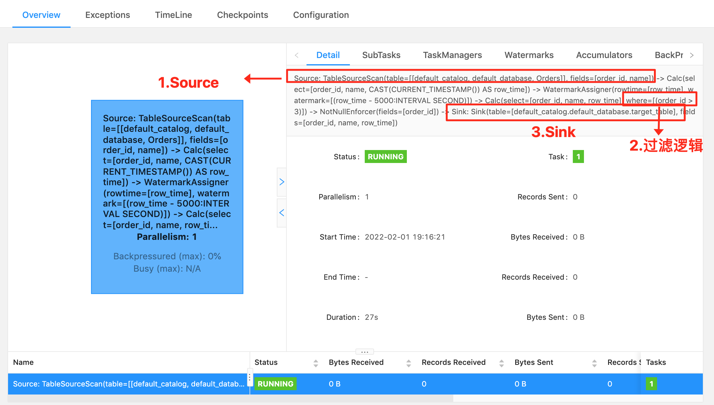](https://yangyichao-mango.github.io/blog-img/wechat-blog/01_大数据/01_数据仓库/01_实时数仓/02_数据内容建设/03_one-engine/01_计算引擎/01_flink/01_flink-sql/21_flinksql牛逼轰轰/35.png)

> 关于看如何看一段 Flink SQL 最终的执行计划：
>
> 最好的方法就如上图，看 Flink web ui 的算子图，算子图上详细的标记清楚了每一个算子做的事情。以上图来说，我们可以看到主要有三个算子：
>
> 1.  Source 算子：Source: TableSourceScan(table=[[default_catalog, default_database, Orders]], fields=[order_id, name]) -> Calc(select=[order_id, name, CAST(CURRENT_TIMESTAMP()) AS row_time]) -> WatermarkAssigner(rowtime=[row_time], watermark=[(row_time - 5000:INTERVAL SECOND)]) ，其中 Source 表名称为 `table=[[default_catalog, default_database, Orders]`，字段为 `select=[order_id, name, CAST(CURRENT_TIMESTAMP()) AS row_time]`，Watermark 策略为 `rowtime=[row_time], watermark=[(row_time - 5000:INTERVAL SECOND)]`。
> 2.  过滤算子：Calc(select=[order_id, name, row_time], where=[(order_id > 3)]) -> NotNullEnforcer(fields=[order_id])，其中过滤条件为 `where=[(order_id > 3)]`，结果字段为 `select=[order_id, name, row_time]`
> 3.  Sink 算子：Sink: Sink(table=[default_catalog.default_database.target_table], fields=[order_id, name, row_time])，其中最终产出的表名称为 `table=[default_catalog.default_database.target_table]`，表字段为 `fields=[order_id, name, row_time]`
>
> 可以看到 Flink SQL 具体执行了哪些操作是非常详细的标记在算子图上。所以小伙伴萌一定要学会看算子图，这是掌握 debug、调优前最基础的一个技巧。

那么如果这个 SQL 放在 Hive 中执行时，假设其中 Orders 为 Hive 表，target_table 也为 Hive 表，其也会生成三个类似的算子（虽然实际可能会被优化为一个算子，这里为了方便对比，划分为三个进行介绍），离线和实时任务的执行方式完全不同：

-  `数据源算子`（From Order）：数据源从 Order Hive 表（通常都是读一天、一小时的分区数据）中一次性读取所有的数据，然后将读到的数据全部发给下游 `过滤和字段标准化算子`，然后 `数据源算子` 就运行结束了，释放资源了
-  `过滤和字段标准化算子`（Where id > 3 和 PRETTY_PRINT(order_id)）：接收到上游算子的所有数据，然后遍历所有数据判断 id > 3？将判断结果为 true 的数据执行 PRETTY_PRINT UDF 后，将所有数据发给下游 `数据汇算子`，然后 `过滤和字段标准化算子` 就运行结束了，释放资源了
-  `数据汇算子`（INSERT INTO target_table）：接收到上游的所有数据，将所有数据都写到 target_table Hive 表中，然后整个任务就运行结束了，整个任务的资源也就都释放了

可以看到离线任务的算子是分阶段（stage）进行运行的，每一个 stage 运行结束之后，然后下一个 stage 开始运行，全部的 stage 运行完成之后，这个离线任务就跑结束了。

> 注意：
>
> 很多小伙伴都是之前做过离线数仓的，熟悉了离线的分区、计算任务定时调度运行这两个概念，所以在最初接触 Flink SQL 时，会以为 Flink SQL 实时任务也会存在这两个概念，这里博主做一下解释
>
> 1. 分区概念：离线由于能力限制问题，通常都是进行一批一批的数据计算，每一批数据的数据量都是有限的集合，这一批一批的数据自然的划分方式就是时间，比如按小时、天进行划分分区。但是 `在实时任务中，是没有分区的概念的`，实时任务的上游、下游都是无限的数据流。
> 2. 计算任务定时调度概念：同上，离线就是由于计算能力限制，数据要一批一批算，一批一批输入、产出，所以要按照小时、天定时的调度和计算。但是 `在实时任务中，是没有定时调度的概念的`，实时任务一旦运行起来就是 24 小时不间断，不间断的处理上游无限的数据，不简单的产出数据给到下游。

详细可参考：https://mp.weixin.qq.com/s/VAhodnMetqFEXB33zH8lCg

## 3.4.DML：SELECT DISTINCT 子句

1.  应用场景（支持 Batch\Streaming）：语句和离线 Hive SQL SELECT DISTINCT 语句一样的，xdm，用作根据 key 进行数据去重
2.  直接上案例：

```
INSERT into target_table
SELECT 
    DISTINCT id 
FROM Orders
```

1.  `SQL 语义`：

也是拿离线和实时做对比。

这个 SQL 对应的实时任务，假设 Orders 为 kafka，target_table 也为 Kafka，在执行时，会生成三个算子：

-  `数据源算子`（From Order）：连接到 Kafka topic，数据源算子一直运行，实时的从 Order Kafka 中一条一条的读取数据，然后一条一条发送给下游的 `去重算子`
-  `去重算子`（DISTINCT id）：接收到上游算子发的一条一条的数据，然后判断这个 id 之前是否已经来过了，判断方式就是使用 Flink 中的 state 状态，如果状态中已经有这个 id 了，则说明已经来过了，不往下游算子发，如果状态中没有这个 id，则说明没来过，则往下游算子发，也是一条一条发给下游 `数据汇算子`
-  `数据汇算子`（INSERT INTO target_table）：接收到上游发的一条一条的数据，写入到 target_table Kafka 中

[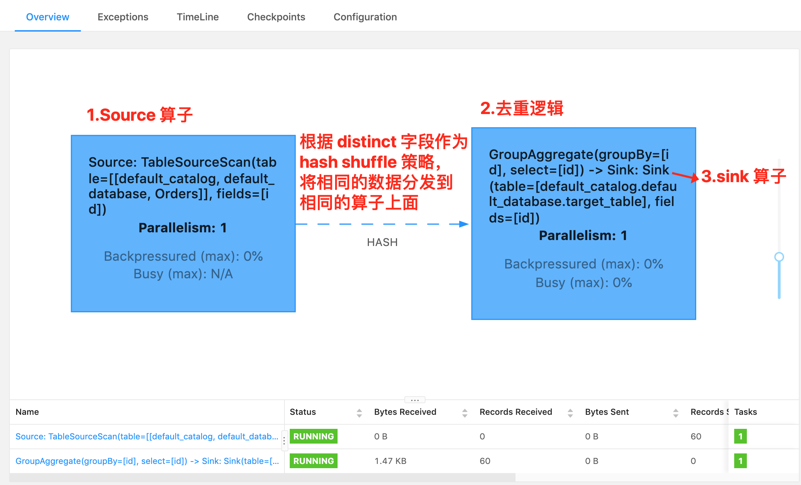](https://yangyichao-mango.github.io/blog-img/wechat-blog/01_大数据/01_数据仓库/01_实时数仓/02_数据内容建设/03_one-engine/01_计算引擎/01_flink/01_flink-sql/21_flinksql牛逼轰轰/36.png)

> 注意：
>
> 对于实时任务，计算时的状态可能会无限增长。
>
> 状态大小取决于不同 key（上述案例为 id 字段）的数量。为了防止状态无限变大，我们可以设置状态的 TTL。但是这可能会影响查询结果的正确性，比如某个 key 的数据过期从状态中删除了，那么下次再来这么一个 key，由于在状态中找不到，就又会输出一遍。

那么如果这个 SQL 放在 Hive 中执行时，假设其中 Orders 为 Hive 表，target_table 也为 Hive 表，其也会生成三个相同的算子（虽然可能会被优化为一个算子，这里为了方便对比，划分为三个进行介绍），但是其和实时任务的执行方式完全不同：

-  `数据源算子`（From Order）：数据源从 Order Hive 表（通常都有天、小时分区限制）中一次性读取所有的数据，然后将读到的数据全部发给下游 `去重算子`，然后 `数据源算子` 就运行结束了，释放资源了
-  `去重算子`（DISTINCT id）：接收到上游算子的所有数据，然后遍历所有数据进行去重，将去重完的所有结果数据发给下游 `数据汇算子`，然后 `去重算子` 就运行结束了，释放资源了
-  `数据汇算子`（INSERT INTO target_table）：接收到上游的所有数据，将所有数据都写到 target_table Hive 中，然后整个任务就运行结束了，整个任务的资源也就都释放了

## 3.5.DML：窗口聚合

由于窗口涉及到的知识内容比较多，所以博主先为大家说明介绍下面内容时的思路，大家跟着思路走。思路如下：

1.  先介绍 Flink SQL 支持的 4 种时间窗口
2.  分别详细介绍上述的 4 种时间窗口的功能及 SQL 语法
3.  结合实际案例介绍 4 种时间窗口

首先来看看 Flink SQL 中支持的 4 种窗口的运算。

1.  滚动窗口（TUMBLE）
2.  滑动窗口（HOP）
3.  Session 窗口（SESSION）
4.  渐进式窗口（CUMULATE）

### 3.5.1.滚动窗口（TUMBLE）

1.  滚动窗口定义：滚动窗口将每个元素指定给指定窗口大小的窗口。滚动窗口具有固定大小，且不重叠。例如，指定一个大小为 5 分钟的滚动窗口。在这种情况下，Flink 将每隔 5 分钟开启一个新的窗口，其中每一条数都会划分到唯一一个 5 分钟的窗口中，如下图所示。

[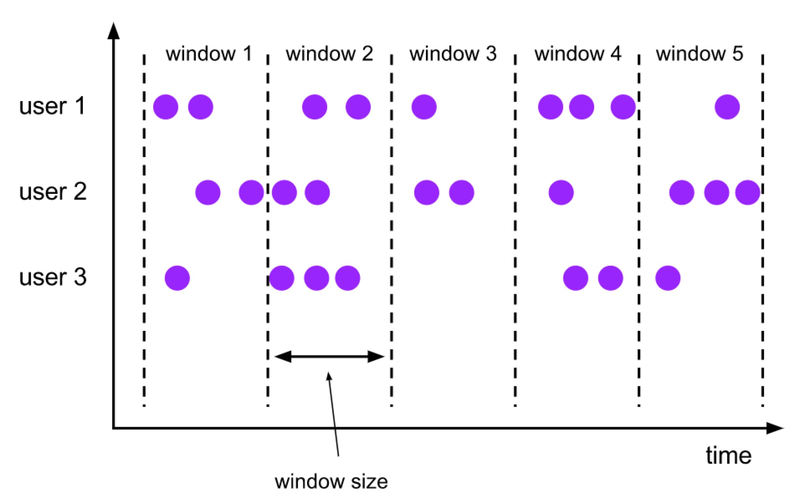](https://yangyichao-mango.github.io/blog-img/wechat-blog/01_大数据/01_数据仓库/01_实时数仓/02_数据内容建设/03_one-engine/01_计算引擎/01_flink/01_flink-sql/21_flinksql牛逼轰轰/14.jpg)

1.  应用场景：常见的按照一分钟对数据进行聚合，计算一分钟内 PV，UV 数据。
2.  实际案例：简单且常见的分维度分钟级别同时在线用户数、总销售额

那么上面这个案例的 SQL 要咋写呢？

关于滚动窗口，在 1.13 版本之前和 1.13 及之后版本有两种 Flink SQL 实现方式，分别是：

-  Group Window Aggregation（1.13 之前只有此类方案，此方案在 1.13 及之后版本已经标记为废弃，不推荐小伙伴萌使用）
-  Windowing TVF（1.13 及之后建议使用 Windowing TVF）

博主这里两种方法都会介绍：

-  Group Window Aggregation 方案（支持 Batch\Streaming 任务）：

```
-- 数据源表
CREATE TABLE source_table (
    -- 维度数据
    dim STRING,
    -- 用户 id
    user_id BIGINT,
    -- 用户
    price BIGINT,
    -- 事件时间戳
    row_time AS cast(CURRENT_TIMESTAMP as timestamp(3)),
    -- watermark 设置
    WATERMARK FOR row_time AS row_time - INTERVAL '5' SECOND
) WITH (
  'connector' = 'datagen',
  'rows-per-second' = '10',
  'fields.dim.length' = '1',
  'fields.user_id.min' = '1',
  'fields.user_id.max' = '100000',
  'fields.price.min' = '1',
  'fields.price.max' = '100000'
)

-- 数据汇表
CREATE TABLE sink_table (
    dim STRING,
    pv BIGINT,
    sum_price BIGINT,
    max_price BIGINT,
    min_price BIGINT,
    uv BIGINT,
    window_start bigint
) WITH (
  'connector' = 'print'
)

-- 数据处理逻辑
insert into sink_table
select 
    dim,
    count(*) as pv,
    sum(price) as sum_price,
    max(price) as max_price,
    min(price) as min_price,
    -- 计算 uv 数
    count(distinct user_id) as uv,
    UNIX_TIMESTAMP(CAST(tumble_start(row_time, interval '1' minute) AS STRING)) * 1000  as window_start
from source_table
group by
    dim,
    tumble(row_time, interval '1' minute)
```

可以看到 Group Window Aggregation 滚动窗口的 SQL 语法就是把 tumble window 的声明写在了 group by 子句中，即 `tumble(row_time, interval '1' minute)`，第一个参数为事件时间的时间戳；第二个参数为滚动窗口大小。

-  Window TVF 方案（1.13 只支持 Streaming 任务）：

```
-- 数据源表
CREATE TABLE source_table (
    -- 维度数据
    dim STRING,
    -- 用户 id
    user_id BIGINT,
    -- 用户
    price BIGINT,
    -- 事件时间戳
    row_time AS cast(CURRENT_TIMESTAMP as timestamp(3)),
    -- watermark 设置
    WATERMARK FOR row_time AS row_time - INTERVAL '5' SECOND
) WITH (
  'connector' = 'datagen',
  'rows-per-second' = '10',
  'fields.dim.length' = '1',
  'fields.user_id.min' = '1',
  'fields.user_id.max' = '100000',
  'fields.price.min' = '1',
  'fields.price.max' = '100000'
)

-- 数据汇表
CREATE TABLE sink_table (
    dim STRING,
    pv BIGINT,
    sum_price BIGINT,
    max_price BIGINT,
    min_price BIGINT,
    uv BIGINT,
    window_start bigint
) WITH (
  'connector' = 'print'
)

-- 数据处理逻辑
insert into sink_table
SELECT 
    dim,
    UNIX_TIMESTAMP(CAST(window_start AS STRING)) * 1000 as window_start,
    count(*) as pv,
    sum(price) as sum_price,
    max(price) as max_price,
    min(price) as min_price,
    count(distinct user_id) as uv
FROM TABLE(TUMBLE(
        TABLE source_table
        , DESCRIPTOR(row_time)
        , INTERVAL '60' SECOND))
GROUP BY window_start, 
      window_end,
      dim
```

可以看到 Windowing TVF 滚动窗口的写法就是把 tumble window 的声明写在了数据源的 Table 子句中，即 `TABLE(TUMBLE(TABLE source_table, DESCRIPTOR(row_time), INTERVAL '60' SECOND))`，包含三部分参数。

第一个参数 `TABLE source_table` 声明数据源表；
第二个参数 `DESCRIPTOR(row_time)` 声明数据源的时间戳；
第三个参数 `INTERVAL '60' SECOND` 声明滚动窗口大小为 1 min。


1.  `SQL 语义`：

由于离线没有相同的时间窗口聚合概念，这里就直接说实时场景 SQL 语义，假设 Orders 为 kafka，target_table 也为 Kafka，这个 SQL 生成的实时任务，在执行时，会生成三个算子：

-  `数据源算子`（From Order）：连接到 Kafka topic，数据源算子一直运行，实时的从 Order Kafka 中一条一条的读取数据，然后一条一条发送给下游的 `窗口聚合算子`
-  `窗口聚合算子`（TUMBLE 算子）：接收到上游算子发的一条一条的数据，然后将每一条数据按照时间戳划分到对应的窗口中（根据事件时间、处理时间的不同语义进行划分），上述案例为事件时间，事件时间中，滚动窗口算子接收到上游的 Watermark 大于窗口的结束时间时，则说明当前这一分钟的滚动窗口已经结束了，将窗口计算完的结果发往下游算子（一条一条发给下游 `数据汇算子`）
-  `数据汇算子`（INSERT INTO target_table）：接收到上游发的一条一条的数据，写入到 target_table Kafka 中

这个实时任务也是 24 小时一直在运行的，所有的算子在同一时刻都是处于 running 状态的。

> 注意：
>
> 事件时间中滚动窗口的窗口计算触发是由 Watermark 推动的。

### 3.5.2.滑动窗口（HOP）

1. ⭐ 滑动窗口定义：滑动窗口也是将元素指定给固定长度的窗口。与滚动窗口功能一样，也有窗口大小的概念。不一样的地方在于，滑动窗口有另一个参数控制窗口计算的频率（滑动窗口滑动的步长）。因此，如果滑动的步长小于窗口大小，则滑动窗口之间每个窗口是可以重叠。在这种情况下，一条数据就会分配到多个窗口当中。举例，有 10 分钟大小的窗口，滑动步长为 5 分钟。这样，每 5 分钟会划分一次窗口，这个窗口包含的数据是过去 10 分钟内的数据，如下图所示。

[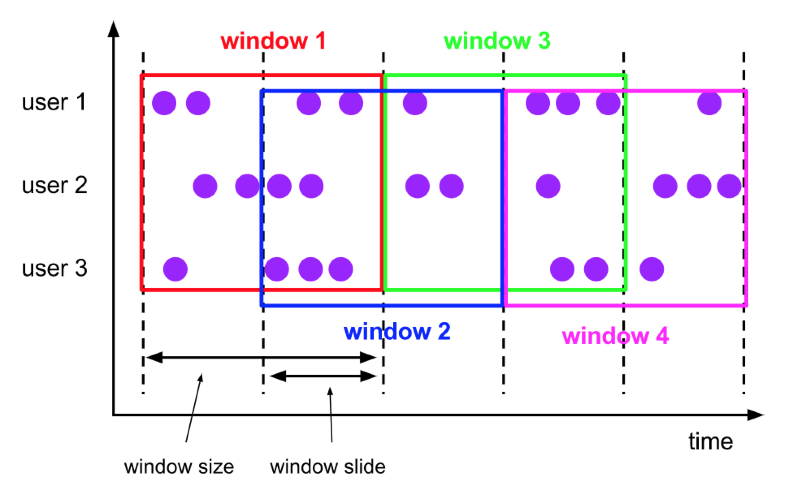](https://yangyichao-mango.github.io/blog-img/wechat-blog/01_大数据/01_数据仓库/01_实时数仓/02_数据内容建设/03_one-engine/01_计算引擎/01_flink/01_flink-sql/21_flinksql牛逼轰轰/15.png)

1. ⭐ 应用场景：比如计算同时在线的数据，要求结果的输出频率是 1 分钟一次，每次计算的数据是过去 5 分钟的数据（有的场景下用户可能在线，但是可能会 2 分钟不活跃，但是这也要算在同时在线数据中，所以取最近 5 分钟的数据就能计算进去了）
2. ⭐ 实际案例：简单且常见的分维度分钟级别同时在线用户数，1 分钟输出一次，计算最近 5 分钟的数据

依然是 Group Window Aggregation、Windowing TVF 两种方案：

- ⭐ Group Window Aggregation 方案（支持 Batch\Streaming 任务）：

```
-- 数据源表
CREATE TABLE source_table (
    -- 维度数据
    dim STRING,
    -- 用户 id
    user_id BIGINT,
    -- 用户
    price BIGINT,
    -- 事件时间戳
    row_time AS cast(CURRENT_TIMESTAMP as timestamp(3)),
    -- watermark 设置
    WATERMARK FOR row_time AS row_time - INTERVAL '5' SECOND
) WITH (
  'connector' = 'datagen',
  'rows-per-second' = '10',
  'fields.dim.length' = '1',
  'fields.user_id.min' = '1',
  'fields.user_id.max' = '100000',
  'fields.price.min' = '1',
  'fields.price.max' = '100000'
);

-- 数据汇表
CREATE TABLE sink_table (
    dim STRING,
    uv BIGINT,
    window_start bigint
) WITH (
  'connector' = 'print'
);

-- 数据处理逻辑
insert into sink_table
SELECT dim,
    UNIX_TIMESTAMP(CAST(hop_start(row_time, interval '1' minute, interval '5' minute) AS STRING)) * 1000 as window_start, 
    count(distinct user_id) as uv
FROM source_table
GROUP BY dim
    , hop(row_time, interval '1' minute, interval '5' minute)
```

可以看到 Group Window Aggregation 滚动窗口的写法就是把 hop window 的声明写在了 group by 子句中，即 `hop(row_time, interval '1' minute, interval '5' minute)`。其中：

第一个参数为事件时间的时间戳；
第二个参数为滑动窗口的滑动步长；
第三个参数为滑动窗口大小。

- ⭐ Windowing TVF 方案（1.13 只支持 Streaming 任务）：

```
-- 数据源表
CREATE TABLE source_table (
    -- 维度数据
    dim STRING,
    -- 用户 id
    user_id BIGINT,
    -- 用户
    price BIGINT,
    -- 事件时间戳
    row_time AS cast(CURRENT_TIMESTAMP as timestamp(3)),
    -- watermark 设置
    WATERMARK FOR row_time AS row_time - INTERVAL '5' SECOND
) WITH (
  'connector' = 'datagen',
  'rows-per-second' = '10',
  'fields.dim.length' = '1',
  'fields.user_id.min' = '1',
  'fields.user_id.max' = '100000',
  'fields.price.min' = '1',
  'fields.price.max' = '100000'
);

-- 数据汇表
CREATE TABLE sink_table (
    dim STRING,
    uv BIGINT,
    window_start bigint
) WITH (
  'connector' = 'print'
);

-- 数据处理逻辑
insert into sink_table
SELECT 
    dim,
    UNIX_TIMESTAMP(CAST(window_start AS STRING)) * 1000 as window_start, 
    count(distinct user_id) as bucket_uv
FROM TABLE(HOP(
        TABLE source_table
        , DESCRIPTOR(row_time)
        , INTERVAL '1' MINUTES, INTERVAL '5' MINUTES))
GROUP BY window_start, 
      window_end,
      dim
```

可以看到 Windowing TVF 滚动窗口的写法就是把 hop window 的声明写在了数据源的 Table 子句中，即 `TABLE(HOP(TABLE source_table, DESCRIPTOR(row_time), INTERVAL '1' MINUTES, INTERVAL '5' MINUTES))`，包含四部分参数：

第一个参数 `TABLE source_table` 声明数据源表；
第二个参数 `DESCRIPTOR(row_time)` 声明数据源的时间戳；
第三个参数 `INTERVAL '1' MINUTES` 声明滚动窗口滑动步长大小为 1 min。
第四个参数 `INTERVAL '5' MINUTES` 声明滚动窗口大小为 5 min。

1. ⭐ `SQL 语义`：

滑动窗口语义和滚动窗口类似，这里不再赘述。

### 3.5.3.Session 窗口（SESSION）

1. ⭐ Session 窗口定义：Session 时间窗口和滚动、滑动窗口不一样，其没有固定的持续时间，如果在定义的间隔期（Session Gap）内没有新的数据出现，则 Session 就会窗口关闭。如下图对比所示：

[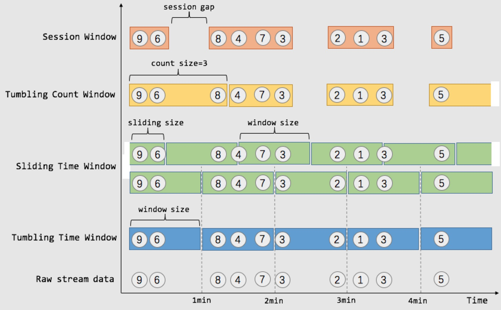](https://yangyichao-mango.github.io/blog-img/wechat-blog/01_大数据/01_数据仓库/01_实时数仓/02_数据内容建设/03_one-engine/01_计算引擎/01_flink/01_flink-sql/21_flinksql牛逼轰轰/16.jpg)

1. ⭐ 实际案例：计算每个用户在活跃期间（一个 Session）总共购买的商品数量，如果用户 5 分钟没有活动则视为 Session 断开

目前 1.13 版本中 Flink SQL 不支持 Session 窗口的 Window TVF，所以这里就只介绍 Group Window Aggregation 方案：

- ⭐ Group Window Aggregation 方案（支持 Batch\Streaming 任务）：

```
-- 数据源表，用户购买行为记录表
CREATE TABLE source_table (
    -- 维度数据
    dim STRING,
    -- 用户 id
    user_id BIGINT,
    -- 用户
    price BIGINT,
    -- 事件时间戳
    row_time AS cast(CURRENT_TIMESTAMP as timestamp(3)),
    -- watermark 设置
    WATERMARK FOR row_time AS row_time - INTERVAL '5' SECOND
) WITH (
  'connector' = 'datagen',
  'rows-per-second' = '10',
  'fields.dim.length' = '1',
  'fields.user_id.min' = '1',
  'fields.user_id.max' = '100000',
  'fields.price.min' = '1',
  'fields.price.max' = '100000'
);

-- 数据汇表
CREATE TABLE sink_table (
    dim STRING,
    pv BIGINT, -- 购买商品数量
    window_start bigint
) WITH (
  'connector' = 'print'
);

-- 数据处理逻辑
insert into sink_table
SELECT 
    dim,
    UNIX_TIMESTAMP(CAST(session_start(row_time, interval '5' minute) AS STRING)) * 1000 as window_start, 
    count(1) as pv
FROM source_table
GROUP BY dim
      , session(row_time, interval '5' minute)
```

> 注意：
>
> 上述 SQL 任务是在整个 Session 窗口结束之后才会把数据输出。Session 窗口即支持 `处理时间` 也支持 `事件时间`。但是处理时间只支持在 Streaming 任务中运行，Batch 任务不支持。

可以看到 Group Window Aggregation 中 Session 窗口的写法就是把 session window 的声明写在了 group by 子句中，即 `session(row_time, interval '5' minute)`。其中：

第一个参数为事件时间的时间戳；
第二个参数为 Session gap 间隔。

1. ⭐ `SQL 语义`：

Session 窗口语义和滚动窗口类似，这里不再赘述。

可以直接在公众号后台回复**1.13.2 最全 flink sql**获取源代码。所有的源码都开源到 github 上面了。里面包含了非常多的案例。可以直接拿来在本地运行的！！！肥肠的方便。

### 3.5.4.渐进式窗口（CUMULATE）

1. ⭐ 渐进式窗口定义（1.13 只支持 Streaming 任务）：渐进式窗口在其实就是 `固定窗口间隔内提前触发的的滚动窗口`，其实就是 `Tumble Window + early-fire` 的一个事件时间的版本。例如，从每日零点到当前这一分钟绘制累积 UV，其中 10:00 时的 UV 表示从 00:00 到 10:00 的 UV 总数。
   渐进式窗口可以认为是首先开一个最大窗口大小的滚动窗口，然后根据用户设置的触发的时间间隔将这个滚动窗口拆分为多个窗口，这些窗口具有相同的窗口起点和不同的窗口终点。如下图所示：

[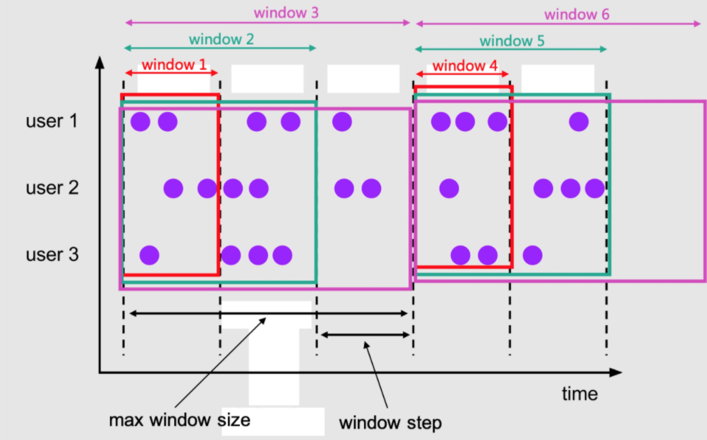](https://yangyichao-mango.github.io/blog-img/wechat-blog/01_大数据/01_数据仓库/01_实时数仓/02_数据内容建设/03_one-engine/01_计算引擎/01_flink/01_flink-sql/21_flinksql牛逼轰轰/17.jpg)

1. ⭐ 应用场景：周期内累计 PV，UV 指标（如每天累计到当前这一分钟的 PV，UV）。这类指标是一段周期内的累计状态，对分析师来说更具统计分析价值，而且几乎所有的复合指标都是基于此类指标的统计（不然离线为啥都要累计一天的数据，而不要一分钟累计的数据呢）。
2. ⭐ 实际案例：每天的截止当前分钟的累计 money（sum(money)），去重 id 数（count(distinct id)）。每天代表渐进式窗口大小为 1 天，分钟代表渐进式窗口移动步长为分钟级别。举例如下：

明细输入数据：

| time                | id   | money |
| :------------------ | :--- | :---- |
| 2021-11-01 00:01:00 | A    | 3     |
| 2021-11-01 00:01:00 | B    | 5     |
| 2021-11-01 00:01:00 | A    | 7     |
| 2021-11-01 00:02:00 | C    | 3     |
| 2021-11-01 00:03:00 | C    | 10    |

预期经过渐进式窗口计算的输出数据：

| time                | count distinct id | sum money |
| :------------------ | :---------------- | :-------- |
| 2021-11-01 00:01:00 | 2                 | 15        |
| 2021-11-01 00:02:00 | 3                 | 18        |
| 2021-11-01 00:03:00 | 3                 | 28        |

转化为折线图长这样：

[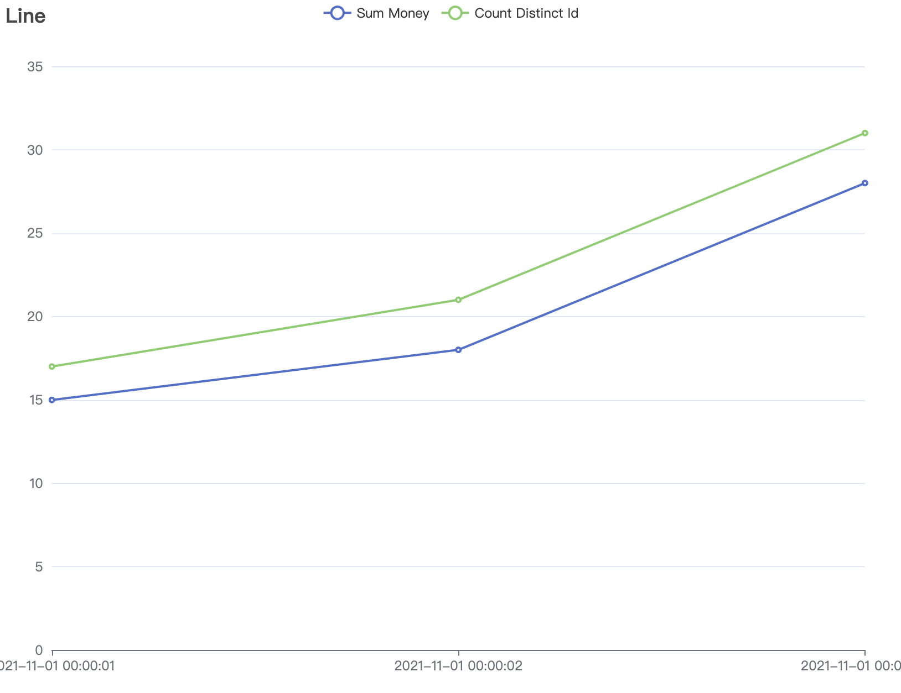](https://yangyichao-mango.github.io/blog-img/wechat-blog/01_大数据/01_数据仓库/01_实时数仓/02_数据内容建设/03_one-engine/01_计算引擎/01_flink/01_flink-sql/12_flinksql知其所以然（十）：1.13cumulatewindow/1.png)

可以看到，其特点就在于，每一分钟的输出结果都是当天零点累计到当前的结果。

渐进式窗口目前只有 Windowing TVF 方案支持：

- ⭐ Windowing TVF 方案（1.13 只支持 Streaming 任务）：

```
-- 数据源表
CREATE TABLE source_table (
    -- 用户 id
    user_id BIGINT,
    -- 用户
    money BIGINT,
    -- 事件时间戳
    row_time AS cast(CURRENT_TIMESTAMP as timestamp(3)),
    -- watermark 设置
    WATERMARK FOR row_time AS row_time - INTERVAL '5' SECOND
) WITH (
  'connector' = 'datagen',
  'rows-per-second' = '10',
  'fields.user_id.min' = '1',
  'fields.user_id.max' = '100000',
  'fields.price.min' = '1',
  'fields.price.max' = '100000'
);

-- 数据汇表
CREATE TABLE sink_table (
    window_end bigint,
    window_start bigint,
    sum_money BIGINT,
    count_distinct_id bigint
) WITH (
  'connector' = 'print'
);

-- 数据处理逻辑
insert into sink_table
SELECT 
    UNIX_TIMESTAMP(CAST(window_end AS STRING)) * 1000 as window_end, 
    window_start, 
    sum(money) as sum_money,
    count(distinct id) as count_distinct_id
FROM TABLE(CUMULATE(
       TABLE source_table
       , DESCRIPTOR(row_time)
       , INTERVAL '60' SECOND
       , INTERVAL '1' DAY))
GROUP BY
    window_start, 
    window_end
```

可以看到 Windowing TVF 滚动窗口的写法就是把 cumulate window 的声明写在了数据源的 Table 子句中，即 `TABLE(CUMULATE(TABLE source_table, DESCRIPTOR(row_time), INTERVAL '60' SECOND, INTERVAL '1' DAY))`，其中包含四部分参数：

第一个参数 `TABLE source_table` 声明数据源表；
第二个参数 `DESCRIPTOR(row_time)` 声明数据源的时间戳；
第三个参数 `INTERVAL '60' SECOND` 声明渐进式窗口触发的渐进步长为 1 min。
第四个参数 `INTERVAL '1' DAY` 声明整个渐进式窗口的大小为 1 天，到了第二天新开一个窗口重新累计。

1. ⭐ `SQL 语义`：

渐进式窗口语义和滚动窗口类似，这里不再赘述。

### 3.5.5.Window TVF 支持 Grouping Sets、Rollup、Cube

具体应用场景：实际的案例场景中，经常会有多个维度进行组合（cube）计算指标的场景。如果把每个维度组合的代码写一遍，然后 union all 起来，这样写起来非常麻烦，而且会导致一个数据源读取多遍。

这时，有离线 Hive SQL 使用经验的小伙伴萌就会想到，如果有了 Grouping Sets，我们就可以直接用 Grouping Sets 将维度组合写在一条 SQL 中，写起来方便并且执行效率也高。当然，Flink 支持这个功能。

```
但是目前 Grouping Sets 只在 Window TVF 中支持，不支持 Group Window Aggregation。
```

来一个实际案例感受一下，计算每日零点累计到当前这一分钟的分汇总、age、sex、age+sex 维度的用户数。

```
-- 用户访问明细表
CREATE TABLE source_table (
    age STRING,
    sex STRING,
    user_id BIGINT,
    row_time AS cast(CURRENT_TIMESTAMP as timestamp(3)),
    WATERMARK FOR row_time AS row_time - INTERVAL '5' SECOND
) WITH (
  'connector' = 'datagen',
  'rows-per-second' = '1',
  'fields.age.length' = '1',
  'fields.sex.length' = '1',
  'fields.user_id.min' = '1',
  'fields.user_id.max' = '100000'
);

CREATE TABLE sink_table (
    age STRING,
    sex STRING,
    uv BIGINT,
    window_end bigint
) WITH (
  'connector' = 'print'
);

insert into sink_table
SELECT 
    UNIX_TIMESTAMP(CAST(window_end AS STRING)) * 1000 as window_end, 
    if (age is null, 'ALL', age) as age,
    if (sex is null, 'ALL', sex) as sex,
    count(distinct user_id) as bucket_uv
FROM TABLE(CUMULATE(
       TABLE source_table
       , DESCRIPTOR(row_time)
       , INTERVAL '5' SECOND
       , INTERVAL '1' DAY))
GROUP BY 
    window_start, 
    window_end,
    -- grouping sets 写法
    GROUPING SETS (
        ()
        , (age)
        , (sex)
        , (age, sex)
    )
```

小伙伴萌这里需要注意下！！！

Flink SQL 中 Grouping Sets 的语法和 Hive SQL 的语法有一些不同，如果我们使用 Hive SQL 实现上述 SQL 的语义，其实现如下：

```
insert into sink_table
SELECT 
    UNIX_TIMESTAMP(CAST(window_end AS STRING)) * 1000 as window_end, 
    if (age is null, 'ALL', age) as age,
    if (sex is null, 'ALL', sex) as sex,
    count(distinct user_id) as bucket_uv
FROM source_table
GROUP BY
    age
    , sex
-- hive sql grouping sets 写法
GROUPING SETS (
    ()
    , (age)
    , (sex)
    , (age, sex)
)
```

## 3.6.DML：Group 聚合

1. ⭐ Group 聚合定义（支持 Batch\Streaming 任务）：Flink 也支持 Group 聚合。Group 聚合和上面介绍到的窗口聚合的不同之处，就在于 Group 聚合是按照数据的类别进行分组，比如年龄、性别，是横向的；而窗口聚合是在时间粒度上对数据进行分组，是纵向的。如下图所示，就展示出了其区别。其中 `按颜色分 key（横向）` 就是 Group 聚合，`按窗口划分（纵向）` 就是窗口聚合。

[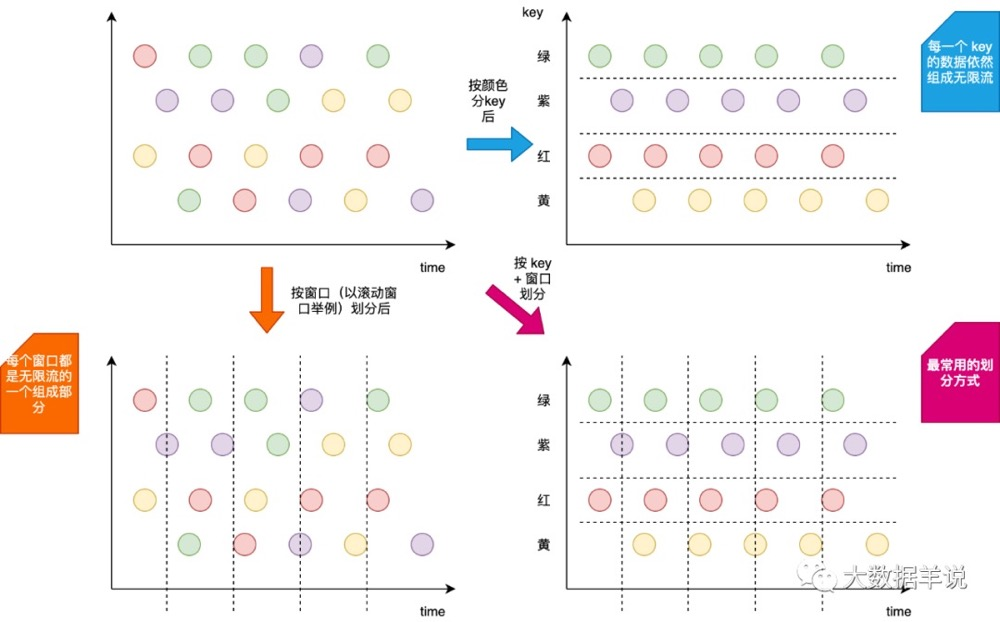](https://yangyichao-mango.github.io/blog-img/wechat-blog/01_大数据/01_数据仓库/01_实时数仓/02_数据内容建设/03_one-engine/01_计算引擎/01_flink/01_flink-sql/21_flinksql牛逼轰轰/13.jpg)

1. ⭐ 应用场景：一般用于对数据进行分组，然后后续使用聚合函数进行 count、sum 等聚合操作。

那么这时候，小伙伴萌就会问到，我其实可以把窗口聚合的写法也转换为 Group 聚合，只需要把 Group 聚合的 Group By key 换成时间就行，那这两个聚合的区别到底在哪？

首先来举一个例子看看怎么将窗口聚合转换为 Group 聚合。假如一个窗口聚合是按照 1 分钟的粒度进行聚合，如下 SQL：

- ⭐ 滚动窗口（TUMBLE）

```
-- 数据源表
CREATE TABLE source_table (
    -- 维度数据
    dim STRING,
    -- 用户 id
    user_id BIGINT,
    -- 用户
    price BIGINT,
    -- 事件时间戳
    row_time AS cast(CURRENT_TIMESTAMP as timestamp(3)),
    -- watermark 设置
    WATERMARK FOR row_time AS row_time - INTERVAL '5' SECOND
) WITH (
  'connector' = 'datagen',
  'rows-per-second' = '10',
  'fields.dim.length' = '1',
  'fields.user_id.min' = '1',
  'fields.user_id.max' = '100000',
  'fields.price.min' = '1',
  'fields.price.max' = '100000'
)

-- 数据汇表
CREATE TABLE sink_table (
    dim STRING,
    pv BIGINT,
    sum_price BIGINT,
    max_price BIGINT,
    min_price BIGINT,
    uv BIGINT,
    window_start bigint
) WITH (
  'connector' = 'print'
)

-- 数据处理逻辑
insert into sink_table
select dim,
    count(*) as pv,
    sum(price) as sum_price,
    max(price) as max_price,
    min(price) as min_price,
    -- 计算 uv 数
    count(distinct user_id) as uv,
    UNIX_TIMESTAMP(CAST(tumble_start(row_time, interval '1' minute) AS STRING)) * 1000  as window_start
from source_table
group by
    dim,
    -- 按照 Flink SQL tumble 窗口写法划分窗口
    tumble(row_time, interval '1' minute)
```

转换为 Group 聚合的写法如下：

- ⭐ Group 聚合

```
-- 数据源表
CREATE TABLE source_table (
    -- 维度数据
    dim STRING,
    -- 用户 id
    user_id BIGINT,
    -- 用户
    price BIGINT,
    -- 事件时间戳
    row_time AS cast(CURRENT_TIMESTAMP as timestamp(3)),
    -- watermark 设置
    WATERMARK FOR row_time AS row_time - INTERVAL '5' SECOND
) WITH (
  'connector' = 'datagen',
  'rows-per-second' = '10',
  'fields.dim.length' = '1',
  'fields.user_id.min' = '1',
  'fields.user_id.max' = '100000',
  'fields.price.min' = '1',
  'fields.price.max' = '100000'
);

-- 数据汇表
CREATE TABLE sink_table (
    dim STRING,
    pv BIGINT,
    sum_price BIGINT,
    max_price BIGINT,
    min_price BIGINT,
    uv BIGINT,
    window_start bigint
) WITH (
  'connector' = 'print'
);

-- 数据处理逻辑
insert into sink_table
select dim,
    count(*) as pv,
    sum(price) as sum_price,
    max(price) as max_price,
    min(price) as min_price,
    -- 计算 uv 数
    count(distinct user_id) as uv,
    cast((UNIX_TIMESTAMP(CAST(row_time AS STRING))) / 60 as bigint) as window_start
from source_table
group by
    dim,
    -- 将秒级别时间戳 / 60 转化为 1min
    cast((UNIX_TIMESTAMP(CAST(row_time AS STRING))) / 60 as bigint)
```

确实没错，上面这个转换是一点问题都没有的。

但是窗口聚合和 Group by 聚合的差异在于：

- ⭐ 本质区别：窗口聚合是具有时间语义的，其本质是想实现窗口结束输出结果之后，后续有迟到的数据也不会对原有的结果发生更改了，即输出结果值是定值（不考虑 allowLateness）。而 Group by 聚合是没有时间语义的，不管数据迟到多长时间，只要数据来了，就把上一次的输出的结果数据撤回，然后把计算好的新的结果数据发出
- ⭐ 运行层面：窗口聚合是和 `时间` 绑定的，窗口聚合其中窗口的计算结果触发都是由时间（Watermark）推动的。Group by 聚合完全由数据推动触发计算，新来一条数据去根据这条数据进行计算出结果发出；由此可见两者的实现方式也大为不同。

1. ⭐ `SQL 语义`

也是拿离线和实时做对比，Orders 为 kafka，target_table 为 Kafka，这个 SQL 生成的实时任务，在执行时，会生成三个算子：

- ⭐ `数据源算子`（From Order）：数据源算子一直运行，实时的从 Order Kafka 中一条一条的读取数据，然后一条一条发送给下游的 `Group 聚合算子`，向下游发送数据的 shuffle 策略是根据 group by 中的 key 进行发送，相同的 key 发到同一个 SubTask（并发） 中
- ⭐ `Group 聚合算子`（group by key + sum\count\max\min）：接收到上游算子发的一条一条的数据，去状态 state 中找这个 key 之前的 sum\count\max\min 结果。如果有结果 `oldResult`，拿出来和当前的数据进行 `sum\count\max\min` 计算出这个 key 的新结果 `newResult`，并将新结果 `[key, newResult]` 更新到 state 中，在向下游发送新计算的结果之前，先发一条撤回上次结果的消息 `-[key, oldResult]`，然后再将新结果发往下游 `+[key, newResult]`；如果 state 中没有当前 key 的结果，则直接使用当前这条数据计算 sum\max\min 结果 `newResult`，并将新结果 `[key, newResult]` 更新到 state 中，当前是第一次往下游发，则不需要先发回撤消息，直接发送 `+[key, newResult]`。
- ⭐ `数据汇算子`（INSERT INTO target_table）：接收到上游发的一条一条的数据，写入到 target_table Kafka 中

这个实时任务也是 24 小时一直在运行的，所有的算子在同一时刻都是处于 running 状态的。

> 特别注意：
>
> 1. Group by 聚合涉及到了回撤流（也叫 retract 流），会产生回撤流是因为从整个 SQL 的语义来看，上游的 Kafka 数据是源源不断的，无穷无尽的，那么每次这个 SQL 任务产出的结果都是一个中间结果，所以每次结果发生更新时，都需要将上一次发出的中间结果给撤回，然后将最新的结果发下去。
> 2. Group by 聚合涉及到了状态：状态大小也取决于不同 key 的数量。为了防止状态无限变大，我们可以设置状态的 TTL。以上面的 SQL 为例，上面 SQL 是按照分钟进行聚合的，理论上到了今天，通常我们就可以不用关心昨天的数据了，那么我们可以设置状态过期时间为一天。关于状态过期时间的设置参数可以参考下文 `运行时参数` 小节。

如果这个 SQL 放在 Hive 中执行时，其中 Orders 为 Hive，target_table 也为 Hive，其也会生成三个相同的算子，但是其和实时任务的执行方式完全不同：

- ⭐ `数据源算子`（From Order）：数据源算子从 Order Hive 中读取到所有的数据，然后所有数据发送给下游的 `Group 聚合算子`，向下游发送数据的 shuffle 策略是根据 group by 中的 key 进行发送，相同的 key 发到同一个算子中，然后这个算子就运行结束了，释放资源了
- ⭐ `Group 聚合算子`（group by + sum\count\max\min）：接收到上游算子发的所有数据，然后遍历计算 sum\count\max\min 结果，批量发给下游 `数据汇算子`，这个算子也就运行结束了，释放资源了
- ⭐ `数据汇算子`（INSERT INTO target_table）：接收到上游发的一条一条的数据，写入到 target_table Hive 中，整个任务也就运行结束了，整个任务的资源也就都释放了

### 3.6.1.Group 聚合支持 Grouping sets、Rollup、Cube

Group 聚合也支持 `Grouping sets`、`Rollup`、`Cube`

举一个 `Grouping sets` 的案例：

```
SELECT 
    supplier_id
    , rating
    , product_id
    , COUNT(*)
FROM (VALUES
    ('supplier1', 'product1', 4),
    ('supplier1', 'product2', 3),
    ('supplier2', 'product3', 3),
    ('supplier2', 'product4', 4))
AS Products(supplier_id, product_id, rating)
GROUP BY GROUPING SET (
    ( supplier_id, product_id, rating ),
    ( supplier_id, product_id         ),
    ( supplier_id,             rating ),
    ( supplier_id                     ),
    (              product_id, rating ),
    (              product_id         ),
    (                          rating ),
    (                                 )
)
```

## 3.7.DML：Over 聚合

1. ⭐ Over 聚合定义（支持 Batch\Streaming）：可以理解为是一种特殊的滑动窗口聚合函数。

那这里我们拿 `Over 聚合` 与 `窗口聚合` 做一个对比，其之间的最大不同之处在于：

- ⭐ 窗口聚合：不在 group by 中的字段，不能直接在 select 中拿到
- ⭐ Over 聚合：能够保留原始字段

> 注意：
>
> 其实在生产环境中，Over 聚合的使用场景还是比较少的。在 Hive 中也有相同的聚合，但是小伙伴萌可以想想你在离线数仓经常使用嘛？

1. ⭐ 应用场景：计算最近一段滑动窗口的聚合结果数据。
2. ⭐ 实际案例：查询每个产品最近一小时订单的金额总和：

```
SELECT order_id, order_time, amount,
  SUM(amount) OVER (
    PARTITION BY product
    ORDER BY order_time
    RANGE BETWEEN INTERVAL '1' HOUR PRECEDING AND CURRENT ROW
  ) AS one_hour_prod_amount_sum
FROM Orders
```

Over 聚合的语法总结如下：

```
SELECT
  agg_func(agg_col) OVER (
    [PARTITION BY col1[, col2, ...]]
    ORDER BY time_col
    range_definition),
  ...
FROM ...
```

其中：

- ⭐ ORDER BY：必须是时间戳列（事件时间、处理时间）
- ⭐ PARTITION BY：标识了聚合窗口的聚合粒度，如上述案例是按照 product 进行聚合
- ⭐ range_definition：这个标识聚合窗口的聚合数据范围，在 Flink 中有两种指定数据范围的方式。第一种为 `按照行数聚合`，第二种为 `按照时间区间聚合`。如下案例所示：

a. ⭐ 时间区间聚合：

按照时间区间聚合就是时间区间的一个滑动窗口，比如下面案例 1 小时的区间，最新输出的一条数据的 sum 聚合结果就是最近一小时数据的 amount 之和。

```
CREATE TABLE source_table (
    order_id BIGINT,
    product BIGINT,
    amount BIGINT,
    order_time as cast(CURRENT_TIMESTAMP as TIMESTAMP(3)),
    WATERMARK FOR order_time AS order_time - INTERVAL '0.001' SECOND
) WITH (
  'connector' = 'datagen',
  'rows-per-second' = '1',
  'fields.order_id.min' = '1',
  'fields.order_id.max' = '2',
  'fields.amount.min' = '1',
  'fields.amount.max' = '10',
  'fields.product.min' = '1',
  'fields.product.max' = '2'
);

CREATE TABLE sink_table (
    product BIGINT,
    order_time TIMESTAMP(3),
    amount BIGINT,
    one_hour_prod_amount_sum BIGINT
) WITH (
  'connector' = 'print'
);

INSERT INTO sink_table
SELECT product, order_time, amount,
  SUM(amount) OVER (
    PARTITION BY product
    ORDER BY order_time
    -- 标识统计范围是一个 product 的最近 1 小时的数据
    RANGE BETWEEN INTERVAL '1' HOUR PRECEDING AND CURRENT ROW
  ) AS one_hour_prod_amount_sum
FROM source_table
```

结果如下：

```
script+I[2, 2021-12-24T22:08:26.583, 7, 73]
+I[2, 2021-12-24T22:08:27.583, 7, 80]
+I[2, 2021-12-24T22:08:28.583, 4, 84]
+I[2, 2021-12-24T22:08:29.584, 7, 91]
+I[2, 2021-12-24T22:08:30.583, 8, 99]
+I[1, 2021-12-24T22:08:31.583, 9, 138]
+I[2, 2021-12-24T22:08:32.584, 6, 105]
+I[1, 2021-12-24T22:08:33.584, 7, 145]
```

b. ⭐ 行数聚合：

按照行数聚合就是数据行数的一个滑动窗口，比如下面案例，最新输出的一条数据的 sum 聚合结果就是最近 5 行数据的 amount 之和。

```
CREATE TABLE source_table (
    order_id BIGINT,
    product BIGINT,
    amount BIGINT,
    order_time as cast(CURRENT_TIMESTAMP as TIMESTAMP(3)),
    WATERMARK FOR order_time AS order_time - INTERVAL '0.001' SECOND
) WITH (
  'connector' = 'datagen',
  'rows-per-second' = '1',
  'fields.order_id.min' = '1',
  'fields.order_id.max' = '2',
  'fields.amount.min' = '1',
  'fields.amount.max' = '2',
  'fields.product.min' = '1',
  'fields.product.max' = '2'
);

CREATE TABLE sink_table (
    product BIGINT,
    order_time TIMESTAMP(3),
    amount BIGINT,
    one_hour_prod_amount_sum BIGINT
) WITH (
  'connector' = 'print'
);

INSERT INTO sink_table
SELECT product, order_time, amount,
  SUM(amount) OVER (
    PARTITION BY product
    ORDER BY order_time
    -- 标识统计范围是一个 product 的最近 5 行数据
    ROWS BETWEEN 5 PRECEDING AND CURRENT ROW
  ) AS one_hour_prod_amount_sum
FROM source_table
```

预跑结果如下：

```
script+I[2, 2021-12-24T22:18:19.147, 1, 9]
+I[1, 2021-12-24T22:18:20.147, 2, 11]
+I[1, 2021-12-24T22:18:21.147, 2, 12]
+I[1, 2021-12-24T22:18:22.147, 2, 12]
+I[1, 2021-12-24T22:18:23.148, 2, 12]
+I[1, 2021-12-24T22:18:24.147, 1, 11]
+I[1, 2021-12-24T22:18:25.146, 1, 10]
+I[1, 2021-12-24T22:18:26.147, 1, 9]
+I[2, 2021-12-24T22:18:27.145, 2, 11]
+I[2, 2021-12-24T22:18:28.148, 1, 10]
+I[2, 2021-12-24T22:18:29.145, 2, 10]
```

当然，如果你在一个 SELECT 中有多个聚合窗口的聚合方式，Flink SQL 支持了一种简化写法，如下案例：

```
SELECT order_id, order_time, amount,
  SUM(amount) OVER w AS sum_amount,
  AVG(amount) OVER w AS avg_amount
FROM Orders
-- 使用下面子句，定义 Over Window
WINDOW w AS (
  PARTITION BY product
  ORDER BY order_time
  RANGE BETWEEN INTERVAL '1' HOUR PRECEDING AND CURRENT ROW)
```

## 3.8.DML：Joins

Flink 也支持了非常多的数据 Join 方式，主要包括以下三种：

1. ⭐ 动态表（流）与动态表（流）的 Join
2. ⭐ 动态表（流）与外部维表（比如 Redis）的 Join
3. ⭐ 动态表字段的列转行（一种特殊的 Join）

细分 Flink SQL 支持的 Join：

1. ⭐ Regular Join：流与流的 Join，包括 Inner Equal Join、Outer Equal Join
2. ⭐ Interval Join：流与流的 Join，两条流一段时间区间内的 Join
3. ⭐ Temporal Join：流与流的 Join，包括事件时间，处理时间的 Temporal Join，类似于离线中的快照 Join
4. ⭐ Lookup Join：流与外部维表的 Join
5. ⭐ Array Expansion：表字段的列转行，类似于 Hive 的 explode 数据炸开的列转行
6. ⭐ Table Function：自定义函数的表字段的列转行，支持 Inner Join 和 Left Outer Join

### 3.8.1.Regular Join

1. ⭐ Regular Join 定义（支持 Batch\Streaming）：Regular Join 其实就是和离线 Hive SQL 一样的 Regular Join，通过条件关联两条流数据输出。
2. ⭐ 应用场景：Join 其实在我们的数仓建设过程中应用是非常广泛的。离线数仓可以说基本上是离不开 Join 的。那么实时数仓的建设也必然离不开 Join，比如日志关联扩充维度数据，构建宽表；日志通过 ID 关联计算 CTR。
3. ⭐ Regular Join 包含以下几种（以 `L` 作为左流中的数据标识，`R` 作为右流中的数据标识）：

- ⭐ Inner Join（Inner Equal Join）：流任务中，只有两条流 Join 到才输出，输出 `+[L, R]`
- ⭐ Left Join（Outer Equal Join）：流任务中，左流数据到达之后，无论有没有 Join 到右流的数据，都会输出（Join 到输出 `+[L, R]`，没 Join 到输出 `+[L, null]`），如果右流之后数据到达之后，发现左流之前输出过没有 Join 到的数据，则会发起回撤流，先输出 `-[L, null]`，然后输出 `+[L, R]`
- ⭐ Right Join（Outer Equal Join）：有 Left Join 一样，左表和右表的执行逻辑完全相反
- ⭐ Full Join（Outer Equal Join）：流任务中，左流或者右流的数据到达之后，无论有没有 Join 到另外一条流的数据，都会输出（对右流来说：Join 到输出 `+[L, R]`，没 Join 到输出 `+[null, R]`；对左流来说：Join 到输出 `+[L, R]`，没 Join 到输出 `+[L, null]`）。如果一条流的数据到达之后，发现之前另一条流之前输出过没有 Join 到的数据，则会发起回撤流（左流数据到达为例：回撤 `-[null, R]`，输出 `+[L, R]`，右流数据到达为例：回撤 `-[L, null]`，输出 `+[L, R]`）。

1. ⭐ 实际案例：案例为曝光日志关联点击日志筛选既有曝光又有点击的数据，并且补充点击的扩展参数（show inner click）：

下面这个案例为 `Inner Join 案例`：

```
-- 曝光日志数据
CREATE TABLE show_log_table (
    log_id BIGINT,
    show_params STRING
) WITH (
  'connector' = 'datagen',
  'rows-per-second' = '2',
  'fields.show_params.length' = '1',
  'fields.log_id.min' = '1',
  'fields.log_id.max' = '100'
);

-- 点击日志数据
CREATE TABLE click_log_table (
  log_id BIGINT,
  click_params     STRING
)
WITH (
  'connector' = 'datagen',
  'rows-per-second' = '2',
  'fields.click_params.length' = '1',
  'fields.log_id.min' = '1',
  'fields.log_id.max' = '10'
);

CREATE TABLE sink_table (
    s_id BIGINT,
    s_params STRING,
    c_id BIGINT,
    c_params STRING
) WITH (
  'connector' = 'print'
);

-- 流的 INNER JOIN，条件为 log_id
INSERT INTO sink_table
SELECT
    show_log_table.log_id as s_id,
    show_log_table.show_params as s_params,
    click_log_table.log_id as c_id,
    click_log_table.click_params as c_params
FROM show_log_table
INNER JOIN click_log_table ON show_log_table.log_id = click_log_table.log_id;
```

输出结果如下：

```
script+I[5, d, 5, f]
+I[5, d, 5, 8]
+I[5, d, 5, 2]
+I[3, 4, 3, 0]
+I[3, 4, 3, 3]
...
```

如果为 `Left Join` 案例：

```
CREATE TABLE show_log_table (
    log_id BIGINT,
    show_params STRING
) WITH (
  'connector' = 'datagen',
  'rows-per-second' = '1',
  'fields.show_params.length' = '3',
  'fields.log_id.min' = '1',
  'fields.log_id.max' = '10'
);

CREATE TABLE click_log_table (
  log_id BIGINT,
  click_params     STRING
)
WITH (
  'connector' = 'datagen',
  'rows-per-second' = '1',
  'fields.click_params.length' = '3',
  'fields.log_id.min' = '1',
  'fields.log_id.max' = '10'
);

CREATE TABLE sink_table (
    s_id BIGINT,
    s_params STRING,
    c_id BIGINT,
    c_params STRING
) WITH (
  'connector' = 'print'
);

INSERT INTO sink_table
SELECT
    show_log_table.log_id as s_id,
    show_log_table.show_params as s_params,
    click_log_table.log_id as c_id,
    click_log_table.click_params as c_params
FROM show_log_table
LEFT JOIN click_log_table ON show_log_table.log_id = click_log_table.log_id;
```

输出结果如下：

```
script+I[5, f3c, 5, c05]
+I[5, 6e2, 5, 1f6]
+I[5, 86b, 5, 1f6]
+I[5, f3c, 5, 1f6]
-D[3, 4ab, null, null]
-D[3, 6f2, null, null]
+I[3, 4ab, 3, 765]
+I[3, 6f2, 3, 765]
+I[2, 3c4, null, null]
+I[3, 4ab, 3, a8b]
+I[3, 6f2, 3, a8b]
+I[2, c03, null, null]
...
```

如果为 `Full Join` 案例：

```
CREATE TABLE show_log_table (
    log_id BIGINT,
    show_params STRING
) WITH (
  'connector' = 'datagen',
  'rows-per-second' = '2',
  'fields.show_params.length' = '1',
  'fields.log_id.min' = '1',
  'fields.log_id.max' = '10'
);

CREATE TABLE click_log_table (
  log_id BIGINT,
  click_params     STRING
)
WITH (
  'connector' = 'datagen',
  'rows-per-second' = '2',
  'fields.click_params.length' = '1',
  'fields.log_id.min' = '1',
  'fields.log_id.max' = '10'
);

CREATE TABLE sink_table (
    s_id BIGINT,
    s_params STRING,
    c_id BIGINT,
    c_params STRING
) WITH (
  'connector' = 'print'
);

INSERT INTO sink_table
SELECT
    show_log_table.log_id as s_id,
    show_log_table.show_params as s_params,
    click_log_table.log_id as c_id,
    click_log_table.click_params as c_params
FROM show_log_table
FULL JOIN click_log_table ON show_log_table.log_id = click_log_table.log_id;
```

输出结果如下：

```
script+I[null, null, 7, 6]
+I[6, 5, null, null]
-D[1, c, null, null]
+I[1, c, 1, 2]
+I[3, 1, null, null]
+I[null, null, 7, d]
+I[10, 0, null, null]
+I[null, null, 2, 6]
-D[null, null, 7, 6]
-D[null, null, 7, d]
...
```

> 关于 Regular Join 的注意事项：
>
> - ⭐ 实时 Regular Join 可以不是 `等值 join`。`等值 join` 和 `非等值 join` 区别在于，`等值 join` 数据 shuffle 策略是 Hash，会按照 Join on 中的等值条件作为 id 发往对应的下游；`非等值 join` 数据 shuffle 策略是 Global，所有数据发往一个并发，按照非等值条件进行关联
> - ⭐ Join 的流程是左流新来一条数据之后，会和右流中符合条件的所有数据做 Join，然后输出。
> - ⭐ 流的上游是无限的数据，所以要做到关联的话，Flink 会将两条流的所有数据都存储在 State 中，所以 Flink 任务的 State 会无限增大，因此你需要为 State 配置合适的 TTL，以防止 State 过大。

1. ⭐ `SQL 语义`：

详细的 SQL 语义案例可以参考：https://mp.weixin.qq.com/s/Z8QfKfhrX5KEnR-s7gRtsA

### 3.8.2.Interval Join（时间区间 Join）

1. ⭐ Interval Join 定义（支持 Batch\Streaming）：Interval Join 在离线的概念中是没有的。Interval Join 可以让一条流去 Join 另一条流中前后一段时间内的数据。
2. ⭐ 应用场景：为什么有 Regular Join 还要 Interval Join 呢？刚刚的案例也讲了，Regular Join 会产生回撤流，但是在实时数仓中一般写入的 sink 都是类似于 Kafka 这样的消息队列，然后后面接 clickhouse 等引擎，这些引擎又不具备处理回撤流的能力。所以博主理解 Interval Join 就是用于消灭回撤流的。
3. ⭐ Interval Join 包含以下几种（以 `L` 作为左流中的数据标识，`R` 作为右流中的数据标识）：

- ⭐ Inner Interval Join：流任务中，只有两条流 Join 到（满足 Join on 中的条件：两条流的数据在时间区间 + 满足其他等值条件）才输出，输出 `+[L, R]`
- ⭐ Left Interval Join：流任务中，左流数据到达之后，如果没有 Join 到右流的数据，就会等待（放在 State 中等），如果之后右流之后数据到达之后，发现能和刚刚那条左流数据 Join 到，则会输出 `+[L, R]`。事件时间中随着 Watermark 的推进（也支持处理时间）。如果发现发现左流 State 中的数据过期了，就把左流中过期的数据从 State 中删除，然后输出 `+[L, null]`，如果右流 State 中的数据过期了，就直接从 State 中删除。
- ⭐ Right Interval Join：和 Left Interval Join 执行逻辑一样，只不过左表和右表的执行逻辑完全相反
- ⭐ Full Interval Join：流任务中，左流或者右流的数据到达之后，如果没有 Join 到另外一条流的数据，就会等待（左流放在左流对应的 State 中等，右流放在右流对应的 State 中等），如果之后另一条流数据到达之后，发现能和刚刚那条数据 Join 到，则会输出 `+[L, R]`。事件时间中随着 Watermark 的推进（也支持处理时间），发现 State 中的数据能够过期了，就将这些数据从 State 中删除并且输出（左流过期输出 `+[L, null]`，右流过期输出 `-[null, R]`）

可以发现 Inner Interval Join 和其他三种 Outer Interval Join 的区别在于，Outer 在随着时间推移的过程中，如果有数据过期了之后，会根据是否是 Outer 将没有 Join 到的数据也给输出。

1. ⭐ 实际案例：还是刚刚的案例，曝光日志关联点击日志筛选既有曝光又有点击的数据，条件是曝光关联之后发生 4 小时之内的点击，并且补充点击的扩展参数（show inner interval click）：

下面为 `Inner Interval Join`：

```
CREATE TABLE show_log_table (
    log_id BIGINT,
    show_params STRING,
    row_time AS cast(CURRENT_TIMESTAMP as timestamp(3)),
    WATERMARK FOR row_time AS row_time
) WITH (
  'connector' = 'datagen',
  'rows-per-second' = '1',
  'fields.show_params.length' = '1',
  'fields.log_id.min' = '1',
  'fields.log_id.max' = '10'
);

CREATE TABLE click_log_table (
    log_id BIGINT,
    click_params STRING,
    row_time AS cast(CURRENT_TIMESTAMP as timestamp(3)),
    WATERMARK FOR row_time AS row_time
)
WITH (
  'connector' = 'datagen',
  'rows-per-second' = '1',
  'fields.click_params.length' = '1',
  'fields.log_id.min' = '1',
  'fields.log_id.max' = '10'
);

CREATE TABLE sink_table (
    s_id BIGINT,
    s_params STRING,
    c_id BIGINT,
    c_params STRING
) WITH (
  'connector' = 'print'
);

INSERT INTO sink_table
SELECT
    show_log_table.log_id as s_id,
    show_log_table.show_params as s_params,
    click_log_table.log_id as c_id,
    click_log_table.click_params as c_params
FROM show_log_table INNER JOIN click_log_table ON show_log_table.log_id = click_log_table.log_id
AND show_log_table.row_time BETWEEN click_log_table.row_time - INTERVAL '4' HOUR AND click_log_table.row_time;
```

输出结果如下：

```
script6> +I[2, a, 2, 6]
6> +I[2, 6, 2, 6]
2> +I[4, 1, 4, 5]
2> +I[10, 8, 10, d]
2> +I[10, 7, 10, d]
2> +I[10, d, 10, d]
2> +I[5, b, 5, d]
6> +I[1, a, 1, 7]
```

如果是 `Left Interval Join`：

```
CREATE TABLE show_log (
    log_id BIGINT,
    show_params STRING,
    row_time AS cast(CURRENT_TIMESTAMP as timestamp(3)),
    WATERMARK FOR row_time AS row_time
) WITH (
  'connector' = 'datagen',
  'rows-per-second' = '1',
  'fields.show_params.length' = '1',
  'fields.log_id.min' = '1',
  'fields.log_id.max' = '10'
);

CREATE TABLE click_log (
    log_id BIGINT,
    click_params STRING,
    row_time AS cast(CURRENT_TIMESTAMP as timestamp(3)),
    WATERMARK FOR row_time AS row_time
)
WITH (
  'connector' = 'datagen',
  'rows-per-second' = '1',
  'fields.click_params.length' = '1',
  'fields.log_id.min' = '1',
  'fields.log_id.max' = '10'
);

CREATE TABLE sink_table (
    s_id BIGINT,
    s_params STRING,
    c_id BIGINT,
    c_params STRING
) WITH (
  'connector' = 'print'
);

INSERT INTO sink_table
SELECT
    show_log.log_id as s_id,
    show_log.show_params as s_params,
    click_log.log_id as c_id,
    click_log.click_params as c_params
FROM show_log LEFT JOIN click_log ON show_log.log_id = click_log.log_id
AND show_log.row_time BETWEEN click_log.row_time - INTERVAL '5' SECOND AND click_log.row_time + INTERVAL '5' SECOND;
```

输出结果如下：

```
script+I[6, e, 6, 7]
+I[11, d, null, null]
+I[7, b, null, null]
+I[8, 0, 8, 3]
+I[13, 6, null, null]
```

如果是 `Full Interval Join`：

```
CREATE TABLE show_log (
    log_id BIGINT,
    show_params STRING,
    row_time AS cast(CURRENT_TIMESTAMP as timestamp(3)),
    WATERMARK FOR row_time AS row_time
) WITH (
  'connector' = 'datagen',
  'rows-per-second' = '1',
  'fields.show_params.length' = '1',
  'fields.log_id.min' = '5',
  'fields.log_id.max' = '15'
);

CREATE TABLE click_log (
    log_id BIGINT,
    click_params STRING,
    row_time AS cast(CURRENT_TIMESTAMP as timestamp(3)),
    WATERMARK FOR row_time AS row_time
)
WITH (
  'connector' = 'datagen',
  'rows-per-second' = '1',
  'fields.click_params.length' = '1',
  'fields.log_id.min' = '1',
  'fields.log_id.max' = '10'
);

CREATE TABLE sink_table (
    s_id BIGINT,
    s_params STRING,
    c_id BIGINT,
    c_params STRING
) WITH (
  'connector' = 'print'
);

INSERT INTO sink_table
SELECT
    show_log.log_id as s_id,
    show_log.show_params as s_params,
    click_log.log_id as c_id,
    click_log.click_params as c_params
FROM show_log LEFT JOIN click_log ON show_log.log_id = click_log.log_id
AND show_log.row_time BETWEEN click_log.row_time - INTERVAL '5' SECOND AND click_log.row_time + INTERVAL '5' SECOND;
```

输出结果如下：

```
script+I[6, 1, null, null]
+I[7, 3, 7, 8]
+I[null, null, 6, 6]
+I[null, null, 4, d]
+I[8, d, null, null]
+I[null, null, 3, b]
```

> 关于 Interval Join 的注意事项：
>
> ⭐ 实时 Interval Join 可以不是 `等值 join`。`等值 join` 和 `非等值 join` 区别在于，`等值 join` 数据 shuffle 策略是 Hash，会按照 Join on 中的等值条件作为 id 发往对应的下游；`非等值 join` 数据 shuffle 策略是 Global，所有数据发往一个并发，然后将满足条件的数据进行关联输出

1. ⭐ SQL 语义：

关于详细的 SQL 语义可以参考。

https://mp.weixin.qq.com/s/p9Y9qzqMgd8DTs9Fw_25kA

### 3.8.3.Temporal Join（快照 Join）

1. ⭐ Temporal Join 定义（支持 Batch\Streaming）：Temporal Join 在离线的概念中其实是没有类似的 Join 概念的，但是离线中常常会维护一种表叫做 `拉链快照表`，使用一个明细表去 join 这个 `拉链快照表` 的 join 方式就叫做 Temporal Join。而 Flink SQL 中也有对应的概念，表叫做 `Versioned Table`，使用一个明细表去 join 这个 `Versioned Table` 的 join 操作就叫做 Temporal Join。Temporal Join 中，`Versioned Table` 其实就是对同一条 key（在 DDL 中以 primary key 标记同一个 key）的历史版本（根据时间划分版本）做一个维护，当有明细表 Join 这个表时，可以根据明细表中的时间版本选择 `Versioned Table` 对应时间区间内的快照数据进行 join。
2. ⭐ 应用场景：比如常见的汇率数据（实时的根据汇率计算总金额），在 12:00 之前（事件时间），人民币和美元汇率是 7:1，在 12:00 之后变为 6:1，那么在 12:00 之前数据就要按照 7:1 进行计算，12:00 之后就要按照 6:1 计算。在事件时间语义的任务中，事件时间 12:00 之前的数据，要按照 7:1 进行计算，12:00 之后的数据，要按照 6:1 进行计算。这其实就是离线中快照的概念，维护具体汇率的表在 Flink SQL 体系中就叫做 `Versioned Table`。
3. ⭐ Verisoned Table：Verisoned Table 中存储的数据通常是来源于 CDC 或者会发生更新的数据。Flink SQL 会为 Versioned Table 维护 Primary Key 下的所有历史时间版本的数据。举一个汇率的场景的案例来看一下一个 Versioned Table 的两种定义方式。

- ⭐ PRIMARY KEY 定义方式：

```
-- 定义一个汇率 versioned 表，其中 versioned 表的概念下文会介绍到
CREATE TABLE currency_rates (
    currency STRING,
    conversion_rate DECIMAL(32, 2),
    update_time TIMESTAMP(3) METADATA FROM `values.source.timestamp` VIRTUAL,
    WATERMARK FOR update_time AS update_time,
    -- PRIMARY KEY 定义方式
    PRIMARY KEY(currency) NOT ENFORCED
) WITH (
   'connector' = 'kafka',
   'value.format' = 'debezium-json',
   /* ... */
);
```

- ⭐ Deduplicate 定义方式：

```
-- 定义一个 append-only 的数据源表
CREATE TABLE currency_rates (
    currency STRING,
    conversion_rate DECIMAL(32, 2),
    update_time TIMESTAMP(3) METADATA FROM `values.source.timestamp` VIRTUAL,
    WATERMARK FOR update_time AS update_time
) WITH (
    'connector' = 'kafka',
    'value.format' = 'debezium-json',
    /* ... */
);

-- 将数据源表按照 Deduplicate 方式定义为 Versioned Table
CREATE VIEW versioned_rates AS
SELECT currency, conversion_rate, update_time   -- 1. 定义 `update_time` 为时间字段
  FROM (
      SELECT *,
      ROW_NUMBER() OVER (PARTITION BY currency  -- 2. 定义 `currency` 为主键
         ORDER BY update_time DESC              -- 3. ORDER BY 中必须是时间戳列
      ) AS rownum 
      FROM currency_rates)
WHERE rownum = 1; 
```

1. ⭐ Temporal Join 支持的时间语义：事件时间、处理时间
2. ⭐ 实际案例：就是上文提到的汇率计算。

以 `事件时间` 任务举例：

```
-- 1. 定义一个输入订单表
CREATE TABLE orders (
    order_id    STRING,
    price       DECIMAL(32,2),
    currency    STRING,
    order_time  TIMESTAMP(3),
    WATERMARK FOR order_time AS order_time
) WITH (/* ... */);

-- 2. 定义一个汇率 versioned 表，其中 versioned 表的概念下文会介绍到
CREATE TABLE currency_rates (
    currency STRING,
    conversion_rate DECIMAL(32, 2),
    update_time TIMESTAMP(3) METADATA FROM `values.source.timestamp` VIRTUAL,
    WATERMARK FOR update_time AS update_time,
    PRIMARY KEY(currency) NOT ENFORCED
) WITH (
   'connector' = 'kafka',
   'value.format' = 'debezium-json',
   /* ... */
);

SELECT 
     order_id,
     price,
     currency,
     conversion_rate,
     order_time,
FROM orders
-- 3. Temporal Join 逻辑
-- SQL 语法为：FOR SYSTEM_TIME AS OF
LEFT JOIN currency_rates FOR SYSTEM_TIME AS OF orders.order_time
ON orders.currency = currency_rates.currency;
```

结果如下，可以看到相同的货币汇率会根据具体数据的事件时间不同 Join 到对应时间的汇率：

```
scriptorder_id  price  货币       汇率             order_time
========  =====  ========  ===============  =========
o_001     11.11  EUR       1.14             12:00:00
o_002     12.51  EUR       1.10             12:06:00
```

> 注意：
>
> 1. ⭐ 事件时间的 Temporal Join 一定要给左右两张表都设置 Watermark。
> 2. ⭐ 事件时间的 Temporal Join 一定要把 Versioned Table 的主键包含在 Join on 的条件中。

还是相同的案例，如果是 `处理时间` 语义：

```
10:15> SELECT * FROM LatestRates;

currency   rate
======== ======
US Dollar   102
Euro        114
Yen           1

10:30> SELECT * FROM LatestRates;

currency   rate
======== ======
US Dollar   102
Euro        114
Yen           1

-- 10:42 时，Euro 的汇率从 114 变为 116
10:52> SELECT * FROM LatestRates;

currency   rate
======== ======
US Dollar   102
Euro        116     <==== 从 114 变为 116
Yen           1

-- 从 Orders 表查询数据
SELECT * FROM Orders;

amount currency
====== =========
     2 Euro             <== 在处理时间 10:15 到达的一条数据
     1 US Dollar        <== 在处理时间 10:30 到达的一条数据
     2 Euro             <== 在处理时间 10:52 到达的一条数据

-- 执行关联查询
SELECT
  o.amount, o.currency, r.rate, o.amount * r.rate
FROM
  Orders AS o
  JOIN LatestRates FOR SYSTEM_TIME AS OF o.proctime AS r
  ON r.currency = o.currency

-- 结果如下：
amount currency     rate   amount*rate
====== ========= ======= ============
     2 Euro          114          228    <== 在处理时间 10:15 到达的一条数据
     1 US Dollar     102          102    <== 在处理时间 10:30 到达的一条数据
     2 Euro          116          232    <== 在处理时间 10:52 到达的一条数据
```

可以发现处理时间就比较好理解了，因为处理时间语义中是根据左流数据到达的时间决定拿到的汇率值。Flink 就只为 LatestRates 维护了最新的状态数据，不需要关心历史版本的数据。

### 3.8.4.Lookup Join（维表 Join）

1. ⭐ Lookup Join 定义（支持 Batch\Streaming）：Lookup Join 其实就是维表 Join，比如拿离线数仓来说，常常会有用户画像，设备画像等数据，而对应到实时数仓场景中，这种实时获取外部缓存的 Join 就叫做维表 Join。
2. ⭐ 应用场景：小伙伴萌会问，我们既然已经有了上面介绍的 Regular Join，Interval Join 等，为啥还需要一种 Lookup Join？因为上面说的这几种 Join 都是流与流之间的 Join，而 Lookup Join 是流与 Redis，Mysql，HBase 这种存储介质的 Join。Lookup 的意思就是实时查找，而实时的画像数据一般都是存储在 Redis，Mysql，HBase 中，这就是 Lookup Join 的由来
3. ⭐ 实际案例：使用曝光用户日志流（show_log）关联用户画像维表（user_profile）关联到用户的维度之后，提供给下游计算分性别，年龄段的曝光用户数使用。

来一波输入数据：

曝光用户日志流（show_log）数据（数据存储在 kafka 中）：

```
scriptlog_id	timestamp	        user_id
1       2021-11-01 00:01:03	a
2       2021-11-01 00:03:00	b
3       2021-11-01 00:05:00	c
4       2021-11-01 00:06:00	b
5       2021-11-01 00:07:00	c
```

用户画像维表（user_profile）数据（数据存储在 redis 中）：

```
scriptuser_id(主键)	age	    sex
a               12-18   男
b               18-24   女
c               18-24   男
```

> 注意：
>
> redis 中的数据结构存储是按照 key，value 去存储的。其中 key 为 user_id，value 为 age，sex 的 json。

具体 SQL：

```
CREATE TABLE show_log (
    log_id BIGINT,
    `timestamp` as cast(CURRENT_TIMESTAMP as timestamp(3)),
    user_id STRING,
    proctime AS PROCTIME()
)
WITH (
  'connector' = 'datagen',
  'rows-per-second' = '10',
  'fields.user_id.length' = '1',
  'fields.log_id.min' = '1',
  'fields.log_id.max' = '10'
);

CREATE TABLE user_profile (
    user_id STRING,
    age STRING,
    sex STRING
    ) WITH (
  'connector' = 'redis',
  'hostname' = '127.0.0.1',
  'port' = '6379',
  'format' = 'json',
  'lookup.cache.max-rows' = '500',
  'lookup.cache.ttl' = '3600',
  'lookup.max-retries' = '1'
);

CREATE TABLE sink_table (
    log_id BIGINT,
    `timestamp` TIMESTAMP(3),
    user_id STRING,
    proctime TIMESTAMP(3),
    age STRING,
    sex STRING
) WITH (
  'connector' = 'print'
);

-- lookup join 的 query 逻辑
INSERT INTO sink_table
SELECT 
    s.log_id as log_id
    , s.`timestamp` as `timestamp`
    , s.user_id as user_id
    , s.proctime as proctime
    , u.sex as sex
    , u.age as age
FROM show_log AS s
LEFT JOIN user_profile FOR SYSTEM_TIME AS OF s.proctime AS u
ON s.user_id = u.user_id
```

输出数据如下：

```
scriptlog_id  timestamp           user_id age	    sex
1       2021-11-01 00:01:03 a       12-18   男
2       2021-11-01 00:03:00 b       18-24   女
3       2021-11-01 00:05:00 c       18-24   男
4       2021-11-01 00:06:00 b       18-24   女
5       2021-11-01 00:07:00 c       18-24   男
```

> 注意：
>
> 实时的 lookup 维表关联能使用 `处理时间` 去做关联。

1. ⭐ SQL 语义：

详细 SQL 语义及案例可见：https://mp.weixin.qq.com/s/ku11tCZp7CAFzpkqd4J1cQ

其实，Flink 官方并没有提供 redis 的维表 connector 实现。

没错，博主自己实现了一套。关于 redis 维表的 connector 实现，直接参考下面的文章。都是可以从 github 上找到源码拿来用的！

> 注意：
>
> 1. ⭐ 同一条数据关联到的维度数据可能不同：实时数仓中常用的实时维表都是在不断的变化中的，当前流表数据关联完维表数据后，如果同一个 key 的维表的数据发生了变化，已关联到的维表的结果数据不会再同步更新。举个例子，维表中 user_id 为 1 的数据在 08：00 时 age 由 12-18 变为了 18-24，那么当我们的任务在 08：01 failover 之后从 07：59 开始回溯数据时，原本应该关联到 12-18 的数据会关联到 18-24 的 age 数据。这是有可能会影响数据质量的。所以小伙伴萌在评估你们的实时任务时要考虑到这一点。
> 2. ⭐ 会发生实时的新建及更新的维表博主建议小伙伴萌应该建立起数据延迟的监控机制，防止出现流表数据先于维表数据到达，导致关联不到维表数据

再说说维表常见的性能问题及优化思路。

所有的维表性能问题都可以总结为：`高 qps 下访问维表存储引擎产生的任务背压，数据产出延迟问题。`

举个例子：

1. ⭐ 在没有使用维表的情况下：一条数据从输入 Flink 任务到输出 Flink 任务的时延假如为 `0.1 ms`，那么并行度为 1 的任务的吞吐可以达到 `1 query / 0.1 ms = 1w qps`。
2. ⭐ 在使用维表之后：每条数据访问维表的外部存储的时长为 `2 ms`，那么一条数据从输入 Flink 任务到输出 Flink 任务的时延就会变成 `2.1 ms`，那么同样并行度为 1 的任务的吞吐只能达到`1 query / 2.1 ms = 476 qps`。两者的吞吐量相差 `21 倍`。

这就是为什么维表 join 的算子会产生背压，任务产出会延迟。

那么当然，解决方案也是有很多的。抛开 Flink SQL 想一下，如果我们使用 DataStream API，甚至是在做一个后端应用，需要访问外部存储时，常用的优化方案有哪些？这里列举一下：

1. ⭐ 按照 redis 维表的 key 分桶 + local cache：通过按照 key 分桶的方式，让大多数据的维表关联的数据访问走之前访问过得 local cache 即可。这样就可以把访问外部存储 2.1 ms 处理一个 query 变为访问内存的 0.1 ms 处理一个 query 的时长。
2. ⭐ 异步访问外存：DataStream api 有异步算子，可以利用线程池去同时多次请求维表外部存储。这样就可以把 2.1 ms 处理 1 个 query 变为 2.1 ms 处理 10 个 query。吞吐可变优化到 10 / 2.1 ms = 4761 qps。
3. ⭐ 批量访问外存：除了异步访问之外，我们还可以批量访问外部存储。举一个例子：在访问 redis 维表的 1 query 占用 2.1 ms 时长中，其中可能有 2 ms 都是在网络请求上面的耗时 ，其中只有 0.1 ms 是 redis server 处理请求的时长。那么我们就可以使用 redis 提供的 pipeline 能力，在客户端（也就是 flink 任务 lookup join 算子中），攒一批数据，使用 pipeline 去同时访问 redis sever。这样就可以把 2.1 ms 处理 1 个 query 变为 7ms（2ms + 50 * 0.1ms） 处理 50 个 query。吞吐可变为 50 query / 7 ms = 7143 qps。博主这里测试了下使用 redis pipeline 和未使用的时长消耗对比。如下图所示。

博主认为上述优化效果中，最好用的是 1 + 3，2 相比 3 还是一条一条发请求，性能会差一些。

既然 DataStream 可以这样做，Flink SQL 必须必的也可以借鉴上面的这些优化方案。具体怎么操作呢？看下文骚操作

1. ⭐ 按照 redis 维表的 key 分桶 + local cache：sql 中如果要做分桶，得先做 group by，但是如果做了 group by 的聚合，就只能在 udaf 中做访问 redis 处理，并且 udaf 产出的结果只能是一条，所以这种实现起来非常复杂。我们选择不做 keyby 分桶。但是我们可以直接使用 local cache 去做本地缓存，虽然【直接缓存】的效果比【先按照 key 分桶再做缓存】的效果差，但是也能一定程度上减少访问 redis 压力。在博主实现的 redis connector 中，内置了 local cache 的实现，小伙伴萌可以参考下面这部篇文章进行配置。
2. ⭐ 异步访问外存：目前博主实现的 redis connector 不支持异步访问，但是官方实现的 hbase connector 支持这个功能，参考下面链接文章的，点开之后搜索 lookup.async。https://nightlies.apache.org/flink/flink-docs-release-1.13/docs/connectors/table/hbase/
3. ⭐ 批量访问外存：这玩意官方必然没有实现啊，但是，但是，但是，经过博主周末两天的疯狂 debug，改了改源码，搞定了基于 redis 的批量访问外存优化的功能。具体可以参考下文。

关于批量访问外存可参考：https://mp.weixin.qq.com/s/ku11tCZp7CAFzpkqd4J1cQ

### 3.8.5.Array Expansion（数组列转行）

1. ⭐ 应用场景（支持 Batch\Streaming）：将表中 ARRAY 类型字段（列）拍平，转为多行
2. ⭐ 实际案例：比如某些场景下，日志是合并、攒批上报的，就可以使用这种方式将一个 Array 转为多行。

```
CREATE TABLE show_log_table (
    log_id BIGINT,
    show_params ARRAY<STRING>
) WITH (
  'connector' = 'datagen',
  'rows-per-second' = '1',
  'fields.log_id.min' = '1',
  'fields.log_id.max' = '10'
);

CREATE TABLE sink_table (
    log_id BIGINT,
    show_param STRING
) WITH (
  'connector' = 'print'
);

INSERT INTO sink_table
SELECT
    log_id,
    t.show_param as show_param
FROM show_log_table
-- array 炸开语法
CROSS JOIN UNNEST(show_params) AS t (show_param)
```

show_log_table 原始数据：

```
+I[7, [a, b, c]]
+I[5, [d, e, f]]
```

输出结果如下所示：

```
script-- +I[7, [a, b, c]] 一行转为 3 行
+I[7, a]
+I[7, b]
+I[7, b]
-- +I[5, [d, e, f]] 一行转为 3 行
+I[5, d]
+I[5, e]
+I[5, f]
```

### 3.8.6.Table Function（自定义列转行）

1. ⭐ 应用场景（支持 Batch\Streaming）：这个其实和 Array Expansion 功能类似，但是 Table Function 本质上是个 UDTF 函数，和离线 Hive SQL 一样，我们可以自定义 UDTF 去决定列转行的逻辑
2. ⭐ Table Function 使用分类：

- ⭐ Inner Join Table Function：如果 UDTF 返回结果为空，则相当于 1 行转为 0 行，这行数据直接被丢弃
- ⭐ Left Join Table Function：如果 UDTF 返回结果为空，折行数据不会被丢弃，只会在结果中填充 null 值

1. ⭐ 实际案例：直接上 SQL 。

```
public class TableFunctionInnerJoin_Test {

    public static void main(String[] args) throws Exception {

        FlinkEnv flinkEnv = FlinkEnvUtils.getStreamTableEnv(args);

        String sql = "CREATE FUNCTION user_profile_table_func AS 'flink.examples.sql._07.query._06_joins._06_table_function"
                + "._01_inner_join.TableFunctionInnerJoin_Test$UserProfileTableFunction';\n"
                + "\n"
                + "CREATE TABLE source_table (\n"
                + "    user_id BIGINT NOT NULL,\n"
                + "    name STRING,\n"
                + "    row_time AS cast(CURRENT_TIMESTAMP as timestamp(3)),\n"
                + "    WATERMARK FOR row_time AS row_time - INTERVAL '5' SECOND\n"
                + ") WITH (\n"
                + "  'connector' = 'datagen',\n"
                + "  'rows-per-second' = '10',\n"
                + "  'fields.name.length' = '1',\n"
                + "  'fields.user_id.min' = '1',\n"
                + "  'fields.user_id.max' = '10'\n"
                + ");\n"
                + "\n"
                + "CREATE TABLE sink_table (\n"
                + "    user_id BIGINT,\n"
                + "    name STRING,\n"
                + "    age INT,\n"
                + "    row_time TIMESTAMP(3)\n"
                + ") WITH (\n"
                + "  'connector' = 'print'\n"
                + ");\n"
                + "\n"
                + "INSERT INTO sink_table\n"
                + "SELECT user_id,\n"
                + "       name,\n"
                + "       age,\n"
                + "       row_time\n"
                + "FROM source_table,\n"
                // Table Function Join 语法对应 LATERAL TABLE
                + "LATERAL TABLE(user_profile_table_func(user_id)) t(age)";

        Arrays.stream(sql.split(";"))
                .forEach(flinkEnv.streamTEnv()::executeSql);
    }

    public static class UserProfileTableFunction extends TableFunction<Integer> {

        public void eval(long userId) {
            // 自定义输出逻辑
            if (userId <= 5) {
                // 一行转 1 行
                collect(1);
            } else {
                // 一行转 3 行
                collect(1);
                collect(2);
                collect(3);
            }
        }

    }
}
```

执行结果如下：

```
-- <= 5，则只有 1 行结果
+I[3, 7, 1, 2021-05-01T18:23:42.560]
-- > 5，则有行 3 结果
+I[8, e, 1, 2021-05-01T18:23:42.560]
+I[8, e, 2, 2021-05-01T18:23:42.560]
+I[8, e, 3, 2021-05-01T18:23:42.560]
-- <= 5，则只有 1 行结果
+I[4, 9, 1, 2021-05-01T18:23:42.561]
-- > 5，则有行 3 结果
+I[8, c, 1, 2021-05-01T18:23:42.561]
+I[8, c, 2, 2021-05-01T18:23:42.561]
+I[8, c, 3, 2021-05-01T18:23:42.561]
```

## 3.9 DML：集合操作

集合操作支持 Batch\Streaming 任务。

1. ⭐ UNION：将集合合并并且去重。

[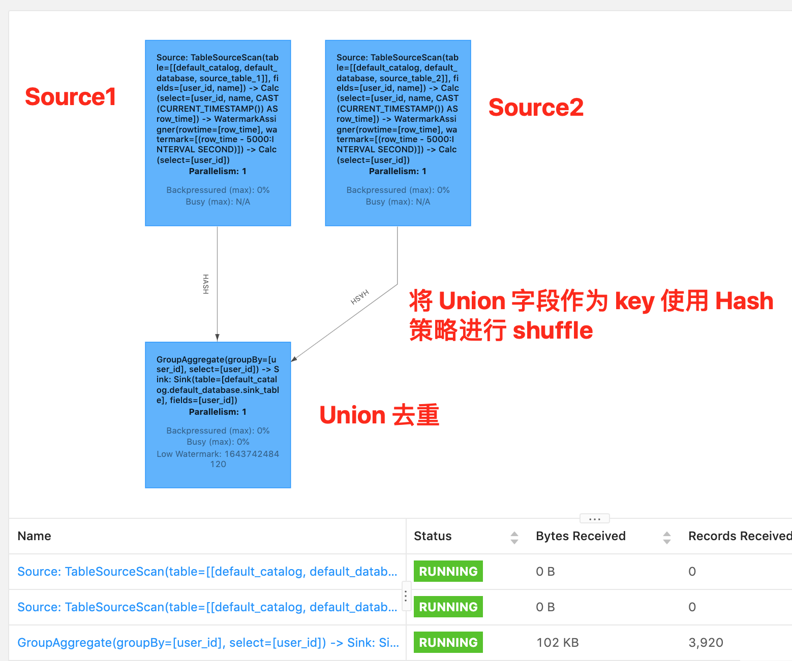](https://yangyichao-mango.github.io/blog-img/wechat-blog/01_大数据/01_数据仓库/01_实时数仓/02_数据内容建设/03_one-engine/01_计算引擎/01_flink/01_flink-sql/21_flinksql牛逼轰轰/34.png)

1. ⭐ UNION ALL：将集合合并，不做去重。

```
Flink SQL> create view t1(s) as values ('c'), ('a'), ('b'), ('b'), ('c');
Flink SQL> create view t2(s) as values ('d'), ('e'), ('a'), ('b'), ('b');

Flink SQL> (SELECT s FROM t1) UNION (SELECT s FROM t2);
+---+
|  s|
+---+
|  c|
|  a|
|  b|
|  d|
|  e|
+---+

Flink SQL> (SELECT s FROM t1) UNION ALL (SELECT s FROM t2);
+---+
|  c|
+---+
|  c|
|  a|
|  b|
|  b|
|  c|
|  d|
|  e|
|  a|
|  b|
|  b|
+---+
```

1. ⭐ Intersect：交集并且去重
2. ⭐ Intersect ALL：交集不做去重

```
Flink SQL> create view t1(s) as values ('c'), ('a'), ('b'), ('b'), ('c');
Flink SQL> create view t2(s) as values ('d'), ('e'), ('a'), ('b'), ('b');
Flink SQL> (SELECT s FROM t1) INTERSECT (SELECT s FROM t2);
+---+
|  s|
+---+
|  a|
|  b|
+---+

Flink SQL> (SELECT s FROM t1) INTERSECT ALL (SELECT s FROM t2);
+---+
|  s|
+---+
|  a|
|  b|
|  b|
+---+
```

1. ⭐ Except：差集并且去重
2. ⭐ Except ALL：差集不做去重

```
Flink SQL> (SELECT s FROM t1) EXCEPT (SELECT s FROM t2);
+---+
| s |
+---+
| c |
+---+

Flink SQL> (SELECT s FROM t1) EXCEPT ALL (SELECT s FROM t2);
+---+
| s |
+---+
| c |
| c |
+---+
```

上述 SQL 在流式任务中，如果一条左流数据先来了，没有从右流集合数据中找到对应的数据时会直接输出，当右流对应数据后续来了之后，会下发回撤流将之前的数据給撤回。这也是一个回撤流。

1. ⭐ In 子查询：这个大家比较熟悉了，但是注意，In 子查询的结果集只能有一列

```
SELECT user, amount
FROM Orders
WHERE product IN (
    SELECT product FROM NewProducts
)
```

上述 SQL 的 In 子句其实就和之前介绍到的 Inner Join 类似。并且 In 子查询也会涉及到大状态问题，大家注意设置 State 的 TTL。

## 3.10.DML：Order By、Limit 子句

### 3.10.1.Order By 子句

支持 Batch\Streaming，但在实时任务中一般用的非常少。

实时任务中，Order By 子句中必须要有时间属性字段，并且时间属性必须为升序时间属性，即 `WATERMARK FOR rowtime_column AS rowtime_column - INTERVAL '0.001' SECOND` 或者 `WATERMARK FOR rowtime_column AS rowtime_column`。

举例：

```
CREATE TABLE source_table_1 (
    user_id BIGINT NOT NULL,
    row_time AS cast(CURRENT_TIMESTAMP as timestamp(3)),
    WATERMARK FOR row_time AS row_time
) WITH (
  'connector' = 'datagen',
  'rows-per-second' = '10',
  'fields.user_id.min' = '1',
  'fields.user_id.max' = '10'
);

CREATE TABLE sink_table (
    user_id BIGINT
) WITH (
  'connector' = 'print'
);

INSERT INTO sink_table
SELECT user_id
FROM source_table_1
Order By row_time, user_id desc
```

### 3.10.2.Limit 子句

支持 Batch\Streaming，但实时场景一般不使用，但是此处依然举一个例子：

```
CREATE TABLE source_table_1 (
    user_id BIGINT NOT NULL,
    row_time AS cast(CURRENT_TIMESTAMP as timestamp(3)),
    WATERMARK FOR row_time AS row_time
) WITH (
  'connector' = 'datagen',
  'rows-per-second' = '10',
  'fields.user_id.min' = '1',
  'fields.user_id.max' = '10'
);

CREATE TABLE sink_table (
    user_id BIGINT
) WITH (
  'connector' = 'print'
);

INSERT INTO sink_table
SELECT user_id
FROM source_table_1
Limit 3
```

结果如下，只有 3 条输出：

```
script+I[5]
+I[9]
+I[4]
```

## 3.11.DML：TopN 子句

1. ⭐ TopN 定义（支持 Batch\Streaming）：TopN 其实就是对应到离线数仓中的 row_number()，可以使用 row_number() 对某一个分组的数据进行排序
2. ⭐ 应用场景：根据 `某个排序` 条件，计算`某个分组`下的排行榜数据
3. ⭐ SQL 语法标准：

```
SELECT [column_list]
FROM (
   SELECT [column_list],
     ROW_NUMBER() OVER ([PARTITION BY col1[, col2...]]
       ORDER BY col1 [asc|desc][, col2 [asc|desc]...]) AS rownum
   FROM table_name)
WHERE rownum <= N [AND conditions]
```

- ⭐ `ROW_NUMBER()`：标识 TopN 排序子句
- ⭐ `PARTITION BY col1[, col2...]`：标识分区字段，代表按照这个 col 字段作为分区粒度对数据进行排序取 topN，比如下述案例中的 `partition by key`，就是根据需求中的搜索关键词（key）做为分区
- ⭐ `ORDER BY col1 [asc|desc][, col2 [asc|desc]...]`：标识 TopN 的排序规则，是按照哪些字段、顺序或逆序进行排序
- ⭐ `WHERE rownum <= N`：这个子句是一定需要的，只有加上了这个子句，Flink 才能将其识别为一个 TopN 的查询，其中 N 代表 TopN 的条目数
- ⭐ `[AND conditions]`：其他的限制条件也可以加上

1. ⭐ 实际案例：取某个搜索关键词下的搜索热度前 10 名的词条数据。

输入数据为搜索词条数据的搜索热度数据，当搜索热度发生变化时，会将变化后的数据写入到数据源的 Kafka 中：

数据源 schema：

```
-- 字段名	        备注
-- key         	搜索关键词
-- name        	搜索热度名称
-- search_cnt   	热搜消费热度（比如 3000）
-- timestamp       消费词条时间戳

CREATE TABLE source_table (
    name BIGINT NOT NULL,
    search_cnt BIGINT NOT NULL,
    key BIGINT NOT NULL,
    row_time AS cast(CURRENT_TIMESTAMP as timestamp(3)),
    WATERMARK FOR row_time AS row_time
) WITH (
  ...
);

-- 数据汇 schema：

-- key         	搜索关键词
-- name        	搜索热度名称
-- search_cnt   	热搜消费热度（比如 3000）
-- timestamp       消费词条时间戳

CREATE TABLE sink_table (
    key BIGINT,
    name BIGINT,
    search_cnt BIGINT,
    `timestamp` TIMESTAMP(3)
) WITH (
  ...
);

-- DML 逻辑
INSERT INTO sink_table
SELECT key, name, search_cnt, row_time as `timestamp`
FROM (
   SELECT key, name, search_cnt, row_time, 
     -- 根据热搜关键词 key 作为 partition key，然后按照 search_cnt 倒排取前 100 名
     ROW_NUMBER() OVER (PARTITION BY key
       ORDER BY search_cnt desc) AS rownum
   FROM source_table)
WHERE rownum <= 100
```

输出结果：

```
script-D[关键词1, 词条1, 4944]
+I[关键词1, 词条1, 8670]
+I[关键词1, 词条2, 1735]
-D[关键词1, 词条3, 6641]
+I[关键词1, 词条3, 6928]
-D[关键词1, 词条4, 6312]
+I[关键词1, 词条4, 7287]
```

可以看到输出数据是有回撤数据的，为什么会出现回撤，我们来看看 SQL 语义。

1. ⭐ SQL 语义

上面的 SQL 会翻译成以下三个算子：

- ⭐ `数据源`：数据源即最新的词条下面的搜索词的搜索热度数据，消费到 Kafka 中数据后，按照 partition key 将数据进行 hash 分发到下游排序算子，相同的 key 数据将会发送到一个并发中
- ⭐ `排序算子`：为每个 Key 维护了一个 TopN 的榜单数据，接受到上游的一条数据后，如果 TopN 榜单还没有到达 N 条，则将这条数据加入 TopN 榜单后，直接下发数据，如果到达 N 条之后，经过 TopN 计算，发现这条数据比原有的数据排序靠前，那么新的 TopN 排名就会有变化，就变化了的这部分数据之前下发的排名数据撤回（即回撤数据），然后下发新的排名数据
- ⭐ `数据汇`：接收到上游的数据之后，然后输出到外部存储引擎中

上面三个算子也是会 24 小时一直运行的。

## 3.12.DML：Window TopN

1. ⭐ Window TopN 定义（支持 Streaming）：Window TopN 是一种特殊的 TopN，它的返回结果是每一个窗口内的 N 个最小值或者最大值。
2. ⭐ 应用场景：小伙伴萌会问了，我有了 TopN 为啥还需要 Window TopN 呢？还记得上文介绍 TopN 说道的 TopN 时会出现中间结果，从而出现回撤数据的嘛？Window TopN 不会出现回撤数据，因为 Window TopN 实现是在窗口结束时输出最终结果，不会产生中间结果。而且注意，因为是窗口上面的操作，Window TopN 在窗口结束时，会自动把 State 给清除。
3. ⭐ SQL 语法标准：

```
SELECT [column_list]
FROM (
   SELECT [column_list],
     ROW_NUMBER() OVER (PARTITION BY window_start, window_end [, col_key1...]
       ORDER BY col1 [asc|desc][, col2 [asc|desc]...]) AS rownum
   FROM table_name) -- windowing TVF
WHERE rownum <= N [AND conditions]
```

1. ⭐ 实际案例：取当前这一分钟的搜索关键词下的搜索热度前 10 名的词条数据

输入表字段：

```
-- 字段名	        备注
-- key         	    搜索关键词
-- name             搜索热度名称
-- search_cnt       热搜消费热度（比如 3000）
-- timestamp        消费词条时间戳

CREATE TABLE source_table (
    name BIGINT NOT NULL,
    search_cnt BIGINT NOT NULL,
    key BIGINT NOT NULL,
    row_time AS cast(CURRENT_TIMESTAMP as timestamp(3)),
    WATERMARK FOR row_time AS row_time
) WITH (
  ...
);

-- 输出表字段：
-- 字段名	        备注
-- key              搜索关键词
-- name        	    搜索热度名称
-- search_cnt       热搜消费热度（比如 3000）
-- window_start     窗口开始时间戳
-- window_end       窗口结束时间戳

CREATE TABLE sink_table (
    key BIGINT,
    name BIGINT,
    search_cnt BIGINT,
    window_start TIMESTAMP(3),
    window_end TIMESTAMP(3)
) WITH (
  ...
);

-- 处理 sql：

INSERT INTO sink_table
SELECT key, name, search_cnt, window_start, window_end
FROM (
   SELECT key, name, search_cnt, window_start, window_end, 
     ROW_NUMBER() OVER (PARTITION BY window_start, window_end, key
       ORDER BY search_cnt desc) AS rownum
   FROM (
      SELECT window_start, window_end, key, name, max(search_cnt) as search_cnt
      -- window tvf 写法
      FROM TABLE(TUMBLE(TABLE source_table, DESCRIPTOR(row_time), INTERVAL '1' MINUTES))
      GROUP BY window_start, window_end, key, name
   )
)
WHERE rownum <= 100
```

输出结果：

```
script+I[关键词1, 词条1, 8670, 2021-1-28T22:34, 2021-1-28T22:35]
+I[关键词1, 词条2, 6928, 2021-1-28T22:34, 2021-1-28T22:35]
+I[关键词1, 词条3, 1735, 2021-1-28T22:34, 2021-1-28T22:35]
+I[关键词1, 词条4, 7287, 2021-1-28T22:34, 2021-1-28T22:35]
...
```

可以看到结果是符合预期的，其中没有回撤数据。

1. ⭐ SQL 语义

- ⭐ `数据源`：数据源即最新的词条下面的搜索词的搜索热度数据，消费到 Kafka 中数据后，将数据按照窗口聚合的 key 通过 hash 分发策略发送到下游窗口聚合算子
- ⭐ `窗口聚合算子`：进行窗口聚合计算，随着时间的推进，将窗口聚合结果计算完成发往下游窗口排序算子
- ⭐ `窗口排序算子`：这个算子其实也是一个窗口算子，只不过这个窗口算子为每个 Key 维护了一个 TopN 的榜单数据，接受到上游发送的窗口结果数据进行排序，随着时间的推进，窗口的结束，将排序的结果输出到下游数据汇算子。
- ⭐ `数据汇`：接收到上游的数据之后，然后输出到外部存储引擎中

## 3.13.DML：Deduplication

1. ⭐ Deduplication 定义（支持 Batch\Streaming）：Deduplication 其实就是去重，也即上文介绍到的 TopN 中 row_number = 1 的场景，但是这里有一点不一样在于其排序字段一定是时间属性列，不能是其他非时间属性的普通列。在 row_number = 1 时，如果排序字段是普通列 planner 会翻译成 TopN 算子，如果是时间属性列 planner 会翻译成 Deduplication，这两者最终的执行算子是不一样的，Deduplication 相比 TopN 算子专门做了对应的优化，性能会有很大提升。
2. ⭐ 应用场景：比如上游数据发重了，或者计算 DAU 明细数据等场景，都可以使用 Deduplication 语法去做去重。
3. ⭐ SQL 语法标准：

```
SELECT [column_list]
FROM (
   SELECT [column_list],
     ROW_NUMBER() OVER ([PARTITION BY col1[, col2...]]
       ORDER BY time_attr [asc|desc]) AS rownum
   FROM table_name)
WHERE rownum = 1
```

其中：

- ⭐ `ROW_NUMBER()`：标识当前数据的排序值
- ⭐ `PARTITION BY col1[, col2...]`：标识分区字段，代表按照这个 col 字段作为分区粒度对数据进行排序
- ⭐ `ORDER BY time_attr [asc|desc]`：标识排序规则，必须为时间戳列，当前 Flink SQL 支持处理时间、事件时间，ASC 代表保留第一行，DESC 代表保留最后一行
- ⭐ `WHERE rownum = 1`：这个子句是一定需要的，而且必须为 rownum = 1

1. ⭐ 实际案例：

博主这里举两个案例：

- ⭐ 案例 1（事件时间）：是腾讯 QQ 用户等级的场景，每一个 QQ 用户都有一个 QQ 用户等级，需要求出当前用户等级在 `星星`，`月亮`，`太阳` 的用户数分别有多少。

```
-- 数据源：当每一个用户的等级初始化及后续变化的时候的数据，即用户等级变化明细数据。
CREATE TABLE source_table (
    user_id BIGINT COMMENT '用户 id',
    level STRING COMMENT '用户等级',
    row_time AS cast(CURRENT_TIMESTAMP as timestamp(3)) COMMENT '事件时间戳',
    WATERMARK FOR row_time AS row_time
) WITH (
  'connector' = 'datagen',
  'rows-per-second' = '1',
  'fields.level.length' = '1',
  'fields.user_id.min' = '1',
  'fields.user_id.max' = '1000000'
);

-- 数据汇：输出即每一个等级的用户数
CREATE TABLE sink_table (
    level STRING COMMENT '等级',
    uv BIGINT COMMENT '当前等级用户数',
    row_time timestamp(3) COMMENT '时间戳'
) WITH (
  'connector' = 'print'
);

-- 处理逻辑：
INSERT INTO sink_table
select 
    level
    , count(1) as uv
    , max(row_time) as row_time
from (
      SELECT
          user_id,
          level,
          row_time,
          row_number() over(partition by user_id order by row_time) as rn
      FROM source_table
)
where rn = 1
group by 
    level
```

输出结果：

```
script+I[等级 1, 6928, 2021-1-28T22:34]
-I[等级 1, 6928, 2021-1-28T22:34]
+I[等级 1, 8670, 2021-1-28T22:34]
-I[等级 1, 8670, 2021-1-28T22:34]
+I[等级 1, 77287, 2021-1-28T22:34]
...
```

可以看到其有回撤数据。

其对应的 SQL 语义如下：

- ⭐ `数据源`：消费到 Kafka 中数据后，将数据按照 partition by 的 key 通过 hash 分发策略发送到下游去重算子
- ⭐ `Deduplication 去重算子`：接受到上游数据之后，根据 order by 中的条件判断当前的这条数据和之前数据时间戳大小，以上面案例来说，如果当前数据时间戳大于之前数据时间戳，则撤回之前向下游发的中间结果，然后将最新的结果发向下游（发送策略也为 hash，具体的 hash 策略为按照 group by 中 key 进行发送），如果当前数据时间戳小于之前数据时间戳，则不做操作。次算子产出的结果就是每一个用户的对应的最新等级信息。
- ⭐ `Group by 聚合算子`：接受到上游数据之后，根据 Group by 聚合粒度对数据进行聚合计算结果（每一个等级的用户数），发往下游数据汇算子
- ⭐ `数据汇`：接收到上游的数据之后，然后输出到外部存储引擎中
- ⭐ 案例 2（处理时间）：最原始的日志是明细数据，需要我们根据用户 id 筛选出这个用户当天的第一条数据，发往下游，下游可以据此计算分各种维度的 DAU

```
-- 数据源：原始日志明细数据
CREATE TABLE source_table (
    user_id BIGINT COMMENT '用户 id',
    name STRING COMMENT '用户姓名',
    server_timestamp BIGINT COMMENT '用户访问时间戳',
    proctime AS PROCTIME()
) WITH (
  'connector' = 'datagen',
  'rows-per-second' = '1',
  'fields.name.length' = '1',
  'fields.user_id.min' = '1',
  'fields.user_id.max' = '10',
  'fields.server_timestamp.min' = '1',
  'fields.server_timestamp.max' = '100000'
);

-- 数据汇：根据 user_id 去重的第一条数据
CREATE TABLE sink_table (
    user_id BIGINT,
    name STRING,
    server_timestamp BIGINT
) WITH (
  'connector' = 'print'
);

-- 处理逻辑：
INSERT INTO sink_table
select user_id,
       name,
       server_timestamp
from (
      SELECT
          user_id,
          name,
          server_timestamp,
          row_number() over(partition by user_id order by proctime) as rn
      FROM source_table
)
where rn = 1
```

输出结果：

```
script+I[1, 用户 1, 2021-1-28T22:34]
+I[2, 用户 2, 2021-1-28T22:34]
+I[3, 用户 3, 2021-1-28T22:34]
...
```

可以看到这个处理逻辑是没有回撤数据的。其对应的 SQL 语义如下：

- ⭐ `数据源`：消费到 Kafka 中数据后，将数据按照 partition by 的 key 通过 hash 分发策略发送到下游去重算子
- ⭐ `Deduplication 去重算子`：处理时间语义下，如果是当前 key 的第一条数据，则直接发往下游，如果判断（根据 state 中是否存储过改 key）不是第一条，则直接丢弃
- ⭐ `数据汇`：接收到上游的数据之后，然后输出到外部存储引擎中

> 注意：
>
> 在 Deduplication 关于是否会出现回撤流，博主总结如下：
>
> 1. ⭐ Order by 事件时间 DESC：会出现回撤流，因为当前 key 下 `可能会有` 比当前事件时间还大的数据
> 2. ⭐ Order by 事件时间 ASC：会出现回撤流，因为当前 key 下 `可能会有` 比当前事件时间还小的数据
> 3. ⭐ Order by 处理时间 DESC：会出现回撤流，因为当前 key 下 `可能会有` 比当前处理时间还大的数据
> 4. ⭐ Order by 处理时间 ASC：不会出现回撤流，因为当前 key 下 `不可能会有` 比当前处理时间还小的数据

## 3.14.EXPLAIN 子句

1. ⭐ 应用场景：EXPLAIN 子句其实就是用于查看当前这个 sql 查询的逻辑计划以及优化的执行计划。
2. ⭐ SQL 语法标准：

```
EXPLAIN PLAN FOR <query_statement_or_insert_statement>
```

1. ⭐ 实际案例：

```
public class Explain_Test {

    public static void main(String[] args) throws Exception {

        FlinkEnv flinkEnv = FlinkEnvUtils.getStreamTableEnv(args);

        flinkEnv.env().setParallelism(1);

        String sql = "CREATE TABLE source_table (\n"
                + "    user_id BIGINT COMMENT '用户 id',\n"
                + "    name STRING COMMENT '用户姓名',\n"
                + "    server_timestamp BIGINT COMMENT '用户访问时间戳',\n"
                + "    proctime AS PROCTIME()\n"
                + ") WITH (\n"
                + "  'connector' = 'datagen',\n"
                + "  'rows-per-second' = '1',\n"
                + "  'fields.name.length' = '1',\n"
                + "  'fields.user_id.min' = '1',\n"
                + "  'fields.user_id.max' = '10',\n"
                + "  'fields.server_timestamp.min' = '1',\n"
                + "  'fields.server_timestamp.max' = '100000'\n"
                + ");\n"
                + "\n"
                + "CREATE TABLE sink_table (\n"
                + "    user_id BIGINT,\n"
                + "    name STRING,\n"
                + "    server_timestamp BIGINT\n"
                + ") WITH (\n"
                + "  'connector' = 'print'\n"
                + ");\n"
                + "\n"
                + "EXPLAIN PLAN FOR\n"
                + "INSERT INTO sink_table\n"
                + "select user_id,\n"
                + "       name,\n"
                + "       server_timestamp\n"
                + "from (\n"
                + "      SELECT\n"
                + "          user_id,\n"
                + "          name,\n"
                + "          server_timestamp,\n"
                + "          row_number() over(partition by user_id order by proctime) as rn\n"
                + "      FROM source_table\n"
                + ")\n"
                + "where rn = 1";

        /**
         * 算子 {@link org.apache.flink.streaming.api.operators.KeyedProcessOperator}
         *      -- {@link org.apache.flink.table.runtime.operators.deduplicate.ProcTimeDeduplicateKeepFirstRowFunction}
         */

        for (String innerSql : sql.split(";")) {
            TableResult tableResult = flinkEnv.streamTEnv().executeSql(innerSql);

            tableResult.print();
        }
    }
}
```

上述代码执行结果如下：

```
script1. 抽象语法树
== Abstract Syntax Tree ==
LogicalSink(table=[default_catalog.default_database.sink_table], fields=[user_id, name, server_timestamp])
+- LogicalProject(user_id=[$0], name=[$1], server_timestamp=[$2])
   +- LogicalFilter(condition=[=($3, 1)])
      +- LogicalProject(user_id=[$0], name=[$1], server_timestamp=[$2], rn=[ROW_NUMBER() OVER (PARTITION BY $0 ORDER BY PROCTIME() NULLS FIRST)])
         +- LogicalTableScan(table=[[default_catalog, default_database, source_table]])

2. 优化后的物理计划
== Optimized Physical Plan ==
Sink(table=[default_catalog.default_database.sink_table], fields=[user_id, name, server_timestamp])
+- Calc(select=[user_id, name, server_timestamp])
   +- Deduplicate(keep=[FirstRow], key=[user_id], order=[PROCTIME])
      +- Exchange(distribution=[hash[user_id]])
         +- Calc(select=[user_id, name, server_timestamp, PROCTIME() AS $3])
            +- TableSourceScan(table=[[default_catalog, default_database, source_table]], fields=[user_id, name, server_timestamp])

3. 优化后的执行计划
== Optimized Execution Plan ==
Sink(table=[default_catalog.default_database.sink_table], fields=[user_id, name, server_timestamp])
+- Calc(select=[user_id, name, server_timestamp])
   +- Deduplicate(keep=[FirstRow], key=[user_id], order=[PROCTIME])
      +- Exchange(distribution=[hash[user_id]])
         +- Calc(select=[user_id, name, server_timestamp, PROCTIME() AS $3])
            +- TableSourceScan(table=[[default_catalog, default_database, source_table]], fields=[user_id, name, server_timestamp])
```

## 3.15.USE 子句

1. ⭐ 应用场景：如果熟悉 MySQL 的同学会非常熟悉这个子句，在 MySQL 中，USE 子句通常被用于切换库，那么在 Flink SQL 体系中，它的作用也是和 MySQL 中 USE 子句的功能基本一致，用于切换 Catalog，DataBase，使用 Module
2. ⭐ SQL 语法标准：

- ⭐ 切换 Catalog

```
USE CATALOG catalog_name
```

- ⭐ 使用 Module

```
USE MODULES module_name1[, module_name2, ...]
```

- ⭐ 切换 Database

```
USE db名称
```

1. ⭐ 实际案例：

```
StreamExecutionEnvironment env = StreamExecutionEnvironment.getExecutionEnvironment();
StreamTableEnvironment tEnv = StreamTableEnvironment.create(env);

// create a catalog
tEnv.executeSql("CREATE CATALOG cat1 WITH (...)");
tEnv.executeSql("SHOW CATALOGS").print();
// +-----------------+
// |    catalog name |
// +-----------------+
// | default_catalog |
// | cat1            |
// +-----------------+

// change default catalog
tEnv.executeSql("USE CATALOG cat1");

tEnv.executeSql("SHOW DATABASES").print();
// databases are empty
// +---------------+
// | database name |
// +---------------+
// +---------------+

// create a database
tEnv.executeSql("CREATE DATABASE db1 WITH (...)");
tEnv.executeSql("SHOW DATABASES").print();
// +---------------+
// | database name |
// +---------------+
// |        db1    |
// +---------------+

// change default database
tEnv.executeSql("USE db1");

// change module resolution order and enabled status
tEnv.executeSql("USE MODULES hive");
tEnv.executeSql("SHOW FULL MODULES").print();
// +-------------+-------+
// | module name |  used |
// +-------------+-------+
// |        hive |  true |
// |        core | false |
// +-------------+-------+
```

## 3.16.SHOW 子句

1. ⭐ 应用场景：如果熟悉 MySQL 的同学会非常熟悉这个子句，在 MySQL 中，SHOW 子句常常用于查询库、表、函数等，在 Flink SQL 体系中也类似。Flink SQL 支持 SHOW 以下内容。
2. ⭐ SQL 语法标准：

```
SHOW CATALOGS：展示所有 Catalog
SHOW CURRENT CATALOG：展示当前的 Catalog
SHOW DATABASES：展示当前 Catalog 下所有 Database
SHOW CURRENT DATABASE：展示当前的 Database
SHOW TABLES：展示当前 Database 下所有表
SHOW VIEWS：展示所有视图
SHOW FUNCTIONS：展示所有的函数
SHOW MODULES：展示所有的 Module（Module 是用于 UDF 扩展）
```

1. ⭐ 实际案例：

```
StreamExecutionEnvironment env = StreamExecutionEnvironment.getExecutionEnvironment();
StreamTableEnvironment tEnv = StreamTableEnvironment.create(env);

// show catalogs
tEnv.executeSql("SHOW CATALOGS").print();
// +-----------------+
// |    catalog name |
// +-----------------+
// | default_catalog |
// +-----------------+

// show current catalog
tEnv.executeSql("SHOW CURRENT CATALOG").print();
// +----------------------+
// | current catalog name |
// +----------------------+
// |      default_catalog |
// +----------------------+

// show databases
tEnv.executeSql("SHOW DATABASES").print();
// +------------------+
// |    database name |
// +------------------+
// | default_database |
// +------------------+

// show current database
tEnv.executeSql("SHOW CURRENT DATABASE").print();
// +-----------------------+
// | current database name |
// +-----------------------+
// |      default_database |
// +-----------------------+

// create a table
tEnv.executeSql("CREATE TABLE my_table (...) WITH (...)");
// show tables
tEnv.executeSql("SHOW TABLES").print();
// +------------+
// | table name |
// +------------+
// |   my_table |
// +------------+

// create a view
tEnv.executeSql("CREATE VIEW my_view AS ...");
// show views
tEnv.executeSql("SHOW VIEWS").print();
// +-----------+
// | view name |
// +-----------+
// |   my_view |
// +-----------+

// show functions
tEnv.executeSql("SHOW FUNCTIONS").print();
// +---------------+
// | function name |
// +---------------+
// |           mod |
// |        sha256 |
// |           ... |
// +---------------+

// create a user defined function
tEnv.executeSql("CREATE FUNCTION f1 AS ...");
// show user defined functions
tEnv.executeSql("SHOW USER FUNCTIONS").print();
// +---------------+
// | function name |
// +---------------+
// |            f1 |
// |           ... |
// +---------------+

// show modules
tEnv.executeSql("SHOW MODULES").print();
// +-------------+
// | module name |
// +-------------+
// |        core |
// +-------------+

// show full modules
tEnv.executeSql("SHOW FULL MODULES").print();
// +-------------+-------+
// | module name |  used |
// +-------------+-------+
// |        core |  true |
// |        hive | false |
// +-------------+-------+
```

## 3.17.LOAD、UNLOAD 子句

1. ⭐ 应用场景：我们可以使用 LOAD 子句去加载 Flink SQL 体系内置的或者用户自定义的 Module，UNLOAD 子句去卸载 Flink SQL 体系内置的或者用户自定义的 Module
2. ⭐ SQL 语法标准：

```
-- 加载
LOAD MODULE module_name [WITH ('key1' = 'val1', 'key2' = 'val2', ...)]

-- 卸载
UNLOAD MODULE module_name
```

1. ⭐ 实际案例：

- ⭐ LOAD 案例：

```
StreamExecutionEnvironment env = StreamExecutionEnvironment.getExecutionEnvironment();
StreamTableEnvironment tEnv = StreamTableEnvironment.create(env);

// 加载 Flink SQL 体系内置的 Hive module
tEnv.executeSql("LOAD MODULE hive WITH ('hive-version' = '3.1.2')");
tEnv.executeSql("SHOW MODULES").print();
// +-------------+
// | module name |
// +-------------+
// |        core |
// |        hive |
// +-------------+
```

- ⭐ UNLOAD 案例：

```
StreamExecutionEnvironment env = StreamExecutionEnvironment.getExecutionEnvironment();
StreamTableEnvironment tEnv = StreamTableEnvironment.create(env);

// 卸载唯一的一个 CoreModule
tEnv.executeSql("UNLOAD MODULE core");
tEnv.executeSql("SHOW MODULES").print();
// 结果啥 Moudle 都没有了
```

## 3.18.SET、RESET 子句

1. ⭐ 应用场景：SET 子句可以用于修改一些 Flink SQL 的环境配置，RESET 子句是可以将所有的环境配置恢复成默认配置，但只能在 SQL CLI 中进行使用，主要是为了让用户更纯粹的使用 SQL 而不必使用其他方式或者切换系统环境。
2. ⭐ SQL 语法标准：

```
SET (key = value)?

RESET (key)?
```

1. ⭐ 实际案例：

启动一个 SQL CLI 之后，在 SQL CLI 中可以进行以下 SET 设置：

```
Flink SQL> SET table.planner = blink;
[INFO] Session property has been set.

Flink SQL> SET;
table.planner=blink;

Flink SQL> RESET table.planner;
[INFO] Session property has been reset.

Flink SQL> RESET;
[INFO] All session properties have been set to their default values.
```

## 3.19.SQL Hints

1. ⭐ 应用场景：比如有一个 kafka 数据源表 kafka_table1，用户想直接从 `latest-offset` select 一些数据出来预览，其元数据已经存储在 Hive MetaStore 中，但是 Hive MetaStore 中存储的配置中的 `scan.startup.mode` 是 `earliest-offset`，通过 SQL Hints，用户可以在 DML 语句中将 `scan.startup.mode` 改为 `latest-offset` 查询，因此可以看出 SQL Hints 常用语这种比较临时的参数修改，比如 Ad-hoc 这种临时查询中，方便用户使用自定义的新的表参数而不是 Catalog 中已有的表参数。
2. ⭐ SQL 语法标准：

以下 DML SQL 中的 `/*+ OPTIONS(key=val [, key=val]*) */` 就是 SQL Hints。

```
SELECT *
FROM table_path /*+ OPTIONS(key=val [, key=val]*) */
```

1. ⭐ 实际案例：

启动一个 SQL CLI 之后，在 SQL CLI 中可以进行以下 SET 设置：

```
CREATE TABLE kafka_table1 (id BIGINT, name STRING, age INT) WITH (...);
CREATE TABLE kafka_table2 (id BIGINT, name STRING, age INT) WITH (...);

-- 1. 使用 'scan.startup.mode'='earliest-offset' 覆盖原来的 scan.startup.mode
select id, name from kafka_table1 /*+ OPTIONS('scan.startup.mode'='earliest-offset') */;

-- 2. 使用 'scan.startup.mode'='earliest-offset' 覆盖原来的 scan.startup.mode
select * from
    kafka_table1 /*+ OPTIONS('scan.startup.mode'='earliest-offset') */ t1
    join
    kafka_table2 /*+ OPTIONS('scan.startup.mode'='earliest-offset') */ t2
    on t1.id = t2.id;

-- 3. 使用 'sink.partitioner'='round-robin' 覆盖原来的 Sink 表的 sink.partitioner
insert into kafka_table1 /*+ OPTIONS('sink.partitioner'='round-robin') */ select * from kafka_table2;
```

# 4.SQL UDF 篇

Flink Table\SQL API 允许用户使用函数进行数据处理、字段标准化等处理。

## 4.1.SQL 函数的归类

Flink 中的函数有两个维度的归类标准。

1. ⭐ 一个归类标准是：系统（内置）函数和 Catalog 函数。系统函数没有命名空间，只能通过其名称来进行引用。Catalog 函数属于 Catalog 和数据库，因此它们拥有 Catalog 和数据库的命名空间。用户可以通过全/部分限定名（catalog.db.func 或 db.func）或者函数来对 Catalog 函数进行引用。
2. ⭐ 另一个归类标准是：临时函数和持久化函数。临时函数由用户创建，它仅在会话的生命周期（也就是一个 Flink 任务的一次运行生命周期内）内有效。持久化函数不是由系统提供的，是存储在 Catalog 中，它在不同会话的生命周期内都有效。

这两个维度归类标准组合下，Flink SQL 总共提供了 4 种函数：

1. ⭐ 临时性系统内置函数
2. ⭐ 系统内置函数
3. ⭐ 临时性 Catalog 函数（例如：Create Temporary Function）
4. ⭐ Catalog 函数（例如：Create Function）

请注意，在用户使用函数时，系统函数始终优先于 Catalog 函数解析，临时函数始终优先于持久化函数解析。

## 4.2.SQL 函数的引用方式

用户在 Flink 中可以通过精确、模糊两种引用方式引用函数。

### 4.2.1.精确函数

精确函数引用是让用户限定 Catalog，数据库名称进行精准定位一个 UDF 然后调用。

例如：select mycatalog.mydb.myfunc(x) from mytable 或者 select mydb.myfunc(x) from mytable。

### 4.2.2.模糊函数

在模糊函数引用中，用户只需在 SQL 查询中指定函数名就可以引用 UDF，例如： select myfunc(x) from mytable。

当然小伙伴萌问到，如果系统函数和 Catalog 函数的名称是重复的，Flink 体系是会使用哪一个函数呢？这就是下文要介绍的 UDF 解析顺序

## 4.3.SQL 函数的解析顺序

### 4.3.1.精确函数

由于精确函数应用一定会带上 Catalog 或者数据库名称，所以 Flink 中的精确函数引用一定是指向临时性 Catalog 函数或 Catalog 函数的。

比如：`select mycatalog.mydb.myfunc(x) from mytable`。

那么 Flink 对其解析顺序以及使用顺序如下：

1. ⭐ 临时性 catalog 函数
2. ⭐ Catalog 函数

### 4.3.2.模糊函数

比如 `select myfunc(x) from mytable`。

解析顺序以及使用顺序如下：

1. ⭐ 临时性系统内置函数
2. ⭐ 系统内置函数
3. ⭐ 临时性 Catalog 函数, 只会在当前会话的当前 Catalog 和当前数据库中查找函数及解析函数
4. ⭐ Catalog 函数, 在当前 Catalog 和当前数据库中查找函数及解析函数

## 4.4.系统内置函数

系统内置函数小伙伴萌可以直接在 Flink 官网进行查询，博主这里就不多进行介绍。

https://nightlies.apache.org/flink/flink-docs-release-1.13/zh/docs/dev/table/functions/systemfunctions/#hash-functions

> 注意：
>
> 在目前 1.13 版本的 Flink 体系中，内置的系统函数没有像 Hive 内置的函数那么丰富，比如 Hive 中常见的 get_json_object 之类的，Flink 都是没有的，但是 Flink 提供了插件化 Module 的能力，能扩充一些 UDF，下文会进行介绍。

## 4.5.SQL 自定义函数（UDF）

！！！Flink 体系也提供了类似于其他大数据引擎的 UDF 体系。

自定义函数（UDF）是一种扩展开发机制，可以用来在查询语句里调用难以用 SQL 进行 `直接` 表达的频繁使用或自定义的逻辑。

目前 Flink 自定义函数可以基于 JVM 语言（例如 Java 或 Scala）或 Python 实现，实现者可以在 UDF 中使用任意第三方库，本章聚焦于使用 Java 语言开发自定义函数。

当前 Flink 提供了一下几种 UDF 能力：

1. 标量函数（Scalar functions 或 `UDAF`）：输入一条输出一条，将标量值转换成一个新标量值，对标 Hive 中的 UDF；
2. 表值函数（Table functions 或 `UDTF`）：输入一条条输出多条，对标 Hive 中的 UDTF；
3. 聚合函数（Aggregate functions 或 `UDAF`）：输入多条输出一条，对标 Hive 中的 UDAF；
4. 表值聚合函数（Table aggregate functions 或 `UDTAF`）：仅仅支持 Table API，不支持 SQL API，其可以将多行转为多行；
5. 异步表值函数（Async table functions）：这是一种特殊的 UDF，支持异步查询外部数据系统，用在前文介绍到的 lookup join 中作为查询外部系统的函数。

先直接给一个案例看看，怎么创建并在 Flink SQL 中使用一个 UDF：

```
import org.apache.flink.table.api.*;
import org.apache.flink.table.functions.ScalarFunction;
import static org.apache.flink.table.api.Expressions.*;

// 定义一个标量函数
public static class SubstringFunction extends ScalarFunction {
  public String eval(String s, Integer begin, Integer end) {
    return s.substring(begin, end);
  }
}

TableEnvironment env = TableEnvironment.create(...);

// 在 Table API 可以直接以引用 class 方式使用 UDF
env.from("MyTable").select(call(SubstringFunction.class, $("myField"), 5, 12));

// 注册 UDF
env.createTemporarySystemFunction("SubstringFunction", SubstringFunction.class);

// Table API 调用 UDF
env.from("MyTable").select(call("SubstringFunction", $("myField"), 5, 12));

// SQL API 调用 UDF
env.sqlQuery("SELECT SubstringFunction(myField, 5, 12) FROM MyTable");
```

注意：如果你的函数在初始化时，是有入参的，那么需要你的入参是 `Serializable` 的。即 Java 中需要继承 `Serializable` 接口。

案例如下：

```
import org.apache.flink.table.api.*;
import org.apache.flink.table.functions.ScalarFunction;
import static org.apache.flink.table.api.Expressions.*;

// 定义一个带有输入参数的标量函数
public static class SubstringFunction extends ScalarFunction {

  -- boolean 默认就是 Serializable 的
  private boolean endInclusive;

  public SubstringFunction(boolean endInclusive) {
    this.endInclusive = endInclusive;
  }

  public String eval(String s, Integer begin, Integer end) {
    return s.substring(begin, endInclusive ? end + 1 : end);
  }
}

TableEnvironment env = TableEnvironment.create(...);

// Table API 调用 UDF
env.from("MyTable").select(call(new SubstringFunction(true), $("myField"), 5, 12));

// 注册 UDF
env.createTemporarySystemFunction("SubstringFunction", new SubstringFunction(true));
```

## 4.6.开发 UDF 之前的需知事项

总结这几个事项主要包含以下步骤：

1. 首先需要继承 Flink SQL UDF 体系提供的基类，每种 UDF 实现都有不同的基类
2. 实现 UDF 执行逻辑函数，不同类型的 UDF 需要实现不同的执行逻辑函数
3. 注意 UDF 入参、出参类型推导，Flink 在一些基础类型上的是可以直接推导出类型信息的，但是一些复杂类型就无能为力了，这里需要用户主动介入
4. 明确 UDF 输出结果是否是定值，如果是定值则 Flink 会在生成计划时就执行一遍，得出结果，然后使用这个定值的结果作为后续的执行逻辑的参数，这样可以做到不用在 Flink SQL 任务运行时每次都执行一次，会有性能优化
5. 巧妙运用运行时上下文，可以在任务运行前加载到一些外部资源、上下文配置信息，扩展 UDF 能力

### 4.6.1.继承 UDF 基类

和 Hive UDF 实现思路类似，在 Flink UDF 体系中，需要注意一下事项：

1. ⭐ Flink UDF 要继承一个基类（比如标量 UDF 要继承 `org.apache.flink.table.functions.ScalarFunction`）。
2. ⭐ 类必须声明为 `public`，不能是 `abstract` 类，不能使用非静态内部类或匿名类。
3. ⭐ 为了在 Catalog 中存储此类，该类必须要有默认构造函数并且在运行时可以进行实例化。

### 4.6.2.实现 UDF 执行逻辑函数

基类提供了一组可以被重写的方法，来给用户进行使用，这些可被重写的方法就是主要承担 UDF 自定义执行逻辑的地方。

举例在 `ScalarFunction` 中：

1. ⭐ `open()`：用于初始化资源（比如连接外部资源），程序初始化时进行调用
2. ⭐ `close()`：用于关闭资源，程序结束时进行调用
3. ⭐ `isDeterministic()`：用于判断返回结果是否是确定的，如果是确定的，结果会被直接执行
4. ⭐ `eval(xxx)`：Flink 用于处理每一条数据的主要处理逻辑函数

你可以自定义 eval 的入参，比如：

- eval(Integer) 和 eval(LocalDateTime)；
- 使用变长参数，例如 eval(Integer…);
- 使用对象，例如 eval(Object) 可接受 LocalDateTime、Integer 作为参数，只要是 Object 都可以；
- 也可组合使用，例如 eval(Object…) 可接受所有类型的参数。

并且你可以在一个 UDF 中重载 eval 函数来实现不同的逻辑，比如：

```
import org.apache.flink.table.functions.ScalarFunction;

// 有多个重载求和方法的函数
public static class SumFunction extends ScalarFunction {

  // 入参为 Integer
  public Integer eval(Integer a, Integer b) {
    return a + b;
  }

  // 入参为 String
  public Integer eval(String a, String b) {
    return Integer.valueOf(a) + Integer.valueOf(b);
  }

  // 入参为多个 Double
  public Integer eval(Double... d) {
    double result = 0;
    for (double value : d)
      result += value;
    return (int) result;
  }
}
```

> 注意：
> 由于 Flink 在运行时会调用这些方法，所以这些方法必须声明为 public，并且包含明确的输入和输出参数。

### 4.6.3.注意 UDF 入参、出参类型推导

从两个角度来说，为什么函数的入参、出参类型会对 UDF 这么重要。

1. ⭐ 从开发人员角度讲，在设计 UDF 的时候，肯定会涉及到 UDF 预期的入参、出参类型信息、也包括一些数据的精度、小数位数等信息
2. ⭐ 从程序运行角度讲，Flink SQL 程序运行时，肯定也需要知道怎么将 SQL 中的类型数据与 UDF 的入参、出参类型，这样才能做数据序列化等操作

而 Flink 也提供了三种方式帮助 Flink 程序获取参数类型信息。

1. ⭐ 自动类型推导功能：Flink 具备 UDF 自动类型推导功能，该功能可以通过反射从函数的类及其求值方法派生数据类型。比如如果你的 UDF 的方法或者类的签名中已经有了对应的入参、出参的类型，Flink 一般都可以推导并获取到这些类型信息。
2. ⭐ 添加类型注解：当 1 中的隐式反射提取方法不成功，则可以通过使用 Flink 提供的 `@DataTypeHint` 和 `@FunctionHint` 注解对应的参数、类或方法来显示的支持 Flink 参数类型提取。
3. ⭐ 重写 `getTypeInference()`：你可以使用 Flink 提供的更高级的类型推导方法，你可以在 UDF 实现类中重写 `getTypeInference()` 方法去显示声明函数的参数类型信息

接下来介绍几个例子。

1. ⭐ 自动类型推导案例：

自动类型推导会检查函数的 `类` 签名和 `eval` 方法签名，从而推导出函数入参和出参的数据类型，`@DataTypeHint` 和 `@FunctionHint` 注解也可以辅助支持自动类型推导。

关于自动类型推导具体将 Java 的对象会映射成 SQL 的具体哪个数据类型，可以参考 https://nightlies.apache.org/flink/flink-docs-release-1.13/docs/dev/table/types/#data-type-extraction

案例如下：

```
import org.apache.flink.table.annotation.DataTypeHint;
import org.apache.flink.table.annotation.InputGroup;
import org.apache.flink.table.functions.ScalarFunction;
import org.apache.flink.types.Row;

// 有多个重载求值方法的函数
public static class OverloadedFunction extends ScalarFunction {

  // 不需要任何声明，可以直接推导出类型信息，即入参和出参对应到 SQL 中的 bigint 类型
  public Long eval(long a, long b) {
    return a + b;
  }

  // 使用 @DataTypeHint("DECIMAL(12, 3)") 定义 decimal 的精度和小数位
  public @DataTypeHint("DECIMAL(12, 3)") BigDecimal eval(double a, double b) {
    return BigDecimal.valueOf(a + b);
  }

  // 使用注解定义嵌套数据类型
  @DataTypeHint("ROW<s STRING, t TIMESTAMP_LTZ(3)>")
  public Row eval(int i) {
    return Row.of(String.valueOf(i), Instant.ofEpochSecond(i));
  }

  // 允许任意类型的输入，并输出序列化定制后的值
  @DataTypeHint(value = "RAW", bridgedTo = ByteBuffer.class)
  public ByteBuffer eval(@DataTypeHint(inputGroup = InputGroup.ANY) Object o) {
    return MyUtils.serializeToByteBuffer(o);
  }
}
```

1. ⭐ 根据 @FunctionHint 注解自动推导类型案例：

使用 @DataTypeHint 注解虽好，但是有些场景下，使用起来比较复杂，比如：

- ⭐ 我们不希望 eval 函数的入参和出参都是一个非常具体的类型，比如 long，int，double 等。我们希望它是一个通用的类型，比如 Object。这样的话就不用重载那么多的函数，可以直接使用一个 eval 函数实现不同的处理逻辑，返回不同类型的结果
- ⭐ 多个 eval 方法的返回结果类型都是相同的，我们懒得写多次 @DataTypeHint

那么就可以使用 @FunctionHint 实现，@FunctionHint 是声明在类上面的，举例如下：

```
import org.apache.flink.table.annotation.DataTypeHint;
import org.apache.flink.table.annotation.FunctionHint;
import org.apache.flink.table.functions.TableFunction;
import org.apache.flink.types.Row;

// 1. 解耦类型推导与 eval 方法，类型推导根据 FunctionHint 注解中的信息来，下面的案例说明当前这个 UDF 有三种输入输出类型信息组合
@FunctionHint(
  input = {@DataTypeHint("INT"), @DataTypeHint("INT")},
  output = @DataTypeHint("INT")
)
@FunctionHint(
  input = {@DataTypeHint("BIGINT"), @DataTypeHint("BIGINT")},
  output = @DataTypeHint("BIGINT")
)
@FunctionHint(
  input = {},
  output = @DataTypeHint("BOOLEAN")
)
public static class OverloadedFunction extends TableFunction<Object> {

  public void eval(Object... o) {
    if (o.length == 0) {
      collect(false);
    }
    collect(o[0]);
  }
}

// 2. 为函数类的所有 eval 方法指定同一个输出类型
@FunctionHint(output = @DataTypeHint("ROW<s STRING, i INT>"))
public static class OverloadedFunction extends TableFunction<Row> {

  public void eval(int a, int b) {
    collect(Row.of("Sum", a + b));
  }

  public void eval() {
    collect(Row.of("Empty args", -1));
  }
}
```

1. ⭐ getTypeInference()

getTypeInference() 可以做到根据小伙伴萌自定义的方式去定义类型推导过程及结果，具有高度自定义的能力。举例如下：

```
import org.apache.flink.table.api.DataTypes;
import org.apache.flink.table.catalog.DataTypeFactory;
import org.apache.flink.table.functions.ScalarFunction;
import org.apache.flink.table.types.inference.TypeInference;
import org.apache.flink.types.Row;

public static class LiteralFunction extends ScalarFunction {
  public Object eval(String s, String type) {
    switch (type) {
      case "INT":
        return Integer.valueOf(s);
      case "DOUBLE":
        return Double.valueOf(s);
      case "STRING":
      default:
        return s;
    }
  }

  // 如果实现了 getTypeInference，则会禁用自动的反射式类型推导，使用如下逻辑进行类型推导
  @Override
  public TypeInference getTypeInference(DataTypeFactory typeFactory) {
    return TypeInference.newBuilder()
      // 指定输入参数的类型，必要时参数会被隐式转换
      .typedArguments(DataTypes.STRING(), DataTypes.STRING())
      // 用户高度自定义的类型推导逻辑
      .outputTypeStrategy(callContext -> {
        if (!callContext.isArgumentLiteral(1) || callContext.isArgumentNull(1)) {
          throw callContext.newValidationError("Literal expected for second argument.");
        }
        // 基于第一个入参决定具体的返回数据类型
        final String literal = callContext.getArgumentValue(1, String.class).orElse("STRING");
        switch (literal) {
          case "INT":
            return Optional.of(DataTypes.INT().notNull());
          case "DOUBLE":
            return Optional.of(DataTypes.DOUBLE().notNull());
          case "STRING":
          default:
            return Optional.of(DataTypes.STRING());
        }
      })
      .build();
  }
}
```

### 4.6.4.明确 UDF 输出结果是否是定值

用户可以通过重写 `isDeterministic()` 函数来声明这个 UDF 产出的结果是否是一个定值。

对于纯函数（即没有入参的函数，比如 random(), date(), or now() 等）来说，默认情况下 `isDeterministic()` 返回 true，小伙伴萌可以自定义返回 false。

如果函数不是一个纯函数（即没有入参的函数，比如 random(), date(), or now() 等），这个方法必须返回 `false`。

那么 `isDeterministic()` 方法的返回值到底影响什么呢？

答案：影响 Flink 任务在什么时候就直接执行这个 UDF。主要在以下两个方面体现：

1. ⭐ Flink 在生成计划期间直接执行 UDF 获得结果：如果使用常量表达式调用函数，或者使用常量作为函数的入参，则 Flink 任务可能不会在任务正式运行时执行该函数。举个例子，`SELECT ABS(-1) FROM t`，`SELECT ABS(field) FROM t WHERE field = -1`，这两种都会被 Flink 进行优化，直接把 ABS(-1) 的结果在客户端生成执行计划时就将结果运行出来。如果不想在生成执行计划阶段直接将结果运行出来，可以实现 `isDeterministic()` 返回 false。
2. ⭐ Flink 在程序运行期间执行 UDF 获得结果：如果 UDF 的入参不是常量表达式，或者 `isDeterministic()` 返回 false，则 Flink 会在程序运行期间执行 UDF。

那么小伙伴会问到，有些场景下 Flink SQL 是做了各种优化之后然后推断出表达式是否是常量，我怎么判断能够更加方便的判断出这个 Flink 是否将这个 UDF 的优化为固定结果了呢？

结论：这些都是可以在 Flink SQL 生成的算子图中看到，在 Flink web ui 中，每一个算子上面都可以详细看到 Flink 最终生成的算子执行逻辑。

### 4.6.5.巧妙运用运行时上下文

有时候我们想在 UDF 需要获取一些 Flink 任务运行的全局信息，或者在 UDF 真正处理数据之前做一些配置（setup）/清理（clean-up）的工作。UDF 为我们提供了 open() 和 close() 方法，你可以重写这两个方法做到类似于 DataStream API 中 RichFunction 的功能。

1. ⭐ `open()` 方法：在任务初始化时被调用，常常用于加载一些外部资源；
2. ⭐ `close()` 方法：在任务结束时被调用，常常用于关闭一些外部资源；

其中 open() 方法提供了一个 FunctionContext，它包含了一些 UDF 被执行时的上下文信息，比如 metric group、分布式文件缓存，或者是全局的作业参数等。

比如可以获取到下面的信息：

1. ⭐ getMetricGroup()：执行该函数的 subtask 的 Metric Group
2. ⭐ getCachedFile(name)：分布式文件缓存的本地临时文件副本
3. ⭐ getJobParameter(name, defaultValue)：获取 Flink 任务的全局作业参数
4. ⭐ getExternalResourceInfos(resourceName)：获取一些外部资源

下面的例子展示了如何在一个标量函数中通过 FunctionContext 来获取一个全局的任务参数：

```
import org.apache.flink.table.api.*;
import org.apache.flink.table.functions.FunctionContext;
import org.apache.flink.table.functions.ScalarFunction;

public static class HashCodeFunction extends ScalarFunction {

    private int factor = 0;

    @Override
    public void open(FunctionContext context) throws Exception {
        // 4. 在 UDF 中获取全局参数 hashcode_factor
        // 用户可以配置全局作业参数 "hashcode_factor"
        // 获取参数 "hashcode_factor"
        // 如果不存在，则使用默认值 "12"
        factor = Integer.parseInt(context.getJobParameter("hashcode_factor", "12"));
    }

    public int eval(String s) {
        return s.hashCode() * factor;
    }
}

TableEnvironment env = TableEnvironment.create(...);

// 1. 设置任务参数
env.getConfig().addJobParameter("hashcode_factor", "31");

// 2. 注册函数
env.createTemporarySystemFunction("hashCode", HashCodeFunction.class);

// 3. 调用函数
env.sqlQuery("SELECT myField, hashCode(myField) FROM MyTable");
```

以上就是关于开发一个 UDF 之前，你需要注意的一些事项，这些内容不但包含了一些基础必备知识，也包含了一些扩展知识，帮助我们开发更强大的 UDF。

## 4.7.SQL 标量函数（Scalar Function）

标量函数即 UDF，常常用于进一条数据出一条数据的场景。

使用 Java\Scala 开发一个 Scalar Function 必须包含以下几点：

1. ⭐ 实现 `org.apache.flink.table.functions.ScalarFunction` 接口
2. ⭐ 实现一个或者多个自定义的 eval 函数，名称必须叫做 eval，eval 方法签名必须是 public 的
3. ⭐ eval 方法的入参、出参都是直接体现在 eval 函数的签名中

举例：

```
import org.apache.flink.table.annotation.InputGroup;
import org.apache.flink.table.api.*;
import org.apache.flink.table.functions.ScalarFunction;
import static org.apache.flink.table.api.Expressions.*;

public static class HashFunction extends ScalarFunction {

  // 接受任意类型输入，返回 INT 型输出
  public int eval(@DataTypeHint(inputGroup = InputGroup.ANY) Object o) {
    return o.hashCode();
  }
}

TableEnvironment env = TableEnvironment.create(...);

// 在 Table API 里不经注册直接调用函数
env.from("MyTable").select(call(HashFunction.class, $("myField")));

// 注册函数
env.createTemporarySystemFunction("HashFunction", HashFunction.class);

// 在 Table API 里调用注册好的函数
env.from("MyTable").select(call("HashFunction", $("myField")));

// 在 SQL 里调用注册好的函数
env.sqlQuery("SELECT HashFunction(myField) FROM MyTable");
```

## 4.8.SQL 表值函数（Table Function）

表值函数即 UDTF，常用于进一条数据，出多条数据的场景。

使用 Java\Scala 开发一个 Table Function 必须包含以下几点：

1. ⭐ 实现 `org.apache.flink.table.functions.TableFunction` 接口
2. ⭐ 实现一个或者多个自定义的 eval 函数，名称必须叫做 eval，eval 方法签名必须是 public 的
3. ⭐ eval 方法的入参是直接体现在 eval 函数签名中，出参是体现在 TableFunction 类的泛型参数 T 中，eval 是没有返回值的，这一点是和标量函数不同的，Flink TableFunction 接口提供了 `collect(T)` 来发送输出的数据。这一点也比较好理解，如果都体现在函数签名上，那就成了标量函数了，而使用 `collect(T)` 才能体现出 `进一条数据` `出多条数据`

在 SQL 中是用 SQL 中的 `LATERAL TABLE(<TableFunction>)` 配合 `JOIN`、`LEFT JOIN` xxx `ON TRUE` 使用。

举例：

```
import org.apache.flink.table.annotation.DataTypeHint;
import org.apache.flink.table.annotation.FunctionHint;
import org.apache.flink.table.api.*;
import org.apache.flink.table.functions.TableFunction;
import org.apache.flink.types.Row;
import static org.apache.flink.table.api.Expressions.*;

@FunctionHint(output = @DataTypeHint("ROW<word STRING, length INT>"))
public static class SplitFunction extends TableFunction<Row> {

  public void eval(String str) {
    for (String s : str.split(" ")) {
      // 输出结果
      collect(Row.of(s, s.length()));
    }
  }
}

TableEnvironment env = TableEnvironment.create(...);

// 在 Table API 里可以直接调用 UDF
env
  .from("MyTable")
  .joinLateral(call(SplitFunction.class, $("myField")))
  .select($("myField"), $("word"), $("length"));

env
  .from("MyTable")
  .leftOuterJoinLateral(call(SplitFunction.class, $("myField")))
  .select($("myField"), $("word"), $("length"));

// 在 Table API 里重命名 UDF 的结果字段
env
  .from("MyTable")
  .leftOuterJoinLateral(call(SplitFunction.class, $("myField")).as("newWord", "newLength"))
  .select($("myField"), $("newWord"), $("newLength"));

// 注册函数
env.createTemporarySystemFunction("SplitFunction", SplitFunction.class);

// 在 Table API 里调用注册好的 UDF
env
  .from("MyTable")
  .joinLateral(call("SplitFunction", $("myField")))
  .select($("myField"), $("word"), $("length"));

env
  .from("MyTable")
  .leftOuterJoinLateral(call("SplitFunction", $("myField")))
  .select($("myField"), $("word"), $("length"));

// 在 SQL 里调用注册好的 UDF
env.sqlQuery(
  "SELECT myField, word, length " +
  "FROM MyTable, LATERAL TABLE(SplitFunction(myField))");

env.sqlQuery(
  "SELECT myField, word, length " +
  "FROM MyTable " +
  "LEFT JOIN LATERAL TABLE(SplitFunction(myField)) ON TRUE");

// 在 SQL 里重命名 UDF 字段
env.sqlQuery(
  "SELECT myField, newWord, newLength " +
  "FROM MyTable " +
  "LEFT JOIN LATERAL TABLE(SplitFunction(myField)) AS T(newWord, newLength) ON TRUE");
```

> 注意：
>
> 如果你是使用 Scala 实现函数，不要使用 Scala 中 object 实现 UDF，Scala object 是单例的，有可能会导致并发问题。

## 4.9.SQL 聚合函数（Aggregate Function）

聚合函数即 UDAF，常用于进多条数据，出一条数据的场景。

[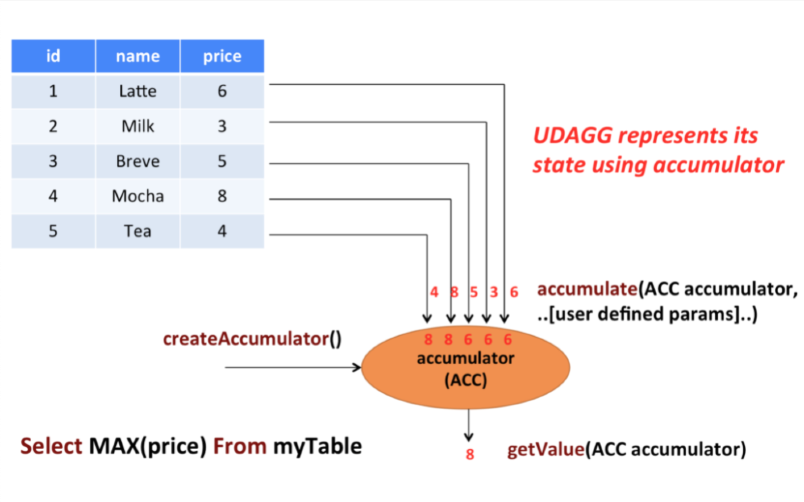](https://yangyichao-mango.github.io/blog-img/wechat-blog/01_大数据/01_数据仓库/01_实时数仓/02_数据内容建设/03_one-engine/01_计算引擎/01_flink/01_flink-sql/21_flinksql牛逼轰轰/19.png)

上面的图片展示了一个聚合函数的例子以及聚合函数包含的几个重要方法。

假设你有一个关于饮料的表。表里面有三个字段，分别是 id、name、price，表里有 5 行数据。

假设你需要找到所有饮料里最贵的饮料的价格，即执行一个 max() 聚合就能拿到结果。那么 max() 聚合的执行旧需要遍历所有 5 行数据，最终结果就只有一个数值。

使用 Java\Scala 开发一个 Aggregate Function 必须包含以下几点：

1. ⭐ 实现 `AggregateFunction` 接口，其中所有的方法必须是 public 的、非 static 的
2. ⭐ 必须实现以下几个方法：

- ⭐ `Acc聚合中间结果 createAccumulator()`：为当前 Key 初始化一个空的 accumulator，其存储了聚合的中间结果，比如在执行 max() 时会存储当前的 max 值
- ⭐ `accumulate(Acc accumulator, Input输入参数)`：对于每一行数据，都会调用 accumulate() 方法来更新 accumulator，这个方法就是用于处理每一条输入数据；这个方法必须声明为 public 和非 static 的。accumulate 方法可以重载，每个方法的参数类型可以不同，并且支持变长参数。
- ⭐ `Output输出参数 getValue(Acc accumulator)`：通过调用 getValue 方法来计算和返回最终的结果

1. ⭐ 还有几个方法是在某些场景下才必须实现的：

- ⭐ `retract(Acc accumulator, Input输入参数)`：在回撤流的场景下必须要实现，Flink 在计算回撤数据时需要进行调用，如果没有实现则会直接报错
- ⭐ `merge(Acc accumulator, Iterable<Acc> it)`：在许多批式聚合以及流式聚合中的 Session、Hop 窗口聚合场景下都是必须要实现的。除此之外，这个方法对于优化也很多帮助。例如，如果你打开了两阶段聚合优化，就需要 AggregateFunction 实现 merge 方法，从而可以做到在数据进行 shuffle 前先进行一次聚合计算。
- ⭐ `resetAccumulator()`：在批式聚合中是必须实现的。

1. ⭐ 还有几个关于入参、出参数据类型信息的方法，默认情况下，用户的 `Input输入参数`（`accumulate(Acc accumulator, Input输入参数)` 的入参 `Input输入参数`）、accumulator（`Acc聚合中间结果 createAccumulator()` 的返回结果）、`Output输出参数` 数据类型（`Output输出参数 getValue(Acc accumulator)` 的 `Output输出参数`）都会被 Flink 使用反射获取到。但是对于 `accumulator` 和 `Output输出参数` 类型来说，Flink SQL 的类型推导在遇到复杂类型的时候可能会推导出错误的结果（注意：`Input输入参数` 因为是上游算子传入的，所以类型信息是确认的，不会出现推导错误的情况），比如那些非基本类型 POJO 的复杂类型。所以跟 ScalarFunction 和 TableFunction 一样，AggregateFunction 提供了 `AggregateFunction#getResultType()` 和 `AggregateFunction#getAccumulatorType()` 来分别指定最终返回值类型和 accumulator 的类型，两个函数的返回值类型都是 TypeInformation，所以熟悉 DataStream 的小伙伴很容易上手。

- ⭐ `getResultType()`：即 `Output输出参数 getValue(Acc accumulator)` 的输出结果数据类型
- ⭐ `getAccumulatorType()`：即 `Acc聚合中间结果 createAccumulator()` 的返回结果数据类型

这个时候，我们直接来举一个加权平均值的例子看下，总共 3 个步骤：

- ⭐ 定义一个聚合函数来计算某一列的加权平均
- ⭐ 在 TableEnvironment 中注册函数
- ⭐ 在查询中使用函数

为了计算加权平均值，accumulator 需要存储加权总和以及数据的条数。在我们的例子里，我们定义了一个类 WeightedAvgAccumulator 来作为 accumulator。

Flink 的 checkpoint 机制会自动保存 accumulator，在失败时进行恢复，以此来保证精确一次的语义。

我们的 WeightedAvg（聚合函数）的 accumulate 方法有三个输入参数。第一个是 WeightedAvgAccum accumulator，另外两个是用户自定义的输入：输入的值 ivalue 和 输入的权重 iweight。

尽管 retract()、merge()、resetAccumulator() 这几个方法在大多数聚合类型中都不是必须实现的，博主也在样例中提供了他们的实现。并且定义了 getResultType() 和 getAccumulatorType()。

```
import org.apache.flink.table.api.*;
import org.apache.flink.table.functions.AggregateFunction;
import static org.apache.flink.table.api.Expressions.*;

// 自定义一个计算权重 avg 的 accmulator
public static class WeightedAvgAccumulator {
  public long sum = 0;
  public int count = 0;
}

// 输入：Long iValue, Integer iWeight
public static class WeightedAvg extends AggregateFunction<Long, WeightedAvgAccumulator> {

  @Override 
  // 创建一个 accumulator
  public WeightedAvgAccumulator createAccumulator() {
    return new WeightedAvgAccumulator();
  }

  public void accumulate(WeightedAvgAccumulator acc, Long iValue, Integer iWeight) {
    acc.sum += iValue * iWeight;
    acc.count += iWeight;
  }

  public void retract(WeightedAvgAccumulator acc, Long iValue, Integer iWeight) {
    acc.sum -= iValue * iWeight;
    acc.count -= iWeight;
  }

  @Override
  // 获取返回结果
  public Long getValue(WeightedAvgAccumulator acc) {
    if (acc.count == 0) {
      return null;
    } else {
      return acc.sum / acc.count;
    }
  }

  // Session window 可以使用这个方法将几个单独窗口的结果合并
  public void merge(WeightedAvgAccumulator acc, Iterable<WeightedAvgAccumulator> it) {
    for (WeightedAvgAccumulator a : it) {
      acc.count += a.count;
      acc.sum += a.sum;
    }
  }

  public void resetAccumulator(WeightedAvgAccumulator acc) {
    acc.count = 0;
    acc.sum = 0L;
  }
}

TableEnvironment env = TableEnvironment.create(...);

env
  .from("MyTable")
  .groupBy($("myField"))
  .select($("myField"), call(WeightedAvg.class, $("value"), $("weight")));

// 注册函数
env.createTemporarySystemFunction("WeightedAvg", WeightedAvg.class);

// Table API 调用函数
env
  .from("MyTable")
  .groupBy($("myField"))
  .select($("myField"), call("WeightedAvg", $("value"), $("weight")));

// SQL API 调用函数
env.sqlQuery(
  "SELECT myField, WeightedAvg(`value`, weight) FROM MyTable GROUP BY myField"
);
```

## 4.10.SQL 表值聚合函数（Table Aggregate Function）

表值聚合函数即 UDTAF。首先说明这个函数目前只能在 Table API 中进行使用，不能在 SQL API 中使用。那么这个函数有什么作用呢，为什么被创建出来？

因为在 SQL 表达式中，如果我们想对数据先分组再进行聚合取值，能选择的就是 `select max(xxx) from source_table group by key1, key2`。但是上面这个 SQL 的 max 语义最后产出的结果只有一条最终结果，如果我想取聚合结果最大的 n 条数据，并且 n 条数据，每一条都要输出一次结果数据，上面的 SQL 就没有办法实现了（因为在聚合的情况下还输出多条，从上述 SQL 语义上来说就是不正确的）。

所以 UDTAF 就是为了处理这种场景，他可以让我们自定义 `怎么去`，`取多少条` 最终的聚合结果。所以可以看到 UDTAF 和 UDAF 是类似的。如下图所示：

[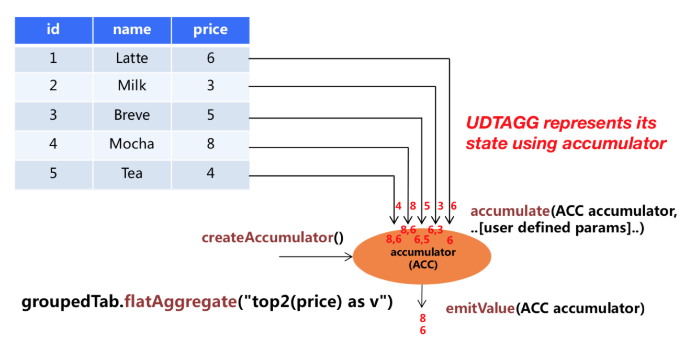](https://yangyichao-mango.github.io/blog-img/wechat-blog/01_大数据/01_数据仓库/01_实时数仓/02_数据内容建设/03_one-engine/01_计算引擎/01_flink/01_flink-sql/21_flinksql牛逼轰轰/20.png)

上图展示了一个表值聚合函数的例子。

假设你有一个饮料的表，这个表有 3 列，分别是 id、name 和 price，一共有 5 行。

假设你需要找到价格最高的两个饮料，类似于 top2() 表值聚合函数。你需要遍历所有 5 行数据，输出结果为 2 行数据的一个表。

使用 Java\Scala 开发一个 Table Aggregate Function 必须包含以下几点：

1. ⭐ 实现 `TableAggregateFunction` 接口，其中所有的方法必须是 public 的、非 static 的
2. ⭐ 必须实现以下几个方法：

- ⭐ `Acc聚合中间结果 createAccumulator()`：为当前 Key 初始化一个空的 accumulator，其存储了聚合的中间结果，比如在执行 max() 时会存储每一条中间结果的 max 值
- ⭐ `accumulate(Acc accumulator, Input输入参数)`：对于每一行数据，都会调用 accumulate() 方法来更新 accumulator，这个方法就是对每一条输入数据进行执行，比如执行 max() 时，遍历每一条数据执行；在实现这个方法是必须声明为 public 和非 static 的。accumulate 方法可以重载，每个方法的参数类型不同，并且支持变长参数。
- ⭐ `emitValue(Acc accumulator, Collector<OutPut> collector)` 或者 `emitUpdateWithRetract(Acc accumulator, RetractableCollector<OutPut> collector)`：当遍历所有的数据，当所有的数据都处理完了之后，通过调用 emit 方法来计算和输出最终的结果，在这里你就可以自定义到底输出多条少以及怎么样去输出结果。那么对于 emitValue 以及 emitUpdateWithRetract 的区别来说，拿 TopN 实现来说，emitValue 每次都会发送所有的最大的 n 个值，而这在流式任务中可能会有一些性能问题。为了提升性能，用户可以实现 emitUpdateWithRetract 方法。这个方法在 retract 模式下会增量的输出结果，比如只在有数据更新时，可以做到撤回老的数据，然后再发送新的数据，而不需要每次都发出全量的最新数据。如果我们同时定义了 emitUpdateWithRetract、emitValue 方法，那 emitUpdateWithRetract 会优先于 emitValue 方法被使用，因为引擎会认为 emitUpdateWithRetract 会更加高效，因为它的输出是增量的。

1. ⭐ 还有几个方法是在某些场景下才必须实现的：

- ⭐ `retract(Acc accumulator, Input输入参数)`：在回撤流的场景下必须要实现，Flink 在计算回撤数据时需要进行调用，如果没有实现则会直接报错
- ⭐ `merge(Acc accumulator, Iterable<Acc> it)`：在许多批式聚合以及流式聚合中的 Session、Hop 窗口聚合场景下都是必须要实现的。除此之外，这个方法对于优化也很多帮助。例如，如果你打开了两阶段聚合优化，就需要 AggregateFunction 实现 merge 方法，从而在第一阶段先进行数据聚合。
- ⭐ `resetAccumulator()`：在批式聚合中是必须实现的。

1. ⭐ 还有几个关于入参、出参数据类型信息的方法，默认情况下，用户的 `Input输入参数`（`accumulate(Acc accumulator, Input输入参数)` 的入参 `Input输入参数`）、accumulator（`Acc聚合中间结果 createAccumulator()` 的返回结果）、`Output输出参数` 数据类型（`emitValue(Acc acc, Collector<Output输出参数> out)` 的 `Output输出参数`）都会被 Flink 使用反射获取到。但是对于 `accumulator` 和 `Output输出参数` 类型来说，Flink SQL 的类型推导在遇到复杂类型的时候可能会推导出错误的结果（注意：`Input输入参数` 因为是上游算子传入的，所以类型信息是确认的，不会出现推导错误的情况），比如那些非基本类型 POJO 的复杂类型。所以跟 ScalarFunction 和 TableFunction 一样，AggregateFunction 提供了 `TableAggregateFunction#getResultType()` 和 `TableAggregateFunction#getAccumulatorType()` 来分别指定最终返回值类型和 accumulator 的类型，两个函数的返回值类型都是 TypeInformation，所以熟悉 DataStream 的小伙伴很容易上手。

- ⭐ `getResultType()`：即 `emitValue(Acc acc, Collector<Output输出参数> out)` 的输出结果数据类型
- ⭐ `getAccumulatorType()`：即 `Acc聚合中间结果 createAccumulator()` 的返回结果数据类型

这个时候，我们直接来举一个 Top2 的例子看下吧：

- ⭐ 定义一个 TableAggregateFunction 来计算给定列的最大的 2 个值
- ⭐ 在 TableEnvironment 中注册函数
- ⭐ 在 Table API 查询中使用函数（当前只在 Table API 中支持 TableAggregateFunction）

为了计算最大的 2 个值，accumulator 需要保存当前看到的最大的 2 个值。

在我们的例子中，我们定义了类 Top2Accum 来作为 accumulator。

Flink 的 checkpoint 机制会自动保存 accumulator，并且在失败时进行恢复，来保证精确一次的语义。

我们的 Top2 表值聚合函数（TableAggregateFunction）的 accumulate() 方法有两个输入，第一个是 Top2Accum accumulator，另一个是用户定义的输入：输入的值 v。尽管 merge() 方法在大多数聚合类型中不是必须的，我们也在样例中提供了它的实现。并且定义了 getResultType() 和 getAccumulatorType() 方法。

```
/**
 * Accumulator for Top2.
 */
public class Top2Accum {
    public Integer first;
    public Integer second;
}

public static class Top2 extends TableAggregateFunction<Tuple2<Integer, Integer>, Top2Accum> {

    @Override
    public Top2Accum createAccumulator() {
        Top2Accum acc = new Top2Accum();
        acc.first = Integer.MIN_VALUE;
        acc.second = Integer.MIN_VALUE;
        return acc;
    }


    public void accumulate(Top2Accum acc, Integer v) {
        if (v > acc.first) {
            acc.second = acc.first;
            acc.first = v;
        } else if (v > acc.second) {
            acc.second = v;
        }
    }

    public void merge(Top2Accum acc, java.lang.Iterable<Top2Accum> iterable) {
        for (Top2Accum otherAcc : iterable) {
            accumulate(acc, otherAcc.first);
            accumulate(acc, otherAcc.second);
        }
    }

    public void emitValue(Top2Accum acc, Collector<Tuple2<Integer, Integer>> out) {
        // emit the value and rank
        if (acc.first != Integer.MIN_VALUE) {
            out.collect(Tuple2.of(acc.first, 1));
        }
        if (acc.second != Integer.MIN_VALUE) {
            out.collect(Tuple2.of(acc.second, 2));
        }
    }
}

// 注册函数
StreamTableEnvironment tEnv = ...
tEnv.registerFunction("top2", new Top2());

// 初始化表
Table tab = ...;

// 使用函数
tab.groupBy("key")
    .flatAggregate("top2(a) as (v, rank)")
    .select("key, v, rank");
```

下面的例子展示了如何使用 emitUpdateWithRetract 方法来只发送更新的数据。

为了只发送更新的结果，accumulator 保存了上一次的最大的 2 个值，也保存了当前最大的 2 个值。

```
/**
 * Accumulator for Top2.
 */
public class Top2Accum {
    public Integer first;
    public Integer second;
    public Integer oldFirst;
    public Integer oldSecond;
}

public static class Top2 extends TableAggregateFunction<Tuple2<Integer, Integer>, Top2Accum> {

    @Override
    public Top2Accum createAccumulator() {
        Top2Accum acc = new Top2Accum();
        acc.first = Integer.MIN_VALUE;
        acc.second = Integer.MIN_VALUE;
        acc.oldFirst = Integer.MIN_VALUE;
        acc.oldSecond = Integer.MIN_VALUE;
        return acc;
    }

    public void accumulate(Top2Accum acc, Integer v) {
        if (v > acc.first) {
            acc.second = acc.first;
            acc.first = v;
        } else if (v > acc.second) {
            acc.second = v;
        }
    }

    public void emitUpdateWithRetract(Top2Accum acc, RetractableCollector<Tuple2<Integer, Integer>> out) {
        if (!acc.first.equals(acc.oldFirst)) {
            // if there is an update, retract old value then emit new value.
            if (acc.oldFirst != Integer.MIN_VALUE) {
                out.retract(Tuple2.of(acc.oldFirst, 1));
            }
            out.collect(Tuple2.of(acc.first, 1));
            acc.oldFirst = acc.first;
        }

        if (!acc.second.equals(acc.oldSecond)) {
            // if there is an update, retract old value then emit new value.
            if (acc.oldSecond != Integer.MIN_VALUE) {
                out.retract(Tuple2.of(acc.oldSecond, 2));
            }
            out.collect(Tuple2.of(acc.second, 2));
            acc.oldSecond = acc.second;
        }
    }
}

// 注册函数
StreamTableEnvironment tEnv = ...
tEnv.registerFunction("top2", new Top2());

// 初始化表
Table tab = ...;

// 使用函数
tab.groupBy("key")
    .flatAggregate("top2(a) as (v, rank)")
    .select("key, v, rank");
```

# 5.SQL 能力扩展篇

## 5.1.SQL UDF 扩展 - Module

在介绍 Flink Module 具体能力之前，我们先来聊聊博主讲述的思路：

1. ⭐ 背景及应用场景介绍
2. ⭐ Flink Module 功能介绍
3. ⭐ 应用案例：Flink SQL 支持 Hive UDF

### 5.1.1.Flink SQL Module 应用场景

兄弟们，想想其实大多数公司都是从离线数仓开始建设的。相信大家必然在自己的生产环境中开发了非常多的 Hive UDF。随着需求对于时效性要求的增高，越来越多的公司也开始建设起实时数仓。很多场景下实时数仓的建设都是随着离线数仓而建设的。实时数据使用 Flink 产出，离线数据使用 Hive/Spark 产出。

那么回到我们的问题：为什么需要给 Flink UDF 做扩展呢？可能这个问题比较大，那么博主分析的具体一些，如果 Flink 扩展支持 Hive UDF 对我们有哪些好处呢？

博主分析了下，结论如下：

站在数据需求的角度来说，一般会有以下两种情况：

1. ⭐ 以前已经有了离线数据链路，需求方也想要实时数据。如果直接能用已经开发好的 hive udf，则不用将相同的逻辑迁移到 flink udf 中，并且后续无需费时费力维护两个 udf 的逻辑一致性。
2. ⭐ 实时和离线的需求都是新的，需要新开发。如果只开发一套 UDF，则事半功倍。

因此在 Flink 中支持 Hive UDF（也即扩展 Flink 的 UDF 能力）这件事对开发人员提效来说是非常有好处的。

### 5.1.2.Flink SQL Module 功能介绍

Module 允许 Flink 扩展函数能力。它是可插拔的，Flink 官方本身已经提供了一些 Module，用户也可以编写自己的 Module。

例如，用户可以定义自己的函数，并将其作为加载进入 Flink，以在 Flink SQL 和 Table API 中使用。

再举一个例子，用户可以加载官方已经提供的的 Hive Module，将 Hive 已有的内置函数作为 Flink 的内置函数。

目前 Flink 包含了以下三种 Module：

1. ⭐ CoreModule：CoreModule 是 Flink 内置的 Module，其包含了目前 Flink 内置的所有 UDF，Flink 默认开启的 Module 就是 CoreModule，我们可以直接使用其中的 UDF
2. ⭐ HiveModule：HiveModule 可以将 Hive 内置函数作为 Flink 的系统函数提供给 SQL\Table API 用户进行使用，比如 get_json_object 这类 Hive 内置函数（Flink 默认的 CoreModule 是没有的）
3. ⭐ 用户自定义 Module：用户可以实现 Module 接口实现自己的 UDF 扩展 Module

在 Flink 中，Module 可以被 `加载`、`启用`、`禁用`、`卸载` Module，当 TableEnvironment 加载（见 SQL 语法篇的 Load Module） Module 之后，默认就是开启的。

Flink 是同时支持多个 Module 的，并且根据加载 Module 的顺序去按顺序查找和解析 UDF，先查到的先解析使用。

此外，Flink 只会解析已经启用了的 Module。那么当两个 Module 中出现两个同名的函数时，会有以下三种情况：

1. ⭐ 如果两个 Module 都启用的话，Flink 会根据加载 Module 的顺序进行解析，结果就是会使用顺序为第一个的 Module 的 UDF
2. ⭐ 如果只有一个 Module 启用的话，Flink 就只会从启用的 Module 解析 UDF
3. ⭐ 如果两个 Module 都没有启用，Flink 就无法解析这个 UDF

当然如果出现第一种情况时，用户也可以改变使用 Module 的顺序。比如用户可以使用 `USE MODULE hive, core` 语句去将 Hive Module 设为第一个使用及解析的 Module。

另外，用户可以使用 `USE MODULES hive` 去禁用默认的 core Module，注意，禁用不是卸载 Module，用户之后还可以再次启用 Module，并且使用 `USE MODULES core` 去将 core Module 设置为启用的。如果使用未加载的 Module，则会直接抛出异常。

禁用和卸载 Module 的区别在于禁用依然会在 TableEnvironment 保留 Module，用户依然可以使用使用 list 命令看到禁用的 Module。

> 注意：
>
> 由于 Module 的 UDF 是被 Flink 认为是 Flink 系统内置的，它不和任何 Catalog，数据库绑定，所以这部分 UDF 没有对应的命名空间，即没有 Catalog，数据库命名空间。

1. ⭐ 使用 SQL API 加载、卸载、使用、列出 Module

```
EnvironmentSettings settings = EnvironmentSettings.newInstance().useBlinkPlanner().build();
TableEnvironment tableEnv = TableEnvironment.create(settings);

// 展示加载和启用的 Module
tableEnv.executeSql("SHOW MODULES").print();
// +-------------+
// | module name |
// +-------------+
// |        core |
// +-------------+
tableEnv.executeSql("SHOW FULL MODULES").print();
// +-------------+------+
// | module name | used |
// +-------------+------+
// |        core | true |
// +-------------+------+

// 加载 hive module
tableEnv.executeSql("LOAD MODULE hive WITH ('hive-version' = '...')");

// 展示所有启用的 module
tableEnv.executeSql("SHOW MODULES").print();
// +-------------+
// | module name |
// +-------------+
// |        core |
// |        hive |
// +-------------+

// 展示所有加载的 module 以及它们的启用状态
tableEnv.executeSql("SHOW FULL MODULES").print();
// +-------------+------+
// | module name | used |
// +-------------+------+
// |        core | true |
// |        hive | true |
// +-------------+------+

// 改变 module 解析顺序
tableEnv.executeSql("USE MODULES hive, core");
tableEnv.executeSql("SHOW MODULES").print();
// +-------------+
// | module name |
// +-------------+
// |        hive |
// |        core |
// +-------------+
tableEnv.executeSql("SHOW FULL MODULES").print();
// +-------------+------+
// | module name | used |
// +-------------+------+
// |        hive | true |
// |        core | true |
// +-------------+------+

// 禁用 core module
tableEnv.executeSql("USE MODULES hive");
tableEnv.executeSql("SHOW MODULES").print();
// +-------------+
// | module name |
// +-------------+
// |        hive |
// +-------------+
tableEnv.executeSql("SHOW FULL MODULES").print();
// +-------------+-------+
// | module name |  used |
// +-------------+-------+
// |        hive |  true |
// |        core | false |
// +-------------+-------+

// 卸载 hive module
tableEnv.executeSql("UNLOAD MODULE hive");
tableEnv.executeSql("SHOW MODULES").print();
// Empty set
tableEnv.executeSql("SHOW FULL MODULES").print();
// +-------------+-------+
// | module name |  used |
// +-------------+-------+
// |        hive | false |
// +-------------+-------+
```

1. ⭐ 使用 Java API 加载、卸载、使用、列出 Module

```
EnvironmentSettings settings = EnvironmentSettings.newInstance().useBlinkPlanner().build();
TableEnvironment tableEnv = TableEnvironment.create(settings);

// Show initially loaded and enabled modules
tableEnv.listModules();
// +-------------+
// | module name |
// +-------------+
// |        core |
// +-------------+
tableEnv.listFullModules();
// +-------------+------+
// | module name | used |
// +-------------+------+
// |        core | true |
// +-------------+------+

// Load a hive module
tableEnv.loadModule("hive", new HiveModule());

// Show all enabled modules
tableEnv.listModules();
// +-------------+
// | module name |
// +-------------+
// |        core |
// |        hive |
// +-------------+

// Show all loaded modules with both name and use status
tableEnv.listFullModules();
// +-------------+------+
// | module name | used |
// +-------------+------+
// |        core | true |
// |        hive | true |
// +-------------+------+

// Change resolution order
tableEnv.useModules("hive", "core");
tableEnv.listModules();
// +-------------+
// | module name |
// +-------------+
// |        hive |
// |        core |
// +-------------+
tableEnv.listFullModules();
// +-------------+------+
// | module name | used |
// +-------------+------+
// |        hive | true |
// |        core | true |
// +-------------+------+

// Disable core module
tableEnv.useModules("hive");
tableEnv.listModules();
// +-------------+
// | module name |
// +-------------+
// |        hive |
// +-------------+
tableEnv.listFullModules();
// +-------------+-------+
// | module name |  used |
// +-------------+-------+
// |        hive |  true |
// |        core | false |
// +-------------+-------+

// Unload hive module
tableEnv.unloadModule("hive");
tableEnv.listModules();
// Empty set
tableEnv.listFullModules();
// +-------------+-------+
// | module name |  used |
// +-------------+-------+
// |        hive | false |
// +-------------+-------+
```

### 5.1.3.应用案例：Flink SQL 支持 Hive UDF

Flink 支持 hive UDF 这件事分为两个部分。

1. ⭐ Flink 扩展支持 hive 内置 UDF
2. ⭐ Flink 扩展支持用户自定义 hive UDF

第一部分：Flink 扩展支持 Hive 内置 UDF，比如 `get_json_object`，`rlike` 等等。

有同学问了，这么基本的 UDF，Flink 都没有吗？

确实没有。关于 Flink SQL 内置的 UDF 见如下链接，大家可以看看 Flink 支持了哪些 UDF：
https://nightlies.apache.org/flink/flink-docs-release-1.13/docs/dev/table/functions/systemfunctions/

那么如果我如果强行使用 get_json_object 这个 UDF，会发生啥呢？结果如下图。

直接报错找不到 UDF。

[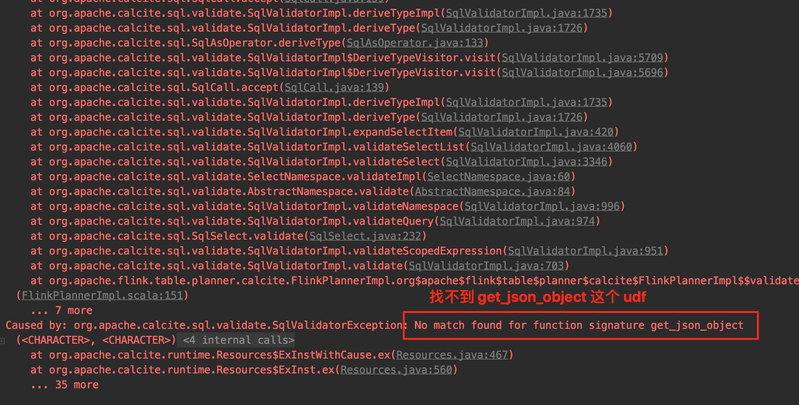](https://yangyichao-mango.github.io/blog-img/wechat-blog/01_大数据/01_数据仓库/01_实时数仓/02_数据内容建设/03_one-engine/01_计算引擎/01_flink/01_flink-sql/20_flinksql知其所以然（十八）：flinksqludf/2.png)

第二部分：Flink 扩展支持用户自定义 Hive UDF。

内置函数解决不了用户的复杂需求，用户就需要自己写 Hive UDF，并且这部分自定义 UDF 也想在 flink sql 中使用。

下面看看怎么在 Flink SQL 中进行这两种扩展。

1. ⭐ flink 扩展支持 hive 内置 udf

步骤如下：

- ⭐ 引入 hive 的 connector。其中包含了 flink 官方提供的一个 `HiveModule`。在 `HiveModule` 中包含了 hive 内置的 udf。

```
<dependency>
    <groupId>org.apache.flink</groupId>
    <artifactId>flink-connector-hive_${scala.binary.version}</artifactId>
    <version>${flink.version}</version>
</dependency>
```

- ⭐ 在 `StreamTableEnvironment` 中加载 `HiveModule`。

```
String name = "default";
String version = "3.1.2";
tEnv.loadModule(name, new HiveModule(version));
```

然后在控制台打印一下目前有的 module。

```
String[] modules = tEnv.listModules();
Arrays.stream(modules).forEach(System.out::println);
```

然后可以看到除了 `core` module，还有我们刚刚加载进去的 `default` module。

```
default
core
```

- ⭐ 查看所有 module 的所有 udf。在控制台打印一下。

```
String[] functions = tEnv.listFunctions();
Arrays.stream(functions).forEach(System.out::println);
```

就会将 default 和 core module 中的所有包含的 udf 给列举出来，当然也就包含了 hive module 中的 get_json_object。

[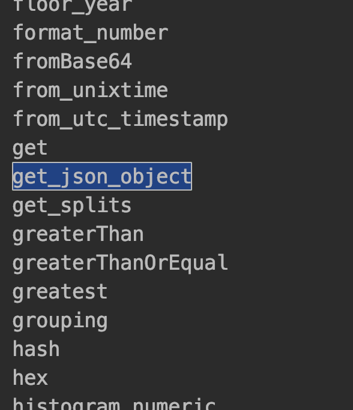](https://yangyichao-mango.github.io/blog-img/wechat-blog/01_大数据/01_数据仓库/01_实时数仓/02_数据内容建设/03_one-engine/01_计算引擎/01_flink/01_flink-sql/20_flinksql知其所以然（十八）：flinksqludf/3.png)

然后我们再去在 Flink SQL 中使用 get_json_object 这个 UDF，就没有报错，能正常输出结果了。

使用 Flink Hive connector 自带的 `HiveModule`，已经能够解决很大一部分常见 UDF 使用的问题了。

1. ⭐ Flink 扩展支持用户自定义 Hive UDF

原本博主是直接想要使用 Flink SQL 中的 `create temporary function` 去执行引入自定义 Hive UDF 的。

举例如下：

```
CREATE TEMPORARY FUNCTION test_hive_udf as 'flink.examples.sql._09.udf._02_stream_hive_udf.TestGenericUDF';
```

发现在执行这句 SQL 时，是可以执行成功，将 UDF 注册进去的。

但是在后续 UDF 初始化时就报错了。具体错误如下图。直接报错 ClassCastException。

[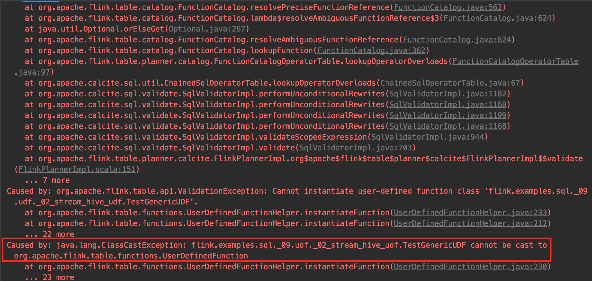](https://yangyichao-mango.github.io/blog-img/wechat-blog/01_大数据/01_数据仓库/01_实时数仓/02_数据内容建设/03_one-engine/01_计算引擎/01_flink/01_flink-sql/20_flinksql知其所以然（十八）：flinksqludf/4.png)

看了下源码，Flink 流任务模式下（未连接 Hive MetaStore 时）在创建 UDF 时会认为这个 UDF 是 Flink 生态体系中的 UDF。

所以在初始化我们引入的 `TestGenericUDF` 时，默认会按照 Flink 的 `UserDefinedFunction` 强转，因此才会报强转错误。

那么我们就不能使用 Hive UDF 了吗？

错误，小伙伴萌岂敢有这种想法。博主都把这个标题列出来了（牛逼都吹出去了），还能给不出解决方案嘛。

思路见下一节。

1. ⭐ Flink 扩展支持用户自定义 Hive UDF 的增强 module

其实思路很简单。

使用 Flink SQL 中的 `create temporary function` 虽然不能执行，但是 Flink 提供了插件化的自定义 module。

我们可以扩展一个支持用户自定义 Hive UDF 的 module，使用这个 module 来支持自定义的 Hive UDF。

实现的代码也非常简单。简单的把 Flink Hive connector 提供的 `HiveModule` 做一个增强即可，即下图中的 `HiveModuleV2`。使用方式如下图所示：

源码公众号后台回复**1.13.2 sql hive udf**获取。

[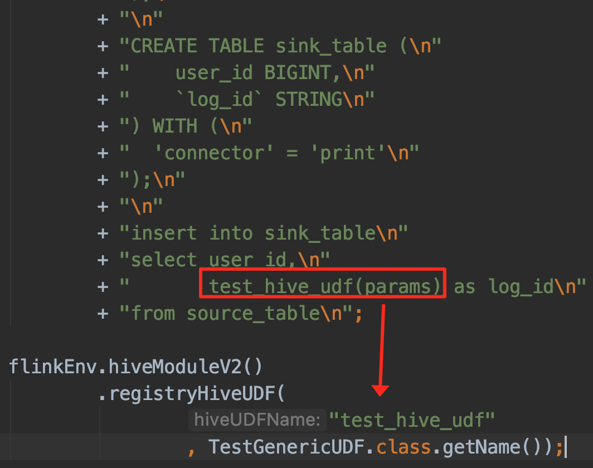](https://yangyichao-mango.github.io/blog-img/wechat-blog/01_大数据/01_数据仓库/01_实时数仓/02_数据内容建设/03_one-engine/01_计算引擎/01_flink/01_flink-sql/20_flinksql知其所以然（十八）：flinksqludf/5.png)

然后程序就正常跑起来了。

肥肠滴好用！

## 5.2.SQL 元数据扩展 - Catalog

### 5.2.1.Flink Catalog 功能介绍

数据处理最关键的方面之一是管理元数据。元数据可以是临时的，例如临时表、UDF。 元数据也可以是持久化的，例如 Hive MetaStore 中的元数据。

Flink SQL 中是由 Catalog 提供了元数据信息，例如数据库、表、分区、视图以及数据库或其他外部系统中存储的函数和信息。对标 Hive 去理解就是 Hive 的 MetaStore，都是用于存储计算引擎涉及到的元数据信息。

Catalog 允许用户引用其数据存储系统中现有的元数据，并自动将其映射到 Flink 的相应元数据。例如，Flink 可以直接使用 Hive MetaStore 中的表的元数据，也可以将 Flink SQL 中的元数据存储到 Hive MetaStore 中。Catalog 极大地简化了用户开始使用 Flink 的步骤，提升了用户体验。

目前 Flink 包含了以下四种 Catalog：

1. ⭐ GenericInMemoryCatalog：GenericInMemoryCatalog 是基于内存实现的 Catalog，所有元数据只在 session 的生命周期（即一个 Flink 任务一次运行生命周期内）内可用。
2. ⭐ JdbcCatalog：JdbcCatalog 使得用户可以将 Flink 通过 JDBC 协议连接到关系数据库。PostgresCatalog 是当前实现的唯一一种 JDBC Catalog，即可以将 Flink SQL 的预案数据存储在 Postgres 中。

```
// PostgresCatalog 方法支持的方法
PostgresCatalog.databaseExists(String databaseName)
PostgresCatalog.listDatabases()
PostgresCatalog.getDatabase(String databaseName)
PostgresCatalog.listTables(String databaseName)
PostgresCatalog.getTable(ObjectPath tablePath)
PostgresCatalog.tableExists(ObjectPath tablePath)
```

1. ⭐ HiveCatalog：HiveCatalog 有两个用途，作为 Flink 元数据的持久化存储，以及作为读写现有 Hive 元数据的接口。注意：Hive MetaStore 以小写形式存储所有元数据对象名称。而 GenericInMemoryCatalog 会区分大小写。

```
TableEnvironment tableEnv = TableEnvironment.create(settings);

String name            = "myhive";
String defaultDatabase = "mydatabase";
String hiveConfDir     = "/opt/hive-conf";

HiveCatalog hive = new HiveCatalog(name, defaultDatabase, hiveConfDir);
tableEnv.registerCatalog("myhive", hive);

// set the HiveCatalog as the current catalog of the session
tableEnv.useCatalog("myhive");
```

1. ⭐ 用户自定义 Catalog：用户可以实现 Catalog 接口实现自定义 Catalog

下面看看 Flink Catalog 提供了什么 API，以及对应 API 的使用案例：

1. ⭐ 使用 SQL API 将表创建注册进 Catalog

```
TableEnvironment tableEnv = ...

// 创建 HiveCatalog 
Catalog catalog = new HiveCatalog("myhive", null, "<path_of_hive_conf>");

// 注册 catalog
tableEnv.registerCatalog("myhive", catalog);

// 在 catalog 中创建 database
tableEnv.executeSql("CREATE DATABASE mydb WITH (...)");

// 在 catalog 中创建表
tableEnv.executeSql("CREATE TABLE mytable (name STRING, age INT) WITH (...)");

tableEnv.listTables(); // 列出当前 myhive.mydb 中的所有表
```

1. ⭐ 使用 Java API 将表创建注册进 Catalog

```
import org.apache.flink.table.api.*;
import org.apache.flink.table.catalog.*;
import org.apache.flink.table.catalog.hive.HiveCatalog;
import org.apache.flink.table.descriptors.Kafka;

TableEnvironment tableEnv = TableEnvironment.create(EnvironmentSettings.newInstance().build());

// 创建 HiveCatalog 
Catalog catalog = new HiveCatalog("myhive", null, "<path_of_hive_conf>");

// 注册 catalog
tableEnv.registerCatalog("myhive", catalog);

// 在 catalog 中创建 database
catalog.createDatabase("mydb", new CatalogDatabaseImpl(...));

// 在 catalog 中创建表
TableSchema schema = TableSchema.builder()
    .field("name", DataTypes.STRING())
    .field("age", DataTypes.INT())
    .build();

catalog.createTable(
        new ObjectPath("mydb", "mytable"), 
        new CatalogTableImpl(
            schema,
            new Kafka()
                .version("0.11")
                ....
                .startFromEarlist()
                .toProperties(),
            "my comment"
        ),
        false
    );
    
List<String> tables = catalog.listTables("mydb"); // 列出当前 myhive.mydb 中的所有表
```

### 5.2.2.操作 Catalog 的 API

这里只列出了 Java 的 Catalog API，用户也可以使用 SQL DDL API 实现相同的功能。关于 DDL 的详细信息请参考之前介绍到的 SQL CREATE DDL 章节。

1. ⭐ Catalog 操作

```
// 注册 Catalog
tableEnv.registerCatalog(new CustomCatalog("myCatalog"));

// 切换 Catalog 和 Database
tableEnv.useCatalog("myCatalog");
tableEnv.useDatabase("myDb");
// 也可以通过以下方式访问对应的表
tableEnv.from("not_the_current_catalog.not_the_current_db.my_table");
```

1. ⭐ 数据库操作

```
// create database
catalog.createDatabase("mydb", new CatalogDatabaseImpl(...), false);

// drop database
catalog.dropDatabase("mydb", false);

// alter database
catalog.alterDatabase("mydb", new CatalogDatabaseImpl(...), false);

// get databse
catalog.getDatabase("mydb");

// check if a database exist
catalog.databaseExists("mydb");

// list databases in a catalog
catalog.listDatabases("mycatalog");
```

1. ⭐ 表操作

```
// create table
catalog.createTable(new ObjectPath("mydb", "mytable"), new CatalogTableImpl(...), false);

// drop table
catalog.dropTable(new ObjectPath("mydb", "mytable"), false);

// alter table
catalog.alterTable(new ObjectPath("mydb", "mytable"), new CatalogTableImpl(...), false);

// rename table
catalog.renameTable(new ObjectPath("mydb", "mytable"), "my_new_table");

// get table
catalog.getTable("mytable");

// check if a table exist or not
catalog.tableExists("mytable");

// list tables in a database
catalog.listTables("mydb");
```

1. ⭐ 视图操作

```
// create view
catalog.createTable(new ObjectPath("mydb", "myview"), new CatalogViewImpl(...), false);

// drop view
catalog.dropTable(new ObjectPath("mydb", "myview"), false);

// alter view
catalog.alterTable(new ObjectPath("mydb", "mytable"), new CatalogViewImpl(...), false);

// rename view
catalog.renameTable(new ObjectPath("mydb", "myview"), "my_new_view", false);

// get view
catalog.getTable("myview");

// check if a view exist or not
catalog.tableExists("mytable");

// list views in a database
catalog.listViews("mydb");
```

1. ⭐ 分区操作

```
// create view
catalog.createPartition(
    new ObjectPath("mydb", "mytable"),
    new CatalogPartitionSpec(...),
    new CatalogPartitionImpl(...),
    false);

// drop partition
catalog.dropPartition(new ObjectPath("mydb", "mytable"), new CatalogPartitionSpec(...), false);

// alter partition
catalog.alterPartition(
    new ObjectPath("mydb", "mytable"),
    new CatalogPartitionSpec(...),
    new CatalogPartitionImpl(...),
    false);

// get partition
catalog.getPartition(new ObjectPath("mydb", "mytable"), new CatalogPartitionSpec(...));

// check if a partition exist or not
catalog.partitionExists(new ObjectPath("mydb", "mytable"), new CatalogPartitionSpec(...));

// list partitions of a table
catalog.listPartitions(new ObjectPath("mydb", "mytable"));

// list partitions of a table under a give partition spec
catalog.listPartitions(new ObjectPath("mydb", "mytable"), new CatalogPartitionSpec(...));

// list partitions of a table by expression filter
catalog.listPartitionsByFilter(new ObjectPath("mydb", "mytable"), Arrays.asList(epr1, ...));
```

1. ⭐ 函数操作

```
// create function
catalog.createFunction(new ObjectPath("mydb", "myfunc"), new CatalogFunctionImpl(...), false);

// drop function
catalog.dropFunction(new ObjectPath("mydb", "myfunc"), false);

// alter function
catalog.alterFunction(new ObjectPath("mydb", "myfunc"), new CatalogFunctionImpl(...), false);

// get function
catalog.getFunction("myfunc");

// check if a function exist or not
catalog.functionExists("myfunc");

// list functions in a database
catalog.listFunctions("mydb");
```

## 5.3.SQL 任务参数配置

关于 Flink SQL 详细的配置项及功能如下链接所示，详细内容大家可以点击链接去看，博主下面只介绍常用的性能优化参数及其功能：

https://nightlies.apache.org/flink/flink-docs-release-1.13/docs/dev/table/config/

### 5.3.1.参数设置方式

Flink SQL 相关参数需要在 TableEnvironment 中设置。如下案例：

```
// instantiate table environment
TableEnvironment tEnv = ...

// access flink configuration
Configuration configuration = tEnv.getConfig().getConfiguration();
// set low-level key-value options
configuration.setString("table.exec.mini-batch.enabled", "true");
configuration.setString("table.exec.mini-batch.allow-latency", "5 s");
configuration.setString("table.exec.mini-batch.size", "5000");
```

具体参数分为以下 3 类：

1. ⭐ 运行时参数：优化 Flink SQL 任务在执行时的任务性能
2. ⭐ 优化器参数：Flink SQL 任务在生成执行计划时，经过优化器优化生成更优的执行计划
3. ⭐ 表参数：用于调整 Flink SQL table 的执行行为

### 5.3.2.运行时参数

用于优化 Flink SQL 任务在执行时的任务性能。

```
// 默认值：100
// 值类型：Integer
// 流批任务：流、批任务都支持
// 用处：异步 lookup join 中最大的异步 IO 执行数目
table.exec.async-lookup.buffer-capacity: 100

// 默认值：false
// 值类型：Boolean
// 流批任务：流任务支持
// 用处：MiniBatch 优化是一种专门针对 unbounded 流任务的优化（即非窗口类应用），其机制是在 `允许的延迟时间间隔内` 以及 `达到最大缓冲记录数` 时触发以减少 `状态访问` 的优化，从而节约处理时间。下面两个参数一个代表 `允许的延迟时间间隔`，另一个代表 `达到最大缓冲记录数`。
table.exec.mini-batch.enabled: false

// 默认值：0 ms
// 值类型：Duration
// 流批任务：流任务支持
// 用处：此参数设置为多少就代表 MiniBatch 机制最大允许的延迟时间。注意这个参数要配合 `table.exec.mini-batch.enabled` 为 true 时使用，而且必须大于 0 ms
table.exec.mini-batch.allow-latency: 0 ms

// 默认值：-1
// 值类型：Long
// 流批任务：流任务支持
// 用处：此参数设置为多少就代表 MiniBatch 机制最大缓冲记录数。注意这个参数要配合 `table.exec.mini-batch.enabled` 为 true 时使用，而且必须大于 0
table.exec.mini-batch.size: -1

// 默认值：-1
// 值类型：Integer
// 流批任务：流、批任务都支持
// 用处：可以用此参数设置 Flink SQL 中算子的并行度，这个参数的优先级 `高于` StreamExecutionEnvironment 中设置的并行度优先级，如果这个值设置为 -1，则代表没有设置，会默认使用 StreamExecutionEnvironment 设置的并行度
table.exec.resource.default-parallelism: -1

// 默认值：ERROR
// 值类型：Enum【ERROR, DROP】
// 流批任务：流、批任务都支持
// 用处：表上的 NOT NULL 列约束强制不能将 NULL 值插入表中。Flink 支持 `ERROR`（默认）和 `DROP` 配置。默认情况下，当 NULL 值写入 NOT NULL 列时，Flink 会产生运行时异常。用户可以将行为更改为 `DROP`，直接删除此类记录，而不会引发异常。
table.exec.sink.not-null-enforcer: ERROR

// 默认值：false
// 值类型：Boolean
// 流批任务：流任务
// 用处：接入了 CDC 的数据源，上游 CDC 如果产生重复的数据，可以使用此参数在 Flink 数据源算子进行去重操作，去重会引入状态开销
table.exec.source.cdc-events-duplicate: false

// 默认值：0 ms
// 值类型：Duration
// 流批任务：流任务
// 用处：如果此参数设置为 60 s，当 Source 算子在 60 s 内未收到任何元素时，这个 Source 将被标记为临时空闲，此时下游任务就不依赖此 Source 的 Watermark 来推进整体的 Watermark 了。
// 默认值为 0 时，代表未启用检测源空闲。
table.exec.source.idle-timeout: 0 ms

// 默认值：0 ms
// 值类型：Duration
// 流批任务：流任务
// 用处：指定空闲状态（即未更新的状态）将保留多长时间。尤其是在 unbounded 场景中很有用。默认 0 ms 为不清除空闲状态
table.exec.state.ttl: 0 ms
```

其中上述参数中最常被用到为一下两种：

1. ⭐ MiniBatch 聚合

```
table.exec.mini-batch.enabled: true
table.exec.mini-batch.allow-latency: 60 s
table.exec.mini-batch.size: 1000000000
```

具体使用场景如下链接：

https://nightlies.apache.org/flink/flink-docs-release-1.13/docs/dev/table/tuning/#minibatch-aggregation

1. ⭐ state ttl 状态过期

```
-- 状态清除如下流 SQL 案例场景很有用，随着实时任务的运行，前几天（即前几天的 p_date）的 state 不会被更新的情况下，就可以使用空闲状态删除机制把 state 给删除
select 
  p_date
  , count(distinct user_id) as uv
from source_table
group 
  p_date
```

### 5.3.3.优化器参数

Flink SQL 任务在生成执行计划时，优化生成更优的执行计划

```
// 默认值：AUTO
// 值类型：String
// 流批任务：流、批任务都支持
// 用处：聚合阶段的策略。和 MapReduce 的 Combiner 功能类似，可以在数据 shuffle 前做一些提前的聚合，可以选择以下三种方式
// TWO_PHASE：强制使用具有 localAggregate 和 globalAggregate 的两阶段聚合。请注意，如果聚合函数不支持优化为两个阶段，Flink 仍将使用单阶段聚合。
// 两阶段优化在计算 count，sum 时很有用，但是在计算 count distinct 时需要注意，key 的稀疏程度，如果 key 不稀疏，那么很可能两阶段优化的效果会适得其反
// ONE_PHASE：强制使用只有 CompleteGlobalAggregate 的一个阶段聚合。
// AUTO：聚合阶段没有特殊的执行器。选择 TWO_PHASE 或者 ONE_PHASE 取决于优化器的成本。
// 
// 注意！！！：此优化在窗口聚合中会自动生效，但是在 unbounded agg 中需要与 minibatch 参数相结合使用才会生效
table.optimizer.agg-phase-strategy: AUTO

// 默认值：false
// 值类型：Boolean
// 流批任务：流任务
// 用处：避免 group by 计算 count distinct\sum distinct 数据时的 group by 的 key 较少导致的数据倾斜，比如 group by 中一个 key 的 distinct 要去重 500w 数据，而另一个 key 只需要去重 3 个 key，那么就需要先需要按照 distinct 的 key 进行分桶。将此参数设置为 true 之后，下面的 table.optimizer.distinct-agg.split.bucket-num 可以用于决定分桶数是多少
// 后文会介绍具体的案例
table.optimizer.distinct-agg.split.enabled: false

// 默认值：1024
// 值类型：Integer
// 流批任务：流任务
// 用处：避免 group by 计算 count distinct 数据时的 group by 较少导致的数据倾斜。加了此参数之后，会先根据 group by key 结合 hash_code（distinct_key）进行分桶，然后再自动进行合桶。
// 后文会介绍具体的案例
table.optimizer.distinct-agg.split.bucket-num: 1024

// 默认值：true
// 值类型：Boolean
// 流批任务：流任务
// 用处：如果设置为 true，Flink 优化器将会尝试找出重复的自计划并重用。默认为 true 不需要改动
table.optimizer.reuse-sub-plan-enabled: true

// 默认值：true
// 值类型：Boolean
// 流批任务：流任务
// 用处：如果设置为 true，Flink 优化器会找出重复使用的 table source 并且重用。默认为 true 不需要改动
table.optimizer.reuse-source-enabled: true

// 默认值：true
// 值类型：Boolean
// 流批任务：流任务
// 用处：如果设置为 true，Flink 优化器将会做谓词下推到 FilterableTableSource 中，将一些过滤条件前置，提升性能。默认为 true 不需要改动
table.optimizer.source.predicate-pushdown-enabled: true
```

其中上述参数中最常被用到为以下两种：

1. ⭐ 两阶段优化：

```
table.optimizer.agg-phase-strategy: AUTO
```

在计算 count(1)，sum(col) 场景汇总提效很高，因为 count(1)，sum(col) 在经过本地 localAggregate 之后，每个 group by 的 key 就一个结果值。

注意！！！：此优化在窗口聚合中会自动生效，但是在 unbounded agg 中需要与 minibatch 参数相结合使用才会生效。

1. ⭐ split 分桶：

```
table.optimizer.distinct-agg.split.enabled: true
table.optimizer.distinct-agg.split.bucket-num: 1024
INSERT INTO sink_table
SELECT
    count(distinct user_id) as uv,
    max(cast(server_timestamp as bigint)) as server_timestamp
FROM source_table

-- 上述 SQL 打开了 split 分桶之后的效果等同于以下 SQL

INSERT INTO sink_table
SELECT 
    sum(bucket_uv) as uv
    , max(server_timestamp) as server_timestamp
FROM (
    SELECT
        count(distinct user_id) as bucket_uv,
        max(cast(server_timestamp as bigint)) as server_timestamp
    FROM source_table
    group by
        mod(hash_code(user_id), 1024)
)
```

注意！！！：如果有多个 distinct key，则多个 distinct key 都会被作为分桶 key。

### 5.3.4.表参数

```
// 默认值：false
// 值类型：Boolean
// 流批任务：流、批任务都支持
// 用处：DML SQL（即执行 insert into 操作）是异步执行还是同步执行。默认为异步（false），即可以同时提交多个 DML SQL 作业，如果设置为 true，则为同步，第二个 DML 将会等待第一个 DML 操作执行结束之后再执行
table.dml-sync: false

// 默认值：64000
// 值类型：Integer
// 流批任务：流、批任务都支持
// 用处：Flink SQL 会通过生产 java 代码来执行具体的 SQL 逻辑，但是 jvm 限制了一个 java 方法的最大长度不能超过 64KB，但是某些场景下 Flink SQL 生产的 java 代码会超过 64KB，这时 jvm 就会直接报错。因此此参数可以用于限制生产的 java 代码的长度来避免超过 64KB，从而避免 jvm 报错。
table.generated-code.max-length: 64000

// 默认值：default
// 值类型：String
// 流批任务：流、批任务都支持
// 用处：在使用天级别的窗口时，通常会遇到时区问题。举个例子，Flink 开一天的窗口，默认是按照 UTC 零时区进行划分，那么在北京时区划分出来的一天的窗口是第一天的早上 8:00 到第二天的早上 8:00，但是实际场景中想要的效果是第一天的早上 0:00 到第二天的早上 0:00 点。因此可以将此参数设置为 GMT+08:00 来解决这个问题。
table.local-time-zone: default

// 默认值：default
// 值类型：Enum【BLINK、OLD】
// 流批任务：流、批任务都支持
// 用处：Flink SQL planner，默认为 BLINK planner，也可以选择 old planner，但是推荐使用 BLINK planner
table.planner: BLINK

// 默认值：default
// 值类型：String
// 流批任务：流、批任务都支持
// 用处：Flink 解析一个 SQL 的解析器，目前有 Flink SQL 默认的解析器和 Hive SQL 解析器，其区别在于两种解析器支持的语法会有不同，比如 Hive SQL 解析器支持 between and、rlike 语法，Flink SQL 不支持
table.sql-dialect: default
```

## 5.4.SQL 性能调优

本小节主要介绍 Flink SQL 中的聚合算子的优化，在某些场景下应用这些优化后，性能提升会非常大。本小节主要包含以下四种优化：

1. ⭐ `（常用）`MiniBatch 聚合：unbounded group agg 中，可以使用 minibatch 聚合来做到微批计算、访问状态、输出结果，避免每来一条数据就计算、访问状态、输出一次结果，从而减少访问 state 的时长（尤其是 Rocksdb）提升性能。
2. ⭐ `（常用）`两阶段聚合：类似 MapReduce 中的 Combiner 的效果，可以先在 shuffle 数据之前先进行一次聚合，减少 shuffle 数据量
3. ⭐ `（不常用）`split 分桶：在 count distinct、sum distinct 的去重的场景中，如果出现数据倾斜，任务性能会非常差，所以如果先按照 distinct key 进行分桶，将数据打散到各个 TM 进行计算，然后将分桶的结果再进行聚合，性能就会提升很大
4. ⭐ `（常用）`去重 filter 子句：在 count distinct 中使用 filter 子句于 Hive SQL 中的 count(distinct if(xxx, user_id, null)) 子句，但是 state 中同一个 key 会按照 bit 位会进行复用，这对状态大小优化非常有用

上面简单介绍了聚合场景的四种优化，下面详细介绍一下其最终效果以及实现原理。

### 5.4.1.MiniBatch 聚合

1. ⭐ 问题场景：默认情况下，unbounded agg 算子是逐条处理输入的记录，其处理流程如下：

- ⭐ 从状态中读取 accumulator；
- ⭐ 累加/撤回的数据记录至 accumulator；
- ⭐ 将 accumulator 写回状态；
- ⭐ 下一条记录将再次从流程 1 开始处理。

但是上述处理流程的问题在于会增加 StateBackend 的访问性能开销（尤其是对于 RocksDB StateBackend）。

1. ⭐ MiniBatch 聚合如何解决上述问题：其核心思想是将一组输入的数据缓存在聚合算子内部的缓冲区中。当输入的数据被触发处理时，每个 key 只需要访问一次状态后端，这样可以大大减少访问状态的时间开销从而获得更好的吞吐量。但是，其会增加一些数据产出的延迟，因为它会缓冲一些数据再去处理。因此如果你要做这个优化，需要提前做一下吞吐量和延迟之间的权衡，但是大多数情况下，buffer 数据的延迟都是可以被接受的。所以非常建议在 unbounded agg 场景下使用这项优化。

下图说明了 MiniBatch 聚合如何减少状态访问的。

[](https://yangyichao-mango.github.io/blog-img/wechat-blog/01_大数据/01_数据仓库/01_实时数仓/02_数据内容建设/03_one-engine/01_计算引擎/01_flink/01_flink-sql/21_flinksql牛逼轰轰/21.png)

上图展示了加 MiniBatch 和没加 MiniBatch 之前的执行区别。

1. ⭐ 启用 MiniBatch 聚合的参数：

```
TableEnvironment tEnv = ...

Configuration configuration = tEnv.getConfig().getConfiguration();
configuration.setString("table.exec.mini-batch.enabled", "true"); // 启用 MiniBatch 聚合
configuration.setString("table.exec.mini-batch.allow-latency", "5 s"); // buffer 最多 5s 的输入数据记录
configuration.setString("table.exec.mini-batch.size", "5000"); // buffer 最多的输入数据记录数目
```

> 注意！！！
>
> 1. ⭐ `table.exec.mini-batch.allow-latency` 和 `table.exec.mini-batch.size` 两者只要其中一项满足条件就会执行 batch 访问状态操作。
> 2. ⭐ 上述 MiniBatch 配置不会对 Window TVF 生效，因为！！！Window TVF 默认就会启用小批量优化，Window TVF 会将 buffer 的输入记录记录在托管内存中，而不是 JVM 堆中，因此 Window TVF 不会有 GC 过高或者 OOM 的问题。

### 5.4.2.两阶段聚合

1. ⭐ 问题场景：在聚合数据处理场景中，很可能会由于热点数据导致数据倾斜，如下 SQL 所示，当 color = RED 为 50000w 条，而 color = BLUE 为 5 条，就产生了数据倾斜，而器数据处理的算子产生性能瓶颈。

```
SELECT color, sum(id)
FROM T
GROUP BY color
```

1. ⭐ 两阶段聚合如何解决上述问题：其核心思想类似于 MapReduce 中的 Combiner + Reduce，先将聚合操作在本地做一次 local 聚合，这样 shuffle 到下游的数据就会变少。

还是上面的 SQL 案例，如果在 50000w 条的 color = RED 的数据 shuffle 之前，在本地将 color = RED 的数据聚合成为 1 条结果，那么 shuffle 给下游的数据量就被极大地减少了。

下图说明了两阶段聚合是如何处理热点数据的：

[](https://yangyichao-mango.github.io/blog-img/wechat-blog/01_大数据/01_数据仓库/01_实时数仓/02_数据内容建设/03_one-engine/01_计算引擎/01_flink/01_flink-sql/21_flinksql牛逼轰轰/22.png)

1. ⭐ 启用两阶段聚合的参数：

```
TableEnvironment tEnv = ...

Configuration configuration = tEnv.getConfig().getConfiguration();
configuration.setString("table.exec.mini-batch.enabled", "true"); // 打开 minibatch
configuration.setString("table.exec.mini-batch.allow-latency", "5 s");
configuration.setString("table.exec.mini-batch.size", "5000");
configuration.setString("table.optimizer.agg-phase-strategy", "TWO_PHASE"); // 打开两阶段聚合
```

> 注意！！！
>
> 1. ⭐ 此优化在窗口聚合中会自动生效，大家在使用 Window TVF 时可以看到 localagg + globalagg 两部分
> 2. ⭐ 但是在 unbounded agg 中需要与 MiniBatch 参数相结合使用才会生效。

### 5.4.3.split 分桶

1. ⭐ 问题场景：使用两阶段聚合虽然能够很好的处理 count，sum 等常规聚合算子，但是在 count distinct，sum distinct 等算子的两阶段聚合效果在大多数场景下都不太满足预期。

因为 100w 条数据的 count 聚合能够在 local 算子聚合为 1 条数据，但是 count distinct 聚合 100w 条在 local 聚合之后的结果和可能是 90w 条，那么依然会有数据倾斜，如下 SQL 案例所示：

```
SELECT color, COUNT(DISTINCT user_id)
FROM T
GROUP BY color
```

1. ⭐ split 分桶如何解决上述问题：其核心思想在于按照 distinct 的 key，即 user_id，先做数据的分桶，将数据打散，分散到 Flink 的多个 TM 上进行计算，然后再将数据合桶计算。打开 split 分桶之后的效果就等同于以下 SQL：

```
SELECT color, SUM(cnt)
FROM (
    SELECT color, COUNT(DISTINCT user_id) as cnt
    FROM T
    GROUP BY color, MOD(HASH_CODE(user_id), 1024)
)
GROUP BY color
```

下图说明了 split 分桶的处理流程：

[](https://yangyichao-mango.github.io/blog-img/wechat-blog/01_大数据/01_数据仓库/01_实时数仓/02_数据内容建设/03_one-engine/01_计算引擎/01_flink/01_flink-sql/21_flinksql牛逼轰轰/23.png)

1. ⭐ 启用 split 分桶的参数：

```
TableEnvironment tEnv = ...

tEnv.getConfig()
  .getConfiguration()
  .setString("table.optimizer.distinct-agg.split.enabled", "true");  // 打开 split 分桶
```

> 注意！！！
>
> 1. ⭐ 如果有多个 distinct key，则多个 distinct key 都会被作为分桶 key。比如 count(distinct a)，sum(distinct b) 这种多个 distinct key 也支持。
> 2. ⭐ 小伙伴萌自己写的 UDAF 不支持！
> 3. ⭐ 其实此种优化很少使用，因为大家直接自己按照分桶的写法自己就可以写了，而且最后生成的算子图和自己写的 SQL 的语法也能对应的上

### 5.4.4.去重 filter 子句

1. ⭐ 问题场景：在一些场景下，用户可能需要从不同维度计算 UV，例如 Android 的 UV、iPhone 的 UV、Web 的 UV 和总 UV。许多用户会选择 CASE WHEN 支持此功能，如下 SQL 所示：

```
SELECT
 day,
 COUNT(DISTINCT user_id) AS total_uv,
 COUNT(DISTINCT CASE WHEN flag IN ('android', 'iphone') THEN user_id ELSE NULL END) AS app_uv,
 COUNT(DISTINCT CASE WHEN flag IN ('wap', 'other') THEN user_id ELSE NULL END) AS web_uv
FROM T
GROUP BY day
```

但是如果你想实现类似的效果，Flink SQL 提供了更好性能的写法，就是本小节的 filter 子句。

1. ⭐ Filter 子句重写上述场景：

```
SELECT
 day,
 COUNT(DISTINCT user_id) AS total_uv,
 COUNT(DISTINCT user_id) FILTER (WHERE flag IN ('android', 'iphone')) AS app_uv,
 COUNT(DISTINCT user_id) FILTER (WHERE flag IN ('web', 'other')) AS web_uv
FROM T
GROUP BY day
```

Filter 子句的优化点在于，Flink 会识别出三个去重的 key 都是 user_id，因此会把三个去重的 key 存在一个共享的状态中。而不是上文 case when 中的三个状态中。其具体实现区别在于：

- ⭐ case when：total_uv、app_uv、web_uv 在去重时，state 是存在三个 MapState 中的，MapState key 为 user_id，value 为默认值，判断是否重复直接按照 key 是在 MapState 中的出现过进行判断。如果总 uv 为 1 亿，’android’, ‘iphone’ uv 为 5kw，’wap’, ‘other’ uv 为 5kw，则 3 个 state 要存储总共 2 亿条数据
- ⭐ filter：total_uv、app_uv、web_uv 在去重时，state 是存在一个 MapState 中的，MapState key 为 user_id，value 为 long，其中 long 的第一个 bit 位标识在计算总 uv 时此 user_id 是否来光顾哦，第二个标识 ‘android’, ‘iphone’，第三个标识 ‘wap’, ‘other’，因此在上述 case when 相同的数据量的情况下，总共只需要存储 1 亿条数据，state 容量减小了几乎 50%

或者下面的场景也可以使用 filter 子句进行替换。

1. ⭐ 优化前：

```
select
    day
    , app_typp
    , count(distinct user_id) as uv
from source_table
group by
    day
    , app_type
```

如果能够确定 app_type 是可以枚举的，比如为 android、iphone、web 三种，则可以使用 filter 子句做性能优化：

```
select
    day
    , count(distinct user_id) filter (where app_type = 'android') as android_uv
    , count(distinct user_id) filter (where app_type = 'iphone') as iphone_uv
    , count(distinct user_id) filter (where app_type = 'web') as web_uv
from source_table
group by
    day
```

经过上述优化之后，state 大小的优化效果也会是成倍提升的。

## 5.5.SQL Connector 扩展 - 自定义 Source\Sink

### 5.5.1.自定义 Source\Sink

详细内容可见：https://mp.weixin.qq.com/s/xIXh8B_suAlKSp56aO5aEg

### 5.5.2.自定义 Source\Sink 的扩展接口

Flink SQL 中除了自定义的 Source 的基础接口之外，还提供了一部分扩展接口用于性能的优化、能力扩展，接下来详细进行介绍。在 Source\Sink 中主要包含了以下接口：

1. ⭐ Source 算子的接口：

- ⭐ `SupportsFilterPushDown`：将过滤条件下推到 Source 中提前过滤，减少下游处理的数据量。案例可见 `org.apache.flink.table.filesystem.FileSystemTableSource`
- ⭐ `SupportsLimitPushDown`：将 limit 条目数下推到 Source 中提前限制处理的条目数。案例可见 `org.apache.flink.table.filesystem.FileSystemTableSource`
- ⭐ `SupportsPartitionPushDown`：（常用于批处理场景）将带有 Partition 属性的 Source，将所有的 Partition 数据获取到之后，然后在 Source 决定哪个 Source 读取哪些 Partition 的数据，而不必在 Source 后过滤。比如 Hive 表的 Partition，将所有 Partition 获取到之后，然后决定某个 Source 应该读取哪些 Partition，详细可见 `org.apache.flink.table.filesystem.FileSystemTableSource`。
- ⭐ `SupportsProjectionPushDown`：将下游用到的字段下推到 Source 中，然后 Source 中只取这些字段，不使用的字段就不往下游发。案例可见 `org.apache.flink.connector.jdbc.table.JdbcDynamicTableSource`
- ⭐ `SupportsReadingMetadata`：支持读取 Source 的 metadata，比如在 Kafka Source 中读取 Kafka 的 offset，写入时间戳等数据。案例可见 `org.apache.flink.streaming.connectors.kafka.table.KafkaDynamicSource`
- ⭐ `SupportsWatermarkPushDown`：支持将 Watermark 的分配方式下推到 Source 中，比如 Kafka Source 中一个 Source Task 可以读取多个 Partition，然后为每个 Partition 单独分配 Watermark Generator，这样 Watermark 的生成粒度就是单 Partition，在事件时间下数据计算会更加准确。案例可见 `org.apache.flink.streaming.connectors.kafka.table.KafkaDynamicSource`
- ⭐ `SupportsSourceWatermark`：支持自定义的 Source Watermark 分配方式，比如目前已有的 Watermark 分配方式不满足需求，需要自定义 Source 的 Watermark 生成方式，则可以实现此接口 + `在 DDL 中声明 SOURCE_WATERMARK()` 来声明使用自定义 Source 的 Watermark 生成方式。案例可见 `org.apache.flink.table.planner.connectors.ExternalDynamicSource`

1. ⭐ Sink 算子的接口：

- ⭐ `SupportsOverwrite`：（常用于批处理场景）支持类似于 Hive SQL 的 insert overwrite table xxx 的能力，将已有分区内的数据进行覆盖。案例可见 `org.apache.flink.connectors.hive.HiveTableSink`
- ⭐ `SupportsPartitioning`：（常用于批处理场景）支持类似于 Hive SQL 的 insert INTO xxx partition(key = ‘A’) xxx 的能力，支持将结果数据写入某个静态分区。案例可见 `org.apache.flink.connectors.hive.HiveTableSink`
- ⭐ `SupportsWritingMetadata`：支持将 metadata 写入到 Sink 中，比如可以往 Kafka Sink 中写入 Kafka 的 timestamp、header 等。案例可见 `org.apache.flink.streaming.connectors.kafka.table.KafkaDynamicSink`

### 5.5.3.Source：SupportsFilterPushDown

1. ⭐ 应用场景：将 where 中的一些过滤条件下推到 Source 中进行处理，这样不需要的数据就可以不往下游发送了，性能会有提升。
2. ⭐ 优化前：如下图 web ui 算子图，过滤条件都在 Source 节点之后有单独的 filter 算子进行承接

[](https://yangyichao-mango.github.io/blog-img/wechat-blog/01_大数据/01_数据仓库/01_实时数仓/02_数据内容建设/03_one-engine/01_计算引擎/01_flink/01_flink-sql/21_flinksql牛逼轰轰/24.png)

1. ⭐ 优化方案及实现：在 DynamicTableSource 中实现 SupportsFilterPushDown 接口的方法，具体实现方案如下：

```
public class Abilities_TableSource implements ScanTableSource
        , SupportsFilterPushDown // 过滤条件下推 {
    private List<ResolvedExpression> filters;

    // 方法输入参数：List<ResolvedExpression> filters：引擎下推过来的过滤条件，然后在此方法中来决定哪些条件需要被下推
    // 方法输出参数：Result：Result 记录哪些过滤条件在 Source 中应用，哪些条件不能在 Source 中应用
    @Override
    public Result applyFilters(List<ResolvedExpression> filters) {
        this.filters = new LinkedList<>(filters);

        // 1.不上推任何过滤条件
        // Result.of(上推的 filter, 没有做上推的 filter)
//        return Result.of(Lists.newLinkedList(), filters);
        // 2.将所有的过滤条件都上推到 source
        return Result.of(filters, Lists.newLinkedList());
    }
}
```

1. ⭐ 优化效果：如下图 web ui 算子图，过滤条件在 Source 节点执行

[](https://yangyichao-mango.github.io/blog-img/wechat-blog/01_大数据/01_数据仓库/01_实时数仓/02_数据内容建设/03_one-engine/01_计算引擎/01_flink/01_flink-sql/21_flinksql牛逼轰轰/25.png)

### 5.5.4.Source：SupportsLimitPushDown

1. ⭐ 应用场景：将 limit 子句下推到 Source 中，在批场景中可以过滤大部分不需要的数据
2. ⭐ 优化前：如下图 web ui 算子图，limit 条件都在 Source 节点之后有单独的 Limit 算子进行承接

[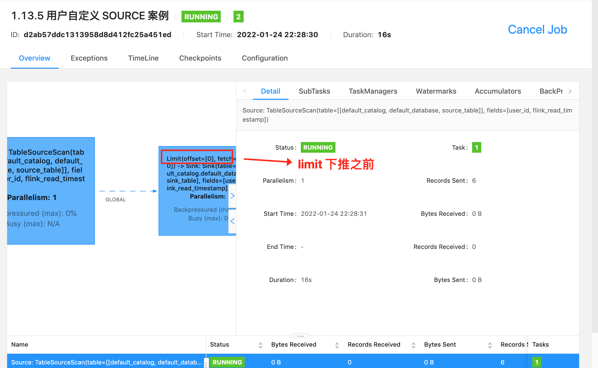](https://yangyichao-mango.github.io/blog-img/wechat-blog/01_大数据/01_数据仓库/01_实时数仓/02_数据内容建设/03_one-engine/01_计算引擎/01_flink/01_flink-sql/21_flinksql牛逼轰轰/27.png)

1. ⭐ 优化方案及实现：在 DynamicTableSource 中实现 SupportsLimitPushDown 接口的方法，具体实现方案如下：

```
public class Abilities_TableSource implements ScanTableSource
        , SupportsLimitPushDown // limit 条件下推 {

    private long limit = -1;

    @Override
    // 方法输入参数：long limit：引擎下推过来的 limit 条目数
    public void applyLimit(long limit) {
        // 将 limit 数接收到之后，然后在 SourceFunction 中可以进行过滤
        this.limit = limit;
    }
}
```

1. ⭐ 优化效果：如下图 web ui 算子图，limit 条件在 Source 节点执行

[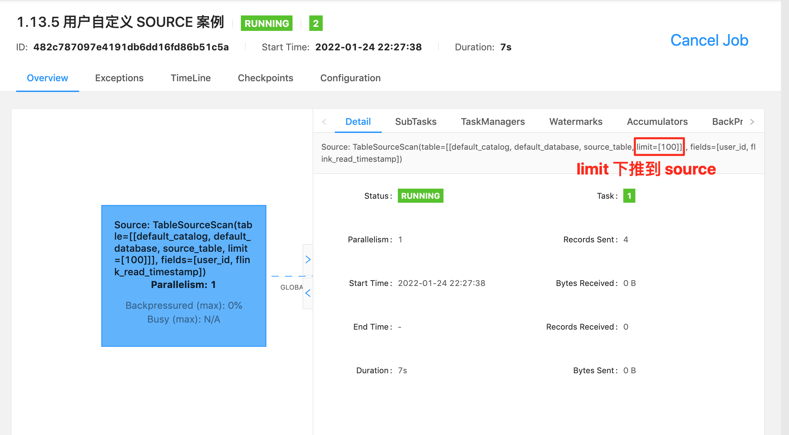](https://yangyichao-mango.github.io/blog-img/wechat-blog/01_大数据/01_数据仓库/01_实时数仓/02_数据内容建设/03_one-engine/01_计算引擎/01_flink/01_flink-sql/21_flinksql牛逼轰轰/26.png)

### 5.5.5.Source：SupportsProjectionPushDown

1. ⭐ 应用场景：将下游用到的字段下推到 Source 中，然后 Source 中可以做到只取这些字段，不使用的字段就不往下游发
2. ⭐ 优化前：如下图 web ui 算子图，limit 条件都在 Source 节点之后有单独的 Limit 算子进行承接

[](https://yangyichao-mango.github.io/blog-img/wechat-blog/01_大数据/01_数据仓库/01_实时数仓/02_数据内容建设/03_one-engine/01_计算引擎/01_flink/01_flink-sql/21_flinksql牛逼轰轰/28.png)

1. ⭐ 优化方案及实现：在 DynamicTableSource 中实现 SupportsProjectionPushDown 接口的方法，具体实现方案如下：

```
public class Abilities_TableSource implements ScanTableSource
        , SupportsProjectionPushDown // select 字段下推 {

    private TableSchema tableSchema;

    @SneakyThrows
    @Override
    public ScanRuntimeProvider getScanRuntimeProvider(ScanContext runtimeProviderContext) {

        // create runtime classes that are shipped to the cluster

        final DeserializationSchema<RowData> deserializer = decodingFormat.createRuntimeDecoder(
                runtimeProviderContext,
                getSchemaWithMetadata(this.tableSchema).toRowDataType());

        ...
    }

    @Override
    // 方法输入参数：
    // int[][] projectedFields：下游算子 `使用到的那些字段` 的下标，可以通过 projectSchemaWithMetadata 方法结合 table schema 信息生成 Source 新的需要写出 schema 信息
    public void applyProjection(int[][] projectedFields) {
        this.tableSchema = projectSchemaWithMetadata(this.tableSchema, projectedFields);
    }
}
```

1. ⭐ 优化效果：如下图 web ui 算子图，下游没有用到的字段直接在 Source 节点过滤掉，不输出

[](https://yangyichao-mango.github.io/blog-img/wechat-blog/01_大数据/01_数据仓库/01_实时数仓/02_数据内容建设/03_one-engine/01_计算引擎/01_flink/01_flink-sql/21_flinksql牛逼轰轰/29.png)

### 5.5.6.Source：SupportsReadingMetadata

1. ⭐ 应用场景：支持读取 Source 的 metadata，比如在 Kafka Source 中读取 Kafka 的 offset，写入时间戳等数据
2. ⭐ 支持之前：比如想获取 Kafka 中的 offset 字段，在之前是不支持的
3. ⭐ 支持方案及实现：在 DynamicTableSource 中实现 SupportsReadingMetadata 接口的方法，我们来看看 Flink Kafka Consumer 的具体实现方案：

```
// 注意！！！先执行 listReadableMetadata()，然后执行 applyReadableMetadata(xxx, xxx) 方法

// 方法输出参数：列出 Kafka Source 可以从 Kafka 中读取的 metadata 数据
@Override
public Map<String, DataType> listReadableMetadata() {
    final Map<String, DataType> metadataMap = new LinkedHashMap<>();

    // add value format metadata with prefix
    valueDecodingFormat
            .listReadableMetadata()
            .forEach((key, value) -> metadataMap.put(VALUE_METADATA_PREFIX + key, value));

    // add connector metadata
    Stream.of(ReadableMetadata.values())
            .forEachOrdered(m -> metadataMap.putIfAbsent(m.key, m.dataType));

    return metadataMap;
}

// 方法输入参数：
// List<String> metadataKeys：用户 SQL 中写入到 Sink 表的的 metadata 字段名称（metadataKeys）
// DataType producedDataType：将用户 SQL 写入到 Sink 表的所有字段的类型信息传进来，包括了 metadata 字段的类型信息
@Override
public void applyReadableMetadata(List<String> metadataKeys, DataType producedDataType) {
    final List<String> formatMetadataKeys =
            metadataKeys.stream()
                    .filter(k -> k.startsWith(VALUE_METADATA_PREFIX))
                    .collect(Collectors.toList());
    final List<String> connectorMetadataKeys = new ArrayList<>(metadataKeys);
    connectorMetadataKeys.removeAll(formatMetadataKeys);

    final Map<String, DataType> formatMetadata = valueDecodingFormat.listReadableMetadata();
    if (formatMetadata.size() > 0) {
        final List<String> requestedFormatMetadataKeys =
                formatMetadataKeys.stream()
                        .map(k -> k.substring(VALUE_METADATA_PREFIX.length()))
                        .collect(Collectors.toList());
        valueDecodingFormat.applyReadableMetadata(requestedFormatMetadataKeys);
    }

    this.metadataKeys = connectorMetadataKeys;
    this.producedDataType = producedDataType;
}
```

1. ⭐ 支持之后的效果：

```
CREATE TABLE KafkaTable (
   // METADATA 字段用于声明可以从 Source 读取的 metadata
   // 关于 Flink Kafka Source 可以读取的 metadata 见以下链接
   // https://nightlies.apache.org/flink/flink-docs-release-1.13/docs/connectors/table/kafka/#available-metadata
  `event_time` TIMESTAMP(3) METADATA FROM 'timestamp',
  `partition` BIGINT METADATA VIRTUAL,
  `offset` BIGINT METADATA VIRTUAL,
  `user_id` BIGINT,
  `item_id` BIGINT,
  `behavior` STRING
) WITH (
  'connector' = 'kafka',
  'topic' = 'user_behavior',
  'properties.bootstrap.servers' = 'localhost:9092',
  'properties.group.id' = 'testGroup',
  'scan.startup.mode' = 'earliest-offset',
  'format' = 'csv'
);
```

在后续的 DML SQL 语句中就可以正常使用这些 metadata 字段的数据了。

### 5.5.7.Source：SupportsWatermarkPushDown

1. ⭐ 应用场景：支持将 Watermark 的分配方式下推到 Source 中，比如 Kafka Source 中一个 Source Task 可以读取多个 Partition，Watermark 分配器下推到 Source 算子中后，就可以为每个 Partition 单独分配 Watermark Generator，这样 Watermark 的生成粒度就是 Kafka 的单 Partition，在事件时间下数据乱序会更小。
2. ⭐ 支持之前：可以看到下图，Watermark 的分配是在 Source 节点之后的。

[](https://yangyichao-mango.github.io/blog-img/wechat-blog/01_大数据/01_数据仓库/01_实时数仓/02_数据内容建设/03_one-engine/01_计算引擎/01_flink/01_flink-sql/21_flinksql牛逼轰轰/32.png)

1. ⭐ 支持方案及实现：在 DynamicTableSource 中实现 SupportsWatermarkPushDown 接口的方法，我们来看看 Flink Kafka Consumer 的具体实现方案：

```
// 方法输入参数：
// WatermarkStrategy<RowData> watermarkStrategy：将用户 DDL 中的 watermark 生成方式传入
@Override
public void applyWatermark(WatermarkStrategy<RowData> watermarkStrategy) {
    this.watermarkStrategy = watermarkStrategy;
}
```

1. ⭐ 支持之后的效果：

[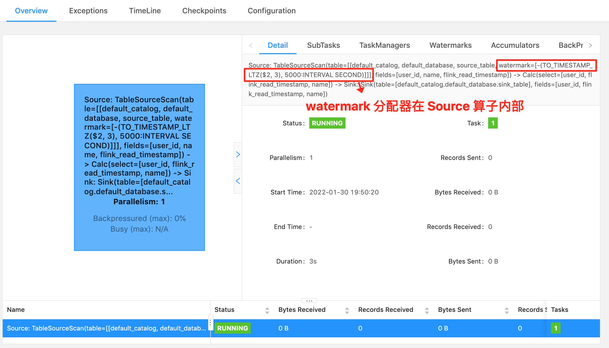](https://yangyichao-mango.github.io/blog-img/wechat-blog/01_大数据/01_数据仓库/01_实时数仓/02_数据内容建设/03_one-engine/01_计算引擎/01_flink/01_flink-sql/21_flinksql牛逼轰轰/31.png)

### 5.5.8.Sink：SupportsOverwrite

1. ⭐ 应用场景：（常用于批处理场景）支持类似于 Hive SQL 的 insert overwrite table xxx 的能力，将已有分区内的数据进行覆盖。
2. ⭐ 支持方案及实现：在 DynamicTableSink 中实现 SupportsOverwrite 接口的方法，我们来看看 `HiveTableSink` 的具体实现方案：

```
private DataStreamSink<Row> createBatchSink(
    DataStream<RowData> dataStream,
    DataStructureConverter converter,
    StorageDescriptor sd,
    HiveWriterFactory recordWriterFactory,
    OutputFileConfig fileNaming,
    final int parallelism)
    throws IOException {
FileSystemOutputFormat.Builder<Row> builder = new FileSystemOutputFormat.Builder<>();
...
--- 2. 将 overwrite 字段设置到 FileSystemOutputFormat 中，在后续写入数据到 Hive 表时，如果 overwrite = true，则会覆盖直接覆盖已有数据
builder.setOverwrite(overwrite);
builder.setStaticPartitions(staticPartitionSpec);
...
return dataStream
        .map((MapFunction<RowData, Row>) value -> (Row) converter.toExternal(value))
        .writeUsingOutputFormat(builder.build())
        .setParallelism(parallelism);
}

// 1. 方法输入参数：
// boolean overwrite：用户写的 SQL 中如果包含了 overwrite 关键字，则方法入参 overwrite = true
// 如果不包含 overwrite 关键字，则方法入参 overwrite = false
@Override
public void applyOverwrite(boolean overwrite) {
    this.overwrite = overwrite;
}
```

1. ⭐ 支持之后的效果：

支持在批任务中 insert overwrite xxx。

```
insert overwrite hive_sink_table
select
    user_id
    , order_amount
    , server_timestamp_bigint
    , server_timestamp 
from hive_source_table
```

### 5.5.9.Sink：SupportsPartitioning

1. ⭐ 应用场景：（常用于批处理场景）支持类似于 Hive SQL 的 insert INTO xxx partition(key = ‘A’) 的能力，支持将结果数据写入某个静态分区。
2. ⭐ 支持方案及实现：在 DynamicTableSink 中实现 SupportsPartitioning 接口的方法，我们来看看 `HiveTableSink` 的具体实现方案：

```
private DataStreamSink<Row> createBatchSink(
    DataStream<RowData> dataStream,
    DataStructureConverter converter,
    StorageDescriptor sd,
    HiveWriterFactory recordWriterFactory,
    OutputFileConfig fileNaming,
    final int parallelism)
    throws IOException {
FileSystemOutputFormat.Builder<Row> builder = new FileSystemOutputFormat.Builder<>();
...
builder.setMetaStoreFactory(msFactory());
builder.setOverwrite(overwrite);
--- 2. 将 staticPartitionSpec 字段设置到 FileSystemOutputFormat 中，在后续写入数据到 Hive 表时，如果有静态分区，则会将数据写入到对应的静态分区中
builder.setStaticPartitions(staticPartitionSpec);
...
return dataStream
        .map((MapFunction<RowData, Row>) value -> (Row) converter.toExternal(value))
        .writeUsingOutputFormat(builder.build())
        .setParallelism(parallelism);
}

// 1. 方法输入参数：
// Map<String, String> partitionMap：用户写的 SQL 中如果包含了 partition(partition_key = 'A') 关键字
// 则方法入参 Map<String, String> partitionMap 的输入值转为 JSON 后为：{"partition_key": "A"}
// 用户可以自己将方法入参的 partitionMap 保存到自定义变量中，后续写出到 Hive 表时进行使用
@Override
public void applyStaticPartition(Map<String, String> partitionMap) {
    staticPartitionSpec = new LinkedHashMap<>();
    for (String partitionCol : getPartitionKeys()) {
        if (partitionMap.containsKey(partitionCol)) {
            staticPartitionSpec.put(partitionCol, partitionMap.get(partitionCol));
        }
    }
}
```

1. ⭐ 支持之后的效果：

```
insert overwrite hive_sink_table partition(date = '2022-01-01')
select
    user_id
    , order_amount
    , server_timestamp_bigint
    , server_timestamp 
from hive_source_table
```

### 5.5.9.Sink：SupportsWritingMetadata

1. ⭐ 应用场景：支持将 metadata 写入到 Sink 中。举例：可以往 Kafka Sink 中写入 Kafka 的 timestamp、header 等。案例可见 `org.apache.flink.streaming.connectors.kafka.table.KafkaDynamicSink`
2. ⭐ 支持方案及实现：在 DynamicTableSink 中实现 SupportsWritingMetadata 接口的方法，我们来看看 `KafkaDynamicSink` 的具体实现方案：

```
// 注意！！！先执行 listWritableMetadata()，然后执行 applyWritableMetadata(xxx, xxx) 方法

// 1. 方法返回参数 Map<String, DataType>：Flink 会获取到可以写入到 Kafka Sink 中的 metadata 都有哪些
@Override
public Map<String, DataType> listWritableMetadata() {
    final Map<String, DataType> metadataMap = new LinkedHashMap<>();
    Stream.of(WritableMetadata.values())
            .forEachOrdered(m -> metadataMap.put(m.key, m.dataType));
    return metadataMap;
}

// 2. 方法输入参数：
// List<String> metadataKeys：通过解析用户的 SQL 语句，得出用户写出到 Sink 的 metadata 列信息，是 listWritableMetadata() 返回结果的子集
// DataType consumedDataType：写出到 Sink 字段的 DataType 类型信息，包括了写出的 metadata 列的类型信息（注意！！！metadata 列会被添加到最后一列）。
// 用户可以将这两个信息获取到，然后传入构造的 SinkFunction 中实现将对应字段写入 metadata 流程。
@Override
public void applyWritableMetadata(List<String> metadataKeys, DataType consumedDataType) {
    this.metadataKeys = metadataKeys;
    this.consumedDataType = consumedDataType;
}
```

1. ⭐ 支持之后的效果：

```
CREATE TABLE KafkaSourceTable (
  `user_id` BIGINT,
  `item_id` BIGINT,
  `behavior` STRING
) WITH (
  'connector' = 'kafka',
  'topic' = 'source_topic',
  'properties.bootstrap.servers' = 'localhost:9092',
  'properties.group.id' = 'testGroup',
  'scan.startup.mode' = 'earliest-offset',
  'value.format' = 'json'
);

CREATE TABLE KafkaSinkTable (
  -- 1. 定义 kafka 中 metadata 的 timestamp 列
  `timestamp` TIMESTAMP_LTZ(3) METADATA,
  `user_id` BIGINT,
  `item_id` BIGINT,
  `behavior` STRING
) WITH (
  'connector' = 'kafka',
  'topic' = 'sink_topic',
  'properties.bootstrap.servers' = 'localhost:9092',
  'properties.group.id' = 'testGroup',
  'scan.startup.mode' = 'earliest-offset',
  'value.format' = 'json'
);

insert into KafkaSinkTable
select
    -- 2. 写入到 kafka 的 metadata 中的 timestamp
    cast(CURRENT_TIMESTAMP as TIMESTAMP_LTZ(3)) as `timestamp`
    , user_id
    , item_id
    , behavior
from KafkaSourceTable
```

## 5.6.SQL Format 扩展

关于怎么实现一个自定义的 Format 可以参考文章：https://mp.weixin.qq.com/s/STUC4trW-HA3cnrsqT-N6g
