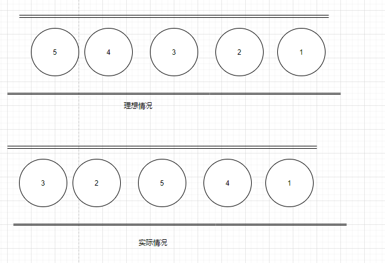
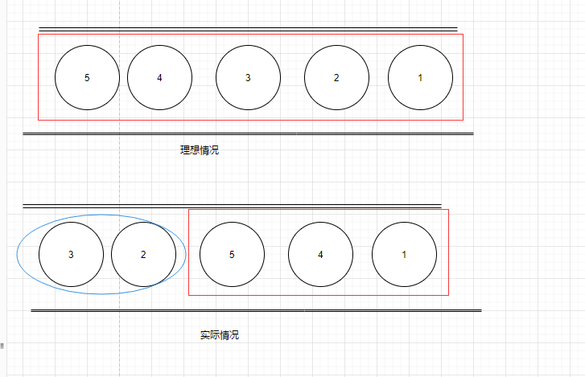
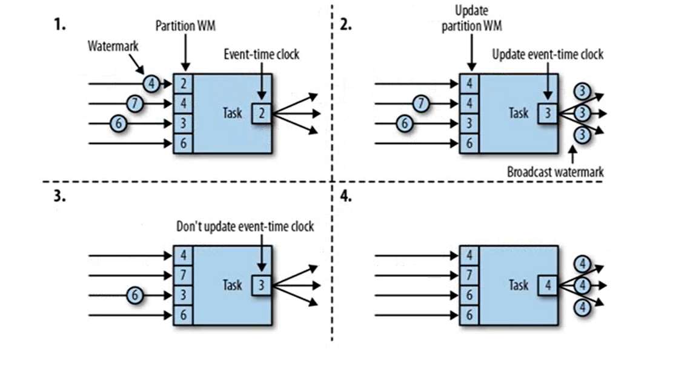
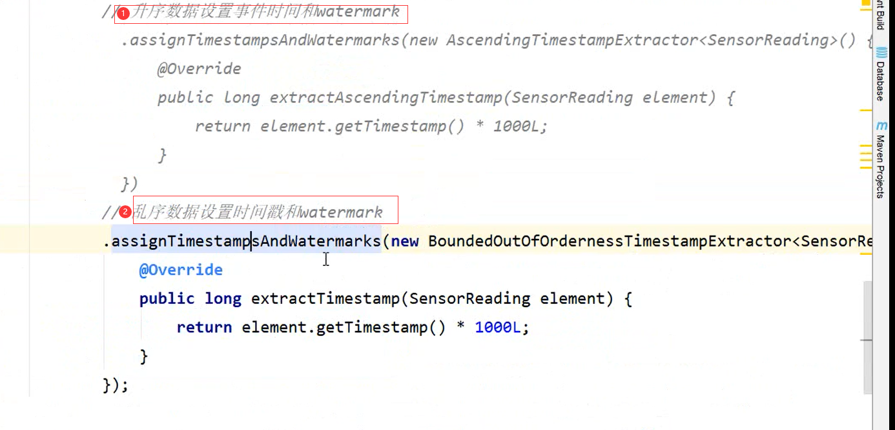

## 1.watermark

**乱序数据的影响**

- 当Flink以Event Time 模式处理数据流时，它会根据数据里的时间戳来处理基于时间的算子
- 由于网络、分布式等原因，会导致乱序数据的产生

## 2. 水位线（watermark）

- 怎么避免乱序数据带来计算不正确？
- 遇到一个时间戳达到了窗口关闭时间，不应该立刻触发窗口计算，而是等待一段时间，等迟到的数据来了再关闭窗口
- Watermark是一种衡量Event Time进展的机制，可以设定延迟触发
- Watermark是用于处理乱序事件的，而正确的处理乱序数据事件，通常用watermark机制结合window来实现；
- 数据流中的watermark用于表示timestamp小于watermark的数据，都已经达到了，因此，window的执行也是由watermark触发的。
- watermark用来让程序自己平衡延迟和结果的正确性。

## 3. watermark的特点

- watermark是一条特殊的数据记录
- watermark必须单调递增，以确保任务的事件时间时钟在向前推进，而不是后退
- watermark与数据的时间戳相关

## 4. watermark传递

## 5. watermark引用

## 6. watermark的设定

- 在Flink中，watermark由应用程序开发人员生成，这通常需要对相应的领域有一定的了解
- 如果watermark设置的延迟太久，收到结果的速度可能就会很慢，解决办法是在水位线到达之前输出一个近似的结果
- 而如果watermark达到太早，则可能收到错误的结果，不过Flink处理迟到数据的机制可以解决这个问题

