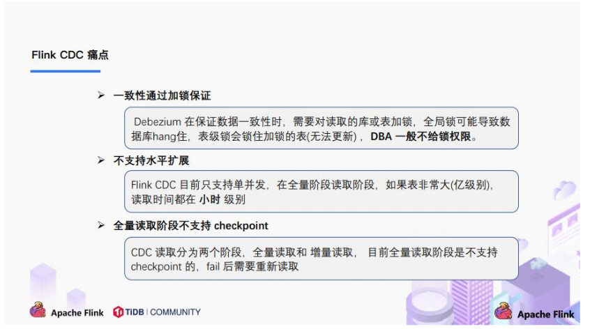
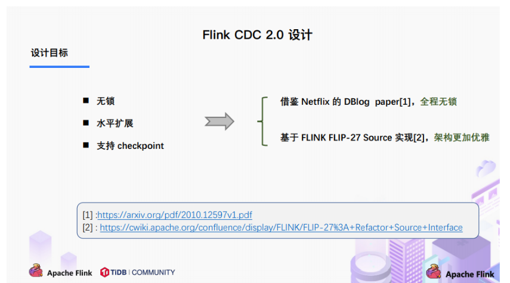
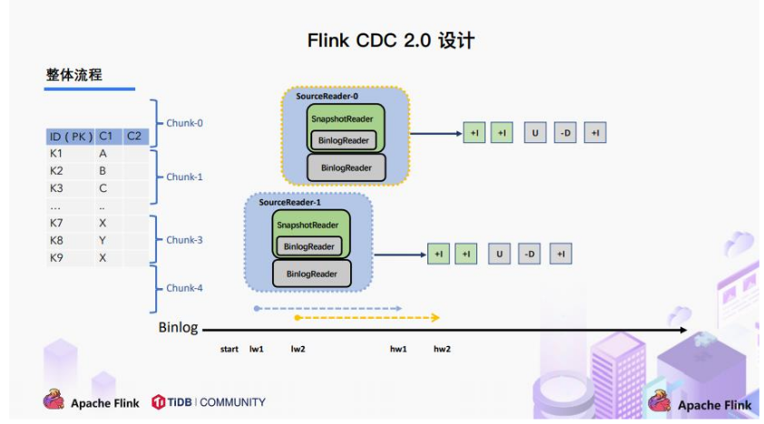
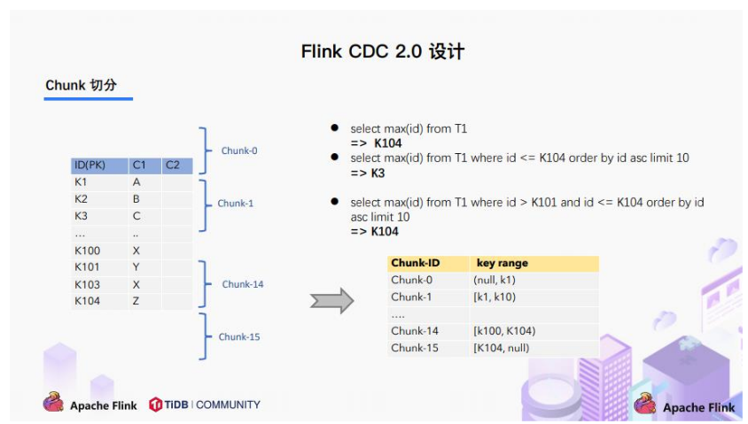
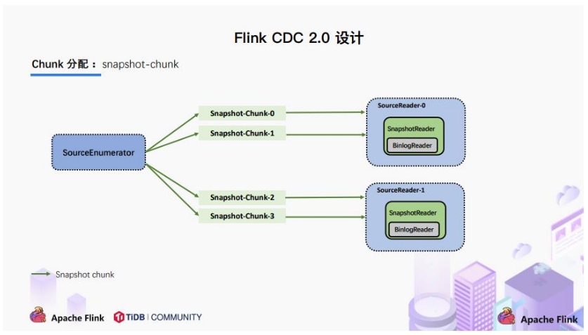
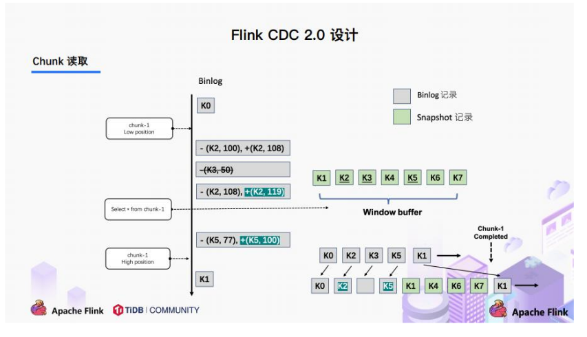
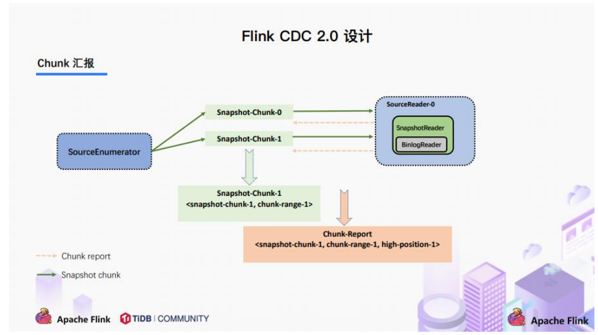
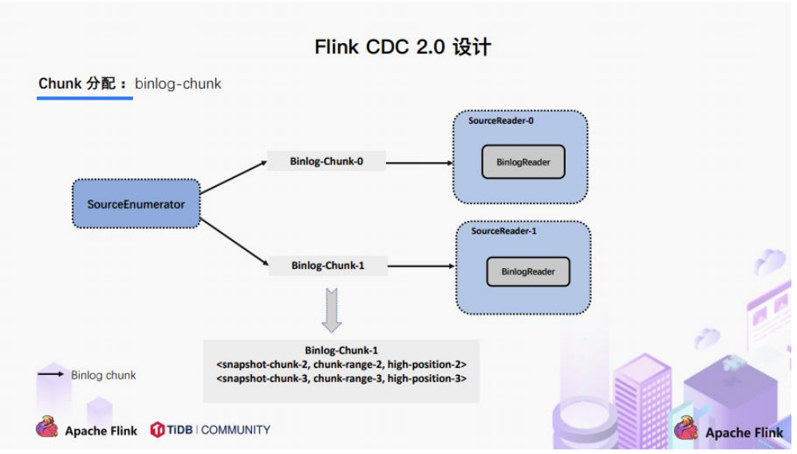

# 第 1 章 CDC 简介

## 1.1 什么是 CDC

> CDC 是 Change Data Capture（变更数据获取）的简称。核心思想是，监测并捕获数据库的变动（包括数据或数据表的插入、更新以及删除等），将这些变更按发生的顺序完整记录下来，写入到消息中间件中以供其他服务进行订阅及消费。

## 1.2 CDC 的种类

CDC 主要分为**基于查询**和**基于 Binlog** 两种方式，我们主要了解一下这两种之间的区别：

|                          | 基于查询的 CDC           | 基于 Binlog 的 CDC       |
| ------------------------ | ------------------------ | ------------------------ |
| 开源产品                 | Sqoop、Kafka JDBC Source | Canal、Maxwell、Debezium |
| 执行模式                 | Batch                    | Streaming                |
| 是否可以捕获所有数据变化 | 否                       | 是                       |
| 延迟性                   | 高延迟                   | 低延迟                   |
| 是否增加数据库压力       | 是                       | 否                       |

## 1.3 Flink-CDC

> Flink 社区开发了 flink-cdc-connectors 组件，这是一个可以直接从 MySQL、PostgreSQL等数据库直接读取全量数据和增量变更数据的 source 组件。
>
> 目前也已开源，开源地址：https://github.com/ververica/flink-cdc-connectors

# 第 2 章 Flink CDC 案例实操

## 2.1 DataStream 方式的应用

### 2.1.1 导入依赖

```xml
<dependencies>
    <dependency>
        <groupId>org.apache.flink</groupId>
        <artifactId>flink-java</artifactId>
        <version>1.12.0</version>
    </dependency>
    
    <dependency>
        <groupId>org.apache.flink</groupId>
        <artifactId>flink-streaming-java_2.12</artifactId>
        <version>1.12.0</version>
    </dependency>

    <dependency>
        <groupId>org.apache.flink</groupId>
        <artifactId>flink-clients_2.12</artifactId>
        <version>1.12.0</version>
    </dependency>
    
    <dependency>
        <groupId>org.apache.hadoop</groupId>
        <artifactId>hadoop-client</artifactId>
        <version>3.1.3</version>
    </dependency>
    
    <dependency>
        <groupId>mysql</groupId>
        <artifactId>mysql-connector-java</artifactId>
        <version>5.1.49</version>
    </dependency>

    <dependency>
        <groupId>org.apache.flink</groupId>
        <artifactId>flink-table-planner-blink_2.12</artifactId>
        <version>1.12.0</version>
    </dependency>
    
    <dependency>
        <groupId>com.ververica</groupId>
        <artifactId>flink-connector-mysql-cdc</artifactId>
        <version>2.0.0</version>
    </dependency>
    
    <dependency>
        <groupId>com.alibaba</groupId>
        <artifactId>fastjson</artifactId>
        <version>1.2.75</version>
    </dependency>
</dependencies>

<build>
    <plugins>
        <plugin>
            <groupId>org.apache.maven.plugins</groupId>
            <artifactId>maven-assembly-plugin</artifactId>
            <version>3.0.0</version>
            <configuration>
                <descriptorRefs>
                    <descriptorRef>jar-with-dependencies</descriptorRef>
                </descriptorRefs>
            </configuration>
            <executions>
                <execution>
                    <id>make-assembly</id>
                    <phase>package</phase>
                    <goals>
                        <goal>single</goal>
                    </goals>
                </execution>
            </executions>
        </plugin>
    </plugins>
</build>
```

### 2.1.2 编写代码

```java
import com.alibaba.ververica.cdc.connectors.mysql.MySQLSource;
import com.alibaba.ververica.cdc.debezium.DebeziumSourceFunction;
import com.alibaba.ververica.cdc.debezium.StringDebeziumDeserializationSchema;
import org.apache.flink.api.common.restartstrategy.RestartStrategies;
import org.apache.flink.runtime.state.filesystem.FsStateBackend;
import org.apache.flink.streaming.api.CheckpointingMode;
import org.apache.flink.streaming.api.datastream.DataStreamSource;
import org.apache.flink.streaming.api.environment.CheckpointConfig;
import org.apache.flink.streaming.api.environment.StreamExecutionEnvironment;
import java.util.Properties;
public class FlinkCDC {
    public static void main(String[] args) throws Exception {
        //1.创建执行环境
        StreamExecutionEnvironment env = StreamExecutionEnvironment.getExecutionEnvironment();
        env.setParallelism(1);
        
        //2.Flink-CDC 将读取 binlog 的位置信息以状态的方式保存在 CK,如果想要做到断点续传,需要从 Checkpoint 或者 Savepoint 启动程序
        //2.1 开启 Checkpoint,每隔 5 秒钟做一次 CK
        env.enableCheckpointing(5000L);
        //2.2 指定 CK 的一致性语义
        env.getCheckpointConfig().setCheckpointingMode(CheckpointingMode.EXACTLY_ONCE);
        //2.3 设置任务关闭的时候保留最后一次 CK 数据
        env.getCheckpointConfig().enableExternalizedCheckpoints(CheckpointConfig.ExternalizedCheckpointCleanup.RETAIN_ON_CANCELLATION);
        //2.4 指定从 CK 自动重启策略
        env.setRestartStrategy(RestartStrategies.fixedDelayRestart(3, 2000L));
        //2.5 设置状态后端
        env.setStateBackend(new FsStateBackend("hdfs://hadoop102:8020/flinkCDC"));
        //2.6 设置访问 HDFS 的用户名
        System.setProperty("HADOOP_USER_NAME", "atguigu");
        //3.创建 Flink-MySQL-CDC 的 Source
        //initial (default): Performs an initial snapshot on the monitored database tables uponfirst startup, and continue to read the latest binlog.
        //latest-offset: Never to perform snapshot on the monitored database tables upon firststartup, just read from the end of the binlog which means only have the changes since the connector was started.
        //timestamp: Never to perform snapshot on the monitored database tables upon first startup, and directly read binlog from the specified timestamp. The consumer will traverse the binlog from the beginning and ignore change events whose timestamp is smaller than the specified timestamp.
        //specific-offset: Never to perform snapshot on the monitored database tables upon first startup, and directly read binlog from the specified offset.

        DebeziumSourceFunction<String> mysqlSource = MySQLSource.<String>builder()
            .hostname("hadoop102")
            .port(3306)
            .username("root")
            .password("000000")
            .databaseList("gmall-flink")
            .tableList("gmall-flink.z_user_info") //可选配置项,如果不指定该参数,则会读取上一个配置下的所有表的数据，注意：指定的时候需要使用"db.table"的方式
            .startupOptions(StartupOptions.initial())
            .deserializer(new StringDebeziumDeserializationSchema())
            .build();

        //4.使用 CDC Source 从 MySQL 读取数据
        DataStreamSource<String> mysqlDS = env.addSource(mysqlSource);
        //5.打印数据
        mysqlDS.print();
        //6.执行任务
        env.execute();
    }
}
```

### 2.1.3 案例测试

1）打包并上传至 Linux

2）开启 MySQL Binlog 并重启 MySQL

https://www.jianshu.com/p/8e7e288c41b1

3）启动 Flink 集群

```sh
[atguigu@hadoop102 flink-standalone]$ bin/start-cluster.sh
```

4）启动 HDFS 集群

```sh
[atguigu@hadoop102 flink-standalone]$ start-dfs.sh
```

5）启动程序

```sh
[atguigu@hadoop102 flink-standalone]$ bin/flink run -c com.atguigu.FlinkCDC flink-1.0-SNAPSHOT-jar-with-dependencies.jar
```

6）在 MySQL 的 gmall-flink.z_user_info 表中添加、修改或者删除数据

7）给当前的 Flink 程序创建 Savepoint

```sh
[atguigu@hadoop102 flink-standalone]$ bin/flink savepoint JobId hdfs://hadoop102:8020/flink/save
```

8）关闭程序以后从 Savepoint 重启程序

```sh
[atguigu@hadoop102 flink-standalone]$ bin/flink run -s hdfs://hadoop102:8020/flink/save/... -c com.atguigu.FlinkCDC flink-1.0-SNAPSHOT-jar-with-dependencies.jar
```

## 2.2 FlinkSQL 方式的应用

### 2.2.1 代码实现

```java
import org.apache.flink.api.common.restartstrategy.RestartStrategies;
import org.apache.flink.runtime.state.filesystem.FsStateBackend;
import org.apache.flink.streaming.api.CheckpointingMode;
import org.apache.flink.streaming.api.environment.CheckpointConfig;
import org.apache.flink.streaming.api.environment.StreamExecutionEnvironment;
import org.apache.flink.table.api.bridge.java.StreamTableEnvironment;
public class FlinkSQL_CDC {
    public static void main(String[] args) throws Exception {
        //1.创建执行环境
        StreamExecutionEnvironment env = StreamExecutionEnvironment.getExecutionEnvironment();
        env.setParallelism(1);
        StreamTableEnvironment tableEnv = StreamTableEnvironment.create(env);
        //2.创建 Flink-MySQL-CDC 的 Source
        tableEnv.executeSql("CREATE TABLE user_info (" +
                            " id INT," +
                            " name STRING," +
                            " phone_num STRING" +
                            ") WITH (" +
                            " 'connector' = 'mysql-cdc'," +
                            " 'hostname' = 'hadoop102'," +
                            " 'port' = '3306'," +
                            " 'username' = 'root'," +
                            " 'password' = '000000'," +
                            " 'database-name' = 'gmall-flink'," +
                            " 'table-name' = 'z_user_info'" +
                            ")");
        tableEnv.executeSql("select * from user_info").print();
        env.execute();
    }
}
```

## 2.3 自定义反序列化器

### 2.3.1 代码实现

```java
import com.alibaba.fastjson.JSONObject;
import com.alibaba.ververica.cdc.connectors.mysql.MySQLSource;
import com.alibaba.ververica.cdc.debezium.DebeziumDeserializationSchema;
import com.alibaba.ververica.cdc.debezium.DebeziumSourceFunction;
import io.debezium.data.Envelope;
import org.apache.flink.api.common.restartstrategy.RestartStrategies;
import org.apache.flink.api.common.typeinfo.TypeInformation;
import org.apache.flink.runtime.state.filesystem.FsStateBackend;
import org.apache.flink.streaming.api.CheckpointingMode;
import org.apache.flink.streaming.api.datastream.DataStreamSource;
import org.apache.flink.streaming.api.environment.CheckpointConfig;
import org.apache.flink.streaming.api.environment.StreamExecutionEnvironment;
import org.apache.flink.util.Collector;
import org.apache.kafka.connect.data.Field;
import org.apache.kafka.connect.data.Struct;
import org.apache.kafka.connect.source.SourceRecord;
import java.util.Properties;
public class Flink_CDCWithCustomerSchema {
    public static void main(String[] args) throws Exception {
        //1.创建执行环境
        StreamExecutionEnvironment env = StreamExecutionEnvironment.getExecutionEnvironment();
        env.setParallelism(1);
        //2.创建 Flink-MySQL-CDC 的 Source
        DebeziumSourceFunction<String> mysqlSource = MySQLSource.<String>builder()
            .hostname("hadoop102")
            .port(3306)
            .username("root")
            .password("000000")
            .databaseList("gmall-flink")
            .tableList("gmall-flink.z_user_info")
            //可选配置项,如果不指定该参数,则会读取上一个配置下的所有表的数据,注意：指定的时候需要使用"db.table"的方式
            .startupOptions(StartupOptions.initial())
            .deserializer(new DebeziumDeserializationSchema<String>() { 
                //自定义数据解析器
                @Override
                public void deserialize(SourceRecord sourceRecord, Collector<String> collector) throws Exception {
                    //获取主题信息,包含着数据库和表名mysql_binlog_source.gmall-flink.z_user_info
                    String topic = sourceRecord.topic();
                    String[] arr = topic.split("\\.");
                    String db = arr[1];
                    String tableName = arr[2];
                    //获取操作类型 READ DELETE UPDATE CREATE
                    Envelope.Operation operation = Envelope.operationFor(sourceRecord);
                    //获取值信息并转换为 Struct 类型
                    Struct value = (Struct) sourceRecord.value();
                    //获取变化后的数据
                    Struct after = value.getStruct("after");
                    //创建 JSON 对象用于存储数据信息
                    JSONObject data = new JSONObject();
                    for (Field field : after.schema().fields()) {
                        Object o = after.get(field);
                        data.put(field.name(), o);
                    }
                    
                    //创建 JSON 对象用于封装最终返回值数据信息
                    JSONObject result = new JSONObject();
                    result.put("operation", operation.toString().toLowerCase());
                    result.put("data", data);
                    result.put("database", db);
                    result.put("table", tableName);
                    //发送数据至下游
                    collector.collect(result.toJSONString());
                }
                
                @Override
                public TypeInformation<String> getProducedType() {
                    return TypeInformation.of(String.class);
                }
            }).build();

        //3.使用 CDC Source 从 MySQL 读取数据
        DataStreamSource<String> mysqlDS = env.addSource(mysqlSource);
        //4.打印数据
        mysqlDS.print();
        //5.执行任务
        env.execute();
    }
}
```

# 第 3 章 Flink-CDC 2.0

本章图片来源于北京站 Flink Meetup 分享的《详解 Flink-CDC》

### 3.1  1.x 痛点



## 3.2 设计目标




## 3.3 设计实现

### 3.3.1 整体概览

在对于有**主键的表**做初始化模式，整体的流程主要分为 5 个阶段：

1.Chunk 切分；

2.Chunk 分配；（实现并行读取数据&CheckPoint）

3.Chunk 读取；（实现无锁读取）

4.Chunk 汇报；

5.Chunk 分配。



### 3.3.2 Chunk 切分



根据 Netflix DBlog 的论文中的无锁算法原理，对于目标表按照主键进行数据分片，设置每个切片的区间为左闭右开或者左开右闭来保证数据的连续性。

### 3.3.3 Chunk 分配



> 将划分好的 Chunk 分发给多个 SourceReader，每个 SourceReader 读取表中的一部分数据，实现了**并行读取**的目标。
>
> 同时在每个 Chunk 读取的时候可以单独**做 CheckPoint**，某个 Chunk 读取失败只需要单独执行该 Chunk 的任务，而不需要像 1.x 中失败了只能从头读取。
>
> 若每个 SourceReader 保证了数据一致性，则全表就保证了数据一致性。

### 3.3.4 Chunk 读取



> 读取可以分为 5 个阶段
>
> 1）SourceReader 读取表数据之前先记录当前的 Binlog 位置信息记为低位点；
>
> 2）SourceReader 将自身区间内的数据查询出来并放置在 buffer 中；
>
> 3）查询完成之后记录当前的 Binlog 位置信息记为高位点；
>
> 4）在增量部分消费从低位点到高位点的 Binlog；
>
> 5）根据主键，对 buffer 中的数据进行修正并输出。
>
> 通过以上 5 个阶段可以保证每个 Chunk 最终的输出就是在高位点时该 Chunk 中最新的数据，但是目前只是做到了保证单个 Chunk 中的数据一致性。

### 3.3.5 Chunk 汇报



在 Snapshot Chunk 读取完成之后，有一个汇报的流程，如上图所示，即 SourceReader 需要将 Snapshot Chunk 完成信息汇报给 SourceEnumerator。

### 3.3.6 Chunk 分配



FlinkCDC 是支持全量+增量数据同步的，在 SourceEnumerator 接收到所有的 Snapshot Chunk 完成信息之后，还有一个消费增量数据（Binlog）的任务，此时是通过下发 Binlog Chunk给任意一个 SourceReader 进行单并发读取来实现的。

## 3.4 核心原理分析

### 3.4.1 Binlog Chunk 中开始读取位置源码

**MySqlHybridSplitAssigner**

```java
private MySqlBinlogSplit createBinlogSplit() {
    final List<MySqlSnapshotSplit> assignedSnapshotSplit = snapshotSplitAssigner.getAssignedSplits().values().stream()
        .sorted(Comparator.comparing(MySqlSplit::splitId))
        .collect(Collectors.toList());
    
    Map<String, BinlogOffset> splitFinishedOffsets = snapshotSplitAssigner.getSplitFinishedOffsets();
    final List<FinishedSnapshotSplitInfo> finishedSnapshotSplitInfos = new ArrayList<>();
    final Map<TableId, TableChanges.TableChange> tableSchemas = new HashMap<>();
    BinlogOffset minBinlogOffset = BinlogOffset.INITIAL_OFFSET;
    for (MySqlSnapshotSplit split : assignedSnapshotSplit) {
        // find the min binlog offset
        BinlogOffset binlogOffset = splitFinishedOffsets.get(split.splitId());
        if (binlogOffset.compareTo(minBinlogOffset) < 0) {
            minBinlogOffset = binlogOffset;
        }
        finishedSnapshotSplitInfos.add(
            new FinishedSnapshotSplitInfo(split.getTableId(),
                                          split.splitId(),
                                          split.getSplitStart(),
                                          split.getSplitEnd(),
                                          binlogOffset));
        tableSchemas.putAll(split.getTableSchemas());
    }

    final MySqlSnapshotSplit lastSnapshotSplit = assignedSnapshotSplit.get(assignedSnapshotSplit.size() -1).asSnapshotSplit();
    return new MySqlBinlogSplit(
        BINLOG_SPLIT_ID,
        lastSnapshotSplit.getSplitKeyType(),
        minBinlogOffset,
        BinlogOffset.NO_STOPPING_OFFSET,
        finishedSnapshotSplitInfos,
        tableSchemas);
}
```

### 3.4.2 读取低位点到高位点之间的 Binlog

**BinlogSplitReader**

```java
/**
* Returns the record should emit or not.
*
* <p>The watermark signal algorithm is the binlog split reader only sends the binlog event
that
* belongs to its finished snapshot splits. For each snapshot split, the binlog event is valid
* since the offset is after its high watermark.
*
* <pre> E.g: the data input is :
*
snapshot-split-0 info : [0, 1024) highWatermark0
*
snapshot-split-1 info : [1024, 2048) highWatermark1
* the data output is:
* only the binlog event belong to [0,
1024) and offset is after highWatermark0
should send,
* only the binlog event belong to [1024, 2048) and offset is after highWatermark1 should
send.
* </pre>
*/
private boolean shouldEmit(SourceRecord sourceRecord) {
    if (isDataChangeRecord(sourceRecord)) {
        TableId tableId = getTableId(sourceRecord);
        BinlogOffset position = getBinlogPosition(sourceRecord);
        // aligned, all snapshot splits of the table has reached max highWatermark
        if (position.isAtOrBefore(maxSplitHighWatermarkMap.get(tableId))) {
            return true;
        }
        Object[] key = getSplitKey(
            currentBinlogSplit.getSplitKeyType(),
            sourceRecord,
            statefulTaskContext.getSchemaNameAdjuster());
        
        for (FinishedSnapshotSplitInfo splitInfo : finishedSplitsInfo.get(tableId)) {
            if (RecordUtils.splitKeyRangeContains(key, splitInfo.getSplitStart(), splitInfo.getSplitEnd())
                && position.isAtOrBefore(splitInfo.getHighWatermark())) {
                return true;
            }
        }
        // not in the monitored splits scope, do not emit
        return false;
    }
    // always send the schema change event and signal event
    // we need record them to state of Flink
    return true;
}
```
