# 第一章 Flink 简介

## 1.1 初识 Flink

> ​	Flink 起源于 Stratosphere 项目，Stratosphere 是在 2010~2014 年由 3 所地处柏林的大学和欧洲的一些其他的大学共同进行的研究项目，2014 年 4 月 Stratosphere 的代码被复制并捐赠 给了 Apache 软件基 金会， 参加 这个孵化项目的 初始成员是
> Stratosphere 系统的核心开发人员，2014 年 12 月，Flink 一跃成为 Apache 软件基金会的顶级项目。
> ​	在德语中，Flink 一词表示快速和灵巧，项目采用一只松鼠的彩色图案作为 logo，这不仅是因为松鼠具有快速和灵巧的特点，还因为柏林的松鼠有一种迷人的红棕色，而 Flink 的松鼠 logo 拥有可爱的尾巴，尾巴的颜色与 Apache 软件基金会的 logo 颜色相呼应，也就是说，这是一只 Apache 风格的松鼠。
> 
> ​	Flink 项目的理念是：“Apache Flink 是为<font color = red >分布式、高性能、随时可用以及准确</font>的流处理应用程序打造的开源流处理框架”。
>
> ​	Apache Flink 是一个框架和分布式处理引擎，用于对无界和有界数据流进行有状态计算。Flink 被设计在所有常见的集群环境中运行，以内存执行速度和任意规模来执行计算。
>
> 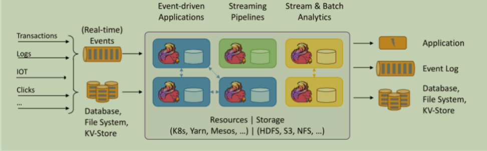

## 1.2 Flink 的重要特点

### 1.2.1 事件驱动型(Event-driven)

> ​	**事件驱动型**应用是一类具有**状态**的应用，它从一个或多个事件流提取数据，并根据到来的事件触发计算、状态更新或其他外部动作。比较典型的就是以 kafka 为代表的消息队列几乎都是事件驱动型应用。
>
> ​	与之不同的就是 SparkStreaming **微批次**，如图：
>
> 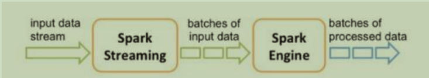
>
> ​	**事件驱动型**：
>
> 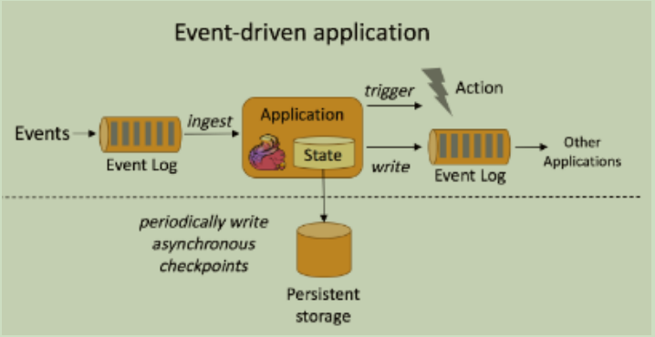
>
> 

### 1.2.2 流与批的世界观

> - 批处理的特点是有界、持久、大量，非常适合需要访问全套记录才能完成的计算工作，一般用于离线统计。
> - 流处理的特点是无界、实时, 无需针对整个数据集执行操作，而是对通过系统传输的每个数据项执行操作，一般用于实时统计。

> ​	在 spark 的世界观中，一切都是由批次组成的，离线数据是一个大批次，而实时数据是由一个一个无限的小批次组成的。
>
> ​	而在 flink 的世界观中，一切都是由流组成的，离线数据是有界限的流，实时数据是一个没有界限的流，这就是所谓的有界流和无界流。

> - 无界数据流：无界数据流有一个开始但是没有结束，它们不会在生成时终止并提供数据，必须连续处理无界流，也就是说必须在获取后立即处理 event。对于无界数据流我们无法等待所有数据都到达，因为输入是无界的，并且在任何时间点都不会完成。处理无界数据通常要求以特定顺序（例如事件发生的顺序）获取 event，以便能够推断结果完整性。
>
> - 有界数据流：有界数据流有明确定义的开始和结束，可以在执行任何计算之前通过获取所有数据来处理有界流，处理有界流不需要有序获取，因为可以始终对有界数据集进行排序，有界流的处理也称为批处理。
>
>   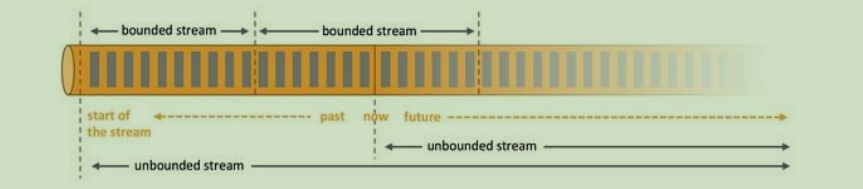
>
>   <font color = red>这种以流为世界观的架构，获得的最大好处就是具有极低的延迟。</font>

### 1.2.3 分层 api

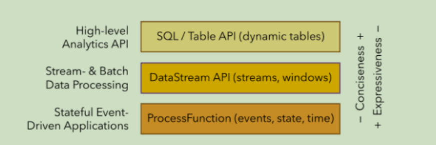

> ​	最底层级的抽象仅仅提供了有状态流，它将通过`过程函数`（Process Function）被嵌入到 DataStream API 中。底层过程函数（Process Function） 与 DataStream API 相集成，使其可以对某些特定的操作进行底层的抽象，它允许用户可以自由地处理来自一个或多个数据流的事件，并使用`一致的容错的状态`。除此之外，用户可以`注册事件时间`并处理时间回调，从而使程序可以处理复杂的计算。
>
> ​	实际上，大多数应用并不需要上述的底层抽象，而是针对`核心 API`（Core APIs）进行编程，比如 DataStream API（有界或无界流数据）以及 DataSet API（有界数据集）。这些 API 为数据处理提供了通用的构建模块，比如由用户定义的多种形式的转换（transformations），连接（joins），聚合（aggregations），窗口操作（windows）等等。DataSet API 为有界数据集提供了额外的支持，例如循环与迭代。这些 API处理的数据类型以类（classes）的形式由各自的编程语言所表示。
>
> ​	`Table API` 是以表为中心的声明式编程，其中表可能会动态变化（在表达流数据时）。Table API 遵循（扩展的）关系模型：表有二维数据结构（schema）（类似于关系数据库中的表），同时 API 提供可比较的操作，例如 select、project、join、group-by、aggregate 等。Table API 程序声明式地定义了什么逻辑操作应该执行，而不是准确地确定这些操作代码的看上去如何。尽管 Table API 可以通过多种类型的用户自定义函数（UDF）进行扩展，其仍不如核心 API 更具表达能力，但是使用起来却更加简洁（代码量更少）。除此之外，Table API 程序在执行之前会经过内置优化器进行优化。
>
> ​	你可以在表与 DataStream/DataSet 之间无缝切换，以允许程序将 Table API 与DataStream 以及 DataSet 混合使用。Flink 提供的最高层级的抽象是 SQL 。这一层抽象在语法与表达能力上与Table API 类似，但是是以 SQL 查询表达式的形式表现程序。SQL 抽象与 Table API交互密切，同时 SQL 查询可以直接在 Table API 定义的表上执行。目前 Flink 作为批处理还不是主流，不如 Spark 成熟，所以 DataSet 使用的并不是很多。Flink Table API 和 Flink SQL 也并不完善，大多都由各大厂商自己定制。所以我们主要学习 DataStream API 的使用。实际上 Flink 作为最接近 Google DataFlow模型的实现，是流批统一的观点，所以基本上使用 DataStream 就可以了。
>
> Flink 几大模块
> ⚫ Flink Table & SQL(还没开发完) 
>
> ⚫ Flink Gelly(图计算) 
>
> ⚫ Flink CEP(复杂事件处理)

# 第二章 快速上手

## 2.1 搭建 maven 工程 FlinkTutorial

pom 文件

```xml
<?xml version="1.0" encoding="UTF-8"?>
<project xmlns="http://maven.apache.org/POM/4.0.0"
         xmlns:xsi="http://www.w3.org/2001/XMLSchema-instance"
         xsi:schemaLocation="http://maven.apache.org/POM/4.0.0 
                             http://maven.apache.org/xsd/maven-4.0.0.xsd">
    <modelVersion>4.0.0</modelVersion>
    <groupId>com.atguigu.flink</groupId>
    <artifactId>FlinkTutorial</artifactId>
    <version>1.0-SNAPSHOT</version>
    
    <dependencies>
        <dependency>
            <groupId>org.apache.flink</groupId>
            <artifactId>flink-java</artifactId>
            <version>1.10.1</version>
        </dependency>
        
        <dependency>
            <groupId>org.apache.flink</groupId>
            <artifactId>flink-streaming-java_2.12</artifactId>
            <version>1.10.1</version>
        </dependency>
    </dependencies>
</project>
```

## 2.2 批处理 wordcount

src/main/java/com.atguigu.wc/WordCount.java

```java
public class WordCount {
    public static void main(String[] args) throws Exception {
        // 创建执行环境
        ExecutionEnvironment env = ExecutionEnvironment.getExecutionEnvironment();
        // 从文件中读取数据
        String inputPath = "hello.txt";
        DataSet<String> inputDataSet = env.readTextFile(inputPath);
        // 空格分词打散之后，对单词进行 groupby 分组，然后用 sum 进行聚合
        DataSet<Tuple2<String, Integer>> wordCountDataSet = inputDataSet
            .flatMap(new MyFlatMapper()) 
            .groupBy(0)
            .sum(1);
        // 打印输出
        wordCountDataSet.print();
    }
 
    public static class MyFlatMapper implements FlatMapFunction<String, Tuple2<String, Integer>> {
        public void flatMap(String value, Collector<Tuple2<String, Integer>> out) throws Exception {
            String[] words = value.split(" ");
            for (String word : words) {
                out.collect(new Tuple2<String, Integer>(word, 1));
            }
        }
    }
}
```

<font color = red>注意：Flink 程序支持 java 和 scala 两种语言，本课程中以 java 语言为主。</font>

## 2.3 流处理 wordcount

src/main/scala/com.atguigu.wc/StreamWordCount.java

```java
public class StreamWordCount {
    public static void main(String[] args) throws Exception{
        StreamExecutionEnvironment env = StreamExecutionEnvironment.getExecutionEnvironment();
        ParameterTool parameterTool = ParameterTool.fromArgs(args);
        String host = parameterTool.get("host");
        int port = parameterTool.getInt("port");
        DataStream<String> inputDataStream = env.socketTextStream(host, port);
        DataStream<Tuple2<String, Integer>> wordCountDataStream = inputDataStream
            .flatMap( new WordCount.MyFlatMapper())
            .keyBy(0)
            .sum(1);
        wordCountDataStream.print().setParallelism(1);
        env.execute();
    }
}
```

测试——在 linux 系统中用 netcat 命令进行发送测试。
nc -lk 7777

# 第三章 Flink 部署

## 3.1 Standalone 模式

### 3.1.1 安装

解压缩 flink-1.10.1-bin-scala_2.12.tgz，进入 conf 目录中。
1）修改 flink/conf/flink-conf.yaml 文件：

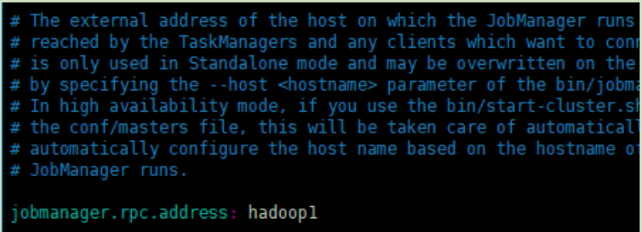

 2）修改 /conf/slaves 文件：

 

 3）分发给另外两台机子： 

 

4）启动：

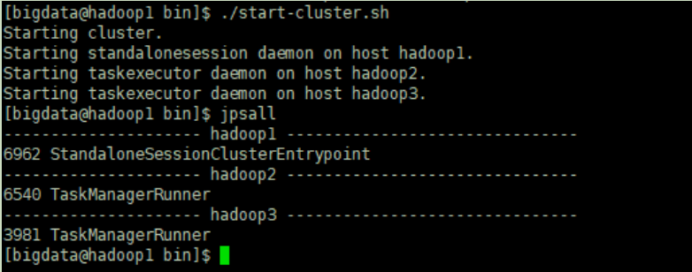

访问 http://localhost:8081 可以对 flink 集群和任务进行监控管理。

### 3.1.2 提交任务

1) 准备数据文件（如果需要）
2) 把含数据文件的文件夹，分发到 taskmanage 机器中。如 果 从 文 件 中 读 取 数 据 ， 由 于 是 从 本 地 磁 盘 读 取 ， 实 际 任 务 会 被 分 发 到taskmanage 的机器中，所以要把目标文件分发。

3) 执行程序

```sh
./flink run -c com.atguigu.wc.StreamWordCount –p 2 
FlinkTutorial-1.0-SNAPSHOT-jar-with-dependencies.jar --host lcoalhost –port 7777
```

4) 查看计算结果


<font color = red>注意：如果输出到控制台，应该在 taskmanager 下查看；如果计算结果输出到文件，同样会保存到 taskmanage 的机器下，不会在 jobmanage 下。</font>
5) 在 webui 控制台查看计算过程

## 3.2 Yarn 模式

> ​	以 Yarn 模式部署 Flink 任务时，要求 Flink 是有 Hadoop 支持的版本，Hadoop环境需要保证版本在 2.2 以上，并且集群中安装有 HDFS 服务。

### 3.2.1 Flink on Yarn

Flink 提供了两种在 yarn 上运行的模式，分别为 `Session-Cluster` 和 `Per-Job-Cluster`模式。

1) Session-cluster 模式：

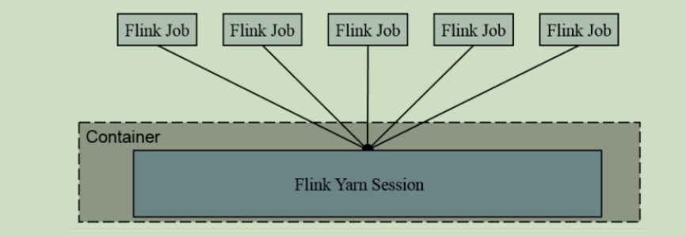

> ​	Session-Cluster 模式需要先启动集群，然后再提交作业，接着会向 yarn 申请一块空间后，资源永远保持不变。如果资源满了，下一个作业就无法提交，只能等到yarn 中的其中一个作业执行完成后，释放了资源，下个作业才会正常提交。所有作业共享 Dispatcher 和 ResourceManager；共享资源；适合规模小执行时间短的作业。
> 
>​	<font color =red>在 yarn 中初始化一个 flink 集群，开辟指定的资源，以后提交任务都向这里提交。这个 flink 集群会常驻在 yarn 集群中，除非手工停止。</font>

2) Per-Job-Cluster 模式：

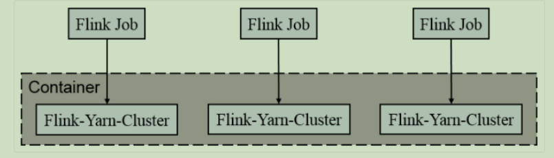

> ​	一个 Job 会对应一个集群，每提交一个作业会根据自身的情况，都会单独向 yarn申请资源，直到作业执行完成，一个作业的失败与否并不会影响下一个作业的正常提交和运行。独享 Dispatcher 和 ResourceManager，按需接受资源申请；适合规模大长时间运行的作业。每次提交都会创建一个新的 flink 集群，任务之间互相独立，互不影响，方便管理。任务执行完成之后创建的集群也会消失。

### 3.2.2 Session Cluster

1) 启动 hadoop 集群（略）

2) 启动 yarn-session

```sh
./yarn-session.sh -n 2 -s 2 -jm 1024 -tm 1024 -nm test -d
其中：
-n(--container)：TaskManager 的数量。
-s(--slots)： 每个 TaskManager 的 slot 数量，默认一个 slot 一个 core，默认每个taskmanager 的 slot 的个数为 1，有时可以多一些 taskmanager，做冗余。
-jm：JobManager 的内存（单位 MB)。 
-tm：每个 taskmanager 的内存（单位 MB)。
-nm：yarn 的 appName(现在 yarn 的 ui 上的名字)。
-d：后台执行。
```

3) 执行任务

```sh
./flink run -c com.atguigu.wc.StreamWordCount 
FlinkTutorial-1.0-SNAPSHOT-jar-with-dependencies.jar --host lcoalhost –port 7777
```

4) 去 yarn 控制台查看任务状态
5) 取消 yarn-session

```sh
yarn application --kill application_1577588252906_0001
```

3.2.2 Per Job Cluster
1) 启动 hadoop 集群（略）

2) 不启动 yarn-session，直接执行 job

```sh
./flink run –m yarn-cluster -c com.atguigu.wc.StreamWordCount 
FlinkTutorial-1.0-SNAPSHOT-jar-with-dependencies.jar --host lcoalhost –port 
7777
```

## 3.3 Kubernetes 部署

>​	容器化部署时目前业界很流行的一项技术，基于 Docker 镜像运行能够让用户更加方便地对应用进行管理和运维。容器管理工具中最为流行的就 是 Kubernetes（k8s），而 Flink 也在最近的版本中支持了 k8s 部署模式。
>1）搭建 Kubernetes 集群（略）
>
>2）配置各组件的 yaml 文件
>	在 k8s 上构建 Flink Session Cluster，需要将 Flink 集群的组件对应的 docker 镜像分别在 k8s 上启动，包括 JobManager、TaskManager、JobManagerService 三个镜像服务。每个镜像服务都可以从中央镜像仓库中获取。
>
>3）启动 Flink Session Cluster
>
>// 启动 jobmanager-service 服务
>kubectl create -f jobmanager-service.yaml
>// 启动 jobmanager-deployment 服务
>kubectl create -f jobmanager-deployment.yaml
>// 启动 taskmanager-deployment 服务
>kubectl create -f taskmanager-deployment.yaml
>
>4）访问 Flink UI 页面
>	集群启动后，就可以通过 JobManagerServicers 中配置的 WebUI 端口，用浏览器输入以下 url 来访问 Flink UI 页面了：
>http://{JobManagerHost:Port}/api/v1/namespaces/default/services/flink-jobmanager:ui/proxy


# 第四章 Flink 运行架构

## 4.1 Flink 运行时的组件

> ​	Flink 运行时架构主要包括四个不同的组件，它们会在运行流处理应用程序时协同工作：作业管理器（JobManager）、资源管理器（ResourceManager）、任务管理器（TaskManager），以及分发器（Dispatcher）。因为 Flink 是用 Java 和 Scala 实现的，所以所有组件都会运行在Java 虚拟机上。每个组件的职责如下：
>
> ⚫ **作业管理器（JobManager）**
> 	控制一个应用程序执行的主进程，也就是说，每个应用程序都会被不同的JobManager 所控制执行。JobManager 会先接收到要执行的应用程序，这个应用程序会包括：作业图（JobGraph）、逻辑数据流图（logical dataflow graph）和打包了所有的类、库和其它资源的 JAR 包。JobManager 会把 JobGraph 转换成一个物理层面的数据流图，这个图被叫做“执行图”（ExecutionGraph），包含了所有可以并发执行的任务。JobManager 会向资源管理器（ResourceManager）请求执行任务必要的资源，也就是任务管理器（TaskManager）上的插槽（slot）。一旦它获取到了足够的资源，就会将执行图分发到真正运行它们的TaskManager 上。而在运行过程中，JobManager 会负责所有需要中央协调的操作，比如说检查点（checkpoints）的协调。
>
> ⚫ 资源管理器（ResourceManager）
> 	主要负责管理任务管理器（TaskManager）的插槽（slot），TaskManger 插槽是 Flink 中定义的处理资源单元。Flink 为不同的环境和资源管理工具提供了不同资源管理器，比如YARN、Mesos、K8s，以及 standalone 部署。当 JobManager 申请插槽资源时，ResourceManager会将有空闲插槽的 TaskManager 分配给 JobManager。如果 ResourceManager 没有足够的插槽来满足 JobManager 的请求，它还可以向资源提供平台发起会话，以提供启动 TaskManager进程的容器。另外，ResourceManager 还负责终止空闲的 TaskManager，释放计算资源。
>
> ⚫ 任务管理器（TaskManager）
> Flink 中的工作进程。通常在 Flink 中会有多个 TaskManager 运行，每一个 TaskManager都包含了一定数量的插槽（slots）。插槽的数量限制了 TaskManager 能够执行的任务数量。启动之后，TaskManager 会向资源管理器注册它的插槽；收到资源管理器的指令后，TaskManager 就会将一个或者多个插槽提供给 JobManager 调用。JobManager 就可以向插槽分配任务（tasks）来执行了。在执行过程中，一个 TaskManager 可以跟其它运行同一应用程序的 TaskManager 交换数据。
>
> ⚫ 分发器（Dispatcher）
> 	可以跨作业运行，它为应用提交提供了 REST 接口。当一个应用被提交执行时，分发器就会启动并将应用移交给一个 JobManager。由于是 REST 接口，所以 Dispatcher 可以作为集群的一个 HTTP 接入点，这样就能够不受防火墙阻挡。Dispatcher 也会启动一个 Web UI，用来方便地展示和监控作业执行的信息。Dispatcher 在架构中可能并不是必需的，这取决于应用提交运行的方式。


## 4.2 任务提交流程

我们来看看当一个应用提交执行时，Flink 的各个组件是如何交互协作的：

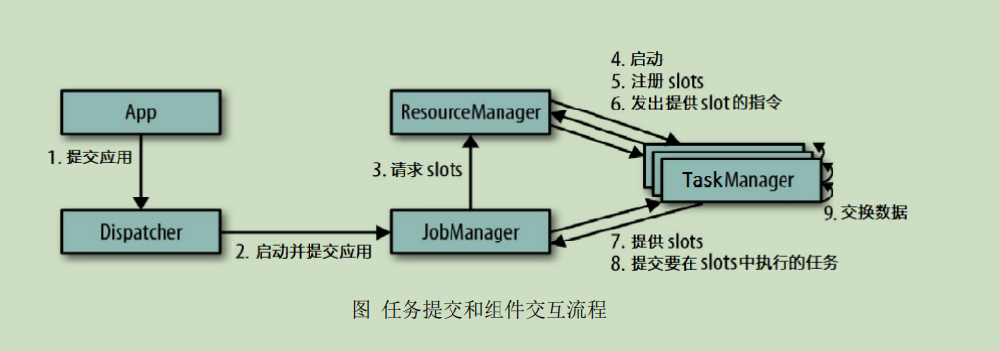

> ​	上图是从一个较为高层级的视角，来看应用中各组件的交互协作。如果部署的集群环境不同（例如 YARN，Mesos，Kubernetes，standalone 等），其中一些步骤可以被省略，或是有些组件会运行在同一个 JVM 进程中。具体地，如果我们将 Flink 集群部署到 YARN 上，那么就会有如下的提交流程：
>
> 	Flink 任务提交后，Client 向 HDFS 上传 Flink 的 Jar 包和配置，之后向 Yarn ResourceManager 提交任务，ResourceManager 分配 Container 资源并通知对应的NodeManager 启动 ApplicationMaster，ApplicationMaster 启动后加载 Flink 的 Jar 包和配置构建环境，然后启动 JobManager，之后 ApplicationMaster 向 ResourceManager申请资源启动 TaskManager ， ResourceManager 分 配 Container 资 源 后 ， 由ApplicationMaster 通 知 资 源 所 在 节 点 的 NodeManager 启 动 TaskManager ，NodeManager 加载 Flink 的 Jar 包和配置构建环境并启动 TaskManager,TaskManager
> 启动后向 JobManager 发送心跳包，并等待 JobManager 向其分配任务。

## 4.3 任务调度原理

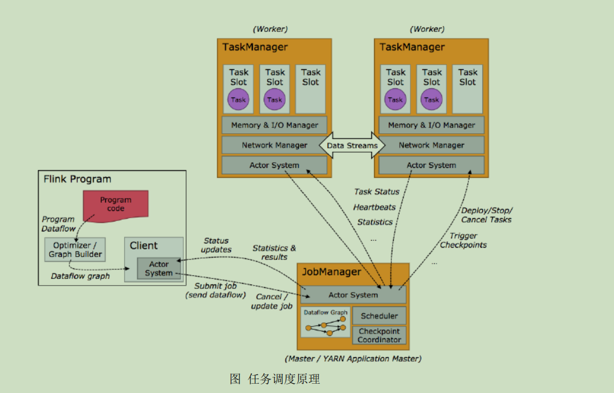

> ​	客户端不是运行时和程序执行 的一部分，但它用于准备并发送dataflow(JobGraph)给 Master(JobManager)，然后，客户端断开连接或者维持连接以等待接收计算结果。
>
> ​	当 Flink 集 群 启 动 后 ， 首 先 会 启 动 一 个 JobManger 和一个或多个的TaskManager。由 Client 提交任务给JobManager，JobManager 再调度任务到各个TaskManager 去执行，然后TaskManager 将心跳和统计信息汇报给JobManager。TaskManager 之间以流的形式进行数据的传输。上述三者均为独立的 JVM 进程。
>
> ​	**Client** 为提交 Job 的客户端，可以是运行在任何机器上（与 JobManager 环境连通即可）。提交 Job 后，Client 可以结束进程（Streaming 的任务），也可以不结束并等待结果返回。
>
> ​	**JobManager** 主 要 负 责 调 度 Job 并 协 调 Task 做 checkpoint， 职 责 上 很 像Storm 的 Nimbus。从 Client 处接收到 Job 和 JAR 包等资源后，会生成优化后的执行计划，并以 Task 的单元调度到各个 TaskManager 去执行。
>
> ​	**TaskManager** 在启动的时候就设置好了槽位数（Slot），每个 slot 能启动一个Task，Task 为线程。从 JobManager 处接收需要部署的 Task，部署启动后，与自己的上游建立 Netty 连接，接收数据并处理。

### 4.3.1 TaskManger 与 Slots

> ​	Flink 中每一个 worker(TaskManager)都是一个 JVM 进程，它可能会在独立的线程上执行一个或多个 subtask。为了控制一个 worker 能接收多少个 task，worker 通 过 task slot 来进行控制（一个 worker 至少有一个 task slot）。每个 task slot 表示 TaskManager 拥有资源的一个固定大小的子集。假如一个TaskManager 有三个 slot，那么它会将其管理的内存分成三份给各个 slot。资源 slot化意味着一个 subtask 将不需要跟来自其他 job 的 subtask 竞争被管理的内存，取而代之的是它将拥有一定数量的内存储备。需要注意的是，这里不会涉及到 CPU 的隔离，slot 目前仅仅用来隔离 task 的受管理的内存。通过调整 task slot 的数量，允许用户定义 subtask 之间如何互相隔离。如果一个TaskManager 一个 slot，那将意味着每个 task group 运行在独立的 JVM 中（该 JVM可能是通过一个特定的容器启动的），而一个 TaskManager 多个 slot 意味着更多的subtask 可以共享同一个 JVM。而在同一个 JVM 进程中的 task 将共享 TCP 连接（基于多路复用）和心跳消息。它们也可能共享数据集和数据结构，因此这减少了每个task 的负载。
>
> 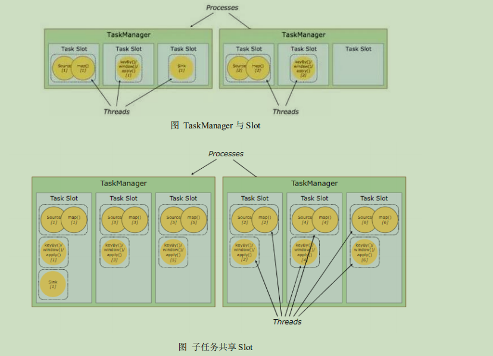
>
> ​	默认情况下，Flink 允许子任务共享 slot，即使它们是不同任务的子任务（前提是它们来自同一个 job）。 这样的结果是，一个 slot 可以保存作业的整个管道。
>
> ​	Task Slot 是静态的概念，是指 TaskManager 具有的并发执行能力，可以通过参数 taskmanager.numberOfTaskSlots 进行配置；而并行度 parallelism 是动态概念，即 TaskManager 运行程序时实际使用的并发能力，可以通过参数parallelism.default进行配置。
> ​	也就是说，假设一共有 3 个 TaskManager，每一个 TaskManager 中的分配 3 个TaskSlot，也就是每个 TaskManager 可以接收 3 个 task，一共 9 个 TaskSlot，如果我们设置 parallelism.default=1，即运行程序默认的并行度为 1，9 个 TaskSlot 只用了 1个，有 8 个空闲，因此，设置合适的并行度才能提高效率。

### 4.3.2 程序与数据流（DataFlow）

 

> ​	所有的 Flink 程序都是由三部分组成的： `Source` 、`Transformation` 和 `Sink`。Source 负责读取数据源Transformation 利用各种算子进行处理加工，Sink 负责输出。在运行时，Flink 上运行的程序会被映射成“逻辑数据流”（dataflows），它包含了这三部分。每一个 dataflow 以一个或多个 sources 开始以一个或多个 sinks 结 束。dataflow 类似于任意的有向无环图（DAG）。在大部分情况下，程序中的转换运算（transformations）跟 dataflow 中的算子（operator）是一一对应的关系，但有时候，一个 transformation 可能对应多个 operator。
>
> 

### 4.3.3 执行图（ExecutionGraph） 

> ​	由 Flink 程序直接映射成的数据流图是 StreamGraph，也被称为逻辑流图，因为它们表示的是计算逻辑的高级视图。为了执行一个流处理程序，Flink 需要将逻辑流图转换为物理数据流图（也叫执行图），详细说明程序的执行方式。
>
> ​	Flink 中的执行图可以分成四层：StreamGraph -> JobGraph -> ExecutionGraph -> 物理执行图。
>
> ​	**StreamGraph**：是根据用户通过 Stream API 编写的代码生成的最初的图。用来表示程序的拓扑结构。
>
> ​	**JobGraph**：StreamGraph 经过优化后生成了 JobGraph，提交给 JobManager 的数据结构。主要的优化为，将多个符合条件的节点 chain 在一起作为一个节点，这样可以减少数据在节点之间流动所需要的序列化/反序列化/传输消耗。
>
> ​	**ExecutionGraph** ： JobManager 根 据 JobGraph 生 成 ExecutionGraph 。ExecutionGraph 是 JobGraph 的并行化版本，是调度层最核心的数据结构。
>
> ​	**物理执行图**：JobManager 根据 ExecutionGraph 对 Job 进行调度后，在各个TaskManager 上部署 Task 后形成的“图”，并不是一个具体的数据结构。
>
> 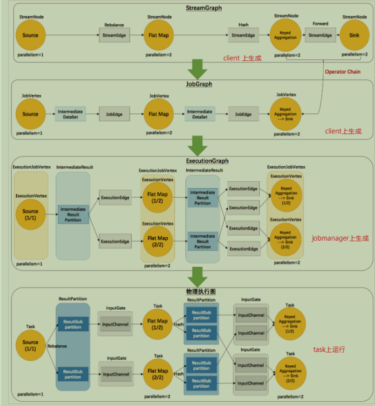


### 4.3.4 并行度（Parallelism）

> ​	Flink 程序的执行具有**并行、分布式**的特性。
>
> ​	在执行过程中，一个流（stream）包含一个或多个分区（stream partition），而每一个算子（operator）可以包含一个或多个子任务（operator subtask），这些子任务在不同的线程、不同的物理机或不同的容器中彼此互不依赖地执行。
>
> **一个特定算子的子任务（subtask）的个数被称之为其并行度（parallelism）**。一般情况下，一个流程序的并行度，可以认为就是其所有算子中最大的并行度。一个程序中，不同的算子可能具有不同的并行度。
>
> 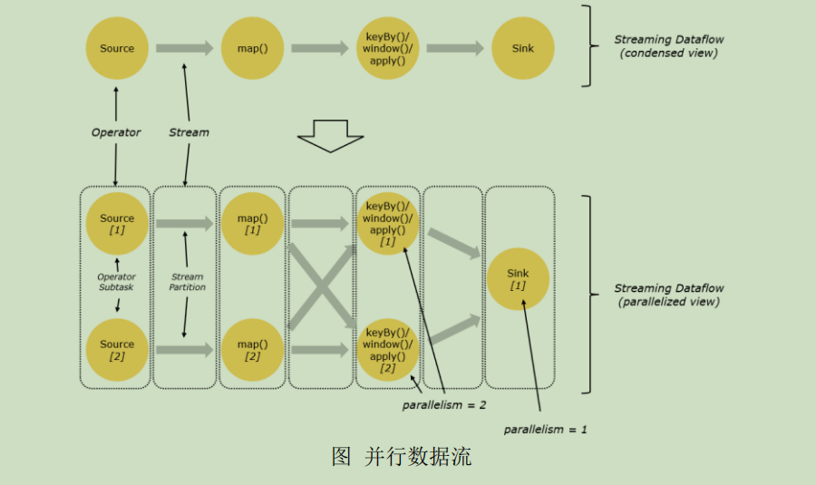	**Stream** 在算子之间传输数据的形式可以是 one-to-one(forwarding)的模式也可以是 redistributing 的模式，具体是哪一种形式，取决于算子的种类。
>
> ​	**One-to-one**：stream(比如在 source 和 map operator 之间)维护着分区以及元素的顺序。那意味着 map 算子的子任务看到的元素的个数以及顺序跟 source 算子的子任务生产的元素的个数、顺序相同，map、fliter、flatMap 等算子都是 one-to-one 的对应关系。
>
> ➢ 类似于 spark 中的窄依赖
>
> ---
>
> ​	**Redistributing**：stream(map()跟 keyBy/window 之间或者 keyBy/window 跟 sink之间)的分区会发生改变。每一个算子的子任务依据所选择的 transformation 发送数据到不同的目标任务。例如，keyBy() 基于 hashCode 重分区、broadcast 和 rebalance会随机重新分区，这些算子都会引起 redistribute 过程，而 redistribute 过程就类似于Spark 中的 shuffle 过程。
> ➢ 类似于 spark 中的宽依赖


### 4.3.5 任务链（Operator Chains）

> ​	相同并行度的 one to one 操作，Flink 这样相连的算子链接在一起形成一个 task，原来的算子成为里面的一部分。将算子链接成 task 是非常有效的优化：它能减少线程之间的切换和基于缓存区的数据交换，在减少时延的同时提升吞吐量。链接的行为可以在编程 API 中进行指定。
> 
>


# 第五章 Flink 流处理 API

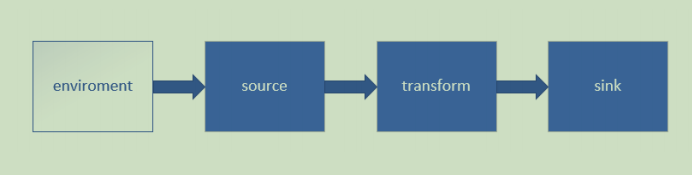

## 5.1 Environment

### 5.1.1 getExecutionEnvironment

> ​	创建一个执行环境，表示当前执行程序的上下文。 如果程序是独立调用的，则此方法返回本地执行环境；如果从命令行客户端调用程序以提交到集群，则此方法返回此集群的执行环境，也就是说，getExecutionEnvironment 会根据查询运行的方
> 式决定返回什么样的运行环境，是最常用的一种创建执行环境的方式。
>
> ```java
> ExecutionEnvironment env = ExecutionEnvironment.getExecutionEnvironment(); 
> StreamExecutionEnvironment env = StreamExecutionEnvironment.getExecutionEnvironment();
> ```
>
> 如果没有设置并行度，会以 flink-conf.yaml 中的配置为准，默认是 1。

### 5.1.2 createLocalEnvironment

返回本地执行环境，需要在调用时指定默认的并行度。

```java
LocalStreamEnvironment env = StreamExecutionEnvironment.createLocalEnvironment(1);
```

### 5.1.3 createRemoteEnvironment

返回集群执行环境，将 Jar 提交到远程服务器。需要在调用时指定 JobManager的 IP 和端口号，并指定要在集群中运行的 Jar 包。

```java
StreamExecutionEnvironment env = StreamExecutionEnvironment.createRemoteEnvironment("jobmanage-hostname", 6123,"YOURPATH//WordCount.jar");
```


## 5.2 Source 

### 5.2.1 从集合读取数据

```java
public class SourceTest1_Collection {
    public static void main(String[] args) throws Exception{
        StreamExecutionEnvironment env = StreamExecutionEnvironment.getExecutionEnvironment();
        // 1.Source:从集合读取数据
        DataStream<SensorReading> sensorDataStream = env.fromCollection( Arrays.asList( new SensorReading("sensor_1", 1547718199L, 35.8),new SensorReading("sensor_6", 1547718201L, 15.4),new SensorReading("sensor_7", 1547718202L, 6.7),new SensorReading("sensor_10", 1547718205L, 38.1)));
        // 2.打印
        sensorDataStream.print();
        // 3.执行
        env.execute();
    } 
}
```

### 5.2.2 从文件读取数据

```java
DataStream<String> dataStream = env.readTextFile("YOUR_FILE_PATH ");
```


### 5.2.3 以 kafka 消息队列的数据作为来源

需要引入 kafka 连接器的依赖：
pom.xml

```xml
<!--
https://mvnrepository.com/artifact/org.apache.flink/flink-connector-kafka-0.11 
-->

<dependency>
    <groupId>org.apache.flink</groupId>
    <artifactId>flink-connector-kafka-0.11_2.12</artifactId>
    <version>1.10.1</version>
</dependency>
```

具体代码如下：

```java
// kafka 配置项
Properties properties = new Properties();
properties.setProperty("bootstrap.servers", "localhost:9092");
properties.setProperty("group.id", "consumer-group");
properties.setProperty("key.deserializer", "org.apache.kafka.common.serialization.StringDeserializer");
properties.setProperty("value.deserializer", "org.apache.kafka.common.serialization.StringDeserializer");
properties.setProperty("auto.offset.reset", "latest");
// 从 kafka 读取数据
DataStream<String> dataStream = env.addSource( new 
FlinkKafkaConsumer011<String>("sensor", new SimpleStringSchema(), properties));
```


### 5.2.4 自定义 Source

除了以上的 source 数据来源，我们还可以自定义 source。需要做的，只是传入一个 SourceFunction 就可以。具体调用如下：

```java
DataStream<SensorReading> dataStream = env.addSource( new MySensor());
```

我们希望可以随机生成传感器数据，MySensorSource 具体的代码实现如下：

```java
public static class MySensor implements SourceFunction<SensorReading>{
    private boolean running = true;
    public void run(SourceContext<SensorReading> ctx) throws Exception {
        Random random = new Random();
        HashMap<String, Double> sensorTempMap = new HashMap<String, Double>();
        for( int i = 0; i < 10; i++ ){
            sensorTempMap.put("sensor_" + (i + 1), 60 + random.nextGaussian() * 20);
        }
        while (running) {
            for( String sensorId: sensorTempMap.keySet() ){
                Double newTemp = sensorTempMap.get(sensorId) + random.nextGaussian();
                sensorTempMap.put(sensorId, newTemp);
                ctx.collect( new SensorReading(sensorId, System.currentTimeMillis(), newTemp));
            }
            Thread.sleep(1000L);
        }
    }
    public void cancel() {
        this.running = false;
    }
}
```


## 5.3 Transform

**转换算子**

### 5.3.1 map


```java
DataStream<Integer> mapStram = dataStream.map(new MapFunction<String, Integer>() {
    public Integer map(String value) throws Exception {
        return value.length();
    }
});
```


### 5.3.2 flatMap

```java
DataStream<String> flatMapStream = dataStream.flatMap(new FlatMapFunction<String, String>() {
    public void flatMap(String value, Collector<String> out) throws Exception {
        String[] fields = value.split(","); 
        for( String field: fields ){
            out.collect(field);
        }
    }
});
```


### 5.3.3 Filter

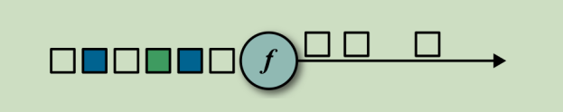

```java
DataStream<Interger> filterStream = dataStream.filter(new FilterFunction<String>() {
    public boolean filter(String value) throws Exception {
        return value == 1;
    }
});
```


### 5.3.4 KeyBy

DataStream → KeyedStream：逻辑地将一个流拆分成不相交的分区，每个分区包含具有相同 key 的元素，在内部以 hash 的形式实现的。

### 5.3.5 滚动聚合算子（Rolling Aggregation）

这些算子可以针对 KeyedStream 的每一个支流做聚合。
⚫ sum()

⚫ min()

⚫ max()

⚫ minBy()

⚫ maxBy()

### 5.3.6 Reduce

> ​	KeyedStream → DataStream：一个分组数据流的聚合操作，合并当前的元素和上次聚合的结果，产生一个新的值，返回的流中包含每一次聚合的结果，而不是只返回最后一次聚合的最终结果。

```java
DataStream<String> inputStream = env.readTextFile("sensor.txt");
 // 转换成 SensorReading 类型
 DataStream<SensorReading> dataStream = inputStream.map(new MapFunction<String, SensorReading>() {
     public SensorReading map(String value) throws Exception {
         String[] fileds = value.split(",");
         return new SensorReading(fileds[0], new Long(fileds[1]), new 
                                  Double(fileds[2]));
     }
 });
 // 分组
 KeyedStream<SensorReading, Tuple> keyedStream = dataStream.keyBy("id");
 // reduce 聚合，取最小的温度值，并输出当前的时间戳
 DataStream<SensorReading> reduceStream = keyedStream.reduce(new ReduceFunction<SensorReading>() {
     @Override
     public SensorReading reduce(SensorReading value1, SensorReading value2) throws Exception {
         return new SensorReading(
             value1.getId(),
             value2.getTimestamp(),
             Math.min(value1.getTemperature(), value2.getTemperature()));
     }
 });
```


### 5.3.7 Split 和 Select

**Split**

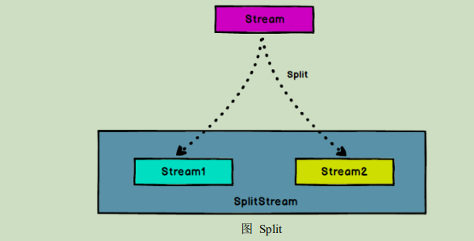
DataStream → SplitStream：根据某些特征把一个 DataStream 拆分成两个或者多个 DataStream。

**Select**
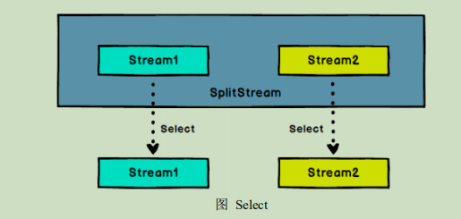
SplitStream→DataStream：从一个 SplitStream 中获取一个或者多个DataStream。

需求：传感器数据按照温度高低（以 30 度为界），拆分成两个流。

```java
SplitStream<SensorReading> splitStream = dataStream.split(new OutputSelector<SensorReading>() {
    @Override
    public Iterable<String> select(SensorReading value) {
        return (value.getTemperature() > 30) ? Collections.singletonList("high") : Collections.singletonList("low");
    }
});
DataStream<SensorReading> highTempStream = splitStream.select("high");
DataStream<SensorReading> lowTempStream = splitStream.select("low");
DataStream<SensorReading> allTempStream = splitStream.select("high", "low");
```


### 5.3.8 Connect 和 CoMap

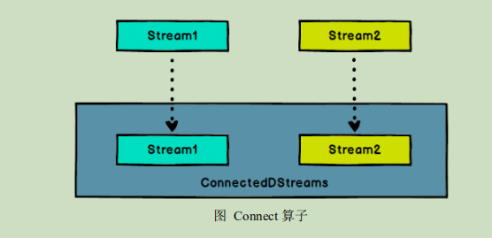
DataStream,DataStream → ConnectedStreams：连接两个保持他们类型的数据流，两个数据流被 Connect 之后，只是被放在了一个同一个流中，内部依然保持各自的数据和形式不发生任何变化，两个流相互独立。

**CoMap,CoFlatMap**
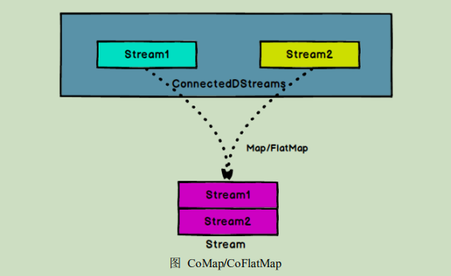
ConnectedStreams → DataStream：作用于 ConnectedStreams 上，功能与 map和 flatMap 一样，对 ConnectedStreams 中的每一个 Stream 分别进行 map 和 flatMap处理。

```java
// 合流 connect
DataStream<Tuple2<String, Double>> warningStream = highTempStream.map(new MapFunction<SensorReading, Tuple2<String, Double>>() {
    @Override
    public Tuple2<String, Double> map(SensorReading value) throws Exception {
        return new Tuple2<>(value.getId(), value.getTemperature());
    }
});
ConnectedStreams<Tuple2<String, Double>, SensorReading> connectedStreams = warningStream.connect(lowTempStream);
DataStream<Object> resultStream = connectedStreams.map(new CoMapFunction<Tuple2<String,Double>, SensorReading, Object>() {
    @Override
    public Object map1(Tuple2<String, Double> value) throws Exception {
        return new Tuple3<>(value.f0, value.f1, "warning");
    }
    @Override
    public Object map2(SensorReading value) throws Exception {
        return new Tuple2<>(value.getId(), "healthy");
    }
});
```

### 5.3.9 Union

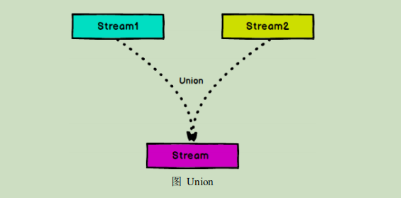
DataStream → DataStream：对两个或者两个以上的 DataStream 进行 union 操作，产生一个包含所有 DataStream 元素的新 DataStream。

```java
DataStream<SensorReading> unionStream = highTempStream.union(lowTempStream);
```

Connect 与 Union 区别：

```properties
1． Union 之前两个流的类型必须是一样，Connect 可以不一样，在之后的 coMap中再去调整成为一样的。

2. Connect 只能操作两个流，Union 可以操作多个。
```

##  5.4 支持的数据类型

> ​	 Flink 流应用程序处理的是以数据对象表示的事件流。所以在 Flink 内部，我们需要能够处理这些对象。它们需要被序列化和反序列化，以便通过网络传送它们； 或者从状态后端、检查点和保存点读取它们。为了有效地做到这一点，Flink 需要明 确知道应用程序所处理的数据类型。Flink 使用类型信息的概念来表示数据类型，并为每个数据类型生成特定的序列化器、反序列化器和比较器。Flink 还具有一个类型提取系统，该系统分析函数的输入和返回类型，以自动获取类型信息，从而获得序列化器和反序列化器。但是，在某些情况下，例如 **lambda函数或泛型类型，需要显式地提供类型信息**，才能使应用程序正常工作或提高其性能。
>
> ​	Flink 支持 Java 和 Scala 中所有常见数据类型。使用最广泛的类型有以下几种。

### 5.4.1 基础数据类型

Flink 支持所有的 Java 和 Scala 基础数据类型，Int, Double, Long, String, …

```java
DataStream<Integer> numberStream = env.fromElements(1, 2, 3, 4);
numberStream.map(data -> data * 2);
```

### 5.4.2 Java 和 Scala 元组（Tuples）

```java
DataStream<Tuple2<String, Integer>> personStream = env.fromElements(
 new Tuple2("Adam", 17),
 new Tuple2("Sarah", 23) );
personStream.filter(p -> p.f1 > 18);
```

### 5.4.3 Scala 样例类（case classes）

```scala
case class Person(name: String, age: Int)
val persons: DataStream[Person] = env.fromElements(
Person("Adam", 17),
Person("Sarah", 23) )

persons.filter(p => p.age > 18)
```


### 5.4.4 Java 简单对象（POJOs）

```java
public class Person {
public String name;
public int age;
 public Person() {}
 public Person(String name, int age) { 
this.name = name; 
this.age = age; 
} }
DataStream<Person> persons = env.fromElements( 
new Person("Alex", 42), 
new Person("Wendy", 23));
```


### 5.4.5 其它（Arrays, Lists, Maps, Enums, 等等）

> Flink 对 Java 和 Scala 中的一些特殊目的的类型也都是支持的，比如 Java 的ArrayList，HashMap，Enum 等等。

## 5.5 实现 UDF 函数——更细粒度的控制流

### 5.5.1 函数类（Function Classes）

Flink 暴露了所有 udf 函数的接口(实现方式为接口或者抽象类)。例如MapFunction, FilterFunction, ProcessFunction 等等。
下面例子实现了 FilterFunction 接口：

```java
DataStream<String> flinkTweets = tweets.filter(new FlinkFilter());
public static class FlinkFilter implements FilterFunction<String> {
    @Override
    public boolean filter(String value) throws Exception {
        return value.contains("flink");
    }
}
```

还可以将函数实现成匿名类

```java
DataStream<String> flinkTweets = tweets.filter(new FilterFunction<String>() {
    @Override
    public boolean filter(String value) throws Exception {
        return value.contains("flink");
    }
});
```

我们 filter 的字符串"flink"还可以当作参数传进去。

```java
DataStream<String> tweets = env.readTextFile("INPUT_FILE ");
DataStream<String> flinkTweets = tweets.filter(new KeyWordFilter("flink"));
public static class KeyWordFilter implements FilterFunction<String> {
    private String keyWord;
    KeyWordFilter(String keyWord) {
        this.keyWord = keyWord;
    }
    @Override
    public boolean filter(String value) throws Exception {
        return value.contains(this.keyWord);
    } 
}
```

### 5.5.2 匿名函数（Lambda Functions）

```java
DataStream<String> tweets = env.readTextFile("INPUT_FILE");
DataStream<String> flinkTweets = tweets.filter( tweet -> tweet.contains("flink") );
```


### 5.5.3 富函数（Rich Functions）

“富函数”是 DataStream API 提供的一个函数类的接口，所有 Flink 函数类都有其 Rich 版本。它与常规函数的不同在于，可以获取运行环境的上下文，并拥有一些生命周期方法，所以可以实现更复杂的功能。
⚫ RichMapFunction
⚫ RichFlatMapFunction
⚫ RichFilterFunction
⚫ …
Rich Function 有一个生命周期的概念。典型的生命周期方法有：

 ⚫ open()方法是 rich function 的初始化方法，当一个算子例如 map 或者 filter被调用之前 open()会被调用。

⚫ close()方法是生命周期中的最后一个调用的方法，做一些清理工作。

⚫ getRuntimeContext()方法提供了函数的 RuntimeContext 的一些信息，例如函数执行的并行度，任务的名字，以及 state 状态

```java
public static class MyMapFunction extends RichMapFunction<SensorReading, Tuple2<Integer, String>> {
    @Override
    public Tuple2<Integer, String> map(SensorReading value) throws Exception {
        return new Tuple2<>(getRuntimeContext().getIndexOfThisSubtask(), value.getId());
    }
    @Override
    public void open(Configuration parameters) throws Exception {
        System.out.println("my map open");
        // 以下可以做一些初始化工作，例如建立一个和 HDFS 的连接
    }
    @Override
    public void close() throws Exception {
        System.out.println("my map close");
        // 以下做一些清理工作，例如断开和 HDFS 的连接
    }
}
```

## 5.6 Sink

> ​	 Flink 没有类似于 spark 中 foreach 方法，让用户进行迭代的操作。虽有对外的输出操作都要利用 Sink 完成。最后通过类似如下方式完成整个任务最终输出操作。
> ​	stream.addSink(new MySink(xxxx)) 
> ​	官方提供了一部分的框架的 sink。除此以外，需要用户自定义实现 sink。

### 5.6.1 Kafka

pom.xml

```xml
<!--
https://mvnrepository.com/artifact/org.apache.flink/flink-connector-kafka-0.11 
-->
<dependency>
    <groupId>org.apache.flink</groupId>
    <artifactId>flink-connector-kafka-0.11_2.12</artifactId>
    <version>1.10.1</version>
</dependency>
```

主函数中添加 sink：

```java
dataStream.addSink(new FlinkKafkaProducer011[String]("localhost:9092", "test", new SimpleStringSchema()))
```

### 5.6.2 Redis

pom.xml

```xml
<!-- https://mvnrepository.com/artifact/org.apache.bahir/flink-connector-redis 
-->
<dependency>
    <groupId>org.apache.bahir</groupId>
    <artifactId>flink-connector-redis_2.11</artifactId>
    <version>1.0</version>
</dependency>
```

定义一个 redis 的 mapper 类，用于定义保存到 redis 时调用的命令：

```java
public static class MyRedisMapper implements RedisMapper<SensorReading>{
    // 保存到 redis 的命令，存成哈希表
    public RedisCommandDescription getCommandDescription() {
        return new RedisCommandDescription(RedisCommand.HSET, "sensor_tempe");
    }
    public String getKeyFromData(SensorReading data) {
        return data.getId();
    }
    public String getValueFromData(SensorReading data) {
        return data.getTemperature().toString();
    } 
}
//在主函数中调用：
FlinkJedisPoolConfig config = new FlinkJedisPoolConfig.Builder()
 .setHost("localhost")
 .setPort(6379)
 .build();
dataStream.addSink( new RedisSink<SensorReading>(config, new MyRedisMapper()) );
```

### 5.6.3 Elasticsearch 

pom.xml

```xml
<dependency>
    <groupId>org.apache.flink</groupId>
    <artifactId>flink-connector-elasticsearch6_2.12</artifactId>
    <version>1.10.1</version>
</dependency> 
```

在主函数中调用：
// es 的 httpHosts 配置

```java
ArrayList<HttpHost> httpHosts = new ArrayList<>();
httpHosts.add(new HttpHost("localhost", 9200));
dataStream.addSink( new ElasticsearchSink.Builder<SensorReading>(httpHosts, new 
MyEsSinkFunction()).build());

//ElasitcsearchSinkFunction 的实现：
public static class MyEsSinkFunction implements ElasticsearchSinkFunction<SensorReading>{
    @Override
    public void process(SensorReading element, RuntimeContext ctx, RequestIndexer indexer) {
        HashMap<String, String> dataSource = new HashMap<>();
        dataSource.put("id", element.getId());
        dataSource.put("ts", element.getTimestamp().toString());
        dataSource.put("temp", element.getTemperature().toString());
        IndexRequest indexRequest = Requests.indexRequest()
            .index("sensor")
            .type("readingData")
            .source(dataSource);
        indexer.add(indexRequest);
    }
}
```


### 5.6.4 JDBC 自定义 sink

```xml
<!-- https://mvnrepository.com/artifact/mysql/mysql-connector-java --> 
<dependency>
    <groupId>mysql</groupId>
    <artifactId>mysql-connector-java</artifactId>
    <version>5.1.44</version>
</dependency>
```

添加 MyJdbcSink

```java
public static class MyJdbcSink extends RichSinkFunction<SensorReading> {
    Connection conn = null;
    PreparedStatement insertStmt = null;
    PreparedStatement updateStmt = null;
    // open 主要是创建连接
    @Override
    public void open(Configuration parameters) throws Exception {
        conn = DriverManager.getConnection("jdbc:mysql://localhost:3306/test", "root", "123456");
        // 创建预编译器，有占位符，可传入参数
        insertStmt = conn.prepareStatement("INSERT INTO sensor_temp (id, temp) VALUES (?, ?)");
        updateStmt = conn.prepareStatement("UPDATE sensor_temp SET temp = ? WHERE id = ?");
    }
    // 调用连接，执行 sql
    @Override
    public void invoke(SensorReading value, Context context) throws Exception {
        // 执行更新语句，注意不要留 super
        updateStmt.setDouble(1, value.getTemperature());
        updateStmt.setString(2, value.getId());
        updateStmt.execute();
        // 如果刚才 update 语句没有更新，那么插入
        if (updateStmt.getUpdateCount() == 0) {
            insertStmt.setString(1, value.getId());
            insertStmt.setDouble(2, value.getTemperature());
            insertStmt.execute();
        }
    }
    @Override
    public void close() throws Exception {
        insertStmt.close();
        updateStmt.close();
        conn.close();
    } 
} 

//在 main 方法中增加，把明细保存到 mysql 中
dataStream.addSink(new MyJdbcSink())
```

# 第六章 Flink 中的 Window

## 6.1 Window

### 6.1.1 Window 概述

> ​	streaming 流式计算是一种被设计用于处理无限数据集的数据处理引擎，而无限数据集是指一种不断增长的本质上无限的数据集，而 window 是一种切割无限数据为有限块进行处理的手段。Window 是无限数据流处理的核心，Window 将一个无限的 stream 拆分成有限大小的”buckets”桶，我们可以在这些桶上做计算操作。

### 6.1.2 Window 类型

Window 可以分成两类：
➢ CountWindow：按照指定的数据条数生成一个 Window，与时间无关。
➢ TimeWindow：按照时间生成 Window。

对于 TimeWindow，可以根据窗口实现原理的不同分成三类：滚动窗口（Tumbling Window）、滑动窗口（Sliding Window）和会话窗口（Session Window）。
> 1. 滚动窗口（Tumbling Windows）
>    将数据依据固定的窗口长度对数据进行切片。
>
>    **特点：时间对齐，窗口长度固定，没有重叠。**
>    滚动窗口分配器将每个元素分配到一个指定窗口大小的窗口中，滚动窗口有一个固定的大小，并且不会出现重叠。例如：如果你指定了一个 5 分钟大小的滚动窗口，窗口的创建如下图所示：
>
>    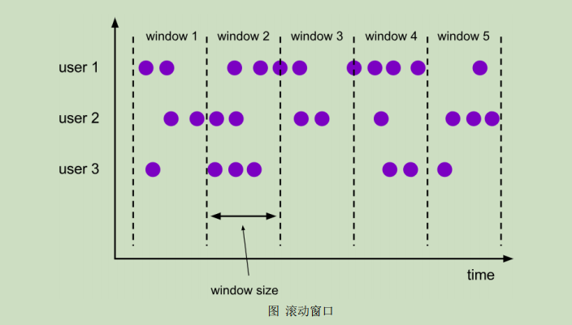
>    适用场景：适合做 BI 统计等（做每个时间段的聚合计算）。
>
> 2. 滑动窗口（Sliding Windows）
>    滑动窗口是固定窗口的更广义的一种形式，滑动窗口由固定的窗口长度和滑动间隔组成。
>
>    **特点：时间对齐，窗口长度固定，可以有重叠。**
>
>    滑动窗口分配器将元素分配到固定长度的窗口中，与滚动窗口类似，窗口的大小由窗口大小参数来配置，另一个窗口滑动参数控制滑动窗口开始的频率。因此，滑动窗口如果滑动参数小于窗口大小的话，窗口是可以重叠的，在这种情况下元素
>    会被分配到多个窗口中。
>
>    例如，你有 10 分钟的窗口和 5 分钟的滑动，那么每个窗口中 5 分钟的窗口里包含着上个 10 分钟产生的数据，如下图所示：
>
>    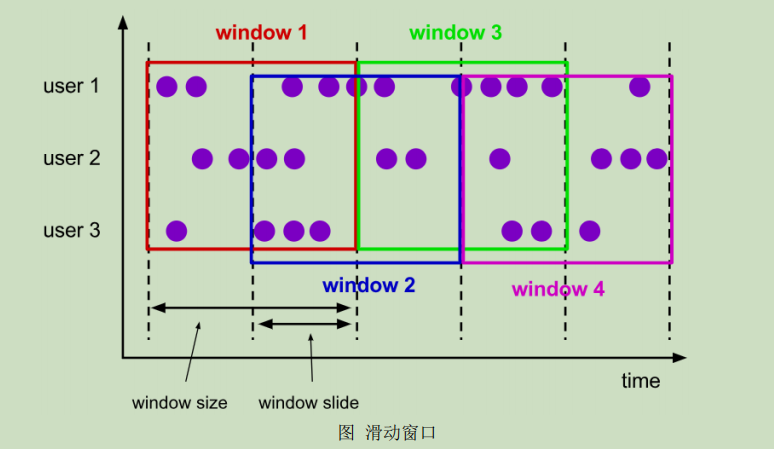
>    适用场景：对最近一个时间段内的统计（求某接口最近 5min 的失败率来决定是否要报警）。
>
> 3. 会话窗口（Session Windows）
>    由一系列事件组合一个指定时间长度的 timeout 间隙组成，类似于 web 应用的session，也就是一段时间没有接收到新数据就会生成新的窗口。
>    **特点：时间无对齐。**
>    session 窗口分配器通过 session 活动来对元素进行分组，session 窗口跟滚动窗口和滑动窗口相比，不会有重叠和固定的开始时间和结束时间的情况，相反，当它在一个固定的时间周期内不再收到元素，即非活动间隔产生，那个这个窗口就会关闭。一个 session 窗口通过一个 session 间隔来配置，这个 session 间隔定义了非活跃周期的长度，当这个非活跃周期产生，那么当前的 session 将关闭并且后续的元素将被分配到新的 session 窗口中去。
>
>    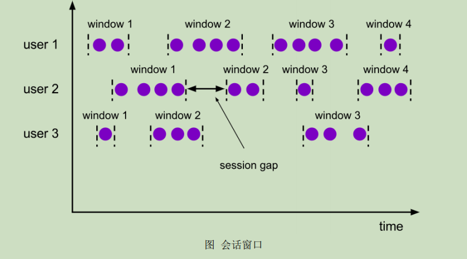

## 6.2 Window API

### 6.2.1 TimeWindow

TimeWindow 是将指定时间范围内的所有数据组成一个 window，一次对一个window 里面的所有数据进行计算。

1. 滚动窗口
    Flink 默认的时间窗口根据 Processing Time 进行窗口的划分，将 Flink 获取到的数据根据进入 Flink 的时间划分到不同的窗口中。

  ```java
  DataStream<Tuple2<String, Double>> minTempPerWindowStream = dataStream
      .map(new MapFunction<SensorReading, Tuple2<String, Double>>() {
          @Override
          public Tuple2<String, Double> map(SensorReading value) throws Exception {
              return new Tuple2<>(value.getId(), value.getTemperature());
          }
      })
      .keyBy(data -> data.f0) 
      .timeWindow( Time.seconds(15) )
      .minBy(1);
  ```

  时间间隔可以通过 Time.milliseconds(x)，Time.seconds(x)，Time.minutes(x)等其中的一个来指定。

2. 滑动窗口（SlidingEventTimeWindows）
    滑动窗口和滚动窗口的函数名是完全一致的，只是在传参数时需要传入两个参数，一个是 window_size，一个是 sliding_size。
    下面代码中的 sliding_size 设置为了 5s，也就是说，每 5s 就计算输出结果一次，每一次计算的 window 范围是 15s 内的所有元素。

  ```java
  DataStream<SensorReading> minTempPerWindowStream = dataStream
   .keyBy(SensorReading::getId) 
   .timeWindow( Time.seconds(15), Time.seconds(5) )
   .minBy("temperature");
  ```

  时间间隔可以通过 Time.milliseconds(x)，Time.seconds(x)，Time.minutes(x)等其中的一个来指定。

  ### 6.2.2 CountWindow

  CountWindow 根据窗口中相同 key 元素的数量来触发执行，执行时只计算元素数量达到窗口大小的 key 对应的结果。

  注意：CountWindow 的 window_size 指的是相同 Key 的元素的个数，不是输入的所有元素的总数。

  1. 滚动窗口
     默认的 CountWindow 是一个滚动窗口，只需要指定窗口大小即可，当元素数量达到窗口大小时，就会触发窗口的执行。

     ```java
     DataStream<SensorReading> minTempPerWindowStream = dataStream
      .keyBy(SensorReading::getId)
      .countWindow( 5 )
      .minBy("temperature");
     ```

     

2. 滑动窗口
        滑动窗口和滚动窗口的函数名是完全一致的，只是在传参数时需要传入两个参数，一个是 window_size，一个是 sliding_size。
        下面代码中的 sliding_size 设置为了 2，也就是说，每收到两个相同 key 的数据就计算一次，每一次计算的 window 范围是 10 个元素。

      ```java
     DataStream<SensorReading> minTempPerWindowStream = dataStream
         .keyBy(SensorReading::getId)
         .countWindow( 10, 2 )
         .minBy("temperature");
      ```

### 6.2.3 window function

   ​     window function 定义了要对窗口中收集的数据做的计算操作，主要可以分为两类：

⚫ 增量聚合函数（incremental aggregation functions）
   ​     每条数据到来就进行计算，保持一个简单的状态。典型的增量聚合函数有ReduceFunction, AggregateFunction。 

⚫ 全窗口函数（full window functions）
   ​     先把窗口所有数据收集起来，等到计算的时候会遍历所有数据。ProcessWindowFunction 就是一个全窗口函数。

### 6.2.4 其它可选 API

   ​     ⚫ .trigger() —— 触发器
   ​     定义 window 什么时候关闭，触发计算并输出结果
   ​     ⚫ .evitor() —— 移除器
   ​     定义移除某些数据的逻辑
   ​     ⚫ .allowedLateness() —— 允许处理迟到的数据
   ​     ⚫ .sideOutputLateData() —— 将迟到的数据放入侧输出流
   ​     ⚫ .getSideOutput() —— 获取侧输出流

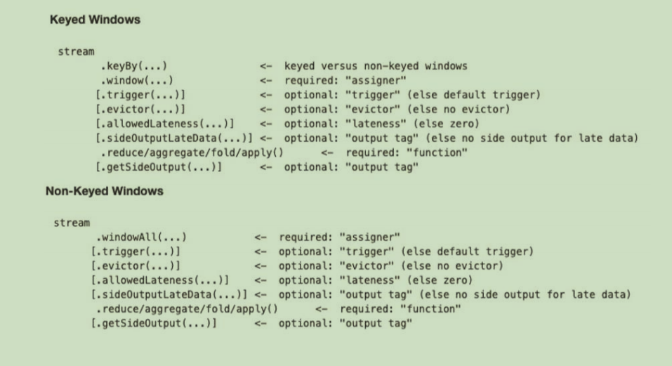

# 第七章 时间语义与 Wartermark

## 7.1 Flink 中的时间语义

在 Flink 的流式处理中，会涉及到时间的不同概念，如下图所示：


**Event Time**：是事件创建的时间。它通常由事件中的时间戳描述，例如采集的日志数据中，每一条日志都会记录自己的生成时间，Flink 通过时间戳分配器访问事件时间戳。

**Ingestion Time**：是数据进入 Flink 的时间。

**Processing Time**：是每一个执行基于时间操作的算子的本地系统时间，与机器相关，默认的时间属性就是 Processing Time。

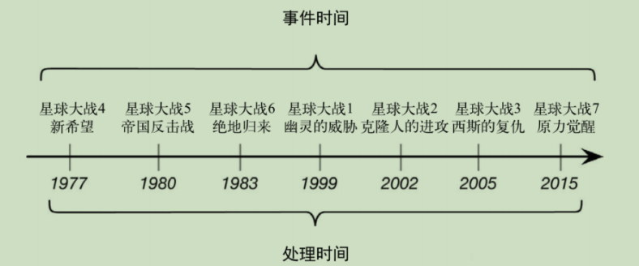

一个例子——电影《星球大战》：

例如，一条日志进入 Flink 的时间为 2017-11-12 10:00:00.123，到达 Window 的系统时间为 2017-11-12 10:00:01.234，日志的内容如下：
2017-11-02 18:37:15.624 INFO Fail over to rm2

对于业务来说，要统计 1min 内的故障日志个数，哪个时间是最有意义的？——eventTime，因为我们要根据日志的生成时间进行统计。

## 7.2 EventTime 的引入

> ·在 Flink 的流式处理中，绝大部分的业务都会使用 eventTime，一般只在eventTime 无法使用时，才会被迫使用 ProcessingTime 或者 IngestionTime。如果要使用 EventTime，那么需要引入 EventTime 的时间属性，引入方式如下所示：

```java
StreamExecutionEnvironment env = 
StreamExecutionEnvironment.getExecutionEnvironment
// 从调用时刻开始给 env 创建的每一个 stream 追加时间特征
env.setStreamTimeCharacteristic(TimeCharacteristic.EventTime)
```


## 7.3 Watermark

### 7.3.1 基本概念

> ​	我们知道，流处理从事件产生，到流经 source，再到 operator，中间是有一个过程和时间的，虽然大部分情况下，流到 operator 的数据都是按照事件产生的时间顺序来的，但是也不排除由于网络、分布式等原因，导致乱序的产生，所谓乱序，就是指 Flink 接收到的事件的先后顺序不是严格按照事件的 Event Time 顺序排列的。

 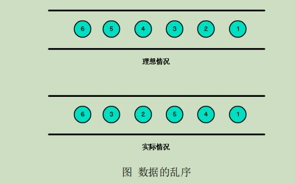

​	那么此时出现一个问题，一旦出现乱序，如果只根据 eventTime 决定 window 的运行，我们不能明确数据是否全部到位，但又不能无限期的等下去，此时必须要有个机制来保证一个特定的时间后，必须触发 window 去进行计算了，这个特别的机制，就是 Watermark。 

⚫ Watermark 是一种衡量 Event Time 进展的机制。

⚫ **Watermark 是用于处理乱序事件的，而正确的处理乱序事件，通常用Watermark 机制结合 window 来实现。**

⚫ 数据流中的 Watermark 用于表示 timestamp 小于 Watermark 的数据，都已经到达了，因此，window 的执行也是由 Watermark 触发的。

⚫ Watermark 可以理解成一个延迟触发机制，我们可以设置 Watermark 的延时时长 t，每次系统会校验已经到达的数据中最大的 maxEventTime，然后认定 eventTime小于 maxEventTime - t 的所有数据都已经到达，如果有窗口的停止时间等于maxEventTime – t，那么这个窗口被触发执行。

有序流的 Watermarker 如下图所示：（Watermark 设置为 0） 

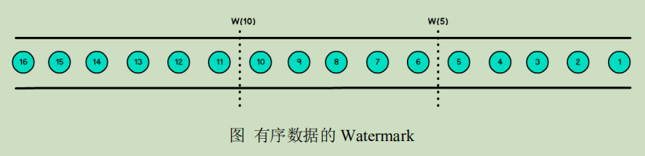

乱序流的 Watermarker 如下图所示：（Watermark 设置为 2）

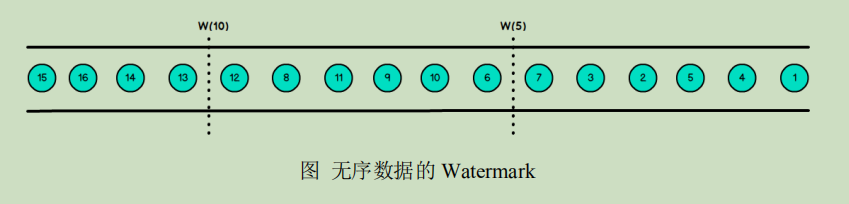

​	当 Flink 接收到数据时，会按照一定的规则去生成 Watermark，这条 Watermark就等于当前所有到达数据中的 maxEventTime - 延迟时长，也就是说，Watermark 是基于数据携带的时间戳生成的，一旦 Watermark 比当前未触发的窗口的停止时间要晚，那么就会触发相应窗口的执行。由于 event time 是由数据携带的，因此，如果运行过程中无法获取新的数据，那么没有被触发的窗口将永远都不被触发。

​	上图中，我们设置的允许最大延迟到达时间为 2s，所以时间戳为 7s 的事件对应的 Watermark 是 5s，时间戳为 12s 的事件的 Watermark 是 10s，如果我们的窗口 1 是 1s~5s，窗口 2 是 6s~10s，那么时间戳为 7s 的事件到达时的 Watermarker 恰好触发窗口 1，时间戳为 12s 的事件到达时的 Watermark 恰好触发窗口 2。Watermark 就是触发前一窗口的“关窗时间”，一旦触发关门那么以当前时刻为准在窗口范围内的所有所有数据都会收入窗中。只要没有达到水位那么不管现实中的时间推进了多久都不会触发关窗。

### 7.3.2 Watermark 的引入

watermark 的引入很简单，对于乱序数据，最常见的引用方式如下：

```java
dataStream.assignTimestampsAndWatermarks( new BoundedOutOfOrdernessTimestampExtractor<SensorReading>(Time.milliseconds(1000)) {
    @Override
    public long extractTimestamp(element: SensorReading): Long = {
        return element.getTimestamp() * 1000L;
    }
} );
```

Event Time 的使用一定要**指定数据源中的时间戳**。否则程序无法知道事件的事件时间是什么(数据源里的数据没有时间戳的话，就只能使用 Processing Time 了)。

我们看到上面的例子中创建了一个看起来有点复杂的类，这个类实现的其实就是分配时间戳的接口。Flink 暴露了TimestampAssigner 接口供我们实现，使我们可以自定义如何从事件数据中抽取时间戳。

```java
StreamExecutionEnvironment env = StreamExecutionEnvironment.getExecutionEnvironment();
// 设置事件时间语义
env.setStreamTimeCharacteristic(TimeCharacteristic.EventTime);
DataStream<SensorReading> dataStream = env.addSource(new SensorSource())
    .assignTimestampsAndWatermarks(new MyAssigner());
```

MyAssigner 有两种类型

⚫ AssignerWithPeriodicWatermarks

⚫ AssignerWithPunctuatedWatermarks

以上两个接口都继承自 TimestampAssigner。

**Assigner with periodic watermarks**周期性的生成 watermark：系统会周期性的将 watermark 插入到流中(水位线也是一种特殊的事件!)。默认周期是 200 毫秒。可以使用ExecutionConfig.setAutoWatermarkInterval()方法进行设置。

// 每隔 5 秒产生一个 watermark

env.getConfig.setAutoWatermarkInterval(5000);

产生 watermark 的逻辑：每隔 5 秒钟，Flink 会调用AssignerWithPeriodicWatermarks 的 getCurrentWatermark()方法。如果方法返回一个时间戳大于之前水位的时间戳，新的 watermark 会被插入到流中。这个检查保证了水位线是单调递增的。如果方法返回的时间戳小于等于之前水位的时间戳，则不会产生新的 watermark。

例子，自定义一个周期性的时间戳抽取：

// 自定义周期性时间戳分配器

```java
public static class MyPeriodicAssigner implements AssignerWithPeriodicWatermarks<SensorReading>{
    private Long bound = 60 * 1000L; // 延迟一分钟
    private Long maxTs = Long.MIN_VALUE; // 当前最大时间戳
    @Nullable
    @Override
    public Watermark getCurrentWatermark() {
        return new Watermark(maxTs - bound);
    }
    @Override
    public long extractTimestamp(SensorReading element, long previousElementTimestamp) {
        maxTs = Math.max(maxTs, element.getTimestamp());
        return element.getTimestamp();
    }
}
```

​	一种简单的特殊情况是，如果我们事先得知数据流的时间戳是单调递增的，也就是说没有乱序，那我们可以使用 AscendingTimestampExtractor，这个类会直接使用数据的时间戳生成 watermark。

```java
DataStream<SensorReading> dataStream = …
dataStream.assignTimestampsAndWatermarks(new AscendingTimestampExtractor<SensorReading>() {
    @Override
    public long extractAscendingTimestamp(SensorReading element) {
        return element.getTimestamp() * 1000;
    }
});
```

而对于乱序数据流，如果我们能大致估算出数据流中的事件的最大延迟时间，就可以使用如下代码：

```java
DataStream<SensorReading> dataStream = …
dataStream.assignTimestampsAndWatermarks(new BoundedOutOfOrdernessTimestampExtractor<SensorReading>(Time.seconds(1)) {
    @Override
    public long extractTimestamp(SensorReading element) {
        return element.getTimestamp() * 1000L;
    }
});
```

**Assigner with punctuated watermarks** 间断式地生成 watermark。和周期性生成的方式不同，这种方式**不是固定时间**的，而是可以根据需要对每条数据进行筛选和处理。直接上代码来举个例子，我们只给sensor_1 的传感器的数据流插入 watermark：

```java
public static class MyPunctuatedAssigner implements AssignerWithPunctuatedWatermarks<SensorReading>{
    private Long bound = 60 * 1000L; // 延迟一分钟
    @Nullable
    @Override
    public Watermark checkAndGetNextWatermark(SensorReading lastElement, long extractedTimestamp) {
        if(lastElement.getId().equals("sensor_1")){
            return new Watermark(extractedTimestamp - bound);
        }else{
            return null;
        }
    }
    @Override
    public long extractTimestamp(SensorReading element, long previousElementTimestamp) {
        return element.getTimestamp();
    }
}
```


## 7.4 EvnetTime 在 window 中的使用（Scala 版）

### 7.4.1 滚动窗口（TumblingEventTimeWindows）

```scala
def main(args: Array[String]): Unit = {
    // 环境
    val env: StreamExecutionEnvironment = StreamExecutionEnvironment.getExecutionEnvironment
    env.setStreamTimeCharacteristic(TimeCharacteristic.EventTime)
    env.setParallelism(1)
    val dstream: DataStream[String] = env.socketTextStream("localhost",7777)
    val textWithTsDstream: DataStream[(String, Long, Int)] = dstream.map { text =>
        val arr: Array[String] = text.split(" ")
        (arr(0), arr(1).toLong, 1)
    }
    val textWithEventTimeDstream: DataStream[(String, Long, Int)] = 
    textWithTsDstream.assignTimestampsAndWatermarks(new BoundedOutOfOrdernessTimestampExtractor[(String, Long, Int)](Time.milliseconds(1000)) {
        override def extractTimestamp(element: (String, Long, Int)): Long = {
            return element._2
        }
    })
    
    val textKeyStream: KeyedStream[(String, Long, Int), Tuple] = textWithEventTimeDstream.keyBy(0)
    textKeyStream.print("textkey:")
    val windowStream: WindowedStream[(String, Long, Int), Tuple, TimeWindow] = textKeyStream.window(TumblingEventTimeWindows.of(Time.seconds(2)))
    val groupDstream: DataStream[mutable.HashSet[Long]] = windowStream.fold(new mutable.HashSet[Long]()) { case (set, (key, ts, count)) => set += ts
                                                                                                         }
    groupDstream.print("window::::").setParallelism(1)
    env.execute()
}
}
```

结果是按照 Event Time 的时间窗口计算得出的，而无关系统的时间（包括输入的快慢）。 

### 7.4.2 滑动窗口（SlidingEventTimeWindows）

```scala
def main(args: Array[String]): Unit = {
    // 环境
    val env: StreamExecutionEnvironment = StreamExecutionEnvironment.getExecutionEnvironment
    env.setStreamTimeCharacteristic(TimeCharacteristic.EventTime)
    env.setParallelism(1)
    val dstream: DataStream[String] = env.socketTextStream("localhost",7777)
    val textWithTsDstream: DataStream[(String, Long, Int)] = dstream.map { text =>
        val arr: Array[String] = text.split(" ")
        (arr(0), arr(1).toLong, 1)
    }
    val textWithEventTimeDstream: DataStream[(String, Long, Int)] = textWithTsDstream.assignTimestampsAndWatermarks(new BoundedOutOfOrdernessTimestampExtractor[(String, Long, Int)](Time.milliseconds(1000)) {
        override def extractTimestamp(element: (String, Long, Int)): Long = {
            return element._2
        }
    })
     val textKeyStream: KeyedStream[(String, Long, Int), Tuple] = textWithEventTimeDstream.keyBy(0)
    textKeyStream.print("textkey:")
    val windowStream: WindowedStream[(String, Long, Int), Tuple, TimeWindow] = textKeyStream.window(SlidingEventTimeWindows.of(Time.seconds(2),Time.millis
econds(500)))

    val groupDstream: DataStream[mutable.HashSet[Long]] = windowStream.fold(new mutable.HashSet[Long]()) { case (set, (key, ts, count)) =>

        set += ts
    }
    groupDstream.print("window::::").setParallelism(1)
    env.execute()
}
```


### 7.4.3 会话窗口（EventTimeSessionWindows）

相邻两次数据的 EventTime 的时间差超过指定的时间间隔就会触发执行。如果加入 Watermark， 会在符合窗口触发的情况下进行延迟。到达延迟水位再进行窗口触发。

```scala
def main(args: Array[String]): Unit = {
 // 环境
 val env: StreamExecutionEnvironment = StreamExecutionEnvironment.getExecutionEnvironment
 env.setStreamTimeCharacteristic(TimeCharacteristic.EventTime)
 env.setParallelism(1)
 val dstream: DataStream[String] = env.socketTextStream("localhost",7777)
 val textWithTsDstream: DataStream[(String, Long, Int)] = dstream.map { text => val arr: Array[String] = text.split(" ")
                                                                       (arr(0), arr(1).toLong, 1)
                                                                      }
    val textWithEventTimeDstream: DataStream[(String, Long, Int)] = textWithTsDstream.assignTimestampsAndWatermarks(new BoundedOutOfOrdernessTimestampExtractor[(String, Long, Int)](Time.milliseconds(1000)) {
        override def extractTimestamp(element: (String, Long, Int)): Long = {
            return element._2
        }
    })

    val textKeyStream: KeyedStream[(String, Long, Int), Tuple] = textWithEventTimeDstream.keyBy(0)
    textKeyStream.print("textkey:")
    val windowStream: WindowedStream[(String, Long, Int), Tuple, TimeWindow] = textKeyStream.window(EventTimeSessionWindows.withGap(Time.milliseconds(500)) )
    windowStream.reduce((text1,text2)=> ( text1._1,0L,text1._3+text2._3) )
    .map(_._3).print("windows:::").setParallelism(1)
    env.execute()
 }
```


# 第八章 ProcessFunction API（底层 API）

​	我们之前学习的转换算子是无法访问事件的时间戳信息和水位线信息的。而这在一些应用场景下，极为重要。例如 MapFunction 这样的 map 转换算子就无法访问时间戳或者当前事件的事件时间。基于此，DataStream API 提供了一系列的 Low-Level 转换算子。可以访问时间戳、watermark 以及注册定时事件。还可以输出特定的一些事件，例如超时事件等。

​	Process Function 用来构建事件驱动的应用以及实现自定义的业务逻辑(使用之前的window 函数和转换算子无法实现)。例如，Flink SQL 就是使用 Process Function 实现的。

Flink 提供了 8 个 Process Function：

 • ProcessFunction

• KeyedProcessFunction

• CoProcessFunction

• ProcessJoinFunction

• BroadcastProcessFunction

• KeyedBroadcastProcessFunction

• ProcessWindowFunction

• ProcessAllWindowFunction

## 8.1 KeyedProcessFunction

​	这里我们重点介绍 KeyedProcessFunction。KeyedProcessFunction 用来操作 KeyedStream。KeyedProcessFunction 会处理流的每一个元素，输出为 0 个、1 个或者多个元素。所有的 Process Function 都继承自RichFunction 接口，所以都有 open()、close()和 getRuntimeContext()等方法。而KeyedProcessFunction<K, I, O>还额外提供了两个方法: 

• processElement(I value, Context ctx, Collector<O> out), 流中的每一个元素都会调用这个方法，调用结果将会放在 Collector 数据类型中输出。Context 可以访问元素的时间戳，元素的 key，以及 TimerService 时间服务。Context 还可以将结果输出到别的流(side outputs)。 

• onTimer(long timestamp, OnTimerContext ctx, Collector<O> out) 是一个回调函数。当之前注册的定时器触发时调用。参数 timestamp 为定时器所设定的触发的时间戳。Collector 为输出结果的集合。OnTimerContext 和processElement 的 Context 参数一样，提供了上下文的一些信息，例如定时器触发的时间信息(事件时间或者处理时间)。

## 8.2 TimerService 和 定时器（Timers）

Context 和 OnTimerContext 所持有的 TimerService 对象拥有以下方法: 

• long currentProcessingTime() 返回当前处理时间

• long currentWatermark() 返回当前 watermark 的时间戳

• void registerProcessingTimeTimer(long timestamp) 会注册当前 key 的processing time 的定时器。当 processing time 到达定时时间时，触发 timer。

 • void registerEventTimeTimer(long timestamp) 会注册当前 key 的 event time 定时器。当水位线大于等于定时器注册的时间时，触发定时器执行回调函数。

• void deleteProcessingTimeTimer(long timestamp) 删除之前注册处理时间定时器。如果没有这个时间戳的定时器，则不执行。

• void deleteEventTimeTimer(long timestamp) 删除之前注册的事件时间定时器，如果没有此时间戳的定时器，则不执行。

当定时器 timer 触发时，会执行回调函数 onTimer()。注意定时器 timer 只能在keyed streams 上面使用。

下面举个例子说明 KeyedProcessFunction 如何操作 KeyedStream。

需求：监控温度传感器的温度值，如果温度值在 10 秒钟之内(processing time)连续上升，则报警。

```java
DataStream<String> warningStream = dataStream.keyBy(SensorReading::getId)
 .process( new TempIncreaseWarning(10) );
```

看一下 TempIncreaseWarning 如何实现, 程序中使用了 ValueState 状态变量来保存上次的温度值和定时器时间戳。

```java
public static class TempIncreaseWarning extends KeyedProcessFunction<String, SensorReading, String>{
    private Integer interval;
    public TempIncreaseWarning(Integer interval) {
        this.interval = interval;
    }
    // 声明状态，保存上次的温度值、当前定时器时间戳
    private ValueState<Double> lastTempState;
    private ValueState<Long> timerTsState;
    @Override
    public void open(Configuration parameters) throws Exception {
        lastTempState = getRuntimeContext().getState(new ValueStateDescriptor<Double>("last-temp", Double.class, Double.MIN_VALUE));
        timerTsState = getRuntimeContext().getState(new ValueStateDescriptor<Long>("timer-ts", Long.class));
    }

    @Override
    public void processElement(SensorReading value, Context ctx, Collector<String> out) throws Exception {
        // 取出状态
        Double lastTemp = lastTempState.value();
        Long timerTs = timerTsState.value();
        // 更新温度状态
        lastTempState.update(value.getTemperature());
        if( value.getTemperature() > lastTemp && timerTs == null ){
            long ts = ctx.timerService().currentProcessingTime() + interval * 1000L;
            ctx.timerService().registerProcessingTimeTimer(ts);
            timerTsState.update(ts); 
        } else if( value.getTemperature() < lastTemp && timerTs != null){
            ctx.timerService().deleteProcessingTimeTimer(timerTs);
            timerTsState.clear();
        }
    }
    @Override
    public void onTimer(long timestamp, OnTimerContext ctx, Collector<String> out) throws Exception {
        out.collect( "传感器" + ctx.getCurrentKey() + "的温度连续" + interval + "秒上升" );
        // 清空 timer 状态
        timerTsState.clear();
    }
}
```

## 8.3 侧输出流（SideOutput）

​	大部分的 DataStream API 的算子的输出是单一输出，也就是某种数据类型的流。除了 split 算子，可以将一条流分成多条流，这些流的数据类型也都相同。process function 的 side outputs 功能可以产生多条流，并且这些流的数据类型可以不一样。一个 side output 可以定义为 OutputTag[X]对象，X 是输出流的数据类型。process function 可以通过 Context 对象发射一个事件到一个或者多个 side outputs。
下面是一个示例程序，用来监控传感器温度值，将温度值低于 30 度的数据输出到 side output。

```java
final OutputTag<SensorReading> lowTempTag = new OutputTag<SensorReading>("lowTemp"){};

SingleOutputStreamOperator<SensorReading> highTempStream = dataStream.process(new ProcessFunction<SensorReading, SensorReading>() {
    @Override
    public void processElement(SensorReading value, Context ctx, Collector<SensorReading> out) throws Exception {
        if( value.getTemperature() < 30 )
            ctx.output(lowTempTag, value);
        else
            out.collect(value);
    }
});
DataStream<SensorReading> lowTempStream = highTempStream.getSideOutput(lowTempTag);
highTempStream.print("high");
lowTempStream.print("low");
```


## 8.4 CoProcessFunction

​	对于两条输入流，DataStream API 提供了 CoProcessFunction 这样的 low-level操作。CoProcessFunction 提供了操作每一个输入流的方法: processElement1()和processElement2()。类似于 ProcessFunction，这两种方法都通过 Context 对象来调用。这个 Context对象可以访问事件数据，定时器时间戳，TimerService，以及 side outputs。CoProcessFunction 也提供了 onTimer()回调函数。

# 第九章 状态编程和容错机制

​	流式计算分为无状态和有状态两种情况。无状态的计算观察每个独立事件，并根据最后一个事件输出结果。例如，流处理应用程序从传感器接收温度读数，并在温度超过 90 度时发出警告。有状态的计算则会基于多个事件输出结果。以下是一些例子。
⚫ 所有类型的窗口。例如，计算过去一小时的平均温度，就是有状态的计算。
⚫ 所有用于复杂事件处理的状态机。例如，若在一分钟内收到两个相差 20 度以上的温度读数，则发出警告，这是有状态的计算。
⚫ 流与流之间的所有关联操作，以及流与静态表或动态表之间的关联操作，都是有状态的计算。

​	下图展示了无状态流处理和有状态流处理的主要区别。无状态流处理分别接收每条数据记录(图中的黑条)，然后根据最新输入的数据生成输出数据(白条)。有状态流处理会维护状态(根据每条输入记录进行更新)，并基于最新输入的记录和当前的状态值生成输出记录(灰条)。

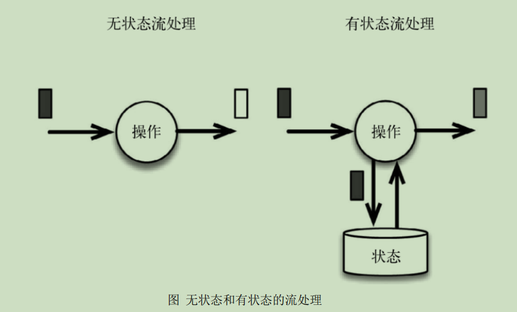
	上图中输入数据由黑条表示。无状态流处理每次只转换一条输入记录，并且仅根据最新的输入记录输出结果(白条)。有状态 流处理维护所有已处理记录的状态值，并根据每条新输入的记录更新状态，因此输出记录(灰条)反映的是综合考虑多个事件之后的结果。尽管无状态的计算很重要，但是流处理对有状态的计算更感兴趣。事实上，正确地实现有状态的计算比实现无状态的计算难得多。旧的流处理系统并不支持有状
态的计算，而新一代的流处理系统则将状态及其正确性视为重中之重。

## 9.1 有状态的算子和应用程序

​	Flink 内置的很多算子，数据源 source，数据存储 sink 都是有状态的，流中的数据都是 buffer records，会保存一定的元素或者元数据。例如: ProcessWindowFunction会缓存输入流的数据，ProcessFunction 会保存设置的定时器信息等等。

在 Flink 中，状态始终与特定算子相关联。总的来说，有两种类型的状态：
⚫ 算子状态（operator state）

 ⚫ 键控状态（keyed state）

### 9.3.1 算子状态（operator state）

​	算子状态的作用范围限定为算子任务。这意味着由同一并行任务所处理的所有数据都可以访问到相同的状态，状态对于同一任务而言是共享的。算子状态不能由相同或不同算子的另一个任务访问。

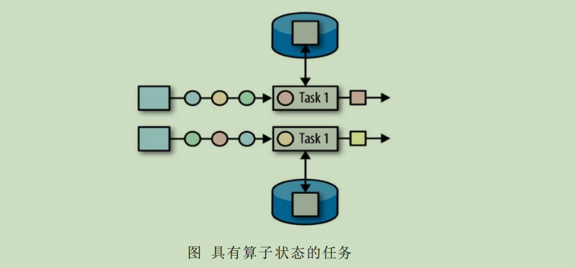
Flink 为算子状态提供三种基本数据结构：
⚫ 列表状态（List state）
将状态表示为一组数据的列表。
⚫ 联合列表状态（Union list state）
也将状态表示为数据的列表。它与常规列表状态的区别在于，在发生故障时，或者从保存点（savepoint）启动应用程序时如何恢复。
⚫ 广播状态（Broadcast state）
如果一个算子有多项任务，而它的每项任务状态又都相同，那么这种特殊情况最适合应用广播状态。

### 9.3.2 键控状态（keyed state）

​	键控状态是根据输入数据流中定义的键（key）来维护和访问的。Flink 为每个键值维护一个状态实例，并将具有相同键的所有数据，都分区到同一个算子任务中，这个任务会维护和处理这个 key 对应的状态。当任务处理一条数据时，它会自动将状态的访问范围限定为当前数据的 key。因此，具有相同 key 的所有数据都会访问相同的状态。Keyed State 很类似于一个分布式的 key-value map 数据结构，只能用于KeyedStream（keyBy 算子处理之后）。

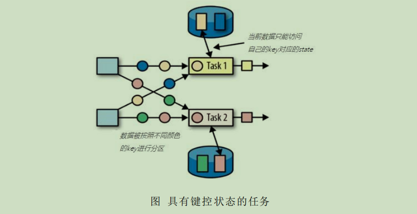

Flink 的 Keyed State 支持以下数据类型：

⚫ ValueState<T>保存单个的值，值的类型为 T。

o get 操作: ValueState.value()

o set 操作: ValueState.update(T value)

⚫ ListState<T>保存一个列表，列表里的元素的数据类型为 T。基本操作如下：

o ListState.add(T value) 

o ListState.addAll(List<T> values) 

o ListState.get()返回 Iterable<T> 

o ListState.update(List<T> values) 

⚫ MapState<K, V>保存 Key-Value 对。

o MapState.get(UK key) 

o MapState.put(UK key, UV value) 

o MapState.contains(UK key)

 o MapState.remove(UK key) 

⚫ ReducingState<T> 

⚫ AggregatingState<I, O>

State.clear()是清空操作。
我们可以利用 Keyed State，实现这样一个需求：检测传感器的温度值，如果连续的两个温度差值超过 10 度，就输出报警。

```java
DataStream<Tuple3<String, Double, Double>> warningStream = dataStream
 .keyBy("id")
 .flatMap(new TempIncreaseWarning(10.0));
```

这里需要实现一个自定义的 RichFlatMapFuction，具体实现如下：

```java
public static class TempIncreaseWarning extends RichFlatMapFunction<SensorReading, Tuple3<String, Double, Double>>{
    private Double threshold;
    TempIncreaseWarning(Double threshold) {
        this.threshold = threshold;
    }
    private ValueState<Double> lastTempState;
    @Override
    public void open(Configuration parameters) throws Exception {
        lastTempState = getRuntimeContext().getState(new ValueStateDescriptor<Double>("last-temp", Double.class, Double.MIN_VALUE));
    }
    @Override
    public void flatMap(SensorReading value, Collector<Tuple3<String, Double, Double>> out) throws Exception {
        Double lastTemp = lastTempState.value();
        lastTempState.update(value.getTemperature());
        if( lastTemp != Double.MIN_VALUE ) {
            // 跟最新的温度值计算差值，如果大于阈值，那么输出报警
            Double diff = Math.abs(value.getTemperature() - lastTemp);
            if (diff > threshold)
                out.collect( new Tuple3<>(value.getId(), lastTemp, 
                                          value.getTemperature()) );
        }
    }
}
```

​	通过 RuntimeContext 注册 StateDescriptor。StateDescriptor 以状态 state 的名字和存储的数据类型为参数。在 open()方法中创建 state 变量。注意复习之前的 RichFunction 相关知识。

## 9.2 状态一致性

​	当在分布式系统中引入状态时，自然也引入了一致性问题。一致性实际上是"正确性级别"的另一种说法，也就是说在成功处理故障并恢复之后得到的结果，与没有发生任何故障时得到的结果相比，前者到底有多正确？举例来说，假设要对最近一小时登录的用户计数。在系统经历故障之后，计数结果是多少？如果有偏差，是有漏掉的计数还是重复计数？

### 9.2.1 一致性级别

在流处理中，一致性可以分为 3 个级别：

⚫ at-most-once: 这其实是没有正确性保障的委婉说法——故障发生之后，计数结果可能丢失。同样的还有 udp。

 ⚫ at-least-once: 这表示计数结果可能大于正确值，但绝不会小于正确值。也就是说，计数程序在发生故障后可能多算，但是绝不会少算。

⚫ exactly-once: 这指的是系统保证在发生故障后得到的计数结果与正确值一致。

曾经，at-least-once 非常流行。第一代流处理器(如 Storm 和 Samza)刚问世时只保证 at-least-once，原因有二。

⚫ 保证 exactly-once 的系统实现起来更复杂。这在基础架构层(决定什么代表正确，以及 exactly-once 的范围是什么)和实现层都很有挑战性。

⚫ 流处理系统的早期用户愿意接受框架的局限性，并在应用层想办法弥补(例如使应用程序具有幂等性，或者用批量计算层再做一遍计算)。最先保证 exactly-once 的系统(Storm Trident 和 Spark Streaming)在性能和表现力这两个方面付出了很大的代价。为了保证 exactly-once，这些系统无法单独地对每条记录运用应用逻辑，而是同时处理多条(一批)记录，保证对每一批的处理要么全部成功，要么全部失败。这就导致在得到结果前，必须等待一批记录处理结束。因此，用户经常不得不使用两个流处理框架(一个用来保证 exactly-once，另一个用来对每个元素做低延迟处理)，结果使基础设施更加复杂。曾经，用户不得不在保证exactly-once 与获得低延迟和效率之间权衡利弊。Flink 避免了这种权衡。Flink 的一个重大价值在于，它既保证了 exactly-once，也具有低延迟和高吞吐的处理能力。从根本上说，Flink 通过使自身满足所有需求来避免权衡，它是业界的一次意义重大的技术飞跃。尽管这在外行看来很神奇，但是一旦了解，就会恍然大悟。

### 9.2.2 端到端（end-to-end）状态一致性

​	目前我们看到的一致性保证都是由流处理器实现的，也就是说都是在 Flink 流处理器内部保证的；而在真实应用中，流处理应用除了流处理器以外还包含了数据源（例如 Kafka）和输出到持久化系统。端到端的一致性保证，意味着结果的正确性贯穿了整个流处理应用的始终；每一个组件都保证了它自己的一致性，整个端到端的一致性级别取决于所有组件中一致性最弱的组件。具体可以划分如下：

⚫ 内部保证 —— 依赖 checkpoint

⚫ source 端 —— 需要外部源可重设数据的读取位置

⚫ sink 端 —— 需要保证从故障恢复时，数据不会重复写入外部系统而对于 sink 端，又有两种具体的实现方式：幂等（Idempotent）写入和事务性（Transactional）写入。

⚫ 幂等写入

所谓幂等操作，是说一个操作，可以重复执行很多次，但只导致一次结果更改，也就是说，后面再重复执行就不起作用了。

 ⚫ 事务写入

需要构建事务来写入外部系统，构建的事务对应着 checkpoint，等到 checkpoint 真正完成的时候，才把所有对应的结果写入 sink 系统中。

​	对于事务性写入，具体又有两种实现方式：预写日志（WAL）和两阶段提交（2PC）。DataStream API 提供了 GenericWriteAheadSink 模板类和TwoPhaseCommitSinkFunction 接口，可以方便地实现这两种方式的事务性写入。不同 Source 和 Sink 的一致性保证可以用下表说明：

 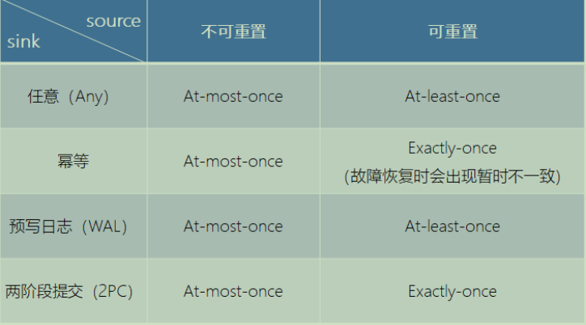

## 9.3 检查点（checkpoint）

​	Flink 具体如何保证 exactly-once 呢? 它使用一种被称为"检查点"（checkpoint）的特性，在出现故障时将系统重置回正确状态。下面通过简单的类比来解释检查点的作用。
​	假设你和两位朋友正在数项链上有多少颗珠子，如下图所示。你捏住珠子，边数边拨，每拨过一颗珠子就给总数加一。你的朋友也这样数他们手中的珠子。当你分神忘记数到哪里时，怎么办呢? 如果项链上有很多珠子，你显然不想从头再数一遍，尤其是当三人的速度不一样却又试图合作的时候，更是如此(比如想记录前一分钟三人一共数了多少颗珠子，回想一下一分钟滚动窗口)。于是，你想了一个更好的办法: 在项链上每隔一段就松松地系上一根有色皮筋，将珠子分隔开; 当珠子被拨动的时候，皮筋也可以被拨动; 然后，你安排一个助手，让他在你和朋友拨到皮筋时记录总数。用这种方法，当有人数错时，就不必从头开始数。相反，你向其他人发出错误警示，然后你们都从上一根皮筋处开始重数，助手则会告诉每个人重数时的起始数值，例如在粉色皮筋处的数值是多少。Flink 检查点的作用就类似于皮筋标记。数珠子这个类比的关键点是: 对于指定的皮筋而言，珠子的相对位置是确定的; 这让皮筋成为重新计数的参考点。总状态(珠子的总数)在每颗珠子被拨动之后更新一次，助手则会保存与每根皮筋对应的检查点状态，如当遇到粉色皮筋时一共数了多少珠子，当遇到橙色皮筋时又是多少。当问题出现时，这种方法使得重新计数变得简单。

### 9.3.1 Flink 的检查点算法

​	Flink 检查点的核心作用是确保状态正确，即使遇到程序中断，也要正确。记住这一基本点之后，我们用一个例子来看检查点是如何运行的。Flink 为用户提供了用来定义状态的工具。例如，以下这个 Scala 程序按照输入记录的第一个字段(一个字符串)进行分组并维护第二个字段的计数状态。

```scala
val stream: DataStream[(String, Int)] = ...
val counts: DataStream[(String, Int)] = stream
.keyBy(record => record._1) .mapWithState( (in: (String, Int), state: Option[Int]) =>
                                          state match {
                                              case Some(c) => ( (in._1, c + in._2), Some(c + in._2) )
                                              case None => ( (in._1, in._2), Some(in._2) )
                                          })
```

​	该程序有两个算子: keyBy 算子用来将记录按照第一个元素(一个字符串)进行分组，根据该 key 将数据进行重新分区，然后将记录再发送给下一个算子: 有状态的map 算子(mapWithState)。map 算子在接收到每个元素后，将输入记录的第二个字段的数据加到现有总数中，再将更新过的元素发射出去。下图表示程序的初始状态: 输入流中的 6 条记录被检查点分割线(checkpoint barrier)隔开，所有的 map 算子状态均为 0(计数还未开始)。所有 key 为 a 的记录将被顶层的 map 算子处理，所有 key 为 b的记录将被中间层的 map 算子处理，所有 key 为 c 的记录则将被底层的 map 算子处理。

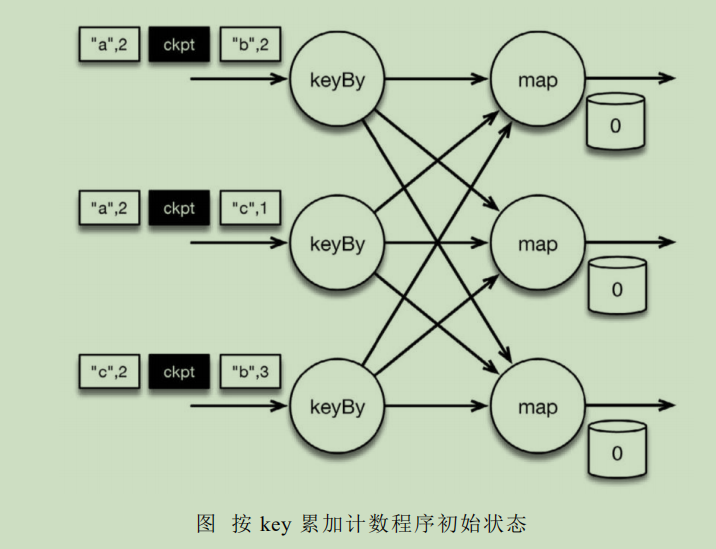
	上图是程序的初始状态。注意，a、b、c 三组的初始计数状态都是 0，即三个圆柱上的值。ckpt 表示检查点分割线（checkpoint barriers）。每条记录在处理顺序上严格地遵守在检查点之前或之后的规定，例如["b",2]在检查点之前被处理，["a",2]则在检查点之后被处理。当该程序处理输入流中的 6 条记录时，涉及的操作遍布 3 个并行实例(节点、CPU内核等)。那么，检查点该如何保证 exactly-once 呢?
检查点分割线和普通数据记录类似。它们由算子处理，但并不参与计算，而是会触发与检查点相关的行为。当读取输入流的数据源(在本例中与 keyBy 算子内联)遇到检查点屏障时，它将其在输入流中的位置保存到持久化存储中。如果输入流来自消息传输系统(Kafka)，这个位置就是偏移量。Flink 的存储机制是插件化的，持久化存储可以是分布式文件系统，如 HDFS。下图展示了这个过程。

 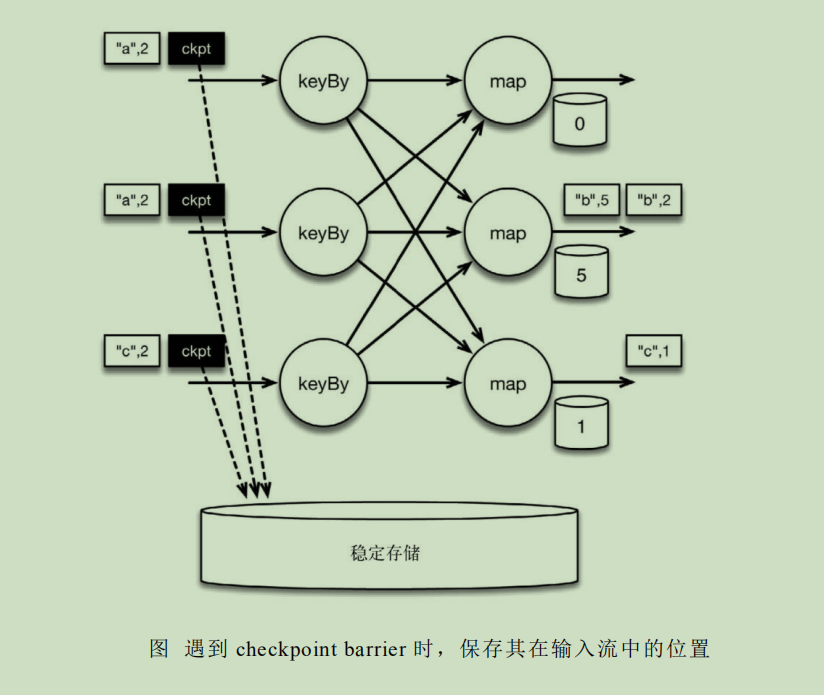

​	当 Flink 数据源(在本例中与 keyBy 算子内联)遇到检查点分界线（barrier）时，它会将其在输入流中的位置保存到持久化存储中。这让 Flink 可以根据该位置重启。检查点像普通数据记录一样在算子之间流动。当 map 算子处理完前 3 条数据并收到检查点分界线时，它们会将状态以异步的方式写入持久化存储，如下图所示。

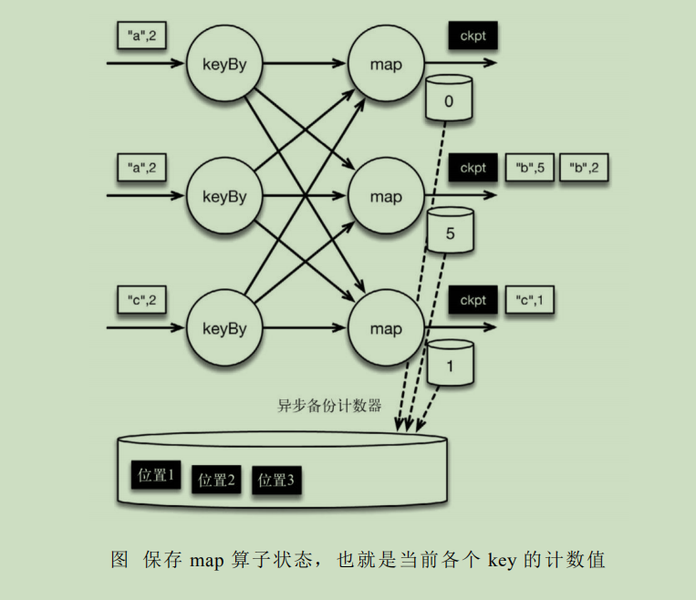
	位于检查点之前的所有记录(["b",2]、["b",3]和["c",1])被 map 算子处理之后的情况。此时，持久化存储已经备份了检查点分界线在输入流中的位置(备份操作发生在barrier 被输入算子处理的时候)。map 算子接着开始处理检查点分界线，并触发将状态异步备份到稳定存储中这个动作。 当 map 算子的状态备份和检查点分界线的位置备份被确认之后，该检查点操作就可以被标记为完成，如下图所示。我们在无须停止或者阻断计算的条件下，在一个逻辑时间点(对应检查点屏障在输入流中的位置)为计算状态拍了快照。通过确保备份的状态和位置指向同一个逻辑时间点，后文将解释如何基于备份恢复计算，从而保证 exactly-once。值得注意的是，当没有出现故障时，Flink 检查点的开销极小，检查点操作的速度由持久化存储的可用带宽决定。回顾数珠子的例子: 除了因为数错而需要用到皮筋之外，皮筋会被很快地拨过。

 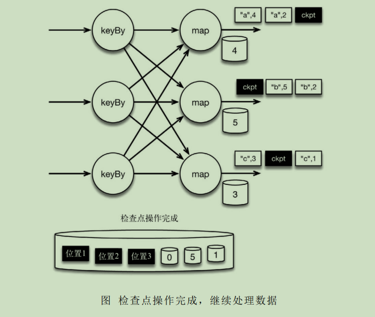

​	检查点操作完成，状态和位置均已备份到稳定存储中。输入流中的所有数据记录都已处理完成。值得注意的是，备份的状态值与实际的状态值是不同的。备份反映的是检查点的状态。如果检查点操作失败，Flink 可以丢弃该检查点并继续正常执行，因为之后的某一个检查点可能会成功。虽然恢复时间可能更长，但是对于状态的保证依旧很有力。只有在一系列连续的检查点操作失败之后，Flink 才会抛出错误，因为这通常预示着发生了严重且持久的错误。现在来看看下图所示的情况: 检查点操作已经完成，但故障紧随其后。

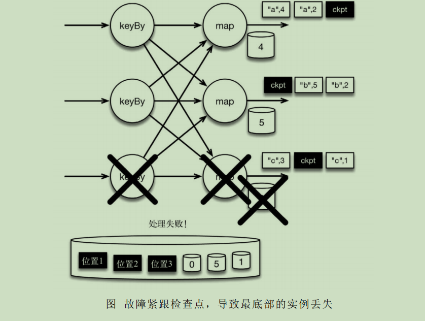


​	在这种情况下，Flink 会重新拓扑(可能会获取新的执行资源)，将输入流倒回到上一个检查点，然后恢复状态值并从该处开始继续计算。在本例中，["a",2]、["a",2]和["c",2]这几条记录将被重播。下图展示了这一重新处理过程。从上一个检查点开始重新计算，可以保证在剩下的记录被处理之后，得到的 map 算子的状态值与没有发生故障时的状态值一致。

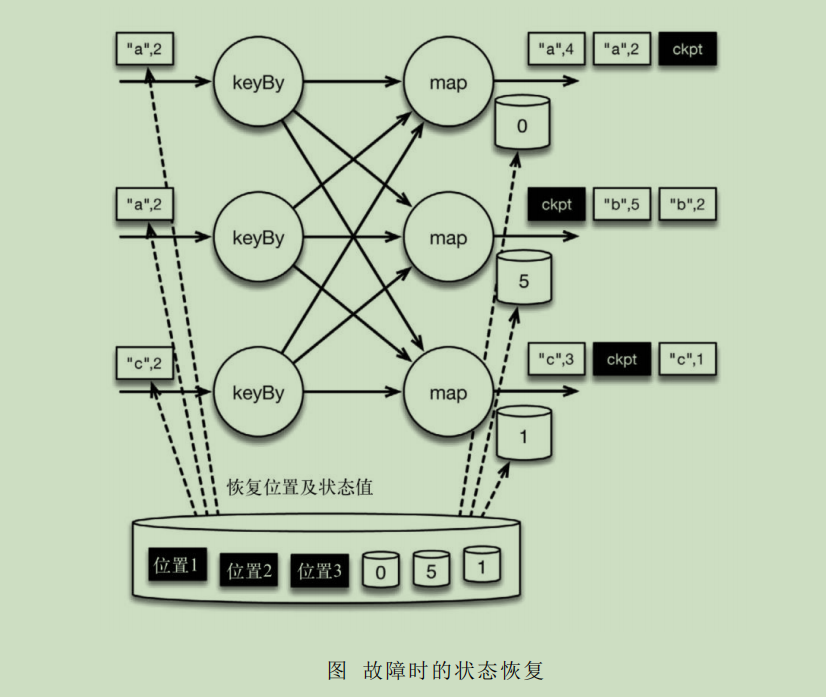
	Flink 将输入流倒回到上一个检查点屏障的位置，同时恢复 map 算子的状态值。然后，Flink 从此处开始重新处理。这样做保证了在记录被处理之后，map 算子的状态值与没有发生故障时的一致。Flink 检查点算法的正式名称是**异步分界线快照**(asynchronous barrier 
snapshotting)。该算法大致基于 Chandy-Lamport 分布式快照算法。检查点是 Flink 最有价值的创新之一，因为它使 Flink 可以保证 exactly-once，并且不需要牺牲性能。


### 9.3.2 Flink+Kafka 如何实现端到端的 exactly-once 语义

我们知道，端到端的状态一致性的实现，需要每一个组件都实现，对于 Flink + Kafka 的数据管道系统（Kafka 进、Kafka 出）而言，各组件怎样保证 exactly-once语义呢？

⚫ 内部 —— 利用 checkpoint 机制，把状态存盘，发生故障的时候可以恢复，保证内部的状态一致性

⚫ source —— kafka consumer 作为 source，可以将偏移量保存下来，如果后续任务出现了故障，恢复的时候可以由连接器重置偏移量，重新消费数据，保证一致性

⚫ sink —— kafka producer 作为 sink，采用两阶段提交 sink，需要实现一个TwoPhaseCommitSinkFunction内部的

​	 checkpoint 机制我们已经有了了解，那 source 和 sink 具体又是怎样运行的呢？接下来我们逐步做一个分析。

​	我们知道 Flink 由 JobManager 协调各个TaskManager 进行 checkpoint 存储，checkpoint 保存在 StateBackend 中，默认 StateBackend 是内存级的，也可以改为文件级的进行持久化保存。

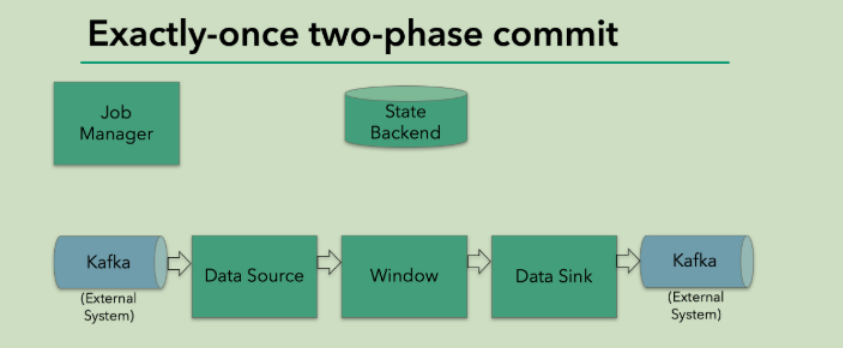

​	当 checkpoint 启动时，JobManager 会将检查点分界线（barrier）注入数据流；barrier 会在算子间传递下去。

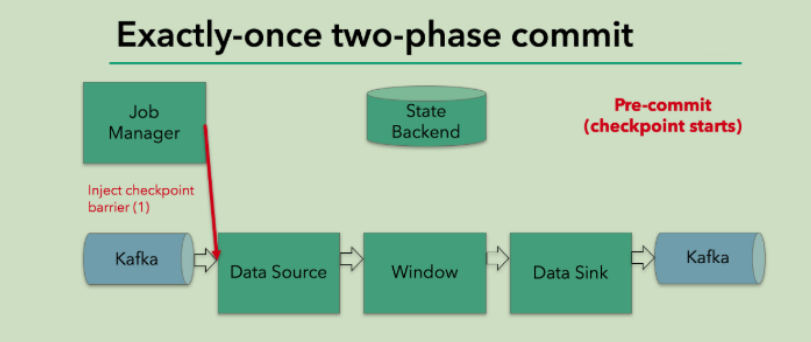

​	每个算子会对当前的状态做个快照，保存到状态后端。对于 source 任务而言，就会把当前的 offset 作为状态保存起来。下次从checkpoint 恢复时，source 任务可以重新提交偏移量，从上次保存的位置开始重新消费数据。

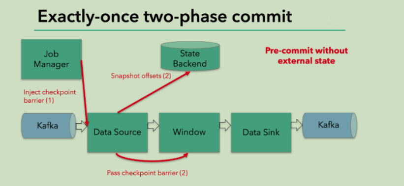

​	每个内部的 transform 任务遇到 barrier 时，都会把状态存到 checkpoint 里。sink 任务首先把数据写入外部 kafka，这些数据都属于预提交的事务（还不能被消费）；当遇到 barrier 时，把状态保存到状态后端，并开启新的预提交事务。

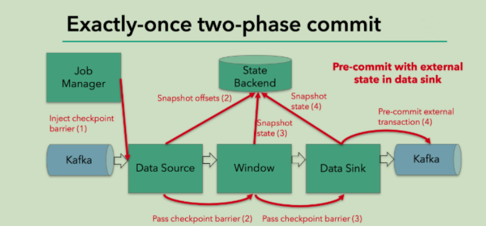

​	当所有算子任务的快照完成，也就是这次的 checkpoint 完成时，JobManager 会向所有任务发通知，确认这次 checkpoint 完成。 当 sink 任务收到确认通知，就会正式提交之前的事务，kafka 中未确认的数据就改为“已确认”，数据就真正可以被消费了。

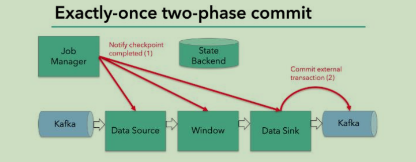

​	所以我们看到，执行过程实际上是一个两段式提交，每个算子执行完成，会进行“预提交”，直到执行完 sink 操作，会发起“确认提交”，如果执行失败，预提交会放弃掉。

​	具体的两阶段提交步骤总结如下：
⚫ 第一条数据来了之后，开启一个 kafka 的事务（transaction），正常写入kafka 分区日志但标记为未提交，这就是“预提交”
⚫ jobmanager 触发 checkpoint 操作，barrier 从 source 开始向下传递，遇到barrier 的算子将状态存入状态后端，并通知 jobmanager
⚫ sink 连接器收到 barrier，保存当前状态，存入 checkpoint，通知jobmanager，并开启下一阶段的事务，用于提交下个检查点的数据
⚫ jobmanager 收到所有任务的通知，发出确认信息，表示 checkpoint 完成
⚫ sink 任务收到 jobmanager 的确认信息，正式提交这段时间的数据
⚫ 外部 kafka 关闭事务，提交的数据可以正常消费了。

​	所以我们也可以看到，如果宕机需要通过 StateBackend 进行恢复，只能恢复所有确认提交的操作。

## 9.4 选择一个状态后端(state backend)

• MemoryStateBackend

> 内存级的状态后端，会将键控状态作为内存中的对象进行管理，将它们存储在 TaskManager 的 JVM 堆上；而将 checkpoint 存储在 JobManager 的内存中。

• FsStateBackend

> 将 checkpoint 存到远程的持久化文件系统（FileSystem）上。而对于本地状态，跟 MemoryStateBackend 一样，也会存在 TaskManager 的 JVM 堆上。

 • RocksDBStateBackend

> 将所有状态序列化后，存入本地的 RocksDB 中存储。

注意：RocksDB 的支持并不直接包含在 flink 中，需要引入依赖：

```xml
<dependency>
    <groupId>org.apache.flink</groupId>
    <artifactId>flink-statebackend-rocksdb_2.12</artifactId>
    <version>1.10.1</version>
</dependency>
```

设置状态后端为 FsStateBackend，并配置检查点和重启策略：

```java
StreamExecutionEnvironment env = StreamExecutionEnvironment.getExecutionEnvironment();
env.setParallelism(1);
// 1. 状态后端配置
env.setStateBackend(new FsStateBackend(""));
// 2. 检查点配置
env.enableCheckpointing(1000);
env.getCheckpointConfig().setCheckpointingMode(CheckpointingMode.EXACTLY_ONCE);
env.getCheckpointConfig().setCheckpointTimeout(60000);
env.getCheckpointConfig().setMinPauseBetweenCheckpoints(500);
env.getCheckpointConfig().setMaxConcurrentCheckpoints(1);
env.getCheckpointConfig().setPreferCheckpointForRecovery(false);
env.getCheckpointConfig().setTolerableCheckpointFailureNumber(0);
// 3. 重启策略配置
// 固定延迟重启（隔一段时间尝试重启一次）
env.setRestartStrategy(RestartStrategies.fixedDelayRestart(
 3, // 尝试重启次数
100000 // 尝试重启的时间间隔，也可 org.apache.flink.api.common.time.Time
));
```


# 第十章 Table API 与 SQL

​	Table API 是流处理和批处理通用的关系型 API，Table API 可以基于流输入或者批输入来运行而不需要进行任何修改。Table API 是 SQL 语言的超集并专门为 Apache Flink 设计的，Table API 是 Scala 和 Java 语言集成式的 API。与常规 SQL 语言中将查询指定为字符串不同，Table API 查询是以 Java 或 Scala 中的语言嵌入样式来定义的，具有 IDE 支持如:自动完成和语法检测。

## 10.1 需要引入的 pom 依赖

```xml
<dependency>
    <groupId>org.apache.flink</groupId>
    <artifactId>flink-table-planner_2.12</artifactId>
    <version>1.10.1</version>
</dependency>
<dependency>
    <groupId>org.apache.flink</groupId>
    <artifactId>flink-table-api-scala-bridge_2.12</artifactId>
    <version>1.10.1</version>
</dependency>
```

## 10.2 简单了解 TableAPI

```scala
def main(args: Array[String]): Unit = {
    val env = StreamExecutionEnvironment.getExecutionEnvironment
    env.setParallelism(1)
    val inputStream = env.readTextFile("..\\sensor.txt")
    val dataStream = inputStream.map( data => {
        val dataArray = data.split(",")
        SensorReading(dataArray(0).trim, dataArray(1).trim.toLong, dataArray(2).trim.toDouble)
    })
    
    // 基于 env 创建 tableEnv
    val settings: EnvironmentSettings = EnvironmentSettings.newInstance().useOldPlanner().inStreamingMode().build()
    val tableEnv: StreamTableEnvironment = StreamTableEnvironment.create(env, 
settings)
    // 从一条流创建一张表
    val dataTable: Table = tableEnv.fromDataStream(dataStream)
    // 从表里选取特定的数据
    val selectedTable: Table = dataTable.select('id, 'temperature) .filter("id = 'sensor_1'")
    val selectedStream: DataStream[(String, Double)] = selectedTable .toAppendStream[(String, Double)]
    selectedStream.print()
    env.execute("table test")
}
```


### 10.2.1 动态表

如果流中的数据类型是 case class 可以直接根据 case class 的结构生成 table

```scala
tableEnv.fromDataStream(dataStream) 
```

或者根据字段顺序单独命名

```scala
tableEnv.fromDataStream(dataStream,’id,’timestamp .......) 
```

最后的动态表可以转换为流进行输出

```scala
table.toAppendStream[(String,String)]
```


### 10.2.2 字段

用一个单引放到字段前面来标识字段名, 如 ‘name , ‘id ,’amount 等

## 10.3 TableAPI 的窗口聚合操作

### 10.3.1 通过一个例子了解 TableAPI

```scala
// 统计每 10 秒中每个传感器温度值的个数
def main(args: Array[String]): Unit = {
    val env = StreamExecutionEnvironment.getExecutionEnvironment
    env.setParallelism(1)
    env.setStreamTimeCharacteristic(TimeCharacteristic.EventTime)
    val inputStream = env.readTextFile("..\\sensor.txt")
    val dataStream = inputStream.map( data => {
        val dataArray = data.split(",")
        SensorReading(dataArray(0).trim, dataArray(1).trim.toLong, dataArray(2).trim.toDouble)
    })
    .assignTimestampsAndWatermarks(new BoundedOutOfOrdernessTimestampExtractor[SensorReading](Time.seconds(1)) {
        override def extractTimestamp(element: SensorReading): Long = element.timestamp * 1000L
    })
    // 基于 env 创建 tableEnv
    val settings: EnvironmentSettings = EnvironmentSettings.newInstance().useOldPlanner().inStreamingMode().build()
    val tableEnv: StreamTableEnvironment = StreamTableEnvironment.create(env, settings)
    // 从一条流创建一张表，按照字段去定义，并指定事件时间的时间字段
    val dataTable: Table = tableEnv.fromDataStream(dataStream, 'id, 'temperature, 'ts.rowtime)
    // 按照时间开窗聚合统计
    val resultTable: Table = dataTable
    .window( Tumble over 10.seconds on 'ts as 'tw )
    .groupBy('id, 'tw)
    .select('id, 'id.count)
    
    val selectedStream: DataStream[(Boolean, (String, Long))] = resultTable.toRetractStream[(String, Long)] 
    selectedStream.print()
    env.execute("table window test")
}
```


### 10.3.2 关于 group by 

> 1. 如果了使用 groupby，table 转换为流的时候只能用 toRetractDstream 
>
>    ```scala
>    val dataStream: DataStream[(Boolean, (String, Long))] = table
>    .toRetractStream[(String,Long)]
>    ```
>
> 2. toRetractDstream 得到的第一个 boolean 型字段标识 true 就是最新的数据(Insert)，false 表示过期老数据(Delete)
>
>    ```scala
>    val dataStream: DataStream[(Boolean, (String, Long))] = table
>    .toRetractStream[(String,Long)]
>    dataStream.filter(_._1).print()
>    ```
>
>    
>
> 3. 如果使用的 api 包括时间窗口，那么窗口的字段必须出现在 groupBy 中。
>
>    ```scala
>    val resultTable: Table = dataTable
>     .window( Tumble over 10.seconds on 'ts as 'tw )
>     .groupBy('id, 'tw)
>     .select('id, 'id.count)
>    ```
>
>    


### 10.3.3 关于时间窗口

> 1. 用到时间窗口，必须提前声明时间字段，如果是 processTime 直接在创建动
>    态表时进行追加就可以。
>
> ```scala
> val dataTable: Table = tableEnv.fromDataStream(dataStream, 'id, 
> 'temperature, 'ps.proctime)
> ```
>
> 2. 如果是 EventTime 要在创建动态表时声明
>
>    ```scala
>    val dataTable: Table = tableEnv.fromDataStream(dataStream, 'id, 
>    'temperature, 'ts.rowtime) 
>    ```
>
>    
>
> 3. 滚动窗口可以使用 Tumble over 10000.millis on 来表示
>
>    ```scala
>    val resultTable: Table = dataTable
>     .window( Tumble over 10.seconds on 'ts as 'tw )
>     .groupBy('id, 'tw)
>     .select('id, 'id.count)
>    ```
>
>    


## 10.4 SQL 如何编写

```scala
// 统计每 10 秒中每个传感器温度值的个数
def main(args: Array[String]): Unit = {
    val env = StreamExecutionEnvironment.getExecutionEnvironment
    env.setParallelism(1)
    env.setStreamTimeCharacteristic(TimeCharacteristic.EventTime)
    val inputStream = env.readTextFile("..\\sensor.txt")
    val dataStream = inputStream.map( data => {
        val dataArray = data.split(",")
        SensorReading(dataArray(0).trim, dataArray(1).trim.toLong, dataArray(2).trim.toDouble)
    })
    .assignTimestampsAndWatermarks(new BoundedOutOfOrdernessTimestampExtractor[SensorReading](Time.seconds(1)) {
        override def extractTimestamp(element: SensorReading): Long = element.timestamp * 1000L })
    // 基于 env 创建 tableEnv
    val settings: EnvironmentSettings = EnvironmentSettings.newInstance().useOldPlanner().inStreamingMode().build()
    val tableEnv: StreamTableEnvironment = StreamTableEnvironment.create(env, settings)
    // 从一条流创建一张表，按照字段去定义，并指定事件时间的时间字段
    val dataTable: Table = tableEnv.fromDataStream(dataStream, 'id, 'temperature, 'ts.rowtime)
    // 直接写 sql 完成开窗统计
    val resultSqlTable: Table = tableEnv.sqlQuery("select id, count(id) from "
 + dataTable + " group by id, tumble(ts, interval '15' second)")
    val selectedStream: DataStream[(Boolean, (String, Long))] =    resultSqlTable.toRetractStream[(String, Long)]
    selectedStream.print()
    env.execute("table window test")
}
```


# 第十一章 Flink CEP 简介

## 11.1 什么是复杂事件处理 CEP

一个或多个由简单事件构成的事件流通过一定的规则匹配，然后输出用户想得到的数据，满足规则的复杂事件。
特征：
➢ 目标：从有序的简单事件流中发现一些高阶特征
➢ 输入：一个或多个由简单事件构成的事件流
➢ 处理：识别简单事件之间的内在联系，多个符合一定规则的简单事件构成复杂事件
➢ 输出：满足规则的复杂事件


CEP 用于分析低延迟、频繁产生的不同来源的事件流。CEP 可以帮助在复杂的、不相关的事件流中找出有意义的模式和复杂的关系，以接近实时或准实时的获得通知并阻止一些行为。
CEP 支持在流上进行模式匹配，根据模式的条件不同，分为连续的条件或不连续的条件；模式的条件允许有时间的限制，当在条件范围内没有达到满足的条件时，会导致模式匹配超时。看起来很简单，但是它有很多不同的功能：
➢ 输入的流数据，尽快产生结果
➢ 在 2 个 event 流上，基于时间进行聚合类的计算
➢ 提供实时/准实时的警告和通知
➢ 在多样的数据源中产生关联并分析模式
➢ 高吞吐、低延迟的处理
市场上有多种 CEP 的解决方案，例如 Spark、Samza、Beam 等，但他们都没有提供专门的 library 支持。但是 Flink 提供了专门的 CEP library。

## 11.2 Flink CEP

Flink 为 CEP 提供了专门的 Flink CEP library，它包含如下组件：
➢ Event Stream
➢ pattern 定义
➢ pattern 检测

➢ 生成 Alert

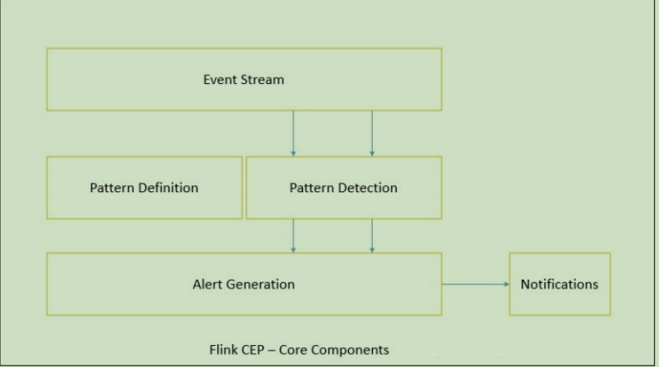首先，开发人员要在 DataStream 流上定义出模式条件，之后 Flink CEP 引擎进行模式检测，必要时生成告警。为了使用 Flink CEP，我们需要导入依赖：

```xml
<dependency>
    <groupId>org.apache.flink</groupId>
    <artifactId>flink-cep_2.12</artifactId>
    <version>1.10.1</version>
</dependency>
```

**Pattern API**
每个 Pattern 都应该包含几个步骤，或者叫做 state。从一个 state 到另一个 state，通常我们需要定义一些条件，例如下列的代码：

```scala
val loginFailPattern = Pattern.begin[LoginEvent]("begin")
 .where(_.eventType.equals("fail"))
 .next("next")
 .where(_.eventType.equals("fail"))
 .within(Time.seconds(10)
```

每个 state 都应该有一个标示：例如.begin\[LoginEvent]("begin")中的"begin"
每个 state 都需要有一个唯一的名字，而且需要一个 filter 来过滤条件，这个过滤条件定义事件需要符合的条件，例如:
.where(_.eventType.equals("fail"))
我们也可以通过 subtype 来限制 event 的子类型：
start.subtype(SubEvent.class).where(...);

事实上，你可以多次调用 subtype 和 where 方法；而且如果 where 条件是不相关的，你可以通过 or 来指定一个单独的 filter 函数：
pattern.where(...).or(...);
之后，我们可以在此条件基础上，通过 next 或者 followedBy 方法切换到下一个state，next 的意思是说上一步符合条件的元素之后紧挨着的元素；而 followedBy 并不要求一定是挨着的元素。这两者分别称为严格近邻和非严格近邻。

```scala
val strictNext = start.next("middle")
val nonStrictNext = start.followedBy("middle")
```

最后，我们可以将所有的 Pattern 的条件限定在一定的时间范围内：

```scala
next.within(Time.seconds(10))
```

这个时间可以是 Processing Time，也可以是 Event Time。


**Pattern 检测**
通过一个 input DataStream 以及刚刚我们定义的 Pattern，我们可以创建一个
PatternStream：

```scala
val input = ...
val pattern = ...
val patternStream = CEP.pattern(input, pattern)

val patternStream = CEP.pattern(loginEventStream.keyBy(_.userId), loginFail
Pattern)
```

一旦获得 PatternStream，我们就可以通过 select 或 flatSelect，从一个 Map 序列找到我们需要的警告信息。


**select**
select 方法需要实现一个 PatternSelectFunction，通过 select 方法来输出需要的警告。它接受一个 Map 对，包含 string/event，其中 key 为 state 的名字，event 则为真实的 Event。

```scala
val loginFailDataStream = patternStream
 .select((pattern: Map[String, Iterable[LoginEvent]]) => {
 val first = pattern.getOrElse("begin", null).iterator.next()
 val second = pattern.getOrElse("next", null).iterator.next()
 Warning(first.userId, first.eventTime, second.eventTime, "warning")
 })
```

其返回值仅为 1 条记录。


**flatSelect**
通过实现 PatternFlatSelectFunction，实现与 select 相似的功能。唯一的区别就是 flatSelect 方法可以返回多条记录，它通过一个 Collector[OUT]类型的参数来将要输出的数据传递到下游。

**超时事件的处理**
通过 within 方法，我们的 parttern 规则将匹配的事件限定在一定的窗口范围内。当有超过窗口时间之后到达的 event，我们可以通过在 select 或 flatSelect 中，实现PatternTimeoutFunction 和 PatternFlatTimeoutFunction 来处理这种情况。

```scala
val patternStream: PatternStream[Event] = CEP.pattern(input, pattern)

val outputTag = OutputTag[String]("side-output")
val result: SingleOutputStreamOperator[ComplexEvent] = patternStream.select
(outputTag){
 (pattern: Map[String, Iterable[Event]], timestamp: Long) => TimeoutEvent
()
} {
 pattern: Map[String, Iterable[Event]] => ComplexEvent()
}
val timeoutResult: DataStream<TimeoutEvent> = result.getSideOutput(outputTa
g)
```

# 附录 常见问题汇总

1．题一：应用架构

> 问题：公司怎么提交的实时任务，有多少 Job Manager、Task Manager？
> 解答：
>
>   1. 我们使用 yarn session 模式提交任务；另一种方式是每次提交都会创建一个新的 Flink 集群，为每一个 job 提供资源，任务之间互相独立，互不影响，方便管理。任务执行完成之后创建的集群也会消失。线上命令脚本如下：bin/yarn-session.sh -n 7 -s 8 -jm 3072 -tm 32768 -qu root.*.* -nm *-* -d 其中申请 7 个 taskManager，每个 8 核，每个 taskmanager 有 32768M 内存。
>
> 2. 集群默认只有一个 Job Manager。但为了防止单点故障，我们配置了高可用。对于 standlone 模式，我们公司一般配置一个主 Job Manager，两个备用 Job Manager，然后结合 ZooKeeper 的使用，来达到高可用；对于 yarn 模式，yarn 在Job Mananger 故障会自动进行重启，所以只需要一个，我们配置的最大重启次数是10 次。

2．题二：压测和监控

> 问题：怎么做压力测试和监控？
> 解答：我们一般碰到的压力来自以下几个方面：
> 一，产生数据流的速度如果过快，而下游的算子消费不过来的话，会产生背压。背压的监控可以使用 Flink Web UI(localhost:8081) 来可视化监控 Metrics，一旦报警就能知道。一般情况下背压问题的产生可能是由于 sink 这个 操作符没有优化好，做一下优化就可以了。比如如果是写入 ElasticSearch， 那么可以改成批量写入，可以调大 ElasticSearch 队列的大小等等策略。
> 二，设置 watermark 的最大延迟时间这个参数，如果设置的过大，可能会造成内存的压力。可以设置最大延迟时间小一些，然后把迟到元素发送到侧输出流中去。晚一点更新结果。或者使用类似于 RocksDB 这样的状态后端， RocksDB 会开辟堆外存储空间，但 IO 速度会变慢，需要权衡。
> 三，还有就是滑动窗口的长度如果过长，而滑动距离很短的话，Flink 的性能会下降的很厉害。我们主要通过时间分片的方法，将每个元素只存入一个“重叠窗口”，这样就可以减少窗口处理中状态的写入。参见链接：
> https://www.infoq.cn/article/sIhs_qY6HCpMQNblTI9M 
> 四，状态后端使用 RocksDB，还没有碰到被撑爆的问题。

3．题三：为什么用 Flink

> 问题：为什么使用 Flink 替代 Spark？
> 解答：主要考虑的是 flink 的低延迟、高吞吐量和对流式数据应用场景更好的支持；另外，flink 可以很好地处理乱序数据，而且可以保证 exactly-once 的状态一致性。详见文档第一章，有 Flink 和 Spark 的详细对比。

4．题四：checkpoint 的存储

> 问题：Flink 的 checkpoint 存在哪里？
> 解答：可以是内存，文件系统，或者 RocksDB。详见文档 9.4 节。

5．题五：exactly-once 的保证

> 问题：如果下级存储不支持事务，Flink 怎么保证 exactly-once？ 
>
> 解答：端到端的 exactly-once 对 sink 要求比较高，具体实现主要有幂等写入和事务性写入两种方式。幂等写入的场景依赖于业务逻辑，更常见的是用事务性写入。而事务性写入又有预写日志（WAL）和两阶段提交（2PC）两种方式。如果外部系统不支持事务，那么可以用预写日志的方式，把结果数据先当成状态保存，然后在收到 checkpoint 完成的通知时，一次性写入 sink 系统。参见文档 9.2、9.3 节及课件《Flink 的状态一致性》

6．题六：状态机制

> 问题：说一下 Flink 状态机制？
> 解答：Flink 内置的很多算子，包括源 source，数据存储 sink 都是有状态的。在Flink 中，状态始终与特定算子相关联。Flink 会以 checkpoint 的形式对各个任务的状态进行快照，用于保证故障恢复时的状态一致性。Flink 通过状态后端来管理状态和 checkpoint 的存储，状态后端可以有不同的配置选择。详见文档第九章。

 7．题七：海量 key 去重

> 问题：怎么去重？考虑一个实时场景：双十一场景，滑动窗口长度为 1 小时，滑动距离为 10 秒钟，亿级用户，怎样计算 UV？
> 解答：使用类似于 scala 的 set 数据结构或者 redis 的 set 显然是不行的，因为可能有上亿个 Key，内存放不下。所以可以考虑使用布隆过滤器（Bloom Filter）来去重。

8．题八：checkpoint 与 spark 比较

> 问题：Flink 的 checkpoint 机制对比 spark 有什么不同和优势？
> 解答：spark streaming 的 checkpoint 仅仅是针对 driver 的故障恢复做了数据和元数据的 checkpoint。而 flink 的 checkpoint 机制 要复杂了很多，它采用的是轻量级的分布式快照，实现了每个算子的快照，及流动中的数据的快照。参见文档9.3 节及文章链接： https://cloud.tencent.com/developer/article/1189624

9．题九：watermark 机制

> 问题：请详细解释一下 Flink 的 Watermark 机制。
> 解答：Watermark 本质是 Flink 中衡量 EventTime 进展的一个机制，主要用来处理乱序数据。详见文档 7.3 节。

10．题十：exactly-once 如何实现

> 问题：Flink 中 exactly-once 语义是如何实现的，状态是如何存储的？
> 解答：Flink 依靠 checkpoint 机制来实现 exactly-once 语义，如果要实现端到端的 exactly-once，还需要外部 source 和 sink 满足一定的条件。状态的存储通过状态后端来管理，Flink 中可以配置不同的状态后端。详见文档 9.2、9.3 及 9.4 节。

11．题十一：CEP

> 问题：Flink CEP 编程中当状态没有到达的时候会将数据保存在哪里？
> 解答：在流式处理中，CEP 当然是要支持 EventTime 的，那么相对应的也要支持数据的迟到现象，也就是 watermark 的处理逻辑。CEP 对未匹配成功的事件序列的处理，和迟到数据是类似的。在 Flink CEP 的处理逻辑中，状态没有满足的和迟到的数据，都会存储在一个 Map 数据结构中，也就是说，如果我们限定判断事件序列的时长为 5 分钟，那么内存中就会存储 5 分钟的数据，这在我看来，也是对内
> 存的极大损伤之一。

12．题十二：三种时间语义

> 问题：Flink 三种时间语义是什么，分别说出应用场景？
> 解答：
>
> 1. Event Time：这是实际应用最常见的时间语义，具体见文档第七章。
>
> 2. Processing Time：没有事件时间的情况下，或者对实时性要求超高的情况下。
> 3. Ingestion Time：存在多个 Source Operator 的情况下，每个 Source Operator可以使用自己本地系统时钟指派 Ingestion Time。后续基于时间相关的各种操作，都会使用数据记录中的 Ingestion Time。

13．题十三：数据高峰的处理

> 问题：Flink 程序在面对数据高峰期时如何处理？
> 解答：使用大容量的 Kafka 把数据先放到消息队列里面作为数据源，再使用Flink 进行消费，不过这样会影响到一点实时性。

## 视频链接

**视频链接**：https://www.bilibili.com/video/BV1qy4y1q728

