尚硅谷大数据技术之 Flink 优化
(作者：尚硅谷大数据研发部)
版本：V2.0

# 第1章资源配置调优

Flink 性能调优的第一步，就是为任务分配合适的资源，在一定范围内，增加资源的分配与性能的提升是成正比的，实现了最优的资源配置后，在此基础上再考虑进行后面论述的性能调优策略。

提交方式主要是 yarn-per-job，资源的分配在使用脚本提交 Flink 任务时进行指定。

➢标准的 Flink 任务提交脚本（Generic CLI 模式）

从1.11 开始，增加了通用客户端模式，参数使用-D <property=value>指定

```sh
bin/flink run \
-t yarn-per-job \
-d \
-p 5 \ 指定并行度
-Dyarn.application.queue=test \ 指定 yarn 队列
-Djobmanager.memory.process.size=1024mb \ 指定 JM 的总进程大小
-Dtaskmanager.memory.process.size=1024mb \ 指定每个 TM 的总进程大小
-Dtaskmanager.numberOfTaskSlots=2 \ 指定每个 TM 的 slot 数
-c com.atguigu.flink.tuning.UvDemo \
/opt/module/flink-1.13.1/myjar/flink-tuning-1.0-SNAPSHOT.jar
```

参数列表：
https://ci.apache.org/projects/flink/flink-docs-release-1.13/deployment/config.html

## 1.1内存设置

### 1.1.1 TaskManager 内存模型

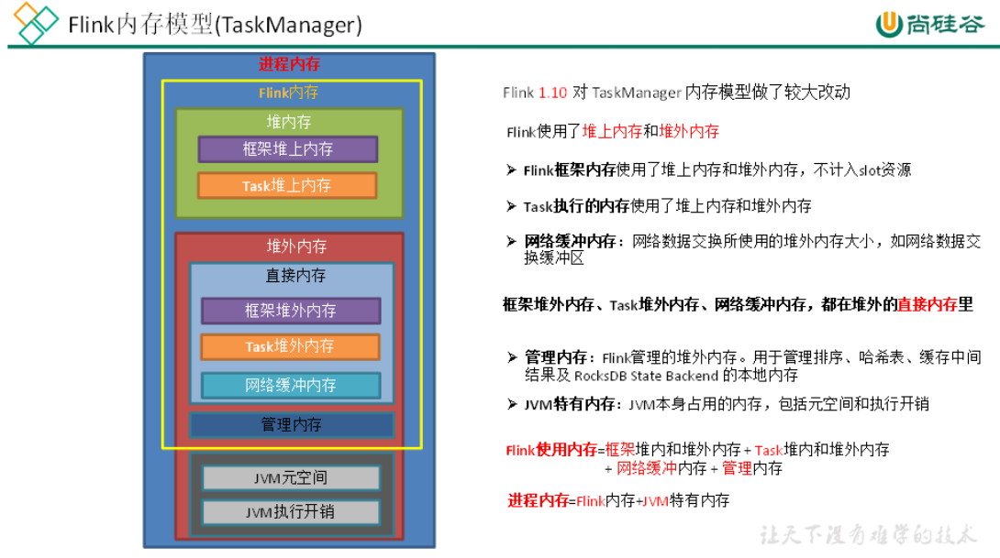

#### 1、内存模型详解

⚫JVM 特定内存：JVM 本身使用的内存，包含 JVM 的 metaspace 和 over-head

1）JVM metaspace：JVM 元空间

```properties
taskmanager.memory.jvm-metaspace.size，默认256mb
```

2）JVM over-head 执行开销：JVM 执行时自身所需要的内存，包括线程堆栈、IO、编译缓存等所使用的内存。

```properties
taskmanager.memory.jvm-overhead.fraction，默认0.1
taskmanager.memory.jvm-overhead.min，默认192mb
taskmanager.memory.jvm-overhead.max，默认1gb
```

总进程内存*fraction，如果小于配置的 min （或大于配置的 max）大小，则使用 min/max大小

⚫框架内存：Flink 框架，即 TaskManager 本身所占用的内存，不计入 Slot 的资源中。

```properties
堆内：taskmanager.memory.framework.heap.size，默认128MB
堆外：taskmanager.memory.framework.off-heap.size，默认128MB
```

⚫Task 内存：Task 执行用户代码时所使用的内存

```properties
堆内：taskmanager.memory.task.heap.size，默认 none，由 Flink 内存扣除掉其他部分的内存得到。
堆外：taskmanager.memory.task.off-heap.size，默认0，表示不使用堆外内存
```

⚫网络内存：网络数据交换所使用的堆外内存大小，如网络数据交换缓冲区

```properties
堆外：taskmanager.memory.network.fraction，默认0.1

taskmanager.memory.network.min，默认64mb
taskmanager.memory.network.max，默认1gb
Flink 内存*fraction，如果小于配置的 min （或大于配置的 max）大小，则使用 min/max大小
```

⚫托管内存(管理内存)：用于 RocksDB State Backend 的本地内存和批的排序、哈希表、缓存中间结果。

```properties
堆外：taskmanager.memory.managed.fraction，默认0.4
taskmanager.memory.managed.size，默认 none
如果 size 没指定，则等于 Flink 内存*fraction
```

#### 2、案例分析

基于 Yarn 模式，一般参数指定的是总进程内存，taskmanager.memory.process.size，

比如指定为4G，每一块内存得到大小如下：

（1）计算 Flink 内存

```properties
JVM 元空间256m

JVM 执行开销：4g*0.1=409.6m，在[192m,1g]之间，最终结果409.6m

Flink 内存=4g-256m-409.6m=3430.4m
```


（2）网络内存=3430.4m\*0.1=343.04m，在[64m,1g]之间，最终结果343.04m

（3）托管内存=3430.4m*0.4=1372.16m

（4）框架内存，堆内和堆外都是128m

（5）Task 堆内内存=3430.4m-128m-128m-343.04m-1372.16m=1459.2m

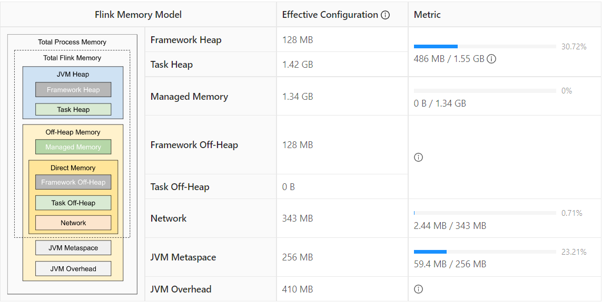

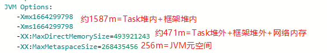

所以进程内存给多大，每一部分内存需不需要调整，可以看内存的使用率来调整。

### 1.1.2 生产资源配置示例

```sh
bin/flink run \
-t yarn-per-job \
-d \
-p 5 \ 指定并行度
-Dyarn.application.queue=test \ 指定 yarn 队列
-Djobmanager.memory.process.size=2048mb \ JM2~4G 足够
-Dtaskmanager.memory.process.size=4096mb \ 单个 TM2~8G 足够
-Dtaskmanager.numberOfTaskSlots=2 \ 与容器核数1core：1slot 或2core：1slot
-c com.atguigu.flink.tuning.UvDemo \
/opt/module/flink-1.13.1/myjar/flink-tuning-1.0-SNAPSHOT.jar
```

Flink 是实时流处理，关键在于资源情况能不能抗住高峰时期每秒的数据量，通常用QPS/TPS 来描述数据情况。

## 1.2 合理利用 cpu 资源

Yarn 的容量调度器默认情况下是使用“DefaultResourceCalculator”分配策略，只根据内存调度资源，所以在 Yarn 的资源管理页面上看到每个容器的 vcore 个数还是1。

可以修改策略为 DominantResourceCalculator，该资源计算器在计算资源的时候会综合考虑 cpu 和内存的情况。在 capacity-scheduler.xml 中修改属性:

```xml
<property>
<name>yarn.scheduler.capacity.resource-calculator</name>
<!--<value>org.apache.hadoop.yarn.util.resource.DefaultResourceCalculator</value> -->
<value>org.apache.hadoop.yarn.util.resource.DominantResourceCalculator</value>
</property>
```

### 1.2.1 使用 DefaultResourceCalculator 策略

```sh
bin/flink run \
-t yarn-per-job \
-d \
-p 5 \
-Drest.flamegraph.enabled=true \
-Dyarn.application.queue=test \
-Djobmanager.memory.process.size=1024mb \
-Dtaskmanager.memory.process.size=4096mb \
-Dtaskmanager.numberOfTaskSlots=2 \
-c com.atguigu.flink.tuning.UvDemo \
/opt/module/flink-1.13.1/myjar/flink-tuning-1.0-SNAPSHOT.jar
```

可以看到一个容器只有一个 vcore：

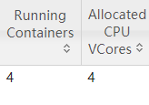

### 1.2.2 使用 DominantResourceCalculator 策略

修改后 yarn 配置后，分发配置并重启 yarn，再次提交 flink 作业：

```sh
bin/flink run \
-t yarn-per-job \
-d \
-p 5 \
-Drest.flamegraph.enabled=true \
-Dyarn.application.queue=test \
-Djobmanager.memory.process.size=1024mb \
-Dtaskmanager.memory.process.size=4096mb \
-Dtaskmanager.numberOfTaskSlots=2 \
-c com.atguigu.flink.tuning.UvDemo \
/opt/module/flink-1.13.1/myjar/flink-tuning-1.0-SNAPSHOT.jar
```

看到容器的 vcore 数变了:

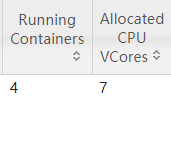

JobManager1 个，占用1 个容器，vcore=1

TaskManager3 个，占用3 个容器，每个容器 vcore=2，总 vcore=2*3=6，因为默认单个容器的 vcore 数=单 TM 的 slot 数

### 1.2.3 使用 DominantResourceCalculator 策略并指定容器vcore 数

指定 yarn 容器的 vcore 数，提交：

```sh
bin/flink run \
-t yarn-per-job \
-d \
-p 5 \
-Drest.flamegraph.enabled=true \
-Dyarn.application.queue=test \
-Dyarn.containers.vcores=3 \
-Djobmanager.memory.process.size=1024mb \
-Dtaskmanager.memory.process.size=4096mb \
-Dtaskmanager.numberOfTaskSlots=2 \
-c com.atguigu.flink.tuning.UvDemo \
/opt/module/flink-1.13.1/myjar/flink-tuning-1.0-SNAPSHOT.jar
```

 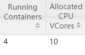

JobManager1 个，占用1 个容器，vcore=1

TaskManager3 个，占用3 个容器，每个容器 vcore =3，总 vcore=3\*3=9

## 1.3并行度设置

### 1.3.1 全局并行度计算

开发完成后，先进行压测。任务并行度给10 以下，测试单个并行度的处理上限。然后

总 QPS/单并行度的处理能力= 并行度

开发完 Flink 作业，压测的方式很简单，先在 kafka 中积压数据，之后开启 Flink 任务，出现反压，就是处理瓶颈。相当于水库先积水，一下子泄洪。不能只从 QPS 去得出并行度，因为有些字段少、逻辑简单的任务，单并行度一秒处理几万条数据。而有些数据字段多，处理逻辑复杂，单并行度一秒只能处理1000 条数据。最好根据高峰期的 QPS 压测，并行度*1.2 倍，富余一些资源。

### 1.3.2 Source 端并行度的配置

数据源端是 Kafka，Source 的并行度设置为 Kafka 对应 Topic 的分区数。如果已经等于 Kafka 的分区数，消费速度仍跟不上数据生产速度，考虑下 Kafka 要扩大分区，同时调大并行度等于分区数。

Flink 的一个并行度可以处理一至多个分区的数据，如果并行度多于 Kafka 的分区数，那么就会造成有的并行度空闲，浪费资源。

### 1.3.3 Transform 端并行度的配置

➢Keyby 之前的算子

一般不会做太重的操作，都是比如 map、filter、flatmap 等处理较快的算子，并行度可以和 source 保持一致。

➢Keyby 之后的算子

如果并发较大，建议设置并行度为2 的整数次幂，例如：128、256、512；

小并发任务的并行度不一定需要设置成2 的整数次幂；

大并发任务如果没有 KeyBy，并行度也无需设置为2 的整数次幂；

### 1.3.4 Sink 端并行度的配置

Sink 端是数据流向下游的地方，可以根据 Sink 端的数据量及下游的服务抗压能力进行评估。如果 Sink 端是 Kafka，可以设为 Kafka 对应 Topic 的分区数。

Sink 端的数据量小，比较常见的就是监控告警的场景，并行度可以设置的小一些。

Source 端的数据量是最小的，拿到 Source 端流过来的数据后做了细粒度的拆分，数据量不断的增加，到 Sink 端的数据量就非常大。那么在 Sink 到下游的存储中间件的时候就需要提高并行度。另外 Sink 端要与下游的服务进行交互，并行度还得根据下游的服务抗压能力来设置，如果在 Flink Sink 这端的数据量过大的话，且 Sink 处并行度也设置的很大，但下游的服务完全撑不住这么大的并发写入，可能会造成下游服务直接被写挂，所以最终还是要在 Sink处的并行度做一定的权衡。

# 第2章状态及 Checkpoint 调优

## 2.1 RocksDB 大状态调优

RocksDB 是基于 LSM Tree 实现的（类似 HBase），写数据都是先缓存到内存中，所以 RocksDB 的写请求效率比较高。RocksDB 使用内存结合磁盘的方式来存储数据，每次获取数据时，先从内存中 blockcache 中查找，如果内存中没有再去磁盘中查询。使用RocksDB 时，状态大小仅受可用磁盘空间量的限制，性能瓶颈主要在于 RocksDB 对磁盘的读请求，每次读写操作都必须对数据进行反序列化或者序列化。当处理性能不够时，仅需要横向扩展并行度即可提高整个 Job 的吞吐量。

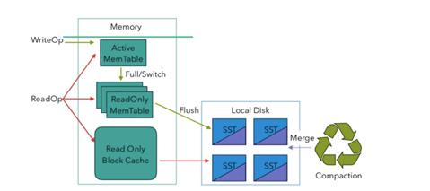

从 Flink1.10 开始，Flink 默认将 RocksDB 的内存大小配置为每个 task slot 的托管内存。调试内存性能的问题主要是通过调整配置项 taskmanager.memory.managed.size 或者 taskmanager.memory.managed.fraction 以增加 Flink 的托管内存(即堆外的托管内存)。进一步可以调整一些参数进行高级性能调优，这些参数也可以在应用程序中通过RocksDBStateBackend.setRocksDBOptions(RocksDBOptionsFactory)指定。下面介绍

提高资源利用率的几个重要配置：

### 2.1.1 开启 State 访问性能监控

Flink 1.13 中引入了 State 访问的性能监控，即 latency trackig state。此功能不局限于 State Backend 的类型，自定义实现的 State Backend 也可以复用此功能。

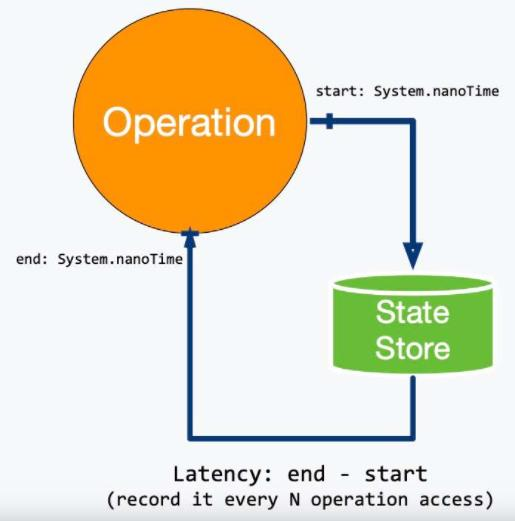

State 访问的性能监控会产生一定的性能影响，所以，默认每100 次做一次取样(sample)，对不同的 State Backend 性能损失影响不同：

对于 RocksDB State Backend，性能损失大概在1%左右

对于 Heap State Backend，性能损失最多可达10%

```properties
state.backend.latency-track.keyed-state-enabled：true  #启用访问状态的性能监控
state.backend.latency-track.sample-interval: 100 #采样间隔
state.backend.latency-track.history-size: 128 #保留的采样数据个数，越大越精确
state.backend.latency-track.state-name-as-variable: true #将状态名作为变量
```

正常开启第一个参数即可。

```sh
bin/flink run \
-t yarn-per-job \
-d \
-p 5 \
-Drest.flamegraph.enabled=true \
-Dyarn.application.queue=test \
-Djobmanager.memory.process.size=1024mb \
-Dtaskmanager.memory.process.size=4096mb \
-Dtaskmanager.numberOfTaskSlots=2 \
-Dstate.backend.latency-track.keyed-state-enabled=true \
-c com.atguigu.flink.tuning.RocksdbTuning \
/opt/module/flink-1.13.1/myjar/flink-tuning-1.0-SNAPSHOT.jar
```

### 2.1.2 开启增量检查点和本地恢复

1）开启增量检查点

RocksDB 是目前唯一可用于支持有状态流处理应用程序增量检查点的状态后端，可以修改参数开启增量检查点：

```properties
state.backend.incremental: true #默认 false，改为 true。
或代码中指定
new EmbeddedRocksDBStateBackend(true)
```

2）开启本地恢复

当 Flink 任务失败时，可以基于本地的状态信息进行恢复任务，可能不需要从 hdfs 拉取数据。本地恢复目前仅涵盖键控类型的状态后端（RocksDB），MemoryStateBackend不支持本地恢复并忽略此选项。

```properties
state.backend.local-recovery: true
```

3）设置多目录

如果有多块磁盘，也可以考虑指定本地多目录

```properties
state.backend.rocksdb.localdir:
/data1/flink/rocksdb,/data2/flink/rocksdb,/data3/flink/rocksdb
```

注意：不要配置单块磁盘的多个目录，务必将目录配置到多块不同的磁盘上，让多块磁盘来分担压力。

```sh
bin/flink run \
-t yarn-per-job \
-d \
-p 5 \
-Drest.flamegraph.enabled=true \
-Dyarn.application.queue=test \
-Djobmanager.memory.process.size=1024mb \
-Dtaskmanager.memory.process.size=4096mb \
-Dtaskmanager.numberOfTaskSlots=2 \
-Dstate.backend.incremental=true \
-Dstate.backend.local-recovery=true \
-Dstate.backend.latency-track.keyed-state-enabled=true \
-c com.atguigu.flink.tuning.RocksdbTuning \
/opt/module/flink-1.13.1/myjar/flink-tuning-1.0-SNAPSHOT.jar
```

### 2.1.3 调整预定义选项

Flink 针对不同的设置为 RocksDB 提供了一些预定义的选项集合,其中包含了后续提到的一些参数，如果调整预定义选项后还达不到预期，再去调整后面的 block、writebuffer等参数。

当前支持的预定义选项有 DEFAULT 、 SPINNING_DISK_OPTIMIZED 、SPINNING_DISK_OPTIMIZED_HIGH_MEM 或 FLASH_SSD_OPTIMIZED。有条件上 SSD的，可以指定为FLASH_SSD_OPTIMIZED

```properties
state.backend.rocksdb.predefined-options： SPINNING_DISK_OPTIMIZED_HIGH_MEM
#设置为机械硬盘+内存模式
```

### 2.1.4 增大 block 缓存

整个 RocksDB 共享一个 block cache，读数据时内存的 cache 大小，该参数越大读数据时缓存命中率越高，默认大小为8 MB，建议设置到64 ~256 MB。

```properties
state.backend.rocksdb.block.cache-size: 64m #默认8m
```

### 2.1.5 增大 write buffer 和 level 阈值大小

RocksDB 中，每个 State 使用一个 Column Family，每个 Column Family 使用独占的 write buffer，默认64MB，建议调大。调整这个参数通常要适当增加 L1 层的大小阈值 max-size-level-base，默认256m。

该值太小会造成能存放的 SST 文件过少，层级变多造成查找困难，太大会造成文件过多，合并困难。建议设为 target_file_size_base （默认64MB）的倍数，且不能太小，例如5\~10倍，即320~640MB。

```properties
state.backend.rocksdb.writebuffer.size: 128m
state.backend.rocksdb.compaction.level.max-size-level-base: 320m
```

### 2.1.6 增大 write buffer 数量

每个 Column Family 对应的 writebuffer 最大数量，这实际上是内存中“只读内存表“的最大数量，默认值是2。对于机械磁盘来说，如果内存足够大，可以调大到5 左右

```properties
state.backend.rocksdb.writebuffer.count: 5
```


### 2.1.7 增大后台线程数和 write buffer 合并数

1）增大线程数

用于后台 flush 和合并 sst 文件的线程数，默认为1，建议调大，机械硬盘用户可以改为4 等更大的值

```properties
state.backend.rocksdb.thread.num: 4
```

2）增大 writebuffer 最小合并数

将数据从 writebuffer 中 flush 到磁盘时，需要合并的 writebuffer 最小数量，默认值为1，可以调成3。

```properties
state.backend.rocksdb.writebuffer.number-to-merge: 3
```

### 2.1.8 开启分区索引功能

Flink 1.13 中对 RocksDB 增加了分区索引功能，复用了 RocksDB 的 partitioned Index & filter 功能，简单来说就是对 RocksDB 的 partitioned Index 做了多级索引。也就是将内存中的最上层常驻，下层根据需要再 load 回来，这样就大大降低了数据 Swap竞争。线上测试中，相对于内存比较小的场景中，性能提升10 倍左右。如果在内存管控下 Rocksdb 性能不如预期的话，这也能成为一个性能优化点。

```properties
state.backend.rocksdb.memory.partitioned-index-filters:true #默认 false
```

### 2.1.9 参数设定案例

```sh
bin/flink run \
-t yarn-per-job \
-d \
-p 5 \
-Drest.flamegraph.enabled=true \
-Dyarn.application.queue=test \
-Djobmanager.memory.process.size=1024mb \
-Dtaskmanager.memory.process.size=4096mb \
-Dtaskmanager.numberOfTaskSlots=2 \
-Dstate.backend.incremental=true \
-Dstate.backend.local-recovery=true \
-Dstate.backend.rocksdb.predefined-options=SPINNING_DISK_OPTIMIZED_HIGH_MEM \
-Dstate.backend.rocksdb.block.cache-size=64m \
-Dstate.backend.rocksdb.writebuffer.size=128m \
-Dstate.backend.rocksdb.compaction.level.max-size-level-base=320m \
-Dstate.backend.rocksdb.writebuffer.count=5 \
-Dstate.backend.rocksdb.thread.num=4 \
-Dstate.backend.rocksdb.writebuffer.number-to-merge=3 \
-Dstate.backend.rocksdb.memory.partitioned-index-filters=true \
-Dstate.backend.latency-track.keyed-state-enabled=true \
-c com.atguigu.flink.tuning.RocksdbTuning \
/opt/module/flink-1.13.1/myjar/flink-tuning-1.0-SNAPSHOT.jar
```

## 2.2 Checkpoint 设置

一般需求，我们的 Checkpoint 时间间隔可以设置为分钟级别（1 ~5 分钟）。对于状态很大的任务每次 Checkpoint 访问 HDFS 比较耗时，可以设置为5~10 分钟一次Checkpoint，并且调大两次 Checkpoint 之间的暂停间隔，例如设置两次 Checkpoint 之间至少暂停4 或8 分钟。同时，也需要考虑时效性的要求,需要在时效性和性能之间做一个平衡，如果时效性要求高，结合 end- to-end 时长，设置秒级或毫秒级。如果 Checkpoint
语义配置为 EXACTLY_ONCE，那么在 Checkpoint 过程中还会存在 barrier 对齐的过程，可以通过 Flink Web UI 的 Checkpoint 选项卡来查看 Checkpoint 过程中各阶段的耗时情况，从而确定到底是哪个阶段导致 Checkpoint 时间过长然后针对性的解决问题。

RocksDB 相关参数在前面已说明，可以在 flink-conf.yaml 指定，也可以在 Job 的代码中调用 API 单独指定，这里不再列出。

```java
//使⽤ RocksDBStateBackend 做为状态后端，并开启增量 Checkpoint
RocksDBStateBackend rocksDBStateBackend = new RocksDBStateBackend("hdfs://hadoop1:8020/flink/checkpoints", true);
env.setStateBackend(rocksDBStateBackend);
//开启 Checkpoint，间隔为3 分钟
env.enableCheckpointing(TimeUnit.MINUTES.toMillis(3));
//配置 Checkpoint
CheckpointConfig checkpointConf = env.getCheckpointConfig();
checkpointConf.setCheckpointingMode(CheckpointingMode.EXACTLY_ONCE)
//最小间隔4 分钟
checkpointConf.setMinPauseBetweenCheckpoints(TimeUnit.MINUTES.toMillis(4))
//超时时间10 分钟
checkpointConf.setCheckpointTimeout(TimeUnit.MINUTES.toMillis(10));
//保存 checkpoint
checkpointConf.enableExternalizedCheckpoints(CheckpointConfig.ExternalizedCheckpointCleanup.RETAIN_ON_CANCELLATION);
```

# 第3章 反压处理

## 3.1 概述

Flink 网络流控及反压的介绍：

https://flink-learning.org.cn/article/detail/138316d1556f8f9d34e517d04d670626

### 3.1.1 反压的理解

简单来说，Flink 拓扑中每个节点（Task）间的数据都以阻塞队列的方式传输，下游来不及消费导致队列被占满后，上游的生产也会被阻塞，最终导致数据源的摄入被阻塞。

反压（BackPressure）通常产生于这样的场景：短时间的负载高峰导致系统接收数据的速率远高于它处理数据的速率。许多日常问题都会导致反压，例如，垃圾回收停顿可能会导致流入的数据快速堆积，或遇到大促、秒杀活动导致流量陡增。

### 3.1.2 反压的危害

反压如果不能得到正确的处理，可能会影响到 checkpoint 时长和 state 大小，甚至可能会导致资源耗尽甚至系统崩溃。

1）影响 checkpoint 时长：barrier 不会越过普通数据，数据处理被阻塞也会导致checkpoint barrier 流经整个数据管道的时长变长，导致 checkpoint 总体时间（End to End Duration）变长。

2）影响 state 大小：barrier 对齐时，接受到较快的输入管道的 barrier 后，它后面数据会被缓存起来但不处理，直到较慢的输入管道的 barrier 也到达，这些被缓存的数据会被放到 state 里面，导致 checkpoint 变大。

这两个影响对于生产环境的作业来说是十分危险的，因为 checkpoint 是保证数据一致性的关键，checkpoint 时间变长有可能导致 checkpoint 超时失败，而 state 大小同样可能拖慢 checkpoint 甚至导致 OOM （使用 Heap-based StateBackend）或者物理内存使用超出容器资源（使用 RocksDBStateBackend）的稳定性问题。因此，我们在生产中要尽量避免出现反压的情况。

## 3.2 定位反压节点

解决反压首先要做的是定位到造成反压的节点，排查的时候，先把 operator chain 禁用，方便定位到具体算子。
提交 UvDemo:

```sh
bin/flink run \
-t yarn-per-job \
-d \
-p 5 \
-Drest.flamegraph.enabled=true \
-Dyarn.application.queue=test \
-Djobmanager.memory.process.size=1024mb \
-Dtaskmanager.memory.process.size=2048mb \
-Dtaskmanager.numberOfTaskSlots=2 \
-c com.atguigu.flink.tuning.UvDemo \
/opt/module/flink-1.13.1/myjar/flink-tuning-1.0-SNAPSHOT.jar
```


### 3.2.1 利用 Flink Web UI 定位

Flink Web UI 的反压监控提供了 SubTask 级别的反压监控，1.13 版本以前是通过周期性对 Task 线程的栈信息采样，得到线程被阻塞在请求 Buffer （意味着被下游队列阻塞）的频率来判断该节点是否处于反压状态。默认配置下，这个频率在0.1 以下则为 OK，0.1至0.5 为 LOW，而超过0.5 则为 HIGH。

Flink 1.13 优化了反压检测的逻辑（使用基于任务 Mailbox 计时，而不在再于堆栈采样），并且重新实现了作业图的 UI 展示：Flink 现在在 UI 上通过颜色和数值来展示繁忙和反压的程度。

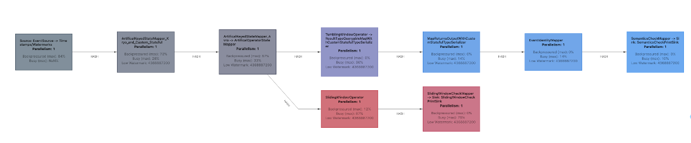

1）通过 WebUI 看到 Map 算子处于反压：

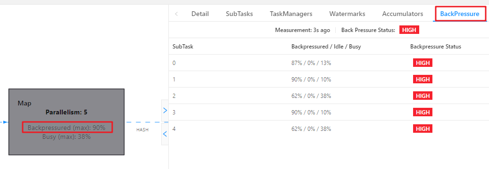


2）分析瓶颈算子

如果处于反压状态，那么有两种可能性：

（1）该节点的发送速率跟不上它的产生数据速率。这一般会发生在一条输入多条输出的 Operator （比如 flatmap）。这种情况，该节点是反压的根源节点，它是从 Source Task到 Sink Task 的第一个出现反压的节点。

（2）下游的节点接受速率较慢，通过反压机制限制了该节点的发送速率。这种情况，需要继续排查下游节点，一直找到第一个为 OK 的一般就是根源节点。总体来看，如果我们找到第一个出现反压的节点，反压根源要么是就这个节点，要么是它紧接着的下游节点。通常来讲，第二种情况更常见。如果无法确定，还需要结合 Metrics 进一步判断。

### 3.2.2 利用 Metrics 定位

监控反压时会用到的 Metrics 主要和 Channel 接受端的 Buffer 使用率有关，最为有用的是以下几个 Metrics:

| Metris                            | 描述                             |
| --------------------------------- | -------------------------------- |
| outPoolUsage                      | 发送端 Buffer 的使用率           |
| inPoolUsage                       | 接收端 Buffer 的使用率           |
| floatingBuffersUsage（1.9 以上）  | 接收端 Floating Buffer 的使用率  |
| exclusiveBuffersUsage（1.9 以上） | 接收端 Exclusive Buffer 的使用率 |

其中 inPoolUsage = floatingBuffersUsage + exclusiveBuffersUsage。

1）根据指标分析反压

分析反压的大致思路是：如果一个 Subtask 的发送端 Buffer 占用率很高，则表明它被下游反压限速了；如果一个 Subtask 的接受端 Buffer 占用很高，则表明它将反压传导至上游。反压情况可以根据以下表格进行对号入座(1.9 以上):

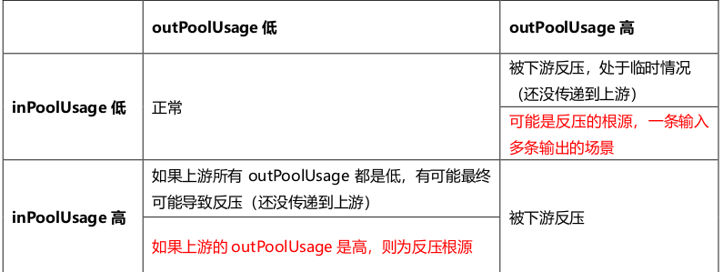

2）可以进一步分析数据传输

Flink 1.9 及以上版本，还可以根据 floatingBuffersUsage/exclusiveBuffersUsage 以及其上游 Task 的 outPoolUsage 来进行进一步的分析一个 Subtask 和其上游Subtask 的数据传输。在流量较大时， Channel 的 Exclusive Buffer 可能会被写满，此时 Flink 会向 Buffer Pool 申请剩余的 Floating Buffer。这些 Floating Buffer 属于备用 Buffer。

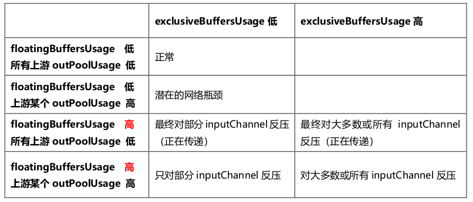

总结：

1）floatingBuffersUsage 为高，则表明反压正在传导至上游

2）同时 exclusiveBuffersUsage 为低，则表明可能有倾斜

比如，floatingBuffersUsage 高、exclusiveBuffersUsage 低为有倾斜，因为少数channel 占用了大部分的 Floating Buffer。

## 3.3 反压的原因及处理

注意：反压可能是暂时的，可能是由于负载高峰、CheckPoint 或作业重启引起的数据积压而导致反压。如果反压是暂时的，应该忽略它。另外，请记住，断断续续的反压会影响我们分析和解决问题。

定位到反压节点后，分析造成原因的办法主要是观察 Task Thread。按照下面的顺序，一步一步去排查。

### 3.3.1 查看是否数据倾斜

在实践中，很多情况下的反压是由于数据倾斜造成的，这点我们可以通过 Web UI 各个 SubTask 的 Records Sent 和 Record Received 来确认，另外 Checkpoint detail里不同 SubTask 的 State size 也是一个分析数据倾斜的有用指标。

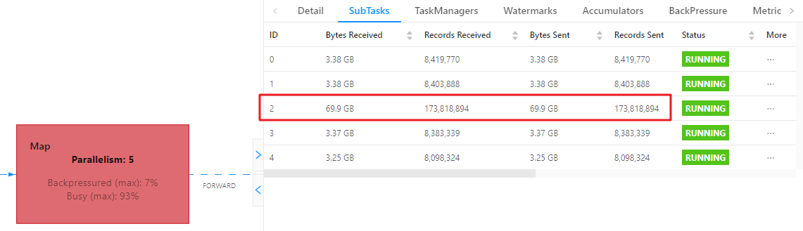

（关于数据倾斜的详细解决方案，会在下一章节详细讨论）

### 3.3.2 使用火焰图分析

如果不是数据倾斜，最常见的问题可能是用户代码的执行效率问题（频繁被阻塞或者性能问题），需要找到瓶颈算子中的哪部分计算逻辑消耗巨大。最有用的办法就是对 TaskManager 进行 CPU profile，从中我们可以分析到 Task Thread 是否跑满一个 CPU 核：如果是的话要分析 CPU 主要花费在哪些函数里面；如果不是的话要看 Task Thread 阻塞在哪里，可能是用户函数本身有些同步的调用，可能是checkpoint 或者 GC 等系统活动导致的暂时系统暂停。

1）开启火焰图功能

Flink 1.13 直接在 WebUI 提供 JVM 的 CPU 火焰图，这将大大简化性能瓶颈的分析，默认是不开启的，需要修改参数：

```properties
rest.flamegraph.enabled: true #默认 false
```

也可以在提交时指定：

```sh
bin/flink run \
-t yarn-per-job \
-d \
-p 5 \
-Drest.flamegraph.enabled=true \
-Dyarn.application.queue=test \
-Drest.flamegraph.enabled=true \
-Djobmanager.memory.process.size=1024mb \
-Dtaskmanager.memory.process.size=2048mb \
-Dtaskmanager.numberOfTaskSlots=2 \
-c com.atguigu.flink.tuning.UvDemo \
/opt/module/flink-1.13.1/myjar/flink-tuning-1.0-SNAPSHOT.jar
```

2）WebUI 查看火焰图

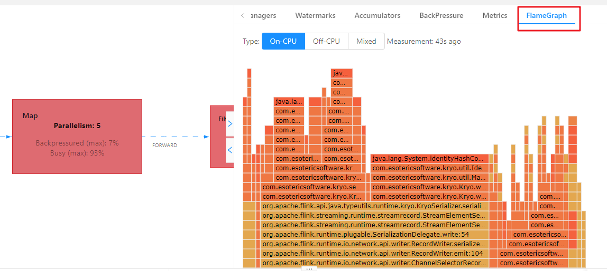

火焰图是通过对堆栈跟踪进行多次采样来构建的。每个方法调用都由一个条形表示，其中条形的长度与其在样本中出现的次数成正比。

➢ On-CPU: 处于[RUNNABLE, NEW]状态的线程

➢ Off-CPU: 处于[TIMED_WAITING, WAITING, BLOCKED]的线程，用于查看在样本中发现的阻塞调用。

3）分析火焰图

颜色没有特殊含义，具体查看：

➢纵向是调用链，从下往上，顶部就是正在执行的函数

➢横向是样本出现次数，可以理解为执行时长。

看顶层的哪个函数占据的宽度最大。只要有"平顶"（plateaus），就表示该函数可能存在性能问题。

如果是 Flink 1.13 以前的版本，可以手动做火焰图：

如何生成火焰图：http://www.54tianzhisheng.cn/2020/10/05/flink-jvm-profiler/

### 3.3.3 分析 GC 情况

TaskManager 的内存以及 GC 问题也可能会导致反压，包括 TaskManager JVM 各区内存不合理导致的频繁 Full GC 甚至失联。通常建议使用默认的 G1 垃圾回收器。可以通过打印 GC 日志（-XX:+PrintGCDetails），使用 GC 分析器（GCViewer 工具）来验证是否处于这种情况。

➢在 Flink 提交脚本中,设置 JVM 参数，打印 GC 日志：

```sh
bin/flink run \
-t yarn-per-job \
-d \
-p 5 \
-Drest.flamegraph.enabled=true \
-Denv.java.opts="-XX:+PrintGCDetails -XX:+PrintGCDateStamps"\
-Dyarn.application.queue=test \
-Djobmanager.memory.process.size=1024mb \
-Dtaskmanager.memory.process.size=2048mb \
-Dtaskmanager.numberOfTaskSlots=2 \
-c com.atguigu.flink.tuning.UvDemo \
/opt/module/flink-1.13.1/myjar/flink-tuning-1.0-SNAPSHOT.jar
```

➢下载 GC 日志的方式：

因为是 on yarn 模式，运行的节点一个一个找比较麻烦。可以打开 WebUI，选择JobManager 或者 TaskManager，点击 Stdout，即可看到 GC 日志，点击下载按钮即可将 GC 日志通过 HTTP 的方式下载下来。

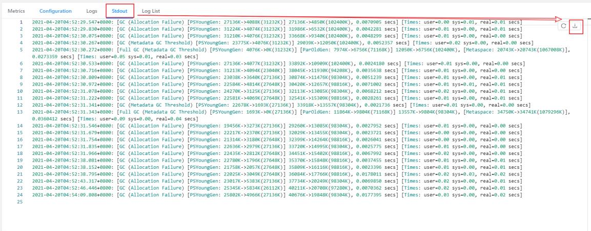

➢分析 GC 日志：

通过 GC 日志分析出单个 Flink Taskmanager 堆总大小、年轻代、老年代分配的内存空间、Full GC 后老年代剩余大小等，相关指标定义可以去 Github 具体查看。

GCViewer 地址：https://github.com/chewiebug/GCViewer

Linux 下分析：

**java -jar gcviewer_1.3.4.jar gc.log**

Windows 下分析：

**直接双击 gcviewer_1.3.4.jar，打开 GUI 界面，选择 gc 的 log 打开**

扩展：最重要的指标是 Full GC 后，老年代剩余大小这个指标，按照《Java 性能优化权威指南》这本书 Java 堆大小计算法则，设 Full GC 后老年代剩余大小空间为 M，那么堆的大小建议3 ~4 倍 M，新生代为1 ~1.5 倍 M，老年代应为2 ~3 倍 M。

### 3.3.4 外部组件交互

如果发现我们的 Source 端数据读取性能比较低或者 Sink 端写入性能较差，需要检查第三方组件是否遇到瓶颈，还有就是做维表 join 时的性能问题。

例如：

Kafka 集群是否需要扩容，Kafka 连接器是否并行度较低

HBase 的 rowkey 是否遇到热点问题，是否请求处理不过来

ClickHouse 并发能力较弱，是否达到瓶颈

……

关于第三方组件的性能问题，需要结合具体的组件来分析，最常用的思路：

1）异步 io+热缓存来优化读写性能

2）先攒批再读写

维表 join 参考：

https://flink-learning.org.cn/article/detail/b8df32fbc6542257a5b449114e137cc3

https://www.jianshu.com/p/a62fa483ff54

# 第4章 数据倾斜

## 4.1 判断是否存在数据倾斜

相同 Task 的多个 Subtask 中，个别 Subtask 接收到的数据量明显大于其他Subtask 接收到的数据量，通过 Flink Web UI 可以精确地看到每个 Subtask 处理了多少数据，即可判断出 Flink 任务是否存在数据倾斜。通常，数据倾斜也会引起反压。

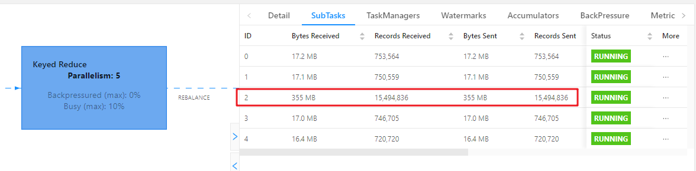

另外，有时 Checkpoint detail 里不同 SubTask 的 State size 也是一个分析数据倾斜的有用指标。

## 4.2数据倾斜的解决

### 4.2.1 keyBy 后的聚合操作存在数据倾斜

提交案例：

```sh
bin/flink run \
-t yarn-per-job \
-d \
-p 5 \
-Drest.flamegraph.enabled=true \
-Dyarn.application.queue=test \
-Djobmanager.memory.process.size=1024mb \
-Dtaskmanager.memory.process.size=2048mb \
-Dtaskmanager.numberOfTaskSlots=2 \
-c com.atguigu.flink.tuning.SkewDemo1 \
/opt/module/flink-1.13.1/myjar/flink-tuning-1.0-SNAPSHOT.jar \
--local-keyby false
```

查看 webui：


1）为什么不能直接用二次聚合来处理

Flink 是实时流处理，如果 keyby 之后的聚合操作存在数据倾斜，且没有开窗口（没攒批）的情况下，简单的认为使用两阶段聚合，是不能解决问题的。因为这个时候 Flink 是来一条处理一条，且向下游发送一条结果，对于原来 keyby 的维度（第二阶段聚合）来讲，数据量并没有减少，且结果重复计算（非 FlinkSQL，未使用回撤流），如下图所示：

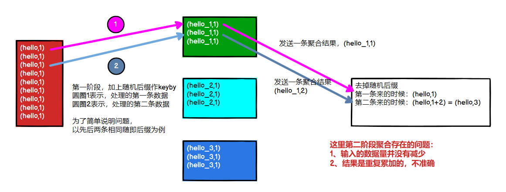

2）使用 LocalKeyBy 的思想

在 keyBy 上游算子数据发送之前，首先在上游算子的本地对数据进行聚合后，再发送到下游，使下游接收到的数据量大大减少，从而使得 keyBy 之后的聚合操作不再是任务的瓶颈。类似 MapReduce 中 Combiner 的思想，但是这要求聚合操作必须是多条数据或者一批数据才能聚合，单条数据没有办法通过聚合来减少数据量。从 Flink LocalKeyBy 实现原理来讲，必然会存在一个积攒批次的过程，在上游算子中必须攒够一定的数据量，对这些数据聚合后再发送到下游。

实现方式：

➢ DataStreamAPI 需要自己写代码实现

➢ SQL 可以指定参数，开启 miniBatch 和 LocalGlobal 功能（推荐，后续介绍）

3）DataStream API 自定义实现的案例

以计算每个 mid 出现的次数为例，keyby 之前，使用 flatMap 实现 LocalKeyby 功能

```java
import org.apache.flink.api.common.functions.RichFlatMapFunction;
import org.apache.flink.api.common.state.ListState;
import org.apache.flink.api.common.state.ListStateDescriptor;
import org.apache.flink.api.common.typeinfo.Types;
import org.apache.flink.api.java.tuple.Tuple2;
import org.apache.flink.runtime.state.FunctionInitializationContext;
import org.apache.flink.runtime.state.FunctionSnapshotContext;
import org.apache.flink.streaming.api.checkpoint.CheckpointedFunction;
import org.apache.flink.util.Collector;
import java.util.HashMap;
import java.util.Map;
import java.util.concurrent.atomic.AtomicInteger;

public class LocalKeyByFlatMapFunc extends RichFlatMapFunction<Tuple2<String,Long>, Tuple2<String,Long>> implements CheckpointedFunction {
    //Checkpoint 时为了保证 Exactly Once，将 buffer 中的数据保存到该 ListState 中
    private ListState<Tuple2<String, Long>> listState;
    //本地 buffer，存放 local 端缓存的 mid 的 count 信息
    private HashMap<String, Long> localBuffer;
    //缓存的数据量大小，即：缓存多少数据再向下游发送
    private int batchSize;
    //计数器，获取当前批次接收的数据量
    private AtomicInteger currentSize;
    //构造器，批次大小传参
    public LocalKeyByFlatMapFunc(int batchSize){
        this.batchSize = batchSize;
    }

    @Override
    public void flatMap(Tuple2<String, Long> value, Collector<Tuple2<String, Long>> out) throws Exception {
        //1、将新来的数据添加到 buffer 中
        Long count = localBuffer.getOrDefault(value,0L);
        localBuffer.put(value.f0, count +1);
        //2、如果到达设定的批次，则将 buffer 中的数据发送到下游
        if (currentSize.incrementAndGet()>= batchSize){
            //2.1 遍历 Buffer 中数据，发送到下游
            for (Map.Entry<String, Long> midAndCount : localBuffer.entrySet()){
                out.collect(Tuple2.of(midAndCount.getKey(),midAndCount.getValue()));
            }
            //2.2 Buffer 清空，计数器清零
            localBuffer.clear();
            currentSize.set(0);
        }
    }
    
    @Override
    public void snapshotState(FunctionSnapshotContext context) throws Exception {
        //将 buffer 中的数据保存到状态中，来保证 Exactly Once
        listState.clear();
        for (Map.Entry<String, Long> midAndCount : localBuffer.entrySet()){
            listState.add(Tuple2.of(midAndCount.getKey(), midAndCount.getValue()));
        }
    }
    
    @Override
    public void initializeState(FunctionInitializationContext context) throws Exception {
        //从状态中恢复 buffer 中的数据
        listState = context.getOperatorStateStore().getListState(new ListStateDescriptor<Tuple2<String, Long>>(
            "localBufferState",
            Types.TUPLE(Types.STRING, Types.LONG)));
        localBuffer = new HashMap();
        if (context.isRestored()){
            //从状态中恢复数据到 buffer 中
            for (Tuple2<String, Long> midAndCount : listState.get()){
                //如果出现 pv != 0,说明改变了并行度， ListState 中的数据会被均匀分发到新的 subtask 中
                //单个 subtask 恢复的状态中可能包含多个相同的 mid 的 count 数据
                //所以每次先取一下 buffer 的值，累加再 put
                long count = localBuffer.getOrDefault(midAndCount.f0,0L);
                localBuffer.put(midAndCount.f0, count + midAndCount.f1);
            }
            //从状态恢复时，默认认为 buffer 中数据量达到了 batchSize，需要向下游发
            currentSize = new AtomicInteger(batchSize);
        } else {
            currentSize = new AtomicInteger(0);
        }
    }
}
```

提交 localkeyby 案例：

```sh
bin/flink run \
-t yarn-per-job \
-d \
-p 5 \
-Drest.flamegraph.enabled=true \
-Dyarn.application.queue=test \
-Djobmanager.memory.process.size=1024mb \
-Dtaskmanager.memory.process.size=2048mb \
-Dtaskmanager.numberOfTaskSlots=2 \
-c com.atguigu.flink.tuning.SkewDemo1 \
/opt/module/flink-1.13.1/myjar/flink-tuning-1.0-SNAPSHOT.jar \
--local-keyby true
```

查看 webui：

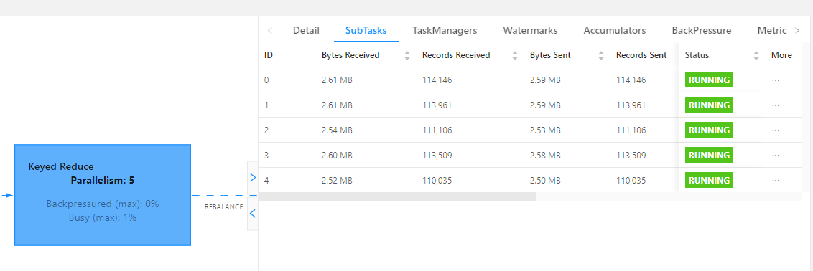

可以看到每个 subtask 处理的数据量基本均衡，另外处理的数据量相比原先少了很多。

### 4.2.2 keyBy 之前发生数据倾斜

如果 keyBy 之前就存在数据倾斜，上游算子的某些实例可能处理的数据较多，某些实例可能处理的数据较少，产生该情况可能是因为数据源的数据本身就不均匀，例如由于某些原因 Kafka 的 topic 中某些 partition 的数据量较大，某些 partition 的数据量较少。对于不存在 keyBy 的 Flink 任务也会出现该情况。

这种情况，需要让 Flink 任务强制进行 shuffle。使用 shuffle、rebalance 或 rescale算子即可将数据均匀分配，从而解决数据倾斜的问题。

### 4.2.3 keyBy 后的窗口聚合操作存在数据倾斜

因为使用了窗口，变成了有界数据（攒批）的处理，窗口默认是触发时才会输出一条结果发往下游，所以可以使用两阶段聚合的方式：

1）实现思路：

➢第一阶段聚合：key 拼接随机数前缀或后缀，进行 keyby、开窗、聚合

注意：聚合完不再是 WindowedStream，要获取 WindowEnd 作为窗口标记作为第二阶段分组依据，避免不同窗口的结果聚合到一起）

➢第二阶段聚合：按照原来的 key 及 windowEnd 作 keyby、聚合

2）提交原始案例

```sh
bin/flink run \
-t yarn-per-job \
-d \
-p 5 \
-Drest.flamegraph.enabled=true \
-Dyarn.application.queue=test \
-Djobmanager.memory.process.size=1024mb \
-Dtaskmanager.memory.process.size=2048mb \
-Dtaskmanager.numberOfTaskSlots=2 \
-c com.atguigu.flink.tuning.SkewDemo2 \
/opt/module/flink-1.13.1/myjar/flink-tuning-1.0-SNAPSHOT.jar \
--two-phase false
```

查看 WebUI：

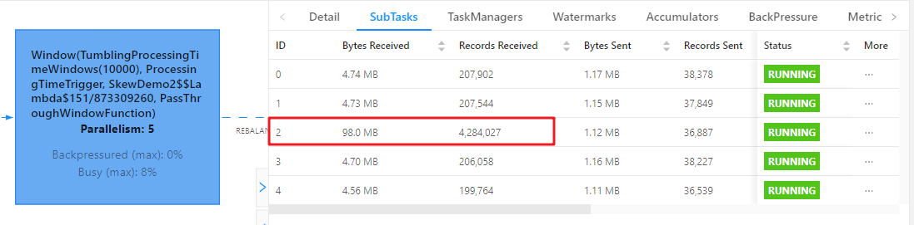

3）提交两阶段聚合的案例

```sh
bin/flink run \
-t yarn-per-job \
-d \
-p 5 \
-Drest.flamegraph.enabled=true \
-Dyarn.application.queue=test \
-Djobmanager.memory.process.size=1024mb \
-Dtaskmanager.memory.process.size=2048mb \
-Dtaskmanager.numberOfTaskSlots=2 \
-c com.atguigu.flink.tuning.SkewDemo2 \
/opt/module/flink-1.13.1/myjar/flink-tuning-1.0-SNAPSHOT.jar \
--two-phase true \
--random-num 16
```

查看 WebUI：可以看到第一次打散的窗口聚合，比较均匀

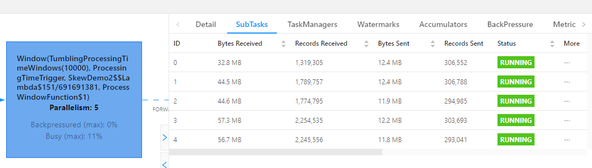

第二次聚合，也比较均匀：

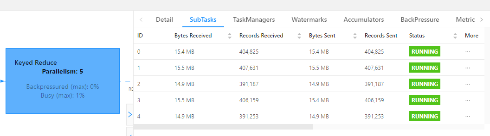

随机数范围，需要自己去测，因为 keyby 的分区器是（两次 hash*下游并行度/最大并行度）

SQL 写法参考：https://zhuanlan.zhihu.com/p/197299746

# 第5章 Job 优化

## 5.1 使用 DataGen 造数据

开发完 Flink 作业，压测的方式很简单，先在 kafka 中积压数据，之后开启 Flink 任务，出现反压，就是处理瓶颈。相当于水库先积水，一下子泄洪。数据可以是自己造的模拟数据，也可以是生产中的部分数据。造测试数据的工具：DataFactory、datafaker 、DBMonster、Data-Processer 、Nexmark、Jmeter 等。

Flink 从1.11 开始提供了一个内置的 DataGen 连接器，主要是用于生成一些随机数，用于在没有数据源的时候，进行流任务的测试以及性能测试等。

### 5.1.1 DataStream 的 DataGenerator

```java
import com.atguigu.flink.tuning.bean.OrderInfo;
import com.atguigu.flink.tuning.bean.UserInfo;
import org.apache.commons.math3.random.RandomDataGenerator;
import org.apache.flink.api.common.typeinfo.Types;
import org.apache.flink.configuration.Configuration;
import org.apache.flink.configuration.RestOptions;
import org.apache.flink.streaming.api.datastream.SingleOutputStreamOperator;
import org.apache.flink.streaming.api.environment.StreamExecutionEnvironment;
import org.apache.flink.streaming.api.functions.source.datagen.DataGeneratorSource;
import org.apache.flink.streaming.api.functions.source.datagen.RandomGenerator;
import org.apache.flink.streaming.api.functions.source.datagen.SequenceGenerator;

public class DataStreamDataGenDemo {
    public static void main(String[] args) throws Exception {
        Configuration conf = new Configuration();
        conf.set(RestOptions.ENABLE_FLAMEGRAPH, true);
        StreamExecutionEnvironment env = StreamExecutionEnvironment.createLocalEnvironmentWithWebUI(conf);
        env.setParallelism(1);
        env.disableOperatorChaining();
        
        SingleOutputStreamOperator<OrderInfo> orderInfoDS = env.addSource(new DataGeneratorSource<>(new RandomGenerator<OrderInfo>(){
            @Override
            public OrderInfo next(){
                return new OrderInfo(random.nextInt(1,100000),
                                     random.nextLong(1,1000000),
                                     random.nextUniform(1,1000),
                                     System.currentTimeMillis());
            }}))
            .returns(Types.POJO(OrderInfo.class));
        
        SingleOutputStreamOperator<UserInfo> userInfoDS = env.addSource(new DataGeneratorSource<UserInfo>(new SequenceGenerator<UserInfo>(1,1000000){
            
            RandomDataGenerator random = new RandomDataGenerator();
            @Override
            public UserInfo next(){
                return new UserInfo(valuesToEmit.peek().intValue(),
                                    valuesToEmit.poll().longValue(),
                                    random.nextInt(1,100),
                                    random.nextInt(0,1));
            }
        })).returns(Types.POJO(UserInfo.class));
        orderInfoDS.print("order>>");
        userInfoDS.print("user>>");
        env.execute();
    }
}
```

### 5.1.2 SQL 的 DataGenerator

```java
import org.apache.flink.configuration.Configuration;
import org.apache.flink.configuration.RestOptions;
import org.apache.flink.streaming.api.environment.StreamExecutionEnvironment;
import org.apache.flink.table.api.bridge.java.StreamTableEnvironment;
public class SQLDataGenDemo {
public static void main(String[] args) throws Exception {
Configuration conf = new Configuration();
conf.set(RestOptions.ENABLE_FLAMEGRAPH, true);
StreamExecutionEnvironment
env
StreamExecutionEnvironment.createLocalEnvironmentWithWebUI(conf);
env.setParallelism(1);
env.disableOperatorChaining();
StreamTableEnvironment tableEnv = StreamTableEnvironment.create(env);
String orderSql="CREATE TABLE order_info (\n"+
" id INT,\n"+
" user_id BIGINT,\n"+
" total_amount DOUBLE,\n"+
" create_time AS localtimestamp,\n"+
" WATERMARK FOR create_time AS create_time\n"+
") WITH (\n"+
"'connector'= 'datagen',\n"+
"'rows-per-second'='20000',\n"+
"'fields.id.kind'='sequence',\n"+
"'fields.id.start'='1',\n"+
"'fields.id.end'='100000000',\n"+
"'fields.user_id.kind'='random',\n"+
"'fields.user_id.min'='1',\n"+
"'fields.user_id.max'='1000000',\n"+
"'fields.total_amount.kind'='random',\n"+
"'fields.total_amount.min'='1',\n"+
"'fields.total_amount.max'='1000'\n"+
")";
String userSql="CREATE TABLE user_info (\n"+
" id INT,\n"+
" user_id BIGINT,\n"+
" age INT,\n"+
" sex INT\n"+
") WITH (\n"+
"'connector'= 'datagen',\n"+
"'rows-per-second'='20000',\n"+
"'fields.id.kind'='sequence',\n"+
"'fields.id.start'='1',\n"+
"'fields.id.end'='100000000',\n"+
"'fields.user_id.kind'='sequence',\n"+
"'fields.user_id.start'='1',\n"+
"'fields.user_id.end'='1000000',\n"+
"'fields.age.kind'='random',\n"+
"'fields.age.min'='1',\n"+
"'fields.age.max'='100',\n"+
"'fields.sex.kind'='random',\n"+
"'fields.sex.min'='0',\n"+
"'fields.sex.max'='1'\n"+
")";
tableEnv.executeSql(orderSql);
tableEnv.executeSql(userSql);
tableEnv.executeSql("select * from order_info").print();
//
tableEnv.executeSql("select * from user_info").print();
}
}
```

## 5.2 算子指定 UUID

对于有状态的 Flink 应用，推荐给每个算子都指定唯一用户 ID （UUID）。严格地说，仅需要给有状态的算子设置就足够了。但是因为 Flink 的某些内置算子（如 window）是有状态的，而有些是无状态的，可能用户不是很清楚哪些内置算子是有状态的，哪些不是。所以从实践经验上来说，我们建议每个算子都指定上 UUID。

默认情况下，算子 UID 是根据 JobGraph 自动生成的，JobGraph 的更改可能会导致UUID 改变。手动指定算子 UUID ，可以让 Flink 有效地将算子的状态从 savepoint 映射到作业修改后（拓扑图可能也有改变）的正确的算子上。比如替换原来的 Operator 实现、增加新的 Operator、删除 Operator 等等，至少我们有可能与 Savepoint 中存储的 Operator
状态对应上。这是 savepoint 在 Flink 应用中正常工作的一个基本要素。Flink 算子的 UUID 可以通过 uid(String uid)方法指定，通常也建议指定 name。

```java
#算子.uid("指定 uid")
.reduce((value1, value2)-> Tuple3.of("uv", value2.f1, value1.f2 + value2.f2))
.uid("uv-reduce").name("uv-reduce")
```

1）提交案例：未指定 uid

```sh
bin/flink run \
-t yarn-per-job \
-d \
-p 5 \
-Drest.flamegraph.enabled=true \
-Dyarn.application.queue=test \
-Djobmanager.memory.process.size=1024mb \
-Dtaskmanager.memory.process.size=2048mb \
-Dtaskmanager.numberOfTaskSlots=2 \
-c com.atguigu.flink.tuning.UvDemo \
/opt/module/flink-1.13.1/myjar/flink-tuning-1.0-SNAPSHOT.jar
```

触发保存点：

```sh
//直接触发
flink savepoint <jobId> [targetDirectory][-yid yarnAppId]#on yarn 模式需要指定-yid 参数
//cancel 触发
flink cancel -s [targetDirectory]<jobId> [-yid yarnAppId]#on yarn 模式需要指定-yid 参数
bin/flink cancel -s hdfs://hadoop1:8020/flink-tuning/sp 98acff568e8f0827a67ff37648a29d7f -yid
application_1640503677810_0017
```

修改代码，从 savepoint 恢复：

```sh
bin/flink run \
-t yarn-per-job \
-s hdfs://hadoop1:8020/flink-tuning/sp/savepoint-066c90-6edf948686f6 \
-d \
-p 5 \
-Drest.flamegraph.enabled=true \
-Dyarn.application.queue=test \
-Djobmanager.memory.process.size=1024mb \
-Dtaskmanager.memory.process.size=2048mb \
-Dtaskmanager.numberOfTaskSlots=2 \
-c com.atguigu.flink.tuning.UvDemo \
/opt/module/flink-1.13.1/myjar/flink-tuning-1.0-SNAPSHOT.jar
```

报错如下：

```sh
Caused by: java.lang.IllegalStateException:Failed to rollback to checkpoint/savepoint hdfs://hadoop1:8020/flink-tuning/sp/savepoint-066c90-6edf948686f6.
Cannot map checkpoint/savepoint state for operator
ddb598ad156ed281023ba4eebbe487e3 to the new program,
because the operator is not available in the new program. If you want to allow to skip this, you can set the --allowNonRestoredState option on the CLI.
```

临时处理：在提交命令中添加--allowNonRestoredState （short: -n）跳过无法恢复的算子。

2）提交案例：指定 uid

```sh
bin/flink run \
-t yarn-per-job \
-d \
-p 5 \
-Drest.flamegraph.enabled=true \
-Dyarn.application.queue=test \
-Djobmanager.memory.process.size=1024mb \
-Dtaskmanager.memory.process.size=2048mb \
-Dtaskmanager.numberOfTaskSlots=2 \
-c com.atguigu.flink.tuning.UidDemo \
/opt/module/flink-1.13.1/myjar/flink-tuning-1.0-SNAPSHOT.jar
```

触发保存点：

```sh
//cancel 触发 savepoint
bin/flink cancel -s hdfs://hadoop1:8020/flink-tuning/sp 272e5d3321c5c1481cc327f6abe8cf9c
-yid application_1640268344567_0033
```

修改代码，从保存点恢复：

```sh
bin/flink run \
-t yarn-per-job \
-s hdfs://hadoop1:8020/flink-tuning/sp/savepoint-272e5d-d0c1097d23e0 \
-d \
-p 5 \
-Drest.flamegraph.enabled=true \
-Dyarn.application.queue=test \
-Djobmanager.memory.process.size=1024mb \
-Dtaskmanager.memory.process.size=2048mb \
-Dtaskmanager.numberOfTaskSlots=2 \
-c com.atguigu.flink.tuning.UidDemo \
/opt/module/flink-1.13.1/myjar/flink-tuning-1.0-SNAPSHOT.jar
```

## 5.3 链路延迟测量

对于实时的流式处理系统来说，我们需要关注数据输入、计算和输出的及时性，所以处理延迟是一个比较重要的监控指标，特别是在数据量大或者软硬件条件不佳的环境下。 Flink提供了开箱即用的 LatencyMarker 机制来测量链路延迟。开启如下参数：

```sh
metrics.latency.interval: 30000 #默认0，表示禁用，单位毫秒
```

监控的粒度，分为以下3 档：

➢ single：每个算子单独统计延迟；

➢ operator（默认值）：每个下游算子都统计自己与 Source 算子之间的延迟；

➢ subtask：每个下游算子的 sub-task 都统计自己与 Source 算子的 sub-task 之间的延迟。

```sh
metrics.latency.granularity: operator #默认 operator
```

一般情况下采用默认的 operator 粒度即可，这样在 Sink 端观察到的 latency metric就是我们最想要的全链路（端到端）延迟。subtask 粒度太细，会增大所有并行度的负担，不建议使用。LatencyMarker 不会参与到数据流的用户逻辑中的，而是直接被各算子转发并统计。为了让它尽量精确，有两点特别需要注意：

➢保证 Flink 集群内所有节点的时区、时间是同步的：ProcessingTimeService 产生时间戳最终是靠 System.currentTimeMillis()方法，可以用 ntp 等工具来配置。

➢metrics.latency.interval 的时间间隔宜大不宜小：一般配置成30000（30 秒）左右。一是因为延迟监控的频率可以不用太频繁，二是因为 LatencyMarker 的处理也要消耗一定性能。

提交案例：

```sh
bin/flink run \
-t yarn-per-job \
-d \
-p 5 \
-Drest.flamegraph.enabled=true \
-Dyarn.application.queue=test \
-Djobmanager.memory.process.size=1024mb \
-Dtaskmanager.memory.process.size=2048mb \
-Dtaskmanager.numberOfTaskSlots=2 \
-Dmetrics.latency.interval=30000 \
-c com.atguigu.flink.tuning.UidDemo \
/opt/module/flink-1.13.1/myjar/flink-tuning-1.0-SNAPSHOT.jar
```

可以通过下面的 metric 查看结果：

```sh
flink_taskmanager_job_latency_source_id_operator_id_operator_subtask_index_latency
```

端到端延迟的 tag 只有 murmur hash 过的算子 ID（用 uid()方法设定的），并没有算子名称，（https://issues.apache.org/jira/browse/FLINK-8592）并且官方暂时不打算解决这个问题，所以我们要么用最大值来表示，要么将作业中 Sink 算子的 ID 统一化。比如使用了 Prometheus 和 Grafana 来监控，效果如下：


## 5.4 开启对象重用

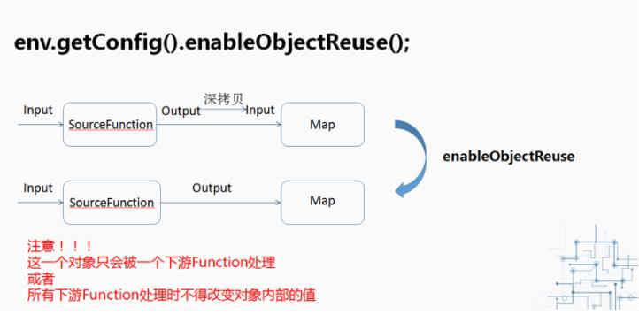

当调用了 enableObjectReuse 方法后，Flink 会把中间深拷贝的步骤都省略掉，SourceFunction 产生的数据直接作为 MapFunction 的输入，可以减少 gc 压力。但需要特别注意的是，这个方法不能随便调用，必须要确保下游 Function 只有一种，或者下游的Function 均不会改变对象内部的值。否则可能会有线程安全的问题。

```sh
bin/flink run \
-t yarn-per-job \
-d \
-p 5 \
-Drest.flamegraph.enabled=true \
-Dyarn.application.queue=test \
-Djobmanager.memory.process.size=1024mb \
-Dtaskmanager.memory.process.size=2048mb \
-Dtaskmanager.numberOfTaskSlots=2 \
-Dpipeline.object-reuse=true \
-Dmetrics.latency.interval=30000 \
-c com.atguigu.flink.tuning.UidDemo \
/opt/module/flink-1.13.1/myjar/flink-tuning-1.0-SNAPSHOT.jar
```

## 5.5 细粒度滑动窗口优化

1）细粒度滑动的影响

当使用细粒度的滑动窗口（窗口长度远远大于滑动步长）时，重叠的窗口过多，一个数据会属于多个窗口，性能会急剧下降。

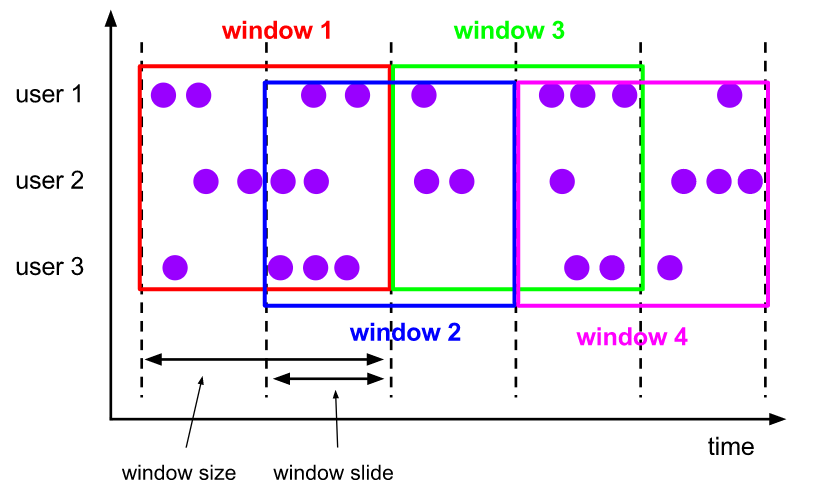

我们经常会碰到这种需求：以3 分钟的频率实时计算 App 内各个子模块近24 小时的PV 和 UV。我们需要用粒度为1440 /3 = 480 的滑动窗口来实现它，但是细粒度的滑动窗口会带来性能问题，有两点：

➢状态

对于一个元素，会将其写入对应的(key, window)二元组所圈定的 windowState 状态中。如果粒度为480，那么每个元素到来，更新 windowState 时都要遍历480 个窗口并写入，开销是非常大的。在采用 RocksDB 作为状态后端时， checkpoint 的瓶颈也尤其明显。

➢定时器

每一个(key, window)二元组都需要注册两个定时器：一是触发器注册的定时器，用于决定窗口数据何时输出；二是 registerCleanupTimer()方法注册的清理定时器，用于在窗口彻底过期（如 allowedLateness 过期）之后及时清理掉窗口的内部状态。细粒度滑动窗口会造成维护的定时器增多，内存负担加重。

2）解决思路

DataStreamAPI 中，自己解决

（https://issues.apache.org/jira/browse/FLINK-7001）。

我们一般使用滚动窗口+在线存储+读时聚合的思路作为解决方案：

（1）从业务的视角来看，往往窗口的长度是可以被步长所整除的，可以找到窗口长度和窗口步长的最小公约数作为时间分片（一个滚动窗口的长度）；

（2）每个滚动窗口将其周期内的数据做聚合，存到下游状态或打入外部在线存储（内存数据库如 Redis，LSM-based NoSQL 存储如 HBase）；

（3）扫描在线存储中对应时间区间（可以灵活指定）的所有行，并将计算结果返回给前端展示。

3）细粒度的滑动窗口案例

提交案例：统计最近1 小时的 uv，1 秒更新一次（滑动窗口）

```sh
bin/flink run \
-t yarn-per-job \
-d \
-p 5 \
-Drest.flamegraph.enabled=true \
-Dyarn.application.queue=test \
-Djobmanager.memory.process.size=1024mb \
-Dtaskmanager.memory.process.size=2048mb \
-Dtaskmanager.numberOfTaskSlots=2 \
-c com.atguigu.flink.tuning.SlideWindowDemo \
/opt/module/flink-1.13.1/myjar/flink-tuning-1.0-SNAPSHOT.jar \
--sliding-split false
```

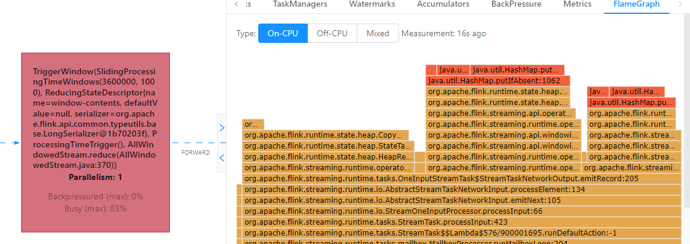

4）时间分片案例

提交案例：统计最近1 小时的 uv，1 秒更新一次（滚动窗口+状态存储）

```sh
bin/flink run \
-t yarn-per-job \
-d \
-p 5 \
-Drest.flamegraph.enabled=true \
-Dyarn.application.queue=test \
-Djobmanager.memory.process.size=1024mb \
-Dtaskmanager.memory.process.size=2048mb \
-Dtaskmanager.numberOfTaskSlots=2 \
-c com.atguigu.flink.tuning.SlideWindowDemo \
/opt/module/flink-1.13.1/myjar/flink-tuning-1.0-SNAPSHOT.jar \
--sliding-split true
```

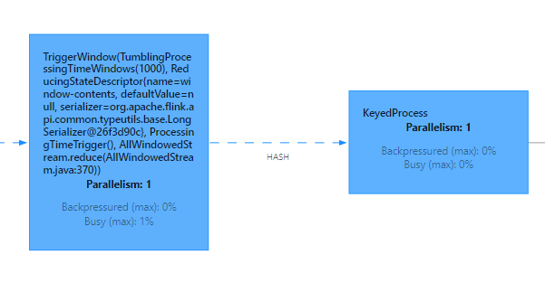

Flink 1.13 对 SQL 模块的 Window TVF 进行了一系列的性能优化，可以自动对滑动窗口进行切片解决细粒度滑动问题。

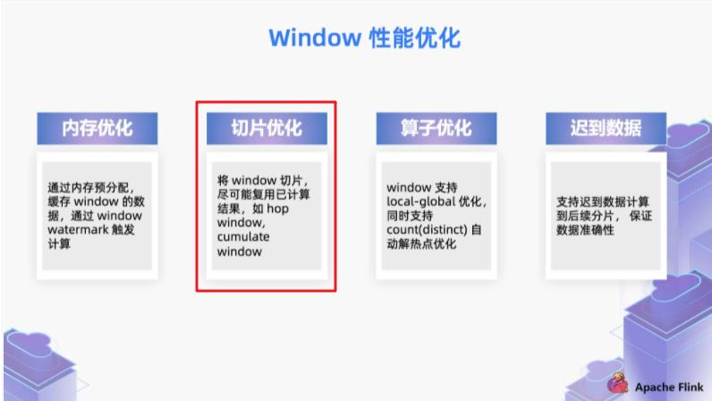

https://nightlies.apache.org/flink/flink-docs-release-1.13/docs/dev/table/sql/queries/window-tvf

# 第6章 FlinkSQL 调优

FlinkSQL 官网配置参数：

https://ci.apache.org/projects/flink/flink-docs-release-1.13/dev/table/config.html

## 6.1 设置空闲状态保留时间

Flink SQL 新手有可能犯的错误，其中之一就是忘记设置空闲状态保留时间导致状态爆炸。列举两个场景：

➢FlinkSQL 的 regular join（inner、left、right），左右表的数据都会一直保存在状态里，不会清理！要么设置 TTL，要么使用 FlinkSQL 的 interval join。

➢使用 Top-N 语法进行去重，重复数据的出现一般都位于特定区间内（例如一小时或一天内），过了这段时间之后，对应的状态就不再需要了。Flink SQL 可以指定空闲状态(即未更新的状态)被保留的最小时间，当状态中某个 key对应的状态未更新的时间达到阈值时，该条状态被自动清理：

```java
#API 指定
tableEnv.getConfig().setIdleStateRetention(Duration.ofHours(1));
#参数指定
Configuration configuration = tableEnv.getConfig().getConfiguration();
configuration.setString("table.exec.state.ttl","1 h");
```

6.2 开启 MiniBatch

MiniBatch 是微批处理，原理是缓存一定的数据后再触发处理，以减少对 State 的访问，从而提升吞吐并减少数据的输出量。 MiniBatch 主要依靠在每个 Task 上注册的 Timer 线程来触发微批，需要消耗一定的线程调度性能。

➢MiniBatch 默认关闭，开启方式如下:

```java
//初始化 table environment
TableEnvironment tEnv = ...
//获取 tableEnv 的配置对象
Configuration configuration = tEnv.getConfig().getConfiguration();
//设置参数：
//开启 miniBatch
configuration.setString("table.exec.mini-batch.enabled","true");
//批量输出的间隔时间
configuration.setString("table.exec.mini-batch.allow-latency","5 s");
//防止 OOM 设置每个批次最多缓存数据的条数，可以设为2 万条
configuration.setString("table.exec.mini-batch.size","20000");
```

➢适用场景

微批处理通过增加延迟换取高吞吐，如果有超低延迟的要求，不建议开启微批处理。通常对于聚合的场景，微批处理可以显著的提升系统性能，建议开启。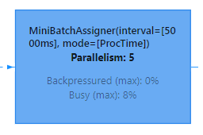


➢注意事项：

1）目前，key-value 配置项仅被 Blink planner 支持。

2）1.12 之前的版本有 bug，开启 miniBatch，不会清理过期状态，也就是说如果设置状态的 TTL，无法清理过期状态。1.12 版本才修复这个问题。参考 ISSUE：https://issues.apache.org/jira/browse/FLINK-17096

## 6.3开启 LocalGlobal

### 6.3.1 原理概述

LocalGlobal 优化将原先的 Aggregate 分成 Local+Global 两阶段聚合，即MapReduce 模型中的 Combine+Reduce 处理模式。第一阶段在上游节点本地攒一批数据进行聚合（localAgg），并输出这次微批的增量值（Accumulator）。第二阶段再将收到的 Accumulator 合并（Merge），得到最终的结果（GlobalAgg）。

LocalGlobal 本质上能够靠 LocalAgg 的聚合筛除部分倾斜数据，从而降低 GlobalAgg的热点，提升性能。结合下图理解 LocalGlobal 如何解决数据倾斜的问题。

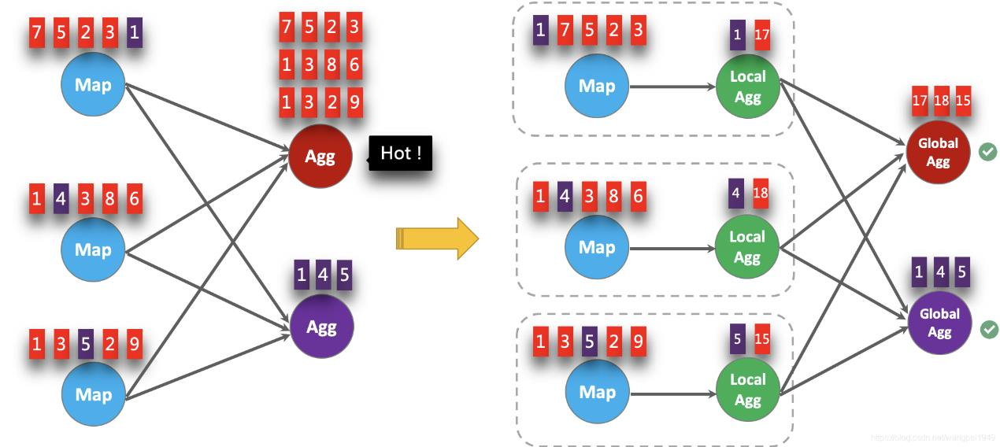

由上图可知：

⚫未开启 LocalGlobal 优化，由于流中的数据倾斜， Key 为红色的聚合算子实例需要处理更多的记录，这就导致了热点问题。

⚫开启 LocalGlobal 优化后，先进行本地聚合，再进行全局聚合。可大大减少 GlobalAgg的热点，提高性能。

➢LocalGlobal 开启方式：

1）LocalGlobal 优化需要先开启 MiniBatch，依赖于 MiniBatch 的参数。

2）table.optimizer.agg-phase-strategy: 聚合策略。默认 AUTO，支持参数 AUTO、TWO_PHASE(使用 LocalGlobal 两阶段聚合)、ONE_PHASE(仅使用 Global 一阶段聚合)。

```java
//初始化 table environment
TableEnvironment tEnv = ...
//获取 tableEnv 的配置对象
Configuration configuration = tEnv.getConfig().getConfiguration();
//设置参数：
//开启 miniBatch
configuration.setString("table.exec.mini-batch.enabled","true");
//批量输出的间隔时间
configuration.setString("table.exec.mini-batch.allow-latency","5 s");
//防止 OOM 设置每个批次最多缓存数据的条数，可以设为2 万条
configuration.setString("table.exec.mini-batch.size","20000");
//开启 LocalGlobal
configuration.setString("table.optimizer.agg-phase-strategy","TWO_PHASE");
```

➢注意事项：

1）需要先开启 MiniBatch

2）开启 LocalGlobal 需要 UDAF 实现 Merge 方法。

### 6.3.2 提交案例：统计每天每个 mid 出现次数

```sh
bin/flink run \
-t yarn-per-job \
-d \
-p 5 \
-Drest.flamegraph.enabled=true \
-Dyarn.application.queue=test \
-Djobmanager.memory.process.size=1024mb \
-Dtaskmanager.memory.process.size=2048mb \
-Dtaskmanager.numberOfTaskSlots=2 \
-c com.atguigu.flink.tuning.SqlDemo \
/opt/module/flink-1.13.1/myjar/flink-tuning-1.0-SNAPSHOT.jar \
--demo count
```

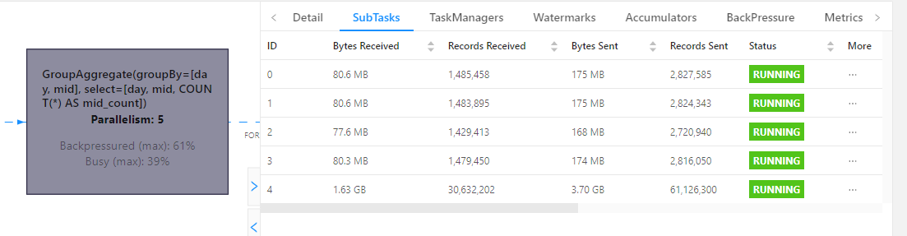

可以看到存在数据倾斜。

### 6.3.3 提交案例：开启 miniBatch 和 LocalGlobal

```sh
bin/flink run \
-t yarn-per-job \
-d \
-p 5 \
-Drest.flamegraph.enabled=true \
-Dyarn.application.queue=test \
-Djobmanager.memory.process.size=1024mb \
-Dtaskmanager.memory.process.size=2048mb \
-Dtaskmanager.numberOfTaskSlots=2 \
-c com.atguigu.flink.tuning.SqlDemo \
/opt/module/flink-1.13.1/myjar/flink-tuning-1.0-SNAPSHOT.jar \
--demo count \
--minibatch true \
--local-global true
```

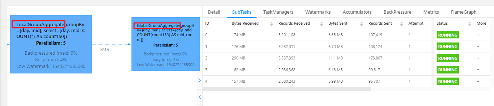

从 WebUI 可以看到分组聚合变成了 Local 和 Global 两部分，数据相对均匀，且没有数据倾斜。

## 6.4 开启 Split Distinct

LocalGlobal 优化针对普通聚合（例如 SUM、COUNT、MAX、MIN 和 AVG）有较好的效果，对于 DISTINCT 的聚合（如 COUNT DISTINCT）收效不明显，因为 COUNT DISTINCT 在 Local 聚合时，对于 DISTINCT KEY 的去重率不高，导致在 Global 节点仍然存在热点。

### 6.4.1 原理概述

之前，为了解决 COUNT DISTINCT 的热点问题，通常需要手动改写为两层聚合（增加按 Distinct Key 取模的打散层）。

从 Flink1.9.0 版本开始，提供了 COUNT DISTINCT 自动打散功能，通过HASH_CODE(distinct_key)% BUCKET_NUM 打散，不需要手动重写。Split Distinct 和LocalGlobal 的原理对比参见下图。

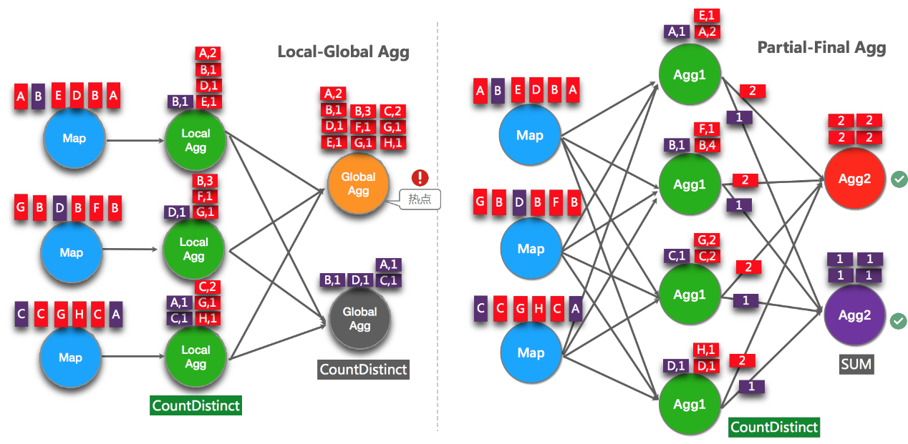

Distinct 举例：

```sql
SELECT a, COUNT(DISTINCT b)
FROM T
GROUP BY a
```

手动打散举例：

```sql
SELECT a, SUM(cnt)
FROM (
SELECT a, COUNT(DISTINCT b) as cnt
FROM T
GROUP BY a, MOD(HASH_CODE(b),1024)
)
GROUP BY a
```

➢Split Distinct 开启方式

默认不开启，使用参数显式开启：

⚫ table.optimizer.distinct-agg.split.enabled: true，默认 false。

⚫ table.optimizer.distinct-agg.split.bucket-num: Split Distinct 优化在第一层聚合中，被打散的 bucket 数目。默认1024。

```java
//初始化 table environment
TableEnvironment tEnv = ...
//获取 tableEnv 的配置对象
Configuration configuration = tEnv.getConfig().getConfiguration();
//设置参数：(要结合 minibatch 一起使用)
//开启 Split Distinct
configuration.setString("table.optimizer.distinct-agg.split.enabled","true");
//第一层打散的 bucket 数目
configuration.setString("table.optimizer.distinct-agg.split.bucket-num","1024");
```

➢注意事项：

（1）目前不能在包含 UDAF 的 Flink SQL 中使用 Split Distinct 优化方法。

（2）拆分出来的两个 GROUP 聚合还可参与 LocalGlobal 优化。

（3）该功能在 Flink1.9.0 版本及以上版本才支持。

### 6.4.2 提交案例：count(distinct)存在热点问题

```sh
bin/flink run \
-t yarn-per-job \
-d \
-p 5 \
-Drest.flamegraph.enabled=true \
-Dyarn.application.queue=test \
-Djobmanager.memory.process.size=1024mb \
-Dtaskmanager.memory.process.size=2048mb \
-Dtaskmanager.numberOfTaskSlots=2 \
-c com.atguigu.flink.tuning.SqlDemo \
/opt/module/flink-1.13.1/myjar/flink-tuning-1.0-SNAPSHOT.jar \
--demo distinct
```

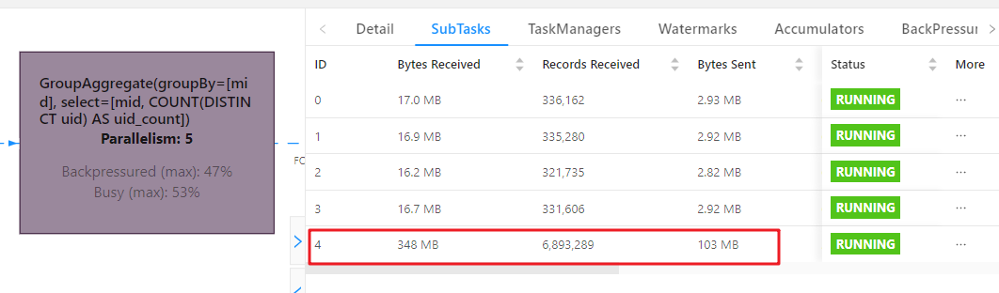

可以看到存在热点问题。

### 6.4.3 提交案例：开启 split distinct

```sh
bin/flink run \
-t yarn-per-job \
-d \
-p 5 \
-Drest.flamegraph.enabled=true \
-Dyarn.application.queue=test \
-Djobmanager.memory.process.size=1024mb \
-Dtaskmanager.memory.process.size=2048mb \
-Dtaskmanager.numberOfTaskSlots=2 \
-c com.atguigu.flink.tuning.SqlDemo \
/opt/module/flink-1.13.1/myjar/flink-tuning-1.0-SNAPSHOT.jar \
--demo distinct \
--minibatch true \
--split-distinct true
```

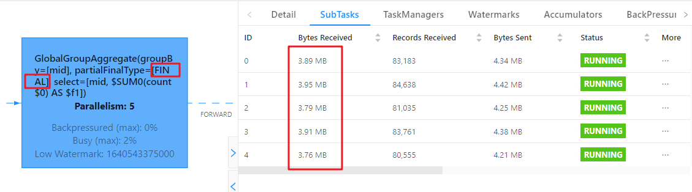

从 WebUI 可以看到有两次聚合，而且有 partialFinal 字样，第二次聚合时已经均匀。

## 6.5 多维 DISTINCT 使用 Filter

### 6.5.1 原理概述

在某些场景下，可能需要从不同维度来统计 count（distinct）的结果（比如统计 uv、app 端的 uv、web 端的 uv），可能会使用如下 CASE WHEN 语法。

```sql
SELECT
a,
COUNT(DISTINCT b) AS total_b,
COUNT(DISTINCT CASE WHEN c IN ('A','B') THEN b ELSE NULL END) AS AB_b,
COUNT(DISTINCT CASE WHEN c IN ('C','D') THEN b ELSE NULL END) AS CD_b
FROM T
GROUP BY a
```

在这种情况下，建议使用 FILTER 语法,目前的 Flink SQL 优化器可以识别同一唯一键上的不同 FILTER 参数。如，在上面的示例中，三个 COUNT DISTINCT 都作用在 b 列上。

此时，经过优化器识别后，Flink 可以只使用一个共享状态实例，而不是三个状态实例，可减少状态的大小和对状态的访问。将上边的 CASE WHEN 替换成 FILTER 后，如下所示:

```sql
SELECT
a,
COUNT(DISTINCT b) AS total_b,
COUNT(DISTINCT b) FILTER (WHERE c IN ('A','B')) AS AB_b,
COUNT(DISTINCT b) FILTER (WHERE c IN ('C','D')) AS CD_b
FROM T
GROUP BY a
```

### 6.5.2 提交案例：多维 Distinct

```sql
bin/flink run \
-t yarn-per-job \
-d \
-p 5 \
-Drest.flamegraph.enabled=true \
-Dyarn.application.queue=test \
-Djobmanager.memory.process.size=1024mb \
-Dtaskmanager.memory.process.size=2048mb \
-Dtaskmanager.numberOfTaskSlots=2 \
-c com.atguigu.flink.tuning.SqlDemo \
/opt/module/flink-1.13.1/myjar/flink-tuning-1.0-SNAPSHOT.jar \
--demo dim-difcount
```

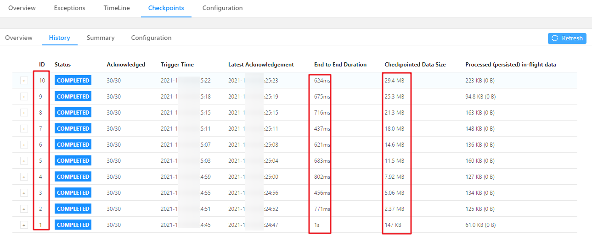

### 6.5.3 提交案例：使用 Filter

```sh
bin/flink run \
-t yarn-per-job \
-d \
-p 5 \
-Drest.flamegraph.enabled=true \
-Dyarn.application.queue=test \
-Djobmanager.memory.process.size=1024mb \
-Dtaskmanager.memory.process.size=2048mb \
-Dtaskmanager.numberOfTaskSlots=2 \
-c com.atguigu.flink.tuning.SqlDemo \
/opt/module/flink-1.13.1/myjar/flink-tuning-1.0-SNAPSHOT.jar \
--demo dim-difcount-filter
```

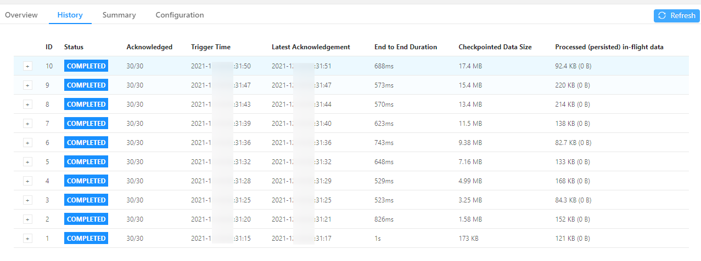

通过 WebUI 对比前10 次 Checkpoint 的大小，可以看到状态有所减小。

## 6.6 设置参数总结

总结以上的调优参数，代码如下：

```java
//初始化 table environment
TableEnvironment tEnv = ...
//获取 tableEnv 的配置对象
Configuration configuration = tEnv.getConfig().getConfiguration();
//设置参数：
//开启 miniBatch
configuration.setString("table.exec.mini-batch.enabled","true");
//批量输出的间隔时间
configuration.setString("table.exec.mini-batch.allow-latency","5 s");
//防止 OOM 设置每个批次最多缓存数据的条数，可以设为2 万条
configuration.setString("table.exec.mini-batch.size","20000");
//开启 LocalGlobal
configuration.setString("table.optimizer.agg-phase-strategy","TWO_PHASE");
//开启 Split Distinct
configuration.setString("table.optimizer.distinct-agg.split.enabled","true");
//第一层打散的 bucket 数目
configuration.setString("table.optimizer.distinct-agg.split.bucket-num","1024");
//指定时区
configuration.setString("table.local-time-zone","Asia/Shanghai");
```


# 第7章常见故障排除

## 7.1 非法配置异常

如果您看到从 TaskExecutorProcessUtils 或 JobManagerProcessUtils 抛出的IllegalConfigurationException，通常表明存在无效的配置值（例如负内存大小、大于1 的分数等）或配置冲突。请重新配置内存参数。

## 7.2 Java 堆空间异常

如果报 OutOfMemoryError: Java heap space 异常，通常表示 JVM Heap 太小。可以尝试通过增加总内存来增加 JVM 堆大小。也可以直接为 TaskManager 增加任务堆内存或为 JobManager 增加 JVM 堆内存。还可以为 TaskManagers 增加框架堆内存，但只有在确定 Flink 框架本身需要更多内存时才应该更改此选项。

## 7.3 直接缓冲存储器异常

如果报 OutOfMemoryError: Direct buffer memory 异常,通常表示 JVM 直接内存限制太小或存在直接内存泄漏。
检查用户代码或其他外部依赖项是否使用了 JVM 直接内存，以及它是否被正确考虑。可以尝试通过调整直接堆外内存来增加其限制。可以参考如何为 TaskManagers、 JobManagers 和 Flink 设置的 JVM 参数配置堆外内存。

## 7.4 元空间异常

如果报 OutOfMemoryError: Metaspace 异常，通常表示 JVM 元空间限制配置得太小。您可以尝试加大 JVM 元空间 TaskManagers 或 JobManagers 选项。

## 7.5 网络缓冲区数量不足

如果报 IOException: Insufficient number of network buffers 异常，这仅与TaskManager 相关。通常表示配置的网络内存大小不够大。您可以尝试增加网络内存。

## 7.6 超出容器内存异常

如果 Flink 容器尝试分配超出其请求大小（Yarn 或 Kubernetes）的内存，这通常表明 Flink 没有预留足够的本机内存。当容器被部署环境杀死时，可以通过使用外部监控系统或从错误消息中观察到这一点。

如果在 JobManager 进程中遇到这个问题，还可以通过设置排除可能的 JVM Direct Memory 泄漏的选项来开启 JVM Direct Memory 的限制:

jobmanager.memory.enable-jvm-direct-memory-limit: true

如果想手动多分一部分内存给 RocksDB 来防止超用，预防在云原生的环境因 OOM被 K8S kill，可将 JVM OverHead 内存调大。之所以不调大 Task Off-Heap，是由于目前 Task Off-Heap 是和 Direct Memeory混在一起的，即使调大整体，也并不一定会分给 RocksDB 来做 Buffer，所以我们推荐通过调整 JVM OverHead 来解决内存超用的问题。

## 7.7 Checkpoint 失败

Checkpoint 失败大致分为两种情况：Checkpoint Decline 和 Checkpoint Expire。

### 7.7.1 Checkpoint Decline

我们能从 jobmanager.log 中看到类似下面的日志:

```txt
Decline checkpoint 10423 by task 0b60f08bf8984085b59f8d9bc74ce2e1 of job
85d268e6fbc19411185f7e4868a44178.
```

我们可以在 jobmanager.log 中查找 execution id，找到被调度到哪个 taskmanager上，类似如下所示：

```txt
2019-09-02
16:26:20,972
INFO
[ jobmanager-future-thread-61]
org.apache.flink.runtime.executiongraph.ExecutionGraph

- XXXXXXXXXXX
  (100/289)(87b751b1fd90e32af55f02bb2f9a9892) switched from SCHEDULED to
  DEPLOYING.
  2019-09-02
  16:26:20,972
  INFO
  [ jobmanager-future-thread-61]
  org.apache.flink.runtime.executiongraph.ExecutionGraph
  XXXXXXXXXXX
  (100/289)
  (attempt
  #0)
- Deploying
  to slot
  container_e24_1566836790522_8088_04_013155_1 on hostnameABCDE
```

从上面的日志我们知道该execution被调度到 hostnameABCDE 的container_e24_1566836790522_8088_04_013155_1 slot 上，接下来我们就可以到 container container_e24_1566836790522_8088_04_013155 的taskmanager.log 中查找 Checkpoint 失败的具体原因了。
另外对于 Checkpoint Decline 的情况，有一种情况在这里单独抽取出来进行介绍：

Checkpoint Cancel。

当前 Flink 中如果较小的 Checkpoint 还没有对齐的情况下，收到了更大的Checkpoint，则会把较小的 Checkpoint 给取消掉。我们可以看到类似下面的日志：

```sh
$taskNameWithSubTaskAndID: Received checkpoint barrier for checkpoint 20 before
completing current checkpoint 19. Skipping current checkpoint.
```

这个日志表示，当前 Checkpoint 19 还在对齐阶段，我们收到了 Checkpoint 20 的barrier。然后会逐级通知到下游的 task checkpoint 19 被取消了，同时也会通知 JM 当前 Checkpoint 被 decline 掉了。

在下游 task 收到被 cancelBarrier 的时候，会打印类似如下的日志：

```sh
DEBUG
$taskNameWithSubTaskAndID: Checkpoint 19 canceled, aborting alignment.
或者
DEBUG
$taskNameWithSubTaskAndID: Checkpoint 19 canceled, skipping alignment.
或者
WARN
$taskNameWithSubTaskAndID: Received cancellation barrier for checkpoint 20 before
completing current checkpoint 19. Skipping current checkpoint.
```

上面三种日志都表示当前 task 接收到上游发送过来的 barrierCancel 消息，从而取消了对应的 Checkpoint。

### 7.7.2 Checkpoint Expire

如果 Checkpoint 做的非常慢，超过了 timeout 还没有完成，则整个 Checkpoint也会失败。当一个 Checkpoint 由于超时而失败是，会在 jobmanager.log 中看到如下的日志：

```sh
Checkpoint 1 of job 85d268e6fbc19411185f7e4868a44178 expired before completing.
```

表示 Chekpoint 1 由于超时而失败，这个时候可以可以看这个日志后面是否有类似下面的日志：

```sh
Received late message for now expired checkpoint attempt 1 from
0b60f08bf8984085b59f8d9bc74ce2e1 of job 85d268e6fbc19411185f7e4868a44178.
```

可以按照7.7.1 中的方法找到对应的 taskmanager.log 查看具体信息。我们按照下面的日志把 TM 端的 snapshot 分为三个阶段:开始做 snapshot 前，同步阶段，异步阶段,需要开启 DEBUG 才能看到：

```sh
DEBUG Starting checkpoint (6751) CHECKPOINT on task taskNameWithSubtasks (4/4)
```

上面的日志表示 TM 端 barrier 对齐后，准备开始做 Checkpoint。

```sh
DEBUG
2019-08-06
13:43:02,613
DEBUG
org.apache.flink.runtime.state.AbstractSnapshotStrategy
DefaultOperatorStateBackend
snapshot
-
(FsCheckpointStorageLocation
{fileSystem=org.apache.flink.core.fs.SafetyNetWrapperFileSystem@70442baf,
checkpointDirectory=xxxxxxxx,
taskOwnedStateDirectory=xxxxxx,
sharedStateDirectory=xxxxxxxx,
metadataFilePath=xxxxxx,
reference=(default),
fileStateSizeThreshold=1024}, synchronous part) in thread Thread[Async calls on
Source: xxxxxx_source -> Filter (27/70),5,Flink Task Threads] took 0 ms.
```

上面的日志表示当前这个 backend 的同步阶段完成，共使用了0 ms。

```sh
DEBUG
DefaultOperatorStateBackend
snapshot
(FsCheckpointStorageLocation
{fileSystem=org.apache.flink.core.fs.SafetyNetWrapperFileSystem@7908affe,
checkpointDirectory=xxxxxx,
taskOwnedStateDirectory=xxxxx,
fileStateSizeThreshold=1024},
sharedStateDirectory=xxxxx,
metadataFilePath=xxxxxx,
asynchronous
reference=(default),
part)
in
thread
Thread[pool-48-thread-14,5,Flink Task Threads] took 369 ms
```

上面的日志表示异步阶段完成，异步阶段使用了369 ms在现有的日志情况下，我们通过上面三个日志，定位 snapshot 是开始晚，同步阶段做的慢，还是异步阶段做的慢。然后再按照情况继续进一步排查问题。

## 7.8 Checkpoint 慢

Checkpoint 慢的情况如下：比如 Checkpoint interval 1 分钟，超时10 分钟，Checkpoint 经常需要做9 分钟（我们希望1 分钟左右就能够做完），而且我们预期 state size 不是非常大。对于 Checkpoint 慢的情况，我们可以按照下面的顺序逐一检查。

1）Source Trigger Checkpoint 慢
这个一般发生较少，但是也有可能，因为 source 做 snapshot 并往下游发送 barrier的时候，需要抢锁（Flink1.10 开始，用 mailBox 的方式替代当前抢锁的方式，详情参考https://issues.apache.org/jira/browse/FLINK-12477)。如果一直抢不到锁的话，则可能导致 Checkpoint 一直得不到机会进行。如果在 Source 所在的 taskmanager.log 中找不到开始做 Checkpoint 的 log，则可以考虑是否属于这种情况，可以通过 jstack 进行进一步确认锁的持有情况。

2）使用增量 Checkpoint

现在 Flink 中 Checkpoint 有两种模式，全量 Checkpoint 和增量 Checkpoint，其中全量 Checkpoint 会把当前的 state 全部备份一次到持久化存储，而增量Checkpoint，则只备份上一次 Checkpoint 中不存在的 state，因此增量 Checkpoint 每次上传的内容会相对更好，在速度上会有更大的优势。现在 Flink 中仅在 RocksDBStateBackend 中支持增量Checkpoint，如果你已经使用 RocksDBStateBackend，可以通过开启增量 Checkpoint 来加速。

3）作业存在反压或者数据倾斜

task 仅在接受到所有的 barrier 之后才会进行 snapshot，如果作业存在反压，或者有数据倾斜，则会导致全部的 channel 或者某些 channel 的 barrier 发送慢，从而整体影响 Checkpoint 的时间。

4）Barrier 对齐慢

从前面我们知道 Checkpoint 在 task 端分为 barrier 对齐（收齐所有上游发送过来的 barrier），然后开始同步阶段，再做异步阶段。如果 barrier 一直对不齐的话，就不会开始做 snapshot。barrier 对齐之后会有如下日志打印：

```sh
DEBUG
Starting checkpoint (6751) CHECKPOINT on task taskNameWithSubtasks (4/4)
```

如果 taskmanager.log 中没有这个日志，则表示 barrier 一直没有对齐，接下来我们需要了解哪些上游的 barrier 没有发送下来，如果你使用 At Least Once 的话，可以观察下面的日志：

```sh
DEBUG
Received barrier for checkpoint 96508 from channel 5
```

表示该 task 收到了 channel 5 来的 barrier，然后看对应 Checkpoint，再查看还剩哪些上游的 barrier 没有接受到。

5）主线程太忙，导致没机会做 snapshot

在 task 端，所有的处理都是单线程的，数据处理和 barrier 处理都由主线程处理，如果主线程在处理太慢（比如使用 RocksDBBackend，state 操作慢导致整体处理慢），导致 barrier 处理的慢，也会影响整体 Checkpoint 的进度，可以通过火焰图分析。

6）同步阶段做的慢

同步阶段一般不会太慢，但是如果我们通过日志发现同步阶段比较慢的话，对于非RocksDBBackend 我们可以考虑查看是否开启了异步 snapshot ，如果开启了异步snapshot 还是慢，需要看整个 JVM 在干嘛，也可以使用火焰图分析。对于RocksDBBackend 来说，我们可以用 iostate 查看磁盘的压力如何，另外可以查看 tm 端RocksDB 的 log 的日志如何，查看其中 SNAPSHOT 的时间总共开销多少。RocksDB 开始 snapshot 的日志如下：

```sh
2019/09/10-14:22:55.734684 7fef66ffd700 [utilities/checkpoint/checkpoint_impl.cc:83]
Started
the
snapshot

process
--

creating
snapshot
in
directory
/tmp/flink-io-87c360ce-0b98-48f4-9629-2cf0528d5d53/XXXXXXXXXXX/chk-92729
snapshot 结束的日志如下：
2019/09/10-14:22:56.001275 7fef66ffd700 [utilities/checkpoint/checkpoint_impl.cc:145]
Snapshot DONE. All is good
```

6）异步阶段做的慢

对于异步阶段来说， tm 端主要将 state 备份到持久化存储上，对于非RocksDBBackend 来说，主要瓶颈来自于网络，这个阶段可以考虑观察网络的 metric，或者对应机器上能够观察到网络流量的情况（比如 iftop)。对于 RocksDB 来说，则需要从本地读取文件，写入到远程的持久化存储上，所以不仅需要考虑网络的瓶颈，还需要考虑本地磁盘的性能。另外对于 RocksDBBackend 来说，如果觉得网络流量不是瓶颈，但是上传比较慢的话，还可以尝试考虑开启多线程上传功能（Flink 1.13 开始，

```properties
state.backend.rocksdb.checkpoint.transfer.thread.num 默认值是4）。
```

## 7.9 Kafka 动态发现分区

当 FlinkKafkaConsumer 初始化时，每个 subtask 会订阅一批 partition，但是当Flink 任务运行过程中，如果被订阅的 topic 创建了新的 partition， FlinkKafkaConsumer如何实现动态发现新创建的 partition 并消费呢？

在使用 FlinkKafkaConsumer 时，可以开启 partition 的动态发现。通过 Properties指定参数开启（单位是毫秒）：
FlinkKafkaConsumerBase.KEY_PARTITION_DISCOVERY_INTERVAL_MILLIS该参数表示间隔多久检测一次是否有新创建的 partition。默认值是 Long 的最小值，表示不开启，大于0 表示开启。开启时会启动一个线程根据传入的 interval 定期获取 Kafka最新的元数据，新 partition 对应的那一个 subtask 会自动发现并从 earliest 位置开始消费，新创建的 partition 对其他 subtask 并不会产生影响。

代码如下所示：

```java
properties.setProperty(FlinkKafkaConsumerBase.KEY_PARTITION_DISCOVERY_INTERVA
L_MILLIS,30 *1000 +"");
```

## 7.10 Watermark 不更新

如果数据源中的某一个分区/分片在一段时间内未发送事件数据，则意味着WatermarkGenerator 也不会获得任何新数据去生成 watermark。我们称这类数据源为空闲输入或空闲源。在这种情况下，当某些其他分区仍然发送事件数据的时候就会出现问题。比如 Kafka 的 Topic 中，由于某些原因，造成个别 Partition 一直没有新的数据。由于下游算子 watermark 的计算方式是取所有不同的上游并行数据源 watermark 的最小值，则其 watermark 将不会发生变化，导致窗口、定时器等不会被触发。为了解决这个问题，你可以使用 WatermarkStrategy 来检测空闲输入并将其标记为空闲状态。

```java
StreamExecutionEnvironment env = StreamExecutionEnvironment.getExecutionEnvironment();
Properties properties = new Properties();
properties.setProperty("bootstrap.servers","hadoop1:9092,hadoop2:9092,hadoop3:9092");
properties.setProperty("group.id","fffffffffff");
FlinkKafkaConsumer<String> kafkaSourceFunction = new FlinkKafkaConsumer<>("flinktest",
                                                                          new SimpleStringSchema(),
                                                                          properties);
kafkaSourceFunction.assignTimestampsAndWatermarks(
    WatermarkStrategy.forBoundedOutOfOrderness(Duration.ofMinutes(2))
    .withIdleness(Duration.ofMinutes(5)));
env.addSource(kafkaSourceFunction)
……
```

## 7.11 依赖冲突

ClassNotFoundException/NoSuchMethodError/IncompatibleClassChangeError/...一般都是因为用户依赖第三方包的版本与 Flink 框架依赖的版本有冲突导致。根据报错信息中的类名，定位到冲突的 jar 包， idea 可以借助 maven helper 插件查找冲突的有哪些。打包插件建议使用 maven-shade-plugin。

## 7.12 超出文件描述符限制

java.io.IOException: Too many open files首先检查 Linux 系统 ulimit -n 的文件描述符限制，再注意检查程序内是否有资源（如各种连接池的连接）未及时释放。值得注意的是，低版本 Flink 使用 RocksDB 状态后端也有可能会抛出这个异常，此时需修改flink-conf.yaml中的state.backend.rocksdb.files.open 参数，如果不限制，可以改为-1（1.13 默认就是-1）。

## 7.13 脏数据导致数据转发失败

org.apache.flink.streaming.runtime.tasks.ExceptionInChainedOperatorException: Could not forward element to next operator该异常几乎都是由于程序业务逻辑有误，或者数据流里存在未处理好的脏数据导致的，继续向下追溯异常栈一般就可以看到具体的出错原因，比较常见的如 POJO 内有空字段，或者抽取事件时间的时间戳为 null 等。

## 7.14 通讯超时

akka.pattern.AskTimeoutException: Ask timed out on [Actor[akka://...]] after [10000 ms]
Akka 超时导致，一般有两种原因：一是集群负载比较大或者网络比较拥塞，二是业务逻辑同步调用耗时的外部服务。如果负载或网络问题无法彻底缓解，需考虑调大akka.ask.timeout 参数的值（默认只有10 秒）；另外，调用外部服务时尽量异步操作（AsyncI/O）。

## 7.15 Flink on Yarn 其他常见错误

https://developer.aliyun.com/article/719703