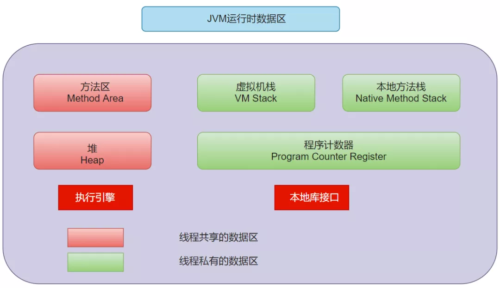
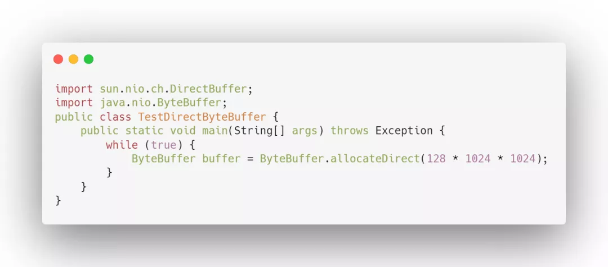
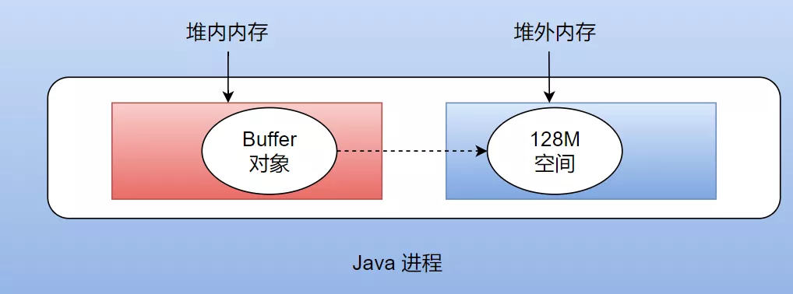

# 1. JVM

​	在大数据领域中，有很多开源框架（Hadoop、Spark、Storm）等都是基于 **JVM** 运行，可见 JVM 在大数据领域扮演的重要角色，所以在了解 Flink 内存时，我们需要先了解一下 JVM 。

​	JVM 是可运行 Java 代码的假想计算机 ，包括程序计数器、Java 虚拟机栈、本地方法栈、Java 堆 和方法区。JVM 是运行在操作系统之上的，它与硬件没有直接的交互。

## 1.1 JVM 数据运行区

Java 虚拟机在执行 Java 程序的过程中会把它在主存中管理的内存部分划分成多个区域，每个区域存放不同类型的数据。如下图所示：



**1.程序计数器：**是一个**数据结构**，用于保存当前正常执行的程序的内存地址。Java 虚拟机的多线程就是通过线程轮流切换并分配处理器时间来实现的，为了线程切换后能恢复到正确的位置，每条线程都需要一个独立的程序计数器，互不影响，该区域**线程私有。**

**2.Java 虚拟机栈：**与线程生命周期相同，用于存储局部变量表，操作栈，方法返回值。局部变量表放着基本数据类型，还有对象的引用，该区域**线程私有。**

**3.本地方法栈：**跟虚拟机栈很像，不过它是为虚拟机使用到的 Native 方法服务,该区域**线程私有。**

**4.方法区：**储存虚拟机加载的类信息，常量，静态变量，编译后的代码，该区域**线程共享。**

**5.Java 堆：**存放所有对象的实例。这一块区域在 Java 虚拟机启动的时候被创建，**该区域被所有线程所共享**，同时也是垃圾收集器的主要工作区域，因此这一部分区域除了被叫 **堆内内存**以外，也被叫做 **GC** 堆（Garbage Collected Heap）。

## 1.2 堆内内存（on-heap memory）

堆内内存是 Java 垃圾收集器的主要工作区域，为了提高垃圾回收的效率，在堆内内存的内部又划分出了**新生代、老年代和永久代**。在新生代内存中又按照 8:1:1 的比例划分出了 **Eden、Survivor1、Survivor2** 三个区域。

1. **新生代：**新生代有一个 Eden 区和两个 Survivor 区，首先将对象放入 Eden 区，如果空间不足就向 Survivor1 区上放，触发一次 minor GC ，如果仍然放不下就将存活的对象放入 Survivor2 区中，然后清空 Eden 和 Survivor1 区的内存。在某次 GC 过程中，如果发现仍然又放不下的对象，就将这些对象放入老年代内存里去。
2. **老年代：**大对象以及长期存活的对象直接进入老年代。
3. **永久代：**永久存储区是一个常驻内存区域，用于存放 JDK 自身所携带的 **Class、Interface** 的元数据，也就是说它存储的是运行环境必须的类信息，被装载进此区域的数据是不会被垃圾回收器回收掉的，关闭 JVM 才会释放此区域所占用的内存。

如果出现 java.lang.OutOfMemoryError: PermGen space，说明是 Java 虚拟机对永久代 Perm 内存设置不够。

## 1.3 GC 算法

由于**堆内内存处理**是编程人员容易出现问题的地方，**忘记或者错误的内存回收会导致程序或系统的不稳定甚至崩溃**，Java 就提供 GC 功能自动监测对象是否超过作用域从而达到自动回收内存的目的。

关于堆内存和永久区的垃圾回收，Java 提供的 GC 算法包含：引用计数法，标记-清除算法，复制算法，标记-压缩算法，分代收集算法

1. **引用计数法：**引用计数器的实现很简单，对于一个对象 A，只要有任何一个对象引用了 A，则 A 的引用计数器就加 1，当引用失效时，引用计数器就减 1。只要对象 A 的引用计数器的值为 0，则对象 A 就不可能再被使用。

**缺点：**1. 无法处理循环引用情况，会造成内存泄漏。  2.对系统性能产生影响。

2. **标记-清除算法：**将垃圾回收分为两个阶段：标记阶段和清除阶段，首先标记出所有需要回收的对象，在标记完成后统一回收所有被标记的对象。

**缺点：**1. 效率问题，2. 空间问题。标记清除之后会产生大量不连续的内存碎片，空间碎片太多会导致以后程序在运行过程中需要分配较大对象时，无法找到足够的连续内存而提前触发另一次垃圾收集动作。

3. **复制算法：**将可用内存按容量划分为大小相等的两块，每次只试用其中的一块，当这一块内存用完时，将存活的对象复制到另外一块内存上面，然后清除使用内存中的所有对象。 适用于初生代。

4. **标记压缩算法：**首先标记出所有需要回收的对象，然后让所有存活的对象都向一端移动，然后清理掉端边界以外的内存。适用于老年代

5. **分代收集算法：**初生代使用复制算法，老年代使用标记压缩算法。

## 1.4 堆外内存（off-heap memory）

**虽然 Java 提供了多种算法进行垃圾回收，但仍然无法彻底解决堆内内存过大带来的长时间的 GC 停顿的问题，以及操作系统对堆内内存不可知的问题。**

基于上述问题，Java 虚拟机开辟出了**堆外内存**(off-heap memory)。**堆外内存意味着把一些对象的实例分配在 Java 虚拟机堆内内存以外的内存区域，这些内存直接受操作系统（而不是虚拟机）管理**。这样做的结果就是能保持一个较小的堆，以减少垃圾收集对应用的影响。同时因为这部分区域直接受操作系统的管理，别的进程和设备（例如 GPU ）可以直接通过操作系统对其进行访问，减少了从虚拟机中复制内存数据的过程。

Java 在 NIO 包中提供了 ByteBuffer 类，使用下面的方式，可以直接开辟指定大小的堆外内存，如下图为创建 128M 堆外内存。



**优点 ：**

1. 可以很方便的自主开辟很大的内存空间，对大内存的伸缩性很好；
2. 减少垃圾回收带来的系统停顿时间；
3. 直接受操作系统控制，可以直接被其他进程和设备访问，减少了原本从虚拟机复制的过程；
4. 特别适合那些分配次数少，读写操作很频繁的场景。

**缺点 ：**

1. 容易出现内存泄漏，并且很难排查；
2. 堆外内存的数据结构不直观，当存储结构复杂的对象时，会浪费大量的时间对其进行串行化。

## 1.5 堆外内存与堆内内存联系

虽然堆外内存本身不受垃圾回收算法的管辖，但是因为其是由 **ByteBuffer** 所创造出来的，因此这个 buffer 自身作为一个实例化的对象，其自身的信息（例如堆外内存在主存中的起始地址等信息）必须存储在堆内内存中，具体情况如下图所示。



## 1.6 JVM 内存管理缺陷

由于在 JVM 内存中存储大量的数据 （包括缓存和高效处理）时，JVM 内存会面临很多问题，包括如下：

1. **Java 对象存储密度低。**Java 的对象在内存中存储包含 3 个主要部分：对象头、实例 数据、对齐填充部分。例如，一个只包含 boolean 属性的对象占 16byte：对象头占 8byte， boolean 属性占 1byte，为了对齐达到 8 的倍数额外占 7byte。而实际上只需要一个 bit（1/8 字节）就够了。
2. **Full GC 会极大地影响性能。**尤其是为了处理更大数据而开了很大内存空间的 JVM 来说，GC 会达到秒级甚至分钟级。
3. **OOM 问题影响稳定性。**OutOfMemoryError 是分布式计算框架经常会遇到的问题， 当 JVM 中所有对象大小超过分配给 JVM 的内存大小时，就会发生 OutOfMemoryError 错误， 导致 JVM 崩溃，分布式框架的健壮性和性能都会受到影响。
4. **缓存未命中问题。**CPU 进行计算的时候，是从 CPU 缓存中获取数据。现代体系的 CPU 会有多级缓存，而加载的时候是以 Cache Line 为单位加载。如果能够将对象连续存储， 这样就会大大降低 Cache Miss。使得 CPU 集中处理业务，而不是空转。

# 2 Flink 内存管理

基于 JVM 内存存在一些问题，并且在大数据场景下，无法在内存中存储海量数据，计算效率无法提高。Flink 社区采用**自主内存管理**设计。

Flink 并不是将大量对象存在堆内存上，而是将对象都序列化到一个预分配的内存块上， 这个内存块叫做 **MemorySegment**，它代表了一段固定长度的内存（默认大小为 32KB），也是 Flink 中最小的内存分配单元，并且提供了非常高效的读写方法，很多运算可以直接操作 二进制数据，**不需要反序列化即可执行**。每条记录都会以序列化的形式存储在一个或多个 MemorySegment 中。如果需要处理的数据多于可以保存在内存中的数据，Flink 的运算符会将部分数据溢出到磁盘。

## 2.1 Flink 内存模型

Flink 总体内存类图如下：


主要包含 JobManager 内存模型和 TaskManager 内存模型。

## 2.2 JobManager 内存模型

Flink JobManager内存类图如虚线部分：

在 1.11 中，Flink  对 JM 端的内存配置进行了修改，使它的选项和配置方式与 TM 端的配置方式保持一致。

1. 配置JobManager的总进程内存

```
#Flink1.10版本#The heap size for the JobManager JVMjobmanager.heap.size:1024m#Flink1.11版本及以后#JobManager总进程内存jobmanager.memory.process.size:4096m# 作业管理器的 JVM 堆内存大小jobmanager.memory.heap.size：2048m#作业管理器的堆外内存大小。此选项涵盖所有堆外内存使用。jobmanager.memory.off-heap.size：1536m
```

## 2.3 TaskManager 内存模型

TaskManager 内存模型如下图所示：


TaskManager 内存模型一共包含 3大部分，分别为总体内存、**JVM Heap 堆上内存、Off-Heap 堆外内存**等。

**2.3.1 总体内存**

1. **Total Process Memory：**Flink Java 应用程序（包括用户代码）和 JVM 运行整个进程所消耗的总内存。

**总进程内存(Total Process Memory) = Flink 总内存 + JVM 元空间 + JVM 执行开销**


1. **Total Flink Memory：**仅 Flink Java 应用程序消耗的内存，包括用户代码，但不包括 JVM 为其运行而分配的内存。

**Flink 总内存 = Framework堆内外 + task 堆内外 + network + managed Memory**


**2.3.2 JVM Heap (JVM 堆上内存)**

1. **Framework Heap ：**框架堆内存


1. **Task Heap :** 任务堆内存

如果内存大小没有指定，它将被推导出为总 Flink 内存减去框架堆内存、框架堆外内存、任务堆外内存、托管内存和网络内存。


**2.3.3 Off-Heap Mempry(JVM 堆外内存)**

1. **Managed memory:** 托管内存

由 Flink 管理的原生托管内存，**保留用于排序、哈希表、中间结果缓存和 RocksDB 状态后端**。

托管内存由 Flink 管理并分配为原生内存（堆外）。以下工作负载使用托管内存：

流式作业可以将其用于 **RocksDB** 状态后端。流和批处理作业都可以使用它进行排序、哈希表、中间结果的缓存。流作业和批处理作业都可以使用它在 Python 进程中执行用户定义的函数。

托管内存配置时如果两者都设置，则大小将覆盖分数。如果大小和分数均未明确配置，则将使用默认分数。


1. **DirectMemory：**JVM 直接内存

**1）Framework Off-Heap Memory：**Flink 框架堆外内存。

即 TaskManager 本身所占用的对外内存，不计入 Slot 资源。


**2）Task Off-Heap ：**Task 堆外内存。

专用于Flink 框架的堆外直接（或本机）内存。


**3）Network Memory：**网络内存。

网络数据交换所使用的堆外内存大小，如网络数据交换 缓冲区。


1. **JVM metaspace：**JVM 元空间。

Flink JVM 进程的元空间大小,默认为256MB。


1. **JVM Overhead ：**JVM执行开销。

JVM 执行时自身所需要的内容，包括线程堆栈、IO、 编译缓存等所使用的内存,这是一个上限分级成分的的总进程内存。


# 3 Flink 内存数据结构

Flink 的内存管理和操作系统管理内存一样.将内存划分为**内存段**、**内存页**等结构。

## 3.1 Flink 内存段

内存段在 Flink 内部叫 **MemorySegment**，是 Flink 中最小的内存分配单元，默认大小 32KB。它既可以是堆上内存（Java 的 byte 数组），也可以是堆外内存（基于 Netty 的 DirectByteBuffer），同时提供了对二进制数据进行读取和写入的方法。


HeapMemorySegment：用来分配堆上内存 ;

**HybridMemorySegment：用来分配堆外内存和堆上内存**; 2017 年以后的版本实 际上只使用了 HybridMemorySegment。

通过一个案例介绍Flink在序列化和反序列化过程中如何使用 MemorySegment：


如上图所示，当创建一个Tuple 3 对象时，包含三个层面，一是 int 类型，一是 double 类型，还有一个是 Person。Person对象包含两个字段，一是 int 型的 ID，另一个是 String 类型的 name， 

（1）在序列化操作时，会委托相应具体序列化的序列化器进行相应的序列化操作。从图中可以看到 Tuple 3 会把 int 类型通过 IntSerializer 进行序列化操作，此时 int 只需要占用四个字节。

（2）Person 类会被当成一个 Pojo 对象来进行处理，PojoSerializer 序列化器会把一些属性信息使用一个字节存储起来。同样，其字段则采取相对应的序列化器进行相应序列化，在序列化完的结果中，可以看到**所有的数据都是由 MemorySegment 去支持**。

## 3.2 Flink 内存页

内存页是 MemorySegment 之上的数据访问视图，数据读取抽象为 DataInputView，数据写入抽象为 DataOutputView。使用时就无需关心 MemorySegment 的细节，该层会自动处理跨 MemorySegment 的读取和写入。

**3.2.1 DataInputView**

**DataInputView** 是从 MemorySegment 数据读取抽象视图，继承自 **java.io.DataInput**。InputView 中持有多个 MemorySegment 的引用（MemorySegment[]），这一组 MemorySegment 被视为一个内存页（Page）,可以顺序读取 MemorySegment 中的数据。如下图为继承关系图：


**3.2.2 DataInputView**

**DataOutputView 是从 MemorySegment 数据读取抽象视图**，继承自java.io.DataOutput。OutputView 中持有多个 MemorySegment 的引用（MemorySegment[]），这一组 MemorySegment 被视为一个内存页（Page）,可以顺序地向 MemorySegment 中写入数据。如下图为继承关系图：


**3.2.3 Buffer**

Buffer 是具有引用计数的 MemorySegment 实例的包装器。用来将上游 Task 算子处理完毕的结果交给下游时定义的一个抽象或者内存对象。

Buffer 的接口是网络层面上传输数据和事件的统一抽象，其实现类是 NetworkBuffer。**Flink 在各个 TaskManger 之间传递数据时，使用的是这一层的抽象**。1个 NetworkBuffer 中包装了一个 MemorySegment 。Buffer接口类图如下：


**Buffer 的底层是 MemorySegment**，Buffer 申请和释放由 Flink 自行管理，Flink 引入了引用数的概念。当有新的 Buffer 消费者时，引用数加 1，当消费者消费完 Buffer 时，引用数减 1，最终当引用数变为 0 时，就可以将 Buffer 释放重用了。

**3.2.4 Buffer 资源池**

**Buffer 资源池在 Flink 中叫作 BufferPool**。BufferPool 用来管理 Buffer,包含 Buffer 的申请、释放、销毁、可用 Buffer 的通知等，其实现类是 LocalBufferPool ,**每个 Task 拥有自己的 LocalBufferPool** 。

BufferPool 的类体系如下：


# 4 网络缓冲器(NetworkBuffer)

网络缓冲器 (NetworkBuffer) 是网络交换数据的包装，其对应于 MemorySegment 内存段。

Network Buffer，顾名思义，就是在网络传输中使用到的 Buffer（实际非网络传输也会用到）。了解 Flink 网络栈的同学应该会比较清楚，Flink 经过网络传输的上下游 Task 的设计会比较类似生产者 - 消费者模型。**如果没有这个缓冲区，那么生产者或消费者会消耗大量时间在等待下游拿数据和上游发数据的环节上**。加上这个缓冲区，生产者和消费者解耦开，任何一方短时间内的抖动理论上对另一方的数据处理都不会产生太大影响。如下图所示：


这是对于单进程内生产者-消费者模型的一个图示，事实上，如果两个 Task 在同一个 TaskManager 内，那么使用的就是上述模型，

对于不同 TM 内、或者需要跨网络传输的 TM 之间，利用生产者-消费者模型来进行数据传输的原理图如下：


可以看到，在 Netty Server 端，**buffer 只存在 LocalBufferPool 中**，subpartition 自己并没有缓存 buffer 或者独享一部分 buffer，而在接收端，channel 有自己独享的一部分 buffer(Exclusive Buffers)，也有一部分共享的 buffer(Floating Buffers)，所以，Network Buffer 的使用同时存在于发送端和接收端。

由此可见，**TaskManager 内需要的 buffers 数量等于这个 TaskManager 内的所有 Task 中的发送端和接收端使用到的 network buffer 总和**。明确了 Network Buffer 使用的位置，我们可以结合一些参数计算出作业实际所需的 NetworkBuffer 数量。

# 5 Flink 内存调优

了解了 Flink JobManager Memory 和 TaskManager Memory的内存模型和数据结构之后，应该针对不同的部署情况，配置不同的内存，下面我们针对不同的部署方式介绍内存如何调优。

## 5.1 为 Standalone 配置内存

建议为 Standalone 配置 Flink 总内存，设置 JobManager 和 TaskManager 的 flink.size 大小,声明为 Flink 本身提供了多少内存。配置方式如下：


## 5.2 为 Containers(容器) 配置内存

建议为容器化部署（Kubernetes或Yarn）配置总进程内存，设置 process.size 大小，它声明了总共应该分配多少内存给 Flink JVM 进程，并对应于请求容器的大小。配置方式如下：


**注意：**如果你配置了总 Flink 内存， Flink 会隐式添加 JVM 内存组件来推导总进程内存，并请求一个具有该推导大小的内存的容器。

**警告：**如果 Flink 或用户代码分配超出容器大小的非托管堆外（本机）内存，作业可能会失败，因为部署环境可能会杀死有问题的容器。

## 5.3  为 state backends(状态后端)配置内存

为 state backends(状态后端)配置内存时，这仅与 `TaskManager` 相关。

在部署 Flink 流应用程序时，所使用的状态后端类型将决定集群的最佳内存配置。

**5.3.1 HashMap 状态后端**

运行无状态作业或使用 HashMapStateBackend 时，将托管内存设置为零。这将确保为 JVM 上的用户代码分配最大数量的堆内存。配置如下：


**5.3.2 RocksDB 状态后端**

该 **EmbeddedRocksDBStateBackend** 使用本机内存。默认情况下，RocksDB 设置为将本机内存分配限制为托管内存的大小。因此，为你的状态保留足够的托管内存非常重要。如果禁用默认的 RocksDB 内存控制，RocksDB 分配的内存超过请求的容器大小（总进程内存）的限制，则可以在容器化部署中终止 TaskManager 。

## 5.4  为 batch Job(批处理作业)配置内存

为 batch Job(批处理作业)配置内存时，这仅与 TaskManager 相关。

**Flink 的批处理操作符利用托管内存来更高效地运行。这样做时，可以直接对原始数据执行某些操作，而无需反序列化为 Java 对象**。这意味着托管内存配置对应用程序的性能有实际影响。Flink 将尝试分配和使用 为批处理作业配置的尽可能多的托管内存，但不会超出其限制。这可以防止 OutOfMemoryError's，因为 Flink 准确地知道它必须利用多少内存。如果托管内存不足，Flink 会优雅地溢出到磁盘。

# 6 故障排除

## 6.1 非法配置异常

如果您看到从 TaskExecutorProcessUtils 或 JobManagerProcessUtils抛出的 IllegalConfigurationException，通常表明存在无效的配置值（例如负内存大小、大于 1 的分数等）或配置冲突。请重新配置内存参数。

## 6.2 Java 堆空间异常

如果报 **OutOfMemoryError: Java heap space** 异常，通常表示 JVM Heap 太小。您可以尝试通过增加总内存来增加 JVM 堆大小。您也可以直接为 TaskManager 增加任务堆内存或为 JobManager 增加 JVM 堆内存。

> > 还可以为 TaskManagers 增加框架堆内存，但只有在确定 Flink 框架本身需要更多内存时才应该更改此选项。

## 6.3 直接缓冲存储器异常

如果报 **OutOfMemoryError: Direct buffer memory** 异常,通常表示 JVM直接内存限制太小或存在直接内存泄漏。检查用户代码或其他外部依赖项是否使用了 JVM 直接内存，以及它是否被正确考虑。可以尝试通过调整直接堆外内存来增加其限制。可以参考如何为 TaskManagers、 JobManagers 和 Flink 设置的JVM 参数配置堆外内存。

## 6.4 元空间异常

如果报 **OutOfMemoryError: Metaspace** 异常，通常表示 JVM 元空间限制配置得太小。您可以尝试加大 JVM 元空间 TaskManagers 或JobManagers 选项。

## 6.5 网络缓冲区数量不足

如果报 **IOException: Insufficient number of network buffers** 异常，这仅与 TaskManager 相关。通常表示配置的网络内存大小不够大。您可以尝试通过调整以下选项来增加网络内存：


## 6.6 超出容器内存异常

这个对应 5.2 节为容器配置内存。如果 Flink 容器尝试分配超出其请求大小（Yarn 或 Kubernetes）的内存，这通常**表明 Flink 没有预留足够的本机内存**。当容器被部署环境杀死时，可以通过使用外部监控系统或从错误消息中观察到这一点。

如果在 JobManager 进程中遇到这个问题，还可以通过设置排除可能的 JVM Direct Memory 泄漏的选项来开启 JVM Direct Memory 的限制 使用以下命令进行配置


如果使用 RocksDBStateBackend，并且内存控制被禁用：可以尝试增加 TaskManager 的托管内存。在保存点或完整检查点期间启用内存控制和非堆内存增加，这可能是由于glibc内存分配器而发生的。

可以尝试为 TaskManagers **添加环境变量 MALLOC_ARENA_MAX=1,或者增加 JVM 开销。**


End


非常欢迎大家加我**个人微信：lvjunxiongbote**，领取本篇文档 **PDF** 版

拉你进**数据研发交流**群，有问题我们在群内一起讨论


**#关于大数据私房菜**

**大数据私房菜，有过多年Java及大数据开发经验，目前在一家互联网公司从事数据开发工作;**

**主要方向有基础数据架构，企业级数仓建设，数据建模及模型优化，数据治理(数据质量管理平台，元数据管理及应用，数据成本治理等)，用户画像工程化实践，流量域数据模型及实时数仓建设等建立公众号的初衷是希望更多的初学者或者数据开发从业者能通过我的文章分享，有所收获和成长.**


● [2021大数据面试真题](http://mp.weixin.qq.com/s?__biz=MzI2MDQzOTk3MQ==&mid=2247487775&idx=1&sn=32e90ad3274db5ff404060ac35379596&chksm=ea68fbd3dd1f72c583c92d24ba424b680eb6e8290c2d4af60356c12a3dc62a13f88e07ea3971&scene=21#wechat_redirect)

● [数据仓库体系](http://mp.weixin.qq.com/s?__biz=MzI2MDQzOTk3MQ==&mid=2247485691&idx=1&sn=d6cb1353031e07e4b02cd903d8b57911&chksm=ea68e237dd1f6b210f65f25ef42dabf4453d3bfa36fe8f33b149c0ff5329f77b9b792eef7882&scene=21#wechat_redirect)

● [数据质量管理](http://mp.weixin.qq.com/s?__biz=MzI2MDQzOTk3MQ==&mid=2247485039&idx=1&sn=140c3bc720da51765292fe3f5082fe38&chksm=ea68eca3dd1f65b5aef4d6f7ab0c33d3d3033bcc0eead1650be079687e0b4e898562bfe4d25b&scene=21#wechat_redirect)

● [元数据管理](http://mp.weixin.qq.com/s?__biz=MzI2MDQzOTk3MQ==&mid=2247485186&idx=1&sn=85fbe5703c56aa2dcfd2980fccbab4f6&chksm=ea68edcedd1f64d8e2d8c3da6b456fcaa4b105f2216a2bddb2393a7380498166225de5e855b4&scene=21#wechat_redirect)

● [模型优化](http://mp.weixin.qq.com/s?__biz=MzI2MDQzOTk3MQ==&mid=2247487977&idx=1&sn=ba5f0b10595e485aef9a8722538c507f&chksm=ea68fb25dd1f72336f6e4588071544acf94aae073df3b62f02170281e267a14e3be7a47e6f3c&scene=21#wechat_redirect)

● [Hadoop](http://mp.weixin.qq.com/s?__biz=MzI2MDQzOTk3MQ==&mid=2247486497&idx=1&sn=4498d46a2d7e3a1b3eecd5bda171d3f5&chksm=ea68e6eddd1f6ffb7cb6b19263178fc0e5d1f564dd11eaf6f932c119904d65cb99b2dc613a90&scene=21#wechat_redirect)

● [Hive](http://mp.weixin.qq.com/s?__biz=MzI2MDQzOTk3MQ==&mid=2247485965&idx=1&sn=2fc0899c82dffe7721c55ad717cd2678&chksm=ea68e0c1dd1f69d70689408d9e9f66f00a638d851b9ffb50484d697ecf05f9b0f2989a10b80d&scene=21#wechat_redirect)

● [Hive调优](http://mp.weixin.qq.com/s?__biz=MzI2MDQzOTk3MQ==&mid=2247485048&idx=1&sn=5fc1219f4947bea9743cd938cec510c7&chksm=ea68ecb4dd1f65a2df364d79272e0e472a394c5b13b5d55d848c89d9498ccb7ea78a933fbdea&scene=21#wechat_redirect)

● [Flink](http://mp.weixin.qq.com/s?__biz=MzI2MDQzOTk3MQ==&mid=2247486303&idx=1&sn=c1f58c14372ae9ba22dc9c464ae04143&chksm=ea68e193dd1f6885c3fa1903114ea62aa9f6ee4ee78384c667306fd815c37de9cf1fb300212a&scene=21#wechat_redirect)

● [Clickhouse](http://mp.weixin.qq.com/s?__biz=MzI2MDQzOTk3MQ==&mid=2247487158&idx=1&sn=01bec273b27ea954bc53a1b3188b2289&chksm=ea68e47add1f6d6cb29ca44b2edc5cb5a2e26ff8064a3360f7b78dfd70a791cbfdb50acf4dcd&scene=21#wechat_redirect)

● [Hbase](http://mp.weixin.qq.com/s?__biz=MzI2MDQzOTk3MQ==&mid=2247485858&idx=1&sn=75a3a3dd71a612b5ac4412c423554787&chksm=ea68e36edd1f6a785b739bd2ec2f0cc94f5d3679ac40f631fbd61abad96e9652bea14cc705f5&scene=21#wechat_redirect)

● [Kafka](http://mp.weixin.qq.com/s?__biz=MzI2MDQzOTk3MQ==&mid=2247485999&idx=1&sn=b7e6e0aabb77504e920ff4342f44d26f&chksm=ea68e0e3dd1f69f56ac2c97839cf8d043d9b503b5461fe006fa14a9974375a386cd66000aadd&scene=21#wechat_redirect)

● [DolphinScheduler海豚调度](http://mp.weixin.qq.com/s?__biz=MzI2MDQzOTk3MQ==&mid=2247486107&idx=1&sn=b1fb84db241e15defd91eb3a6a3699c9&chksm=ea68e057dd1f69411f72e646bdffd28d0ac1682ede5d613c698d5fff18f1b861de39627d86ea&scene=21#wechat_redirect)


**大数据私房菜**

大数据相关技术文章不定期分享，希望各位看官能有所收获！！！

88篇原创内容


公众号


喜欢此内容的人还喜欢

Flink JVM 内存超限的分析方法总结


zhisheng

不喜欢

不看的原因

确定

- 内容质量低
-  

- 不看此公众号


用户行为数据采集：常见埋点方案优劣势对比及选型建议


数据干饭人

不喜欢

不看的原因

确定

- 内容质量低
-  

- 不看此公众号


Scala精华之处就在这里，拿去，面试也不怕


大数据左右手

不喜欢

不看的原因

确定

- 内容质量低
-  

- 不看此公众号


微信扫一扫
关注该公众号

：，视频赞在看