## **一、Flink应用开发**

 Flink作为流批一体的计算引擎，其面对的是业务场景，面向的使用者是开发人员和运维管理人员。

​    Flink应用程序，也叫Flink作业、FlinkJob.Flink作业包含了两个基本的块：数据流(DataStream)和转换(Tranformation)。DataStream是逻辑概念，为开发者提供了API接口，Transformation是处理行为的抽象，包含了数据的读取、计算、写出。所以Flink的作业中的DataStreamAPI调用，实际上构建了多个由Transformation组成的数据处理流水线(Pipline)。

​    执行时，Flink应用被映射成DataFlow，由数据流和转换操作组成。每个DataFlow从一个或多个数据源开始，并以一个或多个Sink输出结束。DataFlow本质上是一个有向无环图(DAG)，但是允许通过迭代构造特殊形式的有向无环图。

Flink应用由相同的基本部分组成：

- 获取参数(可选)

​       如果有配置参数，则读取配置参数，可以是命令输入的参数，也可以是配置文件。

- 初始化Stream执行环境

  这是必须要做的，读取数据的API依赖于该执行环境。

- 配置参数

  读取到的参数可以是执行环境参数或者业务参数。这些参数会覆盖flink.conf中默认的配置参数。

- 读取外部数据

   Flink作为分布式执行引擎，本身没有数据存储能力，所以定义了一系列接口、连接器与外部存储进行交互，读写数据。

- 数据处理流程

  调用DataStream的API组成数据处理的流程，如调用DataStream.map().filter()……组成一个数据流水线。

- 将处理结果写入外部

   在Flink中将数据写入外部的过程叫做Sink,Flink支持写出数据到Kafka、HDFS、Hbase等外部存储。  

- 触发执行

  StreamExecutionEnvironment#execute是Flink应用执行的触发入口，无论是一般的DataStreamAPI开发还是Table&SQL开发都是如此。

## **二、API层次**

  API层次如图:

   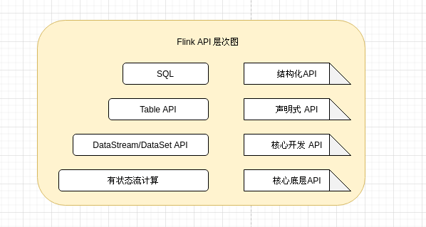

  - 核心底层API

    核心底层API提供了Flink的最底层的分布式计算构建块的操作API，包含了ProcessFunction、状态、时间和窗口等操作的API。

    ProcessFunction是Flink提供的最具表现力的底层功能接口。Flink提供单流输入的ProcessFunction和双流输入的CoProcessFuntion，能够对单个事件进行计算，也能够按照窗口对时间进行计算。

    

  - 核心开发API(DataStream/DataSet)

     DataStream/DataSet使用Fluent风格API，提供了常见数据处理的API接口，如用户指定的各种转换形式，包括连接(Join)、聚合(Aggregation)、窗口(Window)、状态(State)等。

  

  - 声明式DSL API

    Table API是以表为中心的声明式领域专用语言(Domain Specified Language，DSL)。表是关系型数据库的概念，用在批处理中。在流计算中，为了引入动态表的概念(Dynamic Table)，用来表达数据流表。

    

  - 结构化API

  ​        SQL是Flink的结构化API,是最高层次的计算API,与Table API基本等价， 区别在于使用的方式。SQL与Table API可以混合使用，SQL可以操作Table API 定义的表，Table API也能操作SQL定义的表和中间结果。

  

## 三、数据流

  数据流是核心数据抽象，表示一个持续产生的数据流。

  DataStream体系如图：

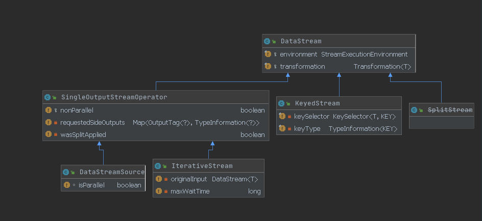  

  DataStreamSource本身就是一个DataStream。DataStreamSink、AsyncDataStream、BroadcastDataStream、BroadcastConnectedDataStream、QueryableDataStream都是对一般DataStream对象封装。

- DataStream

​        DataStream是Flink数据流的抽象核心，其上定义了对数据流的一系列操作，同时也定义了与其他类型DataStream的相互转换关系。每个DataStream都有一个Transformation对象，表示该DataStream从上游的DataStream使用该Transformation而来。  

- DataStreamSource

​        DataStreamSource是DataStream的起点，DataStreamSource在StreamExecutionEnvironment中创建，由StreamExecutionEnvrionment.addSource(SourceFunction)创建而来，其中SourceFunction中包含了DataStreamSource从数据源读取数据的具体逻辑。

- DataStreamSink

​        数据从DataSourceStream中读取，经过中间的一系列处理操作，最终需要写出到外部存储，通过DataStream.addSink(SinkFunction)创建而来，其中SinkFunction定义了写出数据到外部存储的逻辑。

- KeyedStream

​        KeyedStream用来表示根据指定的key进行分组的数据流。一个KeyedStream可以通过调用DataStream.keyBy()来获得。而在KeyedStream上进行任何Transformation都将转变回DataStream。在现实中，KeyedStream把key的信息写入了Transformation中。每条记录只能访问所属Key的状态，其上的聚合函数可以方便地操作和保存对应key的状态。  

- WindowedStream & AllWindowedStream

​        WindowedStream代表了根据key分组且基于WindowAssigner切分窗口的数据流。所以WindowedStream都是从KeyedStream衍生而来的。在WindowedStream上进行任何Transformation也都将转变回DataStream。

- JoinedStreams & CoGroupedStreams

​        Join是CoGroup的一种特例，JoinedStreams底层 使用CoGroupedStreams来实现。

两者区别如下:

​        CoGrouped侧重的是Group,对数据进行分组，是对同一个key上的两组集合进行操作。

​        Join侧重的是数据对，对同一个key的每一对元素进行操作。

- ConnectedStreams

​        ConnectedStreams表示两个数据流的组合，两个数据流可以类型一样，也可以类型不一样。ConnectedStreams适用于两个有关系的数据流的操作，共享state。

- BroadcastStream & BroadcastConnectedStream

​        BroadcastStream 实际上是对一个普通DataStream的封装，提供了DataStream的广播行为。

​        BroadcastConnectedStream 一般由DataStream/KeyedDataStream与BroadcastStream 连接而来，类似于ConnectedStream。

- IterativeStream

​        IterativeDataStream 是对一个DataStream的迭代操作，从逻辑上来说，包含IterativeStream的Dataflow是一个有向有环图，在底层执行层面上，Flink对其进行了特殊处理。

- AsyncDataStream

​        AysncDataStream是个工具，提供在DataStream上使用异步函数的能力。

## 四、数据流API

​        DataStreamAPI是Flink流计算的最常用的API,相比于Table & SQL API更加底层。

### 4.1 数据读取

​        数据读取的API定义在StreamExecutionEnvironmanet，这是Flink流计算应用的起点，第一个DataStream就是从数据读取API中构造出来的。

- 从内存中读取

 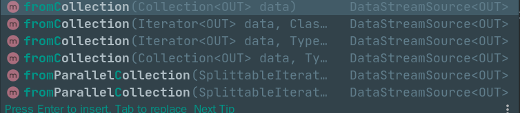

- 文件中读取

 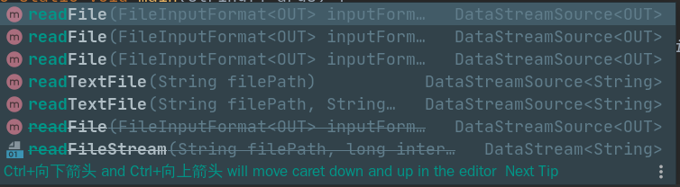

- Socke接入数据

 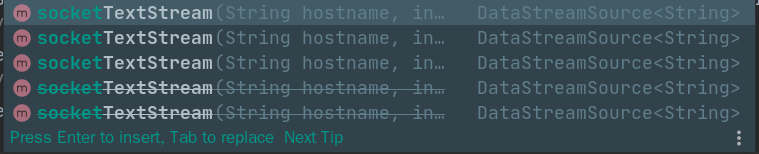

- 自定义处理

 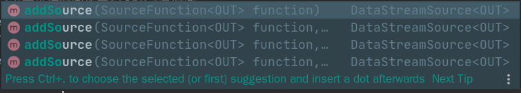

 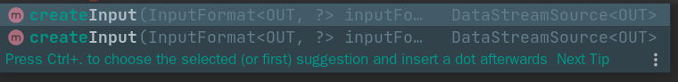

### 4.2 处理数据

DataStreamAPI 使用Fluent风格处理数据，在开发的时候其实是在编写一个DataStream转换过程，形成了DataStream处理链。

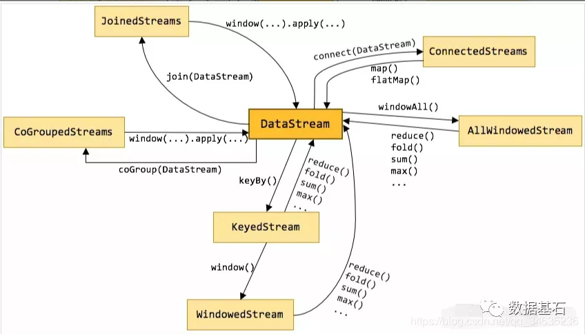

- Map

​        接收1个元素，输出1个元素。Map应用在DataStream上，输出结果为DataStream。  DataStream#map运算对应的是MapFunction,其类泛型为MapFunction<T,O>,T代表输入数据类型,O代表操作结果输出类型。

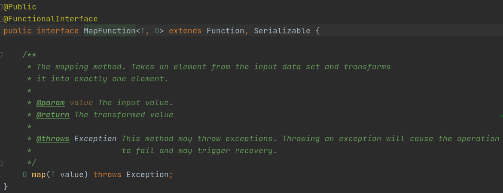

- FlatMap

​        接收1个元素，输出0、1、...、N个元素。该类运算应用在DataStream上，输出结果为DataStream。DataStream#flatMap对应的接口是FlatMapFuncion,其类泛型为FlatMapFunction<T,O>，T代表输入数据类型,O代表操作结果输出类型。

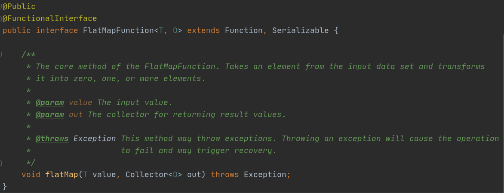

- Filter

​        过滤数据，如果返回true则该元素继续向下传递，如果为false则将该元素过滤掉。该类运算应用在DataStream上，输出结果为DataStream。DataStream#filter接口对应的是FilterFunction，其类泛型为FilterFunction<T>，T代表输出和输出的数据类型。

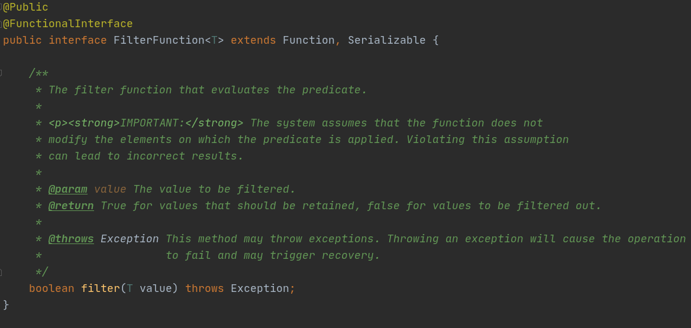

-  KeyBy

​        将数据流元素进行逻辑上的分组，具有相同Key的记录将被划分到同一组。KeyBy()使用Hash Partition实现。该运算应用在DataStream上，输出结果为KeyedStream。输出的数据流类型为KeyedStream<T,KEY>，其中T代表KeyedStream中元素数据类型，KEY代表逻辑Key的数据类型。

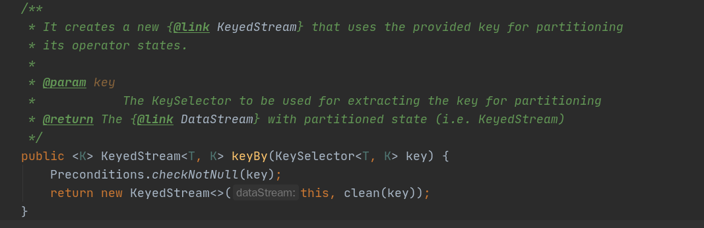
         注意以下两种数据不能作为key。

1. 1. POJO类未重写hashCode(),使用了默认的Object.hashCode()。
   2. 数组类型。

- Reduce

​        按照KeyedStream中的逻辑分组，将当前数据与最后一次的Reduce结果进行合并，合并逻辑由开发者自己实现。该类运算应用在KeyedStream上，输出结果为DataStream。ReduceFuntion<T>中T代表KeyedStream中元素的数据类型。

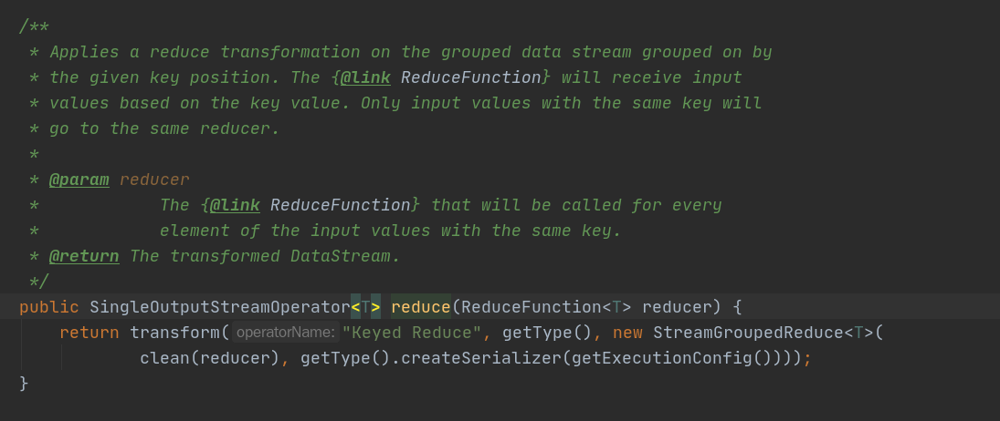

-  Fold

​        Fold与Reduce类似，区别在于Fold是一个提供了初始值的Reduce,用初始值进行合并运算。该类运算应用在KeyedStream上，输出结果为DataStream。Folder接口对应的是FoldFunction,其类泛型为FoldFunction<O,T>,O为KeyStream中的数据类型，T为初始值类型和Fold方法返回值类型。

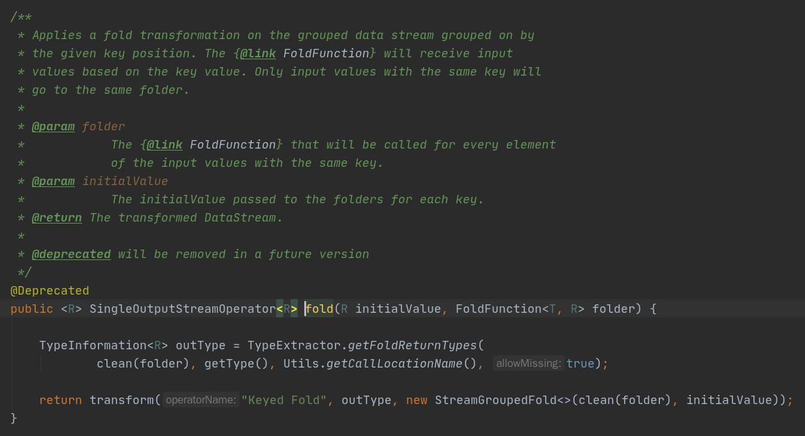

FoldFunction<O,T>已经被标记为Deprecated废弃，替代接口是AggregateFunction<IN,ACC,OUT>。

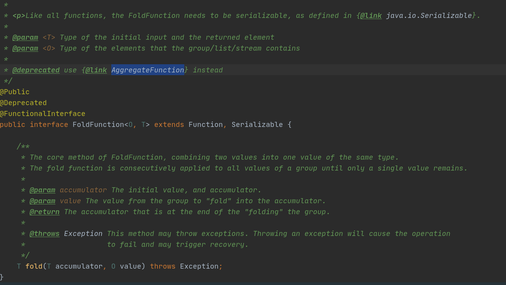

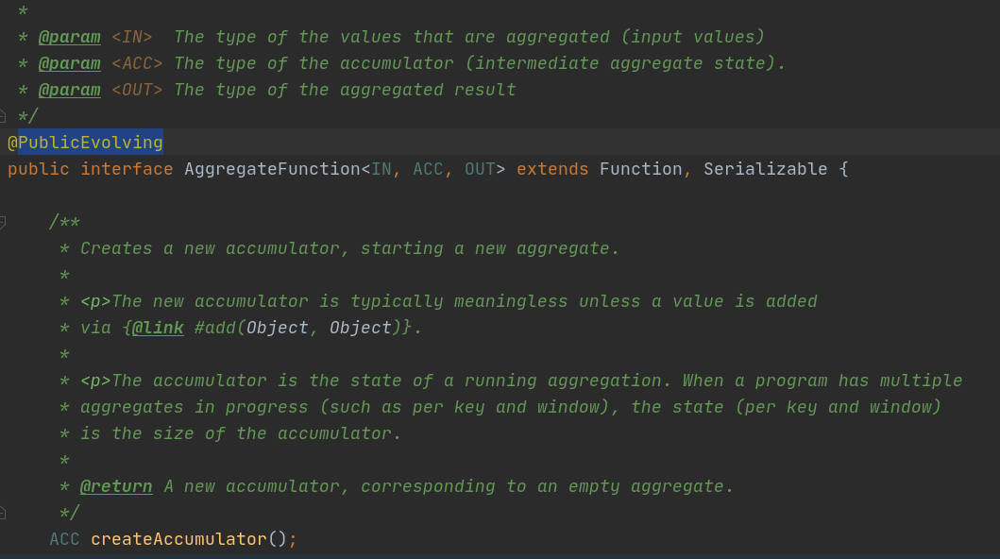

- Aggregation

​        渐进聚合具有相同Key的数据流元素，以min和minBy为例，min返回的是整个KeyedStream的最小值，按照Key进行分组，返回每个组的最小值。聚合运算输出结果为DataStream。

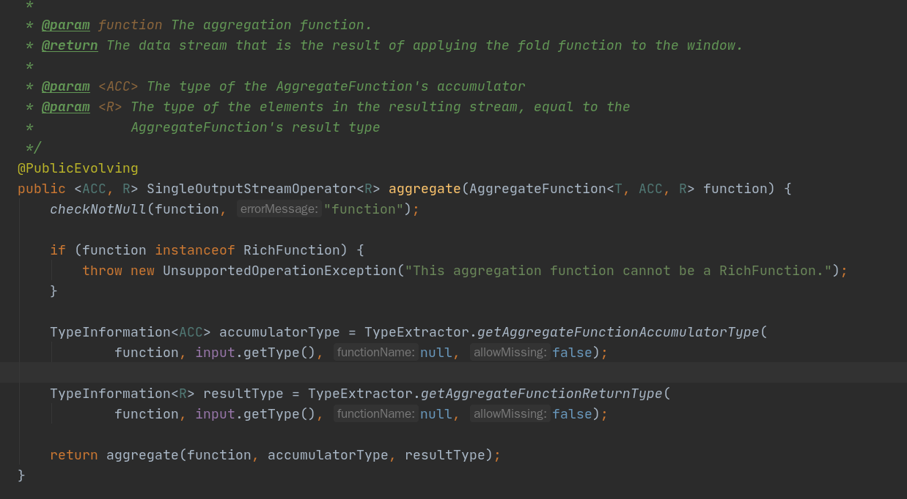

- Window

​        对KeyedStream数据，按照Key进行时间窗口切分。输出结果为WindowedStream。输出结果的类泛型为<T,K,W extends Window>，T为KeyedStream中的元素数据类型，K为指定Key的数据类型，W为窗口类型。

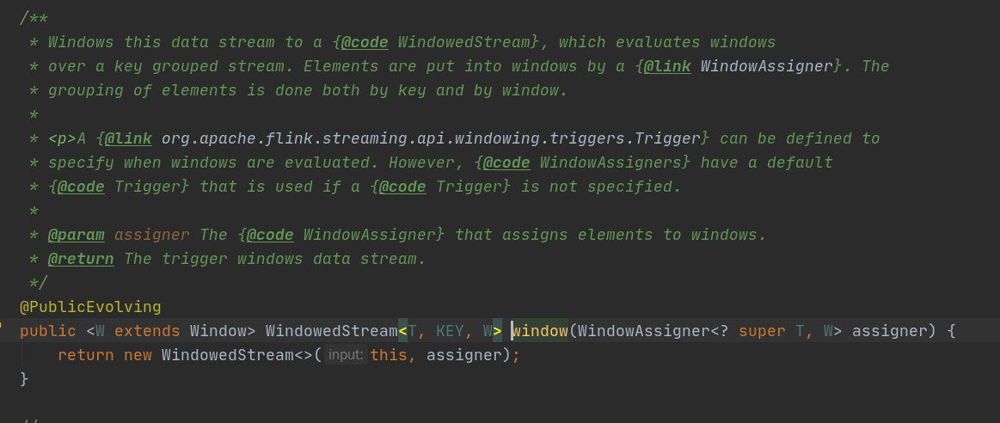

- WindowAll

​        对一般的DataStream进行窗口切分，即全局一个窗口。输出结果为AllWindowedStream。

 注意：在一般的DataStream上进行窗口切分，往往会导致无法并行计算，所有的数据都集中在WindowAll算子的一个Task上。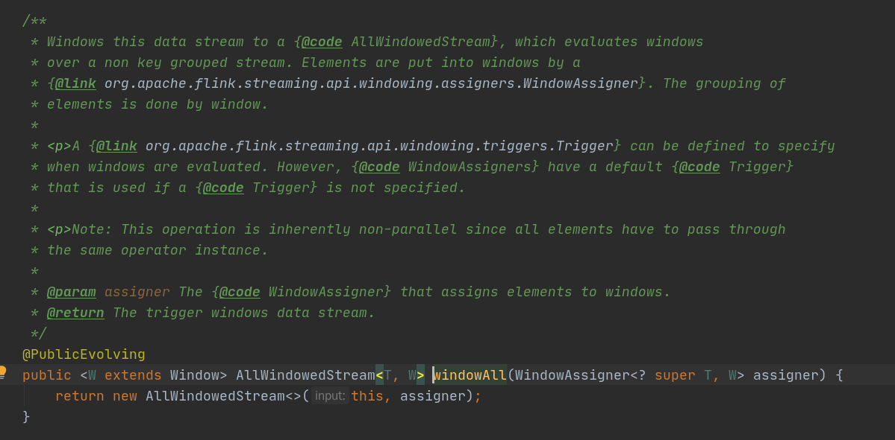

 注意：在一般的DataStream上进行窗口切分，往往会导致无法并行计算，所有的数据都集中在WindowAll算子的一个Task上。

- Window Apply

​        将Window函数应用到窗口上，Window函数将一个窗口的数据作为整体进行处理。Window Stream有两种：分组后的WindowedStream和未分组的AllWindowedStream。

​        1、WindowedStream

​            WindowedStream上应用的是WindowFunction，输出结果为DataStream。WindowFunction<IN,OUT,KEY,W extends Window>中IN表示输入值的类型，OUT表示输出值的类型，KEY表示Key的类型，W表示窗口的类型。

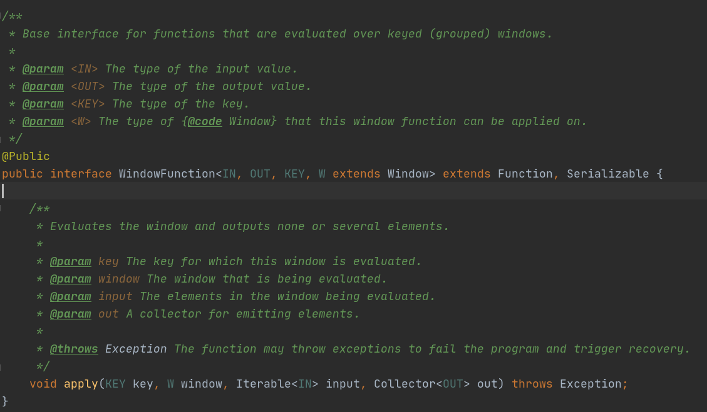


        2、AllWindowedStream

​            AllWindowedStream上应用的是AllWindowFunction，输出结果为DataStream。AllWindowFunction<IN,OUT,KEY,W extends Window>中IN表示输入值的类型，OUT表示输出值的类型，KEY表示Key的类型，W表示窗口的类型

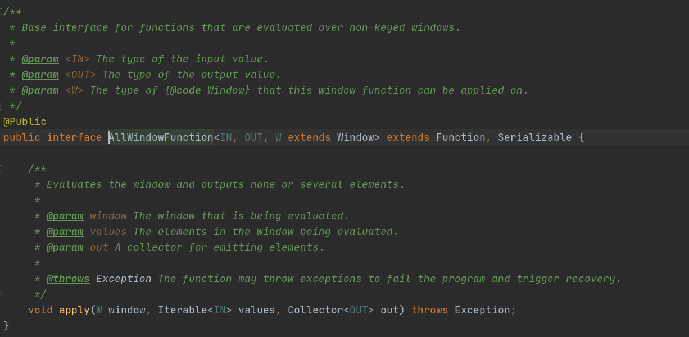

- Window Fold

​        在WindowedStream上应用FoldFunction，结果输出为DataStream。


- Window Aggregation

​        统计聚合运算，在WindowedStream应用该运算，应用AggregationFunction，输出结果为DataStream。

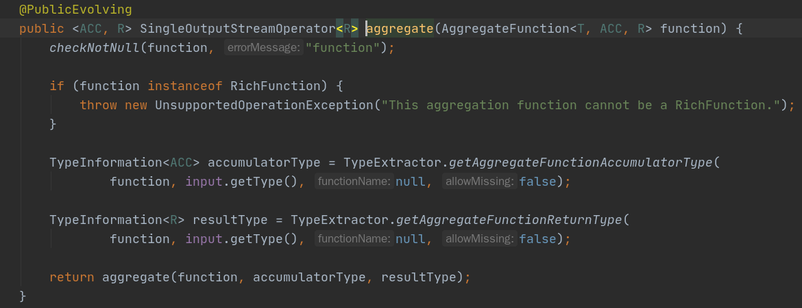

- Union

​        把两个或多个DataStream合并，所有DataStream中的元素都会组合成一个新的DataStream，但是不去重，如果在自身上应用Union运算，则每个元素在新的DataStram出现两次。

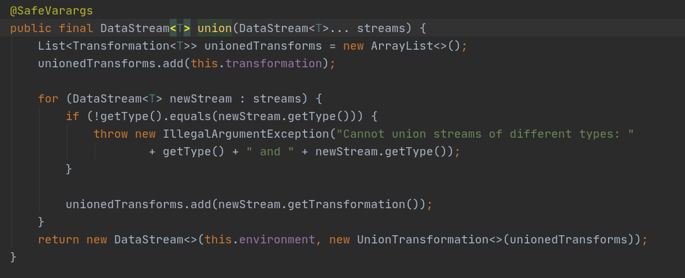

- Window Join

​        在相同时间范围的窗口上Join两个DataStream数据流，输出结果为DataStream。Join核心逻辑在JoinFunction<IN1,IN2,OUT>中实现，IN1为第一个DataStream中的数据类型，IN2为第二个DataStream中的数据类型，OUT为Join结果的数据类型。

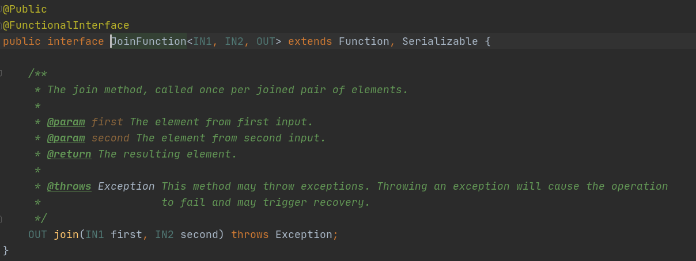

- Interval Join

​        对两次KeyedStream进行Join，需要指定时间范围和Join时使用的Key,输出结果为DataStream。Join的核心逻辑在ProcessJoinFunction<IN1,IN2,OUT>中实现，IN1为第一个DataStream中的元素数据类型，IN2为第2个DataStream中的元素数据类型，OUT为结果输出类型。

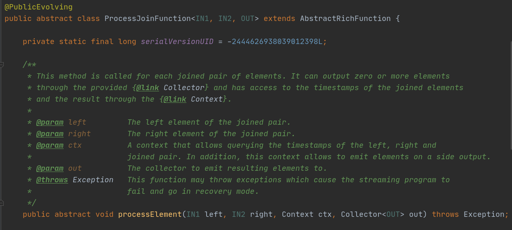

- WindowCoGroup

​        两个DataStream在相同时间窗口上应用CoGroup运算，输出结果为DataStream，CoGroup和Join功能类似，CoGroup接口对应的是CoGroupFunction,其类泛型为CoGroupFunction<IN1,IN2,O>，IN1代表第一个DataStream中是元素类型，IN2代表第二个DataStream中是元素类型，O为输出结果类型。

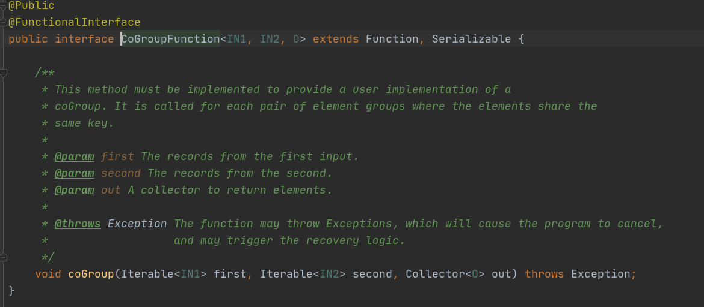

- CoMap和CoFlatMap

​        在ConnectedStream上应用Map和FlatMap运算，输出流为DataStream。其基本逻辑类似于在一般DataStream上的Map和FlatMap运算，区别在于CoMap转换有2个输入，Map转换有1个输入,CoFlatMap同理。

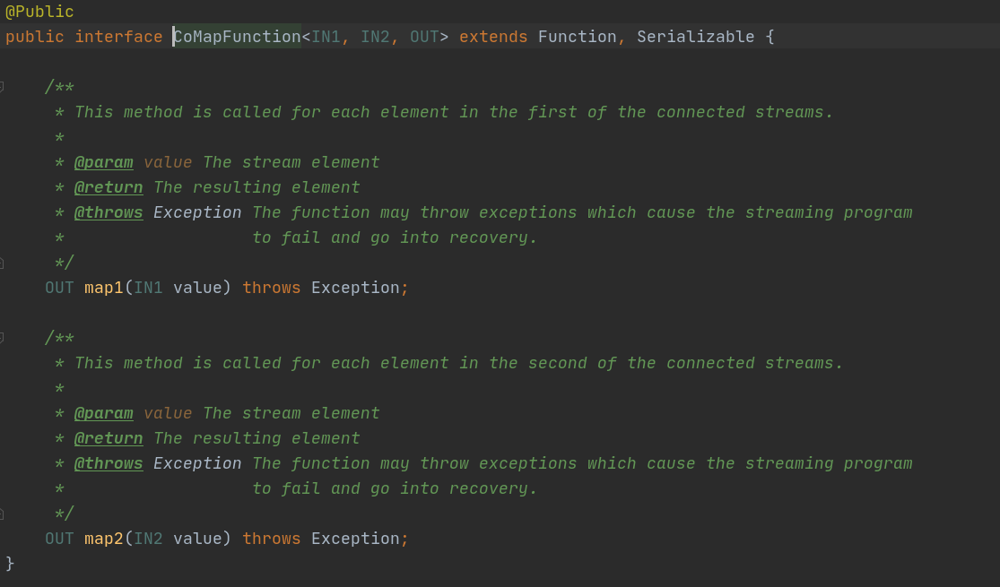

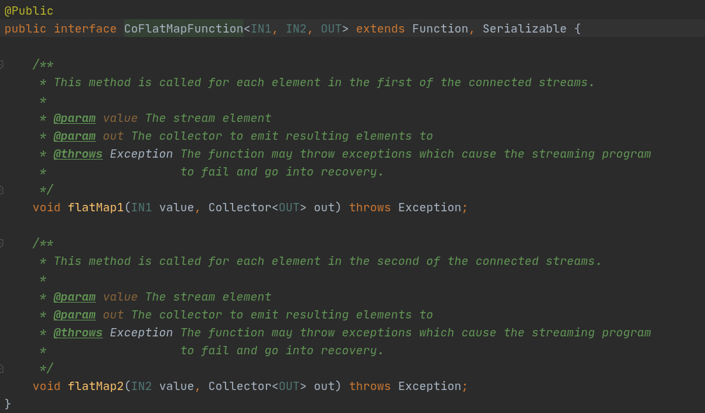

- Split

​        将DataStream按照条件切分多个DataStream,输出流为SplitDataStream。该方法已经标记为废弃，推荐使用SideOutput。

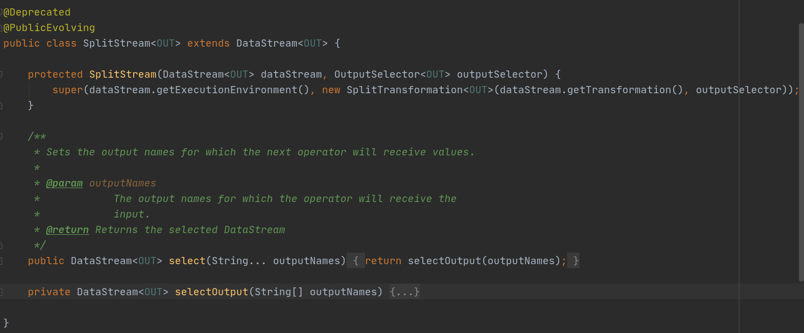

- Select 

​        Select与Split运算配合使用，在Split运算中切分的多个DataStream中，Select用来选择其中某一个具体的DataStream。

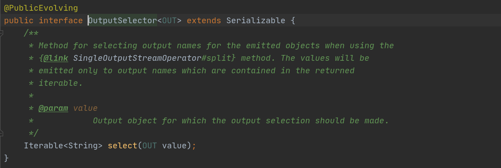

- Iterate

​        在API层面上，对DataStream应用迭代会生成1个IteractiveStream，然后在IteractiveSteram应用业务处理逻辑，最终生成一个新的DataStream,在数据流中创建一个迭代循环，将下游的输出发送给上游重新处理。

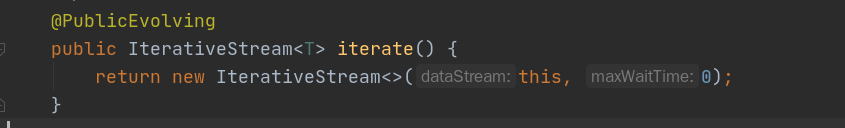

- Extract Timestamps

​        从记录中提取时间戳，并生成WaterMark。该类运算不会改变DataStram。

- Project

​        该类运算只适用于Tuple类型的DataStream,使用Project选取子Tuple,可以选择Tuple的部分元素，可以改变元素顺序，类似于SQL语句中的Select子句，输出流仍然是DataStream。

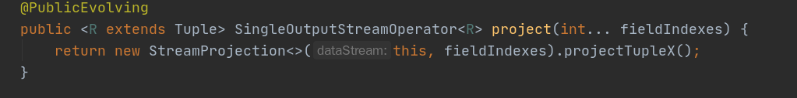

### 4.3 旁路输出

​	旁路输出在Flink中叫做SideOutput,类似于DataStream#split，本质上是一个数据流的切分行为，按照条件将DataStream切分为多个子数据流，子数据流叫做旁路输出数据流。每个旁路输出数据流可以有自己的下游处理逻辑。

 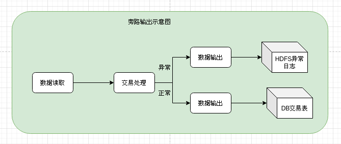

旁路输出数据流的数据类型可以与上游数据流不同，多个旁路输出数据流的数据类型也不必相同。

如何使用旁路输出：

1、定义OutputTag，OutpuTag是每一个下游分支的标识。

```java
 private static final OutputTag<String> rejectedWordsTag = new OutputTag<String>("rejected"){};
```

```java
public class FlinkDataStreamLearn {
    public static void main(String[] args) {
        //获取环境
        StreamExecutionEnvironment env = StreamExecutionEnvironment.getExecutionEnvironment();
        //设置事件时间作为flink计算时间
        env.setStreamTimeCharacteristic(TimeCharacteristic.EventTime);
        //设置checkpoint时间间隔和模式
        env.enableCheckpointing(1000, CheckpointingMode.EXACTLY_ONCE);

        DataStreamSource<String> stringDataStreamSource = env.socketTextStream("127.0.0.1", 90000);

        SingleOutputStreamOperator<String> process = stringDataStreamSource.process(new ProcessFunction<String, String>() {
            @Override
            public void processElement(String value, Context ctx, Collector<String> out) throws Exception {
                if (value.length() > 5) {
                    ctx.output(OutPutTagDefine.rejectedWordsTag, value);
                } else {
                    out.collect(value);
                }
            }
        });
        
        process.getSideOutput(OutPutTagDefine.rejectedWordsTag).print();

        try {
            env.execute("test");
        } catch (Exception e) {
            e.printStackTrace();
        }

    }
}

```

2、获取旁路输出

```java
 process.getSideOutput(OutPutTagDefine.rejectedWordsTag).print();
```


