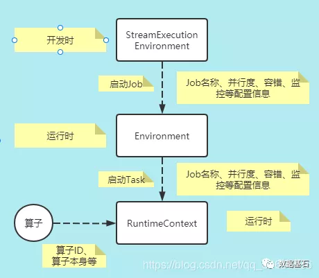
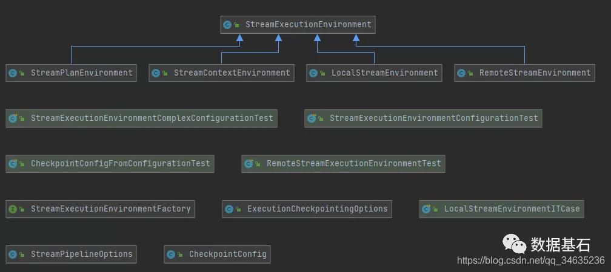
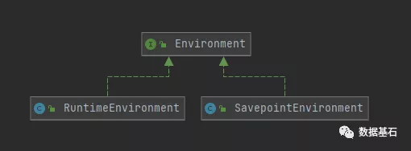
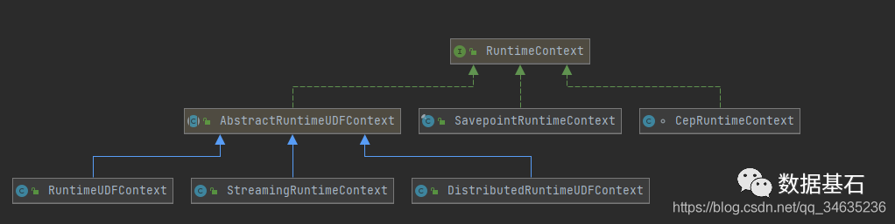

 # Flink生命周期

​	Flink API提供了开发的接口，此外，为了实现业务逻辑，还必须为开发者提供自定义业务逻辑的能力。Flink中设计了用户自定义函数体系(User Defined Function,UDF),开发人员实现业务逻辑就是开发UDF。

## 一、环境对象

​        StreamExecutionEnvironment是Flink应用开发时的概念，表示流计算作业的执行环境，是作业开发的入口、数据源接口、生成和转换DataStream的接口、数据Sink的接口、作业配置接口、作业启动执行的入口。

​        Environment是运行时作业级别的概念，从StreamExecutionEnvironment中的配置信息衍生而来。进入到Flink作业执行的时刻，作业需要的是相关的配置信息，如作业的名称、并行度、作业编号JobID、监控的Metric、容错的配置信息、IO等，用StreamExecutionRuntime对象就不适合了，很多API是不需要的，所以在Flink中抽象出了Environment作为运行时刻的上下文信息。

​        RuntimeContext是运行时Task实例级别的概念。Environment本身仍然是比较粗粒度作业级别的配置，对于每一个Task而言，其本身有更细节的配置信息,所以Flink又抽象了RuntimeContext,每一个Task实例有自己的RuntimeContext。

 

### 1.1 执行环境

StreamExecutionEnvironment是Flink流计算应用的执行环境，是Flink作业开发和启动执行的入口，开发者对StreamExecutionEnvironment的实现是无感知的。

- LocalStreamEnvironment

​        本地执行环境，在单个JVM中使用多线程模拟Flink集群。

​        其基本的工作流程如下：

​        1) 执行Flink作业的Main函数生成Streamgraph,转化为JobGraph。

​        2) 设置任务运行的配置信息。

​        3) 根据配置信息启动对应的LocalFlinkMiniCluster。

​        4) 根据配置信息和miniCluster生成对应的MiniClusterClient。

​        5) 通过MiniClusterClient提交JobGraph 到MiniCluster。

- RemoteStreamEnvironment

​        在大规模数据中心中部署的Flink生产集群的执行环境。

​        当将作业发布到Flink集群的时候，使用RemoteStreamEnvironment。

​        其基本的工作流程如下：

​        1) 执行Flink作业的Main函数生成Streamgraph，转化为JobGraph。

​        2) 设置任务运行的配置信息。

​        3) 提交JobGraph到远程的Flink集群。

- StreamContextEnvironment

​        在Cli命令行或者单元测试时候会被使用，执行步骤同上。

- StreamPlanEnvironment

​        在Flink Web UI管理界面中可视化展现Job的时候，专门用来生成执行计划(实际上就是StreamGraph)

- ScalaShellStreamEnvironment

​        这是Scala Shell执行环境，可以在命令行中交互式开发Flink作业。

​        其基本工作流程如下：

​        1) 校验部署模式，目前Scala Shell仅支持attached模式。

​        2) 上传每个作业需要的Jar文件。

​        其余步骤与RemoteStreamEnvironment类似。

### 1.2 运行时环境

- RuntimeEnvironment

​        在Task开始执行时进行初始化，把Task运行相关的信息都封装到该对象中，其中不光包含了配置信息，运行时的各种服务也会被包装到其中。

- SavepointEnvironment

​        SavepointEnvironment是Environment的最小化实现，在状态处理器的API中使用。

### 1.3 运行时上下文

​       RuntimeContext是Function运行时的上下文，封装了Function运行时可能需要的所有信息，让Function在运行时能够获取到作业级别的信息，如并行度相关信息、Task名称、执行配置信息(ExecutionConfig)、State等。

​         Function的每个实例都有一个RuntimeContext对象，在RichFunction中通过getRunctionContext()可以访问该对象。

​        RuntimeContext的类体系图如下:

