# 第 1 章 电商实时数仓分层介绍

## 1.1 普通实时计算与实时数仓比较

普通的实时计算优先考虑**时效性**，所以从数据源采集经过实时计算直接得到结果。如此做时效性更好，但是弊端是由于计算过程中的中间结果没有沉淀下来，所以当面对大量实时需求的时候，计算的复用性较差，开发成本随着需求增加直线上升。

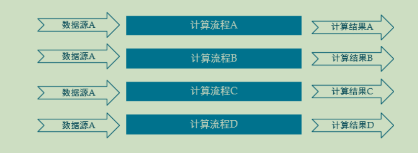

实时数仓基于一定的数据仓库理念，对数据处理流程进行规划、分层，目的是提高数据的**复用性**。 


## 1.2 实时电商数仓，项目分为以下几层

ODS：原始数据，日志和业务数据

DWD：根据数据对象为单位进行分流，比如订单、页面访问等等

DIM：维度数据

DWM：对于部分数据对象进行进一步加工，比如独立访问、跳出行为，也可以和维度进行关联，形成宽表，依旧是明细数据。

DWS：根据某个主题将多个事实数据轻度聚合，形成主题宽表。

ADS：把ClickHouse中的数据根据可视化需进行筛选聚合

# 第 2 章 实时需求概览

## 2.1 离线计算与实时计算的比较

**离线计算**：就是在计算开始前已知所有输入数据，输入数据不会产生变化，一般计算量级较大，计算时间也较长。例如今天早上一点，把昨天累积的日志，计算出所需结果。最经典的就是 Hadoop 的 MapReduce 方式；

一般是根据前一日的数据生成报表，虽然统计指标、报表繁多，但是对时效性不敏感。从技术操作的角度，这部分属于批处理的操作。即根据确定范围的数据一次性计算。

**实时计算**：输入数据是可以以序列化的方式一个个输入并进行处理的，也就是说在开始的时候并不需要知道所有的输入数据。与离线计算相比，运行时间短，计算量级相对较小。

强调计算过程的时间要短，即所查当下给出结果。主要侧重于对当日数据的实时监控，通常业务逻辑相对离线需求简单一下，统计指标也少一些，但是更注重数据的时效性，以及用户的交互性。从技术操作的角度，这部分属于流处理的操作。根据数据源源不断地到达进行实时的运算。 

## 2.2 实时需求种类

### 2.2.1 日常统计报表或分析图中需要包含当日部分


对于日常企业、网站的运营管理如果仅仅依靠离线计算，数据的时效性往往无法满足。通过实时计算获得当日、分钟级、秒级甚至亚秒的数据更加便于企业对业务进行快速反应与调整。

所以实时计算结果往往要与离线数据进行合并或者对比展示在 BI 或者统计平台中。

### 2.2.2 实时数据大屏监控


数据大屏，相对于 BI 工具或者数据分析平台是更加直观的数据可视化方式。尤其是一些大促活动，已经成为必备的一种营销手段。

另外还有一些特殊行业，比如交通、电信的行业，那么大屏监控几乎是必备的监控手段。

### 2.2.3 数据预警或提示

经过大数据实时计算得到的一些风控预警、营销信息提示，能够快速让风控或营销部分得到信息，以便采取各种应对。

比如，用户在电商、金融平台中正在进行一些非法或欺诈类操作，那么大数据实时计算可以快速的将情况筛选出来发送风控部门进行处理，甚至自动屏蔽。 或者检测到用户的行为对于某些商品具有较强的购买意愿，那么可以把这些“商机”推送给客服部门，让客服进行主动的跟进。

### 2.2.4 实时推荐系统

实时推荐就是根据用户的自身属性结合当前的访问行为，经过实时的推荐算法计算，从而将用户可能喜欢的商品、新闻、视频等推送给用户。

这种系统一般是由一个用户画像批处理加一个用户行为分析的流处理组合而成。 

# 第 3 章 统计架构分析

## 3.1 离线架构

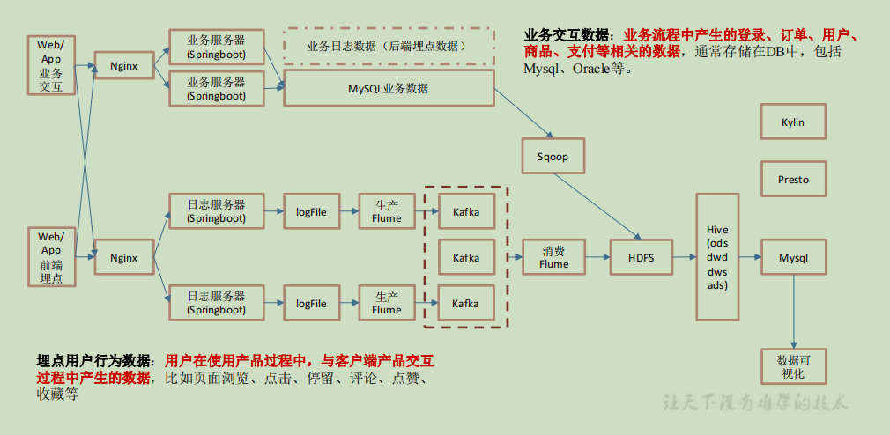

> **Sqoop导入数据的方式：**
>
> 全重:where 1=1
>
> 增量:where创建时间=当天
>
> 新增及变化: where创建时间=当天or操作时间=当天
>
> 特殊:只导入一次
>
> **Flume**
>
> TailDirsource:
>
> 优点:断点续传，监控多目录多文件，实时监控
>
> 缺点:当文件更名之后会重新读取该文件造成数据重复
>
> 注意:
> 				1.要使用不更名打印日志框架( logback)
> 				2.修改源码，让TailDirSource判断文件时只看iNode值
>
> KafkaChannel:
>
> 优点:将数据写入Kafka,省了一层sink
>
> broker
>
> ​		Topic:
>
> ​				副本：高可靠
>
> ​							ISR : LEO 、HW
>
> ​				分区：高并发，负载均衡（防止热点数据）
>
> Consumer
>
> ​			分区分配规则
>
> ​			offset保存
>
> ​						默认：__consumer_offsets主题
>
> ​						其他：手动维护offset（Mysql）
>
> ​						保存数据&保存offset写到一个事务
>
> ​						精准一次消费
>
>  先保仔数据后保仔Offset重复数据+幂等性(精准一次消费)先保存offset后保存数据丢失数据
>
> 优化、监控、配置、数据量、峰值速度

## 3.2 实时架构

<font color = "red">系统数据流程设计</font>

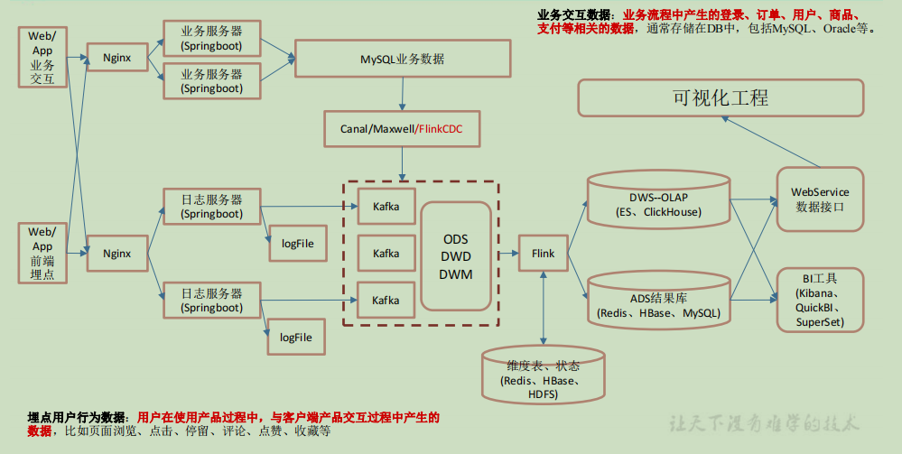

# 第 4 章 日志数据采集

## 4.1 模拟日志生成器的使用

这里提供了一个模拟生成数据的 jar 包，可以将日志发送给某一个指定的端口，需要大数据程序员了解如何从指定端口接收数据并数据进行处理的流程。

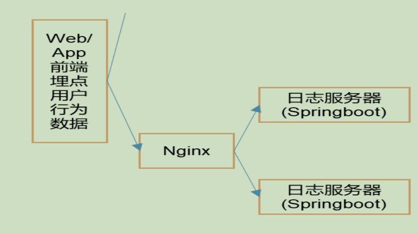

(1) 拷贝/资料/数据生成脚本/行为数据的内容到 hadoop102的/opt/module/rt_applog

目录

```sh
[atguigu@hadoop102 ~]$ cd /opt/module/gmall-flink/rt_applog/
[atguigu@hadoop102 rt_applog]$ ll
总用量 45652
-rw-rw-r-- 1 atguigu atguigu 952 3 月 6 14:54 application.yml
-rw-rw-r-- 1 atguigu atguigu 15642393 12 月 29 14:54 gmall2020-mock-log-2020-12-18.jar
-rw-rw-r-- 1 atguigu atguigu 31094068 2 月 5 15:29 gmall-logger-0.0.1-SNAPSHOT.jar
```

(2) 根据实际需要修改 application.yml 

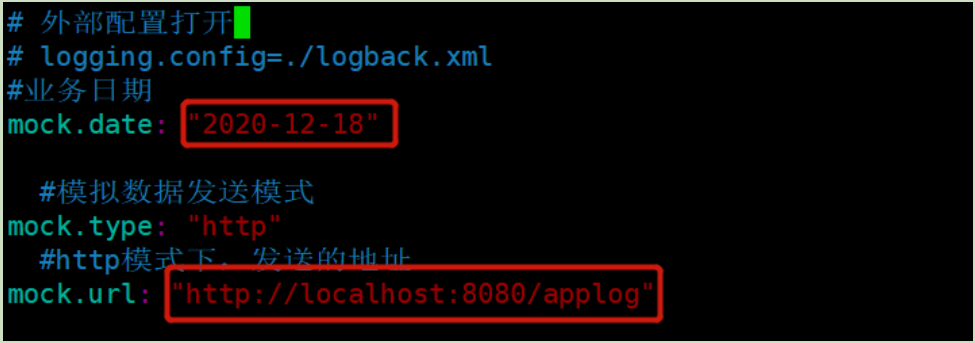

(3) 使用模拟日志生成器的 jar 运行

```sh
java -jar gmall2020-mock-log-2020-12-18.jar
```

(4) 目前我们还没有地址接收日志，所以程序运行后的结果有如下错误

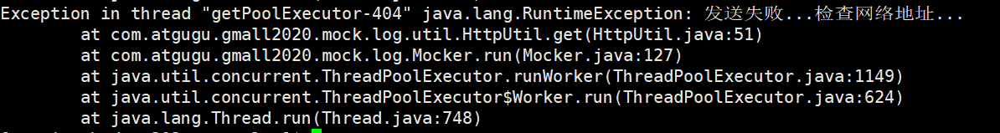

注意：ZooKeeper 从 3.5 开始，AdminServer 的端口也是 8080，如果在本机启动了zk，那么可能看到 404、405 错误，意思是找到请求地址了，但是接收的方式不对。

## 4.2 日志采集模块-本地测试

### 4.2.1 SpringBoot 简介

SpringBoot 是由 Pivotal 团队提供的全新框架，其设计目的是用来简化新 Spring 应用的初始搭建以及开发过程。 该框架使用了特定的方式来进行配置，从而使开发人员不再需要定义样板化的配置。

1) 有了 springboot 我们就可以不再需要那些千篇一律，繁琐的 xml 文件。

➢ 内嵌 Tomcat,不再需要外部的 Tomcat

➢ 更方便的和各个第三方工具（mysql,redis,elasticsearch,dubbo,kafka 等等整合），而只要维护一个配置文件即可。

2) springboot 和 ssm 的关系

springboot 整合了 springmvc，spring 等核心功能。也就是说本质上实现功能的还是原有的 spring ,springmvc 的包，但是 springboot 单独包装了一层，这样用户就不必直接对 springmvc，spring 等，在 xml 中配置。

3) 没有 xml，我们要去哪配置

springboot 实际上就是把以前需要用户手工配置的部分，全部作为默认项。除非用户需要额外更改不然不用配置。这就是所谓的：“约定大于配置”

如果需要特别配置的时候，去修改 application.properties（application.yml） 

### 4.2.2 快速搭建 SpringBoot 程序 gmall-logger，采集模拟生成的日志数据

1) 在 IDEA 中安装 lombok 插件

在 Plugins 下搜索 lombok 然后在线安装即可，安装后注意重启


2) 创建空的父工程 gmall2021，用于管理后续所有的模块 module

我们这里就是为了将各个模块放在一起，但是模块彼此间还是独立的，所以创建一个Empty Project 即可；如果要是由父 module 管理子 module，需要将父 module 的pom.xml 文件的\<packaging>设置为 pom 

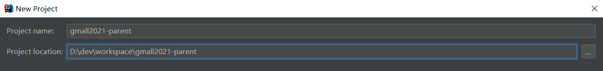


3) 新建 SpringBoot 模块，作为采集日志服务器

A. 在父 project 下增加一个 Module，选择 Spring Initializr

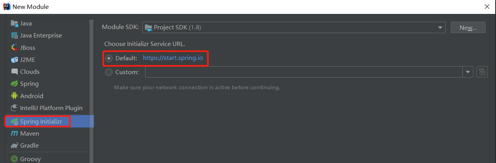

注意：有时候 SpringBoot 官方脚手架不稳定，我们切换国内地址 https://start.aliyun.com

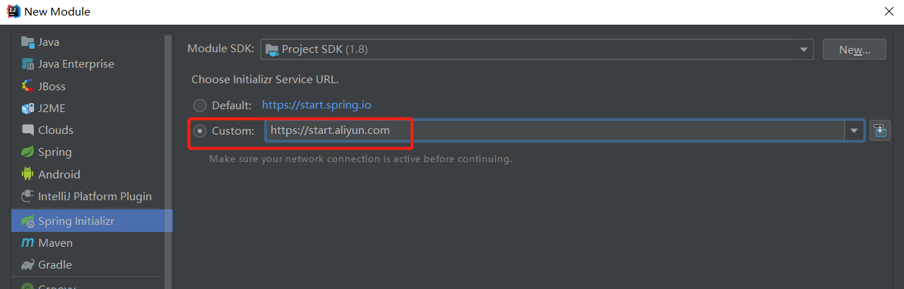

B. 配置项目名称为 gmall2021-logger 及 JDK 版本 

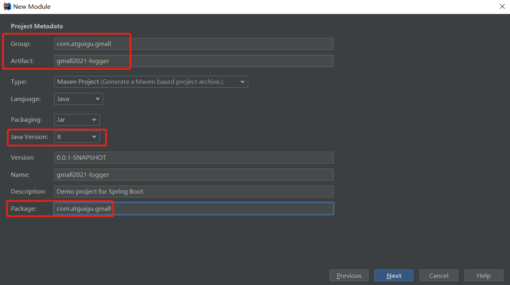


C. 选择版本以及通过勾选自动添加 lombok、SpringWeb、Kafka 相关依赖

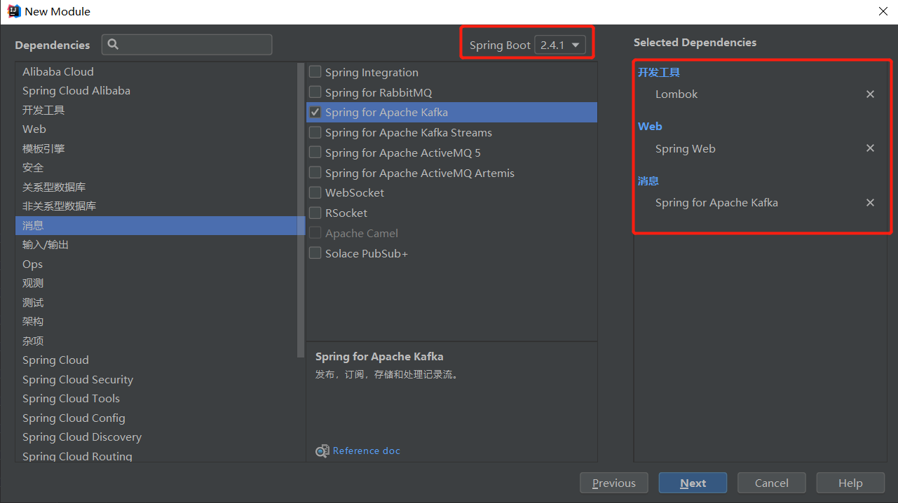

注意：这里如果使用 spring 官方脚手架地址，看到的页面可能会略有差异，但效果相同

D. 完成之后开始下载依赖，完整的 pom.xml 文件如下

```xml
<?xml version="1.0" encoding="UTF-8"?>
<project xmlns="http://maven.apache.org/POM/4.0.0" xmlns:xsi="http://www.w3.org/2001/XMLSchema-instance"
         xsi:schemaLocation="http://maven.apache.org/POM/4.0.0 https://maven.apache.org/xsd/maven-4.0.0.xsd">
    <modelVersion>4.0.0</modelVersion>
    <groupId>com.atguigu</groupId>
    <artifactId>gmall-logger</artifactId>
    <version>0.0.1-SNAPSHOT</version>
    <name>gmall-logger</name>
    <description>Demo project for Spring Boot</description>

    <properties>
        <java.version>1.8</java.version>
        <project.build.sourceEncoding>UTF-8</project.build.sourceEncoding>
        <project.reporting.outputEncoding>UTF-8</project.reporting.outputEncoding>
        <spring-boot.version>2.4.1</spring-boot.version>
    </properties>

    <dependencies>
        <dependency>
            <groupId>org.springframework.boot</groupId>
            <artifactId>spring-boot-starter-web</artifactId>
        </dependency>
        <dependency>
            <groupId>org.springframework.kafka</groupId>
            <artifactId>spring-kafka</artifactId>
        </dependency>

        <dependency>
            <groupId>org.projectlombok</groupId>
            <artifactId>lombok</artifactId>
            <optional>true</optional>
        </dependency>
        <dependency>
            <groupId>org.springframework.boot</groupId>
            <artifactId>spring-boot-starter-test</artifactId>
            <scope>test</scope>
        </dependency>
        <dependency>
            <groupId>org.springframework.kafka</groupId>
            <artifactId>spring-kafka-test</artifactId>
            <scope>test</scope>
        </dependency>
    </dependencies>

    <dependencyManagement>
        <dependencies>
            <dependency>
                <groupId>org.springframework.boot</groupId>
                <artifactId>spring-boot-dependencies</artifactId>
                <version>${spring-boot.version}</version>
                <type>pom</type>
                <scope>import</scope>
            </dependency>
        </dependencies>
    </dependencyManagement>

    <build>
        <plugins>
            <plugin>
                <groupId>org.apache.maven.plugins</groupId>
                <artifactId>maven-compiler-plugin</artifactId>
                <version>3.8.1</version>
                <configuration>
                    <source>1.8</source>
                    <target>1.8</target>
                    <encoding>UTF-8</encoding>
                </configuration>
            </plugin>
            <plugin>
                <groupId>org.springframework.boot</groupId>
                <artifactId>spring-boot-maven-plugin</artifactId>
                <version>2.4.1</version>
                <configuration>
                    <mainClass>com.atguigu.gmalllogger.GmallLoggerApplication</mainClass>
                </configuration>
                <executions>
                    <execution>
                        <id>repackage</id>
                        <goals>
                            <goal>repackage</goal>
                        </goals>
                    </execution>
                </executions>
            </plugin>
        </plugins>
    </build>
</project>
```


E. 创建 LoggerController 输出 SpringBoot 处理流程

```java
package com.atguigu.gmalllogger.controller;

import lombok.extern.slf4j.Slf4j;
import org.springframework.beans.factory.annotation.Autowired;
import org.springframework.kafka.core.KafkaTemplate;
import org.springframework.stereotype.Controller;
import org.springframework.web.bind.annotation.RequestMapping;
import org.springframework.web.bind.annotation.RequestParam;
import org.springframework.web.bind.annotation.ResponseBody;
import org.springframework.web.bind.annotation.RestController;

//@Controller
@RestController //@Controller + @ResponseBody
@Slf4j
public class LoggerController {

    @Autowired
    private KafkaTemplate<String, String> kafkaTemplate;

    @RequestMapping("test")
//    @ResponseBody
    public String test1() {
        System.out.println("success");
        return "success";
    }

    @RequestMapping("test2")
    public String test2(@RequestParam("name") String nn,
                        @RequestParam(value = "age", defaultValue = "18") int age) {
        System.out.println(nn + ":" + age);
        return "success";
    }

    @RequestMapping("applog")
    public String getLog(@RequestParam("param") String jsonStr) {

        //打印数据
//        System.out.println(jsonStr);

        //将数据落盘
//        log.debug(jsonStr);
        log.info(jsonStr);
//        log.warn(jsonStr);
//        log.error(jsonStr);
//        log.trace(jsonStr);

        //将数据写入Kafka
        kafkaTemplate.send("ods_base_log", jsonStr);

        return "success";
    }
}
```


F. 运行 Gmall2021LoggerApplication，启动内嵌 Tomcat

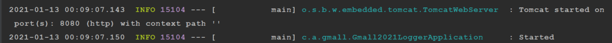

G. 用浏览器测试并查看控制台输出 

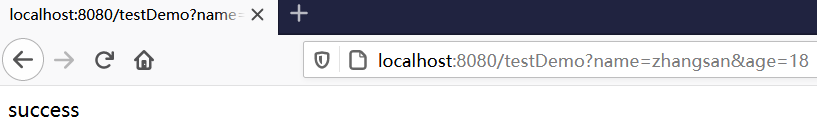


### 4.2.3 SpringBoot 整合 Kafka

1) 修改 SpringBoot 核心配置文件 application.propeties

```sh
# 应用名称
spring.application.name=gmall-logger
# 应用服务 WEB 访问端口
server.port=8081
#============== kafka ===================
# 指定 kafka 代理地址，可以多个
spring.kafka.bootstrap-servers=hadoop102:9092
# 指定消息 key 和消息体的编解码方式
spring.kafka.producer.key-serializer=org.apache.kafka.common.serialization.StringSerializer
spring.kafka.producer.value-serializer=org.apache.kafka.common.serialization.StringSerializer
```


2) 在 LoggerController 中添加方法，将日志落盘并发送到 Kafka 主题中

```java
import lombok.extern.slf4j.Slf4j;

import org.springframework.beans.factory.annotation.Autowired;

import org.springframework.kafka.core.KafkaTemplate;

import org.springframework.web.bind.annotation.RequestMapping;

import org.springframework.web.bind.annotation.RequestParam;

import org.springframework.web.bind.annotation.RestController;

//@RestController = @Controller+@ResponseBody

@RestController //表示返回普通对象而不是页面

@Slf4j

public class LoggerController {

 @Autowired

 private KafkaTemplate<String, String> kafkaTemplate;

 @RequestMapping("applog")

 public String getLogger(@RequestParam("param") String jsonStr) {

 //落盘

 log.info(jsonStr);

 //写入 Kafka

 kafkaTemplate.send("ods_base_log", jsonStr);

 return "success";

 } 

}
```


3) 在 Resources 中添加 logback.xml 配置文件

```xml
<?xml version="1.0" encoding="UTF-8"?> 

<configuration>

 <property name="LOG_HOME" value="d:/opt/module/logs" />

 <appender name="console" class="ch.qos.logback.core.ConsoleAppender">

 <encoder>

 <pattern>%msg%n</pattern>

 </encoder>

 </appender>

 <appender name="rollingFile" class="ch.qos.logback.core.rolling.RollingFileAppender">

 <file>${LOG_HOME}/app.log</file>

 <rollingPolicy class="ch.qos.logback.core.rolling.TimeBasedRollingPolicy">

 <fileNamePattern>${LOG_HOME}/app.%d{yyyy-MM-dd}.log</fileNamePattern>

 </rollingPolicy>

 <encoder>

 <pattern>%msg%n</pattern>

 </encoder>

 </appender>

 <!-- 将某一个包下日志单独打印日志 -->

 <logger name="com.atguigu.gmalllogger.controller.LoggerController"

 level="INFO" additivity="false">

 <appender-ref ref="rollingFile" />

 <appender-ref ref="console" />

 </logger>

 <root level="error" additivity="false">

 <appender-ref ref="console" />

 </root>

</configuration>
```


➢ logback 配置文件说明

◼ appender

追加器，描述如何写入到文件中（写在哪，格式，文件的切分）

ConsoleAppender--追加到控制台

RollingFileAppender--滚动追加到文件

◼ logger

控制器，描述如何选择追加器

注意：要是单独为某个类指定的时候，别忘了修改类的全限定名

◼ 日志级别 

TRACE   [DEBUG INFO WARN ERROR]    FATAL

4) 修改 hadoop102 上的 rt_applog 目录下的 application.yml 配置文件

注意：mock.url 设置为自身 Windows 的 IP 地址

 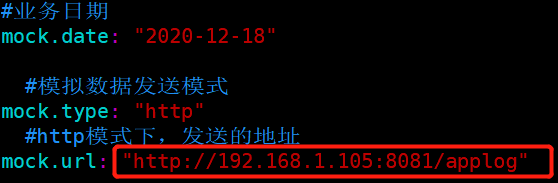

5) 测试

➢ 运行 Windows 上的 Idea 程序 LoggerApplication

➢ 运行 rt_applog 下的 jar 包 

➢ 启动 kafka 消费者进行测试

```sh
bin/kafka-console-consumer.sh --bootstrap-server hadoop102:9092 --topic ods_base_log
```


## 4.3 日志采集模块-打包单机部署

### 4.3.1 修改 gmall2021-logger 中的 logback.xml 配置文件

```xml
<property name="LOG_HOME" value="/opt/module/gmall-flink/rt_applog/logs" />
```

注意：路径和上面创建的路径保持一致，根据自己的实际情况进行修改 

### 4.3.2 打包

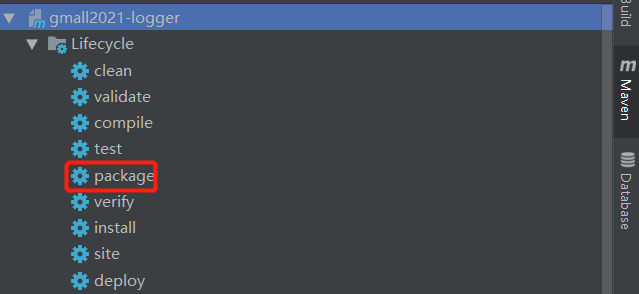

### 4.3.3 将打好的 jar 包 上 传 到 hadoop102 的/opt/module/gmall-flink/rt_applog 目录下

```sh
[atguigu@hadoop102 rt_applog]$ ll
总用量 29984
-rw-rw-r--. 1 atguigu atguigu 30700347 8 月 10 11:35 gmall2021-logger-0.0.1-SNAPSHOT.jar
```


### 4.3.4 修改/opt/module/gmall-flink/rt_applog/application.yml

\#http 模式下，发送的地址

mock.url=http://hadoop102:8081/applog

### 4.3.5 测试

➢ 运行 hadoop102 上的 rt_gmall 下的日志处理 jar 包 

➢ 运行 rt_applog 下的 jar 包 

➢ 启动 kafka 消费者进行测试

```sh
bin/kafka-console-consumer.sh --bootstrap-server hadoop102:9092 --topic ods_base_log 
```

## 4.4 日志采集模块-打包集群部署，并用 Nginx 进行反向代理

### 4.4.1 根据附录内容搭建好 Nginx 环境

### 4.4.2 将日志采集的 jar 包同步到 hadoop103 和 hadoop104

```sh
[atguigu@hadoop102 module]$ xsync gmall-flink
```


### 4.4.3 修改模拟日志生成的配置

发送到的服务器路径修改为 nginx 的

```sh
[atguigu@hadoop102 rt_applog]$ vim application.yml

# 外部配置打开
#logging.config=./logback.xml
#业务日期
mock.date=2020-07-13
#模拟数据发送模式
mock.type=http
#http 模式下，发送的地址
mock.url=http://hadoop102/applog
```

### 4.4.4 测试

➢ 运行 kafka 消费者，准备消费数据

```sh
bin/kafka-console-consumer.sh --bootstrap-server hadoop102:9092 --topic ods_base_log
```


➢ 启动 nginx 服务

```sh
/opt/module/nginx/sbin/nginx
```


➢ 运行采集数据的 jar

```sh
[atguigu@hadoop102 rt_applog]$ java -jar gmall2021-logger-0.0.1-SNAPSHOT.jar

[atguigu@hadoop103 rt_applog]$ java -jar gmall2021-logger-0.0.1-SNAPSHOT.jar

[atguigu@hadoop104 rt_applog]$ java -jar gmall2021-logger-0.0.1-SNAPSHOT.jar
```


➢ 运行模拟生成数据的 jar

```sh
[atguigu@hadoop102 rt_applog]$ java -jar gmall2020-mock-log-2020-12-18.jar 
```


### 4.4.5 集群群起脚本

将采集日志服务（nginx 和采集日志数据的 jar 启动服务）放到脚本中。在/home/atguigu/bin 目录下创建 logger.sh,并授予执行权限

```sh
#!/bin/bash

JAVA_BIN=/opt/module/jdk1.8.0_212/bin/java

APPNAME=gmall-logger.jar

case $1 in

"start")

 {

 for i in hadoop102 hadoop103 hadoop104

 do

 echo "========: $i==============="

 ssh $i "$JAVA_BIN 

-Xms32m 

-Xmx64m 

-jar 

/opt/module/gmall-flink/rt_applog/$APPNAME >/dev/null 2>&1 &"

 done

 };;

 "stop")

 { 

 for i in hadoop102 hadoop103 hadoop104

 do

 echo "========: $i==============="

 ssh $i "ps -ef|grep $APPNAME | grep -v grep|awk '{print \$2}'| xargs kill" >/dev/null 2>&1

 done

 };;

 esac
```


### 4.4.6 再次测试

➢ 运行 kafka 消费者，准备消费数据

```sh
[atguigu@hadoop102 kafka]$ bin/kafka-console-consumer.sh --bootstrap-server hadoop102:9092 –topic ods_base_log
```

➢ 启动 nginx 服务采集服务集群

```sh
[atguigu@hadoop102 rt_applog]$ logger.sh start
```

➢ 运行模拟生成数据的 jar

```sh
[atguigu@hadoop102 rt_applog]$ java -jar gmall2020-mock-log-2020-12-18.jar 
```


# 第 5 章 业务数据库数据采集

## 5.1 FlinkCDC 入门

00_尚硅谷大数据之FLINK版实时项目_CDC.docx

## 5.2 MySQL 的准备

### 5.2.1 创建实时业务数据库 

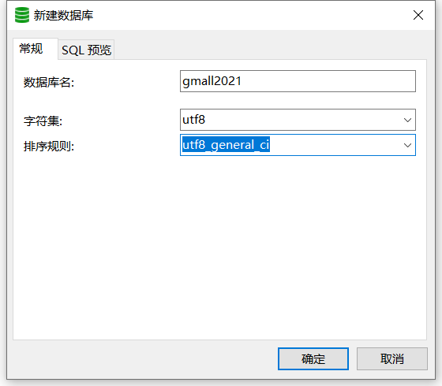


### 5.2.2 导入建表数据

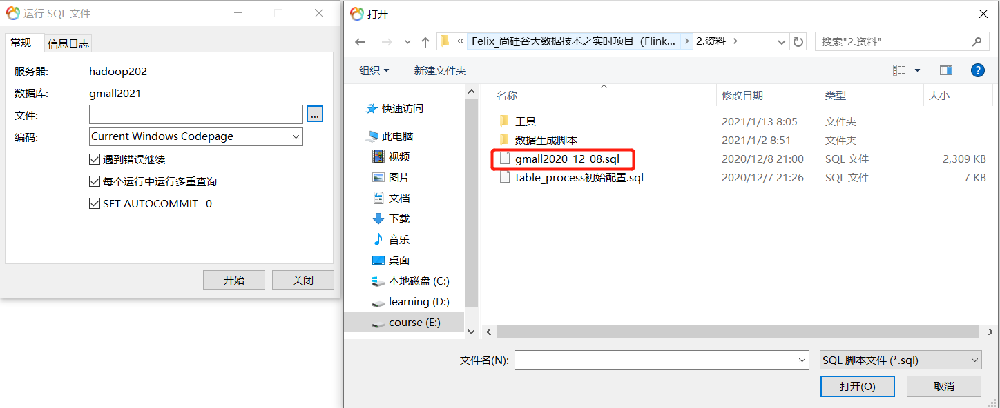

### 5.2.3 修改/etc/my.cnf 文件

```sh
[atguigu@hadoop102 module]$ sudo vim /etc/my.cnf

server-id = 1

log-bin=mysql-bin

binlog_format=row

binlog-do-db=gmall2021

注意：binlog-do-db 根据自己的情况进行修改，指定具体要同步的数据库
```


### 5.2.4 重启 MySQL 使配置生效

```sh
sudo systemctl restart mysqld
```

到/var/lib/mysql 目录下查看初始文件大小 154 


### 5.2.5 模拟生成数据

➢ 把 / 资 料 / 数据生成脚本 / 业 务 数 据 里 面 的 jar 和 properties 文 件 上 传 到/opt/module/gmall-flink/rt_db 目录下

➢ 修改 application.properties 中数据库连接信息

```sh
logging.level.root=info

spring.datasource.driver-class-name=com.mysql.jdbc.Driver
spring.datasource.url=jdbc:mysql://hadoop102:3306/gmall-flink-2021?characterEncoding=utf-8&useSSL=false&serverTimezone=GMT%2B8
spring.datasource.username=root
spring.datasource.password=000000
logging.pattern.console=%m%n

mybatis-plus.global-config.db-config.field-strategy=not_null

#业务日期
mock.date=2021-03-06

#是否重置
mock.clear=1

#是否重置用户
mock.clear.user=0
… … 

```

注意：如果生成较慢，可根据配置情况适当调整配置项

➢ 运行 jar 包

```sh
[atguigu@hadoop102 rt_dblog]$ java -jar gmall2020-mock-db-2020-11-27.jar
```


➢ 再次到/var/lib/mysql 目录下，查看 index 文件的大小

## 5.3 环境搭建

### 5.3.1 在工程中新建模块 gmall2021-realtime 


### 5.3.2 创建如下包结构

 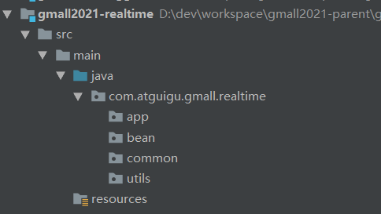

 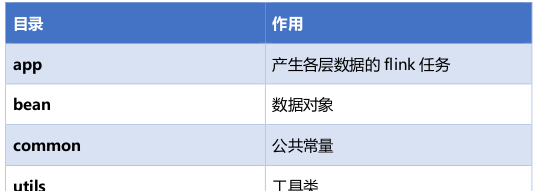

### 5.3.3 修改配置文件

1）在 pom.xml 添加如下配置

```XML
<properties>

 <java.version>1.8</java.version>

 <maven.compiler.source>${java.version}</maven.compiler.source>

 <maven.compiler.target>${java.version}</maven.compiler.target>

 <flink.version>1.12.0</flink.version>

 <scala.version>2.12</scala.version>

 <hadoop.version>3.1.3</hadoop.version>

</properties>

<dependencies>

 <dependency>

 <groupId>org.apache.flink</groupId>

 <artifactId>flink-java</artifactId>

 <version>${flink.version}</version>

 </dependency>

 <dependency> 

 <groupId>org.apache.flink</groupId>

 <artifactId>flink-streaming-java_${scala.version}</artifactId>

 <version>${flink.version}</version>

 </dependency>

 <dependency>

 <groupId>org.apache.flink</groupId>

 <artifactId>flink-connector-kafka_${scala.version}</artifactId>

 <version>${flink.version}</version>

 </dependency>

 <dependency>

 <groupId>org.apache.flink</groupId>

 <artifactId>flink-clients_${scala.version}</artifactId>

 <version>${flink.version}</version>

 </dependency>

 <dependency>

 <groupId>org.apache.flink</groupId>

 <artifactId>flink-cep_${scala.version}</artifactId>

 <version>${flink.version}</version>

 </dependency>

 <dependency>

 <groupId>org.apache.flink</groupId>

 <artifactId>flink-json</artifactId>

 <version>${flink.version}</version>

 </dependency>

 <dependency>

 <groupId>com.alibaba</groupId>

 <artifactId>fastjson</artifactId>

 <version>1.2.68</version>

 </dependency>

 <!--如果保存检查点到 hdfs 上，需要引入此依赖-->

 <dependency>

 <groupId>org.apache.hadoop</groupId>

 <artifactId>hadoop-client</artifactId>

 <version>${hadoop.version}</version>

 </dependency>

 <dependency>

 <groupId>mysql</groupId>

 <artifactId>mysql-connector-java</artifactId>

 <version>5.1.49</version>

 </dependency>

 <dependency> 

 <groupId>com.alibaba.ververica</groupId>

 <artifactId>flink-connector-mysql-cdc</artifactId>

 <version>1.2.0</version>

</dependency>

<dependency>

 <groupId>org.projectlombok</groupId>

 <artifactId>lombok</artifactId>

 <version>1.18.20</version>

</dependency>

 <!--Flink 默认使用的是 slf4j 记录日志，相当于一个日志的接口,我们这里使用 log4j 作为

具体的日志实现-->

 <dependency>

 <groupId>org.slf4j</groupId>

 <artifactId>slf4j-api</artifactId>

 <version>1.7.25</version>

 </dependency>

 <dependency>

 <groupId>org.slf4j</groupId>

 <artifactId>slf4j-log4j12</artifactId>

 <version>1.7.25</version>

 </dependency>

 <dependency>

 <groupId>org.apache.logging.log4j</groupId>

 <artifactId>log4j-to-slf4j</artifactId>

 <version>2.14.0</version>

 </dependency>

</dependencies>

<build>

 <plugins>

 <plugin>

 <groupId>org.apache.maven.plugins</groupId>

 <artifactId>maven-assembly-plugin</artifactId>

 <version>3.0.0</version>

 <configuration>

 <descriptorRefs>

 <descriptorRef>jar-with-dependencies</descriptorRef>

 </descriptorRefs>

 </configuration>

 <executions>

 <execution>

 <id>make-assembly</id>

 <phase>package</phase>

 <goals>

 <goal>single</goal> 
 </goals>

 </execution>

 </executions>

 </plugin>

 </plugins>

</build>
```


2）在 resources 目录下创建 log4j.properties 配置文件

```properties
log4j.rootLogger=error,stdout

log4j.appender.stdout=org.apache.log4j.ConsoleAppender

log4j.appender.stdout.target=System.out

log4j.appender.stdout.layout=org.apache.log4j.PatternLayout

log4j.appender.stdout.layout.ConversionPattern=%d %p [%c] - %m%n
```


## 5.4 代码实现

### 5.4.1 将流数据推送下游的 Kafka 的 Topic 中

```JAVA
package com.atguigu.utils;

import org.apache.flink.api.common.serialization.SimpleStringSchema;

import org.apache.flink.streaming.connectors.kafka.FlinkKafkaConsumer;

import org.apache.flink.streaming.connectors.kafka.FlinkKafkaProducer;

import org.apache.flink.streaming.connectors.kafka.KafkaSerializationSchema;

import org.apache.kafka.clients.consumer.ConsumerConfig;

import org.apache.kafka.clients.producer.ProducerConfig;

import java.util.Properties;

public class MyKafkaUtil {
    private static String KAFKA_SERVER = "hadoop102:9092,hadoop103:9092,hadoop104:9092";
    private static Properties properties = new Properties();
    static {
        properties.setProperty("bootstrap.servers", KAFKA_SERVER);
    }
    
    public static FlinkKafkaProducer<String> getKafkaSink(String topic) {
        return new FlinkKafkaProducer<String>(topic, new SimpleStringSchema(), properties);
    } 
} 
```


### 5.4.2 编写主程序，消费 MySQL 变化数据并将数据写入 Kafka

```JAVA
import com.alibaba.fastjson.JSONObject;

import com.alibaba.ververica.cdc.connectors.mysql.MySQLSource;

import com.alibaba.ververica.cdc.debezium.DebeziumDeserializationSchema;

import com.alibaba.ververica.cdc.debezium.DebeziumSourceFunction;

import io.debezium.data.Envelope;

import org.apache.flink.api.common.restartstrategy.RestartStrategies;

import org.apache.flink.api.common.typeinfo.TypeInformation;

import org.apache.flink.runtime.state.filesystem.FsStateBackend;

import org.apache.flink.streaming.api.CheckpointingMode;

import org.apache.flink.streaming.api.datastream.DataStreamSource;

import org.apache.flink.streaming.api.environment.CheckpointConfig;

import org.apache.flink.streaming.api.environment.StreamExecutionEnvironment;

import org.apache.flink.util.Collector;

import org.apache.kafka.connect.data.Field;

import org.apache.kafka.connect.data.Struct;

import org.apache.kafka.connect.source.SourceRecord;

import java.util.Properties;

public class Flink_CDCWithCustomerSchema {
    public static void main(String[] args) throws Exception {
        //1.创建执行环境
        StreamExecutionEnvironment env = StreamExecutionEnvironment.getExecutionEnvironment();
        env.setParallelism(1);
        
        //2.创建 Flink-MySQL-CDC 的 Source
        DebeziumSourceFunction<String> mysqlSource = MySQLSource.<String>builder()
            .hostname("hadoop102").port(3306).username("root").password("000000")
            .databaseList("gmall-flink-2021")
            .startupOptions(StartupOptions.latest())
            .deserializer(new DebeziumDeserializationSchema<String>() {
                //自定义数据解析器
                @Override
                public void deserialize(SourceRecord sourceRecord, Collector<String> collector) throws Exception {
                    // 获 取 主 题 信 息 , 包 含 着 数 据 库 和 表 名 mysql_binlog_source.gmall-flink.z_user_info
                    
                    String topic = sourceRecord.topic(); 
                    String[] arr = topic.split("\\.");
                    String db = arr[1];
                    String tableName = arr[2];
                    //获取操作类型 READ DELETE UPDATE CREATE
                    Envelope.Operation operation = Envelope.operationFor(sourceRecord);
                    //获取值信息并转换为 Struct 类型
                    Struct value = (Struct) sourceRecord.value();
                    //获取变化后的数据
                    Struct after = value.getStruct("after");
                    //创建 JSON 对象用于存储数据信息
                    JSONObject data = new JSONObject();
                    if (after != null) {
                        Schema schema = after.schema();
                        for (Field field : schema.fields()) {
                            data.put(field.name(), after.get(field.name()));
                        }
                    }
                    //创建 JSON 对象用于封装最终返回值数据信息
                    JSONObject result = new JSONObject();
                    result.put("operation", operation.toString().toLowerCase());
                    result.put("data", data);
                    result.put("database", db);
                    result.put("table", tableName);
                    //发送数据至下游
                    collector.collect(result.toJSONString());
                }
                
                @Override
                public TypeInformation<String> getProducedType() {
                    return TypeInformation.of(String.class);
                }
            }).build();


        //3.使用 CDC Source 从 MySQL 读取数据
        DataStreamSource<String> mysqlDS = env.addSource(mysqlSource);
        //4.打印数据
        mysqlDS.addSink(MyKafkaUtil.getKafkaSink("ods_base_db"));
        //5.执行任务 
        env.execute();
    } 
}
```

5.5 运行测试

点击代码运行即可！

# 第 6 章 附录 1：Nginx 教程

## 6.1 Nginx 简介

Nginx ("engine x") 是一个高性能的 HTTP 和反向代理服务器,特点是占有内存少，并发能力强，事实上 nginx 的并发能力确实在同类型的网页服务器中表现较好，中国大陆使用 nginx网站用户有：百度、京东、新浪、网易、腾讯、淘宝等。

Nginx 是由俄罗斯人 Igor Sysoev 采用 C 语言开发编写的，第一个公开版本 0.1.0 发布于2004 年 10 月 4 日。


​																					Igor Sysoev，Nginx 的创始人

Igor Sysoev 出生于 1970 年的阿拉木图（哈萨克斯坦共和国城市），也就是前苏联。1991年苏联解体，哈萨克斯坦宣布独立，Nginx 作者 1994 年毕业于莫斯科国立鲍曼技术大学；毕业后继续在莫斯科工作和生活，就职于 NGINX,Inc，任 CTO。https://www.nginx.com/ 


## 6.2 正向代理和反向代理概念

正向代理类似一个跳板机，代理访问外部资源。比如：我是一个用户，我访问不了某网站，但是我能访问一个代理服务器，这个代理服务器，它能访问那个我不能访问的网站，于是我先连上代理服务器，告诉它我需要那个无法访问网站的内容，代理服务器去取回来,然后返回给我。


反向代理（Reverse Proxy）方式是指以代理服务器来接受 internet 上的连接请求，然后将请求转发给内部网络上的服务器，并将从服务器上得到的结果返回给 internet 上请求连接的客户端，此时代理服务器对外就表现为一个反向代理服务器； 

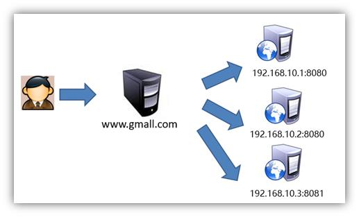


## 6.3 Nginx 主要应用

### 6.3.1 静态网站部署

Nginx 是一个 HTTP 的 web 服务器，可以将服务器上的静态文件（如 HTML、图片等）通过 HTTP 协议返回给浏览器客户端。 

### 6.3.2 负载均衡

在网站创立初期，我们一般都使用单台机器对外提供集中式服务。随着业务量的增大，我们一台服务器不够用，此时就会把多台机器组成一个集群对外提供服务，但是，我们网站对外提供的访问入口通常只有一个，比如 www.web.com。那么当用户在浏览器输入www.web.com 进行访问的时候，如何将用户的请求分发到集群中不同的机器上呢，这就是负载均衡要做的事情。

负载均衡通常是指将请求"均匀"分摊到集群中多个服务器节点上执行，这里的均匀是指在一个比较大的统计范围内是基本均匀的，并不是完全均匀

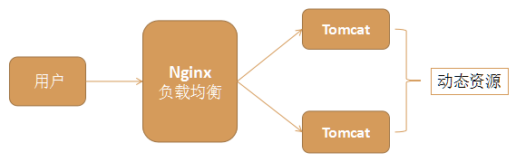

常用的负载均衡策略：轮询、权重、备机… 

### 6.3.3 静态代理

把所有静态资源的访问改为访问 nginx，而不是访问 tomcat，这种方式叫静态代理。

因为 nginx 更擅长于静态资源的处理，性能更好，效率更高。所以在实际应用中，我们将静态资源比如图片、css、html、js 等交给 nginx 处理，而不是由 tomcat 处理。

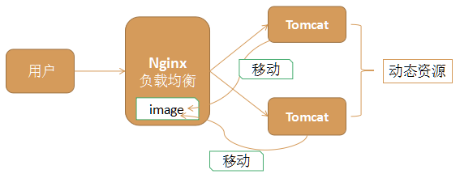

### 6.3.4 动静分离

Nginx 的负载均衡和静态代理结合在一起，我们可以实现动静分离，这是实际应用中常见的一种场景。

动态资源，如 jsp 由 tomcat 或其他 web 服务器完成

静态资源，如图片、css、js 等由 nginx 服务器完成

它们各司其职，专注于做自己擅长的事情

动静分离充分利用了它们各自的优势，从而达到更高效合理的架构 

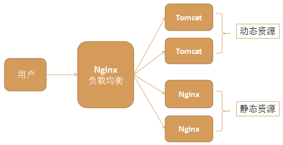


### 6.4 Nginx 安装以及相关命令

➢ 在 hadoop102 上运行 yum，安装相关依赖包

```sh
sudo yum -y install openssl openssl-devel pcre pcre-devel zlib zlib-devel gcc gcc-c++
```


➢ 将/2.资料/工具下的 nginx-1.12.2.tar.gz 上传到/opt/software 下 

➢ 在/opt/module/software 下解压缩 nginx-1.12.2.tar.gz 包 

➢ 进入解压缩目录，执行

```sh
./configure --prefix=/opt/module/nginx
make && make install

--prefix=要安装到的目录
```

➢ 安装成功后，/opt/module/nginx 目录下结构

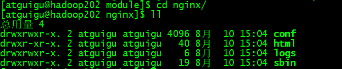

➢ 启动 Nginx

在/opt/module/nginx/sbin 目录下执行 ./nginx

➢ 如果在 atguigu 用户下面启动会报错 

原因：nginx 占用 80 端口，默认情况下非 root 用户不允许使用 1024 以下端口

解决：让当前用户的某个应用也可以使用 1024 以下的端口

```sh
sudo setcap cap_net_bind_service=+eip /opt/module/nginx/sbin/nginx
```

注意：要根据自己的实际路径进行配置

➢ 查看启动情况

```sh
ps -ef |grep nginx 
```

因为 nginx 不是用 java 写的，所以不能通过 jps 查看

➢ 在浏览器中输入 http://hadoop102/访问

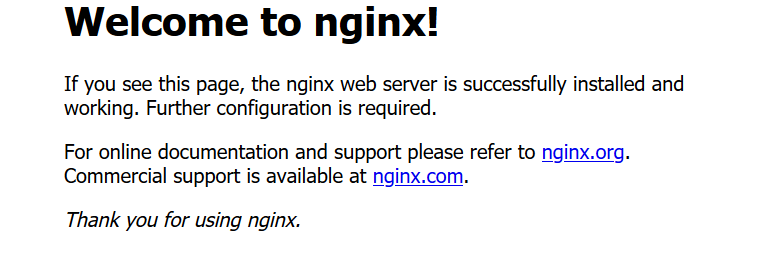

➢ 重启 Nginx

```sh
./nginx -s reload
```

➢ 关闭 Nginx

```sh
./nginx -s stop
```

➢ 通过配置文件启动

```sh
./nginx -c /opt/module/nginx/conf/nginx.conf

/opt/module/nginx/sbin/nginx -c /opt/module/nginx/conf/nginx.conf
```

其中-c 是指定配置文件,而且配置文件路径必须指定绝对路径

➢ 配置检查

当修改 Nginx 配置文件后，可以使用 Nginx 命令进行配置文件语法检查，用于检查 Nginx 配置文件是否正确

```sh
/opt/module /nginx/sbin/nginx -c /opt/module/nginx/conf/nginx.conf –t 
```

➢ 如果 80 端口号被占用 httpd

```sh
sudo systemctl stop httpd 

sudo systemctl disable httpd
```


➢ 部分机器启动时报错：

```txt
/usr/local/nginx/sbin/nginx: error while loading shared libraries: libpcre.so.1: cannot 
open shared object file: No such file or directory

解决：ln -s /usr/local/lib/libpcre.so.1 /lib64
```


## 6.5 配置负载均衡

模拟数据以后应该发给 nginx, 然后 nginx 再转发给我们的日志服务器。日志服务器我们会分别配置在 hadoop102,hadoop103,hadoop104 三台设备上.

1. 打开 nginx 配置文件

```sh
cd /opt/module/nginx/conf

vim nginx.conf
```

2. 修改如下配置

```sh
http {

 # 启动省略

 upstream logcluster{

 server hadoop102:8081 weight=1;

 server hadoop103:8081 weight=1;

 server hadoop104:8081 weight=1;

 }

 server {

 listen 80;

 server_name localhost;

 #charset koi8-r;

 #access_log logs/host.access.log main;

 location / {

 #root html;

 #index index.html index.htm;

 # 代理的服务器集群 命名随意, 但是不能出现下划线

 proxy_pass http://logcluster;

 proxy_connect_timeout 10;

 }

# 其他省略

} 
```

# 第 7 章 附录 2：Maxwell 介绍

Maxwell 是由美国 Zendesk 开源，用 Java 编写的 MySQL 实时抓取软件。 实时读取MySQL 二进制日志 Binlog，并生成 JSON 格式的消息，作为生产者发送给 Kafka，Kinesis、RabbitMQ、Redis、Google Cloud Pub/Sub、文件或其它平台的应用程序。

官网地址：http://maxwells-daemon.io/

## 7.1 Maxwell 工作原理

### 7.1.1 MySQL 主从复制过程

➢ Master 主库将改变记录，写到二进制日志(binary log)中 

➢ Slave 从库向 mysql master 发送 dump 协议，将 master 主库的 binary log events拷贝到它的中继日志(relay log)； 

➢ Slave 从库读取并重做中继日志中的事件，将改变的数据同步到自己的数据库。 

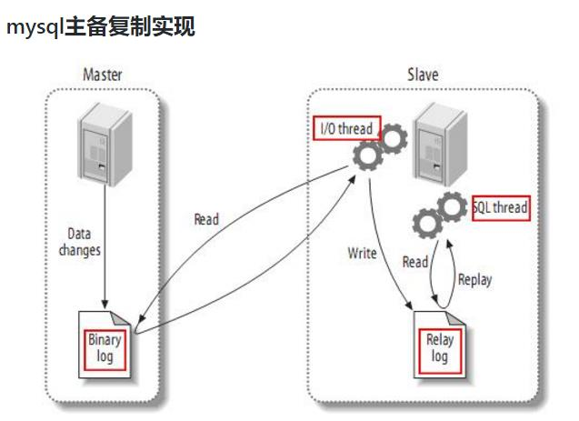


### 7.1.2 Maxwell 的工作原理

很简单，就是把自己伪装成 slave，假装从 master 复制数据

### 7.1.3 MySQL 的 binlog

(1) 什么是 binlog

 MySQL 的二进制日志可以说 MySQL 最重要的日志了，它记录了所有的 DDL 和DML(除了数据查询语句)语句，以事件形式记录，还包含语句所执行的消耗的时间，MySQL的二进制日志是事务安全型的。

 一般来说开启二进制日志大概会有 1%的性能损耗。二进制有两个最重要的使用场景: 

➢ 其一：MySQL Replication 在 Master 端开启 binlog，Master 把它的二进制日志传递给 slaves 来达到 master-slave 数据一致的目的。

➢ 其二：自然就是数据恢复了，通过使用 mysqlbinlog 工具来使恢复数据。

二进制日志包括两类文件：二进制日志索引文件（文件名后缀为.index）用于记录所有的二进制文件，二进制日志文件（文件名后缀为.00000*）记录数据库所有的 DDL 和 DML(除了数据查询语句)语句事件。

(2) binlog 的开启

➢ 找到 MySQL 配置文件的位置

➢ Linux: /etc/my.cnf

如果/etc 目录下没有，可以通过 locate my.cnf 查找位置

➢ Windows: \my.ini

➢ 在 mysql 的配置文件下,修改配置

在[mysqld] 区块，设置/添加 log-bin=mysql-bin 

这个表示 binlog 日志的前缀是 mysql-bin，以后生成的日志文件就是

mysql-bin.123456 的文件后面的数字按顺序生成，每次 mysql 重启或者到达单个文件大小的阈值时，新生一个文件，按顺序编号。

(3) binlog 的分类设置

mysql binlog 的格式有三种，分别是 STATEMENT,MIXED,ROW。

在配置文件中可以选择配置 

binlog_format= statement|mixed|row

➢ 三种格式的区别：

◼ statement

 语句级，binlog 会记录每次一执行写操作的语句。 相对 row 模式节省空间，但是可能产生不一致性，比如

update tt set create_date=now() 

 如果用 binlog 日志进行恢复，由于执行时间不同可能产生的数据就不同。

 优点： 节省空间

 缺点： 有可能造成数据不一致。

◼ row

 行级， binlog 会记录每次操作后每行记录的变化。

 优点：保持数据的绝对一致性。因为不管 sql 是什么，引用了什么函数，他只记录执行后的效果。

 缺点：占用较大空间。

◼ mixed

 statement 的升级版，一定程度上解决了，因为一些情况而造成的 statement 模式不一致问题 

 默认还是 statement，在某些情况下譬如：

 当函数中包含 UUID() 时；

 包含 AUTO_INCREMENT 字段的表被更新时；

 执行 INSERT DELAYED 语句时；

 用 UDF 时；

 会按照 ROW 的方式进行处理

 优点：节省空间，同时兼顾了一定的一致性。

 缺点：还有些极个别情况依旧会造成不一致，另外 statement 和 mixed 对于需要对 binlog 的监控的情况都不方便。

综合上面对比，Maxwell 想做监控分析，选择 row 格式比较合适

## 7.2 安装 Maxwell

➢ 将/2.资料/工具下的 maxwell-1.25.0.tar.gz 上传到/opt/software 目录下

➢ 解压 maxwell-1.25.0.tar.gz 到/opt/module 目录

```sh
[atguigu@hadoop102 module]$ tar -zxvf /opt/software/maxwell-1.25.0.tar.gz -C /opt/module/
```


## 7.3 初始化 Maxwell 元数据库

➢ 在 MySQL 中建立一个 maxwell 库用于存储 Maxwell 的元数据

```sh
[atguigu@hadoop102 module]$ mysql -uroot -p000000

mysql> CREATE DATABASE maxwell;
```

➢ 设置安全级别

```sh
mysql> set global validate_password_length=4;

mysql> set global validate_password_policy=0;
```


➢ 分配一个账号可以操作该数据库

```sh
mysql> GRANT ALL ON maxwell.* TO 'maxwell'@'%' IDENTIFIED BY '000000'; 
```

➢ 分配这个账号可以监控其他数据库的权限

```sh
mysql> GRANT SELECT ,REPLICATION SLAVE , REPLICATION CLIENT ON *.* TO maxwell@'%';
```


## 7.4 使用 Maxwell 监控抓取 MySQL 数据

➢ 拷贝配置文件

```sh
[atguigu@hadoop102 maxwell-1.25.0]$ cp config.properties.example config.properties
```


➢ 修改配置文件

```sh
producer=kafka

kafka.bootstrap.servers=hadoop102:9092,hadoop103:9092,hadoop104:9092

#需要添加
kafka_topic=ods_base_db_m

# mysql login info

host=hadoop102
user=maxwell
password=000000

#需要添加 初始化会用
client_id=maxwell_1
```

注意：默认还是输出到指定 Kafka 主题的一个 kafka 分区，因为多个分区并行可能会打乱binlog 的顺序;

如果要提高并行度，首先设置 kafka 的分区数>1,然后设置 producer_partition_by 属性;

可选值 producer_partition_by=database|table|primary_key|random| column

➢ 在/home/atguigu/bin 目录下编写 maxwell.sh 启动脚本

```sh
[atguigu@hadoop102 maxwell-1.25.0]$ vim /home/atguigu/bin/maxwell.sh
/opt/module/maxwell-1.25.0/bin/maxwell --config /opt/module/maxwell-1.25.0/config.properties >/dev/null 2>&1 &
```

➢ 授予执行权限

```sh
[atguigu@hadoop102 maxwell-1.25.0]$ sudo chmod +x /home/atguigu/bin/maxwell.sh
```

➢ 运行启动程序

```sh
[atguigu@hadoop102 maxwell-1.25.0]$ maxwell.sh
```

➢ 启动 Kafka 消费客户端，观察结果

```sh
[atguigu@hadoop102 kafka]$ bin/kafka-console-consumer.sh --bootstrap-server hadoop102:9092 --topic ods_base_db_m 
```

➢ 执行/opt/module/rt_dblog 下的 jar 生成模拟数据

```sh
[atguigu@hadoop102 rt_dblog]$ java -jar gmall2020-mock-db-2020-11-27.jar
```

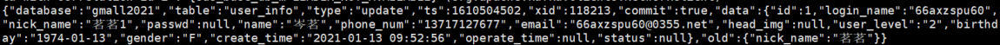

# 第 8 章 附录 3：Canal 搭建教程

## 8.1 Canal 入门

### 8.1.1 什么是 Canal

阿里巴巴 B2B 公司，因为业务的特性，卖家主要集中在国内，买家主要集中在国外，所以衍生出了同步杭州和美国异地机房的需求，从 2010 年开始，阿里系公司开始逐步的尝试基于数据库的日志解析，获取增量变更进行同步，由此衍生出了增量订阅&消费的业务。

Canal 是用 java 开发的基于数据库增量日志解析，提供增量数据订阅&消费的中间件。目前，Canal 主要支持了 MySQL 的 Binlog 解析，解析完成后才利用 Canal Client 来处理获得的相关数据。（数据库同步需要阿里的 Otter 中间件，基于 Canal）。 

### 8.1.2 使用场景

(1) 原始场景： 阿里 Otter 中间件的一部分

Otter 是阿里用于进行异地数据库之间的同步框架，Canal 是其中一部分。 

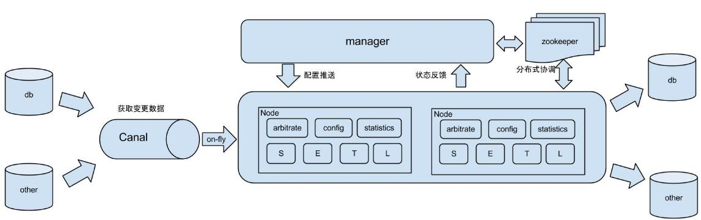

(2) 常见场景1：更新缓存

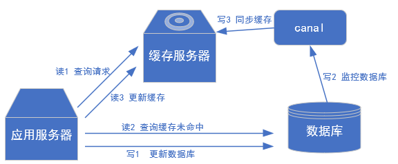

(3) 常见场景2：抓取业务数据新增变化表，用于制作拉链表。

(4) 常见场景3：抓取业务表的新增变化数据，用于制作实时统计（我们就是这种场景）

### 8.1.3 Canal 的工作原理

(1) MySQL 主从复制过程

➢ Master 主库将改变记录，写到二进制日志(Binary log)中 

➢ Slave 从库向 mysql master 发送 dump 协议，将 master 主库的 binary log events拷贝到它的中继日志(relay log)； 

➢ Slave 从库读取并重做中继日志中的事件，将改变的数据同步到自己的数据库。 


(2) Canal 的工作原理

很简单，就是把自己伪装成 Slave，假装从 Master 复制数据

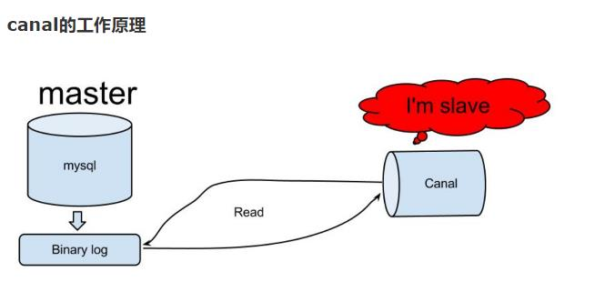

### 8.1.4 MySQL 的 Binlog

(4) 什么是 Binlog 

 MySQL 的二进制日志可以说 MySQL 最重要的日志了，它记录了所有的 DDL 和DML(除了数据查询语句)语句，以事件形式记录，还包含语句所执行的消耗的时间，MySQL的二进制日志是事务安全型的。

 一般来说开启二进制日志大概会有 1%的性能损耗。二进制有两个最重要的使用场景: 

➢ 其一：MySQL Replication 在 Master 端开启 Binlog，Master 把它的二进制日志传递给 Slaves 来达到 Master-Slave 数据一致的目的。

➢ 其二：自然就是数据恢复了，通过使用 MySQL Binlog 工具来使恢复数据。

二进制日志包括两类文件：二进制日志索引文件（文件名后缀为.index）用于记录所有的二进制文件，二进制日志文件（文件名后缀为.00000*）记录数据库所有的 DDL 和 DML(除了数据查询语句)语句事件。

(5) Binlog 的开启

➢ 找到 MySQL 配置文件的位置

➢ Linux: /etc/my.cnf

如果/etc 目录下没有，可以通过 locate my.cnf 查找位置

➢ Windows: \my.ini

➢ 在 mysql 的配置文件下,修改配置

在[mysqld] 区块，设置/添加 log-bin=mysql-bin

这个表示 binlog 日志的前缀是 mysql-bin，以后生成的日志文件就是mysql-bin.123456 的文件后面的数字按顺序生成，每次 mysql 重启或者到达单个文件大小的阈值时，新生一个文件，按顺序编号。

(6) Binlog 的分类设置

mysql binlog 的格式有三种，分别是 STATEMENT,MIXED,ROW。 

在配置文件中可以选择配置 

binlog_format= statement|mixed|row

➢ 三种格式的区别：

◼ statement 

 语句级，binlog 会记录每次一执行写操作的语句。 相对 row 模式节省空间，但是可能产生不一致性，比如

```sql
update tt set create_date=now() 
```

 如果用 binlog 日志进行恢复，由于执行时间不同可能产生的数据就不同。

 优点： 节省空间

 缺点： 有可能造成数据不一致。

◼ row 

 行级， binlog 会记录每次操作后每行记录的变化。

 优点：保持数据的绝对一致性。因为不管 sql 是什么，引用了什么函数，他只记录执行后的效果。

 缺点：占用较大空间。

◼ mixed

 statement 的升级版，一定程度上解决了，因为一些情况而造成的 statement 模式不一致问题

 默认还是 statement，在某些情况下譬如：

 当函数中包含 UUID() 时；

 包含 AUTO_INCREMENT 字段的表被更新时；

 执行 INSERT DELAYED 语句时；

 用 UDF 时； 

 会按照 ROW 的方式进行处理

 优点：节省空间，同时兼顾了一定的一致性。

 缺点：还有些极个别情况依旧会造成不一致，另外 statement 和 mixed 对于需要对 binlog 的监控的情况都不方便。

综合上面对比，Cannel 想做监控分析，选择 row 格式比较合适

## 8.2 MySQL 的准备

### 8.2.1 创建实时业务数据库


### 8.2.2 导入建表数据

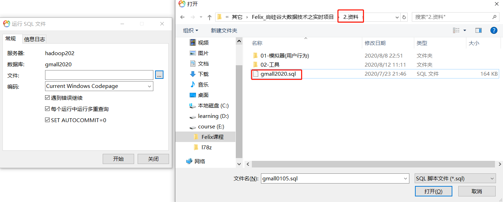

### 8.2.3 修改/etc/my.cnf 文件

```sh
[atguigu@hadoop102 module]$ sudo vim /etc/my.cnf
server-id= 1
log-bin=mysql-bin
binlog_format=row
binlog-do-db=gmall2020
```

注意：binlog-do-db 根据自己的情况进行修改，指定具体要同步的数据库

### 8.2.4 重启 MySQL 使配置生效

```sh
sudo systemctl restart mysqld
```

到/var/lib/mysql 目录下查看初始文件大小 154 

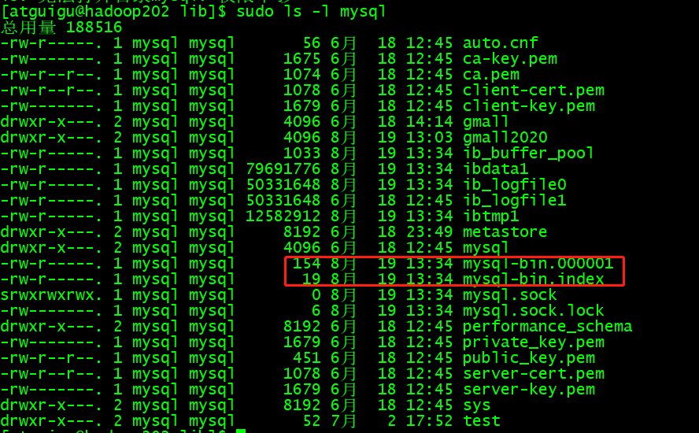

### 8.2.5 模拟生成数据

➢ 把 /2. 资 料 /03- 模 拟 器 ( 数 据 库 ) 里 面 的 jar 和 properties 文件上传到/opt/module/rt_dblog 目录下

➢ 修改 application.properties 中数据库连接信息

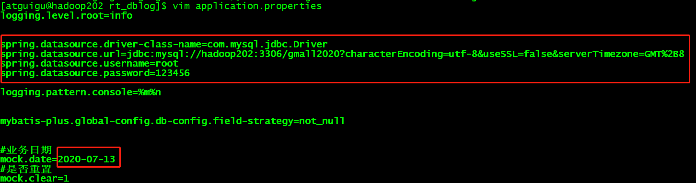

➢ 运行 jar 包

```sh
[atguigu@hadoop102 rt_dblog]$ java -jar gmall2020-mock-db-2020-05-18.jar 
```

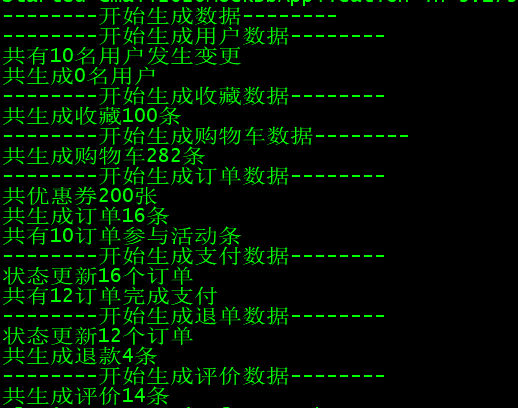

➢ 再次到到/var/lib/mysql 目录下，查看 index 文件的大小

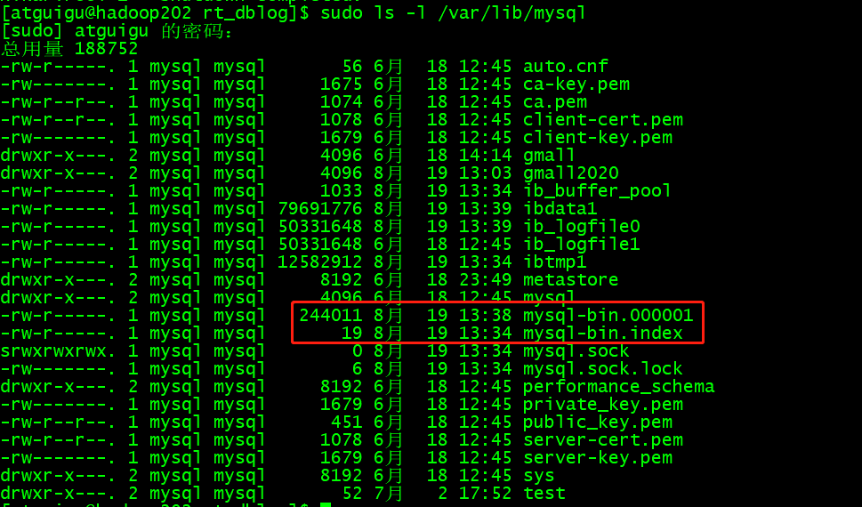

### 8.2.6 赋权限

在 mysql 中执行

```sql
mysql> set global validate_password_length=4;
mysql> set global validate_password_policy=0;
mysql> GRANT SELECT, REPLICATION SLAVE, REPLICATION CLIENT ON *.* TO 'canal'@'%' IDENTIFIED BY 'canal' ; 
```

## 8.3 canal 架构以及安装

### 8.3.1 canal 架构

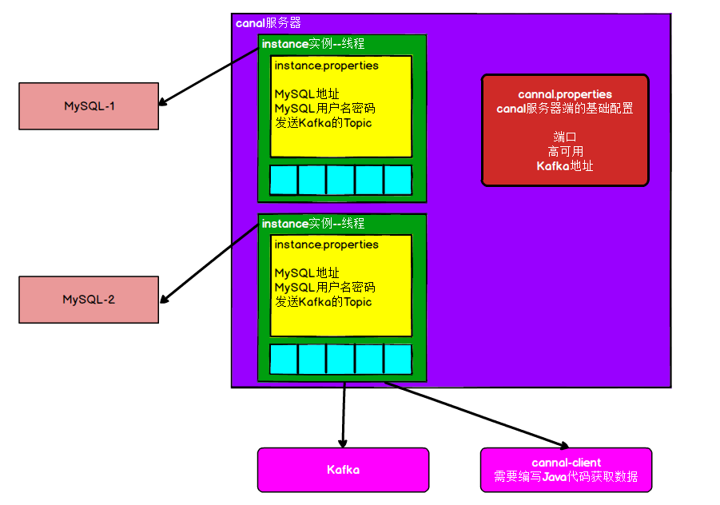

### 8.3.2 canal 的下载和安装

https://github.com/alibaba/canal/releases

我们直接/2.资料/02-工具下的canal.deployer-1.1.4.tar.gz拷贝到/opt/sortware目录下，然后解压到/opt/module/canal包下

注意：canal解压后是散的，我们在指定解压目录的时候需要将canal指定上

```sh
[atguigu@hadoop102 software]$ mkdir /opt/module/canal

[atguigu@hadoop102 software]$ tar -zxvf canal.deployer-1.1.4.tar.gz -C /opt/module/canal 
```

## 8.4 canal 单机版

### 8.4.1 修改 conf/canal.properties 的配置

```sh
[atguigu@hadoop102 conf]$ pwd
/opt/module/canal/conf
[atguigu@hadoop102 conf]$ vim canal.properties
```

➢ 这个文件是 canal 的基本通用配置，canal 端口号默认就是 11111

➢ 修改 canal 的输出 model，默认 tcp，改为输出到 kafka

 

tcp 就是输出到 canal 客户端，通过编写 Java 代码处理

➢ 修改 Kafka 集群的地址

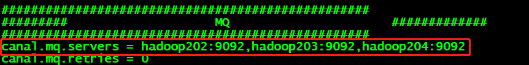

➢ 如果创建多个实例

通过前面 canal 架构，我们可以知道，一个 canal 服务中可以有多个 instance，conf/下的每一个 example 即是一个实例，每个实例下面都有独立的配置文件。默认只有一个实例 example，如果需要多个实例处理不同的 MySQL 数据的话，直接拷贝出多个example，并对其重新命名，命名和配置文件中指定的名称一致，然后修改 canal.properties 中的canal.destinations=实例 1，实例 2，实例 3。 

 

### 8.4.2 修改 instance.properties

我们这里只读取一个 MySQL 数据，所以只有一个实例，这个实例的配置文件在conf/example 目录下

```sh
[atguigu@hadoop102 example]$ pwd
/opt/module/canal/conf/example
[atguigu@hadoop102 example]$ vim instance.properties
```

➢ 配置 MySQL 服务器地址

 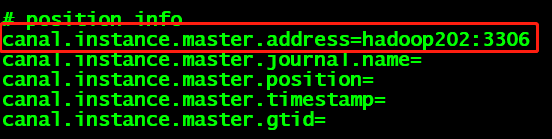

➢ 配置连接 MySQL 的用户名和密码，默认就是我们前面授权的 canal

 

➢ 修改输出到 Kafka 的主题以及分区数

 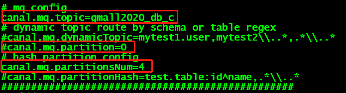

注意：默认还是输出到指定 Kafka 主题的一个 kafka 分区，因为多个分区并行可能会打乱binlog 的顺序

如果要提高并行度，首先设置 kafka 的分区数>1,然后设置 canal.mq.partitionHash 属性 

### 8.4.3 单机 canal 测试

➢ 启动 canal 

```sh
[atguigu@hadoop102 example]$ cd /opt/module/canal/

[atguigu@hadoop102 canal]$ bin/startup.sh
```

看到 CanalLauncher 你表示启动成功，同时会创建 gmall2020_db_c 主题

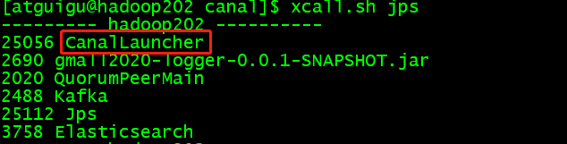

➢ 启动 Kafka 消费客户端测试，查看消费情况

```sh
[atguigu@hadoop102 kafka]$ bin/kafka-console-consumer.sh --bootstrap-server hadoop102:9092 --topic gmall2020_db_c
```

➢ 运行/opt/module/rt_dblog 中生成模拟数据

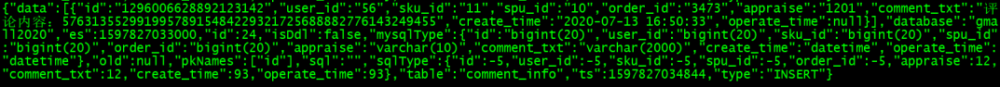

## 8.5 canal 高可用（了解）

这种 zookeeper 为观察者监控的模式，只能实现高可用，而不是负载均衡，即同一时点只有一个 canal-server 节点能够监控某个数据源，只要这个节点能够正常工作，那么其他监控这个数据源的 canal-server 只能做 stand-by，直到工作节点停掉，其他 canal-server 节点才能抢占。因为有一个 stand-by 也要占用资源，同时 canal 传输数据宕机的情况也比较少，所以好多企业是不配置 canal 的高可用的。

### 8.5.1 停止单机 canal 进程


### 8.5.2 在 hadoop102 上修改 canal.properties

➢ 配置 zookeeper

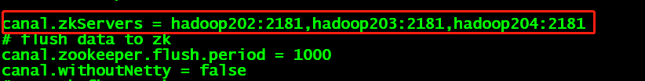

➢ 避免发送重复数据（否则在切换 active 的时候会重复发送数据）

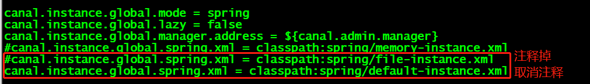

### 8.5.3 把 canal 目录分发给其他虚拟机

```sh
[atguigu@hadoop102 module]$ xsync canal/
```


### 8.5.4 测试

➢ 先在 hadoop102 启动 canal，再在 hadoop103 上启动 canal

```sh
[atguigu@hadoop102 canal]$ bin/startup.sh
```

➢ 启动 kafka 消费客户端

```sh
[atguigu@hadoop102 kafka]$ bin/kafka-console-consumer.sh --bootstrap-server hadoop102:9092 --topic gmall2021_db_c
```

➢ 在数据库 gmall2021 随便一张表中修改一条数据,查看效果

➢ 挂掉 102 再次修改数据，查看效果

## 8.6 Maxwell 与 Canal 工具对比

➢ Maxwell 没有 Canal 那种 server+client 模式，只有一个 server 把数据发送到消息队列或 redis。 

➢ Maxwell 有一个亮点功能，就是 Canal 只能抓取最新数据，对已存在的历史数据没有办法处理。而 Maxwell 有一个 bootstrap 功能，可以直接引导出完整的历史数据用于初始化，非常好用。

➢ Maxwell 不能直接支持 HA，但是它支持断点还原，即错误解决后重启继续上次点儿读取数据。 

➢ Maxwell 只支持 json 格式，而 Canal 如果用 Server+client 模式的话，可以自定义格式。

➢ Maxwell 比 Canal 更加轻量级。

### 8.6.1 执行不同操作，Maxwell 和 canal 数据格式对比

➢ 执行 insert 测试语句

```sql
INSERT INTO z_user_info VALUES(30,'zhang3','13810001010'),(31,'li4','1389999999');
```

| canal                                                        | maxwell                                                      |
| ------------------------------------------------------------ | ------------------------------------------------------------ |
| {"data":[{"id":"30","user_name":"zhang3","tel":"13810001010"},{"id":"31","user_name":"li4","tel":"1389999999"}],"database":"gmall-2020-04","es":1589385314000,"id":2,"isDdl":false,"mysqlType":{"id":"bigint(20)","user_name":"varchar(20)","tel":"varchar(20)"},"old":null,"pkNames":["id"],"sql":"","sqlType":{"id":-5,"user_name":12,"tel":12},"table":"z_user_info","ts":1589385314116,"type":"INSERT"} | {"database":"gmall-2020-04","table":"z_user_info","type":"insert","ts":1589385314,"xid":82982,"xoffset":0,"data":{"id":30,"user_name":"zhang3","tel":"13810001010"}}{"database":"gmall-2020-04","table":"z_user_info"," type":"insert","ts":1589385314,"xid":82982,"commit":true,"data":{"id":31,"user_name":"li4","tel":"1389999999"}} |

➢ 执行 update 操作

```sql
UPDATE z_user_info SET `user_name`='wang55' WHERE id IN(30,31)
```

| canal                                                        | maxwell                                                      |
| ------------------------------------------------------------ | ------------------------------------------------------------ |
| {"data":[{"id":"30","user_name":"wang55","tel":"13810001010"},{"id":"31","user_name":"wang55","tel":"1389999999"}],"database":"gmall-2020-04","es":1589385508000,"id":3,"isDdl":false,"mysqlType":{"id":"bigint(20)","user_name":"varchar(20)","tel":"varchar(20)"},"old":[{"user_name":"zhang3"},{"user_name":"li4"}],"pkNames":["id"],"sql":"","sqlType":{"id":-5,"user_name":12,"tel":12},"table":"z_user_info","ts":1589385508676,"type":"UPDATE"} | {"database":"gmall-2020-04","table":"z_user_info","type":"update","ts":1589385508,"xid":83206,"xoffset":0,"data":{"id":30,"user_name":"wang55","tel":"13810001010"},"old":{"user_name":"zhang3"}}{"database":"gmall-2020-04","table":"z_user_info","type":"update","ts":1589385508,"xid":83206,"commit":true,"data":{"id":31,"user_name":"wang55","tel":"1389999999"},"old":{"user_name":"li4"}} |

➢ delete 操作

```sql
DELETE FROM z_user_info WHERE id IN(30,31)
```

| canal                                                        | maxwell                                                      |
| ------------------------------------------------------------ | ------------------------------------------------------------ |
| {"data":[{"id":"30","user_name":"wang55","tel":"13810001010"},{"id":"31","user_name":"wang55","tel":"1389999999"}],"database":"gmall-2020-04","es":1589385644000,"id":4,"isDdl":false,"mysqlType":{"id":"bigint(20)","user_name":"varchar(20)","tel":"varchar(20)"},"old":null,"pkNames":["id"],"sql":"","sqlType":{"id":-5,"user_name":12,"tel":12},"table":"z_user_info","ts":1589385644829,"type":"DELETE"} | {"database":"gmall-2020-04","table":"z_user_info","type":"delete","ts":1589385644,"xid":83367,"xoffset":0,"data":{"id":30,"user_name":"wang55","tel":"13810001010"}}{"database":"gmall-2020-04","table":"z_user_info","type":"delete","ts":1589385644,"xid":83367,"commit":true,"data":{"id":31,"user_name":"wang55","tel":"1389999999"}} |

### 8.6.2 总结数据特点

➢ 日志结构

canal 每一条 SQL 会产生一条日志，如果该条 Sql 影响了多行数据，则已经会通过集合的方式归集在这条日志中。（即使是一条数据也会是数组结构）maxwell 以影响的数据为单位产生日志，即每影响一条数据就会产生一条日志。如果想知道这些日志是否是通过某一条 sql 产生的可以通过 xid 进行判断，相同的 xid 的日志来自同一 sql。 

➢ 数字类型

当原始数据是数字类型时,maxwell 会尊重原始数据的类型不增加双引，变为字符串。canal 一律转换为字符串。

➢ 带原始数据字段定义

canal 数据中会带入表结构。maxwell 更简洁。

## 8.7 Maxwell 的初始化数据功能

例如：初始化用户表

```sh
bin/maxwell-bootstrap --user maxwell --password 000000 --host hadoop102 --database gmall2021 --table user_info --client_id maxwell_1
```

➢ --user maxwell

数据库分配的操作 maxwell 数据库的用户名

➢ --password 000000

数据库分配的操作 maxwell 数据库的密码

➢ --host 

数据库主机名

➢ --database

数据库名

➢ --table

表名

➢ --client_id

maxwell-bootstrap 不具备将数据直接导入 kafka或者 hbase 的能力，通过--client_id指定将数据交给哪个 maxwell 进程处理，在 maxwell 的 conf.properties 中配置

 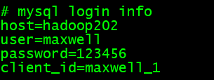