# 第1章 需求分析及实现思路

## 1.1 分层需求分析

在之前介绍实时数仓概念时讨论过,建设实时数仓的目的,主要是增加数据计算的复用性。每次新增加统计需求时,不至于从原始数据进行计算,而是从半成品继续加工而成。我们这里从 Kafka 的 ODS 层读取用户行为日志以及业务数据,并进行简单处理,写回到 Kafka 作为 DWD 层。

实时数仓分层需求介绍


## 1.2 每层的职能

| 分层 | 数据描述                                                     | 生成计算工具         | 存储媒介   |
| ---- | ------------------------------------------------------------ | -------------------- | ---------- |
| ODS  | 原始数据,日志和业务数据                                      | 日志服务器, FlinkCDC | Kafka      |
| DWD  | 根据数据对象为单位进行分流,比如订单、页面访问等等。          | Flink                | Kafka      |
| DWM  | 对于部分数据对象进行进一步加工,比如独立<br/>访问、跳出行为。依旧是明细数据。 | Flink                | Kafka      |
| DIM  | 维度数据                                                     | Flink                | HBase      |
| DWS  | 根据某个维度主题将多个事实数据轻度聚合,形成主题宽表。        | Flink                | Clickhouse |
| ADS  | 把 Clickhouse 中的数据根据可视化需要进行筛选聚合。           | Clickhouse SQL       | 可视化展示 |


## 1.3 DWD 层数据准备实现思路

➢ 功能 1:环境搭建

➢ 功能 2:计算用户行为日志 DWD 层

➢ 功能 3:计算业务数据 DWD 层

# 第2章 功能 1:环境搭建

## 2.1 在工程中新建模块 gmall2021-realtime

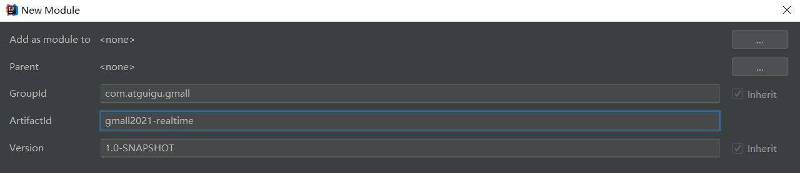

## 2.2 创建如下包结构


| 目录   | 作用                      |
| ------ | ------------------------- |
| app    | 产生各层数据的 flink 任务 |
| bean   | 数据对象                  |
| common | 公共常量                  |
| utils  | 工具类                    |


##  2.3 修改配置文件

### 2.3.1 在 pom.xml 添加如下配置

```xml
<properties>
<java.version>1.8</java.version>
<maven.compiler.source>${java.version}</maven.compiler.source>
<maven.compiler.target>${java.version}</maven.compiler.target>
<flink.version>1.12.0</flink.version>
<scala.version>2.12</scala.version>
<hadoop.version>3.1.3</hadoop.version>
</properties>
<dependencies>
<dependency>
<groupId>org.apache.flink</groupId>
<artifactId>flink-java</artifactId>
<version>${flink.version}</version>
</dependency>
<dependency>
<groupId>org.apache.flink</groupId>
<artifactId>flink-streaming-java_${scala.version}</artifactId>
<version>${flink.version}</version>
</dependency>
<dependency>
<groupId>org.apache.flink</groupId>
<artifactId>flink-connector-kafka_${scala.version}</artifactId>
<version>${flink.version}</version>
</dependency>
<dependency>
<groupId>org.apache.flink</groupId>
<artifactId>flink-clients_${scala.version}</artifactId>
<version>${flink.version}</version>
</dependency>
<dependency>
<groupId>org.apache.flink</groupId>
<artifactId>flink-cep_${scala.version}</artifactId>
<version>${flink.version}</version>


</dependency>
<dependency>
<groupId>org.apache.flink</groupId>
<artifactId>flink-json</artifactId>
<version>${flink.version}</version>
</dependency>
<dependency>
<groupId>com.alibaba</groupId>
<artifactId>fastjson</artifactId>
<version>1.2.68</version>
</dependency>
<!--如果保存检查点到 hdfs 上,需要引入此依赖-->
<dependency>
<groupId>org.apache.hadoop</groupId>
<artifactId>hadoop-client</artifactId>
<version>${hadoop.version}</version>
</dependency>
<!--Flink 默认使用的是 slf4j 记录日志,相当于一个日志的接口,我们这里使用 log4j 作为
具体的日志实现-->
<dependency>
<groupId>org.slf4j</groupId>
<artifactId>slf4j-api</artifactId>
<version>1.7.25</version>
</dependency>
<dependency>
<groupId>org.slf4j</groupId>
<artifactId>slf4j-log4j12</artifactId>
<version>1.7.25</version>
</dependency>
<dependency>
<groupId>org.apache.logging.log4j</groupId>
<artifactId>log4j-to-slf4j</artifactId>
<version>2.14.0</version>
</dependency>
</dependencies>
<build>
<plugins>
<plugin>
<groupId>org.apache.maven.plugins</groupId>
<artifactId>maven-assembly-plugin</artifactId>
<version>3.0.0</version>
<configuration>


<descriptorRefs>
<descriptorRef>jar-with-dependencies</descriptorRef>
</descriptorRefs>
</configuration>
<executions>
<execution>
<id>make-assembly</id>
<phase>package</phase>
<goals>
<goal>single</goal>
</goals>
</execution>
</executions>
</plugin>
</plugins>
</build>
```

### 2.3.2 在 resources 目录下创建 log4j.properties 配置文件

```properties
log4j.rootLogger=error,stdout
log4j.appender.stdout=org.apache.log4j.ConsoleAppender
log4j.appender.stdout.target=System.out
log4j.appender.stdout.layout=org.apache.log4j.PatternLayout
log4j.appender.stdout.layout.ConversionPattern=%d %p [%c] - %m%n
```

# 第3章 功能 2:准备用户行为日志 DWD 层

我们前面采集的日志数据已经保存到 Kafka 中,作为日志数据的 ODS 层,从 Kafka 的ODS 层读取的日志数据分为 3 类, 页面日志、启动日志和曝光日志。这三类数据虽然都是用户行为数据,但是有着完全不一样的数据结构,所以要拆分处理。将拆分后的不同的日志写回 Kafka 不同主题中,作为日志 DWD 层。页面日志输出到主流,启动日志输出到启动侧输出流,曝光日志输出到曝光侧输出流

## 3.1 主要任务

### 3.1.1 识别新老用户

本身客户端业务有新老用户的标识,但是不够准确,需要用实时计算再次确认(不涉及业务操作,只是单纯的做个状态确认)。

### 3.1.2 利用侧输出流实现数据拆分

根据日志数据内容,将日志数据分为 3 类, 页面日志、启动日志和曝光日志。页面日志输出到主流,启动日志输出到启动侧输出流,曝光日志输出到曝光日志侧输出流

### 3.1.3 将不同流的数据推送下游的 Kafka 的不同 Topic 中

## 3.2 代码实现

### 3.2.1 接收 Kafka 数据,并进行转换

1. 在 Kafka 的工具类中提供获取 Kafka 消费者的方法(读)

  ```java
   /**
  * 获取 KafkaSource 的方法
  * @param topic 主题
  * @param groupId 消费者组
   */
  public static FlinkKafkaConsumer<String> getKafkaSource(String topic, String groupId) {
        //给配置信息对象添加配置项
        properties.setProperty(ConsumerConfig.GROUP_ID_CONFIG, groupId);
        //获取 KafkaSource
        return new FlinkKafkaConsumer<String>(topic, new SimpleStringSchema(), properties);
    }
  }
  ```


2. Flink 调用工具类读取数据的主程序

  ```java
  public class BaseLogApp {
      public static void main(String[] args) throws Exception {
          //1.获取执行环境,设置并行度,开启 CK,设置状态后端(HDFS)
          StreamExecutionEnvironment env = StreamExecutionEnvironment.getExecutionEnvironment();
  
          //为 Kafka 主题的分区数
          env.setParallelism(1);
  //1.1 设置状态后端
  //
  env.setStateBackend(new
  FsStateBackend("hdfs://hadoop102:8020/gmall/dwd_log/ck"));
  //
  //1.2 开启 CK
  //
  env.enableCheckpointing(10000L, CheckpointingMode.EXACTLY_ONCE);
  //
  env.getCheckpointConfig().setCheckpointTimeout(60000L);
  //修改用户名
  
  
  System.setProperty("HADOOP_USER_NAME", "atguigu");
  //2.读取 Kafka ods_base_log 主题数据
  String topic = "ods_base_log";
  String groupId = "ods_dwd_base_log_app";
  FlinkKafkaConsumer<String> kafkaSource = MyKafkaUtil.getKafkaSource(topic,
  groupId);
  DataStreamSource<String> kafkaDS = env.addSource(kafkaSource);
  //3.将每行数据转换为 JsonObject
  SingleOutputStreamOperator<JSONObject> jsonObjDS =
  kafkaDS.map(JSONObject::parseObject);
  //打印测试
  jsonObjDS.print();
  //执行任务
  env.execute();
  }
  ```

  ### 3.2.2 识别新老访客

  ​	保存每个 mid 的首次访问日期,每条进入该算子的访问记录,都会把 mid 对应的首次访问时间读取出来,只有首次访问时间不为空,则认为该访客是老访客,否则是新访客。同时如果是新访客且没有访问记录的话,会写入首次访问时间。

  ```java
  //4.按照 Mid 分组
  KeyedStream<JSONObject, String> keyedStream = jsonObjDS.keyBy(data ->
  data.getJSONObject("common").getString("mid"));
  //5.使用状态做新老用户校验
  SingleOutputStreamOperator<JSONObject> jsonWithNewFlagDS =
  keyedStream.map(new RichMapFunction<JSONObject, JSONObject>() {
  //声明状态用于表示当前 Mid 是否已经访问过
  private ValueState<String> firstVisitDateState;
  private SimpleDateFormat simpleDateFormat;
  @Override
  public void open(Configuration parameters) throws Exception {
  firstVisitDateState = getRuntimeContext().getState(new
  ValueStateDescriptor<String>("new-mid", String.class));
  simpleDateFormat = new SimpleDateFormat("yyyy-MM-dd");
  }
  @Override
  public JSONObject map(JSONObject value) throws Exception {
  //取出新用户标记
  String isNew = value.getJSONObject("common").getString("is_new");
  
  
  //如果当前前端传输数据表示为新用户,则进行校验
  if ("1".equals(isNew)) {
  //取出状态数据并取出当前访问时间
  String firstDate = firstVisitDateState.value();
  Long ts = value.getLong("ts");
  //判断状态数据是否为 Null
  if (firstDate != null) {
  //修复
  value.getJSONObject("common").put("is_new", "0");
  } else {
  //更新状态
  firstVisitDateState.update(simpleDateFormat.format(ts));
  }
  }
  //返回数据
  return value;
  }
  });
  //打印测试
  //jsonWithNewFlagDS.print();
  ```

  ### 3.2.3 利用侧输出流实现数据拆分

  根据日志数据内容,将日志数据分为 3 类, 页面日志、启动日志和曝光日志。页面日志输出到主流,启动日志输出到启动侧输出流,曝光日志输出到曝光日志侧输出流

  ```java
  //6.分流,使用 ProcessFunction 将 ODS 数据拆分成启动、曝光以及页面数据
  SingleOutputStreamOperator<String> pageDS = jsonWithNewFlagDS.process(new
  ProcessFunction<JSONObject, String>() {
  @Override
  public void processElement(JSONObject jsonObject, Context context, Collector<String>
  collector) throws Exception {
  //提取"start"字段
  String startStr = jsonObject.getString("start");
  //判断是否为启动数据
  if (startStr != null && startStr.length() > 0) {
  //将启动日志输出到侧输出流
  context.output(new OutputTag<String>("start") {
  }, jsonObject.toString());
  } else {
  //为页面数据,将数据输出到主流
  collector.collect(jsonObject.toString());
  //不是启动数据,继续判断是否是曝光数据
  
  
  JSONArray displays = jsonObject.getJSONArray("displays");
  if (displays != null && displays.size() > 0) {
  //为曝光数据,遍历写入侧输出流
  for (int i = 0; i < displays.size(); i++) {
  //取出单条曝光数据
  JSONObject displayJson = displays.getJSONObject(i);
  //添加页面 ID
  displayJson.put("page_id",
  jsonObject.getJSONObject("page").getString("page_id"));
  //输出到侧输出流
  context.output(new OutputTag<String>("display") {
  }, displayJson.toString());
  }
  }
  }
  }
  });
  //7.将三个流的数据写入对应的 Kafka 主题
  DataStream<String> startDS = pageDS.getSideOutput(new OutputTag<String>("start") {
  });
  DataStream<String> displayDS = pageDS.getSideOutput(new OutputTag<String>("display") {
  });
  //打印测试
  pageDS.print("Page>>>>>>>>>");
  startDS.print("Start>>>>>>>>>>");
  displayDS.print("Display>>>>>>>>>>");
  ```

  ### 3.2.4 将不同流的数据推送到下游 kafka 的不同 Topic(分流)

3. 程序中调用 Kafka 工具类获取 Sink

  ```java
  pageDS.addSink(MyKafkaUtil.getKafkaSink("dwd_page_log"));
  startDS.addSink(MyKafkaUtil.getKafkaSink("dwd_start_log"));
  displayDS.addSink(MyKafkaUtil.getKafkaSink("dwd_display_log"));
  ```

  

4. 测试
    ➢ IDEA 中运行 BaseLogApp 类
    ➢ 运行 logger.sh,启动 Nginx 以及日志处理服务
    ➢ 运行 rt_applog 下模拟生成数据的 jar 包
    ➢ 到 Kafka 不同的主题下查看输出效果

  

  # 第4章 功能 3:准备业务数据 DWD 层

  ​	业务数据的变化,我们可以通过 FlinkCDC 采集到,但是 FlinkCDC 是把全部数据统一写入一个 Topic 中, 这些数据包括事实数据,也包含维度数据,这样显然不利于日后的数据处理,所以这个功能是从 Kafka 的业务数据 ODS 层读取数据,经过处理后,将维度数据保存到 HBase,将事实数据写回 Kafka 作为业务数据的 DWD 层。

  ## 4.1 主要任务

  ### 4.1.1 接收 Kafka 数据,过滤空值数据

  对 FlinkCDC 抓取数据进行 ETL,有用的部分保留,没用的过滤掉

  ### 4.1.2 实现动态分流功能

  由于 FlinkCDC 是把全部数据统一写入一个 Topic 中, 这样显然不利于日后的数据处理。所以需要把各个表拆开处理。但是由于每个表有不同的特点,有些表是维度表,有些表是事实表。

在实时计算中一般把维度数据写入存储容器,一般是方便通过主键查询的数据库比如HBase,Redis,MySQL 等。一般把事实数据写入流中,进行进一步处理,最终形成宽表。这样的配置不适合写在配置文件中,因为这样的话,业务端随着需求变化每增加一张表,就要修改配置重启计算程序。所以这里需要一种动态配置方案,把这种配置长期保存起来,一旦配置有变化,实时计算可以自动感知。
  这种可以有两个方案实现
  ➢ 一种是用 Zookeeper 存储,通过 Watch 感知数据变化;
  ➢ 另一种是用 mysql 数据库存储,周期性的同步;
  ➢ 另一种是用 mysql 数据库存储,使用广播流。

  这里选择第二种方案,主要是 MySQL 对于配置数据初始化和维护管理,使用 FlinkCDC 读取配置信息表,将配置流作为广播流与主流进行连接。 所以就有了如下图:

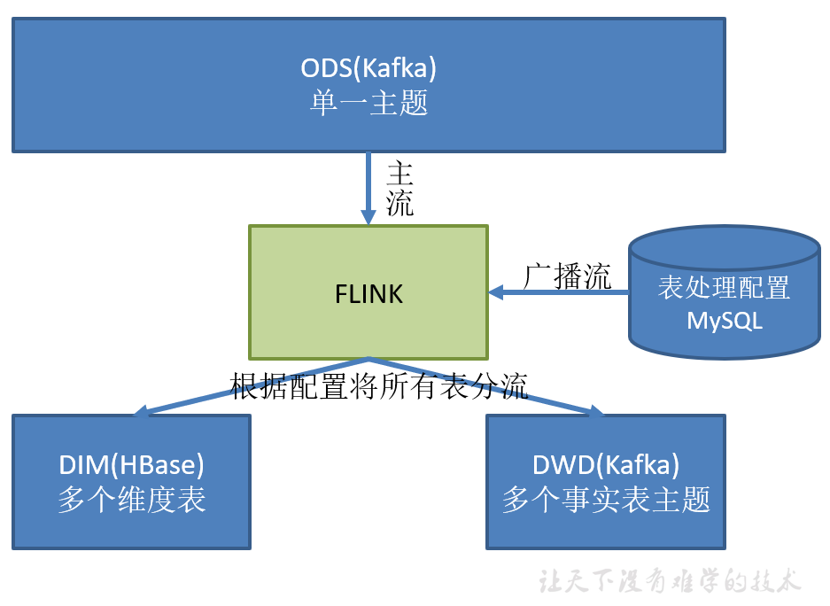

###   4.1.3 把分好的流保存到对应表、主题中

  业务数据保存到 Kafka 的主题中

  维度数据保存到 HBase 的表中

##   4.2 代码实现

###   4.2.1 接收 Kafka 数据,过滤空值数据

```java
  public class BaseDBApp {
  public static void main(String[] args) throws Exception {
  //1.获取执行环境
  StreamExecutionEnvironment env =
  StreamExecutionEnvironment.getExecutionEnvironment();


  env.setParallelism(1);
  //1.1 设置状态后端
  //env.setStateBackend(new
  FsStateBackend("hdfs://hadoop102:8020/gmall/dwd_log/ck"));
  //1.2 开启 CK
  //env.enableCheckpointing(10000L, CheckpointingMode.EXACTLY_ONCE);
  //env.getCheckpointConfig().setCheckpointTimeout(60000L);
  //2.读取 Kafka 数据
  String topic = "ods_base_db_";
  String groupId = "ods_db_group";
  FlinkKafkaConsumer<String> kafkaSource = MyKafkaUtil.getKafkaSource(topic,
  groupId);
  DataStreamSource<String> kafkaDS = env.addSource(kafkaSource);
  //3.将每行数据转换为 JSON 对象
  SingleOutputStreamOperator<JSONObject> jsonObjDS =
  kafkaDS.map(JSON::parseObject);
  //4.过滤
  SingleOutputStreamOperator<JSONObject> filterDS = jsonObjDS.filter(new
  FilterFunction<JSONObject>() {
  @Override
  public boolean filter(JSONObject value) throws Exception {
  //获取 data 字段
  String data = value.getString("data");
  return data != null && data.length() > 0;
  }
  });
  //打印测试
  filterDS.print();
  //7.执行任务
  env.execute();
  }
  }
```


###   4.2.2 根据 MySQL 的配置表,动态进行分流

5. 引入 pom.xml 依赖
   
  ```xml
  5. <!--lomback 插件依赖-->
       <dependency>
       <groupId>org.projectlombok</groupId>
       <artifactId>lombok</artifactId>
       <version>1.18.12</version>
       </dependency>
  
  
    <dependency>
    <groupId>org.apache.flink</groupId>
    <artifactId>flink-connector-jdbc_${scala.version}</artifactId>
    <version>${flink.version}</version>
    </dependency>
    <dependency>
    <groupId>org.apache.phoenix</groupId>
    <artifactId>phoenix-spark</artifactId>
    <version>5.0.0-HBase-2.0</version>
    <exclusions>
    <exclusion>
    <groupId>org.glassfish</groupId>
    <artifactId>javax.el</artifactId>
    </exclusion>
    </exclusions>
    </dependency>
  ```

  

6. 在 Mysql 中创建数据库
    注意:和 gmall2021 业务库区分开

    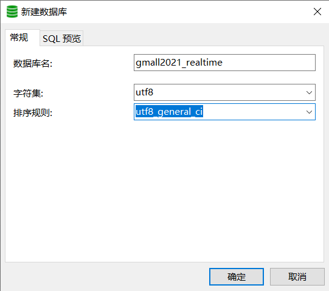
    
7. 在 gmall2021_realtime 库中创建配置表 table_process

     ```sql
     CREATE TABLE `table_process` (
       `source_table` varchar(200) NOT NULL COMMENT '来源表',
       `operate_type` varchar(200) NOT NULL COMMENT '操作类型 insert,update,delete',
       `sink_type` varchar(200) DEFAULT NULL COMMENT '输出类型 hbase kafka',
       `sink_table` varchar(200) DEFAULT NULL COMMENT '输出表(主题)',
       `sink_columns` varchar(2000) DEFAULT NULL COMMENT '输出字段',
       `sink_pk` varchar(200) DEFAULT NULL COMMENT '主键字段',
       `sink_extend` varchar(200) DEFAULT NULL COMMENT '建表扩展',
       PRIMARY KEY (`source_table`,`operate_type`)
       ) ENGINE=InnoDB DEFAULT CHARSET=utf8
     ```

       

8. 在 MySQL 配置文件中增加 gmall2021_realtime 开启 Binlog

9. 创建配置表实体类
   
  ```java
  import lombok.Data;
    @Data
    public class TableProcess {
    //动态分流 Sink 常量
    public static final String SINK_TYPE_HBASE = "hbase";
    public static final String SINK_TYPE_KAFKA = "kafka";
    public static final String SINK_TYPE_CK = "clickhouse";
    //来源表
    String sourceTable;
    //操作类型 insert,update,delete
    String operateType;
    //输出类型 hbase kafka
    String sinkType;
    //输出表(主题)
    String sinkTable;
    //输出字段
    String sinkColumns;
    //主键字段
    String sinkPk;
    //建表扩展
      String sinkExtend;
      }
  ```


​    
10. 编写操作读取配置表形成广播流

   ```java
    //5.创建 MySQL CDC Source
        DebeziumSourceFunction<String> sourceFunction = MySQLSource.<String>builder()
        .hostname("hadoop102")
        .port(3306)
        .username("root")
        .password("000000")
        .databaseList("gmall2021-realtime")
        .tableList("gmall2021-realtime.table_process")
        .deserializer(new DebeziumDeserializationSchema<String>() {
        //反序列化方法
        @Override
        public void deserialize(SourceRecord sourceRecord, Collector<String> collector)
        throws Exception {
        //库名&表名
        String topic = sourceRecord.topic();
        String[] split = topic.split("\\.");
        String db = split[1];
        String table = split[2];
        //获取数据
        Struct value = (Struct) sourceRecord.value();
   
   
     Struct after = value.getStruct("after");
     JSONObject data = new JSONObject();
     if (after != null) {
     Schema schema = after.schema();
     for (Field field : schema.fields()) {
     data.put(field.name(), after.get(field.name()));
     }
     }
     //获取操作类型
     Envelope.Operation operation = Envelope.operationFor(sourceRecord);
     //创建 JSON 用于存放最终的结果
     JSONObject result = new JSONObject();
     result.put("database", db);
     result.put("table", table);
     result.put("type", operation.toString().toLowerCase());
     result.put("data", data);
     collector.collect(result.toJSONString());
     }
     //定义数据类型
     @Override
     public TypeInformation<String> getProducedType() {
     return TypeInformation.of(String.class);
     }
     })
     .build();
     //6.读取 MySQL 数据
     DataStreamSource<String> tableProcessDS = env.addSource(sourceFunction);
     //7.将配置信息流作为广播流
     MapStateDescriptor<String, TableProcess> mapStateDescriptor = new
     MapStateDescriptor<>("table-process-state", String.class, TableProcess.class);
     BroadcastStream<String> broadcastStream = tableProcessDS.broadcast(mapStateDescriptor);
     //8.将主流和广播流进行链接
     BroadcastConnectedStream<JSONObject, String> connectedStream =
     filterDS.connect(broadcastStream);
   ```

  

  

11. 程序流程分析

      TableProcessFunction(BroadcastProcessFunction)

    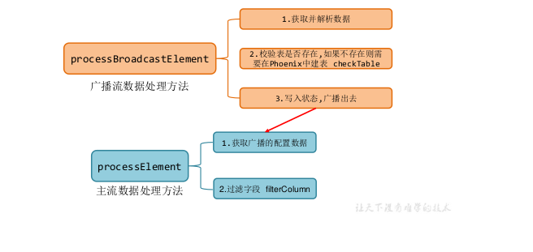 

    
    
12. 定义一个项目中常用的配置常量类 GmallConfig

       ```java
       package com.atguigu.common;
          public class GmallConfig {
          //Phoenix 库名
          public static final String HBASE_SCHEMA = "GMALL2021_REALTIME";
          //Phoenix 驱动
          public static final String PHOENIX_DRIVER = "org.apache.phoenix.jdbc.PhoenixDriver";
          //Phoenix 连接参数
          public static final String PHOENIX_SERVER =
          "jdbc:phoenix:hadoop102,hadoop103,hadoop104:2181";
          }
       ```

    

9. 自定义函数 TableProcessFunction

  ```java
  package com.atguigu.app.func;
     import com.alibaba.fastjson.JSONObject;
     import org.apache.flink.streaming.api.functions.co.BroadcastProcessFunction;
     import org.apache.flink.util.Collector;
     import org.apache.flink.util.OutputTag;
     public class TableProcessFunction extends BroadcastProcessFunction<JSONObject, String,
     JSONObject> {
  
  
  private OutputTag<JSONObject> outputTag;
  public TableProcessFunction(OutputTag<JSONObject> outputTag) {
  this.outputTag = outputTag;
  }
  @Override
  public void processElement(JSONObject jsonObject, ReadOnlyContext readOnlyContext,
  Collector<JSONObject> collector) throws Exception {
  }
  @Override
  public void processBroadcastElement(String s, Context context, Collector<JSONObject>
  collector) throws Exception {
  }
  }
  ```

  

10. 自定义函数 TableProcessFunction-open

  ```java
  //定义 Phoenix 的连接
  private Connection connection = null;
  @Override
  public void open(Configuration parameters) throws Exception {
  //初始化 Phoenix 的连接
  Class.forName(GmallConfig.PHOENIX_DRIVER);
  connection = DriverManager.getConnection(GmallConfig.PHOENIX_SERVER);
  }
  ```

  11)自定义函数 TableProcessFunction-processBroadcastElement

  ```java
   @Override
     public void processBroadcastElement(String jsonStr, Context context, Collector<JSONObject>
     collector) throws Exception {
     //获取状态
     BroadcastState<String, TableProcess> broadcastState =
     context.getBroadcastState(mapStateDescriptor);
     //将配置信息流中的数据转换为 JSON 对象  {"database":"","table":"","type","","data":{"":""}}
     JSONObject jsonObject = JSON.parseObject(jsonStr);
     //取出数据中的表名以及操作类型封装 key
     JSONObject data = jsonObject.getJSONObject("data");
     String table = data.getString("source_table");
     String type = data.getString("operate_type");
  
  
  String key = table + ":" + type;
  //取出 Value 数据封装为 TableProcess 对象
  TableProcess tableProcess = JSON.parseObject(data.toString(), TableProcess.class);
  checkTable(tableProcess.getSinkTable(),tableProcess.getSinkColumns(),tableProcess.getSinkPk(),tableProcess.getSinkExtend());
  System.out.println("Key:" + key + "," + tableProcess);
  //广播出去
  broadcastState.put(key, tableProcess);
  }
  ```

  12)自定义函数 TableProcessFunction-checkTable

  ```java
  /**
  * Phoenix 建表
  * @param sinkTable 表名 test
  * @param sinkColumns 表名字段 id,name,sex
  * @param sinkPk表主键id
  * @param sinkExtend 表扩展字段 ""
  * create table if not exists mydb.test(id varchar primary key,name varchar,sex varchar) ...
  */
    private void checkTable(String sinkTable, String sinkColumns, String sinkPk, String sinkExtend)
    {
    //给主键以及扩展字段赋默认值
    if (sinkPk == null) {
    sinkPk = "id";
    }
    if (sinkExtend == null) {
    sinkExtend = "";
    }
    //封装建表 SQL
    StringBuilder createSql = new StringBuilder("create table if not exists
    ").append(GmallConfig.HBASE_SCHEMA).append(".").append(sinkTable).append("(");
    //遍历添加字段信息
    String[] fields = sinkColumns.split(",");
    for (int i = 0; i < fields.length; i++) {
    //取出字段
    String field = fields[i];
    //判断当前字段是否为主键
    if (sinkPk.equals(field)) {
  
  
  createSql.append(field).append(" varchar primary key ");
  } else {
  createSql.append(field).append(" varchar ");
  }
  //如果当前字段不是最后一个字段,则追加","
  if (i < fields.length - 1) {
  createSql.append(",");
  }
  }
  createSql.append(")");
  createSql.append(sinkExtend);
  System.out.println(createSql);
  //执行建表 SQL
  PreparedStatement preparedStatement = null;
  try {
  preparedStatement = connection.prepareStatement(createSql.toString());
  preparedStatement.execute();
  } catch (SQLException e) {
  e.printStackTrace();
  throw new RuntimeException("创建 Phoenix 表" + sinkTable + "失败!");
  } finally {
  if (preparedStatement != null) {
  try {
  preparedStatement.close();
  } catch (SQLException e) {
  e.printStackTrace();
  }
  }
  }
  }
  });
  ```

  13)
  自定义函数 TableProcessFunction-processElement()
  核心处理方法,根据 MySQL 配置表的信息为每条数据打标签,走 Kafka 还是 HBase

  ```java
  9) @Override
     public void processElement(JSONObject jsonObject, ReadOnlyContext readOnlyContext,
     Collector<JSONObject> collector) throws Exception {
     //获取状态
     ReadOnlyBroadcastState<String, TableProcess> broadcastState =
     readOnlyContext.getBroadcastState(mapStateDescriptor);
     //获取表名和操作类型
  
  
  String table = jsonObject.getString("table");
  String type = jsonObject.getString("type");
  String key = table + ":" + type;
  //取出对应的配置信息数据
  TableProcess tableProcess = broadcastState.get(key);
  if (tableProcess != null) {
  //向数据中追加 sink_table 信息
  jsonObject.put("sink_table", tableProcess.getSinkTable());
  //根据配置信息中提供的字段做数据过滤
  filterColumn(jsonObject.getJSONObject("data"), tableProcess.getSinkColumns());
  //判断当前数据应该写往 HBASE 还是 Kafka
  if (TableProcess.SINK_TYPE_KAFKA.equals(tableProcess.getSinkType())) {
  //Kafka 数据,将数据输出到主流
  collector.collect(jsonObject);
  } else if (TableProcess.SINK_TYPE_HBASE.equals(tableProcess.getSinkType())) {
  //HBase 数据,将数据输出到侧输出流
  readOnlyContext.output(hbaseTag, jsonObject);
  }
  } else {
  System.out.println("No Key " + key + " In Mysql!");
  }
  }
  ```

  14)
  自定义函数 TableProcessFunction-filterColumn()
  校验字段,过滤掉多余的字段

  ```java
  9) //根据配置信息中提供的字段做数据过滤
     private void filterColumn(JSONObject data, String sinkColumns) {
     //保留的数据字段
     String[] fields = sinkColumns.split(",");
     List<String> fieldList = Arrays.asList(fields);
     Set<Map.Entry<String, Object>> entries = data.entrySet();
     //
     //
     //
     //
     //
     //
     while (iterator.hasNext()) {
     Map.Entry<String, Object> next = iterator.next();
     if (!fieldList.contains(next.getKey())) {
     iterator.remove();
     }
     }
  
  
  entries.removeIf(next -> !fieldList.contains(next.getKey()));
  }
  ```

  15)
  主程序 BaseDBApp 中调用 TableProcessFunction 进行分流

  ```java
  OutputTag<JSONObject> hbaseTag = new
  OutputTag<JSONObject>(TableProcess.SINK_TYPE_HBASE) {
  };
  SingleOutputStreamOperator<JSONObject> kafkaJsonDS = connectedStream.process(new
  TableProcessFunction(hbaseTag));
  DataStream<JSONObject> hbaseJsonDS = kafkaJsonDS.getSideOutput(hbaseTag);
  ```

### 4.2.3 分流 Sink 之保存维度到 HBase(Phoenix)

1) 程序流程分析
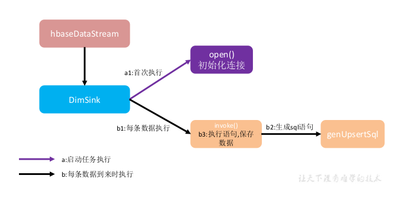
➢DimSink 继承了 RickSinkFunction,这个 function 得分两条时间线。
◼一条是任务启动时执行 open 操作(图中紫线),我们可以把连接的初始化工作放在此处一次性执行。
◼另一条是随着每条数据的到达反复执行 invoke()(图中黑线),在这里面我们要实现数据的保存,主要策略就是根据数据组合成 sql 提交给 hbase。

2. 因为要用单独的 schema,所以在程序中加入 hbase-site.xml

  ```xml
  1) <?xml version="1.0"?>
     <?xml-stylesheet type="text/xsl" href="configuration.xsl"?>
  
  
  <configuration>
  <property>
  <name>hbase.rootdir</name>
  <value>hdfs://hadoop102:8020/HBase</value>
  </property>
  <property>
  <name>hbase.cluster.distributed</name>
  <value>true</value>
  </property>
  <property>
  <name>hbase.zookeeper.quorum</name>
  <value>hadoop102,hadoop103,hadoop104</value>
  </property>
  <property>
  <name>phoenix.schema.isNamespaceMappingEnabled</name>
  <value>true</value>
  </property>
  <property>
  <name>phoenix.schema.mapSystemTablesToNamespace</name>
  <value>true</value>
  </property>
  </configuration>
  ```

  注意:为了开启 hbase 的 namespace 和 phoenix 的 schema 的映射,在程序中需要加这个配置文件,另外在 linux 服务上,也需要在 hbase 以及 phoenix 的 hbase-site.xml 配置文件中,加上以上两个配置,并使用 xsync 进行同步。

3. 在 phoenix 中执行
    create schema GMALL2021_REALTIME;

4. DimSink

  ```java
  package com.atguigu.app.func;
     import com.alibaba.fastjson.JSONObject;
     import com.atguigu.common.GmallConfig;
     import com.atguigu.utils.DimUtil;
     import org.apache.commons.lang.StringUtils;
     import org.apache.flink.configuration.Configuration;
     import org.apache.flink.streaming.api.functions.sink.RichSinkFunction;
     import java.sql.Connection;
  
  
  import java.sql.DriverManager;
  import java.sql.PreparedStatement;
  import java.sql.SQLException;
  import java.util.Collection;
  import java.util.Set;
  public class DimSink extends RichSinkFunction<JSONObject> {
  private Connection connection = null;
  @Override
  public void open(Configuration parameters) throws Exception {
  //初始化 Phoenix 连接
  Class.forName(GmallConfig.PHOENIX_DRIVER);
  connection = DriverManager.getConnection(GmallConfig.PHOENIX_SERVER);
  }
  //将数据写入 Phoenix:upsert into t(id,name,sex) values(...,...,...)
  @Override
  public void invoke(JSONObject jsonObject, Context context) throws Exception {
  PreparedStatement preparedStatement = null;
  try {
  //获取数据中的 Key 以及 Value
  JSONObject data = jsonObject.getJSONObject("data");
  Set<String> keys = data.keySet();
  Collection<Object> values = data.values();
  //获取表名
  String tableName = jsonObject.getString("sink_table");
  //创建插入数据的 SQL
  String upsertSql = genUpsertSql(tableName, keys, values);
  System.out.println(upsertSql);
  //编译 SQL
  preparedStatement = connection.prepareStatement(upsertSql);
  //执行
  preparedStatement.executeUpdate();
  //提交
  connection.commit();
  } catch (SQLException e) {
  e.printStackTrace();
  System.out.println("插入 Phoenix 数据失败!");
  } finally {
  if (preparedStatement != null) {
  preparedStatement.close();
  }
  
  
  }
  }
  //创建插入数据的 SQL upsert into t(id,name,sex) values('...','...','...')
  private String genUpsertSql(String tableName, Set<String> keys, Collection<Object> values) {
  return "upsert into " + GmallConfig.HBASE_SCHEMA + "." +
  tableName + "(" + StringUtils.join(keys, ",") + ")" +
  " values('" + StringUtils.join(values, "','") + "')";
  }
  }
  ```

  

5. 主程序 BaseDBApp 中调用 DimSink
  hbaseJsonDS.addSink(new DimSink());

6. 测试
  ➢ 启动 HDFS、ZK、Kafka、FlinkCDCApp、HBase
  ➢ 向 gmall2021_realtime 数据库的 table_process 表中插入测试数据

  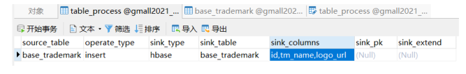

  ➢ 运行 idea 中的 BaseDBApp
  ➢ 向 gmall2021 数据库的 base_trademark 表中插入一条数据

  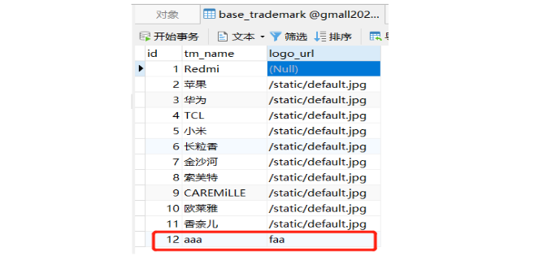

  ➢ 通过 phoenix 查看 hbase 的 schema 以及表情况

  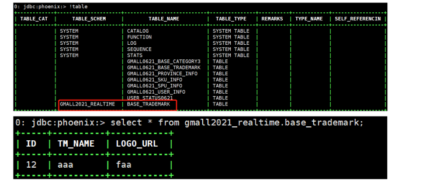

### 4.2.4 分流 Sink 之保存业务数据到 Kafka 主题

1. 在 MyKafkaUtil 中添加如下方法

  ```java
  public static <T> FlinkKafkaProducer<T> getKafkaSinkBySchema(KafkaSerializationSchema<T>
  kafkaSerializationSchema) {
  properties.setProperty(ProducerConfig.TRANSACTION_TIMEOUT_CONFIG, 5 * 60 * 1000 +
  "");
  return new FlinkKafkaProducer<T>(DEFAULT_TOPIC,
  kafkaSerializationSchema,
  properties,
  FlinkKafkaProducer.Semantic.EXACTLY_ONCE);
  }
  ```

  

2. 在 MyKafkaUtil 中添加属性定义
    private static String DEFAULT_TOPIC = "dwd_default_topic";

3. 两个创建 FlinkKafkaProducer 方法对比
    ➢ 前者给定确定的 Topic
    ➢ 而后者除了缺省情况下会采用 DEFAULT_TOPIC,一般情况下可以根据不同的业务
    数据在 KafkaSerializationSchema 中通过方法实现。

4. 在主程序 BaseDBApp 中加入新 KafkaSink

  ```java
  FlinkKafkaProducer<JSONObject> kafkaSinkBySchema = MyKafkaUtil.getKafkaSinkBySchema(new
     KafkaSerializationSchema<JSONObject>() {
     @Override
     public void open(SerializationSchema.InitializationContext context) throws Exception {
     System.out.println("开始序列化 Kafka 数据!");
     }
     @Override
  
  
  public ProducerRecord<byte[], byte[]> serialize(JSONObject element, @Nullable Long
  timestamp) {
  return new ProducerRecord<byte[], byte[]>(element.getString("sink_table"),
  element.getString("data").getBytes());
  }
  });
  kafkaJsonDS.addSink(kafkaSinkBySchema);
  ```

  

5. 测试
    ➢ 启动 hdfs、zk、kafka、flinkcdc、hbase
    ➢ 向 gmall2021_realtime 数据库的 table_process 表中插入测试数据
  
  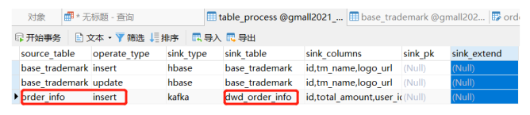
  
    ➢ 运行 idea 中的 BaseDBApp
    ➢ 运行 rt_dblog 下的 jar 包,模拟生成数据
    ➢ 查看控制台输出以及在配置表中配置的 kafka 主题名消费情况

# 第5章 总结

  DWD 的实时计算核心就是数据分流,其次是状态识别。在开发过程中我们实践了几个灵活度较强算子,比如 RichMapFunction, ProcessFunction, RichSinkFunction。 那这几个我们什么时候会用到呢?如何选择?

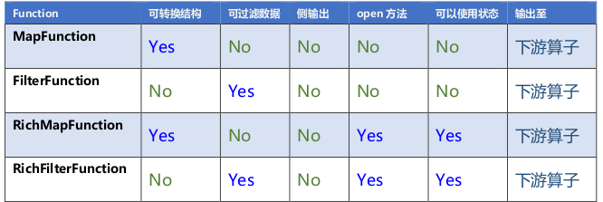

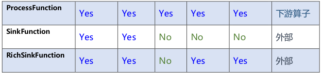

  从对比表中能明显看出,Rich 系列能功能强大,ProcessFunction 功能更强大,但是相对的越全面的算子使用起来也更加繁琐。
