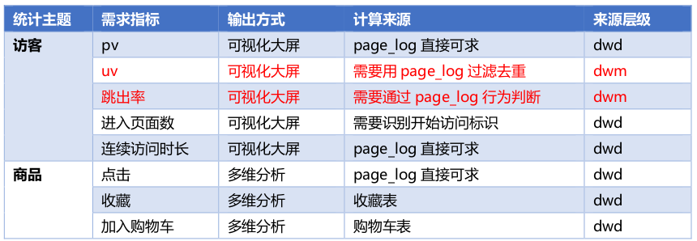
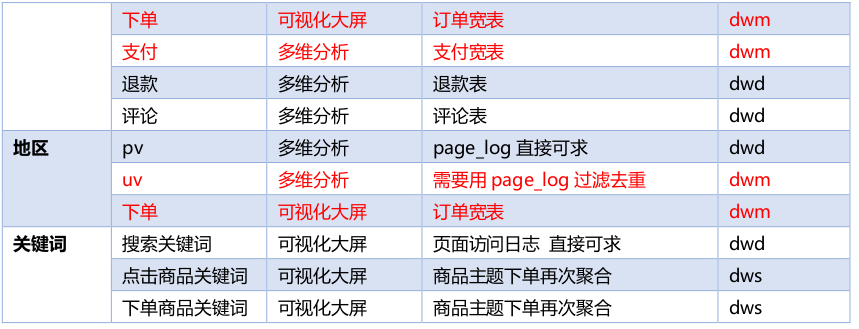
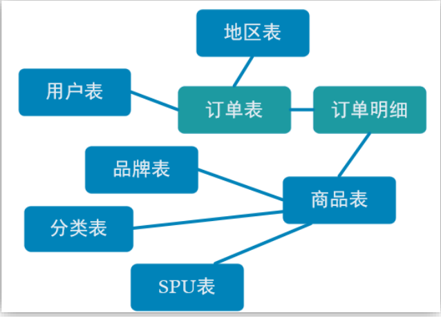
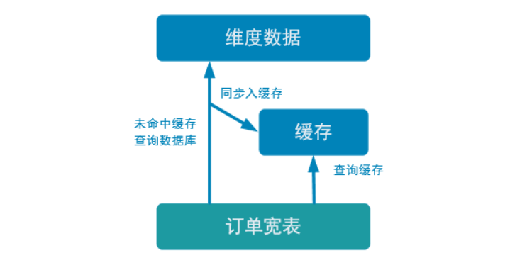

#  第1章 DWS 层与 DWM 层的设计

## 1.1设计思路

我们在之前通过分流等手段，把数据分拆成了独立的 Kafka Topic。那么接下来如何处理数据，就要思考一下我们到底要通过实时计算出哪些指标项。因为实时计算与离线不同，实时计算的开发和运维成本都是非常高的，要结合实际情况考虑是否有必要象离线数仓一样，建一个大而全的中间层。如果没有必要大而全，这时候就需要大体规划一下要实时计算出的指标需求了。把这些指标以主题宽表的形式输出就是我们的 DWS 层。

## 1.2 需求梳理




当然实际需求还会有更多，这里主要以为可视化大屏为目的进行实时计算的处理。DWM 层的定位是什么，DWM 层主要服务 DWS，因为部分需求直接从 DWD 层到DWS 层中间会有一定的计算量，而且这部分计算的结果很有可能被多个 DWS 层主题复用，
所以部分 DWD 成会形成一层 DWM，我们这里主要涉及业务。
➢ 访问 UV 计算
➢ 跳出明细计算
➢ 订单宽表
➢ 支付宽表

# 第2章 DWM 层-访客 UV 计算

## 2.1需求分析与思路

UV，全称是 Unique Visitor，即独立访客，对于实时计算中，也可以称为 DAU(Daily Active User)，即每日活跃用户，因为实时计算中的 UV 通常是指当日的访客数。那么如何从用户行为日志中识别出当日的访客，那么有两点：

➢其一，是识别出该访客打开的第一个页面，表示这个访客开始进入我们的应用

➢其二，由于访客可以在一天中多次进入应用，所以我们要在一天的范围内进行去重

## 2.2 代码实现

### 2.2.1 从 Kafka 的 dwd_page_log 主题接收数据

```java
public class UniqueVisitApp {
    public static void main(String[] args) throws Exception {
        //1.获取执行环境
        StreamExecutionEnvironment env = StreamExecutionEnvironment.getExecutionEnvironment();
        env.setParallelism(1);

        //1.1 设置状态后端
        //env.setStateBackend(new FsStateBackend("hdfs://hadoop102:8020/gmall/dwd_log/ck"));

        //1.2 开启 CK
        //env.enableCheckpointing(10000L, CheckpointingMode.EXACTLY_ONCE);
        //env.getCheckpointConfig().setCheckpointTimeout(60000L);

        //2.读取 Kafka dwd_page_log 主题数据创建流

        String groupId = "unique_visit_app";
        String sourceTopic = "dwd_page_log";
        String sinkTopic = "dwm_unique_visit";
        FlinkKafkaConsumer<String> kafkaSource = MyKafkaUtil.getKafkaSource(sourceTopic,groupId);
        DataStreamSource<String> kafkaDS = env.addSource(kafkaSource);
        //3.将每行数据转换为 JSON 对象
        SingleOutputStreamOperator<JSONObject> jsonObjDS = kafkaDS.process(new ProcessFunction<String, JSONObject>() {
            @Override
            public void processElement(String s, Context context, Collector<JSONObject> collector) throws Exception {
                try {
                    JSONObject jsonObject = JSON.parseObject(s);
                    collector.collect(jsonObject);
                } catch (Exception e) {
                    context.output(new OutputTag<String>("dirty") {}, s);
                }
            }});
        jsonObjDS.print();
        //7.启动任务
        env.execute();
    }
}
```

### 测试 

➢ 启动 logger.sh、zk、kafka

➢ 运行 Idea 中的 BaseLogApp

➢ 运行 Idea 中的 UniqueVisitApp

➢ 查看控制台输出

➢ 执行流程

模拟生成数据->日志处理服务器->写到 kafka 的 ODS 层（ods_base_log）->BaseLogApp 分流->dwd_page_log->UniqueVisitApp 读取输出

### 2.2.2 核心的过滤代码

➢ 首先用 keyby 按照 mid 进行分组，每组表示当前设备的访问情况

➢ 分组后使用 keystate 状态，记录用户进入时间，实现 RichFilterFunction 完成过滤

➢ 重写 open 方法用来初始化状态

➢ 重写 filter 方法进行过滤
◼可以直接筛掉 last_page_id 不为空的字段，因为只要有上一页，说明这条不是这个用户进入的首个页面。
◼状态用来记录用户的进入时间，只要这个 lastVisitDate 是今天，就说明用户今天已经访问过了所以筛除掉。如果为空或者不是今天，说明今天还没访问过，则保留。
◼因为状态值主要用于筛选是否今天来过，所以这个记录过了今天基本上没有用了，这里 enableTimeToLive 设定了 1 天的过期时间，避免状态过大。

```java
//4.按照 mid 分组
KeyedStream<JSONObject, String> keyedStream = jsonObjDS.keyBy(jsonObj -> jsonObj.getJSONObject("common").getString("mid"));
//5.过滤掉不是今天第一次访问的数据
SingleOutputStreamOperator<JSONObject> filterDS = keyedStream.filter(new RichFilterFunction<JSONObject>() {
    //声明状态
    private ValueState<String> firstVisitState;
    private SimpleDateFormat simpleDateFormat;
    
    @Override
    public void open(Configuration parameters) throws Exception {
        simpleDateFormat = new SimpleDateFormat("yyyy-MM-dd");
        ValueStateDescriptor<String> stringValueStateDescriptor = new ValueStateDescriptor<>("visit-state", String.class);
        //创建状态 TTL 配置项
        StateTtlConfig stateTtlConfig = StateTtlConfig.newBuilder(Time.days(1))
            .setUpdateType(StateTtlConfig.UpdateType.OnCreateAndWrite)
            .build();
        stringValueStateDescriptor.enableTimeToLive(stateTtlConfig);
        firstVisitState = getRuntimeContext().getState(stringValueStateDescriptor);
    }

    @Override
    public boolean filter(JSONObject value) throws Exception {
        //取出上一次访问页面
        String lastPageId = value.getJSONObject("page").getString("last_page_id");
        //判断是否存在上一个页面
        if (lastPageId == null || lastPageId.length() <= 0) {
            //取出状态数据
            String firstVisitDate = firstVisitState.value();
            //取出数据时间
            Long ts = value.getLong("ts");
            String curDate = simpleDateFormat.format(ts);
            if (firstVisitDate == null || !firstVisitDate.equals(curDate)) {
                firstVisitState.update(curDate);
                return true;
            } else {
                return false;
            }
        } else {
            return false;
        }
    }
});
```


### 2.2.3 将过滤处理后的 UV 写入到 Kafka 的 dwm_unique_visit

```java
//6.写入 DWM 层 Kafka 主题中
filterDS.print(">>>>>>>>>");
filterDS.map(JSON::toString).addSink(MyKafkaUtil.getKafkaSink(sinkTopic));
```

### 2.2.4 测试

➢ 启动 logger.sh、zk、kafka

➢ 运行 Idea 中的 BaseLogApp

➢ 运行 Idea 中的 UniqueVisitApp

➢ 查看控制台输出以及 kafka 的 dwm_unique_visit 主题

➢ 执行流程
模 拟 生 成 数 据 -> 日 志 处 理 服 务 器 -> 写 到 kafka 的 ODS 层 （ ods_base_log ）->BaseLogApp 分 流 ->dwd_page_log->UniqueVisitApp 读 取 并 处 理 -> 写 回 到kafka 的 dwm 层

# 第3章 DWM 层-跳出明细计算

## 3.1 需求分析与思路

### 3.1.1 什么是跳出

跳出就是用户成功访问了网站的一个页面后就退出，不在继续访问网站的其它页面。而跳出率就是用跳出次数除以访问次数。
关注跳出率，可以看出引流过来的访客是否能很快的被吸引，渠道引流过来的用户之间的质量对比，对于应用优化前后跳出率的对比也能看出优化改进的成果。

### 3.1.2 计算跳出行为的思路

首先要识别哪些是跳出行为，要把这些跳出的访客最后一个访问的页面识别出来。那么要抓住几个特征：

➢该页面是用户近期访问的第一个页面

这个可以通过该页面是否有上一个页面（last_page_id）来判断，如果这个表示为空，就说明这是这个访客这次访问的第一个页面。

➢首次访问之后很长一段时间（自己设定），用户没继续再有其他页面的访问。

这第一个特征的识别很简单，保留 last_page_id 为空的就可以了。但是第二个访问的判断，其实有点麻烦，首先这不是用一条数据就能得出结论的，需要组合判断，要用一条存在的数据和不存在的数据进行组合判断。而且要通过一个不存在的数据求得一条存在的数据。更麻烦的他并不是永远不存在，而是在一定时间范围内不存在。那么如何识别有一定失效的组合行为呢？最简单的办法就是 Flink 自带的 CEP 技术。这个 CEP 非常适合通过多条数据组合来识别某个事件。

**用户跳出事件，本质上就是一个条件事件加一个超时事件的组合。**

## 3.2 代码实现

### 3.2.1 从 kafka 的 dwd_page_log 主题中读取页面日志

```java
public class UserJumpDetailApp {
    public static void main(String[] args) throws Exception {
        //1.获取执行环境
        StreamExecutionEnvironment env = StreamExecutionEnvironment.getExecutionEnvironment();
        env.setParallelism(1);
        //1.1 设置状态后端
        //env.setStateBackend(new
        FsStateBackend("hdfs://hadoop102:8020/gmall/dwd_log/ck"));
        //1.2 开启 CK
        //env.enableCheckpointing(10000L, CheckpointingMode.EXACTLY_ONCE);
        //env.getCheckpointConfig().setCheckpointTimeout(60000L);
        //2.读取 Kafka dwd_page_log 主题数据创建流
        String sourceTopic = "dwd_page_log";
        String groupId = "userJumpDetailApp";
        String sinkTopic = "dwm_user_jump_detail";
        FlinkKafkaConsumer<String> kafkaSource = MyKafkaUtil.getKafkaSource(sourceTopic,groupId);
        DataStreamSource<String> kafkaDS = env.addSource(kafkaSource);
        DataStream<String> kafkaDS = env.socketTextStream("hadoop102", 9999);
        //提取数据中的时间戳生成 Watermark
        //老版本,默认使用的处理时间语义,新版本默认时间语义为事件时间
        env.setStreamTimeCharacteristic(TimeCharacteristic.EventTime);
        //3.将数据转换为 JSON 对象
        SingleOutputStreamOperator<JSONObject> jsonObjDS = kafkaDS.process(new ProcessFunction<String, JSONObject>() {
            @Override
            public void processElement(String s, Context context, Collector<JSONObject> collector) throws Exception {
                try {
                    JSONObject jsonObject = JSON.parseObject(s);
                    collector.collect(jsonObject);
                } catch (Exception e) {
                    context.output(new OutputTag<String>("dirty") {}, s);
                }
            }
        }).assignTimestampsAndWatermarks(watermarkStrategy);
        jsonObjDS.print(">>>>>>>>>>>");
        //9.执行任务
        env.execute();
    }
}
```


### 3.2.2 通过 Flink 的 CEP 完成跳出判断

1. 确认添加了 CEP 的依赖包

2. 设定时间语义为事件时间并指定数据中的 ts 字段为事件时间

  由于这里涉及到时间的判断，所以必须设定数据流的 EventTime 和水位线。这里没有设置延迟时间，实际生产情况可以视乱序情况增加一些延迟。增加延迟把 forMonotonousTimestamps 换为 forBoundedOutOfOrderness 即可。

  注意：flink1.12 默认的时间语义就是事件时间，所以不需要执行
  **env.setStreamTimeCharacteristic(TimeCharacteristic. EventTime );**

  ```java
  WatermarkStrategy<JSONObject> watermarkStrategy = WatermarkStrategy.<JSONObject>forMonotonousTimestamps()
  .withTimestampAssigner(new SerializableTimestampAssigner<JSONObject>() {
      @Override
      public long extractTimestamp(JSONObject element, long recordTimestamp) {
          return element.getLong("ts");
      }
  });
  
  SingleOutputStreamOperator<JSONObject> jsonObjDS = kafkaDS.process(new ProcessFunction<String, JSONObject>() {
      @Override
      public void processElement(String s, Context context, Collector<JSONObject> collector) throws Exception {
          try {
              JSONObject jsonObject = JSON.parseObject(s);
              collector.collect(jsonObject);
          } catch (Exception e) {
              context.output(new OutputTag<String>("dirty") {}, s);
          }
  }
  }).assignTimestampsAndWatermarks(watermarkStrategy);
  ```

  

3. 根据日志数据的 mid 进行分组
    因为用户的行为都是要基于相同的 Mid 的行为进行判断，所以要根据 Mid 进行分组。

  ```java
  //4.按照 Mid 进行分区
  KeyedStream<JSONObject, String> keyedStream = jsonObjDS.keyBy(jsonObj ->
  jsonObj.getJSONObject("common").getString("mid"));
  ```

  

4. 配置 CEP 表达式

  ```java
  //5.定义模式序列
  Pattern<JSONObject, JSONObject> pattern = Pattern.<JSONObject>begin("begin").where(new SimpleCondition<JSONObject>() {
      @Override
      public boolean filter(JSONObject jsonObject) throws Exception {
          String lastPageId = jsonObject.getJSONObject("page").getString("last_page_id");
          return lastPageId == null || lastPageId.length() <= 0;
      }
  }).times(2)
  //默认的使用宽松近邻
  .consecutive() //指定使用严格近邻
  .within(Time.seconds(10));
  ```

  

5. 根据表达式筛选流

  ```java
  //6.将模式序列作用在流上
  PatternStream<JSONObject> patternStream = CEP.pattern(keyedStream, pattern);
  ```

6. 提取命中的数据
    ➢ 设定超时时间标识 timeoutTag。
    ➢ flatSelect 方法中，实现 PatternFlatTimeoutFunction 中的 timeout 方法。
    ➢ 所有 out.collect 的数据都被打上了超时标记。
    ➢ 本身的 flatSelect 方法提取匹配上的数据。
    ➢ 通过 SideOutput 侧输出流输出超时数据

  ```java
    //7.提取事件和超时事件
     OutputTag<String> timeOutTag = new OutputTag<String>("TimeOut") {};
     SingleOutputStreamOperator<JSONObject> selectDS = patternStream.select(outputTag, new PatternTimeoutFunction<JSONObject, JSONObject>() {
         @Override
         public JSONObject timeout(Map<String, List<JSONObject>> map, long l)  throws Exception {
             //提取事件
             List<JSONObject> begin = map.get("begin");
             return begin.get(0);
         }
     },
     new PatternSelectFunction<JSONObject, JSONObject>() {
         @Override
         public JSONObject select(Map<String, List<JSONObject>> map) throws   Exception {
             //提取事件
             List<JSONObject> begin = map.get("begin");
             return begin.get(0);
         }
  });
  ```

  ### 3.2.3 将跳出数据写回到 kafka 的 DWM 层

  ```java
  //8.将数据写入 Kafka
  DataStream<JSONObject> userJumpDetailDS = selectDS.getSideOutput(outputTag);
  DataStream<JSONObject> result = selectDS.union(userJumpDetailDS);
  result.print(">>>>>>>>>>>>>");
  result.map(JSONAware::toJSONString).addSink(MyKafkaUtil.getKafkaSink(sinkTopic));
  ```

  ### 3.2.4 测试

  ```java
  DataStream<String> dataStream = env.fromElements(
  "{\"common\":{\"mid\":\"101\"},\"page\":{\"page_id\":\"home\"},\"ts\":10000} ",
  "{\"common\":{\"mid\":\"102\"},\"page\":{\"page_id\":\"home\"},\"ts\":12000}",
  "{\"common\":{\"mid\":\"102\"},\"page\":{\"page_id\":\"good_list\",\"last_page_id\":" +
  "\"home\"},\"ts\":15000} ",
  "{\"common\":{\"mid\":\"102\"},\"page\":{\"page_id\":\"good_list\",\"last_page_id\":" +
  "\"detail\"},\"ts\":30000} "
  );
  dataStream.print("in json:");
  ```

  

  # 第4章 DWM 层-订单宽表

  ## 4.1需求分析与思路

  订单是统计分析的重要的对象，围绕订单有很多的维度统计需求，比如用户、地区、商品、品类、品牌等等。为了之后统计计算更加方便，减少大表之间的关联，所以在实时计算过程中将围绕订单的相关数据整合成为一张订单的宽表。

那究竟哪些数据需要和订单整合在一起？



如上图，由于在之前的操作我们已经把数据分拆成了事实数据和维度数据，事实数据（绿色）进入 kafka 数据流（DWD 层）中，维度数据（蓝色）进入 hbase 中长期保存。那么我们在 DWM 层中要把实时和维度数据进行整合关联在一起，形成宽表。那么这里就要处理有两种关联，事实数据和事实数据关联、事实数据和维度数据关联。
➢ 事实数据和事实数据关联，其实就是流与流之间的关联。
➢ 事实数据与维度数据关联，其实就是流计算中查询外部数据源。

## 4.2订单和订单明细关联代码实现

### 4.2.1 从 Kafka 的 dwd 层接收订单和订单明细数据

1. 创建订单实体类

  ```java
   package com.atguigu.bean;
     import lombok.Data;
     import java.math.BigDecimal;
     @Data
     public class OrderInfo {
     Long id;
  Long province_id;
  String order_status;
  Long user_id;
  BigDecimal total_amount;
  BigDecimal activity_reduce_amount;
  BigDecimal coupon_reduce_amount;
  BigDecimal original_total_amount;
  BigDecimal feight_fee;
  String expire_time;
  String create_time;
  String operate_time;
  String create_date; // 把其他字段处理得到
  String create_hour;
  Long create_ts;
  }
  ```

  

2. 创建订单明细实体类

  ```java
  package com.atguigu.bean;
  import lombok.Data;
  import java.math.BigDecimal;
  @Data
  public class OrderDetail {
  Long id;
  Long order_id;
  Long sku_id;
  BigDecimal order_price;
  Long sku_num;
  String sku_name;
  String create_time;
  BigDecimal split_total_amount;
  BigDecimal split_activity_amount;
  BigDecimal split_coupon_amount;
  Long create_ts;
  }
  ```

  

3. 在 dwm 包下创建 OrderWideApp 读取订单和订单明细 数据

  ```java
   public class OrderWideApp {
     public static void main(String[] args) throws Exception {
     //1.获取执行环境
     StreamExecutionEnvironment env =
     StreamExecutionEnvironment.getExecutionEnvironment();
     env.setParallelism(1);
     //1.1 设置状态后端
     //
     env.setStateBackend(new FsStateBackend("hdfs://hadoop102:8020/gmall/dwd_log/ck"));
  //
  //1.2 开启 CK
  //
  env.enableCheckpointing(10000L, CheckpointingMode.EXACTLY_ONCE);
  //
  env.getCheckpointConfig().setCheckpointTimeout(60000L);
  //2.读取 Kafka 订单和订单明细主题数据 dwd_order_info dwd_order_detail
  String orderInfoSourceTopic = "dwd_order_info";
  String orderDetailSourceTopic = "dwd_order_detail";
  String orderWideSinkTopic = "dwm_order_wide";
  String groupId = "order_wide_group";
  FlinkKafkaConsumer<String> orderInfoKafkaSource = MyKafkaUtil.getKafkaSource(orderInfoSourceTopic, groupId);
  DataStreamSource<String> orderInfoKafkaDS = env.addSource(orderInfoKafkaSource);
  FlinkKafkaConsumer<String> orderDetailKafkaSource = MyKafkaUtil.getKafkaSource(orderDetailSourceTopic, groupId);
  DataStreamSource<String> orderDetailKafkaDS = env.addSource(orderDetailKafkaSource);
  orderInfoKafkaSource.print()
  orderDetailKafkaSource.print()
  //7.开启任务
  env.execute();
  }
  }
  ```

  

4. 测试
    ➢ 启动 FlinkCDCApp、ZK、Kafka、HDFS、HBase
    ➢ 运行 Idea 中的 BaseDBApp
    ➢ 运行 Idea 中的 OrderWideApp
    ➢ 在数据库 gmall2021_realtime 的配置表中配置订单和订单明细
    注意：会根据配置分流 dwd 层， dwd 层还是保留的原始数据，所有我们这里 sink_columns的内容和数据库表中的字段保持一致，可以使用文本编辑工具处理。

  ➢ 执行 rt_dblog 下的 jar，生成模拟数据
  ➢ 查看控制台输出
  ➢ 执行流程
  业务数据生成->FlinkCDCApp->Kafka 的 ods_base_db 主题->BaseDBApp 分流写回 kafka->dwd_order_info 和 dwd_order_detail->OrderWideApp 从 kafka 的 dwd 层读数据，打印输出

### 4.2.2 订单和订单明细关联(双流 join)

  ​	在 flink 中的流 join 大体分为两种，一种是基于时间窗口的 join（Time Windowed Join），比如 join、 coGroup 等。另一种是基于状态缓存的 join （Temporal Table Join），比如 intervalJoin。
  ​	这里选用 intervalJoin，因为相比较窗口 join，intervalJoin 使用更简单，而且避免了应匹配的数据处于不同窗口的问题。 intervalJoin 目前只有一个问题，就是还不支持 left join。但是我们这里是订单主表与订单从表之间的关联不需要 left join，所以 intervalJoin 是较好的选择。

1. 设定事件时间水位线

  ```java
  //3.将每行数据转换为 JavaBean,提取时间戳生成 WaterMark
     WatermarkStrategy<OrderInfo> orderInfoWatermarkStrategy = WatermarkStrategy.<OrderInfo>forMonotonousTimestamps()
     .withTimestampAssigner(new SerializableTimestampAssigner<OrderInfo>() {
         @Override
         public long extractTimestamp(OrderInfo element, long recordTimestamp) {
             return element.getCreate_ts();
         }
     });
     WatermarkStrategy<OrderDetail> orderDetailWatermarkStrategy =   WatermarkStrategy.<OrderDetail>forMonotonousTimestamps() .withTimestampAssigner(new SerializableTimestampAssigner<OrderDetail>() {
         @Override
         public long extractTimestamp(OrderDetail element, long recordTimestamp) {
             return element.getCreate_ts();
     }});
  
  KeyedStream<OrderInfo, Long> orderInfoWithIdKeyedStream = orderInfoKafkaDS.map(jsonStr ->{
      SimpleDateFormat sdf = new SimpleDateFormat("yyyy-MM-dd HH:mm:ss");
      //将 JSON 字符串转换为 JavaBean
      OrderInfo orderInfo = JSON.parseObject(jsonStr, OrderInfo.class);
      //取出创建时间字段
      String create_time = orderInfo.getCreate_time();
      //按照空格分割
      String[] createTimeArr = create_time.split(" ");
      orderInfo.setCreate_date(createTimeArr[0]);
      orderInfo.setCreate_hour(createTimeArr[1]);
      orderInfo.setCreate_ts(sdf.parse(create_time).getTime());
      return orderInfo;
  }).assignTimestampsAndWatermarks(orderInfoWatermarkStrategy).keyBy(OrderInfo::getId);
  
  KeyedStream<OrderDetail, Long> orderDetailWithOrderIdKeyedStream = orderDetailKafkaDS.map(jsonStr -> {
      SimpleDateFormat sdf = new SimpleDateFormat("yyyy-MM-dd HH:mm:ss");
      OrderDetail orderDetail = JSON.parseObject(jsonStr, OrderDetail.class);
      orderDetail.setCreate_ts(sdf.parse(orderDetail.getCreate_time()).getTime());
      return orderDetail;
  }).assignTimestampsAndWatermarks(orderDetailWatermarkStrategy).keyBy(OrderDetail::getOrder_id);
  
  //4.双流 JOIN
  SingleOutputStreamOperator<OrderWide> orderWideDS = orderInfoWithIdKeyedStream.intervalJoin(orderDetailWithOrderIdKeyedStream)
  .between(Time.seconds(-5), Time.seconds(5)) //生产环境,为了不丢数据,设置时间为最大网络延迟
  .process(new ProcessJoinFunction<OrderInfo, OrderDetail, OrderWide>() {
      @Override
      public void processElement(OrderInfo orderInfo, OrderDetail orderDetail, Context context, Collector<OrderWide> collector) throws Exception {
          collector.collect(new OrderWide(orderInfo, orderDetail));
      }
  });
  ```

  

2. 创建合并后的宽表实体类

  ```java
  2) package com.atguigu.bean;
     import lombok.AllArgsConstructor;
     import lombok.Data;
     import org.apache.commons.lang3.ObjectUtils;
  
  
  import java.math.BigDecimal;
  @Data
  @AllArgsConstructor
  public class OrderWide {
  Long detail_id;
  Long order_id;
  Long sku_id;
  BigDecimal order_price;
  Long sku_num;
  String sku_name;
  Long province_id;
  String order_status;
  Long user_id;
  BigDecimal total_amount;
  BigDecimal activity_reduce_amount;
  BigDecimal coupon_reduce_amount;
  BigDecimal original_total_amount;
  BigDecimal feight_fee;
  BigDecimal split_feight_fee;
  BigDecimal split_activity_amount;
  BigDecimal split_coupon_amount;
  BigDecimal split_total_amount;
  String expire_time;
  String create_time; //yyyy-MM-dd HH:mm:ss
  String operate_time;
  String create_date; // 把其他字段处理得到
  String create_hour;
  String province_name;//查询维表得到
  String province_area_code;
  String province_iso_code;
  String province_3166_2_code;
  Integer user_age;
  String user_gender;
  Long spu_id;
  //作为维度数据 要关联进来
  Long tm_id;
  Long category3_id;
  String spu_name;
  String tm_name;
  String category3_name;
  public OrderWide(OrderInfo orderInfo, OrderDetail orderDetail) {
  mergeOrderInfo(orderInfo);
  mergeOrderDetail(orderDetail);
  
  
  }
  public void mergeOrderInfo(OrderInfo orderInfo) {
  if (orderInfo != null) {
  this.order_id = orderInfo.id;
  this.order_status = orderInfo.order_status;
  this.create_time = orderInfo.create_time;
  this.create_date = orderInfo.create_date;
  this.create_hour = orderInfo.create_hour;
  this.activity_reduce_amount = orderInfo.activity_reduce_amount;
  this.coupon_reduce_amount = orderInfo.coupon_reduce_amount;
  this.original_total_amount = orderInfo.original_total_amount;
  this.feight_fee = orderInfo.feight_fee;
  this.total_amount = orderInfo.total_amount;
  this.province_id = orderInfo.province_id;
  this.user_id = orderInfo.user_id;
  }
  }
  public void mergeOrderDetail(OrderDetail orderDetail) {
  if (orderDetail != null) {
  this.detail_id = orderDetail.id;
  this.sku_id = orderDetail.sku_id;
  this.sku_name = orderDetail.sku_name;
  this.order_price = orderDetail.order_price;
  this.sku_num = orderDetail.sku_num;
  this.split_activity_amount = orderDetail.split_activity_amount;
  this.split_coupon_amount = orderDetail.split_coupon_amount;
  this.split_total_amount = orderDetail.split_total_amount;
  }
  }
  public void mergeOtherOrderWide(OrderWide otherOrderWide) {
  this.order_status = ObjectUtils.firstNonNull(this.order_status,
  otherOrderWide.order_status);
  this.create_time = ObjectUtils.firstNonNull(this.create_time,
  otherOrderWide.create_time);
  this.create_date = ObjectUtils.firstNonNull(this.create_date,
  otherOrderWide.create_date);
  this.coupon_reduce_amount = ObjectUtils.firstNonNull(this.coupon_reduce_amount,
  otherOrderWide.coupon_reduce_amount);
  this.activity_reduce_amount = ObjectUtils.firstNonNull(this.activity_reduce_amount,
  otherOrderWide.activity_reduce_amount);
  this.original_total_amount = ObjectUtils.firstNonNull(this.original_total_amount,
  otherOrderWide.original_total_amount);
  this.feight_fee = ObjectUtils.firstNonNull(this.feight_fee, otherOrderWide.feight_fee);
  this.total_amount = ObjectUtils.firstNonNull(this.total_amount,
  otherOrderWide.total_amount);
  this.user_id = ObjectUtils.<Long>firstNonNull(this.user_id, otherOrderWide.user_id);
  
  
  this.sku_id = ObjectUtils.firstNonNull(this.sku_id, otherOrderWide.sku_id);
  this.sku_name = ObjectUtils.firstNonNull(this.sku_name, otherOrderWide.sku_name);
  this.order_price = ObjectUtils.firstNonNull(this.order_price,
  otherOrderWide.order_price);
  this.sku_num = ObjectUtils.firstNonNull(this.sku_num, otherOrderWide.sku_num);
  this.split_activity_amount = ObjectUtils.firstNonNull(this.split_activity_amount);
  this.split_coupon_amount = ObjectUtils.firstNonNull(this.split_coupon_amount);
  this.split_total_amount = ObjectUtils.firstNonNull(this.split_total_amount);
  }
  }
  ```

3. 订单和订单明细关联 intervalJoin这里设置了正负 5 秒，以防止在业务系统中主表与从表保存的时间差

  ```java
  //4.双流 JOIN
  SingleOutputStreamOperator<OrderWide> orderWideDS =
  orderInfoWithIdKeyedStream.intervalJoin(orderDetailWithOrderIdKeyedStream)
  .between(Time.seconds(-5), Time.seconds(5)) //生产环境,为了不丢数据,设置时间
  为最大网络延迟
  .process(new ProcessJoinFunction<OrderInfo, OrderDetail, OrderWide>() {
  @Override
  public void processElement(OrderInfo orderInfo, OrderDetail orderDetail, Context
  context, Collector<OrderWide> collector) throws Exception {
  collector.collect(new OrderWide(orderInfo, orderDetail));
  }
  });
  ```

  

4. 测试
    测试过程和上面测试读取数据过程一样

## 4.3维表关联代码实现

  维度关联实际上就是在流中查询存储在 HBase 中的数据表。但是即使通过主键的方式查询，HBase 速度的查询也是不及流之间的 join。外部数据源的查询常常是流式计算的性能瓶颈，所以咱们再这个基础上还有进行一定的优化。

###   4.3.1 先实现基本的维度查询功能

1. 添加依赖

  ```java
  <!--commons-beanutils 是 Apache 开源组织提供的用于操作 JAVA BEAN 的工具包。
     使用 commons-beanutils，我们可以很方便的对 bean 对象的属性进行操作-->
     <dependency>
     <groupId>commons-beanutils</groupId>
  <artifactId>commons-beanutils</artifactId>
  <version>1.9.3</version>
  </dependency>
      
  <!--Guava 工程包含了若干被 Google 的 Java 项目广泛依赖的核心库,方便开发-->
  <dependency>
  <groupId>com.google.guava</groupId>
  <artifactId>guava</artifactId>
  <version>29.0-jre</version>
  </dependency>
  ```

  

2. 封装 Phoenix 查询的工具类 PhoenixUtil

  ```java
   package com.atguigu.utils;
     import com.alibaba.fastjson.JSONObject;
     import com.atguigu.common.GmallConfig;
     import org.apache.commons.beanutils.BeanUtils;
     import java.sql.*;
     import java.util.ArrayList;
     import java.util.List;
     public class PhoenixUtil {
         //声明
         private static Connection connection;
         //初始化连接
         private static Connection init() {
             try {
                 Class.forName(GmallConfig.PHOENIX_DRIVER);
                 Connection connection =   DriverManager.getConnection(GmallConfig.PHOENIX_SERVER);
                 //设置连接到的 Phoenix 的库
                 connection.setSchema(GmallConfig.HBASE_SCHEMA);
                 return connection;
             } catch (Exception e) {
                 e.printStackTrace();
                 throw new RuntimeException("获取连接失败！");
             }
         }
         
         public static <T> List<T> queryList(String sql, Class<T> cls) {
             //初始化连接
             if (connection == null) {
                 connection = init();
             }
             PreparedStatement preparedStatement = null;
             ResultSet resultSet = null;
             try {
                 //编译 SQL
                 preparedStatement = connection.prepareStatement(sql);
                 //执行查询
                 resultSet = preparedStatement.executeQuery();
                 //获取查询结果中的元数据信息
                 ResultSetMetaData metaData = resultSet.getMetaData();
                 int columnCount = metaData.getColumnCount();
                 ArrayList<T> list = new ArrayList<>();
                 while (resultSet.next()) {
                     T t = cls.newInstance();
                     for (int i = 1; i < columnCount + 1; i++) {
                         BeanUtils.setProperty(t, metaData.getColumnName(i),
                                               resultSet.getObject(i));
                     }
                     list.add(t);
                 }
                 //返回结果
                 return list;
             } catch (Exception e) {
                 e.printStackTrace();
                 throw new RuntimeException("查询维度信息失败！");
             } finally {
                 if (preparedStatement != null) {
                     try {
                         preparedStatement.close();
                     } catch (SQLException e) {
                         e.printStackTrace();
                     }
                 }
                 if (resultSet != null) {
                     try {
                         resultSet.close();
                     } catch (SQLException e) {
                         e.printStackTrace();
                     }
                 }
             }
         }
  
         public static void main(String[] args) {
             System.out.println(queryList("select * from DIM_BASE_TRADEMARK",JSONObject.class));
         }
  }
  ```

  

3. 封装查询维度的工具类 DimUtil（直接查询 Phoenix）

  ```java
     package com.atguigu.utils;
     import com.alibaba.fastjson.JSON;
     import com.alibaba.fastjson.JSONObject;
     import org.apache.flink.api.java.tuple.Tuple2;
     import redis.clients.jedis.Jedis;
     import java.util.List;
     /**
     * select * from t where id='19' and name='zhangsan';
     * <p>
     * Redis:
     * 1.存什么数据？  维度数据 JsonStr
     * 2.用什么类型？  String Set Hash
     * 3.RedisKey 的设计？  String：tableName+id Set:tableName Hash:tableName
     * t:19:zhangsan
     * <p>
     * 集合方式排除,原因在于我们需要对每条独立的维度数据设置过期时间
    */
    public class DimUtil {
        public static JSONObject getDimInfo(String tableName, Tuple2<String, String>...  columnValues) {
            if (columnValues.length <= 0) {
                throw new RuntimeException("查询维度数据时,请至少设置一个查询条件！");
            }
            //创建 Phoenix Where 子句
            StringBuilder whereSql = new StringBuilder(" where ");
            //遍历查询条件并赋值 whereSql
            for (int i = 0; i < columnValues.length; i++) {
                //获取单个查询条件
                Tuple2<String, String> columnValue = columnValues[i];
                String column = columnValue.f0;
                String value = columnValue.f1;
                whereSql.append(column).append("='").append(value).append("'");
                //判断如果不是最后一个条件,则添加"and"
                if (i < columnValues.length - 1) {
                    whereSql.append(" and ");
                }
            }
            //拼接 SQL
            String querySql = "select * from " + tableName + whereSql.toString();
            System.out.println(querySql);
            //查询 Phoenix 中的维度数据
            List<JSONObject> queryList = PhoenixUtil.queryList(querySql, JSONObject.class);
            JSONObject dimJsonObj = queryList.get(0);
            //返回结果
            return dimJsonObj;
        }
        public static JSONObject getDimInfo(String tableName, String value) {
            return getDimInfo(tableName, new Tuple2<>("id", value));
        }
        
        public static void main(String[] args) {
            System.out.println(getDimInfo("DIM_BASE_TRADEMARK", "19"));
        }
  }
  ```


4. 运行 main 方法测试 

### 4.3.2 优化 1：加入旁路缓存模式 （cache-aside-pattern）

  我们在上面实现的功能中，直接查询的 HBase。外部数据源的查询常常是流式计算的性能瓶颈，所以我们需要在上面实现的基础上进行一定的优化。我们这里使用旁路缓存。旁路缓存模式是一种非常常见的按需分配缓存的模式。如下图，任何请求优先访问缓存，缓存命中，直接获得数据返回请求。如果未命中则，查询数据库，同时把结果写入缓存以备后续请求使用。




1) 这种缓存策略有几个注意点
缓存要设过期时间，不然冷数据会常驻缓存浪费资源。要考虑维度数据是否会发生变化，如果发生变化要主动清除缓存。

2) 缓存的选型
一般两种：堆缓存或者独立缓存服务(redis，memcache)，
堆缓存，从性能角度看更好，毕竟访问数据路径更短，减少过程消耗。但是管理性差，其他进程无法维护缓存中的数据。
独立缓存服务（redis,memcache）本身性能也不错，不过会有创建连接、网络 IO 等消耗。但是考虑到数据如果会发生变化，那还是独立缓存服务管理性更强，而且如果数据量特别大，独立缓存更容易扩展。因为咱们的维度数据都是可变数据，所以这里还是采用 Redis 管理缓存。

3. 代码实现
    在 pom.xml 文件中添加 Redis 的依赖包

  ```xml
  <dependency>
  <groupId>redis.clients</groupId>
  <artifactId>jedis</artifactId>
  <version>3.3.0</version>
  </dependency>
  ```

  封装 RedisUtil，通过连接池获得 Jedis

  ```java
  1) package com.atguigu.utils;
  
  
  import redis.clients.jedis.Jedis;
  import redis.clients.jedis.JedisPool;
  import redis.clients.jedis.JedisPoolConfig;
  public class RedisUtil {
  public static JedisPool jedisPool = null;
  public static Jedis getJedis() {
  if (jedisPool == null) {
  JedisPoolConfig jedisPoolConfig = new JedisPoolConfig();
  jedisPoolConfig.setMaxTotal(100); //最大可用连接数
  jedisPoolConfig.setBlockWhenExhausted(true); //连接耗尽是否等待
  jedisPoolConfig.setMaxWaitMillis(2000); //等待时间
  jedisPoolConfig.setMaxIdle(5); //最大闲置连接数
  jedisPoolConfig.setMinIdle(5); //最小闲置连接数
  jedisPoolConfig.setTestOnBorrow(true); //取连接的时候进行一下测试 ping
  pong
  jedisPool = new JedisPool(jedisPoolConfig, "hadoop102", 6379, 1000);
  System.out.println("开辟连接池");
  return jedisPool.getResource();
  } else {
  System.out.println(" 连接池:" + jedisPool.getNumActive());
  return jedisPool.getResource();
  //
  }
  }
  }
  在 DimUtil 中加入缓存，如果缓存没有再从的 Phoenix 查询
  public static JSONObject getDimInfo(String tableName, String value) {
  return getDimInfo(tableName, new Tuple2<>("id", value));
  }
  public static JSONObject getDimInfo(String tableName, Tuple2<String, String>... columnValues) {
  if (columnValues.length <= 0) {
  throw new RuntimeException("查询维度数据时,请至少设置一个查询条件！");
  }
  //创建 Phoenix Where 子句
  StringBuilder whereSql = new StringBuilder(" where ");
  
  
  //创建 RedisKey
  StringBuilder redisKey = new StringBuilder(tableName).append(":");
  //遍历查询条件并赋值 whereSql
  for (int i = 0; i < columnValues.length; i++) {
  //获取单个查询条件
  Tuple2<String, String> columnValue = columnValues[i];
  String column = columnValue.f0;
  String value = columnValue.f1;
  whereSql.append(column).append("='").append(value).append("'");
  redisKey.append(value);
  //判断如果不是最后一个条件,则添加"and"
  if (i < columnValues.length - 1) {
  whereSql.append(" and ");
  redisKey.append(":");
  }
  }
  //获取 Redis 连接
  Jedis jedis = RedisUtil.getJedis();
  String dimJsonStr = jedis.get(redisKey.toString());
  //判断是否从 Redis 中查询到数据
  if (dimJsonStr != null && dimJsonStr.length() > 0) {
  jedis.close();
  return JSON.parseObject(dimJsonStr);
  }
  //拼接 SQL
  String querySql = "select * from " + tableName + whereSql.toString();
  System.out.println(querySql);
  //查询 Phoenix 中的维度数据
  List<JSONObject> queryList = PhoenixUtil.queryList(querySql, JSONObject.class);
  JSONObject dimJsonObj = queryList.get(0);
  //将数据写入 Redis
  jedis.set(redisKey.toString(), dimJsonObj.toString());
  jedis.expire(redisKey.toString(), 24 * 60 * 60);
  jedis.close();
  //返回结果
  return dimJsonObj;
  }
  ```

  

运行 main 方法测试和前面直接查询对比使用缓存后，查询时间明显小于没有使用缓存之前在 DimUtil 中增加失效缓存的方法
维表数据变化时要失效缓存

```java
//根据 key 让 Redis 中的缓存失效
public static void deleteCached(String key) {
try {
Jedis jedis = RedisUtil.getJedis();
// 通过 key 清除缓存
jedis.del(key);
jedis.close();
} catch (Exception e) {
System.out.println("缓存异常！");
e.printStackTrace();
}
}
修改 DimSink 的 invoke 方法
如果维度数据发生了变化，同时失效该数据对应的 Redis 中的缓存
//将数据写入 Phoenix：upsert into t(id,name,sex) values(...,...,...)
@Override
public void invoke(JSONObject jsonObject, Context context) throws Exception {
PreparedStatement preparedStatement = null;
try {
//获取数据中的 Key 以及 Value
JSONObject data = jsonObject.getJSONObject("data");
Set<String> keys = data.keySet();
Collection<Object> values = data.values();
//获取表名
String tableName = jsonObject.getString("sink_table");
//创建插入数据的 SQL
String upsertSql = genUpsertSql(tableName, keys, values);
System.out.println(upsertSql);
//编译 SQL
preparedStatement = connection.prepareStatement(upsertSql);
//执行
preparedStatement.executeUpdate();
//提交
connection.commit();


//判断如果为更新数据,则删除 Redis 中数据
if ("update".equals(jsonObject.getString("type"))){
String sourceTable = jsonObject.getString("table");
String value = jsonObject.getJSONObject("data").getString("id");
String key = sourceTable + ":" + value;
DimUtil.deleteCache(key);
}
} catch (SQLException e) {
e.printStackTrace();
System.out.println("插入 Phoenix 数据失败！");
} finally {
if (preparedStatement != null) {
preparedStatement.close();
}
}
}
```

测试
➢ 启动 FlinkCDCApp、ZK、Kafka、HDFS、HBase、Redis
➢ 确定在 Redis 中存在某一个维度数据的缓存，如果没有运行 DimUtil 的 main 方法生成
➢ 运行 Idea 中的 BaseDBApp
➢ 修 改 数 据 库 gmall2021 中 的 维 度 表 和 Redis 缓 存 对 应 的 数 据 ， 该 数 据 会 通 过FlinkCDCApp 同步到 Kafka，然后 BaseDBApp 同步到 HBase 的维度表中
➢查看 Redis 中的缓存是否被删除了

### 4.3.3 优化 2：异步查询

在 Flink 流处理过程中，经常需要和外部系统进行交互，用维度表补全事实表中的字段。例如：在电商场景中，需要一个商品的 skuid 去关联商品的一些属性，例如商品所属行业、商品的生产厂家、生产厂家的一些情况；在物流场景中，知道包裹 id，需要去关联包裹的行业属性、发货信息、收货信息等等。默认情况下，在 Flink 的 MapFunction 中，单个并行只能用同步方式去交互: 将请求发送到外部存储，IO 阻塞，等待请求返回，然后继续发送下一个请求。这种同步交互的方式往往在网络等待上就耗费了大量时间。为了提高处理效率，可以增加 MapFunction 的并行度，但增加并行度就意味着更多的资源，并不是一种非常好的解决方式。

Flink 在 1.2 中引入了 Async I/O，在异步模式下，将 IO 操作异步化，单个并行可以连续发送多个请求，哪个请求先返回就先处理，从而在连续的请求间不需要阻塞式等待，大大提高了流处理效率。Async I/O 是阿里巴巴贡献给社区的一个呼声非常高的特性，解决与外部系统交互时网络延迟成为了系统瓶颈的问题。异步查询实际上是把维表的查询操作托管给单独的线程池完成，这样不会因为某一个查
询造成阻塞，单个并行可以连续发送多个请求，提高并发效率。这种方式特别针对涉及网络 IO 的操作，减少因为请求等待带来的消耗。

1. 封装线程池工具类

  ```java
   package com.atguigu.utils;
     import java.util.concurrent.LinkedBlockingDeque;
     import java.util.concurrent.ThreadPoolExecutor;
     import java.util.concurrent.TimeUnit;
     public class ThreadPoolUtil {
     //声明线程池
     public static ThreadPoolExecutor pool;
  
  
  private ThreadPoolUtil() {
  }
  //单例对象
  public static ThreadPoolExecutor getInstance() {
      if (pool == null) {
          synchronized (ThreadPoolUtil.class) {
              if (pool == null) {
  /*
  获取单例的线程池对象
  corePoolSize:指定了线程池中的线程数量，它的数量决定了添加的任务是开辟新的线程去执行，还是放到 workQueue 任务队列中去；
  maximumPoolSize:指定了线程池中的最大线程数量，这个参数会根据你使用的
  workQueue 任务队列的类型，决定线程池会开辟的最大线程数量；
  keepAliveTime:当线程池中空闲线程数量超过 corePoolSize 时，多余的线程会在多长时间内被销毁；
  unit:keepAliveTime 的单位
  workQueue:任务队列，被添加到线程池中，但尚未被执行的任务
  */
  pool = new ThreadPoolExecutor(4,
                                20,
                                300L,
                                TimeUnit.SECONDS,
                                new LinkedBlockingDeque<Runnable>(Integer.MAX_VALUE));
              }
          }
      }
      return pool;
  }
  }
  ```

  

2. 自定义维度查询接口
    这个异步维表查询的方法适用于各种维表的查询，用什么条件查，查出来的结果如何合并到数据流对象中，需要使用者自己定义。这就是自己定义了一个接口 DimJoinFunction<T>包括两个方法。

  ```java
  package com.atguigu.app.func;
     import com.alibaba.fastjson.JSONObject;
     public interface DimJoinFunction<T> {
     //获取数据中的所要关联维度的主键
     String getKey(T input);
  //关联事实数据和维度数据
  void join(T input, JSONObject dimInfo) throws Exception;
  }
  ```

  

3. 封装维度异步查询的函数 类 DimAsyncFunction
    该类继承异步方法类 RichAsyncFunction，实现自定义维度查询接口
    其中 RichAsyncFunction<IN,OUT>是 Flink 提供的异步方法类，此处因为是查询操作输入类和返回类一致，所以是<T,T>。
    RichAsyncFunction 这个类要实现两个方法:
    open 用于初始化异步连接池。
    asyncInvoke 方法是核心方法，里面的操作必须是异步的，如果你查询的数据库有异步api 也可以用线程的异步方法，如果没有异步方法，就要自己利用线程池等方式实现异步查询。

  ```java
     package com.atguigu.app.func;
     import com.alibaba.fastjson.JSONObject;
     import com.atguigu.bean.OrderWide;
     import com.atguigu.utils.DimUtil;
     import com.atguigu.utils.ThreadPoolUtil;
     import org.apache.flink.configuration.Configuration;
     import org.apache.flink.streaming.api.functions.async.ResultFuture;
     import org.apache.flink.streaming.api.functions.async.RichAsyncFunction;
     import java.text.ParseException;
     import java.util.Collections;
     import java.util.concurrent.ThreadPoolExecutor;
     public abstract class DimAsyncFunction<T> extends RichAsyncFunction<T, T> implements DimJoinFunction<T> {
         //声明线程池对象
         private ThreadPoolExecutor threadPoolExecutor;
         //声明属性
         private String tableName;
         public DimAsyncFunction(String tableName) {
             this.tableName = tableName;
         }
         @Override
         public void open(Configuration parameters) throws Exception {
             //初始化线程池
             threadPoolExecutor = ThreadPoolUtil.getInstance();
         }
         @Override
         public void asyncInvoke(T input, ResultFuture<T> resultFuture) throws Exception {
             threadPoolExecutor.submit(new Runnable() {
                 @Override
                 public void run() {
                     //0.获取查询条件
                     String key = getKey(input);
                     //1.查询维度信息
                     JSONObject dimInfo = DimUtil.getDimInfo(tableName, key);
                     //2.关联到事实数据上
                     if (dimInfo != null && dimInfo.size() > 0) {
                         try {
                             join(input, dimInfo);
                         } catch (Exception e) {
                             e.printStackTrace();
                         }
                     }
                     //3.继续向下游传输
                     resultFuture.complete(Collections.singletonList(input));
                 }
             });
         }
  }
  ```

  

4. 如何使用这个 DimAsyncFunction
    核心的类是 AsyncDataStream，这个类有两个方法一个是有序等待（orderedWait），一个是无序等待（unorderedWait）。
    ➢无序等待（unorderedWait）后来的数据，如果异步查询速度快可以超过先来的数据，这样性能会更好一些，但是会有乱序出现。
    ➢有序等待（orderedWait）
    严格保留先来后到的顺序，所以后来的数据即使先完成也要等前面的数据。所以性能会差一些。
    ➢注意
    ◼这里实现了用户维表的查询，那么必须重写装配结果 join 方法和获取查询 rowkey的 getKey 方法。
    ◼方法的最后两个参数 10, TimeUnit. SECONDS ，标识次异步查询最多执行 10 秒，否则会报超时异常。

  关联用户维度（在 OrderWideApp 中）

  ```java
     //5.关联维度
     //5.1 关联用户维度
     SingleOutputStreamOperator<OrderWide> orderWideWithUserDS = AsyncDataStream.unorderedWait(orderWideDS,
     new DimAsyncFunction<OrderWide>("DIM_USER_INFO") {
         @Override
         public String getKey(OrderWide orderWide) {
             return orderWide.getUser_id().toString();
         }
  
         @Override
         public void join(OrderWide orderWide, JSONObject dimInfo) throws   ParseException {
             SimpleDateFormat sdf = new SimpleDateFormat("yyyy-MM-dd");
             //取出用户维度中的生日
             String birthday = dimInfo.getString("BIRTHDAY");
             long currentTS = System.currentTimeMillis();
             Long ts = sdf.parse(birthday).getTime();
             //将生日字段处理成年纪
             Long ageLong = (currentTS - ts) / 1000L / 60 / 60 / 24 / 365;
             orderWide.setUser_age(ageLong.intValue());
             //取出用户维度中的性别
             String gender = dimInfo.getString("GENDER");
             orderWide.setUser_gender(gender);
         }
     },60,TimeUnit.SECONDS);
  //
  ```

  ➢orderWideWithUserDS.print();
  测试用户维度关联
  ◼ 将 table_process 表中的数据删除掉，执行 2.资料的 table_process 初始配置.sql
  ◼ 启动 FlinkCDCApp、ZK、Kafka、HDFS、HBase、Redis
  ◼ 修改 BaseDBApp 中读取 MySQL 数据的选项为初始化，读取所有配置信息
  ◼ 运行 Idea 中的 BaseDBApp
  ◼ 运行 Idea 中的 OrderWideApp
  ◼ 执行模拟生成业务数据的 jar 包
  ◼ 查看控制台输出可以看到用户的年龄以及性别
  关联省市维度
  //5.2 关联地区维度
  SingleOutputStreamOperator<OrderWide> orderWideWithProvinceDS =
  AsyncDataStream.unorderedWait(orderWideWithUserDS,
  new DimAsyncFunction<OrderWide>("DIM_BASE_PROVINCE") {
  @Override
  public String getKey(OrderWide orderWide) {
  return orderWide.getProvince_id().toString();
  }
  @Override
  public void join(OrderWide orderWide, JSONObject dimInfo) throws
  Exception {
  //提取维度信息并设置进 orderWide
  orderWide.setProvince_name(dimInfo.getString("NAME"));
  orderWide.setProvince_area_code(dimInfo.getString("AREA_CODE"));


orderWide.setProvince_iso_code(dimInfo.getString("ISO_CODE"));
orderWide.setProvince_3166_2_code(dimInfo.getString("ISO_3166_2"));
}
}, 60, TimeUnit.SECONDS);
//
➢
orderWideWithProvinceDS.print();
测试省市维度关联
关联 SKU 维度
//5.3 关联 SKU 维度
SingleOutputStreamOperator<OrderWide> orderWideWithSkuDS =
AsyncDataStream.unorderedWait(
orderWideWithProvinceDS, new DimAsyncFunction<OrderWide>("DIM_SKU_INFO") {
@Override
public void join(OrderWide orderWide, JSONObject jsonObject) throws Exception {
orderWide.setSku_name(jsonObject.getString("SKU_NAME"));
orderWide.setCategory3_id(jsonObject.getLong("CATEGORY3_ID"));
orderWide.setSpu_id(jsonObject.getLong("SPU_ID"));
orderWide.setTm_id(jsonObject.getLong("TM_ID"));
}
@Override
public String getKey(OrderWide orderWide) {
return String.valueOf(orderWide.getSku_id());
}
}, 60, TimeUnit.SECONDS);
➢
测试 SKU 维度关联
关联 SPU 维度
//5.4 关联 SPU 维度
SingleOutputStreamOperator<OrderWide> orderWideWithSpuDS =
AsyncDataStream.unorderedWait(
orderWideWithSkuDS, new DimAsyncFunction<OrderWide>("DIM_SPU_INFO") {
@Override
public void join(OrderWide orderWide, JSONObject jsonObject) throws Exception {
orderWide.setSpu_name(jsonObject.getString("SPU_NAME"));
}
@Override
public String getKey(OrderWide orderWide) {
return String.valueOf(orderWide.getSpu_id());
}
}, 60, TimeUnit.SECONDS);
➢
测试 SPU 维度关联

关联品牌维度
//5.5 关联品牌维度
SingleOutputStreamOperator<OrderWide> orderWideWithTmDS =
AsyncDataStream.unorderedWait(
orderWideWithSpuDS, new DimAsyncFunction<OrderWide>("DIM_BASE_TRADEMARK")
{
@Override
public void join(OrderWide orderWide, JSONObject jsonObject) throws Exception {
orderWide.setTm_name(jsonObject.getString("TM_NAME"));
}
@Override
public String getKey(OrderWide orderWide) {
return String.valueOf(orderWide.getTm_id());
}
}, 60, TimeUnit.SECONDS);
➢
测试品牌维度关联
关联品类维度
//5.6 关联品类维度
SingleOutputStreamOperator<OrderWide> orderWideWithCategory3DS =
AsyncDataStream.unorderedWait(
orderWideWithTmDS, new DimAsyncFunction<OrderWide>("DIM_BASE_CATEGORY3")
{
@Override
public void join(OrderWide orderWide, JSONObject jsonObject) throws Exception {
orderWide.setCategory3_name(jsonObject.getString("NAME"));
}
@Override
public String getKey(OrderWide orderWide) {
return String.valueOf(orderWide.getCategory3_id());
}
}, 60, TimeUnit.SECONDS);
orderWideWithCategory3DS.print();
➢
测试整体维度关联


### 4.3.4 结果写入 Kafka Sink

//6.写入数据到 Kafka dwm_order_wide
orderWideWithCategory3DS.map(JSON::toJSONString)
.addSink(MyKafkaUtil.getKafkaSink(orderWideSinkTopic));

# 第5章 DWM 层-支付宽表（练习）

## 5.1需求分析与思路

支付宽表的目的，最主要的原因是支付表没有到订单明细，支付金额没有细分到商品上，没有办法统计商品级的支付状况。
所以本次宽表的核心就是要把支付表的信息与订单宽表关联上。
解决方案有两个
➢一个是把订单宽表输出到 HBase 上，在支付宽表计算时查询 HBase，这相当于把订单宽表作为一种维度进行管理。
➢一个是用流的方式接收订单宽表，然后用双流 join 方式进行合并。因为订单与支付产生有一定的时差。所以必须用 intervalJoin 来管理流的状态时间，保证当支付到达时订单宽表还保存在状态中。

## 5.2功能实现参考

### 5.2.1 创建支付实体类 PaymentInfo

import lombok.Data;
import java.math.BigDecimal;
@Data
public class PaymentInfo {
Long id;
Long order_id;
Long user_id;
BigDecimal total_amount;
String subject;
String payment_type;
String create_time;
String callback_time;
}

### 5.2.2 创建支付宽表实体类 PaymentWide

import lombok.AllArgsConstructor;
import lombok.Data;
import lombok.NoArgsConstructor;
import org.apache.commons.beanutils.BeanUtils;
import java.lang.reflect.InvocationTargetException;
import java.math.BigDecimal;
@Data
@AllArgsConstructor
@NoArgsConstructor
public class PaymentWide {
Long payment_id;
String subject;
String payment_type;
String payment_create_time;
String callback_time;
Long detail_id;
Long order_id;
Long sku_id;
BigDecimal order_price;
Long sku_num;
String sku_name;
Long province_id;
String order_status;
Long user_id;
BigDecimal total_amount;
BigDecimal activity_reduce_amount;
BigDecimal coupon_reduce_amount;
BigDecimal original_total_amount;
BigDecimal feight_fee;
BigDecimal split_feight_fee;
BigDecimal split_activity_amount;
BigDecimal split_coupon_amount;
BigDecimal split_total_amount;
String order_create_time;
String province_name; //查询维表得到
String province_area_code;
String province_iso_code;
String province_3166_2_code;
Integer user_age;
String user_gender;
//用户信息

Long spu_id;
//作为维度数据 要关联进来
Long tm_id;
Long category3_id;
String spu_name;
String tm_name;
String category3_name;
public PaymentWide(PaymentInfo paymentInfo, OrderWide orderWide) {
mergeOrderWide(orderWide);
mergePaymentInfo(paymentInfo);
}
public void mergePaymentInfo(PaymentInfo paymentInfo) {
if (paymentInfo != null) {
try {
BeanUtils.copyProperties(this, paymentInfo);
payment_create_time = paymentInfo.create_time;
payment_id = paymentInfo.id;
} catch (IllegalAccessException e) {
e.printStackTrace();
} catch (InvocationTargetException e) {
e.printStackTrace();
}
}
}
public void mergeOrderWide(OrderWide orderWide) {
if (orderWide != null) {
try {
BeanUtils.copyProperties(this, orderWide);
order_create_time = orderWide.create_time;
} catch (IllegalAccessException e) {
e.printStackTrace();
} catch (InvocationTargetException e) {
e.printStackTrace();
}
}
}
}

### 5.2.3 支付宽表处理主程序

package com.atguigu.app.dwm;
import com.alibaba.fastjson.JSON;
import com.atguigu.bean.OrderWide;
import com.atguigu.bean.PaymentInfo;
import com.atguigu.bean.PaymentWide;
import com.atguigu.utils.MyKafkaUtil;
import org.apache.flink.api.common.eventtime.SerializableTimestampAssigner;


import org.apache.flink.api.common.eventtime.WatermarkStrategy;
import org.apache.flink.streaming.api.datastream.DataStreamSource;
import org.apache.flink.streaming.api.datastream.KeyedStream;
import org.apache.flink.streaming.api.datastream.SingleOutputStreamOperator;
import org.apache.flink.streaming.api.environment.StreamExecutionEnvironment;
import org.apache.flink.streaming.api.functions.co.ProcessJoinFunction;
import org.apache.flink.streaming.api.windowing.time.Time;
import org.apache.flink.util.Collector;
import java.text.ParseException;
import java.text.SimpleDateFormat;
/**
* Mock -> Mysql(binLog) -> MaxWell -> Kafka(ods_base_db_m) -> BaseDBApp(修改配
置,Phoenix)
* -> Kafka(dwd_order_info,dwd_order_detail) -> OrderWideApp(关联维度,Redis) ->
Kafka(dwm_order_wide)
* -> PaymentWideApp -> Kafka(dwm_payment_wide)
*/
public class PaymentWideApp {
public static void main(String[] args) throws Exception {
//1.获取执行环境
StreamExecutionEnvironment env =
StreamExecutionEnvironment.getExecutionEnvironment();
env.setParallelism(1);
//1.1 设置状态后端
//env.setStateBackend(new
FsStateBackend("hdfs://hadoop102:8020/gmall/dwd_log/ck"));
//1.2 开启 CK
//env.enableCheckpointing(10000L, CheckpointingMode.EXACTLY_ONCE);
//env.getCheckpointConfig().setCheckpointTimeout(60000L);
//修改用户名
//System.setProperty("HADOOP_USER_NAME", "atguigu");
//2.读取 Kafka 主题数据 dwd_payment_info dwm_order_wide
String groupId = "payment_wide_group";
String paymentInfoSourceTopic = "dwd_payment_info";
String orderWideSourceTopic = "dwm_order_wide";
String paymentWideSinkTopic = "dwm_payment_wide";
DataStreamSource<String> paymentKafkaDS =
env.addSource(MyKafkaUtil.getKafkaSource(paymentInfoSourceTopic, groupId));
DataStreamSource<String> orderWideKafkaDS =
env.addSource(MyKafkaUtil.getKafkaSource(orderWideSourceTopic, groupId));
//3.将数据转换为 JavaBean 并提取时间戳生成 WaterMark


SingleOutputStreamOperator<PaymentInfo> paymentInfoDS = paymentKafkaDS
.map(jsonStr -> JSON.parseObject(jsonStr, PaymentInfo.class))
.assignTimestampsAndWatermarks(WatermarkStrategy.<PaymentInfo>forMo
notonousTimestamps()
.withTimestampAssigner(new
SerializableTimestampAssigner<PaymentInfo>() {
@Override
public long extractTimestamp(PaymentInfo element, long
recordTimestamp) {
SimpleDateFormat sdf = new
SimpleDateFormat("yyyy-MM-dd HH:mm:ss");
try {
return
sdf.parse(element.getCreate_time()).getTime();
} catch (ParseException e) {
e.printStackTrace();
throw new RuntimeException("时间格式错误！
！");
}
}
}));
SingleOutputStreamOperator<OrderWide> orderWideDS = orderWideKafkaDS
.map(jsonStr -> JSON.parseObject(jsonStr, OrderWide.class))
.assignTimestampsAndWatermarks(WatermarkStrategy.<OrderWide>forMon
otonousTimestamps()
.withTimestampAssigner(new
SerializableTimestampAssigner<OrderWide>() {
@Override
public long extractTimestamp(OrderWide element, long
recordTimestamp) {
SimpleDateFormat sdf = new
SimpleDateFormat("yyyy-MM-dd HH:mm:ss");
try {
return
sdf.parse(element.getCreate_time()).getTime();
} catch (ParseException e) {
e.printStackTrace();
throw new RuntimeException("时间格式错误！
！");
}
}
}));
//4.按照 OrderID 分组
KeyedStream<PaymentInfo, Long> paymentInfoKeyedStream =
paymentInfoDS.keyBy(PaymentInfo::getOrder_id);
KeyedStream<OrderWide, Long> orderWideKeyedStream =
orderWideDS.keyBy(OrderWide::getOrder_id);
//5.双流 JOIN
SingleOutputStreamOperator<PaymentWide> paymentWideDS =

paymentInfoKeyedStream.intervalJoin(orderWideKeyedStream)
.between(Time.minutes(-15), Time.seconds(0))
.process(new ProcessJoinFunction<PaymentInfo, OrderWide, PaymentWide>()
{
@Override
public void processElement(PaymentInfo paymentInfo, OrderWide
orderWide, Context ctx, Collector<PaymentWide> out) throws Exception {
out.collect(new PaymentWide(paymentInfo, orderWide));
}
});
//打印测试
paymentWideDS.print(">>>>>>>>>>");
//6.将数据写入 Kafka dwm_payment_wide
paymentWideDS.map(JSON::toJSONString).addSink(MyKafkaUtil.getKafkaSink(paymentWideSink
Topic));
//7.启动任务
env.execute();
}
}

### 5.2.4 封装日期转换工具类

package com.atguigu.utils;
import java.time.LocalDateTime;
import java.time.ZoneId;
import java.time.ZoneOffset;
import java.time.format.DateTimeFormatter;
import java.util.Date;
public class DateTimeUtil {
private final static DateTimeFormatter formator =
DateTimeFormatter.ofPattern("yyyy-MM-dd HH:mm:ss");
public static String toYMDhms(Date date) {
LocalDateTime localDateTime = LocalDateTime.ofInstant(date.toInstant(),
ZoneId.systemDefault());
return formator.format(localDateTime);
}
public static Long toTs(String YmDHms) {
LocalDateTime localDateTime = LocalDateTime.parse(YmDHms, formator);

return localDateTime.toInstant(ZoneOffset.of("+8")).toEpochMilli();
}
}

# 第6章 总结

DWM 层部分的代码主要的责任，是通过计算把一种明细转变为另一种明细以应对后续的统计。学完本阶段内容要求掌握
➢ 学会利用状态（state）进行去重操作。（需求：UV 计算）
➢ 学会利用 CEP 可以针对一组数据进行筛选判断。需求：跳出行为计算
➢ 学会使用 intervalJoin 处理流 join
➢ 学会处理维度关联，并通过缓存和异步查询对其进行性能优化。
