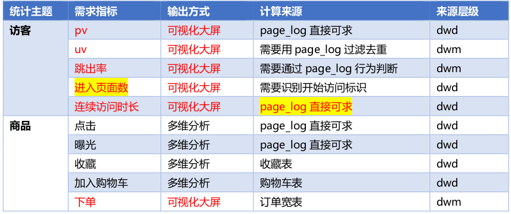
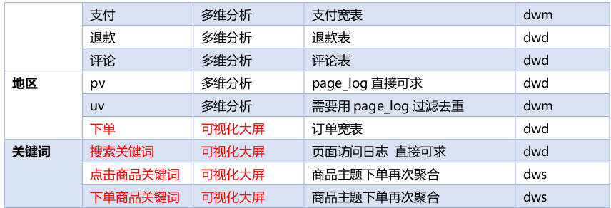
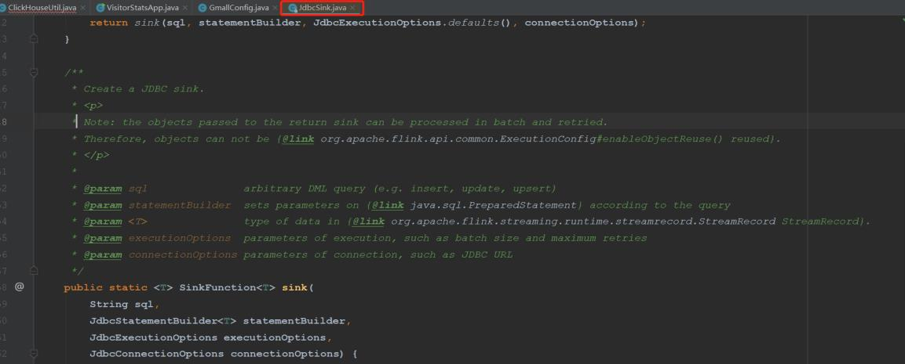
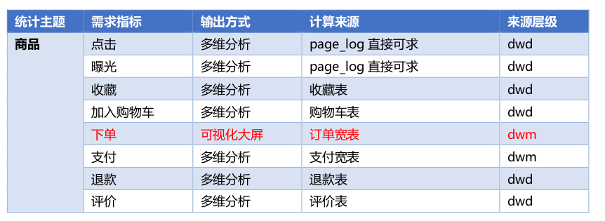
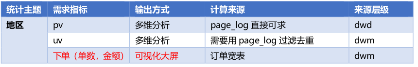
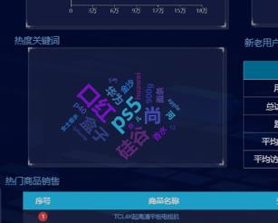
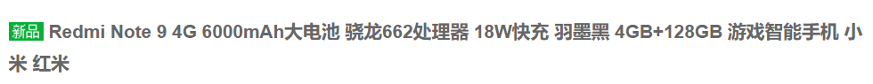
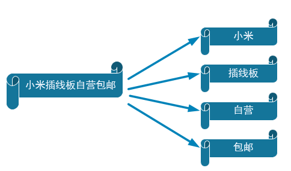

# 第1章 DWS 层与 DWM 层的设计

## 1.1设计思路

我们在之前通过分流等手段，把数据分拆成了独立的 Kafka Topic。那么接下来如何处理数据，就要思考一下我们到底要通过实时计算出哪些指标项。因为实时计算与离线不同，实时计算的开发和运维成本都是非常高的，要结合实际情况考虑是否有必要象离线数仓一样，建一个大而全的中间层。如果没有必要大而全，这时候就需要大体规划一下要实时计算出的指标需求了。把这些指标以主题宽表的形式输出就是我们的 DWS 层。

## 1.2 需求梳理





当然实际需求还会有更多，这里主要以为可视化大屏为目的进行实时计算的处理。

## 1.3 DWS 层的定位是什么

➢轻度聚合，因为 DWS 层要应对很多实时查询，如果是完全的明细那么查询的压力是非常大的。

➢将更多的实时数据以主题的方式组合起来便于管理，同时也能减少维度查询的次数。

# 第2章 DWS 层-访客主题宽表的计算


设计一张 DWS 层的表其实就两件事：维度和度量(事实数据)

➢度量包括 PV、UV、跳出次数、进入页面数(session_count)、连续访问时长

➢维度包括在分析中比较重要的几个字段：渠道、地区、版本、新老用户进行聚合

## 2.1 需求分析与思路

➢接收各个明细数据，变为数据流

➢把数据流合并在一起，成为一个相同格式对象的数据流

➢对合并的流进行聚合，聚合的时间窗口决定了数据的时效性

➢把聚合结果写在数据库中

## 2.2功能实现

### 2.2.1 封装 VisitorStatsApp,读取 Kafka 各个流数据

```java
package com.atguigu.gmall.realtime.app.dws;
import com.atguigu.gmall.realtime.utils.MyKafkaUtil;
import org.apache.flink.streaming.api.datastream.DataStreamSource;
import org.apache.flink.streaming.api.environment.StreamExecutionEnvironment;
import org.apache.flink.streaming.connectors.kafka.FlinkKafkaConsumer;
/**

* Desc: 访客主题宽表计算

*<p>

*?要不要把多个明细的同样的维度统计在一起?

*因为单位时间内 mid 的操作数据非常有限不能明显的压缩数据量（如果是数据量够大，
或者单位时间够长可以）

*所以用常用统计的四个维度进行聚合渠道、新老用户、app 版本、省市区域

*度量值包括启动、日活（当日首次启动）
、访问页面数、新增用户数、跳出数、平均页
面停留时长、总访问时长

*聚合窗口：10 秒

*<p>

*各个数据在维度聚合前不具备关联性，所以先进行维度聚合

*进行关联这是一个 fulljoin

*可以考虑使用 flinksql 完成
*/
 public class VisitorStatsApp {
 public static void main(String[] args) throws Exception {
//TODO 0.基本环境准备
 StreamExecutionEnvironment env =
 StreamExecutionEnvironment.getExecutionEnvironment();
//设置并行度
 env.setParallelism(4);
/*
//检查点 CK 相关设置
 env.enableCheckpointing(5000, CheckpointingMode.AT_LEAST_ONCE);
 env.getCheckpointConfig().setCheckpointTimeout(60000);
 StateBackend fsStateBackend = new FsStateBackend(
"hdfs://hadoop102:8020/gmall/flink/checkpoint/VisitorStatsApp");

env.setStateBackend(fsStateBackend);
System.setProperty("HADOOP_USER_NAME","atguigu");
*/
String groupId = "visitor_stats_app";
//TODO 1.从 Kafka 的 pv、uv、跳转明细主题中获取数据
String pageViewSourceTopic = "dwd_page_log";
String uniqueVisitSourceTopic = "dwm_unique_visit";
String userJumpDetailSourceTopic = "dwm_user_jump_detail";
FlinkKafkaConsumer<String> pageViewSource =
MyKafkaUtil.getKafkaSource(pageViewSourceTopic, groupId);
FlinkKafkaConsumer<String> uniqueVisitSource =
MyKafkaUtil.getKafkaSource(uniqueVisitSourceTopic, groupId);
FlinkKafkaConsumer<String> userJumpSource =
MyKafkaUtil.getKafkaSource(userJumpDetailSourceTopic, groupId);
DataStreamSource<String> pageViewDStream = env.addSource(pageViewSource);
DataStreamSource<String> uniqueVisitDStream = env.addSource(uniqueVisitSource);
DataStreamSource<String> userJumpDStream = env.addSource(userJumpSource);
pageViewDStream.print("pv-------->");
uniqueVisitDStream.print("uv=====>");
userJumpDStream.print("uj--------->");
env.execute();
}
}
```


### 2.2.2 合并数据流

把数据流合并在一起，成为一个相同格式对象的数据流合并数据流的核心算子是 union。但是 union 算子，要求所有的数据流结构必须一致。所以 union 前要调整数据结构。

1）封装主题宽表实体类 VisitorStats

```java
package com.atguigu.gmall.realtime.bean;
/**

* Desc: 访客统计实体类包括各个维度和度量
*/
@Data
@AllArgsConstructor
 public class VisitorStats {
//统计开始时间


private String stt;
//统计结束时间
private String edt;
//维度：版本
private String vc;
//维度：渠道
private String ch;
//维度：地区
private String ar;
//维度：新老用户标识
private String is_new;
//度量：独立访客数
private Long uv_ct=0L;
//度量：页面访问数
private Long pv_ct=0L;
//度量：进入次数
private Long sv_ct=0L;
//度量：跳出次数
private Long uj_ct=0L;
//度量：持续访问时间
private Long dur_sum=0L;
//统计时间
private Long ts;
}
```

2)对读取的各个数据流进行结构的转换

```java
//TODO 2.对读取的流进行结构转换
//2.1 转换 pv 流
 SingleOutputStreamOperator<VisitorStats> pageViewStatsDstream = pageViewDStream.map(
 json -> {
// System.out.println("pv:"+json);
 JSONObject jsonObj = JSON.parseObject(json);
 return new VisitorStats("","",
 jsonObj.getJSONObject("common").getString("vc"),
 jsonObj.getJSONObject("common").getString("ch"),
 jsonObj.getJSONObject("common").getString("ar"),
 jsonObj.getJSONObject("common").getString("is_new"),
0L,1L,0L,0L, jsonObj.getJSONObject("page").getLong("during_time"),
 jsonObj.getLong("ts"));
});
//2.2 转换 uv 流
 SingleOutputStreamOperator<VisitorStats> uniqueVisitStatsDstream = uniqueVisitDStream.map(
 json -> {
 JSONObject jsonObj = JSON.parseObject(json);
 return new VisitorStats("","",
 jsonObj.getJSONObject("common").getString("vc"),
 jsonObj.getJSONObject("common").getString("ch"),


jsonObj.getJSONObject("common").getString("ar"),
jsonObj.getJSONObject("common").getString("is_new"),
1L,0L,0L,0L,0L, jsonObj.getLong("ts"));
});
//2.3 转换 sv 流
SingleOutputStreamOperator<VisitorStats> sessionVisitDstream = pageViewDStream.process(
new ProcessFunction<String, VisitorStats>(){
@Override
public void processElement(String json, Context ctx, Collector<VisitorStats> out)
throws Exception {
JSONObject jsonObj = JSON.parseObject(json);
String lastPageId = jsonObj.getJSONObject("page").getString("last_page_id");
if (lastPageId == null || lastPageId.length()== 0){
//
System.out.println("sc:"+json);
VisitorStats visitorStats = new VisitorStats("","",
jsonObj.getJSONObject("common").getString("vc"),
jsonObj.getJSONObject("common").getString("ch"),
jsonObj.getJSONObject("common").getString("ar"),
jsonObj.getJSONObject("common").getString("is_new"),
0L,0L,1L,0L,0L, jsonObj.getLong("ts"));
out.collect(visitorStats);
}
}
});
//2.4 转换跳转流
SingleOutputStreamOperator<VisitorStats> userJumpStatDstream = userJumpDStream.map(json
-> {
JSONObject jsonObj = JSON.parseObject(json);
return new VisitorStats("","",
jsonObj.getJSONObject("common").getString("vc"),
jsonObj.getJSONObject("common").getString("ch"),
jsonObj.getJSONObject("common").getString("ar"),
jsonObj.getJSONObject("common").getString("is_new"),
0L,0L,0L,1L,0L, jsonObj.getLong("ts"));
});
```

3)四条流合并起来

```java
//TODO 3.将四条流合并起来
DataStream<VisitorStats> unionDetailDstream = uniqueVisitStatsDstream.union(
pageViewStatsDstream,
sessionVisitDstream,
userJumpStatDstream
);
```

### 2.2.3 根据维度进行聚合

1)设置时间标记及水位线

因为涉及开窗聚合，所以要设定事件时间及水位线

```java
//TODO 4.设置水位线
SingleOutputStreamOperator<VisitorStats> visitorStatsWithWatermarkDstream =
unionDetailDstream.assignTimestampsAndWatermarks(
WatermarkStrategy.<VisitorStats>forBoundedOutOfOrderness(Duration.ofSeconds(1)).
withTimestampAssigner((visitorStats,ts)->visitorStats.getTs())
);
visitorStatsWithWatermarkDstream.print("after union:::");
```

2)分组

```java
分组选取四个维度作为 key ,使用 Tuple4 组合
//TODO 5.分组选取四个维度作为 key ,使用 Tuple4 组合
KeyedStream<VisitorStats, Tuple4<String, String, String, String>> visitorStatsTuple4KeyedStream
=
visitorStatsWithWatermarkDstream
.keyBy(new KeySelector<VisitorStats, Tuple4<String, String, String, String>>(){
@Override
public Tuple4<String, String, String, String> getKey(VisitorStats
visitorStats) throws Exception {
return new Tuple4<>(visitorStats.getVc()
, visitorStats.getCh(),
visitorStats.getAr(),
visitorStats.getIs_new());
}
}
);
```

3)开窗

```java
//TODO 6.开窗
WindowedStream<VisitorStats, Tuple4<String, String, String, String>, TimeWindow>
windowStream =
visitorStatsTuple4KeyedStream.window(TumblingEventTimeWindows.of(Time.seconds(10)));
```

4)窗口内聚合及补充时间字段

```java
//TODO 7.Reduce 聚合统计
SingleOutputStreamOperator<VisitorStats> visitorStatsDstream =
windowStream.reduce(new ReduceFunction<VisitorStats>(){
@Override

public VisitorStats reduce(VisitorStats stats1, VisitorStats stats2) throws Exception
{
//把度量数据两两相加
stats1.setPv_ct(stats1.getPv_ct()+ stats2.getPv_ct());
stats1.setUv_ct(stats1.getUv_ct()+ stats2.getUv_ct());
stats1.setUj_ct(stats1.getUj_ct()+ stats2.getUj_ct());
stats1.setSv_ct(stats1.getSv_ct()+ stats2.getSv_ct());
stats1.setDur_sum(stats1.getDur_sum()+ stats2.getDur_sum());
return stats1;
}
}, new ProcessWindowFunction<VisitorStats, VisitorStats, Tuple4<String, String, String,
String>, TimeWindow>(){
@Override
public void process(Tuple4<String, String, String, String> tuple4, Context context,
Iterable<VisitorStats> visitorStatsIn,
Collector<VisitorStats> visitorStatsOut) throws Exception {
//补时间字段
SimpleDateFormat simpleDateFormat = new
SimpleDateFormat("yyyy-MM-dd HH:mm:ss");
for (VisitorStats visitorStats : visitorStatsIn){
String startDate = simpleDateFormat.format(new
Date(context.window().getStart()));
String endDate = simpleDateFormat.format(new
Date(context.window().getEnd()));
visitorStats.setStt(startDate);
visitorStats.setEdt(endDate);
visitorStatsOut.collect(visitorStats);
}
}
});
visitorStatsDstream.print("reduce:");
```


### 2.2.4 写入 OLAP 数据库

> 为何要写入 ClickHouse 数据库，ClickHouse 数据库作为专门解决大量数据统计分析的数据库，在保证了海量数据存储的能力，同时又兼顾了响应速度。而且还支持标准 SQL，即灵活又易上手。ClickHouse 数据库的详细安装及入门，请参考《05\_尚硅谷大数据之 FLINK 版实时项目_ClickHouse_V1.1》。

1)ClickHouse 数据表准备

```sql
create table visitor_stats_2021 (
stt DateTime,
edt DateTime,
vc String,
ch String,
ar String,
is_new String,
uv_ct UInt64,
pv_ct UInt64,
sv_ct UInt64,
uj_ct UInt64,
dur_sum UInt64,
ts UInt64
) engine =ReplacingMergeTree(ts)
partition by toYYYYMMDD(stt)
order by (stt,edt,is_new,vc,ch,ar);
```

之所以选用 ReplacingMergeTree 引擎主要是靠它来保证数据表的幂等性。

➢paritition by 把日期变为数字类型（如：20201126），用于分区。所以尽量保证查询条件尽量包含 stt 字段。

➢order by 后面字段数据在同一分区下，出现重复会被去重，重复数据保留 ts 最大的数据。

2)加入 ClickHouse 依赖包

```xml
<dependency>
<groupId>ru.yandex.clickhouse</groupId>
<artifactId>clickhouse-jdbc</artifactId>
<version>0.2.4</version>
<exclusions>
<exclusion>
<groupId>com.fasterxml.jackson.core</groupId>
<artifactId>jackson-databind</artifactId>
</exclusion>
<exclusion>
<groupId>com.fasterxml.jackson.core</groupId>
<artifactId>jackson-core</artifactId>
</exclusion>
</exclusions>
</dependency>
```


其中 flink-connector-jdbc 是官方通用的 jdbcSink 包。只要引入对应的 jdbc 驱动，flink可以用它应对各种支持 jdbc 的数据库，比如 phoenix 也可以用它。但是这个 jdbc-sink 只支持数据流对应一张数据表。如果是一流对多表，就必须通过自定义的方式实现了，比如之前的维度数据。虽然这种 jdbc-sink 只能一流对一表，但是由于内部使用了预编译器，所以可以实现批量提交以优化写入速度。

3)增加 ClickhouseUtil

A. JdbcSink.<T>sink()的四个参数说明



➢参数1：传入 Sql，格式如：insert into xxx values(?,?,?,?)

➢参数2: 可以用 lambda 表达实现( jdbcPreparedStatement, t)-> t 为数据对象，要装配到语句预编译器的参数中。

➢参数3：设定一些执行参数，比如重试次数，批次大小。

➢参数4：设定连接参数，比如地址，端口，驱动名。

B . ClickhouseUtil 中获取 JdbcSink 函数的实现

```java
package com.atguigu.gmall.realtime.utils;
import com.atguigu.gmall.realtime.bean.TransientSink;
import com.atguigu.gmall.realtime.common.GmallConfig;
import org.apache.flink.connector.jdbc.JdbcConnectionOptions;
import org.apache.flink.connector.jdbc.JdbcExecutionOptions;
import org.apache.flink.connector.jdbc.JdbcSink;


import org.apache.flink.streaming.api.functions.sink.SinkFunction;
import java.lang.reflect.Field;
/**

* Desc: 操作 ClickHouse 的工具类
  */
  public class ClickHouseUtil {
  //获取针对 ClickHouse 的 JdbcSink
  public static <T> SinkFunction getJdbcSink(String sql){
  SinkFunction<T> sink = JdbcSink.<T>sink(
  sql,
  (jdbcPreparedStatement, t)-> {
  Field[] fields = t.getClass().getDeclaredFields();
  int skipOffset = 0; //
  for (int i = 0; i < fields.length; i++){
  Field field = fields[i];
  //通过反射获得字段上的注解
  TransientSink transientSink =
  field.getAnnotation(TransientSink.class);
  if (transientSink != null){
  //如果存在该注解
  System.out.println("跳过字段："+ field.getName());
  skipOffset++;
  continue;
  }
  field.setAccessible(true);
  try {
  Object o = field.get(t);
  //i 代表流对象字段的下标，
  //公式：写入表字段位置下标= 对象流对象字段下标+1 -
  跳过字段的偏移量
  //一旦跳过一个字段那么写入字段下标就会和原本字段
  下标存在偏差
  jdbcPreparedStatement.setObject(i +1 - skipOffset, o);
  } catch (Exception e){
  e.printStackTrace();
  }
  }
  },
  new JdbcExecutionOptions.Builder().withBatchSize(2).build(),
  new JdbcConnectionOptions.JdbcConnectionOptionsBuilder()
  .withUrl(GmallConfig.CLICKHOUSE_URL)
  .withDriverName("ru.yandex.clickhouse.ClickHouseDriver")
  .build());
  return sink;
  }


}
```

C . 创建 TransientSink 注解，该注解标记不需要保存的字段

```java
package com.atguigu.gmall.realtime.bean;
import java.lang.annotation.Retention;
import java.lang.annotation.Target;
import static java.lang.annotation.ElementType.FIELD;
import static java.lang.annotation.RetentionPolicy.RUNTIME;
/**

* Desc: 向 ClickHouse 写入数据的时候，如果有字段数据不需要传输，可以用该注解标记
  */
  @Target(FIELD)
  @Retention(RUNTIME)
  public @interface TransientSink {
  }
```

> 由于之前的 ClickhouseUtil 工具类的写入机制就是把该实体类的所有字段按次序一次写入数据表。但是实体类有时会用到一些临时字段，计算中有用但是并不需要最终保存在临时表中。我们可以把这些字段做一些标识，然后再写入的时候判断标识来过滤掉这些字段。
>
> 为字段打标识通常的办法就是给字段加个注解，这里我们就增加一个自定义注解@TransientSink 来标识该字段不需要保存到数据表中。

D . 在 GmallConfig 中配置 ClickHouse 的连接地址

```java
package com.atguigu.gmall.realtime.common;
/**

* Desc: 项目常用配置
  */
  public class GmallConfig {
  public static final String HBASE_SCHEMA="GMALL2021_REALTIME";
  public static final String
  PHOENIX_SERVER="jdbc:phoenix:hadoop102,hadoop103,hadoop104:2181";
  public static final String
  CLICKHOUSE_URL="jdbc:clickhouse://hadoop102:8123/default";
  public static final String CLICKHOUSE_DRIVER =
  "ru.yandex.clickhouse.ClickHouseDriver";
  }
```

4)为主程序增加写入 ClickHouse 的 Sink

```java
//TODO 8.向 ClickHouse 中写入数据
visitorStatsDstream.addSink(
ClickHouseUtil.getJdbcSink("insert into visitor_stats_2021
values(?,?,?,?,?,?,?,?,?,?,?,?)"));
```


  ### 2.2.5 整体测试

➢启动 ZK、Kafka、logger.sh、ClickHouse、【HDFS】

➢运行 BaseLogApp

➢运行 UniqueVisitApp

➢运行 UserJumpDetailApp

➢运行 VisitorStatsApp

➢运行 rt_applog 目录下的 jar 包

➢查看控制台输出

➢查看 ClickHouse 中 visitor_stats_2021 表数据

# 第3章 DWS 层-商品主题宽表的计算



与访客的 dws 层的宽表类似，也是把多个事实表的明细数据汇总起来组合成宽表。

## 3.1 需求分析与思路

➢从 Kafka 主题中获得数据流

➢把 Json 字符串数据流转换为统一数据对象的数据流

➢把统一的数据结构流合并为一个流

➢设定事件时间与水位线

➢分组、开窗、聚合

➢关联维度补充数据

➢写入 ClickHouse

## 3.2功能实现

### 3.2.1 封装商品统计实体类 ProductStats

```java
package com.atguigu.gmall.realtime.bean;
/**

* Desc: 商品统计实体类
* @Builder 注解
  *
  可以使用构造者方式创建对象，给属性赋值
* @Builder.Default
  *
  在使用构造者方式给属性赋值的时候，属性的初始值会丢失
  *
  该注解的作用就是修复这个问题
  *
  例如：我们在属性上赋值了初始值为0L，如果不加这个注解，通过构造者创建的
  对象属性值会变为 null
  */
  import lombok.Builder;
  import lombok.Data;
  import java.math.BigDecimal;
  import java.util.HashSet;
  import java.util.Set;
  @Data
  @Builder
  public class ProductStats {
  String stt;//窗口起始时间
  String edt; //窗口结束时间
  Long sku_id; //sku 编号
  String sku_name;//sku 名称
  BigDecimal sku_price; //sku 单价


Long spu_id; //spu 编号
String spu_name;//spu 名称
Long tm_id; //品牌编号
String tm_name;//品牌名称
Long category3_id;//品类编号
String category3_name;//品类名称
@Builder.Default
Long display_ct = 0L; //曝光数
@Builder.Default
Long click_ct = 0L;
//点击数
@Builder.Default
Long favor_ct = 0L; //收藏数
@Builder.Default
Long cart_ct = 0L; //添加购物车数
@Builder.Default
Long order_sku_num = 0L; //下单商品个数
@Builder.Default //下单商品金额
BigDecimal order_amount = BigDecimal.ZERO;
@Builder.Default
Long order_ct = 0L; //订单数
@Builder.Default //支付金额
BigDecimal payment_amount = BigDecimal.ZERO;
@Builder.Default
Long paid_order_ct = 0L;
//支付订单数
@Builder.Default
Long refund_order_ct = 0L; //退款订单数
@Builder.Default
BigDecimal refund_amount = BigDecimal.ZERO;
@Builder.Default
Long comment_ct = 0L;//评论订单数
@Builder.Default
Long good_comment_ct = 0L; //好评订单数
@Builder.Default
@TransientSink

Set orderIdSet = new HashSet(); //用于统计订单数
@Builder.Default
@TransientSink
Set paidOrderIdSet = new HashSet(); //用于统计支付订单数
@Builder.Default
@TransientSink
Set refundOrderIdSet = new HashSet();//用于退款支付订单数
Long ts; //统计时间戳
}
```


### 3.2.2 创建 ProductStatsApp，从 Kafka 主题中获得数据流

```java
package com.atguigu.gmall.realtime.app.dws;
import com.atguigu.gmall.realtime.utils.MyKafkaUtil;
import org.apache.flink.streaming.api.datastream.DataStreamSource;
import org.apache.flink.streaming.api.environment.StreamExecutionEnvironment;
import org.apache.flink.streaming.connectors.kafka.FlinkKafkaConsumer;
/**

* Desc: 形成以商品为准的统计曝光点击购物车下单支付退单评论数宽表
  */
  public class ProductStatsApp {
  public static void main(String[] args) throws Exception {
  //TODO 0.基本环境准备
  StreamExecutionEnvironment env =
  StreamExecutionEnvironment.getExecutionEnvironment();
  //设置并行度
  env.setParallelism(4);
  /*
  //检查点 CK 相关设置
  env.enableCheckpointing(5000, CheckpointingMode.AT_LEAST_ONCE);
  env.getCheckpointConfig().setCheckpointTimeout(60000);
  StateBackend fsStateBackend = new FsStateBackend(
  "hdfs://hadoop102:8020/gmall/flink/checkpoint/ProductStatsApp");
  env.setStateBackend(fsStateBackend);
  System.setProperty("HADOOP_USER_NAME","atguigu");
  */
  //TODO 1.从 Kafka 中获取数据流
  String groupId = "product_stats_app";
  String pageViewSourceTopic = "dwd_page_log";
  String orderWideSourceTopic = "dwm_order_wide";

String paymentWideSourceTopic = "dwm_payment_wide";
String cartInfoSourceTopic = "dwd_cart_info";
String favorInfoSourceTopic = "dwd_favor_info";
String refundInfoSourceTopic = "dwd_order_refund_info";
String commentInfoSourceTopic = "dwd_comment_info";
FlinkKafkaConsumer<String> pageViewSource =
MyKafkaUtil.getKafkaSource(pageViewSourceTopic,groupId);
FlinkKafkaConsumer<String> orderWideSource =
MyKafkaUtil.getKafkaSource(orderWideSourceTopic,groupId);
FlinkKafkaConsumer<String> paymentWideSource =
MyKafkaUtil.getKafkaSource(paymentWideSourceTopic,groupId);
FlinkKafkaConsumer<String> favorInfoSourceSouce =
MyKafkaUtil.getKafkaSource(favorInfoSourceTopic,groupId);
FlinkKafkaConsumer<String> cartInfoSource =
MyKafkaUtil.getKafkaSource(cartInfoSourceTopic,groupId);
FlinkKafkaConsumer<String> refundInfoSource =
MyKafkaUtil.getKafkaSource(refundInfoSourceTopic,groupId);
FlinkKafkaConsumer<String> commentInfoSource =
MyKafkaUtil.getKafkaSource(commentInfoSourceTopic,groupId);
DataStreamSource<String> pageViewDStream = env.addSource(pageViewSource);
DataStreamSource<String> favorInfoDStream = env.addSource(favorInfoSourceSouce);
DataStreamSource<String> orderWideDStream= env.addSource(orderWideSource);
DataStreamSource<String> paymentWideDStream=
env.addSource(paymentWideSource);
DataStreamSource<String> cartInfoDStream= env.addSource(cartInfoSource);
DataStreamSource<String> refundInfoDStream= env.addSource(refundInfoSource);
DataStreamSource<String> commentInfoDStream=
env.addSource(commentInfoSource);
env.execute();
}
}
```


### 3.2.3 把 JSON 字符串数据流转换为统一数据对象的数据流

```java
//TODO 2.对获取的流数据进行结构的转换
//2.1 转换曝光及页面流数据
SingleOutputStreamOperator<ProductStats> pageAndDispStatsDstream =
pageViewDStream.process(
new ProcessFunction<String, ProductStats>(){
@Override
public void processElement(String json, Context ctx, Collector<ProductStats> out)
throws Exception {
JSONObject jsonObj = JSON.parseObject(json);
JSONObject pageJsonObj = jsonObj.getJSONObject("page");
String pageId = pageJsonObj.getString("page_id");
if (pageId == null){


System.out.println(jsonObj);
}
Long ts = jsonObj.getLong("ts");
if (pageId.equals("good_detail")){
Long skuId = pageJsonObj.getLong("item");
ProductStats productStats = ProductStats.builder().sku_id(skuId).
click_ct(1L).ts(ts).build();
out.collect(productStats);
}
JSONArray displays = jsonObj.getJSONArray("display");
if (displays != null && displays.size()> 0){
for (int i = 0; i < displays.size(); i++){
JSONObject display = displays.getJSONObject(i);
if (display.getString("item_type").equals("sku_id")){
Long skuId = display.getLong("item");
ProductStats productStats = ProductStats.builder()
.sku_id(skuId).display_ct(1L).ts(ts).build();
out.collect(productStats);
}
}
}
}
});
//2.2 转换下单流数据
SingleOutputStreamOperator<ProductStats> orderWideStatsDstream = orderWideDStream.map(
json -> {
OrderWide orderWide = JSON.parseObject(json, OrderWide.class);
System.out.println("orderWide:==="+ orderWide);
String create_time = orderWide.getCreate_time();
Long ts = DateTimeUtil.toTs(create_time);
return ProductStats.builder().sku_id(orderWide.getSku_id())
.orderIdSet(new HashSet(Collections.singleton(orderWide.getOrder_id())))
.order_sku_num(orderWide.getSku_num())
.order_amount(orderWide.getSplit_total_amount()).ts(ts).build();
});
//2.3 转换收藏流数据
SingleOutputStreamOperator<ProductStats> favorStatsDstream = favorInfoDStream.map(
json -> {
JSONObject favorInfo = JSON.parseObject(json);
Long ts = DateTimeUtil.toTs(favorInfo.getString("create_time"));
return ProductStats.builder().sku_id(favorInfo.getLong("sku_id"))
.favor_ct(1L).ts(ts).build();
});
//2.4 转换购物车流数据
SingleOutputStreamOperator<ProductStats> cartStatsDstream = cartInfoDStream.map(
json -> {


JSONObject cartInfo = JSON.parseObject(json);
Long ts = DateTimeUtil.toTs(cartInfo.getString("create_time"));
return ProductStats.builder().sku_id(cartInfo.getLong("sku_id"))
.cart_ct(1L).ts(ts).build();
});
//2.5 转换支付流数据
SingleOutputStreamOperator<ProductStats> paymentStatsDstream =
paymentWideDStream.map(
json -> {
PaymentWide paymentWide = JSON.parseObject(json, PaymentWide.class);
Long ts = DateTimeUtil.toTs(paymentWide.getPayment_create_time());
return ProductStats.builder().sku_id(paymentWide.getSku_id())
.payment_amount(paymentWide.getSplit_total_amount())
.paidOrderIdSet(new
HashSet(Collections.singleton(paymentWide.getOrder_id())))
.ts(ts).build();
});
//2.6 转换退款流数据
SingleOutputStreamOperator<ProductStats> refundStatsDstream = refundInfoDStream.map(
json -> {
JSONObject refundJsonObj = JSON.parseObject(json);
Long ts = DateTimeUtil.toTs(refundJsonObj.getString("create_time"));
ProductStats productStats = ProductStats.builder()
.sku_id(refundJsonObj.getLong("sku_id"))
.refund_amount(refundJsonObj.getBigDecimal("refund_amount"))
.refundOrderIdSet(
new
HashSet(Collections.singleton(refundJsonObj.getLong("order_id"))))
.ts(ts).build();
return productStats;
});
//2.7 转换评价流数据
SingleOutputStreamOperator<ProductStats> commonInfoStatsDstream =
commentInfoDStream.map(
json -> {
JSONObject commonJsonObj = JSON.parseObject(json);
Long ts = DateTimeUtil.toTs(commonJsonObj.getString("create_time"));
Long goodCt =
GmallConstant.APPRAISE_GOOD.equals(commonJsonObj.getString("appraise"))? 1L : 0L;
ProductStats productStats = ProductStats.builder()
.sku_id(commonJsonObj.getLong("sku_id"))
.comment_ct(1L).good_comment_ct(goodCt).ts(ts).build();
return productStats;
});
```


### 3.2.4 创建电商业务常量类 GmallConstant

```java
package com.atguigu.gmall.realtime.common;
/**

* Desc: 电商业务常量
  */
  public class GmallConstant {
  //10 单据状态
  public static final String ORDER_STATUS_UNPAID="1001"; //未支付
  public static final String ORDER_STATUS_PAID="1002"; //已支付
  public static final String ORDER_STATUS_CANCEL="1003";//已取消
  public static final String ORDER_STATUS_FINISH="1004";//已完成
  public static final String ORDER_STATUS_REFUND="1005";//退款中
  public static final String ORDER_STATUS_REFUND_DONE="1006";//退款完成
  //11 支付状态
  public static final String PAYMENT_TYPE_ALIPAY="1101";//支付宝
  public static final String PAYMENT_TYPE_WECHAT="1102";//微信
  public static final String PAYMENT_TYPE_UNION="1103";//银联
  //12 评价
  public static final String APPRAISE_GOOD="1201";//好评
  public static final String APPRAISE_SOSO="1202";//中评
  public static final String APPRAISE_BAD="1203";//差评
  public static final String APPRAISE_AUTO="1204";//自动
  //13 退货原因
  public static final String REFUND_REASON_BAD_GOODS="1301";//质量问题
  public static final String REFUND_REASON_WRONG_DESC="1302";//商品描述与实际描述
  不一致
  public static final String REFUND_REASON_SALE_OUT="1303";//
  缺货
  public static final String REFUND_REASON_SIZE_ISSUE="1304";//号码不合适
  public static final String REFUND_REASON_MISTAKE="1305";//拍错
  public static final String REFUND_REASON_NO_REASON="1306";//不想买了
  public static final String REFUND_REASON_OTHER="1307";//
  其他
  //14 购物券状态
  public static final String COUPON_STATUS_UNUSED="1401";//
  public static final String COUPON_STATUS_USING="1402";//
  public static final String COUPON_STATUS_USED="1403";//
  //15 退款类型
  public static final String REFUND_TYPE_ONLY_MONEY="1501";//
  public static final String REFUND_TYPE_WITH_GOODS="1502";//
  未使用
  使用中
  已使用
  仅退款
  退货退款
  //24 来源类型

public static final String SOURCE_TYPE_QUREY="2401";//用户查询
public static final String SOURCE_TYPE_PROMOTION="2402";//
商品推广
public static final String SOURCE_TYPE_AUTO_RECOMMEND="2403";//
智能推荐
public static final String SOURCE_TYPE_ACTIVITY="2404";//促销活动
//购物券范围
public static final String COUPON_RANGE_TYPE_CATEGORY3="3301";//
public static final String COUPON_RANGE_TYPE_TRADEMARK="3302";//
public static final String COUPON_RANGE_TYPE_SPU="3303";//
//购物券类型
public static final String COUPON_TYPE_MJ="3201";//满减
public static final String COUPON_TYPE_DZ="3202";//满量打折
public static final String COUPON_TYPE_DJ="3203";//代金券
public static final String ACTIVITY_RULE_TYPE_MJ="3101";
public static final String ACTIVITY_RULE_TYPE_DZ="3102";
public static final String ACTIVITY_RULE_TYPE_ZK="3103";
public static final String KEYWORD_SEARCH="SEARCH";
public static final String KEYWORD_CLICK="CLICK";
public static final String KEYWORD_CART="CART";
public static final String KEYWORD_ORDER="ORDER";
}
```


### 3.2.5 把统一的数据结构流合并为一个流

```java
//TODO 3.把统一的数据结构流合并为一个流
DataStream<ProductStats> productStatDetailDStream = pageAndDispStatsDstream.union(
orderWideStatsDstream, cartStatsDstream,
paymentStatsDstream, refundStatsDstream,favorStatsDstream,
commonInfoStatsDstream);
productStatDetailDStream.print("after union:");
```


### 3.2.6 设定事件时间与水位线

```java
//TODO 4.设定事件时间与水位线
SingleOutputStreamOperator<ProductStats> productStatsWithTsStream =
productStatDetailDStream.assignTimestampsAndWatermarks(
WatermarkStrategy.<ProductStats>forMonotonousTimestamps().withTimestampAssigner(
(productStats, recordTimestamp)-> {
return productStats.getTs();
})
);
```


### 3.2.7 分组、开窗、聚合

```java
//TODO 5.分组、开窗、聚合
SingleOutputStreamOperator<ProductStats> productStatsDstream = productStatsWithTsStream
//5.1 按照商品 id 进行分组
.keyBy(
new KeySelector<ProductStats, Long>(){
@Override
public Long getKey(ProductStats productStats) throws Exception {
return productStats.getSku_id();
}
})
//5.2 开窗窗口长度为10s
.window(TumblingEventTimeWindows.of(Time.seconds(10)))
//5.3 对窗口中的数据进行聚合
.reduce(new ReduceFunction<ProductStats>(){
@Override
public ProductStats reduce(ProductStats stats1, ProductStats stats2) throws Exception {
stats1.setDisplay_ct(stats1.getDisplay_ct()+ stats2.getDisplay_ct());
stats1.setClick_ct(stats1.getClick_ct()+ stats2.getClick_ct());
stats1.setCart_ct(stats1.getCart_ct()+ stats2.getCart_ct());
stats1.setFavor_ct(stats1.getFavor_ct()+ stats2.getFavor_ct());
stats1.setOrder_amount(stats1.getOrder_amount().add(stats2.getOrder_amount()));
stats1.getOrderIdSet().addAll(stats2.getOrderIdSet());
stats1.setOrder_ct(stats1.getOrderIdSet().size()+0L);
stats1.setOrder_sku_num(stats1.getOrder_sku_num()+
stats2.getOrder_sku_num());
stats1.setPayment_amount(stats1.getPayment_amount().add(stats2.getPayment_amount()));
stats1.getRefundOrderIdSet().addAll(stats2.getRefundOrderIdSet());
stats1.setRefund_order_ct(stats1.getRefundOrderIdSet().size()+0L);
stats1.setRefund_amount(stats1.getRefund_amount().add(stats2.getRefund_amount()));
stats1.getPaidOrderIdSet().addAll(stats2.getPaidOrderIdSet());
stats1.setPaid_order_ct(stats1.getPaidOrderIdSet().size()+0L);
stats1.setComment_ct(stats1.getComment_ct()+ stats2.getComment_ct());
stats1.setGood_comment_ct(stats1.getGood_comment_ct()+
stats2.getGood_comment_ct());
return stats1;
}
},
new WindowFunction<ProductStats, ProductStats, Long, TimeWindow>(){
@Override

public void apply(Long aLong, TimeWindow window,
Iterable<ProductStats> productStatsIterable,
Collector<ProductStats> out) throws Exception {
SimpleDateFormat simpleDateFormat = new SimpleDateFormat("yyyy-MM-dd
HH:mm:ss");
for (ProductStats productStats : productStatsIterable){
productStats.setStt(simpleDateFormat.format(window.getStart()));
productStats.setEdt(simpleDateFormat.format(window.getEnd()));
productStats.setTs(new Date().getTime());
out.collect(productStats);
}
}
});
//productStatsDstream.print("productStatsDstream::");
```


### 3.2.8 补充商品维度信息

因为除了下单操作之外，其它操作，只获取到了商品的 id，其它维度信息是没有的

### 3.2.9 写入 ClickHouse

```java
//TODO 6.补充商品维度信息
//6.1 补充 SKU 维度
SingleOutputStreamOperator<ProductStats> productStatsWithSkuDstream =
AsyncDataStream.unorderedWait(productStatsDstream,
new DimAsyncFunction<ProductStats>("DIM_SKU_INFO"){
@Override
public void join(ProductStats productStats, JSONObject jsonObject) throws
Exception {
productStats.setSku_name(jsonObject.getString("SKU_NAME"));
productStats.setSku_price(jsonObject.getBigDecimal("PRICE"));
productStats.setCategory3_id(jsonObject.getLong("CATEGORY3_ID"));
productStats.setSpu_id(jsonObject.getLong("SPU_ID"));
productStats.setTm_id(jsonObject.getLong("TM_ID"));
}
@Override
public String getKey(ProductStats productStats){
return String.valueOf(productStats.getSku_id());
}
},60, TimeUnit.SECONDS);
//6.2 补充 SPU 维度
SingleOutputStreamOperator<ProductStats> productStatsWithSpuDstream =
AsyncDataStream.unorderedWait(productStatsWithSkuDstream,
new DimAsyncFunction<ProductStats>("DIM_SPU_INFO"){


@Override
public void join(ProductStats productStats, JSONObject jsonObject) throws
Exception {
productStats.setSpu_name(jsonObject.getString("SPU_NAME"));
}
@Override
public String getKey(ProductStats productStats){
return String.valueOf(productStats.getSpu_id());
}
},60, TimeUnit.SECONDS);
//6.3 补充品类维度
SingleOutputStreamOperator<ProductStats> productStatsWithCategory3Dstream =
AsyncDataStream.unorderedWait(productStatsWithSpuDstream,
new DimAsyncFunction<ProductStats>("DIM_BASE_CATEGORY3"){
@Override
public void join(ProductStats productStats, JSONObject jsonObject) throws
Exception {
productStats.setCategory3_name(jsonObject.getString("NAME"));
}
@Override
public String getKey(ProductStats productStats){
return String.valueOf(productStats.getCategory3_id());
}
},60, TimeUnit.SECONDS);
//6.4 补充品牌维度
SingleOutputStreamOperator<ProductStats> productStatsWithTmDstream =
AsyncDataStream.unorderedWait(productStatsWithCategory3Dstream,
new DimAsyncFunction<ProductStats>("DIM_BASE_TRADEMARK"){
@Override
public void join(ProductStats productStats, JSONObject jsonObject) throws
Exception {
productStats.setTm_name(jsonObject.getString("TM_NAME"));
}
@Override
public String getKey(ProductStats productStats){
return String.valueOf(productStats.getTm_id());
}
},60, TimeUnit.SECONDS);
productStatsWithTmDstream.print("to save");
```

1)在 ClickHouse 中创建商品主题宽表

```sql
create table product_stats_2021 (
stt DateTime,
edt DateTime,
sku_id UInt64,
sku_name String,

sku_price Decimal64(2),
spu_id UInt64,
spu_name String ,
tm_id UInt64,
tm_name String,
category3_id UInt64,
category3_name String ,
display_ct UInt64,
click_ct UInt64,
favor_ct UInt64,
cart_ct UInt64,
order_sku_num UInt64,
order_amount Decimal64(2),
order_ct UInt64 ,
payment_amount Decimal64(2),
paid_order_ct UInt64,
refund_order_ct UInt64,
refund_amount Decimal64(2),
comment_ct UInt64,
good_comment_ct UInt64 ,
ts UInt64
)engine =ReplacingMergeTree(ts)
partition by toYYYYMMDD(stt)
order by (stt,edt,sku_id );
```

2)为主程序增加写入 ClickHouse 的 Sink

```java
//TODO 7.写入到 ClickHouse
productStatsWithTmDstream.addSink(
ClickHouseUtil.<ProductStats>getJdbcSink(
"insert into product_stats_2021 values(?,?,?,?,?,?,?,?,?,?,?,?,?,?,?,?,?,?,?,?,?,?,?,?,?)"));
```

### 3.2.10 整体测试

➢启动 ZK、Kafka、logger.sh、ClickHouse、Redis、HDFS、HBase、FlinkCDC

➢运行 BaseLogApp

➢运行 BaseDBApp

➢运行 OrderWideApp

➢运行 PaymentWideApp

➢运行 ProductsStatsApp

➢运行 rt_applog 目录下的 jar 包

➢运行 rt_dblog 目录下的 jar 包

➢查看控制台输出

➢查看 ClickHouse 中 products_stats_2021 表数据

注意：一定要匹配两个数据生成模拟器的日期，否则窗口无法匹配上

# 第4章 DWS 层-地区主题表(FlinkSQL)



> 地区主题主要是反映各个地区的销售情况。从业务逻辑上地区主题比起商品更加简单，业务逻辑也没有什么特别的就是做一次轻度聚合然后保存，所以在这里我们体验一下使用FlinkSQL，来完成该业务。

## 4.1需求分析与思路

➢定义 Table 流环境

➢把数据源定义为动态表

➢通过 SQL 查询出结果表

➢**把结果表转换为数据流**

➢把数据流写入目标数据库

如果是 Flink 官方支持的数据库，也可以直接把目标数据表定义为动态表，用 insert into写入。由于 ClickHouse 目前官方没有支持的 jdbc 连接器（目前支持 Mysql、 PostgreSQL、Derby）。也可以制作自定义 sink，实现官方不支持的连接器。但是比较繁琐。

## 4.2 功能实现

### 4.2.1 在 pom.xml 文件中添加 FlinkSQL 相关依赖

```xml
<dependency>
<groupId>org.apache.flink</groupId>
<artifactId>flink-table-api-java-bridge_${scala.version}</artifactId>
<version>${flink.version}</version>
</dependency>
<dependency>
<groupId>org.apache.flink</groupId>
<artifactId>flink-table-planner-blink_${scala.version}</artifactId>
<version>${flink.version}</version>
</dependency>
```

### 4.2.2 创建 ProvinceStatsSqlApp,定义 Table 流环境

```java
package com.atguigu.gmall.realtime.app.dws;
import org.apache.flink.streaming.api.environment.StreamExecutionEnvironment;
import org.apache.flink.table.api.EnvironmentSettings;
import org.apache.flink.table.api.bridge.java.StreamTableEnvironment;
/**

* Desc: FlinkSQL 实现地区主题宽表计算
  */
  public class ProvinceStatsSqlApp {
  public static void main(String[] args) throws Exception {
  //TODO 0.基本环境准备
  StreamExecutionEnvironment env =
  StreamExecutionEnvironment.getExecutionEnvironment();
  //设置并行度
  env.setParallelism(4);
  /*
  //CK 相关设置
  env.enableCheckpointing(5000, CheckpointingMode.AT_LEAST_ONCE);
  env.getCheckpointConfig().setCheckpointTimeout(60000);
  StateBackend fsStateBackend = new FsStateBackend(
  "hdfs://hadoop102:8020/gmall/flink/checkpoint/ProvinceStatsSqlApp");
  env.setStateBackend(fsStateBackend);
  System.setProperty("HADOOP_USER_NAME","atguigu");
  */
  //TODO 1.定义 Table 流环境


EnvironmentSettings settings = EnvironmentSettings
.newInstance()
.inStreamingMode()
.build();
StreamTableEnvironment tableEnv = StreamTableEnvironment.create(env, settings);
env.execute();
}
}
```

### 4.2.3 把数据源定义为动态表

其中 WATERMARK FOR rowtime AS rowtime 是把某个虚拟字段设定为 EVENT_TIME

```java
//TODO 2.把数据源定义为动态表
String groupId = "province_stats";
String orderWideTopic = "dwm_order_wide";
tableEnv.executeSql("CREATE TABLE ORDER_WIDE (province_id BIGINT,"+
"province_name STRING,province_area_code STRING,"+
"province_iso_code STRING,province_3166_2_code STRING,order_id STRING,"+
"total_amount DOUBLE,create_time STRING,rowtime AS
TO_TIMESTAMP(create_time),"+
"WATERMARK FOR rowtime AS rowtime)"+
" WITH ("+ MyKafkaUtil.getKafkaDDL(orderWideTopic, groupId)+")");

```


### 4.2.4 MyKafkaUtil 增加一个 DDL 的方法

```java
//拼接 Kafka 相关属性到 DDL
public static String getKafkaDDL(String topic,String groupId){
String ddl="'connector'= 'kafka',"+
"'topic'= '"+topic+"',"+
"'properties.bootstrap.servers'= '"+ kafkaServer +"',"+
"'properties.group.id'= '"+groupId+"',"+
"'format'= 'json',"+
"'scan.startup.mode'= 'latest-offset'";
return ddl;
}
```

### 4.2.5 聚合计算

```java
//TODO 3.聚合计算
Table provinceStateTable = tableEnv.sqlQuery("select "+
"DATE_FORMAT(TUMBLE_START(rowtime, INTERVAL '10' SECOND ),'yyyy-MM-dd HH:mm:ss')


stt,"+
"DATE_FORMAT(TUMBLE_END(rowtime, INTERVAL '10' SECOND ),'yyyy-MM-dd HH:mm:ss')
edt ,"+
" province_id,province_name,province_area_code,"+
"province_iso_code,province_3166_2_code,"+
"COUNT( DISTINCT order_id) order_count, sum(total_amount) order_amount,"+
"UNIX_TIMESTAMP()*1000 ts "+
" from ORDER_WIDE group by TUMBLE(rowtime, INTERVAL '10' SECOND ),"+
"
province_id,province_name,province_area_code,province_iso_code,province_3166_2_code ");
```

### 4.2.6 转为数据流

```java
//TODO 4.转换为数据流
DataStream<ProvinceStats> provinceStatsDataStream =
tableEnv.toAppendStream(provinceStateTable, ProvinceStats.class);
```

### 4.2.7 定义地区统计宽表实体类 ProvinceStats

```java
package com.atguigu.gmall.realtime.bean;
import lombok.AllArgsConstructor;
import lombok.Data;
import lombok.NoArgsConstructor;
import java.math.BigDecimal;
import java.util.Date;
/**

* Desc:地区统计宽表实体类
  */
  @AllArgsConstructor
  @NoArgsConstructor
  @Data
  public class ProvinceStats {
  private String stt;
  private String edt;
  private Long province_id;
  private String province_name;
  private String province_area_code;
  private String province_iso_code;
  private String province_3166_2_code;
  private BigDecimal order_amount;
  private Long order_count;
  private Long ts;
  public ProvinceStats(OrderWide orderWide){
  province_id = orderWide.getProvince_id();


order_amount = orderWide.getSplit_total_amount();
province_name=orderWide.getProvince_name();
province_area_code=orderWide.getProvince_area_code();
province_iso_code=orderWide.getProvince_iso_code();
province_3166_2_code=orderWide.getProvince_3166_2_code();
order_count = 1L;
ts=new Date().getTime();
}
}
```

### 4.2.8 在 ClickHouse 中创建地区主题宽表

```sql
create table province_stats_210325 (
stt DateTime,
edt DateTime,
province_id UInt64,
province_name String,
area_code String,
iso_code String,
iso_3166_2 String,
order_amount Decimal64(2),
order_count UInt64,
ts UInt64
)engine =ReplacingMergeTree(ts)
partition by toYYYYMMDD(stt)
order by (stt,edt,province_id);
```


### 4.2.9 写入 ClickHouse

```java
//TODO 5.写入到 lickHouse
provinceStatsDataStream.addSink(ClickHouseUtil.
<ProvinceStats>getJdbcSink("insert into province_stats_2021
values(?,?,?,?,?,?,?,?,?,?)"));
```


### 4.2.10 整体测试

➢启动 ZK、Kafka、ClickHouse、Redis、HDFS、HBase、FlinkCDC

➢运行 BaseDBApp

➢运行 OrderWideApp

➢运行 ProvinceStatsSqlApp

➢运行 rt_dblog 目录下的 jar 包

➢查看控制台输出

➢查看 ClickHouse 中 products_stats_2021 表数据

注意：因为是事件时间，所以第一次运行 rt_dblog 的时候，不会触发 watermark，第二次再运行 rt_dblog 的 jar 的时候，才会触发第一次运行的 watermark，并且两次运行 rt_dblog时间间隔需要在开窗时间以上。

# 第5章 DWS 层-关键词主题表(FlinkSQL)

## 5.1 需求分析与思路



> 关键词主题这个主要是为了大屏展示中的字符云的展示效果，用于感性的让大屏观看者感知目前的用户都更关心的那些商品和关键词。关键词的展示也是一种维度聚合的结果，根据聚合的大小来决定关键词的大小。关键词的第一重要来源的就是用户在搜索栏的搜索，另外就是从以商品为主题的统计中获取关键词。

### 5.1.1 关于分词

因为无论是从用户的搜索栏中，还是从商品名称中文字都是可能是比较长的，且由多个关键词组成，如下图。




所以我们需要根据把长文本分割成一个一个的词，这种分词技术，在搜索引擎中可能会用到。对于中文分词，现在的搜索引擎基本上都是使用的第三方分词器，咱们在计算数据中也可以，使用和搜索引擎中一致的分词器，IK。

## 5.2搜索关键词功能实现

### 5.2.1 IK 分词器的使用

1)在 pom.xml 中加入依赖

```xml
<dependency>
<groupId>com.janeluo</groupId>
<artifactId>ikanalyzer</artifactId>
<version>2012_u6</version>
</dependency>
```

2)封装分词工具类并进行测试

```java
package com.atguigu.gmall.realtime.utils;
import org.wltea.analyzer.core.IKSegmenter;
import org.wltea.analyzer.core.Lexeme;
import java.io.IOException;
import java.io.StringReader;
import java.util.ArrayList;
import java.util.List;
/**

* Desc: IK 分词器工具类


*/
public class KeywordUtil {
//使用 IK 分词器对字符串进行分词
public static List<String> analyze(String text){
StringReader sr = new StringReader(text);
IKSegmenter ik = new IKSegmenter(sr, true);
Lexeme lex = null;
List<String> keywordList = new ArrayList();
while (true){
try {
if ((lex = ik.next())!= null){
String lexemeText = lex.getLexemeText();
keywordList.add(lexemeText);
} else {
break;
}
} catch (IOException e){
e.printStackTrace();
}
}
return keywordList;
}
public static void main(String[] args){
String text = "Apple iPhoneXSMax (A2104)256GB 深空灰色移动联通电信4G 手机
双卡双待";
System.out.println(KeywordUtil.analyze(text));
}
}
```

### 5.2.2 自定义函数

有了分词器，那么另外一个要考虑的问题就是如何把分词器的使用揉进 FlinkSQL 中。因为 SQL 的语法和相关的函数都是 Flink 内定的，想要使用外部工具，就必须结合自定义函数。

1)自定义函数分类

➢ Scalar Function(相当于 Spark 的 UDF),

➢ Table Function(相当于 Spark 的 UDTF),

➢ Aggregation Functions (相当于 Spark 的 UDAF)

考虑到一个词条包括多个词语所以分词是指上是一种一对多的拆分，一拆多的情况，我们应该选择 Table Function。



2)封装 KeywordUDTF 函数

参考 https://ci.apache.org/projects/flink/flink-docs-release-1.12/dev/table/functions/udfs.html

@FunctionHint 主要是为了标识输出数据的类型

row.setField(0,keyword)中的0 表示返回值下标为0 的值

```java
package com.atguigu.gmall.realtime.app.udf;
import com.atguigu.gmall.realtime.utils.KeywordUtil;
import org.apache.flink.table.annotation.DataTypeHint;
import org.apache.flink.table.annotation.FunctionHint;
import org.apache.flink.table.functions.TableFunction;
import org.apache.flink.types.Row;
import java.util.List;
/**

* Desc: 自定义 UDTF 函数实现分词功能
  */
  @FunctionHint(output = @DataTypeHint("ROW<s STRING>"))
  public class KeywordUDTF extends TableFunction<Row> {
  public void eval(String value){
  List<String> keywordList = KeywordUtil.analyze(value);
  for (String keyword : keywordList){
  Row = new Row(1);
  row.setField(0,keyword);


collect(row);
}
}
}
```

### 5.2.3 创建 KeywordStatsApp，定义流环境

```java
package com.atguigu.gmall.realtime.app.dws;
import org.apache.flink.streaming.api.environment.StreamExecutionEnvironment;
import org.apache.flink.table.api.EnvironmentSettings;
import org.apache.flink.table.api.bridge.java.StreamTableEnvironment;
/**

* Desc: 搜索关键字计算
  */
  public class KeywordStatsApp {
  public static void main(String[] args){
  //TODO 0.基本环境准备
  StreamExecutionEnvironment env =
  StreamExecutionEnvironment.getExecutionEnvironment();
  //设置并行度
  env.setParallelism(4);
  /*
  //CK 相关设置
  env.enableCheckpointing(5000, CheckpointingMode.AT_LEAST_ONCE);
  env.getCheckpointConfig().setCheckpointTimeout(60000);
  StateBackend fsStateBackend = new FsStateBackend(
  "hdfs://hadoop102:8020/gmall/flink/checkpoint/ProvinceStatsSqlApp");
  env.setStateBackend(fsStateBackend);
  System.setProperty("HADOOP_USER_NAME","atguigu");
  */
  //TODO 1.定义 Table 流环境
  EnvironmentSettings settings = EnvironmentSettings
  .newInstance()
  .inStreamingMode()
  .build();
  StreamTableEnvironment tableEnv = StreamTableEnvironment.create(env, settings);
  env.execute();
  }
  }
```

### 5.2.4 声明动态表和自定义函数

注意 json 格式的要定义为 Map 对象

```java
//TODO 2.注册自定义函数
tableEnv.createTemporarySystemFunction("ik_analyze", KeywordUDTF.class);
//TODO 3.将数据源定义为动态表
String groupId = "keyword_stats_app";
String pageViewSourceTopic ="dwd_page_log";
tableEnv.executeSql("CREATE TABLE page_view "+
"(common MAP<STRING,STRING>,"+
"page MAP<STRING,STRING>,ts BIGINT,"+
"rowtime AS TO_TIMESTAMP(FROM_UNIXTIME(ts/1000,'yyyy-MM-dd HH:mm:ss')),"+
"WATERMARK FOR rowtime AS rowtime - INTERVAL '2' SECOND)"+
"WITH ("+ MyKafkaUtil.getKafkaDDL(pageViewSourceTopic,groupId)+")");
```


### 5.2.5 过滤数据

```java
//TODO 4.过滤数据
Table fullwordView = tableEnv.sqlQuery("select page['item'] fullword ,"+
"rowtime from page_view "+
"where page['page_id']='good_list'"+
"and page['item'] IS NOT NULL ");
```


### 5.2.6 利用 UDTF 进行拆分

```java
//TODO 5.利用 udtf 将数据拆分
Table keywordView = tableEnv.sqlQuery("select keyword,rowtime from "+ fullwordView +","+
" LATERAL TABLE(ik_analyze(fullword)) as T(keyword)");
```


### 5.2.7 聚合

```java
//TODO 6.根据各个关键词出现次数进行 ct
Table keywordStatsSearch = tableEnv.sqlQuery("select keyword,count(*) ct,'"

+ GmallConstant.KEYWORD_SEARCH +"' source ,"+
  "DATE_FORMAT(TUMBLE_START(rowtime, INTERVAL '10' SECOND),'yyyy-MM-dd HH:mm:ss')
  stt,"+
  "DATE_FORMAT(TUMBLE_END(rowtime, INTERVAL '10' SECOND),'yyyy-MM-dd HH:mm:ss')
  edt,"+
  "UNIX_TIMESTAMP()*1000 ts from "+keywordView

+ " GROUP BY TUMBLE(rowtime, INTERVAL '10' SECOND ),keyword");
```

### 5.2.8 转换为流并写入 ClickHouse
1)在 ClickHouse 中创建关键词统计表

```sql
create table keyword_stats_2021 (
stt DateTime,
edt DateTime,
keyword String ,
source String ,
ct UInt64 ,
ts UInt64
)engine =ReplacingMergeTree( ts)


partition by toYYYYMMDD(stt)
order by ( stt,edt,keyword,source );
```

2)封装 KeywordStats 实体类

```java
package com.atguigu.gmall.realtime.bean;
import lombok.AllArgsConstructor;
import lombok.Data;
import lombok.NoArgsConstructor;
/**

* Desc: 关键词统计实体类
  */
  @Data
  @AllArgsConstructor
  @NoArgsConstructor
  public class KeywordStats {
  private String keyword;
  private Long ct;
  private String source;
  private String stt;
  private String edt;
  private Long ts;
  }
```

3)在主程序中转换流并写入 ClickHouse

```java
//TODO 7.转换为数据流
DataStream<KeywordStats> keywordStatsSearchDataStream =
tableEnv.<KeywordStats>toAppendStream(keywordStatsSearch, KeywordStats.class);
keywordStatsSearchDataStream.print();
//TODO 8.写入到 ClickHouse
keywordStatsSearchDataStream.addSink(
ClickHouseUtil.<KeywordStats>getJdbcSink(
"insert into keyword_stats(keyword,ct,source,stt,edt,ts)
" values(?,?,?,?,?,?)")
"+
```


### 5.2.9 整体测试

➢启动 ZK、Kafka、logger.sh、ClickHouse

➢运行 BaseLogApp

➢运行 KeywordStatsApp

➢运行 rt_applog 目录下的 jar 包

➢查看控制台输出

➢查看 ClickHouse 中 keyword_stats_2021 表数据

# 第6章 总结

➢ DWS 层主要是基于 DWD 和 DWM 层的数据进行轻度聚合统计

➢掌握利用 union 操作实现多流的合并

➢掌握窗口聚合操作

➢掌握对 clickhouse 数据库的写入操作

➢掌握用 FlinkSQL 实现业务

➢掌握分词器的使用

➢掌握在 FlinkSQL 中自定义函数的使用