# 第 1 章 数据可视化接口

## 1.1 设计思路

> 之前数据分层处理，最后把轻度聚合的结果保存到 ClickHouse 中，主要的目的就是提供即时的数据查询、统计、分析服务。这些统计服务一般会用两种形式展现，一种是为专业的数据分析人员的 BI 工具，一种是面向非专业人员的更加直观的数据大屏。
> 以下主要是面向百度的 sugar 的数据大屏服务的接口开发。

## 1.2 需求梳理

### 1.2.1 最终显示效果图

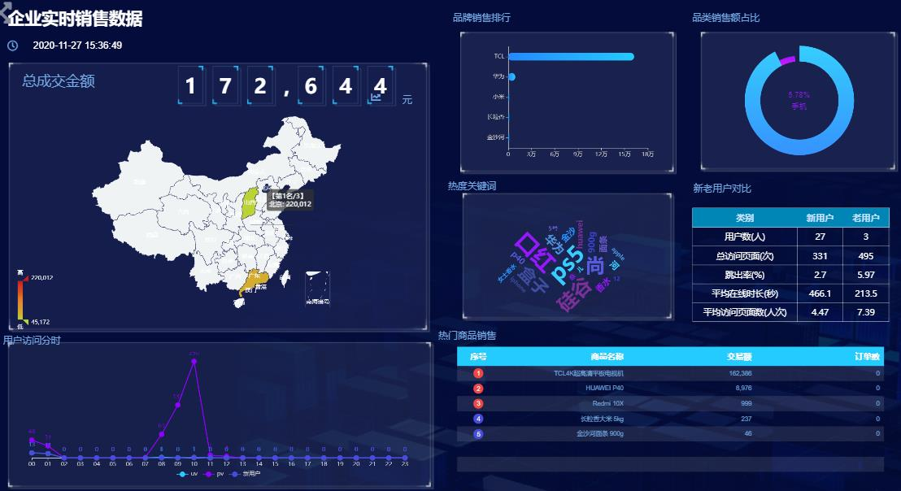

### 1.2.2 分析可视化大屏

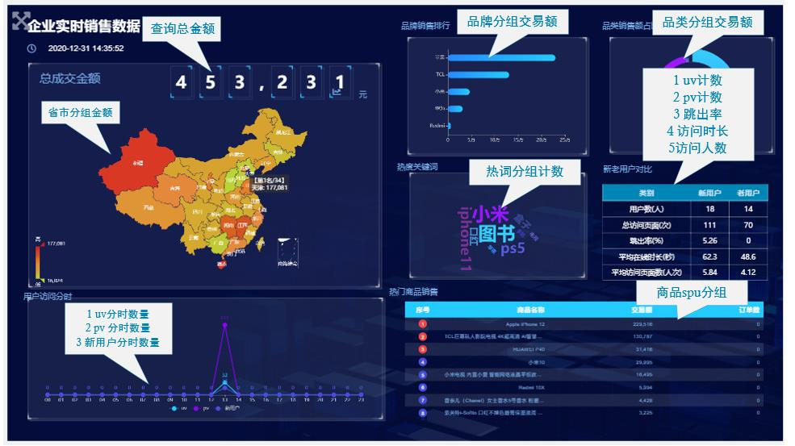

在可视化大屏中每个组件都需要一个单独的接口，图中一共涉及 8 个组件。

| 组件名称       | 组件       | 查询指标                                                     | 对应的数据表   |
| -------------- | ---------- | ------------------------------------------------------------ | -------------- |
| 总成交金额     | 数字翻牌   | 订单总金额                                                   | product_stats  |
| 省市热力图查询 | 热力图     | 省市分组订单金额                                             | province_stats |
| 分时流量       | 折线图     | UV 分时数<br/>PV 分时数<br/>新用户分时数                     | visitor_stats  |
| 品牌 TopN      | 水平柱状图 | 按品牌分组订单金额                                           | product_stats  |
| 品类分布       | 饼状图     | 按品类分组订单金额                                           | product_stats  |
| 热词字符云     | 字符云     | 关键词分组计数                                               | keyword_stats  |
| 流量表格       | 交叉透视表 | UV 数(新老用户) <br/>PV 数(新老用户)<br/>跳出率(新老用户) <br/>平均访问时长 (新老用户)<br/>平均访问页面数(新老用户) | visitor_stats  |
| 热门商品       | 轮播表格   | 按 SPU 分组订单金额                                          | product_stats  |

### 1.2.3 接口执行过程

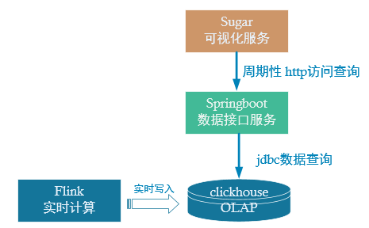

> 之前我们实现了 DWS 层计算后写入到 ClickHouse 中，接下来就是要为可视化大屏服务，提供一个数据接口用来查询 ClickHouse 中的数据。这里主要有两项工作
>
> ➢ 配置可视化大屏服务。
>
> ➢ 编写数据查询接口以供可视化大屏进行访问。

# 第 2 章 Sugar 数据大屏

## 2.1 产品介绍

Sugar 是百度云推出的敏捷 BI 和数据可视化平台，目标是解决报表和大屏的数据 BI分析和可视化问题，解放数据可视化系统的开发人力。

## 2.2 使用入口

https://cloud.baidu.com/product/sugar.html

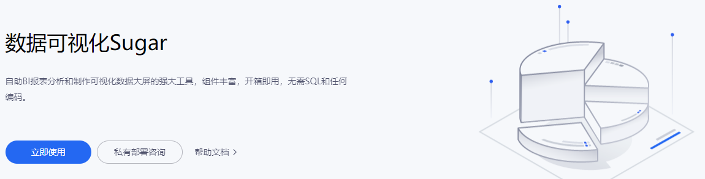

## 2.3 创建数据大屏

(1) 点击【立即使用】后，登录百度账号

(2) 然后首先创建组织

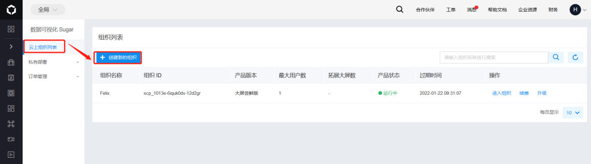

(3) 创建中选择产品【大屏尝鲜版】，首次使用有一个月的试用期

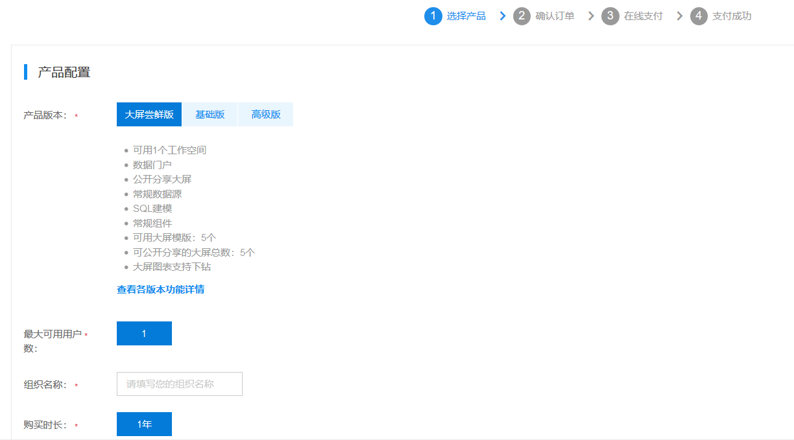

(4) 新建好组织后选择【进入组织】

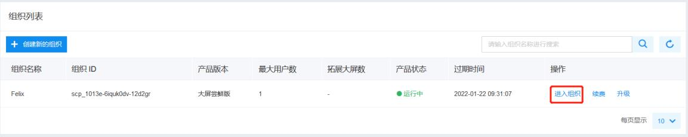

(5) 然后进入默认的【第一个空间】

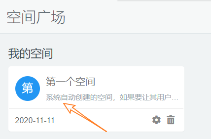

(6) 在空间中选择【待创建大屏】后的【新建】

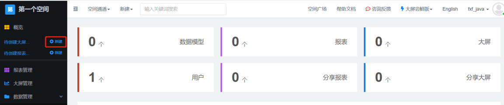

(7) 选择大屏的模板

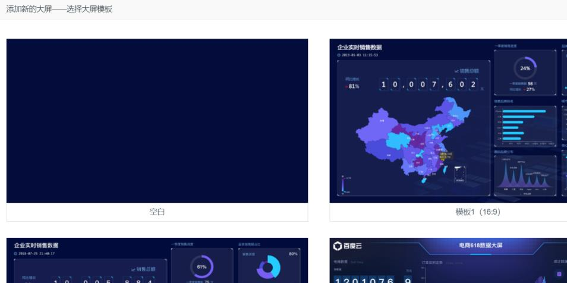

(8) 可以选空模板，也可以根据现有的模板进行修改

我们这里选择空白模板，并指定大屏的名称

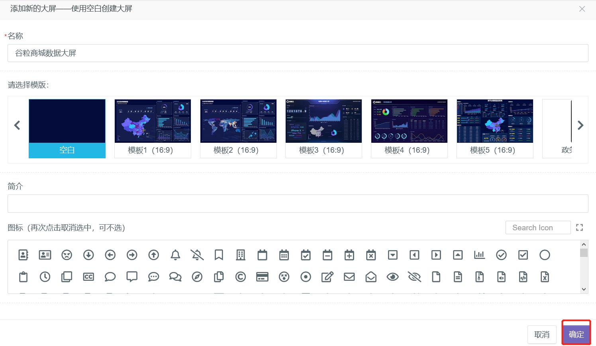

(9)进入大屏的编辑窗口

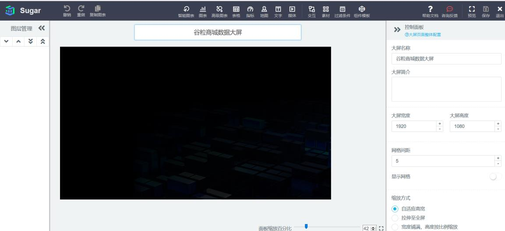

# 第 3 章 总成交金额接口

## 3.1 Sugar 组件：数字翻牌器

### 3.1.1 添加组件

从大屏的编辑器上方选择【指标】→【数字翻牌器】

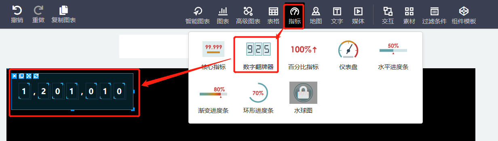

### 3.1.2 配置组件

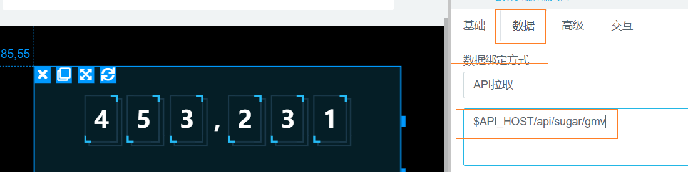

点击组件，在右侧的菜单中选择【数据】，绑定方式改为【API 拉取】

下方的路径填写 $API_HOST/api/sugar/gmv

这个就是 sugar 会周期性访问的数据接口地址，可以自定义，其中$API_HOST 是个全局变量，需要在空间中配置（后面再说）。

### 3.1.3 查询组件需要的数据格式

在数据绑定的位置选择【静态 JSON】，可以看到数据需要的 JSON 格式

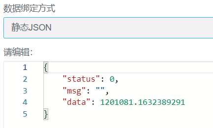

### 3.1.4 接口访问路径以及返回格式

➢访问路径/api/sugar/gmv

➢返回格式

```json
{
"status": 0,
"msg": "",
"data": 1201081.1632389291
}
```


## 3.2 数据接口实现

### 3.2.1 创建数据接口模块

1. 在 gmall2021-parent 项目下创建新的模块 gmall2021-publisher

  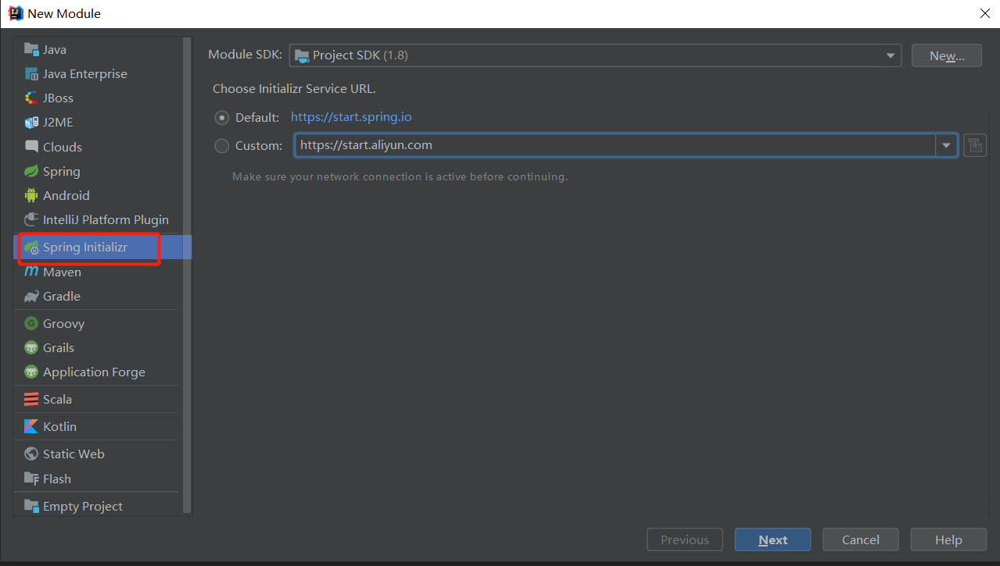

  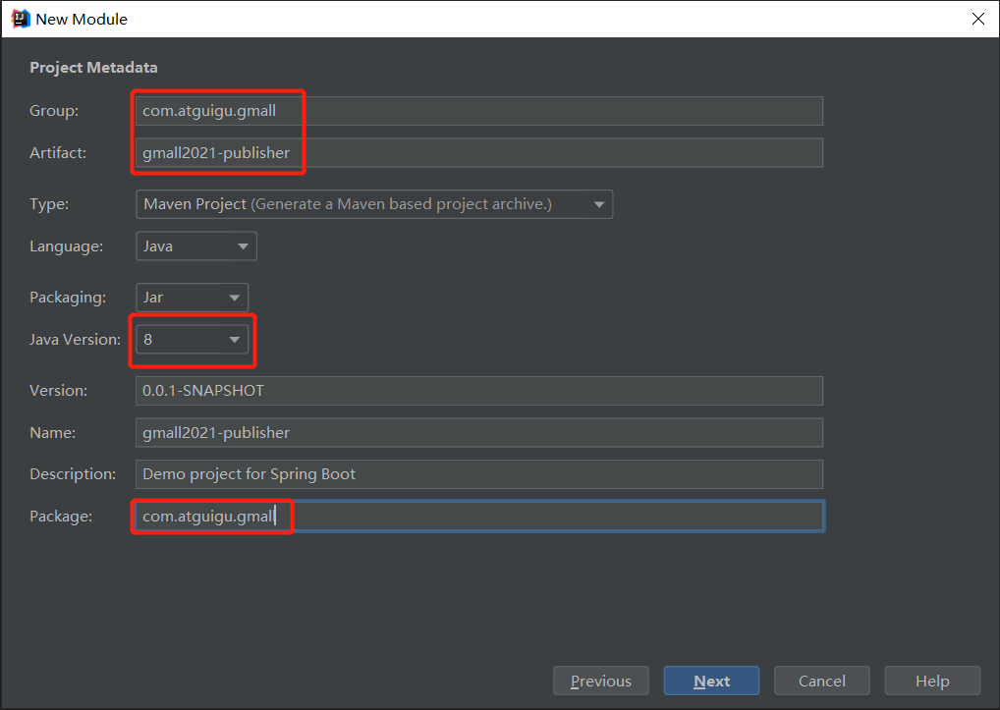

  可以先不选择依赖，之后统一在 pom.xml 中添加

  

2. 在 pom.xml 文件中添加需要的依赖

  ```xml
  <?xml version="1.0" encoding="UTF-8"?>
  <project xmlns="http://maven.apache.org/POM/4.0.0"
  xmlns:xsi="http://www.w3.org/2001/XMLSchema-instance"
  xsi:schemaLocation="http://maven.apache.org/POM/4.0.0
  https://maven.apache.org/xsd/maven-4.0.0.xsd">
  <modelVersion>4.0.0</modelVersion>
  <parent>
  <groupId>org.springframework.boot</groupId>
  <artifactId>spring-boot-starter-parent</artifactId>
  <version>2.4.2</version>
  <relativePath/> <!-- lookup parent from repository -->
  </parent>
  <groupId>com.atguigu.gmall</groupId>
  <artifactId>gmall2021-publisher</artifactId>
  <version>0.0.1-SNAPSHOT</version>
  <name>gmall2021-publisher</name>
  <description>Demo project for Spring Boot</description>
  <properties>
  <java.version>1.8</java.version>
  </properties>
  <dependencies>
  <dependency>
  <groupId>org.springframework.boot</groupId>
  <artifactId>spring-boot-starter-jdbc</artifactId>
  </dependency>
  <dependency>
  <groupId>org.springframework.boot</groupId>
  <artifactId>spring-boot-starter-web</artifactId>
  </dependency>
  <dependency>
  <groupId>org.mybatis.spring.boot</groupId>
  <artifactId>mybatis-spring-boot-starter</artifactId>
  <version>2.1.3</version>
  </dependency>
  <dependency>
  <groupId>org.projectlombok</groupId>
  <artifactId>lombok</artifactId>
  <optional>true</optional>
  </dependency>
  <dependency>
  <groupId>org.springframework.boot</groupId>
  <artifactId>spring-boot-starter-test</artifactId>
  <scope>test</scope>
  <exclusions>
  <exclusion>
  
  <groupId>org.junit.vintage</groupId>
  <artifactId>junit-vintage-engine</artifactId>
  </exclusion>
  </exclusions>
  </dependency>
  <dependency>
  <groupId>org.apache.commons</groupId>
  <artifactId>commons-lang3</artifactId>
  <version>3.11</version>
  </dependency>
  <dependency>
  <groupId>ru.yandex.clickhouse</groupId>
  <artifactId>clickhouse-jdbc</artifactId>
  <version>0.1.55</version>
  </dependency>
  </dependencies>
  <build>
  <plugins>
  <plugin>
  <groupId>org.springframework.boot</groupId>
  <artifactId>spring-boot-maven-plugin</artifactId>
  </plugin>
  </plugins>
  </build>
  </project>
  ```

  

### 3.2.2 代码分层结构以及实现

  ➢
  代码结构
  分层 类 处理内容
  controller SugarController 查询交易额接口及返回参数处理
  ProductStatsService 查询商品统计数据
  控制层
  service
  服务层
  mapper
  ProductStatsServiceImpl
  ProductStatsMapper
  编写 SQL 查询商品统计表
  数据映射层

  

3. 修改 Springboot 核心配置文件 application.properties
    server.port=8070
    #配置 ClickHouse 驱动以及 URL
    spring.datasource.driver-class-name=ru.yandex.clickhouse.ClickHouseDriver
    spring.datasource.url=jdbc:clickhouse://hadoop102:8123/default

4. 在 Application 中添加@MapperScan 的注解
    package com.atguigu.gmall;
    import org.mybatis.spring.annotation.MapperScan;
    import org.springframework.boot.SpringApplication;
    import org.springframework.boot.autoconfigure.SpringBootApplication;
    @SpringBootApplication
    @MapperScan(basePackages = "com.atguigu.gmall.mapper")
    public class Gmall2021PublisherApplication {
    public static void main(String[] args) {
    SpringApplication.run(Gmall2021PublisherApplication.class, args);
    }
    }

5. Mapper 层：创建 ProductStatsMapper 接口
    package com.atguigu.gmall.mapper;
    import org.apache.ibatis.annotations.Select;
    import java.math.BigDecimal;
    /**
* Desc: 商品统计 Mapper
*/
public interface ProductStatsMapper {
//获取商品交易额
@Select("select sum(order_amount) order_amount " +
"from product_stats_2021 where toYYYYMMDD(stt)=#{date}")
public BigDecimal getGMV(int date);
}
4) Service 层：创建 ProductStatsService 接口
package com.atguigu.gmall.service;
import java.math.BigDecimal;
/**
* Desc: 商品统计接口
*/
public interface ProductStatsService {
//获取某一天的总交易额


public BigDecimal getGMV(int date);
}
5) Service 层：创建 ProductStatsServiceImpl 实现类
package com.atguigu.gmall.service.impl;
import com.atguigu.gmall.mapper.ProductStatsMapper;
import com.atguigu.gmall.service.ProductStatsService;
import org.springframework.beans.factory.annotation.Autowired;
import org.springframework.stereotype.Service;
import java.math.BigDecimal;
/**
* Desc: 商品统计接口实现类
*/
@Service
public class ProductStatsServiceImpl implements ProductStatsService {
@Autowired
ProductStatsMapper productStatsMapper;
@Override
public BigDecimal getGMV(int date) {
return productStatsMapper.getGMV(date);
}
}
6) Controller 层：创建 SugarController 类
该类主要接收用户请求，并做出相应。根据 sugar 不同的组件，返回不同的格式
package com.atguigu.gmall.controller;
import com.atguigu.gmall.service.ProductStatsService;
import org.apache.commons.lang3.time.DateFormatUtils;
import org.springframework.beans.factory.annotation.Autowired;
import org.springframework.web.bind.annotation.RequestMapping;
import org.springframework.web.bind.annotation.RequestParam;
import org.springframework.web.bind.annotation.RestController;
import java.math.BigDecimal;
import java.util.Date;
/**
* Desc: sugar 处理类
* 主要接收用户请求，并做出相应。根据 sugar 不同的组件，返回不同的格式
*/
@RestController
@RequestMapping("/api/sugar")
public class SugarController {


@Autowired
ProductStatsService productStatsService;
/*
{
"status": 0,
"msg": "",
"data": 1201081.1632389291
}
*/
@RequestMapping("/gmv")
public String getGMV(@RequestParam(value = "date",defaultValue = "0") Integer date) {
if(date==0){
date=now();
}
BigDecimal gmv = productStatsService.getGMV(date);
String json = "{ \"status\": 0, \"data\":" + gmv + "}";
return json;
}
private int now(){
String yyyyMMdd = DateFormatUtils.format(new Date(), "yyyyMMdd");
return Integer.valueOf(yyyyMMdd);
}
}
3.2.3 测试本地接口
1) 启动 SpringBoot 应用程序
2) 用浏览器访问测试接口
http://localhost:8070/api/sugar/gmv
3) 输出结果


3.3 内网穿透
3.3.1 作用
通常个人电脑无论是连接 WIFI 上网还是用网线上网，都是属于局域网里边的，外网无
法直接访问到你的电脑，内网穿透可以让你的局域网中的电脑实现被外网访问功能。
3.3.2 工具
目前国内网穿透工具很多，常见的比如花生壳、Ngrok、网云穿等。
官网：
花生壳： https://hsk.oray.com
Ngrok: http://www.ngrok.cc
网云穿： http://www.neiwangchuantou.net/
本文以介绍网云穿为主


3.3.3 步骤
1) 首先注册网云穿
2) 登录之后到个人版领取免费隧道并进行配置
3) 下载电脑客户端（免安装，解压就能用）
登录之后，可以看到如下界面


4) 点我启动，通过外网地址访问
3.4 配置 Sugar 大屏
3.4.1 配置服务器全局 Host
回到 Sugar 的空间管理中,在【空间设置】中增加$API_HOST
3.4.2 大屏刷新数据
然后回到大屏配置中，刷新图表数据，能看到数字已经显示


第 4 章 商品交易额不同维度的统计
4.1 三个关于商品交易额方面的统计
➢ 品牌，水平柱状图
➢ 品类，饼形图
➢ 商品 spu，轮播图
这三个的共同特征是可以根据商品统计信息计算出来。


4.2 Sugar 组件：横向柱图、轮播饼图、轮播表格
4.2.1 添加组件
1) 横向柱图，用于显示品牌排行
2) 轮播饼图，用于显示品类图


3) 轮播表格，用于显示热门商品排行
4.2.2 品牌排行的柱形图组件配置
1) 修改获取数据的方式，指定访问路径
访问路径: $API_HOST/api/sugar/trademark?limit=5
2) 修改排序规则
因为排序规则是从下到上，所以排序定位从小到大。


3) 查看返回值数据格式
{
"status": 0,
"msg": "",
"data": {
"categories": [
"苹果",
"三星",
"华为",
"oppo",
"vivo",
"小米 29"
],
"series": [
{
"name": "手机品牌",
"data": [
7562,
5215,
6911,
8565,
6800,
7691
]
}
]
}
}
4.2.3 品类分布的饼形图组件配置
1) 修改获取数据的方式，指定访问路径
访问路径：$API_HOST/api/sugar/category3


2) 查看返回值数据格式
{
"status": 0,
"msg": "",
"data": [
{
"name": "windows phone",
"value": 29
},
{
"name": "Nokia S60",
"value": 2
},
{
"name": "Nokia S90",
"value": 1
}
]
}
4.2.4 商品排行的轮播表格组件配置
1) 修改获取数据的方式，指定访问路径
访问路径：$API_HOST/api/sugar/spu?limit=10
2) 查看返回值数据格式
{
"status": 0,
"msg": "",
"data": {
"columns": [
{


"name": "商品名称",
"id": "spu_name"
},
{
"name": "成交金额",
"id": "amount"
}
],
"rows": [
{
"spu_name": "商品 1",
"amount": "金额 1"
},
{
"spu_name": "商品 2",
"amount": "金额 2"
},
{
"spu_name": "商品 3",
"amount": "金额 3"
}
]
}
}
4.3 数据接口实现
这三个图基本上都是根据用不同维度进行分组，金额进行聚合的方式查询商品统计表。
直接先实现三个 sql 查询
4.3.1 创建商品交易额统计实体类 ProductStats
package com.atguigu.gmall.bean;
import lombok.AllArgsConstructor;
import lombok.Builder;
import lombok.Data;
import lombok.NoArgsConstructor;
import java.math.BigDecimal;
/**
* Desc: 商品交易额统计实体类
*/
@Data
@Builder
@NoArgsConstructor


@AllArgsConstructor
public class ProductStats {
String stt;
String edt;
Long sku_id;
String sku_name;
BigDecimal sku_price;
Long spu_id;
String spu_name;
Long tm_id ;
String tm_name;
Long category3_id ;
String category3_name ;
@Builder.Default
Long display_ct=0L;
@Builder.Default
Long click_ct=0L;
@Builder.Default
Long cart_ct=0L;
@Builder.Default
Long order_sku_num=0L;
@Builder.Default
BigDecimal order_amount=BigDecimal.ZERO;
@Builder.Default
Long order_ct=0L;
@Builder.Default
BigDecimal payment_amount=BigDecimal.ZERO;
@Builder.Default
Long refund_ct=0L;
@Builder.Default
BigDecimal refund_amount=BigDecimal.ZERO;
@Builder.Default
Long comment_ct=0L;
@Builder.Default
Long good_comment_ct=0L ;
Long ts;
}
4.3.2 Mapper 层：在 ProductStatsMapper 中添加方法
//统计某天不同 SPU 商品交易额排名
@Select("select spu_id,spu_name,sum(order_amount) order_amount," +
"sum(product_stats.order_ct) order_ct from product_stats_2021 " +
"where toYYYYMMDD(stt)=#{date} group by spu_id,spu_name " +
"having order_amount>0 order by order_amount desc limit #{limit} ")
public List<ProductStats> getProductStatsGroupBySpu(@Param("date") int date, @Param("limit")
int limit);


//统计某天不同类别商品交易额排名
@Select("select category3_id,category3_name,sum(order_amount) order_amount " +
"from product_stats_2021 " +
"where toYYYYMMDD(stt)=#{date} group by category3_id,category3_name " +
"having order_amount>0 order by order_amount desc limit #{limit}")
public List<ProductStats> getProductStatsGroupByCategory3(@Param("date")int date ,
@Param("limit") int limit);
//统计某天不同品牌商品交易额排名
@Select("select tm_id,tm_name,sum(order_amount) order_amount " +
"from product_stats_2021 " +
"where toYYYYMMDD(stt)=#{date} group by tm_id,tm_name " +
"having order_amount>0 order by order_amount desc limit #{limit} ")
public List<ProductStats> getProductStatsByTrademark(@Param("date")int date,
@Param("limit") int limit);
4.3.3 Service 层：在 ProductStatsService 中增加方法
//统计某天不同 SPU 商品交易额排名
public List<ProductStats> getProductStatsGroupBySpu(int date, int limit);
//统计某天不同类别商品交易额排名
public List<ProductStats> getProductStatsGroupByCategory3(int date,int limit);
//统计某天不同品牌商品交易额排名
public List<ProductStats> getProductStatsByTrademark(int date,int limit);
4.3.4 Service 层：在 ProductStatsServiceImpl 增加方法实现
@Override
public List<ProductStats> getProductStatsGroupBySpu(int date, int limit) {
return productStatsMapper.getProductStatsGroupBySpu(date, limit);
}
@Override
public List<ProductStats> getProductStatsGroupByCategory3(int date, int limit) {
return productStatsMapper.getProductStatsGroupByCategory3(date, limit);
}
@Override
public List<ProductStats> getProductStatsByTrademark(int date,int limit) {
return productStatsMapper.getProductStatsByTrademark(date, limit);
}


4.3.5 Controller 层：在 SugarCongroller 添加方法
注意：Controller 方法的定义必须依照，定好的接口访问路径和返回值格式。
1) 商品列表接口方法
/*
{
"status": 0,
"data": {
"columns": [
{ "name": "商品名称", "id": "spu_name"
},
{ "name": "交易额", "id": "order_amount"
}
],
"rows": [
{
"spu_name": "小米 10",
"order_amount": "863399.00"
},
{
"spu_name": "iPhone11",
"order_amount": "548399.00"
}
]
}
}
*/
@RequestMapping("/spu")
public String getProductStatsGroupBySpu(
@RequestParam(value = "date", defaultValue = "0") Integer date,
@RequestParam(value = "limit", defaultValue = "10") int limit) {
if (date == 0) date = now();
List<ProductStats> statsList
= productStatsService.getProductStatsGroupBySpu(date, limit);
//设置表头
StringBuilder jsonBuilder =
new StringBuilder(" " +
"{\"status\":0,\"data\":{\"columns\":[" +
"{\"name\":\"商品名称\",\"id\":\"spu_name\"}," +
"{\"name\":\"交易额\",\"id\":\"order_amount\"}," +
"{\"name\":\"订单数\",\"id\":\"order_ct\"}]," +
"\"rows\":[");
//循环拼接表体
for (int i = 0; i < statsList.size(); i++) {
ProductStats productStats = statsList.get(i);


if (i >= 1) {
jsonBuilder.append(",");
}
jsonBuilder.append("{\"spu_name\":\"" + productStats.getSpu_name() + "\"," +
"\"order_amount\":" + productStats.getOrder_amount() + "," +
"\"order_ct\":" + productStats.getOrder_ct() + "}");
}
jsonBuilder.append("]}}");
return jsonBuilder.toString();
}
2) 品类接口方法
/*
{
"status": 0,
"data": [
{
"name": "数码类",
"value": 371570
},
{
"name": "日用品",
"value": 296016
}
]
}
*/
@RequestMapping("/category3")
public String getProductStatsGroupByCategory3(
@RequestParam(value = "date", defaultValue = "0") Integer date,
@RequestParam(value = "limit", defaultValue = "4") int limit) {
if (date == 0) {
date = now();
}
List<ProductStats> statsList
= productStatsService.getProductStatsGroupByCategory3(date, limit);
StringBuilder dataJson = new StringBuilder("{ \"status\": 0, \"data\": [");
int i = 0;
for (ProductStats productStats : statsList) {
if (i++ > 0) {
dataJson.append(",");
}
;
dataJson.append("{\"name\":\"")
.append(productStats.getCategory3_name()).append("\",");
dataJson.append("\"value\":")
.append(productStats.getOrder_amount()).append("}");


}
dataJson.append("]}");
return dataJson.toString();
}
3) 品牌接口方法
/*
{
"status": 0,
"data": {
"categories": [
"三星","vivo","oppo"
],
"series": [
{
"data": [ 406333, 709174, 681971
]
}
]
}
}
*/
@RequestMapping("/trademark")
public String getProductStatsByTrademark(
@RequestParam(value = "date", defaultValue = "0") Integer date,
@RequestParam(value = "limit", defaultValue = "20") int limit) {
if (date == 0) {
date = now();
}
List<ProductStats> productStatsByTrademarkList
= productStatsService.getProductStatsByTrademark(date, limit);
List<String> tradeMarkList = new ArrayList<>();
List<BigDecimal> amountList = new ArrayList<>();
for (ProductStats productStats : productStatsByTrademarkList) {
tradeMarkList.add(productStats.getTm_name());
amountList.add(productStats.getOrder_amount());
}
String json = "{\"status\":0,\"data\":{" + "\"categories\":" +
"[\"" + StringUtils.join(tradeMarkList, "\",\"") + "\"],\"series\":[" +
"{\"data\":[" + StringUtils.join(amountList, ",") + "]}]}}";
return json;
}
4.3.6 本地接口测试
1) 可以生成当前日期数据，具体步骤如下
➢
启动 ZK、Kafka、ClickHouse、Redis、HDFS、Hbase、Maxwell


➢ 运行 BaseDBApp
➢ 运行 OrderWideApp
➢ 运行 ProductsStatsApp
➢ 运行 rt_dblog 目录下的 jar 包
➢ 查看 ClickHouse 中 products_stats_2021 表数据
2) 启动 SpringBoot 项目，根据访问地址分别用浏览器测试一下接口
➢ 商品
➢ 品类
➢ 品牌
4.4 刷新大屏图表数据


第 5 章 分省市的热力图统计
5.1 Sugar 组件：中国省份色彩
5.1.1 添加组件
在上方地图栏位中选择【中国省份色彩】
5.1.2 配置组件
1) 修改获取数据的方式，指定访问路径
访问路径：$API_HOST/api/sugar/province


2) 设置各个省份间的边界线
5.1.3 接口访问路径以及返回格式
➢
访问路径
$API_HOST/api/sugar/province
➢
返回值格式
{
"status": 0,
"data": {
"mapData": [
{
"name": "北京",
"value": 9131
},
{
"name": "天津",
"value": 5740
}
]
}


}
5.2 数据接口实现
5.2.1 创建地区交易额统计实体类 ProvinceStats
package com.atguigu.gmall.bean;
import lombok.AllArgsConstructor;
import lombok.Data;
import lombok.NoArgsConstructor;
import java.math.BigDecimal;
/**
* Desc: 地区交易额统计实体类
*/
@AllArgsConstructor
@Data
@NoArgsConstructor
public class ProvinceStats {
private String stt;
private String edt;
private String province_id;
private String province_name;
private BigDecimal order_amount;
private String ts;
}
5.2.2 Mapper 层：创建 ProvinceStatsMapper 接口
package com.atguigu.gmall.mapper;
import com.atguigu.gmall.bean.ProvinceStats;
import org.apache.ibatis.annotations.Select;
import java.util.List;
/**
* Desc: 地区维度统计 Mapper
*/
public interface ProvinceStatsMapper {
//按地区查询交易额
@Select("select province_name,sum(order_amount) order_amount " +
"from province_stats_2021 where toYYYYMMDD(stt)=#{date} " +
"group by province_id ,province_name ")


public List<ProvinceStats> selectProvinceStats(int date);
}
5.2.3 Service 层：创建 ProvinceStatsService 接口
package com.atguigu.gmall.service;
import com.atguigu.gmall.bean.ProvinceStats;
import java.util.List;
/**
* Desc: 地区维度统计接口
*/
public interface ProvinceStatsService {
public List<ProvinceStats> getProvinceStats(int date);
}
5.2.4 Service 层：创建 ProvinceStatsServiceImpl 实现类
package com.atguigu.gmall.service.impl;
import com.atguigu.gmall.bean.ProvinceStats;
import com.atguigu.gmall.mapper.ProvinceStatsMapper;
import com.atguigu.gmall.service.ProvinceStatsService;
import org.springframework.beans.factory.annotation.Autowired;
import org.springframework.stereotype.Service;
import java.util.List;
/**
* Desc:
按地区维度统计 Service 实现
*/
@Service
public class ProvinceStatsServiceImpl implements ProvinceStatsService {
@Autowired
ProvinceStatsMapper provinceStatsMapper;
@Override
public List<ProvinceStats> getProvinceStats(int date) {
return provinceStatsMapper.selectProvinceStats(date);
}
}
5.2.5 Controller 层：在 SugarController 中增加方法
@Autowired
ProvinceStatsService provinceStatsService;
@RequestMapping("/province")


public String getProvinceStats(@RequestParam(value = "date", defaultValue = "0") Integer date) {
if (date == 0) {
date = now();
}
StringBuilder jsonBuilder = new StringBuilder("{\"status\":0,\"data\":{\"mapData\":[");
List<ProvinceStats> provinceStatsList = provinceStatsService.getProvinceStats(date);
if (provinceStatsList.size() == 0) {
//
jsonBuilder.append( "{\"name\":\"北京\",\"value\":0.00}");
}
for (int i = 0; i < provinceStatsList.size(); i++) {
if (i >= 1) {
jsonBuilder.append(",");
}
ProvinceStats provinceStats = provinceStatsList.get(i);
jsonBuilder.append("{\"name\":\"" + provinceStats.getProvince_name() +
"\",\"value\":" + provinceStats.getOrder_amount() + " }");
}
jsonBuilder.append("]}}");
return jsonBuilder.toString();
}
5.2.6 本地接口测试


5.3 刷新大屏组件数据
第 6 章 流量统计数据
流量统计组件包含两个部分一个是分时流量折线图，另一个是新老访客流量对比表格。


6.1 Sugar 组件：表格
6.1.1 添加组件
1) 表格，用于显示新老访客对比
在上方【表格】栏位中选择【表格】
2) 折线图，用于显示分时流量
在上方【图表】栏位中选择【折线图】
6.1.2 新老访客对比的表格组件配置
1) 修改获取数据的方式，指定访问路径
访问路径: $API_HOST/api/sugar/visitor


2) 查看返回值数据格式
{
"status": 0,
"data": {
"combineNum": 1,
"columns": [
{
"name": "类别",
"id": "type"
},
{
"name": "新用户",
"id": "new"
},
{
"name": "老用户",
"id": "old"
}
],
"rows": [
{
"type": "用户数",
"new": 123,
"old": 13
},
{
"type": "总访问页面",
"new": 123,
"old": 145
},
{
"type": "跳出率",
"new": 123,
"old": 145
},
{
"type": "平均在线时长",
"new": 123,
"old": 145


},
{
"type": "平均访问页面数",
"new": 23,
"old": 145
}
]
}
}
6.1.3 分时流量显示的折线组件配置
1) 修改获取数据的方式，指定访问路径
访问路径: $API_HOST/api/sugar/hr
2) 查看返回值数据格式
{
"status": 0,
"data": {
"categories": [
"01",
"02",
"03",
"04",
"05"
],
"series": [
{
"name": "uv",
"data": [
888065,
892945,
678379,
733572,
525091
]
},


{
"name": "pv",
"data": [
563998,
571831,
622419,
675294,
708512
]
},
{
"name": "新用户",
"data": [
563998,
571831,
622419,
675294,
708512
]
}
]
}
}
6.2 数据接口实现
6.2.1 创建访问流量统计实体类 VisitorStats
package com.atguigu.gmall.bean;
import lombok.AllArgsConstructor;
import lombok.Data;
import lombok.NoArgsConstructor;
import java.math.BigDecimal;
import java.math.RoundingMode;
/**
* Desc: 访客流量统计实体类
*/
@Data
@AllArgsConstructor
@NoArgsConstructor
public class VisitorStats {
private String stt;
private String edt;


private String vc;
private String ch;
private String ar;
private String is_new;
private Long uv_ct = 0L;
private Long pv_ct = 0L;
private Long sv_ct = 0L;
private Long uj_ct = 0L;
private Long dur_sum = 0L;
private Long new_uv = 0L;
private Long ts;
private int hr;
//计算跳出率 = 跳出次数*100/访问次数
public BigDecimal getUjRate() {
if (uv_ct != 0L) {
return BigDecimal.valueOf(uj_ct)
.multiply(BigDecimal.valueOf(100))
.divide(BigDecimal.valueOf(sv_ct), 2, RoundingMode.HALF_UP);
} else {
return BigDecimal.ZERO;
}
}
//计算每次访问停留时间(秒) = 当日总停留时间（毫秒)/当日访问次数/1000
public BigDecimal getDurPerSv() {
if (uv_ct != 0L) {
return BigDecimal.valueOf(dur_sum)
.divide(BigDecimal.valueOf(sv_ct), 0, RoundingMode.HALF_UP)
.divide(BigDecimal.valueOf(1000), 1, RoundingMode.HALF_UP);
} else {
return BigDecimal.ZERO;
}
}
//计算每次访问停留页面数 = 当日总访问页面数/当日访问次数
public BigDecimal getPvPerSv() {
if (uv_ct != 0L) {
return BigDecimal.valueOf(pv_ct)
.divide(BigDecimal.valueOf(sv_ct), 2, RoundingMode.HALF_UP);
} else {
return BigDecimal.ZERO;
}
}
}


6.2.2 Mapper 层：创建 VisitorStatsMapper
package com.atguigu.gmall.mapper;
import com.atguigu.gmall.bean.VisitorStats;
import org.apache.ibatis.annotations.Select;
import java.util.List;
/**
* Desc: 访客流量统计 Mapper
*/
public interface VisitorStatsMapper {
//新老访客流量统计
@Select("select is_new,sum(uv_ct) uv_ct,sum(pv_ct) pv_ct," +
"sum(sv_ct) sv_ct, sum(uj_ct) uj_ct,sum(dur_sum) dur_sum " +
"from visitor_stats_2021 where toYYYYMMDD(stt)=#{date} group by is_new")
public List<VisitorStats> selectVisitorStatsByNewFlag(int date);
//分时流量统计
@Select("select sum(if(is_new='1', visitor_stats_2021.uv_ct,0)) new_uv,toHour(stt) hr," +
"sum(visitor_stats_2021.uv_ct) uv_ct, sum(pv_ct) pv_ct, sum(uj_ct) uj_ct " +
"from visitor_stats_2021 where toYYYYMMDD(stt)=#{date} group by toHour(stt)")
public List<VisitorStats> selectVisitorStatsByHour(int date);
@Select("select count(pv_ct) pv_ct from visitor_stats_2021 " +
"where toYYYYMMDD(stt)=#{date} ")
public Long selectPv(int date);
@Select("select count(uv_ct) uv_ct from visitor_stats_2021 " +
"where toYYYYMMDD(stt)=#{date} ")
public Long selectUv(int date);
}
6.2.3 Service 层：创建 VisitorStatsService 接口
package com.atguigu.gmall.mapper;
import com.atguigu.gmall.bean.VisitorStats;
import org.apache.ibatis.annotations.Select;
import java.util.List;
/**
* Desc: 访客流量统计 Mapper
*/
public interface VisitorStatsMapper {


//新老访客流量统计
@Select("select is_new,sum(uv_ct) uv_ct,sum(pv_ct) pv_ct," +
"sum(sv_ct) sv_ct, sum(uj_ct) uj_ct,sum(dur_sum) dur_sum " +
"from visitor_stats_2021 where toYYYYMMDD(stt)=#{date} group by is_new")
public List<VisitorStats> selectVisitorStatsByNewFlag(int date);
//分时流量统计
@Select("select sum(if(is_new='1', visitor_stats_2021.uv_ct,0)) new_uv,toHour(stt) hr," +
"sum(visitor_stats_2021.uv_ct) uv_ct, sum(pv_ct) pv_ct, sum(uj_ct) uj_ct " +
"from visitor_stats_2021 where toYYYYMMDD(stt)=#{date} group by toHour(stt)")
public List<VisitorStats> selectVisitorStatsByHour(int date);
@Select("select count(pv_ct) pv_ct from visitor_stats_2021 " +
"where toYYYYMMDD(stt)=#{date} ")
public Long selectPv(int date);
@Select("select count(uv_ct) uv_ct from visitor_stats_2021 " +
"where toYYYYMMDD(stt)=#{date} ")
public Long selectUv(int date);
}
6.2.4 Service 层：创建 VisitorStatsServiceImpl 实现类
package com.atguigu.gmall.service.impl;
import com.atguigu.gmall.bean.VisitorStats;
import com.atguigu.gmall.mapper.VisitorStatsMapper;
import com.atguigu.gmall.service.VisitorStatsService;
import org.springframework.beans.factory.annotation.Autowired;
import org.springframework.stereotype.Service;
import java.util.List;
/**
* Desc: 访问流量统计 Service 实现类
*/
@Service
public class VisitorStatsServiceImpl implements VisitorStatsService {
@Autowired
VisitorStatsMapper visitorStatsMapper;
@Override
public List<VisitorStats> getVisitorStatsByNewFlag(int date) {
return visitorStatsMapper.selectVisitorStatsByNewFlag(date);
}
@Override
public List<VisitorStats> getVisitorStatsByHour(int date) {
return visitorStatsMapper.selectVisitorStatsByHour(date);


}
@Override
public Long getPv(int date) {
return visitorStatsMapper.selectPv(date);
}
@Override
public Long getUv(int date) {
return visitorStatsMapper.selectUv(date);
}
}
6.2.5 Controller 层：在 SugarController 中增加方法
1) 新老访客流量对比
@Autowired
VisitorStatsService visitorStatsService;
@RequestMapping("/visitor")
public String getVisitorStatsByNewFlag(@RequestParam(value = "date", defaultValue = "0")
Integer date) {
if (date == 0) date = now();
List<VisitorStats> visitorStatsByNewFlag =
visitorStatsService.getVisitorStatsByNewFlag(date);
VisitorStats newVisitorStats = new VisitorStats();
VisitorStats oldVisitorStats = new VisitorStats();
//循环把数据赋给新访客统计对象和老访客统计对象
for (VisitorStats visitorStats : visitorStatsByNewFlag) {
if (visitorStats.getIs_new().equals("1")) {
newVisitorStats = visitorStats;
} else {
oldVisitorStats = visitorStats;
}
}
//把数据拼接入字符串
String json = "{\"status\":0,\"data\":{\"combineNum\":1,\"columns\":" +
"[{\"name\":\"类别\",\"id\":\"type\"}," +
"{\"name\":\"新用户\",\"id\":\"new\"}," +
"{\"name\":\"老用户\",\"id\":\"old\"}]," +
"\"rows\":" +
"[{\"type\":\"用户数(人)\"," +
"\"new\": " + newVisitorStats.getUv_ct() + "," +
"\"old\":" + oldVisitorStats.getUv_ct() + "}," +
"{\"type\":\"总访问页面(次)\"," +
"\"new\":" + newVisitorStats.getPv_ct() + "," +
"\"old\":" + oldVisitorStats.getPv_ct() + "}," +
"{\"type\":\"跳出率(%)\"," +


"\"new\":" + newVisitorStats.getUjRate() + "," +
"\"old\":" + oldVisitorStats.getUjRate() + "}," +
"{\"type\":\"平均在线时长(秒)\"," +
"\"new\":" + newVisitorStats.getDurPerSv() + "," +
"\"old\":" + oldVisitorStats.getDurPerSv() + "}," +
"{\"type\":\"平均访问页面数(人次)\"," +
"\"new\":" + newVisitorStats.getPvPerSv() + "," +
"\"old\":" + oldVisitorStats.getPvPerSv()
+ "}]}}";
return json;
}
2) 分时流量统计
@RequestMapping("/hr")
public String getMidStatsGroupbyHourNewFlag(@RequestParam(value = "date",defaultValue =
"0") Integer date ) {
if(date==0) date=now();
List<VisitorStats> visitorStatsHrList
= visitorStatsService.getVisitorStatsByHour(date);
//构建 24 位数组
VisitorStats[] visitorStatsArr=new VisitorStats[24];
//把对应小时的位置赋值
for (VisitorStats visitorStats : visitorStatsHrList) {
visitorStatsArr[visitorStats.getHr()] =visitorStats ;
}
List<String> hrList=new ArrayList<>();
List<Long> uvList=new ArrayList<>();
List<Long> pvList=new ArrayList<>();
List<Long> newMidList=new ArrayList<>();
//循环出固定的 0-23 个小时 从结果 map 中查询对应的值
for (int hr = 0; hr <=23 ; hr++) {
VisitorStats visitorStats = visitorStatsArr[hr];
if (visitorStats!=null){
uvList.add(visitorStats.getUv_ct()) ;
pvList.add( visitorStats.getPv_ct());
newMidList.add( visitorStats.getNew_uv());
}else{ //该小时没有流量补零
uvList.add(0L) ;
pvList.add( 0L);
newMidList.add( 0L);
}
//小时数不足两位补零
hrList.add(String.format("%02d", hr));
}
//拼接字符串
String json = "{\"status\":0,\"data\":{" + "\"categories\":" +


"[\""+StringUtils.join(hrList,"\",\"")+ "\"],\"series\":[" +
"{\"name\":\"uv\",\"data\":["+ StringUtils.join(uvList,",") +"]}," +
"{\"name\":\"pv\",\"data\":["+ StringUtils.join(pvList,",") +"]}," +
"{\"name\":\"新用户\",\"data\":["+ StringUtils.join(newMidList,",") +"]}]}}";
return json;
}
6.2.6 本地接口测试
1) 可以生成当前日期数据，具体步骤如下
➢ 启动 ZK、Kafka、Logger.sh、ClickHouse
➢ 运行 BaseLogApp
➢ 运行 UniqueVisitApp
➢ 运行 UserJumpDetailApp
➢ 运行 VisitorStatsApp
➢ 运行 rt_applog 目录下的 jar 包
➢ 查看 ClickHouse 中 visitor_stats_2021 表数据
2) 启动 SpringBoot 项目，根据访问地址分别用浏览器测试一下接口
➢ 新老用户流量对比
➢ 分时流量统计


6.3 刷新大屏组件数据
第 7 章 热词字符云
7.1 Sugar 组件：字符云
7.1.1 添加组件
在上方【文字】栏位中选择【字符云】


7.1.2 配置组件
访问路径：$API_HOST/api/sugar/keyword
7.1.3 接口访问路径以及返回格式
➢
访问路径
$API_HOST/api/sugar/keyword
➢
返回值格式
{
"status": 0,
"data": [
{
"name": "data",
"value": 60679,
},
{
"name": "dataZoom",
"value": 24347,
}
]
}
7.2 数据接口实现
7.2.1 创建关键词统计实体类
package com.atguigu.gmall.bean;
import lombok.AllArgsConstructor;


import lombok.Data;
import lombok.NoArgsConstructor;
/**
* Desc: 关键词统计实体类
*/
@Data
@AllArgsConstructor
@NoArgsConstructor
public class KeywordStats {
private String stt;
private String edt;
private String keyword;
private Long ct;
private String ts;
}
7.2.2 Mapper 层：创建 KeywordStatsMapper
1) SQL 语句
根据关键词的出现类型分配不同的热度分数
➢ 搜索关键词=10 分
➢ 下单商品=5 分
➢ 加入购物车=2 分
➢ 点击商品=1 分
➢ 其他=0 分
其中 ClickHouse 函数 multiIf 类似于 case when
select keyword,
sum(keyword_stats_2021.ct *
multiIf(
source='SEARCH',10,
source='ORDER',5,
source='CART',2,
source='CLICK',1,0
)) ct
from
keyword_stats
where
toYYYYMMDD(stt)=#{date}


group by
keyword
order by
sum(keyword_stats.ct)
limit #{limit};
2) 接口类
package com.atguigu.gmall.mapper;
import com.atguigu.gmall.bean.KeywordStats;
import org.apache.ibatis.annotations.Param;
import org.apache.ibatis.annotations.Select;
import java.util.List;
/**
* Desc: 关键词统计 Mapper
*/
public interface KeywordStatsMapper {
@Select("select keyword," +
"sum(keyword_stats_2021.ct * " +
"multiIf(source='SEARCH',10,source='ORDER',3,source='CART',2,source='CLICK',1,0)) ct"
+
" from keyword_stats_2021 where toYYYYMMDD(stt)=#{date} group by keyword " +
"order by sum(keyword_stats_2021.ct) desc limit #{limit} ")
public List<KeywordStats> selectKeywordStats(@Param("date") int date, @Param("limit") int
limit);
}
7.2.3 Service 层：创建 KeywordStatsService 接口
package com.atguigu.gmall.service;
import com.atguigu.gmall.bean.KeywordStats;
import java.util.List;
/**
* Desc: 关键词统计接口
*/
public interface KeywordStatsService {
public List<KeywordStats> getKeywordStats(int date, int limit);
}
7.2.4 Service 层：创建 KeywordStatsServiceImpl
package com.atguigu.gmall.service.impl;
import com.atguigu.gmall.bean.KeywordStats;


import com.atguigu.gmall.mapper.KeywordStatsMapper;
import com.atguigu.gmall.service.KeywordStatsService;
import org.springframework.beans.factory.annotation.Autowired;
import org.springframework.stereotype.Service;
import java.util.List;
/**
* Desc:关键词统计接口实现类
*/
@Service
public class KeywordStatsServiceImpl implements KeywordStatsService {
@Autowired
KeywordStatsMapper keywordStatsMapper;
@Override
public List<KeywordStats> getKeywordStats(int date, int limit) {
return keywordStatsMapper.selectKeywordStats(date,limit);
}
}
7.2.5 Controller 层：在 SugarController 中增加方法
@RequestMapping("/keyword")
public String getKeywordStats(@RequestParam(value = "date",defaultValue = "0") Integer date,
@RequestParam(value = "limit",defaultValue = "20") int
limit){
if(date==0){
date=now();
}
//查询数据
List<KeywordStats> keywordStatsList
= keywordStatsService.getKeywordStats(date, limit);
StringBuilder jsonSb=new StringBuilder( "{\"status\":0,\"msg\":\"\",\"data\":[" );
//循环拼接字符串
for (int i = 0; i < keywordStatsList.size(); i++) {
KeywordStats keywordStats = keywordStatsList.get(i);
if(i>=1){
jsonSb.append(",");
}
jsonSb.append( "{\"name\":\"" + keywordStats.getKeyword() + "\"," +
"\"value\":"+keywordStats.getCt()+"}");
}
jsonSb.append( "]}");
return jsonSb.toString();
}


7.2.6 本地接口测试
7.3 刷新大屏组件数据
第 8 章 添加素材
8.1 从上方【文字】总选择文本


8.2 从上方【素材】选择【边框】
8.3 最终调整效果


8.4 公开分享


第 9 章 总结
数据接口部分开发的重点：
➢ 学会通过 springboot 搭建一个 web 服务。
➢ 学会在 Web 服务使用注解方式，通过 SQL 语句查询 ClickHouse。
➢ 学会通过 Sugar 实现数据大屏可视化配置，了解其中的地图、柱形图、饼图、折线图、
表格、轮播表、字符云等组件的使用预配置。
➢
学会使用内网穿透工具，方便调试本地接口与互联网服务对接。


第 10 章 附录 花生壳的配置
10.1 步骤
10.1.1 首先注册、登录，并且需要实名认证（要提供身份证正反
面照片）
10.1.2 下载安装电脑客户端
在登录后的客户端界面进行配置


10.1.3 在右下角点击加号进行内网穿透的核心配置
10.1.4 发布
保存后就可以用下方图中箭头处使用开关来确认发布。
发布地址就如图中网址
更多 Java –大数据 –前端 –python 人工智能资料下载，可百度访问：尚硅谷官网