#  第0章源码全流程

## 0.1 Flink 提交流程

**Yarn-pre-job模式提交流程**

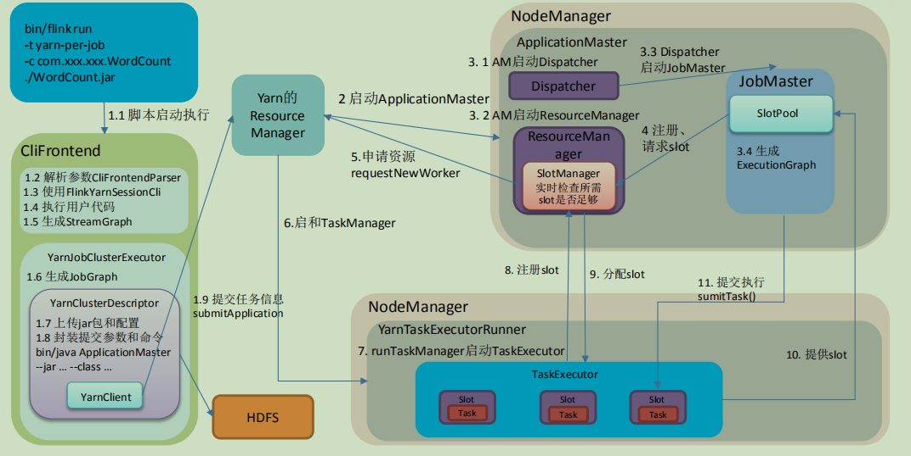

## 0.2 Flink 通讯过程

**Flink组件通信过程**

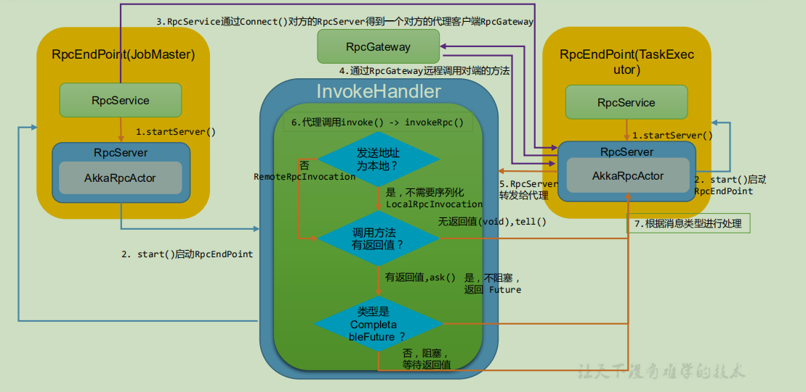

## 0.3 Task 调度

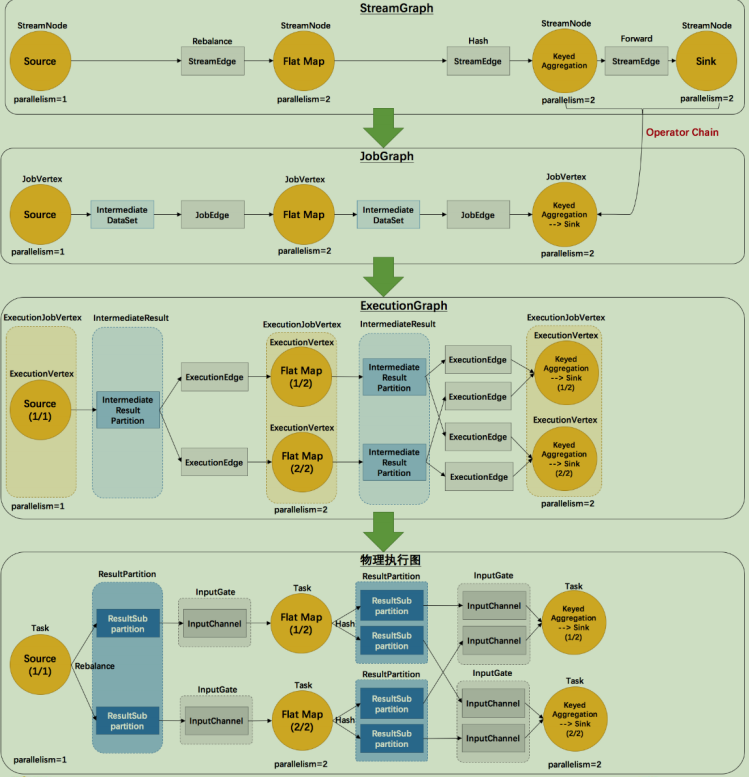

**Task任务调度执行**

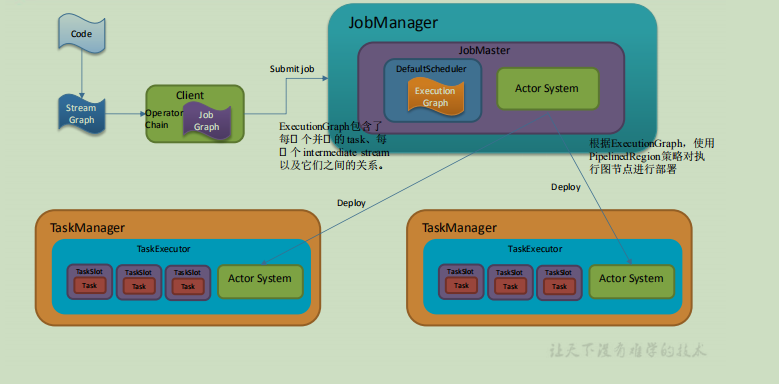

## 0.4 内存模型

**Flink内存模型**

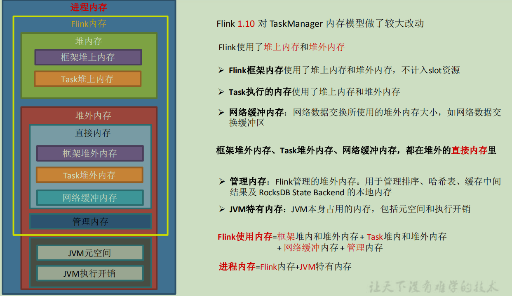

# 第1 章环境准备及提交流程

**Yarn-pre-job模式提交流程**


## 1.1 程序起点

1）flink\bin\flink | flink 脚本命令

```sh
exec $JAVA_RUN $JVM_ARGS "${log_setting[@]}"-classpath "`manglePathList 
"$CC_CLASSPATH:$INTERNAL_HADOOP_CLASSPATHS"`"
org.apache.flink.client.cli.CliFrontend "$@"
```

2）flink/bin/config.sh(相关环境配置都在这里)

```sh
=> JAVA_RUN=java
=> JVM_ARGS=""=> # Use conf/flink-conf.yaml
=>INTERNAL_HADOOP_CLASSPATHS="${HADOOP_CLASSPATH}:${HADOOP_CO
NF_DIR}:${YARN_CONF_DIR}"
```

3）执行 java -cp 就会开启 JVM 虚拟机，在虚拟机上开启 CliFrontend 进程，然后开始执行main 方法

```properties
说明：java -cp 和-classpath 一样，是指定类运行所依赖其他类的路径。
java -cp =》开启 JVM 虚拟机=》开启 Process（CliFrontend）=》程序入口 CliFrontend.main
```

9）Flink 提交任务的入口类为 CliFrontend。找到这个类的 main 方法：
在 IDEA 中全局查找（ctrl + n）：org.apache.flink.client.cli.CliFrontend，找到 CliFrontend类，并找到 main 方法

```java
/**
* Submits the job based on the arguments.(根据参数提交作业)
*/
 public static void main(final String[] args){
......
 final CliFrontend cli = new CliFrontend(
 configuration,
 customCommandLines);
......
}
```

**完整类**

```java
/**
	* Submits the job based on the arguments.
	*/
	public static void main(final String[] args){
		EnvironmentInformation.logEnvironmentInfo(LOG,"Command Line Client", args);

		//1. find the configuration directory
		/*TODO 获取flink的conf目录的路径*/
		final String configurationDirectory = getConfigurationDirectoryFromEnv();

		//2. load the global configuration
		/*TODO 根据conf路径，加载配置*/
		final Configuration configuration = GlobalConfiguration.loadConfiguration(configurationDirectory);

		//3. load the custom command lines
		/*TODO 封装命令行接口：按顺序Generic、Yarn、Default*/
		final List<CustomCommandLine> customCommandLines = loadCustomCommandLines(
			configuration,
			configurationDirectory);

		try {
			final CliFrontend cli = new CliFrontend(
				configuration,
				customCommandLines);

			SecurityUtils.install(new SecurityConfiguration(cli.configuration));
			int retCode = SecurityUtils.getInstalledContext()
					.runSecured(()-> cli.parseAndRun(args));
			System.exit(retCode);
		}
		catch (Throwable t){
			final Throwable strippedThrowable = ExceptionUtils.stripException(t, UndeclaredThrowableException.class);
			LOG.error("Fatal error while running command line interface.", strippedThrowable);
			strippedThrowable.printStackTrace();
			System.exit(31);
		}
	}
```


## 1.2 创建 Yarn 客户端应用程序

### 1.2.1 程序入口

**CliFrontend.java**

```java
public static void main(final String[] args){
......
 final CliFrontend cli = new CliFrontend(
 configuration,
 customCommandLines);
......
 int retCode = SecurityUtils.getInstalledContext().runSecured(()-> cli.parseParameters(args));
......
}

public int parseParameters(String[] args){
......
// get action
 String action = args[0];
// remove action from parameters
 final String[] params = Arrays.copyOfRange(args,1, args.length);
// do action
 switch (action){
 case ACTION_RUN:
 run(params);
 return 0;
 case ACTION_LIST:
 list(params);
 return 0;
 case ACTION_INFO:
 info(params);
 return 0;
 case ACTION_CANCEL:
 cancel(params);
 return 0;
 case ACTION_STOP:
 stop(params);
 return 0;
 case ACTION_SAVEPOINT:
 savepoint(params);
 return 0;
 case "-h":
 case "--help":
 CliFrontendParser.printHelp(customCommandLines);
 return 0;
 case "-v":
 case "--version":
 String version = EnvironmentInformation.getVersion();
 String commitID = EnvironmentInformation.getRevisionInformation().commitId;
 System.out.print("Version: "+ version);
 System.out.println(commitID.equals(EnvironmentInformation.UNKNOWN)? "": ", Commit ID: "+ commitID);
 return 0;
 default:
 System.out.printf("\"%s\" is not a valid action.\n", action);
 System.out.println();
 System.out.println("Valid actions are \"run\",\"list\",\"info\",\"savepoint\",\"stop\", or \"cancel\".");
 System.out.println();
 System.out.println("Specify the version option (-v or --version) to print Flink version.");
 System.out.println();
 System.out.println("Specify the help option (-h or --help) to get help on the command.");
 return 1;
}
......
}
```

### 1.2.2 解析输入参数

**CliFrontend.java**

```java
protected void run(String[] args) throws Exception {
......
//获取默认的运行参数
 final Options commandOptions = CliFrontendParser.getRunCommandOptions();
//解析参数，返回 commandLine
 final CommandLine commandLine = getCommandLine(commandOptions, args, true);
......
}
public CommandLine getCommandLine(final Options commandOptions, final String[] args, final boolean stopAtNonOptions) throws CliArgsException {
 final Options commandLineOptions = CliFrontendParser.mergeOptions(commandOptions, customCommandLineOptions);
 return CliFrontendParser.parse(commandLineOptions, args, stopAtNonOptions);
}
```

**CliFrontendParser.java**

```java
public class CliFrontendParser {
//选项列表
 static final Option HELP_OPTION = new Option("h","help", false,"Show the help message for the CLI Frontend or the action.");
 static final Option JAR_OPTION = new Option("j","jarfile", true,"Flink program JAR file.");
 static final Option CLASS_OPTION = new Option("c","class", true,"Class with the program entry point (\"main()\" method). Only needed if the "+"JAR file does not specify the class in its manifest.");
......
}
```

**DefaultParser.java**

```java
public CommandLine parse(Options options, String[] arguments, Properties properties, boolean stopAtNonOption) throws ParseException{
......
 if (arguments != null){
 for (String argument : arguments){
 handleToken(argument);
}
}
......
}

private void handleToken(String token) throws ParseException{
 currentToken = token;
 if (skipParsing){
 cmd.addArg(token);
} else if ("--".equals(token)){
 skipParsing = true;
} else if (currentOption != null && currentOption.acceptsArg()&& isArgument(token)){
//添加参数值
 currentOption.addValueForProcessing(Util.stripLeadingAndTrailingQuotes(token));
}else if (token.startsWith("--")){
//解析--形式的参数名
 handleLongOption(token);
} else if (token.startsWith("-")&&!"-".equals(token)){
//解析-形式的参数名
 handleShortAndLongOption(token);
}else{
 handleUnknownToken(token);
}

 if (currentOption != null &&!currentOption.acceptsArg()){
 currentOption = null;
}
}

private void handleLongOption(String token) throws ParseException{
 if (token.indexOf('=')== -1){
//解析–L、-L、--l、-l 形式的参数（不包含=）
 handleLongOptionWithoutEqual(token);
}else{
//解析--L=V、-L=V、--l=V、-l=V 形式的参数（包含=）
 handleLongOptionWithEqual(token);
}
}
```

各种情况的解析，逻辑大体相同：去除-或--前缀，校验参数，以其中一个为例

```java
private void handleLongOptionWithoutEqual(String token) throws ParseException{
//校验参数是否合法
 List<String> matchingOpts = options.getMatchingOptions(token);
 if (matchingOpts.isEmpty()){
 handleUnknownToken(currentToken);
} else if (matchingOpts.size()> 1){
 throw new AmbiguousOptionException(token, matchingOpts);
} else{
//参数添加到执行命令
 handleOption(options.getOption(matchingOpts.get(0)));
}
}
```

**Options.java：**

```java
public List<String> getMatchingOptions(String opt){
//去除-或--前缀
 opt = Util.stripLeadingHyphens(opt);
 List<String> matchingOpts = new ArrayList<String>();
// for a perfect match return the single option only
 if (longOpts.keySet().contains(opt)){
 return Collections.singletonList(opt);
}

 for (String longOpt : longOpts.keySet()){
 if (longOpt.startsWith(opt)){
 matchingOpts.add(longOpt);
}
}
 return matchingOpts;
}
```

**DefaultParser.java**

```java
private void handleOption(Option option) throws ParseException{
// check the previous option before handling the next one
 checkRequiredArgs();
 option = (Option) option.clone();
 updateRequiredOptions(option);
 cmd.addOption(option);
 if (option.hasArg()){
 currentOption = option;
} else {
 currentOption = null;
}
}
```

### 1.2.3 选择创建哪种类型的客户端

**CliFrontend.java**

```java
public static void main(final String[] args){
......
 final List<CustomCommandLine> customCommandLines = loadCustomCommandLines(configuration,configurationDirectory);
......
 final CliFrontend cli = new CliFrontend(configuration,customCommandLines);
......
}
```

这里<font color = red>依次添加了 Generic、Yarn 和 Default </font>三种命令行客户端（后面根据 isActive()按顺序选择）：

```java
public static List<CustomCommandLine> loadCustomCommandLines(Configuration configuration, String 
configurationDirectory){
 List<CustomCommandLine> customCommandLines = new ArrayList<>();
 customCommandLines.add(new GenericCLI(configuration, configurationDirectory));
// Command line interface of the YARN session, with a special initialization here
// to prefix all options with y/yarn.
 final String flinkYarnSessionCLI = "org.apache.flink.yarn.cli.FlinkYarnSessionCli";
 try {
 customCommandLines.add(loadCustomCommandLine(flinkYarnSessionCLI,configuration,configurationDirectory,"y","yarn"));
} catch (NoClassDefFoundError | Exception e){
 final String errorYarnSessionCLI = "org.apache.flink.yarn.cli.FallbackYarnSessionCli";
 try {
 LOG.info("Loading FallbackYarnSessionCli");
 customCommandLines.add(loadCustomCommandLine(errorYarnSessionCLI, configuration));
} catch (Exception exception){
 LOG.warn("Could not load CLI class {}.", flinkYarnSessionCLI, e);
}
}
// Tips: DefaultCLI must be added at last, because getActiveCustomCommandLine(..) will get the
// active CustomCommandLine in order and DefaultCLI isActive always return true.
 customCommandLines.add(new DefaultCLI(configuration));
 return customCommandLines;
}
```

在 run()里面，进行客户端的选择：

```java
protected void run(String[] args) throws Exception {
......
 final CustomCommandLine activeCommandLine = validateAndGetActiveCommandLine(checkNotNull(commandLine));
......
}
public CustomCommandLine validateAndGetActiveCommandLine(CommandLine commandLine){
......
 for (CustomCommandLine cli : customCommandLines){
......
//在 FlinkYarnSessionCli 为 active 时优先返回 FlinkYarnSessionCli。
//对于 DefaultCli，它的 isActive 方法总是返回 true。
 if (cli.isActive(commandLine)){
 return cli;
}
}
......
}
```

FlinkYarnSessionCli.java => Yarn 客户端 isActive 的判断逻辑：

```java
public boolean isActive(CommandLine commandLine){
 final String jobManagerOption = commandLine.getOptionValue(addressOption.getOpt(), null);
//是否指定为 per-job 模式，即指定”-m yarn-cluster”; ID = "yarn-cluster"
 final boolean yarnJobManager = ID.equals(jobManagerOption);
//是否存在 flink 在 yarn 的 appID，即 yarn-session 模式是否启动
 final boolean hasYarnAppId = commandLine.hasOption(applicationId.getOpt())|| configuration.getOptional(YarnConfigOptions.APPLICATION_ID).isPresent();
// executor 的名字为"yarn-session"或"yarn-per-job"
 final boolean hasYarnExecutor = YarnSessionClusterExecutor.NAME.equals(configuration.get(DeploymentOptions.TARGET))|| YarnJobClusterExecutor.NAME.equals(configuration.get(DeploymentOptions.TARGET));
 return hasYarnExecutor || yarnJobManager || hasYarnAppId ||(isYarnPropertiesFileMode(commandLine)&& yarnApplicationIdFromYarnProperties != null);
}
```


### 1.2.4 获取有效配置

**CliFrontend.java**

```java
protected void run(String[] args) throws Exception {
......
 final Configuration effectiveConfiguration = getEffectiveConfiguration(
 activeCommandLine, commandLine, programOptions, jobJars);
......
}

private <T> Configuration getEffectiveConfiguration(
 final CustomCommandLine activeCustomCommandLine,
 final CommandLine commandLine,
 final ProgramOptions programOptions,
 final List<T> jobJars) throws FlinkException {
 final Configuration effectiveConfiguration = getEffectiveConfiguration(activeCustomCommandLine, commandLine);
......
}

private <T> Configuration getEffectiveConfiguration(
 final CustomCommandLine activeCustomCommandLine,
 final CommandLine commandLine) throws FlinkException {
 final Configuration effectiveConfiguration = new Configuration(configuration);
 final Configuration commandLineConfiguration = checkNotNull(activeCustomCommandLine).toConfiguration(commandLine);
 effectiveConfiguration.addAll(commandLineConfiguration);
 return effectiveConfiguration;
}
```

**FlinkYarnSessionCli.java**

```java
public Configuration toConfiguration(CommandLine commandLine) throws FlinkException {
// we ignore the addressOption because it can only contain "yarn-cluster"
 final Configuration effectiveConfiguration = new Configuration();
 applyDescriptorOptionToConfig(commandLine, effectiveConfiguration);
 final ApplicationId applicationId = getApplicationId(commandLine);
 if (applicationId != null){
 final String zooKeeperNamespace;
 if (commandLine.hasOption(zookeeperNamespace.getOpt())){
 zooKeeperNamespace = commandLine.getOptionValue(zookeeperNamespace.getOpt());
} else {
 zooKeeperNamespace = effectiveConfiguration.getString(HA_CLUSTER_ID,applicationId.toString());
}
 effectiveConfiguration.setString(HA_CLUSTER_ID, zooKeeperNamespace);
 effectiveConfiguration.setString(YarnConfigOptions.APPLICATION_ID,
 ConverterUtils.toString(applicationId));
// TARGET 就是 execution.target，目标执行器
//决定后面什么类型的执行器提交任务：yarn-session、yarn-per-job
 effectiveConfiguration.setString(DeploymentOptions.TARGET, YarnSessionClusterExecutor.NAME);
} else {
 effectiveConfiguration.setString(DeploymentOptions.TARGET, YarnJobClusterExecutor.NAME);
}
 if (commandLine.hasOption(jmMemory.getOpt())){
 String jmMemoryVal = commandLine.getOptionValue(jmMemory.getOpt());
 if (!MemorySize.MemoryUnit.hasUnit(jmMemoryVal)){
 jmMemoryVal += "m";
}
 effectiveConfiguration.set(JobManagerOptions.TOTAL_PROCESS_MEMORY, MemorySize.parse(jmMemoryVal));
}
 if (commandLine.hasOption(tmMemory.getOpt())){
 String tmMemoryVal = commandLine.getOptionValue(tmMemory.getOpt());
 if (!MemorySize.MemoryUnit.hasUnit(tmMemoryVal)){
 tmMemoryVal += "m";
}
 effectiveConfiguration.set(TaskManagerOptions.TOTAL_PROCESS_MEMORY, MemorySize.parse(tmMemoryVal));
}
 if (commandLine.hasOption(slots.getOpt())){
 effectiveConfiguration.setInteger(TaskManagerOptions.NUM_TASK_SLOTS, Integer.parseInt(commandLine.getOptionValue(slots.getOpt())));
}
 dynamicPropertiesEncoded = encodeDynamicProperties(commandLine);
 if (!dynamicPropertiesEncoded.isEmpty()){
 Map<String, String> dynProperties = getDynamicProperties(dynamicPropertiesEncoded);
 for (Map.Entry<String, String> dynProperty : dynProperties.entrySet()){
 effectiveConfiguration.setString(dynProperty.getKey(), dynProperty.getValue());
}
}
 if (isYarnPropertiesFileMode(commandLine)){
 return applyYarnProperties(effectiveConfiguration);
} else {
 return effectiveConfiguration;
}
}
```

### 1.2.5 调用用户代码的 main 方法

**CliFrontend.java**

```java
protected void run(String[] args) throws Exception {
......
 executeProgram(effectiveConfiguration, program);
......
}
protected void executeProgram(final Configuration configuration, final PackagedProgram program) throws ProgramInvocationException {
 ClientUtils.executeProgram(new DefaultExecutorServiceLoader(), configuration, program, false, false);
}
```

**ClientUtils.java**

```java
public static void executeProgram(
PipelineExecutorServiceLoader executorServiceLoader,

Configuration configuration,
PackagedProgram program,
boolean enforceSingleJobExecution,
boolean suppressSysout) throws ProgramInvocationException {
 checkNotNull(executorServiceLoader);
 final ClassLoader userCodeClassLoader = program.getUserCodeClassLoader();
 final ClassLoader contextClassLoader = Thread.currentThread().getContextClassLoader();
 try {
//设置当前的 classloader 为用户代码的 classloader
 Thread.currentThread().setContextClassLoader(userCodeClassLoader);
 LOG.info("Starting program (detached: {})",!configuration.getBoolean(DeploymentOptions.ATTACHED));
//用户代码中的 getExecutionEnvironment 会返回该 Environment
 ContextEnvironment.setAsContext(
 executorServiceLoader,
 configuration,
 userCodeClassLoader,
 enforceSingleJobExecution,
 suppressSysout);
 StreamContextEnvironment.setAsContext(executorServiceLoader,configuration,userCodeClassLoader,enforceSingleJobExecution,suppressSysout);
 try {
//调用用户代码的 main 方法
 program.invokeInteractiveModeForExecution();
} finally {
 ContextEnvironment.unsetAsContext();
 StreamContextEnvironment.unsetAsContext();
}
} finally {
 Thread.currentThread().setContextClassLoader(contextClassLoader);
}
}

```

**PackagedProgram.java**

```java
public void invokeInteractiveModeForExecution() throws ProgramInvocationException {
 callMainMethod(mainClass, args);
}

private static void callMainMethod(Class<?> entryClass, String[] args) throws ProgramInvocationException {
......
 mainMethod = entryClass.getMethod("main", String[].class);
......
//反射调用 main 函数
 mainMethod.invoke(null,(Object) args);
......
}
```

###  1.2.6 调用执行环境的 execute 方法

**StreamExecutionEnvironment.java**

```java
public JobExecutionResult execute() throws Exception {
 return execute(DEFAULT_JOB_NAME);
}

public JobExecutionResult execute(String jobName) throws Exception {
......
/**TODU 获取streanGraph图*/
 return execute(getStreamGraph(jobName));
}

public JobExecutionResult execute(StreamGraph streamGraph) throws Exception {
 final JobClient jobClient = executeAsync(streamGraph);
......
}

public JobClient executeAsync(StreamGraph streamGraph) throws Exception {
......
//根据提交模式选择匹配的 factory
 final PipelineExecutorFactory executorFactory = executorServiceLoader.getExecutorFactory(configuration);
......
//选择合适的 executor 提交任务
 CompletableFuture<JobClient> jobClientFuture = executorFactory
.getExecutor(configuration)
.execute(streamGraph, configuration);
......
}
```


##  1.3 yarn-per-job 提交流程

**AbstractJobClusterExecutor.java**

```java
public CompletableFuture<JobClient> execute(@Nonnull final Pipeline pipeline,@Nonnull final Configuration configuration) throws Exception {
 final JobGraph jobGraph = ExecutorUtils.getJobGraph(pipeline, configuration);
//创建并启动 yarn 客户端
 try (final ClusterDescriptor<ClusterID> clusterDescriptor = clusterClientFactory.createClusterDescriptor(configuration)){
 final ExecutionConfigAccessor configAccessor = ExecutionConfigAccessor.fromConfiguration(configuration);
//获取集群配置参数
 final ClusterSpecification clusterSpecification = clusterClientFactory.getClusterSpecification(configuration);
//部署集群
 final ClusterClientProvider<ClusterID> clusterClientProvider = clusterDescriptor.deployJobCluster(clusterSpecification, jobGraph,configAccessor.getDetachedMode());
 LOG.info("Job has been submitted with JobID "+ jobGraph.getJobID());
 return CompletableFuture.completedFuture(new ClusterClientJobClientAdapter<>(clusterClientProvider,jobGraph.getJobID()));
}
}
```


### 1.3.1 启动 yarn 客户端

**YarnClusterClientFactory.java**

```java
public YarnClusterDescriptor createClusterDescriptor(Configuration configuration){
......
 return getClusterDescriptor(configuration);
}

private YarnClusterDescriptor getClusterDescriptor(Configuration configuration){
 final YarnClient yarnClient = YarnClient.createYarnClient();
 final YarnConfiguration yarnConfiguration = new YarnConfiguration();
 yarnClient.init(yarnConfiguration);
 yarnClient.start();
 return new YarnClusterDescriptor(
 configuration,yarnConfiguration,yarnClient,YarnClientYarnClusterInformationRetriever.create(yarnClient),false);
}
```


### 1.3.2 获取集群配置参数

**AbstractContainerizedClusterClientFactory.java**

```java
public ClusterSpecification getClusterSpecification(Configuration configuration){
......
 final int jobManagerMemoryMB = JobManagerProcessUtils.processSpecFromConfigWithNewOptionToInterpretLegacyHeap(configuration,JobManagerOptions.TOTAL_PROCESS_MEMORY)
.getTotalProcessMemorySize()
.getMebiBytes();
 final int taskManagerMemoryMB = TaskExecutorProcessUtils
.processSpecFromConfig(TaskExecutorProcessUtils.getConfigurationMapLegacyTaskManagerHeapSizeToConfigOption(configuration, TaskManagerOptions.TOTAL_PROCESS_MEMORY))
.getTotalProcessMemorySize()
.getMebiBytes();
 int slotsPerTaskManager = configuration.getInteger(TaskManagerOptions.NUM_TASK_SLOTS);
 return new ClusterSpecification.ClusterSpecificationBuilder()
.setMasterMemoryMB(jobManagerMemoryMB)
.setTaskManagerMemoryMB(taskManagerMemoryMB)
.setSlotsPerTaskManager(slotsPerTaskManager)
.createClusterSpecification();
}
```


### 1.3.3 部署集群

**YarnClusterDescriptor.java**

```java
public ClusterClientProvider<ApplicationId> deployJobCluster(ClusterSpecification clusterSpecification,JobGraph jobGraph,boolean detached) throws ClusterDeploymentException {
 try {
 return deployInternal(
 clusterSpecification,
"Flink per-job cluster",
 getYarnJobClusterEntrypoint(),//获取 YarnJobClusterEntrypoint，启动 AM 的入口
 jobGraph,
 detached);
} catch (Exception e){
 throw new ClusterDeploymentException("Could not deploy Yarn job cluster.", e);
}
}
```


#### 1.3.3.1 上传 jar 包和配置文件到 HDFS

**YarnClusterDescriptor.java**

```java
private ClusterClientProvider<ApplicationId> deployInternal(ClusterSpecification clusterSpecification,String applicationName,String yarnClusterEntrypoint,@Nullable JobGraph jobGraph,boolean detached) throws Exception {
......
//创建应用
 final YarnClientApplication yarnApplication = yarnClient.createApplication();
......
 ApplicationReport report = startAppMaster(flinkConfiguration,
 applicationName,
 yarnClusterEntrypoint,
 jobGraph,
 yarnClient,
 yarnApplication,
 validClusterSpecification);
......
}

private ApplicationReport startAppMaster(
 Configuration configuration,
 String applicationName,
 String yarnClusterEntrypoint,
 JobGraph jobGraph,
 YarnClient yarnClient,
 YarnClientApplication yarnApplication,
 ClusterSpecification clusterSpecification) throws Exception {
......
//初始化文件系统（HDFS）
 final FileSystem fs = FileSystem.get(yarnConfiguration);
......
 ApplicationSubmissionContext appContext = yarnApplication.getApplicationSubmissionContext();
 final List<Path> providedLibDirs = getRemoteSharedPaths(configuration);
//上传文件的工具类
 final YarnApplicationFileUploader fileUploader = YarnApplicationFileUploader
.from(fs,
 fs.getHomeDirectory(),
 providedLibDirs,
 appContext.getApplicationId(),
 getFileReplication());
......
 final ApplicationId appId = appContext.getApplicationId();
......
 if (HighAvailabilityMode.isHighAvailabilityModeActivated(configuration)){
// yarn 重试次数，默认2
 appContext.setMaxAppAttempts(
 configuration.getInteger(
 YarnConfigOptions.APPLICATION_ATTEMPTS.key(),
 YarnConfiguration.DEFAULT_RM_AM_MAX_ATTEMPTS));
 activateHighAvailabilitySupport(appContext);
} else {
//不是高可用重试次数为1
 appContext.setMaxAppAttempts(configuration.getInteger(
 YarnConfigOptions.APPLICATION_ATTEMPTS.key(),1));
}
......
//多次调用上传 HDFS 的方法，分别是：
//=> systemShipFiles：日志的配置文件、lib/目录下除了 dist 的 jar 包
//=> shipOnlyFiles：plugins/目录下的文件
//=> userJarFiles：用户代码的 jar 包
 fileUploader.registerMultipleLocalResources (......);
......
//上传和配置 ApplicationMaster 的 jar 包：flink-dist*.jar
 final YarnLocalResourceDescriptor localResourceDescFlinkJar = fileUploader.uploadFlinkDist(flinkJarPath);
......
 fileUploader.registerSingleLocalResource(jobGraphFilename,new Path(tmpJobGraphFile.toURI()),"",true,false);
......
//上传 flink 配置文件
 String flinkConfigKey = "flink-conf.yaml";
 Path remotePathConf = setupSingleLocalResource(flinkConfigKey,
 fs,
 appId,
 new Path(tmpConfigurationFile.getAbsolutePath()),
 localResources,
 homeDir,
"");
......
//将 JobGraph 写入 tmp 文件并添加到本地资源，并上传到 HDFS
 fileUploader.registerSingleLocalResource(jobGraphFilename,
 new Path(tmpJobGraphFile.toURI()),
"",
 true,
 false);
......
//上传 flink 配置文件
 String flinkConfigKey = "flink-conf.yaml";
 fileUploader.registerSingleLocalResource(flinkConfigKey,
 new Path(tmpConfigurationFile.getAbsolutePath()),
"",
 true,
 true);
......
 final JobManagerProcessSpec processSpec = JobManagerProcessUtils.processSpecFromConfigWithNewOptionToInterpretLegacyHeap(flinkConfiguration,
 JobManagerOptions.TOTAL_PROCESS_MEMORY);
//封装启动 AM container 的 Java 命令
 final ContainerLaunchContext amContainer = setupApplicationMasterContainer(
 yarnClusterEntrypoint,
 hasKrb5,
 processSpec);
......

appContext.setApplicationName(customApplicationName);
appContext.setApplicationType(applicationType != null ? applicationType : "Apache Flink");
appContext.setAMContainerSpec(amContainer);
appContext.setResource(capability);
......
yarnClient.submitApplication(appContext);
......
}
```


#### 1.3.3.2 封装 AM 参数和命令

**YarnClusterDescriptor.java**

```java
ContainerLaunchContext setupApplicationMasterContainer(
 String yarnClusterEntrypoint,
 boolean hasKrb5,
 JobManagerProcessSpec processSpec){
// respect custom JVM options in the YAML file
 String javaOpts = flinkConfiguration.getString(CoreOptions.FLINK_JVM_OPTIONS);
 if (flinkConfiguration.getString(CoreOptions.FLINK_JM_JVM_OPTIONS).length()> 0){
 javaOpts += ""+ flinkConfiguration.getString(CoreOptions.FLINK_JM_JVM_OPTIONS);
}
//applicable only for YarnMiniCluster secure test run
//krb5.conf file will be available as local resource in JM/TM container
 if (hasKrb5){
 javaOpts += "-Djava.security.krb5.conf=krb5.conf";
}
//创建 AM 的容器启动上下文
 ContainerLaunchContext amContainer = Records.newRecord(ContainerLaunchContext.class);
 final Map<String, String> startCommandValues = new HashMap<>();
 startCommandValues.put("java","$JAVA_HOME/bin/java");
 String jvmHeapMem = JobManagerProcessUtils.generateJvmParametersStr(processSpec,
 flinkConfiguration);
 startCommandValues.put("jvmmem", jvmHeapMem);
 startCommandValues.put("jvmopts", javaOpts);
 startCommandValues.put("logging",
 YarnLogConfigUtil.getLoggingYarnCommand(flinkConfiguration));
 startCommandValues.put("class", yarnClusterEntrypoint);
 startCommandValues.put("redirects",
"1> "+ ApplicationConstants.LOG_DIR_EXPANSION_VAR +"/jobmanager.out "+"2> "+ ApplicationConstants.LOG_DIR_EXPANSION_VAR +"/jobmanager.err");
 startCommandValues.put("args","");
 final String commandTemplate = flinkConfiguration
.getString(ConfigConstants.YARN_CONTAINER_START_COMMAND_TEMPLATE,
 ConfigConstants.DEFAULT_YARN_CONTAINER_START_COMMAND_TEMPLATE);
 final String amCommand = BootstrapTools.getStartCommand(commandTemplate, startCommandValues);
 amContainer.setCommands(Collections.singletonList(amCommand));
 LOG.debug("Application Master start command: "+ amCommand);
 return amContainer;
}
```

封装 AM 参数，提交应用：

```java
private ApplicationReport startAppMaster(
 Configuration configuration,
 String applicationName,
 String yarnClusterEntrypoint,
 JobGraph jobGraph,
 YarnClient yarnClient,
 YarnClientApplication yarnApplication,
 ClusterSpecification clusterSpecification) throws Exception {
......
 final ContainerLaunchContext amContainer = setupApplicationMasterContainer(yarnClusterEntrypoint,
 hasKrb5,
 processSpec);
......
//封装 AM 的 classpath 和环境参数
 final Map<String, String> appMasterEnv = new HashMap<>();
// set user specified app master environment variables
 appMasterEnv.putAll(ConfigurationUtils.getPrefixedKeyValuePairs(ResourceManagerOptions.CONTAINERIZED_MASTE
R_ENV_PREFIX, configuration));
// set Flink app class path
 appMasterEnv.put(YarnConfigKeys.ENV_FLINK_CLASSPATH, classPathBuilder.toString());
// set Flink on YARN internal configuration values
 appMasterEnv.put(YarnConfigKeys.FLINK_DIST_JAR, localResourceDescFlinkJar.toString());
 appMasterEnv.put(YarnConfigKeys.ENV_APP_ID, appId.toString());
 appMasterEnv.put(YarnConfigKeys.ENV_CLIENT_HOME_DIR,
 fileUploader.getHomeDir().toString());
 appMasterEnv.put(YarnConfigKeys.ENV_CLIENT_SHIP_FILES, encodeYarnLocalResourceDescriptorListToString(fileUploader.getEnvShipResourceList()));
 appMasterEnv.put(YarnConfigKeys.ENV_ZOOKEEPER_NAMESPACE,
 getZookeeperNamespace());
 appMasterEnv.put(YarnConfigKeys.FLINK_YARN_FILES,
 fileUploader.getApplicationDir().toUri().toString());

// https://github.com/apache/hadoop/blob/trunk/hadoop-yarn-project/hadoop-yarn/hadoop-yarn￾site/src/site/markdown/YarnApplicationSecurity.md#identity-on-an-insecure-cluster-hadoop_user_name

 appMasterEnv.put(YarnConfigKeys.ENV_HADOOP_USER_NAME, UserGroupInformation.getCurrentUser().getUserName());
 if (localizedKeytabPath != null){
 appMasterEnv.put(YarnConfigKeys.LOCAL_KEYTAB_PATH, localizedKeytabPath);
 String principal = configuration.getString(SecurityOptions.KERBEROS_LOGIN_PRINCIPAL);
 appMasterEnv.put(YarnConfigKeys.KEYTAB_PRINCIPAL, principal);
 if (remotePathKeytab != null){
 appMasterEnv.put(YarnConfigKeys.REMOTE_KEYTAB_PATH, remotePathKeytab.toString());
}
}
//To support Yarn Secure Integration Test Scenario
 if (remoteYarnSiteXmlPath != null){
 appMasterEnv.put(YarnConfigKeys.ENV_YARN_SITE_XML_PATH,
 remoteYarnSiteXmlPath.toString());
}
 if (remoteKrb5Path != null){
 appMasterEnv.put(YarnConfigKeys.ENV_KRB5_PATH, remoteKrb5Path.toString());
}
// set classpath from YARN configuration
 Utils.setupYarnClassPath(yarnConfiguration, appMasterEnv);
//设置 AM 参数
 amContainer.setEnvironment(appMasterEnv);
......
 yarnClient.submitApplication(appContext);
......
}
```


### 1.3.4 提交应用

接下来是向 yarn 提交，略过：
**YarnClientImpl.java**

```java
public ApplicationId submitApplication(ApplicationSubmissionContext appContext) throws YarnException,
IOException {
 ApplicationId applicationId = appContext.getApplicationId();
......
 SubmitApplicationRequest request =
 Records.newRecord(SubmitApplicationRequest.class);
 request.setApplicationSubmissionContext(appContext);
//TODO: YARN-1763:Handle RM failovers during the submitApplication call.
rmClient.submitApplication(request);
......
}

```

**ApplicationClientProtocolPBClientImpl.java**

```java

public SubmitApplicationResponse submitApplication(SubmitApplicationRequest request) throws YarnException,IOException {
//取出报文
 SubmitApplicationRequestProto requestProto =((SubmitApplicationRequestPBImpl) request).getProto();
//将报文发送发送到服务端，并将返回结果构成 response
 try {
 return new SubmitApplicationResponsePBImpl(proxy.submitApplication(null, requestProto));
} catch (ServiceException e){
 RPCUtil.unwrapAndThrowException(e);
 return null;
}
}
```

**ApplicationClientProtocolPBServiceImpl.java**

```java
public SubmitApplicationResponseProto submitApplication(RpcController arg0,SubmitApplicationRequestProto proto) throws ServiceException {
//服务端重新构建报文
 SubmitApplicationRequestPBImpl request = new SubmitApplicationRequestPBImpl(proto);
......
 SubmitApplicationResponse response = real.submitApplication(request);
 return ((SubmitApplicationResponsePBImpl)response).getProto();
......
}
```

**ClientRMService.java**

```java
public SubmitApplicationResponse submitApplication(SubmitApplicationRequest request) throws YarnException {
......
//将应用请求提交到 Yarn 上的 RMAppManager 去提交任务
 this.rmAppManager.submitApplication(submissionContext, System.currentTimeMillis(), user);
......
}
```

### 1.3.5 创建 Dispatcher、ResourceManager

Per-job 模式的 AM container 加载运行入口是 YarnJobClusterEntryPoint 中的 main()方法
**YarnJobClusterEntrypoint.java**

```java
public static void main(String[] args){
......
 Configuration configuration = YarnEntrypointUtils.loadConfiguration(workingDirectory, env);
 YarnJobClusterEntrypoint yarnJobClusterEntrypoint = new YarnJobClusterEntrypoint(configuration);
 ClusterEntrypoint.runClusterEntrypoint(yarnJobClusterEntrypoint);
}
```

**ClusterEntrypoint.java**

```java
public static void runClusterEntrypoint(ClusterEntrypoint clusterEntrypoint){
......
 try {
 clusterEntrypoint.startCluster();
}
......
}

public void startCluster() throws ClusterEntrypointException {
......
 try {
 PluginManager pluginManager = PluginUtils.createPluginManagerFromRootFolder(configuration);
 configureFileSystems(configuration, pluginManager);
 SecurityContext securityContext = installSecurityContext(configuration);
 securityContext.runSecured((Callable<Void>)()-> {
 runCluster(configuration, pluginManager);
 return null;
});
}
......
}

private void runCluster(Configuration configuration, PluginManager pluginManager) throws Exception {
 synchronized (lock){
 initializeServices(configuration, pluginManager);
......
//1、创建 dispatcher、ResourceManager 对象的工厂类
//其中有从本地重新创建 JobGraph 的过程
 final DispatcherResourceManagerComponentFactory dispatcherResourceManagerComponentFactory = createDispatcherResourceManagerComponentFactory(configuration);
//2、通过工厂类创建 dispatcher、ResourceManager 对象
// Entry 启动 RpcService、HAService、BlobServer、HeartbeatServices、MetricRegistry、ExecutionGraphStore 等
 clusterComponent = dispatcherResourceManagerComponentFactory.create(configuration,
 ioExecutor,
 commonRpcService,
 haServices,
 blobServer,
 heartbeatServices,
 metricRegistry,
 archivedExecutionGraphStore,
 new RpcMetricQueryServiceRetriever(metricRegistry.getMetricQueryServiceRpcService()),
 this);
......
}
}
```

**DefaultDispatcherResourceManagerComponentFactory.java**

```java
public DispatcherResourceManagerComponent create(
 Configuration configuration,
 Executor ioExecutor,
 RpcService rpcService,
 HighAvailabilityServices highAvailabilityServices,
 BlobServer blobServer,
 HeartbeatServices heartbeatServices,
 MetricRegistry metricRegistry,
 ArchivedExecutionGraphStore archivedExecutionGraphStore,
 MetricQueryServiceRetriever metricQueryServiceRetriever,
 FatalErrorHandler fatalErrorHandler) throws Exception {
 LeaderRetrievalService dispatcherLeaderRetrievalService = null;
 LeaderRetrievalService resourceManagerRetrievalService = null;
 WebMonitorEndpoint<?> webMonitorEndpoint = null;
 ResourceManager<?> resourceManager = null;
 ResourceManagerMetricGroup resourceManagerMetricGroup = null;
 DispatcherRunner dispatcherRunner = null;
 try {
 dispatcherLeaderRetrievalService = highAvailabilityServices.getDispatcherLeaderRetriever();
 resourceManagerRetrievalService = highAvailabilityServices.getResourceManagerLeaderRetriever();
 final LeaderGatewayRetriever<DispatcherGateway> dispatcherGatewayRetriever = new RpcGatewayRetriever<>(
 rpcService,
 DispatcherGateway.class,
 DispatcherId::fromUuid,
10,
 Time.milliseconds(50L));
 final LeaderGatewayRetriever<ResourceManagerGateway> resourceManagerGatewayRetriever = new RpcGatewayRetriever<>(rpcService,ResourceManagerGateway.class,ResourceManagerId::fromUuid,10,Time.milliseconds(50L));
......

//创建接收前端 Rest 请求的节点
 webMonitorEndpoint = restEndpointFactory.createRestEndpoint(
 configuration,
 dispatcherGatewayRetriever,
 resourceManagerGatewayRetriever,
 blobServer,
 executor,
 metricFetcher,
 highAvailabilityServices.getClusterRestEndpointLeaderElectionService(),
 fatalErrorHandler);
 log.debug("Starting Dispatcher REST endpoint.");
 webMonitorEndpoint.start();
......

//创建 ResourceManager 对象，返回的是 new YarnResourceManager

//调度过程：AbstractDispatcherResourceManagerComponentFactory

//-> ActiveResourceManagerFactory
//-> YarnResourceManagerFactory
resourceManager = resourceManagerFactory.createResourceManager(
configuration,
ResourceID.generate(),
rpcService,
highAvailabilityServices,
heartbeatServices,
fatalErrorHandler,
new ClusterInformation(hostname, blobServer.getPort()),
webMonitorEndpoint.getRestBaseUrl(),
resourceManagerMetricGroup);
......

//创建 dispatcherRunner 对象并启动
log.debug("Starting Dispatcher.");
dispatcherRunner = dispatcherRunnerFactory.createDispatcherRunner(
highAvailabilityServices.getDispatcherLeaderElectionService(),
fatalErrorHandler,
new HaServicesJobGraphStoreFactory(highAvailabilityServices),
ioExecutor,
rpcService,
partialDispatcherServices);
//启动 ResourceManager
log.debug("Starting ResourceManager.");
resourceManager.start();
resourceManagerRetrievalService.start(resourceManagerGatewayRetriever);
dispatcherLeaderRetrievalService.start(dispatcherGatewayRetriever);
return new DispatcherResourceManagerComponent(
dispatcherRunner,
resourceManager,
dispatcherLeaderRetrievalService,
resourceManagerRetrievalService,
webMonitorEndpoint);
}
......
}
```


#### 1.3.5.1 创建 YarnResourceManager

**ResourceManagerFactory.java**

```java
public ResourceManager<T> createResourceManager(
Configuration configuration,
ResourceID resourceId,
RpcService rpcService,
HighAvailabilityServices highAvailabilityServices,
HeartbeatServices heartbeatServices,
FatalErrorHandler fatalErrorHandler,
ClusterInformation clusterInformation,
@Nullable String webInterfaceUrl,
MetricRegistry metricRegistry,
String hostname) throws Exception {
final ResourceManagerMetricGroup resourceManagerMetricGroup = 
ResourceManagerMetricGroup.create(metricRegistry, hostname);
final SlotManagerMetricGroup slotManagerMetricGroup = 
SlotManagerMetricGroup.create(metricRegistry, hostname);
final ResourceManagerRuntimeServices resourceManagerRuntimeServices = 
createResourceManagerRuntimeServices(
configuration, rpcService, highAvailabilityServices, slotManagerMetricGroup);
return createResourceManager(
configuration,
resourceId,
rpcService,
highAvailabilityServices,
heartbeatServices,
fatalErrorHandler,
clusterInformation,
webInterfaceUrl,
resourceManagerMetricGroup,
resourceManagerRuntimeServices);
}
```

**YarnResourceManagerFactory.java**

```java
public ResourceManager<YarnWorkerNode> createResourceManager(
Configuration configuration,
ResourceID resourceId,
RpcService rpcService,
HighAvailabilityServices highAvailabilityServices,
HeartbeatServices heartbeatServices,
FatalErrorHandler fatalErrorHandler,
ClusterInformation clusterInformation,
@Nullable String webInterfaceUrl,
ResourceManagerMetricGroup resourceManagerMetricGroup,
ResourceManagerRuntimeServices resourceManagerRuntimeServices){
return new YarnResourceManager(
rpcService,
resourceId,
configuration,
System.getenv(),
highAvailabilityServices,
heartbeatServices,
resourceManagerRuntimeServices.getSlotManager(),
ResourceManagerPartitionTrackerImpl::new,
resourceManagerRuntimeServices.getJobLeaderIdService(),
clusterInformation,
fatalErrorHandler,
webInterfaceUrl,
resourceManagerMetricGroup);
}
```

创建 YarnResourceManager 时，创建了 SlotManager
**ResourceManagerFactory.java**

```java
private ResourceManagerRuntimeServices createResourceManagerRuntimeServices(
Configuration configuration,
RpcService rpcService,
HighAvailabilityServices highAvailabilityServices,
SlotManagerMetricGroup slotManagerMetricGroup) throws ConfigurationException {
return ResourceManagerRuntimeServices.fromConfiguration(
createResourceManagerRuntimeServicesConfiguration(configuration),
highAvailabilityServices,
rpcService.getScheduledExecutor(),
slotManagerMetricGroup);
}
ResourceManagerRuntimeServices.java
public static ResourceManagerRuntimeServices fromConfiguration(
ResourceManagerRuntimeServicesConfiguration configuration,
HighAvailabilityServices highAvailabilityServices,
ScheduledExecutor scheduledExecutor,
SlotManagerMetricGroup slotManagerMetricGroup){
final SlotManager slotManager = createSlotManager(configuration, scheduledExecutor,
slotManagerMetricGroup);
final JobLeaderIdService jobLeaderIdService = new JobLeaderIdService(
highAvailabilityServices,
scheduledExecutor,
configuration.getJobTimeout());
return new ResourceManagerRuntimeServices(slotManager, jobLeaderIdService);
}
```


#### 1.3.5.2 创建并启动 Dispatcher

**DefaultDispatcherRunnerFactory.java**

```java
public DispatcherRunner createDispatcherRunner(
LeaderElectionService leaderElectionService,
FatalErrorHandler fatalErrorHandler,
JobGraphStoreFactory jobGraphStoreFactory,
Executor ioExecutor,
RpcService rpcService,
PartialDispatcherServices partialDispatcherServices) throws Exception {
final DispatcherLeaderProcessFactory dispatcherLeaderProcessFactory = 
dispatcherLeaderProcessFactoryFactory.createFactory(
jobGraphStoreFactory,
ioExecutor,
rpcService,
partialDispatcherServices,
fatalErrorHandler);
return DefaultDispatcherRunner.create(
leaderElectionService,
fatalErrorHandler,
dispatcherLeaderProcessFactory);
}
```

**DefaultDispatcherRunner.java**

```java
public static DispatcherRunner create(

LeaderElectionService leaderElectionService,
FatalErrorHandler fatalErrorHandler,
DispatcherLeaderProcessFactory dispatcherLeaderProcessFactory) throws Exception {
final DefaultDispatcherRunner dispatcherRunner = new DefaultDispatcherRunner(
leaderElectionService,
fatalErrorHandler,
dispatcherLeaderProcessFactory);
return DispatcherRunnerLeaderElectionLifecycleManager.createFor(dispatcherRunner,
leaderElectionService);
}
```

**DispatcherRunnerLeaderElectionLifecycleManager.java**

```java
public static <T extends DispatcherRunner & LeaderContender> DispatcherRunner createFor(T 
dispatcherRunner, LeaderElectionService leaderElectionService) throws Exception {
return new DispatcherRunnerLeaderElectionLifecycleManager<>(dispatcherRunner,
leaderElectionService);
}
private DispatcherRunnerLeaderElectionLifecycleManager(T dispatcherRunner, LeaderElectionService 
leaderElectionService) throws Exception {
this.dispatcherRunner = dispatcherRunner;
this.leaderElectionService = leaderElectionService;
//启动 dispacher 的 leader 选举
leaderElectionService.start(dispatcherRunner);
}
StandaloneLeaderElectionService.java
public void start(LeaderContender newContender) throws Exception {
......
contender.grantLeadership(HighAvailabilityServices.DEFAULT_LEADER_ID);
}
```

**DefaultDispatcherRunner.java**

```java
public void grantLeadership(UUID leaderSessionID){
runActionIfRunning(()-> startNewDispatcherLeaderProcess(leaderSessionID));
}
private void startNewDispatcherLeaderProcess(UUID leaderSessionID){
......
previousDispatcherLeaderProcessTerminationFuture.thenRun(newDispatcherLeaderProcess::start));
}
AbstractDispatcherLeaderProcess.java
public final void start(){
runIfStateIs(
State.CREATED,
this::startInternal);
}
private void startInternal(){
log.info("Start {}.", getClass().getSimpleName());
state = State.RUNNING;
onStart();
}
JobDispatcherLeaderProcess.java
protected void onStart(){

final DispatcherGatewayService dispatcherService = dispatcherGatewayServiceFactory.create(
DispatcherId.fromUuid(getLeaderSessionId()),
Collections.singleton(jobGraph),
ThrowingJobGraphWriter.INSTANCE);
completeDispatcherSetup(dispatcherService);
}
DefaultDispatcherGatewayServiceFactory.java
public AbstractDispatcherLeaderProcess.DispatcherGatewayService create(
DispatcherId fencingToken,
Collection<JobGraph> recoveredJobs,
JobGraphWriter jobGraphWriter){
......
//启动 dispacher
dispatcher.start();
......
}
```

#### 1.3.5.3 启动 ResourceManager

**DefaultDispatcherResourceManagerComponentFactory.java**

```java
public DispatcherResourceManagerComponent create(
Configuration configuration,
Executor ioExecutor,
RpcService rpcService,
HighAvailabilityServices highAvailabilityServices,
BlobServer blobServer,
HeartbeatServices heartbeatServices,
MetricRegistry metricRegistry,
ArchivedExecutionGraphStore archivedExecutionGraphStore,
MetricQueryServiceRetriever metricQueryServiceRetriever,
FatalErrorHandler fatalErrorHandler) throws Exception {
......
//启动 ResourceManager
log.debug("Starting ResourceManager.");
resourceManager.start();
......
}
```

**ResourceManager.java**

```java
public void onStart() throws Exception {
......
startResourceManagerServices();
......
}
private void startResourceManagerServices() throws Exception {
try {
leaderElectionService = highAvailabilityServices.getResourceManagerLeaderElectionService();
initialize();
leaderElectionService.start(this);
jobLeaderIdService.start(new JobLeaderIdActionsImpl());
registerTaskExecutorMetrics();
} catch (Exception e){
handleStartResourceManagerServicesException(e);
}}
```


### 1.3.6 Dispatcher 启动 JobManager

**Dispatcher.java**

```java
public void onStart() throws Exception {
try {
//启动 Dispatcher
startDispatcherServices();
}
......
//启动 Job
startRecoveredJobs();
......
}
```

**Dispatcher.java**

```java
private void startRecoveredJobs(){
for (JobGraph recoveredJob : recoveredJobs){
runRecoveredJob(recoveredJob);
}
recoveredJobs.clear();
}
private void runRecoveredJob(final JobGraph recoveredJob){
checkNotNull(recoveredJob);
try {
runJob(recoveredJob, ExecutionType.RECOVERY);
} catch (Throwable throwable){
onFatalError(new DispatcherException(String.format("Could not start recovered job %s.",
recoveredJob.getJobID()), throwable));
}}
private void runJob(JobGraph jobGraph, ExecutionType executionType){
......
CompletableFuture<JobManagerRunner> jobManagerRunnerFuture = 
createJobManagerRunner(jobGraph, initializationTimestamp);
......
}
CompletableFuture<JobManagerRunner> createJobManagerRunner(JobGraph jobGraph, long 
initializationTimestamp){
final RpcService rpcService = getRpcService();
return CompletableFuture.supplyAsync(
()-> {
try {
JobManagerRunner runner = jobManagerRunnerFactory.createJobManagerRunner(
jobGraph,
configuration,
rpcService,
highAvailabilityServices,
heartbeatServices,
jobManagerSharedServices,
new DefaultJobManagerJobMetricGroupFactory(jobManagerMetricGroup),
fatalErrorHandler,
initializationTimestamp);
//启动 JobManagerRunner
runner.start();
return runner;

}
......
}
```

**JobManagerRunnerImpl.java**

```java
public void start() throws Exception {
try {
leaderElectionService.start(this);
} catch (Exception e){
log.error("Could not start the JobManager because the leader election service did not start.", e);
throw new Exception("Could not start the leader election service.", e);
}}
```

**StandaloneLeaderElectionService.java**

```java
public void start(LeaderContender newContender) throws Exception {
......
contender.grantLeadership(HighAvailabilityServices.DEFAULT_LEADER_ID);
}
```


**JobManagerRunnerImpl.java**

```java
public void grantLeadership(final UUID leaderSessionID){
synchronized (lock){
if (shutdown){
log.debug("JobManagerRunner cannot be granted leadership because it is already shut 
down.");
return;
}
leadershipOperation = leadershipOperation.thenCompose(
(ignored)-> {
synchronized (lock){
//校验作业的调度状态然后启动作业管理器
return verifyJobSchedulingStatusAndStartJobManager(leaderSessionID);
}
});
handleException(leadershipOperation,"Could not start the job manager.");
}}
private CompletableFuture<Void> verifyJobSchedulingStatusAndStartJobManager(UUID leaderSessionId){
final CompletableFuture<JobSchedulingStatus> jobSchedulingStatusFuture = 
getJobSchedulingStatus();
return jobSchedulingStatusFuture.thenCompose(
jobSchedulingStatus -> {
if (jobSchedulingStatus == JobSchedulingStatus.DONE){
return jobAlreadyDone();
} else {
return startJobMaster(leaderSessionId);
}
});
}
private CompletionStage<Void> startJobMaster(UUID leaderSessionId){
......
startFuture = jobMasterService.start(new JobMasterId(leaderSessionId));
......
}
```

**JobMaster.java**

```java
public CompletableFuture<Acknowledge> start(final JobMasterId newJobMasterId) throws Exception {
// make sure we receive RPC and async calls
start();
return callAsyncWithoutFencing(()-> startJobExecution(newJobMasterId),
RpcUtils.INF_TIMEOUT);
}
private Acknowledge startJobExecution(JobMasterId newJobMasterId) throws Exception {
......
//启动 JobMaster
startJobMasterServices();
log.info("Starting execution of job {}({}) under job master id {}.", jobGraph.getName(),
jobGraph.getJobID(), newJobMasterId);
//重置开始调度
resetAndStartScheduler();
......
}
```


### 1.3.7 ResourceManager 启动 SlotManager

**ResourceManager.java**

```java
public final void onStart() throws Exception {
......
startResourceManagerServices();
......
}
private void startResourceManagerServices() throws Exception {
try {
leaderElectionService = highAvailabilityServices.getResourceManagerLeaderElectionService();
initialize();
leaderElectionService.start(this);
jobLeaderIdService.start(new JobLeaderIdActionsImpl());
registerTaskExecutorMetrics();
} catch (Exception e){
handleStartResourceManagerServicesException(e);
}}
```

#### 1.3.7.1 创建 Yarn 的 RM 和 NM 客户端

**ActiveResourceManager.java**

```java
protected void initialize() throws ResourceManagerException {
try {
resourceManagerDriver.initialize(
this,
new GatewayMainThreadExecutor(),
ioExecutor);
} catch (Exception e){
throw new ResourceManagerException("Cannot initialize resource provider.", e);
}}
```


**AbstractResourceManagerDriver.java**

```java
public final void initialize(
ResourceEventHandler<WorkerType> resourceEventHandler,
ScheduledExecutor mainThreadExecutor,
Executor ioExecutor) throws Exception {
this.resourceEventHandler = Preconditions.checkNotNull(resourceEventHandler);
this.mainThreadExecutor = Preconditions.checkNotNull(mainThreadExecutor);
this.ioExecutor = Preconditions.checkNotNull(ioExecutor);
initializeInternal();
}
```

**YarnResourceManagerDriver.java**

```java
protected void initializeInternal() throws Exception {
final YarnContainerEventHandler yarnContainerEventHandler = new YarnContainerEventHandler();
try {
//创建和启动 yarn 的 resourcemanager 客户端
resourceManagerClient = yarnResourceManagerClientFactory.createResourceManagerClient(
yarnHeartbeatIntervalMillis,
yarnContainerEventHandler);
resourceManagerClient.init(yarnConfig);
resourceManagerClient.start();
final RegisterApplicationMasterResponse registerApplicationMasterResponse = 
registerApplicationMaster();
getContainersFromPreviousAttempts(registerApplicationMasterResponse);
taskExecutorProcessSpecContainerResourcePriorityAdapter =
new TaskExecutorProcessSpecContainerResourcePriorityAdapter(
registerApplicationMasterResponse.getMaximumResourceCapability(),
ExternalResourceUtils.getExternalResources(flinkConfig,
YarnConfigOptions.EXTERNAL_RESOURCE_YARN_CONFIG_KEY_SUFFIX));
} catch (Exception e){
throw new ResourceManagerException("Could not start resource manager client.", e);
}
//创建和启动 yarn 的 nodemanager 客户端
nodeManagerClient = 
yarnNodeManagerClientFactory.createNodeManagerClient(yarnContainerEventHandler);
nodeManagerClient.init(yarnConfig);
nodeManagerClient.start();
}
```

#### 1.3.7.2 启动 SlotManager

**StandaloneLeaderElectionService.java**

```java
public void start(LeaderContender newContender) throws Exception {
......
contender.grantLeadership(HighAvailabilityServices.DEFAULT_LEADER_ID);
}
```

**ResourceManager.java**

```java
public void grantLeadership(final UUID newLeaderSessionID){
final CompletableFuture<Boolean> acceptLeadershipFuture = clearStateFuture
.thenComposeAsync((ignored)-> tryAcceptLeadership(newLeaderSessionID),
getUnfencedMainThreadExecutor());
......
}

private CompletableFuture<Boolean> tryAcceptLeadership(final UUID newLeaderSessionID){
if (leaderElectionService.hasLeadership(newLeaderSessionID)){
......
startServicesOnLeadership();
......
}
}
private void startServicesOnLeadership(){
startHeartbeatServices();
slotManager.start(getFencingToken(), getMainThreadExecutor(), new ResourceActionsImpl());
onLeadership();
}
```


**SlotManagerImpl.java**

```java
public void start(ResourceManagerId newResourceManagerId, Executor newMainThreadExecutor, ResourceActions newResourceActions){
 LOG.info("Starting the SlotManager.");
 this.resourceManagerId = Preconditions.checkNotNull(newResourceManagerId);
 mainThreadExecutor = Preconditions.checkNotNull(newMainThreadExecutor);
 resourceActions = Preconditions.checkNotNull(newResourceActions);
 started = true;
 taskManagerTimeoutsAndRedundancyCheck = scheduledExecutor.scheduleWithFixedDelay(
()-> mainThreadExecutor.execute(
()-> checkTaskManagerTimeoutsAndRedundancy()),
0L,
 taskManagerTimeout.toMilliseconds(),
 TimeUnit.MILLISECONDS);
 slotRequestTimeoutCheck = scheduledExecutor.scheduleWithFixedDelay(
()-> mainThreadExecutor.execute(
()-> checkSlotRequestTimeouts()),
0L,
 slotRequestTimeout.toMilliseconds(),
 TimeUnit.MILLISECONDS);
 registerSlotManagerMetrics();
}

void checkTaskManagerTimeoutsAndRedundancy(){
 if (!taskManagerRegistrations.isEmpty()){
 long currentTime = System.currentTimeMillis();
 ArrayList<TaskManagerRegistration> timedOutTaskManagers = new ArrayList<>(taskManagerRegistrations.size());
// first retrieve the timed out TaskManagers
 for (TaskManagerRegistration taskManagerRegistration : taskManagerRegistrations.values()){
 if (currentTime - taskManagerRegistration.getIdleSince()>= taskManagerTimeout.toMilliseconds()){
// we collect the instance ids first in order to avoid concurrent modifications by the
// ResourceActions.releaseResource call
 timedOutTaskManagers.add(taskManagerRegistration);
}
}

 int slotsDiff = redundantTaskManagerNum * numSlotsPerWorker - freeSlots.size();
 if (freeSlots.size()== slots.size()){
// No need to keep redundant taskManagers if no job is running.
//如果没有 job 在运行，释放 taskmanager
 releaseTaskExecutors(timedOutTaskManagers, timedOutTaskManagers.size());
} else if (slotsDiff > 0){
// Keep enough redundant taskManagers from time to time.
//保证随时有足够的 taskmanager
 int requiredTaskManagers = MathUtils.divideRoundUp(slotsDiff, numSlotsPerWorker);
 allocateRedundantTaskManagers(requiredTaskManagers);
} else {
// second we trigger the release resource callback which can decide upon the resource release
 int maxReleaseNum = (-slotsDiff)/ numSlotsPerWorker;
 releaseTaskExecutors(timedOutTaskManagers, Math.min(maxReleaseNum, timedOutTaskManagers.size()));
}
}
}
```

### 1.3.8 JobManager 申请 Slot

#### 1.3.8.1 启动 SlotPool

接1.3.6，JobMaster 启动时，启动 SlotPool，向 ResourceManager 注册

```java
private void startJobMasterServices() throws Exception {
//启动心跳服务
startHeartbeatServices();
//启动 slotPool
slotPool.start(getFencingToken(), getAddress(), getMainThreadExecutor());
//连接到之前已知的 ResourceManager
reconnectToResourceManager(new FlinkException("Starting JobMaster component."));
//启动后 slot pool 开始向 slot manager 请求 slot
resourceManagerLeaderRetriever.start(new ResourceManagerLeaderListener());
}
```

#### 1.3.8.2 向 ResourceManager 注册

经过下面层层调用：
resourceManagerLeaderRetriever.start(new ResourceManagerLeaderListener());
	-> notifyOfNewResourceManagerLeader()
			-> notifyOfNewResourceManagerLeader()
					-> reconnectToResourceManager()
								-> tryConnectToResourceManager()
											-> connectToResourceManager()

```java
private void connectToResourceManager(){
......
 resourceManagerConnection = new ResourceManagerConnection(
 log,jobGraph.getJobID(),resourceId,getAddress(),getFencingToken(),resourceManagerAddress.getAddress(),resourceManagerAddress.getResourceManagerId(),scheduledExecutorService);
 resourceManagerConnection.start();
}
```

**RegisteredRpcConnection.java**

```java
public void start(){
......
 final RetryingRegistration<F, G, S> newRegistration = createNewRegistration();
 if (REGISTRATION_UPDATER.compareAndSet(this, null, newRegistration)){
 newRegistration.startRegistration();
} else {
// concurrent start operation
 newRegistration.cancel();
}
}

private RetryingRegistration<F, G, S> createNewRegistration(){
 RetryingRegistration<F, G, S> newRegistration = checkNotNull(generateRegistration());
......
}
```

**JobMaster.java 的内部类 ResourceManagerConnection**

```java
protected RetryingRegistration<ResourceManagerId, ResourceManagerGateway, JobMasterRegistrationSuccess> generateRegistration(){
 return new RetryingRegistration<ResourceManagerId, ResourceManagerGateway, JobMasterRegistrationSuccess>(
 log,
 getRpcService(),
"ResourceManager",
 ResourceManagerGateway.class,getTargetAddress(),getTargetLeaderId(),
 jobMasterConfiguration.getRetryingRegistrationConfiguration()){
@Override
 protected CompletableFuture<RegistrationResponse> invokeRegistration(
 ResourceManagerGateway gateway, ResourceManagerId fencingToken, long timeoutMillis){
 Time timeout = Time.milliseconds(timeoutMillis);
 return gateway.registerJobManager( jobMasterId,jobManagerResourceID,jobManagerRpcAddress,
 jobID,
 timeout);
}
};
}
```

#### 1.3.8.2 SlotPool 申请 slot

注册成功调用 onRegistrationSuccess(),向 ResourceManager 进行 slot 的申请:

JobMaster.java 的内部类 ResourceManagerConnection

```java
protected void onRegistrationSuccess(final JobMasterRegistrationSuccess success){
 runAsync(()-> {
// filter out outdated connections
//noinspection ObjectEquality
 if (this == resourceManagerConnection){
 establishResourceManagerConnection(success);
}
});
}

private void establishResourceManagerConnection(final JobMasterRegistrationSuccess success){
......
 slotPool.connectToResourceManager(resourceManagerGateway);
......
}
```

**SlotPoolImpl.java**

```java
public void connectToResourceManager(@Nonnull ResourceManagerGateway resourceManagerGateway){
 this.resourceManagerGateway = checkNotNull(resourceManagerGateway);
// work on all slots waiting for this connection
 for (PendingRequest pendingRequest : waitingForResourceManager.values()){
//向 ResourceManager 申请 slot
 requestSlotFromResourceManager(resourceManagerGateway, pendingRequest);
}
// all sent off
 waitingForResourceManager.clear();
}

private void requestSlotFromResourceManager(
 final ResourceManagerGateway resourceManagerGateway,
 final PendingRequest pendingRequest){
......
 CompletableFuture<Acknowledge> rmResponse = resourceManagerGateway.requestSlot(
 jobMasterId,
 new SlotRequest(jobId, allocationId, pendingRequest.getResourceProfile(),
 jobManagerAddress),
 rpcTimeout);
......
}
```

**ResourceManager.java ：由 ResourceManager 里的 SlotManager 处理请求**

```java
public CompletableFuture<Acknowledge> requestSlot(
 JobMasterId jobMasterId,
 SlotRequest slotRequest,
 final Time timeout){
......
 try {
// SlotManager 处理 slot 请求
 slotManager.registerSlotRequest(slotRequest);
}
......
}
```

**SlotManagerImpl.java**

```java
public boolean registerSlotRequest(SlotRequest slotRequest) throws ResourceManagerException {
 checkInit();
......
 PendingSlotRequest pendingSlotRequest = new PendingSlotRequest(slotRequest);
 pendingSlotRequests.put(slotRequest.getAllocationId(), pendingSlotRequest);
 try {
 internalRequestSlot(pendingSlotRequest);
}
......
}

private void internalRequestSlot(PendingSlotRequest pendingSlotRequest) throws ResourceManagerException {
 final ResourceProfile resourceProfile = pendingSlotRequest.getResourceProfile();
 OptionalConsumer.of(findMatchingSlot(resourceProfile))
.ifPresent(taskManagerSlot -> allocateSlot(taskManagerSlot, pendingSlotRequest))
.ifNotPresent(()-> fulfillPendingSlotRequestWithPendingTaskManagerSlot(pendingSlotRequest));
}

private void fulfillPendingSlotRequestWithPendingTaskManagerSlot(PendingSlotRequest pendingSlotRequest) throws ResourceManagerException {
......
 if (!pendingTaskManagerSlotOptional.isPresent()){
 pendingTaskManagerSlotOptional = allocateResource(resourceProfile);
}
......
}
```


### 1.3.9 ResourceManager 申请资源

**ResourceManager.java**

```java
public boolean allocateResource(WorkerResourceSpec workerResourceSpec){
 validateRunsInMainThread();
 return startNewWorker(workerResourceSpec);
}
```

**ActiveResourceManager.java**

```java
public boolean startNewWorker(WorkerResourceSpec workerResourceSpec){
 requestNewWorker(workerResourceSpec);
 return true;
}

private void requestNewWorker(WorkerResourceSpec workerResourceSpec){
//从配置中获取 taskexecutor 配置
 final TaskExecutorProcessSpec taskExecutorProcessSpec = TaskExecutorProcessUtils.processSpecFromWorkerResourceSpec(flinkConfig, workerResourceSpec);

......
//申请资源
 CompletableFuture<WorkerType> requestResourceFuture = 
 resourceManagerDriver.requestResource(taskExecutorProcessSpec);
......
}
```

**YarnResourceManagerDriver.java**

```java
public CompletableFuture<YarnWorkerNode> requestResource(TaskExecutorProcessSpec taskExecutorProcessSpec){
 checkInitialized();
 final CompletableFuture<YarnWorkerNode> requestResourceFuture = new CompletableFuture<>();
 final Optional<TaskExecutorProcessSpecContainerResourcePriorityAdapter.PriorityAndResource> priorityAndResourceOpt =
taskExecutorProcessSpecContainerResourcePriorityAdapter.getPriorityAndResource(taskExecutorProc essSpec);
 if (!priorityAndResourceOpt.isPresent()){
 requestResourceFuture.completeExceptionally(new ResourceManagerException(
 String.format("Could not compute the container Resource from the given TaskExecutorProcessSpec %s."+
"This usually indicates the requested resource is larger than Yarn's max container resource limit.",taskExecutorProcessSpec)));
} else {
 final Priority priority = priorityAndResourceOpt.get().getPriority();
 final Resource resource = priorityAndResourceOpt.get().getResource();
 resourceManagerClient.addContainerRequest(getContainerRequest(resource, priority));
// make sure we transmit the request fast and receive fast news of granted allocations
 resourceManagerClient.setHeartbeatInterval(containerRequestHeartbeatIntervalMillis);
 requestResourceFutures.computeIfAbsent(taskExecutorProcessSpec, ignore -> new 
 LinkedList<>()).add(requestResourceFuture);
 log.info("Requesting new TaskExecutor container with resource {}, priority {}.",
 taskExecutorProcessSpec, priority);
}
 return requestResourceFuture;
}
```

### 1.3.10 TaskManager 启动

**YarnTaskExecutorRunner.java**

```java
public static void main(String[] args){
 EnvironmentInformation.logEnvironmentInfo(LOG,"YARN TaskExecutor runner", args);
 SignalHandler.register(LOG);
 JvmShutdownSafeguard.installAsShutdownHook(LOG);
 runTaskManagerSecurely(args);
}

private static void runTaskManagerSecurely(String[] args){
 try {
 LOG.debug("All environment variables: {}", ENV);
 final String currDir = ENV.get(Environment.PWD.key());
 LOG.info("Current working Directory: {}", currDir);
 final Configuration configuration = TaskManagerRunner.loadConfiguration(args);
 setupAndModifyConfiguration(configuration, currDir, ENV);
 TaskManagerRunner.runTaskManagerSecurely(configuration);
}
 catch (Throwable t){
 final Throwable strippedThrowable = ExceptionUtils.stripException(t, UndeclaredThrowableException.class);
// make sure that everything whatever ends up in the log
 LOG.error("YARN TaskManager initialization failed.", strippedThrowable);
 System.exit(INIT_ERROR_EXIT_CODE);
}
}
```

**TaskManagerRunner.java**

```java
public static void runTaskManagerSecurely(Configuration configuration) throws Exception {
 replaceGracefulExitWithHaltIfConfigured(configuration);
 final PluginManager pluginManager = PluginUtils.createPluginManagerFromRootFolder(configuration);
 FileSystem.initialize(configuration, pluginManager);
 SecurityUtils.install(new SecurityConfiguration(configuration));
 SecurityUtils.getInstalledContext().runSecured(()-> {
 runTaskManager(configuration, pluginManager);
 return null;
});
}

public static void runTaskManager(Configuration configuration, PluginManager pluginManager) throws Exception {
 final TaskManagerRunner taskManagerRunner = new TaskManagerRunner(configuration, pluginManager,TaskManagerRunner::createTaskExecutorService);
 taskManagerRunner.start();
}

public void start() throws Exception {
 taskExecutorService.start();
}


```

**TaskExecutorToServiceAdapter.java**

```java
public void start(){
 taskExecutor.start();
}
```

**TaskExecutor.java**

```java
public void onStart() throws Exception {
 try {
 startTaskExecutorServices();
} catch (Throwable t){
 final TaskManagerException exception = new TaskManagerException(String.format("Could not start the TaskExecutor %s", getAddress()), t);
 onFatalError(exception);
 throw exception;
}
 startRegistrationTimeout();
}
```


### 1.3.11 向 ResourceManager 注册

**TaskExecutor.java**

```java
private void startTaskExecutorServices() throws Exception {
 try {
// start by connecting to the ResourceManager
 resourceManagerLeaderRetriever.start(new ResourceManagerLeaderListener());
// tell the task slot table who's responsible for the task slot actions
 taskSlotTable.start(new SlotActionsImpl(), getMainThreadExecutor());
// start the job leader service
 jobLeaderService.start(getAddress(), getRpcService(), haServices, new JobLeaderListenerImpl());
 fileCache = new FileCache(taskManagerConfiguration.getTmpDirectories(), blobCacheService.getPermanentBlobService());
} catch (Exception e){
 handleStartTaskExecutorServicesException(e);
}
}
```

resourceManagerLeaderRetriever.start(new ResourceManagerLeaderListener());
	-> notifyOfNewResourceManagerLeader()
				-> TaskExecutor 的 notifyOfNewResourceManagerLeader()
							-> TaskExecutor 的 reconnectToResourceManager()
											-> TaskExecutor 的 tryConnectToResourceManager()
																		-> TaskExecutor 的 connectToResourceManager()
																									-> TaskExecutor 的 resourceManagerConnection.start()
执行 createNewRegistration()->generateRegistration()

**TaskExecutorToResourceManagerConnection.java**

```java
protected RetryingRegistration<ResourceManagerId, ResourceManagerGateway, TaskExecutorRegistrationSuccess> generateRegistration(){
 return new TaskExecutorToResourceManagerConnection.ResourceManagerRegistration(
 log,
 rpcService,
 getTargetAddress(),
 getTargetLeaderId(),
 retryingRegistrationConfiguration,
 taskExecutorRegistration);
}
```

开始注册 newRegistration. startRegistration()会调用 invokeRegistration():
TaskExecutorToResourceManagerConnection.java 的内部类 ResourceManagerRegistration

```java
private static class ResourceManagerRegistration extends RetryingRegistration<ResourceManagerId, ResourceManagerGateway,
TaskExecutorRegistrationSuccess> {
 private final TaskExecutorRegistration taskExecutorRegistration;
 ResourceManagerRegistration(
 Logger log,
 RpcService rpcService,
 String targetAddress,
 ResourceManagerId resourceManagerId,RetryingRegistrationConfiguration retryingRegistrationConfiguration,TaskExecutorRegistration taskExecutorRegistration){
 super(log, rpcService,"ResourceManager", ResourceManagerGateway.class, targetAddress,
 resourceManagerId, retryingRegistrationConfiguration);
 this.taskExecutorRegistration = taskExecutorRegistration;
}

@Override
 protected CompletableFuture<RegistrationResponse> invokeRegistration(ResourceManagerGateway resourceManager, ResourceManagerId fencingToken, long timeoutMillis) throws Exception {
 Time timeout = Time.milliseconds(timeoutMillis);
 return resourceManager.registerTaskExecutor(
 taskExecutorRegistration,
 timeout);
}
}
```

注册成功调用 onRegistrationSuccess

```java
protected void onRegistrationSuccess(TaskExecutorRegistrationSuccess success){
 log.info("Successful registration at resource manager {} under registration id {}.",
 getTargetAddress(), success.getRegistrationId());
 registrationListener.onRegistrationSuccess(this, success);
}
```

TaskExecutor.java 的内部类 ResourceManagerRegistrationListener

```java
public void onRegistrationSuccess(TaskExecutorToResourceManagerConnection connection, TaskExecutorRegistrationSuccess success){
 final ResourceID resourceManagerId = success.getResourceManagerId();
 final InstanceID taskExecutorRegistrationId = success.getRegistrationId();
 final ClusterInformation clusterInformation = success.getClusterInformation();
 final ResourceManagerGateway resourceManagerGateway = connection.getTargetGateway();
 runAsync(
()-> {
// filter out outdated connections
//noinspection ObjectEquality
 if (resourceManagerConnection == connection){
 try {
 establishResourceManagerConnection(
 resourceManagerGateway,resourceManagerId,taskExecutorRegistrationId,clusterInformation);
} catch (Throwable t){
 log.error("Establishing Resource Manager connection in Task Executor failed", t);
}
}
});
}

private void establishResourceManagerConnection(
 ResourceManagerGateway resourceManagerGateway,
 ResourceID resourceManagerResourceId,
 InstanceID taskExecutorRegistrationId,
 ClusterInformation clusterInformation){
//向 ResourceManager 注册 slot
 final CompletableFuture<Acknowledge> slotReportResponseFuture = 
 resourceManagerGateway.sendSlotReport(
 getResourceID(),
 taskExecutorRegistrationId,
 taskSlotTable.createSlotReport(getResourceID()),
 taskManagerConfiguration.getTimeout());
......
}
```

**ResourceManager.java**

```java
public CompletableFuture<Acknowledge> sendSlotReport(ResourceID taskManagerResourceId, InstanceID taskManagerRegistrationId, SlotReport slotReport, Time timeout){
 final WorkerRegistration<WorkerType> workerTypeWorkerRegistration = taskExecutors.get(taskManagerResourceId);
 if (workerTypeWorkerRegistration.getInstanceID().equals(taskManagerRegistrationId)){
 if (slotManager.registerTaskManager(workerTypeWorkerRegistration, slotReport)){
 onWorkerRegistered(workerTypeWorkerRegistration.getWorker());
}
 return CompletableFuture.completedFuture(Acknowledge.get());
} else {
 return FutureUtils.completedExceptionally(new ResourceManagerException(String.format("Unknown TaskManager registration id %s.", taskManagerRegistrationId)));
}
}
```

**SlotManagerImpl.java**

```java
public boolean registerTaskManager(final TaskExecutorConnection taskExecutorConnection, SlotReport 
initialSlotReport){
 checkInit();
 LOG.debug("Registering TaskManager {} under {} at the SlotManager.", taskExecutorConnection.getResourceID().getStringWithMetadata(), taskExecutorConnection.getInstanceID());
// we identify task managers by their instance id
//通过实例 id 判断某个 taskmanager 是否已经注册过
 if (taskManagerRegistrations.containsKey(taskExecutorConnection.getInstanceID())){
//报告已注册过的 taskmanager 的 slot 分配情况，更新 slot 情况
 reportSlotStatus(taskExecutorConnection.getInstanceID(), initialSlotReport);
 return false;
} else {
 if (isMaxSlotNumExceededAfterRegistration(initialSlotReport)){
 LOG.info("The total number of slots exceeds the max limitation {}, release the excess resource.", maxSlotNum);
 resourceActions.releaseResource(taskExecutorConnection.getInstanceID(), new 
 FlinkException("The total number of slots exceeds the max limitation."));
 return false;
}
// first register the TaskManager
 ArrayList<SlotID> reportedSlots = new ArrayList<>();
 for (SlotStatus slotStatus : initialSlotReport){
 reportedSlots.add(slotStatus.getSlotID());
}
 TaskManagerRegistration taskManagerRegistration = new TaskManagerRegistration(taskExecutorConnection,reportedSlots);
 taskManagerRegistrations.put(taskExecutorConnection.getInstanceID(), taskManagerRegistration);
// next register the new slots
 for (SlotStatus slotStatus : initialSlotReport){
//注册新的 slot，根据 slot 请求进行分配
 registerSlot(slotStatus.getSlotID(),slotStatus.getAllocationID(),slotStatus.getJobID(),slotStatus.getResourceProfile(),taskExecutorConnection);
}
 return true;
}
}
```


### 1.3.12 ResourceManager 分配 Slot

**SlotManagerImpl.java**

```java
private void registerSlot(
 SlotID slotId,
 AllocationID allocationId,
 JobID jobId,
 ResourceProfile resourceProfile,
 TaskExecutorConnection taskManagerConnection){
 if (slots.containsKey(slotId)){
// remove the old slot first
//移除旧 slot
 removeSlot(
 slotId,
 new SlotManagerException(
 String.format("Re-registration of slot %s. This indicates that the TaskExecutor has re￾connected.",
slotId)));
}
//创建和注册 TaskManager 的 slot
 final TaskManagerSlot slot = createAndRegisterTaskManagerSlot(slotId, resourceProfile, taskManagerConnection);
 final PendingTaskManagerSlot pendingTaskManagerSlot;
 if (allocationId == null){
 pendingTaskManagerSlot = findExactlyMatchingPendingTaskManagerSlot(resourceProfile);
} else {
 pendingTaskManagerSlot = null;
}
 if (pendingTaskManagerSlot == null){
 updateSlot(slotId, allocationId, jobId);
} else {
 pendingSlots.remove(pendingTaskManagerSlot.getTaskManagerSlotId());
 final PendingSlotRequest assignedPendingSlotRequest = 
 pendingTaskManagerSlot.getAssignedPendingSlotRequest();
//分配 slot 给请求
 if (assignedPendingSlotRequest == null){
 handleFreeSlot(slot);
} else {
 assignedPendingSlotRequest.unassignPendingTaskManagerSlot();
 allocateSlot(slot, assignedPendingSlotRequest);
}
}
}

private void allocateSlot(TaskManagerSlot taskManagerSlot, PendingSlotRequest pendingSlotRequest){
......
 taskManagerRegistration.markUsed();
// RPC call to the task manager
 CompletableFuture<Acknowledge> requestFuture = gateway.requestSlot(
 slotId,
 pendingSlotRequest.getJobId(),
 allocationId,
 pendingSlotRequest.getResourceProfile(),
 pendingSlotRequest.getTargetAddress(),
 resourceManagerId,
 taskManagerRequestTimeout);
......
}
```


### 1.3.13 TaskManager 提供 Slot

**TaskExecutor.java**

```java
public CompletableFuture<Acknowledge> requestSlot(
 final SlotID slotId,
 final JobID jobId,
 final AllocationID allocationId,
 final ResourceProfile resourceProfile,
 final String targetAddress,
 final ResourceManagerId resourceManagerId,
 final Time timeout){
......
 try {
//分配 taskmanager 上的 slot
 allocateSlot(
 slotId,
 jobId,
 allocationId,
 resourceProfile);
} catch (SlotAllocationException sae){
 return FutureUtils.completedExceptionally(sae);
}
 final JobTable.Job job;
 try {
 job = jobTable.getOrCreateJob(jobId,()-> registerNewJobAndCreateServices(jobId, targetAddress));
} catch (Exception e){
// free the allocated slot
 try {
 taskSlotTable.freeSlot(allocationId);
} catch (SlotNotFoundException slotNotFoundException){
// slot no longer existent, this should actually never happen, because we've
// just allocated the slot. So let's fail hard in this case!
 onFatalError(slotNotFoundException);
}
// release local state under the allocation id.
 localStateStoresManager.releaseLocalStateForAllocationId(allocationId);
// sanity check
 if (!taskSlotTable.isSlotFree(slotId.getSlotNumber())){
 onFatalError(new Exception("Could not free slot "+ slotId));
}
 return FutureUtils.completedExceptionally(new SlotAllocationException("Could not create new job.", e));
}
 if (job.isConnected()){
//连接上 job，提供 slot 给 JobManager
 offerSlotsToJobManager(jobId);
}
 return CompletableFuture.completedFuture(Acknowledge.get());
}

private void internalOfferSlotsToJobManager(JobTable.Connection jobManagerConnection){
 final JobID jobId = jobManagerConnection.getJobId();
 if (taskSlotTable.hasAllocatedSlots(jobId)){
 log.info("Offer reserved slots to the leader of job {}.", jobId);
 final JobMasterGateway jobMasterGateway = jobManagerConnection.getJobManagerGateway();
 final Iterator<TaskSlot<Task>> reservedSlotsIterator = taskSlotTable.getAllocatedSlots(jobId);
 final JobMasterId jobMasterId = jobManagerConnection.getJobMasterId();
 final Collection<SlotOffer> reservedSlots = new HashSet<>(2);
 while (reservedSlotsIterator.hasNext()){
 SlotOffer offer = reservedSlotsIterator.next().generateSlotOffer();
 reservedSlots.add(offer);
}
 CompletableFuture<Collection<SlotOffer>> acceptedSlotsFuture = jobMasterGateway.offerSlots(
 getResourceID(),reservedSlots,taskManagerConfiguration.getTimeout());
 acceptedSlotsFuture.whenCompleteAsync(
 handleAcceptedSlotOffers(jobId, jobMasterGateway, jobMasterId, reservedSlots),
 getMainThreadExecutor());
} else {
 log.debug("There are no unassigned slots for the job {}.", jobId);
}
}
```

**JobMaster.java**

```java
public CompletableFuture<Collection<SlotOffer>> offerSlots(
 final ResourceID taskManagerId,
 final Collection<SlotOffer> slots,
 final Time timeout){
 Tuple2<TaskManagerLocation, TaskExecutorGateway> taskManager = 
 registeredTaskManagers.get(taskManagerId);
 if (taskManager == null){
 return FutureUtils.completedExceptionally(new Exception("Unknown TaskManager "+
 taskManagerId));
}

 final TaskManagerLocation taskManagerLocation = taskManager.f0;
 final TaskExecutorGateway taskExecutorGateway = taskManager.f1;
 final RpcTaskManagerGateway rpcTaskManagerGateway = new 
 RpcTaskManagerGateway(taskExecutorGateway, getFencingToken());
 return CompletableFuture.completedFuture(
 slotPool.offerSlots(taskManagerLocation,rpcTaskManagerGateway,slots));
}
```

**SlotPoolImpl.java**

```java
public Collection<SlotOffer> offerSlots(TaskManagerLocation taskManagerLocation,TaskManagerGateway taskManagerGateway,Collection<SlotOffer> offers){
 ArrayList<SlotOffer> result = new ArrayList<>(offers.size());
 for (SlotOffer offer : offers){
 if (offerSlot(
 taskManagerLocation,taskManagerGateway,offer)){
 result.add(offer);
}
}
 return result;
}

boolean offerSlot(
 final TaskManagerLocation taskManagerLocation,
 final TaskManagerGateway taskManagerGateway,
 final SlotOffer slotOffer){
......
// use the slot to fulfill pending request, in requested order
//按照请求顺序，使用 slot 来完成挂起的请求
 tryFulfillSlotRequestOrMakeAvailable(allocatedSlot);
// we accepted the request in any case. slot will be released after it idled for
// too long and timed out
 return true;
}
```


# 第2 章组件通信

​	Flink 内部节点之间的通信是用**Akka**，比如 JobManager 和 TaskManager 之间的通信。而 operator 之间的数据传输是利用**Netty**。

​	Flink 通过 Akka 进行的分布式通信的实现，在0.9 版中采用。使用 Akka，所有远程过程调用现在都实现为**异步消息**。这主要影响组件 JobManager，TaskManager 和 JobClient。将来，甚至有可能将更多的组件转换为参与者，从而允许它们发送和处理异步消息。

​	RPC 框架是 Flink 任务运行的基础，Flink 整个 RPC 框架**基于 Akka 实现**，并对 Akka 中的 ActorSystem、Actor 进行了封装和使用，Flink 整个通信框架的组件主要由**RpcEndpoint、RpcService、RpcServer、AkkaInvocationHandler、AkkaRpcActor**等构成。

RpcEndpoint 定义了一个 Actor 的路径；

 RpcService 提供了启动 RpcServer 、执行代码体等方法；

RpcServer/AkkaInvocationHandler 提供了与 Actor 通信的接口；

AkkaRpcActor 为 Flink 封装的 Actor。

下面分析 Flink 底层 RPC 通信框架的实现和相关流程。

## 2.1 Akka 与 Actor 模型

Akka 是一个开发**并发、容错和可伸缩应用**的框架。它是 Actor Model 的一个实现，和Erlang 的并发模型很像。在 Actor 模型中，所有的实体被认为是独立的 actors。actors 和其他actors 通过发送**异步消息通信**。Actor 模型的强大来自于异步。它**也可以显式等待响应**，这使得可以执行同步操作。但是，强烈不建议同步消息，因为它们限制了系统的伸缩性。每个 actor有一个邮箱(mailbox)，它收到的消息存储在里面。另外，每一个 actor 维护自身单独的状态。
一个 Actors 网络如下所示：

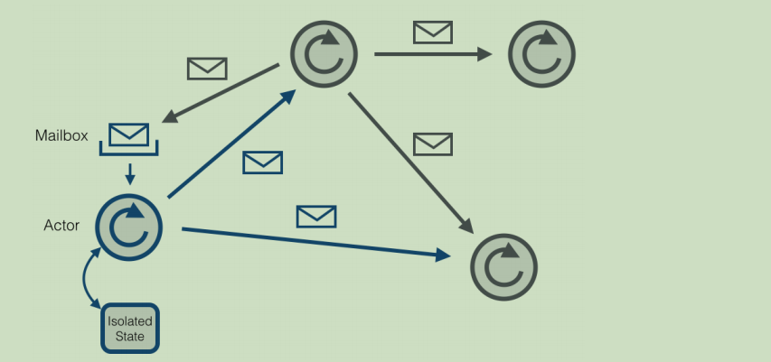

​	每个 actor 是一个单一的线程，它不断地从其邮箱中 poll(拉取)消息，并且连续不断地处理。对于已经处理过的消息的结果，actor 可以改变它自身的内部**状态或者发送一个新消息或者孵化一个新的 actor**。尽管单个的 actor 是自然有序的，但一个包含若干个 actor 的**系统却是高度并发的并且极具扩展性**的。因为那些处理线程是所有 actor 之间共享的。这也是我们为什么不该在 actor 线程里调用可能导致阻塞的“调用”。因为这样的调用可能会阻塞该线程使得他们无法替其他 actor 处理消息。

### 2.1.1 Actor 系统

​	一个 Actor 系统包含了所有存活的 actors。它提供的共享服务包括**调度、配置和日志**等。Actor 系统同时包含一个线程池，所有 actor 从这里获取线程。

​	多个 Actor 系统可以在一台机器上**共存**。如果一个 Actor 系统通过RemoteActorRefProvider 启动，它就可以被其他机器上的 Actor 系统发现。Actor 系统能够自动识别消息是发送给**本地机器**还是**远程机器**的 Actor 系统。在本地通信的情况下，消息通过**共享存储器**高效的传输。在远程通信的情况下，消息通过**网络栈**发送。所有 Actors 都是继承来组织的。每个新创建的 actor 将其创建的 actor 视作父 actor。继承被用来监督。每个父 actor 对自己的子 actor 负责监督。如果在一个子 actor 发生错误，父actor 将会收到通知。如果这个父 actor 可以解决这个问题，它就重新启动这个子 actor。如果这个错误父 actor 无法处理，它可以把这个错误传递给自己的父 actor。第一个 actor 通过系统创建，由/user 这个 actor 负责监督。详细的 Actor 的**继承制度**可
以参考 https://doc.akka.io//docs/akka/snapshot/general/supervision.html。

### 2.1.2 Flink 中的 Actors

​	Actor 是一个包含**状态和行为**的容器。actor 线程顺序处理收到的消息。这样就让用户摆脱锁和线程管理的管理，因为一次只有已给线程对一个 actor 有效。但是，必须确保只有这个 actor 线程可以处理其内部状态。Actor 的行为由 receive 函数定义，该函数包含收到的消息的处理逻辑。
​	Flink 系统由3 个分布式组件构成：JobClient，JobManager 和 TaskManager。JobClient 从
用户处得到 Flink Job，并提交给 JobManager。JobManager 策划这个 job 的执行。首先，它分配所需的资源，主要就是 TaskManagers 上要执行的 slot。
在资源分配之后，JobManager 部署单独的任务到响应的 TaskManager 上。一旦收到一个任务，TaskManager 产生一个线程用来执行这个任务。状态的改变，比如开始计算或者完成计算，将被发送回 JobManager。基于这些状态的更新，JobManager 将引导这个 job 的执行直到完成。一旦一个 job 被执行完，其结果将会被发送回 JobClient。Job 的执行图如下所示：

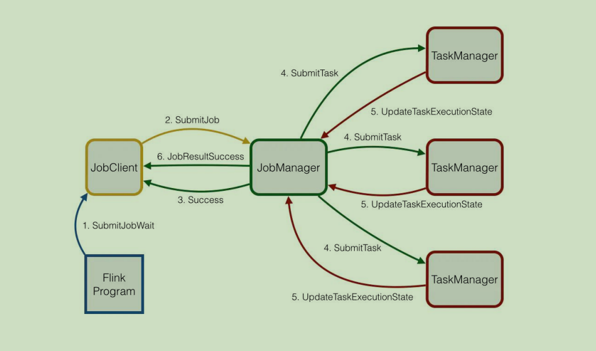

### 2.1.3 异步 vs 同步消息

​	在任何地方，Flink 尝试使用异步消息和通过 Futures（用来获取异步的响应）来处理响应。Futures 和很少的几个阻塞调用有一个超时时间，以防操作失败。这是为了防止死锁，当消息丢失或者分布式组件 crash。但是，如果在一个大集群或者慢网络的情况下，超时可能会使得情况更糟。因此，操作的超时时间可以通过“akka.timeout.timeout”来配置。在两个 actor 可以通信之前，需要获取一个 ActorRef。这个操作的查找同样需要一个超时。为了使得系统尽可能快速的失败，如果一个 actor 还没开始，超时时间需要被设置的比较小。为了以防经历查询超时，可以通过“akka.lookup.timeout”配置增加查询时间。
Akka 的另一个特点是限制发送的最大消息大小。原因是它保留了同样数据大小的序列化 buffer 和不想浪费空间。如果你曾经遇到过传输失败，因为消息超过了最大大小，你可以增加“akka.framesize”配置来增加大小。

## 2.2 使用 Akka

​	Akka 系统的核心 ActorSystem 和 Actor，若需构建一个 Akka 系统，首先需要创建ActorSystem，创建完 ActorSystem 后，可通过其创建 Actor（注意：Akka 不允许直接 new 一个 Actor，只能通过 Akka 提供的某些 API 才能创建或查找 Actor，一般会通过ActorSystem#actorOf 和 ActorContext#actorOf 来创建 Actor），另外，我们只能通过 ActorRef（Actor 的引用，其对原生的 Actor 实例做了良好的封装，外界不能随意修改其内部状态）来与 Actor 进行通信。如下代码展示了如何配置一个 Akka 系统。

```java
//1.构建 ActorSystem
//使用缺省配置
ActorSystem system = ActorSystem.create("sys");
//也可显示指定 appsys 配置
ActorSystem system1 = ActorSystem.create("helloakka", ConfigFactory.load("appsys"));
//2.构建 Actor,获取该 Actor 的引用，即 ActorRef
ActorRef helloActor = system.actorOf(Props.create(HelloActor.class),"helloActor");
//3.给 helloActor 发送消息
helloActor.tell("hello helloActor", ActorRef.noSender());
//4.关闭 ActorSystem
system.terminate();
```

### 2.2.1 Actor 路径

在 Akka 中，创建的每个 Actor 都有自己的路径，该路径遵循 ActorSystem 的层级结构，大致如下：
1）本地路径
在上面代码中，本地 Actor 路径为 akka://sys/user/helloActor
含义如下：
⚫ sys，创建的 ActorSystem 的名字；
⚫ user，通过 ActorSystem#actorOf 和 ActorContext#actorOf 方法创建的 Actor 都属于
/user 下，与/user 对应的是/system，其是系统层面创建的，与系统整体行为有关，
在开发阶段并不需要对其过多关注
⚫ helloActor，我们创建的 HelloActor
2）远程路径
在上面代码中，远程 Actor 路径为 akka.tcp://sys@l27.0.0.1:2020/user/remoteActor
含义如下：
⚫ akka.tcp，远程通信方式为 tcp；

⚫ sys@127.0.0.1:2020，ActorSystem 名字及远程主机 ip 和端口号。
⚫ user，与本地的含义一样
⚫ remoteActor，创建的远程 Actor

### 2.2.2 获取 Actor

若提供了 Actor 的路径，可以通过路径获取到 ActorRef，然后与之通信，代码如下所示：

```java
ActorSystem system = ActorSystem.create("sys")；
ActorSelection as = system.actorSelection("/path/to/actor");
Timeout timeout = new Timeout(Duration.create(2,"seconds"));
Future<ActorRef> fu = as.resolveOne(timeout);
fu.onSuccess(new OnSuccess<ActorRef>(){
@Override
 public void onSuccess(ActorRef actor){
 System.out.println("actor:"+ actor);
 actor.tell("hello actor", ActorRef.noSender());
}
}, system.dispatcher());
fu.onFailure(new OnFailure(){
@Override
 public void onFailure(Throwable failure){
 System.out.println("failure:"+ failure);
}
}, system.dispatcher());
```

若需要与远端 Actor 通信，路径中必须提供 ip:port。

## 2.3 与 Actor 通信

Akka 有两种核心的异步通信方式：tell 和 ask。

### 2.3.1 tell 方式

当使用 tell 方式时，表示仅仅使用异步方式给某个 Actor 发送消息，无需等待 Actor 的响应结果，并且也不会阻塞后续代码的运行，如：
helloActor.tell("hello helloActor", ActorRef.noSender());
其中：第一个参数为消息，它可以是任何可序列化的数据或对象，第二个参数表示发送者，通常来讲是另外一个 Actor 的引用， ActorRef.noSender()表示无发送者（实际上是一个叫做 deadLetters 的 Actor）。

### 2.3.2 ask 方式

当我们需要从 Actor 获取响应结果时，可使用 ask 方法，ask 方法会将返回结果包装在scala.concurrent.Future 中，然后通过异步回调获取返回结果。如调用方：

```java
//异步发送消息给 Actor，并获取响应结果
Future<Object> fu = Patterns.ask(printerActor,"hello helloActor", timeout);
fu.onComplete(new OnComplete<Object>(){
@Override
 public void onComplete(Throwable failure, String success) throws Throwable {
 if (failure != null){
 System.out.println("failure is "+ failure);
} else {
 System.out.println("success is "+ success);
}
}
}, system.dispatcher());
```

HelloActor 处理消息方法的代码大致如下：

```java
private void handleMessage(Object object){
 if (object instanceof String){
 String str = (String) object;
 log.info("[HelloActor] message is {}, sender is {}", str, getSender().path().toString());
//给发送者发送消息
 getSender().tell(str, getSelf());
}
}
```

上面主要介绍了 Akka 中的 ActorSystem、Actor，及与 Actor 的通信；Flink 借此构建了其底层通信系统。

## 2.4 RPC

**Flink组件通讯过程**

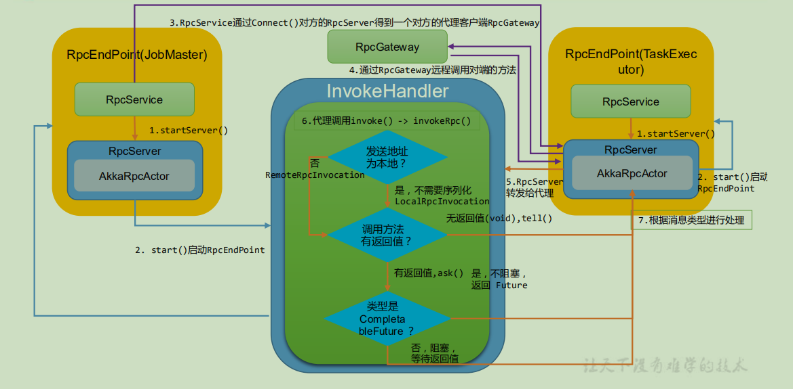

RPC（本地/远程）调用，底层是通过 Akka 提供的 tell/ask 方法进行通信。
Flink 中 RPC 框架中涉及的主要类：

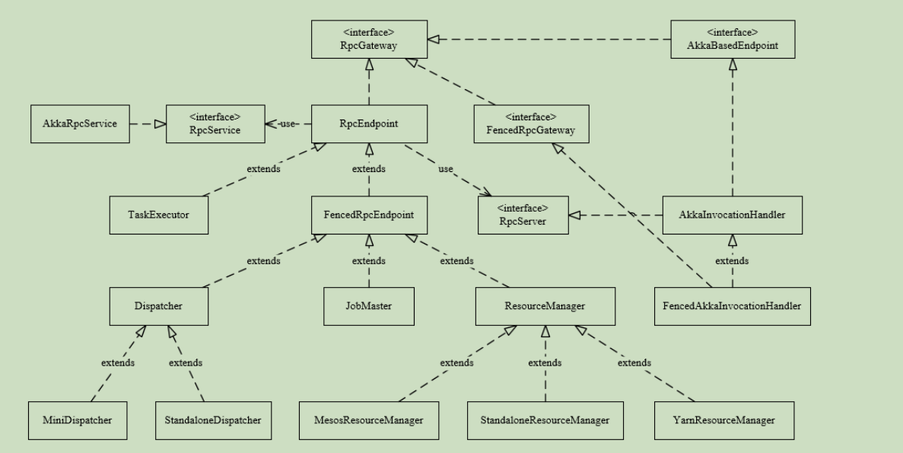

### 2.4.1 RpcGateway

Flink 的 RPC 协议通过 RpcGateway 来定义，主要**定义通信行为**；

用于远程调用RpcEndpoint 的某些方法，可以理解为对方的**客服端代理**。
若想与远端 Actor 通信，则必须**提供地址（ip 和 port）**，如在 Flink-on-Yarn 模式下，JobMaster 会先启动 ActorSystem，此时 TaskExecutor 的 Container 还未分配，后面与TaskExecutor 通信时，必须让其提供对应地址。

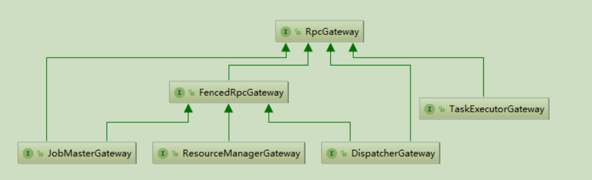从类继承图可以看到基本上所有组件都实现了 RpcGateway 接口，其代码如下：

```java
public interface RpcGateway {
/**

* Returns the fully qualified address under which the associated rpc endpoint is reachable.
*
*@return Fully qualified (RPC) address under which the associated rpc endpoint is reachable
*/
 String getAddress();
/**
* Returns the fully qualified hostname under which the associated rpc endpoint is reachable.
*
*@return Fully qualified hostname under which the associated rpc endpoint is reachable
*/
 String getHostname();
}
```


### 2.4.2 RpcEndpoint

RpcEndpoint 是**通信终端**，提供 RPC 服务组件的生命周期管理(start、stop)。每个RpcEndpoint对应了一个路径（endpointId和actorSystem共同确定），每个路径对应一个Actor，其实现了 RpcGateway 接口，其构造函数如下：

```java
protected RpcEndpoint(final RpcService rpcService, final String endpointId){
//保存 rpcService 和 endpointId
 this.rpcService = checkNotNull(rpcService,"rpcService");
 this.endpointId = checkNotNull(endpointId,"endpointId");
//通过 RpcService 启动 RpcServer
 this.rpcServer = rpcService.startServer(this);
//主线程执行器，所有调用在主线程中串行执行
 this.mainThreadExecutor = new MainThreadExecutor(rpcServer, this::validateRunsInMainThread);
}
```

​		构造的时候调用rpcService.startServer()启动RpcServer，进入可以接收处理请求的状态，最后将 RpcServer 绑定到主线程上真正执行起来。
在 RpcEndpoint 中还定义了一些方法如 runAsync(Runnable)、callAsync(Callable, Time)方法来执行 Rpc 调用，值得注意的是在**Flink 的设计中，对于同一个 Endpoint，所有的调用都运行在主线程，因此不会有并发问题，当启动 RpcEndpoint/进行 Rpc 调用时，其会委托RcpServer 进行处理**。


### 2.4.3 RpcService 和 RpcServer

RpcService 和 RpcServer 是 RpcEndPoint 的成员变量。

1）RpcService 是 Rpc 服务的接口，其主要作用如下：
⚫根据提供的 RpcEndpoint 来启动和停止 RpcServer（Actor）；
⚫根据提供的地址连接到(对方的)RpcServer，并返回一个 RpcGateway；

⚫延迟/立刻调度 Runnable、Callable；

​	在 Flink 中实现类为 AkkaRpcService，是 Akka 的 ActorSystem 的封装，基本可以理解成 ActorSystem 的一个适配器。在ClusterEntrypoint（JobMaster）和 TaskManagerRunner（TaskExecutor）启动的过程中初始化并启动。

 AkkaRpcService 中封装了ActorSystem，并保存了ActorRef 到 RpcEndpoint的映射关系。RpcService 跟 RpcGateway 类似，也提供了获取地址和端口的方法。

在构造 RpcEndpoint 时会启动指定 rpcEndpoint 上的 RpcServer，其会根据 RpcEndpoint类型（FencedRpcEndpoint 或其他）来创建不同的 AkkaRpcActor（FencedAkkaRpcActor 或AkkaRpcActor），并将RpcEndpoint和AkkaRpcActor对应的ActorRef保存起来，AkkaRpcActor是底层 Akka 调用的实际接收者，RPC 的请求在客户端被封装成 RpcInvocation 对象，以 Akka消息的形式发送。

**最终使用动态代理将所有的消息转发到 InvocationHandler**，具体代码如下：

```java
public <C extends RpcEndpoint & RpcGateway> RpcServer startServer(C rpcEndpoint){
......
//生成 RpcServer 对象，而后对该 server 的调用都会进入 Handler 的 invoke 方法处理，handler 实现了多个接口的方法
//生成一个包含这些接口的代理，将调用转发到 InvocationHandler
@SuppressWarnings("unchecked")
 RpcServer server = (RpcServer) Proxy.newProxyInstance(
 classLoader,
 implementedRpcGateways.toArray(new Class<?>[implementedRpcGateways.size()]),
 akkaInvocationHandler);
return server;
}
```


2）RpcServer 负责接收响应远端 RPC 消息请求，自身的代理对象。有两个实现：
⚫ AkkaInvocationHandler
⚫ FencedAkkaInvocationHandler
RpcServer 的启动是通知底层的 AkkaRpcActor 切换为 START 状态，开始处理远程调用
请求：

```java
class AkkaInvocationHandler implements InvocationHandler, AkkaBasedEndpoint, RpcServer {
@Override
public void start(){
rpcEndpoint.tell(ControlMessages.START, ActorRef.noSender());
}}
```

### 2.4.4 AkkaRpcActor

AkkaRpcActor 是 Akka 的具体实现，主要负责处理如下类型消息：
1）本地 Rpc 调用 LocalRpcInvocation
会指派给 RpcEndpoint 进行处理，如果有响应结果，则将响应结果返还给 Sender。

2）RunAsync & CallAsync
这类消息带有可执行的代码，直接在 Actor 的线程中执行。

3）控制消息 ControlMessages
用来控制 Actor 行为，START 启动，STOP 停止，停止后收到的消息会丢弃掉。

### 2.4.4 RPC 交互过程

RPC 通信过程分为请求和响应。

#### 2.4.4.1 RPC 请求发送

在 RpcService 中调用 connect()方法与对端的 RpcEndpoint（RpcServer）建立连接，connect()方法根据给的地址返回InvocationHandler(AkkaInvocationHandler 或FencedAkkaInvocationHandler，也就是对方的代理)。前面分析到客户端提供代理对象，代理对象会调用 AkkaInvocationHandler 的 invoke 方法并传入 RPC 调用的方法和参数信息，代码如下：
**AkkaInvocationHandler.java**

```java
public Object invoke(Object proxy, Method method, Object[] args) throws Throwable {
 Class<?> declaringClass = method.getDeclaringClass();
 Object result;
//判断方法所属的 class
 if (declaringClass.equals(AkkaBasedEndpoint.class)|| declaringClass.equals(Object.class)|| declaringClass.equals(RpcGateway.class)|| declaringClass.equals(StartStoppable.class)|| declaringClass.equals(MainThreadExecutable.class)|| declaringClass.equals(RpcServer.class)){
 result = method.invoke(this, args);
} else if (declaringClass.equals(FencedRpcGateway.class)){
 throw new UnsupportedOperationException("AkkaInvocationHandler does not support the call FencedRpcGateway#"+ method.getName()+". This indicates that you retrieved a FencedRpcGateway without specifying a "+
"fencing token. Please use RpcService#connect(RpcService, F, Time) with F being the fencing token to "+
"retrieve a properly FencedRpcGateway.");
} else {
//非 Akka 类型的，进入 rpc 调用
 result = invokeRpc(method, args);
}
 return result;
}
```

代码中判断所属的类，如果是 RPC 方法，则调用 invokeRpc 方法。将方法调用封装为RPCInvocation 消息。如果是本地则生成 LocalRPCInvocation，本地消息不需要序列化，如果是远程调用则创建 RemoteRPCInvocation。判断远程方法调用是否需要等待结果，如果无需等待(void)，则使用向 Actor 发送 tell 类型的消息，如果需要返回结果，则向 Acrot 发送 ask 类型的消息，代码如下：

**AkkaInvocationHandler.java**

```java
private Object invokeRpc(Method method, Object[] args) throws Exception {
 String methodName = method.getName();
 Class<?>[] parameterTypes = method.getParameterTypes();
 Annotation[][] parameterAnnotations = method.getParameterAnnotations();
 Time futureTimeout = extractRpcTimeout(parameterAnnotations, args, timeout);
 final RpcInvocation rpcInvocation = createRpcInvocationMessage(methodName, parameterTypes, args);
 Class<?> returnType = method.getReturnType();
 final Object result;
 if (Objects.equals(returnType, Void.TYPE)){
 tell(rpcInvocation);
 result = null;
} else {
// Capture the call stack. It is significantly faster to do that via an exception than
// via Thread.getStackTrace(), because exceptions lazily initialize the stack trace, initially only
// capture a lightweight native pointer, and convert that into the stack trace lazily when needed.
 final Throwable callStackCapture = captureAskCallStack ? new Throwable(): null;
// execute an asynchronous call
//异步调用等待返回
 final CompletableFuture<?> resultFuture = ask(rpcInvocation, futureTimeout);
 final CompletableFuture<Object> completableFuture = new CompletableFuture<>();
 resultFuture.whenComplete((resultValue, failure)-> {
 if (failure != null){
 completableFuture.completeExceptionally(resolveTimeoutException(failure,
 callStackCapture, method));
} else {
 completableFuture.complete(deserializeValueIfNeeded(resultValue, method));
}
});
 if (Objects.equals(returnType, CompletableFuture.class)){
//如果返回值是 CompletableFuture 类型，不用阻塞等待返回，直接返回 Future 对象
 result = completableFuture;
} else {
 try {
//如果返回值不是 CompletableFuture 类型，阻塞等待返回
 result = completableFuture.get(futureTimeout.getSize(), futureTimeout.getUnit());
} catch (ExecutionException ee){
 throw new RpcException("Failure while obtaining synchronous RPC result.", ExceptionUtils.stripExecutionException(ee));
}
}
}
 return result;
}
```


#### 2.4.4.2 RPC 请求响应

RPC 消息通过 RpcEndpoint 所绑定的 Actor 的 ActorRef 发送的，AkkaRpcActor 是消息接收的入口，AkkaRpcActor 在 RpcEndpoint 中构造生成，负责将消息交给不同的方法进行处理。

**AkkaRpcActor.java**

```java
public Receive createReceive(){
 return ReceiveBuilder.create()
.match(RemoteHandshakeMessage.class, this::handleHandshakeMessage)
.match(ControlMessages.class, this::handleControlMessage)
.matchAny(this::handleMessage)
.build();
}
```

接收的消息有3 种：
1）握手消息
在客户端构造时会通过 ActorSelection 发送过来。收到消息后检查接口、版本是否匹配。
**AkkaRpcActor.java**

```java
private void handleHandshakeMessage(RemoteHandshakeMessage handshakeMessage){
 if (!isCompatibleVersion(handshakeMessage.getVersion())){
//版本不兼容异常处理
 sendErrorIfSender(new AkkaHandshakeException(
 String.format("Version mismatch between source (%s) and target (%s) rpc component. Please verify that all components have the same version.",handshakeMessage.getVersion(),getVersion())));
} else if (!isGatewaySupported(handshakeMessage.getRpcGateway())){
// RpcGateway 不匹配异常处理
 sendErrorIfSender(new AkkaHandshakeException(
 String.format(
"The rpc endpoint does not support the gateway %s.",
 handshakeMessage.getRpcGateway().getSimpleName())));
} else {
 getSender().tell(new Status.Success(HandshakeSuccessMessage.INSTANCE), getSelf());
}
}
```

2）控制消息
在 RpcEndpoint 调用 start 方法后，会向自身发送一条 Processing.START 消息来转换当前 Actor 的状态为 STARTED，STOP 也类似，并且只有在 Actor 状态为 STARTED 时才会处理 RPC 请求。
**AkkaRpcActor.java**

```java
private void handleControlMessage(ControlMessages controlMessage){
 try {
 switch (controlMessage){
 case START:
 state = state.start(this);
 break;
 case STOP:
 state = state.stop();
 break;
 case TERMINATE:
 state = state.terminate(this);
 break;
 default:
 handleUnknownControlMessage(controlMessage);
}
} catch (Exception e){
 this.rpcEndpointTerminationResult = RpcEndpointTerminationResult.failure(e);
 throw e;
}
}
```

3）RPC 消息
通过解析 RpcInvocation 获取方法名和参数类型，并从 RpcEndpoint 类中找到 Method 对象，通过反射调用该方法。如果有返回结果，会以 Akka 消息的形式发送回发送者。
**AkkaRpcActor.java**

```java
private void handleMessage(final Object message){
 if (state.isRunning()){
 mainThreadValidator.enterMainThread();
 try {
 handleRpcMessage(message);
} finally {
 mainThreadValidator.exitMainThread();
}
} else {
 log.info("The rpc endpoint {} has not been started yet. Discarding message {} until processing is started.",
 rpcEndpoint.getClass().getName(),
 message.getClass().getName());
 sendErrorIfSender(new AkkaRpcException(
 String.format("Discard message, because the rpc endpoint %s has not been started yet.",
 rpcEndpoint.getAddress())));
}
}
```


# 第3 章 Flink 任务调度机制


## 3.1 Graph 的概念

Flink 中的执行图可以分成四层：StreamGraph -> JobGraph -> ExecutionGraph -> 物理执行图。

**StreamGraph**：是根据用户通过 Stream API 编写的代码生成的最初的图。用来表示程序的拓扑结构。

**JobGraph**：StreamGraph 经过优化后生成了 JobGraph，提交给 JobManager 的数据结构。

主要的优化为，将多个符合条件的节点 chain 在一起作为一个节点，这样可以减少数据在节点之间流动所需要的序列化/反序列化/传输消耗。

**ExecutionGraph**：JobManager 根据 JobGraph 生成 ExecutionGraph。ExecutionGraph 是JobGraph 的并行化版本，是调度层最核心的数据结构。

**物理执行图**： JobManager 根据 ExecutionGraph 对 Job 进行调度后，在各个TaskManager 上部署 Task 后形成的“图”，并不是一个具体的数据结构。

例如 example 里的 SocketTextStreamWordCount 并发度为2（Source 为1 个并发度）的四层执行图的演变过程如下图所示：

```java
public static void main(String[] args) throws Exception {
//检查输入
 final ParameterTool params = ParameterTool.fromArgs(args);
...
// set up the execution environment
 final StreamExecutionEnvironment env = StreamExecutionEnvironment.getExecutionEnvironment();
// get input data
 DataStream<String> text =
 env.socketTextStream(params.get("hostname"), params.getInt("port"),'\n',0);
 DataStream<Tuple2<String, Integer>> counts =
// split up the lines in pairs (2-tuples) containing: (word,1)
 text.flatMap(new Tokenizer())
// group by the tuple field "0" and sum up tuple field "1"
.keyBy(0)
.sum(1);
 counts.print();

// execute program
env.execute("WordCount from SocketTextStream Example");
}
```


名词解释：

1）**StreamGraph**：根据用户通过 Stream API 编写的代码生成的最初的图。

> （1）StreamNode：用来代表 operator 的类，并具有所有相关的属性，如并发度、入边和出边等。
>
> （2）StreamEdge：表示连接两个 StreamNode 的边。

2）**JobGraph**：StreamGraph 经过优化后生成了 JobGraph，提交给 JobManager 的数据结构。

> （1）JobVertex：经过优化后符合条件的多个 StreamNode 可能会 chain 在一起生成一个JobVertex，即一个 JobVertex 包含一个或多个 operator，JobVertex 的输入是 JobEdge，输出是IntermediateDataSet。
>
>  （2）IntermediateDataSet：表示 JobVertex 的输出，即经过 operator 处理产生的数据集。producer 是 JobVertex，consumer 是 JobEdge。
>
> （3）JobEdge：代表了 job graph 中的一条数据传输通道。source 是 IntermediateDataSet，target 是 JobVertex。即数据通过 JobEdge 由 IntermediateDataSet 传递给目标 JobVertex。

3）**ExecutionGraph**：JobManager 根据 JobGraph 生成 ExecutionGraph。ExecutionGraph是 JobGraph 的并行化版本，是调度层最核心的数据结构。

> （1 ） ExecutionJobVertex ：和 JobGraph 中的 JobVertex 一一对应。每一个ExecutionJobVertex 都有和并发度一样多的 ExecutionVertex。
>
>  （2）ExecutionVertex：表示 ExecutionJobVertex 的其中一个并发子任务，输入是ExecutionEdge，输出是 IntermediateResultPartition。
>
> （3）IntermediateResult：和 JobGraph 中的 IntermediateDataSet 一一对应。一个IntermediateResult 包含多个 IntermediateResultPartition，其个数等于该 operator 的并发度。
> （4）IntermediateResultPartition：表示 ExecutionVertex 的一个输出分区，producer 是ExecutionVertex，consumer 是若干个 ExecutionEdge。
>
>  （5）ExecutionEdge：表示 ExecutionVertex 的输入，source 是 IntermediateResultPartition，target 是 ExecutionVertex。source 和 target 都只能是一个。
> （6）Execution：是执行一个 ExecutionVertex 的一次尝试。当发生故障或者数据需要重算的情况下 ExecutionVertex 可能会有多个ExecutionAttemptID。一个 Execution 通过ExecutionAttemptID 来唯一标识。JM 和 TM 之间关于 task 的部署和 task status 的更新都是通过 ExecutionAttemptID 来确定消息接受者。

从这些基本概念中，也可以看出以下几点：

⚫由于每个 JobVertex 可能有多个 IntermediateDataSet，所以每个 ExecutionJobVertex 可能有多个IntermediateResult，因此，每个 ExecutionVertex 也可能会包含多个IntermediateResultPartition；

⚫ ExecutionEdge 这里主要的作֌是把 ExecutionVertex 和 IntermediateResultPartition 连接起来，表示它们之间的连接关系。

4）**物理执行图**：JobManager 根据 ExecutionGraph 对 Job 进行调度后，在各个TaskManager 上部署 Task 后形成的“图”，并不是一个具体的数据结构。

> （1）Task：Execution 被调度后在分配的 TaskManager 中启动对应的 Task。Task 包裹了具有用户执行逻辑的 operator。
>
> （2）ResultPartition：代表由一个 Task 的生成的数据，和 ExecutionGraph 中的IntermediateResultPartition 一一对应。
>
> （3）ResultSubpartition：是 ResultPartition 的一个子分区。每个 ResultPartition 包含多个ResultSubpartition，其数目要由下游消费 Task 数和DistributionPattern 来决定。
>
> （4）InputGate：代表 Task 的输入封装，和 JobGraph 中 JobEdge 一一对应。每个 InputGate消费了一个或多个的 ResultPartition。
>
> （5）InputChannel：每个 InputGate 会包含一个以上的 InputChannel，和 ExecutionGraph中的 ExecutionEdge 一一对应，也和 ResultSubpartition 一对一地相连，即一个 InputChannel接收一个 ResultSubpartition 的输出。

## 3.2 StreamGraph 在 Client 生成

调用用户代码中的 StreamExecutionEnvironment.execute()
	-> execute(getJobName())
				-> execute(getStreamGraph(jobName))
						-> getStreamGraph(jobName, true)
**StreamExecutionEnvironment.java**

```java
public StreamGraph getStreamGraph(String jobName, boolean clearTransformations){
 StreamGraph streamGraph = getStreamGraphGenerator().setJobName(jobName).generate();
 if (clearTransformations){
 this.transformations.clear();
}
 return streamGraph;
}

public StreamGraph generate(){
 streamGraph = new StreamGraph(executionConfig, checkpointConfig, savepointRestoreSettings);
 shouldExecuteInBatchMode = shouldExecuteInBatchMode(runtimeExecutionMode);
 configureStreamGraph(streamGraph);
 alreadyTransformed = new HashMap<>();
 for (Transformation<?> transformation: transformations){
 transform(transformation);
}

 final StreamGraph builtStreamGraph = streamGraph;
 alreadyTransformed.clear();
 alreadyTransformed = null;
 streamGraph = null;
 return builtStreamGraph;
}
```

一个关键的参数是 List<Transformation<?>> transformations。Transformation 代表了从一个或多个 DataStream 生成新 DataStream 的操作。DataStream 的底层其实就是一个Transformation，描述了这个 DataStream 是怎么来的。DataStream 上常见的 transformation 有 map、flatmap、filter 等。这些 transformation 会构造出一棵StreamTransformation 树，通过这棵树转换成 StreamGraph。以 map 为例，分析
List<Transformation<?>> transformations 的数据：
**DataStream.java**

```java
public <R> SingleOutputStreamOperator<R> map(MapFunction<T, R> mapper){
//通过 java reflection 抽出 mapper 的返回值类型
 TypeInformation<R> outType = TypeExtractor.getMapReturnTypes(clean(mapper), getType(),Utils.getCallLocationName(), true);
 return map(mapper, outType);
}

public <R> SingleOutputStreamOperator<R> map(MapFunction<T, R> mapper, TypeInformation<R> outputType){
//返回一个新的 DataStream，StreamMap 为 StreamOperator 的实现类
 return transform("Map", outputType, new StreamMap<>(clean(mapper)));
}

public <R> SingleOutputStreamOperator<R> transform(String operatorName,TypeInformation<R> outTypeInfo,OneInputStreamOperator<T, R> operator){
 return doTransform(operatorName, outTypeInfo, SimpleOperatorFactory.of(operator));
}

protected <R> SingleOutputStreamOperator<R> doTransform(
String operatorName,
TypeInformation<R> outTypeInfo,
StreamOperatorFactory<R> operatorFactory){
// read the output type of the input Transform to coax out errors about MissingTypeInfo
transformation.getOutputType();
//新的 transformation 会连接上当前 DataStream 中的 transformation，从而构建成一棵树
OneInputTransformation<T, R> resultTransform = new OneInputTransformation<>(
this.transformation,
operatorName,
operatorFactory,
outTypeInfo,
environment.getParallelism());
@SuppressWarnings({"unchecked","rawtypes"})
SingleOutputStreamOperator<R> returnStream = new SingleOutputStreamOperator(environment,
resultTransform);
//所有的 transformation 都会存到 env 中，调用 execute 时遍历该 list 生成 StreamGraph
getExecutionEnvironment().addOperator(resultTransform);
return returnStream;
}
```

从上方代码可以了解到，map 转换将用户自定义的函数 MapFunction 包装到 StreamMap这个 Operator 中，再将 StreamMap 包装到OneInputTransformation，最后该 transformation 存到 env 中，当调用 env.execute 时，遍历其中的 transformation 集合构造出 StreamGraph。其分
层实现如下图所示：

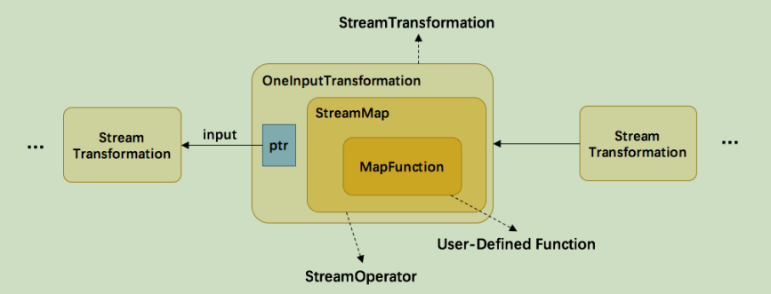

另外，并不是每一个 StreamTransformation 都会转换成 runtime 层中物理操作。有一些只是逻辑概念，比如 union、split/select、partition 等。如下图所示的转换树，在运行时会优化成下方的操作图。


union、split/select（1.12 已移除）、partition 中的信息会被写入到 Source –> Map 的边中。通过源码也可以发现 UnionTransformation , SplitTransformation（1.12 移除），SelectTransformation（1.12 移除）,PartitionTransformation 由于不包含具体的操作所以都没有 StreamOperator 成员变量，而其他 StreamTransformation 的子类基本上都有。

接着分析 StreamGraph 生成的源码：
StreamExecutionEnvironment.java -> generator()-> transform()

```java
//对每个 transformation 进行转换，转换成 StreamGraph 中的 StreamNode 和 StreamEdge
//返回值为该 transform 的 id 集合，通常大小为1 个（除 FeedbackTransformation）
private Collection<Integer> transform(Transformation<?> transform){
if (alreadyTransformed.containsKey(transform)){
return alreadyTransformed.get(transform);
}
LOG.debug("Transforming "+ transform);
if (transform.getMaxParallelism()<= 0){
// if the max parallelism hasn't been set, then first use the job wide max parallelism
// from the ExecutionConfig.
int globalMaxParallelismFromConfig = executionConfig.getMaxParallelism();
if (globalMaxParallelismFromConfig > 0){
transform.setMaxParallelism(globalMaxParallelismFromConfig);
}}
// call at least once to trigger exceptions about MissingTypeInfo
//为了触发 MissingTypeInfo 的异常
transform.getOutputType();
@SuppressWarnings("unchecked")
final TransformationTranslator<?, Transformation<?>> translator =
(TransformationTranslator<?, Transformation<?>>) translatorMap.get(transform.getClass());

Collection<Integer> transformedIds;
if (translator != null){
transformedIds = translate(translator, transform);
} else {
transformedIds = legacyTransform(transform);
}
// need this check because the iterate transformation adds itself before
// transforming the feedback edges
if (!alreadyTransformed.containsKey(transform)){
alreadyTransformed.put(transform, transformedIds);
}
return transformedIds;
}
private Collection<Integer> translate(
final TransformationTranslator<?, Transformation<?>> translator,
final Transformation<?> transform){
checkNotNull(translator);
checkNotNull(transform);
final List<Collection<Integer>> allInputIds = getParentInputIds(transform.getInputs());
// the recursive call might have already transformed this
if (alreadyTransformed.containsKey(transform)){
return alreadyTransformed.get(transform);
}
final String slotSharingGroup = determineSlotSharingGroup(
transform.getSlotSharingGroup(),
allInputIds.stream()
.flatMap(Collection::stream)
.collect(Collectors.toList()));
final TransformationTranslator.Context context = new ContextImpl(
this, streamGraph, slotSharingGroup, configuration);
return shouldExecuteInBatchMode
? translator.translateForBatch(transform, context)
: translator.translateForStreaming(transform, context);
}
SimpleTransformationTranslator.java
public Collection<Integer> translateForStreaming(final T transformation, final Context context){
checkNotNull(transformation);
checkNotNull(context);
final Collection<Integer> transformedIds =
translateForStreamingInternal(transformation, context);
configure(transformation, context);
return transformedIds;
}
AbstractOneInputTransformationTranslator.java
protected Collection<Integer> translateInternal(
final Transformation<OUT> transformation,
final StreamOperatorFactory<OUT> operatorFactory,
final TypeInformation<IN> inputType,
@Nullable final KeySelector<IN,?> stateKeySelector,

@Nullable final TypeInformation<?> stateKeyType,
final Context context){
checkNotNull(transformation);
checkNotNull(operatorFactory);
checkNotNull(inputType);
checkNotNull(context);
final StreamGraph streamGraph = context.getStreamGraph();
final String slotSharingGroup = context.getSlotSharingGroup();
final int transformationId = transformation.getId();
final ExecutionConfig executionConfig = streamGraph.getExecutionConfig();
//添加 StreamNode
streamGraph.addOperator(
transformationId,
slotSharingGroup,
transformation.getCoLocationGroupKey(),
operatorFactory,
inputType,
transformation.getOutputType(),
transformation.getName());
if (stateKeySelector != null){
TypeSerializer<?> keySerializer = stateKeyType.createSerializer(executionConfig);
streamGraph.setOneInputStateKey(transformationId, stateKeySelector, keySerializer);
}
int parallelism = transformation.getParallelism()!= ExecutionConfig.PARALLELISM_DEFAULT
? transformation.getParallelism()
: executionConfig.getParallelism();
streamGraph.setParallelism(transformationId, parallelism);
streamGraph.setMaxParallelism(transformationId, transformation.getMaxParallelism());
final List<Transformation<?>> parentTransformations = transformation.getInputs();
checkState(
parentTransformations.size()== 1,
"Expected exactly one input transformation but found "+ parentTransformations.size());
//添加 StreamEdge
for (Integer inputId: context.getStreamNodeIds(parentTransformations.get(0))){
streamGraph.addEdge(inputId, transformationId,0);
}
return Collections.singleton(transformationId);
}
```

该函数首先会对该 transform 的上游 transform 进行递归转换，确保上游的都已经完成了转化。然后通过 transform 构造出 StreamNode，最后与上游的 transform 进行连接，构造出 StreamNode。最后再来看下对逻辑转换（partition、union 等）的处理，如下是 transformPartition 函数的源码：
**PartitionTransformationTranslator.java**

```java
protected Collection<Integer> translateForStreamingInternal(
final PartitionTransformation<OUT> transformation,
final Context context){
return translateInternal(transformation, context);

}
private Collection<Integer> translateInternal(
final PartitionTransformation<OUT> transformation,
final Context context){
checkNotNull(transformation);
checkNotNull(context);
final StreamGraph streamGraph = context.getStreamGraph();
final List<Transformation<?>> parentTransformations = transformation.getInputs();
checkState(
parentTransformations.size()== 1,
"Expected exactly one input transformation but found "+ parentTransformations.size());
final Transformation<?> input = parentTransformations.get(0);
List<Integer> resultIds = new ArrayList<>();
for (Integer inputId: context.getStreamNodeIds(input)){
//生成一个新的虚拟 id
final int virtualId = Transformation.getNewNodeId();
//添加一个虚拟分区节点，不会生成 StreamNode
streamGraph.addVirtualPartitionNode(
inputId,
virtualId,
transformation.getPartitioner(),
transformation.getShuffleMode());
resultIds.add(virtualId);
}
return resultIds;
}
```

对 partition 的转换没有生成具体的 StreamNode 和 StreamEdge，而是添加一个虚节点。当 partition 的下游 transform（如 map）添加 edge 时（调用 StreamGraph.addEdge），会把partition 信息写入到 edge 中。接前面 map 的流程：

```java
AbstractOneInputTransformationTranslator.java -> translateInternal()
public void addEdge(Integer upStreamVertexID, Integer downStreamVertexID, int typeNumber){
addEdgeInternal(upStreamVertexID,
downStreamVertexID,
typeNumber,
null,
new ArrayList<String>(),
null,
null);
}
private void addEdgeInternal(Integer upStreamVertexID,
Integer downStreamVertexID,
int typeNumber,
StreamPartitioner<?> partitioner,
List<String> outputNames,
OutputTag outputTag,
ShuffleMode shuffleMode){
//当上游是侧输出时，递归调用，并传入侧输出信息

if (virtualSideOutputNodes.containsKey(upStreamVertexID)){
int virtualId = upStreamVertexID;
upStreamVertexID = virtualSideOutputNodes.get(virtualId).f0;
if (outputTag == null){
outputTag = virtualSideOutputNodes.get(virtualId).f1;
}
addEdgeInternal(upStreamVertexID, downStreamVertexID, typeNumber, partitioner, null,
outputTag, shuffleMode);
//当上游是 partition 时，递归调用，并传入 partitioner 信息
} else if (virtualPartitionNodes.containsKey(upStreamVertexID)){
int virtualId = upStreamVertexID;
upStreamVertexID = virtualPartitionNodes.get(virtualId).f0;
if (partitioner == null){
partitioner = virtualPartitionNodes.get(virtualId).f1;
}
shuffleMode = virtualPartitionNodes.get(virtualId).f2;
addEdgeInternal(upStreamVertexID, downStreamVertexID, typeNumber, partitioner,
outputNames, outputTag, shuffleMode);
} else {
//真正构建 StreamEdge
StreamNode upstreamNode = getStreamNode(upStreamVertexID);
StreamNode downstreamNode = getStreamNode(downStreamVertexID);
// If no partitioner was specified and the parallelism of upstream and downstream
// operator matches use forward partitioning, use rebalance otherwise.
//未指定 partitioner 的话，会为其选择 forward 或 rebalance 分区。
if (partitioner == null && upstreamNode.getParallelism()== downstreamNode.getParallelism())
{
partitioner = new ForwardPartitioner<Object>();
} else if (partitioner == null){
partitioner = new RebalancePartitioner<Object>();
}
//健康检查，forward 分区必须要上下游的并发度一致
if (partitioner instanceof ForwardPartitioner){
if (upstreamNode.getParallelism()!= downstreamNode.getParallelism()){
throw new UnsupportedOperationException("Forward partitioning does not allow "+
"change of parallelism. Upstream operation: "+ upstreamNode +"
parallelism: "+ upstreamNode.getParallelism()+
", downstream operation: "+ downstreamNode +" parallelism: "+
downstreamNode.getParallelism()+
" You must use another partitioning strategy, such as broadcast, rebalance,
shuffle or global.");
}}
if (shuffleMode == null){
shuffleMode = ShuffleMode.UNDEFINED;
}
//创建 StreamEdge
StreamEdge edge = new StreamEdge(upstreamNode, downstreamNode, typeNumber,
partitioner, outputTag, shuffleMode);
//将该 StreamEdge 添加到上游的输出，下游的输入
getStreamNode(edge.getSourceId()).addOutEdge(edge);
getStreamNode(edge.getTargetId()).addInEdge(edge);
}}
```

实例分析：
看一个实例：如下程序，是一个从 Source 中按行切分成单词并过滤输出的简单流程序，其中包含了逻辑转换：随机分区 shuffle。分析该程序是如何生成 StreamGraph 的。

```java
DataStream<String> text = env.socketTextStream(hostName, port);
text.flatMap(new LineSplitter()).shuffle().filter(new HelloFilter()).print();
```

首先会在 env 中生成一棵 transformation 树，用 List<Transformation<?>>保存。其结构图如下：

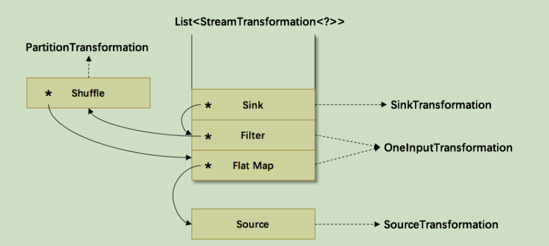

其中符号*为 input 指针，指向上游的 transformation，从而形成了一棵 transformation树。然后，通过调用 StreamGraphGenerator.generate(env, transformations)来生成StreamGraph。自底向上递归调用每一个 transformation，也就是说处理顺序是Source->FlatMap->Shuffle->Filter->Sink。
如上图所示：

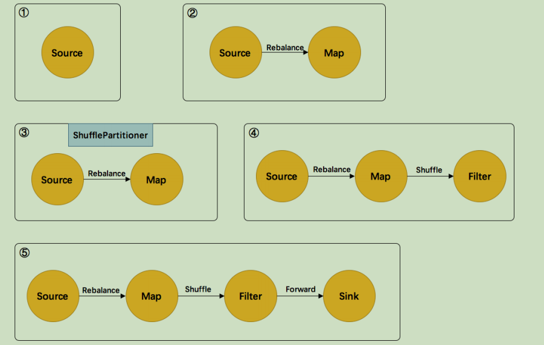

> 1）首先处理的 Source，生成了 Source 的 StreamNode。
>
>  2）然后处理的 FlatMap，生成了 FlatMap 的 StreamNode，并生成 StreamEdge 连接上游Source 和 FlatMap。由于上下游的并发度不一样（1:4），所以此处是 Rebalance 分区。
> 3）然后处理的 Shuffle，由于是逻辑转换，并不会生成实际的节点。将 partitioner 信息暂存在 virtuaPartitionNodes 中。
> 4）在处理 Filter 时，生成了 Filter 的 StreamNode。发现上游是 shuffle，找到 shuffle 的上游FlatMap，创建 StreamEdge 与 Filter 相连。并把ShufflePartitioner 的信息写到 StreamEdge中。
> 5）最后处理 Sink，创建 Sink 的 StreamNode，并生成 StreamEdge 与上游 Filter 相连。由于上下游并发度一样（4:4），所以此处选择 Forward 分区。
> 最后可以通过 UI 可视化来观察得到的 StreamGraph。
>
> 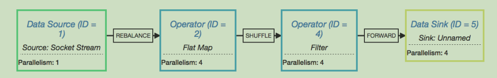

##  3.3 JobGraph 在 Client 生成

StreamGraph 转变成 JobGraph 也是在 Client 完成，主要作了三件事：

⚫ StreamNode 转成 JobVertex。

⚫ StreamEdge 转成 JobEdge。

⚫ JobEdge 和 JobVertex 之间创建 IntermediateDataSet 来连接。

从1.2.6 接着进行源码分析，看 execute 里的逻辑（yarn-per-job 为例）：
**AbstractJobClusterExecutor.java**

```java
public CompletableFuture<JobClient> execute(@Nonnull final Pipeline pipeline,@Nonnull final Configuration configuration,@Nonnull final ClassLoader userCodeClassloader) throws Exception {
 final JobGraph jobGraph = PipelineExecutorUtils.getJobGraph(pipeline, configuration);
……
}
```

**PipelineExecutorUtils.java**

```java
public static JobGraph getJobGraph(@Nonnull final Pipeline pipeline,@Nonnull final Configuration configuration) throws MalformedURLException {
 checkNotNull(pipeline);
 checkNotNull(configuration);
 final ExecutionConfigAccessor executionConfigAccessor = ExecutionConfigAccessor.fromConfiguration(configuration);
 final JobGraph jobGraph = FlinkPipelineTranslationUtil.getJobGraph(pipeline, configuration,executionConfigAccessor.getParallelism());
……
}
```

**FlinkPipelineTranslationUtil.java**

```java
public static JobGraph getJobGraph(
 Pipeline pipeline,
 Configuration optimizerConfiguration,
 int defaultParallelism){
 FlinkPipelineTranslator pipelineTranslator = getPipelineTranslator(pipeline);
 return pipelineTranslator.translateToJobGraph(pipeline,optimizerConfiguration,defaultParallelism);
}
```

**StreamGraphTranslator.java**

```java
public JobGraph translateToJobGraph(Pipeline pipeline,Configuration optimizerConfiguration,int defaultParallelism){
 checkArgument(pipeline instanceof StreamGraph,
"Given pipeline is not a DataStream StreamGraph.");
 StreamGraph streamGraph = (StreamGraph) pipeline;
 return streamGraph.getJobGraph(null);
}
```

**StreamGraph.java**

```java
public JobGraph getJobGraph(@Nullable JobID jobID){
 return StreamingJobGraphGenerator.createJobGraph(this, jobID);
}
```

**StreamingJobGraphGenerator.java**

```java
public static JobGraph createJobGraph(StreamGraph streamGraph,@Nullable JobID jobID){
 return new StreamingJobGraphGenerator(streamGraph, jobID).createJobGraph();
}
```

看一下核心类 StreamingJobGraphGenerator 的相关属性：

```java
public class StreamingJobGraphGenerator {
……
 private StreamGraph streamGraph;

// id -> JobVertex
 private Map<Integer, JobVertex> jobVertices;
private JobGraph jobGraph;
//已经构建的 JobVertex 的 id 集合
 private Collection<Integer> builtVertices;
//物理边集合（排除了 chain 内部的边）,按创建顺序排序
 private List<StreamEdge> physicalEdgesInOrder;
//保存 chain 信息，部署时用来构建 OperatorChain，startNodeId -> (currentNodeId -> StreamConfig)
 private Map<Integer, Map<Integer, StreamConfig>> chainedConfigs;
//所有节点的配置信息，id -> StreamConfig
 private Map<Integer, StreamConfig> vertexConfigs;
//保存每个节点的名字，id -> chainedName
 private Map<Integer, String> chainedNames;
private final Map<Integer, ResourceSpec> chainedMinResources;
private final Map<Integer, ResourceSpec> chainedPreferredResources;
private final Map<Integer, InputOutputFormatContainer> chainedInputOutputFormats;
private final StreamGraphHasher defaultStreamGraphHasher;
private final List<StreamGraphHasher> legacyStreamGraphHashers;

//构造函数，入参只有 StreamGraph
 public StreamingJobGraphGenerator(StreamGraph streamGraph){
 this.streamGraph = streamGraph;
}
}
```

核心逻辑：根据 StreamGraph，生成 JobGraph：

```java
private JobGraph createJobGraph(){
 preValidate();
// make sure that all vertices start immediately
// streaming 模式下，调度模式是所有节点（vertices）一起启动
 jobGraph.setScheduleMode(streamGraph.getScheduleMode());
 jobGraph.enableApproximateLocalRecovery(streamGraph.getCheckpointConfig().isApproximateLocalRecoveryEnabled());
// Generate deterministic hashes for the nodes in order to identify them across
// submission iff they didn't change.
//广度优先遍历 StreamGraph 并且为每个 SteamNode 生成 hash id，
//保证如果提交的拓扑没有改变，则每次生成的 hash 都是一样的
 Map<Integer, byte[]> hashes = defaultStreamGraphHasher.traverseStreamGraphAndGenerateHashes(streamGraph);
// Generate legacy version hashes for backwards compatibility
 List<Map<Integer, byte[]>> legacyHashes = new ArrayList<>(legacyStreamGraphHashers.size());
 for (StreamGraphHasher hasher : legacyStreamGraphHashers){
 legacyHashes.add(hasher.traverseStreamGraphAndGenerateHashes(streamGraph));
}
//最重要的函数，生成 JobVertex，JobEdge 等，并尽可能地将多个节点 chain 在一起
 setChaining(hashes, legacyHashes);
//将每个 JobVertex 的入边集合也序列化到该 JobVertex 的 StreamConfig 中
//(出边集合已经在 setChaining 的时候写入了)
 setPhysicalEdges();
//根据 group name，为每个 JobVertex 指定所属的 SlotSharingGroup 
//以及针对 Iteration 的头尾设置 CoLocationGroup
 setSlotSharingAndCoLocation();
 setManagedMemoryFraction(
 Collections.unmodifiableMap(jobVertices),
 Collections.unmodifiableMap(vertexConfigs),
 Collections.unmodifiableMap(chainedConfigs),
 id -> streamGraph.getStreamNode(id).getManagedMemoryOperatorScopeUseCaseWeights(),
 id -> streamGraph.getStreamNode(id).getManagedMemorySlotScopeUseCases());
//配置 checkpoint
 configureCheckpointing();
 jobGraph.setSavepointRestoreSettings(streamGraph.getSavepointRestoreSettings());
 JobGraphUtils.addUserArtifactEntries(streamGraph.getUserArtifacts(), jobGraph);
// set the ExecutionConfig last when it has been finalized
 try {
//将 StreamGraph 的 ExecutionConfig 序列化到 JobGraph 的配置中
 jobGraph.setExecutionConfig(streamGraph.getExecutionConfig());
}catch (IOException e){
 throw new IllegalConfigurationException("Could not serialize the ExecutionConfig."+
"This indicates that non-serializable types (like custom serializers) were registered");
}
 return jobGraph;
}
```

​	**StreamingJobGraphGenerator**的成员变量都是为了辅助生成最终的 JobGraph。为所有节点生成一个唯一的 hash id，如果节点在多次提交中没有改变（包括并发度、上下游等），那么这个 id 就不会改变，这主要用于故障恢复。这里不能用 StreamNode.id 来代替，因为这是一个从1 开始的静态计数变量，同样的 Job可能会得到不一样的 id，如下代码示例的两个 job 是完全一样的，但是 source 的 id 却不一样了。

```java
//范例1：A.id=1 B.id=2
DataStream<String> A = ...
DataStream<String> B = ...
A.union(B).print();
//范例2：A.id=2 B.id=1
DataStream<String> B = ...
DataStream<String> A = ...
A.union(B).print();
```

看一下最关键的 chaining 处理：

```java
//从 source 开始建立 node chains
private void setChaining(Map<Integer, byte[]> hashes, List<Map<Integer, byte[]>> legacyHashes){
// we separate out the sources that run as inputs to another operator (chained inputs)
// from the sources that needs to run as the main (head) operator.
 final Map<Integer, OperatorChainInfo> chainEntryPoints = buildChainedInputsAndGetHeadInputs(hashes, legacyHashes);
 final Collection<OperatorChainInfo> initialEntryPoints = new ArrayList<>(chainEntryPoints.values());
// iterate over a copy of the values, because this map gets concurrently modified
//从 source 开始建ᔪ node chains
 for (OperatorChainInfo info : initialEntryPoints){
 createChain(info.getStartNodeId(),1,
// operators start at position 1 because 0 is for chained source inputs
 info,
 chainEntryPoints);
}
}
//构建 node chains，返回当前节点的物理出边
// startNodeId != currentNodeId 时,说明 currentNode 是 chain 中的子节点
private List<StreamEdge> createChain(
 final Integer currentNodeId,
 final int chainIndex,
 final OperatorChainInfo chainInfo,
 final Map<Integer, OperatorChainInfo> chainEntryPoints){
 Integer startNodeId = chainInfo.getStartNodeId();
 if (!builtVertices.contains(startNodeId)){
//过渡用的出边集合,用来生成最终的 JobEdge,注意不包括 chain 内部的边
 List<StreamEdge> transitiveOutEdges = new ArrayList<StreamEdge>();
 List<StreamEdge> chainableOutputs = new ArrayList<StreamEdge>();
 List<StreamEdge> nonChainableOutputs = new ArrayList<StreamEdge>();
 StreamNode currentNode = streamGraph.getStreamNode(currentNodeId);
//将当前节点的出边分成 chainable 和 nonChainable 两类
 for (StreamEdge outEdge : currentNode.getOutEdges()){
 if (isChainable(outEdge, streamGraph)){
 chainableOutputs.add(outEdge);
} else {
 nonChainableOutputs.add(outEdge);
}
}
 for (StreamEdge chainable : chainableOutputs){
 transitiveOutEdges.addAll(
 createChain(chainable.getTargetId(), chainIndex +1, chainInfo, chainEntryPoints));
}
//递归调用
 for (StreamEdge nonChainable : nonChainableOutputs){
 transitiveOutEdges.add(nonChainable);
 createChain(
 nonChainable.getTargetId(),1,
// operators start at position 1 because 0 is for chained source inputs
 chainEntryPoints.computeIfAbsent(
 nonChainable.getTargetId(),
(k)-> chainInfo.newChain(nonChainable.getTargetId())),
 chainEntryPoints);
}
//生成当前节点的显示名，如："Keyed Aggregation -> Sink: Unnamed"
 chainedNames.put(currentNodeId, createChainedName(currentNodeId, chainableOutputs,
 Optional.ofNullable(chainEntryPoints.get(currentNodeId))));
 chainedMinResources.put(currentNodeId, createChainedMinResources(currentNodeId,
 chainableOutputs));
 chainedPreferredResources.put(currentNodeId, createChainedPreferredResources(currentNodeId,
 chainableOutputs));
 OperatorID currentOperatorId = chainInfo.addNodeToChain(currentNodeId,
 chainedNames.get(currentNodeId));
 if (currentNode.getInputFormat()!= null){
 getOrCreateFormatContainer(startNodeId).addInputFormat(currentOperatorId,
 currentNode.getInputFormat());
}
 if (currentNode.getOutputFormat()!= null){
 getOrCreateFormatContainer(startNodeId).addOutputFormat(currentOperatorId,
 currentNode.getOutputFormat());
}
//如果当前节点是起始节点,则直接创建 JobVertex 并返回 StreamConfig,否则先创建一个空的 StreamConfig
// createJobVertex 函数就是根据 StreamNode 创建对应的 JobVertex,并返回了空的StreamConfig
 StreamConfig config = currentNodeId.equals(startNodeId)
? createJobVertex(startNodeId, chainInfo)
: new StreamConfig(new Configuration());

//设置 JobVertex 的 StreamConfig,基本上是序列化 StreamNode 中的配置到StreamConfig 中.

//其中包括序列化器, StreamOperator, Checkpoint 等相关配置

 setVertexConfig(currentNodeId, config, chainableOutputs, nonChainableOutputs,
 chainInfo.getChainedSources());
 if (currentNodeId.equals(startNodeId)){
//如果是 chain 的起始节点。（不是 chain 中的节点，也会被标记成 chain start）
 config.setChainStart();
 config.setChainIndex(chainIndex);
 config.setOperatorName(streamGraph.getStreamNode(currentNodeId).getOperatorName());
//将当前节点(headOfChain)与所有出边相连
 for (StreamEdge edge : transitiveOutEdges){
//通过 StreamEdge 构建出 JobEdge，创建 IntermediateDataSet，
//用来将 JobVertex 和 JobEdge 相连
 connect(startNodeId, edge);
}
//把物理出边写入配置,部署时会用到
 config.setOutEdgesInOrder(transitiveOutEdges);
//将 chain 中所有子节点的 StreamConfig
//写入到 headOfChain 节点的 CHAINED_TASK_CONFIG 配置中
 config.setTransitiveChainedTaskConfigs(chainedConfigs.get(startNodeId));
} else {
//如果是 chain 中的子节点
 chainedConfigs.computeIfAbsent(startNodeId, k -> new HashMap<Integer, StreamConfig>());
 config.setChainIndex(chainIndex);
 StreamNode node = streamGraph.getStreamNode(currentNodeId);
 config.setOperatorName(node.getOperatorName());
//将当前节点的 StreamConfig 添加到该 chain 的 config 集合中
 chainedConfigs.get(startNodeId).put(currentNodeId, config);
}
 config.setOperatorID(currentOperatorId);
 if (chainableOutputs.isEmpty()){
 config.setChainEnd();
}
//返回连往 chain 外部的出边集合
 return transitiveOutEdges; 
} else {
 return new ArrayList<>();
}
}
```

​	每个 JobVertex 都会对应一个可序列化的 StreamConfig,用来发送给 JobManager 和TaskManager。最后在 TaskManager 中起 Task 时,需要从这里面反序列化出所需要的配置信息,其中就包括了含有用户代码的 StreamOperator。

​	setChaining 会对 source 调用 createChain 方法，该方法会递归调用下游节点，从而构建出 node chains。createChain 会分析当前节点的出边，根据 Operator Chains 中的 chainable 条件，将出边分成 chainalbe 和 noChainable 两类，并分别递归调用自身方法。之后会将StreamNode 中的配置信息序列化到 StreamConfig 中。如果当前不是 chain 中的子节点，则会构建 JobVertex 和 JobEdge 相连。如果是 chain 中的子节点，则会将 StreamConfig 添加到该chain 的 config 集合中。一个 node chains，除了 headOfChain node 会生成对应的 JobVertex，其余的 nodes 都是以序列化的形式写入到 StreamConfig 中，并保存到 headOfChain 的CHAINED_TASK_CONFIG 配置项中。直到部署时，才会取出并生成对应的 ChainOperators。

##  3.4 ExecutionGraph 在 JobManager 生成

​	client 生成 JobGraph 之后，就通过 submitJob 提交给JobManager，JobManager 会根据JobGraph 生成对应的 ExecutionGraph。ExecutionGraph 是 Flink 作业调度时使用到的核Ṩ数据结构，它包含每一个并的 task、每个 intermediate stream 以及它们之间的关系。

以 per-job 模式为例，分析 ExecutionGraph 的生成逻辑：
接1.3.6，在 Dispacher 创建 JobManagerRunner 时，调用

 createJobManagerRunner：

​	=> createJobManagerRunner()
​		=> new JobManagerRunnerImpl()
​				=> createJobMasterService()
​						=> new JobMaster()
在创建 JobMaster 的时候，创建了 Scheduler 调度器
​	=> createScheduler()
​		=> createInstance()
​				=> new DefaultScheduler()#调度器
​					=> createAndRestoreExecutionGraph()
​							=> createExecutionGraph()
​									=> ExecutionGraphBuilder.buildGraph()
下面是源码详细的跳转过程，可以直接略过，看后面 buildGraph()方法的分析：
**Dispatcher.java**

```java
CompletableFuture<JobManagerRunner> createJobManagerRunner(JobGraph jobGraph, long initializationTimestamp){
 final RpcService rpcService = getRpcService();
 return CompletableFuture.supplyAsync(
()-> {
 try {
 JobManagerRunner runner = jobManagerRunnerFactory
.createJobManagerRunner(jobGraph,configuration,
 rpcService,
 highAvailabilityServices, heartbeatServices,
 jobManagerSharedServices,
 new DefaultJobManagerJobMetricGroupFactory(jobManagerMetricGroup),
 fatalErrorHandler,
 initializationTimestamp);
//启动 JobManagerRunner
 runner.start();
 return runner;
}
......
}

//======================== DefaultJobManagerRunnerFactory.java ==============================
public JobManagerRunner createJobManagerRunner(JobGraph jobGraph,Configuration configuration,RpcService rpcService,HighAvailabilityServices highAvailabilityServices,HeartbeatServices heartbeatServices,JobManagerSharedServices jobManagerServices,JobManagerJobMetricGroupFactory jobManagerJobMetricGroupFactory,FatalErrorHandler fatalErrorHandler,long initializationTimestamp) throws Exception {
......
 return new JobManagerRunnerImpl(jobGraph,jobMasterFactory,highAvailabilityServices,
......
}

//================================= JobManagerRunnerImpl.java============================= 

public JobManagerRunnerImpl(final JobGraph jobGraph,
 final JobMasterServiceFactory jobMasterFactory,
 final HighAvailabilityServices haServices,
 final LibraryCacheManager.ClassLoaderLease classLoaderLease,
 final Executor executor,
 final FatalErrorHandler fatalErrorHandler,
 long initializationTimestamp) throws Exception {
 this.jobMasterService = jobMasterFactory.createJobMasterService(jobGraph, this, userCodeLoader, initializationTimestamp);
}
//================================= DefaultJobManagerRunnerFactory.java======================================== 

public JobMaster createJobMasterService(JobGraph jobGraph,
 OnCompletionActions jobCompletionActions,
 ClassLoader userCodeClassloader,
 long initializationTimestamp) throws Exception {
 return new JobMaster(rpcService,
 jobMasterConfiguration,
 ResourceID.generate(),
 jobGraph,
 haServices,
 slotPoolFactory,
 jobManagerSharedServices,
 heartbeatServices,
 jobManagerJobMetricGroupFactory,
 jobCompletionActions,
 fatalErrorHandler,
 userCodeClassloader,
 schedulerNGFactory,
 shuffleMaster,
 lookup -> new JobMasterPartitionTrackerImpl(jobGraph.getJobID(),
 shuffleMaster,
 lookup),
 new DefaultExecutionDeploymentTracker(),
 DefaultExecutionDeploymentReconciler::new,initializationTimestamp);
}

//=========================JobMaster.java=========================================================
public JobMaster(RpcService rpcService,
 JobMasterConfiguration jobMasterConfiguration,
 ResourceID resourceId,
 JobGraph jobGraph,
 HighAvailabilityServices highAvailabilityService,
 SlotPoolFactory slotPoolFactory,
 JobManagerSharedServices jobManagerSharedServices,
 HeartbeatServices heartbeatServices,
 JobManagerJobMetricGroupFactory jobMetricGroupFactory,
 OnCompletionActions jobCompletionActions,
 FatalErrorHandler fatalErrorHandler,
 ClassLoader userCodeLoader,
 SchedulerNGFactory schedulerNGFactory,
 ShuffleMaster<?> shuffleMaster,
 PartitionTrackerFactory partitionTrackerFactory,
 ExecutionDeploymentTracker executionDeploymentTracker,
 ExecutionDeploymentReconciler.Factory executionDeploymentReconcilerFactory,
 long initializationTimestamp) throws Exception {
......
 this.schedulerNG = createScheduler(executionDeploymentTracker, jobManagerJobMetricGroup);
......
}

private SchedulerNG createScheduler(ExecutionDeploymentTracker executionDeploymentTracker,
 final JobManagerJobMetricGroup 
 jobManagerJobMetricGroup) throws Exception {
 return schedulerNGFactory.createInstance(
log,
jobGraph,
backPressureStatsTracker,
scheduledExecutorService,
jobMasterConfiguration.getConfiguration(),
slotPool,
scheduledExecutorService,
userCodeLoader,
highAvailabilityServices.getCheckpointRecoveryFactory(),
rpcTimeout,
blobWriter,
jobManagerJobMetricGroup,
jobMasterConfiguration.getSlotRequestTimeout(),
shuffleMaster,
partitionTracker,
executionDeploymentTracker,
initializationTimestamp);
}

//=============================DefaultSchedulerFactory.java=====================================
public SchedulerNG createInstance(
final Logger log,
final JobGraph jobGraph,
final BackPressureStatsTracker backPressureStatsTracker,
final Executor ioExecutor,
final Configuration jobMasterConfiguration,
final SlotPool slotPool,
final ScheduledExecutorService futureExecutor,
final ClassLoader userCodeLoader,
final CheckpointRecoveryFactory checkpointRecoveryFactory,
final Time rpcTimeout,
final BlobWriter blobWriter,
final JobManagerJobMetricGroup jobManagerJobMetricGroup,
final Time slotRequestTimeout,
final ShuffleMaster<?> shuffleMaster,
final JobMasterPartitionTracker partitionTracker,
final ExecutionDeploymentTracker executionDeploymentTracker,
long initializationTimestamp) throws Exception {
......
return new DefaultScheduler(
log,
jobGraph,
backPressureStatsTracker,
ioExecutor,
jobMasterConfiguration,
schedulerComponents.getStartUpAction(),
futureExecutor,
new ScheduledExecutorServiceAdapter(futureExecutor),
userCodeLoader,
checkpointRecoveryFactory,
rpcTimeout,
blobWriter,
jobManagerJobMetricGroup,
shuffleMaster,
partitionTracker,
schedulerComponents.getSchedulingStrategyFactory(),
FailoverStrategyFactoryLoader.loadFailoverStrategyFactory(jobMasterConfiguration),
restartBackoffTimeStrategy,
new DefaultExecutionVertexOperations(),
new ExecutionVertexVersioner(),
schedulerComponents.getAllocatorFactory(),
executionDeploymentTracker,
initializationTimestamp);
}

//=============================SchedulerBase.java====================================
public SchedulerBase(
final Logger log,
final JobGraph jobGraph,
final BackPressureStatsTracker backPressureStatsTracker,
final Executor ioExecutor,
final Configuration jobMasterConfiguration,
final SlotProvider slotProvider,
final ScheduledExecutorService futureExecutor,
final ClassLoader userCodeLoader,
final CheckpointRecoveryFactory checkpointRecoveryFactory,
final Time rpcTimeout,
final RestartStrategyFactory restartStrategyFactory,
final BlobWriter blobWriter,
final JobManagerJobMetricGroup jobManagerJobMetricGroup,
final Time slotRequestTimeout,
final ShuffleMaster<?> shuffleMaster,
final JobMasterPartitionTracker partitionTracker,
final ExecutionVertexVersioner executionVertexVersioner,
final ExecutionDeploymentTracker executionDeploymentTracker,
final boolean legacyScheduling,
long initializationTimestamp) throws Exception {
......
this.executionGraph = createAndRestoreExecutionGraph(jobManagerJobMetricGroup,
checkNotNull(shuffleMaster), checkNotNull(partitionTracker),
checkNotNull(executionDeploymentTracker), initializationTimestamp);
......
}

private ExecutionGraph createAndRestoreExecutionGraph(
JobManagerJobMetricGroup currentJobManagerJobMetricGroup,
ShuffleMaster<?> shuffleMaster,
JobMasterPartitionTracker partitionTracker,
ExecutionDeploymentTracker executionDeploymentTracker,
long initializationTimestamp) throws Exception {
ExecutionGraph newExecutionGraph = createExecutionGraph(currentJobManagerJobMetricGroup,
shuffleMaster, partitionTracker, executionDeploymentTracker, initializationTimestamp);

......
}

private ExecutionGraph createExecutionGraph(
JobManagerJobMetricGroup currentJobManagerJobMetricGroup,
ShuffleMaster<?> shuffleMaster,
final JobMasterPartitionTracker partitionTracker,
ExecutionDeploymentTracker executionDeploymentTracker,
long initializationTimestamp) throws JobExecutionException, JobException {
......
return ExecutionGraphBuilder.buildGraph(
null,
jobGraph,
jobMasterConfiguration,
futureExecutor,
ioExecutor,
slotProvider,
userCodeLoader,
checkpointRecoveryFactory,
rpcTimeout,
restartStrategy,
currentJobManagerJobMetricGroup,
blobWriter,
slotRequestTimeout,
log,
shuffleMaster,
partitionTracker,
failoverStrategy,
executionDeploymentListener,
executionStateUpdateListener,
initializationTimestamp);
}
```

接下来，分析生成 ExecutionGraph 的**核心逻辑**：

**ExecutionGraphBuilder.java**

```java
public static ExecutionGraph buildGraph(
@Nullable ExecutionGraph prior,
JobGraph jobGraph,
Configuration jobManagerConfig,
ScheduledExecutorService futureExecutor,
Executor ioExecutor,
SlotProvider slotProvider,
ClassLoader classLoader,
CheckpointRecoveryFactory recoveryFactory,
Time rpcTimeout,
RestartStrategy restartStrategy,
MetricGroup metrics,
BlobWriter blobWriter,
Time allocationTimeout,
Logger log,
ShuffleMaster<?> shuffleMaster,
JobMasterPartitionTracker partitionTracker,
FailoverStrategy.Factory failoverStrategyFactory,
ExecutionDeploymentListener executionDeploymentListener,
ExecutionStateUpdateListener executionStateUpdateListener,
long initializationTimestamp) throws JobExecutionException, JobException {
checkNotNull(jobGraph,"job graph cannot be null");

final String jobName = jobGraph.getName();
final JobID jobId = jobGraph.getJobID();
final JobInformation jobInformation = new JobInformation(
jobId,
jobName,
jobGraph.getSerializedExecutionConfig(),
jobGraph.getJobConfiguration(),
jobGraph.getUserJarBlobKeys(),
jobGraph.getClasspaths());
final int maxPriorAttemptsHistoryLength =
jobManagerConfig.getInteger(JobManagerOptions.MAX_ATTEMPTS_HISTORY_SIZE);
final PartitionReleaseStrategy.Factory partitionReleaseStrategyFactory =
PartitionReleaseStrategyFactoryLoader.loadPartitionReleaseStrategyFactory(jobManagerConfig);
// create a new execution graph, if none exists so far
//如果不存在执行图，就创建一个新的执行图
final ExecutionGraph executionGraph;
try {
executionGraph = (prior != null)? prior :
new ExecutionGraph(
jobInformation,
futureExecutor,
ioExecutor,
rpcTimeout,
restartStrategy,
maxPriorAttemptsHistoryLength,
failoverStrategyFactory,
slotProvider,
classLoader,
blobWriter,
allocationTimeout,
partitionReleaseStrategyFactory,
shuffleMaster,
partitionTracker,
jobGraph.getScheduleMode(),
executionDeploymentListener,
executionStateUpdateListener,
initializationTimestamp);
} catch (IOException e){
throw new JobException("Could not create the ExecutionGraph.", e);
}
// set the basic properties
try {
executionGraph.setJsonPlan(JsonPlanGenerator.generatePlan(jobGraph));
}
catch (Throwable t){
log.warn("Cannot create JSON plan for job", t);
// give the graph an empty plan
executionGraph.setJsonPlan("{}");
}
// initialize the vertices that have a master initialization hook
// file output formats create directories here, input formats create splits
final long initMasterStart = System.nanoTime();
log.info("Running initialization on master for job {}({}).", jobName, jobId);

for (JobVertex vertex : jobGraph.getVertices()){
//获取作业图中的每个节点的执类，检查下有没有没有执行类的节点，防御式编程
String executableClass = vertex.getInvokableClassName();
if (executableClass == null || executableClass.isEmpty()){
throw new JobSubmissionException(jobId,
"The vertex "+ vertex.getID()+"("+ vertex.getName()+") has no invokable 
class.");
}
try {
//设置好每个节点的类加载器
vertex.initializeOnMaster(classLoader);
}
catch (Throwable t){
throw new JobExecutionException(jobId,
"Cannot initialize task '"+ vertex.getName()+"': "+ t.getMessage(), t);
}}
log.info("Successfully ran initialization on master in {} ms.",
(System.nanoTime()- initMasterStart)/1_000_000);
// topologically sort the job vertices and attach the graph to the existing one
//对 JobGraph 进行拓扑排序，获取所有的 JobVertex 列表
List<JobVertex> sortedTopology = jobGraph.getVerticesSortedTopologicallyFromSources();
if (log.isDebugEnabled()){
log.debug("Adding {} vertices from job graph {}({}).", sortedTopology.size(), jobName, jobId);
}
//核心逻辑：将拓扑排序过的 JobGraph 添加到 executionGraph 数据结构中。
executionGraph.attachJobGraph(sortedTopology);
......
}
public void attachJobGraph(List<JobVertex> topologiallySorted) throws JobException {
......
// ExecutionJobVertex 是执行图的节点
final ArrayList<ExecutionJobVertex> newExecJobVertices = new 
ArrayList<>(topologiallySorted.size());
final long createTimestamp = System.currentTimeMillis();
//遍历 Job Vertex
for (JobVertex jobVertex : topologiallySorted){
if (jobVertex.isInputVertex()&&!jobVertex.isStoppable()){
this.isStoppable = false;
}
// create the execution job vertex and attach it to the graph
//实例化执行图节点，根据每一个 job vertex，创建对应的 ExecutionVertex
ExecutionJobVertex ejv = new ExecutionJobVertex(
 this,
 jobVertex,
1,
 maxPriorAttemptsHistoryLength,
 rpcTimeout,
 globalModVersion,
 createTimestamp);

//将创建的 ExecutionJobVertex 与前置的 IntermediateResult 连接起来
 ejv.connectToPredecessors(this.intermediateResults);
 ExecutionJobVertex previousTask = this.tasks.putIfAbsent(jobVertex.getID(), ejv);
 if (previousTask != null){
 throw new JobException(String.format("Encountered two job vertices with ID %s : 
 previous=[%s]/ new=[%s]",
 jobVertex.getID(), ejv, previousTask));
}
 for (IntermediateResult res : ejv.getProducedDataSets()){
 IntermediateResult previousDataSet = this.intermediateResults.putIfAbsent(res.getId(), res);
 if (previousDataSet != null){
 throw new JobException(String.format("Encountered two intermediate data set with ID %s : previous=[%s]/ new=[%s]",
 res.getId(), res, previousDataSet));
}
}
//节点总数量需要加上当前执行图节点的并ᒦ度，因为执行图是作业图的并行化版本
//并行化就体现在并行度上，个并行度对应个节点。
 this.verticesInCreationOrder.add(ejv);
 this.numVerticesTotal += ejv.getParallelism();
//将当前执行图节点加入到图中
 newExecJobVertices.add(ejv);
}
// the topology assigning should happen before notifying new vertices to failoverStrategy
 executionTopology = DefaultExecutionTopology.fromExecutionGraph(this);
 failoverStrategy.notifyNewVertices(newExecJobVertices);
 partitionReleaseStrategy = partitionReleaseStrategyFactory.createInstance(getSchedulingTopology());
}
//==============================================================================================
public void connectToPredecessors(Map<IntermediateDataSetID, IntermediateResult> intermediateDataSets) throws JobException {
//获取输入的 JobEdge 列表
 List<JobEdge> inputs = jobVertex.getInputs();
 if (LOG.isDebugEnabled()){
 LOG.debug(String.format("Connecting ExecutionJobVertex %s (%s) to %d predecessors.", jobVertex.getID(),jobVertex.getName(), inputs.size()));
}
//遍历每条 JobEdge
 for (int num = 0; num < inputs.size(); num++){
 JobEdge edge = inputs.get(num);
 if (LOG.isDebugEnabled()){
 if (edge.getSource()== null){
 LOG.debug(String.format("Connecting input %d of vertex %s (%s) to intermediate result referenced via ID %s.",num, jobVertex.getID(), jobVertex.getName(), edge.getSourceId()));
} else {
 LOG.debug(String.format("Connecting input %d of vertex %s (%s) to intermediate result referenced via predecessor %s (%s).",num, jobVertex.getID(), jobVertex.getName(), edge.getSource().getProducer().getID(),edge.getSource().getProducer().getName()));
}
}

// fetch the intermediate result via ID. if it does not exist, then it either has not been created, or the order
// in which this method is called for the job vertices is not a topological order
//获取当前 JobEdge 的输入所对应的 IntermediateResult
//通过 ID 获取中间结果。如果中间结果不存在，那么或者中间结果没有被创建。
//或者 JobVertex 没有进拓扑排序。
IntermediateResult ires = intermediateDataSets.get(edge.getSourceId());
if (ires == null){
throw new JobException("Cannot connect this job graph to the previous graph. No previous intermediate result found for ID "+ edge.getSourceId());
}
//将 IntermediateResult 加入到当前 ExecutionJobVertex 的输入中。
 this.inputs.add(ires);
//为中间结果注册消费者，这样中间结果的消费又多了个（就是当前节点）
//为 IntermediateResult 注册 consumer
// consumerIndex 跟 IntermediateResult的出度相关
 int consumerIndex = ires.registerConsumer();
 for (int i = 0; i < parallelism; i++){
//由于每⇿个并行度都对应ᓄ个节点。所以要把每个节点都和前面中间结果相连。
 ExecutionVertex ev = taskVertices[i];
//将 ExecutionVertex 与 IntermediateResult 关联起来
 ev.connectSource(num, ires, edge, consumerIndex);
}}}

 public void connectSource(int inputNumber, IntermediateResult source, JobEdge edge, int 
 consumerNumber){
//只有 forward 的方式的情况下，pattern 才是 POINTWISE 的，否则均为 ALL_TO_ALL
 final DistributionPattern pattern = edge.getDistributionPattern();
 final IntermediateResultPartition[] sourcePartitions = source.getPartitions();
 ExecutionEdge[] edges;
 switch (pattern){
 case POINTWISE:
 edges = connectPointwise(sourcePartitions, inputNumber);
 break;
 case ALL_TO_ALL:
 edges = connectAllToAll(sourcePartitions, inputNumber);
 break;
 default:
 throw new RuntimeException("Unrecognized distribution pattern.");
}
 inputEdges[inputNumber]= edges;
// add the consumers to the source
// for now (until the receiver initiated handshake is in place), we need to register the
// edges as the execution graph
//之前已经为 IntermediateResult 添加了 consumer，
//这里为 IntermediateResultPartition 添加 consumer，即关联到 ExecutionEdge 上
 for (ExecutionEdge ee : edges){
 ee.getSource().addConsumer(ee, consumerNumber);

}}
private ExecutionEdge[] connectAllToAll(IntermediateResultPartition[] sourcePartitions, int inputNumber){
ExecutionEdge[] edges = new ExecutionEdge[sourcePartitions.length];
for (int i = 0; i < sourcePartitions.length; i++){
IntermediateResultPartition irp = sourcePartitions[i];
edges[i]= new ExecutionEdge(irp, this, inputNumber);
}
return edges;
}
```

看这个方法之前，需要知道，ExecutionVertex 的 inputEdges 变量，是一个二维数据。它表示了这个 ExecutionVertex 上每一个 input 所包含的 ExecutionEdge 列表。即，如果 ExecutionVertex 有两个不同的输入：输入 A 和 B。其中输入 A 的 partition=1，输入 B 的 partition=8 ，那么这个二维数组 inputEdges 如下(以 irp 代替IntermediateResultPartition)
[ ExecutionEdge[ A.irp[0]]]
[ ExecutionEdge[ B.irp[0], B.irp[1],..., B.irp[7]]
到这里为止，ExecutionJobGraph 就创建完成了。

## 3.5 物理执行图（Task 的调度和执行）

从1.3.6 接着进行调度的源码分析：
**JobMaster.java**

```java
private Acknowledge startJobExecution(JobMasterId newJobMasterId) throws Exception {
......
//启动 JobMaster
startJobMasterServices();
log.info("Starting execution of job {}({}) under job master id {}.", jobGraph.getName(),
jobGraph.getJobID(), newJobMasterId);
//重置开始调度
resetAndStartScheduler();
......
}
private void resetAndStartScheduler() throws Exception {
......
FutureUtils.assertNoException(schedulerAssignedFuture.thenRun(this::startScheduling));
}
private void startScheduling(){
checkState(jobStatusListener == null);
// register self as job status change listener
jobStatusListener = new JobManagerJobStatusListener();
schedulerNG.registerJobStatusListener(jobStatusListener);
schedulerNG.startScheduling();
}
DefaultScheduler.java
protected void startSchedulingInternal(){
log.info("Starting scheduling with scheduling strategy [{}]",
schedulingStrategy.getClass().getName());
prepareExecutionGraphForNgScheduling();
schedulingStrategy.startScheduling();

}
PipelinedRegionSchedulingStrategy.java
public void startScheduling(){
final Set<SchedulingPipelinedRegion> sourceRegions = IterableUtils
.toStream(schedulingTopology.getAllPipelinedRegions())
.filter(region -> !region.getConsumedResults().iterator().hasNext())
.collect(Collectors.toSet());
maybeScheduleRegions(sourceRegions);
}
private void maybeScheduleRegions(final Set<SchedulingPipelinedRegion> regions){
final List<SchedulingPipelinedRegion> regionsSorted =
SchedulingStrategyUtils.sortPipelinedRegionsInTopologicalOrder(schedulingTopology, regions);
for (SchedulingPipelinedRegion region : regionsSorted){
maybeScheduleRegion(region);
}}
private void maybeScheduleRegion(final SchedulingPipelinedRegion region){
if (!areRegionInputsAllConsumable(region)){
return;
}
checkState(areRegionVerticesAllInCreatedState(region),"BUG: trying to schedule a region which is 
not in CREATED state");
final List<ExecutionVertexDeploymentOption> vertexDeploymentOptions =
SchedulingStrategyUtils.createExecutionVertexDeploymentOptions(
regionVerticesSorted.get(region),
id -> deploymentOption);
schedulerOperations.allocateSlotsAndDeploy(vertexDeploymentOptions);
}
DefaultScheduler.java
public void allocateSlotsAndDeploy(final List<ExecutionVertexDeploymentOption> 
executionVertexDeploymentOptions){
validateDeploymentOptions(executionVertexDeploymentOptions);
final Map<ExecutionVertexID, ExecutionVertexDeploymentOption> deploymentOptionsByVertex =
groupDeploymentOptionsByVertexId(executionVertexDeploymentOptions);
final List<ExecutionVertexID> verticesToDeploy = executionVertexDeploymentOptions.stream()
.map(ExecutionVertexDeploymentOption::getExecutionVertexId)
.collect(Collectors.toList());
final Map<ExecutionVertexID, ExecutionVertexVersion> requiredVersionByVertex =
executionVertexVersioner.recordVertexModifications(verticesToDeploy);
transitionToScheduled(verticesToDeploy);
final List<SlotExecutionVertexAssignment> slotExecutionVertexAssignments =
allocateSlots(executionVertexDeploymentOptions);
final List<DeploymentHandle> deploymentHandles = createDeploymentHandles(
requiredVersionByVertex,
deploymentOptionsByVertex,
slotExecutionVertexAssignments);
waitForAllSlotsAndDeploy(deploymentHandles);
}

private void waitForAllSlotsAndDeploy(final List<DeploymentHandle> deploymentHandles){
FutureUtils.assertNoException(
assignAllResources(deploymentHandles).handle(deployAll(deploymentHandles)));
}
private BiFunction<Void, Throwable, Void> deployAll(final List<DeploymentHandle> deploymentHandles)
{
return (ignored, throwable)-> {
propagateIfNonNull(throwable);
for (final DeploymentHandle deploymentHandle : deploymentHandles){
final SlotExecutionVertexAssignment slotExecutionVertexAssignment = 
deploymentHandle.getSlotExecutionVertexAssignment();
final CompletableFuture<LogicalSlot> slotAssigned = 
slotExecutionVertexAssignment.getLogicalSlotFuture();
checkState(slotAssigned.isDone());
FutureUtils.assertNoException(
slotAssigned.handle(deployOrHandleError(deploymentHandle)));
}
return null;
};
}
private BiFunction<Object, Throwable, Void> deployOrHandleError(final DeploymentHandle 
deploymentHandle){
final ExecutionVertexVersion requiredVertexVersion = deploymentHandle.getRequiredVertexVersion();
final ExecutionVertexID executionVertexId = requiredVertexVersion.getExecutionVertexId();
return (ignored, throwable)-> {
if (executionVertexVersioner.isModified(requiredVertexVersion)){
log.debug("Refusing to deploy execution vertex {} because this deployment was "+
"superseded by another deployment", executionVertexId);
return null;
}
if (throwable == null){
deployTaskSafe(executionVertexId);
} else {
handleTaskDeploymentFailure(executionVertexId, throwable);
}
return null;
};
}
private void deployTaskSafe(final ExecutionVertexID executionVertexId){
try {
//通过执行图的节点 ID 获取执行图的节点
final ExecutionVertex executionVertex = getExecutionVertex(executionVertexId);
// deploy 方法用来部署执行图节点
executionVertexOperations.deploy(executionVertex);
} catch (Throwable e){
handleTaskDeploymentFailure(executionVertexId, e);
}}
DefaultExecutionVertexOperations.java
public void deploy(final ExecutionVertex executionVertex) throws JobException {
executionVertex.deploy();
}
ExecutionVertex.java
public void deploy() throws JobException {

currentExecution.deploy();
}
Execution.java
public void deploy() throws JobException {
......
//包含了从 Execution Graph 到真正物理执行图的转换。
//比如将 IntermediateResultPartition 转化成 ResultPartition，
// ExecutionEdge 转成 InputChannelDeploymentDescriptor（最终会在执行时转化成
InputGate）。
final TaskDeploymentDescriptor deployment = TaskDeploymentDescriptorFactory
.fromExecutionVertex(vertex, attemptNumber)
.createDeploymentDescriptor(
slot.getAllocationId(),
slot.getPhysicalSlotNumber(),
taskRestore,
producedPartitions.values());
......
// We run the submission in the future executor so that the serialization of large TDDs does not 
block
// the main thread and sync back to the main thread once submission is completed.
CompletableFuture.supplyAsync(()-> taskManagerGateway.submitTask(deployment,
rpcTimeout), executor)
......
}
RpcTaskManagerGateway.java
public CompletableFuture<Acknowledge> submitTask(TaskDeploymentDescriptor tdd, Time timeout){
return taskExecutorGateway.submitTask(tdd, jobMasterId, timeout);
}
TaskExecutor.java
public CompletableFuture<Acknowledge> submitTask(
TaskDeploymentDescriptor tdd,
JobMasterId jobMasterId,
Time timeout){
try {
......
Task task = new Task(
jobInformation,
taskInformation,
tdd.getExecutionAttemptId(),
tdd.getAllocationId(),
tdd.getSubtaskIndex(),
tdd.getAttemptNumber(),
tdd.getProducedPartitions(),
tdd.getInputGates(),
tdd.getTargetSlotNumber(),
memoryManager,
taskExecutorServices.getIOManager(),
taskExecutorServices.getShuffleEnvironment(),
taskExecutorServices.getKvStateService(),
taskExecutorServices.getBroadcastVariableManager(),
taskExecutorServices.getTaskEventDispatcher(),
externalResourceInfoProvider,
taskStateManager,
taskManagerActions,
inputSplitProvider,
checkpointResponder,
taskOperatorEventGateway,
aggregateManager,

classLoaderHandle,
fileCache,
taskManagerConfiguration,
taskMetricGroup,
resultPartitionConsumableNotifier,
partitionStateChecker,
getRpcService().getExecutor());
......
if (taskAdded){
task.startTaskThread();
......
}
......
}
Task.java
public void startTaskThread(){
executingThread.start();
}
```

接下来启动 Task 执行线程，调用 Task.run()-> doRun()

```java
private void doRun(){
......
// now load and instantiate the task's invokable code
//加载和实例化 task 的可执行代码
invokable = loadAndInstantiateInvokable(userCodeClassLoader.asClassLoader(),
nameOfInvokableClass, env);
......
// run the invokable
//执行代码
invokable.invoke();
......
}
```

这里的 invokable 即为 operator 对象实例，通过反射创建，比如 StreamTask。nameOfInvokableClass 在生成 StreamGraph 的时候，就已经确定了，见3.1.2 中的StreamGraph.addOperator 方法：

```java
public <IN, OUT> void addOperator(
Integer vertexID,
@Nullable String slotSharingGroup,
@Nullable String coLocationGroup,
StreamOperatorFactory<OUT> operatorFactory,
TypeInformation<IN> inTypeInfo,
TypeInformation<OUT> outTypeInfo,
String operatorName){
Class<? extends AbstractInvokable> invokableClass =
operatorFactory.isStreamSource()? SourceStreamTask.class : OneInputStreamTask.class;
addOperator(vertexID, slotSharingGroup, coLocationGroup, operatorFactory, inTypeInfo,
outTypeInfo, operatorName, invokableClass);
}
```

这里的 OneInputStreamTask.class 即为生成的 StreamNode 的 vertexClass。这个值会一直传递，当 StreamGraph 被转化成 JobGraph 的时候，这个值会被传递到 JobVertex 的invokableClass。然后当 JobGraph 被转成 ExecutionGraph 的时候，这个值被传入到
ExecutionJobVertex.TaskInformation.invokableClassName 中，一直传到 Task 中。继续看 invokable.invoke()：
**StreamTask.java**

```java
public final void invoke() throws Exception {
try {
//运任务之前的准备༷作
beforeInvoke();
......
// let the task do its work
//关键逻辑：运行任务
runMailboxLoop();
......
//运行任务之后的清理工作
afterInvoke();
}
......
cleanUpInvoke();
}
public void runMailboxLoop() throws Exception {
mailboxProcessor.runMailboxLoop();
}
```

**MailboxProcessor.java**

```java
public void runMailboxLoop() throws Exception {
final TaskMailbox localMailbox = mailbox;
Preconditions.checkState(
localMailbox.isMailboxThread(),
"Method must be executed by declared mailbox thread!");
assert localMailbox.getState()== TaskMailbox.State.OPEN : "Mailbox must be opened!";
final MailboxController defaultActionContext = new MailboxController(this);
//邮箱里有邮件，就进行处理。邮件就是类似于 map 之类的Ⲵ任务。
while (isMailboxLoopRunning()){
// The blocking `processMail` call will not return until default action is available.
processMail(localMailbox, false);
if (isMailboxLoopRunning()){
mailboxDefaultAction.runDefaultAction(defaultActionContext); // lock is acquired inside 
default action as needed
}}}
```

runDefaultAction()执行默认操作，通过 Control+h 查找具体实现，为 StreamTask.java 中第292 行
**StreamTask.java**

```java
protected StreamTask(
Environment environment,
@Nullable TimerService timerService,
Thread.UncaughtExceptionHandler uncaughtExceptionHandler,
StreamTaskActionExecutor actionExecutor,
TaskMailbox mailbox) throws Exception {
......
//查看 MailboxProcessor 的构造器，第一个参数就是默认操作
this.mailboxProcessor = new MailboxProcessor(this::processInput, mailbox, actionExecutor);

......
}
```

**MailboxProcessor.java 查看构造器**

```java
public MailboxProcessor(
MailboxDefaultAction mailboxDefaultAction,
TaskMailbox mailbox,
StreamTaskActionExecutor actionExecutor){
this.mailboxDefaultAction = Preconditions.checkNotNull(mailboxDefaultAction);
this.actionExecutor = Preconditions.checkNotNull(actionExecutor);
this.mailbox = Preconditions.checkNotNull(mailbox);
this.mailboxLoopRunning = true;
this.suspendedDefaultAction = null;
}
```

所以执行的默认操作就是 processInput():
**StreamTask.java**

```java
protected void processInput(MailboxDefaultAction.Controller controller) throws Exception {
InputStatus status = inputProcessor.processInput();
if (status == InputStatus.MORE_AVAILABLE && recordWriter.isAvailable()){
return;
}
if (status == InputStatus.END_OF_INPUT){
controller.allActionsCompleted();
return;
}
CompletableFuture<?> jointFuture = getInputOutputJointFuture(status);
MailboxDefaultAction.Suspension suspendedDefaultAction = controller.suspendDefaultAction();
assertNoException(jointFuture.thenRun(suspendedDefaultAction::resume));
}
```

**StreamOneInputProcessor.java**

```java
public InputStatus processInput() throws Exception {
InputStatus status = input.emitNext(output);
if (status == InputStatus.END_OF_INPUT){
endOfInputAware.endInput(input.getInputIndex()+1);
}
return status;
}
```

**StreamTaskNetworkInput.java**

```java
public InputStatus emitNext(DataOutput<T> output) throws Exception {
while (true){
// get the stream element from the deserializer
if (currentRecordDeserializer != null){
DeserializationResult result = 
currentRecordDeserializer.getNextRecord(deserializationDelegate);
if (result.isBufferConsumed()){
currentRecordDeserializer.getCurrentBuffer().recycleBuffer();
currentRecordDeserializer = null;
}
if (result.isFullRecord()){
processElement(deserializationDelegate.getInstance(), output);
return InputStatus.MORE_AVAILABLE;
}}
Optional<BufferOrEvent> bufferOrEvent = checkpointedInputGate.pollNext();
if (bufferOrEvent.isPresent()){
// return to the mailbox after receiving a checkpoint barrier to avoid processing of

// data after the barrier before checkpoint is performed for unaligned checkpoint mode
if (bufferOrEvent.get().isBuffer()){
processBuffer(bufferOrEvent.get());
} else {
processEvent(bufferOrEvent.get());
return InputStatus.MORE_AVAILABLE;
}
} else {
if (checkpointedInputGate.isFinished()){
checkState(checkpointedInputGate.getAvailableFuture().isDone(),"Finished 
BarrierHandler should be available");
return InputStatus.END_OF_INPUT;
}
return InputStatus.NOTHING_AVAILABLE;
}}}
private void processElement(StreamElement recordOrMark, DataOutput<T> output) throws Exception {
if (recordOrMark.isRecord()){
output.emitRecord(recordOrMark.asRecord());
} else if (recordOrMark.isWatermark()){
statusWatermarkValve.inputWatermark(recordOrMark.asWatermark(), lastChannel, output);
} else if (recordOrMark.isLatencyMarker()){
output.emitLatencyMarker(recordOrMark.asLatencyMarker());
} else if (recordOrMark.isStreamStatus()){
statusWatermarkValve.inputStreamStatus(recordOrMark.asStreamStatus(), lastChannel, output);
} else {
throw new UnsupportedOperationException("Unknown type of StreamElement");
}}
```

如果是 map 算子，emitRecord 应该在 OneInputStreamTask.java 调用

```java
public void emitRecord(StreamRecord<IN> record) throws Exception {
numRecordsIn.inc();
operator.setKeyContextElement1(record);
operator.processElement(record);
}
```

如果是 map 算子，processElement 应该在 StreamMap.java 调用

```java
public void processElement(StreamRecord<IN> element) throws Exception {
// userFunction.map()就是用户定义的 MapFunction 里的 map 方法
//数据经过用户定义的 map 算子，通过采集器往下游发送
output.collect(element.replace(userFunction.map(element.getValue())));
}
```

##  3.6 调度

调度器是 Flink 作业执行的核心组件，管理作业执行的所有相关过程，包括 JobGraph 到ExecutionGraph 的转换、作业生命周期管理（作业的发布、取消、停止）、作业的 Task 生命周期管理（Task 的发布、取消、停止）、资源申请与释放、作业和 Task 的 Failover 等。

调度有几个重要的组件：

⚫调度器：SchedulerNG 及其子类、实现类

⚫调度策略：SchedulingStrategy 及其实现类

⚫调度模式：ScheduleMode 包含流和批的调度，有各自不同的调度模式

### 3.6.1 调度器

调度器作用：

1）作业的生命周期管理，如作业的发布、挂起、取消

2）作业执行资源的申请、分配、释放

3）作业的状态管理，作业发布过程中的状态变化和作业异常时的 FailOver 等

4）作业的信息提供，对外提供作业的详细信息

看一下源码结构：
**SchedulerNG.java**

```java
public interface SchedulerNG {
void setMainThreadExecutor(ComponentMainThreadExecutor mainThreadExecutor);
void registerJobStatusListener(JobStatusListener jobStatusListener);
void startScheduling();
void suspend(Throwable cause);
void cancel();
CompletableFuture<Void> getTerminationFuture();
void handleGlobalFailure(Throwable cause);
default boolean updateTaskExecutionState(TaskExecutionState taskExecutionState){
return updateTaskExecutionState(new TaskExecutionStateTransition(taskExecutionState));
}
boolean updateTaskExecutionState(TaskExecutionStateTransition taskExecutionState);
SerializedInputSplit requestNextInputSplit(JobVertexID vertexID, ExecutionAttemptID 
executionAttempt) throws IOException;
ExecutionState requestPartitionState(IntermediateDataSetID intermediateResultId, ResultPartitionID 
resultPartitionId) throws PartitionProducerDisposedException;
void scheduleOrUpdateConsumers(ResultPartitionID partitionID);
ArchivedExecutionGraph requestJob();
JobStatus requestJobStatus();
JobDetails requestJobDetails();
}
```

实现类：**DefaultScheduler**（1.11 移除了 LegacyScheduler）

### 3.6.2 调度行为

**SchedulingStrategy.java**

```java
/**

* Component which encapsulates the scheduling logic.
* It can react to execution state changes and partition consumable events.
* Moreover, it is responsible for resolving task failures.
*/
 public interface SchedulingStrategy {
/**
* Called when the scheduling is started (initial scheduling operation).*调度入口，触发调度器的调度行为
*/
 void startScheduling();
/**
* Called whenever vertices need to be restarted (due to task failure).
*重启执行失败的 Task，一般是 Task 执行异常导致
*@param verticesToRestart The tasks need to be restarted
*/
 void restartTasks(Set<ExecutionVertexID> verticesToRestart);
/**
* Called whenever an {@link Execution} changes its state.
*当 Execution 改变状态时调用
*@param executionVertexId The id of the task
*@param executionState The new state of the execution
*/
 void onExecutionStateChange(ExecutionVertexID executionVertexId, ExecutionState executionState);
/**
* Called whenever an {@link IntermediateResultPartition} becomes consumable.
*当 IntermediateResultPartition 中的数据可以消费时调用
*@param resultPartitionId The id of the result partition
*/
 void onPartitionConsumable(IntermediateResultPartitionID resultPartitionId);
}
```


### 3.6.3 调度模式

ScheduleMode 决定如何启动 ExecutionGraph 中的 Task。Flink 提供3 中调度模式：

1）**Eager 调度**

适用于流计算。一次性申请需要的所有资源，如果资源不足，则作业启动失败。

2）分阶段调度

LAZY_FROM_SOURCES 适用于批处理。从 SourceTask 开始分阶段调度，申请资源的时候，一次性申请本阶段所需要的所有资源。上游 Task 执行完毕后开始调度执行下游的 Task，读取上游的数据，执行本阶段的计算任务，执行完毕之后，调度后一个阶段的 Task，依次进行调度，直到作业完成。

3）分阶段 Slot 重用调度

LAZY_FROM_SOURCES_WITH_BATCH_SLOT_REQUEST 适用于批处理。与分阶段调度基本一样，区别在于该模式下使用批处理资源申请模式，可以在资源不足的情况下执行作业，但是需要确保在本阶段的作业执行中没有 Shuffle 行为。目前视线中的 Eager 模式和 LAZY_FROM_SOURCES 模式的资源申请逻辑一样，LAZY_FROM_SOURCES_WITH_BATCH_SLOT_REQUEST 是单独的资源申请逻辑。

**ScheduleMode.java**

```java
public enum ScheduleMode {
 LAZY_FROM_SOURCES(true),
 LAZY_FROM_SOURCES_WITH_BATCH_SLOT_REQUEST(true),
 EAGER(false);

 private final boolean allowLazyDeployment;

 ScheduleMode(boolean allowLazyDeployment){
 this.allowLazyDeployment = allowLazyDeployment;
}

 public boolean allowLazyDeployment(){
 return allowLazyDeployment;
}
}
```


###  3.6.4 调度策略

调度策略有三种实现：

⚫ EagerSchedulingStrategy：适用于流计算，同时调度所有的 task

⚫ LazyFromSourcesSchedulingStrategy：适用于批处理，当输入数据准备好时（上游处理完）进行 vertices 调度。

⚫ PipelinedRegionSchedulingStrategy：以流水线的局部为粒度进行调度。PipelinedRegionSchedulingStrategy 是1.11 加入的，从1.12 开始，将以**pipelined region**为单位进行调度。pipelined region 是一组流水线连接的任务。这意味着，对于包含多个 region 的流作业，在开始部署任务之前，它不再等待所有任务获取 slot。取而代之的是，一旦任何region 获得了足够的任务 slot 就可以部署它。对于批处理作业，将不会为任务分配 slot，也不会单独部署任务。取而代之的是，一旦某个 region 获得了足够的 slot，则该任务将与所有其他任务一起部署在同一区域中。


# 第4 章 Flink 内存管理

目前，大数据计算引擎主要用 Java 或是基于 JVM 的编程语言实现的，例如 Apache Hadoop、Apache Spark、Apache Drill、Apache Flink 等。Java 语言的好处在于程序员不需要太关注底层内存资源的管理，但同样会面临一个问题，就是如何在内存中存储大量的数据（包括缓存和高效处理）。Flink 使用自主的内存管理，来避免这个问题。

`JVM 内存管理的不足：`

1）Java 对象存储密度低。Java 的对象在内存中存储包含3 个主要部分：对象头、实例数据、对齐填充部分。例如，一个只包含 boolean 属性的对象占16byte：对象头占8byte，boolean 属性占1byte，为了对齐达到8 的倍数额外占7byte。而实际上只需要一个 bit（1/8字节）就够了。

2）Full GC 会极大地影响性能。尤其是为了处理更大数据而开了很大内存空间的 JVM来说，GC 会达到秒级甚至分钟级。

3）OOM 问题影响稳定性。OutOfMemoryError 是分布式计算框架经常会遇到的问题，当JVM中所有对象大小超过分配给JVM的内存大小时，就会发生OutOfMemoryError错误，导致 JVM 崩溃，分布式框架的健壮性和性能都会受到影响。

4）缓存未命中问题。CPU 进行计算的时候，是从 CPU 缓存中获取数据。现代体系的CPU 会有多级缓存，而加载的时候是以 Cache Line 为单位加载。如果能够将对象连续存储，这样就会大大降低 Cache Miss。使得 CPU 集中处理业务，而不是空转。（Java 对象在堆上存储的时候并不是连续的，所以从内存中读取 Java 对象时，缓存的邻近的内存区域的数据往往不是 CPU 下一步计算所需要的，这就是缓存未命中。此时 CPU 需要空转等待从内存中重新读取数据。）

Flink 并不是将大量对象存在堆内存上，而是将对象都序列化到一个预分配的内存块上，这个内存块叫做 MemorySegment，它代表了一段固定长度的内存（默认大小为32KB），也是 Flink 中最小的内存分配单元，并且提供了非常高效的读写方法，很多运算可以直接操作二进制数据，不需要反序列化即可执行。每条记录都会以序列化的形式存储在一个或多个MemorySegment 中。如果需要处理的数据多于可以保存在内存中的数据，Flink 的运算符会将部分数据溢出到磁盘。

## 4.1 内存模型

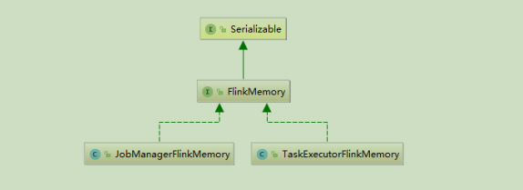

### 4.1.1 JobManager 内存模型

JobManagerFlinkMemory.java在1.10 中，Flink 统一了 TM 端的内存管理和配置，相应的在1.11 中，Flink 进一步对 JM 端的内存配置进行了修改，使它的选项和配置方式与 TM 端的配置方式保持一致。

```sh
1.10 版本

The heap size for the JobManager JVM
jobmanager.heap.size: 1024m

1.11 版本及以后

The total process memory size for the JobManager.
#Note this accounts for all memory usage within the JobManager process, including JVM metaspace and other overhead.
jobmanager.memory.process.size: 1600m
```


### 4.1.2 TaskManager 内存模型

Flink 1.10 对 TaskManager 的内存模型和 Flink 应用程序的配置选项进行了重大更改，让用户能够更加严格地控制其内存开销。


⚫ JVM Heap：JVM 堆上内存

1、Framework Heap Memory：Flink 框架本身使用的内存，即 TaskManager 本身所占用的堆上内存，不计入 Slot 的资源中。

配置参数：taskmanager.memory.framework.heap.size=128MB,默认128MB

2、Task Heap Memory：Task 执行用户代码时所使用的堆上内存。

配置参数：taskmanager.memory.task.heap.size

⚫ Off-Heap Mempry：JVM 堆外内存

1、DirectMemory：JVM 直接内存

1）Framework Off-Heap Memory：Flink框架本身所使用的内存，即TaskManager本身所占用的对外内存，不计入 Slot 资源。

配置参数：taskmanager.memory.framework.off-heap.size=128MB,默认128MB

2）Task Off-Heap Memory：Task 执行用户代码所使用的对外内存。

配置参数：taskmanager.memory.task.off-heap.size=0,默认0 

3）Network Memory：网络数据交换所使用的堆外内存大小，如网络数据交换缓冲区

配置参数：

```properties
taskmanager.memory.network.fraction: 0.1
taskmanager.memory.network.min: 64mb
taskmanager.memory.network.max: 1gb
```


2、Managed Memory：Flink 管理的堆外内存，用于排序、哈希表、缓存中间结果及RocksDB State Backend 的本地内存。

配置参数：

```properties
taskmanager.memory.managed.fraction=0.4
taskmanager.memory.managed.size
```

⚫ JVM specific memory：JVM 本身使用的内存

1、JVM metaspace：JVM 元空间

2、JVM over-head 执行开销：JVM 执行时自身所需要的内容，包括线程堆栈、IO、编译缓存等所使用的内存。

配置参数：

```properties
taskmanager.memory.jvm-overhead.min=192mb
taskmanager.memory.jvm-overhead.max=1gb
taskmanager.memory.jvm-overhead.fraction=0.1
```


⚫总体内存

1、总进程内存：Flink Java 应用程序（包括用户代码）和 JVM 运行整个进程所消耗的总内存。

总进程内存= Flink 使用内存+ JVM 元空间+ JVM 执行开销

配置项：taskmanager.memory.process.size: 1728m

2、Flink 总内存：仅 Flink Java 应用程序消耗的内存，包括用户代码，但不包括 JVM为其运行而分配的内存

Flink 使用内存：框架堆内外+ task 堆内外+ network + manage

配置项：taskmanager.memory.flink.size: 1280m

说明：配置项详细信息查看如下链接

https://ci.apache.org/projects/flink/flink-docs-release-1.12/deployment/config.html#memory-configuration

### 4.1.3 内存分配

1、JobManager 内存分配
**YarnClusterDescriptor.java**

```java
private ApplicationReport startAppMaster(
Configuration configuration,
String applicationName,
String yarnClusterEntrypoint,
JobGraph jobGraph,
YarnClient yarnClient,
YarnClientApplication yarnApplication,
ClusterSpecification clusterSpecification) throws Exception {
......
final JobManagerProcessSpec processSpec = 
JobManagerProcessUtils.processSpecFromConfigWithNewOptionToInterpretLegacyHeap(
flinkConfiguration,
JobManagerOptions.TOTAL_PROCESS_MEMORY);
final ContainerLaunchContext amContainer = setupApplicationMasterContainer(
yarnClusterEntrypoint,
hasKrb5,
processSpec);
......
}
```

**JobManagerProcessUtils.java**

```java
public static JobManagerProcessSpec processSpecFromConfigWithNewOptionToInterpretLegacyHeap(
Configuration config,
ConfigOption<MemorySize> newOptionToInterpretLegacyHeap){
try {
return processSpecFromConfig(
getConfigurationWithLegacyHeapSizeMappedToNewConfigOption(
config,
newOptionToInterpretLegacyHeap));
} catch (IllegalConfigurationException e){
throw new IllegalConfigurationException("JobManager memory configuration failed: "+
e.getMessage(), e);
}}
static JobManagerProcessSpec processSpecFromConfig(Configuration config){
return 
createMemoryProcessSpec(PROCESS_MEMORY_UTILS.memoryProcessSpecFromConfig(config));
}
```

**ProcessMemoryUtils.java**

```java
public CommonProcessMemorySpec<FM> memoryProcessSpecFromConfig(Configuration config){
if (options.getRequiredFineGrainedOptions().stream().allMatch(config::contains)){
// all internal memory options are configured, use these to derive total Flink and process memory
return deriveProcessSpecWithExplicitInternalMemory(config);
} else if (config.contains(options.getTotalFlinkMemoryOption())){
// internal memory options are not configured, total Flink memory is configured,

// derive from total flink memory
//如果只配置了 JM 的 Flink 总内存，调用下面方法
return deriveProcessSpecWithTotalFlinkMemory(config);
} else if (config.contains(options.getTotalProcessMemoryOption())){
// total Flink memory is not configured, total process memory is configured,
// derive from total process memory
return deriveProcessSpecWithTotalProcessMemory(config);
}
return failBecauseRequiredOptionsNotConfigured();
}
private CommonProcessMemorySpec<FM> deriveProcessSpecWithTotalFlinkMemory(Configuration 
config){
MemorySize totalFlinkMemorySize = getMemorySizeFromConfig(config,
options.getTotalFlinkMemoryOption());
//获取 JM 的 Flink 总内存
FM flinkInternalMemory = flinkMemoryUtils.deriveFromTotalFlinkMemory(config,
totalFlinkMemorySize);
//获取 JM 的 JVM 元空间和执行开销
JvmMetaspaceAndOverhead jvmMetaspaceAndOverhead = 
deriveJvmMetaspaceAndOverheadFromTotalFlinkMemory(config, totalFlinkMemorySize);
return new CommonProcessMemorySpec<>(flinkInternalMemory, jvmMetaspaceAndOverhead);
}
```

**JobManagerFlinkMemoryUtils.java**

```java
public JobManagerFlinkMemory deriveFromTotalFlinkMemory(Configuration config, MemorySize 
totalFlinkMemorySize){
MemorySize offHeapMemorySize = ProcessMemoryUtils.getMemorySizeFromConfig(config,
JobManagerOptions.OFF_HEAP_MEMORY);
if (totalFlinkMemorySize.compareTo(offHeapMemorySize)< 1){
throw new IllegalConfigurationException(
"The configured Total Flink Memory (%s) is less than the configured Off-heap Memory 
(%s).",
totalFlinkMemorySize.toHumanReadableString(),
offHeapMemorySize.toHumanReadableString());
}
MemorySize derivedJvmHeapMemorySize = totalFlinkMemorySize.subtract(offHeapMemorySize);
return createJobManagerFlinkMemory(derivedJvmHeapMemorySize, offHeapMemorySize);
}
private static JobManagerFlinkMemory createJobManagerFlinkMemory(
MemorySize jvmHeap,
MemorySize offHeapMemory){
verifyJvmHeapSize(jvmHeap);
return new JobManagerFlinkMemory(jvmHeap, offHeapMemory);
}
```


2、TaskManager 内存分配
**ActiveResourceManager.java**

```java
private void requestNewWorker(WorkerResourceSpec workerResourceSpec){
final TaskExecutorProcessSpec taskExecutorProcessSpec =
TaskExecutorProcessUtils.processSpecFromWorkerResourceSpec(flinkConfig,
workerResourceSpec);
......
}
```

**TaskExecutorProcessUtils.java**

```java
public static TaskExecutorProcessSpec processSpecFromWorkerResourceSpec(
final Configuration config, final WorkerResourceSpec workerResourceSpec){
final MemorySize frameworkHeapMemorySize = 

TaskExecutorFlinkMemoryUtils.getFrameworkHeapMemorySize(config);
final MemorySize frameworkOffHeapMemorySize = 
TaskExecutorFlinkMemoryUtils.getFrameworkOffHeapMemorySize(config);
final TaskExecutorFlinkMemory flinkMemory = new TaskExecutorFlinkMemory(
frameworkHeapMemorySize,
frameworkOffHeapMemorySize,
workerResourceSpec.getTaskHeapSize(),
workerResourceSpec.getTaskOffHeapSize(),
workerResourceSpec.getNetworkMemSize(),
workerResourceSpec.getManagedMemSize());
final JvmMetaspaceAndOverhead jvmMetaspaceAndOverhead =
PROCESS_MEMORY_UTILS.deriveJvmMetaspaceAndOverheadFromTotalFlinkMemory(
config, flinkMemory.getTotalFlinkMemorySize());
return new TaskExecutorProcessSpec(workerResourceSpec.getCpuCores(), flinkMemory,
jvmMetaspaceAndOverhead);
}
```


##  4.2 内存数据结构

⚫内存段

内存段在 Flink 内部叫 MemorySegment，是 Flink 中最小的内存分配单元，默认大小32KB。它即可以是堆上内存（Java 的 byte 数组），也可以是堆外内存（基于 Netty 的DirectByteBuffer），同时提供了对二进制数据进行读取和写入的方法。

HeapMemorySegment：用来分配堆上内存

HybridMemorySegment：用来分配堆外内存和堆上内存，2017 年以后的版本实际上只使用了 HybridMemo`rySegment。

如下图展示一个内嵌型的 Tuple3<Integer,Double,Person> 对象的序列化过程：

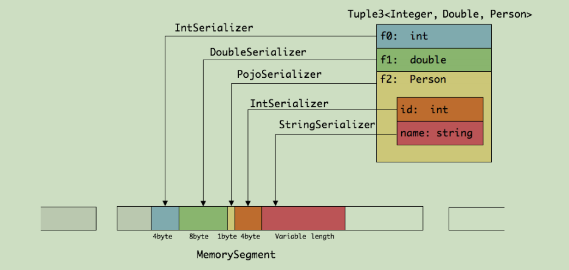

可以看出这种序列化方式存储密度是相当紧凑的。其中 int 占4 字节，double 占8 字节，POJO 多个一个字节的 header，PojoSerializer 只负责将 header 序列化进去，并委托每个字段对应的 serializer 对字段进行序列化。

⚫内存页

内存页是 MemorySegment 之上的数据访问视图，数据读取抽象为 DataInputView，数据写入抽象为 DataOutputView。使用时就无需关心 MemorySegment 的细节，会自动处理跨 MemorySegment 的读取和写入。

⚫ Buffer

Task 算子之间在网络层面上传输数据，使用的是 Buffer，申请和释放由 Flink自行管理，实现类为 NetworkBuffer。1 个 NetworkBuffer 包装了1 个MemorySegment。同时继承了 AbstractReferenceCountedByteBuf，是 Netty 中的抽象类。

```java
public class NetworkBuffer extends AbstractReferenceCountedByteBuf implements Buffer {
/** The backing {@link MemorySegment} instance.*/
private final MemorySegment memorySegment;
......
}
```


⚫ Buffer 资源池

BufferPool 用来管理 Buffer，包含 Buffer 的申请、释放、销毁、可用 Buffer 通知等，实现类是 LocalBufferPool，每个 Task 拥有自己的 LocalBufferPool。BufferPoolFactory 用来提供 BufferPool 的创建和销毁，唯一的实现类是NetworkBufferPool ，每个 TaskManager 只有一个 NetworkBufferPool 。同一个TaskManager 上的 Task 共享 NetworkBufferPool，在 TaskManager 启动的时候创建并分配内存。

## 4.3 内存管理器

MemoryManager 用来管理 Flink 中用于排序、Hash 表、中间结果的缓存或使用堆外内存的状态后端（RocksDB）的内存。
1.10 之前版本，负责 TaskManager 所有内存。
1.10 版本开始，管理范围是 Slot 级别。
⚫堆外内存资源申请：
**MemoryManager.java**

```java
public void allocatePages(
Object owner,
Collection<MemorySegment> target,
int numberOfPages) throws MemoryAllocationException {
......
allocatedSegments.compute(owner,(o, currentSegmentsForOwner)-> {
Set<MemorySegment> segmentsForOwner = currentSegmentsForOwner == null ?
new HashSet<>(numberOfPages): currentSegmentsForOwner;
for (long i = numberOfPages; i > 0; i--){
MemorySegment segment = allocateOffHeapUnsafeMemory(getPageSize(), owner,
pageCleanup);
target.add(segment);
segmentsForOwner.add(segment);
}
return segmentsForOwner;
});
......
}
```

**MemorySegmentFactory.java**

```java
public static MemorySegment allocateOffHeapUnsafeMemory(int size, Object owner, Runnable 
customCleanupAction){
long address = MemoryUtils.allocateUnsafe(size);
ByteBuffer offHeapBuffer = MemoryUtils.wrapUnsafeMemoryWithByteBuffer(address, size);
MemoryUtils.createMemoryGcCleaner(offHeapBuffer, address, customCleanupAction);
return new HybridMemorySegment(offHeapBuffer, owner);
}
```


⚫ RocksDB 自己负责内存申请和释放
**RocksDBOperationUtils.java**

```java
public static OpaqueMemoryResource<RocksDBSharedResources> allocateSharedCachesIfConfigured(
RocksDBMemoryConfiguration memoryConfig,
MemoryManager memoryManager,
double memoryFraction,
Logger logger) throws IOException {

......
try {
if (memoryConfig.isUsingFixedMemoryPerSlot()){
assert memoryConfig.getFixedMemoryPerSlot()!= null;
logger.info("Getting fixed-size shared cache for RocksDB.");
return memoryManager.getExternalSharedMemoryResource(
FIXED_SLOT_MEMORY_RESOURCE_ID, allocator,
memoryConfig.getFixedMemoryPerSlot().getBytes());
}
else {
logger.info("Getting managed memory shared cache for RocksDB.");
return 
memoryManager.getSharedMemoryResourceForManagedMemory(MANAGED_MEMORY_RESOURCE_I
D, allocator, memoryFraction);
}}
......
}
```

**MemoryManager.java**

```java
public <T extends AutoCloseable> OpaqueMemoryResource<T> getExternalSharedMemoryResource(
String type,
LongFunctionWithException<T, Exception> initializer,
long numBytes) throws Exception {
// This object identifies the lease in this request. It is used only to identify the release operation.
// Using the object to represent the lease is a bit nicer safer than just using a reference counter.
final Object leaseHolder = new Object();
final SharedResources.ResourceAndSize<T> resource =
sharedResources.getOrAllocateSharedResource(type, leaseHolder, initializer, numBytes);
//创建资源释放函数
final ThrowingRunnable<Exception> disposer = ()-> sharedResources.release(type, leaseHolder);
return new OpaqueMemoryResource<>(resource.resourceHandle(), resource.size(), disposer);
}
```


## 4.4 网络传输中的内存管理

网络上传输的数据会写到 Task 的 InputGate（IG）中，经过 Task 的处理后，再由 Task 写到 ResultPartition（RS）中。每个 Task 都包括了输入和输出，输入和输出的数据存在Buffer 中（都是字节数据）。Buffer 是 MemorySegment 的包装类。

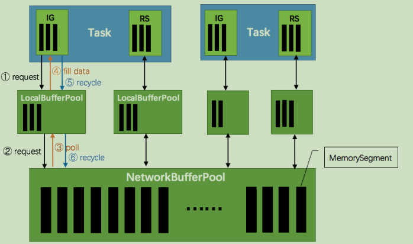


1）TaskManager（TM）在启动时，会先初始化 NetworkEnvironment 对象，TM 中所有与网络相关的东西都由该类来管理（如 Netty 连接），其中就包括 NetworkBufferPool。根据配置， Flink 会在 NetworkBufferPool 中生成一定数量（默认2048 ）的内存块MemorySegment（关于 Flink 的内存管理，后续文章会详细谈到），内存块的总数量就代表了网络传输中所有可用的内存。NetworkEnvironment 和 NetworkBufferPool 是 Task 之间共享的，每个 TM 只会实例化一个。
2）Task 线程启动时，会向 NetworkEnvironment 注册，NetworkEnvironment 会为 Task 的 InputGate（IG）和 ResultPartition（RP）分别创建一个 LocalBufferPool（缓冲池）并设置可申请的 MemorySegment（内存块）数量。IG 对应的缓冲池初始的内存块数量与 IG 中InputChannel 数量一致，RP 对应的缓冲池初始的内存块数量与 RP 中的 ResultSubpartition 数量一致。不过，每当创建或销毁缓冲池时，NetworkBufferPool 会计算剩余空闲的内存块数量，并平均分配给已创建的缓冲池。注意，这个过程只是指定了缓冲池所能使用的内存块数量，并没有真正分配内存块，只有当需要时才分配。为什么要动态地为缓冲池扩容呢？因为内存越多，意味着系统可以更轻松地应对瞬时压力（如 GC），不会频繁地进入反压状态，所以我们要利用起那部分闲置的内存块。
3）在 Task 线程执行过程中，当 Netty 接收端收到数据时，为了将 Netty 中的数据拷贝到 Task 中，InputChannel（实际是 RemoteInputChannel）会向其对应的缓冲池申请内存块（上图中的①）。如果缓冲池中也没有可用的内存块且已申请的数量还没到池子上限，则会向 NetworkBufferPool 申请内存块（上图中的②）并交给 InputChannel 填上数据（上图中的③和④）。如果缓冲池已申请的数量达到上限了呢？或者 NetworkBufferPool 也没有可用内存块了呢？这时候，Task 的 Netty Channel 会暂停读取，上游的发送端会立即响应停止发送，拓扑会进入反压状态。当 Task 线程写数据到 ResultPartition 时，也会向缓冲池请求内存块，如果没有可用内存块时，会阻塞在请求内存块的地方，达到暂停写入的目的。
4）当一个内存块被消费完成之后（在输入端是指内存块中的字节被反序列化成对象了，在输出端是指内存块中的字节写入到 Netty Channel 了），会调用 Buffer.recycle()方法，会将内存块还给 LocalBufferPool （上图中的⑤）。如果 LocalBufferPool 中当前申请的数量超过了池子容量（由于上文提到的动态容量，由于新注册的 Task 导致该池子容量变小），则LocalBufferPool 会将该内存块回收给 NetworkBufferPool（上图中的⑥）。如果没超过池子容量，则会继续留在池子中，减少反复申请的开销。
⚫反压的过程
1）记录“A”进入了 Flink 并且被 Task 1 处理。（这里省略了 Netty 接收、反序列化等过程）
2）记录被序列化到 buffer 中。
3）该 buffer 被发送到 Task 2，然后 Task 2 从这个 buffer 中读出记录。记录能被 Flink 处理的前提是：必须有空闲可用的 Buffer。

结合上面两张图看：Task 1 在输出端有一个相关联的 LocalBufferPool（称缓冲池1），Task 2 在输入端也有一个相关联的 LocalBufferPool（称缓冲池2）。如果缓冲池1 中有空闲可用的 buffer 来序列化记录“A”，我们就序列化并发送该 buffer。

注意两个场景：

> 1）本地传输：如果 Task 1 和 Task 2 运行在同一个 worker 节点（TaskManager），该buffer 可以直接交给下一个 Task。一旦 Task 2 消费了该 buffer，则该 buffer 会被缓冲池1回收。如果 Task 2 的速度比1 慢，那么 buffer 回收的速度就会赶不上 Task 1 取 buffer 的速度，导致缓冲池1 无可用的 buffer，Task 1 等待在可用的 buffer 上。最终形成 Task 1 的降速。
> 2）远程传输：如果 Task 1 和 Task 2 运行在不同的 worker 节点上，那么 buffer 会在发送到网络（TCP Channel）后被回收。在接收端，会从 LocalBufferPool 中申请 buffer，然后拷贝网络中的数据到 buffer 中。如果没有可用的 buffer，会停止从 TCP 连接中读取数据。在输出端，通过 Netty 的水位值机制来保证不往网络中写入太多数据（后面会说）。如果网络中的数据（Netty 输出缓冲中的字节数）超过了高水位值，我们会等到其降到低水位值以下才继续写入数据。这保证了网络中不会有太多的数据。如果接收端停止消费网络中的数据由于接收端缓冲池没有可用 buffer），网络中的缓冲数据就会堆积，那么发送端也会暂停发送。另外，这会使得发送端的缓冲池得不到回收，writer 阻塞在向 LocalBufferPool 请求buffer，阻塞了 writer 往 ResultSubPartition 写数据。这种固定大小缓冲池就像阻塞队列一样，保证了 Flink 有一套健壮的反压机制，使得Task 生产数据的速度不会快于消费的速度。我们上面描述的这个方案可以从两个 Task 之间的数据传输自然地扩展到更复杂的 pipeline 中，保证反压机制可以扩散到整个 pipeline。