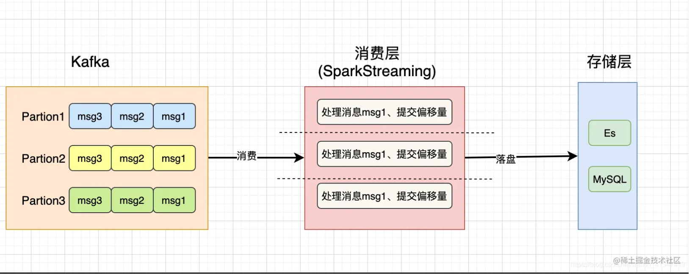
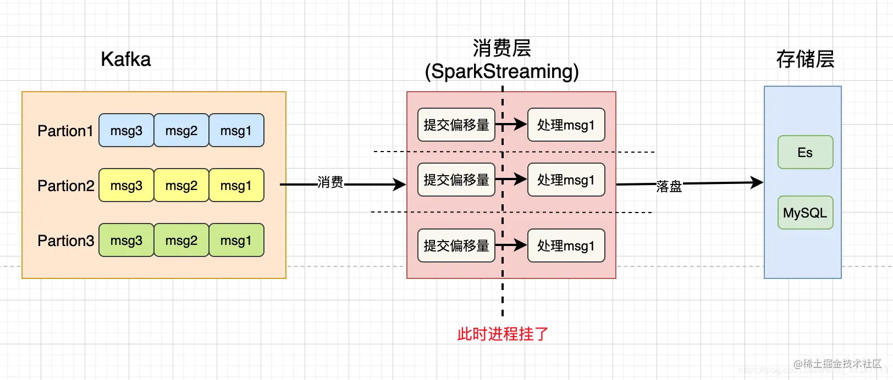
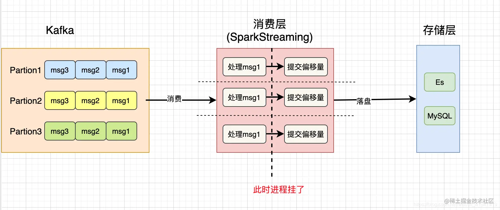

# 1. 简介

- SparkStreaming消费Kafka实现精确一次性消费. 保证消息不丢失、不重复消费.

## 1.1 消息处理的语义

> **At Least Once (至少处理一次)**
>
> - 消息至少被处理一次
> - 可以保证 **数据不丢失**, 但有可能存在数据重复问题。
>
> **At Most Once (最多处理一次)**
>
> - 消息最多被处理一次
> - 可以保证 **数据不重复**, 但有可能存在数据丢失问题.
>
> **Exactly Once (刚好处理一次)**
>
> - 消息刚好被处理一次
> - 实际上并不是真的做到只对消息处理一次, 而是能够实现`消息的可靠性`和`消息的幂等性`, 即对于上下游系统来说不存在数据重复和数据丢失的问题
> - 实际上是通过  `At Least Once` + `幂等性处理` 去实现`Exactly Once 语义`

## 1.2、消费数据的过程及存在的问题



默认消费Kafka后是自动提交偏移量的(默认5秒自动提交一次), 那么就有可能有两种情况发生

- `tip`:  偏移量就是记录每个消费者对每个分区(队列)消费到哪, 一般保存在 kafka 的consumer_offsets主题中

### 情况1、先提交了偏移量再处理消息

- 如果先提交了偏移量后, 处理数据后准备落盘的过程中进程挂了.  但是提交了偏移量, 那么下次会从最新的偏移量位置开始消费, 所以之前没有落盘的数据就丢失了.

  

### 情况2、处理消息后, 再提交偏移量

- 如果再处理完消息后, 进程挂了, 无法提交最新消费的偏移量, 那么下次还是会继续从旧的偏移量位置开始消费, 那么就有可能导致数据的重复消费



可以发现消费一条消息有两个步骤`处理消息`和`提交偏移量`, 而我们又无法保证这两个步骤的`原子性`, 即`同时成功或者同时失败`那么就有可能导致`数据的丢失`或者`重复消费`


# 2. 实现Exactly Once语义

## 方法一: 使用事务

实现Exactly Once语义的关键是保证`处理消息`和`提交偏移量`的原子性. 所以只要把这两个操作放到一个事务里, 不管是先处理消息和还是先提交偏移量都可以保证消息不丢失和不重复。

**实现思路**

- 比如手动维护消费消息的偏移量, 并把偏移量放到MySQL中, 然后数据的落盘也放到MySQL中,  而MySQL是支持事务的, 那么我们就可以保证着两个操作的原子性了.

**缺点**:

- 对存储层有依赖, 只能使用支持事务的存储层
- 事务性能不高
- 并且一个存储层容易存在单点故障压力过大,  如果做分布式又需要做分布式事务增加了复杂性

## 方法二:  手动提交偏移量 + 幂等性

先确保真正处理完数据后再提交偏移量, 但是可能提交偏移量失败, 导致重复消费了, 这时就要做数据的幂等性保存了, 即数据无论被保存多少次效果都是一样的, 不会存在重复数据.

**幂等性保存实现**

- 有些存储层本身支持幂等性操作的, 比如MySQL的主键和唯一索引, 相同id字段插入一次和插入一百次都是一样的(相同会插入失败).  还有Eleaticsearch的主键id也同样天然支持幂等操作(相同会覆盖). 还有Redis也是,  支持幂等操作的存储层远比支持事务的存储层多, 并且性能也比事务好
- 如果使用的存储层本身不支持幂等操作, 可能就需要自己手动实现保证幂等性了或者去重了.

### 核心伪代码实现

```scala
object Test {

  case class UserLog(id:Int, name:String){}

  def main(args: Array[String]): Unit = {
   /**
     *  1、初始化SparkStreaming、5秒采集一次数据
     */
    val conf: SparkConf = new SparkConf().setAppName("").setMaster("local[*]")
    val ssc: StreamingContext = new StreamingContext(conf, Seconds(5))		
	
   /**
	  2、从Redis中读取消费者组groupId消费主题topic的偏移量offset
    */
    val topic = "topic-log"
    val groupId = "consumer-007"

     /**
	 3、   对businessProcessing业务处理使用精准一次消费
     */
      ExactOneUtil.Builder().streamingContext(ssc).topicGroup(topic, groupId).build(businessProcessing)

    ssc.start()
    ssc.awaitTermination()
  }

  /** 业务处理  */
  def  businessProcessing(offsetDStream: DStream[ConsumerRecord[String, String]], builder: Builder): Unit = {
      // 拿到此次Dstream
      val jsonObjectDStream: DStream[JSONObject]= offsetDStream.map(msg => {
        val jsonObj: JSONObject = JSON.parseObject(msg.value())
        // .....
        jsonObj
      })
  
  
      jsonObjectDStream.foreachRDD(rdd => {
        rdd.foreachPartition(jsonObjList => {
            // 假设id是主键， 天然支持幂等， 无论保存多少次都是一样
            val resultData: Iterator[UserLog] = jsonObjList.map { obj => {
              UserLog(obj.getIntValue("id"), obj.getString("nama"))
            }}
  
            // 对处理后的结果reasultDat进行落盘
            resultData.toList
            // ..... save to MySQL or Es or Redis
        })
  
          // 处理完一批rdd数据并确保落盘后提交offset
          builder.saveOffsetrange()
      })
  }

```

### 其他代码

#### ExactOneUtil

```scala
object ExactOneUtil {
  var builder: Builder =_

  def Builder(): Builder = {
    this.builder = new Builder()
    this.builder
  }


  def stop(): Unit ={
    this.builder.saveOffsetrange()
  }

  class Builder {
    var topic: String =_
    var groupId: String =_
    var ssc: StreamingContext =_
    var offsetRanges: Array[OffsetRange] = Array.empty[OffsetRange] // key-分区id， value-偏移量

    def topicGroup(topic: String,groupId: String): Builder ={
      this.topic = topic
      this.groupId = groupId
      this
    }

    def streamingContext(ssc: StreamingContext): Builder = {
      this.ssc = ssc
      this
    }

    def build(fun: (DStream[ConsumerRecord[String, String]], Builder) => Unit ): Unit ={
      var baseInputDStream: InputDStream[ConsumerRecord[String, String]] = null
      var offsetMap: Map[TopicPartition, Long] = RedisOffsetUtil.getOffset(topic, groupId)
      if(offsetMap != null && offsetMap.nonEmpty){
          baseInputDStream = OffsetKafkaUtil.getKafkaStream(topic, ssc, offsetMap, groupId)
      }else{
          baseInputDStream = OffsetKafkaUtil.getKafkaStream(topic, ssc, groupId)
      }
      val offsetDStream = filterOffsetRange(baseInputDStream);

      // 业务处理
      fun(offsetDStream, this)

    }

    private def filterOffsetRange(dStream: InputDStream[ConsumerRecord[String, String]]):  DStream[ConsumerRecord[String, String]] = {
      val offsetDStream: DStream[ConsumerRecord[String, String]] = dStream.transform(rdd => {
        // KafkaRDD
        this.offsetRanges = rdd.asInstanceOf[HasOffsetRanges].offsetRanges
        rdd
      })
      offsetDStream
    }

    def saveOffsetrange(): Unit ={
      RedisOffsetUtil.saveOffset(this.topic, this.groupId, this.offsetRanges)
    }
  }
}
```

#### OffsetUtil

```scala
trait  OffsetUtil {
  // 获取偏移量
  def getOffset(topicName: String, groupId: String): Map[TopicPartition, Long]

  // 保存偏移量
  def saveOffset(topicName: String, groupId: String, offsetArray: Array[OffsetRange])
}

object OffsetRedisUtil {
	 /** 1-在Redis 存储消费者组对某个主题消费的偏移量
   *
   * Reids 存储格式设计
   *    key:  关键字 + 主题 + 消费者组
   *    value： 用Hash存储
   *              hash key：   分区
   *              hash value： 偏移量
   *    Key                                  Hash Value
   *  offset:xx_topic:xx_groupId          分区id_01 偏移量值
   *  offset:xx_topic:xx_groupId          分区id_02 偏移量值
   *  offset:xx_topic:xx_groupId          分区id_03 偏移量值
   *
   * @param topicName   主题名称
   * @param groupId     消费者组
   */
  override def saveOffset(topicName: String, groupId: String, offsetArray: Array[OffsetRange]): Unit = {
      val keyName: String = createKeyName(topicName, groupId)

      // 1-取出每个分区的最新偏移量到map
      val map = new util.HashMap[String, String]()
      for (elem <- offsetArray) {
        map.put(elem.partition.toString, elem.untilOffset.toString)
      }

      //
      if (map.size() > 0){
        JedisUtil.hmset(keyName, map)
      }
  }
  
  
  /**
   *    2- 从Redis 获取某个主题的某个消费者组消费的偏移量
   */
  override def getOffset(topicName: String, groupId: String): Map[TopicPartition, Long] = {
    val keyName: String = createKeyName(topicName, groupId)
    val map:  util.HashMap[String, String] = JedisUtil.hgetAll(keyName)

    //将HashMap[String, String]转换成Map[TopicPartition, Long] 返回
    import scala.collection.JavaConverters._
    map.asScala.map{
      case (partitionId, offset) => {
        val partition = new TopicPartition(topicName, partitionId.toInt)
        (partition, offset.toLong)
      }
    }.toMap
  }

  def  createKeyName(topicName: String, groupId: String): String = {
     "offset" + ":" + topicName + ":"  + groupId
  }
}

```

#### OffsetKafkaUtil

```scala
object OffsetKafkaUtil {

  var param = collection.mutable.Map(
    "bootstrap.servers" -> "192.168.2.102:9092",
    "key.deserializer" -> classOf[StringDeserializer],
    "value.deserializer" -> classOf[StringDeserializer],
    "auto.offset.reset" -> "latest",  //latest： 表示自动重置偏移量为最新的偏移量
    "enable.auto.commit" -> (false: java.lang.Boolean) // 是否自动提交偏移量
  )
  
  //从最新的偏移量位置读取数据
  def getKafkaStream(topic: String,ssc:StreamingContext,groupId:String): InputDStream[ConsumerRecord[String,String]]={
    param("group.id")=groupId
     KafkaUtils.createDirectStream[String,String](
        ssc,
        LocationStrategies.PreferConsistent,
        ConsumerStrategies.Subscribe[String,String](Array(topic),param)
     )
  }

  //从指定的偏移量位置读取数据
  def getKafkaStream(topic: String,ssc:StreamingContext,offsetMap[TopicPartition,Long],groupId:String): InputDStream[ConsumerRecord[String,String]]={
    param("group.id")=groupId
    KafkaUtils.createDirectStream[String,String](
        ssc,
        LocationStrategies.PreferConsistent,
        ConsumerStrategies.Subscribe[String,String](Array(topic),param,offsetMap)
    )
  }
}

```

#### maven依赖

pom.xml

```xml
 	   <dependency>
            <groupId>com.alibaba</groupId>
            <artifactId>fastjson</artifactId>
            <version>1.2.62</version>
        </dependency>

        <dependency>
            <groupId>org.apache.spark</groupId>
            <artifactId>spark-core_2.11</artifactId>
            <version>${spark.version}</version>
        </dependency>
        <dependency>
            <groupId>org.apache.spark</groupId>
            <artifactId>spark-streaming_2.11</artifactId>
            <version>2.4.0</version>
        </dependency>
        <dependency>
            <groupId>org.apache.spark</groupId>
            <artifactId>spark-streaming-kafka-0-10_2.11</artifactId>
            <version>2.4.0</version>
        </dependency>

		<dependency>
            <groupId>redis.clients</groupId>
            <artifactId>jedis</artifactId>
            <version>2.9.0</version>
        </dependency>
```


转载： https://juejin.cn/post/6955132660704346142#heading-0

