# 第1章 Explain查看执行计划

> Spark3.0大版本发布，SparkSQL的优化占比将近50%。SparkSQL取代SparkCore，成为新一代的引擎内核，所有其他子框架如Mllib、Streaming和Graph，都可以共享Spark SQL的性能优化，都能从Spark社区对于SparkSQL的投入中受益。
>
> 要优化SparkSQL应用时，一定是要了解SparkSQL执行计划的。发现SQL执行慢的根本原因，才能知道应该在哪儿进行优化，是调整SQL的编写方式、还是用Hint、还是调参，而不是把优化方案拿来试一遍。

## 1.1 准备测试用表和数据

> 1、上传3个log到hdfs新建的sparkdata路径
>
> 2、hive中创建sparktuning数据库
>
> 3、执行

## 1.2 基本语法

```scala
.explain(mode="xxx")
```

>从3.0开始，explain方法有一个新的参数mode，该参数可以指定执行计划展示格式：
>
>-   explain(mode=\"simple\")：只展示物理执行计划。
>
>-   explain(mode=\"extended\")：展示物理执行计划和逻辑执行计划。
>
>-   explain(mode=\"codegen\")：展示要Codegen生成的可执行Java代码。
>
>-   explain(mode=\"cost\")：展示优化后的逻辑执行计划以及相关的统计。
>
>-   explain(mode=\"formatted\")：以分隔的方式输出，它会输出更易读的物理执行计划，并展示每个节点的详细信息。

## 1.3 执行计划处理流程

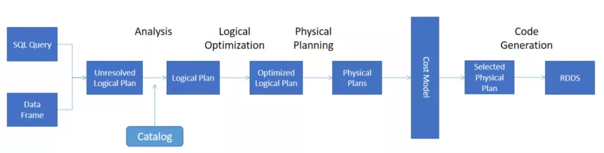

核心的执行过程一共有5个步骤：

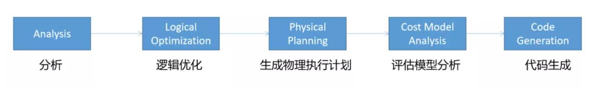

这些操作和计划都是SparkSQL自动处理的，会生成以下计划：

> - Unresolved逻辑执行计划：==ParsedLogicalPlan==
>
> Parser组件检查SQL语法上是否有问题，然后生成Unresolved（未决断）的逻辑计划，不检查表名、不检查列名。
>
> - Resolved逻辑执行计划：==AnalyzedLogicalPlan==
>
> 通过访问Spark中的Catalog存储库来解析验证语义、列名、类型、表名等。
>
> - 优化后的逻辑执行计划：==OptimizedLogicalPlan==
>
> Catalyst优化器根据各种规则进行优化。
>
> - 物理执行计划：==PhysicalPlan==
>
> 1）HashAggregate运算符表示数据聚合，一般HashAggregate是成对出现，第一个HashAggregate是将执行节点本地的数据进行局部聚合，另一个HashAggregate是将各个分区的数据进一步进行聚合计算。
>
> 2）Exchange运算符其实就是shuffle，表示需要在集群上移动数据。很多时候HashAggregate会以Exchange分隔开来。
>
> 3）Project运算符是SQL中的投影操作，就是选择列（例如：selectname,age...）。
>
> 4）BroadcastHashJoin运算符表示通过基于广播方式进行HashJoin。
>
> 5）LocalTableScan运算符就是全表扫描本地的表。

## 1.4 案例实操

将提供的代码打成jar包，提交到yarn运行

```shell
spark-submit --master yarn --deploy-mode client --driver-memory 1g --numexecutors 3 --executor-cores 2 --executor-memory 4g --class com.atguigu.sparktuning.explain.ExplainDemo spark-tuning-1.0-SNAPSHOTjar-with-dependencies.jar
```

# 第2章 资源调优

## 2.1 资源规划

### 2.1.1 资源设定考虑

1、总体原则

> 以单台服务器128G内存，32线程为例。
>
> 先设定单个Executor核数，根据Yarn配置得出每个节点最多的Executor数量，每个节点的yarn内存/每个节点数量=单个节点的数量
>
> 总的executor数=单节点数量\*节点数。

2、具体提交参数

> 1）executor-cores
>
> 每个executor的最大核数。根据经验实践，设定在3\~6之间比较合理。
>
> 2）num-executors
>
> 该参数值=每个节点的executor数\*work节点数
>
> 每个node的executor数=单节点yarn总核数/每个executor的最大cpu核数
>
> 考虑到系统基础服务和HDFS等组件的余量，yarn.nodemanager.resource.cpu-vcores配置为：28，参数executor-cores的值为：4，那么每个node的executor数=28/4=7,假设集群节点为10，那么num-executors=7\*10=70
>
> 3）executor-memory
>
> 该参数值=yarn-nodemanager.resource.memory-mb/每个节点的executor数量
>
> 如果yarn的参数配置为100G，那么每个Executor大概就是100G/7≈14G,同时要注意yarn配置中每个容器允许的最大内存是否匹配。

### 2.1.2 内存估算

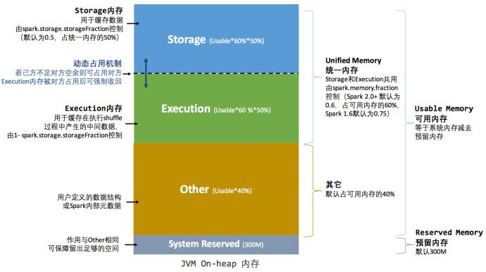

> -   估算Other内存=自定义数据结构\*每个Executor核数
>
> -   估算Storage内存=广播变量+cache/Executor数量
>
> -   估算Executor内存=每个Executor核数\*（数据集大小/并行度）

### 2.1.3 调整内存配置项

> 一般情况下，各个区域的内存比例保持默认值即可。如果需要更加精确的控制内存分配，可以按照如下思路：
>
> spark.memory.fraction=（估算storage内存+估算Execution内存）/（估算storage内存+估算Execution内存+估算Other内存）得到
>
> spark.memory.storageFraction=（估算storage内存）/（估算storage内存+估算Execution内存）
>
> 代入公式计算：
>
> Storage堆内内存=(spark.executor.memory-300MB)\*spark.memory.fraction\*spark.memory.storageFraction
>
> Execution堆内内存=(spark.executor.memory--300MB)\*spark.memory.fraction\*(1-spark.memory.storageFraction)

## 2.2 持久化和序列化

### 2.1.1 RDD

1、cache

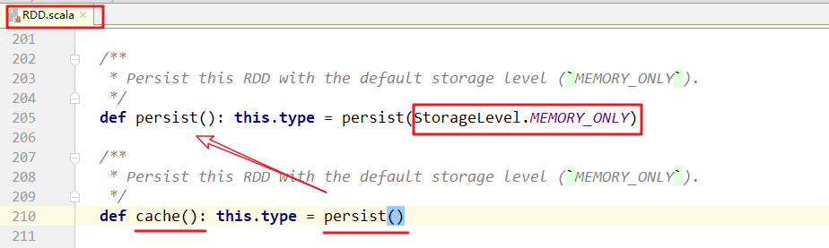

打成jar，提交yarn任务,并在yarn界面查看sparkui

```shell
spark-submit --master yarn --deploy-mode client --driver-memory 1g --numexecutors 3 --executor-cores 2 --executor-memory 6g --class com.atguigu.sparktuning.cache.RddCacheDemo spark-tuning-1.0-SNAPSHOT-jarwith-dependencies.jar
```

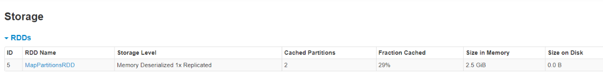

> 通过sparkui看到，rdd使用默认cache缓存级别，占用内存2.5GB,并且storage内存还不够，只缓存了29%。

2、kryo+序列化缓存

> 使用kryo序列化并且使用rdd序列化缓存级别。使用kryo序列化需要修改spark的序列化模式，并且需要进程注册类操作。
>
> 打成jar包在yarn上运行。
>
> ```sh
> spark-submit --master yarn --deploy-mode client --driver-memory 1g --numexecutors 3 --executor-cores 2 --executor-memory 6g --class com.atguigu.sparktuning.cache.RddCacheKryoDemo spark-tuning-1.0-SNAPSHOTjar-with-dependencies.jar
> ```
>
> 查看storage所占内存，内存占用减少了1083.6mb并且缓存了100%。使用序列化缓存配合kryo序列化，可以优化存储内存占用。
>
> 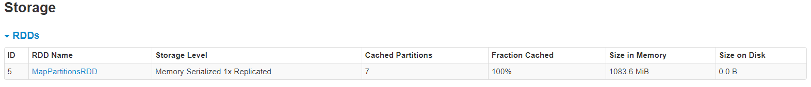
>
> 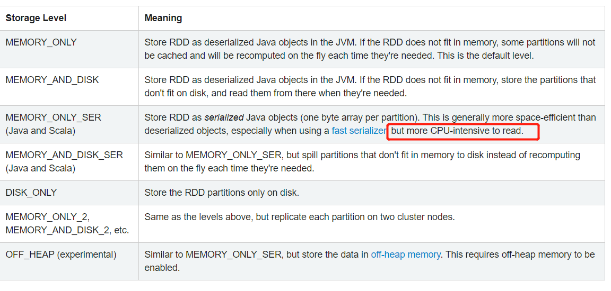
>
> 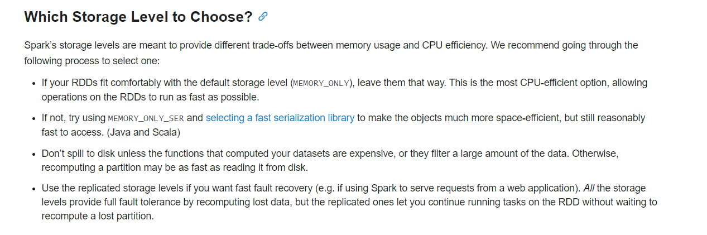
>
> 根据官网的描述，那么可以推断出，如果yarn内存资源充足情况下，使用默认级别MEMORY_ONLY是对CPU的支持最好的。但是序列化缓存可以让体积更小，那么当yarn内存资源不充足情况下可以考虑使用MEMORY_ONLY_SER配合kryo使用序列化缓存。

### 2.1.2 DataFrame、DataSet

1、cache

提交任务，在yarn上查看sparkui，查看storage内存占用。内存使用612.3mb。

```sh
spark-submit --master yarn --deploy-mode client --driver-memory 1g --numexecutors 3 --executor-cores 2 --executor-memory 6g --class com.atguigu.sparktuning.cache.DatasetCacheDemo spark-tuning-1.0-SNAPSHOTjar-with-dependencies.jar
```

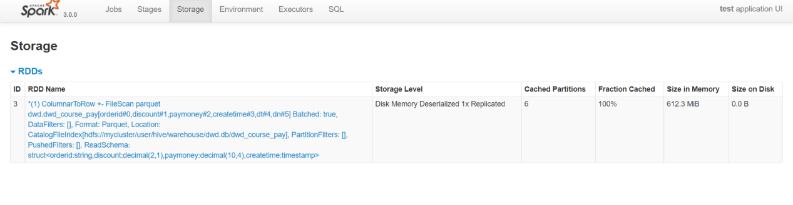

> DataSet的cache默认缓存级别与RDD不一样，是MEMORY_AND_DISK。源码：Dataset.cache()-\>Dataset.persist()-\>CacheManager.cacheQuery()
>
> 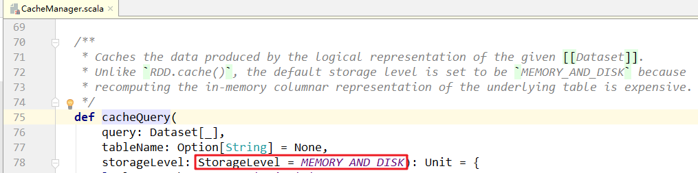

2、序列化缓存

> DataSet类似RDD，但是并不使用JAVA序列化也不使用Kryo序列化，而是使用一种特有的编码器进行序列化对象。
>
> 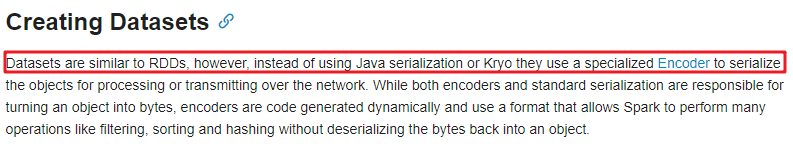
>
> 打成jar包，提交yarn。查看sparkui,storage占用内存646.2mb。
>
> ```sh
> spark-submit --master yarn --deploy-mode client --driver-memory 1g --numexecutors 3 --executor-cores 2 --executor-memory 6g --class com.atguigu.sparktuning.cache.DatasetCacheSerDemo spark-tuning-1.0-SNAPSHOT-jar-with-dependencies.jar
> ```
>
> 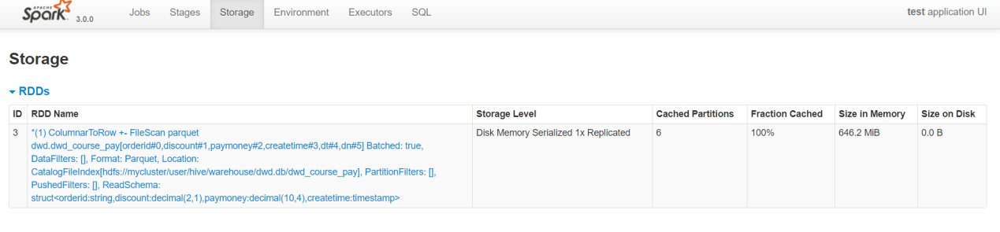
>
> 和默认cache缓存级别差别不大。所以DataSet可以直接使用cache。
>
> 从性能上来讲，DataSet,DataFrame大于RDD，建议开发中使用DataSet、DataFrame。

## 2.3 CPU优化

### 2.3.1 CPU低效原因

#### 1、概念理解

1）并行度

> - spark.default.parallelism
>
> 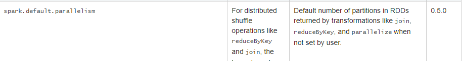
>
> 设置RDD的默认并行度，没有设置时，由join、reduceByKey和parallelize等转换决定。
>
> - spark.sql.shuffle.partitions
>
> 适用SparkSQL时，ShuffleReduce阶段默认的并行度，默认200。此参数只能控制Sparksql、DataFrame、DataSet分区个数。不能控制RDD分区个数
>
> 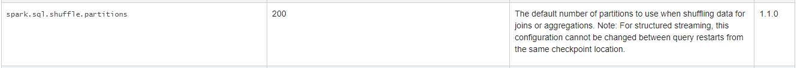

2）并发度：同时执行的task数

#### 2、CPU低效原因

> 1）并行度较低、数据分片较大容易导致CPU线程挂起
>
> 2）并行度过高、数据过于分散会让调度开销更多
>
> Executor接收到TaskDescription之后，首先需要对TaskDescription反序列化才能读取任务信息，然后将任务代码再反序列化得到可执行代码，最后再结合其他任务信息创建
>
> TaskRunner。当数据过于分散，分布式任务数量会大幅增加，但每个任务需要处理的数据量却少之又少，就CPU消耗来说，相比花在数据处理上的比例，任务调度上的开销几乎与之分庭抗礼。显然，在这种情况下，CPU的有效利用率也是极低的。

### 2.3.2 合理利用CPU资源

> 每个并行度的数据量（总数据量/并行度）在（Executor内存/core数/2,Executor内存/core数）区间
>
> 提交执行：
>
> ```sh
> spark-submit --master yarn --deploy-mode client --driver-memory 1g --numexecutors 3 --executor-cores 4 --executor-memory 6g --class com.atguigu.sparktuning.partition.PartitionDemo spark-tuning-1.0-SNAPSHOT-jar-with-dependencies.jar
> ```
>
> 去向yarn申请的executorvcore资源个数为12个（num-executors\*executor-cores）,如果不修改sparksql分区个数，那么就会像上图所展示存在cpu空转的情况。这个时候需要合理控制shuffle分区个数。如果想要让任务运行的最快当然是一个task对应一个vcore,但是一般不会这样设置，为了合理利用资源，一般会将并行度（task数）设置成并发度（vcore数）的2倍到3倍。
>
> 修改参数spark.sql.shuffle.partitions（默认200）,根据我们当前任务的提交参数有12个vcore，将此参数设置为24或36为最优效果：
>

# 第3章 SparkSQL语法优化

> SparkSQL在整个执行计划处理的过程中，使用了Catalyst优化器。

## 3.1 基于RBO的优化

> 在Spark3.0版本中，Catalyst总共有81条优化规则（Rules），分成27组（Batches），其中有些规则会被归类到多个分组里。因此，如果不考虑规则的重复性，27组算下来总共会有129个优化规则。
>
> 如果从优化效果的角度出发，这些规则可以归纳到以下3个范畴：

### 3.1.1 谓词下推（PredicatePushdown）

> 将过滤条件的谓词逻辑都尽可能提前执行，减少下游处理的数据量。对应
>
> PushDownPredicte优化规则，对于Parquet、ORC这类存储格式，结合文件注脚（Footer）中的统计信息，下推的谓词能够大幅减少数据扫描量，降低磁盘I/O开销。
>
> ```sh
> spark-submit --master yarn --deploy-mode client --driver-memory 1g --numexecutors 3 --executor-cores 4 --executor-memory 6g --class com.atguigu.sparktuning.PredicateTuning spark-tuning-1.0-SNAPSHOT-jarwith-dependencies.jar
> ```
>
> 左外关联下推规则：左表leftjoin右表
>
> |                     | 左表       | 右表       |
> | ------------------- | ---------- | ---------- |
> | Join中条件（on）    | 只下推右表 | 只下推右表 |
> | Join后条件（where） | 两表都下推 | 两表都下推 |
>
> 注意：外关联时，过滤条件写在on与where，结果是不一样的！

### 3.1.2 列剪裁（ColumnPruning）

> 列剪裁就是扫描数据源的时候，只读取那些与查询相关的字段。

### 3.1.3 常量替换（ConstantFolding）

> 假设我们在年龄上加的过滤条件是"age&lt;12+18"，Catalyst会使用ConstantFolding规则，自动帮我们把条件变成"age&lt;30"。再比如，我们在select语句中，掺杂了一些常量表达式，Catalyst也会自动地用表达式的结果进行替换。

## 3.2 基于CBO的优化

> CBO优化主要在物理计划层面，原理是计算所有可能的物理计划的代价，并挑选出代价最小的物理执行计划。充分考虑了数据本身的特点（如大小、分布）以及操作算子的特点（中间结果集的分布及大小）及代价，从而更好的选择执行代价最小的物理执行计划。而每个执行节点的代价，分为两个部分:
>
> 1）该执行节点对数据集的影响，即该节点输出数据集的大小与分布
>
> 2）该执行节点操作算子的代价
>
> 每个操作算子的代价相对固定，可用规则来描述。而执行节点输出数据集的大小与分布，分为两个部分：
>
> 1）初始数据集，也即原始表，其数据集的大小与分布可直接通过统计得到；
>
> 2）中间节点输出数据集的大小与分布可由其输入数据集的信息与操作本身的特点推算。

### 3.2.1 Statistics收集

> 需要先执行特定的SQL语句来收集所需的表和列的统计信息。
>
> - 生成表级别统计信息（扫表）：
>
> ```sql
> ANALYZE TABLE 表名 COMPUTE STATISTICS
> ```
>
> 生成sizeInBytes和rowCount。
>
> 使用ANALYZE语句收集统计信息时，无法计算非HDFS数据源的表的文件大小。
>
> 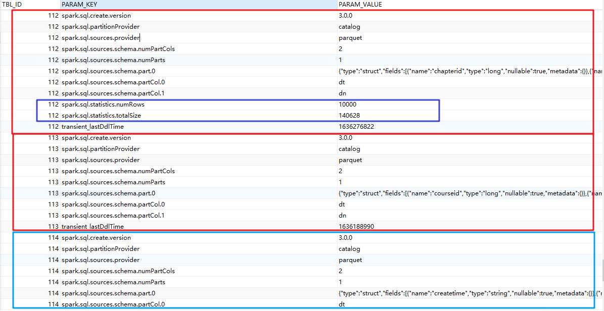
>
> - 生成表级别统计信息（不扫表)：
>
> ```sql
> ANALYZE TABLE src COMPUTE STATISTICS NOSCAN
> ```
>
> 只生成sizeInBytes，如果原来已经生成过sizeInBytes和rowCount，而本次生成的sizeInBytes和原来的大小一样，则保留rowCount（若存在），否则清除rowCount。
>
> - 生成列级别统计信息
>
> ```sql
> ANALYZE TABLE 表名 COMPUTE STATISTICS FOR COLUMNS 列1,列2,列3
> ```
>
> 生成列统计信息，为保证一致性，会同步更新表统计信息。目前不支持复杂数据类型（如Seq,Map等）和HiveStringType的统计信息生成。
>
> 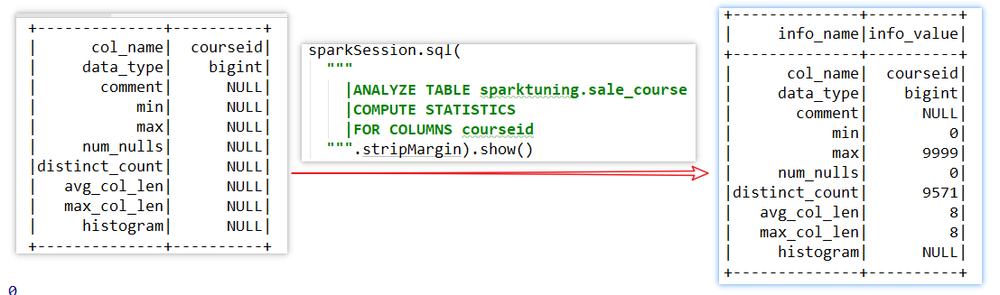
>
> - 显示统计信息
>
> ```sql
> DESC FORMATTED 表名
> ```
>
> 在Statistics中会显示"xxxbytes,xxxrows"分别表示表级别的统计信息。
>
> 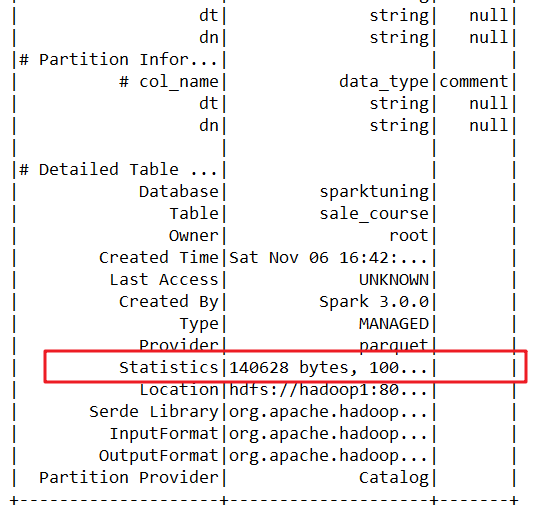
>
> 也可以通过如下命令显示列统计信息：
>
> ```sql
> DESC FORMATTED 表名 列名
> ```
>
> 执行：
>
> ```sh
> spark-submit --master yarn --deploy-mode client --driver-memory 1g --numexecutors 3 --executor-cores 4 --executor-memory 6g --class com.atguigu.sparktuning.cbo.StaticsCollect spark-tuning-1.0-SNAPSHOT-jarwith-dependencies.jar
> ```

### 3.2.2 使用CBO

> 通过\"spark.sql.cbo.enabled\"来开启，默认是false。配置开启CBO后，CBO优化器可以基于表和列的统计信息，进行一系列的估算，最终选择出最优的查询计划。比如：Build侧选择、优化Join类型、优化多表Join顺序等。
>
> | 参数                                   | 描述                                                         | 默认值 |
> | -------------------------------------- | ------------------------------------------------------------ | ------ |
> | spark.sql.cbo.enabled                  | CBO总开关。true表示打开，false表示关闭。要使用该功能，需确保相关表和列的统计信息已经生成。 | false  |
> | spark.sql.cbo.joinReorder.enabled      | 使用CBO来自动调整连续的innerjoin的顺序。true：表示打开，false：表示关闭 要使用该功能，需确保相关表和列的统计信息已经生成，且CBO总开关打开。 | false  |
> | spark.sql.cbo.joinReorder.dp.threshold | 使用CBO来自动调整连续innerjoin的表的个数阈值。如果超出该阈值，则不会调整join顺序。 | 12     |
>
> ```sh
> spark-submit --master yarn --deploy-mode client --driver-memory 1g --numexecutors 3 --executor-cores 4 --executor-memory 4g --class com.atguigu.sparktuning.cbo.CBOTuning spark-tuning-1.0-SNAPSHOT-jar-withdependencies.jar
> ```

## 3.3 广播Join

> Sparkjoin策略中，如果当一张小表足够小并且可以先缓存到内存中，那么可以使用BroadcastHashJoin,其原理就是先将小表聚合到driver端，再广播到各个大表分区中，那么再次进行join的时候，就相当于大表的各自分区的数据与小表进行本地join，从而规避了shuffle。
>

### 1）通过参数指定自动广播

> 广播join默认值为10MB，由spark.sql.autoBroadcastJoinThreshold参数控制。
>
> ```sh
> spark-submit --master yarn --deploy-mode client --driver-memory 1g --numexecutors 3 --executor-cores 2 --executor-memory 4g --class com.atguigu.sparktuning.join.AutoBroadcastJoinTuning spark-tuning-1.0-SNAPSHOT-jar-with-dependencies.jar
> ```

### 2）强行广播

```sh
spark-submit --master yarn --deploy-mode client --driver-memory 1g --numexecutors 3 --executor-cores 2 --executor-memory 4g --class com.atguigu.sparktuning.join.ForceBroadcastJoinTuning spark-tuning-1.0-SNAPSHOT-jar-with-dependencies.jar
```

## 3.4 SMBJoin

> SMB JOIN是sort merge bucket操作，需要进行分桶，首先会进行排序，然后根据key值合并，把相同key的数据放到同一个bucket中（按照key进行hash）。分桶的目的其实就是把大表化成小表。相同key的数据都在同一个桶中之后，再进行join操作，那么在联合的时候就会大幅度的减小无关项的扫描。
>
> 使用条件：
>
> （1）两表进行分桶，桶的个数必须相等
>
> （2）两边进行join时，join列=排序列=分桶列
>
> 不使用SMB Join：
>
> ```sh
> spark-submit --master yarn --deploy-mode client --driver-memory 1g --numexecutors 3 --executor-cores 2 --executor-memory 6g --class com.atguigu.sparktuning.join.BigJoinDemo spark-tuning-1.0-SNAPSHOT-jarwith-dependencies.jar
> ```
>
> 使用SMBJoin：
>
> ```sh
> spark-submit --master yarn --deploy-mode client --driver-memory 1g --numexecutors 3 --executor-cores 2 --executor-memory 6g --class com.atguigu.sparktuning.join.SMBJoinTuning spark-tuning-1.0-SNAPSHOT-jarwith-dependencies.jar
> ```

# 第4章 数据倾斜

## 4.1 数据倾斜现象

1、现象

> 绝大多数task任务运行速度很快，但是就是有那么几个task任务运行极其缓慢，慢慢的可能就接着报内存溢出的问题。
>
> 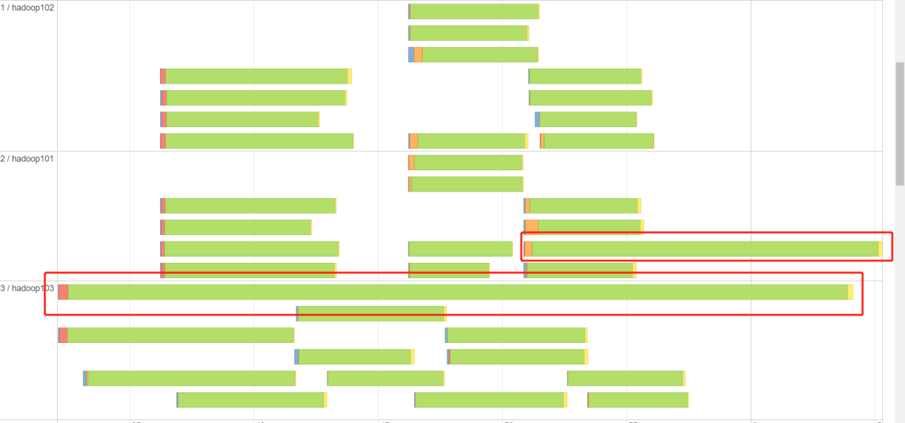

2、原因

> 数据倾斜一般是发生在shuffle类的算子，比如distinct、groupByKey、reduceByKey、aggregateByKey、join、cogroup等，涉及到数据重分区，如果其中某一个key数量特别大，就发生了数据倾斜。

## 4.2 数据倾斜大key定位

> 从所有key中，把其中每一个key随机取出来一部分，然后进行一个百分比的推算，这是用局部取推算整体，虽然有点不准确，但是在整体概率上来说，我们只需要大概就可以定位那个最多的key了
>
> 执行：
>
> ```sh
> spark-submit --master yarn --deploy-mode client --driver-memory 1g --numexecutors 3 --executor-cores 2 --executor-memory 6g --class com.atguigu.sparktuning.join.SampleKeyDemo spark-tuning-1.0-SNAPSHOT-jarwith-dependencies.jar
> ```

## 4.3 单表数据倾斜优化

> 为了减少shuffle数据量以及reduce端的压力，通常SparkSQL在map端会做一个partial aggregate（通常叫做预聚合或者偏聚合），即在shuffle前将同一分区内所属同key的记录先进行一个预结算，再将结果进行shuffle，发送到reduce端做一个汇总，类似MR的提前Combiner，所以执行计划中HashAggregate通常成对出现。
>
> 1、适用场景
>
> 聚合类的shuffle操作，部分key数据量较大，且大key的数据分布在很多不同的切片。
>
> 2、解决逻辑
>
> 两阶段聚合（加盐局部聚合+去盐全局聚合）
>
> 3、案例演示
>
> ```sh
> spark-submit --master yarn --deploy-mode client --driver-memory 1g --numexecutors 3 --executor-cores 2 --executor-memory 6g --class com.atguigu.sparktuning.skew.SkewAggregationTuning spark-tuning-1.0-SNAPSHOT-jar-with-dependencies.jar
> ```
>
> 


## 4.4 Join数据倾斜优化

### 4.4.1 广播Join

> 1、适用场景
>
> 适用于小表join大表。小表足够小，可被加载进Driver并通过Broadcast方法广播到各个Executor中。
>
> 2、解决逻辑
>
> 在小表join大表时如果产生数据倾斜，那么广播join可以直接规避掉此shuffle阶段。直接优化掉stage。并且广播join也是SparkSql中最常用的优化方案。
>
> 3、案例演示
>
> 2.2.2中的PartitionTuning案例关闭了广播join，可以看到数据倾斜
>
> ```sh
> spark-submit --master yarn --deploy-mode client --driver-memory 1g --numexecutors 3 --executor-cores 2 --executor-memory 6g --class com.atguigu.sparktuning.skew.SkewMapJoinTuning spark-tuning-1.0-SNAPSHOT-jar-with-dependencies.jar
> ```

### 4.4.2 拆分大key打散大表扩容小表

> 1、适用场景
>
> 适用于join时出现数据倾斜。
>
> 2、解决逻辑
>
> 1）将存在倾斜的表，根据抽样结果，拆分为倾斜key（skew表）和没有倾斜key（common）的两个数据集。
>
> 2）将skew表的key全部加上随机前缀，然后对另外一个不存在严重数据倾斜的数据集（old表）整体与随机前缀集作笛卡尔乘积（即将数据量扩大N倍，得到new表）。
>
> 3）打散的skew表join扩容的new表
>
> union
>
> Common表joinold表
>
> 以下为打散大key和扩容小表的实现思路
>
> 1）打散大表：实际就是数据一进一出进行处理，对大key前拼上随机前缀实现打散
>
> 2）扩容小表：实际就是将DataFrame中每一条数据，转成一个集合，并往这个集合里循环添加10条数据，最后使用flatmap压平此集合，达到扩容的效果.
>
> 3、案例演示
>
> ```sh
> spark-submit --master yarn --deploy-mode client --driver-memory 1g --numexecutors 3 --executor-cores 2 --executor-memory 6g --class com.atguigu.sparktuning.skew.SkewJoinTuning spark-tuning-1.0-SNAPSHOTjar-with-dependencies.jar
> ```

### 4.4.3 参设开启AQE

详见6.3

# 第5章 Job优化

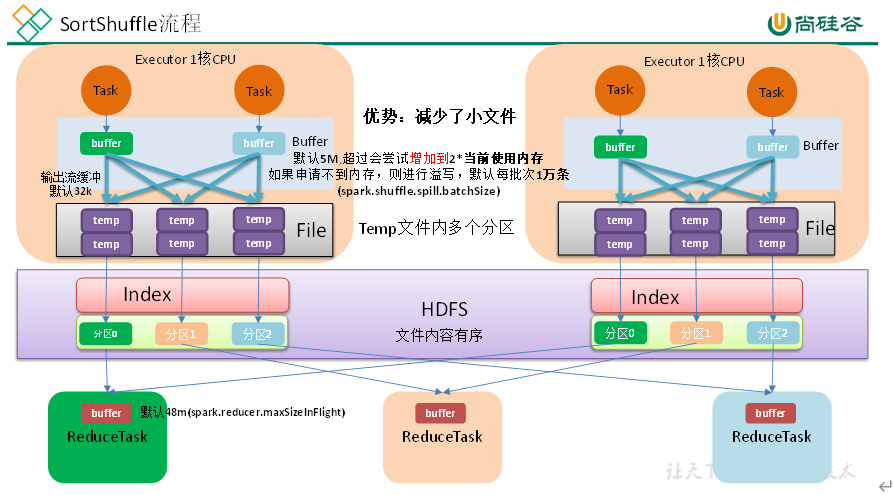

## 5.1 Map端优化

### 5.1.1 Map端聚合

> map-side预聚合，就是在每个节点本地对相同的key进行一次聚合操作，类似于MapReduce中的本地combiner。map-side预聚合之后，每个节点本地就只会有一条相同的key，因为多条相同的key都被聚合起来了。其他节点在拉取所有节点上的相同key时，就会大大减少需要拉取的数据数量，从而也就减少了磁盘IO以及网络传输开销。
>
> RDD的话建议使用reduceByKey或者aggregateByKey算子来替代掉groupByKey算子。因为reduceByKey和aggregateByKey算子都会使用用户自定义的函数对每个节点本地的相同key进行预聚合。而groupByKey算子是不会进行预聚合的，全量的数据会在集群的各个节点之间分发和传输，性能相对来说比较差。
>
> SparkSQL本身的HashAggregte就会实现本地预聚合+全局聚合。

### 5.1.2 读取小文件优化

> 读取的数据源有很多小文件，会造成查询性能的损耗，大量的数据分片信息以及对应产生的Task元信息也会给SparkDriver的内存造成压力，带来单点问题。
>
> 设置参数：
>
> ```properties
> spark.sql.files.maxPartitionBytes=128MB 默认 128m
> spark.files.openCostInBytes=4194304 默认 4m
> ```
>
> 参数（单位都是bytes）：
>
> - maxPartitionBytes：一个分区最大字节数。
> - openCostInBytes：打开一个文件的开销。
>
> ```sh
> spark-submit --master yarn --deploy-mode client --driver-memory 1g --numexecutors 3 --executor-cores 2 --executor-memory 6g --class com.atguigu.sparktuning.map.MapSmallFileTuning spark-tuning-1.0-SNAPSHOTjar-with-dependencies.jar
> ```
>
> 源码理解：**DataSourceScanExec.createNonBucketedReadRDD()**
>
> 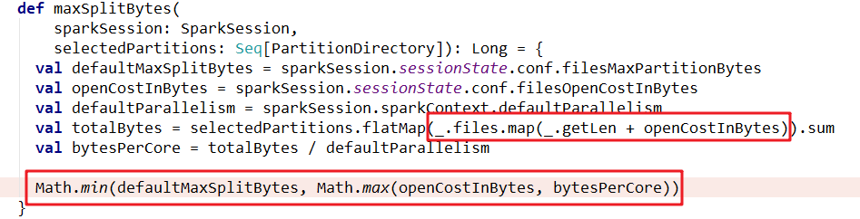
>
> **FilePartition.getFilePartitions()**
>
> 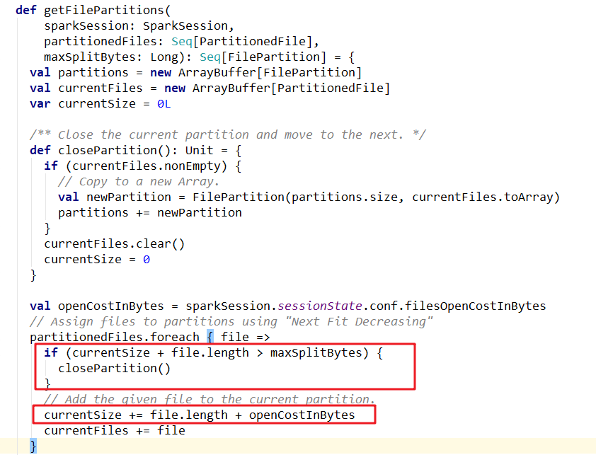
>
> 1）切片大小=Math.min(defaultMaxSplitBytes,Math.max(openCostInBytes,bytesPerCore))
>
> 计算totalBytes的时候，每个文件都要加上一个open开销defaultParallelism就是RDD的并行度
>
> 2）当（文件1大小+openCostInBytes）+（文件2大小+openCostInBytes）+...+（文件n-1大小+openCostInBytes）+文件n\<=maxPartitionBytes时，n个文件可以读入同一个分区，即满足：N个小文件总大小+（N-1）\*openCostInBytes\<=maxPartitionBytes的话。

### 5.1.3 增大map溢写时输出流buffer

> 1）map端ShuffleWrite有一个缓冲区，初始阈值5m，超过会尝试增加到2\*当前使用内存。如果申请不到内存，则进行溢写。**这个参数是internal，指定无效（见下方源码）**。也就是说资源足够会自动扩容，所以不需要我们去设置。
>
> 2）溢写时使用输出流缓冲区默认32k，这些缓冲区减少了磁盘搜索和系统调用次数，适当提高可以提升溢写效率。
>
> 3）Shuffle文件涉及到序列化，是采取批的方式读写，默认按照每批次1万条去读写。设置得太低会导致在序列化时过度复制，因为一些序列化器通过增长和复制的方式来翻倍内部数据结构。**这个参数是internal，指定无效（见下方源码）。**
>
> 综合以上分析，我们可以调整的就是输出缓冲区的大小。
>
> ```sh
> spark-submit --master yarn --deploy-mode client --driver-memory 1g --numexecutors 3 --executor-cores 2 --executor-memory 6g --class com.atguigu.sparktuning.map.MapFileBufferTuning spark-tuning-1.0-SNAPSHOT-jar-with-dependencies.jar
> ```
>
> 源码理解：
>
> 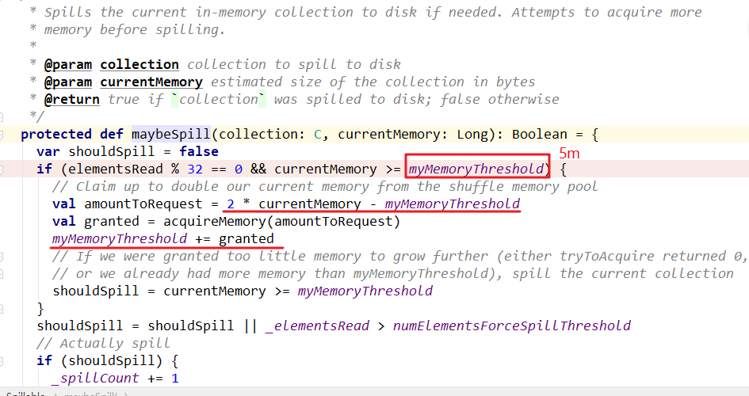
>
> 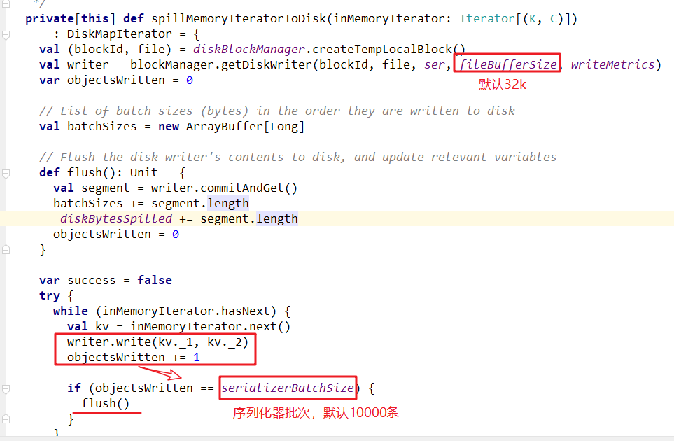
>
> 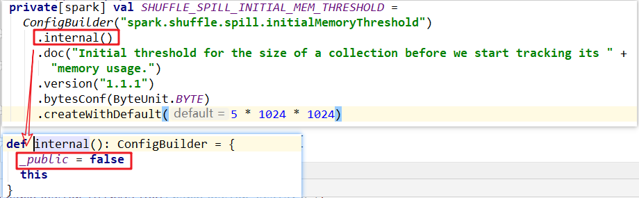
>
> 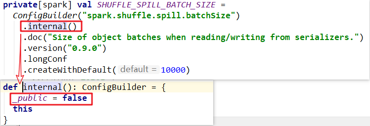


## 5.2 Reduce端优化

### 5.2.1 合理设置Reduce数

> 过多的cpu资源出现空转浪费，过少影响任务性能。关于并行度、并发度的相关参数介绍，在2.2.1中已经介绍过。

### 5.2.2 输出产生小文件优化

#### 1、Join后的结果插入新表

> join结果插入新表，生成的文件数等于shuffle并行度，默认就是200份文件插入到hdfs上。
>
> 解决方式：
>
> 1）可以在插入表数据前进行缩小分区操作来解决小文件过多问题，如coalesce、repartition算子。
>
> 2）调整shuffle并行度。根据2.2.2的原则来设置。

#### 2、动态分区插入数据

> 1）没有Shuffle的情况下。最差的情况下，每个Task中都有表各个分区的记录，那文件数最终文件数将达到Task数量\*表分区数。这种情况下是极易产生小文件的。
>
> ```sql
> INSERT overwrite table A partition ( aa )SELECT * FROM B;
> ```
>
> 2）有Shuffle的情况下，上面的Task数量就变成了spark.sql.shuffle.partitions（默认值200）。那么最差情况就会有spark.sql.shuffle.partitions\*表分区数。当spark.sql.shuffle.partitions设置过大时，小文件问题就产生了；当spark.sql.shuffle.partitions设置过小时，任务的并行度就下降了，性能随之受到影响。最理想的情况是根据分区字段进行shuffle，在上面的sql中加上distributebyaa。把同一分区的记录都哈希到同一个分区中去，由一个Spark的Task进行写入，这样的话只会产生N个文件,但是这种情况下也容易出现数据倾斜的问题。

#### 解决思路：

> 结合第4章解决倾斜的思路，在确定哪个分区键倾斜的情况下，将倾斜的分区键单独拎出来：
>
> 将入库的SQL拆成（where分区!=倾斜分区键）和（where分区=倾斜分区键）几个部分，非倾斜分区键的部分正常distributeby分区字段，倾斜分区键的部分distributeby随机数，sql如下：
>
> ```sql
> //1.非倾斜键部分
> INSERT overwrite table A partition ( aa )
> SELECT *
> FROM B where aa != 大 key
> distribute by aa;
> //2.倾斜键部分
> INSERT overwrite table A partition ( aa )
> SELECT *
> FROM B where aa = 大 key
> distribute by cast(rand() * 5 as int);
> ```
>
> 案例实操：
>
> ```sh
> spark-submit --master yarn --deploy-mode client --driver-memory 1g --numexecutors 3 --executor-cores 2 --executor-memory 6g --class
> com.atguigu.sparktuning.reduce.DynamicPartitionSmallFileTuning sparktuning-1.0-SNAPSHOT-jar-with-dependencies.jar
> ```
>
> 

### 5.2.3 增大reduce缓冲区，减少拉取次数

> SparkShuffle过程中，shufflereducetask的buffer缓冲区大小决定了reducetask每次能够缓冲的数据量，也就是每次能够拉取的数据量，如果内存资源较为充足，适当增加拉取数据缓冲区的大小，可以减少拉取数据的次数，也就可以减少网络传输的次数，进而提升性能。
>
> reduce端数据拉取缓冲区的大小可以通过spark.reducer.maxSizeInFlight参数进行设置，默认为48MB。
>
> 源码：BlockStoreShuffleReader.read()
>
> 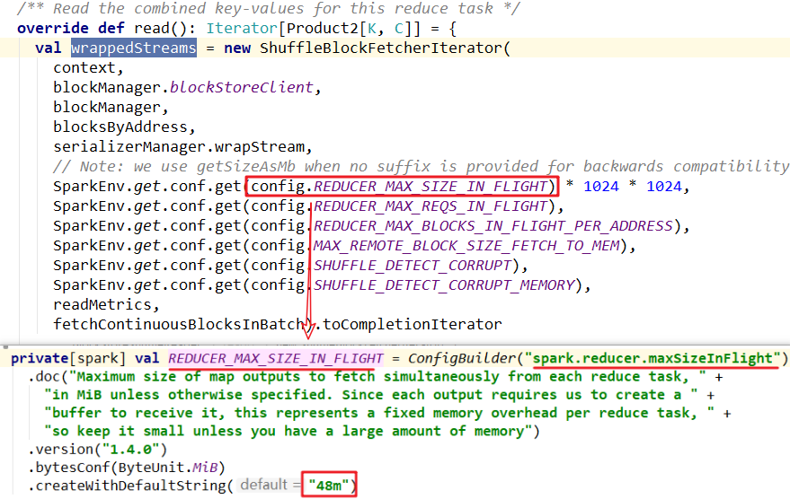

### 5.2.4 调节reduce端拉取数据重试次数

> SparkShuffle过程中，reducetask拉取属于自己的数据时，如果因为网络异常等原因导致失败会自动进行重试。对于那些包含了特别耗时的shuffle操作的作业，建议增加重试最大次数（比如60次），以避免由于JVM的fullgc或者网络不稳定等因素导致的数据拉取失败。在实践中发现，对于针对超大数据量（数十亿\~上百亿）的shuffle过程，调节该参数可以大幅度提升稳定性。
>
> reduce端拉取数据重试次数可以通过spark.shuffle.io.maxRetries参数进行设置，该参数就代表了可以重试的最大次数。如果在指定次数之内拉取还是没有成功，就可能会导致作业执行失败，默认为3：

### 5.2.5 调节reduce端拉取数据等待间隔

> SparkShuffle过程中，reducetask拉取属于自己的数据时，如果因为网络异常等原因导致失败会自动进行重试，在一次失败后，会等待一定的时间间隔再进行重试，可以通过加大间隔时长（比如60s），以增加shuffle操作的稳定性。
>
> reduce端拉取数据等待间隔可以通过spark.shuffle.io.retryWait参数进行设置，默认值为5s。
>
> 综合5.2.3、5.2.4、5.2.5，案例实操：
>
> ```sh
> spark-submit --master yarn --deploy-mode client --driver-memory 1g --numexecutors 3 --executor-cores 2 --executor-memory 6g --class
> com.atguigu.sparktuning.reduce.ReduceShuffleTuning spark-tuning-1.0-
> SNAPSHOT-jar-with-dependencies.jar
> ```

### 5.2.6 合理利用bypass

> 当ShuffleManager为SortShuffleManager时，如果shufflereadtask的数量小于这个阈值（默认是200）且不需要map端进行合并操作，则shufflewrite过程中不会进行排序操作，使用BypassMergeSortShuffleWriter去写数据，但是最后会将每个task产生的所有临时磁盘文件都合并成一个文件，并会创建单独的索引文件。
>
> 当你使用SortShuffleManager时，如果确实不需要排序操作，那么建议将这个参数调大一些，大于shufflereadtask的数量。那么此时就会自动启用bypass机制，map-side就不会进行排序了，减少了排序的性能开销。但是这种方式下，依然会产生大量的磁盘文件，
>
> 因此shufflewrite性能有待提高。
>
> 源码分析：SortShuffleManager.registerShuffle()
>
> 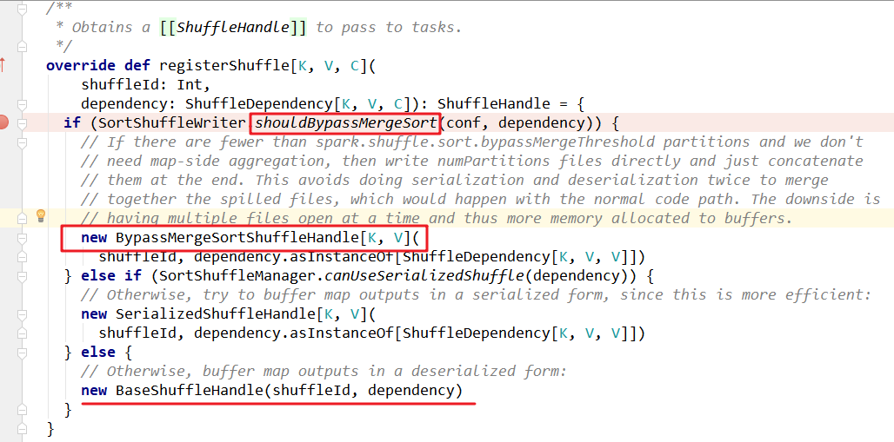
>
> 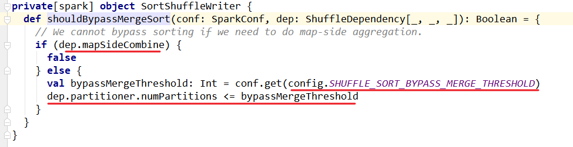
>
> 
>
> SortShuffleManager.getWriter()
>
> 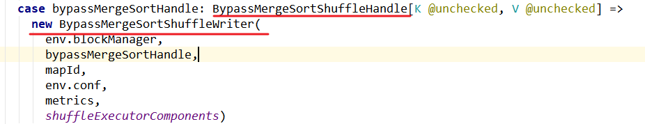
>
> 
>
> ```sh
> spark-submit --master yarn --deploy-mode client --driver-memory 1g --numexecutors 3 --executor-cores 2 --executor-memory 6g --class
> com.atguigu.sparktuning.reduce.BypassTuning spark-tuning-1.0-SNAPSHOTjar-with-dependencies.jar
> ```


## 5.3 整体优化

### 5.3.1 调节数据本地化等待时长

> 在Spark项目开发阶段，可以使用client模式对程序进行测试，此时，可以在本地看到比较全的日志信息，日志信息中有明确的Task数据本地化的级别，如果大部分都是PROCESS_LOCAL、NODE_LOCAL，那么就无需进行调节，但是如果发现很多的级别都是RACK_LOCAL、ANY，那么需要对本地化的等待时长进行调节，应该是反复调节，每次调节完以后，再来运行观察日志，看看大部分的task的本地化级别有没有提升；看看，整个spark作业的运行时间有没有缩短。
>
> 注意过犹不及，不要将本地化等待时长延长地过长，导致因为大量的等待时长，使得Spark作业的运行时间反而增加了。下面几个参数，默认都是3s，可以改成如下：
>
> ```properties
> spark.locality.wait //建议 6s、 10s
> spark.locality.wait.process //建议 60s
> spark.locality.wait.node //建议 30s
> spark.locality.wait.rack //建议 20s
> ```

### 5.3.2 使用堆外内存

#### 1、堆外内存参数

> 讲到堆外内存，就必须去提一个东西，那就是去yarn申请资源的单位，容器。Sparkonyarn模式，一个容器到底申请多少内存资源。一个容器最多可以申请多大资源，是由yarn参数yarn.scheduler.maximum-allocation-mb决定，需要满足：
>
> spark.executor.memoryOverhead+spark.executor.memory+spark.memory.offHeap.size≤yarn.scheduler.maximum-allocation-mb
>
> 参数解释：
>
> - spark.executor.memory：提交任务时指定的堆内内存。
> - spark.executor.memoryOverhead：堆外内存参数，内存额外开销。
>
> 默认开启，默认值为spark.executor.memory\*0.1并且会与最小值384mb做对比，取最大值。所以sparkonyarn任务堆内内存申请1个g，而实际去yarn申请的内存大于1个g的原因。
>
> - spark.memory.offHeap.size：堆外内存参数，spark中默认关闭，需要将spark.memory.enable.offheap.enable参数设置为true。
>
> 注意：很多网上资料说spark.executor.memoryOverhead包含spark.memory.offHeap.size，这是由版本区别的，仅限于spark3.0之前的版本。3.0之后就发生改变，实际去yarn申请的内存资源由三个参数相加。
>
> 
>
> 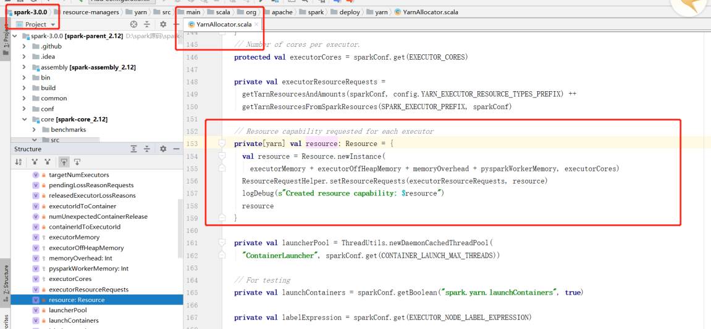
>
> 测试申请容器上限：
>
> yarn.scheduler.maximum-allocation-mb修改为7G，将三个参数设为如下，大于7G，会报错：
>
> ```sh
> spark-submit --master yarn --deploy-mode client --driver-memory 1g --
> num-executors 3 --executor-cores 4 --conf
> spark.memory.offHeap.enabled=true --conf spark.memory.offHeap.size=2g --
> executor-memory 5g --class com.atguigu.sparktuning.join.SMBJoinTuning
> spark-tuning-1.0-SNAPSHOT-jar-with-dependencies.jar
> ```
>
> 将spark.memory.offHeap.size修改为1g后再次提交：
>
> ```sh
> spark-submit --master yarn --deploy-mode client --driver-memory 1g --
> num-executors 3 --executor-cores 4 --conf
> spark.memory.offHeap.enabled=true --conf spark.memory.offHeap.size=1g --
> executor-memory 5g --class com.atguigu.sparktuning.join.SMBJoinTuning
> spark-tuning-1.0-SNAPSHOT-jar-with-dependencies.jar
> ```

#### 2、使用堆外缓存

> 使用堆外内存可以减轻垃圾回收的工作，也加快了复制的速度。
>
> 当需要缓存非常大的数据量时，虚拟机将承受非常大的GC压力，因为虚拟机必须检查每个对象是否可以收集并必须访问所有内存页。本地缓存是最快的，但会给虚拟机带来GC压力，所以，当你需要处理非常多GB的数据量时可以考虑使用堆外内存来进行优化，因为这不会给Java垃圾收集器带来任何压力。让JAVAGC为应用程序完成工作，缓存操作交给堆外。
>
> ```sh
> spark-submit --master yarn --deploy-mode client --driver-memory 1g --
> num-executors 3 --executor-cores 4 --conf
> spark.memory.offHeap.enabled=true --conf spark.memory.offHeap.size=1g --
> executor-memory 5g --class com.atguigu.sparktuning.job.OFFHeapCache
> spark-tuning-1.0-SNAPSHOT-jar-with-dependencies.jar
> ```

### 5.3.3 调节连接等待时长

> 在Spark作业运行过程中，Executor优先从自己本地关联的BlockManager中获取某份数据，如果本地BlockManager没有的话，会通过TransferService远程连接其他节点上Executor的BlockManager来获取数据。
>
> 如果task在运行过程中创建大量对象或者创建的对象较大，会占用大量的内存，这回导致频繁的垃圾回收，但是垃圾回收会导致工作现场全部停止，也就是说，垃圾回收一旦执行，Spark的Executor进程就会停止工作，无法提供相应，此时，由于没有响应，无法建立网络连接，会导致网络连接超时。
>
> 在生产环境下，有时会遇到filenotfound、filelost这类错误，在这种情况下，很有可能是Executor的BlockManager在拉取数据的时候，无法建立连接，然后超过默认的连接等待时长120s后，宣告数据拉取失败，如果反复尝试都拉取不到数据，可能会导致Spark作业的崩溃。这种情况也可能会导致DAGScheduler反复提交几次stage，TaskScheduler反复提交几次task，大大延长了我们的Spark作业的运行时间。
>
> 为了避免长时间暂停(如GC)导致的超时，可以考虑调节连接的超时时长，连接等待时长需要在spark-submit脚本中进行设置，设置方式可以在提交时指定：
>
> --confspark.core.connection.ack.wait.timeout=300s
>
> 调节连接等待时长后，通常可以避免部分的XX文件拉取失败、XX文件lost等报错。
>
> ```sh
> spark-submit --master yarn --deploy-mode client --driver-memory 1g --numexecutors 3 --executor-cores 2 --executor-memory 1g --conf
> spark.core.connection.ack.wait.timeout=300s --class
> com.atguigu.sparktuning.job.AckWaitTuning spark-tuning-1.0-SNAPSHOT-jarwith-dependencies.jar
> ```

# 第6章 Spark3.0AQE

> Spark在3.0版本推出了AQE（AdaptiveQueryExecution），即自适应查询执行。AQE是SparkSQL的一种动态优化机制，在运行时，每当ShuffleMap阶段执行完毕，AQE都会结合这个阶段的统计信息，基于既定的规则动态地调整、修正尚未执行的逻辑计划和物理计划，来完成对原始查询语句的运行时优化。
>

## 6.1 动态合并分区

> 在Spark中运行查询处理非常大的数据时，shuffle通常会对查询性能产生非常重要的影响。shuffle是非常昂贵的操作，因为它需要进行网络传输移动数据，以便下游进行计算。
>
> 最好的分区取决于数据，但是每个查询的阶段之间的数据大小可能相差很大，这使得该数字难以调整：
>
> （1）如果分区太少，则每个分区的数据量可能会很大，处理这些数据量非常大的分区，可能需要将数据溢写到磁盘（例如，排序和聚合），降低了查询。
>
> （2）如果分区太多，则每个分区的数据量大小可能很小，读取大量小的网络数据块，这也会导致I/O效率低而降低了查询速度。拥有大量的task（一个分区一个task）也会给Spark任务计划程序带来更多负担。
>
> 为了解决这个问题，我们可以在任务开始时先设置较多的shuffle分区个数，然后在运行时通过查看shuffle文件统计信息将相邻的小分区合并成更大的分区。
>
> 例如，假设正在运行selectmax(i)fromtblgroupbyj。输入tbl很小，在分组前只有2个分区。那么任务刚初始化时，我们将分区数设置为5，如果没有AQE，Spark将启动五个任务来进行最终聚合，但是其中会有三个非常小的分区，为每个分区启动单独的任务这样就很浪费。
>
> 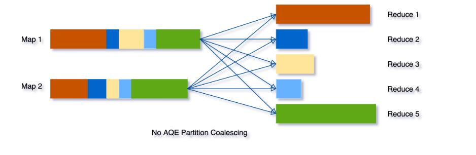
>
> 取而代之的是，AQE将这三个小分区合并为一个，因此最终聚只需三个task而不是五个
>
> 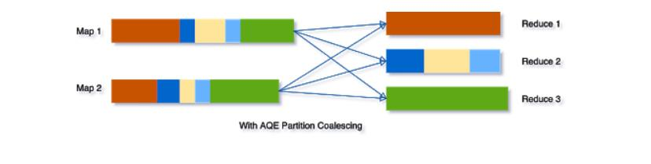
>
> ```sh
> spark-submit --master yarn --deploy-mode client --driver-memory 1g --numexecutors 3 --executor-cores 2 --executor-memory 2g --class
> com.atguigu.sparktuning.aqe.AQEPartitionTunning spark-tuning-1.0-
> SNAPSHOT-jar-with-dependencies.jar
> ```
>
> 结合动态申请资源：
>
> ```sh
> spark-submit --master yarn --deploy-mode client --driver-memory 1g --numexecutors 3 --executor-cores 2 --executor-memory 2g --class
> com.atguigu.sparktuning.aqe.DynamicAllocationTunning spark-tuning-1.0-
> SNAPSHOT-jar-with-dependencies.jar
> ```

## 6.2 动态切换Join策略

> Spark支持多种join策略，其中如果join的一张表可以很好的插入内存，那么broadcastshahjoin通常性能最高。因此，sparkjoin中，如果小表小于广播大小阀值（默认10mb），Spark将计划进行broadcasthashjoin。但是，很多事情都会使这种大小估计出错（例如，存在选择性很高的过滤器），或者join关系是一系列的运算符而不是简单的扫描表操作。
>
> 为了解决此问题，AQE现在根据最准确的join大小运行时重新计划join策略。从下图实例中可以看出，发现连接的右侧表比左侧表小的多，并且足够小可以进行广播，那么AQE会重新优化，将sortmergejoin转换成为broadcasthashjoin。
>
> 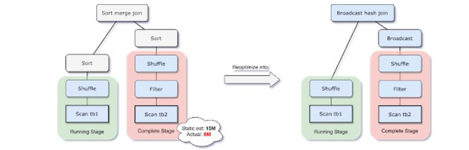
>
> 对于运行是的broadcasthashjoin,可以将shuffle优化成本地shuffle,优化掉stage减少网络传输。Broadcasthashjoin可以规避shuffle阶段，相当于本地join。
>
> ```sh
> spark-submit --master yarn --deploy-mode client --driver-memory 1g --numexecutors 3 --executor-cores 4 --executor-memory 2g --class com.atguigu.sparktuning.aqe.AqeDynamicSwitchJoin spark-tuning-1.0-
> SNAPSHOT-jar-with-dependencies.jar
> ```
>
> 

## 6.3 动态优化Join倾斜

> 当数据在群集中的分区之间分布不均匀时，就会发生数据倾斜。严重的倾斜会大大降低查询性能，尤其对于join。AQEskewjoin优化会从随机shuffle文件统计信息自动检测到这种倾斜。然后它将倾斜分区拆分成较小的子分区。
>
> 例如,下图AjoinB,A表中分区A0明细大于其他分区
>
> 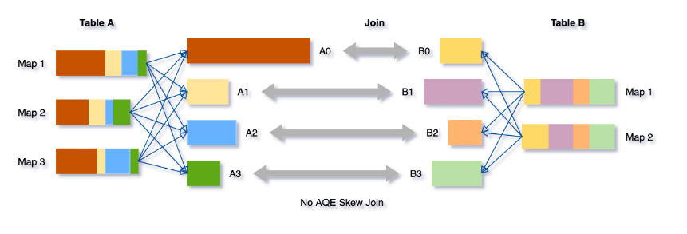
>
> 因此，skewjoin会将A0分区拆分成两个子分区，并且对应连接B0分区
>
> 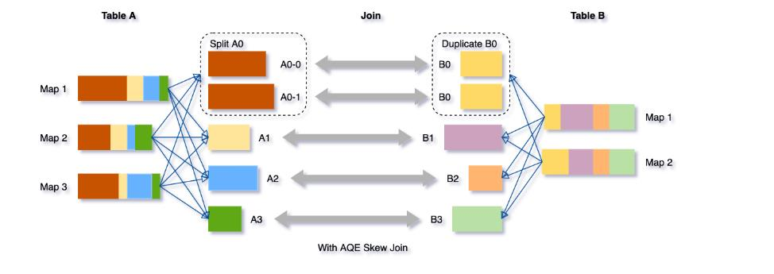
>
> 没有这种优化，会导致其中一个分区特别耗时拖慢整个stage,有了这个优化之后每个task耗时都会大致相同，从而总体上获得更好的性能。可以采取第4章提到的解决方式，3.0有了AQE机制就可以交给Spark自行解决。
>
> Spark3.0增加了以下参数。
>
> 1）spark.sql.adaptive.skewJoin.enabled:是否开启倾斜join检测，如果开启了，那么会将倾斜的分区数据拆成多个分区,默认是开启的，但是得打开aqe。
>
> 2）spark.sql.adaptive.skewJoin.skewedPartitionFactor:默认值5，此参数用来判断分区数据量是否数据倾斜，当任务中最大数据量分区对应的数据量大于的分区中位数乘以此参数，并且也大于spark.sql.adaptive.skewJoin.skewedPartitionThresholdInBytes参数，那么此任务是数据倾斜。
>
> 3）spark.sql.adaptive.skewJoin.skewedPartitionThresholdInBytes:默认值256mb，用于判断是否数据倾斜
>
> 4）spark.sql.adaptive.advisoryPartitionSizeInBytes:此参数用来告诉spark进行拆分后推荐分区大小是多少。
>
> ```sh
> spark-submit --master yarn --deploy-mode client --driver-memory 1g --numexecutors 3 --executor-cores 4 --executor-memory 2g --class
> com.atguigu.sparktuning.aqe.AqeOptimizingSkewJoin spark-tuning-1.0-
> SNAPSHOT-jar-with-dependencies.jar
> ```
>
> 如果同时开启了spark.sql.adaptive.coalescePartitions.enabled动态合并分区功能，那么会先合并分区，再去判断倾斜，将动态合并分区打开后，重新执行：
>
> ```sh
> spark-submit --master yarn --deploy-mode client --driver-memory 1g --numexecutors 3 --executor-cores 4 --executor-memory 2g --class
> com.atguigu.sparktuning.aqe.AqeOptimizingSkewJoin spark-tuning-1.0-
> SNAPSHOT-jar-with-dependencies.jar
> ```
>
> 修改中位数的倍数为2，重新执行：
>
> ```sh
> spark-submit --master yarn --deploy-mode client --driver-memory 1g --numexecutors 3 --executor-cores 4 --executor-memory 2g --class
> com.atguigu.sparktuning.aqe.AqeOptimizingSkewJoin spark-tuning-1.0-
> SNAPSHOT-jar-with-dependencies.jar
> ```

# 第7章 Spark3.0 DPP

> Spark3.0支持动态分区裁剪Dynamic Partition Pruning，简称DPP，核心思路就是先将join一侧作为子查询计算出来，再将其所有分区用到join另一侧作为表过滤条件，从而实现对分区的动态修剪。如下图所示
>
> 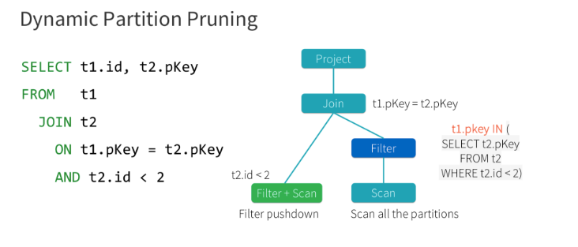
>
> 将select t1.id,t2.pkey from t1 join t2 on t1.pkey=t2.pkey and t2.id\<2优化成了select t1.id,t2.pkey from t1 join t2 on t1.pkey=t2.pkey and t1.pkey in(select t2.pkey from t2 where t2.id\<2)
>
> 触发条件：
>
> （1）待裁剪的表join的时候，join条件里必须有分区字段
>
> （2）如果是需要修剪左表，那么join必须是innerjoin,leftsemijoin或rightjoin,反之亦然。但如果是leftoutjoin,无论右边有没有这个分区，左边的值都存在，就不需要被裁剪
>
> （3）另一张表需要存在至少一个过滤条件，比如ajoinbona.key=b.keyanda.id\<2
>
> 参数spark.sql.optimizer.dynamicPartitionPruning.enabled默认开启。
>
> ```sh
> spark-submit --master yarn --deploy-mode client --driver-memory 1g --numexecutors 3 --executor-cores 4 --executor-memory 2g --class
> com.atguigu.sparktuning.dpp.DPPTest spark-tuning-1.0-SNAPSHOT-jar-withdependencies.jar
> ```
>
> 

# 第8章 Spark3.0 Hint增强

> 在spark2.4的时候就有了hint功能，不过只有broadcasthashjoin的hint,这次3.0又增加了sortmergejoin,shuffle_hashjoin,shuffle_replicatenestedloopjoin。
>
> Spark的5种Join策略：[https://www.cnblogs.com/jmx-bigdata/p/14021183.html](https://www.cnblogs.com/jmx-bigdata/p/14021183.html)

## 8.1 broadcasthast join

```scala
sparkSession.sql("select /*+ BROADCAST(school) */ * from test_student student left join test_school school on student.id=school.id").show()
sparkSession.sql("select /*+ BROADCASTJOIN(school) */ * from test_student student left join test_school school on student.id=school.id").show()
sparkSession.sql("select /*+ MAPJOIN(school) */ * from test_student student left join test_school school on student.id=school.id").show()
```


## 8.2 sort merge join

```scala
sparkSession.sql("select /*+ SHUFFLE_MERGE(school) */ * from test_student student left join test_school school on student.id=school.id").show()
sparkSession.sql("select /*+ MERGEJOIN(school) */ * from test_student student left join test_school school on student.id=school.id").show()
sparkSession.sql("select /*+ MERGE(school) */ * from test_student student left join test_school school on student.id=school.id").show()
```

## 8.3 shuffle_hashjoin

```scala
sparkSession.sql("select /*+ SHUFFLE_HASH(school) */ * from test_student student left join test_school school on student.id=school.id").show()
```

## 8.4 shuffle_replicate_nl join

> 使用条件非常苛刻，驱动表（school表）必须小,且很容易被spark执行成sort merge join。
>
> sparkSession.sql(\"select/\*+SHUFFLE_REPLICATE_NL(school)\*/\*from

# 第9章 故障排除

## 9.1 故障排除一：控制reduce端缓冲大小以避免OOM

> 在Shuffle过程，reduce端task并不是等到map端task将其数据全部写入磁盘后再去拉取，而是map端写一点数据，reduce端task就会拉取一小部分数据，然后立即进行后面的聚合、算子函数的使用等操作。
>
> reduce端task能够拉取多少数据，由reduce拉取数据的缓冲区buffer来决定，因为拉取过来的数据都是先放在buffer中，然后再进行后续的处理，buffer的默认大小为48MB。
>
> reduce端task会一边拉取一边计算，不一定每次都会拉满48MB的数据，可能大多数时候拉取一部分数据就处理掉了。
>
> 虽然说增大reduce端缓冲区大小可以减少拉取次数，提升Shuffle性能，但是有时map端的数据量非常大，写出的速度非常快，此时reduce端的所有task在拉取的时候，有可能全部达到自己缓冲的最大极限值，即48MB，此时，再加上reduce端执行的聚合函数的代码，可能会创建大量的对象，这可难会导致内存溢出，即OOM。
>
> 如果一旦出现reduce端内存溢出的问题，我们可以考虑减小reduce端拉取数据缓冲区的大小，例如减少为12MB。
>
> 在实际生产环境中是出现过这种问题的，这是典型的以性能换执行的原理。reduce端拉取数据的缓冲区减小，不容易导致OOM，但是相应的，reudce端的拉取次数增加，造成更多的网络传输开销，造成性能的下降。
>
> 注意，要保证任务能够运行，再考虑性能的优化。

## 9.2 故障排除二：JVMGC导致的shuffle文件拉取失败

> 在Spark作业中，有时会出现shufflefilenotfound的错误，这是非常常见的一个报错，有时出现这种错误以后，选择重新执行一遍，就不再报出这种错误。出现上述问题可能的原因是Shuffle操作中，后面stage的task想要去上一个stage的task所在的Executor拉取数据，结果对方正在执行GC，执行GC会导致Executor内所有的工作现场全部停止，比如BlockManager、基于netty的网络通信等，这就会导致后面的task拉取数据拉取了半天都没有拉取到，就会报出shufflefilenotfound的错误，而第二次再次执行就不会再出现这种错误。
>
> 可以通过调整reduce端拉取数据重试次数和reduce端拉取数据时间间隔这两个参数来对Shuffle性能进行调整，增大参数值，使得reduce端拉取数据的重试次数增加，并且每次失败后等待的时间间隔加长。
>
> ```scala
> val conf = new SparkConf()
> .set("spark.shuffle.io.maxRetries", "60")
> .set("spark.shuffle.io.retryWait", "60s")
> ```

## 9.3 故障排除三：解决各种序列化导致的报错

> 当Spark作业在运行过程中报错，而且报错信息中含有Serializable等类似词汇，那么可能是序列化问题导致的报错。
>
> 序列化问题要注意以下三点：
>
> -   作为RDD的元素类型的自定义类，必须是可以序列化的；
>
> -   算子函数里可以使用的外部的自定义变量，必须是可以序列化的；
>
> -   不可以在RDD的元素类型、算子函数里使用第三方的不支持序列化的类型，例如Connection。
>

## 9.4 故障排除四：解决算子函数返回NULL导致的问题

> 在一些算子函数里，需要我们有一个返回值，但是在一些情况下我们不希望有返回值，此时我们如果直接返回NULL，会报错，例如Scala.Math(NULL)异常。
>
> 如果你遇到某些情况，不希望有返回值，那么可以通过下述方式解决：
>
> -   返回特殊值，不返回NULL，例如"-1"；
>
> -   在通过算子获取到了一个RDD之后，可以对这个RDD执行filter操作，进行数据过滤，将数值为-1的数据给过滤掉；
>
> -   在使用完filter算子后，继续调用coalesce算子进行优化。

## 9.5 故障排除五：解决YARN-CLIENT模式导致的网卡流量激增问题

YARN-client模式的运行原理如下图所示：

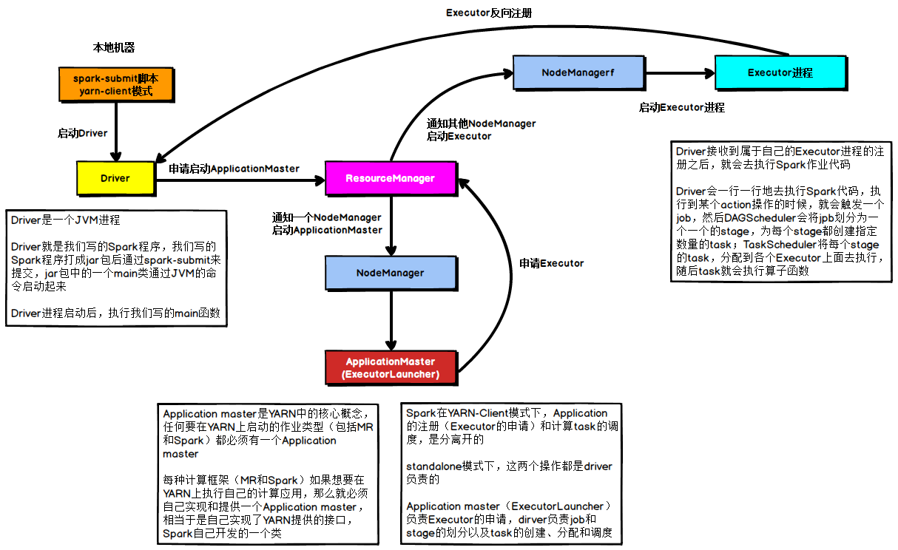

> 在YARN-client模式下，Driver启动在本地机器上，而Driver负责所有的任务调度，需要与YARN集群上的多个Executor进行频繁的通信。假设有100个Executor，1000个task，那么每个Executor分配到10个task，之后，
>
> Driver要频繁地跟Executor上运行的1000个task进行通信，通信数据非常多，并且通信品类特别高。这就导致有可能在Spark任务运行过程中，由于频繁大量的网络通讯，本地机器的网卡流量会激增。
>
> 注意，YARN-client模式只会在测试环境中使用，而之所以使用YARN-client模式，是由于可以看到详细全面的log信息，通过查看log，可以锁定程序中存在的问题，避免在生产环境下发生故障。在生产环境下，使用的一定是YARN-cluster模式。在YARN-cluster模式下，就不会造成本地机器网卡流量激增问题，如果YARN-cluster模式下存在网络通信的问题，需要运维团队进行解决。

## 9.6 故障排除六：解决YARN-CLUSTER模式的JVM栈内存溢出无法执行问题

> YARN-cluster模式的运行原理如下图所示：
>
> 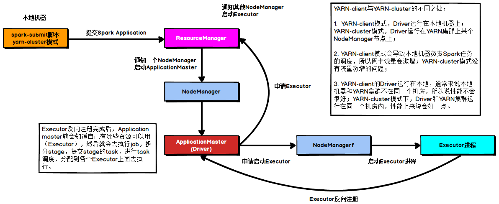
>
> 当Spark作业中包含SparkSQL的内容时，可能会碰到YARN-client模式下可以运行，但是YARN-cluster模式下无法提交运行（报出OOM错误)的情况。
>
> YARN-client模式下，Driver是运行在本地机器上的，Spark使用的JVM的PermGen的配置，是本地机器上的spark-class文件，JVM永久代的大小是128MB，这个是没有问题的，但是在YARN-cluster模式下，Driver运行在YARN集群的某个节点上，使用的是没有经过配置的默认设置，PermGen永久代大小为82MB。
>
> SparkSQL的内部要进行很复杂的SQL的语义解析、语法树转换等等，非常复杂，如果sql语句本身就非常复杂，那么很有可能会导致性能的损耗和内存的占用，特别是对PermGen的占用会比较大。所以，此时如果PermGen的占用好过了82MB，但是又小于128MB，就会出现YARN-client模式下可以运行，YARN-cluster模式下无法运行的情况。
>
> 解决上述问题的方法时增加PermGen的容量，需要在spark-submit脚本中对相关参数进行设置，设置方法如代码清单所示。
>
> \--conf spark.driver.extraJavaOptions=\"-XX:PermSize=128M-XX:MaxPermSize=256M\"
>
> 通过上述方法就设置了Driver永久代的大小，默认为128MB，最大256MB，这样就可以避免上面所说的问题。

## 9.7 故障排除七：解决SparkSQL导致的JVM栈内存溢出

> 当SparkSQL的sql语句有成百上千的or关键字时，就可能会出现Driver端的JVM栈内存溢出。
>
> JVM栈内存溢出基本上就是由于调用的方法层级过多，产生了大量的，非常深的，超出了JVM栈深度限制的递归。（我们猜测SparkSQL有大量or语句的时候，在解析SQL时，例如转换为语法树或者进行执行计划的生成的时候，对于or的处理是递归，or非常多时，会发生大量的递归）
>
> 此时，建议将一条sql语句拆分为多条sql语句来执行，每条sql语句尽量保证100个以内的子句。根据实际的生产环境试验，一条sql语句的or关键字控制在100个以内，通常不会导致JVM栈内存溢出。

## 9.8 故障排除八：持久化与checkpoint的使用

> Spark持久化在大部分情况下是没有问题的，但是有时数据可能会丢失，如果数据一旦丢失，就需要对丢失的数据重新进行计算，计算完后再缓存和使用，为了避免数据的丢失，可以选择对这个RDD进行checkpoint，也就是将数据持久化一份到容错的文件系统上（比如HDFS）。
>
> 一个RDD缓存并checkpoint后，如果一旦发现缓存丢失，就会优先查看checkpoint数据存不存在，如果有，就会使用checkpoint数据，而不用重新计算。也即是说，checkpoint可以视为cache的保障机制，如果cache失败，就使用checkpoint的数据。
>
> 使用checkpoint的优点在于提高了Spark作业的可靠性，一旦缓存出现问题，不需要重新计算数据，缺点在于，checkpoint时需要将数据写入HDFS等文件系统，对性能的消耗较大。

## 9.9 故障排除九：内存泄漏排查

> 内存泄露是指程序中已动态分配的堆内存由于某种原因程序未释放或无法释放，造成系统内存的浪费，导致程序运行速度减慢,甚至系统崩溃等严重后果。
>
> 在SparkStreaming中往往会因为开发者代码未正确编写导致无法回收或释放对象，造成SparkStreaming内存泄露越跑越慢甚至崩溃的结果。那么排查内存泄露需要一些第三方的工具。
>

### 9.9.1 IBM HeapAnalyzer

#### 官网地址

> [https://www.ibm.com/developerworks/community/groups/service/html/communityview?c](https://www.ibm.com/developerworks/community/groups/service/html/communityview?communityUuid=4544bafe-c7a2-455f-9d43-eb866ea60091)[ommunityUuid=4544bafe-c7a2-455f-9d43-eb866ea60091](https://www.ibm.com/developerworks/community/groups/service/html/communityview?communityUuid=4544bafe-c7a2-455f-9d43-eb866ea60091)
>
> 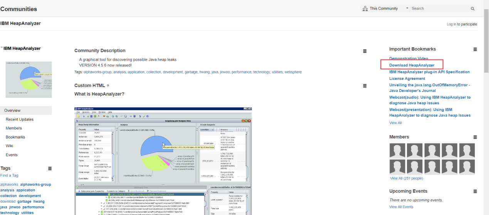
>
> 点击下载内存泄露分析工具
>
> 下载下来是一个jar包
>
> 
>
> 那么需要编写bat批处理来运行
>
> 创建run.bat
>
> 
>
> 编辑
>
> ```sh
> title ibm-heap-analyzer
> path=%PATH%;%C:\JAVA\jdk1.8.0_51\bin
> E:
> cd E:\IBM heapAnalyzer\IBM_DUMP_wjfx
> java.exe -Xms1048M -Xmx4096M -jar ha456.jar
> ```
>
> 路径需要改成自己当前路径点击run.bat运行
>
> 运行成功

### 9.9.2 模拟内存泄露场景

> 内存泄露的原因往往是因为对象无法释放或被回收造成，那么在本项目中就模拟此场景。
>
> 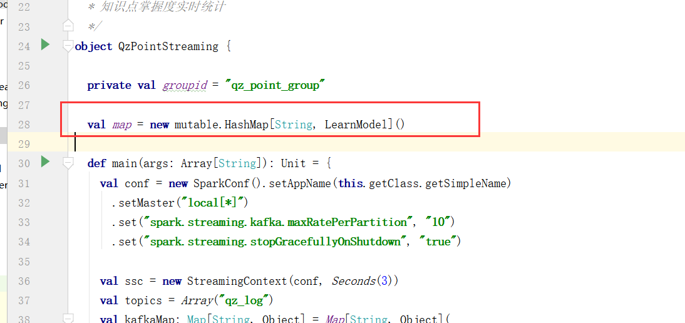
>
> 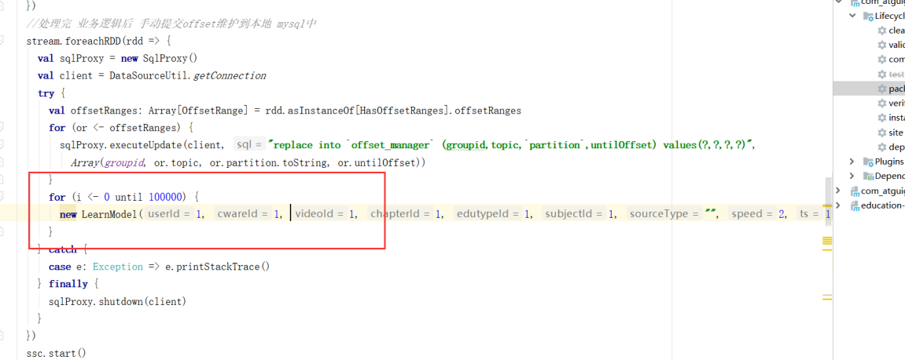
>
> 如上图所示，在计算学员知识点正确率与掌握度代码中，在最后提交offset提交偏移量后，循环往map里添加LearnMode对象，使每处理一批数据就往map里添加100000个LearnMode对象，使堆内存撑满。
>

### 9.9.3 查找driver进程

> 在集群上提交sparkstreaming任务
>
> ```sh
> ps -ef |grep com.atguigu.qzpoint.streaming.QzPointStreaming
> ```
>
> 通过此命令查找到driver进程号
>
> 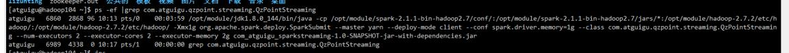
>
> 进程号为6860
>
> 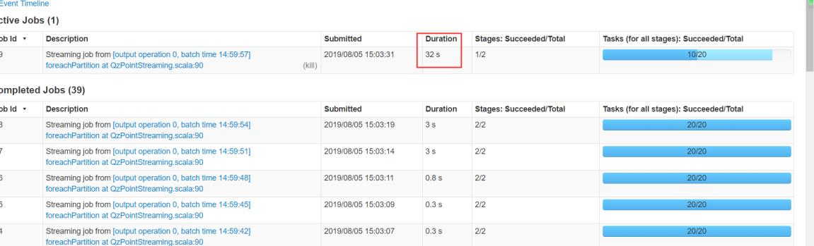
>
> 通过SparkUi发现该SparkStramingtask任务发生长时间卡住现象，GC出现异常。疑似发生内存泄露

### 9.9.4 JMAP命令

> 使用jmap-heappid命令查看6860进程，内存使用情况。
>
> ```sh
> jmap -heap 6860
> ```

## 9.10 故障排除十：频繁GC问题

> 1、打印GC详情
>
> 统计一下GC启动的频率和GC使用的总时间，在spark-submit提交的时候设置参数
>
> ```sh
> --conf "spark.executor.extraJavaOptions=-XX:+PrintGCDetails -
> XX:+PrintGCTimeStamps"
> ```
>
> 如果出现了多次FullGC，首先考虑的是可能配置的Executor内存较低，这个时候需要增加ExecutorMemory来调节。
>
> 2、如果一个任务结束前，FullGC执行多次，说明老年代空间被占满了，那么有可能是没有分配足够的内存。
>
> ```txt
> 1.调整 executor 的内存，配置参数 executor-memory
> 2.调整老年代所占比例：配置-XX:NewRatio 的比例值
> 3.降低 spark.memory.storageFraction 减少用于缓存的空间
> ```
>
> 3、如果有太多MinorGC，但是FullGC不多，可以给Eden分配更多的内存。
>
> ```txt
> 1.比如 Eden 代的内存需求量为 E，可以设置 Young 代的内存为-Xmn=4/3*E,设置该值也会导致
> Survivor 区域扩张
> 2.调整 Eden 在年轻代所占的比例，配置-XX:SurvivorRatio 的比例值
> ```
>
> 4、调整垃圾回收器，通常使用G1GC，即配置-XX:+UseG1GC。当Executor的堆空间比较大时，可以提升G1regionsize(-XX:G1HeapRegionSize)，在提交参数指定：
>
> ```sh
> --conf "spark.executor.extraJavaOptions=-XX:+UseG1GC -
> XX:G1HeapRegionSize=16M -XX:+PrintGCDetails -XX:+PrintGCTimeStamps"
> ```
