 #  第 1 章 Spark 内核概述

> ​	Spark 内核泛指 Spark 的`核心运行机制`，包括 Spark `核心组件的运行机制`、Spark `任务调度机制`、Spark `内存管理机制`、Spark `核心功能的运行原理`等，熟练掌握 Spark 内核原理，能够帮助我们更好地完成 Spark 代码设计，并能够帮助我们准确锁定项目运行过程中出现的问题的症结所在。

## 1.1 Spark 核心组件回顾

### 1.1.1 Driver

> Spark 驱动器节点，用于执行 Spark 任务中的 main 方法，负责实际代码的执行工作。
> Driver 在 Spark 作业执行时主要负责：
> 1) 将**用户程序转化为作业**（Job）；
> 2) 在 Executor 之间**调度任务**（Task）；
> 3) **跟踪 Executor 的执行情况**；
> 4) 通过 **UI 展示查询运行情况**；

### 1.1.2 Executor

> ​	Spark Executor 对象是负责在 Spark 作业中`运行具体任务`，任务彼此之间相互独立。Spark 应用启动时，ExecutorBackend 节点被同时启动，并且始终伴随着整个 Spark 应用的生命周期而存在。如果有 ExecutorBackend 节点发生了故障或崩溃，Spark 应用也可以继续执行，会将出错节点上的任务调度到其他 Executor 节点上继续运行。
> Executor 有**两个核心功能**：
> 1) 负责运行组成 Spark 应用的任务，并将结果`返回给驱动器`（Driver）；
> 2) 它们通过自身的`块管理器`（Block Manager）为用户程序中要求`缓存的 RDD` 提供内存式存储。RDD 是直接缓存在 Executor 进程内的，因此任务可以在运行时充分利用缓存数据加速运算。


## 1.2 Spark 通用运行流程概述

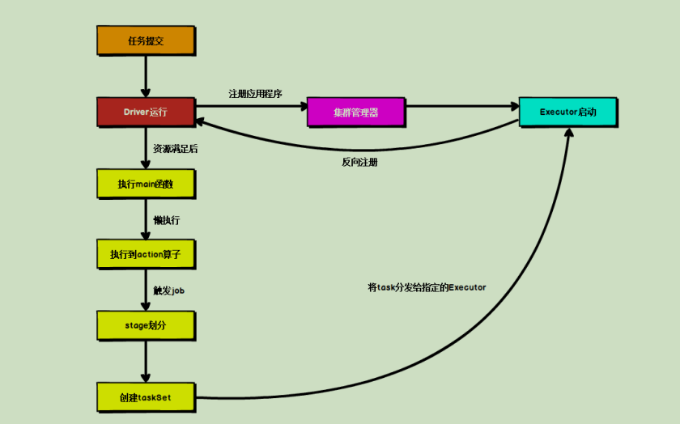

上图为 Spark 通用运行流程图，体现了基本的 Spark 应用程序在部署中的基本提交流程。

> 这个流程是按照如下的核心步骤进行工作的：
> 1) 任务提交后，都会先`启动 Driver 程序`；
> 2) 随后 Driver 向集群管理器`注册应用程序`；
> 3) 之后集群管理器根据此任务的配置文件`分配 Executor` 并启动；
> 4) Driver 开始`执行 main 函数`，Spark 查询为`懒执行`，当执行到 Action 算子时开始`反向推算`，根据宽依赖进行 Stage 的划分，随后每一个 Stage 对应一个 Taskset，Taskset 中有多个 Task，查找可用资源 Executor 进行调度；
> 5) 根据本地化原则，Task 会被分发到指定的 `Executor 去执行`，在任务执行的过程中，Executor 也会不断与 Driver 进行`通信`，**报告任务运行情况**。


# 第 2 章 Spark 部署模式

Spark 支持多种集群管理器（Cluster Manager），分别为：

> 1) `Standalone`：独立模式，Spark 原生的简单集群管理器，自带完整的服务，可单独部署到一个集群中，无需依赖任何其他资源管理系统，使用 Standalone 可以很方便地搭建一个集群；
> 2) `Hadoop YARN`：统一的资源管理机制，在上面可以运行多套计算框架，如 MR、Storm等。根据 `Driver` 在集群中的位置不同，分为 `yarn client`（集群外）和 `yarn cluster`（集群内部）
> 3) Apache Mesos：一个强大的分布式资源管理框架，它允许多种不同的框架部署在其上，包括 Yarn。
> 4) K8S : 容器式部署环境。实际上，除了上述这些通用的集群管理器外，Spark 内部也提供了方便用户测试和学习的本地集群部署模式和 Windows 环境。由于在实际工厂环境下使用的绝大多数的集群管理器是 Hadoop YARN，因此我们关注的重点是 Hadoop YARN 模式下的 Spark 集群部署。

## 2.1 YARN 模式运行机制

### 2.1.1 YARN Cluster 模式

> 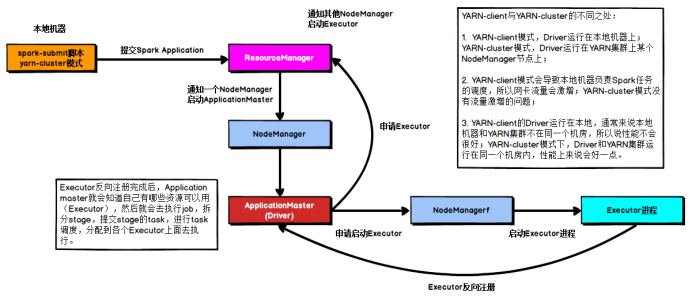
>
> 1) 执行脚本提交任务，实际是启动一个 `SparkSubmit` 的 `JVM` 进程；
> 2) SparkSubmit 类中的 main 方法`反射调用` YarnClusterApplication 的 main 方法；
> 3) YarnClusterApplication 创建 `Yarn 客户端`，然后向 Yarn 服务器发送执行指令：bin/java ApplicationMaster；
> 4) Yarn 框架收到指令后会在指定的 NM 中启动 ApplicationMaster；
> 5) ApplicationMaster 启动 Driver 线程，执行用户的作业；
> 6) AM 向 RM 注册，`申请资源`；
> 7) 获取资源后 AM 向 NM 发送指令：bin/java YarnCoarseGrainedExecutorBackend；
> 8) CoarseGrainedExecutorBackend 进程会接收消息，跟 Driver 通信，`注册`已经启动的 Executor；然后启动计算对象 Executor 等待接收任务
> 9) Driver 线程继续执行完成作业的`调度`和任务的`执行`。
> 10) Driver 分配任务并`监控`任务的执行。

注意：

SparkSubmit、ApplicationMaster 和 CoarseGrainedExecutorBackend 是独立的进程；

Driver是独立的线程；

Executor 和 YarnClusterApplication 是对象。

### 2.1.2 YARN Client 模式

> 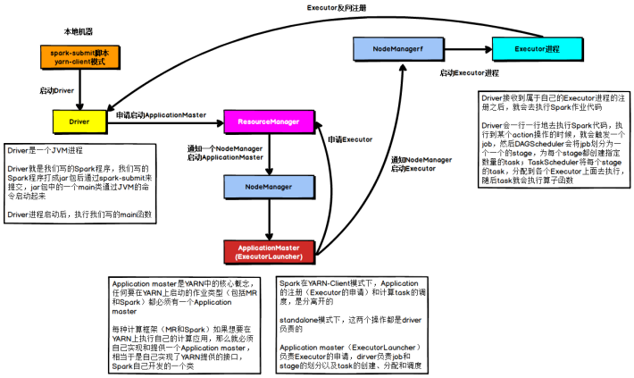
>
> 1) 执行脚本提交任务，实际是启动一个 SparkSubmit 的 JVM 进程；
> 2) SparkSubmit 类中的 main 方法反射调用用户代码的 main 方法；
> 3) 启动 Driver 线程，执行用户的作业，并创建 ScheduleBackend；
> 4) YarnClientSchedulerBackend 向 RM 发送指令：bin/java ExecutorLauncher；
> 5) Yarn 框架收到指令后会在指定的 NM 中启动 ExecutorLauncher（实际上还是调用ApplicationMaster 的 main 方法）；
>
> ```java
> object ExecutorLauncher {
>     def main(args: Array[String]): Unit = {
>         ApplicationMaster.main(args)
>     }
> }
> ```
>
> 6) AM 向 RM 注册，申请资源；
> 7) 获取资源后 AM 向 NM 发送指令：bin/java CoarseGrainedExecutorBackend；
> 8) CoarseGrainedExecutorBackend 进程会接收消息，跟 Driver 通信，注册已经启动的Executor；然后启动计算对象 Executor 等待接收任务
> 9) Driver 分配任务并监控任务的执行。
>
> 注意：SparkSubmit、ApplicationMaster 和 YarnCoarseGrainedExecutorBackend 是独立的进程；Executor 和 Driver 是对象。


## 2.2 Standalone 模式运行机制

> Standalone 集群有 2 个重要组成部分，分别是：
> 1) `Master`(RM)：是一个进程，主要负责资源的调度和分配，并进行集群的监控等职责；
> 2) `Worker`(NM)：是一个进程，一个 Worker 运行在集群中的一台服务器上，主要负责两个职责，一个是用自己的内存存储 RDD 的某个或某些 partition；另一个是启动其他进程和线程（Executor），对 RDD 上的 partition 进行并行的处理和计算。

### 2.2.1 Standalone Cluster 模式

> 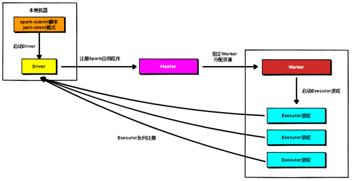
>
> ​	在 `Standalone Cluster` 模式下，任务提交后，Master 会找到一个 Worker 启动 Driver。Driver 启动后向 Master 注册应用程序，Master 根据 submit 脚本的资源需求找到内部资源至少可以启动一个 Executor 的所有 Worker，然后在这些 Worker 之间分配 Executor，Worker 上 的 Executor 启动后会向 Driver 反向注册，所有的 Executor 注册完成后，Driver 开始执行main
> 函数，之后执行到 Action 算子时，开始划分 Stage，每个 Stage 生成对应的 taskSet，之后将Task 分发到各个 Executor 上执行。

### 2.2.2 Standalone Client 模式

> ​	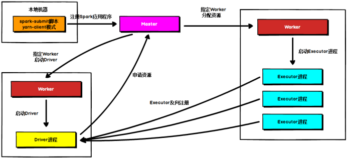
>
> 在 `Standalone Client` 模式下，Driver 在任务提交的本地机器上运行。Driver 启动后向Master 注册应用程序，Master 根据 submit 脚本的资源需求找到内部资源至少可以启动一个Executor 的所有 Worker，然后在这些 Worker 之间分配 Executor，Worker 上的 Executor 启动后会向 Driver 反向注册，所有的 Executor 注册完成后，Driver 开始执行 main 函数，之后执行到 Action 算子时，开始划分 Stage，每个 Stage 生成对应的 TaskSet，之后将 Task 分发到各个 Executor 上执行。


# 第 3 章 Spark 通讯架构

## 3.1 Spark 通信架构概述

> Spark 中通信框架的发展：
>
> ➢ Spark 早期版本中采用 Akka 作为内部通信部件。
>
> ➢ Spark1.3 中引入 Netty 通信框架，为了解决 Shuffle 的大数据传输问题使用
>
> ➢ Spark1.6 中 Akka 和 Netty 可以配置使用。Netty 完全实现了 Akka 在 Spark 中的功能。
>
> ➢ Spark2 系列中，Spark 抛弃 Akka，使用 `Netty`。
>
> Spark2.x 版本使用 Netty 通讯框架作为内部通讯组件。Spark 基于 `Netty 新的 RPC` 框架，借鉴了 `Akka` 的中的设计，它是基于 Actor 模型，如下图所示：
>
> Spark 通讯框架中各个组件（Client/Master/Worker）可以认为是一个个独立的实体，各个实体之间通过消息来进行通信。具体各个组件之间的关系图如下：Endpoint（Client/Master/Worker）有 1 个 InBox 和 N 个 OutBox（N>=1，N 取决于当前 Endpoint与多少其他的 Endpoint 进行通信，一个与其通讯的其他 Endpoint 对应一个 OutBox），Endpoint接收到的消息被写入 InBox，发送出去的消息写入 OutBox 并被发送到其他 Endpoint 的 InBox中。
>
> Spark 通信终端
>
> Driver: 
>
> class DriverEndpoint extends IsolatedRpcEndpoint
>
> Executor
>
> class CoarseGrainedExecutorBackend extends IsolatedRpcEndpoint

## 3.2 Spark 通讯架构解析

> Spark 通信架构如下图所示：
> ➢ RpcEndpoint：RPC 通信终端。Spark 针对每个节点（Client/Master/Worker）都称之为一个 RPC 终端，且都实现 RpcEndpoint 接口，内部根据不同端点的需求，设计不同的消息和不同的业务处理，如果需要发送（询问）则调用 Dispatcher。在 Spark 中，所有的终端都存在生命周期：
> ⚫ Constructor
> ⚫ onStart
> ⚫ receive*
> ⚫ onStop
> ➢ RpcEnv：RPC 上下文环境，每个 RPC 终端运行时依赖的上下文环境称为 RpcEnv；在把当前 Spark 版本中使用的 `NettyRpcEnv`
> ➢ Dispatcher：消息调度（分发）器，针对于 RPC 终端需要发送远程消息或者从远程 RPC接收到的消息，分发至对应的指令收件箱（发件箱）。如果指令接收方是自己则存入收件箱，如果指令接收方不是自己，则放入发件箱；
>
> ➢ Inbox：`指令消息收件箱`。一个本地 RpcEndpoint 对应一个收件箱，Dispatcher 在每次向Inbox 存入消息时，都将对应 EndpointData 加入内部 `ReceiverQueue` 中，另外 Dispatcher创建时会启动一个单独线程进行轮询 ReceiverQueue，进行收件箱消息消费；
> ➢ RpcEndpointRef：`RpcEndpointRef` 是对远程 RpcEndpoint 的一个引用。当我们需要向一个具体的 RpcEndpoint 发送消息时，一般我们需要获取到该 RpcEndpoint 的引用，然后通过该应用发送消息。
> ➢ OutBox：指令消息发件箱。对于当前 RpcEndpoint 来说，一个目标 RpcEndpoint 对应一个发件箱，如果向多个目标RpcEndpoint发送信息，则有多个OutBox。当消息放入Outbox后，紧接着通过 `TransportClient` 将消息发送出去。消息放入发件箱以及发送过程是在同一个线程中进行；
> ➢ RpcAddress：表示远程的 RpcEndpointRef 的地址，Host + Port。
>
>  ➢ TransportClient：Netty 通信客户端，一个 OutBox 对应一个 TransportClient，TransportClient不断轮询 OutBox，根据 OutBox 消息的 receiver 信息，请求对应的远程 TransportServer；
>
>  ➢ TransportServer：Netty 通信服务端，一个 RpcEndpoint 对应一个 TransportServer，接受远程消息后调用 Dispatcher 分发消息至对应收发件箱；


# 第 4 章 Spark 任务调度机制

> ​	在生产环境下，Spark 集群的部署方式一般为 `YARN-Cluster` 模式，之后的内核分析内容中我们默认集群的部署方式为 YARN-Cluster 模式。在上一章中我们讲解了 Spark YARN- Cluster 模式下的任务提交流程，但是我们并没有具体说明 Driver 的工作流程， Driver 线程主 要 是 初 始 化 `SparkContext` 对 象 ， 准备运行所需的上下文 ，然后一方面`保持 与ApplicationMaster 的 RPC 连接`，通过 ApplicationMaster 申请资源，另一方面根据用户业务逻辑开始调度任务，将任务下发到已有的空闲 Executor 上。当 ResourceManager 向 ApplicationMaster 返回 Container 资源时，ApplicationMaster 就尝试在对应的 Container 上启动 Executor 进程，Executor 进程起来后，会向 Driver 反向注册，注册成功后保持与 Driver 的心跳，同时等待 Driver 分发任务，当分发的任务执行完毕后，将任务状态上报给 Driver。

## 4.1 Spark 任务调度概述

> ​	当 Driver 起来后，Driver 则会根据用户程序逻辑准备任务，并根据 Executor 资源情况逐步`分发任务`。在详细阐述任务调度前，首先说明下 Spark 里的几个概念。一个 Spark 应用程序包括 `Job`、`Stage` 以及 `Task` 三个概念：
> 1) Job 是以 Action 方法为界，遇到一个 Action 方法则触发一个 Job；
> 2) Stage 是 Job 的子集，以 RDD `宽依赖`(即 Shuffle)为界，遇到 Shuffle 做一次划分；
> 3) Task 是 Stage 的子集，以并行度(`分区数`)来衡量，分区数是多少，则有多少个 task。Spark 的任务调度总体来说分两路进行，一路是 Stage 级的调度，一路是 Task 级的调度，总体调度流程如下图所示：
>
> Spark RDD 通过其 Transactions 操作，形成了 RDD 血缘（依赖）关系图，即 `DAG`，最后通过 Action 的调用，触发 Job 并调度执行，执行过程中会创建两个调度器：DAGScheduler和 TaskScheduler。
>
>  ➢ `DAGScheduler` 负责 Stage 级的调度，主要是将 job 切分成若干 Stages，并将每个 Stage打包成 TaskSet 交给 TaskScheduler 调度。
> ➢ `TaskScheduler` 负责 Task 级的调度，将 DAGScheduler 给过来的 TaskSet 按照指定的调度策略分发到 Executor 上执行，调度过程中 SchedulerBackend 负责提供可用资源，其中SchedulerBackend 有多种实现，分别对接不同的资源管理系统。
> Driver 初始化 SparkContext 过程中，会分别初始化 DAGScheduler、TaskScheduler、SchedulerBackend 以及 HeartbeatReceiver，并启动 SchedulerBackend 以及 HeartbeatReceiver。SchedulerBackend 通过 ApplicationMaster 申请资源，并不断从 TaskScheduler 中拿到合适的Task 分发到 Executor 执行。HeartbeatReceiver 负责接收 Executor 的心跳信息，监控 Executor的存活状况，并通知到 TaskScheduler。

## 4.2 Spark Stage 级调度

> ​	Spark 的任务调度是从 DAG 切割开始，主要是由 DAGScheduler 来完成。当遇到`一个Action 操作`后就会触发`一个 Job` 的计算，并交给 DAGScheduler 来提交，下图是涉及到 Job提交的相关方法调用流程图。

> 1) Job 由最终的 RDD 和 Action 方法封装而成；
> 2) SparkContext 将 Job 交给 DAGScheduler 提交，它会根据 RDD 的血缘关系构成的 DAG进行切分，将一个 Job 划分为若干 Stages，具体划分策略是，由最终的 RDD 不断通过依赖回溯判断父依赖是否是宽依赖，即以 Shuffle 为界，划分 Stage，窄依赖的 RDD 之间被划分到同一个 Stage 中，可以进行 pipeline 式的计算。划分的 Stages 分两类，一类叫做 ResultStage，为 DAG 最下游的 Stage，由 Action 方法决定，另一类叫做ShuffleMapStage，为下游 Stage 准备数据，下面看一个简单的例子 WordCount。

> ​	Job 由 saveAsTextFile 触发，该 Job 由 RDD-3 和 saveAsTextFile 方法组成，根据 RDD 之间的依赖关系从 RDD-3 开始回溯搜索，直到没有依赖的 RDD-0，在回溯搜索过程中，RDD- 3 依赖 RDD-2，并且是`宽依赖`，所以在 RDD-2 和 RDD-3 之间划分 Stage，RDD-3 被划到最后一个 Stage，即 ResultStage 中，RDD-2 依赖 RDD-1，RDD-1 依赖 RDD-0，这些依赖都是窄依赖，所以将 RDD-0、RDD-1 和 RDD-2 划分到同一个 Stage，形成 pipeline 操作。即ShuffleMapStage 中，实际执行的时候，数据记录会一气呵成地执行 RDD-0 到 RDD-2 的转化。不难看出，其本质上是一个深度优先搜索（Depth First Search）算法。

> ​	一个 Stage 是否被提交，需要判断它的父 Stage 是否执行，只有在父 Stage 执行完毕才能提交当前 Stage，如果一个 Stage 没有父 Stage，那么从该 Stage 开始提交。Stage 提交时会将 Task 信息（分区信息以及方法等）序列化并被打包成 TaskSet 交给TaskScheduler，一个Partition 对应一个 Task，另一方面 TaskScheduler 会监控 Stage 的运行状态，只有 Executor 丢失或者 Task 由于 Fetch 失败才需要重新提交失败的 Stage 以调度运行失败的任务，其他类型的 Task 失败会在 TaskScheduler 的调度过程中重试。相对来说 DAGScheduler 做的事情较为简单，仅仅是在 Stage 层面上划分 DAG，提交Stage 并监控相关状态信息。TaskScheduler 则相对较为复杂，下面详细阐述其细节。

## 4.3 Spark Task 级调度

Spark Task 的调度是由 TaskScheduler 来完成，由前文可知，DAGScheduler 将 Stage 打包到交给 TaskScheTaskSetduler，TaskScheduler 会将 TaskSet 封装为 TaskSetManager 加入到调度队列中，TaskSetManager 结构如下图所示。

TaskSetManager 负责监控管理同一 个 Stage 中的 Tasks， TaskScheduler 就是以TaskSetManager 为单元来调度任务。
前面也提到，TaskScheduler 初始化后会启动 SchedulerBackend，它负责跟外界打交道，接收 Executor 的注册信息，并维护 Executor 的状态，所以说 SchedulerBackend 是管“粮食”的，同时它在启动后会定期地去“询问”TaskScheduler 有没有任务要运行，也就是说，它会定期地“问”TaskScheduler“我有这么余粮，你要不要啊”，TaskScheduler 在 SchedulerBackend“问”它的时候，会从调度队列中按照指定的调度策略选择 TaskSetManager 去调度运行，大致方法调用流程如下图所示：

上图中，将 TaskSetManager 加入 rootPool 调度池中之后，调用 SchedulerBackend 的riviveOffers 方法给 driverEndpoint 发送 ReviveOffer 消息；

driverEndpoint 收到 ReviveOffer 消息后调用 makeOffers 方法，过滤出活跃状态的 Executor（这些 Executor 都是任务启动时反
向注册到 Driver 的 Executor），然后将 Executor 封装成 WorkerOffer 对象；

准备好计算资源（WorkerOffer）后，taskScheduler 基于这些资源调用 resourceOffer 在 Executor 上分配 task。 

### 4.3.1 调度策略

​	TaskScheduler 支持两种调度策略，一种是 FIFO，也是默认的调度策略，另一种是 FAIR。 在 TaskScheduler 初始化过程中会实例化 rootPool，表示树的根节点，是 Pool 类型。

**1) FIFO 调度策略**
如果是采用 FIFO 调度策略，则直接简单地将 TaskSetManager 按照先来先到的方式入队，出队时直接拿出最先进队的TaskSetManager，其树结构如下图所示，TaskSetManager 保存在一个 FIFO 队列中。

**2) FAIR 调度策略**
FAIR 调度策略的树结构如下图所示：

FAIR 模式中有一个 rootPool 和多个子 Pool，各个子 Pool 中存储着所有待分配的TaskSetMagager。 在 FAIR 模式中，需要先对子 Pool 进行排序，再对子 Pool 里面的 TaskSetMagager 进行排序，因为 Pool 和 TaskSetMagager 都继承了 Schedulable 特质，因此使用相同的排序算法。排序过程的比较是基于 Fair-share 来比较的，每个要排序的对象包含三个属性: 
runningTasks值（正在运行的Task数）、minShare值、weight值，比较时会综合考量runningTasks值，minShare 值以及 weight 值。

注意，minShare、weight 的值均在公平调度配置文件 fairscheduler.xml 中被指定，调度池在构建阶段会读取此文件的相关配置。

> 1) 如果A对象的runningTasks大于它的minShare，B对象的runningTasks小于它的minShare，那么 B 排在 A 前面；（runningTasks 比 minShare 小的先执行）
> 2) 如果 A、B 对象的 runningTasks 都小于它们的 minShare，那么就比较 runningTasks 与minShare 的比值（minShare 使用率），谁小谁排前面；（minShare 使用率低的先执行）
> 3) 如果 A、B 对象的 runningTasks 都大于它们的 minShare，那么就比较 runningTasks 与weight 的比值（权重使用率），谁小谁排前面。（权重使用率低的先执行）
> 4) 如果上述比较均相等，则比较名字。整体上来说就是通过minShare和weight这两个参数控制比较过程，可以做到让minShare使用率和权重使用率少（实际运行 task 比例较少）的先运行。

​	FAIR 模式排序完成后，所有的 TaskSetManager 被放入一个 ArrayBuffer 里，之后依次被取出并发送给 Executor 执行。从调度队列中拿到 TaskSetManager 后，由于 TaskSetManager 封装了一个 Stage 的所有Task，并负责管理调度这些 Task，那么接下来的工作就是 TaskSetManager 按照一定的规则一个个取出 Task 给 TaskScheduler，TaskScheduler 再交给 SchedulerBackend 去发到 Executor上执行。

### 4.3.2 本地化调度

> ​	DAGScheduler 切割 Job，划分 Stage, 通过调用 submitStage 来提交一个 Stage 对应的tasks，submitStage 会调用 submitMissingTasks，submitMissingTasks 确定每个需要计算的 task 的 preferredLocations，通过调用getPreferrdeLocations()得到 partition 的优先位置，由于一个partition 对应一个 Task，此 partition 的优先位置就是 task 的优先位置，对于要提交到TaskScheduler 的 TaskSet 中的每一个 Task，该 task 优先位置与其对应的 partition 对应的优先位置一致。从调度队列中拿到 TaskSetManager 后，那么接下来的工作就是 TaskSetManager 按照一定的规则一个个取出 task 给 TaskSchedulerTaskScheduler 再交给 SchedulerBackend 去发到Executor 上执行。前面也提到，TaskSetManager 封装了一个 Stage 的所有 Task，并负责管理调度这些 Task。根据每个 Task 的优先位置，确定 Task 的 Locality 级别，Locality 一共有五种，优先级由高到低顺序：
>
> 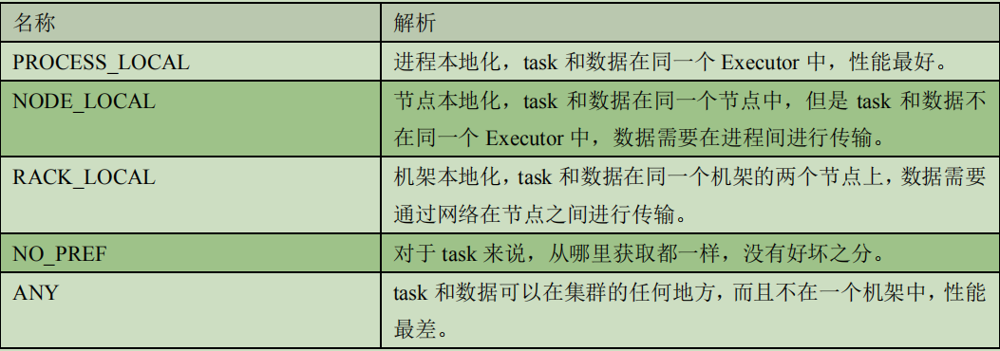


> ​	在调度执行时，Spark 调度总是会尽量让每个 task 以最高的本地性级别来启动，当一个task 以 X 本地性级别启动，但是该本地性级别对应的所有节点都没有空闲资源而启动失败，此时并不会马上降低本地性级别启动而是在某个时间长度内再次以 X 本地性级别来启动该task，若超过限时时间则降级启动，去尝试下一个本地性级别，依次类推。可以通过调大每个类别的最大容忍延迟时间，在等待阶段对应的 Executor 可能就会有相应的资源去执行此 task，这就在在一定程度上提到了运行性能。 

### 4.3.3 失败重试与黑名单机制

> ​	除了选择合适的 Task 调度运行外，还需要监控 Task 的执行状态，前面也提到，与外部打交道的是 SchedulerBackend，Task 被提交到 Executor 启动执行后，Executor 会将执行状态上报给 SchedulerBackend，SchedulerBackend 则告诉 TaskScheduler，TaskScheduler 找到该Task 对应的 TaskSetManager，并通知到该 TaskSetManager，这样 TaskSetManager 就知道 Task的失败与成功状态，对于失败的 Task，会记录它失败的次数，如果失败次数还没有超过最大
> 重试次数，那么就把它放回待调度的 Task 池子中，否则整个 Application 失败。在记录 Task 失败次数过程中，会记录它上一次失败所在的 Executor Id 和 Host，这样下次再调度这个 Task 时，会使用黑名单机制，避免它被调度到上一次失败的节点上，起到一定的容错作用。黑名单记录 Task 上一次失败所在的 Executor Id 和 Host，以及其对应的“拉黑”时间，“拉黑”时间是指这段时间内不要再往这个节点上调度这个 Task 了。

# 第 5 章 Spark Shuffle 解析

## 5.1 Shuffle 的核心要点

### 5.1.1 ShuffleMapStage 与 ResultStage

> 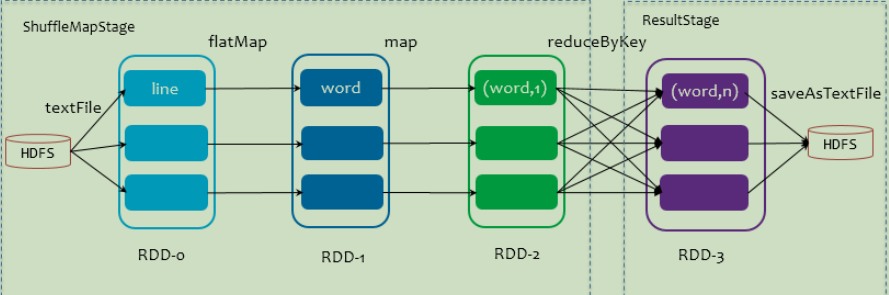	
>
> 在划分 stage 时，最后一个 stage 称为 finalStage，它本质上是一个 ResultStage 对象，前面的所有 stage 被称为ShuffleMapStage。
>
> **ShuffleMapStage** 的结束伴随着 shuffle 文件的写磁盘。
>
> **ResultStage** 基本上对应代码中的 action 算子，即将一个函数应用在 RDD 的各个 partition的数据集上，意味着一个 job 的运行结束。

## 5.2 HashShuffle 解析

### 5.2.1 未优化的 HashShuffle

> ​	这里我们先明确一个假设前提：每个 Executor 只有 1 个 CPU core，也就是说，无论这个 Executor 上分配多少个 task 线程，同一时间都只能执行一个 task 线程。
>
> ​	如下图中有 3 个 Reducer，从 Task 开始那边各自把自己进行 Hash 计算(分区器：hash/numreduce 取模)，分类出 3 个不同的类别，每个 Task 都分成 3 种类别的数据，想把不同的数据汇聚然后计算出最终的结果，所以 Reducer 会在每个 Task 中把属于自己类别的数据收集过来，汇聚成一个同类别的大集合，每 1 个 Task 输出 3 份本地文件，这里有 4 个Mapper Tasks，所以总共输出了 4 个 Tasks x 3 个分类文件 = 12 个本地小文件。
>
> 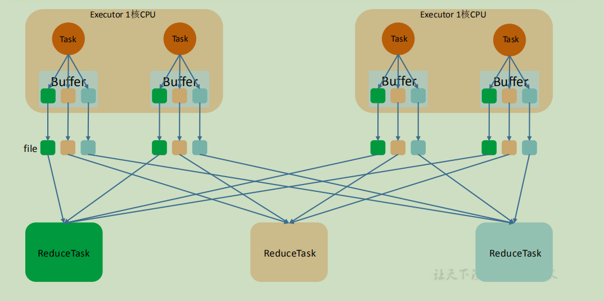


### 5.2.2 优化后的 HashShuffle

> 优化的 HashShuffle 过程就是启用合并机制，合并机制就是复用 buffer，开启合并机制的配置是 spark.shuffle.consolidateFiles。该参数默认值为 false，将其设置为 true 即可开启优化机制。通常来说，如果我们使用 HashShuffleManager，那么都建议开启这个选项。
>
> 这里还是有 4 个 Tasks，数据类别还是分成 3 种类型，因为 Hash 算法会根据你的 Key 进行分类，在同一个进程中，无论是有多少过 Task，都会把同样的 Key 放在同一个 Buffer里，然后把 Buffer 中的数据写入以 Core 数量为单位的本地文件中，(一个 Core 只有一种类型的 Key 的数据)，每 1 个 Task 所在的进程中，分别写入共同进程中的 3 份本地文件，这里有 4 个 Mapper Tasks，所以总共输出是 2 个 Cores x 3 个分类文件 = 6 个本地小文件。
>
> 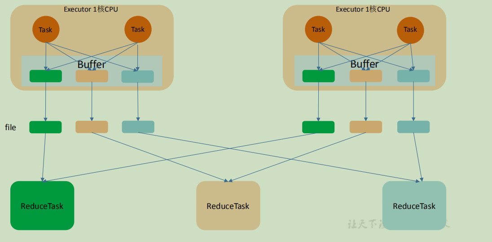


## 5.3 SortShuffle 解析

### 5.3.1 普通 SortShuffle

> ​	在该模式下，数据会先写入一个数据结构，reduceByKey 写入 Map，一边通过 Map 局部聚合，一遍写入内存。Join 算子写入 ArrayList 直接写入内存中。然后需要判断是否达到阈值，如果达到就会将内存数据结构的数据写入到磁盘，清空内存数据结构。在溢写磁盘前，先根据 key 进行排序，排序过后的数据，会分批写入到磁盘文件中。默认批次为 10000 条，数据会以每批一万条写入到磁盘文件。写入磁盘文件通过缓冲区溢写的方式，每次溢写都会产生一个磁盘文件，也就是说一个 Task 过程会产生多个临时文件。最后在每个 Task 中，将所有的临时文件合并，这就是 merge 过程，此过程将所有临时文件读取出来，一次写入到最终文件。意味着一个 Task 的所有数据都在这一个文件中。同时单独写一份索引文件，标识下游各个Task的数据在文件中的索引，start offset和end offset。


###  5.3.2 bypass SortShuffle

> bypass 运行机制的触发条件如下：
> 1) shuffle reduce task 数量小于等于 spark.shuffle.sort.bypassMergeThreshold 参数的值，默认为 200。
> 2) 不是聚合类的 shuffle 算子（比如 reduceByKey）。此时 task 会为每个 reduce 端的 task 都创建一个临时磁盘文件，并将数据按 key 进行hash 然后根据 key 的 hash 值，将 key 写入对应的磁盘文件之中。当然，写入磁盘文件时也是先写入内存缓冲，缓冲写满之后再溢写到磁盘文件的。最后，同样会将所有临时磁盘文件都合并成一个磁盘文件，并创建一个单独的索引文件。该过程的磁盘写机制其实跟未经优化的 HashShuffleManager 是一模一样的，因为都要创建数量惊人的磁盘文件，只是在最后会做一个磁盘文件的合并而已。因此少量的最终磁盘文件，也让该机制相对未经优化的 HashShuffleManager 来说，shuffle read 的性能会更好。而该机制与普通 SortShuffleManager 运行机制的不同在于：不会进行排序。也就是说，
> 启用该机制的最大好处在于，shuffle write 过程中，不需要进行数据的排序操作，也就节省掉了这部分的性能开销。


# 第 6 章 Spark 内存管理

## 6.1 堆内和堆外内存规划

> ​	作为一个 JVM 进程，Executor 的内存管理建立在 JVM 的内存管理之上，Spark 对 JVM的堆内（On-heap）空间进行了更为详细的分配，以充分利用内存。同时，Spark 引入了堆外（Off-heap）内存，使之可以直接在工作节点的系统内存中开辟空间，进一步优化了内存的使用。堆内内存受到 JVM 统一管理，堆外内存是直接向操作系统进行内存的申请和释放。
>
> 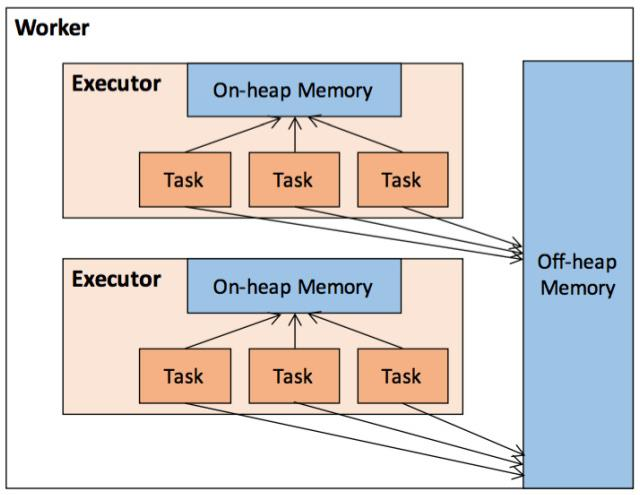

1) 堆内内存

> ​	堆 内 内 存 的 大 小 ， 由 Spark 应 用 程 序 启 动 时 的 – executor-memory 或spark.executor.memory 参数配置。Executor 内运行的并发任务共享 JVM 堆内内存，这些任务在缓存 RDD 数据和广播（Broadcast）数据时占用的内存被规划为存储（Storage）内存，而这些任务在执行 Shuffle 时占用的内存被规划为执行（Execution）内存，剩余的部分不做特殊规划，那些 Spark 内部的对象实例，或者用户定义的 Spark 应用程序中的对象实例，均占用剩余的空间。不同的管理模式下，这三部分占用的空间大小各不相同。
> ​	Spark 对堆内内存的管理是一种逻辑上的”规划式”的管理，因为对象实例占用内存的申请和释放都由 JVM 完成，Spark 只能在申请后和释放前记录这些内存，我们来看其具体流程：
>
> 申请内存流程如下：
>
> Spark 在代码中 new 一个对象实例；
>
> JVM 从堆内内存分配空间，创建对象并返回对象引用；
>
> Spark 保存该对象的引用，记录该对象占用的内存。
>
> 释放内存流程如下：
>
> Spark 记录该对象释放的内存，删除该对象的引用；
>
> 等待 JVM 的垃圾回收机制释放该对象占用的堆内内存。
>
> ​	我们知道，JVM 的对象可以以序列化的方式存储，序列化的过程是将对象转换为二进制字节流，本质上可以理解为将非连续空间的链式存储转化为连续空间或块存储，在访问时则需要进行序列化的逆过程——反序列化，将字节流转化为对象，序列化的方式可以节省存储空间，但增加了存储和读取时候的计算开销。对于 Spark 中序列化的对象，由于是字节流的形式，其占用的内存大小可直接计算，而对于非序列化的对象，其占用的内存是通过周期性地采样近似估算而得，即并不是每次新增的数据项都会计算一次占用的内存大小，这种方法降低了时间开销但是有可能误差较大，导致某一时刻的实际内存有可能远远超出预期。此外，在被 Spark 标记为释放的对象实例，很有可能在实际上并没有被 JVM 回收，导致实际可用的内存小于 Spark 记录的可用内存。所以 Spark 并不能准确记录实际可用的堆内内存，从而也就无法完全避免内存溢出（OOM, Out of Memory）的异常。虽然不能精准控制堆内内存的申请和释放，但 Spark 通过对存储内存和执行内存各自独立的规划管理，可以决定是否要在存储内存里缓存新的 RDD，以及是否为新的任务分配执行内存，在一定程度上可以提升内存的利用率，减少异常的出现。

2) 堆外内存

> ​	为了进一步优化内存的使用以及提高 Shuffle 时排序的效率，Spark 引入了堆外（Off-heap）内存，使之可以直接在工作节点的系统内存中开辟空间，存储经过序列化的二进制数据。堆外内存意味着把内存对象分配在 Java 虚拟机的堆以外的内存，这些内存直接受操作系统管理（而不是虚拟机）。这样做的结果就是能保持一个较小的堆，以减少垃圾收集对应用的影响。利用 JDK Unsafe API（从 Spark 2.0 开始，在管理堆外的存储内存时不再基于 Tachyon，而是与堆外的执行内存一样，基于 JDK Unsafe API 实现），Spark 可以直接操作系统堆外内存，减少了不必要的内存开销，以及频繁的 GC 扫描和回收，提升了处理性能。堆外内存可以被精确地申请和释放（堆外内存之所以能够被精确的申请和释放，是由于内存的申请和释放不再通过 JVM 机制，而是直接向操作系统申请，JVM 对于内存的清理是无法准确指定时间点的，因此无法实现精确的释放），而且序列化的数据占用的空间可以被精确计算，所以相比堆内内存来说降低了管理的难度，也降低了误差。在默认情况下堆外内存并不启用，可通过配置 spark.memory.offHeap.enabled 参数启用，并由 spark.memory.offHeap.size 参数设定堆外空间的大小。除了没有 other 空间，堆外内存与堆内内存的划分方式相同，所有运行中的并发任务共享存储内存和执行内存。

## 6.2 内存空间分配

1) 静态内存管理

> ​	在 Spark 最初采用的静态内存管理机制下，存储内存、执行内存和其他内存的大小在Spark 应用程序运行期间均为固定的，但用户可以应用程序启动前进行配置，堆内内存的分配如图所示：
>
> 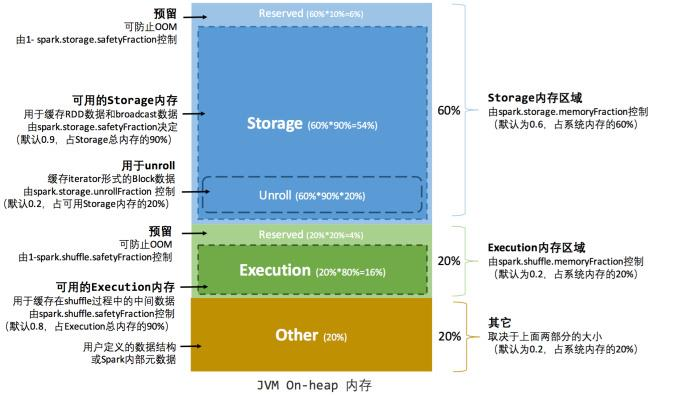
>
> 可以看到，可用的堆内内存的大小需要按照下列方式计算：
>
> 可用的存储内存 = systemMaxMemory * spark.storage.memoryFraction * spark.storage.safetyFraction
>
> 可用的执行内存 = systemMaxMemory * spark.shuffle.memoryFraction * spark.shuffle.safetyFraction
>
> 其中 systemMaxMemory 取决于当前 JVM 堆内内存的大小，最后可用的执行内存或者存储内存要在此基础上与各自的 memoryFraction 参数和 safetyFraction 参数相乘得出。上述计算公式中的两个 safetyFraction 参数，其意义在于在逻辑上预留出 1-safetyFraction 这么一块保险区域，降低因实际内存超出当前预设范围而导致 OOM 的风险（上文提到，对于非序列化对象的内存采样估算会产生误差）。
>
> 值得注意的是，这个预留的保险区域仅仅是一种逻辑上的规划，在具体使用时 Spark 并没有区别对待，和”其它内存”一样交给了 JVM 去管理。
>
> Storage 内存和 Execution 内存都有预留空间，目的是防止 OOM，因为 Spark 堆内内存大小的记录是不准确的，需要留出保险区域。
>
> 堆外的空间分配较为简单，只有存储内存和执行内存，如下图所示。可用的执行内存和存储内存占用的空间大小直接由参数 spark.memory.storageFraction 决定，由于堆外内存占用的空间可以被精确计算，所以无需再设定保险区域。
>
> 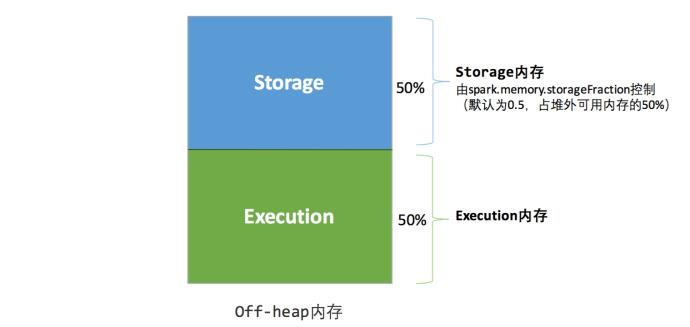
>
> 静态内存管理机制实现起来较为简单，但如果用户不熟悉 Spark 的存储机制，或没有根据具体的数据规模和计算任务或做相应的配置，很容易造成”一半海水，一半火焰”的局面，即存储内存和执行内存中的一方剩余大量的空间，而另一方却早早被占满，不得不淘汰或移出旧的内容以存储新的内容。由于新的内存管理机制的出现，这种方式目前已经很少有开发者使用，出于兼容旧版本的应用程序的目的，Spark 仍然保留了它的实现。

2) 统一内存管理

> ​	Spark1.6 之后引入的统一内存管理机制，与静态内存管理的区别在于存储内存和执行内存共享同一块空间，可以动态占用对方的空闲区域，统一内存管理的堆内内存结构如图所示：
>
> 
>
> 统一内存管理的堆外内存结构如下图所示：
>
> 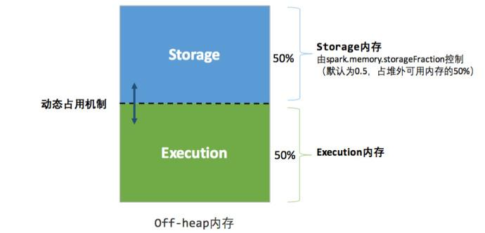
>
> 其中最重要的优化在于动态占用机制，其规则如下：
> 1) 设定基本的存储内存和执行内存区域（spark.storage.storageFraction 参数），该设定确定了双方各自拥有的空间的范围；
> 2) 双方的空间都不足时，则存储到硬盘；若己方空间不足而对方空余时，可借用对方的空间;（存储空间不足是指不足以放下一个完整的 Block）
> 3) 执行内存的空间被对方占用后，可让对方将占用的部分转存到硬盘，然后”归还”借用的空间；
> 4) 存储内存的空间被对方占用后，无法让对方”归还”，因为需要考虑 Shuffle 过程中的很多因素，实现起来较为复杂。统一内存管理的动态占用机制如图所示：
>
> 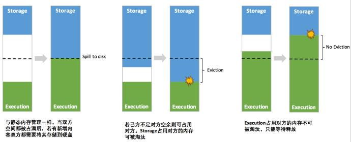
>
> 凭借统一内存管理机制，Spark 在一定程度上提高了堆内和堆外内存资源的利用率，降低了开发者维护 Spark 内存的难度，但并不意味着开发者可以高枕无忧。如果存储内存的空间太大或者说缓存的数据过多，反而会导致频繁的全量垃圾回收，降低任务执行时的性能，因为缓存的 RDD 数据通常都是长期驻留内存的。所以要想充分发挥 Spark 的性能，需要开发者进一步了解存储内存和执行内存各自的管理方式和实现原理。

## 6.3 存储内存管理

1) RDD 的持久化机制

> ​	弹性分布式数据集（RDD）作为 Spark 最根本的数据抽象，是只读的分区记录（Partition）的集合，只能基于在稳定物理存储中的数据集上创建，或者在其他已有的 RDD 上执行转换（Transformation）操作产生一个新的 RDD。转换后的 RDD 与原始的 RDD 之间产生的依赖关系，构成了血统（Lineage）。凭借血统，Spark 保证了每一个 RDD 都可以被重新恢复。但RDD 的所有转换都是惰性的，即只有当一个返回结果给 Driver 的行动（Action）发生时，Spark 才会创建任务读取 RDD，然后真正触发转换的执行。Task 在启动之初读取一个分区时，会先判断这个分区是否已经被持久化，如果没有则需要检查 Checkpoint 或按照血统重新计算。所以如果一个 RDD 上要执行多次行动，可以在第一次行动中使用 persist 或 cache 方法，在内存或磁盘中持久化或缓存这个 RDD，从而在后面的行动时提升计算速度。事实上，cache 方法是使用默认的 MEMORY_ONLY 的存储级别将 RDD 持久化到内存，故缓存是一种特殊的持久化。 堆内和堆外存储内存的设计，便可以对缓存 RDD 时使用的内存做统一的规划和管理。
> ​	RDD 的持久化由 Spark 的 Storage 模块负责，实现了 RDD 与物理存储的解耦合。Storage模块负责管理 Spark 在计算过程中产生的数据，将那些在内存或磁盘、在本地或远程存取数据的功能封装了起来。在具体实现时 Driver 端和 Executor 端的 Storage 模块构成了主从式的架构，即 Driver 端的 BlockManager 为 Master，Executor 端的 BlockManager 为 Slave。Storage 模块在逻辑上以 Block 为基本存储单位，RDD 的每个 Partition 经过处理后唯一对应一个 Block（BlockId 的格式为 rdd_RDD-ID_PARTITION-ID ）。Driver 端的 Master 负责整个 Spark 应用程序的 Block 的元数据信息的管理和维护，而 Executor 端的 Slave 需要将 Block的更新等状态上报到 Master，同时接收 Master 的命令，例如新增或删除一个 RDD。
>
> 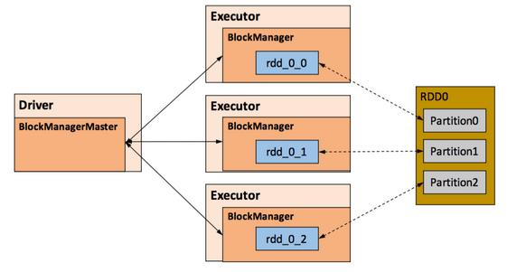
>
> 在对 RDD 持久化时，Spark 规定了 MEMORY_ONLY、MEMORY_AND_DISK 等 7 种不同的存储级别，而存储级别是以下 5 个变量的组合：
>
> ```java
> class StorageLevel private(
> private var _useDisk: Boolean, //磁盘
> private var _useMemory: Boolean, //这里其实是指堆内内存
> private var _useOffHeap: Boolean, //堆外内存
> private var _deserialized: Boolean, //是否为非序列化
> private var _replication: Int = 1 //副本个数
> )
> ```
>
> Spark 中 7 种存储级别如下：
> 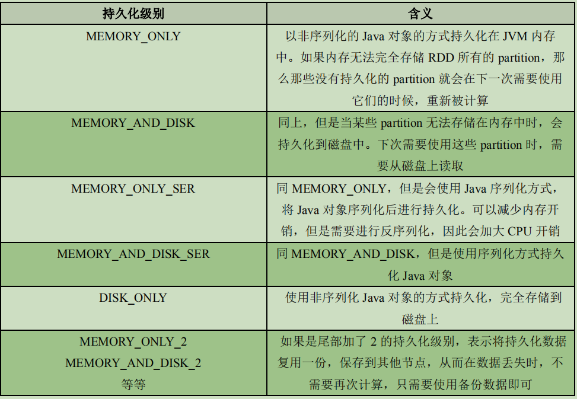
> 	通过对数据结构的分析，可以看出存储级别从三个维度定义了 RDD 的 Partition（同时也就是 Block)的存储方式：
>
> ➢ 存储位置：磁盘／堆内内存／堆外内存。如 MEMORY_AND_DISK 是同时在磁盘和堆内内存上存储，实现了冗余备份。OFF_HEAP 则是只在堆外内存存储，目前选择堆外内存时不能同时存储到其他位置。
>
> ➢ 存储形式：Block 缓存到存储内存后，是否为非序列化的形式。如 MEMORY_ONLY 是非序列化方式存储，OFF_HEAP 是序列化方式存储。
>
> ➢ 副本数量：大于 1 时需要远程冗余备份到其他节点。如 DISK_ONLY_2 需要远程备份 1个副本。


2) RDD 的缓存过程

> ​	RDD 在缓存到存储内存之前，Partition 中的数据一般以迭代器（Iterator）的数据结构来访问，这是 Scala 语言中一种遍历数据集合的方法。通过 Iterator 可以获取分区中每一条序列化或者非序列化的数据项(Record)，这些 Record 的对象实例在逻辑上占用了 JVM 堆内内存的 other 部分的空间，同一 Partition 的不同 Record 的存储空间并不连续。RDD 在缓存到存储内存之后，Partition 被转换成 Block，Record 在堆内或堆外存储内存中占用一块连续的空间。将 Partition 由不连续的存储空间转换为连续存储空间的过程，Spark称之为"展开"（Unroll）。
>
> Block 有序列化和非序列化两种存储格式，具体以哪种方式取决于该 RDD 的存储级别。非序列化的 Block 以一种 DeserializedMemoryEntry 的数据结构定义，用一个数组存储所有的对象实例，序列化的 Block 则以 SerializedMemoryEntry 的数据结构定义，用字节缓冲区（ByteBuffer）来存储二进制数据。每个 Executor 的 Storage 模块用一个链式 Map 结构（LinkedHashMap）来管理堆内和堆外存储内存中所有的 Block 对象的实例，对这个LinkedHashMap 新增和删除间接记录了内存的申请和释放。因为不能保证存储空间可以一次容纳 Iterator 中的所有数据，当前的计算任务在 Unroll 时要向 MemoryManager 申请足够的 Unroll 空间来临时占位，空间不足则 Unroll 失败，空间足够时可以继续进行。
>
> 对于序列化的 Partition，其所需的 Unroll 空间可以直接累加计算，一次申请。
> 对于非序列化的 Partition 则要在遍历 Record 的过程中依次申请，即每读取一条 Record，采样估算其所需的 Unroll 空间并进行申请，空间不足时可以中断，释放已占用的 Unroll 空间。
>
> 如果最终 Unroll 成功，当前 Partition 所占用的 Unroll 空间被转换为正常的缓存 RDD 的存储空间，如下图所示。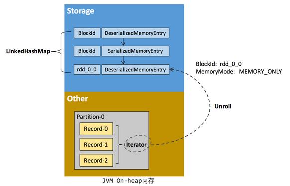
>
> 在静态内存管理时，Spark 在存储内存中专门划分了一块 Unroll 空间，其大小是固定的，统一内存管理时则没有对 Unroll 空间进行特别区分，当存储空间不足时会根据动态占用机制进行处理。

3) 淘汰与落盘

> 由于同一个 Executor 的所有的计算任务共享有限的存储内存空间，当有新的 Block 需要缓存但是剩余空间不足且无法动态占用时，就要对 LinkedHashMap 中的旧 Block 进行淘汰（Eviction），而被淘汰的 Block 如果其存储级别中同时包含存储到磁盘的要求，则要对其进行落盘（Drop），否则直接删除该 Block。
>
> 存储内存的淘汰规则为：
>
> ➢ 被淘汰的旧 Block 要与新 Block 的 MemoryMode 相同，即同属于堆外或堆内内存；
>
> ➢ 新旧 Block 不能属于同一个 RDD，避免循环淘汰；
>
> ➢ 旧 Block 所属 RDD 不能处于被读状态，避免引发一致性问题；
>
> ➢ 遍历 LinkedHashMap 中 Block，按照最近最少使用（LRU）的顺序淘汰，直到满足新
>
> Block 所需的空间。其中 LRU 是 LinkedHashMap 的特性。
>
> 落盘的流程则比较简单，如果其存储级别符合_useDisk 为 true 的条件，再根据其\_deserialized判断是否是非序列化的形式，若是则对其进行序列化，最后将数据存储到磁盘，在 Storage模块中更新其信息。

## 6.4 执行内存管理

> ​	执行内存主要用来存储任务在执行 Shuffle 时占用的内存，Shuffle 是按照一定规则对RDD 数据重新分区的过程，我们来看 Shuffle 的 Write 和 Read 两阶段对执行内存的使用：
> 1. Shuffle Write
>     若在 map 端选择普通的排序方式，会采用 ExternalSorter 进行外排，在内存中存储数据时主要占用堆内执行空间。若在 map 端选择 Tungsten 的排序方式，则采用 ShuffleExternalSorter 直接对以序列化形式存储的数据排序，在内存中存储数据时可以占用堆外或堆内执行空间，取决于用户是否开启了堆外内存以及堆外执行内存是否足够。
>
> 2. Shuffle Read
>     在对 reduce 端的数据进行聚合时，要将数据交给 Aggregator 处理，在内存中存储数据时占用堆内执行空间。如果需要进行最终结果排序，则要将再次将数据交给 ExternalSorter 处理，占用堆内执行空间。在 ExternalSorter 和 Aggregator 中，Spark 会使用一种叫 AppendOnlyMap 的哈希表在堆内执行内存中存储数据，但在 Shuffle 过程中所有数据并不能都保存到该哈希表中，当这个哈希表占用的内存会进行周期性地采样估算，当其大到一定程度，无法再从 MemoryManager 申请到新的执行内时，Spark 就会将其全部内容存储到磁盘文件中，这个过程被称为溢存(Spill)，溢存到磁盘的文件最后会被归并(Merge)。Shuffle Write 阶段中用到的 Tungsten 是 Databricks 公司提出的对 Spark 优化内存和 CPU 使用的计划（钨丝计划），解决了一些 JVM 在性能上的限制和弊端。Spark 会根据 Shuffle 的情况来自动选择是否采用 Tungsten 排序。Tungsten 采用的页式内存管理机制建立在 MemoryManager 之上，即 Tungsten 对执行内存的使用进行了一步的抽象，这样在 Shuffle 过程中无需关心数据具体存储在堆内还是堆外。每个内存页用一个 MemoryBlock 来定义，并用 Object obj 和 long offset 这两个变量统一标识一个内存页在系统内存中的地址。堆内的 MemoryBlock 是以 long 型数组的形式分配的内存，其 obj 的值为是这个数组的对象引用，offset 是 long 型数组的在 JVM 中的初始偏移地址，两者配合使用可以定位这个数组在堆内的绝对地址；堆外的 MemoryBlock 是直接申请到的内存块，其 obj 为 null，offset 是这个内存块在系统内存中的 64 位绝对地址。Spark 用 MemoryBlock 巧妙地将堆内和堆外内存页统一抽象封装，并用页表(pageTable)管理每个 Task 申请到的内存页。
>
>   Tungsten 页式管理下的所有内存用 64 位的逻辑地址表示，由页号和页内偏移量组成：
>
>   **页号**：占 13 位，唯一标识一个内存页，Spark 在申请内存页之前要先申请空闲页号。
>
>   **页内偏移量**：占 51 位，是在使用内存页存储数据时，数据在页内的偏移地址。
>
> ​	有了统一的寻址方式，Spark 可以用 64 位逻辑地址的指针定位到堆内或堆外的内存，整个Shuffle Write 排序的过程只需要对指针进行排序，并且无需反序列化，整个过程非常高效，对于内存访问效率和 CPU 使用效率带来了明显的提升。Spark 的存储内存和执行内存有着截然不同的管理方式：对于存储内存来说，Spark 用一个LinkedHashMap 来集中管理所有的 Block，Block 由需要缓存的 RDD 的 Partition 转化而成；而对于执行内存，Spark 用 AppendOnlyMap 来存储 Shuffle 过程中的数据，在 Tungsten 排序中甚至抽象成为页式内存管理，开辟了全新的 JVM 内存管理机制。


 

# 第 7 章 Spark 性能调优

## 1.1 常规性能调优
### 1.1.1 常规性能调优一：最优资源配置

> ​	Spark 性能调优的第一步，就是为任务分配更多的资源，在一定范围内，增加资源的分配与性能的提升是成正比的，实现了最优的资源配置后，在此基础上再考虑进行后面论述的性能调优策略。资源的分配在使用脚本提交 Spark 任务时进行指定，标准的 Spark 任务提交脚本如下所示：
>
> ```sh
> bin/spark-submit \
> --class com.atguigu.spark.Analysis \
> --master yarn
> --deploy-mode cluster
> --num-executors 80 \
> --driver-memory 6g \
> --executor-memory 6g \
> --executor-cores 3 \
> /usr/opt/modules/spark/jar/spark.jar \
> ```
>
> 可以进行分配的资源如表所示：
>
> 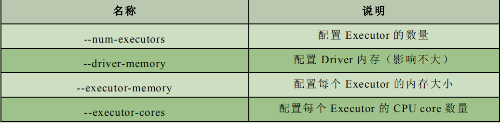
>
> 调节原则：尽量将任务分配的资源调节到可以使用的资源的最大限度。对于具体资源的分配，我们分别讨论 Spark 的两种 Cluster 运行模式：
> ➢ 第一种是 Spark Standalone 模式，你在提交任务前，一定知道或者可以从运维部门获取到你可以使用的资源情况，在编写 submit 脚本的时候，就根据可用的资源情况进行资源的分配，比如说集群有 15 台机器，每台机器为 8G 内存，2 个 CPU core，那么就指定 15 个 Executor，每个 Executor 分配 8G 内存，2 个 CPU core。
>
>  ➢ 第二种是 Spark Yarn 模式，由于 Yarn 使用资源队列进行资源的分配和调度，在编写submit 脚本的时候，就根据 Spark 作业要提交到的资源队列，进行资源的分配，比如资源队列有 400G 内存，100 个 CPU core，那么指定 50 个 Executor，每个 Executor 分配8G 内存，2 个 CPU core。

对各项资源进行了调节后，得到的性能提升会有如下表现：
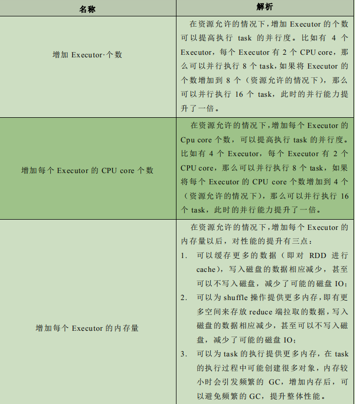
补充：生产环境 Spark submit 脚本配置

```sh
bin/spark-submit \
--class com.atguigu.spark.WordCount \
--master yarn\
--deploy-mode cluster\
--num-executors 80 \
--driver-memory 6g \
--executor-memory 6g \
--executor-cores 3 \
--queue root.default \
--conf spark.yarn.executor.memoryOverhead=2048 \
--conf spark.core.connection.ack.wait.timeout=300 \
/usr/local/spark/spark.jar
```

参数配置参考值：

➢ --num-executors：50~100
➢ --driver-memory：1G~5G
➢ --executor-memory：6G~10G
➢ --executor-cores：3

 ➢ --master：实际生产环境一定使用 yarn


### 1.1.2 常规性能调优二：RDD 优化

1) RDD 复用

> 在对 RDD 进行算子时，要避免相同的算子和计算逻辑之下对 RDD 进行重复的计算对上图中的 RDD 计算架构进行修改，得到如下图所示的优化结果：

2) RDD 持久化

> 在 Spark 中，当多次对同一个 RDD 执行算子操作时，每一次都会对这个 RDD 以之前的父 RDD 重新计算一次，这种情况是必须要避免的，对同一个 RDD 的重复计算是对资源的极大浪费，因此，必须对多次使用的 RDD 进行持久化，通过持久化将公共 RDD 的数据缓存到内存/磁盘中，之后对于公共 RDD 的计算都会从内存/磁盘中直接获取 RDD 数据。
>
> 对于 RDD 的持久化，有两点需要说明：
> ➢ RDD 的持久化是可以进行序列化的，当内存无法将 RDD 的数据完整的进行存放的时候，可以考虑使用序列化的方式减小数据体积，将数据完整存储在内存中。
> ➢ 如果对于数据的可靠性要求很高，并且内存充足，可以使用副本机制，对 RDD 数据进行持久化。当持久化启用了复本机制时，对于持久化的每个数据单元都存储一个副本，放在其他节点上面，由此实现数据的容错，一旦一个副本数据丢失，不需要重新计算，还可以使用另外一个副本。

3) RDD 尽可能早的 filter 操作

> 获取到初始 RDD 后，应该考虑尽早地过滤掉不需要的数据，进而减少对内存的占用，从而提升 Spark 作业的运行效率。

### 1.1.3 常规性能调优三：并行度调节

> Spark 作业中的并行度指各个 stage 的 task 的数量。如果并行度设置不合理而导致并行度过低，会导致资源的极大浪费，例如，20 个 Executor，每个 Executor 分配 3 个 CPU core，而 Spark 作业有 40 个 task，这样每个 Executor 分配到的
> task 个数是 2 个，这就使得每个 Executor 有一个 CPU core 空闲，导致资源的浪费。理想的并行度设置，应该是让并行度与资源相匹配，简单来说就是在资源允许的前提下，并行度要设置的尽可能大，达到可以充分利用集群资源。合理的设置并行度，可以提升整个Spark 作业的性能和运行速度。
>
> Spark 官方推荐，task 数量应该设置为 Spark 作业总 CPU core 数量的 2~3 倍。之所以没有推荐 task 数量与 CPU core 总数相等，是因为 task 的执行时间不同，有的 task 执行速度快而有的 task 执行速度慢，如果 task 数量与 CPU core 总数相等，那么执行快的 task 执行完成后，会出现 CPU core 空闲的情况。如果 task 数量设置为 CPU core 总数的 2~3 倍，那么一个
> task 执行完毕后，CPU core 会立刻执行下一个 task，降低了资源的浪费，同时提升了 Spark作业运行的效率。
>
> Spark 作业并行度的设置如下所示：
> val conf = new SparkConf()
> .set("spark.default.parallelism", "500")

### 1.1.4 常规性能调优四：广播大变量

> ​	默认情况下，task 中的算子中如果使用了外部的变量，每个 task 都会获取一份变量的复本，这就造成了内存的极大消耗。一方面，如果后续对 RDD 进行持久化，可能就无法将 RDD数据存入内存，只能写入磁盘，磁盘 IO 将会严重消耗性能；另一方面，task 在创建对象的时候，也许会发现堆内存无法存放新创建的对象，这就会导致频繁的 GC，GC 会导致工作
> 线程停止，进而导致 Spark 暂停工作一段时间，严重影响 Spark 性能。假设当前任务配置了 20 个 Executor，指定 500 个 task，有一个 20M 的变量被所有 task共用，此时会在 500 个 task 中产生 500 个副本，耗费集群 10G 的内存，如果使用了广播变量， 那么每个 Executor 保存一个副本，一共消耗 400M 内存，内存消耗减少了 5 倍。广播变量在每个 Executor 保存一个副本，此 Executor 的所有 task 共用此广播变量，这让变量产生的副本数量大大减少。在初始阶段，广播变量只在 Driver 中有一份副本。task 在运行的时候，想要使用广播变量中的数据，此时首先会在自己本地的 Executor 对应的 BlockManager 中尝试获取变量，如果本地没有，BlockManager 就会从 Driver 或者其他节点的 BlockManager 上远程拉取变量的复本，并由本地的 BlockManager 进行管理；之后此 Executor 的所有 task 都会直接从本地的BlockManager 中获取变量。

### 1.1.5 常规性能调优五：Kryo 序列化

> 默认情况下，Spark 使用 Java 的序列化机制。Java 的序列化机制使用方便，不需要额外的配置，在算子中使用的变量实现 Serializable 接口即可，但是，Java 序列化机制的效率不高，序列化速度慢并且序列化后的数据所占用的空间依然较大。
> Kryo 序列化机制比 Java 序列化机制性能提高 10 倍左右，Spark 之所以没有默认使用Kryo 作为序列化类库，是因为它不支持所有对象的序列化，同时 Kryo 需要用户在使用前注册需要序列化的类型，不够方便，但从 Spark 2.0.0 版本开始，简单类型、简单类型数组、字符串类型的 Shuffling RDDs 已经默认使用 Kryo 序列化方式了。
>
> ```scala
> public class MyKryoRegistrator implements KryoRegistrator{
>     @Override
>     public void registerClasses(Kryo kryo) {
>         kryo.register(StartupReportLogs.class);
>     }
> }
> 
> //配置 Kryo 序列化方式的实例代码：
> //创建 SparkConf 对象
> val conf = new SparkConf().setMaster(…).setAppName(…)
> //使用 Kryo 序列化库，如果要使用 Java 序列化库，需要把该行屏蔽掉
> conf.set("spark.serializer", "org.apache.spark.serializer.KryoSerializer"); 
> //在 Kryo 序列化库中注册自定义的类集合，如果要使用 Java 序列化库，需要把该行屏蔽掉
> conf.set("spark.kryo.registrator", "atguigu.com.MyKryoRegistrator"); 
> ```
>
> 

### 1.1.6 常规性能调优六：调节本地化等待时长

> Spark 作业运行过程中，Driver 会对每一个 stage 的 task 进行分配。根据 Spark 的 task 分配算法，Spark 希望 task 能够运行在它要计算的数据算在的节点（数据本地化思想），这样就可以避免数据的网络传输。通常来说，task 可能不会被分配到它处理的数据所在的节点，因为这些节点可用的资源可能已经用尽，此时，Spark 会等待一段时间，默认 3s，如果等待
> 指定时间后仍然无法在指定节点运行，那么会自动降级，尝试将 task 分配到比较差的本地化级别所对应的节点上，比如将 task 分配到离它要计算的数据比较近的一个节点，然后进行计算，如果当前级别仍然不行，那么继续降级。当 task 要处理的数据不在 task 所在节点上时，会发生数据的传输。task 会通过所在节点的 BlockManager 获取数据，BlockManager 发现数据不在本地时，户通过网络传输组件从数据所在节点的 BlockManager 处获取数据。网络传输数据的情况是我们不愿意看到的，大量的网络传输会严重影响性能，因此，我们希望通过调节本地化等待时长，如果在等待时长这段时间内，目标节点处理完成了一部分task，那么当前的 task 将有机会得到执行，这样就能够改善 Spark 作业的整体性能。
>
> Spark 的本地化等级如表所示：
> 名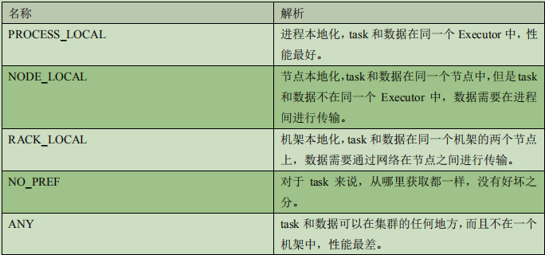
> 在 Spark 项目开发阶段，可以使用 client 模式对程序进行测试，此时，可以在本地看到比较全的日志信息，日志信息中有明确的 task 数据本地化的级别，如果大部分都是PROCESS_LOCAL，那么就无需进行调节，但是如果发现很多的级别都是 NODE_LOCAL、ANY，那么需要对本地化的等待时长进行调节，通过延长本地化等待时长，看看 task 的本
> 地化级别有没有提升，并观察 Spark 作业的运行时间有没有缩短。
>
> 注意，过犹不及，不要将本地化等待时长延长地过长，导致因为大量的等待时长，使得Spark 作业的运行时间反而增加了。
> Spark 本地化等待时长的设置如代码所示：
>
> ```scala
> val conf = new SparkConf()
>  .set("spark.locality.wait", "6")
> ```
>
> 

## 1.2 算子调优

### 1.2.1 算子调优一：mapPartitions

> 普通的 map 算子对 RDD 中的每一个元素进行操作，而 mapPartitions 算子对 RDD 中每一个分区进行操作。如果是普通的 map 算子，假设一个 partition 有 1 万条数据，那么 map算子中的 function 要执行 1 万次，也就是对每个元素进行操作。
> 如果是 mapPartition 算子，由于一个 task 处理一个 RDD 的 partition，那么一个 task 只会执行一次 function，function 一次接收所有的 partition 数据，效率比较高。比如，当要把 RDD 中的所有数据通过 JDBC 写入数据，如果使用 map 算子，那么需要对 RDD 中的每一个元素都创建一个数据库连接，这样对资源的消耗很大，如果使用mapPartitions 算子，那么针对一个分区的数据，只需要建立一个数据库连接。mapPartitions 算子也存在一些缺点：对于普通的 map 操作，一次处理一条数据，如果在处理了 2000 条数据后内存不足，那么可以将已经处理完的 2000 条数据从内存中垃圾回收掉；但是如果使用 mapPartitions 算子，但数据量非常大时，function 一次处理一个分区的数据，如果一旦内存不足，此时无法回收内存，就可能会 OOM，即内存溢出。因此，mapPartitions 算子适用于数据量不是特别大的时候，此时使用 mapPartitions 算子对性能的提升效果还是不错的。（当数据量很大的时候，一旦使用 mapPartitions 算子，就会直接 OOM）在项目中，应该首先估算一下 RDD 的数据量、每个 partition 的数据量，以及分配给每个 Executor 的内存资源，如果资源允许，可以考虑使用 mapPartitions 算子代替 map。


### 1.2.2 算子调优二：foreachPartition 优化数据库操作

> 在生产环境中，通常使用 foreachPartition 算子来完成数据库的写入，通过 foreachPartition算子的特性，可以优化写数据库的性能。如果使用 foreach 算子完成数据库的操作，由于 foreach 算子是遍历 RDD 的每条数据，因此，每条数据都会建立一个数据库连接，这是对资源的极大浪费，因此，对于写数据库操作，我们应当使用 foreachPartition 算子。与 mapPartitions 算子非常相似，foreachPartition 是将 RDD 的每个分区作为遍历对象，一次处理一个分区的数据，也就是说，如果涉及数据库的相关操作，一个分区的数据只需要创建一次数据库连接，如图所示：
>
> 使用了 foreachPartition 算子后，可以获得以下的性能提升：
> ➢ 对于我们写的 function 函数，一次处理一整个分区的数据；
> ➢ 对于一个分区内的数据，创建唯一的数据库连接；
> ➢ 只需要向数据库发送一次 SQL 语句和多组参数；
> 在生产环境中，全部都会使用 foreachPartition 算子完成数据库操作。foreachPartition 算子存在一个问题，与 mapPartitions 算子类似，如果一个分区的数据量特别大，可能会造成 OOM，即内存溢出。

### 1.2.3 算子调优三：filter 与 coalesce 的配合使用

> 在 Spark 任务中我们经常会使用 filter 算子完成 RDD 中数据的过滤，在任务初始阶段，从各个分区中加载到的数据量是相近的，但是一旦进过 filter 过滤后，每个分区的数据量有可能会存在较大差异，如图所示：
>
> 根据图中信息我们可以发现两个问题：
> ➢ 每个 partition 的数据量变小了，如果还按照之前与 partition 相等的 task 个数去处理当前数据，有点浪费 task 的计算资源；
> ➢ 每个 partition 的数据量不一样，会导致后面的每个 task 处理每个 partition 数据的时候，每个 task 要处理的数据量不同，这很有可能导致数据倾斜问题。如上图所示，第二个分区的数据过滤后只剩100条，而第三个分区的数据过滤后剩下800条，
> 在相同的处理逻辑下，第二个分区对应的 task 处理的数据量与第三个分区对应的 task 处理的数据量差距达到了 8 倍，这也会导致运行速度可能存在数倍的差距，这也就是数据倾斜问题。
>
> 针对上述的两个问题，我们分别进行分析：
> ➢ 针对第一个问题，既然分区的数据量变小了，我们希望可以对分区数据进行重新分配，比如将原来 4 个分区的数据转化到 2 个分区中，这样只需要用后面的两个 task 进行处理即可，避免了资源的浪费。
> ➢ 针对第二个问题，解决方法和第一个问题的解决方法非常相似，对分区数据重新分配，让每个 partition 中的数据量差不多，这就避免了数据倾斜问题。那么具体应该如何实现上面的解决思路？我们需要 coalesce 算子。repartition 与 coalesce 都可以用来进行重分区，其中 repartition 只是 coalesce 接口中 shuffle为 true 的简易实现，coalesce 默认情况下不进行shuffle，但是可以通过参数进行设置。假设我们希望将原本的分区个数 A 通过重新分区变为 B，那么有以下几种情况：
> ➢ A > B（多数分区合并为少数分区）
> 1) A 与 B 相差值不大
> 此时使用 coalesce 即可，无需 shuffle 过程。2) A 与 B 相差值很大此时可以使用 coalesce 并且不启用 shuffle 过程，但是会导致合并过程性能低下，所以推荐设置 coalesce 的第二个参数为 true，即启动 shuffle 过程。
> ➢ A < B（少数分区分解为多数分区）
> 此时使用 repartition 即可，如果使用 coalesce 需要将 shuffle 设置为 true，否则 coalesce 无效。我们可以在 filter 操作之后，使用 coalesce 算子针对每个 partition 的数据量各不相同的情况，压缩 partition 的数量，而且让每个 partition 的数据量尽量均匀紧凑，以便于后面的 task 进行计算操作，在某种程度上能够在一定程度上提升性能。
>
> 注意：local 模式是进程内模拟集群运行，已经对并行度和分区数量有了一定的内部优化，因此不用去设置并行度和分区数量。


### 1.2.4 算子调优四：repartition 解决 SparkSQL 低并行度问题

> 在第一节的常规性能调优中我们讲解了并行度的调节策略，但是，并行度的设置对于Spark SQL 是不生效的，用户设置的并行度只对于 Spark SQL 以外的所有 Spark 的 stage 生效。Spark SQL 的并行度不允许用户自己指定，Spark SQL 自己会默认根据 hive 表对应的HDFS 文件的 split 个数自动设置 Spark SQL 所在的那个 stage 的并行度，用户自己通spark.default.parallelism 参数指定的并行度，只会在没 Spark SQL 的 stage 中生效。由于 Spark SQL 所在 stage 的并行度无法手动设置，如果数据量较大，并且此 stage 中后续的 transformation 操作有着复杂的业务逻辑，而 Spark SQL 自动设置的 task 数量很少，这就意味着每个 task 要处理为数不少的数据量，然后还要执行非常复杂的处理逻辑，这就可能表现为第一个有 Spark SQL 的 stage 速度很慢，而后续的没有 Spark SQL 的 stage 运行速度非常快。
> 为了解决 Spark SQL 无法设置并行度和 task 数量的问题，我们可以使用 repartition 算子。Spark SQL 这一步的并行度和 task 数量肯定是没有办法去改变了，但是，对于Spark SQL 查询出来的 RDD，立即使用 repartition 算子，去重新进行分区，这样可以重新分区为多个 partition，从 repartition 之后的 RDD 操作，由于不再设计 Spark SQL，因此 stage 的并行度就会等于你手动设置的值，这样就避免了 Spark SQL 所在的 stage 只能用少量的 task 去处理大量数据并执行复杂的算法逻辑。


### 1.2.5 算子调优五：reduceByKey 预聚合

> ​	reduceByKey 相较于普通的 shuffle 操作一个显著的特点就是会进行 map 端的本地聚合，map 端会先对本地的数据进行 combine 操作，然后将数据写入给下个 stage 的每个 task 创建的文件中，也就是在 map 端，对每一个 key 对应的 value，执行 reduceByKey 算子函数。reduceByKey 算子的执行过程如图所示：使用 reduceByKey 对性能的提升如下：
> ➢ 本地聚合后，在 map 端的数据量变少，减少了磁盘 IO，也减少了对磁盘空间的占用；
> ➢ 本地聚合后，下一个 stage 拉取的数据量变少，减少了网络传输的数据量；
> ➢ 本地聚合后，在 reduce 端进行数据缓存的内存占用减少；
> ➢ 本地聚合后，在 reduce 端进行聚合的数据量减少。
>
> 基于 reduceByKey 的本地聚合特征，我们应该考虑使用 reduceByKey 代替其他的 shuffle 算子，例如 groupByKey。reduceByKey 与 groupByKey 的运行原理如图所示：
>
> groupByKey 原理
>
> 
>
> reduceByKey 原理
> 根据上图可知，groupByKey 不会进行 map 端的聚合，而是将所有 map 端的数据 shuffle 到reduce 端，然后在 reduce 端进行数据的聚合操作。由于 reduceByKey 有 map 端聚合的特性，使得网络传输的数据量减小，因此效率要明显高于 groupByKey。


##  1.3 Shuffle 调优

### 1.3.1 Shuffle 调优一：调节 map 端缓冲区大小

> 在 Spark 任务运行过程中，如果 shuffle 的 map 端处理的数据量比较大，但是 map 端缓冲的大小是固定的，可能会出现 map 端缓冲数据频繁 spill 溢写到磁盘文件中的情况，使得性能非常低下，通过调节 map 端缓冲的大小，可以避免频繁的磁盘 IO 操作，进而提升 Spark任务的整体性能。map 端缓冲的默认配置是 32KB，如果每个 task 处理 640KB 的数据，那么会发生 640/32 = 20 次溢写，如果每个 task 处理 64000KB 的数据，机会发生 64000/32=2000 此溢写，这对
> 于性能的影响是非常严重的。
>
> map 端缓冲的配置方法如代码清单所示：
>
> ```scala
> val conf = new SparkConf()
>  .set("spark.shuffle.file.buffer", "64")
> ```
>
> 


### 1.3.2 Shuffle 调优二：调节 reduce 端拉取数据缓冲区大小

> Spark Shuffle 过程中，shuffle reduce task 的 buffer 缓冲区大小决定了 reduce task 每次能够缓冲的数据量，也就是每次能够拉取的数据量，如果内存资源较为充足，适当增加拉取数据缓冲区的大小，可以减少拉取数据的次数，也就可以减少网络传输的次数，进而提升性能。reduce 端数据拉取缓冲区的大小可以通过 spark.reducer.maxSizeInFlight 参数进行设置，默认
> 为 48MB，该参数的设置方法如代码清单所示：
>
> ```scala
> val conf = new SparkConf()
> .set("spark.reducer.maxSizeInFlight", "96")
> ```
>
> 

### 1.3.3 Shuffle 调优三：调节 reduce 端拉取数据重试次数

> Spark Shuffle 过程中，reduce task 拉取属于自己的数据时，如果因为网络异常等原因导致失败会自动进行重试。对于那些包含了特别耗时的 shuffle 操作的作业，建议增加重试最大次数（比如 60 次），以避免由于 JVM 的 full gc 或者网络不稳定等因素导致的数据拉取失败。在实践中发现，对于针对超大数据量（数十亿~上百亿）的 shuffle 过程，调节该参数可
> 以大幅度提升稳定性。reduce 端拉取数据重试次数可以通过 spark.shuffle.io.maxRetries 参数进行设置，该参数
> 就代表了可以重试的最大次数。如果在指定次数之内拉取还是没有成功，就可能会导致作业
> 执行失败，默认为 3，该参数的设置方法如代码清单所示：
>
> ```scala
> val conf = new SparkConf()
>  .set("spark.shuffle.io.maxRetries", "6")
> ```
>
> 

### 1.3.4 Shuffle 调优四：调节 reduce 端拉取数据等待间隔

> Spark Shuffle 过程中，reduce task 拉取属于自己的数据时，如果因为网络异常等原因导致失败会自动进行重试，在一次失败后，会等待一定的时间间隔再进行重试，可以通过加大间隔时长（比如 60s），以增加 shuffle 操作的稳定性。
> reduce 端拉取数据等待间隔可以通过 spark.shuffle.io.retryWait 参数进行设置，默认值为 5s，该参数的设置方法如代码清单所示：
>
> ```scala
> val conf = new SparkConf()
>  .set("spark.shuffle.io.retryWait", "60s")
> ```
>
> 

### 1.3.5 Shuffle 调优五：调节 SortShuffle 排序操作阈值

> 对于 SortShuffleManager，如果 shuffle reduce task 的数量小于某一阈值则 shuffle write 过程中不会进行排序操作，而是直接按照未经优化的 HashShuffleManager 的方式去写数据，但是最后会将每个 task 产生的所有临时磁盘文件都合并成一个文件，并会创建单独的索引文件。
> 当你使用 SortShuffleManager 时，如果的确不需要排序操作，那么建议将这个参数调大一些，大于 shuffle read task 的数量，那么此时 map-side 就不会进行排序了，减少了排序的性能开销，但是这种方式下，依然会产生大量的磁盘文件，因此 shuffle write 性能有待提高。SortShuffleManager 排序操作阈值的设置可以通过 spark.shuffle.sort. bypassMergeThreshold 这一参数进行设置，默认值为 200，该参数的设置方法如代码清单所示：
>
> ```scala
> val conf = new SparkConf()
>  .set("spark.shuffle.sort.bypassMergeThreshold", "400")
> ```
>
> 

## 1.4 JVM 调优

对于 JVM 调优，首先应该明确，full gc/minor gc，都会导致 JVM 的工作线程停止工作，即 stop the world。

### 1.4.1 JVM 调优一：降低 cache 操作的内存占比

> 1. 静态内存管理机制
>    根据 Spark 静态内存管理机制，堆内存被划分为了两块，Storage 和 Execution。Storage主要用于缓存 RDD 数据和 broadcast 数据，Execution 主要用于缓存在 shuffle 过程中产生的中间数据，Storage 占系统内存的 60%，Execution 占系统内存的 20%，并且两者完全独立。在一般情况下，Storage 的内存都提供给了 cache 操作，但是如果在某些情况下 cache 操作内存不是很紧张，而 task 的算子中创建的对象很多，Execution 内存又相对较小，这回导致频繁的 minor gc，甚至于频繁的 full gc，进而导致 Spark 频繁的停止工作，性能影响会很大。在 Spark UI 中可以查看每个 stage 的运行情况，包括每个 task 的运行时间、gc 时间等等，如果发现 gc 太频繁，时间太长，就可以考虑调节 Storage 的内存占比，让 task 执行算子函数式，有更多的内存可以使用。Storage 内存区域可以通过 spark.storage.memoryFraction 参数进行指定，默认为 0.6，即60%，可以逐级向下递减，如代码清单所示：
>
>    ```scala
>    val conf = new SparkConf()
>     .set("spark.storage.memoryFraction", "0.4")
>    ```
>
>    
>
> 2. 统一内存管理机制
>    根据 Spark 统一内存管理机制，堆内存被划分为了两块，Storage 和 Execution。Storage主要用于缓存数据，Execution 主要用于缓存在 shuffle 过程中产生的中间数据，两者所组成的内存部分称为统一内存，Storage 和 Execution 各占统一内存的 50%，由于动态占用机制的实现，shuffle 过程需要的内存过大时，会自动占用 Storage 的内存区域，因此无需手动进行调节。


### 1.4.2 JVM 调优二：调节 Executor 堆外内存

> Executor 的堆外内存主要用于程序的共享库、Perm Space、 线程 Stack 和一些 Memory mapping 等, 或者类 C 方式 allocate object。有时，如果你的 Spark 作业处理的数据量非常大，达到几亿的数据量，此时运行 Spark作业会时不时地报错，例如 shuffle output file cannot find，executor lost，task lost，out of memory等，这可能是 Executor 的堆外内存不太够用，导致 Executor 在运行的过程中内存溢出。stage 的 task 在运行的时候，可能要从一些 Executor 中去拉取 shuffle map output 文件，但是 Executor 可能已经由于内存溢出挂掉了，其关联的 BlockManager 也没有了，这就可能会报出 shuffle output file cannot find，executor lost，task lost，out of memory 等错误，此时，就可以考虑调节一下 Executor 的堆外内存，也就可以避免报错，与此同时，堆外内存调节的比较大的时候，对于性能来讲，也会带来一定的提升。默认情况下，Executor 堆外内存上限大概为 300 多 MB，在实际的生产环境下，对海量数据进行处理的时候，这里都会出现问题，导致 Spark 作业反复崩溃，无法运行，此时就会去调节这个参数，到至少 1G，甚至于 2G、4G。Executor 堆外内存的配置需要在 spark-submit 脚本里配置，如代码清单所示：
>
> --conf spark.yarn.executor.memoryOverhead=2048
>
> 以上参数配置完成后，会避免掉某些 JVM OOM 的异常问题，同时，可以提升整体 Spark作业的性能。

### 1.4.3 JVM 调优三：调节连接等待时长

> 在 Spark 作业运行过程中，Executor 优先从自己本地关联的 BlockManager 中获取某份数据，如果本地BlockManager没有的话，会通过TransferService远程连接其他节点上Executor的 BlockManager 来获取数据。如果 task 在运行过程中创建大量对象或者创建的对象较大，会占用大量的内存，这回导致频繁的垃圾回收，但是垃圾回收会导致工作现场全部停止，也就是说，垃圾回收一旦执行，Spark 的 Executor 进程就会停止工作，无法提供相应，此时，由于没有响应，无法建立网络连接，会导致网络连接超时。在生产环境下，有时会遇到 file not found、file lost 这类错误，在这种情况下，很有可能是 Executor 的BlockManager 在拉取数据的时候，无法建立连接，然后超过默认的连接等待时长 60s 后，宣告数据拉取失败，如果反复尝试都拉取不到数据，可能会导致 Spark 作业的崩溃。这种情况也可能会导致 DAGScheduler 反复提交几次 stage,TaskScheduler 返回提交几次 task，大大延长了我们的 Spark 作业的运行时间。此时，可以考虑调节连接的超时时长，连接等待时长需要在 spark-submit 脚本中进行设置，设置方式如代码清单所示：
>
> --conf spark.core.connection.ack.wait.timeout=300
>
> 调节连接等待时长后，通常可以避免部分的 XX 文件拉取失败、XX 文件 lost 等报错。


# 第 8 章 Spark 数据倾斜

> Spark 中的数据倾斜问题主要指 shuffle 过程中出现的数据倾斜问题，是由于不同的 key对应的数据量不同导致的不同 task 所处理的数据量不同的问题。例如，reduce 点一共要处理 100 万条数据，第一个和第二个 task 分别被分配到了 1 万
> 条数据，计算 5 分钟内完成，第三个 task 分配到了 98 万数据，此时第三个 task 可能需要 10个小时完成，这使得整个 Spark 作业需要 10 个小时才能运行完成，这就是数据倾斜所带来的后果。
>
> 注意，要区分开数据倾斜与数据量过量这两种情况，数据倾斜是指少数 task 被分配了绝大多数的数据，因此少数 task 运行缓慢；数据过量是指所有 task 被分配的数据量都很大，相差不多，所有 task 都运行缓慢。
>
> **数据倾斜的表现：**
> ➢ Spark 作业的大部分 task 都执行迅速，只有有限的几个 task 执行的非常慢，此时可能出现了数据倾斜，作业可以运行，但是运行得非常慢；
> ➢ Spark 作业的大部分 task 都执行迅速，但是有的 task 在运行过程中会突然报出 OOM，反复执行几次都在某一个 task 报出 OOM 错误，此时可能出现了数据倾斜，作业无法正常运行。
>
> **定位数据倾斜问题：**
> ➢ 查阅代码中的 shuffle 算子，例如 reduceByKey、countByKey、groupByKey、join 等算子，根据代码逻辑判断此处是否会出现数据倾斜；
> ➢ 查看 Spark 作业的 log 文件，log 文件对于错误的记录会精确到代码的某一行，可以根据异常定位到的代码位置来明确错误发生在第几个 stage，对应的 shuffle 算子是哪一个；


## 2.1 解决方案一：聚合原数据

1) 避免 shuffle 过程

> 绝大多数情况下，Spark 作业的数据来源都是 Hive 表，这些 Hive 表基本都是经过 ETL之后的昨天的数据。为了避免数据倾斜，我们可以考虑避免 shuffle 过程，如果避免了 shuffle过程，那么从根本上就消除了发生数据倾斜问题的可能。如果 Spark 作业的数据来源于 Hive 表，那么可以先在 Hive 表中对数据进行聚合，例如按照 key 进行分组，将同一 key 对应的所有 value 用一种特殊的格式拼接到一个字符串里去，这样，一个 key 就只有一条数据了；之后，对一个 key 的所有 value 进行处理时，只需要进行 map 操作即可，无需再进行任何的 shuffle 操作。通过上述方式就避免了执行 shuffle 操作，也就不可能会发生任何的数据倾斜问题。对于 Hive 表中数据的操作，不一定是拼接成一个字符串，也可以是直接对 key 的每一条数据进行累计计算。要区分开，处理的数据量大和数据倾斜的区别。

2) 缩小 key 粒度（增大数据倾斜可能性，降低每个 task 的数据量）

> key 的数量增加，可能使数据倾斜更严重。

3) 增大 key 粒度（减小数据倾斜可能性，增大每个 task 的数据量）

> 如果没有办法对每个 key 聚合出来一条数据，在特定场景下，可以考虑扩大 key 的聚合粒度。
> 例如，目前有 10 万条用户数据，当前 key 的粒度是（省，城市，区，日期），现在我们考虑扩大粒度，将 key 的粒度扩大为（省，城市，日期），这样的话，key 的数量会减少，key 之间的数据量差异也有可能会减少，由此可以减轻数据倾斜的现象和问题。（此方法只针对特定类型的数据有效，当应用场景不适宜时，会加重数据倾斜）


## 2.2 解决方案二：过滤导致倾斜的 key

> 如果在 Spark 作业中允许丢弃某些数据，那么可以考虑将可能导致数据倾斜的 key 进行过滤，滤除可能导致数据倾斜的 key 对应的数据，这样，在 Spark 作业中就不会发生数据倾斜了。

## 2.3 解决方案三：提高 shuffle 操作中的 reduce 并行度

> 当方案一和方案二对于数据倾斜的处理没有很好的效果时，可以考虑提高 shuffle 过程中的 reduce 端并行度，reduce 端并行度的提高就增加了 reduce 端 task 的数量，那么每个 task分配到的数据量就会相应减少，由此缓解数据倾斜问题。
> ➢ reduce 端并行度的设置
> 在大部分的 shuffle 算子中，都可以传入一个并行度的设置参数，比如 reduceByKey(500)，这个参数会决定 shuffle 过程中 reduce 端的并行度，在进行 shuffle 操作的时候，就会对应着创建指定数量的 reduce task。对于 Spark SQL 中的 shuffle 类语句，比如 group by、join 等，需要设置一个参数，即 spark.sql.shuffle.partitions，该参数代表了 shuffle read task 的并行度，该值默认是 200，对于很多场景来说都有点过小。增加 shuffle read task 的数量，可以让原本分配给一个 task 的多个 key 分配给多个 task，从而让每个 task 处理比原来更少的数据。举例来说，如果原本有 5 个 key，每个 key 对应 10条数据，这 5 个 key 都是分配给一个 task 的，那么这个 task 就要处理 50 条数据。而增加了shuffle read task 以后，每个 task 就分配到一个 key，即每个 task 就处理 10 条数据，那么自然每个 task 的执行时间都会变短了。
>
> ➢ reduce 端并行度设置存在的缺陷
> 提高 reduce 端并行度并没有从根本上改变数据倾斜的本质和问题（方案一和方案二从根本上避免了数据倾斜的发生），只是尽可能地去缓解和减轻 shuffle reduce task 的数据压力，以及数据倾斜的问题，适用于有较多 key 对应的数据量都比较大的情况。该方案通常无法彻底解决数据倾斜，因为如果出现一些极端情况，比如某个 key 对应的数据量有 100 万，那么无论你的 task 数量增加到多少，这个对应着 100 万数据的 key 肯定还是会分配到一个 task 中去处理，因此注定还是会发生数据倾斜的。所以这种方案只能说是在发现数据倾斜时尝试使用的第一种手段，尝试去用嘴简单的方法缓解数据倾斜而已，或者是和其他方案结合起来使用。在理想情况下，reduce 端并行度提升后，会在一定程度上减轻数据倾斜的问题，甚至基本消除数据倾斜；但是，在一些情况下，只会让原来由于数据倾斜而运行缓慢的 task 运行速度稍有提升，或者避免了某些 task 的 OOM 问题，但是，仍然运行缓慢，此时，要及时放弃
>
> 方案三，开始尝试后面的方案。


## 2.4 解决方案四：使用随机 key 实现双重聚合

> 当使用了类似于 groupByKey、reduceByKey 这样的算子时，可以考虑使用随机 key 实现双重聚合，如图所示：
>
> 首先，通过 map 算子给每个数据的 key 添加随机数前缀，对 key 进行打散，将原先一样的 key 变成不一样的 key，然后进行第一次聚合，这样就可以让原本被一个 task 处理的数据分散到多个 task 上去做局部聚合；随后，去除掉每个 key 的前缀，再次进行聚合。此方法对于由 groupByKey、reduceByKey 这类算子造成的数据倾斜由比较好的效果，仅仅适用于聚合类的 shuffle 操作，适用范围相对较窄。如果是 join 类的 shuffle 操作，还得用其他的解决方案。此方法也是前几种方案没有比较好的效果时要尝试的解决方案。


## 2.5 解决方案五：将 reduce join 转换为 map join

> 正常情况下，join 操作都会执行 shuffle 过程，并且执行的是 reduce join，也就是先将所有相同的 key 和对应的 value 汇聚到一个 reduce task 中，然后再进行 join。普通 join 的过程
> 如下图所示：
>
> 普通的 join 是会走 shuffle 过程的，而一旦 shuffle，就相当于会将相同 key 的数据拉取到一个 shuffle read task 中再进行 join，此时就是 reduce join。但是如果一个 RDD 是比较小的，则可以采用广播小 RDD 全量数据+map 算子来实现与 join 同样的效果，也就是 map join，此时就不会发生 shuffle 操作，也就不会发生数据倾斜。（注意，RDD 是并不能进行广播的，只能将 RDD 内部的数据通过 collect 拉取到 Driver 内存然后再进行广播）
>
> 核心思路：
> 不使用 join 算子进行连接操作，而使用 Broadcast 变量与 map 类算子实现 join 操作，进而完全规避掉 shuffle 类的操作，彻底避免数据倾斜的发生和出现。将较小 RDD 中的数据直接通过 collect 算子拉取到 Driver 端的内存中来，然后对其创建一个 Broadcast 变量；接着对另外一个 RDD 执行 map 类算子，在算子函数内，从 Broadcast 变量中获取较小 RDD 的全量
> 数据，与当前 RDD 的每一条数据按照连接 key 进行比对，如果连接 key 相同的话，那么就将两个 RDD 的数据用你需要的方式连接起来。根据上述思路，根本不会发生 shuffle 操作，从根本上杜绝了 join 操作可能导致的数据倾斜问题。当 join 操作有数据倾斜问题并且其中一个 RDD 的数据量较小时，可以优先考虑这种方式，效果非常好。map join 的过程如图所示：
>
> 
>
> 不适用场景分析：
> 由于Spark 的广播变量是在每个Executor中保存一个副本，如果两个 RDD数据量都比较大，那么如果将一个数据量比较大的 RDD 做成广播变量，那么很有可能会造成内存溢出。


## 2.6 解决方案六：sample 采样对倾斜 key 单独进行 join

> 在 Spark 中，如果某个 RDD 只有一个 key，那么在 shuffle 过程中会默认将此 key 对应的数据打散，由不同的 reduce 端 task 进行处理。当由单个 key 导致数据倾斜时，可有将发生数据倾斜的 key 单独提取出来，组成一个RDD，然后用这个原本会导致倾斜的 key 组成的 RDD 根其他 RDD 单独 join，此时，根据Spark 的运行机制，此 RDD 中的数据会在 shuffle 阶段被分散到多个 task 中去进行 join 操作。倾斜 key 单独 join 的流程如图所示：
>
> 1． 适用场景分析：
> 对于 RDD 中的数据，可以将其转换为一个中间表，或者是直接使用 countByKey()的方式，看一个这个 RDD 中各个 key 对应的数据量，此时如果你发现整个 RDD 就一个 key 的数据量特别多，那么就可以考虑使用这种方法。当数据量非常大时，可以考虑使用 sample 采样获取 10%的数据，然后分析这 10%的数据中哪个 key 可能会导致数据倾斜，然后将这个 key 对应的数据单独提取出来。
>
> 
>
> 2． 不适用场景分析：如果一个 RDD 中导致数据倾斜的 key 很多，那么此方案不适用。

## 2.7 解决方案七：使用随机数扩容进行 join

> 如果在进行 join 操作时，RDD 中有大量的 key 导致数据倾斜，那么进行分拆 key 也没什么意义，此时就只能使用最后一种方案来解决问题了，对于 join 操作，我们可以考虑对其中一个 RDD 数据进行扩容，另一个 RDD 进行稀释后再 join。我们会将原先一样的 key 通过附加随机前缀变成不一样的 key，然后就可以将这些处理后的“不同 key”分散到多个 task 中去处理，而不是让一个 task 处理大量的相同 key。这一种方案是针对有大量倾斜 key 的情况，没法将部分 key 拆分出来进行单独处理，需要对整个RDD 进行数据扩容，对内存资源要求很高。
>
> 1. 核心思想：
>    选择一个 RDD，使用 flatMap 进行扩容，对每条数据的 key 添加数值前缀（1~N 的数值），将一条数据映射为多条数据；（扩容）选择另外一个 RDD，进行 map 映射操作，每条数据的 key 都打上一个随机数作为前缀（1~N 的随机数）；（稀释）将两个处理后的 RDD，进行 join 操作。
>
> 2. 局限性：
>    如果两个 RDD 都很大，那么将 RDD 进行 N 倍的扩容显然行不通；使用扩容的方式只能缓解数据倾斜，不能彻底解决数据倾斜问题。使用方案七对方案六进一步优化分析：当 RDD 中有几个 key 导致数据倾斜时，方案六不再适用，而方案七又非常消耗资源，此时可以引入方案七的思想完善方案六：
>    ➢ 对包含少数几个数据量过大的 key 的那个 RDD，通过 sample 算子采样出一份样本来，然后统计一下每个 key 的数量，计算出来数据量最大的是哪几个 key。 
>
>    ➢ 然后将这几个 key 对应的数据从原来的 RDD 中拆分出来，形成一个单独的RDD，并给每个 key 都打上 n 以内的随机数作为前缀，而不会导致倾斜的大部分 key 形成另外一个RDD。
>
>    ➢ 接着将需要 join 的另一个 RDD，也过滤出来那几个倾斜 key 对应的数据并形成一个单独的 RDD，将每条数据膨胀成 n 条数据，这 n 条数据都按顺序附加一个 0~n 的前缀，不会导致倾斜的大部分 key 也形成另外一个 RDD。 
>
>    ➢ 再将附加了随机前缀的独立 RDD 与另一个膨胀 n 倍的独立 RDD 进行 join，此时就可以将原先相同的 key 打散成 n 份，分散到多个 task 中去进行 join 了。
>    ➢ 而另外两个普通的 RDD 就照常 join 即可。
>    ➢ 最后将两次 join 的结果使用 union 算子合并起来即可，就是最终的 join 结果。

# 第 9 章 Spark 故障排除

## 3.1 故障排除一：控制 reduce 端缓冲大小以避免 OOM

> ​	在 Shuffle 过程，reduce 端 task 并不是等到 map 端 task 将其数据全部写入磁盘后再去拉取，而是 map 端写一点数据，reduce 端 task 就会拉取一小部分数据，然后立即进行后面的聚合、算子函数的使用等操作。reduce 端 task 能够拉取多少数据，由 reduce 拉取数据的缓冲区 buffer 来决定，因为拉取过来的数据都是先放在 buffer 中，然后再进行后续的处理，buffer 的默认大小为 48MB。reduce 端 task 会一边拉取一边计算，不一定每次都会拉满 48MB 的数据，可能大多数时候拉取一部分数据就处理掉了。虽然说增大 reduce 端缓冲区大小可以减少拉取次数，提升 Shuffle 性能，但是有时 map端的数据量非常大，写出的速度非常快，此时 reduce 端的所有 task 在拉取的时候，有可能全部达到自己缓冲的最大极限值，即 48MB，此时，再加上 reduce 端执行的聚合函数的代码，可能会创建大量的对象，这可难会导致内存溢出，即 OOM。如果一旦出现 reduce 端内存溢出的问题，我们可以考虑减小 reduce 端拉取数据缓冲区的大小，例如减少为 12MB。在实际生产环境中是出现过这种问题的，这是典型的以性能换执行的原理。reduce 端拉取数据的缓冲区减小，不容易导致 OOM，但是相应的reudce 端的拉取次数增加，造成更多的网络传输开销，造成性能的下降。
>
> 注意，要保证任务能够运行，再考虑性能的优化。


## 3.2 故障排除二：JVM GC 导致的 shuffle 文件拉取失败

> 在 Spark 作业中，有时会出现 shuffle file not found 的错误，这是非常常见的一个报错，有时出现这种错误以后，选择重新执行一遍，就不再报出这种错误。出现上述问题可能的原因是 Shuffle 操作中，后面 stage 的 task 想要去上一个 stage 的
> task 所在的 Executor 拉取数据，结果对方正在执行 GC，执行 GC 会导致 Executor 内所有的工作现场全部停止，比如 BlockManager、基于 netty 的网络通信等，这就会导致后面的 task拉取数据拉取了半天都没有拉取到，就会报出 shuffle file not found 的错误，而第二次再次执行就不会再出现这种错误。可以通过调整 reduce 端拉取数据重试次数和 reduce 端拉取数据时间间隔这两个参数来对 Shuffle 性能进行调整，增大参数值，使得 reduce 端拉取数据的重试次数增加，并且每次
> 失败后等待的时间间隔加长。
>
> ```scala
> val conf = new SparkConf()
>  .set("spark.shuffle.io.maxRetries", "60")
>  .set("spark.shuffle.io.retryWait", "60s")
> ```
>
> 

## 3.3 故障排除三：解决各种序列化导致的报错

> 当 Spark 作业在运行过程中报错，而且报错信息中含有 Serializable 等类似词汇，那么可能是序列化问题导致的报错。序列化问题要注意以下三点：
> ➢ 作为 RDD 的元素类型的自定义类，必须是可以序列化的；
> ➢ 算子函数里可以使用的外部的自定义变量，必须是可以序列化的；
> ➢ 不可以在 RDD 的元素类型、算子函数里使用第三方的不支持序列化的类型，例如Connection。


## 3.4 故障排除四：解决算子函数返回 NULL 导致的问题

> ​	在一些算子函数里，需要我们有一个返回值，但是在一些情况下我们不希望有返回值，此时我们如果直接返回 NULL，会报错，例如 Scala.Math(NULL)异常。如果你遇到某些情况，不希望有返回值，那么可以通过下述方式解决：
> ➢ 返回特殊值，不返回 NULL，例如“-1”； ➢ 在通过算子获取到了一个 RDD 之后，可以对这个 RDD 执行 filter 操作，进行数据过滤，将数值为-1 的数据给过滤掉；
> ➢ 在使用完 filter 算子后，继续调用 coalesce 算子进行优化。

## 3.5 故障排除五：解决 YARN-CLIENT 模式导致的网卡流量激增问题

> YARN-client 模式的运行原理如下图所示：
>
> 
>
> 在 YARN-client 模式下，Driver 启动在本地机器上，而 Driver 负责所有的任务调度，需要与 YARN 集群上的多个 Executor 进行频繁的通信。假设有 100 个 Executor， 1000 个 task，那么每个 Executor 分配到 10 个 task，之后，Driver 要频繁地跟 Executor 上运行的 1000 个 task 进行通信，通信数据非常多，并且通信品类特别高。这就导致有可能在 Spark 任务运行过程中，由于频繁大量的网络通讯，本地机器的网卡流量会激增。
>
> 注意，YARN-client 模式只会在测试环境中使用，而之所以使用 YARN-client 模式，是由于可以看到详细全面的 log 信息，通过查看 log，可以锁定程序中存在的问题，避免在生产环境下发生故障。在生产环境下，使用的一定是 YARN-cluster 模式。在 YARN-cluster 模式下，就不会造成本地机器网卡流量激增问题，如果 YARN-cluster 模式下存在网络通信的问题，需要运维
> 团队进行解决。

## 3.6 故障排除六：解决 YARN-CLUSTER 模式的 JVM 栈内存溢出无法执行问题

> YARN-cluster 模式的运行原理如下图所示：
>
> 当 Spark 作业中包含 SparkSQL 的内容时，可能会碰到 YARN-client 模式下可以运行，但是YARN-cluster 模式下无法提交运行（报出 OOM 错误）的情况。YARN-client 模式下，Driver 是运行在本地机器上的，Spark 使用的 JVM 的 PermGen 的
> 配置，是本地机器上的 spark-class 文件，JVM 永久代的大小是 128MB，这个是没有问题的，但是在 YARN-cluster 模式下，Driver 运行在 YARN 集群的某个节点上，使用的是没有经过配置的默认设置，PermGen 永久代大小为 82MB。SparkSQL 的内部要进行很复杂的 SQL 的语义解析、语法树转换等等，非常复杂，如果sql 语句本身就非常复杂，那么很有可能会导致性能的损耗和内存的占用，特别是对 PermGen的占用会比较大。所以，此时如果 PermGen 的占用好过了 82MB，但是又小于 128MB，就会出现 YARN-client模式下可以运行，YARN-cluster 模式下无法运行的情况。
>
> 解决上述问题的方法时增加 PermGen 的容量，需要在 spark-submit 脚本中对相关参数进行设置，设置方法如代码清单所示。
>
> **--conf spark.driver.extraJavaOptions="-XX:PermSize=128M -XX:MaxPermSize=256M"**
>
> 通过上述方法就设置了 Driver 永久代的大小，默认为 128MB，最大 256MB，这样就可以避免上面所说的问题。
> 

## 3.7 故障排除七：解决 SparkSQL 导致的 JVM 栈内存溢出

> 当 SparkSQL 的 sql 语句有成百上千的 or 关键字时，就可能会出现 Driver 端的 JVM 栈内存溢出。JVM 栈内存溢出基本上就是由于调用的方法层级过多，产生了大量的，非常深的，超出了 JVM 栈深度限制的递归。（我们猜测 SparkSQL 有大量 or 语句的时候，在解析 SQL 时，例如转换为语法树或者进行执行计划的生成的时候，对于 or 的处理是递归，or 非常多时，会发生大量的递归）
>
> 此时，建议将一条 sql 语句拆分为多条 sql 语句来执行，每条 sql 语句尽量保证 100 个以内的子句。根据实际的生产环境试验，一条 sql 语句的 or 关键字控制在 100 个以内，通常不会导致 JVM 栈内存溢出。
> 

## 3.8 故障排除八：持久化与 checkpoint 的使用

> Spark 持久化在大部分情况下是没有问题的，但是有时数据可能会丢失，如果数据一旦丢失，就需要对丢失的数据重新进行计算，计算完后再缓存和使用，为了避免数据的丢失，可以选择对这个 RDD 进行 checkpoint，也就是将数据持久化一份到容错的文件系统上（比如 HDFS）。一个 RDD 缓存并 checkpoint 后，如果一旦发现缓存丢失，就会优先查看 checkpoint 数据存不存在，如果有，就会使用 checkpoint 数据，而不用重新计算。也即是说，checkpoint可以视为 cache 的保障机制，如果 cache 失败，就使用 checkpoint 的数据。使用 checkpoint 的优点在于提高了 Spark 作业的可靠性，一旦缓存出现问题，不需要重新计算数据，缺点在于，checkpoint 时需要将数据写入 HDFS 等文件系统，对性能的消耗较大。

