# 数据质量管理DQC

## PART 01 数据质量概述

### 基本概念

> 数据质量管理（Data Quality Management）。是指对数据从计划、获取、存储、共享、维护、应用、消亡生命周期的每个阶段里可能引发的各类数据质量问题，进行识别、度量、监控、预警等一系列管理活动，并通过改善和提高组织的管理水平使得数据质量获得进一步提高。

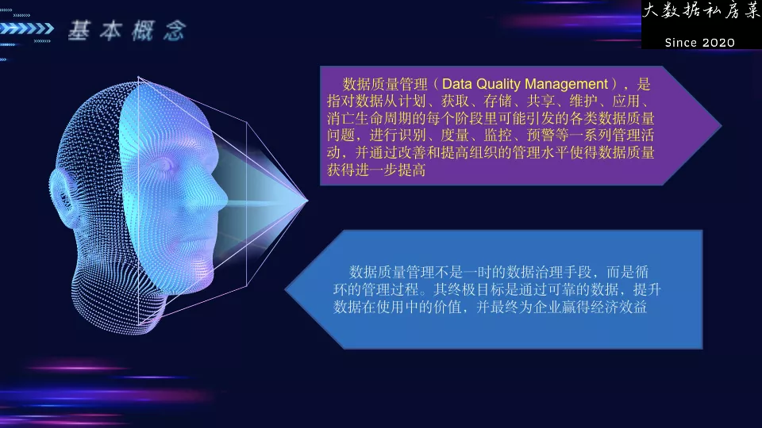

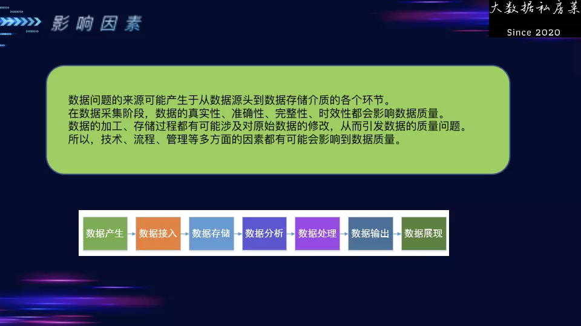

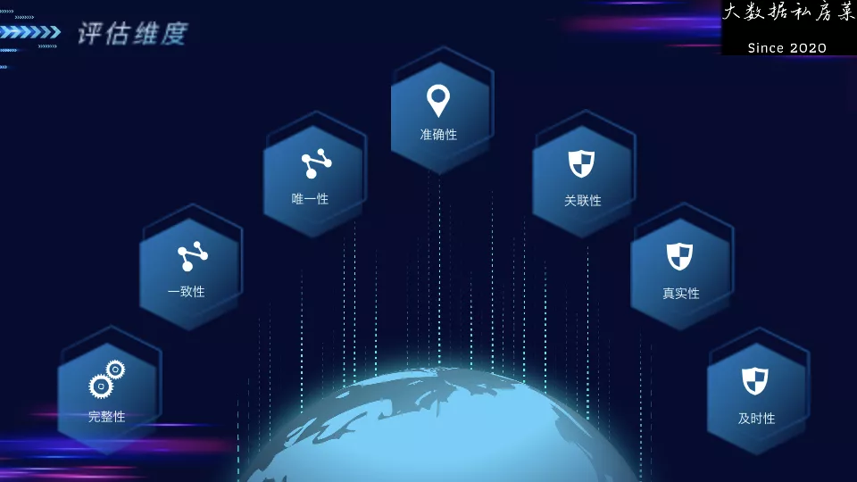

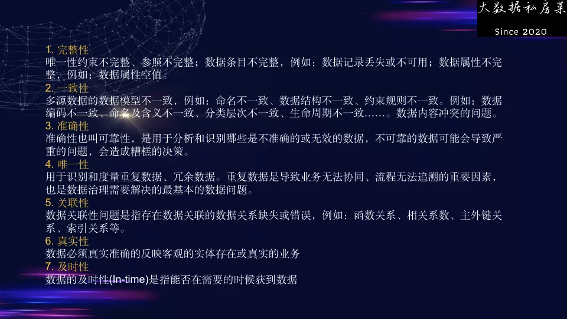

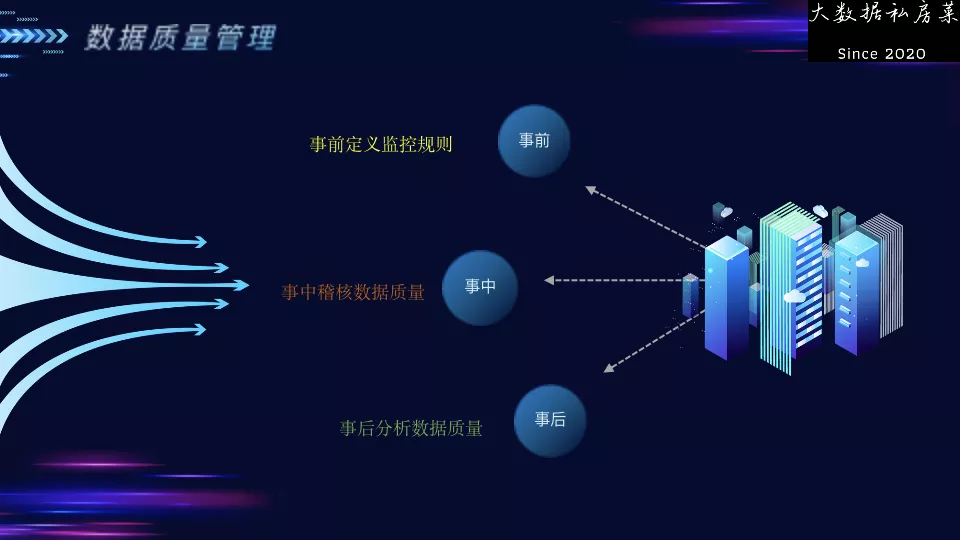

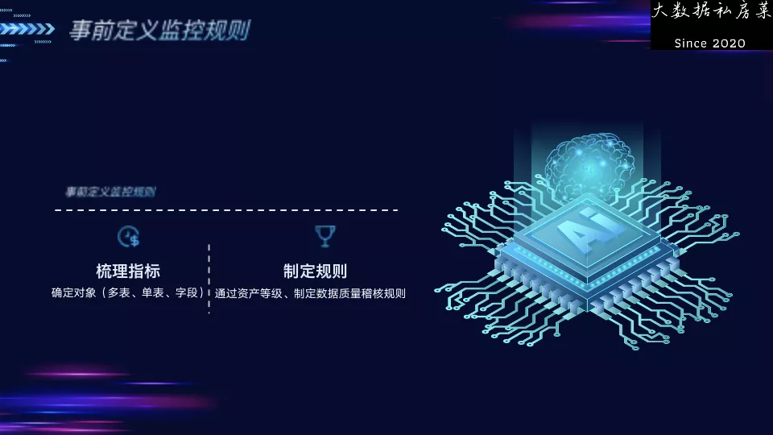

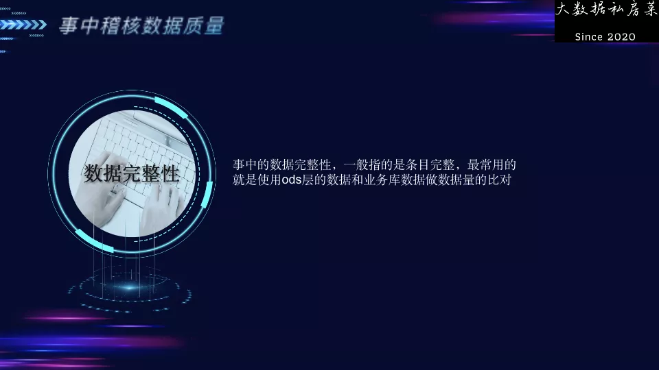

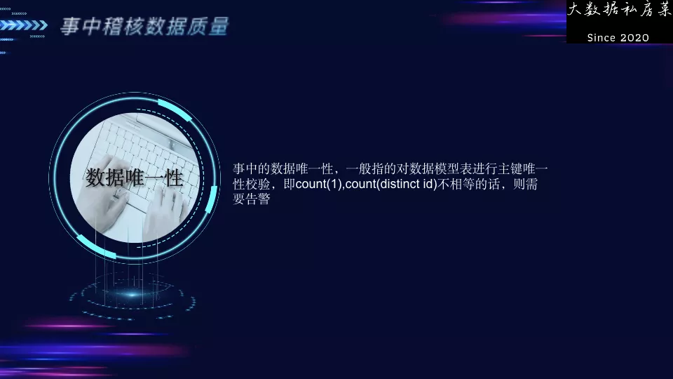

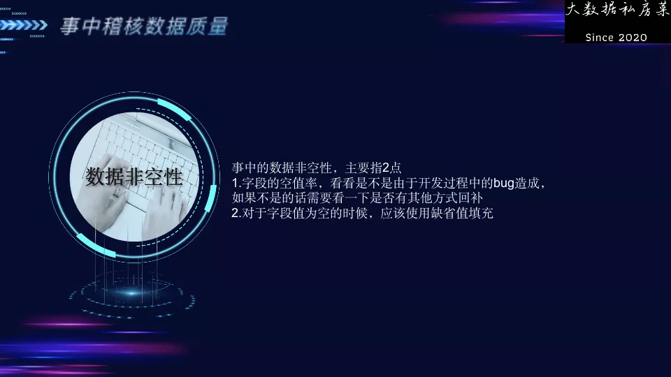

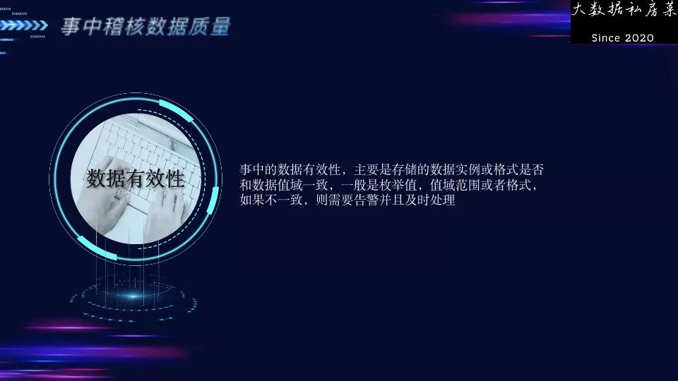

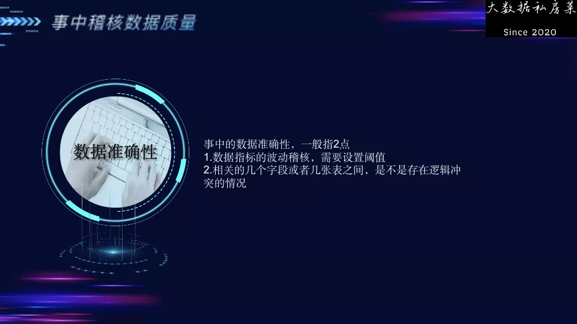

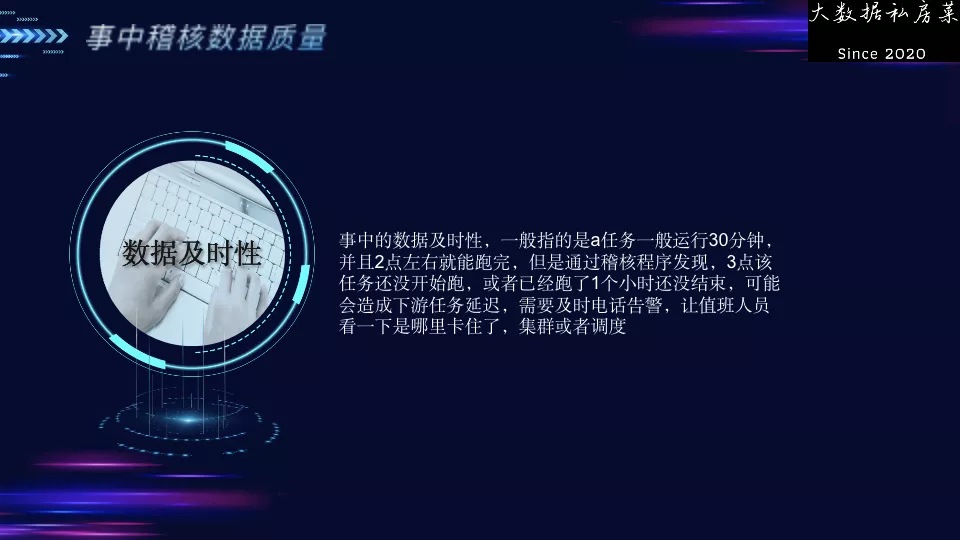

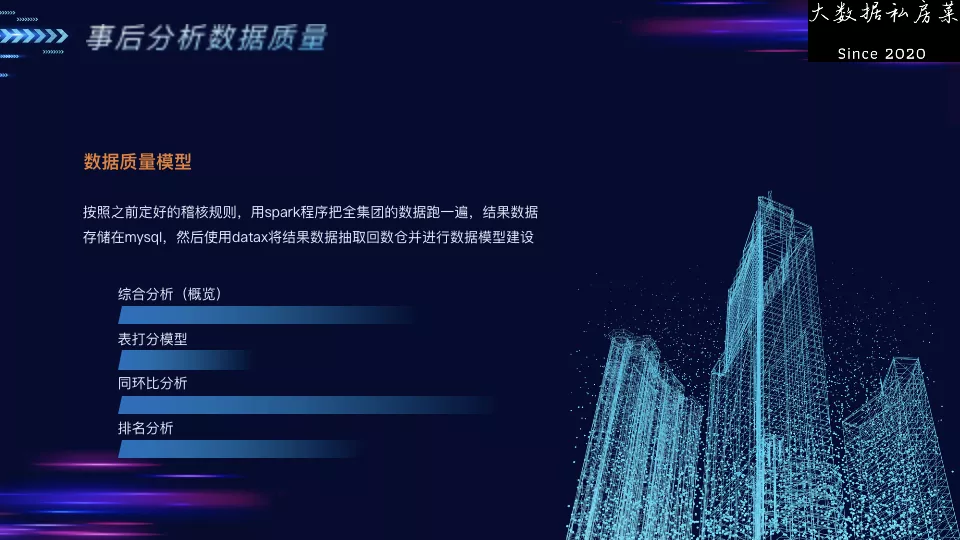

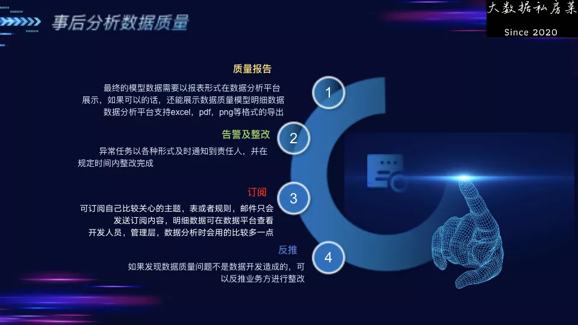

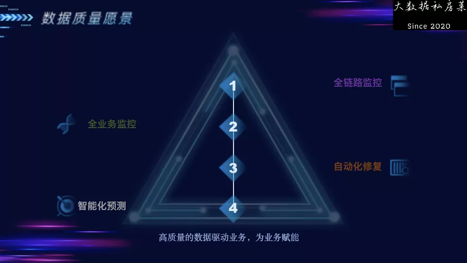

作者：大数据私房菜，进击吧大数据，美团数据专家-老徐