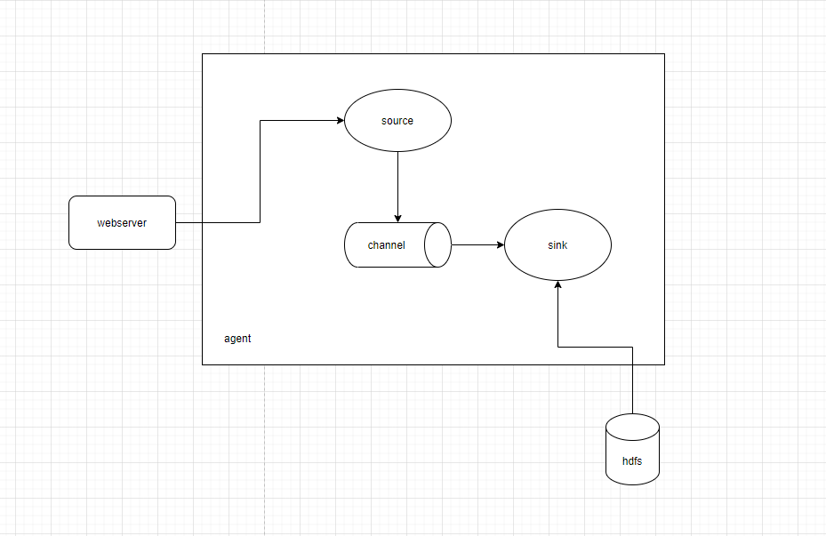
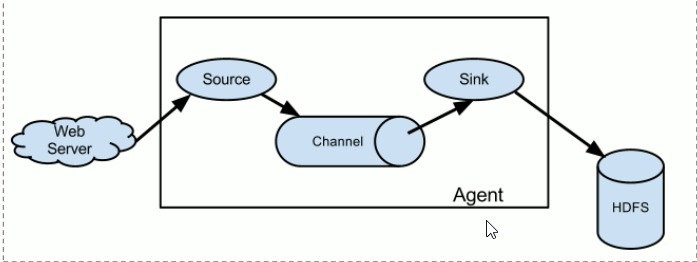
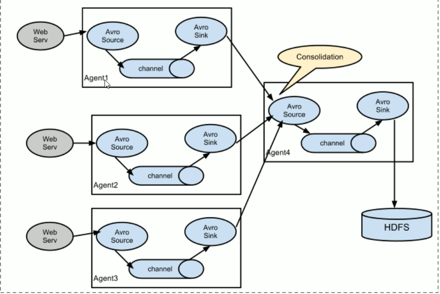
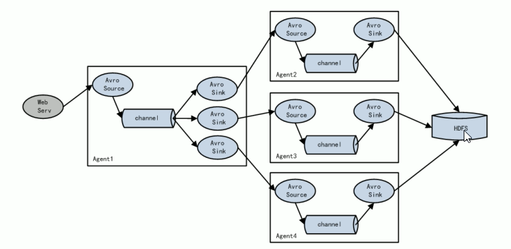
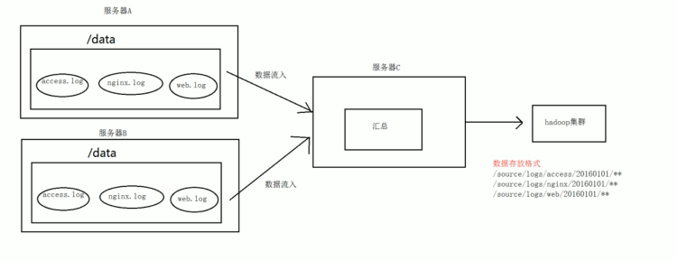
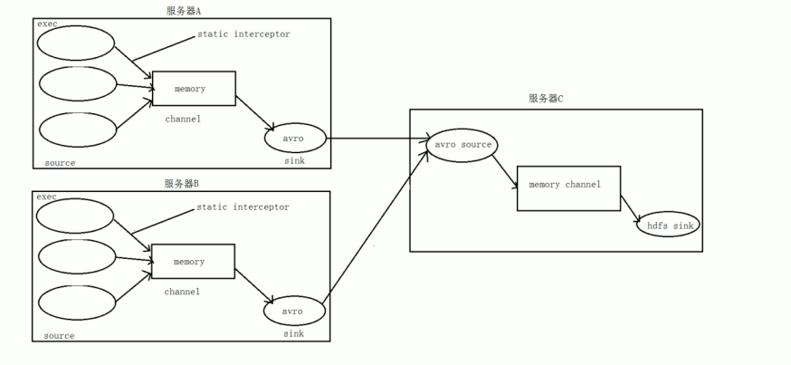

## 一、Apache Flume

### 1. 概述

>`Flume`是Cloudera提供的一个高可用、高可靠的，分布式的海量日志`采集`、`聚合`和`传输`的软件。
>
>Flume的核心是把数据从`数据源`（source）收集过来，再将收集到的数据送到指定的`目的地`（sink）。为了保证输送的过程一定成功，在送到目的地（sink）之前，会先`缓存`数据（`channel`），待数据真正到达目的地（sink）后，flume再删除自己缓存的数据。
>
>Flume支持定制各类数据发送方，用于收集各种类型的数据。同时，Flume支持定制各种数据接受方，用于最终的存储数据。一般的采集需求，通过对flume的简单配置即可实现。针对特殊场景也具备良好的自定义扩展能力。因此，flume可以适用于大部分的日常数据采集场景。
>
>当前flume有两个版本。Flume 0.9X版本的统称Flume OG（original generation）,Flume 1.X版本的统称Flume NG（next generation），由于Flume NG经过核心组件、核心配置以及代码架构重构，与Flume OG有很大的不同，使用时，需要注意区分。改动的另一原因是Flume纳入Apache旗下，Cloudera Flume 改名为Apache Flume。

> 小结：Flume是一款大数据中海量数据采集传输汇总的软件 。特别指的是数据流转的过程中，或者说是数据的搬运的过程中，把数据从一个存储介质通过Flume传递到另一个存储介质中。

### 2. 运行机制

> Flume 系统中核心的角色是`agent`,agent 本身是一个java进程，一般运行在日志收集的节点。
>
> 
>
> 每一个agent相当于一个数据传递员，内部有三个组件：
>
> <font color=#00ffff size=5>Source:</font> 采集源，用于跟数据源对接，来获取数据；
>
> <font color=#00ffff size=5>Sink:</font> 下沉地，采集数据的传送目的地，用于往下一级agent传递数据或者往最终存储系统传递数据。
>
> <font color=#00ffff size=5>Channel:</font> agent 内部的数据传输通道，用于从source将数据传递到sink；
>
> 在整个的传输的过程中，流动的是<font color=#00ffff size=5>event</font> ，它是Flume内部数据传输的最基本的单元，event将传输的数据进行封装。如果是文本文件，通常是一行记录，event也是事务的基本单位。event从source流向channel ，再到sink，本身为一个字节数组，并可携带header（头信息）信息。event 代表着一个数据的最小完整单元，从外部数据源来，向外部的目的地去。
>
> 一个完整的event包括：event header、event body 、event 信息，其中 event信息就是flume收集到的日志记录。
>
> 

### 3. Flume采集系统结构图

### 3.1 简单结构

单个agent采集数据




### 3.2 复杂结构

多级agent之间串联



> 运行机制
>
> 	- flume本身是java程序，在需要采集数据的机器上启动 --》 agent进程
> 	- agent进程包含：source sink channel
> 	- flume中，数据包装成event真实数据放到在event body中

## 二、Flume安装部署

- Flume的安装非常简单

  > 下载安装包：[flume下载](https://apache.website-solution.net/flume/1.9.0/apache-flume-1.9.0-bin.tar.gz)
  >
  > 上传安装包到数据源所在的节点上，然后解压安装包 tar -zxvf apache-flume-1.9.0-bin.tar.gz 。然后进入flume的目录，修改conf目录下的flume-env.sh文件，在里面配置JAVA_HOME
  >
  > 
  >
  > ```sh
  > chmod +x flume-env.sh
  > ```
  >
  > 

- 根据数据采集需求**配置采集方案**，描述在配置文件中（文件名可以任意自定义）

- **指定采集方案配置文件**，在相应的节点上启动flume agent


先用一个 简单的例子来测速一下程序环境是否正常

1、先在flume的conf目录下新建一个文件

```bash
vi netcat-logger.conf
```

```properties
# 定义这个agent中各个组件的名字
a1.sources = r1
a1.sinks = k1
a1.channels = c1

# 描述和配置source组件：r1
a1.sources.r1.type = netcat
a1.sources.r1.bind = localhost
a1.sources.r1.port = 44444

# 描述和配置sink组件：k1
a1.sinks.k1.type = logger

# 描述和配置channel组件，此处使用的是内存缓存的方式
a1.channels.c1.type = memory
a1.channels.c1.capacity = 1000
a1.channels.c1.transactionCapacity = 100

# 描述和配置source channel sink 之间的关系
a1.sources.r1.channels = c1
a1.sinks.k1.channel = c1

```

```sh
# 启动命令
$ bin/flume-ng agent --conf conf --conf-file conf/netcat-logger.conf --name a1 -Dflume.root.logger=INFO,console
```

## 三 、Flume简单案例

### 1. 采集目录到HDFS

采集需求：**服务器的某个特定的目录下会不断产生文件，每当有新的文件产生，就需要把文件采集到HDFS中去**

根据需求：首先定义一下三大要素

- 采集源，即source--监控文件目录：**spooldir**
- 下沉目标，即sink--HDFS文件系统：**hdfs sink**
- source 和 sink之间的传递通道--channel，可用file channel也可用内存channel

配置文件编写：

```properties
# 定义这个agent中各个组件的名字
a1.sources = r1
a1.sinks = k1
a1.channels = c1

# 描述和配置source组件：r1
# 注意：不能往监控目录中重复丢同名的文件
a1.sources.r1.type = spooldir
a1.sources.r1.spoolDir = /root/logs
a1.sources.r1.fileHeader = true

# 描述和配置sink组件：k1
a1.sinks.k1.type = hdfs
a1.sinks.k1.hdfs.path = /flume/events/%y-%m-%d/%H%M/%S
a1.sinks.k1.hdfs.filePrefix = events-
# 是否开启时间上的舍弃 控制文件夹以多少时间滚动
# 以下述为例则十分钟生成一个文件夹
a1.sinks.k1.hdfs.round = true
a1.sinks.k1.hdfs.roundValue = 10
a1.sinks.k1.hdfs.roundUnit = minute
# roll控制写入hdfs文件，以何种方式滚动
# 以时间间隔
a1.sinks.k1.hdfs.rollInterval = 3  
# 以文件大小
a1.sinks.k1.hdfs.rollSize = 20  
# 以event个数
a1.sinks.k1.hdfs.rollCount = 5
# 如果三个都配置，则谁先 满足谁触发，如果不想以某种属性滚动设置为0即可。
a1.sinks.k1.hdfs.useLocalTimeStamp = true
# 生成的文件类型，默认是Sequencefile,可用DataStream,则为普通文本
a1.sinks.k1.hdfs.fileType = DataStream
# 描述和配置channel组件，此处使用的是内存缓存的方式
a1.channels.c1.type = memory
a1.channels.c1.capacity = 1000
a1.channels.c1.transactionCapacity = 100

# 描述和配置source channel sink 之间的关系
a1.sources.r1.channels = c1
a1.sinks.k1.channel = c1
```

>**启动命令**
>
>bin/flume-ng agent --c  ./conf  --f conf/netcat-logger.conf --name a1 -Dflume.root.logger=INFO,console
>
>→ spooldir source
>
>- 注意其监控的文件夹下不能有同名的文件的产生
>- 如果有报错且罢工，后续就不在进行数据的监控采集了
>- 在企业中通常给文件追加时间戳命名的方式保证文件不会重命名。

### 2. 采集文件到HDFS

采集需求：**比如业务系统中使用log4j生成日志，日志内容不断增加，需要把追加到日志文件中数据实时采集到hdfs**


根据需求，首先定义3大要素：

- 采集源，即source -- 监控文件内容更新：exec 'tail -f file'
- 下沉目标，即 sink --HDFS文件系统： hdfs sink
- source 和 sink 之间的传递通道 -- channel，可用 file channel 也可用内存channel

配置文件

```properties
# 定义这个agent中各个组件的名字
a1.sources = r1
a1.sinks = k1
a1.channels = c1

# 描述和配置source组件：r1
# 注意：不能往监控目录中重复丢同名的文件
a1.sources.r1.type = exec
a1.sources.r1.command = tail -f /root/logs/test/log
a1.sources.r1.channels = c1

# 描述和配置sink组件：k1
a1.sinks.k1.type = hdfs
a1.sinks.k1.hdfs.path = /flume/events/%y-%m-%d/%H%M/%S
a1.sinks.k1.hdfs.filePrefix = events-
# 是否开启时间上的舍弃 控制文件夹以多少时间滚动
# 以下述为例则十分钟生成一个文件夹
a1.sinks.k1.hdfs.round = true
a1.sinks.k1.hdfs.roundValue = 10
a1.sinks.k1.hdfs.roundUnit = minute
# roll控制写入hdfs文件，以何种方式滚动
# 以时间间隔
a1.sinks.k1.hdfs.rollInterval = 3  
# 以文件大小
a1.sinks.k1.hdfs.rollSize = 20  
# 以event个数
a1.sinks.k1.hdfs.rollCount = 5
# 如果三个都配置，则谁先 满足谁触发，如果不想以某种属性滚动设置为0即可。
a1.sinks.k1.hdfs.useLocalTimeStamp = true
# 生成的文件类型，默认是Sequencefile,可用DataStream,则为普通文本
a1.sinks.k1.hdfs.fileType = DataStream
# 描述和配置channel组件，此处使用的是内存缓存的方式
a1.channels.c1.type = memory
a1.channels.c1.capacity = 1000
a1.channels.c1.transactionCapacity = 100

# 描述和配置source channel sink 之间的关系
a1.sources.r1.channels = c1
a1.sinks.k1.channel = c1
```

```shell
# 模拟数据生成到文件中
while true; do date >> /root/logs/test.log; done
```


##  四、Flume的load-balance、failover

### 1. 负载均衡

负载均衡是用于解决一台机器（一个进程）无法解决所有请求而产生的一种算法。<font color=#00ffff size = 5 > Load balancing Sink Processor </font> 能够实现load balance 功能，如下图Agent1是一个路由节点。负责将Channel暂存的Event均衡到多个Sink组件上，而每个Sink组件分别连接到一个独立的Agent上，示例配置，如下图所示：



- flume的负载均衡
  - 所谓负载均衡用于解决一个进程或者程序处理不了所有的请求多个进程一起处理的场景
  - 同一个请求只能交个一个进行处理，避免数据重复
  - 如何分配请求就涉及到了负载均衡算法：轮询 （round_robin），随机（random），权重

```properties
a1.sinkgroups = g1
a1.sinkgroups.sinks = k1 k2 k3
a1.sinkgroups.g1.processor.type = load_balance
# 如果开启，则将失败的sink 放入黑名单
a1.sinkgroups.g1.processor.backoff = true
# 另外还支持random
a1.sinkgroups.g1.processor.selector = round_robin
# 在黑名单放置的超时时间，超时结束时，若仍然无法接收，则超时时间呈指数增长
a1.sinkgroups.g1.processor.selector.maxTimeOut = 10000
```

- flume 串联跨网络传输数据
  - avro sink
  - avro source
  - 使用上述两个组件指定绑定的端口ip就可以满足数据跨网络的传递，通常用于flume串联架构中

配置文件 vim exec-avro.conf

```properties
#agent1 name
agent1.sources = r1
agent1.channels = c1
agent1.sinks = k1 k2

# set group
agent1.sinkgroups = g1

# set channel
agent1.channels.c1.type = memory
agent1.channels.c1.capacity = 1000
agent1.channels.c1.transactionCapacity = 100

agent1.sources.r1.type = exec
agent1.sources.r1.command = tail -f /root/logs/test/log
agent1.sources.r1.channels = c1

# set sink1
agent1.sink.k1.channel = c1
agent1.sink.k1.type = avro
agent1.sink.k1.hostname = node-02
agent1.sink.k1.port = 52020

# set sink1=2
agent1.sink.k2.channel = c1
agent1.sink.k2.type = avro
agent1.sink.k2.hostname = node-03
agent1.sink.k2.port = 52020

# set sink group
agent1.sinkgrooups.g1.sinks = k1 k2

#set load_balance
agent1.sinkgroups.g1.processor.type = load_balance
# 如果开启，则将失败的sink 放入黑名单
agent1.sinkgroups.g1.processor.backoff = true
# 另外还支持random
agent1.sinkgroups.g1.processor.selector = round_robin
# 在黑名单放置的超时时间，超时结束时，若仍然无法接收，则超时时间呈指数增长
agent1.sinkgroups.g1.processor.selector.maxTimeOut = 10000
```

node-02机器执行： vim avro-logger.conf

```properties
# 定义这个agent中各个组件的名字
a1.sources = r1
a1.sinks = k1
a1.channels = c1

# 描述和配置source组件：r1
# 注意：不能往监控目录中重复丢同名的文件
a1.sources.r1.type = avro
a1.sources.r1.bind = node-02
a1.sources.r1.port = 52020
a1.sources.r1.channels = c1

# 描述和配置sink组件：k1
a1.sinks.k1.type = logger

# 描述和配置channel组件，此处使用的是内存缓存的方式
a1.channels.c1.type = memory
a1.channels.c1.capacity = 1000
a1.channels.c1.transactionCapacity = 100

# 描述和配置source channel sink 之间的关系
a1.sources.r1.channels = c1
a1.sinks.k1.channel = c1
```

node-03机器执行： vim avro-loggr.conf

```properties
# 定义这个agent中各个组件的名字
a1.sources = r1
a1.sinks = k1
a1.channels = c1

# 描述和配置source组件：r1
# 注意：不能往监控目录中重复丢同名的文件
a1.sources.r1.type = avro
a1.sources.r1.bind = node-03
a1.sources.r1.port = 52020
a1.sources.r1.channels = c1

# 描述和配置sink组件：k1
a1.sinks.k1.type = logger

# 描述和配置channel组件，此处使用的是内存缓存的方式
a1.channels.c1.type = memory
a1.channels.c1.capacity = 1000
a1.channels.c1.transactionCapacity = 100

# 描述和配置source channel sink 之间的关系
a1.sources.r1.channels = c1
a1.sinks.k1.channel = c1
```

- flume串联启动，通常从远离数据源的一端先启动


### 2. 容错机制

<font color = #00ffff size = 5 >Failover Sink Processor</font> 能够实现failover功能，具体流程类似load balance，但是内部的处理机制与 load balance完全不同。

Failover Sink Processor维护一个优先级Sink组件列表，只要有一个Sink组件可用，Event就会传递到下一个组件。故障转移机制的作用是将`失败的Sink`降级到一个池，在这些池中他们被分配一个冷却的时间，随着故障的连续，在重试之前冷却时间增加。一旦sink成功发送一个事件，它将恢复到活动池。Sink具有与之前相关的优先级，数量越大，优先级越高。

例如，具有优先级为100的sink在优先级为80的sink之前激活。如果在发送事件时失败，则接下来将尝试下一个具有最高优先级的sink发送事件。如果没有指定优先级，则根据在配置中指定sink的顺序来确定优先级。

示例配置：

```properties
a1.sinkgroups = g1
a1.sinkgroups.g1.sinks = k1 k2 k3
a1.sinkgroups.g1.processor.type = failover
#优先级值，绝对值越大表示优先级越高
a1.sinkgroups.g1.processor.priority.k1 = 5
a1.sinkgroups.g1.processor.priority.k2 = 6
a1.sinkgroups.g1.processor.priority.k3 = 7

#失败的sink的最大的回退期（millis）
a1.sinkgroups.g1.processor.maxpenalty = 2000
```

- flume failover
  - 容错有称之为故障转移，容忍错误发生
  - 通常用于解决单点故障给容易出故障的地方设置备份
  - 可以设置多个故障容错，但也意味着消耗资源更多

配置文件 vim exec-avro.conf

```properties
#agent1 name
agent1.sources = r1
agent1.channels = c1
agent1.sinks = k1 k2

# set group
agent1.sinkgroups = g1

# set channel
agent1.channels.c1.type = memory
agent1.channels.c1.capacity = 1000
agent1.channels.c1.transactionCapacity = 100

agent1.sources.r1.type = exec
agent1.sources.r1.command = tail -f /root/logs/test/log
agent1.sources.r1.channels = c1

# set sink1
agent1.sink.k1.channel = c1
agent1.sink.k1.type = avro
agent1.sink.k1.hostname = node-02
agent1.sink.k1.port = 52020

# set sink1=2
agent1.sink.k2.channel = c1
agent1.sink.k2.type = avro
agent1.sink.k2.hostname = node-03
agent1.sink.k2.port = 52020

# set sink group
agent1.sinkgrooups.g1.sinks = k1 k2

#set failover
agent1.sinkgroups.g1.processor.type = failover
agent1.sinkgroups.g1.processor.priority.k1 = 10
agent1.sinkgroups.g1.processor.priority.k2 = 1
agent1.sinkgroups.g1.processor.maxpenalty = 10000


```


node-02机器执行： vim avro-logger.conf

```properties
# 定义这个agent中各个组件的名字
a1.sources = r1
a1.sinks = k1
a1.channels = c1

# 描述和配置source组件：r1
# 注意：不能往监控目录中重复丢同名的文件
a1.sources.r1.type = avro
a1.sources.r1.bind = node-02
a1.sources.r1.port = 52020
a1.sources.r1.channels = c1

# 描述和配置sink组件：k1
a1.sinks.k1.type = logger

# 描述和配置channel组件，此处使用的是内存缓存的方式
a1.channels.c1.type = memory
a1.channels.c1.capacity = 1000
a1.channels.c1.transactionCapacity = 100

# 描述和配置source channel sink 之间的关系
a1.sources.r1.channels = c1
a1.sinks.k1.channel = c1
```

node-03机器执行： vim avro-loggr.conf

```properties
# 定义这个agent中各个组件的名字
a1.sources = r1
a1.sinks = k1
a1.channels = c1

# 描述和配置source组件：r1
# 注意：不能往监控目录中重复丢同名的文件
a1.sources.r1.type = avro
a1.sources.r1.bind = node-03
a1.sources.r1.port = 52020
a1.sources.r1.channels = c1

# 描述和配置sink组件：k1
a1.sinks.k1.type = logger

# 描述和配置channel组件，此处使用的是内存缓存的方式
a1.channels.c1.type = memory
a1.channels.c1.capacity = 1000
a1.channels.c1.transactionCapacity = 100

# 描述和配置source channel sink 之间的关系
a1.sources.r1.channels = c1
a1.sinks.k1.channel = c1
```


## 五、Flume拦截器实站案例

### 1. 日志的采集和汇总

#### 1.1 案例场景

A，B两台日志服务器实时产生日志主要类型为access.log、nginx.log、web.log

**现在要求**

​	把A,B机器中的access.log、nginx.log 、web.log 采集汇总到C机器上去，然后统一收集到hdfs中。

但是hdfs中的要求的目录为：

/source/logs/access/20201213/**

/source/logs/nginx/20201213/**

/source/logs/web/20201213/**


#### 1.2 场景分析



#### 1.3 数据处理分析流程 



#### 1.4 功能实现

配置文件 exec_source_avro_sink.conf

```properties
# 定义这个agent中各个组件的名字
a1.sources = r1 r2 r3
a1.sinks = k1
a1.channels = c1

# 描述和配置source组件：r1
a1.sources.r1.type = exec
a1.sources.r1.command = tail -f /home/hadooop/logs/acccess.log
a1.sources.r1.interceptors = i1
a1.sources.r1.interceptors.i1.type = static
a1.sources.r1.interceptors.i1.key = type
a1.sources.r1.interceptors.i1.value = access

a1.sources.r2.type = exec
a1.sources.r2.command = tail -f /home/hadooop/logs/web.log
a1.sources.r2.interceptors = i2
a1.sources.r2.interceptors.i2.type = static
a1.sources.r2.interceptors.i2.key = type
a1.sources.r2.interceptors.i2.value = web

a1.sources.r3.type = exec
a1.sources.r3.command = tail -f /home/hadooop/logs/nginx.log
a1.sources.r3.interceptors = i3
a1.sources.r3.interceptors.i3.type = static
a1.sources.r3.interceptors.i3.key = type
a1.sources.r3.interceptors.i3.value = nginx


a1.sink.k1.type = avro
a1.sink.k1.hostname = node-02
a1.sink.k1.port = 41414


# 描述和配置channel组件，此处使用的是内存缓存的方式
a1.channels.c1.type = memory
a1.channels.c1.capacity = 1000
a1.channels.c1.transactionCapacity = 100

# 描述和配置source channel sink 之间的关系
a1.sources.r1.channels = c1
a1.sources.r2.channels = c1
a1.sources.r3.channels = c1
a1.sinks.k1.channel = c1
```

二级配置文件 avro_source_hdfs.conf

```properties
# 定义这个agent中各个组件的名字
a1.sources = r1 
a1.sinks = k1
a1.channels = c1

# 描述和配置source组件：r1
a1.sources.r1.type = avro
a1.sources.r1.bind = node-02
a1.sources.r1.port = 41414

#添加时间拦截器
a1.sources.r1.interceptors = i1
a1.sources.r1.interceptors.i1.type = org.apache.flume.interceptor.TimestampInterceptor$Builder


# 描述和配置channel组件，此处使用的是内存缓存的方式
a1.channels.c1.type = memory
a1.channels.c1.capacity = 1000
a1.channels.c1.transactionCapacity = 100

#定义sink
a1.sinks.k1.type = hdfs
a1.sinks.k1.hdfs.path = hdfs://node-02:9000/source/logs/%{type}/%Y%m%d
a1.sinks.k1.hdfs.filePrefix = events
a1.sinks.k1.hdfs.useLocalTimeStamp = true
a1.sinks.k1.hdfs.fileType = DataStream
a1.sinks.k1.hdfs.writeFormat = Text
a1.sinks.k1.hdfs.round = true
a1.sinks.k1.hdfs.roundValue = 10
a1.sinks.k1.hdfs.roundUnit = minute
a1.sinks.k1.hdfs.rollInterval = 3  
a1.sinks.k1.hdfs.rollSize = 20  
a1.sinks.k1.hdfs.rollCount = 5

# 描述和配置source channel sink 之间的关系
a1.sources.r1.channels = c1
a1.sources.r2.channels = c1
a1.sources.r3.channels = c1
a1.sinks.k1.channel = c1
```

### 2. Flume 自定义拦截器

#### 2.1 案例背景介绍

Flume 是Cloudera提供的一个高可用的，高可靠的，分布式的海量日志采集、聚合传输的系统，Flume支持在日志系统中定制各类数据发送方，用于收集数据；同时，Flume提供了对数据的简单处理，并写入到各种数据接受方（可定制）的能力。Flume有各种自带的拦截器，比如：TimestampInterceptor、HostInterceptor、RegexExtractorInterceptor等，通过使用不同的拦截器，实现不同的功能。但是以上的这些个拦截器，不能改变原有的日志数据的内容或者对日志信息添加一定的处理逻辑，当一条日志信息有几十个甚至上百个字段的时候，在传统的Flume处理下，收集到的日志还是会对应这么多的字段，也不能对想要的字段进行相应的处理。

#### 2.2 自定义拦截器

根据实际业务需求，为了更好的满足数据在应用层的处理，通过自定义Flume拦截器，过滤掉不需要的字段，并对指定的字段加密处理，将源数据进行预处理。减少数据传输的量，降低了存储的开销。


#### 2.3 功能实现

本技术方案核心包括两个部分：

① 编写拦截器，打包传入到lib目录下

② 与其他的配置一样


配置文件

```properties
a1.sources.r1.interceptors = i1 i2
a1.sources.r1.interceptors.i1.type = cn.itcast.interceptor.CustomParameterInterceptor$Builder
a1.sources.r1.interceptors.i1.field_separator = \\u0009
```


## 六 、Flume高阶自定义组件

### 1. 自定义source （扩展）

#### 1.1 说明:

自定义source中有一种类型叫做PollableSource。底层是通过线程不断去调用process方法，主动拉取消息，在利用PollableSource实现自定义Source时还需要Configurable接口，以便在项目中初始化某些配置。

具体需求如下：实时监控Myssql，从Mysql中获取数据传输到HDFS或者其他存储框架。

#### 1.2 原理

根据官方说明自定义source组件需要继承AbstractSource类并实现Configurable 和 PollableSource接口，并实现相应的方法：

<font color=red size = 5>configure(Context context)</font>

初始化context

<font color=red size = 5>process()</font>

获取数据（从mysql 获取数据，业务处理比较复杂，所以定义一个专门的类-- QueryMysql 来处理跟mysql的交互），封装成event并写入channel，这个方法被循环调用。


###  2. 自定义Sink（扩展）

#### 2.1 说明

需求：从网络端口接受数据，自定义sink，保存到本地

#### 2.2 原理

根据官方说明自定义sink组件需要继承AbstractSink类并实现Configurable 和 PollableSource接口，并实现相应的方法：

<font color=red size = 5>configure(Context context)</font>

初始化context

<font color=red size = 5>process()</font>


